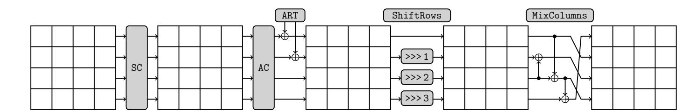
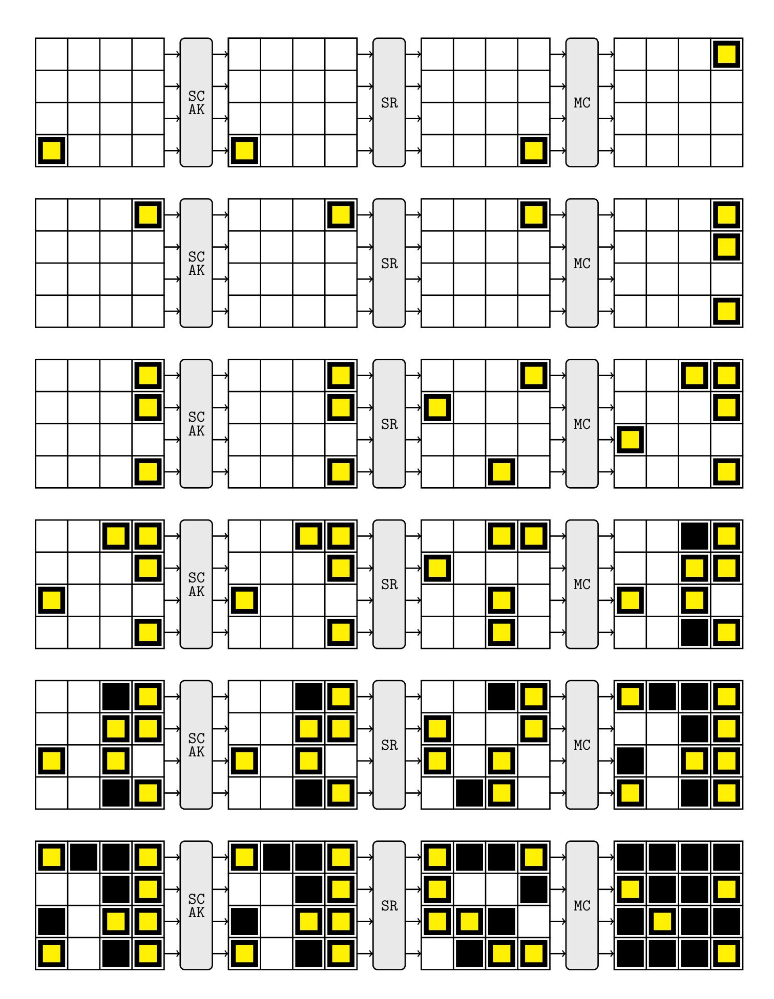
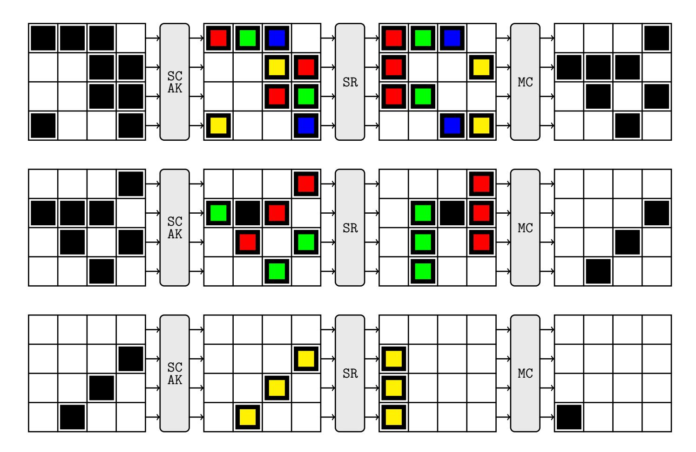
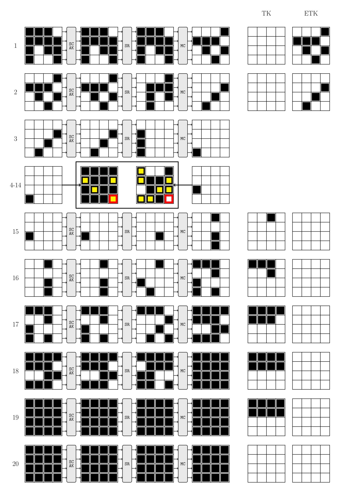

{0}------------------------------------------------

# Single Tweakey Cryptanalysis of Reduced-Round SKINNY-64

Orr Dunkelman1, Senyang Huang1, Eran Lambooij1, and Stav Perle2

1 University of Haifa, Israel orrd@cs.haifa.ac.il eranlambooij@gmail.com
2 Technion, Israel

**Abstract.** SKINNY is a lightweight tweakable block cipher which received a great deal of cryptanalytic attention following its elegant structure and efficiency. Inspired by the SKINNY competitions, multiple attacks on it were reported in different settings (e.g. single vs. related-tweakey) using different techniques (impossible differentials, meet-in-the-middle, etc.). In this paper we revisit some of these attacks, identify issues with several of them, and offer a series of improved attacks which were experimentally verified. Our best attack can attack up to 18 rounds using  $2^{60}$  chosen ciphertexts data,  $2^{116}$  time, and  $2^{112}$  memory.

### 1 Introduction

Since lightweight cryptography gained academic interest in the early 2000's, many different block ciphers have been proposed. In parallel, the cryptographic community has slowly reached the understanding that "just" block ciphers are not always suitable or offer somewhat inferior solution, e.g., in the context of authenticated encryption. Hence, solutions such as tweakable block ciphers were introduced [9]. Obviously, with the need for lightweight cryptography, the need for lightweight tweakable block ciphers grew. SKINNY [4] is a lightweight tweakable block cipher using the tweakey framework [7]. SKINNY also lies in the basis of three of the submissions to the lightweight cryptography competition held by NIST (US National Institute of Standards and Technology), namely ForkAE [1], Romulus [6], and Skinny-AEAD [5].

This paper contains two main contributions: The paper first looks at extending truncated differential distinguishers of SKINNY by looking at the bias of the differences. Namely, we show that one can extend the probability 1 6-round truncated differential used before in [14] into a longer truncated differential. However, the new truncated differential has a lower probability, and instead of predicting the difference in some specific nibble, we predict its bias from random (in our case, the bias from 1/16). We show that this bias can be observed after 7-, 8-, and even 9-rounds of SKINNY, where some nibbles are biased towards zero. This results in attacks on up to 15-round SKINNY-64-128 in time  $2^{104}$  and data  $2^{33}$ .

Our second contribution is to revisit previous impossible differential attacks against SKINNY. We show that some of these attacks had subtle flaws in them,

{1}------------------------------------------------

which invalidate the attack. We then set to fix the attacks, which in turn reduce their number of rounds and increases their time and data complexity. The resulting attack is against 18-round SKINNY-64-128 in time  $2^{116}$  and data  $2^{60}$  chosen plaintexts.

#### 1.1 Related work

Besides being an interesting target of its own accord, the designers of SKINNY organized several cryptanalysis competitions to further inspire its analysis. This effort led to several papers focusing on the cryptanalysis of SKINNY.

Single Tweakey analysis For the case of single-tweakey model, a series of impossible differential attacks (against 18-round SKINNY-n-n, 20-round SKINNY-n-n) based on an 11-round impossible differential distinguisher is presented in [14]. As we later show in Section 5, these attacks contain some flaw that increases their complexity and reduces the number of affected rounds. An additional impossible differential attack in the single-tweakey setting is presented against 17-round SKINNY-n-n and 19-round SKINNY-n-n in [16]. In addition to this, [12] presents zero-correlation linear attacks against 14-round SKINNY-64-64 and 18-round SKINNY-64-128 in the single-tweakey model.

Related Tweakey analysis An impossible differential attack against 19-round SKINNY-n-n, 23-round SKINNY-n-2n and 27-round SKINNY-n-3n in the related-tweakey model is presented in [10]. In addition, this paper presents several rectangle attacks against 27-round SKINNY-n-3n in the related-tweakey model. Improved impossible differential attacks against these variants in the related-tweakey model are presented in [12]. Zero-correlation attacks in the related-tweakey settings are presented against 20-round SKINNY-64-64 and 23-round SKINNY-64-192 in [3].

Another impossible differential attack in the related-tweakey settings is described in [2] targeting 21-rounds of SKINNY-64-128. Furthermore, this attack is extended to 22-round and 23-round SKINNY-64-128 in the related-tweakey model. These results use the assumption that certain tweakey bits are public. Another related-tweak impossible differential attack is presented in [13]: an 18-round SKINNY-64-64 in the related-tweakey model, which can be transformed to an attack against 18-round SKINNY-64-128 in the related-tweakey model, with 96-bit secret key and 32-bit tweak.

A new automatic search tool for truncated differential characteristics using Mixed Integer Linear Programming is presented in [11]. This paper presents 8-round truncated differential characteristics with bias  $2^{-8}$ , 9-round truncated differential characteristics with bias  $2^{-20}$  and 10-round truncated differential characteristics with bias  $2^{-40}$ .

Table 1 summarizes all previously published attacks against SKINNY-64-64 and SKINNY-64-128.

{2}------------------------------------------------

|            |                                      | Complexity |              |             |             |         |  |  |
|------------|--------------------------------------|------------|--------------|-------------|-------------|---------|--|--|
| Key (bits) | Attack                               | Rounds     | Time         | Data        | Memory      | Source  |  |  |
| 64         | Zero-correlation                     | 14         | $2^{62}$     | $2^{62.58}$ | $2^{64}$    | [12]    |  |  |
| 64         | Impossible differential              | 17         | $2^{61.8}$   | $2^{59.5}$  | $2^{49.6}$  | [16]    |  |  |
| 64         | Impossible differential $^{\dagger}$ | 18         | $2^{57.1}$   | $2^{47.52}$ | $2^{58.52}$ | [14]    |  |  |
| 128        | Zero-correlation                     | 18         | $2^{126}$    | $2^{62.68}$ | $2^{64}$    | [12]    |  |  |
| 128        | Impossible differential              | 18         | $2^{116}$    | $2^{60}$    | $2^{112}$   | Sec 5.2 |  |  |
| 128        | Impossible differential              | 19         | $2^{119.8}$  | 4           | $2^{110}$   | [16]    |  |  |
| 128        | Impossible differential $^{\dagger}$ | 20         | $2^{121.08}$ | $2^{47.69}$ | $2^{74.69}$ | [14]    |  |  |

&lt;sup>†— As we show in Sect. 5, the attack is flawed.

Table 1. Complexity of Single-tweakey Attacks Against SKINNY-64

#### 1.2 Organization

This paper is organized as follows: In Section 2 we briefly reiterate the specification of SKINNY. After that the proposed distinguishers are described, discussing both the construction of the differential distinguisher (Section 3) and the extension to biased differential distinguishers (Section 4). In Section 4.4 we use the previously described distinguishers to construct key recovery attacks. Section 5, contains a discussion of a previous impossible differential analysis of SKINNY, which is fixed in Section 5.2, and improved upon in Section 5.3. Finally, Section 6 summarizes this paper.

### 2 Specification of SKINNY

SKINNY is a family of lightweight tweakable block ciphers using a substitution-permutation network (SPN) structure. The variants of SKINNY are denoted by SKINNY-n-t, where n represents the block size ( $n \in \{64, 128\}$ ) and t represents the tweakey size ( $t \in \{n, 2n, 3n\}$ ). Namely, the six variants of SKINNY are SKINNY-64-64, SKINNY-64-128, SKINNY-64-192, SKINNY-128-128, SKINNY-128-256, and SKINNY-128-384 with 32, 36, 40, 40, 48 and 56 rounds, respectively. Both the 64-bit and 128-bit internal states are represented as an array of  $4 \times 4$  cells. The first row contains nibbles 0 to 3 (where 0 is the leftmost nibble, 3 is the rightmost nibble), the second row contains nibbles 4 to 7, etc. The cell is a nibble in case of 64-bit version and a byte in case of 128-bit version. There are 5 operations in each round (depicted in Figure 1):

- 1. SubCells (SC): The non-linear layer applies an  $\ell$ -bit S-box on each cell, where  $\ell \in \{4,8\}$ .
- 2. AddConstants (AC): This step XOR's three cells of round constants to the most significant three cells of the internal state.
- 3. AddRoundTweakey (ART): In this step, the tweakey bits are XORed to the first two lines of the internal state.

{3}------------------------------------------------

4 Orr Dunkelman, Senyang Huang, Eran Lambooij, and Stav Perle

Fig. 1. The SKINNY round function.

- 4. ShiftRows (SR): The second, third, and fourth rows of the internal state are right-rotated by 1 cell, 2 cells, and 3 cells, respectively.
- 5. MixColumns (MC): Each column of the internal state is multiplied by the following binary matrix:

$$M = \begin{bmatrix} 1 & 0 & 1 & 0 \\ 1 & 0 & 0 & 0 \\ 0 & 1 & 1 & 0 \\ 1 & 0 & 1 & 0 \end{bmatrix} \tag{1}$$

We omit the tweakey schedule as this is not used in our attacks, and refer the interested reader to [4].

## 3 Differential Distinguisher

The attacks in this paper are built using extensions of the 6-round truncated differential characteristic used in [14]. The characteristic is depicted in Figure 2. The colored nibbles depict non-zero differences in the differential characteristic, while the black nibbles signify unknown differences. The distinguisher starts with a single active nibble, nibble 12, which after six rounds leads to four nibbles: 4, 7, 9, and 15, that necessarily have a non-zero difference. The distinguisher can be rotated row-wise, e.g., if we take nibble 13 to be active, after six rounds nibbles: 4, 5, 10, 12, are non-zero, etc.

The six-round characteristic can be extended by one, two, or three rounds by the use of structures at the beginning of the characteristic (see Figure 3). This technique can also be used in the distinguishers discussed in Section 4. Extending by one round does not incur any cost with respect to the data and time complexity since the SC layer is before the key addition. The two and three round extension respectively increase the data complexity by  $2^8$  and  $2^{20}$  with respect to the non extended distinguisher. The time complexity is increased by  $2^4$  and  $2^{20}$  due to the added key guessing needed.

#### 3.1 Key recovery attack

The first attack that we look at is a 10-round attack using the basic 6-round distinguisher. As can be seen in Figure 2: if we have an input difference with one active nibble, i.e. nibble 12, the output difference after 6 rounds in nibbles 4, 7, 9, and 15 are necessarily non-zero. This distinguisher can be transformed

{4}------------------------------------------------

Fig. 2. The basic six round differential. White cells are zero differences, colored cells are non-zero differences and black cells have unknown differences.

{5}------------------------------------------------

Fig. 3. Extending the characteristics by one, two, or three rounds. Before the main differential distinguisher [\(Figure 2\)](#page-4-0).

into an impossible differential attack. We can filter out wrong keys by partially decrypting the ciphertext, such that we recover the difference in one of these (necessarily non-zero) nibbles, and discard the key if we find a pair for which the difference in one of these nibbles is 0. On average we need to test 24 pairs to discard a key. Nevertheless, to filter out all but the correct key, with high probability, we need more data. The probability that a wrong key passes the filter is 1−2 −4 , thus the probability that a wrong key passes x filters is (1−2 −4 ) x . Given 2k candidate keys, we get the following equation:

$$(1 - 2^{-4})^x = 2^{-k} (2)$$

Giving,

$$x = \frac{k \log(2)}{\log(1 - 2^{-4})}. (3)$$

For k = 128 we get: x ≈ 1374 ≈ 2 10.4 , which is the maximum amount of data needed to mount this attack. Note that this is an upper bound on the amount of data needed. If the number of possible keys is smaller the amount of data can also be smaller, but to simplify the analysis we chose to keep the amount of data needed constant as it does not affect the time complexities of the attacks.

We denote a difference in the i-th nibble by ∆i . Using this 6-round distinguisher ∆12 → ∆15 we construct a 10-round attack with four rounds of key recovery, for which we need to guess 6 nibbles (=6 · 4 bits) of key material. This 

{6}------------------------------------------------

results in an attack which uses  $2^{6\cdot 4+4}=2^{28}$  4-round decryptions and

$$\frac{24 \cdot \log(2)}{\log(1 - 2^{-4})} \approx 258 \approx 2^8$$

data, and 28 memory to store the data. Analogous to this we can construct the other attacks using the 6-round distinguisher. Note that in this instance we computed the exact amount of data needed for the attack to succeed, in the summary given in Table 6 we took the maximum amount of data for the attacks of this form, due to the small difference in complexity.

## 4 A Biased Differential Distinguisher

The attack described in Section 4.4 is based on the observation that after seven rounds, in some nibbles of the state, the probability that the nibble difference is 0 is larger or smaller than  $2^{-4}$ , i.e., it is biased with respect to the random case. We first show how to efficiently compute the bias of a difference in a state nibble after r rounds. Then, we list the computed biases after seven and eight rounds in Table 2 and Table 3, respectively. Afterwards, we show the results of our experiments that confirm the existence of the bias in the output difference. It is worth noting that in many cases, the observed bias is higher than expected. In other words, the analysis offers evaluation of explainable attacks (and suggests a "worst-case" analysis3). Note that although the results discussed here are for the 64-bit version of SKINNY they can easily be extended to SKINNY-128. We expect that the biases of SKINNY-128-128 are squared, i.e., they are expected to exist, but their validation would be infeasible.

#### 4.1 Computing Biases of Differences in Nibbles

To compute the biases in the nibbles after one round we need to compute the biases after each step of SKINNY (AC, ART, MC, SC, SR). The differences are unaffected by the tweakey addition (ART) or the add constant (AC), thus we can ignore these step. The SR operation permutes the nibbles in the state. The other two operations SC and MC change the biases in a more elaborate way and are discussed below. Note that as we do not take the key schedule in consideration we assume independence between the rounds of the cipher.

The bias towards each difference value in a nibble is stored in a vector v, where  $v[\Delta]$  contains the bias for the output difference  $\Delta$ . I.e., v contains 16 different biases, one for each possible difference in the nibble. The state of a cipher is a vector of bias vectors denoted by W, where W[i] denotes the bias vector for state nibble i, with in this case  $0 \le i < 16$ . In other words, W[i][j] contains the bias of the i-th nibble of the state with respect to the difference j.

One can argue that the only way to verify the full attacks is to run then in practice. However, the running time of most of the attacks is far from being feasible.

{7}------------------------------------------------

The SC layer applies a non-linear S-box to each nibble in the state. We can compute the biases after the SC layer by using the Difference Distribution Table (DDT) of SKINNY's S-box. Recall that the j-th row of the DDT contains the probability distribution of the output differences given an input difference with value j. We denote the j-th row of the DDT as DDT[j]. The equation for computing the biases for a nibble after the SC layer is given in Equation 4.

$$W'[i] = \sum_{j=0}^{j<16} W[i][j] \cdot \frac{\text{DDT}[i]}{16}$$
(4)

To compute the bias after the MC layer we multiply each column of the state with the matrix M (Equation 1) where we define the dot product used in the matrix multiplication between two bias vectors v, w as:

$$w'[i] = \sum_{j=0}^{j<16} w[j] \cdot v[j \oplus i]$$
 (5)

Obviously, there is a subtle underlying assumption that the differences in different nibbles are independent of each other for the calculation to be accurate (this actually echoes the Markov cipher assumption [8]). As our verification experiments show, this assumption does not always hold, but luckily in our case, on our favor.

We calculated the biases for 7 and 8 rounds of SKINNY and put the results in Table 2 and Table 3. From Table 3 we can see that after 8 rounds of SKINNY we have a bias of  $\approx 2^{-19.5}$  when inserting a difference of A into nibble C.

One interesting observation, although the effect on the attack is small, is that for some entries the choice of the input difference has an influence on the bias. In some cases this difference is quite significant, but for the biases that we use in the attack the difference is too small to be of any significance. Nevertheless, in other cases, it can be useful to look at different input differences when doing this analysis. To verify the results we ran some experiments, the results of these experiments can be found in Table 4.

We note that the experimental verification suggests that the biases exists, and in some cases it appears the the real bias is larger than we expect. A probable cause for this phenomenon is dependencies between rounds.

#### 4.2 Experimental Verification

We have experimentally verified the computed biases. As listed in Table 4, we can see that in most of the cases, the observed bias either confirms the calculation, or is significantly higher. As our calculation assumes independence it is very likely that the higher biases are the result of dependencies between rounds. The experiments were done using  $2^{40}$  samples under a single key. Hence, reported biases of less than  $2^{-19}$ , are expected to take place at random. We mark in Table 4 the entries which were verified beyond the random case.

{8}------------------------------------------------

| Nibble |                                                                                           |      |      |      |      |      |      |      |      | Input nibble difference value                                                             |      |      |      |      |      |
|--------|-------------------------------------------------------------------------------------------|------|------|------|------|------|------|------|------|-------------------------------------------------------------------------------------------|------|------|------|------|------|
|        | 1                                                                                         | 2    | 3    | 4    | 5    | 6    | 7    | 8    | 9    | 10                                                                                        | 11   | 12   | 13   | 14   | 15   |
| 0      |                                                                                           |      |      |      |      |      |      |      |      | -26.7 -27.1 -27.4 -27.2 -27.2 -27.2 -27.4 -27.0 -27.0 -27.0 -26.7 -26.7 -26.7 -27.4 -27.2 |      |      |      |      |      |
| 1      |                                                                                           |      |      |      |      |      |      |      |      | -61.3 -63.9 -66.1 -64.0 -64.5 -64.2 -66.3 -62.4 -62.4 -63.0 -60.9 -61.4 -61.4 -66.2 -64.6 |      |      |      |      |      |
| 2      |                                                                                           |      |      |      |      |      |      |      |      | -41.0 -42.1 -42.9 -42.1 -42.2 -42.1 -43.0 -41.6 -41.6 -41.5 -40.8 -41.1 -41.1 -42.9 -42.3 |      |      |      |      |      |
| 3      | -19.6 -19.6 -19.6 -19.6 -19.6 -19.6 -19.6 -19.6 -19.6 -19.5 -19.5 -19.6 -19.6 -19.6 -19.6 |      |      |      |      |      |      |      |      |                                                                                           |      |      |      |      |      |
| 4      | -7.9                                                                                      | -7.9 | -7.9 | -7.9 | -7.9 | -7.9 | -7.9 | -7.9 | -7.9 | -7.9                                                                                      | -7.9 | -7.9 | -7.9 | -7.9 | -7.9 |
| 5      |                                                                                           |      |      |      |      |      |      |      |      | -25.4 -26.4 -27.3 -26.5 -26.7 -26.6 -27.4 -25.9 -25.9 -26.1 -25.2 -25.5 -25.5 -27.3 -26.7 |      |      |      |      |      |
| 6      |                                                                                           |      |      |      |      |      |      |      |      | -29.4 -30.4 -31.2 -30.4 -30.6 -30.4 -31.3 -29.9 -29.9 -29.9 -29.2 -29.4 -29.4 -31.2 -30.6 |      |      |      |      |      |
| 7      | -7.9                                                                                      | -7.9 | -7.9 | -7.9 | -7.9 | -7.9 | -7.9 | -7.9 | -7.9 | -7.9                                                                                      | -7.9 | -7.9 | -7.9 | -7.9 | -7.9 |
| 8      | -11.7 -11.8 -11.8 -11.8 -11.8 -11.8 -11.8 -11.8 -11.8 -11.7 -11.7 -11.7 -11.7 -11.8 -11.8 |      |      |      |      |      |      |      |      |                                                                                           |      |      |      |      |      |
| 9      | -14.5 -15.1 -15.6 -15.2 -15.3 -15.3 -15.7 -14.7 -14.7 -15.0 -14.5 -14.6 -14.6 -15.6 -15.3 |      |      |      |      |      |      |      |      |                                                                                           |      |      |      |      |      |
| 10     | -15.1 -15.5 -15.7 -15.5 -15.6 -15.5 -15.7 -15.3 -15.3 -15.4 -15.2 -15.2 -15.2 -15.7 -15.6 |      |      |      |      |      |      |      |      |                                                                                           |      |      |      |      |      |
| 11     |                                                                                           |      |      |      |      |      |      |      |      | -21.9 -22.7 -23.4 -22.7 -22.9 -22.8 -23.5 -22.2 -22.2 -22.4 -21.7 -21.9 -21.9 -23.4 -22.9 |      |      |      |      |      |
| 12     | -15.6 -15.7 -15.7 -15.7 -15.7 -15.7 -15.7 -15.7 -15.7 -15.6 -15.5 -15.6 -15.6 -15.7 -15.7 |      |      |      |      |      |      |      |      |                                                                                           |      |      |      |      |      |
| 13     |                                                                                           |      |      |      |      |      |      |      |      | -35.9 -37.5 -38.9 -37.6 -38.0 -37.8 -39.0 -36.5 -36.5 -37.1 -35.7 -36.0 -36.0 -38.9 -38.1 |      |      |      |      |      |
| 14     |                                                                                           |      |      |      |      |      |      |      |      | -37.1 -38.2 -39.0 -38.2 -38.3 -38.2 -39.1 -37.7 -37.7 -37.6 -36.9 -37.2 -37.2 -39.0 -38.4 |      |      |      |      |      |
| 15     | -11.8 -11.8 -11.8 -11.8 -11.8 -11.8 -11.8 -11.8 -11.8 -11.8 -11.8 -11.8 -11.8 -11.8 -11.8 |      |      |      |      |      |      |      |      |                                                                                           |      |      |      |      |      |

Table 2. The absolute bias (log2 ) with respect to zero of each output nibble after 7 full rounds of SKINNY starting with only a difference in nibble 12. The bold values in the table are verified experimentally, while for the underlined values we found higher biases that could be verified experimentally.

| Nibble |                                                                                           |   |   |   |   |   |   |   |   | Input nibble difference value |    |    |                                                                                           |    |    |
|--------|-------------------------------------------------------------------------------------------|---|---|---|---|---|---|---|---|-------------------------------|----|----|-------------------------------------------------------------------------------------------|----|----|
|        | 1                                                                                         | 2 | 3 | 4 | 5 | 6 | 7 | 8 | 9 | 10                            | 11 | 12 | 13                                                                                        | 14 | 15 |
| 0      |                                                                                           |   |   |   |   |   |   |   |   |                               |    |    | -77.4 -79.9 -81.8 -80.1 -80.5 -80.3 -82.0 -78.7 -78.7 -79.2 -77.2 -77.7 -77.7 -81.9 -80.6 |    |    |
| 1      |                                                                                           |   |   |   |   |   |   |   |   |                               |    |    | -120 -124 -128 -124 -125 -125 -128 -122 -122 -122 -119 -120 -120 -128 -125                |    |    |
| 2      |                                                                                           |   |   |   |   |   |   |   |   |                               |    |    | -64.3 -65.4 -66.4 -65.5 -65.5 -65.4 -66.4 -64.9 -64.9 -64.8 -64.1 -64.3 -64.3 -66.4 -65.6 |    |    |
| 3      |                                                                                           |   |   |   |   |   |   |   |   |                               |    |    | -49.5 -50.2 -50.8 -50.2 -50.3 -50.3 -50.8 -49.8 -49.8 -49.9 -49.3 -49.5 -49.5 -50.8 -50.4 |    |    |
| 4      |                                                                                           |   |   |   |   |   |   |   |   |                               |    |    | -26.7 -27.1 -27.4 -27.2 -27.2 -27.2 -27.4 -27.0 -27.0 -27.0 -26.7 -26.7 -26.7 -27.4 -27.2 |    |    |
| 5      |                                                                                           |   |   |   |   |   |   |   |   |                               |    |    | -61.3 -63.9 -66.1 -64.0 -64.5 -64.2 -66.3 -62.4 -62.4 -63.0 -60.9 -61.4 -61.4 -66.2 -64.6 |    |    |
| 6      |                                                                                           |   |   |   |   |   |   |   |   |                               |    |    | -41.0 -42.1 -42.9 -42.1 -42.2 -42.1 -43.0 -41.6 -41.6 -41.5 -40.8 -41.1 -41.1 -42.9 -42.3 |    |    |
| 7      | -19.6 -19.6 -19.6 -19.6 -19.6 -19.6 -19.6 -19.6 -19.6 -19.5 -19.5 -19.6 -19.6 -19.6 -19.6 |   |   |   |   |   |   |   |   |                               |    |    |                                                                                           |    |    |
| 8      |                                                                                           |   |   |   |   |   |   |   |   |                               |    |    | -22.9 -21.3 -23.5 -23.3 -23.4 -23.3 -23.5 -23.2 -23.2 -23.2 -22.9 -23.0 -23.0 -23.5 -23.4 |    |    |
| 9      |                                                                                           |   |   |   |   |   |   |   |   |                               |    |    | -29.7 -30.5 -31.2 -30.5 -30.7 -30.6 -31.3 -30.0 -30.0 -30.2 -29.5 -29.7 -29.7 -31.2 -30.7 |    |    |
| 10     |                                                                                           |   |   |   |   |   |   |   |   |                               |    |    | -36.9 -38.1 -39.0 -38.2 -38.4 -38.3 -39.1 -37.5 -37.5 -37.7 -36.8 -37.0 -37.0 -39.0 -38.4 |    |    |
| 11     |                                                                                           |   |   |   |   |   |   |   |   |                               |    |    | -43.8 -45.4 -46.7 -45.4 -45.8 -45.6 -46.9 -44.5 -44.5 -44.8 -43.5 -43.9 -43.9 -46.8 -45.8 |    |    |
| 12     |                                                                                           |   |   |   |   |   |   |   |   |                               |    |    | -41.7 -42.5 -43.0 -42.6 -42.6 -42.6 -43.0 -42.2 -42.2 -42.3 -41.7 -41.8 -41.8 -43.0 -42.7 |    |    |
| 13     |                                                                                           |   |   |   |   |   |   |   |   |                               |    |    | -83.0 -86.5 -89.4 -86.6 -87.3 -86.9 -89.7 -84.5 -84.5 -85.2 -82.5 -83.2 -83.2 -89.5 -87.5 |    |    |
| 14     |                                                                                           |   |   |   |   |   |   |   |   |                               |    |    | -52.6 -53.7 -54.6 -53.7 -53.9 -53.8 -54.7 -53.2 -53.2 -53.1 -52.4 -52.7 -52.7 -54.6 -53.9 |    |    |
| 15     |                                                                                           |   |   |   |   |   |   |   |   |                               |    |    | -34.0 -34.6 -35.2 -34.7 -34.8 -34.8 -35.2 -34.2 -34.2 -34.5 -33.9 -34.0 -34.0 -35.2 -34.8 |    |    |

Table 3. The absolute bias (log2 ) with respect to zero of each output nibble after 8 full rounds of SKINNY starting with only a difference in nibble 12. The bold values in the table are verified experimentally, while for the underlined values we found higher biases that could be verified experimentally.

{9}------------------------------------------------

| Nibble | Bias after |       |                                     |       |  |  |  |  |  |  |
|--------|------------|-------|-------------------------------------|-------|--|--|--|--|--|--|
|        | 7 rounds   |       | 8 rounds                            |       |  |  |  |  |  |  |
|        |            |       | Experiment Theory Experiment Theory |       |  |  |  |  |  |  |
| 0      | -16.986    | -26.7 | -22.067                             | -75.4 |  |  |  |  |  |  |
| 1      | -19.610    | -61.3 | -23.053                             | -120  |  |  |  |  |  |  |
| 2      | -20.364    | -41.0 | -21.580                             | -64.3 |  |  |  |  |  |  |
| 3      | -15.505    | -19.6 | -22.734                             | -49.5 |  |  |  |  |  |  |
| 4      | -7.535     | -7.9  | -18.696                             | -26.7 |  |  |  |  |  |  |
| 5      | -11.960    | -25.4 | -20.470                             | -61.3 |  |  |  |  |  |  |
| 6      | -15.790    | -29.4 | -23.493                             | -41.0 |  |  |  |  |  |  |
| 7      | -7.580     | -7.9  | -15.699                             | -19.6 |  |  |  |  |  |  |
| 8      | -9.884     | -11.7 | -17.772                             | -22.9 |  |  |  |  |  |  |
| 9      | -10.836    | -14.5 | -19.612                             | -29.7 |  |  |  |  |  |  |
| 10     | -11.756    | -15.5 | -20.473                             | -36.9 |  |  |  |  |  |  |
| 11     | -14.620    | -21.9 | -20.051                             | -43.8 |  |  |  |  |  |  |
| 12     | -10.446    | -15.6 | -19.454                             | -41.7 |  |  |  |  |  |  |
| 13     | -19.297    | -35.9 | -21.876                             | -83.0 |  |  |  |  |  |  |
| 14     | -18.006    | -37.1 | -21.753                             | -52.6 |  |  |  |  |  |  |
| 15     | -11.382    | -11.8 | -24.723                             | -34.0 |  |  |  |  |  |  |

Table 4. The absolute bias (log2 ) with respect to zero for each output nibble after 7 and 8 rounds. The biases are computed using 240 samples. The statistical significant results are marked in bold.

#### 4.3 Decreasing the time and data complexity

To distinguish the permutation from random using the bias in the difference, we need to verify the presence of the bias. In this section we discuss the number of samples we need to verify the bias. The cost of verifying the bias directly affects the time and data complexity of the attacks.

Lemma 1 (Number of samples). Given a differential characteristic with a bias b and block size n we need 2 ` samples such that the biased distribution is u standard deviations away from the distribution of differences for a random permutation. Where:

$$\ell \ge 2b - n - \log(1 - 2^{-n}) + 2 \cdot \log(u)$$

Proof. The number of output differences observed after N = 2` samples is binomially distributed with p1 = 2−n in the random permutation case and p2 = 2−n + 2−b in the construction case. Due to the high number of samples we are working with we can assume the distributions to be normal. The two distributions are distinguishable with a non-negligible probability when the means are at least u standard deviations apart from each other. Thus we look at the 

{10}------------------------------------------------

case where:

$$\mu_1 + u \cdot sd_1 \le \mu_2$$

$$N \cdot p_1 + u \cdot \sqrt{N \cdot p_1 \cdot (1 - p_1)} \le N \cdot p_2$$

$$u^2 \cdot 2^{-\ell} \cdot 2^{-n} (1 - 2^{-n}) \le 2^{-2b}$$

$$\ell \ge 2b - n - \log(1 - 2^{-n}) + 2 \cdot \log(u)$$

Following [Lemma 1,](#page-9-1) we obtain that ` ≥ 2b + 3.450, for the case that the number of guessed keys, k 0 = 128, and the blocksize n = 4.

$$\ell \ge 2b - n - \log(1 - 2^{-n}) + 2 \cdot \log(\text{erf}(\frac{k'}{\sqrt{2}}))$$
  
 $\ell \ge 2b + 3.451$ 

### 4.4 Key Recovery Attacks

| Rounds |   | Nibble Position |   |   |   |   |               |   |   |   |   |   |   |   |                                                 |   |
|--------|---|-----------------|---|---|---|---|---------------|---|---|---|---|---|---|---|-------------------------------------------------|---|
|        | 0 | 1               | 2 | 3 | 4 | 5 | 6             | 7 | 8 |   |   |   |   |   | 9 10 11 12 13 14 15                             |   |
| 1      | 1 | 1               | 1 | 1 | 1 | 1 | 1             | 1 | 0 | 0 | 0 | 0 | 0 | 0 | 0                                               | 0 |
| 2      | 2 | 2               | 2 | 2 | 2 | 2 | 2             | 2 | 1 | 1 | 1 | 1 | 1 | 1 | 1                                               | 1 |
| 3      | 3 | 3               | 3 | 3 | 5 | 5 | 5             | 5 | 3 | 3 | 3 | 3 | 3 | 3 | 3                                               | 3 |
| 4      | 6 | 6               | 6 |   |   |   | 6 11 10 11 11 |   | 7 | 8 | 8 | 8 | 6 | 6 | 6                                               | 6 |
| 5      |   |                 |   |   |   |   |               |   |   |   |   |   |   |   | 11 11 11 12 20 19 21 22 15 16 16 14 12 11 12 12 |   |
| 6      |   |                 |   |   |   |   |               |   |   |   |   |   |   |   | 20 20 21 23 29 29 30 31 26 26 26 22 23 20 22 22 |   |
| 7      |   |                 |   |   |   |   |               |   |   |   |   |   |   |   | 29 29 30 31 32 32 32 32 32 32 32 30 31 29 30 30 |   |
| 8      |   |                 |   |   |   |   |               |   |   |   |   |   |   |   | 32 32 32 32 32 32 32 32 32 32 32 32 32 32 32 32 |   |

Table 5. For each nibble position the number of key nibbles that have to be guessed to partially decrypt the nibble for the given number of rounds of SKINNY-64-128 is given in the table.

In this section we look at several key recovery attacks that can be mounted using the biases in the difference. The attacks are rather straight forward, thus we only discuss in detail some of the attacks and give the complexities for the other attacks in [Table 6.](#page-11-1)

Note that for the attacks in this section we use the theoretical biases [\(Table 2](#page-8-0) and [Table 3\)](#page-8-1). As is shown in [Table 4,](#page-9-0) the real bias of the distinguishers is significantly higher. Most probably this difference is caused by dependencies between rounds that were not accounted for. In comparison, given that the 8 round distinguisher has an observed bias better by a factor of 16, we expect an attack better by a factor of 256 (data, time, and memory complexities).

{11}------------------------------------------------

Next we construct a 12-round attack using the 7-round distinguisher by prepending one round and appending 4 rounds of key recovery. As can be seen in Table 2 we have four sensible choices for the distinguisher:  $\Delta_{12} \to \Delta_4, \Delta_{12} \to \Delta_7, \Delta_{12} \to \Delta_8$ , and  $\Delta_{12} \to \Delta_{15}$ , with biases respectively:  $2^{-7.9}, 2^{-7.9}, 2^{-11.7}, 2^{-11.8}$ . Recall that as is shown in Lemma 1 to be able to distinguish a bias of b we need at most  $2^{-2 \cdot b + 3.451}$  pairs (the exact value depends on the number of candidate keys that need to be filtered and can be computed using Lemma 1). To decrease the number of pairs needed and to optimize the overall time complexity of the key recovery we use the 7-round distinguisher  $\Delta_{12} \to \Delta_{15}$ . This means that, since we have a set of  $2^{24}$  possible keys, for every key we need to evaluate approximately  $2^{2\cdot 11.8-4+0.028+2\cdot\log(5.3)} = 2^{24.44}$  plaintext pairs for each of the  $2^{24}$  possible keys. time. This adds up to a time complexity of  $2^{24\cdot44+24} = 2^{48\cdot44}$  time,  $2^{24\cdot44}$  data complexity and  $2^{24\cdot44}$  memory to store the data. We note that due to the SC layer being before the key addition we do not need to guess the first round subkey since we can choose the pairs such that they have the right difference.

|               |                          |                        | Ra                     | ounds                   |                         |                         |
|---------------|--------------------------|------------------------|------------------------|-------------------------|-------------------------|-------------------------|
| Distinguisher | 10                       | 11                     | 12                     | 13                      | 14                      | 15                      |
| 6-round       | $ 2^{28.00}(2^{11.00}) $ | $2^{48.00}(2^{11.00})$ | $2^{84.00}(2^{11.00})$ | $2^{120.0}(2^{11.00})$  | -                       | -                       |
| 7-round       | $2^{35.12}(2^{23.12})$   | $2^{48.43}(2^{24.43})$ | $2^{73.55}(2^{25.55})$ | $2^{114.49}(2^{26.49})$ | _                       | -                       |
| 8-round       | $2^{46.09}(2^{38.09})$   | $2^{59.75}(2^{39.75})$ | $2^{74.90}(2^{46.90})$ | $2^{108.10}(2^{48.10})$ | -                       | -                       |
| 1 + 6-round   | $ 2^{16.00}(2^{11.00}) $ | $2^{28.00}(2^{11.00})$ | $2^{48.00}(2^{11.00})$ | $2^{84.00}(2^{11.00})$  | $2^{120.0}(2^{11.00})$  | -                       |
| 1 + 7-round   | -                        | $2^{35.12}(2^{23.12})$ | $2^{48.43}(2^{24.43})$ | $2^{73.55}(2^{25.55})$  | $2^{114.49}(2^{26.49})$ | -                       |
| 1 + 8-round   | -                        | $2^{46.09}(2^{38.09})$ | $2^{59.75}(2^{39.75})$ | $2^{74.90}(2^{46.90})$  | $2^{108.10}(2^{48.10})$ | -                       |
| 2 + 6-round   | $ 2^{12.00}(2^{19.00}) $ | $2^{20.00}(2^{19.00})$ | $2^{32.00}(2^{19.00})$ | $2^{52.00}(2^{19.00})$  | $2^{88.00}(2^{19.00})$  | $2^{124.0}(2^{19.00})$  |
| 2 + 7-round   | _                        | $2^{34.49}(2^{30.49})$ | $2^{39.12}(2^{31.12})$ | $2^{52.43}(2^{32.43})$  | $2^{77.55}(2^{33.55})$  | $2^{118.49}(2^{34.49})$ |
| 2 + 8-round   | -                        | -                      | $2^{50.09}(2^{46.09})$ | $2^{63.75}(2^{47.75})$  | $2^{78.90}(2^{54.90})$  | $2^{112.10}(2^{56.10})$ |
| 3 + 6-round   | _                        | $2^{28.00}(2^{35.00})$ |                        | $2^{48.00}(2^{35.00})$  |                         | $2^{104.0}(2^{35.00})$  |
| 3 + 7-round   | _                        | _                      | $2^{55.12}(2^{47.12})$ | $2^{68.43}(2^{48.43})$  | $2^{93.55}(2^{49.55})$  | -                       |
| 3 + 8-round   | -                        | -                      | -                      | -                       | -                       | -                       |

**Table 6.** Summary of the *time (data/memory)* complexities for key recovery attacks on Skinny using the differential distinguishers described in this paper.

## 5 Revisiting Impossible Differential Attacks on Single-Tweak SKINNY

An impossible differential attack against reduced-round SKINNY in the single-tweakey model is proposed in [14]. The attack uses an 11-round impossible differential, i.e., a single nibble difference in nibble 12 cannot lead to a difference only in nibble 8 after 11 rounds.

{12}------------------------------------------------

#### 5.1 Problems with the Attack of [14]

Given the 11-round impossible differential, a standard impossible differential attack is applied — several structures of plaintexts are taken, such that in each structure there are many pairs which may obtain the input difference needed for the impossible differential. Then, in each structure, all the pairs that may lead to the impossible output difference are located, and each pair is analyzed for the keys it suggests. These keys are of course wrong, and thus discarded.

The attack relies heavily on two parts: first, using a series of elaborate and elegant data structures that allow easy and efficient identification of the proposed key from a given pair, and, that given a pair, it disqualifies a fraction  $2^{-72}$  of the  $2^{116}$  subkeys which are recovered by the attack. Unfortunately,4 the true ratio is  $2^{-84}$  as can be seen in Figure 4 in Appendix A: the probability that a pair of plaintexts chosen from the structure reaches the input difference is  $2^{-24}$ , whereas the probability that the corresponding ciphertexts reach the output difference is  $2^{-60}$ .

The result of this issue is that the attack requires more data (and thus time) to succeed — namely, about  $2^{12}$  times the reported time and data (which are  $2^{47.5}$  chosen plaintexts for 18-round SKINNY-64-64 and  $2^{62.7}$  chosen plaintexts for 20-round SKINNY-64-128). Hence, the corrected attacks either require more data than the entire codebook or take more time than exhaustive search (or both). In Section 5.2 we propose a new attack that solves the aforementioned problems.

#### 5.2 Fixing the Impossible Differential Attack

One can fix the attacks by reducing the number of attacked rounds. For example, in the case of SKINNY-64-128, attacking 17-round reduced version (which corresponds to the first 17 rounds of the original attack). Taking  $2^m$  structures of  $2^{28}$  chosen plaintexts, we expect from each structure  $2^{55}$  pairs, out of which  $2^{55} \cdot 2^{-36} = 2^{19}$  obtain ciphertext difference that may lead to the output difference of the impossible differential. Even a naïve implementation, of guessing the 60 involved subkey bits (40 in the two rounds before the impossible differential and 20 after), allows checking which subkeys suggest impossible events. The probability of an analyzed (pair, subkey) pair to "succeed" (i.e., that a pair/subkey combination results in a contradiction, thus discarding a wrong subkey guess) is  $2^{-24} \cdot 2^{-24} = 2^{-48}$ . Hence, we require  $2^{60} \cdot (1 - 2^{-48})^{2^{19+m}} \ll 2^{60}$  (as each of the  $2^{60}$  subkeys has probability of  $(1 - 2^{-48})$  to be discarded by any of the  $2^{19+m}$  pairs). Picking m = 32.6 balances between the complexity of exhaustive search over the remaining key candidates and the naïve partial encryption/decryption of the pairs.

Specifically,  $2^{32.7}$  structures offer  $2^{19+32.7} = 2^{51.7}$  pairs. Given these pairs, a wrong subkey guess remains with probability  $(1-2^{-48})^{2^{51.7}} = (1/e)^{2^{3.6}} = (1/e)^{12.1} = 2^{-17.5}$ , which implies an exhaustive key search phase of  $2^{128} \cdot 2^{-17.5} = (1/e)^{12.1} = 2^{-17.5}$ 

&lt;sup>4 We have contacted the authors of [14] who confirmed our claim.

{13}------------------------------------------------

2 110.5 , together with 260 · 2 19+m · 2 = 2112.6 partial encryptions/decryptions for each pair. Hence, a na¨ıve implementation takes 2112.9 time and 260.7 chosen plaintexts for attacking 17-round SKINNY-64-128.

We note that there is another small issue with the analysis of the attacks reported in [\[14\]](#page-15-5) related to the memory complexity. In impossible differential attacks, one needs to store both the data and the list of "discarded" keys (sometimes one can optimize various parts of this complexity). Hence, the memory complexity reported in [\[14\]](#page-15-5) should also be considerably higher. Namely, it is more than the data complexity (e.g., for the SKINNY-64-128 attack, it is 2116). In comparison, our 17-round attack has memory complexity of 260.7 .

### 5.3 Improving the Fixed Impossible Differential Attack

We note that one can optimize the time complexity of the impossible differential attack using pre-computed tables as in [\[14\]](#page-15-5). The simplest (and fastest) one is to construct a table that accepts the two ciphertexts restricted to the 28 bits with difference, and stores the list of all key candidates that lead to an "output difference" of the impossible differential, i.e., a difference only in nibble 8. As for a given 20-bit subkey guessed at the end, the probability that the pair indeed reaches such an output difference is 2−24, we expect for each pair about 220 · 2 −24 = 2−4 possible subkey suggestions. There are 256 pairs of two 28-bit values (one from each ciphertext of the pair), and thus we need a hash table of 256 entries (of which only 252 non-empty entries), we can take a ciphertext pair and immediately identify the subkey it proposes (if it proposes one).

This reduces the time complexity of the basic filtering by a factor of 220, which allows for an improved time complexity, in exchange for some more data.[5](#page-13-1) For m = 24·2 29, we obtain an attack with data complexity of 261.6 chosen plaintexts and time complexity of 294.6 encryptions. The attack can process each structure separately and just store the pre-computed table and a bitmap of the subkeys which are discarded, thus, requiring 260 cells of memory.

The second optimization relies on changing the direction of the attack from ciphertext to plaintexts, which allows attacking 18-round variant (rather than 17 rounds). We collect m = 212 structures of ciphertexts, each structure with 248 ciphertexts (just before the SC operation of round 18 there are 264 possible values, but they are effectively transformed into 248 possible values when applying the inverse MC operation, so the structures are defined by having 7 active nibbles at the output of round 16). Each such structure suggests 295 pairs, out of which 295 · 2 −36 = 259 satisfy the 0 difference in 9 nibbles when partially encrypting the obtained plaintexts till the first key addition. For each of the 40-bit subkey involved in the plaintext side, there is a chance of 2−24 that a pair is partially encrypted to the input difference of the impossible differential. Similarly, such a pair has probability 2−44 to partially decrypt (with the 60-bit

5 The extra data is needed to reduce the number of partial keys moving to the exhaustive search phase of the attack, so that the impossible differential phase and the exhaustive search phase are balanced.

{14}------------------------------------------------

subkey involved) to the output difference of the impossible differential. Hence, we take each of the  $2^{59}$  pairs of each a structure, and use two pre-computed tables to see which subkeys the pair suggests. On average, we expect a pair to discard (through the contradiction) a given subkey guess with probability  $2^{-68}$ . This means that given  $m = 2^{12.3}$  structures, the probability of any given key to remain is  $(1 - 2^{-68})^{m \cdot 2^{59}} \approx (1/e)^{4.3} = 2^{-12}$ . Then, the exhaustive key search part takes time which is  $2^{128} \cdot 2^{-12} = 2^{116}$ .

We note that the list of proposed subkeys can be pre-computed: From the plaintext side, we take all  $(2^{28})^2$  pairs of plaintexts and all  $2^{40}$  subkeys and compute for each pair of plaintexts which keys satisfy the "input difference" (in time  $2^{96}$  and memory of  $2^{72}$ ). For the ciphertext side we can either use a straightforward approach of testing all  $(2^{48})^2$  pairs of inputs and all  $2^{60}$  bit subkeys, and amortize the pre-computation cost (as is done in many works). The second option is to follow the early abort technique. Namely, we take all  $(2^{48})^2$ pairs of input, and by partially encrypting the 8 nibbles which are not involved with the key through the last round, we obtain the output differences needed by the other nibbles to "follow" the differential transitions in the other nibbles. Then, by the standard approach that given an input difference and an output difference one knows the (expected) one solution for the key, we obtain the exact subkey of round 17 that the pair suggests. We then continue for the (pair, subkey value) and try all  $2^{20}$  remaining subkeys to see what options indeed lead to the output difference of the impossible differential. Hence, the pre-computation of the second table takes time  $(2^{48})^2 \cdot 2^{20} = 2^{116}$  time (and  $2^{112}$  memory)

To conclude, by using this technique, we can attack 18-round SKINNY-64-128 with a data complexity of  $2^{60}$  chosen ciphertexts, a time complexity of  $2^{116}$  partial encryptions, and using  $2^{112}$  memory.

#### 6 Conclusion

In this paper we analyzed reduced-round versions of the SKINNY-64-128. We made several observations regarding the diffusion offered by 8-round SKINNY, namely showing that even after eight rounds of SKINNY there is a measurable bias in the output difference. This observation shows that 8 rounds of SKINNY does not satisfy the strict avalanche criteria [15]. We then used the bias to offer multiple attacks of which the results are summarized in Table 6.

Finally, we revisited several previous results, showing that [11]'s proposed bias has a lower bias than expected (if at all). We showed that the impossible differential attack of [14] contained a subtle, yet, devastating issue. We followed by fixing the attack (in exchange for a reduced number of attacked rounds). The best attack we could devise is on 18-round SKINNY-64-128 using  $2^{60}$  chosen ciphertexts, with time of  $2^{116}$  encryptions and  $2^{112}$  memory.

### References

1. Andreevna, E., Lallemand, V., Purnal, A., Reyhanitabar, R., Roy, A., Vizar, D.: Forkae (4 2019)

{15}------------------------------------------------

- 2. Ankele, R., Banik, S., Chakraborti, A., List, E., Mendel, F., Sim, S.M., Wang, G.: Related-key impossible-differential attack on reduced-round skinny. In: Applied Cryptography and Network Security ACNS 2017. Lecture Notes in Computer Science, vol. 10355, pp. 208–228. Springer (2017)
- 3. Ankele, R., Dobraunig, C., Guo, J., Lambooij, E., Leander, G., Todo, Y.: Zerocorrelation attacks on tweakable block ciphers with linear tweakey expansion. IACR Trans. Symmetric Cryptol. 2019(1), 192–235 (2019)
- 4. Beierle, C., Jean, J., K¨olbl, S., Leander, G., Moradi, A., Peyrin, T., Sasaki, Y., Sasdrich, P., Sim, S.M.: The SKINNY family of block ciphers and its low-latency variant MANTIS. In: Advances in Cryptology - CRYPTO 2016. Lecture Notes in Computer Science, vol. 9815, pp. 123–153. Springer (2016)
- 5. Beierle, C., Jean, J., K¨olbl, S., Leander, G., Moradi, A., Peyrin, T., Sasaki, Y., Sasdrich, P., Sim, S.M.: Skinny-aead (4 2019)
- 6. Iwata, T., Khairallah, M., Minematsu, K., Peyrin, T.: Romulus (4 2019)
- 7. Jean, J., Nikolic, I., Peyrin, T.: Tweaks and keys for block ciphers: The TWEAKEY framework. In: Advances in Cryptology - ASIACRYPT 2014. Lecture Notes in Computer Science, vol. 8874, pp. 274–288. Springer (2014)
- 8. Lai, X., Massey, J.L., Murphy, S.: Markov ciphers and differential cryptanalysis. In: Davies, D.W. (ed.) Advances in Cryptology - EUROCRYPT '91, Workshop on the Theory and Application of of Cryptographic Techniques, Brighton, UK, April 8-11, 1991, Proceedings. Lecture Notes in Computer Science, vol. 547, pp. 17–38. Springer (1991), [https://doi.org/10.1007/3-540-46416-6\\_2](https://doi.org/10.1007/3-540-46416-6_2)
- 9. Liskov, M., Rivest, R.L., Wagner, D.A.: Tweakable block ciphers. J. Cryptology 24(3), 588–613 (2011)
- 10. Liu, G., Ghosh, M., Song, L.: Security analysis of SKINNY under related-tweakey settings (long paper). IACR Trans. Symmetric Cryptol. 2017(3), 37–72 (2017)
- 11. Moghaddam, A.E., Ahmadian, Z.: New automatic search method for truncateddifferential characteristics: Application to midori and SKINNY. IACR Cryptology ePrint Archive 2019, 126 (2019)
- 12. Sadeghi, S., Mohammadi, T., Bagheri, N.: Cryptanalysis of reduced round SKINNY block cipher. IACR Trans. Symmetric Cryptol. 2018(3), 124–162 (2018)
- 13. Sun, S., Gerault, D., Lafourcade, P., Yang, Q., Todo, Y., Qiao, K., Hu, L.: Analysis of aes, skinny, and others with constraint programming. IACR Trans. Symmetric Cryptol. 2017(1), 281–306 (2017)
- 14. Tolba, M., Abdelkhalek, A., Youssef, A.M.: Impossible differential cryptanalysis of reduced-round SKINNY. In: Progress in Cryptology - AFRICACRYPT 2017. Lecture Notes in Computer Science, vol. 10239, pp. 117–134 (2017)
- 15. Webster, A.F., Tavares, S.E.: On the design of s-boxes. In: Williams, H.C. (ed.) Advances in Cryptology - CRYPTO '85, Santa Barbara, California, USA, August 18-22, 1985, Proceedings. Lecture Notes in Computer Science, vol. 218, pp. 523– 534. Springer (1985)
- 16. Yang, D., Qi, W., Chen, H.: Impossible differential attacks on the SKINNY family of block ciphers. IET Information Security 11(6), 377–385 (2017)

{16}------------------------------------------------

## Appendices

## A Impossible Differential

{17}------------------------------------------------

Fig. 4. The impossible differential used in [\[14\]](#page-15-5) and in our attacks and which nibbles are needed to evaluate its "existence".