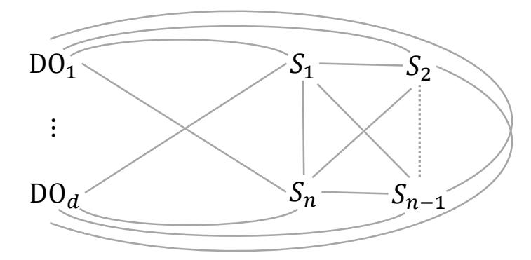
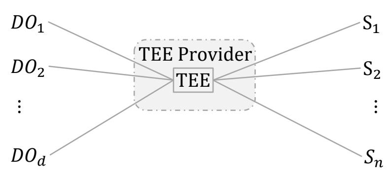
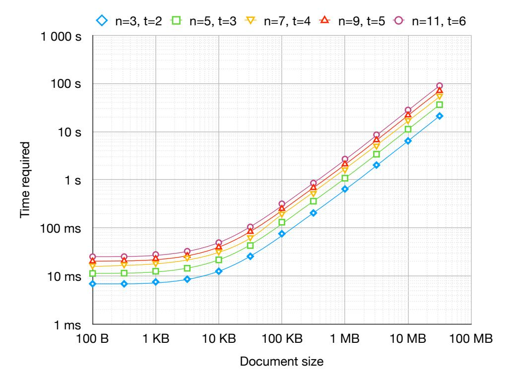
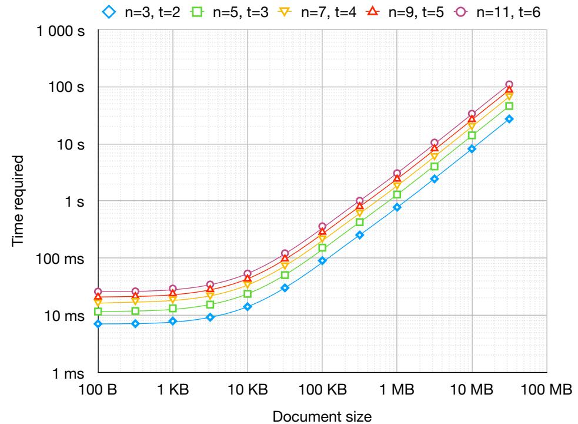
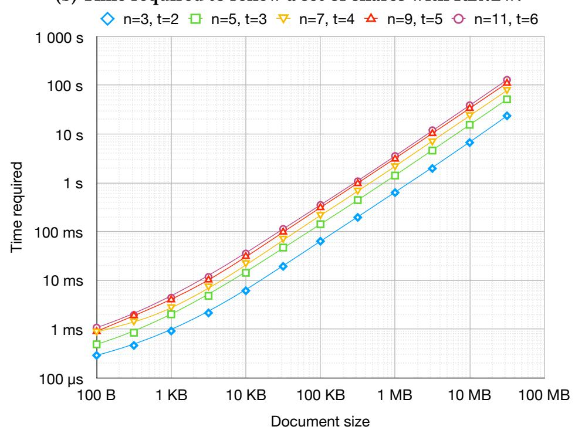

{0}------------------------------------------------

# SAFE: A Secure and Efficient Long-Term Distributed Storage System

Johannes Buchmann TU Darmstadt buchmann@cdc.informatik.tudarmstadt.de

Ágnes Kiss TU Darmstadt kiss@encrypto.cs.tu-darmstadt.de

Ghada Dessouky TU Darmstadt ghada.dessouky@trust.tudarmstadt.de

Ahmad-Reza Sadeghi TU Darmstadt ahmad.sadeghi@trust.tudarmstadt.de

Tommaso Frassetto TU Darmstadt tommaso.frassetto@trust.tudarmstadt.de

Thomas Schneider TU Darmstadt schneider@encrypto.cs.tudarmstadt.de

Giulia Traverso CYSEC Systems giulia.traverso@cysec.systems

Shaza Zeitouni TU Darmstadt shaza.zeitouni@trust.tudarmstadt.de

# ABSTRACT

Secret sharing-based distributed storage systems are one approach to provide long-term protection of data even against quantum computing. Confidentiality is provided because the shares of data are renewed periodically while integrity is provided by commitment schemes. However, this solution is prohibitively costly and impractical: share renewal requires an information-theoretically secure channel between any two nodes and long-term confidential commitment schemes are computationally impractical for large files. In this paper, we present SAFE, a secret sharing-based long-term secure distributed storage system that leverages a Trusted Execution Environment (TEE) to overcome the above limitations. Share generation and renewal are performed inside the TEE and the shares are securely distributed to the storage servers. We prototype SAFE protocols using a TEE instantiation, and show their efficiency, even for large files, compared to existing schemes.

### KEYWORDS

Long-term security, secure storage, secret sharing, trusted execution environment, cloud security, applied cryptography

# 1 INTRODUCTION

Encrypting and storing data on a storage server is not a viable solution to protect data in the long term [\[5\]](#page-5-0) both due to the continuous cryptanalytic advances and the undeniable threat of quantum computers [\[11,](#page-5-1) [24\]](#page-5-2), which may allow to maliciously decrypt intercepted data[1](#page-0-0) . Secret sharing-based distributed storage systems [\[21\]](#page-5-3) are one approach to address this problem. Shares of a message are generated and distributed to the storage servers constituting the system such that only a given number of shares can reconstruct it, otherwise no information is revealed.

Long-term confidentiality is provided by proactive secret sharing [\[16\]](#page-5-4), where shares are renewed and distributed at regular time intervals, such that they are unlinked to the previous ones and an adversary can never acquire enough of them in a given time period to retrieve the message. Long-term integrity is provided by verifiable secret sharing [\[9\]](#page-5-5) through commitment schemes, where audit data is generated to check the validity of the shares. Guaranteeing long-term confidentiality and integrity of data is costly due to, respectively, the number of information-theoretically secure channels (IT-secure channels) to be established and the computational inefficiency of commitment schemes. In particular, IT-secure channels can be established through one-time pad (OTP) encryption, which requires fresh key material for each message to be distributed beforehand. Alternatively, quantum-key distribution (QKD) protocols can be used [\[2\]](#page-5-6), requiring quantum channels that are currently realizable only at a small scale and demand dedicated hardware.

Our contributions. To address these challenges, we investigate enabling more efficient protection of confidentiality and integrity in long-term secure storage systems, thus evolving them for more feasible deployment in cloud-computing services. We propose SAFE, a proactive solution for long-term secure storage systems that relies on trusted computing technology, namely a trusted execution environment (TEE) for the generation, renewal and reconstruction of shares in an integrity-protected and isolated environment. Using hardware and software primitives, TEEs are guaranteed to provide an isolation execution environment for the deployment of security-sensitive and privacy-preserving applications. Naively storing encrypted data in the TEE (without secret sharing) does not provide long-term security guarantees since TEEs are intended for isolated execution where the TEE memory and disk storage require standard memory encryption. In SAFE, the shares are only generated in the TEE, after which they are securely provisioned to the storage servers. The shares are brought back into the TEE for periodic renewal and data reconstruction when requested. Leveraging the TEE in this way, regardless of the TEE specifics, is non-trivial but allows us to propose significantly optimized secret sharing protocols where the required number of IT-secure channels is substantially fewer, i.e., linear in the number of storage servers as opposed to quadratic as before, as shown in [Figure 1.](#page-1-0)

Furthermore, our protocols provide the same security guarantees as state-of-the-art long-term secure storage systems, but at

1

1<https://www.justsecurity.org/19308/>

{1}------------------------------------------------

(a) Architecture of existing solutions.

(b) Architecture of our solution SAFE.

Figure 1: Architecture of the state-of-the-art solutions and our solution SAFE.  $S_1, S_2, \ldots, S_n$  denote n storage servers,  $DO_1, DO_2, \ldots, DO_d$  denote d data owners, TEE denotes the trusted execution environment, and lines are IT-secure channels.

significantly reduced computation and communication costs (§3). We replace currently used expensive – but only computationally binding – commitment schemes on each document segment with computationally secure signatures on the whole document without compromising the security of our system (Appendix A). Our scheme also provides robustness and portability because we construct SAFE to be TEE-agnostic (§3.2), such that secure and seamless migration from a compromised or unavailable TEE to another trustworthy one is supported (§3.2).

To evaluate SAFE, we prototype it using Intel SGX as a TEE instantiation (though any other TEE can be used as well), and show that SAFE is practical, even for large files. We present runtimes for secret sharing, reconstruction, and share renewal for varying file sizes and parameters (§4).

# 2 STATE-OF-THE-ART LONG-TERM SECURE STORAGE SYSTEMS

**Preliminaries on secret sharing.** Secret sharing-based long-term secure storage systems are used to protect the confidentiality and integrity of the outsourced data in the *long term*. We describe *Shamir's secret sharing scheme* [21] next, on which such distributed storage systems are generally based. Let n be the number of storage servers  $S_1, S_2, \ldots, S_n$  to which the shares are distributed,  $t \le n$  be the reconstruction threshold, and  $\mathbb{F}_q$  be a field with q > n elements. Shamir's scheme relies on the fact that, in a field, a polynomial of degree t-1 is determined uniquely by at least t points on it. Knowing only at most t-1 points one cannot reconstruct the polynomial.

Basic secret sharing is carried out with two protocols: Share, which takes a message m and produces n shares, and Reconstruct, which reconstructs the original message m from any subset of t shares. In proactive secret sharing [16], an additional protocol Renew is run where shares are updated periodically such that an adversary does not have enough time to compromise t storage servers, while ensuring that Reconstruct successfully reconstructs the message with the t shares collected as input. Verifiable secret sharing [9] is used to detect a malicious data owner that might send corrupted shares to storage servers and later blame them for not preserving them. It is also used to detect a corrupted storage server sending inconsistent information during protocol Renew in proactive secret sharing. Commitment schemes are used, where additional audit data is computed and broadcasted to the storage servers to check

whether the shares received from the data owner are valid. For long-term protection, Pedersen's commitments [19] are utilized, which allow the storage servers to check the validity of the shares received while guaranteeing the privacy of the message in an information-theoretic secure way. Pedersen's commitment scheme is defined as a triple (Setup, Commit, Open) of the following protocols:

- Setup takes as input a security parameter  $\lambda$  and outputs a prime q, a group  $\mathbb{G}$  of order q, and distinct generators g,  $h \in \mathbb{G}$ .
- Commit takes as input a message  $m \in \mathbb{F}_q$  and randomness  $r \in \mathbb{F}_q$  and outputs commitment  $c = g^m h^r$ .
- Open takes as input a commitment  $c \in \mathbb{G}$ , a message  $m \in \mathbb{F}_q$  and randomness  $r \in \mathbb{F}_q$  and outputs '1' if  $c = g^m h^r$  and '0' otherwise.

Due to space constraints, we cannot describe here the aforementioned protocols Share, Renew and Reconstruct of state-of-theart long-term secure storage systems at length, and we refer the reader to [16] for more detail instead.

**Adversary Model.** The threat model for state-of-the-art longterm secure storage systems is that of a mobile, active and computationally bounded adversary that can never break into more than t-1 storage servers simultaneously. Thus, an honest majority with  $n \ge 2t - 1$  (where *n* is the total number of servers) is commonly required in this setting. It is proactive secret sharing that provides long-term confidentiality by coping with a mobile adversary, bounded to t-1 corrupted storage servers between each two times protocol Renew is executed. Also, it is verifiable secret sharing that provides long-term integrity by coping with an active adversary that can mislead the nodes to deviate from the protocols they are supposed to run. Furthermore, verifiable secret sharing requires a broadcast channel to communicate the computed commitments to the storage servers. Therefore, the adversary can also connect to the broadcast channel, observe and corrupt all messages that the corrupted storage servers or the data owner broadcast and can also inject its own messages. However, it is assumed that the adversary cannot prevent a benign storage server from receiving any of the messages sent through the broadcast channel. Lastly, note that the adversary is computationally bounded because of the usage of Pedersen commitment schemes, which binds to the correct message only computationally.

**Network Requirements.** The communication between the storage servers is characterized by the following requirements as depicted in Figure 1a.

{2}------------------------------------------------

- (1) There is an IT-secure channel between any two storage servers and between any data owner and each storage server.
- (2) There exists a reliable broadcast channel including all the nodes of the long-term secure storage system.
- (3) The messages sent are reliably delivered.
- (4) Authentication measures are in place to detect spoofing.

Thus, a *synchronous* network with access to a common global clock is assumed.

**Shortcomings.** State-of-the-art long-term secure storage systems are a very costly solution. On the one hand, n IT-secure channels are needed during Share and  $\frac{t(t-1)}{2} + t(n-t)$  IT-secure channels are needed to run Renew (with reconstructing threshold t). As described in §1, IT-secure channels are very expensive to establish and maintain. Moreover, the required commitment schemes for large messages are computationally expensive. For reasonably small data, such as 1MB, this leads already to the computation of  $15 625 \cdot t$  commitments, where  $t \geq 2$ , for a common finite field  $\mathbb{F}_q$ , e.g., with q being a prime of 512 bits. Thus, commitment schemes are rarely used in practice, leaving the integrity of data unprotected2.

#### 3 SAFE: OUR SOLUTION

SAFE leverages a TEE for the generation, renewal and reconstruction of consistent shares in an integrity-protected and isolated environment. This guarantees that the shares are generated, updated and reconstructed as mandated by the underlying protocols and that the consistency of the shares with the original document is preserved. The integrity of the shares at the storage servers is protected by means of (computationally secure) signature schemes, which are issued and distributed to the storage servers by the TEE together with the respective shares. In this way, the TEE checks the shares before performing share renewal or the reconstruction of the original document, and identifies if a storage server is compromised (owns a corrupted share) by means of signature verification, as shown in Figure 1b.

SAFE involves several parties as shown in Figure 1b: a) the data owner(s) that own and issue the data that is to be outsourced, b) the storage servers to which the shares are distributed for long-term storage, and c) the TEE provider which manages the provision and initiation of the trusted TEE instance, where the shares' generation, renewal and message reconstruction occur.

**Network Requirements.** As shown in Figure 1, the network requirements for SAFE differ from those of the state-of-the-art long-term secure storage systems (cf. §2) because SAFE needs fewer IT-secure channels and a broadcast channel is no longer necessary. Note that SAFE does not require a *synchronous* network with access to a common global clock, since Renew is initiated and performed by the TEE. Our network assumptions are as follows.

- (1) There is an IT-secure channel between any storage server and the TEE.
- (2) There is an IT-secure channel between any data owner and the TEE.
- (3) The messages sent are reliably delivered.
- (4) Authentication measures are in place.

Only the data owners and the storage servers are directly connected to the TEE provider, while we eliminate the need for a direct ITsecure channel between any two storage servers and between each data owner and each storage server.

**Adversary Model.** We assume an adversary with identical capabilities to that of state-of-the-art long-term secure storage systems, as described in §2. Additionally, we inevitably assume an honest-butcurious TEE provider that ensures service availability and initiates the TEE service whenever necessary, and ensures it adheres to the protocols and the periodic share renewal. More precisely, the TEE provider can, in principle, be any entity (such as a computing server) which is not trusted with the message or the shares generated. However, it is inevitably trusted to provide the TEE service and ensure the service availability whenever required. The TEE instance is an isolated and integrity-protected environment where the message and shares are processed confidentially and protected against tampering. The TEE provider can also migrate to another TEE instance, for example, when security parameters of the signature scheme need to be updated according to NIST recommendations [13] to ensure long-term integrity. Denial-of-Service (DoS) attacks are an inevitable threat to traditional secret sharing protocols and SAFE alike and are out of scope in this paper. The TEE service, once initiated, is assumed to provide isolated, secure and confidential execution of the secret sharing protocols, such that no party can access all the generated shares, including the TEE provider.

In face of memory corruption vulnerabilities, we assume deployment of common code-reuse defenses, such as control-flow integrity (CFI) [1] or code randomization [18]. Architectural side-channel attacks [6, 8] leaking confidential data from TEE-based solutions have been recently shown and several defenses [3, 10] have been proposed to thwart them. However, TEE-based side-channel leakage is a problem specific to particular TEE implementations, while SAFE is not bound to any particular TEE implementation. Thus, it is an orthogonal problem and out of scope for this work.

#### 3.1 SAFE Protocols: Overview

In SAFE, the TEE performs the Share, Renew, and Reconstruct protocols in a privacy-preserving manner. The architecture of our system is shown in Figure 1b. The data owner only communicates with the TEE at the beginning of Share and Reconstruct protocols and is not required to be online after sending its data. Note that at the beginning of each protocol, the *trust anchor* in place at the TEE provider first attests the TEE's integrity. It then initiates the TEE to establish IT-secure channels with the other parties. Afterwards, computations inside the isolated TEE can proceed. For simplicity, we do not describe the TEE initiation steps below.

**SHARE.** Our share initialization protocol runs between the data owner, the TEE, and the storage servers. The data owner sends the pertinent document to the TEE via an IT-secure channel and selects the desired storage servers as well as the threshold number t of shares necessary to reconstruct the document. The TEE is initiated and generates the document shares along with their integrity proofs and distributes them to each of the selected storage servers via IT-secure channels. Each storage server now holds its document share and an integrity proof ready for the first round of share renewal

&lt;sup>2Note that, it is not possible to first hash the messages to commit because the linear property necessary to verify the validity of the shares would be lost.

{3}------------------------------------------------

Renew. Contrary to the state of the art [16], where each data owner establishes an IT-secure channel with each of the storage servers, we optimize this by requiring that the data owner establishes a IT-secure channel with the TEE only. The TEE, in turn, establishes an IT-secure channel with each of the storage servers.

**Renew.** Our share renewal protocol is performed periodically as the state of the art [16]. However, our protocol is initiated by the TEE sending an update request to each storage server. Upon receiving the document share and its integrity proof, the TEE verifies the integrity of the share. If the share is valid, the TEE generates a randomness value required to update the share, otherwise reports malicious behavior to the TEE provider. The updated share is computed by adding the randomness value to the old share and sending the result to the corresponding storage server along with a new proof of integrity. This is performed by the TEE for each storage server  $S_i$ , for i = 1, 2, ..., n individually. Therefore, this eliminates the need for IT-secure channels between every pair of storage servers and significantly reduces the number of IT-secure channels compared with state of the art (see Fig. 1).

**Reconstruct.** Our document reconstruction protocol is initiated by the data owner sending a request to the TEE, which then collects t shares from t storage servers to reconstruct the document. Upon receiving the shares, the TEE verifies their integrity, then reconstructs the document. Similar to our Share, we eliminate the need for IT-secure channels between the data owner and each of the storage servers. Instead, Reconstruct only requires that the data owner establishes a single IT-secure channel with the TEE while the TEE establishes IT-secure channels with the storage servers.

#### 3.2 SAFE Protocols: In Detail

In SAFE, the TEE, encompassed in the TEE provider, performs the secret sharing protocols, while public-key signatures are used to verify the integrity of the provisioned shares before share renewal and document reconstruction are performed. Therefore, commitment schemes are no longer needed.

A document M can be expressed as the concatenation of multiple chunks of size B, i.e.,  $M = m_1 || m_2 || \dots || m_N$ , such that the number of chunks is  $N = \frac{|M|}{B}$ . Each document has a unique identity  $ID_M$ . Let n be the total number of storage servers  $S_1, S_2, \dots, S_n$  selected by the data owner, i be the unique identifier of storage server  $S_i$  for  $i = 1, 2, \dots, n$ , t be the threshold of shares necessary to reconstruct the document, and  $\sigma_{i,\ell}$  be a share of chunk  $m_\ell$ , for  $\ell = 1, 2, \dots, N$ . The document share  $Sh_i = \sigma_{i,1} || \sigma_{i,2} || \dots || \sigma_{i,N}$  is a concatenation of the shares  $\sigma_{i,\ell}$ , for  $\ell = 1, 2, \dots, N$  distributed to storage server  $S_i$  for  $i = 1, 2, \dots, n$ . The TEE owns a pair (pk, sk) of public and secret keys. All communication between the data owner, the TEE and the storage servers described in the protocols below occurs through IT-secure channels.

**SHARE.** The share initialization protocol Share involves all parties: the data owner, the TEE provider, and storage servers  $S_1, S_2, \ldots, S_n$ . Share is initiated by the data owner, who sends document M, its identity  $ID_M$ , the number of storage servers n together with their identities, and the reconstructing threshold t to the TEE through an IT-secure channel. The TEE executes the following steps.

- 1. Receive M,  $ID_M$ , n, t and servers' identities from the data owner.
- 2. Split *M* into *N* chunks,  $M = m_1 ||m_2|| \dots ||m_N|$ .

- 3. For each document chunk  $m_{\ell}$ , such that  $\ell = 1, 2, ..., N$ :
  - a. Let  $\mathbb{F}_q$  be a field with q > n elements, such that  $m_\ell \in \mathbb{F}_q$ . A polynomial  $f_\ell(x) = a_{0,\ell} + a_{1,\ell}x + \cdots + a_{t-1,\ell}x^{t-1}$  is defined such that  $a_{0,\ell} := m_\ell$  and  $a_{1,\ell}, \ldots, a_{t-1,\ell} \in_R \mathbb{F}_q$  are chosen uniformly at random.
  - b. Compute n shares such that  $\sigma_{i,\ell} := f_{\ell}(i)$  for storage server  $S_i$ , where i is the unique ID of storage server  $S_i$ , for i = 1, ..., n.
- 4. For each storage server  $S_i$ , such that i = 1, 2, ..., n:
  - a. Aggregate document share s.t.  $Sh_i = \sigma_{i,1} ||\sigma_{i,2}|| \dots ||\sigma_{i,N}||$
  - b. Sign document share and the document ID with the private key sk, as follows:  $P_i = sign(sk, Sh_i||ID_M)$ .
  - c. Send document share  $Sh_i$  along with its signature  $P_i$  to the corresponding storage server  $S_i$  through IT-secure channel.

Storage servers trust that the TEE generates consistent shares. Therefore, document share  $Sh_i$  and its signature  $P_i$  are securely provisioned to storage server  $S_i$ .

**Renew.** The share renewal protocol runs periodically between the TEE and storage servers  $S_1, S_2, \ldots, S_n$ . Renew is initiated by the TEE that executes the following steps.

- 1. Send update requests to n storage servers to retrieve the shares of document  $ID_M$ .
- 2. Receive n document shares  $Sh_i$  and their signatures  $P_i$  sent by each  $S_i$  through IT-secure channel, for i = 1, 2, ..., n.
- 3. Attest integrity of n document shares by verifying signatures as follows:  $ver(pk, P_i, Sh_i||ID_M) \stackrel{?}{=} true$  for i = 1, 2, ..., n. If the check fails, the TEE recovers the original document M from t benign shares, notifies the service provider of the corruption of storage server  $S_i$  and executes Share.
- 4. For every share  $\sigma_{i,\ell}$  such that  $\ell = 1, 2, ..., N$ :
  - a. Select a polynomial  $g_{\ell}(x) = b_{0,\ell} + b_{1,\ell}x + \cdots + b_{t-1,\ell}x^{t-1}$ , where  $b_{0,\ell} = 0$  and coefficients  $b_{1,\ell}, \ldots, b_{t-1,\ell} \in_R \mathbb{F}_q$  are chosen uniformly at random.
  - b. Compute randomness value  $r_{i,\ell}$  for storage server  $S_i$  as  $r_{i,\ell} := g_{\ell}(i)$ , for i = 1, 2, ..., n.
  - c. Compute the updated share  $\sigma'_{i,\ell} := \sigma_{i,\ell} + r_{i,\ell}$ , for i = 1, ..., n.
- 5. For each storage server  $S_i$ , such that i = 1, 2, ..., n:
  - a. Aggregate document share  $Sh'_i = \sigma'_{i,1} ||\sigma'_{i,2}|| \dots ||\sigma'_{i,N}|$ .
  - b. Sign document share with the private key sk as follows:  $P'_i = sign(sk, Sh'_i||ID_M)$ .
  - c. Send document share  $Sh'_i$  along with its integrity-proof  $P'_i$  to the corresponding storage server through IT-secure channel.

Storage server  $S_i$  stores the new document share  $Sh'_i$  and its signature  $P'_i$  and deletes the old  $Sh_i$  and  $P_i$ .

**RECONSTRUCT.** The document reconstruction protocol is initiated by the data owner, who requests document *M* from the TEE. The TEE executes the following steps.

- 1. Receive reconstruction request of document  $ID_M$  from data owner.
- 2. Request t document shares  $Sh_i$  from t storage servers, i.e., i = 1, 2, ..., t.
- 3. Receive t document shares  $Sh_i$  and their signatures  $P_i$  through IT-secure channels.
- 4. Attest integrity of t document shares by verifying signatures as follows:  $ver(pk, P_i, Sh_i||ID_M) \stackrel{?}{=} true$ . If the check fails, the TEE requests another document share from a different storage

{4}------------------------------------------------

server  $S_{j\neq i}$  to reconstruct the original document, and notifies the service provider of the corruption of storage server  $S_i$ .

- 5. For every  $\ell = 1, 2, ..., N$ :
  - a. Take t shares,  $\sigma_{1,\ell}, \sigma_{2,\ell}, \ldots, \sigma_{t,\ell}$  and reconstruct polynomial  $f_\ell^*(x)$  using Lagrange interpolation, where  $f_\ell^*(x)$  is the polynomial obtained by the sum of polynomial  $f_\ell(x)$  used in share initialization Share and the polynomials  $g_\ell(x)$  used for every round the share renewal protocol Renew was run. The  $\ell$ -th chunk is retrieved as  $f_\ell^*(0) = m_\ell$ .
- 6. Aggregate document  $M = m_1 || m_2 || \dots || m_N$ .
- 7. Send *M* to the data owner over an IT-secure channel.

**TEE Migration.** SAFE is TEE-agnostic where the Renew protocol allows for TEE migration, which is crucial for long-term secure storage systems. This is required when the currently used TEE  $T_1$  (its availability or private key) is compromised, in which case the TEE provider facilitates secure and seamless migration to another TEE  $T_2$ . However, this does not guarantee the integrity of the shares if the TEE is compromised. Moreover, migration allows for updating the security parameters of the signature scheme used, e.g., according to NIST recommendations [13].

For migration, TEE  $T_2$  requires its own public and private keys  $pk_{T_2}$  and  $sk_{T_2}$ , respectively, and the public key of TEE  $T_1$ ,  $pk_{T_1}$  to verify the integrity of the shares integrity of step 3. The provisioning of the keys and secure migration is managed by the (honest-but-curious) TEE provider. To compute the new signatures, TEE  $T_2$  uses its own private key and proceeds in the next update phase with its own public key.

The security analysis of the protocols of SAFE and a comparison with related work can be found in Appendices A and B, respectively.

## 4 INSTANTIATION AND EVALUATION

We instantiate SAFE using Intel SGX [17] as the TEE and an adaptation of an open-source implementation of Shamir's proactive secret sharing scheme by Fletcher Penney3. The implementation supports secret sharing of texts character by character, i.e., utilizes a field  $\mathbb{F}_{2^8+1}$ . It implements Share and Reconstruct and allows for specifying the number of servers n and the threshold t. We modified this implementation to include the Renew for proactive secret sharing as described in §3.2, i.e., by creating shares of zero and adding them on the existing shares. We also modified the code such that it uses the CPU's hardware random generator as its randomness source through the rdrand instruction. For the public-key signatures, we used the RSA implementation of OpenSSL 1.0.2g with 3072-bit RSA moduli. We embedded this program in an SGX enclave using the Graphene-SGX framework [23].

**Performance.** We measure the performance of all three protocols on Intel SGX, i.e., of Share, Renew and Reconstruct as described in §3.2. In our experiments, we vary the number of shares n and the reconstructing threshold t and report performance results for documents containing between 100 bytes and 30MBytes of random data. We ran our tests on an Intel i7-7700 CPU clocked at 3.60GHz, with 8GB of RAM and Ubuntu 16.04.5 OS.

Figure 2 shows the time required to perform Share, Renew, and Reconstruct using different values for our parameters, namely

#### (a) Time required to create a set of shares using SHARE.

#### (b) Time required to renew a set of shares with RENEW.

(c) Time required to reconstruct a set of shares using RECONSTRUCT.

Figure 2: Runtimes of our algorithms.

&lt;sup>3https://github.com/fletcher/c-sss

{5}------------------------------------------------

 ${n = 3, t = 2}, {n = 5, t = 3}, {n = 7, t = 4}, {n = 9, t = 5}, and$  $\{n = 11, t = 6\}$ . In our experiment, the time required to perform the secret-sharing computations scales linearly in the whole document size range. The time required to sign a document scales linearly as well, but there is also a constant-time component of approximately 2ms. Similarly, verifying a signature has a linear component and a constant-time component of approximately 60µs. Creating and renewing shares (Figure 2a, Figure 2b) requires multiple signatures, so the time required does not increase significantly until 3KB, while it increases linearly after 10KB. For a 30MB document, creating the shares takes between 21s and 90s depending on the parameters *n* and t; renewing the shares takes between 27s and 109s. Reconstructing the shares (Figure 2c) only requires signatures verification, so it increases linearly in the whole range. Reconstructing the shares of a 30MB document takes between 23s and 128s depending on the parameters. To scale with larger document sizes, the document can be segmented into smaller sized document blocks to reduce the total share reconstruction latency. In doing so, the user requesting the total document can receive the reconstructed blocks in a streamlined manner, rather than wait for the complete document.

Our prototype implementation stores the whole document and the shares in enclave memory, which results in a bound on the size of the document in our experiments. Modifying the implementation to stream the shares to the enclave eliminates this bound entirely. We can directly observe that the computation time scales linearly, since the generation and verification of signatures contribute with only a linear overhead to the overall runtime of the protocols.

#### 5 CONCLUSION AND FUTURE WORK

In this paper, we introduced SAFE, a TEE-based long-term secure storage system that provides a significantly more efficient means to protect the confidentiality and integrity of outsourced data. It leverages a TEE for the generation and periodic update of shares of the data and securely provisions the shares to the storage servers. SAFE requires significantly fewer information-theoretically secure point-to-point channels and expensive commitment schemes are no longer required because integrity is provided by signatures. We instantiated the TEE for SAFE using Intel SGX and evaluated the computation runtimes of the protocols. SAFE is TEE-agnostic; any other TEE can be deployed and migration to another TEE is also supported for stronger security and robustness guarantees. Furthermore, SAFE, contrary to previous approaches, does not need to assume a synchronous network.

For future work, we plan to address scenarios where the data has to also be securely processed in a privacy-preserving manner (e.g., studies on genomic data) using secure multi-party computation.

#### **ACKNOWLEDGMENT**

This project was co-funded by the Deutsche Forschungsgemeinschaft (DFG) — SFB 1119 CROSSING/236615297, the European Research Council (ERC) under the European Union's Horizon 2020 research and innovation programme (grant agreement No. 850990 PSOTI), the Intel Collaborative Research Institute for Collaborative Autonomous & Resilient Systems (ICRI-CARS), the German Federal Ministry of Education and Research and the Hessen State Ministry for Higher Education, Research and the Arts within ATHENE.

#### **REFERENCES**

- [1] Martín Abadi, Mihai Budiu, Úlfar Erlingsson, and Jay Ligatti. 2009. Control-flow integrity principles, implementations, and applications. *ACM Transactions on Information System Security* 13, 1 (2009), 4:1–4:40.
- [2] Charles H. Bennett and Gilles Brassard. 2014. Quantum cryptography: Public key distribution and coin tossing. *Theor. Comput. Sci.* 560 (2014), 7–11.
- [3] Ferdinand Brasser, Srdjan Capkun, Alexandra Dmitrienko, Tommaso Frassetto, Kari Kostiainen, Urs Müller, and Ahmad-Reza Sadeghi. 2017. DR.SGX: Hardening SGX enclaves against cache attacks with data location randomization. *CoRR* abs/1709.09917 (2017). arXiv:1709.09917 http://arxiv.org/abs/1709.09917
- [4] Jacqueline Brendel and Denise Demirel. 2016. Efficient proactive secret sharing. In *Privacy, Security and Trust (PST'16)*. IEEE, 543–550.
- [5] Johannes Buchmann, Alexander May, and Ulrich Vollmer. 2006. Perspectives for cryptographic long-term security. *Commun. ACM* 49, 9 (2006), 50–55.
- [6] Jo Van Bulck, Marina Minkin, Ofir Weisse, Daniel Genkin, Baris Kasikci, Frank Piessens, Mark Silberstein, Thomas F. Wenisch, Yuval Yarom, and Raoul Strackx. 2018. Foreshadow: Extracting the keys to the Intel SGX kingdom with transient out-of-order execution. In *USENIX Security Symposium 2018*. USENIX Association, 991–1008.
- [7] Christian Cachin, Klaus Kursawe, Anna Lysyanskaya, and Reto Strobl. 2002. Asynchronous verifiable secret sharing and proactive cryptosystems. In ACM Conference on Computer and Communications Cecurity (CCS'02). ACM, 88–97.
- [8] Guoxing Chen, Sanchuan Chen, Yuan Xiao, Yinqian Zhang, Zhiqiang Lin, and Ten H Lai. 2018. SgxPectre attacks: Leaking enclave secrets via speculative execution. CoRR abs/1802.09085 (2018). arXiv:1802.09085 http://arxiv.org/abs/ 1802.09085
- [9] Benny Chor, Shafi Goldwasser, Silvio Micali, and Baruch Awerbuch. 1985. Verifiable secret sharing and achieving simultaneity in the presence of faults (extended abstract). In *Foundations of Computer Science (FOCS'85)*. 383–395.
- [10] Victor Costan, Ilia A Lebedev, and Srinivas Devadas. 2016. Sanctum: Minimal hardware extensions for strong software isolation. In *USENIX Security Symposium* 2016. USENIX Association, 857–874.
- [11] D-Wave. 2015. Announcing the D-Wave 2x quantum computer. https://www.dwavesys.com/blog/2015/08/announcing-d-wave-2x-quantum-computer/
- [12] Yvo Desmedt and Sushil Jajodia. 1997. *Redistributing secret shares to new access structures and its applications*. Technical Report. ISSE TR-97-01, George Mason University.
- [13] Michael D. Garris, James L. Blue, Gerald T. Candela, Patrick J. Grother, Stanley Janet, and Charles L. Wilson. 1997. NIST form-based handprint recognition system (release 2.0). *Interagency/Internal Report (NISTIR)* - 5959 (1997).
- [14] V. H. Gupta and K. Gopinath. 2006. An extended verifiable secret redistribution protocol for archival systems. In *Availability, Reliability and Security (ARES'06)*. IEEE, 100–107.
- [15] V. H. Gupta and K. Gopinath. 2007. Gits2VSR: An information theoretical secure verifiable secret redistribution protocol for long-term archival storage. In *Security in Storage Workshop (SISW'07)*. IEEE, 22–33.
- [16] Amir Herzberg, Stanisław Jarecki, Hugo Krawczyk, and Moti Yung. 1995. Proactive secret sharing or: How to cope with perpetual leakage. In *Advances in Cryptology – CRYPTO'95*. Springer, 339–352.
- [17] Intel. 2014. Software Guard Extensions Programming Reference, Revision 2.
- [18] Per Larsen, Andrei Homescu, Stefan Brunthaler, and Michael Franz. 2014. SoK: Automated software diversity. In *IEEE Symposium on Security and Privacy (S&P'14)*. IEEE, 276–291.
- [19] Torben Pryds Pedersen. 1992. Non-interactive and information-theoretic secure verifiable secret sharing. In *Advances in Cryptology – CRYPTO'91*. Springer, 129–140.
- [20] David A. Schultz, Barbara Liskov, and Moses Liskov. 2008. Mobile proactive secret sharing. In *ACM Symposium on Principles of Distributed Computing (PODC'08)*. ACM, 458.
- [21] Adi Shamir. 1979. How to share a secret. Commun. ACM 22, 11 (1979), 612-613.
- [22] Giulia Traverso, Denise Demirel, and Johannes Buchmann. 2016. Dynamic and verifiable hierarchical secret sharing. In *International Conference on Information Theoretic Security (ICITS'16)*. Springer, 24–43.
- [23] Chia-che Tsai, Donald E. Porter, and Mona Vij. 2017. Graphene-SGX: A practical library OS for unmodified applications on SGX. In *USENIX Annual Technical Conference (USENIX ATC)*. USENIX, 645–658.
- [24] T. F. Watson, S. G. J. Philips, Erika Kawakami, D. R. Ward, Pasquale Scarlino, Menno Veldhorst, D. E. Savage, M. G. Lagally, Mark Friesen, S. N. Coppersmith, M. A. Eriksson, and L. M. K. Vandersypen. 2018. A programmable two-qubit quantum processor in silicon. *Nature* 555, 7698 (2018), 633.
- [25] Theodore M. Wong, Chenxi Wang, and Jeannette M. Wing. 2002. Verifiable secret redistribution for archive systems. In *Security in Storage Workshop*. IEEE, 94–105.
- [26] Lidong Zhou, Fred B. Schneider, and Robbert Van Renesse. 2005. APSS: Proactive secret sharing in asynchronous systems. *ACM Transactions on Information and System Security (TISSEC)* 8, 3 (2005), 259–286.

{6}------------------------------------------------

#### **A SECURITY ANALYSIS**

SAFE provides the same long-term confidentiality and integrity guarantees as state-of-the-art secret sharing-based long-term secure storage systems with Pedersen's commitment, while significantly reducing the computation overhead and the number of IT-secure channels required. On the one hand, long-term confidentiality is provided by proactive secret sharing, where shares are distributed to multiple storage servers and periodically renewed, thus mitigating a mobile computationally bounded adversary. The shares' confidentiality during the execution of Share, Renew, and RECONSTRUCT is preserved because they are processed inside a TEE and communicated over IT-secure channels (§3.2). On the other hand, long-term integrity is provided because shares computed during Share and Renew are created and signed by the TEE. Signature schemes are deployed to verify the integrity of these shares prior to RENEW and RECONSTRUCT. Share renewal allows SAFE to update the security parameters of the signature scheme according to the NIST recommendations, thus providing long-term security. Furthermore, if up to t-1 shares are found to be corrupted, the TEE can recover the original document, or recompute correct shares and redistribute them, thus preserving message integrity and providing robustness. In short, the main primitives SAFE deploys to provide the above guarantees are: 1) a **Trusted Execution Environment**, 2) **Signature schemes** and 3) **IT-secure channels**, detailed below.

Trusted Execution Environment. We make standard assumptions with respect to the trustworthiness of the TEE to guarantee that it provides the state-of-the-art security guarantees described above. Before processing any confidential data in the TEE, the trust anchor at the TEE provider attests the integrity of the TEE. If the TEE is in a trustworthy state, it is initiated and establishes IT-secure channels with the involved parties to run the protocols, and computations proceed securely and privately in the TEE. The shares are generated in guaranteed isolation in the TEE; the honest-but-curious TEE provider cannot acquire the shares and disclose the outsourced data.

While leveraging the TEE allows us to achieve significant gains in terms of efficiency (cf. §B.1), SAFE's security guarantees rely on the availability and trustworthiness of the TEE service and its adherence to performing the computations as mandated by our protocols (including the periodic share renewal), which is assumed to be ensured by the TEE provider. Nevertheless, the TEE remains vulnerable to DoS attacks which would compromise the confidentiality and/or the integrity of the outsourced data. However, DoS attacks are, in all use cases, a persistent threat for TEEs and are thus out of scope in this paper.

We further emphasize that the TEE deployment and its specific implementation is an orthogonal problem to our work. The TEE service can be provided by a single isolated computing server that serves only one data owner exclusively. Alternatively, it can also be deployed as a cloud service that provides different TEE instances for different data owners securely, or even within one of the storage servers. Thus, SAFE is independent of the specific TEE implementation and is compliant with any TEE infrastructure that provides the requirements outlined in §3.

**Signature schemes.** In state-of-the-art approaches, the integrity of shares (and thus, of the outsourced data) is provided

by Pedersen commitments, which are computationally binding, i.e., integrity is provided against a computationally bounded adversary only. SAFE does not weaken the adversary model since it leverages signature schemes, which provide integrity against a computationally bounded adversary as well. However, despite providing the same security guarantees, SAFE achieves this at a lower computation and communication cost. Moreover, because signature schemes are deployed and always updated in compliance with the NIST recommendations [13], SAFE guarantees resilience to the growth of the computational power of the adversary over time. The private key used for the signatures in SAFE is sealed in the TEE provider, i.e., encrypted with the TEE's secret key. However, it is also possible to avoid this sealing mechanism by generating a fresh pair of private-public keys at every occurrence of Renew as follows: the shares that the RENEW outputs at a certain round are signed with the currently used private key. These signed shares are provisioned to the storage servers. On the next round of Renew, the signature of each share is first verified by the TEE with the counterpart public key before proceeding with the share update. However, the updated shares are then signed by the TEE using a fresh private-public key pair generated at the beginning of RENEW. In this case, only the public key needs to be sealed, while the private key is never stored or sealed by the TEE provider. To prevent replay attacks where a compromised storage server may send the TEE an old benign share and its signature, timestamps or version numbers are included in the signatures computed by the TEE at every round of RENEW.

IT-secure channels. Finally, the security of SAFE relies, by definition, on the use of information-theoretically secure point-to-point channels in the network, which are also required for the existing solution discussed in §2. The difficulty in establishing such channels remains a fundamental limitation (see §1) that long-term secure storage systems face to provide their stringent security guarantees, is not specific to SAFE, and is out of scope for this work. Nevertheless, the merit of SAFE lies in significantly optimizing the required number of such IT-secure channels while still achieving the same security guarantees as state-of-the-art approaches.4

#### **B** COMPARISON WITH RELATED WORK

Besides Shamir's secret sharing scheme, distributed storage systems can also be built over hierarchical secret sharing schemes, where shares can be periodically renewed similarly to Shamir's scheme, as shown in [22]. Two main approaches exist for share renewal: those with *synchronous networks* and those with *asynchronous networks*. For synchronous networks, besides the seminal approach by Herzberg et al. [16] (see §2), Desmedt and Jajoda [12] proposed protocols that enable to dynamically add and remove storage servers. However, verification was not possible, and thus inconsistent shares from corrupted storage servers could not be detected. Wong et al. [25] mitigated this issue by enabling the storage servers in their protocols to verify their new shares once they got distributed. However, it is assumed that all the storage servers are honest during the redistribution phase. Gupta and Gopinath

&lt;sup>4Note that IT-secure channels are required because it is assumed that the adversary can capture and store communication traffic and decrypt them many decades later once the underlying mathematical problems of cryptosystems become computationally solvable. Otherwise, TLS channels could be used instead.

{7}------------------------------------------------

eliminated this assumption in [14] by allowing an honest majority among the storage servers during the redistribution phase by using Feldman's commitment scheme in their protocol. They proposed a revised protocol in [15] using Pedersen's commitment scheme to achieve information-theoretic confidentiality of the outsourced data. Brendel and Demirel in [4] optimized the number of IT-secure channels by clustering the storage servers into groups that can communicate securely only within the cluster. However, reducing the number of IT-secure channels was their only goal and they achieved that at the cost of further complicating the computations through homomorphic enryption and further signature schemes. Since we optimize both the number of IT-secure channels and the computational cost, we do not consider this work in our comparison below. In contrast to synchronous networks, proactive secret sharing in asynchronous networks does not have access to a common global clock. Hence, the initiation of share renewal cannot be synchronized among all nodes, which have access to an abstract timer, as shown in [7]. In [20], the time intervals in which the share renewal is performed are defined by the events of the protocol itself. Instead, in [26] a conservative estimation of the time is used for executing the share renewal. Note that, because there is no upper bound on message delivery delays, it is hard to detect corrupted storage servers as it is not possible to distinguish a storage server deviating from the protocol and not sending anything from a storage server that simply is late in responding.

Because all computations are performed by the TEE, SAFE does not require a global common clock among all storage servers. This means that SAFE is also a solution for proactive secret sharing that optimizes the number for IT-secure channels even for asynchronous networks [7]. Furthermore, SAFE is not only TEE-agnostic, but also secret sharing-agnostic as it can be instantiated for example with hierarchical secret sharing [22] when shares with different reconstruction need to be distributed.

#### **B.1** Communication Comparison

One of the most significant challenges in deploying long-term secure storage systems in practice is establishing IT-secure channels between all relevant nodes. SAFE makes a considerable advancement in this direction by reducing the number of IT-secure channels needed to carry out the long-term secure storage of outsourced data. We compare SAFE with state-of-the-art approaches [14–16, 22] that provide the same security guarantees, i.e., they assume an honest majority ( $n \ge 2t-1$ ), protect the integrity of the outsourced document (not only its confidentiality), and do not relax the security requirements of the point-to-point channels between nodes.

As shown in Table 1, SAFE significantly outperforms all previous systems in terms of the number of IT-secure channels needed within the long-term secure storage system. When d data owners use the same long-term secure storage system composed of n storage servers, for Share and Reconstruct, SAFE needs, respectively, n+d and t+d IT-secure channels compared with the nd IT-secure channels needed in state-of-the art approaches. That is because in SAFE the data owners do not communicate directly with the storage servers and, instead, they establish IT-secure channels with the TEE, which works as a mediator node. Only the TEE is connected to

| Protocol    | SHARE | Renew                                                | RECONSTRUCT |
|-------------|-------|------------------------------------------------------|-------------|
| [14-16, 22] | nd    | $\frac{t(t-1)}{2} + t(n-t)$                          | td          |
| SAFE        | n+d   | $\begin{array}{cccccccccccccccccccccccccccccccccccc$ | t+d         |

Table 1: Comparison of the number of IT-secure channels needed in long-term secure storage systems for d data owners, n storage servers and reconstructing threshold t.

all the storage servers through n IT-secure channels and this number does not depend on the number of data owners (cf Figure 1b). Furthermore, in SAFE, the n IT-secure channels already established to run Share are sufficient to carry out Renew.

In contrast to SAFE, all other approaches require additional channels between the storage servers to perform share renewal distributedly. Renew and Reconstruct are compared assuming the optimized version of the protocols, where only t storage servers are, respectively, actively generating and distributing randomness values and provisioning the data owner with the necessary number of reconstructing shares. The quantity  $\frac{t(t-1)}{2} + t(n-t)$  is always larger than n, assuming a reasonable threshold  $t \geq 2$  (otherwise secret sharing becomes useless). In case  $n \gg t$ , then  $t(n-t) \geq n$ , and in case  $t \sim n$ , then  $\frac{t(t-1)}{2} \geq n$ .

Besides the number of IT-secure channels, the volume of traffic communicated through the IT-secure channels in SAFE is reduced in comparison with the other approaches. To protect integrity, *commitments* to the coefficients of a polynomial of degree t-1 are communicated via a broadcast channel in all state-of-the-art approaches. A broadcast channel is not needed in SAFE, instead, only signatures on the generated document share for each of the n shares are sent through the IT-secure channels.

#### **B.2** Computation Comparison

SAFE has substantially lower computation overhead than [14– 16, 22]. More precisely, during RENEW, SAFE requires that the TEE computes only one polynomial of degree t-1 from which the *n* randomness values are generated and summed to the corresponding old shares. Instead, t (or 2t for [15] due to the usage of Pedersen's commitment scheme) polynomial evaluations for the computation of tn (or 2tn) randomness values have to be performed in [14–16, 22] even for the optimized protocol where t servers generate randomness values. Furthermore, in SAFE only a signature  $P'_i = sign(sk_{T_1}, Sh'_i)$  for each of the *n* renewed document shares  $Sh'_1, Sh'_2, \ldots, Sh'_n$  is computed for the integrity check, as opposed to the  $t^2N$  (or  $2t^2N$  for [15]) commitments that are computed for each chunk in which the document is divided (N is the total number of chunks per document). We highlight that signatures are computationally feasible to compute and are commonly adopted, while it is still an open problem how commitment schemes can be efficiently implemented. Similarly for Share, SAFE requires nNshares to be computed through polynomial evaluations and *n* signatures  $P_1, P_2, \dots, P_n$  for the integrity check. Instead, in all previous approaches, nN (or 2nN for [15]) shares and additionally tnN (or 2tnN for [15]) commitments have to be computed.