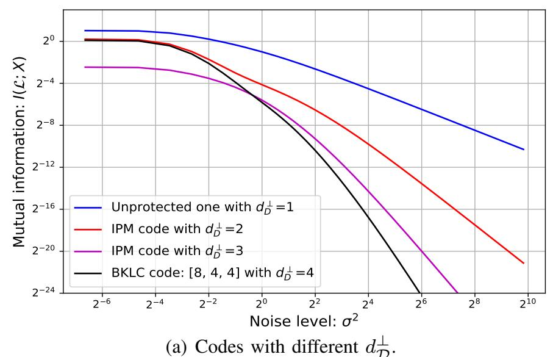
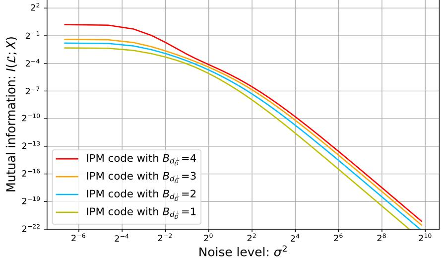
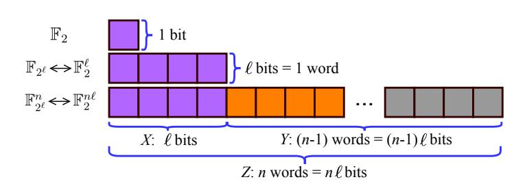
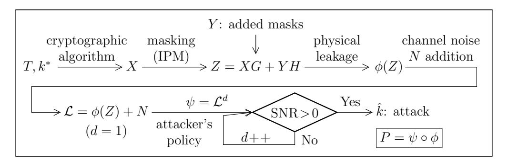
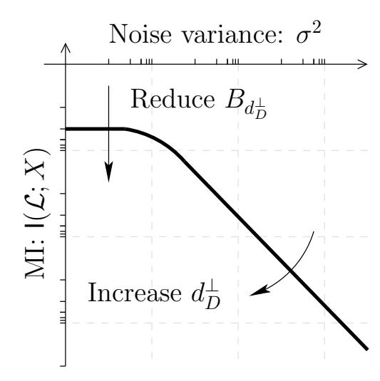
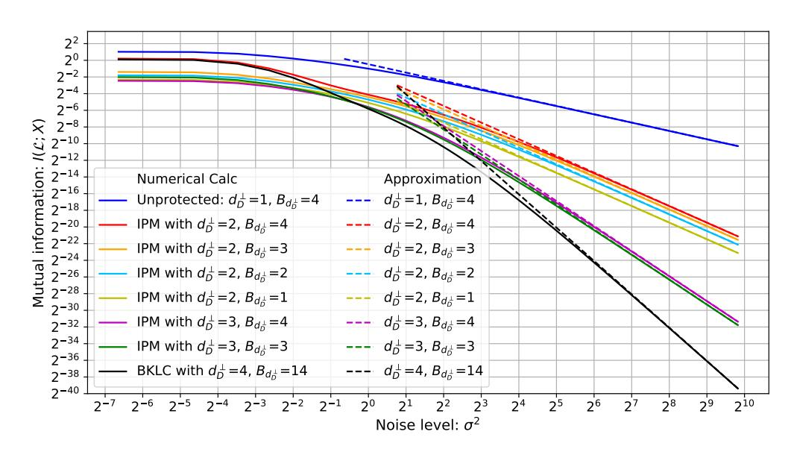
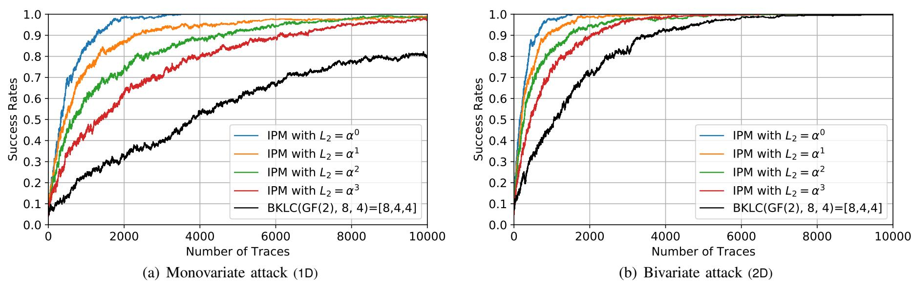
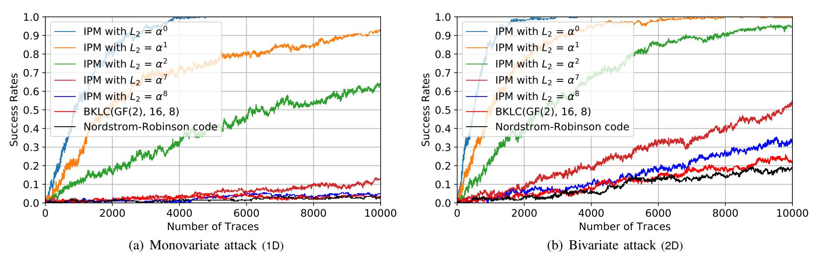
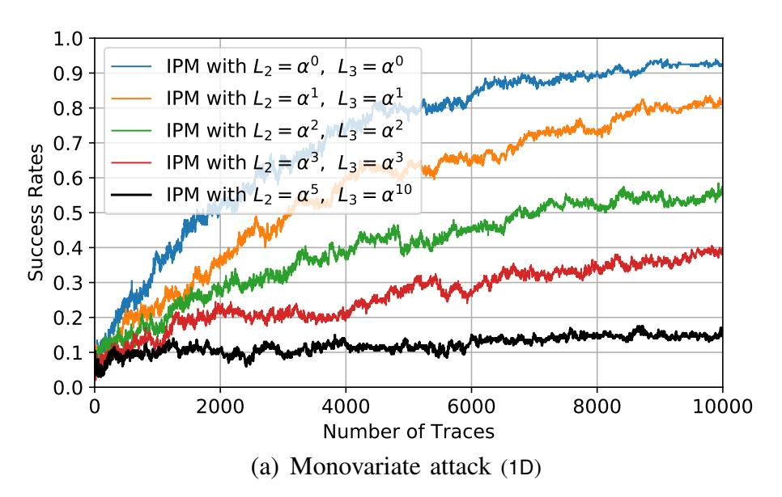
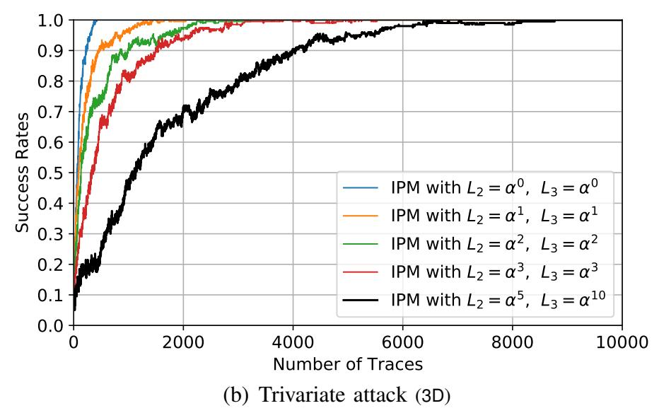

{0}------------------------------------------------

#### 1

# Optimizing Inner Product Masking Scheme by A Coding Theory Approach

Wei Cheng, Student Member, IEEE, Sylvain Guilley, Member, IEEE, Claude Carlet, Sihem Mesnager, Member, IEEE, Jean-Luc Danger, Member, IEEE

Abstract—Masking is one of the most popular countermeasures to protect cryptographic implementations against side-channel analysis since it is provably secure and can be deployed at the algorithm level. To strengthen the original Boolean masking scheme, several works have suggested using schemes with high algebraic complexity. The *Inner Product Masking* (IPM) is one of those. In this paper, we propose a unified framework to quantitatively assess the side-channel security of the IPM in a coding-theoretic approach. Specifically, starting from the expression of IPM in a coded form, we use two defining parameters of the code to characterize its side-channel resistance. In order to validate the framework, we then connect it to two leakage metrics (namely signal-to-noise ratio and mutual information, from an information-theoretic aspect) and one typical attack metric (success rate, from a practical aspect) to build a firm foundation for our framework.

As an application, our results provide ultimate explanations on the observations made by Balasch *et al.* at EUROCRYPT'15 and at ASIACRYPT'17, Wang *et al.* at CARDIS'16 and Poussier *et al.* at CARDIS'17 regarding the parameter effects in IPM, like higher security order in *bounded moment model*. Furthermore, we show how to systematically choose optimal codes (in the sense of a concrete security level) to optimize IPM by using this framework. Eventually, we present a simple but effective algorithm for choosing optimal codes for IPM, which is of special interest for designers when selecting optimal parameters for IPM.

Index Terms—Side-Channel Analysis, Countermeasure, Inner Product Masking, Coding Theory, Optimal Linear Code.

#### I. INTRODUCTION

RYPTOGRAPHIC algorithms are nowadays prevalent in establishing secure connectivity in our digital society. Such computations handle sensitive keys, which must be protected against adversarial theft. Keys are very exposed during computations that handle them. In particular, side-channel analyses consist in illegitimate records of emanations during cryptographic operations which use the key. Such threats affect many (if not all) applications involving security: authentication of users (e.g., for banking), authentication of devices (e.g., in an automotive context), information protection (e.g., in data exchange over Internet), etc. In concrete scenarios, adversaries resort to sophisticated oscilloscopes to record compromising emanations evading unintentionally from the target system. Such attacks are referred to as side-channel attacks and are

W. Cheng, S. Guilley and J.-L. Danger are with LTCI, Télécom Paris, France. S. Guilley and J.-L. Danger are also with Secure-IC S.A.S., France. Email: {wei.cheng, sylvain.guilley, jean-luc.danger}@telecom-paris.fr.

C. Carlet and S. Mesnager are with LAGA, Department of Mathematics, University of Paris 8, France. Email:{claude.carlet, smesnager}@gmail.com.

clearly getting a widespread concern on any embedded system. Normative evaluation of chips, within the framework of Common Criteria [15] or NIST FIPS 140 (versions 140-2 [37] and 140-3 [33]) schemes, indeed attest of the serious need for sound side-channel countermeasures.

Masking is one of the most investigated countermeasures against side-channel analysis, allowing all cryptographic operations to be performed on the masked data. Essentially, masking is a sound way to improve the side-channel security of cryptographic implementations, since given high enough noise, the attack complexity increases exponentially with the number of shares [30], while the implementation cost increases only quadratically (or only cubically in higher-order glitches free implementations [20]). For instance, the Boolean masking scheme is the simplest one which enables high performance when implemented on real circuits. The first provably secure higher-order masking scheme has been introduced by Ishai et al. [21] for the protection of single bits in  $\mathbb{F}_2$ . Then, this scheme has been extended to the protection of words (e.g. bytes in  $\mathbb{F}_{2^8}$ ) with higher-order security by Rivain *et al.* [34]. Interestingly, it has been noticed later that this masking scheme can be further improved by mixing bits in each share (of  $\ell = 8$  bits). In brief, the main idea is to elevate the bitlevel algebraic complexity of the masking scheme. Thus in this respect, *Inner Product Masking* (IPM) scheme has been proposed as an alternative, in which inner product is adopted as a mixing operation.

The IPM scheme has been first introduced by Balasch *et al.* at ASIACRYPT'12 [3] as an alternative to masking schemes like Boolean or multiplicative masking and has been further improved by Balasch *et al.* at EUROCRYPT'15 [1] and at ASIACRYPT'17 [2]. In IPM, the random masks are not used plain, but a mixing between the bits is carried out by the multiplication with a public vector  $L = (1, L_2, ..., L_n)$  and then involved into the cryptographic computation  $(Z = X + L_2Y_2 + \cdots + L_nY_n)$ , where X is the sensitive data and  $Y_i$  are the n-1 masks). Interestingly, by different settings of vector L and mask materials, Balasch *et al.* [3] pointed out that IPM is the generalization of four typical kinds of masking schemes, namely the Boolean one, the multiplicative one [18], the affine one [17] and the polynomial one [19], [32].

#### A. Related Works

The concrete security order of a masking scheme depends not only on the number of shares but also on the encodings involving the sensitive variables and mask materials into cryptographic operations. With the same number of shares, Balasch 

{1}------------------------------------------------

et al. [3] observed that the IPM leaks consistently less than Boolean masking, and further demonstrated this observation in [1], [2]. In fact, this observable feature originates from the encoding of IPM, in which the random masks are multiplied by the coordinates of the public parameter  $L \in \mathbb{F}_{2^{\ell}}^n$ . Therefore several bits in each share are mixed together, which increases the algebraic complexity of the encoding. By contrast, in Boolean masking the masks are directly involved by bitwise XOR operation. This is the primary advantage of IPM. Furthermore, another interesting effect in [2, Fig. 3] is that the different choices of the L vector in IPM significantly affect its concrete bit-level security. For instance, with n=2 shares made up of  $\ell = 8$  bits (byte-oriented), the security order in bounded moment model [4] can be  $t_{bound} = 3$ , while the security order in (word-level) probing model is only  $t_w = 1$ .

In fact, this parameter effect in IPM has been studied firstly by Wang *et al.* [39], named as "Security Order Amplification". Wang et al. propose the parameter  $O_{min}$ , the lowest keydependent statistical moment, as a metric to measure the amplified security order. This metric  $O_{min}$  is directly related to the bit-level security order  $t_b$  in bit-level probing model proposed by Poussier et al. [28] since  $O_{min} = t_b + 1$ . More importantly, Poussier et al. firstly introduce the coding form of IPM as:  $Z = X\mathbf{G} + Y\mathbf{H}$  where X, Y, Z are the sensitive variable, random mask(s) and masked variable, G and H are the generator matrices of two codes  $\mathcal{C}$  and  $\mathcal{D}$ , respectively. Then they prove that the bit-level security of IPM is related to one of the defining parameters of the code  $\mathcal{D}$  (namely its dual distance  $d_{\mathcal{D}}^{\perp}$ ). This result gives an explanation of the security order amplification discussed in [39].

The other line of research on the encoding and parameter effect of masking schemes is about the *Leakage Squeezing* (LS) which stems from Carlet et al. [12]. Particularly, Carlet et al. show that IPM is an instance of LS. They statistically studied the security order of LS scheme by linking the *correla*tion immunity [10] of the indicator of the code (that equals the dual distance  $d_{\mathcal{D}}^{\perp}$  minus 1), the mutual information (MI) and the success rate (SR) of side-channel attacks together. More precisely, in logarithmic form, mutual information  $\log(MI)$  is a linear function of the logarithmic noise variance  $\log(\sigma^2)$ , and the slope (security order) of this linear function equals the dual distance of  $\mathcal{D}$ . To summarize, the bit-level security order  $t_b$  of IPM is  $d_{\mathcal{D}}^{\perp} - 1$ , where  $d_{\mathcal{D}}^{\perp}$  is the dual distance of the code  $\mathcal{D}$  in the coding form. Related works are summarized in Tab. I (note that SNR is short for attack signal-to-noise ratio [25, § 4.3.2, page 73]).

Actually, the security order of IPM depends on the code  $\mathcal{D}$  involved in the scheme, which can be easily demonstrated by information-theoretic metric. As shown in Fig. 1(a), the security order (the slope) of IPM depends on the dual distance of the chosen code  $\mathcal{D}$ , namely  $d_{\mathcal{D}}^{\perp}$ . Specifically, the slope in the log-log plot representation of MI as a function of noise variance  $\sigma^2$  is  $-d_{\mathcal{D}}^{\perp}$ . However, it can be observed that for different choices of the code  $\mathcal{D}$  with the same dual distance, the MIs are distinctly different as shown in Fig. 1(b). The smaller the number of nonzero codewords of minimal weight  $(B_{d_{\mathcal{D}}^{\perp}})$ , the smaller the MI consistently over the full range of noise variance  $\sigma^2$ . Similar situations happen with success rates

Table I SUMMARY OF SIDE-CHANNEL SECURITY ANALYSIS ON IPM.

|                 | Security   | Code                                                    | Metrics     | Comments                                       |  |
|-----------------|------------|---------------------------------------------------------|-------------|------------------------------------------------|--|
|                 | Orders     | Parameters                                              | Metrics     | Comments                                       |  |
| Balasch et al.  | ,          |                                                         | 147         | MI varies for                                  |  |
| [1]             | $t_w$      | _                                                       | MI          | different $L$ vectors                          |  |
| Wang et al.     | $t_b$      |                                                         | MI          | $O_{min} (= d_{\mathcal{D}}^{\perp})$ was used |  |
| [39]            |            | $d_{\mathcal{D}}^{\perp}$                               |             | (the lowest key-dependent                      |  |
| [39]            |            |                                                         |             | statistical moment)                            |  |
| Poussier et al. | + +        | a ⊥                                          | MI          |                                                |  |
| [28]            | $t_w, t_b$ | $d_{\mathcal{D}}^{\perp}$                               |             |                                                |  |
| Balasch et al.  | + +-       |                                                         | MI          | $t_{bound} (= t_b + 1)$ is in                  |  |
| [2]             | $t_w, t_b$ | _                                                       | MI          | bounded moment model                           |  |
| Carlet et al.   | $t_w, t_b$ | а±                                                      | MI CD       | SR of the optimal attack                       |  |
| [12]            |            | $d_{\mathcal{D}}^{\perp}$                               | MI, SR      | [8]                                            |  |
|                 | $t_w, t_b$ |                                                         | SNR, MI, SR | A unified framework to                         |  |
| This Paper      |            | $d_{\mathcal{D}}^{\perp},\ B_{d_{\mathcal{D}}^{\perp}}$ |             | analyze all IPM codes by                       |  |
|                 |            |                                                         |             | closed-form expression                         |  |

Here  $t_w$ ,  $t_b$  are word- and bit-level security orders, where  $t_w = n-1$ . Bit-level security order  $t_b$  equals to  $d_{\mathcal{D}}^{\perp}-1$  as in [28], [12] and in this paper.

of optimal attacks [8] as shown in Fig. 6, indicating that only parameter of  $\mathcal{D}$  equal to the dual distance  $d_{\mathcal{D}}^{\perp}$  is not enough to characterize the side-channel resistance of IPM. Therefore, a natural question is: What is/are other defining parameter(s) of  $\mathcal{D}$  that influence the concrete side-channel security level of *IPM?* Since the different choices of the code  $\mathcal{D}$  have critical impacts on the concrete security order of IPM, then another question that comes with it is: how to choose optimal codes in the sense of side-channel resistance for IPM?

 $2^2$ 

(b) Codes with different  $B_{d_{\mathcal{D}}^{\perp}}$  but with the same  $d_{\mathcal{D}}^{\perp}=2$ .

Figure 1. Systematic investigation of linear codes of IPM over  $\mathbb{F}_{2^4}$  grouped by  $d_{\mathcal{D}}^{\perp}$  and  $B_{d_{\mathcal{D}}^{\perp}}$ , and one *BKLC* code (Best Known Linear Code1).

&lt;sup>1Note that the only criteria is the highest minimum Hamming distance [38].

{2}------------------------------------------------

In this paper, we focus on two kinds of security order, namely word-level and bit-level security orders denoted as  $t_w$  and  $t_b$ , respectively. Specifically,

- Word-level ( $\ell$ -bit) security order  $t_w$ . Many devices perform computation on word-level data. Especially byte-level (in  $\mathbb{K} = \mathbb{F}_{2^8}$ ) operations are very common in embedded devices. We first investigate the word-level security order under *probing model*. In this paper, we also present instances for 4-bit (nibble) variables for adapting IPM to protect the implementation of the lightweight ciphers like PRESENT, GIFT, GOST, Rectangle, Twine, Skinny, Midori, etc.
- Bit-level security order  $t_b$ . In practice, each bit of sensitive variable can be investigated independently or/and several bits can be evaluated jointly, which is the setting of the bounded moment model [4]. For the bit-level security model, we propose a simple but effective way to optimize IPM.

Intuitively, the security order at word-level cannot exceed the one at bit-level, namely  $t_w \leq t_b$ . The reason is that bit-level probes can choose arbitrary bits in several shares, whereas at word-level, bits in words are given.

#### B. Our Contributions

In this paper, we focus on quantitatively characterizing the concrete security level of IPM, and presenting a systematic approach on choosing optimal codes for IPM. Our contributions are as follows.

First of all, we propose a unified framework, by which the concrete security level of IPM can be evaluated straightforwardly in a quantitative approach. Specifically, this framework consists in two defining parameters of the code  $\mathcal{D}$ : its dual distance  $d_{\mathcal{D}}^{\perp}$  as introduced in [28], [12], and the number of nonzero codewords in  $\mathcal{D}^{\perp}$  (dual code of  $\mathcal{D}$ ) with minimum Hamming weight, namely  $B_{d_{\mathcal{D}}^{\perp}}$ . In particular,  $B_{d_{\mathcal{D}}^{\perp}}$  is introduced for the first time as a security indicator in this paper. Next, we study two leakage detection metrics (SNR and MI) and a leakage exploitation metric (SR). We show that these three metrics are consistent under our framework. Specifically, SNR, MI and SR decrease when  $d_{\mathcal{D}}^{\perp}$  increases and/or  $B_{d_{\mathcal{D}}^{\perp}}$ decreases. Finally, we utilize the proposed framework to systematically optimize IPM in the sense of maximizing its side-channel resistance. In fact, our framework works well as an all-in-one approach to choose optimal codes for IPM and we present the best codes in four cases for IPM in Tab II.

We underline that all mathematical derivations presented in this paper have been checked formally with Magma [38]. Full tables of optimal codes for IPM are available on Github [14].

Outline: Sec. II presents backgrounds and preliminaries, followed by the security analysis of the IPM via SNR and MI in Sec. III and Sec. IV, respectively. The unified framework is introduced in Sec V. Then in Sec. VI and Sec. VII, the experimental results and discussions are presented, and finally the conclusions are given in Sec. VIII.

#### II. BACKGROUND AND PRELIMINARIES

#### A. Preliminaries

Let  $n, k, d \in \mathbb{N}^*$  be positive integers such that  $k \leq n$ . The set of n-bit vectors is denoted by  $\mathbb{F}_2^n$ , which is an n-dimensional vector space over the finite field  $\mathbb{F}_2$ . An  $[n, k, d]_q$ 

-(linear) code  $\mathcal{C}$  over  $\mathbb{F}_q$  is a k-dimensional subspace of  $\mathbb{F}_q^n$ with minimal (Hamming) distance d. The Hamming distance  $d_H$  between two vectors (codewords) of equal length is the number of positions at which the corresponding symbols are different. The minimum distance of a code  $\mathcal{C}$  is defined as  $d_{\mathcal{C}} = \min_{c,c' \in \mathcal{C}} d_H(c,c')$ . In particular, if  $\mathcal{C}$  is a linear code,  $d_{\mathcal{C}}$ equals to the minimum weight of its nonzero codewords. The inner product (also known as scalar product) on  $\mathbb{F}_2^\ell$  is defined as  $x \cdot y = \sum_{i=1}^{\ell} x_i y_i$ , which lies in  $\mathbb{F}_2$ . If  $\mathcal{C}$  is an [n, k]-linear code over  $\mathbb{F}_2$ , its (Euclidean) dual or orthogonal code  $\mathcal{C}^{\perp}$  is the set of vectors which are orthogonal to all codewords of  $\mathcal{C}$ , that is:  $\mathcal{C}^{\perp} := \{u | u \cdot c = 0, \forall c \in \mathcal{C}\}$ . Let  $\alpha$  be a primitive element of  $\mathbb{F}_{2^\ell}$  ( $\alpha$  is a zero of a primitive polynomial g(x) over  $\mathbb{F}_2$ of degree  $\ell$ ). Then we have  $\mathbb{F}_{2^{\ell}} := \{0, 1, \alpha, \alpha^2, \dots, \alpha^{2^{\ell}-2}\}.$ The bit- and word-oriented variables are over  $\mathbb{K}=\mathbb{F}_2$  and  $\mathbb{K} = \mathbb{F}_{2^{\ell}}$ , respectively (i.e., q = 2 or  $q = 2^{\ell}$ ). We denote by  $X \in \mathbb{F}_{2^{\ell}}$  (resp.  $[X]_2 \in \mathbb{F}_2^{\ell}$ ) the sensitive variable at  $\ell$ -bit wordlevel (resp. bit-level) and by  $Y = (Y_2, Y_3, \dots, Y_n) \in \mathbb{K}^{n-1}$ the n-1 random masks. The sensitive variable X is encoded into n shares as  $Z=(Z_1,Z_2,\ldots,Z_n)\in\mathbb{K}^n$ . Thus we shall consider two linear codes:  $[n, k, d_w]_{2^{\ell}}$  and  $[n\ell, k\ell, d_b]_2$ with minimal distances  $d_w$  and  $d_b$  at word- and bit-level, respectively. Indeed, if z is a codeword of the former code, then the corresponding codeword  $|z|_2$  of the latter code is obtained by replacing each term in z by its coordinates with respect to some fixed basis  $(e_1, \ldots, e_\ell)$  of  $\mathbb{F}_{2^\ell}$  over  $\mathbb{F}_2$ . Let  $(b_1,\ldots,b_k)$  be a basis of the former code, then a basis of the latter code is  $([e_ib_j]_2)_{i=1,...,\ell; j=1,...,k}$ . See more with Def. 5. Correspondingly, two kinds of security order  $t_w$  and  $t_b$  are at word- and bit-level, respectively.

We denote by  $\mathbf{1}_{\mathcal{Z}}(\cdot)$  the indicator function of set  $\mathcal{Z}$  (of cardinality  $|\mathcal{Z}|$ ), defined by  $\mathbf{1}_{\mathcal{Z}}(z)=1$  if  $z\in\mathcal{Z}$ , otherwise  $\mathbf{1}_{\mathcal{Z}}(z)=0$ . For a random variable X, the cumulant  $k_d(X)$  at order d are defined as the coefficients of the series  $\log E(e^{tX})=\sum_{d=1}^{+\infty}k_d\frac{t^d}{d!}$ . They can be expressed as a function of the moments  $\mu_d(X)=E(X^d)$  at orders d and beneath. For instance,  $k_3(X)=\mu_3(X), k_4(X)=\mu_4(X)-3\mu_2^2(X), k_5(X)=\mu_5(X)-10\mu_3(X)\mu_2(X)$ , etc. In addition,  $w_H(\cdot)$  is the Hamming weight function (the Hamming weight of a vector is the number of its nonzero coordinates),  $E(\cdot)$  and  $Var(\cdot)$  are expectation and variance, respectively. Note that all indices in this paper start from 1 instead of 0.

At last, two information measures we use in this paper are entropy and mutual information denoted as H(Z) and I(Z;X), respectively. They are defined as follows:

$$\mathsf{H}(Z) = -\sum_{z \in \mathcal{Z}} \mathbb{P}(z) \log_2 \mathbb{P}(z),$$

$$\mathsf{I}(Z; X) = \sum_{z \in \mathcal{Z}} \sum_{x \in \mathcal{X}} \mathbb{P}(z, x) \log_2 \frac{\mathbb{P}(z, x)}{\mathbb{P}(z) \mathbb{P}(x)},$$

$$(1)$$

where  $\mathbb{P}(z)$ ,  $\mathbb{P}(x)$  are the probability distributions of Z and X (whose supports are Z and X). Typically, they are denoted as  $\mathbb{P}_Z(z)$ ,  $\mathbb{P}_X(x)$  and we omit the subscript when their meaning is clear from the context. In addition,  $\mathbb{P}(z,x)$  is the probability distribution of the joint distribution of Z and X. Note that the sum in Equ. 1 must be replaced by an integral if Z and/or X are continuous variables.

{3}------------------------------------------------

#### B. Basic Properties of Linear Codes

We recall in this section several known definitions and results on linear codes and unrestricted codes (i.e., general subsets of  $\mathbb{K}^n$ ), which hold respectively when the basefield is  $\mathbb{K} = \mathbb{F}_2$  or  $\mathbb{K} = \mathbb{F}_{2^\ell}$ . Given a linear code  $\mathcal{C}$  with parameters  $[n,k,d_{\mathcal{C}}]$ , its weight enumerator is defined as follows.

**Definition 1** (Weight Enumerator). The weight enumerator of a linear code specifies the number of codewords C of each possible Hamming weight in C. Specifically, we have

$$W_{\mathcal{C}}(X,Y) = \sum_{i=0}^{n} B_i X^{n-i} Y^i$$
 (2)

where  $B_i = |\{c \in C | w_H(c) = i\}|.$ 

**Lemma 1.** Basic properties of  $B_i \in \mathbb{N}$ :

- $B_0 = 1$ ,  $B_1 = \cdots = B_{d_C 1} = 0$ ,  $B_{d_C} > 0$ ,
- $B_n = 1$  if and only if the code C has a codeword with all ones (e.g., [1, ..., 1]).

The polynomial given in Equ. 2 can be presented as  $[(i,B_i),\ s.t.\ B_i \neq 0]$ . For example, the Best Known Linear Code (BKLC) of parameters  $[8,4,4]_2$  has a weight enumerator:  $W_{[8,4,4]}(X,Y)=X^8+14X^4Y^4+Y^8$  thus  $B_0=1$ ,  $B_4=14$ , and  $B_8=1$ , which can be also presented as: [(0,1),(4,14),(8,1)]. Intuitively, a code with a small number of nonzero codewords of minimum weight (namely, small value of  $B_{dc}$ ) would be better regarding side-channel protection. We will demonstrate this intuition in the next section.

For a k-dimensional linear code  $\mathcal{C}$  over  $\mathbb{K}$  is a subspace over  $\mathbb{K}^n$ , it is generated by the generator matrix. Rows of the matrix form a basis of  $\mathcal{C}$ . Note that two linear codes are said to be equivalent if one can be obtained from the other by a series of operations of the following two types: 1) an arbitrary permutation of the coordinate positions, and 2) in any coordinate position, multiplication by any nonzero scalar. It is interesting to notice that equivalent linear codes have the same weight enumerator.

**Definition 2** (Dual Distance). The dual distance  $d_{\mathcal{C}}^{\perp}$  of a linear code  $\mathcal{C}$  is the minimum Hamming weight  $w_H(u)$  of nonzero  $u \in \mathbb{K}^n$ , such that  $\sum_{c \in \mathcal{C}} (-1)^{c \cdot u} \neq 0$ .

**Lemma 2.** For arbitrary linear code C and  $u \in \mathbb{K}^n$ , we have  $\sum_{c \in C} (-1)^{c \cdot u} = |C| \mathbf{1}_{C^{\perp}}(u)$ .

*Proof.* We give this well-known proof for the paper to be self-contained. For  $u \in \mathcal{C}^{\perp}$ , it is straightforward to see that  $\sum_{c \in \mathcal{C}} (-1)^{c \cdot u} = |\mathcal{C}|$ .

Suppose that  $u \notin \mathcal{C}^{\perp}$ , thus  $\exists v \in \mathcal{C}$  such that  $u \cdot v = 1$ . We denote  $\mathcal{C} = \mathcal{C}' \cup (\mathcal{C}' + v)$  and  $\dim(\mathcal{C}') = \dim(\mathcal{C}) - 1$ . Then  $\sum_{c \in \mathcal{C}} (-1)^{c \cdot u} = \sum_{c' \in \mathcal{C}'} (-1)^{c' \cdot u} + \sum_{c' \in \mathcal{C}'} (-1)^{(c'+v) \cdot u} = \sum_{c' \in \mathcal{C}'} (-1)^{c' \cdot u} - \sum_{c' \in \mathcal{C}'} (-1)^{c' \cdot u} = 0$ .

**Corollary 1.** For a linear code C, we have  $d_{C}^{\perp} = d_{C^{\perp}}$ .

**Definition 3** (Supplementary Codes). Two codes C and D are supplementary in direct sum (denoted by  $C \oplus D = \mathbb{K}^n$ ) if  $C + D = \mathbb{K}^n$ , and  $C \cap D = \{0\}$ , that is:  $\forall z \in \mathbb{K}^n, \exists ! (c, d) \in C \times D$ , such that z = c + d.

**Lemma 3.** Let C, D be two codes such that  $C \oplus D = \mathbb{K}^n$ , then  $C^{\perp} \oplus D^{\perp} = \mathbb{K}^n$ .

*Proof.* Since  $\dim(\mathcal{C}^{\perp}) = n - \dim(\mathcal{C})$ ,  $\dim(\mathcal{D}^{\perp}) = n - \dim(\mathcal{D})$ , we have  $\dim(\mathcal{C}^{\perp} + \mathcal{D}^{\perp}) = \dim(\mathcal{C}^{\perp}) + \dim(\mathcal{D}^{\perp}) - \dim(\mathcal{C}^{\perp} \cap \mathcal{D}^{\perp}) = n - \dim(\mathcal{C}^{\perp} \cap \mathcal{D}^{\perp})$ . From definition, we have  $\forall u \in \mathbb{K}^n, \exists ! (u_1, u_2)$  such that  $u = u_1 + u_2$ . Suppose that  $\mathcal{C}^{\perp} \cap \mathcal{D}^{\perp} \neq \{0\}$ , then  $\exists z \in \mathbb{K} \setminus \{0\}$  such that  $z \cdot u = z \cdot u_1 + z \cdot u_2 = 0$ , resulting that  $z \in (\mathbb{K}^n)^{\perp} = \{0\}$ , and then a contradiction which concludes the proof.

There is a direct link between word- and bit-level representation. According to [26, Theorem 5.1.18], there exists a self-dual basis of  $\mathbb{F}_{q^\ell}$  over  $\mathbb{F}_q$  if and only if either q is even or both q and  $\ell$  are odd. We call this a sub-field representation.

**Definition 4** (Sub-field representation). Let  $x \in \mathbb{F}_{2^{\ell}}$ . Then the sub-field representation of x is  $[x]_2 \in \mathbb{F}_2^{\ell}$ .

In order to investigate the bit-level security, the code expansion is introduced as follows.

**Definition 5** (Code Expansion). By using sub-field representation, the elements in  $\mathbb{F}_{2^{\ell}}$  are decomposed over  $\mathbb{F}_2$ . Consider a generating matrix of a linear code of size  $1 \times n$  in  $\mathbb{F}_{2^{\ell}}$ . It becomes a generating matrix of size  $\ell \times n\ell$  in  $\mathbb{F}_2$ .

CodeExpansion: 
$$(1, L_2, \dots, L_n)_{2^{\ell}} \mapsto (I_{\ell}, \mathbb{L}_2, \dots, \mathbb{L}_n)_2$$
. (3)

More generally, any linear code of parameters  $[n,k]_{2^{\ell}}$  contains  $(2^{\ell})^k = 2^{k\ell}$  codewords, hence is turned into a  $[n\ell,k\ell]_2$  linear code on  $\mathbb{F}_2$  by sub-field representation. The latter code is called the expansion code of the former.

An example of sub-field representation and code expansion is illustrated in Fig. 2. With code expansion, a code with parameters [n,k,d] (here k=1) defined over  $\mathbb{K}=\mathbb{F}_{2^\ell}$  is called an  $[n,k,d_w]_{2^\ell}$  code for the sake of clarity, and the expanded one is called an  $[n\ell,k\ell,d_b]_2$  code with the subscript 2 which reminds that the code is defined over  $\mathbb{K}=\mathbb{F}_2$ .

Figure 2. Illustration of variables at bit- and word-level in masking (here  $\ell=4$ ), where Z has n shares (words) and Y has n-1 shares of masks.

**Lemma 4.** If two codes are in direct sum in  $\mathbb{F}_{2^{\ell}}$ , then their expanded codes are also in direct sum in  $\mathbb{F}_2$ .

**Remark 1.** Not all of codes of parameters  $[n\ell, k\ell, d_b]_2$  are the sub-field representation of one code of parameters  $[n, k, d_w]_{2\ell}$ .

#### C. Basic Properties of Pseudo-Boolean Functions

We start with some basic properties of pseudo-Boolean function  $P: \mathbb{K}^{n\ell} \to \mathbb{R}$ , where  $\mathbb{K} = \mathbb{F}_2$  (throughout this Sec. II-C). Such P can be *uniquely* expressed in a *monomial basis* [13] called *Numerical Normal Form* (NNF) [27]:

$$P(Z) = \sum_{I \in \{0,1\}^{n\ell}} \alpha_I Z^I, \tag{4}$$

{4}------------------------------------------------

where  $Z^I = \prod_{i \in \{1, \dots, n\ell\} \text{ s.t. } I_i = 1} Z_i$ , and  $\alpha_I \in \mathbb{R}$ . For instance,  $Z^{(000\cdots 0)_2} = 1$ ,  $Z^{(100\cdots 0)_2} = Z_1$  and  $Z^{(110\cdots 0)_2} = Z_1 Z_2$ . In fact, P is a nice abstraction of practical attacks. For example, in differential power analysis [22] against the most/least significant bit of the sensitive variable, then P equals  $Z^{(100\cdots 0)_2}$  or  $Z^{(000\cdots 1)_2}$ . Moreover, in correlation power analysis [5] when the Hamming weight model is adopted, P equals  $w_H(Z) = Z^{(100\cdots 0)_2} + Z^{(010\cdots 0)_2} + \cdots + Z^{(000\cdots 1)_2}$ . Thanks to the existence and the uniqueness of NNF, we can define the numerical degree of P as follows.

**Definition 6** (Numerical Degree [27], [13]). The numerical degree of a pseudo-Boolean function P denoted by  $d^{\circ}P$  equals:  $d^{\circ}P := d = \max\{w_H(I) | \alpha_I \neq 0\}$ .

We shall use the same symbol d to denote the numerical degree of a pseudo-Boolean function and the minimum (Hamming) distances of a linear code. This should not provide confusion thanks to the context. The definition of *Fourier transform* and other necessaries are presented hereafter for completeness of the paper.

**Definition 7** (Fourier Transform). The Fourier transform of a pseudo-Boolean function  $P: \mathbb{K}^{n\ell} \to \mathbb{R}$  is denoted by  $\widehat{P}: \mathbb{K}^{n\ell} \to \mathbb{R}$ , and is defined as:  $\widehat{P}(z) = \sum_{y \in \mathbb{K}^{n\ell}} P(y)(-1)^{y \cdot z}$ .

**Definition 8** (Convolution). The convolution of two pseudo-Boolean functions f and g is defined as:  $(f \otimes g)(z) = \sum_{y \in \mathbb{K}^{n\ell}} f(y)g(y+z)$ .

We recall below two well-known properties of *Fourier* transform as well as a property on the convolution. We omit the proofs for the sake of brevity and refer to [10] for details.

**Proposition 1** (Involution Property).  $\widehat{\widehat{P}}(z)=|\mathbb{K}^{n\ell}|P(z)=2^{n\ell}P(z),\ \forall z\in\mathbb{K}^{n\ell}.$ 

**Proposition 2** (Inverse Fourier Transform).  $P(z) = 2^{-n\ell} \sum_{y \in \mathbb{K}^{n\ell}} \widehat{P}(y) (-1)^{y \cdot z}, \ \forall z \in \mathbb{K}^{n\ell}.$ 

**Proposition 3.**  $\widehat{f \otimes g}(z) = \widehat{f}(z) \cdot \widehat{g}(z), \ \forall z \in \mathbb{K}^{n\ell}.$ 

#### D. IPM in Coding Form

Let an information word  $X \in \mathbb{K} = \mathbb{F}_{2^{\ell}}$  and n-1 masks  $Y_i \in \mathbb{K}$ , the Boolean masking scheme [28] protects X as:

$$Z = \left(X + \sum_{i=2}^{n} Y_i, Y_2, Y_3, \dots, Y_n\right) = X\mathbf{G} + Y\mathbf{H}, \quad (5)$$

where G, H are generator matrices of two linear codes  $\mathcal{C}$  and  $\mathcal{D}$  as follows, respectively. Moreover,  $\mathcal{C}$  and  $\mathcal{D}$  are supplementary codes such that  $\mathcal{C} \oplus \mathcal{D} = \mathbb{K}^n$ .

$$\mathbf{G} = \begin{pmatrix} 1 & 0 & 0 & \cdots & 0 \end{pmatrix} \in \mathbb{K}^{1 \times n}$$

$$\mathbf{H} = \begin{pmatrix} 1 & 1 & 0 & \cdots & 0 \\ 1 & 0 & 1 & \cdots & 0 \\ \vdots & \vdots & \vdots & \ddots & \vdots \\ 1 & 0 & 0 & \cdots & 1 \end{pmatrix} \in \mathbb{K}^{(n-1) \times n}.$$
(6)

IPM is an encoding to improve the algebraic complexity by mixing bits in each share together. In IPM, linear functions are applied to mask materials  $y_i$  to construct only the first share.

We define a family of bijective linear functions  $f_i : \mathbb{K} \to \mathbb{K}$  defined by  $f_i(y_i) = L_i y_i$  where  $L = (L_1, \ldots, L_n) \in \mathbb{K}^n$ ,  $L_1 = 1$  and  $L_i \in \mathbb{K} \setminus \{0\}$  for  $i \in \{2, 3, \ldots, n\}$ . Then the IPM scheme [1] with n shares is expressed as:

$$Z = (X + \sum_{i=2}^{n} f_i(Y_i), Y_2, Y_3, \dots, Y_n) = X\mathbf{G} + Y\mathbf{H}. \quad (7)$$

**Remark 2** (Word-level security order). In the first share  $Z_1$  of Z, X is masked only by mask  $Y_1$ , where  $Y_1$  is a uniformly distributed mask equal to  $Y_1 \stackrel{def}{=} \sum_{i=2}^n f_i(Y_i)$ . But still, the masking scheme is more than second-order secure since the attacker cannot directly measure a leakage arising from  $Y_1$ . Instead, to get information from  $Y_1$ , the attacker should measure the leakage from shares  $(Z_2, \ldots, Z_n) = (Y_2, \ldots, Y_n)$ , hence a n-order attack.

Two generator matrices G and H of the above linear codes are as follows. Note that this encoding2 was first introduced in [28] and we borrow it here.

$$\mathbf{G} = \begin{pmatrix} 1 & 0 & 0 & \cdots & 0 \end{pmatrix} \in \mathbb{K}^{1 \times n}$$

$$\mathbf{H} = \begin{pmatrix} L_2 & 1 & 0 & \cdots & 0 \\ L_3 & 0 & 1 & \cdots & 0 \\ \vdots & \vdots & \vdots & \ddots & \vdots \\ L_n & 0 & 0 & \cdots & 1 \end{pmatrix} \in \mathbb{K}^{(n-1) \times n}.$$
(8)

IPM is a generalization of Boolean masking (by choosing  $L_i = 1, 1 \le i \le n$ ). Both schemes ensure the property that X cannot be deduced from d < n shares provided  $Y_i$  are uniformly distributed (see Prop. 4 for a detailed formulation).

#### III. QUANTIFYING LEAKAGES OF IPM VIA SNR

In this section, we focus on quantitatively assessing the leakages of IPM by SNR. Let  $P: \mathbb{K}^{n\ell} \mapsto \mathbb{R}$  where  $\mathbb{K} = \mathbb{F}_2$  with numerical degree  $d^{\circ}P$  be the leakages collected (and manipulated) by the attacker. In practice,  $d^{\circ}P$  reflects the strength of the attacker, because it is the number of masked bits which shall be combined together to unveil a dependency on the key. Two typical situations are:

- The devices leak bits individually, as in the *probing model* [21]. Therefore, the degree d of the leakage function is the number of probed bits.
- The devices leak bits as words in parallel through a leakage function  $\phi$ . The attackers subsequently apply their strategy (a composition function)  $\psi$  on top of  $\phi$ . For instance,  $\phi$  is the Hamming weight and  $\psi$  consists of raising the result at some power d, resulting in  $P = \psi \circ \phi = w_H(\cdot)^d$ .

#### A. Leakage Model & Attack Strategy

In practice, the security of a cryptographic implementation not only depends on its leakages during execution but also highly relates to the capability of an adversary to exploit these leakages. For instance, for a t-th order secure masking scheme, an adversary can launch a successful d-th order attack against it when d is greater than t.

2Note that Equ. 5 in [28] contains a mistake, namely **G** should be  $(I_{\ell}, 0, \ldots, 0)$ , and not  $(1, \ldots, 1, 0, \ldots, 0)$ .

{5}------------------------------------------------

As the first step, we clarify the leakage model of a device and the attack strategy of an adversary in practical scenarios. An illustration is provided in Fig. 3. Taking noisy leakage

Figure 3. Overview of the attacker's strategy in the higher-order (moments) side-channel attacks to extract the secret key  $k^*$ , using side-channel leakages and the plain/cipher-text T.

model with additive Gaussian noise into consideration, we specify the leakages of a real device in two cases:

• In a serial implementation, all shares are manipulated at different times (clock cycles). We denote the leakages from the device as  $\mathcal{L}_i = \phi(z_i) + N_i$ , where  $z_i \in \mathbb{K} = \mathbb{F}_{2^\ell}$  is the *i*th share and  $N_i \sim \mathcal{N}(0, \sigma^2)$  for  $i \in \{1, \dots, n\}$  are associated noises. From the attacker's point of view, the best strategy is to combine these leakages together to launch higher-order attacks. As is known, the centered product combination is the most efficient combination function [31] 3. Thus,

$$\mathcal{L}_{ser} = \prod_{i=1}^{d} \mathcal{L}_{i} = \prod_{i=1}^{d} (\phi(z_{i}) + N_{i}) = \underbrace{\prod_{i=1}^{d} \phi(z_{i})}_{P(z): z \in \mathbb{K}^{n}} + \zeta + \prod_{i=1}^{d} N_{i},$$

where the adversary combines leakages of d shares over all n shares.  $\zeta$  denotes intermediate terms with numerical degree  $d^{\circ}\zeta < d$  that does not depend on the sensitive variables thus have no positive impact on attacks. Assume that  $N_i$  for  $i \in \{1, 2, \ldots, n\}$  are i.i.d, then  $Var(\prod_{i=1}^d N_i) = \sigma^{2d}$ .

• In a fully parallel implementation, all shares are manipulated at the same time (the same clock cycle). Thus we have  $\mathcal{L} = \phi(z) + N = \sum_{i=1}^n \phi(z_i) + N$  by assuming the device leaks in linear leakage model, where  $z \in \mathbb{K}^n$  and  $z_i \in \mathbb{K} = \mathbb{F}_{2^\ell}$ . In this case, the best strategy is to use the least d-th order of statistical moments to launch the attack. Therefore,

$$\mathcal{L}_{par} = \mathcal{L}^d = \left(\sum_{i=1}^n \phi(z_i) + N\right)^d = \underbrace{\prod_{i=1}^d \phi(z_i)}_{P(z): z \in \mathbb{K}^n} + \zeta' + N^d,$$

where  $\zeta'$  denotes intermediate terms with numerical degree  $d^{\circ}\zeta' < d$ . For Gaussian noise  $N \sim \mathcal{N}(0, \sigma^2)$ , by higher-order moments for Gaussian variables [16, § 5.4], we have:

$$\begin{aligned} Var(N^d) &= E\left(N^{2d}\right) - E\left(N^d\right)^2 \\ &= \begin{cases} \sigma^{2d}(2d-1)!! & \text{if $d$ is odd,} \\ \sigma^{2d}\left((2d-1)!! - (d-1)!!\right) & \text{if $d$ is even.} \end{cases} \end{aligned}$$

Hence, the variance of noise by raising to power d is proportional to  $\sigma^{2d}$ , namely:

$$Var(N^d) \propto \sigma^{2d}$$
. (9)

In summary, we formalize the leakage function (with the attacker's strategy) by a pseudo-Boolean function  $P:\mathbb{K}^n\mapsto\mathbb{R}$  such that  $P(z)=\prod_{i=1}^d\phi(z_i)$ , which can be decomposed into  $P(Z)=\sum_{I\in\mathbb{F}_2^{n\ell}}\alpha_IZ^I$  as in Equ. 4. In both cases, we have  $Var(N^d)\propto\sigma^{2d}$ . Thanks to this model, we are able to explain the link between leakages at word-level and at bit-level. We also give an explanation on the physical defaults like physical couplings in a quantitative way. For instance, in AES implemented on a 32-bit embedded device (e.g. ARM Cortex 4), leakages of four bytes of intermediates may interfere with each other because of couplings, thus could leak the sensitive data from the joint distribution of leakages. This kind of joint distributions corresponds to the assignment of different values for  $\alpha_I$  of P(Z) as in Equ. 4.

### B. Definition of SNR

The SNR [25] is a critical security metric in the field of side-channel analysis, which is the ratio between the signal variance and the noise variance. Let  $\mathcal{L}=P(Z)+N$  denote the leakage which is irrespective to serial or parallel implementations. N denotes the independent noise with variance  $Var(N) = \sigma_{total}^2 \propto \sigma^{2d}$  as shown in Equ. 9. We have Var(E(P(Z)+N|X)) = Var(E(P(Z)|X)), then the SNR of leakages is defined as:

$$SNR = \frac{Var(E(\mathcal{L}|X))}{Var(N)} = \frac{Var(E(P(Z)|X))}{\sigma_{total}^2}.$$
 (10)

In side-channel analysis, if *SNR* is null, attacks are merely impossible. Otherwise, attacks are possible and are all the more powerful as the *SNR* is larger.

#### C. Quantifying Leakages of IPM by SNR

Recall the coding form of IPM, whereby the sensitive variable X is encoded into Z by:

$$Z = X\mathbf{G} + Y\mathbf{H} \in \mathbb{K}^n = \mathbb{F}_{2^\ell}^n$$
.

Let us consider this equation in  $\mathbb{F}_2$  basefield, and thus let  $\mathcal{X} = \mathbb{F}_2^{\ell}$ ,  $\mathcal{Y} = \mathbb{F}_2^{(n-1)\ell}$  and  $\mathcal{Z} = \mathbb{F}_2^{n\ell}$ . We clarify the computations as follows (where  $\mathcal{D}$  is expanded as per Def. 5):

- E(P(Z)|X=x) for a given  $x \in \mathcal{X}$  is:  $E(P(x\mathbf{G}+Y\mathbf{H})) = \sum_{y \in \mathcal{Y}} \mathbb{P}(Y=y)P(x\mathbf{G}+y\mathbf{H}) = \frac{1}{|\mathcal{D}|} \sum_{g \in \mathcal{D}} P(x\mathbf{G}+g)$
- For any variable X, we have that  $Var(E(P(Z)|X)) = E(E(P(Z)|X)^2) (E(E(P(Z)|X))^2$ .

Hence, we have the following two lemmas to compute terms  $E(E(P(Z)|X)^2)$  and E(E(P(Z)|X)) for IPM.

**Lemma 5.** 
$$E(E(P(Z)|X)) = \frac{1}{2^{n\ell}}\widehat{P}(0).$$

**Lemma 6.** 
$$E(E(P(Z)|X)^2) = \frac{1}{2^{2n\ell}} \sum_{x \in \mathcal{D}^{\perp}} (\widehat{P}(x))^2$$
.

The proofs of Lemma 5 and 6 are in Appendix A. Therefore for the *SNR* of IPM scheme we have the following theorem.

**Theorem 1.** Let a device be protected by the IPM scheme as  $Z = X\mathbf{G} + Y\mathbf{H}$ . Assume the leakages of the device can be represented in the form:  $\mathcal{L} = P(Z) + N$  and an adversary

&lt;sup>3It is worth noting that Pearson correlation coefficient is invariant under affine transformation, although authors used the centered product in [31] to launch the correlation power analysis (CPA).

{6}------------------------------------------------

may launch a d-th order attack by using higher-order moments (e.g., in parallel scenarios) or multivariate combinations (e.g., in serial scenarios). Hence the SNR of the exploitable leakages is:

$$SNR = \frac{2^{-2n\ell}}{\sigma_{total}^2} \sum_{x \in \mathcal{D}^{\perp} \setminus \{0\}} \left(\widehat{P}(x)\right)^2,$$

where  $\sigma_{total}^2 \propto \sigma^{2d}$ .

*Proof.* On the basis of Lemma 5 & 6, we have that

$$\begin{split} \mathit{SNR} &= \frac{Var(E(\mathcal{L}|X))}{Var(N)} \\ &= \frac{E(E(P(Z)|X)^2) - E(E(P(Z)|X))^2}{Var(N)} \\ &= \frac{2^{-2n\ell}}{\sigma_{total}^2} \left( \sum_{x \in \mathcal{D}^\perp} \widehat{P}^2(x) - \widehat{P}^2(0) \right) \\ &= \frac{2^{-2n\ell}}{\sigma_{total}^2} \sum_{x \in \mathcal{D}^\perp \setminus \{0\}} \widehat{P}^2(x). \end{split} \tag{11}$$

Remarkably, this quantity does not depend on the properties of the code  $\mathcal{C}$ , except for the fact it is supplementary to  $\mathcal{D}$  in  $\mathbb{K}^n$  (recall Lemma 4). The only factor for the  $\mathit{SNR}$  of IPM that makes all the differences is the choice of  $\mathcal{D}$ . The special interest of Theorem 1 is that it allows quantifying the leakages of any IPM and its variants (e.g. [39]). In a nutshell, Theorem 1 works under any form of P. Indeed, as shown in Fig. 3, the function P is composed of the leakage function  $\phi$  from a device and the attack strategy  $\psi$  from an adversary, where  $\phi$  and  $\psi$  can be any functions. In particular, a real device may produce nonlinear leakages rather than the simple Hamming weight one, where Theorem 1 can be applied straightforwardly.

#### D. Link between SNR and Security Order t

In fact, it is easy to build the connection between SNR and the side-channel security order of an implementation by checking whether SNR equals 0. From Theorem 1, we deduce the security order t of IPM from SNR as follows.

**Theorem 2.** If  $d^{\circ}P < d_{\mathcal{D}}^{\perp}$ , the attack exploiting leakage function P fails (i.e., SNR = 0), thus the security order of IPM scheme in the bounded moment model is  $t = d_{\mathcal{D}}^{\perp} - 1$ .

*Proof.* We know from [7, Lemma 1] (in fact, this is a direct consequence of results of [13]) that, given a pseudo-Boolean function P, one has  $\widehat{P}(z)=0$  for all  $z\in\mathbb{K}^n$  such that  $w_H(z)>d^\circ P$ . Let  $z\in\mathcal{D}^\perp\backslash\{0\}$ ; then  $w_H(z)\geq d^\perp_\mathcal{D}$ . Assuming that the numerical degree of P is strictly less than  $d^\perp_\mathcal{D}$ , we then have  $w_H(z)\geq d^\perp_\mathcal{D}>d^\circ P$ , which means that  $\widehat{P}(z)$  equals 0, resulting in the fact that  $SNR=\frac{1}{2^{2n\ell}\sigma_{total}^2}\sum_{x\in\mathcal{D}^\perp\backslash\{0\}}\widehat{P}(x)^2=0$ . Hence, the security order t in bounded moment model equals  $d^\perp_\mathcal{D}-1$ .

Let us assume that the attacker builds its attack by tweaking P. For example, if the device leaks the sensitive variable

Z through a noisy leakage function  $\phi$ , the attacker can choose to use  $P=\phi$  or  $P=\phi^2,\ldots$ , or  $P=\phi^d$  (see illustration in Fig. 3), or actually any composition  $P=\psi\circ\phi$ . Therefore the security order is the minimum value of  $d^\circ P$  such that  $SNR\neq 0$ . Although the Theorem 2 is essentially the same as [28, Proposition 1], we obtain this theorem in a different way. More importantly, by combining with Theorem 1, the quantitative leakages can be assessed straightforwardly. In practice, we can directly compare, for a given leakage model, two countermeasures: if  $SNR_1 < SNR_2$ , then the first countermeasure is more secure than the second one.

With Theorem 2, we directly link the dual distance  $d_{\mathcal{D}}^{\perp}$  of codes  $\mathcal{D}$  in IPM to the security order in bounded moment model. Furthermore, the quantitative expression in Theorem 1 allows designers to assess easily the security order of an IPM scheme by using properties of the code  $\mathcal{D}$ . Since IPM is the generalization of Boolean masking, Theorem 1 & 2 are also applicable to the Boolean masking and other variants [39].

#### E. Connecting SNR with Code Parameters

As common leakage models, Hamming weight and affine models have been validated in practice [28] for side-channel analysis. We set  $\phi(z) = w_H(z)$ , then use  $P(z) = w_H(z)^d$  as a leakage model. Clearly, the numerical degree of P is  $d^{\circ}P = d$ . Moreover, one can write:

$$P(z) = w_{H}(z)^{d} = \sum_{\substack{J_{1} + \dots + J_{n\ell} = d \\ J_{1}, \dots, J_{n\ell} \\ J_{1}, \dots, J_{n\ell} \\ J_{1}, \dots, J_{n\ell} \\ J_{1}, \dots, J_{n\ell} \\ J_{1}, \dots, J_{n\ell} \\ J_{1}, \dots, J_{n\ell} \\ J_{1}, \dots, J_{n\ell} \\ J_{1}, \dots, J_{n\ell} \\ J_{1}, \dots, J_{n\ell} \\ J_{1}, \dots, J_{n\ell} \\ J_{1}, \dots, J_{n\ell} \\ J_{1}, \dots, J_{n\ell} \\ J_{1}, \dots, J_{n\ell} \\ J_{1}, \dots, J_{n\ell} \\ J_{1}, \dots, J_{n\ell} \\ J_{1}, \dots, J_{n\ell} \\ J_{1}, \dots, J_{n\ell} \\ J_{1}, \dots, J_{n\ell} \\ J_{1}, \dots, J_{n\ell} \\ J_{1}, \dots, J_{n\ell} \\ J_{1}, \dots, J_{n\ell} \\ J_{1}, \dots, J_{n\ell} \\ J_{1}, \dots, J_{n\ell} \\ J_{1}, \dots, J_{n\ell} \\ J_{1}, \dots, J_{n\ell} \\ J_{1}, \dots, J_{n\ell} \\ J_{1}, \dots, J_{n\ell} \\ J_{1}, \dots, J_{n\ell} \\ J_{1}, \dots, J_{n\ell} \\ J_{1}, \dots, J_{n\ell} \\ J_{1}, \dots, J_{n\ell} \\ J_{1}, \dots, J_{n\ell} \\ J_{1}, \dots, J_{n\ell} \\ J_{1}, \dots, J_{n\ell} \\ J_{1}, \dots, J_{n\ell} \\ J_{1}, \dots, J_{n\ell} \\ J_{1}, \dots, J_{n\ell} \\ J_{1}, \dots, J_{n\ell} \\ J_{1}, \dots, J_{n\ell} \\ J_{1}, \dots, J_{n\ell} \\ J_{1}, \dots, J_{n\ell} \\ J_{1}, \dots, J_{n\ell} \\ J_{1}, \dots, J_{n\ell} \\ J_{1}, \dots, J_{n\ell} \\ J_{1}, \dots, J_{n\ell} \\ J_{1}, \dots, J_{n\ell} \\ J_{1}, \dots, J_{n\ell} \\ J_{1}, \dots, J_{n\ell} \\ J_{1}, \dots, J_{n\ell} \\ J_{1}, \dots, J_{n\ell} \\ J_{1}, \dots, J_{n\ell} \\ J_{1}, \dots, J_{n\ell} \\ J_{1}, \dots, J_{n\ell} \\ J_{1}, \dots, J_{n\ell} \\ J_{1}, \dots, J_{n\ell} \\ J_{1}, \dots, J_{n\ell} \\ J_{1}, \dots, J_{n\ell} \\ J_{1}, \dots, J_{n\ell} \\ J_{1}, \dots, J_{n\ell} \\ J_{1}, \dots, J_{n\ell} \\ J_{1}, \dots, J_{n\ell} \\ J_{1}, \dots, J_{n\ell} \\ J_{1}, \dots, J_{n\ell} \\ J_{1}, \dots, J_{n\ell} \\ J_{1}, \dots, J_{n\ell} \\ J_{1}, \dots, J_{n\ell} \\ J_{1}, \dots, J_{n\ell} \\ J_{1}, \dots, J_{n\ell} \\ J_{1}, \dots, J_{n\ell} \\ J_{1}, \dots, J_{n\ell} \\ J_{1}, \dots, J_{n\ell} \\ J_{1}, \dots, J_{n\ell} \\ J_{1}, \dots, J_{n\ell} \\ J_{1}, \dots, J_{n\ell} \\ J_{1}, \dots, J_{n\ell} \\ J_{1}, \dots, J_{n\ell} \\ J_{1}, \dots, J_{n\ell} \\ J_{1}, \dots, J_{n\ell} \\ J_{1}, \dots, J_{n\ell} \\ J_{1}, \dots, J_{n\ell} \\ J_{1}, \dots, J_{n\ell} \\ J_{1}, \dots, J_{n\ell} \\ J_{1}, \dots, J_{n\ell} \\ J_{1}, \dots, J_{n\ell} \\ J_{1}, \dots, J_{n\ell} \\ J_{1}, \dots, J_{n\ell} \\ J_{1}, \dots, J_{n\ell} \\ J_{1}, \dots, J_{n\ell} \\ J_{1}, \dots, J_{n\ell} \\ J_{1}, \dots, J_{n\ell} \\ J_{2}, \dots, J_{n\ell} \\ J_{2}, \dots, J_{n\ell} \\ J_{2}, \dots, J_{n\ell} \\ J_{2}, \dots, J_{n\ell} \\ J_{2}, \dots, J_{n\ell} \\ J_{2}, \dots, J_{n\ell} \\ J_{2}, \dots, J_{n\ell} \\ J_{2}, \dots, J_{n\ell} \\ J_{2}, \dots, J_{n\ell} \\ J_{2}, \dots, J_{n\ell} \\ J_{2}, \dots, J_{n\ell} \\ J_{2}, \dots, J_{n\ell} \\ J_{2}, \dots, J_{n\ell} \\ J_{2}, \dots, J_{n\ell} \\ J_{2}, \dots, J_{n\ell}$$

where  $\mathbb{N}=\{0,1,\ldots\}$  is the set of integers. The multinomial coefficient  $\binom{d}{J_1,\ldots,J_{n\ell}}$  is defined as  $\frac{d!}{J_1!\cdots J_{n\ell}!}$  (recall that  $J=(J_1,\ldots,J_{n\ell})\in\mathbb{N}^{n\ell}$  with  $\sum_{i=1}^{n\ell}J_i=d$ ). This coefficient equals to d! as long as for all i  $(1\leq i\leq n\ell),\ J_i=0$  or 1. Now, the terms in P(z) are categorized into two cases:

- $z^J$  where  $J \in \mathbb{N}^{n\ell}$ ,  $w_H(J) < d$ , which consists in products of < d bits of z, as  $z^J = \prod_{i \in \{1, ..., n\ell\}} \sum_{s.t.} z_i > 0} z_i$ ,
- $z^I$  where  $I \in \{0,1\}^{n\ell}$ ,  $w_H(I) = d$  which consists in products of d bits of z, as  $z^I = \prod_{i \in \{1,...,n\ell\}} \sum_{s.t.} z_i$ .

Indeed, let  $i \in \{1,\ldots,n\ell\}$ , then  $z_i^{J_i} = 1$  if  $J_i = 0$ , and  $z_i^{J_i} = z_i$  if  $J_i > 0$ . The first terms  $z^J$  have numerical degree  $d^{\circ}(z^J) < d$ , hence can be discarded in the analysis (they contribute nothing to the *SNR*). Remaining terms of numerical degree d are:  $\sum_{I \in \{0,1\}^{n\ell}, w_H(I) = d} z^I$ . Hence we have following theorem for quantifying the leakages of IPM.

**Theorem 3.** Let a device leak in Hamming weight model, which is protected with IPM at bit-level security order  $t = d_{\mathcal{D}}^{\perp} - 1$ . A higher-order attack is possible only if the attacker uses a leakage function P with  $d^{\circ}P = d > t$ . Moreover, the SNR can be quantified by:

$$SNR = \begin{cases} 0 & \text{if } d^{\circ}P \leq t \\ \frac{B_{d_{\mathcal{D}}^{\perp}}}{\sigma_{total}^{2}} \left(\frac{d_{\mathcal{D}}^{\perp}!}{2^{d_{\mathcal{D}}^{\perp}}}\right)^{2} & \text{if } d^{\circ}P = t + 1 = d_{\mathcal{D}}^{\perp} . \end{cases}$$
(13)

{7}------------------------------------------------

*Proof.* Let  $\varphi_I(z) = z^I$  where  $I \in \{0, 1\}^{n\ell}$ . Thus

$$z^{I} = \prod_{i \in I} z_{i} = \prod_{i \in I} \frac{(1 - (-1)^{z_{i}})}{2} = \frac{1}{2^{d}} \prod_{i \in I} (1 - (-1)^{z_{i}}).$$
(14)

By Theorem 2, all monomials with numerical degree  $d^{\circ} < d$  have SNR = 0, hence we only focus on monomials with  $d^{\circ} = d$ . We have  $\varphi_I(z) = \varphi_I(z) + \frac{(-1)^d}{2^d} (-1)^{\sum_{i \in I} z_i}$  where  $\varphi_I(z)$  is linear combination of monomials with numerical degree  $d^{\circ} < d$  in  $\varphi_I(z)$ . The *Fourier transform* of  $\varphi_I(z)$  is

$$\widehat{\varphi}_{I}(y) = \widehat{\phi}_{I}(y) + \frac{(-1)^{d}}{2^{d}} \sum_{z} (-1)^{z \cdot I} (-1)^{z \cdot y}$$

$$= \widehat{\phi}_{I}(y) + \frac{(-1)^{d}}{2^{d}} \sum_{z} (-1)^{z \cdot (I+y)}$$

$$= \widehat{\phi}_{I}(y) + (-1)^{d} 2^{n\ell - d} \mathbf{1}_{\{I\}}(y).$$
(15)

We have  $\widehat{\phi}_I(y) = 0$  for y with  $w_H(y) \ge d_{\mathcal{D}}^{\perp} = t + 1 > d$  (recall the proof of Theorem 2).

Thus by combining Equ. 15 with Equ. 11, we have the following equation for Var(E(P(Z)|X)):

$$Var(E(P(Z)|X)) = \sum_{y \in \mathcal{D}^{\perp} \setminus \{0\}} \frac{\widehat{P}^{2}(y)}{2^{2n\ell}} \qquad \text{function $P$ with numerical the $SNR$ is:}$$

$$= 2^{-2n\ell} \sum_{y \in \mathcal{D}^{\perp} \setminus \{0\}} \left[ \sum_{I|w_{H}(I)=d} (-1)^{d} 2^{n\ell-d} \binom{d}{I} \mathbf{1}_{\{I\}}(y) \right]^{2} \qquad SNR = \lambda \cdot \frac{1}{\sigma_{total}^{2}} \left( \frac{d!}{2^{d}} \right)^{2}$$

$$= 2^{-2d} \sum_{y \in \mathcal{D}^{\perp}, w_{H}(y)=d} \left[ \sum_{I|w_{H}(I)=d} \binom{d}{I} \mathbf{1}_{\{I\}}(y) \right]^{2} \qquad (16)$$

$$= 2^{-2d} \sum_{y \in \mathcal{D}^{\perp}, w_{H}(y)=d} (d!)^{2} \qquad where \ \lambda = \sum_{\substack{y \in \mathcal{D}^{\perp} \\ w_{H}(y)=d}} \left( \prod_{\substack{1 \leq i \leq \\ s.t. \ y_{i}}} (16) \right)$$

$$= B_{d} \left( \frac{d!}{2^{d}} \right)^{2}. \qquad \text{For instance, as the Hack is possible of function $P$ with numerical the $SNR$ is:}$$

$$= 2^{-2n\ell} \sum_{y \in \mathcal{D}^{\perp}, w_{H}(y)=d} \left( \prod_{1 \leq i \leq \\ s.t. \ y_{i}} (16) \right)$$

$$= B_{d} \left( \frac{d!}{2^{d}} \right)^{2}. \qquad \text{For instance, as the Hack is possible of function $P$ with numerical the $SNR$ is:}$$

Finally, using Theorem 2, it appears that the only possible solution of d is  $d=d_{\mathcal{D}}^{\perp}$  such that  $\mathit{SNR}\neq 0$ , thus  $Var(E(P(Z)|X))=B_{d_{\mathcal{D}}^{\perp}}\left(\frac{d_{\mathcal{D}}^{\perp}!}{2^{d_{\mathcal{D}}^{\perp}}}\right)^2$ , then

$$\mathit{SNR} = \frac{Var(E(P(Z)|X))}{Var(N)} = \frac{B_{d_{\mathcal{D}}^{\perp}}}{\sigma_{total}^{2}} \left(\frac{d_{\mathcal{D}}^{\perp}!}{2^{d_{\mathcal{D}}^{\perp}}}\right)^{2}. \tag{17}$$

In a nutshell, Theorem 3 provides a quantitative way for assessing the side-channel security level of an implementation under Hamming weight leakages. More importantly, the *SNR* is linked to two parameters of the code used in IPM, which brings great convenience on simplifying the assessment. In practice, the designer can easily select a better or even optimal code for IPM which amplifies the side-channel resistance of the implementation protected by IPM.

In fact, the quantitative result in Theorem 3 can be extended to all linear (affine) leakages [23] which can be expressed as:

$$P: z \in \mathbb{F}_2^{n\ell} \mapsto P(z) = \beta_0 + \langle \beta, z \rangle \in \mathbb{R}, \tag{18}$$

where  $\beta_0 \in \mathbb{R}$  is an unimportant additive constant that can be considered null (which is dropped in the sequel),

 $\beta=(\beta_1,\cdots,\beta_{n\ell})\in\mathbb{R}^{n\ell}$  (note that  $\beta_i$  is normalized by  $\beta_i'=\frac{\sqrt{n\ell}}{\|\beta\|_2}\beta_i$ , where  $\|\beta\|_2=\sqrt{\sum_{i=1}^{n\ell}\beta_i^2}$  is the L2-norm of  $\beta$ ) are coordinate-wise weights, and  $\langle x,y\rangle=\sum_{i=1}^{n\ell}x_i\cdot y_i\in\mathbb{R}$  is the canonical scalar product. This leakage model is also known as UWSB model ("unevenly weighted sum of the bits") as in [40]. The validity of this leakage model can be tested easily by stochastic profiling [35] on practical samples. Therefore, we denote the leakage function as:

$$P(z) = \left(\sum_{i=1}^{n\ell} \beta_{i} z_{i}\right)^{d} = \sum_{\substack{J_{1} + J_{2} + \cdots \\ + J_{n\ell} = d}} \binom{d}{J_{1}, \dots, J_{n\ell}} \prod_{i=1}^{n\ell} (\beta_{i} z_{i})^{J_{i}}$$

$$= \sum_{\substack{J \in \mathbb{N}^{n\ell}, w_{H}(I) < d \\ J_{1} + \cdots + J_{n\ell} = d}} \binom{d}{J} (\beta z)^{J} + d! \sum_{\substack{I \in \{0, 1\}^{n\ell} \\ w_{H}(I) = d}} (\beta z)^{I}.$$
(19)

Thus, we deduce the following corollary for *SNR* under UWSB leakage model as follows:

**Corollary 2.** Let a device leak in UWSB model, which is protected with IPM at bit-level security  $t = d_{\mathcal{D}}^{\perp} - 1$ . A higher-order attack is possible only if the attacker uses a leakage function P with numerical degree  $d^{\circ}P = d > t$ . Moreover, the SNR is:

$$SNR = \lambda \cdot \frac{1}{\sigma_{total}^{2}} \left(\frac{d!}{2^{d}}\right)^{2}$$

$$= \begin{cases} 0 & \text{if } d^{\circ}P \leq t \\ \lambda \cdot \frac{1}{\sigma_{total}^{2}} \left(\frac{d_{\mathcal{D}}^{\perp}!}{2^{d_{\mathcal{D}}^{\perp}}}\right)^{2} & \text{if } d^{\circ}P = t + 1 = d_{\mathcal{D}}^{\perp}, \end{cases}$$

$$where \ \lambda = \sum_{\substack{y \in \mathcal{D}^{\perp} \\ w_{H}(y) = d}} \left(\prod_{\substack{1 \leq i \leq n\ell \\ s.t. \ y_{i} = 1}} \beta_{i}\right)^{2}, \ and \ \lambda = 0 \ \text{if } d < d_{\mathcal{D}}^{\perp}.$$

For instance, as the Hamming weight model is a special case of UWSB model with  $\beta_i=1$  for  $i\in\{1,2,\ldots,n\ell\}$ , we obtain  $\lambda=B_{d_{\mathcal{D}}^{\perp}}$ , which is exactly the Theorem 3.

In summary, by Corollary 2, the *SNR* of IPM scheme under affine leakage model depends only on the two parameters of  $\mathcal{D}$  and the leakage model  $\beta$ . In practice,  $\beta$  is fixed for a given device and mainly depends on the device itself that an adversary has no control on. Hence the special interest is that designers can choose optimal codes  $\mathcal{D}$  for IPM with maximized side-channel resistance by simply selecting optimal  $d_{\mathcal{D}}^{\perp}$  and  $B_{d_{\mathcal{D}}^{\perp}}$ .

## IV. QUANTIFYING LEAKAGES BY THE INFORMATION-THEORETIC METRIC

We investigate the security order of IPM at both word- and bit-level, and show the essential reason of the "Security Order Amplification" which has been observed and described in [39], [28], [2]. We here go further by using an information-theoretic metric, the standard notion of mutual information (*MI*), to quantify the leakages of IPM.

#### A. Security Orders at Word-level $t_w$ and Bit-level $t_b$

The first important property of IPM is its higher security order at bit-level than at word-level, namely  $t_b \ge t_w$ . Here we start from a very well-known property of the generator matrix.

{8}------------------------------------------------

**Proposition 4.** The maximal number of linearly independent columns of the generator matrix  $\mathbf{H}$  of the code  $\mathcal{D}$  is  $d_{\mathcal{D}}^{\perp} - 1$ .

It is a well-known theorem in error-correcting codes [24, Theorem 10]. Hence, if the attacker probes up to  $d < d_{\mathcal{D}}^{\perp}$  (inclusive) wires, the sensitive variable X is encoded as a codeword in  $\mathbb{F}_{2^{\ell}}^n$  and is perfectly masked. Therefore no information on X can be recovered.

**Lemma 7.** The IPM is secure at the maximized order  $t_w$  in the terms of probing model if and only if the code generated by the  $1 \times n$  matrix  $\mathbf{H}^{\perp} = (L_1 = 1, L_2, L_3, \dots, L_n)$  is a code with parameters  $[n, 1, d_w]_{2^{\ell}}$ , where  $d_w = t_w + 1$ .

*Proof.* Note that  $\mathbf{H}^{\perp} = (1, L_2, L_3, \dots, L_n)$  is the generator matrix of the dual code of  $\mathcal{D}$  generated by matrix  $\mathbf{H}$  in Equ. 8. The masking scheme is secure at order  $t_w$  under *probing model* means that any tuple of Z's coordinates of size  $\leq t_w$  leaks no information on X. Now,  $Z = f(X) + Y\mathbf{H}$ , i.e., similar to additive masking, which is secure at order  $t_w$  meaning that any  $t_w$  tuple of  $Y\mathbf{H}$  is uniformly distributed ("Vernam code"). By definition, this means that  $d_{\mathcal{D}}^{\perp} > t_w$ .

Since for IPM,  $d_{\mathcal{D}}^{\perp} = d_{\mathcal{D}^{\perp}}$  where the later is the minimum distance of the dual code  $\mathcal{D}^{\perp}$ . By the definition of the dual distance, we have  $d_{\mathcal{D}}^{\perp} = t_w + 1$ .

Obviously, we have  $d_{\mathcal{D}}^{\perp}=n$  if and only if  $L_i\neq 0$  for  $i\in\{1,2,\ldots,n\}$ . Therefore, the security order of IPM scheme is  $t_w=d_{\mathcal{D}}^{\perp}-1=(n-1)$  over  $\mathbb{K}=\mathbb{F}_{2^\ell}$ . This has been formally proved in [1], [2] and pointed out in [28]. We put it here in Lemma 7 for completeness of this paper and we can directly obtain the word-level security order  $t_w$  by Theorem 2. In brief, IPM is optimal in term of word-level security and has the same security order as Boolean masking (where  $L_i=1$ ).

#### A.1 Bit-Level Security Order tb

By code expansion as Def. 5, we can expand the code  $\mathcal{D}$  from  $\mathbb{K} = \mathbb{F}_{2^{\ell}}$  to  $\mathbb{K} = \mathbb{F}_2$ , which turns a code  $[n,1,d_w]_{2^{\ell}}$  to  $[n\ell,\ell,d_b]_2$ . At first, we show the connection between the two security orders  $t_w$  and  $t_b$  as follows.

**Lemma 8.** In IPM, the word-level security order is not greater than bit-level security order, namely  $t_w \leq t_b$ .

In fact, this is essentially the "Security Order Amplification" as explained in [28]. Here we give another proof as follows.

*Proof.* With code expansion, the generator matrix  $\mathbf{H}^{\perp} = (1, L_2, \dots, L_n)$  is expanded to  $[\mathbf{H}^{\perp}]_2 = (I_{\ell}, \mathbb{L}_2, \dots, \mathbb{L}_n)$ , as per Def. 5. Since  $L_i \neq 0$ , we have at least one 1 in each row of  $\mathbb{L}_i$ . Otherwise, if one row of  $\mathbb{L}_i$  is all zeros, we have:

$$\mathbb{L}_{i} = \begin{pmatrix} 0 & 0 & \cdots & 0 \\ - & - & - & - \\ - & - & - & - \\ - & - &$$

then  $\mathbb{L}_i$  is not invertible which indicates that  $L_i$  does not exist.

**Remark 3.** It is worth mentioning that since the Boolean masking is a special case of IPM with  $L_i = 1$  for  $i \in \{1, ..., n\}$ , we always have  $t_w = n - 1$ ,  $t_b = n - 1$ . While for IPM,  $t_b$  can be greater than n - 1 if there exists at least

one  $i \in \{1, ..., n\}$  such that  $L_i \notin \{0, 1\}$ , where the algebraic complexity of IPM is greater than Boolean masking.

To optimize IPM scheme, we aim at choosing  $t_b$  as large as possible compared to  $t_w$ , thereby increasing the security order as much as possible. For instance, with n=2 shares of  $\ell=4$  bits, we have  $\mathbb{F}_{16}=\{0,1,\alpha,\ldots,\alpha^{14}\}$ , where  $\mathbb{F}_{16}:=\mathbb{F}_2[\alpha]/\langle\alpha^4+\alpha+1\rangle$ . There are 15 candidates for  $L_2\in\mathbb{F}_{16}\setminus\{0\}$ . All codes have the same word-level security since  $t_w=1$   $(d_w=2)$ . While for bit level security, we have  $t_b=1$   $(d_b=2)$  for 7 candidates and  $t_b=2$   $(d_b=3)$  for 8 candidates (refer to Tab. IV for all codes), respectively. Therefore, in this case, the optimal  $t_b$  for IPM is 2.

#### B. Linking Mutual Information with Code Parameters

The other primary means to evaluate the security of a cryptographic implementation is to utilize the information-theoretic analysis. In this sense, mutual information is a well-known metric in the field of side-channel analysis [36]. Therefore we use it to assess the leakages of IPM as follows.

**Theorem 4.** For a device leaking under the Hamming weight model that is protected by IPM scheme with  $Z = X\mathbf{G} + Y\mathbf{H}$ , the mutual information  $\mathsf{I}(\mathcal{L};X)$  between the leakage  $\mathcal{L} = P(Z) + N$  and the sensitive variable X is approximately equal to the first nonzero term:  $\mathsf{I}(\mathcal{L};X) \approx \frac{d^{\perp}_{\mathcal{D}}!B_{d^{\perp}_{\mathcal{D}}}}{2\ln 2 \cdot 2^{2d^{\perp}_{\mathcal{D}}}} \cdot \frac{1}{\sigma^{2d^{\perp}_{\mathcal{D}}}}$  when the leakage function P of a higher-order attack has numerical degree  $d^{\circ}P = d^{\perp}_{\mathcal{D}}$ . Specifically,

$$I(\mathcal{L};X) = \begin{cases} 0, & \text{if } d^{\circ}P < d_{\mathcal{D}}^{\perp} \\ \frac{d_{\mathcal{D}}^{\perp}!B_{d_{\mathcal{D}}^{\perp}}}{2\ln 2 \cdot 2^{2d_{\mathcal{D}}^{\perp}}} \times \frac{1}{\sigma^{2d_{\mathcal{D}}^{\perp}}} + \mathcal{O}\left(\frac{1}{\sigma^{2(d_{\mathcal{D}}^{\perp}+1)}}\right), \\ & \text{if } d^{\circ}P = d_{\mathcal{D}}^{\perp}, \text{ when } \sigma \to +\infty \end{cases}$$

$$(21)$$

where  $\sigma$  is the standard deviation of noise.

*Proof.* It is obvious that there is no leakage when  $d^{\circ}P = d < d_{\mathcal{D}}^{\perp}$ . We assess the leakages in an information-theoretic sense as the mutual information between P(Z) and X, defined by I(P(Z);X) = H(P(Z)) - H(P(Z)|X), where:

- the entropy is  $\operatorname{H}(P(Z)) = -\sum_z \mathbb{P}(P(z)) \log_2 \mathbb{P}(P(z)),$
- the conditional entropy H(P(Z)|X) is:

$$\mathsf{H}(P(Z)|X) = -\sum_{x \in \mathbb{F}_2^\ell} \mathbb{P}_X(x) \sum_z \mathbb{P}(P(z)|x) \log_2 \mathbb{P}(P(z)|x).$$

In the presence of noise N, the mutual information between the noisy leakage  $\mathcal{L} = P(Z) + N$  and the sensitive variable X can be developed using a Taylor's expansion4 [11]:

$$I(\mathcal{L}; X) = \sum_{d=0}^{+\infty} \frac{1}{2 d! \ln 2} \sum_{x \in \mathbb{F}_2^{\ell}} \mathbb{P}_X(x) \frac{(k_d(P(Z)|x) - k_d(P(Z)))^2}{(Var(P(Z)) + \sigma^2)^d}$$

$$= \frac{1}{\ln 2} \sum_{d=0}^{+\infty} \frac{1}{2 d!} \frac{Var(k_d(P(Z)|X))}{(Var(P(Z)) + \sigma^2)^d} , \qquad (22)$$

where  $k_d$  is the d-th order cumulant [9].

 $^4$ The normalization by  $\ln 2$  allows the mutual information expressed in bits instead of nats.

{9}------------------------------------------------

As for a d-CI (Correlation Immune) function [10] that is not (d+1)-CI, all moments of order  $i \leq d$  are centered, so are the cumulants. Hence the first nonzero cumulant  $k_{d_{\mathcal{D}}^{\perp}}(X)$ is equal to  $\mu_{d_{\mathcal{D}}^{\perp}}(X)$ . It results that in Equ. 22, the term  $Var(k_d(P(Z)|X))$  is null for all  $d < d_{\mathcal{D}}^{\perp}$ , and it is equal to  $Var(\mu_{d^{\perp}_{\mathcal{D}}}(P(Z)|X)) = Var(E(P(Z)^{d^{\perp}_{\mathcal{D}}}|X))$  for  $d = d^{\perp}_{\mathcal{D}}$ . Thus, assuming the device is leaking in Hamming weight model, the mutual information can be developed at the first order in  $1/\sigma^{2d_{\mathcal{D}}^{\perp}}$  by Equ. 22:

$$I(\mathcal{L};X) = \frac{d_{\mathcal{D}}^{\perp}!B_{d_{\mathcal{D}}^{\perp}}}{2\ln 2 \cdot 2^{2d_{\mathcal{D}}^{\perp}}} \times \frac{1}{\sigma^{2d_{\mathcal{D}}^{\perp}}} + \mathcal{O}\left(\frac{1}{\sigma^{2(d_{\mathcal{D}}^{\perp}+1)}}\right), \quad (23)$$

when  $\sigma \to +\infty$ . This proves Theorem 4.

Particularly from Theorem 3 and 4, it is noteworthy that reducing  $B_{d_{\mathbb{Z}}^{\perp}}$  allows both to reduce the SNR and the MI, which demonstrates our intuition for the impact of  $B_{d_{\mathcal{D}}^{\perp}}$  on the concrete security level of IPM. In summary, two parameters that determine the leakages of IPM are depicted in Fig. IV-B:

- the slope in the log-log representation of the MI versus the noise standard deviation is all the more steep as  $d_{\mathcal{D}}^{\perp}$  is higher,
- the vertical offset is adjusted by  $B_{d_{\mathcal{D}}^{\perp}}$ : the smaller  $B_{d_{\mathcal{D}}^{\perp}}$  is, the smaller the MI.

Figure 4. Two concomitant objectives to reduce the mutual information.

When the noise variance  $\sigma^2$  tends to infinity,  $I(\mathcal{L}; X)$  is converging to the dominating term in the expansion given in Equ. 23. Hence, there is an affine law in the log-log representation, in which the slope equals to the negative order of the first nonzero moment of random variable  $\mathcal{L}|X$ .

#### C. Numerical Evaluation of MI

By information-theoretic analysis, we connected the mutual A. Selecting Optimal Codes for IPM information with two defining parameters of  $\mathcal{D}$ , namely  $d_{\mathcal{D}}^{\perp}$ and  $B_{d_{\Sigma}^{\perp}}$ . In order to further demonstrate Theorem 4, we numerically compute the MI for n=2 shares and  $\ell=4$ bits. The value of  $I(\mathcal{L}; X)$  is shown in Fig. 5, where  $\mathcal{L}$  takes the "Hamming weight + Gaussian noise" as leakages (which is the same as in Sec. VI).

Obviously,  $d_{\mathcal{D}}^{\perp}$  and  $B_{d_{\mathcal{D}}^{\perp}}$  clearly indicate the concrete security level of IPM as measured by MI. Furthermore, our estimation of MI by Equ. 23 is in accordance with the numerical calculations. From Fig. 5, the codes for practical applications can be chosen according to the noise level of real devices (situations). For instance, if the noise level is  $\sigma^2 > 2$ ,

Figure 5. Numerical calculation and approximation of  $I(\mathcal{L}; X)$  between leakages and the sensitive variable  $X \in \mathbb{F}_{2^4}$  in IPM. The BKLC code [8, 4, 4] cannot be used in IPM. We put it here to show the code with  $d_{\mathcal{D}}^{\perp}=4$ .

the  $d_{\mathcal{D}}^{\perp}$  is more dominant on choosing optimal codes, while if  $\sigma^2 < 2^{-1}$ ,  $B_{d_D^{\perp}}$  is more important; for noise level  $\sigma^2$  in  $[2^{-1}, 2]$ , more efforts are needed in choosing a good code.

#### V. A Unified Leakage Assessment Framework for IPM AND ITS APPLICATIONS

We introduce a unified framework, consisting in the two parameters  $d_{\mathcal{D}}^{\perp}$  and  $B_{d_{\mathcal{D}}^{\perp}}$  of code  $\mathcal{D}$ , to quantify the linear (e.g., Hamming weight) and affine leakages of IPM. By Theorem 3 and Corollary 2, we propose the unified framework for assessing the leakages of IPM as follows:

**Framework 1** (Unified Leakage Assessment Framework for IPM). The leakages of IPM with a linear code  $\mathcal{D}$  can be quantified by the assessment framework consisting of two defining parameters of  $\mathcal{D}$ , namely its dual distance  $d_{\mathcal{D}}^{\perp}$  and the coefficient  $B_{d_{\mathcal{D}}^{\perp}}$  in its weight enumerator (recall Theorem 3).

In summary, when the leakage model is Hamming weight or affine model, the side-channel resistance of IPM scheme is straightforwardly related to two defining parameters of the selected code  $\mathcal{D}$ , namely  $d_{\mathcal{D}}^{\perp}$  and  $B_{d_{\mathcal{D}}^{\perp}}$ , which are core ingredients of our unified framework. From the attacker's perspective, the only way to compromise a countermeasure is to perform attacks with order no less than  $d_{\mathcal{D}}^{\perp}$ . From the other side of the coin, designers can use this framework in practice, namely to enhance the side-channel security of IPM by choosing appropriate  $d_{\mathcal{D}}^{\perp}$  and  $B_{d_{\mathcal{D}}^{\perp}}$ . Hereafter, we show how to use this framework to select the optimal codes for IPM.

Recall that the generator matrix of dual code  $\mathcal{D}^{\perp}$  is  $\mathbf{H}^{\perp}$  =  $(L_1 = 1, L_2, L_3, \dots, L_n)$ . From above, two ingredients of our unified framework are  $d_{\mathcal{D}}^{\perp}$  and  $B_{d_{\mathcal{D}}^{\perp}}$  of the code  $\mathcal{D}$ . Since our framework straightforwardly indicates the concrete security order of IPM, we propose an algorithm to choose optimal code for IPM as Alg. 1.

Summing up, our framework is generic and applicable to IPM under Hamming weight and affine leakages. From the perspective of designers, it would be advantageous to choose the optimal codes with proper  $d_{\mathcal{D}}^{\perp}$  and  $B_{d_{\mathcal{D}}^{\perp}}$  by using Alg. 1 instead of finding them via long and tedious design then evaluation cycles. Some optimal codes are shown in Tab. II.

{10}------------------------------------------------

#### Algorithm 1 Conceptional Selection of Optimal Code for IPM

Input: All codes of  $\mathcal{D}^{\perp}$  generated by  $\mathbf{H}^{\perp}$ Output: Code(s) with Optimized  $d_{\mathcal{D}}^{\perp}$  and  $B_{d_{\mathcal{D}}^{\perp}}$ 

1:  $\mathscr{D} \leftarrow \text{all codes } \mathscr{D} \text{ with } \mathscr{D}^{\perp} \colon [n, 1, n]_{2^{\ell}} \text{ over } \mathbb{F}_{2^{\ell}};$ 2:  $\triangleright Optimize \ d_w \text{ in word-level, } d_w = n \text{ if } L_i \neq 0$ 3:  $\mathscr{D}_2 \leftarrow \{[\mathscr{D}]_2 | \ \mathscr{D} \in \mathscr{D}\} \text{ over } \mathbb{F}_{2^{\ell}} \text{ with } [\mathscr{D}^{\perp}]_2 \colon [n\ell, \ell, d_b]_2;$ 4:  $d_b \leftarrow \max\{d_{\mathscr{D}}^{\perp} | \ \mathscr{D} \in \mathscr{D}_2\}; \quad \triangleright Optimize \text{ in bit-level } (d_b)$ 5:  $\mathscr{D}' = \{\mathscr{D} | \ d_{\mathscr{D}}^{\perp} = d_b, \ \mathscr{D} \in \mathscr{D}\}; \quad \triangleright Only \text{ keep codes with } maximized \ d_{\mathscr{D}}^{\perp}$ 

6:  $B_{min} \leftarrow \min\{B_{d_{\mathcal{D}}^{\perp}} | \mathcal{D} \in \mathscr{D}'\};$ 

7:  $\mathscr{D}'' = \{ \mathcal{D} | B_{d_{\mathcal{D}}^{\perp}} \stackrel{\smile}{=} B_{min}, \ \mathcal{D} \in \mathscr{D}' \}; \ \triangleright \ \textit{Only keep codes}$  with minimized  $B_{d_{\mathcal{D}}^{\perp}}$ 

8: return  $\mathcal{D}''$ ;

## VI. PRACTICAL VALIDATION OF THE UNIFIED FRAMEWORK BY ATTACKS

For the sake of fair comparison, we focus on the *optimal* attack [8], namely the attack which maximizes the probability of success rate in recovering the secret key to assess the side-channel resistance of IPM with different codes. The side-channel traces are generated by using "Hamming weight + Gaussian noise" model [6]. The success rate [36] is the metric for evaluating attacks against IPM with different codes  $\mathcal{D}$ .

#### A. Experimental Setting and the Optimal Attack

Let  $T_{\mathbf{q}}$  be the known inputs or outputs of the cryptographic implementation (i.e. plaintexts or ciphertexts) corresponding to block cipher queries with  $\mathbf{q} \in \{1,\ldots,Q\}$ , let  $k^*$  be the secret key (k') is the guessed key during attacking) and let  $N_i$  for  $i \in \{1,\ldots,n\}$  be independent Gaussian noises. Therefore, the sensitive variable x is:  $x = T_{\mathbf{q}} + k^*$ . For each attack, the side-channel leakage of each share is generated as:  $\mathcal{L}^i = w_H(Z_i) + N_i$  where  $Z_i \in \mathbb{F}_{2^\ell}$  and  $\ell = 4$ , 8. Hence we have overall leakages for all shares:

$$\mathcal{L} = (\mathcal{L}^{1}, \mathcal{L}^{2}, \mathcal{L}^{3}, \dots, \mathcal{L}^{n})$$

$$= (w_{H}(x + y_{2}L_{2} + \dots + y_{n}L_{n}) + N_{1}, w_{H}(y_{2}) + N_{2},$$

$$w_{H}(y_{3}) + N_{3}, \dots, w_{H}(y_{n}) + N_{n}).$$

In the setting of the *optimal attack*, a multivariate attack measures each share independently. While in monovariate case, leakages of all shares are treated as one and thus are summed up as:

$$\mathcal{L} = \mathcal{L}^{1} + \mathcal{L}^{2} + \mathcal{L}^{3} + \dots + \mathcal{L}^{n}$$

$$= [w_{H}(x + y_{2}L_{2} + \dots + y_{n}L_{n}) + N_{1}] + [w_{H}(y_{2}) + N_{2}]$$

$$+ [w_{H}(y_{3}) + N_{3}] + \dots + [w_{H}(y_{n}) + N_{n}].$$

In this paper, we present the three attacks targeting different settings of IPM. Specifically, the monovariate attack is launched for all three cases as well as the n-variate attacks against the IPM with n shares. The three attacks are presented as follows.

- The monovariate (1D) attack measures the sum of leakages for each trace q ( $1 \le q \le Q$ ), hence the *optimal attack* guesses the correct key  $k^*$  as:

$$\hat{k^*} = \underset{k' \in \mathbb{F}_{2^{\ell}}}{\arg \max} \sum_{q=1}^{Q} \log \sum_{y_2 \in \mathbb{F}_{2^{\ell}}} \exp \left[ -\frac{1}{4\sigma^2} \cdot \right]$$

$$\left\{ \left( \mathcal{L}_{q} - w_H (T_q + k' + y_2 L_2) - w_H (y_2) \right)^2 \right\}.$$
(24)

- The bivariate (2D) attack measures each of two shares  $\mathcal{L}_{\mathbf{q}}^1$  and  $\mathcal{L}_{\mathbf{q}}^2$  independently, then the correct key  $k^*$  is guessed as:

$$\hat{k^*} = \underset{k' \in \mathbb{F}_{2^{\ell}}}{\arg \max} \sum_{q=1}^{Q} \log \sum_{y_2 \in \mathbb{F}_{2^{\ell}}} \exp \left[ -\frac{1}{2\sigma^2} \cdot \right]$$

$$\left\{ \left( \mathcal{L}_{q}^{1} - w_H (T_q + k' + y_2 L_2) \right)^2 + \left( \mathcal{L}_{q}^{2} - w_H (y_2) \right)^2 \right\}.$$
(25)

- The trivariate (3D) attack measures each of three shares  $\mathcal{L}_{\mathbf{q}}^1$ ,  $\mathcal{L}_{\mathbf{q}}^2$  and  $\mathcal{L}_{\mathbf{q}}^3$  independently, then the optimal attack guesses the correct key  $k^*$  as:

$$\hat{k}^{*} = \underset{k' \in \mathbb{F}_{2^{\ell}}}{\operatorname{arg\,max}} \sum_{q=1}^{Q} \log \sum_{y_{2}, y_{3} \in \mathbb{F}_{2^{\ell}}} \exp -\frac{1}{2\sigma^{2}} \cdot \setminus \left\{ \left( \mathcal{L}_{q}^{1} - w_{H}(T_{q} + k' + y_{2}L_{2} \oplus y_{3}L_{3}) \right)^{2} \setminus + \left( \mathcal{L}_{q}^{2} - w_{H}(y_{2}) \right)^{2} + \left( \mathcal{L}_{q}^{3} - w_{H}(y_{3}) \right)^{2} \right\}.$$
(26)

It is worth noting that our attack experiments are launched by using Python, which brings great convenience of data processing. We also use Magma [38] to formally verify our findings of the linear codes for IPM. For the sake of brevity, we show only the representative codes in the paper. The Magma scripts and full tables of the optimal codes from an exhaustive study are available on Github [14]. Hereafter, we present the *SR* of *optimal attack* in three instances of IPM.

#### B. Case 1: n = 2 shares and $\ell = 4$ bits.

In this case, the encoding of IPM is  $z=(x+y_2L_2,y_2)$ , where  $x,y_2,L_2\in\mathbb{F}_{2^4}$ . Four candidates of  $L_2\in\{\alpha^i\in\mathbb{F}_{2^\ell}\}$  for  $i\in\{0,1,2,3\}$  are evaluated in Fig. 6 along with one *BKLC* (Best Known Linear Code) code which plotted is in black. It is clear that  $L_2=\alpha^0=1$  is the easiest one to attack, where the IPM is degraded to a Boolean masking scheme. However, *BKLC* code is better than IPM codes (we refer the code in IPM as "IPM code") in the sense of side-channel resistance.

Here we have  $t_w = n - 1 = 1$ , while  $t_b = 1$  or  $t_b = 2$  depending on the selected codes. Clearly codes with smaller  $B_{d_{\mathcal{D}}^{\perp}}$  have better side-channel resistance. Note that the  $\mathcal{C}_{84} := BKLC(GF(2), 8, 4)$  is the BKLC code [8, 4, 4] over  $\mathbb{F}_2$ , whose experimental result validates that the code  $\mathcal{C}_{84}$  with greater  $d_b = 4$  is much better than codes from IPM against both monovariate and bivariate attacks.

#### C. Case 2: n = 2 shares and $\ell = 8$ bits

In this case, the encoding of IPM is  $z=(x+y_2L_2,y_2)$ , where  $x, y_2, L_2 \in \mathbb{F}_{2^8}$ . Five candidates of  $L_2 \in \{\alpha^i\}$  for

{11}------------------------------------------------

Figure 6. Attacking result for IPM with n=2 shares and  $\ell=4$  bits, noise level:  $\sigma=1.50$ .

Figure 7. Attacking result for IPM with n=2 shares and  $\ell=8$  bits, noise level:  $\sigma=1.50$ .

 $i \in \{0, 1, 2, 7, 8\}$  are evaluated in Fig. 7. Again, the Boolean version with  $L_2 = \alpha^0 = 1$  is the easiest one to attack.

Firstly, for  $L_2 \in \{\alpha^i\}$  where  $i \in \{0,1,2,7\}$ ,  $d_{\mathcal{D}}^{\perp}$  equals to 2 and for  $L_2 = \alpha^8$ ,  $d_{\mathcal{D}}^{\perp}$  equals to 4. Obviously, codes with greater  $d_{\mathcal{D}}^{\perp}$  have a better side-channel resistance. Secondly, with the same  $d_{\mathcal{D}}^{\perp}$ , four codes by choosing  $L_2 \in \{\alpha^i \mid i \in \{0,1,2,7\}\}$  have  $B_{d_{\mathcal{D}}^{\perp}} \in \{8,7,6,1\}$ , respectively. Fig. 7 confirms that the smaller  $B_{d_{\mathcal{D}}^{\perp}}$  is, the smaller success rate is, which indicates a better side-channel resistance from the IPM code. In a word, attacks are all the more difficult as  $B_{d_{\mathcal{D}}^{\perp}}$  is small given the dual distance  $d_{\mathcal{D}}^{\perp}$ .

#### D. Case 3: n = 3 shares and $\ell = 4$ bits

In addition, we experiment on 3-share IPM, which should be 2nd-order secure at word-level. Here the encoding of IPM is  $z=(x+y_2L_2+y_3L_3,\,y_2,\,y_3)$ , where  $x,\,y_2,\,y_3,\,L_2,\,L_3\in\mathbb{F}_{2^4}.$  Six candidates of IPM with  $(L_2,L_3)\in\{(\alpha^i,\alpha^i)\}$  where  $i\in\{0,1,2,3,5\}$  and with  $(L_2=\alpha^5,L_3=\alpha^{10})$  are evaluated in Fig. 8. We validate our framework by investigating  $d_{\mathcal{D}}^\perp$  and  $B_{d_{\mathcal{D}}^\perp}$  of IPM codes. Firstly, for codes with  $(L_2,L_3)\in\{(\alpha^i,\alpha^i)\}$  where  $i\in\{0,1,2,3\}$ , they have  $d_{\mathcal{D}}^\perp=3$ , the code with  $(L_2=L_3=\alpha^5)$  has  $d_{\mathcal{D}}^\perp=4$  and the last one with  $(L_2=\alpha^5,L_3=\alpha^{10})$  has  $d_{\mathcal{D}}^\perp=6$ , respectively. Secondly, with the same  $d_{\mathcal{D}}^\perp$ , four codes by choosing  $(L_2,L_3)\in\{(\alpha^i,\alpha^i)\}$  from  $i\in\{0,1,2,3\}$  have  $B_{d_{\mathcal{D}}^\perp}\in\{4,3,2,1\}$ , respectively. The distinct success rates of different codes demonstrate well the effectiveness of our framework. Again given  $d_{\mathcal{D}}^\perp$ , the smallest  $B_{d_{\mathcal{D}}^\perp}$  is the best.

#### E. Summing-up Results

For n=2 and n=3 shares for 4 & 8-bit variables, the best IPM codes and BKLC codes are tabulated in Tab. II.

Let  $SR_{ipm} = 0.8$  denotes the number of traces to obtain SR= 80% for IPM by mono- or bi\tri-variate attacks marked by 1D and 2D\3D, respectively, the same for Boolean masking and *BKLC* code. Let  $d_{\text{ipm}}^{\perp} - d_{\text{bool}}^{\perp}$  be the difference between the optimal  $d_{\mathcal{D}}^{\perp}$  in IPM and  $d_{\mathcal{D}}^{\perp}$  in Boolean masking. Note again that not all BKLC codes can be used in IPM as explained in Remark 1. From Tab. II, we show the significant advantage of IPM over Boolean masking, and we also see that BKLC codes can have better dual distance  $d_{\mathcal{D}}^{\perp}$  than the best codes which are sub-field representation of IPM codes of parameters  $[n,k,d_w]_{2^\ell}$ . Indeed, codes of parameters  $[n\ell,k\ell,d_b]_2$  are a superset of codes which are the sub-field representation of codes of parameters  $[n, k, d_w]_{2^{\ell}}$ . This fact implies that information leakage with IPM codes is larger than information leakage with BKLC codes, which can be clearly seen from Fig. 5 when  $\sigma^2 > 1$ . Anyhow, by using our framework, the optimal IPM codes can be selected. Actually, the optimality of the selected code (by Alg. 1) can be verified easily when the number of shares is small (e.g.,  $n \leq 5$ ), since the number of IPM codes is very limited. For instance, if n=2 and  $\ell=8$ , there are only  $2^{\ell} - 1 = 255$  codes for IPM (including equivalent codes).

#### VII. DISCUSSIONS

#### A. The Completeness of Our Unified Framework

In this paper, we quantify the side-channel security of IPM using two complementary metrics, namely the *SNR* and the *MI*,

{12}------------------------------------------------

Figure 8. Attacking result for IPM with n=3 shares and  $\ell=4$  bits, noise level:  $\sigma=1.50$ .

Table II
THE OPTIMAL CODES FOR IPM IN SEVERAL SCENARIOS WITH BKLCS AND BOOLEAN ONE IN COMPARISON (REFER TO [14] FOR LIST OF ALL CODES).

|       | $\mathbb{F}_{2^\ell}$ | IPM Codes                                                   | BKLC Codes                                                       | $d_{\text{ipm}}^{\perp} - d_{\text{bool}}^{\perp}$ | $d_{\rm ipm}^{\perp} - d_{\rm bklc}^{\perp}$ | $SR_{\text{bool}}=0.8$ | $SR_{\text{ipm}}=0.8$ | $SR_{\rm bklc}$ =0.8 | Comments                    |  |
|-------|-----------------------|-------------------------------------------------------------|------------------------------------------------------------------|----------------------------------------------------|----------------------------------------------|------------------------|-----------------------|----------------------|-----------------------------|--|
| n=2   | $\ell=4$              | $\mathbf{H}^{\perp} = (1, \ \alpha^5)$ :                    | [8, 4, 4]: (unique)                                              | 1                                                  | -1                                           | 800 (1D)               | 4,000 (1D)            | 8,400 (1D)           | [20] [12]                   |  |
|       |                       | $d_{\mathcal{D}}^{\perp}=3,B_{d_{\mathcal{D}}^{\perp}}=3$   | $d_{\mathcal{D}}^{\perp} = 4,  B_{d_{\mathcal{D}}^{\perp}} = 14$ | 1                                                  |                                              | 340 (2D)               | 1,320 (2D)            | 2,500 (2D)           | [39], [12]                  |  |
|       | $\ell = 8$            | $\mathbf{H}^{\perp} = (1, \alpha^8)$ :                      | [16, 8, 5]: (unique)                                             | 2                                                  | 1                                            | 1,900 (1D)             | >80,000 (1D)          | >100,000 (1D)        | [28]. We introduce one      |  |
|       |                       | $d_{\mathcal{D}}^{\perp}=4,B_{d_{\mathcal{D}}^{\perp}}=3$   | $d_{\mathcal{D}}^{\perp} = 5,  B_{d_{\mathcal{D}}^{\perp}} = 24$ | 2                                                  | -1                                           | 870 (2D)               | >20,000 (2D)          | >40,000 (2D)         | nonlinear code (16,256,6)   |  |
| n = 3 | $ \ell=4 $            | $\mathbf{H}^{\perp} = (1, \ \alpha^5, \ \alpha^{10})$ :     | [12, 4, 6]:                                                      | 2                                                  | 0                                            | 4,600 (1D)             | >45,000 (1D)          | >45,000 (1D)         | New, the best IPM code is   |  |
|       |                       | $d_{\mathcal{D}}^{\perp}=6,B_{d_{\mathcal{D}}^{\perp}}=12$  | $d_{\mathcal{D}}^{\perp} = 6,  B_{d_{\mathcal{D}}^{\perp}} = 12$ | 3                                                  |                                              | 310 (3D)               | 3,050 (3D)            | 3,050 (3D)           | equivalent to BKLC code     |  |
|       | $\ell = 8$            | $\mathbf{H}^{\perp} = (1, \ \alpha^{18}, \ \alpha^{183})$ : | [24, 8, 8]:                                                      | 5                                                  | 0                                            |                        |                       |                      | [28], the best IPM codes is |  |
|       | $\epsilon - \delta$   | $d_{\mathcal{D}}^{\perp}=8,B_{d_{\mathcal{D}}^{\perp}}=7$   | $d_{\mathcal{D}}^{\perp} = 8, B_{d_{\mathcal{D}}^{\perp}} = 130$ |                                                    |                                              | _                      | _                     | _                    | better than BKLC one [14]   |  |

since they depict different aspects of the side-channel leakage. Specifically,

- the *SNR* measures the amount of leakage at a given moment (mean, variance, etc.) in the bounded leakage model;
- the *MI* measures the total leakage distribution, namely depending on all orders of moments of the leakage.

Both metrics are correlated with the attack metric SR, which is the pragmatic evaluation of the exploitability of the leakage. This means that the smaller the SNR or the MI, the smaller the SR for a given number of traces used to attack. Moreover, the two complementary metrics are utilized to thoroughly validate our unified framework.

Our framework shows that security can be assessed only in terms of dual distance  $d_{\mathcal{D}}^{\perp}$  and parameter  $B_{d_{\mathcal{D}}^{\perp}}$  of code  $\mathcal{D}$ :

- regarding SNR, whatever the value of  $\sigma$  refer to Theorem 3 for the Hamming weight leakages and Corollary 2 for the affine leakages; moreover, for general leakages, e.g., nonlinear leakages, refer to Theorem 1;
- regarding MI, when  $\sigma$  is large and the leakage model is Hamming weight refer to Theorem 4.

Furthermore, equivalent codes feature the same SNR and MI when the leakage model is Hamming weight, since permuting coordinates does not change the Hamming weight. So, we have that the MI of two equivalent codes is the same whatever the value of  $\sigma$  when the leakage model is Hamming weight. But the converse does not hold, as shown in Tab. III.

It is interesting to notice that for n=2 and  $\ell=4$ , all codes  $(1,L_2)_{2^\ell}$  represented in  $\mathbb{F}_2$  with the same weight enumerator

are equivalent5 as shown in Tab. IV. Note that the codes in the same rows are equivalent, so they have the same MI.

Table III Example of Non-equivalent IPM codes with  $n=3,\,\ell=4$  that have the same weight enumerator but different  $M\!I$  (noiseless).

|   | $L_2$      | $L_3$      | Weight Enumerators                        | I(Z;X)   |  |  |
|---|------------|------------|-------------------------------------------|----------|--|--|
| ĺ | $\alpha^1$ | $\alpha^5$ | [ (0, 1), (4, 2), (5, 3), (6, 2), (7, 4), | 0.016494 |  |  |
|   | $\alpha^2$ | $\alpha^5$ | (8, 3), (9, 1) ]                          | 0.010494 |  |  |
|   | $\alpha^1$ | $\alpha^7$ | [ (0, 1), (4, 2), (5, 3), (6, 2), (7, 4), | 0.016377 |  |  |
|   | $\alpha^8$ | $\alpha^9$ | (8, 3), (9, 1) ]                          | 0.010377 |  |  |

#### B. Using the Nonlinear Nordstrom-Robinson Code

We present one example for using nonlinear codes in encoding, which is known as Nordstrom-Robinson code denoted as  $\mathcal{D}_{NR}$ . It has greater minimum distance than all linear code with parameters  $n=2,\ \ell=8$ .  $\mathcal{D}_{NR}$  has parameters  $(16,256,6)_2$ , where its length is 16, the number of codewords is 256 (which is not a vector space of dimension 8 over  $\mathbb{F}_2^{16}$ ), and its minimum distance equals to 6. The minimum distance is now defined as  $d_{\mathcal{D}_{NR}}=\min_{u,u'\in\mathcal{D}_{NR}}d_H(u,u')$ . We use the distance enumerator  $D_{\mathcal{D}}$  for a nonlinear code  $\mathcal{D}$ , since weight enumerator  $W_{\mathcal{D}}$  is useless for nonlinear codes.

$$D_{\mathcal{D}}(X,Y) = \sum_{u,u' \in \mathcal{D}} X^{n-d_H(u,u')} Y^{d_H(u,u')}.$$

When the code  $\mathcal{D}$  is linear, we have  $D_{\mathcal{D}} = 2^{\ell} \cdot W_{\mathcal{D}}$ , where:

$$W_{\mathcal{D}}(X,Y) = \sum_{u \in \mathcal{D}} X^{n-w_H(u)} Y^{w_H(u)}.$$

&lt;sup>5From viewpoint of coding theory as described in Sec. II-B.

{13}------------------------------------------------

| $L_2$                                                           | $d_{\mathcal{D}}^{\perp}$ | $B_{d_{\mathcal{D}}^{\perp}}$ | Weight Enumerators                                         | I(Z;X)   |
|-----------------------------------------------------------------|---------------------------|-------------------------------|------------------------------------------------------------|----------|
| $\alpha^0$ (Boolean masking)                                    | 2                         | 4                             | [ (0, 1), (2, 4), (4, 6), (6, 4), (8, 1) ]                 | 1.151963 |
| $\alpha^1, \ \alpha^{14}$                                       | 2                         | 3                             | [ (0, 1), (2, 3), (3, 2), (4, 3), (5, 4), (6, 1), (7, 2) ] | 0.380288 |
| $\alpha^2, \ \alpha^{13}$                                       | 2                         | 2                             | [ (0, 1), (2, 2), (3, 3), (4, 3), (5, 4), (6, 2), (7, 1) ] | 0.287149 |
| $\alpha^3, \ \alpha^{12}$                                       | 2                         | 1                             | [ (0, 1), (2, 1), (3, 4), (4, 3), (5, 4), (6, 3) ]         | 0.199569 |
| $\alpha^4, \alpha^6, \alpha^7, \alpha^8, \alpha^9, \alpha^{11}$ | 3                         | 4                             | [ (0, 1), (3, 4), (4, 5), (5, 4), (6, 2) ]                 | 0.181675 |
| $\alpha^5, \alpha^{10}$                                         | 3                         | 3                             | [ (0, 1), (3, 3), (4, 7), (5, 4), (7, 1) ]                 | 0.246318 |

Table IV The weight enumerators of IPM codes with  $m=2, \ell=4$  and  $\emph{MI}$  in a noiseless case.

For the Nordstrom-Robinson nonlinear code, we have:

$$D_{\mathcal{D}_{NR}}(X,Y) = 256X^{16} + 28672X^{10}Y^{6} + 7680X^{8}Y^{8} + 28672X^{6}Y^{10} + 256Y^{16}.$$

Since the dual distance of Nordstrom-Robinson  $d_{\mathcal{D}_{NR}}^{\perp}$  is greater than all IPM codes with n=2 shares and  $\ell=8$  bits, it is usually better than all IPM codes as shown in Fig. 7. Thus our framework is also applicable for this nonlinear code. However, using nonlinear codes for masking is still an open question because of the difficulties of constructing basic cryptographic operations (e.g., addition, multiplication, etc.).

#### VIII. CONCLUSIONS

In this paper, we followed a quantitative approach to characterize the side-channel resistance of IPM scheme. In particular, we proposed a unified framework and linked it to two theoretical metrics (SNR and mutual information), and also an attack metric (success rate). The framework is based on two parameters of the code  $\mathcal{D}$ , namely the dual distance  $d_{\mathcal{D}}^{\perp}$  and the coefficient  $B_{d_{\mathcal{D}}^{\perp}}$  in its weight enumeration polynomial. We showed that the concrete security level of IPM can be fully depicted by our framework. By our framework, we provided a quantitative explanation for "Security Order Amplification", which has been observed in previous works including CARDIS'16, CARDIS'17 and ASIACRYPT'17. At last, we proposed an effective method to select the optimal codes for IPM and validated by experiments.

Although we validated our framework by simulated leakages with realistic noise parameters, it is still not clearly verified on real devices. As a perspective, we will consider the practical validations of our findings. Moreover, we show in Tab. II and IV *optimal* codes obtained by an *exhaustive* study, which is very time-consuming. Such method to find the optimal codes becomes computationally impossible when the number of shares n gets larger (e.g., n > 5). Hence, a systematic (e.g., algebraic) construction of better codes than mere random codes is much preferable and could be leveraged. However, it is still an open problem to construct optimal or suboptimal codes for IPM or LS with a larger number of shares.

#### **ACKNOWLEDGMENTS**

The authors would like to thank Omar Diankha for the derivation of the SNR in the case of the UWSB leakage model, and Alexander Schaub for help to improve the writing

at beginning. Besides, this work has been partly financed via TEAMPLAY (https://teamplay-h2020.eu/), a project from European Union's Horizon 2020 research and innovation program, under grand agreement  $N^{\circ}$  779882.

#### REFERENCES

- [1] Josep Balasch, Sebastian Faust, and Benedikt Gierlichs. Inner Product Masking Revisited. In Elisabeth Oswald and Marc Fischlin, editors, Advances in Cryptology - EUROCRYPT 2015 - 34th Annual International Conference on the Theory and Applications of Cryptographic Techniques, Sofia, Bulgaria, April 26-30, 2015, Proceedings, Part I, volume 9056 of Lecture Notes in Computer Science, pages 486–510. Springer, 2015.
- [2] Josep Balasch, Sebastian Faust, Benedikt Gierlichs, Clara Paglialonga, and François-Xavier Standaert. Consolidating Inner Product Masking. In Tsuyoshi Takagi and Thomas Peyrin, editors, Advances in Cryptology - ASIACRYPT 2017 - 23rd International Conference on the Theory and Applications of Cryptology and Information Security, Hong Kong, China, December 3-7, 2017, Proceedings, Part I, volume 10624 of Lecture Notes in Computer Science, pages 724–754. Springer, 2017.
- [3] Josep Balasch, Sebastian Faust, Benedikt Gierlichs, and Ingrid Verbauwhede. Theory and Practice of a Leakage Resilient Masking Scheme. In Xiaoyun Wang and Kazue Sako, editors, Advances in Cryptology - ASIACRYPT 2012 - 18th International Conference on the Theory and Application of Cryptology and Information Security, Beijing, China, December 2-6, 2012. Proceedings, volume 7658 of Lecture Notes in Computer Science, pages 758–775. Springer, 2012.
- [4] Gilles Barthe, François Dupressoir, Sebastian Faust, Benjamin Grégoire, François-Xavier Standaert, and Pierre-Yves Strub. Parallel Implementations of Masking Schemes and the Bounded Moment Leakage Model. In Jean-Sébastien Coron and Jesper Buus Nielsen, editors, Advances in Cryptology - EUROCRYPT 2017 - 36th Annual International Conference on the Theory and Applications of Cryptographic Techniques, Paris, France, April 30 - May 4, 2017, Proceedings, Part I, volume 10210 of Lecture Notes in Computer Science, pages 535–566, 2017.
- [5] Éric Brier, Christophe Clavier, and Francis Olivier. Correlation Power Analysis with a Leakage Model. In *CHES*, volume 3156 of *LNCS*, pages 16–29. Springer, August 11–13 2004. Cambridge, MA, USA.
- [6] Éric Brier, Christophe Clavier, and Francis Olivier. Correlation power analysis with a leakage model. In Marc Joye and Jean-Jacques Quisquater, editors, *Cryptographic Hardware and Embedded Systems - CHES 2004: 6th International Workshop Cambridge, MA, USA, August 11-13, 2004. Proceedings*, volume 3156 of *Lecture Notes in Computer Science*, pages 16–29. Springer, 2004.
- [7] Julien Bringer, Claude Carlet, Hervé Chabanne, Sylvain Guilley, and Houssem Maghrebi. Orthogonal Direct Sum Masking - A Smartcard Friendly Computation Paradigm in a Code, with Builtin Protection against Side-Channel and Fault Attacks. In David Naccache and Damien Sauveron, editors, *Information Security Theory and Practice. Securing the Internet of Things - 8th IFIP WG 11.2 International Workshop, WISTP 2014, Heraklion, Crete, Greece, June 30 - July 2, 2014. Proceedings*, volume 8501 of Lecture Notes in Computer Science, pages 40–56. Springer, 2014.
- [8] Nicolas Bruneau, Sylvain Guilley, Annelie Heuser, and Olivier Rioul. Masks Will Fall Off – Higher-Order Optimal Distinguishers. In Palash Sarkar and Tetsu Iwata, editors, Advances in Cryptology – ASIACRYPT 2014 - 20th International Conference on the Theory and Application of Cryptology and Information Security, Kaoshiung, Taiwan, R.O.C.,

{14}------------------------------------------------

- December 7-11, 2014, Proceedings, Part II, volume 8874 of Lecture Notes in Computer Science, pages 344–365. Springer, 2014.
- [9] Jean-François Cardoso. Dependence, Correlation and Gaussianity in Independent Component Analysis. *Journal of Machine Learning Research*, 4:1177–1203, 2003.
- [10] Claude Carlet. Boolean Functions for Cryptography and Error Correcting Codes: Chapter of the monography Boolean Models and Methods in Mathematics, Computer Science, and Engineering. pages 257–397. Cambridge University Press, Y. Crama and P. Hammer eds, 2010. Preliminary version is available at http://www.math.univ-paris13.fr/~carlet/chap-fcts-Bool-corr.pdf.
- [11] Claude Carlet, Jean-Luc Danger, Sylvain Guilley, Houssem Maghrebi, and Emmanuel Prouff. Achieving side-channel high-order correlation immunity with leakage squeezing. *J. Cryptographic Engineering*, 4(2):107–121, 2014.
- [12] Claude Carlet and Sylvain Guilley. Statistical properties of side-channel and fault injection attacks using coding theory. *Cryptography and Communications*, 10(5):909–933, 2018.
- [13] Claude Carlet and Philippe Guillot. A New Representation of Boolean Functions. In Marc P. C. Fossorier, Hideki Imai, Shu Lin, and Alain Poli, editors, *AAECC*, volume 1719 of *Lecture Notes in Computer Science*, pages 94–103. Springer, 1999.
- [14] Wei Cheng, Sylvain Guilley, Jean-Luc Danger, Claude Carlet, and Sihem Mesnager. Optimal Linear Codes for IPM, January 2020. https://github.com/Qomo-CHENG/OC-IPM.
- [15] Common Criteria Development Board. Application of Attack Potential to Smartcards, Mandatory Technical Document, Version 2.9, Revision 2, CCDB-2013-05-002, May 2013. http://www.commoncriteriaportal.org/files/supdocs/CCDB-2013-05-002.pdf.
- [16] Fourth Edition, Athanasios Papoulis, and S Unnikrishna Pillai. Probability, random variables, and stochastic processes. 2002.
- [17] Guillaume Fumaroli, Ange Martinelli, Émmanuel Prouff, and Matthieu Rivain. Affine Masking against Higher-Order Side Channel Analysis. In Alex Biryukov, Guang Gong, and Douglas R. Stinson, editors, *Selected Areas in Cryptography*, volume 6544 of *Lecture Notes in Computer Science*, pages 262–280. Springer, 2010.
- [18] Jovan Dj. Golić and Christophe Tymen. Multiplicative Masking and Power Analysis of AES. In *CHES*, volume 2523 of *Lecture Notes in Computer Science*, pages 198–212. Springer, August 13-15 2002. San Francisco, USA.
- [19] Louis Goubin and Ange Martinelli. Protecting AES with Shamir's Secret Sharing Scheme. In Preneel and Takagi [29], pages 79–94.
- [20] Vincent Grosso, François-Xavier Standaert, and Sebastian Faust. Masking vs. multiparty computation: How large is the gap for aes? In Guido Bertoni and Jean-Sébastien Coron, editors, *Cryptographic Hardware and Embedded Systems - CHES 2013 - 15th International Workshop, Santa Barbara, CA, USA, August 20-23, 2013. Proceedings*, volume 8086 of *Lecture Notes in Computer Science*, pages 400–416. Springer, 2013.
- [21] Yuval Ishai, Amit Sahai, and David Wagner. Private Circuits: Securing Hardware against Probing Attacks. In *CRYPTO*, volume 2729 of *Lecture Notes in Computer Science*, pages 463–481. Springer, August 17–21 2003. Santa Barbara, California, USA.
- [22] Paul C. Kocher, Joshua Jaffe, and Benjamin Jun. Differential power analysis. In Michael J. Wiener, editor, *CRYPTO*, volume 1666 of *Lecture Notes in Computer Science*, pages 388–397. Springer, 1999.
- [23] Thanh-Ha Le and Maël Berthier. Mutual Information Analysis under the View of Higher-Order Statistics. In Isao Echizen, Noboru Kunihiro, and Ryôichi Sasaki, editors, *IWSEC*, volume 6434 of *Lecture Notes in Computer Science*, pages 285–300. Springer, 2010.
- [24] F. Jessie MacWilliams and Neil J. A. Sloane. *The Theory of Error-Correcting Codes*. Elsevier, Amsterdam, North Holland, 1977. ISBN: 978-0-444-85193-2.
- [25] Stefan Mangard, Elisabeth Oswald, and Thomas Popp. *Power Analysis Attacks: Revealing the Secrets of Smart Cards*. Springer, December 2006. ISBN 0-387-30857-1, http://www.dpabook.org/.
- [26] Gary L. Mullen and Daniel Panario. *Handbook of Finite Fields*. Chapman and Hall/CRC, June 17 2013. ISBN 9781439873786 - CAT# K13417.
- [27] Noam Nisan and Mario Szegedy. On the degree of boolean functions as real polynomials. *Computational Complexity*, 4:301–313, 1994.
- [28] Romain Poussier, Qian Guo, François-Xavier Standaert, Claude Carlet, and Sylvain Guilley. Connecting and Improving Direct Sum Masking and Inner Product Masking. In Thomas Eisenbarth and Yannick Teglia, editors, Smart Card Research and Advanced Applications - 16th International Conference, CARDIS 2017, Lugano, Switzerland, November 13-15, 2017, Revised Selected Papers, volume 10728 of Lecture Notes in Computer Science, pages 123–141. Springer, 2017.

- [29] Bart Preneel and Tsuyoshi Takagi, editors. *Cryptographic Hardware and Embedded Systems - CHES 2011 - 13th International Workshop, Nara, Japan, September 28 – October 1, 2011. Proceedings*, volume 6917 of *LNCS*. Springer, 2011.
- [30] Emmanuel Prouff and Matthieu Rivain. Masking against Side-Channel Attacks: A Formal Security Proof. In Thomas Johansson and Phong Q. Nguyen, editors, Advances in Cryptology - EUROCRYPT 2013, 32nd Annual International Conference on the Theory and Applications of Cryptographic Techniques, Athens, Greece, May 26-30, 2013. Proceedings, volume 7881 of Lecture Notes in Computer Science, pages 142–159. Springer, 2013.
- [31] Emmanuel Prouff, Matthieu Rivain, and Régis Bevan. Statistical Analysis of Second Order Differential Power Analysis. *IEEE Trans. Computers*, 58(6):799–811, 2009.
- [32] Emmanuel Prouff and Thomas Roche. Higher-Order Glitches Free Implementation of the AES Using Secure Multi-party Computation Protocols. In Preneel and Takagi [29], pages 63–78.
- [33] NIST FIPS (Federal Information Processing Standards) publication 140-3. Security Requirements for Cryptographic Modules (Draft, Revised). page 63, 09/11 2009. http://csrc.nist.gov/groups/ST/FIPS140\_3/.
- [34] Matthieu Rivain and Emmanuel Prouff. Provably Secure Higher-Order Masking of AES. In Stefan Mangard and François-Xavier Standaert, editors, *CHES*, volume 6225 of *LNCS*, pages 413–427. Springer, 2010.
- [35] Werner Schindler, Kerstin Lemke, and Christof Paar. A Stochastic Model for Differential Side Channel Cryptanalysis. In LNCS, editor, *CHES*, volume 3659 of *LNCS*, pages 30–46. Springer, Sept 2005. Edinburgh, Scotland, UK.
- [36] François-Xavier Standaert, Tal Malkin, and Moti Yung. A Unified Framework for the Analysis of Side-Channel Key Recovery Attacks. In *EUROCRYPT*, volume 5479 of *LNCS*, pages 443–461. Springer, April 26-30 2009. Cologne, Germany.
- [37] NIST FIPS (Federal Information Processing Standards). Security Requirements for Cryptographic Modules publication 140-2, May 25 2001. http://csrc.nist.gov/publications/fips/fips140-2/fips1402.pdf.
- [38] University of Sydney (Australia). Magma Computational Algebra System. http://magma.maths.usyd.edu.au/magma/, Accessed on 2014-08-22.
- [39] Weijia Wang, François-Xavier Standaert, Yu Yu, Sihang Pu, Junrong Liu, Zheng Guo, and Dawu Gu. Inner Product Masking for Bitslice Ciphers and Security Order Amplification for Linear Leakages. In Kerstin Lemke-Rust and Michael Tunstall, editors, *Smart Card Research and Advanced Applications - 15th International Conference, CARDIS 2016, Cannes, France, November 7-9, 2016, Revised Selected Papers*, volume 10146 of *Lecture Notes in Computer Science*, pages 174–191. Springer, 2016.
- [40] Hui Zhao, Yongbin Zhou, François-Xavier Standaert, and Hailong Zhang. Systematic Construction and Comprehensive Evaluation of Kolmogorov-Smirnov Test Based Side-Channel Distinguishers. In Robert H. Deng and Tao Feng, editors, *ISPEC*, volume 7863 of *Lecture Notes in Computer Science*, pages 336–352. Springer, 2013.

## APPENDIX A PROOFS OF LEMMA 5 & 6

A. Proof of Lemma 5

Proof.

$$E(E(P(Z)|X)) = \frac{1}{|\mathcal{X}|} \sum_{x \in \mathcal{X}} \left( \frac{1}{|\mathcal{Y}|} \sum_{d \in \mathcal{D}} P(x\mathbf{G} + d) \right)$$

$$= \frac{1}{|\mathcal{C}|} \sum_{c \in \mathcal{C}} \left( \frac{1}{|\mathcal{D}|} \sum_{d \in \mathcal{D}} P(c + d) \right)$$

$$= \frac{1}{|\mathcal{C}| \cdot |\mathcal{D}|} \sum_{c,d \in \mathcal{C} \times \mathcal{D}} P(c + d)$$

$$= \frac{1}{|\mathcal{Z}|} \sum_{z \in \mathcal{Z}} P(z)$$

$$= \frac{1}{2^{n\ell}} \widehat{P}(0).$$
(27)

{15}------------------------------------------------

B. Proof of Lemma 6

Proof. By definition,

$$E(E(P(Z)|X)^2) = \frac{1}{|\mathcal{C}|} \sum_{c \in \mathcal{C}} \left( \frac{1}{|\mathcal{D}|} \sum_{d \in \mathcal{D}} P(c+d) \right)^2. \tag{28}$$

We have:

$$\sum_{c \in \mathcal{C}} \left( \sum_{d \in \mathcal{D}} P(c+d) \right)^2 = 2^{-2n\ell} \sum_{\substack{c \in \mathcal{C}, d, d' \in \mathcal{D} \\ x, y \in \mathbb{F}_2^{n\ell}}} \widehat{P}(x) \widehat{P}(y) (-1)^{x \cdot (c+d) + y \cdot (c+d')}.$$
(29)

According to the inverse *Fourier transform* (by using Proposition 2),  $P(a) = 2^{-n\ell} \sum_{x \in \mathbb{F}_2^{n\ell}} \widehat{P}(x) (-1)^{x \cdot a}$ , then

$$P(a) = 2^{-2n\ell} \sum_{\substack{c \in \mathcal{C}, d, d' \in \mathcal{D} \\ x, y \in \mathbb{F}_2^{n\ell}}} \widehat{P}(x) \widehat{P}(y) (-1)^{(x+y) \cdot c + x \cdot d + y \cdot d'}$$

(30)

$$= 2^{-n\ell} |\mathcal{D}| \sum_{x,y \in \mathcal{D}^{\perp}: x+y \in \mathcal{C}^{\perp}} \widehat{P}(x) \widehat{P}(y), \tag{31}$$

where  $\mathcal{C}$ ,  $\mathcal{D}$  are linear supplementary codes and  $|\mathcal{C}||\mathcal{D}|=2^{n\ell}$ . Since  $\mathcal{C}$  is linear,  $\sum_{c\in\mathcal{C}}(-1)^{(x+y)\cdot c}$  is null when x+y does not belong to  $\mathcal{C}^\perp$  and equals the size of  $\mathcal{C}$  if it does, and the same with  $\mathcal{D}$ .

Since  $\mathcal{C} \oplus \mathcal{D} = \mathbb{F}_2^{n\ell}$ , we have  $x, y \in \mathcal{D}^{\perp}$  and  $x + y \in \mathcal{C}^{\perp}$  which implies  $x + y \in \mathcal{C}^{\perp} \cap \mathcal{D}^{\perp} = \{0\}$ . Hence the sum is only taken for x = y [10]. Finally, Equ. 31 is developed as

$$2^{-n\ell}|\mathcal{D}|\sum_{\substack{x,y\in\mathcal{D}^{\perp},\\x+y\in\mathcal{C}^{\perp}}}\widehat{P}(x)\widehat{P}(y) = 2^{-n\ell}|\mathcal{D}|\sum_{x\in\mathcal{D}^{\perp}}\left(\widehat{P}(x)\right)^{2}. (32)$$

In summary, the term  $E(E(P(Z)|X)^2)$  equals to:

$$E(E(P(Z)|X)^{2}) = \frac{1}{|\mathcal{C}|} \sum_{c \in \mathcal{C}} \left( \frac{1}{|\mathcal{D}|} \sum_{d \in \mathcal{D}} P(c+d) \right)^{2}$$

$$= \frac{1}{|\mathcal{C}|} \frac{1}{|\mathcal{D}|^{2}} 2^{-n\ell} |\mathcal{D}| \sum_{x \in \mathcal{D}^{\perp}} \widehat{P}(x)^{2}$$

$$= 2^{-2n\ell} \sum_{x \in \mathcal{D}^{\perp}} \widehat{P}(x)^{2}.$$
(33)