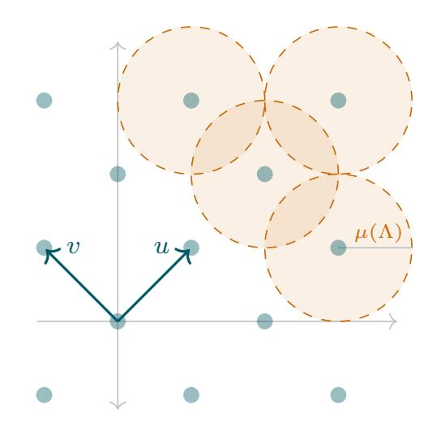
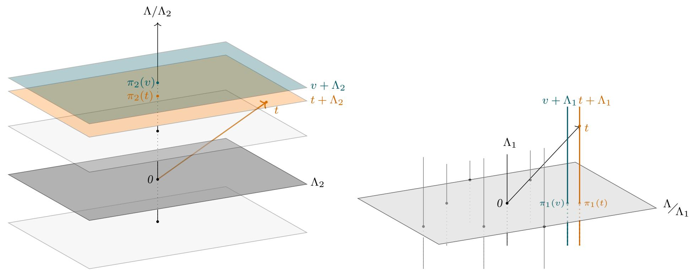
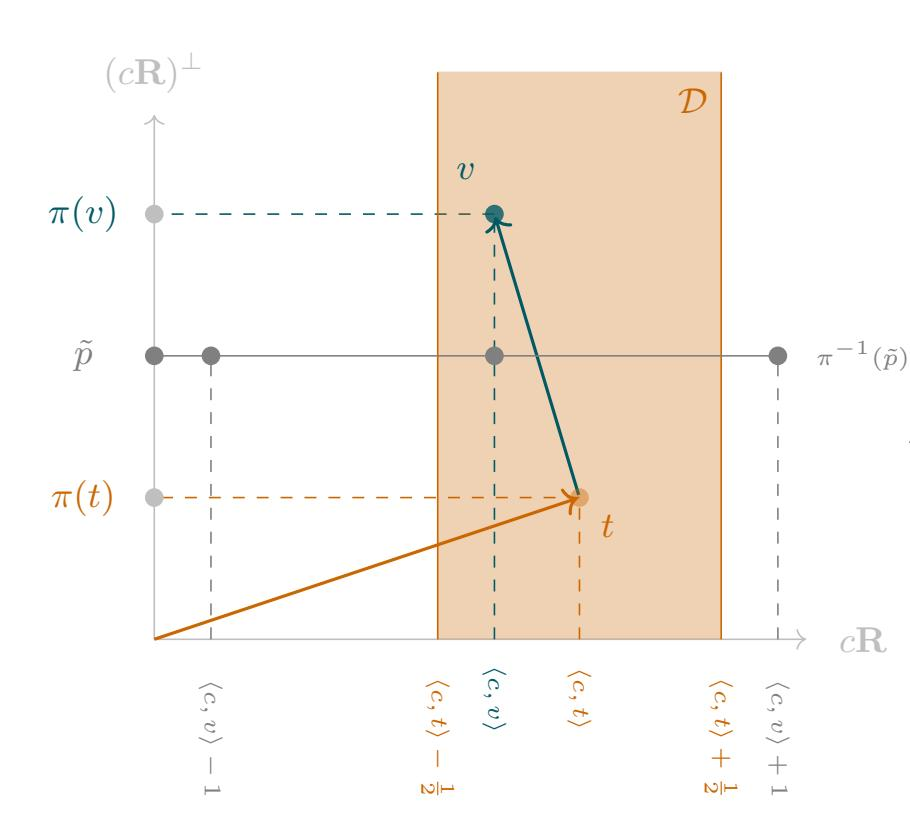

{0}------------------------------------------------

### THE NEAREST-COLATTICE ALGORITHM

\* \* \*

TIME-APPROXIMATION TRADEOFF FOR APPROX-CVP

#### THOMAS ESPITAU\* AND PAUL KIRCHNER\*

ABSTRACT. In this work, we exhibit a hierarchy of polynomial time algorithms solving approximate variants of the Closest Vector Problem (CVP). Our first contribution is a heuristic algorithm achieving the same distance tradeoff as HSVP algorithms, namely  $\approx \beta^{\frac{n}{2\beta}} \operatorname{covol}(\Lambda)^{\frac{1}{n}}$  for a random lattice  $\Lambda$  of rank n. Compared to the so-called Kannan's embedding technique, our algorithm allows using precomputations and can be used for efficient batch CVP instances. This implies that some attacks on lattice-based signatures lead to very cheap forgeries, after a precomputation. Our second contribution is a *proven* reduction from approximating the closest vector with a factor  $\approx n^{\frac{3}{2}}\beta^{\frac{3n}{2\beta}}$  to the Shortest Vector Problem (SVP) in dimension  $\beta$ .

#### 1. Introduction

**Lattices, CVP, SVP.** In a general setting, a real *lattice*  $\Lambda$  is a finitely generated free **Z**-module, endowed with a positive-definite quadratic form on its ambient space  $\Lambda \otimes_{\mathbf{Z}} \mathbf{R}$ , or equivalently is a discrete subgroup of a Euclidean space.

A fundamental lattice problem is the *Closest Vector Problem*, or CVP for short. The goal of this problem is to find a lattice point that is closest to a given point in its ambient space. This problem is provably difficult to solve, being actually a **NP**-hard problem. It is known to be harder than the *Shortest Vector Problem* (SVP) [19], which asks for the shortest non-zero lattice point. SVP is, in turn, the cornerstone of lattice reduction algorithms (see for instance [33, 20, 29]). These algorithms are at the heart of lattice-based cryptography [31], and are invaluable in plenty of computational problems, including Diophantine approximation, algebraic number theory or optimization (see [30] for a survey on the applications of the LLL algorithm).

**On CVP-solving algorithms.** There are three families of algorithms solving CVP:

**Enumeration algorithms:** consisting in recursively explore all vectors in a set containing a closest vector. Kannan's algorithm takes time  $n^{O(n)}$  and polynomial space [24]. This estimate was later refined to  $n^{\frac{n}{2}+o(n)}$  by Hanrot and Stehlé [21].

{1}------------------------------------------------

**Voronoi cell computation:** Micciancio and Voulgaris' Voronoi cell algorithm solves CVP in time  $(4 + o(1))^n$  but uses a space of  $(2 + o(1))^n$  [28].

**Sieving algorithms:** where vectors are combined in order to get closer and closer to the target vector. Heuristic variants take time as low as  $(4/3 + o(1))^{\frac{n}{2}}$  [7], but proven variants of classical sieves [3, 8, 15] could only solve CVP with approximation factor  $1 + \epsilon$  at a cost in the exponent. In 2015, a  $(2 + o(1))^n$  sieve for *exact* CVP was finally proven by Aggarwal, Dadush and Stephen-Davidowitz [1] thanks to the properties of discrete Gaussians.

Many algorithms for solving its relaxed variant, APPROX-CVP, have been proposed. However, they come with caveats. For example, Dadush, Regev and Stephens-Davidowitz [10] give algorithms for this problem, but only with exponential time precomputations. Babai [5, Theorem 3.1] showed that one can reach an  $2^{\frac{n}{2}}$ -approximation factor for CVP in polynomial time. To the authors' knowledge, this has never been improved (while keeping the polynomial-time requirement), though the approximation factor for SVP has been significantly reduced [33, 20, 29].

We aim at solving the relaxed version of CVP for relatively large approximation factors, and study the tradeoff between the quality of the approximation of the solution found and the time required to actually find it. In particular, we exhibit a hierarchy of polynomial-time algorithms solving APPROX-CVP, ranging from Babai's nearest plane algorithm to an actual CVP oracle.

Contributions and summary of the techniques. In Section 3 we introduce our so-called Nearest-Colattice algorithm. Inspired by Babai's algorithm, it shows that in practice, we can achieve the performance of Kannan's embedding but with a basis which is *independent* of the target vector. Denote by  $T(\beta)$  (resp.  $T_{\text{CVP}}(\beta)$ ) the time required to solve  $\sqrt{\beta}$ -Hermite-SVP (resp. exactly solve CVP) in rank  $\beta$ ). Quantitatively, we show that:

**Theorem 1.1** (Informal). Let  $\beta > 0$  be a positive integer and B be a basis of a lattice  $\Lambda$  of rank  $n > 2\beta$ . After precomputations using a time bounded by  $T(\beta)(n + \log \|B\|)^{O(1)}$ , given a target  $t \in \Lambda_{\mathbf{R}}$  and under a heuristic on the covering radius of random lattice, the algorithm **Nearest-Colattice** finds a vector  $x \in \Lambda$  such that

$$||x - t|| \le \Theta(\beta)^{\frac{n}{2\beta}} \operatorname{covol}(\Lambda)^{\frac{1}{n}}$$

in time  $T_{\text{CVP}}(\beta)(n + \log ||t|| + \log ||B||)^{O(1)}$ .

Furthermore, the structure of the algorithms allow time-memory tradeoff and batch CVP oracle to be used.

We believe that this algorithm has been in the folklore for some time, and it is somehow hinted in ModFalcon's security analysis [9, Subsection 4.2], but without analysis of the heuristics introduced.

{2}------------------------------------------------

Our second contribution is an APPROX-CVP algorithm, which gives a time-quality tradeoff similar to the one given by the BKZ algorithm [\[33,](#page-18-0) [21\]](#page-17-6), or variants of it [\[17,](#page-17-9) [2\]](#page-16-7). Note however that the approximation factor is significantly higher than the corresponding theorems for APPROX-SVP. Written as a reduction, we prove that, for a γ-HSVP oracle O:

**Theorem 1.2** (APPROX-CVPP oracle from APPROX-SVP oracle)**.** *Let* Λ *be a lattice of rank* n*. Then one can solve the* (n <sup>2</sup> γ 3 )*-closest vector problem in* Λ*, using* 2n 2 *calls to the oracle* O *during precomputation, and polynomial-time computations.*

Babai's algorithm requires that the Gram-Schmidt norms do not decrease by too much in the reduced basis. While this is true for a LLL reduced basis [\[26\]](#page-17-10), we do not know a way to guarantee this in the general case. To overcome this difficulty, the proof technique goes as follows: first we show that it is possible to find a vector within distance √ nγ 2 λn(Λ) of the target vector, with the help of a highly-reduced basis. This is not enough, as the target can be very closed compared to λn(Λ). We treat this peculiar case by finding a short vector in the dual lattice and then directly compute the inner product of the close vectors with our short dual vector. In the other case, Banaszczyk's transference theorem [\[6\]](#page-16-8) guarantees that λn(Λ) is comparable to the distance to the lattice, so that we can use our first algorithm directly.

**Remark.** *Based on a result due to Kannan (see for instance [\[12\]](#page-16-9)) that* <sup>√</sup> nγ<sup>2</sup> CVP *reduces to* γ*-*SVP*. Combined with the reduction from* γ 2 *-*SVP *to* γ*-*HSVP *of [\[27\]](#page-17-11), we get a polynomial time reduction from* √ nγ<sup>4</sup> *-*CVP *to* γ*-*HSVP*. Hence, our result is better when* n 3 <sup>2</sup> γ 3 *is smaller than* <sup>√</sup> nγ<sup>4</sup> *, i.e., when* n < γ*.*

## 2. ALGEBRAIC AND COMPUTATIONAL BACKGROUND

In this preliminary section, we recall the notions of geometry of numbers used throughout this paper, the computational problems related to SVP and CVP, and a brief presentation of some lattice reduction algorithms solving these problems.

# **Notations and conventions.**

*General notations.* The bold capitals Z, Q and R refer as usual to the ring of integers and respectively the field of rational and real numbers. Given a real number x, the integral roundings *floor*, *ceil* and *round to the nearest integer* are denoted respectively by bxc, dxe, bxe. All logarithms are taken in base 2, unless explicitly stated otherwise.

*Computational setting.* The generic complexity model used in this work is the random-access machine (RAM) model and the computational cost is measured in operations.

{3}------------------------------------------------

### 2.1. Euclidean lattices and their geometric invariants.

### 2.1.1. Lattices.

**Definition 2.1** (Lattice). A (real) lattice  $\Lambda$  is a finitely generated free **Z**-module, endowed with a Euclidean norm  $\|.\|$  on the real vector space  $\Lambda_{\mathbf{R}} = \Lambda \otimes_{\mathbf{Z}} \mathbf{R}$ .

We may omit to write down the norm to refer to a lattice  $\Lambda$  when any ambiguity is removed by the context. By definition of a finitely-generated free module, there exists a finite family  $(v_1, \ldots, v_n) \in \Lambda^n$  such that  $\Lambda = \bigoplus_{i=1}^n v_i \mathbf{Z}$ , called a *basis* of  $\Lambda$ . Every basis has the same number of elements  $\operatorname{rk}(\Lambda)$ , called the rank of the lattice.

2.1.2. Sublattices, quotient lattice. Let  $(\Lambda, \| \cdot \|)$  be a lattice, and let  $\Lambda'$  be a submodule of  $\Lambda$ . Then the restriction of  $\| \cdot \|$  to  $\Lambda'$  endows  $\Lambda$  with a lattice structure. The pair  $(\Lambda', \| \cdot \|)$  is called a sublattice of  $\Lambda$ . In the following of this paper, we restrict ourselves to so-called *pure sublattices*, that is such that the quotient  $\Lambda'_{\Lambda'}$  is torsion-free. In this case, the quotient can be endowed with a canonical lattice structure by defining:

$$||v + \Lambda'||_{\Lambda/\Lambda'} = \inf_{v' \in \Lambda'_{\mathbf{B}}} ||v - v'||_{\Lambda}.$$

This lattice is isometric to the projection of  $\Lambda$  orthogonally to the subspace of  $\Lambda_{\mathbf{R}}$  spanned by  $\Lambda'$ .

2.1.3. On effective lifting. Given a coset  $v + \Lambda'$  of the quotient  $\Lambda'_{\Lambda'}$ , we might need to find a representative of this class in  $\Lambda$ . While any element could be theoretically taken, from an algorithmic point of view, we shall take an element of norm somewhat small, so that its coefficients remain polynomial in the input representation of the lattice. An effective solution to do so consists in using for instance the *Babai's rounding* or *Babai's nearest plane* algorithms. For completeness purpose we recast here the pseudo-code of such a **Lift** function using the nearest-plane procedure.

```
Algorithm 1: Lift (by Babai's nearest plane)
```

**Input:** A lattice basis  $B=(v_1,\ldots,v_k)$  of  $\Lambda'$  in  $\Lambda$ , a vector  $t\in\Lambda_{\mathbf{R}}$ .

**Result:** A vector of the class  $\tilde{t} + \Lambda' \in \Lambda$ .

- 1 Compute the Gram-Schmidt orthogonalization  $(v_1^*,\dots,v_k^*)$  of B
- $s \leftarrow -t$
- 3 for i = k downto 1 do
- 4  $s \leftarrow s \left\lfloor \frac{\langle s, v_i^* \rangle}{\|v_i^*\|^2} \right\rfloor v_i$
- 5 end for
- 6 return t+s

{4}------------------------------------------------

2.1.4. *Orthogonality and algebraic duality.* The *dual* lattice Λ <sup>∨</sup> of a lattice Λ is defined as the module Hom(Λ, Z) of integral linear forms, endowed with the derived norm defined by

$$\|\varphi\| = \inf_{v \in \Lambda_{\mathbf{R}} \backslash \{0\}} \frac{|\varphi(v)|}{\|v\|_{\Lambda}}$$

for ϕ ∈ Λ <sup>∨</sup>. By Riesz's representation theorem, it is isometric to:

$$\{x \in \Lambda_{\mathbf{R}} \mid \langle x, v \rangle \in \mathbf{Z}, \forall v \in \Lambda\}$$

endowed with the dual of k · kΛ.

Let Λ <sup>0</sup> ⊂ Λ be a sublattice. Define its *orthogonal* in Λ to be the sublattice

$$\Lambda'_{\perp} = \{ x \in \Lambda^{\vee} : \langle x, \Lambda' \rangle = 0 \}$$

of Λ <sup>∨</sup>. It is isometric to <sup>Λ</sup><sup>Λ</sup> 0 ∨ , and by biduality Λ 0∨ <sup>⊥</sup> shall be identified with <sup>Λ</sup><sup>Λ</sup> 0.

- 2.1.5. *Filtrations.* A filtration (or flag) of a lattice Λ is an increasing sequence of submodules of Λ, i.e. each submodule is a proper submodule of the next: {0} = Λ<sup>0</sup> ⊂ Λ<sup>1</sup> ⊂ Λ<sup>2</sup> ⊂ · · · ⊂ Λ<sup>k</sup> = Λ. If we write the rk(Λi) = d<sup>i</sup> , then we have: 0 = d<sup>0</sup> < d<sup>1</sup> < d<sup>2</sup> < · · · < d<sup>k</sup> = rk(Λ), A filtration is called *complete* if d<sup>i</sup> = i for all i.
- 2.1.6. *Successive minima, covering radius and transference.* Let Λ be a lattice of rank n. By discreteness in ΛR, there exists a vector of minimal norm in Λ. This parameter is called the *first minimum* of the lattice and is denoted by λ1(Λ). An equivalent way to define this invariant is to see it as the smallest positive real r such that the lattice points inside a ball of radius r span a space of dimension 1. This definition leads to the following generalization, known as successive minima.

**Definition 2.2** (Successive minima)**.** *Let* Λ *be a lattice of rank* n*. For* 1 ≤ i ≤ n*, define the* i*-th minimum of* Λ *as*

λi(Λ) = inf{r ∈ R| dim(span(Λ ∩ B(0, r))) ≥ i}.



FIGURE 1. Covering radius µ(Λ) of a two dimensional lattice Λ.

**Definition 2.3.** *The covering radius a lattice* Λ *or rank* n *is defined as*

$$\mu(\Lambda) = \max_{x \in \Lambda_{\mathbf{R}}} \operatorname{dist}(x, \Lambda).$$

It means that for any vector of the ambient space x ∈ Λ<sup>R</sup> there exists a lattice point v ∈ Λ at distance smaller than µ(Λ).

We now recall Banaszczyk's transference theorem, relating the extremal minima of a lattice and its dual:

{5}------------------------------------------------

**Theorem 2.1** (Banaszczyk's transference theorem [\[6\]](#page-16-8))**.** *For any lattice* Λ *of dimension* n*, we have*

$$1 \le 2\lambda_1(\Lambda^{\vee})\mu(\Lambda) \le n,$$

*implying,*

$$1 \le \lambda_1(\Lambda^{\vee})\lambda_n(\Lambda) \le n.$$

# 2.2. **Computational problems in geometry of numbers.**

2.2.1. *The shortest vector problem.* In this section, we introduce formally the SVP problem and its variants and discuss their computational hardness.

**Definition 2.4** (γ-SVP)**.** *Let* γ = γ(n) ≥ 1*. The* γ*-Shortest Vector Problem (*γ*-*SVP*) is defined as follows.*

**Input:** *A basis* (v1, . . . , vn) *of a lattice* Λ *and a target vector* t ∈ ΛR*.*

**Output:** *A lattice vector* v ∈ Λ \ {0} *satisfying* kvk ≤ γλ1(Λ)*.*

In the case where γ = 1, the corresponding problem is simply called SVP.

**Theorem 2.2** (Haviv and Regev [\[22\]](#page-17-12))**.** APPROX-SVP *is NP-hard under randomized reductions for every constant approximation factor.*

A variant of the problem consists of finding vectors within Hermite-like inequalities.

**Definition 2.5** (γ-HSVP)**.** *Let* γ = γ(n) ≥ 1*. The* γ*-Hermite Shortest Vector Problem (*γ*-*HSVP*) is defined as follows.*

**Input:** *A basis* (v1, . . . , vn) *of a lattice* Λ*.*

**Output:** *A lattice vector* v ∈ Λ \ {0} *satisfying* kvk ≤ γ covol(Λ) <sup>1</sup> n *.*

There exists a simple polynomial-time dimension-preserving reduction between these two problems, as stated by Lovász in [\[27,](#page-17-11) 1.2.20]:

<span id="page-5-0"></span>**Theorem 2.3.** *One can solve* γ 2 *-*SVP *using* 2n *calls to a* γ*-*HSVP *oracle and polynomial time.*

This can be slightly improved in case the HSVP oracle is built from a HSVP oracle in lower dimension [\[2\]](#page-16-7).

2.2.2. *An oracle for* γ*-*HSVP*.* We note T(β) a function such that we can solve O √ β -HSVP in time at most T(β) times the input size. We have the following bounds on T, depending on if we are looking at an algorithm which is:

**Deterministic:** T(β) = (4 + o(1))β/<sup>2</sup> , proven by Micciancio and Voulgaris in[\[28\]](#page-17-7); 

{6}------------------------------------------------

**Randomized:**  $T(\beta)=(4/3+\mathrm{o}(1))^{\beta/2}$ , introduced by Wei, Liu and Wang in [36]; **Heuristic:**  $T(\beta)=(3/2+\mathrm{o}(1))^{\beta/2}$  in [7] by Becker, Ducas, Gama, Laarhoven.

There also exists variants for quantum computers [25], and time-memory tradeoffs, such as [23]. By providing a back-and-forth strategy coupled with enumeration in the dual lattice, the *self dual block Korkine-Zolotarev* (DBKZ) algorithm provides an algorithm better than the famous BKZ algorithm.

**Theorem 2.4** (Micciancio and Walter [29]). *There exists an algorithm oututing a vector* v *of a lattice*  $\Lambda$  *satisfying:* 

$$||v|| \le \beta^{\frac{n-1}{2(\beta-1)}} \cdot \operatorname{covol}(\Lambda)^{\frac{1}{n}}.$$

Such a bound can be achieved in time  $(n + \log ||B||)^{O(1)}T(\beta)$ , where B is the integer input basis representing  $\Lambda$ .

*Proof.* The bound we get is a direct consequence of [29, Theorem 1]. We only replaced the *Hermite constant*  $\gamma_{\beta}$  by an upper bound in  $O(\beta)$ .

A stronger variant of this estimate is heuristically true, at least for "random" lattices, as it is suggested by the Gaussian Heuristic in [29, Corollary 2]. Under this assumption, one can bound not only the length of the first vector but also the gap between the covolumes of the filtration induced by the outputted basis.

<span id="page-6-0"></span>**Theorem 2.5.** There exists an algorithm oututing a complete filtration of a lattice  $\Lambda$  satisfying:

$$\operatorname{covol}(\Lambda_{i/\Lambda_{i-1}}) \approx \Theta(\beta)^{\frac{n+1-2i}{2(\beta-1)}} \operatorname{covol}(\Lambda)^{\frac{1}{n}}$$

Such a bound can be achieved in time  $(n + \log ||B||)^{O(1)}T(\beta)$ , where B is the integer-valued input basis. Further, we have:

$$\Theta(\sqrt{\beta}) \operatorname{covol}^{\frac{1}{\beta}} \left( \Lambda_{n/\Lambda_{n-\beta}} \right) \approx \operatorname{covol} \left( \Lambda_{n-\beta+1/\Lambda_{n-\beta}} \right).$$

2.3. **The closest vector problem.** In this section we introduce formally the CVP problem and its variants and discuss their computational hardness.

**Definition 2.6** ( $\gamma$ -CVP). Let  $\gamma = \gamma(n) \geq 1$ . The  $\gamma$ -Closest Vector Problem ( $\gamma$ -CVP) is defined as follows.

**Input:** A basis  $(v_1, \ldots, v_n)$  of a lattice  $\Lambda$  and a target vector  $t \in \Lambda \otimes \mathbf{R}$ .

**Output:** A lattice vector  $v \in \Lambda$  satisfying  $||x - t|| \le \gamma \min_{v \in \Lambda} ||v - t||$ .

In the case where  $\gamma = 1$ , the corresponding problem is called CVP.

**Theorem 2.6** (Dinur, Kindler and Shafra [11]).  $n^{\frac{c}{\log \log n}}$ -APPROX-CVP is **NP**-hard for any c > 0.

{7}------------------------------------------------

We let TCVP(β) be such that we can solve CVP in dimension β in running time bounded by TCVP(β) times the size of the input. Hanrot and Stehlé proved β β/2+o(β) with polynomial memory [\[21\]](#page-17-6). Sieves can provably reach (2 + o(1))<sup>β</sup> with exponential memory [\[1\]](#page-16-3). More importantly for this paper, heuristic sieves can reach (4/3 + o(1))β/<sup>2</sup> for solving an entire batch of 2 0.058β instances [\[13\]](#page-16-11).

## 3. THE NEAREST COLATTICE ALGORITHM

<span id="page-7-0"></span>We aim at solving the γ−APPROX-CVP by recursively exploiting the datum of a filtration

$$\Lambda_0 \subset \Lambda_1 \subset \cdots \subset \Lambda_k = \Lambda$$

*via* recursive approximations. The central object used during this reduction is the *nearest colattice* relative to a target vector.

In this section, and the next one, we assume that the size of the bases is always small, essentially as small as the input basis. This is classic, and can be easily proven.

## <span id="page-7-1"></span>3.1. **Nearest colattice to a vector.**

**Definition 3.1.** *Let* 0 → Λ <sup>0</sup> <sup>→</sup> <sup>Λ</sup> <sup>→</sup> <sup>Λ</sup><sup>Λ</sup> <sup>0</sup> → 0 *be a short exact sequence of lattices, and set* t ∈ Λ<sup>R</sup> *a target vector. A nearest* Λ 0 *-colattice to* <sup>t</sup> *is a coset* <sup>v</sup>¯ <sup>=</sup> <sup>v</sup> +Λ<sup>0</sup> <sup>∈</sup> <sup>Λ</sup><sup>Λ</sup> <sup>0</sup> *which is the closest to the projection of* <sup>t</sup> *in* <sup>Λ</sup><sup>R</sup><sup>Λ</sup> 0 R *, i.e. such that:*

$$\bar{v} = \operatorname*{argmin}_{v \in \Lambda} \|(t - v) + \Lambda'\|_{\Lambda_{\mathbf{R}}/\Lambda'_{\mathbf{R}}}$$

This definition makes sense thanks to the discreteness of the quotient lattice <sup>Λ</sup><sup>Λ</sup> <sup>0</sup> in the real vector space <sup>Λ</sup><sup>R</sup><sup>Λ</sup> 0 R .

**Exemple.** *To illustrate this definition, we give two examples in dimension 3, of rank 1 and 2 nearest colattices. Set* Λ *a rank 3 lattice, and fix* Λ<sup>1</sup> *and* Λ<sup>2</sup> *two pure sublattices of respective rank 1 and 2. Denote by* <sup>π</sup><sup>i</sup> *the canonical projection onto the quotient* <sup>Λ</sup><sup>Λ</sup><sup>i</sup> *, which is of dimension* 3 − i *for* i ∈ {1, 2}*. The* Λi*-closest colattice to* t*, denoted by* v<sup>i</sup> + Λ<sup>i</sup> *is such that* πi(vi) *is a closest vector to* πi(t) *in the corresponding quotient lattice. Figures (*A*) and (*B*) respectively depict these situations.*

**Remark.** *A computational insight on [Definition 3.1](#page-7-1) is to view a nearest colattice as a solution to an instance of exact-*CVP *in the quotient lattice* <sup>Λ</sup><sup>Λ</sup> 0*.*

Taking the same notations as in [Definition 3.1,](#page-7-1) let us project t orthogonally onto the affine space v + Λ<sup>0</sup> <sup>R</sup>, and take w a closest vector to this projection. The vector w is then relatively close to t. Let us quantify its defect of closeness towards an actual closest vector to t:

{8}------------------------------------------------



(A) The Λ2-nearest colattice v + Λ<sup>2</sup> relative to t, in green.

(B) The Λ1-nearest colattice v + Λ<sup>1</sup> relative to t.

## **Proposition 3.1.** *With the same notations as above:*

$$||t - w||^2 \le \mu \left( \frac{\Lambda}{\Lambda'} \right)^2 + \mu (\Lambda')^2$$

*Proof.* Clear by Pythagoras' theorem.

<span id="page-8-0"></span>By definition of the covering radius, we then have:

**Corollary 3.1** (Subadditivity of the covering radius over short exact sequences)**.** *short exact sequence of lattices. Then we have:*

$$\mu(\Lambda)^2 \le \mu(\Lambda/\Lambda')^2 + \mu(\Lambda')^2$$

This inequality is tight, as being an equality when there exists a sublattice Λ <sup>00</sup> such that Λ <sup>0</sup> ⊕ Λ <sup>00</sup> = Λ and Λ <sup>00</sup> ⊆ Λ 0 ⊥.

### 3.2. **Recursion along a filtration.** Let us now consider a filtration

$$\Lambda_0 \subset \Lambda_1 \subset \cdots \subset \Lambda_k = \Lambda$$

and a target vector t ∈ ΛR. Repeatedly applying [Corollary 3.1](#page-8-0) along the subfiltrations 0 ⊂ Λ<sup>i</sup> ⊂ Λi+1, yields a sequence of inequalities µ(Λi+1) <sup>2</sup> − µ(Λi) <sup>2</sup> ≤ µ(Λi+1/Λi) 2 . The telescoping sum now gives the relation:

$$\mu(\Lambda)^2 \le \sum_{i=1}^k \mu(\Lambda_{i+1}/\Lambda_i)^2.$$

This formula has a very natural algorithmic interpretation as a recursive oracle for approx-CVP:

{9}------------------------------------------------

- (1) Starting from the target vector t, we solve the CVP instance corresponding to π(t) in the quotient <sup>Λ</sup><sup>k</sup><sup>Λ</sup>k−<sup>1</sup> with π the canonical projection onto this quotient to find v + Λk−<sup>1</sup> the nearest Λk−1-colattice to t.
- (2) We then project t orthogonally onto v + (Λk−<sup>1</sup> ⊗<sup>Z</sup> R). Call t 0 this vector.
- (3) A recursive call to the algorithm on the instance (t <sup>0</sup>−v,Λ<sup>0</sup> ⊂ · · · ⊂ Λk−1)) yields a vector w ∈ Λ2.
- (4) Return w + v.

Its translation in pseudo-code is given in an iterative manner in the algorithm Nearest-Colattice.

```
Algorithm 2: Nearest-Colattice
```

Input: A filtration {0} = Λ<sup>0</sup> ⊂ Λ<sup>1</sup> ⊂ · · · ⊂ Λ<sup>k</sup> = Λ, a target t ∈ Λ<sup>R</sup>

Result: A vector in Λ close to t.

- **<sup>1</sup>** s ← −t
- **<sup>2</sup>** for i = k downto 1 do
- **<sup>3</sup>** s ← s − Lift(argminh∈Λi/Λi−<sup>1</sup> kv − hk)
- **<sup>4</sup>** end for
- **<sup>5</sup>** return t + s

<span id="page-9-0"></span>**Proposition 3.2.** *Let* B *be a basis of a lattice* Λ *of rank* n*. Given a target* t ∈ ΛR*, the algorithm* Nearest-Colattice *finds a vector* x ∈ Λ *such that*

$$||x - t||^2 \le \sum_{i=1}^k \mu \left( \Lambda_{i+1} / \Lambda_i \right)^2$$

*in time* TCVP(β)(n + log ktk + log kBk) O(1)*, where* β *is the largest gap of rank in the filtration:* β = maxi(rk(Λi+1) − rk(Λi))*.*

*Proof.* The bound on the quality of the approximation is a direct consequence of the discussion conducted before. The running time bound derives from the definition of TCVP and on the fact that the Lift operations can be conducted in polynomial time.

**Remark** (Retrieving Babai's algorithm)**.** *In the specific case where the filtration is complete, that is to say that* rk(Λi) = i *for each* 1 ≤ i ≤ n*, the* Nearest-Colattice *algorithm coincides with the so-called* Babai's nearest plane *algorithm. In particular, it recovers a vector at distance*

$$\sqrt{\sum_{i=1}^{n} \mu(\Lambda_{i/\Lambda_{i-1}})^2} = \frac{1}{2} \sqrt{\sum_{i=1}^{n} \operatorname{covol}(\Lambda_{i/\Lambda_{i-1}})^2},$$

{10}------------------------------------------------

*by using that for each index* i*, we have* µ <sup>Λ</sup><sup>i</sup><sup>Λ</sup>i−<sup>1</sup> = 1 2 covol <sup>Λ</sup><sup>i</sup><sup>Λ</sup>i−<sup>1</sup> *as these quotients are onedimensional.*

The bound given in [Proposition 3.2](#page-9-0) is not easily instantiable as it requires to have access to the covering radius of the successive quotients of the filtration. However, under a mild heuristic on random lattices, we now exhibit a bound which only depends on the parameter β and the covolume of Λ.

3.3. **On the covering radius of a random lattice.** In this section we prove that the covering radius of a random lattice behaves essentially in p rk(Λ).

In 1945, Siegel [\[34\]](#page-18-2) proved that the projection of the Haar measure of SLn(R) over the quotient SLn(R)/SLn(Z) is of finite mass, yielding a natural probability distribution ν<sup>n</sup> over the moduli space L<sup>n</sup> of unit-volume lattices. By construction this distribution is translation-invariant, that is, for any measurable set S ⊆ L<sup>n</sup> and all U ∈ SLn(Z), we have νn(S) = νn(SU). A *random lattice* is then defined as a unit-covolume lattice in R<sup>n</sup> drawn under the probability distribution νn.

We first recall an estimate due to Rogers [\[32\]](#page-17-15), giving the expectation[1](#page-10-0) of the number of lattice points in a fixed set.

<span id="page-10-1"></span>**Theorem 3.1** (Rogers' average)**.** *Let* n ≤ 4 *be an integer and* ρ *be the characteristic function of a Borel set* C *of* R<sup>n</sup> *whose volume is* V *, centered at 0. Then:*

$$0 \le \int_{\mathcal{L}_n} \rho(\Lambda \setminus \{0\}) d\nu_n(\Lambda) - 2e^{-V/2} \sum_{r=0}^{\infty} \frac{r}{r!} (V/2)^r$$
$$\le (V+1) \left( 6\left(\sqrt{\frac{3}{4}}\right)^n + 105 \cdot 2^{-n} \right).$$

This allows to prove that the first minimum of a random lattice is greater than a multiple of √ n.

<span id="page-10-2"></span>**Lemma 3.1.** *Let* Λ *be a random lattice of rank* n*. Then, with probability* 1 − 2 −Ω(n) *,* <sup>λ</sup>1(Λ) > c<sup>√</sup> n *for a universal constant* c > 0*.*

*Proof.* Consider the ball C of volume 0.99<sup>n</sup>. It has a radius lower bounded by c √ n. By [Theo](#page-10-1)[rem 3.1,](#page-10-1) the expectation of the number of lattice points in C is at most

$$128\left(\frac{3}{4}\right)^{\frac{n}{2}}(V+1) + V \in (1+o(1))V.$$

<span id="page-10-0"></span><sup>1</sup>The result proved by Rogers is actually more general and bounds all the moment of the enumerator of lattice points. For the purpose of this work, only the first moment is actually required.

{11}------------------------------------------------

This estimate thus bounds the probability that there exists a non-zero lattice vector in C by  $1-2^{-\Omega(n)}$ , using Markov's inequality.

Using the transference theorem, we then derive the following estimate on the covering radius of a random lattice:

**Theorem 3.2.** Let  $\Lambda$  be a random lattice of rank n. Then, with probability  $1 - 2^{-\Omega(n)}$ ,  $\mu(\Lambda) < d\sqrt{n}$  for a universal constant d.

*Proof.* First remark that the dual lattice  $\Lambda^{\vee}$  follows the same distribution. Hence, using the estimate of Lemma 3.1, we know that with probability  $1-2^{-\Omega(n)}$ ,  $\lambda_1(\Lambda^{\vee})>c\sqrt{n}$ . Banaszczyk's transference theorem indicates that in this case,

$$\mu(\Lambda) \le \frac{n}{\lambda_1(\Lambda^{\vee})} \le \frac{\sqrt{n}}{c},$$

concluding the proof.

This justifies the following heuristic:

<span id="page-11-0"></span>**Heuristic 3.1.** In algorithm **Nearest-Colattice**, for any index i, we have  $\mu\left(\Lambda_{i+1}/\Lambda_i\right) \leq c\lambda_1\left(\Lambda_{i+1}/\Lambda_i\right)$  for some universal constant c.

The Gaussian heuristic suggests that "almost all" targets t are at distance  $(1 + o(1))\lambda_1(\Lambda)$ , so that for practical purpose in the analysis we can take c = 1 in Heuristic 3.1.

### <span id="page-11-1"></span>3.4. Quality of the algorithm on random lattices.

**Theorem 3.3.** Let  $\beta > 0$  be a positive integer and B be a basis of a lattice  $\Lambda$  of rank  $n > 2\beta$ . After precomputations using a time bounded by  $T(\beta)(n + \log \|B\|)^{O(1)}$ , given a target  $t \in \Lambda_{\mathbf{R}}$  and under Heuristic 3.1, the algorithm **Nearest-Colattice** finds a vector  $x \in \Lambda$  such that

$$||x - t|| \le \Theta(\beta)^{\frac{n}{2\beta}} \operatorname{covol}(\Lambda)^{\frac{1}{n}}$$

in time  $T_{\text{CVP}}(\beta) Poly(n, \log ||t||, \log ||B||)$ .

*Proof.* We start by reducing the basis B of  $\Lambda$  using the DBKZ algorithm, and collect the vectors in blocks of size  $\beta$ , giving a filtration:

$$\{0\} = \Lambda_0 \subset \Lambda_1 \subset \cdots \subset \Lambda_k = \Lambda,$$

for  $k = \left\lceil \frac{n}{\beta} \right\rceil$  and  $\operatorname{rk} \left( \frac{\Lambda_{i+1}}{\Lambda_i} \right) = \beta$  for each index i except the penultimate one, of rank  $n - \beta \left\lfloor \frac{n}{\beta} \right\rfloor$ . We define  $l_i$  as  $\operatorname{rk} \left( \frac{\Lambda_{i+1}}{\Lambda_i} \right)$ . By Theorem 2.5 and finite induction in each block using the

{12}------------------------------------------------

multiplicativity of the covolume over short exact sequences, we have for i < k-1

$$\operatorname{covol}\left(\Lambda_{i+1/\Lambda_{i}}\right)^{\frac{1}{l_{i}}} \approx \operatorname{covol}(\Lambda)^{\frac{1}{n}} \left(\prod_{j=i\beta}^{i\beta+l_{i}-1} \Theta(\beta)^{\frac{n+1-2j}{2(\beta-1)}}\right)^{\frac{1}{l_{i}}}$$
$$= \Theta(\beta)^{\frac{n+2-2i\beta-l_{i}}{2(\beta-1)}} \operatorname{covol}(\Lambda)^{\frac{1}{n}}.$$

We also have

$$\Theta(\sqrt{\beta})\operatorname{covol}\left(\Lambda_{k/\Lambda_{k-1}}\right)^{1/\beta} \approx \Theta(\beta)^{\frac{n+1-2(n-\beta)}{2(\beta-1)}}\operatorname{covol}^{\frac{1}{n}}\Lambda$$

so that the previous approximation is also true for i = k-1. Using Heuristic 3.1 and Minkowski's first theorem, we can estimate the covering radius of this quotient as:

$$\mu\left(\Lambda_{i+1/\Lambda_i}\right) \leq \Theta(\sqrt{l_i})\Theta(\beta)^{\frac{n+2-2i\beta-l_i}{2(\beta-1)}} \operatorname{covol}^{\frac{1}{n}} \Lambda.$$

Using Proposition 3.2, now asserts that **Nearest-Colattice** returns a vector at distance from t bounded by:

$$\operatorname{covol}(\Lambda)^{\frac{1}{n}} \sum_{i=0}^{k} \Theta(\sqrt{l_i}) \Theta(\beta)^{\frac{n+2-2i\beta-l_i}{2(\beta-1)}} = \Theta(\beta)^{\frac{n}{2\beta-2}} \operatorname{covol}(\Lambda)^{\frac{1}{n}}$$

where the last equality stems from the condition  $n \geq 2\beta$ , so that only the first term is significant.

Note that in the algorithm, all lattices depend only on  $\Lambda$ , not on the targets. Therefore, it is possible to use CVP algorithms after precomputations. These algorithms are significantly faster; we refer to [13] for heuristic ones and to [10, 35] for proven approximation algorithms.

#### 4. Proven approx-cvp algorithm with precomputation

In all of this section, let us fix an oracle  $\mathcal{O}$ , solving the  $\gamma$ -HSVP. We solve APPROX-CVP with preprocessing from the oracle  $\mathcal{O}$ .

<span id="page-12-0"></span>**Theorem 4.1** (APPROX-CVPP oracle from HSVP oracle). Let  $\Lambda$  be a lattice of rank n. Then one can solve the  $(n^{\frac{3}{2}}\gamma^3)$ -closest vector problem in  $\Lambda$ , using  $2n^2$  calls to the oracle  $\mathcal{O}$  during precomputation, and polynomial time computations.

The first step of this reduction consists in proving that we can find a lattice point at a distance roughly  $\lambda_n(\Lambda)$ .

<span id="page-12-1"></span>**Theorem 4.2.** Let  $\Lambda$  be a lattice of rank n and  $t \in \Lambda \otimes \mathbf{R}$  a target vector, then one can find a lattice vector  $c \in \Lambda$  satisfying

$$||c-t|| \le \frac{\sqrt{n\gamma}}{2} \lambda_n(\Lambda),$$

using n calls to the oracle  $\mathcal{O}$  during precomputation, and polynomial time computations.

{13}------------------------------------------------

*Proof.* We aim at constructing a complete filtration

$$\{0\} \subset \Lambda_1 \subset \cdots \subset \Lambda_n = \Lambda$$

of the input lattice  $\Lambda$  such that for any index  $1 \le i \le n-1$ , we have:

$$\operatorname{covol}(\Lambda_{i/\Lambda_{i-1}}) \le \gamma \lambda_n(\Lambda).$$

We proceed inductively:

- By a call to the oracle  $\mathcal{O}$  on the lattice  $\Lambda$ , we find a vector  $b_1$ . Set  $\Lambda_1 = b_1 \mathbf{Z}$  the corresponding sublattice.
- Suppose that the filtration is constructed up to index i. Then we call the oracle  $\mathcal{O}$  on the quotient sublattice  $\Lambda_{\Lambda_i}$  (or equivalently on the projection of  $\Lambda$  orthogonally to  $\Lambda_i$ ), and lift the returned vector using the **lift** function in  $v \in \Lambda$ . Eventually we set  $\Lambda_{i+1} = \Lambda_i \oplus v \mathbf{Z}$ .

At each index, we have by construction  $\lambda_{n-i+1}(\Lambda/\Lambda_i) \leq \lambda_n(\Lambda)$ . As such,  $\operatorname{covol}(\Lambda/\Lambda_i) \leq \lambda_n(\Lambda)^{n-i+1}$ , and, eventually, we have for each index i:

$$\operatorname{covol}(\Lambda_{i/\Lambda_{i-1}}) \le \gamma \cdot \lambda_n(\Lambda).$$

As stated in Section 3.2, Babai's algorithm on the point t returns a lattice vector  $c \in \Lambda$  such that:

$$||c-t|| \le \sqrt{\sum_{i=1}^{n} \mu(\Lambda_{i/\Lambda_{i-1}})^2} \le \frac{\sqrt{n}\gamma \lambda_n(\Lambda)}{2}.$$

**Remark** (On the quality of this decoding). For a random lattice, we expect  $\lambda_n(\Lambda) \approx \sqrt{n} \operatorname{covol}(\Lambda)^{\frac{1}{n}}$ , so that the distance between the decoded vector and the target is only a factor  $\gamma$  times larger than the guaranteed output of the oracle.

We can now complete the reduction:

Proof of Theorem 4.1. Let  $\Lambda$  be a rank n lattice. Without loss of generality, we might assume that the norm  $\|.\|$  of  $\Lambda$  coincides with its dual norm, so that the dual  $\Lambda^{\vee}$  can be isometrically embedded in  $\Lambda_{\mathbf{R}}$ . We first find a non-zero vector in the dual lattice:  $c \in \Lambda^{\vee}$ , where  $\|c\| \leq \gamma^2 \lambda_1(\Lambda^{\vee})$  using Lovász's reduction stated in Theorem 2.3 on the oracle  $\mathcal{O}$ . Define  $v \in \Lambda$  and  $e \in \Lambda \otimes \mathbf{R}$  to satisfy t = v + e with  $\|e\|$  minimal. We now have two cases, depending on how large is the error term e:

Case  $||c|| ||e|| \ge 1/2$  (large case): Then, by pluging Banaszczyk's transference inequality to the bound on ||c|| we get:

$$||e|| \ge \frac{1}{2\gamma^2 \lambda_1(\Lambda^{\vee})} \ge \frac{\lambda_n(\Lambda)}{2n\gamma^2}.$$

{14}------------------------------------------------

Thus, we can use [Theorem 4.2](#page-12-1) to solve APPROX-CVP with approximation factor equal to:

$$\frac{\sqrt{n\gamma}}{2} \left(\frac{1}{2n\gamma^2}\right)^{-1} = n^{\frac{3}{2}} \gamma^3.$$

**Case** kckkek < 1/2 **(small case):**

Then, we have by linearity hc, ti = hc, vi + hc, ei. Hence, by the Cauchy-Schwarz inequality and the assumption on kckkek we can assert that:

$$|\langle c, t \rangle| = \langle c, v \rangle.$$

Let Λ <sup>0</sup> be the projection of Λ over the orthogonal space to c and denote by π the corresponding orthogonal projection.



FIGURE 2. Illustration of the situation depicted in the proof, in the two dimensional case.

Let us prove that π(v) is a closest vector of π(t) in Λ 0 . To do so, let us take p˜ a shortest vector π(t) in Λ. We now look at the fibre (in Λ) above p˜ and take the closest element p to t in this set. Then by Pythagoras' theorem, p is an element of the intersection of π −1 (˜p) with the convex body D = x | |hc, xi| < 1 2 . As the vector c belongs to the dual of Λ, we have that for any p1, p<sup>2</sup> ∈ π −1 (˜p),hp<sup>1</sup> − p2, ci ∈ Z, so that π −1 (˜p) ∩ D is of cardinality one. Write p for this point. Then, hp, ci = hv, ci, as |hp − v, ci| < 1/2 and is an integer. Now remark that by minimality of kv − tk, we have by Pythagoras' theorem that v = p, implying that π(v) = ˜p.

By induction, we find w ∈ Λ such that

$$\|\pi(w-t)\| \le n^{3/2} \gamma^3 \|\pi(v-t)\|$$

and since hc, w − ti = hc, v − ti we obtain

$$||w - t|| \le n^{3/2} \gamma^3 ||v - t||.$$

 Overall, we get the following corollary by using the Micciancio-Voulgaris algorithm for the oracle O:

{15}------------------------------------------------

**Corollary 4.1.** We can solve  $\beta^{O(\frac{n}{\beta})}$ -APPROX-CVP deterministically in time bounded by  $2^{\beta}$  times the size of the input.

**Remark.** Using exactly the scheme proof scheme, we can refine the approximation factor to a  $n^{3/2}\gamma_S\gamma$  by using a separate  $\gamma_S$ -SVP oracle instead of using  $\gamma$ -HSVP as a  $\gamma^2$ -SVP oracle.

#### 5. CRYPTOGRAPHIC PERSPECTIVES

In cryptography, the BOUNDED DISTANCE DECODING (BDD) problem<sup>2</sup> has a lot of importance, as it directly relates to the celebrated *Learning With Error* problem (LWE) [31]. This latter problem can be reduced to APPROX-CVP, however our theoretical reduction with HSVP has a loss which is too large to be competitive.

In the so-called GPV framework [18], instantiated in the DLP cryptosystem [14] and its follow-ups Falcon [16], ModFalcon [9], a valid signature is a point close to a target, which is the hash of the message. Hence, forging a signature boils down to finding a close vector to a random target. Our first (heuristic) result implies that, once a reduced basis has been found, forging a message is relatively easy. Previous methods such as in [16] used Kannan's embedding [24] so that the cost given only applies for one forgery, whereas a batch forgery is possible for roughly the same cost.

The same remark applies for practically solving the BDD problem, and indeed the LWE problem. Once a highly reduced basis is found, it is enough to compute a CVP on the tail of the basis, and finish with Babai's algorithm. More precisely, by using the same notations an exploiting the proof of Theorem 3.3, a sufficient condition for decoding will be:

$$\|\pi(e)\| \le \theta(\beta)^{\frac{2\beta-n}{2\beta}} \operatorname{covol}(\Lambda)^{\frac{1}{n}},$$

where,  $\pi$  is the orthogonal projection onto  $\Lambda_{\Lambda_k}$  and  $\beta$  is the rank of this latter lattice.

This trick seems to have been in the folklore for some time, and is the reason given by NewHope [4] designers for selecting a random "a", which corresponds to a random lattice (where the authors of [4] claim that Babai's algorithm is enough, but it seems to be practically true in general for an extremely well reduced basis, i.e. with more precomputations performed).

#### ACKNOWLEDGMENTS

This work was done while the authors were visiting the Simons Institute for the theory of computing in February 2020. They also thanks the anonymous reviewers for their insightful comments on this work.

<span id="page-15-0"></span><sup>&</sup>lt;sup>2</sup>This problem being defined as finding the closest lattice vector of a target, provided it is within a fraction of  $\lambda_1(\Lambda)$ .

{16}------------------------------------------------

## REFERENCES

- <span id="page-16-3"></span>[1] D. Aggarwal, D. Dadush, and N. Stephens-Davidowitz. Solving the closest vector problem in 2 <sup>n</sup> time - the discrete Gaussian strikes again! In *56th FOCS*. IEEE Computer Society Press. 2015.
- <span id="page-16-7"></span>[2] D. Aggarwal, J. Li, P. Q. Nguyen, and N. Stephens-Davidowitz. Slide reduction, revisited filling the gaps in SVP approximation. *arXiv preprint arXiv:1908.03724*, 2019.
- <span id="page-16-1"></span>[3] M. Ajtai, R. Kumar, and D. Sivakumar. Sampling short lattice vectors and the closest lattice vector problem. In *Proceedings 17th IEEE Annual Conference on Computational Complexity*. IEEE, 2002.
- <span id="page-16-13"></span>[4] E. Alkim, L. Ducas, T. Pöppelmann, and P. Schwabe. Post-quantum key exchange - A new hope. In *USENIX Security 2016.*
- <span id="page-16-5"></span>[5] L. Babai. On Lovász' lattice reduction and the nearest lattice point problem. *Combinatorica*, 6(1), 1986.
- <span id="page-16-8"></span>[6] W. Banaszczyk. New bounds in some transference theorems in the geometry of numbers. *Mathematische Annalen*, 296(1), 1993.
- <span id="page-16-0"></span>[7] A. Becker, L. Ducas, N. Gama, and T. Laarhoven. New directions in nearest neighbor searching with applications to lattice sieving. In *27th SODA*. ACM-SIAM, 2016.
- <span id="page-16-2"></span>[8] J. Blömer and S. Naewe. Sampling methods for shortest vectors, closest vectors and successive minima. *Theoretical Computer Science*, 410(18) 2009.
- <span id="page-16-6"></span>[9] C. Chuengsatiansup, T. Prest, D. Stehlé, A. Wallet, and K. Xagawa. Modfalcon: compact signatures based on module NTRU lattices. *IACR Cryptology ePrint Archive*, 2019.
- <span id="page-16-4"></span>[10] D. Dadush, O. Regev, and N. Stephens-Davidowitz. On the closest vector problem with a distance guarantee. In *2014 IEEE 29th Conference on Computational Complexity (CCC)*, IEEE, 2014.
- <span id="page-16-10"></span>[11] I. Dinur, G. Kindler, and S. Safra. Approximating-CVP to within almost-polynomial factors is np-hard. In *Proceedings 39th Annual Symposium on Foundations of Computer Science*. IEEE, 1998.
- <span id="page-16-9"></span>[12] C. Dubey, and T .Holenstein. Approximating the closest vector problem using an approximate shortest vector oracle Approximation, Randomization, and Combinatorial Optimization. Algorithms and Techniques. 2011
- <span id="page-16-11"></span>[13] L. Ducas, T. Laarhoven, and W. P. van Woerden. The randomized slicer for CVPP: sharper, faster, smaller, batchier. Cryptology ePrint, Report 2020/120.
- <span id="page-16-12"></span>[14] L. Ducas, V. Lyubashevsky, and T. Prest. Efficient identity-based encryption over NTRU lattices. In *ASIACRYPT 2014*. Springer 2014.

{17}------------------------------------------------

- <span id="page-17-8"></span>[15] F. Eisenbrand, N. Hähnle, and M. Niemeier. Covering cubes and the closest vector problem. In *the 27th symposium on Computational geometry*, 2011.
- <span id="page-17-17"></span>[16] P.-A. Fouque, J. Hoffstein, P. Kirchner, V. Lyubashevsky, T. Pornin, T. Prest, T. Ricosset, G. Seiler, W. Whyte, and Z. Zhang. Falcon: Fast-fourier lattice-based compact signatures over NTRU. *Submission to the NIST's post-quantum cryptography standardization process*, 2018.
- <span id="page-17-9"></span>[17] N. Gama and P. Q. Nguyen. Finding short lattice vectors within Mordell's inequality. In *40th ACM STOC*. ACM Press, 2008.
- <span id="page-17-16"></span>[18] C. Gentry, C. Peikert, and V. Vaikuntanathan. Trapdoors for hard lattices and new cryptographic constructions. In *40th ACM STOC*. ACM Press, 2008.
- <span id="page-17-0"></span>[19] O. Goldreich, D. Micciancio, S. Safra, and J.-P. Seifert. Approximating shortest lattice vectors is not harder than approximating closest lattice vectors. *Information Processing Letters*, 71(2) 1999.
- <span id="page-17-1"></span>[20] G. Hanrot, X. Pujol, and D. Stehlé. Analyzing blockwise lattice algorithms using dynamical systems. In *CRYPTO 2011*. Springer, 2011.
- <span id="page-17-6"></span>[21] G. Hanrot and D. Stehlé. Improved analysis of kannan's shortest lattice vector algorithm. In *CRYPTO 2007*. Springer, 2007.
- <span id="page-17-12"></span>[22] I. Haviv and O. Regev. Tensor-based hardness of the shortest vector problem to within almost polynomial factors. In *39th ACM STOC*. ACM Press, 2007.
- <span id="page-17-14"></span>[23] G. Herold, E. Kirshanova, and T. Laarhoven. Speed-ups and time-memory trade-offs for tuple lattice sieving. In *PKC 2018*. Springer, 2018.
- <span id="page-17-5"></span>[24] R. Kannan. Minkowski's convex body theorem and integer programming. *Mathematics of operations research*, 12(3) 1987.
- <span id="page-17-13"></span>[25] T. Laarhoven, M. Mosca, and J. Van De Pol. Finding shortest lattice vectors faster using quantum search. *Designs, Codes and Cryptography*, 77(2-3) 2015.
- <span id="page-17-10"></span>[26] A. K. Lenstra, H. W. J. Lenstra, and L. Lovász. Factoring polynomials with rational coefficients. *Math. Ann.*, 261 1982.
- <span id="page-17-11"></span><span id="page-17-7"></span>[27] L. Lovász. *An algorithmic theory of numbers, graphs, and convexity.* SIAM, 1986.
- [28] D. Micciancio and P. Voulgaris. Faster exponential time algorithms for the shortest vector problem. In *21st SODA*. ACM-SIAM, 2010.
- <span id="page-17-2"></span>[29] D. Micciancio and M. Walter. Practical, predictable lattice basis reduction. In *EURO-CRYPT 2016*. Springer, 2016.
- <span id="page-17-4"></span><span id="page-17-3"></span>[30] P. Q. Nguyen and B. Vallée. *The LLL algorithm*. Springer, 2010.
- [31] O. Regev. On lattices, learning with errors, random linear codes, and cryptography. *Journal of the ACM (JACM)*, 56(6) 2009.
- <span id="page-17-15"></span>[32] C. A. Rogers et al. Mean values over the space of lattices. *Acta mathematica*, 94 1955.

{18}------------------------------------------------

- <span id="page-18-0"></span>[33] C. Schnorr. A hierarchy of polynomial time lattice basis reduction algorithms. *Theor. Comput. Sci.*, 53 1987.
- <span id="page-18-2"></span>[34] C. L. Siegel. A mean value theorem in Geometry of Numbers. *Annals of Mathematics*, 46(2) 1945.
- <span id="page-18-3"></span>[35] N. Stephens-Davidowitz. A time-distance trade-off for GDD with preprocessing instantiating the DLW heuristic. *arXiv preprint arXiv:1902.08340*, 2019.
- <span id="page-18-1"></span>[36] W. Wei, M. Liu, and X. Wang. Finding shortest lattice vectors in the presence of gaps. In *CT-RSA 2015*. Springer, 2015.

*Email address*: t.espitau@gmail.com, paul.kirchenr@irisa.fr

<sup>&</sup>gt; NTT CORPORATION, TOKYO¯ , JAPAN, ? RENNES UNIVERSITY, RENNES, FRANCE