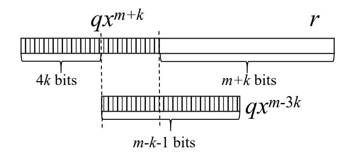
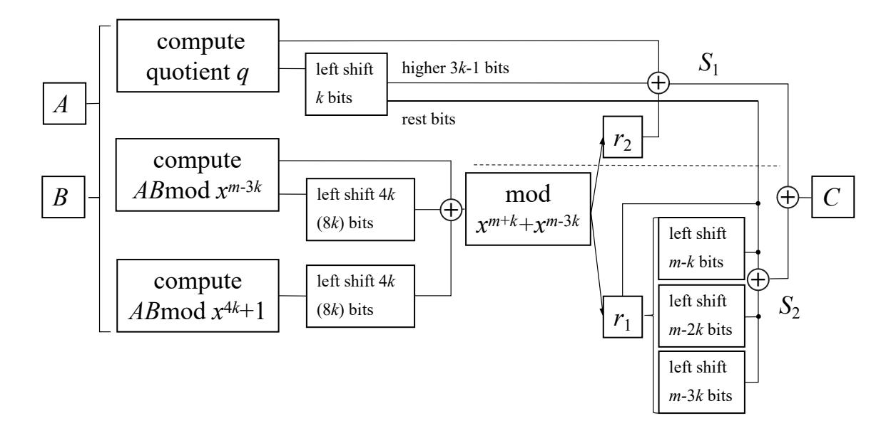

{0}------------------------------------------------

1

# An Efficient CRT-based Bit-parallel Multiplier for Special Pentanomials

Yin Li and Yu Zhang

**Abstract**—The Chinese remainder theorem (CRT)-based multiplier is a new type of hybrid bit-parallel multiplier, which can achieve nearly the same time complexity compared with the fastest multiplier known to date with reduced space complexity. However, the current CRT-based multipliers are only applicable to trinomials. In this paper, we propose an efficient CRT-based bit-parallel multiplier for a special type of pentanomial  $x^m + x^{m-k} + x^{m-2k} + x^{m-3k} + 1, 5k < m \le 7k$ . Through transforming the non-constant part  $x^m + x^{m-k} + x^{m-2k} + x^{m-3k}$  into a binomial, we can obtain relatively simpler quotient and remainder computations, which lead to faster implementation with reduced space complexity compared with classic quadratic multipliers. Moreover, for some m, our proposal can achieve the same time delay as the fastest multipliers for irreducible Type II and Type C.1 pentanomials of the same degree, but the space complexities are reduced.

**Index Terms**—Chinese Remainder Theorem, hybrid multiplier, special pentanomial.

## \_\_\_\_

## 1 Introduction

The Finite field  $GF(2^m)$  has important applications in coding theory and cryptography [1]. Such a field can be defined as a set of univariate binary polynomials modulo an irreducible polynomial f(x) over  $\mathbb{F}_2$  of degree m [2]. The field multiplication, which is crucial to field arithmetic, consists of a regular binary polynomial multiplication followed by a reduction modulo f(x). During the past decades, many works have been done to obtain efficient bit-parallel  $GF(2^m)$  multipliers [3], [6], [11], [12]. Generally speaking, the underlying multipliers can be classified into three categories according to their space complexities, i.e., quadratic, subquadratic and hybrid multipliers [13]. The first two types of multipliers have the lowest time and space complexities, respectively. On the other hand, the hybrid ones can provide a trade-off between the time and space complexities. The hybrid multipliers [4] usually apply a divide-and-conquer algorithm to the polynomial multiplication, and then perform the modular reduction. Karatsuba algorithm (KA) is the most frequently used divide-and-conquer algorithm, and these KA-based hybrid multipliers usually require at least one more  $T_X$  compared with the fastest quadratic multipliers [4], [15], where  $T_X$  is the delay of one 2input XOR gate. Besides KA, Winograd short convolution algorithm and Chinese Reminder Theorem (CRT) are other well-known divide-and-conquer algorithms, and also widely applied to develop subquadratic space complexity multipliers [8], [9].

Recently, CRT is applied to develop even faster hybrid multipliers for trinomials  $x^m + x^k + 1$ , which can match the fastest bit-parallel multipliers for some m values [13].

• Yin Li is with Dongguan University of Technology, P.R.China. Yu Zhang are with Xinyang Normal University, P.R.China. email: yunfeiyangli@gmail.com (Yin Li). This work is supported by the National Natural Science Foundation of China (Grant no. 61601396).

This result was further extended by Zhang and Fan [14]. The key idea of the CRT-based schemes is transforming the modular multiplication by  $x^m + x^k + 1$  to the quotient and remainder computation w.r.t. its non-constant part  $x^m + x^k$ . We note that  $x^m + x^k$  is a binomial, in which the modular reduction is easier than that of  $x^m + x^k + 1$ . Consequently, their schemes can save some logic gates at the cost of increasing the circuit delay slightly. Based on the property of the ceiling function  $\lceil \cdot \rceil$ , for certain values of m, k, the time complexity of their schemes can match the fastest bit-parallel quadratic multiplier [13], [14]. However, Fan's scheme is only suitable for trinomials. For other types of polynomials containing more terms, their approach is not efficient.

In this paper, we propose an extension of Fan and Zhang's work [13], [14]. We consider a special type of irreducible pentanomial  $f(x) = x^m + x^{m-k} + x^{m-2k} + x^{m-2k}$  $x^{m-3k} + 1$  proposed by Reyhani-Masoleh and Hasan [5]. Quadratic multiplier for this type of pentanomial is normally less efficient than those for irreducible Type II [6], Type C.1 and Type C.2 pentanomials [10]. Nevertheless, when multiplying the non-constant part f(x)+1 by  $1+x^k$ , we have  $(f(x)+1)(1+x^k)=x^{m-3k}(x^{4k}+1)$ . Such an expression is likewise a binomial. Based on this observation, we develop an efficient CRT-based multiplier for this type of pentanomials. Interestingly, for some m values satisfying  $5k < m \le 7k$ , our proposal costs even a lower space complexity compared with quadratic multipliers, while its time complexity matches the fastest multiplier for pentanomials.

Outline of the paper. In section 2, we first briefly introduce the basic idea of CRT-based multipliers. Then, in section 3, a new CRT-based multiplier architecture for such pentanomials is proposed using the redundant form of the specific pentanomial. Section 4 discusses the space and time complexities of our proposal and presents a comparison between the proposed multiplier

{1}------------------------------------------------

and some others. The last section summarizes the results and highlights the concluding remarks.

### 2 CRT-BASED MULTIPLIER FOR TRINOMIALS

Now, we describe the overview of the CRT-based multiplier for irreducible trinomials [13].

**Notations.** Let f(x) be an irreducible polynomial over  $\mathbb{F}_2$  of degree m, and the finite field  $GF(2^m) \cong \mathbb{F}_2[x]/(f(x))$  is defined by f(x). Given two arbitrary elements  $A, B \in GF(2^m)$ , the field multiplication of A, B is defined as  $A \cdot B \mod f(x)$ . Note that  $AB \mod f(x)$  can be performed by a polynomial multiplication plus a modular reduction regarding to f(x). Let C and q be the modular result and the quotient divided by f(x), respectively.

The polynomial multiplication AB is derived as below:

$$AB = f \cdot q + C = (f+1)q + (C+q).$$

Since the degrees of q and C are both less than m, the quotient q of f is equal to the quotient of f+1, and C+q is the remainder of AB modulo f+1. Also, in  $GF(2^m)$ , C can be rewritten as C=q+(C+q). At this time, the field multiplication is transformed into two equivalent steps:

- (i) Compute the quotient q of AB divided by f + 1;
- (ii) Compute the remainder (C+q) of AB divided by f+1.

If f(x) is a trinomial  $x^m + x^k + 1$ , then  $f + 1 = x^m + x^k = x^k(x^{m-k} + 1)$ . In this case, Step (i) can be solved using a simple recursion. Step (ii) can be settled by first computing  $AB \mod x^k$  and  $AB \mod x^{m-k} + 1$ , and then reconstructing the final result using CRT approach. Both of them are easy to compute. Upon that, Fan [13] developed a low complexity hybrid multiplier for trinomials. The highlight of this type of multiplier is that it has nearly the same time complexity as the fastest quadratic multipliers with a lower space complexity. The space complexity was further reduced in [14].

Apparently, for any irreducible polynomial f(x), if the Step (i) and (ii) are easier than the modular multiplication w.r.t. f(x), one can also construct a CRT-based multiplier for f(x). However, except trinomial, other types of irreducible polynomial, e.g., pentanomial and all-onepolynomial (AOP) are not easy to apply Fan's approach [13] directly. The reason is that the solutions of (i) and (ii) are highly relies on the number of terms contained in f+1 and its factorization. The non-constant part of pentanomial and AOP either contain much more terms or their factors are very complicated, which make Step (i) or (ii) hard to compute. To illustrate this assertion, we take the irreducible pentanomial  $f(x) = x^{283} + x^{12} + x^7 + x^5 + 1$ , recommended by NIST [16], as a suitable example. In this case, we have  $f + 1 = x^{283} + x^{12} + x^7 + x^5$ . Such a polynomial totally has four factors, two of which are quite simple ( $x^5$  and x + 1). However, the rest two factors are very complicated 1, which makes Step (ii) even harder than the direct modular reduction about f(x) itself. In addition, the computation of Step (i) here is also complicated due to the four terms included in f+1.

In the following sections, we demonstrate that, for a special class of irreducible pentanomials  $x^m + x^{m-k} + x^{m-2k} + x^{m-3k} + 1$ , one can obtain significantly simpler computations for Step (i) and (ii), by multiplying an extra polynomial to its non-constant part. Based on such a characteristic, an efficient CRT-based multiplier is developed below.

# 3 CRT-BASED MULTIPLIER FOR $x^m + x^{m-k} + x^{m-2k} + x^{m-3k} + 1$

Now, we consider the irreducible pentanomial  $f(x) = x^m + x^{m-k} + x^{m-2k} + x^{m-3k} + 1, m > 3k$ . Different from other type of pentanomials, the non-constant part of such a pentanomial has a relatively simple factorization, i.e.,  $f(x) + 1 = x^{m-3k}(x^{3k} + x^{2k} + x^k + 1)$ . If we multiply this expression by  $x^k + 1$ , then,

$$(f(x)+1)(x^{k}+1) = x^{m-3k}(x^{3k} + x^{2k} + x^{k} + 1)(x^{k} + 1),$$
  
=  $x^{m-3k}(x^{4k} + 1) = x^{m+k} + x^{m-3k}.$ 

Denoted by F(x) the above expression  $x^{m+k}+x^{m-3k}$ . We can use a similar strategy as [13] to compute the quotient and remainder w.r.t. F(x) firstly, and then amend the results modulo f(x). More explicitly, let A and B be the same as the ones defined in Section 2. We divide the multiplication as

$$AB = q \cdot F + r = q(f+1)(x^{k}+1) + r, \tag{1}$$

where deg(q) = 2m - 2 - m - k = m - k - 2, deg(r) = m + k - 1. Then, the field multiplication  $C = AB \mod f(x)$  can be derived as:

$$C = q \cdot F(x) + r \mod f(x)$$
  
=  $q(f(x) + 1)(x^k + 1) + r \mod f(x)$   
=  $r \mod f(x) + q(x^k + 1)$ .

Please note that the degree of  $q(x^k+1)$  is less than m-2, no further reduction is needed. However, the remainder r needs further reduction as its degree is bigger than m. Thus, we partition r as  $r_1x^m+r_2$ , where  $\deg(r_1)=k-1$  and  $\deg(r_2)=m-1$ . Thus,  $r \mod f(x)=r_1(x^{m-k}+x^{m-2k}+x^{m-3k}+1)+r_2$ . Consequently, the field multiplication can be performed as:

$$C = q(x^{k} + 1) + r_1(x^{m-k} + x^{m-2k} + x^{m-3k} + 1) + r_2.$$
 (2)

The computations of q, r are analogous with [13], which is already elaborated as Steps (i) and (ii) in Section 2. However, the final correction step as presented in (2) indicates that the CRT multiplier for this type of pentanomial is still more complex than trinomials. In the following, through the computation of q and r, we analyze the magnitude relation between m and k in order to construct an efficient CRT multiplier.

1. Explicit factorization of  $x^{283} + x^{12} + x^7 + x^5$  is available in the online appendix [17].

{2}------------------------------------------------

#### 3.1 Computation of the quotient q

Recall that q is the quotient of AB divided by F(x) and  $F(x) = x^{m+k} + x^{m-3k}$ , combined with (1), we can see that  $AB = qx^{m+k} + qx^{m-3k} + r$ . Let  $\sum_{i=0}^{m-k-2} q_i x^i$  denote q and  $\sum_{i=0}^{2m-2} s_i x^i$  denote the result of AB. The bit positions of the term AB are depicted in Figure 1. It is noteworthy that  $\deg(r) = m + k - 1$ , the higher m - k - 1 bits of AB only consist of the coefficients of q or their addition.

Fig. 1. Bit positions of the terms in  $AB = qx^{m+k} + qx^{m-3k} + r$ .

Using simple iterative method as described in [13], we can obtain the explicit formulation of  $q_i$ :

$$\begin{cases} q_i = s_{i+m+k}, m - 5k - 1 \le i \le m - k - 2, \\ q_i = s_{i+m+k} + s_{i+m+5k}, 0 \le i \le m - 5k - 2. \end{cases}$$
(3)

The above equations hold, if  $m-k-1-4k \le 4k \Rightarrow m \le 9k+1$ , otherwise some  $q_i$ s may contain more terms.

#### 3.2 Computation of remainder r

For the sake of brevity, we use the symbol  $\langle * \rangle_{g(x)}$  to denote the remainder of \* modulo g(x). Clearly,  $r = \langle AB \rangle_{x^{m-3k}(x^{4k}+1)}$ . In order apply CRT to compute r, we first need to calculate the multiplicative inverse  $x^{m-3k} \mod x^{4k} + 1$  and vice versa. The following Bezout identity depends on the magnitude relations between m and k.

$$x^{m-3k} \cdot x^{7k-m} + (1+x^{4k}) \cdot 1 = 1$$
, if  $3k \le m \le 7k$ .

If m > 7k, the corresponding Bezout identities become more complex, which makes related CRT multiplier costly. Thus, we skip this case. Accordingly, the remainder r can be computed using the CRT as follows:

$$r = \left\langle \langle AB \rangle_{x^{m-3k}} \cdot (x^{4k}+1) + \langle AB \rangle_{x^{4k}+1} \cdot x^{4k} \right\rangle_{x^{m+k}+x^{m-3k}}. \tag{4}$$

Obviously,  $\langle AB \rangle_{x^{m-3k}} = \sum_{i=0}^{m-3k} s_i x^i$ . But  $\langle AB \rangle_{x^{4k}+1} = \langle \langle A \rangle_{x^{4k}+1} \cdot \langle B \rangle_{x^{4k}+1} \rangle_{x^{4k}+1}$  implies further computation. When  $m \leq 7k$ , the coefficients of  $\langle A \rangle_{x^{4k}+1}$  and  $\langle B \rangle_{x^{4k}+1}$  can be obtained in one  $T_X$  delay in parallel, which cost 2(m-4k) XOR gates. In detail,

$$\langle A \rangle_{x^{4k}+1} = \sum_{i=0}^{4k-1} g_i x^i = \sum_{m-4k}^{4k-1} a_i x^i + \sum_{i=0}^{m-4k-1} (a_i + a_{i+4k}) x^i,$$

and

$$\langle B \rangle_{x^{4k}+1} = \sum_{i=0}^{4k-1} h_i x^i = \sum_{m=4k}^{4k-1} b_i x^i + \sum_{i=0}^{m-4k-1} (b_i + b_{i+4k}) x^i.$$

The computation of  $\langle AB \rangle_{x^{4k}+1}$  can be carried out by multiplying  $\langle A \rangle_{x^{4k}+1}$  and  $\langle B \rangle_{x^{4k}+1}$  firstly, and then adding the higher 4k-1 bits of the result to its lower 4k-1 bits. More explicitly,

$$\langle AB \rangle_{x^{4k}+1} = \sum_{i=0}^{4k-1} t_i x^i = \sum_{i=0}^{4k-1} \left( \sum_{j=0}^i g_j h_{i-j} + \sum_{j=i+1}^{m-i-1} g_j h_{m-i} \right) x^i.$$
(5)

Plug the explicit formulations w.r.t.  $\langle AB \rangle_{x^{m-3k}}$  and  $\langle AB \rangle_{x^{4k}+1}$  into (4), we can easily obtain the formulation of r, i.e.,

$$r = \sum_{i=4k}^{m+k-1} s_{i-4k} x^{i} + \sum_{i=0}^{m-3k-1} s_{i} x^{i} + \sum_{i=4k}^{m+k-1} t_{i-4k} x^{i} + \sum_{m-3k}^{4k-1} t_{i} x^{i}, \text{ if } 3k < m \le 7k.$$

### 3.3 The computation of the field product C

According to (2), it is obvious that C consists of the combination of q and r. For simplicity, we split C into two parts and implement them in parallel, i.e.,  $C = S_1 + S_2$  where  $S_1 = q + r_2 + q_1 x^{m-3k}$  and  $S_2 = q_2 x^k + r_1 (x^{m-k} + x^{m-2k} + x^{m-3k} + 1)$ . Here,  $q = q_1 x^{m-4k} + q_2$ ,  $q_1$  denotes the most significant 3k - 1 bits of q and  $q_2$  denotes the rest. The formulations of  $S_1$  and  $S_2$  are given below

$$S_{1} = (s_{m-4k-1} + t_{m-4k-1})x^{m-1} + \sum_{i=m-k-1}^{m-2} (s_{i+m} + s_{i-4k} + t_{i-4k})x^{i}$$

$$+ \sum_{i=4k}^{m-k-2} (s_{i+m+k} + s_{i+m} + s_{i-4k} + t_{i-4k})x^{i}$$

$$+ \sum_{i=m-3k}^{4k-1} (s_{i+m+k} + s_{i+m} + t_{i})x^{i} + \sum_{i=m-5k-1}^{m-3k-1} (s_{i+m+k} + s_{i})x^{i}$$

$$+ \sum_{i=0}^{m-5k-2} (s_{i+m+k} + s_{i+m+5k} + s_{i})x^{i},$$

$$(6)$$

$$S_{2} = \sum_{i=m-k}^{m-1} (s_{i-3k} + t_{i-3k})x^{i} + \sum_{i=m-2k}^{m-k-1} (s_{i-2k} + t_{i-2k})x^{i}$$

$$+ \sum_{i=m-3k}^{m-2k-1} (s_{i-k} + t_{i-k})x^{i} + \sum_{i=0}^{k-1} (s_{i+m-4k} + t_{i+m-4k})x^{i}$$

$$+ \sum_{i=k-3k}^{m-3k-1} (s_{i+m} + t_{i-k})x^{i} + \sum_{i=k-2k}^{m-4k-2} (s_{i+m+4k} + t_{i+m-4k})x^{i}$$

$$+ \sum_{i=k-3k}^{m-3k-1} (s_{i+m} + t_{i-k})x^{i} + \sum_{i=k-2k}^{m-4k-2} (s_{i+m+4k} + t_{i+m-4k})x^{i}$$

$$+ \sum_{i=k-3k}^{m-3k-1} (s_{i+m} + t_{i-k})x^{i} + \sum_{i=k-2k}^{m-4k-2} (s_{i+m+4k} + t_{i+m-4k})x^{i}$$

$$+ \sum_{i=k-3k}^{m-3k-1} (s_{i+m} + t_{i-k})x^{i} + \sum_{i=k-2k}^{m-4k-2} (s_{i+m+4k} + t_{i+m-4k})x^{i}$$

where  $5k+1 < m \le 7k$ . We do not give the formulations of  $S_1$  and  $S_2$  of the case  $3k < m \le 5k+1$ , as the corresponding CRT multiplier in this case has higher space complexity than the classic quadratic one [5], where we explain later in Section 5.

After the computations of  $S_1$  and  $S_2$ , we only need to add these two results to obtain the final result C. The figure 2 depicts the schematic diagram of the entire CRT multiplier.

{3}------------------------------------------------

Fig. 2. The schematic diagram of CRT multiplier for  $x^m + x^{m-k} + x^{m-2k} + x^{m-3k} + 1, 5k < m \le 7k$ .

#### 4 SPACE AND TIME COMPLEXITY ANALYSIS

In [13], the authors proposed two types of CRT multipliers, denoted by Type-A and Type-B multipliers, which follow the same design approach but use different ways to organize the reusable terms. These multipliers can provide different space-time trade-offs. Since we use a redundant binomial  $x^{4k}+1$  instead of  $x^{3k}+x^{2k}+x^k+1$ , which costs more AND gates for the multiplication of  $\langle A \rangle_{x^{4k}+1}$  and  $\langle B \rangle_{x^{4k}+1}$ , we prefer to follow the idea of Type-A multiplier and pursue a multiplier with a lower space complexity.

**Space complexity analysis.** We first investigate the computations of the coefficients of  $S_1$  and  $S_2$ , which are essential to the whole multiplier. According to (6)-(7), it is obvious that only three subexpressions, i.e.,

$$\sum_{i=0}^{m-k-2} s_{i+m+k} x^{i}, \quad \sum_{i=0}^{m-3k-1} s_{i} x^{i}, \quad \sum_{i=0}^{4k-1} t_{i} x^{i}, \tag{8}$$

contain all the items required in  $S_1$  and  $S_2$ . Therefore, the total number of AND gates required by our multiplier is equal to the sum of AND gates required by above subexpressions. Also, the total number of XOR gates is the summation of the XOR gates required by them and the additions in (6)-(7) as well as  $S_1 + S_2$ .

Since  $s_i$ s are the coefficients of AB, we can write their formulation directly:

$$s_i = \begin{cases} \sum_{j=0}^{i} a_j b_{i-j}, & 0 \le i \le m-1, \\ \sum_{j=j+1-m}^{m-1} a_j b_{i-j}, & m \le i \le 2m-2. \end{cases}$$

Furthermore, the formulation of  $t_i$  is already given in (5). As a result, the number of required AND and XOR gates are

$$#AND = m^2 + 21k^2 - 4km - k,$$
  
 $#XOR = m^2 + 21k^2 + 5m - 4km - 20k - 3.$ 

**Time complexity analysis.** We note that, among the three subexpressions in (8),  $s_i$  contain the coefficient multiplications  $a_ib_j$  and  $t_i$  contain  $g_ih_j$ , which require one  $T_A$  gate delay due to parallelism. After that, we consider the XOR delay. Table 1 illustrates the number of product item in each coefficient of  $x^i$ . The products

in the square bracket are XORed using an independent binary XOR tree firstly. Since the pre-computations of  $g_i$ and  $h_i$  require one  $T_X$  delay, the expression containing  $t_i$ will cost more delay than adding its items using a binary XOR tree, directly.

TABLE 1 The number of product terms in each  $c_i$ 

|                                                                             |                           | NT 1 (.1 1                   |
|-----------------------------------------------------------------------------|---------------------------|------------------------------|
|                                                                             | $c_i$                     | Number of the product terms  |
| $S_1$                                                                       | $0 \le i \le m - 5k - 2$  | [m-k-i-1]+[m-5k-i-1]         |
|                                                                             |                           | +[i+1]                       |
|                                                                             | $m-5k-1 \le i \le m-3k-1$ | [m-k-i-1]+[i+1]              |
|                                                                             | $m - 3k \le i \le 4k - 1$ | $[m-k-i-1] + [m-i-1] + 4k^*$ |
|                                                                             | $4k \le i \le m-k-2$      | [m-k-i-1] + [i-4k+1]         |
|                                                                             |                           | $+[m-i-1] + 4k^*$            |
|                                                                             | $m-k-1 \le i \le m-2$     | $[i-4k+1]+[m-i-1]+4k^*$      |
|                                                                             | i = m - 1                 | $[m-4k]+4k^*$                |
| $S_2$                                                                       | $0 \le i \le k - 1$       | $[i+m-4k+1]+4k^*$            |
|                                                                             | $k \le i \le m - 4k - 2$  | [m-i-1]+[m-4k-i-1]           |
|                                                                             | $m-4k-1 \le i \le m-3k-1$ | [m-i-1]                      |
|                                                                             | $m-3k \le i \le m-2k-1$   | $[i-k+1]+4k^*$               |
|                                                                             | $m-2k \le i \le m-k-1$    | $[i-2k+1]+4k^*$              |
|                                                                             | $m-k \le i \le m-2$       | $[i-3k+1]+4k^*$              |
|                                                                             | i = m - 1                 | $[m-3k]+4k^*$                |
| *: each $t_i$ contains $4k$ items but needs to compute $g_i, h_i$ at first. |                           |                              |

Based on Table 1, for  $0 \le i \le m-5k-2$ , the maximum gate delay is from the coefficient  $c_0 = s_{m+k} + s_{m+5k} + s_0$ . Clearly, the term  $s_{m+k}$  is the summation of m-k-1 product terms , while  $s_{m+5k}$  is the summation of m-5k-1 product terms and  $s_0 = a_0b_0$ . Notice that  $m \le 7k \Rightarrow m-k-i-1 > 2(m-5k-i-1)$  and m-k-i-1 > 2(i+1) for  $0 \le i \le m-5k-2$ , which indicates that during the period of computation  $s_{m+k}$ ,  $s_0$  and  $s_{m+5k}$  can finish their computation and be XORed pairwise. Only one more  $T_X$  is needed to add  $s_{m+k}$  with  $[s_{m+5k} + s_0]$ . Therefore, the total XOR delay for  $c_i$  in this case is  $1 + \lceil \log_2(m-k-1) \rceil$ .

For  $m-5k-1 \le i \le m-3k-1$ , the maximum gate delay is from the coefficient  $c_{m-5k-1} = s_{2m-4k-1} + s_{m-5k-1}$ . One can easily verify that the XOR delay is  $1+\lceil \log_2(4k) \rceil$ .

For  $m-3k \le i \le 4k-1$ , we note that the product items of  $t_i$ s are not reused. Binary XOR trees for other

{4}------------------------------------------------

subexpressions can be embedded in its binary XOR tree in order to obtain faster implementation. Here, we utilize the same strategy of [13], [14] and obtain the XOR delay

$$\left(v + \lceil \log_2(\lceil \frac{4k}{2^{v-1}} \rceil + 2) \rceil\right) T_X = \lceil \log_2(8k + 2 \cdot 2^v) \rceil T_X,$$

where  $2^{v-1} < m - 4k \le 2^v$ .

Similarly, for  $4k \le i \le m-k-2$  and  $m-k-1 \le i \le m-1$ , the XOR delay in these cases are

$$\begin{split} \lceil \log_2(8k+3\cdot 2^{v_1}) \rceil T_X, & \text{for } 4k \leq i \leq m-k-2, \\ \lceil \log_2(8k+2\cdot 2^{v_1}) \rceil T_X, & \text{for } m-k-1 \leq i \leq m-2, \\ \lceil \log_2(8k+2^{v_2}) \rceil T_X, & \text{for } i=m-1, \end{split}$$

where  $v_1 = \lceil \log_2(m - 4k - 1) \rceil$ ,  $v_2 = \lceil \log_2(m - 4k) \rceil$ . Consider the XOR delay of  $S_1$  is equal to the maximum XOR delays of all the cases, thus, the delay of  $S_1$  is given by

$$D_{S_1}: T_A + \lceil \log_2(8k+3\cdot 2^v) \rceil T_X, (v = \lceil \log_2(m-4k-1) \rceil).$$

Using the same approach, one can easily obtain the delay of  $\mathcal{S}_2$ 

$$D_{S_2}: T_A + \lceil \log_2(8k+2^v) \rceil T_X, (v = \lceil \log_2(m-3k) \rceil).$$

We can check that  $D_{S_1}$  is slightly bigger than that of  $D_{S_2}$ , Therefore, the parallel implementations of  $S_1$  and  $S_2$  cost  $D_{S_1}$  delays. In addition, one more  $T_X$  is required for the final addition  $S_1 + S_2$ . Consequently, the time complexity of our multiplier is

$$T_A + (1 + \lceil \log_2(8k + 3 \cdot 2^v) \rceil) T_X,$$
 (9)

where  $v = \lceil \log_2(m - 4k - 1) \rceil$ .

#### 4.1 A small example

In order to illustrate the binary XOR tree partition and the reused item of each  $c_i$ , we consider  $x^7 + x^6 + x^5 + x^4 + 1$  as a small example. The complete version is available online [17]. Here, m = 7 and k = 1. By (6) and (7), the expressions of  $S_1$  and  $S_2$  are given below

$$S_{1} = ([a_{0}b_{2} + a_{1}b_{1} + a_{2}b_{0}] + g_{0}h_{2} + g_{1}h_{1} + g_{2}h_{0} + g_{3}h_{3})x^{6}$$

$$+ ([a_{0}b_{1} + a_{1}b_{0}] + [a_{6}b_{6}] + g_{0}h_{1} + g_{1}h_{0} + g_{2}h_{3} + g_{3}h_{2})x^{5}$$

$$+ ([a_{0}b_{0}] + [a_{6}b_{6}] + [a_{5}b_{6} + a_{6}b_{5}] + g_{0}h_{0} + g_{1}h_{3} + g_{2}h_{2} + g_{3}h_{1})x^{4}$$

$$+ ([a_{0}b_{3} + a_{1}b_{2} + a_{2}b_{1} + a_{3}b_{0}] + [a_{5}b_{6} + a_{6}b_{5}])x^{3}$$

$$+ ([a_{0}b_{2} + a_{1}b_{1} + a_{2}b_{0}] + [a_{4}b_{6} + a_{5}b_{5} + a_{6}b_{4}])x^{2}$$

$$+ ([a_{0}b_{1} + a_{1}b_{0}] + [a_{3}b_{6} + a_{4}b_{5} + a_{5}b_{4} + a_{6}b_{3}])x$$

$$+ [a_{0}b_{0}] + [a_{2}b_{6} + a_{3}b_{5} + a_{4}b_{4} + a_{5}b_{3} + a_{6}b_{2}] + [a_{6}b_{6}],$$

and

$$S_{2} = ([a_{0}b_{3} + a_{1}b_{2} + a_{2}b_{1} + a_{3}b_{0}] + [g_{0}h_{3} + g_{1}h_{2} + g_{2}h_{1} + g_{3}h_{0}])x^{6}$$

$$+ ([a_{0}b_{3} + a_{1}b_{2} + a_{2}b_{1} + a_{3}b_{0}] + [g_{0}h_{3} + g_{1}h_{2} + g_{2}h_{1} + g_{3}h_{0}])x^{5}$$

$$+ ([a_{0}b_{3} + a_{1}b_{2} + a_{2}b_{1} + a_{3}b_{0}] + [g_{0}h_{3} + g_{1}h_{2} + g_{2}h_{1} + g_{3}h_{0}])x^{4}$$

$$+ ([a_{4}b_{6} + a_{5}b_{5} + a_{6}b_{4}])x^{3} + ([a_{3}b_{6} + a_{4}b_{5} + a_{5}b_{4} + a_{6}b_{3}])x^{2}$$

$$+ ([a_{2}b_{6} + a_{3}b_{5} + a_{4}b_{4} + a_{5}b_{3} + a_{6}b_{2}] + [a_{6}b_{6}])x$$

$$+ [a_{0}b_{3} + a_{1}b_{2} + a_{2}b_{1} + a_{3}b_{0}] + [g_{0}h_{3} + g_{1}h_{2} + g_{2}h_{1} + g_{3}h_{0}],$$

where  $g_i = a_i + a_{i+4}$ ,  $h_i = b_i + b_{i+4}$ , i = 0, 1, 2 and  $g_3 = a_3$ ,  $h_3 = b_3$ .

The items in the same square bracket are XORed using a same binary XOR tree and the results are reused. It is clear that the computation of  $S_1$  and  $S_2$  require  $T_A+4T_X$ . When adding  $S_1$  and  $S_2$ , one more  $T_X$  is needed. As a result, the CRT multiplier only costs  $T_A+5T_X$ , which conforms to (9). Further more, above expressions costs 41 AND gates as well as 54 XOR gates. Conversely, the classic quadratic multiplier proposed in [5] requires 49 AND gates and 54 XOR gates, with its time complexity being  $T_A+7T_X$ .

## 5 COMPARISON AND DISCUSSION

**Note on space complexity.** According to the formulations pertaining to the numbers of AND and XOR gates, if our proposal costs fewer gates than classic quadratic multiplier [5], the parameters m, k must satisfy

$$m^2 + 21k^2 - 4km - k < m^2 \Rightarrow 21k < 4m - 1,$$

and

$$m^2 + 21k^2 + 5m - 4km - 20k - 3 < m^2 + m - 2$$
  
 $\Rightarrow 21k^2 - 20k - 1 < 4m(k - 1) \Rightarrow 21k + k/(k - 1) < 4m.$ 

That is to say, only if m > 5k our multiplier may costs fewer logic gates. Using Maple, we have checked all the irreducible polynomial  $x^m + x^{m-k} + x^{m-2k} + x^{m-3k} + 1$  of degree in the range [100, 1024] and found there are 141 such polynomials satisfying  $5k < m \le 7k$ . It is shown that our proposed multipliers requires fewer gates for 118 polynomials among these polynomials, which can save 8.5% logic gates on average.

Note on time complexity. From (9), we know the delay of our proposal varies according to the magnitude relations between m and k. Specifically, the gate delay expressions include  $2^v, v = \lceil \log_2(m-4k-1) \rceil$ , it is not easy to compare the time complexity with other schemes. But we can evaluate the upper bound of the time delay instead. We mainly utilize the following inequality:

$$2^{v-1} < m - 4k - 1 \le 2^v \le 2(m - 4k - 1).$$

We then obtain

$$1 + \lceil \log_2(8k + 3 \cdot 2^v) \rceil \le 1 + \lceil \log_2(8k + 3 \cdot (2m - 8k - 2)) \rceil 
\le 1 + \lceil \log_2(6m - 16k) \rceil 
\le 1 + \lceil \log_2(4m - 2k) \rceil.$$

It is obvious that the time complexity of our proposal is smaller than  $T_A+(4+\lceil\log_2m\rceil)$ , as proposed in [5]. Meanwhile, since these upper bounds approximately have one  $T_X$  more than the fastest multiplier for other frequently-used pentanomials, i.e., Type II and Type C.1 pentanomials, for certain m, our multiplier can achieve even the same circuit delay with reduced space complexity. As an example, for field  $GF(2^{169})$ , the irreducible pentanomial  $x^{169}+x^{141}+x^{113}+x^{85}+1$  yields a CRT multiplier having a delay of  $T_A+10T_X$ . Meanwhile, there exist an irreducible Type II pentanomial  $x^{169}+x^{16}+x^{15}+x^{14}+1$  yielding a SPB multiplier and a Type C.1 pentanomial  $x^{169}+x^{168}+x^{11}+x+1$  yielding a GPB multiplier, which

{5}------------------------------------------------

also have the delays of  $T_A + 10T_X$ . On the contrary, the CRT multiplier can save about 8% gates compared with previous multipliers.

#### 6 CONCLUSION

In this work, we have proposed an efficient CRT-based bit-parallel multiplier for a special type of pentanomial  $x^m + x^{m-k} + x^{m-2k} + x^{m-3k} + 1, 5k < m \le 7k$ . Through multiplying  $x^m + x^{m-k} + x^{m-2k} + x^{m-3k}$  by  $x^k + 1$ , we can transform it into a binomial, which lead to relatively simpler quotient and remainder computations. Compared with classic quadratic multiplier for the same type of pentanomials, our proposal has both lower space and time complexities. Our experimental results demonstrate that the proposed multiplier has the space complexity reduced by 8.5% on average. Moreover, for some m, the time complexity of the proposed multiplier even matches the fastest multiplier for irreducible Type II and Type C.1 pentanomials.

### **ACKNOWLEDGMENTS**

The authors would like to thank Prof. Nisha Panwar and Dr. Shantanu Sharma for their valuable comments and suggestions.

#### REFERENCES

- [1] Joachim Von Zur Gathen and Jurgen Gerhard. 2003. *Modern Computer Algebra* (2 ed.). Cambridge University Press, New York, NY, USA.
- [2] Rudolf Lidl and Harald Niederreiter. *Finite Fields*. Cambridge University Press, New York, NY, USA, 1996.
- [3] B. Sunar and Ç.K. Koç, "Mastrovito multiplier for all trinomials," *IEEE Trans. Comput.*, 48(5) (1999) 522–527.
- [4] M. Elia, M. Leone, and C. Visentin. "Low complexity bit-parallel multipliers for  $GF(2^m)$  with generator polynomial  $x^m + x^k + 1$ ," *Electronic Letters*, 35(7):551–552, 1999.
- [5] A. Reyhani-Masoleh and M.A. Hasan, "Low complexity bit parallel architectures for polynomial basis multiplication over  $GF(2^m)$ ," in IEEE Transactions on Computers, vol. 53, no. 8, pp. 945-959, Aug. 2004
- [6] H. Fan and M.A. Hasan, "Fast bit parallel-shifted polynomial basis multipliers in  $GF(2^n)$ ," *IEEE Trans. Circuits Syst. I, Reg. Papers*, 53(12):2606–2615, Dec 2006.
- [7] H. Fan and M.A. Hasan, "A New Approach to Subquadratic Space Complexity Parallel Multipliers for Extended Binary Fields," *IEEE Trans. Comput.* vol. 56(2):224–233, Feb. 2007.
- [8] B. Sunar, "A generalized method for constructing subquadratic complexity  $GF(2^k)$  multipliers," in IEEE Transactions on Computers, vol. 53, no. 9, pp. 1097-1105, Sept. 2004
- [9] I. Oseledets, "Improved n-Term Karatsuba-Like Formulas in GF(2)," in IEEE Transactions on Computers, vol. 60, no. 8, pp. 1212-1216, Aug. 2011
- [10] A. Cilardo, "Fast Parallel  $GF(2^m)$  Polynomial Multiplication for All Degrees," *IEEE Trans. Comput.*, 62(5) (May 2013) 929–943.
- [11] M. Cenk, M.A. Hasan and C. Negre, "Efficient Subquadratic Space Complexity Binary Polynomial Multipliers Based on Block Recombination," *IEEE Trans. Comput.*, 63(9):2273–2287, Sept. 2014.
- [12] H. Fan and M.A. Hasan, "A survey of some recent bit-parallel multipliers," *Finite Fields and Their Applications*, 32 (2015) 5–43.
- [13] H. Fan, "A Chinese Remainder Theorem Approach to Bit-Parallel  $GF(2^n)$  Polynomial Basis Multipliers for Irreducible Trinomials," *IEEE Trans. Comput.*, 65(2): 343–352, February 2016.
- [14] J. Zhang, H. Fan, "Low space complexity CRT-based bit-parallel GF(2n) polynomial basis multipliers for irreducible trinomials," *Integration, the VLSI Journal*, 58:55–63, February 2017.

- [15] Y. Li, X. Ma, Y. Zhang and C. Qi, "Mastrovito Form of Non-recursive Karatsuba Multiplier for All Trinomials," *IEEE Trans. Comput.*, vol. 66, no.9, pp.1573–1584, 2017.
- [16] Recommended Elliptic Curves for Federal Government Use, http://csrc.nist.gov/groups/ST/toolkit/documents/dss/NISTReCur.pdf, July, 1999.
- [17] https://drive.google.com/file/d/1fnjIYebWT0g2sKvYr-x0fJJz1onOCBRC/view?usp=sharing