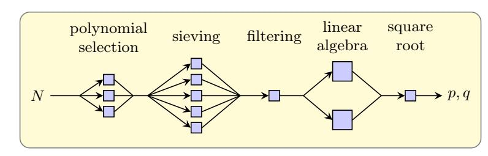
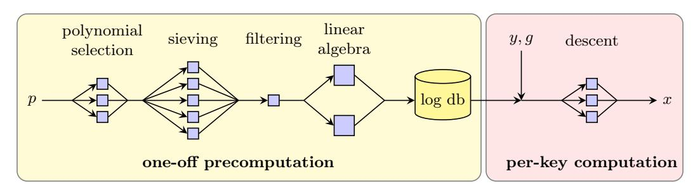
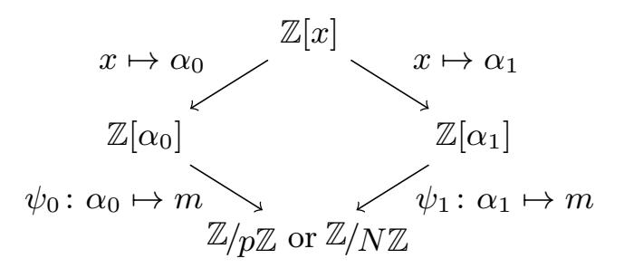
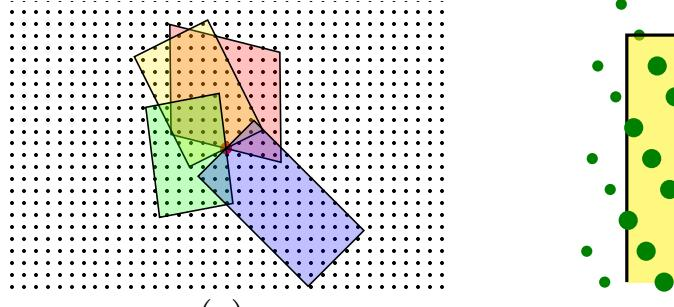
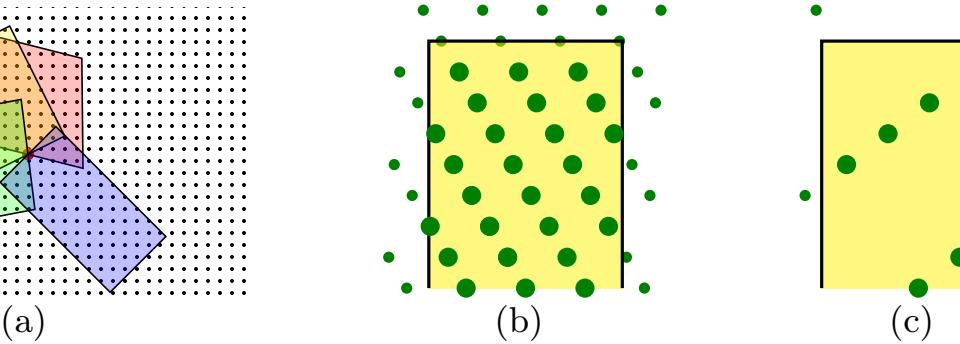
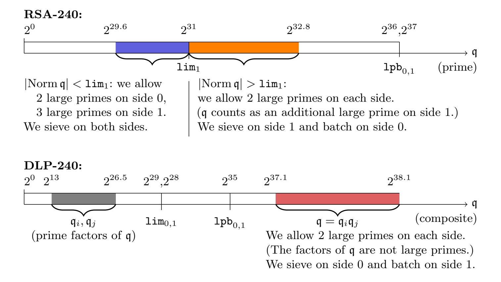
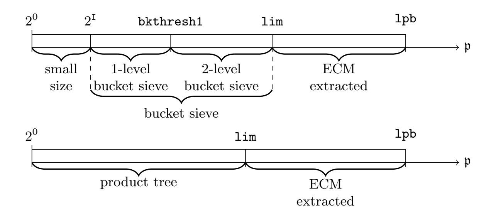

{0}------------------------------------------------

# Comparing the Difficulty of Factorization and Discrete Logarithm: a 240-digit Experiment?

Fabrice Boudot<sup>1</sup> , Pierrick Gaudry<sup>2</sup> , Aurore Guillevic2[0000−0002−0824−7273] Nadia Heninger<sup>3</sup> , Emmanuel Thomé<sup>2</sup> , and Paul Zimmermann2[0000−0003−0718−4458]

,

<sup>1</sup> Université de Limoges, XLIM, UMR 7252, F-87000 Limoges, France <sup>2</sup> Université de Lorraine, CNRS, Inria, LORIA, F-54000 Nancy, France

<sup>3</sup> University of California, San Diego, USA

In memory of Peter L. Montgomery

Abstract. We report on two new records: the factorization of RSA-240, a 795-bit number, and a discrete logarithm computation over a 795-bit prime field. Previous records were the factorization of RSA-768 in 2009 and a 768-bit discrete logarithm computation in 2016. Our two computations at the 795-bit level were done using the same hardware and software, and show that computing a discrete logarithm is not much harder than a factorization of the same size. Moreover, thanks to algorithmic variants and well-chosen parameters, our computations were significantly less expensive than anticipated based on previous records.

The last page of this paper also reports on the factorization of RSA-250.

# 1 Introduction

The Diffie-Hellman protocol over finite fields and the RSA cryptosystem were the first practical building blocks of public-key cryptography. Since then, several other cryptographic primitives have entered the landscape, and a significant amount of research has been put into the development, standardization, cryptanalysis, and optimization of implementations for a large number of cryptographic primitives. Yet the prevalence of RSA and finite field Diffie-Hellman is still a fact: between November 11, 2019 and December 11, 2019, the ICSI Certificate Notary [\[21\]](#page-26-0) observed that 90% of the TLS certificates used RSA signatures, and 7% of the TLS connections used RSA for key exchange. This holds despite the much longer key sizes required by these primitives compared to elliptic curves: based on the asymptotic formulas for the best known cryptanalysis algorithms, the required key size for RSA or finite field Diffie-Hellman is roughly estimated to grow as a cubic function of the security parameter, while the required key size for elliptic curve cryptosystems grows only as a linear function of the security parameter.[4](#page-0-0)

<sup>?</sup> ©IACR 2020. This article is the final version submitted by the authors to the IACR and to Springer-Verlag on 2020-08-04 for CRYPTO2020, available on ePrint at <https://eprint.iacr.org/2020/697>. The version published by Springer-Verlag is available at DOI [10.1007/978-3-030-56880-1\\_3.](https://doi.org/10.1007/978-3-030-56880-1_3)

<span id="page-0-0"></span><sup>4</sup> A security parameter asserts that cryptanalysis requires 2 operations; assuming Moore's law, the security parameter could be seen as growing linearly with time.

{1}------------------------------------------------

Over the last few years, the threat posed by quantum computers has been used as a justification to postpone the impending replacement of RSA and finite field Diffie-Hellman by alternatives such as elliptic curve cryptography [\[33\]](#page-27-0), resulting in implementation choices that seem paradoxical from the perspective of classical cryptanalysis.

Key sizes for RSA and finite field Diffie-Hellman have become unwieldy. To meet a 128-bit security strength, it is widely accepted that both schemes require a key size of approximately 3072 bits (see e.g., the 2018 ECRYPT-CS Recommendations). While it is easy to deal with such key sizes in environments where computing power is plentiful (laptop and desktop computers, or cell phones), a surprising amount of public key cryptography in use employs weak key strengths. There are two main factors contributing to the use of weak key sizes in practice. First, implementations may use weak key sizes to ensure backward compatibility. For example, a crucial component in the FREAK and Logjam attacks was the widespread support for weakened "export-grade" cipher suites using 512-bit keys [\[1\]](#page-25-0); the Java JDK versions 5–8 originally supported Diffie-Hellman and DSA primes of at most 1024 bits by default. Second, in embedded environments, or when very little computational power is allotted to public-key cryptographic operations, small key sizes are not rare. As an example, in 2018, an off-the-shelf managed network switch purchased by the authors shipped with a default RSA ssh host key of 768 bits (despite a \$2,000 USD list price), a key size that has been broken since 2009 in the academic world.

The main goal of this article is to assess the difficulty of the mathematical problems that underpin the security of RSA and finite field Diffie-Hellman and DSA, namely integer factorization (IF) and discrete logarithm (DL). We are interested both in the feasibility of cryptanalysis of these problems as well as in their relative difficulty. Our targets are RSA-240, from the RSA Factoring Challenge, and DLP-240, denoting the challenge of computing discrete logarithms modulo p = RSA-240 + 49204, which is the smallest safe prime above RSA-240 (i.e., (p−1)/2 is also prime). Both previous records were 768-bit keys, with results dating back to 2009 [\[27\]](#page-27-1) and 2016 [\[29\]](#page-27-2). The total cost of our computation is about 1000 core-years for RSA-240, and 3200 core-years for DLP-240. Here and throughout this article, the core-years we mention are relative to the computing platform that we used most, namely Intel Xeon Gold 6130 CPUs with 16 physical cores (32 hyperthreaded cores) running at 2.10 GHz. A core-year is the use of one of these physical cores for a duration of one year. As in the previous records, our computations used the Number Field Sieve algorithm (NFS for short), which has variants both for integer factoring and finite field discrete logarithms.

Improvements in cryptanalysis records are to be expected. In this article, our contribution is not limited to reaching new milestones (and reminding people to get rid of outdated keys). Rather, it is interesting to report on how we reached them:

– We developed a testing framework that enabled us to precisely select, among a wide variety with complex interactions, parameters that influence the running

{2}------------------------------------------------

- time of NFS. We were able to accurately predict important measures such as the matrix size.
- Some folklore ideas that have been known for some time in the NFS community played a very important role in our computation. In particular the composite special-q used in relation collection for DLP-240 proved extremely beneficial, and so did batch smoothness detection, which we used both for RSA-240 and DLP-240. This is the first time that this latter technique has been used in a factoring record for general numbers (it was used in [\[28\]](#page-27-3), in a very specific context). These techniques, together with our careful parameter selection, contributed to a significantly faster computation than extrapolation from the running times of previous records would have suggested. Even on similar hardware, our relation collection effort for the 795-bit DLP computation took 25% less time than the reported relation collection effort of the previous 768-bit DLP record.
- Furthermore, we computed two records of the same size, RSA-240 and DLP-240, at the same time and using hardware of the same generation. This is completely new and gives a crucial data point for the assessment of the relative difficulty of IF and DL. While it is commonly believed that DL is much harder than IF, we show that the hardness ratio is roughly a factor of 3 for the current 800-bit range for safe primes, much less than previously thought.
- Last but not least, our computations were performed with the open-source software Cado-NFS [\[36\]](#page-27-4). Reproducing our results is possible: we have set up a companion code repository at [https://gitlab.inria.fr/cado-nfs/](https://gitlab.inria.fr/cado-nfs/records) [records](https://gitlab.inria.fr/cado-nfs/records) that holds the required information to reproduce them.

We complement the present work with another record computation, the factoring of RSA-250, for which we used parameters similar to RSA-240. Details for this additional record are given at the end of the paper.

This article is organized as follows. We give a brief introduction to key aspects of NFS in Sect. [2.](#page-2-0) In Sects [3](#page-5-0) to [7](#page-20-0) we detail the main steps of NFS, how we chose parameters, and how our computations proceeded, both for factoring and discrete logarithm. Section [8](#page-21-0) gives further details on the simulation mechanism that we used in order to predict the running time. Section [9](#page-24-0) concludes with a comparison with recent computational records, and a discussion on the relative hardness of the discrete logarithm and factoring problems.

# <span id="page-2-0"></span>2 Background on the Number Field Sieve

The Number Field Sieve (NFS) is an algorithmic framework that can tackle either of the two following problems:

– Integer factorization (IF): given a composite integer N, find a non-trivial factorization of N.

{3}------------------------------------------------

– Discrete logarithm in finite fields (DL): given a prime-order finite field<sup>5</sup>  $\mathbb{F}_p$  and a subgroup G of prime order  $\ell$  within  $\mathbb{F}_p^*$ , compute a non-trivial homomorphism from G to  $\mathbb{Z}/\ell\mathbb{Z}$ . By combining information of this kind for various  $\ell$ , given  $g, y \in \mathbb{F}_p^*$ , one can compute x such that  $g^x = y$ .

When the need arises, the algorithms for the two problems above are denoted NFS and NFS-DL, respectively. Most often the acronym NFS is used for both cases. Furthermore, in the few cases in this paper where we work with the prime factors of N, we call them p and q. Of course, p here shall not be confused with the prime p of the DLP case. The context allows to avoid the confusion.

NFS is described in the book [30]. So-called "special" variants of NFS exist as well, and were historically the first to be developed. These variants apply when the number N or p has a particular form. Large computations in these special cases were reported in [2,17,28]. In this work, we are concerned only with the general case (GNFS). The time and space complexity can be expressed as

$$L_N(1/3, (64/9)^{1/3})^{1+o(1)} = \exp\left((64/9)^{1/3}(\log N)^{1/3}(\log\log N)^{2/3}(1+o(1))\right)$$

for factoring. For discrete logarithms in a subgroup of  $\mathbb{F}_p^*$ , N is substituted by p in the above formula. In both cases, the presence of (1 + o(1)) in the exponent reveals a significant lack of accuracy in this complexity estimate, which easily swallows any speedup or slowdown that would be polynomial in  $\log N$ .



NFS for factoring: given an RSA modulus N, find p, q such that N = pq.



NFS for DLP: given  $g^x \equiv y \mod p$ , find x.

<span id="page-3-1"></span>Fig. 1. Main steps of NFS and NFS-DL.

The Number Field Sieve is made up of several independent steps, which are depicted in Fig. 1. The first step of NFS, called polynomial selection, determines

<span id="page-3-0"></span><sup>&</sup>lt;sup>5</sup> Variants for non-prime finite fields also exist, but are not covered here.

{4}------------------------------------------------

a mathematical setup that is well suited to dealing with the input N (or p). That is, we are searching for two irreducible polynomials  $f_0$  and  $f_1$  in  $\mathbb{Z}[x]$  that define two algebraic number fields  $K_0 = \mathbb{Q}(\alpha_0)$  and  $K_1 = \mathbb{Q}(\alpha_1)$  (with  $f_i(\alpha_i) = 0$ ), subject to some compatibility condition. The resulting maps are depicted in the diagram in Fig. 2.



<span id="page-4-0"></span>Fig. 2. The mathematical setup of NFS.

To be compatible,  $f_0$  and  $f_1$  should have a common root m modulo p (or, likewise, modulo N), used in the maps  $\psi_0$  and  $\psi_1$  in Fig. 2. This condition is difficult to ensure modulo a composite integer N, and most efficient constructions are limited to choosing  $f_0$  as a linear polynomial, so that  $\mathbb{Z}[\alpha_0]$  is a subring of  $\mathbb{Q}$ . This leads to commonly used terminology that distinguishes between the "rational side"  $(f_0)$  and the "algebraic side"  $(f_1)$ . When dealing with IF-related considerations, we also use this terminology. In contrast, for NFS-DL, other constructions exist that take advantage of the ability to find roots modulo p.

Based on the mathematical setup above, the most time-consuming phase of NFS consists of collecting relations. We search for elements  $a - bx \in \mathbb{Z}[x]$ , preferably with small coefficients, such that the two integers  $(a - bx, f_0)$  and  $\operatorname{Res}(a - bx, f_1)$  are smooth, i.e., factor into small prime numbers below some chosen  $large\ prime\ bound$ . This ensures that the ideals  $(a - b\alpha_0)\mathcal{O}_{K_0}$  and  $(a - b\alpha_1)\mathcal{O}_{K_1}$  both factor into ideals within finite sets called  $\mathcal{F}_0$  and  $\mathcal{F}_1$ .

The main mathematical obstacle to understanding NFS is that we cannot expect  $a - b\alpha_i$  for  $i \in \{0, 1\}$  to factor into elements of  $\mathbb{Z}[\alpha_i]$ . Only factorization into prime ideals, within the maximal orders  $\mathcal{O}_{K_i}$ , holds. As such, even given known ideal factorizations of the form  $(a - b\alpha_i)\mathcal{O}_i = \prod_{\mathfrak{p} \in \mathcal{F}_i} \mathfrak{p}^{e_{\mathfrak{p},a,b}}$ , it is impossible to use the diagram in Fig. 2 to write a relation of the following kind (in either  $\mathbb{Z}/N\mathbb{Z}$  or  $\mathbb{Z}/p\mathbb{Z}$ , depending on the context):

<span id="page-4-3"></span>
$$\prod_{\mathfrak{p}\in\mathcal{F}_0} \psi_0(\mathfrak{p}^{e_{\mathfrak{p},a,b}}) \quad "\equiv " \prod_{\mathfrak{p}\in\mathcal{F}_1} \psi_1(\mathfrak{p}^{e_{\mathfrak{p},a,b}}). \tag{1}$$

<span id="page-4-1"></span><sup>&</sup>lt;sup>6</sup> A common abuse of terminology is to use the term "norm" to denote  $\operatorname{Res}(a - bx, f_i)$ , while in fact the latter coincides with the norm of  $a - b\alpha_i$  only when  $f_i$  is monic.

<span id="page-4-2"></span><sup>&</sup>lt;sup>7</sup> The terms *smoothness bound* and *factor base* are fairly standard, but lead to ambiguous interpretations as we dive into the technical details of how relation collection is performed. Both are therefore avoided here, on purpose.

{5}------------------------------------------------

Indeed the maps ψ<sup>i</sup> are defined on elements, not ideals. A prime ideal, or a factorization into prime ideals, does not uniquely identify an element of K<sup>i</sup> , because of obstructions related to the unit group and the class group of the number field K<sup>i</sup> . To make an equality similar to [\(1\)](#page-4-3) work, additional data is needed, called quadratic characters in the context of factoring [\[10,](#page-26-2) §6] and Schirokauer maps in the discrete logarithm context [\[35\]](#page-27-6). With this additional information, relations that are functionally equivalent to Eq. [\(1\)](#page-4-3) can be obtained. The general goal of NFS, once relations have been collected, is:

- in the IF context, to combine (multiply) many relations together so as to form an equality of squares in Z/NZ. To achieve this goal, it suffices to only keep track of the valuations ep,a,b modulo 2. The right combination can be obtained by searching for a left nullspace element of a binary matrix;
- in the DL context, to view the multiplicative relations as additive relations involving unknown logarithms of the elements in F<sup>0</sup> and F1, and to solve the corresponding linear system for these unknowns. These logarithms, and the linear system, are defined modulo `, which is the order of the subgroup of F ∗ p that we are working in. (If the system were homogeneous, solving it would require a right nullspace element of a matrix defined modulo `.)

In both cases (factoring and discrete logarithm), we need a linear algebra calculation. The matrix rows are vectors of valuations, which are by construction very sparse. Note however that record-size computations with NFS typically collect billions of relations, which is a rather awkward data set to deal with. The linear algebra step therefore begins with a preprocessing step called filtering, which carries out some preliminary steps of Gaussian elimination with the aim of reducing the matrix size significantly while keeping it relatively sparse.

The linear algebra step that follows is the second most expensive computational step of NFS. Once the solution to the linear algebra problem has been found, the final task is to factor N given an equality of squares modulo N, or to compute arbitrary discrete logarithms based on a database of known logarithms derived from the solution of the linear system. This final result is obtained via some additional steps which, while nontrivial, are computationally insignificant compared to the rest of the computation.

NFS can be implemented in software. Our computation was carried out exclusively with the Cado-NFS implementation [\[36\]](#page-27-4). In Sects. [3](#page-5-0) to [7,](#page-20-0) we examine the underlying algorithms as well as the computational specifics of the different steps of NFS.

## <span id="page-5-0"></span>3 Polynomial Selection

Polynomial selection can be done using a variety of algorithms, both in the factoring context [\[25,](#page-27-7)[26,](#page-27-8)[32](#page-27-9)[,3\]](#page-25-2) or in the discrete logarithm context, which allows additional constructions such as [\[22\]](#page-27-10). Not all choices of polynomials (f0, f1) that permit the structure in the diagram in Fig. [2](#page-4-0) perform equally well. Hence, it is 

{6}------------------------------------------------

useful to try many different pairs (f0, f1) until a good one is found. The main optimization criteria are meant to ensure that on the one hand Res(a − bx, f0) and Res(a − bx, f1) are somewhat small, and on the other hand they are likely to have many small prime factors.

As detailed in [\[25\]](#page-27-7), the most important task in polynomial selection is to quickly discard the less promising pairs, and efficiently rank the promising ones with a sequence of estimators, from coarse-grained estimators to finer-grained ones. Finally, a small-scale sieving test can be run in order to select the polynomial pair to use for the rest of the computation among the final set of candidates.

We followed exactly this approach, using the Murphy-E value from [\[32\]](#page-27-9) as well as the modified estimator E<sup>0</sup> suggested in [\[14\]](#page-26-3) as estimators. We performed sample sieving for a few dozen of the best candidates. Cado-NFS can do this easily with the random-sample option.

### 3.1 Computational Data

RSA-240. We used Kleinjung's algorithm [\[25,](#page-27-7)[26\]](#page-27-8), with improvements from [\[3\]](#page-25-2), and searched for a polynomial pair with deg f<sup>0</sup> = 1 and deg f<sup>1</sup> = 6. We forced the leading coefficient f1,<sup>6</sup> of f<sup>1</sup> to be divisible by 110880, to ensure higher divisibility by 2, 3, 5, 7, 11. The parameter P used (see [\[26\]](#page-27-8)) was P = 2 · 10<sup>7</sup> and we searched up to f1,<sup>6</sup> = 2 · 10<sup>12</sup> .

The cost of the search was about 76 core-years. It was distributed over many computer clusters, and took only 12 days of calendar time. We kept 40 polynomial pairs: the top 20 with the best Murphy-E values, and the top 20 with the modified E<sup>0</sup> value [\[14\]](#page-26-3). After some sample sieving, two clear winners emerged, and distinguishing between both was actually quite hard. In the end we chose the one optimized for the classical Murphy-E value, with |Res(f0, f1)| = 120N:

```
f1 = 10853204947200 x
                     6 − 221175588842299117590564542609977016567191860
```

- − 4763683724115259920 x <sup>5</sup> + 1595712553369335430496125795083146688523 x
- − 6381744461279867941961670 x <sup>4</sup> + 179200573533665721310210640738061170 x 2
- + 974448934853864807690675067037 x 3
- f<sup>0</sup> = 17780390513045005995253 x − 105487753732969860223795041295860517380

For each polynomial fi(x), we denote by Fi(x, y) = y deg <sup>f</sup><sup>i</sup> fi(x/y) the corresponding homogeneous bivariate polynomial.

DLP-240. As in [\[29\]](#page-27-2), we used the Joux-Lercier selection algorithm [\[22\]](#page-27-10), searching for a pair (f0, f1) with f<sup>1</sup> of degree d with small coefficients, and f<sup>0</sup> of degree d − 1 with coefficients of order p <sup>1</sup>/d. As in [\[29\]](#page-27-2), we used d = 4 which is optimal for this size, with coefficients of f<sup>1</sup> bounded by 150 in absolute value, compared to 165 in [\[29\]](#page-27-2).

The cost of the search was about 152 core-years, and only about 18 days of calendar time. We kept the 100 best pairs according to their Murphy-E value, and chose the winning polynomial pair based on the results of sample sieving. 

{7}------------------------------------------------

As in the RSA-240 case, the very best handful of polynomials provided almost identical yields. We ended up using the following pair, with  $|\text{Res}(f_0, f_1)| = 540p$ :

```
f_1 = 39x^4 + 126x^3 + x^2 + 62x + 120
f_0 = 286512172700675411986966846394359924874576536408786368056x^3 + 24908820300715766136475115982439735516581888603817255539890x^2 - 18763697560013016564403953928327121035580409459944854652737x - 236610408827000256250190838220824122997878994595785432202599
```

Note that although there is a clear correlation between the efficiency of a polynomial pair and its Murphy-E value, the ranking is definitely not perfect [14]; in particular, the top scoring polynomial pair according to Murphy-E finds 10% fewer relations than the above one.

### 4 Relation Collection

The relation collection uses a technique called lattice sieving [34]. Lattice sieving borrows from the terminology of special-q sieving [15]. We call special-q ideals a large set of ideals of one of the two number fields<sup>8</sup>. For each such special-q, the search for relations is done among the pairs (a, b) such that the prime ideals dividing q appear in the factorization<sup>9</sup> of  $(a - b\alpha_0)\mathcal{O}_{K_0}$  (or  $(a - b\alpha_1)\mathcal{O}_{K_1}$ ). These (a, b) pairs form a lattice  $\mathcal{L}_{\mathfrak{q}}$  in  $\mathbb{Z}^2$ , which depends on  $\mathfrak{q}$ . Let  $(\vec{u}, \vec{v})$  be a Gaussreduced basis of  $\mathcal{L}_{\mathfrak{q}}$ . To enumerate small points in  $\mathcal{L}_{\mathfrak{q}}$ , we consider small linear combinations of the form  $(a, b) = i\vec{u} + j\vec{v}$ . In order to search for good pairs (a, b) in  $\mathcal{L}_{\mathfrak{q}}$ , we use the change of basis given by  $(\vec{u}, \vec{v})$ , and instead search for good pairs (i, j) such that both  $\operatorname{Res}(a - bx, f_0)$  and  $\operatorname{Res}(a - bx, f_1)$  are smooth.

The set of explored pairs (i, j) is called the *sieve area*, which we commonly denote by  $\mathcal{A}$ . For performance it is best to have  $\mathcal{A}$  of the form  $[-I/2, I/2) \times [0, J)$  for some integers I and J, and I a power of two. This implies that as we consider multiple special- $\mathfrak{q}s$ , the sieved rectangles drawn in Fig. 3(a) (whose intersections with  $\mathbb{Z}^2$  most often have very few common points, since divisibility conditions are distinct) lead us to implicitly consider (a,b) pairs that generally have small norm, but are not constrained to some area that has been defined a priori. In fact, various strategies can be used to make small adjustments to the sieve area depending on  $\mathfrak{q}$  in order to limit the spread of the zones reached in Fig. 3(a).

Relation collection finds pairs (a, b) (or, equivalently, pairs (i, j)) such that two smoothness conditions hold simultaneously (see §2). We thus have two sides to consider. In the description below, we use  $\mathcal{F}$  to denote either  $\mathcal{F}_0$  or  $\mathcal{F}_1$ , as

<span id="page-7-0"></span><sup>&</sup>lt;sup>8</sup> It is possible to mix special-q ideals from both number fields, as done in [17], or even hybrid special-q involving contributions from both sides.

<span id="page-7-1"></span><sup>&</sup>lt;sup>9</sup> By factorization, we implicitly mean "numerator of the factorization". Furthermore we factor ideals such as  $(a - b\alpha)\mathcal{O}_K$ , yet the maximal order  $\mathcal{O}_K$  is generally too expensive to compute. It turns out that if  $\operatorname{Res}(a - bx, f)$  is smooth and fully factored, then it is easy to do. How to deal with these technicalities is well known, and not discussed here (see [12, chapters 4 and 6]).

{8}------------------------------------------------

<span id="page-8-0"></span>

<span id="page-8-2"></span><span id="page-8-1"></span>

Fig. 3. [\(a\):](#page-8-0) Examples of (i, j) rectangles for various lattices L<sup>q</sup> within the (a, b) plane. [\(b\):](#page-8-1) Sieving for a prime p in the (i, j) rectangle. [\(c\):](#page-8-2) Sieved locations can be quite far apart, and accessing them naively can incur a significant memory access penalty.

the same processing can be applied to both sides. Likewise, we use f and α to denote either f<sup>0</sup> and α0, or f<sup>1</sup> and α1.

One of the efficient ways to find the good pairs (i, j) is to use a sieving procedure. Let p be a moderate-size prime ideal in F, subject to limits on |Norm p| that will be detailed later. Identify the locations (i, j) such that p | (a − bα). These locations again form a lattice in the (i, j) coordinate space, as seen in Figs. [3\(b\)](#page-8-1)[–\(c\)](#page-8-2) and hence implicitly a sub-lattice of Lq. Record the corresponding contribution in an array cell indexed by (i, j). Repeat this process for many (not necessarily all) prime ideals in F, and keep the array cells whose recorded contribution is closest to the value |Res(a − bx, f)|: those are the most promising, i.e., the most likely to be smooth on the side being sieved. Proceed similarly for the other side, and check the few remaining (a, b) pairs for smoothness. Note that as p varies, the set of locations where p divides (a − bα) becomes sparser (see Fig. [3\(c\)\)](#page-8-2), and dedicated techniques must be used to avoid large memory access penalties.

An alternative approach is to identify the good pairs (i, j) with product trees, using "batch smoothness detection" as explained in [\[6\]](#page-26-6). Among a given set of norms, determine their smooth part by computing their gcd with the product of the norms of all elements of F at once. This is efficient because it can be done while taking advantage of asymptotically fast algorithms for multiplying integers. This approach was used profitably for the previous 768-bit DLP record [\[29\]](#page-27-2).

Among the mind-boggling number of parameters that influence the sieving procedure, the most important choices are the following.

- The large prime bound that determines the set F. These bounds (one on each side) define the "quality" of the relations we are looking for. Cado-NFS uses the notation lpb for these bounds.
- The q-range and the size of the sieve area #A. This controls how many specialqs we consider, and how much work is done for each. The amount of work can also vary depending on the norm of q. The ratio between the norms of the smallest and largest special-q is important to examine: a large ratio increases the likelihood that the same relations are obtained from several different special-q (called duplicates), and causes diminishing returns. Enlarging the sieve area increases the yield per special-q, but also with diminishing returns

{9}------------------------------------------------

- for the larger area, and costs extra memory. In order to collect the expected number of relations, it is necessary to tune these parameters.
- The size of the prime ideals p ∈ F being sieved for, and more generally how (and if ) these ideals are sieved. Cado-NFS uses the notation lim for this upper bound, and we refer to it as the sieving (upper) bound. As a rule of thumb, we should sieve with prime ideals that are no larger than the size of the sieve area, so that sieving actually makes sense. The inner details of the lattice sieving implementation also define how sieving is performed, e.g., how we transition between algorithms in different situations like those depicted in Figs. [3\(b\)](#page-8-1) and [3\(c\),](#page-8-2) along with more subtle distinctions. This has a significant impact on the amount of memory that is necessary for sieving.
  - When sieving is replaced by batch smoothness detection, we also use the notation lim to denote the maximum size of primes that are detected with product trees.
- Which criteria are used to decide that (a, b) are "promising" after sieving, and the further processing that is applied to them. Typically, sieving identifies a smooth part of Res(a − bα, f), and a remaining unfactored part (cofactor). Based on the cofactor size, one must decide whether it makes sense to seek its complete factorization into elements of F. In this case Cado-NFS uses the Bouvier-Imbert mixed representation [\[9\]](#page-26-7). Any prime ideal that appears in this "cofactorization" is called a large prime. By construction, large primes are between the sieving bound and the large prime bound.

### 4.1 Details of Our Relation Search

One of the key new techniques we adopt in our experiments is how we organize the relation search. The picture is quite different in the two cases. For IF, this phase is the most costly, and can therefore be optimized more or less independently of the others. On the other hand for DL, the linear algebra becomes the bottleneck by a large margin if the parameters of the relation search are chosen without considering the size of the matrix they produce.

The first component that we adjust is the family of special-qs that we consider. In the DL case, a good strategy to help the filtering and have a smaller matrix is to try to limit the number of large ideals involved in each relation as much as possible. The approach taken in [\[29\]](#page-27-2) was to have special-qs that stay small, and therefore to increase the sieve area #A, which comes at a cost. We instead chose to use composite special-qs (special-q ideals with composite norm), reviving an idea that was originally proposed in [\[24\]](#page-27-12) in the factoring case to give estimates for factoring RSA-1024. This idea was extended in [\[7,](#page-26-8) Sect. 4.4] to the discrete logarithm case, but to our knowledge it was never used in any practical computation. We pick composite special-qs that are larger than the large prime bound, but whose prime factors are small, and do not negatively influence the filtering. Because there are many of them, this no longer requires a large sieve area, so that we can tune it according to other tradeoffs.

In the context of IF, we chose the special-qs more classically, some of them below lim, and some of them between lim and lpb.

{10}------------------------------------------------

Another important idea is to adapt the relation search strategy depending on the type of special-q we are dealing with and on the quality of the relations that are sought. A graphical representation of these strategies is given in Fig. [4.](#page-11-0)

In the DL case, we want to limit as much as possible the size of the matrix and the cost of the linear algebra. To this end, we used small sieving bounds, and allowed only two large primes on each side, with rather small large prime bounds. These choices have additional advantages: a very small number of (i, j) candidates survive the sieving on the f0-side (the side leading to the largest norms), so that following [\[29\]](#page-27-2), we skipped sieving on the f1-side entirely and used factorization trees to handle the survivors, thus saving time and memory by about a factor of 2 compared to sieving on both sides.

In the IF case, the same idea can also be used, at least to some extent. The first option would be to have large prime bounds and allowed number of large primes that follow the trend of previous factorization records. Then the number of survivors of sieving on one side is so large that it is not possible to use factorization trees on the other side, and we have to sieve on both sides. The other option is to reduce the number of large primes on the algebraic side (the more difficult side), so that after sieving on this side there are fewer survivors and we can use factorization trees. Of course, the number of relations per special-q will be reduced, but on the other hand the cost of finding them is reduced by about a factor of 2. In our RSA-240 computation, we found that neither option appeared to be definitively optimal, and after numerous simulations, we chose to apply the traditional strategy for the small qs (below the sieving bound lim) and the new strategy for the larger ones.

### 4.2 Distribution and Parallelization

For large computations such as the ones reported in this article, the relation collection step is a formidable computing effort, and it is also embarrassingly parallel: as computations for different special-qs are independent, a large number of jobs can run simultaneously, and need no inter-process communication. A large amount of computing power must be harnessed in order to complete this task in a reasonable amount of time. To this end, several aspects are crucially important.

Distribution. First, the distribution of the work is seemingly straightforward. We may divide the interval [qmin, qmax) into sub-intervals of any size we see fit, and have independent jobs process special-qs whose norm lie in these sub-intervals. This approach, however, needs to be refined if we use multiple computing facilities with inconsistent software (no common job scheduler, for instance), inconsistent hardware, and intermittent availability, possibly resulting in jobs frequently failing to complete. On several of the computing platforms we had access to, we used so-called best-effort jobs, that can be killed anytime by other users' jobs. This approach means that it is necessary to keep track of all "work units" that have been assigned at any given point in time, and reliably collect all results from clients. For the computations reported in this article, the machinery implemented

{11}------------------------------------------------



<span id="page-11-0"></span>Fig. 4. Position of special-q ranges with respect to the sieving bounds lim and the large prime bounds lpb (values not to scale). For RSA-240, there are 2 distinct sub-ranges with different kinds of relations that are sought, with different strategies. For DLP-240, the special-q range is well beyond the large prime bound, thanks to the use of composite special-qs.

in Cado-NFS was sufficient. It consists of a standalone server where each work unit follows a state machine with the following states: AVAILABLE (a fresh work unit submitted for processing), ASSIGNED (when a client has asked for work), OK (result successfully uploaded to server), ERROR (result failed a sanity check on server, or client error), and CANCELED (work unit timed out, presumably because the client went offline). Work units that reach states ERROR or CANCELED are resubmitted up to a few times, to guard against potential infinite loops caused by software bugs. This approach was sufficient to deal with most computation mishaps, and the few remaining "holes" were filled manually.

<span id="page-11-1"></span>Parallelization. The second crucial aspect is parallelism. The lattice sieving algorithm that we use in relation collection is not, in itself, easy to parallelize. Furthermore, it is a memory-intensive computation that is quite demanding in terms of both required memory and memory throughput. In the most extreme case, having many CPU cores is of little help if the memory throughput is the limiting factor. The following (simplified) strategy was used to run the lattice sieving program at the whole machine level.

– Given the program parameters, determine the amount of memory m that is needed to process one special-q. On a machine with v virtual cores and memory M, determine the maximal number s of sub-processes and the 

{12}------------------------------------------------

number of threads t per sub-process such that sm ≤ M, st = v, and t is a meaningful subdivision of the machine. This strategy of maximizing s is meant to take advantage of coarse-grained parallelism.

– Each of the s sub-processes is bound to a given set of t (virtual) cores of the machine, and handles one special-q at a time.

For each special-q, sub-processes function as follows. First divide the set of p ∈ F for which we sieve (that is, whose norm is less than lim) into many slices based on several criteria (bounded slice size, constant value for blog |Norm p|e, same number of conjugate ideals of p). The largest sieved prime ideals in F<sup>0</sup> have somewhat rare hits (as in Fig. [3\(c\)\)](#page-8-2). We handle them with so-called "bucket sieving", which proceeds in two phases that are parallelized differently:

- "fill buckets": slices are processed in parallel, and "updates" are precomputed and appended to several lists, one for each "region" of the sieve area. These lists are called "buckets". A region is typically 64kB in size. In order to avoid costly concurrent writes, several independent sets of buckets can be written to by threads working on different slices.
- "apply buckets": regions are processed in parallel. This entails reading the information from "fill buckets", that is, the updates stored in the different lists. Together with this second phase of the computation, we do everything that is easy to do at the region level: sieve small prime ideals, compute log |Res(a − bx, f0)|, and determine whether the remaining cofactor is worth further examination.

A rough approximation of the memory required by the above procedure is as follows, with #A denoting the size of the sieve area, and bounds 2 <sup>I</sup> and lim being the two ends of the bucket-sieved range, as represented in Fig. [5.](#page-13-0)

memory required 
$$\approx \#\mathcal{A} \times \sum_{\substack{\mathfrak{p} \in \mathcal{F}_0 \\ \mathfrak{p} \text{ bucket-sieved}}} \frac{1}{|\mathrm{Norm}\,\mathfrak{p}|}.$$

$$\approx \#\mathcal{A} \times \left(\log\log\lim - \log\log 2^{\mathtt{I}}\right).$$

The formula above shows that if bucket sieving is used as described above for prime ideals around 2 I , which is not very large, the number of updates to store before applying them becomes a burden. To alleviate this, and deal with (comparatively) low-memory hardware, Cado-NFS can be instructed to do the "fill buckets" step above in several stages. Medium-size prime ideals (below a bound called bkthresh1, mentioned in Fig. [5\)](#page-13-0) are actually considered for only up to 256 buckets at a time. Updates for prime ideals above bkthresh1, on the other hand, are handled in two passes. This leads to:

$$\begin{split} \text{memory required} &\approx \#\mathcal{A} \times (\log \log \text{lim} - \log \log \text{bkthresh1}) \\ &+ \frac{\#\mathcal{A}}{256} \left( \log \log \text{bkthresh1} - \log \log 2^{\text{I}} \right). \end{split}$$

{13}------------------------------------------------



<span id="page-13-0"></span>Fig. 5. Bucket sieve and product-tree sieve.

Interaction with batch smoothness detection. If the algorithms inspired by [\[6\]](#page-26-6) are used, the impact on distribution and parallelization must be considered. The cost analysis assumes that the product of the primes to be extracted has roughly the same size as the product of survivors to be tested. Only then can we claim a quasi-linear asymptotic complexity. In this context, a survivor is an (a, b) pair for which the sieving done on one side reveals a smooth or promising enough norm so that the norm on the other side will enter the batch smoothness detection. The situation depends on the number of survivors per special-q.

In the DLP-240 case, the sieving parameters are chosen to reduce the size of the matrix. This has the consequence that the desired relations that are "high quality" relations are rare, so that the number of survivors per special-q is small (about 7000 per special-q, for #A = 2<sup>31</sup>). In this setting, it makes sense to accumulate all the survivors corresponding to all the special-q of a work unit in memory, and handle them at the end. There are so few survivors that the cost of the batch smoothness detection remains small. This strategy deviates from the asymptotic analysis but works well enough, and does not interfere with the distribution techniques used by Cado-NFS.

In the RSA-240 case, the situation is quite different. The number of survivors per special-q is high, so that the relative cost of the batch smoothness detection is non-negligible. It is therefore important to accumulate the correct number of survivors before starting to build the product trees. In our setting, this corresponds to between 100 and 200 special-qs, depending on their size. In order to keep the implementation robust to these variations and to a non-predefined work unit size, we had the sieving software print the survivors to files. A new file is started after a given number of survivors have been printed. This way, the processing can be handled asynchronously by other independent jobs. Again with simplicity and robustness in mind, we preferred to have the production and the processing of the survivors running on the same node, so as to avoid network transfers. Therefore the survivor files were stored on a local disk (or even on a RAM-disk for disk-less nodes). The next question is how to share the resources 

{14}------------------------------------------------

on a single node, taking into account the fact that the top level of the product tree involves large integer multiplications, which do not parallelize efficiently, and yet consume a large amount of memory. After running some experiments, we found that nodes with at least 4 GB of RAM per physical core could smoothly and efficiently accommodate the following setting:

- One main job does the sieving on one side and continuously produces survivor files, each of them containing about 16M survivors. It uses as many threads as the number of logical cores on the node. In the parallelization strategy mentioned on page [12,](#page-11-1) only half of the RAM is considered available.
- About half a dozen parallel jobs wait for survivor files to be ready, and then run the batch smoothness detection followed by the final steps required to write relations. Each of these jobs has an upper limit of (for example) 8 threads. The parallelization allows us to treat product trees and ECM curves in parallel, but each multiplication is single-threaded.

We rely on the task scheduler of the operating system to take care of the competing jobs: in our setting the total number of threads that could in principle be used is larger than the number of logical cores. But since the jobs that process the survivors are restricted to just one thread when performing a long multiplication, it is important that the sieving makes full use of the cores during these potentially long periods of time.

### 4.3 Choosing Parameters

There are so many parameters controlling the relation collection, each of which can be tuned and that interact in complex ways, that it is tempting to choose them according to previous work and educated guesses based on what is known to be efficient for smaller sizes where many full experiments can be done. However, techniques like batch smooth detection might only be relevant for large enough sizes. We attempted as much as possible to be rigorous in our parameter selection, and for this we developed dedicated tools on top of Cado-NFS to analyze a given set of parameters. First, we carried out sample sieving over a wide q-range to deduce the projected yield, with duplicate relations removed on the fly. Second, we developed a simulator that could infer the corresponding matrix size with good accuracy, given some of the sample relations generated above. Both tools are detailed in [§8.](#page-21-0)

Equipped with these tools, there was still a wide range of parameters to explore. We give some general ideas about how we narrowed our focus to a subset of the parameter ranges. This is different for the case of DL and IF.

For RSA-240, we first looked for appropriate parameters in the classical setting where we sieve on both sides and can then allow as many large primes on each side as we wish. It quickly became clear that a sieving bound of 2 <sup>31</sup> was perhaps not optimal but close to it. Since 2 <sup>31</sup> is also the current implementation limit of Cado-NFS, this settled the question. Then the sieve area A has to be at least around this size, so that sieving is amortized. The range of special-qs is 

{15}------------------------------------------------

then taken around the sieving bound. We can use the following rules to choose good large prime bounds. When doubling the large prime bounds, the number of required relations roughly doubles. Therefore the number of (unique) relations per special-q should more than double to compensate for this increased need. When this stops to be the case, we are around the optimal value for the large prime bounds. These considerations gave us a first set of parameters. We estimated that we were not too far from the optimal. Then we explored around it using our tools, also adding the possibility of having a different choice of parameters to allow batch smoothness detection for the large special-q.

In the DLP-240 case, the choices of the sieving and large prime bounds were dictated by constraints on the size of the resulting matrix. The general idea we used for this is that when the relations include at most 2 large primes on each side, the matrix size after filtering depends mostly on the sieving bound, which bounds the number of dense columns in the matrix that will be hard to eliminate during the filtering. Keeping the large prime bound small was also important to reduce the number of survivors that enter the batch smoothness detection. We used another empirical rule that helped us look for appropriate parameters. In the case of composite special-q where the number of duplicate relations could quickly increase, keeping a q-range whose upper bound is twice the lower bound is a safe way to ensure that the duplicate rate stays under control. In order to have enough qs in the range, the consequence of this was then to have them beyond the large prime bound, which might look surprising at first. Our simulation tools were crucial to validate these unusual choices before running the large-scale computation.

#### 4.4 Computational Data

**RSA-240.** The relation collection for RSA-240 was carried out with large prime bounds of 36 bits on side 0 (the "rational side":  $f_0$  is the linear polynomial) and 37 bits on side 1 (the "algebraic side":  $f_1$  has degree 6). We used two parameter sets, both with sieve area size  $\#A = 2^{32}$ . We considered special- $\mathfrak{q}$ s on side 1.

For special-qs whose norm is within 0.8G-2.1G, we sieved on both sides, with sieving bounds  $\lim_{0} = 1.8G$  and  $\lim_{1} = 2.1G$ . We permitted cofactors no larger than 72 bits on side 0 and 111 bits on side 1, which allowed for up to two 36-bit large primes on side 0 and three 37-bit large primes on side 1.

For special- $\mathfrak{q}s$  whose norm is within 2.1G–7.4G, we sieved only on side 1 using  $\lim_1 = 2.1$ G as above, and used "batch smoothness detection" on side 0, as done in [29] (albeit the other way around). We allowed one fewer large prime than above on side 1, which accounts for the contribution of the special- $\mathfrak{q}$  (see Fig. 4). The "classical sieving" took 280 core-years, while "sieving + batch smoothness detection" took 514 core-years, for a total of 794 core-years.

**DLP-240.** For DLP-240, we allowed large primes of up to 35 bits on both sides. We used composite special- $\mathfrak{q}$ s on side 0, within 150G–300G, and prime factors between  $p_{\min} = 8192$  and  $p_{\max} = 10^8$  (see also Fig. 4). Since  $p_{\max} < 150$  G and  $p_{\min}^3 > 300$  G this forced special- $\mathfrak{q}$ s with two factors. We had 3.67G of these.

{16}------------------------------------------------

The sieve area size was #A = 2<sup>31</sup>. We sieved on side 0 only, with a sieving bound of 2 <sup>29</sup>. We used batch smoothness detection on side 1 to detect ideals of norm below 2 <sup>28</sup>. Up to two 35-bit large primes were allowed on each side. This relation collection task took a total of 2400 core-years.

# <span id="page-16-0"></span>5 Filtering

Prior to entering the linear algebra phase, the preprocessing step called filtering is mostly hampered by the size of the data set that it is dealing with. Overall this phase takes negligible time, but it needs a significant amount of core memory, and the quality of the filtering matters. As filtering proceeds, the number of rows of the matrix decreases, and its density (number of non-zero elements per row) increases slightly. Filtering can be stopped at any point, which we choose to minimize the cost of the linear algebra computation that follows.

Filtering starts with "singleton" and "clique" removal [\[11\]](#page-26-9). This reduces the excess (difference between the number of relations and the number of ideals appearing in them) to almost zero. Then follows another step, called merge in Cado-NFS, which does some preliminary steps of Gaussian elimination to reduce the matrix size, while increasing its density as little as possible.

Section [8](#page-21-0) describes simulations that were performed before the real filtering, to estimate the final matrix size. Filtering was done on a dual-socket, 56-core Intel Xeon E7-4850 machine with 1.5 TB of main memory. The merge step was performed with the parallel algorithm from [\[8\]](#page-26-10).

RSA-240. For special-qs in 0.8G–7.4G, we collected a total of 8.9G relations which gave 6.0G unique relations. See Table [1](#page-22-0) for exact figures. After singleton removal (note that the initial excess was negative, with 6.3G ideals), we had 2.6G relations on 2.4G ideals. After "clique removal", 1.2G relations remained, with an excess of 160 relations. The merge step took about 110 min of wall-clock time, plus 40 min of I/O time. It produced a 282M-dimensional matrix with 200 non-zero elements per row on average. We forgot to include around 4M free relations, which would have decreased the matrix size by 0.1%.

DLP-240. For special-qs in 150G–300G, we collected a total of 3.8G relations, which gave 2.4G unique relations. After singleton removal, we had 1.3G relations on 1.0G ideals, and therefore had an enormous excess of around 30%. After "clique removal", 150M relations remained, with an excess of 3 more relations than ideals, so we reduced the matrix size by a factor of almost 9. The merge step took less than 20 min, plus 8 min of I/O. It produced a 36M-dimensional matrix, with an average of 253 non-zero elements per row. We generated several other matrices, with target density ranging from 200 to 275, but the overall expected time for linear algebra did not vary much between these matrices.

{17}------------------------------------------------

## 6 Linear Algebra

We used the block Wiedemann algorithm [\[13\]](#page-26-11) for linear algebra. In the short description below, we let M be the sparse matrix that defines the linear system, and #M denotes its number of rows and columns. We choose two integers m and n called blocking factors. We also choose x and y, which are blocks of m and n vectors. The main ingredient in the block Wiedemann algorithm is the sequence of m × n matrices (x <sup>T</sup>Miy)i≥0. We look at these matrices column-wise, and form several sequences, n in the DLP case, and n/64 in the factoring case, since for the latter it is worthwhile to handle 64 columns at a time because the base field is F2. The algorithm proceeds as follows.

- The Krylov step computes the sequences. For each of the n sequences, this involves (1/m + 1/n) · #M matrix-times-vector operations. In the factoring case, the basic operation is the multiplication of M by a block of 64 binary vectors, in a single-instruction, multiple-data manner. Note that sequences can be computed independently.
- The Lingen step computes a matrix linear generator [\[5,](#page-26-12)[37,](#page-27-13)[18\]](#page-26-13).
- The Mksol step "makes the solution" from the previously computed data. This requires 1/n · #M matrix-times-vector operations [\[23,](#page-27-14) §7].

### 6.1 Main Aspects of the Block Wiedemann Steps

In order to make good use of a computer cluster for the block Wiedemann algorithm, several aspects must be considered. These are intended to serve as a guide to the choice of blocking factors m and n, along with other implementation choices. To simplify the exposition, we assume below that the ratio m/n is constant. It is fairly typical to have m = 2n.

First, the matrix-times-vector operation often must be done on several machines in parallel, as the matrix itself does not fit in RAM. Furthermore, vectors that must be kept around also have a significant memory footprint. This opens up a wealth of MPI-level and thread-level parallelization opportunities, which are supported by the Cado-NFS software. Two optimization criteria matter: the time per iteration, and the aggregated time over all nodes considered. Since the computation pattern is very regular, it is easy to obtain projected timings from a small number of matrix-times-vector iterations. Note that the scaling is not perfect here: while having a larger number of nodes participating in matrix-timesvector operation usually decreases the time per operation, the decrease is not linear, since it is impeded by the communication cost.

Since no communication is needed between sequences in the Krylov step, it is tempting to increase the parameter n in order to use more coarse-grained parallelism. If n increases (together with m, since we assumed constant m/n), the aggregate Krylov time over all nodes does not change, but the time to completion does. In other words, the scaling is perfect. On the other hand, large blocking factors impact the complexity of the Lingen step. It is therefore important to predict the time and memory usage of the Lingen step.

{18}------------------------------------------------

The input data of the Lingen step consists of (m+n)#M elements of the base field (either  $\mathbb{F}_p$  or  $\mathbb{F}_2$ ). The space complexity of the quasi-linear algorithms described in [5,37,18] is linear in the input size, with an effectively computable ratio. Their main operations are multiplications and middle products of matrices with large polynomial entries [20]. This calls for FFT transform caching: for example, in order to multiply two  $n \times n$  matrices, one can compute transforms for  $2n^2$  entries, compute  $n^3$  pointwise products and accumulate them to  $n^2$  transforms, which are finally converted back to entries of the resulting product. However this technique must be used with care. As described above, it needs memory for  $3n^2$  transforms. With no change in the running time, mindful scheduling of the allocation and deallocation of transforms leads to only  $n^2 + n + 1$  transforms that are needed in memory, and it is fairly clear that it is possible to trade a leaner memory footprint with a moderately larger run time.

Another property of the Lingen step is that its most expensive operations (multiplications and middle products of matrices with large polynomial entries) parallelize well over many nodes and cores. This aspect was key to the success of the block Wiedemann computation in the reported computations.

The Mksol step represents only a fraction of the computational cost of the Krylov step. It is also straightforward to distribute, provided that some intermediate checkpoints are saved in the Krylov step. In order to allow K-way distribution of the Mksol step, it is sufficient to store checkpoints every #M/(nK) iterations during the Krylov step, for a total storage cost of  $Kn \cdot \#M$  base field elements, typically stored on disk.

#### 6.2 Choosing Parameters

In line with the observations above, we used the following roadmap in order to find appropriate parameters for linear algebra.

- Run sample timings of the matrix-times-vector iterations with a variety of possible choices that the implementation offers: number of nodes participating in iterations, number of threads per node, and binding of threads to CPU cores. While it is possible to identify sensible choices via some rules of thumb, the experience varies significantly with the hardware. We chose to pursue a simple-minded exploratory approach over an overly complex automated approach, whose benefit was unclear to us.
- Estimate the running time of the Lingen step with a simulated run. All internal steps of the algorithm used for the computation of the linear generator are well-identified tasks. Their individual cost is often tiny, but they must be repeated a large number of times. For example, for DLP-240 this involved  $2^{18}$  repeated multiplications of polynomials of degree  $1.1 \times 10^6$  over  $\mathbb{F}_p$ . Obtaining a reasonable estimate of the timings is therefore fairly straightforward, although it is made somewhat more complex by including multithreading, parallelism at the node level, and memory constraints.
- Estimate timings for the Mksol step, using techniques similar to the Krylov step. The wall-clock time also depends on the number of checkpoints that are saved during the Krylov step, as it governs the distribution of the work.

{19}------------------------------------------------

– The collected data gives expected wall-clock time and aggregated CPU time for the different steps as functions of the parameter choices. Then the only remaining step was to choose an optimum. Ultimately, the optimal choice very much depends on criteria visible only to an end user, or that are platformspecific. For example we had to take into account fixed compute budgets on one of the clusters that we used, as well as limits on the number of different jobs that can run simultaneously.

### 6.3 Checkpoints

Checkpoints have a number of uses in the computation. They allowed us to parallelize the Mksol step, to recover from failures, and in addition, they allow offline verification of the computation. All of the checks described in [\[16\]](#page-26-15) are implemented in Cado-NFS. This helped us diagnose problems with the intermediary data that were caused by transient storage array failures.

As it turned out, there were mishaps during the linear algebra computation, because some data files were affected by transient errors from the storage servers, which thus affected the resulting computations on them. The ability to verify the data offline more than saved our day.

### 6.4 Computational Data

RSA-240. We ran the block Wiedemann algorithm with parameters m = 512, n = 256. The Krylov step used best-effort jobs, using n/64 = 4 sequences, 8 nodes per sequence, with two Intel Xeon Gold 6130 processors on each node and 64 virtual cores per node. The nodes were connected with Intel Omni-Path hardware. The cost per matrix-times-vector product was 1.3 s, roughly 30% of which was spent in communications. This cost 69 core-years in total, and the computation took 37 days of wall-clock time. Despite the best-effort mode, we were able to use the (otherwise busy) cluster more than 66% of the time. The Lingen step was run on 16 similar nodes, and took 13 h (0.8 core-year). The Mksol step was divided into 34 independent 8-node jobs, and took 13 core-years.

DLP-240. We ran the block Wiedemann algorithm with parameters m = 48, n = 16. The Krylov step used 4 nodes per sequence, with two Intel Xeon Platinum 8168 processors (96 virtual cores per node). The nodes were connected with Mellanox EDR hardware. The cost per matrix-times-vector product was about 2.4 s, roughly 35% of which was spent on communication. We used 16 × 4 = 64 nodes almost full time for 100 days, for an aggregated cost of 700 core-years. The Lingen step was run on 36 nodes, and took 62 h (12 core-years). The Mksol step was divided into 70 independent 8-node jobs running simultaneously, and was completed in slightly more than one day (70 core-years). Note that these timings were obtained on slightly different hardware than used elsewhere in this document. Table [1](#page-22-0) reports our measurements with respect to the Xeon Gold 6130 processors that we used as a reference, leading to a slightly smaller aggregate cost (close to 650 core-years).

{20}------------------------------------------------

# <span id="page-20-0"></span>7 Final Steps: Square Root and Descent

In the factoring context, from the combination found by linear algebra we have a congruence of the form x <sup>2</sup> ≡ y <sup>2</sup> mod N, but we only know x 2 , not x. By computing two square roots we can write the potential factorization (x − y)(x + y) ≡ 0 mod N. This square root computation can be done with Montgomery's square root algorithm [\[31\]](#page-27-15), but a simple approach based on p-adic lifting also works and has quasi-linear complexity [\[38\]](#page-27-16).

In the discrete logarithm context, the output of linear algebra consists of a large database of known logarithms. To answer a query for the logarithm of an arbitrary element, the descent procedure needs to search for relations that establish the link between the queried element and the known logarithms. This requires a specially adapted version of the relation collection software.

RSA-240. The final computations for RSA-240 were performed on the same hardware that was used for the filtering step ([§5\)](#page-16-0). After reading the 1.2G relations that survived the clique removal, and taking the quadratic characters into account, we obtained 21 dependencies in a little more than one hour.

For the square root step, we used the direct (lifting) approach described in [\[38\]](#page-27-16). Each dependency had about 588M relations. On the rational side, we simply multiplied the corresponding F0(a, b) values, which gave an integer of about 11 GB; we then computed its square root using the Gnu MP library [\[19\]](#page-26-16), and reduced it modulo N. As usual, we were eager to get the factors as soon as possible. This square root step therefore prompted some development effort to have a program with a high degree of parallelism. The rational square roots of the first four dependencies were obtained on November 22 in the end of the afternoon; each one took less than two hours of wall-clock time, with a peak memory of 116 GB. The first algebraic square root was computed in 17 h wall-clock time, and finished at 02:38 am on November 24. Further code improvements reduced the wall-clock time to only 5 h. We were a bit lucky, since this first square root led to the factors of RSA-240.

DLP-240. The individual logarithm step (called "descent" for short) is dominated by the first smoothing step, after which subsequent descent trees must be built. We followed a practical strategy similar to the one described in [\[17\]](#page-26-1), but since there is no rational side, sieving is not available during the smoothing step. Therefore, for a target element z, we tried many randomizations z <sup>0</sup> = z e for random exponents e, each of them being lifted to the f1-side, LLL-reduced to get a small representative modulo the prime ideal above p used in the diagram of Fig. [2,](#page-4-0) and then tested for smoothness with a chain of ECMs. In fact, we handled a pool of candidates simultaneously, keeping only the most promising ones along the chain of ECM they go through. This strategy, which has been implemented in Cado-NFS, can be viewed as a practical version of the admissibility strategy described in [\[4,](#page-26-17) Chapter 4], which yields the best known complexity for this step. The chain of ECMs that we used is tuned to be able to extract with a high

{21}------------------------------------------------

probability all prime factors up to 75 bits. But of course, many non-promising candidates are discarded early in the chain. We enter the descent step when we find a candidate which is 100-bit smooth.

The descent step itself consists of rewriting all prime ideals of unknown logarithm in terms of ideals of smaller norms, so that we can ultimately deduce the discrete logarithms from the ones that were computed after the linear algebra phase. As predicted by the theory, these descent trees take a short amount of time compared to the smoothing. Although this last step can be handled automatically by the general Cado-NFS machinery, we used some custom (and less robust) tools written to avoid lengthy I/O, and to reduce the wall clock time because, then again, we were eager to get the result.

No effort was made to optimize the CPU-time of this step which took a few thousand core-hours, mostly taken by the smoothing phase that was run on thousands of cores in parallel. (This resulted in us finding several smooth elements, while only one was necessary).

# <span id="page-21-0"></span>8 NFS Simulation

The goal of an NFS simulation is, given a set of parameters, to predict the running times of the main phases of the algorithm together with relevant data like the size of the matrix. In this section, we give some details about the tools that we developed and used before running the computations.

We assume that we are given the number N to factor (or the prime p, in the DLP case), together with a pair of polynomials, maybe not the final optimal choice, but reasonably close to the best we expect to find. We also have a set of NFS parameters that we want to test.

The general idea is to let the sieving program run for a few special-qs and use the resulting relations as models, to produce at very high speed fake relations corresponding to the full range of special-q. Then the filtering programs are applied to these relations, in order to produce a fake matrix. By timing a few matrix-times-vector operations, we can also estimate the linear algebra cost.

Sampling relations. For a set of special-qs evenly sampled in the target special-q range, we run the sieving program with the target parameters and keep the corresponding relations for future use. The relations that would be found as duplicates in the real filtering step are removed. These can be detected quickly as follows: for each prime ideal in the factorization of the relation that belongs to the special-q range and is less than the current special-q, we analyze whether the relation would have been found when sieving for this smaller special-q. In Cado-NFS, this online duplicate removal option has almost no impact on the sieving time and is almost perfect.

Producing fake relations. Let I be a special-q ideal for which we want to produce fake relations. We start by looking at a set S<sup>I</sup> of special-qs of about the same size that were sieved during the sampling phase. The number of fake relations that

{22}------------------------------------------------

|                         | RSA-240                              | DLP-240                       |
|-------------------------|--------------------------------------|-------------------------------|
| polynomial selection    | 76 core-years                        | 152 core-years                |
| deg f0, deg f1          | 1,6                                  | 3,4                           |
| relation collection     |                                      |                               |
| large prime bounds      | = 236<br>= 237<br>, lpb1<br>lpb0     | = 235<br>= lpb1<br>lpb0       |
| type of special-qs      | prime (side 1)                       | composite (q1q2, side 0)      |
| method                  | a: lattice sieving for f0<br>and f1, | lattice sieving for f0        |
|                         | Norm q  ∈ [0.8G, 2.1G]               | and factorization tree for f1 |
|                         | b: lattice sieving for f1<br>and     | Norm q  ∈ [150G, 300G]        |
|                         | factorization tree for f0,           |                               |
|                         | Norm q  ∈ [2.1G, 7.4G]               |                               |
| sieving bounds          | = 1.8G, lim1<br>= 2.1G<br>a: lim0    | lim0 ≈ 540M                   |
|                         | b: lim1<br>= 2.1G                    |                               |
| product tree bound      | = 231<br>b: lim0                     | lim1 = 228                    |
| # large primes per side | a: (2, 3), b: (2, 2)                 | (2, 2)                        |
| sieve area A            | 32<br>2                              | 31<br>2                       |
| raw relations           | 8 936 812 502                        | 3 824 340 698                 |
| unique relations        | 6 011 911 051                        | 2 380 725 637                 |
| total time              | 794 core-years                       | 2400 core-years               |
| filtering               |                                      |                               |
| after singleton removal | 2 603 459 110 × 2 383 461 671        | 1 304 822 186 × 1 000 258 769 |
| after clique removal    | 1 175 353 278 × 1 175 353 118        | 149 898 095 × 149 898 092     |
| after merge             | 282M rows, density 200               | 36M rows, density 253         |
| linear algebra          |                                      |                               |
| blocking factors        | m = 512, n = 256                     | m = 48, n = 16                |
| Krylov                  | 4 × 8 nodes, 69 core-years           | 16 × 4 nodes, 544 core-years  |
| Lingen                  | 16 nodes, 0.8 core-years             | 36 nodes, 12 core-years       |
| Mksol                   | 34 × 8 nodes, 13 core-years          | 70 × 8 nodes, 69 core-years   |
| total time              | 83 core-years                        | 625 core-years                |

<span id="page-22-0"></span>Table 1. Comparison of 795-bit factoring and computing 795-bit prime field discrete logarithm. "x × y nodes" means that x independent jobs, each using y nodes simultaneously, were run, either in parallel (most often) or sequentially (at times). All timings are scaled to physical cores of Intel Xeon Gold 6130 processors.

will be produced for I is chosen by picking a random element I 0 in S<sup>I</sup> and taking as many relations as for I 0 . Then, for each relation to be produced, we pick a random relation R among all the relations of all the special-qs in S<sup>I</sup> and modify it: replace the special-q by I, and replace each of the other ideals by another one picked randomly among the ideals of norm ±20% of the original norm on the same side. We therefore keep the general statistical properties of the relations (distribution of the number of large primes on each side, weight of the columns taking into account the special-qs, etc.).

Emulating the filtering. The filtering step can be run as if the relations were genuine. The only difference is that the duplicate removal must be skipped, since our relation set is based on a sample in which duplicate relations have been 

{23}------------------------------------------------

removed. This produces a matrix whose characteristics resemble the ones of the true matrix, and which can be used to anticipate the cost of linear algebra.

A mini-filter approach. The simulation technique we have sketched takes a tiny fraction of the total time of the real computation. However, in terms of disk and memory space, it has the same requirements and this might be prohibitive when exploring many different parameters. We propose a strategy to faithfully simulate the whole computation with all the data being reduced by a shrink factor, denoted σ. Typical values will be between 10 and 100 depending on the size of the experiment that has to be simulated and the expected precision.

For each special-q, the number of fake relations we produce is divided by σ. If this number is close to or smaller than 1, this is done in a probabilistic way; for instance if we have to produce 0.2 relations for the current special-q, then we produce one relation with probability 0.2 and zero otherwise. This reduces the number of relations (rows of the matrix before filtering) by a factor σ, as expected. In order to also reduce the number of columns, we divide the index of each ideal in the relation by σ, keeping each side independent of the other one. This simultaneous shrinking of rows and columns has the following properties:

- The average weight per row and per column is preserved (not divided by σ);
- More generally the row- and column-weight distributions are preserved;
- The effects of the special-qs are preserved: the average weight of the columns corresponding to special-qs will be increased by the average number of relations per special-q of that size;
- The variations of the weight distribution of the columns that depend on their size and on whether they are above or below the sieving bound are preserved.

The filtering step can then be applied to these shrunk fake relations. The final matrix is expected to be σ times smaller than the true matrix. Of course, this matrix cannot be used to directly estimate the running time of the linear algebra step: it needs to be expanded again. But often, already being able to compare the size of the matrices can help discard some bad parameter choices before only a few of the most promising ones can be simulated again, perhaps with a smaller value of σ or no shrink at all.

This very simple and easy-to-implement technique produces good results as long as the shrink factor σ is not too large. In our still very partial experiments, if the final shrunk matrix has at least a few tens of thousands of rows and columns, then the result is meaningful.

Estimates for RSA-240 and DLP-240. For DLP-240, we used such a set of fake relations in August 2018, i.e., at the very start of the relation collection. The set contained 2244M unique relations. After singleton and clique removal we obtained a matrix of size 144M, and after merge we obtained a matrix of size 37.1M with average density 200.

The closest run with real relations was carried out in the end of February 2019, with 2298M unique relations, giving a matrix of size 159M after singleton and clique removal, and a matrix of size about 40.7M with average density 200 after

{24}------------------------------------------------

merge. In comparison, our actual computation collected a few more relations, and would have led to a matrix with 38.9M rows if we had stopped the filtering at density 200, while we ultimately chose to use the matrix with density 250 instead, which had 36.2M rows. Hence our technique allowed us to obtain an early precise estimate—with error below 10%—for the final matrix size.

For RSA-240 we also used the mini-filter approach, with a shrink factor of 100. In December 2018 we started with a matrix of size 66M, which gave a matrix of size 15.7M after singleton and clique removal, and a matrix of size 3.3M after merge. This is within 17% of the size of the real matrix we obtained in mid-2019, taking into account the shrink factor of 100.

Prospects for more precise simulations. Our simulation machinery is still experimental, but allowed us to be sure beforehand that we would be able to run the linear algebra with our available resources. This was especially relevant for DLP-240, where the sieving parameters are chosen with the aim of reducing the size of the matrix.

A more systematic study is needed to validate this simulator and improve its precision. In particular, we expect better results from taking a more sophisticated strategy for building fake relations based on a sample of real ones. Also, with the shrink factor, a better handling of the columns corresponding to small very dense ideals would probably help, with if possible a different algorithm for discrete logarithm and integer factorization.

# <span id="page-24-0"></span>9 Conclusion

It is natural to ask how our computational records compare to previous ones, and how much of our achievement can be attributed to hardware progress. A comparison with RSA-768, which was factored 10 years before the present work, would have very limited meaning. Instead, we prefer to compare to the DLP-768 record from 2017. Extrapolations based on the L(1/3, c) formula suggest that DLP-240 is about 2.25 times harder than DLP-768. The article [\[29\]](#page-27-2) reports that the DLP-768 computation required 5300 (physical) core-years on Intel Xeon E5-2660 processors, and further details indicate that the relation collection time was about 4000 core-years. We ran the Cado-NFS relation collection code with our parameters on exactly identical processors that we happened to have available. The outcome is that on these processors, we would have been able to complete the DLP-240 relation collection in only about 3100 core-years. So our parameter choice allowed us to do more work in less time.

The timeline of previous records is misleading: RSA-768 was factored in 2009, and DLP-768 was solved in 2016. Furthermore, the latter required more resources than the former (a raw ratio of core-years gives a factor of 3.5, but this would be amplified significantly if we used identical hardware). This contributes to the idea that for similar size problems, finite field discrete logarithm is much harder than integer factoring. Our experiments show that this difference is not as striking as commonly thought. Based on the data in Table [1,](#page-22-0) the ratio is

{25}------------------------------------------------

only 3.3 with identical hardware: 3177 versus 953 core-years. Furthermore, this ratio only holds if we consider the DLP modulo "safe primes", which leads to more difficult linear algebra. In the so-called "DSA-like" situation where we seek discrete logarithms in a small subgroup of F ∗ p , the linear algebra becomes easier, which leads to trade-offs between relation collection and linear algebra: the ratio is likely to drop, perhaps close to or maybe even below a factor of two.

Another reason that finite field discrete logarithm is considered to be much harder than integer factoring is that the linear algebra step is believed to be a major bottleneck. It is true to some extent: in our computation, as well as in previous ones, the balance in aggregated CPU time is shifted towards less expensive linear algebra, because more infrastructure (in particular, interconnect and storage) is required for linear algebra than for sieving. However, it is important to notice that with adequate parameter choices, large sparse linear systems occurring in NFS computations can be handled, and at this point we are not facing a technology barrier.

Acknowledgements. We thank Gérald Monard and the support team of the EXPLOR computing center for their help, the engineers of the Grid'5000 platform, and Joshua Fried, Luke Valenta, and Rafi Rubin for sysadmin help at the University of Pennsylvania.

Funding. This work was possible thanks to a 32M-hour allocation on the Juwels super-computer from the PRACE research infrastructure. Experiments presented in this paper were carried out using the Grid'5000 testbed, supported by a scientific interest group hosted by Inria and including CNRS, RENATER and several Universities as well as other organizations (see <https://www.grid5000.fr>). This work was supported by the French "Ministère de l'Enseignement Supérieur et de la Recherche", by the "Conseil Régional de Lorraine", by the European Union, through the "Cyber-Entreprises" project, and by the US National Science Foundation under grant no. 1651344. High Performance Computing resources were partially provided by the EXPLOR centre hosted by the University de Lorraine. Computations carried out at the University of Pennsylvania were performed on Cisco UCS servers donated by Cisco.

# References

- <span id="page-25-0"></span>1. Adrian, D., Bhargavan, K., Durumeric, Z., Gaudry, P., Green, M., Halderman, J.A., Heninger, N., Springall, D., Thomé, E., Valenta, L., Vandersloot, B., Wustrow, E., Zanella-Béguelin, S., Zimmermann, P.: Imperfect forward secrecy: How Diffie-Hellman fails in practice. Communications of the ACM 62(1), 106–114 (2018). doi:[10.1145/3292035](http://dx.doi.org/10.1145/3292035)
- <span id="page-25-1"></span>2. Aoki, K., Franke, J., Kleinjung, T., Lenstra, A.K., Osvik, D.A.: A kilobit special number field sieve factorization. In: Kurosawa, K. (ed.) ASIACRYPT 2007. LNCS, vol. 4833, pp. 1–12. Springer, Heidelberg (2007). doi:[10.1007/978-3-540-76900-2\\_1](http://dx.doi.org/10.1007/978-3-540-76900-2_1)
- <span id="page-25-2"></span>3. Bai, S., Bouvier, C., Kruppa, A., Zimmermann, P.: Better polynomials for GNFS. Math. Comput. 85(298), 861–873 (2016). doi:[10.1090/mcom3048](http://dx.doi.org/10.1090/mcom3048)

{26}------------------------------------------------

- <span id="page-26-17"></span>4. Barbulescu, R.: Algorithmes de logarithmes discrets dans les corps finis. thèse de doctorat, Université de Lorraine, France (2013), [https://tel.archives-ouvertes.](https://tel.archives-ouvertes.fr/tel-00925228) [fr/tel-00925228](https://tel.archives-ouvertes.fr/tel-00925228)
- <span id="page-26-12"></span>5. Beckerman, B., Labahn, G.: A uniform approach for the fast computation of matrixtype Padé approximants. SIAM J. Matrix Anal. Appl. 15(3), 804–823 (1994). doi:[10.1137/S0895479892230031](http://dx.doi.org/10.1137/S0895479892230031)
- <span id="page-26-6"></span>6. Bernstein, D.J.: How to find small factors of integers (2002), [http://cr.yp.to/](http://cr.yp.to/papers.html#sf) [papers.html#sf](http://cr.yp.to/papers.html#sf)
- <span id="page-26-8"></span>7. Boudot, F.: On improving integer factorization and discrete logarithm computation using partial triangulation. Cryptology ePrint Archive, Report 2017/758 (2017), <https://eprint.iacr.org/2017/758>
- <span id="page-26-10"></span>8. Bouillaguet, C., Zimmermann, P.: Parallel Structured Gaussian Elimination for the Number Field Sieve (2019), <https://hal.inria.fr/hal-02098114>, preprint
- <span id="page-26-7"></span>9. Bouvier, C., Imbert, L.: Faster cofactorization with ECM using mixed representations. In: Kiayias, A., Kohlweiss, M., Wallden, P., Zikas, V. (eds.) PKC 2020, Part II. LNCS, vol. 12111, pp. 483–504. Springer, Heidelberg (2020). doi:[10.1007/978-3-030-45388-6\\_17](http://dx.doi.org/10.1007/978-3-030-45388-6_17)
- <span id="page-26-2"></span>10. Buhler, J.P., Lenstra, Jr., H.W., Pomerance, C.: Factoring integers with the number field sieve. In: Lenstra and Lenstra, Jr. [\[30\]](#page-27-5), pp. 50–94. doi:[10.1007/BFb0091539](http://dx.doi.org/10.1007/BFb0091539)
- <span id="page-26-9"></span>11. Cavallar, S.: Strategies in filtering in the number field sieve. In: Bosma, W. (ed.) ANTS-IV. LNCS, vol. 1838, p. 209–231. Springer–Verlag (2000). doi:[10.1007/10722028\\_11](http://dx.doi.org/10.1007/10722028_11)
- <span id="page-26-5"></span>12. Cohen, H.: A course in computational algebraic number theory, Grad. Texts in Math., vol. 138. Springer–Verlag (1993). doi:[10.1007/978-3-662-02945-9](http://dx.doi.org/10.1007/978-3-662-02945-9)
- <span id="page-26-11"></span>13. Coppersmith, D.: Solving linear equations over GF(2) via block Wiedemann algorithm. Math. Comput. 62(205), 333–350 (1994). doi:[10.1090/S0025-5718-1994-1192970-7](http://dx.doi.org/10.1090/S0025-5718-1994-1192970-7)
- <span id="page-26-3"></span>14. David, N., Zimmermann, P.: A New Ranking Function for Polynomial Selection in the Number Field Sieve. Contemporary Mathematics 754, 315–325 (2020). doi:[10.1090/conm/754](http://dx.doi.org/10.1090/conm/754), <https://hal.inria.fr/hal-02151093>
- <span id="page-26-4"></span>15. Davis, J.A., Holdridge, D.B.: Factorization using the quadratic sieve algorithm. In: Chaum, D. (ed.) CRYPTO'83. pp. 103–113. Plenum Press, New York, USA (1983). doi:[10.1007/978-1-4684-4730-9\\_9](http://dx.doi.org/10.1007/978-1-4684-4730-9_9)
- <span id="page-26-15"></span>16. Dumas, J., Kaltofen, E., Thomé, E., Villard, G.: Linear time interactive certificates for the minimal polynomial and the determinant of a sparse matrix. In: Abramov, S.A., Zima, E.V., Gao, X. (eds.) ISSAC 2016. pp. 199–206. ACM (2016). doi:[10.1145/2930889.2930908](http://dx.doi.org/10.1145/2930889.2930908)
- <span id="page-26-1"></span>17. Fried, J., Gaudry, P., Heninger, N., Thomé, E.: A kilobit hidden SNFS discrete logarithm computation. In: Coron, J.S., Nielsen, J.B. (eds.) EURO-CRYPT 2017, Part I. LNCS, vol. 10210, pp. 202–231. Springer, Heidelberg (2017). doi:[10.1007/978-3-319-56620-7\\_8](http://dx.doi.org/10.1007/978-3-319-56620-7_8)
- <span id="page-26-13"></span>18. Giorgi, P., Lebreton, R.: Online order basis algorithm and its impact on the block Wiedemann algorithm. In: Nabeshima, K., Nagasaka, K., Winkler, F., Szántó, Á. (eds.) ISSAC'14. pp. 202–209. ACM (2014). doi:[10.1145/2608628.2608647](http://dx.doi.org/10.1145/2608628.2608647)
- <span id="page-26-16"></span>19. Granlund, T., the GMP development team: GNU MP: The GNU Multiple Precision Arithmetic Library, version 6.1.2 (2016), <http://gmplib.org/>
- <span id="page-26-14"></span>20. Hanrot, G., Quercia, M., Zimmermann, P.: The middle product algorithm I. AAECC 14(6), 415–438 (2004). doi:[10.1007/s00200-003-0144-2](http://dx.doi.org/10.1007/s00200-003-0144-2)
- <span id="page-26-0"></span>21. ICSI certificate notary (2019), <https://notary.icsi.berkeley.edu/>

{27}------------------------------------------------

- <span id="page-27-10"></span>22. Joux, A., Lercier, R.: Improvements to the general number field sieve for discrete logarithms in prime fields. A comparison with the Gaussian integer method. Math. Comput. 72(242), 953–967 (2003). doi:[10.1090/S0025-5718-02-01482-5](http://dx.doi.org/10.1090/S0025-5718-02-01482-5)
- <span id="page-27-14"></span>23. Kaltofen, E.: Analysis of Coppersmith's block Wiedemann algorithm for the parallel solution of sparse linear systems. Math. Comput. 64(210), 777–806 (1995). doi:[10.1090/S0025-5718-1995-1270621-1](http://dx.doi.org/10.1090/S0025-5718-1995-1270621-1)
- <span id="page-27-12"></span>24. Kleinjung, T.: Cofactorisation strategies for the number field sieve and an estimate for the sieving step for factoring 1024-bit integers. In: Proceedings of SHARCS'06 (2006), <http://www.hyperelliptic.org/tanja/SHARCS/slides06.html>
- <span id="page-27-7"></span>25. Kleinjung, T.: On polynomial selection for the general number field sieve. Math. Comput. 75(256), 2037–2047 (2006). doi:[10.1090/S0025-5718-06-01870-9](http://dx.doi.org/10.1090/S0025-5718-06-01870-9)
- <span id="page-27-8"></span>26. Kleinjung, T.: Polynomial selection. Slides presented at the CADO workshop on integer factorization (2008), [http://cado.gforge.inria.fr/workshop/abstracts.](http://cado.gforge.inria.fr/workshop/abstracts.html) [html](http://cado.gforge.inria.fr/workshop/abstracts.html)
- <span id="page-27-1"></span>27. Kleinjung, T., Aoki, K., Franke, J., Lenstra, A.K., Thomé, E., Bos, J.W., Gaudry, P., Kruppa, A., Montgomery, P.L., Osvik, D.A., te Riele, H.J.J., Timofeev, A., Zimmermann, P.: Factorization of a 768-bit RSA modulus. In: Rabin, T. (ed.) CRYPTO 2010. LNCS, vol. 6223, pp. 333–350. Springer, Heidelberg (2010). doi:[10.1007/978-3-642-14623-7\\_18](http://dx.doi.org/10.1007/978-3-642-14623-7_18)
- <span id="page-27-3"></span>28. Kleinjung, T., Bos, J.W., Lenstra, A.K.: Mersenne factorization factory. In: Sarkar, P., Iwata, T. (eds.) ASIACRYPT 2014, Part I. LNCS, vol. 8873, pp. 358–377. Springer, Heidelberg (2014). doi:[10.1007/978-3-662-45611-8\\_19](http://dx.doi.org/10.1007/978-3-662-45611-8_19)
- <span id="page-27-2"></span>29. Kleinjung, T., Diem, C., Lenstra, A.K., Priplata, C., Stahlke, C.: Computation of a 768-bit prime field discrete logarithm. In: Coron, J.S., Nielsen, J.B. (eds.) EUROCRYPT 2017, Part I. LNCS, vol. 10210, pp. 185–201. Springer, Heidelberg (2017). doi:[10.1007/978-3-319-56620-7\\_7](http://dx.doi.org/10.1007/978-3-319-56620-7_7)
- <span id="page-27-5"></span>30. Lenstra, A.K., Lenstra, Jr., H.W. (eds.): The development of the number field sieve, LNM, vol. 1554. Springer–Verlag (1993). doi:[10.1007/BFb0091534](http://dx.doi.org/10.1007/BFb0091534)
- <span id="page-27-15"></span>31. Montgomery, P.L.: Square roots of products of algebraic numbers. In: Gautschi, W. (ed.) Mathematics of Computation 1943–1993 : a Half-Century of Computational Mathematics. Proc. Sympos. Appl. Math., vol. 48, p. 567–571. Amer. Math. Soc. (1994), complemented by two later unpublished drafts in 1995 and 1997
- <span id="page-27-9"></span>32. Murphy, B.A.: Polynomial Selection for the Number Field Sieve Integer Factorisation Algorithm. PhD thesis, Australian National University (1999), [http:](http://maths-people.anu.edu.au/~brent/pd/Murphy-thesis.pdf) [//maths-people.anu.edu.au/~brent/pd/Murphy-thesis.pdf](http://maths-people.anu.edu.au/~brent/pd/Murphy-thesis.pdf)
- <span id="page-27-0"></span>33. National Security Agency: Commercial national security algorithm suite (2015), [https://apps.nsa.gov/iaarchive/programs/iad-initiatives/cnsa-suite.](https://apps.nsa.gov/iaarchive/programs/iad-initiatives/cnsa-suite.cfm) [cfm](https://apps.nsa.gov/iaarchive/programs/iad-initiatives/cnsa-suite.cfm)
- <span id="page-27-11"></span>34. Pollard, J.M.: The lattice sieve. In: Lenstra and Lenstra, Jr. [\[30\]](#page-27-5), pp. 43–49. doi:[10.1007/BFb0091538](http://dx.doi.org/10.1007/BFb0091538)
- <span id="page-27-6"></span>35. Schirokauer, O.: Discrete logarithms and local units. Philos. Trans. Roy. Soc. London Ser. A 345(1676), 409–423 (1993). doi:[10.1098/rsta.1993.0139](http://dx.doi.org/10.1098/rsta.1993.0139)
- <span id="page-27-4"></span>36. The CADO-NFS Development Team: CADO-NFS, an implementation of the number field sieve algorithm (2019), <https://gitlab.inria.fr/cado-nfs/cado-nfs>, development version
- <span id="page-27-13"></span>37. Thomé, E.: Subquadratic computation of vector generating polynomials and improvement of the block Wiedemann algorithm. J. Symb. Comput. 33(5), 757–775 (2002). doi:[10.1006/jsco.2002.0533](http://dx.doi.org/10.1006/jsco.2002.0533)
- <span id="page-27-16"></span>38. Thomé, E.: Square root algorithms for the number field sieve. In: Özbudak, F., Rodríguez-Henríquez, F. (eds.) WAIFI 2012. LNCS, vol. 7369, pp. 208–224. Springer (2012). doi:[10.1007/978-3-642-31662-3\\_15](http://dx.doi.org/10.1007/978-3-642-31662-3_15)

{28}------------------------------------------------

### A Challenge results

To prove that we have computed discrete logarithms modulo p = RSA-240+49204, we consider the integer y whose hexadecimal expansion corresponds to the ASCII encoding of the sentence "The magic words are still Squeamish Ossifrage" (without newline, and with big-endian convention, i.e.,  $y = 0 \times 54 \dots 65$ ). In  $\mathbb{F}_p^*$ , the discrete logarithm of y to base g = 5 is

```
\log_5 y = 926031359281441953630949553317328555029610991914376116167294 204758987445623653667881005480990720934875482587528029233264 473672441500961216292648092075981950622133668898591866811269 28982506005127728321426751244111412371767375547225045851716
```

With respect to RSA-240, the factors are given by RSA-240 =  $p \times q$ , with

```
\begin{aligned} \text{RSA-240} &= 124620366781718784065835044608106590434820374651678805754818} \\ &\quad 788883289666801188210855036039570272508747509864768438458621 \\ &\quad 054865537970253930571891217684318286362846948405301614416430 \\ &\quad 468066875699415246993185704183030512549594371372159029236099, \\ &p &= 509435952285839914555051023580843714132648382024111473186660 \\ &\quad 296521821206469746700620316443478873837606252372049619334517, \\ &q &= 244624208838318150567813139024002896653802092578931401452041 \\ &\quad 221336558477095178155258218897735030590669041302045908071447. \end{aligned}
```

#### B RSA-250 details

We selected the following polynomial pair, with  $Res(f_0, f_1) = 48 \times RSA-250$ :

```
f_1 = 86130508464000 \, x^6 - 81583513076429048837733781438376984122961112000 \\ - 66689953322631501408 \, x^5 - 1721614429538740120011760034829385792019395 \, x \\ - 52733221034966333966198 \, x^4 - 3113627253613202265126907420550648326 \, x^2 \\ + 46262124564021437136744523465879 \, x^3 \\ f_0 = 185112968818638292881913 \, x - 3256571715934047438664355774734330386901
```

We used the following important parameters:  $\lim_{0,1} = 2^{31}$ ,  $\operatorname{1pb}_0 = 2^{36}$ ,  $\operatorname{1pb}_1 = 2^{37}$ . We used lattice sieving for  $f_0$  and  $f_1$  when  $|\operatorname{Norm} \mathfrak{q}| \in [1G, 4G]$  with 2 large primes for  $f_0$  and 3 large primes for  $f_1$ , and lattice sieving for  $f_1$  and factorization tree for  $f_0$  when  $|\operatorname{Norm} \mathfrak{q}| \in [4G, 12G]$ , with 2 large primes for both  $f_0$  and  $f_1$ . The sieve area was  $2^{33}$ .

Sieving gave a total of 8745 268 073 raw relations, of which 6.1G were unique (70.1%). After the singleton removal, there were 2.7G relations remaining on 2.6G ideals. After clique removal, there were 1.8G relations remaining, with an excess of 160. The merge step produced a matrix of about 405M rows, with average

{29}------------------------------------------------

density 252 (about 100G non-zero elements). We computed 64 dependencies with the block Wiedemann algorithm, with parameters m = 1024 and n = 512. For each dependency, the square root step took about 2.3 h on the rational side (on a dual-socket, 56-core Intel Xeon E7-4850), and 10.5 h on the algebraic side.

We obtained the factorization RSA-250 = p × q, with

RSA-250 = 214032465024074496126442307283933356300861471514475501779775492 088141802344714013664334551909580467961099285187247091458768739 626192155736304745477052080511905649310668769159001975940569345 7452230589325976697471681738069364894699871578494975937497937,

p = 641352894770715802787901901705773890848250147429434472081168596 32024532344630238623598752668347708737661925585694639798853367,

q = 333720275949781565562260106053551142279407603447675546667845209 87023841729210037080257448673296881877565718986258036932062711

Using the same reference (Intel Xeon Gold 6130 at 2.10 GHz) as elsewhere in this paper, the total computation time for RSA-250 was roughly 2700 core-years, including 2450 core-years for the sieving step and 250 core-years for the linear algebra step.

Complete details of the RSA-240, DLP-240, and RSA-250 computations can be found in

<https://gitlab.inria.fr/cado-nfs/records>