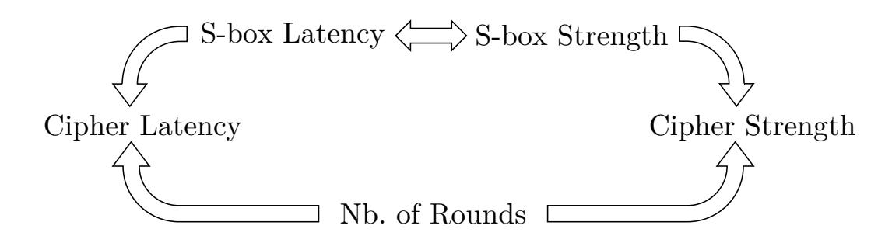
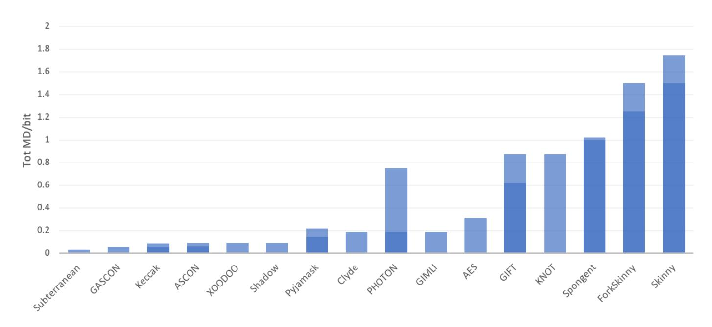
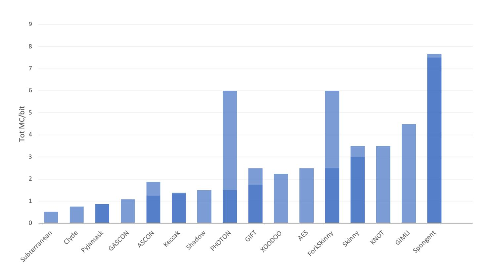

{0}------------------------------------------------

# **Looking at the NIST Lightweight Candidates from a Masking Point-of-View**

Lauren De Meyer

imec - COSIC, KU Leuven, Belgium [lauren.demeyer@esat.kuleuven.be](mailto:lauren.demeyer@esat.kuleuven.be)

**Abstract.** Cryptographic primitives have been designed to be secure against mathematical attacks in a black-box model. Such primitives can be implemented in a way that they are also secure against physical attacks, in a grey-box model. One of the most popular techniques for this purpose is masking. The increased security always comes with a high price tag in terms of implementation cost. In this work, we look at how the traditional design principles of symmetric primitives can be at odds with the optimization of the implementations and how they can evolve to be more suitable for embedded systems. In particular, we take a comparative look at the round 2 candidates of the NIST lightweight competition and their implementation properties in the world of masking.

**Keywords:** DPA · Masking · NIST · lightweight · competition · side-channel · symmetric · S-box

## **1 Introduction**

In the Internet of Things, cryptographic calculations are increasingly deployed in highly constrained environments. As a result, the National Institute of Standards and Technology (NIST) has initiated a standardization effort for lightweight cryptography.[1](#page-0-0) Apart from security against mathematical attacks (*i.e.* cryptanalysis), cryptographic implementations nowadays are required to provide security against physical attacks such as side-channel analysis (SCA) as well. Especially lightweight devices are likely to be among the targets that an adversary may have physical access to. As a result, NIST considers the ability to provide side-channel resistance at low cost an important evaluation criterion.

One of the most popular countermeasures against SCA at the algorithmic level is *masking*. The essence of masking is to split any (sensitive) variable into multiple shares such that all shares are required to calculate that variable. The most common type of masking is Boolean masking, where the variables are split using an XOR operation. As a consequence, masking linear or affine operations is relatively straightforward and comes with a linear overhead factor of *d* + 1, where *d* is the order of SCA resistance. Nonlinear operations on the other hand are very complicated and expensive to mask. Their cost grows exponentially with the security order *d*. Our treatment will focus mostly on the nonlinear components of symmetric primitives, *e.g.* S-boxes, since the cost of implementations is dominated by their overhead.

However, the cost of a masked implementation does not follow straightforwardly from the cost of an unmasked implementation and designing a primitive with optimizing one cost in mind, does not automatically optimize the other. As an example, consider the optimization goal of low latency in hardware implementations. Many lightweight primitives of the past years involve a less complex round function (and especially S-box) than that of

1<https://csrc.nist.gov/Projects/Lightweight-Cryptography>

{1}------------------------------------------------

the Advanced Encryption Standard (AES), which is repeated for a higher number of rounds. The rationale is that this both reduces area requirements and that a round-based encryption can run at a higher frequency. The complexity of masking also grows considerably with the algebraic degree of a function. Therefore, it is common to split complex functions into lower-degree (especially quadratic) components. Since those masked quadratic blocks have to be separated by register elements, the maximum frequency of masked implementations does not depend on the total complexity of the round function. Furthermore, we will show in this work that the increased number of rounds is detrimental to the speed of masked implementations.

We first consider the topic of S-boxes in Section 2 and explain some of their properties and methods of classification. We consider both mathematical and implementation properties. Next, Section 3 considers the *design* of symmetric cryptosystems (especially S-boxes) from the embedded systems engineer's point-of-view. We list optimization goals for hardware and software implementations and discuss the state-of-the-art, including proposals in the recent NIST lightweight competition.

# 2 S-box Properties and Affine Equivalence

We list here cryptographic properties, which indicate the S-box's strength against mathematical attacks (*i.e.* cryptanalysis) and which were traditionally considered the principal evaluation criteria in the choice of S-boxes for primitives. Next, we describe S-box classifications, a popular method to simplify the enormous search space of S-boxes and detail the most important results from the literature in this context. Finally, we identify some properties, which give information on the cost of implementing an S-box.

#### 2.1 Cryptographic Properties

**Notation** An S-box is typically a balanced vectorial Boolean function  $F: \mathbb{F}_2^n \to \mathbb{F}_2^m$ , where each output  $y = F(x) \in \mathbb{F}_2^m$  is equiprobable for all inputs  $x \in \mathbb{F}_2^n$ . Often, n = m and thus F is bijective. We denote the bits of  $x \in \mathbb{F}_2^n$  by  $x_i$  for  $i = 0 \dots n - 1$ . An  $n \times m$  vectorial Boolean function can be split into m coordinate functions, each of which is a Boolean function  $f_i: \mathbb{F}_2^n \to \mathbb{F}_2$  for  $i = 0 \dots m - 1$ . Let  $\circ$  denote the composition of functions, i.e. for  $F_1: \mathbb{F}_2^m \to \mathbb{F}_2^l$  and  $F_2: \mathbb{F}_2^n \to \mathbb{F}_2^m$ :  $F_1 \circ F_2(x) = F_1(F_2(x))$ . We also consider the inner product of two bit-vectors as  $\langle x, y \rangle = \sum_i x_i y_i$ .

**Algebraic Normal Form (ANF).** The algebraic normal form is a unique representation of a Boolean function  $f: \mathbb{F}_2^n \to \mathbb{F}_2$  as a multivariate polynomial:

$$f(x) = \sum_{j \in \mathbb{F}_2^n} \alpha_j \left( \prod_{i=0}^{n-1} x_i^{j_i} \right) \tag{1}$$

**Algebraic Degree.** The algebraic degree of a Boolean function  $f: \mathbb{F}_2^n \to \mathbb{F}_2$  is the highest degree that occurs in the ANF. It can be described as

$$\operatorname{Degr}(f) = \max_{j \in \mathbb{F}_2^n, \alpha_j \neq 0} HW(j)$$
 (2)

with HW(j) the Hamming weight of j. The algebraic degree of a vectorial Boolean function  $F: \mathbb{F}_2^n \to \mathbb{F}_2^m$  is the largest degree of its coordinate functions:

$$Degr(F) = \max_{0 \le i < m} Degr(f_i)$$
(3)

{2}------------------------------------------------

The algebraic degree (and more generally complexity of the algebraic description) plays a role in the resistance against algebraic attacks [CP02], which target a cryptosystem by considering it as a system of equations. For an n-bit bijective S-box, the largest possible algebraic degree is n-1.

**Differential Uniformity.** Let  $F: \mathbb{F}_2^n \to \mathbb{F}_2^m$  be a vectorial Boolean function. We define its difference distribution table (DDT) [BS90] as  $\delta_F$  with for  $\alpha \in \mathbb{F}_2^n$  and  $\beta \in \mathbb{F}_2^m$ :

$$\delta_F(\alpha,\beta) = \#\{x \in \mathbb{F}_2^n : F(x \oplus \alpha) = F(x) \oplus \beta\}$$
(4)

The differential uniformity [Nyb93] is the largest value in the DDT for  $\alpha \neq 0$ :

$$Diff(F) = \max_{\alpha \neq 0, \beta} \delta_F(\alpha, \beta) \tag{5}$$

This metric indicates the difficulty of differential cryptanalysis [BS90], a statistical attack methodology which exploits the probability that some input difference propagates to some output difference through the cipher. The larger the value Diff, the less uniform the probabilities in  $\delta_F$  are and thus, the less resistant a function is against differential cryptanalysis. The lower bound for the differential uniformity of bijective S-boxes is 2. The S-boxes that obtain this limit (and thus have DDT with only values 0 and 2) are called almost perfect nonlinear (APN).

**Linearity.** Another statistical cryptanalysis which is considered an important threat to symmetric-key cryptosystems is linear cryptanalysis [Mat93]. Instead of considering input-and output-differences of functions, this attack considers linear combinations of the bits of inputs and outputs. Similarly, we can define a property, which measures the resistance of functions against this type of attack. The two-dimensional Walsh spectrum of a function  $F: \mathbb{F}_2^n \to \mathbb{F}_2^m$  is defined as:

$$\hat{F}(\alpha,\beta) = \sum_{x \in \mathbb{F}_2^n} (-1)^{\langle \alpha, x \rangle} \cdot (-1)^{\langle \beta, F(x) \rangle}$$
 (6)

for  $\alpha \in \mathbb{F}_2^n$  and  $\beta \in \mathbb{F}_2^m$ . It can also be computed as a linear approximation table (LAT) [CV94]:

$$\hat{F}(\alpha,\beta) = 2\#\{x \in \mathbb{F}_2^n : \langle \alpha, x \rangle = \langle \beta, F(x) \rangle\} - 2^n \tag{7}$$

The *linearity* is the largest absolute value in the LAT for  $\beta \neq 0$ :

$$\operatorname{Lin}(F) = \max_{\beta \neq 0, \alpha} |\hat{F}(\alpha, \beta)| \tag{8}$$

In some sense, the linearity measures how easy it is to approximate a function by a linear function. Naturally, the smaller this value, the better the resistance against linear cryptanalysis. The lower bound for the linearity of bijective S-boxes is  $2^{(n+1)/2}$  and the S-boxes for which the linearity equals this limit are called *almost bent* (AB). It was shown that every AB function is also APN [CV94].

**The AES S-box.** To illustrate these properties, we take the AES S-box as example, which can be represented as a vectorial Boolean function over  $\mathbb{F}_2^8$ . This function has the maximum algebraic degree of 7. Its differential uniformity and linearity are respectively 4 and 32. While not AB nor APN, this S-box remains to this day the best 8-bit S-box in the literature in terms of cryptographic properties. No S-boxes with lower differential uniformity or linearity have been found and it is not clear whether they even exist. The main reason that we are still unsure about this is the magnitude of the search space.

{3}------------------------------------------------

#### 2.2 Classifications

When looking for S-boxes with good properties, we deal with a dimensionality problem. The number of possible bijections on n bits is  $2^n!$ , which prohibits exhaustive search for n > 3. To manage the enormous search spaces of S-boxes, we divide them into classes, defined based on an equivalence property.

**Affine Equivalence.** It has been shown that transforming the inputs and outputs of an S-box with an affine function preserves many of its cryptographic properties, including the algebraic degree, differential uniformity and linearity [CCZ98]. Following this observation, we can define an equivalence relation based on such transformations. We call two functions  $F_1: \mathbb{F}_2^n \to \mathbb{F}_2^m$  and  $F_2: \mathbb{F}_2^n \to \mathbb{F}_2^m$  affine equivalent [CCZ98] if and only if there exists a pair of n-bit and m-bit invertible affine bijections A and B such that  $F_1 = B \circ F_2 \circ A$ .

**Exhaustive Classifications.** The affine equivalence (AE) property has enabled the exhaustive classifications of entire function spaces up to a certain size. For these sizes, we therefore also have exhaustive knowledge of the cryptographic properties that exist. The first classification of Boolean functions dates back to 1959 [Gol59]. By 1972, all Boolean functions with up to five input bits were classified up to AE by Berlekamp and Welch [BW72]. Maiorana [Mai91] was the first to identify the AE classes of 6-bit Boolean functions. Using an efficient algorithm for verifying AE by Biryukov *et al.* [BDBP03], De Cannière [De 07] created an exhaustive classification of all 4-bit bijective S-boxes. The dimensionality reduction is significant, since the classification allows one to consider only 302 AE classes instead of 16! permutations. However, the search for the classes themselves becomes too complex for larger sizes. To this day, no exhaustive classification for vectorial Boolean functions over n bits with n > 4 exists.

**Partial Classifications.** Classifications have been extended to S-box sizes n > 4 by restricting certain properties. Brinkmann and Leander [BL08] constrained the search space to bijective S-boxes with optimal properties (APN) and were able to classify them exhaustively up to dimension 5. Alternatively, Bozilov et al. [BBS17] were able to exhaustively classify all quadratic 5-bit permutations with a dedicated search method for functions of algebraic degree two. Following an enhancement of the AE algorithm of Biryukov et al. [BDBP03], De Meyer and Bilgin [DB19] were able to optimize the algorithm of Bozilov et al. [BBS17], which led to the first classification of quadratic 6-bit functions, including balanced non-bijective Boolean functions.

#### 2.3 Implementation Properties

Circuit Properties. The cost of an S-box circuit can be expressed with many different metrics. We typically count the number of gates (gate complexity) or look at the circuit depth. Depending on which gates we consider, we can obtain different cost estimations. Stoffelen [Sto16] for example distinguishes gate complexity for hardware implementations and bitslice gate complexity for software implementations. The former considers all types of gates which can be found in typical CMOS libraries (AND, OR, NOT, XOR, NAND, NOR, XNOR), while the latter only considers those for which a CPU instruction exists in most processors (AND, OR, NOT, XOR). The bitslice gate complexity can be used as an indicator of the speed of a software implementation, since each gate should map to one instruction. For hardware implementations, the gate complexity is related to the area of a circuit. For the latency of a circuit, we look at the circuit depth, which is the maximum number of gates on any path from an input to an output. Note that we typically only consider 2-input gates in these metrics for genericity and ease of comparison.

{4}------------------------------------------------

**XOR vs. AND.** Any function can be represented in terms of AND, XOR and NOT gates only, because these gates form a functionally complete set of operators. It is therefore common to consider only these gate complexities. Naturally, area or latency estimates based on gate counts are not exact, since each different type of instruction or gate has a different area or delay. Exact cost metrics can be obtained using gate-specific costs from a logic library, combined with distinct gate counts (AND gate complexity, XOR gate complexity, . . . ). In CMOS technology, a NAND gate consists of 4 transistors, while an XOR gate requires as much as 8. A linear function can thus be more expensive than a nonlinear function (in hardware). Traditionally, circuits and S-boxes have been optimized according to that philosophy. However, if we want efficient circuits for embedded systems exposed to side-channel attacks, we need to consider the cost of countermeasures such as masking. A masked XOR requires *d* + 1 regular XOR gates, whereas a masked AND requires about (*d* + 1)2 AND gates and 2*d*(*d* + 1) XOR gates. It is therefore common to regard the cost of XOR negligible compared to that of AND.

**Multiplicative Complexity.** As a result, recent works often consider the metric *multiplicative complexity* (*MC*) [\[Sch88\]](#page-18-1). This is the minimal number of 2-input AND gates required to evaluate a function over the basis (AND, XOR, NOT). The *MC* is an important metric for the area of masked hardware implementations and for the latency of masked software implementations. Note that it is a property of a function, not of a circuit and that it corresponds to the AND gate complexity of the most efficient implementation of that function, with respect to AND gate count.

**Multiplicative Depth.** For the latency of masked hardware implementations, we care about the circuit depth in terms of 2-input AND gates. In masked implementations, every layer of AND gates requires a register stage for synchronization [\[NRR06,](#page-17-4) [RBN](#page-17-5)+15], which significantly affects the latency in terms of clock cycles. Given a circuit over the basis (AND, XOR, NOT), the *multiplicative depth* (*MD*) is the maximum number of 2-input AND gates on any path from an input to an output. This is a circuit-specific property. For any S-box *S*, the minimal multiplicative depth achievable follows directly from its algebraic degree: *MD* ≥ dlog2 (Degr(*S*))e.

**Affine Equivalence.** Interestingly and conveniently, the multiplicative complexity *MC* is also invariant under AE, since affine transformations do not alter the number of AND gates.

# **3 Towards Cryptography Design for Masking**

The consideration of implementation cost in the design of cryptographic components (and more specifically S-boxes) is not new. The S-boxes of the Data Encryption Standard (DES) were chosen in the first place according to a list of cryptographic criteria. Among those that fulfilled these criteria, the designers chose the ones that would be most efficiently implemented in hardware [\[MM82\]](#page-17-6). Daemen and Rijmen [\[DR98\]](#page-16-4) pointed out that the coefficients in the MixColumns operation of AES were specifically chosen with implementation efficiency in mind. The S-box is based on an inversion operation, which means that hardware implementations for encryption and decryption can share the same inversion block.

However, as we move towards a world with more and more embedded devices, where side-channel attacks are a constant threat, we must shift our understanding of implementation cost to one that takes SCA countermeasures into account. In fact, since those countermeasures come with such large overheads, the consideration of implementation cost in the design process becomes even more important than before. The ongoing NIST

{5}------------------------------------------------

lightweight cryptography standardization contest even explicitly lists this as a requirement for candidates:

"While implementations will not be required to provide side-channel resistance, the ability to provide it easily and at low cost is highly desired."

The same is stated for resistance against fault attacks. To achieve this, we need designers to become familiar with how their decisions influence the cost.

In this section, we will first identify important goals for the designer and properties to optimize based on the cost of masked implementations. Next, we will discuss recent trends in the state-of-the-art on cipher design and, in particular, assess how the NIST lightweight candidates comply with the SCA requirement.

### **3.1 Goals and Trade-offs**

**Decomposability.** There exist many masked implementations of the AES S-box [\[BGN](#page-15-5)+14, [DRB](#page-16-5)+16, [GMK17,](#page-16-6) [DRB18\]](#page-16-7). In each case, the S-box of algebraic degree 7 is decomposed into quadratic components, which can each be masked using, for example, an ISW multiplication [\[ISW03\]](#page-17-7). This approach is very popular in the masking of S-boxes. Bilgin *et al.* [\[BNN](#page-15-6)+12] were able to create threshold implementations (TI) [\[NRR06\]](#page-17-4) for all 3- and 4-bit S-boxes up to AE by decomposing the cubic S-boxes into quadratic ones. A beneficial property for an S-box is therefore to be easily decomposable into quadratic or low-degree functions.

**Minimize Multiplicative Depth.** Glitches in *hardware* masked implementations require that all quadratic stages are separated by registers for synchronization. The number of decomposition functions therefore plays an important role. Ideally, it should be possible to implement the S-box with the minimal multiplicative depth. S-boxes that are not designed with this specification in mind, often need more than that to keep the AND gate complexity within reasonable bounds. For example, most masked AES S-boxes [\[BGN](#page-15-5)+14, [DRB](#page-16-5)+16, [GMK17\]](#page-16-6) require at least four instead of three (= dlog2 (7)e) quadratic steps. The number of register stages mostly influences the latency of hardware implementations, because it directly determines the number of clock cycles. However, also the area footprint is affected by those registers, which have relatively high cost compared to combinational logic on Application-Specific Integrated Circuits (ASICs).

**Algebraic Degree.** If the S-box is indeed chosen so that it can be implemented with minimal multiplicative depth *MD* = dlog2 (Degr(*S*))e, then the algebraic degree becomes a direct indicator for the latency of the S-box. Naturally, there is a trade-off with cryptographic quality. Quadratic functions tend to have large differential uniformity and linearity. Finding the optimal trade-off is difficult. For S-boxes only, the AE classifications help to find the cryptographically strongest functions at the lowest cost. A larger investigation and comparison for S-boxes of many more sizes were made by Bilgin *et al.* [\[BDD](#page-15-7)+20]. However, the cryptographic strength of an S-box alone is not directly linked to that of the cipher, since it depends also on the linear layers and the number of rounds. Similarly, the latency of the entire cipher depends on the latency of the S-box, the number of rounds and the architecture used (see Figure [1\)](#page-6-0). We should thus attempt to minimize the total multiplicative depth or algebraic degree of the cipher.

**Minimize Multiplicative Complexity.** In *software*, the depth has little importance since all operations are performed sequentially. The number of instructions in a masked implementation grows most with the number of AND operations. Hence, for software-oriented ciphers, it is most important to design primitives with low multiplicative complexity. Also

{6}------------------------------------------------

**Figure 1:** Illustration of the complicated trade-offs between cryptographic strength and latency.

in *hardware*, the multiplicative complexity is important for the area footprint of the S-box. However, recall that a low multiplicative complexity should not be achieved at the cost of a large multiplicative depth, even if area is more important than latency. Hence, in this case, the goal is to find S-boxes that have low level-*D* multiplicative complexity, where *D* is ideally the minimal multiplicative depth *MD* = dlog2 (Degr(*S*))e.

**The Inverse.** Often, when an encryption uses the S-box *S*, its inverse *S* −1 is required for decryption. The cost of the inverse is not always considered, because the cryptographic properties Diff and Lin are the same for *S* and *S* −1 . The algebraic degree and multiplicative complexity, on the other hand, are not, which means considering only the implementation cost of *S* may result in an expensive *S* −1 . In the survey of S-boxes of Bilgin *et al.* [\[BDD](#page-15-7)+20], the cryptographic and implementation properties of S-boxes and their inverses are investigated. Moreover, they consider also the possibility of sharing resources between encryption and decryption. The AES S-box, for example, uses an inversion, which is naturally an involution. Hence both encryption and decryption can use the same hardware components, which reduces the area footprint on a device that needs to be able to do both. Other than involutions, Bilgin *et al.* [\[BDD](#page-15-7)+20] identify several ways to minimize the combined area of *S* and *S* −1 and propose a selection of S-boxes that perform well in this regard, as well as cryptanalytically. Many NIST candidates avoid this issue by using a mode which only requires the forward S-box *S*.

**Bit Sizes: Large vs. Small.** AES is one of the few block ciphers that uses an 8-bit S-box. Most block ciphers use a 4-bit S-box. There are two ways to look at the choice of S-box size: from a cryptanalytic point-of-view and from a SCA point-of-view. The trade-off between cryptographic strength and implementation cost of small and large S-boxes is again complicated by the involvement of the linear layers. Hence, we leave it to the cryptanalysts to investigate it. Nevertheless, it is probable that the popularity of small bit sizes (*e.g.* 4) is more due to the lack of knowledge on the search space of larger S-boxes than due to a qualitative advantage. In addition, the success of AES has suppressed other ciphers that use an 8-bit S-box. From a SCA point-of-view however, larger S-boxes may enjoy some benefit in LUT-based implementations. DPA [\[KJJ99\]](#page-17-8) on AES requires 2 8 = 256 hypotheses to be made on each 8-bit subkey. This number is directly determined by the size of the S-box (or more specifically, the number of input bits that each output bit depends on). In a similar cipher with 4-bit S-boxes, only 2 4 = 16 hypotheses would have to be made per subkey. More generally, in a state of *B* bits with *n*-bit S-boxes, a DPA attack requires 2 *n*−log2 *nB* hypotheses to recover the entire round key. Hence, very large S-box sizes could interfere with the divide and conquer strategy of SCA. The problem is that their search spaces are too large to explore.

**Bit Sizes: Odd vs. Even.** Another contrast in S-box sizes is that between odd and even. Traditionally, often S-boxes of size a power of two were chosen, because of the datapath width in processors. For hardware implementations or bitsliced software implementations,

{7}------------------------------------------------

this restriction does not make sense, but still, it is challenging to fit an odd-sized S-box into a block cipher with state size a power of two (*e.g.* 128 or 256). As a result, even-sized S-boxes (mostly 4) dominate in the literature. However, both from a cryptanalytic and implementation perspective, odd-sized S-boxes show an advantage over even-sized ones. The results of Bilgin *et al.* [\[BDD](#page-15-7)+20] show that S-boxes of odd size *n* achieve the same cryptographic strength as S-boxes of even size *n* + 1, but at lower cost. They are especially interesting when it comes to low latency applications, since for every odd size *n*, there exists at least one AE class of quadratic APN S-boxes. These are S-boxes with optimal cryptographic properties, that can be implemented at minimal latency.

**Clarifying Example.** Choosing an S-box according to these goals and preferences is easier said than done. In the end, the cryptographic strength of a cipher remains the most important decision factor. However, what these guidelines aim to do is give more clarity about the impact of certain design decisions. In some cases, there are many S-boxes that result in the same security properties. It is exactly then that the *masked* implementation cost should be taken into account. Let us look at the popular 4-bit S-boxes as an example. Since the quadratic ones do not provide good cryptographic properties, only cubic ones are used in block ciphers. They need a multiplicative depth of (at least) two. In terms of latency, such a decision is wasteful in a way, since with *MD* = 2, it is possible to implement a fourth-degree S-box with better cryptographic properties. In fact, Bilgin *et al.* [\[BDD](#page-15-7)+20] showed that even with *MD* = 1, 5-bit S-boxes obtain better cryptographic properties than 4-bit S-boxes with *MD* = 2. And with these better cryptographic properties, it is possible that the number of rounds can be reduced, which even further optimizes the latency of masked implementations.

### **3.2 Discussion of the State-of-the-Art.**

We will now look at the literature from the last years and show that some first steps have been taken towards the above goals. We will also critically assess some candidates from the NIST lightweight competition, that claim to have taken the cost of side-channel countermeasures into account in the design process. Note that our expertise does not extend to cryptanalysis and that many of the discussed ciphers are relatively new, *i.e.* not as scrutinized and established as AES. We therefore limit our treatment to an evaluation of the implementation properties only and say nothing about the cryptographic strength.

**Multi-party Computation.** The link between masking and the field of multi-party computation (MPC) has been pointed out in multiple works [\[ISW03,](#page-17-7) [NRR06,](#page-17-4) [PR11\]](#page-17-9). Both areas use secret sharing, which causes nonlinear operations to be more expensive than linear ones. As a result, we can see recent efforts into the design of cryptographic primitives with low multiplicative complexity. Albrecht *et al.* [\[ARS](#page-14-1)+15] introduced a family of ciphers, called LowMC, which is intended to minimize both its multiplicative complexity and depth. The design is based on a substitution-permutation network (SPN) with 3-bit S-boxes of *MD* = 1. For AES-like security parameters, they repeat the SPN for 12 rounds, which results in a total multiplicative depth of 12. Albrecht *et al.* [\[AGR](#page-14-2)+16] also introduce MIMC, a very simple construction consisting only of key additions and the quadratic map *x* → *x* 3 in a finite field F*q* with *q* prime or a power of two. This latter cipher focuses more on multiplicative complexity than depth. They need to repeat the round function 82 times to achieve AES-like security parameters, so their total multiplicative depth is actually much than that of AES.

**Keccak and PRIMATES.** In recent years, several primitives have been introduced that explicitly mentioned side-channel attacks as motivation for their S-box choice. Most

{8}------------------------------------------------

prominent is the Keccak family of sponge functions [\[BDPV11\]](#page-15-8), which has been selected as the SHA-3 Cryptographic Hash standard by NIST. They use quadratic 5-bit S-boxes with a very low multiplicative complexity of 5. The round function is repeated 18 times or more (depending on the state size), which means Keccak can have multiplicative depth as low as 18. Another permutation that uses a 5-bit S-box is PRIMATES by Andreeva *et al.* [\[ABB](#page-14-3)+14]. They chose an S-box from a quadratic 5-bit AB class, which results in optimal cryptographic properties at only slightly higher MC than the Keccak S-box. Moreover, the permutation only requires 6 or 12 iterations of the round function, which results in a very small multiplicative depth. We summarize these results in Table [1.](#page-8-0)

**Table 1:** Comparison of primitives in the state-of-the-art. We denote with *n* and *B* respectively the S-box size and block size.

| Primitive         | n/B/#Rnds    | S-box MC | S-box MD | MC/bit | Tot MD | Tot ·MC/bit |
|-------------------|--------------|-------------|-------------|--------|--------|----------------|
| AES [DR98]        | 8/128/10     | 32          | 4           | 4      | 40     | 40             |
| LowMC [ARS+15]    | 3/196/14     | 3           | 1           | 0.96*  | 14     | 13.5           |
| Keccak [BDPV11]   | 5/200/18     | 5           | 1           | 1      | 18     | 18             |
| PRIMATEs [ABB+14] | 5/120/[6/12] | 7           | 1           | 1.4    | 6/12   | 8.4/16.8       |

\* LowMC does not apply S-boxes to the entire state

**Length Increasing Structures.** Another trend in the literature is to build large S-boxes from smaller ones, using length-increasing structures which are inspired by block cipher design. In particular, 8-bit S-boxes of this type have been used in several cryptographic primitives, including CRYPTON [\[Lim98\]](#page-17-10), Khazad [\[BR00\]](#page-15-9), Whirlpool [\[BR11\]](#page-15-10), ICEBERG [\[SPR](#page-18-2)+04] and CLEFIA [\[SSA](#page-18-3)+07]. Comparative studies of such S-boxes, including new proposals, were made by Canteaut *et al.* [\[CDL15\]](#page-16-8) and by Boss *et al.* [\[BGG](#page-15-11)+16]. By construction, these S-boxes are decomposable, since they are assembled from quadratic building blocks. Note however that their increased bit size does not increase the complexity of a DPA attack, because the hypotheses can be made about the smaller (*e.g.* 4-bit) subcomponents. Moreover, most of the S-boxes obtained in this way have quite a large *MD* and none so far achieve cryptographic properties as good as the AES S-box.

# **4 NIST Lightweight Competition**

Given the above-acquired knowledge on primitive design and given that the NIST lightweight competition explicitly states that the cost of SCA countermeasures should be taken into account, we now take a look at some of the Round 2 candidates.[2](#page-8-1)

**Side-Channel Claims.** Many (not all) candidates make a note about having considered side-channel attacks. However, this claim is often not very well-argued. In some cases, it is justified by the fact that the design uses "easy-to-mask" operations such as bitwise functions. While this is more convenient for the masking designer, it gives no guarantees about the total cost. Some proposals use existing primitives and use their lightweight property as justification. However, these primitives were not necessarily designed with SCA in mind. Other candidates use AES and argue that a lot of research exists on masking the AES. The many works on masking AES [\[BGN](#page-15-5)+14, [DRB](#page-16-5)+16, [GMK17,](#page-16-6) [DRB18\]](#page-16-7) indeed confirm that there is an abundance of available literature on the subject, but the existence of a lot of research does not imply that its results are most efficient. This holds especially

2Descriptions can all be found at [https://csrc.nist.gov/projects/lightweight-cryptography/](https://csrc.nist.gov/projects/lightweight-cryptography/round-2-candidates) [round-2-candidates](https://csrc.nist.gov/projects/lightweight-cryptography/round-2-candidates)

{9}------------------------------------------------

for mask conversions between Boolean and arithmetic masking [\[BCZ18,](#page-15-12) [CGTV15\]](#page-16-9), which are required for ARX ciphers. In the NIST proposal SPARKLE, the argumentation for side-channels is again that a large amount of research exists on this topic. However, whether these conversions are considered efficient is highly disputable.

A few of the candidates stand out in their treatment of SCA. Firstly, Goudarzi *et al.* describe and implement a masked version of their scheme Pyjamask in software. Secondly, the proposal ISAP by Dobraunig *et al.* is based on the ISAP mode of operation [\[DEM](#page-16-10)+17], which is a leakage-resilient mode of operation, designed to provide security against DPA by a re-keying mechanism. In contrast with masking, this countermeasure acts at the protocol level instead of at the algorithmic level. Other proposals that claim to use some form of leakage resilience are Xoodyak, Spook, Ascon, DryGASCON and Subterranean.

#### **4.1 Implementation Properties**

Since the claims on SCA are often badly motivated and since we need to be able to correctly compare different candidates, we collect some properties of their building blocks in Tables [2](#page-11-0) and [3.](#page-12-0) We limit our selection to primitives used in proposals that make some claim about the consideration of SCA and list several properties related to the multiplicative complexity and depth of the ciphers. Naturally, these properties should not be considered by themselves, as the cost of implementations depends on several of them jointly, and cryptographic strength is not taken into account here. Note also that some properties depend on the objective of the implementation. For example, the GIFT S-box can be implemented with 4 AND gates and depth 4 or with 5 AND gates and depth 2. The AES and SKINNY S-boxes have algebraic degree 8 and 6 respectively, which means it is possible to implement both with depth 3. However, their multiplicative complexity at depth 4 is a lot smaller.

In Table [2,](#page-11-0) we look at properties for hardware implementations and in Table [3,](#page-12-0) we consider software implementations. We recall the most important influences on the cost for different cases here:

**Hardware with focus on low latency:** The latency of a (serial or round-based) masked implementation will depend strongly on the total multiplicative depth (Tot *MD*). We calculate this as the multiplicative depth of the S-box (S-box *MD*), multiplied with the number of rounds (# Rnds) in the primitive.[3](#page-9-0) Since different primitives operate on different state sizes, we also calculate the total multiplicative depth per bit (Tot *MD*/bit) by dividing the total *MD* by the block size *B*. [4](#page-9-1)

**Hardware with focus on small area:** The area cost of masked hardware implementations comes from registers on the one hand and combinational logic on the other. On ASIC devices, the registers are quite expensive, whereas on Field Programmable Gate Array (FPGA) devices, they are relatively cheap from being available in large quantities. The register cost is considerably affected by the block or state size *B*, especially in a serial implementation. Furthermore, also the multiplicative depth of the S-box (S-box *MD*) contributes to the registers, but this is more prominent in round-based implementations. As for the combinational logic, its area grows most with the multiplicative complexity of the S-box (S-box *MC*). Again, to account for the scalability with the number of bits being operated on, we also calculate the multiplicative complexity per bit (*MC*/bit) as the S-box *MC* divided by the S-box

3We note that some sponge-based proposals use a higher number of rounds during the initialization phase of a mode. Since asymptotically only the rounds per plaintext block matter, we will not consider initialization rounds here. Note however that for short messages, the initialization rounds will be dominant.

4When a primitive is used in a sponge construction, we divide by the rate *r*, since this indicates the number of plaintext bits being processed per iteration.

{10}------------------------------------------------

size *n*. The number of rounds is not important for the area of a serial or round-based implementation.

**Software with focus on low latency:** In software, the speed can be approximated by the number of instructions. For masked implementations, this will be highly correlated with the total multiplicative complexity. The total number of multiplicative complexity naturally depends on the multiplicative complexity of the S-box on the one hand and on the number of rounds on the other. Also the number of S-boxes per round (= *B/n*) matters, but if bitslicing is used, some of these can be calculated in parallel, rather than sequentially. We therefore consider various degrees of bitslicing, assuming *p* S-boxes can be computed in parallel on a *p*-bit platform in Table [3.](#page-12-0) The total multiplicative complexity on such a platform is S-box *MC*× # Rnds ×d *B np* e. We compare this metric scaled per bit (Tot *MC*/bit) by division with the number of bits processed per encryption (*i.e.* the block size *B* or rate *r*).

We note that linear operations are not entirely negligible, especially when the masking order *d* is not very high, but since their cost is typically taken into account in the design of unmasked primitives, we do not consider them here.

**A Note on Leakage Resilience.** We note that our analysis considers only the internal building blocks of the NIST proposals, regardless of whether they are used in a leakage resilient mode or not. We see this as a necessary first step for comparison. Moreover, since different candidates rely on different types of leakage resilience, making a more detailed comparison is challenging. For an investigation into the leakage resilience of several candidates, we refer to the work of Bellizia *et al.* [\[BBC](#page-14-4)+20].

### **4.2 Observations**

The existence of Tables [2](#page-11-0) and [3](#page-12-0) is immediately justified by the large variability in some of its columns. We make some interesting observations here.

**4-bit vs. 5-bit S-boxes.** The popularity of 4-bit S-boxes continues. It is clear that they systematically result in S-box *MD* = 2. However, many other proposals use odd-sized S-boxes, which achieve the minimal depth of one. By extension, these proposals achieve a smaller Tot *MD* overall (see Figure [2\)](#page-10-0). Frontrunners in terms of multiplicative depth per bit are Subterranean 2.0, (G)ASCON, Keccak and XOODOO, which interestingly, all use an S-box based on a very similar structure.

**Figure 2:** Total Multiplicative Depth per bit

{11}------------------------------------------------

| Pr im iti ve XO OD OO | n 3      | B 38 4        | r 12 8   | # R nd s 12 | S- bo x M C 3 | / M C bit 1 | S- bo x M D 1 | M D To t 12 | / M D bit Ca nd ida To t tes |                                                                                                                                                |
|-----------------------------------------|-------------|---------------------|----------------|-------------------------|---------------------------|-------------------------|---------------------------|-------------------------|---------------------------------------------------------|------------------------------------------------------------------------------------------------------------------------------------------------|
|                                         |             |                     |                |                         |                           |                         |                           |                         | 0. 09 37 5                                     | Xo od k ya                                                                                                                            |
| Py ask jam                        | / 4 3 | / 96 128      |                | 14                      | / 4 3               | 1                       | / 1 2               | / 14 28           | ≥ 46 0.1                                          | Py ask jam                                                                                                                               |
| Cly de                               | 4           | 12 8             |                | 12                      | 4                         | 1                       | 2                         | 24                      | 187 0. 5                                          | Sp k oo                                                                                                                                  |
| ( ) GI FT I                 | 4           | / 64 128      |                | / 28 40           | 5                         | 1. 25                | 2                         | / 56 80           | ≥ 0.6 25                                          | ES TA GI -C OF TE FT B, , / A, LO S LO CU S, HY EN TU AE SU ND -G IF T |
| ( ) GI FT II                | 4           | / 64 128      |                | / 28 40           | 4                         | 1                       | 4                         | / 11 2 160     | ≥ 1.2 5                                           | ide m                                                                                                                                       |
| OT KN                                | 4           | 25 6             | 64             | * 28                 | 4                         | 1                       | 2                         | * 56                 | * 0. 87 5                                      | NO K T                                                                                                                                   |
| OT ON PH                          | 4           | 25 6             | / 32 128 | 12                      | 4                         | 1                       | 2                         | 24                      | ≥ 0.1 87 5                                     | OT ON PH -B le eet                                                                                                              |
| Sh ad ow                          | 4           | 51 2             | 25 6        | 12                      | 4                         | 1                       | 2                         | 24                      | 37 0. 09 5                                     | Sp k oo                                                                                                                                  |
| Sp t on gen                    | 4           | / 16 0 176 |                | / 80 90           | 5                         | 1. 25                | 2                         | / 16 0 180     | ≥ 1                                                  | Ele ha nt p                                                                                                                           |
| rkS kin Fo ny                  | / 4 8 | / 64 128      |                | / 40 48           | / 4 8               | 1                       | / 2 4               | / 80 192          | ≥ 1.2 5                                           | rkA Fo E                                                                                                                                 |
| AS CO N                           | 5           | 32 0             | / 64 128 | */ * 6 8       | 5                         | 1                       | 1                         | */ * 6 8       | * ≥ 0.0 62 5                                | As ISA P con ,                                                                                                                     |
| GA SC ON                          | 5           | 32 0             | 12 8        | * 7                  | 5                         | 1                       | 1                         | * 7                  | * 0. 05 5                                      | GA D SC ON ry                                                                                                                      |
| Ke k cca                          | 5           | 20 0             |                | 18                      | 5                         | 1                       | 1                         | 18                      | 0. 09                                                | El ha nt ep                                                                                                                           |
|                                         | 5           | 40 0             | 14 4        | 8                       | 5                         | 1                       | 1                         | 8                       | 0. 05 6                                           | IS AP                                                                                                                                       |
| AE S                                 | 8           | 12 8             |                | 10                      | 32                        | 4                       | 4                         | 40                      | 0. 31 25                                          | ES TA TE ixF EE D, , m SA EA ES                                                                                     |
| Sk inn y                          | 8           | 12 8             |                | / 48 56           | 8                         | 1                       | 4                         | / 19 2 224     | ≥ 1.5                                                | Ro lus SK IN NY -A EA D mu ,                                                                                        |
| GI ML I                           | 96          | 38 4             | 12 8        | 24                      | 96                        | 1                       | 1                         | 24                      | 0. 187 5                                          | G li im                                                                                                                                  |
| Su bte n 2 .0 rra nea    | 25 7     | 25 7             | 32             | * 1                  | 25 7                   | 1                       | 1                         | * 1                  | * 0. 03 125                                    | Su bte n 2 .0 rra nea                                                                                                           |

{12}------------------------------------------------

| Pr im iti ve                | n           | B              | r              | # R nd s | S- bo x C M |                        | / M C bit To t  |                                |                                | Ca nd ida tes                         |
|--------------------------------------|-------------|----------------|----------------|-------------------|-------------------------|------------------------|--------------------------------|--------------------------------|--------------------------------|------------------------------------------------|
|                                      |             |                |                |                   |                         | No Bi tsl ice | 16 -bi t                 | 32 -bi t                 | 64 -bi t                 |                                                |
| XO OD OO                       | 3           | 4 38        | 12 8        | 12                | 3                       | 36                     | 2. 25                       | 1. 125                      | 0. 56 25                 | Xo od k ya                            |
| Py ask jam                     | / 3 4 | / 96 128 |                | 14                | / 3 4             | 14                     | 87 0. 5                  | 75 0. 43                 | 75 0. 43                 | Py ask jam                               |
| Cly de                            | 4           | 12 8        |                | 12                | 4                       | 12                     | 0. 75                       | 0. 37 5                  | 0. 37 5                  | Sp k oo                                  |
| GI FT                             | 4           | / 64 128 |                | / 28 40     | 4                       | / 28 40          | / 1. 75 2.5           | / 1. 75 1.2 5      | / 1. 75 1.2 5      | ES TA TE                                 |
|                                      |             |                |                |                   |                         |                        |                                |                                |                                | , GI A, FT -C OF B, HY EN |
|                                      |             |                |                |                   |                         |                        |                                |                                |                                | / LO TU S LO CU S,           |
|                                      |             |                |                |                   |                         |                        |                                |                                |                                | SU AE -G ND IF T                |
| OT KN                             | 4           | 25 6        | 64             | * 28           | 4                       | * 11 2           | * 7                         | * 3. 5                   | * 1. 75                  | NO K T                                   |
| PH OT ON                       | 4           | 25 6        | / 32 128 | 12                | 4                       | / 24 96          | / 6 1.5                  | / 0.7 3 5             | / 1. 5 0.3 8       | PH OT ON -B eet                    |
| Sh ad ow                       | 4           | 51 2        | 25 6        | 12                | 4                       | 24                     | 1. 5                        | 0. 75                       | 0. 37 5                  | le Sp oo                                 |
| t                                    | 4           | 16 0 176 |                | 80 90          | 5                       | 10 0 112 .5   | 7. 5 7.6 7            | 5 5.1 1                  | 2. 5 2.5 6            | k El ha                                  |
| Sp on gen rkS Fo kin  | 4 8      | / 64 128 |                | / 40 48     | 4 8                  | / 40 96          | / 2. 5 6              | / 2. 5 3              | / 2. 5 3              | nt ep rkA Fo                          |
| ny                                   | /           | /              |                | / *            | /                       | / *                 | / *                         | / *                         | / *                         | E                                              |
| AS CO N                        | 5           | 32 0        | / 64 128 | */ 6 8 * | 5                       | / 30 20 *     | / 1. 88 1.2 5 * | / 94 0. 0.6 3 * | / 47 0. 0.3 1 * | As ISA P con ,                     |
| GA SC ON                       | 5           | 32 0        | 12 8        | 7                 | 5                       | 17 .5               | 1. 09                       | 0. 55                       | 0. 27                       | D GA SC ON ry                      |
| k Ke cca                       | 5           | 20 0        |                | 18                | 5                       | 18                     | 1. 35                       | 0. 9                        | 0. 45                       | El ha nt ep                           |
|                                      | 5           | 40 0        | 14 4        | 8                 | 5                       | 22 .22              | 1. 39                       | 0. 83                       | 0. 56                       | IS AP                                       |
| AE S                              | 8           | 12 8        |                | 10                | 32                      | 40                     | 2. 5                        | 2. 5                        | 2. 5                        | TA ES TE ixF EE D, , m       |
|                                      |             |                |                |                   |                         |                        |                                |                                |                                | SA EA ES                                 |
| Sk inn y                       | 8           | 12 8        |                | / 48 56     | 8                       | / 48 56          | / 3 3.5                  | / 3 3.5                  | / 3 3.5                  | lus Ro mu                                |
|                                      |             |                |                |                   |                         |                        |                                |                                |                                | , SK -A EA IN NY D              |
| GI ML I                        | 96          | 4 38        | 12 8        | 24                | 96                      | 72                     | 4. 5                        | 2. 25                       | 1. 125                      | G li im                                  |
| Su bte n 2 .0 rra nea | 25 7     | 25 7        | 32             | * 1            | 25 7                 | * 8. 03          | * 0. 53                  | * 0. 28                  | * 0. 16                  | Su bte n 2 .0 rra nea           |

{13}------------------------------------------------

It should be noted that a cubic S-box does not necessarily need decomposition and can be implemented with *MD* = 1 as well (as done by for example Ueno *et al.* [\[UHA17\]](#page-18-4)). Such an implementation can also be very area efficient in the case of first-order SCA protection. However, this approach quickly becomes too expensive for higher orders of security.[5](#page-13-0)

*MC***/bit.** The *MC*/bit is almost identical for all non-AES proposals and there is little to no need for improvement in that aspect.

**Number of Rounds.** The largest contrasts arise from differences in the number of rounds, which plays an important role when speed is a priority. With respect to the metrics of Tot *MC*/bit or Tot *MD*/bit, we see that several primitives are not competitive with AES (*e.g.* Spongent, Skinny among others) due to a large number of rounds (see Figure [2](#page-10-0) and [3\)](#page-14-5). We note that this design parameter is highly dependent on the designer's choice of security margin.

**Sponge Constructions.** On the one hand, sponge constructions often use a larger number of initialization rounds than the number of rounds used per plaintext block. This can be beneficial for the speed of a hardware implementation if messages are not too short. On the other hand, permutations in a sponge construction typically require a larger state size than block ciphers where the message is the entire state. Large state sizes are bad for area requirements on ASIC devices. We also see that the throughput of software implementations (Tot *MC*/bit) is badly affected by the fact that only *r* of the *B* bits of the state are processed. For example, the Tot *MC*/bit of PHOTON and Shadow are worse than that of Clyde, despite having equivalent S-box properties and number of rounds.

**Bitslicing.** Table [3](#page-12-0) considers various degrees of bitslicing, under the assumption that *p* S-boxes can be computed in parallel on a *p*-bit platform. When a primitive has less than *p* S-boxes, it may be that bitslicing offers less advantage. For example, Subterranean 2.0 performs one large nonlinear operation across the entire state, which can be seen as only one S-box. However, this S-box has a highly repetitive structure (also known as cellular automata), which could be exploited in bitslicing as well. Apart from Subterranean 2.0, Table [3](#page-12-0) shows two more proposals that perform better than any other in terms of multiplicative complexity, regardless of the degree of bitslicing: Pyjamask and Clyde. It also shows that various proposals offer little advantage over AES in this regard. Figure [3](#page-14-5) demonstrates the total multiplicative complexity per bit with bitslicing on a 16-bit platform.

## **Conclusion**

In this work, we want to clarify the effect of some design decisions on the cost of masked implementations of symmetric primitives. In particular, our guidelines should demonstrate that 4-bit S-boxes, despite being the most popular in symmetric designs, do not exhibit the most beneficial properties for hardware masking. We noted for each implementation goal (software vs. hardware, low area vs. low latency) which properties matter the most. Finally, we have created the first comparison of the NIST candidates based on those properties. While our analysis says nothing on the cryptanalytic security of these proposals, we believe these costs should be taken into account in the choice of candidates for standardization.

5Example: a cubic function with second-order security (*d* = 2*, t* = 3): *d* + 1 = 3 shares expand to (*d* + 1)*t* = 27 shares with *d* + 1 masking and at least *td* + 1 = 7 shares are required with *td* + 1 masking.

{14}------------------------------------------------

**Figure 3:** Total Multiplicative Complexity per bit on a 16-bit platform

#### **Acknowledgements**

This work was supported in part by the NIST Research Grant 60NANB15D346. The author is funded by a PhD fellowship of the FWO. The author would like to thank François-Xavier Standaert and Thomas Peyrin for their feedback.

## **References**

- [ABB+14] Elena Andreeva, Begül Bilgin, Andrey Bogdanov, Atul Luykx, Florian Mendel, Bart Menninck, Nicky Mouha, Qingju Wang, and Kan Yasuda. PRIMATEs: Submission to the CAESAR competition. [https://competitions.cr.yp.to/](https://competitions.cr.yp.to/round1/primatesv1.pdf) [round1/primatesv1.pdf](https://competitions.cr.yp.to/round1/primatesv1.pdf), March 2014.
- [AGR+16] Martin R. Albrecht, Lorenzo Grassi, Christian Rechberger, Arnab Roy, and Tyge Tiessen. MiMC: Efficient encryption and cryptographic hashing with minimal multiplicative complexity. In Jung Hee Cheon and Tsuyoshi Takagi, editors, *Advances in Cryptology - ASIACRYPT 2016 - 22nd International Conference on the Theory and Application of Cryptology and Information Security, Hanoi, Vietnam, December 4-8, 2016, Proceedings, Part I*, volume 10031 of *Lecture Notes in Computer Science*, pages 191–219, 2016.
- [ARS+15] Martin R. Albrecht, Christian Rechberger, Thomas Schneider, Tyge Tiessen, and Michael Zohner. Ciphers for MPC and FHE. In *Advances in Cryptology - EUROCRYPT 2015 - 34th Annual International Conference on the Theory and Applications of Cryptographic Techniques, Sofia, Bulgaria, April 26-30, 2015, Proceedings, Part I*, pages 430–454, 2015.
- [BBC+20] Davide Bellizia, Olivier Bronchain, Gaëtan Cassiers, Vincent Grosso, Chun Guo, Charles Momin, Olivier Pereira, Thomas Peters, and François-Xavier Standaert. Mode-level vs. implementation-level physical security in symmetric cryptography: A practical guide through the leakage-resistance jungle. *IACR Cryptol. ePrint Arch.*, 2020:211, 2020.
- [BBS17] Dusan Bozilov, Begül Bilgin, and Haci Ali Sahin. A note on 5-bit quadratic permutations' classification. *IACR Trans. Symmetric Cryptol.*, 2017(1):398–404, 2017.

{15}------------------------------------------------

- [BCZ18] Luk Bettale, Jean-Sébastien Coron, and Rina Zeitoun. Improved high-order conversion from Boolean to arithmetic masking. *IACR Trans. Cryptogr. Hardw. Embed. Syst.*, 2018(2):22–45, 2018.
- [BDBP03] Alex Biryukov, Christophe De Cannière, An Braeken, and Bart Preneel. A toolbox for cryptanalysis: Linear and affine equivalence algorithms. In Eli Biham, editor, *Advances in Cryptology - EUROCRYPT 2003, International Conference on the Theory and Applications of Cryptographic Techniques, Warsaw, Poland, May 4-8, 2003, Proceedings*, volume 2656 of *Lecture Notes in Computer Science*, pages 33–50. Springer, 2003.
- [BDD+20] Begül Bilgin, Lauren De Meyer, Sébastien Duval, Itamar Levi, and François-Xavier Standaert. Low AND depth an efficient inverses: a guide on s-boxes for low-latency masking. Accepted for Publication in ToSC 2020 Issue 1, 2020.
- [BDPV11] Guido Bertoni, Joan Daemen, Michaël Peeters, and Gilles Van Assche. The Keccak reference. <http://keccak.noekeon.org/>, 2011.
- [BGG+16] Erik Boss, Vincent Grosso, Tim Güneysu, Gregor Leander, Amir Moradi, and Tobias Schneider. Strong 8-bit sboxes with efficient masking in hardware. In Gierlichs and Poschmann [\[GP16\]](#page-17-11), pages 171–193.
- [BGN+14] Begül Bilgin, Benedikt Gierlichs, Svetla Nikova, Ventzislav Nikov, and Vincent Rijmen. A more efficient AES threshold implementation. In *Progress in Cryptology - AFRICACRYPT 2014 - 7th International Conference on Cryptology in Africa, Marrakesh, Morocco, May 28-30, 2014. Proceedings*, pages 267–284, 2014.
- [BL08] Marcus Brinkmann and Gregor Leander. On the classification of APN functions up to dimension five. *Des. Codes Cryptogr.*, 49(1-3):273–288, 2008.
- [BNN+12] Begül Bilgin, Svetla Nikova, Ventzislav Nikov, Vincent Rijmen, and Georg Stütz. Threshold implementations of all 3 ×3 and 4 ×4 S-boxes. In *Cryptographic Hardware and Embedded Systems - CHES 2012 - 14th International Workshop, Leuven, Belgium, September 9-12, 2012. Proceedings*, pages 76–91, 2012.
- [BR00] Paulo S. L. M. Barreto and Vincent Rijmen. The Khazad legacy-level block cipher, 2000. Submission to NESSIE.
- [BR11] Paulo S. L. M. Barreto and Vincent Rijmen. Whirlpool. In Henk C. A. van Tilborg and Sushil Jajodia, editors, *Encyclopedia of Cryptography and Security, 2nd Ed*, pages 1384–1385. Springer, 2011.
- [BS90] Eli Biham and Adi Shamir. Differential cryptanalysis of DES-like cryptosystems. In Alfred Menezes and Scott A. Vanstone, editors, *Advances in Cryptology - CRYPTO '90, 10th Annual International Cryptology Conference, Santa Barbara, California, USA, August 11-15, 1990, Proceedings*, volume 537 of *Lecture Notes in Computer Science*, pages 2–21. Springer, 1990.
- [BW72] Elwyn R. Berlekamp and Lloyd R. Welch. Weight distributions of the cosets of the (32, 6) Reed-Muller code. *IEEE Trans. Information Theory*, 18(1):203–207, 1972.
- [CCZ98] Claude Carlet, Pascale Charpin, and Victor A. Zinoviev. Codes, bent functions and permutations suitable for DES-like cryptosystems. *Des. Codes Cryptogr.*, 15(2):125–156, 1998.

{16}------------------------------------------------

[CDL15] Anne Canteaut, Sébastien Duval, and Gaëtan Leurent. Construction of lightweight S-boxes using Feistel and MISTY structures. In Orr Dunkelman and Liam Keliher, editors, *Selected Areas in Cryptography - SAC 2015 - 22nd International Conference, Sackville, NB, Canada, August 12-14, 2015, Revised Selected Papers*, volume 9566 of *Lecture Notes in Computer Science*, pages 373–393. Springer, 2015.

- [CGTV15] Jean-Sébastien Coron, Johann Großschädl, Mehdi Tibouchi, and Praveen Kumar Vadnala. Conversion from arithmetic to Boolean masking with logarithmic complexity. In Gregor Leander, editor, *Fast Software Encryption - 22nd International Workshop, FSE 2015, Istanbul, Turkey, March 8-11, 2015, Revised Selected Papers*, volume 9054 of *Lecture Notes in Computer Science*, pages 130–149. Springer, 2015.
- [CP02] Nicolas Courtois and Josef Pieprzyk. Cryptanalysis of block ciphers with overdefined systems of equations. In Yuliang Zheng, editor, *Advances in Cryptology - ASIACRYPT 2002, 8th International Conference on the Theory and Application of Cryptology and Information Security, Queenstown, New Zealand, December 1-5, 2002, Proceedings*, volume 2501 of *Lecture Notes in Computer Science*, pages 267–287. Springer, 2002.
- [CV94] Florent Chabaud and Serge Vaudenay. Links between differential and linear cryptanalysis. In Alfredo De Santis, editor, *Advances in Cryptology - EU-ROCRYPT '94, Workshop on the Theory and Application of Cryptographic Techniques, Perugia, Italy, May 9-12, 1994, Proceedings*, volume 950 of *Lecture Notes in Computer Science*, pages 356–365. Springer, 1994.
- [DB19] Lauren De Meyer and Begül Bilgin. Classification of balanced quadratic functions. *IACR Trans. Symmetric Cryptol.*, 2019(2):169–192, 2019.
- [De 07] Christophe De Cannière. *Analysis and Design of Symmetric Encryption Algorithms*. PhD thesis, Katholieke Universiteit Leuven, 2007.
- [DEM+17] Christoph Dobraunig, Maria Eichlseder, Stefan Mangard, Florian Mendel, and Thomas Unterluggauer. ISAP - towards side-channel secure authenticated encryption. *IACR Trans. Symmetric Cryptol.*, 2017(1):80–105, 2017.
- [DR98] Joan Daemen and Vincent Rijmen. The block cipher Rijndael. In Jean-Jacques Quisquater and Bruce Schneier, editors, *Smart Card Research and Applications, This International Conference, CARDIS '98, Louvain-la-Neuve, Belgium, September 14-16, 1998, Proceedings*, volume 1820 of *Lecture Notes in Computer Science*, pages 277–284. Springer, 1998.
- [DRB+16] Thomas De Cnudde, Oscar Reparaz, Begül Bilgin, Svetla Nikova, Ventzislav Nikov, and Vincent Rijmen. Masking AES with d+1 shares in hardware. In Gierlichs and Poschmann [\[GP16\]](#page-17-11), pages 194–212.
- [DRB18] Lauren De Meyer, Oscar Reparaz, and Begül Bilgin. Multiplicative masking for AES in hardware. *IACR Trans. Cryptogr. Hardw. Embed. Syst.*, 2018(3):431– 468, 2018.
- [GMK17] Hannes Groß, Stefan Mangard, and Thomas Korak. An efficient side-channel protected AES implementation with arbitrary protection order. In Helena Handschuh, editor, *Topics in Cryptology - CT-RSA 2017 - The Cryptographers' Track at the RSA Conference 2017, San Francisco, CA, USA, February 14-17, 2017, Proceedings*, volume 10159 of *Lecture Notes in Computer Science*, pages 95–112. Springer, 2017.

{17}------------------------------------------------

- [Gol59] Solomon W. Golomb. On the classification of Boolean functions. *IRE Trans. Information Theory*, 5(5):176–186, 1959.
- [GP16] Benedikt Gierlichs and Axel Y. Poschmann, editors. *Cryptographic Hardware and Embedded Systems - CHES 2016 - 18th International Conference, Santa Barbara, CA, USA, August 17-19, 2016, Proceedings*, volume 9813 of *Lecture Notes in Computer Science*. Springer, 2016.
- [Hel94] Tor Helleseth, editor. *Advances in Cryptology - EUROCRYPT '93, Workshop on the Theory and Application of of Cryptographic Techniques, Lofthus, Norway, May 23-27, 1993, Proceedings*, volume 765 of *Lecture Notes in Computer Science*. Springer, 1994.
- [ISW03] Yuval Ishai, Amit Sahai, and David A. Wagner. Private circuits: Securing hardware against probing attacks. In Dan Boneh, editor, *Advances in Cryptology - CRYPTO 2003, 23rd Annual International Cryptology Conference, Santa Barbara, California, USA, August 17-21, 2003, Proceedings*, volume 2729 of *Lecture Notes in Computer Science*, pages 463–481. Springer, 2003.
- [KJJ99] Paul C. Kocher, Joshua Jaffe, and Benjamin Jun. Differential power analysis. In *Advances in Cryptology - CRYPTO '99, 19th Annual International Cryptology Conference, Santa Barbara, California, USA, August 15-19, 1999, Proceedings*, pages 388–397, 1999.
- [Lim98] Chae Hoon Lim. CRYPTON: A new 128-bit block cipher - specification and analysis, 1998. AES Submission.
- [Mai91] James A. Maiorana. A classification of the cosets of the Reed-Muller Code R(1*,* 6). *Mathematics of Computation*, 57(195):403–414, 1991.
- [Mat93] Mitsuru Matsui. Linear cryptanalysis method for DES cipher. In Helleseth [\[Hel94\]](#page-17-12), pages 386–397.
- [MM82] Carl H. Meyer and Stephen M. Matyas. *Cryptography: A New Dimension in Computer Data Security*, chapter Implementation Considerations for the S-box Design, pages 163–165. John Wiley & Sons, 1982.
- [NRR06] Svetla Nikova, Christian Rechberger, and Vincent Rijmen. Threshold implementations against side-channel attacks and glitches. In Peng Ning, Sihan Qing, and Ninghui Li, editors, *Information and Communications Security, 8th International Conference, ICICS 2006, Raleigh, NC, USA, December 4-7, 2006, Proceedings*, volume 4307 of *Lecture Notes in Computer Science*, pages 529–545. Springer, 2006.
- [Nyb93] Kaisa Nyberg. Differentially uniform mappings for cryptography. In Helleseth [\[Hel94\]](#page-17-12), pages 55–64.
- [PR11] Emmanuel Prouff and Thomas Roche. Higher-order glitches free implementation of the AES using secure multi-party computation protocols. In *Cryptographic Hardware and Embedded Systems - CHES 2011 - 13th International Workshop, Nara, Japan, September 28 - October 1, 2011. Proceedings*, pages 63–78, 2011.
- [RBN+15] Oscar Reparaz, Begül Bilgin, Svetla Nikova, Benedikt Gierlichs, and Ingrid Verbauwhede. Consolidating masking schemes. In Rosario Gennaro and Matthew Robshaw, editors, *Advances in Cryptology - CRYPTO 2015 - 35th Annual Cryptology Conference, Santa Barbara, CA, USA, August 16-20, 2015,*

{18}------------------------------------------------

- *Proceedings, Part I*, volume 9215 of *Lecture Notes in Computer Science*, pages 764–783. Springer, 2015.
- [Sch88] Claus-Peter Schnorr. The multiplicative complexity of Boolean functions. In Teo Mora, editor, *Applied Algebra, Algebraic Algorithms and Error-Correcting Codes, 6th International Conference, AAECC-6, Rome, Italy, July 4-8, 1988, Proceedings*, volume 357 of *Lecture Notes in Computer Science*, pages 45–58. Springer, 1988.
- [SPR+04] François-Xavier Standaert, Gilles Piret, Gaël Rouvroy, Jean-Jacques Quisquater, and Jean-Didier Legat. ICEBERG : An involutional cipher efficient for block encryption in reconfigurable hardware. In Bimal K. Roy and Willi Meier, editors, *Fast Software Encryption, 11th International Workshop, FSE 2004, Delhi, India, February 5-7, 2004, Revised Papers*, volume 3017 of *Lecture Notes in Computer Science*, pages 279–299. Springer, 2004.
- [SSA+07] Taizo Shirai, Kyoji Shibutani, Toru Akishita, Shiho Moriai, and Tetsu Iwata. The 128-bit blockcipher CLEFIA (extended abstract). In Alex Biryukov, editor, *Fast Software Encryption, 14th International Workshop, FSE 2007, Luxembourg, Luxembourg, March 26-28, 2007, Revised Selected Papers*, volume 4593 of *Lecture Notes in Computer Science*, pages 181–195. Springer, 2007.
- [Sto16] Ko Stoffelen. Optimizing S-box implementations for several criteria using SAT solvers. In *Fast Software Encryption - 23rd International Conference, FSE 2016, Bochum, Germany, March 20-23, 2016, Revised Selected Papers*, pages 140–160, 2016.
- [UHA17] Rei Ueno, Naofumi Homma, and Takafumi Aoki. Toward more efficient DPAresistant AES hardware architecture based on threshold implementation. In Sylvain Guilley, editor, *Constructive Side-Channel Analysis and Secure Design - 8th International Workshop, COSADE 2017, Paris, France, April 13-14, 2017, Revised Selected Papers*, volume 10348 of *Lecture Notes in Computer Science*, pages 50–64. Springer, 2017.