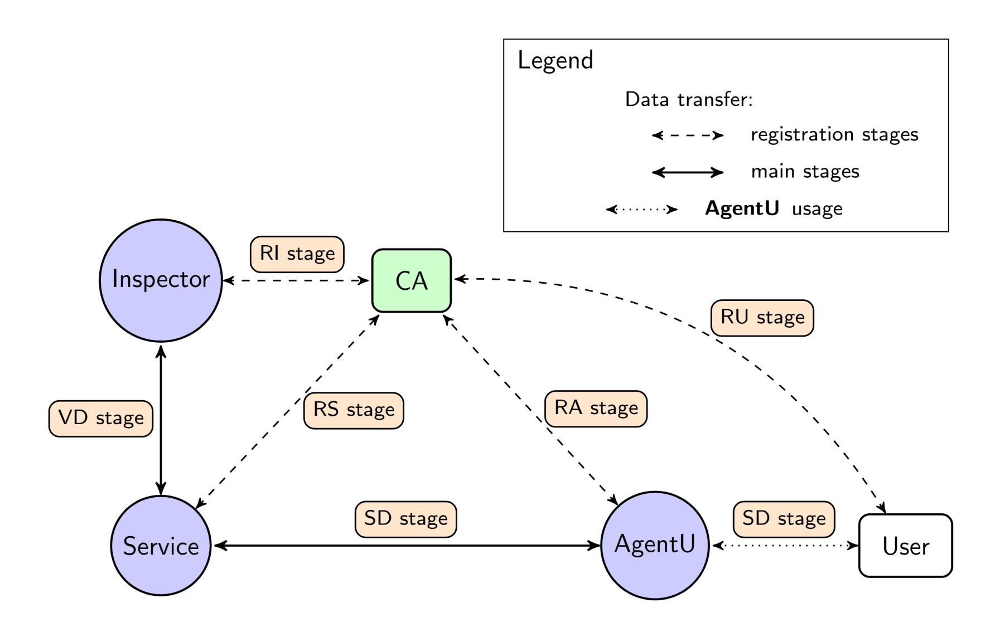
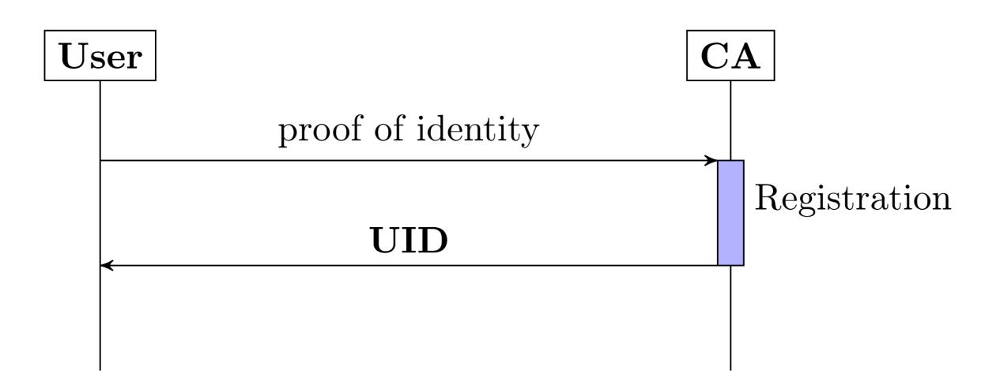
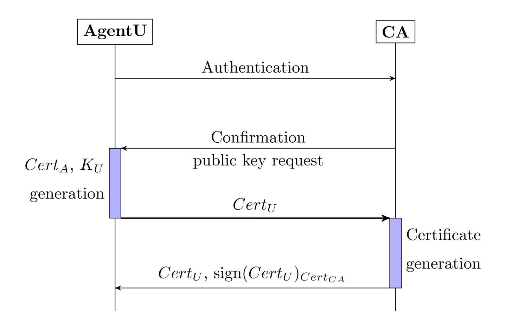
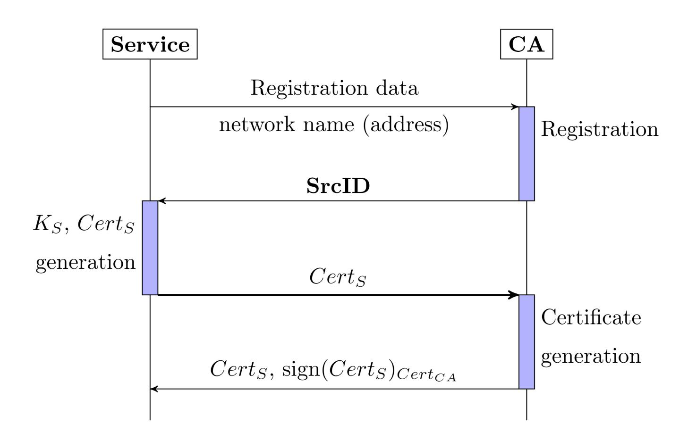
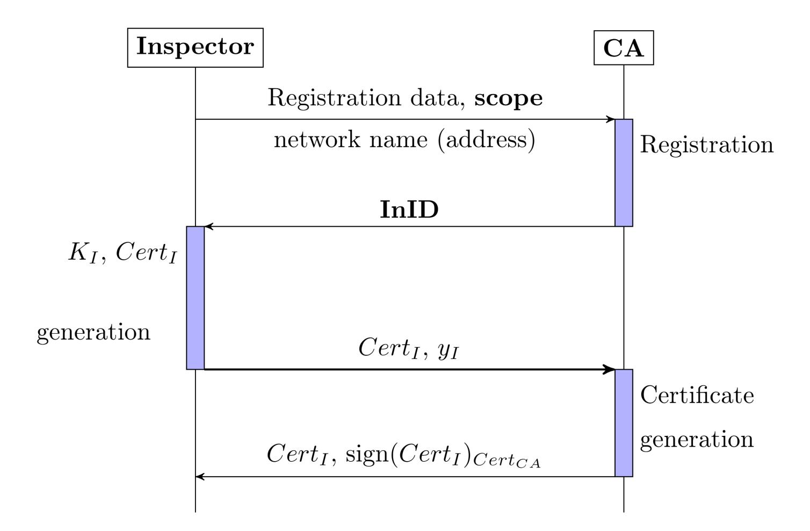
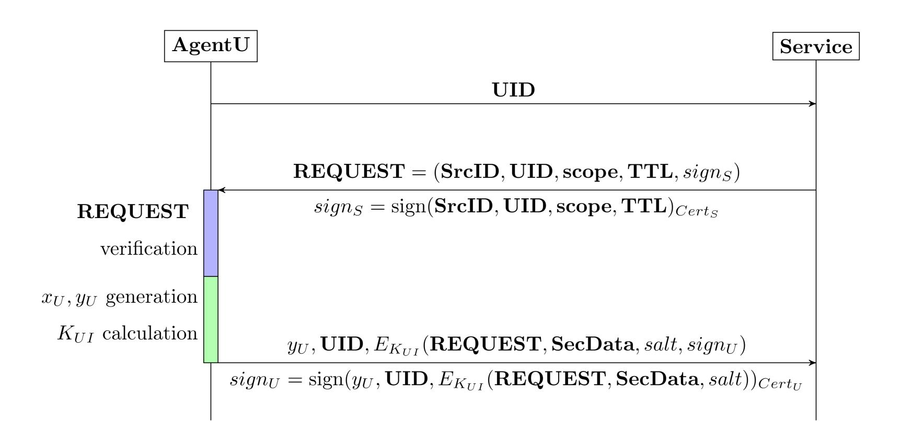
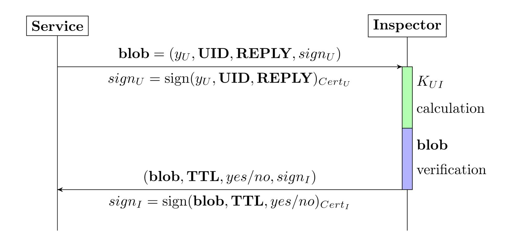

{0}------------------------------------------------

# Personal data exchange protocol: X

V. Belsky1[0000−0002−4546−5464], I. Gerasimov1[0000−0003−1921−823X] , K. Tsaregorodtsev1[0000−0002−9281−417X] and I. Chizhov1[0000−0001−9126−6442]

Abstract. Personal data exchange and disclosure prevention are widespread problems in our digital world. There are a couple of information technologies embedded in the commercial and government processes. People need to exchange their personal information while using these technologies. And therefore, It is essential to make this exchange is secure. Despite many legal regulations, there are many cases of personal data breaches that lead to undesirable consequences. Reasons for personal data leakage may be adversary attack or data administration error. At the same time, creating complex service interaction and multilayer information security may lead to many inconveniences for the user. Personal data exchange protocol has the following tasks: participant's data transfer, ensuring information security, providing participants with trust in each other and ensuring service availability. In this paper, we represent a personal data exchange protocol called X<sup>1</sup> . The main idea is to provide personal data encryption on the user side and thus to prevent personal data disclosure and publication. This approach allows us to transfer personal data from user to service only in the form of an encrypted data packet — blob. Each blob can be validated and certified by a personal data inspector who had approved user's information. It can be any government department or a commercial organization, for example, passport issuing authority, banks, etc. It implies that we can provide several key features for personal data exchange. A requesting service cannot publish the user personal data. It still can perform a validation protocol with an inspector to validate user data. We do not depend on service data administration infrastructure and do not complicate the inspector's processes by adding additional information about the personal data request. The personal data package has a link between the personal data owner and a service request. Each blob is generated for a single request and has a time limit for a provided encrypted personal data. After this limit, the service can not use a received package. The user cannot provide invalid personal data or use the personal data of another person. We don't restrict specified cryptographic algorithms usage The X protocol can be implemented with any encryption, digital signature, key generation algorithms which are secure in our adversary model. For protocol description, Russian standardized cryptographic protocols are used. The paper also contains several useful examples of how the X protocol can be implemented in real information systems.

Keywords: X· personal data · VKO GOST · symmetric cryptography.

## 1 Introduction

Recently information technology is being actively implemented in public service delivery processes. Digital government, public service portals and similar information systems are becoming more and more familiar in modern society. A lot of useful tasks such as taking a loan, applying for a passport, sign a contract can be done without leaving home using a computer or a mobile phone. Generally, it is necessary to provide personal data for performing these operations. Despite the rather strict regulation of personal data processing in many countries, there always occur data leakage cases as the result of administration errors or hacker attacks. It leads to undesirable consequences for people, for example, money, property and reputation loss.

Some countries increase the restriction of information security policies, but it leads to the creation of significant inconveniences for such users as services, which in turn lowers their attractiveness to citizens. Thus the creation of useful and secure personal data processing system — one of the main problems for public information services developers.

In the most general case, the following tasks are set for personal data processing systems:

<sup>1</sup>Cryptography Laboratory, SPC «Kryptonite», Moscow, Russia cryptolab@kryptonite.ru

<sup>1</sup> The paper was published in Russian in International Journal of Open Information Technologies ISSN: 2307-8162 vol. 8, no. 6, 2020

{1}------------------------------------------------

- Personal data transfer between participants;
- Information security;
- Building trust in system participants;
- Service availability.

Many practices and services solve these tasks. One example is a network authentication protocol Kerberos [10]. However, it is necessary to create a secure ticket issuing server. But server compromise leads to all user personal data disclosure, so Kerberos has a single point of failure and additional requirements to the infrastructure. Another example is authorisation protocol OAuth [8]. However, its feature is a transfer of authority to the service by password, which imposes a responsibility for the service for providing personal data transfer, processing and storage. If the user transfers personal data to the service via a secure channel, then it is be necessary to have a high level of trust to this service. This can not be guaranteed when the service encrypts personal user data on his side. In this case, the user loses control over the transferred personal data processing. The X protocol of secure user personal data exchange to different services helps to solve all these problems. In this paper, we describe the protocol, participant registration algorithm, personal data exchange and verification mechanisms. Also, we give recommendations for using the cryptography algorithms in our protocol.

# 2 About personal data

The problems of personal data leakage arose a long time ago but recently it went to a new level. Using cloud and electronic services has become a necessary activity for people. A lot of user information has been collected by different services. The amount of such information is enormous.

In the age of digital society, citizens send a copy of their passport or a personal ID (SSN) by email or messengers very often. For example, registration in various services of short-term car rental requires sending passport photocopy and user driving license. Many IT-companies collect and store a significant number of user information. Eventually, leakage of these data gets the scale of local disasters.

The examples of significant leakages and several cases can be pointed out in the articles [16]. Around the world lately a number of personal data records involved in various leakages exceeded a billion [11]. Simultaneously, there is a growth of database sales offers amount with personal information [13]

Legislatively, this problem is being solved by specified norms adoption, establishing requirements for those who collect and gather personal data.

For example, the personal data law [1] is adopted in Russia which adjusts the specified area and establishes requirements and limitations. In Europe, the law called GDPR [3] is adopted which includes quite strict regulations of personal data processing control and sets heavy fines for noncompliance with these requirements. Law enforcement practice is only taking shape, but there are some precedents in which significant fines were issued [14][2]. It is obvious that only law norms usage can not completely solve the personal data security problem. It is needed to use technical means of protection to support legal norms.

Technically, the problem of protecting personal data is not easy to solve. For example, the usage of only data encryption can not solve the problem because the service which uses personal data gains access to it, and it means he can potentially violate its confidentiality. Therefore, users have to agree with the high level of trust for this service. But how can it be achieved by technical means? Besides, after personal data have been transferred to the service, the user completely loses control over the process. There are known cases of personal data leakage which generally occur because personal data was transferred to the service and the service was not able to provide a necessary security level.

Some protocols allow granting the service certain data access along with the authentication. One of the examples is a network authentication protocol Kerberos [10], which solves authentication problem and granting the user access to specified resources. The protocol uses only symmetric encryption algorithms and consists of several procedures of authentication and getting the «tickets» — special data structures which give access rights. This protocol does not solve the further problem with personal data processing.

{2}------------------------------------------------

Another example is the authorization protocol OAuth [8]. Its feature is that rights are given to the service through password authentication. This protocol also does not solve the problem of controlling data processing. Note that the OAuth protocol is used for the service authentication of «Public services portal of the Russian Federation». In order to control user authentication, some countries have a plan to create a unique digital citizen profile using a single identifier. At first sight, such an approach could solve a leakage problem if users provide this identifier instead of personal data. But this decision brings new threats. One of the single identifier usage examples is a Social Security number (SSN) in the USA. In case of SSN leakage, the adversary gets the opportunity to control all personal data, which means the adversary thieves user's digital identity.

The most meaningful approach to the technical solution of this problem is modern cryptographic methods. For example, the homomorphic encryption concept of confidential calculation provides data processing without giving access to it. However, such cryptographic mechanisms are poorly studied and have extremely low consumer properties and currently they are not standardized at the national level. At the same time, a usual requirement for public information systems is using a standardized mechanism.

In fact, the service very often does not need to process personal data. Generally, it is enough to know that the data is received from the actual user, the data is valid and relevant.

The X protocol offers secure user's personal data processing using standardized means and protocols.

# 3 Protocol purpose

Suppose that a certain inspector issues personal data to the user (sometimes inspector is called provider), Who can always verify and confirm these data. Personal data are given to the service for a limited time after which it ceases to be valid i.e. it can not be used for performing any operations (for example, signing a contract). The only opportunity the service has is to verify user personal data with the inspector at any time and to make sure that the data were valid and corresponded to the specified user at some point in the past.

We specify a list of properties the protocol must possess in order to provide secure transfer of user personal data:

- 1. Service must have the ability to ensure that the personal data came from a particular user;
- 2. Service must have the ability to verify that the personal data is valid (correct, relevant, match the requested data type and user identity);
- 3. Service does not have the possibility to transfer personal data to the third parties;
- 4. User must not provide invalid, irrelevant or other person's personal data;
- 5. User must not provide personal data not matching service request;
- 6. User provides personal data for a limited time. After the time expiration, a message with personal data becomes invalid;
- 7. User must verify to whom, for how long and what kind of personal data he provides;
- 8. User must have an ability to deny the fact of providing personal data if he did not provide it;
- 9. User must not deny the fact of providing personal data if he did provide the data.

Specified protocol X properties are achieved using the cryptographic mechanisms. Service receives encrypted personal data. Only the user who forms an encrypted data set (blob) or inspector who must be able to verify it can decrypt personal data. In order to provide participant authentication and message integrity validation, digital signature mechanisms are used. Thus it is assumed that there is user public key management infrastructure which has a certification authority. This authority registers users and ensures that the public keys match their owners. It is not a part of the protocol, therefore, its description is beyond the protocol description.

# 4 Protocol participants

There are the following participants in the protocol:

{3}------------------------------------------------

U: System user, the owner of the personal data. The user must be registered in certification authority CA;

Inspector: Personal data inspector. A trusted service which validates user personal data. He receives it encrypted from the service and verifies it by the provided user identifier. The inspector can be a government agency (for example, a tax service or a pension fund) or a commercial structure (for example, a bank or insurance company).

Src: Service requests user personal data. The service can be a medical facility, financial organisation or any commercial company the user wants to establish a contractual relationship with.

AgentU: User agent — a program or a device using which the user interacts with protocol participants. The agent usually is a browser or a mobile application.

CA: Certified authority provides public key certificate life cycle and protocol participants credentials control. It is assumed that the certified authority registers all participants. The registration process is described further.

# 5 Notations

We use the following Notations:

EK(M): Message M encryption using a symmetric encryption algorithm with key K;

KA: Signing (private) key of participant A;

CertA: Signature verification (public) key of participant A. The key is in the form of the certificate signed by CA; we assume the signing key (private key) K<sup>A</sup> matches key certificate CertA;

Sign(M)Cert<sup>A</sup> : Message M digital signature created using the participant A signing key which matches the certificate CertA;

(a1, . . . , an, signA): A collection of messages a1, . . . , a<sup>n</sup> and its digital signature sign<sup>a</sup> = Sign(a1, . . . , an)Cert<sup>A</sup> joined in a vector;

xA: Participant A ephemeral private key used for key agreement procedure;

yA: Participant A ephemeral public key used for performing key agreement procedure. y<sup>A</sup> = x<sup>A</sup> ·P, P is a nonzero point in a cyclic subgroup of elliptic curve group;

KAB: Common symmetric encryption key between protocol participants A and B.

# 6 Protocol X description

The protocol consists of the following stages:

- 1. Protocol participants registration
- 2. Personal data transfer
- 3. Personal data verification

Protocol scheme is shown in the figure 1.

It is assumed that participant interaction is performed in a public network (Internet) protected by the protocol TLS [12] or any other similar protocol. Moreover, it is assumed that the protocol participants have secure access to CA functions necessary for message signature verification. For example, such functions can be new public key certificates processing, revoked certificates update etc.

Further, we do not describe in detail these actions only mentioning the fact of digital signature validation using the public key certificate.

Below we describe participant registration protocol steps. Note that the registration steps can be performed in any order independent from each other. The source code of our implementation is available on GitHub: https://github.com/RnD-Kryptonite/x-protocol. The repository has the possible realization of the X protocol steps in Python with each participant role class object.

## 6.1 User registration stage RU stage

For registration, the user performs the following steps (see figure 2):

- 1. The user registers in the CA providing the proof of identity (user physical presence is necessary).
- 2. Sets a password to his account in CA.
- 3. Receives an identifier UID. Further, we assume that UID can be used as a user login in CA.

{4}------------------------------------------------



Fig. 1. The Protocol scheme



Fig. 2. RU stage

## 6.2 User agent registration stage (RA stage)

As a user agent (AgentU), mobile application or browser can be used. For AgentU registration it is necessary to perform the following steps (see figure 3):

- 1. Using AgentU application, the user authenticates in CA and sends a request for application registration.
- 2. In case of successful authentication, CA sends authentication confirmation to AgentU and requests user public key.
- 3. The AgentU generates user private and public signature keys: K<sup>U</sup> and Cert<sup>U</sup> respectively. Using a secure channel, the public key is sent to CA.
- 4. CA confirms user public key correctness, signs the public key certificate and publishes it in CA certificate list. AgentU receives the signed certificate Cert<sup>U</sup> .

{5}------------------------------------------------



Fig. 3. RA stage

## 6.3 Service registration stage (RS stage)

For registration, the service performs the following steps (see figure 4):

- 1. Sends a registration request to CA, specifying the necessary registration data and network name (address) for getting user requests.
- 2. The service receives a registered identifier SrcID in response.
- 3. Generates private and public signature keys K<sup>S</sup> and Cert<sup>S</sup> respectively. Using a secure channel, the public key is sent to CA.
- 4. CA confirms public key correctness, signs the public key certificate and publishes it in the CA certificate list. The certificate includes the network name (address) for getting user requests. The service receives a signed certificate CertS.

## 6.4 Inspector registration stage (RI stage)

For registration, the inspector performs the following steps (see figure 5):

- 1. Sends a registration request to CA, specifying the necessary registration data and network name (address) for getting service requests. Moreover, the inspector specifies a scope of personal data which he verifies.
- 2. The inspector receives a registered identifier InID in response.
- 3. Generates private and public signature keys K<sup>I</sup> and Cert<sup>I</sup> respectively. Moreover, the inspector generates private and public keys x<sup>I</sup> and y<sup>I</sup> respectively for key agreement protocol. Using a secure channel, public keys Cert<sup>I</sup> and y<sup>I</sup> are sent to CA.
- 4. CA confirms the inspector public keys correctness, signs the public key certificate and publishes it in the CA certificate list. The certificate includes the network name (address) for getting service requests and y<sup>I</sup> . Inspector receives a signed certificate Cert<sup>I</sup> .

It is assumed that a service and an inspector are organisations which have necessary information systems and technical means to interact with CA and cryptographic mechanisms realisation. A specific order of CA interaction and necessary means depends on CA realisation and their description is out of scope. It is important that all the participants are registered and have the correct private and public signature key pairs.

{6}------------------------------------------------



Fig. 4. RS stage



Fig. 5. RI Stage

The user does not always have means for providing correct cryptographic mechanisms. For this reason, AgentU is a way of interaction with other participants and realisation of the necessary cryptographic mechanisms.

Besides, it is assumed that given scope CA publishes an inspector who has an ability to verify a specific personal data set. This can be achieved, for example, by including a personal data set identifier in the inspector public key certificate. Correctness and consistency of mapping between scope and inspector is a CA responsibility. Generally, the protocol does not fix the mechanism of providing such mapping.

{7}------------------------------------------------

#### 6.5 Personal data transfer stage (SD stage)

We describe the personal data transfer from user to service. The user U queries the service a certain action request (for example, to get a loan, to sign a contract, to issue a certificate) The query is created using AgentU, for example at the service website. Generally, the user should transfer his personal data to the service. The service must be sure the received data belongs to the user and may be disclosed (only if it is needed and only if certain conditions are met).

In order to transfer personal data, user and service perform the following steps (see figure 6:

- 1. Using AgentU, the user sends UID to the Src by the address, specified in CertS.
- 2. The service Src creates a request REQUEST for getting the personal data. He specifies a SrcID, UID, scope, TTL and signs it with his private key KS. The request is sent to the AgentU.

$$\mathbf{REQUEST} = (\mathbf{SrcID}, \mathbf{UID}, \mathbf{scope}, \mathbf{TTL}, sign_S) \tag{1}$$

TTL is a set of current timestamp and information about how long service wants to have access to the user data.

- 3. AgentU verifies the service's REQUEST signature.
- 4. The user verifies the correctness of the SrcID, scope, TTL. In other words, the user visually controls to whom, how long and which data he is going to transfer.
- 5. AgentU identifies the inspector who verifies the requested data, gets the inspector public key y<sup>I</sup> from Cert<sup>I</sup> for the key agreement . AgentU performs VKO\_GOST procedure and gets a KU I — common with the inspector symmetric encryption key. In order to do this, AgentU generates ephemeral public and private keys y<sup>U</sup> and x<sup>U</sup> respectively and computes: KU I = K(x<sup>U</sup> , y<sup>I</sup> , UKM). The function K(·, ·, ·) description is provided in table 1.
- 6. AgentU creates a response REPLY, which consists of the received earlier request RE-QUEST, the personal data SecData and a random number salt. The response is encrypted using the key KU I :

$$\mathbf{REPLY} = E_{K_{UI}}(\mathbf{REQUEST}, \mathbf{SecData}, salt).$$

7. AgentU creates a blob (blob) and signs it using the private key K<sup>U</sup> :

$$\mathbf{blob} = (y_U, \mathbf{UID}, \mathbf{REPLY}, sign_U)$$

AgentU sends blob to the service.

This is the end of personal data transfer stage. As a result, the service receives blob. He can verify the signature using the certificate Cert<sup>U</sup> and make sure the blob has been created by the user U. The encrypted part REPLY can not be decrypted by the service since he does not have the key KU I . The user has the signed service request REQUEST.

Table 1. VKO key agreement algorithm

| VKO_GOSTR3410                                                                                                                                         |                                          |  |
|-------------------------------------------------------------------------------------------------------------------------------------------------------|------------------------------------------|--|
| m — the order of a group of points on an elliptic curve, q — the order of a cyclic<br>subgroup, P — a subgroup non-zero point, UKM — a random number. |                                          |  |
| A                                                                                                                                                     | B                                        |  |
| xA, yA = xA · P                                                                                                                                       | xB, yB = xB · P                          |  |
| K(xA, yB, UKM) =                                                                                                                                      | <br>m<br>· UKM · xA mod q<br>· (yB)<br>q |  |

{8}------------------------------------------------



Fig. 6. SD stage

## 6.6 Personal data validation stage (VD stage)

After receiving the signed blob, the service can perform personal data validation at any moment. In order to validate the personal data, the service does the following steps (see figure 7):

- 1. The service identifies the inspector by the scope value which he has from his request and sends blob = (y<sup>U</sup> , UID, REPLY, sign<sup>U</sup> ) to the Inspector. The service takes the inspector network address from the certificate Cert<sup>I</sup> .
- 2. Inspector verifies the user's blob signature using the published Cert<sup>U</sup> .
- 3. Inspector takes y<sup>U</sup> from the blob. Then he performs VKO\_GOST procedure with his private key x<sup>I</sup> and performs VKO\_GOST for getting a common with the user symmetric key KU I : KU I = K(x<sup>I</sup> , y<sup>U</sup> , UKM). The function K(·, ·, ·) description is provided in table 1.
- 4. Using the key KU I , Inspector decrypts REPLY = EKUI (REQUEST, SecData, salt) and receives REQUEST, SecData and salt.
- 5. Inspector verifies that the user identifier from the certificate Cert<sup>U</sup> which is taken during the step 2 equals to the user identifier from the REQUEST. Otherwise, he ends the protocol with the error code.
- 6. Inspector verifies that the time, personal data type and the service who requested the validation equals to TTL, scope, SrcID respectively from the request. If some equality is violated, he ends the protocol with the error code.
- 7. Using the obtained values of SecData, TTL, UID the inspector validates the personal data correctness at the TTL moment using his inner database. Decision is made on the validity of personal data: yes/no.
- 8. The inspector sends the service the following data set: (blob, TTL, yes/no, sign<sup>I</sup> ).

The need for TTL usage during the validation is related to the possibility of the personal data change (for example, surname change).

## 7 Protocol security analysis

In section 3 protocol properties are defined. We analyze protocol mechanisms which provide these security properties.

Property 1 (service must have the ability to ensure that personal data came from a particular user) It is provided by verification of the user's blob digital signature and verification of the inspector's reply digital signature. Also, user identification is performed during his physical registration in CA.

{9}------------------------------------------------



Fig. 7. VD Stage

Property 2 (service must have the ability to verify that the personal data is valid) is provided by the inspector who verifies **blob**. Note that the blob verification result is signed by the inspector who is registered in **CA**.

Property 3 (service does not have the possibility to transfer personal data to the third parties) is satisfied since the service receives encrypted personal data. The blob encryption key is formed during the VKO\_GOST procedure between the user **U** and the inspector **InID** and is unknown to the service.

Property 4 (user must not provide invalid, irrelevant or other person's personal data) is satisfied by the verification of the **UID**, **TTL** and **SecData** on personal data validation stage by the inspector.

We examine now property 5 (user must not provide personal data not matching service request) in detail. Violation of this property is happening if **SecData** does not match the received **RE-QUEST**. If the user provides invalid personal data, then the property 5 is satisfied similarly to the property 4. We consider the attack when the user specifies another **REQUEST**. Such replacement lets the user dispute the fact of providing the blob.

Let us assume that the user receives two requests:  $R_a$ ,  $R_b$ ; and he wants to form blob as an answer to  $R_a$ , but specify the other request  $R_b$ . There are the following cases:

- $-R_b: \mathbf{scope}_{R_b}! = \mathbf{scope}_{R_a}$ . Then **blob** does not pass the step 6 of the personal data validation stage.
- $-R_b: \mathbf{TTL}_{R_b}! = \mathbf{TTL}_{R_a}$ . There are two situations:
  - $\mathbf{SecData}_{R_b} == \mathbf{SecData}_{R_a}$  i.e. the user personal data does not change during the time  $|\mathbf{TTL}_{R_b} \mathbf{TTL}_{R_a}|$  between two requests. Then the user does not violate the protocol forming the same blob on both requests but at different time.
  - SecData<sub> $R_b$ </sub>! = SecData<sub> $R_a$ </sub>. Then blob does not pass the step 7 of the personal data validation.
- $-R_b: \mathbf{SrcID}_{R_b}! = \mathbf{SrcID}_{R_a}$ . It means that two different services request the same personal data type **scope**. The blob creation process is equal for both requests, but **blob** does not pass the step 6 of the personal data validation stage.

Thus, the user can not perform the threat by replacing the **REQUEST** in the protocol and the property 5 is satisfied.

Property 6 (user provides personal data for a limited time) is satisfied because the blob does not pass the step 6 of the personal data validation stage after the time specified in the blob (**TTL** parameter).

Property 7 (User must verify to whom, for how long and what kind of personal data he provides) is provided by the blob formation procedure. Note that **REQUEST** includes such parameters as

{10}------------------------------------------------

SrcID, scope, TTL. This REQUEST is signed with a signature private key which matches Src. Thus, the user knows to whom he sends the data. Moreover, the blob includes scope and TTL parameters which describe what data and how long is provided to the service.

Property 8 (user must have an ability to deny the fact of providing personal data if he did not provide it) is ensured by the following statement. The blob blob correctness is confirmed by the inspector only if certain conditions (steps 2, 6 и 7 of the personal data validation stage) are met. In particular, a successful verification of the blob and the user digital signature are required. If the user does not provide the data, then the blob signature can not be formed by the adversary.

Property 9 (user must not deny the fact of providing personal data if he dit provide the data) is ensured according to the similar reasons. The user digital signature of the blob guarantees impossibility of denying the blob formation fact. According to the property 7 we can claim that the user did know to whom, for how long and which data he was going to provide and that he did provide it.

# 8 Protocol features

We discuss the protocol features which can be used while building the personal data infrastructure.

Note that the user identifier compromise does not lead to all the personal data disclosure.

A compromise should be understood as publishing information about correspondence between UID and a certain person. In the protocol, the identifier UID is a part of the certificate Cert<sup>U</sup> and can be seen publicly. But UID relation to the personal data does not show publicly. Moreover, there is no database where all the user personal data are associated with this identifier. If particular blob and an ephemeral key x<sup>U</sup> which was used to encrypt personal data are compromised, the adversary gets access only to the data specified in the blob.

Also, note that the user encrypts his personal data by himself and only he is responsible for this process. Thus, the data security does not depend on the service infrastructure and its rules of a data exchange. It is assumed that the inspector is a trusted party for the rest of the participants.

In order to participate in the protocol, the inspector does not need to change or create another infrastructure. The only condition is to have a mechanism for encrypted blob verification. Certainly, there is some additional load for the inspector, but it does not compare with complexity of organisation, security and support of a single database.

The protocol does not specify which cryptographic algorithms should be used. It is possible to use any secure digital signature, encryption and key agreement algorithms. In particular, the following Russian cryptography standards can be used in the protocol X:

- VKO R 50.1.113-2012 (key agreement) [15];
- GOST 34.10-2012 (digital signature) [6];
- GOST 34.12-2015 (block ciphers) [5][7].

## 9 Possible protocol usage

During the steps 6, 7 of the personal data transfer stage, the user performs an encryption of his personal data using the key KU I . The personal data format can be anything that corresponds to the data type scope. The protocol X has wide possibilities of its usage in different scenarios. In this section, we describe only some of them.

All the scenarios differ by the scope of the requested personal data which can consist of:

- necessary for operation execution data;
- user credentials (name, login, a certain system identifier).

#### 9.1 Conclusion of employment contracts and salary payments

User concludes a contract with an employer. For this, he must provide a lot of personal data, including his name and tax identification number. Moreover, the user must write an application for transferring salaries to his bank account.

{11}------------------------------------------------

We describe how this procedure can be performed with the X protocol usage. The employer is a service. He requests user personal data for employment contract conclusion and forming an application about salary payment. Public services can play a role of inspector which verifies specified personal data for a contract. As for the salary payment application, a bank can verify the specified account. The service specifies necessary personal data type in his request. The user performs the protocol X. He creates two blobs: the first contains data for the employment contract and the second contains data which indicate the order to transfer any money received from the service to a specified bank account. The service performs the protocol with an inspector (or several inspectors) and receives the blobs confirmation. Now the employment contract includes the result of the first blob verification.

The second blob and service's transfer operation is sent to the bank which was the inspector. The bank decrypts the blob and performs an instruction to transfer the sum from service request to the user account.

## 9.2 Online shopping

User purchases a product in the online shop. In order to arrange a delivery and to form a purchase receipt, he needs to provide a passport, telephone number and delivery address. But the user does not trust the online shop. He has concerns that the personal data can be disclosed or given to the third parties to spam an advertisement.

We describe how this procedure can be performed with the protocol X. The online shop is a service which requests user personal data for purchase receipt and product delivery. There is an inspector, for example, a post office, who validates the relation of specified address to the user's passport. The service specifies necessary personal data in his request. If the user agrees for a buying payment, he performs the protocol and transfer the blob with the requested data to the service. The service forms the package and sends it to the post office with the received blob. The inspector performs personal data validation stage (VD stage) gets user personal data and his address and sends the package to the specified address.

## 9.3 Loan processing

User wants to take a loan in the bank. The bank must verify a lot of facts about the user: his credit history, criminal records, etc. In order to do this, the user must confirm his personal data, for example, a passport number, its date of issue, registration address, tax identification number etc. But the user can not trust the bank and is afraid of data leakage.

We describe our view of this problem solution based on the protocol X. The user transfers an encrypted personal data in the blob blob to the bank which is the service. The bank sends blob to the personal data inspector (for example, tax service, Ministery of Home Affairs etc.) who verifies blob. The inspector sends the result of verification to the bank. The validation result is specified in the loan contract between the bank and the user.

Now the bank has the opportunity to send a request to the inspector to provide information about the user whose data is in the blob. Decrypting blob, the inspector can get additional information about him from his database and then send it to the bank. After the blob validity expiration, the bank can not get any information about the user.

## 9.4 Insurance company request

User wants to receive life and health insurance. An insurance company must get the confirmation of the user's health status. But the user does not trust the company and is afraid of his illness history disclosure.

The protocol X can be used here in the following way. The insurance company which plays the role of inspector, requests the empty blob from the user. It means that no personal data is required, only confirmation. In other words, the insurance company requests a health certificate from the user. If the user agrees, he sends the empty blob, which is formed and signed according to the protocol. This blob is transferred to the inspector, which is a hospital. The inspector verifies the user's illness history. Thus the blob verification result depends on user health condition. If the 

{12}------------------------------------------------

user passes such validation (for example, he can use a vehicle), then the blob is confirmed during the VD stage. A successful validation result can be specified in the insurance contract.

A distinctive feature of this example is an empty blob creation when SecData is an empty set.

# 10 Further research directions

The suggested protocol version does not solve an anonymity problem of users and services. Any inspector gets access to the information of what the user sends personal data to what service. Partially this problem can be solved by service anonymization i.e. the inspector does not know what service gets personal data and knows only his identifier. But it requires to develop a protocol which uses temporary user and service unique identifiers for each blob.

Another research is about using an identity-based cryptography (IBC) as a replacement of public key certificates on IBC identifiers. Such changes simplify work with certificates.

On step 7 of the personal data validation stage, the inspector verifies the SecData relation to the user identifier UID. Each identifier is received during the registration in CA and does not need to be equal to the user identifier in the inspector information system. Firstly, if the inspector is a government service then the user identifier UID can be equal to those which is used for user accounting in the government databases. Such equality can be provided during the user registration stage with CA and the inspector interaction. Secondly, an additional protocol step can be used. During this step, CA sends the inspector additional information for adding UID in the inspector database. Lastly, if it is supported by the inspector, the value SecData in the answer can be signed by the user with the identifier which has a «clear» form for the inspector information system. The choice of a specific solution largely depends on the practical implementation of the protocol and requires further research.

As it was mentioned before, in case of the inspector private key compromise, services get access to all the inspector's blob content. The protocol uses one inspector key pair for all users and blobs. In order to reduce the consequences during such compromise, separate keys can be used for each user. In that case, the inspector must organize and support key management infrastructure and publish the service which provides user access to the inspector public key. Key diversification problem also requires additional research.

## 11 Protocol security

## 11.1 Introduction

In this section, we prove that under certain assumptions properties set out in section 3 are fulfilled. In particular, we want to show that the following conditions are satisfied: и вообще получить

## Reply indistinguishability

Requirement: An adversary must not receive information about the user's personal data analyzing his replies Reply :

$$Reply = E_{K_{UI}}(Request, SecData, salt),$$

We do not require the personal data length (number of encrypted blocks), specified inspector ID to be hidden.

Requirement meaning: the Service must not have an ability to disclose personal data and any other information about the personal data at all analyzing the user's replies on his requests.

Possible consequence of requirement violation: Theoretically, the adversary has the opportunity to extract information from the replies on his requests or service requests which can cause the adversary to get access to the user's personal data.

{13}------------------------------------------------

## Blob unforgeability

Requirement: An adversary must not be able to forge the user's blob.

$$[y, UID, Reply]_{sgn(U)}$$

Requirement meaning:

- 1. Service must have the ability to ensure that personal data came from a particular user U;
- 2. User must have an ability to deny the fact of providing personal data if he did not provide it;
- 3. User can not deny the fact of providing personal data if he dit provide the data.

Possible consequence of requirement violation: Theoretically, the adversary has the opportunity to forge user replies on service requests. In particular, to provide personal data to the unwanted service for him.

## Request unforgeability

Requirement: An adversary must not be able to forge service request

$$Request = [SrcID, UID, scope, ttl]_{sgn(S)}$$

Requirement meaning: User can verify to whom, for how long and what kind of personal data he provides;

Possible consequence of requirement violation: Theoretically, the adversary gets the opportunity to forge service requests, in particular, to request certain users personal data on service's behalf. It could lead to undesirable consequences.

## Inspector reply unforgeability

Requirement: An adversary must not be able to forge the inspector reply.

$$check = [yes/no, ttl, blob]_{sgn(I)}$$

Requirement meaning:

- 1. Service must have the ability to verify that the personal data is valid (correct, relevant, match the requested data type and user identity);
- 2. User can not provide invalid, irrelevant or other person's personal data;
- 3. User can not provide personal data not matching service request;
- 4. User provides personal data for a limited time. After the time expiration, a message with personal data becomes invalid;

Possible consequence of requirement violation: Theoretically, the adversary gets the opportunity to forge inspector replies, in particular, to confirm invalid/expired personal data.

## 11.2 Main result

The above properties are performed in the following adversary model:

- 1. Block cipher mode of operation used for processing messages is ROR -CPA -secure;
- 2. Signature scheme used in the protocol is EUF-CMA -secure (in random oracle model, see [9]);
- 3. Diffie-Hellman problem in the appropriate group (in case of standard [15] group of points on an elliptic curve) is hard.

In particular, the following theorem holds:

{14}------------------------------------------------

**Theorem 1** The probability of breaking the protocol can be bounded from above as:

$$2q \cdot Adv^{DDH}(t + q \cdot (4 + 2\mu)) + q \cdot Adv_{SE}^{ROR-CPA}(t + q \cdot (2\mu + 1), 1, \mu) + 3 \cdot Adv_{Sert}^{EUF-CMA}(q_{usr}, t) + Adv_{insp}^{EUF-CMA}(q_{insp}, t) + Adv_{User}^{EUF-CMA}(q_{blob}, t) + Adv_{src}^{EUF-CMA}(q_{src}, t)$$

Where the following notations are used:

 $q_{usr}$  — number of the users authenticated in CA;  $q_{blob}$  — number of the blobs signed by the user;  $q_{src}$  — number of the requests signed by the service;  $q_{insp}$  — number of the requests signed by the inspector; q — number of the adversary encryption requests Req;  $\mu$  — the maximal length of the request Request || SecData || salt; t — the running time of the adversary.

#### 11.3 Basic definitions

We introduce (and recall) certain definitions which we use later in the text. To make the notations shorter, we denote  $[M]_{sgn(A)}$  as a message M user A secret key signature; We recall that the following definitions were previously introduced:

Request: Service request of the form

$$Request = [SrcID, UID, scope, ttl]_{sgn(S)}$$

Reply: User reply of the form

$$Reply = E_{K_{UI}}(Request, SecData, salt)$$

blob: Formed blob:

$$blob = [y, UID, Reply]_{sqn(U)}$$

Also introduce some additional definitions which are used further:

check: Inspector reply on blob validation request

$$check = [blob, ttl, yes/no]_{sqn(I)}$$

GetData(UID, scope): Function returning personal data of the user with UID identifier relevant to the scope.

GetID(scope): Function returning the inspector's ID given the scope.

#### 11.4 Main problems

We give a list of standard assumptions on which protocol provable security is based. Throughout the rest of the paper, it is assumed that the adversary is a certain probabilistic algorithm (probabilistic Turing machine).

**Decisional Diffie-Hellman, DDH** Let G be the cyclic group with a generator g. The group is given to the adversary. The adversary goal is to distinguish a random group element  $g^c$  from the element obtained as a result of running the Diffie-Hellman protocol  $g^{ab}$  with known  $g^a$ ,  $g^b$ . Formally, the adversary interacts with one of the environments DH or Rand. In the beginning of the experiment during the Init procedure a certain b (modelling second participant secret key) is chosen. Then the adversary performs one request to oracle  $\mathcal{O}$  and depending on the environments receives whether a tuple  $(g^a, g^b, g^{ab})$ , or a tuple  $(g^a, g^b, g^c)$ . In the DDH problem the adversary is allowed to make only one request to his oracle  $\mathcal{O}$ . Using the tuple received from the oracle, the

{15}------------------------------------------------

adversary must decide which experimneter he interacts with. The adversary returns bit 1 if he believes that he interacts with the oracle DH, else he must return bit 0.

| Algorithm 1 Rand                                                            |                                              |
|-----------------------------------------------------------------------------|----------------------------------------------|
| 1: function Init                                                            | 1: function Init                             |
| $2: \qquad b \leftarrow_R \{1, \dots,  G \}$                                | $2: \qquad b \leftarrow_R \{1, \dots,  G \}$ |
| 3: function $\mathcal{O}$                                                   | 3: function $\mathcal{O}$                    |
| 4: $a \leftarrow_R \{1, \dots,  G \}$                                       | 4: $a \leftarrow_R \{1, \ldots,  G \}$       |
| 5: $c \leftarrow_R \{1, \dots,  G \}$<br>6: <b>return</b> $(g^a, g^b, g^c)$ | 5: return $(g^a, g^b, g^{ab})$               |

The adversary advantage is defined as a difference of the following probabilities:

$$Adv^{DDH}(\mathcal{A}) = \mathbb{P}[DH(\mathcal{A}) \to 1] - \mathbb{P}[Rand(\mathcal{A}) \to 1]$$

Probability is taken over all random choices during the experiment and over random bits of the adversary A.

$$Adv^{DDH}(t) = \max_{\mathcal{A} \in A(t)} Adv^{DDH}(\mathcal{A}),$$

The maximum is taken over all the adversaries  $A \in A(t)$ , which take time no more than t. Note again that the number of the requests to oracle  $\mathcal{O}$  is equal to 1.

**Multiple Decisional Diffied-Hellman, MDDH** Let G be the cyclic group with a generator g. The group is given to the adversary. Unlike the previous experiment, the adversary is given the opportunity to interact with the oracle  $\mathcal{O}$  several times, that is, the adversary receives q tuples of the form:

$$(g^{x_1}, g^y, g^{z_1}), \dots, (g^{x_q}, g^y, g^{z_q}),$$

where  $z_i$  either is equal to  $x_i \cdot y$  (in all tuples) or is selected randomly equiprobable. Note that in the environments DH and Rand element b(=y) is chosen once.

The adversary goal is to distinguish these two situations:

$$Adv^{MDDH}(\mathcal{A}) = \mathbb{P}[DH(\mathcal{A}) \to 1] - \mathbb{P}[Rand(\mathcal{A}) \to 1]$$

$$Adv^{MDDH}(t,q) = \max_{\mathcal{A} \in A(t,q)} Adv^{MDDH}(\mathcal{A}),$$

The maximum is taken over all the adversaries  $A \in A(t,q)$  which take time no more than t and perform no more than q oracle  $\mathcal{O}$  queries.

**Statement 1** The following inequality holds:

$$Adv^{MDDH}(t,q) \le q \cdot Adv^{DDH}(t+4q)$$

*Proof.* Using hybrid argument (see for example [4], [9]) we show that the inequality holds.

We define  $\xi_i = (g^{x_i}, g^y, g^{x_i \cdot y})$  — random variables received from the oracle  $\mathcal{O}$  in the environment DH;  $\eta_i = (g^{x_i}, g^y, g^{z_i})$  — random variables received from the oracle  $\mathcal{O}$  in the environment R and. Then it is needed to find the distance between random vectors (distinct two random vectors):

$$\xi = \begin{bmatrix} \xi_1 \ \xi_2 \ \vdots \ \xi_q \end{bmatrix}, \eta = \begin{bmatrix} \eta_1 \ \eta_2 \ \vdots \ \eta_q \end{bmatrix},$$

{16}------------------------------------------------

where the distance is understood in the sense of two random vectors in distinguishability by an algorithm with the running time no more than t:

$$\Delta(\xi, \eta) = \max_{\mathcal{A}} |\mathbb{P}[\mathcal{A}(\xi) \to 1] - \mathbb{P}[\mathcal{A}(\eta) \to 1]|.$$

Note that for the distance defined this way the triangle inequality holds:

$$\Delta(\xi, \eta) \le \Delta(\xi, \nu) + \Delta(\nu, \eta),$$

since for each particular fixed algorithm  $\mathcal{A}$  the following inequality holds:

$$\begin{split} |\mathbb{P}[\mathcal{A}(\xi) \to 1] - \mathbb{P}[\mathcal{A}(\eta) \to 1]| = & |\mathbb{P}[\mathcal{A}(\xi) \to 1] - \mathbb{P}[\mathcal{A}(\nu) \to 1] + \mathbb{P}[\mathcal{A}(\nu) \to 1] - \mathbb{P}[\mathcal{A}(\eta) \to 1]| \leq \\ \leq & |\mathbb{P}[\mathcal{A}(\xi) \to 1] - \mathbb{P}[\mathcal{A}(\nu) \to 1]| + |\mathbb{P}[\mathcal{A}(\nu) \to 1] - \mathbb{P}[\mathcal{A}(\eta) \to 1]| \end{split}$$

Moving on first to the maximum over all possible  $\mathcal{A}$  in the right side of the inequality and then in the left side we receive the required inequality.

Consider the following set of vectors:

$$\gamma_i = \begin{bmatrix} \eta_1 \\ \vdots \\ \eta_i \\ \xi_{i+1} \\ \vdots \\ \xi_q \end{bmatrix}.$$

Then  $\gamma_0 = \xi, \dots, \gamma_q = \eta$ .

In that case, we can write down:

$$\Delta(\gamma_0, \gamma_n) \leq \Delta(\gamma_0, \gamma_1) + \ldots + \Delta(\gamma_{q-1}, \gamma_q),$$

where each inequality holds thanks to triangle inequality (see above).

Therefore if we limit the distinction probability of the two «nearby» vectors  $\gamma_i$  and  $\gamma_{i+1}$  then the distinction probability of  $\gamma_0$  and  $\gamma_q$  does not exceed sums of «nearby» vectors distinction probability.

we show that  $\Delta(\gamma_i, \gamma_{i+1})$  can be bounded from above using computation difficulty of DDH problem.

During the transition  $\gamma_i \to \gamma_{i+1}$  we replace the coordinate  $\xi_{i+1}$  with  $\eta_{i+1}$ , leaving the rest of the coordinates unchanged. If there is an adversary  $\mathcal{B}$ , which distinguishes well the replacement one of the coordinates then he can be used to solve DDH problem. It is enough for this to model all the rest of the vector coordinates and to receive (i+1)-th coordinate from the oracle DDH.

Assume for the modelling that we have an oracle  $\mathcal{O}$  (from DDH problem) which returns either a tuple  $(g^x, g^y, g^{xy})$  or  $(g^x, g^y, g^z)$ . Using the mentioned above adversary  $\mathcal{B}$  we construct an adversary  $\mathcal{A}$  which solve DDH problem.

Generate the first i vector coordinates:

- 1. Generate  $x_t \leftarrow_R \{1, ..., |G|\}, z_t \leftarrow_R \{1, ..., |G|\}, t = 1, ..., i;$
- 2. Set  $\eta_t = (g^{x_t}, g^y, g^{z_t}), t = 1, \dots, i;$

As (i + 1)-th coordinate set oracle reply — a tuple  $(g^x, g^y, C)$ , where  $C = g^{xy}$  or  $C = g^r$  is chosen randomly (depending on what is the actual oracle we interact with actually).

The rest of the coordinates are generated in the following way:

- 1. Generate  $x_t \leftarrow_R \{1, ..., |G|\}, t = (i+2), ..., q;$
- 2. Set  $\xi_t = (g^{x_t}, g^y, (g^y)^{x_t}), t = (i+2), \dots, q;$

In that case, vector coordinates have necessary distributions. For the modelling we have to generate at most 2q random numbers and to raise the group elements to the appropriate degree (no more than 2q elements).

{17}------------------------------------------------

Thus, it takes no more than 4q operations (random number generation, group exponentiation). If we assume that the mentioned operations take one computation step, the following estimation holds:

$$\Delta(\gamma_i, \gamma_{i+1}) \le Adv^{DDH}(t+4q),$$

and, therefore, the result estimation is:

$$Adv^{MDDH}(t,q) = \Delta(\gamma_0, \gamma_q) \le q \cdot Adv^{DDH}(t+4q)$$

ROR -CPA model We give formal ROR -CPA model definition for encryption scheme SE with initialization vector IV which is chosen randomly at each encryption.

Adversary interacts with one of the environments: Real or Rand. The environment Real chooses secret key (during initialisation step) and gives access to the encryption oracle. The environment Rand also chooses secret key but instead of encrypting the received message its oracle encrypt a random string of the same length.

#### Algorithm 3 Rand 1: function Init 2: k ←<sup>R</sup> Keys 3: function O(m) 4: iv ←<sup>R</sup> IV 5: r ←<sup>R</sup> {0, 1} |m| 6: return SEiv <sup>k</sup> (r) Algorithm 4 Real 1: function Init 2: k ←<sup>R</sup> Keys 3: function O(m) 4: iv ←<sup>R</sup> IV 5: return SEiv <sup>k</sup> (m)

If the adversary believes that he interacts with real oracle encryption then he must return 1 else return 0. The adversary advantage in ROR -CPA model is defined as a difference of the following probabilities:

$$Adv_{SE}^{ROR-CPA}(\mathcal{A}) = \mathbb{P}[Real(\mathcal{A}) \to 1] - \mathbb{P}[Rand(A) \to 1]$$

EUF-CMA -signature scheme model We give a formal definition of EUF-CMA -signature scheme model.

During the initialization procedure the Environment F orge chooses a pair of secret and public keys and gives the adversary access to the signature oracle.

Given the request m from the adversary A the oracle memorizes it and returns its signature. The adversary performs several oracle O requests. After that he returns a message m<sup>∗</sup> and a signature σ ∗ .

The environment returns 1 if and only if the signature is valid and message m<sup>∗</sup> has not been previously requested.

## Algorithm 5 Forge

```
1: function Init
2: (pk, sk) ←R Keys
3: msgs ← [ ]
4: function O(m)
5: msgs ← msgs ∪ m
6: σ = Sign(sk, m)
7: return (m, σ)
8: function Fin((m∗
                   , σ∗
                      ))
9: if m ∈ msgs then
10: return 0
11: return V erif y(pk, m∗
                          , σ∗
                             )
```

{18}------------------------------------------------

The adversary has access to oracle signature  $\mathcal{O}$  and can adaptively choose messages  $m_1, \ldots, m_q$  for signing. The adversary goal is to get a signature of the message which has not been previously requested. The adversary advantage in **EUF-CMA** model is defined as a signature forge probability:

$$Adv^{\mathbf{EUF\text{-}CMA}}\left(q,t\right) = \max_{\mathcal{A} \in A(q,t)} \mathbb{P}[Forge(\mathcal{A}) \to 1]$$

**Further proof** Using the introduced models MDDH, **ROR-CPA** and **EUF-CMA**, we bound from above the probability of unwanted events by the adversary advantage in the specified models. For this, we consider each of the requirements (reply indistinguishability, blob unforgeability, request unforgeability, inspector reply unforgeability), formalize it in the form of the corresponding environment and bound from above the adversary advantage in each environment by the adversary advantage in the basic models (MDDH, **ROR-CPA** and **EUF-CMA**).

## 11.5 Reply indistinguishability

Requirement: An adversary must not receive information about the user's personal data analyzing his replies Reply:

$$Reply = E_{K_{III}}(Request, SecData, salt),$$

We do not require the personal data length (number of encrypted blocks) and specified inspector ID to be hidden.

Which basic properties ensure that the requirement is met:

- 1. **ROR-CPA** security of the encryption mode  $E_K(\cdot)$ ;
- 2. **DDH** computational complexity for corresponding key agreement protocol ([15]) group.

Requirement formalization The adversary has the ability to send the oracle  $\mathcal{O}$  requests in the form of equal-length text pairs:

$$Request = (SrcID, UID, scope, ttl)$$

The oracle assigns the inspector for personal data validation by the *scope* and performs with him the secret key agreement protocol  $k = K_{UI}$ . The secret key agreement procedure is performed place each new request.

The oracle *Real* responds on the request with:

$$Reply = E_k(Request, SecData, salt)$$

The oracle *Rand* responds on the request with:

$$Reply = E_k(Request, r, salt), |r| = |SecData|$$

The oracle returns the result to the adversary. Analyzing the oracle replies, the adversary must return bit 0 if he believes that he interacts with the oracle Rand else he returns bit 1.

| Algorithm 6 Rand |                                            | Algorithm 7 Real                                     |
|------------------|--------------------------------------------|------------------------------------------------------|
| 1: <b>f</b> u    | $\mathbf{nction} \ \mathcal{O}(Request)$   | 1: function $\mathcal{O}(Request)$                   |
| 2:               | $m \leftarrow GetData(UID, scope)$         | $2: \qquad m \leftarrow GetData(UID, scope)$         |
| 3:               | $InspID \leftarrow GetID(scope)$           | $3:  InspID \leftarrow GetID(scope)$                 |
| 4:               | $k \leftarrow VKO(K_U^{priv}, K_I^{publ})$ | $4: \qquad k \leftarrow VKO(K_U^{priv}, K_I^{publ})$ |
| 5:               | $r \leftarrow_R \{0,1\}^{ m +saltLen}$     | 5: $salt \leftarrow \{0,1\}^{saltLen}$               |
| 6:               | <b>return</b> $E_k(Request  r)$            | 6: <b>return</b> $E_k(Request  m  salt)$             |

{19}------------------------------------------------

We define the adversary advantage as a difference between corresponding probabilities:

$$Adv^{ROR-Reply}(\mathcal{A}) = \mathbb{P}[Real(\mathcal{A}) \to 1] - \mathbb{P}[Rand(\mathcal{A}) \to 1]$$

$$Adv^{ROR-Reply}(t,q,\mu) = \max_{\mathcal{A} \in A(t,q,\mu)} Adv^{ROR-Reply}(\mathcal{A}),$$

where the maximum is taken over all the adversaries A ∈ A(t, q, µ) which:

- 1. takes time no more than t;
- 2. Performs at least q requests to the oracle O;
- 3. The maximal length of the request RequestkSecDataksalt is no more than µ.

We assume that given UID and scope the function GetData returns the personal data of the linked by UID user corresponding to the scope request. Given the scope request, the function GetID returns the validating personal data inspector's ID corresponding to the scope request.

Statement 2 The adversary advantage in the reply distinguishing problem can be bounded from above as:

$$Adv^{ROR-Reply}(t,q,\mu) \leq 2 \cdot MDDH(t+2q\mu,q) + q \cdot Adv^{ROR-CPA}_{SE}(t+q \cdot (2\mu+1),1,\mu)$$

Proof. We perform the proof within two steps.

- 1. First, we replace the key agreement protocol V KO with a randomly chosen key. In this transition, we can bound the probability of distinguishing from above by the complexity of MDDH problem in the corresponding group (for example, the group of points on an elliptic curve from the standard [15]).
- 2. Second, we reduce the Reply distinguishing probability with random keys to the ROR CPA security of the cipher Ek(·).

| Algorithm 8 Real\$ |                           | Algorithm 9 Rand\$                       |
|--------------------|---------------------------|------------------------------------------|
|                    | 1: function O(Request)    | 1: function O(Request)                   |
| 2:                 | m ← GetData(UID, scope)   | 2:<br>m ← GetData(UID, scope)            |
| 3:                 | k ←R Keys                 | 3:<br>k ←R Keys                          |
| 4:                 | saltLen<br>salt ← {0, 1}  | Request + m +saltLen<br>4:<br>r ← {0, 1} |
| 5:                 | return Ek(Requestkmksalt) | return Ek(r)<br>5:                       |

We write the adversary advantage as follows:

$$\begin{split} \mathbb{P}[Real(\mathcal{A}) \to 1] - \mathbb{P}[Rand(\mathcal{A}) \to 1] = \\ \Big( \mathbb{P}[Real(\mathcal{A}) \to 1] - \mathbb{P}[Real\$(\mathcal{A}) \to 1] \Big) + \Big( \mathbb{P}[Real\$(\mathcal{A}) \to 1] - \mathbb{P}[Rand\$(\mathcal{A}) \to 1] \Big) + \\ + \Big( \mathbb{P}[Rand\$(\mathcal{A}) \to 1] - \mathbb{P}[Rand(\mathcal{A}) \to 1] \Big) \end{split}$$

1. First term is bounded from above by a value

$$Adv^{MDDH}(t+q\mu,q)$$

In the first term we replace the VKO protocol keys with random encryption keys. If there is an adversary who distinguish two specified modes well then we can use it for solving the MDDH problem. If we are given an oracle O from MDDH problem then it is enough to model all the conditions for the adversary which distinguish two specified modes well. For encryption mode imitation it is needed at most qµ encryption of a single block (we assume that an encrypting one block of information is an elementary operation).

{20}------------------------------------------------

2. Second term is bounded from above by a value:

$$q \cdot Adv_{SE}^{ROR-CPA}(t+q \cdot (2\mu+1),1,\mu),$$

since we can consider the hybrid argument method again: a transition from  $\xi_i = E_k(m)$  to  $\eta_i = E_k(r)$  with randomly chosen key k. We can model all the rest random vector coordinates. It is necessary to do the following:

- (a) To choose the key  $k \in Keys$ ;
- (b) To choose random r of the corresponding length;
- (c) To encrypt m or r according to the encryption scheme.

Vector modelling time can be bounded from above as:

$$\underbrace{q}_{\text{key}} + \underbrace{q\mu}_{\text{random } r} + \underbrace{q\mu}_{\text{encryption}}.$$

3. In the third term we again replace the protocol VKO keys with random keys . This term is bounded from above by a value:

$$Adv^{MDDH}(t+2q\mu,q),$$

since if there is an adversary who distinguishes two modes (Rand\$ and Rand) well we can use this adversary to solve MDDH problem. For modelling it is needed  $q\mu$  operations to generate r of the corresponding length and  $q\mu$  operations of encryption.

From these facts the claimed estimation follows.

Replacing  $\mathbf{MDDH}$ -advantage with the corresponding  $\mathbf{DDH}$ -advantage we get the resulting estimation:

**Statement 3** The adversary's advantage in the reply distinguishing problem can be bounded from above as:

$$Adv^{ROR-Reply}(t,q,\mu) \le 2q \cdot Adv^{DDH}(t+q \cdot (4+2\mu)) + q \cdot Adv_{SE}^{ROR-CPA}(t+q \cdot (2\mu+1),1,\mu)$$

Possible consequence of requirement violation: The ROR-CPA property is formulated under the assumption that all keys are equally probable. It could be possible that the key  $K_{UI}$  is unequiprobable given the information about user's and inspector's public keys. In order to replace the key  $K_{UI}$  with equiprobable one, the **DDH** assumption is needed.

Even if we assume that the key is chosen equiprobable, the encryption mode can be weak or to allow some information leakage about plaintext. To exclude this possibility, the **ROR-CPA** security of encryption mode is needed.

If the generated in Diffie-Hellman protocol key is not equiprobable then we get some posterior distribution on the keys; such unevenness can be used by the adversary to reduce the number of keys to be searched.

If the key is equiprobable but the encryption mode allows information leakage (**ROR-CPA** property is violated) then the adversary can (theoretically) extract the user personal data information by Analyzing his replies on service requests.

#### 11.6 Blob unforgeability

Requirement: An adversary must not have an opportunity to forge the user blob with non-negligible probability.

$$[y, UID, Reply]_{sqn(U)}$$

Which basic properties ensure that the requirement is met:  $\mathbf{EUF\text{-}CMA}$ -security of signature scheme (including collision resistance of the hash function  $H(\cdot)$  if it is used in the signature scheme)

{21}------------------------------------------------

Requirement formalization The adversary has the ability to send requests to the oracle O in the form of:

$$Req_i = (SrcID, UID, scope, ttl)$$

The oracle identifies the inspector for personal data validation by the scope and performs with him the secret key agreement protocol k = KU I . This procedure is performed each new request.

Oracle O forms a blob to answer the adversary request.

$$blob = [y_i, UID, E_k(Req_i, SecData_i, salt_i)]_{sgn(U)}$$

and returns the result to the adversary.

Analyzing oracle replies, the adversary must form the valid blob on the user's U behalf i. e. present:

$$blob^* = [y, UID, E_k(Req^*, SecData^*, salt^*)]_{sgn(U)}$$

where Req<sup>∗</sup> 6= Req<sup>i</sup> , i = 1, . . . , q, i. e. the adversary forms the blob on the request which has not been queried yet.

We formally define an environment Blob, which remembers all received adversary requests.

An oracle O implements blob generation process. The adversary queries several requests to the oracle O whereupon returns forged blob blob<sup>∗</sup> .

The experimenter verifies that:

- 1. User public key certificate is valid;
- 2. The signature is verifiable;
- 3. The Request Req has not been queried before;

We simplify the adversary task a little because for blob verification it is additionally required that specified in the Request UID matches the signature ID and that the user personal data matches the specified one.

```
Algorithm 10 Blob
1: function Init
2: requests := [ ]
3: function O(Req)
4: requests = requests ∪ Req
5: m ← GetData(UID, scope)
6: InspID ← GetID(scope)
7: k ← V KO(K
                  priv
                 U
                     , Kpubl
                       I
                           )
8: salt ← {0, 1}
                 saltLen
9: Reply ← Ek(Reqkmksalt)
10: c ← (K
             publ
            U
                , UID, Reply)
11: σ ← SignU (c)
12: return (c, σ)
13: function Fin(blob∗ = [y, UID, Reply]σ)
14: if !(SertCheck(σ)) then
15: return 0
16: c ← (y, UID, Reply)
17: if !(V erif y(c, σ)) then
18: return 0
19: k ← V KO(K
                  publ
                  U
                     , Kpriv
                       I
                           )
20: (ReqkSecDataksalt) ← Dk(Reply)
21: if Req ∈ requests then
22: return 0
23: return 1
```

In order for the blob to pass the verification, it is enough to happen one of following two events:

A1: The adversary has succeeded to forge user public key certificate under his own key. In that case, the adversary can forge any blobs.

{22}------------------------------------------------

 $A_2$ : The adversary has managed to forge the new blob signature.

In both cases, the adversary solves **EUF-CMA** porblem for the signature scheme which is used in the protocol.

Thus the following statement holds:

Statement 4 Blob forge probability can be bounded from above as:

$$\mathbb{P}[Blob(\mathcal{A}) \to 1] \leq \mathbb{P}[A_1] + \mathbb{P}[A_2] \leq Adv_{Sert}^{EUF\text{-}CMA} \left(q_{usr}, t\right) + Adv_{User}^{EUF\text{-}CMA} \left(q_{blob}, t\right),$$

where the following notations are used:  $q_{usr}$  — number of the users authenticated in CA; $q_{blob}$  — number of the blobs signed by the user;t — time used by the adversary for the corresponding EUF-CMA problem solution.

Possible consequence of requirement violation: If a collision of the hash function  $H(\cdot)$  can be easily found the second preimage search problem is probably also not hard.

In that case, the adversary can transfer the signature from one user's blob to another generated blob. The user can not deny the fact of providing a fake blob because there is his signature. The service can not ensure that it is the user U who provided the personal data

Even provided that the function  $H(\cdot)$  is collision resistant the signature scheme can be weak. This allows the adversary to forge the signature on a completely different blob.

## 11.7 Request unforgeability

Requirement: An adversary must not be able to forge the service request

$$Request = [SrcID, UID, scope, ttl]_{sgn(S)}$$

Which basic properties ensure that the requirement is met: **EUF-CMA**-security of signature scheme (including collision resistance of the hash function  $H(\cdot)$  if it is used in the signature scheme).

Requirement formalization By analogy with the previous problem we consider the following formalization:

```
Algorithm 11 Request
 1: function Init
        requests := []
 2:
 3: function \mathcal{O}(UID, scope, ttl)
        R \leftarrow (SrcID, UID, scope, ttl)
 4:
        requests.add(R)
 5:
        \sigma \leftarrow Sign_{Src}(R)
 6:
 7:
        return (R, \sigma)
 8: function Fin(R, \sigma)
        if !(SertCheck(\sigma)) then
 9:
10:
            return 0
11:
        return Verify(c, \sigma)
```

In order for the request (Request) to pass the verification, it is enough to happen one of the following two events:

 $A_1$ : The adversary has succeeded to forge user public key certificate under his own key. In that case, the adversary can forge any requests.

 $A_2$ : The adversary has managed to forge the new request signature.

In both cases, the adversary solves  ${\bf EUF-CMA}$  problem for the signature scheme which is used in the protocol.

Thus the following statement holds:

{23}------------------------------------------------

Statement 5 Request forge probability can be bounded from above as:

$$\mathbb{P}[Request(\mathcal{A}) \to 1] \le \mathbb{P}[A_1] + \mathbb{P}[A_2] \le Adv_{Sert}^{EUF\text{-}CMA}(q_{usr}, t) + Adv_{src}^{EUF\text{-}CMA}(q_{src}, t),$$

where the following notations are used:  $q_{usr}$  — number of the users authenticated in CA; $q_{src}$  — number of the requests signed by the service;t — time spent by the adversary on solving the corresponding EUF-CMA problem.

## 11.8 Inspector reply unforgeability

Requirement: An adversary must not be able to forge inspector reply

$$check = [yes/no, ttl, blob]_{sqn(I)}$$

Which basic properties ensure that the requirement is met: **EUF-CMA**-security of signature scheme (including collision resistance of the hash function  $H(\cdot)$  if it is used in the signature scheme). Similar to two previous problems the following statement can be proved:

Statement 6 Inspector reply forge probability can be bounded from above as:

$$\mathbb{P}[Insp(\mathcal{A}) \to 1] \le Adv_{sert}^{EUF\text{-}CMA} (q_{usr}, t) + Adv_{insp}^{EUF\text{-}CMA} (q_{insp}, t),$$

where the following notations are used:  $q_{usr}$  – number of the users authenticated in CA; $q_{insp}$  – number of the requests signed by the inspector;t – time spent by the adversary on solving the corresponding EUF-CMA problem.

Possible consequence of requirement violation: In that case, the adversary (as described previously) has the opportunity to forge inspector reply at personal data verification process. In particular, he can accept invalid personal data (conspired with the user), extend the personal data validity (ttl) at its discretion and provide invalid personal data.

### 11.9 Conclusion

Gathering together the results of the statements 3, 5, 4, 6, we get that the probability of any unwanted events (protocol operation violation) is no more than:

$$\max Adv^{ROR-Reply}(\mathcal{A}), \mathbb{P}[Blob(\mathcal{A}) \to 1], \mathbb{P}[Request(\mathcal{A}) \to 1], \mathbb{P}[Insp(\mathcal{A}) \to 1] \le Adv^{ROR-Reply}(\mathcal{A}) + \mathbb{P}[Blob(\mathcal{A}) \to 1] + \mathbb{P}[Request(\mathcal{A}) \to 1] + \mathbb{P}[Insp(\mathcal{A}) \to 1],$$

whence the original theorem 1 follows

#### Theorem 1.

The probability of breaking the protocol can be bounded from above as:

$$\begin{aligned} 2q \cdot Adv^{DDH}(t+q\cdot(4+2\mu)) + q \cdot Adv_{SE}^{ROR-CPA}(t+q\cdot(2\mu+1),1,\mu) + \\ 3 \cdot Adv_{Sert}^{\pmb{EUF-CMA}}\left(q_{usr},t\right) + Adv_{insp}^{\pmb{EUF-CMA}}\left(q_{insp},t\right) \\ + Adv_{User}^{\pmb{EUF-CMA}}\left(q_{blob},t\right) + Adv_{src}^{\pmb{EUF-CMA}}\left(q_{src},t\right) \end{aligned}$$

Where the following notations are used:

```
q_{usr} — number of the users authenticated in CA; q_{blob} — number of the blobs signed by the user; q_{src} — number of the requests signed by the service; q_{insp} — number of the requests signed by the inspector; q — number of the adversary encryption requests Req; \mu — the maximal length of the request Request \| SecData \| salt; t — the running time of the adversary.
```

{24}------------------------------------------------

# References

- 1. Federal law of 27 july 2006 n 152-fz on personal data, https://pd.rkn.gov.ru/authority/p146/p164/
- 2. GDPR Fines and Penalties, https://www.nathantrust.com/gdpr-fines-penalties
- 3. Regulation (EU) 2016/679 of the European Parliament and of the Council of 27 April 2016 on the protection of natural persons with regard to the processing of personal data and on the free movement of such data, and repealing Directive 95/46/EC (General Data Protection Regulation) (Text with EEA relevance), https://eur-lex.europa.eu/legal-content/EN/TXT/?uri=CELEX:32016R0679
- 4. Bellare, M., Rogaway, P.: Introduction to modern cryptography. Ucsd Cse 207, 207 (2005)
- 5. Dolmatov, V.: GOST R 34.12-2015: Block Cipher "Kuznyechik". RFC 7801 (Mar 2016). https://doi.org/10.17487/RFC7801, https://rfc-editor.org/rfc/rfc7801.txt
- 6. Dolmatov, V., Degtyarev, A.: GOST R 34.10-2012: Digital Signature Algorithm. RFC 7091 (Dec 2013). https://doi.org/10.17487/RFC7091, https://rfc-editor.org/rfc/rfc7091.txt
- 7. Dolmatov, V., Eremin-Solenikov, D.: GOST R 34.12-2015: Block Cipher "Magma" (Mar 2020), https://datatracker.ietf.org/doc/html/draft-dolmatov-magma-06, work in Progress
- 8. Hardt, D.: The OAuth 2.0 Authorization Framework. RFC 6749, RFC Editor (October 2012), http://www.rfc-editor.org/rfc/rfc6749.txt, http://www.rfc-editor.org/rfc/rfc6749.txt
- 9. Katz, J., Lindell, Y.: Introduction to modern cryptography. Chapman and Hall/CRC (2014)
- 10. Neuman, C., Yu, T., Hartman, S., Raeburn, K.: The Kerberos Network Authentication Service (V5). RFC 4120, RFC Editor (July 2005), http://www.rfc-editor.org/rfc/rfc4120.txt, http://www.rfceditor.org/rfc/rfc4120.txt
- 11. Newman, L.H.: 1.2 Billion Records Found Exposed Online in a Single Server, https://www.wired.com/story/billion-records-exposed-online/
- 12. Rescorla, E.: The Transport Layer Security (TLS) Protocol Version 1.3. RFC 8446, RFC Editor (August 2018)
- 13. S. Melendez, A. Pasternack: Here are the data brokers quietly buying and selling your personal information (2019), https://www.fastcompany.com/90310803/here-are-the-data-brokers-quietly-buyingand-selling-your-personal-information
- 14. Samonte, M.: Google v CNIL Case C-507/17: The Territorial Scope of the Right to be Forgotten Under EU Law (2019), https://europeanlawblog.eu/2019/10/29/google-v-cnil-case-c-507-17-theterritorial-scope-of-the-right-to-be-forgotten-under-eu-law/
- 15. Smyshlyaev, S.V., Alekseev, E., Oshkin, I., Popov, V., Leontiev, S., Podobaev, V., Belyavsky, D.: Guidelines on the Cryptographic Algorithms to Accompany the Usage of Standards GOST R 34.10- 2012 and GOST R 34.11-2012. RFC 7836 (Mar 2016). https://doi.org/10.17487/RFC7836, https://rfceditor.org/rfc/rfc7836.txt
- 16. Wikipedia contributors: List of data breaches Wikipedia, the free encyclopedia (2020), https://en.wikipedia.org/wiki/List\_of\_data\_breaches, [Online; accessed 23-April-2020]