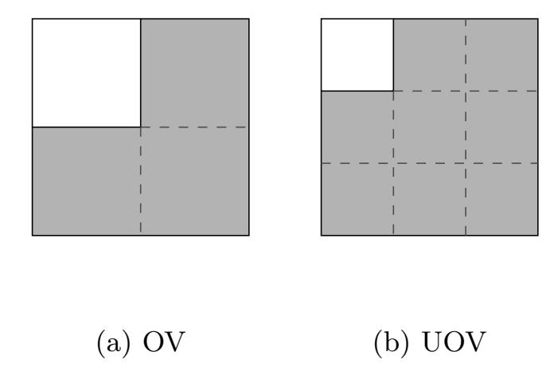
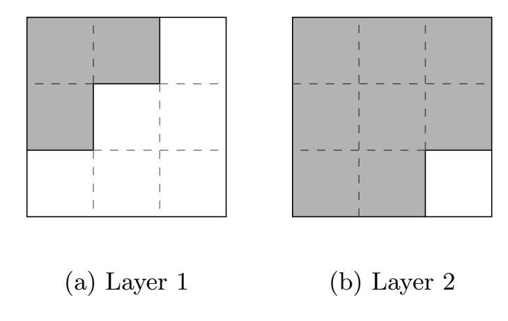
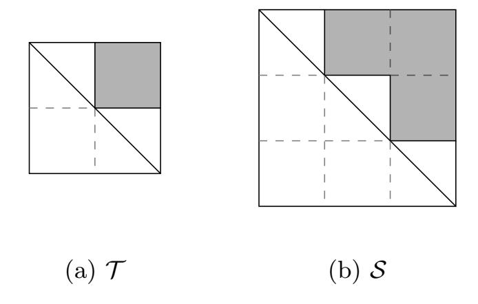
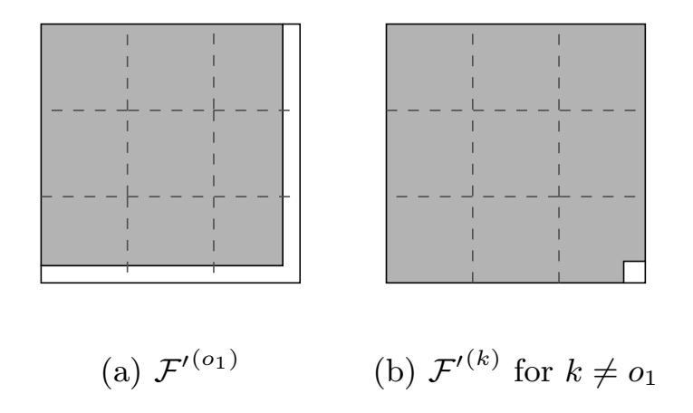
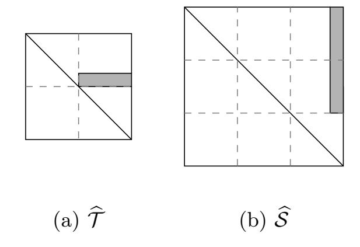

{0}------------------------------------------------

# Rainbow Band Separation is Better than we Thought

Daniel Smith-Tone1,2 and Ray Perlner1

1National Institute of Standards and Technology, USA 2University of Louisville, USA

daniel.smith@nist.gov, ray.perlner@nist.gov

Abstract. Currently the National Institute of Standards and Technology (NIST) is engaged in a post-quantum standardization effort, analyzing numerous candidate schemes to provide security against the advancing threat of quantum computers. Among the candidates in the second round of the standardization process is Rainbow, a roughly 15 year old digital signature scheme based on multivariate systems of equations. While there are many attack avenues for Rainbow, the parameters have to date seemed balanced in such a way to make every attack sufficiently costly that it meets the security levels specified by NIST in their standardization effort. One type of attack against Rainbow has historically outperformed empirically its theoretical complexity: the Rainbow Band Separation (RBS) attack. We explain this discrepancy by providing a tighter theoretical analysis of the attack complexity. While previous analyses assumed that the system of equations derived in the attack are generic, our analysis uses the fact that they are structured to justify tighter bounds on the complexity. As a result, we can prove under the same set of assumptions used to justify the analysis in the Rainbow submission specification that none of the parameters of Rainbow achieve their claimed security level. Specifically, the level I, III and V parameter sets fall short of their claimed security levels by at least 3, 6 and 10 bits, respectively. We then apply our analysis to suggest the small parameter changes necessary to guarantee that Rainbow can meet the NIST security levels.

Keywords: Multivariate, Digital Signature, Rainbow

# 1 Introduction

Since the discovery by Peter Shor in the 1990s, cf. [21], of polynomial-time quantum algorithms for computing discrete logarithms and factoring integers, the proverbial clock has been ticking on our current public key infrastructure. In reaction to this discovery and the continual advancement of quantum computing technologies, a large community has emerged dedicated to the development and deployment of cryptosystems that are immune to the exponential speedups quantum computers promise for our current standards. More recently, the National 

{1}------------------------------------------------

Institute of Standards and Technology (NIST) has begun directing a process to reveal which of the many new options for post-quantum public key cryptography are suitable for widespread use [14].

One of 26 remaining candidate submissions in the NIST process is Rainbow [15]. The submission Rainbow is based on the digital signature scheme of the same name first published in [8]. This scheme in turn is a variant of the Unbalanced Oil and Vinegar (UOV) signature scheme, see [16], modified for greater efficiency. This efficiency enhancement enables a wider variety of attack avenues that need to be analyzed than is required for the original UOV scheme.

For example, setting parameters for Rainbow requires the analysis of the complexity of a variety of cryptanalytic techniques. Such methods include directly inverting the public key, a process known as the Direct attack, cf. [10, 11, 3]; exploiting the rank anomaly present in Rainbow via attacks known as Min-Rank, cf. [4, 2], and HighRank, cf. [6]; an attack treating Rainbow as a special version of UOV, known as the UOV attack, cf. [20]; and an attack attempting to separate the two distinct layers of maps in Rainbow, a method known as Rainbow Band Separation (RBS), cf. [9].

The RBS attack, in particular, is an algebraic key recovery attack that typically has the best, or nearly the best attack complexity against the parameters given in the second round version of Rainbow. In setting these parameters, the submitters followed the standard assumption that the algebraic system that is solved in the RBS attack would behave like a generic system of quadratic equations. This assumption, however, was already known to be false as of 2012 [22], when Thomae found that Gr¨obner basis algorithms experimentally perform better on the systems involved in the RBS attack than they do on generic quadratic systems of the same number of equations in the same number of variables. The true complexity of this attack has remained an open question since.

In this paper we provide an improved method for solving the RBS system. This approach takes advantage of the fact that the variables in the RBS systems may be divided into two subsets, such that some of the RBS equations are bihomogeneous in the two subsets of variables, while the remainder are quadratic in one of the two subsets. Our approach is a modified Extended Linearization (XL) strategy where we attempt to linearize over all the monomials up to a specified bi-degree in the two subsets of variables. We give a generic analysis of the complexity of such an attack assuming a variant of Fr¨oberg's Maximal Rank Conjecture [13] and no additional useful structure in the RBS system beyond the maximal bi-degrees of the RBS equations. We find experimentally that the formulae we derive precisely match the observed complexity of our algorithm, and that our algorithm outperforms previous approaches to solving the RBS system.

#### 2 Rainbow

Rainbow is a member of a family of multivariate cryptosystems collectively known as "small field" schemes that make use of only one field for generat

{2}------------------------------------------------

ing a nonlinear map. Small field schemes typically use a secret structure based on rank or on a partition of the variables to allow efficient invertibility. Of these two methods, the latter has proven to be far superior over the years.

The first "small field" scheme was the oil-vinegar scheme of [19]. This scheme specifies two types of variables: the oil variables, which occur only linearly in the secret central map; and the vinegar variables, which occur quadratically. Thus the hidden map of the oil vinegar scheme has the form

$$\sum_{0 \le i < 2n, n \le j < 2n} \alpha_{i,j,\ell} x_i x_j + \sum_{0 \le i < 2n} \beta_{i,\ell} x_i + \gamma_\ell \text{ for } 0 \le \ell < n;$$

see Figure 1(a) for a visualization of each such map. Such a function is easy to invert because assigning random values to all of the vinegar variables transforms the function into an affine map, which is easily invertible.

Fig. 1. The shape of the matrix representations of the polar form of each central map of (a) oil-vinegar and (b) unbalanced oil-vinegar. The shaded regions represent possibly nonzero values while unshaded areas have coefficients of zero. Note that this diagram only provides information about the quadratic terms in the central maps.

Clearly, this class of multivariate system is invariant under left composition by affine maps; that is to say, for all such maps F with the property that F(x0, . . . , xn−1, cn, . . . , c2n−1) is affine for any constant (cn, . . . , c2n−1) and for all affine maps T, the composition T ◦F(x0, . . . , xn−1, dn, . . . , d2n−1) is also affine for any constant (dn, . . . , d2n−1). Thus, it is not necessary to compose the secret oilvinegar map with an affine transformation mixing the outputs. The oil-vinegar scheme is then presented as P(x) = F ◦ L, for some affine map L.

The original proposition of oil-vinegar used the same number of oil variables as vinegar variables and was quickly broken by Kipnis and Shamir in [20]. Importantly, the attack used in a critical way the balance between oil variables and vinegar variables. When the number of oil variables and vinegar variables are sufficiently separated, the attack becomes infeasible. The resulting scheme, with usually two to three times as many vinegar variables as oil variables, is called unbalanced oil-vinegar (UOV), see Figure 1 for a comparison between oil-vinegar and UOV. The number of equations in the system needs to be as large as the 

{3}------------------------------------------------

number of oil variables to make inversion likely, and having these numbers be equal is optimal.

Another scheme derived from this idea of partitioning the variables is Rainbow. Rainbow was introduced in 2005, see [8], as a generalization of UOV to many layers. Instead of every secret polynomial having the same structure, Rainbow divides the secret polynomials into layers or bands each of which have an UOV structure, but with different sets of oil and vinegar variables. Specifically, a Rainbow scheme with u layers is defined by defining the integers 0 < v1 < . . . < vu < n and the index sets V1 = {1, . . . , v1}, V2 = {1, . . . , v2}, . . . , Vu = {1, . . . , vu}. Further, we define the index sets Oi = Si+1\Si for 1 ≤ i ≤ u−1 and Ou = {vu + 1, . . . , n}. Then an `th layer Rainbow map has the form

$$\sum_{i \in O_{\ell}, j \in S_{\ell}} \alpha_{i,j,\ell} x_i x_j + \sum_{i,j \in S_{\ell}} \beta_{i,j,\ell} x_i x_j + \sum_{i \in S_{\ell} \cup O_{\ell}} \gamma_{i,\ell} + \delta_{\ell}.$$

The central map consists of |O`| such maps for each layer `, see Figure 2 for a visualization. This allows inversion to be performed layer by layer, since assigning values to the variables indexed in V1 transforms the layer 1 maps into affine maps in the variables indexed by O1. After we solve for these values, we have obtained values for all of the variables indexed in V2, and we may continually solve, layer by layer, until the values of all of the variables are recovered.

Fig. 2. The shape of the matrix representations of the polar form of each layer of the central map of a bi-layer Rainbow: (a) Layer 1 and (b) Layer 2. The shaded regions represent possibly nonzero values while unshaded areas have coefficients of zero. Note that this diagram only provides information about the quadratic terms in the central maps.

Rainbow offers a tremendous improvement in efficiency over UOV since the number of variables in relation to the number of equations can be more in balance than is possible with UOV. The cost of this improvement is the introduction of additional avenues of attack.

First, an adversary given access to a map in the first layer can easily break the scheme. It is for this reason that unlike UOV, Rainbow must set its public key to be P = T ◦ F ◦ S where both T and S are affine to mix the equations. 

{4}------------------------------------------------

Also, the risk of revealing a Layer 1 map makes rank attacks applicable, whereas UOV has no rank anomaly to exploit.

Another effect of Rainbow structure is to expand the space of equivalent keys over that of UOV. It is straightforward to show that with high probability one can construct equivalent keys of the form in Figure 3. Specifically these matrices are identity matrices modified with random blocks. In fact, for efficiency the round 2 candidate of the NIST Post Quantum Crypto Standardization Project Rainbow is specified with such keys, see [15].

Fig. 3. The shape of the matrix representations of the linear maps T and S. The shaded regions represent possibly nonzero values while unshaded areas have coefficients of zero.

# 3 NIST Security Categories and Parameters for Rainbow

In the Call for Proposals [14] for NIST's Post Quantum Crypto Standardization Project, NIST asked submitters of signature schemes to categorize the Existential Unforgeability with respect to Adaptive Chosen Message attack (EUF-CMA) security of their parameter sets into one of 5 security strength categories. In order to make these categories applicable to attacks measured by a variety of classical and quantum computational cost models, the categories define the minimum required computational cost of EUF-CMA attacks on the parameter sets in comparison to the computational cost of various simple attacks against the NIST standards Advanced Encryption Standard (AES)[17] and Secure Hash Algorithm 3 (SHA3)[18]. In particular, categories I, III, and V are defined with reference to the cost of brute force key search for AES-128, AES-192, and AES-256. In [14], NIST estimates the classical cost of these attacks to be 2143, 2207 , and 2272 binary operations respectively. NIST also defined categories II and IV based on the cost of collision search against SHA3-256 and SHA3-384, respectively. The Rainbow submission extends these definitions to define a category VI based on the brute-force collision security of SHA3-512. NIST estimates the classical cost of brute-force collision attacks against SHA3-256, SHA3-384, and SHA3-512 to be 2146, 2210, and 2274 binary operations, respectively.

{5}------------------------------------------------

The second round version of the Rainbow submission specifies 3 parameter sets, Rainbow Ia which is claimed to meet NIST security category I, Rainbow IIIc, which is claimed to meet NIST security category IV, and Rainbow Vc which is claimed to meet category VI. The parameters for these instantiations of Rainbow are summarized in Table 1.

Table 1. Parameters of Rainbow in round 2 of the NIST Post Quantum Standardization Project and claimed security levels.

|      |    |          | Rainbow field size v o1 o2 Claimed Security |
|------|----|----------|---------------------------------------------|
| Ia   | 24 | 32 32 32 | Level I                                     |
| IIIc | 28 | 68 36 36 | Level IV                                    |
| Vc   | 28 | 92 48 48 | Level VI                                    |

# 4 Rainbow Band Separation Attack

The RBS attack recovers an equivalent private key for Rainbow by decomposing the space of public quadratic maps into inner (Layer 1) and outer (Layer 2) subspaces, and decomposing the plaintext space into o1,o2, and v subspaces. The most expensive part of the RBS attack consists of solving quadratic equations to find a single generator of the inner space of quadratic maps and a single generator of the space of o2 variables. Once this step is complete, the attacker can solve linear equations to find the rest of the key.

To set up the equations for the first step in RBS, we solve for two linear maps Sˆ and Tˆ analogous to the S and T that relate the public and private quadratic maps in Rainbow. We then require that certain coefficients of the quadratic map F 0 = T ◦ P ◦ ˆ Sˆ = F 0 are equal to zero. In particular, we require the differentials of F 0 to have the form in Figure 4.

Fig. 4. The location of the terms set to zero in the differentials of F 0 by the first step of the RBS attack (a) F 0(o1) and (b) All other components of F 0 . The shaded regions represent possibly nonzero values while unshaded areas are fixed to zero.

{6}------------------------------------------------

**Fig. 5.** The shape of the linear forms (a)  $\widehat{\mathcal{T}}$  and (b)  $\widehat{\mathcal{S}}$  used in the first step of the RBS attack. The shaded regions represent possibly nonzero values while unshaded areas have coefficients of zero.

It is notable that without further constraints there are many solutions for  $\hat{S}$  and  $\hat{T}$ . The attack therefore further constrains  $\hat{S}$  and  $\hat{T}$  to have the form given in Figure 5.

As such, there are only  $n_x = v + o_1$  free variables to solve for in  $\hat{S}$ . We will call the set of these variables X. Likewise there are only  $n_y = o_2$  free variables to solve for in  $\hat{T}$ . We will call this latter set of variables Y.

The equations solved in this first step of the RBS attack take the form:

$$\pi \left( \hat{\mathcal{T}} \circ \hat{\mathcal{S}}^T \mathcal{P} \hat{\mathcal{S}} \right) = 0$$

Where  $\pi$  is defined to be a linear projection that projects the space of quadratic maps onto those coefficients we wish to set to zero. Generically, we would expect these equations to have degree 2 in X and degree 1 in Y. However, as it turns out, the equations we obtain are either degree 2 in X and constant relative to Y or degree 1 in each of X and Y.

From  $\mathcal{F}'^{(o_1)}$ , the attacker obtains  $m_{xy} = n - 1$  bi-homogeneous equations in X and Y, and one additional cubic equation, which has degree 2 with respect to X and 1 with respect to Y.

From the  $o_1 + o_2 - 1$  remaining components of  $\mathcal{F}'$ , the attacker obtains 1 quadratic equation in the X variables apiece. When combined with the cubic equation obtained from  $\mathcal{F}'^{(o_1)}$ , these equations correspond to the requirement that  $\mathcal{F}'$  is a UOV map with the final component of the plaintext space in its oil subspace. This requirement is independent of  $\hat{\mathcal{T}}$ , and the attacker may therefore replace  $\hat{\mathcal{T}}$  with an identity matrix in the cubic equation obtained from  $\mathcal{F}'^{(o_1)}$  reducing its degree to 0 in Y and 2 in X. Thus, the attacker obtains a total of  $m_x = o_1 + o_2$  equations that are quadratic in X and constant with respect to Y in addition to the  $m_{xy} = n - 1$  bi-homogeneous equations in X and Y.

The standard way one might attempt to solve such a system is by employing a Gröbner basis algorithm such as F4 or F5, see [10,11]. Since the adversary has access to the variable sets X and Y, however, it may be advantageous to explicitly use the structure of the equations to target a specific bi-degree in the

{7}------------------------------------------------

variable sets X and Y. Thus we must consider as well polynomial system solvers such as XL, see [7].

Such algorithms generate higher degree equations by explicit multiplication by monomials to establish a larger generating set. The benefit of such algorithms asymptotically is that they can generate many high degree equations in the ideal all of which are sparse and better utilize sparse linear algebra methods with very low memory overhead. In the context of systems of equations like RBS, a modified version of XL allows us to target specific vector subspaces of the ideal they generate to control the dimension of the space over which linearization occurs.

#### 5 Analysis of Structured Equations

Consider a system of multivariate polynomials with two variables types, X and Y, and two polynomial types, those which are quadratic in X and those that are bilinear in X and Y. In particular, the RBS system has this structure. We investigate the generic complexity of resolving such a system. This investigation refines the approaches of [24] and [12] in application to systems with a classification of variables as well as polynomials. We note that the method outlined here can be easily modified to accommodate any number of variable types and polynomial structures.

First, we compute the number of monomials up to bi-degree  $(\alpha, \beta)$  in  $X \cup Y$ ; that is, we count monomials of total degree  $\alpha$  in X and total degree  $\beta$  in Y. Note that for small fields the field size q may become a factor. Let's denote our equations  $p_i$  and variables in our sets with  $x_i \in X$  and  $y_j \in Y$ . Note that the highest power of any variable is q - 1. Let  $|X| = n_x$  and  $|Y| = n_y$ . Then

$$\prod_{i=1}^{n_x} (1 + x_i + \dots + x_i^{q-1}) = \prod_{i=1}^{n_x} \frac{1 - x_i^q}{1 - x_i}$$

is exactly the sum of all monomials in X over  $F_q$ . Similarly, we have that

$$\left(\prod_{i=1}^{n_x} \frac{1 - x_i^q}{1 - x_i}\right) \left(\prod_{i=1}^{n_y} \frac{1 - y_i^q}{1 - y_i}\right)$$

is exactly the sum of all monomials in  $X \cup Y$  over  $F_q$ . Setting all  $x_i = t$  and all  $y_j = s$  we have that the coefficient of  $t^{\alpha}s^{\beta}$  is exactly the number of monomials of bi-degree  $(\alpha, \beta)$ . We may rewrite this polynomial as

$$a_{0,0} + a_{1,0}t + a_{0,1}s + a_{2,0}t^2 + a_{1,1}ts + a_{0,2}s^2 + \dots + a_{q-1,q-1}t^{q-1}s^{q-1}$$
.

Now take this polynomial and multiply by  $1+t+s+t^2+ts+s^2+\cdots+t^{q-1}s^{q-1}+\cdots$  which equals  $(1+t+t^2+\cdots+t^{q-1}+\cdots)(1+s+\cdots+s^{q-1}+\cdots)$ . Then the coefficient of  $t^{\alpha}s^{\beta}$  in the product is exactly the number of monomials of bi-degree bounded by  $(\alpha,\beta)$ , as long as  $(\alpha,\beta) \leq (q-1,q-1)$ .

{8}------------------------------------------------

Now we may further note that for such values of  $\alpha$  and  $\beta$ , the coefficient of  $t^{\alpha}s^{\beta}$  in the above product is identical to the coefficient of the same monomial in

$$\frac{1}{(1-t)^{n_x+1}(1-s)^{n_y+1}}.$$

Thus, we have proven the following:

**Lemma 1** The number of monomials of bi-degree  $(a,b) \leq (\alpha,\beta) \leq (q-1,q-1)$  is

$$T^{(a,b)} = [t^a s^b] \mathcal{M}(t,s),$$

where

$$\mathcal{M}(t,s) = \frac{1}{(1-t)^{n_x+1}(1-s)^{n_y+1}}.$$

Notice that we have also derived another useful result.

**Lemma 2** The number of monomials of bi-degree exactly  $(a,b) \preceq (q-1,q-1)$  is

$$T^{(a,b)} = [t^a s^b] \overline{\mathcal{M}}(t,s),$$

where

$$\overline{\mathcal{M}}(t,s) = \frac{1}{(1-t)^{n_x}(1-s)^{n_y}}.$$

Now we derive the number of linearly independent equations of bi-degree  $(\alpha, \beta)$  in the ideal generated by the  $p_i$ . We will denote by  $\mathcal{T}^{(\alpha,\beta)}$  the set of monomials of bi-degree  $(a,b) \leq (\alpha,\beta)$ . For convenience of terminology we will say that (a,b) is bounded by  $(\alpha,\beta)$ . We will denote the vector space spanned by  $\mathcal{T}^{(\alpha,\beta)}$  by  $\mathbf{T}^{(\alpha,\beta)}$ . Further, let  $m_x$  and  $m_{xy}$  be the number of equations quadratic in X and bilinear in X and Y, respectively.

We will require some maximal rank conjectures of the same type standardly used in this area. In particular, the analysis in [15] requires similar conjectures. We support these conjectures with strong experimental evidence in Section 8.

**Assumption 1** The following ideal equation holds for the sequence  $p_1, \ldots, p_k$  where  $k = m_x + m_{xy}$  ordered so that the equations quadratic in X are the first  $m_x$ :

$$\sum_{i < j} \langle p_i p_j \rangle \big|_{\mathbf{T}^{(\alpha,\beta)}} = \left[ \sum_{i < j} \langle p_i \rangle \big|_{\mathbf{T}^{(\alpha,\beta)}} \right] \cap \langle p_j \rangle \text{ for } (\alpha,\beta) \preceq (q-1,q-1).$$

Here  $\langle q \rangle \big|_{\mathbf{T}^{(\alpha,\beta)}}$  is the set of all polynomials of the form  $fq \in \langle q \rangle$  such that the sum of the bi-degrees of f and q is bounded by  $(\alpha,\beta)$ .

**Assumption 2** The sequence  $p_1, \ldots, p_k$  where  $k = m_x + m_{xy}$  satisfies the property that  $p_i - a$  is irreducible for all i and for all  $a \in F_q$  and every  $p_i$  has sufficiently many monomials to avoid trivial degree falls of the form  $z_i^q = z_i$  upon multiplication by any monomial  $\mathfrak{m}$  such that the bi-degree of  $\mathfrak{m}p_i$  is bounded by  $(\alpha, \beta) \preceq (q - 1, q - 1)$ .

{9}------------------------------------------------

Let  $\mathbf{A}_i$  be the subspace of  $\mathbf{T}^{(\alpha,\beta)}$  consisting of polynomials of bi-degree  $(a,b) \leq (\alpha,\beta)$  that are divisible by  $p_i$ . The number of linearly independent equations of bi-degree bounded by  $(\alpha,\beta)$  in  $\langle p_1,\ldots,p_{m_x+m_{xy}}\rangle$  is exactly

$$\dim\left(\sum_{i}\mathbf{A}_{i}\right).$$

The rest of the discussion derives a value for this dimension.

First, by Assumptions 1 and 2 and the inclusion-exclusion principle we have that

$$\dim\left(\sum_{i=1}^{m_x+m_{xy}} \mathbf{A}_i\right) = \sum_{j=1}^{m_x+m_{xy}} (-1)^{j+1} \left(\sum_{1 \le i_1 < \dots < i_j \le m_x+m_{xy}} \dim\left(\bigcap_{k=1}^j \mathbf{A}_{i_k}\right)\right). \tag{1}$$

Thus the entire difficulty lies in finding the dimension of arbitrary intersections of the principal summands of the ideal generated by the  $p_i$ .

We first compute  $\dim(\mathbf{A}_i)$  for  $i \leq m_x$ . Let  $\cdot q$  denote the linear operator of multiplication by the polynomial q. We observe that we obtain an exact sequence:

$$\cdots \longrightarrow \mathbf{T}^{(\alpha-2q-2,\beta)} \xrightarrow{\cdot p_i} \mathbf{T}^{(\alpha-2q,\beta)} \xrightarrow{\cdot (p_i^{q-1}-1)} \mathbf{T}^{(\alpha-2,\beta)} \xrightarrow{\cdot p_i} \mathbf{A}_i \to \mathbf{0}.$$

The reason is that  $\mathbf{A}_i = p_i \mathbf{T}^{(\alpha-2,\beta)}$ , and Assumption 2 implies that if  $fp_i = 0$  then  $p_i^{q-1} - 1$  divides f while if  $g(p_i^{q-1} - 1) = 0$  then  $p_i$  divides g. Thus, by the exactness, the dimension of  $\mathbf{A}_i$  is the alternating sum of the dimensions of the preceding terms in the sequence.

Considering the tails of these two exact sequences, we establish two recurrences:

$$\dim\left(p_{i}\mathbf{T}^{(\alpha-2,\beta)}\right) = T^{(\alpha-2,\beta)} - T^{(\alpha-2q,\beta)} + \dim\left(p_{i}\mathbf{T}^{(\alpha-2q-2,\beta)}\right),$$

and

$$\dim\left((p_i^{q-1}-1)\mathbf{T}^{(\alpha-2q,\beta)}\right) = T^{(\alpha-2q,\beta)} - T^{(\alpha-2q-2,\beta)} + \dim\left((p_i^{q-1}-1)\mathbf{T}^{(\alpha-4q,\beta)}\right).$$

Solving these recurrences we obtain

$$\dim\left(\mathbf{A}_{i}\right) = \left[t^{\alpha} s^{\beta}\right] \mathcal{M}(t, s) \frac{t^{2} - t^{2q}}{1 - t^{2q}},\tag{2}$$

and

$$\dim\left((p_i^{q-1} - 1)\mathbf{T}^{(\alpha - 2q, \beta)}\right) = [t^{\alpha}s^{\beta}]\mathcal{M}(t, s)\frac{t^{2q} - t^{2q+2}}{1 - t^{2q}},\tag{3}$$

where  $\mathcal{M}(t,s)$  is the generating function derived in Lemma 1.

Now we consider the case  $i > m_x$ . Now we have that  $\mathbf{A}_i = p_i \mathbf{T}^{(\alpha-1,\beta-1)}$ . Recall that by Assumption 2, if  $fp_i = 0$  it is implied that  $p_i^{q-1} - 1$  divides f and

{10}------------------------------------------------

the similar implication for  $p_i^{q-1} - 1$ . By the same reasoning as above, we obtain the exact sequence

$$\cdots \longrightarrow \mathbf{T}^{(\alpha-q-1,\beta-q-1)} \xrightarrow{\cdot p_i} \mathbf{T}^{(\alpha-q,\beta-q)} \xrightarrow{\cdot (p_i^{q-1}-1)} \mathbf{T}^{(\alpha-1,\beta-1)} \xrightarrow{\cdot p_i} \mathbf{A}_i \to \mathbf{0}.$$

Again, the dimension of  $A_i$  is the alternating sum of the dimensions of the preceding terms in the sequence. As before, we can consider the tails of these two exact sequences to establish the recurrences:

$$\dim\left(p_i\mathbf{T}^{(\alpha-1,\beta-1)}\right) = T^{(\alpha-1,\beta-1)} - T^{(\alpha-q,\beta-q)} + \dim\left(p_i\mathbf{T}^{(\alpha-q-1,\beta-q-1)}\right)$$

and

$$\dim\left((p_i^{q-1}-1)\mathbf{T}^{(\alpha-q,\beta-q)}\right) = T^{(\alpha-q,\beta-q)} - T^{(\alpha-q-1,\beta-q-1)} + \dim\left((p_i^{q-1}-1)\mathbf{T}^{(\alpha-2q,\beta-2q)}\right).$$

Solving these recurrences we obtain

$$\dim (\mathbf{A}_i) = [t^{\alpha} s^{\beta}] \mathcal{M}(t, s) \frac{ts - t^q s^q}{1 - t^q s^q}, \tag{4}$$

and

$$\dim\left((p_i^{q-1}-1)\mathbf{T}^{(\alpha-q,\beta-q)}\right) = [t^{\alpha}s^{\beta}]\mathcal{M}(t,s)\frac{t^qs^q - t^{q+1}s^{q+1}}{1 - t^qs^q}.$$
 (5)

Now we consider the intersections. There are three cases of intersections

 $\mathbf{A}_i \cap \mathbf{A}_j$ :  $i < j \le m_x$ ,  $i \le m_x < j$  and  $m_x < i < j$ . In the first case, note that  $\mathbf{A}_i \cap \mathbf{A}_j = p_i p_j \mathbf{T}^{(\alpha - 4, \beta)}$ . Since the annihilator of  $p_i p_j$ , by Assumptions 1 and 2, is  $\left\langle p_i^{q-1} - 1, p_j^{q-1} - 1 \right\rangle \Big|_{\mathbf{T}^{(\alpha-4,\beta)}}$ , we have that

$$\mathbf{A}_{i} \cap \mathbf{A}_{j} = \mathbf{T}^{(\alpha-4,\beta)} / \left( (p_{i}^{q-1} - 1) \mathbf{T}^{(\alpha-2q-2,\beta)} + (p_{j}^{q-1} - 1) \mathbf{T}^{(\alpha-2q-2,\beta)} \right).$$

For brevity, let us abuse notation and denote by  $qT^{(\alpha,\beta)}$  the dimension of the subspace  $q\mathbf{T}^{(\alpha,\beta)}$ . By the inclusion-exclusion principle we have that

$$\dim (\mathbf{A}_i \cap \mathbf{A}_j) = T^{(\alpha-4,\beta)} - (p_i^{q-1} - 1)T^{(\alpha-2q-2,\beta)} - (p_j^{q-1} - 1)T^{(\alpha-2q-2,\beta)} + (p_i^{q-1} - 1)(p_j^{q-1} - 1)T^{(\alpha-4q,\beta)}.$$

By the exact same reasoning we just employed, the final term simplifies to

$$T^{(\alpha-4q,\beta)} - p_i T^{(\alpha-4q-2,\beta)} - p_j T^{(\alpha-4q-2,\beta)} + p_i p_j T^{(\alpha-4q-4,\beta)}$$

Thus we have obtained the recurrence relation

$$p_{i}p_{j}T^{(\alpha-4,\beta)} = T^{(\alpha-4,\beta)} - 2 \cdot (p_{i}^{q-1} - 1)T^{(\alpha-2q-2,\beta)} + T^{(\alpha-4q,\beta)} - 2 \cdot p_{i}T^{(\alpha-4q-2,\beta)} + p_{i}p_{j}T^{(\alpha-4q-4,\beta)}.$$

{11}------------------------------------------------

We can compute the negative terms in the above expression by formulae analogous to Equations (2) and (3), and using these values solve the recurrence relation obtaining:

$$\dim\left(\mathbf{A}_{i}\cap\mathbf{A}_{j}\right)=\left[t^{\alpha}s^{\beta}\right]\mathcal{M}(t,s)\frac{(t^{2}-t^{2q})^{2}}{(1-t^{2q})^{2}}.$$
(6)

In the second case, that is,  $i \leq m_x < j$ , note that  $\mathbf{A}_i \cap \mathbf{A}_j = p_i p_j \mathbf{T}^{(\alpha - 3, \beta - 1)}$ . Again, by Assumptions 1 and 2, we have that the annihilator of  $p_i p_j$  is the subspace  $\left\langle p_i^{q-1} - 1, p_j^{q-1} - 1 \right\rangle \Big|_{\mathbf{T}^{(\alpha - 3, \beta - 1)}}$ . Thus, we obtain

$$\mathbf{A}_i \cap \mathbf{A}_j = \mathbf{T}^{(\alpha - 3, \beta - 1)} / \left( (p_i^{q - 1} - 1) \mathbf{T}^{(\alpha - 2q - 1, \beta - 1)} + (p_j^{q - 1} - 1) \mathbf{T}^{(\alpha - q - 2, \beta - q)} \right).$$

Therefore, again invoking the inclusion-exclusion principle we obtain

$$\dim (\mathbf{A}_i \cap \mathbf{A}_j) = T^{(\alpha-3,\beta-1)} - (p_i^{q-1} - 1)T^{(\alpha-2q-1,\beta-1)} - (p_j^{q-1} - 1)T^{(\alpha-q-2,\beta-q)} + (p_i^{q-1} - 1)(p_j^{q-1} - 1)T^{(\alpha-3q,\beta-q)}.$$

By the exact same reasoning, the final term simplifies to

$$T^{(\alpha-3q,\beta-q)} - p_i T^{(\alpha-3q-2,\beta-q)} - p_i T^{(\alpha-3q-1,\beta-q-1)} + p_i p_i T^{(\alpha-3q-3,\beta-q-1)}$$

We then obtain the recurrence relation

$$p_{i}p_{j}T^{(\alpha-3,\beta-1)} = T^{(\alpha-3,\beta-1)} - (p_{i}^{q-1} - 1)T^{(\alpha-2q-1,\beta-1)} - (p_{j}^{q-1} - 1)T^{(\alpha-q-2,\beta-q)} + T^{(\alpha-3q,\beta-q)} - p_{i}T^{(\alpha-3q-2,\beta-q)} - p_{j}T^{(\alpha-3q-1,\beta-q-1)} + p_{i}p_{j}T^{(\alpha-3q-3,\beta-q-1)}.$$

We can again compute the negative terms by formulae analogous to Equations (2) through (5), and thereby solve the recurrence relation obtaining:

$$\dim (\mathbf{A}_i \cap \mathbf{A}_j) = [t^{\alpha} s^{\beta}] \mathcal{M}(t, s) \frac{(t^2 - t^{2q})(ts - t^q s^q)}{(1 - t^{2q})(1 - t^q s^q)}.$$
 (7)

A similar analysis of the third case, i.e.  $m_x < i < j$ , results in the formula

$$\dim (\mathbf{A}_i \cap \mathbf{A}_j) = [t^{\alpha} s^{\beta}] \mathcal{M}(t, s) \frac{(ts - t^q s^q)^2}{(1 - t^q s^q)^2}.$$
 (8)

A tedious but trivial induction argument verifies that the general formula is given by

$$\dim\left(\bigcap_{k=1}^{j} \mathbf{A}_{i_k}\right) = [t^{\alpha} s^{\beta}] \mathcal{M}(t, s) \frac{(t^2 - t^{2q})^r (st - t^q s^q)^{j-r}}{(1 - t^{2q})^r (1 - t^q s^q)^{j-r}},\tag{9}$$

where r is the largest natural number such that the index  $i_r$  on the left hand side of Equation (9) is bounded by  $m_x$ .

{12}------------------------------------------------

Thus, returning to Equation (1), we can now expand

$$\sum_{j=1}^{m_x + m_{xy}} (-1)^{j+1} \left( \sum_{1 \le i_1 < \dots < i_j \le m_x + m_{xy}} \dim \left( \bigcap_{k=1}^j \mathbf{A}_{i_k} \right) \right).$$

Factoring out  $\mathcal{M}(t,s)$  and adding 1 to reindex from j=0, we expand the sum of generating functions:

$$1 + \sum_{j=0}^{m_x + m_{xy}} (-1)^{j+1} \sum_{r=0}^{\min\{j, m_x\}} {m_x \choose r} {m_{xy} \choose j-r} \frac{(t^2 - t^{2q})^r (st - t^q s^q)^{j-r}}{(1 - t^{2q})^r (1 - t^q s^q)^{j-r}}$$

$$= 1 + \left(\sum_{r=0}^{m_x} (-1)^r {m_x \choose r} \frac{(t^2 - t^{2q})^r}{(1 - t^{2q})^r} \right) \left(\sum_{j=0}^{m_{xy}} (-1)^{j+1} {m_{xy} \choose j} \frac{(st - t^q s^q)^j}{(1 - t^q s^q)^j} \right)$$

$$= 1 + \left(1 - \frac{(t^2 - t^{2q})}{(1 - t^{2q})} \right)^{m_x} \left(\frac{(st - t^q s^q)}{(1 - t^q s^q)} - 1 \right)^{m_{xy}}$$

$$= 1 + \frac{(1 - t^2)^{m_x} (st - 1)^{m_{xy}}}{(1 - t^q s^q)^{m_{xy}}}.$$

Thus we have that

$$\dim \left( \sum_{i=1}^{m_x + m_{xy}} \mathbf{A}_i \right) = [t^{\alpha} s^{\beta}] \mathcal{M}(t, s) \left[ 1 + \frac{(1 - t^2)^{m_x} (st - 1)^{m_{xy}}}{(1 - t^2)^{m_x} (1 - t^q s^q)^{m_{xy}}} \right]$$

One may now note that for  $\alpha, \beta < q$  we obtain the same coefficient with the generating function

$$\mathcal{M}(t,s) \left(1 + (1-t^2)^{m_x} (st-1)^{m_{xy}}\right).$$

Thus, we have established the following:

**Theorem 1** Under Assumptions 1 and 2, the number of linearly independent polynomials in the ideal generated by the polynomials  $p_1, \ldots, p_{m_x}$  of bi-degree (2,0) and the polynomials  $p_{m_x+1}, \ldots, p_{m_x+m_{xy}}$  of bi-degree (1,1) having bi-degree bounded by  $(\alpha,\beta) \leq (q-1,q-1)$  is given by

$$[t^{\alpha}s^{\beta}]\mathcal{M}(t,s)\left(1+(1-t^2)^{m_x}(st-1)^{m_{xy}}\right)$$

where

$$\mathcal{M}(t,s) = \frac{1}{(1-t)^{n_x+1}(1-s)^{n_y+1}},$$

provided that this quantity is less than  $[t^{\alpha}s^{\beta}]\mathcal{M}(t,s)$ .

At this point we have recovered explicit and related formulae for the number of distinct monomials and the number of distinct linearly independent equations. At any bi-degree at which the difference becomes negative, an XL-style algorithm modified to target that bi-degree will terminate. Thus, by taking the difference of  $\mathcal{M}(t,s)$  and the generating function in Theorem 1, we obtain:

{13}------------------------------------------------

**Corollary 1** Under Assumptions 1 and 2, a modified XL-style algorithm will terminate at the lowest bi-degree  $(a,b) \leq (q-1,q-1)$  in its ordering for which

$$[t^a s^b] \frac{(1-t^2)^{m_x} (1-st)^{m_{xy}}}{(1-t)^{n_x+1} (1-s)^{n_y+1}}$$
(10)

is nonpositive.

Note that the exact same analysis for Theorem 1 is valid under the same assumptions if we consider the homogeneous components of highest total degree for every polynomial. Thus we have proven:

**Theorem 2** Under Asumptions 1 and 2, the number of linearly independent polynomials in the ideal generated by the polynomials  $p_1, \ldots, p_{m_x}$  of bi-degree (2,0) and the polynomials  $p_{m_x+1}, \ldots, p_{m_x+m_{xy}}$  of bi-degree (1,1) having bi-degree exactly  $(\alpha,\beta) \leq (q-1,q-1)$  is given by

$$[t^{\alpha}s^{\beta}]\overline{\mathcal{M}}(t,s)\left(1+(1-t^2)^{m_x}(st-1)^{m_{xy}}\right),$$

where

$$\overline{\mathcal{M}}(t,s) = \frac{1}{(1-t)^{n_x}(1-s)^{n_y}},$$

provided that this quantity is less than  $[t^{\alpha}s^{\beta}]\overline{\mathcal{M}}(t,s)$ .

Applying Theorem 2 to the general case provides us a measure for the first-fall bi-degree. Specifically, we obtain

**Corollary 2** Under Assumptions 1 and 2, a modified XL-style algorithm will produce a degree fall at the lowest bi-degree  $(a,b) \leq (q-1,q-1)$  in its ordering for which

$$[t^a s^b] \frac{(1-t^2)^{m_x} (1-st)^{m_{xy}}}{(1-t)^{n_x} (1-s)^{n_y}}$$
(11)

is nonpositive.

Note that an assumption of no structure in the system would imply that  $n_y = m_{xy} = 0$ , and the formula reduces to the familiar semi-regular degree formula

$$[t^a] \frac{(1-t^2)^{m_x}}{(1-t)^{n_x}},$$

as cited in [15].

### 6 Complexity

It should be noted that in addition to enabling tight analysis, an XL-like attack strategy will likely be the most effective approach to attack large parameters in practice, since unlike F4, XL-Wiedemann does not need to store a dynamically reduced basis for a large linear system in memory. This allows implementations

{14}------------------------------------------------

of the attack to save memory, by using the sparsity of the system, and the fact that many of the coefficients of the higher degree polynomials represented by the linear system are known to be equal to one another due to the structure of XL.

To get the complexity of the XL-style algorithm we need to consider the number of equations we must generate and the average number of coefficients per equation. We then can use very precise estimates of the resources required by the block Wiedemann algorithm, see [5], to solve the system.

Notice that each quadratic equation has  $\binom{n_x+1}{2} + n_x + 1$  nonzero monomials while each bilinear equation has  $(n_x+1)(n_y+1)$  nonzero monomials. In general  $n_x \geq 2n_y$ , so we easily derive a loose lower bound complexity of

$$\min_{(a,b)\prec(q,q)} 3([t^a s^b] \mathcal{M}(t,s))^2 (n_x + 1)(n_y + 1),$$

and an upper bound complexity of

$$\min_{(a,b)\prec(q,q)} 3\left([t^a s^b] \mathcal{M}(t,s)\right)^2 \left(\binom{n_x+1}{2} + n_x + 1\right).$$

In practice, this is already a sufficiently tight estimate to serve our purposes. For practical instances arising from Rainbow, the difference between  $(n_x+1)(n_y+1)$  and  $\binom{n_x+1}{2}+n_x+1$  are less than 50 %, and so less than half a bit of complexity. With the theory developed in Section 5, however, we can be more precise.

In particular, we can establish the exact number of linearly independent equations generated by multiplying equations quadratic in X by monomials and the number generated from the bilinear equations in X and Y by setting  $m_{xy}$ , respectively  $m_x$ , equal to 0. We then use this information to use as many of the sparser set of equations as we expect to be linearly independent, and reach the desired dimension by adding polynomials from the denser set.

In this case, we can form a weighted average of the two bounds above to provide the average number of terms per row of the reduction matrix.

#### 7 Application to Rainbow

Equipped with the analysis from Sections 5 and 6, we may consider the solving and first fall bi-degrees of an XL-style algorithm on input of the RBS equations arising from an instance of Rainbow. Recall from Section 4 that the RBS system consists of  $m_x = o_1 + o_2$  quadratic equations in the variable set X and  $m_{xy} = n - 1 = v + o_1 + o_2 - 1$  bilinear equations in the variable sets X and Y, where  $|X| = n_x = v + o_1$  and  $|Y| = n_y = o_2$ . Such systems are definitely not semi-regular, so we cannot necessarily rely, as in [15], on the first degree fall occurring at the degree corresponding to the first non-positive coefficient of

$$\frac{(1-t^2)^{m_x+m_{xy}}}{(1-t)^{n_x+n_y}}.$$

{15}------------------------------------------------

Still, this formula is an approximation for the formulae derived in Section 5 when nx ≈ ny and mx ≈ mxy, so we may expect that the first fall occurs near the predicted degree.

The problem with this analysis is that there are very many monomials at the highest degree, but for systems like the RBS equations, the adversary has access to the two variable sets X and Y and may therefore target a specific bi-degree. Since the vector space of polynomials of bi-degree bounded by (α, β) is far smaller than the vector space of polynomials of total degree bounded by α + β, it may be possible to solve the RBS system much more efficiently with a targeted approach.

We now investigate the complexity of a generic XL-style algorithm that simply generates all polynomials in the ideal generated by the RBS equations of degree bounded by (α, β) (q − 1, q − 1). There are in general many bi-degrees for which the corresponding coefficients are negative in Equations (10) and (11). We choose the target bi-degree for the algorithm in two ways; either we minimize the solving degree as computed by Corollary 1, or minimize the first fall degree. Our results applied to the Rainbow parameters from [15] are presented in Table 2.

Table 2. The complexity minimizing target bi-degree for an XL-style algorithm applied to Rainbow parameters. Target bi-degrees for the first fall and the solving bi-degrees are provided. A bi-degree (a, b) corresponds to degree a in the X variables and degree b in the Y variables. Complexity is measured in log2 bit-operations and log2 AES/SHA3 operations (as appropriate to the highest claimed security strength category.)

| Scheme                   |     |          | type bi-degree complexity | complexity | NIST       |  |
|--------------------------|-----|----------|---------------------------|------------|------------|--|
|                          |     |          | (bit)                     | (AES/SHA3) | Level      |  |
|                          | ff  | (14, 2)  | 136                       | 121        | I          |  |
| Rainbow-Ia(32, 32, 32)   | sol | (12, 4)  | 140                       | 125        | 128 (AES)  |  |
|                          | ff  | (16, 7)  | 199                       | 181        | III(IV)    |  |
| Rainbow-IIIc(68, 36, 36) | sol | (15, 9)  | 204                       | 186        | 192 (SHA3) |  |
|                          | ff  | (19, 11) | 258                       | 240        | V(VI)      |  |
| Rainbow-Vc(92, 48, 48)   | sol | (19, 12) | 264                       | 246        | 256 (SHA3) |  |

Our calculations for the complexity utilize the formula from Section 6 as well as the method presented in [15] for measuring the gate count in terms of the number of field multiplications. Specifically, we used the model that the number of bit operations is equal to the number of field multiplications multiplied by 2(lg(q) 2+lg(q)). In the case of Rainbow-Ia, this calculation results in an increase of roughly 5 in the bit-complexity, while for parameter sets IIIc and V c the increase is roughly 7.

We note that the complexity estimate can differ significantly between the solving degree and the first fall degree estimates. We note the fact that even if we achieve many degree falls at a certain bi-degree that we may not be able to find appropriate monomials to multiply the resulting equation to maintain the 

{16}------------------------------------------------

degree bound. For example, at a target bi-degree of (a, b) it may be possible to achieve a degree fall producing the polynomial  $x_1^a y_1^{b-1} + x_1^{a-1} y_1^b + \dots$  The product of this polynomial with any monomial will not be bounded by the bi-degree (a, b). It is therefore not clear that the estimates provided by the first fall bi-degree are indicative of attacks. Thus we interpret the first fall bi-degree estimates as lower bounds on the attack complexity and the solving bi-degree estimates as upper bounds.

From these data, we conclude that the Rainbow parameters are slightly too small to meet the NIST security levels. We note that the effect is slightly more severe at the higher security levels, but the security level I parameters, which likely attract the most attention, only require slight modification to achieve level I security. Depending on the estimate, solving versus first fall, the parameter v should be increased by 2 or by 8 to achieve NIST level I security.

# 8 Experimental Results

We ran a series of experiments applying a proof-of-concept XL-style algorithm on small versions of Rainbow with parameters following a similar relationship as those of Rainbow-Ia. Specifically, we focused on parameters in which  $o_1 = o_2$  and v is approximately equal to these values as well. We expected to find that as parameter sizes increased that the number of linearly independent RBS equations bounded by each bi-degree would approach the theoretical bound. Surprisingly, we found that the fit was essentially exact for all sizes of parameters, even extremely small parameters. The results of some of these experiments are provided in Table 3. We obtained similar results for  $v = o_1 = o_2 = 6$  that are too large to fit in the table.

**Table 3.** The experimental and theoretical numbers of linearly independent equations and monomials of bi-degree bounded by  $(\alpha, \beta)$  for several instances of Rainbow with  $v = o_1 = o_2$ .

|               |            | bi-degree bound $(\alpha, \beta)$ |       |        |       |       |        |       |        |        |
|---------------|------------|-----------------------------------|-------|--------|-------|-------|--------|-------|--------|--------|
| $(v,o_1,o_2)$ |            |                                   | (2,0) | (1, 1) | (3,0) | (2,1) | (1, 2) | (3,1) | (2, 2) | (3, 2) |
| (3,3,3)       | #equations | experimental                      | 6     | 8      | 42    | 84    | NA     | 334   | NA     | NA     |
|               |            | theoretical                       | 6     | 8      | 42    | 84    | NA     | 335   | NA     | NA     |
|               | #monomials | experimental                      | 28    | 28     | 84    | 112   | NA     | 336   | NA     | NA     |
|               |            | theoretical                       | 28    | 28     | 84    | 112   | NA     | 336   | NA     | NA     |
| (4,4,4)       | #equations | experimental                      | 8     | 11     | 72    | 139   | 55     | 767   | 560    | 2474   |
|               |            | theoretical                       | 8     | 11     | 72    | 139   | 55     | 767   | 560    | 2474   |
|               | #monomials | experimental                      | 45    | 45     | 165   | 225   | 135    | 825   | 675    | 2475   |
|               |            | theoretical                       | 45    | 45     | 165   | 225   | 135    | 825   | 675    | 2475   |
| (5,5,5)       | #equations | experimental                      | 10    | 14     | 110   | 214   | 84     | 1444  | 1043   | 6004   |
|               |            | theoretical                       | 10    | 14     | 110   | 214   | 84     | 1444  | 1043   | 6005   |
|               | #monomials | experimental                      | 66    | 66     | 286   | 396   | 231    | 1716  | 1386   | 6006   |
|               |            | theoretical                       | 66    | 66     | 286   | 396   | 231    | 1716  | 1386   | 6006   |

{17}------------------------------------------------

We also developed an alternate algorithm to determine the effect of targeting specific bi-degrees would have on an algorithm like F4, see [10]. To do this, we generated higher degree polynomials as normal and then reduce all polynomials to a normal form to obtain a new generating set graded by bi-degree. We take the highest bi-degree and generate higher degree polynomials of bi-degree closer to the target and repeat. This algorithm is not an exact analogue of F4, in fact it works a little bit backwards in comparison to F4, but is close enough in spirit to provide an interesting comparison.

Our metric for comparison is the number of generators at each degree, that is, the size of the set to be reduced to normal form. Clearly all of the polynomials we generate in the XL-style version of the algorithm by multiplication by monomials are in the algebraic span of the generators. Emphasizing this point, consider the comparison of F4 and our alternate algorithm provided in Table 4 on the Rainbow instance (v, o1, o2) = (5, 5, 5) for which the generating function of Corollary 1 at bi-degree (3, 2) has the coefficient −7; i.e. we expect there to barely be enough linearly independent equations at bi-degree (3, 2) to solve the system. We observe that both algorithms produce similar sizes of generating sets at each degree.

Table 4. The performance of F4 and our F4-like algorithm targeting a specific bidegree on a single instance of Rainbow (v, o1, o2) = (5, 5, 5). The values provided are the largest number of generators at the indicated step degree. Both algorithms terminate producing a Gr¨obner basis for the system.

degree 2 3 4 5 F4 24 140 521 936 ourXL 24 214 445 896

# 9 Conclusion

We have observed a common thread among several algebraic problems in postquantum cryptanalysis in the past few years that have seen recent improvement. The improvement in cryptanalysis has partially been due to improved methods, such as the improvement in MinRank complexity from [1, 2], but part of this improvement is due to identifying insufficiently tight analysis of the algebraic system to be solved.

This work brings us a significant step closer to tightening these analyses in the general case. Several researchers noticed that the performance of Gr¨obner basis algorithms on certain bilinear systems was better than the theory supported; the gap between theory and practice has since been closed, see [23, 1, 2]. Now we have a new tool for handling systems with not only multiple variable types, but also multiple equation types.

We have shown that when there are subsets of a polynomial system having different degrees with respect to different subsets of the variables we can provide 

{18}------------------------------------------------

a tight analysis that matches experiments exactly. This result opens the door to many new applications in which we can tighten our analysis.

In particular, we have found a practical application for this new analysis, showing that the second round NIST standardization candidate Rainbow provides security at just under the required levels for all parameter sets. Key recovery for the parameters (v, o1, o2) = (32, 32, 32) only requires at most 2125 AES operations and possibly as few as 2121. This discovery marks the first time in ten years that Rainbow parameters are required to increase because of a security discovery.

Luckily for Rainbow, our calculated countermeasures only increase parameter sizes marginally. For the above parameter set we can only justify a solving bidegree sufficiently small to break the scheme if v < 34. Still, there is a possibility that the attack cost is too low as long as the first fall bi-degree is sufficiently small.

Thus, to be sure that Rainbow-Ia achieves security level I, we recommend that the designers increase v to a value of 40. Similarly, for Rainbow-IIIc to be immune from the RBS attack we recommend that v be set to 77, and for Rainbow-Vc that v = 105. The performance cost of this parameter increase seems acceptable for the most reasonable applications for the scheme.

#### References

- 1. Magali Bardet, Pierre Briaud, Maxime Bros, Philippe Gaborit, Vincent Neiger, Olivier Ruatta, and Jean-Pierre Tillich. An algebraic attack on rank metric codebased cryptosystems. In Anne Canteaut and Yuval Ishai, editors, Advances in Cryptology - EUROCRYPT 2020 - 39th Annual International Conference on the Theory and Applications of Cryptographic Techniques, Zagreb, Croatia, May 10-14, 2020, Proceedings, Part III, volume 12107 of Lecture Notes in Computer Science, pages 64–93. Springer, 2020.
- 2. Magali Bardet, Maxime Bros, Daniel Cabarcas, Philippe Gaborit, Ray Perlner, Daniel Smith-Tone, Jean-Pierre Tillich, and Javier Verbel. Algebraic attacks for solving the rank decoding and minrank problems without gr¨obner basis, 2020.
- 3. Luk Bettale, Jean-Charles Faug`ere, and Ludovic Perret. Hybrid approach for solving multivariate systems over finite fields. J. Math. Crypt, 2:1–22, 12 2008.
- 4. Olivier Billet and Henri Gilbert. Cryptanalysis of rainbow. volume 4116, pages 336–347, 09 2006.
- 5. Don Coppersmith. Solving homogeneous linear equations over gf(2) via block wiedemann algorithm. Mathematics of Computation, 62(205):333–350, 1994.
- 6. Don Coppersmith, Jacques Stern, and Serge Vaudenay. Attacks on the birational permutation signature schemes. In Douglas R. Stinson, editor, Advances in Cryptology — CRYPTO' 93, pages 435–443, Berlin, Heidelberg, 1994. Springer Berlin Heidelberg.
- 7. N. Courtois, A. Klimov, J. Patarin, and A.Shamir. Efficient algorithms for solving overdefined systems of multivariate polynomial equations. EUROCRYPT 2000, LNCS, 1807:392–407, 2000.
- 8. J. Ding and D. Schmidt. Rainbow, a new multivariable polynomial signature scheme. ACNS 2005, LNCS, 3531:164–175, 2005.

{19}------------------------------------------------

- 9. Jintai Ding, Bo-Yin Yang, Chia-Hsin Owen Chen, Ming-Shing Chen, and Chen-Mou Cheng. New differential-algebraic attacks and reparametrization of rainbow. In Steven M. Bellovin, Rosario Gennaro, Angelos Keromytis, and Moti Yung, editors, Applied Cryptography and Network Security, pages 242–257, Berlin, Heidelberg, 2008. Springer Berlin Heidelberg.
- 10. J. C. Faugere. A new efficient algorithm for computing grobner bases (f4). Journal of Pure and Applied Algebra, 139:61–88, 1999.
- 11. J. C. Faugere. A new efficient algorithm for computing grobner bases without reduction to zero (f5). ISSAC 2002, ACM Press, pages 75–83, 2002.
- 12. Jean-Charles Faug`ere, Mohab [Safey El Din], and Pierre-Jean Spaenlehauer. Gr¨obner bases of bihomogeneous ideals generated by polynomials of bidegree (1,1): Algorithms and complexity. Journal of Symbolic Computation, 46(4):406 – 437, 2011.
- 13. Ralf Fr¨oberg. An inequality for Hilbert series of graded algebras. Math. Scand., 56:117–144, 1985.
- 14. Cryptographic Technology Group. Submission requirements and evaluation criteria for the post-quantum cryptography standardization process. NIST CSRC, 2016. http://csrc.nist.gov/groups/ST/post-quantum-crypto/documents/call-forproposals-final-dec-2016.pdf.
- 15. Jintai Ding, Ming-Shing Chen, Albrecht Petzoldt, Dieter Schmidt, Bo-Yin Yang. Rainbow. available at https://csrc.nist.gove/projects/ post-quantum-cryptography/round-2-submission, 2019. Technical report, National Institute of Standards and Technology.
- 16. A. Kipnis, J. Patarin, and L. Goubin. Unbalanced oil and vinegar signature schemes. EUROCRYPT 1999. LNCS, 1592:206–222, 1999.
- 17. National Institute of Standards and Technology. FIPS PUB 197: Advanced Encryption Standard (AES). 2001.
- 18. National Institute of Standards and Technology. FIPS PUB 202: SHA-3 Standard: Permutation-Based Hash and Extendable-Output Function. 2015.
- 19. J. Patarin. The oil and vinegar algorithm for signatures. Presented at the Dagstuhl Workshop on Cryptography, 1997.
- 20. A. Shamir and A. Kipnis. Cryptanalysis of the oil & vinegar signature scheme. CRYPTO 1998. LNCS, 1462:257–266, 1998.
- 21. P. W. Shor. Polynomial-time algorithms for prime factorization and discrete logarithms on a quantum computer. SIAM J. Sci. Stat. Comp., 26, 1484, 1997.
- 22. Enrico Thomae. A generalization of the rainbow band separation attack and its applications to multivariate schemes. Cryptology ePrint Archive, Report 2012/223, 2012. https://eprint.iacr.org/2012/223.
- 23. Javier A. Verbel, John Baena, Daniel Cabarcas, Ray A. Perlner, and Daniel Smith-Tone. On the complexity of "superdetermined" minrank instances. In Jintai Ding and Rainer Steinwandt, editors, Post-Quantum Cryptography - 10th International Conference, PQCrypto 2019, Chongqing, China, May 8-10, 2019 Revised Selected Papers, volume 11505 of Lecture Notes in Computer Science, pages 167– 186. Springer, 2019.
- 24. Bo-Yin Yang and Jiun-Ming Chen. Theoretical analysis of XL over small fields. In Huaxiong Wang, Josef Pieprzyk, and Vijay Varadharajan, editors, Information Security and Privacy: 9th Australasian Conference, ACISP 2004, Sydney, Australia, July 13-15, 2004. Proceedings, volume 3108 of Lecture Notes in Computer Science, pages 277–288. Springer, 2004.