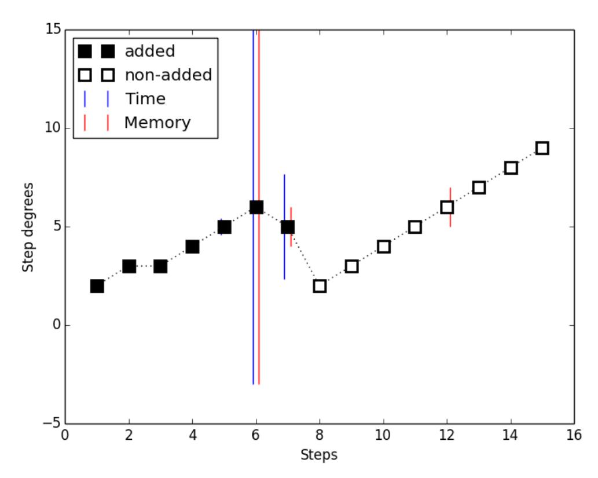

{0}------------------------------------------------

# **New Complexity Estimation on the Rainbow-Band-Separation Attack**

Shuhei Nakamura1 , Yasuhiko Ikematsu2 , Yacheng Wang3 , Jintai Ding4 , and Tsuyoshi Takagi3

- 1 Department of Liberal Arts and Basic Sciences, Nihon University nakamura.shuhei@nihon-u.ac.jp
- 2 Institute of Mathematics for Industry, Kyushu University, Japan ikematsu@imi.kyushu-u.ac.jp
- 3 Department of Mathematical Informatics, University of Tokyo, Japan *{*yacheng wang, takagi*}*@mist.i.u-tokyo.ac.jp
- 4 Department of Mathematical Sciences, University of Cincinnati, USA ding@math.uc.edu

**Abstract.** Multivariate public key cryptography is a candidate for postquantum cryptography, and it allows generating particularly short signatures and fast verification. The Rainbow signature scheme proposed by J. Ding and D. Schmidt is such a multivariate cryptosystem and is considered secure against all known attacks. The Rainbow-Band-Separation attack recovers a secret key of Rainbow by solving certain systems of quadratic equations, and its complexity is estimated by the well-known indicator called the degree of regularity. However, the degree of regularity generally is larger than the solving degree in experiments, and an accurate estimation cannot be obtained. In this paper, we propose a new indicator for the complexity of the Rainbow-Band-Separation attack using the *F*4 algorithm, which gives a more precise estimation compared to one using the degree of regularity. This indicator is deduced by the two-variable power series

$$\frac{\prod_{i=1}^{m} (1 - t_1^{d_{i1}} t_2^{d_{i2}})}{(1 - t_1)^{n_1} (1 - t_2)^{n_2}},$$

which coincides with the one-variable power series at *t*1 = *t*2 deriving the degree of regularity. Moreover, we show a relation between the Rainbow-Band-Separation attack using the hybrid approach and the HighRank attack. By considering this relation and our indicator, we obtain a new complexity estimation for the Rainbow-Band-Separation attack. Consequently, we are able to understand the precise security of Rainbow against the Rainbow-Band-Separation attack using the *F*4 algorithm.

**Keywords:** Multivariate public key cryptography *·* Rainbow-Band-Separation attack *·* degree of regularity.

#### **1 Introduction**

Standard RSA and EC cryptosystems are designed based on difficult mathematical problems such as prime factorization and discrete logarithm problems. 

{1}------------------------------------------------

However, these mathematical problems are known to be solved in polynomial time by a large scale quantum computer. Therefore, it is required to construct cryptography that is based on new mathematical problems and is resistant to quantum computers. Such cryptography is referred to as post-quantum cryptography. In 2015, National Security Agency (NSA) announced a plan of a transition to post-quantum cryptography, and National Institute of Standards and Technology (NIST) started a public recruitment of such cryptography candidates in 2016 [22].

Multivariate public key cryptography [10] is based on an NP-hard problem of solving a system of quadratic equations, that is called the MQ problem [18]. It is especially expected to have potential in building post-quantum signature schemes. Rainbow is a multivariate signature scheme proposed by J. Ding and D. Schmidt in 2005 [9]. This signature scheme can be implemented simply and efficiently using linear algebra methods over a small finite field, and in particular produces shorter signatures than those of RSA and other post-quantum signature schemes [13]. In NIST Post-Quantum Cryptography (PQC) 2nd round, secure Rainbow parameter sets are proposed and several attacks against them are analyzed [13]. In particular, the Rainbow-Band-Separation (RBS) attack [11] is the best among known attacks against Rainbow with a certain parameter set and is important.

Previous estimation methods [13, 27] for the complexity of the RBS attack use the *degree of regularity* [1, 2] as its indicator under the assumption that the system of quadratic equations solved in the attack is *semi-regular* (see [1] for the definition). For a semi-regular system, the degree of regularity is given as the degree *Dreg* of the first term whose coefficient is non-positive in the power series

$$\frac{(1-t^2)^m}{(1-t)^n},$$
 (1)

where *m* and *n* are the numbers of equations and variables, respectively. Since a public quadratic system solved in the direct attack is often semi-regular, the complexity estimation of the direct attack uses the degree of regularity [2, 13]. However, by our experiments, the quadratic system solved in the RBS attack is non-semi-regular. Therefore, it is important to find an optimal indicator for estimating the complexity of the RBS attack.

#### **1.1 Our Contributions**

The purpose of this paper is to give a more precise complexity estimation for the RBS attack. Since the attack solves a certain quadratic system whose solving complexity dominates the overall attack, that we call a *RBS dominant system*, we need to estimate the complexity of a *Gr¨obner basis* algorithm solving this system. In particular, for estimating the complexity, this paper considers (theoretical) indicators approximating its *solving degree*, that the maximal degree in steps which add a new non-zero polynomial during the Gr¨obner basis algorithm *F*4 [15]. As mentioned above, previous estimation methods have used the degree of 

{2}------------------------------------------------

regularity as its indicator. However, an RBS dominant system is solved faster than a semi-regular system, and its solving degree is lower than the degree of regularity. These are probably caused by the fact that an RBS dominant system has a relation between its variables which is said to be *bi-graded*.

In this paper, we consider a polynomial h in  $\mathbb{F}[x_1, \ldots, x_{n_1}, y_1, \ldots, y_{n_2}]$  graded by  $(d_1, d_2) = (\deg_{x_1, \ldots, x_{n_1}} h, \deg_{y_1, \ldots, y_{n_2}} h) \in \mathbb{Z}^2_{\geq 0}$  which is called a *bi-graded* polynomial, such as a bilinear polynomial graded by (1, 1). Then, for a bi-graded polynomial system  $(h_1, \ldots, h_m)$ , we introduce a new indicator  $D_{bgd}$  that is defined as the minimum total degree of the terms whose coefficient are negative in the two-variable power series

$$\frac{\prod_{i=1}^{m} (1 - t_1^{d_{i1}} t_2^{d_{i2}})}{(1 - t_1)^{n_1} (1 - t_2)^{n_2}}.$$
 (2)

For a Rainbow parameter set  $(v, o_1, o_2)$ , the top homogeneous component of an RBS dominant system consists of  $v + o_1 + o_2 - 1$  bilinear polynomials and  $o_1 + o_2$  quadratic homogeneous polynomials in  $v + o_1$  and  $o_2$  variables. Namely, RBS dominant systems are bi-graded. By our experiments using  $F_4$  on RBS dominant systems with  $v = o_i$  and  $v \leq 2o_i$  (i = 1, 2), we show that our new indicator  $D_{bgd}$  tightly approximates the solving degree of the system than the degree of regularity  $D_{reg}$ . Note that the one-variable power series (1) deriving the previous indicator  $D_{reg}$  is the same as the two-variable power series (2) at  $t = t_1 = t_2$ . Hence, we can expect a relation  $D_{bgd} \leq D_{reg}$  since  $t^{D_{reg}}$  in the series (1) has a negative coefficient in our experiments, which deduces one of  $t_1^{d_1} t_2^{d_2}$  in the series (2) where  $d_1 + d_2 = D_{reg}$ .

We also show a relation between the RBS attack and the HighRank attack which recovers a lower rank quadratic polynomial by using a brute-force search. Since an RBS dominant system has many bilinear polynomials, the hybrid approach [2] on the RBS attack gives an overdetermined linear system by fixing one of these two variable sets. In this case, the RBS attack becomes similar to the HighRank attack (see Subsection 5 for detail). This fact has not been mentioned in previous research [13, 24, 27].

By using our indicator and reconsidering the hybrid approach on the RBS attack, we can obtain a new complexity estimation for the RBS attack using  $F_4$ . Consequently, we are able to understand the precise security of Rainbow against the RBS attack using  $F_4$ .

#### 1.2 Organization

This paper is organized as follows. In Section 2, we explain Rainbow and the RBS attack. In Section 3, we explain the previous complexity estimation of the RBS attack using the degree of regularity and present experiments for scaled down Rainbow parameter sets in NIST PQC 2nd round. In Section 4, we introduce a new indicator for estimating the complexity of the RBS attack and demonstrate that this indicator more tightly approximates the solving degree of the quadratic system solved in the attack. In Section 5, by using our indicator and reconsidering

{3}------------------------------------------------

the hybrid approach on the RBS attack, we give a new complexity estimation for the RBS attack. In Section 6, we conclude the results.

# 2 The Rainbow Signature Scheme

In this section, we briefly explain the Rainbow signature scheme and several attacks against it. We explain Rainbow in Subsection 2.1 and its parameter sets in Subsection 2.2. In Subsection 2.3, we describe the Rainbow-Band-Separation (RBS) attack in detail.

#### 2.1 Rainbow

Let n and m be positive integers. We denote by  $\mathbb{F}$  the finite field of order q. An element  $(f_1, \ldots, f_m)$  of  $\mathbb{F}[x_1, \ldots, x_n]^m$  is called a *polynomial system* and gives a map  $\mathbb{F}^n \to \mathbb{F}^m$  by  $\mathbf{a} \mapsto (f_1(\mathbf{a}), \ldots, f_m(\mathbf{a}))$  which is called a *polynomial map*.

A multivariate public key signature scheme consists of the following three algorithms:

Key generation: We construct two invertible linear maps  $S: \mathbb{F}^n \to \mathbb{F}^n$  and  $\overline{T: \mathbb{F}^m \to \mathbb{F}^m}$  randomly and an easily invertible quadratic map  $F: \mathbb{F}^n \to \mathbb{F}^m$  which is called a *central map*, and then compute the composition  $P:=T\circ F\circ S$ . The *public key* is given as P. The tuple (T,F,S) is a *secret key*.

Signature generation: For a message  $\mathbf{b} \in \mathbb{F}^m$ , we compute  $\mathbf{b}' = T^{-1}(\mathbf{b})$ . Next, we can compute an element  $\mathbf{a}'$  of  $F^{-1}(\{\mathbf{b}'\})$  since F is easily invertible. Consequently, we obtain a signature  $\mathbf{a} = S^{-1}(\mathbf{a}') \in \mathbb{F}^n$ .

<u>Verification</u>: We verify whether  $P(\mathbf{a}) = \mathbf{b}$  holds.

Rainbow is a multivariable signature scheme proposed by J. Ding and D. Schmidt in 2005 [9]. For positive integers v,  $o_1$  and  $o_2$ , let  $\mathbf{x} = \{x_1, \dots, x_v\}$ ,  $\mathbf{y} = \{y_1, \dots, y_{o_1}\}$  and  $\mathbf{z} = \{z_1, \dots, z_{o_2}\}$  be three variable sets and put  $n = v + o_1 + o_2$  and  $m = o_1 + o_2$ . The central map  $F = (f_1, \dots, f_m) \in \mathbb{F}[\mathbf{x}, \mathbf{y}, \mathbf{z}]^m$  of Rainbow is defined by

$$\begin{cases}
f_{1} = g^{(1)}(\mathbf{x}) + \sum_{i=1}^{o_{1}} l_{i}^{(1)}(\mathbf{x}) y_{i}, \\
\vdots \\
f_{o_{1}} = g^{(o_{1})}(\mathbf{x}) + \sum_{i=1}^{o_{1}} l_{i}^{(o_{1})}(\mathbf{x}) y_{i}, \\
f_{o_{1}+1} = g^{(o_{1}+1)}(\mathbf{x}, \mathbf{y}) + \sum_{i=1}^{o_{2}} l_{i}^{(o_{1}+1)}(\mathbf{x}, \mathbf{y}) z_{i}, \\
\vdots \\
f_{o_{1}+o_{2}} = g^{(o_{1}+o_{2})}(\mathbf{x}, \mathbf{y}) + \sum_{i=1}^{o_{2}} l_{i}^{(o_{1}+o_{2})}(\mathbf{x}, \mathbf{y}) z_{i},
\end{cases} (3)$$

where  $g^{(j)}$  and  $l_i^{(j)}$  are randomly chosen quadratic polynomials and linear polynomials, respectively. Then, in the signature generation algorithm above, we can easily compute an element  $\mathbf{a}'$  in the pre-image of any element  $\mathbf{b}' = (b'_1, \dots, b'_{o_1+o_2})$  in  $\mathbb{F}^m$  under F as follows.

{4}------------------------------------------------

- 1. Randomly choose  $\mathbf{a}'_v = (a'_1, \dots, a'_v)$  as  $\mathbf{x}$ .
- 2. Solve a system of linear equations

$$f_1(\mathbf{a}'_v, \mathbf{y}) = b'_1, \dots, f_{o_1}(\mathbf{a}'_v, \mathbf{y}) = b'_{o_1}.$$

Let  $\mathbf{a}'_{o_1} = (a'_{v+1}, \dots, a'_{v+o_1})$  be one of its solutions if it exists. Otherwise, return to the step 1.

3. Solve a system of linear equations

$$f_{o_1+1}(\mathbf{a}'_v, \mathbf{a}'_{o_1}, \mathbf{z}) = b'_{o_1+1}, \dots, f_{o_1+o_2}(\mathbf{a}'_v, \mathbf{a}'_{o_1}, \mathbf{z}) = b'_{o_1+o_2}.$$

Let  $\mathbf{a}'_{o_2} = (a'_{v+o_1+1}, \dots, a'_{v+o_1+o_2})$  be one of its solutions if it exists. Otherwise, return to the step 1.

4. Obtain an element  $\mathbf{a}' = (a'_1, \dots, a'_{v+o_1+o_2})$  in the pre-image of  $\mathbf{b}'$ .

#### 2.2 Parameters of Rainbow

In this subsection, we briefly explain several attacks against Rainbow.

The central map of Rainbow with a parameter set  $(v, o_1, o_2)$  can be regard as a UOV [20] instance with the parameter set  $(v + o_1, o_2)$ . Hence the UOV attack [19] is available as an attack against Rainbow, and we have to take the Rainbow parameter set such that

$$v + o_1 \approx so_2 \ (s = 2, 3, 4, \dots).$$

We can also consider attacks using the special structure of the Rainbow central map (3) above. The HighRank attack [7] and the MinRank attack [3] are such attacks. Due to influences of the UOV attack and the HighRank attack, we set

$$o_1 = o_2$$
.

Moreover, for a public key P and a given message  $\mathbf{b}$ , the direct attack [2] forges a signature by solving  $P(\mathbf{x}) = \mathbf{b}$  directly. Complexity estimations for the direct attack and the RBS attack [11], which also solves a certain quadratic system to recovery a secret key (see Subsection 2.3 for detail), are important in deciding concrete parameters  $v, o_1$  and  $o_2$ . In this paper, we assume  $o_1 = o_2$  implicitly and consider a parameter set with  $v = o_i$  or  $v \lesssim 2o_i$  (i = 1, 2).

NIST PQC standardization project [22] gives six security categories (see Table 1). Here, due to the NIST specification, the number of gates is given by

$$\sharp$$
 gates =  $\sharp$  field multiplications  $\cdot (2 \cdot \log_2(q)^2 + \log_2(q))$ .

Table 2 and Table 3 show the Rainbow parameter sets Ia, IIIc and Vc [13] proposed in NIST PQC 2nd round and the complexities of the above attacks. Here, the bold numbers in Table 2 and Table 3 mean the best complexity of attacks in each parameter set. Table 2 shows that the direct attack is the best among attacks against the parameter sets IIIc and Vc in classical gates, and Table 3 shows that the HighRank attack is the best among attacks against all parameter sets in quantum gates. The parameter sets Ia, IIIc and Vc are designed to satisfy the NIST security categories I, III/IV and V/VI in Table 1, respectively [13].

{5}------------------------------------------------

V

VI

 $\begin{array}{|c|c|c|c|c|c|c|c|c|c|c|c|c|c|c|c|c|c|c$ 

258/234/202

272

274

Table 1. NIST security categories (Table 10 in [13])

Table 2. (Classical Attacks) Complexities ( $\log_2(\sharp \text{classical gates})$ ) of known attacks against Rainbow (from tables of Section 7.2 in [13])

| parameter set | $(q,v,o_1,o_2)$   | direct | MinRank | HighRank | UOV   | RBS   |
|---------------|-------------------|--------|---------|----------|-------|-------|
| Ia            | (16, 32, 32, 32)  | 164.5  | 161.3   | 150.3    | 149.2 | 145.0 |
| IIIc          | (256, 68, 36, 36) | 215.2  | 585.1   | 313.9    | 563.8 | 217.4 |
| Vc            | (256, 92, 48, 48) | 275.4  | 778.8   | 411.2    | 747.4 | 278.6 |

Table 3. (Quantum Attacks) Complexities ( $\log_2(\sharp \text{quantum gates})$ ) of known attacks against Rainbow (from tables of Section 7.2 in [13])

| parameter set | $(q,v,o_1,o_2)$   | direct | MinRank | HighRank | UOV   | RBS   |
|---------------|-------------------|--------|---------|----------|-------|-------|
| Ia            | (16, 32, 32, 32)  | 146.5  | 95.3    | 86.3     | 87.2  | 145.0 |
| IIIc          | (256, 68, 36, 36) | 183.5  | 309.1   | 169.9    | 295.8 | 217.4 |
| Vc            | (256, 92, 48, 48) | 235.5  | 406.8   | 219.2    | 393.4 | 278.6 |

#### 2.3 Rainbow-Band-Separation Attack

In this subsection, we describe the Rainbow-Band-Separation (RBS) attack [11] and a certain quadratic system solved in the attack which are subjects of our research in this paper. For simplicity, we assume that the characteristic of  $\mathbb{F}$  is odd in this subsection. We then use the symmetric matrix representation of a quadratic homogeneous polynomial.

Let  $(v, o_1, o_2)$  be a Rainbow parameter set and put  $n = v + o_1 + o_2$  and  $m = o_1 + o_2$ . For a Rainbow public key  $P = (p_1, \ldots, p_m)$ , the RBS attack recovers its secret key (T, F, S) as follows. By the definition (3) of the central map  $F = (f_1, \ldots, f_m)$ , each matrix corresponding to  $f_i$  has the following form:

$$M_{f_{i}} = \begin{cases} \begin{pmatrix} *_{v \times v} & *_{v \times o_{1}} & 0_{v \times o_{2}} \\ *_{o_{1} \times v} & 0_{o_{1} \times o_{1}} & 0_{o_{1} \times o_{2}} \\ 0_{o_{2} \times v} & 0_{o_{2} \times o_{1}} & 0_{o_{2} \times o_{2}} \end{pmatrix} & \text{if } 1 \leq i \leq o_{1}, \\ \begin{pmatrix} *_{v \times v} & *_{v \times o_{1}} & *_{v \times o_{2}} \\ *_{o_{1} \times v} & *_{o_{1} \times o_{1}} & *_{o_{1} \times o_{2}} \\ *_{o_{2} \times v} & *_{o_{2} \times o_{1}} & 0_{o_{2} \times o_{2}} \end{pmatrix} & \text{if } o_{1} + 1 \leq i \leq o_{1} + o_{2}. \end{cases}$$

$$(4)$$

{6}------------------------------------------------

Here,  $*_{k \times l}$  mean k-by-l matrices over  $\mathbb{F}$ . Similarly, the matrices corresponding to S and T can be written as follows:

$$M_{S} = \begin{pmatrix} I_{v} & 0_{v \times o_{1}} & 0_{v \times o_{2}} \\ *_{o_{1} \times v} & I_{o_{1}} & 0_{o_{1} \times o_{2}} \\ *_{o_{2} \times v} & *_{o_{2} \times o_{1}} & I_{o_{2}} \end{pmatrix},$$

$$M_{T} = \begin{pmatrix} I_{o_{1}} & 0_{o_{1} \times o_{2}} \\ *_{o_{2} \times o_{1}} & I_{o_{2}} \end{pmatrix}.$$
(5)

If S and T are taken as random invertible linear maps, then  $M_S$  and  $M_T$  cannot be written as in the form (5). However, it is known that the security of Rainbow does not decrease, even if S and T are took as in the form (5). Therefore, S and T in [11] are set to be in the form (5), which induces a reduction in the secret key size. The matrices  $M_{p_1}, \ldots, M_{p_m}$  corresponding to the public polynomials  $p_1, \ldots, p_m$  are given as

$$(M_{p_1}, \dots, M_{p_m}) = (M_S M_{f_1}{}^t M_S, \dots, M_S M_{f_m}{}^t M_S) M_T.$$
 (6)

By the form (5), there exists an *n*-by-1 vector  $\mathbf{s} = (\lambda_1, \dots, \lambda_{v+o_1}, 0, \dots, 0, 1)$  such that  $\mathbf{s} \cdot M_S = (0, \dots, 0, 1)$ . Then, for  $i = 1, \dots, m$ , we have

$$\mathbf{s} \cdot M_S M_{f_i}^{\ t} M_S \cdot {}^t \mathbf{s} = (0, \dots, 0, 1) \cdot M_{f_i} \cdot {}^t (0, \dots, 0, 1) = 0.$$

Since each  $M_{p_k}$  is a linear combination of  $M_S M_{f_1}{}^t M_S, \dots, M_S M_{f_m}{}^t M_S$ , we obtain

$$\mathbf{s} \cdot M_{p_k} \cdot {}^t \mathbf{s} = 0, \quad k = 1, \dots, m. \tag{7}$$

By the form (5), there exists an m-by-1 vector  $\mathbf{t} = (1, 0, \dots, 0, \lambda_{v+o_1+1}, \dots, \lambda_{v+o_1+o_2})$  such that  $M_T \cdot {}^t\mathbf{t} = {}^t(1, 0, \dots, 0)$ . Then, multiplying the equation (6) by  ${}^t\mathbf{t}$ , we get

$$M_{p_1} + \sum_{i=1}^{o_2} \lambda_{v+o_1+i} M_{p_{o_1+i}} = M_S M_{f_1}{}^t M_S.$$

Moreover, multiplying this equation by  $\mathbf{s}$ , we have

$$\mathbf{s} \cdot M_{p_1} + \sum_{i=1}^{o_2} \lambda_{v+o_1+i} \mathbf{s} \cdot M_{p_{o_1+i}} = \mathbf{s} \cdot M_S M_{f_1}{}^t M_S = (0, \dots, 0).$$

Thus, we have the following equations

$$\mathbf{s} \cdot M_{p_1} \cdot {}^t \mathbf{e}_k + \sum_{i=1}^{o_2} \lambda_{v+o_1+i} \mathbf{s} \cdot M_{p_{o_1+i}} \cdot {}^t \mathbf{e}_k = 0, \quad k = 1, \dots, n-1,$$
 (8)

where  $\mathbf{e}_k$  is the *n*-by-1 vector  $(0, \dots, 0, \overset{k}{1}, 0, \dots, 0)$ . Here, we remove the case k = n, since the equation (8) for k = n follows from the equation (7).

Since  $\mathbf{s} = (\lambda_1, \dots, \lambda_{v+o_1}, 0, \dots, 0, 1)$ , it is clear that the equations (7) and (8) are n+m-1 quadratic equations in n variables  $\lambda_1, \dots, \lambda_n$ , and are constructed from the public key  $p_1, \dots, p_m$ . Solving these quadratic system, an attacker can

{7}------------------------------------------------

recover a part of the secret key *S* and *T*, namely, **s** and **t**. The RBS attack can recovery *S* and *T* by repeating similar discussions as above (see [11] for detail). Since the complexity of solving the quadratic system dominates one of the RBS attack, it suffices to treat only the system. We refer to the quadratic system consisting of the equations (7) and (8) as the *RBS dominant system*.

# **3 Revisiting Previous Complexity Estimation for the RBS Attack**

In this section, we explain the previous complexity estimation for the RBS attack. In Subsection 3.1, by using a certain experimental degree called the *solving degree*, we explain the complexity of a Gr¨obner basis algorithm for solving a quadratic system. In Subsection 3.2, we recall the *degree of regularity* to approximate the solving degree for such a quadratic system. In Subsection 3.3, we show that RBS dominant systems have a gap between the solving degree and the degree of regularity.

#### **3.1 Complexity of Attacks using a Gr¨obner Basis Algorithm**

In the RBS attack, Gr¨obner basis algorithms are used for solving the RBS dominant system.

A Gr¨obner basis algorithm that computes a Gr¨obner basis for the ideal generated by a given polynomial system was discovered by B. Buchberger [5], and improved as faster algorithms, for example, XL [28], *F*4 [15] and *F*5 [16]. In this paper, we use the following complexity of the *F*4 algorithm solving a polynomial system in *n* variables:

$$\binom{n + d_{slv}}{d_{slv}}^{\omega}$$

where 2 *< ω ≤* 3 is a linear algebra constant and *dslv* is the maximal degree in steps which add a new non-zero polynomial during the Gr¨obner basis algorithm and is called the *solving degree*.

The solving degree is important for obtaining the complexity, but is an experimental value. In order to estimate the complexity of solving a large scale polynomial system, we need to find its (theoretical) *indicator* approximating the solving degree (see Subsection 3.2).

Using the solving degree *dslv* , we describe the complexity of the RBS attack against Rainbow with a parameter set (*v, o*1*, o*2) as follows. Put *n* = *v* + *o*1 + *o*2 and *m* = *o*1 + *o*2. Since the RBS dominant system then has *n* + *m −* 1 quadratic equations in *n* variables (see the equations (7) and (8)), the complexity of the attack is given by

$$\binom{n+d_{slv}}{d_{slv}}^{\omega}.$$

Furthermore, by using the *hybrid approach* [2] of brute-force search and Gr¨obner basis algorithm which solves the RBS dominant system in *n − k* variables after 

{8}------------------------------------------------

fixing *k* variables, the complexity is improved as

$$\min_{k} q^k \cdot \binom{n - k + d_{slv}}{d_{slv}}^{\omega}. \tag{9}$$

#### **3.2 Degree of Regularity**

In this subsection, we explain the degree of regularity as an indicator approximating the solving degree.

Denoting by F[*x*1*, . . . , xn*]*d* the vector space generated by the monomials of the total degree *d* over F in F[*x*1*, . . . , xn*], we have the following decomposition:

$$\mathbb{F}[x_1,\ldots,x_n] = \bigoplus_{d\geq 1} \mathbb{F}[x_1,\ldots,x_n]_d.$$

We denote by *⟨f*1*, . . . , fm⟩* the ideal generated by *f*1*, . . . , fm*, and by *⟨f*1*, . . . , fm⟩d* its component of degree *d* in the decomposition if *f*1*, . . . , fm* are homogeneous.

For a polynomial system (*f*1*, . . . , fm*), M. Bardet et al. [1] considered the *degree of regularity* as the minimal value of the following set if it exists:

$$\{d \mid \langle f_1^{top}, \dots, f_m^{top} \rangle_d = \mathbb{F}[x_1, \dots, x_n]_d\}.$$

For a polynomial system whose top homogeneous component is *semi-regular* [1], the degree of regularity is equal to the degree *Dreg* of the first term whose coefficient is non-positive in the following power series (see [1] for detail):

$$\frac{\prod_{i=1}^{m} (1 - t^{\deg f_i})}{(1 - t)^n}.$$
 (10)

Note that a quadratic system whose coefficients are randomly chosen is often semi-regular. For this reason, in using the degree of regularity for a quadratic system, we assume that the system is semi-regular, and also call *Dreg* the degree of regularity.

By using the degree of regularity under the assumption that an RBS dominant system is semi-regular, the previous estimation method gives complexities of the RBS attack as follows. For a Rainbow parameter set (*v, o*1*, o*2), the RBS dominant system has *m* + *n −* 1 quadratic polynomials in *n* variables where *n* = *v* + *o*1 + *o*2 and *m* = *o*1 + *o*2 (see the equations (7) and (8)). Then, by the formula (9), the complexity in classical gates of the RBS attack is given by

$$\min_{k} q^{k} \cdot \binom{n - k + D_{reg}}{D_{reg}}^{\omega} \tag{11}$$

where 2 *< ω ≤* 3 is a linear algebra constant, *k* is the number of variables fixed by the hybrid approach and *Dreg* is given by the degree of the first term whose coefficient is non-positive in the power series

$$\frac{(1-t^2)^{m+n-1}}{(1-t)^{n-k}}. (12)$$

{9}------------------------------------------------

In quantum gates, by using Grover's algorithm, the complexity is given by

$$\min_{k} \ q^{k/2} \cdot \binom{n - k + D_{reg}}{D_{reg}}^{\omega}. \tag{13}$$

In the next subsection, by our experiments, we show that an RBS dominant system is non-semi-regular.

#### **3.3 Experiments on the Degree of Regularity**

In this subsection, by our experiments on Rainbow parameter sets with *v* ≲ 2*oi* , we show that RBS dominant systems have a gap between the solving degree and the degree of regularity. The assertions in this paper were verified by using the Gr¨obner basis algorithm *F*4 with respect to the graded reverse lexicographic monomial order in Magma V2.24-4 [4] on CPU: 3.2 GHz Intel Core i7.

For small Rainbow parameter sets (*v, o*1*, o*2) with *v* ≲ 2*oi* , Table 4 demonstrates the fundamental assertion that the degree of regularity *Dreg* tightly approximates the solving degree *dslv* for a semi-regular system of *v* + 2*o*1 + 2*o*2 *−* 1 quadratic equations in *v* + *o*1 + *o*2 variables which of the same size as the RBS dominant system (see the equations (7) and (8)). Under the assumption that an RBS dominant system is semi-regular, the previous estimation method [13, 27] for the RBS attack uses the degree of regularity *Dreg* (see Subsection 3.2) as the solving degree *dslv* . Table 4 also shows that this assumption does not hold for small Rainbow parameter sets (*v, o*1*, o*2) with *v* ≲ 2*oi* .

In Table 4, we see that each RBS dominant system is solved faster than a semi-regular system of the same size and has a gap between the degree of regularity and the solving degree. Since the degree of regularity does not tightly approximate the solving degree of an RBS dominant system, it is important to find an optimal indicator for estimating the complexity of the RBS attack. Note that an experiment on the RBS attack is also carried out in the paper [27], and Table 2 in the paper shows that an RBS dominant system is solved faster than a semi-regular system of the same size. However, the paper [27] does not mention a relation between the degree of regularity and the solving degree.

In the reminder of this subsection, we show the state of the step degrees in the Gr¨obner basis algorithm with the RBS dominant system for a certain Rainbow parameter set. We denote by *dmem* the degree of the most memoryconsuming step and by *dtim* the degree of the most time-consuming step during the Gr¨obner basis algorithm. A number of experiments in this subsection show that the relation

$$d_{slv} \le d_{tim} = d_{mem} \tag{14}$$

holds on an RBS dominant system for small parameter sets with *v* ≲ 2*oi* . Figure 1 shows the state of the step degrees in the Gr¨obner basis algorithm with the RBS dominant system for the Rainbow parameter set (*q, v, o*1*, o*2) = (256*,* 11*,* 6*,* 6) as input. Then, in the Gr¨obner basis algorithm, steps after the 8-th step do not find new polynomials. Namely, *dslv* = 6. We can verify the relation (14). Here, for obtaining the Gr¨obner basis, it suffices to compute up to the 7-th step for the RBS attack.

{10}------------------------------------------------

**Table 4. (Gap Between** *Dreg* **and** *dslv* **for an RBS Dominant System)** For the parameter relation *v* ≲ 2*oi* (*i* = 1*,* 2), the degree of regularity *Dreg* (see the series (12)) and experimental values *dslv* (see Subsection 3.1), *dtim* and *dmem* (see the last paragraph in Subsection 3.3) in the Gr¨obner basis algorithm *F*4 for RBS dominant systems and semi-regular systems of the same size. Each RBS dominant system is solved faster than a semi-regular system of the same size, and has a gap between the degree of regularity *Dreg* and the solving degree *dslv* .

| q = 256 # eq. |    |             |   | Semi-regular system |   |   |   | RBS dominant system                                 |  |   |   |
|---------------|----|-------------|---|---------------------|---|---|---|-----------------------------------------------------|--|---|---|
| (v, oi)       |    | # var. Dreg |   |                     |   |   |   | Time (sec) dslv dtim dmem Time (sec) dslv dtim dmem |  |   |   |
| (4, 3)        | 15 | 10          | 4 | 0.03 4              |   | 4 | 4 | 0.01 4                                              |  | 4 | 4 |
| (5, 3)        | 16 | 11          | 5 | 0.09 5              |   | 5 | 5 | 0.01 4                                              |  | 4 | 4 |
| (6, 3)        | 17 | 12          | 5 | 0.24 5              |   | 5 | 5 | 0.03 4                                              |  | 4 | 4 |
| (6, 4)        | 21 | 14          | 5 | 1.57 5              |   | 5 | 5 | 0.12 4                                              |  | 4 | 4 |
| (7, 4)        | 22 | 15          | 6 | 9.86 6              |   | 6 | 6 | 0.25 4                                              |  | 4 | 4 |
| (8, 4)        | 23 | 16          | 6 | 31.56 6             |   | 6 | 6 | 0.58 4                                              |  | 4 | 4 |
| (8, 5)        | 27 | 18          | 6 | 213.57 6            |   | 6 | 6 | 7.50 5                                              |  | 5 | 5 |
| (9, 5)        | 28 | 19          | 6 | 796.80 6            |   | 6 | 6 | 35.08 5                                             |  | 5 | 5 |
| (10, 5)       | 29 | 20          | 7 | 7818.25 7           |   | 7 | 7 | 71.54 5                                             |  | 5 | 5 |
| (10, 6)       | 33 | 22          | 7 | 47311.77 7          |   | 7 | 7 | 954.82 6                                            |  | 6 | 6 |
| (11, 6)       | 34 | 23          | 7 | ≥ 2 days            | - | - | - | 3265.14 6                                           |  | 6 | 6 |
| (12, 6)       | 35 | 24          | 7 | ≥ 2 days            | - | - | - | 6609.50 6                                           |  | 6 | 6 |

**Fig. 1.** The state of the step degrees in the Gr¨obner basis algorithm *F*4 with the RBS dominant system for the parameter set (*q, v, o*1*, o*2) = (256*,* 11*,* 6*,* 6). A step marked with the square black box adds a new polynomial. A step marked with the square white box does not add a new polynomial. The relation *dslv ≤ dtim* = *dmem* holds. (*dslv* : Subsection 3.1, *dtim* and *dmem* : the last paragraph in Subsection 3.3)

{11}------------------------------------------------

#### 4 New Indicator for the Complexity of the RBS Attack

In this section, we propose an indicator for estimating the complexity of the RBS attack. We first explain the bi-graded polynomial. We then introduce a new indicator for bi-graded polynomial systems and show that this indicator tightly approximates the solving degree of an RBS dominant system than the degree of regularity by experiments using the  $F_4$  algorithm.

#### 4.1 Bi-graded Polynomial Systems

In this subsection, we explain the bi-graded polynomial and show that an RBS dominant system is bi-graded.

**Definition 1.** A commutative ring R is said to be bi-graded if the two following conditions holds:

1. 
$$R = \bigoplus_{\mathbf{d} \in \mathbb{Z}_{\geq 0}^2} R_{\mathbf{d}}$$
  
2.  $R_{\mathbf{d}_1} R_{\mathbf{d}_2} \subseteq R_{\mathbf{d}_1 + \mathbf{d}_2}$  for all  $\mathbf{d}_i \in \mathbb{Z}_{>0}^2$ 

Moreover, an element in a bi-graded commutative ring R is said to be bi-graded if it is contained in  $R_{\mathbf{d}}$  for some  $\mathbf{d} \in \mathbb{Z}^2_{\geq 0}$ . Then, for a bi-graded element  $h \in R_{\mathbf{d}}$ , we define  $\deg_{\mathbb{Z}^2_{\geq 0}} h$  as  $\mathbf{d} \in \mathbb{Z}^2_{\geq 0}$ .

 $Remark\ 1.$  In this paper, an element of R whose top homogeneous component is bi-graded is also said to be bi-graded.

For a Rainbow parameter set  $(v, o_1, o_2)$ , the RBS dominant system consists of m quadratic polynomials (7) in a variable set  $\{\lambda_1, \ldots, \lambda_{v+o_1}\}$  and n-1 bilinear polynomials (8) in two variable sets  $\{\lambda_1, \ldots, \lambda_{v+o_1}\}$  and  $\{\lambda_{v+o_1+1}, \ldots, \lambda_n\}$  where  $n = v + o_1 + o_2$  and  $m = o_1 + o_2$  (see Subsection 2.3). The polynomial ring  $\mathbb{F}[\lambda_1, \ldots, \lambda_n]$  can be graded by

$$\deg_{\mathbb{Z}_{\geq 0}^2} \lambda_1 = \dots = \deg_{\mathbb{Z}_{\geq 0}^2} \lambda_{v+o_1} = (1,0) \text{ and,}$$
  
$$\deg_{\mathbb{Z}_{>0}^2} \lambda_{v+o_1+1} = \dots = \deg_{\mathbb{Z}_{>0}^2} \lambda_n = (0,1).$$

Top homogeneous components  $h_1, \ldots, h_m$  of quadratic polynomials (7) are contained in  $\mathbb{F}[\lambda_1, \ldots, \lambda_n]_{(2,0)}$ , and those  $h_{m+1}, \ldots, h_{m+n-1}$  of quadratic polynomials (8) are in  $\mathbb{F}[\lambda_1, \ldots, \lambda_n]_{(1,1)}$ . Namely,

$$\deg_{\mathbb{Z}_{\geq 0}^2} h_1 = \dots = \deg_{\mathbb{Z}_{\geq 0}^2} h_m = (2, 0),$$
  
$$\deg_{\mathbb{Z}_{\geq 0}^2} h_{m+1} = \dots = \deg_{\mathbb{Z}_{\geq 0}^2} h_{m+n-1} = (1, 1).$$
 (15)

Hence, the RBS dominant system is a bi-graded polynomial system.

In the next section, based on the fact that an RBS dominant system is bigraded, we introduce an indicator for estimating the complexity of the RBS attack.

{12}------------------------------------------------

# 4.2 New Indicator for the Complexity of Solving a Bi-graded Polynomial System

In this subsection, we introduce a new indicator for bi-graded polynomial systems and show that this indicator tightly approximates the solving degree of an RBS dominant system than the degree of regularity.

We introduce the following indicator for the complexity of a Gröbner basis algorithm with a bi-graded polynomial system:

**Definition 2.** For a bi-graded polynomial system  $(h_1, \ldots, h_m)$  in  $\mathbb{F}[x_1, \ldots, x_{n_1}, y_1, \ldots, y_{n_2}]^m$  where  $\deg_{\mathbb{Z}^2_{>0}} h_i = (d_{i1}, d_{i2})$ , let

$$\sum_{(d_1,d_2)\in\mathbb{Z}_{\geq 0}^2} a_{(d_1,d_2)} t_1^{d_1} t_2^{d_2} = \frac{\prod_{i=1}^m (1 - t_1^{d_{i,1}} t_2^{d_{i,2}})}{(1 - t_1)^{n_1} (1 - t_2)^{n_2}},\tag{16}$$

and we define  $D_{bgd} = D_{bgd}(h_1, \ldots, h_m)$  as the minimal value of the following set if it exists:

$${d_1 + d_2 \mid a_{(d_1, d_2)} < 0}.$$

The two-variable series in (16) is regarded as a bi-graded version of the Hilbert series (see [21] for example).

Remark 2. For a bi-graded polynomial system, we note that the one-variable power series (10) deducing  $D_{reg}$  coincides with the two-variable power series (16) when  $t = t_1 = t_2$ . Hence, if we define  $D'_{bgd}$  as the minimum value of the set

$$\{d_1 + d_2 \mid a_{(d_1, d_2)} \le 0\}$$

where  $a_{(d_1,d_2)}$  is the coefficient of  $t_1^{d_1}t_2^{d_2}$  in the series (16) and it exists, then  $D'_{bgd} \leq D_{reg}$ .  $D'_{bgd}$  is often smaller than the solving degree for some Rainbow parameter sets. Thus we do not use  $D'_{bgd}$  as a suitable indicator. On the other hand, the term  $t^{D_{reg}}$  in the series (10) often has a negative coefficient which deduces one of  $t_1^{d_1}t_2^{d_2}$  in the series (16) where  $d_1 + d_2 = D_{reg}$ . Namely, the relation  $D_{bgd} \leq D_{reg}$  often holds (see Table 5 and Table 6 below).

In the reminder of this subsection, by our experiments, we show that the introduced indicator  $D_{bgd}$  tightly approximates the solving degree on an RBS dominant system than the degree of regularity. By Definition 2 and the equation (15), the indicator  $D_{bgd}$  for an RBS dominant system with a parameter set  $(v, o_1, o_2)$  is given by the minimal total degree of the terms whose coefficient are negative in the two-variable power series

$$\frac{(1-t_1t_2)^{v+o_1+o_2-1}(1-t_1^2)^{o_1+o_2}}{(1-t_1)^{v+o_1}(1-t_2)^{o_2}}. (17)$$

Table 5 compares the indicator  $D_{bgd}$  and the degree of regularity  $D_{reg}$  for RBS dominant systems with  $v = o_i$  and  $v \lesssim 2o_i$ .

{13}------------------------------------------------

**Table 5. (***Dbgd* **vs** *Dreg* **for an RBS Dominant System)** Experimental degrees *dslv* (see Subsection 3.1), *dmem* and *dtim* (see the last paragraph in Subsection 3.3) in the *F*4 algorithm and theoretical degrees *Dbgd* (from the series (17)) and *Dreg* (from the series (12) at *k* = 0) for an RBS dominant system with *v* ≲ 2*oi* or *v* = *oi* (*i* = 1*,* 2). The proposed indicator *Dbgd* coincides with *dslv* in the cases except for (*q, v, oi*) = (256*,* 8*,* 4)*,*(16*,* 8*,* 8). The degree of regularity *Dreg* is always larger than *dslv* except for (*q, v, oi*) = (256*,* 4*,* 4).

| q = 256 |   | Exper. |                          |   | Theor. |
|---------|---|--------|--------------------------|---|--------|
| (v, oi) |   |        | dslv dtim dmem Dbgd Dreg |   |        |
| (4, 3)  | 4 | 4      | 4                        | 4 | 4      |
| (5, 3)  | 4 | 4      | 4                        | 4 | 5      |
| (6, 3)  | 4 | 4      | 4                        | 4 | 5      |
| (6, 4)  | 4 | 4      | 4                        | 4 | 5      |
| (7, 4)  | 4 | 4      | 4                        | 4 | 6      |
| (8, 4)  | 4 | 4      | 4                        | 5 | 6      |
| (8, 5)  | 5 | 5      | 5                        | 5 | 6      |
| (9, 5)  | 5 | 5      | 5                        | 5 | 6      |
| (10, 5) | 5 | 5      | 5                        | 5 | 7      |
| (10, 6) | 6 | 6      | 6                        | 6 | 7      |
| (11, 6) | 6 | 6      | 6                        | 6 | 7      |
| (12, 6) | 6 | 6      | 6                        | 6 | 7      |

| q = 16                           |   | Exper. | Theor. |   |   |
|----------------------------------|---|--------|--------|---|---|
| (v, oi) dslv dtim dmem Dbgd Dreg |   |        |        |   |   |
| (3, 3)                           | 3 | 3      | 3      | 3 | 4 |
| (4, 4)                           | 4 | 4      | 4      | 4 | 5 |
| (5, 5)                           | 4 | 4      | 4      | 4 | 5 |
| (6, 6)                           | 5 | 5      | 5      | 5 | 6 |
| (7, 7)                           | 5 | 5      | 5      | 5 | 6 |
| (8, 8)                           | 5 | 6      | 6      | 6 | 7 |
| (9, 9)                           | 6 | 6      | 6      | 6 | 7 |

**Table 6. (***Dbgd* **vs** *Dreg* **for the Hybrid Approach on an RBS Dominant System)** Experimental degrees *dslv* (see Subsection 3.1), *dmem* and *dtim* (see the last paragraph in Subsection 3.3) in the *F*4 algorithm and theoretical degrees *Dbgd* (from the series (18)) and *Dreg* (from the series (12)) of the hybrid approach on RBS dominant systems in variables *{λ*1*, . . . , λv*+*o*1+*o*2 *}* for (*q, v, o*1*, o*2) = (256*,* 10*,* 5*,* 5) and (16*,* 8*,* 8*,* 8). The integers *k*1 and *k*2 are the number of variables fixed by the hybrid approach in *{λ*1*, . . . , λv*+*o*1 *}* and *{λv*+*o*1+1*, . . . , λv*+*o*1+*o*2 *}*, respectively. The degree of regularity *Dreg* is always larger than the solving degree *dslv* . The proposed indicator *Dbgd* tightly approximates *dslv* than *Dreg* and is an upper bound of *dslv* .

|   | (256, 10, 5, 5)                           |   | Exper. |   | Theor. |   |  |
|---|-------------------------------------------|---|--------|---|--------|---|--|
|   | k1 + k2 (k1, k2) dslv dtim dmem Dbgd Dreg |   |        |   |        |   |  |
| 0 | (0, 0)                                    | 5 | 5      | 5 | 5      | 7 |  |
| 1 | (1, 0)                                    | 5 | 5      | 5 | 5      | 6 |  |
|   | (0, 1)                                    | 4 | 4      | 4 | 5      | 6 |  |
| 2 | (2, 0)                                    | 4 | 5      | 5 | 5      | 6 |  |
|   | (1, 1)                                    | 4 | 4      | 4 | 4      | 6 |  |
|   | (0, 2)                                    | 4 | 4      | 4 | 4      | 6 |  |
| 3 | (3, 0)                                    | 4 | 4      | 4 | 4      | 6 |  |
|   | (2, 1)                                    | 4 | 4      | 4 | 4      | 6 |  |
|   | (1, 2)                                    | 3 | 4      | 4 | 4      | 6 |  |
|   | (0, 3)                                    | 3 | 3      | 3 | 3      | 6 |  |
| 4 | (4, 0)                                    | 4 | 4      | 4 | 4      | 5 |  |
|   | (3, 1)                                    | 3 | 4      | 4 | 4      | 5 |  |
|   | (2, 2)                                    | 3 | 3      | 3 | 3      | 5 |  |
|   | (1, 3)                                    | 3 | 3      | 3 | 3      | 5 |  |
|   | (0, 4)                                    | 2 | 2      | 2 | 2      | 5 |  |

| (16, 8, 8, 8) |                                           | Exper. |   |   | Theor. |   |
|---------------|-------------------------------------------|--------|---|---|--------|---|
|               | k1 + k2 (k1, k2) dslv dtim dmem Dbgd Dreg |        |   |   |        |   |
| 0             | (0, 0)                                    | 5      | 6 | 6 | 6      | 7 |
| 1             | (1, 0)                                    | 5      | 5 | 5 | 5      | 6 |
|               | (0, 1)                                    | 5      | 5 | 5 | 5      | 6 |
| 2             | (2, 0)                                    | 5      | 5 | 5 | 5      | 6 |
|               | (1, 1)                                    | 5      | 5 | 5 | 5      | 6 |
|               | (0, 2)                                    | 5      | 5 | 5 | 5      | 6 |
| 3             | (3, 0)                                    | 4      | 5 | 5 | 5      | 6 |
|               | (2, 1)                                    | 4      | 5 | 5 | 5      | 6 |
|               | (1, 2)                                    | 4      | 5 | 5 | 5      | 6 |
|               | (0, 3)                                    | 4      | 4 | 4 | 5      | 6 |
| 4             | (4, 0)                                    | 4      | 4 | 4 | 4      | 6 |
|               | (3, 1)                                    | 4      | 4 | 4 | 5      | 6 |
|               | (2, 2)                                    | 4      | 4 | 4 | 4      | 6 |
|               | (1, 3)                                    | 4      | 4 | 4 | 4      | 6 |
|               | (0, 4)                                    | 4      | 4 | 4 | 4      | 6 |

{14}------------------------------------------------

Furthermore, Table 6 compares the indicator *Dbgd* and the degree of regularity *Dreg* for the hybrid approach on the RBS attack against Rainbow parameter sets (*q, v, o*1*, o*2) = (256*,* 10*,* 5*,* 5) and (16*,* 8*,* 8*,* 8). Here, *k*1 and *k*2 are the numbers of variables fixed by the hybrid approach in *{λ*1*, . . . , λv*+*o*1 *}* and *{λv*+*o*1+1*, . . . , λv*+*o*1+*o*2 *}*, respectively, where *λ*1*, . . . , λv*+*o*1+*o*2 are the variables of an RBS dominant system (see the equations (7) and (8)). Then the indicator *Dbgd* is given by the minimal total degree of the terms whose coefficient are negative in the two-variable power series

$$\frac{(1-t_1t_2)^{v+o_1+o_2-1}(1-t_1^2)^{o_1+o_2}}{(1-t_1)^{v+o_1-k_1}(1-t_2)^{o_2-k_2}}. (18)$$

*Remark 3.* Generally, the first term having a negative coefficient in the power series (10) gives a non-Koszul syzygy by [8] if it exists. Hence we expect that *Dbgd* gives a non-Koszul syzygy and, namely, signature-based algorithms (generalizes F5 [16]) which return the generators of the syzygy module must compute up to the degree *Dbgd* .

# **5 Our Complexity Estimation for the RBS Attack**

In this section, we give a new complexity estimation of the RBS attack using the *F*4 algorithm under the assumption that the indicator *Dbgd* is an upper bound of the solving degree *dslv* (see Remark 4 in Subsection 4.2). Furthermore, we investigate a relation between the RBS attack using the hybrid approach and the HighRank attack.

For simplicity, we explain only a complexity estimation in classical gates for the RBS attack against a Rainbow parameter set (*q, v, o*1*, o*2). Put *n* = *v*+*o*1+*o*2 and *m* = *o*1 + *o*2. Let *k*1 and *k*2 be the numbers of variables fixed by the hybrid approach in *{λ*1*, . . . , λv*+*o*1 *}* and *{λv*+*o*1+1*, . . . , λn}*, respectively, where *λ*1*, . . . , λn* are the variables of the RBS dominant system (see the equations (7) and (8)). When *k*1 *< v* + *o*1 and *k*2 *< o*2, the complexity is given by

$$q^{k_1+k_2} \cdot \binom{n-k_1-k_2+D_{bgd}}{D_{bgd}}^{\omega}$$

where 2 *< ω ≤* 3 is a linear algebra constant and *Dbgd* is given by the minimal total degree in terms whose coefficient is negative in the two-variable power series (18) in Subsection 4.2. When *k*1 = *v* + *o*1 and *k*2 *< o*2, we obtain a system of *v* + *o*1 + *o*2 *−* 1 linear equations in *o*2 *− k*2 variables from the RBS dominant system fixed *k*1 variables. Then, the complexity is given by

$$q^{k_1+k_2} \cdot (2(o_2+1)(v+o_1)(o_2-k_2)+(o_2-k_2)^{\omega}).$$

Similarly, when *k*1 *< v*+*o*1 and *k*2 = *o*2, we obtain a system consisting of *o*1 +*o*2 quadratic equations and *v* + *o*1 + *o*2 *−* 1 linear equations in *v* + *o*1 *− k*1 variables. 

{15}------------------------------------------------

Then, since it suffices to solve a system of linear equations in  $v+o_1-k_1$  variables, the complexity is given by

$$q^{k_1+k_2} \cdot (2(v+o_1+1)(v+o_1-k_1)o_2+(v+o_1-k_1)^{\omega}).$$

When  $k_1 = v + o_1$  and  $k_2 = o_2$ , the complexity of a brute-force search is given by  $q^{k_1+k_2}$ .

In summary, the complexity in classical gates of the RBS attack against Rainbow with a parameter set  $(q, v, o_1, o_2)$  is given as the minimal value of

$$\begin{cases}
q^{k_1+k_2} \cdot \binom{n-k_1-k_2+D_{bgd}}{D_{bgd}}^{\omega} & \text{if } k_1 < v + o_1 \text{ and } k_2 < o_2, \\
q^{k_1+k_2} \cdot (2(o_2+1)(v+o_1)(o_2-k_2) + (o_2-k_2)^{\omega}) & \text{if } k_1 = v + o_1 \text{ and } k_2 < o_2, \\
q^{k_1+k_2} \cdot (2(v+o_1+1)(v+o_1-k_1)o_2 + (v+o_1-k_1)^{\omega}) & \text{if } k_1 < v + o_1 \text{ and } k_2 = o_2, \\
q^{k_1+k_2} & \text{if } k_1 = v + o_1 \text{ and } k_2 = o_2,
\end{cases}$$

$$(19)$$

where  $2 < \omega \le 3$  is a linear algebra constant and  $D_{bgd}$  is given by the minimal total degree in terms whose coefficient is negative in the two-variable power series (18), i.e.

$$\frac{(1-t_1t_2)^{v+o_1+o_2-1}(1-t_1^2)^{o_1+o_2}}{(1-t_1)^{v+o_1-k_1}(1-t_2)^{o_2-k_2}}.$$

Moreover, using Grover's algorithm, the complexity in quantum gates is given as the minimal value of

$$\begin{cases}
q^{(k_1+k_2)/2} \cdot \binom{n-k_1-k_2+D_{bgd}}{D_{bgd}}^{\omega} & \text{if } k_1 < v + o_1 \text{ and } k_2 < o_2, \\
q^{(k_1+k_2)/2} \cdot (2(o_2+1)(v+o_1)(o_2-k_2) + (o_2-k_2)^{\omega}) & \text{if } k_1 = v + o_1 \text{ and } k_2 < o_2, \\
q^{(k_1+k_2)/2} \cdot (2(v+o_1+1)(v+o_1-k_1)o_2 + (v+o_1-k_1)^{\omega}) & \text{if } k_1 < v + o_1 \text{ and } k_2 = o_2, \\
q^{(k_1+k_2)/2} & \text{if } k_1 = v + o_1 \text{ and } k_2 = o_2.
\end{cases} (20)$$

In the reminder of this subsection, we explain that the RBS attack using the hybrid approach at  $k_2 = o_2$  becomes similar to the HighRank attack [7]. Since a Rainbow central map has low rank matrices  $M_{f_1}, \ldots, M_{f_{o_1}}$  (see the form (4)), we can obtain a lower rank quadratic polynomial by finding a linear combination of  $M_{p_1}, \ldots, M_{p_m}$ . For  $o_2 + 1$  matrices from  $M_{p_1}, \ldots, M_{p_m}$ , the HighRank attack recovers such a quadratic polynomial by finding a linear combination of these whose kernel subspace is of dimension one. On the other hand, the RBS attack using the hybrid approach at  $k_2 = o_2$  fixes  $o_2$  values  $\lambda_{v+o_1+1}, \ldots, \lambda_{v+o_1+o_2}$  for obtaining a linear combination

$$M_{p_1} + \sum_{j=1}^{o_2} \lambda_{v+o_1+j} M_{p_{o_1+j}}$$

of  $o_2 + 1$  matrices  $M_{p_1}, M_{p_{o_1+1}}, \ldots, M_{p_{o_1+o_2}}$  and solves a system of linear equations (8) in  $v + o_1 - k_1$  variables. Consequently, the attack has a lower rank quadratic polynomial, and is similar to the HighRank attack.

{16}------------------------------------------------

*Remark 4.* By our experiments using the *F*4 algorithm [15] in Section 4, we see that the Gr¨obner basis of the ideal generated by an RBS dominant system is computed within the introduced indicator *Dbgd* and its solution can be obtained. Although our experiments were performed by using the *F*4 algorithm, this fact is independent of such Gr¨obner basis algorithms. More investigation on whether *Dbgd* is an upper bound for the solving degree of an algorithm for finding a solution, such as Wiedemann XL algorithm in the previous estimation [13], is needed.

#### **6 Conclusion**

In this paper, we introduced the indicator *Dbgd* for estimating the complexity of Gr¨obner basis algorithms with bi-graded polynomial systems. Since the Rainbow-Band-Separation (RBS) attack recovers a secret key of Rainbow by solving a certain bi-graded polynomial system, we are able to utilize *Dbgd* to estimate the complexity of this attack.

According to our experiments using *F*4 on scaled down Rainbow parameter sets in NIST PQC 2nd round, the indicator *Dbgd* tightly approximates its solving degree than the degree of regularity *Dreg* , which has been used previously. Then the relation *Dbgd ≤ Dreg* holds always. Furthermore, the RBS attack can reduce the bi-graded polynomial system to a linear system by using the hybrid approach with a special setting. Then this attack becomes similar to the HighRank attack. Consequently, we can obtain a new complexity estimation of the RBS attack.

Although the RBS attack is not enough to threaten the security of Rainbow, we were able to understand the security of Rainbow against the RBS attack using *F*4. However, it is not clear whether an algorithm for finding a solution of the RBS dominant system, such as Wiedemann XL algorithm, can terminate within our indicator *Dbgd* , future investigation is needed.

The two-variable power series used for deducing the indicator *Dbgd* is available widely and can be extended more generally. Therefore, as future works, we need to investigate its influence on the security of several other schemes.

### **Acknowledgement**

This work was supported by JST CREST Grant Number JPMJCR14D6, JSPS KAKENHI Grant Number 20K19802, 19K20266 and 18J20866.

## **References**

- 1. Bardet, M., Faug`ere, J. C., Salvy, B. and Yang, B. Y.: Asymptotic behavior of the index of regularity of quadratic semi-regular polynomial systems. In 8th International Symposium on Effective Methods in Algebraic Geometry (MEGA), pp. 1–14 (2005)
- 2. Bettale, L., Faug`ere, J. C. and Perret, L.: hybrid approach for solving multivariate systems over finite fields. J. Math. Crypt. **3**, 177–197 (2009).

{17}------------------------------------------------

- 3. Billet, O., Gilbert, H.: Cryptanalysis of Rainbow. In: De Prisco R., Yung M. (eds.) SCN 2006, LNCS, vol. 4116, pp. 336–347. Springer (2006).
- 4. Bosma, W., Cannon, J. and Playoust, C.: The Magma algebra system. I. The user language, J. Symbolic Comput. **24**, 235–265 (1997)
- 5. Buchberger, B.: Ein Algorithmus zum Auffinden der Basiselemente des Restklassenrings nach einem nulldimensionalen Polynomideal. PhD thesis, Universit¨at Innsbruck (1965)
- 6. Casanova, A., Faugere, J.-C., Macario-Rat, G., Patarin, J., Perret, L., Ryckeghem, J.: G*e*MSS: A Gr*e*at Multivariate Short Signature. Specification document of NIST PQC 2nd round submission package (2019) https://www-polsys.lip6.fr/Links/ NIST/GeMSS\_specification\_round2.pdf
- 7. Coppersmith, D., Stern, J., Vaudenay, S.: Attacks on the birational signature scheme. In: Stinson D.R. (ed.) CRYPTO 1994, LNCS vol. 773, pp. 435–443. Springer (1994).
- 8. Diem, C.: Bounded regularity. J. Algebra **423**, 1143–1160 (2015)
- 9. Ding, J. and Schmidt, D. S.: Rainbow, a new multivariable polynomial signature scheme. In: Ioannidis, J., Keromytis, A. D., Yung, M. (eds.) ACNS 2005, LNCS, vol. 3531, pp. 164–175. Springer (2005).
- 10. Ding, J., Gower, J. E., Schmidt, D. S.: Multivariate Public Key Cryptosystems, Springer (2006)
- 11. Ding, J., Yang, B.-Y., Chen, C.-H. O., Chen, M.-S. and Cheng, C.-M.: New differential-algebraic attacks and reparametrization of Rainbow. In: Bellovin, S.M., Gennaro, R., Keromytis, A.D., Yung, M. (eds.) ACNS 2008, LNCS, vol. 5037, pp. 242–257. Springer (2008).
- 12. Ding, J. and Hodges, T. J.: Inverting hfe systems is quasi-polynomial for all fields. In: Rogaway, P. (Ed.) CRYPTO 2011, LNCS, vol. 6841, pp. 724–742. Springer (2011).
- 13. Ding, J., Chen, M.-S., Petzoldt, A., Schmidt, D., Yang, B.-Y.: Rainbow Algorithm Specification and Documentation. Specification document of NIST PQC 2nd round submission package (2019)
- 14. Dubois, V., Gama, N.: The degree of regularity of HFE systems. In: Abe, M. (ed.) ASIACRYPT 2010, LNCS, vol. 6477, pp. 557–576. Springer, Berlin (2010).
- 15. Faug`ere, J. C.: A new efficient algorithm for computing Gr¨obner bases (F4). J. Pure App. Algebra, **139**(1), 61–88 (1999)
- 16. Faug`ere, J. C.: A new efficient algorithm for computing Gr¨obner Bases without reduction to zero (F5). In: Bose, P., Morin, P. (eds.) ISSAC 2002, pp. 75–83. (2002).
- 17. Gall, F. L.: Algebraic complexity theory and matrix multiplication. In: Nabeshima, K. (ed.) ISSAC 2014, Kobe, Japan, July 23-25, 2014.
- 18. Garey, M.R., Johnson, D.S.: Computers and Intractability: A Guide to the Theory of NP-Completeness. W. H. Freeman & Co., New York (1979)
- 19. Kipnis, A., Shamir, A.: Cryptanalysis of the Oil and Vinegar signature scheme. In: Krawczyk H. (ed.) CRYPTO 1998, LNCS, vol. 1462, pp. 257–266. Springer (1998).
- 20. Kipnis, A., Patarin, J., Goubin, L.: Unbalanced Oil and Vinegar schemes. In: Stern, J. (ed.) EUROCRYPT 1999, LNCS, vol. 1592, pp. 206–222. Springer (1999).
- 21. Kreuzer, M., Robbiano, L.: Computational Commutative Algebra 2. Springer, Heidelberg (2005)
- 22. NIST: Submission Requirements and Evaluation Criteria for the Post-Quantum Cryptography Standardization Process (2016). https://csrc. nist.gov/CSRC/media/Projects/Post-Quantum-Cryptography/documents/ call-for-proposals-final-dec-2016.pdf

{18}------------------------------------------------

- 23. Lang, S.: Algebra, Graduate Texts in Mathematics. vol. 211 (Revised third ed.), Springer-Verlag, New York (2002)
- 24. Petzoldt, A., Bulygin, S. and Buchmann, J.: Selecting Parameters for the Rainbow Signature Scheme. In: Sendrier, N. (ed.) PQCrypto 2010, LNSC, vol. 6061, pp. 218–240. Springer (2010).
- 25. Petzoldt, A., Bulygin, S. and Buchmann, J.: Selecting Parameters for the Rainbow Signature Scheme - Extended Version (2010). http://eprint.iacr.org/2010/437
- 26. Shor, P.: Polynomial-time algorithms for prime factorization and discrete logarithms on a quantum computer. SIAM Journal on Computing, **26**(5), 1484–1509 (1997)
- 27. Thomae, E.: A Generalization of the Rainbow Band Separation Attack and its Applications to Multivariate Schemes, IACR Cryptology ePrint Archive (2012). https://eprint.iacr.org/2012/223
- 28. Yang, B.-Y. and Chen, J.-M.: All in the XL family: Theory and practice. In: Park, C., Chee, S. (eds.) ICISC 2004, LNCS, vol. 3506, pp. 67–86. Springer, Heidelberg (2007).