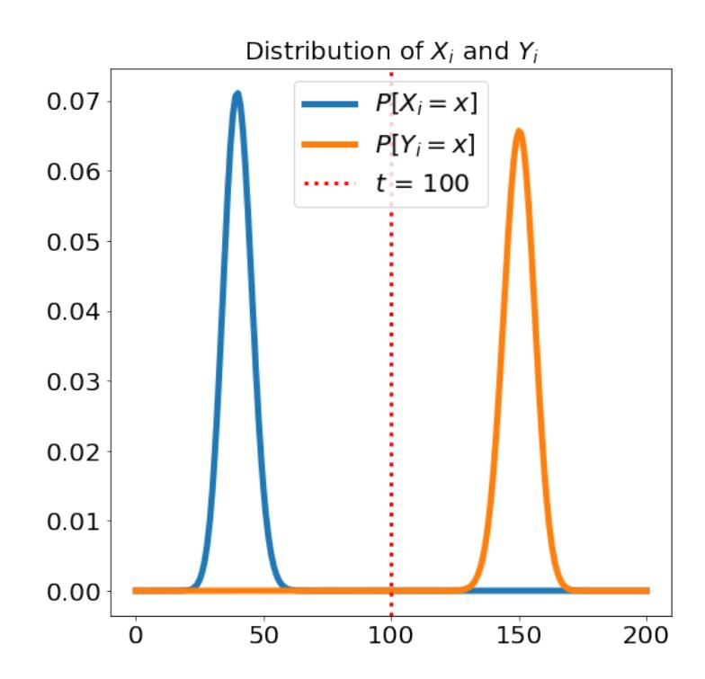
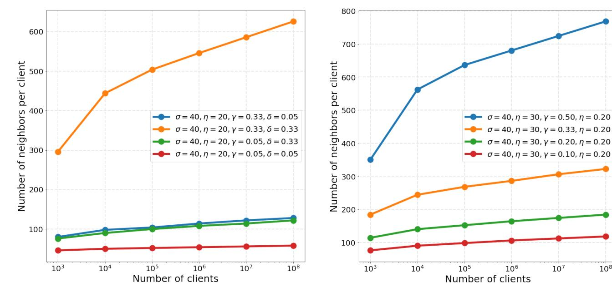
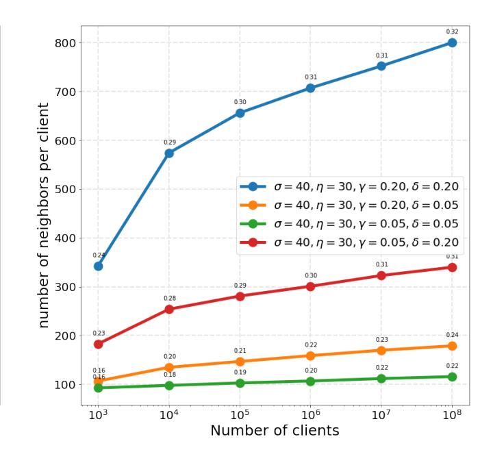
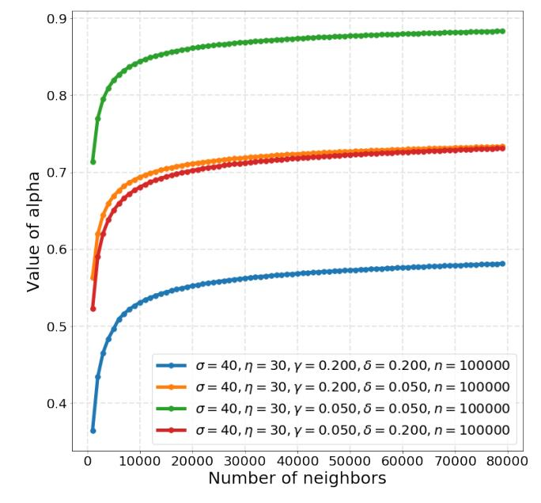
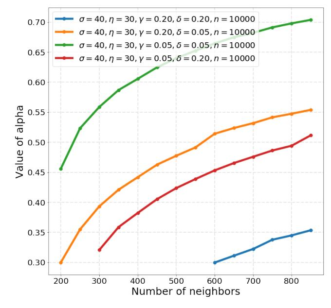
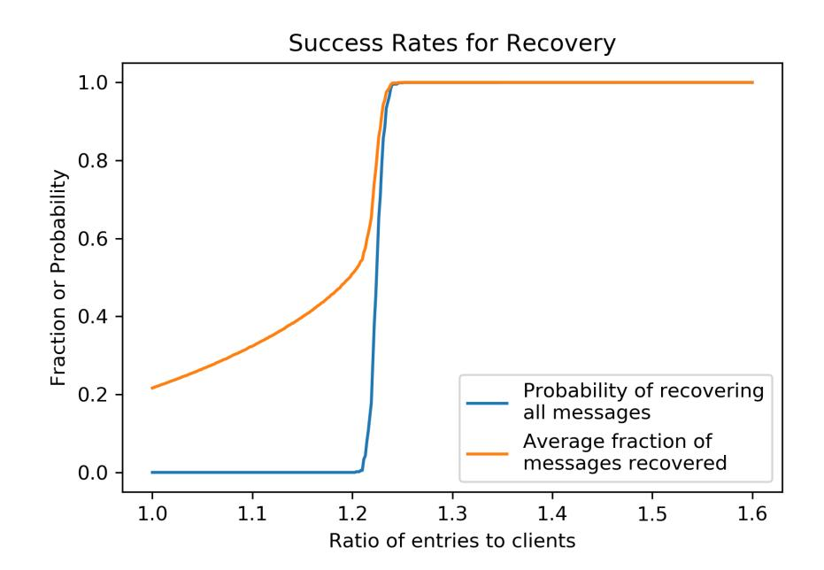

{0}------------------------------------------------

# <span id="page-0-0"></span>Secure Single-Server Aggregation with (Poly)Logarithmic Overhead

James Bell
The Alan Turing Institute
London, UK
jbell@turing.ac.uk

K. A. Bonawitz Google New York, US bonawitz@google.com

Adrià Gascón Google London, UK adriag@google.com

Tancrède Lepoint Google New York, US tancrede@google.com

Mariana Raykova Google New York, US marianar@google.com

#### **ABSTRACT**

Secure aggregation is a cryptographic primitive that enables a server to learn the sum of the vector inputs of many clients. Bonawitz et al. (CCS 2017) presented a construction that incurs computation and communication for each client linear in the number of parties. While this functionality enables a broad range of privacy preserving computational tasks, scaling concerns limit its scope of use.

We present the first constructions for secure aggregation that achieve polylogarithmic communication and computation per client. Our constructions provide security in the semi-honest and the semi-malicious settings where the adversary controls the server and a  $\gamma$ -fraction of the clients, and correctness with up to  $\delta$ -fraction dropouts among the clients. Our constructions show how to replace the complete communication graph of Bonawitz et al., which entails the linear overheads, with a k-regular graph of logarithmic degree while maintaining the security guarantees.

Beyond improving the known asymptotics for secure aggregation, our constructions also achieve very efficient concrete parameters. The semi-honest secure aggregation can handle a billion clients at the per client cost of the protocol of Bonawitz et al. for a thousand clients. In the semi-malicious setting with  $10^4$  clients, each client needs to communicate only with 3% of the clients to have a guarantee that its input has been added together with the inputs of at least 5000 other clients, while withstanding up to 5% corrupt clients and 5% dropouts.

We also show an application of secure aggregation to the task of secure shuffling which enables the first cryptographically secure instantiation of the shuffle model of differential privacy.

#### 1 INTRODUCTION

Once considered a purely theoretical tool, cryptographic secure multiparty computation has become a tool that underlies several technological solutions [IKN<sup>+</sup>20, BIK<sup>+</sup>17, BEG<sup>+</sup>19, CGB17, LN18, ABL<sup>+</sup>18, Leu19]. In this context, constructions for two parties (or a small number of parties) still have dominant presence. One reason for this is the increased complexity that many party solutions bring, which could be a challenge for adoption among a large number of participants. Another reason is the fact that many multiparty solutions require communication channels between all participants, which is not always viable. Further, real scenarios with many parties

need to account for the fact that a fraction of the parties may drop out during the execution.

All of these concerns apply to the setting where a service provider collects aggregate statistics from a large population in a privacy preserving way. This includes basic statistical tasks such as computing mean, variance, and histograms, as well as large scale distributed training of machine learning models as in federated learning [BEG+19, KMA+19]. In such settings there is a powerful central server and a large number of clients with constrained resources, a single communication channel only to the server, and intermittent network connectivity that results in a significant probability of dropping out during the protocol execution, a common problem in production systems [BEG+19].

While there have been both theoretical and applied works proposing secure computation solutions for settings with restricted communication [HLP11, BCDH18, RSY18, LEM14, LATV12, EDG14], Bonawitz et al. [BIK+17] introduced the first practical secure computation construction whose implementation scaled to a thousand clients, a larger number of parties than any existing system. That work presents a secure aggregation protocol that enables a central server to learn the summation of the input vectors of many clients securely, i.e. without obtaining any information beyond the sum. The protocol is also robust in the presence of a fraction of clients dropping out. That paper and subsequent work [BEG+19] showed that secure vector summation enables powerful privacy-preserving functionalities such as federated learning [KMA+19].

In this work we focus on two aspects of secure vector aggregation. First, we construct two new protocols with semi-honest and malicious security, which provide better efficiency both in terms of asymptotics as well as concrete costs. Second, we present a new application of secure aggregation for construction of secure shuffling protocols. This enables anonymous data collection in the single-server setting, and in particular provides the first cryptographically secure instantiation of the shuffle model of differential privacy [BEM+17].

Efficiency of Secure Aggregation. While the existing secure aggregation construction of Bonawitz et al. [BIK+17] is sufficiently efficient to run in production systems [BEG+19], scaling concerns limit its scope of use. Its limitations stem from the computation and communication complexity of the protocol. For adding n length l vectors (one provided by each client) their protocol requires  $O(n^2 + ln)$  computation and O(n+l) communication per device, and  $O(ln^2)$ 

{1}------------------------------------------------

computation and ( <sup>2</sup> + ) communication for the server. This introduces linear overhead over the computation in the clear where every client sends a vector and the server adds up all vectors. Although recently a variant with polylog overhead has been proposed [\[SGA20\]](#page-14-15), it requires /log rounds (as opposed to four for Bonawitz et al.) and, contrary to Bonawitz et al.'s approach, relies on revealing a partial sum of log input values to a coalition of the server and a client.

Reducing client compute time is significant: the more compute time is required at each device, the more likely that device is to drop out. This not only results in wasted computation, but also induces bias as powerful devices with fast connection will be overrepresented in the collected statistics. In practice, these costs limit the use of secure aggregation to settings of no more than approximately a thousand devices for large values of , e.g., larger than 10<sup>6</sup> . This prevents computing large histograms or training neural networks that require large client batches to achieve good quality [\[MRTZ18\]](#page-14-16).

Looking beyond concrete efficiency, current theoretical constructions do not provide constant round solutions with sublinear communication (in the number of clients) per client. This is the case even in the semi-honest setting when we need to account for the key distribution phase as well as support dropouts [\[RSY18\]](#page-14-10). Note that there exist relevant solutions based on homomorphic encryption (HE) [\[Gam85,](#page-14-17) [Pai99,](#page-14-18) [Gen09\]](#page-14-19), where the server computes the sum of encrypted inputs under a key shared among the clients. However, the generation of shared HE parameters among all parties with sublinear communication and in a way that is robust to dropouts remains a challenge. Boyle et al. [\[BCP15\]](#page-14-20) present efficient large-scale secure computation but do use a broadcast channel per party.

Amplification by Shuffling. Differential privacy (DP) [\[DMNS06\]](#page-14-21) has become the de facto notion of individual privacy in data analysis. Until recently there have been two main threat models for DP: the central model, where a curator is trusted with all private inputs and the task of outputting privatized aggregates, and the local DP setting where individuals release DP versions of their data. While the second model has minimal trust assumptions it also comes with significant limitations in terms of accuracy.

The recently introduced shuffle model of DP [\[BEM](#page-14-14)+ 17, [CSU](#page-14-22)+ 19] assumes only a trusted shuffler (a party that applies a random permutation to input data before publishing it) rather than a trusted curator computing arbitrary functionalities. The shuffle model matches exactly the setting of a single powerful server and a large number of devices in a star network. Several recent works [\[EFM](#page-14-23)+ 19, [BBGN19b,](#page-14-24) [BBGN19a,](#page-14-25) [GPV19,](#page-14-26) [EFM](#page-14-27)+ 20] have shown that this model offers a fruitful middle ground (in the terms of tradeoffs between trust distribution and accuracy) between the local and curator models. Implementing efficient shufflers in practice has either required reliance on trusted computing hardware or onion-routing/mixnet constructions, which require strong non-collusion assumptions and significantly increased communication. While we can implement the shuffling step with general multiparty computation to achieve local DP privacy, any practical deployment would require an efficient shuffling construction.

### 1.1 Our contributions

Our paper has three main contributions: two new constructions for secure aggregation which provide security in the semi-honest and semi-malicious setting, and a new construction for secure shuffling based on secure aggregation.

For our constructions we consider an aggregation server and clients with input vectors of length . The goal of the protocol is to provide the server with a summation of the inputs of all clients that complete the protocol execution. We require that correctness holds with all but 2 <sup>−</sup> probability, where > 0 is the correctness parameter. The protocols are secure in the presence of an adversary controlling the server and up to an arbitrary -fraction of the clients that are corrupted independently of the protocol execution. In other words, client corruptions happen before the protocol execution starts. Note that the only assumption is that the adversary does not have the ability to compromise new devices adaptively as the protocol progresses. Our protocols are robust to an arbitrary -fraction of clients dropping out during the protocol execution. Moreover, a number of dropouts that exceeds that threshold can only lead to an aborted execution, and does not affect the security of the protocol. Let us remark that the set of clients that dropout during the protocol execution are considered public knowledge, i.e. we do not aim to provide full anonymity to the set of dropout users. Our constructions achieve information theoretic security with a security parameter , except for the use of a key agreement protocol for randomness generation, and encryption and signature for secure communication.

Semi-honest Construction. The construction of Bonawitz et al. [\[BIK](#page-14-1)+ 17] uses the server as a relay that forwards encrypted and authenticated messages between clients. Their solution requires that every pair of clients are able to communicate. Intuitively, the complete communication graph serves both security and dropout robustness. Roughly speaking, every client (a) negotiates shared randomness with every other client to mask their submitted value, and (b) shares (with threshold ) their random seeds with every other client. While (a) ensures security, (b) guarantees that the protocol can recover from dropouts without compromising security as long as is set appropriately.

The main insight that enables our efficiency improvement is that a complete graph is in fact not necessary: it is enough to consider a -regular communication graph, i.e., each client speaks to < −1 other clients, where = (log). We obtain this result by using a randomized communication graph construction, and then leveraging its properties with respect to the distributions of corrupt clients and dropouts.

Our semi-honest construction requires(log<sup>2</sup> + log) computation and (log + ) communication per client, and ( log<sup>2</sup> + log) computation and ( log + ) communication for the server. It requires three rounds of interactions between the server and clients. We characterize the properties of the communication graph that suffice for the security and correctness of the resulting protocol, and present a graph generation construction with concrete parameters. For example, with = 40 and = 30, we need only = 150 neighbors per client in order to run the protocol with = 10<sup>8</sup> clients and provide security for up to = 1/5 corrupt nodes and = 1/20 dropouts. In fact, we can run our protocol with a

{2}------------------------------------------------

billion clients, while incurring roughly the same costs per client as the protocol of Bonawitz et al. [BIK<sup>+</sup>17] when run on a thousand clients (see Section 5 for more details).

*Semi-malicious Construction.* Our semi-malicious setting assumes that the server behaves honestly in the first step of the protocol when it commits to the public keys of all clients. After this point, it can deviate arbitrarily from the protocol (as in the usual malicious security notion) and our construction provides security. This is analogous to the assumption in [BIK<sup>+</sup>17], and weaker than assuming a public key infrastructure for key distribution.

The security definition for the malicious case is a bit more involved, and is discussed in detail in Section 4. Roughly speaking, this is due to the fact that a malicious server can disrupt communication between parties at any round, and thus can simulate dropouts inconsistently across clients. As it is impossible for clients to distinguish real from simulated dropouts, a malicious server cannot be prevented from excluding  $(\gamma + \delta)$  clients from the final sum *by definition* of the summation functionality itself. Instead of requiring that a malicious server cannot learn the sum of the inputs of less than  $(1 - \gamma - \delta)n$  clients, as in the semi-honest case, we formalize and prove that our protocol ensures that the server can only learn sums including at least a constant fraction  $\alpha$  of the clients' inputs. In other words, every honest client is guaranteed that their input will be added with *at least*  $\alpha(1-\gamma)n$  other inputs from honest clients even when the malicious server is controlling  $\gamma n$  other clients.

Bonawitz et al. [BIK<sup>+</sup>17] also propose a semi-malicious version of their protocol. The main idea there is to add their semi-honest variant a round in which clients verify that the server reported consistent views of dropouts to all of them. This extension incurs additional linear communication and computation. Extending our semi-honest protocol while maintaining sublinear overhead is more challenging. First, the server cannot be trusted to generate the communication graph honestly, and thus we propose a protocol where clients choose their  $k = O(\log n)$  neighbors in a distributed verifiable way. Second, we find an alternative approach to ensuring global consistency of reported dropouts by having each client perform only a local verification on their neighborhood. We then prove that this corresponds to a global property of the communication graph thanks to the connectivity properties of random graphs.

Our semi-malicious construction requires  $O(\log^2 n + l \log n)$  computation and  $O(\log^2 n + l)$  communication per client, and  $O(l \log^2 n)$  computation and  $O(\log^2 n + ln)$  communication for the server. It runs in five and a half rounds of interactions. Our protocol also achieves very efficient concrete costs. For example, with  $\sigma = 40$  and  $\eta = 30$ , if we run the protocol with  $10^4$  clients and corrupt and dropout rates  $\gamma = \delta = 0.05$  we need only 300 neighbors to guarantee that every client's input is aggregated with the inputs of at least 5000 clients (see Section 5 for more details).

Secure Shuffle Construction. As mentioned above, we provide an instantiation of the shuffle model of differential privacy by showing a reduction of shuffling to vector summation. Our solution leverages a randomized data structure called an invertible Bloom lookup table (IBLT) [GM11]. To shuffle m messages distributed among n clients, it suffices to run a single execution of secure vector summation with vectors of length  $\sim 2m$ . This covers the case where each user has multiple messages to send, as in the multi-message shuffle model

Table 1: Summary of parameters used throughout the paper.

| Parameter    | Description                                                                        |
|--------------|------------------------------------------------------------------------------------|
| n            | Number of clients.                                                                 |
| k            | Number of neighbors of each client $k < n$ .                                       |
| t            | Secret Sharing reconstruction threshold $t \leq k$ .                               |
| σ            | Information-theoretic security parameter (bounding the probability of bad events). |
| η            | Correctness parameter (bounding the failure probability).                          |
| λ            | Cryptographic security parameter (for cryptographic primitives).                   |
| $\delta$     | Maximum fraction of dropout clients.                                               |
| γ            | Maximum fraction of corrupted clients.                                             |
| $\mathbb{X}$ | Domain of the summation protocol.                                                  |
| l            | Size of the clients' vector input.                                                 |

[CSU<sup>+</sup>19, GPV19, BBGN20], as well as the case where most users do not have any input, which models submissions of error reports.

#### <span id="page-2-0"></span>2 PRELIMINARIES AND NOTATION

Hypergeometric distribution. We recall that the Hypergeometric distribution  $\operatorname{HyperGeom}(n, m, k)$  is a discrete probability distribution that describes the probability of s successes in k draws, without replacement, from a finite population of size n that contains exactly m objects with that feature. We use the following tail bounds for  $X \sim \operatorname{HyperGeom}(n, m, k)$ :

- $\forall d > 0 : \Pr[X \le (m/n d)k] \le e^{-2d^2k}$ ,
- $\forall d > 0 : \Pr[X \ge (m/n + d)k] \le e^{-2d^2k}$ .

Moreover, by choosing d = 1 - m/n, we get that

$$\Pr[X \ge k] = \Pr[X \le k] \le e^{-2(1-m/n)^2 k}$$
.

*Graphs.* We denote a graph with a vertex set V and edge set E as G(V, E), where  $(i, j) \in E$  if there is an edge between vertices i and j. The set of all nodes connected to the i-th node is its neighbors  $N_G(i) = \{j \in V : (i, j) \in E\}$ . A graph G'(V', E') is a subgraph of G(V, E) if  $V' \subseteq V$  and  $E' \subseteq E$ . The subgraph of G induced by a subset of the vertices  $V' \subset V$  and the edges between E' where  $(i, j) \in E'$  if and only if  $(i, j) \in E$ ) and  $i, j \in V'$  is denoted G[V'].

*Parameters.* We provide in Table 1 the parameters we will use throughout the paper. In particular,  $\sigma$  will denote an *information-theoretic* security parameter bounding the probability of bad events happening and  $\eta$  will denote the correctness parameter. We denote by  $\lambda$  a security parameter associated with standard cryptographic primitives (such as Shamir secret sharing, pseudorandom generator, and authenticated encryption).

We says that two distributions  $\mathcal{D}, \mathcal{D}'$  are computationally indistinguishable with respect to  $\sigma$  and  $\lambda$ , denoted  $\mathcal{D} \approx_{\sigma,\lambda} \mathcal{D}'$ , if the statistical distance between  $\mathcal{D}$  and  $\mathcal{D}'$  is bounded by the sum of a negligible function in  $\lambda$  and of a negligible function in  $\sigma$ .

{3}------------------------------------------------

Throughout the paper, we denote  $\mathbb{X} = \mathbb{Z}/R\mathbb{Z}$  the domain on which the summation protocol is performed, and we assume the representation of elements of  $\mathbb{X}$  (resp. computational cost of operations in  $\mathbb{X}$ ) is  $\tilde{O}(1)$  in n (resp.  $\log(n)$ ) so as to enable additions of n elements in  $\mathbb{X}$  without overflow.

*Cryptographic primitives.* In our protocols, we will use the following cryptographic primitives for randomness generation and secure communication. A signature scheme scheme that is existentially unforgeable under chosen message attacks (EUF-CMA); for example, it can be instantiated with ECDSA in practice. A cryptographically secure pseudorandom generator  $F: \{0,1\}^{\lambda} \to \mathbb{X}^l$ ; for example, it can be instantiated with AES-CTR in practice [BIK+17, BEG+19]. An authenticated encryption scheme with associated data (AEAD), which is semantically secure under a chosen plaintext attack (IND-CPA) and provides integrity of ciphertext (INT-CTXT), which means that it is computationally infeasible to produce a ciphertext not previously produced by the sender regardless of whether or not the underlying plaintext is "new"; for example, it can be instantiated with ChaCha20+Poly1305 [23] in practice. A  $\lambda$ -secure key-agreement protocol, i.e., a key-agreement protocol such that there exists a simulator  $Sim_{\mathcal{K}\mathcal{A}}$ , which takes as input an output key sampled uniformly at random and the public key of the other party, and simulates the messages of the key agreement execution so that the statistical distance is negligible in  $\lambda$ ; for example, it can be instantiated with a Diffie-Hellman key agreement protocol followed by a key derivation function in practice.

#### <span id="page-3-3"></span>3 THE SEMI-HONEST PROTOCOL

In this section, we present our semi-honest summation protocol. Our construction is parametrized by a (possibly random) undirected regular graph G with n nodes and degree k. Intuitively the graph G will determine the direct communication channels that will be used in the protocol in the following sense: clients that are connected in G will exchange private messages in the protocol via the server which, however, will not be able to see the message content. We will prove the correctness and the security of our protocol assuming a set of properties of the graph G. Next we will describe a random-ized algorithm called GenerateGraph, which generates graphs for which these properties hold with high probability. Since we are in the semi-honest setting this algorithm can be generated by the server (in the malicious setting protocol of Section 4, we will describe a distributed graph generation protocol).

#### 3.1 An abstract summation protocol

We present our protocol in Algorithm 1. It runs among n clients with identifiers  $1, \ldots, n$  and the server. All parties have access to the following primitives: a pseudorandom generator (PRG) F, which is used to expand short random keys, a secure key agreement protocol  $\mathcal{K}\mathcal{A}$  to create shared random keys, and an authenticated encryption scheme for private communication  $\mathcal{E}_{auth}$ .

**Construction Overview.** The main idea of our construction is a generalization of the secure aggregation protocol of Bonawitz et al. [BIK<sup>+</sup>17], which only works with *complete* graphs (i.e., all the vertices are connected between each other), that works with any

#### Algorithm 1: Abstract summation protocol.

**Parties:** Clients  $1, \ldots, n$ , and Server.

**Public Parameters:** Vector length l, input domain  $\mathbb{X}^l$ , and PRG  $F \colon \{0,1\}^{\lambda} \mapsto \mathbb{X}^l$ 

**Input:**  $\vec{x_i} \in \mathbb{X}^l$  (by each client *i*).

**Output:**  $z \in \mathbb{X}$  (for the server).

We denote by  $A_1$ ,  $A_2$ ,  $A'_2$ ,  $A_3$  the sets of clients that reach certain points without dropping out. Specifically  $A_1$  consists of the clients who finish step 3,  $A_2$  those who finish step 5, and  $A_3$  those who finish step 7. For each  $A_i$ ,  $A'_i$  is the set of clients for which the server sees they have completed that step on time. Thus,

 $A_1 \supseteq A_1' \supseteq A_2 \supseteq A_2' \supseteq A_3 \supseteq A_3'$ .

- (1) The server runs (G, t, k) = GENERATEGRAPH(n), where G is a regular degree-k undirected graph with n nodes. By  $N_G(i)$  we denote the set of k nodes adjacent to i (its neighbors).
- (2) Client  $i \in [n]$  generates key pairs  $(sk_i^1, pk_i^1)$ ,  $(sk_i^2, pk_i^2)$  and sends  $(pk_i^1, pk_i^2)$  to the server who forwards the message to  $N_G(i)$ .
- <span id="page-3-1"></span>(3) Client  $i \in A_1$ :
  - Generates a random PRG seed  $b_i$ .
  - Computes two sets of shares:  $H_i^b = \{h_{i,1}^b, \dots, h_{i,k}^b\} = \text{ShamirSS}(t,k,b_i)$

$$H_i^s = \{h_{i,1}^s, \dots, h_{i,k}^s\} = \mathsf{ShamirSS}(t,k,sk_i^1)$$

- Sends to the server a message  $m = (j, c_{i,j})$ , where  $c_{i,j} = \mathcal{E}_{auth}$ . Enc $(k_{i,j}, (i||j||h^b_{i,j}||h^s_{i,j}))$  for each  $j \in N_G(i)$ , where  $c_{i,j}$  is a ciphertext encrypted under  $k_{i,j} = \mathcal{K}\mathcal{A}$ .  $Agree(sk^2_i, pk^2_j)$ .
- (4) The server aborts if  $|A'_1| < (1 \delta)n$  and otherwise forwards all messages  $(j, c_{i,j})$  to client j, who deduces  $A'_1 \cap N_G(j)$ .
- <span id="page-3-2"></span>(5) Client  $i \in A_2$ :
  - Computes a shared random PRG seed  $s_{i,j}$  as  $s_{i,j} = \mathcal{K}\mathcal{A}.Agree(sk_i^1, pk_j^1).$
  - Sends to the server their *masked input*

$$\vec{y}_i = \vec{x}_i + \vec{r}_i - \sum_{\substack{j \in A_1 \cap \mathcal{N}_G(i) \\ 0 < j < i}} \vec{m_{i,j}} + \sum_{\substack{j \in A_1 \cap \mathcal{N}_G(i) \\ i < j \le n}} \vec{m_{i,j}}$$

- where  $\vec{r_i} = F(b_i)$  and  $\vec{m_{i,j}} = F(s_{i,j})$ .

- (6) The server collects masked inputs for a determined time period. It aborts if  $|A_2'| < (1 \delta)n$  and otherwise sends  $(A_2' \cap N_G(i), (A_1 \setminus A_2') \cap N_G(i))$  to every client  $i \in A_2'$ .
- (7) Client  $j \in A_3$  receives  $(R_1, R_2)$  from the server and sends  $\{(i, h_{i,j}^b)\}_{i \in R_1} \cup \{(i, h_{i,j}^s)\}_{i \in R_2}$ , obtained by decrypting the ciphertext  $c_{i,j}$  received in Step 3.
- (8) The server aborts if  $|A_3'| < (1 \delta)n$  and otherwise:
  - Collects, for each client  $i \in A'_2$ , the set  $B_i$  of all shares in  $H_i^b$  sent by clients in  $A_3$ . Then aborts if  $|B_i| < t$  and recovers  $b_i$  and  $\vec{r}_i$  otherwise using the t shares received which came from the lowest client IDs.
  - Collects, for each client  $i \in (A_1 \setminus A'_2)$ , the set  $S_i$  of all shares in  $H_i^s$  sent by clients in  $A_3$ . Then aborts if  $|S_i| < t$  and recovers  $sk_i^1$  and  $\vec{m_{i,j}}$  otherwise.

Outputs  $\sum_{i \in A'_2} \vec{x_i}$  as

$$\sum_{i \in A_2'} \left( \vec{y}_i - \vec{r}_i + \sum_{\substack{j \in \mathsf{N_G}(i) \cap (A_1' \backslash A_2') \\ 0 < j < i}} \vec{m_{i,j}} - \sum_{\substack{j \in \mathsf{N_G}(i) \cap (A_1' \backslash A_2') \\ i < j \le n}} \vec{m_{i,j}} \right).$$

<span id="page-3-0"></span>graph sampled from a larger set of sparser graphs. Our construction enables significant efficiency improvements.

{4}------------------------------------------------

As we discussed above, the first step of the protocol will be to generate a k-regular graph G and a threshold  $1 \le t \le k$ , where the n vertices are the clients participating to the protocol. To do this the server runs a randomized graph generation algorithmm GenerateGraph that takes the number n of clients/nodes and samples output (G,t) from a distribution  $\mathcal{D}$ . Below, we will define which properties of this distribution suffice for the proofs of correctness and security.

The edges of the graph determine pairs of clients each of which run a key agreement protocol to share a random key, which later will be used by each party to derive a mask for her input. More precisely, each client i generates key pairs  $(sk_i^1, pk_i^1)$ ,  $(sk_i^2, pk_i^2)$  and sends  $(pk_i^1, pk_i^2)$  to all of her neighbors. Then, each pair (i, j) of connected parties G runs a key agreement protocol  $s_{i,j} = \mathcal{K}\mathcal{A}.Agree(sk_i^1, pk_j^1)$ , which uses the keys exchange in the previous step to derive a shared random key  $s_{i,j}$ .

Each client i derives pairwise masks for her input  $m_{i,j} = F(s_{i,j})$  derived from shared keys with each of her neighbors  $j \in N_G(i)$ , which she adds to her input as follows

$$\vec{x_i} - \sum_{j \in N_G(i), j < i} \vec{m_{i,j}} + \sum_{j \in N_G(i), j > i} \vec{m_{i,j}}.$$

In the setting where all parties submit their masked inputs, all pairwise masks cancel in the final sum. However, to support execution when dropouts occur, the protocol needs to enable removal of the pairwise masks of dropout clients (who never submitted their masked inputs). For this purpose, each client i shares her key  $sk_i^1$  to her neighbors j's by sending a ciphertext containing the share produced using the public keys  $pk_j^2$ 's. Later, if client i drops out, her neighbors can send the decrypted shares to the server. Armed with those shares, the server can reconstruct the secret key  $sk_i^1$  and use it together with the public keys of i's neighbors to compute  $s_{i,j}$ . Finally, the server can recover the corresponding pairwise masks  $m_{i,j}$  and remove them from the final output sum.

The above approach has a shortcoming that if the server announces dropouts and later some masked inputs of the claimed dropouts arrive, the server will be able to recover those inputs in the clear. To prevent this possibility the protocol introduced another level of masks, called self masks, that each client generates locally  $\vec{r_i} = F(b_i)$  from a randomly sampled seed  $b_i$ . This mask is also added to the input

$$\vec{x}_i + \vec{r}_i - \sum_{j \in N_G(i), j < i} \vec{m}_{i,j} + \sum_{j \in N_G(i), j > i} \vec{m}_{i,j}.$$

Now, client i also shares  $b_i$  to her neighbors. Later, if i submitted her masked input, the server will instead request shares of  $b_i$  from the client's neighbors in order to reconstruct and remove  $\vec{r_i}$  from the sum. In other words, either client i has submitted her masked input and the server will obtain shares from the mask  $b_i$ , or client i has dropped out and the server will obtain shares of  $sk_i^1$ . Crucially, we require each client to provide to the server only one share for each if her neighbors. This guarantees that the masked inputs of clients that are not included in the final sum cannot be revealed in the clear to the server.

Dropouts may happen throughout the steps of the protocol. We denote by  $A_1$  the set of parties that send their secret shares to their neighbors,  $A_2 \subseteq A_1$  is the set of parties that send their masked

inputs with their self mask and the pairwise masks generated from the shared keys with her neighbors in  $A_1, A_3 \subseteq A_2$  is the set of clients that send shares to the server to be used in the reconstruction of the output. At each of these steps the server will only wait a set time for these messages,  $A_i'$  denotes the subset of  $A_i$  whose messages arrive on time. If the complements of these prime sets becomes larger than the threshold  $\delta n$  for dropouts, the server aborts. Also if a client has less than t neighbors in  $A_3'$ , the server aborts since it cannot reconstruct at least one mask needed to obtain the output.

The construction of Bonawitz et al. [BIK+17] uses a complete graph where each client shares a mask with every other client in the system. While a single random mask hides perfectly a private value, the intuition of why we need more masks is the presence of corrupt clients, who will share their masks with the server, and of dropouts whose masks will be removed. However, we will show that n-1 masks per input may be more than what is needed for security. In particular, the insight in our construction is that the number of such masks can be significantly reduced to  $O(\log n)$ , in a setting where we can assume that the pairs of parties sharing common randomness used to derive masks are chosen at random and independent of the set of corrupted parties and the set of dropouts. In particular we model this by using a random k-regular graph that determines the node neighbors with whom masks are shared. In our security proofs, we will argue that, when  $k = O(\log n)$ , for each honest client there is a sufficient number of honest non-dropout neighbors to protect the client's input.

**Graph Properties.** Let G = (V, E) be a k-regular undirected graph with n nodes, and let 0 < t < k be an integer. Recall that  $N_G(i) = \{j \in V : (i, j) \in E\}$  is the set of neighbors of i.

The first property that we require from any graph output by Generate Graph is that, for every set of corrupt clients C, with all but negligible probability, no honest client i has t neighbors in C. Note that this happening would immediately break security, as the adversary would be able to recover the secrets of i by combining shares from i's corrupted neighbors. Formally, we define the event  $E_1$  as a predicate on a set C and a pair (G, t) that is 1 iff the "good" property holds.<sup>1</sup>

<span id="page-4-1"></span>*Definition 3.1 (Not too many corrupt neighbors).* Let  $C \subset [n]$  be such that  $|C| \le \gamma n$ . We define event  $E_1$  as

$$E_1(C, G, t) = 1 \text{ iff } \forall i \in [n] \setminus C : |N_G(i) \cap C| < t$$

Event  $E_1$  is not the only event related to the communication graph G that could break security: consider the situation where a set of D clients, with  $|D| \leq \delta n$ , drop out right before Step 5 in such a way that removing clients/nodes in D disconnects the communication graph G, i.e.  $G[[n] \setminus D]$  is not connected. Now, as discussed above, edges in the graph correspond to shared masks  $\vec{m_{i,j}}$  that are crucial to ensure security, as these masks are used to mask values  $\vec{y_i}$  that involve private inputs. However, if the graph gets disconnected by D, and  $|D| \leq \delta n$ , then by definition of the functionality ( $\delta$ -robustness) the server would be able to recover the masks  $m_{i,j}$  involving clients in D, i.e. the edges in the cut induced

<span id="page-4-0"></span><sup>&</sup>lt;sup>1</sup>Note that for a complete graph, the event  $E_1$  is 1 for every set C trivially, as long as t > |C|, where  $|C| \le \gamma n$ . However this implies that  $k \ge t = O(n)$ , and results in linear overhead.

{5}------------------------------------------------

by D. This implies that the server would receive at least two disjoint sets  $S_1, S_2$  of masked inputs (one for each connected component in  $G[[n] \setminus D]$ ) whose masks cancel independently of the other set, resulting in the server learning (at least) two partial sums, which breaks security. We state our "good" event  $E_2$  where the graph remains connected. Note that although we excluded corrupted nodes in the above description for simplicity, they need to be taken into account. As before, we define  $E_2$  as a predicate on sets C, D of appropriate size, and a graph G.

Definition 3.2 (Connectivity after dropouts). Let  $C \subset [n]$  and  $D \subset [n]$  be such that  $|C| \le \gamma n$  and  $|D| \le \delta n$ . We define event  $E_2$  as

$$E_2(C, D, G) = 1$$
 iff  $G[[n] \setminus (C \cup D)]$  is connected

Note that the above event trivially holds for a complete graph G (and reasonable parameters  $\gamma$  and  $\delta$ ) and any sets C, D, as in that case  $k = n - 1 > (\gamma + \delta)n$ .

Perhaps surprisingly, we will prove that events  $E_1$  and  $E_2$  capture all possible ways in which security could be broken (assuming perfect cryptographic primitives) due to the choice of communication network. More concretely, we will show the following: Consider a graph generation algorithm GenerateGraph such that for any sets C, D of appropriate sizes, a pair (G, t) generated using GenerateGraph will satisfy  $E_1(C, G, t) \land E_2(C, D, G) = 1$  except for negligible probability. Then, GenerateGraph can be used in Algorithm 1, and the result will be a secure protocol.

Finally, we still need one more property that GenerateGraph must satisfy to ensure *correctness*. Note that if after removing dropouts some client does not have at least t neighbors then the server can't recover the final sum.

Definition 3.3 (Enough surviving neighbors for reconstruction). Let  $D \subset [n]$  such that  $|D| \leq \delta n$ . We define event  $E_3$  as

$$E_3(D, G, t) = 1 \text{ iff } \forall i \in [n] : |N_G(i) \cap ([n] \setminus D)| \ge t$$

#### 3.2 Generating "Good" Graphs

This section characterizes "good" graph generation algorithms as those that generate graphs for which events  $E_1$ ,  $E_2$ ,  $E_3$  hold with probability parameterized by a statistical security parameter  $\sigma$  (for  $E_1$  and  $E_2$ ) and a correctness parameter  $\eta$  (for  $E_3$ ).

*Definition 3.4.* Let  $\mathcal{D}$  be a distribution over pairs (G, t). We say that  $\mathcal{D}$  is  $(\sigma, \eta)$ -good if, for all sets  $C \subset [n]$  and  $D \subset [n]$  such that  $|C| \leq \gamma n$  and  $|D| \leq \delta n$ , we have that

(1) 
$$\Pr[E_1(C, G', t') \land E_2(C, D, G', t') = 1 \mid (G', t') \leftarrow \mathcal{D}] > 1 - 2^{-\sigma}$$

(2) 
$$\Pr[E_3(D, G', t') = 1 \mid (G', t') \leftarrow \mathcal{D}] > 1 - 2^{-\eta}$$

Analogously, we say that a graph generation algorithm GenerateGraph is  $(\sigma, \eta)$ -good if it implements a  $(\sigma, \eta)$ -good distribution.

In Section 3.5, we describe a concrete (randomized)  $(\sigma, \eta)$ -good graph generation algorithm.

#### 3.3 Correctness and Security

In this section, we state our correctness and security theorems, whose proofs are provided in Appendix B. We note that the proof of security uses a standard simulation-based approach [Gol04, Lin17] similar to the one by Bonawitz et al. [BIK+17]. It is important to

remark that this formulation does not in general imply security, in the formal sense of [Gol04, Lin17], in the weaker threat model where the adversary only corrupts a set of clients and the server is honest. This is however easy to see for our protocol: note that the messages sent to the clients are all functions of the other clients' randomness alone, and in particular do not depend at all on any inputs. We discuss further the honest server case in the context of the semi-malicious threat model in Section 4.6.

<span id="page-5-2"></span>Theorem 3.5 (Correctness). Let  $\Pi$  be Algorithm 1 instantiated with  $a(\sigma,\eta)$ -good graph generation algorithm GenerateGraph. Consider an execution of  $\Pi$  with inputs  $X=(\vec{x_i})_{i\in[n]}$ . If  $|A_3'|\geq (1-\delta)n$ , i.e., less than a fraction  $\delta$  of the clients dropout, then the server does not abort and obtains  $\vec{z}=\sum_{A_2'}\vec{x_i}$  with probability  $1-2^{-\eta}$ .

<span id="page-5-1"></span>Theorem 3.6 (Security). Let  $\sigma$ ,  $\eta$ ,  $\lambda$  be integer parameters. Let  $\Pi$  be an instantiation of Algorithm 1 with a  $(\sigma, \eta)$ -good graph generation algorithm GenerateGraph, a IND-CPA secure authenticated encryption scheme, and a  $\lambda$ -secure key agreement protocol. There exists a PPT simulator Sim such that for all k, all sets of surviving clients  $A_1, A_2, A'_2, A_3$  as defined in Algorithm 1, all inputs  $X = (\vec{x_i})_{i \in [n]}$ , and all sets of corrupted clients C with  $|C| \leq \gamma n$ , denote  $\vec{z} = \sum_{i \in A'_2} \vec{x_i}$ , the output of Sim is perfectly indistinguishable from the joint view of the server and the corrupted clients  $\text{Real}_C(A_1, A_2, A'_2, A_3)$  in that execution, i.e.,  $\text{Real}_C(A_1, A_2, A'_2, A_3) \approx_{\sigma, \lambda} \text{Sim}(\vec{z}, C, A_1, A_2, A'_2, A_3)$ .

#### 3.4 Performance Analysis

We report the communication and computation costs for the client and server when  $k = O(\log n)$ . We recall that we assume that basic operations and representation of elements in  $\mathbb{X}$  are O(1).

Client computation:  $O(\log^2 n + l \log n)$ . Each client computation can be broken up as 2k key agreements and k encryptions (O(k) complexity), creating twice t-out-of-k Shamir secret shares  $(O(k^2)$  complexity), generating values  $\vec{m_{i,j}}$  for all neighbors j (O(kl) complexity).

Client communication:  $O(\log n + l)$ . Each client performs 2k key agreements (O(k) messages), sends 2k encrypted shares (O(k) messages), sends a masked input (O(l) complexity), and reveals up to 2k shares (O(k) messages).

*Server computation:*  $O(n(\log^2 n + l \log n))$ . The server computation can be broken up as reconstructing t-out-of-k Shamir secrets for each client  $(O(n \cdot k^2)$  complexity), generating values  $\vec{m_{i,j}}$  for all (dropped out) neighbors j of each client i (O(nkl) complexity).

*Server communication:*  $O(n(\log n + l))$ . The server receives or sends  $O(\log n + l)$  to each client.

#### <span id="page-5-0"></span>3.5 Our Random Graph Constructions

Since Bonawitz et al. [BIK<sup>+</sup>17] uses a complete graph, all of the events  $E_1(C, G, t)$ ,  $E_2(C, D, G)$  and  $E_3(D, G, t)$  are deterministically equal to 1. That is to say that the complete graph is  $(\sigma, \eta)$ -good for any  $\sigma$  and  $\eta$ . In this section we will describe how to construct a much sparser random graph, which is still  $(\sigma, \eta)$ -good for reasonable  $\sigma$  and  $\eta$ .

Our randomized construction is shown is Algorithm 2, and consists of uniformly renaming the nodes of a graph known as a *Harary* 

{6}------------------------------------------------

#### Algorithm 2: GENERATEGRAPH

```
Public Parameters: Max. fraction of corrupt nodes \gamma, max. fraction of dropout nodes \delta.

Input: Number of nodes n, statistical security parameter \sigma, correctness parameter \eta.

Output: A triple (G, t, k)

(k, t) = \text{ComputeDegreeAndThreshold}(n, \gamma, \delta, \sigma, \eta)

Let H = \text{Harary}(n, k)

Sample a random permutation \pi : [n] \mapsto [n]

Let G be the set of edges \{(\pi(i), \pi(j)) \mid (i, j) \in H\}

return (G, t, k)
```

<span id="page-6-0"></span>graph with n nodes and degree k. This graph, which we denote Harary (n, k), has vertices V = [n] and an edge between two distinct vertices i and j if and only if j - i modulo n is  $\leq (k + 1)/2$  or  $\geq n - k/2$ . Roughly speaking, you can think of this as writing the nodes of the graph in a circle and putting edges between those within distance k/2 of each other.

Our whole problem now reduces to defining exactly the function ComputeDegreeAndThreshold such that the values of k and t it returns result in GenerateGraph being  $(\sigma, \eta)$ -good. This in turn leads to a secure protocol, as we saw in the previous section. More concretely, we will see in this section that choosing  $k \ge O(\log n + \sigma + \eta)$  is enough to achieve the  $(\sigma, \eta)$ -goodness property.

Consider any graph generation algorithm G constructed by sampling k neighbors uniformly and without replacement from the set of remaining n-1 clients (as done in Algorithm 2). This general property is all we need to argue about events  $E_1, E_3$  in the definitions of  $(\sigma, \eta)$ -good, so we don't need to get into the specifics of Harary graphs yet.

 $E_1$ : Not too many corrupt neighbors. Let us first focus on the event  $E_1(C, G, t)$ , which holds if every client i has fewer than t corrupt neighbors in  $N_G(i)$  (Definition 3.1). Let  $X_i$  be the random variable counting the number of malicious neighbors of a user i, and note that  $X_i \sim \text{HyperGeom}(n-1, \gamma n, k)$ , i.e.  $X_i$  is hypergeometrically distributed. Thus by a union bound across all clients we have that  $\Pr[E_1(C, G, t) = 0] \leq n \Pr[X_i \geq t] = n(1 - \text{cdf}_{X_i}(t-1))$ .

 $E_3$ : Not too many neighbors drop out. Let us now turn our attention towards correctness: if we set t too large then the server will fail to recover enough shares of a required mask and abort, and that would result in a wasted computation. The intuition behind this event for G is analogous to the case of  $E_1$ , as if  $Y_i$  is the number of surviving (not dropped out) neighbors of the ith user we have that  $Y_i \sim \text{HyperGeom}(n-1, (1-\delta)n, k)$ , thanks again to the fact that G is such that the k neighbors of i are randomly sampled from  $[n] \setminus \{i\}$ .

Hence, again by a union bound across clients, we have that  $Pr[E_3(C, G, t) = 0] \le nPr[Y_i \le t] = n(cdf_{Y_i}(t))$ .

Hypergeometrics (like Binomials) are concentrated around their mean and have sub-gaussian tails. This means that  $\Pr[X_i \geq t]$  decreases exponentially fast as t gets away from  $E[X_i] = \gamma n/(n-1)$ ; thus it is possible to make both of the above probabilities very small.



Figure 1: Probability mass functions of  $X_i \sim \text{HyperGeom}(n-1, \gamma n, k)$  and  $Y_i \sim \text{HyperGeom}(n-1, (1-\delta)n, k)$ .

The Security/Correctness tradeoff. To gain additional intuition, let us now discuss the interaction between  $E_1$  and  $E_3$ , as they correspond to the tension between correctness and security in out protocol: For a fixed k, one should be setting  $t \in (0, k)$  according to  $X_i$  for security, while simultaneously satisfying correctness with respect to  $Y_i$ . Large t achieves results in better security (because the probability of  $E_1$  not holding decreases, while smaller t helps correctness by reducing the failure probability associated to  $E_3$ ). Figure 1 visually illustrates the situation by showing the probability mass function of both  $X_i$  and  $Y_i$  for  $n = 10^4$ , k = 200,  $\gamma = 1/5$ ,  $\delta = 1/10$ , and a choice of threshold t = 100 that gives  $\Pr[X_i \geq t] < 2^{-40}$  and  $\Pr[Y_i < t] < 2^{-30}$ . Note that as the probability mass function of hypergeometric distributions has a closed form we can numerically compute these values accurately. We exploit this fact to get tighter bounds than the analytical ones in Section 5.

 $E_2$ : Connectivity after dropouts. Up to this point, we only used the fact that the neighbors of *i* in G are random subsamples of  $[n] \setminus \{i\}$ . To argue about  $E_2$  we will leverage the connectivity properties of Harary graphs. Consider a graph H = Harary(n, k) and assume that *k* is even w.l.o.g. Recall that these graphs can be easily constructed by putting nodes  $1, \ldots, n$  in a circle and connecting each node to the k/2 nodes to its left and the k/2 nodes to its right (around the circle). The property that we will use in our argument is that to disconnect H one needs to remove at least k/2 successive nodes. To see this consider any way of removing nodes, assume without loss of generality that node 1 is not removed and assume that some node is not connected to 1 (and has not been removed). Let *m* be such a node of smallest index. Consider nodes  $m - k/2, \ldots, m-1$ . None of these can be 1 otherwise *m* would be directly connected to 1. Furthermore none of them can be connected to 1 and present as otherwise mwould be connected to 1 via them, but as *m* was minimal none of them can be disconnected from 1 and present. Therefore they must all be missing, as required. This property implies that, as G from Algorithm 2, is simply H but with nodes randomly renamed, we have that  $\Pr[E_2(C, D, G') = 0] \le n(\gamma + \delta)^{k/2}$ , by a union bound across clients and the fact that  $(\gamma + \delta)^{k/2}$  is an upper bound on the 

{7}------------------------------------------------

probability that k/2 "successive" nodes following a particular node in G are in  $C \cup D$  (recall that  $|C| \le \gamma n$  and  $D \le \delta n$ ).

The following lemma captures the three points we have made so far. Let us remark that it does not tell us immediately how large k should be. Instead, it states sufficient (efficiently checkable) conditions that would imply that a given k was secure given the rest of the parameters, and thus it will become central in Section 5.

<span id="page-7-2"></span>LEMMA 3.7. Let n > 0 be a set of clients, let  $\sigma, \eta$  be security and correctness let  $\gamma, \delta \in [0, 1]$  be the maximum fraction of corrupt and dropout clients, respectively, and let k, t be natural numbers such that  $t \in (0, k)$ . Let

$$X_i \sim \text{HyperGeom}(n-1, \gamma n, k), Y_i \sim \text{HyperGeom}(n-1, (1-\delta)n, k)$$

be random variables. If the following two constraints hold then the distribution  $\mathcal D$  over pairs (G,t) implemented by Algorithm 2 is  $(\sigma,\eta)$ -good:

(1) 
$$1 - \operatorname{cdf}_{X_i}(t-1) + (\delta + \gamma)^{k/2} < 2^{-\sigma}/n$$
  
(2)  $\operatorname{cdf}_{Y_i}(t) < 2^{-\eta}/n$ 

Equipped with the above observation, in the rest of this section we show that in fact  $k \geq O(\log n + \sigma + \eta)$  suffices, while giving some evidence that the hidden constant is in fact small (that point will be addressed fully in Section 5). The following lemmas and theorem follow from the tail bounds on the hypergeometric distribution stated in the preliminaries section. Their detailed proofs can be found in Appendix A.

<span id="page-7-3"></span>LEMMA 3.8. Let G be such that, for all  $i \in [n]$ , G(i) is a uniform sample of size k from  $[n] \setminus \{i\}$ . Let  $C \subset [n]$  be such that  $|C| \le \gamma n$ , and  $t = \beta k$ . If  $k \ge c(\sigma_1 \log 2 + \log n)$  and  $c > \frac{1}{2(\beta - \frac{n\gamma}{n-1})^2}$  then  $\Pr[E_1(C, G, t) = 0] \le 2^{-\sigma_1}$ .

Let us now turn our attention towards correctness. Maybe not surprisingly at this point, it turns out that  $k > O(\eta + \log n)$ , with a small constant depending on the dropout rate  $\delta$  is enough to ensure a failure probability bounded by  $2^{-\eta}$ , as we show in the next lemma.

<span id="page-7-4"></span>LEMMA 3.9. Let G be such that, for all  $i \in [n]$ , G(i) is a uniform sample of size k from  $[n] \setminus \{i\}$ . Let  $D \subset [n]$  such that  $|D| \leq \delta n$  and let  $t = \beta k$ . If  $k \geq c(\eta \log 2 + \log n)$  and  $c > \frac{1}{2\left(\frac{n(1-\delta)}{n-1} - \beta\right)^2}$  then  $\Pr[E_3(D, G, t) = 0] \leq 2^{-\eta}$ .

It is important to remark that our previous two lemmas did not rely entirely on our specific Harary graph construction. In fact any algorithm that results in  $X_i$  and  $Y_i$  being concentrated would work. These include, for example Erdős-Rényi graphs, as well as a distributed construction where every client samples k neighbors at random (as done in the malicious version of our protocol presented in the next section). However, as discussed above to address our remaining property  $E_2(C, D, G)$  we will heavily leverage the Harary graph based construction, as it results in an efficient and simple solution. This is done inside the proof of the following theorem that ties this section together.

<span id="page-7-1"></span>Theorem 3.10. Let  $\gamma, \delta \in [0,1]$  be such that  $\frac{\gamma n}{n-1} + \delta < 1$ . The distribution  $\mathcal{D}$  over pairs (G,t) implemented by Algorithm 2 is

 $(\sigma, \eta)$ -good, as long as  $\beta = t/k$  satisfies  $\frac{\gamma n}{n-1} < \beta < (1-\delta)$ , and

$$k \ge \max\left(\frac{((\sigma+1)\log 2 + \log n)}{c} + 1, \frac{\eta\log 2 + \log n}{2\left(\frac{n(1-\delta)}{n-1} - \beta\right)^2}\right)$$

with  $c = \min (2(\beta - 2\gamma)^2, -\log(\gamma + \delta)).$ 

As an example consider the situation in which  $\gamma = \delta = 1/5$  and take  $\beta = 1/2$  then we get security and correctness with  $n = 10^6$ ,  $\sigma = 40$  and  $\eta = 30$ , so long as  $k \ge 385$ . Whilst this already saves a factor of 2500 over the complete graph, even lower requirements are shown to suffice in Section 5.

#### <span id="page-7-0"></span>4 THE MALICIOUS PROTOCOL

In this section we show how to extend the ideas behind our semi-honest protocol to withstand an adversary that controls the server and a fraction  $\gamma$  of the n clients, as before, but where the adversary can deviate from the protocol execution. This includes, for example, sending incorrect messages, dropping out, or ignoring certain messages. Crucially, our protocol for this threat model retains the computational benefits of the semi-honest variant: sublinear (polylog) client computation and communication in n.

*Powerful adversary.* To illustrate the power of such an adversary, let us describe a simple attack on the protocol of the previous section that can be run by a malicious server, by simply giving inconsistent views of which users dropped out to different clients. The goal of the server in this attack is to recover the private vector  $\vec{x_u}$  from a target client u. Let  $N = N_G(u)$  be the set of neighbors chosen by *u* in an execution without drop-outs. After collecting all masked inputs, the server tells all clients in  $\overline{N} = [n] \setminus N$  that the immediate neighbors of u, i.e., every client in N, have dropped out. In other words, the server requests shares that are sufficient to recompute the pairwise masks of everyone in *N*. Note that these masks include values that cancel with all of u's pairwise masks. Hence, to obtain u's private vector, the server can announce to clients in N that udid not drop out to also recover *u*'s self mask. Note that the server's malicious behavior here is only in notifying everyone in N that clients in N have dropped out, while simultaneously requesting shares of u's self mask from all clients in N. For this reason, this attack succeeds against any variant of the abstract protocol from the previous section, regardless of the choice of graph G.

What can the server legitimely learn in a robust protocol? While it is clear that the above attack is a problem as the server can learn a single client's data, formalizing what constitutes an attack against a protocol that aims at being robust against dropouts has some subtleties. Note that a malicious server can always wait for an execution where there are no dropouts, and simulate them by ignoring certain messages. Concretely, if a protocol is robust against a fraction  $\delta$  of the clients dropping out, and the adversary controls a fraction  $\gamma$  of the clients, we cannot hope to prevent the server from learning the sum of any subset H of honest clients of their choice, as long as  $|H| \geq (1 - \delta - \gamma)n$ .

Bonawitz et al. [BIK $^+$ 17] show how to modify their protocol so that it is secure in the presence of such a server by adding a "consistency check" round at the end of the protocol. This additional round prevents the server from learning the sum of any subset H of

{8}------------------------------------------------

size  $|H| \leq \alpha \cdot n$ , by ensuring that at least  $\alpha \cdot n$  clients, with  $\alpha = \Omega(1)$ , are given a consistent view of who dropped out. Unfortunately, this consistency check requires to transmit such a set of size  $\alpha \cdot n$  to each client, yielding a communication overhead linear in n. Achieving the analogous goal (ensuring that  $\alpha$  is a constant fraction of the secret sharing degree) in our  $O(\log n)$ -degree regular graphs from Section 3 would give  $\alpha = O(\log n/n)$ , which is unsatisfactory from a security standpoint: the number of values among which an honest client's value is hidden is too small, e.g., about 9 for  $n = 10^4$ . Thus, we require completely new ideas to make  $\alpha$  independent of n.

We show that  $\alpha$  can in fact be made a constant fraction independent of n while retaining polylog communication in n. More concretely, we show that the server cannot learn the sum of any subset H of honest clients such that  $|H| < \alpha n$  for  $\alpha = \Omega(1)$ .

#### 4.1 Security Definition

Intuitively, we want to define a summation protocol as being  $\alpha$ secure, for  $\alpha \in [0, 1]$ , if honest clients are guaranteed that their private value will be aggregated at most *once* with *at least*  $\alpha n$  other values from honest clients. Formalizing this intuitive guarantee requires care. As it is common in MPC, we will use a simulation-based proof, where we show that any attacker's view of the execution can be simulated in a setting where the attacker (which controls the server and a fraction of the clients) does not interact with the honest clients but a simulator that does not have access to the honest parties' inputs. Instead, we will assume that the simulator can query once an oracle computing an "ideal" functionality that captures the leakage that we are willing to tolerate. We denote the functionality by  $F_{X,\alpha}$  as it is parameterized by the set X of the honest parties' inputs and  $\alpha \in [0, 1]$ . It takes as input a partition of the honest clients (a collection of pairwise disjoint subsets  $\{N_1, N_2, ..., N_{k+1}\}$ ) and, for each subset  $N_i$  it either returns  $\sum_{i \in N_i} \vec{x_i}$  if the subset is "large enough", namely  $|N_i| \ge \alpha \cdot |X|$ , or answers  $\perp$ .

*Definition 4.1 (α-Summation Ideal Functionality).* Let  $n, R, \ell$  be integers, and  $\alpha \in [0, 1]$ . Let  $H \subseteq [n]$  and  $\mathcal{X}_H = \{\vec{x_i}\}_{i \in H}$  where  $\vec{x_i} \in \mathbb{Z}_R^{\ell}$ . Let  $\mathcal{P}_H$  be the set of partitions of H.

The  $\alpha$ -summation ideal functionality over  $X_H$ , denoted by  $F_{X_H,\alpha}$ , is defined for all partition  $\{H_1,\ldots,H_\kappa\}\in\mathcal{P}_H$  as

$$F_{\vec{\mathbf{x}},\alpha}(\{H_1,\ldots,H_{\kappa}\})=\{S_1,\ldots,S_{\kappa}\}\,,$$

where

$$\forall k \in [1, \kappa], \quad S_k = \begin{cases} \sum_{i \in H_k} \vec{x_i} & \text{if } |H_k| \ge \alpha \cdot |H|, \\ \bot & \text{otherwise.} \end{cases}$$

Note that the above definition's only goal is to characterize an "upper bound" on what an adversary controlling the server could learn from the protocol, and is unrelated to correctness guarantees. Let us remark that the prescribed output for the server, as in the semi-honest case, is the sum of the inputs  $\vec{x_i}$  of surviving clients. Along with our security theorem, we provide a correctness result that states a guarantee for semi-honest executions in Theorem 4.8, and discuss the security of our protocol in the (weaker) threat model where the server is honest in Section 4.6.

#### <span id="page-8-1"></span>4.2 The Malicious Protocol

Before we present our protocol precisely in Algorithm 3, let us discuss the intuition behind it.

Similarly to Bonawitz et al. [BIK+17], we will need the assumption that, roughly speaking, the clients participating in the execution are "real" clients, and not simulated by the server as part of a Sybil attack. This could be achieved assuming a Public Key Infrastructure (PKI) external to the clients and server. It in fact suffices to assume that the server behaves semi-honestly during the key collection phase. This is what we will assume below: the server behaves semi-honestly during Part I of the protocol and commits the public keys of all "real" clients in a Merkle tree. This limits the power of a malicious server to interrupting the communication between parties in subsequent rounds, which is equivalent to making it appear to certain parties that certain other parties have dropped out.

A first hurdle in extending our efficient semi-honest protocol from Section 3 to the malicious setting, which does not apply to the protocol of Bonawitz et al., is that we cannot rely on the server to generate the communication graph G anymore, as it may deviate from the prescribed way and assign many malicious neighbors to an honest client. Hence, the first difference will be that in the protocol from this section the graph will be generated in a distributed way (Part II of Algorithm 3). G = (V, E) with V = [n], will now be a directed graph, and  $(i, j) \in E$  will mean that client i chose to trust client j with shares of its secrets; this relationship will not be symmetric. We denote by  $N_{\bullet \rightarrow}(i) = \{j \in V : (i, j) \in E\}$ the outgoing neighbors of *i*. This graph generation algorithm will enable to prove that no honest client has too many corrupt neighbors with overwhelming probability. In particular, we define the following event, and will show in Lemma 4.7 that the event holds with overwhelming probability for the (random) graph generated in Part II.

<span id="page-8-0"></span>Definition 4.2 (Not too many corrupt neighbors (malicious case)). Let k, t be integers such that k < n and  $t \in (k/2, k)$ , and let  $C \subset [n]$  be such that  $|C| \le \gamma n$ . We define event  $E_4$  as

$$E_4(C, G, k, t) = 1 \text{ iff } \forall i \in [n] \setminus C : |N_{\bullet \rightarrow}(i) \cap C| < 2t - k.$$

A second significant hurdle, emphasized by the simple attack described at the beginning of the section, comes from the fact that the adversary can give inconsistent views to each honest client about which clients are still alive. The first issue is that we need to ensure that the adversary can never learn both the shares of the self-mask and the secret key of a user i that submitted its masked value. However, even if what precedes hold, this does not mean that we are satisfying our security definition. As discussed above, we also want to provide a K-anonymity-style guarantee that a client input revealed to the server has been combined with  $K = \alpha \cdot n$  clients where  $\alpha = \Omega(1)$ . Our protocol shows that it suffices to have a logarithmic number of neighbors and a *local* check of consistency.

Our first issue is actually solved by the bound 2t - k (instead of t) in Definition 4.2, and by the fact that a neighbor of i will at most reveal one share of i. Indeed, if  $m_i$  is the number of malicious neighbors of i, the adversary needs to learn  $2t - 2m_i$  shares from the  $k - m_i$  honest neighbors of i to recover both  $b_i$  and  $sk_i^1$ ; when

{9}------------------------------------------------

the event in Definition 4.2 holds, i.e.  $m_i < 2t - k$ , we know the adversary cannot learn both secret values of i.

As for the second issue, let us describe a way to fix the simple attack we described, which as we will see leads to a general solution. Recall that in the attacks, all clients believe that neighbors  $c_1, \ldots, c_k$ of u (the target client) have dropped out, while the  $c_i$ 's are in fact alive and report shares from u. Instead, we will make sure each  $c_i$ refuses to release any secrets (about *u* or anybody else) unless the server can convince them that "enough" of their neighbors *know* that they are alive. In particular, the server will have to provide the  $c_i$ 's with p = k - t + 1 signed messages (assuming that all clients are honest) from  $c_i$ 's neighbors stating that they have been informed that  $c_i$  is alive, and thus will not release shares of  $c_i$ 's secret key. To extend this idea to the setting with corrupted clients it is enough to note that if we knew that every honest client has no more than m corrupted neighbors then setting p = k - (t - m) + 1 would suffice, as we could conservatively assume that the server already possesses *m* shares from each client via the corrupted clients. Finally, to find a value for m that works with overwhelming probability we will rely on the fact that the number X of corrupted neighbors is distributed as HyperGeom $(n-1, \gamma n, k)$  (as in Section 3), and thus an  $m \approx k\gamma + \sqrt{k + \log n}$  suffices.

<span id="page-9-2"></span>Lemma 4.3 (Informal). No honest client i reveals a share and has more than t shares of their secret key  $sk_i^1$  revealed.

The previous modification prevents the secrets of the  $c_i$  from being revealed, but does not yet prevent the attack from going through. Indeed, if the server told u that all its neighbors have dropped out, u will mask its input vector only with its self-mask, which can be recovered from the  $c_i$ 's by telling them u dropped out. Henceforth, we will additionally have  $c_i$  not reveal a secret about u unless she received a signed message from u that the pairwise mask between u and  $c_i$  was included in u's masked input.

The final challenge therefore consists in proving that the two countermeasures above prevent the adversary from learning the sum of the inputs of a "small clique" of clients. Instead, we want to show that the server needs to aggregate at least  $\alpha \cdot n$  clients to hope to learn anything about their inputs with  $\alpha = \Omega(1)$ . Denote by *S* a set of honest clients and assume that every honest client has no more than *m* corrupted neighbors; in order to learn the self-masks of the clients in *S*, the server needs all of them to have at least t - m honest clients revealing shares of their self-masks. However, these honest clients reveal such a share only if they know the pairwise mask has been included in the sum. Therefore, the server will also need to include those neighbors in the set S. Now the server needs that each client in S chooses a fraction  $\approx t/k - \gamma$ of their neighbors from S, where  $\gamma$  is the fraction of compromised clients, and hence we obtain that the server will not learn anything about a set S unless |S|/n is at least  $\approx t/k - \gamma$ , which is independent of *n* when *t* is a fraction of *k*. We define the following event, and show in Lemma 4.7 that it holds with overwhelming probability for the random graph generated in Part II.

<span id="page-9-1"></span>*Definition 4.4 (No small near cliques).* Let  $C \subset [n]$ . We define the event  $E_5$  as  $E_5(C, G, t, \alpha) = 1$  iff

$$\forall S \subset [n] \setminus C, |S| < \alpha n, \exists i \in S, |N_{\bullet \rightarrow}(i) \cap (C \cup S)| < t.$$

Finally, for the protocol to be correct in the presence of up to  $\delta \cdot n$  dropouts, we define the following event and will show in Lemma 4.7 that the event holds with overwhelming probability for the graph generated in Part II.

Definition 4.5 (Enough shares are available). Let  $D \subset [n]$ . We define the event  $E_6$  as

$$E_6(D, G, t) = 1 \text{ iff } \forall i \in [n] : |\mathsf{N}_{\bullet \to}(i) \cap ([n] \setminus D)| \ge t.$$

(*In*)consistent shares. Note that malicious clients may deliver inconsistent shares to their neighbors, e.g., in a way that results in different secrets being reconstructed if different sets of shares are used for reconstruction. This means that we allow malicious parties to tailor their inputs to which of their neighbors survive until the end of the protocol. This is a consequence of the fact that we do not intend to model the fact that a client dropped out as private information.

One could limit that above ability with a simple modification in the protocol: when sending (encrypted) secret shares in Step 6, the clients also send hashes of their secrets (in the clear) to the server (note that the secrets have high entropy, hence this does not leak information to the server). At the end of the protocol, when reconstructing either the self-mask seed  $b_i$  or the pairwise masks keys  $sk_i^1$ , the server checks that the reconstructed secret matches the earlier hashes, and otherwise aborts. This accomplishes that dishonest clients cannot change their input based on which of their neighbors dropout *after* they send their masked input in Step 8 of the protocol. This, however, does not prevent clients from changing their input based on which clients dropout *before* that happens. In particular, a client i chosen as a neighbor by a malicious client j could dropout immediately after the protocol begins, and nothing prevents j from changing their input in that event.

The above observation is also relevant to Bonawitz et al. [BIK<sup>+</sup>17], and the protocol extension would also apply there.

#### 4.3 Generating "Nice" Graphs

As explained above, we would like to show that Part II of Algorithm 3 generates "nice" graphs, i.e., that the events  $E_4$ ,  $E_5$ , and  $E_6$  happen with overwhelming probability on graphs generated according to Part II of Algorithm 3. Below, we define formally what a nice graph generation algorithm is, and state in Lemma 4.7 that Part II of Algorithm 3 satisfies the definition. A detailed proof of Lemma 4.7 can be found in Appendix C.

*Definition 4.6.* Let  $k, \sigma, \eta$  be integers and let  $\alpha, \delta \in [0, 1]$ . Let  $C \subseteq [n]$ . Let  $\mathcal{D}$  be a distribution over pairs (G, t). We say that  $\mathcal{D}$  is  $(\sigma, \eta, C, \alpha)$ -nice if, for all sets  $D \subset [n]$  such that  $|D| \leq \delta n$ , we have that

(1) 
$$Pr[E_4(C, G', t') \land E_5(C, G', t', \alpha) = 1 \mid (G', t') \leftarrow \mathcal{D}] > 1 - 2^{-\sigma}$$

(2) 
$$Pr[E_6(D, G', t') = 1 \mid (G', t') \leftarrow \mathcal{D}] > 1 - 2^{-\eta - 1}$$

Analogously, we say that a graph generation algorithm is  $(\sigma, \eta, C, \alpha)$ nice if it implements a  $(\sigma, \eta, C, \alpha)$ -nice distribution.

<span id="page-9-0"></span>Lemma 4.7. Let  $\gamma \geq 0$  and  $\delta \geq 0$  such that  $\gamma + 2\delta < 1$ . Then there exists a constant c making the following statement true for all sufficiently large n. Let k be such that

$$c(1 + \log n + \eta + \sigma) \le k < (n - 1)/4$$

{10}------------------------------------------------

#### **Algorithm 3:** Summation protocol in the malicious setting.

**Parties:** Clients  $1, \ldots, n$ , and Server.

**Public Parameters:** Vector length l, input domain  $\mathbb{X}^l$ , and PRG  $F: \{0, 1\}^{\lambda} \mapsto \mathbb{X}^l$ .

**Input:**  $\vec{x_i} \in \mathbb{X}^l$  (by each client i).

**Output:**  $z \in \mathbb{X}$  (for the server).

We denote by  $A_1$ ,  $A_2$ ,  $A_3$  and  $A_4$  the sets of clients that send messages at the end of steps 6, 8, 11 and 13 of the protocol respectively. Then  $A_i'$  is the set of clients whose messages reach the server on time. Note that  $[n] \supseteq A_1$ ,  $A_i \supseteq A_i'$ ,  $A_i' \supseteq A_{i+1}$  and  $A_2'$  is the set of clients who will be included in the final sum. **Part I: public key commitments.** In this part only, we assume the server to behave semi-honestly.

- (1) Client  $i \in [n]$  generates key pairs  $\mathcal{K}_i^1 = (sk_i^1, pk_i^1)$ ,  $\mathcal{K}_i^2 = (sk_i^2, pk_i^2)$  and sends  $(pk_i^1, pk_i^2)$  to the server.
- (2) The server commits to both vectors of public keys  $pk^1 = (pk_i^1)_i$  and  $pk^2 = (pk_i^2)_i$  by means of a Merkle tree.

**Part II: distributed graph generation.** In these steps, the clients and server will jointly generate a directed graph G([n], E).

- (3) Client  $i \in [n]$  selects k neighbors randomly by sampling without replacement k times from the set of all clients [n], and sends the resulting set  $N_{\bullet \to}(i)$  to the server. This set represents the "outgoing" neighbors of client i. We note that the choices made by all clients implicitly define a set of "ingoing" neighbors for client i, denoted as  $N_{\bullet \leftarrow}(i) \subseteq \{i \in N_{\bullet \to}(j) : j \in [n]\}$  Denote  $N(i) = N_{\bullet \leftarrow}(i) \cup N_{\bullet \to}(i)$ .
- (4) The server sends  $\left(N_{\bullet\leftarrow}(i), (j, pk_j^1, pk_j^2)_{j\in\mathbb{N}(i)}\right)$  to client  $i\in[n]$ , together with  $|\mathbb{N}(i)|\log_2(n)$  hashes for the Merkle tree verification.
- (5) Client  $i \in [n]$  aborts if the server is sending her more than 3k + k public keys. Otherwise, she verifies that the public keys sent by the server are consistent with the Merkle tree root and that she has been given the public keys of everyone in  $N_{\bullet \to}(i)$ , and aborts otherwise.

#### Part III: Masks generation and secret sharing.

- <span id="page-10-2"></span>(6) Client  $i \in A_1$ :
  - Generate a random PRG seed  $b_i$ .
  - Compute two sets of shares  $H_i^b = \{h_{i,1}^b, \dots, h_{i,k}^b\}$  = ShamirSS $(t, k, b_i)$  and  $H_i^s = \{h_{i,1}^s, \dots, h_{i,k}^s\}$  = ShamirSS $(t, k, sk_i^1)$ .
  - Sends to the server messages  $m_j = (j, c_{i,j})$ , where  $c_{i,j} = \mathcal{E}_{auth}$ . Enc $(k_{i,j}, (i \mid j \mid h_{i,j}^b \mid h_{i,j}^s))$  for each  $j \in \mathbb{N}_{\bullet \to}(i)$ , where  $c_{i,j}$  is a ciphertext encrypted under  $k_{i,j} = \mathcal{K}\mathcal{A}$ . Agree  $(sk_i^2, pk_j^2)$ .
- (7) The server aborts if  $|A'_1| < (1 \delta)n$ , and otherwise forwards all messages  $(j, c_{i,j})$  to client j. We note that this essentially defines a set  $A_{2,j} \subseteq N(j)$  of the clients i from which client j received  $(j, c_{i,j})$ .
- <span id="page-10-3"></span>(8) Client  $i \in A_2$ :
  - Decrypts all the ciphertexts received, and aborts if decryption fails.
  - Computes a shared random PRG seed  $s_{i,j}$  as  $s_{i,j} = \mathcal{K}\mathcal{A}.Agree(sk_i^1, pk_j^1)$  with every  $j \in A_{2,i}$ .
  - Computes  $\vec{r}_i = F(b_i)$  and  $\vec{m}_{i,j} = F(s_{i,j})$  and computes their masked input  $\vec{y}_i = \vec{x}_i + \vec{r}_i \sum_{j \in A_{2,i}} \vec{m}_{i,j} + \sum_{j \in A_{2,i}} \vec{m}_{i,j}$ .
  - Signs the message  $m_{i,j} = (\text{``included''} \mid\mid i\mid\mid j)$  with  $sk_i^2$  to obtain a signature  $\sigma_{i,j}^{\text{incl}}$  for all  $j \in A_{2,j}$ .
  - Sends  $(\vec{y}_i, (m_{i,j}, \sigma_{i,j}^{\text{incl}})_{j \in A_{2,i}})$  to the server.

#### Part IV: Unmasking.

- (9) If  $|A_2'| < (1 \delta)n$ , it aborts, and otherwise sends  $(A_2' \cap N_{\bullet\leftarrow}(i), (A_1 \setminus A_2') \cap N_{\bullet\leftarrow}(i))$  and all messages/signatures  $(m_{j,i}, \sigma_{j,i}^{\text{incl}})$  to every  $i \in A_2'$ . We note that this essentially defines two sets  $A_{3,i}^b, A_{3,i}^s$  of the clients j for every client i that received the message sent by the server.
- <span id="page-10-6"></span>(10) Each remaining client checks that  $A_{3,i}^b \cap A_{3,i}^s = \emptyset$ ,  $A_{3,i}^b \cap A_{3,i}^s \subseteq \mathbb{N}_{\bullet\leftarrow}(i) \cap A_{2,i}$ , and that all signatures  $\sigma_{j,i}^{\mathrm{incl}}$  are valid for  $j \in A_{3,i}^b$ , and aborts otherwise.
- (11) Client  $i \in A_3$ , for every  $j \in A_{3,i}^b \subseteq N_{\bullet\leftarrow}(i)$ , signs a message  $m_{i,j} = (\text{``ack''} \mid \mid i \mid \mid j)$  using  $sk_i^2$ , and send the signature  $(m_{i,j}, \sigma_{i,j}^{ack})$  to the server.
- (12) The server aborts if  $|A_3'| < (1 \delta)n$ , and otherwise forwards all messages  $(j, m_{i,j}, \sigma_{i,j})$  to client j.
- <span id="page-10-5"></span>(13) Each remaining client collects all messages and signatures, and checks that all the signatures are valid using  $pk_i^2$  (abort otherwise). Once client  $j \in A_4$  receives p such valid signatures from parties in  $N_{\bullet \to}(j)$ , she sends  $\{(i, h_{i,j}^b)\}_{i \in A_{3,j}^b} \cup \{(i, h_{i,j}^s)\}_{i \in A_{3,j}^s}$ .
- <span id="page-10-4"></span>(14) The server aborts if  $|A'_4| < (1 - \delta)n$ , and otherwise:
  - Collects, for each  $i \in A'_2$ , the set  $B_i$  of all shares in  $H_i^b$  sent by clients in  $A'_4$ . It aborts if  $|B_i| < t$  and otherwise recovers  $b_i$  and  $\vec{r}_i$  using the t shares received which came from the lowest client IDs.
  - Collects, for each  $i \in A_1 \setminus A_2'$ , the set  $S_i$  of all shares in  $H_i^s$  sent by clients in  $A_4'$ . It aborts if  $|S_i| < t$  and recovers  $sk_i^1$  and  $\vec{m}_{i,j}$  otherwise. Outputs

$$\sum_{i \in A_2'} \left( \vec{y}_i - \vec{r_i} + \sum_{\substack{j \in \mathbb{N} (i) \cap (A_1 \backslash A_2') \\ 0 < j < i}} \vec{m_{i,j}} - \sum_{\substack{j \in \mathbb{N} (i) \cap (A_1 \backslash A_2') \\ i < j \le n}} \vec{m_{i,j}} \right).$$

<span id="page-10-1"></span> $t = \lceil (3 + \gamma - 2\delta)k/4 \rceil$  and  $\alpha = (1 - \gamma - 2\delta)/12$ . Let  $C \subset [n]$ , such that  $|C| \leq \gamma n$ , be the set of corrupted clients. Then for sufficiently large n, the distribution  $\mathcal D$  over pairs (G,t) implemented by Part II of Algorithm 3 is  $(\sigma, \eta, C, \alpha)$ -nice.

#### 4.4 Correctness and Security

In this section, we state our correctness and security theorems; we formally prove them in Appendix C.

<span id="page-10-0"></span>THEOREM 4.8 (CORRECTNESS). Let  $\Pi$  be the protocol of Algorithm 3 with the parameters of Lemma 4.7. Consider an execution of  $\Pi$  with

{11}------------------------------------------------

inputs  $X = (\vec{x_i})_{i \in [n]}$ , in which all parties follow the protocol. If  $A_4' \geq (1 - \delta)n$ , i.e. less than a fraction  $\delta$  of the clients dropout, then the server does not abort and obtains  $\vec{z} = \sum_{A_2'} \vec{x_i}$  with probability  $1 - 2^{-\eta}$ .

<span id="page-11-2"></span>Theorem 4.9 (Security). Let  $\sigma$ ,  $\eta$ ,  $\lambda$  be integer parameters. Let  $\Pi$  be the protocol of Algorithm 3 with the parameters of Lemma 4.7,

$$p = k - (t - \frac{k\gamma n}{n-1} + \sqrt{\frac{k}{2}((\sigma+1)\log(2) + \log n)}) + 1,$$

and instantiated with a IND-CPA and INT-CTXT authenticated encryption scheme, a EUF-CMA signature scheme, and a  $\lambda$ -secure key agreement protocol. There exists a PPT simulator Sim such that, for all  $C \subset [n]$  such that  $|C| \leq \gamma n$ , inputs  $X = (\vec{x_i})_{i \in [n] \setminus C}$ , and for all malicious adversary  $\mathcal A$  controlling the server and the set of corrupted clients C behaving semi-honestly in Part I, the output of Sim is computationally indistinguishable from the joint view of the server and the corrupted clients  $\operatorname{Real}_C$ , i.e.,  $\operatorname{Real}_C \approx_{\sigma,\lambda} \operatorname{Sim}^{F_{X',\alpha}}(C)$ , where the simulator can query once the ideal functionality  $F_{X,\alpha}$ .

### 4.5 Performance Analysis

We report the communication and computation costs for the client and server when  $k = O(\log n)$ . We recall that we assumed that basic operations and representation of elements in  $\mathbb{X}$  are O(1).

Client computation:  $O(\log^2 n + l \log n)$ . Each client computation can be broken up as receiving  $\leq 4k \log n$  hashes  $(O(k \log n) \text{ complexity})$ ,  $\leq 5k$  key agreements and k encryptions (O(k) complexity),  $\leq 5k$  signatures signing and verifications (O(k) complexity), creating twice t-out-of-k Shamir secret shares  $(O(k^2) \text{ complexity})$ , generating values  $\vec{m_{i,j}}$  for all neighbors j (O(kl) complexity).

Client communication:  $O(\log^2 n + l)$ . Each client performs  $\leq 5k$  key agreements (O(k) messages), send 2k encrypted shares (O(k) messages), send a masked input (O(l) complexity), send  $\leq 5k$  signatures, and reveal up to 2k shares (O(k) messages).

*Server computation:*  $O(n(\log^2 n + l \log n))$ . The server computation can be broken up as reconstructing t-out-of-k Shamir secrets for each client  $(O(n \cdot k^2)$  complexity), generating values  $\vec{m_{i,j}}$  for all (dropped out) neighbors j of each client i (O(nkl) complexity).

*Server communication:*  $O(n(\log^2 n + l))$ . The server receives or sends  $O(\log^2 n + l)$  to each client.

#### <span id="page-11-1"></span>4.6 Guarantees with an honest server

We now discuss the setting where an adversary controls a subset of  $\gamma n$  actively corrupted clients, but the rest of the clients and the server are honest. It is easy to see that the view of the adversary in this case does not include any information whatsoever about honest inputs, because clients only receive shares of a PRG seed (for self masks) and shares of a public key (for pairwise masks). The only message that contains the input is  $\vec{y_i}$  in step 8, which is sent to the server. Note that malicious clients could lie about their randomness  $\vec{r_i}$  and pairwise masks when sharing seeds for it in Step 6, but this boils down to sending an arbitrary  $\vec{y_i}$  maliciously in step 8, which is in turn equivalent to lying about their input  $\vec{x_i}$ . Let us remark that we do not prevent malicious clients from choosing their input adaptively depending on which of their neighbors

dropped out (analogously to [BIK<sup>+</sup>17]). As mentioned in Section 4.2 one could limit this flexibility to choosing input based on which neighbors dropped out *before* the masked input  $\vec{y_i}$  is sent with a cheap modification in the protocol.

To make the above security claim formal in the standard ideal vs. real simulation paradigm, one needs to show that there is a simulator in the ideal world that can produce the view of the malicious clients, along with the output of the honest server. Moreover, this should be done for any setting D of honest dropped out clients (recall that the adversary controls if/when malicious clients dropout). The simulator has one-time access to an ideal functionality returning the sum of the values of the clients that did not dropout (the prescribed output for the server), and can evaluate an attacker A that controls  $\gamma n$  malicious clients. The simulator just needs to run A with an arbitrary *fake* input for honest clients, say all zeroes, and dropping out honest clients according to D. This allows to extract the sum  $z_{mal}$  of the inputs of malicious clients provided by the adversary. Note that  $z_{mal}$  is all is needed to subsequently query the ideal functionality and obtain the server's prescribed output (including also also the *true* inputs of the honest clients in this case).

### <span id="page-11-0"></span>5 NUMERICAL BOUNDS AND CONCRETE EFFICIENCY RESULTS

In Theorems 3.6 and 4.9, we established that a number of neighbors  $k = O(\log n + \eta + \sigma)$  suffices to obtain secure and correct protocols in the semi-honest and malicious variants. These theorems are derived from tail bounds on the hypergeometric distribution. While the same tail bounds could be used in practice to set the operating parameters k, t (i.e. by direct evaluation of the expression for k in Theorem 3.10), more efficient choices can be found by directly evaluating the hypergeometric CDF, as we show below.

#### 5.1 Semi-honest Variant

The results in this Section follow from Lemma 3.7, and the fact that the CDF of the hypergeometric distribution can be evaluated directly on concrete parameters. More concretely, note that Lemma 3.7 gives sufficient efficiently checkable conditions that k, t can satisfy (given the rest of the parameters) implying that our protocol is secure and correct (Lemmas 3.6 and 3.5). This gives a numerical approach to obtain secure parameters k, t given n,  $\sigma$ ,  $\eta$ ,  $\gamma$ ,  $\delta$ . The naive algorithm iterates over all possible values of k, t in lexicographic order and stops as soon as it finds one that satisfies both conditions in Lemma 3.7 (assuming our intent is to minimize computation and communication for the required security  $\sigma$ ). We implemented a more efficient and stable variant of this approach that uses binary search and evaluates the above checks in the log domain, avoiding numerical under(over)flows. Our implementation consists of less than 100 lines of Python code leveraging the Scipy scientific computing library [VGO<sup>+</sup>20].

Fig. 2a shows secure values of k for several settings of parameters corresponding to all combinations of  $\gamma$ ,  $\delta$  taking values in  $\{1/3, 1/20\}$ ,  $\sigma = 40$ , and  $\eta = 30$ , as n grows from  $10^3$  to  $10^8$ . Fig. 2b shows how k scales with  $\gamma$ , everything else being the same. Note that less than 150 neighbors are enough to provide security up to  $n = 10^8$  clients where at most 1 in 5 clients are corrupted by and 1 in 20 clients dropout (or vice versa). Moreover, k = 100 suffices

{12}------------------------------------------------





- (a) Secure *k* for several settings (Semi-honest).
- (b) Secure k for several settings, as  $\gamma$  grows (Semi-honest).

107

108

(c) Secure *k* for several settings, and the value of  $\alpha$  guaranteed in each case (Malicious).

Figure 2: Number of neighbors per client in several settings for security.

for  $n = 10^4$ , which immediately translates into a 100x concrete improvement in client computation and communication with respect to the protocol by Bonawitz et al [BIK+17], with roughly the same server computation cost. These gains increase linearly with n, as our protocol retains roughly the same client runtime and communication costs for values of n for which the protocol by Bonawitz et al [BIK<sup>+</sup>17] becomes highly impractical.

Benchmarking. In the semi-honest protocol, each client performs (a) 2k key agreements, (b) secret sharing 2 secrets into k shares (which takes  $O(k^2)$  time), and (c) generating and stretching k+1seeds using the PRG F (which we implement using AES) to the length of the input vector l (which is O(kl)). Thus our runtime and communication improvements with respect to the semi-honest version of [BIK<sup>+</sup>17] are roughly a factor  $n/k = O(n/\log n)$ . We benchmarked Shamir share generation and PRG expansion using AES to confirm that the PRG expansion is the bottleneck (which is consistent with the running times reported in [BIK<sup>+</sup>17]). We report running times for a particular setting in Table 2 in the appendix. The setting was chosen for ease of comparison with the running times reported to the semi-honest version of the protocol of Bonawitz et al. (see Figure 8 in [BIK<sup>+</sup>17]). One can observe that our approach is roughly an order of magnitude faster for n = 1000 (which is the the only value of *n* for which Bonawitz et al. report runtimes). Crucially, our costs remain almost the same as *n* increase, which the complete-graph construction of in [BIK<sup>+</sup>17] quickly becomes impractical. This is consistent with the factor of n/k improvement mentioned above, as  $k = O(\log n)$  stays within (80, 120) as n grows within  $(10^3, \dots, 10^5)$ .

#### **Malicious Variant 5.2**

Our approach to compute numerical bounds for the malicious variant is analogous to the one from the semi-honest variant: Lemma C.4 states sufficient conditions that a triple  $(k, t, \alpha)$  must satisfy to get security and correctness. As in the semi-honest case these checks involve only simple calculations and querying the CDF of a hypergeometric random variable. Our implementation consists of roughly 100 lines of Python code leveraging the Scipy scientific computing library [VGO<sup>+</sup>20].

Fig. 2c shows secure values of k and  $\alpha$  for several settings of parameters corresponding to all combinations of  $\gamma$ ,  $\delta$  taking values in  $\{1/5, 1/20\}$ ,  $\sigma = 40$ , and  $\eta = 30$ , as n grows from  $10^3$  to  $10^8$ . For example, the graph shows that with  $10^4$  clients and  $\gamma = \delta = 1/5$ , less than 600 neighbors per client are enough for security, and every honest client is guaranteed that if the (possibly malicious) server gets a sum z in the clear involving their value, then z is the result of aggregating at least 0.39n = 3900 honest clients. The value of kin this plot is the minimum value that guarantees security  $\sigma$ , thus minimizing client computation and communication. Hence, the resulting  $\alpha$ , which grows with k, is not as large as it could be for each setting. This explains the counterintuitive fact that settings with smaller  $\gamma$  also have smaller  $\alpha$  (as they allow a smaller k). To clarify this point Fig. 3a shows how  $\alpha$  scales with k:  $\alpha$  converges towards  $(1 - \gamma - \delta)n$ , which is the best one can hope for (as in a round without dropouts a malicious server can drop any set of  $(\delta)n$  honest parties from the sum). Hence, by increasing k, our analysis covers the full spectrum of possible  $\alpha$ , and allows to fine tune parameters to concrete trade-off between security (captured by  $\alpha$ ,  $\sigma$ ) and the main computational costs (captured by k, t). Finally, to illustrate this kind of fine-tuning, Figure 3b shows how  $\alpha$  grows for small numbers of neighbors in some parameters. For example, the plot shows that, for  $n = 10^4$ ,  $\gamma = \delta = 1/20$ , 300 neighbors are enough so that every honest client is certain that their value will be aggregated with those of at least 5000 other clients!

#### SHUFFLING FROM SUMMATION 6

In this section we consider the following shuffling primitive between many clients with inputs and a server who should obtain the shuffled clients' inputs. Each client i has a message  $x_i \in M$  with |M| = m, and the goal is for the server to receive the multiset of messages with no information on which message came from whom. This is equivalent to the messages being gathered by some trusted third party and shuffled (or sorted) before being handed to the

{13}------------------------------------------------





- (a) Convergence of  $\alpha$  for  $n = 10^5$ .
- (b) Concrete values of  $\alpha$  for  $n = 10^4$ .

Figure 3: Values of  $\alpha$  as the number of neighbors increases in the malicious setting.

server. This primitive is interesting as it is the basis of the shuffle model of differential privacy [CSU<sup>+</sup>19, GPV19, BBGN20, BBGN19b] and could be used for anonymized submissions [BEM<sup>+</sup>17].

We show a reduction from secure shuffling to secure summation. Our reduction makes a single call to secure summation, and thus the security and drop-out robustness properties of our protocol directly translate to the shuffling functionality. In particular, in the semi-honest variant, honest clients are guaranteed to have their value shuffled with at least  $(1 - \gamma - \delta)n$  other values from honest clients. In the malicious setting, one gets the analogous guarantee with  $\alpha n$ , as explained in Section 4.

We first discuss a simple baseline solution that only works for small m. A histogram of how many times each message appears can be considered as a vector of length m. Thus, each client can locally build a histogram of their input (which would be a one-hot vector) and then a vector summation protocol can be used to add these local histograms together. The server then learns only the aggregate histogram, as desired. The problem with this solution is that it is impractical for large m, e.g.,  $m = 2^{32}$ . More generally, this solution is wasteful for scenarios where we know that the result histogram is going to be sparse.

We address the issues in the above protocol, i.e. for settings where the size of the message domain m is much larger than the number of client n by leveraging a probabilistic data structure called an invertible Bloom lookup table (IBLT) [GM11]. An IBLT is a linear sketch of a key-value store, such that if the vector representations for two IBLTs are added together, the result is a new IBLT that encodes the union of the key-value stores for the original IBLTs. IBLTs support the following operations (among others):

- Insert(p, x): insert the key-value pair (p, x).
- ListEntries(): list every key-value pair in the data structure.

Though the ListEntries operation may fail we some probability, we can choose parameters for the IBLT so that this failure happens with very small probability.

Using this data structure, the shuffle primitive can be achieved as follows. Every client first creates an empty local IBLT of length  $\ell$ , all with the same parameters. They each client i chooses a pseudonym

 $\pi_i$  uniformly at random from a set P that is sufficiently large to avoid collisions (e.g. 64 bit strings would work well). They then insert the pair  $(\pi_i, x_i)$  into their IBLT. A vector summation protocol is then used to combine the local IBLTs, and the server runs the message recovery algorithm which uses the ListEntries IBLT functionality.

We provide the details of the above construction and the exact implementations of the local vector preparation algorithm run by each client and the message recovery algorithm run by the server in Appendix D. There we also discuss the exact parameters, which tell us that for n > 100, the bit length of the vectors used for the IBLTs can be be taken to be less than  $2n\lceil\log_2(|P|) + \log_2(m) + \log_2(n)\rceil$ . For example if n = 10,000 and the clients' inputs are 32 bits long, the construction requires  $2 \cdot 10,000 \cdot (64 + 32 + 14) = 2,200,000$  bit, i.e. 269kB, vectors.

As a final remark, note that this protocol is very easily adapted to the case where clients have different numbers of messages to send. This covers the case where each user has multiple messages to send, as in the multi-message shuffle model [CSU<sup>+</sup>19, GPV19, BBGN20], and the case where most users don't have any message to send, which might be useful for submitting error reports. In those cases the length of the required vectors is the same but with n replaced by the number of messages to send. For example with n = 100,000 and one percent of users having a 256 bit message to send, we require  $2 \cdot 1000 \cdot (64 + 256 + 10) = 660,000$  bit, i.e. 81kB, vectors. If a bound on the number of message to send is not known a priori, the parties could engage in a private scalar summation protocol first to establish how many messages they have between them.

#### 7 CONCLUSION

We presented new constructions for secure aggregation that achieve both better asymptotic computation and communication costs than previous solutions as well as very efficient concrete parameters, which enable much better scalability with the number of clients. The efficiency cost of the construction of Bonawitz et al. [BIK<sup>+</sup>17] limited its use to a thousand clients. Our semi-honest construction supports billions of clients and our semi-malicious construction supports tens of thousands of clients for the same per client cost.

{14}------------------------------------------------

Last but not least we presented a construction for secure shuffling using secure vector aggregation, which is the first cryptographically secure instantiation of the shuffle model of differential privacy. This construction requires each client to have an input vector of size linear in the total number of submitted messages.

We leave as future work a system implementation of our protocols, and leave as an intriguing open question how to achieve secure shuffling with sublinear complexity in the single-server setting.

Acknowledgments. We thank Aurélien Bellet, Matt Kusner, Kobbi Nissim, and Brooks Paige for useful discussions in the early stages of this work. We thank Cindy Lin, Sarvar Patel, Aaron Segal, and Karn Seth for their feedback, as well as insightful discussions about the semi-malicious variant of the problem.

#### REFERENCES

- <span id="page-14-5"></span>[ABL+ 18] David W. Archer, Dan Bogdanov, Yehuda Lindell, Liina Kamm, Kurt Nielsen, Jakob Illeborg Pagter, Nigel P. Smart, and Rebecca N. Wright. From keys to databases - real-world applications of secure multi-party computation. Comput. J., 61(12):1749–1771, 2018.
- <span id="page-14-25"></span>[BBGN19a] Borja Balle, James Bell, Adrià Gascón, and Kobbi Nissim. Improved summation from shuffling. arXiv: 1909.11225, 2019.
- <span id="page-14-24"></span>[BBGN19b] Borja Balle, James Bell, Adrià Gascón, and Kobbi Nissim. The privacy blanket of the shuffle model. In Alexandra Boldyreva and Daniele Micciancio, editors, Advances in Cryptology - CRYPTO 2019 - 39th Annual International Cryptology Conference, Santa Barbara, CA, USA, August 18- 22, 2019, Proceedings, Part II, volume 11693 of Lecture Notes in Computer Science, pages 638–667. Springer, 2019.
- <span id="page-14-29"></span>[BBGN20] Borja Balle, James Bell, Adria Gascon, and Kobbi Nissim. Private summation in the multi-message shuffle model, 2020.
- <span id="page-14-20"></span><span id="page-14-9"></span>[BCDH18] Elette Boyle, Ran Cohen, Deepesh Data, and Pavel Hubáček. Must the communication graph of mpc protocols be an expander? In Hovav Shacham and Alexandra Boldyreva, editors, Advances in Cryptology – CRYPTO 2018, 2018.
  - [BCP15] Elette Boyle, Kai-Min Chung, and Rafael Pass. Large-scale secure computation: Multi-party computation for (parallel) ram programs. In Rosario Gennaro and Matthew Robshaw, editors, Advances in Cryptology – CRYPTO 2015, 2015.
- <span id="page-14-2"></span>[BEG+ 19] Keith Bonawitz, Hubert Eichner, Wolfgang Grieskamp, Dzmitry Huba, Alex Ingerman, Vladimir Ivanov, Chloé M Kiddon, Jakub Konečný, Stefano Mazzocchi, Brendan McMahan, Timon Van Overveldt, David Petrou, Daniel Ramage, and Jason Roselander. Towards federated learning at scale: System design. In SysML 2019, 2019.
- <span id="page-14-14"></span>[BEM+ 17] Andrea Bittau, Úlfar Erlingsson, Petros Maniatis, Ilya Mironov, Ananth Raghunathan, David Lie, Mitch Rudominer, Ushasree Kode, Julien Tinnes, and Bernhard Seefeld. Prochlo: Strong privacy for analytics in the crowd. In Proceedings of the 26th Symposium on Operating Systems Principles, SOSP '17, pages 441–459, New York, NY, USA, 2017. ACM.
- <span id="page-14-1"></span>[BIK+ 17] Keith Bonawitz, Vladimir Ivanov, Ben Kreuter, Antonio Marcedone, H. Brendan McMahan, Sarvar Patel, Daniel Ramage, Aaron Segal, and Karn Seth. Practical secure aggregation for privacy-preserving machine learning. In ACM Conference on Computer and Communications Security, pages 1175–1191. ACM, 2017.
- <span id="page-14-3"></span>[CGB17] Henry Corrigan-Gibbs and Dan Boneh. Prio: Private, robust, and scalable computation of aggregate statistics. In 14th USENIX Symposium on Networked Systems Design and Implementation (NSDI 17), 2017.
- <span id="page-14-22"></span>[CSU+ 19] Albert Cheu, Adam D. Smith, Jonathan Ullman, David Zeber, and Maxim Zhilyaev. Distributed differential privacy via mixnets. In EUROCRYPT, pages 375–403, 2019.
- <span id="page-14-21"></span>[DMNS06] Cynthia Dwork, Frank McSherry, Kobbi Nissim, and Adam Smith. Calibrating noise to sensitivity in private data analysis. In Proceedings of the Third Conference on Theory of Cryptography, 2006.
- <span id="page-14-13"></span>[EDG14] Tariq Elahi, George Danezis, and Ian Goldberg. Privex: Private collection of traffic statistics for anonymous communication networks. In Proceedings of the 2014 ACM SIGSAC Conference on Computer and Communications Security, CCS ?14, page 1068?1079, New York, NY, USA, 2014. Association for Computing Machinery.
- <span id="page-14-23"></span>[EFM+ 19] Úlfar Erlingsson, Vitaly Feldman, Ilya Mironov, Ananth Raghunathan, Kunal Talwar, and Abhradeep Thakurta. Amplification by shuffling: From local to central differential privacy via anonymity. In Proceedings of the Thirtieth Annual ACM-SIAM Symposium on Discrete Algorithms, SODA ?19, 2019.

- <span id="page-14-27"></span>[EFM+ 20] Úlfar Erlingsson, Vitaly Feldman, Ilya Mironov, Ananth Raghunathan, Shuang Song, Kunal Talwar, and Abhradeep Thakurta. Encode, shuffle, analyze privacy revisited: Formalizations and empirical evaluation. arXiv preprint arXiv:2001.03618, 2020.
- <span id="page-14-17"></span>[Gam85] Taher El Gamal. A public key cryptosystem and a signature scheme based on discrete logarithms. IEEE Trans. Information Theory, 31(4):469–472, 1985.
- <span id="page-14-19"></span>[Gen09] Craig Gentry. Fully homomorphic encryption using ideal lattices. In In Proc. STOC, pages 169–178, 2009.
- <span id="page-14-28"></span>[GM11] Michael T. Goodrich and Michael Mitzenmacher. Invertible bloom lookup tables. In 49th Annual Allerton Conference on Communication, Control, and Computing, Allerton 2011, Allerton Park & Retreat Center, Monticello, IL, USA, 28-30 September, 2011, pages 792–799. IEEE, 2011.
- <span id="page-14-31"></span>[Gol04] Oded Goldreich. The Foundations of Cryptography - Volume 2: Basic Applications. Cambridge University Press, 2004.
- <span id="page-14-26"></span>[GPV19] Badih Ghazi, Rasmus Pagh, and Ameya Velingker. Scalable and differentially private distributed aggregation in the shuffled model. arXiv preprint arXiv:1906.08320, 2019.
- <span id="page-14-8"></span>[HLP11] Shai Halevi, Yehuda Lindell, and Benny Pinkas. Secure computation on the web: Computing without simultaneous interaction. In Proceedings of the 31st Annual Conference on Advances in Cryptology, 2011.
- <span id="page-14-0"></span>[IKN+ 20] Mihaela Ion, Ben Kreuter, Ahmet Erhan Nergiz, Sarvar Patel, Mariana Raykova, Shobhit Saxena, Karn Seth, David Shanahan, and Moti Yung. On deploying secure computing commercially: Private intersection-sum protocols and their business applications. In 5th IEEE European Symposium on Security and Privacy, 2020.
  - [23] Internet Research Task Force (IRTF). ChaCha20 and Poly1305 for IETF protocols, 2018. [https://datatracker.ietf.org/doc/rfc8439/;](https://datatracker.ietf.org/doc/rfc8439/) accessed 2020- 05-12.
- <span id="page-14-30"></span><span id="page-14-7"></span>[KMA+ 19] Peter Kairouz, H Brendan McMahan, Brendan Avent, Aurélien Bellet, Mehdi Bennis, Arjun Nitin Bhagoji, Keith Bonawitz, Zachary Charles, Graham Cormode, Rachel Cummings, et al. Advances and open problems in federated learning. arXiv preprint arXiv:1912.04977, 2019.
- <span id="page-14-12"></span>[LATV12] Adriana López-Alt, Eran Tromer, and Vinod Vaikuntanathan. On-the-fly multiparty computation on the cloud via multikey fully homomorphic encryption. In Proceedings of the Forty-Fourth Annual ACM Symposium on Theory of Computing, STOC ?12, page 1219?1234, New York, NY, USA, 2012. Association for Computing Machinery.
- <span id="page-14-11"></span>[LEM14] Iraklis Leontiadis, Kaoutar Elkhiyaoui, and Refik Molva. Private and dynamic time-series data aggregation with trust relaxation. In Dimitris Gritzalis, Aggelos Kiayias, and Ioannis Askoxylakis, editors, Cryptology and Network Security, 2014.
- <span id="page-14-6"></span>[Leu19] KU Leuven. Scale-mamba software. 2019.
- <span id="page-14-32"></span>[Lin17] Yehuda Lindell. How to simulate it - A tutorial on the simulation proof technique. In Tutorials on the Foundations of Cryptography, pages 277–346. Springer International Publishing, 2017.
- <span id="page-14-4"></span>[LN18] Yehuda Lindell and Ariel Nof. Fast secure multiparty ECDSA with practical distributed key generation and applications to cryptocurrency custody. In Proceedings of the 2018 ACM SIGSAC Conference on Computer and Communications Security, CCS 2018, Toronto, ON, Canada, October 15-19, 2018, pages 1837–1854, 2018.
- <span id="page-14-18"></span><span id="page-14-16"></span>[MRTZ18] H Brendan McMahan, Daniel Ramage, Kunal Talwar, and Li Zhang. Learning differentially private recurrent language models. In International Conference on Learning Representations (ICLR), 2018.
  - [Pai99] Pascal Paillier. Public-key cryptosystems based on composite degree residuosity classes. In EUROCRYPT, volume 1592 of Lecture Notes in Computer Science, pages 223–238. Springer, 1999.
- <span id="page-14-10"></span>[RSY18] Leonid Reyzin, Adam Smith, and Sophia Yakoubov. Turning hate into love: Homomorphic ad hoc threshold encryption for scalable mpc. Cryptology ePrint Archive, Report 2018/997, 2018. [https://eprint.iacr.org/2018/997.](https://eprint.iacr.org/2018/997)
- <span id="page-14-15"></span>[SGA20] Jinhyun So, Basak Guler, and Amir Salman Avestimehr. Turbo-aggregate: Breaking the quadratic aggregation barrier in secure federated learning. IACR Cryptol. ePrint Arch., 2020:167, 2020.
- <span id="page-14-33"></span>[VGO+ 20] Pauli Virtanen, Ralf Gommers, Travis E. Oliphant, Matt Haberland, Tyler Reddy, David Cournapeau, Evgeni Burovski, Pearu Peterson, Warren Weckesser, Jonathan Bright, Stéfan J. van der Walt, Matthew Brett, Joshua Wilson, K. Jarrod Millman, Nikolay Mayorov, Andrew R. J. Nelson, Eric Jones, Robert Kern, Eric Larson, CJ Carey, İlhan Polat, Yu Feng, Eric W. Moore, Jake Vand erPlas, Denis Laxalde, Josef Perktold, Robert Cimrman, Ian Henriksen, E. A. Quintero, Charles R Harris, Anne M. Archibald, Antônio H. Ribeiro, Fabian Pedregosa, Paul van Mulbregt, and SciPy 1. 0 Contributors. SciPy 1.0: Fundamental Algorithms for Scientific Computing in Python. Nature Methods, 17:261–272, 2020.

{15}------------------------------------------------

## <span id="page-15-1"></span>A PROOFS OF OUR RANDOMIZED CONSTRUCTION

PROOF OF LEMMA 3.8. Let  $X_i$  be the number of corrupted neighbors of the ith user, i.e.  $|N_G(i) \cap C|$ . We have that  $X_i \sim \text{HyperGeom}(n-1, \gamma n, k)$  and thus taking  $d = \beta - \frac{\gamma n}{n-1}$  gives

$$\Pr[\mathsf{X}_{\mathsf{i}} \geq (\gamma n/(n-1) + d)k] = \Pr[\mathsf{X}_{\mathsf{i}} \geq t] \leq e^{-2\left(\beta - \frac{\gamma n}{n-1}\right)^2 k}$$

And by a union bound across clients we get that

$$\Pr[E_1(C, G, t) = 0] \le n \Pr[X_i \ge t] \le n e^{-2\left(\beta - \frac{\gamma n}{n-1}\right)^2 k}$$

Now it suffices to prove that  $\Pr[E_1(C, G, t) = 0] \le 2^{-\sigma_1}$ . This gives the constraint

$$k \ge \frac{\sigma_1 \log 2 + \log n}{2 \left(\beta - \frac{n\gamma}{n-1}\right)^2}$$

. The above inequality is implied by the conditions of the lemma and this concludes the proof.  $\hfill\Box$ 

PROOF. Let  $Y_i$  be the number of surviving (not dropped out) neighbors of the ith user. We have that  $Y_i \sim \mathsf{HyperGeom}(n-1, (1-\delta)n, k)$  and thus taking  $d = \frac{(1-\delta)n}{n-1} - \beta$  gives

$$\Pr\left[\mathsf{Y}_{\mathsf{i}} \leq \left(\frac{(1-\delta)n}{n-1} - d\right)k\right] = \Pr\left[\mathsf{Y}_{\mathsf{i}} \leq t\right] \leq e^{-2\left(\frac{(1-\delta)n}{n-1} - \beta\right)^2 k}$$

Now  $\{E_3(D, G, t) = 0\}$  is the event that some client has less than t surviving neighbors. By a union bound across clients we get that

$$\Pr[E_3(D, G, t) = 0] \le n \Pr[Y_i \le t] \le n e^{-2\left(\frac{(1-\delta)n}{n-1} - \beta\right)^2 k}.$$

It suffices to prove that  $\Pr[E_3(D, G, t) = 0] \le 2^{-\eta}$ . This gives the constraint

$$k > \frac{\eta \log 2 + \log n}{2\left(\frac{n(1-\delta)}{n-1} - \beta\right)^2}$$

. The above inequality is implied by the conditions of the lemma and this concludes the proof.  $\hfill\Box$ 

PROOF OF THEOREM 3.10. Let  $(G, t) \leftarrow \mathcal{D}$ , and let  $C \subset [n]$  and  $D \subset [n]$  be such that  $|C| \leq \gamma n$  and  $|D| \leq \delta n$ . Let us first show that

$$\Pr[E_2(C, D, G') \mid (G', t') \leftarrow \mathcal{D}] > 1 - 2^{-(\sigma+1)}.$$

Recall the property that disconnecting a Harary graph with n nodes and degree k requires dropping  $\lfloor k/2 \rfloor$  successive nodes. By taking a union bound, we have that  $\Pr[E_2(C,D,G')=0] \leq np$ , where p is the probability that a given  $\lfloor k/2 \rfloor$  "successive" nodes in G are dishonest or dropouts. As  $p \leq (\gamma + \delta)^{\lfloor k/2 \rfloor}$ ,  $k \geq \frac{((\sigma+1)\log 2 + \log n)}{c} + 1$  and  $c \leq -\log(\gamma + \delta)$ , we have that  $\Pr[E_2(C,D,G')=0 \mid (G',t') \leftarrow \mathcal{D}] \leq 2^{-(\sigma+1)}$  On the other hand, by Lemma 3.8, as  $c \leq 2(\beta-2\gamma)^2$  and  $k \geq \frac{((\sigma+1) + \log n)}{c}$ , we must have  $\Pr[E_1(C,G,t)=0] < 2^{-(\sigma+1)}$ . Combining these two constraints we get that  $\Pr[E_1(C,G,t)=0 \vee E_2(C,G,t)=0] < 2^{-\sigma}$ .

It remains to consider  $E_3$ . However the required bound on

$$\Pr[E_3(D, G, t) = 0]$$

follows from

$$k \ge \frac{\eta \log 2 + \log n}{2\left(\frac{n(1-\delta)}{n-1} - \beta\right)^2}$$

by Lemma 3.9.

## <span id="page-15-0"></span>B SECURITY PROOFS FOR SEMI-HONEST PROTOCOL

#### <span id="page-15-2"></span>**B.1** Correctness

PROOF OF THEOREM 3.5. The fact that the server does not abort before Step B.1 follows trivially from the protocol description, as  $|A_3| \geq (1-\delta)n$  implies that  $A_1$  and  $A_2$  are also of size at least  $(1-\delta)n$  and thus the server does not abort before Step . Henceforth, it suffices to show that the server will be able to gather t shares from neighbors of clients  $i \in A_1 \setminus A_2'$  in Step B.1 with large enough probability. Let D be  $[n] \setminus A_3$ , and note that  $D < \delta n$ . Then, as GenerateGraph is  $(\sigma, \eta)$ -good, it follows that

 $\Pr[\text{The server collects enough shares}] = \Pr[E_3(D, G, t)] > 1 - 2^{-\eta}$ .

#### **B.2** Security

Before proving our security theorem, we start with a lemma that we will use in the proof. Intuitively this lemma shows that is we have a connected graph and each node masks its input with random values where each value is shared between two connected nodes, the resulting values reveal only the sum of the inputs of the nodes. The lemma is the equivalent of Lemma 6.1. in Bonawitz et al. [BIK<sup>+</sup>17], which shows the same property but only for complete graphs.

<span id="page-15-3"></span>LEMMA B.1. Let G = (V, E) be a connected graph and  $\{x_u \in \mathbb{Z}_R^m\}_{u \in V}$ . For all m, R, the following two distributions are indistinguishable

$$\left\{ \begin{array}{l} \left( x_u + \sum_{v \in N_G(u)} r_{u,v} \right) \bmod R : \\ \\ \forall (u,v) \in E, & r_{u,v} \leftarrow \mathbb{Z}_R^m & if u < v \\ r_{u,v} = -r_{v,u} & if u > v \end{array} \right\}_{u \in V} \\ 
\approx \left\{ t_u \leftarrow \mathbb{Z}_R^m : \sum_{u \in V} t_u = \sum_{u \in V} x_u \right\}_{u \in V}$$

PROOF OF LEMMA B.1. For ease of exposition, we do not write  $\operatorname{mod} R$ . We prove the lemma by induction on the size of |V|. Our base case is |V| = 2, for which the lemma holds. Let us assume that the lemma hold for for graphs of size |V| = k. Let G(V, E) be a connected graph with k + 1 vertices and let  $w \in V$  be one of its vertices. For all  $u \in V \setminus \{w\}$ , define

$$\delta_u = \begin{cases} r_{u,w} = -r_{w,u} & \text{if } w \in N_G(u) \\ 0 & \text{otherwise.} \end{cases}$$

By induction, it holds that

$$\begin{cases} (x_{u} + \delta_{u}) + \sum_{v \in N_{G}(u), v \neq w} r_{u,v} : \\ \forall (u, v) \in E \setminus \{(u, w)\}, & r_{u,v} \leftarrow \mathbb{Z}_{R}^{m} & \text{if } u < v \\ r_{u,v} = -r_{v,u} & \text{if } u > v \end{cases} \\ \approx \begin{cases} t_{u} \leftarrow \mathbb{Z}_{R}^{m} : \sum_{u \in V \setminus \{w\}} t_{u} = \sum_{u \in V \setminus \{w\}} (x_{u} + \delta_{u}) \\ u \in V \setminus \{w\} \end{cases} \\ \approx \begin{cases} t_{u} \leftarrow \mathbb{Z}_{R}^{m} : \sum_{u \in V \setminus \{w\}} t_{u} = \sum_{u \in V \setminus \{w\}} x_{u} + \sum_{u \in N_{G}(w)} r_{u,w} \\ u \in V \setminus \{w\} \end{cases} \end{cases}$$

{16}------------------------------------------------

Then, denote

$$t_w = x_w + \sum_{v \in N_G(w)} r_{w,v} = x_w - \sum_{u \in N_G(w)} r_{u,w}.$$

Since the  $r_{u,w}$ 's are random, it holds that  $t_w$  is uniformly distributed, and

$$\sum_{u\in\mathsf{V}}t_u=\sum_{u\in\mathsf{V}}x_u\,,$$

which concludes the proof.

PROOF OF THEOREM 3.6. We will prove the theorem statement presenting a sequence of hybrids starting that start from the real execution and transition to the simulated execution where each two consecutive hybrids are indistinguishable:

Hyb<sub>1</sub> This is  $\text{Real}_C(A_1, A_2, A'_2, A_3)$ , the view of the adversary in the real execution of the protocol.

Hyb<sub>2</sub> In this hybrid for every honest client  $i \in A_1$  we replace the shares of  $b_i$  and  $sk_i^1$  sent to other honest clients by zeros, which the adversary sees encrypted as  $c_{i,j}$ . However, honest clients will submit the correct shares in Step B.1. The indistinguishability from the previous hybrid follows by the IND-CPA security of the encryption scheme  $\mathcal{E}_{auth}$ .

Hyb<sub>3</sub> In this hybrid for every honest client  $u \in A_1 \setminus A_2'$  we replace the shares of  $b_u$  sent to parties in C with shares of 0 (a different sharing for each value). Note that with overwhelming probability  $E_1(C, G, t) = 1$ , hence this hybrid is indistinguishable from the previous hybrid since the server never receives sufficient shares to reconstruct  $b_u$  (honest parties will not send shares of  $b_u$ ), and hence the Shamir secret share of  $b_u$  and 0 are indistinguishable.

Hyb<sub>4</sub> In this hybrid for every honest client  $u \in A_2 \setminus A_2'$ , we modify  $\vec{r_u}$  to be chosen uniformly at random. Since  $b_u$  is chosen uniformly at random and the shares sent about it no longer contain any information about after the change from the previous step, this hybrid is indistinguishable from the previous by the pseudorandom properties of the PRG F.

Hyb<sub>5</sub> In this hybrid for every honest client  $u \in A_2'$  we replace the shares of  $sk_u^1$  sent to parties in C with shares of 0 (a different sharing for each value). Note that with overwhelming probability  $E_1(C, G, t) = 1$ , hence this hybrid is indistinguishable from the previous hybrid since the server never receives sufficient shares to reconstruct  $sk_u^1$  (honest clients will not send shares of  $sk_u^1$ ), and hence the Shamir secret share of  $sk_u^1$  and 0 are indistinguishable.

Hyb<sub>6</sub> The difference in this hybrid from the previous one is that the simulator changes the behavior of honest clients  $i \in A'_2$  (Step 3) to run the the key agreement simulator  $\operatorname{Sim}_{\mathcal{KA}}(s_{i,j},pk^1_j)$  where  $s_{i,j}$  is chosen uniformly at random. Indistinguishability follows by the security of the key agreement protocol and the fact that the shares sent  $sk^1_i$  has been substituted by shares of zero in the previous step and carry no information about they.

Hyb<sub>7</sub> For every pair of honest clients  $i, j \in A'_2$  we set the value  $\vec{m_{i,j}}$  to be uniformly random. This is indistinguishable from the previous hybrid because of the pseudorandom properties of F and the fact that  $\vec{m_{i,j}} = F(s_{i,j})$  where  $s_{i,j}$  is

sampled at random and independent of all the other values sent in the protocol.

Hyb<sub>8</sub> For every pair of honest clients  $i, j \in A'_2$  we set the value  $\vec{m}_{i,j}$  to be uniformly random. This is indistinguishable from the previous hybrid because of the pseudorandom properties of F and the fact that  $\vec{m}_{i,j} = F(s_{i,j})$  where  $s_{i,j}$  is sampled at random and independent of all the other values sent in the protocol (the corresponding shared of  $s_{i,j}$  were changed to shares of zero).

Hyb<sub>9</sub> In this hybrid we change the way we compute the values  $\vec{y_i}$  in Step 5 for all honest parties in  $i \in A'_2$  as follows:

$$\vec{y_i} = w_i + \vec{r_i} - \sum_{\substack{j \in A_1 \cap N_G(i) \\ 0 < j < i}} \vec{m_{i,j}} + \sum_{\substack{j \in A_1 \cap N_G(i) \\ i < j \le n}} \vec{m_{i,j}},$$

where the values  $w_i$  are chosen at random subject to

$$\sum_{i \in A_2'} \vec{w}_i = \vec{z}.$$

We argue that this hybrid is indistinguishable from the previous for the following reasons. First note that with overwhelming probability  $E_2(C, D, G) = 1$ , hence  $G[A_2 \cap C]$  is connected. Then, by Lemma B.1 we have that the two distributions are indistinguishable.

Hyb<sub>10</sub> In this hybrid we change the way we compute the values  $\vec{y_i}$  in Step 5 for all honest parties in  $i \in A_2 \setminus A_2'$  as follows:

$$\vec{y_i} = \vec{r_i} - \sum_{\substack{j \in A_1 \cap N_G(i) \\ 0 < j < i}} \vec{m_{i,j}} + \sum_{\substack{j \in A_1 \cap N_G(i) \\ i < j < n}} \vec{m_{i,j}}.$$

This is indistinguishable from the previous hybrid since no honest party sends shares from  $b_i$  and since with overwhelming probability  $E_1(C, G, t) = 1$ , the server does not receive a sufficient number of shares of  $b_i$ , hence  $r_i$  is distributed uniformly and so it  $y_i$  in both hybrids.

The distribution of the last hybrid can be computed from the simulator's input  $\vec{z}$ ,  $A_1$ ,  $A_2$ ,  $A'_2$ ,  $A_3$ . So  $\text{Sim}_C(\vec{z})$  is defined to sample from that distribution. This concludes the proof.

## <span id="page-16-0"></span>C SECURITY PROOFS FOR MALICIOUS PROTOCOL

#### **C.1** Proof of Correctness

Before proving Theorem 4.8, we first bound the probability of an honest client to abort incorrectly in Step (5).

<span id="page-16-1"></span>LEMMA C.1. Assume  $k \ge \log(n) + (\eta + 1)\log(2)$ . If all parties follow the malicious protocol honestly, then the probability that any client aborts in Step (5) of Algorithm 3 is at most  $2^{-\eta-1}$ .

PROOF. Let  $X_i$  be the number of *incoming* neighbors of client i. The distribution of  $X_i$  is binomial with n-1 trials and success probability k/(n-1). The mean  $\mu$  of  $X_i$  is thus k.

The multiplicative Chernoff bound states that

$$\Pr[X_i \ge (1+d)\mu] \le \exp\left(-\frac{d^2\mu}{2+d}\right).$$

In particular

$$\Pr[X_i \ge 3k] \le e^{-k} .$$

{17}------------------------------------------------

| n               | 1               | Client Cost |                | Server Cost per client |                |         |        |
|-----------------|-----------------|-------------|----------------|------------------------|----------------|---------|--------|
|                 |                 | Sharing     | PRG Evaluation | Reconstruction         | PRG Evaluation |         |        |
|                 |                 | onaring     | The Evaluation |                        | 0%             | 10%     | 30%    |
| 10 <sup>3</sup> | 10 <sup>5</sup> | 0.0002      | 0.1711         | 1.8e-06                | 0.0019         | 0.01679 | 0.039  |
| $10^{4}$        | $10^{5}$        | 0.0003      | 0.2058         | 2.24e-06               | 0.0020         | 0.0200  | 0.0467 |
| $10^{5}$        | $10^{5}$        | 0.0003      | 0.3453         | 2.44e-06               | 0.0031         | 0.0342  | 0.0756 |

Table 2: Client and server running time (in seconds) for Shamir secret sharing/reconstruction and PRG expansion (AES in counter mode), for different rates of dropouts. The setting is  $\gamma = 1/20$ ,  $\delta = 1/3$ ,  $\sigma = 40$ ,  $\eta = 30$ , and a semi-honest server. In this setting the number of neighbors that provides security is is roughly 100 for all the values of n considered. We do not assume any parallelization at the client (and thus all pairwise masks are computed sequentially). For the server we return the cost per client. In particular, note that the cost per client of the server is two orders of magnitude smaller than the client cost. This is because the client has to expand  $k \sim 100$  seeds in this setting, while the server only needs to obtain one self-mask per client. We fixed  $l = 10^5$  to ease the comparison with the experimental results in Bonawitz et al. [BIK+17]. It is easy to extrapolate costs w.r.t. l, as the relationship is linear.

In order for a client i to abort  $X_i$  must be  $\geq 3k$ . So by a union bound the probability of anyone aborting is at most

$$n \Pr[X_i \ge 3k] \le ne^{-k}$$
  
=  $e^{\log(n)} e^{-\log(n) - (\eta + 1)\log(2)}$   
=  $2^{-\eta - 1}$ ,

as required.

PROOF OF THEOREM 4.8. From Lemma C.1, we bound the probability of an honest client to abort incorrectly in Step (5). We can therefore assume this event does not happen. Similarly to the proof of Theorem 3.5, the fact that the server does not abort before Step 14 follows from the protocol description, as  $|A_5| \ge (1 - \delta)n$  implies that  $|A_1|$ ,  $|A_2|$ ,  $|A_2'|$ ,  $|A_3|$ ,  $|A_4| \ge (1 - \delta)n$ . Next, we note that the messages and signatures are created to enforce the server to behave, and if it behaves, do not impact correctness. The rest of the proof follows as in the semi-honest case where we use event  $E_6$  holds instead of  $E_3$ .

#### C.2 Proof of Lemma 4.7

Let G = (V, E) be a graph with V = [n]. We denote by  $G(i) = \{(i, j) \in E : j \in V\}$  the set of neighbors of i. Throughout this section, C will be the fixed (but unknown) set of at most  $\gamma n$  corrupted clients.

We will start by defining the event that no honest client has too many dishonest neighbors. This will be useful for proving that multiple other events happen with high probability. Let

$$m(\lambda) = \frac{k\gamma n}{n-1} + \sqrt{\frac{k}{2}(\lambda \log(2) + \log(n))}.$$

Let  $X_i$  be  $|G(i) \cap C|$ , and let the binary predicate  $E_{m(\lambda),\lambda} = 1$  if and only if for all  $i \in [n] \setminus C$ , we have  $X_i \leq m(\lambda)$ . For moderately large  $\lambda$ , this will almost always be the case.

<span id="page-17-0"></span>LEMMA C.2. 
$$\Pr[E_{m(\lambda),\lambda} = 0] \leq 2^{-\lambda}$$
.

PROOF. Each honest client chooses their k neighbors independently from amongst n possibilities, at most  $\gamma n$  of which are in C. If  $i \in [n] \setminus C$  then  $X_i$  has a distribution stochastically dominated

by HyperGeom $(n-1, \gamma n, k)$  (with equality if exactly  $\gamma n$  clients are corrupted). Thus, as there are at most n honest clients,

$$\Pr[E_{m(\lambda),\lambda} = 1] \ge \Pr[X_i \le m(\lambda)]^n \ge (1 - \Pr[X_i \ge m(\lambda)])^n$$
  
 
$$\ge 1 - n \Pr[X_i \ge m(\lambda)].$$

Therefore,

$$\begin{split} \Pr[E_{m(\lambda),\lambda} &= 0] = n \cdot \Pr\left[X_i \ge m(\lambda)\right] \\ &= \exp\left(\log(n) - 2\left(m(\lambda) - \frac{k\gamma n}{n-1}\right)^2 / k\right) \\ &= 2^{-\lambda}. \end{split}$$

<span id="page-17-1"></span>LEMMA C.3. Let k, t, n, m be integers such that  $k \le (n-1)/4$  and  $t-m > \log(n)$ , and denote  $\alpha = \frac{t-m}{2k}$ . Let

$$a = \min\left\{ (t - m + 1) \left( \frac{3(t - m)}{2} - \log(en) \right), n \left( \frac{(t - m)^3}{2k} - 1 \right) \right\}$$

then for

$$X_s \sim \text{HyperGeom}(n-1, s-1, k)$$

we have

$$\Pr\left[E_5(C, G, t, \alpha) = 0 \middle| E_{m,\lambda} = 1\right] \le \sum_{s < \alpha n} \binom{n}{s} \operatorname{cdf}_{X_s} (t - m - 1)^s \le n e^{-a}.$$

PROOF. We will bound  $\Pr[E_5(C, G, t, \alpha) = 0]$  using a union bound over all the possible sets S. Let  $B_S$  be the event that every client in S has at least t-m neighbors in S. Note that the number of neighbors that a client in S has in S has a HyperGeom(n-1, |S|-1, k) distribution. Thus the probability that a fixed client in that set has at least t-m neighbors in S cdf $_{X_s}(t-m-1)$ .

$$\Pr\left[E_5(C, G, t, \alpha) = 0 \middle| E_{m,\lambda} = 1\right] \leq \sum_{S:|S| < \alpha n} \Pr[B_S] \leq \sum_{s < \alpha n} \binom{n}{s} p_s^s.$$

Note that,  $\binom{n}{s} \le \left(\frac{en}{s}\right)^s$  and  $\operatorname{cdf}_{X_s}(t-m-1)$  can be bounded using the tail-bound in Section 2 for s > t-m and by zero otherwise.

{18}------------------------------------------------

Putting this together we get that

$$\Pr\left[E_5(C, G, t, \alpha) = 0\right] \le \sum_{t-m < s < \alpha n} g(s)$$

where  $g(s) = \left(\frac{en}{s}\right)^s \exp(-2k((t-m)/k - (s-1)/(n-1))^2 s)$ . From which it follows that  $\Pr[E_5(C, G, t, \alpha) = 0] \le \alpha n \max_{t-m < s < \alpha n} g(s)$ . It thus suffices to show that, for  $t-m < s < \alpha n$ ,  $\log(g(s)) < -a$ .

Let  $l(s) = \log(g(s))$ . We will study the derivatives in order to show that l(s) must achieve its maximum over  $[t-m+1,\alpha n]$  at one of the end points. Then we shall show that l(t-m+1) and  $l(\alpha n)$  are both less than -a. From which the result is immediate.

Let us start by writing out *l* and its first three derivatives.

$$l(s) = s \log\left(\frac{en}{s}\right) - 2ks \left(\frac{t-m}{k} - \frac{s-1}{n-1}\right)^{2}$$

$$l'(s) = \log\left(\frac{en}{s}\right) - 1 + \frac{4ks}{n-1} \left(\frac{t-m}{k} - \frac{s-1}{n-1}\right)$$

$$-2k \left(\frac{t-m}{k} - \frac{s-1}{n-1}\right)^{2}$$

$$l'''(s) = -\frac{1}{s} - \frac{4ks}{(n-1)^{2}} + \frac{8k}{n-1} \left(\frac{t-m}{k} - \frac{s-1}{n-1}\right)$$

$$l''''(s) = \frac{1}{s^{2}} - \frac{12k}{(n-1)^{2}}$$

Note that the third derivative is decreasing, so can change sign at most once. It follows that the second derivative can change sign at most twice and the first derivative at most thrice. Note also that  $l'(0) = \infty$  and  $l'(\infty) = -\infty$ . Thus if we can show that l'(t-m+1) < 0 and  $l'(\alpha n) > 0$  then we can conclude that l has one minimum and no maximum in the interior of  $[t-m+1, \alpha n]$ . We will do that now, firstly

$$l'(t-m+1)$$

$$= \log\left(\frac{en}{t-m+1}\right) - 1 + \frac{k(t-m+1)}{n-1}(t-m)\left(\frac{1}{k} - \frac{1}{n-1}\right)$$

$$- 2k(t-m)\left(\frac{1}{k} - \frac{1}{n-1}\right)$$

$$\leq \log(n) - \left(2 - \frac{k}{n}\right)(t-m)\frac{n-k-1}{n-1}$$

$$\leq \log(n) - (t-m) \qquad \text{as } k \leq (n-1)/4$$

$$< 0 \qquad \text{as } t-m > \log(n)$$

and secondly

$$l'\left(\frac{t-m}{2k}n\right)$$

$$= \log\left(\frac{2ke}{t-m}\right) - 1 + \frac{2(t-m)n}{n-1}(t-m)\frac{n-1-k}{(n-1)k}$$

$$-2k\left(\frac{t-m}{k} + \frac{1}{n-1} - \frac{n}{n-1}\frac{t-m}{2k}\right)^{2}$$

$$\geq 2\frac{(t-m)^{2}}{k}\frac{n-k}{n}$$

$$-2\frac{(t-m)^{2}}{k}\left(1 + \frac{k}{(n-1)(t-m)} - \frac{n}{2(n-1)}\right)^{2}$$

$$\geq \frac{(t-m)^{2}}{k}\left(\frac{3}{2} - 2\left(1 + \frac{1}{4} - \frac{1}{2}\right)^{2}\right) \quad \text{as } k \leq (n-1)/4$$

$$= \frac{(t-m)^{2}}{k}\frac{3}{8}$$

$$> 0.$$

It remains to evaluate the endpoints. Firstly

$$\begin{split} l(t-m+1) &= (t-m+1)\log\left(\frac{en}{t-m+1}\right) \\ &- 2k(t-m+1)(t-m)\frac{n-k-1}{k(n-1)} \\ &\leq (t-m+1)\left(\log(en) - 2(t-m)\frac{n-1-k}{n-1}\right) \\ &\leq -(t-m+1)\left(\frac{3(t-m)}{2} - \log(en)\right) \end{split}$$

and secondly

$$\begin{split} l\left(\frac{t-m}{2k}n\right) &= n\frac{t-m}{2k}\log\left(\frac{2ek}{t-m}\right) \\ &- (t-m)n\left(\frac{t-m}{k} - \frac{t-m}{2k}\frac{n}{n-1} + \frac{1}{n-1}\right)^2 \\ &\leq n - (t-m)n\left(\frac{t-m}{2k}\right)^2 \\ &\leq -n\left(\frac{(t-m)^3}{2k} - 1\right). \end{split}$$

The maximum of these is the definition of -a so the proof is complete.

All the lemmas above enable to list the three constraints necessary to prove that Part II of Algorithm 3 has the desired "niceness" property.

<span id="page-18-0"></span>LEMMA C.4. Let n > 0 be a set of clients, let  $\sigma$ ,  $\eta$  be security and correctness parameters, let  $\gamma$ ,  $\delta \in [0,1]$  be the maximum fraction of corrupt and dropout clients, respectively, let k, t be natural numbers such that  $t \in (0,k)$  and  $\alpha \in (0,1)$ . Let

$$X_s \sim \text{HyperGeom}(n-1, s-1, k)$$
  
 $Y \sim \text{HyperGeom}(n-1, (1-\delta)n, k)$ 

be random variables. Let C, with  $|C| \le \gamma n$ , be the set of corrupted clients. Let

$$m = \frac{k\gamma n}{n-1} + \sqrt{\frac{k}{2}((\sigma+1)\log(2) + \log n)}$$

{19}------------------------------------------------

If the following three constraints hold

- $(1) \ m \le 2t k,$
- $(2) \sum_{s < \alpha n} {n \choose s} \operatorname{cdf}_{X_s} (t m 1)^s \le 2^{-(\sigma + 1)},$
- (3) and  $n \cdot \text{cdf}_{Y}(t-1) \le 2^{-\eta-1}$ ,

then the distribution  $\mathcal{D}$  over pairs (G, t) implemented by Part II of Algorithm 3 is  $(\sigma, \eta, C, \alpha)$ -nice.

PROOF OF LEMMA C.4. Lemma C.2 with  $\lambda = \sigma + 1$  says that with probability  $1 - 2^{-(\sigma+1)}$ ,  $E_{m,\sigma+1} = 1$ . As  $m = m(\sigma+1) \le 2t - k$  we have  $E_{m,\sigma+1} \le E_4(C,G,t)$  so that covers  $E_4$ 

By a union bound

$$\Pr[E_5(C, G, t, \alpha) = 0] \leq \sum_{S: |S| < \alpha n} \Pr[\forall i \in S, |N_{\bullet \rightarrow}(i) \cap (C \cup S)| \geq t].$$

As  $|N_{\bullet \to}(i) \cap (C \cup S)|$  has (at worst) a HyperGeom $(n-1, |S| + \gamma n, k)$  distribution, we have

$$\Pr[\forall i \in S, |\mathsf{N}_{\bullet \to}(i) \cap (C \cup S)| \ge t] \le \mathsf{cdf}_{X_{|S|}}(t - m - 1)^{|S|}.$$

Substituting this in amalgamating S of the same size into a single term gives

$$\Pr[E_5(C, G, t, \alpha) = 0] \le \sum_{s < \alpha n} \binom{n}{s} \operatorname{cdf}_{X_s} (t - m - 1)^s.$$

which by (2) is at most  $2^{-(\sigma+1)}$ .

Putting these two bounds together satisfies condition (1) of the definition of niceness.

Finally,

$$\Pr[E_6(D, G, t)] \le n \Pr[|N_{\bullet \rightarrow}(1) \cap ([n] \setminus D)| < t].$$

Combining this with the fact that  $|N_{\bullet \to}(i) \cap ([n] \setminus D)|$  has at worst a HyperGeom $(n-1, (1-\delta)n, k)$  distribution we get

$$\Pr[E_6(D, G, t) = 0] \le n \cdot \operatorname{cdf}_{Y}(t - 1)$$

And thus condition (2) in the definition of niceness follows from constraint (3).

We can finally prove Lemma 4.7.

PROOF OF LEMMA 4.7. Let (G, t) be generated by Part II in Algorithm 3. We will prove the three constraints of Lemma C.4 and thus conclude niceness. At various points we will have to assume c is at least some constant. Taking c to be the maximum of all of those constants will give a c for which the lemma holds and the following proof goes through.

The first constraint is that  $m \le 2t - k$ . To show this note that  $t \ge (3 + \gamma - 2\delta)k/4$ , so  $2t - k \ge (1 + \gamma - 2\delta)k/2$  and it suffices to show this is bigger than m i.e.

$$\left(\frac{(1+\gamma-2\delta)}{2}-\frac{\gamma n}{n-1}\right)^2k^2\geq k\frac{(\sigma+1)\log(2)+\log(n)}{2}.$$

This constraint holds so long as

$$k \geq \frac{(\sigma+1)\log(2) + \log(n)}{2} \left(\frac{(1+\gamma-2\delta)}{2} - \frac{\gamma n}{n-1}\right)^{-2}$$

and in particular so long as

$$c > \frac{1}{2} \left( \frac{(1+\gamma-2\delta)}{2} - \frac{\gamma n}{n-1} \right)^{-2}.$$

for sufficiently large n the expression on the right is bounded so c can be chosen to satisfy this constraint.

For the third constraint we use the hypergeometric tail-bound

$$\operatorname{cdf}_{\mathsf{Y}}(t-1) \le \exp\left(-\frac{2}{k}\left(t-k\frac{(1-\delta)n}{n-1}\right)^{2}\right)$$

to reduce the constraint to

$$\frac{2}{k}\left(t - k\frac{(1-\delta)n}{n-1}\right)^2 \ge \eta + 1.$$

As  $t \ge (3 + \gamma - 2\delta)k/4$  it suffices to have

$$k \geq \frac{\eta+1}{2} \left( \frac{3+\gamma-2\delta}{4} - \frac{(1-\delta)n}{n-1} \right)^{-2}.$$

This is satisfied so long as

$$c > \frac{1}{2} \left( \frac{3 + \gamma - 2\delta}{4} - \frac{(1 - \delta)n}{n - 1} \right)^{-2}$$

which is again bounded for sufficiently large n so c can be chosen to satisfy this.

For the second constraint we shall use Lemma C.3. This reduces the task to showing that k < (n-1)/4,  $t - m > \log(n)$  and for

$$a = \min\left\{ (t - m + 1) \left( \frac{3(t - m)}{2} - \log(en) \right), n \left( \frac{(t - m)^3}{2k} - 1 \right) \right\}$$

we have  $a \ge \log(n) + \sigma + 1$ .

That k < (n-1)/4 is assumed in the statement we are proving so we don't need to show that. The other two conditions follow from the claim that

$$t - m > \max\{\log(n) + \sigma + 1, 2\sqrt{k}\}.$$

To see this note again that  $t \ge (3 + \gamma - 2\delta)k/4$  so t - m is at least

<span id="page-19-0"></span>
$$\left(\frac{3+\gamma-2\delta}{4}-\frac{\gamma n}{n-1}\right)k-\sqrt{\frac{(\sigma+1)\log(2)+\log(n)}{2}}\sqrt{k}.$$
 (1)

So long as c is bigger than

$$4\left(\frac{3+\gamma-2\delta}{4}-\frac{\gamma n}{n-1}\right)^2$$

the first term of Eq. (1) is more than twice the second term so then t-m is at least

$$\frac{1}{2}\left(\frac{3+\gamma-2\delta}{4}-\frac{\gamma n}{n-1}\right)k.$$

Thus t - m is at least  $\log(n) + \sigma + 1$  so long as c is at least

$$2\left(\frac{3+\gamma-2\delta}{4}-\frac{\gamma n}{n-1}\right)^{-1}.$$

Furthermore t - m is at least  $2\sqrt{k}$  so long as c is at least

$$16\left(\frac{3+\gamma-2\delta}{4}-\frac{\gamma n}{n-1}\right)^{-2}.$$

{20}------------------------------------------------

#### C.3 Proof of Theorem 4.9

PROOF OF THEOREM 4.9. We will prove the theorem statement by defining a simulator Sim through a sequence of hybrids, so that the view of the adversary  $\mathcal{A}$  in any two subsequent executions are computationally indistinguishable. In each of the hybrids below, to ease notation, we assume that the Sim will cause honest parties to abort as they would during the real protocol execution (e.g., when receiving a malformed message). We denote  $\mathcal{H} = [n] \setminus C$  the set of honest clients.

- $Hyb_1$  This is the real execution of the protocol, where the adversary is interacting with honest parties.
- Hyb<sub>2</sub> In this hybrid, we introduce a simulator Sim, which knows all the inputs  $\vec{x_i}$  and secret keys  $sk_i^1$ ,  $sk_i^2$  for  $i \in \mathcal{H}$ . The simulator runs a full execution of the protocol with the adversary and answers the random oracle queries by using a dynamically generated table of random values. The view of the adversary in this hybrid is the same as in the previous hybrid.
- Hyb<sub>3</sub> In this hybrid, the simulator aborts any of the honest parties in  $\mathcal{H}$  if  $\mathcal{A}$  provides a public key for  $j \in \mathcal{H}$  which is not the valid public key of client j. The view of the adversary in this hybrid is indistinguishable from the view in the previous hybrid since we assumed the server to behave semi-honestly during the public-key commitments phase (during the Merkle tree generation) and each client in  $\mathcal{H}$  checks that the keys it received are in the Merkle tree.
- <span id="page-20-0"></span>Hyb<sub>4</sub> In this hybrid, the simulator replaces  $\mathcal{KA}$ . Agree in Step 6 by  $\operatorname{Sim}_{\mathcal{KA}}(k_{i,j})$  where  $k_{i,j}$  is chosen uniformly at random for all  $i, j \in \mathcal{H}$ . The view of the adversary in this hybrid is indistinguishable from the view in the previous hybrid by the security of the key agreement protocol.
- Hyb<sub>5</sub> In this hybrid, the simulator replaces  $\mathcal{KA}$ . Agree in Step 8 by  $\operatorname{Sim}_{\mathcal{KA}}(s_{i,j})$ , where  $s_{i,j}$  is chosen uniformly at random for all  $i, j \in \mathcal{H}$ . The view of the adversary in this hybrid is indistinguishable from the view in the previous hybrid by the security of the key agreement protocol.
- Hyb<sub>6</sub> In this hybrid, Sim aborts client  $i \in \mathcal{H}$  in Step 8 if i receives from the server a ciphertext  $(j, c_{i,j})$  for  $j \in \mathcal{H}$  which is not the ciphertext created by j and can be decrypted without failure. Since the key  $k_{i,j}$  was chosen uniformly at random in Hyb<sub>4</sub>, the view of the adversary in this hybrid is indistinguishable from the view in the previous hybrid by the INT-CTXT security of the authenticated encryption scheme.
- Hyb<sub>7</sub> In this hybrid, the simulator substitutes all encrypted shares sent between  $i, j \in \mathcal{H}$  with encryptions of 0 (but still reveals the real shares in Step 13). Since the key  $k_{i,j}$  was chosen uniformly at random in Hyb<sub>4</sub>, the view of the adversary in this hybrid is indistinguishable from the view in the previous hybrid by the semantic security of the authenticated encryption scheme.
- Hyb<sub>8</sub> In this hybrid, the simulator aborts client  $i \in \mathcal{H}$  in Step 10 if any of the signatures  $\sigma_{i,j}^{\mathrm{incl}}$  for  $i,j \in \mathcal{H}$  is valid but was never produced by i. The view of the adversary in this hybrid is indistinguishable from the view in the previous

- hybrid by the existential unforgeability under chosen message attack of the signature scheme.
- Hyb9 In this hybrid, the simulator makes client  $i \in \mathcal{H}$  abort in Step 13 if any of the signatures  $\sigma_{i,j}^{\mathrm{ack}}$  for  $i,j \in \mathcal{H}$  is valid but was never produced by i. The view of the adversary in this hybrid is indistinguishable from the view in the previous hybrid by the existential unforgeability under chosen message attack of the signature scheme.

At this point, we introduce some notation. Denote by G = (E, V) the graph obtained during Part II, where V = [n] and  $(i, j) \in E$  if  $j \in N_{\longrightarrow}(i)$  where  $i \in \mathcal{H}$ . Note that G is well defined since the simulator has chosen all the sets  $N_{\longrightarrow}(i)$  for  $i \in \mathcal{H}$ , and this does not depend on messages provided by the adversary.

- Hyb<sub>10</sub> In this hybrid, the simulator aborts if the adversary queried the random oracle on input  $b_i$  for  $i \in \mathcal{H}$  before the shares are revealed in Step 13. By Lemma 4.7, it holds that event  $E_4(C, G, t) = 1$  (Definition 4.2) with overwhelming probability, and in particular that all  $i \in \mathcal{H}$  have less than 2t k < t corrupt neighbors, and hence that the adversary knows less than t shares of  $b_i$  for all  $i \in \mathcal{H}$ . By the information-theoretic security of Shamir secret sharing, with overwhelming probability the view of the adversary in this hybrid is indistinguishable from the view in the previous hybrid.
- Hyb<sub>11</sub> We use the notation of Step 8 and denote  $A_{2,i}$  the set of parties j for which client i will include the values  $\vec{m_{i,j}}$  in  $\vec{y_i}$ . In this hybrid, the simulator samples the values  $\vec{y_i}$  at random in Step 8, and will program the random oracle on  $b_i$  as follows in Step 14:

$$PRG(b_i) := \vec{y_i} - \vec{x_i} + \sum_{\substack{j \in A_{2,i} \\ j < i}} \vec{m_{i,j}} - \sum_{\substack{j \in A_{2,i} \\ i < j}} \vec{m_{i,j}}.$$

Since the adversary has not queried the random oracle on  $b_i$  before Step 14, its view in this hybrid is indistinguishable from its view in the previous hybrid.

The simulator is now going program the random oracle on input  $b_i$  differently to "delete" the inputs  $\vec{x_i}$ , while ensuring the view of the adversary does not change. There will be several cases, each handled in their own hybrids.

Denote by  $\mathcal{H}^{submit} \subseteq \mathcal{H}$  the set of clients i who sent masked values to the adversary in Step 8. Denote by  $\mathcal{H}^{shares} \subseteq \mathcal{H}$  the set of clients i for which the simulator sent at least  $t - |N_{\bullet \rightarrow}(i) \cap C|$  shares of  $b_i$  in Step 13. Note that these sets are well defined (in Steps 8 and 13 respectively) as they follows from the simulator actions. Note that  $\mathcal{H}^{shares} \subseteq \mathcal{H}^{submit}$ . Indeed, for the simulator to have a client j reveal a share of  $b_i$  in Step 13, it must have received a valid signature  $\sigma_{i,j}^{incl}$ , which is created by i in Step 8, hence  $i \in \mathcal{H}^{submit}$ .

Hyb<sub>12</sub> In this hybrid, the simulator will reprogram *in Step 14* the random oracle on  $b_i$  for all  $i \in \mathcal{H} \setminus \mathcal{H}^{\text{shares}}$  arbitrarily. Since  $i \notin \mathcal{H}^{\text{shares}}$ , the simulator will have *not* sent the shares of  $b_i$  in Step 13. As such, the adversary will not have enough shares to recover  $b_i$ , and therefore with overwhelming probability will not query the random oracle on  $b_i$ . Hence,

{21}------------------------------------------------

the view of the adversary in this hybrid is indistinguishable from the view in the previous hybrid.

We are now going to define a subgraph G' of G where the vertices are all the honest nodes that will have more than t shares of their self-mask revealed and the corrupted parties, i.e.,  $V' = \mathcal{H}^{reveal} \cup C$ , and the (undirected) edges are defined as

$$\forall j, j' \in V', (j, j') \in E' \iff (j' \in A_{2,j} \land j \in A_{2,j'}).$$

We denote  $N_1, \ldots, N_{\kappa}$  the different connected components of G".

Hyb<sub>13</sub> For all  $k \in [1, \kappa]$ , instead of programming the random oracle as

$$\forall i \in N_k, \mathsf{PRG}(b_i) \coloneqq \vec{y_i} - \vec{x_i} + \sum_{\substack{j \in A_{2,i} \\ j < i}} \vec{m_{i,j}} - \sum_{\substack{j \in A_{2,i} \\ i < j}} \vec{m_{i,j}} \,,$$

the simulator samples  $|N_k|$  random vectors  $\{\vec{w}_i\}_{i \in N_k}$  conditioned on

$$\sum_{i \in N_k} \vec{w_i} = \sum_{i \in N_k} \vec{x_i},$$

and programs the random oracle on  $b_i$  in Step 14 as follows for all  $i \in N_k$ :

<span id="page-21-1"></span>
$$PRG(b_i) := \vec{y}_i - \vec{w}_i + \sum_{\substack{j \in A_{2,i} \\ j < i, j \notin N_k}} \vec{m_{i,j}} - \sum_{\substack{j \in A_{2,i} \\ i < j, j \notin N_k}} \vec{m_{i,j}}.$$
 (2)

We need to show that the view of the adversary in this hybrid is indistinguishable from the view in the previous hybrid.

Let us show that the adversary cannot learn the values  $s_{i,j}$  for  $i, j \in N_k$ . Let  $i, j \in N_k$ . In order to learn  $s_{i,j}$ , the adversary must get enough shares to reconstruct either  $sk_i^1$ or  $sk_i^1$ . We show below that  $\mathcal{A}$  cannot get enough shares for  $sk_i^1$  and the same argument holds for  $sk_i^1$ . Denote by  $m_i = |N_{\bullet \to}(i) \cap C|$  the number of corrupted neighbors of i, and  $R_i \subseteq \mathbb{N}_{\longrightarrow}(i) \cap \mathcal{H}$  the set of honest clients that revealed shares of  $b_i$  in Step 13. Since  $\mathcal{A}$  has enough shares of  $b_i$ , it must be that  $m_i + |R_i| \ge t$ . By Lemma 4.7, it holds that event  $E_4(C, G, t) = 1$  (Definition 4.2) with overwhelming probability, and in particular that  $m_i < 2t - k$ . Now, since a neighbor of i will not reveal both a share of  $b_i$  and  $sk_i^1$ , to recover both  $b_i$  and  $sk_i^1$ , the adversary needs to obtain at least  $2(t - m_i)$  shares from the  $k - m_i$  honest neighbors of *i*, and hence needs that  $2(t - m_i) \le k - m_i$ , i.e., needs that  $m_i \geq 2t - k$ , which contradicts what is above.

Finally, it suffices to apply Lemma B.1 which proves that the values above are identically distributed as the previous hybrid.

Hyb<sub>14</sub> Let  $k \in [1,c]$  such that  $|N_k| < \alpha \cdot n$ . The simulator programs the random oracle as above, but with random  $w_i$ 's (i.e., it does not need to condition on  $\sum_{i \in N_k} \vec{w_i} = \sum_{i \in N_k} \vec{x_i}$ ). We need to show that the view of the adversary in this hybrid is indistinguishable from the view in the previous hybrid.

By Lemma 4.7, it holds that event  $E_5(C, G, t, \alpha) = 1$  (Definition 4.4) with overwhelming probability. Hence, there exists  $i \in N_k$ , such that  $|N_{\bullet \to}(i) \cap (C \cup N_k)| < t$ . Since  $\mathcal{H}$  learned more than t shares of  $b_i$  (since  $N_k \subseteq \mathcal{H}^{\text{reveal}}$ ),

it means  $\mathcal{A}$  obtained a share of  $b_i$  from  $j \notin N_k$ . Since  $j \in \mathbb{N}_{\bullet \to}(i)$ , this implies that  $j \in A_{2,i}$  but  $i \notin A_{2,j}$ . Therefore, it means that the only place that  $\overrightarrow{m_{i,j}}$  appears was when the simulator was programming  $PRG(b_i)$  in Eq. (2). Now, as before, we know that the adversary cannot have learned  $sk_i^1$ . Now, we prove formally that the adversary cannot have learned  $sk_i^1$  (Lemma 4.3) when

$$p = k - (t - m) + 1$$

with

$$m = \frac{k\gamma n}{n-1} + \sqrt{\frac{k}{2}((\sigma+1)\log(2) + \log n)}.$$

By Lemma C.4, it holds that with probability at least  $1-2^{-\sigma}$ , the adversary will not learn p shares of  $sk_j^1$ , and it holds that  $|\mathsf{N}_{\bullet\rightarrow}(j)\cap C|\leq m$ . Henceforth, the adversary knows at most

$$|\mathsf{N}_{\bullet \to}(j) \cap C| + (k-p) \le |\mathsf{N}_{\bullet \to}(j) \cap C| + t - m - 1 < t$$

shares of  $sk_j^1$ . Therefore  $s_{i,j}$  (and  $\vec{m_{i,j}}$ ) remains unknown to the adversary with overwhelming probability, and the adversary cannot learn

$$\sum_{i \in N_k} \vec{w}_i = \sum_{i \in N_k} \vec{x}_i,$$

which means that the latter equality needs no longer to hold.

Hyb<sub>15</sub> This hybrid is defined as the previous one, with the only difference that the simulator does *not* receive the inputs of the honest parties. Instead, in Step 14, the simulator makes one query to the functionality  $F_{\{\vec{x_i}\}_{i\in\mathcal{H}},\alpha}$  on input the partition

$$\Pi = \bigcup_{k=1}^{\kappa+1} N_k$$

where  $N_{\kappa+1} = \mathcal{H} \setminus \bigcup_{i=1}^{\kappa} N_k$ . For all  $N_k$  of size greater or equal to  $\alpha \cdot |\mathcal{H}| \leq \alpha \cdot n$ , it will obtain the values necessary to sample the required  $w_i$  values. The functionality will return  $\perp$  for all the other sets but the previous hybrids removed the need to know the corresponding inputs.

It is easy to see that this change does not modify the view seen by the adversary, and therefore it is perfectly indistinguishable from the previous one. Moreover, this hybrid does not make use of the honest party's inputs, and this concludes the proof.

<span id="page-21-0"></span>**D** SHUFFLING DETAILS

An IBLT consists of a vector and a hash function [GM11]. The vector has length l and its entries are objects (p, x, a) containing a key/pseudonym  $p \in P$ , a value/message  $x \in M$  and a counter a taking values in [n], represented in such a way that if two of these objects are added their counters are added. The hash function has a fixed number of outputs c and is itslef a fixed public parameter  $h: P \to [0..l-1]^c$ , which we model as a random oracle.

To insert a key-value pair (p, x) into an IBLT we merely add an object (p, x, 1) to every entry corresponding to an output of

{22}------------------------------------------------

h(p). To list the entries of an IBLT we find a counter with value 1 and read the key value (p,x) from there. We then subtract (p,x,1) from every entry corresponding to an output of h(p) and append (p,x) to the output. We then repeat this operation until no more counters have value 1. This will terminate with all counters 0 and thus having recovered all entries, with high probability, so long as l is large enough. The required value of l is considered in Section D.1.

PROPOSITION D.1. Consider an adversary controlling the dishonest clients and the server. The messages submitted by honest clients using Algorithm 4, to a single instance of the secure vector summation in 5 are shuffled.

PROOF. The resulting vector v that the server receives from the summation depends only on the inputs of dishonest clients and the set of pairs of messages and associated pseudonyms. The adversary can't learn anything new from the dishonest clients inputs as they come from the server. Furthermore whatever messages the dishonest clients send in, the vector v only depends on the (multi)set of pairs of messages and associated pseudonyms. As the pseudonyms are all independently and identically distributed this (multi)set of pairs is independent of which of the honest clients holds which message. Therefore the resulting vector v has a distribution independent of which client has which message and thus leaks nothing other than the multiset of messages.

The clients algorithm, Algorithm 4, consists of initializing and zeroing a vector of length l and then doing O(c) computation to edit c of the entries. As l will in practice much bigger than c, the task of submitting l to the vector summation algorithm will be the dominant cost.

The servers job, Algorithm , is more complicated as it must run the ListEntries operation. However as the count in each entry only ever decreases, and a value can be added to the queue only when the count of a corresponding entry decreases to one the queue will output each value in [0..l-1] at most twice. Thus the contents of the while loop are executed at most 2l times. On at most n occasions will this amount to more than checking if a byte contains the value one. On those n occasions the hash function must be called once and c subtractions made from the vector. This amounts to O(lc) work which is lower order compared to the work of the vector summation protocol.

REMARK 1. In the above each message fits into one entry of the vector but in practice this is unnecessary. It is possible to split messages over multiple entries. To achieve this start by grouping entries in the vector together so that each group can hold a message. Each client picks a group at random to encode their message in. This won't save any communication but may allow the additions to be conducted in a more machine friendly format. The only restriction is that the counter section of the message fit within one entry so as to avoid overflow issues. In fact only the entries holding the counter sections need to be summed. All other entries could be XORed together rather than summed and the protocol still goes through fine.

#### <span id="page-22-0"></span>D.1 Choice of l

All messages will be recovered if and only if there does not exist a non empty set of messages which are only placed in entries where

```
Algorithm 4: Local Vector Preparation V_{l,c,h}

Public Parameters: Vector length l, number of copies c and hash function h: \{0,1\}^{128} \to [0..l-1]^c

Input: The message x

Output: v \in \mathbb{Z}_{2^k}^l

Choose a pseudonym p \in \{0,1\}^{128} uniformly at random Build the object x' = (p,x,1)

Let v \in \mathbb{Z}_{2^k}^l be the zero vector for i \in [0..c-1] do

Set the h(p)_ith entry of v to x' end return v
```

#### **Algorithm 5:** Message Recovery $R_{l,c,h}$

```
Public Parameters: Number of clients n, vector length l,
                      number of copies c and hash function
                      h: \{0,1\}^{128} \to [0..l-1]^c
Input:
Output: Messages \in M^n
Use a vector summation protocol to acquire
 v = \sum_{i=1}^{n} \mathcal{V} l, c, h(x_i) from the clients
Initialize Messages to an empty list
Initialize a FIFO queue Q containing every value in [0..l-1]
while Q isn't empty do
    Let i = Q.next()
    if v_i.count == 1 then
       Let m' = v_i
       Messages.append(f^{-1}(m'.message))
       Let p = m'.pseudonym
       for i \in [0..c - 1] do
           Subtract m' from v_{h(p)_i}
           if v_{h(p)_i}.count == 1 then
               Add h(p)_i to Q
        end
end
return Messages
```

they collide with other members of this set. That is to say that the hypergraph with the entries as vertices and the messages as hyper edges connecting those vertices that they are added to has a non-empty 2-core. In the paper introducing IBLT [GM11] the following theorem is presented as Theorem 1.

THEOREM D.2. There exist constants  $C_c$  such that, so long as  $l > (C_c + \epsilon)n$  for some  $\epsilon > 0$ , the probability of not recovering all messages is  $O(n^{2-c})$ .

They also give a definition of  $C_c$  that allows it to be computed and find that,  $C_3 \approx 1.222$  and  $C_4 \approx 1.295$ . This shows that at least asymptotically for large n it suffices to take the number of entries of the vector to be about 1.3n.

{23}------------------------------------------------



Figure 4: Plot of the expected fraction fo messages recovered and probability of recovering all messages against the length of the vectors used. For this the number of clients is = 10000 and each inserts their message in = 3 places.

We have written code to simulate the process of distributing and recovering the messages (implementing the hash functions as random oracles). Figure [4](#page-0-0) shows, for = 10000 and = 3, how the recovery of messages varies with . It shows that a choice of = 1.3 does indeed return all the messages almost all the time in this case, whereas = 1.2 would on average return only half the messages, and almost never all of them.