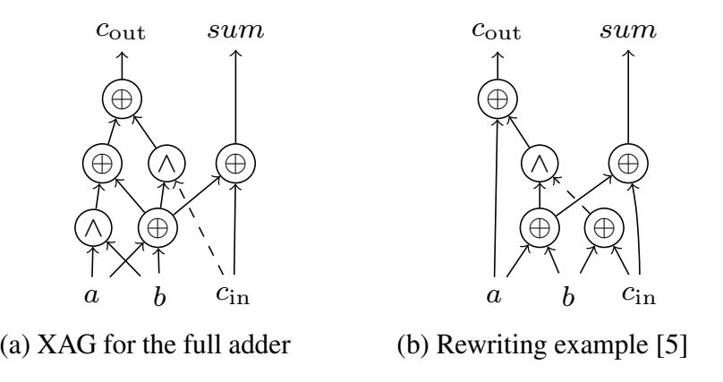
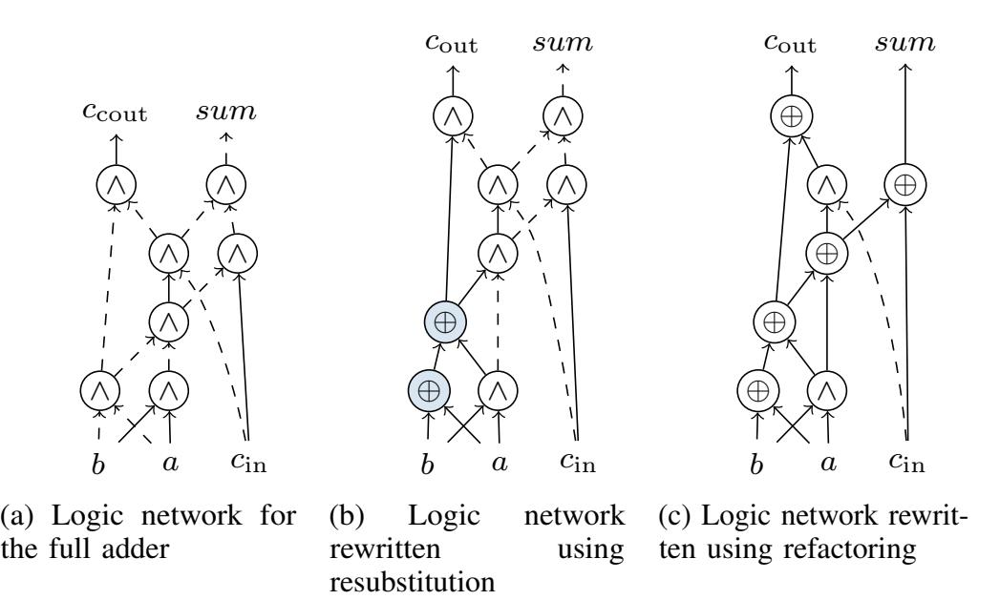

{0}------------------------------------------------

# A Logic Synthesis Toolbox for Reducing the Multiplicative Complexity in Logic Networks

Eleonora Testa\*, Mathias Soeken<sup>†</sup>, Heinz Riener\*, Luca Amaru<sup>‡</sup> and Giovanni De Micheli\*

\*Integrated Systems Laboratory, EPFL, Lausanne, Switzerland

<sup>†</sup>Microsoft, Switzerland

<sup>‡</sup>Synopsys Inc., Design Group, Sunnyvale, California, USA

Abstract—Logic synthesis is a fundamental step in the realization of modern integrated circuits. It has traditionally been employed for the optimization of CMOS-based designs, as well as for emerging technologies and quantum computing. Recently, it found application in minimizing the number of AND gates in cryptography benchmarks represented as xor-and graphs (XAGs). The number of AND gates in an XAG, which is called the logic network's multiplicative complexity, plays a critical role in various cryptography and security protocols such as fully homomorphic encryption (FHE) and secure multi-party computation (MPC). Further, the number of AND gates is also important to assess the degree of vulnerability of a Boolean function, and influences the cost of techniques to protect against side-channel attacks. However, so far a complete logic synthesis flow for reducing the multiplicative complexity in logic networks did not exist or relied heavily on manual manipulations. In this paper, we present a logic synthesis toolbox for cryptography and security applications. The proposed tool consists of powerful transformations, namely resubstitution, refactoring, and rewriting, specifically designed to minimize the multiplicative complexity of an XAG. Our flow is fully automatic and achieves significant results over both EPFL benchmarks and cryptography circuits. We improve the best-known results for cryptography up to 59%, resulting in a normalized geometric mean of 0.82.

#### I. INTRODUCTION

Logic synthesis is an essential part of modern EDA flows for the realization and optimization of integrated circuits targeting area, delay, and power. For this purpose, logic synthesis abstracts circuits using compact data structures, and manipulates them making use of both exact and heuristic algorithms [1], [2], [3]. In the past, logic synthesis mainly focused on the optimization of CMOS circuits, while today it considers different objectives and fields of application, such as emerging technologies or quantum computers [3]. More recently, the works in [4], [5], [6], [7] have started a new domain of application for logic synthesis, addressing cryptography and security applications. In this scenario, logic synthesis makes use of xor-and graphs (XAGs, [5]) as data structure for optimization, because they efficiently abstract cryptography circuits over the basis {AND, XOR, NOT} [4]. Further, logic synthesis focuses on the minimization of the number of AND gates as its main target metric for optimization.

The minimization of the number of AND gates for cryptography is fundamental for two main reasons. First, the number of AND gates correlates to the degree of vulnerability of a circuit [8]. The minimum number of AND gates sufficient to implement a Boolean function as an XAG is called *multiplicative complexity of the function* [8], while the *multiplicative complexity of the logic network* is defined as the actual number of AND gates used in the network representation of the function [9], [5]. The multiplicative complexity of a function directly

correlates to the resistance of the function against algebraic attacks [10], while the multiplicative complexity of a logic network implementing that function only provides an upper bound. Consequently, minimizing the multiplicative complexity of a network is important to assess the real multiplicative complexity of the function, and therefore its vulnerability. Second, the number of AND gates plays an important role in high-level cryptography protocols such as zero-knowledge protocols, fully homomorphic encryption (FHE), and secure multi-party computation (MPC) [11], [12], [6]. For example, the size of the signature in post-quantum zero-knowledge signatures based on "MPC-in-the-head" [13] depends on the multiplicative complexity in the underlying block cipher [12]. Moreover, the number of computations in MPC protocols based on Yao's garbled circuits [14] with the free XOR technique [15] is proportional to the number of AND gates. Regarding FHE, XOR gates are considered cheaper and less noisy compared to AND gates. To further motivate our work, it is worth mentioning that in techniques to protect against side-channel attacks, the cost of general-purpose protections grows with the number of AND gates [10]. Moreover, the work in [16] has recently demonstrated the positive effect of the minimization of AND gates on the number of qubits and expensive quantum operations (T gates) in fault-tolerant quantum circuits.

While it is clear that the multiplicative complexity has a key role in cryptography and that logic synthesis can have a strong impact in its optimization, so far, there are no fully automatic logic synthesis tools able to address the optimization of the number of AND gates in a network as their main goal for optimization. The work in [5] has recently presented a logic synthesis algorithm for cryptography, but it is limited to a rewriting algorithm. On the other hand, state-of-the-art tools [2], [17] automatically address size optimization, without precisely minimizing the number of ANDs, and methods from the cryptography community rely heavily on manual decomposition and optimization strategies [4].

In this paper, we propose a fully *automatic* logic synthesis toolbox for cryptography applications. The proposed tool presents a *complete* synthesis flow that interchanges various logic synthesis techniques able to find different optimization opportunities on the same network. This overcomes the main limitation of the work presented in [5], which focuses instead on rewriting small 6-input subnetworks with their optimum representations. The tool uses XAGs as underlying data structures to represent functions and consists of three main optimizations, namely *rewriting*, *refactoring*, and *resubstitution*, which are specifically implemented to minimize the number of AND gates. These three transformations are the most common and powerful optimizations involved in modern synthesis flows [18], and allow us to obtain significant improvements over previous

{1}------------------------------------------------



Fig. 1: XAG of the full adder (a), and its implementation (b) with optimum multiplicative complexity after rewriting

best results. We test our flow on best-known results coming from [5] and [6] for both EPFL benchmarks and circuits for MPC and FHE applications. The complete flow optimizes the best results for EPFL benchmarks up to 47%, and achieves a normalized geometric mean of 0.82 for the cryptography benchmarks from [5]. For instance, it obtains a 59% reduction in the number of AND gates for a 32×32-bit multiplier.

## II. BACKGROUND

In this section, we provide some details on *xor-and graphs* (XAGs, [5]), as they are used as data structure to represent Boolean functions. Further, a rewriting algorithm for reducing the multiplicative complexity in logic networks is described. This algorithm was first presented in [5] and it has been implemented as part of our logic synthesis tool.

# *A. XAGs and Multiplicative Complexity*

In analogy to the work in [5], we select XAGs as data structure for the optimization flow. An XAG is a logic network in which each node is a 2-input AND or a 2-input XOR operation, and edges to connect the gates can be both regular and complemented, where a complemented edge indicates the inversion of the signal. Fig. 1(a) presents an XAG for the full adder: XOR gates are labeled with '⊕', AND gates are labeled with '∧', and the complemented edges are denoted by dashed lines. Note that complemented x is equivalent to 1 ⊕ x, thus, an XAG without complemented edges can be easily obtained by replacing each inverter by an XOR gate. The *multiplicative complexity of a Boolean function* is given by the minimum number of AND gates needed to represent the function over the basis {AND, XOR, NOT} [8], [4]. On the other hand, we refer to the *multiplicative complexity of a logic network* as the actual number of AND gates used to implement the functionality over an XAG [9]. The latter only provides an upper bound for the multiplicative complexity, and may be far larger than the actual multiplicative complexity of the function itself. For instance, the multiplicative complexity of the logic network of the full adder in Fig. 1(a) is equal to 2, while it is well-known [19] that the multiplicative complexity of the function is equal to 1.

# *B. Rewriting Algorithm for Cryptography Applications*

A previous work [5] has focused on logic synthesis for minimizing the number of AND gates over an XAG, using a rewriting algorithm. Rewriting is a technique largely used in logic synthesis, and allows to replace parts of a logic network with optimized (e.g., in the number of nodes or levels) subnetworks. These subnetworks can be precomputed, as done in [20], [5], or computed on-the-fly with *exact synthesis* as presented in [21].

# Algorithm 1 Resubstitution to reduce the number of ANDs

```
Input: Logic network N, cut-size, max div
Output: Resynthesized logic network
1: list ← topological-sort-network(N)
2: for each node n in list do
3: cut ← find-reconvergent-cut(n, cut-size)
4: mffc ← computeMFFC(n)
5: if |mf fc| > 0 then
6: div ← collect-divisors(list, n, max div)
7: compute-truth-tables(cut)
8: compute-satisfiability-DC(cut)
9: if n
           0 ← 0-resub(list, n, div) then
10: continue
11: end if
12: and mf fc ← AND-in-MFFC(mf fc)
13: if and mf fc = 0 then
14: continue
15: end if
16: if and mf fc > 0 then
17: if n
              0 ← xor-resub(list, n, div) then
18: continue
19: end if
20: if n
              0 ← xx-resub(list, n, div) then
21: continue
22: end if
23: if n
              0 ← and-resub(list, n, div, and mf fc) then
24: continue
25: end if
26: if n
              0 ← aa-resub(list, n, div, and mf fc) then
27: continue
28: end if
29: if n
              0 ← ao-resub(list, n, div, and mf fc) then
30: continue
31: end if
32: end if
33: end if
34: end for
35: network-cleanup-and-sweeping(N)
```

The algorithm in [5] presents a generalization of DAG-aware AIG rewriting [20], modified to focus on the minimization of the number of AND gates. It makes use of cut enumeration [22], with adjusted cost computation, and *affine functions classification* [23] to replace 6-input XAG cuts with their optimum (i.e., having minimum multiplicative complexity) subnetworks. The algorithm is based on two major considerations, being (i) the multiplicative complexity of a Boolean function is unchanged by affine operations, and (ii) the optimum XAG is known [8], [24] for each affine class representative up to 6-input functions. We refer the reader to [5] for more details on the implementation of the algorithm. Here, we conclude with an example, showing how the rewriting algorithm applied on small (up to 6-input functions) logic networks can obtain the optimum multiplicative complexity. The full adder obtained with the rewriting algorithm from [5] is shown in Fig. 1 (b), and has a multiplicative complexity equal to 1.

## III. LOGIC SYNTHESIS TOOLKIT FOR CRYPTOGRAPHY AND SECURITY

In this section, we present *resubstitution* and *refactoring* as two new algorithms to create a logic synthesis flow for cryptography and security applications, which also includes *rewriting*. The presented algorithms modify state-of-the-art logic synthesis optimization techniques by considering the minimization of the number of AND gates as their primary goal.

## *A. Resubstitution*

Resubstitution is a method adopted in many logic synthesis flows [25] to express the function of a node n using other nodes 

{2}------------------------------------------------

(called *divisors*) which are already present in the logic network. A resubstitution is accepted if the new implementation is more compact (e.g., in the number of nodes) than the current one, thus resulting in size optimization. Resubstitution is usually classified according to the number of operators that it adds to the logic network, i.e., 0-resubstitution, if it does not add any new operator; 1-resubstitution if it expresses a logic function by adding one logic operator, and so forth. When k nodes are added by resubstitution, size improvement is obtained if l > k, where l is the number of nodes in the *maximum fanout free cone* (MFFC, [20]) of node n. We also refer to "ANDresubstitution", "OR-resubstitution", etc., depending on the type of operators added to the network.

Our tool minimizes the number of AND gates in the logic network, independently from the number of XOR gates and inverters. Thus, state-of-the-art resubstitution algorithms need to be re-investigated to take this new cost into account. First, XOR gates do not take part in the total cost and saving, and only the number of AND gates in the MFFC, called hereafter and mffc, are considered in the global saving for resubstitution. It means that XOR-resubstitution is always advantageous when the number of AND gates in the MFFC is larger than 0. On the other hand, in the case and mffc = 0, resubstitution is never leading to any AND optimization. Regarding AND/OR resubstitutions, classical implementations can be used, paying attention to evaluate the gain as and mffc.

The resubstitution procedure is depicted in Alg. 1. For each node in the network (in topological order), the procedure computes a reconvergent-driven cut and the MFFC of n as implemented in [26]. k-resubstitution is intrinsically an expensive task, and it is thus applied to small partitions of the whole network. To accelerate the computation, the divisors are collected by setting a maximum number of nodes max div. As resubstitution may result in more optimization opportunities when enriched with don't cares, we allow the use of *satisfiability don't cares* in the algorithm. Truth tables are used as underlying data structure for the computation of both the Boolean functionality and the don't cares (lines 7–8 in Alg. 1). First 0-resubstitution is attempted. Due to the use of don't cares, the algorithm looks for a divisor d<sup>1</sup> such that DC(n) ∨ n = DC(n) ∨ d1. If this is successful, resubstitution is applied and the procedure moves to the next node; otherwise, more complex types of resubstitution are tried, depending on the number of AND gates in the MFFC. If and mffc = 0, the procedure jumps to the next node, as resubstitution is not leading to any optimization. In the opposite case, i.e., and mffc > 0, any XOR-resubstitution is successful independently on the number of increased XORs. Two XOR resubstitutions are implemented: XOR-resubstitution (*xor-resub*) and XOR-XORresubstitution (*xx-resub*). In the case *xor-resub* and *xx-resub* are not applicable, standard AND resubstitutions are attempted in increasing complexity order. The tried resubstitutions are: AND-resubstitution (*and-resub*), AND-AND resubstitution (*aaresub*), AND-OR resubstitution (*ao-resub*). In this scenario, the resubstitution is successful if the number of k added AND nodes is smaller than and mffc. To accelerate the computation, Boolean filtering rules from [25] have been applied for the AND-resubstitution.

As an example, consider the logic network from Fig. 2 (a), which is the not-optimized XAG of the full adder. By applying XOR-XOR-resubstitution, one AND gate can be written using two XORs (highlighted in Fig. 2 (b)). This example intentionally shows that the algorithm does not consider the increase in the



Fig. 2: Resubstitution example

# Algorithm 2 Refactoring to reduce the number of ANDs

```
Input: Logic network N, max fanin
Output: Resynthesized logic network
1: for each node n in N do
2: mffc ← computeMFFC(n, max fanin)
3: f ← compute-truth-tables(mf fc)
4: dc ← compute-satisfiability-DC(mf fc)
5: new mf fc ← synthesize(f, dc)
6: if AND-in-MFFC(new mf fc) < AND-in-MFFC(mf fc) then
7: Substitute(new mf fc, mf fc)
8: end if
9: end for
10: network-cleanup-and-sweeping(N)
```

number of nodes as the main cost for optimization, while only the AND gates are accounted for in the optimization process (decreased from 7 to 6).

#### *B. Refactoring*

Refactoring is an effective technique often used to overcome local minima that can be encountered during optimization. As a matter of fact, refactoring resynthesizes large subnetworks in a logic network from scratch and without using existing nodes in the logic network. Depending on the optimization needs and the data structure, different logic synthesis algorithms can be used for this purpose, e.g., [27], [28].

In the presented flow, we aim at minimizing the number of AND gates over an XAG, consequently, a refactoring technique that works over 2-input XOR/AND operators is needed. For this purpose, the algorithm for bi-decomposition proposed by Mishchenko *et al.* in [27] is used. The algorithm synthesizes a function using OR, AND and XOR gates, together with internal don't cares to allow a better quality of results. The primary goal of optimization in [27] is to obtain a "balanced" network; it means that, when more than one bi-decomposition exists, the algorithm chooses the type of operator (i.e., AND, OR, XOR) that leads to the most-balanced result in terms of the size of the support. In our optimization, we consider a different operator-selection and change the original algorithm to always (when possible) choose the XOR operator over AND and ORs, independently on the size of the supports. This is because the XOR operator does not take part in the total cost and, in this way, the algorithm always picks the XOR operator when more than one bi-decomposition exists.

The refactoring procedure to minimize the number of AND gates is depicted in Alg. 2. It has been implemented following 

{3}------------------------------------------------

the general guidelines in [18]. For each node in the network, the MFFC is evaluated by setting a limit on the maximum number of primary inputs  $(max\_fanin)$ , and truth tables are used to compute Boolean functions and satisfiability don't cares. The function is synthesized (line 5 in Alg. 2) by using a modified version of the bi-decomposition from [27], in which the selection of the operators is changed to prefer the XOR operator, when a XOR-bi-decomposition exists. If the new implementation of the MFFC has less AND gates, the new MFFC is substituted to the previous one, resulting in a network with reduced multiplicative complexity.

As an example, consider the logic network from Fig. 2 (b), which is the XAG implementation of the full adder, obtained after resubstitution. By applying refactoring on each primary output, the network can be factorized as presented in Fig. 2 (c). The new implementation has a smaller number of AND gates, which are decreased to only 2 gates.

#### IV. EXPERIMENTAL RESULTS

The two aforementioned techniques have been implemented together with the rewriting algorithm from [5] to create a complete and automatic logic synthesis toolbox that minimizes the number of AND gates. In this section, first, we detail the implementation of the proposed algorithms, then the experimental results are presented. We test the efficacy of the algorithms on state-of-the-art best-known results both on the EPFL and cryptography and security benchmarks.

## A. Details of the Implementation

The proposed algorithms have been implemented as part of the open-source logic synthesis framework *mockturtle*, which is part of the EPFL logic synthesis libraries [29].<sup>1</sup> All the experiments have been carried out on an Intel Xeon E5-2680 CPU with 2.5 GHz and with 256 GB of main memory.

For resubstitution, we fixed the maximum number of divisors to 100, and the maximum number of inputs for computing a cut to 8. Don't cares may be used to trade off runtime and quality of results. In our case, we always use don't cares within resubstitution. The maximum number of primary inputs for the refactoring MFFC was set to 15; as in the previous case, don't cares are also used for refactoring. Regarding rewriting, we fixed the number of inputs for each cut to 6, as optimum subnetworks are known up to 6-input functions. Further, the rewriting algorithm allows us to limit the maximum number of cuts computed for each node (set to 12). The optimum (i.e., having optimum multiplicative complexity) subnetworks for 6-input functions were retrieved from the database used in [5]. The three presented algorithms can be applied separately or in a global flow, which alternates between the three proposed techniques. All optimized benchmarks are verified to be formally equivalent to the original ones. It is worth mentioning that we do not apply any XOR optimization; nevertheless, in some protocols, XORs involve a communication overhead [11]. An algorithm to minimize the number of XORs for crypthography applications can be found in [4].

#### B. EPFL Benchmarks

To test the efficacy of the flow in decreasing the number of AND gates, we apply the proposed algorithms on the EPFL benchmarks [30]. The experiments are shown in Table I. As baseline, we use the best-known results presented in [5]<sup>2</sup>, that

are obtained applying the rewriting algorithm until convergence of the results is achieved. In the following, we thus present separately the results of resubstitution and refactoring, as the rewriting algorithm is not leading to any further optimization if applied separately (i.e., not as part of the complete flow) on the baseline. The column "Resubstitution" presents results when Alg. 1 is applied once, while "Refactoring" shows the improvements achieved by applying once Alg. 2 on the baseline. The complete flow shows the results when the three techniques (i.e., rewriting, refactoring, and resubstitution) are applied in the given order until convergence is reached. It means, no further optimization is achieved with any of the proposed algorithms. The runtime of the complete flow is evaluated as an average runtime obtained dividing the total runtime by the number of iterations, where each iteration consists of the three presented techniques. Even though, as a general trend, the results in Table I show that resubstitution achieves better optimization compared to refactoring, for few benchmarks (e.g., mult, sin, log2) refactoring largely overcomes the results achieved with resubstitution. As expected, for the *adder* benchmark no further optimization is obtained as the baseline result is optimum [19]. More interestingly, none of the presented techniques manages to optimize the *bar* benchmark. On average, the complete flow optimizes the best-known results up to 47%, with a geometric mean of 0.81 and 0.85 for the arithmetic and random-control benchmarks, respectively. For the max, arbiter, decoder, and router benchmarks, the results of the complete flow are entirely obtained by resubstitution. On average, 4 iterations are needed to reach the convergence of the results for the complete flow.

## C. Cryptography Benchmarks

Our tool's main goal is to optimize the number of AND gates in cryptography applications that do not account for XORs and inverters in their cost function. We exercised the proposed flow on cryptography benchmarks in the context of *multi-party computation* (MPC) and *fully homomorphic encryption* (FHE); in particular, we use (i) the best-known results from [5], and (ii) the circuits presented in [6].<sup>3</sup> The first set includes block ciphers, three hash functions, and seven arithmetic functions; the second set consists of practical MPC problems.

The experimental results for the benchmarks coming from [5] are shown in Table II. As in the previous case, results are obtained with (i) resubstitution, (ii) refactoring, and (iii) a complete flow that alternates between rewriting, refactoring, and resubstitution until convergence of the results. The runtime is evaluated as discussed in the previous section. Our algorithms are applied on top of the best results presented in [5] (used as "Baseline"). Both the 32- and 64-adder cannot be further optimized because their number of AND gates is optimum [19]. For the AES benchmarks, which were not optimized by the work in [5], our global flow does not find any optimization opportunity. On the other hand, the tool can further optimize most of the previous best results. In particular, for the multiplier, it optimizes the number of AND gates up to 59%, reducing it  $2.4\times$ . As for the EPFL benchmarks, this optimization mostly comes from refactoring, while resubstitution does not find many opportunities (1%) for the multiplier. As a general trend, resubstitution obtains better results compared to refactoring on most of the cryptography benchmarks (e.g., on the comparators). On average, the complete flow achieves substantial optimizations, with a geometric mean of 0.82. For the SHA-256 benchmark, 21 iterations are needed for the saturation of the results.

<sup>&</sup>lt;sup>1</sup>Available at: *github.com/lsils/mockturtle*. Experiments are available at: *github.com/lsils/date2020\_experiments* 

<sup>&</sup>lt;sup>2</sup>Available at: *github.com/eletesta/dac19-experiments* 

<sup>&</sup>lt;sup>3</sup>Available at: *github.com/sadeghriazi/MPCircuits* 

{4}------------------------------------------------

TABLE I: Experimental results for EPFL benchmarks

| Benchmark                 | Inputs | Outputs | Baseline [5] |      | Resubstitution |       |       | Refactoring |       |       | Complete flow |       |       |          |
|---------------------------|--------|---------|--------------|------|----------------|-------|-------|-------------|-------|-------|---------------|-------|-------|----------|
|                           |        |         | AND          | XOR  | AND            | XOR   | impr. | AND         | XOR   | impr. | AND           | XOR   | impr. | time [s] |
| Adder *                   | 256    | 129     | 128          | 549  | //             | //    | 0%    | //          | //    | 0%    | //            | //    | 0%    | 1.76     |
| Barrel shifter            | 135    | 128     | 832          | 1728 | //             | //    | 0%    | //          | //    | 0%    | //            | //    | 0%    | 8.38     |
| Divisor                   | 128    | 128     | 6060         | 8994 | 5844           | 9053  | 4%    | 5691        | 8562  | 6%    | 5291          | 8678  | 13%   | 129.60   |
| Log2                      | 32     | 32      | 19436        | 9371 | 17240          | 10644 | 11%   | 12360       | 15633 | 36%   | 10913         | 15923 | 44%   | 732.69   |
| Max                       | 512    | 130     | 931          | 1479 | 890            | 1520  | 4%    | //          | //    | 0%    | 890           | 1520  | 4%    | 8.48     |
| Multiplier                | 128    | 128     | 11940        | 8614 | 11623          | 8120  | 3%    | 7941        | 12272 | 33%   | 7653          | 11855 | 36%   | 233.45   |
| Sine                      | 24     | 25      | 4075         | 1770 | 3390           | 2157  | 17%   | 3236        | 2444  | 21%   | 2603          | 2709  | 36%   | 70.00    |
| Square-root               | 128    | 64      | 6244         | 9640 | 5927           | 9562  | 5%    | 6023        | 9148  | 4%    | 5381          | 9260  | 14%   | 148.38   |
| Square                    | 64     | 128     | 5181         | 8084 | 4929           | 8140  | 5%    | 5011        | 8076  | 3%    | 4672          | 8198  | 10%   | 84.57    |
| Normalized geometric mean |        |         | 1            |      | 0.94           |       |       | 0.87        |       |       | 0.81          |       |       |          |
| Round-robin arbiter       | 256    | 129     | 1181         | 0    | 1174           | 7     | 1%    | //          | //    | 0%    | 1174          | 7     | 1%    | 21.29    |
| Alu control unit          | 7      | 26      | 85           | 8    | 53             | 36    | 38%   | 69          | 24    | 19%   | 45            | 49    | 47%   | 1.62     |
| Coding-cavlc              | 10     | 11      | 494          | 197  | 414            | 246   | 16%   | 476         | 215   | 4%    | 394           | 267   | 20%   | 17.20    |
| Decoder                   | 8      | 256     | 341          | 0    | 328            | 13    | 4%    | //          | //    | 0%    | 328           | 13    | 4%    | 15.16    |
| i2c controller            | 147    | 142     | 623          | 502  | 586            | 345   | 6%    | 588         | 535   | 6%    | 557           | 375   | 11%   | 11.99    |
| int to float converter    | 11     | 7       | 100          | 101  | 91             | 85    | 9%    | 99          | 102   | 1%    | 85            | 88    | 15%   | 2.20     |
| Memory controller         | 1204   | 1231    | 5113         | 4168 | 4923           | 3262  | 4%    | 4893        | 4328  | 4%    | 4695          | 3401  | 8%    | 135.07   |
| Priority encoder          | 128    | 8       | 327          | 158  | 326            | 159   | 0.3%  | 324         | 161   | 1%    | 323           | 162   | 1%    | 7.36     |
| Lookahead XY router       | 60     | 30      | 96           | 0    | 93             | 6     | 3%    | //          | //    | 0%    | 93            | 6     | 3%    | 2.81     |
| Voter                     | 1001   | 1       | 5651         | 6066 | 4802           | 5759  | 15%   | 5257        | 6160  | 7%    | 4257          | 5990  | 25%   | 92.61    |
| Normalized geometric mean |        |         | 1            |      | 0.90           |       |       | 0.96        |       |       | 0.85          |       |       |          |

<sup>\*</sup> These results are known to be optimum [19], we thus do not expect any further optimization for the number of AND gates

TABLE II: Experimental results for MPC and FHE benchmarks [5]

| Benchmark                  | Inputs | Outputs |       | Baseline [5] |       | Resubstitution |       |       | Refactoring |       |       |       | Complete flow |          |
|----------------------------|--------|---------|-------|--------------|-------|----------------|-------|-------|-------------|-------|-------|-------|---------------|----------|
|                            |        |         | AND   | XOR          | AND   | XOR            | impr. | AND   | XOR         | impr. | AND   | XOR   | impr.         | time [s] |
| AES (No Key Expansion)     | 256    | 128     | 6800  | 25124        | //    | //             | 0%    | //    | //          | 0%    | //    | //    | 0%            | 383.87   |
| AES (Key Expansion )       | 1536   | 128     | 5440  | 20325        | //    | //             | 0%    | //    | //          | 0%    | //    | //    | 0%            | 274.50   |
| DES (No Key Expansion)     | 128    | 64      | 15093 | 11105        | 9840  | 12347          | 35%   | 11413 | 14658       | 24%   | 9048  | 13092 | 40%           | 532.85   |
| DES (Key Expansion)        | 832    | 64      | 15126 | 11263        | 10078 | 12291          | 33%   | 11595 | 14691       | 23%   | 9205  | 13136 | 39%           | 536.07   |
| MD5                        | 512    | 128     | 9381  | 30325        | 9374  | 29743          | 0.1%  | 9380  | 30326       | 0.01% | 9367  | 29729 | 0.1%          | 520.94   |
| SHA-1                      | 512    | 160     | 11820 | 44311        | 11684 | 44355          | 1%    | 11776 | 44302       | 0.4%  | 11515 | 44358 | 3%            | 996.70   |
| SHA-256                    | 512    | 256     | 30201 | 91278        | 29145 | 91578          | 3%    | 29933 | 91254       | 1%    | 26927 | 91495 | 11%           | 4316.69  |
| 32-bit Adder *             | 64     | 33      | 32    | 150          | //    | //             | 0%    | //    | //          | 0%    | //    | //    | 0%            | 0.41     |
| 64-bit Adder *             | 128    | 65      | 64    | 284          | //    | //             | 0%    | //    | //          | 0%    | //    | //    | 0%            | 0.92     |
| 32x32-bit Multiplier       | 64     | 64      | 4107  | 2473         | 4060  | 2456           | 1%    | 2650  | 3866        | 35%   | 1689  | 3861  | 59%           | 27.78    |
| Comp. 32-bit Signed LTEQ   | 64     | 1       | 114   | 89           | 98    | 98             | 14%   | 114   | 89          | 0%    | 92    | 97    | 19%           | 3.25     |
| Comp. 32-bit Signed LT     | 64     | 1       | 108   | 116          | 96    | 100            | 11%   | 108   | 116         | 0%    | 92    | 95    | 15%           | 4.13     |
| Comp. 32-bit Unsigned LTEQ | 64     | 1       | 114   | 89           | 98    | 98             | 14%   | 114   | 89          | 0%    | 92    | 97    | 19%           | 3.26     |
| Comp. 32-bit Unsigned LT   | 64     | 1       | 108   | 116          | 96    | 100            | 11%   | 108   | 116         | 0%    | 92    | 95    | 15%           | 4.11     |
| Normalized geometric mean  |        |         | 1     |              | 0.90  |                |       | 0.93  |             |       | 0.82  |       |               |          |

<sup>\*</sup> These results are known to be optimum [19], we thus do not expect any further optimization for the number of AND gates

We compared the proposed flow to the flow in [6] on the MPC circuits. Table III lists the results. Beside the name of the benchmark, the table shows the number of AND gates obtained using the original approach as reported in [6]. Unlike in the results reported above, we did not apply the proposed approach on top of their optimized benchmarks, but compared the flows directly. The benchmarks in [6] are specified in register-transferlevel Verilog code, which we transformed using *Yosys* [17] and *ABC* [2] into a format that can be read by our tool. The proposed complete flow applies rewriting, refactoring, and resubstitution until convergence. The resulting number of AND gates are reported in the third column of the table, with the percentage improvement compared to the original flow given by the last column. We do not report the number of XORs because the results reported in [6] includes both XOR and inverters, while in our case it only includes XORs. The results in Table III show that the proposed flow achieves significant improvements. For one benchmark, our result is far beyond the flow in [6], meaning that some optimization opportunities are not found by the proposed method. On the *auction* benchmarks, results are close to the ones obtained running the flow in [6]; on the other hand, for the *voting* and *secure k-nearest neighbor search* (knn) benchmarks, results are improved by 25% and 17% on average, respectively. Results for the *private set intersection (bitwise-AND)* are not reported as neither the flow in [6] nor the complete flow managed to optimize them.

## V. CONCLUSION

Logic synthesis has recently been employed to target cryptography and security applications and thus to deal with the minimization of the number of AND gates over *xor-and graphs* (XAGs). The number of AND gates in an XAG is called the *multiplicative complexity of the logic network*, and, nevertheless recent work in this field, there is still a lack of logic

{5}------------------------------------------------

TABLE III: Experimental results for MPC benchmarks [6]

| Benchmark             | Flow in [6] | Proposed complete flow | impr.  |
|-----------------------|-------------|------------------------|--------|
|                       | AND         | AND                    | impr.  |
| knn comb K 2 N 16     | 2370        | 1919                   | 19.0%  |
| knn comb K 1 N 16     | 1160        | 1162                   | -0.2%  |
| knn comb K 1 N 8      | 556         | 554                    | 0.4%   |
| knn comb K 2 N 8      | 1080        | 881                    | 18.4%  |
| knn comb K 3 N 8      | 1520        | 1060                   | 30.3%  |
| knn comb K 3 N 16     | 3500        | 2394                   | 31.6%  |
| voting N 1 M 3        | 8           | 7                      | 12.5%  |
| voting N 3 M 4        | 388         | 275                    | 29.1%  |
| voting N 2 M 4        | 147         | 104                    | 29.3%  |
| voting N 2 M 3        | 79          | 55                     | 30.4%  |
| voting N 1 M 4        | 16          | 15                     | 6.3%   |
| voting N 2 M 2        | 37          | 21                     | 43.2%  |
| auction N 3 W 16      | 228         | 232                    | -1.8%  |
| auction N 2 W 16      | 97          | 97                     | 0.0%   |
| auction N 3 W 32      | 454         | 456                    | -0.4%  |
| auction N 4 W 16      | 492         | 495                    | -0.6%  |
| auction N 4 W 32      | 975         | 975                    | 0.0%   |
| auction N 2 W 32      | 194         | 193                    | 0.5%   |
| secure s m M 4 N 16   | 16700       | 16001                  | 4.2%   |
| secure s m M 8 N 16   | 46660       | 58723                  | -26.0% |
| Normalized geom. mean |             | 0.87                   |        |

synthesis tools to automatically and efficiently optimize the multiplicative complexity of cryptography circuits. In this work, we have presented a complete and automatic logic synthesis toolbox to address these alternative applications. The tool alternates between rewriting, refactoring, and resubstitution techniques, precisely modified to focus on the minimization of the number of AND gates in an XAG. Our tool achieves significant results over both EPFL and cryptography best-known results. We demonstrate an average improvement of 15% for the EPFL benchmarks, and a reduction up to 2.4× in the number of AND gates for cryptography applications.

# ACKNOWLEDGMENT

This research was supported by the EPFL Open Science Fund, by the Swiss National Science Foundation (200021- 169084 MAJesty) and by the ERC project H2020-ERC-2014- ADG 669354 CyberCare.

# REFERENCES

- [1] R. K. Brayton, R. Rudell, A. Sangiovanni-Vincentelli, and A. R. Wang, "MIS: A multiple-level logic optimization system," *IEEE Trans. on CAD of Integrated Circuits and Systems*, vol. 6, no. 6, pp. 1062–1081, 1987.
- [2] R. K. Brayton and A. Mishchenko, "ABC: an academic industrialstrength verification tool," in *Computer Aided Verification*, 2010, pp. 24–40.
- [3] E. Testa, M. Soeken, L. Amaru, and G. De Micheli, "Logic synthesis ` for established and emerging computing," *Proceedings of the IEEE*, vol. 107, no. 1, pp. 165–184, 2018.
- [4] J. Boyar, P. Matthews, and R. Peralta, "Logic minimization techniques with applications to cryptology," *Journal of Cryptology*, vol. 26, no. 2, pp. 280–312, 2013.
- [5] E. Testa, M. Soeken, L. Amaru, and G. De Micheli, "Reducing the ` multiplicative complexity in logic networks for cryptography and security applications," in *Design Automation Conference*, 2019.
- [6] M. S. Riazi, M. Javaheripi, S. U. Hussain, and F. Koushanfar, "MPCircuits: Optimized circuit generation for secure multi-party computation," *Int'l Symp. on Hardware-Oriented Security and Trust*, pp. 198–207, 2019.
- [7] S. Cimato, V. Ciriani, E. Damiani, and M. Ehsanpour, "An OBDD-based technique for the efficient synthesis of garbled circuits," in *International Workshop on Security and Trust Management*, 2019, pp. 158–167.

- [8] M. Turan Sonmez and R. Peralta, "The multiplicative complexity ¨ of Boolean functions on four and five variables," in *Lightweight Cryptography for Security and Privacy*, Cham, 2015, pp. 21–33.
- [9] D. Goudarzi and M. Rivain, "On the multiplicative complexity of Boolean functions and bitsliced higher-order masking," in *International Conference on Cryptographic Hardware and Embedded Systems*, 2016, pp. 457–478.
- [10] N. Courtois, D. Hulme, and T. Mourouzis, "Solving circuit optimisation problems in cryptography and cryptanalysis," *IACR Cryptology ePrint Archive*, vol. 2011, p. 475, 2011.
- [11] M. R. Albrecht, C. Rechberger, T. Schneider, T. Tiessen, and M. Zohner, "Ciphers for MPC and FHE," in *Annual International Conference on the Theory and Applications of Cryptographic Techniques*, 2015, pp. 430–454.
- [12] M. Chase, D. Derler, S. Goldfeder, C. Orlandi, S. Ramacher, C. Rechberger, D. Slamanig, and G. Zaverucha, "Post-quantum zero-knowledge and signatures from symmetric-key primitives," in *Conference on Computer and Communications Security*, 2017, pp. 1825–1842.
- [13] I. Giacomelli, J. Madsen, and C. Orlandi, "Zkboo: Faster zero-knowledge for Boolean circuits," in *Security Symposium*, 2016, pp. 1069–1083.
- [14] E. M. Songhori, S. U. Hussain, A. Sadeghi, T. Schneider, and F. Koushanfar, "TinyGarble: Highly compressed and scalable sequential garbled circuits," in *Symposium on Security and Privacy*, 2015, pp. 411–428.
- [15] V. Kolesnikov and T. Schneider, "Improved garbled circuit: Free XOR gates and applications," in *International Colloquium on Automata, Languages, and Programming*, 2008, pp. 486–498.
- [16] G. Meuli, M. Soeken, E. Campbell, M. Roetteler, and G. D. Micheli, "The role of multiplicative complexity in compiling low T-count oracle circuits," in *Int'l Conf. on Computer-Aided Design*, 2019.
- [17] C. Wolf, "Yosys Open SYnthesis Suite," *http://www.clifford.at/yosys/*.
- [18] H. Riener, E. Testa, W. Haaswijk, A. Mishchenko, L. Amaru, ` G. De Micheli, and M. Soeken, "Scalable generic logic synthesis: One approach to rule them all," in *Design Automation Conference*, 2019.
- [19] J. Boyar and R. Peralta, "Tight bounds for the multiplicative complexity of symmetric functions," *Theoretical Computer Science*, vol. 396, no. 1–3, pp. 223–246, 2008.
- [20] A. Mishchenko, S. Chatterjee, and R. K. Brayton, "DAG-aware AIG rewriting a fresh look at combinational logic synthesis," in *Design Automation Conference*, 2006, pp. 532–535.
- [21] H. Riener, W. Haaswijk, A. Mishchenko, G. De Micheli, and M. Soeken, "On-the-fly and DAG-aware: Rewriting Boolean networks with exact synthesis," in *Design, Automation and Test in Europe*, 2019, pp. 1649– 1654.
- [22] P. Pan and C. Lin, "A new retiming-based technology mapping algorithm for LUT-based FPGAs," in *Int'l Symp. on Field Programmable Gate Arrays*, 1998, pp. 35–42.
- [23] D. M. Miller and M. Soeken, "An algorithm for linear, affine and spectral classification of Boolean functions," in *Advanced Boolean Techniques*. Springer, 2020, pp. 195–215.
- [24] C. Calik, M. S. Turan, and R. Peralta, "The multiplicative complexity of 6-variable Boolean functions," Cryptology ePrint Archive, Report 2018/002, 2018.
- [25] L. Amaru, M. Soeken, P. Vuillod, J. Luo, A. Mishchenko, J. Olson, ` R. Brayton, and G. De Micheli, "Improvements to Boolean resynthesis," in *Design, Automation and Test in Europe*, 2018, pp. 755–760.
- [26] H. Riener, E. Testa, L. Amaru, M. Soeken, and G. De Micheli, ` "Size optimization of MIGs with an application to QCA and STMG technologies," in *Int'l Symp. on Nanoscale Architectures*, 2018, pp. 157–162.
- [27] A. Mishchenko, B. Steinbach, and M. Perkowski, "An algorithm for bi-decomposition of logic functions," in *Design Automation Conference*, 2001, pp. 103–108.
- [28] S. B. Akers, "Synthesis of combinational logic using three-input majority gates," in *Annual Symposium on Switching Circuit Theory and Logical Design*, 1962, pp. 149–158.
- [29] M. Soeken, H. Riener, W. Haaswijk, E. Testa, B. Schmitt, G. Meuli, F. Mozafari, and G. De Micheli, "The EPFL logic synthesis libraries," May 2018, arXiv:1805.05121.
- [30] L. Amaru, P.-E. Gaillardon, and G. De Micheli, "The EPFL combi- ` national benchmark suite," in *Int'l Workshop on Logic and Synthesis*, 2015.