{0}------------------------------------------------

#### **Faster Enumeration-based Lattice Reduction: Root Hermite Factor** *k* **1/(2***k***) in Time** *k k***/8 +** *o***(***k***)**

Martin R. Albrecht<sup>1</sup> , Shi Bai<sup>2</sup> , Pierre-Alain Fouque<sup>3</sup> , Paul Kirchner<sup>3</sup> , Damien Stehlé4*,*<sup>5</sup> , and Weiqiang Wen<sup>3</sup> *<sup>⋆</sup>*

1 Information Security Group, Royal Holloway, University of London.

**Abstract.** We give a lattice reduction algorithm that achieves root Hermite factor *k* 1/(2*k*) in time *k k*/8+*o*(*k*) and polynomial memory. This improves on the previously best known enumeration-based algorithms which achieve the same quality, but in time *k k*/(2*e*)+*o*(*k*) . A cost of *k k*/8+*o*(*k*) was previously mentioned as potentially achievable (Hanrot-Stehlé'10) or as a heuristic lower bound (Nguyen'10) for enumeration algorithms. We prove the complexity and quality of our algorithm under a heuristic assumption and provide empirical evidence from simulation and implementation experiments attesting to its performance for practical and cryptographic parameter sizes. Our work also suggests potential avenues for achieving costs below *k k*/8+*o*(*k*) for the same root Hermite factor, based on the geometry of SDBKZ-reduced bases.

## **1 Introduction**

The cost of (strong) lattice reduction has received renewed attention in recent years due to its relevance in cryptography. Indeed, lattice-based constructions are presumed to achieve security against quantum adversaries and enable powerful functionalities such as computation on encrypted data. Concrete parameters for such schemes are derived from the difficulty of finding relatively short nonzero vectors in a lattice: the parameters are chosen based on extrapolations of the cost of the BKZ algorithm [[SE94](#page-27-0)] and its variants [\[CN11,](#page-26-0)[AWHT16,](#page-24-0)[MW16\]](#page-27-1). These algorithms make repeated calls to an oracle that solves the Shortest Vector Problem (SVP), i.e. that finds a shortest non-zero vector in any lattice. Concretely, BKZ with block size *k* finds relatively short vectors in lattices of

<sup>2</sup> Department of Mathematical Sciences, Florida Atlantic University. <sup>3</sup> Univ. Rennes, CNRS, IRISA, Rennes, France.

<sup>4</sup> Univ. Lyon, EnsL, UCBL, CNRS, Inria, LIP, F-69342 Lyon Cedex 07, France. 5 Institut Universitaire de France.

*<sup>⋆</sup>* This work was supported in part by EPSRC grants EP/S020330/1, EP/S02087X/1, by European Union Horizon 2020 Research and Innovation Program Grant 780701, by Innovate UK grant AQuaSec, by BPI-France in the context of the national project RISQ (P141580), and by NIST grants 60NANB18D216/60NANB18D217 as well as NATO SPS Project G5448. Part of this work was done while Martin Albrecht and Damien Stehlé were visiting the Simons Institute for the Theory of Computing.

{1}------------------------------------------------

dimensions *n ≥ k* using a *k*-dimensional SVP solver. The cost of this SVP solver is the dominating component of the cost of BKZ and its variants.

The SVP solver can be instantiated with enumeration-based algorithms, whose asymptotically most efficient variant is Kannan's algorithm [\[Kan83\]](#page-27-2). It has a worst-case complexity of *k k*/(2 e)+*o*(*k*) , where *k* is the dimension of the lattice under consideration [\[HS07](#page-26-1)]. This bound is sharp, up to the *o*(*k*) term in the exponent [[HS08\]](#page-26-2). If called on an *n*-dimensional lattice, then BKZ with block size *k* outputs a vector of norm *≈* (*k* 1/(2*k*) ) *n ·* Vol(*L*) 1/*n* in time *≈ k k*/(2 e) , when *n* is sufficiently large compared to *k*. The *k* 1/(2*k*) term is called the root Hermite factor and quantifies the strength of BKZ. The trade-off between root Hermite factor and running-time achieved by BKZ has remained the best known for enumeration-based SVP solvers since the seminal work of Schnorr and Euchner almost 30 years ago. (The analysis of Kannan's algorithm and hence BKZ was improved in [[HS07\]](#page-26-1), but not the algorithm itself.) Other algorithms, such as[[GN08a](#page-26-3)[,MW16](#page-27-1)[,ALNS19\]](#page-24-1), achieve the same asymptotic trade-off with milder conditions on *n*/*k*.

We note that while lattice reduction libraries, such as FPLLL [\[dt19a](#page-26-4)], the Progressive BKZ Library (PBKZ) [\[AWHT18](#page-24-2)] and NTL [\[Sho18](#page-27-3)], implement BKZ with an enumeration-based SVP solver, they do not rely on Kannan's algorithm: NTL implements enumeration with LLL preprocessing; FPLLL and PBKZ implement enumeration with stronger preprocessing (typically BKZ with a smaller block size) but not with sufficiently strong preprocessing to satisfy the conditions of [\[Kan83,](#page-27-2)[HS07](#page-26-1)]. Hence, the running-times of these implementations is not established by the theorems in these works.

It has been suggested that the running-time achieved by BKZ for the same output quality might potentially be improved. In [[HS10\]](#page-27-4), it was argued that the same root Hermite factor would be achieved by BKZ in time *≈ k <sup>k</sup>*/8 if the Gram–Schmidt norms of so-called HKZ-reduced bases were decreasing geometrically. In [\[Ngu10](#page-27-5)], the same quantity was suggested as a cost lower bound for enumeration-based lattice reduction algorithms. On this basis, several works have speculatively assumed this cost [[ANS18](#page-24-3),[ACD](#page-23-0)<sup>+</sup>18]. However, so far, no lattice reduction algorithm achieving root Hermite factor *k* 1/(2*k*) in time *≈ k k*/8 was known.

**Contributions.** Our main contribution is an enumeration-based lattice reduction algorithm that runs in time *k <sup>k</sup>*/8 and achieves root Hermite factor *k* 1 2*k* (1+*o*(1)), where *k* is a cost parameter akin to the "block size" of the BKZ algorithm (the notion of "block size" for our algorithm is less straightforward, see below). It uses polynomial memory and can be quantumly accelerated to time *k <sup>k</sup>*/16 using [\[ANS18\]](#page-24-3). Our analysis relies on a strengthened version of the Gaussian Heuristic.

To estimate the cost of lattice reduction algorithms, the literature typically relies on concrete experiments and simulations that extrapolate them (see, e.g. [\[CN11,](#page-26-0)[Che13,](#page-26-5)[MW16,](#page-27-1)[BSW18](#page-26-6)]). Indeed, the data given in [\[Che13](#page-26-5)] is very broadly appealed to. However, this data only covers up to block size of 250

{2}------------------------------------------------

(below cryptographically relevant block sizes) and no source code is available. As an intermediate contribution, we reproduce and extend the data in [Che13] using publicly available tools such as [dt19a,dt19b] (see Section 2.5). Using this extended dataset, we then argue that BKZ as implemented in public lattice reduction libraries has running-time closely matching  $k^{k/(2e)}$  (Figure 2). Our cost improvement hence required a different algorithm and not just an improved analysis of the state-of-the-art.

In Section 4 we propose a variant of our improved lattice reduction algorithm that works well in practice. We run simulations and conduct concrete experiments to verify its efficiency, while we leave as a future work to formally analyse it. The simulations suggest that it achieves root Hermite factors  $\approx k^{\frac{1}{2k}}$  in time  $k^{k/8}$ , at least up to  $k \approx 1,000$  (which covers cryptographic parameters). Our implementation of this algorithm beats FPLLL's SVP enumeration from dimension  $\approx 100$  onward. We consider the difference between these two variants as similar to the difference between Kannan's algorithm and what is routinely implemented in practice such as in FPLLL and PBKZ. We will refer to the former as the "asymptotic variant" and the latter as the "practical variant". Since our results rely on empirical evidence and simulations, we provide the source code used to produce our figures and the data being plotted as an attachment to the electronic version of the full version of this work.

**Key idea.** Our new algorithms decouple the preprocessing context from the enumeration context: they preprocess a projected sublattice of larger dimension than they aim to enumerate over (as a result, the notion of "block size" is less obvious than in prior works). More concretely, assume that the basis of the preprocessed projected sublattice is SDBKZ-reduced. Then, as shown in [MW16] under the Gaussian Heuristic, the first Gram–Schmidt norms  $\|\boldsymbol{b}_i^*\|$  satisfy Schnorr's Geometric Series Assumption (GSA) [Sch03]:  $\|\boldsymbol{b}_i^*\|/\|\boldsymbol{b}_{i+1}^*\| \approx r$  for some common r, for all i's corresponding to the start of the basis. On that "GSA part" of the lattice basis, the enumeration runs faster than on a typical preprocessed BKZ block of the same dimension. To achieve SDBKZ-reducedness at a low cost, our algorithms call themselves recursively.

As a side contribution, we show in Appendix A that the bases output by BKZ do not satisfy the GSA (under the Gaussian Heuristic), contrarily to a common belief (see e.g. [YD17,ANS18,BSW18]). This is why we use SDBKZ in the asymptotic algorithm. Nevertheless, for handlable dimensions, BKZ seems to deviate only slightly from the GSA and as it is a little simpler to implement than SDBKZ, it seems to remain preferable in practice. This is why we use BKZ as preprocessing in the practical algorithm.

To illustrate the idea of our new algorithms, we consider a BKZ-reduced (resp. SDBKZ-reduced) basis with block size k, in a lattice of dimension  $n = \lceil (1+c) \cdot k \rceil$  for various k and c. We choose  $n \geq k$  to demonstrate the impact of the GSA region on the enumeration cost. We then estimate the enumeration cost (without pruning) for re-checking that the first basis vector is a shortest non-zero vector in the very first block of size k. For the implementation of this simulation,

{3}------------------------------------------------

see simu\_c\_cost.py, attached to the electronic version of the full version of this work. We consider *c* for *c* = 0 to 1 with a step size of 0*.*01. For each *c*, we take *k* from *k* = 100 to 50*,* 000 with a step size of 10. Then for each fixed *c*, we fit the coefficients *a*0*, a*1*, a*<sup>2</sup> of *a*<sup>0</sup> *k* log *k* + *a*<sup>1</sup> *k* + *a*<sup>2</sup> over all *k* on the enumeration cost of the first block of size *k*. The result is plotted in Figure [1](#page-3-0). The *x*-axis denotes the value of *c* and the *y*-axis denotes the interpolated constant in front of the *k* log *k* term.

Let us make several remarks about Figure [1](#page-3-0). First, we stress that all leading constants in Figure [1](#page-3-0) are hypothetical (they do not correspond to efficient algorithms) as they assume an already (SD)BKZ-reduced basis with block size *k*, i.e. this ignores the preprocessing cost. With that in mind, for *c* = 0, the simulations show the interpolated constant for both BKZ and SDBKZ is close to 1/(2 e), which corresponds to [\[HS07](#page-26-1)]. For *c* = 1, the interpolated constant is close to 1/8. This illustrates the impact of enumeration in the GSA region (corresponding to Theorem [1\)](#page-6-0). As noted above, in the following section we will describe an algorithm that achieve the corresponding cost of *k <sup>k</sup>*/8(1+*o*(1)). It is worth noting that for certain *c* around 0*.*3, the *a*<sup>0</sup> of the re-examination cost can be below 0*.*125. We stress that we do not know how to construct an algorithm that achieves a cost of *k <sup>a</sup>*0*·k*(1+*o*(1)) with *a*<sup>0</sup> *<* 0*.*125. However, our practical variant of the algorithm seems to achieve cost *k* <sup>0</sup>*.*125*·<sup>k</sup>* using the region corresponding to those *c ≈* 0*.*3.

<span id="page-3-0"></span>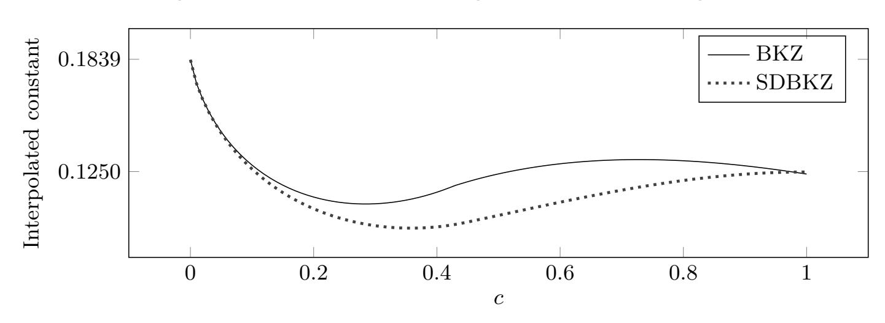

Fig. 1: Interpolated dominating constant *a*<sup>0</sup> on *k* log *k*.

**Discussion.** At first sight, the endeavour in this work might appear pointless since lattice sieving algorithms asymptotically outperform lattice enumeration. Indeed, the fastest SVP solver currently known [\[BDGL16\]](#page-26-8) has a cost of 2 0*.*292 *n*+*o*(*n*) , where *n* is the lattice dimension.[6](#page-3-1) Furthermore, a sieving implementation [[ADH](#page-23-1)<sup>+</sup>19] now dominates the Darmstadt SVP Challenge's Hall of Fame,

<span id="page-3-1"></span><sup>6</sup> When using this algorithm as the SVP subroutine in BKZ, we thus obtain a running time of 2 0*.*292 *k*+*o*(*k*) for root Hermite factor *k* 1/(2*k*) .

{4}------------------------------------------------

indicating that the crossover between enumeration and sieving is well below cryptographic parameter sizes. However, the study of enumeration algorithms is still relevant to cryptography.

Sieving algorithms have a memory cost that grows exponentially with the lattice dimension *n*. For dimensions that are currently handlable, the space requirement remains moderate. The impact of this memory cost is unclear for cryptographically relevant dimensions. For instance, it has yet to be established how well sieving algorithms parallelise in non-uniform memory access architectures. Especially, the exponential memory requirement might present a serious obstacle in some scenarios. In contrast, the memory cost of enumeration grows as a small polynomial in the dimension.

Comparing sieving and enumeration for cryptographically relevant dimensions becomes even more complex in the context of quantum computations. Quantum computations asymptotically enable a quadratic speed-up for enumeration, and much less for sieving [[Laa15](#page-27-8), Sec. 14.2.10] even assuming free quantum-accessible RAM, which would a priori favour enumeration. However, deciding on how to compare parallelisable classical operations with strictly sequential Grover iterations is unclear and establishing the significant lower-order terms in the quantum costs of these algorithms is an ongoing research programme (see e.g. [[AGPS19\]](#page-23-2))

Further, recent advances in sieving algorithms [[LM18](#page-27-9),[Duc18](#page-26-9)[,ADH](#page-23-1)+19] apply lessons learned from enumeration algorithms to the sieving context: while sieving algorithms are fairly oblivious to the Gram–Schmidt norms of the basis at hand, the cost of enumeration algorithms critically depend on their limited decrease. Current sieving strategies employ a simple form of enumeration (Babai's lifting [[Bab86](#page-26-10)]) to exploit the lattice shape by sieving in a projected sublattice and lifting candidates for short vectors to the full lattice. Here, more sophisticated hybrid algorithms permitting flexible trade-offs between memory consumption and running time seem plausible.

Finally, as illustrated in Figure [1,](#page-3-0) our work suggests potential avenues for designing faster enumeration algorithms based on further techniques relying on the graph of Gram–Schmidt norms.

**Open problems.** It would be interesting to remove the heuristics utilised in our analysis to produce a fully proved variant, and to extend the technique to other lattice reduction algorithms such as slide reduction [[GN08a\]](#page-26-3). Further, establishing lower bounds on the root Hermite factor achievable in time *k k*/8+*o*(*k*) for a given dimension of the lattice is an interesting open problem suggested by this work.

## **2 Preliminaries**

Matrices are denoted in bold uppercase and vectors are denoted in bold lowercase. By *B*[*i*:*j*) we refer to the submatrix spanned by the columns *b<sup>i</sup> , . . . , b<sup>j</sup>−*<sup>1</sup> of *B*. We let matrix indices start with index 0. We let *πi*(*·*) denote the orthogonal

{5}------------------------------------------------

projection onto the linear subspace  $(\boldsymbol{b}_0,\ldots,\boldsymbol{b}_{i-1})^{\perp}$  (this depends on a matrix  $\boldsymbol{B}$  that will always being clear from context). We let  $v_n = \frac{\pi^{n/2}}{\Gamma(1+n/2)} \approx \frac{1}{\sqrt{n\pi}} \left(\frac{2\pi e}{n}\right)^{n/2}$  denote the volume of the n-dimensional unit ball. We let the logarithm to base 2 be denoted by log and the natural logarithm be denoted by ln.

Below, we may refer to the cost or enumeration parameter k of our algorithms as a "block size".

#### 2.1 Lattices

Let  $B \in \mathbb{Q}^{m \times n}$  be a full column rank matrix. The lattice  $\mathcal{L}$  generated by B is  $\mathcal{L}(B) = \{B \cdot x \mid x \in \mathbb{Z}^n\}$  and the matrix B is called a basis of  $\mathcal{L}(B)$ . As soon as  $n \geq 2$ , any given lattice  $\mathcal{L}$  admits infinitely many bases, and full column rank matrices  $B, B' \in \mathbb{Q}^{m \times n}$  span the same lattice if and only if there exists  $U \in \mathbb{Z}^{n \times n}$  such that  $B' = B' \cdot U$  and  $|\det(U)| = 1$ . The Euclidean norm of a shortest non-zero vector in  $\mathcal{L}$  is denoted by  $\lambda_1(\mathcal{L})$  and called the minimum of  $\mathcal{L}$ . The task of finding a shortest non-zero vector of  $\mathcal{L}$  from an arbitrary basis of  $\mathcal{L}$  is called the Shortest Vector Problem (SVP).

We let  $\boldsymbol{B}^* = (\boldsymbol{b}_0^*, \dots, \boldsymbol{b}_{n-1}^*)$  denote the Gram–Schmidt orthogonalisation of  $\boldsymbol{B}$  where  $\boldsymbol{b}_i^* = \pi_i(\boldsymbol{b}_i)$ . We write  $\rho_{[a:b)}$  for the slope of the  $\log \|\boldsymbol{b}_i^*\|$ 's with  $i = a, \dots, b-1$ , under a mean-squared linear interpolation. We let  $\pi_i(\boldsymbol{B}_{[i:j)})$  denote the local block  $(\pi_i(\boldsymbol{b}_i), \dots, \pi_i(\boldsymbol{b}_{j-1}))$  and let  $\pi_i(\mathcal{L}_{[i:j)})$  denote the lattice generated by  $\pi_i(\boldsymbol{B}_{[i:j)})$ . We will also write  $\pi(\mathcal{L})$  if the index i and  $\mathcal{L}$  are clear from the context. The volume of a lattice  $\mathcal{L}$  with basis  $\boldsymbol{B}$  is defined as  $\operatorname{Vol}(\mathcal{L}) = \prod_{i < n} \|\boldsymbol{b}_i^*\|$ ; it does not depend on the choice of basis of  $\mathcal{L}$ . Minkowski's convex body theorem states that  $\lambda_1(\mathcal{L}) \leq 2 \cdot v_n^{-1/n} \cdot \operatorname{Vol}(\mathcal{L})^{1/n}$ . We define the root Hermite factor of a basis  $\boldsymbol{B}$  of a lattice  $\mathcal{L}$  as  $\operatorname{rhf}(\boldsymbol{B}) = (\|\boldsymbol{b}_0\|/\operatorname{Vol}(\mathcal{L})^{1/n})^{1/(n-1)}$ . The normalization by the (n-1)-th root is justified by the fact that the lattice reduction algorithms we consider in this work achieve root Hermite factors that are bounded independently of the lattice dimension n. Given as input an arbitrary basis of  $\mathcal{L}$ , the task of finding a non-zero vector of  $\mathcal{L}$  of norm  $\leq \gamma \cdot \operatorname{Vol}(\mathcal{L})^{1/n}$  is called Hermite-SVP with parameter  $\gamma$  ( $\gamma$ -HSVP).

Lattice reduction algorithms and their analyses often rely on heuristic assumptions. Let  $\mathcal{L}$  be an n-dimensional lattice and  $\mathcal{S}$  a measurable set in the real span of  $\mathcal{L}$ . The  $Gaussian\ Heuristic$  states that the number of lattice points in  $\mathcal{S}$  is  $|\mathcal{L} \cap \mathcal{S}| \approx \operatorname{Vol}(\mathcal{S})/\operatorname{Vol}(\mathcal{L})$ . If  $\mathcal{S}$  is an n-ball of radius r, then the latter is  $\approx v_n \cdot r^n/\operatorname{Vol}(\mathcal{L})$ . By setting  $v_n \cdot r^n \approx \operatorname{Vol}(\mathcal{L})$ , we see that  $\lambda_1(\mathcal{L})$  is close to  $\operatorname{GH}(\mathcal{L}) := v_n^{-1/n} \cdot \operatorname{Vol}(\mathcal{L})^{1/n}$ . Asymptotically, we have  $\operatorname{GH}(\mathcal{L}) \approx \sqrt{\frac{n}{2\pi e}} \cdot \operatorname{Vol}(\mathcal{L})^{1/n}$ .

#### 2.2 Enumeration and Kannan's algorithm

The Enum algorithm [Kan83,FP83] is an SVP solver. It takes as input a basis matrix  $\boldsymbol{B}$  of a lattice  $\mathcal{L}$  and consists in enumerating all  $(x_i, \ldots, x_{n-1}) \in \mathbb{Z}^{n-i}$  such that  $\|\pi_i(\sum_{j\geq i} x_j \cdot \boldsymbol{b}_j)\| \leq A$  for every i < n, where A is an a priori upper bound on

{6}------------------------------------------------

or estimate of  $\lambda_1(\mathcal{L})$  (such as  $\|\boldsymbol{b}_1\|$  and  $\mathrm{GH}(\mathcal{L})$ , respectively). It may be viewed as a depth-first search of an optimal leaf in a tree indexed by tuples  $(x_i,\ldots,x_{n-1})$ , where the singletons  $x_{n-1}$  lie at the top and the full tuples  $(x_0,\ldots,x_{n-1})$  are the leaves. The running-time of Enum is essentially the number of tree nodes (up to a small polynomial factor), and its space cost is polynomial. As argued in [HS07], the tree size can be estimated as  $\max_{i< n}(v_i\cdot A^i/\prod_{j\geq n-i}\|\boldsymbol{b}_j^*\|)$ , under the Gaussian Heuristic. In [ANS18], it was showed that a quadratic speedup can be obtained quantumly using Montanaro's quantum backtracking algorithm (and the space cost remains polynomial). We will rely on the following (classical) cost bound, derived from [HS07, Subsection 4.1]. It is obtained by optimising the tree size  $\max_{i< n}(v_i\cdot A^i/\prod_{j\geq n-i}\|\boldsymbol{b}_j^*\|)$ . We can replace A by twice the Gaussian Heuristic  $\mathrm{GH}(\mathcal{L})=v_n^{-1/n}\cdot\mathrm{Vol}(\mathcal{L})^{1/n}$ , where  $\mathrm{Vol}(\mathcal{L})=\prod_{j< n}\|\boldsymbol{b}_j^*\|$ . By using the bounds  $\|\boldsymbol{b}_i^*\|\in c\cdot \delta^{-i}\cdot[1/2,2]$ , this optimisation problem boils down to maximising  $\delta^{ni/2-i^2/2}$  for i< n. The maximum is  $\delta^{n^2/8}$  (for i=n/2). The other terms are absorbed in the  $2^{O(n)}$  factor.

<span id="page-6-0"></span>**Theorem 1.** Let  $\boldsymbol{B}$  be a basis matrix of an n-dimensional rational lattice  $\mathcal{L}$ . Assume that there exist c>0 and  $\delta>1$  such that  $\|\boldsymbol{b}_i^*\| \in c \cdot \delta^{-i} \cdot [1/2,2]$ , for all i< n. Then, given  $\boldsymbol{B}$  as input (with  $A=2 \cdot v_n^{-1/n} \cdot \operatorname{Vol}(\mathcal{L})^{1/n}$ ), the Enum algorithm returns a shortest non-zero vector of  $\mathcal{L}$  within  $\delta^{\frac{n^2}{8}} \cdot 2^{O(n)} \cdot \operatorname{poly}(\operatorname{size}(\boldsymbol{B}))$  bit operations. Its space cost is  $\operatorname{poly}(\operatorname{size}(\boldsymbol{B}))$ .

Kannan's algorithm [Kan83] relies on recursive calls to Enum to improve the quality of the Gram–Schmidt orthogonalisation of  $\boldsymbol{B}$ , so that calling Enum on the preprocessed  $\boldsymbol{B}$  is less expensive. Its cost bound was lowered in [HS07] and that cost upper bound was later showed to be sharp in the worst case, up to lower-order terms [HS08].

<span id="page-6-1"></span>**Theorem 2.** Let  $\boldsymbol{B}$  be a basis matrix of an n-dimensional rational lattice  $\mathcal{L}$ . Given  $\boldsymbol{B}$  as input, Kannan's algorithm returns a shortest non-zero vector of  $\mathcal{L}$  within  $n^{\frac{n}{2e}(1+o(1))} \cdot \operatorname{poly}(\operatorname{size}(\boldsymbol{B}))$  bit operations. Its space cost is  $\operatorname{poly}(\operatorname{size}(\boldsymbol{B}))$ .

In practice, enumeration is accelerated using two main techniques. The first one, inspired from Kannan's algorithm, consists in preprocessing the basis with a strong lattice reduction algorithm, such as BKZ (see next subsection). Note that BKZ uses an SVP solver in a lower dimension, so these algorithms can be viewed as calling themselves recursively, in an intertwined manner. The second one is tree pruning [SE94,GNR10]. The justifying observation is that some tree nodes are much more unlikely than others to have leaves in their subtrees, and are hence discarded. More concretely, one considers the strengthened conditioned  $\|\pi_i(\sum_{j\geq i} x_j \cdot b_j)\| \leq t_i \cdot A$ , for some pruning coefficients  $t_i \in (0,1)$ . These coefficients can be used to extract a refined estimated enumeration cost as well as an estimated success probability (see, e.g. [Che13, Sec. 3.3]). By making the probability extremely small, the cost-over-probability ratio can be lowered and the probability can be boosted by re-randomising the basis and repeating the pruned enumeration. This strategy is called extreme pruning [GNR10].

{7}------------------------------------------------

#### 2.3 Lattice reduction

Given a basis matrix  $\boldsymbol{B} \in \mathbb{Q}^{m \times n}$  of a lattice  $\mathcal{L}$ , the LLL algorithm [LLJL82] outputs in polynomial time a basis  $\boldsymbol{C}$  of  $\mathcal{L}$  whose Gram–Schmidt norms cannot decrease too fast:  $\|\boldsymbol{c}_i^*\| \geq \|\boldsymbol{c}_{i-1}^*\|/2$  for every i < n. In particular, we have  $\mathsf{rhf}(\boldsymbol{C}) \leq 2$ . A lattice basis  $\boldsymbol{B}$  is size-reduced if it satisfies  $|\mu_{i,j}| \leq 1/2$  for j < i < n where  $\mu_{i,j} = \langle \boldsymbol{b}_i, \boldsymbol{b}_j^* \rangle / \langle \boldsymbol{b}_j^*, \boldsymbol{b}_j^* \rangle$ . A lattice basis  $\boldsymbol{B}$  is HKZ-reduced if it is size-reduced and satisfies  $\|\boldsymbol{b}_i^*\| = \lambda_1(\pi_i(\mathcal{L}_{[i:min(i+k,n))})$ , for all i < n. A basis  $\boldsymbol{B}$  is BKZ-k reduced for block size  $k \geq 2$  if it is size-reduced and further satisfies  $\|\boldsymbol{b}_i^*\| = \lambda_1(\pi_i(\mathcal{L}_{[i:min(i+k,n))})$ , for all i < n.

The Schnorr-Euchner BKZ algorithm [SE94] is the lattice reduction algorithm that is commonly used in practice, to obtain bases of better quality than those output by LLL (there exist algorithms that admit better analyses, such as [GN08a,MW16,ALNS19], but BKZ remains the best in terms of practical performance reported in the current literature). BKZ inputs a block size k and a basis matrix B of a lattice  $\mathcal{L}$ , and outputs a basis which is "close" to being BKZ-k reduced, up to algorithm parameters. The BKZ algorithm calls an SVP solver in dimensions  $\leq k$  on projected sublattices of the working basis of an n-dimensional input lattice. A BKZ sweep consists in SVP solver calls for  $\pi_i(\mathcal{L}_{[i:\min(i+k,n))})$  for i from 0 to n-2. BKZ proceeds by repeating such sweeps, and typically a small number of sweeps suffices. At each execution of the SVP solver, if we have  $\lambda_1(\pi_i(\mathcal{L}_{[i:\min(i+k,n))})) < \delta \cdot ||\boldsymbol{b}_i^*||$  where  $\delta < 1$  is a relaxing parameter that is close to 1, then BKZ updates the block  $\pi_i(\boldsymbol{B}_{[i:\min(i+k,n))})$  by inserting the vector found by the SVP solver at index i. It then removes the created linear dependency, e.g. using a gcd computation (see, e.g. [GN08a]). Whether there was an insertion or not, BKZ finally calls LLL on the local block  $\pi_i\left(\boldsymbol{B}_{[i:\min(i+k,n))}\right)$ . The procedure terminates when no change occurs at all during a sweep or after certain termination condition is fulfilled. The higher k, the better the BKZ output quality, but the higher the cost: for large n, BKZ achieves root Hermite factor essentially  $k^{1/(2k)}$  (see [HPS11]) using an SVP-solver in dimensions  $\leq k$  a polynomially bounded number of times.

Schnorr [Sch03] introduced a heuristic on the shape of the Gram–Schmidt norms of BKZ-reduced bases, called the Geometric Series Assumption (GSA). The GSA asserts that the Gram–Schmidt norms  $\{\|\boldsymbol{b}_i^*\|\}_{i< n}$  of a BKZ-reduced basis behave as a geometric series, i.e., there exists r>1 such that  $\|\boldsymbol{b}_i^*\|/\|\boldsymbol{b}_{i+1}^*\|\approx r$  for all i< n-1. In this situation, the root Hermite factor is  $\sqrt{r}$ . It was experimentally observed [CN11] that the GSA is a good first approximation to the shape of the Gram–Schmidt norms of BKZ. However, as observed in [CN11] and studied in [YD17], the GSA does not provide an exact fit to the experiments of BKZ for the last k indices; similarly, as observed in [YD17] and studied in [BSW18], the GSA also does not fit for the very few first indices (the latter phenomenon seems to vanish for large k, as opposed to the former). In Appendix A, we argue that the GSA is unlikely to be satisfied by BKZ-reduced bases even for indices before the last k.

We will use the self-dual BKZ algorithm (SDBKZ) from [MW16]. SDBKZ proceeds similarly to BKZ, except that it intertwines forward and backward

{8}------------------------------------------------

sweeps (for choosing the inputs to the SVP solver), whereas BKZ uses only forward sweeps. Further, it only invokes the SVP solver in dimension exactly *k*, so that a forward sweep consists in considering *πi*(*L*[*i*:*i*+*k*)) for *i* from 0 to *n−k* and a backward sweep consists in considering (the duals of) *πi*(*L*[*i*:*i*+*k*)) for *i* from *n−k* down to 0. We assume that the final sweep is a forward sweep. We use SDBKZ in the theoretical analysis rather than BKZ because, under the Gaussian Heuristic and after polynomially many sweeps, the first *n − k* Gram–Schmidt norms of the basis (almost) decrease geometrically, i.e. satisfy the GSA. This may not be necessary for our result to hold, but this simplifies the computations significantly. We adapt [\[MW16\]](#page-27-1) by allowing SDBKZ to rely on a *γ*-HSVP solver *O* rather than on an exact SVP solver (which in particular is a *<sup>√</sup> k*-HSVP solver). We let SDBKZ*O* denote the modified algorithm. The analysis of [[MW16\]](#page-27-1) can be readily adapted. We will rely on the following heuristic assumption, which extends the Gaussian Heuristic.

<span id="page-8-0"></span>**Heuristic 1** *Let O be a γ-*HSVP *solver in dimension k. During the* SDBKZ*<sup>O</sup> execution, each call to O for a projected k-dimensional sublattice π*(*L*) *of the input lattice L returns a vector of norm ≈ γ ·* (Vol(*π*(*L*))) 1 *k .*

The SDBKZ*<sup>O</sup>* algorithm makes the Gram–Schmidt norms converge to a fixpoint, very fast in terms of the number of HSVP calls [\[MW16,](#page-27-1) Subsection 4.2]. That fix-point is described in [\[MW16,](#page-27-1) Corollary 2]. Adapting these results leads to the following.

<span id="page-8-1"></span>**Theorem 3 (Under Heuristic [1](#page-8-0)).** *Let O be a γ-*HSVP *solver in dimension k. Given as input a basis of an n-dimensional rational lattice L,* SDBKZ*<sup>O</sup> outputs a basis B of L such that, for all i < n − k, we have*

$$\|\boldsymbol{b}_{i}^{*}\| \approx \gamma^{\frac{n-1-2i}{k-1}} \cdot (\operatorname{Vol} \mathcal{L})^{\frac{1}{n}}.$$

*The number of calls to O is ≤* poly(*n*) *and the bit-size of the output basis is ≤* poly(size(*B*))*.*

#### <span id="page-8-2"></span>**2.4 Simulating lattice reduction**

To understand the behaviour of lattice reduction algorithms in practice, a useful approach is to conduct simulations. The underlying idea is to model the practical behaviour of the evolution of the Gram–Schmidt norms during the algorithm execution, without running a costly lattice reduction. Note that this requires only the Gram–Schmidt norms and not the full basis. Chen and Nguyen first provided a BKZ simulator [[CN11](#page-26-0)] based on the Gaussian Heuristic and with an experiment-driven modification for the blocks at the end of the basis. It relies on the assumption that each SVP solver call in the projected blocks (except the ones at the end of the basis) finds a vector whose norm corresponds to the Gaussian Heuristic applied to that local block. The remaining Gram–Schmidt norms of the block are updated to keep the determinant of the block constant. 

{9}------------------------------------------------

(Note that in the original [CN11] simulator, these Gram–Schmidt norms are not updated to keep the determinant of the block constant, but are adjusted at the end of the sweep to keep the global determinant constant; our variant helps for taking enumeration costs into account.)

We extend this simulator in two ways: first, we adapt it to estimate the cost and not only the evolution of the Gram-Schmidt norms; second, we adapt it to other reduction algorithms, such as SDBKZ. To estimate the cost, we use the estimates of the full enumeration cost, or the estimated cost of an enumeration with (extreme) pruning. The full enumeration cost estimate is used in Section 3 to model our first algorithm for which we can heuristically analyse the quality/cost trade-off. The pruned enumeration cost estimate is used in Section 4, which aims to provide a more precise study for practical and cryptographic dimensions. To find the enumeration cost with pruning, we make use of FPyLLL's pruning module which numerically optimises pruning parameters for a time/success probability trade-off using a gradient descent.

In small block sizes, the enumeration cost is dominated by calls to LLL. In our code, we simply assume that one LLL call in dimension k costs the equivalent of visiting  $k^3$  nodes. This is an oversimplification but avoids completely ignoring this polynomial factor. We will compare our concrete estimates with empirical evidence from timing experiments with the implementation in FPLLL, to measure the effect of this imprecision. This assumption enables us to bootstrap our cost estimates. BKZ in block size up to, say, 40 only requires LLL preprocessing, allowing us to estimate the cost of preprocessing with block size up to 40, which in turn enables us to estimate the cost (including preprocessing) for larger block sizes etc. To extend the simulation to SDBKZ, we simply run the simulation on the Gram–Schmidt norms of the dual basis  $1/\|\boldsymbol{b}_n^*\|,\ldots,1/\|\boldsymbol{b}_1^*\|$ . Our simulation source code is available as simu.py, as an attachment to the electronic version of the full version of this work.

We give pseudocode for our costed simulation in Algorithm 1. For BKZ simulation, we call Algorithm 1 with  $d=k,\ c=0$  and with  $\mathrm{tail}(x,y,z)$  simply outputting x. For our simulations we prepared Gram-Schmidt shapes for LLL-reduced lattices in increasing dimensions d on which we then estimate the cost of running the algorithm in question for increasingly heavy preprocessing parameters k', selecting the least expensive one. In our search, we initialise  $c_2=2^3$  and then iteratively compute  $c_{j+1}$  given  $c_2,\ldots,c_j$ . When we instantiate Algorithm 1 we either manually pick some small t (Section 4) or pick  $t=\infty$  (Section 3.3) which means to run the algorithm until no more changes are made to the basis.

#### <span id="page-9-0"></span>2.5 State-of-the-art enumeration-based SVP solving in practice

To the best of our knowledge, there is no extrapolated running-time for state-of-the-art lattice reduction implementations. Furthermore, the simulation data in [CN11,Che13] is only available up to a block size of 250. The purpose of this section is to fill this gap by providing extended simulations (and the source code used to produce them) and by reporting running times using the state-of-the-art FPyLLL [dt19b] and FPLLL [dt19a] libraries.

{10}------------------------------------------------

```
Algorithm 1: Costed simulation algorithm
   Data: Gram-Schmidt profile \ell_i = \log ||\boldsymbol{b}_i^*|| for i = 0, \dots, d-1.
    Data: Block size k \geq 2.
    Data: Preprocessing block size k' \geq 2.
    Data: Preprocessing sweep count t.
    Data: Overshooting parameter c \geq 0.
    Data: Configuration flags.
   Data: Cost estimates c_j for solving (approx-)SVP in dimensions j=2,\ldots,k',
            including preprocessing cost estimates.
    Result: Cost estimate for (approx-)SVP in dimension k.
 1 if SDBKZ flag is set in flags then
        (\ell_i)_i \leftarrow \text{output of [CN11] style simulator for SDBKZ on } (\ell_i)_i \text{ for block}
 \mathbf{2}
          size k' and \leq t sweeps;
 з else
        (\ell_i)_i \leftarrow \text{output of [CN11] style simulator for BKZ on } (\ell_i)_i \text{ for block size } k'
 4
          and \leq t sweeps;
 5 end
    // account for early termination
 6 t \leftarrow number of preprocessing sweeps actually performed;
 7 C_p \leftarrow d^3; // (estimated) cost of LLL
 8 for 0 \le i < d - 1 do
       k^* \leftarrow \operatorname{tail}(\min(k', d-i), c, d-i);
 9
      C_p \leftarrow C_p + t \cdot c_{k^*};
10
11 end
12 if full enumeration cost flag is set in flags then
        C_e \leftarrow \text{full enumeration cost for } \ell_0, \dots, \ell_{k-1};
13
        p_e \leftarrow 1;
14
15 else
        (t_i)_{i < k} \leftarrow \text{optimised pruning coefficients for } (\ell_i)_{i < k} \text{ and preprocessing}
16
         cost C_p;
        C_e, p_e \leftarrow pruned enumeration cost and success probability, given (t_i)_{i < k};
17
18 end
19 C \leftarrow 1/p_e \cdot (C_p + C_e);
| 20 return C;
```

{11}------------------------------------------------

First, in Figure [2](#page-11-0) we reproduce the data from [[Che13](#page-26-5), Table 5.2] for the estimated cost of solving SVP up to dimension 250, using enumeration.

We then also computed the expected cost (expressed as the number of visited enumeration nodes) up to dimension 500 for Figure [2](#page-11-0) (and up to dimension 1,000 for Figure [15](#page-34-0) where we consider lower-quality but faster-to-compute pruning parameters), see cost.py, attached to the electronic copy of the full version of this work, and Algorithm [1](#page-10-0). We note that the preprocessing strategy adopted in our code is to always run two sweeps of preprocessing but that preprocessing proceeds recursively, e.g. preprocessing block size 80 with block size 60 may trigger a preprocessing with block size 40, if previously we found that preprocessing to be most efficient for solving SVP-60, as outlined above. This approach matches that of the FPLLL/FPyLLL strategizer [\[dt17](#page-26-14)] which selects the default preprocessing and pruning strategies used in FPLLL/FPyLLL. Thus, the simulation approach resembles that of the actual implementation.

In Figure [2](#page-11-0) (see also Figure [16](#page-34-1) in Appendix [B](#page-34-2)), we also fitted the coefficients *a*1*, a*<sup>2</sup> of 1/(2 e)*n* log *n* + *a*<sup>1</sup> *· n* + *a*<sup>2</sup> to dimensions *n* from 150 to 249. [7](#page-11-1)

Furthermore, we plot the chosen preprocessing block sizes and success probability of a single enumeration (FPLLL uses extreme pruning) in Figure [3](#page-12-0) (see also Figure [17](#page-35-0) in Appendix [B](#page-34-2)). This highlights that, even in dimension 500 (resp. 1*,* 000), preprocessing is still well below the *n−o*(*n*) required for Kannan's algorithm [[Kan83](#page-27-2),[MW15](#page-27-11)].[8](#page-11-2)

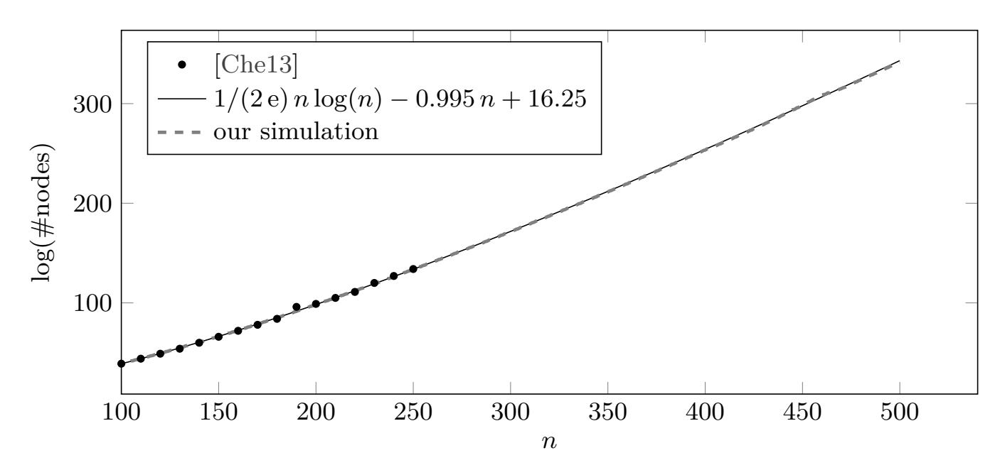

<span id="page-11-0"></span>Fig. 2: Expected number of nodes visited during enumeration in dimension *n*.

<span id="page-11-1"></span><sup>7</sup> Throughout this work, we fit curves to simulation data. For this, we use SciPy's scipy.optimize.curve\_fit function [\[VGO](#page-27-12)<sup>+</sup>20] which implements a non-linear leastsquare fit. To prevent overfitting, we err on the side of fewer parameters and fit on a subset of the available data, using the remaining data to check the accuracy of the fit.

<span id="page-11-2"></span><sup>8</sup> Figure [3](#page-12-0) contains an outlier around dimension 450. That this is indeed an outlier and not an indication of a trend can be observed by consulting Figure [17](#page-35-0).

{12}------------------------------------------------

Figure [4](#page-13-1) plots the running-times of FPLLL in terms of enumeration nodes, timed using call.py, available as an attachment to the electronic version of the full version of this work. Concretely, running-time in seconds is first converted to CPU cycles by multiplying with the clock speed 2.6 GHz[9](#page-12-1) and we then convert from cycles to nodes by assuming visiting a node takes about 64 clock cycles.[10](#page-12-2) Figure [4](#page-13-1) illustrates that our simulation is reasonably accurate. We note that for running the timing experiments with FPLLL we relied on FPLLL's own (recursive call and pruning) strategies, not those produced by our simulator.

Fig. 3: Reduction strategies used for Figure [2](#page-11-0).

<span id="page-12-0"></span>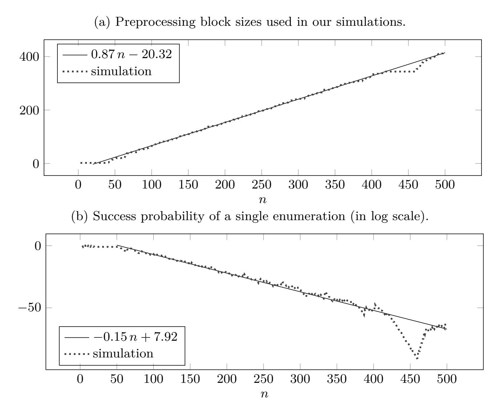

The largest computational results known for finding short vectors in unstructured lattices is the Darmstadt SVP Challenge [[SG10](#page-27-13)]. This challenge asks contestants to find a vector at most 1*.*05 times larger than the Gaussian Heuristic. Thus, the challenge does not require to solve SVP exactly but the easier (0*.*254*<sup>√</sup> n*)-HSVP problem. The strategy we used for SVP can be adapted to this problem as well, see chal.py, attached to the electronic version of the full

<span id="page-12-1"></span><sup>9</sup> CPU: Intel(R) Xeon(R) CPU E5-2690 v4 @ 2.60GHz, machine: "atomkohle".

<span id="page-12-2"></span><sup>10</sup> We note that [\[CN11\]](#page-26-0) mentions 200 cycles per node, whereas [[dt17\]](#page-26-14)'s set\_mdc.py reports 64 cycles per node on our test machine in dimension 55.

{13}------------------------------------------------

<span id="page-13-1"></span>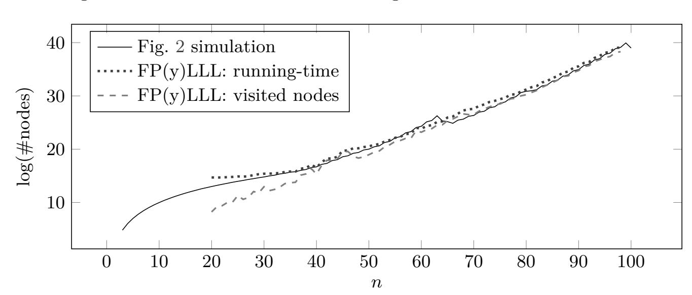

Fig. 4: Number of nodes visited during enumeration in dimension n.

In our simulations, the estimate for the number of visited nodes includes the cost of LLL (expressed as a number of nodes), whereas actually "visited nodes" does not. The "running-time" (converted from seconds to a number of nodes), on the other hand, contains all operations as it literally is the cputime.

version of document. To validate our simulation methodology against this data, we compare our estimates with various entries from the Hall of Fame for [SG10] and the literature in Figure 5.

We conclude this section by interpreting our simulation results in the context of BKZ. The quality output by BKZ in practice has been studied in the literature [GN08b,Che13,AGVW17,YD17,BSW18]. Thus, our simulations imply that the running time of BKZ as implemented in [dt19a] achieves root Hermite factor  $k^{1/(2k)}$  is bounded by  $k^{k/(2\,e)+o(k)}$ . Indeed, this bound is tight, i.e. BKZ does not achieve a lower running time. To see this, consider the sandpile model of BKZ's behaviour [HPS11]. It implies that even if we start with a GSA line, this line from index i onward deteriorates as we perform updates on indices < i. Furthermore, extreme pruning, which involves rerandomising local blocks, destroys the GSA shape. Thus, we can conclude that in practice BKZ

```
\begin{array}{l} - \text{ achieves root Hermite factor} \approx \left(\frac{k}{2\pi\,\mathrm{e}} \cdot (\pi\,k)^{\frac{1}{k}}\right)^{\frac{1}{2(k-1)}} \left[\mathrm{Che}13\right] \\ - \mathrm{in time poly}(d) \cdot 2^{1/(2\,\mathrm{e})\,k\log k - 0.995\,k + 16.25} \approx \mathrm{poly}(d) \cdot 2^{1/(2\,\mathrm{e})\,k\log k - k + 16} \end{array}
```

where the unit of time is the number of nodes visited during enumeration. We note that a similar conclusion was already drawn in [APS15] and discussed in [ABD<sup>+</sup>16]. However, that conclusion was drawn for the unpublished implementation and limited data in [Che13].

# <span id="page-13-0"></span>3 Reaching root Hermite factor $k^{\frac{1}{2k}(1+o(1))}$ in time $k^{\frac{k}{8}}$

This section contains our main contribution: a lattice reduction algorithm that achieves root Hermite factor  $k^{\frac{1}{2k}(1+o(1))}$  in time  $k^{\frac{k}{8}}$ . We start by a quality running-time trade-off boosting theorem, based on SDBKZ. We then give and

{14}------------------------------------------------

<span id="page-14-0"></span>60 80 100 120 140 160 180 20 40 60 80 *d* log(#nodes) (0*.*254*<sup>√</sup> d*)-HSVP sim SVP sim HoF:FK15 HoF:KT17 G6K FPLLL: time

Fig. 5: Darmstadt SVP Challenge.

"HoF" stands for Hall of Fame [\[SG10\]](#page-27-13). Core hours are translated to #nodes by multiplying by <sup>3600</sup> *·* <sup>2</sup> *·* <sup>10</sup><sup>7</sup> , which assumes each core has a 2Ghz CPU and that one enumeration node costs 64 clock cycles to process. Except for G6K [\[ADH](#page-23-1)<sup>+</sup>19] which is a sieving implementation, all entries are for variants of lattice-point enumeration. We translate G6K timings to #nodes in the same way as for other timings, ignoring that it is not an enumeration implementation. In other words, #nodes is merely a unit of time here.

analyze the main algorithm, FastEnum, and finally propose a simulator for that algorithm.

#### **3.1 A boosting theorem**

We first show that SDBKZ allows to obtain a reduction from a *γ ′* -HSVP solver in dimension *n ′* to a *γ*-HSVP solver in dimension *n* achieving a larger root Hermite factor. This reduction is not polynomial-time, but we will later aim at making it no more costly than the cost of our *γ*-HSVP solver.

<span id="page-14-1"></span>**Theorem 4 (Under Heuristic [1\)](#page-8-0).** *Let O be a γ-*HSVP *solver in dimension n. Assume we are given as input a basis* **B** *of an n ′ -dimensional lattice L, with n ′ > n. We first call* SDBKZ*<sup>O</sup> on* **B***: let* **C** *denote the output basis. Then we call the* Enum *algorithm on the sublattice basis made of the first n ′ − n vectors of* **C***. This provides a γ ′ -*HSVP *solver in dimension n ′ , with*

$$\gamma' \le \sqrt{n'-n} \ \gamma^{\frac{n}{n-1}}.$$

*The total cost is bounded by* poly(*n ′* ) *calls to O and γ* (*n′−n*) 2 4(*n−*1) *·*2 *O*(*n ′−n*) *·*poly(size(**B**)) *bit operations.*

{15}------------------------------------------------

*Proof.* By Theorem 3, we have  $\|\mathbf{c}_i^*\| \in \gamma^{\frac{n'-1-2i}{n-1}} \cdot (\operatorname{Vol}(\mathcal{L}))^{\frac{1}{n'}} \cdot [1/2, 2]$ , for all i < n' - n. Also, the number of calls to  $\mathcal{O}$  is  $\leq \operatorname{poly}(n')$  and the bit-size of  $\mathbf{C}$  is  $\leq \operatorname{poly}(\operatorname{size}(\mathbf{B}))$ .

By Theorem 1 (with " $\delta = \gamma^{\frac{2}{n-1}}$ "), the cost of the call to Enum is bounded as  $\gamma^{\frac{(n'-n)^2}{4(n-1)}} \cdot 2^{O(n'-n)} \cdot \text{poly}(\text{size}(\mathbf{C}))$ , which, by the above is  $\leq \gamma^{\frac{(n'-n)^2}{4(n-1)}} \cdot 2^{O(n'-n)} \cdot \text{poly}(\text{size}(\mathbf{B}))$ . Further, by Minkowski's theorem, the vector output by Enum has norm bounded from above by:

$$\sqrt{n'-n} \cdot \prod_{i=0}^{n'-n-1} \left( \gamma^{\frac{n'-1-2i}{n-1}} (\operatorname{Vol}(\mathcal{L}))^{\frac{1}{n'}} \right)^{\frac{1}{n'-n}} = \sqrt{n'-n} \cdot \gamma^{\frac{n}{n-1}} \cdot (\operatorname{Vol}(\mathcal{L}))^{\frac{1}{n'}}.$$

This completes the proof of the theorem.

Note that the result is not interesting if n'-n is chosen too small, as such a choice results in an increased root Hermite factor. Also, if n'-n is chosen too large, then the cost grows very fast. We consider the following instructive application of Theorem 4. By Theorem 2, Kannan's algorithm finds a shortest non-zero of  $\mathcal{L}$  in time  $n^{\frac{n}{2e}(1+o(1))} \cdot \text{poly}(\text{size}(\mathbf{B}))$ , when given as input a basis **B** of an *n*-dimensional lattice  $\mathcal{L}$ . In particular, it solves  $\gamma$ -HSVP with  $\gamma = \sqrt{n}$ and provides a root Hermite factor  $\leq n^{\frac{1}{2n}}$ . We want to achieve a similar root Hermite factor, but for a lower cost. Now, for a cost parameter k, we would like to restrict the cost to  $k^{\frac{k}{8}} \cdot \text{poly}(\text{size}(\mathbf{B}))$  (ideally, while still achieving root Hermite factor  $k^{\frac{1}{2k}}$ ). We hence choose an integer  $k_0 := \frac{e}{4}(1+o(1))k$ . This indeed provides a cost bounded as  $k^{\frac{k}{8}} \cdot \text{poly}(\text{size}(\mathbf{B}))$ , but this only solves  $\gamma_0$ -HSVP with  $\gamma_0 = \Theta(\sqrt{k_0})$  in dimension  $k_0$ , i.e. only provides a root Hermite factor  $\approx \sqrt{k_0}^{\frac{1}{k_0}} = k^{\frac{2}{k_e}(1+o(1))} \approx k^{\frac{0.74}{k}}$ , which is much more than  $k^{\frac{1}{2k}}$ . So far, we have not done anything but a change of variable. Now, let us see how Theorem 4 can help. We use it with  $\mathcal{O}$  being Kannan's algorithm in dimension " $n = k_0$ ". We set " $n' = k_1$ " with  $k_1 = k_0 + \lceil \sqrt{k_0 k} \rceil$ . This value is chosen so that the total cost bound of Theorem 4 remains  $k^{\frac{k}{8}} \cdot \text{poly}(\text{size}(\mathbf{B}))$ . The achieved root Hermite factor is  $\leq k^{\frac{1}{k(e/4+\sqrt{e/4})}(1+o(1))} \approx k^{\frac{0.66}{k}}$ . Overall, for a similar cost bound, we have decreased the achieved root Hermite factor.

#### 3.2 The FastEnum Algorithm

We iterate the process above to obtain the FastEnum algorithm, described in Algorithm 2. For this reason, we define  $k_0 = x_0 \cdot k$  with  $x_0 = \frac{e}{4}(1 + o(1))$  and, for all  $i \geq 1$ :

<span id="page-15-0"></span>
$$k_i = \lceil x_i \cdot k \rceil \text{ with } x_i = x_{i-1} + \sqrt{\frac{x_{i-1}}{i}}.$$
 (1)

<span id="page-15-1"></span>We first study the sequence of  $x_i$ 's.

**Lemma 1.** We have  $i + 1 - \sqrt{i} < x_i < i + 1$  for all  $i \ge 1$ .

{16}------------------------------------------------

*Proof.* The upper bound can be readily proved using an induction based on (1). It may be numerically checked that the lower bound holds for  $i \in \{1, 2, 3\}$ . We show by induction to prove that  $1 - \frac{x_i}{i} < \frac{1}{\sqrt{i}} - \frac{2}{i}$  for  $i \geq 4$ , which is a stronger statement. It may be numerically checked that the latter holds for i = 4. Now, assume it holds for some  $i - 1 \geq 4$  and that we aim at proving it for i. We have

$$1 - \frac{x_i}{i} = \frac{1}{i} \left( (i-1) \left( 1 - \frac{x_{i-1}}{i-1} \right) + \left( 1 - \sqrt{\frac{x_{i-1}}{i}} \right) \right)$$
$$= \frac{1}{i} \left( (i-1) \left( 1 - \frac{x_{i-1}}{i-1} \right) + \sqrt{\frac{i-1}{i}} \left( 1 - \sqrt{\frac{x_{i-1}}{i-1}} \right) + 1 - \sqrt{\frac{i-1}{i}} \right).$$

Now, note that  $\sqrt{\frac{x_{i-1}}{i-1}} > 0.2$  (using our induction hypothesis). Using the bound  $1 - \sqrt{t} < \frac{1}{2}(1-t) + \frac{1}{4}(1-t)^2$  which holds for all t > 0.2, we can bound  $1 - \frac{x_i}{i}$  from above by:

$$\frac{1}{i}\left((i-1)\left(1-\frac{x_{i-1}}{i-1}\right)+1+\sqrt{\frac{i-1}{i}}\left(-1+\frac{1}{2}\left(1-\frac{x_{i-1}}{i-1}\right)+\frac{1}{4}\left(1-\frac{x_{i-1}}{i-1}\right)^2\right)\right).$$

It now suffices to observe that the right hand side is smaller than  $\frac{1}{\sqrt{i}} - \frac{2}{i}$ , when  $1 - \frac{x_{i-1}}{i-1}$  is replaced by  $\frac{1}{\sqrt{i-1}} - \frac{2}{i-1}$ . This may be checked with a computer algebra software.

The FastEnum algorithm (Algorithm 2) consists in calling the process described in Theorem 4 several times, to improve the root Hermite factor while staying within a  $k^{\frac{k}{8}}$  cost bound.

```
Algorithm 2: The FastEnum algorithm.

Data: A cost parameter k and a level i \geq 0.

Data: A basis matrix \mathbf{B} \in \mathbb{Q}^{k_i \times k_i}, with k_i defined as in (1).

Result: A short non-zero vector of \mathcal{L}(\mathbf{B}).

1 if i = 0 then

2 | \mathbf{b} \leftarrow output of Kannan's enumeration algorithm on \mathbf{B};

3 else

4 | \mathbf{C} \leftarrow output of SDBKZ^{\mathcal{O}} on \mathbf{B} with \mathcal{O} being FastEnum for i - 1;

5 | \mathbf{b} \leftarrow Enum \left(\mathbf{C}_{\left[0:k_i - k_{i-1}\right)}\right) with k_{i-1} defined as in (1);

6 end

7 return \mathbf{b};
```

<span id="page-16-2"></span>Theorem 5 (Under Heuristic 1). Let  $k \geq 4$  tending to infinity, and  $i \leq 2^{o(k)}$ . The FastEnum algorithm with parameters k and i solves  $\gamma_i$ -HSVP

<span id="page-16-1"></span> $<sup>\</sup>overline{}^{11}$  We stress that in this theorem, all asymptotic notations are with respect to k only.

{17}------------------------------------------------

in dimension  $k_i$ , with  $\gamma_i \leq k^{\frac{i+1}{2}(1+o(1))}$ . For  $i \geq 1$ , the corresponding root Hermite factor is below  $k^{\frac{i+1}{2(i+1-\sqrt{i})k}(1+o(1))}$ . Further, FastEnum runs in time  $k^{\frac{k}{8}(1+o(1))+i\cdot O(1)} \cdot \operatorname{poly}(\operatorname{size}(\mathbf{B}))$ .

For constant values of i (as a function of k), the root Hermite factor is not quite  $k^{\frac{1}{2k}(1+o(1))}$ , but it is so for any choice of  $i=\omega(1)$ . For i satisfying both  $i=\omega(1)$  and i=o(k), FastEnum reaches a root Hermite factor  $k^{\frac{1}{2k}(1+o(1))}$  in time  $k^{\frac{k}{8}(1+o(1))} \cdot \operatorname{poly}(\operatorname{size}(\mathbf{B}))$ .

*Proof.* For  $\gamma_0 = \Theta(\sqrt{k})$  and, by Theorem 4, we have  $\gamma_i \leq \sqrt{k_i - k_{i-1}} \cdot \gamma_{i-1}^{\frac{k_{i-1}}{k_{i-1}-1}}$  for all  $i \geq 1$ . Using the definition of the  $k_i$ 's and the bounds of Lemma 1, we obtain, for  $i \geq 1$ :

$$\gamma_i \le \left(1 + \frac{x_{i-1}}{i}k^2\right)^{1/4} \cdot \gamma_{i-1}^{\frac{k(i-\sqrt{i-1})+1}{k(i-\sqrt{i-1})-1}} \le \sqrt{2k} \cdot \gamma_{i-1}^{1 + \frac{2}{ki/2-1}}.$$

Using  $k \geq 4$ , we see that the latter is  $\leq \sqrt{2k}\gamma_{i-1}^{1+\frac{8}{ki}}$ . By unfolding the recursion, we get, for  $i \geq 1$ :

$$\gamma_i \le \sqrt{2k}^{1 + \sum_{j=0}^{i-1} \prod_{\ell=j}^{i-1} (1 + \frac{8}{k(\ell+1)})} \cdot \gamma_0^{\prod_{\ell=0}^{i-1} (1 + \frac{8}{k(\ell+1)})}.$$

Now, note that we have (using the bound  $\sum_{\ell=0}^{i-1} \frac{1}{\ell+1} \leq \ln(i) + 1$ , and the inequalities  $1 + x \leq \exp(x) \leq 1 + 2x$  for  $x \in [0,1]$ )

$$\prod_{\ell=j}^{i-1} (1 + \frac{8}{k(\ell+1)}) \le \exp\left(\sum_{\ell=j}^{i-1} \frac{8}{k(\ell+1)}\right) \le \exp\left(\frac{8}{k} (\ln(i) + 1)\right) \le 1 + \frac{16}{k} (\ln(i) + 1).$$

As  $i \leq 2^{o(k)}$ , the latter is  $\leq 1 + o(1)$ . Overall, this gives  $\gamma_i \leq k^{\frac{i+1}{2}(1+o(1))}$ . The claim on the root Hermite factor follows from the lower bound of Lemma 1.

We now consider the run-time of the algorithm, and in particular the term  $\gamma_{i-1}^{\frac{(k_i-k_{i-1})^2}{4(k_{i-1}-1)}} \cdot 2^{O(k_i-k_{i-1})}$  from Theorem 4. Recall that by definition of the  $k_i$ 's, we have  $k_i - k_{i-1} \leq 1 + \sqrt{\frac{k_{i-1}k}{i}}$ . Using the upper bound of Lemma 1, we obtain that  $k_i - k_{i-1} \leq O(k)$ , and hence that  $2^{O(k_i-k_{i-1})} \leq 2^{O(k)}$ . We also have

$$\gamma_{i-1}^{\frac{(k_i-k_{i-1})^2}{4(k_{i-1}-1)}} \le k^{\frac{i}{2}(1+o(1))\frac{k_{i-1}k}{4i(k_{i-1}-1)}} \le k^{\frac{k}{8}(1+o(1))}.$$

Further, the number of recursive calls is bounded as  $\operatorname{poly}(\prod_{j\leq i} k_j)$ . By Lemma 1, this is  $\leq k^{i\cdot O(1)}$ . To complete the proof, it may be shown using standard techniques that all bases occurring during the algorithm have bit-sizes bounded as  $\operatorname{poly}(\operatorname{size}(\mathbf{B}))$  (where the bound is independent from i).

{18}------------------------------------------------

### <span id="page-18-0"></span>3.3 Simulation of asymptotic behaviour

In this subsection, we instantiate the FastEnum algorithm as described in Algorithm 2 and confirm its asymptotic behaviour via simulations. Note that the FastEnum algorithm requires SDBKZ subroutines. To simulate this subroutine, we use the costed simulation of Algorithm 1 with flags: SDBKZ and full enumeration cost. We also omit the cost of LLL in the simulation as the enumeration cost dominates in the parameter range considered in this subsection.

To compare the simulation with the theorems, we consider two scenarios. In the first one, called "Theoretical" we numerically compute the  $k_i$ 's,  $\gamma_i$ 's and the slope of the Gram-Schmidt log-norms of the enumeration block (i.e. the first  $k_i - k_{i-1}$  vectors) according to Theorem 5. Here the index i denotes the recursion level. Similarly,  $k_i$  and  $\gamma_i$  are defined in the same way as in (1) and Theorem 5, respectively. In the second one, called "Simulated" we still set the  $k_i$ 's according to (1). However, at the *i*-th level, we first run an SDBKZ simulation on a lattice of dimension  $k_i$ , using the  $\gamma_{i-1}$ -HSVP (simulated) oracle from the previous level. Here, the Hermite factor  $\gamma_{i-1}$  is computed from the simulated basis at the (i-1)th level. The initial  $\gamma_0$  is computed from a simulated HKZ-reduced basis of dimension  $k_0$ . During the SDBKZ simulation, for each HSVP call, we assume that the same Hermite factor  $\gamma_{i-1}$  is achieved. We let the simulated SDBKZ run until no change occurs to the basis or if it has already achieved the theoretical root Hermite factor at the same level, as guided by the proof of Theorem 5. After the simulated SDBKZ preprocessing, we simulate an enumeration in the first block of dimension  $k_i - k_{i-1}$ . The enumeration cost is estimated using the full enumeration cost model (see Section 2.4), since here we are only interested in the asymptotic behaviour (we defer to Section 4 for the concrete behaviour). For a fixed cost parameter k, we consider  $|\ln k|$  recursion levels  $i=0,\ldots,(|\ln k|-1)$ . For the implementation used for these experiments, we refer to simu\_asym.py attached to the electronic version of the full version of this work. This simulation algorithm is an instantiation of Algorithm 1.

Using the simulator described above, we computed the achieved simulated root Hermite factors for various cost parameters k from 100 to 2, 999. The results are plotted in Figure 6. We also computed the theoretical root Hermite factors as established by Theorem 5. More precisely, we used the proof of Theorem 5 to update the root Hermite factors recursively, replacing the term  $\sqrt{n'-n}$  of Theorem 4 by  $v_{n'-n}^{-1/(n'-n)}$  (which corresponds to using the Gaussian Heuristic). It can be observed that the theoretical and simulated root Hermite factors agree closely.

Figure 7 shows the number of nodes visited during the simulation from k = 100 to 2, 999, as well as a curve fit. As an example of the output, Figure 8 plots the Gram–Schmidt log-norms of the (simulated) reduced basis for k = 1,000 right after 7 levels of recursion. Note that last Gram–Schmidt norms of the basis have the shape of those of an HKZ-reduced basis, since we use Kannan's algorithm at level 0. Also, the successive segments correspond to levels of recursion, their lengths decrease and their respective (negative) slopes decrease with the indices of the Gram–Schmidt norms.

{19}------------------------------------------------

<span id="page-19-0"></span>Fig. 6: Simulated and theoretical root Hermite factors for k=100 to 2,999 after  $\ln k$  levels of recursion.

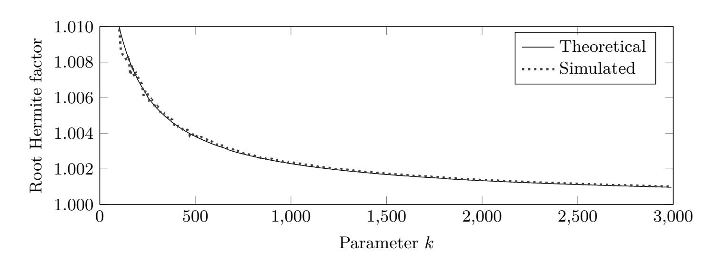

<span id="page-19-1"></span>Fig. 7: Number of nodes in full enumeration visited during simulation, and a fit.

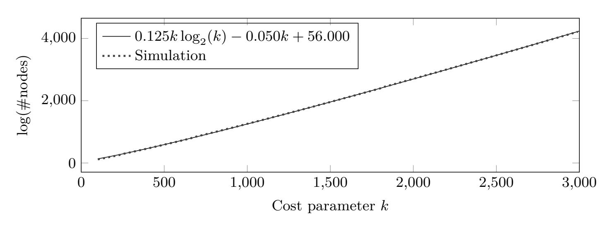

<span id="page-19-2"></span>Fig. 8: Gram–Schmidt log-norms of simulated experiments with k=1,000 after  $7\approx \ln k$  recursion levels.

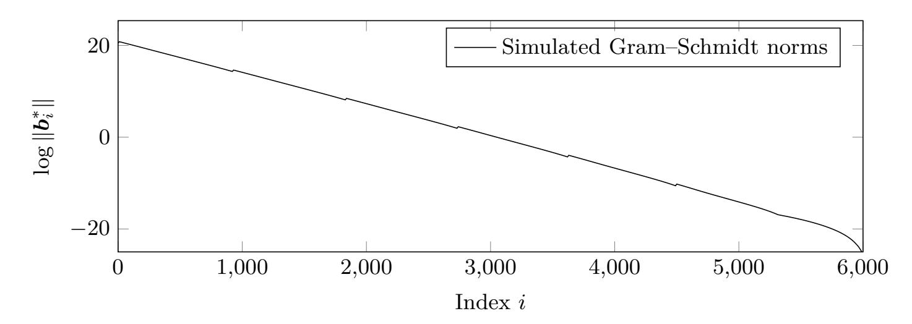

{20}------------------------------------------------

Finally, we plot the Gram–Schmidt log-norms slope for *k* = 1*,* 000 during the first 20 recursion levels. At level *i*, we compute the slope for the enumeration region (i.e. the first block of size *ki−ki−*1). It can be observed that the simulated slope is indeed increasing.

Fig. 9: Simulated and theoretical Gram–Schmidt log-norms slope of enumeration region, for *k* = 1*,* 000 and during the first 20 iterations.

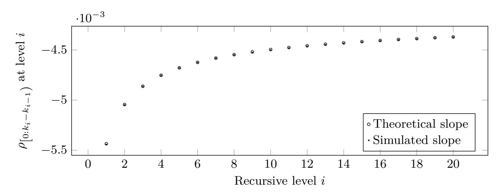

## <span id="page-20-0"></span>**4 A practical variant**

It can be observed that, in our analysis of Algorithm [2,](#page-16-0) the dimension of the lattice is relatively large. It is thus interesting to investigate algorithms that require smaller dimensions. In this subsection, we describe a practical strategy that works with dimensions *d* = *O*(*k*) where the hidden constants are small. As mentioned in the introduction, practical implementations of lattice reduction algorithms often deviate from the asymptotically efficient variants, e.g. by applying much weaker preprocessing than required asymptotically. In this section, we use numerically optimised preprocessing and enumeration strategies to parameterise Algorithm [3,](#page-21-0) which we view as a practical variant of Algorithm [2](#page-16-0), working with dimensions *d* = *d*(1 + *c*) *· ke* for some small constant *c ≥* 0. It differs from Algorithm [2](#page-16-0) in two respects. First, it applies BKZ preprocessing instead of SDBKZ preprocessing. This is merely an artefact of the latter seemingly not providing an advantage in the parameter ranges we considered. Second, the algorithm adapts the enumeration dimension based on the "space available" for preprocessing. This is to enforce that it stays within *d* dimensions, instead of requiring *≈ ik* dimensions where *i* is the number of recursion levels.

We use the following functions in Algorithm [3:](#page-21-0)

- **–** The function pre(*k*) returns a preprocessing cost parameter for a given *k*.
- **–** The function tail(*k, c, d*) returns a new cost parameter *k ⋆* such that enumeration in dimension *k <sup>⋆</sup>* after preprocessing with pre(*k ⋆* ) in dimension *d*

{21}------------------------------------------------

**Algorithm 3:** Solving Approx-HSVP with preprocessing dimension larger than enumeration dimension.

```
Data: A basis matrix \boldsymbol{B} \in \mathbb{R}^{d \times d}.

Data: Cost parameter k \geq 2 and an overshooting parameter c > 0.

Result: A short vector \boldsymbol{b}.

1 k^* \leftarrow \operatorname{tail}(k, c, d);

2 k' \leftarrow \operatorname{pre}(k^*);

3 if k' > 2 then

4 | run Algorithm 4 on \boldsymbol{B} with parameter k';

5 else

6 | run LLL on \boldsymbol{B};

7 end

8 \boldsymbol{b} \leftarrow \operatorname{Enum} \left(\boldsymbol{B}_{[0:k^*)}\right);

9 return \boldsymbol{b};
```

- costs at most as much as enumeration in dimension k after preprocessing in dimension  $\lceil (1+c) \cdot k \rceil$ . In particular, if  $d \geq \lceil (1+c) \cdot k \rceil$  then  $k^* = k$ .
- Preprocessing (Step 4) calls Algorithm 4, perhaps restricted to a small number of while loops. Algorithm 4 is simply the BKZ algorithm where the SVP oracle is replaced by Algorithm 3.

We plot the output of our simulations for Algorithm 3 in Figure 10 (see also Figure 16). These simulations are instantiations of Algorithm 1 with d > k, c > 0 and tail(x,y,z) matching those used in Algorithm 3. These were produced using blck.py, attached to the electronic version of the full version of this work. Our strategy finding strategy follows the same blueprint as described in Section 2.4. Through such simulation experiments we manually established that c = 0.25, four sweeps of preprocessing and using BKZ over SDBKZ seems to provide the best performance, which is why we report data on these choices. We also fitted the coefficients  $a_0, a_1, a_2$  of  $a_0 \cdot k \log k + a_1 \cdot k + a_2$  to points from 100 to 249. Furthermore, we plot the data from Figure 2 to provide a reference point for the performance of the new algorithm and also provide some data on the hypothetical performance of Algorithm 3 assuming the cost of all preprocessing costs is only as much as LLL regardless of the choice of k'. This can be considered the best case scenario for Algorithm 3 and thus a rough lower bound on its running time.  $a_1 = a_1 \cdot k + a_2 \cdot k + a_3 \cdot k + a_4 \cdot k + a_5 \cdot k + a_5 \cdot k + a_5 \cdot k + a_5 \cdot k + a_5 \cdot k + a_5 \cdot k + a_5 \cdot k + a_5 \cdot k + a_5 \cdot k + a_5 \cdot k + a_5 \cdot k + a_5 \cdot k + a_5 \cdot k + a_5 \cdot k + a_5 \cdot k + a_5 \cdot k + a_5 \cdot k + a_5 \cdot k + a_5 \cdot k + a_5 \cdot k + a_5 \cdot k + a_5 \cdot k + a_5 \cdot k + a_5 \cdot k + a_5 \cdot k + a_5 \cdot k + a_5 \cdot k + a_5 \cdot k + a_5 \cdot k + a_5 \cdot k + a_5 \cdot k + a_5 \cdot k + a_5 \cdot k + a_5 \cdot k + a_5 \cdot k + a_5 \cdot k + a_5 \cdot k + a_5 \cdot k + a_5 \cdot k + a_5 \cdot k + a_5 \cdot k + a_5 \cdot k + a_5 \cdot k + a_5 \cdot k + a_5 \cdot k + a_5 \cdot k + a_5 \cdot k + a_5 \cdot k + a_5 \cdot k + a_5 \cdot k + a_5 \cdot k + a_5 \cdot k + a_5 \cdot k + a_5 \cdot k + a_5 \cdot k + a_5 \cdot k + a_5 \cdot k + a_5 \cdot k + a_5 \cdot k + a_5 \cdot k + a_5 \cdot k + a_5 \cdot k + a_5 \cdot k + a_5 \cdot k + a_5 \cdot k + a_5 \cdot k + a_5 \cdot k + a_5 \cdot k + a_5 \cdot k + a_5 \cdot k + a_5 \cdot k + a_5 \cdot k + a_5 \cdot k + a_5 \cdot k + a_5 \cdot k + a_5 \cdot k + a_5 \cdot k + a_5 \cdot k + a_5 \cdot k + a_5 \cdot k + a_5 \cdot k + a_5 \cdot k + a_5 \cdot k + a_5 \cdot k + a_5 \cdot k + a_5 \cdot k + a_5 \cdot$ 

<span id="page-21-1"></span>The choice c = 0.25 may be interpreted a posteriori as consistent with Figure 1 where the minimum for BKZ is attained at  $c \approx 0.30$ . We note, however, that Figure 1 considers BKZ-reduced bases for block size k, whereas here the algorithm encounters BKZ-reduced bases for block sizes k' < k.

<span id="page-21-2"></span>We note that this data only extends until k = 323. Computing pruning parameters requires increasing precision in increasing dimension and become more "brittle" the cheaper the preprocessing is compared to the enumeration cost. In other words, our simulation code simply crashed with a floating-point error in dimension 324. Since the trend is clear in the data already, we did not push it further using higher precision.

{22}------------------------------------------------

```
Algorithm 4: BKZ with Algorithm 3 as Approx-HSVP oracle.
   Data: A basis matrix \boldsymbol{B} \in \mathbb{R}^{d \times d}.
   Data: Cost parameter k \geq 2 and an overshooting parameter c \geq 0.
    Result: A reduced basis of L(B).
1 \boldsymbol{B} \leftarrow \text{LLL}(\boldsymbol{B});
 2 while change was made in previous iteration do
         for 0 \le \kappa < d - 1 do
 3
              e \leftarrow \min(d, \kappa + \lceil (1+c) \cdot k \rceil);
 4
              v \leftarrow \text{output of Algorithm 3 on } (\pi(\boldsymbol{B}_{[\kappa:e)}), k, c);
 5
              \text{if } \|\boldsymbol{v}\|<\|\boldsymbol{b}_{\kappa}^*\| \text{ then }
 6
                   insert \boldsymbol{v} at index \kappa;
 7
                    call LLL to remove linear dependencies;
 8
                   record that a change was made;
 9
              end
10
         end
11
12 end
13 return B;
```

In Figure 11 we give the preprocessing cost parameters and probabilities of success of a single enumeration selected by our optimisation. In particular, these figures suggest that the success probability per enumeration does not drop exponentially fast in Figure 11b (see also Figure 18b). This is consistent with the second order term in the time complexity which is closer to 1/2 (corresponding to standard pruning) than 1 (corresponding to extreme pruning). Similarly, in contrast to Figure 3a the preprocessing cost parameter (or "block size") k' in Figure 11a does not seem to follow an affine function of k, i.e. it seems to grow faster for larger dimensions.

We also give experimental data comparing our implementation of Algorithm 3, impl.py, attached to the electronic version of the full version of document, with our simulations in Figure 12. We note that our implementation of Algorithm 3 is faster than FPyLLL's SVP solver from dimension 82 onward. As in Section 2.5, we do not use the strategies produced by our simulation to run the implementation but rely on a variant of FPLLL's strategizer [dt17] to optimise these strategies.

Comparing Figures 2 and 10 is meaningless without taking the obtained root Hermite factors into account. First, Algorithm 3 is not an SVP solver but an Approx-HSVP solver. Second, if  $d < \lceil (1+c) \cdot k \rceil$  then Algorithm 3 will reduce the enumeration dimension, further decreasing the quality of the output.

Since we are interested in running Algorithm 3 as a subroutine of Algorithm 4, we compare the latter against plain BKZ. For this comparison we consider the case  $d = 2 \cdot k$ , which corresponds to a typical setting encountered in cryptographic applications.

In Figure 13, we plot the slope of the Gram-Schmidt log-norms as predicted by our simulations for BKZ on the one hand, and a self-dual variant of Algorithm 4. This variant first runs Algorithm 4 on the dual basis, followed by run-

{23}------------------------------------------------

<span id="page-23-4"></span>Fig. 10: Cost of one call to Alg. [3](#page-21-0) with enumeration dimension *k*, *c* = 1/4, *d* = *d*(1 + *c*) *· ke* and four preprocessing sweeps.

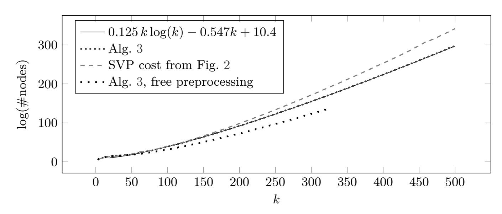

ning Algorithm [4](#page-22-0) on the original basis. Each run is capped at half the number of sweeps as used for BKZ. The rationale for this strategy is that it handles the quality degradation as the BKZ index *i* surpasses *d − d*(1 + *c*) *· ke* where *k <sup>⋆</sup> < k*. As Figure [13](#page-25-1) illustrates, the obtained quality of the two algorithms is very close. Indeed our SD variant slightly outperforms BKZ, but we note that the ratio of the two is increasing, i.e. the quality advantage will invert as *d* increases.

**Acknowledgments.** The authors thank Léo Ducas, Elena Kirshanova and Michael Walter for helpful discussions. Shi Bai would like to acknowledge the use of the services provided by Research Computing at the Florida Atlantic University.

## **References**

<span id="page-23-3"></span>ABD<sup>+</sup>16. Martin R. Albrecht, Dan Bernstein, Léo Ducas, Paul Kirchner, Chris Peikert, John Schanck, and Noah Stephens-Davidowitz. Inaccurate security claims in NTRUprime. [https://groups.google.com/forum/#!topic/](https://groups.google.com/forum/#!topic/cryptanalytic-algorithms/BoSRL0uHIjM) [cryptanalytic-algorithms/BoSRL0uHIjM](https://groups.google.com/forum/#!topic/cryptanalytic-algorithms/BoSRL0uHIjM), May 2016.

<span id="page-23-0"></span>ACD<sup>+</sup>18. Martin R. Albrecht, Benjamin R. Curtis, Amit Deo, Alex Davidson, Rachel Player, Eamonn W. Postlethwaite, Fernando Virdia, and Thomas Wunderer. Estimate all the LWE, NTRU schemes! In Dario Catalano and Roberto De Prisco, editors, *SCN 18*, volume 11035 of *LNCS*, pages 351– 367. Springer, Heidelberg, September 2018.

<span id="page-23-1"></span>ADH<sup>+</sup>19. Martin R. Albrecht, Léo Ducas, Gottfried Herold, Elena Kirshanova, Eamonn W. Postlethwaite, and Marc Stevens. The general sieve kernel and new records in lattice reduction. In Yuval Ishai and Vincent Rijmen, editors, *EUROCRYPT 2019, Part II*, volume 11477 of *LNCS*, pages 717–746. Springer, Heidelberg, May 2019.

<span id="page-23-2"></span>AGPS19. Martin R. Albrecht, Vlad Gheorghiu, Eamonn W. Postlethwaite, and John M. Schanck. Estimating quantum speedups for lattice sieves. Cryp-

{24}------------------------------------------------

Fig. 11: Reduction strategies used for Figure [10](#page-23-4).

(a) Preprocessing cost parameters used in our simulations.

<span id="page-24-6"></span>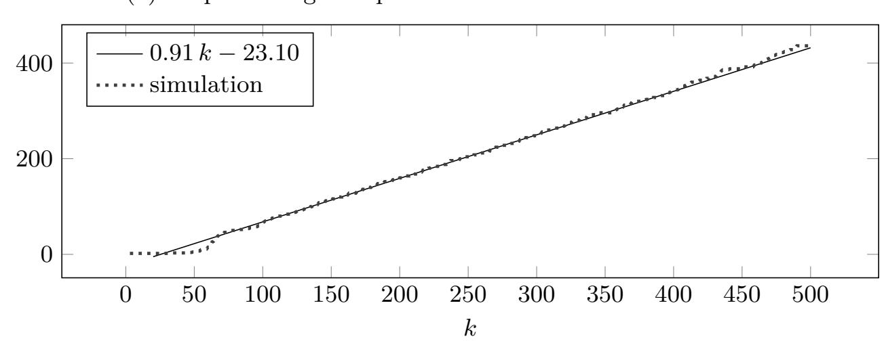

(b) Success probability of a single enumeration (in log) scale.

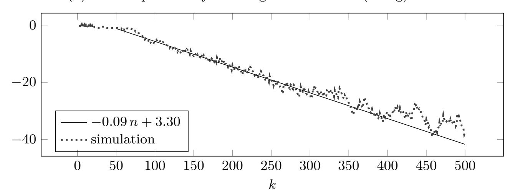

tology ePrint Archive, Report 2019/1161, 2019. [https://eprint.iacr.org/](https://eprint.iacr.org/2019/1161) [2019/1161](https://eprint.iacr.org/2019/1161).

<span id="page-24-4"></span>AGVW17. Martin R. Albrecht, Florian Göpfert, Fernando Virdia, and Thomas Wunderer. Revisiting the expected cost of solving uSVP and applications to LWE. In Tsuyoshi Takagi and Thomas Peyrin, editors, *ASIACRYPT 2017, Part I*, volume 10624 of *LNCS*, pages 297–322. Springer, Heidelberg, December 2017.

<span id="page-24-1"></span>ALNS19. Divesh Aggarwal, Jianwei Li, Phong Q. Nguyen, and Noah Stephens-Davidowitz. Slide reduction, revisited - filling the gaps in SVP approximation. *CoRR*, abs/1908.03724, 2019.

<span id="page-24-3"></span>ANS18. Yoshinori Aono, Phong Q. Nguyen, and Yixin Shen. Quantum lattice enumeration and tweaking discrete pruning. In Peyrin and Galbraith [\[PG18\]](#page-27-14), pages 405–434.

<span id="page-24-5"></span>APS15. Martin R. Albrecht, Rachel Player, and Sam Scott. On the concrete hardness of Learning with Errors. *Journal of Mathematical Cryptology*, 9(3):169– 203, 2015.

<span id="page-24-0"></span>AWHT16. Yoshinori Aono, Yuntao Wang, Takuya Hayashi, and Tsuyoshi Takagi. Improved progressive BKZ algorithms and their precise cost estimation by sharp simulator. In Fischlin and Coron [\[FC16](#page-26-16)], pages 789–819.

<span id="page-24-2"></span>AWHT18. Yoshinori Aono, Yuntao Wang, Takuya Hayashi, and Tsuyoshi Takagi. Progressive BKZ library. Available at [http://www2.nict.go.jp/security/](http://www2.nict.go.jp/security/pbkzcode/index.html)

{25}------------------------------------------------

<span id="page-25-0"></span>[Fig. 12: Number of nodes visited during one Approx-HSVP call with enumeration](http://www2.nict.go.jp/security/pbkzcode/index.html) dimension *k*, *c* = 1/4, *d* = *d*(1 + *c*) *· ke* and four sweeps of preprocessing.

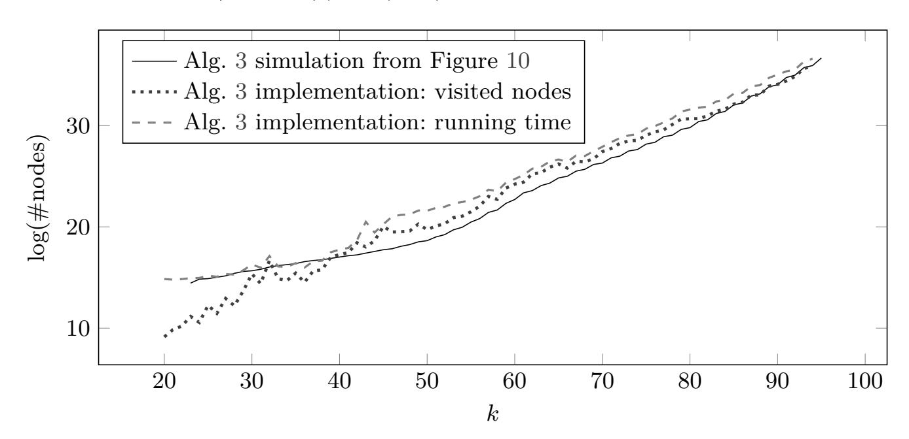

Fig. 13: Basis quality (BKZ vs SD-Algorithm [4\)](#page-22-0)

<span id="page-25-1"></span>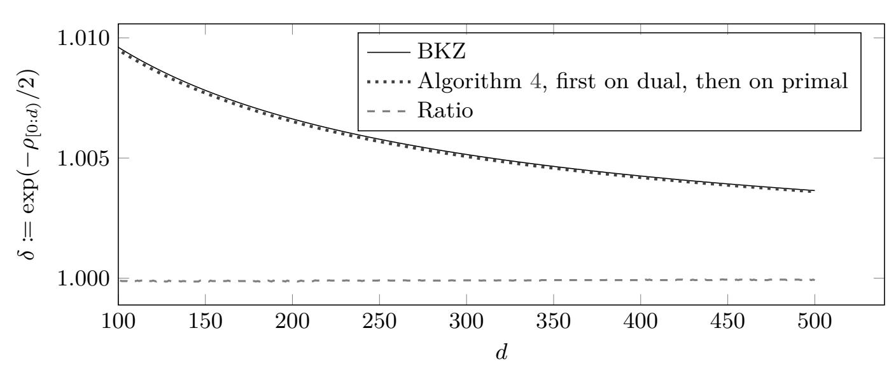

Four sweeps of Algorithm [4](#page-22-0) on the dual, followed by four sweeps of Algorithm [4](#page-22-0) on the primal lattice in dimension *d* = 2 *k*, using *c* = 0*.*25 and four preprocessing sweeps.

{26}------------------------------------------------

- pbkzcode/index.html, 2018.
- <span id="page-26-10"></span>Bab86. László Babai. On Lovász' lattice reduction and the nearest lattice point problem. *Combinatorica*, 6(1):1–13, 1986.
- <span id="page-26-8"></span>BDGL16. Anja Becker, Léo Ducas, Nicolas Gama, and Thijs Laarhoven. New directions in nearest neighbor searching with applications to lattice sieving. In Robert Krauthgamer, editor, *27th SODA*, pages 10–24. ACM-SIAM, January 2016.
- <span id="page-26-6"></span>BSW18. Shi Bai, Damien Stehlé, and Weiqiang Wen. Measuring, simulating and exploiting the head concavity phenomenon in BKZ. In Peyrin and Galbraith [\[PG18](#page-27-14)], pages 369–404.
- <span id="page-26-5"></span>Che13. Yuanmi Chen. *Réduction de réseau et sécurité concrète du chiffrement complètement homomorphe*. PhD thesis, Paris 7, 2013.
- <span id="page-26-0"></span>CN11. Yuanmi Chen and Phong Q. Nguyen. BKZ 2.0: Better lattice security estimates. In Dong Hoon Lee and Xiaoyun Wang, editors, *ASIACRYPT 2011*, volume 7073 of *LNCS*, pages 1–20. Springer, Heidelberg, December 2011.
- <span id="page-26-14"></span>dt17. The FPLLL development team. BKZ reduction strategy (preprocessing, pruning, etc.) search. Available at <https://github.com/fplll/strategizer>, 2017.
- <span id="page-26-4"></span>dt19a. The FPLLL development team. FPLLL, a lattice reduction library. Available at <https://github.com/fplll/fplll>, 2019.
- <span id="page-26-7"></span>dt19b. The FPLLL development team. FPyLLL, a Python interface to fplll. Available at <https://github.com/fplll/fpylll>, 2019.
- <span id="page-26-9"></span>Duc18. Léo Ducas. Shortest vector from lattice sieving: A few dimensions for free. In Jesper Buus Nielsen and Vincent Rijmen, editors, *EUROCRYPT 2018, Part I*, volume 10820 of *LNCS*, pages 125–145. Springer, Heidelberg, April / May 2018.
- <span id="page-26-16"></span>FC16. Marc Fischlin and Jean-Sébastien Coron, editors. *EUROCRYPT 2016, Part I*, volume 9665 of *LNCS*. Springer, Heidelberg, May 2016.
- <span id="page-26-11"></span>FP83. Ulrich Fincke and Michael Pohst. A procedure for determining algebraic integers of given norm. In J. A. van Hulzen, editor, *EUROCAL*, volume 162 of *LNCS*, pages 194–202. Springer, 1983.
- <span id="page-26-3"></span>GN08a. Nicolas Gama and Phong Q. Nguyen. Finding short lattice vectors within Mordell's inequality. In Richard E. Ladner and Cynthia Dwork, editors, *40th ACM STOC*, pages 207–216. ACM Press, May 2008.
- <span id="page-26-15"></span>GN08b. Nicolas Gama and Phong Q. Nguyen. Predicting lattice reduction. In Nigel P. Smart, editor, *EUROCRYPT 2008*, volume 4965 of *LNCS*, pages 31–51. Springer, Heidelberg, April 2008.
- <span id="page-26-12"></span>GNR10. Nicolas Gama, Phong Q. Nguyen, and Oded Regev. Lattice enumeration using extreme pruning. In Henri Gilbert, editor, *EUROCRYPT 2010*, volume 6110 of *LNCS*, pages 257–278. Springer, Heidelberg, May / June 2010.
- <span id="page-26-13"></span>HPS11. Guillaume Hanrot, Xavier Pujol, and Damien Stehlé. Analyzing blockwise lattice algorithms using dynamical systems. In Phillip Rogaway, editor, *CRYPTO 2011*, volume 6841 of *LNCS*, pages 447–464. Springer, Heidelberg, August 2011.
- <span id="page-26-1"></span>HS07. Guillaume Hanrot and Damien Stehlé. Improved analysis of kannan's shortest lattice vector algorithm. In Alfred Menezes, editor, *CRYPTO 2007*, volume 4622 of *LNCS*, pages 170–186. Springer, Heidelberg, August 2007.
- <span id="page-26-2"></span>HS08. Guillaume Hanrot and Damien Stehlé. Worst-case Hermite-Korkine-Zolotarev reduced lattice bases. *ArXiv*, abs/0801.3331, 2008.

{27}------------------------------------------------

- <span id="page-27-4"></span>HS10. Guillaume Hanrot and Damien Stehlé. A complete worst-case analysis of kannan's shortest lattice vector algorithm, 2010. Full version of [\[HS07](#page-26-1),[HS08](#page-26-2)], available at [http://perso.ens-lyon.fr/damien.stehle/](http://perso.ens-lyon.fr/damien.stehle/downloads/KANNAN_EXTENDED.pdf) [downloads/KANNAN\\_EXTENDED.pdf](http://perso.ens-lyon.fr/damien.stehle/downloads/KANNAN_EXTENDED.pdf).
- <span id="page-27-2"></span>Kan83. Ravi Kannan. Improved algorithms for integer programming and related lattice problems. In *15th ACM STOC*, pages 193–206. ACM Press, April 1983.
- <span id="page-27-8"></span>Laa15. Thijs Laarhoven. *Search problems in cryptography*. PhD thesis, Eindhoven University of Technology, 2015.
- <span id="page-27-10"></span>LLJL82. Arjen K. Lenstra, Hendrik W. Lenstra Jr., and László Lovász. Factoring polynomials with rational coefficients. *Mathematische Annalen*, 261:515– 534, 12 1982.
- <span id="page-27-9"></span>LM18. Thijs Laarhoven and Artur Mariano. Progressive lattice sieving. In Tanja Lange and Rainer Steinwandt, editors, *Post-Quantum Cryptography - 9th International Conference, PQCrypto 2018*, pages 292–311. Springer, Heidelberg, 2018.
- <span id="page-27-11"></span>MW15. Daniele Micciancio and Michael Walter. Fast lattice point enumeration with minimal overhead. In Piotr Indyk, editor, *26th SODA*, pages 276–294. ACM-SIAM, January 2015.
- <span id="page-27-1"></span>MW16. Daniele Micciancio and Michael Walter. Practical, predictable lattice basis reduction. In Fischlin and Coron [[FC16](#page-26-16)], pages 820–849.
- <span id="page-27-5"></span>Ngu10. Phong Q. Nguyen. Hermite's constant and lattice algorithms. ISC, pages 19–69. Springer, Heidelberg, 2010.
- <span id="page-27-14"></span>PG18. Thomas Peyrin and Steven Galbraith, editors. *ASIACRYPT 2018, Part I*, volume 11272 of *LNCS*. Springer, Heidelberg, December 2018.
- <span id="page-27-6"></span>Sch03. Claus-Peter Schnorr. Lattice reduction by random sampling and birthday methods. In Helmut Alt and Michel Habib, editors, *STACS 2003*, volume 2607 of *LNCS*, pages 145–156. Springer, 2003.
- <span id="page-27-0"></span>SE94. Claus-Peter Schnorr and Michael Euchner. Lattice basis reduction: Improved practical algorithms and solving subset sum problems. *Math. Program.*, 66:181–199, 1994.
- <span id="page-27-13"></span>SG10. Michael Schneider and Nicolas Gama. Darmstadt SVP Challenges. [https:](https://www.latticechallenge.org/svp-challenge/index.php) [//www.latticechallenge.org/svp-challenge/index.php](https://www.latticechallenge.org/svp-challenge/index.php), 2010.
- <span id="page-27-3"></span>Sho18. Victor Shoup. Number Theory Library 11.3.1 (NTL) for C++. [http:](http://www.shoup.net/ntl/) [//www.shoup.net/ntl/](http://www.shoup.net/ntl/), 2018.
- <span id="page-27-12"></span>VGO<sup>+</sup>20. Pauli Virtanen, Ralf Gommers, Travis E. Oliphant, Matt Haberland, Tyler Reddy, David Cournapeau, Evgeni Burovski, Pearu Peterson, Warren Weckesser, Jonathan Bright, Stéfan J. van der Walt, Matthew Brett, Joshua Wilson, K. Jarrod Millman, Nikolay Mayorov, Andrew R. J. Nelson, Eric Jones, Robert Kern, Eric Larson, CJ Carey, İlhan Polat, Yu Feng, Eric W. Moore, Jake Vand erPlas, Denis Laxalde, Josef Perktold, Robert Cimrman, Ian Henriksen, E. A. Quintero, Charles R Harris, Anne M. Archibald, Antônio H. Ribeiro, Fabian Pedregosa, Paul van Mulbregt, and SciPy 1. 0 Contributors. SciPy 1.0: Fundamental Algorithms for Scientific Computing in Python. *Nature Methods*, 2020.
- <span id="page-27-7"></span>YD17. Yang Yu and Léo Ducas. Second order statistical behavior of LLL and BKZ. In Carlisle Adams and Jan Camenisch, editors, *SAC 2017*, volume 10719 of *LNCS*, pages 3–22. Springer, Heidelberg, August 2017.

{28}------------------------------------------------

## <span id="page-28-0"></span>A Geometry of BKZ-reduced bases

In this appendix we develop some results on the geometry of BKZ-reduced bases. We argue that even if we discard the last k indices, bases output by the BKZ with block size k are not expected to satisfy the GSA: the first k Gram-Schmidt log-norms are not expected to form a straight line. For the sake of simplicity, we concentrate on BKZ-k for lattices of dimension 2k.

We assume that each SVP solver call of a projected lattice  $\pi(\mathcal{L})$  of dimension  $k' \leq k$  provides a vector of norm  $\sqrt{k'} \cdot \operatorname{Vol}(\pi(\mathcal{L}))^{1/k'}$ , i.e. we assume it follows the Gaussian Heuristic and neglect the constant factor (which has a negligible impact on our analysis below). As showed in [HPS11], the vector of Gram–Schmidt log-norms eventually converges to a fixed point, described by equalities involving such terms  $\sqrt{k'} \cdot \operatorname{Vol}(\pi(\mathcal{L}))^{1/k'}$ . More concretely, let  $u_1, \ldots, u_{2k}$  be the fix-points Gram–Schmidt log-norms, in reversed order. We also start with  $u_1 = 0$ , which is without loss of generality (up to scaling by the logarithm of the determinant). Then (if we neglect low-order terms), the  $u_i$ 's satisfy the following recurrence relations:

$$u_{1} = 0,$$

$$u_{i} = \frac{1}{2} \ln i + \frac{1}{i} (u_{i} + u_{i-1} + \dots + u_{1}), \ \forall i \leq k,$$

$$u_{i} = \frac{1}{2} \ln k + \frac{1}{k} (u_{i} + u_{i-1} + \dots + u_{i-k+1}), \ \forall i > k.$$

<span id="page-28-2"></span>First, we establish lower and upper bounds for the Gram–Schmidt log-norms  $u_i$  when  $i \leq k$ .

**Lemma 2.** For all 
$$i \le k$$
, we have  $\frac{1}{4} \ln^2 i + \frac{1}{2} \ln i \le u_i < \frac{1}{4} \ln^2 i + \frac{1}{2} \ln i + 1$ .

*Proof.* The result clearly holds for i=1. For  $i\in[2,k]$ , note that  $2\cdot(i-1)\cdot(u_i-u_{i-1})=i\ln(i)-(i-1)\cdot\ln(i-1)$ . This implies that  $u_i=u_{i-1}+\frac{1}{2}\left(\frac{\ln(i)}{i-1}+\ln(i)-\ln(i-1)\right)$ . As a result, we obtain that  $u_i=\frac{1}{2}\left(\ln(i)+\sum_{j=2}^{i}\frac{\ln(j)}{j-1}\right)$ . As the function  $\frac{\ln t}{t-1}$  is decreasing for t>1, we have

$$\int_{2}^{i+1} \frac{\ln t}{t-1} dt \le \sum_{j=2}^{i} \frac{\ln j}{j-1} \le \int_{1}^{i} \frac{\ln t}{t-1} dt.$$

Checking that  $x \mapsto \int_1^x \frac{\ln t}{t-1} \mathrm{d}t - \frac{\ln^2 x}{2}$  is an increasing function with limit < 2 for x going to infinity leads to the claimed upper bound. Checking that  $x \mapsto \int_2^{x+1} \frac{\ln t}{t-1} \mathrm{d}t - \frac{\ln^2 x}{2}$  is an increasing function that is equal to 0 for x=1 leads to the claimed lower bound.

<span id="page-28-1"></span>Reversing the order simplifies the analysis. Note that we start these reversed indices at i = 1, also for the sake of simplicity.

{29}------------------------------------------------

To study the recurrence relations more conveniently, we approximate them by the following functional equations. Namely, we define *f* : R *→* R as follows:

$$f(x) = 0, \ \forall x \le 1,$$
  
$$f(x) = \frac{1}{2} \ln x + \frac{1}{x} \int_{1}^{x} f(t) \ dt, \ \forall x \in [1, k],$$
 (2)

$$f(x) = \frac{1}{2} \ln k + \frac{1}{k} \int_{x-k}^{x} f(t) \, dt, \ \forall x \ge k.$$
 (3)

<span id="page-29-3"></span>We will develop bounds on the error incurred by the discrete-to-continuous transformation. To begin, we give a more tractable form for the functional equations.

## **Lemma 3.** *We have*

$$f(x) = f_0(x) := \frac{1}{4} \ln^2 x + \frac{1}{2} \ln x$$

*for x ∈* [1*, k*]*, and for x ∈* [*k,* 2*k*] *we have*

$$f(x) = f_1(x) := e^{\frac{x}{n} - 1} \cdot \left( f_0(k) - \frac{1}{k} \int_1^{x - k} f_0(t) e^{-\frac{t}{k}} dt \right)$$

*Proof.* For *x ∈* [1*, k*], note that *f*<sup>0</sup> is indeed the solution to ([2\)](#page-29-0). Now, to solve [\(3](#page-29-1)), note first that for *x ∈* [*k,* 2*k*], we have

$$f(x) = \frac{1}{2} \ln k + \frac{1}{k} \int_{x-k}^{k} f_0(t) dt + \frac{1}{k} \int_{k}^{x} f(t) dt.$$

By differentiating, we obtain

$$f'(x) = -\frac{1}{k}f_0(x-k) + \frac{1}{k}f(x). \tag{4}$$

<span id="page-29-2"></span><span id="page-29-1"></span><span id="page-29-0"></span>*.*

Note that this is a first-order inhomogeneous linear differential equation of degree 1. The corresponding homogeneous equation has *x 7→* exp(*x*/*k*) as one of its solutions. Dividing [\(4](#page-29-2)) by exp(*x*/*k*), we get

$$\frac{\mathrm{d}\left(\mathrm{e}^{-\frac{x}{k}}\cdot f(x)\right)}{\mathrm{d}x} = -\frac{1}{k}f_0(x-k)\cdot\mathrm{e}^{-\frac{x}{k}}.$$

Therefore, there exists some constant *C* such that, for *x ∈* [*k,* 2*k*]:

$$f(x) = e^{\frac{x}{k}} \cdot \left( C - \frac{1}{k} \cdot \int_{k}^{x} f_0(t - k) \cdot e^{-\frac{t}{k}} dt \right).$$

Evaluating in *x* = *k* and using *f*1(*k*) = *f*0(*k*), we obtain that *C* = *f*0(*k*)/e. *ut*

<span id="page-29-4"></span>We are ready to bound the error incurred by the discrete-to-continuous transformation.

{30}------------------------------------------------

**Lemma 4.** For  $1 \le i \le k$ , we have  $|u_i - f(i)| \le 1$ . For  $i \in [k+1, 2k]$ , we have  $|f(i) - u_i| \le 16$ .

Proof. The first statement is directly implied by Lemma 2 and 3.

Assume now that i > k. Note that  $k \cdot (u_i - u_{i-1}) = u_i - u_{i-k}$ . This leads to the following relation

<span id="page-30-0"></span>
$$u_i = \left(\frac{k}{k-1}\right)^{i-k} \cdot u_k - \frac{1}{k-1} \sum_{j=1}^{i-k} \left(\frac{k}{k-1}\right)^{i-k-j} \cdot u_j.$$

Note the similarity of this with  $f_1$  from Lemma 3. We consider their differences.

$$|f_{1}(i) - u_{i}| \leq \left| \left( \frac{k}{k-1} \right)^{i-k} \cdot u_{k} - e^{\frac{i-k}{k}} \cdot f_{0}(k) \right| + \sum_{j=1}^{i-k} \left| \frac{1}{k-1} \cdot \left( \frac{k}{k-1} \right)^{i-k-j} \cdot u_{j} - \frac{1}{k} e^{\frac{i-k}{k}} \int_{j-1}^{j} f_{0}(t) \cdot e^{\frac{-t}{k}} dt \right|.$$
 (5)

Note that all the  $u_j$ 's in the above correspond to  $j \leq k$ .

As  $\left(\frac{k}{k-1}\right)^{i-k} \ge e^{\frac{i-k}{k}}$  for  $k \ge 2$  and  $f_0(k) \le u_k < f_0(k) + 1$ , the first part in the above inequality satisfies

$$\left| \left( \frac{k}{k-1} \right)^{i-k} \cdot u_k - e^{\frac{i-k}{k}} \cdot f_0(k) \right| \le \left( \left( \frac{k}{k-1} \right)^{i-k} - e^{\frac{i-k}{k}} \right) \cdot f_0(k) + \left( \frac{k}{k-1} \right)^{i-k}.$$

For every  $k \ge 2$ ,  $\left(\frac{k}{k-1}\right)^{i-k} - e^{\frac{i-k}{k}}$  and  $\left(\frac{k}{k-1}\right)^{i-k}$  are increasing functions of i. Hence the above is bounded by

$$\left(\left(\frac{k}{k-1}\right)^k - e\right) \cdot f_0(k) + \left(\frac{k}{k-1}\right)^k < 5.$$

The upper bound 5 is derived since the left-hand side of the above inequality is decreasing with k and is hence bounded from above by the value at k = 2.

Now we consider the remaining terms in (5):

$$\sum_{j=1}^{i-k} \left| \frac{1}{k-1} \left( \frac{k}{k-1} \right)^{i-k-j} u_j - \frac{1}{k} e^{\frac{i-k}{k}} \int_{j-1}^{j} f_0(t) e^{\frac{-t}{k}} dt \right|.$$

We observe  $u_j \geq \int_{j-1}^j f_0(t) dt$  and that  $\frac{1}{k-1} \left(\frac{k}{k-1}\right)^{i-k-j} \geq \frac{1}{k} e^{\frac{i-k-j+1}{k}}$ , which imply that

$$\frac{1}{k-1} \left( \frac{k}{k-1} \right)^{i-k-j} u_j \ge \frac{1}{k} e^{\frac{i-k}{k}} \int_{j-1}^j f_0(t) \cdot e^{\frac{-t}{k}} dt.$$

{31}------------------------------------------------

We hence obtain, for each  $1 \le j \le i - k$ :

$$k \cdot \left| \frac{1}{k-1} \left( \frac{k}{k-1} \right)^{i-k-j} u_j - \frac{1}{k} e^{\frac{i-k}{k}} \int_{j-1}^j f_0(t) e^{\frac{-t}{k}} dt \right|$$

$$= \left( \frac{k}{k-1} \right)^{i-k-j+1} \cdot u_j - e^{\frac{i-k}{k}} \int_{j-1}^j f_0(t) \cdot e^{\frac{-t}{k}} dt.$$

The latter is bounded from above by

$$e^{\frac{i-k-j+1}{k-1}}(f_0(j)+1)-e^{\frac{i-k-j}{k}}f_0(j-1)=e^{\frac{i-k-j+1}{k-1}}f_0(j)-e^{\frac{i-k-j}{k}}f_0(j-1)+e^{\frac{i-k-j+1}{k-1}}.$$

Now, as  $f_0'$  is decreasing, by the intermediate values theorem, we have  $f_0(j-1) \ge f_0(j) - f_0'(j-1)$ . Further, we have  $f_0'(j-1) = \frac{1+\ln(j-1)}{2(j-1)} \le \frac{1}{2}$  (for  $j \ge 2$ ). Hence, the above is bounded from above by

$$e^{\frac{i-k-j+1}{k-1}} f_0(j) - e^{\frac{i-k-j}{k}} \left( f_0(j) - \frac{1}{2} \right) + e^{\frac{i-k-j+1}{k-1}}$$

$$= \frac{1}{e} \left( e^{\frac{i-j}{k-1}} - e^{\frac{i-j}{k}} \right) f_0(j) + \frac{1}{e} \left( e^{\frac{i-j}{k-1}} + \frac{1}{2} e^{\frac{i-j}{k}} \right).$$

The term  $e^{\frac{i-j}{k-1}} + \frac{1}{2}e^{\frac{i-j}{k}}$  increases with  $i-j \leq 2k-1$ , and can be bounded above by  $e^3 + \frac{1}{2}e^{3/2}$ . Similarly, we have

$$\left(e^{\frac{i-j}{k-1}} - e^{\frac{i-j}{k}}\right) f_0(j) \le \left(e^{\frac{2k-1}{k-1}} - e^{\frac{2k-1}{k}}\right) f_0(k) \le \left(e^3 - e^{3/2}\right) \left(\frac{1}{4}\ln^2 2 + \frac{1}{2}\ln 2\right).$$

Overall, we have

$$\sum_{j=1}^{i-k} \left| \frac{1}{k-1} \left( \frac{k}{k-1} \right)^{i-k-j} u_j - \frac{1}{k} e^{\frac{i-k}{k}} \int_{j-1}^j f_0(t) e^{\frac{-t}{k}} dt \right|$$

$$\leq (e^2 - \sqrt{e}) \cdot \left( \frac{1}{4} \ln^2 2 + \frac{1}{2} \ln 2 \right) + \left( e^2 + \frac{1}{2} \sqrt{e} \right).$$

The latter is below 11.

Now that the discrete-to-continuous approximation error is bounded, we let k go to infinity and study the asymptotic behaviour of  $f_1$ , as defined in Lemma 3. We define

$$g_1(x) = \frac{1}{2} \left[ \ln(x-1) + e^{x-1} \cdot (E_1(x-1) + \gamma) \right], \ \forall x \in (1,2],$$

where  $\gamma \approx 0.5772$  is the Euler's constant and  $E_1(x) = \int_x^\infty \frac{e^{-t}}{t} dt$  is the exponential integral. The following lemma states that, up to normalisation, the function  $f_1^{(k)}$  uniformly converges to  $g_1(x)$  as k goes to infinity.

{32}------------------------------------------------

**Lemma 5.** For any  $x \in (k, 2k]$ , we have

$$\left| \frac{f_1(x) - f_1(k)}{\ln k} - g_1\left(\frac{x}{k}\right) \right| \le 3.$$

*Proof.* Recall from Lemma 3 that  $f_1(x) = e^{\frac{x}{k}-1} \cdot (f_0(k) - \frac{1}{k} \int_1^{x-k} f_0(t) e^{-\frac{t}{k}} dt)$ , for  $x \in [k, 2k]$ . We start by estimating the integral part in it. We have:

$$\frac{1}{k} \int_{1}^{x-k} f_{0}(t) e^{-\frac{t}{k}} dt = \int_{1/k}^{x/k-1} \left( \frac{1}{4} \ln^{2}(kt) + \frac{1}{2} \ln(kt) \right) e^{-t} dt 
= f_{0}(k) \int_{1/k}^{x/k-1} e^{-t} dt + \frac{1+\ln k}{2} \int_{1/k}^{x/k-1} \ln(t) e^{-t} dt + \frac{1}{4} \int_{1/k}^{x/k-1} \ln^{2}(t) e^{-t} dt.$$

The first term is within distance  $0.3 \ln k$  from  $f_0(k) \cdot (1 - e^{1-x/k})$ . The second term is

$$\frac{1+\ln k}{2}\left(\mathrm{E}_1\left(\frac{1}{k}\right)-(\ln k)\mathrm{e}^{-1/k}-\ln\left(\frac{x}{k}-1\right)\mathrm{e}^{1-x/k}-\mathrm{E}_1\left(\frac{x}{k}-1\right)\right).$$

It is within distance  $1.4 \ln k$  from  $\frac{\ln k}{2} \left( -\gamma - \ln(\frac{x}{k} - 1) e^{1-x/k} - E_1(\frac{x}{k} - 1) \right)$ . Finally, the third term is  $\leq \frac{1}{4} \int_0^1 \ln^2(t) dt = \frac{1}{2}$ . Collecting terms, we obtain that

$$\frac{1}{\ln k} \left| \frac{1}{k} \int_{1}^{x-k} f_0(t) e^{-\frac{t}{k}} dt - \frac{\ln k}{4} (1 - e^{1 - \frac{x}{k}}) + \frac{1}{2} \left[ \gamma - 1 + (\ln(\frac{x}{k} - 1) + 1) e^{1 - \frac{x}{k}} + E_1(\frac{x}{k} - 1) \right] \right| \le 3.$$

This leads to the result.

We have shown that up to normalisation, the function  $f_1^{(k)}$  converges to  $g_1$  for k tends to infinity.

Finally, as an illustration of the Gram–Schmidt log-norms not following the GSA, we plot in Figure 14a the discrete the  $u_i$ 's from the recurrence relations for k=1000 and  $i \leq 3k$ . We also plot their continuous approximations  $f_0(i)$  and  $f_1(i)$  for  $i \leq 2k$ . One can visualise the quality of the approximation for  $i \leq 2k$  (see Lemma 4), and that the GSA is not fulfilled even for indices from k+1 to 3k (the graph is not a line). One can also observe a ripple effect at indices just above i=k+1, a faded memory of the concavity of the first part of the graph. In Figure 14b, we also plot the function  $g_1$  for  $x \in (1,2]$ . This shows the asymptotic trend of  $f_1$  as  $n \to \infty$ .

{33}------------------------------------------------

<span id="page-33-0"></span>Fig. 14: The expected Gram–Schmidt log-norms of a BKZ-reduced basis do not follow the GSA.

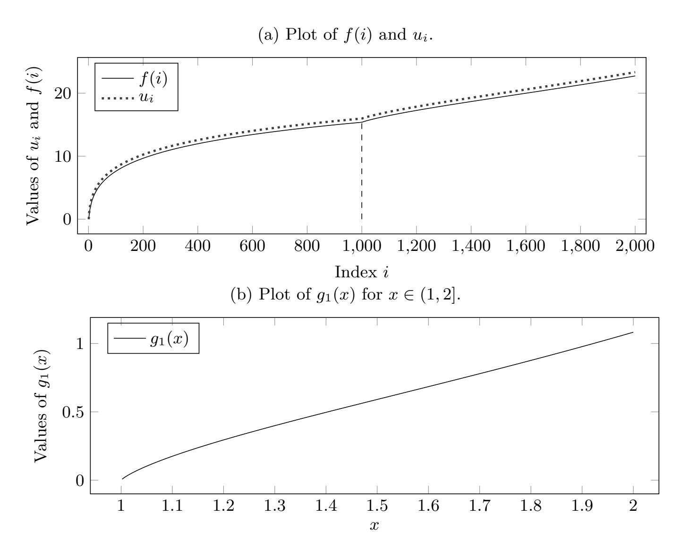

{34}------------------------------------------------

## <span id="page-34-2"></span>**B Greedy pruning**

In this section we give simulation results where we replace the default pruning used by FPLLL with a simpler, faster but lower output quality variant, referred to as "greedy" pruning in FPLLL. This pruning strategy tries to produce pruning parameters generating a relatively flat enumeration tree. The FPLLL documentation [\[dt19a\]](#page-26-4) claims: "It can be argued that this strategy is a factor *O*(*n*) away from optimal, probably less in practice". Using this strategy allows us to extend the considered block sizes up to 1*,* 000 since it is significantly faster to compute than a full gradient descent.

<span id="page-34-0"></span>Fig. 15: Expected number of nodes visited during enumeration in dimension *d*, greedy pruning.

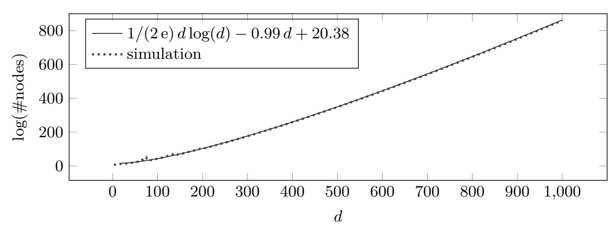

See also Figure [2](#page-11-0).

<span id="page-34-1"></span>Fig. 16: Cost of one call to Alg. [3](#page-21-0) with enumeration dimension *k*, *c* = 1/4, *d* = *d*(1 + *c*) *· ke* and four preprocessing sweeps, greedy pruning.

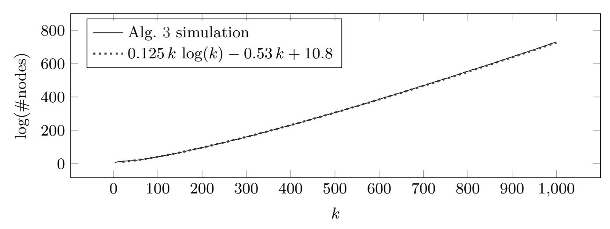

See also Figure [10.](#page-23-4)

{35}------------------------------------------------

Fig. 17: Reduction strategies used for Figure [15](#page-34-0).

(a) Preprocessing block sizes used in our simulations.

<span id="page-35-0"></span>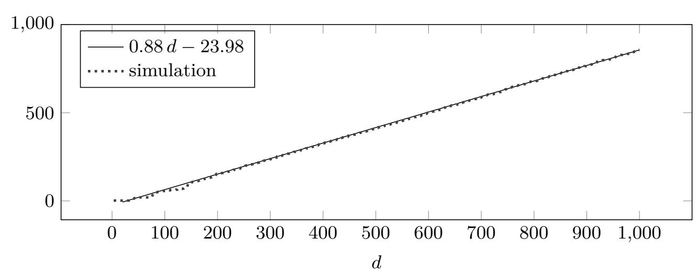

(b) Success probability of a single enumeration (in log scale)

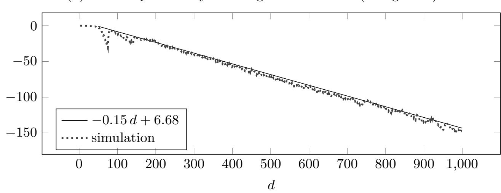

{36}------------------------------------------------

Fig. 18: Reduction strategies used for Figure [16](#page-34-1).

(a) Preprocessing block sizes used in our simulations.

<span id="page-36-0"></span>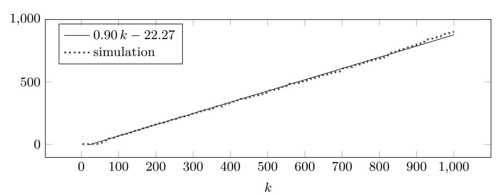

(b) Success probability of a single enumeration (in log scale).

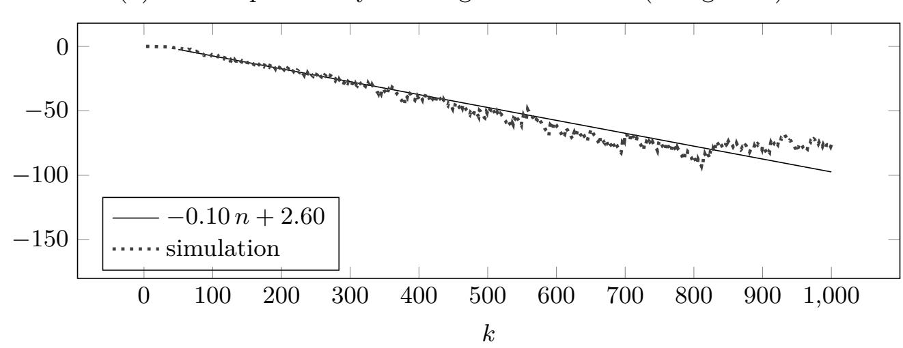