{0}------------------------------------------------

# Lamphone: Real-Time Passive Sound Recovery from Light Bulb Vibrations

Ben Nassi,<sup>1</sup> Yaron Pirutin,<sup>1</sup> Adi Shamir,<sup>2</sup> Yuval Elovici,<sup>1</sup> Boris Zadov<sup>1</sup>

<sup>1</sup>Ben-Gurion University of the Negev, <sup>2</sup>Weizmann Institute of Science {nassib, yaronpir, elovici, zadov}@bgu.ac.il, adi.shamir@weizmann.ac.il Website - https://www.nassiben.[com/lamphone](https://www.nassiben.com/lamphone)

## ABSTRACT

Recent studies have suggested various side-channel attacks for eavesdropping sound by analyzing the side effects of sound waves on nearby objects (e.g., a bag of chips and window) and devices (e.g., motion sensors). These methods pose a great threat to privacy, however they are limited in one of the following ways: they (1) cannot be applied in real time (e.g., Visual Microphone), (2) are not external, requiring the attacker to compromise a device with malware (e.g., Gyrophone), or (3) are not passive, requiring the attacker to direct a laser beam at an object (e.g., laser microphone). In this paper, we introduce "Lamphone," a novel side-channel attack for eavesdropping sound; this attack is performed by using a remote electro-optical sensor to analyze a hanging light bulb's frequency response to sound. We show how fluctuations in the air pressure on the surface of the hanging bulb (in response to sound), which cause the bulb to vibrate very slightly (a millidegree vibration), can be exploited by eavesdroppers to recover speech and singing, passively, externally, and in real time. We analyze a hanging bulb's response to sound via an electro-optical sensor and learn how to isolate the audio signal from the optical signal. Based on our analysis, we develop an algorithm to recover sound from the optical measurements obtained from the vibrations of a light bulb and captured by the electro-optical sensor. We evaluate Lamphone's performance in a realistic setup and show that Lamphone can be used by eavesdroppers to recover human speech (which can be accurately identified by the Google Cloud Speech API) and singing (which can be accurately identified by Shazam and SoundHound) from a bridge located 25 meters away from the target room containing the hanging light bulb.

## I. INTRODUCTION

Eavesdropping, the act of secretly or stealthily listening to a target/victim without his/her consent,[1](#page-0-0) by analyzing the side effects of sound waves on nearby objects (e.g., a bag of chips) and devices (e.g., motion sensors) is considered a great threat to privacy. In the past five years, various studies have demonstrated novel side-channel attacks that can be applied to eavesdrop via compromised devices placed in physical proximity of a target/victim [\[1](#page-12-0)[–8\]](#page-13-0). In these studies, data from devices that are not intended to serve as microphones (e.g., motion sensors [\[1–](#page-12-0)[5\]](#page-12-1), speakers [\[6\]](#page-12-2), vibration devices [\[7\]](#page-13-1), and magnetic hard disk drives [\[8\]](#page-13-0)) are used by attackers to recover sound. Sound eavesdropping based on the methods suggested in the abovementioned studies is very hard to detect, because applications/programs that implement such methods do not require any risky permissions (such as obtaining data from a video camera or microphone). As a result, such applications do not raise any suspicion from the user/operating system regarding their real use (i.e., eavesdropping). However, such methods require the eavesdropper to compromise a device located in proximity of a target/victim in order to: (1) obtain data that can be used to recover sound, and (2) exifltrate the raw/processed data.

To prevent eavesdroppers from implementing the abovementioned methods which rely on compromised devices, organizations deploy various mechanisms to secure their networks (e.g., air-gapping the networks, prohibiting the use of vulnerable devices, using firewalls and intrusion detection systems). As a result, eavesdroppers typically utilize three well-known methods that don't rely on a compromised device. The first method exploits radio signals sent from a victim's room to recover sound. This is done using a network interface card that captures Wi-Fi packets [\[9,](#page-13-2) [10\]](#page-13-3) sent from a router placed in physical proximity of a target/victim. While routers exist in most organizations today, the primary disadvantages of these methods is that they cannot be used to recover speech [\[10\]](#page-13-3) or they rely on a precollected dictionary to achieve their goal [\[9\]](#page-13-2) (i.e., only words from the precollected dictionary can be classified).

The second method, the laser microphone [\[11,](#page-13-4) [12\]](#page-13-5), relies on a laser transceiver that is used to direct a laser beam into the victim's room through a window; the beam is reflected off of an object and returned to the laser transceiver which converts the beam to an audio signal. In contrast to [\[9,](#page-13-2) [10\]](#page-13-3), laser microphones can be used in real time to recover speech, however the laser beam can be detected using a dedicated optical sensor. The third method, the Visual Microphone [\[13\]](#page-13-6), exploits vibrations caused by sound from various materials (e.g., a bag of chips, glass of water, etc.) in order to recover speech by using a video camera that supports a very high frame per second (FPS) rate (over 2200 Hz). In contrast to the laser microphone, the Visual Microphone is totally passive, so its implementation is much more difficult for organizations/vic-

<span id="page-0-0"></span><sup>1</sup> https://en.wikipedia.[org/wiki/Eavesdropping](https://en.wikipedia.org/wiki/Eavesdropping)

{1}------------------------------------------------

tims to detect. However, the main disadvantage of this method, according to the authors, is that the Visual Microphone cannot be applied in real time, because it takes a few hours to recover a few seconds of speech, since processing high resolution and high frequency (2200 frames per second) video requires significant computational resources. In addition, the hardware required (a high FPS rate video camera) is expensive.

In this paper, we introduce "Lamphone," a novel sidechannel attack that can be applied by eavesdroppers to recover sound from a room that contains a hanging bulb. Lamphone recovers sound optically via an electro-optical sensor which is directed at a hanging bulb; such bulbs vibrate due to air pressure fluctuations which occur naturally when sound waves hit the hanging bulb's surface. We explain how a bulb's response to sound (a millidegree vibration) can be exploited to recover sound, and we establish a criterion for the sensitivity specifications of a system capable of recovering sound from such small vibrations. Then, we evaluate a bulb's response to sound, identify factors that influence the recovered signal, and characterize the recovered signal's behavior. We then present an algorithm we developed in order to isolate the audio signal from an optical signal obtained by directing an electrooptical sensor at a hanging bulb. We evaluate Lamphone's performance on the tasks of recovering speech and songs in a realistic setup. We show that Lamphone can be used by eavesdroppers to recover human speech (which can be accurately identified by the Google Cloud Speech API) and singing (which can be accurately identified by Shazam and SoundHound) from a bridge located 25 meters away from the target office containing the hanging bulb. We also discuss potential improvements that can be made to Lamphone to optimize the results and extend Lamphone's effective sound recovery range. Finally, we discuss countermeasures that can be employed by organizations to make it more difficult for eavesdroppers to successfully use this attack vector.

# *A. Contributions*

We make the following contributions: We show that any hanging light bulb can be exploited by eavesdroppers as a means of recovering sound from a victim's room. Lamphone does not rely on the presence of a compromised device in proximity of the victim (addressing the limitation of Gyrophone [\[1\]](#page-12-0), Hard Drive of Hearing [\[8\]](#page-13-0), and other methods [\[3–](#page-12-3)[7\]](#page-13-1)). Lamphone can be used to recover speech without the use of a precollected dictionary (addressing the limitations of other external [\[9,](#page-13-2) [10\]](#page-13-3) and internal [\[1,](#page-12-0) [3,](#page-12-3) [4\]](#page-12-4) methods). Lamphone is totally passive, so it cannot be detected using an optical sensor that analyzes the directed laser beams reflected off the objects (addressing the limitation of a laser microphone [\[11,](#page-13-4) [12\]](#page-13-5)). Lamphone relies on an electro-optical sensor and can be applied in real-time scenarios (addressing the limitations of the Visual Microphone [\[13\]](#page-13-6)).

# *B. Structure*

The rest of the paper is structured as follows: In Section [II,](#page-1-0) we categorize and review existing methods for eavesdropping. In Section [III,](#page-3-0) we present the threat model. In Section [IV,](#page-4-0) we analyze the response of a hanging light bulb to sound and show how the audio signal can be isolated from the optical signal. We leverage our findings and present an algorithm for recovering sound in Section [V,](#page-7-0) and in Section [VI,](#page-8-0) we evaluate Lamphone's performance in a realistic setup. In Section [VII,](#page-11-0) we discuss potential improvements that can be made to optimize the quality of the recovered sound, and we describe countermeasure methods against the Lamphone attack in Section [VIII.](#page-12-5) We conclude our findings and suggest future work directions in Section [IX.](#page-12-6)

# <span id="page-1-0"></span>II. MICROPHONES - BACKGROUND & RELATED WORK

In this section, we explain how microphones work, and describe two categories of eavesdropping methods (external and internal) and two sound recovery techniques. Then, we review and categorize related research focused on eavesdropping methods and discuss the significance of Lamphone with respect to those methods.

## *A. Background*

Microphones are devices that convert acoustic energy (sound waves) into electrical energy (the audio signal).[2](#page-1-1) Dynamic microphones create electrical signals from sound waves using a three-step process involving the following three microphone components[3](#page-1-2) :

- 1) Diaphragm: In the first step, sound waves (fluctuations in air pressure) are converted to mechanical motion by means of a diaphragm, a thin piece of material (e.g., plastic, aluminum) which vibrates when it is struck by sound waves.
- 2) Transducer: In the second step, when the diaphragm vibrates, the coil (attached to the diaphragm) moves in the magnetic field, producing a varying current in the coil through electromagnetic induction.
- 3) ADC (analog-to-digital converter): In the third step, the analog electric signal is sampled to a digital signal at standard audio sample rates (e.g., 44.1, 88.2, 96 kHz).
- *1) External and Internal Methods:* There are two categories of eavesdropping methods which differ in terms of the location of the three components. The difference between their stages is presented in Figure [1.](#page-2-0)

*Internal methods* for eavesdropping are methods used to convert sound to electrical signals that rely on a single device. This device consists of the abovementioned components (i.e., the three components are co-located) and is placed near the source of the sound (the victim/target). Internal methods rely on a compromised device/sensor (e.g., smartphone's gyroscope [\[1\]](#page-12-0), magnetic hard drive [\[8\]](#page-13-0), or speaker [\[6\]](#page-12-2)) that is located in physical proximity to a victim/target and require the attacker to exifltrate the output (electrical signal) from the device (e.g., via the Internet).

*External methods* are methods where the three components are not co-located. As with internal methods, the diaphragm

<span id="page-1-1"></span><sup>2</sup> https://www.mediacollege.[com/audio/microphones/how-microphones](https://www.mediacollege.com/audio/microphones/how-microphones-work.html)[work](https://www.mediacollege.com/audio/microphones/how-microphones-work.html).html

<span id="page-1-2"></span><sup>3</sup> https://www.explainthatstuff.[com/microphones](https://www.explainthatstuff.com/microphones.html).html

{2}------------------------------------------------

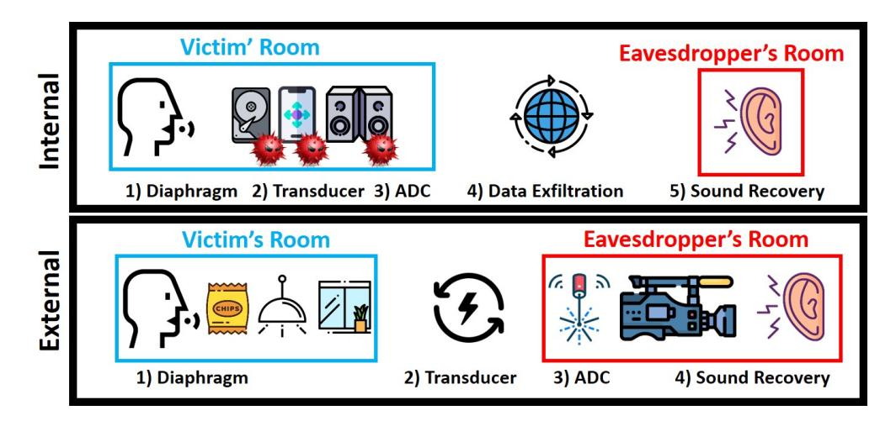

Fig. 1. Difference between stages of internal and external methods for eavesdropping.

<span id="page-2-0"></span>

| TABLE I                 |
|-------------------------|
| SUMMARY OF RELATED WORK |

<span id="page-2-1"></span>

| Exploited Device |          | Sampling<br>Rate             | Technique |                |  |
|------------------|----------|------------------------------|-----------|----------------|--|
|                  | Motion   | Gyroscope [1]                | 200 Hz    |                |  |
|                  | Sensors  | Accelerometer [2–4]          | 200 Hz    | Classification |  |
| Internal         |          | Fusion of                    |           |                |  |
|                  |          | motion sensors [5]           | 2 KHz     |                |  |
|                  | Misc.    | Vibration motor [7]          | 16 KHz    |                |  |
|                  |          | Speakers [6]                 | 48 KHz    | Recovery       |  |
|                  |          | Magnetic hard drive [8]      | 17 KHz    |                |  |
| External         | Radio    | Software-defined radio [9]   | 300 Hz    | Classification |  |
|                  | Receiver | Network interface card [10]  | 5 MHz     | Recovery       |  |
|                  | Optical  | High speed video camera [13] | 2200 FPS  |                |  |
|                  | Sensor   | Laser transceiver [11, 12]   | 40 KHz    | Recovery       |  |

is located in proximity of the source of the sound (the victim/target); the diaphragm is based on objects (rather than devices), such as a glass window (in the case of the laser microphone), a bag of chips (in the Visual Microphone [\[13\]](#page-13-6)), and a hanging light bulb (in Lamphone). However, the other two components are part of another device (or devices) that can be located far from the victim/target, such as a laser transceiver (in the case of the laser microphone), a video camera (in the Visual Microphone), or an electro-optical sensor (in Lamphone).

*2) Classification and Recovery Techniques:* There are two types of techniques used for eavesdropping: classification and audio/sound recovery.

*Classification* techniques can classify signals as isolated words. The signals obtained are uniquely correlated with sound, however they are not comprehensible (i.e., the signals cannot be recognized by a human ear) due to their poor quality (various factors can affect the quality, e.g., a low sampling rate). These methods require a dedicated classification model that relies on comparing a given signal to a dictionary compiled prior to eavesdropping (e.g., Gyrophone [\[1\]](#page-12-0), AccelWord [\[4\]](#page-12-4)). The biggest disadvantages of such methods are that words that do not exist in the dictionary cannot be classified and word separation techniques are usually required.

*Audio recovery* consists of techniques in which the recovered signal can be played and recognized by a human ear (e.g., laser microphone, Visual Microphone [\[13\]](#page-13-6), Hard Drive of Hearing [\[8\]](#page-13-0), SPEAKE(a)R [\[6\]](#page-12-2), etc.). They do not compare the obtained signal to a collection of signals gathered in advance or require a dedicated dictionary.

## *B. Review of Related Work*

*1) Internal Methods:* Several studies [\[1–](#page-12-0)[5\]](#page-12-1) showed that measurements obtained from motion sensors that are located in proximity of a victim can be used for classification. They variously demonstrated that the response of MEMS gyroscopes [\[1\]](#page-12-0), accelerometers [\[2–](#page-12-7)[4\]](#page-12-4), and geophones [\[5\]](#page-12-1) to sound can be used to classify words and identify speakers and their genders, even when the sensors are located within a smartphone and the sampling rate is limited to 200 Hz.

Two other studies [\[6,](#page-12-2) [7\]](#page-13-1) showed that the process of output devices can be inverted to recover speech. In [\[7\]](#page-13-1), the authors established a microphone by recovering audio from a vibration motor, and in [\[6\]](#page-12-2), the audio from speakers was recovered. A recent study [\[8\]](#page-13-0) exploited magnetic hard disks to recover audio, showing that measurements of the offset of the read/write head from the center of the track of the disk can be used to recover songs and speech.

The main disadvantages of the internal eavesdropping methods mentioned above ([\[1–](#page-12-0)[8\]](#page-13-0)) are that (1) they require the eavesdropper to compromise a device located near the victim, and (2) security aware organizations implement security policies and mechanisms aimed at preventing the creation of microphones using such devices.

*2) External Methods:* Two studies [\[9,](#page-13-2) [10\]](#page-13-3) used the physical layer of Wi-Fi packets as a means of creating a microphone. In [\[10\]](#page-13-3), the authors suggested a method that analyzes the received signal strength (RSS) indication of Wi-Fi packets sent from a router to recover sound by using a device with an integrated network interface card. They showed that this methods can be used to recover the sound from a piano located two meters away, however the authors did not show whether this method can be used to recover speech. In [\[9\]](#page-13-2), the authors suggested a method that analyzes the channel state information (CSI) of Wi-Fi packets sent from a router to classify words. The main disadvantage of this method is that it relies on a precollected dictionary. Neither method [\[9,](#page-13-2) [10\]](#page-13-3) is suitable for speech recovery.

The laser microphone [\[11,](#page-13-4) [12\]](#page-13-5) is a well-known method that uses an external device. In this case, a laser beam is directed by the eavesdropper through a window into the victim's room; the laser beam is reflected off an object and returned to the eavesdropper who converts the beam to an audio signal. For decades, this method has been extremely popular in the area of espionage; its main disadvantage is that it can be detected using a dedicated optical sensor that analyzes the directed laser beams.

The most famous method related to our research is the Visual Microphone [\[13\]](#page-13-6). In this method, the eavesdropper analyzes the response of material inside the victim's room (e.g., a bag of chips, water, etc.) when it is struck by sound waves, using video obtained from a high speed video camera (2200 FPS), and recovers speech. However, as was indicated by the authors, it takes a few hours to recover sound from a few seconds of video, because thousands of frames must be processed. In addition, this method relies on a high speed camera (at least 2200 FPS), which is an expensive piece of equipment. Lamphone combines the various advantages of the Visual Microphone and laser microphone. It is totally passive,

{3}------------------------------------------------

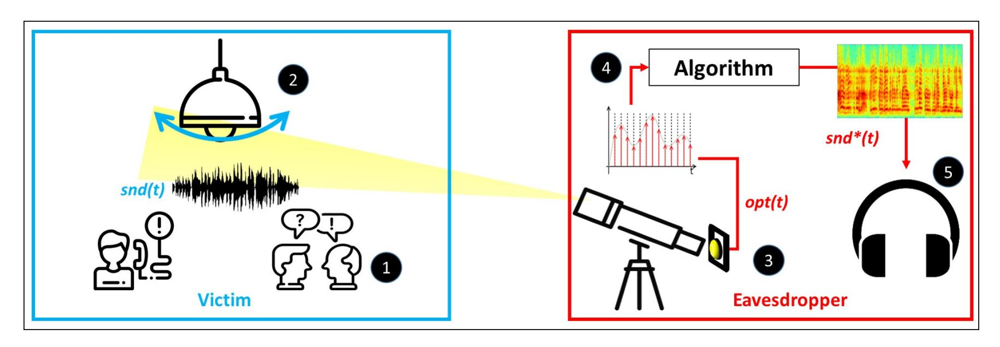

Fig. 2. Lamphone's threat model: The sound snd(t) from the victim's room (1) creates fluctuations on the surface of the hanging bulb (the diaphragm) (2). The eavesdropper directs an electro-optical sensor (the transducer) at the hanging bulb via a telescope (3). The optical signal opt(t) is sampled from the electro-optical sensor via an ADC (4) and processed, using Algorithm [1,](#page-7-1) to a recovered acoustic signal snd∗(t) (5).

so it is difficult to detect (like the Visual Microphone), can be applied in real time (like the laser microphone), and does not require malware (like both methods). Table [I](#page-2-1) presents a summary of related work in the area of creating microphones.

# III. THREAT MODEL

<span id="page-3-0"></span>In this section, we describe the threat model and compare it to other methods for recovering sound.

We assume a victim located inside a room/office that contains a hanging light bulb. We consider an eavesdropper a malicious entity that is interested in spying on the victim in order to capture the victim's conversations and make use of the information provided in the conversation (e.g., stealing the victim's credit card number, performing extortion based on private information revealed by the victim, etc.). In order to recover the sound in this scenario, the eavesdropper performs the Lamphone attack.

Lamphone consists of the following primary components:

- 1) Telescope This piece of equipment is used to focus the field of view on the hanging bulb from a distance.
- 2) Electro-optical sensor This sensor is mounted on the telescope and consists of a photodiode (a semiconductor device) that converts light into an electrical current. The current is generated when photons are absorbed in the photodiode. Photodiodes are used in many consumer electronic devices (e.g., smoke detectors, medical devices).[4](#page-3-1)
- 3) Sound recovery system This system receives an optical signal as input and outputs the recovered acoustic signal. The eavesdropper can implement such a system with dedicated hardware (e.g., using capacitors, resistors, etc.). Alternatively, the attacker can use an ADC to sample the electro-optical sensor and process the data using a sound recovery algorithm running on a laptop. In this study, we use the latter digital approach.

The conversation held in the victim's room creates sound snd(t) that results in fluctuations in the air pressure on the surface of the hanging bulb. These fluctuations cause the bulb to vibrate, resulting in a pattern of displacement over time <span id="page-3-2"></span>that the eavesdropper measures with an optical sensor that is directed at the bulb via a telescope. The analog output of the electro-optical sensor is sampled by the ADC to a digital optical signal opt(t). The attacker then processes the optical signal opt(t), using an audio recovery algorithm, to an acoustic signal snd<sup>∗</sup> (t). Figure [2](#page-3-2) outlines threat model.

As discussed in Section [II,](#page-1-0) microphones rely on three components (diaphragm, transducer, and ADC). In Lamphone, the hanging light bulb is used as a diaphragm which captures the sound. The transducer, in which the vibrations are converted to electricity, consists of the light that is emitted from the bulb (located in the victim's room) and the electro-optical sensor that creates the associated electricity (located outside the room at the eavesdropper's location). An ADC is used to convert the electrical signal to a digital signal in a standard microphone and in Lamphone. As a result, the Lamphone method is entirely passive and external.

The significance of Lamphone's threat model with respect to related work is as follows:

External: In contrast to methods presented in other studies [\[1,](#page-12-0) [3–](#page-12-3)[10\]](#page-13-3), Lamphone's threat model does not rely on compromising a device located in physical proximity of the victim. Instead, we assume that there is a clear line of sight between the optical sensor and the bulb, as was assumed in research on other external methods (e.g., a laser microphone [\[11,](#page-13-4) [12\]](#page-13-5) and the Visual Microphone [\[13\]](#page-13-6)).

Passive: Unlike a laser microphone [\[11,](#page-13-4) [12\]](#page-13-5), Lamphone does not utilize an active laser beam that can be detected by an optical sensor installed in the target location. Lamphone relies on an electro-optical sensor that is passive, so it is difficult to detect.

Real-time capability: As opposed to the Visual Microphone [\[13\]](#page-13-6), Lamphone's output is based on an electro-optical sensor which outputs one pixel at a specific time rather than the 3D matrix of RGB pixels which is the output of a video camera. As a result, Lamphone's signal processing of 4000 samples per second can be done in real time.

Inexpensive hardware: In contrast to the Visual Microphone [\[13\]](#page-13-6) which relies on an expensive high frequency video camera that can capture 2200 frames a second, Lamphone relies on inexpensive electro-optical sensor and the presence of a

<span id="page-3-1"></span><sup>4</sup> https://en.wikipedia.[org/wiki/Photodiode](https://en.wikipedia.org/wiki/Photodiode)

{4}------------------------------------------------

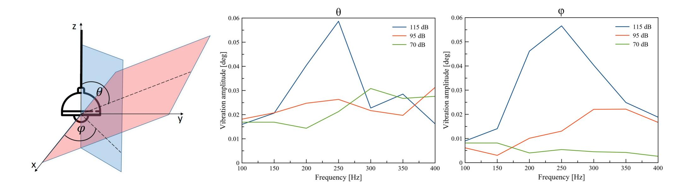

<span id="page-4-2"></span>Fig. 3. A 3D scheme of a hanging bulb's axes. Fig. 4. Peak-to-peak difference of angles φ and θ for played sine waves in the 100-400 Hz spectrum.

hanging light bulb.

High sampling rate: Unlike other studies which suggested methods that rely on a limited sampling rate (e.g., 200 Hz in [\[1,](#page-12-0) [4\]](#page-12-4)), the potential sampling rate of sound in Lamphone is determined by the ADC and can reach a sampling rate of a few kilohertz which covers the entire hearing spectrum.

Sound recovery: Unlike other studies that suggested classification methods (e.g., [\[1,](#page-12-0) [3](#page-12-3)[–5,](#page-12-1) [9\]](#page-13-2)) that rely on a pretrained dictionary or additional techniques for word separation, Lamphone's output consists of recovered audio signals that can be heard and understood by humans and identified by common speech to text and song recognition applications.

In order to keep the digital processing as light as possible in terms of computation, we want to sample the electro-optical sensor with the ADC at the minimal sampling frequency that allows comprehensible audio recovery. Lamphone is aimed at recovering sound (e.g., speech, singing), and the correct sampling frequency is required. The spectrum of speech covers quite a wide portion of the audible frequency spectrum. Speech consists of vowel and consonant sounds; the vowel sounds and the cavities that contribute to the formation of the different vowels range from 85 to 180 Hz for a typical adult male and from 165 to 255 Hz for a typical adult female. In terms of frequency, the consonant sounds are above 500 Hz (more specifically, in the 2-4 kHz frequency range).[5](#page-4-1) As a result, a telephone system samples an audio signal at 8 kHz. However, many studies have shown that even a lower sampling rate is sufficient to recover comprehensible sound (e.g., 2200 Hz in the Visual Microphone [\[13\]](#page-13-6)). In this study, we sample the electro-optical sensor at a sampling rate of 2-4 kHz.

### IV. BULBS AS MICROPHONES

<span id="page-4-0"></span>In this section, we perform a series of experiments aimed at explaining why light bulb vibrations can be used to recover sound and evaluate a bulb's response to sound empirically.

#### *A. The Physical Phenomenon*

First we measure the vibration of a hanged bulb as a result of heating sound and we establish a criterion for the sensitivity

<span id="page-4-1"></span><sup>5</sup> https://www.dpamicrophones.[com/mic-university/facts-about-speech](https://www.dpamicrophones.com/mic-university/facts-about-speech-intelligibility)[intelligibility](https://www.dpamicrophones.com/mic-university/facts-about-speech-intelligibility)

<span id="page-4-4"></span>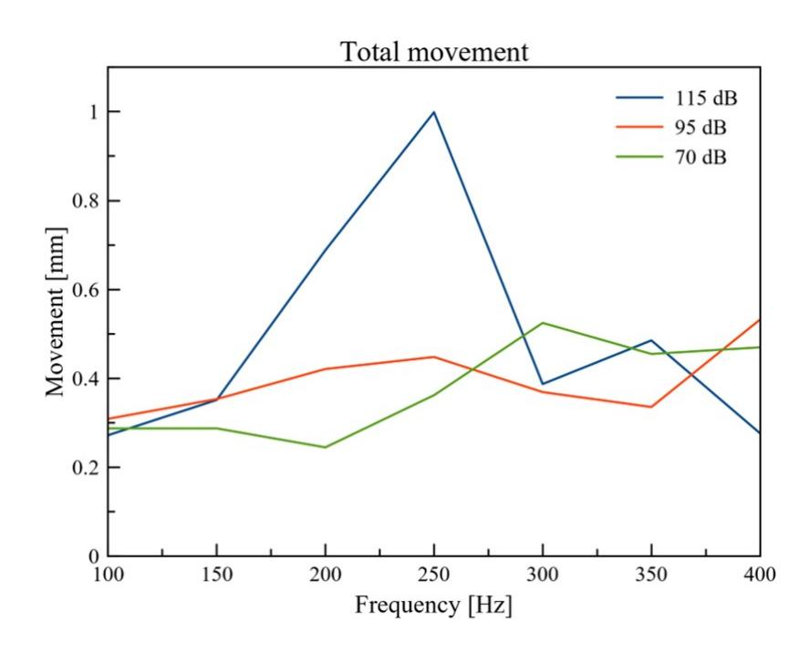

Fig. 5. The peak-to-peak movement in the range of 100-400 Hz.

specifications of a system capable of recovering sound from these vibrations

*1) Measuring a Hanging Bulb's Vibration:* First, we measure the response of a hanging bulb to sound. This is done by examining how sound produced in proximity to the hanging bulb affects a bulb's three-dimensional vibration (as presented in Figure [3\)](#page-4-2).

Experimental Setup: We attached a gyroscope (MPU-6050 GY-521[6](#page-4-3) ) to the bottom of a hanging E27 LED light bulb (12 watts); that the bulb was not illuminated during this experiment. A Raspberry Pi 3 was used to sample the gyroscope at 800 Hz. We placed Logitech Z533 speakers very close to the hanging bulb (one centimeter away) and played various sine waves (100, 150, 200, 250, 300, 350, 400 Hz) from the speakers at three volume levels (70, 95, 115 dB). We obtained measurements from the gyroscope while the sine waves were played.

Results: Based on the measurements obtained from the gyroscope, we calculated the average peak-to-peak difference (in degrees) for θ and φ (which are presented in Figure [4\)](#page-4-4). The average peak-to-peak difference was computed by calculating the peak-to-peak difference between every 800 consecutive

<span id="page-4-3"></span><sup>6</sup> https://invensense.tdk.[com/wp-content/uploads/2015/02/MPU-6000-](https://invensense.tdk.com/wp-content/uploads/2015/02/MPU-6000-Datasheet1.pdf) [Datasheet1](https://invensense.tdk.com/wp-content/uploads/2015/02/MPU-6000-Datasheet1.pdf).pdf

{5}------------------------------------------------

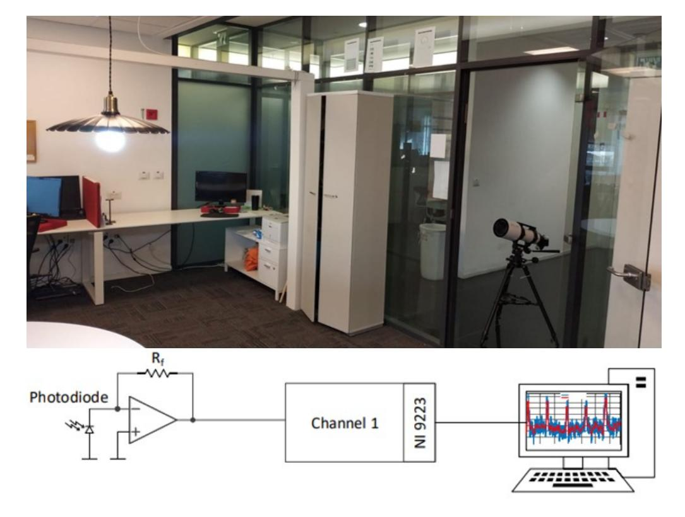

Fig. 6. Experimental setup - A telescope is pointed at an E27 LED bulb (12 watts). A Thorlabs PDA100A2 electro-optical sensor [\[14\]](#page-13-7) (which consists of a photodiode and converts light to voltage) is mounted on the telescope. The electro-optical sensor outputs voltage that is sampled via an ADC (NI-9223) [\[15\]](#page-13-8) and processed in LabVIEW. All of the experiments were performed in a room in which the door was closed door to prevent any undesired side effects.

<span id="page-5-1"></span>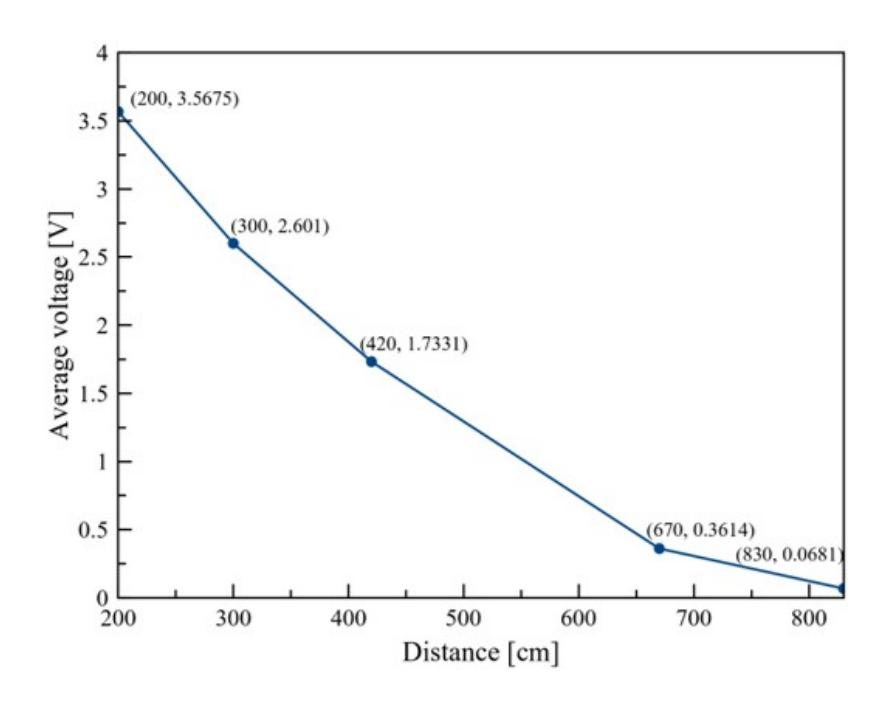

Fig. 7. Output obtained from the electro-optical sensor (the internal gain of the sensor was set at 50 dB) from various ranges.

measurements (that were collected from one second of sampling) and averaging the results. The frequency response as a function of the average peak-to-peak difference is presented in Figure [4.](#page-4-4) The results presented in Figure [4](#page-4-4) reveal three interesting insights: the average peak-to-peak difference for the angle of the bulb is: (1) very small (0.005-0.06 degrees), (2) increases as the volume increases, and (3) changes as a function of the frequency.

Based on the known formula of the spherical coordinate system [\[16\]](#page-13-9), we calculated the 3D vector (x,y,z) that represents the peak-to-peak vibration on each of the axes (by taking the distance between the ceiling and the bottom of the hanging bulb into account). We calculated the Euclidean distance between this vector and the vector of the initial position. The results are presented in Figure [4](#page-4-4) which shows that sound affected the hanging bulb, causing it to vibrate in 300-950

TABLE II LINEAR EQUATIONS CALCULATED FROM FIGURE [7](#page-5-0)

<span id="page-5-2"></span>

| Distance | Linear                |           | Expected Voltage Difference |
|----------|-----------------------|-----------|-----------------------------|
|          | Equation              | at 0.3 mm | at 1 mm                     |
| 200-300  | y = -0.01x + 5.367    | 0.0003    | 0.001                       |
| 300-420  | y = -0.0062x + 4.3371 | 0.000186  | 0.00062                     |
| 420-670  | y = -0.0055x + 4.037  | 0.000165  | 0.00055                     |
| 670-830  | y = -0.0018x + 1.59   | 0.000054  | 0.00018                     |

microns between the range of 100-400 Hz.

*2) Capturing the Optical Changes:* We now explain how attackers can determine sensitivity of the equipment (an electrooptical sensor, a telescope, and an ADC) needed to recover sound based on a bulb's vibration. The graph presented in Figure [4](#page-4-4) establishes a criterion for recovering sound: the attacker's system (consisting of an electro-optical sensor, a telescope, and an ADC) must be sensitive enough to capture the small optical differences that are the result of a hanging bulb that moves in 300-950 microns.

In order to demonstrate how eavesdroppers can determine the sensitivity of the equipment they will need to satisfy the abovementioned criterion, we conduct another experiment.

Experimental Setup: We directed a telescope at a hanging 12 watt E27 LED bulb (as can be seen in Figure [6\)](#page-5-1). We mounted an electro-optical sensor (the Thorlabs PDA100A2 [\[14\]](#page-13-7), which is an amplified switchable gain light sensor that consists of a photodiode, used to convert light to electrical voltage) to the telescope. The voltage was obtained from the electro-optical sensor using a 16-bit ADC NI-9223 card [\[15\]](#page-13-8) and was processed in a LabVIEW script that we wrote. The internal gain of the electro-optical sensor was set at 50 dB. We placed the telescope at various distances (100, 200, 300, 420, 670, 830, 950 cm) from the hanging bulb and measured the voltage that was obtained from the electro-optical sensor at each distance.

<span id="page-5-0"></span>Results: The results of this experiment are presented in Figure [7.](#page-5-0) These results were used to compute the linear equation between each two consecutive points. Based on the linear equations, we calculated the expected voltage at 300 microns and 950 microns. The results are presented in Table [II.](#page-5-2) From this data, we can determine which frequencies can be recovered from the obtained optical measurements. A 16-bit ADC with an input range of [-10,10] voltage (e.g., like the NI-9223 card used in our experiments) provides a sensitivity of:

<span id="page-5-3"></span>
$$\frac{20}{2^{16} - 1} \approx 300 \text{ microvolts} \tag{1}$$

A sensitivity of 300 microvolts which is provided by a 16-bit ADC is sufficient for recovering the entire spectrum (100-400 Hz) in the 200-300 cm range, because the smallest vibration of the bulb (300 microns) from this range is expected to yield a difference of 300 microvolts (according to Table [II\)](#page-5-2). However, this setup cannot be used to recover the entire spectrum in the 670-830 cm range, so an ADC that provides a higher sensitivity is required. A 24-bit ADC with an input range of [-10,10] voltage provides a sensitivity of:

{6}------------------------------------------------

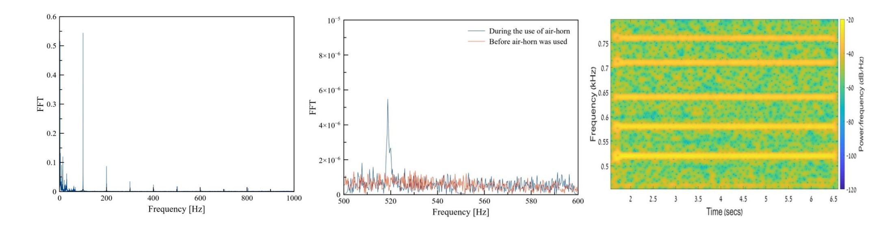

<span id="page-6-0"></span>Fig. 8. Baseline - FFT of the optical signal in silence (no sound is played). Fig. 9. FFT graphs obtained from optical signals before and when an air horn was directed at a hanging bulb. Fig. 10. Spectrogram obtained from optical measurements taken while five sine waves were played simultaneously.

<span id="page-6-4"></span>
$$\frac{20}{2^{24} - 1} \approx 1 \text{ microvolt} \tag{2}$$

A sensitivity of 1 microvolt which is provided by a 24-bit ADC is sufficient for recovering the entire spectrum (100-400 Hz) in the range of 670-830 cm, because the smallest vibration of the bulb (300 microns) from this range is expected to yield a difference of 54 microvolts (according to Table [II\)](#page-5-2).

In order to optimize the setup so it can be used to detect frequencies that cannot be recovered, attackers can: (1) increase the internal gain of the electro-optical sensor, (2) use a telescope with a lens capable of capturing more light (we demonstrate this later in the paper), or (3) use an ADC that provides a greater resolution and sensitivity (e.g., a 24/32-bit ADC).

### *B. Exploring the Optical Response to Sound*

The experiments presented in this section were performed to evaluate bulbs' response to sound. The experimental setup described in the previous subsection (presented in Figure [6\)](#page-5-1) was also used throughout the experiments presented in this subsection.

*1) Characterizing Optical Signal in Silence:* First, we learn the characteristics of the optical signal when no sound is played.

Experimental setup: We obtained five seconds of optical measurements from the electro-optical sensor when no sound was played in the lab.

Results: The FFT graph extracted from the optical measurements when no sound was played is presented in Figure [8.](#page-6-0) Each bulb works at a fixed light frequency (e.g., 100 Hz). Since opt(t) is obtained via an electro-optical sensor directed at a bulb, the light frequency and its harmonics are added to the raw signal opt(t). These frequencies strongly impact the optical signal and are not the result of the sound that we want to recover. From this experiment we concluded that filtering will be required.

*2) Bulb's Response to a Single Sine Wave:* Next, we show that the effect of sound on a nearby hanging bulb can be

<span id="page-6-2"></span><span id="page-6-1"></span>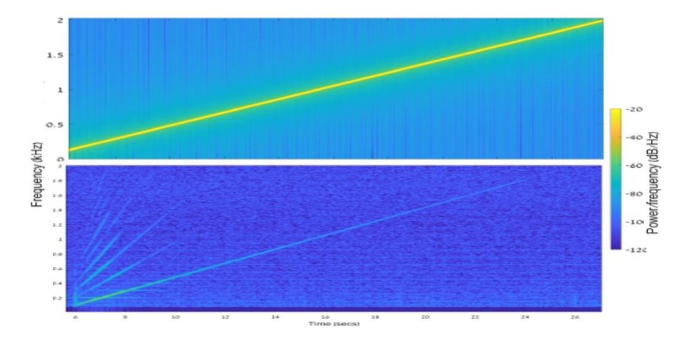

<span id="page-6-3"></span>Fig. 11. Recovered chirp function (100-2000 Hz).

exploited to recover sound by analyzing the light emitted from the bulb via an electro-optical sensor in the frequency domain.

Experimental Setup: In this experiment, we used an air horn that plays a sine wave at a frequency of 518 Hz. We pointed the electro-optical sensor at the hanging bulb and obtained optical measurements. Then we placed the air horn a few centimeters away from the bulb and operated the horn, obtaining sensor measurements as we did so.

Results: Figure [9](#page-6-1) presents two FFT graphs created from two seconds of optical measurements obtained before the air horn was used and while the air horn was used. As can be seen from the results, the peak that was added to the frequency domain at around 518 Hz shows that the sound that the air horn produced affects the optical measurements obtained via the electro-optical sensor. In this experiment we specifically used a device (air horn) that does not create an electro-magnetic side effect (in addition to the sound), in order to demonstrate that the results obtained are caused by fluctuations in the air pressure on the surface of the hanging bulb (and not by anything else).

*3) Bulb's Response to Multiple Sine Waves:* The previous experiment proved that a single frequency can be recovered by analyzing the frequency domain of an optical signal obtained from an electro-optical sensor directed at the hanging bulb. Since speech consists of sound at multiple frequencies, we assessed a hanging bulb's response to multiple sine waves 

{7}------------------------------------------------

played simultaneously (in the rest of the experiments described in this section, we used Logitech Z533 speakers to produce the sound).

Experimental Setup: We created a five second audio file that consists of five simultaneously played sine waves (520, 580, 640, 710, 760 Hz) which was played via the speakers, and we obtained optical measurements from the electro-optical sensor that was directed at the hanging bulb.

Results: Figure 10 presents a spectrogram created from the optical measurements. As can be seen, all five sine waves are easily detected when analyzing the optical signal in the frequency domain. From this experiment we concluded that various frequencies can be recovered simultaneously from the optical signal by analyzing it in the frequency domain.

4) Bulb's Response to a Wide Spectrum of Frequencies: In the next experiment we tested a hanging bulb's response to a wide spectrum of frequencies.

Experimental Setup: We created a 20 second audio file that consists of a chirp function (100-2000 Hz) which was played via the speakers (the transmitted signal is presented in Figure 11). We obtained optical measurements from the electro-optical sensor that was directed at the hanging bulb.

Results: Figure 11 presents a spectrogram created from the optical measurements. Analyzing the signal with respect to the original signal reveals the following insights: (1) The recovered signal is much weaker than the original signal. (2) The response of the recovered signal decreases as the frequency increases until its power reaches same level as the noise. From this experiment we concluded that we would have to increase the SNR using speech enhancement and denoising techniques, and strengthen the response of higher frequencies, in order to recover them using an equalizer.

#### V. SOUND RECOVERY MODEL

<span id="page-7-0"></span>In this section, we leverage the findings presented in Section IV and present Algorithm 1 for recovering audio from measurements obtained from an electro-optical sensor directed at a hanging bulb. We assume that snd(t) is the audio that is played inside the victim's room. The input to the algorithm is opt(t) (the optical signal obtained from an ADC that samples the electro-optical sensor at a frequency of fs Hz). The output of the algorithm is  $snd^*(t)$ , which is the recovered audio signal.

The stages of Algorithm 1 for recovering sound are described below and presented in Figure 12.

- 1) Isolating the Audio Signal from Noise: As was discussed in Section IV and presented in Figure 8, there are factors which affect the optical signal opt(t) that are not the result of the sound played (e.g., noise that is added to opt(t) by the lighting frequency and its harmonics 100 Hz, 200 Hz, etc.). We filter these frequencies using bandstop filters (lines 4-6 in Algorithm 1). The effect of the filters applied to the optical signal is illustrated in Figure 12.
- 2) Speech Enhancement: Speech enhancement (using audio signal processing techniques) is performed to optimize the speech quality by improving the intelligibility and overall perceptual quality of the speech signal. We enhance the speech by normalizing the values of opt(t) to the range of [-1,1] (lines

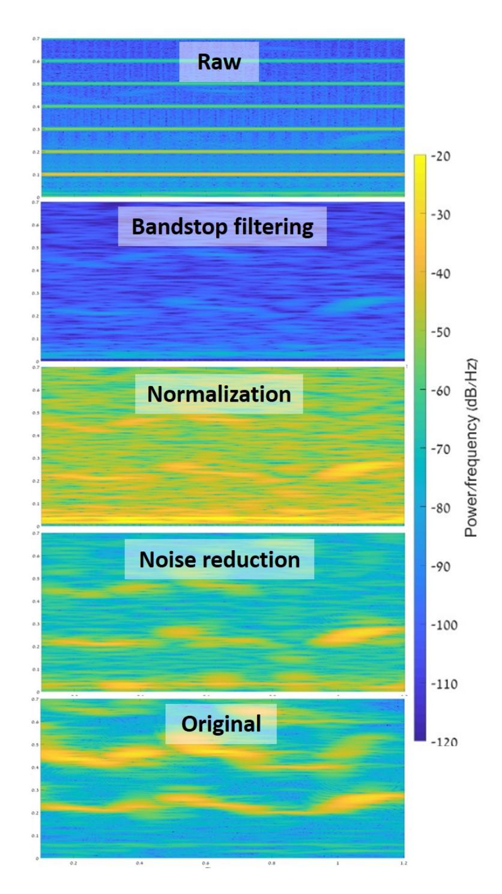

<span id="page-7-2"></span>Fig. 12. The effect of each stage of Algorithm 1 in recovering the word "lamb" from an optical signal.

#### Algorithm 1 Recovering Audio from Optical Signal

```
1: INPUT: opt[t], fs, equalizer, noiseThreshold
 2: OUTPUT: snd^*(t)
 3: snd^*[] = opt, bulbFs = 100
 4: /*Filtering bulb's lighting frequency*/
 5: for (i = bulbFs; i < fs/2; i+=bulbFs) do
        snd^* = bandstop(i*bulbFs, snd^*)
 6:
 7: /*Speech enhancement - scaling to [-1,1]*/
 8: min = min(snd^*), max = max(snd^*)
9: for (i = 0; i < len(snd^*); i+=1) do
10: snd^*[i] = -1 + \frac{(snd^*[i] - min)*2}{max - min}
10:
11: /*Noise gating*/
12: for (i = 0; i < len(snd^*); i+=1) do
        if (abs(snd^*[i]) < noiseThreshold) then
13:
            snd^*[i] = 0
14:
15: /*Equalization - Using Convolution*/
16: eqSignal = []
17: for (i = 0; i < len(snd^*); i+=1) do
        eqSignal[i] = 0
18:
        for (j = 0; j < len(equalizer); j+=1) do
19:
            if (i-j>0) then
20:
                eqSignal[i] += snd^*[i - j]^*equalizer[j]
21:
22: snd^* = eqSignal
```

{8}------------------------------------------------

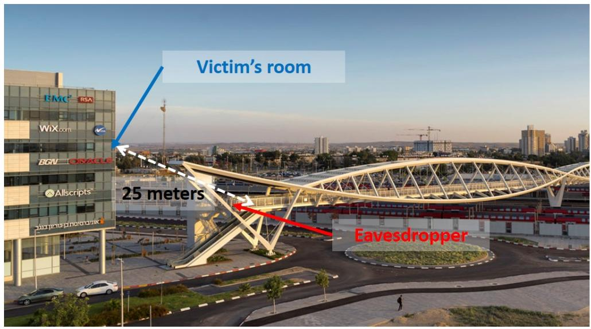

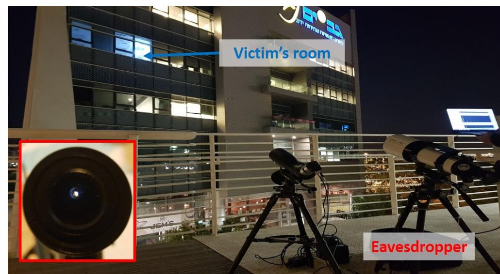

Fig. 13. Experimental setup: The distance between the eavesdropper (located on a pedestrian bridge) to the hanging LED bulb (in an office on the third floor of a nearby building) is 25 meters. Telescopes were used to obtain the optical measurements. The red box shows how the hanging bulb is captured by the electro-optical via the telescope.

4-10 in Algorithm [1\)](#page-7-1). The impact of this stage is enhancement of the signal (as can be seen in Figure [12\)](#page-7-2).

- 3) Noise Reduction: Noise reduction is the process of removing noise from a signal in order to optimize its quality. We reduce the noise by applying spectral subtraction, one of the first techniques proposed for denoising single channel speech [\[17\]](#page-13-10). In this method, the noise spectrum is estimated from a silent baseline and subtracted from the noisy speech spectrum to estimate the clean speech. Another alternative is to apply noise gating by establishing a noise threshold in order to isolate the signal from the noise.
- 4) Equalizer: Equalization is the process of adjusting the balance between the frequency components within an electronic signal. An equalizer can be used to strengthen or weaken the energy of specific frequency bands or frequency ranges. We use an equalizer in order to amplify the response of weak frequencies. The equalizer is provided as input to Algorithm [1](#page-7-1) and applied in the last stage (lines 15-21).

The techniques used in this study to recover speech are extremely popular in the area of speech processing; we used them for the following reasons: (1) the techniques rely on a speech signal that is obtained from a single channel; if eavesdroppers have the capability of sampling the hanging bulb using other sensors, thereby obtaining several signals via multiple channels, other methods can also be applied to recover an optimized signal, (2) these techniques do not require any prior data collection to create a model; novel speech processing methods use neural networks to optimize the speech quality in noisy channels, however such neural networks require a large amount of data for the training phase in order to create robust models, a requirement that eavesdroppers would likely prefer to avoid, and (3) the techniques can be applied in real-time applications, so the optical signal obtained can be converted to audio with minimal delay.

# VI. EVALUATION

<span id="page-8-0"></span>In this section, we evaluate the performance of the Lamphone attack in terms of its ability to recover speech and songs from a target location when the eavesdropper is not at the same location.

<span id="page-8-1"></span>Figure [13](#page-8-1) presents the experimental setup. The target location was an office located on the third floor of an office building. Curtain walls, which reduce the amount of light emitted from the offices, cover the entire building. The target office contains a hanging E27 LED bulb (12 watt), and Logitech Z533 speakers, which were placed one centimeter from the hanging bulb, were used to produce the sound that we tried to recover.

The eavesdropper was located on a pedestrian bridge, positioned an aerial distance of 25 meters from the target office. The experiments described in this section were performed using three telescopes with different lens diameters (10, 20, 35 cm). We mounted an electro-optical sensor (the Thorlabs PDA100A2, which is an amplified switchable gain light sensor that consists of a photodiode that is used to convert light to electrical voltage) [\[14\]](#page-13-7)) to one telescope at a time. The voltage was obtained from the electro-optical sensor via a 16-bit ADC NI-9223 card and was processed in LabVIEW script that we wrote. The sound that was played in the office during the experiments could not be heard at the eavesdropper's location (as shown in the attached video [7](#page-8-2) ).

## *A. Evaluating the Setup's Influence*

We start by examining the effect of the setup on the optical measurements obtained. We note that the setup is very challenging because of the curtain walls between the telescopes and the hanging bulb; in addition, the pedestrian bridge, on which the telescopes are placed, is located above a train station and railroad tracks which have a natural vibration of their own.

We start by evaluating the baseline using optical measurements obtained when no sound is played in the office.

Experimental Setup: We directed the telescope (with a lens diameter of 10 cm) at the hanging bulb in the office (as can be seen in Figure [13\)](#page-8-1). We obtained measurements for three seconds via the electro-optical sensor.

Results: As can be seen from the FFT graph presented in Figure [13,](#page-8-1) the peaks of 100 Hz and 200 Hz, which are

<span id="page-8-2"></span><sup>7</sup> https://www.nassiben.[com/lamphone](https://www.nassiben.com/lamphone)

{9}------------------------------------------------

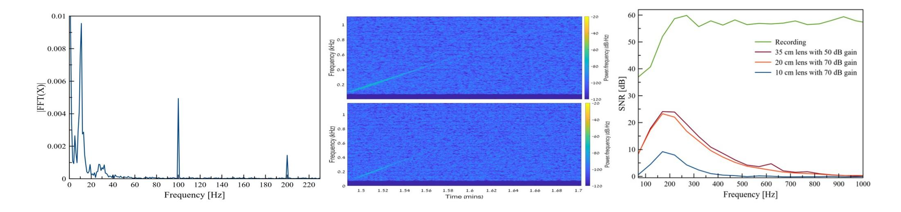

Fig. 14. Profiling the noise: FFT graph extracted from optical measurements obtained via the electro-optical sensor directed at a bulb when no sound is played.

<span id="page-9-0"></span>Fig. 15. Profiling the noise: FFT graph extracted from optical measurements obtained via the electro-optical sensor directed at a bulb in an office that is not covered with curtain walls (top) and an office covered with curtain walls (bottom).

<span id="page-9-1"></span>Fig. 16. Comparison of the SNR obtained from three different telescopes.

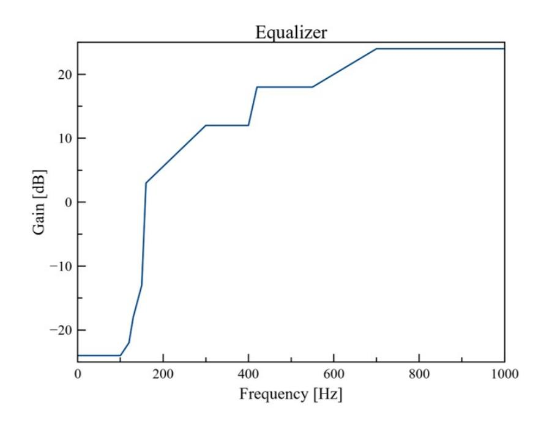

Fig. 17. Equalizer - the function used when recovering speech.

the result of the lighting frequency, are part of the signal (as discussed in Section [IV\)](#page-4-0). However, we observed a very interesting phenomenon in which noise is added to the low frequencies (< 40 Hz) as well as the optical signal. This phenomenon is the result of the natural vibration of the bridge. Since this phenomenon adds substantial noise to the signal obtained, we used a high-pass filter (> 40 Hz) to optimize the results.

The entire building that the target office is located in is covered with curtain walls which reduce the amount of light emitted from the offices In the next experiment we evaluated the effect of the curtain walls on the optical measurements.

Experimental Setup: We played a chirp function (100-1000 Hz) in the target office and obtained the optical measurements. We repeated the experiment described above in another setup in which there is no curtain wall between the bulb and the telescope, maintaining the same distance between the bulb and the telescope.

Results: Figure [15](#page-9-0) presents the signals recovered from both experiments. As can be seen, the existence of curtain walls decreases the light captured by the electro-optical sensor dramatically, especially at high frequencies (above 400 Hz).

In order to amplify high frequencies whose response is

weak, we decided to utilize an equalizer function. In order to do so, we conducted another experiment aimed at calculating the frequency response of the three telescopes to sound played in the office.

Experimental Setup: We placed three telescopes with different lens diameters (10, 20, 35 cm) on the bridge (at a distance of 25 meters from the office). The electro-optical sensors were configured for the highest gain level before saturation: the two telescopes with the smallest lens diameter were configured to 70 dB, and the telescope with the largest lens diameter was configured at 50 dB. We created an audio file that consists of various sine waves (120, 170, 220, .... 1020 Hz) where each sine wave was played for two seconds. We played the audio file near the bulb and obtained the optical signal via the electro-optical sensor. We also obtained the audio that was played in the office using a microphone.

<span id="page-9-2"></span>Results: We calculated the SNR that was obtained from the optical measurements obtained from each telescope and the acoustical measurements obtained from the microphone. The results are presented in Figure [16.](#page-9-1) Three interesting observations can be made based on the results: (1) A larger lens diameter yields a better SNR. This observation is the result of the fact that a larger lens surface captures more of the light emitted from the bulb, strengthening the signal obtained (in terms of the SNR). From this observation we concluded that using a telescope with a larger lens diameter can compensate for physical obstacles and setups that decrease the SNR (e.g., long range, curtain walls, weak bulb). (2) All three SNR graphs created from the optical measurements show the same behavior: The peak of the SNR is around 200 Hz, and the SNR decreases from 200 Hz to zero. (3) Above 300 Hz, the frequency response behavior of the microphone is different than the frequency response of the optical signal that is captured via the telescopes. While the microphone shows steady behavior above 300 Hz, the frequency response of the optical signal decreases for frequencies greater than 300 Hz, rather than maintaining a steady SNR.

Based on the abovementioned observations, we designed an equalizer that compensates for a weak response at high frequencies (above 300 Hz). The equalizer function is presented

{10}------------------------------------------------

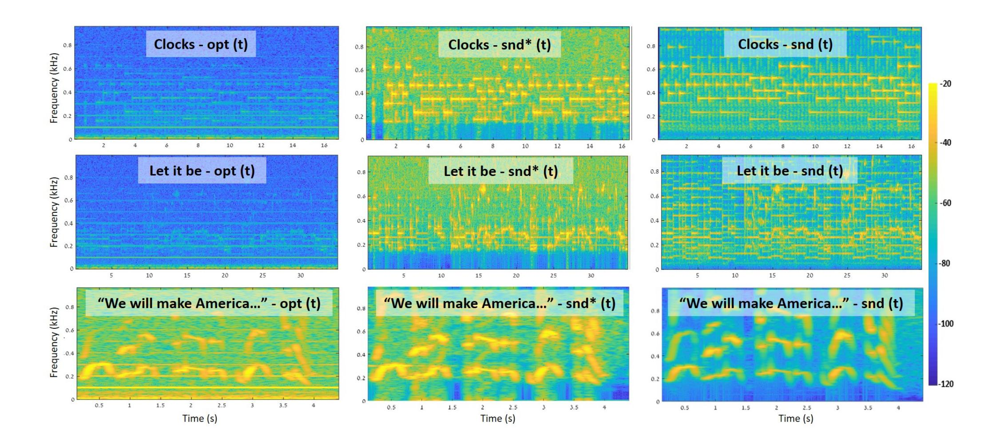

Fig. 18. Spectrograms extracted from the input to Algorithm [1,](#page-7-1) opt(t), the output from Algorithm [1,](#page-7-1) snd\*(t), and from the original audio, snd(t).

in Figure [17;](#page-9-2) this equalizer is provided as input to Algorithm [1](#page-7-1) to recover songs and speech in the experiments described below.

## *B. Recovering Songs*

Next, we evaluated Lamphone's performance in terms of its ability to recover non-speech audio. In order to do so, we decided to recover two well-known songs: "Let it Be" by the Beatles and "Clocks" by Coldplay.

Experimental Setup: We played the beginning of these songs in the target office. In these experiments we used a telescope with a 20 cm lens diameter to obtain the optical signals via the electro-optical sensor (the internal gain of the sensor was set to 70 dB). We applied Algorithm [1](#page-7-1) to the optical measurements and recovered the songs.

Results: Figure [18](#page-10-0) presents spectrograms of the input and output of Algorithm [1](#page-7-1) when recovering "Let it Be" and "Clocks" compared to spectrograms extracted from the original songs. While the results of the recovered songs can be seen clearly in the spectrograms, they can be better appreciated by listening to the recovered songs themselves.[8](#page-10-1)

We evaluated the quality of the recovered signals with respect to the original signals using quantitative metrics available from the audio processing community:

1) Intelligibility - a measure of how comprehensible speech is in given conditions. Intelligibility is affected by the level and quality of the speech signal, and the type and level of background noise and reverberation.[9](#page-10-2) To measure intelligibility we used the metric suggested by [\[18\]](#page-13-11) which results values between [0,1].

<span id="page-10-0"></span>TABLE III RESULTS OBTAINED FROM THE RECOVERED SONGS

<span id="page-10-3"></span>

| Recovered Songs | Intelligibility | Log-Likelihood Ratio |
|-----------------|-----------------|----------------------|
| Let it Be       | 0.416           | 2.38                 |
| Clocks          | 0.324           | 2.68                 |

2) Log-Likelihood Ratio (LLR) - a metric that captures how closely the spectral shape of a recovered signal matches that of the original clean signal [\[19\]](#page-13-12). This metric has

been used in speech research for many years to compare speech signals [\[20\]](#page-13-13). .

The intelligibility and LLR of the two recovered songs with respect to the original songs are presented in Table [III.](#page-10-3)

To further assess the quality of the recovered songs, we decided to see whether they could be identified by automatic song identifier applications.

Experimental Setup: We decided to put the recovered signals to the test using Shazam and SoundHound, the two most popular applications for identifying songs. We played the recovered songs ("Clocks" and "Let it Be") via the speakers and operated Shazam and SoundHound from two nearby smartphones.

Results: Shazam and SoundHound were able to accurately identify both songs. Screenshots that were taken from the smartphone showing the correct identification made by Shazam are presented in Figure [19.](#page-13-14)

## *C. Recovering Speech*

Next, we evaluated the performance of Lamphone in terms of its ability to recover speech audio. In order to do so, we decided to recover a statement made famous by President Donald Trump: "We will make America great again."

<span id="page-10-1"></span><sup>8</sup> https://www.nassiben.[com/lamphone](https://www.nassiben.com/lamphone)

<span id="page-10-2"></span><sup>9</sup> .https://en.wikipedia.[org/wiki/Intelligibility\\_\(communication\)](https://en.wikipedia.org/wiki/Intelligibility_(communication))

{11}------------------------------------------------

<span id="page-11-2"></span>TABLE IV RESULTS OBTAINED FROM THE RECOVERED AUDIO SIGNAL FOR THE STATEMENT: "WE WILL MAKE AMERICA GREAT AGAIN" USING TELESCOPES WITH DIFFERENT LENS DIAMETERS

| Telescope Lens Diameter | Intelligibility | Log-Likelihood Ratio |
|-------------------------|-----------------|----------------------|
| 10 cm                   | 0.53            | 4.06                 |
| 20 cm                   | 0.62            | 3.25                 |
| 35 cm                   | 0.704           | 2.86                 |

Experimental Setup: We used the speakers to play this statement in the office. We placed a telescope (with a lens diameter of 35 cm) on the bridge. The electro-optical sensor was mounted on the telescope (with the gain configured to the highest level before saturation - 50 dB). We obtained the optical signal when the statement was played in the office. We repeated this experiment with the other two telescopes (with lens diameters of 10 and 20 cm); the gain of the electro-optical sensor was set at the highest level before saturation (70 dB). We applied Algorithm [1](#page-7-1) on the three signals obtained by the three telescopes.

Results: Figure [18](#page-10-0) presents spectrograms of the input and output of Algorithm [1](#page-7-1) when recovering "We will make America great again" from the optical measurements obtained from the telescope with a lens diameter of 35 cm compared to spectrogram extracted from the original statement. While the results of the recovered speech can be seen clearly in the spectrograms, they can be better appreciated by listening to the recovered speech.[10](#page-11-1)

We also evaluated the quality of the three recovered signals with respect to the original signal using the same quantitative metrics used in the previous experiment (intelligibility [\[18\]](#page-13-11) and LLR [\[19\]](#page-13-12)). The results are presented in Table [IV.](#page-11-2) As can be seen in the table, the highest quality audio signal was obtained from the telescope with the largest lens diameter. Given these results we conclude that the intelligibility and LLR improve as the lens diameter size increases. The spectrogram of the recovered audio signal obtained from the electro-optical sensor mounted on the telescope with a lens diameter of 35 cm is presented in Figure [18.](#page-10-0)

To further assess the quality of the speech recovery, we investigated whether the recovered signal obtained from the telescope with a lens diameter of 35 cm could be identified by an automatic speech to text mechanism.

Experimental Setup: In this experiment, we put the recovered signal to the test with the Google Cloud Speech API. We played the recovered speech ("We will make America great again") via the speakers and operated the Google Cloud Speech API from a laptop.

Results: The Google Cloud Speech API transcribed the recovered audio file correctly. A screenshot from the Google Cloud Speech API is presented in Figure [20.](#page-14-0)

## VII. POTENTIAL IMPROVEMENTS

<span id="page-11-0"></span>In this section, we suggest methods that eavesdroppers can use to optimize the recovered audio or increase the distance between the eavesdropper and the hanging bulb; we assume that while the eavesdropper can optimize the setup of his/her system, he/she cannot change the setup of the target location. Lamphone consists of three primary components: a telescope, an electro-optical sensor, and a sound recovery system. The potential improvements suggested below are presented based on the component they are aimed at optimizing.

## *A. Telescope*

The amount of light that is captured by a telescope with diameter r is determined by the area of its lens (πr<sup>2</sup> ). As a result, using telescopes with a larger lens diameter enables the sensor to capture more light and optimizes the SNR of the recovered audio signal. This claim is demonstrated in Figure [16](#page-9-1) which presents the SNR obtained from three telescopes (with lens diameters of 10, 20, 35 cm). The SNR of the recovered audio signal obtained by the telescope with a lens diameter of 35 cm and an electro-optical sensor gain of 50 dB is identical to the SNR of the recovered audio signal obtained by the telescope with a lens diameter of 20 cm and an electrooptical sensor gain of 70 dB. Eavesdroppers can exploit this fact and use a telescope with a larger lens diameter in order to optimize the quality of the signal captured.

# *B. Electro-Optical Sensor*

One option for enhancing the sensitivity of the system is to increase the internal gain of the electro-optical sensor. Eavesdroppers interested in optimizing the quality of the signal obtained can use a sensor that supports high internal gain levels (note that the electro-optical sensor used in this study (PDA100A2 [\[14\]](#page-13-7)) outputs voltage in the range of [-12,12] and supports a maximum internal gain of 70 dB). However, any amplification that increases the signal obtained beyond this range results in saturation that prevents the SNR from reaching its full potential. This claim is demonstrated in Figure [16](#page-9-1) which presents the SNR obtained from three telescopes (with lens diameters of 10, 20, 35 cm). Since the signal that was captured by the telescope with a lens diameter of 35 cm was very strong (due to the fact that a lot of light was captured by the large lens), we could not increase the internal gain to a level beyond 50 dB from a distance of 25 meters. As a result, the SNR obtained by the telescope with a lens diameter of 35 cm did not reach its full potential and yielded the same SNR as a telescope with a lens diameter of 20 cm and an electrooptical sensor gain of 70 dB. With that in mind, eavesdroppers can optimize the SNR of the optical measurements by using an electro-optical sensor that supports a wider range of output.

Another option is to sample the signal from multiple sensors. Given N sensors that sample a signal, the SNR increases by <sup>√</sup> N. Thus, attackers can optimize the SNR of the optical signal by obtaining measurements using several electro-optical sensors directed at the hanging bulb and sample the bulb's vibrations simultaneously from several channels.

## *C. Sound Recovery System*

The sound recovery system implemented in this paper uses the digital approach and consists of two components: an ADC and a sound recovery algorithm.

<span id="page-11-1"></span><sup>10</sup> https://www.nassiben.[com/lamphone](https://www.nassiben.com/lamphone)

{12}------------------------------------------------

*1) ADC:* As discussed in Section [IV,](#page-4-0) a 16-bit ADC with an input range of [-10,10] voltage provides a sensitivity of 305 microvolts (see Equation [1\)](#page-5-3). Only bulb movements that are expected to yield a greater voltage change (i.e., > 305 microvolts) can be recovered by Lamphone. A 24-bit ADC provides a sensitivity of one microvolt and optimizes the system's sensitivity by two orders of magnitude (see Equation [2\)](#page-6-4). A 32-bit ADC with an input range of [-10,10] voltage provides a sensitivity of:

$$\frac{20}{2^{32} - 1} \approx 1 \text{ nanovolt} \tag{3}$$

As a result, a 32-bit ADC optimizes the sensitivity of a 16 bit ADC by five orders of sizes. An easy way for eavesdroppers to optimize the system's sensitivity is to use an ADC that can capture smaller movements made by a hanging bulb.

*2) Sound Recovery Algorithm:* The area of speech enhancement has been investigated by researchers for many years. Recently, many advanced denoising methods have been suggested by experts in this field. Advanced algorithms (e.g., neural networks) provide excellent results for filtering the noise from an audio signal, however often a large amount of data is required to train a model that profiles the noise in order to optimize the output's quality. Such algorithms can be used in place of the simple methods used in this research (e.g., normalization, spectral subtraction, noise gating, etc.) if the adversaries manage to obtain a sufficient amount of data.

Another option for maximizing the SNR is to profile the noise made by the electro-optical sensor when the light is recorded. This approach can be used to filter the thermal noise (with spectral and time domain filters) that is added to the analog output of the sensor by the sensor itself.

## VIII. COUNTERMEASURES

<span id="page-12-5"></span>In this section, we describe several countermeasure methods that can be used to mitigate or prevent the Lamphone attack. There are several factors that influence the SNR of the recovered audio signal which are in the victim's control and can be used to prevent/mitigate the attack.

# *A. Reducing the Amount of Light Emitted*

One approach is aimed at reducing the amount of light captured by the electro-optical sensor. As shown in Figure [15,](#page-9-0) the SNR decreases as the amount of light captured by the electro-optical sensor decreases. Several techniques can be used to limit the amount of light emitted. For example, weaker bulbs can be used; the difference between a 20 watt E27 bulb and a 12 watt E27 bulb is negligible for lighting an average room. However, since a 12 watt E27 bulb emits less light than a 20 watt E27 bulb, less light is captured by the electro-optical sensor, and the quality of the recovered audio signal decreases. Another technique is to use curtain walls. As was shown in Section [VI,](#page-8-0) curtain walls limit the light emitted from a room, requiring the attacker to compensate for this in some way (e.g., by using a telescope with a larger lens diameter).

## *B. Limiting the Bulb's Vibration:*

Lamphone relies on the fluctuations in air pressure on the surface of a hanging bulb which result from sound and cause the bulb to vibrate. One way to reduce a hanging bulb's vibration is to use a heavier bulb. There is less vibration from a heavier bulb in response to air pressure on the bulb's surface. This will require eavesdroppers to use better equipment (e.g., a more sensitive ADC, a telescope with a larger lens diameter, etc.) in order to recover sound.

## <span id="page-12-6"></span>IX. CONCLUSION & FUTURE RESEARCH DIRECTION

In this paper, we introduce Lamphone, a new side-channel attack in which speech from a room containing a hanging light bulb is recovered in real time. Lamphone leverages the advantages of the Visual Microphone [\[13\]](#page-13-6) (it is passive) and laser microphone (it can be applied in real time) methods of recovering speech and singing.

As a future research direction, we suggest analyzing whether sound can be recovered via other light sources. One interesting example is to examine whether it is possible to recover sound from decorative LED flowers instead of a light bulb.

#### REFERENCES

- <span id="page-12-0"></span>[1] Y. Michalevsky, D. Boneh, and G. Nakibly, "Gyrophone: Recognizing speech from gyroscope signals," in *23rd USENIX Security Symposium (USENIX Security 14)*. San Diego, CA: USENIX Association, 2014, pp. 1053–1067. [Online]. Available: https://www.usenix.[org/conference/usenixsecurity14/](https://www.usenix.org/conference/usenixsecurity14/technical-sessions/presentation/michalevsky) [technical-sessions/presentation/michalevsky](https://www.usenix.org/conference/usenixsecurity14/technical-sessions/presentation/michalevsky)
- <span id="page-12-7"></span>[2] Z. Ba, T. Zheng, X. Zhang, Z. Qin, B. Li, X. Liu, and K. Ren, "Learning-based practical smartphone eavesdropping with built-in accelerometer."
- <span id="page-12-3"></span>[3] S. A. Anand and N. Saxena, "Speechless: Analyzing the threat to speech privacy from smartphone motion sensors," in *2018 IEEE Symposium on Security and Privacy (SP)*, vol. 00, pp. 116–133. [Online]. Available: doi.[ieeecomputersociety](doi.ieeecomputersociety.org/10.1109/SP.2018.00004).org/10.1109/SP.2018.00004
- <span id="page-12-4"></span>[4] L. Zhang, P. H. Pathak, M. Wu, Y. Zhao, and P. Mohapatra, "Accelword: Energy efficient hotword detection through accelerometer," in *Proceedings of the 13th Annual International Conference on Mobile Systems, Applications, and Services*. ACM, 2015, pp. 301–315.
- <span id="page-12-1"></span>[5] J. Han, A. J. Chung, and P. Tague, "Pitchln: Eavesdropping via intelligible speech reconstruction using non-acoustic sensor fusion," in *Proceedings of the 16th ACM/IEEE International Conference on Information Processing in Sensor Networks*, ser. IPSN '17. New York, NY, USA: ACM, 2017, pp. 181– 192. [Online]. Available: [http://doi](http://doi.acm.org/10.1145/3055031.3055088).acm.org/10.1145/ [3055031](http://doi.acm.org/10.1145/3055031.3055088).3055088
- <span id="page-12-2"></span>[6] M. Guri, Y. Solewicz, A. Daidakulov, and Y. Elovici, "Speake(a)r: Turn speakers to microphones for fun and profit," in *11th USENIX Workshop on Offensive Technologies (WOOT 17)*. Vancouver, BC: USENIX Association, 2017. [Online].

{13}------------------------------------------------

- Available: https://www.usenix.[org/conference/woot17/](https://www.usenix.org/conference/woot17/workshop-program/presentation/guri) [workshop-program/presentation/guri](https://www.usenix.org/conference/woot17/workshop-program/presentation/guri)
- <span id="page-13-1"></span>[7] N. Roy and R. Roy Choudhury, "Listening through a vibration motor," in *Proceedings of the 14th Annual International Conference on Mobile Systems, Applications, and Services*, ser. MobiSys '16. New York, NY, USA: ACM, 2016, pp. 57–69. [Online]. Available: http://doi.acm.org/10.[1145/2906388](http://doi.acm.org/10.1145/2906388.2906415).2906415
- <span id="page-13-0"></span>[8] A. Kwong, W. Xu, and K. Fu, "Hard drive of hearing: Disks that eavesdrop with a synthesized microphone," in *2019 2019 IEEE Symposium on Security and Privacy (SP)*. Los Alamitos, CA, USA: IEEE Computer Society, may 2019. [Online]. Available: [https:](https://doi.ieeecomputersociety.org/10.1109/SP.2019.00008) //doi.[ieeecomputersociety](https://doi.ieeecomputersociety.org/10.1109/SP.2019.00008).org/10.1109/SP.2019.00008
- <span id="page-13-2"></span>[9] G. Wang, Y. Zou, Z. Zhou, K. Wu, and L. M. Ni, "We can hear you with wi-fi!" *IEEE Transactions on Mobile Computing*, vol. 15, no. 11, pp. 2907–2920, Nov 2016.
- <span id="page-13-3"></span>[10] T. Wei, S. Wang, A. Zhou, and X. Zhang, "Acoustic eavesdropping through wireless vibrometry," in *Proceedings of the 21st Annual International Conference on Mobile Computing and Networking*, ser. MobiCom '15. New York, NY, USA: ACM, 2015, pp. 130–141. [Online]. Available: http://doi.acm.org/10.[1145/2789168](http://doi.acm.org/10.1145/2789168.2790119).2790119
- <span id="page-13-4"></span>[11] R. P. Muscatell, "Laser microphone," Oct. 25 1983, uS Patent 4,412,105.
- <span id="page-13-5"></span>[12] ——, "Laser microphone," Oct. 23 1984, uS Patent 4,479,265.
- <span id="page-13-6"></span>[13] A. Davis, M. Rubinstein, N. Wadhwa, G. J. Mysore, F. Durand, and W. T. Freeman, "The visual microphone: passive recovery of sound from video," 2014.
- <span id="page-13-7"></span>[14] "Pda100a2." [Online]. Available: [https:](https://www.thorlabs.com/thorproduct.cfm?partnumber=PDA100A2) //www.thorlabs.com/thorproduct.[cfm?partnumber=](https://www.thorlabs.com/thorproduct.cfm?partnumber=PDA100A2) [PDA100A2](https://www.thorlabs.com/thorproduct.cfm?partnumber=PDA100A2)
- <span id="page-13-8"></span>[15] "Ni 9223 datasheet." [Online]. Available: [http:](http://www.ni.com/pdf/manuals/374223a_02.pdf) //www.ni.[com/pdf/manuals/374223a\\_02](http://www.ni.com/pdf/manuals/374223a_02.pdf).pdf
- <span id="page-13-9"></span>[16] "Spherical coordinate system," https://en.[wikipedia](https://en.wikipedia.org/wiki/Spherical_coordinate_system).org/ [wiki/Spherical\\_coordinate\\_system.](https://en.wikipedia.org/wiki/Spherical_coordinate_system)
- <span id="page-13-10"></span>[17] N. Upadhyay and A. Karmakar, "Speech enhancement using spectral subtraction-type algorithms: A comparison and simulation study," *Procedia Computer Science*, vol. 54, pp. 574–584, 2015.
- <span id="page-13-11"></span>[18] C. H. Taal, R. C. Hendriks, R. Heusdens, and J. Jensen, "An algorithm for intelligibility prediction of time– frequency weighted noisy speech," vol. 19, no. 7. IEEE, 2011, pp. 2125–2136.
- <span id="page-13-12"></span>[19] S. R. Quackenbush, T. P. Barnwell, and M. A. Clements, *Objective measures of speech quality*. Prentice Hall, 1988.
- <span id="page-13-13"></span>[20] R. Crochiere, J. Tribolet, and L. Rabiner, "An interpretation of the log likelihood ratio as a measure of waveform coder performance," *IEEE Transactions on Acoustics, Speech, and Signal Processing*, vol. 28, no. 3, pp. 318– 323, 1980.

# X. APPENDIX

Listing [1](#page-13-15) presents the MATLAB script that implements Algorithm [1\)](#page-7-1).


Fig. 19. A screenshot showing Shazam's correct identification of the recovered songs.

```
1 f u n c ti o n f i l t e r e d _ s i g n a l = f i l t e r s (
        s i g n a l , f s )
 2 n ot c h wi dt h = 1 ;
 3 f o r k= 2 7 0: 2 7 0: 4 0 0 0
 4 f i l t e r e d _ s i g n a l = b a n d st o p (
                    s i g n a l , [ k−n ot c h wi dt h k+
                    n ot c h wi dt h ] , f s ) ;
 5 f i l t e r e d _ s i g n a l = b a n d st o p (
                    s i g n a l , [ k−n ot c h wi dt h +1 k+
                    n ot c h wi dt h + 1 ] , f s ) ;
 6 f i l t e r e d _ s i g n a l = b a n d st o p (
                    s i g n a l , [ k−n ot c h wi dt h −1 k+
                    n ot c h wi dt h −1 ] , f s ) ;
 7 end
 8 f o r k= 1 0 0: 5 0: 4 0 0 0
 9 f i l t e r e d _ s i g n a l = b a n d st o p (
                    s i g n a l , [ k−n ot c h wi dt h k+
                    n ot c h wi dt h ] , f s ) ;
10 f i l t e r e d _ s i g n a l s = b a n d st o p (
                    s i g n a l , [ k−n ot c h wi dt h +1 k+
                    n ot c h wi dt h + 1 ] , f s ) ;
11 f i l t e r e d _ s i g n a l = b a n d st o p (
                    s i g n a l , [ k−n ot c h wi dt h −1 k+
                    n ot c h wi dt h −1 ] , f s ) ;
12 end
13 f i l t e r e d _ s i g n a l = ssubmmse (
              f i l t e r e d _ s i g n a l , f s )
14end
```

Listing 1. Implementation of Algorithm [1](#page-7-1) in MATLAB script.

{14}------------------------------------------------


<span id="page-14-0"></span>Fig. 20. Transcription of the recovered audio file obtained from the statement: "We will make America great again" which shows that it is recognized by the Google Cloud Speech API.