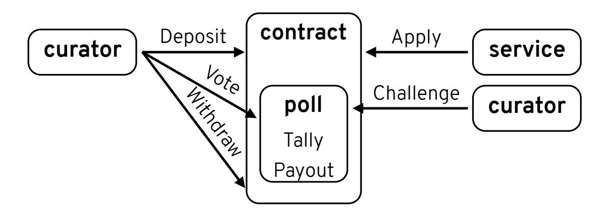

{0}------------------------------------------------

# Reputable List Curation from Decentralized Voting

Elizabeth C. Crites<sup>1</sup> , Mary Maller<sup>2</sup> , Sarah Meiklejohn<sup>1</sup> , Rebekah Mercer<sup>3</sup>

> <sup>1</sup> University College London {e.crites,s.meiklejohn}@ucl.ac.uk <sup>2</sup> Ethereum Foundation mary.maller@ethereum.org <sup>3</sup> O(1) Labs rebekahmercer0@gmail.com

Abstract. Token-curated registries (TCRs) are a mechanism by which a set of users are able to jointly curate a reputable list about real-world information. Entries in the registry may have any form, so this primitive has been proposed for use— and deployed— in a variety of decentralized applications, ranging from the simple joint creation of lists to helping to prevent the spread of misinformation online. Despite this interest, the security of this primitive is not well understood, and indeed existing constructions do not achieve strong or provable notions of security or privacy. In this paper, we provide a formal cryptographic treatment of TCRs as well as a construction that provably hides the votes cast by individual curators. Along the way, we provide a model and proof of security for an underlying voting scheme, which may be of independent interest.

# 1 Introduction

In recent years, decentralization has been viewed as an increasingly attractive alternative to the existing power structures in place in much of society, in which one party or a small set of parties are trusted— in a largely opaque manner— to make decisions that have far-reaching impact. This movement is exemplified by the rise of cryptocurrency and decentralized computing platforms like Bitcoin and Ethereum, in which everyone acts collectively to agree on the state of a ledger of transactions. While decentralization does lower the trust that must be placed in a small set of authorities, operating entirely without authorities is also problematic. For example, one could broadly attribute the rise of misinformation campaigns online to the lack of authoritative sources of information, or at least a disagreement about who these authoritative sources should be [14].

For many of the envisaged applications of decentralized platforms, it is important to have access to information about real-world events. For example, a flight insurance program, or smart contract, needs to know real departure times. This can be achieved via oracles, which are themselves smart contracts responsible for bringing external information into the system. Using an authenticated 

{1}------------------------------------------------

data feed [25, 23, 26], websites that provide real-time information can feed it into the platform in a way that ensures authenticity. Other solutions include those employed in the Augur<sup>4</sup> and Gnosis<sup>5</sup> prediction markets, which maintain that if enough users say the same thing, then what they say becomes the truth. Users are incentivized to act by a reward that is provided if their information is later accepted as truthful. These solutions have the disadvantage that they rely on the wisdom of the crowd, which can be gamed if there is incentive to misrepresent the truth and is subject to Sybil attacks if access to tokens is not controlled. The advantage is that they do not rely on authoritative external websites being willing to create custom data feeds.

One natural relative of an oracle is the idea of a token-curated registry [13], or TCR. In a TCR, a set of curators, each in possession of some tokens, are tasked with maintaining a list (or registry) of entries. Services apply to have entries included in this list, and curators decide whether or not they belong there. If all curators agree that an entry belongs, then they take no action and eventually it is included. If, on the other hand, even a single curator thinks an entry doesn't belong, it can challenge its inclusion, in which case all other curators vote to decide its fate. The curators thus act as a semi-authoritative set of entities for this particular list and, as with oracles, can be incentivized to vote truthfully via a built-in reward structure. A full description of how TCRs operate can be found in Section 3.2.

The proposed applications of TCRs are broad and range from simple uses of lists to more complex ones, such as having a consortium of news organizations identify real images and articles in order to prevent the spread of misinformation online. In fact, this example is a reality: the New York Times is leading the News Provenance project,<sup>6</sup> which worked with IBM's Hyperledger Fabric to create a decentralized prototype designed to provide verifiable and user-friendly signals about the authenticity of news media online. The Civil project,<sup>7</sup> which allows curators to decide which content creators should be allowed in its newsroom, is backed by a TCR that is currently running on Ethereum.<sup>8</sup> One could also imagine using TCRs to have browser vendors jointly curate lists of valid Certificate Transparency logs, rather than the current situation in which they maintain these lists separately.<sup>910</sup> In all of these deployment scenarios, the business interests, social relationships, and potential conflicts of the participants make it essential that curation decisions are kept secret, so that parties can vote honestly without worrying about retaliation or bribery. This is especially crucial in contexts where smaller and less established companies, which are more vulnerable to this type of pressure, are taking on this coordination role. On the other hand,

<sup>4</sup> https://www.augur.net/

<sup>5</sup> https://gnosis.io/

<sup>6</sup> https://www.newsprovenanceproject.com/

<sup>7</sup> https://civil.co/

<sup>8</sup> https://registry.civil.co/

<sup>9</sup> https://valid.apple.com/ct/log\_list/current\_log\_list.json

<sup>10</sup> https://www.gstatic.com/ct/log\_list/v2/log\_list.json

{2}------------------------------------------------

the fact that the set of potential curators is known means we do not have to worry about Sybil attacks.

Despite the growing interest in and deployment of TCRs, there are few existing solutions today. The solutions that do exist either reveal votes in the clear [8], which again puts curators at risk of being pressured to vote in a given direction, or rely on specialized hardware [11]. Prior to this paper, it was not known which security properties are important for TCRs, or the extent to which existing constructions satisfy these properties.

In this paper, we provide a formal cryptographic treatment of token-curated registries, including a model capturing their requirements (Section 4) and a provably secure construction (Section 5). As the above description suggests, the core of our TCR is a voting protocol. While it might seem like a matter of just choosing an existing protocol from the voting literature, there are challenges to this approach. First, the voting protocol must have the appropriate formal cryptographic model and proof of security, or else we must provide them ourselves. Recent progress has been made in formalizing voting primitives and, in particular, modeling ballot privacy [5]. Nevertheless, almost all voting protocols operate in the presence of semi-trusted voting authorities. These parties are relied upon to take actions such as tallying the individual votes, and may need some additional capability (e.g., randomization or private state) in order to compute the tally in a privacy-preserving way. Even when authorities do not need to be trusted to achieve integrity, they often still need to be trusted to achieve privacy, as in the case of Helios [1]. In order to deploy a TCR as a smart contract operating on a decentralized platform, the contract must function as an (untrusted) authority. Given the constraints of the platform, this means it cannot maintain any private state and must operate deterministically; for voting, this means we require a protocol that allows anyone to compute the tally once everyone has voted. This property is known as self-tallying [20]. Moreover, all computations performed by the contract come at a high cost (in terms of the gas paid to execute them; see Section 3.1 for background on how Ethereum operates). We must thus use only lightweight cryptographic primitives, but still achieve provable security. (Of course, we could also operate a TCR using a platform other than a blockchain, or even on a private blockchain in which computation would not be priced as high. If our solution works on a constrained platform like Ethereum, however, it would also work here, so we design for the worst-case scenario.) We resolve these issues by borrowing several ideas from the voting literature, most notably a self-tallying protocol due to Hao et al. [17], but substantially adapt them to fit this setting. Specifically, our contributions are as follows:

– We provide a formal cryptographic model for TCRs, in terms of the two security properties that they require: vote secrecy and dispute freeness. These capture the notions that the scheme should not reveal the individual votes, and that it should be verifiable whether or not users have followed the protocol. Our definitions include a formal game-based treatment of interactions with smart contracts and of the voting mechanism inherent in TCRs, both of which may be of independent interest.

{3}------------------------------------------------

- We provide the first TCR construction that is provably secure. In particular, the security and privacy of our TCR can be proved under Decisional Diffie-Hellman (DDH) and the Square Decisional Diffie Hellman Assumption in the restricted random oracle model [24], and we can run it using a transparent (i.e., public-coin) setup.
- We demonstrate concurrent security of our TCR construction. This is nontrivial for lightweight protocols that are proven in the random oracle model; similar protocols such as that by Hao et al. [17] would be difficult to prove concurrently secure because the forking lemma would result in an exponential number of forks. As such we also achieve the first provably concurrently secure self-tallying voting protocol.

### 1.1 Our techniques

We provide a formal cryptographic model for TCRs that doubles as a formal model for self-tallying voting protocols. In particular, we provide game-based definitions of vote secrecy and dispute freeness.

Dispute freeness says that an adversary cannot misbehave within the protocol without public detection. In order to detect misbehavior, the game keeps track of two tallies: one based on the votes indicated in a first round of voting, and one based on the votes in a second round. The rounds are required in order to achieve the self-tallying property. The first round fixes the set of registered voters, and the second round allows voters to use the relevant information from the first round to form a self-tallying vote (i.e., one that can be computed automatically, in our case by the contract). Keeping track of the honest participants' votes in both the first and second round of the game is easy since the votes are known and can just be added to the two tallies. For adversarial participants, we must rely on the ability to extract the intended vote in each round. The adversary wins the game if for a vote that completes successfully, either of these tallies is different from the official tally kept by the contract, or if they are different from each other.

Vote secrecy says that an adversary cannot learn the contents of a participant's vote. However, an adversary may be able to infer information about how individuals voted from the final tally (e.g., if the tally is 0, then everyone voted "no"). Following Benaloh [4], the definition of vote secrecy must capture the notion that the adversary learns nothing except what it can learn from the tally. To specify this, we say that if there are two honest participants where one votes "yes" and the other votes "no," then the adversary cannot tell which is which. In both of our games, security holds even if every participant is adversarial.

We make the following design choices in our TCR to achieve concurrency: (1) we prove the statistical soundness rather than special 2 soundness of our zeroknowledge proofs, allowing our proof of dispute freeness to only use straight-line extractors; (2) we present our zero-knowledge proofs in the common reference string model and restrict our simulator from programming the random oracle; (3) we only allow the adversaries in our vote secrecy reduction to extract group elements and not field elements, allowing our proof of vote secrecy to rely on 

{4}------------------------------------------------

straight-line extractors. We do explicitly rely on the programmability of the random oracle in order to prove the simulation soundness of our zero-knowledge proofs, which is necessary for our vote secrecy reduction. However, we stress that this programmability does not result in a dependence on any forking lemma, for the adversaries in the reduction immediately terminate when they detect that simulation soundness has been broken. Thus we argue that our reduction runs in polynomial time, even against a concurrent adversary.

### 1.2 Comparison to a prior version of this work

The proceedings version of this work differs in that the protocol it contains is not proven concurrently secure [10]. The main difference in the protocols revolves around our zero-knowledge proofs. In the proceedings version zero-knowledge proofs are proven with respect to fully programmable random oracles. In this version the zero-knowledge proofs are provided in the common reference string model with respect to simulators that are not able to program the oracle.

The implementation in the proceedings version demonstrated the feasibility of running that version of the protocol over the Ethereum blockchain. Even over this restricted platform, we found that transaction costs were only 12 cents per participating curator. If we compare the costs of the prior protocol with the updated protocol in terms of proof size and verifier computation, we see that the prior work has 18 exponentiations, 7 group elements, and 3 field elements. Our updated concurrently secure protocol has 26 exponentiations, 13 group elements and 8 field elements. We thus expect that at the time of writing, our updated transaction costs over the Ethereum blockchain would not cost more than 24 cents per participating curator.

## 2 Related Work

We are aware of two proposed TCR constructions based in industry. Consensys' PLCR ("Partial Lock Commit Reveal") protocol [8] is very efficient, as it uses a two-round commit-and-reveal approach (i.e., a first-round vote consists of a hash of a vote and a random nonce, and a second-round vote reveals this vote and nonce), but this particular solution cannot satisfy any notion of vote secrecy given that votes are revealed in the clear. The secret voting protocol due to Enigma [11] focuses on secrecy, but relies on trusted hardware (e.g., Intel SGX) to securely tally the votes, rather than allowing this to be done in the clear in an untrusted manner. It is also not clear what implications this has for a notion like dispute freeness.

Beyond constructions, Falk and Tsoukalas [18] considered the incentive mechanisms inherent in TCRs from a game-theoretic perspective, to understand whether or not the reward structure provides participants with an incentive to act truthfully. Asgaonkar and Krishnamachari [2] also consider the payoffs inherent in a TCR and the behavior of a rational potential challenger. Finally, 

{5}------------------------------------------------

Ito and Tanaka [19] propose incorporating curator reputation into the TCR to determine the reward that individual curators receive.

We also look more broadly at the voting literature, as the core of our tokencurated registry is a voting protocol. Kiayias and Yung [20] were the first to demonstrate that the three properties we need (vote secrecy, dispute freeness, and self-tallying) could be achieved. Their protocol requires only three rounds of communication, but the computational cost per voter depends on the total number of voters. Groth [15] proposed a scheme with the same properties and a constant and low computational cost per voter, but the number of rounds is n+1, where n is the number of voters. Hao, Ryan, and Zielinski [17] introduced a protocol that resolved this by requiring only two rounds and lower computational costs than those in Groth's scheme. One caveat of all of these protocols is that they are not appropriate in large-scale elections, but only in a boardroom setting, in which the number of voters is limited. This also fits the needs of a tokencurated registry, however, in which the set of possible voters is limited to users who (1) possess a specific token and (2) have chosen to use that token to act as curators. Of these protocols, the one by Hao et al. is the best candidate for usage as a smart contract, as demonstrated by a follow-up work featuring an Ethereum-based implementation [22]. Their protocol, however, lacks a formal proof of security. Along with our enhancements that are needed to use this protocol within a TCR, this is a gap that we fill in this paper.

# 3 Background

### 3.1 Smart contracts

The first deployed cryptocurrency, Bitcoin, was introduced in January 2009. In Bitcoin, a blockchain structure maintains a ledger of all transactions that have ever taken place. The Bitcoin scripting language is designed to enable the atomic transfer of funds from one set of parties to another; as such, it is relatively simple and restrictive. In contrast to Bitcoin, Ethereum uses a scripting language that is (almost) Turing-complete; currently, the most common choice is Solidity. This is designed to enable smart contracts, which are programs that are deployed and executed on top of the Ethereum blockchain. Smart contracts accept inputs, perform computations, and maintain state in a globally visible way; they must also operate deterministically so that every node can agree on a contract's state. The only limitation in terms of the programs Solidity produces is their complexity, as every operation consumes a certain amount of gas. This is a subcurrency priced in ether, the native currency of the Ethereum blockchain, and acts to limit the computation or storage that an individual contract can use, as this computation and storage must be replicated by every node in the network. As of this writing, each block produced in Ethereum has a gas limit of 10 million.

In their most simplified form, Ethereum transactions contain a destination address, a signature σ authorizing the transaction with respect to the public key pk of the sender, a gas limit, a gas price, an amount amt in ether, and an optional data field data. The destination address can be either externally owned, meaning

{6}------------------------------------------------



Fig. 1: The participants in a token-curated registry (TCR) and the algorithms they run. Users become curators by depositing coins in a smart contract, and can later withdraw those coins when they no longer wish to act in this role. Services can apply to have entries added to the registry, and curators can challenge these additions as desired. This creates a poll, in which other curators can cast their votes to decide whether or not the entry should be included. Once the poll is closed, the contract can tally the results and reward the curators who voted with the majority decision.

it is controlled by another user, or it can be a contract address, which points to the code of some smart contract and its associated storage. If the destination address is externally owned, the effect of the transaction is to transfer amt in ether to the user in control of this address. If the destination address is a contract, the effect is that the contract code is executed on any inputs specified in the data field data. This may result in updates to the contract state and/or the creation of additional transactions, subject to the specified gas limit (meaning if the user has not paid enough gas for these operations the transaction may fail and have no effect). Miners may also choose to reject the transaction if it does not offer a high enough gas price. In what follows, we assume the participant has always paid enough gas, so omit the limit and price.

#### 3.2 Token-curated registries

A token-curated registry, or TCR for short, is a mechanism designed to allow people in possession of some relevant tokens, also known as curators, to collectively make decisions about which types of entries belong on a given list or registry. A TCR has two main types of participants: services, who apply to have entries added to the registry, and curators, who decide on the content that can be added. The interplay between these participants can be seen in Figure 1. We provide a formal treatment of the algorithms they run in Section 4, but cover them at a high level here.

When a service applies to have its entry added, it puts down some deposit, and its application is registered in the system. Curators then have some amount of time to decide if they are happy with the entry being added to the registry. If they are, they do nothing, and after the elapsed time the entry is added and the deposit is returned to the service. If, on the other hand, one curator is unhappy with this entry, they can challenge its addition. This means they also place some 

{7}------------------------------------------------

deposit and open a poll, which is essentially a referendum on whether or not this entry should be added. (Some TCR models consider broader voting options, but for simplicity we stick with with a simple binary approach.) Other curators have some time available to vote, and once this time has passed the results of the vote are tallied and the winner is determined according to the rules of the poll (e.g., a simple majority). If the vote is on the side of the service, they get back their deposit and some portion of the challenger's deposit as well. The remainder of the challenger's deposit is split between the curators who voted with the majority; i.e., voted in favor of the service. If instead the vote is against the service, the situation is reversed: the challenger gets back their deposit and some portion of the service's deposit, and the remainder of the service's deposit is split between the curators who voted on the side of the challenger.

### 4 Definitions

### 4.1 Preliminaries

If x is a binary string then |x| denotes its bit length. If S is a finite set then |S| denotes its size and  $x \stackrel{\$}{\leftarrow} S$  denotes sampling a member uniformly from S and assigning it to x. We use  $\lambda \in \mathbb{N}$  to denote the security parameter and  $1^{\lambda}$  to denote its unary representation.

Algorithms are randomized unless explicitly noted otherwise. "PT" stands for "probabilistic polynomial time." We use  $\mathbf{y} \leftarrow A(\mathbf{x};r)$  to denote running algorithm A on inputs  $\mathbf{x}$  and randomness r and assigning its output to  $\mathbf{y}$ . We use  $\mathbf{y} \stackrel{\$}{\leftarrow} A(\mathbf{x})$  to denote  $\mathbf{y} \leftarrow A(\mathbf{x};r)$  for uniformly random r. The set of values that have non-zero probability of being output by A on input  $\mathbf{x}$  is denoted by  $[A(\mathbf{x})]$ . For two functions  $f,g:\mathbb{N}\to[0,1],\ f(\lambda)\approx g(\lambda)$  denotes  $|f(\lambda)-g(\lambda)|=\lambda^{-\omega(1)}$ . We use code-based games in security definitions and proofs [3]. A game  $\mathrm{Sec}_{\mathcal{A}}(\lambda)$ , played with respect to a security notion  $\mathrm{Sec}$  and adversary  $\mathcal{A}$ , has a MAIN procedure whose output is the output of the game. The notation  $\mathrm{Pr}[\mathrm{Sec}_{\mathcal{A}}(\lambda)]$  denotes the probability that this output is 1. We denote relations using the notation  $R=\{(\phi,w): \langle \mathrm{properties}\ \mathrm{that}\ (\phi,w)\ \mathrm{satisfy}\rangle\}$  where  $\phi$  is the public instance and w is the private witness.

The security of our TCR relies on the Decisional Diffie-Hellman (DDH) assumption, which states that  $(g, g^x, g^y, g^{xy})$  is indistinguishable from  $(g, g^x, g^y, g^z)$  for  $x, y, z \stackrel{\$}{\leftarrow} \mathbb{F}$ , where  $\mathbb{F}$  is a finite field. It also relies on the security of a sigma protocol (Prove, Verify); i.e., a three-round interactive protocol. We then make this non-interactive using the Fiat-Shamir heuristic [12], which introduces a reliance on the random oracle model. We require the sigma protocol to satisfy two properties: special honest verifier zero-knowledge (SHVZK) and 2-special soundness [16]. This means the corresponding non-interactive proof satisfies zero knowledge and knowledge soundness. All of these properties are standard, but we include their definitions for completeness in Appendix A.

{8}------------------------------------------------

#### 4.2 Smart contracts

To model interactions with smart contracts formally, we consider that every algorithm Alg run by a participant in the network outputs a transaction tx. This means that at some point the participant runs an algorithm tx \$ ←− FormTx(sk, rcpt, amt, data) that outputs a transaction signed using sk and destined for the recipient rcpt, and carrying amt in ether and some data data to be provided to the contract. If the sender and recipient are implicit from the context, then we use the shorthand tx \$ ←− FormTx(amt, data). There is then a corresponding function Process Alg in the smart contract that takes this transaction as input, verifies that it has the correct form and is properly signed, and (if so) uses it to update the state of the contract, in terms of its functions and associated storage. We must also consider how an adversary A can interact with smart contracts inside of a security game, given that the adversary can interact with the contract itself, see all of the interactions that honest participants have with it, and see all of its internal state and function calls. We model this by providing A with access to three classes of oracles, which abstractly behave as follows:

- AP.Alg allows the adversary to interact with the contract via its own participants, according to some specified algorithm. This oracle uses Process Alg to process the adversary's input, which is meant to be the output of running Alg, on behalf of the contract.
- HP.Alg allows the adversary to instruct some honest participant i to interact with the contract, according to some specified algorithm. This means the adversary provides any necessary inputs, and the oracle then runs Alg for participant i according to these inputs and uses Process Alg to process the corresponding output on behalf of the contract.
- CP allows the adversary to view the entire state of the contract. We do not use this oracle explicitly in our games below, since the adversary can see all information about the contract whenever it wants, but leave it there as a reminder of this ability.

In our definitions below, we allow the adversary to interact with many sessions of the contract concurrently; i.e., many different configurations. We denote the number of honest participants by n, the contract session index by j, and the participant index by i; when querying the oracles defined above, the adversary must always specify the session j. We assume all participants, including the contract, are stateful, and denote their state by state. For the sake of readability and succinctness, we ignore the potential for the adversary to corrupt honest participants; instead, we allow it to control arbitrarily many adversarial participants but to only observe honest participants. We leave the ability to handle corruptions, for both our model and our construction, as an interesting open question.

{9}------------------------------------------------

### 4.3 Token-curated registries

Formally, we consider a token-curated registry (TCR) to be defined by several algorithms, which correspond to the ones in Figure 1. First, we define three algorithms associated with voting.

- $tx_{vote1} \stackrel{\$}{\leftarrow} Vote1(contract, poll, wgt, vote)$  is run by a curator wishing to contribute some weight wgt and vote vote to some poll poll contained in the contract contract.
- $-\operatorname{tx}_{\mathsf{vote}2} \stackrel{\$}{\leftarrow} \mathsf{Vote}2(\mathsf{contract},\mathsf{poll})$  is run by a curator in the second round of voting for poll in contract.
- Tally(poll, tally) is run by the contract in order to tally the results of the vote in the poll poll. To be more efficient, it optionally takes in a proposed tally tally (computed, for example, by one of the curators), which it can then verify is the correct one.

The main reason that our voting protocol proceeds in rounds is that we need a fixed set of voters in order to achieve the *self-tallying* property that says that the tally can be computed by any third party (in our case, by the contract) once everyone has voted. In our construction, voters commit to their vote and "register" their interest in voting in the first round. In the second round, once the set of registered voters is fixed, voters can vote again, this time using the relevant information from the first round to form a self-tallying vote. The tally can then be computed using these votes cast in the second round, while the votes cast in the first round (which the voters prove are the same) can be used to pay voters on the winning side. More general constructions could be modelled by having an interactive Vote protocol (with possibly more than two rounds). We also define algorithms associated with the TCR more broadly.

- $-\operatorname{tx_{dep}} \stackrel{\$}{\leftarrow} \operatorname{Deposit}(\operatorname{contract}, \operatorname{amt})$  is run by a user wishing to become a curator in the TCR by creating some initial deposit of tokens  $\operatorname{amt}$ .
- $-\operatorname{tx}_{\mathsf{app}} \xleftarrow{\$} \mathsf{Apply}(\mathsf{contract},\mathsf{entry})$  is run by a service wishing to add an entry entry to the registry.
- $tx_{chal} \leftarrow$  Challenge(contract, entry) is run by a curator wishing to challenge the addition of the entry entry to the registry.
- $-\operatorname{tx_{with}} \stackrel{\$}{\leftarrow} \operatorname{Withdraw}(\operatorname{contract}, \operatorname{amt})$  is run by a curator wishing to withdraw some amount amt of their deposited tokens.
- Payout(poll) is run by the contract to pay the curators who voted according to the poll outcome.

**Vote secrecy** Vote secrecy says that an adversary cannot learn the contents of a user's vote, beyond what it can infer from their weighting. A formal vote secrecy game is in Figure 2, assuming for notational simplicity that there is only one poll poll so it does not need to be specified. Intuitively, it proceeds as follows. The adversary is given a set of contract configurations contracts, which it is free

{10}------------------------------------------------

to interact with concurrently, and a set of the public keys  $\{pk_i\}_i$  belonging to honest participants (line 4). All contracts start in an initial state, meaning their storage fields are empty, with only the parameters initialized.

The adversary is then free to have both its own and honest participants deposit tokens to become curators; it is also free to create arbitrary applications and challenges, and have its own and honest participants vote. The real contract has timers indicating when it should move from the first to the second round of voting, but here we do this manually: the first time the adversary calls either AP.Vote2 or HP.Vote2 the voting flag is set to be 1, to signal that the set of voters is fixed and the second round has started (lines 6 and 13).

The main question is how honest voters should vote. If they all vote for the secret bit b (line 2), then the adversary is clearly able to guess b and win the game (line 5), since it can see in the final tally if everyone has voted for 0 or 1. To prevent this trivial type of victory, we thus ensure that the final tally is the same regardless of the bit b, following Benaloh [4]. To do this, we have the adversary provide its own bit  $b_{\mathcal{A}}$  as input to HP.Vote1, which signals whether it wants the voter to vote "for" ( $b_{\mathcal{A}} = 1$ ) or "against" ( $b_{\mathcal{A}} = 0$ ) the secret bit b. This is the same as voting for the bit  $b_{\mathcal{A}}$  EQ b, which is what the voters do (line 10). We then keep track of how many times the adversary has used  $b_{\mathcal{A}} = 0$  and  $b_{\mathcal{A}} = 1$ , using a variable vote\_count (lines 8 and 9). If it has used them an equal number of times, meaning vote\_count = 0, then we have the same number of votes for b and  $\neg b$ , so the outcome is the same regardless of b. If they are not equal at the start of the voting round, then  $\mathcal{A}$  automatically loses the game (line 12).

Finally, to prevent another trivial way for the adversary to learn how people voted, we prevent it from instructing honest participants to withdraw (line 16), as this reveals their balance. This prevents the adversary from instructing a participant to deposit a certain amount of coins, having them vote once, and then instructing them to withdraw their coins and seeing if the amount is the same (indicating they voted on the losing side) or is more than what they deposited (indicating that they voted on the winning side). In practice, this means that participants would perhaps need to vote some minimum number of times before withdrawing, in order to prevent these types of inference attacks.

**Definition 1.** Define  $\mathbf{Adv}_{\mathcal{A}}^{secrecy}(\lambda) = 2\Pr[\mathsf{G}_{\mathcal{A}}^{secrecy}(\lambda)] - 1$ , where this game is defined as in Figure 2 (with the descriptions of all calls in which the oracle honestly follows the protocol omitted). Then the TCR satisfies vote secrecy if for all PT adversaries  $\mathcal{A}$  there exists a negligible function  $\nu(\cdot)$  such that  $\mathbf{Adv}_{\mathcal{A}}^{secrecy}(\lambda) < \nu(\lambda)$ .

**Dispute freeness** Dispute freeness says that an adversary cannot misbehave within the protocol without public detection; i.e., it is publicly verifiable whether or not everyone followed the protocol. Unlike in a traditional voting scenario, it is already publicly verifiable whether or not the contract (which acts as the election official) follows the protocol, since its code and state transitions are globally visible. We thus need to consider only whether or not the individual

{11}------------------------------------------------

```
main G
          secrecy
          A (λ)
1 vote count ← 0
2 b
    $←− {0, 1}
3 (pki
       ,ski)
             $
            ←− KeyGen(1λ
                           ) ∀i ∈ [n]
4 b
   0 $←− AAP,HP,CP(1λ
                       , contracts, {pki}i)
5 return (b
            0 = b)
  AP.Vote2(j,txvote2)
6 if (contracts[j].vote flag = 0)
     contracts[j].vote flag ← 1
7 contracts[j].Process Vote2(txvote2)
  HP.Vote1(j, i, bA)
8 if (bA = 0) vote count[j] −= 1
9 else vote count[j] += 1
10 txvote1
          $
         ←− Vote1(contracts[j], bA EQ b)
11 contracts[j].Process Vote1(txvote1)
  HP.Vote2(j, i)
12 if (vote count[j] 6= 0) return 0
13 if (contracts[j].vote flag = 0)
     contracts[j].vote flag ← 1
14 txvote2
          $
         ←− Vote2(contracts[j])
15 contracts[j].Process Vote2(txvote2)
  HP.Withdraw(·, ·)
16 return ⊥
```

Fig. 2: The TCR vote secrecy game.

curators behave. This means considering two types of misbehavior: one in which the adversary tries to change its vote halfway through the voting protocol (so between Vote1 and Vote2), and one in which it tries to bias the outcome of the vote by voting for something other than 0 or 1. A formal dispute freeness game is in Figure 3 (again, assuming for notational simplicity that poll does not need to be given as input). Intuitively, it proceeds as follows. As in the vote secrecy game, the adversary is given a set of initial contract configurations contracts and the public keys {pki}<sup>i</sup> belonging to honest participants. It is then free to interact with the contract via AP and HP, and the game keeps track of the voting round in the same way as the vote secrecy game.

In order to detect misbehavior, the game keeps track of two tallies: tally<sup>1</sup> based on the votes indicated in the first round of voting, and tally<sup>2</sup> based on the votes in the second round. The adversary then wins the game if for a vote that completes successfully, meaning it has a defined outcome (line 5), either of these tallies is different from the official tally (contracts[j].tally) kept by the

{12}------------------------------------------------

```
\begin{array}{c} \frac{\text{MAIN } \mathsf{G}_{\mathcal{A}}^{\text{dispute}}(\lambda)}{\mathsf{tally}_1, \mathsf{tally}_2 \leftarrow \mathbf{0}} \end{array}
_{2} (\mathsf{pk}_{i}, \mathsf{sk}_{i}) \xleftarrow{\$} \mathsf{KeyGen}(1^{\lambda}) \ \forall i \in [n]
3 done \stackrel{\$}{\leftarrow} \mathcal{A}^{AP,HP,CP}(1^{\lambda}, contracts, \{pk_i\}_i)
b_{\mathsf{tally}}[j] \leftarrow (\mathsf{tally}_1[j] \neq \mathsf{tally}_2[j]
     \vee \text{ tally}_1[j], \text{tally}_2[j] \neq \text{contracts}[j]. \text{tally}) \ \forall j
 b_{\mathsf{done}}[j] \leftarrow (\mathsf{contracts}[j].\mathsf{outcome} \neq \bot) \ \forall j
 6 return (\exists j : b_{\mathsf{done}}[j] \land b_{\mathsf{tally}}[j])
      AP.Vote1(j, tx_{vote1})
 7 contracts[j].Process_Vote1(tx<sub>vote1</sub>)
 _{8} V \leftarrow \mathsf{Ext}(\mathsf{tx}_{\mathsf{vote}1})
 _{9} \mathsf{tally}_{1}[j] \leftarrow \mathsf{tally}_{1}[j] \oplus V
      AP.Vote2(j, tx_{vote2})
_{10} \; \overline{\text{if } (\mathsf{contracts}[j].\mathsf{vote\_flag} = 0)}
            contracts[j].vote\_flag \leftarrow 1
11 contracts[j].Process_Vote2(tx<sub>vote2</sub>)
_{12} V \leftarrow \mathsf{Ext}(\mathsf{tx}_{\mathsf{vote}2})
13 \mathsf{tally}_2[j] \leftarrow \mathsf{tally}_2[j] \oplus V
\frac{\text{HP.Vote1}(j, i, b_{\mathcal{A}})}{\mathsf{vote} \leftarrow b_{\mathcal{A}} \,\, \mathrm{EQ} \,\, b}
_{15} \text{ tx}_{\text{vote1}} \xleftarrow{\$} \text{Vote1}(\text{contracts}[j], \text{vote})
16 contracts [j]. Process_Vote1(tx<sub>vote1</sub>)
17 \mathsf{tally}_1[j] \leftarrow \mathsf{tally}_1[j] \oplus f(\mathsf{vote})
18 \mathsf{tally}_2[j] \leftarrow \mathsf{tally}_2[j] \oplus f(\mathsf{vote})
```

Fig. 3: The TCR dispute freeness game.

contract, or if they are different from each other (line 4). Keeping track of the votes in both the first and second round is easy for honest participants, since these are known so can just be added to the tallies (lines 17 and 18), although we allow the tally to incorporate a function of the vote f(vote) rather than just the vote itself. (In our construction, for example, this function is  $f(x) = g^x$ .) For adversarial participants, we must rely on the ability to extract the intended vote in each round. This means we assume the existence of an extractor Ext that, given the transaction provided by the adversary, can output V = f(vote), where vote is the vote intended by the adversary in that round (lines 8-9 and 12-13).

**Definition 2.** Define  $\mathbf{Adv}_{\mathcal{A},\mathsf{Ext},f}^{dispute}(\lambda) = \Pr[\mathsf{G}_{\mathcal{A},\mathsf{Ext},f}^{dispute}(\lambda)]$ , where this game is defined as in Figure 3 with respect to a function  $f(\cdot)$  (with the descriptions of all calls in which the oracle honestly follows the protocol omitted, and HP.Vote2 behaving as it does in the game in Definition 1). Then the TCR satisfies dispute freeness if there exists an extractor Ext such that for all PT adversaries  $\mathcal{A}$  there exists a negligible function  $\nu(\cdot)$  such that  $\mathbf{Adv}_{\mathcal{A},\mathsf{Ext},f}^{dispute}(\lambda) < \nu(\lambda)$ .

{13}------------------------------------------------

While vote secrecy and dispute freeness are the only properties we define and prove formally for our TCR, there are several other properties (e.g., coercion resistance) that may be desirable or even necessary for such a system. We discuss these properties in Section 5.3, along with how we can provide financial disincentives for these additional types of misbehavior.

### 5 Construction

In this section we describe our TCR construction. This construction satisfies both vote secrecy and dispute freeness in the concurrent setting. Our security reductions for vote secrecy and dispute freeness depend on the DDH assumption and the square DDH assumption in the restricted random oracle model. We thus see our construction as being both of direct practical interest, and also as providing strong evidence of the feasibility of building practical cryptosystems that do not depend on less standard assumptions.

We first give an overview of our full design, before going into more detail on the specific components. These components include: (1) how to become a curator; (2) how to register to vote and how to vote; (3) how to compute the final tally; and (4) how curators can increase their weighting in the system.

### 5.1 Design overview

At a high level, our token-curated registry operates as a single smart contract; one can imagine the structure being identical to that of a PLCR (Partial Lock Commit Reveal) contract [8], but with our Vote1 and Vote2 replacing their respective commit and reveal phases. Users become curators by depositing some number of tokens into the contract, which creates a commitment C and makes them available for challenging and voting. As curators earn tokens, they can update the balance in this commitment.

**Registration** The voting protocol is the core of our token-curated registry, and proceeds in two rounds. In the first round, users "register" their interest in participating in the vote by providing a registration key  $c_0 = g^x$  and placing a deposit. They also commit to their intended vote by forming a commitment  $c_1$  that uses x as randomness. In addition to making sure that voters can't change their minds, this commitment  $c_1$  is also useful in allowing the contract to later pay the curator for their vote. Voters also provide an extra pair  $(c_2, c_3)$ , which enables us to prove vote secrecy without rewinding, and a proof that all of these values  $(c_0, c_2, c_3)$  have been formed correctly.

**Voting** In the second round, the set of voters is now fixed as the set of registered curators from the first round. We follow Hao et al. [17] in having each voter i compute a base  $y_i$  that is a combination of the registration keys of other voters. They then commit to their vote again, this time using  $y_i$  as a base, to form a value  $c_4$ . These values are formulated so that  $\prod_i y_i^{x_i} = 1$ , which means the

{14}------------------------------------------------

product all the voters c<sup>4</sup> values equals g P i vote<sup>i</sup> (in the unweighted case). This makes the voting protocol self-tallying, since with this value the contract can compute the discrete logarithm by brute force to get the tally (which is efficient for a relatively small number of voters). Voters provide a proof that (c0, c1, c4) have been formed correctly; i.e., that they haven't changed their committed vote from the first round. If this proof is valid, the contract returns the deposit sent in the first round. If the proof is invalid or a voter doesn't send a second-round vote, the contract keeps the deposit as a form of punishment, since it cannot complete the vote.

Weightings In our TCR we want that users with a stronger reputation have a higher weighting, which it's important to note does not correspond to a financial reward. Once the contract computes the tally, it determines the outcome of the vote according to the built-in rules. It can easily send the service and challenger deposits to the right places, as these are public, so the only question left is how it recognizes the voters who were in the majority. In particular, say the goal is to reward one reputational token if vote = outcome, and 0 otherwise. To do this without knowing vote, we use the fact that outcome is known and the curator provided a commitment c<sup>1</sup> to the vote in the registration phase. We compute an arithmetic expression on c<sup>1</sup> and outcome that forms a commitment to 1 if the committed vote and outcome are equal and 0 otherwise. We then homomorphically fold this result into the committed weighting C.

#### 5.2 System design

We describe the algorithms that comprise our TCR below, in terms of the different operations that are required. As they do not involve any significant cryptographic operations, we omit the formal descriptions of Apply and Challenge. We can think of Apply as placing a deposit and (if the deposit is high enough) adding entry to a list of potential registry entries and starting a timer indicating how long the curators have to challenge its inclusion. We can think of Challenge as placing a deposit, opening a new poll to allow other curators to vote, and starting a timer indicating how long they have to do so.

We use one extra algorithm in addition to the ones given in our model, txup \$ ←− Update(), which is used to update a lower bound stored by the contract on the number of tokens a curator has. The only effect this has on our model is that we would want to replace Withdraw with Update in the vote secrecy game (Figure 2) as the one algorithm that the adversary can't query honest participants on, as it might reveal a curator's success in voting (whereas running Withdraw now reveals no information). A formal specification of all of the userfacing algorithms can be seen in Figure 4 and of the contract-only algorithms in Figure 5.

TCR contract setup. A contract designed to support a TCR must maintain several fields. In this section, we limit ourselves to the ones that are necessary for

{15}------------------------------------------------

```
Deposit(amt)
                                                                                                           Process_Deposit(tx_{dep})
r \overset{\$}{\leftarrow} \mathbb{F}; C \leftarrow q^{\mathsf{amt}} h^r
                                                                                                           (C, \pi_{\text{wgt}}) \leftarrow \mathsf{tx}_{\mathsf{dep}}[\mathsf{data}]; \, \mathsf{pk} \leftarrow \mathsf{tx}_{\mathsf{dep}}[\mathsf{pk}]
                                                                                                           b_{\text{wgt}} \leftarrow \text{Verify}(\text{crs}_{\text{wgt}}, (C, \text{tx}_{\text{dep}}[\text{amt}]), \pi_{\text{wgt}})
\pi_{\mathsf{wgt}} \leftarrow \mathsf{Prove}(\mathsf{crs}_{\mathsf{wgt}}, (C, \mathsf{amt}), r)
                                                                                                          if (b_{\text{wgt}})
return FormTx(amt, (C, \pi_{wgt}))
                                                                                                                add pk \mapsto (C, tx_{dep}[amt]) to curators
Update()
                                                                                                           Process\_Update(tx_{up})
\pi_{\mathsf{wgt}} \leftarrow \mathsf{Prove}(\mathsf{crs}_{\mathsf{wgt}}, (C, \mathsf{amt}), r)
                                                                                                           (\mathsf{amt}, \pi_{\mathsf{wgt}}) \leftarrow \mathsf{tx}_{\mathsf{up}}[\mathsf{data}]; \, \mathsf{pk} \leftarrow \mathsf{tx}_{\mathsf{up}}[\mathsf{pk}]
return FormTx(0, (\mathsf{amt}, \pi_{\mathsf{wgt}}))
                                                                                                           (C, \mathsf{wgt}) \leftarrow \mathsf{curators}[\mathsf{pk}]
                                                                                                           b_{\mathsf{wgt}} \leftarrow \mathsf{Verify}(\mathsf{crs}_{\mathsf{wgt}}, (C, \mathsf{amt}), \pi_{\mathsf{wgt}})
                                                                                                          if (b_{\text{wgt}}) wgt \leftarrow amt
Withdraw(amt)
                                                                                                           Process_Withdraw(tx_{with})
return FormTx(0, amt)
                                                                                                           amt \leftarrow tx_{with}[data]; pk \leftarrow tx_{with}[pk]
                                                                                                           (C, \mathsf{wgt}) \leftarrow \mathsf{curators}[\mathsf{pk}]
                                                                                                          if (amt \le wgt)
                                                                                                               C \leftarrow C \cdot g_1^{-\mathsf{amt}}; \, \mathsf{wgt} \leftarrow \mathsf{wgt} - \mathsf{amt}
                                                                                                                update curators[pk] \leftarrow (C, wgt)
                                                                                                                send amt to pk
                                                                                                           Process_Vote1(tx_{vote1})
Vote1(vote, wgt)
                                                                                                          \overline{(c_0, c_1, c_2, c_3, \pi_1, \mathsf{wgt})} \leftarrow \mathsf{tx}_{\mathsf{vote}1}[\mathsf{data}]; \ \mathsf{pk} \leftarrow \mathsf{tx}_{\mathsf{vote}1}[\mathsf{pk}]
x \stackrel{\$}{\leftarrow} \mathbb{F}; (c_0, c_1, c_2, c_3) \leftarrow (g^x, g^{\mathsf{vote}}h^x, h_1^x, h_2^x)
                                                                                                           b_1 \leftarrow \mathsf{Verify}(\mathsf{crs}_{\mathsf{Vote1}}, (c_0, c_2, c_3), \pi_1)
\pi_1 \leftarrow \mathsf{Prove}(\mathsf{crs}_{\mathsf{Vote1}}, (c_0, c_2, c_3), x)
                                                                                                          b \leftarrow (\mathsf{wgt} \leq \mathsf{curators}[\mathsf{pk}][\mathsf{wgt}])
add (vote, x, c_0, c_1) to state
                                                                                                          if (b \wedge b_1)
return FormTx(amt<sub>dep</sub>, (c_0, c_1, c_2, c_3, \pi_1, wgt))
                                                                                                                add (c_0, c_1, \mathsf{wgt}_i) to \mathsf{voters}|\mathsf{pk}||\mathsf{data}|
                                                                                                           Process_Vote2(tx_{j,vote2})
Vote2(j)
\overline{(c_{i,0},c_{i,1}}, \mathsf{wgt}_i) \leftarrow \mathtt{voters}[\mathsf{pk}_i][\mathsf{data}] \ \forall i
                                                                                                           (c_4, \pi_2) \leftarrow \mathsf{tx}_{\mathsf{vote}2}[\mathsf{data}]; \, \mathsf{pk} \leftarrow \mathsf{tx}_{\mathsf{vote}2}[\mathsf{pk}]
                                                                                                           (c_{i,0}, c_{i,1}, \mathsf{wgt}_i) \leftarrow \mathsf{voters}[\mathsf{pk}_i][\mathsf{data}] \ \forall i
y \leftarrow \prod_{0 \le i < j, j < k \le m} c_{i,0} c_{k,0}^{-1}
(\mathsf{vote}, x, c_0, c_1) \leftarrow \mathsf{state}
                                                                                                          y \leftarrow \prod_{0 \le i < j, j < k \le m} c_{i,0} c_{k,0}^{-1}
c_4 \leftarrow q^{\mathsf{vote}} y^x
                                                                                                           (c_0, c_1, \mathsf{wgt}) \leftarrow \mathsf{voters}[\mathsf{pk}][\mathsf{data}]
                                                                                                           b_2 \leftarrow \mathsf{Verify}(\mathsf{crs}_{\mathsf{Vote2}}, (c_0, c_1, c_4, y), \pi_2)
\pi_2 \stackrel{\$}{\leftarrow} \mathsf{Prove}(\mathsf{crs}_{\mathsf{Vote2}}, (c_0, c_1, c_4, y), (x, \mathsf{vote}))
                                                                                                          if (b_2)
return FormTx(0, (c_4, \pi_2))
                                                                                                               \texttt{tallyG} \leftarrow \texttt{tallyG} \cdot c_4^{\texttt{wgt}}
                                                                                                                send amt_{dep} to pk
```

Fig. 4: The core user-facing cryptographic algorithms that comprise the TCR, in terms of the algorithm run by the user (on the left-hand side) and the processing of the output of this algorithm run by the contract (on the right-hand side).

the cryptographic operations of the contract, meaning we ignore elements like timers. The contract is initialized with randomly generated fixed generators g, h, and randomly generated common reference strings ( $\mathsf{crs}_{\mathsf{wgt}}, \mathsf{crs}_{\mathsf{Vote1}}, \mathsf{crs}_{\mathsf{Vote2}}$ ). This means that our TCR operates with a transparent (i.e., public-coin) setup. It is also initialized with empty maps  $\mathsf{curators}$  and  $\mathsf{voters}$ , which respectively keep track of all curators and all voters within a given poll. For ease of exposition, we

{16}------------------------------------------------

consider a contract with only a single poll; one with multiple polls would still have only one curators map but one voters map per poll.

Joining the TCR. In order to become a curator, a user must first deposit tokens into the TCR contract. This means running the Deposit algorithm seen in Figure 4. The amount amt that they deposit determines their weight, which they commit to (and prove that they've committed to, using πwgt) in C. They prove this using the relation Rwgt:

$$R_{\mathsf{wgt}} = \big( \left( (C, \mathsf{wgt}), r \right) : C = g^{\mathsf{wgt}} h^r \, \big)$$

We describe a zero-knowledge argument of knowledge for Rwgt in Section 6.3.

To process this, the contract first uses πwgt to check that C really is a commitment to the weight. If it is satisfied, it registers the user (using txdep[pk], the public key used in the transaction) in curators, with associated commitment C and weight wgt. The initial value of wgt is the initial amount sent, but later the value stored by the contract serves as a lower bound on the actual number of deposited tokens.

Updating weights. Initially, since the amount is sent on-chain and thus publicly known, the weight of each participant is also known. Curators may lose tokens only by unsuccessfully challenging an entry, but this is done in a public way so this lower bound can be updated by the contract itself. The contract is unaware, however, of how many tokens curators gain, since as we see below this is determined based on whether or not their hidden votes are the same as the majority. This means the contract may need to be told a new lower bound from time to time, as specified in Figure 4. A curator does this in the same way as when they run Deposit: they simply tell the contract their current number of tokens amt, and prove that this is the value contained in C. The contract can then check that the proof verifies. If so, it increases the stored wgt value to amt. This approach may reveal information about the curator's success in voting, but it has the advantage that it uses a simple proof of knowledge, rather than general range proofs (which are much more expensive to verify). We thus would want to ensure that curators cannot update this lower bound too frequently (e.g., if they update after every single vote then they reveal how they voted every time), by making sure that they update only after they have voted some fixed number of times.

Withdrawing tokens. At some point, a participant may wish to stop acting as a curator, or to withdraw some portion of their tokens. To do this, they simply send the amount they want to withdraw to the contract, as specified in Figure 4. If the contract can see this is greater than or equal to the lower bound wgt, it sends them this amount and decreases their token store (both in terms of their committed tokens and their lower bound). If this token store goes to zero, the contract could additionally remove this curator from the list.

{17}------------------------------------------------

Voting. At some point, a service runs Apply for some entry. If every curator is happy to see entry in the registry, nothing happens and after some amount of time the entry is added. If instead a curator runs Challenge, this opens up the chance for other curators to vote on whether or not they think entry belongs in the registry.

To vote, curators first use Vote1, as specified in Figure 4. This means picking a random x, and forming g <sup>x</sup> and a commitment to their vote vote using x as randomness. (The pair (c0, c1) has the form of an ElGamal ciphertext, but no one knows the discrete logarithm of h with respect to g so no one can decrypt it.) The curator also provides h x 1 , h x 2 (which we require to prove vote secrecy) and proves that (c0, c2, c3) are well-formed i.e., they provide a proof for the relation RVote1:

$$R_{\mathsf{Vote1}} = (((c_0, c_2, c_3), x) : c_0 = g^x, c_2 = h_1^x, c_3 = h_2^x)$$

A proof for the relation RVote1 is provided in Section 6.2. They send this to the contract, along with a deposit amtdep that acts to promise they'll come back to vote in the second round, and the number of tokens wgt that they want to put behind their vote. The contract then verifies the proof and checks that the participant has enough tokens, and if so it stores the sent values in voters, associated with the same public key.

At the end of the first round of voting, the contract fixes the set of participants to be all keys in voters, after ensuring that all their first-round votes are distinct (i.e., that they use different values for c0). To achieve the self-tallying property, we follow Hao et al. [17] in fixing a specific group element for each participant to use in the second round; in particular, if there are m voters then we define

$$y_j \leftarrow \prod_{0 \le i < j, j < k \le m} c_{i,0}^{\mathsf{wgt}_i} c_{k,0}^{-\mathsf{wgt}_k}$$

for all j, 1 ≤ j ≤ m (where j represents the j-th public key, and the ordering on keys can be either lexicographical or in the order they were received).

In the second round, the j-th voter can compute their value y<sup>j</sup> . They now provide another value, c4, that is a commitment to their vote, still using x as the randomness but this time using y as the base instead of h. They then prove a relation RVote2 to demonstrate that (1) the same value x is used as randomness in the first and second rounds; (2) the commitments c<sup>1</sup> and c<sup>4</sup> from the first and second round contain the same vote and (3) that this vote is either a 0 or a 1.

$$\begin{split} R_{\mathsf{Vote2}} = & \big\{ ((c_0, c_1, c_4, y), (x, \mathsf{vote})) : \\ & \mathsf{vote} \in \{0, 1\} \ \land \ c_0 = g^x \ \land \ c_1 = g^{\mathsf{vote}} h^x \ \land \ c_4 = g^{\mathsf{vote}} y^x \big\} \end{split}$$

A zero-knowledge argument of knowledge for RVote2 is specified in Section 6.3.

To process this, the contract checks the proof, using the data from both rounds of voting, as shown in Figure 4. If the proof verifies, then the contract folds the value c<sup>4</sup> into its tally and returns the deposit from the first round to the participant. If not, or if the user never sends the second-round transaction in the first place, the deposit acts as a penalty fee and also could be used to

{18}------------------------------------------------

```
\begin{split} &\frac{\mathsf{Tally}()}{\mathsf{find} \ \mathsf{total}} \ \mathsf{such} \ \mathsf{that} \ g^{\mathsf{total}} = \mathsf{tallyG} \\ &\mathsf{tally} \leftarrow \mathsf{total} \\ &\frac{\mathsf{Payout}()}{\mathsf{for} \ \mathsf{all} \ \mathsf{pk} \in \mathsf{voters}} \\ &U_{\mathsf{pk}} \leftarrow \left(g^{1-\mathsf{outcome}} c_{\mathsf{pk},1}^{2 \cdot \mathsf{outcome}-1}\right) \\ &\mathsf{curators}[\mathsf{pk}][C] \leftarrow \mathsf{curators}[\mathsf{pk}][C] \cdot U_{\mathsf{pk}} \end{split}
```

Fig. 5: The internal smart contract functions.

reimburse gas costs for honest participants. If needed, the contract could also deduct from the user's deposited tokens to further penalize them, especially after repeat offenses (at which point the user would eventually be stripped of their tokens and removed as a curator).

**Tallying.** Finally, the smart contract tallies the result, as seen in Figure 5. The running tally has already been computed by the contract during Process\_Vote2, and we argue now that this process is self-tallying; i.e., the contract can compute the tally without any help.

**Lemma 1.** After the second-round transactions of all m voters have been processed,  $tallyG = g^{\sum_{i=1}^{m} wgt_i vote_i}$ .

*Proof.* For this proof we use the notatation  $(c_{i,0}, c_{i,1}, c_{i,2}, c_{i,3}, c_{i,4})$  to denote the elements sent in the first and second round of voting by the *i*th participant. We also denote  $y_j$  to be the public value y computed for the jth participant in the second round. According to how the  $y_j$  values were computed,

$$\begin{split} y_j &= \prod_{i < j, j < k} c_{i,0}^{\mathsf{wgt}_i} c_{k,0}^{-\mathsf{wgt}_k} \\ &= \prod_{i < j, j < k} g^{x_i \mathsf{wgt}_i} g^{-x_k \mathsf{wgt}_k} \\ &= g^{\sum_{i < j} x_i \mathsf{wgt}_i - \sum_{j < i} x_i \mathsf{wgt}_i}. \end{split}$$

It is thus the case that

$$\begin{split} \prod_{j=1}^m y_j^{x_j \mathsf{wgt}_j} &= g^{\sum_j x_j \mathsf{wgt}_j (\sum_{i < j} x_i \mathsf{wgt}_i - \sum_{j < i} x_i \mathsf{wgt}_i)} \\ &= g^{\sum_j \sum_{i < j} x_i x_j \mathsf{wgt}_i \mathsf{wgt}_j - \sum_j \sum_{j < i} x_i x_j \mathsf{wgt}_i \mathsf{wgt}_j} \\ &= g^{\sum_j \sum_{i < j} x_i x_j \mathsf{wgt}_i \mathsf{wgt}_j - \sum_j \sum_{i < j} x_j x_i \mathsf{wgt}_j \mathsf{wgt}_i} \\ &= g^{\sum_j \sum_{i < j} x_i x_j \mathsf{wgt}_i \mathsf{wgt}_j - \sum_j \sum_{i < j} x_j x_i \mathsf{wgt}_j \mathsf{wgt}_i} \\ &= 1. \end{split}$$

{19}------------------------------------------------

After all m voters have run Vote2 we then get

$$\begin{aligned} \texttt{tallyG} &= \prod_{i=1}^m c_{i,4}^{\mathsf{wgt}_i} \\ &= \prod_{i=1}^m g^{\mathsf{wgt}_i \mathsf{vote}_i} y_i^{\mathsf{wgt}_i x_i} \\ &= g^{\sum_{i=1}^m \mathsf{wgt}_i \mathsf{vote}_i} \end{aligned}$$

as desired.

Thus, finding the real tally means finding the discrete logarithm of tallyG, which can be achieved by brute force. While this is a potentially expensive computation (especially to do on-chain), it is made significantly cheaper by restricting the allowable weights and the number of voters, which can be parameters built into the contract. For example, if the only allowable weight is 1, then the maximum value in the exponent is the number of voters. Additionally, a volunteer could compute the tally off-chain and submit it to the smart contract, which could verify the correctness of this tally by confirming that  $g^{\text{tally}} = \text{tallyG}$ .

The contract then sets a variable outcome according to the value of tally and the voting policy for the poll. For example, if the policy states that a simple majority wins, then if tally  $> \frac{1}{2} \sum_{i=1}^{m} \mathsf{wgt}_i$  the smart contract sets outcome  $\leftarrow 1$ , and otherwise outcome  $\leftarrow 0$ .

Paying out. Finally, the contract must update the tokens of each curator according to how they voted. (In addition, it sends the public deposits created in Apply and Challenge to the service or challenger, according to the outcome of the vote.) As seen in Figure 5 and discussed in Section 5.1, we can use  $c_1$ , which acts as a commitment to the boolean vote vote, to form a commitment  $U_{\rm pk}$  to the outcome of the boolean expression (vote = outcome); i.e.,  $U_{\rm pk}$  is a commitment to 1 if vote = outcome and a commitment to 0 otherwise. We can then add this value into their committed balance  $C = g^{\rm amt}h^r$  by multiplying the two commitments together, which means the curator earns one token for voting "correctly" and nothing otherwise. If a different payout structure were desired, this could be achieved by manipulating  $U_{\rm pk}$  appropriately (e.g., squaring it if the reward should be two tokens). Importantly, the reward for a curator is not proportional to the weight they used in the vote.

Since the curator knows both the original randomness used in C and the randomness used in  $c_1$ , as well as how much they were rewarded, they can update their locally stored weight and randomness so that they still know the opening of the commitment C, which is needed to run Update. This means updating the value of (amt, r) as follows:

$$\label{eq:composition} \begin{split} \frac{\left| \mathsf{outcome} = 0 \right. \right. \left. \mathsf{outcome} = 1}{\mathsf{vote} = 0 \, \left| (\mathsf{amt} + 1, r - x) \, \left( \mathsf{amt}, r + x \right) \right.} \\ \mathsf{vote} = 1 \, \left| (\mathsf{amt}, r - x) \, \left( \mathsf{amt} + 1, r + x \right) \right. \end{split}$$

{20}------------------------------------------------

### 5.3 Security

We now argue why our construction achieves the notions of security defined in Section 4. For notational simplicity, our proofs assume all weights are equal to 1, but could be modified to allow for arbitrary weights.

**Theorem 1.** If (Setup, Prove, Verify) is a zero-knowledge argument and the DDH and square DDH assumptions hold (theorem 3 and theorem 4), then the construction above satisfies vote secrecy, as specified in Definition 1.

Our full proof of vote secrecy is quite involved, and can be found in Appendix C. Intuitively, we must transition from the honest vote secrecy game to a game in which all information about the votes of honest participants is hidden, at which point the adversary can have no advantage. In terms of honest participants, there must be at least two in order to satisfy the requirement that  $vote\_count = 0$ .

Our proof for vote secrecy is secure with respect to a restricted random oracle [24], which has important consequences when it comes to concurrency. In particular, the honest prover and the simulated honest prover are not able to program the oracle, but the adversaries distinguishing between hybrid games may program it. This means that we do not obtain collisions where both the honest prover and the adversary attempt to program the same messages.

In order to prove concurrency, we must demonstrate that the adversaries transitioning between hybrids run in polynomial time, even against an adversary  $\mathcal{A}$  that can run multiple concurrent sessions. In particular, we require that  $\mathcal{A}$  can only be rewound up to a polynomial number of times. We thus provide zero-knowledge arguments that provide soundness and not knowledge extraction, in order to avoid rewinding the adversary.

The key challenge in proving vote secrecy is that the reduction must be able to compute the values  $c_4$  when queried by the adversary. When the adversary registers  $(c_0, c_1, c_2, c_3) = (g^x, g^{\text{vote}}h^x, h_1^x, h_2^x)$ , the reduction does not learn x. Thus if the reduction receives a DDH challenge  $(g^a, g^b, C)$  and embeds  $g^a$  into its honest  $c_0$  values, it does not follow that the reduction can compute  $g^{ax}$  which is needed for  $c_4$ . Our key technique to address this issue is to have the reduction embed DDH challenges not only in its votes but also in the CRS elements; i.e., it sets  $h_1 = g^{\eta_1 a}$  and  $h_2 = g^{\eta_2 b}$  for known values  $\eta_1$  and  $\eta_2$ . Then, when in the first round the adversary provides the reduction with the values  $(g^x, h_1^x, h_2^x)$ , the reduction can extract  $g^{ax} = (h_1^x)^{\frac{1}{\eta_1}}$  from each adversarial contribution. This suffices for the reduction to simulate the honest  $c_4$  values.

We first transition from real to simulated proofs, which is indistinguishable by zero-knowledge. This allows our reduction to provide proofs of false statements (but not the adversary). Using square DDH, we then replace each honestly generated  $c_2$  value by a random value. Using square DDH again, we replace each honestly generated  $c_3$  value by a random value. Using standard DDH, we replace each honestly generated  $c_1$  value by a random value.

We then target the  $c_4$  values in a pairwise fashion. We use DDH to embed randomness into the  $c_4$  values from the first two honest participants in such a

{21}------------------------------------------------

way that the randomness cancels. We then use DDH again to embed cancelling randomness into the c<sup>4</sup> values from the second and third honest participants, and then the third and fourth, and continue until all the honest votes have been randomised. Because the randomness cancels out, the final tally is unaffected. We can thus argue that all the distribution of the honestly generated elements are unaffected by the distribution of the votes, and hence the final game is statistically impossible.

Theorem 2. If (Setup, Prove, Verify) is an argument of knowledge, then the construction above satisfies dispute freeness, as specified in Definition 2.

Our proof of this theorem can be found in Appendix D, and in contrast is quite simple. This is due to the fact that the (c0, c1) is formed as an ElGamal ciphertext, albeit one for which no real-world participant knows the decryption key. Our reduction considers an extractor that can instead form the parameters (in particular, h) so that it does know the decryption key, which allows it to recover g vote from (c0, c1). This extractor can extract for all adversaries.

Aside from the obvious implications of these two security properties, they also combine to prevent more subtle attacks. For example, we can consider a front-running attack in which an adversary observes the transactions of other participants before sending its own to potentially change its mind about its own vote (e.g., to try to earn tokens by voting with the majority). These attacks are impossible based on our two security properties: vote secrecy ensures that the adversary doesn't learn anything about the votes of others in the first round (so can't use any information to its advantage), and dispute freeness ensures that the adversary must stick to its original vote in the second round.

There are also some properties, however, that are not covered in our model. As discussed above, we do not prevent an adversary from thwarting the voting process by not sending its second-round vote or otherwise provide robustness, but we do provide financial disincentives for this behavior in the form of a deposit refunded only after a valid second-round vote is cast (and perhaps harsher penalties if there is repeated misbehavior). More crucially, we currently do not provide any notion of receipt-freeness, or coercion resistance, as voters can easily prove they voted a certain way by revealing x. This is quite important for some of the potential applications of TCRs, in which bribery is a real threat that could undermine the quality of the registry.

One approach we could take would be to disincentivize coercion by again applying financial penalties, in this case if someone can demonstrate that a participant revealed their vote. For example, if a bribed curator reveals x and someone submits this to the contract, it could check that this is the correct x and take some penalty fee from their deposited tokens, or even remove them as a curator altogether, which would in turn make them less attractive as a target for bribery. This approach could also be extended to more sophisticated methods for revealing x (e.g., the contract could check a proof of knowledge of x), although it is unlikely to be able to handle all of them. Another option would be to have the other curators manually inspect any evidence of bribery and submit 

{22}------------------------------------------------

votes indicating whether or not they think it is valid, and having the contract apply a penalty if a sufficient fraction of them agree that it is. Thus, while we currently do not provide any cryptographic guarantee about coercion resistance, this can again be addressed with an incentive-driven approach, and we leave it as interesting future work to see if it can be addressed more rigorously.

# 6 Arguments of Knowledge for our Construction

To construct our zero-knowledge arguments for Rwgt, RVote1, and RVote2 we use two main building blocks: a proof of discrete logarithm and a proof that one out of two values is a commitment to 0. These can both be achieved using sigma protocols and then applying the Fiat-Shamir heuristic [12] to obtain a non-interactive proof.

As discussed earlier, our TCR achieves full concurrency. Thus we must take care in how we instantiate our random oracles. In particular, our random oracles are used solely to prove the simulation soundness of our zero-knowledge proofs, and our hybrid games in the vote secrecy proof neither rewind the adversary nor program the oracles. Similar to the techniques used in Camenisch et al. [6], the full power of the random oracle is used only by the adversaries differentiating between hybrid games.

If we worked within the (fully) programmable random oracle model, then it's not clear how we could prove concurrency, as we we would end up with an exponential number of forks. The most natural way to address this would be to work within the non-programmable random oracle (NPRO) model, and indeed our final proofs for RVote1 and RVote2 achieve soundness and zero-knowledge in the non-programmable random oracle (NPRO) model. It's not clear, however, how we could prove simulation soundness here. We thus prove simulation soundness in the programmable random oracle model, which does require rewinding but is not attempting any type of knowledge extraction. In our reductions, we can thus stop running the protocol as soon as simulation soundness has been broken, which means we avoid a dependence on the forking lemma. These techniques are inspired by results due to Lindell [21] and Ciampi et al. [7], who show how to compile sigma protocols into NIZKs in the NPRO model.

Roughly our techniques work as follows. We first sample a CRS that is either binding or hiding. When we require the protocol to be sound, the CRS contains random values and is sampled using a transparent setup. When we require the protocol to be zero-knowledge, our simulator will sample the CRS as a DDH tuple. By the DDH assumption one cannot distinguish between the simulated setup and the real setup. We will then run a witness indistinguishable OR proof inspired by Cramer et al. [9] to show that either our instance is in the language, or the CRS contains a DDH tuple. By the DDH assumption, this is a zeroknowledge proof that our input is in the language.

{23}------------------------------------------------

### 6.1 Proving $R_{\text{wgt}}$

To prove  $R_{\text{wgt}}$ , which is used in Deposit, a prover must demonstrate knowledge of r such that  $C = g^{\text{wgt}}h^r$ , for known wgt. This can be achieved using a standard proof of knowledge of discrete logarithm, where the prover's input is r and the shared input is  $h^r = g^{-\text{wgt}}C$ . Thus the prover chooses random s and sends  $S = g^s$ . The prover and verifier compute a = Hash(C, wgt, S). The prover sends u = s + ra. The verifier checks that  $S(g^{-\text{wgt}}C)^a = h^u$ .

### 6.2 Proving $R_{Vote1}$

To prove  $R_{Vote1}$ , we require a statistically sound zero-knowledge proof that three group elements form a DDH triple. We provide a proof for the relation

$$R_{\text{Vote1}} = \{((c_0, c_2, c_3); x) : (c_0, c_2, c_3) = (g^x, h_1^x, h_2^x)\}$$

We emphasize that we require only soundness, and not knowledge soundness, for our zero-knowledge proofs.

The protocol is given in Figure 6. It can be seen as a combination of Schnorr proofs and OR proofs. The OR proofs are inspired by Cramer et al. [9].

**Setup:** The setup chooses 6 group elements  $g, h, h_1, h_2, \hat{g}, \hat{h}$  randomly from  $\mathbb{G}$ . Note these elements are uncorrelated and thus can be sampled transparently.

**Round 1:** In the first round the prover chooses three random values  $s, t_0, t_1$  from  $\mathbb{F}$ . They generate  $S_0, S_1, S_2$  as a DDH triple  $g^s, h_1^s, h_2^s$  with secret s. They further generate  $T_0, T_1$  to equal  $\hat{g}^{t_0}g^{t_1}$  and  $\hat{h}^{t_0}h^{t_1}$  which depend non-trivially on the CRS elements  $g, h, \hat{g}, \hat{h}$ . They send the instance  $\phi = (c_0, c_2, c_3)$  together with the first message  $(S_0, S_1, S_2, T_0, T_1)$  to the verifier.

**Challenge:** The verifier samples a randomly from  $\mathbb{F}$ . They return a to the prover. In the ROM this is alternatively achieved by both the prover and verifier computing  $a = \mathsf{Hash}(\phi, S_0, S_1, S_2, T_0, T_1)$ .

**Round 2:** In the second round the prover requires some c such that they can compute some d where  $T_0\hat{g}^c = g^d$ . They choose  $c = -t_0$  such that the  $\hat{g}$  term in  $T_0$  and  $\hat{g}^c$  cancel out; they further choose  $d = t_1$ . Having fixed c, they can thus compute u = s + (a+c)x where x is the witness such that  $(c_0, c_2, c_3) = (g^x, h_1^x, h_2^x)$  and s is the randomness determined in the first round. They return c, d, u to the verifier.

**Verifier:** The verifier checks 5 equalities. They first check that  $S_0c_0^{a+c} = g^u$ ,  $S_1c_2^{a+c} = h_1^u$ , and  $S_2c_3^{a+c} = h_2^u$ , proving that either  $c_0$ ,  $c_2$ , and  $c_3$  have the same discrete logarithm, or c cancels the challenge a. They further check that  $T_0\hat{g}^c = g^d$  and  $T_1\hat{h}^c = h^d$  proving that either  $\hat{g}$  and  $\hat{h}$  have the same discrete logarithm relative to g and h, or c does not depend on a.

{24}------------------------------------------------

```
\mathsf{Setup}(\mathbb{G}):
\overline{g,h,h_1,h_2},\hat{g},\hat{h} \stackrel{\$}{\leftarrow} \mathbb{G}
return crs = (g, h, h_1, h_2, \hat{g}, \hat{h})
 Prover's input:
 x such that (c_0, c_2, c_3) = (g^x, h_1^x, h_2^x)
 Shared input: crs, (c_0, c_2, c_3)
 \mathsf{Prove} \mapsto \mathsf{Verify}

\begin{array}{c}
s, t_0, t_1 \stackrel{\$}{\leftarrow} \mathbb{F} \\
S_0, S_1, S_2 \leftarrow g^s, h_1^s, h_2^s \\
T_0, T_1 \leftarrow \hat{g}^{t_0} g^{t_1}, \hat{h}^{t_0} h^{t_1}
\end{array}

send (S_0, S_1, S_2, T_0, T_1)
V_{erify} \mapsto Prove
\overline{\text{send } a \xleftarrow{\$} \mathbb{F}}
 \underline{\mathsf{Prove} \mapsto \mathsf{Verify}}
 \overline{c \leftarrow -t_0}
 d \leftarrow t_1
 u \leftarrow s + (a+c)x
send (c, d, u)
Verify check S_0c_0^{a+c} = g^u check S_1c_2^{a+c} = h_1^u check S_2c_3^{a+c} = h_2^u check T_0\hat{g}^c = g^d
 \operatorname{check} T_1 \hat{h}^c = h^d
 return 1 if all checks pass.
```

Fig. 6: A zero-knowledge statistically sound argument that  $(c_0, c_2, c_3) \in R_{Vote1}$ .

{25}------------------------------------------------

We formally prove correctness in lemma 2, honest verifier zero-knowledge in lemma 4, and statistical soundness in lemma 6. Zero-knowledge is shown through the existence of a simulator: the simulator subverts the CRS such that  $\hat{g}$  and  $\hat{h}$  are a DDH tuple; the simulator can thus choose c to cancel a and convince an honest verifier. Soundness holds because the real prover is equipped a CRS such that  $\hat{g}$  and  $\hat{h}$  are not a DDH tuple, and thus if they convince the verifier, c cannot depend on a. As a result, c cannot cancel the challenge a, and the instance must be in the language.

### 6.3 Proving $R_{Vote2}$

To prove  $R_{\mathsf{Vote2}}$ , we require a statistically sound zero-knowledge proof that an encrypted value is equal either to zero or one. We provide a proof for the relation

$$R_{\text{Vote2}} = \{((c_0, c_1, c_4, y); (x, b)) : x \in \mathbb{F}, b \in \{0, 1\}, c_0 = g^x, c_1 = g^b h^x, c_4 = g^b y^x\}.$$

Again we emphasize that we require only soundness, and not knowledge soundness, for our zero-knowledge proofs.

The protocol is given in Figure 7. Similar to the protocol for  $R_{Vote1}$ , it can be seen as a combination of Schnorr proofs and OR proofs and the OR proofs are inspired by Cramer et al. [9].

**Setup:** The setup chooses 4 group elements  $g, h, \hat{g}, \hat{h}$  randomly from  $\mathbb{G}$ . Note these elements are uncorrelated and thus can be sampled transparently. We have that these elements will correspond to the elements output by the  $R_{\mathsf{Vote1}}$  setup.

**Round 1:** In the first round the prover chooses five random values  $q_0, q_1, r, t_0, t_1$  from  $\mathbb{F}$ . If b=0 then they generate  $Q_0, R_0, S_0$  as the DDH triple  $g^{q_0}$ ,  $h^{q_0}$ ,  $y^{q_0}$  and set  $Q_1, R_1, S_1$  as  $g^{q_1}$ ,  $g^r h^{q_1}$ ,  $g^r y^{q_1}$ . Else if b=1 they set  $Q_0, R_0, R_1$  as  $g^{q_0}, g^{-r} h^{q_0}, g^{-r} y^{q_0}$  and generate  $Q_1, R_1, S_1$  as the DDH triple  $g^{q_1}, h^{q_1}, y^{q_1}$ . They further generate  $T_0, T_1$  to equal  $\hat{g}^{t_0} g^{t_1}$  and  $\hat{h}^{t_0} h^{t_1}$ , such that they depend nontrivially on the CRS elements  $g, h, \hat{g}, \hat{h}$ . They send the instance  $\phi = (c_0, c_1, c_4)$  together with the first message  $(Q_0, Q_1, R_0, R_1, S_0, S_1, T_0, T_1)$  to the verifier.

**Challenge:** The verifier samples a randomly from  $\mathbb{F}$ . They return a to the prover. In the ROM this is alternatively achieved by both the prover and verifier computing  $a = \mathsf{Hash}(\phi, Q_0, Q_1, R_0, R_1, S_0, S_1, T_0, T_1)$ .

**Round 2:** In the second round the prover sets  $c = -t_0$  such that the  $\hat{g}$  term in  $T_0$  and  $\hat{g}^c$  cancel out; they also set  $d = t_1$ . Having fixed c, they now require some u such that that can compute some v where  $R_0c_1^{a+u} = h^v$  and some w such that  $R_1[c_1g^{-1}]^{c+u} = h^w$ . If b = 0 then they set u = r - c and  $w = q_1 + rx$ . Then v must equal  $q_0 + (a+u)x$ . If b = 1 then they set u = r - a and  $v = q_0 + rx$ . Then w must equal  $q_1 + (c+u)x$ . They return (c, d, u, v, w) to the verifier.

{26}------------------------------------------------

```
\underline{\mathsf{Setup}}(\mathbb{G}):
\overline{g,h,\hat{g},\hat{h}} \stackrel{\$}{\leftarrow} \mathbb{G}
return crs = (g, h, \hat{g}, \hat{h})
Prover's input:
 (x,b) such that (c_0,c_1,c_4)=(g^x,g^bh^x,g^by^x)
Shared input: crs, (c_0, c_1, c_4, y)
 \mathsf{Prove} \mapsto \mathsf{Verify}

\frac{1}{q_0, q_1, r, t_0, t_1} \overset{\$}{\leftarrow} \mathbb{F}

Q_0, Q_1 \leftarrow g^{q_0}, g^{q_1}

R_0, R_1 \leftarrow g^{-br} h^{q_0}, g^{(1-b)r} h^{q_1}

S_0, S_1 \leftarrow g^{-br} y^{q_0}, g^{(1-b)r} y^{q_1}

T_0, T_0 = \int_0^{t_0} t^{q_0} dt dt dt

T_0, T_1 \leftarrow \hat{g}^{t_0} g^{t_1}, \hat{h}^{t_0} h^{t_1}
send (Q_0, Q_1, R_0, R_1, S_0, S_1, T_0, T_1)
\mathsf{Verify} \mapsto \mathsf{Prove}
\overline{\text{send } a \xleftarrow{\$} \mathbb{F}}
 Prove \mapsto Verify
c \leftarrow -t_0
 d \leftarrow t_1
u \leftarrow r - ba - (1 - b)c
v \leftarrow q_0 + (a+u)x
w \leftarrow q_1 + (c+u)x
send (c, d, u, v, w)
 Verify
\frac{1}{\text{check }} Q_0 c_0^{a+u} = g^v
\text{check } R_0 c_1^{a+u} = h^v
check R_0c_1 = h

check S_0c_4^{a+u} = y^v

check Q_1c_0^{c+u} = g^w

check R_1[c_1g^{-1}]^{c+u} = h^w

check S_1[c_4g^{-1}]^{c+u} = y^w

check T_0\hat{g}^c = g^d
\operatorname{check} T_1 \hat{h}^c = h^d
return 1 if all checks pass.
```

Fig. 7: A zero-knowledge statistically sound argument that  $(c_0, c_1, c_4, y) \in R_{Vote2}$ .

{27}------------------------------------------------

**Verifier:** The verifier checks 8 equalities. They first check that  $Q_0c_0^{a+u} = g^v$  and  $R_0c_1^{a+u} = h^v$  and  $S_0c_4^{a+u} = y^v$  implying that either  $(c_0, c_1, c_4)$  form  $(g^x, h^x, y^x)$  or u depends non-trivially on a. They then check that  $Q_1c_0^{c+u}$  and  $R_1[c_1g^{-1}]^{c+u} = h^w$  and  $S_1[c_4g^{-1}]^{c+u} = y^w$  implying that either  $(c_0, c_1, c_4)$  form  $(g^x, gh^x, gy^x)$  or c depends non-trivially on u. Finally they check that  $T_0\hat{g}^c = g^d$  and  $T_1\hat{h}^c = h^d$  implying that either  $(\hat{g}, \hat{h})$  form a DDH tuple  $(g^x, h^x)$  or c does not depend on a.

We formally prove correctness in lemma 3, honest verifier zero-knowledge in lemma 5, and statistical soundness in lemma 7. Zero-knowledge is shown through the existence of a simulator: the simulator subverts the CRS such that  $\hat{g}$  and  $\hat{h}$  are a DDH tuple; the simulator can thus choose c to cancel u (which depends non-trivially on a) and convince an honest verifier. Soundness holds because the real prover is equipped with an CRS such that  $\hat{g}$  and  $\hat{h}$  do not form a DDH tuple, and thus if they can convince the verifier, c cannot depend on a. Hence either u does not depend on a and  $(c_0, c_1, c_4) = (g^x, h^x, y^x)$  or c + u does not depend on a and  $(c_0, c_1, c_4) = (g^x, gh^x, gy^x)$ . Both cases correspond to the instance being in the language.

### 6.4 Security Analysis

The proving systems for  $R_{Vote1}$  and  $R_{Vote2}$  are both correct, honest verifier zero-knowledge, and statistically sound. The proofs can be found in Appendix B.

### 6.5 Efficiency

In  $R_{\text{Vote1}}$  proofs consist of 5 group elements from the first round and 3 field elements from the second round. The prover computes 7 group exponentiations and the verifier computes 10 group exponentiations.

In  $R_{\text{Vote2}}$  proofs consist of 8 group elements from the first round and 5 field elements from the second round. The prover computes 12 group exponentiations and the verifier computes 16 group exponentiations.

#### References

- 1. B. Adida. Helios: Web-based open-audit voting. In P. C. van Oorschot, editor, *USENIX Security 2008*, pages 335–348, San Jose, CA, USA, July 28 Aug. 1, 2008. USENIX Association.
- 2. A. Asgaonkar and B. Krishnamachari. Token curated registries a game theoretic approach, 2018. https://arxiv.org/pdf/1809.01756.pdf.
- 3. M. Bellare and P. Rogaway. The security of triple encryption and a framework for code-based game-playing proofs. In S. Vaudenay, editor, *EUROCRYPT 2006*, volume 4004 of *LNCS*, pages 409–426, St. Petersburg, Russia, May 28 June 1, 2006. Springer, Heidelberg, Germany.
- 4. J. D. C. Benaloh. Verifiable Secret-Ballot Elections. PhD thesis, Yale University, 1987.

{28}------------------------------------------------

- 5. D. Bernhard, V. Cortier, D. Galindo, O. Pereira, and B. Warinschi. SoK: A comprehensive analysis of game-based ballot privacy definitions. In 2015 IEEE Symposium on Security and Privacy, pages 499–516, San Jose, CA, USA, May 17–21, 2015. IEEE Computer Society Press.
- 6. J. Camenisch, M. Drijvers, T. Gagliardoni, A. Lehmann, and G. Neven. The wonderful world of global random oracles. In J. B. Nielsen and V. Rijmen, editors, EUROCRYPT 2018, Part I, volume 10820 of LNCS, pages 280–312, Tel Aviv, Israel, Apr. 29 – May 3, 2018. Springer, Heidelberg, Germany.
- 7. M. Ciampi, G. Persiano, L. Siniscalchi, and I. Visconti. A transform for NIZK almost as efficient and general as the fiat-shamir transform without programmable random oracles. In Theory of Cryptography - 13th International Conference, TCC 2016-A, Tel Aviv, Israel, January 10-13, 2016, Proceedings, Part II, pages 83–111, 2016.
- 8. ConsenSys. Partial-lock commit-reveal voting. https://github.com/ConsenSys/ PLCRVoting.
- 9. R. Cramer, I. Damg˚ard, and B. Schoenmakers. Proofs of partial knowledge and simplified design of witness hiding protocols. In Advances in Cryptology - CRYPTO '94, 14th Annual International Cryptology Conference, Santa Barbara, California, USA, August 21-25, 1994, Proceedings, pages 174–187, 1994.
- 10. E. C. Crites, M. Maller, S. Meiklejohn, and R. Mercer. Reputable list curation from decentralized voting. Proceedings on Privacy Enhancing Technologies, 2020(4), 2020.
- 11. Enigma. Secret voting: An update & code walkthrough. https://blog.enigma. co/secret-voting-an-update-code-walkthrough-605e8635e725.
- 12. A. Fiat and A. Shamir. How to prove yourself: Practical solutions to identification and signature problems. In A. M. Odlyzko, editor, CRYPTO'86, volume 263 of LNCS, pages 186–194, Santa Barbara, CA, USA, Aug. 1987. Springer, Heidelberg, Germany.
- 13. M. Goldin. Token-curated registries 1.0, Sept. 2017. https://medium.com/ @ilovebagels/token-curated-registries-1-0-61a232f8dac7.
- 14. R. Gray. Lies, propaganda and fake news: a challenge for our age, Mar. 2017. http://www.bbc.com/future/story/ 20170301-lies-propaganda-and-fake-news-a-grand-challenge-of-our-age.
- 15. J. Groth. Efficient maximal privacy in boardroom voting and anonymous broadcast. In A. Juels, editor, FC 2004, volume 3110 of LNCS, pages 90–104, Key West, USA, Feb. 9–12, 2004. Springer, Heidelberg, Germany.
- 16. J. Groth and M. Kohlweiss. One-out-of-many proofs: Or how to leak a secret and spend a coin. In E. Oswald and M. Fischlin, editors, EUROCRYPT 2015, Part II, volume 9057 of LNCS, pages 253–280, Sofia, Bulgaria, Apr. 26–30, 2015. Springer, Heidelberg, Germany.
- 17. F. Hao, P. Y. A. Ryan, and P. Zielinski. Anonymous voting by two-round public discussion. IET Information Security, 4:62–67(5), June 2010.
- 18. B. Hemenway Falk and G. Tsoukalas. Token-weighted crowdsourcing, Dec. 2018. The Wharton School Research Paper.
- 19. K. Ito and H. Tanaka. Token-curated registry with citation graph, 2019. https: //arxiv.org/pdf/1906.03300.pdf.
- 20. A. Kiayias and M. Yung. Self-tallying elections and perfect ballot secrecy. In D. Naccache and P. Paillier, editors, PKC 2002, volume 2274 of LNCS, pages 141–158, Paris, France, Feb. 12–14, 2002. Springer, Heidelberg, Germany.

{29}------------------------------------------------

- 21. Y. Lindell. An efficient transform from sigma protocols to NIZK with a CRS and non-programmable random oracle. In Theory of Cryptography - 12th Theory of Cryptography Conference, TCC 2015, Warsaw, Poland, March 23-25, 2015, Proceedings, Part I, pages 93–109, 2015.
- 22. P. McCorry, S. F. Shahandashti, and F. Hao. A smart contract for boardroom voting with maximum voter privacy. In A. Kiayias, editor, FC 2017, volume 10322 of LNCS, pages 357–375, Sliema, Malta, Apr. 3–7, 2017. Springer, Heidelberg, Germany.
- 23. H. Ritzdorf, K. W¨ust, A. Gervais, G. Felley, and S. Capkun. TLS-N: Nonrepudiation over TLS enablign ubiquitous content signing. In NDSS 2018, San Diego, CA, USA, Feb. 18-21, 2018. The Internet Society.
- 24. M. Yung and Y. Zhao. Interactive zero-knowledge with restricted random oracles. In Theory of Cryptography, Third Theory of Cryptography Conference, TCC 2006, New York, NY, USA, March 4-7, 2006, Proceedings, pages 21–40, 2006.
- 25. F. Zhang, E. Cecchetti, K. Croman, A. Juels, and E. Shi. Town crier: An authenticated data feed for smart contracts. In E. R. Weippl, S. Katzenbeisser, C. Kruegel, A. C. Myers, and S. Halevi, editors, ACM CCS 2016, pages 270–282, Vienna, Austria, Oct. 24–28, 2016. ACM Press.
- 26. F. Zhang, S. K. D. Maram, H. Malvai, S. Goldfeder, and A. Juels. Deco: Liberating web data using decentralized oracles for TLS, 2019. https://arxiv.org/pdf/ 1909.00938.pdf.

# A Standard definitions and building blocks for zero-knowledge proofs

### A.1 Definitions

We consider zero-knowledge protocols for relations of the form

$$R = \{(\phi, w) : \text{properties } \phi \text{ and } w \text{ satisfy}\}\$$

where φ is a public instance and w is a private witness. The relation R is sampled from a family of relations parameterized by the security parameter R(1<sup>λ</sup> ). There are three algorithms:

- Setup(R, aux) 7→ crs: The setup algorithm takes as input a relation and potentially some auxiliary information and outputs a common reference string that includes a description of the relation.
- < Prove(crs, φ, w), Verify(crs, φ) >7→ (b;tr): The prover and verifier are interactive algorithms. The prover takes as input a common reference string, an instance, and a witness. The verifier takes as input a common reference string and an instance. We use the notation <, > to denote that Prove interacts with Verify. The verifier outputs 1 if it is convinced that φ is in the language and 0 otherwise. When we wish to refer to the transcript produced by the prover and verifier, we additionally include the output tr.

The prover and verifier are compiled into non-interactive algorithms in the nonprogrammable random oracle model.

{30}------------------------------------------------

We require our zero-knowledge protocols to be correct, honest verifier zero-knowledge, statistically sound, and simulation sound. Correctness simply refers to the idea that an honest prover should convince an honest verifier. Honest verifier zero-knowledge refers to the idea that an adversary that can see the transcript between an honest prover and an honest verifier should learn nothing about the witness except its existence. Statistical soundness is the notion that the probability of a (potentially unbounded) adversary convincing an honest verifier of a false statement is negligible. Simulation soundness is the notion that an adversary that can see simulated proofs for false statements cannot create a proof for a new false statement.

We provide formal definitions for honest verifier zero-knowledge, statistical soundness, and simulation soundness below. We define and prove simulation soundness in the non-interactive scenario with respect to a random oracle  $\mathcal{H}$ .

**Definition 3 (Honest Verifier Zero-Knowledge).** We say that (Setup, Prove, Verify) is honest verifier zero-knowledge if there exists a PPT simulator (SimSetup, SimProve) such that for all PPT adversaries  $\mathcal{A}$  we have that

$$\left|\Pr\left[\begin{matrix} R \xleftarrow{\$} \mathcal{R}(1^{\lambda}); \operatorname{crs} \xleftarrow{\$} \operatorname{Setup}(R); \ (\phi, w) \xleftarrow{\$} \mathcal{A}(\operatorname{crs}); \\ (b', \operatorname{tr}) \xleftarrow{\$} < \operatorname{Prove}(\operatorname{crs}, \phi, w), \operatorname{Verify}(\operatorname{crs}, \phi) >; \\ b \xleftarrow{\$} \mathcal{A}(\operatorname{tr}) \end{matrix} \right. \left. \begin{array}{c} \wedge \\ b = 1 \end{array} \right] \right| \\ -\Pr\left[\begin{matrix} R \xleftarrow{\$} \mathcal{R}(1^{\lambda}); (\operatorname{crs}, \tau) \xleftarrow{\$} \operatorname{SimSetup}(R); \ (\phi, w) \xleftarrow{\$} \mathcal{A}(\operatorname{crs}); \\ (b', \operatorname{tr}) \xleftarrow{\$} < \operatorname{SimProve}(\operatorname{crs}, \tau, \phi), \operatorname{Verify}(\operatorname{crs}, \phi) >; \\ b \xleftarrow{\$} \mathcal{A}(\operatorname{tr}) \end{matrix} \right. \left. \begin{array}{c} \wedge \\ b = 1 \end{array} \right] \right|$$

is negligible in  $1^{\lambda}$ , where we have used tr to denote the transcript produced by the interaction between the prover and the verifier or the simulator and the verifier.

**Definition 4 (Statistical Soundness).** We say that (Setup, Prove, Verify) is statistically sound if all PPT adversaries  $\mathcal{A}$  we have that

$$\Pr\left[\begin{matrix} R \xleftarrow{\$} \mathcal{R}(1^{\lambda}); \ \mathsf{crs} \xleftarrow{\$} \mathsf{Setup}(R); \ \phi \xleftarrow{\$} \mathcal{A}(\mathsf{crs}); \middle| \ \phi \not\in \mathcal{L} \ \land \\ b \xleftarrow{\$} < \mathcal{A}, \mathsf{Verify}(\mathsf{crs}, \phi) > \end{matrix}\right]$$

is negligible in  $1^{\lambda}$ .

**Definition 5 (Simulation Soundness).** We say that (Setup, Prove, Verify) is simulation sound if for all PPT adversaries  $\mathcal{A}$  we have that

$$\Pr\begin{bmatrix} R \xleftarrow{\$} \mathcal{R}(1^{\lambda}); \ \mathsf{aux} \xleftarrow{\$} \mathcal{A}^{\mathcal{H}}(R); \ \mathsf{crs} \xleftarrow{\$} \mathsf{SimSetup}(R, \mathsf{aux}); \\ (\phi, \pi) \xleftarrow{\$} \mathcal{A}^{\mathcal{H}, \mathsf{Sim}}(\mathsf{crs}); \ b \xleftarrow{\$} \mathsf{Verify}^{\mathcal{H}}(\mathsf{crs}, \phi, \pi) \\ \end{bmatrix} \phi \not\in \mathcal{L} \ \land \ (\phi, \pi) \not\in Q \ \land \\ b = 1 \\ \end{bmatrix}$$

is negligible in  $1^{\lambda}$ , where  $\mathcal{H}$  is a random oracle and where  $\mathsf{Sim}$  is an oracle that on input  $\phi$  returns a simulated proof  $\pi$  and appends  $(\phi, \pi)$  to a list of queries and responses Q.

{31}------------------------------------------------

#### Assumptions $\mathbf{A.2}$

Our constructions rely on the decisional Diffie-Hellman (DDH) assumption as well as on the square DDH assumption. For completeness we here describe both assumptions.

Assumption 3 (Decisional Diffie-Hellman) The Decisional Diffie-Hellman (DDH) assumption holds with respect to a group generator GroupGen if for all PPT adversaries A we have that

$$\left| \Pr \left[ \begin{array}{c} \mathbb{G} \xleftarrow{\$} \mathsf{GroupGen}(1^{\lambda}); \middle| b = 1 \\ \alpha, \beta \xleftarrow{\$} \mathbb{F}; \\ b \xleftarrow{\$} \mathcal{A}(g^{\alpha}, g^{\beta}, g^{\alpha\beta}) \end{array} \right| \right] - \Pr \left[ \begin{array}{c} \mathbb{G} \xleftarrow{\$} \mathsf{GroupGen}(1^{\lambda}); \middle| b = 1 \\ \alpha, \beta, r \xleftarrow{\$} \mathbb{F}; \\ b \xleftarrow{\$} \mathcal{A}(g^{\alpha}, g^{\beta}, g^{r}) \end{array} \right] \right|$$

is negligible in  $1^{\lambda}$ .

Assumption 4 (Square Decisional Diffie-Hellman) The square Decisional Diffie-Hellman (sq-DDH) assumption holds with respect to a group generator GroupGen if for all PPT adversaries A we have that

$$\left| \Pr \left[ \begin{matrix} \mathbb{G} \xleftarrow{\$} \mathsf{GroupGen}(1^{\lambda}); \middle| b = 1 \\ \alpha \xleftarrow{\$} \mathbb{F}; \\ b \xleftarrow{\$} \mathcal{A}(\mathbb{G}, g^{\alpha}, g^{\alpha^2}) \end{matrix} \right] - \Pr \left[ \begin{matrix} \mathbb{G} \xleftarrow{\$} \mathsf{GroupGen}(1^{\lambda}); \middle| b = 1 \\ \alpha, r \xleftarrow{\$} \mathbb{F}; \\ b \xleftarrow{\$} \mathcal{A}(\mathbb{G}, g^{\alpha}, g^r) \end{matrix} \right] \right|$$

is negligible in  $1^{\lambda}$ .

#### Security Analysis for $R_{Vote1}$ and $R_{Vote2}$ $\mathbf{B}$

In this section we shall show that the proving systems for  $R_{Vote1}$  and  $R_{Vote2}$  are both correct, honest verifier zero-knowledge, and statistically sound.

**Correctness** We first show correctness; i.e., that an honest prover convinces an honest verifier. We do this through direct inspection of each verifier equation separately. For  $R_{Vote1}$  there are 5 verifier equations. First we specify the left-hand side of the verifier's equation, then we plug in the proof elements, and then we demonstrate that these equal the right-hand side of the verifier's equation.

**Lemma 2.** The protocol in fig. 6 for  $R_{Vote1}$  is perfectly correct.

*Proof.* We have that

- 1.  $S_0 c_0^{a+c} = g^s g^{(a+c)x} = g^u$
- 2.  $S_1 c_2^{a+c} = h_1^s h_1^{(a+c)x} = h_1^u$
- 3.  $S_2 c_3^{a+c} = h_2^s h_2^{(a+c)x} = h_2^u$ 4.  $T_0 \hat{g}^c = \hat{g}^{t_0} g^{t_1} \hat{g}^{-t_0} = g^d$

{32}------------------------------------------------

5. 
$$T_1 \hat{h}^c = \hat{h}^{t_0} h^{t_1} \hat{h}^{-t_0} = h^{t_1}$$

To prove  $R_{Vote2}$  correct we must inspect 8 verifier equations. We do this twice: once for the case that b=0 and once for the case that b=1.

**Lemma 3.** The protocol in fig. 7 for  $R_{Vote2}$  is perfectly correct.

*Proof.* Suppose that b = 0. Then

```
1. Q_0c_0^{a+u} = g^{q_0+x(a+u)} = g^v.

2. R_0c_1^{a+u} = h^{q_0+x(a+u)} = h^v.

3. S_0c_4^{a+u} = y^{q_0+x(a+u)} = y^v.

4. Q_1c_0^{c+u} = g^{q_1+(c+u)x} = g^w.

5. R_1[c_1g^{-1}]^{c+u} = g^rh^{q_1}[c_1g^{-1}]^{c+r-c} = h^{q_1+rx} = h^{q_1+(c+u)x} = h^w

6. S_1[c_4g^{-1}]^{c+u} = g^ry^{q_1}[c_4g^{-1}]^{c+r-c} = y^{q_1+rx} = y^{q_1+(c+u)x} = y^w

7. T_0\hat{g}^c = \hat{g}^{t_0}g^{t_1}\hat{g}^{-t_0} = g^{t_1}

8. T_1\hat{h}^c = \hat{h}^{t_0}h^{t_1}\hat{h}^{-t_0} = h^{t_1}
```

and the verifier's equations are satisfied.

Suppose that b = 1. Then

```
1. Q_0c_0^{a+u} = g^{q_0+x(a+u)} = g^v.

2. R_0c_1^{a+u} = g^{-r}h^{q_0}g^{a+u}h^{x(a+u)} = g^{-r}g^{a+r-a}h^{q_0+x(a+u)} = h^v.

3. S_0c_4^{a+u} = g^{-r}y^{q_0}g^{a+u}y^{x(a+u)} = g^{-r}g^{a+r-a}y^{q_0+x(a+u)} = y^v.

4. Q_1c_0^{c+u} = g^{q_1+(c+u)x} = g^w.

5. R_1[c_1g^{-1}]^{c+u} = h^{q_1+(c+u)x} = h^w

6. S_1[c_4g^{-1}]^{c+u} = y^{q_1+(c+u)x} = y^w

7. T_0\hat{g}^c = \hat{g}^{t_0}g^{t_1}\hat{g}^{-t_0} = g^{t_1}

8. T_1\hat{h}^c = \hat{h}^{t_0}h^{t_1}\hat{h}^{-t_0} = h^{t_1}
```

and the verifier's equations are satisfied.

Honest Verifier Zero-Knowledge We next show honest verifier zero-knowledge. Our simulator does not use rewinding, but instead inserts a trapdoor into the setup algorithm. In the real world the setup is generated transparently and thus with overwhelming probability there is no trapdoor. However, in the simulated world, the simulator embeds a DDH tuple into the common reference string. The simulated setup is indistinguishable from a real setup under DDH.

We design a simulated prover that, using the output of the simulated setup, is able to forge proofs without knowledge of the witness. Recall that our proofs demonstrate that either the instance is in the language or the CRS contains a DDH pair. Typically soundness holds because an honestly generated CRS does not contain a DDH pair. However, when the simulator has subverted the CRS, they have the power to both insert a DDH pair into the CRS and to hold onto a witnesses attesting to the truth of the DDH pair. Thus the simulator can prove that the CRS contains a DDH pair for any valid instance (including instances that are not in the language). Finally we argue that the transcript output by the simulated prover and the real prover are distributed identically (under the simulated common reference string).

We first prove  $R_{Vote1}$ .

{33}------------------------------------------------

**Lemma 4.** The protocol in fig. 6 for  $R_{Vote1}$  is honest verifier zero-knowledge under the DDH assumption.

*Proof.* First we describe a simulated setup algorithm and demonstrate that it is indistinguishable from a real setup algorithm. After we shall provide a simulator that convinces an honest verifier using the simulated setup.

$$\frac{\mathsf{SimSetup}(\mathbb{G})}{g,h,h_1,h_2} \overset{\$}{\leftarrow} \mathbb{G}$$

$$x \overset{\$}{\leftarrow} \mathbb{F}$$

$$\hat{g}, \hat{h} \leftarrow g^x, h^x$$

$$\mathsf{return} \ (\mathsf{crs} = (g,h,h_1,h_2,\hat{g},\hat{h}), \tau = x)$$

Suppose  $\mathcal{A}$  is an adversary that distinguishes between this setup and the real setup. They return 1 if they think the setup is real and 0 if they think it is simulated. Consider the adversary  $\mathcal{B}$  against DDH that is given a challenge  $(g, g^a, g^b, c)$ . Then  $\mathcal{B}$  randomly samples  $h_1, h_2 \in \mathbb{G}$  and queries  $\mathcal{A}$  on the crs =  $(g, g^a, h_1, h_2, g^b, c)$  who returns a bit b. Then  $\mathcal{B}$  returns (1 - b). If c is random then crs is distributed according to the real setup and  $\mathcal{B}$  succeeds if and only if  $\mathcal{A}$  succeeds. If c is  $g^{ab}$  then crs is distributed according to the simulated setup and  $\mathcal{B}$  succeeds if and only if  $\mathcal{A}$  succeeds. Thus  $\Pr[\mathcal{B}^{DDH}] = \Pr[\mathcal{A}^{\text{zk-Setup}}]$ .

We second describe a simulated proving algorithm the uses the simulated setup. The simulator retains information x such that  $(\hat{g}, \hat{h}) = (g^x, h^x)$ . In the first round the simulator samples three random elements  $s_0, s_1, t$  from  $\mathbb{F}$  and set  $(S_0, S_1, S_2)$  to equal  $(c_0^{s_0} g^{s_1}, c_2^{s_0} h_1^{s_1}, c_3^{s_0} h_2^{s_1})$ . They further set  $(T_0, T_1) = (g^t, h^t)$  and send  $(S_0, S_1, S_2, T_0, S_1)$  to the verifier. When the verifier returns a they set  $c = -s_0 - a$  such that the  $(c_0, c_2, c_3)$  components of  $(S_0, S_1, S_2)$  are cancelled out in the verifier's equations. They then set d to equal t + cx and u to equal  $s_1$ . They send (c, d, u) to the verifier.

Simulator's input: x such that  $(\hat{g}, \hat{h}) = (g^x, h^x)$ Shared input:  $crs, (c_0, c_2, c_3)$ 

$$\begin{split} &\frac{\mathsf{SimProve} \mapsto \mathsf{Verify}}{s_0, s_1, t} \overset{\$}{\leftarrow} \mathbb{F} \\ &S_0, S_1, S_2 \leftarrow c_0^{s_0} g^{s_1}, c_2^{s_0} h_1^{s_1}, c_3^{s_0} h_2^{s_1} \\ &T_0, T_1 \leftarrow g^t, h^t \\ &\mathrm{send} \ (S_0, S_1, S_2, T_0, T_1) \end{split}$$

$$&\frac{\mathsf{Verify} \mapsto \mathsf{SimProve}}{\mathrm{send} \ a \overset{\$}{\leftarrow} \mathbb{F}}$$

$$&\frac{\mathsf{SimProve} \mapsto \mathsf{Verify}}{c \leftarrow -s_0 - a} \\ &d \leftarrow t + cx \\ &u \leftarrow s_1 \end{split}$$

send (c, d, u)

{34}------------------------------------------------

We finally argue that the transcript output by the simulator is identically distributed to the transcript output by the prover under a simulated reference string. To do this we will show that each of the proof elements  $(S_0, S_1, S_2, T_0, T_2, u, c, d)$  are either distributed uniformly at random, or uniquely determined by other proof elements and the verifier's equations.

- In both the real and the simulated proofs, u is distributed uniformly at random (in the real world it's blinded by s and in the simulated world it's blinded by  $s_1$ ).
- In both the real and the simulated proofs, c is distributed uniformly at random (in the real world it's blinded by  $t_0$  and in the simulated world it's blinded by  $s_0$ ).
- In both the real and the simulated proofs, d is distributed uniformly at random (in the real world it's blinded by  $t_1$  and in the simulated world it's blinded by t).
- Given u, c and d, there exist unique values  $S_0, S_1, S_2, T_0$  and  $T_1$  that satisfy the verifier's equations.

Thus no adversary can distinguish between a real and a simulated proof.

We now prove  $R_{Vote2}$ .

**Lemma 5.** The protocol in fig. 7 for  $R_{\text{Vote2}}$  is honest verifier zero-knowledge under the DDH assumption.

*Proof.* First we describe a simulated setup algorithm and demonstrate that it is indistinguishable from a real setup algorithm. After we shall provide a simulator that convinces an honest verifier using the simulated setup.

$$\frac{\mathsf{SimSetup}(\mathbb{G})}{g,h} \xrightarrow{\$} \mathbb{G}$$

$$x \xleftarrow{\$} \mathbb{F}$$

$$\hat{g}, \hat{h} \leftarrow g^x, h^x$$

$$\mathsf{return} \; (\mathsf{crs} = (g,h,\hat{g},\hat{h}), \tau = x)$$

Suppose  $\mathcal{A}$  is an adversary that distinguishes between this setup and the real setup. They return 1 if they think the setup is real and 0 if they think it is simulated. Consider the adversary  $\mathcal{B}$  against DDH that is given a challenge  $(g, g^a, g^b, c)$ . Then  $\mathcal{B}$  queries  $\mathcal{A}$  on the  $\operatorname{crs} = (g, g^a, g^b, c)$  who returns a bit b. Then  $\mathcal{B}$  returns (1-b). If c is random then  $\operatorname{crs}$  is distributed according to the real setup and  $\mathcal{B}$  succeeds if and only if  $\mathcal{A}$  succeeds. If c is  $g^{ab}$  then  $\operatorname{crs}$  is distributed according to the simulated setup and  $\mathcal{B}$  succeeds if and only if  $\mathcal{A}$  succeeds. Thus  $\Pr[\mathcal{B}^{DDH}] = \Pr[\mathcal{A}^{\operatorname{zk-Setup}}]$ .

We next describe a simulated proving algorithm. The simulator retains information x such that  $(\hat{g}, \hat{h}) = (g^x, h^x)$  The simulator first chooses 5 random elements  $q_0, q_1, r_0, r_1, t$  from  $\mathbb{F}$ . They set the proof elements  $(Q_0, S_0, R_0)$  to equal  $(g^{q_0}c_0^{r_0}, h^{q_0}c_1^{r_0}, y^{q_0}c_4^{r_0})$  and the proof elements  $(Q_1, S_1, R_1)$  to equal  $(g^{q_1}c_0^{r_1}, h^{q_1}[c_1g^{-1}]^{r_1}, y^{q_1}[c_4g^{-1}]^{r_1})$ . They additionally set the proof elements  $(T_0, T_1)$ 

{35}------------------------------------------------

to equal  $(g^t, h^t)$  and they send  $(Q_0, Q_1, S_0, S_1, R_0, R_1, T_0, T_1)$  to the verifier. Upon receiving the response a from the verifier they set  $c = a + r_0 - r_1$ , d = t + cx,  $u = -r_0 - a$ ,  $v = q_0$  and  $w = q_1$ . They send (c, d, u, v, w) to the verifier.

Simulator's input: x such that  $(\hat{g}, \hat{h}) = (g^x, h^x)$ Shared input:  $crs, (c_0, c_1, c_4, y)$ 

$$\begin{split} & \frac{\mathsf{SimProve} \mapsto \mathsf{Verify}}{q_0, q_1, r_0, r_1, t} \overset{\$}{\leftarrow} \mathbb{F} \\ & Q_0, Q_1 \leftarrow g^{q_0} c_0^{r_0}, g^{q_1} c_0^{r_1} \\ & R_0, R_1 \leftarrow h^{q_0} c_1^{r_0}, h^{q_1} [c_1 g^{-1}]^{r_1} \\ & S_0, S_1 \leftarrow y^{q_0} c_4^{r_0}, y^{q_1} [c_4 g^{-1}]^{r_1} \\ & T_0, T_1 \leftarrow g^t, h^t \\ & \mathrm{send} \ (Q_0, Q_1, R_0, R_1, S_0, S_1, T_0, T_1) \end{split}$$

$$\frac{\mathsf{Verify} \mapsto \mathsf{SimProve}}{\mathrm{send} \ a \xleftarrow{\$} \mathbb{F}}$$

$$\frac{\mathsf{SimProve} \mapsto \mathsf{Verify}}{c \leftarrow a + r_0 - r_1}$$

$$d \leftarrow t + cx$$

$$u \leftarrow -r_0 - a$$

$$v \leftarrow q_0$$

$$w \leftarrow q_1$$

$$\mathrm{send}\ (c, d, u, v, w)$$

The transcript output by the simulator is identically distributed to the transcript output by the prover under a simulated reference string. To see we argue that the proof elements  $(Q_0, Q_1, R_0, R_1, S_0, S_1, T_0, T_1, c, d, u, v, w)$  are either distributed uniformly at random or uniquely determined by the other proof elements and the verifier equations for both prover and simulator.

- In both the real and the simulated proofs, u is distributed uniformly at random (in the real world it's blinded by r and in the simulated world it's blinded by  $r_0$ ).
- In both the real and the simulated proofs, v is distributed uniformly at random (it's blinded in both worlds by  $q_0$ ).
- Given u and v, there exist unique values  $Q_0, R_0, S_0$  that satisfy the verifier's equations.
- In both the real and the simulated proofs, c is distributed uniformly at random (in the real world it's blinded by  $t_0$  and in the simulated world it's blinded by  $r_1$ ).
- In both the real and the simulated proofs, d is distributed uniformly at random (in the real world it's blinded by  $t_1$  and in the simulated world it's blinded by t).
- Given c and d, there exist unique values  $T_0$  and  $T_1$  that satisfy the verifier's equations.

{36}------------------------------------------------

- In both the real and the simulated proofs, w is distributed uniformly at random (it's blinded in both worlds by  $q_1$ ).
- Given c, u and w, there exist unique values  $Q_1$ ,  $R_1$  and  $S_1$  that satisfy the verifier's equations.

Thus no adversary can distinguish between a real and a simulated proof.

**Statistical Soundness** We now demonstrate that our protocols are statistically sound. That is for any adversary, including adversaries that are not computationally bounded (i.e., they can break the discrete logarithm assumption), the probability that the adversary convinces an honest verifier of a false statement is  $\frac{2}{|\mathbb{F}|}$ . When compiled into a non-interactive proof in the random oracle model this gives relatively reassuring guarantees and in particular the security reduction does not need to program the oracle.

Our techniques look at the restrictions imposed on a verifying transcript. We demonstrate that the verifier's equations are only satisfiable for false statements when the verifier's response equals a deterministic function of the output of the adversary in the first round. The probability of this happening for random verifier responses is then exactly  $\frac{1}{|\mathbb{F}|}$ . Combined with the probability that the reference string contains a DDH pair, we get that the probability of succeeding is bounded by  $\frac{2}{|\mathbb{F}|}$ .

We first prove that  $R_{Vote1}$  is sound.

### **Lemma 6.** The protocol in fig. 6 for $R_{Vote1}$ is statistically sound.

Proof. Suppose that a CRS of the form  $\operatorname{crs} = (g, h_1, h_2, \hat{g}, \hat{h})$  is sampled from the setup. We intend to analyse the distribution of the elements in the CRS and the proof elements in order to demonstrate that the verifier's equations are only satisfiable for true statements with overwhelming probability. We will thus look at the discrete logarithms of the  $\operatorname{crs}$  elements and the adversary's message in the first round. We will consider a false statement and look at the restrictions imposed on these discrete logarithms by the verifier's equations. We first show that if the adversary convinces the verifier, then the adversary's response c in the second round is deterministically computable from the adversary's message in the first round. We then further show that, using the equation for c, the verifier's response a can be computed deterministically from the adversary's message in the first round. This happens with negligible probability.

Denote the crs discrete logarithms by  $h = g^{\eta}$ ,  $h_1 = g^{\alpha}$ ,  $h_2 = g^{\beta}$ ,  $\hat{g} = g^{\mu}$ ,  $\hat{h} = g^{\nu}$  for some  $\alpha$ ,  $\beta$ ,  $\eta$ ,  $\mu$ ,  $\nu \in \mathbb{F}$ . The probability that  $\eta \mu = \nu$  is  $\frac{1}{|\mathbb{F}|}$ . Let  $\mathcal{A}(\text{crs})$  be an adversary against soundness. In the first round they output some  $(c_0, c_2, c_3, S_0, S_1, S_2, T_0, T_1) \in \mathbb{G}$ . We denote the discrete logarithms by

$$c_0 = g^{\gamma_0}, c_2 = g^{\gamma_2}, c_3 = g^{\gamma_3}$$
  
 $S_0 = g^{s_0}, S_1 = g^{s_1}, S_2 = g^{s_2}, T_0 = g^{t_0}, T_1 = g^{t_1}.$ 

Denote

$$\mathbf{x} = (\gamma_0, \gamma_2, \gamma_3, s_0, s_1, s_2, t_0, t_1).$$

{37}------------------------------------------------

The verifier samples random a \$ ←− F. The adversary returns

c, d, u, v, w

which satisfy the verifier's equations.

We first show that c = c(x); i.e., that c does not depend on the verifier's response a. From the fourth and fifth verification equations we see that t0+cµ = d and t<sup>1</sup> + cν = ηd and hence

$$\eta(t_0 + c\mu) = t_1 + c\nu$$

implying that c = c(x) = (t1−ηt0) ηµ−ν (assuming ηµ 6= ν).

We now show that a = a(x); i.e., that if the statement is false then a is deterministically computable from the adversary's first message. From the first, second and third verification equations we see that s0+γ0(a+c) = v, s1+γ2(a+ c) = αv, and s<sup>2</sup> + γ3(a + c) = βv and hence

$$\alpha(s_0 + \gamma_0(a+c)) = s_1 + \gamma_2(a+c)$$

and

$$a(\alpha\gamma_0 - \gamma_2) = -\alpha(s_0 + \gamma_0 c) + s_1 + \gamma_2 c.$$

Similarly

$$a(\beta\gamma_0 - \gamma_3) = -\beta(s_0 + \gamma_0 c) + s_2 + \gamma_3 c.$$

If (αγ<sup>0</sup> − γ1) = (βγ<sup>0</sup> − γ2) = 0 then c<sup>2</sup> = h γ<sup>0</sup> 1 and c<sup>3</sup> = h γ<sup>0</sup> 2 and (c0, c2, c2) ∈ L. If not then

$$a = \frac{-\alpha(s_0 + \gamma_0 c(\boldsymbol{x})) + s_1 + \gamma_2 c(\boldsymbol{x})}{(\alpha \gamma_0 - \gamma_2)}$$

or

$$a = \frac{-\beta(s_0 + \gamma_0 c(\boldsymbol{x})) + s_2 + \gamma_3 c(\boldsymbol{x})}{(\beta \gamma_0 - \gamma_3)}$$

and a = a(x). The probability that the verifier returns random a such that a = a(x) is equal to <sup>1</sup> |F| .

Thus the probability that an adversary convinces a verifier of a false statement is bounded by <sup>2</sup> |F|

We now prove that RVote2 is sound.

Lemma 7. The protocol in fig. 7 for RVote2 is statistically sound.

Proof. Suppose that a CRS of the form crs = (g, h1, h2, g, ˆ hˆ) is sampled from the setup. We intend to analyse the distribution of the elements in the CRS and the proof elements in order to demonstrate that the verifier's equations are only satisfiable for true statements with overwhelming probability. We will thus look at the discrete logarithms of the crs elements and the adversary's message in the first round. We will consider a false statement and look at the restrictions imposed on these discrete logarithms by the verifier's equations. 

{38}------------------------------------------------

We first show that if the adversary convinces the verifier, then the adversary's response c in the second round is deterministically computable (not necessarily in PT) from the adversary's message in the first round. We second show that, using the equation for c, the adversary's response u in the second round is deterministically computable from the adversary's message in the first round. We then further show that, using the equation for c and u, the verifier's response a can be computed deterministically from the adversary's message in the first round. This happens with negligible probability.

Suppose that a CRS of the form crs = (g, h, g, ˆ hˆ) is sampled from the setup where the discrete logarithms are given by h = g η , gˆ = g <sup>µ</sup>, hˆ = g ν for some η, µ, ν. The probability that ηµ = ν is <sup>1</sup> |F| . Let A(crs) be an adversary against soundness. In the first round they output some (c0, c1, c4, y, Q0, Q1, R0, R1S0, S1, T0, T1) ∈ G. We denote the discrete logarithms by

$$c_0 = g^{\gamma_0}, c_1 = g^{\gamma_1}, c_4 = g^{\gamma_4}, y = g^{\rho},$$
  
 $Q_0 = g^{q_0}, Q_1 = g^{q_1}, R_0 = g^{r_0}, R_1 = g^{r_1},$   
 $S_0 = g^{s_0}, S_1 = g^{s_1}, T_0 = g^{t_0}, T_1 = g^{t_1}.$ 

Denote

$$\mathbf{x} = (\gamma_0, \gamma_1, \gamma_4, \rho, q_0, q_1, r_0, r_1, s_0, s_1, t_0, t_1).$$

The verifier samples random a \$ ←− F. The adversary returns

c, d, u, v, w

which satisfy the verifier's equations.

We first show that c = c(x) is depends directly on the verifier's first message (and the CRS) and in particular does not depend on a. From the seventh and eigth verification equations we see that t<sup>0</sup> + cµ = d and t<sup>1</sup> + cν = ηd and hence

$$\eta(t_0 + c\mu) = t_1 + c\nu$$

implying that c = (t1−ηt0) ηµ−ν (assuming ηµ 6= ν).

We now show that u = u(x) depends directly on the verifier's first message. From the fourth, fifth and sixth verification equations we see that (q<sup>1</sup> + γ0(c + u)) = w, (r<sup>1</sup> + (γ<sup>1</sup> − 1)(c + u)) = ηw and (s<sup>1</sup> + (γ<sup>4</sup> − 1)(c + u)) = ρw and hence

$$\eta(q_1 + \gamma_0(c+u)) = r_1 + (\gamma_1 - 1)(c+u)$$

and

$$u(\eta \gamma_0 - \gamma_1 + 1) = r_1 + (\gamma_1 - 1)c - \eta q_1 - \eta \gamma_0 c.$$

Similarly

$$u(\rho\gamma_0 - \gamma_4 + 1) = s_1 + (\gamma_4 - 1)c - \rho q_1 - \rho \gamma_0 c.$$

If (ηγ<sup>0</sup> − γ<sup>1</sup> + 1) = (ργ<sup>0</sup> − γ<sup>4</sup> + 1) = 0 then c<sup>1</sup> = gh<sup>γ</sup><sup>0</sup> and c<sup>4</sup> = gy<sup>γ</sup><sup>0</sup> and (c0, c1, c4) ∈ LVote2. Else

$$u = \frac{r_1 - \eta q_1 + (\gamma_1 - \eta \gamma_0 - 1)c(\boldsymbol{x})}{\eta \gamma_0 - \gamma_1 + 1}$$

{39}------------------------------------------------

or

$$u = \frac{s_1 - \rho q_1 + (\gamma_4 - \rho \gamma_0 - 1)c(\mathbf{x})}{\rho \gamma_0 - \gamma_4 + 1}.$$

and u = u(x) does not depend on a. Observe that if neither (ηγ<sup>0</sup> − γ<sup>1</sup> + 1) or (ργ<sup>0</sup> − γ<sup>4</sup> + 1) equal 0 then these two equations for u are equal.

Finally we show that a = a(x) is determined solely by the adversary's first verifier message. From the first, second and third verification equations we see that q<sup>0</sup> + γ0(a + u) = v, r<sup>0</sup> + γ1(a + u) = ηv, and s<sup>0</sup> + γ4(a + u) = ρv and hence

$$\eta(q_0 + \gamma_0(a+u)) = r_0 + \gamma_1(a+u)$$

and

$$a(\eta \gamma_0 - \gamma_1) = -\eta(q_0 + \gamma_0 u) + r_0 + \gamma_1 u.$$

Similarly

$$a(\rho \gamma_0 - \gamma_4) = -\rho(q_0 + \gamma_0 u) + s_0 + \gamma_4 u.$$

If (ηγ<sup>0</sup> − γ1) = (ργ<sup>0</sup> − γ4) = 0 then c<sup>1</sup> = h <sup>γ</sup><sup>0</sup> and c<sup>4</sup> = y <sup>γ</sup><sup>0</sup> and (c0, c1, c4, y) ∈ L. If not then

$$a = \frac{-\eta(q_0 + \gamma_0 u(\boldsymbol{x})) + r_0 + \gamma_1 u(\boldsymbol{x})}{(\eta \gamma_0 - \gamma_1)}$$

or

$$a = \frac{-\rho(q_0 + \gamma_0 u(\boldsymbol{x})) + s_0 + \gamma_4 u(\boldsymbol{x})}{(\rho \gamma_0 - \gamma_4)}.$$

Note that if neither (ηγ<sup>0</sup> − γ1) nor (ργ<sup>0</sup> − γ4) equal 0 then these equations for a are the same. The probability that the verifier returns random a such that a = a(x) is equal to <sup>1</sup> |F| .

Thus the probability that an adversary convinces a verifier of a false statement is bounded by <sup>2</sup> |F| .

Simulation Soundness In order to argue that our zero-knowledge proofs remain secure as part of our wider system, where the adversary might potentially see forged proofs, we need some notion of "non-malleability"; i.e., we must argue that our proofs remain secure even if an adversary has oracle access to a simulation oracle. Note that under a simulated reference string, statistical soundness cannot hold, for otherwise the simulator could not succeed. In our definition of simulation soundness we allow the adversary to sample auxiliary information for the relation; however, the choosing of the common reference string is entirely outside of their control. The adversary may query a simulation oracle (S1, S2) on both true and false statements; however, the simulator in the second round S<sup>2</sup> will only respond to the same query once.

Here we prove that our zero-knowledge proof for RVote1 satisfies simulation soundness in the random oracle model.

Lemma 8. The protocol in fig. 6 for RVote1 with respect to the random oracle H satisfies simulation soundness under the discrete logarithm assumption.

{40}------------------------------------------------

*Proof.* Suppose there exist an adversary  $\mathcal{A}$  that with non-negligible probability forges  $((c_0, c_2, c_3), \pi)$  under a simulated reference string such that  $(c_0, c_2, c_3) \notin \mathcal{L}_{Vote1}$  and  $Verify(crs_{Vote1}, (c_0, c_2, c_3), \pi) = 1$ . We design an adversary  $\mathcal{B}$  that breaks the discrete logarithm assumption. The adversary  $\mathcal{B}$  chooses the random coins of  $\mathcal{A}$  and may program the random oracle.

```
\begin{split} &\frac{\mathcal{B}(g,A)}{\eta \overset{\$}{\leftarrow} \mathbb{F}, \, h \leftarrow g^{\eta}} \\ &h_{1},h_{2} \overset{\$}{\leftarrow} \mathcal{A}(g,h) \\ &(\mathsf{crs}_{\mathsf{Vote1}}) \leftarrow (g,h,h_{1},h_{2},A,A^{\eta}) \\ &((c_{0},c_{2},c_{3}), ((S_{0},S_{1},S_{2},T_{0},T_{2}),a,(c,d,u))) \overset{\$}{\leftarrow} \mathcal{A}^{\mathsf{SimProve}}(\mathsf{crs}_{\mathsf{Vote1}};r) \\ &\mathsf{reset} \,\, \mathcal{H}((c_{0},c_{2},c_{3}),(S_{0},S_{1},S_{2},T_{0},T_{2})) = a' \\ &((c_{0},c_{2},c_{3}),((S_{0},S_{1},S_{2},T_{0},T_{2}),a',(c',d',u'))) \overset{\$}{\leftarrow} \mathcal{A}^{\mathsf{SimProve}}(\mathsf{crs}_{\mathsf{Vote1}};r) \\ &\mathsf{return} \,\, (d-d')/(c-c') \\ &\frac{\mathsf{SimProve}(c_{0},c_{2},c_{3})}{(a,c,d,u) \overset{\$}{\leftarrow} \mathbb{F}} \\ &m_{1} = (S_{0},S_{1},S_{2},T_{0},T_{2}) \overset{\$}{\leftarrow} (g^{u}c_{0}^{-a-c},h_{1}^{u}c_{2}^{-a-c},h_{2}^{u}c_{3}^{-a-c},g^{d}\hat{g}^{-c},h^{d}\hat{h}^{-c}) \\ &m_{2} = (c,d,u) \\ &\mathsf{set} \,\, \mathcal{H}((c_{0},c_{2},c_{3}),m_{1}) = a \\ &\mathsf{return} \,\, (m_{1},m_{2}) \end{split}
```

We first note that the adversary  $\mathcal{B}$  perfectly emulates  $\mathcal{A}$ 's view from  $\mathsf{G}_{\mathcal{A}}^{\mathsf{SimSound}}(1^{\lambda})$ . Indeed  $\mathsf{crs}_{\mathsf{Vote1}}$  is distributed identically to the real simulator's CRS, since  $(\hat{g}, \hat{h}) = (A, A^{\eta_0}) = (g^x, h^x)$  for some x. The simulator's values u, c, d are distributed uniformly at random, as are  $\mathcal{B}$ 's responses to oracle requests. Further, given a, u, c, d there exist unique values  $S_0, S_1, S_2, T_0, T_1$  that satisfy the verifier's equations.

Now we argue that if  $\mathcal{A}$  succeeds at  $\mathsf{G}_{\mathcal{A}}^{\operatorname{SimSound}}(1^{\lambda})$  then  $\mathcal{B}$  successfully extracts x such that  $A = g^x$ . Since  $\mathcal{A}$  succeeds we have that  $(c_0, c_2, c_3) \not\in \mathcal{L}_{\mathsf{Vote1}}$  and  $(m_1, m_2)$  do not exactly correspond to the simulation oracle's output. When  $(c_0, c_2, c_3) \not\in \mathcal{L}_{\mathsf{Vote1}}$  we have that given  $m_1$ , there exist unique values p = a + c and u such that the verifier's equations are satisfied. Hence when  $\mathcal{A}$  returns both  $(m_2, m_2')$  such that  $(m_1, a, m_2)$  and  $(m_2, a', m_2')$  verify we have that p = a + c and p = a' + c'. This means that  $c \neq c'$ . Further  $T_0 \hat{g}^c = g^d$  and  $T_0 \hat{g}^{c'} = g^{d'}$ . Hence  $\hat{g} = g^{\frac{d-d'}{c-c'}}$  and  $\mathcal{B}$  successfully extracts x.

Now we prove that our zero-knowledge proof for  $R_{\mathsf{Vote2}}$  satisfies simulation soundness.

**Lemma 9.** The protocol in fig. 7 for  $R_{\text{Vote2}}$  satisfies simulation soundness under the discrete logarithm assumption.

*Proof.* Suppose there exists an adversary  $\mathcal{A}$  that with non-negligible probability forges  $((c_0, c_1, c_4, y), \pi)$  under a simulated reference string such that  $(c_0, c_1, c_4, y) \notin$ 

{41}------------------------------------------------

 $\mathcal{L}_{\mathsf{Vote2}}$  and  $\mathsf{Verify}(\mathsf{crs}_{\mathsf{Vote2}}, (c_0, c_1, c_4, y), \pi) = 1$ . We design an adversary  $\mathcal{B}$  that breaks the discrete logarithm assumption. The adversary  $\mathcal{B}$  chooses the random coins of  $\mathcal{A}$  and may program the random oracle.

$$\begin{split} &\frac{\mathcal{B}(g,A)}{\eta_0,a'} \overset{\$}{\leftarrow} \mathbb{F} \\ &(\mathsf{crs}_{\mathsf{Vote1}}) \leftarrow (g,g^{\eta_0},A,A^{\eta_0}) \\ &((c_0,c_1,c_4,y),((Q_0,Q_1,R_0,R_1,S_0,S_1,T_0,T_1),a,(c,d,u,v,w))) \overset{\$}{\leftarrow} \mathcal{A}^{\mathsf{SimProve}}(\mathsf{crs}_{\mathsf{Vote2}};r) \\ &\mathsf{reset} \ \mathcal{H}((c_0,c_1,c_4,y),(Q_0,Q_1,R_0,R_1,S_0,S_1,T_0,T_1)) = a' \\ &((c_0,c_1,c_4,y),((Q_0,Q_1,R_0,R_1,S_0,S_1,T_0,T_1),a',(c',d',u',v',w'))) \overset{\$}{\leftarrow} \mathcal{A}^{\mathsf{SimProve}}(\mathsf{crs}_{\mathsf{Vote2}};r) \\ &\mathsf{return} \ (d-d')/(c-c') \\ &\frac{\mathsf{SimProve}(c_0,c_1,c_4,y)}{(a,c,d,u,v,w) \overset{\$}{\leftarrow} \mathbb{F}} \\ &m_1 = \begin{pmatrix} Q_0,Q_1,R_0,R_1,\\S_0,S_1,T_0,T_1 \end{pmatrix} \overset{\$}{\leftarrow} \begin{pmatrix} g^vc_0^{-a-u},h^vc_1^{-a-u},y^vc_4^{-a-u},g^wc_0^{-c-u},\\g^wc_0^{-c-u},h^wc_1^{-c-u},y^wc_4^{-c-u},g^d\hat{g}^{-c},h^d\hat{h}^{-c} \end{pmatrix} \\ &m_2 = (c,d,u) \\ &\mathsf{set} \ \mathcal{H}((c_0,c_2,c_3),m_1) = a \\ &\mathsf{return} \ (m_1,m_2) \end{split}$$

We first note that the adversary  $\mathcal{B}$  perfectly emulates  $\mathcal{A}$ 's view from  $\mathsf{G}_{\mathcal{A}}^{\mathsf{SimSound}}(1^{\lambda})$ . Indeed  $\mathsf{crs}_{\mathsf{Vote2}}$  is distributed identically to the real simulator's CRS, since  $(\hat{g}, \hat{h}) = (A, A^{\eta_0}) = (g^x, h^x)$  for some x. The simulator's values u, v, w, c, d are distributed uniformly at random, as are  $\mathcal{B}$ 's responses to oracle requests. Further, given a, u, v, w, c, d there exist unique values  $Q_0, Q_1, R_0, R_1, S_0, S_1, S_2, T_0, T_1$  that satisfy the verifier's equations.

Now we argue that if  $\mathcal{A}$  succeeds at  $\mathsf{G}_{\mathcal{A}}^{\operatorname{SimSound}}(1^{\lambda})$  then  $\mathcal{B}$  successfully extracts x such that  $A = g^x$ . Since  $\mathcal{A}$  succeeds we have that  $(c_0, c_1, c_4, y) \notin \mathcal{L}_{\mathsf{Vote2}}$  and  $(m_1, m_2)$  do not exactly correspond to the simulation oracle's output. When  $(c_0, c_1, c_4, y) \notin \mathcal{L}_{\mathsf{Vote2}}$  we have that given  $m_1$ , there exist unique values  $p_1 = a + u$ ,  $p_2 = c + u$  and u, v, w such that the verifier's equations are satisfied. Hence when  $\mathcal{A}$  returns both  $(m_2, m_2')$  such that  $(m_1, a, m_2)$  and  $(m_2, a', m_2')$  verify we have that  $p_1 = a + u$  and  $p_1 = a' + u'$  and hence  $u \neq u'$ . Additionally  $p_2 = c + u$  and  $p_2 = c' + u'$  meaning that  $c \neq c'$ . Further  $T_0 \hat{g}^c = g^d$  and  $T_0 \hat{g}^{c'} = g^{d'}$ . Hence  $\hat{g} = g^{\frac{d-d'}{c-c'}}$  and  $\mathcal{B}$  successfully extracts x.

# C Proof of Vote Secrecy (Theorem 5.2)

Let  $\mathcal{A}$  be a PT adversary playing game  $\mathsf{G}_{\mathcal{A}}^{\mathrm{secrecy}}(\lambda)$ , and let n denote the number of honest voters. We provide PT adversaries  $\mathcal{B}_0$ ,  $\mathcal{B}_1$ , and families of PT adversaries

{42}------------------------------------------------

Bi,2, Bi,3, Bi,4, Bi,<sup>5</sup> and Ci,2, Ci,3, Ci,4, Ci,<sup>5</sup> for 0 ≤ i ≤ n such that

$$\begin{aligned} \mathbf{Adv}_{\mathcal{A}}^{\text{secrecy}}(\lambda) &= 2 \big( \mathbf{Adv}_{\mathcal{B}_{0}}^{\text{zk}}(\lambda) + \mathbf{Adv}_{\mathcal{B}_{1}}^{\text{zk}}(\lambda) \\ &+ \sum_{i=1}^{n} (\mathbf{Adv}_{\mathcal{B}_{i,2}}^{\text{sqddh}}(\lambda) + \mathbf{Adv}_{\mathcal{C}_{i,2}}^{\text{simsnd}}(\lambda) + \mathbf{Adv}_{\mathcal{B}_{i,3}}^{\text{sqddh}}(\lambda) \\ &+ \mathbf{Adv}_{\mathcal{C}_{i,3}}^{\text{simsnd}}(\lambda) + \mathbf{Adv}_{\mathcal{B}_{i,4}}^{\text{ddh}}(\lambda) + \mathbf{Adv}_{\mathcal{C}_{i,4}}^{\text{simsnd}}(\lambda) \\ &+ \mathbf{Adv}_{\mathcal{B}_{i,5}}^{\text{ddh}}(\lambda) + \mathbf{Adv}_{\mathcal{C}_{i,5}}^{\text{simsnd}}(\lambda) \big) - 1 \end{aligned}$$

for all λ ∈ N, from which the theorem follows. We build B0, B1, and families Bi,2, Bi,3, Bi,4, Bi,<sup>5</sup> and Ci,2, Ci,3, Ci,4, Ci,<sup>5</sup> for 0 ≤ i ≤ n such that

$$|\Pr[\mathsf{G}_{\mathcal{A}}^{\mathrm{secrecy}}(\lambda)] - \Pr[\mathsf{G}_{1}^{\mathcal{A}}(\lambda)]| \le \mathbf{Adv}_{\mathcal{B}_{0}}^{\mathrm{zk}}(\lambda)$$
 (1)

$$|\Pr[\mathsf{G}_1^{\mathcal{A}}(\lambda)] - \Pr[\mathsf{G}_2^{\mathcal{A}}(\lambda)]| \le \mathbf{Adv}_{\mathcal{B}_1}^{\mathrm{zk}}(\lambda)$$
 (2)

$$|\Pr[\mathsf{G}_{i,2}^{\mathcal{A}}(\lambda)] - \Pr[\mathsf{G}_{i+1,2}^{\mathcal{A}}(\lambda)]| \le \mathbf{Adv}_{\mathcal{B}_{i,2}}^{\text{sqddh}}(\lambda) + \mathbf{Adv}_{\mathcal{C}_{i,2}}^{\text{simsnd}}(\lambda)$$
(3)

$$|\Pr[\mathsf{G}_{i,3}^{\mathcal{A}}(\lambda)] - \Pr[\mathsf{G}_{i+1,3}^{\mathcal{A}}(\lambda)]| \le \mathbf{Adv}_{\mathcal{B}_{i,3}}^{\text{sqddh}}(\lambda) + \mathbf{Adv}_{\mathcal{C}_{i,3}}^{\text{simsnd}}(\lambda)$$
(4)

$$|\Pr[\mathsf{G}_{i,4}^{\mathcal{A}}(\lambda)] - \Pr[\mathsf{G}_{i+1,4}^{\mathcal{A}}(\lambda)]| \le \mathbf{Adv}_{\mathcal{B}_{i,4}}^{\mathrm{ddh}}(\lambda) + \mathbf{Adv}_{\mathcal{C}_{i,4}}^{\mathrm{simsnd}}(\lambda)$$
 (5)

$$|\Pr[\mathsf{G}_{i,5}^{\mathcal{A}}(\lambda)] - \Pr[\mathsf{G}_{i+1,5}^{\mathcal{A}}(\lambda)]| \le \mathbf{Adv}_{\mathcal{B}_{i,5}}^{\mathrm{ddh}}(\lambda) + \mathbf{Adv}_{\mathcal{C}_{i,5}}^{\mathrm{simsnd}}(\lambda)$$
 (6)

$$\Pr[\mathsf{G}_6^{\mathcal{A}}(\lambda)] = 0 \tag{7}$$

The adversaries B0, B1, Bi,2, Bi,3, Bi,4, Bi,<sup>5</sup> for 0 ≤ i ≤ n are straight line and only run A once. Further, the adversaries Ci,2, Ci,3, Ci,4, Ci,<sup>5</sup> are straight line and only run A once in order to break simulation soundness. (In order to break the DL assumption, under which simulation soundness is proven, one in fact needs to run Ci,j twice; the oracle is programmed the second time and, in doing so, A is run twice.) Thus, our reduction is polynomial time even with respect to concurrent adversaries because each of our adversaries is only run up to a constant number of times.

{43}------------------------------------------------

```
main G
          secrecy
          A (λ)
1 vote count ← 0
2 b
    $←− {0, 1}, crsRVote1 , crsRVote2
                                   $
                                  ←− Setup(RVote1), Setup(RVote2)
3 (pki
       ,ski)
              $
             ←− KeyGen(1λ
                            ) ∀i ∈ [n]
4 b
   0 $←− AAP,HP,CP(1λ
                       , contracts, {pki}i)
5 return (b
            0 = b)
  AP.Vote1(sess,txvote1)
6 contracts[sess].Process Vote1(txvote1)
  AP.Vote2(sess,txvote2)
7 if (contracts[sess].vote flag = 0) contracts[j].vote flag ← 1
8 contracts[sess].Process Vote2(txvote2)
  HP.Vote1(sess, i, bA)
9 if (bA = 0) vote count[sess] −= 1
10 else vote count[sess] += 1
11 vote ← (bA EQ b)
12 x
     $
    ←− F, G3 : x, r1
                       $
                      ←− F , G4 : x, r1, r2
                                              $
                                             ←− F ,
            G5 : x, r0, r1, r2
                              $
                             ←− F
13 c0 ← g
          x
14 c1 ← g
          voteh
               x
                , G5 : c1 ← g
                               voteh
                                    r0
15 c2 ← h
          x
          1 , G3 : c1 ← h
                           r1
                           1
16 c3 ← h
          x
          2 , G4 : c1 ← h
                           r2
                           2
17 π1 ← Prove(RVote1,(c0, c2, c3), x),
          G1 : π1 ← Sim(crsVote1, c0, c2, c3)
18 txvote1
          $
         ←− FormTx(amtdep,(c0, c1, c2, c3, π1, wgt))
19 contracts[sess].Process Vote1(txvote1)
  HP.Vote2(sess, i)
20 if (vote count[sess] 6= 0) return 0
21 if (contracts[sess].vote flag = 0) contracts[sess].vote flag ← 1
22 y ← voters[pk][y]
23 c4 ← g
          votey
              x
                , G6 : c4 ← g
                               voteT
24 π2 ← Prove(RVote2,(c0, c1, c4, y),(x, vote)),
          G2 : π2 ← Sim(crsVote2,(c0, c1, c4, y))
25 txvote2
          $
         ←− FormTx(0,(c4, π2))
26 contracts[sess].Process Vote2(txvote2)
```

Fig. 8: The "unrolled" vote secrecy game and, in boxes, the changes introduced by our various game transitions. The value T used in line 23 depends on the index of the participant, so we leave a definition of it until the relevant game transition.

{44}------------------------------------------------

Summaries of all of these games are provided in Figure 8, where  $\mathsf{G}_{0,2}^{\mathcal{A}}(\lambda) = \mathsf{G}_{2}^{\mathcal{A}}(\lambda)$  and  $\mathsf{G}_{n,2}^{\mathcal{A}}(\lambda) = \mathsf{G}_{3}^{\mathcal{A}}(\lambda)$  and similarly for  $\mathsf{G}_{i,3}^{\mathcal{A}}(\lambda), \mathsf{G}_{i,4}^{\mathcal{A}}(\lambda), \mathsf{G}_{i,5}^{\mathcal{A}}(\lambda)$ . We then have that

$$\begin{split} &\mathbf{Adv}_{\mathcal{A}}^{\mathrm{secrecy}}(\lambda) \\ &= 2\mathsf{Pr}[\mathsf{G}_{\mathcal{A}}^{\mathrm{secrecy}}(\lambda)] - 1 \\ &= 2(\mathsf{Pr}[\mathsf{G}_{\mathcal{A}}^{\mathrm{secrecy}}(\lambda)] - \mathsf{Pr}[\mathsf{G}_{1}^{\mathcal{A}}(\lambda)] + \mathsf{Pr}[\mathsf{G}_{1}^{\mathcal{A}}(\lambda)]) - 1 \\ &= 2(\mathbf{Adv}_{\mathcal{B}_{0}}^{\mathrm{zk}}(\lambda) + \mathsf{Pr}[\mathsf{G}_{1}^{\mathcal{A}}(\lambda)] - \mathsf{Pr}[\mathsf{G}_{2}^{\mathcal{A}}(\lambda)] + \mathsf{Pr}[\mathsf{G}_{2}^{\mathcal{A}}(\lambda)]) - 1 \\ &= 2(\mathbf{Adv}_{\mathcal{B}_{0}}^{\mathrm{zk}}(\lambda) + \mathbf{Adv}_{\mathcal{B}_{1}}^{\mathrm{zk}}(\lambda) + \mathsf{Pr}[\mathsf{G}_{2}^{\mathcal{A}}(\lambda)] + \mathsf{Pr}[\mathsf{G}_{3}^{\mathcal{A}}(\lambda)] - 1 \\ &= 2(\mathbf{Adv}_{\mathcal{B}_{0}}^{\mathrm{zk}}(\lambda) + \mathbf{Adv}_{\mathcal{B}_{1}}^{\mathrm{zk}}(\lambda) + \mathsf{n}(\mathbf{Adv}_{\mathcal{B}_{i,2}}^{\mathrm{sqddh}}(\lambda) + \mathbf{Adv}_{\mathcal{C}_{i,2}}^{\mathrm{simsnd}}(\lambda)) + \mathsf{Pr}[\mathsf{G}_{3}^{\mathcal{A}}(\lambda)] \\ &- \mathsf{Pr}[\mathsf{G}_{4}^{\mathcal{A}}(\lambda)] + \mathsf{Pr}[\mathsf{G}_{4}^{\mathcal{A}}(\lambda)] - 1 \\ &= 2(\mathbf{Adv}_{\mathcal{B}_{0}}^{\mathrm{zk}}(\lambda) + \mathbf{Adv}_{\mathcal{B}_{1}}^{\mathrm{zk}}(\lambda) + \mathsf{n}(\mathbf{Adv}_{\mathcal{B}_{i,2}}^{\mathrm{sqddh}}(\lambda) + \mathbf{Adv}_{\mathcal{C}_{i,2}}^{\mathrm{simsnd}}(\lambda) + \mathbf{Adv}_{\mathcal{B}_{i,3}}^{\mathrm{sqddh}}(\lambda) \\ &+ \mathbf{Adv}_{\mathcal{C}_{i,3}}^{\mathrm{simsnd}}(\lambda)) + \mathsf{Pr}[\mathsf{G}_{4}^{\mathcal{A}}(\lambda)] - \mathsf{Pr}[\mathsf{G}_{5}^{\mathcal{A}}(\lambda)] + \mathsf{Pr}[\mathsf{G}_{5}^{\mathcal{A}}(\lambda)] - 1 \\ &= 2(\mathbf{Adv}_{\mathcal{B}_{0}}^{\mathrm{zk}}(\lambda) + \mathbf{Adv}_{\mathcal{B}_{1}}^{\mathrm{zk}}(\lambda) + \mathsf{n}(\mathbf{Adv}_{\mathcal{B}_{i,2}}^{\mathrm{sqddh}}(\lambda) + \mathbf{Adv}_{\mathcal{C}_{i,2}}^{\mathrm{simsnd}}(\lambda) + \mathbf{Adv}_{\mathcal{B}_{i,3}}^{\mathrm{sqddh}}(\lambda) \\ &+ \mathbf{Adv}_{\mathcal{C}_{i,3}}^{\mathrm{simsnd}}(\lambda) + \mathbf{Adv}_{\mathcal{B}_{i,4}}^{\mathrm{ddh}}(\lambda) + \mathbf{Adv}_{\mathcal{B}_{i,4}}^{\mathrm{sqddh}}(\lambda) + \mathsf{Pr}[\mathsf{G}_{5}^{\mathcal{A}}(\lambda)] - \mathsf{Pr}[\mathsf{G}_{6}^{\mathcal{A}}(\lambda)] \\ &+ \mathsf{Pr}[\mathsf{G}_{6}^{\mathcal{A}}(\lambda)]) - 1 \\ &= 2(\mathbf{Adv}_{\mathcal{B}_{0}}^{\mathrm{zk}}(\lambda) + \mathbf{Adv}_{\mathcal{B}_{i,4}}^{\mathrm{zk}}(\lambda) + \mathsf{n}(\mathbf{Adv}_{\mathcal{B}_{i,2}}^{\mathrm{sqddh}}(\lambda)) + \mathsf{Adv}_{\mathcal{B}_{i,3}}^{\mathrm{simsnd}}(\lambda) + \mathbf{Adv}_{\mathcal{B}_{i,3}}^{\mathrm{simsnd}}(\lambda) + \mathbf{Adv}_{\mathcal{B}_{i,3}}^{\mathrm{simsnd}}(\lambda) + \mathsf{Adv}_{\mathcal{B}_{i,3}}^{\mathrm{simsnd}}(\lambda) + \mathsf{Adv}_{\mathcal{B}_{i,4}}^{\mathrm{simsnd}}(\lambda) + \mathsf{Adv}_{\mathcal{B}_{i,4}}^{\mathrm{simsnd}}(\lambda) + \mathsf{Adv}_{\mathcal{B}_{i,4}}^{\mathrm{simsnd}}(\lambda) + \mathsf{Adv}_{\mathcal{B}_{i,4}}^{\mathrm{simsnd}}(\lambda) + \mathsf{Adv}_{\mathcal{B}_{i,4}}^{\mathrm{simsnd}}(\lambda) + \mathsf{Adv}_{\mathcal{B}_{i,4}}^{\mathrm{simsnd}}(\lambda) + \mathsf{Adv}_{\mathcal{B}_{i,4}}^{\mathrm{simsnd}}(\lambda) + \mathsf{Adv}_{\mathcal{B}_{i,5}}^{\mathrm{simsnd}}(\lambda) + \mathsf{Adv}_{\mathcal{B}_{i,5}}^{\mathrm{simsnd}}(\lambda) + \mathsf{Adv}_{\mathcal{B}_{i,5}}^{\mathrm{simsnd}}(\lambda) + \mathsf{Adv}_{\mathcal{B}_{i,5}}^{\mathrm{simsnd}}(\lambda) + \mathsf{Adv}_{\mathcal{B}_$$

# Equation (1): $\mathsf{G}^{\mathrm{secrecy}}_{\mathcal{A}}(\lambda)$ to $\mathsf{G}^{\mathcal{A}}_{1}(\lambda)$

Intuitively, this follows in a completely straightforward way from the zero-knowledge property of the underlying proofs for  $crs_{Vote1}$  (Section 6). Formally,  $\mathcal{B}_0$  behaves as follows (omitting all lines that it follows honestly):

$$\frac{\mathcal{B}_0^{\mathcal{O}}(\mathsf{crs}_{R_{\mathsf{Vote1}}})}{(g,h,h_1,h_2,\hat{g},\hat{h})} \leftarrow \mathsf{crs}_{R_{\mathsf{Vote1}}}$$
 17  $\pi_1 \leftarrow \mathcal{O}((c_0,c_2,c_3),x)$ 

If  $\mathcal{B}_0$  gets  $\operatorname{crs}_{R_{\text{Vote1}}}$  from the real setup and real proofs from  $\mathcal{O}$  then this is identical to  $\mathsf{G}_{\mathcal{A}}^{\operatorname{secrecy}}(\lambda)$ . If instead  $\mathcal{B}_0$  gets a simulated setup and simulated proofs from  $\mathcal{O}$  then this is identical to  $\mathsf{G}_1^{\mathcal{A}}(\lambda)$ .

# Equation (2): $\mathsf{G}_1^{\mathcal{A}}(\lambda)$ to $\mathsf{G}_2^{\mathcal{A}}(\lambda)$

This follows from the zero-knowledge property of the proof for  $crs_{Vote2}$ . Formally,  $\mathcal{B}_1$  behaves as follows (again, omitting all lines that it follows honestly):

$$\begin{array}{l} \frac{\mathcal{B}_{1}^{\mathcal{O}}(\mathsf{crs}_{R_{\mathsf{Vote2}}})}{(g,h,\hat{g},\hat{h}) \leftarrow \mathsf{crs}_{R_{\mathsf{Vote2}}}} \\ {}_{^{24}}\ \pi_{2} \leftarrow \mathcal{O}((c_{0},c_{1},c_{4},y),(x,\mathsf{vote})) \end{array}$$

{45}------------------------------------------------

If  $\mathcal{B}_1$  gets real proofs from  $\mathcal{O}$  then this is identical to  $\mathsf{G}_1^{\mathcal{A}}(\lambda)$ . If instead  $\mathcal{B}_1$  gets simulated proofs from  $\mathcal{O}$  then this is identical to  $\mathsf{G}_2^{\mathcal{A}}(\lambda)$ .

# Equation (3): $\mathsf{G}_2^{\mathcal{A}}(\lambda)$ to $\mathsf{G}_3^{\mathcal{A}}(\lambda)$

Intuitively, this game hop proceeds in a hybrid fashion, in which for each participant we switch from  $c_2 = h_1^x$  to  $c_2 = h_1^{r_1}$  for  $r_1 \stackrel{\$}{\leftarrow} \mathbb{F}$ . We do this one at a time, leading to a looseness of n. We embed square DDH challenge terms D and C into  $c_0$  and the  $h_1$  term of the CRS, and must now be able to form the corresponding  $c_2$  and  $c_4$  values. While this makes it slightly more difficult to form  $y^x$ , we can extract the necessary information from the adversary's  $c_2$  values in the first round in order to form y. If  $(D,C)=(g^x,g^{x^2})$  then  $c_2$  and  $c_4$  are the honest values  $h_1^x$  and  $g^{\text{vote}}y^x$ , and if it is random then this embeds some extra randomness into  $c_2$ . Formally, we define  $\mathsf{G}_{k,2}^A(\lambda)$  as the game in which the first k honest participants are using the values of  $c_2$  as in  $\mathsf{G}_2^A(\lambda)$ , and the remaining n-k are using the values of  $c_2$  as in  $\mathsf{G}_3^A(\lambda)$ ; it's then the case that  $\mathsf{G}_{0,2}^A(\lambda) = \mathsf{G}_2^A(\lambda)$  and  $\mathsf{G}_{n,2}^A(\lambda) = \mathsf{G}_3^A(\lambda)$ . Each adversary  $\mathcal{B}_{k,2}$  behaves as follows:

$$\frac{\mathcal{B}_{k,2}(g,D,C)}{\eta_0,\eta_1,\eta_2} \stackrel{\$}{\leftarrow} \mathbb{F}; h,h_1,h_2 \leftarrow g^{\eta_0},D^{\eta_1},g^{\eta_2}$$

$$\frac{\text{HP.Vote1(sess},i,b_{\mathcal{A}})}{\text{for }i \leq k}$$

$$^{13} c_0 \leftarrow g^x$$

$$^{14} c_1 \leftarrow g^{\text{vote}}h^x$$

$$^{15} c_2 \leftarrow (D^{\eta_1})^x$$

$$^{16} c_3 \leftarrow h_2^x$$

$$^{16} c_3 \leftarrow h_2^x$$

$$^{17} c_1 \leftarrow g^{\text{vote}}D^{\eta_0}$$

$$^{17} c_2 \leftarrow C^{\eta_1}$$

$$^{18} c_3 \leftarrow D^{\eta_2}$$

$$^{19} for i > k+1$$

$$^{19} c_0 \leftarrow g^x$$

$$^{19} c_1 \leftarrow g^{\text{vote}}h^x$$

$$^{19} c_2 \leftarrow (D^{\eta_1})^{r_1}$$

$$^{19} c_3 \leftarrow h_2^x$$

$$^{19} \frac{\text{HP.Vote2(sess},i)}{\text{if }i = k+1, c_4 \leftarrow g^{\text{vote}}T}$$

$$^{29} \text{ else } c_4 \leftarrow g^{\text{vote}}y^x$$

The honest participants are indexed by i, where  $1 \leq i \leq n$ , and  $\mathcal{B}_{k,2}$  plants its challenge C at honest participant i = k + 1. Let  $\ell$  denote the index for all participants, honest and adversarial, so that  $1 \leq \ell \leq m$ . Then the value T is calculated as follows:

{46}------------------------------------------------

- T is initialized to be the identity element  $1_{\mathbb{G}}$
- For every adversarial registration transaction containing values  $(c_{\ell,0},\ldots,c_{\ell,3})$ , T is updated according to whether the  $k+1^{st}$  honest participant has taken part yet or not:
  - if  $\ell$  is less than the index of the  $k+1^{st}$  honest participant then  $T=T\cdot c_{\ell,2}^{\frac{1}{\eta_1}}$
  - if  $\ell$  is greater than the index of the  $k+1^{st}$  honest participant then
- $T = T \cdot c_{\ell,2}^{-\frac{1}{\eta_1}}$  Consider every honest registration transaction containing values  $(c_{i,0}, \ldots, c_{i,3})$ , where  $c_{i,0} = g^{x_i}$  except for the  $k+1^{st}$  honest participant. Then T is updated according to whether the  $k + 1^{st}$  honest participant has taken part yet or not:
  - if i is less than k+1 then  $T = T \cdot g^{x_i}$
  - if i is greater than k+1 then  $T = T \cdot g^{-x_i}$

Case 1:  $\mathcal{A}$  forms its  $c_{\ell,2}$  values incorrectly.

Suppose  $\mathcal{A}$  forms its  $c_{\ell,2}$  values incorrectly. We introduce adversaries  $\mathcal{C}_{k,2}$  and  $\mathcal{C}_{k+1,2}$  simulating  $\mathsf{G}_{\mathcal{A}}^{k,2}(1^{\lambda})$  and  $\mathsf{G}_{\mathcal{A}}^{k+1,2}(1^{\lambda})$  for  $\mathcal{A}$  (omitting all lines where they behave honestly):

$$\frac{\mathcal{C}_{k,2}(g,h)}{\eta_1, \eta_2 \overset{\$}{\leftarrow} \mathbb{F}; h_1, h_2 \leftarrow g^{\eta_1}, g^{\eta_2}} \\
\operatorname{crs_{Vote1}} \leftarrow \mathcal{O}^{\operatorname{SimSetup}}(h_1, h_2)$$

$$\frac{\operatorname{AP.Vote1}(\operatorname{sess}, \operatorname{tx_{vote1}})}{\operatorname{if} c_2 \neq c_0^{\eta_1} \text{ or } c_3 \neq c_0^{\eta_2}} \operatorname{return} ((c_0, c_2, c_3), \pi)$$

$$\frac{\operatorname{HP.Vote1}(\operatorname{sess}, i, b_{\mathcal{A}})}{\operatorname{return} ((c_0, c_1, c_2, c_3), \mathcal{O}(c_0, c_2, c_3))}$$

If  $\mathcal{A}$  forms its  $c_{\ell,2}$  values incorrectly in  $\mathsf{G}^{k,2}_{\mathcal{A}}(1^{\lambda})$  then  $\mathcal{C}_{k,2}$  breaks simulation soundness. If  $\mathcal{A}$  forms its  $c_{\ell,2}$  values incorrectly in  $\mathsf{G}^{k+1,2}_{\mathcal{A}}(1^{\lambda})$  then  $\mathcal{C}_{k+1,2}$  breaks simulation soundness.

Case 2:  $\mathcal{A}$  forms its  $c_{\ell,2}$  values correctly.

Suppose  $\mathcal{A}$  forms its  $c_{\ell,2}$  values correctly. Then we have that  $c_{\ell,2} = D^{\eta_1 x_{\ell}}$ , meaning that the contribution to T from this participant is  $D^{\pm x_{\ell}}$ . The challenge D is implicitly  $g^{\tilde{x}}$  for some  $\tilde{x} \in \mathbb{F}$ , so for i = k + 1 we have

$$\begin{split} c_{i,4} &= g^{\mathsf{vote}_i} T = g^{\mathsf{vote}_i} \left( \prod_{1 \leq s < i, i < t \leq m} D^{x_s} D^{-x_t} \right) = g^{\mathsf{vote}_i} \left( \prod_{s < i, i < t} g^{\tilde{x}x_s} g^{-\tilde{x}x_t} \right) \\ &= g^{\mathsf{vote}_i} \left( \prod_{s < i, i < t} c_{s,0} c_{t,0}^{-1} \right)^{\tilde{x}} = g^{\mathsf{vote}_i} y_i^{\tilde{x}} \end{split}$$

{47}------------------------------------------------

so  $\mathcal{B}_{k,2}$  forms  $c_{i,4}$  exactly as in  $\mathsf{G}_{\mathcal{A}}^{\mathrm{secrecy}}(\lambda)$ .

If 
$$(g, D, C) = (g, g^{\tilde{x}}, g^{\tilde{x}^2})$$
 then

$$\mathsf{crs} = (g, h, h_1, h_2, \hat{g}, \hat{h}) = (g, g^{\eta_0}, g^{\tilde{x}\eta_1}, g^{\eta_2}, \hat{g}, \hat{h})$$

and the Vote1 values for honest participant i = k + 1 have the form

$$(c_{i,0},c_{i,1},c_{i,2},c_{i,3}) = (g^{\tilde{x}},g^{\mathsf{vote}_i}g^{\eta_0\tilde{x}},g^{\tilde{x}^2\eta_1},g^{\eta_2\tilde{x}}) = (g^{\tilde{x}},g^{\mathsf{vote}_i}h^{\tilde{x}},h_1^{\tilde{x}},h_2^{\tilde{x}}).$$

Else, the Vote1 values for honest participant i = k + 1 have the form

$$(c_{i,0}, c_{i,1}, c_{i,2}, c_{i,3}) = (g^{\tilde{x}}, g^{\mathsf{vote}_i} h^{\tilde{x}}, h_1^{r_{i,1}}, h_2^{\tilde{x}})$$

where  $r_{i,1} \stackrel{\$}{\leftarrow} \mathbb{F}$ . In the first case  $\mathcal{B}_{k,2}$  perfectly simulates  $\mathsf{G}_{k+1,2}^{\mathcal{A}}(\lambda)$  and in the second case  $\mathcal{B}_{k,2}$  perfectly simulates  $\mathsf{G}_{k,2}^{\mathcal{A}}(\lambda)$ .

# Equation (4): $\mathsf{G}_3^{\mathcal{A}}(\lambda)$ to $\mathsf{G}_4^{\mathcal{A}}(\lambda)$

This game hop also proceeds in a hybrid fashion, in which for each participant we switch from  $c_3 = h_2^x$  to  $c_3 = h_2^{r_2}$  for  $r_2 \stackrel{\$}{\leftarrow} \mathbb{F}$  (again, with looseness n). The argument is the same as above, where we embed square DDH challenge terms D and C into  $c_0$  and the  $h_2$  term of the CRS, and must be able to form the corresponding  $c_3$  and  $c_4$  values. This time, we extract the necessary information from the adversary's  $c_3$  values in the first round in order to form y.

# Equation (5): $\mathsf{G}_4^{\mathcal{A}}(\lambda)$ to $\mathsf{G}_5^{\mathcal{A}}(\lambda)$

For each participant we switch from the committed vote  $c_1 = g^{\text{vote}}h^x$  to  $c_1 = g^{\text{vote}}h^{r_0}$  for  $r_0 \stackrel{\$}{\leftarrow} \mathbb{F}$  (again, with looseness n). We embed DDH challenge terms  $D_1$  and  $D_2$  into the h term of the CRS and  $c_0$ , and must now be able to form the corresponding  $c_4$  values. To do this, we additionally embed the  $D_2$  challenge into the  $h_1$  term of the CRS. We can then extract the necessary information from the adversary's  $c_2$  values in the first round to form y. If  $(D_1, D_2, C) = (g^{d_1}, g^{d_2}, g^{d_1 d_2})$  then  $c_1$  and  $c_4$  are the honest values  $g^{\text{vote}}h^x$  and  $g^{\text{vote}}y^x$ , and if it is random then this embeds some extra randomness into  $c_1$ . Formally, we define  $\mathsf{G}_{k,4}^{\mathcal{A}}(\lambda)$  as the game in which the first k honest participants are using the values of  $c_1$  as in  $\mathsf{G}_4^{\mathcal{A}}(\lambda)$ , and the remaining n-k are using the values of  $c_1$  as in  $\mathsf{G}_5^{\mathcal{A}}(\lambda)$ ; it's then the case that  $\mathsf{G}_{0,4}^{\mathcal{A}}(\lambda) = \mathsf{G}_4^{\mathcal{A}}(\lambda)$  and  $\mathsf{G}_{n,4}^{\mathcal{A}}(\lambda) = \mathsf{G}_5^{\mathcal{A}}(\lambda)$ . Each adversary  $\mathcal{B}_{k,4}$  behaves as follows:

{48}------------------------------------------------

$$\frac{\mathcal{B}_{k,4}(g,D_1,D_2,C)}{\eta_1,\eta_2} \stackrel{\$}{\leftarrow} \mathbb{F}; h, h_1 \leftarrow D_1, D_2^{\eta_1}$$

$$\frac{\text{HP.Vote1}(\text{sess},i,b_{\mathcal{A}})}{\text{for } i \leq k}$$

$$^{13} c_0 \leftarrow g^x$$

$$^{14} c_1 \leftarrow g^{\text{vote}}D_1^x$$

$$^{15} c_2 \leftarrow (D_2^{\eta_1})^{r_1}$$

$$^{16} c_3 \leftarrow h_2^{r_2}$$

$$^{16} c_1 \leftarrow g^{\text{vote}}C$$

$$^{15} c_2 \leftarrow (D_2^{\eta_1})^{r_1}$$

$$^{16} c_3 \leftarrow h_2^{r_2}$$

$$^{16} c_3 \leftarrow h_2^{r_2}$$

$$^{16} c_1 \leftarrow g^{\text{vote}}C$$

$$^{15} c_2 \leftarrow (D_2^{\eta_1})^{r_1}$$

$$^{16} c_3 \leftarrow h_2^{r_2}$$

$$^{16} c_1 \leftarrow g^{\text{vote}}D_1^{r_0}$$

$$^{15} c_2 \leftarrow (D_2^{\eta_1})^{r_1}$$

$$^{16} c_3 \leftarrow h_2^{r_2}$$

$$^{17} C_1 \leftarrow g^{\text{vote}}C$$

$$^{18} C_2 \leftarrow (D_2^{\eta_1})^{r_1}$$

$$^{19} C_2 \leftarrow (D_2^{\eta_1})^{r_1}$$

$$^{19} C_3 \leftarrow h_2^{r_2}$$

$$^{19} C_3 \leftarrow h_2^{r_2}$$

$$^{19} C_3 \leftarrow h_2^{r_2}$$

$$^{19} C_3 \leftarrow h_2^{r_2}$$

$$^{19} C_3 \leftarrow h_2^{r_2}$$

$$^{19} C_3 \leftarrow h_2^{r_2}$$

$$^{19} C_3 \leftarrow h_2^{r_2}$$

$$^{19} C_3 \leftarrow h_2^{r_2}$$

$$^{19} C_3 \leftarrow h_2^{r_2}$$

$$^{19} C_3 \leftarrow h_2^{r_2}$$

$$^{19} C_3 \leftarrow h_2^{r_2}$$

$$^{19} C_3 \leftarrow h_2^{r_2}$$

$$^{19} C_3 \leftarrow h_2^{r_2}$$

$$^{19} C_3 \leftarrow h_2^{r_2}$$

$$^{19} C_3 \leftarrow h_2^{r_2}$$

$$^{19} C_3 \leftarrow h_2^{r_2}$$

$$^{19} C_3 \leftarrow h_2^{r_2}$$

$$^{19} C_3 \leftarrow h_2^{r_2}$$

$$^{19} C_3 \leftarrow h_2^{r_2}$$

$$^{19} C_3 \leftarrow h_2^{r_2}$$

$$^{19} C_3 \leftarrow h_2^{r_2}$$

$$^{19} C_3 \leftarrow h_2^{r_2}$$

$$^{19} C_3 \leftarrow h_2^{r_2}$$

$$^{19} C_3 \leftarrow h_2^{r_2}$$

$$^{19} C_3 \leftarrow h_2^{r_2}$$

$$^{19} C_3 \leftarrow h_2^{r_2}$$

$$^{19} C_3 \leftarrow h_2^{r_2}$$

$$^{19} C_3 \leftarrow h_2^{r_2}$$

$$^{19} C_3 \leftarrow h_2^{r_2}$$

$$^{19} C_3 \leftarrow h_2^{r_2}$$

$$^{19} C_3 \leftarrow h_2^{r_2}$$

$$^{19} C_3 \leftarrow h_2^{r_2}$$

$$^{19} C_3 \leftarrow h_2^{r_2}$$

$$^{19} C_3 \leftarrow h_2^{r_2}$$

$$^{19} C_3 \leftarrow h_2^{r_2}$$

$$^{19} C_3 \leftarrow h_2^{r_2}$$

$$^{19} C_3 \leftarrow h_2^{r_2}$$

$$^{19} C_3 \leftarrow h_2^{r_2}$$

$$^{19} C_3 \leftarrow h_2^{r_2}$$

$$^{19} C_3 \leftarrow h_2^{r_2}$$

$$^{19} C_3 \leftarrow h_2^{r_2}$$

$$^{19} C_3 \leftarrow h_2^{r_2}$$

$$^{19} C_3 \leftarrow h_2^{r_2}$$

$$^{19} C_3 \leftarrow h_2^{r_2}$$

$$^{19} C_3 \leftarrow h_2^{r_2}$$

$$^{19} C_3 \leftarrow h_2^{r_2}$$

$$^{19} C_3 \leftarrow h_2^{r_2}$$

$$^{19} C_3 \leftarrow h_2^{r_2}$$

$$^{19} C_3 \leftarrow h_2^{r_2}$$

$$^{19} C_3 \leftarrow h_2^{r_2}$$

$$^{19} C_3 \leftarrow h_2^{r_2}$$

$$^{19} C_3 \leftarrow h_2^{r_2}$$

$$^{19} C_3 \leftarrow h_2^{r_2}$$

$$^{19} C_3 \leftarrow h_2^{r_2}$$

$$^{19} C_3 \leftarrow h_2^{r_2}$$

$$^{19} C_3 \leftarrow h_2^{r_2}$$

$$^{19} C_3 \leftarrow h_2^{r_2}$$

$$^{19} C_3 \leftarrow h_2^{r_2}$$

$$^{19} C_3 \leftarrow h_2^{r_2}$$

$$^{19} C_3 \leftarrow h_2^{r_2}$$

where the value T is computed as in  $\mathcal{B}_{k,2}$ .

### Case 1: $\mathcal{A}$ forms its $c_{\ell,2}$ values incorrectly.

We introduce adversaries  $C_{k,4}$  that behave identically to  $C_{k,2}$  except that in the honest omitted lines they simulate games  $\mathsf{G}^{k,4}_{\mathcal{A}}(1^{\lambda})$ . If  $\mathcal{A}$  forms its  $c_{\ell,2}$  values incorrectly in  $\mathsf{G}^{k,4}_{\mathcal{A}}(1^{\lambda})$  then  $C_{k,4}$  breaks simulation soundness and if  $\mathcal{A}$  forms its  $c_{\ell,2}$  values incorrectly in  $\mathsf{G}^{k+1,4}_{\mathcal{A}}(1^{\lambda})$  then  $C_{k+1,4}$  breaks simulation soundness.

## Case 2: $\mathcal{A}$ forms its $c_{\ell,2}$ values correctly.

Suppose A forms its  $c_{\ell,2}$  values correctly. The challenge  $D_2$  is implicitly  $g^{d_2}$  for some  $d_2 \in \mathbb{F}$ , so for i = k + 1 we have

$$\begin{split} c_{i,4} &= g^{\mathsf{vote}_i} T = g^{\mathsf{vote}_i} \left( \prod_{1 \leq s < i, i < t \leq m} D_2^{\eta_1 x_s} D_2^{-\eta_1 x_t} \right)^{\frac{1}{\eta_1}} = g^{\mathsf{vote}_i} \left( \prod_{s < i, i < t} g^{d_2 x_s} g^{-d_2 x_t} \right) \\ &= g^{\mathsf{vote}_i} \left( \prod_{s < i, i < t} c_{s,0} c_{t,0}^{-1} \right)^{d_2} = g^{\mathsf{vote}_i} y_i^{d_2} \end{split}$$

so  $\mathcal{B}_{k,4}$  forms  $c_{i,4}$  exactly as in  $\mathsf{G}_{\mathcal{A}}^{\mathrm{secrecy}}(\lambda)$ .

{49}------------------------------------------------

If 
$$(g, D_1, D_2, C) = (g, g^{d_1}, g^{d_2}, g^{d_1 d_2})$$
 then  

$$\operatorname{crs} = (g, h, h_1, h_2, \hat{g}, \hat{h}) = (g, g^{d_1}, g^{d_2 \eta_1}, h_2, \hat{g}, \hat{h})$$

and the Vote1 values for honest participant i = k + 1 have the form

$$(c_{i,0},c_{i,1},c_{i,2},c_{i,3}) = (g^{d_2},g^{\mathsf{vote}_i}g^{d_1d_2},g^{d_2\eta_1r_{i,1}},h_2^{r_{i,2}}) = (g^{d_2},g^{\mathsf{vote}_i}h^{d_2},h_1^{r_{i,1}},h_2^{r_{i,2}})$$

for  $r_{i,1}, r_{i,2} \stackrel{\$}{\leftarrow} \mathbb{F}$ . Else the Vote1 values for honest participant i = k+1 have the form

$$(c_{i,0}, c_{i,1}, c_{i,2}, c_{i,3}) = (g^{d_2}, g^{\mathsf{vote}_i} h^{r_{i,0}}, h_1^{r_{i,1}}, h_2^{r_{i,2}})$$

for  $r_{i,0}, r_{i,1}, r_{i,2} \stackrel{\$}{\leftarrow} \mathbb{F}$ . In the first case  $\mathcal{B}_{k,4}$  perfectly simulates  $\mathsf{G}_{k+1,4}^{\mathcal{A}}(\lambda)$  and in the second case  $\mathcal{B}_{k,4}$  perfectly simulates  $\mathsf{G}_{k,4}^{\mathcal{A}}(\lambda)$ .

# Equation (6): $\mathsf{G}_5^{\mathcal{A}}(\lambda)$ to $\mathsf{G}_6^{\mathcal{A}}(\lambda)$

We now assume that there are at least two honest participants. In the first hybrid game we query the first two honest participants  $i_1$  and  $i_2$  and replace their  $c_4$  values with  $g^{\mathsf{vote}_{i_1}-r_{i_2}}y_{i_1}^{x_{i_1}}$  and  $g^{\mathsf{vote}_{i_2}+r_{i_2}}y_{i_2}^{x_{i_2}}$  for  $r_{i_2} \stackrel{\$}{\leftarrow} \mathbb{F}$ . In the second hybrid game we query the second and third honest participants  $i_2$  and  $i_3$  and replace their  $c_4$  values with  $g^{\mathsf{vote}_{i_2}+r_{i_2}-r_{i_3}}y_{i_2}^{x_{i_2}}$  and  $g^{\mathsf{vote}_{i_3}+r_{i_3}}y_{i_3}^{x_{i_3}}$  for  $r_{i,3} \stackrel{\$}{\leftarrow} \mathbb{F}$ . We continue in this fashion until every honest participant has been covered. In each game, we embed DDH challenge terms  $D_1$  and  $D_2$  into their respective  $c_0$  values, and must now be able to form the corresponding  $c_4$  values. To do this we additionally embed  $D_1$  and  $D_2$  into the  $h_1$  and  $h_2$  terms of the CRS. We can then extract the necessary information from the adversary's  $c_2$ ,  $c_3$  terms in the first round to form y. If  $(D_1, D_2, C) = (g^{d_1}, g^{d_2}, g^{d_1 d_2})$  then  $c_4$  is the honest term  $g^{\mathsf{vote}}y^x$ , and if it is random then this embeds some extra randomness into  $c_4$ . Crucially, because we are embedding the same randomness for both participants, it can still cancel and satisfy the self-tallying requirement. Formally,  $\mathcal{B}_{k,5}$  behaves as follows:

$$\frac{\mathcal{B}_{k,5}(g,D_{i_{j}},D_{i_{j+1}},C)}{\eta_{1},\eta_{2} \stackrel{\$}{\leftarrow} \mathbb{F}; h_{1},h_{2} \leftarrow D_{i_{1}}^{\eta_{1}},D_{i_{2}}^{\eta_{2}}}$$

$$\frac{\text{HP.Vote1}(\text{sess},i \in \{i_{j},i_{j+1}\},b_{\mathcal{A}})}{c_{i,0} \leftarrow D_{i}}$$

$$^{13}\frac{c_{i,0} \leftarrow D_{i}}{c_{i,1} \leftarrow g^{\text{vote}}h^{r_{0}}}$$

$$^{15}\frac{c_{i,1} \leftarrow (D_{i_{1}}^{\eta_{1}})^{r_{1}}}{c_{i,1} \leftarrow (D_{i_{2}}^{\eta_{2}})^{r_{2}}}$$

$$\frac{\text{HP.Vote2}(\text{sess},i \in \{i_{j},i_{j+1}\})}{c_{i_{j},4} \leftarrow g^{\text{vote}_{i_{j}}+r_{i_{j}}}C^{-1}\left(\prod_{s < i_{j},i_{j} < t,t \neq i_{j+1}}c_{s,2}c_{t,2}^{-1}\right)^{\frac{1}{\eta_{1}}}}$$

$$^{23}\frac{c_{i_{j+1},4}}{c_{i_{j+1},4}} \leftarrow g^{\text{vote}_{i_{j+1}}}C\left(\prod_{s < i_{j+1},i_{j+1} < t,s \neq i_{j}}c_{s,3}c_{t,3}^{-1}\right)^{\frac{1}{\eta_{2}}}$$

{50}------------------------------------------------

## Case 1: A forms its c`,2, c`,<sup>3</sup> values incorrectly.

We introduce adversaries Ck,<sup>5</sup> that behave identically to Ck,<sup>2</sup> except that in the honest omitted lines they simulate games G k,5 <sup>A</sup> (1<sup>λ</sup> ). If A forms its c`,<sup>2</sup> values incorrectly in G k,5 <sup>A</sup> (1<sup>λ</sup> ) then Ck,<sup>5</sup> breaks simulation soundness and if A forms its c`,<sup>5</sup> values incorrectly in G k+1,5 <sup>A</sup> (1<sup>λ</sup> ) then Ck+1,<sup>4</sup> breaks simulation soundness.

Case 2: A forms its c`,2, c`,<sup>3</sup> values correctly.

If 
$$(g, D_1, D_2, C) = (g, g^{d_1}, g^{d_2}, g^{d_1 d_2})$$
 then 
$$\operatorname{crs} = (g, h, h_1, h_2, \hat{g}, \hat{h}) = (g, h, g^{d_1 \eta_1}, g^{d_2 \eta_2}, \hat{g}, \hat{h})$$

and the Vote2 values for honest participants have the form

$$\begin{split} c_{i_{j},4} &= g^{\mathsf{vote}_{i_{j}}} g^{r_{i_{j}} - d_{1}d_{2}} \left( \prod_{s < i_{j}, i_{j} < t, t \neq i_{j+1}} g^{d_{1}\eta_{1}x_{s}} g^{-d_{1}\eta_{1}x_{t}} \right)^{\frac{1}{\eta_{1}}} \\ &= g^{r_{i_{j}} + \mathsf{vote}_{i_{j}}} \left( \prod_{s < i_{j}, i_{j} < t} g^{d_{1}x_{s}} g^{-d_{1}x_{t}} \right) \\ &= g^{r_{i_{j}} + \mathsf{vote}_{i_{j}}} \left( \prod_{s < i_{j}, i_{j} < t} c_{s,0} c_{t,0}^{-1} \right)^{d_{1}} \end{split}$$

and

$$\begin{split} c_{i_{j+1},4} &= g^{\mathsf{vote}_{i_{j+1}}} g^{d_1 d_2} \left( \prod_{s < i_{j+1}, i_{j+1} < t, s \neq i_j} g^{d_2 \eta_2 x_s} g^{-d_2 \eta_2 x_t} \right)^{\frac{1}{\eta_2}} \\ &= g^{\mathsf{vote}_{i_{j+1}}} \left( \prod_{s < i_{j+1}, i_{j+1} < t} g^{d_2 x_s} g^{-d_2 x_t} \right) \\ &= g^{\mathsf{vote}_{i_{j+1}}} \left( \prod_{s < i_{j+1}, i_{j+1} < t} c_{s,0} c_{t,0}^{-1} \right)^{d_2}. \end{split}$$

Else the Vote2 values for honest participants have the form

$$(g^{\mathsf{vote}_{i_j} + r_{i_j} - r_{i_j + 1}} y_{i_j}^{d_1}, g^{\mathsf{vote}_{i_j + 1} + r_{i_j + 1}} y_{i_j + 1}^{d_2})$$

for rij+1 \$ ←− F.

#### Equation (7): G A 6 (λ)

We argue that G A 6 (λ) is a statistically impossible game. Intuitively, each honest participant now uses random values in their computation of c1, c2, c<sup>3</sup> that do not appear anywhere else, which completely hides all information there. We can thus focus our attention on c<sup>0</sup> and c<sup>4</sup> and argue that, despite the correlated randomness across pairs of honest participants, the values are distributed identically whether b = 0 or b = 1.

Assuming again a single honest pair of participants (and operating across honest pairs to generalize), we have for honest voters 1 through voter n − 1:

$$(c_{i_j,0},c_{i_j,4}) = (g^{x_{i_j}},g^{\mathsf{vote}_{i_j}+r_{i_j}-r_{i_{j+1}}}y_{i_j}^{x_{i_j}})$$

{51}------------------------------------------------

Thus we see that  $c_{i_j,0}$  is randomly distributed according to  $x_{i_j}$  and  $c_{i_j,4}$  is randomly distributed according to  $r_{i_{j+1}}$  for  $1 \leq j \leq (n-1)$ . We also have that  $c_{i_n,0}$  is randomly distributed according to  $x_{i_n}$ . Then  $c_{i_n,4}$  is the unique value such that  $\prod_i c_{i,4} = g^{\sum_{i=1}^n \text{vote}_i}$ . Thus this distribution is equivalent for any set of honest votes that sum to the same value.

# D Proof of Dispute Freeness (Theorem 5.3)

Consider the extractor Ext that works as follows:

- 1. In the setup, the extractor chooses  $\mathbb{G} \stackrel{\$}{\leftarrow} \mathsf{GroupGen}(1^{\lambda})$  and chooses  $k \stackrel{\$}{\leftarrow} \mathbb{F}$ ,  $h = g^k$  and  $\hat{g}, \hat{h} \stackrel{\$}{\leftarrow} \mathbb{G}$ . They return  $\mathsf{crs} = (g, h, \hat{g}, \hat{h})$ .
- 2. In the first round, given a transaction of the form  $(c_0, c_1, c_2, c_3, \pi_1, \text{wgt})$  they compute  $V = c_1 c_0^{-k}$ . If V = 1 they return 0 and if V = g they return 1. Else they return  $\perp$ .
- 3. In the second round, given a transaction they look up b, the result they returned in the first round for the corresponding transaction, and return b.

We claim that the probability that an adversary  $\mathcal{A}$  succeeds in  $\mathsf{G}_{\mathcal{A}}^{\mathrm{dispute}}(\lambda)$  is bounded by  $n\epsilon(1^{\lambda})$  for n the total number of votes computed by  $\mathcal{A}$  and  $\epsilon$  negligible in  $1^{\lambda}$ . Our claim holds in the non-programmable random oracle model.

Let  $\mathcal{A}$  be an adversary playing game  $\mathsf{G}_{\mathcal{A}}^{\mathrm{dispute}}(\lambda)$ . We know that  $\mathcal{A}$  wins if for some j, (1)  $\mathsf{tally}_1 \neq \mathsf{tally}_2$ , which we call  $\mathsf{E}_1$ , (2)  $\mathsf{tally}_1 \neq \mathsf{contracts.tally}$ , which we call  $\mathsf{E}_2$ , or (3)  $\mathsf{tally}_2 \neq \mathsf{contracts.tally}$ , which we call  $\mathsf{E}_3$ .

If for some vote  $(c_0, c_1)$  is not an encryption of 0 or 1 then  $\phi = (c_0, c_1, c_4, Y) \notin \mathcal{L}_{Vote2}$ . Similarly, if  $(c_0, c_1)$  is an encryption of b; i.e.,  $(c_0, c_1) = (g^x, g^b h^x)$  and  $c_4 \neq g^b Y^x$  then  $\phi \notin \mathcal{L}_{Vote2}$ . If  $(c_0, c_1, c_4) = (g^x, g^b h^x, g^b Y^x)$  for all voters then the first tally equals the second tally equals the final tally and  $\mathcal{A}$  fails.

If  $\mathcal{A}$  succeeds then for some  $((c_0, c_1, c_4, Y), \pi)$  we have that  $\mathsf{Verify}(\mathsf{crs}, \phi, \pi) = 1$  but  $\phi \not\in \mathcal{L}_{\mathsf{Vote2}}$ . This happens with probability  $\frac{2}{|\mathbb{F}|}$  by lemma 7.