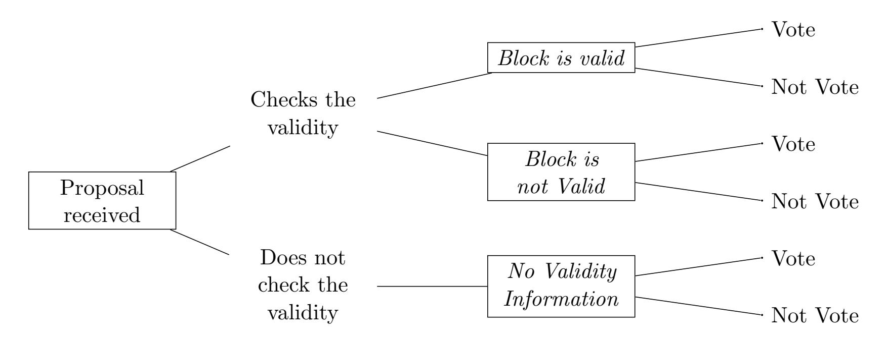

{0}------------------------------------------------

# Rational Behavior in Committee-Based Blockchains

Yackolley Amoussou-Guenou<sup>1</sup>,<sup>2</sup> , Bruno Biais<sup>3</sup> , Maria Potop-Butucaru<sup>2</sup> , Sara Tucci-Piergiovanni<sup>1</sup>

<sup>1</sup>CEA, LIST, PC 174, 91191 Gif-sur-Yvette, France <sup>2</sup>Sorbonne Universit´e, CNRS, LIP6, F-75005 Paris, France <sup>3</sup>HEC Paris, 1 Rue de la Lib´eration, 78350 Jouy-en-Josas, France

June 13, 2020

#### Abstract

We study the rational behaviors of participants in committee-based blockchains. Committeebased blockchains rely on specific blockchain consensus that must be guaranteed in presence of rational participants. We consider a simplified blockchain consensus algorithm based on existing or proposed committee-based blockchains that encapsulates the main actions of the participants: voting for a block, and checking its validity. Knowing that those actions have costs, and achieving the consensus gives rewards to committee members, we study using game theory how strategic players behave while trying to maximizing their gains. We consider different reward schemes, and found that in each setting, there exist equilibria where blockchain consensus is guaranteed; in some settings however, there can be coordination failures hindering consensus. Moreover, we study equilibria with trembling participants, which is a novelty in the context of committeebased blockchains. Trembling participants are rational that can do unintended actions with a low probability. We found that in presence of trembling participants, there exist equilibria where blockchain consensus is guaranteed; however, when only voters are rewarded, there also exist equilibria where validity can be violated.

# 1 Introduction

Most cryptocurrencies rely on distributed technology ledgers. Each user of the cryptocurrency may have a local copy of the ledger. The most popular among the distributed ledger technologies, is probably blockchain. A blockchain is a growing sequence of blocks, where each block contains transactions and is linked to the previous block by containing the hash of the latter. Modifying an information in a block changes its hash, and the subsequent blocks should be changed in consequence. Blockchains then offer many guarantees, such as tamper resistance. The number of blocks since the genesis to the current is called the height of the blockchain; and there should ideally be only one block per height. The way blockchain systems are built (in particular how to add blocks) can be roughly separated in two classes: (i) the most popular, forkable blockchains, where for each height, one participant is drawn at random and has the charge to produce a new block; or (ii) committee-based (or non-forkable) blockchains, where for each height, a committee is selected and is in charge of agreeing on which block to append next.

Forkable blockchains are the most famous and the most popular. There are many techniques to build such blockchains. The protocol to add a new block in the most popular blockchains (Bitcoin

{1}------------------------------------------------

|          | Reward All                                                                                                                                            | Reward Only Senders                                                                                                                                                               |
|----------|-------------------------------------------------------------------------------------------------------------------------------------------------------|-----------------------------------------------------------------------------------------------------------------------------------------------------------------------------------|
|          | Proposition 4.1                                                                                                                                       | Proposition 3.1                                                                                                                                                                   |
| ν<br>= 1 | In equilibrium, exactly one message is sent:<br>Consensus                                                                                             | In equilibrium, All players send a message:<br>Consensus; but inefficient: too costly                                                                                             |
|          | Proposition 4.2                                                                                                                                       | Proposition 3.2                                                                                                                                                                   |
| ν ><br>1 | In equilibrium, either:<br>- No message is sent:<br>No Termination: No block, coordination failure, or<br>- Exactly ν messages are sent.<br>Consensus | In equilibrium, either:<br>- No message is sent:<br>No Termination: No block, coordination failure, or<br>- All players sent a message:<br>Consensus; but inefficient: too costly |

Table 1: Summary of the Equilbria with Rational Players

[22], Ethereum [25]) is called proof-of-work, introduced in [13]. In proof-of-work, a participant needs to prove that it worked to have the right to add the next block. More in details, for a participant to be selected to add a block in the blockchain, it has to be the first to resolve a crypto-puzzle: the more computing power, the higher the chances are to win. This gives rise to many problems, first to increase the chance to solve the problem faster, one needs a specialized equipment and lot of computing power. All participants do these computations, but there is only one winner. Such computations are not environment friendly, specially when the computations made are not useful other than solving the crypto-puzzle. Another big issue with proof-of-work is that although the probability of having multiple winners at the same time is extremely low, it is not impossible. Therefore, from time to time, there are multiple winners, and then blocks proposed for the same height; these are called forks, and in order to ensure consistency and avoid double spending, fork management should be implemented. To try solving these issues, other blockchains propose to replace the proof-of-work by other protocols such as proof-of-stake, e.g., Ouroboros [18]. In proofof-stake, the more stakes a stakeholder has in the blockchain, the higher are its chances to be the next having the right to add a block to the chain. This solves the problem of energy consumption, but not the presence of fork; the selection of the leader is somehow still random. Proof-of-stake may also introduce some concentration of power by the richest stakeholders. Many other proof-of-\* proposals have been made, but all suffer from the fork issue, and sometimes many more.

On the other hand, there are committee-based blockchains, e.g., Algorand [16], HotStuff [26], Tendermint [7], etc. They have the purpose of avoiding forks by relying instead of one participant drawn at random for each block, on a committee that has to agree on the next block to add. The committees run blockchain consensus algorithms. Those algorithms are inspired by well-known algorithmic techniques such as the one from classical consensus [8, 12, 19, 21, 24]. Committeebased blockchains can guarantee the absence of forks. These blockchains seem slower, and the selection of the committee members is a complex problem.

In both cases, forkable or non-forkable, blockchain systems usually have economical or financial advantages, specifically for block creators. These advantages serve to give an incentive to maintain the blockchain. With advantages given, participants of such systems may try to maximize their profit. Those participants do not necessarily want to harm the system; they often want to stay in the system but gain the most from it. Such participants are called rational. To avoid blockchains collapsing due to the presence of rational participants, we must study them, and ensure that the

{2}------------------------------------------------

|          | Reward All                                                                                                              | Reward Only Senders                                                                                                                                                                               |
|----------|-------------------------------------------------------------------------------------------------------------------------|---------------------------------------------------------------------------------------------------------------------------------------------------------------------------------------------------|
|          | Proposition 5.3                                                                                                         | Proposition 5.1                                                                                                                                                                                   |
| = 1<br>ν | In the equilibrium, one message sent if valid:<br>Consensus                                                             | In the equilibrium, either<br>- n messages always sent: Validity not guaranteed<br>- n messages sent only if valid: Consensus                                                                     |
|          | Proposition 5.4                                                                                                         | Proposition 5.2                                                                                                                                                                                   |
| ν ><br>1 | In equilibrium, either:<br>- No message is sent: No Termination<br>- ν − 1 messages always sent + 1 if valid: Consensus | In equilibrium, either:<br>- No message is sent: No Termination<br>- (if ν < n) n messages always sent: Validity not guaranteed<br>- ν − 1 messages always sent + (n − ν + 1) if valid: Consensus |

Table 2: Summary of the Equilbria with "Trembling" Players

blockchain consensus properties always hold.

Contributions In this work, we analyze the behavior of rational participants in committee-based blockchains. We show the different equilibria that exist given different methods of rewarding the committee members. We analyze if the equilibria do satisfy the consensus specifications or not. In particular, we found that there always exist equilibria that satisfy the blockchain consensus properties, but these equilibria are not unique and coordination failures may occur, leading to liveness issues. Let ν be the number of votes required for a block to be consider produced. The different equilibria are summarized in Table 1.

Additionally, we introduce the notion of "trembling hand" which to the best of our knowledge is a novelty in distributed systems. Trembling hand can be viewed as a failure of rational participants. The idea of trembling hand and acknowledging errors has been studied in different fields, such as in economics (e.g., [11]), in networks (e.g., [10]), etc. With low probability, the player can tremble and do an unintended action. We conduct the same equilibrium analysis, and found that there exists equilibria satisfying the consensus properties. However, there also exist equilibria inducing liveness or safety issues because the consensus properties cannot be guaranteed. Equilibria with trembling participants are summarized in Table 2. In all cases, we found that equilibria when all committee members are rewarded are efficient in terms of number of messages.

Related work Many analysis have been made on strategic behaviors in blockchains. However, they mainly focus on forkable systems (e.g., [6, 14]). To the best of our knowledge, very few works have been dedicated to analyze or discuss the rational behaviors among participants in committeebased blockchains. Some exceptions have to be noted. We present some of them.

The work of Abraham et al. in [2] is probably the first to consider strategic behaviors in committee-based blockchains, and introduced interesting incentive mechanisms in their proposal, but they did not provide a formal framework for their analysis, nor they considering the cost of the actions.

Recently, Fooladgar et al. show in [15] that the proposed reward distribution in Algorand does not lead to an equilibrium. Interestingly, as in our paper, [15] considers the cost of actions of the players; but as opposed to us, among other things, players have basically one action, either following the protocol or not, so it either incurring all costs, or no cost at all. In our work, we 

{3}------------------------------------------------

refine the approaches; We consider that multiple actions are available to the players, and they just paying the costs of the actions they did, and not all of them.

In [4], we provide a framework for the analysis of strategic behaviors in presence of adversaries in committee-based blockchains. However, we did not study of systems with only rational players, and did not study trembling hand effects. In this work, we extend the model in [4]; we consider systems with participants that behave strategically and can exhibit trembling hand effects. Additionally, in this work, we study the behavior of the participants under different reward schemes, as opposed to [4].

Previous works studying rational behavior in consensus algorithms (such as [1, 17, 20]) did not take into consideration the rewards given when a decision is reached, nor the cost of participants' actions. They usually proposed incentive compatible protocols. Blockchains highlighting the costs and rewards, we take them into account the costs in our analysis.

# 2 Model

## 2.1 System Model

We consider a system composed of a finite and ordered set Π of n players, called committee, of synchronous sequential players, namely Π = {1, . . . , n} where player i is said to have index i.

Communication. The players communicate by sending and receiving messages through a synchronous network. We assume that the players evolves in rounds. A round consists of three sequential phases, in order: the send, the delivery and the compute phase. Since we consider synchronous communication, there is a known upper bound on the message transfer delay. Such upper bound is used by the player to set the duration of their rounds, in particular, the duration of the delivery phase is such that for all players, all messages sent at the beginning of the round are received before the end of the delivery phase. At the end of a round, a player exits from the current round and starts the next one. We assume the existence of a reliable broadcast primitive. We say that a broadcast is reliable if the following two conditions hold: (i) safety: every message delivered by a player has been previously sent by a source, and (ii) liveness: every player eventually delivers every message sent by a correct source. Messages are created with a digital signature, and we assume that digital signatures cannot be forged. When a player i delivers a message, it knows the player j that created the message.

### Players Behavior. We consider that players are rational.

Rational players are self-interested and their objective is to maximize their expected gain. They will deviate from a prescribed protocol if and only if doing so increases their expected gain. They differ from honest players who always follow the prescribed protocol.

We also consider trembling players. With low probability, an external function can return an unexpected value. They do not want such value, but are not in control of that, and are not aware when the returning value is "normal" or not. They only know the probability of such event happening. A trembling player is also a rational player.

{4}------------------------------------------------

### 2.2 Consensus in Presence of Rational Players

A blockchain is a growing sequence of blocks. The number of blocks since the genesis to the current is called the height of the blockchain. In committee-based blockchains, for each height, a committee is selected and is in charge of agreeing on which block to append next.

As proposed by many articles (e.g., [3], [5], [9], [16], [26], . . . ), committee-based blockchains can be developed using consensus algorithms. In particular, at each height, the protocol used by the corresponding committee must implement the consensus. In the section, we adapt the definition of consensus properties in presence of rational players.

We say that a protocol is a consensus algorithm in presence of rational players if the following properties hold:

- Termination: every rational player decides on a value (a block);
- Agreement: if two rational players decide respectively on values B and B<sup>0</sup> , then B = B<sup>0</sup> ;
- Validity: a decided value by any rational player is valid; it satisfies the predefined predicate.

Problem. We study the behavior of rational player in a consensus protocol. The goal is to know whether consensus is guaranteed in committee-based blockchains in presence of rational players.

For the study, we use the notion of Nash equilibrium, which is intuitively a "stable" situation where no player has an incentive to unilaterally deviate.

The question we answer is: What are the different Nash equilibria and do they satisfy the consensus properties? It is important to note that we do not propose a protocol such that all rational behave as honest, but rather study the behavior of rational players in a blockchain consensus algorithm under different reward mechanisms.

### 2.3 Protocol Studied

In committee-based blockchains, for each height, there is a committee supposed to reach a consensus on the block to append. The agreement procedure can be seen as a vote in potentially multiple sequential rounds. Focusing on one height, the consensus procedure is as follow. For each round:

- A proposer is selected for the current round. The proposer of the round proposes a block (the proposal) and send it to the rest of the committee members.
- Once a player receives the proposal, it should check its validity and vote (by sending a message) for the block only if it is valid; otherwise, it should not vote if the proposal is invalid.

At the end of the round, all committee members collect the vote messages and count them. Let ν be the number of votes required for a block to be consider produced (the decision of the consensus). If the proposal receives votes for at least ν different committee members, then the block is consider produced; otherwise the next round starts with a new proposer, proposing a new block and the procedure restarts until a decision is made.

As explained above, these two phases encapsulates the main and important ideas of consensus protocol for committee-based blockchains. Moreover, Chan and Shi in [9], extended this two phases approach (Propose, and Vote) to present multiple algorithms for different communication and 

{5}------------------------------------------------

failures models; pointing out the importance and sufficiency of these in consensus algorithms for blockchains.

In the following, we first present in details the prescribed protocol. Most of the algorithms use a similar skeleton.

The Prescribed Protocol. The protocol proceeds in rounds. For sake of simplicity, we consider the height h of the blockchain passed as parameter to the protocol. Algorithm 1 presents the pseudo-code of the protocol.

### Algorithm 1 Prescribed protocol for a player i at a given height h

```
1: Initialization:
2: vote := nil
3: t := 0 /* Current round number */
4: decidedV alue := nil
5: Round PROPOSE(t) :
6: Send phase:
7: if i == isProposer(t, h) then
8: proposal ← createValidValue(h) /* The proposer of the round generates a block, i.e. the value to be proposed */
9: broadcast hPROPOSE, h, t, proposali
10: Delivery phase:
11: delivery hPROPOSE, h, t, vi from proposer(h, t) /* The player collects the proposal */
12: Compute phase:
13: if isValid(v) then
14: vote ← v /* If the delivered proposal is valid, then the player sets a vote for it */
15: Round VOTE(t) :
16: Send phase:
17: if vote 6= nil then
18: broadcast hVOTEi, h, t, votei /* If the proposal is valid, the player sends the vote for it to all the validators */
19: Delivery phase:
20: delivery hVOTE, h, t, vi /* The player collects all the votes for the current height and round */
21: Compute phase:
22: if |hVOTE, h, t, vi| ≥ ν ∧ decidedV alue = nil ∧ vote 6= nil ∧ vote = v then
23: decidedV alue ← v; exit /* The valid value is decided if the threshold is reached */
24: else
25: vote ← nil
26: t ← t + 1
```

For each round t a committee member is designated as the proposer for the round in a round robin fashion. The isProposer(t, h) function returns the identifier of the proposer for the current round (line 7). The function, by taking as parameter the current height, deterministically selects the proposer based on the information contained in the blockchain up to h (discussions about selection mechanisms are out of the scope of this paper). Each round is further divided in two sub-rounds: the PROPOSE and the VOTE rounds.

While in PROPOSE, the proposer of the round uses the function createValidValue(h) to generate a block. Because a valid block must include the identifier of the h th block in the blockchain, the height h is passed as parameter (line 8). Once the block is created, a message broadcasting the proposal is sent (line 9). At line 11, the proposal is received through a delivery function. Each player checks if the proposal is valid (line 13). If so, the player sets its vote to the value (line 14).

While in VOTE, any player that sets its vote to the current valid proposal sends a message (of type vote) to the other members of the committee (line 18). During the delivery phase, every player collects sent messages. During the compute phase, each player verifies if a quorum of ν votes for the current proposal has been reached. Let us note that ν, the majority threshold is a parameter 

{6}------------------------------------------------

here, because it is the object of our study to establish the quorum ν in presence of different types of players. If the quorum is reached, the player voted for the value and did not already decide for the current height, then it decides for the current proposal (line 23) and the protocol ends; in that case, we say that the block (or the proposal is produced). If the quorum is not reached, then a new round starts (line 26).

Remark 2.1. Let us note that the protocol in an environment assuming only honest and Byzantine players trivially implements consensus if f, the number of players not following the protocol, is such that f < ν, and n − f ≥ ν. If f ≥ ν, on the other hand, the consensus cannot be guaranteed.

In the following, we describe the actions rational players have. We present it as a protocol shown in Algorithm 2. Definition of the game and actions is done in the next section. We consider the choice of: (i) checking or not the validity of a block and (ii) sending or not the vote for a proposed block. We consider that the actions of checking the validity of the block and of sending the message (of type vote) are costly.

Protocol of Rational Players. Rational players have some freedom at executing the prescribed protocol. We represent their possible actions in Algorithm 2, where specific variable have been introduced; namely,

- actioncheck ∈ {false, true}, if the player decides to check the validity of the proposal or not; and
- actionsend ∈ {false, true}, if the player decides to vote for the proposal or not (depending on the validity information the player has about the proposal).

∀i ∈ {1, . . . , n}, player i sets its action variable actioncheck (respectively actionsend) by calling the dedicated function σ check i (respectively σ send i ) representing the strategy of the player i.

Note that an honest player (who always follows the prescribed protocol) takes its actions such that Algorithm 2 corresponds to Algorithm 1.

The strategy σ check i determines if the receiving player chooses to check the validity of the proposal or not, which is a costly action. If the player chooses to check the validity (line 18), it will also update the knowledge it has about the validity of the proposal and it will pay a cost ccheck. If otherwise, the player keeps not knowing if the proposal is valid or not (validValue[t] remains at ⊥). Note that this value remains at ⊥ even if the player is the proposer. This is because we assumed, without loss of generality, that checking validity has a cost and that the only way of checking validity is by executing the isValid(v) function.

Note that the strategy σ send i depends on the knowledge the player has about the validity of the proposal. The strategy determines if the player chooses to send its vote for the proposal or not (line 20 - 26). If the players choose to vote for the proposal, it will pay a cost csend.

Let us note that a rational player that did not check the validity of the block could consider as decision of the committee an invalid value if it collects more than ν votes for an invalid proposal. We also note that in the model, the Agreement property always holds, since at the end of each round, all players have the same set of messages delivered.

Note that the creation of proposal (line 12 of Algorithm 2) will be subject to the trembling hand effect in Section 5.

We now define the game that represents the protocol.

{7}------------------------------------------------

#### **Algorithm 2** Pseudo-code for a given height h modeling the rational player i's behavior

```
1: Initialization:
        vote := nil
2:
                                                                                                                                       /* Current round number */
        t := 0
3:
        decidedValue := nil
4:
5:
        action^{propose} := nil
        action^{check} := nil
6:
        action^{send} := nil
7:
        validValue[] := \{\bot, \bot, \ldots, \bot\}
                                                                                                                         /* \ validValue[r] \in \{\bot, \mathtt{false}, \mathtt{true}\} \ */
8:
9: Round PROPOSE(t):
         Send phase:
10:
            if i == isProposer(t, h) then
11:
               proposal \leftarrow \texttt{createValidValue}(h)
12:
13:
               broadcast \langle PROPOSE, h, t, proposal \rangle
         Delivery phase:
14:
15:
             delivery \langle \mathsf{PROPOSE}, h, t, v \rangle from proposer(h, t)
         Compute phase:
16:
            action^{\mathrm{check}} \leftarrow \sigma_i^{\mathrm{check}}() \quad /* \ \sigma_i^{\mathrm{check}}() \in \{\mathtt{false}, \mathtt{true}\} \ \mathrm{sets} \ \mathrm{the} \ \mathrm{action} \ \mathrm{of} \ \mathrm{checking} \ \mathrm{or} \ \mathrm{not} \ \mathrm{the} \ \mathrm{validity} \ \mathrm{of} \ \mathrm{the} \ \mathrm{proposal} \ */
17:
            if action^{check} == true then
18:
                                                                                                       /* The execution of isValid(v) has a cost c_{\text{check}} */
                validValue[r] \leftarrow \mathtt{isValid}(v)
19:
                                                             /* \sigma_i^{\mathrm{send}} : \{\bot, \mathtt{false}, \mathtt{true}\} \to \{\mathtt{false}, \mathtt{true}\} sets the action of sending the vote or
            action^{\text{send}} \leftarrow \sigma_i^{\text{send}}(validValue)
20:
           not */
            if action^{send} == true then
21:
                                                                           /* The player decides to send the vote, the proposal might be invalid */
22:
               vote \leftarrow v
23: Round VOTE(t):
         Send phase:
24:
25:
            if vote \neq nil then
                                                                                                     /* The execution of the broadcast has a cost c_{\text{send}} */
                broadcast \langle VOTE_i, h, t, vote \rangle
26:
27:
         Delivery phase:
                                                                            /* The player collects all the votes for the current height and round */
28:
             delivery \langle VOTE, h, t, v \rangle
29:
         Compute phase:
30:
            if |\langle \mathsf{VOTE}, h, t, v \rangle| \ge \nu \wedge decidedValue = nil \wedge vote \ne nil \wedge vote = v then
                decidedValue = v; exit
31:
32:
            else
33:
               vote \leftarrow nil
34:
               t \leftarrow t + 1
```

#### **2.4** Game

**Action space.** At each round t, when a player receiving the proposal, it decides whether to check the block's validity or not (at cost  $c_{\text{check}}$ ), and then given the validity information, it decides whether to send a vote message (at cost  $c_{\text{send}}$ ) or not.

**Information sets.** At the beginning of each round t > 1, the information set of the player,  $h_i^t$ , includes the observation of the round number t, as well as the observation of what happened in previous rounds, namely (i) whether the player decided to check validity, and in that case, it knows the validity of the block, (ii) how many messages were sent, and (iii) whether a block was produced or not.

Then, in each round t > 1, the player decides whether to check the validity of the current block. At this point, denoting by  $b_t$  the block proposed at round t, when the player does not decide to check validity  $isValid(b_t)$  is the null information set, while if the player decides to check,  $isValid(b_t)$  is equal to 1 if the block is valid and 0 otherwise. So, at this stage the player information set becomes  $H_i^t = h_i^t \cup isValid(b_t)$ , which is  $h_i^t$  augmented with the validity information player i has about  $b_t$ , the proposed block.

{8}------------------------------------------------



Figure 1: Decision Tree of one Player after Reception of the Proposal.

**Strategies.** At each round  $t \geq 1$ , the strategy of player i is a mapping from its information set into its actions. At the point at which the player can decide to check block validity, its strategy is given by  $\sigma_i^{\text{check}}(h_i^t)$ . Finally, after making that decision, the player must decide whether to vote or not, and that decision is given by  $\sigma_i^{\text{send}}(H_i^t)$ . The decision tree of a player is depicted in Figure 1. We note that when the player does not check the validity of the proposal, it does not know if the block is valid or not.

We denote by  $\sigma = (\sigma_1, \ldots, \sigma_n)$  the strategy profile where  $\forall i \in \{1, \ldots, n\}$ , player i use strategy  $\sigma_i$ . Where  $\sigma_i$  is the pair  $(\sigma_i^{\text{check}}, \sigma_i^{\text{send}})$ .

#### Rewards and Costs for the Players. We study the cases in which:

- 1. when a block is produced, only the committee members which voted are rewarded (and receive R); or
- 2. whenever a block is produced, all committee members are rewarded (and receive R).

In our analysis, we will explicitly state the case we are studying.

We also assume that when an invalid block is produced, all players incur a cost  $\kappa$ . We assume that the reward R, is larger than the cost  $c_{\text{check}}$  of checking validity, which is larger than the cost  $c_{\text{send}}$  of sending a vote message. Lastly, the reward obtained is smaller than the cost  $\kappa$  of producing an invalid block. That is,

$$\kappa > R > c_{\text{check}} > c_{\text{send}} > 0.$$

**Objective of Rational Players.** Let T be the endogenous round at which the game stops. If a block is produced at round  $t \le n$ , then T = t. Otherwise, if no block is produced, T = n + 1. In the latter case, the *termination* property is not satisfied.

As explained above, we study two types of rewards. The analysis are done independently. In each setting, all rational players have the same gain function.

1. **Reward Only Sender**: When the reward is given only to players that vote for the produced block, at the beginning of the first round, the expected gain of rational player i is:

{9}------------------------------------------------

$$U_{i}(\sigma) = E \begin{bmatrix} (R * \mathbb{1}_{(\sigma_{i}^{\text{send}}(H_{i}^{T}))} * \mathbb{1}_{(\text{block produced at } T)} - \kappa * \mathbb{1}_{(\text{invalid block produced})}) \\ - \sum_{t=1}^{T} \left( c_{\text{check}} * \mathbb{1}_{\sigma_{i}^{\text{check}}(h_{i}^{t}))} + c_{\text{send}} * \mathbb{1}_{(\sigma_{i}^{\text{send}}(H_{i}^{t}))} \right) \end{bmatrix}, \quad (1)$$

where  $\mathbb{1}_{(.)}$  denotes the indicator function, taking the value 1 if its argument is true, and 0 if it is false.

2. Reward All: When the reward is given to the whole committee once a block is produced, at the beginning of the first round, the expected gain of rational player i is:

$$U_{i}(\sigma) = E \begin{bmatrix} (R * \mathbb{1}_{\text{(block produced at } T)} - \kappa * \mathbb{1}_{\text{(invalid block produced)}}) \\ -\sum_{t=1}^{T} \left( c_{\text{check}} * \mathbb{1}_{\sigma_{i}^{\text{check}}(h_{i}^{t}))} + c_{\text{send}} * \mathbb{1}_{(\sigma_{i}^{\text{send}}(H_{i}^{t}))} \right) | h_{i}^{1} \end{bmatrix}.$$
 (2)

**Equilibrium concept.** We consider the players are playing Nash equilibria, and we focus only on their behavior during the first round.

Let  $\sigma = (\sigma_1, \ldots, \sigma_n)$  be a strategy profile, where  $\sigma_i$  is the strategy of player i. We write  $(\sigma_{-i}, \sigma'_i)$  to represent the strategy profile  $(\sigma_1, \ldots, \sigma_{i-1}, \sigma'_i, \sigma_{i+1}, \ldots, \sigma_n)$  where player i deviates, and the others continue playing their strategy.

A strategy profile is a pure Nash equilibrium [23] if no player can increase its gain by unilaterally deviating. Formally,  $\sigma$  is a pure Nash equilibrium if and only if  $\forall i \in \{1, ..., n\}$ , and  $\forall \sigma'_i$  a strategy for  $i, U_i(\sigma) \geq U_i((\sigma_{-i}, \sigma'_i))$ . We simply use Nash equilibrium instead of pure Nash equilibrium.

The following sections present our results.

In Sections 3 & 4, we do not have trembling hand effects, therefore, we cannot have invalid blocks since the proposal should be valid (line 12 of Algorithm 2). Focusing on liveness issues, we study whether players vote or not in equilibrium.

In Section 5, trembling effects are considered, and proposal may be invalid. Therefore, for safety reasons, players may check proposal's validity before voting or not.

# 3 Reward Only Committee Members that Vote

In this section, we consider that only committee members that voted for a produced block are rewarded. Equation 1 describes the gain of each rational player.

We study the different equilibria with respect to the value of  $\nu$ , the minimum number of votes required to consider a block as produced.

First, we analyze the case where 1 vote for a proposed block is sufficient to be considered as produced, i.e.,  $\nu=1.$ 

**Proposition 3.1.** In one round, with only rational players in the committee, if  $\nu = 1$ , and when only players that vote for the produced block are rewarded, there is only one Nash equilibrium. In that equilibrium, all players vote for the propose block.

In this equilibrium, all players vote, and the block is produced. No player has an incentive to deviate and not vote, since that will mean no reward for the deviating player.

**Proof** We first prove that the strategy profile where all player votes for the proposed block is a Nash equilibrium. In that strategy profile, the gain of a player is  $R - c_{\rm send}$ . If a player deviates

{10}------------------------------------------------

and does not vote, the block is produced in any case (ν = 1), so the gain of the deviating player is 0, which is lower than the gain at equilibrium.

We now prove that there is no more equilibrium. Let i, j be two players such that σ send i 6= σ send j . Without less of generality, we assume that σ send <sup>i</sup> = false and σ send <sup>j</sup> = true. In this case, the block is produced since ν = 1. The gain of player i is 0, while the gain of j is R − csend. If instead i votes, it will have a gain of R − csend > 0. The only Nash equilibrium is the strategy profile where all players vote. P roposition <sup>3</sup>.<sup>1</sup>

Remark 3.1. Note that in the Nash equilibrium of Proposition 3.1, the consensus properties are satisfied, in particular, there is always a block produced at the end of the first round.

We now consider the situation where strictly more than one vote is needed to consider a block as produced, i.e., ν ∈ {2, . . . , n}.

Proposition 3.2. In one round, with only rational players in the committee, if ν > 1, and when only players that vote for the produced block are rewarded, there are two Nash equilibria; either (i) all players vote, or (ii) no player votes.

If a rational player anticipates that, no players will vote, its only vote will not make the proposal produced, since ν > 1, so it is better off not voting. In the other case, if a player anticipates that all other players are voting, it is better off voting as well, otherwise, it will not have a reward. Proof We prove that the strategy profiles described in the proposition are Nash equilibria.

- First we prove that the profile where no player votes is a Nash equilibrium. The gain at equilibrium of any player is 0. If one player deviates and does vote, there is only one vote, and the block is not produced since ν > 1, its gain at deviation is −csend, which is lower than the gain at equilibrium.
- We now prove that the strategy profile where all players vote is a Nash equilibrium. The gain at equilibrium of any player is R − csend. If one player deviates and does not vote, its gain at deviation is 0 < R − csend.

Moreover, considering one round at the time, there is no more equilibrium. To prove that, let X<sup>σ</sup> send = {i : σ send <sup>i</sup> = true} be the set of all players that decided to vote.

- When |X<sup>σ</sup> send| < ν − 1: Assume by contradiction that there exists a Nash equilibrium such that player i votes, i.e., σ send <sup>i</sup> = true. Since |X<sup>σ</sup> send| < ν − 1, the block is not produced, so the gain of i is −csend; if instead i decides not to vote, its gain would be 0 > −csend. Contradiction, the profile is not a Nash equilibrium.
- When |X<sup>σ</sup> send| ≥ ν − 1: Assume by contradiction that there exists a Nash equilibrium such that player i does not vote, i.e., σ send <sup>i</sup> = false. The gain at equilibrium of i is 0. If instead, i deviates and votes, its gain will be R − csend > 0, since the block will be produced in any case. Contradiction, the profile is not a Nash equilibrium.

P roposition <sup>3</sup>.<sup>2</sup>

Remark 3.2. There are two Nash equilibria in Proposition 3.2. In the equilibrium where no player votes, Termination is not guaranteed at round 1. In the second equilibrium where there are n votes, the consensus properties are satisfied.

{11}------------------------------------------------

# 4 Reward All Committee Members

In this section, we consider that all committee members are rewarded once a block is produced. Equation 2 describes the gain of each rational player.

We study the different equilibria with respect to the value of ν, the minimum number of votes required to consider a block as produced.

First, we analyze the case where one vote for a block is sufficient to be considered as produced, i.e., ν = 1.

Proposition 4.1. In one round, with only rational players in the committee, if ν = 1, and when all players are rewarded once a block is produced, there exists a Nash equilibrium in which exactly one player votes, and the others do nothing.

If the player supposed to vote, does not vote, no block is produced, and hence the player does not have any reward. If a player not supposed to vote deviates and votes, it will pay the cost of sending a vote for nothing since it will be rewarded anyway.

Proof We first prove that the strategy profile where exactly on player votes for the proposed block is a Nash equilibrium. Without lack of generality, assume that the player with index 1 votes, so σ send <sup>1</sup> = true. In that strategy profile, the gain of player 1 is R − csend, and the gain of the other players is R. If player 1 deviates and does not vote, the block is not produced and its gain at deviation is 0 < R − csend. If another player not supposed to vote deviates and votes, its gain at deviation will be R − csend < R.

Moreover, we there is necessarily only one player who votes in all equilibria in this setting.

- The strategy profile where no player vote is not a Nash equilibrium. In fact, the gain at equilibrium of a player is 0, while if it deviates, its gain will be R − csend > 0.
- By contradiction, assume there is a Nash equilibrium such that two players i and j vote. The gain of i and j at equilibrium is R − csend; if (let us say) i deviates and does vote, its gain at deviation will be R > R − csend. Contradiction, the strategy profile where strictly more than one player votes is not a Nash equilibrium.

P roposition <sup>4</sup>.<sup>1</sup>

Remark 4.1. Note that there exists at most n equilibria corresponding to Proposition 4.1. In all the equilibria corresponding to Proposition 4.1, the consensus properties are satisfied.

We now consider the situation where strictly more than one vote is needed to consider a block as produced, i.e., ν ∈ {2, . . . , n}.

Proposition 4.2. In one round, with only rational players in the committee, if ν > 1, and when all players are rewarded once a block is produced, there exists Nash equilibria such that either (i) exactly ν players vote, or (ii) no player votes.

If a rational player anticipates that no players will vote, since ν > 1, its only vote will not make the proposal produced, so it is better off not voting. In the other case, exactly ν players vote; if one supposed to vote does not vote, the block is not produced and the deviating player is not rewarded any more, and if the player is not supposed to vote, deviate by voting will incur it a cost of sending a vote, when it will be rewarded in any case.

Proof We prove that the strategy profiles described in Proposition 4.2 are Nash equilibria.

{12}------------------------------------------------

- First we prove that the profile where no player votes is a Nash equilibrium. The gain at equilibrium of any player is 0. If one player deviates and does vote, only it votes, and the block is not produced since ν > 1, its gain at deviation is −csend, which is lower than the gain at equilibrium.
- We now prove that the strategy profile where exactly ν players vote is a Nash equilibrium. Without loss of generality, assume that the ν first players are supposed to vote, and player with index bigger than ν are not supposed to vote. The gain at equilibrium of a player supposed to vote is R − csend. If it deviates and does not vote, its gain at deviation is 0 < R − csend.

The gain of a player not supposed to vote is R. If it deviates and sends a vote, its gain at deviation is R − csend < R. The strategy is a Nash equilibrium.

Moreover, considering one round at the time, there is no more equilibrium. To prove that, let X<sup>σ</sup> send = {i : σ send <sup>i</sup> = true} be the set of all players that decided to vote.

- When 1 ≤ |X<sup>σ</sup> send | < ν: Assume by contradiction that there exists a Nash equilibrium such that player i votes, i.e., σ send <sup>i</sup> = true. Since |X<sup>σ</sup> send | < ν, the block is not produced, so the gain of i is −csend; if instead i deviates and does not vote, its gain would be 0 > −csend. Contradiction, the profile is not a Nash equilibrium.
- When |X<sup>σ</sup> send| > ν: Assume by contradiction that there exists a Nash equilibrium such that player i does vote, i.e., σ send <sup>i</sup> = false. The gain at equilibrium of i is R − csend. If instead, i deviates and does not vote, its gain will be R > R − csend. Contradiction, the profile is not a Nash equilibrium.

P roposition <sup>4</sup>.<sup>2</sup>

#### Remark 4.2. There are two types of Nash equilibria in Proposition 4.2.

- Termination is not guaranteed in the equilibrium where no player votes.
- In the second type of equilibrium in this setting, there are exactly ν votes. There can be at most n ν <sup>1</sup> + 1 equilibria corresponding to that setting. In each of them, the consensus properties are satisfied.

A summary of the different equilibria in Sections 3 & 4 can be found in Table 1.

We note that when only 1 vote is required to consider a proposal as produced, in all equilibria blocks are always produced. When we require strictly more than 1 vote to consider a block as produced, although there are equilibria where the consensus is guaranteed, there is also an equilibrium where no player votes, anticipating that the others will not do; a coordination failure, leading to a termination violation. This is true in the two reward mechanisms: reward all committee members; or reward only the members that voted. However, in the equilibria where all committee members are rewarded, less messages are sent, making it a more efficient mechanism with respect to the number of messages sent.

<sup>1</sup> n ν = C ν <sup>n</sup> is the number of combination of ν in n

{13}------------------------------------------------

# 5 Trembling Players at Proposal

Now, we assume that there is some negligible probability p for the createValidValue function (line 12 of Algorithm 2) to return an invalid proposal, and all players are aware of the trembling effect.

When proposing a value there is a probability that the hand of the player trembles and proposes an invalid block instead; i.e., in some sense, we take into account the possibility of making a mistake for the proposal.

Note that now, checking the validity of a block may be important, there is a risk of producing an invalid block, violating the validity property of the consensus. To ensure that the reward covers the costs of checking and sending votes, in this setting we assume that (1−p)(R−csend)−ccheck > 0. We also note it is better for the players to vote (resp. to not vote) without checking than checking and voting (resp. not voting) irrespective to the block validity; that would mean incurring a cost −ccheck for nothing. It is also not in their best interest to check the validity of the proposal and vote if the proposal is invalid, that would mean increasing the chance of producing an invalid block and incurring a cost −κ. In the analysis, we will then consider three relevant strategies; a player (i) votes without checking proposal validity, (i) neither votes nor checks proposal validity, and (iii) checks the proposal validity and votes only if the proposal is valid.

In the following, we make the same analysis as in Sections 3 & 4, i.e., we analyze the behavior of rational players when only voters are rewarded; and their behavior when all committee members are rewarded.

## 5.1 Reward Only Committee Members that Vote

In this subsection, we consider that only committee members that voted for a produced block are rewarded. Equation 1 describes the gain of each rational player.

We study the different equilibria with respect to the value of ν, the minimum number of votes required to consider a block as produced.

First, we analyze the case where one vote for a block is sufficient to be considered as produced, i.e., ν = 1.

Proposition 5.1. In one round, with only rational players in the committee, if ν = 1, when only players that vote for the produced block are rewarded, and if there is a probability p that the proposer proposes an invalid block, there are two Nash equilibria. In equilibrium, either (i) if κ ≥ R − csend + ccheck/p, all players check the validity of the proposal and vote only if it is valid; or (ii) all players vote for the proposal without checking the validity of the proposal.

As in Proposition 3.1, one can note that in equilibrium, all players do (try to) vote. Proof We prove that the strategy profiles described in the proposition are Nash equilibria.

 First we prove that the profile where all players check the proposal validity and vote only if the proposal is valid is a Nash equilibrium.

The expected gain at equilibrium of any player is (1 − p)(R − csend) − ccheck > 0. If one player deviates and does not vote nor checks, its gain at deviation is 0; if it deviates and votes without checking, its expected gain at deviation is R − csend − pκ, which is lower than the gain at equilibrium iff κ ≥ R − csend + ccheck/p. In any case, the gain at equilibrium is better than the gain if the player deviates.

{14}------------------------------------------------

• We now prove that the strategy profile where all players vote without checking the proposal validity is a Nash equilibrium.

The gain at equilibrium of any player is  $R - c_{\text{send}} - p\kappa$ . Even if one player deviates, the block will be produced in any case, no matter its validity. If a player deviates by checking validity and voting if the proposal is valid, its gain will be  $(1-p)(R-c_{\text{send}})-c_{\text{check}}-p\kappa$ ; if the player deviates and does not check proposal's validity nor votes, its expected gain at deviation is  $-p\kappa$ , the gain at deviation is lower than the gain at equilibrium.

Moreover, considering one round at the time, there is no more equilibrium.

First we prove that in equilibrium, at least one player should choose to vote. If no player votes, no block is produced and the gain of the players is 0; if a player deviates and checks the proposal validity and votes only if it is valid, its gain at deviation is  $(1-p)(R-c_{\rm send})-c_{\rm check}>0$ . Let i,j be two players such that  $\sigma_i^{\rm send} \neq \sigma_j^{\rm send}$ . Without less of generality, we assume that  $\sigma_i^{\rm send} = {\tt false}$  and  $\sigma_j^{\rm send} = {\tt true}$ . In this case, the block is produced since  $\nu=1$ . If instead i votes, it will have a gain of  $R-c_{\rm send}$  (or resp.  $R-c_{\rm send}-\kappa$ ), i is better off by deviating.

Now we can prove that in equilibrium, player have the same strategy for checking validity. Let i,j be two players such that  $\sigma_i^{\mathrm{check}} \neq \sigma_j^{\mathrm{check}}$ , without less of generality, we assume that  $\sigma_i^{\mathrm{check}} =$  false. The expected gain of i is  $(1-p)(R-c_{\mathrm{send}})-c_{\mathrm{check}}-p\kappa$  if instead it deviates and does not check, its expected gain is  $R-c_{\mathrm{send}}-p\kappa$ , which is greater than the gain without deviation.

 $\square_{Proposition 5.1}$ 

Remark 5.1. There are two Nash equilibria in Proposition 5.1. In the equilibrium where all players check, if the proposal is invalid, there is no Termination at the first round, however Validity is always ensured. While in the second equilibrium where no player checks, Termination is always guaranteed at the end of the first round, even if the proposal is invalid, which violates the Validity.

We now consider the situation where strictly more than one vote is needed to consider a block as produced, i.e.,  $\nu \in \{2, ..., n\}$ .

**Proposition 5.2.** In one round, with only rational players in the committee, if  $\nu > 1$ , when only players that vote for the produced block are rewarded, and if there is a probability p that the proposer proposes an invalid block, there are three Nash equilibria. Either (i) no player votes nor checks the proposal validity; or (ii) if  $\nu < n$ , all players vote for the proposal without checking the validity of the proposal; or (iii) if  $\kappa \ge R - c_{\text{send}} + c_{\text{check}}/p$ , there is an equilibrium where  $n - \nu + 1$  players check the validity of the proposal and vote only if it is valid, and the  $\nu - 1$  remaining players only vote without checking the validity of the proposal.

**Proof** We prove that the strategy profiles described in the proposition are Nash equilibria.

- First we prove that the profile where no player votes is a Nash equilibrium. The gain at equilibrium of any player is 0. If one player deviates and does vote, there is only 1 vote, and the block is not produced since  $\nu > 1$ , the gain at deviation is  $-c_{\rm send} < 0$ . If the player deviates by checking block validity, it will pay the cost  $-c_{\rm check} < 0$ .
- We now prove that the strategy profile where all players vote without checking the proposal validity is a Nash equilibrium. The gain at equilibrium of any player is  $R c_{\text{send}} p\kappa$ . Even if one player deviates, the block will be produced in any case (since  $\nu < n$ ) no matter its

{15}------------------------------------------------

validity. If a player deviates by checking validity and voting if the proposal is valid, its gain will be (1 − p)(R − csend) − ccheck − pκ; if the player deviates and does not check proposal's validity nor votes, its expected gain at deviation is −pκ, the gain at deviation is lower than the gain at equilibrium.

 It remains to prove that the strategy profile where some players are supposed to check the proposal validity and check only if the block is valid and the remaining players vote without checking block validity.

We can first note that only valid blocks can be produced following the equilibrium, and invalid blocks do not have the necessary ν votes, since only ν − 1 players vote without checking, and so for invalid proposal.

- The expected gain of a player not supposed to check is (1 − p)(R − csend). If it deviates and does not vote, its gain at deviation is 0; if it deviates by checking and voting only if the proposal is valid, its expected gain at deviation is (1 − p)(R − csend) − ccheck which is lower than the gain at equilibrium.
- The expected gain of a player supposed to check is (1−p)(R−csend)−ccheck. If it deviates and does not vote, its gain at deviation is 0. If it deviates by voting without checking the proposal's validity, any block proposed will be produced, no matter its validity since ν votes are sent in any case, so the expected gain of the deviating player is R−csend−pκ, which is lower than the gain at equilibrium iff κ ≥ R − csend + ccheck/p.

Moreover, considering one round at the time, there is no more equilibrium. We sketch the proof by exhibiting the main others equilibrium candidates.

- Let x ≥ 0. Assume by contradiction that there exists an equilibrium where n − ν − x players checks the block validity and vote only if the proposal is valid, and the remaining ν+x players vote without checking the block validity.
  - That means any block proposed will be produced, since ν+x ≥ ν players vote without checking validity. Let i be a player supposed to check. It expected gain is R−csend−ccheck−pκ, while if i deviates and vote without checking proposal validity, its expected gain will be R−csend−pκ. Contradiction, so the profile is not an equilibrium.
- Let x > 1. Assume by contradiction that there exists an equilibrium where n − ν + x players checks the block validity and vote only if the proposal is valid, and the remaining ν−x players vote without checking the block validity.
  - Let i be a player supposed to check. It expected gain is (1−p)(R−csend)−ccheck. If i deviates and vote without checking proposal validity, there will be ν − x + 1 < ν votes for invalid an block proposed, and so it will not be produced, where there will be n votes for a valid block proposed; the expected gain at deviation for i is (1 − p)(R − csend). Contradiction, the profile proposed is not an equilibrium. Contradiction, so the profile is not an equilibrium.

P roposition <sup>5</sup>.<sup>2</sup>

Remark 5.2. There are three types of Nash equilibria in Proposition 5.2.

The equilibrium where no player votes does not guarantee Termination.

{16}------------------------------------------------

- In the equilibrium where no player checks, Termination is always guaranteed at the end of the first round, even if the proposal is invalid, which violates the Validity.
- In the last equilibrium valid blocks are produced and invalid blocks are not. Termination is not guaranteed at round 1 but Validity is ensured. There can be at most n n−ν+1 equilibria corresponding to that setting.

## 5.2 Reward All Committee Members

In this subsection, we consider that only committee members that voted for a produced block are rewarded. Equation 2 describes the gain of each rational player.

We study the different equilibria with respect to the value of ν, the minimum number of votes required to consider a block as produced.

First, we analyze the case where one vote for a block is sufficient be considered as produced, i.e., ν = 1.

Proposition 5.3. In one round, with only rational players in the committee, if ν = 1, when all players are rewarded once a block is produced, if there is a probability p that the proposer proposes an invalid block, and if κ ≥ R − csend + ccheck/p, there exists a Nash equilibrium in which, exactly one player checks the validity of the proposal and votes only if it is valid, while the other players do nothing.

As in Proposition 4.1, one can note that in equilibrium, the task of validating and producing a block is delegated to one player.

Proof We prove that the strategy profile described in the proposition is a Nash equilibrium. We first prove that the strategy profile where exactly on player votes for the proposed block is a Nash equilibrium. Without lack of generality, assume that the player with index 1 is the one supposed to vote check the proposal validity and vote only if it is valid, and all other player do not vote nor check. In that strategy profile, the gain of player 1 is (1 − p)(R − csend) − ccheck, and the gain of the other players is R.

If player 1 deviates and votes without checking, the block is always produced, even if it is invalid so its gain at deviation is R − csend − pκ which is lower than the gain at equilibrium if κ ≥ R − csend + ccheck/p. If player 1 deviates and does not vote a vote without checking, the block is never produced, so the gain of i at deviation is 0 which is lower than the gain at equilibrium. The other players having a reward of R cannot do better, since R is the maximum reward one can get. The strategy profile is indeed a Nash equilibrium.

Moreover, we now prove that in all equilibria in this setting, there is necessarily only one player who checks and votes.

- The strategy profile where no player vote nor vote is not a Nash equilibrium. In fact, the gain at equilibrium of a player is 0, while if it deviates by checking the block validity and voting only if the proposal is valid its gain will be (1 − p)(R − csend) − ccheck > 0.
- By contradiction, assume there is a Nash equilibrium such that two players i and j check the proposal validity and vote only if the block is invalid. The gain of i and j at equilibrium is (1 − p)(R − csend) − ccheck; if i deviates and does not vote nor check, its gain at deviation will be (1−p)R > (1−p)(R−csend)−ccheck. Contradiction, the profile is not a Nash equilibrium.

{17}------------------------------------------------

- By contradiction, assume there is a Nash equilibrium such that there are two players i that checks the proposal validity and vote only if the block is invalid and j votes without checking validity. The gain of i at equilibrium is R − (1 − p)csend − ccheck − pκ; if i deviates and does not vote nor check, its gain at deviation will be R − pκ > R − (1 − p)csend − ccheck − pκ. Contradiction, the profile is not a Nash equilibrium.
- By contradiction, assume there is a Nash equilibrium such that two players i and j vote without checking validity. The gain of i at equilibrium is R − csend − ccheck − pκ; if i deviates and does not vote nor check, its gain at deviation will be R − pκ > R − csend − ccheck − pκ. Contradiction, the profile is not a Nash equilibrium.

P roposition <sup>5</sup>.<sup>3</sup>

Remark 5.3. Note that there exists at most n equilibria corresponding to Proposition 5.3. In all the equilibria corresponding to Proposition 5.3, if the proposal is invalid, there is no Termination at the first round, however Validity is always ensured.

We now consider the situation where strictly more than one vote is needed to consider a block as produced, i.e., ν ∈ {2, . . . , n}.

Proposition 5.4. In one round, with only rational players in the committee, if ν > 1, when all players are rewarded once a block is produced, if there is a probability p that the proposer proposes an invalid block, and if κ ≥ R − csend + ccheck/p, there exists Nash equilibria such that either (i) no player votes, or (ii) 1 player checks the proposal validity and votes only if it is valid and exactly ν other players vote without checking validity.

Proof We prove that the strategy profiles described in the proposition are Nash equilibria.

- First we prove that the profile where no player votes is a Nash equilibrium. The gain at equilibrium of any player is 0. If one player deviates and does vote, there is only 1 vote, and the block is not produced since ν > 1, the gain at deviation is −csend < 0. If the player deviates by checking block validity, it will pay the cost −ccheck < 0.
- It remains to prove that the strategy profile where some players are supposed to check the proposal validity, and check only if the block is valid, some players vote without checking block validity and the others do nothing.
  - We can first note that only valid blocks can be produced following the equilibrium, and invalid blocks do not have the necessary ν votes, since only ν − 1 players vote without checking, and so for invalid proposal.
    - First, the players that do not vote nor check validity have an expected gain of (1 − p)R. Let i be such a player. If i deviates and vote without checking, all proposal will be produced, no matter the validity, so the gain of the player at deviation is R − csend − pκ which is lower than the gain at equilibrium. If instead, i deviates and checks the validity of the proposal and votes only if valid, only valid blocks will be produced, so the gain at deviation will be (1 − p)(R − csend) − ccheck which is lower than the gain at equilibrium.

{18}------------------------------------------------

- Now, turns to the the player not supposed to check but to vote is (1 − p)R − csend. Let i be such a player, if it deviates and does not vote nor checks, no block will be produced and its gain at deviation is 0 < (1 − p)R − csend. If it deviates by checking and voting only if the proposal is valid, its expected gain at deviation is (1 − p)(R − csend) − ccheck which is lower than the gain at equilibrium since csend < ccheck.
- Finally, we can analyze the one player supposed to check. Without loss of generality, assume that it is player 1. The expected gain of player 1 is (1 − p)(R − csend) − ccheck. If it deviates and does not vote, no block will be produced so its gain at deviation is 0 < (1 − p)(R − csend) − ccheck; if it deviates by voting without checking the proposal's validity, any block proposed will be produced, no matter its validity since ν votes are sent in any case, so the expected gain of 1 at deviation is R − csend − pκ, which is lower than the gain at equilibrium iff κ ≥ R − csend + ccheck/p.

The strategy profile is indeed a Nash equilibrium. No player can increase its gain by deviating.

Moreover, considering one round at the time, there is no more equilibrium in this setting.

First, let us note that in any case, exactly ν players should vote (counting also those supposed to vote after checking). If there are less than ν players supposed to vote (but at least one), no block is produced so one such player can deviate and not vote, economizing its cost. If there are more than ν players supposed to vote, one can deviate by not voting and economizing that cost.

We can show that the others main equilibrium candidates are not equilibrium.

- By contradiction, assume that there exists an equilibrium where ν players vote without checking the proposal's validity and the others do not vote nor check.
  - Let i be a player supposed to vote. It expected gain at equilibrium R − csend − pκ, while if i deviates by checking the proposal validity and voting only if valid, only valid proposal will be produced, so its expected gain will be: (1 − p)(R − csend) − ccheck which is greater than the equilibrium. Contradiction, so the profile is not an equilibrium.
- By contradiction, assume that there exists an equilibrium where ν players vote (counting also those supposed to vote after checking) and the others do not vote nor check. Suppose that in the player that plan to vote, at least two i and j check the validity of the proposal and vote only if it is valid. In this profile, only valid proposal will be produced. Its expected gain at equilibrium of i is (1 − p)(R − csend) − ccheck. If instead, i deviates and always votes without checking the validity, its expected gain at deviation is (1 − p)R − csend which is better than the gain at equilibrium. Contradiction, so the profile is not an equilibrium.

P roposition <sup>5</sup>.<sup>4</sup>

#### Remark 5.4. There are two types of Nash equilibria in Proposition 5.4.

- Termination is not guaranteed in the equilibrium where no player votes.
- In the second type of equilibrium in this setting, there are exactly ν votes when the proposal is valid, but ν − 1 votes when the proposal is invalid. Termination is not guaranteed at round 1 but Validity is ensured.

{19}------------------------------------------------

A summary of the different equilibria with trembling participants can be found in Table 2.

We note that when all players are rewarded once a block is produced, there is no "bad" equilibrium, *i.e.*, an equilibrium were Validity is violated, while when only players that send a vote for a produced block are rewarded, when  $\nu < n$  there exists a "bad" equilibrium (Proposition 5.1 and 5.2).

## 6 Discussions

Before concluding, we discuss some interesting points that are not directly addressed in the core of this paper.

### Fixed amount of Reward for the Committee

First, we quickly highlight what happens if there is a fixed reward for the committee members that is shared by them. Let  $\mu$  be the number of players that are rewarded in the committee, and let  $\frac{R}{\mu}$  be the fraction of the reward each player rewarded gets. Our equilibrium analysis still holds, but attention should be given to the bounds. For example, in Proposition 5.1, instead of  $\kappa \geq R - c_{\rm send} + c_{\rm check}/p$  we should have  $\kappa \geq R/n - c_{\rm send} + c_{\rm check}/p$ , since all players vote in case of a valid proposal (here,  $\mu = n$ ).

### **Honest Players**

Recall that honest players always follow the prescribed protocol; they take actions such that Algorithm 2 corresponds to Algorithm 1, *i.e.*, they always check the validity of the proposal, and vote only if the proposal is valid.

We did not include honest players in our analysis for the following reason: their presence do not change the different equilibria we have; they may however change the bounds under which some equilibria exists.

Denote by h the number of honest players in the committee. Generally, if there are h honest players and  $\nu$  messages are required for the production of a block, h votes are guaranteed for valid blocks only; then for the rational players, the goal is to give the  $\nu - h$  remaining votes.

### 7 Conclusion

We analyze the behavior of rational players in committee-based blockchains under assumptions of synchrony of messages and under different mechanisms of rewards. We found that although there always exists equilibria where the consensus properties are guaranteed, there also exist equilibria where those properties are violated, both in the case where the proposal is always valid, or by trembling can be invalid. When all committee members are rewarded once a block is produced, in equilibrium, the validity property is always guaranteed; while rewarding only those who vote for the produced block leads to the existence of equilibrium where an invalid block can be produced. Moreover, equilibria when all committee members are rewarded are more efficient in terms of number of messages. Thus, rewarding all members in the committee seems to be an interesting reward scheme, and need more investigations, in particular in more general settings.

{20}------------------------------------------------

# References

- [1] Ittai Abraham, Danny Dolev, and Joseph Y. Halpern. Distributed protocols for leader election: A game-theoretic perspective. DISC 2013 and ACM Trans. Economics and Comput., 7(1):4:1– 4:26, 2019.
- [2] Ittai Abraham, Dahlia Malkhi, Kartik Nayak, Ling Ren, and Alexander Spiegelman. Solidus: An incentive-compatible cryptocurrency based on permissionless byzantine consensus. CoRR, abs/1612.02916v1, 2016.
- [3] Ittai Abraham, Dahlia Malkhi, Kartik Nayak, Ling Ren, and Alexander Spiegelman. Solida: A blockchain protocol based on reconfigurable byzantine consensus. In 21st International Conference on Principles of Distributed Systems, OPODIS 2017, Lisbon, Portugal, December 18-20, 2017, pages 25:1–25:19, 2017.
- [4] Yackolley Amoussou-Guenou, Bruno Biais, Maria Potop-Butucaru, and Sara Tucci-Piergiovanni. Rational vs byzantine players in consensus-based blockchains. In Proceedings of the 19th International Conference on Autonomous Agents and Multiagent Systems, AA-MAS '20, Auckland, New Zealand, May 9-13, 2020, pages 43–51. International Foundation for Autonomous Agents and Multiagent Systems, 2020.
- [5] Yackolley Amoussou-Guenou, Antonella Del Pozzo, Maria Potop-Butucaru, and Sara Tucci-Piergiovanni. Correctness of tendermint-core blockchains. In 22nd International Conference on Principles of Distributed Systems, OPODIS 2018, December 17-19, 2018, Hong Kong, China, pages 16:1–16:16, 2018.
- [6] Bruno Biais, Christophe Bisi`ere, Matthieu Bouvard, and Catherine Casamatta. The blockchain folk theorem. The Review of Financial Studies, 32(5):1662–1715, 04 2019.
- [7] E. Buchman, J. Kwon, and Z. Milosevic. The latest gossip on BFT consensus. Technical report, Tendermint, jul 2018.
- [8] Miguel Castro and Barbara Liskov. Practical byzantine fault tolerance. In Proceedings of the Third USENIX Symposium on Operating Systems Design and Implementation (OSDI), New Orleans, Louisiana, USA, February 22-25, 1999, pages 173–186, 1999.
- [9] Benjamin Y. Chan and Elaine Shi. Streamlet: Textbook streamlined blockchains. IACR Cryptol. ePrint Arch., 2020:88, 2020.
- [10] Simon Collet, Pierre Fraigniaud, and Paolo Penna. Equilibria of games in networks for local tasks. In 22nd International Conference on Principles of Distributed Systems, OPODIS 2018, December 17-19, 2018, Hong Kong, China, volume 125 of LIPIcs, pages 6:1–6:16. Schloss Dagstuhl - Leibniz-Zentrum f¨ur Informatik, 2018.
- [11] Fiery Cushman, Anna Dreber, Ying Wang, and Jay Costa. Accidental Outcomes Guide Punishment in a "Trembling Hand" Game. PloS one, 4(8), 2009.
- [12] Cynthia Dwork, Nancy A. Lynch, and Larry J. Stockmeyer. Consensus in the presence of partial synchrony. J. ACM, 35(2):288–323, 1988.

{21}------------------------------------------------

- [13] Cynthia Dwork and Moni Naor. Pricing via processing or combatting junk mail. In Advances in Cryptology - CRYPTO '92, 12th Annual International Cryptology Conference, Santa Barbara, California, USA, August 16-20, 1992, Proceedings, pages 139–147. Springer, 1992.
- [14] Ittay Eyal and Emin G¨un Sirer. Majority is not enough: bitcoin mining is vulnerable. Commun. ACM, 61(7):95–102, 2018.
- [15] Mehdi Fooladgar, Mohammad Hossein Manshaei, Murtuza Jadliwala, and Mohammad Ashiqur Rahman. On incentive compatible role-based reward distribution in algorand. CoRR, abs/1911.03356, 2019.
- [16] Yossi Gilad, Rotem Hemo, Silvio Micali, Georgios Vlachos, and Nickolai Zeldovich. Algorand: Scaling byzantine agreements for cryptocurrencies. In Proceedings of the 26th Symposium on Operating Systems Principles, Shanghai, China, October 28-31, 2017, pages 51–68, 2017.
- [17] Joseph Y. Halpern and Xavier Vila¸ca. Rational consensus: Extended abstract. In Proceedings of the 2016 ACM Symposium on Principles of Distributed Computing, PODC 2016, Chicago, IL, USA, July 25-28, 2016, pages 137–146, 2016.
- [18] Aggelos Kiayias, Alexander Russell, Bernardo David, and Roman Oliynykov. Ouroboros: A provably secure proof-of-stake blockchain protocol. In Advances in Cryptology - CRYPTO 2017 - 37th Annual International Cryptology Conference, Santa Barbara, CA, USA, August 20-24, 2017, Proceedings, Part I, pages 357–388, 2017.
- [19] L. Lamport, R. Shostak, and M. Pease. The byzantine generals problem. ACM Transactions on Programming Languages and Systems, 4(3):382–401, July 1982.
- [20] Anna Lysyanskaya and Nikos Triandopoulos. Rationality and adversarial behavior in multiparty computation. In Advances in Cryptology - CRYPTO 2006, 26th Annual International Cryptology Conference, Santa Barbara, California, USA, August 20-24, 2006, Proceedings, pages 180–197, 2006.
- [21] J.-P. Martin and L. Alvisi. Fast byzantine consensus. IEEE Transactions on Dependable and Secure Computing, 3(3):202–215, July 2006.
- [22] S. Nakamoto. Bitcoin: A Peer-to-Peer Electronic Cash System. https://bitcoin.org/ bitcoin.pdf, 2008.
- [23] John Nash. Non-cooperative games. Annals of Mathematics, 54(2):286–295, 1951.
- [24] Sam Toueg. Randomized byzantine agreements. In Proceedings of the Third Annual ACM Symposium on Principles of Distributed Computing, Vancouver, B. C., Canada, August 27- 29, 1984, pages 163–178. ACM, 1984.
- [25] Gavin Wood et al. Ethereum: A secure decentralised generalised transaction ledger. Ethereum project yellow paper, 151(2014):1–32, 2014.
- [26] Maofan Yin, Dahlia Malkhi, Michael K. Reiter, Guy Golan-Gueta, and Ittai Abraham. Hotstuff: BFT consensus with linearity and responsiveness. In Proceedings of the 2019 ACM Symposium on Principles of Distributed Computing, PODC 2019, Toronto, ON, Canada, July 29 - August 2, 2019., pages 347–356, 2019.