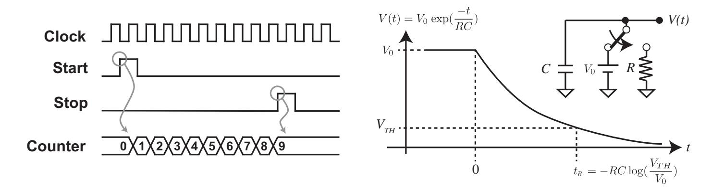
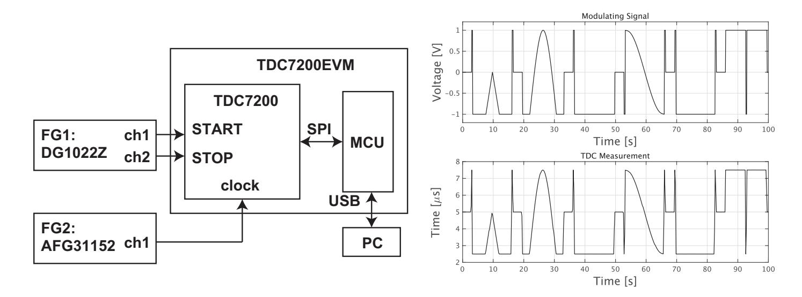
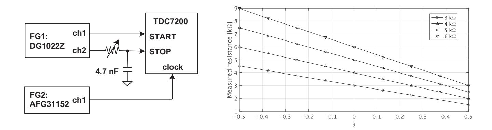
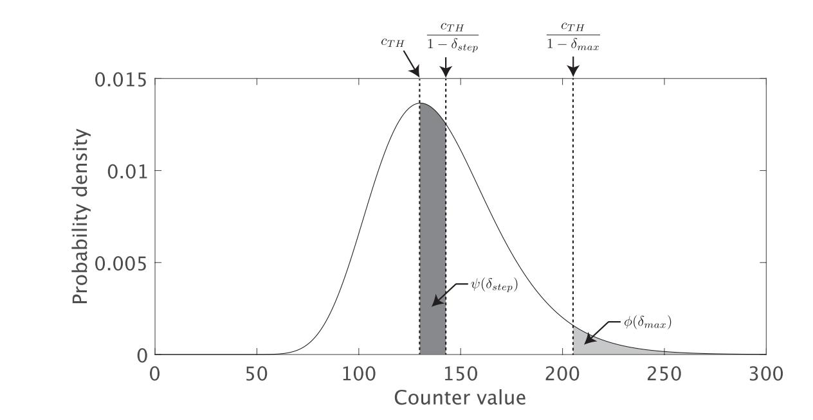

{0}------------------------------------------------

# (Short Paper) Signal Injection Attack on Time-to-Digital Converter and Its Application to Physically Unclonable Function

Takeshi Sugawara, Tatsuya Onuma, and Yang Li

The University of Electro-Communications, Tokyo, Japan {sugawara,liyang}@uec.ac.jp

Abstract. Physically unclonable function (PUF) is a technology to generate a device-unique identifier using process variation. PUF enables a cryptographic key that appears only when the chip is active, providing an efficient countermeasure against reverse-engineering attacks. In this paper, we explore the data conversion that digitizes a physical quantity representing PUF's uniqueness into a numerical value as a new attack surface. We focus on time-to-digital converter (TDC) that converts time duration into a numerical value. We show the first signal injection attack on a TDC by manipulating its clock, and verify it through experiments on an off-the-shelf TDC chip. Then, we show how to leverage the attack to reveal a secret key protected by a PUF that uses a TDC for digitization.

Keywords: Time-to-Digital Converter · Physically Unclonable Function · Fault Injection Attack · Signal Injection Attack

### 1 Introduction

Secure communication using cryptography is now the indispensable infrastructure of society. Secure key management is essential for cryptography, and can be challenging especially under a hostile environment in which a legitimate owner attacks the device with physical access, using techniques such as fault-injection attack. Industries have tackled the problem by encapsulating everything needed for cryptography in an independent cryptographic module that even a legitimate user cannot tamper. Designing secure cryptographic modules, however, is a challenging task, and researchers have studied new attacks and countermeasures for more than two decades.

Physically unclonable function (PUF) is a relatively new primitive for cryptographic modules that generate a device-unique identifier by using process variation in semiconductor chips [6]. By combining PUF with a secure error-correction technology, we can realize secure key storage that appears only after the chip is turned on [2], which provides an additional layer of security against reverseengineering attacks [12].

Another line of research, closely related to fault-injection attack, is signalinjection attack that breaches data integrity in the analog domain by using 

{1}------------------------------------------------

electromagnetic interference [4, 14], out-of-band signal [13], and physical transduction [9]. Analog-to-digital converter (ADC) that converts electrical voltage into numerical values is a critical attack surface, and researchers have proposed attacks exploiting the ADC's nonideality: clipping and aliasing by Trippel et al. [13], rectification by Tu et al. [14], and unreliable voltage reference by Miki et al. [7].

Time-to-digital converter is yet another data converter that converts a time duration into a digital value [3]. Time measurement is essential in many applications, such as ranging and biomedical imaging. In addition to direct time measurement, TDC can measure other physical quantities with a transducer, and some PUFs use TDCs for converting a physical quantity representing PUF's uniqueness into a numerical value. Despite its important security applications, there is no security evaluation of TDC in the context of signal-injection attack as far as the authors are aware.

A question that naturally arises is the feasibility of signal-injection attack on TDC. We tackle the problem by setting the following particular questions: can an attacker inject signal to TDC? If so, how can the attacker exploit such an injection to break systems' security under realistic conditions?

Contributions Key contributions of our work are summarized as follows:

- (1) The first signal-injection attack of TDC (Section 3): We propose the first signal injection attack of a particular type of TDC (counter-based TDC) by manipulating the TDC's clock during the measurement (i.e., clock glitching).
- (2) Exploitation to PUF state-recovery attack (Section 4): We propose an attack on a PUF that uses a TDC for digitization [16]. By attacking a TDC, an attacker can inject bias in the PUF's state, which enables a practical bruteforcing attack to reveal a key protected by the PUF.
- (3) Experimental verification (Section 3 and 4): We experimentally verify the proposed attack works on an off-the-shelf TDC chip.
- (4) Analysis of attacker's capability for successful attack (Section 5): We analyze how the attacker's capability of controlling the TDC's clock, in terms of the maximum frequency deviation and resolution, can affect the search space for the proposed PUF state-recovery attack.

### 2 Preliminary

#### 2.1 Time-to-digital converter

What is TDC? Time-to-digital converter converts the time duration into a digital value [3]. In addition to direct time measurement useful for applications such as ranging and biomedical imaging, TDC can measure other physical quantities with a transducer; we will see a resistance-to-time transducer in the latter part of this section. Moreover, there is a trend of replacing ADC with TDC because getting sufficient noise-margin in voltage-mode signals is more and more challenging by continuously lowering operation voltage as a result of technology shrink [15].

{2}------------------------------------------------



Fig. 1. (Left) Counter-based TDC. (Right) Resistance-to-time transducer [16].

Counter-Based TDC Among many realizations of TDC, the counter-based TDC (also known as fully-digital TDC) is a common implementation of TDC. Figure 1-(left) shows the counter-based TDC's operation in which the circuit counts the number of clock edges in between the rising edges of the start and stop pulses. When the start and stop pulses are apart by  $\tau$  seconds, and the TDC's clock frequency is  $f_{clk}$  Hz, the TDC outputs  $\lfloor \tau \cdot f_{clk} \rfloor$ . This realization is efficient in cost because all we need is a simple arithmetic counter.

#### 2.2 ReRAM PUF and TDC

**ReRAM** and Its Application to PUF Resistive random-access memory (ReRAM) is an emerging non-volatile memory technology that is much faster than conventional ones such as flash memory and EEPROM. A 1-bit ReRAM cell has a filament that can have either a high-resistance or a low-resistance state that represents a 1-bit value. The resistances of ReRAM cells have device-specific uniqueness, and researchers have exploited the property to construct a PUF [16, 5, 1].

The resistance of each ReRAM cell is (assumed to be) independently and identically distributed, and follows the log-normal distribution [16]. The system measures the resistivity of each cell independently, and combine them to form a longer PUF state  $\vec{M}$ . The PUF state is typically used to realize a secure key storage resistant against reverse-engineering attacks.

Measuring Resistance using TDC [16] TDC comes into play for precisely measuring resistance. In particular, Yoshimoto et al. use a counter-based TDC to measure the resistance, as shown in Figure 1-(right) [16]. The idea is to use an RC circuit as a resistance-to-time transducer.

We first precharge the capacitor C with an initial voltage  $V_0$ , and then discharge it through the target resistor R while measuring the time duration until the voltage becomes smaller than a threshold  $V_{TH}$ . The voltage across the capacitor V(t) and the time  $t_R$  satisfying  $V(t_R) = T_{TH}$  are given by

$$V(t) = V_0 \cdot \exp(\frac{-t}{RC}), \qquad t_R = -R \cdot C \cdot \log(\frac{V_{TH}}{V_0}). \tag{1}$$

{3}------------------------------------------------

Since  $t_R \propto R$ ,  $t_R$  is a linear indicator of the resistance.

A counter-based TDC converts the discharging time  $t_R$  into  $c_R = \lfloor t_R \cdot f_{clk} \rfloor$  wherein  $f_{clk}$  is the TDC's clock frequency. The system then converts the measured value  $c_R$  into a binary value by using a predetermined threshold  $c_{TH}$ . Finally, the system generates an N-bit PUF state  $\vec{M}$  by repeating the above process for N different ReRAM cells and concatenating the bits together.

# 3 Attack on Time-to-Digital Converter

### 3.1 Target Description and Adversarial Model

We assume a counter-based TDC as a target. The attacker's goal is to control the output from a TDC. The attacker has physical access to the target chip and can change the clock frequency used for the TDC measurement.

#### 3.2 Proposed Attack

We let  $f_{clk}$  denote the original clock frequency, and the attacker changes it to  $f'_{clk} = (1 - \delta) \cdot f_{clk}$ , wherein  $\delta$  is a deviation factor. The injection changes the time duration  $\tau$  into  $\tau' = \tau \cdot \frac{f'_{clk}}{f_{clk}} = \tau \cdot (1 - \delta)$ , and thus the attacker can linearly control the measured time duration through the deviation  $\delta$ . Note that, hereafter, we ignore the floor function  $\lfloor \cdot \rfloor$  for the sake of simplicity, and this simplification is justified considering that designers usually choose sufficiently fast clock frequency so that the quantization error is negligible.

#### 3.3 Experiment

In this section, we verify the proposed attack on an off-the-shelf TDC chip to check if the idealized model in Section (3.2) still holds with a practical design.

We use Texas Instruments TDC7200 time-to-digital converter [10] mounted on the TDC7200EVM evaluation board [11] as an experimental platform. A microcontroller (MCU) receives the digitized data from TDC7200 via a serial interface (SPI), and transfer it to a GUI program running on a PC. The system repeats the measurement, and we can read the time series of the measured data in a graph.

Figure 2-(left) shows the setup composed of the evaluation board, PC, and two function generators, namely FG1 (Rigol DG1022Z) and FG2 (Tektronix AFG31152). FG1 generates the start and stop pulses. FG2 generates a clock signal for TDC7200. We use TDC7200 with its default setting that uses 8 MHz clock frequency.

We examine the TDC's output in reresponse to the same start and stop pulses while manipulating the clock signal. We first design a waveform representing a text "WALNUT", following the previous work [13], by using the waveform-editing functionality on FG2. Then, we generate the TDC's clock signal by modulating the frequency of a rectangular wave with the "WALNUT"

{4}------------------------------------------------



Fig. 2. (Left) Experimental setup. (Right) Injection of arbitrary waveform representing "WALNUT" [13].

waveform: the  $\pm 1$  V of the modulating signal is mapped to the frequency range  $8\pm 4$  MHz of a rectangular wave. Figure 2-(right) compares the source "WALNUT" waveform at FG2 and the corresponding TDC's output, which confirms successful manipulation of the TDC's measurement.

# 4 Application to ReRAM PUF

#### 4.1 Target Description and Adversarial Model

**Target** We consider Yoshimoto et al.'s ReRAM PUF [16] as the concrete target. We note, however, that the attack applies to other PUFs as far as they use a counter-based TDC for digitizing device-specific quantity. The target chip uses the PUF for realizing PUF-based key storage and provides a cryptographic service using the protected key.

**Adversarial Model** We follow the Zeitouni et al.'s SRAM PUF attack [17] for the assumptions and goal of the attacker, in which the attacker's physical access is justified by considering a cryptographic module operated in a hostile environment.

The attacker's goal is to recover the secret PUF state  $\vec{M}_{PUF}$ . The TDC experiment (TDCE) in Algorithm 1 models the attacker's access. The attacker can change the clock frequency by  $\delta$  that induces a wrong PUF state  $\vec{M}_{\delta}$ , yet the state itself is unobservable. Instead, the attacker can query Q to get a response that depends both on Q and  $\vec{M}_{\delta}$ , namely  $\text{Dev}(\vec{M}_{\delta}, Q)$ . The response generation algorithm Dev is public, and the attacker can calculate the response  $X \leftarrow \text{Dev}(\vec{M}_H, Q)$  for a hypothetical state  $\vec{M}_H$ .

The target implementation can calibrate the threshold  $c_{TH}$  for optimization [16], which affects the prerequisite for changing the clock frequency in TDCE. When the calibration is infrequent (e.g., a factory calibration) and the  $c_{TH}$  stays

{5}------------------------------------------------

#### Algorithm 1 TDCE: time-to-digital conversion experiment

**Require:** The clock deviation  $\delta$ , and query Q.

**Ensure:** Response X

- 1: Set the clock frequency  $f'_{clk} = f_{clk} \delta \cdot f_{clk}$
- 2: Invoke PUF key generation  $\rightharpoonup$  the PUF state becomes  $\vec{M}_{\delta}$
- 3: Get a response  $X \leftarrow \mathsf{Dev}(\vec{M}_{\delta}, Q)$
- 4: return X

the same during the attack, the attacker can change the frequency before powering on the target. When the calibration is frequent (e.g., power-on calibration), on the other hand, the attacker should change the clock frequency after the calibration has been finished, but the PUF operation has not yet started; the attacker needs prior knowledge about this timing. Interestingly, in the latter case, we can also attack the target in the other way round: manipulate  $c_{TH}$  by changing the clock frequency at the calibration phase, and feed a constant frequency for the PUF operation.

#### 4.2 Manipulating PUF Digitization by Controlling TDC

We let R denote the resistance of the target ReRAM cell, and a resistance-to-time transducer converts it to a time duration  $t_R$  by Equation (1). When a TDC counts  $t_R$  with a clock frequency  $f_{clk}$ , then it converts  $t_R$  into a counted value  $c_R = t_R \cdot f_{clk}$ . When the attacker manipulates the clock frequency to  $f'_{clk} = (1 - \delta) \cdot f_{clk}$ , the resulting output becomes

$$c_R' = c_R \cdot \frac{f_{clk}'}{f_{clk}} = c_R \cdot (1 - \delta). \tag{2}$$

The target system converts  $c'_R$  into a 1-bit value  $b_R$  using a threshold  $c_{TH}$ :

$$b_R = \begin{cases} 0 & (c_R' < c_{TH}) \Leftrightarrow (c_R < c_{TH}/(1 - \delta)) \\ 1 & \text{Otherwise} \end{cases}$$
 (3)

The attacker keeps the modified frequency  $f'_{clk}$  while the system is measuring N independent ReRAM cells for generating  $\vec{M}_{\delta}$ . The condition  $c_R < c_{TH}/(1-\delta)$  in Equation (3) suggests that the attacker virtually controls the threshold, which results in a bias in the population of 0 and 1 in the PUF state  $\vec{M}_{\delta}$ . Moreover, the attacker can control the magnitude of the bias through the deviation factor  $\delta$ .

#### 4.3 Recovering the secret PUF state

The TDC experiment (TDCE) allows the attacker to parametrically bias the PUF state, in the same way as the Zeitouni et al.'s SRAM PUF attack [17]. Thus, a variant of the Zeitouni et al.'s state-recovery attack shown in Algorithm 2 is

{6}------------------------------------------------

#### Algorithm 2 State recovery attack using TDCE

```
Require: The maximum frequency deviation \delta_{max}, and frequency resolution \delta_{step}
Ensure: PUF state M_{PUF}
 1: Fix an arbitrary device query Q
 2: Set i \leftarrow 0 and \delta_0 \leftarrow 0
 3: repeat
          Record X_i = \mathsf{TDCE}(\delta_i, Q)
 4:
          Set i \leftarrow i + 1
 5:
          Set \delta_i \leftarrow \delta_{i-1} + \delta_{step}
 6:
 7: until \delta_i < \delta_{max}
 8: Record X_i = \mathsf{TDCE}(\delta_{max}, Q)
9: \vec{M}_{\delta_{i+1}} = \vec{0}
10: for j = i + 1 down to 1 do
          Compute \vec{M}_{\delta(j-1)} = \mathsf{Finder}*(\vec{M}_{\delta_i}, Q, X_{j-1})
11:
12: end for
13: return M_{\delta_0}
```

possible<sup>1</sup>. The attacker examines the frequency deviation  $\delta_i = i \times \delta_{step}$  less than  $\delta_{max}$ , where  $\delta_{step}$  is the attacker's resolution in controlling the clock frequency. By calling TDCE, the attacker obtains  $X_i$  as a result of the PUF state denoted by  $\vec{M}_{\delta_i}$ .

The attacker recovers  $\vec{M}_{\delta_{(j-1)}}$  from  $\vec{M}_{\delta_j}$  recursively in the descending order. Finder\* $(\vec{M}_{\delta_j}, Q, X_j)$  models this process: for all candidates  $\vec{M}_*$  near  $\vec{M}_{\delta_j}$ , the attacker simulates the target's response-generation algorithm to get the response  $X_*$  for the query Q. If the simulated response  $X_*$  is equal to  $X_{i-1}$ , the attacker finds  $\vec{M}_* = \vec{M}_{\delta_{(j-1)}}$ . By repeating the process, starting from  $\vec{M}_{\delta_i} = \vec{0}$ , the attacker eventually reaches  $\vec{M}_{\delta_0} = \vec{M}_{PUF}$ , which is what the attacker wanted.

The feasibility of the attack depends on the attacker's capability to control the clock denoted by  $\delta_{max}$  and  $\delta_{step}$ . We discuss the conditions for a successful attack in Sect. 5.

#### 4.4 Experiment

**Setup** We built the resistance-to-time transducer in Figure 1-(right) by wiring a 4.7 nF ceramic capacitor and a variable resistor on a breadboard, as shown in Fig 3-(left). FG1 outputs the identical 3.3 V rectangular waves on both channels and charges the capacitor while its output voltage is high. TDC7200 starts counting by catching a falling edge of the rectangular wave. At the same time, the capacitor begins to release its charges through the variable resistor, as shown in Figure 1-(right), and TDC7200 stops counting when the voltage reaches a certain threshold.

The attacker only increases the clock frequency in Algorithm 2, i.e.,  $\delta_i \geq 0$ , to avoid a countermeasure monitoring overclocking. We note that the similar attack is possible with  $\delta \leq 0$ .

{7}------------------------------------------------



Fig. 3. (Left) Setup for emulating the TDC-based resistance measurement (Figure 1-(right)). (Right) Resistance measured by TDC with different clock frequencies

**Procedure** We first calibrate a scaling factor to convert a time duration to resistance by setting the resistance to  $3 k\Omega$ , and measure the time duration at 8 MHz. Then, we repeated the same measurement with different clock frequencies (from 4 to 12 MHz at 1 MHz steps) and different resistance (4, 5, and 6  $k\Omega$ ).

**Result** Figure 3-(right) shows the relationship between the measured resistances and the frequency deviation  $\delta$ , which clearly shows linearity between them as predicted by Equation (2). With this experiment, we confirm that the attacker can control the measured resistance by manipulating the clock frequency.

#### 5 Discussion

Now we discuss how the attacker's capability, in terms of the maximum frequency deviation  $\delta_{max}$  and the frequency resolution  $\delta_{step}$ , affects the efficiency of the PUF state-recovery attack.

**Distribution of Resistances**: The resistance R of each ReRAM cell, as well as its digitization  $c_R$ , distributes independently and identically following the lognormal distribution [16]. Figure 4-(left) shows the concrete distribution of  $c_R$ , the log-normal distribution with the mean  $\mu = 140$  and the standard deviation  $\sigma = 31$  based on the Yoshimoto et al.'s work [16]<sup>2</sup>. In this case, we assume the threshold to be its median, i.e.,  $c_{TH} = 136.7$ .

**Maximum Frequency Deviation**: The maximum frequency deviation  $\delta_{max}$  in Algorithm 2 can be a security parameter because getting  $\vec{M}_{\delta_i}$  from  $\vec{M}_{\delta_{i+1}} = \vec{0}$  becomes impractical if  $\delta_{max}$  is too small. We let  $\phi(\delta_{max})$  denote the probability of observing ReRAM cells that generate '1' in Equation (3) even with  $\delta_{max}$ :

$$\phi(\delta_{max}) = \text{Prob}\left[\frac{c_{TH}}{1 - \delta_{max}} \le c_R\right],\tag{4}$$

as illustrated in Figure 4-(left).

By evaluating  $\phi$  for different  $\delta_{max}$ , we observe that  $\phi(\delta_{max}) < 0.001$  with  $\delta_{max} = 0.5$ , showing that reducing the clock frequency by half is sufficient to

<sup>&</sup>lt;sup>2</sup> The mean and standard deviation are obtained from Figure 2-(b) of [16]

{8}------------------------------------------------



**Fig. 4.** Probability density function of log-normal distribution with  $\mu$ =140,  $\sigma$ =31.

finish the attack in many cases. With an N-bit PUF state, the expected Hamming distance between  $\vec{M}_{\delta_i}$  and  $\vec{M}_{\delta_{i+1}}$  is  $N \cdot \phi(\delta_{max})$ , and it is less than 1 bit for N = 512 and  $\delta_{max} = 0.5$ .

**Frequency Resolution**: Another security parameter is the frequency resolution  $\delta_{step}$  in Algorithm 2, which directly affects the distance between the intermediate states  $\vec{M}_{\delta_i}$ .

The probability of observing a bit flip for a PUF bit in between the consecutive states  $\vec{M}_{\delta_j}$  and  $\vec{M}_{\delta_{(j-1)}}$  is

$$\mathsf{Prob}\left[\frac{c_{TH}}{1 - \delta_i} < c_R \le \frac{c_{TH}}{1 - \delta_i - \delta_{step}}\right]. \tag{5}$$

This probability is maximized at the center of the distribution, as shown in Figure 4-(left), wherein  $\delta_i = 0$ . We let  $\psi(\delta_{step})$  denote the probability to observe different bits between  $\vec{M}_{\delta_0}$  and  $\vec{M}_{\delta_1}$ :

$$\psi(\delta_{step}) = \mathsf{Prob}[c_{TH} < c_R \le \frac{c_{TH}}{1 - \delta_{step}}]. \tag{6}$$

By evaluating  $\psi$  with different  $\delta_{step}$ , we observe that  $\psi(\delta_{step}) \approx 0.001$  with  $\delta_{step} = 0.5 \times 10^{-3}$ . When  $f_{clk} = 8$  MHz,  $\delta \cdot f_{clk} = 0.5 \times 10^{-3} \times 8 = 4$  kHz, which is much larger than the resolution of even a low-end function generator: FG1 (Rigol DG1022Z), available at less than \$400 USD, achieves 1  $\mu$ Hz resolution [8]. Therefore, we conclude that the resolution is hardly the attacker's limitation, and the attacker can choose an appropriate  $\delta_{step}$  achieving sufficiently small  $\psi(\delta_{step})$ .

### Acknowledgement

This paper is based on results obtained from a project commissioned by the New Energy and Industrial Technology Development Organization (NEDO).

{9}------------------------------------------------

# References

- 1. Chen, A.: Utilizing the variability of resistive random access memory to implement reconfigurable physical unclonable functions. IEEE Electron Device Letters 36(2), 138–140 (2015)
- 2. Guajardo, J., Kumar, S.S., Schrijen, G.J., Tuyls, P.: FPGA intrinsic PUFs and their use for IP protection. In: Cryptographic Hardware and Embedded Systems - CHES 2007. pp. 63–80 (2007)
- 3. Henzler, S. (ed.): Time-to-Digital Converters. Advanced Microelectronics, Springer (2010)
- 4. Kune, D., Backes, J., Clark, S.S., Kramer, D., Reynolds, M., Fu, K., Kim, Y., Xu, W.: Ghost talk: Mitigating EMI signal injection attacks against analog sensors. In: 2012 IEEE Symposium on Security and Privacy (2013)
- 5. Liu, R., Wu, H., Pang, Y., Qian, H., Yu, S.: A highly reliable and tamper-resistant RRAM PUF: Design and experimental validation. In: 2016 IEEE International Symposium on Hardware Oriented Security and Trust (HOST) (2016)
- 6. Maes, R.: Physically Unclonable Functions Constructions, Properties and Applications. Springer (2013)
- 7. Miki, T., Miura, N., Sonoda, H., Mizuta, K., Nagata, M.: A random interrupt dithering SAR technique for secure ADC against reference-charge side-channel attack. IEEE Transactions on Circuits and Systems II: Express Briefs (2020)
- 8. RIGOL Technologies, I.: User's guide: DG1000Z series function/arbitrary waveform generator (2013)
- 9. Sugawara, T., Cyr, B., Rampazzi, S., Genkin, D., Fu, K.: Light commands: Laserbased audio injection on voice-controllable systems (2019)
- 10. Texas Instruments: SNAS647D: TDC7200 time-to-digital converter for time-offlight applications in lidar, magnetostrictive and flow meter, http://www.ti.com/ lit/ds/symlink/tdc7200.pdf
- 11. Texas Instruments: SNAU177: TDC7200EVM user's guide, http://www.ti.com/ lit/ug/snau177/snau177.pdf
- 12. Torrance, R., James, D.: The state-of-the-art in semiconductor reverse engineering. In: 2011 48th ACM/EDAC/IEEE Design Automation Conference (DAC). pp. 333– 338 (June 2011)
- 13. Trippel, T., Weisse, O., Xu, W., Honeyman, P., Fu, K.: WALNUT: Waging doubt on the integrity of mems accelerometers with acoustic injection attacks. In: 2017 IEEE European Symposium on Security and Privacy (EuroS&P) (2017)
- 14. Tu, Y., Rampazzi, S., Hao, B., Rodriguez, A., Fu, K., Hei, X.: Trick or heat?: Manipulating critical temperature-based control systems using rectification attacks. In: Proceedings of the 2019 ACM SIGSAC Conference on Computer and Communications Security, CCS 2019. pp. 2301–2315 (2019)
- 15. Turchetta, R.: Analog Electronics for Radiation Detection. CRC Press (2016)
- 16. Yoshimoto, Y., Katoh, Y., Ogasahara, S., Wei, Z., Kouno, K.: A ReRAM-based physically unclonable function with bit error rate < 0.5% after 10 years at 125<sup>o</sup>C for 40nm embedded application. In: 2016 IEEE Symposium on VLSI Technology (2016)
- 17. Zeitouni, S., Oren, Y., Wachsmann, C., Koeberl, P., Sadeghi, A.: Remanence decay side-channel: The PUF case. IEEE Transactions on Information Forensics and Security 11(6), 1106–1116 (2016)