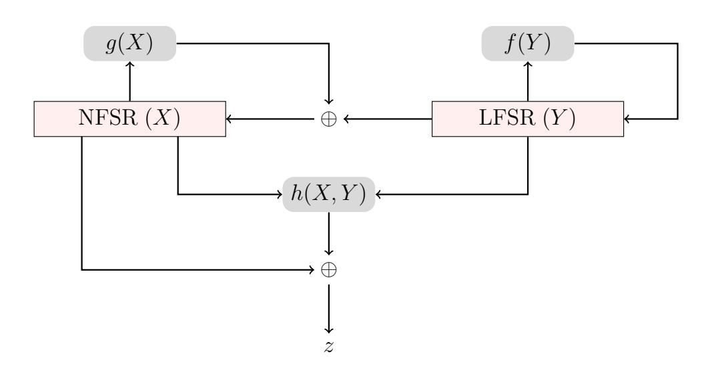
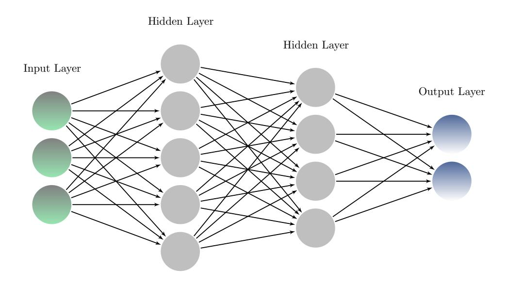
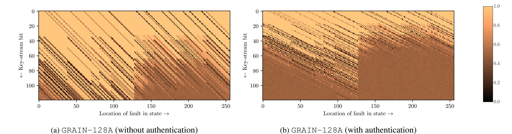
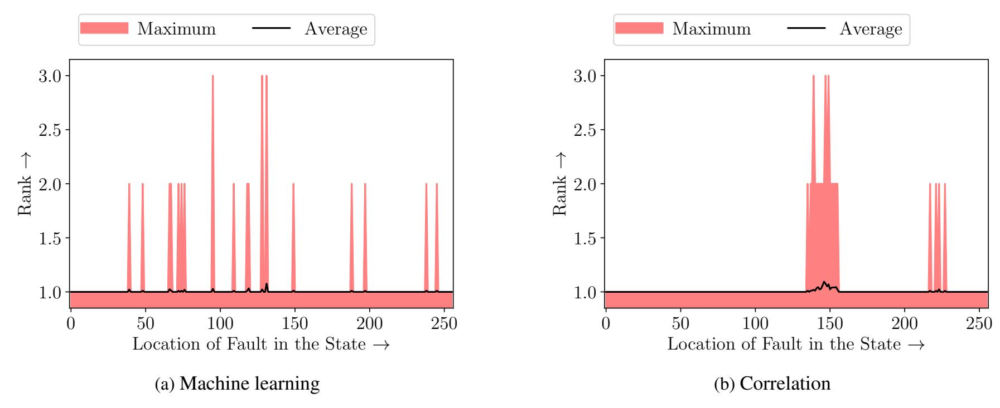
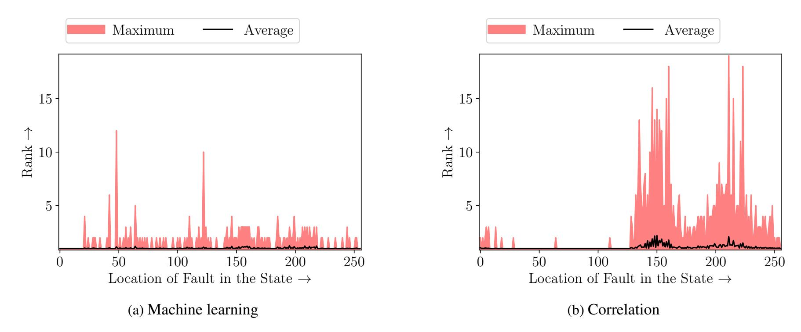

{0}------------------------------------------------

# **Fault Location Identification By Machine Learning**

ISSN 1751-8644 doi: 0000000000 www.ietdl.org

*Anubhab Baksi*1*Santanu Sarkar*2*Akhilesh Siddhanti*3*Ravi Anand*4*Anupam Chattopadhyay*1

- 1 *Nanyang Technological University, Singapore*
- 2 *Indian Institute of Technology, Madras, India*
- 3*Georgia Institute of Technology, Atlanta, USA*
- 4 *Indian Institute of Technology, Kharagpur, India*
- *\* E-mail: anubhab001@e.ntu.edu.sg, santanu@iitm.ac.in, akhilesh@gatech.edu, ravianandsps@iitkgp.ac.in, anupam@ntu.edu.sg*

**Abstract:** As the fault based analysis techniques are becoming more and more powerful, there is a need to streamline the existing tools for better accuracy and ease of use. In this regard, we propose a machine learning assisted tool that can be used in the context of a differential fault analysis. In particular, finding the exact fault location by analysing the XORed output of a stream cipher/ stream cipher based design is somewhat non-trivial. Traditionally, Pearson's correlation coefficient is used for this purpose. We show that a machine learning method is more powerful than the existing correlation coefficient, aside from being simpler to implement. As a proof of concept, we take two variants of Grain-128a (namely a stream cipher, and a stream cipher with authentication), and demonstrate that machine learning can outperform correlation with the same training/testing data. Our analysis shows that the machine learning can be considered as a replacement for the correlation in the future research works.

# **1 Introduction**

Fault attacks or fault analysis are a common type of techniques used in the cryptanalysis of primitives. This technique works by injecting a disturbance on a device while it is performing a cryptographic operation. This disturbance can be induced by means of a power glitch, LASER shot etc [\[1\]](#page-3-0). It has been shown in the literature that such disturbance can be injected by inexpensive equipment with high precision [\[2,](#page-3-1) [3\]](#page-3-2). As with rise of the Internet-of-Things, small scale devices performing cryptographic operations are almost ubiquitous; the fault attacks are of an increasing concern for the community.

Among all the fault analysis techniques, the differential fault attack or differential fault analysis (DFA) is one of the most (if not the most) common in the academic community (see Section [2.1](#page-0-0) for more information) introduced by [\[4\]](#page-3-3). In this case, a disturbance is able to flip one bit (0 → 1 or 1 → 0) or more bits of an operation being carried out (known as a *fault*). Then, by comparing the non-faulty and one/few faulty outputs, the attacker (Eve) can learn information about the secret key of the system. Since its first appearance, DFA is being used extensively to cryptanalyze a variety of ciphers which are considered secure against the classical attacks.

In the most commonly used DFA model, which we refer to as the *random fault model*; it is assumed that Eve is able to choose the round of cipher in question (possibly by means of timing analysis), but not the precise location of the fault. In other words, which bit(s) of the state of the cipher is not known/controllable to the attacker; although Eve is able to precisely choose the target round for fault injection.

When it comes to stream ciphers and stream cipher based designs, the usual analysis method of DFA simulation can be conceptually thought of comprised of two distinct phases. In the first phase, the exact location of the fault injection is determined by analyzing the effect of the fault propagation (termed as the *signature*). When the location is determined, a SAT solver is used to determine the state of the cipher at the particular round when the fault is injected. For several ciphers, the state is reversible; meaning the state can be reversed to the initialization routine, from where could be possible to recover the secret key. Also, in the related works involving DFA on stream ciphers, it is assumed that at most one bit of the state will be flipped. In this work, we focus on finding the exact location of the fault (i.e., which state bit is flipped as a result of fault injection) where the faulty round is known.

As a side note, it can be mentioned that machine learning has been recently used in context of classical cryptanalysis [\[5,](#page-3-4) [6\]](#page-3-5).

# *Our Contribution*

One fundamental problem in analyzing stream cipher based designs with respect to DFA is identifying the precise bit which is flipped as a result of the fault injection. The current standard is to use the correlation coefficient (more discussion can be found in Section [3.1\)](#page-1-0).

In a nutshell, this technique creates the so-called signature during the offline phase, which is a matrix with elements from [0, 1]. Then the XOR of faulty and non-faulty key-stream is corresponding to each location is computed. The location at which the correlation is maximum is taken as the correct location of fault.

We choose two variants of the well-studied GRAIN-128A cipher, one without authentication functionality and the other with authentication [\[7\]](#page-3-6). For both the ciphers, we show that a machine learning approach can outperform a the current standard which uses correlation. Essentially, our work directly improves from [\[8\]](#page-3-7), which reports the best performance for the correlation based method (refer to Section [4](#page-2-0) for more information).

# **2 Background**

# *2.1 Prior Works on Differential Fault Attack*

Fault attacks have surely gained considerable attention of the cryptographic research community in recent times. New types of fault attack models, their countermeasures as well as the practical validation by means of a real life set-up are among the most focused topics. Thanks to the wide applicability and practicality, many device implementations of high profile ciphers in both the public key and private key domains like RSA, DES, AES, etc. are analyzed by this technique. All the stream ciphers in eStream[∗](#page-0-1) hardware portfolio; namely GRAIN-v1 [\[9\]](#page-3-8), MICKEY-2.0 [\[10\]](#page-3-9) and TRIVIUM [\[11\]](#page-3-10) are cryptanalyzed by DFA. Other stream ciphers or similar designs like PLANTLET [\[12\]](#page-3-11), SPROUT [\[13\]](#page-3-12), ACORN (which is an AEAD based

∗<https://www.ecrypt.eu.org/stream/>

{1}------------------------------------------------

on stream cipher design paradigm) and LIZARD [14] are shown to be vulnerable against DFA too.

In the above mentioned works, generally it is assumed that the attacker, Eve, is not able to choose/decide the exact location for fault (i.e., which particular bit/bits will be flipped). The following points summarize the model, which is also adopted here:

- •The adversary can inject a 1-bit fault, thereby flipping that particular bit of the state. Typically, such precision of fault location is achieved by LASER shot, as in [3].
- •Each bit of the state is equally likely be flipped as a result of fault.
- •The location bit where the fault is injected is not known to the adversary.
- •The attacker has precise control over which round she injects the fault.

Therefore, the attacker attempts to find out the exact location of fault by analyzing the key-stream bits [8].

We keep discussion DFA countermeasures out of scope for this work. In case DFA countermeasures is solicited; one may refer to, for example, [15] or [1, Section 7].

# 2.2 Concise Description of GRAIN-128A

We take GRAIN-128A (as a stream cipher, i.e., without authentication) and GRAIN-128A (stream cipher with authentication) [7] as our target ciphers. The GRAIN-128A cipher consists of a 128bit non-linear feedback shift register (NFSR) and a 128-bit linear feedback shift register (LFSR), denoted by X and Y respectively. A schematic view of the construction for both the ciphers is given in Figure 1. The exact description of the variables and functions are given in Table 1, where the  $i^{th}$  location of register Z is denoted by  $z_i$  for Z = X, Y with the index starting from 0. At each clock, both LFSR and NFSR are updated by the update functions f(Y) (which is linear) and g(X) (which is non-linear) receptively. Note that the NFSR X is also updated from the LFSR Y. Also, f(Y) misses several locations of Y and similarly g(X) misses several locations of X. The output key-stream z is produced by passing several locations of X and Y through a non-linear function h(X,Y), and then XORing its output with some locations of X and Y.

At first, the cipher is loaded with the key and initialization vector (IV) during the key loading algorithm (KLA). After this, the cipher state is updated for 256 clocks with the update rules described already; but the output z is XORed back to the update functions of X and Y. After this, the Pseudo-Random Generation Algorithm (PRGA) produces the key-stream bits.

As for the Key Loading Algorithm (KLA), the ciphers use a 128-bit key K, and a 96-bit IV. The key is loaded in the NFSR and the IV is loaded in from the  $0^{th}$  to the  $95^{th}$  bits of the LFSR. The remaining  $95^{th}$  to  $127^{th}$  bits of the LFSR are loaded with some fixed pad  $P \in \{0,1\}^{32}$ .

Fig. 1: Schematic view of GRAIN-128A

MAC Generation Algorithm in GRAIN-128A The cipher GRAIN-128A [7] optionally supports message authentication code (MAC) generation. For this purpose, two registers, called accumulator and shift register of size 32 bits each, are used. The shift register is updated by z while the accumulator is updated by both z and the message m. The tag is obtained from the accumulator.

# 3 Context of Machine Learning

# 3.1 Correlation Based Method for Identifying Fault Location

Correlation based method to find fault location is the practical standard for finding location of the fault, as can be seen from several research works [8, 12–14]. To explain how it works, we adopt the following notations:

- •the fault-free key-stream sequence of length  $\ell$  which the adversary has access to:  $z_0, z_1, \ldots, z_{\ell-1}$ ;
- the fault location, f;
- •the  $\ell$ -length key-stream obtained after injecting a fault (faulty key-stream):  $z_0^{(f)}, z_1^{(f)}, \dots, z_{\ell-1}^{(f)}$ .

The fault identification procedure can be roughly classified into two phases, namely *offline* and *online*. Overall, the attacker Eve at first computes the off-line phase, where she has full access to the target device and can perform the fault injection. Being equipped with the information from this phase, the attacker moves to the actual online phase of the attack.

Offline Phase The attacker pre-computes the signature vector  $\mathcal{Q}^{(f)}$  for each fault location f of the cipher. The signatures are prepared by observing the probability of fault-free key-stream bits being not equal to faulty key-stream bits over several randomly generated keys and nonces:  $\mathcal{Q}^{(f)} = \{q_0^{(f)}, q_1^{(f)}, \dots, q_{\ell-1}^{(f)}\}$  where,  $q_i^{(f)} = \Pr(z_i \neq z_i^{(f)})$ .

Online Phase The attacker injects a fault in an unknown location g, and calculates the trail  $\Gamma^{(g)}$  of the fault location as follows:  $\Gamma^{(g)} = \{\gamma_0^{(g)}, \gamma_1^{(g)}, \dots, \gamma_{\ell-1}^{(g)}\}$  where,  $\gamma_i^{(g)} = \Pr(z_i \neq z_i^{(g)})$ .

Hence, the fault signature is a matrix of values from [0,1]. The number of columns of the matrix is same as the number of key-stream bits and that of rows is same as the number of fault locations (typically the entire state).

The final goal for the attacker is to identify g. The value of f for which  $\mathcal{Q}^{(f)}$  best matches the trail  $\Gamma^{(g)}$  obtained corresponds to the correct fault location. For checking this, correlation coefficient is shown to work with good accuracy [8]. The attacker calculates the correlation between the signature  $\mathcal{Q}^{(f)}$  and trail  $\Gamma^{(g)}$  for all possible values of f. This algorithm provides the value of g with a reasonably high accuracy. The same algorithm is repeated to identify fault location for all faulty key-stream sequences. The equations are then gathered and solved using an automated tool, typically a SAT solver (e.g., [11]).

However, often the correct location does not have maximum correlation. The *rank* metric measures the number of locations where the correlation coefficients of those locations are greater than or equal to the correlation coefficient of the correct location. Hence, if the correlation coefficient of the correct location is maximum, it has rank 1. Hence, if the rank is small (close to 1), then the performance of the method can be considered well. We also extend this notion of rank to machine learning based fault location finding to have a comparison of performances.

#### 3.2 Fundamentals of Artificial Neural Network

Here a very brief overview of machine learning is given here for the sake of completeness. For more details, an interested reader may refer to textbooks, e.g., [16].

Machine learning can be loosely defined by a collection of various types of algorithms, of which Artificial Neural Networks (ANNs) are of particular interest. ANNs are algorithms employed for fitting a

{2}------------------------------------------------

Table 1 Overview of GRAIN-128A (with and without authentication)

| view of GRAIN-128A (with and without authernication) |                                                                                                                                         |  |  |  |  |  |  |  |
|------------------------------------------------------|-----------------------------------------------------------------------------------------------------------------------------------------|--|--|--|--|--|--|--|
| LFSR $(Y)$ , NFSR $(X)$ Size                         | 128                                                                                                                                     |  |  |  |  |  |  |  |
| Key Size                                             | 128                                                                                                                                     |  |  |  |  |  |  |  |
| IV Size                                              | 96                                                                                                                                      |  |  |  |  |  |  |  |
| Pad (used during KLA)                                | FFFFFFE                                                                                                                                 |  |  |  |  |  |  |  |
| LFSR Update $(f(Y))$                                 | $y_{96}\oplus y_{81}\oplus y_{70}\oplus y_{38}\oplus y_7\oplus y_0$                                                                     |  |  |  |  |  |  |  |
| NFSR Update $(g(X))$                                 | $y_t \oplus x_t \oplus x_{t+26} \oplus x_{t+56} \oplus x_{t+91} \oplus x_{t+96} \oplus x_{t+3} + x_{t+67} \oplus x_{t+11} + x_{t+13}$   |  |  |  |  |  |  |  |
|                                                      | $ = x_{t+17}x_{t+18} \oplus x_{t+27}x_{t+59} \oplus x_{t+40}x_{t+48} \oplus x_{t+61}x_{t+65} \oplus x_{t+68}x_{t+84} $                  |  |  |  |  |  |  |  |
|                                                      |                                                                                                                                         |  |  |  |  |  |  |  |
| h(X,Y)                                               | $x_{t+12}x_{t+95}y_{t+94} \oplus x_{t+12}y_{t+8} \oplus y_{t+13}y_{t+20} \oplus x_{t+95}y_{t+42} \oplus y_{t+60}y_{t+79}$               |  |  |  |  |  |  |  |
| z                                                    | $x_{t+2} \oplus x_{t+15} \oplus x_{t+36} \oplus x_{t+45} \oplus x_{t+64} \oplus x_{t+73} \oplus x_{t+89} \oplus y_{t+93} \oplus h(X,Y)$ |  |  |  |  |  |  |  |

Fig. 2: Structure of an artificial neural network

model to a given data that can perform efficiently tasks like classification or regression, which are generally considered difficult for a computer. ANNs are capable of finding inherent characteristics of a user provided data (called the *training* data) by iterating through it repeatedly and gradually adjusting its parameters, until these parameters are finally stabilized. Once training is completed, the model is validated against the *testing* data.

The basic processing unit of an ANN is termed as a *neuron*, which is inspired from the biological neuron found in brain cells. The neurons arranged in a series of *layers*. More depth of layers generally makes the ANN capable of handling more complex data.

Here we use the basic forward-propagation ANN. A basic structure of the generic construction of can be found in Figure 2.

#### 4 Our Results

For experimentation purpose, we only take 120 bits of the key-stream from starting of PRGA. We begin our analysis by finding the fault signatures both the ciphers. As signatures for a cipher is indeed a matrix, it can be pictorially represented. Figure 3 shows such a representation (Figure 3(a) for GRAIN-128A stream cipher and Figure 3(b) for GRAIN-128A stream cipher with authentication).

With the same data used in correlation based method, we next mount an artificial neural network approach. For this purpose, we use a 5 layer neural network with TensorFlow\* as the back-end and Keras† API with the following properties (refer to Section 3.2 for more information on these):

- •Layer 1 The first layer is a dense layer with a dropout rate of 0.2 and activation function as rectifier (ReLU). It consists of 120 neurons (same as the number of key-stream bits used).
- •Layers 2, 3, 4 The second, third and fourth layers are dense layers with rectifier as activation functions. The number of neurons are respectively 252, 202 and 160.

•Layer 5 The final layer is a dense layer with 160 neurons for GRAIN-v1 and 256 neurons for GRAIN-128A (same as the size of the state) with softmax activation (one-hot encoding). Depending on the firing rate of neurons at this layer, the prediction on the fault location is made.

The summary of the model is given in Table 2. As for the choice of epochs, we choose 8. We compile the model with the adam optimizer, sparse categorical cross-entropy as the loss function and accuracy as the metric. The parameters are chosen somewhat arbitrarily. We use the Adam algorithm [17] as optimizer.

Table 2 Model summary for the artificial neural network used

|                          | moder carrinary for the artificial floating from deca |             |  |  |  |  |  |  |  |
|--------------------------|-------------------------------------------------------|-------------|--|--|--|--|--|--|--|
| Layer (Type)             | Output Shape                                          | Parameter # |  |  |  |  |  |  |  |
| dense (Dense)            | (None, 120)                                           | 14520       |  |  |  |  |  |  |  |
| dropout (Dropout)        | (None, 120)                                           | 0           |  |  |  |  |  |  |  |
| dense_1 (Dense)          | (None, 252)                                           | 30492       |  |  |  |  |  |  |  |
| dense_2 (Dense)          | (None, 202)                                           | 51106       |  |  |  |  |  |  |  |
| dense_3 (Dense)          | (None, 160)                                           | 32480       |  |  |  |  |  |  |  |
| dense_4 (Dense)          | (None, 256)                                           | 41216       |  |  |  |  |  |  |  |
| Total params: 169814     |                                                       |             |  |  |  |  |  |  |  |
| Trainable params: 169814 |                                                       |             |  |  |  |  |  |  |  |
| Non-trainable params: 0  |                                                       |             |  |  |  |  |  |  |  |

Relative performance of the machine learning and correlation based approaches are presented in Figure 4 for GRAIN-128A (without authentication) and in Figure 5 for GRAIN-128A (with authentication), and also in Table 3. It is to be noted, machine learning outperforms correlation for both the ciphers (the difference is more prominent in GRAIN-128A with authentication) with the same training and testing data.

Table 3 shows that the accuracy is higher in machine learning, so the number of wrong identification is less in machine learning. Overall, the outcome from the machine learning models have lower rank (see Section 3.1 for description of rank), as both the average and the maximum ranks reported by machine learning is smaller than its correlation counterpart. For example, the maximum rank for machine learning is 12, but the same for correlation is 19 for GRAIN-128A with authentication. More details on rank can be seen from Figure 4 (Figure 4(a) for machine learning and Figure 4(b) for correlation on GRAIN-128A without authentication) and Figure 5 (Figure 4(a) for machine learning and Figure 4(b) for correlation on GRAIN-128A with authentication). Here, we plot the average and maximum rank for each location of the 256-bit state.

### 5 Conclusion

In this work, we apply a machine learning method to the problem of finding the location of fault in stream ciphers. The conventional methods for finding the same involves creating a so-called signature method, then to see which location shows maximum correlation coefficient. We show for two variants of GRAIN-128A (one as a stream cipher, while the other as a stream cipher with authentication) that machine learning can be used instead of correlation with greater efficiency, even though both are trained and tested with the same data.

\*https://www.tensorflow.org/

†https://keras.io/

{3}------------------------------------------------

Fig. 3: Visualization of signatures

Table 3 Summary of experiments for fault location identification

| Table 6 Callinary of exp | orninornio ioi | iddit ioodtio | n laontinoatio          | ••      |         |                |                 |         |         |                |
|--------------------------|----------------|---------------|-------------------------|---------|---------|----------------|-----------------|---------|---------|----------------|
| Cipher                   | Size           |               | Machine Learning (Ours) |         |         |                | Correlation [8] |         |         |                |
|                          |                |               | <b>A</b>                | Rank*   |         | # Wrong        | <b>A</b>        | Rank*   |         | # Wrong        |
|                          | Training       | Testing       | Accuracy                | Average | Maximum | Identification | Accuracy        | Average | Maximum | Identification |
| GRAIN-128A               | 218            | 214.551       | 0.9988                  | 1.0013  | Q       | 27             | 0.9970          | 1.0032  | 2       | 72             |
| (w/o Authentication)     | <u> </u>       |               | 0.9900                  | 1.0013  | 3       | <u> </u>       | 0.9910          | 1.0032  | J       | 12             |
| GRAIN-128A               | 218            | 214.551       | 0.9799                  | 1.0240  | 12      | 482            | 0.9448          | 1.1024  | 19      | 1324           |
| (w/ Authentication)      | <u> </u>       |               | 0.9199                  | 1.0240  | 12      | 402            | 0.9446          | 1.1024  | 19      | 1024           |

\*: Lower is better, 1 is ideal

Thus, our work follows-up that of [8] and shows improvement on it. On top, machine learning tools are standardized and easier to use.

We believe this work can inspire multiple future research works. For example, this method can be tested against other ciphers. Multi-bit fault model (where more than one bit is injected with fault) can be considered too. In case where the attacker can only access a suppressed key-stream (e.g., first 20 key-stream bits are not available), one may be interested in finding the performance of a machine learning model. Finally, the selection of hyper-parameters and its sensitivity can be thoroughly studied.

# 6 References

- Baksi, A., Bhasin, S., Breier, J., Jap, D. and Saha, D.. 'Fault attacks in symmetric key cryptosystems'. (, 2020. https://eprint.iacr.org/2020/1267. Cryptology ePrint Archive, Report 2020/1267
- Bar.El, H., Choukri, H., Naccache, D., Tunstall, M. and Whelan, C.: 'The sorcerer's apprentice guide to fault attacks.', *IACR Cryptology ePrint Archive*, 2004, **2004**, pp. 100. Available from: http://dblp.uni-trier.de/db/journals/iacr/iacr2004.html#Bar-ElCNTW04
- 3 Agoyan, M., Dutertre, J., Mirbaha, A., Naccache, D., Ribotta, A. and Tria, A.: 'How to flip a bit?'. 2010 IEEE 16th International On-Line Testing Symposium, 2010. pp. 235–239
- 4 Biham, E. and Shamir, A. 'Differential Fault Analysis of Secret Key Cryptosystems'. In: Kaliski, J. BurtonS., editor. Advances in Cryptology - CRYPTO '97. vol. 1294 of *Lecture Notes in Computer Science*. (Springer Berlin Heidelberg, 1997. pp. 513–525. Available from: http://dx.doi.org/10.1007/BFb0052259
- 5 Baksi, A., Breier, J., Dong, X. and Yi, C.: 'Machine learning assisted differential distinguishers for lightweight ciphers', *IACR Cryptol ePrint Arch*, 2020, **2020**, pp. 571. Available from: https://eprint.iacr.org/2020/571
- Baksi, A., Breier, J., Dasu, V.A., Dong, X. and Yi, C.: 'Following-up on machine learning assisted differential distinguishers', *SILC Wprkshop - Security and Implementation of Lightweight Cryptography*, 2021, Available from: https://www.esat.kuleuven.be/cosic/events/silc2020/wp-content/uploads/sites/4/2020/10/Submission4.pdf
- 7 Ågren, M., Hell, M., Johansson, T. and Meier, W.: 'Grain-128a: a new version of grain-128 with optional authentication', *IJWMC*, 2011, 5, (1), pp. 48–59. Available from: https://doi.org/10.1504/IJWMC.2011.044106
- 8 Sarkar, S., Dey, P., Adhikari, A. and Maitra, S.: 'Probabilistic signature based generalized framework for differential fault analysis of stream ciphers', *Cryptography and Communications*, 2017, **9**, (4), pp. 523–543. Available from: https://doi.org/10.1007/s12095-016-0197-2
- 9 Sarkar, S., Banik, S. and Maitra, S.: 'Differential fault attack against grain family with very few faults and minimal assumptions', *IEEE Transactions on Computers*, 2014, **64**, (6), pp. 1647–1657
- Banik, S., Maitra, S. and Sarkar, S.: 'Improved differential fault attack on mickey 2.0', *Journal of Cryptographic Engineering*, 2015, **5**, (1), pp. 13–29
- Dey, P. and Adhikari, A.: 'Improved multi-bit differential fault analysis of Trivium'. INDOCRYPT 2014, New Delhi, India, Proceedings, 2014. pp. 37–52. Available

- from: https://doi.org/10.1007/978-3-319-13039-2\_3
- Maitra, S., Siddhanti, A. and Sarkar, S.: 'A differential fault attack on plantlet', *IEEE Transactions on Computers*, 2017, **66**, (10), pp. 1804–1808
- Maitra, S., Sarkar, S., Baksi, A. and Dey, P.: 'Key recovery from state information of sprout: Application to cryptanalysis and fault attack', *IACR Cryptology ePrint Archive*, 2015, **2015**, pp. 236. Available from: http://eprint.iacr.org/2015/236
- 14 Siddhanti, A., Sarkar, S., Maitra, S. and Chattopadhyay, A.: 'Differential fault attack on grain v1, acorn v3 and lizard'. International Conference on Security, Privacy, and Applied Cryptography Engineering, 2017. pp. 247–263
- Baksi, A., Saha, D. and Sarkar, S.: 'To infect or not to infect: A critical analysis of infective countermeasures in fault attacks', *IACR Cryptology ePrint Archive*, 2019, **2019**, pp. 355. Available from: https://eprint.iacr.org/2019/355
- Haykin, S.: 'Neural Networks and Learning Machines (third edition)'. (Pearson, 2008)
- 17 Kingma, D.P. and Ba, J.: 'Adam: A method for stochastic optimization', *arXiv* preprint arXiv:14126980, 2014,

{4}------------------------------------------------

**Fig. 4**: Performances for machine learning and correlation based methods on GRAIN-128A (without authentication)

**Fig. 5**: Performances for machine learning and correlation based methods on GRAIN-128A (with authentication)