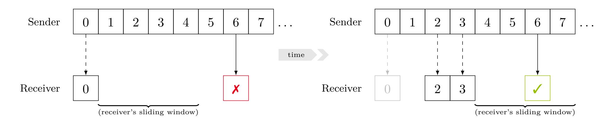
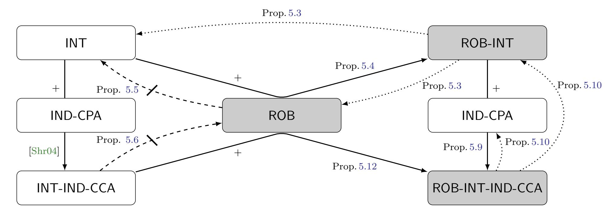
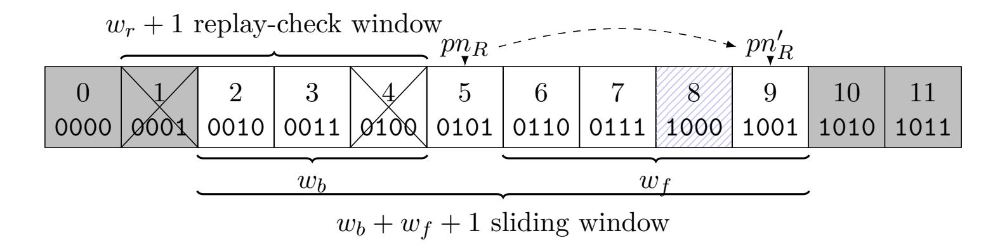

{0}------------------------------------------------

# **Robust Channels**

## **Handling Unreliable Networks in the Record Layers of QUIC and DTLS 1.3**

Marc Fischlin<sup>1</sup> Felix Günther<sup>2</sup> Christian Janson<sup>1</sup>

<sup>1</sup> Cryptoplexity, Technische Universität Darmstadt, Germany

<sup>2</sup> Department of Computer Science, ETH Zürich, Switzerland

marc.fischlin@cryptoplexity.de mail@felixguenther.info christian.janson@cryptoplexity.de

March 2, 2023

**Abstract.** The common approach in secure communication channel protocols is to rely on ciphertexts arriving in-order and to close the connection upon any rogue ciphertext. Cryptographic security models for channels generally reflect such design. This is reasonable when running atop lower-level transport protocols like TCP ensuring in-order delivery, as for example is the case with TLS or SSH. However, protocols like QUIC or DTLS which run over a non-reliable transport such as UDP, do not—and in fact cannot—close the connection if packets are lost or arrive in a different order. Those protocols instead have to carefully catch effects arising naturally in unreliable networks, usually by using a sliding-window technique where ciphertexts can be decrypted correctly as long as they are not misplaced too far.

In order to be able to capture QUIC and the newest DTLS version 1.3, we introduce a generalized notion of *robustness* of cryptographic channels. This property can capture unreliable network behavior and guarantees that adversarial tampering cannot hinder ciphertexts that can be decrypted correctly from being accepted. We show that robustness is orthogonal to the common notion of integrity for channels, but together with integrity and chosen-plaintext security it provides a robust analogue of chosen-ciphertext security of channels. In contrast to prior work, robustness allows us to study packet encryption in the record layer protocols of QUIC and of DTLS 1.3 and the novel sliding-window techniques both protocols employ. We show that both protocols achieve robust chosen-ciphertext security based on certain properties of their sliding-window techniques and the underlying AEAD schemes. Notably, the robustness needed in handling unreliable network messages requires both record layer protocols to tolerate repeated adversarial forgery attempts. This means we can only establish non-tight security bounds (in terms of AEAD integrity), a security degration that was missed in earlier protocol drafts. Our bounds led the responsible IETF working groups to introduce concrete forgery limits for both protocols and the IRTF CFRG to consider AEAD usage limits more broadly.

**Keywords.** Secure channel · robustness · robust integrity · AEAD · QUIC · DTLS 1.3 · UDP

{1}------------------------------------------------

## **Contents**

| 1 | Introduction                                                | 3  |
|---|-------------------------------------------------------------|----|
|   | 1.1<br>Robustness of Channels as a First-class Property<br> | 4  |
|   | 1.2<br>Defining General Robustness<br>                      | 5  |
|   | 1.3<br>Relations Between the Security Notions<br>           | 5  |
|   | 1.4<br>Robustness of QUIC and DTLS 1.3<br>                  | 6  |
|   | 1.5<br>Contributions<br>                                    | 7  |
| 2 | Preliminaries                                               | 8  |
|   | 2.1<br>Notation<br>                                         | 8  |
|   | 2.2<br>Authenticated Encryption with Associated Data<br>    | 8  |
| 3 | Channels                                                    | 9  |
|   | 3.1<br>Correctness<br>                                      | 10 |
|   | 3.2<br>Examples of Support Classes<br>                      | 12 |
|   | 3.3<br>Discussion and Comparison<br>                        | 15 |
| 4 | Robust Channels                                             | 16 |
|   |                                                             |    |
| 5 | Robustness, Integrity, and Indistinguishability             | 17 |
|   | 5.1<br>Defining Robustness and Integrity<br>                | 17 |
|   | 5.2<br>Relating Robustness and Integrity<br>                | 18 |
|   | 5.3<br>Robustness and Chosen-Ciphertext Security<br>        | 21 |
| 6 | QUIC                                                        | 25 |
|   | 6.1<br>QUIC Encryption Specifications<br>                   | 26 |
|   | 6.2<br>QUIC as a Channel Protocol<br>                       | 26 |
|   | 6.2.1<br>Construction<br>                                   | 27 |
|   | 6.2.2<br>Correctness<br>                                    | 29 |
|   | 6.3<br>Robust Security of the QUIC Channel Protocol<br>     | 30 |
| 7 | DTLS 1.3                                                    | 32 |
|   | 7.1<br>DTLS Encryption Specifications<br>                   | 32 |
|   | 7.2<br>DTLS as a Channel Protocol<br>                       | 33 |
|   | 7.2.1<br>Construction<br>                                   | 33 |
|   | 7.2.2<br>Correctness<br>                                    | 36 |
|   | 7.3<br>Robust Security of the DTLS Channel Protocol<br>     | 37 |
| 8 | Conclusion                                                  | 39 |
|   |                                                             |    |
|   | References                                                  | 40 |
| A | Capturing TLS                                               | 44 |

{2}------------------------------------------------

## <span id="page-2-2"></span><span id="page-2-0"></span>**1 Introduction**

Cryptographic channel protocols should provide confidentiality and authenticity of communication in the presence of network adversaries. Consider for example the latest version of TLS in version 1.3 [\[Res18\]](#page-42-0). Ignoring subtle issues like fragmentation, the record layer protocol should ensure that the sender's ciphertexts[1](#page-2-1) *c*1*, c*2*, c*3*, . . .* are correctly decrypted to the encapsulated messages at the receiver's side if they arrive in this order. Any (accidental or malicious) reordering or modifications of the ciphertexts should be detectable and, in case of suspicious behavior, the standard specifies that the connection must be closed:

If the decryption fails, the receiver MUST terminate the connection with a "bad\_record\_mac" alert.

TLS therefore assumes, or at least hopes, that packets are delivered reliably on the network. If a ciphertext accidentally gets lost on the transport layer then this most likely closes the channel connection on the application level. Put differently, this way of dealing with errors is closely associated to the TCP protocol as the underlying reliable, connection-oriented transport layer.

Other cryptographic channels like QUIC [\[IT21,](#page-41-0) [TT21\]](#page-43-1) or DTLS [\[RM12,](#page-42-1) [RTM22\]](#page-43-2), however, run atop an unreliable, datagram-oriented transport layer, UDP in these cases. From the channel's point of view this means that ciphertexts (or, fragments of ciphertexts) may be lost on the network or arrive in different order. Such protocols thus need to support more ample error handling. Usually, they use a slidingwindow technique to decrypt ciphertexts within the window, moving the window forward whenever a valid ciphertext beyond the current window arrives.

The sliding-window technique is interesting for the cryptographic channel for two reasons. One is that, currently, most cryptographic models for secure channels focus on the aborting type of protocols and thus do not touch upon the window technique (this includes, e.g., the initial formalization of stateful authenticated encryption [\[BKN02,](#page-39-1) [BKN04\]](#page-40-0) used to analyze the SSH protocol [\[YL06\]](#page-43-3), length-hiding authenticated encryption variants used to study the TLS protocol [\[PRS11,](#page-42-2) [JKSS12\]](#page-41-1), as well as more specialized models covering fragmentation [\[BDPS12\]](#page-39-2), streaming [\[FGMP15\]](#page-41-2), bidirectionality [\[MP17\]](#page-42-3), or secure messaging [\[JS18,](#page-41-3) [ACD19\]](#page-39-3)). Another interesting aspect is that such protocols necessitate another property besides correctness and the common security notions, which was mostly neglected so far.

As we will see, this gap between cryptographic modeling and real-world behavior of unreliable channels has led draft versions of QUIC (before draft-29 [\[TT20\]](#page-43-4)) and DTLS 1.3 (before draft-38 [\[RTM20\]](#page-43-5)) to miss a crucial degradation of the underlying AEAD scheme's security. Capturing the sliding-window technique and handling of unreliable transport messages, we introduce a cryptographic channel framework that brings this degradation to light, and ultimately led to both protocol drafts being updated to mandate concrete forgery limits:

The integrity protections in authenticated encryption also depend on limiting the number of attempts to forge packets.

[...]

endpoints MUST count the number of received packets that fail authentication during the lifetime of a connection. If the total number of received packets that fail authentication [...] exceeds the integrity limit for the selected AEAD, the endpoint MUST immediately close the connection [...]

— QUIC RFC 9001 [\[TT21\]](#page-43-1)

<span id="page-2-1"></span><sup>1</sup>With *ciphertext*, we refer to all cryptographically relevant parts of a network packet; this includes packet headers like packet numbers that are not necessarily encrypted.

{3}------------------------------------------------

<span id="page-3-2"></span><span id="page-3-1"></span>

Figure 1: Illustration of a channel over unreliable transport using a sliding window at the receiver, leading to some packet being first rejected (left) and upon later retransmission accepted (right). After having received only packet 0 (left-hand side), the channel will reject packet 6 as it is reorderd "too far", beyond the receiver's sliding window of (toy) size 4. At a later point, having also received packets 3 and 4, packet 6 is retransmitted and now accepted, being within the (now shifted) sliding window. Such revisiting of acceptance decisions can happen in real-world protocols like QUIC or DTLS 1.3, but is ruled out as insecure by prior channel models [\[KPB03,](#page-42-4) [BHMS16,](#page-39-4) [RZ18\]](#page-43-6).

## <span id="page-3-0"></span>**1.1 Robustness of Channels as a First-class Property**

In this work, we bring out *robustness* as a core property of cryptographic channels that primarily focuses on protocols over an unreliable network, but also extends to reliable networks under active attacks. Robustness roughly says that malicious ciphertexts on the network cannot disturb the expected behavior of the channel. As a concrete example, robustness guarantees that an adversarially injected ciphertext cannot make the window of the sliding technique shift further, such that previous ciphertexts, which would otherwise have been inside the admissible window, would now get rejected. Let us emphasize that, despite at first glance similar in spirit, robustness does *not* aim at *preventing* network denial-of-service (DoS) attacks (a goal beyond classical cryptographic mechanisms). Instead it captures that a channel should *maintain* functionality according to a certain robustness level for those received ciphertexts (e.g., under DoS attacks, but not only there).

We remark that robustness as a notion has so far not been captured by previous security definitions for channels when it comes to where it is most relevant, namely, for unreliable network transmission. In the realm of secure messaging [\[BSJ](#page-40-1)+17], Jaeger and Stepanovs [\[JS18\]](#page-41-3) discuss a restricted form of robustness for bidirectional channels as part of their correctness definition, but intentionally only treat reliable transport protocols. Boyd et al. [\[BHMS16\]](#page-39-4), in their generalization of different levels of authentication/AEAD in a hierarchy similar to the one introduced by Kohno, Palacio, and Black [\[KPB03\]](#page-42-4), come closest to the idea of a more fine-grained approach to different properties like reordering or dropping of ciphertexts. Likewise, Rogaway and Zhang [\[RZ18\]](#page-43-6) capture different level sets for permissible ordering for stateful authenticated encryption, capturing a hierarchy similar to [\[BHMS16,](#page-39-4) [KPB03\]](#page-42-4). Yet, it turns out that QUIC [\[IT21,](#page-41-0) [TT21\]](#page-43-1) and DTLS 1.3 [\[RTM22\]](#page-43-2), for example, would be declared as insecure according to their models. This is due to technically subtle, but model-inherent reasons resulting from the deployed *dynamic sliding-window* technique and the protocols' novel approach to only transmit *partial packet numbers*. Concretely, this can lead to a too-far-reordered packet first being rejected by a receiver, and then upon later retransmission being accepted; see Figure [1](#page-3-1) for an illustration. We provide more details in Section [3.3](#page-14-0) when introducing our formalism.

In a different light, Chen et al. [\[CJJ](#page-40-2)+19] (and similarly Lychev et al. [\[LJBN15\]](#page-42-5) in prior work for an early version) study the QUIC record layer as part of an overall ACCE-type analysis [\[JKSS12\]](#page-41-1). While their formalism treats QUIC as having no reordering and replay protection (level 1 in the hierarchy of [\[BHMS16\]](#page-39-4)), they informally argue that packet number authentication in QUIC "essentially" achieves TLS-like authentication and reordering protection. Our work provides a more fine-grained and formal

{4}------------------------------------------------

<span id="page-4-3"></span>analysis of the properties that sliding-window cryptographic channel protocols achieve over an unreliable network.

We note that the term robustness has already been used in other settings, notably close, e.g., for (public-key and symmetric) encryption [\[ABN10,](#page-39-5) [FOR17\]](#page-41-4) to express the difficulty to produce a ciphertext correctly decrypting under two keys. In our setting, robustness expresses that a communication channel's expected behavior cannot be disturbed by malicious ciphertexts.

### <span id="page-4-0"></span>**1.2 Defining General Robustness**

Defining robustness as a general notion is delicate because we need to compare the behavior in presence of an active adversary to the expected behavior of the channel under non-malicious alteration due to the network, be it reliable or unreliable. To capture different expected channel behaviors like the ability to recover from ciphertext losses or from ciphertext reordering in a single definition, we parameterize the channel protocol by a predicate supp describing supported ciphertexts, i.e., ciphertexts which should be processed correctly by the channel.[2](#page-4-2) This predicate operates on the sequences of sent and received ciphertexts so far, and thus represents a global view on the network communication.

We show how such support predicates allow us to capture various scenarios for desired channel behavior, spanning both reliable and unreliable networks. On the extreme ends this includes a strict ordering of ciphertexts at the receiver's side, as in TLS 1.3 over reliable networks, and (almost) no guarantees as in DTLS 1.2 with no replay protection. Our notion also allows to portray different sliding-window techniques with both static or dynamic window sizes, which is what enables us to capture the mechanisms deployed in QUIC and DTLS 1.3.

Introducing supp as a parameter already affects the correctness definition of a channel. Correctness then says that the protocol acts as expected on *supported* ciphertext sequences, now defined as a game with a weak network adversary which can only tamper with the order of ciphertexts. Once we have the advanced notion of correctness we can define robustness in a generalized way. Our robustness notion, denoted ROB, compares the real behavior of the channel with the correct behavior that would be obtained when filtering out any maliciously modified or injected ciphertext by an active adversary. For a robust channel we expect both behaviors to be quasi identical, implying that the malicious ciphertexts cannot make the protocol deviate. In particular, if a channel uses sliding windows to identify admissible ciphertexts, then malicious network data cannot falsely modify the window boundaries.

### <span id="page-4-1"></span>**1.3 Relations Between the Security Notions**

We relate the notion of robustness to the classical notions of channel integrity and confidentiality (indistinguishability under network-passive (IND-CPA) and -active attacks (IND-CCA)). For this we first recapture the (stateful) notion of ciphertext integrity INT-sfCTXT [\[BKN04\]](#page-40-0) within our framework with the predicate supp, yielding our integrity definition of INT. For chosen-ciphertext security we adopt the (stateless) IND-CCA3 notion of Shrimpton [\[Shr04\]](#page-43-7) which combines integrity and confidentiality into a single game. The notion is called INT-IND-CCA in our setting. Let us emphasize that these integrity and indistinguishability notions are generalizations or reformulations of the established channel notions, parameterized via the supp predicate to handle different channel behaviors.

We first argue that robustness and integrity are orthogonal in the sense that neither one implies the other. But we can define a combined notion called *robust integrity* (ROB-INT) which is implied by both notions together, and vice versa implies both notions. Arguably, this combined robust-integrity notion

<span id="page-4-2"></span><sup>2</sup>To be precise, we will optionally allow the predicate supp to associate an index with a positive decision, recovering a received ciphertext's position in the original sequence of sent ciphertexts. This enables us to capture non-unique ciphertexts in channels that rely on sliding windows.

{5}------------------------------------------------

<span id="page-5-2"></span><span id="page-5-1"></span>

Figure 2: Overview over relationships of robustness, integrity, and indistinguishability notions for any fixed predicate supp; with notions encoding robustness highlighted in gray. Solid arrows from *A* to *C* via *B* (with a "+") indicate implications *A* ∧ *B* ⇒ *C*. Dotted arrows from *A* to *B* indicate explicitly shown implications *A* ⇒ *B*; further implications follow by transitivity. Dashed, struck-through arrows between *A* and *B* indicate separations of *A* and *B*. Numbers indicate the corresponding propositions.

should be the target integrity notion for unreliable-transport protocols in practice, serving as stepping stone for full security (as we see for QUIC and DTLS 1.3 below). We then define a notion ROB-INT-IND-CCA which is the "robust analogue" of INT-IND-CCA security for channels, capturing the strongest guarantees by combining confidentiality, integrity, and robustness, and overall the ultimate target for protocols like QUIC and DTLS 1.3. We show that this robust notion can be achieved either by considering an IND-CPA secure channel which also provides robust integrity. Alternatively, one can add robustness to a INT-IND-CCA channel to derive the notion, too. Conversely, ROB-INT-IND-CCA implies robust integrity and IND-CPA security and thus also INT-IND-CCA. Our results about the relations between the notions are summarized in Figure [2.](#page-5-1)

## <span id="page-5-0"></span>**1.4 Robustness of QUIC and DTLS 1.3**

Turning to the record layer protocols of QUIC and DTLS 1.3 we provide an abstract representation of their packet encryption as a cryptographic channel. Both protocols rely on an AEAD scheme to protect the payload. With minor differences, both use packet numbers as nonces for AEAD encryption but only transmit parts of the packet number with the ciphertext. As a result, the receiver must be able to recover the correct packet number from the fraction transmitted with the ciphertext. This is accomplished by using a sliding window for determining the nearest packet number matching the received partial information. Remarkably, the sliding window's *size* is variable. For example in QUIC, the sender *adaptively* chooses to send only the least 1–4 bytes of the packet number, which the the receiver then interprets in a sliding window around the last processed packet number, with a window of dynamic size 2 8 , 2 16 , 2 <sup>24</sup>, or 2 32 (depending on the truncated packet number length). Note that this approach is different from previous approaches such as DTLS 1.2 which transmits the full packet number in clear.

The above window is required to determine the full packet number but does not necessarily provide protection against replay attacks. For instance, sending the same ciphertext twice immediately would yield the correct packet number in both cases, since the window has not progressed too far the second time. Therefore, both protocols use another (fixed-size) sliding window on the receiver side to detect replayed ciphertexts. Both these replay-check windows reach backwards from the last valid packet number on the 

{6}------------------------------------------------

<span id="page-6-1"></span>receiver's side.

We establish that QUIC achieves the intended level of robustness with respect to its supported inwindow reordering with replay protection. Robustness of QUIC, beyond the appropriate encoding of (truncated) packet numbers within the sliding window, relies on the underlying AEAD scheme's integrity. Our proof actually shows robustness and integrity in one go, so that we can immediately deduce that the channel achieves the ROB-INT property above. Arguing that QUIC is IND-CPA is straightforward using the confidentiality of the AEAD scheme, such that we can immediately conclude with our general results that the protocol provides ROB-INT-IND-CCA. We achieve similar results in our robustness analysis of DTLS 1.3.

The robustness results for QUIC and DTLS 1.3 surface a noteworthy security degradation: The fact that channels over unreliable networks need to keep the connection open when receiving (possibly maliciously) disordered ciphertexts gives an adversary multiple forgery attempts. This induces a non-tight security bound for robustness in the reduction to the underlying AEAD scheme's integrity. Upon closer inspection, this loss coincides with the security bounds of many AEAD schemes [\[Jon03,](#page-41-5) [IOM12a,](#page-41-6) [Pro14\]](#page-42-6), including those underlying DTLS 1.3 and QUIC, and is also reminiscent of experiences with practical attacks being easier to mount on unreliable networks, e.g., as observed in the Lucky Thirteen attack on the (D)TLS record protocols [\[AP13\]](#page-39-6). Maybe surprisingly, this higher integrity security loss (compared to reliabletransport protocols like TLS) was overlooked in prior DTLS versions and earlier drafts of the QUIC and DTLS 1.3 protocols. This is despite TLS 1.3 already defining limits on key usage [\[Res18,](#page-42-0) Section 5.5] for confidentiality, with the underlying analysis by Luykx and Paterson [\[LP17\]](#page-42-7) pointing out that integrity bounds for DTLS would need to be considered differently. We communicated our security bounds to the respective IETF working groups, which led them to specify concrete forgery limits for packet protection for QUIC in draft-29 [\[TT20,](#page-43-4) [Tho20a\]](#page-43-8) and for DTLS 1.3 in draft-38 [\[RTM20,](#page-43-5) [Tho20b\]](#page-43-9), and the IRTF CFRG to work on a document guiding users in taking AEAD usage limits into consideration [\[GTW22\]](#page-41-7).

### <span id="page-6-0"></span>**1.5 Contributions**

To summarize, our core contributions are:

- 1. We introduce a general robustness definition for secure channels, which is parameterized through a *support predicate* describing which ciphertext sequences a channel aims to support. In contrast to prior channel models [\[KPB03,](#page-42-4) [BHMS16\]](#page-39-4), it is this notion of a support predicate that allows us to capture the dynamic sliding windows and partially transmitted packet numbers in QUIC and DTLS 1.3.
- 2. We relate robustness to the established notions for confidentiality and integrity, and define an integrated notion ROB-INT-IND-CCA which combines both of them with robustness.
- 3. We analyze QUIC by modeling it as secure channel supporting dynamic sliding window and replay protection. We establish that QUIC achieves the intended strong ROB-INT-IND-CCA security.
- 4. We analyze DTLS 1.3, establishing similar results as for QUIC. Observe that we capture in our analysis that replay protection is optional. We establish that DTLS 1.3 achieves the intended strong ROB-INT-IND-CCA security when considered with and without replay protection.
- 5. Our results surface a noteworthy security loss linear in the number of forgery attempts compared to the underlying AEAD scheme's integrity. The QUIC and TLS IETF working groups added concrete forgery limits for both QUIC and DTLS 1.3, acknowledging our work. The IRTF CFRG is further drafting a general standard providing guidance on AEAD usage limits.

{7}------------------------------------------------

## <span id="page-7-3"></span><span id="page-7-0"></span>**2 Preliminaries**

We introduce some notation used throughout the paper. Additionally, we provide a brief recap of syntax and security of authenticated encryption with associated data [\[Rog02\]](#page-42-8).

### <span id="page-7-1"></span>**2.1 Notation**

We write a bit as *b* ∈ {0*,* 1} and a (bit) string as *s* ∈ {0*,* 1} <sup>∗</sup> with |*s*| indicating its (binary) length. We implicitly interpret natural numbers as bit strings (of appropriate length) and vice versa, depending on the context, en-/decoding to/from big-endian binary encoding. For a bit string *s* and *i, j* ∈ [1*,* |*s*|], we denote with *s*[*i*] the *i*-th bit of *s* and with *s*[*i..j*] the substring of *s* starting with the *i*-th bit and ending with, and including, the *j*-th bit, where for *j < i* we set *s*[*i..j*] to be the empty string, denoted by *ε*. We write *s* 4 *t* if *s* is a prefix of *t* (i.e., *t*[1*..*|*s*|] = *s*), *s*k*t* for the concatenation and *s* ⊕ *t* for the bit-wise XOR of *s, t*. For a bit string *s* of length |*s*| = *n* and *m* ∈ N ∪ {0} we denote by *s m* the string *s*[1 + *m..n* + *m*]k0 min(*m,n*) of same length *n* resulting from shifting in *m* zeros from the right. Note that the notation also covers the case that *m > n* and hence the resulting (shifted) substring *s*[1 + *m..n*+ *m*] is outside of the original range of the string. Hence this substring is initially empty and we concatenate a zero-string of length min(*m, n*) to assign each position in *s*[1 + *m..n* + *m*] a bit 0.

Similarly, for lists *s*, *t*, *s*k*t* denotes concatenation, with *s* <sup>k</sup>←− *x* being a shorthand for *s* ← *s*k(*x*), i.e., appending *x* as the next entry to *s*. We write |*s*| for the number of entries, *s*[*i*] = *s<sup>i</sup>* for the *i*-th entry in *s*, starting with index 1, and *s*[*i, j*] the sub-list of *s* starting with the *i*-th entry and ending with the *j*-th entry. We write *x* ∈ *s* if *s*[*i*] = *x* for some *i* and *i* = index(*x, s*) if this *i* is unique, () for the empty list. For an *m*-entries list of *n*-entries lists *t* = ((*t* 1 1 *, t*<sup>1</sup> 2 *, . . . , t*<sup>1</sup> *n* )*, . . . ,*(*t m* 1 *, t<sup>m</sup>* 2 *, . . . , t<sup>m</sup> n* )) and *i* ∈ [1*, n*] we denote by *t*h*i*i = (*t* 1 *i , . . . , t<sup>m</sup> i* ) the *m*-entries list consisting of all *i*-th entries of *t*'s sublists.

For a (finite) set *S*, we use the notation *s* ←−\$ *S* to denote that the string *s* was sampled uniformly at random from *S*. By *y* ←−\$ *A*(*x*) we denote the random output *y* of algorithm *A* for input *x*, where the probability is over *A*'s internal randomness. When providing an algorithm oracle access, we express this as superscript to the algorthm *A*O. We simply use the arrow ← for any assignment statements. For return values, we use distinct symbols to denote the rejection of disallowed queries and <sup>⊥</sup> to denote an error output of a cryptographic scheme.

We provide all security results in terms of concrete security but occasionally also need asymptotic behaviors, e.g., when defining a general property like robustness (ROB). In this case it is understood that all algorithms, including the adversary, then receive the security parameter in unary. In this case terms like "negligible" and "polynomial time" then refer to this security parameter.

### <span id="page-7-2"></span>**2.2 Authenticated Encryption with Associated Data**

**Def inition 2.1** (AEAD)**.** *An* authenticated encryption with associated data *(AEAD) scheme* AEAD = (Enc*,* Dec) *is a pair of efficient algorithms associated with key, nonce, associated-data, and message spaces* K*,* N *,* H*, resp.* M *such that:*

- *Deterministic encryption* Enc : K × N × H ×M → {0*,* 1} ∗ *takes as input a secret key K, a nonce N, associated data AD, and a message m, and outputs a ciphertext c.*
- *Deterministic decryption* Dec : K × N × H × {0*,* 1} <sup>∗</sup> → M ∪ {⊥} *takes as input a secret key K, a nonce N, associated data AD, and a ciphertext c, and outputs either a message m* ∈ M *or a dedicated error symbol* ⊥ *indicating that the ciphertext is invalid.*

*We say that an AEAD scheme is* correct *if for all K* ∈ K*, N* ∈ N *, AD* ∈ H *and m* ∈ M*, it holds that*

$$\mathsf{Dec}(K,N,AD,\mathsf{Enc}(K,N,AD,m))=m.$$

{8}------------------------------------------------

```
\mathsf{Expt}^{\mathsf{INT-CTXT}}_{\mathsf{AEAD},\mathcal{A}}:
                                    ENC(N, AD, m):
                                                                                                                 FORGE(N, AD, c):
                                     6 if (N,\cdot,\cdot)\in C then
                                                                                                                 11 if (N, AD, c) \notin C
1 K \stackrel{\$}{\leftarrow} \mathcal{K}
                                                                                                                             and Dec(K, N, AD, c) \neq \bot
                                             return ⊥ // nonce-respecting
 2 C \leftarrow \emptyset
                                      7
                                                                                                                             then
                                      c \leftarrow \mathsf{Enc}(K, N, AD, m)
 3 win \leftarrow 0
                                                                                                                          win \leftarrow 1
                                                                                                                 12
 4 \mathcal{A}^{\text{Enc},\text{Forge}}
                                      9 C \leftarrow C \cup \{(N, AD, c)\}
                                                                                                                 13 return ⊥
                                    10 return c
 5 return win
```

Figure 3: Multi-target authenticity of an AEAD scheme (cf. [BN00, BGM04]).

We define confidentiality (IND-CPA security) of an AEAD scheme as the distinguishing advantage of an adversary querying inputs  $(N, AD, m_0, m_1)$ , with  $|m_0| = |m_1|$  and never repeating N ("nonce-respecting"), to a left-or-right encryption oracle  $\text{Enc}_{K,b}$  returning  $\text{Enc}(K, N, AD, m_b)$  under a random key  $K \in \mathcal{K}$  and bit  $b \in \{0, 1\}$ :

$$\mathsf{Adv}_{\mathsf{AEAD},\mathcal{A}}^{\mathsf{IND-CPA}} = \Pr[\mathcal{A}^{\mathsf{Enc}_{K,b}} \Rightarrow b \mid K \overset{\$}{\leftarrow} \mathcal{K}, b \overset{\$}{\leftarrow} \{0,1\}] - 1/2.$$

Authenticity, or integrity of ciphertexts, INT-CTXT, of an AEAD scheme is classically [Rog02] defined w.r.t. an adversary's ability to forge a single ciphertext (i.e., to output a fresh triple (N, AD, c) decrypting to a non-error), given an encryption oracle. As we will see in our analyses of QUIC and DTLS 1.3, channels running atop unreliable transport however have to tolerate multiple attempts of an attacker trying to break the channels integrity. The reason is that the connection is not closed when receiving an invalid ciphertext. We therefore recap a more general, multi-target INT-CTXT notion for AEAD schemes in Figure 3 in which the adversary is permitted multiple forgery attempts through a (responseless) FORGE oracle [BN00]. (This notion is equivalent to adaptively learning the forgery's validity, cf. Bellare et al. [BN00, BGM04]; similar strengthening of [Rog02] was, e.g., considered by Rogaway [Rog11].) We define the authenticity advantage of an adversary  $\mathcal{A}$  making at most  $q_{\rm F}$  queries to its FORGE oracle as

$$\mathsf{Adv}_{\mathsf{AEAD},\mathcal{A}}^{\mathsf{INT-CTXT}}(q_{\mathrm{F}}) = \Pr\left[\mathsf{Expt}_{\mathsf{AEAD},\mathcal{A}}^{\mathsf{INT-CTXT}} \Rightarrow 1\right].$$

Clearly,  $Adv_{AEAD,A}^{INT-CTXT}(1)$  corresponds to the classical one-forgery authenticity by Rogaway [Rog02]. By a standard hybrid argument, we furthermore have  $Adv_{AEAD,A}^{INT-CTXT}(q_F) \leq q_F \cdot Adv_{AEAD,A}^{INT-CTXT}(1)$ . This linear loss in the number of forgery attempts indeed surfaces in the security bounds of many AEAD schemes, including AES-CCM [Jon03], AES-GCM [IOM12a, IOM12b, HTT18], and ChaCha20+Poly1305 [Pro14, DGGP21] underlying DTLS 1.3 and QUIC. The forgery limits for packet encryption added to QUIC in draft-29 and DTLS 1.3 in draft-38 [TT20, Tho20a, RTM20, Tho20b] following our analysis are determined based on these AEAD schemes' integrity bounds, aiming at similar security margins as for the key usage limits in TLS 1.3 for confidentiality (cf. Luyx and Paterson [LP17]). Both standards, as well as an IRTF CFRG draft on AEAD usage limits [GTW22], further take the protocols' rekeying mechanisms into account through multi-user AEAD bounds [BT16, HTT18, DGGP21].

## <span id="page-8-0"></span>3 Channels

In this section we give an augmented definition of channel protocols which will allow us to capture channel behavior over unreliable networks. As usual, a channel consists of three algorithms, for initialization, sending messages on the sender side, and receiving messages on the receiver side. However, we introduce two definitional twists that will allow us to capture different and possibly dynamic channel behaviors (depending on the underlying network): First, we parameterize the definition of correctness to capture different levels of supported variations in the ciphertext sequence (caused by the underlying network). Second, we provide the sending algorithm with an additional, auxiliary information (beyond the message

{9}------------------------------------------------

<span id="page-9-2"></span>to be transmitted) which is generic and recoverable from the ciphertext; this allows to capture dynamic sending behavior (like the variable-length packet number encoding we will see in QUIC and DTLS 1.3) that affects correctness properties.

**Definition 3.1** (Channel protocol). A channel (protocol)  $\mathsf{Ch} = (\mathsf{Init}, \mathsf{Send}, \mathsf{Recv}, \mathsf{aux})$  with associated sending and receiving state space  $\mathcal{S}_S$  resp.  $\mathcal{S}_R$ , message space  $\mathcal{M} \subseteq \{0,1\}^{\leq M}$  for some maximum message length  $M \in \mathbb{N}$ , ciphertext space  $\mathcal{C}$ , auxiliary information space  $\mathcal{X}$ , error symbol  $\bot$  with  $\bot \notin \mathcal{M}$ , consists of three main algorithms and one helper algorithm defined as follows.

- $Init() \stackrel{\$}{\Rightarrow} (\mathsf{st}_S, \mathsf{st}_R)$ . This probabilistic algorithm outputs initial sending and receiving states  $\mathsf{st}_S \in \mathcal{S}_S$ , resp.  $\mathsf{st}_R \in \mathcal{S}_R$ .
- Send(st<sub>S</sub>, m, aux)  $\stackrel{\$}{\to}$  (st<sub>S</sub>, c). On input a sending state st<sub>S</sub>  $\in S_S$ , a message  $m \in \mathcal{M}$ , and auxiliary information aux  $\in \mathcal{X}$ , this (possibly) probabilistic algorithm outputs an updated state st<sub>S</sub>  $\in S_S$  and a ciphertext (or error symbol)  $c \in \mathcal{C} \cup \{\bot\}$ .
- Recv(st<sub>R</sub>, c)  $\rightarrow$  (st<sub>R</sub>, m). On input a receiving state st<sub>R</sub>  $\in S_R$  and a ciphertext  $c \in C$ , this deterministic algorithm outputs an updated state st<sub>R</sub>  $\in S_R$  and a message (or error symbol)  $m \in \mathcal{M} \cup \{\bot\}$ .
- $aux(c) \rightarrow aux$ . On input a ciphertext  $c \in C$ , this deterministic helper algorithm outputs the corresponding auxiliary information  $aux \in \mathcal{X}$ .

#### <span id="page-9-0"></span>3.1 Correctness

We define correctness of a channel protocol in terms of a correctness experiment. In order to capture the underlying network possibly arbitrarily dropping or reordering (yet not modifying) packets, we define correctness with a "semi-malignant" adversary which determines the message inputs to the sender and the arrival order of ciphertexts (but cannot modify or inject ciphertexts). In the experiment we specify correctness with respect to a supported sequence of received ciphertexts, formalized through a predicate supp. The predicate supp  $(C_S, DC_R, c)$ , on input a sequence of sent ciphertexts  $C_S \in \mathcal{C}^*$ , a (combined) sequence of so-far supportedly received ciphertexts and support decisions  $DC_R \in (\mathcal{D} \times \mathcal{C})^*$ , as well as a next ciphertext  $c \in \mathcal{C}$  to be received, outputs a decision  $d \in \mathcal{D}$  whether this next ciphertext is supported. We distinguish two types of predicates: Boolean predicates output merely the binary decision whether the given next ciphertext c is supported or not (i.e.,  $\mathcal{D} = \{\text{true}, \text{false}\}$ ). Index-recovering predicates output an index c is supported (and in which case we subsequently interpret the integer c as true in conditional checks), and c = false otherwise. Formally, supp is a function

supp: 
$$\mathcal{C}^* \times (\mathcal{D} \times \mathcal{C})^* \times \mathcal{C} \to \mathcal{D}$$
.

We require that  $supp(C_S, DC_R, c) = false$  for any support predicate supp, sequences  $C_S$  and  $DC_R$ , and any  $c \notin C_S$ . Conversely, we require that if an index-recovering predicate outputs an index  $d = supp(C_S, DC_R, c)$ , then indeed  $C_S[d] = c$ . This requirement encodes that supp is a correctness predicate and should only be true for genuinely sent ciphertexts. Correctness w.r.t. supp further encodes that supp must at least support channel ciphertext sequences delivered perfectly in-order.

The correctness experiment  $\mathsf{Expt}^{\mathsf{correct}(\mathsf{supp})}_{\mathsf{Ch},\mathcal{A}}$  in Figure 4 initializes the channel state, three empty lists  $C_S, DC_R$ , and T for keeping track of processed data, and a flag win which shall indicate the adversary's success in violating correctness. Then the adversary is run with access to both Send and Recv oracles,

<span id="page-9-1"></span><sup>&</sup>lt;sup>3</sup>Capturing correctness as a predicate-based experiment borrows from a similar approach taken by Backendal [Bac19] using Boolean predicates, combining the level-set concepts from [RZ18] with channel correctness games as in [MP17, JS18].

{10}------------------------------------------------

```
Exptcorrect(supp)
    Ch,A :
1 (stS,stR) ←−$
                Init()
2 CS, DCR, C∗
               R, T ← ()
3 win ← 0
4 A
     Send,Recv
5 return win
                          Send(m, aux):
                           6 (stS, c) ←−$ Send(stS, m, aux)
                           7 if aux(c) 6= aux then
                           8 win ← 1 // incorrect aux
                           9 CS
                                 k←− c
                          10 T
                                k←− (m, c)
                          11 return c
                                                                  Recv(j):
                                                                  12 if j > |T| then
                                                                  13 return 
                                                                  14 (m, c) ← T[j]
                                                                  15 d ← supp(CS, DCR, c)
                                                                  16 C
                                                                       ∗
                                                                       R
                                                                         k←− c
                                                                  17 if C
                                                                         ∗
                                                                         R 4 CS and d = false then
                                                                  18 win ← 1 // must support in-order
                                                                  19 if d = false
                                                                         or d 6= j // index-recovering predicate only
                                                                  20 return // we're only concerned with receiving
                                                                     supported ciphertexts
                                                                  21 (stR, m0
                                                                              ) ← Recv(stR, c)
                                                                  22 if m0
                                                                           6= m then
                                                                  23 win ← 1 // incorrect message
                                                                  24 DCR
                                                                           k←− (d, c)
                                                                  25 return m0
```

<span id="page-10-4"></span>Figure 4: Experiment for correctness w.r.t. support class supp of a channel protocol Ch. The framed code is used only for index-recovering support predicates.

providing interfaces to sending/receiving, with the restriction that Recv may be queried only on ciphertexts output by Send which are supported.[4](#page-10-1) (Recall that correctness captures the channel's operation under normal, yet unpredictably unreliable network behavior, hence the restriction to a "semi-malignant" adversary.) The adversary's goal is to violate correctness w.r.t. supp by either (1) making aux incorrectly recover the auxiliary information used in Send (Line [7\)](#page-10-2); (2) making supp reject a ciphertext in a perfectly in-order sequence (Line [18\)](#page-10-3); or (3) making Recv output an incorrect message on input a supported ciphertext (Line [22,](#page-10-4) this is the usual, core correctness requirement). More specifically, the Send and Recv oracles work as follows:

Send*.* On input a message *m* and auxiliary information *aux* the Send algorithm is run to obtain a ciphertext and an updated sending state. The oracle then enforces condition (1) from above, checking that aux correctly recovers the auxiliary information from the ciphertext; otherwise, the flag win is set to 1 indicating that the adversary has won. The ciphertext is then appended to the list of sent ciphertexts *C<sup>S</sup>* and, together with *m*, stored in the lookup table *T*. Finally, the oracle returns the ciphertext to the adversary.

Recv*.* The oracle is invoked with an index *j* indicating that the *j*-th ciphertext output by Send should be received. (This encodes the "semi-malignant" adversary capturing the unreliable network, which reorders but does not modify or inject ciphertexts.)

In case the index *<sup>j</sup>* is outside of the range, the oracle rejects (with ). Otherwise, the oracle considers the message-ciphertext pair (*m, c*) from *T* at position *j*, and determines the support decision d for that ciphertext. It then checks that, if all ciphertexts *C* ∗ *<sup>R</sup>* so far (including *c*) have been received in the same order as they were sent, supp decides on true, declaring the adversary won by violating condition (2) from above otherwise in Line [18.](#page-10-3) Further, nothing is done (and the query rejected)

<span id="page-10-1"></span><sup>4</sup>Disallowed requests are rejected by returning a dedicated symbol ∈ { */* <sup>0</sup>*,* <sup>1</sup>} <sup>∗</sup> ∪ {⊥}; here and in all following experiments, such rejection happens purely as bookkeeping and is decided on information known to the adversary. As such, the dedicated symbol merely serves to improve readability; returning ⊥ would be equivalent.

{11}------------------------------------------------

<span id="page-11-2"></span>if c is not supported; this encodes that correctness is concerned with the correct receipt of supported ciphertexts only.<sup>5</sup>

If supported, c is now received through Recv and the resulting message m' compared with the sent message m; the adversary wins if the two differ, encoding the main correctness property (condition (3) above) that receiving supported ciphertexts (only) must yield the correct sent messages. Finally,  $DC_R$  is appended with (d, c) and m' returned to the adversary.

**Definition 3.2** (Correctness of channels). Let Ch = (Init, Send, Recv, aux) be a channel, supp a correctness support predicate, and experiment  $expt^{correct(supp)}_{Ch,\mathcal{A}}$  for an adversary  $\mathcal{A}$  be defined as in Figure 4.

We define the advantage of  ${\cal A}$  in breaking correctness w.r.t. supp of Ch as

$$\mathsf{Adv}^{\mathsf{correct}(\mathsf{supp})}_{\mathsf{Ch},\mathcal{A}} := \Pr\left[\mathsf{Expt}^{\mathsf{correct}(\mathsf{supp})}_{\mathsf{Ch},\mathcal{A}} \Rightarrow 1\right],$$

 $and \ say \ that \ \mathsf{Ch} \ is \ (perfectly) \ correct \ w.r.t. \ \mathsf{supp} \ if \ \mathsf{Adv}^{\mathsf{correct}(\mathsf{supp})}_{\mathsf{Ch},\mathcal{A}} = 0 \ for \ any \ (unbounded) \ \mathcal{A}.$ 

One can easily define  $\epsilon$ -correctness of the channel by requiring that the above advantage term is bounded by  $\epsilon$ .

## <span id="page-11-0"></span>3.2 Examples of Support Classes

In the following, we discuss a few examples of different support classes which reflect different protocol purposes and environments (in terms of accepted reordering and replay protection). The examples illustrate the versatility of our supported predicate approach through a series of more and more complex designs; to assist understanding we <u>underline</u> for each predicate the major change w.r.t. to the previous one. In particular, our examples encompass the Internet security protocols DTLS [RM12, RTM22], IPsec (with and without the Extended Sequence Number (ESN) option for sequence-number truncation) [Ken05], and QUIC [IT21, TT21], but additionally include conceivable alternative support classes of channel protocols. Some classes reflect prior authentication hierarchy levels put forward in the works by Kohno et al. [KPB03], Boyd et al. [BHMS16], and Rogaway and Zhang [RZ18]. In Section 3.3 below, we explain why inherent aspects of those prior approaches however prevent them from modeling our more complex support classes that capture DTLS 1.3 and QUIC.

To ease readability, let us define the following shorthands. We write  $D_R = DC_R\langle 1 \rangle$  and  $C_R = DC_R\langle 2 \rangle$  for the separated support decisions and the sequence of received supported ciphertexts, respectively, in  $DC_R$ . For index-recovering support predicates (i.e.,  $D_R \subseteq \mathbb{N}$ ), we furthermore let  $\max = \max(D_R)$  be the largest recovered index among all supportedly received ciphertexts, and  $nxt = \max + 1$  denote the "next expected" ciphertext index on the receiver's end (one past  $\max$ ). Finally, when defining support predicates capturing sliding windows, we often have to check if a ciphertext c is contained within a certain window  $C_S[x,y]$  in the sequence of sent ciphertexts  $C_S$ , and if so, determine that occurrence's index within the full  $C_S$ . For this, we define the following check-index shorthand:

$$\operatorname{cindex}(c, C_S[x,y]) := \begin{cases} \operatorname{index}(c, C_S[x,y]) + x - 1 & \text{if } c \in C_S[x,y] \\ \text{false} & \text{otherwise} \end{cases}$$

We are now ready to specify the support classes. Note that, in particular, all support predicates adhere to the requirement that  $supp(C_S, DC_R, c) = false$  for any sequences  $C_S$  and  $DC_R$ , and any  $c \notin C_S$ ; i.e., they are false for any non-genuine ciphertext.

<span id="page-11-1"></span><sup>&</sup>lt;sup>5</sup>Note that index-recovering predicates for supported ciphertexts output an index  $d \in \mathbb{N}$ , and for those predicates we demand correct receipt (only) if that index matches j. Correctness hence encodes that the channel protocol matches the ordering decisions of supp. See also the paragraph on (non-)unique ciphertexts in Section 3.3 for further discussion of modeling choices.

{12}------------------------------------------------

<span id="page-12-0"></span>No ordering. A channel that accepts packets in any order where the packets can also be duplicates; e.g., DTLS 1.2 without replay protection [RM12] and IPsec without replay protection [Ken05]. This is equivalent to level/type 1 in the authentication hierarchy of [KPB03, BHMS16] and level  $L_0$  in [RZ18], essentially capturing plain authenticated encryption.

The corresponding (Boolean) predicate only ensures that each ciphertext was genuinely sent. Formally,

```
\operatorname{supp}_{\operatorname{no}}(C_S,DC_R,c):
1 return \left[c\in C_S\right]
```

No ordering with global anti-replay. A channel that accepts packets in any order, but rejects duplicates. This is equivalent to level/type 2 in [KPB03, BHMS16] and level  $L_1^{\infty}$  in [RZ18], and similar to the "immediate decryption" property in secure messaging [ACD19].

The corresponding (Boolean) predicate ensures that each ciphertext was genuinely sent and  $\underline{\text{not}}$  received before. Formally,

```
\operatorname{supp}_{\operatorname{no-r}}(C_S,DC_R,c)\colon \operatorname{1 \ return} \ \left[c \in C_S \wedge \underline{c \notin C_R}\right]
```

While Boyd et al. [BHMS16] classify DTLS 1.2 with replay protection in their level 2 (equivalent to  $\mathsf{supp}_{\mathsf{no-r}}$ ), DTLS 1.2 actually suggests a sliding anti-replay window [RM12, Section 4.1.2.6] and hence cannot provide global (anti-)replay decisions. Indeed, DTLS 1.2 would not achieve correctness w.r.t.  $\mathsf{supp}_{\mathsf{no-r}}$  since it rejects old ciphertexts past its replay window which  $\mathsf{supp}_{\mathsf{no-r}}$  would require to be supported. Note that, likewise, the  $L_1^\ell$  level of [RZ18] only addresses reorderings up to some lag  $\ell$ , but does not capture sliding anti-replay windows. For DTLS 1.2, we hence consider a more fine-grained approach towards replay protection next.

No ordering with anti-replay window. A channel that accepts packets in a window of size  $w_r$  before max (the highest last received packet index), or newer, rejecting duplicates; e.g., **DTLS 1.2** with replay protection [RM12] and **IPsec with replay protection** [Ken05]. Here,  $w_r$  defines the size of the anti-replay window in which the channel checks for duplicates; any ciphertext older than what can be checked within this sliding window is conservatively rejected.

The corresponding (index-recovering) predicate ensures that each ciphertext was genuinely sent, not received before, and is not older than  $w_r$  positions before the highest supportedly received ciphertext. Formally,

```
\begin{aligned} & \mathsf{supp}_{\mathsf{no-r}[w_r]}(C_S, DC_R, c) \colon \\ & \text{1} & i \leftarrow \mathsf{cindex}(c, C_S[\underline{\mathsf{max} - w_r}, |C_S|]) & \text{$\#$ is $c \in C_S$ at index $\geq$ $\mathsf{max} - w_r$?} \\ & \text{2} & \text{if $i \in D_R$ then $i \leftarrow $\mathsf{false}$} & \text{$\#$ do not accept $c$ twice at index $i$} \\ & \text{3} & \text{return $i$} \end{aligned}
```

Observe that an infinite anti-replay window equals global anti-replay, i.e.,  $\mathsf{supp}_{\mathsf{no-r}[\infty]} = \mathsf{supp}_{\mathsf{no-r}}$ .

Static sliding window. A channel that accepts packets in any order within a sliding window around the next expected ciphertext index nxt, reaching back  $w_b$  positions and forward  $w_f$  positions; e.g., IPsec with ESN, without replay protection [Ken05]. Formally,

{13}------------------------------------------------

```
suppsw[wb,wf ]
             (CS, DCR, c):
1 return cindex(c, CS[nxt − wb, nxt + wf ])
```

Observe that an infinite static window equals no ordering, i.e., suppsw[∞*,*∞] = suppno. Further, a zerosized static window corresponds to what we call robust strict ordering as an extension for reliable transport (i.e., suppsw[0*,*0] = supprso); see the note on TLS below and Appendix [A.](#page-43-0)

**Static sliding window with anti-replay window.** A channel that accepts packets in any order within a sliding window (reaching *w<sup>b</sup>* positions backward and *w<sup>f</sup>* positions forward) around the next expected ciphertext index, if they additionally check as non-duplicates within an anti-replay window of size *wr*; e.g., **IPsec with ESN, with replay protection** [\[Ken05\]](#page-42-10).

The corresponding (index-recovering) predicate combines *w<sup>r</sup>* and *w<sup>b</sup>* in its in-window check since the received ciphertext index must be greater than or equal to both nxt−*w<sup>b</sup>* and max−*w<sup>r</sup>* = nxt−(*wr*+1). Formally,

```
suppsw[wb,wf ]-r[wr]
                  (CS, DCR, c):
1 i ← cindex(c, CS[nxt − min(wb, wr + 1), nxt + wf ])
2 if i ∈ DR then i ← false // do not accept c twice at index i
3 return i
```

Observe that an infinite static window equals no ordering with the same anti-replay window, i.e., suppsw[∞*,*∞]-r[*wr*] = suppno-r[*wr*] for any *wr*. For an infinitely-sized (i.e., global) anti-replay window *w<sup>r</sup>* = ∞ and sliding-window sizes *w<sup>f</sup>* = *`* and *w<sup>b</sup>* = *`* + 2, this is equivalent to level *L `* 1 in [\[RZ18\]](#page-43-6).

**Dynamic sliding window with anti-replay window.** A channel that accepts packets in any order within a sliding window (around the expected next ciphertext index nxt) that is *dynamically* determined for each ciphertext sent, if they additionally check as non-duplicates within an anti-replay window of size *wr*; e.g., **DTLS 1.3 with replay protection** [\[RTM22\]](#page-43-2) and **QUIC** [\[IT21,](#page-41-0) [TT21\]](#page-43-1).

We assume the dynamic backward and forward window size *wb*, resp. *w<sup>f</sup>* , is encoded in the auxiliary information provided to Send as tuple *aux* = (*wb, w<sup>f</sup>* ) ∈ X . (For concrete instances see the treatments of QUIC and DTLS 1.3 in Section [6](#page-24-0) and Section [7,](#page-31-0) respectively.) The (index-recovering) support predicate then individually determines for each ciphertext *c* whether it was received within the dynamic window determined by *w c b* , *w c f* as specified for *c*. Again, the backward window combines *w c b* and the anti-replay window size *wr*. Formally,

```
suppdw-r[wr]
            (CS, DCR, c):
1 (w
      c
      b
       , wc
          f
           ) ← aux(c)
2 i ← cindex(c, CS[nxt − min(w
                                   c
                                   b
                                    , wr + 1), nxt + w
                                                       c
                                                       f
                                                        ])
3 if i ∈ DR then i ← false // do not accept c twice at index i
4 return i
```

Observe that for a single-entry auxiliary information space X = {(*wb, w<sup>f</sup>* )}, dynamic and static sliding window (with same replay window) coincide, i.e., suppdw-*r*[*wr*] = suppsw[*wb,w<sup>f</sup>* ]-*r*[*wr*] for any *wr*.

**Dynamic sliding window without anti-replay window.** A channel that accepts packets in any order within a sliding window (around the expected next ciphertext index nxt) that is *dynamically* determined for each ciphertext sent, e.g., **DTLS 1.3 without replay protection** [\[RTM22\]](#page-43-2).

{14}------------------------------------------------

<span id="page-14-1"></span>As in the previous support predicate, we assume the dynamic backward and forward window size *wb*, resp. *w<sup>f</sup>* , is encoded in the auxiliary information provided to Send as tuple *aux* = (*wb, w<sup>f</sup>* ) ∈ X . (For concrete instances see the treatment of DTLS 1.3 in Section [7.](#page-31-0)) As before, the (index-recovering) support predicate then individually determines for each ciphertext *c* whether it was received within the dynamic window determined by *w c b* , *w c f* as specified for *c*. In contrast to suppdw-*r*[*wr*] above, there is no replay check though. Formally,

```
suppdw(CS, DCR, c):
 1 (w
      c
      b
       , wc
          f
            ) ← aux(c)
 2 return cindex(c, CS[nxt − w
                                   c
                                   b
                                    , nxt + w
                                              c
                                              f
                                               ])
```

## <span id="page-14-0"></span>**3.3 Discussion and Comparison**

Note that one cannot make a fair comparison between the support predicates. For example, the support predicate suppno is "more robust" when receiving ciphertexts compared to suppno-r[*wr*] since the latter rejects replays. However, this does not entail that a protocol being secure w.r.t. the former is "better," but rather illustrates that the usage of a support predicate primarily depends on the network and application context.

As mentioned before, prior channel-hierarchy models [\[KPB03,](#page-42-4) [BHMS16,](#page-39-4) [RZ18\]](#page-43-6) do not capture QUIC and DTLS 1.3, and cannot easily be adapted to do so. This is due to both protocols deploying a *dynamic sliding-window* technique and their novel approach to only transmit *partial packet numbers*.

**The need to revisit acceptance decisions.** Sliding windows can lead to previously rejected ciphertexts being later, upon being re-sent or re-delivered by the network, (rightfully) accepted. Modeling replay protection, [\[KPB03,](#page-42-4) [BHMS16,](#page-39-4) [RZ18\]](#page-43-6) (in their levels/types 2, resp. *L `* 1 ) demand that a scheme must reject any ciphertext that has already been processed earlier. A scheme with a sliding-window technique may however *first reject* a ciphertext which is "too new" (too far ahead of the current window), but then *later*, when re-sent, *rightfully accept* this ciphertext (when it is within the window) without opening up to replay attacks. (See Figure [1](#page-3-1) for an illustration.) Accepting the ciphertext the second time however violates the notions in [\[BHMS16,](#page-39-4) [RZ18\]](#page-43-6), meaning those do not reflect the behavior in QUIC or DTLS 1.3. Our formalism allows to correctly capture such real-world behavior.

**The need to handle non-unique ciphertexts.** Prior models [\[KPB03,](#page-42-4) [BHMS16,](#page-39-4) [RZ18\]](#page-43-6) defined somewhat simpler notions based on the pivotal assumption (explicit in [\[KPB03\]](#page-42-4), implicit in [\[BHMS16,](#page-39-4) [RZ18\]](#page-43-6)) that sent ciphertexts never repeat. The sliding-window approach and packet encoding specified for QUIC and DTLS 1.3 however requires us to handle *non-unique* ciphertexts. As we will see in more detail in Sections [6](#page-24-0) and [7,](#page-31-0) both protocols transmit *truncated* packet numbers as part of the overall channel ciphertext, which means that, in principle, such ciphertexts are unique only *within a sliding window*, but may repeat across different sliding windows—without hindering correct receipt. While one can argue such repetitions are unlikely based on the core AEAD ciphertexts not colliding, this would mean to take such security properties into account even for correctness. Our more fine-grained approach instead allows the supp predicate to recover indices, enabling us to precisely capture the nature of these sliding-window approaches and their (unconditionally) correct functioning: Our correctness notion, in the (unlikely) case of a ciphertext repetition, stipulates that a repeated ciphertext may "correctly" be received earlier, if this is what the supp predicate determines. That way we can capture that protocols like QUIC and DTLS 1.3 in such case would indeed process a repeated ciphertext earlier, and decrypt it to the correct message in that position.

{15}------------------------------------------------

<span id="page-15-1"></span>A Note on TLS. We focus on modeling robust channel behavior for unreliable transport. For completeness we discuss in Appendix A how reliable-transport channels like TLS can be captured through extended support predicates, relating our support classes further to the hierarchies in [KPB03, BHMS16, RZ18]. In particular, we discuss a conceivable *robust* version of TLS that rejects invalid ciphertexts *without* terminating the connection, and the resulting security degradation that—similarly to QUIC and DTLS 1.3—would need to be taken into account.

**Further Extension.** Recently, Albrecht et al. [AMPS22] analyzed a variant of MTProto, the channel protocol underlying the widely-used instant messenger Telegram, building on our support predicate framework. They introduce support *functions* that upon an accepting decision also return the expected message output, to cater for Telegram's bidirectional communication channel [MP17]. Degabriele and Karadžić [DK22] recently used our support predicate framework in order to transform any nonce-set AEAD scheme into a secure channel protocol.

## <span id="page-15-0"></span>4 Robust Channels

We now introduce our new notion of robustness for channel protocols. With this notion, we aim to model behavior that is already present in protocols like QUIC [IT21, TT21] and DTLS 1.3 [RTM22], namely that ciphertexts can be delivered out-of-order within a certain (sliding) window, and in addition the receiver is robust against any interleaved ciphertext which do not fit into the window (or are even maliciously crafted by a network adversary). Robustness here refers to a channel's property to filter out any misplaced ciphertexts and correctly receive those ciphertexts that fit into the supported order.

We define robustness according to Figure 5. The experiment processes the received sequence of ciphertexts (into which the adversary is free to inject forged ciphertexts) through two separate receiving instances: The first, "real" receiving instance (run on state  $\mathsf{st}_R^\mathsf{r}$ ) is called on every received ciphertext (Line 10). The second, "correct" receiving instance (run on state  $\mathsf{st}_R^\mathsf{c}$ ) is only given those ciphertexts that are supported according to the predicate  $\mathsf{supp}$  (Lines 12 and 14). Robustness then demands that, on any supported ciphertext, the output of the "correct" receiving instance never differs from the "real" instance's output.

To unpack the intuition behind our robustness formalism, recall first that we require  $\operatorname{supp}(C_S, DC_R, c) = \operatorname{false}$  on any non-genuine ciphertext  $c \notin C_S$ . In the robustness experiment, the "correct" receiving instance is hence only called on (and  $DC_R$  augmented with) genuine and supported ciphertexts  $c \in C_S$ . Observe that this exactly corresponds to the Recv oracle's behavior in the correctness experiment (Figure 4), where the adversary may only submit genuine and supported ciphertexts. Correctness hence ensures that the "correct" receiving instance (run on state  $\operatorname{st}_R^c$ ) outputs the expected (i.e., correct) messages (as per  $\operatorname{supp}$ ), and so, transitively, the "real" instance, too, does so on supported ciphertexts.

**Definition 4.1** (Robustness of channels, ROB). Let Ch = (Init, Send, Recv) be a channel, supp a correctness support predicate, and experiment  $Expt_{Ch,\mathcal{A}}^{ROB(supp)}$  for an adversary  $\mathcal{A}$  be defined as in Figure 5. We define the advantage of  $\mathcal{A}$  in breaking robustness w.r.t. supp of Ch as

$$\mathsf{Adv}^{\mathsf{ROB}(\mathsf{supp})}_{\mathsf{Ch},\mathcal{A}} := \Pr \left[ \mathsf{Expt}^{\mathsf{ROB}(\mathsf{supp})}_{\mathsf{Ch},\mathcal{A}} \Rightarrow 1 \right],$$

and say that Ch is robust w.r.t. supp if  $Adv_{\mathsf{Ch},\mathcal{A}}^{\mathsf{ROB}(\mathsf{supp})}$  is negligible for any polynomial-time  $\mathcal{A}$ .

{16}------------------------------------------------

```
\mathsf{Expt}^{\mathsf{ROB}(\mathsf{supp})}_{\mathsf{Ch},\mathcal{A}}\colon
                                                                                     Send(m, aux):
                                                                                                                                                                                           Recv(c):
                                                                                                                                                                                         10 (\mathsf{st}_R^\mathsf{r}, m^\mathsf{r}) \leftarrow \mathsf{Recv}(\mathsf{st}_R^\mathsf{r}, c)
                                                                                      7 (\operatorname{st}_S, c) \stackrel{\$}{\leftarrow} \operatorname{Send}(\operatorname{st}_S, m, aux)
1 (\mathsf{st}_S, \mathsf{st}_R) \xleftarrow{\$} \mathsf{Init}()
                                                                                       8 C_S \xleftarrow{\parallel} c
                                                                                                                                                                                          11 m^{\mathsf{c}} \leftarrow \bot
 2 \ \mathsf{st}_R^\mathsf{r} \leftarrow \mathsf{st}_R^\mathsf{c} \leftarrow \mathsf{st}_R^\mathsf{c}
                                                                                       9 return c
                                                                                                                                                                                          12 d \leftarrow \text{supp}(C_S, DC_R, c)
 C_S, DC_R \leftarrow ()
                                                                                                                                                                                          13 if d \neq false then
  4 win \leftarrow 0
 5 \mathcal{A}^{\text{Send},\text{Recv}}
                                                                                                                                                                                                        (\operatorname{st}_R^{\operatorname{c}}, m^{\operatorname{c}}) \leftarrow \operatorname{Recv}(\operatorname{st}_R^{\operatorname{c}}, c)
                                                                                                                                                                                          14
                                                                                                                                                                                                        DC_R \xleftarrow{\parallel} (\mathsf{d}, c)
                                                                                                                                                                                          15
 6 return win
                                                                                                                                                                                                        if m^r \neq m^c then
                                                                                                                                                                                          16
                                                                                                                                                                                                               win \leftarrow 1
                                                                                                                                                                                          17
                                                                                                                                                                                          18 return ⊥
```

<span id="page-16-6"></span><span id="page-16-5"></span><span id="page-16-4"></span>Figure 5: Experiment for robustness w.r.t. support class supp of a channel protocol Ch.

## <span id="page-16-0"></span>5 Robustness, Integrity, and Indistinguishability

In this section we relate the notion of robustness to the classical notions of channel integrity and indistinguishability.

## <span id="page-16-1"></span>5.1 Defining Robustness and Integrity

Robustness of a channel allows one to make a statement about the behavior of the channel on supported sequences, even if there are malicious ciphertexts in-between. We can also define a notion of integrity of channels over unreliable networks. This notion says that the receiver should *not* decrypt any ciphertext to a valid message, unless the ciphertext is supported. We first give a "classical" definition of integrity and then introduce an equivalent version which is cast in the style of our notion of robustness.

On the upper right-hand side of Figure 6, we present the notion of integrity, and in the lower left-hand side our alternative notion of integrity. Note that the given experiment  $\mathsf{Expt}^{\mathsf{INT}(\mathsf{supp})}_{\mathsf{Ch},\mathcal{A}}$  only differs in the receive oracle compared to the robustness experiment (cf. Figure 5) and hence we simply provide the details of the receive oracle as a description of the experiment. In more detail, in this experiment we only check on unsupported ciphertexts if they decrypt to a valid message  $m^r$  different from  $m^c$ . The latter is always set to  $\bot$  in Line 31 and not changed for unsupported ciphertexts, because the if-clause in Line 33 is skipped.

We first argue that the notions of integrity, the classical one and our alternative notion, are equivalent. This is easy to see since in both experiments the receiver's oracle behavior on supported ciphertexts is identical—in our notion one only performs a redundant receiving step—and on unsupported ciphertexts the receiver checks the received message against  $\bot$ . Hence, we can define integrity with respect to either receive oracle:

**Definition 5.1** (Integrity of channels, INT ). Let Ch = (Init, Send, Recv, aux) be a channel, supp a support predicate, and experiment  $Expt_{Ch,\mathcal{A}}^{\mathsf{INT}(\mathsf{supp})}$  for an adversary  $\mathcal{A}$  be defined as on the upper right hand side or lower left hand side in Figure 6. We define the advantage of  $\mathcal{A}$  in breaking integrity w.r.t. supp of Ch as

$$\mathsf{Adv}^{\mathsf{INT}(\mathsf{supp})}_{\mathsf{Ch},\mathcal{A}} := \Pr\left[\mathsf{Expt}^{\mathsf{INT}(\mathsf{supp})}_{\mathsf{Ch},\mathcal{A}} \Rightarrow 1\right].$$

We say that Ch provides integrity (is integrous) w.r.t. supp if  $Adv_{Ch,A}^{INT(supp)}$  is negligible for any polynomial-time A.

Let us emphasize that our notion of integrity w.r.t.  $supp\ generalizes$  established integrity notions, as per the connections to prior hierarchies drawn in Section 3.2. For example,  $INT(supp_{no})$  encodes conventional

{17}------------------------------------------------

```
Recv(c) // robustness:
                                                                                                        Recv(c) // integrity:
10 (\mathsf{st}_R^\mathsf{r}, m^\mathsf{r}) \leftarrow \mathsf{Recv}(\mathsf{st}_R^\mathsf{r}, c)
                                                                                                        20 (\operatorname{st}_R, m) \leftarrow \operatorname{Recv}(\operatorname{st}_R, c)
11 m^{\mathsf{c}} \leftarrow \bot
12 d \leftarrow supp(C_S, DC_R, c)
                                                                                                        22 d \leftarrow \text{supp}(C_S, DC_R, c)
13 if d \neq false then
                                                                                                        23 if d \neq false then
          (\mathsf{st}_R^\mathsf{c}, m^\mathsf{c}) \leftarrow \mathsf{Recv}(\mathsf{st}_R^\mathsf{c}, c)
14
          DC_R \xleftarrow{\parallel} (\mathsf{d},c)
                                                                                                                   DC_R \xleftarrow{\parallel} (\mathsf{d},c)
                                                                                                        25
15
                                                                                                        26 else
          if m^r \neq m^c then
                                                                                                        27
                                                                                                                  if m \neq \bot then
17
               win \leftarrow 1
                                                                                                                        win \leftarrow 1
18
                                                                                                        28
19 return ⊥
                                                                                                        29 return ⊥
Recv(c) // integrity (alternative):
                                                                                                        Recv(c) // robust integrity:
30 (\operatorname{st}_R^r, m^r) \leftarrow \operatorname{Recv}(\operatorname{st}_R^r, c)
                                                                                                        40 (\operatorname{st}_R^r, m^r) \leftarrow \operatorname{Recv}(\operatorname{st}_R^r, c)
31 m^{\mathsf{c}} \leftarrow \bot
                                                                                                        41 m^{c} \leftarrow \bot
32 d \leftarrow \text{supp}(C_S, DC_R, c)
                                                                                                        42 d \leftarrow supp(C_S, DC_R, c)
33 if d \neq false then
                                                                                                        43 if d \neq false then
          (\mathsf{st}_{B}^{\mathsf{c}}, m^{\mathsf{c}}) \leftarrow \mathsf{Recv}(\mathsf{st}_{B}^{\mathsf{c}}, c)
                                                                                                                 (\mathsf{st}_{B}^\mathsf{c}, m^\mathsf{c}) \leftarrow \mathsf{Recv}(\mathsf{st}_{B}^\mathsf{c}, c)
                                                                                                        44
34
                                                                                                                  DC_R \xleftarrow{\parallel} (\mathsf{d}, c)
        DC_R \xleftarrow{\parallel} (\mathsf{d}, c)
35
                                                                                                        45
36 else /\!/ m^c = \bot
            if m^r \neq m^c then
                                                                                                              if m^r \neq m^c then
37
                                                                                                        47
                                                                                                                    \mathsf{win} \leftarrow 1
38
                 \mathsf{win} \leftarrow 1
                                                                                                        48
39 return ⊥
                                                                                                        49 return ⊥
```

<span id="page-17-8"></span><span id="page-17-6"></span><span id="page-17-4"></span><span id="page-17-3"></span><span id="page-17-2"></span>Figure 6: Receiver oracles in the experiments for robustness (upper left), integrity (upper right), alternative integrity (lower left) and robust integrity (lower right) w.r.t. support class supp of a channel protocol Ch. Differences are highlighted in gray boxes.

stateless integrity, corresponding to the ct-int-ctxt1 and auth<sub>1</sub> notions of Kohno et al. [KPB03], resp. Boyd et al. [BHMS16], and INT(supp<sub>no-r</sub>) corresponds to ct-int-ctxt2 resp. auth<sub>2</sub> of [KPB03, BHMS16].

The lower right hand side of Figure 6 shows a combination of both notions which we call *robust integrity*. The difference compared to integrity is that we now check if the message decrypts to the expected value (correct  $m^{c}$ , resp.  $m^{c} = \bot$ ) on *both* supported and unsupported ciphertexts.

**Definition 5.2** (Robust integrity of channels, ROB-INT). Let Ch = (Init, Send, Recv, aux) be a channel, supp a support predicate, and experiment  $Expt_{Ch,\mathcal{A}}^{ROB-INT(supp)}$  for an adversary  $\mathcal{A}$  be defined as on the lower right hand side in Figure 6. We define the advantage of  $\mathcal{A}$  in breaking robust integrity w.r.t. supp of Ch as

$$\mathsf{Adv}^{\mathsf{ROB}\text{-}\mathsf{INT}(\mathsf{supp})}_{\mathsf{Ch},\mathcal{A}} := \Pr\left[\mathsf{Expt}^{\mathsf{ROB}\text{-}\mathsf{INT}(\mathsf{supp})}_{\mathsf{Ch},\mathcal{A}} \Rightarrow 1\right],$$

and say that Ch achieves robust integrity w.r.t. supp if  $Adv_{\mathsf{Ch},\mathcal{A}}^{\mathsf{ROB-INT}(\mathsf{supp})}$  is negligible for any polynomial-time adversary  $\mathcal{A}$ .

#### <span id="page-17-0"></span>5.2 Relating Robustness and Integrity

We next show that robustness and integrity imply robust integrity and vice versa. This establishes the combined ROB-INT notion as the target integrity notion for unreliable-transport protocols in practice; we will use it in Sections 6 and 7 to analyze QUIC and DTLS 1.3, respectively.

We start by showing that robust integrity implies the other two notions.

{18}------------------------------------------------

<span id="page-18-1"></span>**Proposition 5.3** (ROB-INT  $\Rightarrow$  ROB  $\land$  INT). Let Ch = (Init, Send, Recv, aux) be a channel, supp a support predicate. Then for any adversary  $\mathcal{A}$  we have

$$\mathsf{Adv}^{\mathsf{ROB}(\mathsf{supp})}_{\mathsf{Ch},\mathcal{A}} \leq \mathsf{Adv}^{\mathsf{ROB}\mathsf{-INT}(\mathsf{supp})}_{\mathsf{Ch},\mathcal{A}} \quad \mathit{and} \quad \mathsf{Adv}^{\mathsf{INT}(\mathsf{supp})}_{\mathsf{Ch},\mathcal{A}} \leq \mathsf{Adv}^{\mathsf{ROB}\mathsf{-INT}(\mathsf{supp})}_{\mathsf{Ch},\mathcal{A}}.$$

*Proof.* The proposition is straightforward from the experiments. Consider an adversary against robustness resp. against integrity. Consider the first query c to the receive oracle which causes win to become true. Up to this point all three experiments for integrity, robustness, and robust integrity display an identical behavior, always returning  $\bot$  in the receiver's oracle and keeping the same lists  $C_S$ ,  $DC_R$  of sent ciphertexts and supportedly received ciphertexts and support decisions. If an adversary now triggers win to become 1 in either the robustness experiment (on a supported ciphertext) or the integrity experiment (on an unsupported ciphertext), then the if-clause in Line 47 of the robust-integrity experiment (cf. Figure 6) also sets win to 1.

Robustness and integrity individually are incomparable, though. Assume that we have a channel which processes supported ciphertexts as expected, but on unsupported ciphertexts always outputs the message m=0. This channel would be robust because it works correctly on supported ciphertexts, but it does not provide integrity nor robust integrity, because it returns the message  $m=0 \neq \bot$  on all unsupported ciphertexts. Note that this channel would nonetheless be correct.

Next, assume that we have a channel which, when receiving the first unsupported ciphertext will output  $\bot$  but from then on decrypt all supported ciphertexts to message m=0. This behavior is encoded in the channel's state. This channel is still correct because the bad event is never triggered on genuine ciphertext sequences. Furthermore, the channel provides integrity because on all unsupported ciphertexts the behavior correctly returns an error  $\bot$ . However, the channel clearly does not provide robustness nor robust integrity because of the wrong decryption on supported ciphertexts after the first unsupported ciphertext, returning  $m=0 \ne \bot$  on all such ciphertexts.

The above examples show that robustness or integrity alone do not suffice to guarantee robust integrity. In combination, though, they achieve the stronger notion as the next proposition shows.

<span id="page-18-0"></span>**Proposition 5.4** (ROB  $\land$  INT  $\Rightarrow$  ROB-INT). Let Ch = (Init, Send, Recv, aux) be a channel, supp a support predicate. Then for any adversary  $\mathcal{A}$  we have

$$\mathsf{Adv}^{\mathsf{ROB}\text{-}\mathsf{INT}(\mathsf{supp})}_{\mathsf{Ch},\mathcal{A}} \leq \mathsf{Adv}^{\mathsf{ROB}(\mathsf{supp})}_{\mathsf{Ch},\mathcal{A}} + \mathsf{Adv}^{\mathsf{INT}(\mathsf{supp})}_{\mathsf{Ch},\mathcal{A}}.$$

*Proof.* Assume that we have an adversary  $\mathcal{A}$  which causes win to become true because the if-clause  $m^r \neq m^c$  in Line 47 of Figure 6 is satisfied. Consider the first query where this happens. Up to this point all experiments behave identically. In particular, the sequence  $DC_R$  is the same in all runs in all cases. This implies that the set of supported ciphertexts is also identical up till then. There are now two cases when the robust integrity adversary triggers the bad event:

- Either the call is for a supported ciphertext c, in which case we will run the "correct" receiver to get  $m^{\mathsf{c}}$  and will thus also reach Line 17 in the robustness experiment (cf. Figure 6) for the same value  $m^{\mathsf{c}}$ , setting win to true there.
- Or, the call is for an unsupported ciphertext c, in which case  $m^{c} = \bot$  and we will reach Line 37 in the integrity experiment (cf. Figure 6), and win will become true there.

Hence, any break in the robust integrity experiment means that the adversary breaks robustness or integrity, such that we can bound the advantage for the former by the sum of the advantages for the latter.  $\Box$ 

{19}------------------------------------------------

We give a more formal separation of robustness and integrity here, based on the support predicates for no ordering ( $\mathsf{supp}_{no}$ ) and no ordering with global anti-replay ( $\mathsf{supp}_{no-r}$ ) as put forward in Section 3.2.

<span id="page-19-0"></span>**Proposition 5.5** (ROB  $\Rightarrow$  INT). Let Ch = (Init, Send, Recv, aux) be a perfectly correct, robust, and integrous channel w.r.t. support predicate  $\mathsf{supp}_{no}$  with unique ciphertexts. Then there is a channel protocol  $\mathsf{Ch}^* = (\mathsf{Init}^*, \mathsf{Send}^*, \mathsf{Recv}^*, \mathsf{aux}^*)$  such that for any adversary  $\mathcal{A}$ , there exist adversaries  $\mathcal{B}$  and  $\mathcal{C}$  such that

$$\mathsf{Adv}^{\mathsf{correct}(\mathsf{supp}_{\mathsf{no-r}})}_{\mathsf{Ch}^*,\mathcal{A}} = 0 \quad \mathit{and} \quad \mathsf{Adv}^{\mathsf{ROB}(\mathsf{supp}_{\mathsf{no-r}})}_{\mathsf{Ch}^*,\mathcal{A}} = \mathsf{Adv}^{\mathsf{ROB}(\mathsf{supp}_{\mathsf{no}})}_{\mathsf{Ch},\mathcal{B}},$$

but

$$\mathsf{Adv}^{\mathsf{INT}(\mathsf{supp}_{\mathrm{no-r}})}_{\mathsf{Ch}^*,\mathcal{C}} = 1.$$

*Proof.* The new channel  $\mathsf{Ch}^*$  only modifies the receiver algorithm  $\mathsf{Recv}$  from  $\mathsf{Ch}$  and leaves  $\mathsf{Init}$ ,  $\mathsf{Send}$  and  $\mathsf{aux}$  essentially unchanged, only the initial receiver state becomes  $\mathsf{st}_R^* = (\mathsf{st}_R, ())$ . Define

<span id="page-19-2"></span>
$$\frac{\mathsf{Recv}^*(\mathsf{st}_R^*,c):}{1 \ \mathsf{parse} \ \mathsf{st}_R^* = (\mathsf{st}_R,C_R)}$$

$$2 \ (\mathsf{st}_R,m) \leftarrow \mathsf{Recv}(\mathsf{st}_R,c)$$

$$3 \ \mathsf{if} \ c \notin C_R \land m \neq \bot \ \mathsf{then}$$

$$4 \ C_R \stackrel{\parallel}{\leftarrow} c$$

$$5 \ \mathsf{else}$$

$$6 \ m \leftarrow 0$$

$$7 \ \mathsf{return} \ ((\mathsf{st}_R,C_R),m)$$

Observe that since Ch is correct, robust and integrous, Recv outputs  $m \neq \bot$  if and only if  $\mathsf{supp}_{no}(C_S, DC_R, c) = [c \in C_S] = \mathsf{true}$ . The check in Line 3 exactly corresponds to the check by  $\mathsf{supp}_{no-r}(C_S, DC_R, c) = [c \in C_S \land c \notin C_R]$ .

We first argue that correctness is preserved. This follows as the receiver in the correctness experiment is only invoked on supported ciphertexts, in which case Recv\* behaves like Recv. The sender-side and in-order receiving conditions are satisfied as Send is unchanged and by ciphertext uniqueness.

For robustness, the output of  $\mathsf{Recv}^*$  deviates  $(m \leftarrow 0)$  from that of  $\mathsf{Recv}$  only on unsupported ciphertexts, without modifying  $\mathsf{st}_R$ . Since any ciphertext supported by  $\mathsf{supp}_{\mathsf{no-r}}$  is also supported by  $\mathsf{supp}_{\mathsf{no}}$ , any robustness violation on  $\mathsf{Ch}^*$  translates to one on  $\mathsf{Ch}$  via a reduction  $\mathcal B$  relaying the  $\mathsf{Recv}$  calls to its  $\mathsf{Recv}$  oracle.

Finally consider an adversary C against the integrity of  $Ch^*$  which sends an arbitrary ciphertext c twice to the receiver oracle. The second query will be unsupported (as  $c \in C_R$  at this point), so  $Recv^*$  returns the message 0. The integrity game then sets win to true as  $m^r = 0 \neq \bot = m^c$ .

<span id="page-19-1"></span>**Proposition 5.6** (INT-IND-CCA  $\not\Rightarrow$  ROB). Let Ch = (Init, Send, Recv, aux) be a perfectly correct, robust, and INT-IND-CCA-secure channel w.r.t. support predicate  $\operatorname{supp}_{no}$  with unique ciphertexts. Then there is a channel protocol  $\operatorname{Ch}^* = (\operatorname{Init}^*, \operatorname{Send}^*, \operatorname{Recv}^*, \operatorname{aux}^*)$  such that for any adversary  $\mathcal A$ , there exist adversaries  $\mathcal B$  and  $\mathcal C$  such that

$$\mathsf{Adv}^{\mathsf{correct}(\mathsf{supp}_{\mathsf{no-r}})}_{\mathsf{Ch}^*,\mathcal{A}} = 0 \quad \mathit{and} \quad \mathsf{Adv}^{\mathsf{INT-IND-CCA}(\mathsf{supp}_{\mathsf{no-r}})}_{\mathsf{Ch}^*,\mathcal{A}} = \mathsf{Adv}^{\mathsf{INT-IND-CCA}(\mathsf{supp}_{\mathsf{no}})}_{\mathsf{Ch},\mathcal{B}}$$

but

$$\mathsf{Adv}^{\mathsf{ROB}(\mathsf{supp}_{\mathrm{no-r}})}_{\mathsf{Ch}^*.\mathcal{C}} = 1.$$

*Proof.* The channel protocol  $\mathsf{Ch}^*$  alters the receiver algorithm  $\mathsf{Recv}$  from  $\mathsf{Ch}$  and leaves  $\mathsf{Init}$ ,  $\mathsf{Send}$  and  $\mathsf{aux}$  unmodified, only the initial receiver state becomes  $\mathsf{st}_R^* = (\mathsf{st}_R, (), 0)$ . Define

{20}------------------------------------------------

```
\mathsf{Recv}^*(\mathsf{st}_R^*, c):
 1 parse \operatorname{st}_R^* = (\operatorname{st}_R, C_R, f)
 (\operatorname{st}_R, m) \leftarrow \operatorname{Recv}(\operatorname{st}_R, c)
  c \in C_R then
         m \leftarrow \bot
  4
 5 if c \notin C_R \land m \neq \bot then
          C_R \xleftarrow{\parallel} c
  6
          if f = 1 then
               m \leftarrow 0
  8
 9 else
          f \leftarrow 1
10
11 return ((\operatorname{st}_R, C_R, f), m)
```

As in the proof of Proposition 5.5, the check in Line 5 mimics the check by  $\mathsf{supp}_{\mathsf{no-r}}(C_S, DC_R, c) = [c \in C_S \land c \notin C_R].$ 

Correctness is preserved because the receiver in the correctness experiment is only executed on supported ciphertexts, such that the bit f remains 0 and the receiver algorithms answers faithfully for all queries. The sender-side and in-order receiving conditions are satisfied as  $\mathsf{Send}$  is unchanged and by ciphertext uniqueness.

In order to violate INT-IND-CCA security, the adversary  $\mathcal{A}$  needs to make Recv\* output a message  $m \neq \bot$  on an unsupported ciphertext c, i.e., for  $c \notin C_S$  or  $c \in C_R$ . In the latter case, Recv\* always outputs  $\bot$ . Otherwise, it relays the output of Recv, so if  $c \notin C_S$ , Recv outputting  $m \neq \bot$  is a violation of the INT-IND-CCA security of Ch w.r.t. supp<sub>no</sub>. A simple relaying reduction  $\mathcal{B}$  hence yields the claim.

The adversary  $\mathcal{C}$  against robustness first calls the sender about the message m=1 to get a ciphertext c. Then it calls the receiver oracle on c twice. Since this ciphertext is supported in the first call and unsupported in the second call, the latter turns the receiver's state  $\mathsf{st}_R^{*,\mathsf{r}}$  to  $(\mathsf{st}_R,(c),1)$ , but leaves  $\mathsf{st}_R^{*,\mathsf{c}}$  unaltered from the previous valid call. Then the adversary calls the sender about message m=1 again to get a ciphertext c' and forwards c' to the receiver oracle. According to correctness of the original channel the ciphertext c' must be supported and result in the message  $m^c=1$ ; the reason is that from the receiver's viewpoint with state  $\mathsf{st}_R^c$  it has received two genuine ciphertexts so far such that correctness ensures that the message decrypts correctly. Our modified receiver state  $\mathsf{st}_R^{*,\mathsf{r}}$ , on the other hand, yields  $m^r=0$  by construction, because f=1 at this point. Hence our adversary wins the robustness game with probability 1.

Note that Proposition 5.6 in particular separates INT  $\not\Rightarrow$  ROB, since INT-IND-CCA  $\Rightarrow$  INT.

#### <span id="page-20-0"></span>5.3 Robustness and Chosen-Ciphertext Security

Let us begin this section with defining IND-CPA security.

**Definition 5.7** (IND-CPA). Let Ch = (Init, Send, Recv) be a channel and experiment  $Expt_{Ch,A}^{IND-CPA}$  for an adversary A be defined as in Figure 7.

We define the advantage of A in breaking indistinguishability of chosen plaintexts of Ch as

$$\mathsf{Adv}^{\mathsf{IND\text{-}CPA}}_{\mathsf{Ch},\mathcal{A}} := \Pr\left[\mathsf{Expt}^{\mathsf{IND\text{-}CPA}}_{\mathsf{Ch},\mathcal{A}} \Rightarrow 1\right] - \frac{1}{2},$$

and say that Ch is IND-CPA-secure if  $Adv_{Ch,A}^{IND-CPA} \approx 0$  for any polynomial-time A.

We next define ROB-INT-IND-CCA as the strongest notion for channels, combining confidentiality and integrity into a single experiment (following the paradigm called IND-CCA3 in [Shr04]) which also covers

{21}------------------------------------------------

<span id="page-21-3"></span><span id="page-21-2"></span>Figure 7: Experiment for IND-CPA of a channel protocol Ch.

```
\mathsf{Expt}^{\mathsf{ROB}\text{-}\mathsf{INT}\text{-}\mathsf{IND}\text{-}\mathsf{CCA}(\mathsf{supp})}_{\mathsf{Ch},\mathcal{A}}\colon
                                                                                                                                                                                    \operatorname{Recv}(c) // ROB-INT-IND-CCA:
                                                                                  SEND(m_0, m_1, aux):
                                                                                                                                                                                  12 (\mathsf{st}_R^\mathsf{r}, m^\mathsf{r}) \leftarrow \mathsf{Recv}(\mathsf{st}_R^\mathsf{r}, c)
                                                                                   7 if |m_0| \neq |m_1| then
 1 (\operatorname{st}_S,\operatorname{st}_R) \xleftarrow{\$} \operatorname{Init}()
                                                                                                                                                                                   13 m^{\mathsf{c}} \leftarrow \bot
                                                                                              return \xi
                                                                                    8
 b \leftarrow \{0,1\}
                                                                                    9 (\operatorname{st}_S, c) \stackrel{\$}{\leftarrow} \operatorname{\mathsf{Send}}(\operatorname{\mathsf{st}}_S, m_b, aux)
                                                                                                                                                                                   14 if b = 0 then
 \texttt{3} \;\; \mathsf{st}_R^\mathsf{r} \leftarrow \mathsf{st}_R^\mathsf{c} \leftarrow \mathsf{st}_R
                                                                                 10 C_S \xleftarrow{\parallel} c
                                                                                                                                                                                                 m^{\mathsf{r}} \leftarrow \bot
                                                                                                                                                                                   15
 4 C_S, DC_R \leftarrow ()
 5 b' \leftarrow \mathcal{A}^{\text{Send,Recv}}
                                                                                 11 return c
                                                                                                                                                                                   16 else
                                                                                                                                                                                                 \mathsf{d} \leftarrow \mathsf{supp}(C_S, DC_R, c)
 6 return b = b'
                                                                                                                                                                                   17
                                                                                                                                                                                                if d \neq false then
                                                                                                                                                                                   18
                                                                                                                                                                                                       (\mathsf{st}_{R}^{\mathsf{c}}, m^{\mathsf{c}}) \leftarrow \mathsf{Recv}(\mathsf{st}_{R}^{\mathsf{c}}, c)
                                                                                                                                                                                   19
                                                                                                                                                                                                      DC_R \xleftarrow{\parallel} (\mathsf{d},c)
                                                                                                                                                                                   20
                                                                                                                                                                                                if m^{\mathsf{r}} = m^{\mathsf{c}} then
                                                                                                                                                                                   21
                                                                                                                                                                                                      m^{\mathsf{r}} \leftarrow \bot
                                                                                                                                                                                   22
                                                                                                                                                                                                 elseif m^{\mathsf{r}} = \bot and m^{\mathsf{c}} \neq \bot then
                                                                                                                                                                                   23
                                                                                                                                                                                                       m^{\mathsf{r}} \leftarrow m^{\mathsf{c}}
                                                                                                                                                                                   24
                                                                                                                                                                                   25 return m^{\mathsf{r}}
```

Figure 8: Experiment for ROB-INT-IND-CCA w.r.t. support class supp of a channel protocol Ch.

robustness. This will be our ultimate target notion when analyzing QUIC and DTLS 1.3 in Sections 6 and 7, respectively.

The formal details of ROB-INT-IND-CCA are displayed in Figure 8. The idea is to return a message different from  $\bot$  by the receiver oracle if the adversary has broken robustness or integrity via the submitted ciphertext c, and if b=1 (whereas we always return  $\bot$  if b=0). This enables the adversary to determine the bit b when breaking robust integrity. For this we overwrite  $m^r$  with  $\bot$  if  $m^r=m^c$  and no break has occurred (Line 21). But if the messages are distinct we return the message which is not  $\bot$  (Line 23).

**Definition 5.8** (Robust integrity/indistinguishability of channels, ROB-INT-IND-CCA). Let Ch = (Init, Send, Recv, aux) be a channel, supp a support predicate, and experiment  $Expt_{Ch,\mathcal{A}}^{ROB-INT-IND-CCA(supp)}$  for an adversary  $\mathcal{A}$  be defined as in Figure 8. We define the advantage of  $\mathcal{A}$  in breaking robust integrity/indistinguishability of chosen ciphertexts w.r.t. supp of Ch as

$$\mathsf{Adv}^{\mathsf{ROB\text{-}INT\text{-}IND\text{-}CCA}(\mathsf{supp})}_{\mathsf{Ch},\mathcal{A}} := \Pr\left[\mathsf{Expt}^{\mathsf{ROB\text{-}INT\text{-}IND\text{-}CCA}(\mathsf{supp})}_{\mathsf{Ch},\mathcal{A}} \Rightarrow 1\right] - \frac{1}{2},$$

and say that Ch is ROB-INT-IND-CCA-secure w.r.t. supp if  $Adv_{\mathsf{Ch},\mathcal{A}}^{\mathsf{ROB-INT-IND-CCA}(\mathsf{supp})}$  is negligible for any polynomial-time adversary  $\mathcal{A}$ .

The next proposition says that a channel achieves ROB-INT-IND-CCA if it has both robust integrity (ROB-INT) and IND-CPA confidentiality.

{22}------------------------------------------------

<span id="page-22-0"></span>**Proposition 5.9** (ROB-INT  $\land$  IND-CPA  $\Rightarrow$  ROB-INT-IND-CCA). Let Ch = (Init, Send, Recv, aux) be a channel, supp a support predicate. Then for any adversary  $\mathcal A$  there exist adversaries  $\mathcal B$  and  $\mathcal C$  with comparable run time such that

$$\mathsf{Adv}^{\mathsf{ROB}\text{-}\mathsf{INT}\text{-}\mathsf{IND}\text{-}\mathsf{CCA}(\mathsf{supp})}_{\mathsf{Ch},\mathcal{A}} \leq \mathsf{Adv}^{\mathsf{ROB}\text{-}\mathsf{INT}(\mathsf{supp})}_{\mathsf{Ch},\mathcal{B}} + \mathsf{Adv}^{\mathsf{IND}\text{-}\mathsf{CPA}}_{\mathsf{Ch},\mathcal{C}}.$$

*Proof.* Consider an attacker  $\mathcal{A}$  against the ROB-INT-IND-CCA property in experiment  $\mathsf{Expt}^{\mathsf{ROB-INT-IND-CCA}(\mathsf{supp})}_{\mathsf{Ch},\mathcal{A}}$  Assume that we change  $\mathcal{A}$ 's experiment by letting the receiver oracle in the experiment always return  $\bot$ . We claim that the difference is negligible from  $\mathcal{A}$ 's perspective, since the oracle never returns a message  $m \neq \bot$  with overwhelming probability. We argue this by embedding  $\mathcal{A}$  into an adversary  $\mathcal{B}$  playing the robust integrity experiment  $\mathsf{Expt}^{\mathsf{ROB-INT}(\mathsf{supp})}_{\mathsf{Ch},\mathcal{B}}$ . If the receiver oracle in  $\mathcal{A}$ 's original attack ever returns  $m \neq \bot$  then we claim that  $\mathcal{B}$  immediately breaks (robust) integrity.

Adversary  $\mathcal{B}$  initially picks a bit  $b \stackrel{\$}{\leftarrow} \{0,1\}$  and starts a simulation of  $\mathcal{A}$ . Any Send call  $(m_0, m_1, aux)$  of  $\mathcal{A}$  is answered by first checking that  $|m_0| = |m_1|$ , returning  $\xi$  if not, and otherwise forwarding  $(m_b, aux)$  to  $\mathcal{B}$ 's own oracle Send, feeding the reply back to  $\mathcal{A}$ . Adversary  $\mathcal{B}$  answers any query c of  $\mathcal{A}$  to the receiver oracle as follows: If b = 0 then  $\mathcal{B}$  immediately returns  $\bot$ . Else it sends c to its own oracle Recv and receives  $\bot$ . It returns  $\bot$  to  $\mathcal{A}$ .

First observe that, up to the first query of  $\mathcal{A}$  to Recv yielding a message  $m \neq \bot$  as output,  $\mathcal{B}$ 's simulation perfectly mimics the actual attack from  $\mathcal{A}$ 's point of view in the sense that even the concrete executions match. In particular, the lists of sent and received ciphertexts are identical. Assume that  $\mathcal{A}$  in its original attack at some point obtains a response distinct from  $\bot$  from the (genuine or simulated) receiver oracle for a ciphertext c. This can only happen if b = 1 and

- the decrypted message  $m^{\mathsf{r}}$  is different from  $\perp$  and from  $m^{\mathsf{c}}$  (Line 21), or
- $m^{\mathsf{r}} = \bot$  but  $m^{\mathsf{c}} \neq \bot$  (Line 23).

In this case, the receiver's oracle of  $\mathcal{B}$  will evaluate the condition  $m^{\mathsf{r}} \neq m^{\mathsf{c}}$  in Line 47 (cf. Figure 6) to true and make win become 1. It follows that  $\mathcal{B}$  wins against robust integrity if  $\mathcal{A}$  ever makes the receiver oracle return a message  $m \neq \bot$ .

Given that we have now turned the receiver oracle in  $\mathcal{A}$ 's attack into the always rejecting  $\bot(\cdot)$  oracle, we can easily wrap  $\mathcal{A}$  into an adversary  $\mathcal{C}$  against the IND-CPA property. For this we let  $\mathcal{C}$  answer each receiver query of  $\mathcal{A}$  with  $\bot$ , and let  $\mathcal{C}$  relay all send queries faithfully. It follows that  $\mathcal{A}$ 's advantage is bounded by  $\mathcal{C}$ 's advantage.

In the following, we show that robust integrity (ROB-INT) and IND-CPA are both necessary to achieve the ROB-INT-IND-CCA property.

<span id="page-22-1"></span>**Proposition 5.10** (ROB-INT-IND-CCA  $\Rightarrow$  ROB-INT  $\land$  IND-CPA). Let Ch = (Init, Send, Recv, aux) be a channel, supp a support predicate. Then for any adversary  $\mathcal A$  there exists adversary  $\mathcal B$  with comparable run time such that we have

$$\begin{split} 4 \cdot \mathsf{Adv}^{\mathsf{ROB\text{-}INT}(\mathsf{supp})}_{\mathsf{Ch},\mathcal{A}} & \leq \mathsf{Adv}^{\mathsf{ROB\text{-}INT\text{-}IND\text{-}CCA}(\mathsf{supp})}_{\mathsf{Ch},\mathcal{B}} \quad \mathit{and} \\ & \mathsf{Adv}^{\mathsf{IND\text{-}CPA}}_{\mathsf{Ch},\mathcal{A}} \leq \mathsf{Adv}^{\mathsf{ROB\text{-}INT\text{-}IND\text{-}CCA}(\mathsf{supp})}_{\mathsf{Ch},\mathcal{B}}. \end{split}$$

*Proof.* Clearly, if we can break IND-CPA security of the channel, then we also break ROB-INT-IND-CCA security (by omitting calls to the receiver oracle). We next argue that we can break ROB-INT-IND-CCA if we can break robust integrity, too. Assume that we have an attacker  $\mathcal{A}$  against robust integrity. We build an attacker  $\mathcal{B}$  against the ROB-INT-IND-CCA property. Algorithm  $\mathcal{B}$  simulates  $\mathcal{A}$  by answering each call (m, aux) to the SEND oracle by forwarding (m, m, aux) to its own SEND oracle and handing back the

{23}------------------------------------------------

<span id="page-23-0"></span>

| $Expt^{INT-IND-CCA(supp)}_{Ch,\mathcal{A}}$ :                   | Send $(m_0, m_1, aux)$ :                           | $\operatorname{Recv}(c)$ // INT-IND-CCA:      |
|-----------------------------------------------------------------|----------------------------------------------------|-----------------------------------------------|
| ${1 \text{ (st}_S, \text{st}_R) \xleftarrow{\$} \text{Init()}}$ | 6 if $ m_0  \neq  m_1 $ then                       | 11 $(st_R, m) \leftarrow Recv(st_R, c)$       |
| 2 b \( \frac{\sigma}{}{} \{0, 1\}                               | 7 return 🖠                                         | 12 if $b = 0$ then                            |
| $C_S, DC_R \leftarrow ()$                                       | 8 $(st_S, c) \xleftarrow{\$} Send(st_S, m_b, aux)$ | 13 $m \leftarrow \bot$                        |
| $4 \ b' \leftarrow \mathcal{A}^{\text{Send,Recv}}$              | 9 $C_S \xleftarrow{\parallel} c$                   | 14 else                                       |
| 5 return $b = b'$                                               | 10 return $c$                                      | 15 d $\leftarrow supp(C_S, DC_R, c)$          |
|                                                                 |                                                    | if $d \neq false$ then                        |
|                                                                 |                                                    | $DC_R \stackrel{\parallel}{\leftarrow} (d,c)$ |
|                                                                 |                                                    | 18 $m \leftarrow \bot$                        |
|                                                                 |                                                    | 19 return $m$                                 |

Figure 9: Experiment for INT-IND-CCA w.r.t. support class supp of a channel protocol Ch.

ciphertext c. Each of  $\mathcal{A}$ 's call to Recv is forwarded by  $\mathcal{B}$  to its own receiver oracle, and  $\mathcal{B}$  returns  $\bot$  to  $\mathcal{A}$ . If the receiver oracle at some point returns a message  $m \neq \bot$  to  $\mathcal{B}$  then  $\mathcal{B}$  immediately outputs 1; in any other case it outputs a random bit.

Note that  $\mathcal{B}$  perfectly simulates the environment for  $\mathcal{A}$ 's attack, independently of the secret bit b. By assumption,  $\mathcal{A}$  hence breaks robust integrity in the simulation with the same probability. Whenever this happens and b=1 then  $\mathcal{B}$  obtains a message  $m \neq \bot$  and thus outputs b'=1. If we denote this event, that  $\mathcal{A}$  breaks integrity and that b=1, by Succ, then the probability of  $\mathcal{B}$  predicting b correctly if lower bounded by the sum that the event happens plus the probability that the event does not occur but  $\mathcal{B}$ 's random guess is correct:

$$\begin{split} \Pr[b' = b] &\geq \Pr[\text{Succ}] + \frac{1}{2} \cdot \Pr[\overline{\text{Succ}}] \\ &= \frac{1}{2} + \frac{1}{2} \cdot \Pr[\text{Succ}] \\ &\geq \frac{1}{2} + \frac{1}{4} \cdot \mathsf{Adv}^{\mathsf{ROB\text{-}INT}(\mathsf{supp})}_{\mathsf{Ch},\mathcal{A}}, \end{split}$$

where the latter follows since  $\mathcal{A}$ 's success probability is independent of the random bit b in  $\mathcal{B}$ 's experiment.

We next show that instead of starting from IND-CPA and using robust integrity to achieve ROB-INT-IND-CCA, we can also add robustness to a channel which already provides INT-IND-CCA to arrive there. This gives an alternative construction and proof method for such channels. One option to show this would be to argue that INT-IND-CCA implies integrity. This would allow to conclude that robustness with integrity implies robust integrity, and that the latter yields ROB-INT-IND-CCA together with the IND-CPA security of the channel. Here, we show the security of the transform directly starting from INT-IND-CCA and adding robustness.

**Definition 5.11** (INT-IND-CCA). Let Ch = (Init, Send, Recv, aux) be a channel, supp a support predicate, and experiment  $Expt_{Ch,\mathcal{A}}^{INT-IND-CCA(supp)}$  for an adversary  $\mathcal{A}$  be defined as in Figure 9. We define the advantage of  $\mathcal{A}$  in breaking integrity/indistinguishability of chosen ciphertexts w.r.t. supp of Ch as

$$\mathsf{Adv}^{\mathsf{INT-IND-CCA}(\mathsf{supp})}_{\mathsf{Ch},\mathcal{A}} := \Pr\left[\mathsf{Expt}^{\mathsf{INT-IND-CCA}(\mathsf{supp})}_{\mathsf{Ch},\mathcal{A}} \Rightarrow 1\right] - \frac{1}{2},$$

 $and \ say \ that \ \mathsf{Ch} \ is \ \mathsf{INT-IND-CCA} - secure \ w.r.t. \ \mathsf{supp} \ if \ \mathsf{Adv}^{\mathsf{INT-IND-CCA}(\mathsf{supp})}_{\mathsf{Ch},\mathcal{A}} \approx 0 \ for \ any \ polynomial-time \ \mathcal{A}.$ 

{24}------------------------------------------------

<span id="page-24-2"></span>As for integrity, we emphasize that our INT-IND-CCA notion w.r.t. a support predicate supp is a generalization of prior combined confidentiality/integrity notions. Following the connections drawn in Section 3.2, INT-IND-CCA(supp $_{no}$ ) and INT-IND-CCA(supp $_{no-r}$ ), for example, correspond to the notions aead $_1$  resp. aead $_2$  as formalized by Boyd et al. [BHMS16].

<span id="page-24-1"></span>**Proposition 5.12** (ROB  $\land$  INT-IND-CCA  $\Rightarrow$  ROB-INT-IND-CCA). Let Ch = (Init, Send, Recv, aux) be a channel, supp a support predicate. Then for any adversary  $\mathcal A$  there exist adversaries  $\mathcal B$  and  $\mathcal C$  with comparable run time such that

$$\mathsf{Adv}_{\mathsf{Ch},\mathcal{A}}^{\mathsf{ROB\text{-}INT\text{-}IND\text{-}CCA}(\mathsf{supp})} \leq \mathsf{Adv}_{\mathsf{Ch},\mathcal{B}}^{\mathsf{ROB}(\mathsf{supp})} + 4 \cdot \mathsf{Adv}_{\mathsf{Ch},\mathcal{C}}^{\mathsf{INT\text{-}IND\text{-}CCA}(\mathsf{supp})}.$$

*Proof.* Assume an attacker  $\mathcal{A}$  against ROB-INT-IND-CCA. Note that the only way for  $\mathcal{A}$  to get some output  $m \neq \bot$  from the receiver oracle for a query c is when b = 1 and

- the ciphertext is supported and  $m^r \neq m^c$ , or
- the ciphertext is unsupported, in which case  $m^{c} = \bot$ , and we then have  $m^{r} \neq \bot$ .

Note that one of the two cases must happen first. We first show that if this is the first case then we can break robustness of the channel protocol. The second case will be covered by the INT-IND-CCA property which only overwrites the message for supported ciphertexts.

For the first case note that all queries of  $\mathcal{A}$  to the receiver oracle up to the point where it submits an supported ciphertext c yielding  $m^r \neq m^c$  return  $\bot$ . We argue that this cannot happen too often by the robustness of the channel protocol. We can therefore simulate  $\mathcal{A}$  through an adversary  $\mathcal{B}$  playing the robustness game. Algorithm  $\mathcal{B}$  first picks a random bit b and answers  $\mathcal{A}$ 's oracle queries  $(m_0, m_1, aux)$  to SEND by checking that  $|m_0| = |m_1|$ , returning  $\not$  if not, and otherwise forwarding  $(m_b, aux)$  to its own SEND oracle. Adversary  $\mathcal{B}$  returns the oracle's reply to  $\mathcal{A}$ . To simulate the receive oracle  $\mathcal{B}$  replies to each query c of  $\mathcal{A}$  with  $\bot$  if b = 0, and otherwise forwards the query to its own RECV oracle, but returns  $\bot$  to  $\mathcal{A}$ .

The simulation through  $\mathcal{B}$  is perfect up to the submission of  $\mathcal{A}$ 's supported ciphertext c in question, because we assume that all queries to Recv before return  $\bot$ . For query c attacker  $\mathcal{B}$  then causes its experiment to satisfy the if-clause  $m^r \neq m^c$  in Line 16 in the robust experiment in Figure 5. This sets win to true and thus makes  $\mathcal{B}$  break robustness.

If the first query in  $\mathcal{A}$ 's attack to Recv returning a message different from  $\bot$  is for an unsupported ciphertext c, then it holds that  $m^r \neq \bot$ . We can now run a black-box simulation  $\mathcal{C}$  of  $\mathcal{A}$ , where  $\mathcal{C}$  answers each Recv call with  $\bot$  but forwards the query to its own oracle. If at some point  $\mathcal{C}$  receives a reply distinct from  $\bot$  in one of such queries then it immediately outputs 1, else it eventually outputs a random bit. An analysis similar to the one of Proposition 5.10 shows that  $\mathcal{C}$  succeeds with an advantage of at least  $\frac{1}{4}$  times the probability that  $\mathcal{A}$  wins with an unsupported ciphertext.

## <span id="page-24-0"></span>6 QUIC

QUIC was initially designed and implemented by Google. In an extensively revised form, the protocol was recently standardized by the IETF: RFC 9000 [IT21] describes the core protocol and RFC 9001 [TT21] the underlying cryptographic details, in parts borrowing heavily from TLS [Res18].

QUIC distinguishes a variety of different packet types, mostly following either a long or short packet format [IT21, Section 17]. For reference, we illustrate both formats in Figure 10. Our analysis focuses on the short packet format, which in particular is used for sending main application data.

{25}------------------------------------------------

<span id="page-25-3"></span><span id="page-25-2"></span>

| 0<br>1<br>2<br>3                                                                                                                                                               | 0<br>1<br>2<br>3                                                                                                                                                              |
|--------------------------------------------------------------------------------------------------------------------------------------------------------------------------------|-------------------------------------------------------------------------------------------------------------------------------------------------------------------------------|
| 0 1 2 3 4 5 6 7 8 9 0 1 2 3 4 5 6 7 8 9 0 1 2 3 4 5 6 7 8 9 0 1<br>+-+-+-+-+-+-+-+-+<br> 1 1 T T R R P P                                                                       | 0 1 2 3 4 5 6 7 8 9 0 1 2 3 4 5 6 7 8 9 0 1 2 3 4 5 6 7 8 9 0 1<br>+-+-+-+-+-+-+-+-+<br> 0 1 S R R K P P                                                                      |
| +-+-+-+-+-+-+-+-+-+-+-+-+-+-+-+-+-+-+-+-+-+-+-+-+-+-+-+-+-+-+-+-+                                                                                                              | +-+-+-+-+-+-+-+-+-+-+-+-+-+-+-+-+-+-+-+-+-+-+-+-+-+-+-+-+-+-+-+-+                                                                                                             |
| <br>Version (32)<br>                                                                                                                                                           | <br>Destination Connection ID (0160)<br>                                                                                                                                      |
| +-+-+-+-+-+-+-+-+-+-+-+-+-+-+-+-+-+-+-+-+-+-+-+-+-+-+-+-+-+-+-+-+<br>  DCID Len (8)<br> <br>+-+-+-+-+-+-+-+-+-+-+-+-+-+-+-+-+-+-+-+-+-+-+-+-+-+-+-+-+-+-+-+-+                  | +-+-+-+-+-+-+-+-+-+-+-+-+-+-+-+-+-+-+-+-+-+-+-+-+-+-+-+-+-+-+-+-+<br> <br>Packet Number (8/16/24/32)<br><br>+-+-+-+-+-+-+-+-+-+-+-+-+-+-+-+-+-+-+-+-+-+-+-+-+-+-+-+-+-+-+-+-+ |
| <br>Destination Connection ID (0160)<br>                                                                                                                                       | <br>Protected Payload (*)<br>                                                                                                                                                 |
| +-+-+-+-+-+-+-+-+-+-+-+-+-+-+-+-+-+-+-+-+-+-+-+-+-+-+-+-+-+-+-+-+<br>  SCID Len (8)<br> <br>+-+-+-+-+-+-+-+-+-+-+-+-+-+-+-+-+-+-+-+-+-+-+-+-+-+-+-+-+-+-+-+-+                  | +-+-+-+-+-+-+-+-+-+-+-+-+-+-+-+-+-+-+-+-+-+-+-+-+-+-+-+-+-+-+-+-+                                                                                                             |
| <br>Source Connection ID (0160)<br>                                                                                                                                            |                                                                                                                                                                               |
| +-+-+-+-+-+-+-+-+-+-+-+-+-+-+-+-+-+-+-+-+-+-+-+-+-+-+-+-+-+-+-+-+<br> <br>Payload Length (8/16/32/64)<br><br>+-+-+-+-+-+-+-+-+-+-+-+-+-+-+-+-+-+-+-+-+-+-+-+-+-+-+-+-+-+-+-+-+ |                                                                                                                                                                               |
| <br>Packet Number (8/16/24/32)<br>                                                                                                                                             |                                                                                                                                                                               |
| +-+-+-+-+-+-+-+-+-+-+-+-+-+-+-+-+-+-+-+-+-+-+-+-+-+-+-+-+-+-+-+-+<br> <br>Protected Payload (*)<br><br>+-+-+-+-+-+-+-+-+-+-+-+-+-+-+-+-+-+-+-+-+-+-+-+-+-+-+-+-+-+-+-+-+       |                                                                                                                                                                               |

Figure 10: QUIC packet formats for long (left) and short (right) packets [\[IT21,](#page-41-0) Section 17]. The first byte contains flags T: Type, R: Reserved, P: Packet number length, S: Spin, K: Key phase. Field bit-length is given in parentheses, (\*) indicating variable length.

## <span id="page-25-0"></span>**6.1 QUIC Encryption Specifications**

In the following, we provide a brief overview of the encryption specifics of QUIC. QUIC packets consist of a header and a payload, the latter being encrypted using an AEAD scheme. For this encryption, the packet number forms the AEAD nonce (with a random offset per key), and the unprotected header is used as the associated data. Headers in particular contain between 1 and 4 bytes of the packet number, with the sender dynamically determining for each packet how many bytes to send (based on network conditions). This allows the receiver to reconstruct the correct packet number of (possibly reordered) packets within an appropriately-sized sliding window.

After packet encryption, QUIC additionally applies a header protection mechanism based on one of the nonce-hiding AE constructions proposed by Bellare et al. [\[BNT19\]](#page-40-7), and further allows keys to be updated during the channel's lifetime. Delignat-Lavaud et al. [\[DLFP](#page-40-8)+21] treat the header protection mechanism in their analysis of the QUIC protocol, and we defer the interested reader to their paper as well as the specification [\[IT21,](#page-41-0) [TT21\]](#page-43-1). Following TLS 1.3 [\[Res18\]](#page-42-0), QUIC further allows to update encryption keys within a connection; see Günther and Mazaheri [\[GM17\]](#page-41-10) for a security model for such multi-key channel design over reliable transport. In our analysis of QUIC, we do not treat header protection or key updates. We argue that our results still provide reasonable insights into the robustness of the QUIC channel, if one is willing to assume that header protection (happening after our sending, resp. before our receiving steps) and key updates (corresponding to a sequence of robust channels per phase) work as intended. Analyzing the QUIC channel in a model treating all these aspects is left as an avenue for future work.

## <span id="page-25-1"></span>**6.2 QUIC as a Channel Protocol**

When capturing QUIC as a cryptographic channel protocol, the first question arising is which interfaces to higher- and lower-level protocols should be considered. The lower-level interface is simple: running over UDP, QUIC outputs distinct (atomic) chunks of ciphertexts accompanied by headers in a datagramoriented manner.

For the higher-level interface, things are less clear: While QUIC offers a multiplexed interface of several parallel data streams to an application, its cryptographic packet protection merely works on atomic chunks of payload data which results from QUIC-internal, higher-level multiplexing and other processing.

The focus of this work being robustness of channels, we restrict ourselves to the core cryptographic

{26}------------------------------------------------

```
Init():
 1 K ←− K$
 2 IV ←− { $
           0, 1}
               96
 3 pnS ← pnR ← 0 // next packet number to be
   sent/received
 4 R ← 0
          wr+1 // wr-sized replay-check bitmap for received
   ciphertexts
 5 stS ← (K, IV, pnS)
 6 stR ← (K, IV, pnR, R)
 7 return (stS,stR)
Send(stS, m, aux):
 8 parse stS as (K, IV, pnS)
 9 if pnS ≥ 2
             62 then return (stS, ⊥) // exceeded PN space
10 epn ← Encode(pnS, aux)
11 N ← IV ⊕ pnS
12 AD ← epn
13 c
    0 ← Enc(K, N, AD, m)
14 c ← (epn, c0
               )
15 pnS ← pnS + 1
16 stS ← (K, IV, pnS)
17 return (stS, c)
                                                         Recv(stR, c):
                                                         18 parse stR as (K, IV, pnR, R)
                                                         19 parse c as (epn, c0
                                                                              )
                                                         20 pn ← Decode(epn, pnR) // decode pn w.r.t. next expected
                                                            packet number
                                                         21 N ← IV ⊕ pn
                                                         22 AD ← epn
                                                         23 m ← Dec(K, N, AD, c0
                                                                                   )
                                                         24 if m = ⊥ // AEAD decryption error
                                                         25 or pn < pnR − 1 − wr // older than replay-check window
                                                         26 or (pn < pnR and R[pn − pnR + wr + 2] = 1) // replay
                                                         27 return (stR, ⊥) // reject
                                                         28 if pn < pnR then // pn within replay window
                                                         29 R[pn − pnR + wr + 2] ← 1 // mark pn as received
                                                         30 else // pn beyond replay window
                                                         31 R ← R  (pn − pnR + 1) // shift window
                                                         32 R[wr + 1] ← 1 // mark pn as received (last entry in window)
                                                         33 pnR ← pn + 1 // set next expected pn
                                                         34 stR ← (K, pnR, R)
                                                         35 return (stR, m)
                                                         aux(c):
                                                         36 parse c as (epn, c0
                                                                              ); n ← |epn|
                                                         37 (w
                                                               c
                                                               b
                                                                , wc
                                                                  f
                                                                   ) ← (2n−1 − 1, 2
                                                                                      n−1
                                                                                         ) // half-sized backward/forward
                                                            windows from encoded packet number size
                                                         38 return (w
                                                                      c
                                                                      b
                                                                       , wc
                                                                         f
                                                                          )
```

Figure 11: The abstract ChQUIC channel protocol based on a generic AEAD scheme AEAD = (Enc*,* Dec).

packet protection mechanism of QUIC which handles robustness in transmitting a sequence of atomic payload chunks over the underlying UDP protocol. This means we do not consider meta-information (like handling connection identifiers), handling of multiplexed streams of data or the option to switch encryption keys (see [\[FGMP15,](#page-41-2) [GM17,](#page-41-10) [PS18\]](#page-42-11) for treatments of reliable-transport channel notions treating those aspects); we accordingly consider a restricted packet header. Note that this still goes beyond the basic AEAD encryption process itself. In particular, we treat the parsing process of QUIC packet headers which play a crucial role for robustness in determining which packets can (still) be correctly received within a reordered sequence, and capture the integrity security loss arising from QUIC's robust treatment of the underlying network.

#### <span id="page-26-0"></span>**6.2.1 Construction**

We capture QUIC as the channel protocol ChQUIC = (Init*,* Send*,* Recv*,* aux) described in Figure [11.](#page-26-1) It is built from any AEAD scheme AEAD = (Enc*,* Dec) with associated key space K and error symbol ⊥, the latter being inherited by the construction. QUIC employs a dynamic sliding window with an anti-replay window (for some arbitrary, but fixed replay window size *wr*), i.e., we can precisely capture the supported network behavior by QUIC through the support predicate suppdw-r[*wr*] as defined in Section [3.2.](#page-11-0) QUIC's sliding window is set dynamically on the sender side, spanning 1–4 bytes wide around the next expected packet number *pn<sup>R</sup>* (i.e., the one subsequent to the highest successfully received packet number), where *pn<sup>R</sup>* is

{27}------------------------------------------------

```
Encode(pn_S, aux):

1 parse aux as (2^{n-1} - 1, 2^{n-1})

2 return pn_S[62 - n + 1..62] // n-bit string

2 return pn_S[62 - n + 1..62] // n-bit string

2 return pn \in [0, 2^{62} - 1] s.t.

pn[62 - n + 1..62] = epn \text{ and}
pn_R - 2^{n-1} < pn \le pn_R + 2^{n-1}
```

Figure 12: Packet number encoding/decoding in QUIC.

<span id="page-27-2"></span>

Figure 13: Exemplary illustration of a dynamic sliding receiving window of (toy) size  $2^n = 8$  (i.e.,  $w_b = 3$  and  $w_f = 4$ ) around the next expected packet number  $pn_R = 5 = 0101_2$ , replay-check window of size  $w_r + 1 = 4$ . Packet numbers 1 and 4 have been received before, crossed-out in the replay-window. Grayed-out packet numbers are outside the current sliding window.

In this situation, a received partial packet number  $epn = 000_2$  will be (uniquely) decoded to  $pn = 8 = 1000_2$  within the window (marked with diagonal lines), leading  $pn_R$  to be updated to  $pn'_R = 9$ , moving both windows forward next.

the rightmost entry in the left half of the window. We formalize this through an auxiliary information space  $\mathcal{X} = \{(2^7 - 1, 2^7), (2^{15} - 1, 2^{15}), (2^{23} - 1, 2^{23}), (2^{31} - 1, 2^{31})\}$  corresponding to 8, 16, 24, and 32 bit wide windows respectively, with (almost) half-sized  $w_b + 1 = w_f$ .

Packet numbers play a crucial role for the sliding-windows technique in QUIC, and hence also in the construction. As described in Section 6.1, QUIC packet numbers determine the nonce and also (partially) the associated data for the AEAD scheme. Packet numbers are a running integer counter on the sender's side in the range from 0 to  $2^{62} - 1$ . QUIC then derives the nonce for packet encryption as the XOR of a (static) initialization vector IV (a 96-bit value obtained through key generation) and the packet number (accordingly padded with 0-bits). In our construction, this translates to sampling IV at random upon channel initialization and deriving the sending nonce based on a running sending counter  $pn_S$ . While QUIC puts various header information in its packets (which enters the AEAD encryption as associated data), we focus here only on the partial, encoded packet number epn; i.e., the ciphertext space  $\mathcal{C}$  $\{0,1\}^{8,16,24,32} \times \{0,1\}^*$  consists of the encoded packet number (of length  $n \in \{8,16,24,32\}$ ) and a (variablelength) AEAD ciphertext. Upon sending, epn is derived as the last n bits (for a dynamic sliding window size n) of the sending packet number  $pn_S$ . Upon receiving, epn (of length n) is decoded to the (unique) packet number matching epn in its last n bits number which is contained in the  $2^n$ -sized window centered around the next expected packet number  $pn_R$  [IT21, Appendix A]. We capture these encoding and decoding steps through the sub-algorithms Encode and Decode specified in Figure 12, and illustrate decoding within a sliding window in Figure 13.

In more detail, the construction works as follows.

Init. The initialization algorithm samples uniformly at random a key K from the AEAD key space K and (static) initialization vector IV of 96 bits length. The sending and receiving state, beyond K and IV,

<span id="page-27-0"></span><sup>&</sup>lt;sup>6</sup>Recall that in the formalization of  $\mathsf{supp}_{\mathsf{dw-r}[w_r]}$ , the next expected packet index nxt is always contained in the dynamic window, hence the backwards window reaches back only l/2-1 positions for an l-sized window.

{28}------------------------------------------------

<span id="page-28-1"></span>contain counters for the *next* packet number to be sent  $pn_S$ , resp. to be received  $pn_R$ , initialized to 0. Furthermore, the receiving state holds a (initially all-zero) bitmap R of size  $w_r + 1$  later used to record previously seen packet numbers in a window of size  $w_r$  before the last successfully received packet number (+1 to account for the latter, too).

Send. The sending algorithm first ensures that the sending packet number  $pn_S$  does not exceed the maximal value of  $2^{62}-1$ . It derives the encoded packet number epn to be transmitted as the least significant 1–4 bytes of  $pn_S$ , captured through the Encode algorithm given in Figure 12. It then computes the packet encryption nonce N as the XOR of the static IV and the running packet number  $pn_S$  (implicitly padded to a 96-bit bitstring). The ciphertext c' is computed as the AEAD-encryption of the input message m, using N as nonce and epn as associated data. The encoded packet number epn together with c' form the full ciphertext c. The final output is the sending state, with the packet number incremented, together with c.

Recv. The receiving algorithm begins with decoding the encoded packet number epn in the ciphertext to the full packet number pn within the dynamic sliding window around  $pn_R$  determined by |epn|; captured in the Decode algorithm given in Figure 12. It then AEAD-decrypts the ciphertext c' using  $N = IV \oplus pn$  as nonce and epn as associated data, rejecting if this step fails (Line 24 of Figure 11). The algorithm also rejects if pn is older than what is represented in the replay-check window (of  $w_r$  positions before the last successfully received packet number  $pn_R - 1$ ) and hence cannot be ensured to not be replayed (Line 25). Finally, it rejects if pn has been processed previously (determined by the bitmask R being 1 at the position corresponding to pn, Line 26). Otherwise, R is marked with a 1 at the position corresponding to pn, possibly shifted before in case pn is greater than the previously highest received packet number. The final output is the updated state and message m.

aux. The auxiliary sliding-window information of a ciphertext (epn, c') is recovered as backward/forward windows half the size of epn, i.e.,  $aux = (w_b^c, w_f^c) = (2^{n-1} - 1, 2^{n-1})$ , where n = |epn|.

#### <span id="page-28-0"></span>6.2.2 Correctness

To establish correctness w.r.t. support class  $\operatorname{supp}_{\operatorname{dw-r}[w_r]}$  (as defined in Section 3.2), we have to show that (1) aux correctly recovers the auxiliary information used to sent a ciphertext; (2)  $\operatorname{supp}_{\operatorname{dw-r}[w_r]} = \operatorname{true}$  when ciphertexts are delivered in perfect order; and (3) Recv correctly receives messages of supported, genuinely sent ciphertexts. We will show that this holds unconditionally, i.e.,  $\operatorname{Adv}_{\operatorname{Ch}_{\mathsf{QUIC}},\mathcal{A}}^{\operatorname{correct}(\operatorname{supp}_{\operatorname{dw-r}[w_r]})} = 0$ .

Observe that (1) follows directly from the definition of Encode, and (2) follows from the construction, as ciphertexts are unique within their dynamic sliding window and hence always supported when delivered perfectly in-order. For (3), observe that a genuine QUIC channel ciphertext (epn, c') is unique within the sliding window (of size |epn|) it defines. This gives rise to the following property of QUIC's packet number encoding, which we denote as *correct decodability*: For any expected next packet number to be received  $pn_R \in [0, 2^{62} - 1]$ , sliding window  $(w_b, w_f) \in \mathcal{X}$ , and (sending) packet number  $pn_S \in [pn_R - \min(w_b, w_r + 1), pn_R + w_f]$ , it holds that

$$\mathsf{Decode}(\mathsf{Encode}(pn_S, aux), pn_R) = pn_S.$$

This is achieved in QUIC by interpreting the encoded packet number in a window of bit-size the encoded number's length (i.e.,  $(w_b+1+w_f) \in \{2^8, 2^{16}, 2^{24}, 2^{32}\}$ ) [IT21, Appendix A], while dropping packets outside of the replay window  $w_r$  before the last successfully received packet.

In order to violate correct message receipt, an adversary needs to invoke Recv on j for a supported ciphertext  $c = c_j$  (i.e.,  $\mathsf{d} = \mathsf{supp}_{\mathsf{dw-r}[w_r]}(C_S, DC_R, c)$  needs to yield the index j in Line 19 of Figure 4) such that c decrypts to a different message than the message  $m_j$  sent. The support predicate  $\mathsf{supp}_{\mathsf{dw-r}[w_r]}$ 

{29}------------------------------------------------

<span id="page-29-2"></span>ensures that the index of a sent ciphertext (corresponding to  $pn_S + 1$ , as QUIC packet number begins with 0) is in the interval  $[\mathsf{nxt} - \min(w_b^c, w_r + 1), \mathsf{nxt} + w_f^c]$ , where  $(w_b^c, w_f^c)$  is the auxiliary information from the Send call and  $\mathsf{nxt}$  is the next expected index (corresponding to  $pn_R + 1$ ). QUIC's correct decodability then ensures that the decoded packet number pn equals the  $pn_S$  value used within the call to Send that output c. Hence, as AD = epn and c' is part of c, RECV invokes AEAD decryption Dec on c' with the same nonce and associated data as in the corresponding encryption step in Send. By correctness of the AEAD scheme, the decrypted message will hence always equal the sent message.

## <span id="page-29-0"></span>6.3 Robust Security of the QUIC Channel Protocol

We can now turn to the security analysis of QUIC, taking its robust handling of the underlying unreliable network into account. As we will show, QUIC achieves robust confidentiality and integrity (according to the combined notion ROB-INT-IND-CCA), receiving ciphertexts within a dynamic sliding window and with a window-based replay protection; i.e., formally w.r.t. the support predicate  $\sup_{\mathbf{q} \in \mathbb{R}^n} from$  Section 3.2. Leveraging the relations between notions, we separately establish robust integrity as well as indistinguishability under chosen-plaintext attacks, yielding the combined robust confidentiality and integrity guarantees via Proposition 5.9

Compared to secure channels over reliable transports (like TLS over TCP), the integrity bound is not tight but, at its core, contains a loss linear in the number of received ciphertexts (denoted by  $q_R$  in the theorem statement below): the channel's robustness leads to the adversary being able make multiple forgery attempts on the underlying AEAD scheme—in principle with every delivered ciphertext. This result matches the linear loss in the security bounds of many AEAD schemes, including AES-CCM [Jon03], AES-GCM [IOM12a, IOM12b, HTT18], and ChaCha20+Poly1305 [Pro14, DGGP21] underlying QUIC and DTLS 1.3. It also coincides with the observation that vulnerabilities in a channel's encryption scheme are easier to exploit over non-reliable networks; see, e.g., the Lucky Thirteen attack on the (D)TLS record protocols [AP13]. Surprisingly, this higher security loss (compared to TLS) was so far not considered in DTLS version up to 1.2 and earlier versions of QUIC (prior to draft-29) and DTLS 1.3 (prior to draft-38). Based on our work, both protocol's IETF working groups added concrete forgery limits on packet protection [TT20, Tho20a, RTM20, Tho20b], requiring that implementations "MUST count the number of received packets that fail authentication" and ensure this number stays below certain thresholds ( $2^{36}$  for AES-GCM and ChaCha20+Poly1305,  $2^{23.5}$  for AES-CCM, factoring in the precise security degradation of each scheme and a targeted INT-CTXT advantage of at most  $2^{-57}$ ).

<span id="page-29-1"></span>**Theorem 6.1** (Robust integrity of QUIC). Let  $\mathsf{Ch}_{\mathsf{QUIC}}$  be the channel construction from Figure 11 from an AEAD scheme AEAD = (Enc, Dec), and support predicate  $\mathsf{supp}_{\mathsf{dw-r}[w_r]}$  be defined as in Section 3.2. Let  $\mathcal{A}$  be an adversary against  $\mathsf{Ch}_{\mathsf{QUIC}}$  in the robust integrity experiment  $\mathsf{Expt}_{\mathsf{Ch}_{\mathsf{QUIC}},\mathcal{A}}^{\mathsf{ROB-INT}(\mathsf{supp}_{\mathsf{dw-r}[w_r]})}$  from Figure 6 making  $q_S$  queries to Send and  $q_R$  queries to Recv. There exists an adversary  $\mathcal{B}$  (given in the proof) against the multi-target authenticity of AEAD that makes  $q_S$  queries to its encryption oracle Enc and at most  $q_R$  queries to its Forge oracle, such that

$$\mathsf{Adv}^{\mathsf{ROB\text{-}INT}(\mathsf{supp}_{\mathsf{dw\text{-}r}[w_r]})}_{\mathsf{Ch}_{\mathsf{QUIC}},\mathcal{A}} \leq \mathsf{Adv}^{\mathsf{INT\text{-}CTXT}}_{\mathsf{AEAD},\mathcal{B}}(q_{\mathsf{R}}).$$

Proof. The core idea of the proof is to show that whenever the receiving oracle Recv is called in the robust integrity experiment  $\mathsf{Expt}^{\mathsf{ROB-INT}(\mathsf{supp}_{\mathsf{dw-r}[w_r]})}_{\mathsf{Ch}_{\mathsf{QUIC}},\mathcal{A}}$  on a ciphertext c = (epn,c') such that  $\mathsf{supp}_{\mathsf{dw-r}[w_r]}(C_S,D_R,c) = \mathsf{false}$  (and hence correct receiving is skipped), we have that (a) the real receiving state  $\mathsf{st}^r_R$  remains unchanged in that oracle call, and (b) the real received message is an error, i.e.,  $m^r = \bot$ . We argue these properties by showing that  $\mathsf{Recv}(\mathsf{st}^r_R,c)$ , in Lines 24–26 of Figure 11, for such a call to Recv always returns an error due to the replay checks or AEAD decryption yielding an error; hence  $\mathsf{Recv}(\mathsf{st}^r_R,c)$  returns (a) unchanged receiving state and (b) an error output, as claimed. Having shown (b), the adversary

{30}------------------------------------------------

cannot win anymore on input a non-supported ciphertext, as  $m^{\mathsf{r}} = m^{\mathsf{c}} = \bot$  in Line 47 of experiment  $\mathsf{Expt}^{\mathsf{ROB-INT}(\mathsf{supp}_{\mathsf{dw-r}[w_r]})}_{\mathsf{Ch}_{\mathsf{QUIC}},\mathcal{A}}$  (Figure 6) in this case. Furthermore, property (a),  $\mathsf{st}^{\mathsf{r}}_R$  remaining unchanged on non-supported ciphertexts, implies that in any query to Recv on a supported ciphertext, leaves  $\mathsf{st}^{\mathsf{r}}_R = \mathsf{st}^{\mathsf{c}}_R$  in the two calls to Recv in Lines 40 and 44 in Figure 6. Thus, the two states are always in-sync. Due to Recv being deterministic, this implies that  $m^{\mathsf{r}} = m^{\mathsf{c}}$  always holds in Line 47, preventing  $\mathcal{A}$  from winning.

We show (a) and (b) hold for unsupported ciphertexts because RECV always returns an error in this case, either due to replay checks or AEAD decryption yielding an error. This holds unconditionally for the replay checks, while we argue the AEAD error case via a reduction  $\mathcal{B}$  to the INT-CTXT security of the AEAD scheme. We call the event that an unsupported ciphertext is not rejected because of replay checks—and we are hence relying on the AEAD error—a "forgery attempt." Observe that  $\mathcal{B}$  can identify such forgery attempts itself by checking the results of supp and the replay check. In the argument below, we show that upon such a forgery attempt,  $\mathcal{B}$  can send some (N, AD, c') to its FORGE oracle which is (in principle) a permissible forgery because c' was never output by encryption using nonce N and associated data AD. The reduction  $\mathcal{B}$  will make at most  $q_R$  such calls, and if any of the forgery attempt event does not yield in an AEAD decryption error,  $\mathcal{B}$  breaks the multi-target integrity of the AEAD scheme, which gives the bound of the theorem.

The reduction  $\mathcal{B}$  simulates the robust integrity game  $\mathsf{Expt}^{\mathsf{ROB-INT}(\mathsf{supp}_{\mathsf{dw-r}[w_r]})}_{\mathsf{Ch}_{\mathsf{QUIC}},\mathcal{A}}$  for  $\mathcal{A}$  by not sampling a key K itself but using its encryption oracle to emulate the  $\mathsf{Enc}$  calls within  $\mathsf{Send}$  ( $q_{\mathsf{S}}$  times overall). To simulate the Recv oracle,  $\mathcal{B}$  proceeds as follows: Whenever  $\mathsf{supp}_{\mathsf{dw-r}[w_r]}(C_S, DC_R, c) = \mathsf{true}$ ,  $\mathcal{B}$  accounts for changes of  $pn_R$ , obtaining the packet number regularly as  $\mathsf{Decode}(epn, pn_R)$ . Otherwise, it checks for replays and in case of a "forgery attempt",  $\mathcal{B}$  submits ( $N = IV \oplus \mathsf{Decode}(epn, pn_R), epn, c'$ ) as an attempted forgery to its Forge oracle. It does not need to update  $pn_R$ . In either case,  $\mathcal{B}$  does not need to perform decryption as Recv always returns  $\bot$ .

First observe that, with unsupported ciphertexts being rejected in Lines 24–26, we have that  $pn_R$  is only updated on supported ciphertexts and equals  $nxt = max(D_R) + 1$  in the support predicate. Let us consider the cases in which a ciphertext c = (epn, c') input to Recv is unsupported (i.e.,  $supp_{dw-r[w_r]}(C_S, DC_R, c) = false$ ).

- 1. If  $c \notin C_S[\mathsf{nxt} \min(w_b^c, w_r + 1), \mathsf{nxt} + w_f^c]$  is not in the admissible window (and hence cindex returns false), then we distinguish the cases according to the relationship of the replay-window size and the backward-window size:
  - 1.1. If  $w_r + 1 < w_b^c$ , it might be that  $c \in C_S[\mathsf{nxt} w_b^c, \mathsf{nxt} w_r 2]$  still lies in the overhanging part of the sliding window. But then Recv decodes a packet number  $pn < \mathsf{nxt} 1 w_r$ , leading to rejection (Line 25).
  - 1.2. If  $w_b^c \leq w_r + 1$ , we know from  $c \notin C_S[\mathsf{nxt} w_b^c, \mathsf{nxt} + w_f^c]$  that c was never output by Send using the decoded packet number pn. This is the "forgery attempt" event, enabling  $\mathcal{B}$  to send  $(N = IV \oplus pn, AD = epn, c')$  to its FORGE oracle.
- <span id="page-30-0"></span>2. If  $\operatorname{cindex}(c, C_S[\operatorname{nxt} - \min(w_b^c, w_r + 1), \operatorname{nxt} + w_f^c]) \in D_R$  then this index has been output by supp before, and in particular the ciphertext has been processed by Recv earlier. The index corresponds to (one plus) the decoded packet number  $pn \in [pn_R - w_b^c..pn_R + w_f^c]$ , which is unique as  $|epn| = \log_2(w_b^c + w_f^c + 1)$ . This packet number is either within the replay-check window (hence was marked previously, and is now rejected in Line 26) or is beyond that window (and hence rejected in Line 25).

Finally, observe that properties (a) and (b) above may only be violated in case 1.2. above when  $Dec(N = IV \oplus pn, AD = epn, c') \neq \bot$ . In this case,  $\mathcal{B}$  wins through its FORGE call;  $\mathcal{B}$  making at most  $q_R$  such calls yields the overall ROB-INT bound of  $Adv_{AEAD,\mathcal{B}}^{INT-CTXT}(q_R)$ .

{31}------------------------------------------------

<span id="page-31-2"></span>On closer examination, the INT-CTXT reduction  $\mathcal{B}$  in the ROB-INT proof for QUIC makes one FORGE call per AEAD decryption which should output  $\bot$ . The upper bound on the number of failed forgery attempts is precisely what QUIC (and DTLS 1.3, cf. Section 7) chose to limit in order to keep the AEAD INT-CTXT advantage for the deployed algorithms (AES-CCM, AES-GCM, ChaCha20+Poly1305) small [TT21, Tho20a].

**Theorem 6.2** (Confidentiality of QUIC). Let  $\mathsf{Ch}_{\mathsf{QUIC}}$  be the channel construction from Figure 11 from an AEAD scheme  $\mathsf{AEAD}$  experiment  $\mathsf{Expt}_{\mathsf{Ch}_{\mathsf{QUIC}},\mathcal{A}}^{\mathsf{IND-CPA}}$  from Figure 7 making  $q_{\mathsf{S}}$  queries to Send. There exists an adversary  $\mathcal{B}$  (given in the proof) against the IND-CPA security of AEAD that makes  $q_{\mathsf{S}}$  queries to its encryption oracle  $\mathsf{Enc}$  such that

$$\mathsf{Adv}^{\mathsf{IND}\text{-}\mathsf{CPA}}_{\mathsf{Ch}_{\mathsf{QUIC}},\mathcal{A}} \leq \mathsf{Adv}^{\mathsf{IND}\text{-}\mathsf{CPA}}_{\mathsf{AEAD},\mathcal{B}}.$$

*Proof.* From an adversary  $\mathcal{A}$  against the IND-CPA security of  $\mathsf{Ch}_{\mathsf{QUIC}}$  we construct a reduction  $\mathcal{B}$  to the IND-CPA security of AEAD as follows. Adversary  $\mathcal{B}$  simulates the (left-or-right) IND-CPA experiment for  $\mathcal{A}$  faithfully, with the only exception that it does not pick a challenge bit b and AEAD encryption key itself. Instead, it uses its encryption oracle ENC (on the derived nonce and associated data, and the two left-or-right messages  $m_0$  and  $m_1$ ) in place of the AEAD encryption step within Send. When  $\mathcal{A}$  eventually outputs a bit b' guess,  $\mathcal{B}$  forwards b' as its own guess.

Having  $\mathcal{B}$  perfectly simulating the  $\mathsf{Expt}^{\mathsf{IND-CPA}}_{\mathsf{Ch}_{\mathsf{QUIC}},\mathcal{A}}$  experiment for  $\mathcal{A}$ , inheriting the challenge bit from its own  $\mathsf{IND-CPA}$  game, we have that  $\mathsf{Adv}^{\mathsf{IND-CPA}}_{\mathsf{Ch}_{\mathsf{QUIC}},\mathcal{A}} \leq \mathsf{Adv}^{\mathsf{IND-CPA}}_{\mathsf{AEAD},\mathcal{B}}$ .

## <span id="page-31-0"></span>7 DTLS 1.3

DTLS can be seen as a variant of TLS, running atop the unreliable transport protocol UDP, aiming to provide similar security guarantees even if records arrive out-of-order or may be duplicated—by the network, or an active adversary. Recently, the next protocol version DTLS 1.3 [RTM22] has been standardized by the IETF.

In the following we provide the full details on our channel construction for DTLS 1.3. We first describe the encryption specification for DTLS 1.3 and then provide the full details about the construction. In the final part, we show that this channel construction is ROB-INT-IND-CCA secure. Our analysis reveals that DTLS 1.3, like QUIC, has to tolerate multiple forgery attempts leading to a loss linear in the number of received ciphertexts ( $q_R$ ) through a multi-target INT-CTXT bound with (up to) this many forgeries. We have informed the responsible IETF TLS working group about our observation. Based on this input, the working group has added concrete forgery limits on packet protection in DTLS 1.3 draft-38 [RTM20, Tho20b]. Those place an effective upper bound on the robust integrity loss by requiring that implementations ensure that the number of received packets that fail authentication remains below certain specified thresholds (cf. Section 6.3).

#### <span id="page-31-1"></span>7.1 DTLS Encryption Specifications

The record layer of DTLS 1.3 is different from the one in TLS 1.3 in the sense that DTLS 1.3 adds an explicit sequence number and an epoch to the ciphertext. DTLS 1.3 ciphertexts follow either the full or minimal format illustrated in Figure 14.

Let us have a closer look at the encryption specifics in DTLS 1.3. A DTLS ciphertext consists of a (protected) header and an encrypted record which is generated using an AEAD scheme. As an input, the encryption algorithm takes (as usual) four inputs, namely the key K, the nonce N, the associated data

{32}------------------------------------------------

<span id="page-32-4"></span><span id="page-32-2"></span>

| 0 1 2 3 4 5 6 7     | 0 1 2 3 4 5 6 7   | 0 1 2 3 4 5 6 7   |
|---------------------|-------------------|-------------------|
| +-+-+-+-+-+-+-+-+   | +-+-+-+-+-+-+-+-+ | +-+-+-+-+-+-+-+-+ |
| 0 0 1 C S L E E     | 0 0 1 1 1 1 E E   | 0 0 1 0 0 0 E E   |
| +-+-+-+-+-+-+-+-+   | +-+-+-+-+-+-+-+-+ | +-+-+-+-+-+-+-+-+ |
| Connection ID       | <br>16 bit<br>    | 8 bit Seq.No.     |
| <br>(if any,<br>    | Sequence Number   | +-+-+-+-+-+-+-+-+ |
| /<br>length as<br>/ | +-+-+-+-+-+-+-+-+ | <br>              |
| <br>negotiated)<br> | <br>              | <br>Encrypted<br> |
| +-+-+-+-+-+-+-+-+   | / Connection ID / | /<br>Record<br>/  |
| 8 or 16 bit<br>     | <br>              | <br>              |
| Sequence Number     | +-+-+-+-+-+-+-+-+ | +-+-+-+-+-+-+-+-+ |
| +-+-+-+-+-+-+-+-+   | <br>16 bit<br>    |                   |
| 16 bit Length       | <br>Length<br>    |                   |
| (if present)<br>    | +-+-+-+-+-+-+-+-+ |                   |
| +-+-+-+-+-+-+-+-+   | <br>              |                   |
|                     | <br>Encrypted<br> |                   |
|                     | /<br>Record<br>/  |                   |
|                     | <br>              |                   |
|                     | +-+-+-+-+-+-+-+-+ |                   |

Figure 14: DTLS header types: General ciphertext header (left), and examples for full (middle) and minimal (right) DTLS 1.3 ciphertext structures [\[RTM22,](#page-43-2) Section 4]. The three leftmost bits of the first byte are set to 001 indicating that the packet is a ciphertext. Furthermore, the first byte also contains flags, indicated as C: Connection ID, S: size of sequence number, L: length, E: Epoch. If the bit in C and L are set then those parts are present. In case S is set to 0 then the ciphertext structure contains an 8-bit sequence number, otherwise 16 bits. E includes the low order two bits of the epoch.

*AD*, as well as the message *m*. The specification of DTLS 1.3 [\[RTM22\]](#page-43-2) details how the above inputs are derived. The (per-record) nonce [\[RTM22,](#page-43-2) Section 4] is derived by concatenating a 16-bit (key) epoch number with a 48-bit sequence number obtaining a 64-bit record sequence number.[7](#page-32-3) This value is then left-padded with zeros up to the nonce length. Finally this padded sequence number is XORed with a static, random initialization vector *IV* (derived along with the key) to obtain the nonce. The associated data covers the ciphertext header (full or minimal, cf. Figure [14\)](#page-32-2), in particular including the truncated 8 or 16-bit sequence number field.

Similar to QUIC, DTLS 1.3 employs a form of header protection [\[RTM22,](#page-43-2) Section 4.2.3], namely encrypting the sequence number. For this, a separate sequence number key is derived that is used with the underlying encryption algorithm to generate a mask which is then XORed with the sequence number.

We do not treat key updates and header protection in our following channel construction of DTLS 1.3. However, we argue that our results provide meaningful insights into the robustness of the DTLS 1.3 channel as long as one assumes that both the key updates and header protection function as intended. Similar to QUIC, we leave it as an avenue for future work to confirm these assumptions and analyze the DTLS 1.3 channel covering all of these aspects.

## <span id="page-32-0"></span>**7.2 DTLS as a Channel Protocol**

In the following, we aim to provide a cryptographic channel protocol capturing DTLS 1.3. As in Section [6,](#page-24-0) our focus for DTLS 1.3 is to show that our construction is indeed a robust channel.

#### <span id="page-32-1"></span>**7.2.1 Construction**

We capture DTLS as the channel protocol ChDTLS = (Init*,* Send*,* Recv*,* aux) described in Figure [15](#page-33-0) in its two modes with replay protection (including the gray boxes) for support predicate suppdw-*r*[*wr*] and without replay protection for support predicate suppdw. Observe that the generality of our framework enables us to precisely state both modes depending on their respective support predicates. The channel protocol uses an arbitrary AEAD scheme AEAD = (Enc*,* Dec) (as defined in Section [2.2\)](#page-7-2) with associated key

<span id="page-32-3"></span><sup>7</sup>The epoch number is increased upon a key update, which also resets the sequence number to 0.

{33}------------------------------------------------

```
Init():
 1 K ←− K$
 2 IV ←− { $
           0, 1}
               r
 3 snS ← snR ← 0
 4 R ← 0
          wr+1 // bitmap of received ciphertexts in window
 5 stS ← (K, IV, snS)
 6 stR ← (K, IV, snR , R )
 7 return (stS,stR)
Send(stS, m, aux):
 8 parse stS as (K, IV, snS)
 9 if snS ≥ 2
             48 then return (stS, ⊥) // exceeded SN space
10 AD ← snS
11 N ← snS ⊕ IV
12 c
    0 ← Enc(K, N, AD, m)
13 esn ← Encode(snS, aux)
14 c ← (esn, c0
               )
15 snS ← snS + 1
16 stS ← (K, IV, snS)
17 return (stS, c)
                                                         Recv(stR, c):
                                                         18 parse stR as (K, IV, snR , R )
                                                         19 parse c as (esn, c0
                                                                              )
                                                         20 sn ← Decode(esn, snR) // decode sn w.r.t. next expected se-
                                                            quence number
                                                         21 AD ← sn
                                                         22 N ← sn ⊕ IV
                                                         23 m ← Dec(K, N, AD, c0
                                                                                   )
                                                         24 if m = ⊥ // AEAD decryption error
                                                         25 or sn < snR − 1 − wr // older than replay-check window
                                                         26 or (sn < snR and R[sn − snR + wr + 2] = 1) // replay
                                                         27 return (stR, ⊥) // reject
                                                         28 if sn < snR then // sn within replay window
                                                         29 R[sn − snR + wr + 2] ← 1 // mark sn as received
                                                         30 else // sn beyond window
                                                         31 R ← R  (sn − snR + 1) // shift window
                                                         32 R[wr + 1] ← 1 // mark sn as received in last entry
                                                         33 snR ← sn + 1 // set new expected sn
                                                         34 stR ← (K, snR , R )
                                                         35 return (stR, m)
                                                         aux(c):
                                                         36 parse c as (esn, c0
                                                                              ); n ← |esn|
                                                         37 (w
                                                               c
                                                               b
                                                                , wc
                                                                   f
                                                                    ) ← (2n−1 − 1, 2
                                                                                      n−1
                                                                                          ) // half-sized backward/forward
                                                            windows from encoded sequence number size
                                                         38 return (w
                                                                      c
                                                                      b
                                                                       , wc
                                                                          f
                                                                           )
```

Figure 15: The abstract ChDTLS channel protocol (without and with replay protection) based on a generic AEAD scheme AEAD = (Enc*,* Dec). The framed code is used only in the version *with* replay protection.

space K and error symbol ⊥, the latter being inherited by the construction. Similar to QUIC's behavior of ciphertext processing, the construction of DTLS 1.3 with replay protection also employs a dynamic sliding-window technique with an anti-replay window as derived from the support predicate suppdw-r[*wr*] for some scheme-dependent fixed replay window size *w<sup>r</sup>* as detailed in Section [3.2.](#page-11-0) The sliding window is set dynamically on the sender side which is spanned around the next expected sequence number *sn<sup>R</sup>* and has a size of either 8 or 16 bits. Note that the expected sequence number corresponds to the largest successfully received sequence number (on the receiving side) plus one modeling that the channel expects that the next receiving sequence number is being incremented since a new ciphertext may be received and hence the window "moves" towards the right. We formalize this through an auxiliary information space X = {(2<sup>7</sup> − 1*,* 2 7 )*,*(2<sup>15</sup> − 1*,* 2 <sup>15</sup>)} corresponding to 8-bit and 16-bit wide windows, respectively, with (almost) half-sized limits *w<sup>b</sup>* + 1 = *w<sup>f</sup>* .

In DTLS, sequence numbers and epochs play a crucial role for the sliding-window technique. Both values are used to compute the nonce and additionally the epoch serves the purpose to keep track of key updates, i.e., the epoch is incremented whenever a key update has occurred. As mentioned above, we do

{34}------------------------------------------------

```
Encode(snS, aux):
1 parse aux as (2n−1 − 1, 2
                             n−1
                                 )
2 return snS[48 − n + 1..48] // n-bit string
                                             Decode(esn, snR):
                                             1 n ← |esn|
                                             2 return sn ∈ [0, 2
                                                                 48 − 1] s.t.
                                                  sn[48 − n + 1..48] = esn and
                                                  snR − 2
                                                          n−1 < sn ≤ snR + 2n−1
```

Figure 16: Sequence number encoding/decoding in DTLS 1.3.

not model key updates here and hence do not consider epochs explicitly in the construction and only rely on sequence numbers. Note that the concept of sequence numbers is in spirit very close to the packet numbers being used in QUIC.

As described in Section [7.1,](#page-31-1) sequence numbers are used in deriving the nonce and also (partially) the associated data for the AEAD scheme. Sequence numbers are a running 48-bit integer counter on the sender's side in the range from 0 to 2 <sup>48</sup> − 1. DTLS 1.3 then derives the nonce as the XOR of the initialization vector *IV* which is an *r*-bit value (where *r* is the AEAD scheme's nonce length) obtained though key generation, and the sequence number which is accordingly padded with zeros from the left. In our construction, this translates to sampling *IV* at random upon channel initialization and deriving the nonce on sending based on the running *sn<sup>S</sup>* counter. DTLS 1.3 includes various header information into the associated data that enters the AEAD encryption process, we limit that information for modeling purposes to the encoded sequence number consisting of the least 8 or 16 bits of the full sequence number. The ciphertext space C = {0*,* 1} *<sup>n</sup>* × {0*,* 1} <sup>∗</sup> accordingly consist of the encoded sequence number of length *n* ∈ {8*,* 16} and a variable-length AEAD ciphertext. Upon sending the encrypted record, DTLS 1.3 includes in the header an encoded sequence number whose encoding is derived in the sending algorithm based on the sequence number *sn<sup>S</sup>* and the dynamic sliding window size given through the auxiliary input. While receiving the ciphertext, the receiver algorithm aims to reconstruct the (full) sequence number from the encoded one which is numerically closest to the next expected sequence number *sn<sup>R</sup>* (cf. [\[RTM22,](#page-43-2) Section 4.2.2]). Note that this corresponds to the same encoding/decoding principle as put forward by QUIC (cf. Section [6.2.1\)](#page-26-0). Therefore, we have the sub-algorithms given in Figure [16](#page-34-0) that handle encoding and decoding respectively:

In more detail, the construction works as follows.

Init**.** The initialization algorithm starts with sampling a key *K* uniformly at random from the key space K of the AEAD scheme, as well as a random (static) initialization vector *IV* of *r* bits length (where *r* is the AEAD scheme's nonce length). The sending and receiving state, beyond *K* and *IV* , contain sending and receiving packet numbers *pn<sup>S</sup>* and *pnR*, respectively, initialized to 0. Optionally, in case of replay protection the receiving state furthermore contains an (initially all-zero) bitmap *R* of size *w<sup>r</sup>* + 1 to record previously received sequence numbers and providing for later use a replay protection mechanism.

Send**.** The sending algorithm first ensures that the sending (record) sequence number *sn<sup>S</sup>* does not exceed the maximal value of 2 <sup>48</sup> − 1. It then sets this sequence number to correspond to associated data. Then it continues computing the per-record nonce *N* as the XOR of the sequence number (implicitly padded to an *r*-bit string) with the initialization vector. The ciphertext *c* 0 is the computed as the AEAD-encryption of the input message *m*, using *N* as nonce and *sn<sup>S</sup>* as associated data. Next it derives the encoded sequence number *esn* as the least 8 or 16 bits of *sn<sup>S</sup>* which is captured by running the Encode algorithm from Figure [16.](#page-34-0) The full ciphertext *c* is then formed as the pair consisting of encoded sequence number *esn* and the AEAD ciphertext *c* 0 . The final output is the sending state, with the sequence number incremented, together with *c*.

{35}------------------------------------------------

Recv. The receiving algorithm begins with decoding the encoded sequence number in the ciphertext to the full sequence number sn within the dynamic sliding window centered around  $sn_R$  and determined through the length of esn which we capture by running the decoding algorithm Decode from Figure 16. In order to avoid timing attacks, the algorithm first prepares the required inputs to perform the AEAD decryption algorithm and in case of replay protection only checks afterwards if the sequence number is valid ensuring that no replay has occurred. In more detail, in case the construction is run without replay protection, the algorithm rejects if the AEAD decryption failed. If run with replay protection, the algorithm also rejects if the received sequence number is older than (and hence before) the current replay window, or if the sequence number has indeed been previously processed which is determined by checking whether R contains a bit 1 at the respective position of the sequence number. Otherwise, if the previous checks were successful then R is marked with 1 at the corresponding position of sn (either directly or after shifting the replay window in case sn is greater than the previously highest received sequence number  $sn_R$ ). The final output is the receiving state, with the sequence number being incremented, and the successfully decrypted message m.

aux. This helper algorithm recovers the auxiliary sliding-window information of a ciphertext (esn, c') as backward/forward windows that are half of the size of esn. Hence we obtain  $aux = (w_b^c, w_f^c) = (2^{n-1} - 1, 2^{n-1})$ , where n = |esn|.

#### <span id="page-35-0"></span>7.2.2 Correctness

In order to argue correctness for the DTLS 1.3 channel construction w.r.t. support classes  $\mathsf{supp}_X$  with  $X \in \{\mathsf{dw}, \mathsf{dw-}r[w_r]\}$  depending on the mode, we need to show that (1)  $\mathsf{aux}$  correctly recovers the auxiliary information used to sent a ciphertext; (2)  $\mathsf{supp}_X = \mathsf{true}$  for  $X \in \{\mathsf{dw}, \mathsf{dw-}r[w_r]\}$  when ciphertexts are delivered in perfect order; and (3) Recv correctly receives messages of supported, genuinely sent ciphertexts. We will show that this holds unconditionally.

For (1), we can conclude from the definition of the encoding algorithm Encode that aux correctly recovers the auxiliary information. For (2), ciphertexts being unique within their dynamic sliding window ensures they are always supported when delivered perfectly in-order. For (3), we need to argue that DTLS 1.3 correctly receives messages from ciphertexts w.r.t. to the support predicates  $\sup_X = \mathsf{true}$  for  $X \in \{\mathrm{dw}, \mathrm{dw}\text{-}r[w_r]\}$ . Let us first observe that we require the same property as in QUIC from the sequence number encoding for the AEAD scheme, namely correct decodability (cf. Section 6.2.1). In more detail, we require that for any next expected sequence number to be received  $sn_R \in [0, 2^{48} - 1]$ , any sliding window  $(w_b, w_f) \in \mathcal{X}$ , and (i) for  $\sup_{\mathbf{dw}} \sup_{\mathbf{r} \in [sn_R - w_b, sn_R + w_f]}$  and (ii) for  $\sup_{\mathbf{dw}} \sup_{\mathbf{r} \in [sn_R - w_b, sn_R + w_f]}$  and (ii) for  $\sup_{\mathbf{dw}} \sup_{\mathbf{r} \in [sn_R - w_b, sn_R + w_f]}$  and (iii) for  $\sup_{\mathbf{dw}} \sup_{\mathbf{r} \in [sn_R - w_b, sn_R + w_f]}$  and (ii) for  $\sup_{\mathbf{dw}} \sup_{\mathbf{r} \in [sn_R - w_b, sn_R + w_f]}$  and (iii) for

$$\mathsf{Decode}(\mathsf{Encode}(sn_S, aux), sn_R) = sn_S.$$

The above construction of DTLS achieves this property by interpreting the encoded sequence number within a window of the sequence number's length, i.e.,  $(w_b + 1 + w_f) \in \{2^8, 2^{16}\}$ . Furthermore, in case of replay protection any packet containing a sequence number which is outside of the replay window will be discarded.

In order to violate correct receipt of a message, an adversary needs to invoke Recv on a supported ciphertext  $c=c_j$  (i.e., both  $\mathsf{d}=\mathsf{supp_{dw}}(C_S,DC_R,c)$  and  $\mathsf{d}=\mathsf{supp_{dw-r}}[w_r](C_S,DC_R,c)$  yielding the index j in Line 19 of Figure 4) such that the ciphertext c decrypts to a different message than the message  $m_j$  sent. The given support predicate (i)  $\mathsf{supp_{dw}}$  ensures that the sent index of a ciphertext is in the interval  $[\mathsf{nxt}-w_b^c,\mathsf{nxt}+w_f^c]$  while (ii)  $\mathsf{supp_{dw-r}}[w_r]$  ensures that the sent index is in the interval  $[\mathsf{nxt}-\min(w_b^c,w_r+1),\mathsf{nxt}+w_f^c]$ , where  $(w_b^c,w_f^c)$  is the auxiliary sliding-window information from the aux call and  $\mathsf{nxt}$  is the next expected index (corresponding to  $sn_R+1$ ). The correct decodability property of DTLS 1.3 ensures

{36}------------------------------------------------

that the decoded (full) sequence number sn equals the  $sn_S$  sequence number used within the call to Send that output c. Hence, as AD = sn and c' is part of c, RECV invokes AEAD decryption Dec on c' with the same nonce and associated data as in the corresponding encryption step in Send. By correctness of the AEAD scheme, the decrypted message will hence always equal the sent message, and thus the adversary has no further advantage in breaking correctness.

### <span id="page-36-0"></span>7.3 Robust Security of the DTLS Channel Protocol

We finally turn to analyzing the robust security of DTLS 1.3. In more detail, we wish to show on the one hand that our above channel construction from Figure 15 achieves robust integrity for the support predicate  $\operatorname{supp}_{\operatorname{dw}}$  in case the protocol is run without replay protection and  $\operatorname{supp}_{\operatorname{dw-r}[w_r]}$  with replay protection. Additionally, we show that this construction also achieves confidentiality for the same support predicates. Following the implication that we established in Section 5.3 with Proposition 5.9, we then finally argue that our channel construction for DTLS 1.3 achieves the combined ROB-INT-IND-CCA notion.

Before diving into the formal details, let us emphasize that—similar to our QUIC analysis—the integrity bound is not tight and contains a loss linear in the number of received ciphertexts (denoted by  $q_{\rm R}$  in the following theorem statement).

**Theorem 7.1** (Robust Integrity of DTLS). Let  $\mathsf{Ch}_{\mathsf{DTLS}}$  be the channel construction from Figure 15 from an AEAD scheme  $\mathsf{AEAD} = (\mathsf{Enc}, \mathsf{Dec})$ , and support predicate  $\mathsf{supp}_X$  with  $X \in \{\mathsf{dw}, \mathsf{dw}\text{-}r[w_r]\}$  be defined as in Section 3.2 and corresponding to  $\mathsf{Ch}_{\mathsf{DTLS}}$  being run without or with replay protection. Let  $\mathcal{A}$  be an adversary against  $\mathsf{Ch}_{\mathsf{DTLS}}$  in the robust integrity experiment  $\mathsf{Expt}_{\mathsf{Ch}_{\mathsf{DTLS}},\mathcal{A}}^{\mathsf{ROB-INT}(\mathsf{supp}_X)}$  from Figure 6 making  $q_{\mathsf{S}}$  queries to Send and  $q_{\mathsf{R}}$  queries to Recv. There exists an adversary  $\mathcal{B}$  (given in the proof) against the multi-target authenticity of AEAD that makes  $q_{\mathsf{S}}$  queries to its encryption oracle  $\mathsf{Enc}$  and at most  $q_{\mathsf{R}}$  queries to its  $\mathsf{FORGE}$  oracle, such that

$$\mathsf{Adv}^{\mathsf{ROB\text{-}INT}(\mathsf{supp}_X)}_{\mathsf{Ch}_{\mathsf{DTLS}},\mathcal{A}} \leq \mathsf{Adv}^{\mathsf{INT\text{-}CTXT}}_{\mathsf{AEAD},\mathcal{B}}(q_{\mathsf{R}}).$$

*Proof.* The idea of the proof is identical to the robust integrity proof of QUIC (cf. Theorem 6.1) and mainly only the syntax differs. We start with reviewing the idea and then provide the respective details for our channel construction Ch<sub>DTLS</sub>.

The main idea of the proof is to show that whenever the receiving oracle Recv is called in the robust integrity experiment  $\mathsf{Expt}^{\mathsf{ROB-INT}(\mathsf{supp}_X)}_{\mathsf{Ch}_{\mathsf{DTLS}},\mathcal{A}}$  with  $X \in \{\mathsf{dw}, \mathsf{dw-r}[w_r]\}$  on a ciphertext c such that depending on the mode either  $\mathsf{supp}_{\mathsf{dw}}(C_S, DC_R, c) = \mathsf{false}$  or  $\mathsf{supp}_{\mathsf{dw-r}[w_r]}(C_S, DC_R, c) = \mathsf{false}$  (and hence correct receiving is skipped), we have that (a) the real receiving state  $\mathsf{st}^r_R$  remains unchanged in that oracle call, and (b) the real received message is an AEAD error, i.e.,  $m^r = \bot$ .

Observe that for such a ciphertext call to  $\mathsf{Recv}(\mathsf{st}_R^r, c)$ , i.e., executing Line 23 of Figure 15, it calls the RECV oracle always resulting into a AEAD decryption error which is output in Line 24 for both support predicates or it returns an error due to the replay checks (only for support predicate  $\mathsf{supp}_{\mathsf{dw-r}[w_r]}$ ) failing in Lines 25 and 26, respectively. This simply results in (a) outputting an unchanged receiving state  $\mathsf{st}_R^r$ , and (b) an erroneous output as claimed. Having shown (b), the adversary cannot win anymore on input of a non-supported ciphertext, as  $m^r = m^c = \bot$  in Line 47 of experiment  $\mathsf{Expt}_{\mathsf{Ch}_{\mathsf{DTLS}},\mathcal{A}}^{\mathsf{ROB-INT}(\mathsf{supp}_X)}$  for  $X \in \{\mathsf{dw}, \mathsf{dw-r}[w_r]\}$  in this case. Furthermore (a), the receiving state  $\mathsf{st}_R^r$  remains unchanged on non-supported ciphertexts which implies that in any query to RECV on a supported ciphertext,  $\mathsf{st}_R^r = \mathsf{st}_R^c$  in the two calls to Recv in Lines 40 and 44 in Figure 6. Due to Recv being deterministic, this implies that  $m^r = m^c$  always holds in Line 47, preventing  $\mathcal{A}$  from winning.

In the following, we show that both properties (a) and (b) hold for non-supported ciphertexts since Recv always returns an error which is due to the AEAD decryption error or the employed replay checks in case of replay protection. This holds unconditionally for the latter case, and for the former one (AEAD

{37}------------------------------------------------

decryption error) we argue via a reduction  $\mathcal{B}$  to the INT-CTXT of the AEAD scheme. We start with calling such an event a "forgery attempt". Observe that the reduction  $\mathcal{B}$  can identify such forgery attempts by checking the results of the support predicate for  $X \in \{\text{dw}, \text{dw-}r[w_r]\}$  and the replay check for the latter support predicate. In the following, we show that upon such a forgery attempt,  $\mathcal{B}$  sends some triple of the form (N, AD, c') to its FORGE oracle since the ciphertext was never an output by an AEAD encryption using the nonce N and associated data AD.  $\mathcal{B}$  will make at most  $q_R$  calls of this form, and if any of these forgery attempts does not output an AEAD decryption error, then  $\mathcal{B}$  breaks the multi-target integrity of the AEAD scheme yielding our bound of the theorem.

The reduction  $\mathcal{B}$  simulates the robust integrity game  $\mathsf{Expt}^{\mathsf{ROB-INT}(\mathsf{supp}_X)}_{\mathsf{Ch}_{\mathsf{DTLS}},\mathcal{A}}$  for  $X \in \{\mathsf{dw}, \mathsf{dw-}r[w_r]\}$  for  $\mathcal{A}$  by not sampling a key K itself but using its encryption oracle to emulate the Enc calls within Send. To simulate the Recv oracle,  $\mathcal{B}$  proceeds as follows: Whenever the ciphertext is supported, i.e.,  $\mathsf{supp}_X(C_S, DC_R, c) = \mathsf{true}$  for  $X \in \{\mathsf{dw}, \mathsf{dw-}r[w_r]\}$ , then  $\mathcal{B}$  accounts for changes of  $sn_R$  (obtaining the sequence number as usual via  $\mathsf{Decode}(esn, sn_R)$ ). Otherwise, it checks for replays and in case of a forgery attempt,  $\mathcal{B}$  provides  $(IV \oplus \mathsf{Decode}(esn, sn_R), esn, c')$  as its forgery attempt to its Forge oracle, and does not need to update  $sn_R$  here. Note that in both cases,  $\mathcal{B}$  does not perform decryption as Recv always simply returns  $\bot$ .

Observe that an unsupported ciphertext is rejected in Lines 24–26, and hence the sequence number  $sn_R$  is only updated on supported ciphertexts and equals  $nxt = max(D_R) + 1$  in the support predicate. Let us now consider the cases where a ciphertext of the form c = (esn, c') as input to Recv can be unsupported.

Next we perform a case distinction depending on the mode. We start with the protocol without replay protection.

<span id="page-37-0"></span>1. Here we have that if  $c \notin C_S[\mathsf{nxt} - w_b^c, \mathsf{nxt} + w_f^c]$  then c was never output by Send using the decoded sequence number sn. This is the forgery attempt, enabling  $\mathcal{B}$  to send  $(N = IV \oplus sn, AD = esn, c')$  to its FORGE oracle.

Next we examine the cases for the protocol when run with replay protection. It follows:

- 2. If  $c \notin C_S[\mathsf{nxt} \min(w_b^c, w_r + 1), \mathsf{nxt} + w_f^c]$  is not in the admissible window (and hence cindex returns false), then we have to distinguish the two cases according to the relationship of the replay-window size and backwards window size:
  - 2.1. If  $w_r + 1 < w_b^c$ , it might be that  $c \in C_S[\mathsf{nxt} w_b^c, \mathsf{nxt} w_r 2]$  still lies in the overhanging part of the sliding window. However, Recv then decodes a sequence number  $sn < \mathsf{nxt} 1 w_r$ , leading to rejection (Line 25).
  - 2.2. If  $w_b^c \leq w_r + 1$ , we know from  $c \notin C_S[\mathsf{nxt} w_b^c, \mathsf{nxt} + w_f^c]$  that c was never output by Send using the decoded sequence number sn. This is the forgery attempt, enabling  $\mathcal{B}$  to send  $(N = IV \oplus sn, AD = esn, c')$  to its FORGE oracle.
- <span id="page-37-1"></span>3. If  $\operatorname{cindex}(c, C_S[\operatorname{nxt} - \min(w_b^c, w_r + 1), \operatorname{nxt} + w_f^c] \in D_R$  then this index has been an output from supp before, and in particular the ciphertext hash been processed by Recv. The index corresponds to (one plus) the uniquely decoded sequence number  $sn \in [sn_R - w_b^c..sn_R + w_f^c]$  which is indeed unique since  $|esn| = \log_2(w_b^c + w_f^c + 1)$ . This sequence number is either within the replay-check window (hence was marked previously, and is now rejected in Line 26) or is beyond that window (and hence rejected in Line 25).

Finally, we can observe that the properties (a) and (b) can only be violated in Case 1 (no repaly protection) or in Case 2.2. (with replay protection) when  $\mathsf{Dec}(N = IV \oplus sn, AD = esn, c') \neq \bot$ , in which case  $\mathcal B$  wins through this FORGE call. Since  $\mathcal B$  makes at most  $q_R$  such calls, the overall bound is  $\mathsf{Adv}_{\mathsf{AEAD},\mathcal B}^{\mathsf{INT-CTXT}}(q_R)$ .

{38}------------------------------------------------

<span id="page-38-1"></span>**Theorem 7.2** (Confidentiality of DTLS). Let  $\mathsf{Ch}_{\mathsf{DTLS}}$  be the channel construction from Figure 15 from an AEAD scheme  $\mathsf{AEAD} = (\mathsf{Enc}, \mathsf{Dec})$ , and support predicate  $\mathsf{supp}_X$  with  $X \in \{\mathsf{dw}, \mathsf{dw}\text{-}r[w_r]\}$  be defined as in Section 3.2 and corresponding to  $\mathsf{Ch}_{\mathsf{DTLS}}$  being run without or with replay protection. Let  $\mathcal{A}$  be an adversary against  $\mathsf{Ch}_{\mathsf{DTLS}}$  in the IND-CPA experiment  $\mathsf{Expt}^{\mathsf{IND-CPA}}_{\mathsf{Ch}_{\mathsf{DTLS}},\mathcal{A}}$  from Figure 7 making  $q_{\mathsf{S}}$  queries to SEND. There exists an adversary  $\mathcal{B}$  (given in the proof) against the IND-CPA security of AEAD that makes  $q_{\mathsf{S}}$  queries to its encryption oracle  $\mathsf{Enc}$  such that

$$\mathsf{Adv}^{\mathsf{IND}\text{-}\mathsf{CPA}}_{\mathsf{Ch}_{\mathsf{DTLS}},\mathcal{A}} \leq \mathsf{Adv}^{\mathsf{IND}\text{-}\mathsf{CPA}}_{\mathsf{AEAD},\mathcal{B}}.$$

*Proof.* Assume that  $\mathcal{A}$  is an adversary attacking  $\mathsf{Ch}_{\mathsf{DTLS}}$  in the IND-CPA sense. Then we construct a new adversary  $\mathcal{B}$ , running  $\mathcal{A}$  as a sub-routine, attacking the IND-CPA security of AEAD.

Adversary  $\mathcal{B}$  simulates the (left-or-right) IND-CPA experiment for  $\mathcal{A}$  faithfully with the only exception that it does not sample its own key K as well as does not pick the challenge bit b. To simulate the SEND oracle,  $\mathcal{B}$  proceeds as follows. It performs an initialization phase where it samples at random an initialization vector IV as well as initializes the sending sequence number  $sn_S$  to 0. Furthermore,  $\mathcal{B}$  prepares the nonce and associated data by setting the sequence number to correspond to the associated data, and it performs an XOR operation of the initialization vector and the (appropriately padded) sequence number obtaining the nonce. Upon receiving a message pair  $(m_0, m_1)$  from  $\mathcal{A}$ ,  $\mathcal{B}$  sends the tuple  $(N, AD, m_0, m_1)$  to its oracle. It receives back a ciphertext c'.  $\mathcal{B}$  then encodes the sequence number obtaining esn which together with c' builds the full ciphertext c and it increments the sequence number. Next, it provides the ciphertext c to  $\mathcal{A}$ . When  $\mathcal{A}$  eventually outputs a guess b', then  $\mathcal{B}$  simply forwards b' as its own guess.

Note that  $\mathcal{B}$  perfectly simulates the experiment  $\mathsf{Expt}^{\mathsf{IND-CPA}}_{\mathsf{Ch},\mathcal{A}}$  for  $\mathcal{A}$ , inheriting the challenge bit from its own IND-CPA experiment. Thus, we have that  $\mathsf{Adv}^{\mathsf{IND-CPA}}_{\mathsf{Ch}_{\mathsf{DTLS}},\mathcal{A}} \leq \mathsf{Adv}^{\mathsf{IND-CPA}}_{\mathsf{AEAD},\mathcal{B}}$ .

Using the results from the above proofs, we can conclude via Proposition 5.9 that our channel construction for DTLS 1.3 achieves ROB-INT-IND-CCA security.

### <span id="page-38-0"></span>8 Conclusion

In this work, we introduced the notion of robustness for cryptographic channels. Parameterized by a support predicates, our generic channel model allows us to capture the supported ciphertext sequences of novel protocols using dynamic sliding-window techniques over unreliable transport. Equipped with the model, we analyzed the packet encryption in the record layers of the QUIC and DTLS 1.3 protocols. Our security bounds unveiled a notable security degradation through repeated forgery attempts which led the responsible IETF working groups to introduce forgery limits to both standards.

Our work has been already built upon, for example to analyze a variant of the MTProto protocol in the Telegram messaging app [AMPS22] or to provide a generic transform from nonce-set AEAD to a secure channel [DK22]. Avenues for further research include extending our analysis also capture the header protection mechanisms of QUIC and DTLS 1.3. Furthermore, it could be interesting to study whether certain handling of unreliable transport, i.e., certain support predicates, are more amenable to traffic analysis or side channel exploitation than others.

## Acknowledgments

We thank the anonymous reviewers and QUIPS 2020 participants for valuable comments and discussions. We thank Igors Stepanovs for pointing out an issue in our correctness definition and helpful discussions. Marc Fischlin and Christian Janson have been (partially) funded by the Deutsche Forschungsgemeinschaft (DFG) – SFB 1119 - 236615297, and by the German Federal Ministry of Education and Research and

{39}------------------------------------------------

the Hessen State Ministry for Higher Education, Research and the Arts within their joint support of the National Research Center for Applied Cybersecurity ATHENE. Felix Günther has been supported in part by Research Fellowship grant GU 1859/1-1 of the DFG.

## <span id="page-39-0"></span>**References**

- <span id="page-39-5"></span>[ABN10] Michel Abdalla, Mihir Bellare, and Gregory Neven. Robust encryption. In Daniele Micciancio, editor, *TCC 2010: 7th Theory of Cryptography Conference*, volume 5978 of *Lecture Notes in Computer Science*, pages 480–497, Zurich, Switzerland, February 9–11, 2010. Springer, Heidelberg, Germany. (Cited on page [5.](#page-4-3))
- <span id="page-39-3"></span>[ACD19] Joël Alwen, Sandro Coretti, and Yevgeniy Dodis. The double ratchet: Security notions, proofs, and modularization for the Signal protocol. In Yuval Ishai and Vincent Rijmen, editors, *Advances in Cryptology – EUROCRYPT 2019, Part I*, volume 11476 of *Lecture Notes in Computer Science*, pages 129–158, Darmstadt, Germany, May 19–23, 2019. Springer, Heidelberg, Germany. (Cited on pages [3](#page-2-2) and [13.](#page-12-0))
- <span id="page-39-9"></span>[AMPS22] Martin R. Albrecht, Lenka Mareková, Kenneth G. Paterson, and Igors Stepanovs. Four attacks and a proof for Telegram. In *43rd IEEE Symposium on Security and Privacy (S&P 2022)*. IEEE, May 2022. To appear. (Cited on pages [16](#page-15-1) and [39.](#page-38-1))
- <span id="page-39-6"></span>[AP13] Nadhem J. AlFardan and Kenneth G. Paterson. Lucky thirteen: Breaking the TLS and DTLS record protocols. In *2013 IEEE Symposium on Security and Privacy*, pages 526–540, Berkeley, CA, USA, May 19–22, 2013. IEEE Computer Society Press. (Cited on pages [7](#page-6-1) and [30.](#page-29-2))
- <span id="page-39-8"></span>[Bac19] Matilda Backendal. Puncturable symmetric KEMs for forward-secret 0-RTT key exchange. Master's thesis, Lund University, June 2019. (Cited on page [10.](#page-9-2))
- <span id="page-39-2"></span>[BDPS12] Alexandra Boldyreva, Jean Paul Degabriele, Kenneth G. Paterson, and Martijn Stam. Security of symmetric encryption in the presence of ciphertext fragmentation. In David Pointcheval and Thomas Johansson, editors, *Advances in Cryptology – EUROCRYPT 2012*, volume 7237 of *Lecture Notes in Computer Science*, pages 682–699, Cambridge, UK, April 15–19, 2012. Springer, Heidelberg, Germany. (Cited on page [3.](#page-2-2))
- <span id="page-39-7"></span>[BGM04] Mihir Bellare, Oded Goldreich, and Anton Mityagin. The power of verification queries in message authentication and authenticated encryption. Cryptology ePrint Archive, Report 2004/309, 2004. <https://eprint.iacr.org/2004/309>. (Cited on page [9.](#page-8-2))
- <span id="page-39-4"></span>[BHMS16] Colin Boyd, Britta Hale, Stig Frode Mjølsnes, and Douglas Stebila. From stateless to stateful: Generic authentication and authenticated encryption constructions with application to TLS. In Kazue Sako, editor, *Topics in Cryptology – CT-RSA 2016*, volume 9610 of *Lecture Notes in Computer Science*, pages 55–71, San Francisco, CA, USA, February 29 – March 4, 2016. Springer, Heidelberg, Germany. (Cited on pages [4,](#page-3-2) [7,](#page-6-1) [12,](#page-11-2) [13,](#page-12-0) [15,](#page-14-1) [16,](#page-15-1) [18,](#page-17-9) [25,](#page-24-2) and [44.](#page-43-10))
- <span id="page-39-1"></span>[BKN02] Mihir Bellare, Tadayoshi Kohno, and Chanathip Namprempre. Authenticated encryption in SSH: Provably fixing the SSH binary packet protocol. In Vijayalakshmi Atluri, editor, *ACM CCS 2002: 9th Conference on Computer and Communications Security*, pages 1–11, Washington, DC, USA, November 18–22, 2002. ACM Press. (Cited on pages [3](#page-2-2) and [44.](#page-43-10))

{40}------------------------------------------------

- <span id="page-40-0"></span>[BKN04] Mihir Bellare, Tadayoshi Kohno, and Chanathip Namprempre. Breaking and provably repairing the SSH authenticated encryption scheme: A case study of the encode-then-encrypt-and-MAC paradigm. *ACM Transactions on Information and System Security*, 7(2):206–241, 2004. (Cited on pages [3](#page-2-2) and [5.](#page-4-3))
- <span id="page-40-3"></span>[BN00] Mihir Bellare and Chanathip Namprempre. Authenticated encryption: Relations among notions and analysis of the generic composition paradigm. In Tatsuaki Okamoto, editor, *Advances in Cryptology – ASIACRYPT 2000*, volume 1976 of *Lecture Notes in Computer Science*, pages 531–545, Kyoto, Japan, December 3–7, 2000. Springer, Heidelberg, Germany. (Cited on page [9.](#page-8-2))
- <span id="page-40-7"></span>[BNT19] Mihir Bellare, Ruth Ng, and Björn Tackmann. Nonces are noticed: AEAD revisited. In Alexandra Boldyreva and Daniele Micciancio, editors, *Advances in Cryptology – CRYPTO 2019, Part I*, volume 11692 of *Lecture Notes in Computer Science*, pages 235–265, Santa Barbara, CA, USA, August 18–22, 2019. Springer, Heidelberg, Germany. (Cited on page [26.](#page-25-3))
- <span id="page-40-1"></span>[BSJ+17] Mihir Bellare, Asha Camper Singh, Joseph Jaeger, Maya Nyayapati, and Igors Stepanovs. Ratcheted encryption and key exchange: The security of messaging. In Jonathan Katz and Hovav Shacham, editors, *Advances in Cryptology – CRYPTO 2017, Part III*, volume 10403 of *Lecture Notes in Computer Science*, pages 619–650, Santa Barbara, CA, USA, August 20–24, 2017. Springer, Heidelberg, Germany. (Cited on page [4.](#page-3-2))
- <span id="page-40-5"></span>[BT16] Mihir Bellare and Björn Tackmann. The multi-user security of authenticated encryption: AES-GCM in TLS 1.3. In Matthew Robshaw and Jonathan Katz, editors, *Advances in Cryptology – CRYPTO 2016, Part I*, volume 9814 of *Lecture Notes in Computer Science*, pages 247– 276, Santa Barbara, CA, USA, August 14–18, 2016. Springer, Heidelberg, Germany. (Cited on page [9.](#page-8-2))
- <span id="page-40-2"></span>[CJJ+19] Shan Chen, Samuel Jero, Matthew Jagielski, Alexandra Boldyreva, and Cristina Nita-Rotaru. Secure communication channel establishment: TLS 1.3 (over TCP fast open) vs. QUIC. In Kazue Sako, Steve Schneider, and Peter Y. A. Ryan, editors, *ESORICS 2019: 24th European Symposium on Research in Computer Security, Part I*, volume 11735 of *Lecture Notes in Computer Science*, pages 404–426, Luxembourg, September 23–27, 2019. Springer, Heidelberg, Germany. (Cited on page [4.](#page-3-2))
- <span id="page-40-4"></span>[DGGP21] Jean Paul Degabriele, Jérôme Govinden, Felix Günther, and Kenneth G. Paterson. The security of ChaCha20-Poly1305 in the multi-user setting. In Giovanni Vigna and Elaine Shi, editors, *ACM CCS 2021: 28th Conference on Computer and Communications Security*, pages 1981–2003, Virtual Event, Republic of Korea, November 15–19, 2021. ACM Press. (Cited on pages [9](#page-8-2) and [30.](#page-29-2))
- <span id="page-40-6"></span>[DK22] Jean Paul Degabriele and Vukasin Karadzic. Overloading the nonce: Rugged PRPs, nonce-set AEAD, and order-resilient channels. In Yevgeniy Dodis and Thomas Shrimpton, editors, *Advances in Cryptology – CRYPTO 2022, Part IV*, volume 13510 of *Lecture Notes in Computer Science*, pages 264–295, Santa Barbara, CA, USA, August 15–18, 2022. Springer, Heidelberg, Germany. (Cited on pages [16](#page-15-1) and [39.](#page-38-1))
- <span id="page-40-8"></span>[DLFP+21] Antoine Delignat-Lavaud, Cédric Fournet, Bryan Parno, Jonathan Protzenko, Tahina Ramananandro, Jay Bosamiya, Joseph Lallemand, Itsaka Rakotonirina, and Yi Zhou. A security model and fully verified implementation for the IETF QUIC record layer. In *42nd IEEE Symposium on Security and Privacy (S&P 2021)*. IEEE, May 2021. (Cited on page [26.](#page-25-3))

{41}------------------------------------------------

- <span id="page-41-2"></span>[FGMP15] Marc Fischlin, Felix Günther, Giorgia Azzurra Marson, and Kenneth G. Paterson. Data is a stream: Security of stream-based channels. In Rosario Gennaro and Matthew J. B. Robshaw, editors, *Advances in Cryptology – CRYPTO 2015, Part II*, volume 9216 of *Lecture Notes in Computer Science*, pages 545–564, Santa Barbara, CA, USA, August 16–20, 2015. Springer, Heidelberg, Germany. (Cited on pages [3](#page-2-2) and [27.](#page-26-5))
- <span id="page-41-4"></span>[FOR17] Pooya Farshim, Claudio Orlandi, and Răzvan Roşie. Security of symmetric primitives under incorrect usage of keys. *IACR Transactions on Symmetric Cryptology*, 2017(1):449–473, 2017. (Cited on page [5.](#page-4-3))
- <span id="page-41-10"></span>[GM17] Felix Günther and Sogol Mazaheri. A formal treatment of multi-key channels. In Jonathan Katz and Hovav Shacham, editors, *Advances in Cryptology – CRYPTO 2017, Part III*, volume 10403 of *Lecture Notes in Computer Science*, pages 587–618, Santa Barbara, CA, USA, August 20–24, 2017. Springer, Heidelberg, Germany. (Cited on pages [26](#page-25-3) and [27.](#page-26-5))
- <span id="page-41-7"></span>[GTW22] Felix Günther, Martin Thomson, and Christopher A. Wood. Usage Limits on AEAD Algorithms – draft-irtf-cfrg-aead-limits-05. [https://tools.ietf.org/html/](https://tools.ietf.org/html/draft-irtf-cfrg-aead-limits-05) [draft-irtf-cfrg-aead-limits-05](https://tools.ietf.org/html/draft-irtf-cfrg-aead-limits-05), July 2022. (Cited on pages [7](#page-6-1) and [9.](#page-8-2))
- <span id="page-41-9"></span>[HTT18] Viet Tung Hoang, Stefano Tessaro, and Aishwarya Thiruvengadam. The multi-user security of GCM, revisited: Tight bounds for nonce randomization. In David Lie, Mohammad Mannan, Michael Backes, and XiaoFeng Wang, editors, *ACM CCS 2018: 25th Conference on Computer and Communications Security*, pages 1429–1440, Toronto, ON, Canada, October 15–19, 2018. ACM Press. (Cited on pages [9](#page-8-2) and [30.](#page-29-2))
- <span id="page-41-6"></span>[IOM12a] Tetsu Iwata, Keisuke Ohashi, and Kazuhiko Minematsu. Breaking and repairing GCM security proofs. In Reihaneh Safavi-Naini and Ran Canetti, editors, *Advances in Cryptology – CRYPTO 2012*, volume 7417 of *Lecture Notes in Computer Science*, pages 31–49, Santa Barbara, CA, USA, August 19–23, 2012. Springer, Heidelberg, Germany. (Cited on pages [7,](#page-6-1) [9,](#page-8-2) and [30.](#page-29-2))
- <span id="page-41-8"></span>[IOM12b] Tetsu Iwata, Keisuke Ohashi, and Kazuhiko Minematsu. Breaking and repairing GCM security proofs. Cryptology ePrint Archive, Report 2012/438, 2012. [https://eprint.iacr.org/](https://eprint.iacr.org/2012/438) [2012/438](https://eprint.iacr.org/2012/438). (Cited on pages [9](#page-8-2) and [30.](#page-29-2))
- <span id="page-41-0"></span>[IT21] Jana Iyengar and Martin Thomson. QUIC: A UDP-Based Multiplexed and Secure Transport. RFC 9000, May 2021. (Cited on pages [3,](#page-2-2) [4,](#page-3-2) [12,](#page-11-2) [14,](#page-13-0) [16,](#page-15-1) [25,](#page-24-2) [26,](#page-25-3) [28,](#page-27-3) and [29.](#page-28-1))
- <span id="page-41-1"></span>[JKSS12] Tibor Jager, Florian Kohlar, Sven Schäge, and Jörg Schwenk. On the security of TLS-DHE in the standard model. In Reihaneh Safavi-Naini and Ran Canetti, editors, *Advances in Cryptology – CRYPTO 2012*, volume 7417 of *Lecture Notes in Computer Science*, pages 273– 293, Santa Barbara, CA, USA, August 19–23, 2012. Springer, Heidelberg, Germany. (Cited on pages [3](#page-2-2) and [4.](#page-3-2))
- <span id="page-41-5"></span>[Jon03] Jakob Jonsson. On the security of CTR + CBC-MAC. In Kaisa Nyberg and Howard M. Heys, editors, *SAC 2002: 9th Annual International Workshop on Selected Areas in Cryptography*, volume 2595 of *Lecture Notes in Computer Science*, pages 76–93, St. John's, Newfoundland, Canada, August 15–16, 2003. Springer, Heidelberg, Germany. (Cited on pages [7,](#page-6-1) [9,](#page-8-2) and [30.](#page-29-2))
- <span id="page-41-3"></span>[JS18] Joseph Jaeger and Igors Stepanovs. Optimal channel security against fine-grained state compromise: The safety of messaging. In Hovav Shacham and Alexandra Boldyreva, editors,

{42}------------------------------------------------

- *Advances in Cryptology CRYPTO 2018, Part I*, volume 10991 of *Lecture Notes in Computer Science*, pages 33–62, Santa Barbara, CA, USA, August 19–23, 2018. Springer, Heidelberg, Germany. (Cited on pages [3,](#page-2-2) [4,](#page-3-2) and [10.](#page-9-2))
- <span id="page-42-10"></span>[Ken05] S. Kent. IP Authentication Header. RFC 4302 (Proposed Standard), December 2005. (Cited on pages [12,](#page-11-2) [13,](#page-12-0) and [14.](#page-13-0))
- <span id="page-42-4"></span>[KPB03] Tadayoshi Kohno, Adriana Palacio, and John Black. Building secure cryptographic transforms, or how to encrypt and MAC. Cryptology ePrint Archive, Report 2003/177, 2003. [https:](https://eprint.iacr.org/2003/177) [//eprint.iacr.org/2003/177](https://eprint.iacr.org/2003/177). (Cited on pages [4,](#page-3-2) [7,](#page-6-1) [12,](#page-11-2) [13,](#page-12-0) [15,](#page-14-1) [16,](#page-15-1) [18,](#page-17-9) [44,](#page-43-10) and [45.](#page-44-0))
- <span id="page-42-5"></span>[LJBN15] Robert Lychev, Samuel Jero, Alexandra Boldyreva, and Cristina Nita-Rotaru. How secure and quick is QUIC? Provable security and performance analyses. In *2015 IEEE Symposium on Security and Privacy*, pages 214–231, San Jose, CA, USA, May 17–21, 2015. IEEE Computer Society Press. (Cited on page [4.](#page-3-2))
- <span id="page-42-7"></span>[LP17] Atul Luykx and Kenneth G. Paterson. Limits on authenticated encryption use in TLS, August 2017. <http://www.isg.rhul.ac.uk/~kp/TLS-AEbounds.pdf>. (Cited on pages [7](#page-6-1) and [9.](#page-8-2))
- <span id="page-42-3"></span>[MP17] Giorgia Azzurra Marson and Bertram Poettering. Security notions for bidirectional channels. *IACR Transactions on Symmetric Cryptology*, 2017(1):405–426, 2017. (Cited on pages [3,](#page-2-2) [10,](#page-9-2) and [16.](#page-15-1))
- <span id="page-42-6"></span>[Pro14] Gordon Procter. A security analysis of the composition of ChaCha20 and Poly1305. Cryptology ePrint Archive, Report 2014/613, 2014. <https://eprint.iacr.org/2014/613>. (Cited on pages [7,](#page-6-1) [9,](#page-8-2) and [30.](#page-29-2))
- <span id="page-42-2"></span>[PRS11] Kenneth G. Paterson, Thomas Ristenpart, and Thomas Shrimpton. Tag size does matter: Attacks and proofs for the TLS record protocol. In Dong Hoon Lee and Xiaoyun Wang, editors, *Advances in Cryptology – ASIACRYPT 2011*, volume 7073 of *Lecture Notes in Computer Science*, pages 372–389, Seoul, South Korea, December 4–8, 2011. Springer, Heidelberg, Germany. (Cited on page [3.](#page-2-2))
- <span id="page-42-11"></span>[PS18] Christopher Patton and Thomas Shrimpton. Partially specified channels: The TLS 1.3 record layer without elision. In David Lie, Mohammad Mannan, Michael Backes, and XiaoFeng Wang, editors, *ACM CCS 2018: 25th Conference on Computer and Communications Security*, pages 1415–1428, Toronto, ON, Canada, October 15–19, 2018. ACM Press. (Cited on page [27.](#page-26-5))
- <span id="page-42-0"></span>[Res18] E. Rescorla. The Transport Layer Security (TLS) Protocol Version 1.3. RFC 8446 (Proposed Standard), August 2018. (Cited on pages [3,](#page-2-2) [7,](#page-6-1) [25,](#page-24-2) [26,](#page-25-3) and [44.](#page-43-10))
- <span id="page-42-1"></span>[RM12] E. Rescorla and N. Modadugu. Datagram Transport Layer Security Version 1.2. RFC 6347 (Proposed Standard), January 2012. (Cited on pages [3,](#page-2-2) [12,](#page-11-2) and [13.](#page-12-0))
- <span id="page-42-8"></span>[Rog02] Phillip Rogaway. Authenticated-encryption with associated-data. In Vijayalakshmi Atluri, editor, *ACM CCS 2002: 9th Conference on Computer and Communications Security*, pages 98–107, Washington, DC, USA, November 18–22, 2002. ACM Press. (Cited on pages [8](#page-7-3) and [9.](#page-8-2))
- <span id="page-42-9"></span>[Rog11] Phillip Rogaway. Evaluation of some blockcipher modes of operation, February 2011. [https:](https://web.cs.ucdavis.edu/~rogaway/papers/modes.pdf) [//web.cs.ucdavis.edu/~rogaway/papers/modes.pdf](https://web.cs.ucdavis.edu/~rogaway/papers/modes.pdf). (Cited on page [9.](#page-8-2))

{43}------------------------------------------------

- <span id="page-43-10"></span><span id="page-43-5"></span>[RTM20] Eric Rescorla, Hannes Tschofenig, and Nagendra Modadugu. The Datagram Transport Layer Security (DTLS) Protocol Version 1.3 – draft-ietf-tls-dtls13-38. [https://tools.ietf.org/](https://tools.ietf.org/html/draft-ietf-tls-dtls13-38) [html/draft-ietf-tls-dtls13-38](https://tools.ietf.org/html/draft-ietf-tls-dtls13-38), May 2020. (Cited on pages [3,](#page-2-2) [7,](#page-6-1) [9,](#page-8-2) [30,](#page-29-2) and [32.](#page-31-2))
- <span id="page-43-2"></span>[RTM22] E. Rescorla, H. Tschofenig, and N. Modadugu. The Datagram Transport Layer Security (DTLS) Protocol Version 1.3. RFC 9147 (Proposed Standard), April 2022. (Cited on pages [3,](#page-2-2) [4,](#page-3-2) [12,](#page-11-2) [14,](#page-13-0) [16,](#page-15-1) [32,](#page-31-2) [33,](#page-32-4) and [35.](#page-34-1))
- <span id="page-43-6"></span>[RZ18] Phillip Rogaway and Yusi Zhang. Simplifying game-based definitions - indistinguishability up to correctness and its application to stateful AE. In Hovav Shacham and Alexandra Boldyreva, editors, *Advances in Cryptology – CRYPTO 2018, Part II*, volume 10992 of *Lecture Notes in Computer Science*, pages 3–32, Santa Barbara, CA, USA, August 19–23, 2018. Springer, Heidelberg, Germany. (Cited on pages [4,](#page-3-2) [10,](#page-9-2) [12,](#page-11-2) [13,](#page-12-0) [14,](#page-13-0) [15,](#page-14-1) [16,](#page-15-1) and [44.](#page-43-10))
- <span id="page-43-7"></span>[Shr04] Tom Shrimpton. A characterization of authenticated-encryption as a form of chosen-ciphertext security. Cryptology ePrint Archive, Report 2004/272, 2004. [https://eprint.iacr.org/](https://eprint.iacr.org/2004/272) [2004/272](https://eprint.iacr.org/2004/272). (Cited on pages [5,](#page-4-3) [6,](#page-5-2) and [21.](#page-20-2))
- <span id="page-43-8"></span>[Tho20a] Martin Thomson. IETF QUIC WG, QUIC Specification GitHub, Issue #3619: Forgery limits on packet protection, May 2020. <https://github.com/quicwg/base-drafts/issues/3619>. (Cited on pages [7,](#page-6-1) [9,](#page-8-2) [30,](#page-29-2) and [32.](#page-31-2))
- <span id="page-43-9"></span>[Tho20b] Martin Thomson. IETF TLS WG, DTLS 1.3 Specification GitHub, Issue #145: Integrity bounds, May 2020. <https://github.com/tlswg/dtls13-spec/issues/145>. (Cited on pages [7,](#page-6-1) [9,](#page-8-2) [30,](#page-29-2) and [32.](#page-31-2))
- <span id="page-43-4"></span>[TT20] Martin Thomson and Sean Turner. Using TLS to Secure QUIC – draft-ietf-quic-tls-29. [https:](https://tools.ietf.org/html/draft-ietf-quic-tls-29) [//tools.ietf.org/html/draft-ietf-quic-tls-29](https://tools.ietf.org/html/draft-ietf-quic-tls-29), June 2020. (Cited on pages [3,](#page-2-2) [7,](#page-6-1) [9,](#page-8-2) and [30.](#page-29-2))
- <span id="page-43-1"></span>[TT21] Martin Thomson and Sean Turner. Using TLS to Secure QUIC. RFC 9001, May 2021. (Cited on pages [3,](#page-2-2) [4,](#page-3-2) [12,](#page-11-2) [14,](#page-13-0) [16,](#page-15-1) [25,](#page-24-2) [26,](#page-25-3) and [32.](#page-31-2))
- <span id="page-43-3"></span>[YL06] T. Ylonen and C. Lonvick. The Secure Shell (SSH) Protocol Architecture. RFC 4251 (Proposed Standard), January 2006. (Cited on page [3.](#page-2-2))

## <span id="page-43-0"></span>**A Capturing TLS**

Our formalism of support predicates capturing robust behavior focuses on channel over unreliable transport like DTLS or QUIC. In principle, we can however further extend this formalism to capture (non-robustness and robustness of) reliable transport channels like TLS. Although simpler, traditional channel model exists for capturing reliable transport (starting with Bellare, Kohno, and Namprempre [\[BKN02\]](#page-39-1)), such extension allows further connection and comparison to the authentication hierarchy levels put forward in the prior work by Kohno et al. [\[KPB03\]](#page-42-4), Boyd et al. [\[BHMS16\]](#page-39-4), and Rogaway and Zhang [\[RZ18\]](#page-43-6).

We leave a fully formal extension as potential future work to not further increase complexity, but briefly outline how support predicates for reliable-transport protocols like TLS may be captured.

**Strict ordering (with termination).** A channel that accepts ciphertexts only exactly in the order they were sent and terminates upon deviation (always rejecting from thereon); e.g., **TLS** [\[Res18\]](#page-42-0). This is equivalent to the stateful authenticated encryption notion introduced in [\[BKN02\]](#page-39-1), level/type 4 in the authentication hierarchy of [\[KPB03,](#page-42-4) [BHMS16\]](#page-39-4), and level *L*<sup>3</sup> in [\[RZ18\]](#page-43-6).

{44}------------------------------------------------

<span id="page-44-0"></span>To capture TLS' terminating behavior after receiving any misplaced ciphertext, we further allow supp(*CS, DCR, c*) to output a value terminate; indicating that *c* is unsupported and that supp will output terminate from here on. Formally, (terminate*, c*) is added to *DC<sup>R</sup>* as a "marker".

The predicate capturing strict ordering with termination then requires that the sequence of received ciphertexts *C<sup>R</sup>* together with the (next) ciphertext *c* is a prefix of the sent ciphertext sequence *CS*; terminating (forever) otherwise. Formally,

```
suppso(CS, DCR, c):
1 if CRk(c) 4 CS ∧ terminate ∈/ DR then
2 return |CR| + 1
3 else return terminate
```

**Robust strict ordering.** A channel that accepts ciphertexts only exactly in the order they were sent, but keeps receiving ciphertexts after rejecting bogus packets. It can be seen as a *robust* version of TLS which exhibits some form of resilience against denial-of-service attacks by ignoring any invalid ciphertext *without* terminating the connection, allowing continued operation when the correct next in-sequence ciphertext is delivered. This is equivalent to type 5 in the hierachy of [\[KPB03\]](#page-42-4).

Formally this can be captured as

```
supprso(CS, DCR, c):
1 return h
           CRk(c) 4 CS
                        i
```

It is important to be aware that such a robust version of TLS would need to tolerate a similar degradation in the integrity bound as exhibit by QUIC and DTLS 1.3, due to granting an adversary possibly many forgery attempts.