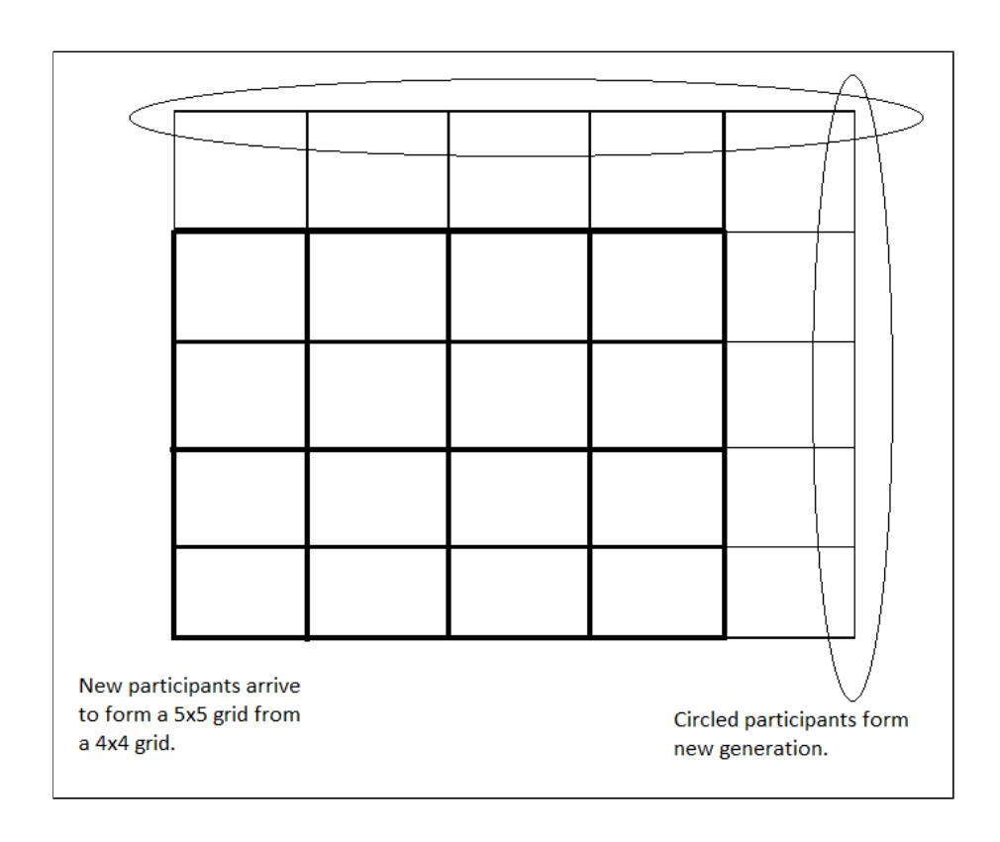
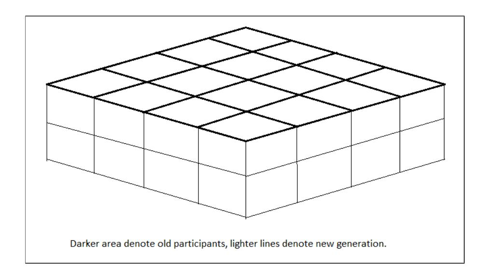
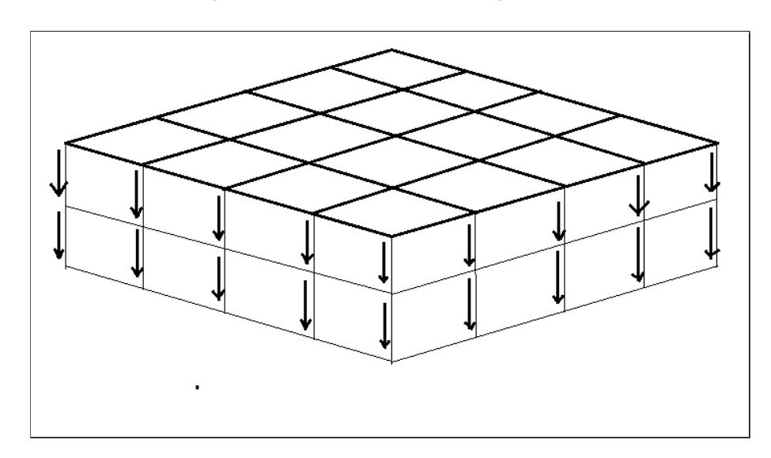
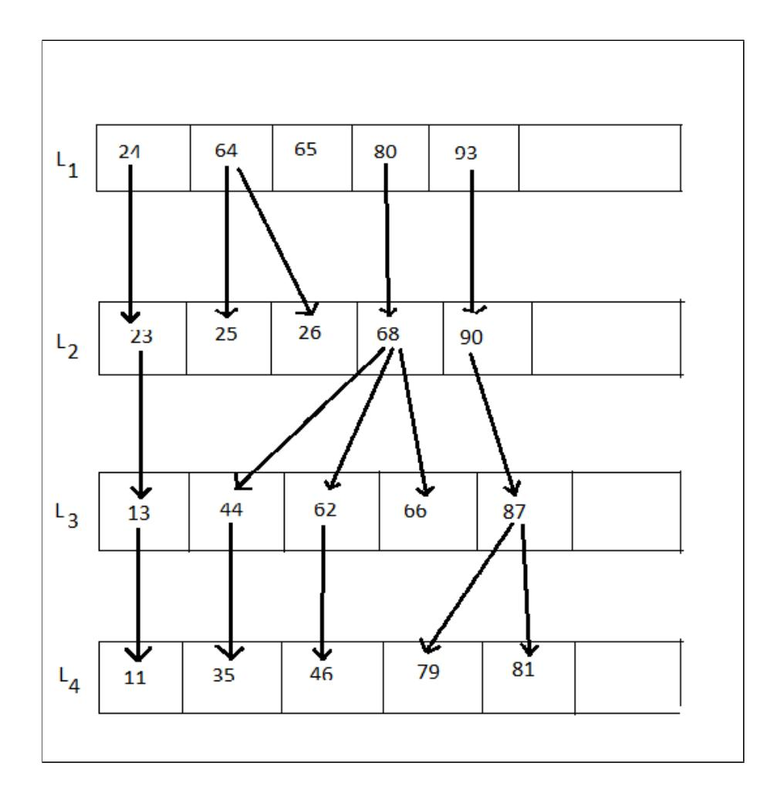

{0}------------------------------------------------

# Hypercube and Cascading-based Algorithms for Secret Sharing Schemes

Shion Samadder Chaudhurya,1,∗ , Sabyasachi Duttab , Kouichi Sakuraic

aApplied Statistics Unit, Indian Statistical Institute, Kolkata, India. bDepartment of Computer Science, University of Calgary, Calgary, Canada. cFaculty of Information Science & Electrical Engg., Kyushu University, Fukuoka, Japan.

### Abstract

Secret sharing is a very useful way to maintain secrecy of private data when stored in a distributed way among several nodes. Two significant questions in this area are 1. how to accommodate new nodes and assign shares to the new nodes, the problem becomes harder if the number of joining nodes or the access structure is not known in advance and can be (potentially) unbounded and 2. to reduce the computational complexity of secret sharing schemes. In this paper we propose two new constructions of such secret sharing schemes based on different combinatorial structures. The first construction is based on generalized paths joining the opposite vertices of a hypercube which has been divided into smaller hypercubes. The second construction is a forestbased construction utilizing a dynamic data structure technique known as fractional cascading. The generalized path we call a pavement is new to this paper. Both our constructions use a new secret redistribution scheme to assign and re-assign shares to nodes. Towards the second question we show that allowing certain trade-offs, the constructions are implementable by AC0 circuits which is the lowest complexity class in which secret sharing and reconstruction is possible. To the best of the knowledge of the authors, none of the similar existing schemes (evolving or dynamic) are AC0 computable and this paper for the first time combines the idea of hypercubes and dynamic data structures with secret sharing for preserving long-term confidentiality

∗Corresponding author.

Email addresses: chaudhury.shion@gmail.com (Shion Samadder Chaudhury), saby.math@gmail.com (Sabyasachi Dutta), sakurai@inf.kyushu-u.ac.jp (Kouichi Sakurai)

{1}------------------------------------------------

of secret data.

Keywords: Hypercube, Forest, Secret Sharing, Error-Correcting Codes,

AC0 Circuits

2010 MSC: 94A62, 94A60

### 1. Introduction

Secret sharing schemes were proposed independently by Shamir [1] and Blakley [2] in 1979. They proposed schemes where any k (or more) out of n participants are qualified to recover the secret with 1 < k ≤ n. The resulting access structure (a specified collection of subsets of participants who are eligible to reconstruct the secret) is called a (k, n)-threshold access structure where k acts as a threshold value for being qualified. The works [1, 2] were forwarded to the case of general access structures (where the subsets of participants eligible to reconstruct the secret do not have any specific mathematical structure but can be arbitrary) by the work of Ito et al. [3].

Classical secret sharing schemes assume that the number of participants and the access structure are known in advance. Moreover, the secret sharing process is an one time event – the dealer who is in possession of the secret shares it among the participants and the process is over. There is no further communication between the dealer and the participants and also among the participants. Ultimately, a qualified subset of participants may communicate among themselves to recover the secret. Later on, several other variants of secret sharing were proposed – proactive secret sharing [4], dynamic secret sharing [5], share redistribution [6, 7], sequential secret sharing [8], evolving secret sharing [9] to name a few important ones.

In proactive secret sharing [4], secret data is split using Shamir's technique to realize a (k, n)-threshold access structure. The difference with normal secret sharing schemes lies in the fact that the shares are renewed on a regular time interval in order to resist attacks from mobile adversaries who may learn more and more shares over time. Dynamic secret sharing scheme allows, without reconstructing the shared secret, to add or delete shareholders, to renew the shares, and to modify the conditions for accessing the secret. This important primitive of redistributing the secret was initially considered by Chen et al. [6], Frankel et al. [7] and Desmedt-Jajodia [10]. To describe a dynamic secret sharing scheme more formally, let us consider two sets of 

{2}------------------------------------------------

nodes P and P 0 containing n and n 0 many nodes respectively. Let us suppose that each node Pj in P has received a share sj of the secret value s. ΓP denote the access structure that specifies which subsets of P are authorized to recover the secret s from their shares. The goal of redistribution is that without the help of the original dealer, the nodes in P 0 will receive the shares of s in accordance with a possibly different access structure ΓP0. In the protocol, the nodes in P act like virtual dealers, while nodes in P 0 are the ones who receive shares.

Nojoumian-Stinson [11] proposed unconditionally secure share re-distribution schemes, in absence of a dealer, based on a previously existing VSS protocol of Stinson-Wei [12]. In their construction, they have assumed less than one-fourth of nodes behave dishonestly and also that the number of nodes is fixed throughout. Their work was improved upon by the work of Desmedt-Morozov [13] who relaxed the proportion of dishonest nodes to one-third of the total population and also allowed the number of nodes to change. A related primitive viz. sequential secret sharing (SQS) was introduced by Nojoumian-Stinson [8] as an application of dynamic threshold schemes. In this new primitive, different (but related) secrets with increasing thresholds are shared among a set of players who have different levels of authority. Subsequently, each subset of the players can only recover the secret in their own level. Finally, the master secret will be revealed if all the secrets in the higher levels are first recovered.

In a recent work, Komargodski et al. [9] initiated the study of evolving secret sharing schemes for the case where the set of parties is not known in advanced and could potentially be infinite (or even more generally the access structure may change). Specifically, parties arrive one by one and whenever a party arrives there is no communication to the parties that have already received shares, i.e. the dealer distributes a share only to the new party. In the most general case, a qualified subset is revealed to the dealer only when the last party in that subset arrives. In special cases, the dealer knows the access structure to begin with, just does not have an upper bound on the number of parties. They assume that the changes to the access structure are monotone, namely, parties are only added and qualified sets remain qualified as more and more parties join. This is called an evolving access structure.

All of the variants of secret sharing described above have the possibility of applications in preserving long-term confidentiality of private data. In fact, such an application of proactive secret sharing has already been shown in [14]. Secret sharing can provide information-theoretic security which can be 

{3}------------------------------------------------

used to protect confidentiality of stored data – which is absolutely necessary for providing "long-term" security particularly in the future era of quantum computers.

#### 2. Our Contribution

In this paper we answer the two questions in the abstract as follows : we use hypercubes and forest-based dynamic data structures to accommodate, distribute and renew shares among storage nodes. We note that such data structures are not only used to accommodate new nodes, but these data structures take active part in how the shares of old nodes are redistributed and given to new nodes and are helpful in keeping the complexity of the computations very low. In the concluding section we indicate how to use other dynamic data structures such as Tango trees etc. to produce different access structures which can accommodate new nodes. Such dynamic versions of data structures also help to delete nodes, push a node up or down a hierarchical order and so on. As we will see in section 6, all our constructions are implementable in the AC0 complexity class unlike all the previously mentioned existing schemes which cannot be implemented by AC0 circuits (the reason is explained briefly in section 3.4). Hence we can achieve long term confidentiality of such dynamic schemes with low computation resources. In order to achieve this we introduce a new formal definition for secret redistribution and a new generalized path in hypercubes known as pavements.

The novel contributions of this paper can be summarized as follows.

- Hypercube-based node addition. In this case new arriving nodes form new faces of a hypercube which has been divided into grids. In the first construction, new nodes increase the size of the hypercube and in the second construction, the new nodes increase the dimension of the hypercube. In the two-dimensional case, the size of the t th generation is 2t + 1 in the first construction and t 2 in the second construction. Using share redistribution we can ensure that in this case the dealer may become offline after a certain stage.
- Utilizing dynamic data structure techniques to accommodate new nodes. Our novel idea is to use a data structure technique known as fractional cascading. This data structure is a technique to speed up a sequence of binary searches for the same value in a sequence of related data

{4}------------------------------------------------

structures. In our construction we use the idea of cascading to assign shares to new nodes. The nodes along with the connecting edges form a forest. Hence this is a new application of the fractional cascading technique. Compared to the previous construction this construction can accommodate more nodes but this requires certain preprocessing of the nodes. Using the dynamic variant of fractional cascading one can also efficiently delete nodes from the structure.

The reason to consider different constructions is the size of the generations. While the hypercube based construction can accommodate polynomial number of new nodes, fractional cascading based construction is useful when the number of new nodes is bounded by some constant.

The rest of this paper is organized as follows. In Section 3, we discuss the preliminary definitions. In Section 4, we describe the main constructions. In Section 5.1 we describe the redistribution schemes and analyse the share sizes. In Section 6 we prove that our constructions can be implemented by AC0 circuits. Finally in Section 7 we discuss how data structures determine access structures and the paper is concluded in Section 8.

### 3. Preliminaries

## 3.1. Secret Sharing Scheme

An access structure for a set P of nodes is a monotone family Γ of subsets of P. Sets in Γ are called authorized/qualified sets and those not in Γ are called forbidden/unqualified sets. A secret sharing scheme S for an access structure A consists of a pair of algorithms (Share, Rec). Share is a probabilistic algorithm that gets as input a secret s (from a domain of secrets S) and a number n, and generates n shares Π(s) 1 , Π (s) 2 , . . . , Π (s) n . Rec is a deterministic algorithm that gets as input the shares of a subset B of nodes and outputs a string. The requirements for defining a secret sharing scheme are as follow:

- Definition 3.1. 1. (Correctness) For every secret s ∈ S and every qualified set B ∈ A, it must hold that P r[Rec({Π (s) i }i∈B, B) = s] = 1.
  - 2. (Security) For every forbidden set B /∈ A and for any two distinct secrets s1 6= s2 in S, it must hold that the two distributions {Π (s1) i }i∈B and {Π (s2) i }i∈B are identical.

{5}------------------------------------------------

The *share size* of a secret sharing scheme S is the maximum number of bits each node has to hold in the worst case over all nodes and all secrets.

**Definition 3.2.** (Ramp Secret Sharing Scheme) A(k, l, n) ramp secret sharing scheme with  $k < l \le n$ , on a set of n nodes is such that any subset of nodes of size greater than equal to l can recover the secret whereas, any subset of size less than k has no information about the secret.

## 3.2. Evolving Secret Sharing

Let  $\mathcal{A} = \{\mathcal{A}_t\}_{t \in \mathbb{N}}$  be an evolving access structure. A secret sharing scheme  $\mathcal{S}$  for  $\mathcal{A}$  consists of a pair of algorithms (SHARE, REC). SHARE is a probabilistic algorithm and REC is a deterministic algorithm which satisfy the following:

- 1. SHARE $(s, \Pi_1^{(s)}, \Pi_2^{(s)}, \dots, \Pi_{t-1}^{(s)})$  gets as input a secret s from the domain of secrets S and the secret shares of nodes  $1, 2, \dots, t-1$  and outputs the share of the  $t^{th}$  node viz.  $\Pi_t^{(s)}$ .
- 2. (Correctness) For every secret  $s \in S$ , every  $t \in \mathbb{N}$  and every qualified set  $B \in \mathcal{A}_t$ , it must hold that  $Pr[Rec(\{\Pi_i^{(s)}\}_{i \in B}, B) = s] = 1$ .
- 3. (Security) For every  $t \in \mathbb{N}$  and every forbidden set  $B \notin \mathcal{A}_t$  and for any two distinct secrets  $s_1 \neq s_2$  in S, it must hold that the two distributions  $\{\Pi_i^{(s_1)}\}_{i \in B}$  and  $\{\Pi_i^{(s_2)}\}_{i \in B}$  are identical.

#### 3.3. Secret Redistribution

Let us suppose that a node P has a share S which can be combined with some other particular nodes to reconstruct the secret. In the dynamic setting let us suppose that at some time new nodes arrive. A secret redistribution scheme is to modify the share of P and distribute shares to chosen new nodes such that ,

- $\bullet$  The current share of P can no longer be combined with the previous nodes to reconstruct the secret.
- The current share P can be combined with the current shares of the chosen new nodes to recover the original share of P.

To formalize this notion we introduce the following definition.

{6}------------------------------------------------

**Definition 3.3.** An (n,k)-redistribution scheme consists of two groups of nodes of sizes n and k,  $P_1, \ldots, P_n$  and  $Q_1, \ldots, Q_k$  respectively. The nodes  $P_1, \ldots, P_n$  have predefined shares as per some secret sharing scheme. A redistribution scheme modifies the shares of  $P_1, \ldots, P_n$  to compute n + k new shares such that:

- 1. Original shares of  $P_1, \ldots, P_n$  are deleted.
- 2. New n + k shares are distributed among all the n + k nodes  $P_1, \ldots, P_n$  and  $Q_1, \ldots, Q_k$ .
- 3. All nodes  $P_1, \ldots, P_n$  and  $Q_1, \ldots, Q_k$  combining can reconstruct the original shares of  $P_1, \ldots, P_n$ .
- 4.  $nodes P_1, \ldots, P_n$  cannot use original shares anymore.
- 5. nodes  $P_1, \ldots, P_n$  cannot obtain original shares from new shares.

We will denote a (2,2)-secret sharing scheme by  $(\mathsf{Share}^{(2,2)}, \mathsf{Rec}^{(2,2)})$  and an (n,k)-redistribution scheme by the pair  $(\mathsf{Redist}_{GEN}^{(n,k)}, \mathsf{Redist}_{REC}^{(n,k)})$ . The algorithm  $\mathsf{Redist}_{GEN}^{(n,k)}$  generates n+k new shares from n old shares and  $\mathsf{Redist}_{REC}^{(n,k)}$  combines new shares to output old shares.

We shall use a (1,1), (1,2), (3,1)-redistribution schemes for Algorithm 2 and a (1,k) redistribution scheme for the fractional cascading based scheme. Redistribution schemes are constructed using pseudo-random generators or by coding theoretic techniques combined with random permutations. More details can be found in Section 5.1.

## 3.4. $AC^0$ complexity class

 $AC^0$  is the complexity class which consists of all families of circuits having constant depth and polynomial size. The gates in those circuits are NOT, AND and OR, where AND gates and OR gates have unbounded fan-in. Integer addition and subtraction are computable in  $AC^0$ . It is also well known that calculating the parity of an input cannot be decided by  $AC^0$  circuits [15]. For any circuit C, the size of C is denoted by size(C) and the depth of C is denoted by depth(C). Recently, a lot of research [16], [17], [18], [19], [20] have been done focusing on possibilities of obtaining cryptographic primitives in low complexity classes. Since all the schemes mentioned in the introduction (Shamir's Scheme and others) use linear algebraic techniques which involve computing parity functions, the share and the reconstruction procedures of the schemes cannot be implemented by  $AC^0$  circuits.

{7}------------------------------------------------

#### 3.5. Fractional Cascading

Fractional cascading is a technique to speed up a sequence of binary searches for the same value in a sequence of related data structures. The first binary search in the sequence takes a logarithmic amount of time, but successive searches in the sequence are faster. Fractional cascading was introduced by Chazelle and Guibas in [21]. We refer the reader to [22] for more on fractional cascading and its applications. Briefly, suppose a collection of k ordered lists L1, . . . , Lk are given. The fractional cascading solution is to store a new sequence of lists Mi . The final list in this sequence, Mk, is equal to Lk; each earlier list Mi is formed by merging Li with every second item from Mi+1. With each item x in this merged list, we store two numbers: the position resulting from searching for x in Li and the position resulting from searching for x in Mi+1. If we have to search an element q in the structure, we perform a query by doing a binary search for q in M1, and determining from the resulting value the position of q in L1. Then, for each i > 1, we use the known position of q in Mi to find its position in Mi+1. The value associated with the position of q in Mi points to a position in Mi+1 that is either the correct result of the binary search for q in Mi+1 or is a single step away from that correct result, so stepping from i to i + 1 requires only a single comparison.

## 4. Main Results

#### 4.1. Dynamic secret sharing from hypercubes

In this section we construct a dynamic scheme utilizing hypercubes divided into smaller hypercubes.

- Two Dimensional grid-based construction: Let us consider an n×n grid where the edges represent the nodes. We introduce two definitions.
- Definition 4.1. A minimal path in a grid is a shortest path of length 2n connecting (0, 0) and (n, n) (i.e. containing 2n nodes).

Definition 4.2. A pavement corresponding to a minimal path P is a set of edges in a grid such that

- 1. The pavement contains all the edges of the minimal path P.
- 2. For each point (i, j) in the minimal path P, the square formed by the points (i − 1, j), (i − 1, j − 1) and (i, j − 1) is also in the pavement.

{8}------------------------------------------------

We shall use the following notation : An undirected edge between two adjacent points (i, j) and (k, l) is denoted by E (k,l) (i,j) .

Definition 4.3. For a point (i, j), (i > 0, j > 0), the previous points are (i − 1, j),(i, j − 1),(i − 1, j − 1) whichever exists. The previous edges are : E (i,j) (i−1,j) , E (i,j) (i,j−1), E (i−1,j) (i−1,j−1) and E (i,j−1) (i−1,j−1) whichever exists.

• The Access Structure: Let us fix, at time t, two diagonally opposite points (0, 0) and (nt , nt). We do not include the time variable in future to avoid cumbersome expressions. A set of edges (nodes) is assigned as a qualified set if the edges contain a pavement connecting the two diagonally opposite points.

In the access structure induced by the sharing algorithm 1 and 2, minimum number of nodes which may form a qualified set lies between 2n and 2n+2n = 4n and the total number of minimal qualified sets is the number of ways to connect two diagonally opposite points which is 2n n . A minimal qualified set is a qualified set of participants such that whenever any participant is removed from the set, it is no longer a qualified set. Forbidden sets are those sets of participants (nodes) who cannot reconstruct the secret or have no information about the secret.

- Adding nodes and share distribution: In two dimensions if we have a n × n grid, the new nodes are accommodated to form an (n + 1) × (n + 1) grid. Nodes are included by increasing the last row and the last column. Algorithm 1 describes the process of adding nodes in a structured way and Algorithm 2 gives details of share distribution.
- Secret Reconstruction: At time t + 1, a qualified is a set of points containing a pavement from (0, 0) to (n + 1, n + 1). Secret is reconstructed iteratively from (n + 1, n + 1) to (0, 0) The shares of the previous edges are utilized.

For the share redistribution algorithms we refer to Section 5.1. From the secret reconstruction procedure in Algorithm 2 the correctness of secret recovery by a qualified set of nodes is evident. We prove the secrecy of the scheme in the following theorem.

Theorem 1. Forbidden sets of nodes in Algorithm 2 do not get any information about the secret.

Proof. By definition, forbidden sets are those sets of nodes which do not

{9}------------------------------------------------

Figure 1: Increasing grid to accommodate new nodes.

contain a *pavement*. We prove the theorem for new columns formed by nodes. For new rows, the proof is similar. There are two cases :

Case 1: The set of nodes (edges) do not contain a minimal path connecting (0,0) to (n+1,n+1). Thus, either the points (0,0) or (n+1,n+1) is not present in the set, or the set can be divided into at least two connected components. If either of the points (0,0) or (n+1,n+1) is not present, then by our construction the secret cannot be recovered. Also existence of two connected components mean that the minimum distance between the two connected components in the grid is  $\geq 2$ . This means that in the grid there is a square of four points (i,j), (i-1,j), (i,j-1) and (i-1,j-1) such that at most two of them belong to the set. By our construction, the shares of the edges of the square formed by (i-1,j), (i,j-1) and (i-1,j-1) have been modified and redistributed to give to (i,j). Hence in the absence of two of them, the share between these nodes are hidden by the secrecy of the underlying secret sharing scheme and the redistribution scheme.

Case 2: No minimal path in the set forms a pavement in the set. Again, there is a square of four points (i,j), (i-1,j), (i,j-1) and (i-1,j-1) in the grid such that at most three of them belong to the set. By our construction, the shares of the edges (nodes) formed by (i-1,j), (i,j-1) and (i-1,j-1) have been modified to give to the edge (node)  $E_{(i,j-1)}^{(i,j)}$ . Hence in the absence of one of them, the share between these nodes cannot be recovered and thus

{10}------------------------------------------------

#### Algorithm 1 Construction of dynamic grid

- 1: procedure Accommodating nodes in New Generation
- 2: At some stage an  $n \times n$  grid has been created.
- 3: To include new nodes add them to the unassigned edges  $E_{(n,i)}^{(n+1,i)}$  and  $E_{(n+1,j)}^{(n+1,j+1)}$ ,  $(0 \le i \le n, 0 \le j \le n-1)$  in the new column.
- 4: If the column is full, add new node to the unassigned edges  $E_{(i,n)}^{(i,n+1)}$  and  $E_{(j,n+1)}^{(j+1,n+1)}$ ,  $(0 \le i \le n, 0 \le j \le n-1)$  in the new row.
- 5: Add nodes  $E_{(n,n+1)}^{(n+1,n+1)}$  and  $E_{(n+1,n)}^{(n+1,n+1)}$ .
- 6: If both the row and column are full, create a new generation i.e., a new column and a new row to create an  $(n+2) \times (n+2)$  grid.

the security of the scheme reduces to the underlying secret sharing scheme. Combining the above arguments the proof follows.

**Remark 4.4** (Size of generation). We note that a generation is formed by a new row and a column. Hence the size of the  $t^{th}$  generation is 4t-2.

- Increasing size of cube in three dimensions: This case is similar to the 2-dimensional case except in this case we consider an  $(n \times n \times n)$  grid. New nodes (edges) are added along three mutually adjacent faces of the hypercube to make it into a  $(n+1) \times (n+1) \times (n+1)$  grid cube. In this case, the number of new nodes in the  $t^{th}$  generation is poly(t). In three dimensions, we can also take a face of a unit cube as a node and proceed as in the case of  $(n \times n)$  grid. In general as per requirement we can start with a hypercube in any dimension which is divided into a grid and increase the size of the grid for a new generation of nodes.
- Increasing dimension from a two dimensional grid to a three dimensional cube by adding edges:
- Node accommodation and share distribution: Let us suppose that we have two-dimensional grid of size  $n \times n$ , at time t-1. For the new arriving nodes we want to accommodate them in a new dimension. The advantage of this construction is that in the  $t^{th}$  generation we can accommodate  $O(t^2)$  many new nodes as compared to O(t) nodes in the two-dimensional case. Similarly when going from three dimensions to four dimensions, in the  $t^{th}$  generation, we can accommodate  $O(t^3)$  new nodes. To accomplish this we

{11}------------------------------------------------

## Algorithm 2 Grid based construction of secret sharing

- 1: procedure Share generation for New Nodes
- 2: To assign share to a new node in generation t+1, 3: Run  $\mathsf{Redist}_{GEN}^{(1,1)}$  on the shares of  $E_{(n,i)}^{(n+1,i)}$  and  $E_{(n-1,i)}^{(n,i)}$
- Generate shares  $S_{(n,i)}^1$  and  $S_{(n+1,i)}$ . 4:
- 5: Dealer gives the share  $S_{(n,0)}^1$  to  $E_{(n-1,i)}^{(n,i)}$  and gives the share  $S_{(n+1,i)}$  to  $E_{(n,i)}^{(n+1,i)}.$
- 6: When new nodes arrive along the new column, for each node  $E_{(n+1,i+1)}^{(n+1,i)}$ ,  $(1 \le i \le n-1)$ , dealer runs a (3,1)- redistribution scheme  $\mathsf{Redist}_{GEN}^{(3,1)}$ (See section V) to modify the shares of  $E_{(n+1,i)}^{(n,i)}$ ,  $E_{(n+1,i+1)}^{(n,i)}$  and  $E_{(n,i+1)}^{(n,i)}$  to give the share to  $E_{(n+1,i+1)}^{(n+1,i)}$
- 7: Do the same procedure for rows.
- 8: Repeat the procedure until all the shares are exhausted.
- 9: When all the shares are exhausted, create a new generation i.e., a new row and a new column.
- 10: procedure Secret Reconstruction
- 11: Given qualified set Q, consider the pavement P from (0,0) to (n+1,n+1).
- 12: Let M be a minimal path in P
- 13: Remove any loop from M to get M'.
- 14: Initialize i = n + 1, j = n + 1.
- 15: Do steps 16 to 18 until i, j > 0.
- 16: For a point (i,j) (i,j>0) in the path M', the previous point in the path is either (i-1,j) or (i,j-1).
- 17: Use the shares of the edges in the square formed by the points (i-1,j), (i, j-1) and (i-1, j-1) to restore the share of the previous edge.
- 18: i = i 1, j = j 1.
- 19: Restore the share of (0,0) to reconstruct the secret.

{12}------------------------------------------------

Figure 2: Extending a two dimensional grid to three dimensions.

Figure 3: Share redistribution in higher dimension.

have to consider a line through each point in the two-dimensional grid in a direction of the z-axis (new dimension). To accommodate new nodes along the new direction we need to redistribute the shares of each of the points in the two-dimensional grid. To keep number of new nodes quadratic in the t th generation and limiting the share size, instead of extending to a complete n × n × n three-dimensional cube, we only extend to an n × n × 2 cuboid.

Definition 4.5. A three-dimensional pavement is set of edges T P in the n × n × 2 cuboid such that

- 1. T P contains at least one point of the form (i, j, 0).
- 2. Points in T P of the form (i, j, 0) induce a pavement in the original two-dimensional grid. Original grid is formed by points of the form (i, j, 0), 0 ≤ i, j ≤ n.
- 3. For each point (i, j, 0) in T P, the edges E (i,j,1) (i,j,0) and E (i,j,2) (i,j,1) are also in T P.

{13}------------------------------------------------

- Access Structure: A set of edges in the  $(n \times n \times 2)$  cuboid is defined to be a qualified set if the set of edges contain a three-dimensional pavement connecting the points (0,0,0) and (n,n,0). The node accommodation is formalized in Algorithm 3.
- Share distribution to new nodes: Let us suppose that for i > 0, the new edge (node)  $E_{(i,j,0)}^{(i,j,1)}$  is added. To give share to this node a (1,1)-redistribution scheme is applied and the share of the edge (node)  $E_{(i-1,j,0)}^{(i,j,0)}$  is modified to give share to  $E_{(i,j,0)}^{(i,j,1)}$ . When  $i=0,\ j>0$  and the edge  $E_{(0,j,0)}^{(0,j,1)}$  is added, the share of the node  $E_{(0,j-1,0)}^{(0,j,0)}$  is modified to give to the new node. Finally, when the node corresponding to the edge  $E_{(0,0,0)}^{(0,0,1)}$  is added, the shares of the nodes  $E_{(0,0,0)}^{(0,1,0)}$  and  $E_{(0,0,0)}^{(1,0,0)}$  are modified using a (2,1)-redistribution scheme to give share to the new node. Now to further add edges of the form  $E_{(i,j,1)}^{(i,j,1)}$ , we use a (1,1)-redistribution scheme to modify old share of  $E_{(i,j,0)}^{(i,j,1)}$  and give share to  $E_{(i,j,1)}^{(i,j,2)}$ .
  - Reconstruction: Given qualified set Q.
  - 1. For each point (p, q, 0), restore the share of the edge  $E_{(p-1,q,0)}^{(p,q,0)}$  using the shares of the edges  $E_{(p,q,0)}^{(p,q,1)}$  and  $E_{(p,q,1)}^{(p,q,2)}$ .
  - 2. Using the restored shares of the edges  $E_{(p-1,q,0)}^{(p,q,0)}$ , use the reconstruction technique as in the case of two-dimensional grid to reconstruct the secret.

The correctness of secret reconstruction follows from the fact that Q contains a three-dimensional pavement which in turn contains a two-dimensional pavement. By an essentially similar argument as in Theorem 1 we can see that forbidden sets do not have any information about the secret entity.

So the minimum number of nodes that a qualified set can have is  $\geq 2n \times 4 = 8n$ . Our idea can be generalized to higher dimensions. As in the case of two-dimensional grid, we can accommodate new nodes by adding necessary edges in the  $(n \times n \times n)$  hypercube to make a  $(n \times n \times n \times 2)$  hypercuboid. Also instead of adding edges, we may define a node to be a face of a unit cube and proceed by adding faces. Most generally we can accomplish this by adding edges/faces to a simplicial complex. The advantage in simplicial complex based construction is that it can support the following scenario: the number of nodes in a latter generation is less than that in an earlier generation.

{14}------------------------------------------------

Let us suppose that we have a two-dimensional (n×n) grid. By the previous discussion we can accommodate 2n 2 new nodes. Also let us assume that points in the two-dimensional grid is ordered in the lexicographic ordering.

## Algorithm 3 Grid based scheme-increasing dimension

- 1: procedure Accommodation in 3-dimensions
- 2: Initialize i = 0.
- 3: While i ≤ 2n 2 do steps 3 to 14.
- 4: i th new node arrives.
- 5: If i ≤ n 2 , then do steps 6 to 9, else go to step 10.
- 6: Find least (as per lexicographic order) unassigned unmodified edge in the grid. Denote by (p, q).
- 7: Update the coordinates of (p.q) to (p, q, 0).
- 8: Assign the edge E (p,q,1) (p,q,0) as new node.
- 9: Redistribute appropriate share to E (p,q,1) (p,q,0) .
- 10: If i > n2 do steps 11 to 13.
- 11: Find least (as per lexicographic order) unmodified edge coordinate in the set {(p, q, 1) : p, q ≤ n}. Denote by (p, q, 1).
- 12: Assign E (p,q,2) (p,q,1) as new node.
- 13: Redistribute share of E (p,q,1) (p,q,0) to E (p,q,2) (p,q,1) .
- 14: Increase i by 1.

Remark 4.6. Here we observe that the dealer only distributes shares to the first two edges. After this the dealer is not required any more. The share redistribution can be done by the nodes themselves. Hence this scheme can be used in the dealer free situation.

### 4.2. Fractional Cascading based Dynamic Secret Sharing

Fractional cascading connects with secret sharing in the sense of redistribution of secret shares. For preprocessing we denote nodes by positive integers and arrange the nodes in increasing order in several lists. When a new node arrives, it is added to a suitable list the share of certain (bounded number of) nodes are changed.

• Overview of our idea: Let us suppose that at any instance we have k ordered lists of nodes in increasing order where each node has a positive weight. The lists of nodes are L1, ..., Lk. The first node x 1 1 in the list L1 is connected 

{15}------------------------------------------------

to all those nodes in L2 whose weights are less than or equal to x 1 1 . The second node x 2 1 in L1 is connected to all those nodes in L2 which have not been previously connected and whose weights are less than or equal to x 2 1 and so on. We repeat the previous step for nodes in L2 and L3 and so on. Note that initially, there can be nodes which are not connected to any other node. Each node in the list L1 is the root of a tree along with the connections. Let us suppose at this stage a new node with weight q arrives. If q < max(Lk), insert q in Lk maintaining the order and update the connections between Lk−1 and Lk. If q > max(Lk) and q < max(Lk−1), insert q in Lk−1 keeping the order and update the connections between Lk−2, Lk−1 and Lk. If q > max(Lk−1) go to Lk−2 and so on. If q > max(L1), add q to the end of L1.

In this structure, the generations are based on range of the weights of the nodes. When all the generations are exhausted, the new node is added to L1. The sizes / ranges of the previous generations are increased suitably and the process is repeated.

To share a secret S, first the secret is distributed among all the nodes of L1 using the hypercube-based construction on a suitably sized hypercube. As per this construction, one element can be attached only to bounded many nodes. Hence each of the shares in L1 are distributed to bounded many nodes in L2 and so on along the connections. When new nodes arrive, share is redistributed along the connections. Nodes in one list combine to reconstruct the share of the previous list. Share sizes do not increase drastically due the nature of the structure and pre-processing. The process is formalized in Algorithm 4.

Given k lists L1, L2, ..., Lk each of size at most n. Each list is filled with nodes denoted by its weight in increasing order. Here size(Li) denotes the number of nodes in the list Li . Elements of the lists are denoted by Li [.]. To store the connections, for each node we maintain lists C(p,q) [.], where p, q denotes the list and the position in the list respectively.

Following this procedure we must delete the duplicate connections. This may happen because from the algorithm an element in a list can be connected from two distinct elements in the previous list. In such a case the connection from the node with greater denomination is deleted.

Remark 4.7. It is clear from figure 4 that each of the nodes along with the connections form a tree and hence the whole structure becomes a forest. One more reason to consider such a dynamic data structure / forest based con-

{16}------------------------------------------------

Figure 4: Connecting nodes among ordered lists.

struction is that different generations may have different sizes. Also in many practical scenarios, one may need to add new nodes to an earlier generation as per hierarchical requirements. Such a construciton can support such scenarios.

#### 4.2.1. Share distribution

Let us suppose that initially there are n many elements in the list L1. The dealer can run an (n, n) scheme to generate n shares for L1. Otherwise to keep computations in AC0 , to share a secret S, we express n as 2k + 1. According to this expansion we run the distribution and redistribution scheme of hypercube based construction to generate n shares for the nodes in the list L1. If a node in L1 is connected to t nodes in L2, use a (1, t) redistribution scheme, to redistribute shares among the nodes in L2. Repeat the procedure for nodes in L2 and their connections in L3 and so on. When new nodes arrive, the connections are updated and shares are redistributed as per the updated connections.

{17}------------------------------------------------

#### Algorithm 4 Combining fractional cascading and secret sharing

- 1: procedure Creating initial connections
- 2: Initialize i = 1, j = 1, g = 1.
- 3: While i ≤ k − 1 do steps 4 to 8.
- 4: While j ≤ size(Li) do steps 5 to 7.
- 5: While g ≤ size(Li+1) do step 6.
- 6: If Li+1[g] ≤ Li [j] then add g to the list C(i,j) else increase g by 1.
- 7: Increase j by 1.
- 8: Increase i by 1.
- 9: procedure Accommodating new nodes
- 10: New node denoted by q is to be included.
- 11: If q < max(Lk), insert q in a proper position in Lk and update the connections between Lk and Lk−1. Else go to step
- 12: If q < max(Lk−1), insert q in a proper position in Lk−1 and update the connections between Lk−2 and Lk−1. Create new connections between Lk−1 and Lk. Else go to step
- 13: Repeat step with Lk−j until we reach L1.
- 14: Insert/Add q in a proper position in L1.

#### 4.2.2. Secret Reconstruction

In our constructions, share generation, distribution and redistribution occurs at every level and generation. In each generation the nodes which are connected to a particular node in the previous generation, combine to reconstruct the partial share. This partial share in turn is used in combination with the share of the node in the previous generation to generate the partial share of of the node in the generation one level above. This process is continued until we reach the first generation. Here the complete shares of the nodes have been reconstructed, and now the the secret can be recovered.

### 4.2.3. Privacy

In this scheme, whenever a new generation is created, the shares of the nodes in the previous generation gets modified. The nodes in the last generation combine to form the partial shares of the elements in the previous generation who in turn combine to reconstruct the partial shares of the nodes in the generation one level above and so on. Hence no proper subset of nodes combining together can reconstruct the secret. It is only when all the nodes combine then the secret can be reconstructed. So no node is redundant to 

{18}------------------------------------------------

this scheme.

## 4.2.4. Size of generation

In each generation, there are at most k-nodes which is same as the number of lists.

## 5. Share distribution, redistribution schemes and share size

In this section we discuss some share distribution and redistribution schemes and their share sizes.

- 5.1. Share distribution and redistribution schemes
- 5.2. (2,2)-scheme or (n,n)-scheme

The (2,2) scheme that we use is the (2,2)-threshold scheme of Shamir [1]. Shamir's scheme is an ideal secret sharing scheme, meaning that the size of the secret and the share size is the same. Similar is the (n,n)-scheme but this scheme is not  $AC^0$  computable.

#### 5.3. Redistribution Schemes

In this section we formalize the redistribution schemes.

## 5.3.1. (1,1) and (1,2)-redistribution scheme

We first look at the definition of a random partition.

**Definition 5.1.** A random partition of a string into p parts is a random permutation of the elements of the string followed by partitioning the string into p equal parts.

Let us suppose that the share  $S_1^1$  has to be redistributed into shares  $S_1^{11}$  and  $S_1^{12}$ . There are two ways to do this. Firstly encode  $S_1^1$  using an (n, k)-code where the operations can be done in  $AC^0$  [23]. Now partition the coded string into two equal parts using a random partition to generate shares  $S_1^{11}$  and  $S_1^{12}$ . Secondly one may use a pseudorandom generator instead of codes to extend the message and generate the shares  $S_1^{11}$  and  $S_1^{12}$ . The procedure for the (1,2)-redistribution scheme is formalized below.

The same procedure can be generalized to case of a (1, k)-redistribution scheme. If we use pseudorandom generators we use the following modified algorithm.

{19}------------------------------------------------

## Algorithm 5 Redistribution of secret shares

- 1: **procedure** Share Redistribution (Redist $_{GEN}^{(1,2)}$ )
- 2: Encode(S) using a coding scheme to generate Enc(S).
- 3: Use random partition to split Enc(S) to  $S_1$ ,  $S_2$  and  $S_3$ .
- 4: Keep  $S_1$  for old node whose share is being modified.
- 5: Distribute  $S_2$  and  $S_3$  to two new nodes.
- 6: **procedure** Share Reconstruction (Redist $_{REC}^{(1,2)}$ )
- 7: Input:  $S_1, S_2, S_3$
- 8: Concatenate  $S_1$ ,  $S_2$ ,  $S_3$  to get  $S^1$ .
- 9: Apply inverse permutation on  $S^1$  to get Enc(S).
- 10: Output:  $Dec(Enc(S)) \longrightarrow S$ .

## Algorithm 6 Redistribution using pseudorandom generators

- 1: **procedure** Share Redistribution (Redist $_{GEN}^{(1,k)}$ )
- 2: Stretch S using a pseudorandom generator get  $\bar{S}$ .
- 3: Use a random permutation to permute the elements of  $\bar{S}$ .
- 4: Split  $\bar{S}$  into k+1 equal parts,  $S_1, \ldots, S_{k+1}$ .
- 5: Distribute  $S_1, \ldots, S_{k+1}$ .

## Algorithm 7 (3, 1)-redistribution scheme

- 1: **procedure** Share Redistribution on  $(S_1, S_2, S_3)$
- 2: Concatenate  $S_1, S_2, S_3$  to get  $S^1$ .
- 3: Encode S using a coding scheme to generate  $Enc(S^1)$ .
- 4: Use a random partition to split  $Enc(S^1)$  into four parts  $S^{11}, S^{12}, S^{13}, S^{14}$  and distribute first three to old nodes and  $S^{14}$  to new node.
- 5: procedure Share Reconstruction after Redistribution
- 6: Concatenate  $S^{11}, S^{12}, S^{13}, S^{14}$  to get  $\bar{S}$ .
- 7: Use the inverse permutation to get  $Enc(S^1)$ .
- 8: Apply  $Dec(Enc(S^1))$  to get  $S^1$ .
- 9: Split  $S^1$  to get original shares  $S_1$ ,  $S_2$  and  $S_3$ .

{20}------------------------------------------------

In construction 2, we use a (3, 1)-redistribution scheme. It is formalized in the following algorithm. Let us suppose that we want to modify three old shares S1, S2, S3 to give to new node.

Remark 5.2. We note that these redistribution schemes follow Definition 3.3. Clearly the properties 1 − 4 of Definition 3.3 are satisfied. To see that property 5 is satisfied we recall the redistribution process. First the original shares of some particular nodes are concatenated to get a single string. This string is encoded via a coding scheme to get an encoded string. Following this a random partition is applied. This is the crucial step. A random partition is a random permutation of the elements of the string followed by the division of the string into some equal parts. Due to the random permutation an old node cannot distinguish between old share and new share. Even if a constant fraction of the string is observed, no information can be obtained from the new string. For a full proof, we refer the reader to Lemma 3.7 and 3.8 of [24].

Since there are only finitely many permutations of a string of N elements, we can order these permutations and embed the order of the permutation used in the string for the participants to use during the reconstruction process. This adds a linear overhead to the share size. Some other information we need to store are the size of the partitions which adds a constant overhead to the share size.

#### 5.4. Share Size

From the redistribution schemes that we have used, we note that share size for the t th generation depends on the error correcting code and the and the number of nodes that we are using. Share size also depends on our choice of complexity classes. If we want our computations to be implementable in the very low complexity class AC0 then the share size will be more when compared to the cases where the share and reconstruction is implementable in higher complexity classes namely NC1 (NC1 is the class of decision problems decidable by uniform boolean circuits with a polynomial number of gates of at most two inputs and depth O(log1n), or the class of decision problems solvable in time O(log1n) on a parallel computer with a polynomial number of processors.). We may use the error correcting codes of Cheragchi[23] which are near optimal error-correcting codes. For implementation in the AC0 complexity class we may use the error correcting codes of Cheng, Ishai, Li [24]. Here we note that the while the length of the encoded string in 

{21}------------------------------------------------

Cheragchi's scheme is O(1), the scheme cannot be implemented in the  $AC^0$  complexity class. On the other hand the size of the string in the case of [24] is exponential.

## 5.4.1. Share Size for grid and hypercube based algorithm 2

In this construction there are two different share sizes of the nodes of the t-th generation. For nodes(edges) of the form  $E_{(n,0)}^{n+1,0}$ , we use a (1,1)-redistribution scheme and for nodes of the form  $E_{(n,i)}^{(n+1,i)}$ , i>0, we use a (3,1)-redistribution scheme. Similarly for nodes along new row. Let us suppose that  $f_{(1,1)}: \mathbb{N} \to \mathbb{N}$  is the function by which the length of a string is stretched when applied through a error correcting code or a pseudorandom generator during the (1,1)-redistribution scheme. Hence the share sizes of the nodes of the form  $E_{(n,0)}^{n+1,0}$ , of the t-th generation is  $[f_{(1,1)}^{t-1}(s)/2]$  and  $[f_{(1,1)}^{t}(s)/2]$  when new generation nodes arrive. For nodes of the form  $E_{(n,i)}^{(n+1,i)}$ , i>0, share sizes of the t-th generation is  $[f_{(3,1)}^{t-1}(s)/4]$  and  $[f_{(3,1)}^{t}(s)/4]$  when new generation nodes arrive.

## 5.4.2. Share size for fractional cascading based algorithm 4

In this scheme first the secret is shared among the nodes (elements) in the first list. Following this the shares are redistributed as per the connections made in the other lists. Depending on the range of weights of the nodes, share has to be redistributed among a bounded number of nodes. To distribute shares among the nodes of the first list  $L_1$ , we can use either of the following:-

- 1. The (k, k)-Shamir's scheme for k nodes in  $L_1$ .
- 2. The hypercube based (k, k)-scheme.

Next if we have to redistribute shares among say R many nodes depending on the range of weights, then we use a (1, R)-redistribution scheme as in algorithm 6. Finally when new nodes arrive, shares are redistributed as per a (1, W)-redistribution scheme where W is the number of connections to be updated. Here we note that while Shamir's scheme is ideal, the dynamic (k, k) scheme that we have constructed is not ideal.

#### 5.4.3. Share Size-exact values

We have noted that to obtain the exact value of the share size of the nodes of the t-th generation, we need the coding scheme that we are using

{22}------------------------------------------------

and the extra information that we are embedding in the share strings such as the permutation and the size of the partition. If we use good error correcting codes as in the codes of [23], then from the discussion in this section the share size for the nodes in the t-th generation turns out to be polynomial in t and the size of the secret S. If we use AC0 -error correcting codes as in [24], then the share size of nodes in the t-th generation turns out to be exponential in t.

## 6. Complexity Analysis - Constructions in AC0

In this section we prove that in each of the above mentioned schemes, the share distribution, redistribution and secret reconstruction can be implemented by AC0 circuits. The motivation to study secret sharing schemes that can be implemented by constant-depth circuits viz. AC0 , comes from the fact that most well-known secret sharing schemes require computations that can not be implemented by constant-depth circuits (i.e. AC0 circuits). Shamir's scheme in [1] requires linear algebraic computations over finite fields and hence cannot be computed in AC0 . The visual secret sharing schemes introduced by Naor and Shamir [25] require only computation of OR during the secret reconstruction phase which can be implemented by AC0 circuits. Recent work by Bogdanov et al. [26]and Cheng et al. [24] considers the question of whether there exists secret sharing schemes such that both share generation algorithm and secret reconstruction algorithm are computable in AC0 .

#### 6.1. Hypercube-based scheme

Theorem 2. The share distribution, redistribution and secret reconstruction can be done by AC0 circuits.

Proof. Share construction is initially done by the (2, 2)-threshold scheme. This can be implemented by constant depth circuits since the only operations used are XOR and OR. Share redistribution is done either by pseudorandom generators or by encoding the scheme by a suitable error correcting code. From [26], [27], there exists AC0 computable peudorandom generators and from [24] we get coding schemes where both encoding and decoding can be done in AC0 . A random partition of a string into two parts is same a random permutation of a string followed by dividing the string midway into two equal halves. It is well known that a random permutation can be computed in AC0 and the partition can also be done be AC0 circuits.

{23}------------------------------------------------

To reconstruct a redistributed share first the nodes in one generation concatenate their shares and apply inverse permutation to recover the encoded share. Both these operations can be done in AC0 . The share of this generation is now recovered by using AC0 decoding of the encoded share. Using this recovered share, the previous generation recover their shares and recursively the secret is recovered. Hence the whole reconstruction algorithm can be done in AC0 . Similarly the (3, 1)-redistribution scheme can be implemented by AC0 circuits if we use the AC0 error correcting codes of [24].

#### 6.2. Fractional Cascading based construction

Theorem 3. The Share distribution, Redistribution and secret reconstruction can be done by AC0 circuits.

Proof. In this, the arriving nodes are included in k-lists. When a new node arrives , the total number of connections that needs to be updated is k, since there are k-many lists. Also the number of partitions into which the share has to be redistributed is bounded by a constant. This constant depends on the initial values in the k-lists. Hence we can assume that there is a constant C, such that the total number of partitions needed to redistribute a share is bounded above by C. To redistribute a share we use an (cn, n)-error correcting code to encode the share, or a polynomial stretch pseudorandom generator to increase the length of the share. This process can be done in AC0 as in the previous proof. Next we use a random permutation to permute the elements of the extended string and then split the string into at most C parts. Both these processes can be achieved by AC0 circuits.

During reconstruction, the nodes of one generation combine to reconstruct the share of the previous generation. This is done by concatenating the shares, applying the inverse permutation and decoding the share. As in the previous proof, all these processes can be done in AC0 .

#### 7. Discussion

#### 7.1. Data Structures determining access structures

We have constructed various versions of evolving secret sharing schemes where the share generation and secret reconstruction can be implemented by AC0 circuits. The binary tree based construction can be modified when new 

{24}------------------------------------------------

nodes arrive. We can use dynamic trees which support efficient insertion and deletion of nodes/nodes. We mention a brief algorithm below. For practical purposes we choose the Tango tree data structure. We refer the reader to [28] for more on Tango trees. Briefly, a tango tree is It is an online binary search tree that achieves an O(log log n) competitive ratio relative to the offline optimal binary search tree, while only using O(log log n) additional bits of memory per node. This improved upon the previous best known competitive ratio, which was O(log n). In a tango tree, for each node its preferred child is is the most-recently touched child by a traditional binary search tree lookup. A preferred path is defined by starting at the root and following the preferred children until reaching a leaf node. In the following algorithm, we consider how the access structure gets modified as we accommodate a new node P. For the exact algorithm to accommodate a new element to a tango tree, we refer the reader to [28]. In this context we mention hierarchical access structures. In such settings, the secret is shared among a group of participants that is partitioned into levels. The access structure is then determined by a sequence of threshold requirements: a subset of participants is authorized if it has at least k0 members from the highest level, as well as at least k1 > k0 members from the two highest levels and so forth. Such problems may occur in settings where the participants differ in their authority or level of confidence and the presence of higher level participants is imperative to allow the recovery of the common secret. We can incorporate hierarchical structures in such schemes by considering share distribution to the preferred child and preferred paths. We also note that here the data structure we are using (for example Tango Trees) determines the access structure of the secret sharing scheme.

#### Algorithm 8 Combining dynamic data structures and secret sharing

- 1: procedure Updating Access Structure
- 2: Initial Tango Tree T.
- 3: Accommodate new node P as a new element to T.
- 4: Update preferred child and preferred paths in T to get new tree T 0 .
- 5: nodes at distance k from the root form the k-th generation.
- 6: Find the greatest k such that k-th generation is not modified.
- 7: Redistribute shares starting from (k + 1)-generation to the last generation
- 8: Induce hierarchy in each generation by considering preferred child in each generation.

{25}------------------------------------------------

#### 8. Conclusion

In this paper we have given constructions of secret sharing schemes which can accommodate new nodes over time. Our constructions make use of a new combinatorial structure namely pavements and incorporate data structure techniques. We have also shown that our constructions can be implemented in the AC0 complexity class. Through our constructions we achieve long term confidentiality of secret data distributed among nodes.

## References

- [1] A. Shamir, How to share a secret, Commun. ACM 22 (1979) 612–613. URL: http://doi.acm.org/10.1145/359168.359176. doi:10.1145/359168.359176.
- [2] G. R. Blakley, Safeguarding cryptographic keys, in: Managing Requirements Knowledge, International Workshop on, IEEE Computer Society, Los Alamitos, CA, USA, 1979, p. 313. URL: https://doi.ieeecomputersociety.org/10.1109/AFIPS.1979.98. doi:10.1109/AFIPS.1979.98.
- [3] M. Ito, A. Saito, T. Nishizeki, Multiple assignment scheme for sharing secret, J. Cryptology 6 (1993) 15–20. URL: https://doi.org/10.1007/BF02620229. doi:10.1007/BF02620229.
- [4] A. Herzberg, S. Jarecki, H. Krawczyk, M. Yung, Proactive secret sharing or: How to cope with perpetual leakage, in: D. Coppersmith (Ed.), Advances in Cryptology — CRYPT0' 95, Springer Berlin Heidelberg, Berlin, Heidelberg, 1995, pp. 339–352.
- [5] C. Blundo, A. Cresti, A. De Santis, U. Vaccaro, Fully dynamic secret sharing schemes, in: D. R. Stinson (Ed.), Advances in Cryptology — CRYPTO' 93, Springer Berlin Heidelberg, Berlin, Heidelberg, 1994, pp. 110–125.
- [6] L. Chen, D. Gollmann, C. J. Mitchell, Key escrow in mutually mistrusting domains, in: M. Lomas (Ed.), Security Protocols, Springer Berlin Heidelberg, Berlin, Heidelberg, 1997, pp. 139–153.

{26}------------------------------------------------

- [7] Y. Frankel, P. Gemmell, P. D. MacKenzie, Moti Yung, Optimalresilience proactive public-key cryptosystems, in: Proceedings 38th Annual Symposium on Foundations of Computer Science, 1997, pp. 384– 393. doi:10.1109/SFCS.1997.646127.
- [8] M. Nojoumian, D. R. Stinson, Sequential secret sharing as a new hierarchical access structure, J. Internet Serv. Inf. Secur. 5 (2015) 24–32. URL: http://isyou.info/jisis/vol5/no2/jisis-2015-vol5-no2-02.pdf.
- [9] I. Komargodski, M. Naor, E. Yogev, How to share a secret, infinitely, in: M. Hirt, A. Smith (Eds.), Theory of Cryptography, Springer Berlin Heidelberg, Berlin, Heidelberg, 2016, pp. 485–514.
- [10] Y. Desmedt, S. Jajodia, Redistributing secret shares to new access structures and its applications, in: George Mason University, Tech. Report ISSE-TR-97-01, July 1997, ftp://isse.gmu.edu/pub/techrep/97 01 jajodia.ps.gz., 1997.
- [11] M. Nojoumian, D. R. Stinson, On dealer-free dynamic threshold schemes, Adv. in Math. of Comm. 7 (2013) 39–56. URL: https://doi.org/10.3934/amc.2013.7.39. doi:10.3934/amc.2013.7.39.
- [12] D. R. Stinson, R. Wei, Unconditionally secure proactive secret sharing scheme with combinatorial structures, in: H. Heys, C. Adams (Eds.), Selected Areas in Cryptography, Springer Berlin Heidelberg, Berlin, Heidelberg, 2000, pp. 200–214.
- [13] Y. Desmedt, K. Morozov, Parity check based redistribution of secret shares, in: 2015 IEEE International Symposium on Information Theory (ISIT), 2015, pp. 959–963. doi:10.1109/ISIT.2015.7282597.
- [14] J. Braun, J. Buchmann, D. Demirel, M. Geihs, M. Fujiwara, S. Moriai, M. Sasaki, A. Waseda, Lincos: A storage system providing long-term integrity, authenticity, and confidentiality, in: Proceedings of the 2017 ACM on Asia Conference on Computer and Communications Security, ASIA CCS '17, ACM, New York, NY, USA, 2017, pp. 461–468. URL: http://doi.acm.org/10.1145/3052973.3053043. doi:10.1145/3052973.3053043.

{27}------------------------------------------------

- [15] M. L. Furst, J. B. Saxe, M. Sipser, Parity, circuits, and the polynomialtime hierarchy, Mathematical Systems Theory 17 (1984) 13–27. URL: https://doi.org/10.1007/BF01744431. doi:10.1007/BF01744431.
- [16] A. Akavia, A. Bogdanov, S. Guo, A. Kamath, A. Rosen, Candidate weak pseudorandom functions in ac0 ○ mod2, in: Proceedings of the 5th Conference on Innovations in Theoretical Computer Science, ITCS '14, ACM, New York, NY, USA, 2014, pp. 251–260. URL: http://doi.acm.org/10.1145/2554797.2554821. doi:10.1145/2554797.2554821.
- [17] B. Applebaum, Y. Ishai, E. Kushilevitz, Cryptography in nc0, SIAM J. Comput. 36 (2006) 845–888. URL: https://doi.org/10.1137/S0097539705446950. doi:10.1137/S0097539705446950.
- [18] B. Applebaum, Y. Ishai, E. Kushilevitz, Cryptography with constant input locality, J. Cryptology 22 (2009) 429–469. URL: https://doi.org/10.1007/s00145-009-9039-0. doi:10.1007/s00145- 009-9039-0.
- [19] M. Ball, A. Rosen, M. Sabin, P. N. Vasudevan, Averagecase fine-grained hardness, Electronic Colloquium on Computational Complexity (ECCC) 24 (2017) 39. URL: https://eccc.weizmann.ac.il/report/2017/039.
- [20] R. W. F. Lai, G. Malavolta, D. Schr¨oder, Homomorphic secret sharing for low degree polynomials, in: T. Peyrin, S. Galbraith (Eds.), Advances in Cryptology – ASIACRYPT 2018, Springer International Publishing, Cham, 2018, pp. 279–309.
- [21] B. Chazelle, L. Guibas, Fractional cascading: I. a data structuring technique, Algorithmica 1 (1986) 133–162. doi:https://doi.org/10.1007/BF01840440.
- [22] B. Chazelle, L. Guibas, Fractional cascading: Ii. applications, Algorithmica 1 (1986) 163–191. doi:https://doi.org/10.1007/BF01840441.
- [23] M. Cheraghchi, Nearly optimal robust secret sharing, Designs, Codes and Cryptography 87 (2019) 1777–1796. URL:

{28}------------------------------------------------

- https://doi.org/10.1007/s10623-018-0578-y. doi:10.1007/s10623- 018-0578-y.
- [24] K. Cheng, Y. Ishai, X. Li, Near-optimal secret sharing and error correcting codes in ac0, in: Y. Kalai, L. Reyzin (Eds.), Theory of Cryptography, Springer International Publishing, Cham, 2017, pp. 424–458.
- [25] M. Naor, A. Shamir, Visual cryptography, in: A. De Santis (Ed.), Advances in Cryptology — EUROCRYPT'94, Springer Berlin Heidelberg, Berlin, Heidelberg, 1995, pp. 1–12.
- [26] A. Bogdanov, Y. Ishai, E. Viola, C. Williamson, Bounded indistinguishability and the complexity of recovering secrets, in: M. Robshaw, J. Katz (Eds.), Advances in Cryptology – CRYPTO 2016, Springer Berlin Heidelberg, Berlin, Heidelberg, 2016, pp. 593–618.
- [27] A. Bogdanov, C. Williamson, Approximate Bounded Indistinguishability, in: I. Chatzigiannakis, P. Indyk, F. Kuhn, A. Muscholl (Eds.), 44th International Colloquium on Automata, Languages, and Programming (ICALP 2017), volume 80 of Leibniz International Proceedings in Informatics (LIPIcs), Schloss Dagstuhl–Leibniz-Zentrum fuer Informatik, Dagstuhl, Germany, 2017, pp. 53:1–53:11. URL: http://drops.dagstuhl.de/opus/volltexte/2017/7467. doi:10.4230/LIPIcs.ICALP.2017.53.
- [28] E. Demaine, D. Harmon, J. Iacono, M. Pˇatra¸scu, Dynamic optimality—almost, SIAM Journal on Computing 37 (2007). doi:10.1137/S0097539705447347.