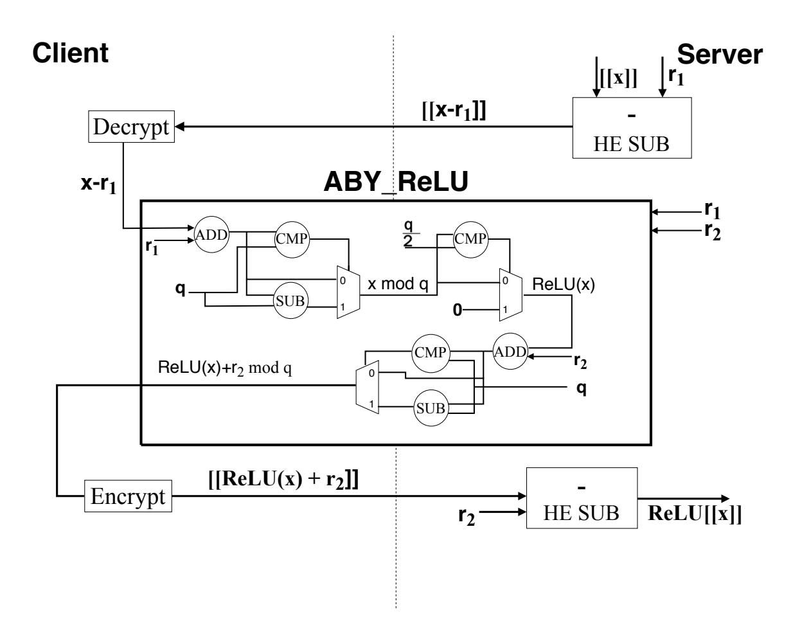
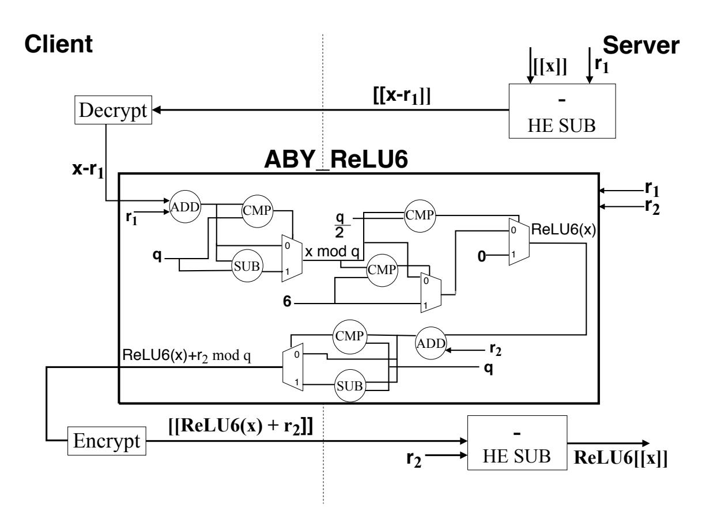
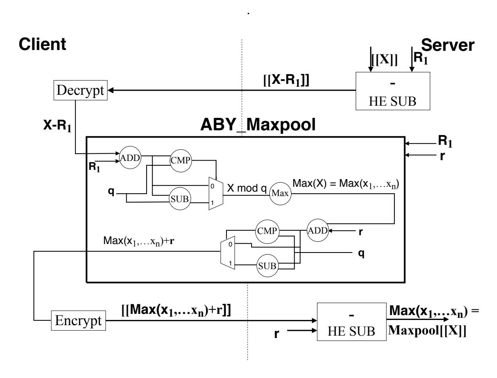

{0}------------------------------------------------

# MP2ML: A Mixed-Protocol Machine Learning Framework for Private Inference<sup>∗</sup>

(Full Version)

Fabian Boemer fabian.boemer@intel.com Intel AI San Diego, California, USA

Rosario Cammarota rosario.cammarota@intel.com Intel Labs San Diego, California, USA

Daniel Demmler demmler@informatik.unihamburg.de University of Hamburg Hamburg, Germany

Thomas Schneider schneider@encrypto.cs.tudarmstadt.de TU Darmstadt Darmstadt, Germany

Hossein Yalame yalame@encrypto.cs.tu-darmstadt.de TU Darmstadt Darmstadt, Germany

# ABSTRACT

Privacy-preserving machine learning (PPML) has many applications, from medical image evaluation and anomaly detection to financial analysis. nGraph-HE (Boemer et al., Computing Frontiers'19) enables data scientists to perform private inference of deep learning (DL) models trained using popular frameworks such as TensorFlow. nGraph-HE computes linear layers using the CKKS homomorphic encryption (HE) scheme (Cheon et al., ASIACRYPT'17), and relies on a client-aided model to compute non-polynomial activation functions, such as MaxPool and ReLU, where intermediate feature maps are sent to the data owner to compute activation functions in the clear. This approach leaks the feature maps, from which it may be possible to deduce the DL model weights. As a result, the client-aided model may not be suitable for deployment when the DL model is intellectual property.

In this work, we present MP2ML, a machine learning framework which integrates nGraph-HE and the secure two-party computation framework ABY (Demmler et al., NDSS'15), to overcome the limitations of the client-aided model. We introduce a novel scheme for the conversion between CKKS and secure multi-party computation (MPC) to execute DL inference while maintaining the privacy of both the input data and model weights. MP2ML is compatible with popular DL frameworks such as TensorFlow that can infer pre-trained neural networks with native ReLU activations. We benchmark MP2ML on the CryptoNets network with ReLU activations, on which it achieves a throughput of 33.3 images/s and an accuracy of 98.6%. This throughput matches the previous stateof-the-art for hybrid HE-MPC networks from GAZELLE (Juvekar et al., USENIX'18), even though our protocol is more accurate and scalable than GAZELLE.

# KEYWORDS

private machine learning, homomorphic encryption, secure multiparty computation.

# 1 INTRODUCTION

Several practical services have emerged that use machine learning (ML) algorithms to categorize and classify large amounts of sensitive data ranging from medical diagnosis to financial evaluation [\[14,](#page-11-1) [66\]](#page-12-0). However, to benefit from these services, current solutions require disclosing private data, such as biometric, financial or location information.

As a result, there is an inherent contradiction between utility and privacy: ML requires data to operate, while privacy necessitates keeping sensitive information private [\[70\]](#page-12-1). Therefore, one of the most important challenges in using ML services is helping data owners benefit from ML, while simultaneously preserving their privacy [\[68\]](#page-12-2). For instance, evaluating a private decision tree can provide a solution for private medical diagnosis where the patient's medical data is sensitive information that needs to be protected while simultaneously protecting the model [\[4,](#page-11-2) [37,](#page-12-3) [63,](#page-12-4) [71\]](#page-12-5).

Modern cryptographic techniques such as homomorphic encryption (HE) and secure multi-party computation (MPC) can help resolve this contradiction. Using HE, a data owner can encrypt its data with its public key, send the encrypted data for processing to an untrusted data processor, and receive the encrypted result, which only the data owner itself can decrypt with its private key [\[29,](#page-12-6) [54\]](#page-12-7). In secure two-party computation (2PC), a special case of MPC with two parties [\[7,](#page-11-3) [32,](#page-12-8) [72\]](#page-13-0), the data owner secret-shares its data with the data processor and uses the secret-shared data to securely compute the result without revealing any individual values.

While HE and MPC have the potential to address the privacy issues that arise in ML, each technique has its advantages and limitations. HE has high overhead for computing non-polynomial activations, such as ReLU and MaxPool, which are commonly used in deep learning (DL) models. While efficient HE-based inference is possible by replacing activation functions with polynomial approximations, this degrades the accuracy of the DL model [\[10\]](#page-11-4), and requires a costly re-training of the model. MPC schemes support a larger set of functions and it is possible to perform private DL inference using only MPC schemes. However, MPC requires the structure (e.g., the Boolean circuit) of the neural network to be

<sup>∗</sup>Please cite the conference version of this paper published at ARES'20 [\[9\]](#page-11-0).

{1}------------------------------------------------

public, and involves multiple rounds of interaction between the parties.

Hybrid methods combine HE and MPC to take advantage of each method's strengths. Recent research has demonstrated the ability to evaluate neural networks using a combination of HE and MPC [5, 6, 30, 34, 36, 45, 49, 52, 53, 57, 60]. For example GAZELLE [36], using a combination of HE and MPC, demonstrates three orders of magnitude faster online run-time when compared to the existing exclusively MPC [53] and exclusively HE [30] solutions.

DL software frameworks, such as TensorFlow [1], and opensource graph compilers, such as Intel's nGraph [21] and TVM [18] accelerate the development of DL. These libraries abstract away the details of the software and hardware implementation, enabling data scientists to describe DL models and operations at a high level (e.g., tensors and compute graphs). Historically, a major challenge for building privacy-preserving machine learning (PPML) systems has been the absence of software frameworks that support privacypreserving primitives.

To overcome this challenge, Intel recently introduced nGraph-HE [10, 11], a HE-based framework that is compatible with existing DL frameworks. Using nGraph-HE, data scientists can deploy DL networks over encrypted data without extensive knowledge of cryptography. One of the major limitations of using HE in nGraph-HE is the cleartext evaluation of non-polynomial functions such as MaxPool and ReLU, which may leak information about the DL model weights and hyper-parameters to the client.

Outline and Our Contributions. In this work, we introduce MP2ML, a hybrid HE-MPC framework for privacy-preserving DL inference. MP2ML extends nGraph-HE with MPC-based computation of ReLU activations, which prevents the leakage of model weights to the client. We use the ABY framework [26] to implement a 2PC version of the ReLU activation function. Our framework integrates with TensorFlow, enabling data scientists to adopt MP2ML with minimal code changes. After presenting preliminaries from privacy-preserving DL (Sect. 2), and an overview of related work (Sect. 3), we detail MP2ML (Sect. 4), which provides the following core contributions:

- A privacy-preserving mixed-protocol DL framework based on a novel combination of nGraph-HE [10, 11] and ABY [26];
- A user-friendly framework that supports private inference on direct input from TensorFlow;
- Support for privacy-preserving evaluation of the non-linear ReLU activation function with high accuracy;
- The first DL application using additive secret sharing in combination with the CKKS homomorphic encryption scheme;
- An open-source implementation of our framework, available under the permissive Apache license at https://github.com/IntelAI/he-transformer.

We evaluate atomic operations and a neural network benchmark using our framework (Sect. 5). Finally, we discuss our approach and highlight differences to existing solutions (Sect. 6) and conclude (Sect. 7).

#### <span id="page-1-0"></span>2 BACKGROUND

We provide an overview of the techniques used in MP2ML. We define our notation in Sect. 2.1 and provide an overview of the cryptographic methods used in our framework and the adversary model in Sect. 2.2.

#### <span id="page-1-1"></span>2.1 Notation

x denotes a plaintext scalar, X is a vector of n plaintext scalars  $(x_1, x_2, ..., x_n)$ ,  $[\![x]\!]$  is a homomorphic encryption of x,  $[\![X]\!]$  is an element-wise homomorphic encryption of X, and q is the ciphertext modulus. Let  $\lfloor \cdot \rfloor$  denote rounding to the nearest integer, and  $[\cdot]_q$  denote modular reduction into the interval (-q/2, q/2).

# <span id="page-1-2"></span>2.2 Cryptographic Preliminaries

Modern cryptographic protocols such as homomorphic encryption (HE) and secure multi-party computation (MPC) are essential building blocks for privacy-preserving ML.

Homomorphic Encryption (HE). HE is a cryptographic primitive supporting computation on encrypted data. HE schemes are classified by the types of computation they support. Somewhat HE (SHE) schemes support a limited number of additions or multiplications, while fully HE (FHE) schemes support an unlimited number of additions and multiplications. In this work, we utilize the CKKS HE scheme [19] and its SHE implementation in the Microsoft Simple Encryption Arithmetic Library (SEAL) version 3.4 [62].

The security of the CKKS scheme is based on the assumed hardness of the ring learning with errors (RLWE) problem. Let  $\Phi_{M(X)}$  be the  $M^{\text{th}}$  cyclotomic polynomial of degree  $N=\phi(M)$ . Usually  $\deg(\Phi_M(X))$  is a power of two for both performance and security reasons. Then, the plaintext space is the ring  $\mathcal{R}=\mathbb{Z}[X]/(\Phi_M(X))$ . The ciphertext space is  $\mathcal{R}_q=\mathcal{R}/(q\mathcal{R})$ , i.e., degree-N polynomials with integer coefficients mod q, where q is the *coefficient modulus*. Neural networks, however, typically operate on floating-point numbers. Hence, we need a conversion from floating-point numbers to integers, which is typically done by multiplying a floating-point number x by some scale s and encrypting  $[\lfloor sx \rceil]_q$ . However, the homomorphic product of two ciphertexts at scale s is a ciphertext with scale s. Subsequent multiplications increase the scale quickly until the integers exceed the range (-q/2, q/2), at which point decryption becomes inaccurate.

To mitigate this blow-up in the scale, CKKS introduces a rescaling procedure. The rescaling procedure relies on a 'layered' ciphertext space, in which each of L layers contains a different ciphertext modulus. Let  $p_0, \ldots, p_{L-1}$  be primes, and let  $q_i = \prod_{\ell=0}^i p_\ell$ . Then, the layered ciphertext space  $\mathcal{R}_{q_{L-1}}$  consists of L layers, where layer i has coefficient modulus  $q_i$ . Rescaling brings a ciphertext c with scale s from level  $\ell$  to a ciphertext at level  $\ell-1$  with scale  $s/q_\ell$ , and reduces the ciphertext space from  $\mathcal{R}_{q_\ell}$  to  $\mathcal{R}_{q_{\ell-1}}$ . The rescaling algorithm is the homomorphic equivalent to removing inaccurate LSBs as a rounding step in approximate arithmetic.

The security of the CKKS encryption scheme is measured in bits, with  $\lambda = 128$  bits implying  $\sim 2^{128}$  operations are required to break the encryption.  $\lambda$  is a function of the encryption parameters  $\{N, L, q_0, \ldots, q_{L-1}\}$ .

Unlike other HE schemes, such as BFV [13, 28], CKKS is also an approximate HE scheme. The decryption after addition and

{2}------------------------------------------------

multiplication is approximate, but the error in the decryption is bounded under certain assumptions on the selection of the encryption parameters. More concretely, if  $c_1$  and  $c_2$  are encryptions of the messages  $m_1$  and  $m_2$ , respectively, then  $Dec(c_1 + c_2) \approx m_1 + m_2$  and  $Dec(c_1 \cdot c_2) \approx m_1 \cdot m_2$ .

The runtime performance of CKKS depends heavily on the choice of the encryption parameters. As shown in Table 1, larger N and L lead to larger runtimes in BFV. CKKS, however, is significantly faster than BFV. In both schemes, ciphertext-plaintext addition and multiplication are substantially faster than ciphertext-ciphertext multiplication. That is, if p is an encoding of  $m_1$ , and c is an encryption of the message  $m_2$ , then  $Dec(p+c) \approx m_1 + m_2$  and  $Dec(p \cdot c) \approx m_1 \cdot m_2$ .

<span id="page-2-0"></span>Table 1: SEAL CKKS and BFV performance test. Parameters satisfy  $\lambda=128$ -bit security. Runtimes averaged across 1000 trials.

|                 | Runtime (μs)        |       |                     |        |                     |         |  |
|-----------------|---------------------|-------|---------------------|--------|---------------------|---------|--|
| Operation       | $N = 2^{12}, L = 3$ |       | $N = 2^{13}, L = 5$ |        | $N = 2^{14}, L = 9$ |         |  |
|                 | BFV                 | CKKS  | BFV                 | CKKS   | $\mathbf{BFV}$      | CKKS    |  |
| Add             | 16                  | 16    | 59                  | 59     | 240                 | 239     |  |
| Multiply plain  | 643                 | 54    | 2,684               | 212    | 11,338              | 853     |  |
| Decrypt         | 462                 | 55    | 1,638               | 216    | 6,686               | 893     |  |
| Square          | 3,246               | 105   | 12,162              | 472    | 50,799              | 2,370   |  |
| Multiply        | 4,578               | 157   | 17,068              | 708    | 71,505              | 3,420   |  |
| Rescale         | N/A                 | 458   | N/A                 | 2,273  | N/A                 | 10,392  |  |
| Encrypt         | 2,060               | 2,249 | 5,461               | 6,296  | 17,197              | 20,438  |  |
| Relinearize     | 952                 | 961   | 4,612               | 4,700  | 27,563              | 27,671  |  |
| Rotate one step | 953                 | 1,123 | 4,661               | 5,325  | 27,764              | 30,355  |  |
| Rotate random   | 3,611               | 4,197 | 19,482              | 21,887 | 123,229             | 134,267 |  |

While CKKS induces a significant runtime and memory overhead compared to unencrypted computation, the use of *plaintext packing*, also referred to as *batching*, improves the amortized overhead. Plaintext packing encodes N/2 complex scalars into one plaintext or ciphertext. It works by defining an encoding map  $\mathbb{C}^{N/2} \to \mathcal{R}$ , where  $\mathcal{R}$  is the plaintext space. An operation (addition or multiplication) performed on an element in  $\mathcal{R}$  corresponds to the same operation performed on N/2 elements in  $\mathbb{C}^{N/2}$ . The number of N/2 elements in the packing is also referred to as the number of *slots* in the plaintext. We use the *complex packing* optimization from nGraph-HE [11] to increase the slot count to N.

MP2ML uses *batch-axis plaintext packing*: encode an inference data batch of shape (n, c, h, w), where  $n \leq N$  is the batch size, as  $c \times h \times w$  ciphertexts, with ciphertext  $c_{c,h,w}$  packing the n values  $(\cdot, c, h, w)$  in the data batch. Then, inference is performed on the n data points simultaneously. We refer to [10] for more details.

**Secure Multi-Party Computation (MPC).** MPC is a cryptographic technique, which enables two or more parties to jointly evaluate a function f without revealing their private inputs to each other [50]. In this work, we focus on the two-party case, in which typically one of two approaches is used: Yao's garbled circuit (GC) protocol [73] or the Goldreich-Micali-Wigderson (GMW) protocol [32]. In both protocols, the function to be computed is represented as a Boolean circuit.

In Yao's GC protocol [73], each of the two parties – called garbler and evaluator – evaluates a function f, represented as a Boolean circuit, without exposing its input to the other party. The GC protocol consists of two phases. In the first phase, the circuit is garbled by assigning two random *labels* to each wire in the circuit, with each label corresponding to the logical values of 0 and 1. A garbled table maps each possible combination of these input labels to its corresponding output label, according to the logic function of each Boolean gate. The privacy of GCs stems from the fact that output labels are encrypted and only a single output label per gate can be decrypted by using the input labels as decryption keys. Since wire labels are random strings, the garbler can simply encode its own private inputs into the circuit. The evaluator receives the wire labels corresponding to its private inputs privately by using an oblivious transfer protocol [27, 38]. In the second phase, the evaluator computes the circuit outputs using the garbled tables to iteratively decrypt the outputs of each gate until the output of the entire circuit has been decrypted. The output can then be revealed to one or both parties by providing the final mapping of output labels to plaintext bits to the designated parties.

In the GMW protocol [32], the two parties secret-share all inputs and intermediate values using an XOR-based secret sharing scheme. Then the parties interact in several communication rounds to securely compute the function f on their shared values. By exchanging their final shares and computing the XOR, one or both parties can reconstruct the plaintext outputs of the circuit.

The ABY MPC framework [26], provides an efficient implementation of both protocols and their state-of-the-art optimizations such as [3, 8, 39, 46, 61, 74].

Adversary Model. In this work, we use the semi-honest<sup>1</sup> adversary model, in which we assume that the adversary follows the protocol honestly, but attempts to infer additional sensitive information from the observed protocol messages. This model is weaker than the malicious (active) adversary model, where the adversary can arbitrarily deviate from the protocol. However, the semi-honest model allows to build highly efficient secure computation protocols and is therefore widely used in privacy-preserving DL applications [5, 6, 10, 11, 30, 34, 36, 49, 53, 57]. This assumption is similar to the one used in HE-based DL, where it is assumed that a server correctly computes a function on a homomorphic ciphertext. Proofs of security w.r.t. semi-honest adversaries are given for Yao's protocol in [44], and the GMW protocol in [31].

MP2ML protects the privacy of both the client's and the server's inputs. In the setting where the server stores a trained neural network and the client provides encrypted data for inference, our framework provides privacy for both parties' inputs. The client is unable to infer sensitive information about the trained model, which may be intellectual property of the server. MP2ML reveals only the total size of the model and the number and type of non-linear operations, since these values must be known in the MPC protocol. At the same time, the server cannot access the client's plaintext inference inputs or classification outputs, which may be sensitive medical or financial information.

{3}------------------------------------------------

<span id="page-3-2"></span>Table 2: Comparison of privacy-preserving DL Frameworks. Model privacy includes preventing the data owner from deducing the weights from intermediate feature maps, protecting the activation function (i.e., ReLU or MaxPool), protecting the model architecture, and only the number of ciphertexts can be leaked. Usability includes support for non-polynomial activation functions, integration with a standard DL framework such as TensorFlow or PyTorch, and availability as open-source code.

| Framework           | Protocol     |              | Model privacy |              |              | Usability     |                    |                       |  |
|---------------------|--------------|--------------|---------------|--------------|--------------|---------------|--------------------|-----------------------|--|
| Tumework            | HE           | MPC          | Weights       | Act. fun.    | Architecture | Non-poly Act. | TF/PyTorch Support | Open-Source           |  |
| nGraph-HE2 [10]     | /            | Х            | X             | X            | ✓            | <b>✓</b>      | ✓                  | <b>√</b> ¹            |  |
| CHET [25]           | ✓            | X            | ✓             | ✓            | ✓            | X             | X                  | X                     |  |
| CryptoDL [34]       | ✓            | X            | ✓             | $\checkmark$ | $\checkmark$ | X             | X                  | X                     |  |
| RAMPARTS [2]        | ✓            | X            | ✓             | $\checkmark$ | $\checkmark$ | X             | X                  | X                     |  |
| CryptoNets [30]     | ✓            | X            | <b>✓</b>      | ✓            | ✓            | X             | X                  | $\checkmark^2$        |  |
| nGraph-HE [11]      | ✓            | X            | ✓             | ✓            | ✓            | X             | ✓                  | $\checkmark^1$        |  |
| Chimera [12]        | ✓            | X            | ✓             | ✓            | ✓            | ✓             | X                  | X                     |  |
| Cingulata [15]      | ✓            | X            | <b>✓</b>      | ✓            | ✓            | ✓             | X                  | $\checkmark^3$        |  |
| TFHE [20]           | $\checkmark$ | X            | ✓             | $\checkmark$ | $\checkmark$ | ✓             | ×                  | $\checkmark^4$        |  |
| SecureML [48]       | Х            | <b>✓</b>     | <b>/</b>      | X            | Х            | <b>✓</b>      | ×                  | Х                     |  |
| Barni [5]           | X            | ✓            | ✓             | ×            | ×            | ✓             | X                  | X                     |  |
| Sadeghi et al. [57] | X            | ✓            | ✓             | ×            | ×            | ✓             | X                  | X                     |  |
| Chameleon [53]      | X            | ✓            | ✓             | ×            | ×            | ✓             | X                  | X                     |  |
| XONN [52]           | X            | ✓            | ✓             | ×            | ×            | ✓             | X                  | X                     |  |
| SecureNN [69]       | X            | ✓            | ✓             | ×            | X            | ✓             | X                  | <b>√</b> <sup>5</sup> |  |
| ABY3 [47]           | X            | ✓            | ✓             | ×            | X            | ✓             | X                  | <b>√</b> 6            |  |
| TASTY [33]          | X            | ✓            | ✓             | X            | ×            | ✓             | X                  | $\checkmark^7$        |  |
| MiniONN [45]        | X            | ✓            | ✓             | X            | ×            | ✓             | X                  | <b>√</b> 8            |  |
| Dalskov et. al [23] | X            | <b>√</b>     | ✓             | X            | X            | ✓             | ✓                  | <b>√</b> 9            |  |
| PySyft [56]         | X            | <b>√</b>     | ✓             | X            | X            | ✓             | ✓                  | $\checkmark^{10}$     |  |
| TF Encrypted [22]   | X            | <b>√</b>     | ✓             | X            | X            | ✓             | ✓                  | $\checkmark^{11}$     |  |
| CrypTFlow [42]      | X            | $\checkmark$ | ✓             | X            | ×            | ✓             | ✓                  | $\checkmark^{12}$     |  |
| Slalom [65]         | Х            | Х            | <b>/</b>      | <b>√</b>     | ✓            | <b>✓</b>      | <b>√</b>           | <b>√</b> 13           |  |
| GAZELLE [36]        | ✓            | ✓            | ✓             | X            | ✓            | ✓             | X                  | X                     |  |
| MP2ML (This work)   | ✓            | ✓            | ✓             | X            | $\checkmark$ | ✓             | ✓                  | $\checkmark^{14}$     |  |

<sup>&</sup>lt;sup>1</sup> https://ngra.ph/he

#### <span id="page-3-0"></span>3 RELATED WORK

Previous work in privacy-preserving DL typically uses either exclusively HE or exclusively MPC. GAZELLE [36] is a notable exception, using both HE and MPC in a hybrid scheme. Table 2 shows a comparison between MP2ML and previous work. While pure HE

<span id="page-3-1"></span><sup>1</sup>also called passive, or honest-but-curious adversary model

solutions maintain complete model privacy, they typically lack the support for non-polynomial activation functions, such as ReLU and MaxPool, with the notable exception of TFHE [20], which is used as a backend in Cingulata [15] and Chimera [12]. Pure MPC solutions, on the other hand, support non-polynomial activations at the cost of leaking the full model architecture. Hybrid HE-MPC schemes provide the advantages of both HE and MPC approaches. MP2ML

<sup>&</sup>lt;sup>2</sup> https://github.com/microsoft/CryptoNets

<sup>&</sup>lt;sup>3</sup> https://github.com/CEA-LIST/Cingulata

<sup>4</sup> https://github.com/tfhe/tfhe

<sup>&</sup>lt;sup>5</sup> https://github.com/snwagh/securenn-public

<sup>&</sup>lt;sup>6</sup> https://github.com/ladnir/aby3

<sup>&</sup>lt;sup>7</sup> https://github.com/tastyproject

<sup>&</sup>lt;sup>8</sup> https://github.com/SSGAalto/minionn

<sup>&</sup>lt;sup>9</sup> https://github.com/anderspkd/SecureQ8

<sup>10</sup> https://github.com/OpenMined/PySyft

<sup>&</sup>lt;sup>11</sup> https://github.com/tf-encrypted/tf-encrypted

<sup>12</sup> https://github.com/mpc-msri/EzPC

<sup>&</sup>lt;sup>13</sup> https://github.com/ftramer/slalom

<sup>&</sup>lt;sup>14</sup> https://github.com/IntelAI/he-transformer

{4}------------------------------------------------

provides the first hybrid HE-MPC framework that integrates with a DL framework such as TensorFlow. Similar to GAZELLE [36], our framework leaks the number of ciphertexts and the activation function used in each non-linear layer. However, MP2ML does not reveal the functionality and size of the linear layers.

Next, we summarize several different approaches for preservingprivacy DL.

**HE-based DL.** The main workload of DL models is multiplication and addition in convolution and general matrix multiply (GeMM) operations [35], making HE an attractive solution for privacy-preserving DL. However, DL models typically consist of functions which are not suitable for HE. For example, computing ReLU or MaxPool requires a comparison operation that is not supported efficiently in all HE methods.

One solution, which requires access to the entire DL workflow including training, is re-training the DL model with polynomial activation functions [6, 49]. The CryptoNets network [30] by Microsoft Research is an HE-based private DL framework, which uses the polynomial activation function  $f(x) = x^2$  to achieve 99% accuracy on the MNIST dataset [43]. CHET [25] takes the same approach on the CIFAR-10 dataset [41] and uses the activation function  $f(x) = ax^2 + bx$ . This approach reduces the accuracy from 84% in models with ReLU to 81.5%. CryptoDL [34] uses a similar approach, which reduces the accuracy from 94.2% in the original model to 91.5% for the CIFAR-10 dataset.

Depending on the use cases, such accuracy degradation may not be acceptable. Furthermore, polynomial activations introduce further difficulties in training. Polynomial activation functions are not bounded and grow faster than standard activation functions such as ReLU, possibly resulting in overflows during the training.

RAMPARTS [2] uses the Julia language to implement HE operations with the PALISADE HE library [55]. However, RAMPARTS is not open-source, and lacks support for source code outside of Julia. The Cingulata compiler [15] uses a custom implementation of the Fan-Vercauteren HE scheme [28] in C++. Cingulata translates computations to Boolean circuits, reducing performance on GeMM workloads.

**FHE-based DL.** In this setting, we assume the network has been trained with non-polynomial activation functions, and no changes can be made. Fully homomorphic encryption (FHE) schemes, which support an unlimited number of additions and multiplications, are used to provide precise polynomial approximations of non-polynomial activations. However, due to their large computational overhead, FHE schemes are typically much slower than other alternatives. For instance, using TFHE [20], FHE-based DL models have very low efficiency for arithmetic functions such as GeMM.

MPC-based DL. Pure MPC schemes are another method to evaluate pre-trained neural networks. For instance, in [57], Yao's garbled circuits [73] applied to a generalization of universal circuits [40, 67] are used to evaluate neural networks and hide their topology. ABY [26] supports arithmetic and Boolean circuits and efficient switching between them, enabling arbitrary functions for network models. ABY3 [47] combines arithmetic secret sharing and garbled circuits and optimized conversions between these protocols to improve previous work. MiniONN [45] uses AHE to generate the "multiplication triples" for the GMW protocol [32]. SecureNN [69], an extension of SecureML [48], demonstrates enhanced performance

using a third party. Chameleon [53] is an ABY-based framework for secure evaluation of DL models, using a somewhat-trusted third party in the offline phase to generate correlated randomness. Specially, Chameleon performs polynomial operations using arithmetic secret sharing and non-linear operations such as ReLU using Boolean sharing protocols, GC or GMW [32].

XONN [52] use GCs for private inference. However, XONN binarizes the network, i.e., evaluates networks with weights that are bits, which is costly to train and reduces accuracy. PySyft [56] and TF Encrypted [22] are two frameworks for secure DL models built on PyTorch and TensorFlow, respectively, and use only MPC to evaluate DL models. CrypTFlow [42], a system extending SecureNN [69], is a recent framework for private DL model evaluation based on TensorFlow and uses pure MPC to evaluate DL layers securely. In [23], the authors provide secure inference of ML quantized models in MP-SPDZ [24] with active and passive security, and evaluate the output by TensorFlow directly. MPC-based DL solutions tend evaluate all DL layers with MPC protocols.

Two main disadvantages in this setting include sharing the functional form (i.e., structure/topology) of the network – which may be intellectual property – with all the parties, and the high communication overhead for multiplication operations.

**Hybrid DL.** Hybrid PPML frameworks combine different privacy-preserving protocols. Slalom [65] performs all linear layers in secure inference using Intel SGX, a trusted execution environment (TEE). TEE-based solutions are very efficient, but are prone to attacks [17].

Hybrid HE-MPC schemes compute linear layers (e.g., Fully-Connected and Convolutional) using HE and activation functions using MPC. The work of [5] combined garbled circuits with additive HE schemes. Chimera [12] is a hybrid HE-HE scheme where the ReLU activation function is performed using TFHE [20] and the other functions are performed by the FV/CKKS HE scheme [19]. The main drawback of Chimera is the expensive switching between the two HE schemes.

GAZELLE [36] is a hybrid HE-MPC scheme which uses additive HE for polynomial functions and MPC (garbled circuits) for non-polynomial activation functions. GAZELLE uses a small plaintext modulus, which will result in degraded accuracy on larger networks, and does not integrate with DL frameworks.

GAZELLE [36], for instance, replaces arithmetic sharing with HE for multiplication, resulting in a  $30\times$  faster runtime than Chameleon's MPC-based multiplication scheme [36].

#### <span id="page-4-0"></span>4 THE MP2ML FRAMEWORK

In this section, we provide a detailed description of our MP2ML framework. The main idea borrows from three popular frameworks in literature, including pure MPC using the ABY framework [26], pure HE as in nGraph-HE [10], and hybrid MPC-HE frameworks such as TASTY [33] or GAZELLE [36]. See Sect. 6 for a comparison of MP2ML and GAZELLE.

nGraph-HE [10, 11], an HE-based extension of Intel's DL graph compiler, provides compatibility with popular DL frameworks such as TensorFlow, enabling data scientists to benchmark linear layers in DL models in a privacy-preserving manner without extensive knowledge in cryptography.

{5}------------------------------------------------

ABY [26] supports both linear and non-linear operations and can implement and securely evaluate them as arithmetic or Boolean circuit. ABY also supports single instruction multiple data (SIMD) gates for high throughput.

MP2ML is a hybrid HE-MPC framework integrating ABY and nGraph-HE, and is compatible with DL frameworks such as TensorFlow. Our work focuses on the setting in which the client can privately perform inference without disclosing his or her input to the server as well as preserving the privacy of the server's DL model. In MP2ML we directly build on the usability of nGraph-HE, which requires only minimal changes to existing TensorFlow code. In particular, similar to [11], only a single line of code must be added to enable evaluation with MP2ML, as shown in Sect.4.3.

#### Private ML Workflow 4.1

MP2ML combines HE and MPC to enable the evaluation of neural network models in an efficient and privacy-preserving manner. We detail the steps in which a server performs private inference on a client's encrypted data. Briefly summarized, the steps are as follows:

- Client: Input encryption, transmission to the server
- Private Inference
  - Server: Non-interactive evaluation of linear layers
  - Both: Conversion from HE values to MPC values
  - Both: Interactive evaluation of non-linear layers
  - Both: Conversion from MPC values to HE values
  - repeat until network output is reached
- Server: Transmission of the encrypted model output to the client
- Client: Output decryption

We now explain each of these steps in more detail:

**Client Input Encryption.** First, the client encrypts its input using the CKKS HE scheme, as implemented by Microsoft SEAL [62], and sends it to the server. For increased throughput, multiple values are packed into a single ciphertext using batch-axis plaintext packing (cf. Sect. 2.2). Now we sequentially evaluate each layer in the DL model using HE or MPC.

**Linear Layers.** The server evaluates linear layers using the HEbased nGraph-HE [10, 11] implementation. This includes tensor computation operations, such as Convolutional, AvgPool, and Fully-Connected layers, as well as tensor manipulation operations, such as Broadcast, Reshape, Concatenate, and Slice. Using HE for the linear layers enables the server to hide the model structure/topology from the client, and results in no communication overhead.

**Non-Linear Layers.** We use an MPC protocol to privately evaluate non-linear layers, i.e., ReLU activations. This distinguishes our framework from nGraph-HE. In nGraph-HE's client-aided model, the server sends the encrypted non-linear layers' inputs to the client, which decrypts these inputs, performs the non-linear operation locally, encrypts the result and sends it back to the server. The client-aided protocol reveals intermediate values to the client and thus directly leaks information about the trained model, which is often considered private or intellectual property by the server.

In contrast, MP2ML evaluates the non-linear functions using a secure two-party protocol between the client and the server, such that no sensitive information about the intermediate values is leaked. The client learns only the type of non-linear activation

function and their total number, but no intermediate value. This approach protects both the server's model as well as the client's inputs. Next, we describe the ReLU, ReLU6 and MaxPool activation functions and our implementations thereof.

**ReLU Evaluation.** Fig. 1 illustrates our secure MPC-based ReLU computation. We assume that the server has previously homomorphically computed linear layers or received the client's inputs and holds a homomorphic ciphertext ||x||. The first step is to convert the ciphertext to an MPC value.

Previous work [5, 33, 36] uses arithmetic masking to convert a homomorphic ciphertext into an MPC value: the server additively blinds ||x|| with a random mask r and sends the masked ciphertext [x + r] to the client, who decrypts. Then, both parties evaluate a subtraction circuit in MPC to remove the random mask. MP2ML extends this approach to fixed-point arithmetic.

In our private ReLU protocol, the server and the client perform the following steps:

(1) *Conversion from HE to MPC*: The first step is to convert the homomorphic ciphertext to an MPC value. To do this, the server generates two random masks,  $r_1$  and  $r_2$ , which are integers chosen uniformly at random from the entire domain of the ciphertext space at the lowest level:  $(-q_0/2, q_0/2)$ . The server first rescales the ciphertext to the lowest level, such that the ciphertext space is  $\mathcal{R}_{q_0}$ . Then, the server performs the homomorphic subtraction  $r_1$  from the ciphertext  $\llbracket x \rrbracket$  with the ciphertext modulus  $q_0$ , and sends the resulting ciphertext  $[[[x-r_1]]]_{q_0}$  to the client. Since  $r_1$  is chosen uniformly at random, the resulting ciphertext  $[[x - r_1]]_{q_0}$ perfectly masks the plaintext value x.

The client decrypts  $[x - r_1]$  using its private key. We now have  $r_1$  and  $r_2$  on the server side and  $[x-r_1]_q$  on the client side. Since ABY operates on unsigned integers, we map the range  $(-q_0/2, q_0/2)$  to (0, q) by performing the

transformation SignedToUnsigned 
$$q_0(x) = \begin{cases} x + q_0, & x < 0 \\ x, & x \ge 0 \end{cases}$$
 with inverse transformation UnsignedToSigned. Note, SignedToUnsigned  $q_0(x) \ge q_0/2 \iff x \le 0$ . Let  $x_u$  refer

to the unsigned value  $x_u = \text{SignedToUnsigned}(x)$ .

- (2) MPC circuit evaluation: We now evaluate the ReLU circuit shown in Fig. 1, which is similar to that of GAZELLE [36]. To do this, we
  - (a) first, compute the arithmetic integer addition of  $x_u r_1$ from the client and  $r_1$  from the server to obtain  $x_u$ , possibly outside the range  $(0, q_0)$ . A multiplexer compares the result to  $q_0$  and performs conditional arithmetic subtraction of  $q_0$  to obtain  $x_u \mod q_0$ .
  - (b) In the second step, we compute

ReLU
$$(x_u) = \begin{cases} x_u, & x_u \le q_0/2 \\ 0, & x_u > q_0/2 \end{cases}$$

which corresponds to ReLU in the signed floating-point domain.

(c) In the last step, to prevent ReLU( $x_u$ ) from leaking to the client, we compute  $ReLU(x_u) + r_2 \mod q_0$ , using the addition circuit and multiplexer, and output the plaintext value  $ReLU(x_u) + r_2 \mod q_0$  to the client.

{6}------------------------------------------------

<span id="page-6-0"></span>

Figure 1: Protocol for private ReLU. CMP, ADD, and SUB are comparison, addition, and subtraction circuits executed by ABY [26]. Other homomorphic operations are executed by nGraph-HE [11].

(3) Conversion from MPC to HE: The client performs the transformation UnsignedToSigned, encrypts the resulting  $[\text{ReLU}(x_u) + r_2]_{q_0}$  value at level L-1 using the CKKS HE scheme, and sends the encrypted value  $[\![\text{ReLU}(x_u) + r_2]_{q_0}]\!]$  to the server. The server homomorphically subtracts  $r_2$ , to obtain the corresponding ciphertext  $[\![\text{ReLU}(x_u)]_{q_0}]\!] = [\![\text{ReLU}(x)]_{q_0}]\!]$ .

**ReLU6 Evaluation.** Some neural networks, such as MobileNetV2 [58], use a BoundedReLU function, where BoundedReLU  $(x,\alpha)=\min(\max(x,0),\alpha)$ . Let ReLU6 refer to BoundedReLU (6). Fig. 2 describes the steps to perform ReLU6. The evaluation procedure is similar to that of ReLU, with an additional comparison against the bound value, e.g. 6 for ReLU6.

**Maxpool Evaluation.** Fig. 3 shows the steps for MaxPool evaluation. In this scenario, we want to obtain the maximum of n ciphertexts on the server side:

$$MaxPool([[X]]) = max([[x_1]], [[x_2]], ..., [[x_n]]).$$

When evaluating MaxPool, the server holds a vector of n ciphertexts [X]. Then server and client do the following steps:

(1) Conversion from HE to MPC: To convert homomorphic values to MPC values, the server generates a uniform random integer  $r \in_R U(-q_0/2,q_0/2)$  and random vector R1 of n ciphertexts as  $R1 = r_1|...|r_n$ , where all  $r_i \in_R U(-q_0/2,q_0/2)$ . The server first rescales the ciphertexts [[X]] to the lowest level. Then, the server homomorphically subtracts R1 from the vector of ciphertexts [[X]] and sends the resulting vector  $[[[X_u - R1]_q]]$  to the client. The client decrypts  $[[[X - R1]_q]]$  using its private key. We now have a vector R1 and number r on the server side and vector  $[X - R1]_q$  on the client side. As with the ReLU circuit,  $[X - R1]_q$ , r, and R1 are mapped to unsigned integers using the

- transformation SignedToUnsignedShift $_{q_0}(x) = x + q_0$ . Let UnsignedToSignedShift denote the inverse transformation.
- (2) *MPC circuit evaluation*: After evaluating the circuit from Fig. 3, we have the value SignedToUnsignedShift( $\max(x_1, ..., x_n) + r$ ) mod q) on the client side.
- (3) Conversion from MPC to HE: At this point, the client performs the inverse mapping UnsignedToSignedShift, encrypts  $\max(x_1, ..., x_n) + r \pmod{q}$  using CKKS, and sends the resulting ciphertext  $[[\max(x_1, ..., x_n) + r]]$  to the server. The server homomorphically subtracts r to obtain the corresponding ciphertext of MaxPool:

$$\max([x_1], [x_2], ..., [x_n]) + r - r]_{q_0} = [\max([x_1], [x_2], ..., [x_n])]_{q_0}$$
$$= \operatorname{MaxPool}[[X]]_{q_0}$$

To evaluate a complete network, MP2ML computes linear layers using HE, and the above protocol for non-polynomial activations. The encrypted final classification result is sent to the client for decryption.

One detail to note is that the MPC-to-HE conversion yields a ciphertext  $[\![y]\!] := [\![\mathsf{ReLU}(x)]\!]$  at level L, i.e., modulo  $q_{L-1}$ , whereas the masking was performed at level 0, i.e., modulo  $q_0$ . Subsequent computation on  $[\![y]\!]$  is performed at modulo  $q_{L-1}$ . However, since  $q_{L-1}$  is a factor of  $q_0$ , the computation is still accurate modulo  $q_0$ . Thus, the final decryption must perform modulus-switching to  $q_0$  before performing the decryption. Alternatively, the decryption output must be modified to return values modulo  $q_0$  rather than values modulo  $q_L$ .

<span id="page-6-1"></span><sup>&</sup>lt;sup>2</sup>This is a result of the property that  $(z \mod pq) \mod p = z \mod p$  for  $z \in \mathbb{Z}, p, q \in \mathbb{N}$ .

{7}------------------------------------------------

<span id="page-7-0"></span>

<span id="page-7-1"></span>Figure 2: Circuit for ReLU6 operation. CMP, ADD, and SUB refer to comparison, addition, and subtraction circuits executed by ABY [26]. Other homomorphic operations are executed by nGraph-HE [10]



Figure 3: Circuit for the MaxPool operation. CMP, ADD, SUB and Max refer to comparison, addition, subtraction and maximum(between *n* numbers) circuits executed by ABY [26]. Other homomorphic operations are executed by nGraph-HE [10].

Note, the integer results of the ReLU and MaxPool circuits are only accurate in the interval  $(-q_0/2,q_0/2)$ . Hence, for fixed-point numbers scaled to integers using a scaling factor s, the result is only accurate in the interval  $(-q_0/(2s),q_0/(2s))$ . Therefore,  $q_0\gg s$  must be chosen accordingly to preserve accuracy of the computation.

Our conversion protocol achieves two important tasks. First, it enables the secure computation of non-polynomial activation functions, i.e., without leaking pre- or post-activation values to the data owner. Second, as in the client-aided model, our protocol

refreshes the ciphertexts, resetting the noise and restoring the ciphertext level to the top level L. This refreshment is essential to enabling continued computation without increasing the encryption parameters. Rather than selecting encryption parameters large enough to support the entire network, they must now only be large enough to support the linear layers between non-linear activations. For instance, the client-aided model in nGraph-HE performs inference on MobileNetV2 [59], a model with 24 convolution layers, using  $N=4096, L=4\ll 24$ . Without the ciphertext refreshment, N=32768, L=24 would be required, and each ciphertext would

{8}------------------------------------------------

have size  $\sim$ 12.58MB of memory, by factor 48x more than the  $\sim$ 262KB of our ciphertexts with N=4096, L=4.

#### 4.2 Security

MP2ML protects the client's inference input from the server, and at the same time hides the full model structure of the server from the client, revealing only the number and type of non-linear operations. The MPC protocols we implement provide security against semi-honest adversaries (cf. Sect. 2.2).

Note that HE-based solutions generally do not provide circuit privacy, as the ciphertext of the result may leak information about the number and types of operations performed on it. However, noise flooding or an interactive decryption phase can help to mitigate this leakage [36]. These mitigations can be applied in MP2ML as well, even though, similar to [36], they are not yet included in our implementation. We expect the overhead for a single re-randomization and an addition in MPC to be negligible. Note that this kind of leakage is arguably smaller than in purely MPC-based solutions, where the entire structure of the evaluated circuit is public and thus the full structure of the ML model is leaked to the client.

#### <span id="page-8-1"></span>4.3 Source Code Example

One of the primary advantages to MP2ML is the integration with DL frameworks, in particular TensorFlow. MP2ML implements nGraph's [21] C++ ngraph::runtime::Backend application programming interface (API). MP2ML exposes two Python interfaces, one for the server and one for the client. Listing 1 and Listing 2 show the Python3 source code for the server and client, respectively, to perform inference on a pre-trained CryptoNets-ReLU model using MP2ML.

The Python3 server interface is nearly identical to standard TensorFlow inference code. The only changes to native TensorFlow code are a single 'import ngraph\_bridge' line (cf. Line 2 in Listing 1), as well as creating a TensorFlow Session configuration. To enable this interface, MP2ML utilizes TensorFlow's nGraph bridge [16], which enables TensorFlow code to run on an nGraph backend, as specified by a TensorFlow Session configuration. The configuration MP2ML is used to specify the encryption parameters, which tensors correspond to the client inference input and the inference classification result, and whether or not to use plaintext packing. To adhere to TensorFlow's interface, the server must still provide inference inputs, which are treated as dummy values and are unused.

The Python3 client interface is a single class 'HESealClient'. An HESealClient instance is initialized with the hostname and port of the server, the inference batch size, and a dictionary specifying the client input tensor name data. Instantiating the HESealClient connects with the server. The 'get\_results()' method will block until the inference has been performed and the client has received the encrypted results from the server. The client's integration with Python enables easy data loading via Keras' datasets module.

#### <span id="page-8-0"></span>**5 EVALUATION**

We evaluate MP2ML on small atomic operations (Sect. 5.1) and on a larger deep learning model (Sect. 5.2).

**Evaluation Setup.** For the evaluation we use two Intel Xeon® Platinum-8180 2.5 GHz systems with 112 cores and 376 GB RAM,

running Ubuntu 18.04. The local area network (LAN) bandwidth is 9.6 Gbit/s, while the latency is 0.165 ms.

#### <span id="page-8-2"></span>5.1 Atomic Operations

Table 3 shows the runtimes of MP2ML for atomic operations. Notably, the addition and multiplication operations, which are evaluated using CKKS, require no offline computation and no communication. In contrast, pure MPC solutions require communication for every multiplication, and even for additions in the case of Boolean circuit-based protocols.

Comparing GMW and Yao's GC protocol, we can see a correlation between required bandwidth and protocol runtime. GMW outperforms Yao's GC in the low-latency LAN setting. We expect the opposite to happen for typical WAN connections with a higher round trip time, since GMW requires one round of interaction for each data-dependent layer of non-linear gates (depth) in the Boolean circuits, while Yao's protocol always only requires a small constant number of rounds. Our ReLU circuits that are evaluated in each non-linear layer have a multiplicative depth of 137, resp. 145 (ReLU6).

<span id="page-8-4"></span>Table 3: Runtime and throughput of MP2ML for atomic operations in the LAN setting, averaged across 10 runs. We use N=2048 and a 54-bit ciphertext modulus. ADD and MULT are offline only, and the use of plaintext packing yields the same runtime for each batch size up to N.

| FunctionOutputs |       | MPC    | Time    | (ms)   | Bandwidth (MB) |        |  |
|-----------------|-------|--------|---------|--------|----------------|--------|--|
|                 |       | proto. | offline | online | offline        | online |  |
| ReLU            | 1,000 | Yao    | 161     | 57     | 22.3           | 2.0    |  |
| ReLU            | 1,000 | GMW    | 304     | 18     | 53.9           | 0.9    |  |
| ReLU            | 2,048 | Yao    | 314     | 118    | 45.8           | 4.1    |  |
| ReLU            | 2,048 | GMW    | 533     | 20     | 110.4          | 1.8    |  |
| ReLU6           | 1,000 | YAO    | 190     | 67     | 27.2           | 2.0    |  |
| ReLU6           | 1,000 | GMW    | 326     | 20     | 61.5           | 1.1    |  |
| ReLU6           | 2,048 | YAO    | 370     | 141    | 55.8           | 4.1    |  |
| ReLU6           | 2,048 | GMW    | 650     | 25     | 125.9          | 2.1    |  |
| ADD             | 1,000 | _      | 0       | 0.18   | 0              | 0      |  |
| ADD             | 2,048 |        | 0       | 0.19   | 0              | 0      |  |
| MULT            | 1,000 | _      | 0       | 1.2    | 0              | 0      |  |
| MULT            | 2,048 | _      | 0       | 1.2    | 0              | 0      |  |

#### <span id="page-8-3"></span>5.2 Neural Networks

We evaluate a deep learning application, the CryptoNets [30] network, to show how our MP2ML framework can be leveraged. CryptoNets is the seminal HE-friendly deep learning network, yielding  $\sim$ 99% accuracy on the MNIST handwritten digits dataset, which consists of 28 × 28 pixel images classified into 10 categories. The CryptoNets network has multiplicative depth of 5, with the full architecture detailed in as follows, where n indicates the batch size:

- CryptoNets, with activation  $Act(x) = x^2$ .
- (1) *Conv.* [Input:  $n \times 28 \times 28$ ; stride: 2; window:  $5 \times 5$ ; filters: 5, output:  $n \times 845$ ] + Act.
- (2) FC. [Input:  $n \times 845$ ; output:  $n \times 100$ ] + Act.

{9}------------------------------------------------

```
import tensorflow as tf
  import ngraph_bridge
2
  import numpy as np
3
  from mnist_util import server_argument_parser, \
                          server_config_from_flags, \
                          load_pb_file
  # Load saved model
8
  tf.import_graph_def(load_pb_file('./model/model.pb'))
9
  # Get input / output tensors
11
  x_input = tf.compat.v1.get_default_graph().get_tensor_by_name("import/input:0")
12
  y_output = tf.compat.v1.get_default_graph().get_tensor_by_name("import/output:0")
13
14
    Create configuration to encrypt input
15
  #
16 FLAGS, unparsed = server_argument_parser().parse_known_args()
  config = server_config_from_flags(FLAGS, x_input.name)
17
18
  with tf.compat.v1.Session(config=config) as sess:
19
      # Evaluate model (random input data is discarded)
      y_output.eval(feed_dict={x_input: np.random.rand(10000, 28, 28, 1)})
21
```

Listing 1: Python3 source code for a server to execute a pre-trained CryptoNets-ReLU model in MP2ML. A server configuration specifies the encryption parameters and which tensors to obtain from the client. The server passes random dummy values as input. The encrypted input is provided by the client.

```
import numpy as np
  from mnist_util import load_mnist_test_data,
                          client_argument_parser
  import pyhe_client
4
  # Parse command-line arguments
6
7 FLAGS, unparsed = client_argument_parser().parse_known_args()
  # Load data
9
  (x_{test}, y_{test}) = load_mnist_test_data(FLAGS.start_batch, FLAGS.batch_size)
10
11
  client = pyhe_client.HESealClient(FLAGS.hostname, FLAGS.port, FLAGS.batch_size,
12
                                        {FLAGS.tensor_name: (FLAGS.encrypt_data_str, x_test.flatten('C'))})
13
14
  results = np.array(client.get_results())
  y_pred = results.reshape(FLAGS.batch_size, 10)
15
16
accuracy = np.mean(np.argmax(y_test, 1) == np.argmax(y_pred, 1))
  print('Accuracy: ', accuracy)
```

Listing 2: Python3 source code for a client to execute a pre-trained CryptoNets-ReLU model in MP2ML. The client passes the encrypted data to the server who runs the private inference.

- (3) FC. [Input:  $n \times 100$ ; output:  $n \times 10$ ].
- CryptoNets-ReLU, with activation Act(x) = ReLU(x).
- (1) *Conv with bias.* [Input:  $n \times 28 \times 28$ ; stride: 2; window:  $5 \times 5$ ; filters: 5, output:  $n \times 845$ ] + *Act*.
- (2) FC with bias. [Input:  $n \times 845$ ; output:  $n \times 100$ ] + Act.
- (3) FC with bias. [Input:  $n \times 100$ ; output:  $n \times 10$ ].

As in [10], we modify the network architecture to include biases and replace the non-standard  $x^2$  activations with ReLU activations. We achieve 98.60% accuracy, a slight degradation from the 98.64% of the unencrypted model.

Table 4 shows the performance of MP2ML on CryptoNets in comparison with previous methods. MP2ML uses encryption parameters N=8192, L=5, with coefficient moduli (47, 24, 24, 24, 30) bits, scale  $s=2^{24}$ ,  $\lambda=128$ -bit security, and Yao's GC for the

non-linear layers. Note, Table 4 omits several frameworks from Table 2 which do not report performance on the CryptoNets network: [2, 5, 12, 20, 22, 25, 33, 47, 56, 57, 65].

Chameleon [53] and SecureNN [69] use a semi-honest third party, which is a different setting than our two-party model. XONN [52] binarizes the network, which results in high accuracy on the MNIST dataset, but will reduce accuracy on larger datasets and models. CryptoNets [30] and CryptoDL [34] use polynomial activations, which will also reduce accuracy on larger datasets and models.

GAZELLE [36], whose method is most similar to our work, uses much smaller encryption parameters (N=2048, L=1), resulting in a significantly faster runtime (cf. [10, Tab.9]), albeit at a reduced 20-bit precision. See Sect. 6 for a detailed comparison between MP2ML and GAZELLE. nGraph-HE [11] uses a client-aided model

{10}------------------------------------------------

<span id="page-10-1"></span>Table 4: MNIST inference performance comparisons. The network topologies are not identical across previous work, resulting in variations in accuracy.

| Framework         | Limitation                  | Accuracy (%)       | Latency (s) | Throughput (images/s) |
|-------------------|-----------------------------|--------------------|-------------|-----------------------|
| Chameleon [53]    | 3-party                     | 99                 | 2.24        | 1.0                   |
| XONN [52]         | binarized network           | 98.64              | 0.16        | 6.25                  |
| CryptoNets [30]   | polynomial activation       | 98.95              | 250         | 16.4                  |
| GAZELLE [36]      | hand-optimized              | 98.95 <sup>1</sup> | 0.03        | 33.3                  |
| CrypTFlow [42]    | leaks model architecture    | $99.31^{2}$        | 0.03        | 33.3                  |
| CryptoDL [34]     | polynomial activation       | 99.52              | 320         | 45.5                  |
| SecureNN [69]     | 3-party                     | 99 <sup>3</sup>    | 0.08        | 49.23                 |
| nGraph-HE2 [10]   | reveals intermediate values | 98.62              | 0.69        | 2,959                 |
| MP2ML (This work) | _                           | 98.60              | 6.79        | 33.3                  |

<sup>&</sup>lt;sup>1</sup> Accuracy not reported, but network topology matches that of CryptoNets.

to compute non-polynomial activations, which leaks intermediate values and potentially the model weights to the client.

#### <span id="page-10-0"></span>6 DISCUSSION

Given the similarity of our approach to GAZELLE [36], we next highlight key differences and the motivations for our design choices, as well as limitations of our framework.

# 6.1 Plaintext Packing

Plaintext packing (cf. Sect. 2.2) is a key design choice in developing efficient frameworks for DL with HE. Harnessing the simultaneous computation enabled by plaintext packing of N values potentially reduces the memory and runtime overhead by a factor of N. MP2ML uses batch-axis packing, which maximizes the throughput for a given latency. GAZELLE, on the other hand, uses inter-axis packing, which encrypts multiple scalars from the same datapoint or weight matrix to a single ciphertext. The simultaneous computation enabled by plaintext-packing minimizes the latency on small batch sizes. One limitation to inter-axis packing is the difficulty of supporting several common DL operations. For instance, operations such as Reshape, Transpose, and Flatten typically require expensive rotation operations.

Table 4 demonstrates the latency-throughput trade-off between existing privacy-preserving ML frameworks GAZELLE uses interaxis packing, while nGraph-HE and MP2ML use batch-axis packing. Notably, nGraph-HE and MP2ML have significantly higher throughput than the inverse of the latency.

# **6.2 Encryption Scheme**

The CKKS encryption scheme [19] is a recent optimization to the BFV HE scheme [13, 28]. Whereas BFV computation is exact, the CKKS scheme is inherently approximate. The CKKS scheme is significantly faster than the BFV scheme– $\sim$ 12× for the multiply-plain operation and  $\sim$ 20× for the multiply operation. However, the introduction of the rescaling operation, and the approximate arithmetic pose difficulties in adopting CKKS. While existing work [10, 11] has demonstrated the efficacy of CKKS on DL, to our knowledge,

ours is the first work to demonstrate the use of CKKS in a hybrid HE-MPC framework.

#### 6.3 HE-MPC Protocol

While the core idea of our HE-MPC protocol is similar to that of GAZELLE, there are two key differences:

- Our conversion from HE to MPC rescales to the lowest ciphertext modulus. Whereas GAZELLE considers only parameter choices with a single ciphertext modulus, our approach is more general. Our choice to rescale to the lowest level reduces the communication requirement by a factor of up to *L* compared to not rescaling.
- Our conversion from MPC to HE performs the additive unmasking at a different level  $q_L$  than the original masking, which was performed at level  $q_0$ . GAZELLE's choice of encryption parameter has just one level, so the masking and unmasking is performed at the same level.

#### 6.4 Limitations of MP2ML

6.4.1 Model Extraction. In ML model extraction attacks, an adversary attempts to deduce the ML model without prior knowledge using black-box access to inferences on the model. The feasibility of ML model extraction has been demonstrated on a variety of ML models [51, 64]. Existing HE-based and MPC-based privacy-preserving ML frameworks protect user data from the model owner, or the model weights from the data owner. However, these frameworks fail to protect against model extraction attacks, since the adversary has black-box access to the inferences. We consider model extraction attacks an orthogonal issue to private DL inference using cryptographic primitives. Indeed, all the frameworks in Table 2 are vulnerable to model extraction attacks.

6.4.2 Fully-Private DL Inference. PPML inference solutions differ by their privacy guarantees. While the inference data is typically kept private, aspects of the DL model may leak. Pure HE solutions don't leak any information about the model (subject to model extraction attacks), though at the cost of large runtime overhead.

<sup>&</sup>lt;sup>2</sup> Accuracy not reported, but network topology matches that of MiniONN [45].

<sup>&</sup>lt;sup>3</sup> Accuracy not reported, but network topology matches that of Chameleon.

{11}------------------------------------------------

Pure MPC approaches such as XONN [\[52\]](#page-12-14) reveal the entire structure/functional form (i.e., Boolean circuit) of the DL model, though yielding the lowest runtime overhead. Hybrid HE-MPC solutions such as GAZELLE [\[36\]](#page-12-11) and MP2ML leak the type (i.e., ReLU or MaxPool) and dimension of each activation function.

# <span id="page-11-11"></span>7 CONCLUSION

HE and MPC have emerged as two candidate solutions for privacypreserving DL inference. Hybrid HE-MPC protocols combine the advantages of HE and MPC to provide better efficiency and model privacy than each method individually. In this paper we presented MP2ML, the first user-friendly mixed-protocol framework for private DL inference. MP2ML is compatible with popular DL frameworks such as TensorFlow, enabling data scientist to perform secure neural network inference with ease. In addition, MP2ML is compatible with multiple activation functions and offers direct support for many operations and transformations that are common in the ML domain. The privacy guarantees of MP2ML are stronger than those of related work because it hides the topology of the classifier, while it achieves comparable performance compared to the state-of-the-art work CrypTFlow [\[42\]](#page-12-34).

#### AVAILABILITY

The open source code of MP2ML is freely available under the permissive Apache license at [https://github.com/IntelAI/he-transformer.](https://github.com/IntelAI/he-transformer)

# ACKNOWLEDGMENTS

We thank Casimir Wierzynski, Amir Khosrowshahi, and Naveen Rao for their unconditional support. This project has received funding from the European Research Council (ERC) under the European Union's Horizon 2020 research and innovation program (grant agreement No. 850990 PSOTI). It was co-funded by the Deutsche Forschungsgemeinschaft (DFG) — SFB 1119 CROSSING/236615297 and GRK 2050 Privacy & Trust/251805230, and by the German Federal Ministry of Education and Research and the Hessen State Ministry for Higher Education, Research and the Arts within ATHENE.

# REFERENCES

- <span id="page-11-7"></span>[1] Martin Abadi, Paul Barham, Jianmin Chen, Zhifeng Chen, Andy Davis, Jeffrey Dean, Matthieu Devin, Sanjay Ghemawat, Geoffrey Irving, and Michael Isard. 2016. TensorFlow: A system for large-scale machine learning. In USENIX Operating Systems Design and Implementation (OSDI'16).
- <span id="page-11-17"></span>[2] David W Archer, José Manuel Calderón Trilla, Jason Dagit, Alex Malozemoff, Yuriy Polyakov, Kurt Rohloff, and Gerard Ryan. 2019. RAM-PARTS: A Programmer-Friendly System for Building Homomorphic Encryption Applications. In WAHC'19.
- <span id="page-11-14"></span>[3] Gilad Asharov, Yehuda Lindell, Thomas Schneider, and Michael Zohner. 2013. More efficient oblivious transfer and extensions for faster secure computation. In CCS'13.
- <span id="page-11-2"></span>[4] Mauro Barni, Pierluigi Failla, Vladimir Kolesnikov, Riccardo Lazzeretti, Ahmad-Reza Sadeghi, and Thomas Schneider. 2009. Secure evaluation of private linear branching programs with medical applications. In ESORICS'09.
- <span id="page-11-5"></span>[5] Mauro Barni, Pierluigi Failla, Riccardo Lazzeretti, Ahmad-Reza Sadeghi, and Thomas Schneider. 2011. Privacy-Preserving ECG Classification with Branching Programs and Neural Networks. TIFS'11.

- <span id="page-11-6"></span>[6] Mauro Barni, Claudio Orlandi, and Alessandro Piva. 2006. A privacypreserving protocol for neural-network-based computation. In Workshop on Multimedia and Security.
- <span id="page-11-3"></span>[7] Donald Beaver, Silvio Micali, and Phillip Rogaway. 1990. The round complexity of secure protocols. In STOC'90.
- <span id="page-11-15"></span>[8] Mihir Bellare, Viet Tung Hoang, Sriram Keelveedhi, and Phillip Rogaway. 2013. Efficient garbling from a fixed-key blockcipher. In S&P'13.
- <span id="page-11-0"></span>[9] Fabian Boemer, Rosario Cammarota, Daniel Demmler, Thomas Schneider, and Hossein Yalame. 2020. MP2ML: A Mixed-Protocol Machine Learning Framework for Private Inference. In ARES'20.
- <span id="page-11-4"></span>[10] Fabian Boemer, Anamaria Costache, Rosario Cammarota, and Casimir Wierzynski. 2019. nGraph-HE2: A High-Throughput Framework for Neural Network Inference on Encrypted Data. In WAHC'19.
- <span id="page-11-10"></span>[11] Fabian Boemer, Yixing Lao, Rosario Cammarota, and Casimir Wierzynski. 2019. nGraph-HE: a graph compiler for deep learning on homomorphically encrypted data. In ACM International Conference on Computing Frontiers.
- <span id="page-11-18"></span>[12] Christina Boura, Nicolas Gama, and Mariya Georgieva. 2018. Chimera: a unified framework for B/FV, TFHE and HEAAN fully homomorphic encryption and predictions for deep learning. IACR Cryptology ePrint Archive 2018/758.
- <span id="page-11-13"></span>[13] Zvika Brakerski. 2012. Fully homomorphic encryption without modulus switching from classical GapSVP. In CRYPTO'12.
- <span id="page-11-1"></span>[14] Justin Brickell, Donald E Porter, Vitaly Shmatikov, and Emmett Witchel. 2007. Privacy-preserving remote diagnostics. In CCS'07.
- <span id="page-11-19"></span>[15] CEA-LIST. 2019. Cingulata. [https://github.com/CEA-LIST/Cingulata.](https://github.com/CEA-LIST/Cingulata)
- <span id="page-11-25"></span>[16] Avijit Chakraborty and Adam Proctor. 2018. Intel(R) nGraph(TM) Compiler and runtime for TensorFlow. [https://github.com/tensorflow/](https://github.com/tensorflow/ngraph-bridge) [ngraph-bridge.](https://github.com/tensorflow/ngraph-bridge)
- <span id="page-11-24"></span>[17] Guoxing Chen, Sanchuan Chen, Yuan Xiao, Yinqian Zhang, Zhiqiang Lin, and Ten H Lai. 2019. SgxPectre attacks: Stealing Intel secrets from SGX enclaves via speculative execution. EUROS&P'19 (2019).
- <span id="page-11-9"></span>[18] Tianqi Chen, Thierry Moreau, Ziheng Jiang, Lianmin Zheng, Eddie Yan, Haichen Shen, Meghan Cowan, Leyuan Wang, Yuwei Hu, and Luis Ceze. 2018. TVM: An automated end-to-end optimizing compiler for deep learning. In USENIX Operating Systems Design and Implementation (OSDI'18).
- <span id="page-11-12"></span>[19] Jung Hee Cheon, Andrey Kim, Miran Kim, and Yongsoo Song. 2017. Homomorphic Encryption for Arithmetic of Approximate Numbers. In ASIACRYPT'17.
- <span id="page-11-20"></span>[20] Ilaria Chillotti, Nicolas Gama, Mariya Georgieva, and Malika Izabachene. 2016. Faster fully homomorphic encryption: Bootstrapping in less than 0.1 seconds. In ASIACRYPT'16.
- <span id="page-11-8"></span>[21] Scott Cyphers, Arjun K Bansal, Anahita Bhiwandiwalla, Jayaram Bobba, Matthew Brookhart, Avijit Chakraborty, Will Constable, Christian Convey, Leona Cook, and Omar Kanawi. 2018. Intel nGraph: an intermediate representation, compiler, and executor for deep learning. arXiv preprint arXiv:1801.08058.
- <span id="page-11-22"></span>[22] Morten Dahl, Jason Mancuso, Yann Dupis, Ben Decoste, Morgan Giraud, Ian Livingstone, Justin Patriquin, and Gavin Uhma. 2018. Private machine learning in TensorFlow using secure computation. arXiv preprint arXiv:1810.08130.
- <span id="page-11-21"></span>[23] Anders Dalskov, Daniel Escudero, and Marcel Keller. 2019. Secure Evaluation of Quantized Neural Networks. IACR Cryptology ePrint Archive, Report 2019/131.
- <span id="page-11-23"></span>[24] Data61. 2019. MP-SPDZ - Versatile framework for multi-party computation. [https://github.com/data61/MP-SPDZ.](https://github.com/data61/MP-SPDZ)
- <span id="page-11-16"></span>[25] Roshan Dathathri, Olli Saarikivi, Hao Chen, Kim Laine, Kristin Lauter, Saeed Maleki, Madanlal Musuvathi, and Todd Mytkowicz. 2019. CHET: an optimizing compiler for fully-homomorphic neural-network inferencing. In PLDI'19.

{12}------------------------------------------------

- <span id="page-12-18"></span>[26] Daniel Demmler, Thomas Schneider, and Michael Zohner. 2015. ABY - A Framework for Efficient Mixed-Protocol Secure Two-Party Computation. In NDSS'15.
- <span id="page-12-22"></span>[27] Ghada Dessouky, Farinaz Koushanfar, Ahmad-Reza Sadeghi, Thomas Schneider, Shaza Zeitouni, and Michael Zohner. 2017. Pushing the Communication Barrier in Secure Computation using Lookup Tables. In NDSS'17.
- <span id="page-12-20"></span>[28] Junfeng Fan and Frederik Vercauteren. 2012. Somewhat Practical Fully Homomorphic Encryption. IACR Cryptology ePrint Archive 2012/144.
- <span id="page-12-6"></span>[29] Craig Gentry. 2009. A fully homomorphic encryption scheme. Stanford University PhD Thesis.
- <span id="page-12-9"></span>[30] Ran Gilad-Bachrach, Nathan Dowlin, Kim Laine, Kristin Lauter, Michael Naehrig, and John Wernsing. 2016. Cryptonets: Applying neural networks to encrypted data with high throughput and accuracy. In ICML'16.
- <span id="page-12-28"></span>[31] Oded Goldreich. 2004. The Foundations of Cryptography - Volume 2, Basic Applications. Cambridge University Press.
- <span id="page-12-8"></span>[32] Oded Goldreich, Silvio Micali, and Avi Wigderson. 1987. How to play any mental game. In STOC'87.
- <span id="page-12-32"></span>[33] Wilko Henecka, Stefan Kögl, Ahmad-Reza Sadeghi, Thomas Schneider, and Immo Wehrenberg. 2010. TASTY: Tool for Automating Secure Two-party Computations. In CCS'10.
- <span id="page-12-10"></span>[34] Ehsan Hesamifard, Hassan Takabi, Mehdi Ghasemi, and Rebecca N. Wright. 2018. Privacy-preserving Machine Learning as a Service. PETS'18 (2018).
- <span id="page-12-36"></span>[35] Mohamad Javadi, Hossein Yalame, and Hamid Mahdiani. 2020. Small Constant Mean-Error Imprecise Adder/Multiplier for Efficient VLSI Implementation of MAC-based Applications. TC'20 (2020).
- <span id="page-12-11"></span>[36] Chiraag Juvekar, Vinod Vaikuntanathan, and Anantha Chandrakasan. 2018. : A Low Latency Framework for Secure Neural Network Inference. In USENIX Security'18.
- <span id="page-12-3"></span>[37] Ágnes Kiss, Masoud Naderpour, Jian Liu, N Asokan, and Thomas Schneider. 2019. SoK: Modular and efficient private decision tree evaluation. PETS'19 (2019).
- <span id="page-12-23"></span>[38] Vladimir Kolesnikov and Ranjit Kumaresan. 2013. Improved OT extension for transferring short secrets. In CRYPTO'13.
- <span id="page-12-24"></span>[39] Vladimir Kolesnikov and Thomas Schneider. 2008. Improved garbled circuit: Free XOR gates and applications. In ICALP'08.
- <span id="page-12-40"></span>[40] Vladimir Kolesnikov and Thomas Schneider. 2008. A practical universal circuit construction and secure evaluation of private functions. In FC'08.
- <span id="page-12-38"></span>[41] Alex Krizhevsky, Vinod Nair, and Geoffrey Hinton. 2014. The CIFAR-10 dataset. [http://www.cs.toronto.edu/kriz/cifar.html.](http://www.cs.toronto.edu/kriz/cifar.html)
- <span id="page-12-34"></span>[42] Nishant Kumar, Mayank Rathee, Nishanth Chandran, Divya Gupta, Aseem Rastogi, and Rahul Sharma. 2020. CrypTFlow: Secure Tensor-Flow Inference. In S&P'20.
- <span id="page-12-37"></span>[43] Yann LeCun and Corinna Cortes. 2010. MNIST handwritten digit database. [http://yann.lecun.com/exdb/mnist/.](http://yann.lecun.com/exdb/mnist/)
- <span id="page-12-27"></span>[44] Yehuda Lindell and Benny Pinkas. 2009. A Proof of Security of Yao's Protocol for Two-Party Computation. Journal of Cryptology (2009).
- <span id="page-12-12"></span>[45] Jian Liu, Mika Juuti, Yao Lu, and N Asokan. 2017. Oblivious neural network predictions via MiniONN transformations. In CCS'17.
- <span id="page-12-25"></span>[46] Dahlia Malkhi, Noam Nisan, Benny Pinkas, and Yaron Sella. 2004. Fairplay — A Secure Two-Party Computation System. (2004).
- <span id="page-12-31"></span>[47] Payman Mohassel and Peter Rindal. 2018. ABY3: A Mixed Protocol Framework for Machine Learning. In CCS '18.
- <span id="page-12-29"></span>[48] Payman Mohassel and Yupeng Zhang. 2017. SecureML: A system for scalable privacy-preserving machine learning. In S&P'17.
- <span id="page-12-13"></span>[49] Claudio Orlandi, Alessandro Piva, and Mauro Barni. 2007. Oblivious neural network computing via homomorphic encryption. Journal on Information Security (2007).

- <span id="page-12-21"></span>[50] Arpita Patra, Thomas Schneider, Ajith Suresh, and Hossein Yalame. 2021. ABY2. 0: Improved mixed-protocol secure two-party computation. In USENIX Security.
- <span id="page-12-44"></span>[51] Robert Nikolai Reith, Thomas Schneider, and Oleksandr Tkachenko. 2019. Efficiently Stealing your Machine Learning Models. In WPES'19.
- <span id="page-12-14"></span>[52] M Sadegh Riazi, Mohammad Samragh, Hao Chen, Kim Laine, Kristin E Lauter, and Farinaz Koushanfar. 2019. XONN: XNOR-based Oblivious Deep Neural Network Inference. In USENIX Security'19.
- <span id="page-12-15"></span>[53] M Sadegh Riazi, Christian Weinert, Oleksandr Tkachenko, Ebrahim M Songhori, Thomas Schneider, and Farinaz Koushanfar. 2018. Chameleon: A hybrid secure computation framework for machine learning applications. In ASIACCS'18.
- <span id="page-12-7"></span>[54] Ronald L. Rivest, Len Adleman, and Michael L. Dertouzos. 1978. On Data Banks and Privacy Homomorphisms. Foundations of Secure Computation, Academia Press (1978).
- <span id="page-12-39"></span>[55] Kurt Rohloff. 2019. The PALISADE Lattice Cryptography Library. [https://git.njit.edu/palisade/PALISADE.](https://git.njit.edu/palisade/PALISADE)
- <span id="page-12-33"></span>[56] Theo Ryffel, Andrew Trask, Morten Dahl, Bobby Wagner, Jason Mancuso, Daniel Rueckert, and Jonathan Passerat-Palmbach. 2018. A generic framework for privacy preserving deep learning. arXiv preprint arXiv:1811.04017.
- <span id="page-12-16"></span>[57] Ahmad-Reza Sadeghi and Thomas Schneider. 2008. Generalized Universal Circuits for Secure Evaluation of Private Functions with Application to Data Classification. In ICISC'08.
- <span id="page-12-42"></span>[58] Mark Sandler, Andrew Howard, Menglong Zhu, Andrey Zhmoginov, and Liang-Chieh Chen. 2018. Mobilenetv2: Inverted residuals and linear bottlenecks. In Computer Vision and Pattern Recognition (CVPR'18).
- <span id="page-12-43"></span>[59] Mark Sandler, Andrew Howard, Menglong Zhu, Andrey Zhmoginov, and Liang-Chieh Chen. 2018. MobileNetV2: Inverted residuals and linear bottlenecks. In Computer Vision and Pattern Recognition (CVPR'18).
- <span id="page-12-17"></span>[60] Amartya Sanyal, Matt J Kusner, Adria Gascon, and Varun Kanade. 2018. TAPAS: Tricks to accelerate (encrypted) prediction as a service. arXiv preprint arXiv:1806.03461.
- <span id="page-12-26"></span>[61] Thomas Schneider and Michael Zohner. 2013. GMW vs. Yao? Efficient secure two-party computation with low depth circuits. In FC'13.
- <span id="page-12-19"></span>[62] SEAL 2019. Microsoft SEAL (release 3.4). [https://github.com/Microsoft/](https://github.com/Microsoft/SEAL) [SEAL.](https://github.com/Microsoft/SEAL) Microsoft Research, Redmond, WA.
- <span id="page-12-4"></span>[63] Raymond KH Tai, Jack PK Ma, Yongjun Zhao, and Sherman SM Chow. 2017. Privacy-preserving decision trees evaluation via linear functions. In ESORICS'17.
- <span id="page-12-45"></span>[64] Florian Tramèr, Fan Zhang, Ari Juels, Michael K Reiter, and Thomas Ristenpart. 2016. Stealing machine learning models via prediction APIs. In USENIX Security'16.
- <span id="page-12-35"></span>[65] Florian Tramèr and Dan Boneh. 2019. Slalom: Fast, verifiable and private execution of neural networks in trusted hardware. In International Conference on Learning Representations (ICLR'19).
- <span id="page-12-0"></span>[66] Amos Treiber, Alejandro Molina, Christian Weinert, Thomas Schneider, and Kristian Kersting. 2020. CryptoSPN: Privacy-preserving Sum-Product Network Inference. ECAI'20 (2020).
- <span id="page-12-41"></span>[67] Leslie G Valiant. 1976. Universal circuits (preliminary report). In STOC'76.
- <span id="page-12-2"></span>[68] Paul Voigt and Axel Von dem Bussche. 2017. The EU General Data Protection Regulation (GDPR). Springer (2017).
- <span id="page-12-30"></span>[69] Sameer Wagh, Divya Gupta, and Nishanth Chandran. 2019. SecureNN: 3-Party Secure Computation for Neural Network Training. PETS'19 (2019).
- <span id="page-12-1"></span>[70] Casimir Wierzynski and Abigail Wen. 2018. Advancing both A.I. and privacy is not a zero-sum game. [http://fortune.com/2018/12/27/ai](http://fortune.com/2018/12/27/ai-privacy)[privacy.](http://fortune.com/2018/12/27/ai-privacy)
- <span id="page-12-5"></span>[71] David J Wu, Tony Feng, Michael Naehrig, and Kristin Lauter. 2016. Privately evaluating decision trees and random forests. PETS'16 (2016).

{13}------------------------------------------------

- <span id="page-13-0"></span>[72] Hossein Yalame, Hossein Farzam, and Siavash Bayat-Sarmadi. 2017. Secure Two-Party Computation Using an Efficient Garbled Circuit by Reducing Data Transfer. In ATIS'17.
- <span id="page-13-1"></span>[73] Andrew Chi-Chih Yao. 1986. How to generate and exchange secrets. In FOCS'86.
- <span id="page-13-2"></span>[74] Samee Zahur, Mike Rosulek, and David Evans. 2015. Two halves make a whole: Reducing data transfer in garbled circuits using half gates. In EUROCRYPT'15.