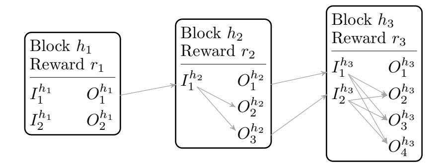
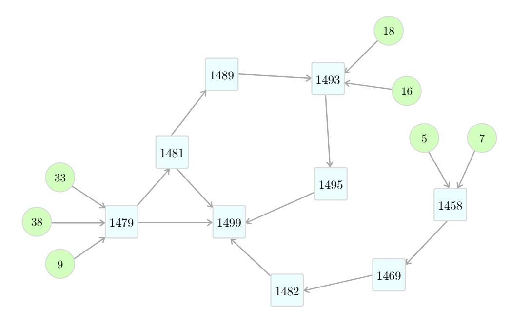
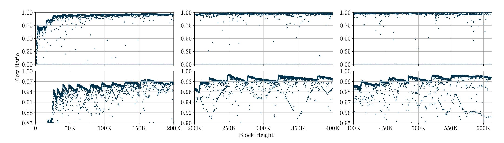
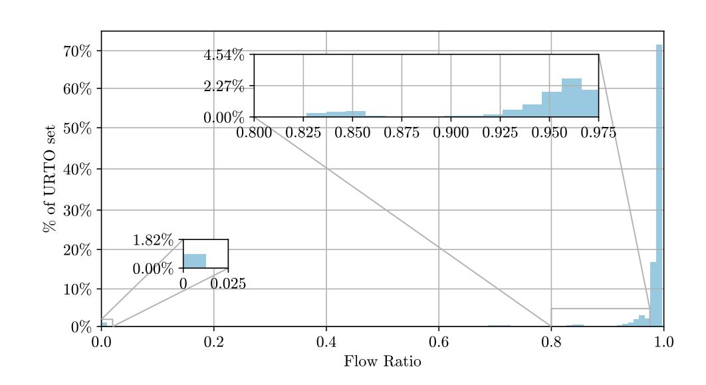

{0}------------------------------------------------

# On the Confidentiality of Amounts in Grin

Suyash Bagad and Saravanan Vijayakumaran Department of Electrical Engineering Indian Institute of Technology, Bombay suyashbagad@iitb.ac.in, sarva@ee.iitb.ac.in

*Abstract*—Pedersen commitments have been adopted by several cryptocurrencies for hiding transaction amounts. While Pedersen commitments are perfectly hiding in isolation, the cryptocurrency transaction rules can reveal relationships between the amounts hidden in the commitments involved in the transaction. Such relationships can be combined with the public coin creation schedule to provide upper bounds on the number of coins in a commitment. In this paper, we consider the Grin cryptocurrency and derive upper bounds on the number of coins which can be present in regular transaction outputs. In a March 2020 snapshot of the Grin blockchain, we find that out of the 110,149 unspent regular transaction outputs 983 of them have less than 1800 grin (number of coins typically minted in half an hour) stored in them. On the other hand, 95% of the unspent regular transaction outputs in the snapshot have an upper bound which is at least 90% of the total Grin supply at their respective block heights. We conclude that while our method does not violate the confidentiality of the amounts in most of the outputs on the Grin blockchain, the amounts in some outputs can be estimated to be in a narrow range.

## I. INTRODUCTION

MimbleWimble [\[1\]](#page-4-0) is a scalable cryptocurrency design where coins are stored in Pedersen commitments [\[2\]](#page-4-1). The blinding factor of the Pedersen commitment which obscures the amount of coins also serves as the spending key. Like many other cryptocurrency designs, transactions in MimbleWimble are of two types: *regular transactions* and *coinbase transactions*. Regular transactions involve a transfer of coins from some input commitments already present on the blockchain to new output commitments. A combination of digital signatures and range proofs are used to prove that the total coins in the input commitments equals the total coins in the output commitments plus transaction fees, without revealing the amounts in the commitments [\[3\]](#page-4-2). Coinbase transactions reward miners for adding blocks to the blockchain. They only consist of output commitments and have no input commitments. The total amount of coins in the coinbase output commitments of a block is *public*, being equal to the sum of the block subsidy and the transaction fees paid by the regular transactions in the block.

Every regular transaction output commitment can be traced back to a set of *donor* coinbase output commitments with public amounts which could have possibly contributed to it. The key observation is that *the amount of coins in a regular transaction output is bounded from above by the sum of the public amounts in its donor coinbase outputs minus the total transaction fees paid on the paths from these donor coinbase outputs to the regular transaction output*. While this observation is probably well-known in the MimbleWimble community, to the best of our knowledge there has been no effort to quantitatively compute such upper bounds for a MimbleWimblebased cryptocurrency. In this paper, we compute these upper bounds for the Grin implementation [\[4\]](#page-4-3) of MimbleWimble. Our method can be applied to the other implementations like Beam [\[5\]](#page-4-4). We chose Grin because we were able to obtain its blockchain data from the administrator of the GrinExplorer site [\[6\]](#page-4-5). Note that, unlike other cryptocurrencies, it is not possible for a new node in Grin to download all the historical blocks starting with the genesis block [\[7\]](#page-4-6). This is a deliberate design choice as the MimbleWimble protocol does not require all the blocks to check the validity of the current blockchain state. The network load on existing nodes in the Grin P2P network is reduced by not requiring them to send historical blocks to new nodes.[1](#page-0-0)

The first Grin block was mined on January 15, 2019. We used a snapshot of the blockchain from March 17, 2020 in our analysis which had 612,102 blocks. Grin has a block subsidy of 60 grins per block and a target inter-block time of one minute. Coinbase outputs cannot be spent until they receive 1440 confirmations which corresponds to 24 hours worth of blocks [\[8\]](#page-4-7). For a regular transaction output (RTO) in a block at height h (with genesis block having height 0), a trivial upper bound on the amount of coins in the output is 60×max(0, h−1439) grins. This corresponds to the cumulative block subsidy in the blocks from height 0 to height max(0, h − 1440). We define the *flow upper bound* for an RTO to be the sum of the amounts in its donor coinbase outputs minus the total transaction fees paid in the paths from these donor coinbase outputs to the RTO (see Section [III](#page-1-0) for an illustration). The effectiveness of the flow upper bound can be quantified using the *flow ratio* of an RTO which is defined as

Flow ratio of RTO = 
$$\frac{\text{Flow upper bound of RTO}}{\text{Trivial upper bound of RTO}}$$
.

A value of flow ratio close to 1 implies that the flow upper bound does not reveal much information about the amount in the RTO. But a flow ratio value close to 0 implies that the flow upper bound is effective in constraining the amount in the RTO to a narrow range in the relative sense.

Our Contribution: Our main contribution is an empirical analysis of the confidentiality of amounts in the Grin blockchain which takes the transaction graph into account. To enable efficient computation of the flow upper bound, we define a graph with vertex set equal to the union of the set of coinbase outputs and the set of blocks. Note that regular transaction inputs or outputs are not represented as vertices in this graph. The graph edges are defined to reflect all possible flows of coins between transaction inputs and outputs. Using this graph, we calculate the flow ratio as a function of the

1Beam does allow the download of all historical blocks from its P2P network, in addition to allowing the download of a compressed blockchain state like Grin. We were not aware of this fact when we started our research.

{1}------------------------------------------------

block height for the Grin blockchain (see Figure 3). For the blocks in our snapshot, we find that the flow ratio is less than 0.5 for RTOs in 6.6% of the blocks and more than 0.9 for 88% of the blocks. As these statistics may be biased by early blocks mined during periods of low transaction activity, we consider the distribution of flow ratio for only unspent regular transaction outputs (URTOs) in our snapshot (see Figure 4). We find that while 95% of the 110,149 URTOs have a flow ratio greater than 0.9, about 0.8% of them have a flow ratio less than 0.01. We conclude that while the flow upper bound does not violate the confidentiality of most of the URTOs, it can constrain the amounts in some URTOs to a narrow range.

Linkability of Inputs and Outputs: Inputs and outputs from disparate transactions are aggregated in a MimbleWimble block which hides the link between those involved in the same transaction. Ivan Bogatty [9] demonstrated a practical attack to uncover links between inputs and outputs in a Grin block by listening to transactions broadcast in the peer-to-peer network. We can obtain tighter flow upper bounds by incorporating such link information. Due to unavailability of such link information for historical blocks, we do not consider this information in the flow upper bound calculations described in this paper. So our results represent a conservative estimate of the upper bound and could be improved upon by incorporating links between inputs and outputs.

Related Work: Apart from Bogatty's attack [9], we are not aware of any other work addressing the privacy of MimbleWimble-based cryptocurrencies. To the best of our knowledge, our work is the first to address the confidentiality of amounts in MimbleWimble. Bogatty's attack is only concerned with linking inputs and outputs in a Grin block and does not consider privacy of amounts. While Monero also has amounts hidden by Pedersen commitments, previous work addressing privacy in Monero by Kumar et al. [10] and Möser et al. [11] has been primarily concerned with identifying the actual source address in the ring of addresses present in a Monero transaction. These papers do not address the privacy of amounts in Monero, which is an interesting direction for future work (our approach cannot be used directly due to the source address obfuscation in Monero).

#### II. OVERVIEW OF GRIN

Let  $\mathbb{G}$  be the secp256k1 elliptic curve group of order n. In Grin, coins are stored in Pedersen commitments of the form C = kG + aH where  $k, a \in \mathbb{F}_n$  are scalars and  $G, H \in \mathbb{G}$  are the generators of  $\mathbb{G}$  with an unknown discrete logarithm with respect to each other. The quantity a is the amount stored in C and k is a randomly chosen scalar known as the blinding factor. A Grin block consists of the following:

- A block header from which a scalar  $k_{\text{off}} \in \mathbb{F}_n$  called the *kernel offset* can be derived. The other header fields are not relevant to our discussion.
- A list of L input commitments  $I_1, I_2, \ldots, I_L$ . This list is empty for blocks without regular transactions. Each input commitment refers to an output commitment in a previous block.
- A list of M output commitments  $O_1, O_2, \ldots, O_M$  where M > 1. Each output commitment is tagged

- as either a coinbase output or a regular transaction output. Each output commitment is also accompanied by a range proof to prove that it commits to an amount in the range  $\{0, 1, 2, \dots, 2^{64} 1\}$ .
- A list of N transaction kernels each of which contains a fee amount  $f_i \in \mathbb{F}_n$  and a curve point  $X_i \in \mathbb{G}$  called the kernel excess. Each kernel also contains a Schnorr signature proving that  $X_i$  is of the form  $x_iG$  for some  $x_i \in \mathbb{F}_n$ . Each transaction kernel is also tagged either as a coinbase kernel or a regular transaction kernel.

Let  $\mathcal{I}_{cb} \subset \{1, 2, ..., M\}$  be the set of indices corresponding to coinbase outputs and  $\mathcal{I}_{cb}^c$  be the set of the remaining indices corresponding to RTOs. Let  $\mathcal{I}_{ck} \subset \{1, 2, ..., N\}$  be the set of indices corresponding to coinbase kernels and  $\mathcal{I}_{ck}^c$  be the set of indices corresponding to regular transaction kernels. A valid block has to satisfy the following equations.

$$\sum_{i \in \mathcal{I}_{cb}} O_i - \left(\sum_{i=1}^N f_i\right) H - rH = \sum_{i \in \mathcal{I}_{ck}} X_i, \tag{1}$$

$$\sum_{i \in \mathcal{I}_{cb}^c} O_i + \left(\sum_{i=1}^N f_i\right) H - \sum_{i=1}^L I_i = \sum_{i \in \mathcal{I}_{cb}^c} X_i + k_{off} G. \tag{2}$$

Here  $r=60\times 10^9$  is the block subsidy in nanogrin units. As the right hand sides of both equations are commitments to the zero amount, the binding property of Pedersen commitments and the range proofs imply that

- (i) the total amount in the coinbase outputs of a block is  $r + \sum_{i=1}^{N} f_i$  and
- (ii) the sum of the input amounts is equal to the sum of the transaction fees and RTO amounts.

# III. ILLUSTRATION OF FLOW UPPER BOUND CALCULATION

In this section, we illustrate the flow upper bound calculation with an example. Consider blocks at heights  $h_1$ ,  $h_2$ , and  $h_3$  on the Grin blockchain as shown in Figure 1. Let the total fees for the block at height  $h_i$  be  $f_i^{\rm tot}$ . The block reward in block  $h_i$  is then  $r_i = r + f_i^{\rm tot}$  where r = 60 grins is the block subsidy. An inter-block arrow from an output  $O_l^{h_i}$  to an input  $I_j^{h_{i+1}}$  denotes that the input is spending the output. An intra-block arrow from an input  $I_j^{h_i}$  to an output  $O_l^{h_i}$  indicates that the input could be contributing coins to the output; however such an arrow does not indicate that the input is definitely contributing to the output. In the absence of linkability information, we assume any input in a block can contribute to any RTO in the same block.

Let  $\mathfrak{a}(C)$  be the amount hidden in a commitment C. We will assume that the first output  $O_1^{h_i}$  is the only coinbase output in all three blocks. Then  $\mathfrak{a}(O_1^{h_i})=r_i$  for i=1,2,3. The coinbase output  $O_1^{h_1}$  is spent in block  $h_2$  via the input  $I_1^{h_2}$ . So we have  $I_1^{h_2}=O_1^{h_1} \implies \mathfrak{a}(I_1^{h_2})=r_1$ . The coinbase output  $O_1^{h_2}$  and regular transaction output  $O_3^{h_2}$  are spent in block  $h_3$  via the inputs  $I_1^{h_3}$  and  $I_2^{h_3}$  respectively. So we have  $I_1^{h_3}=O_1^{h_2}$  and  $I_2^{h_3}=O_3^{h_2}$  which implies  $\mathfrak{a}(I_1^{h_3})=r_2$  and  $\mathfrak{a}(I_2^{h_3})=\mathfrak{a}(O_3^{h_2})$ .

{2}------------------------------------------------

Fig. 1: Blocks at height  $h_1, h_2, h_3$  with block rewards  $r_1, r_2, r_3$ .  $I_j^{h_i}$  and  $O_l^{h_i}$  are inputs and outputs in block  $h_i$  for appropriate indices j, l. Intra-block arrows show the possible flows of coins from inputs to outputs in the same block. Inter-block arrows indicate spending of outputs.

The consequence of equation (2) in block  $h_2$  is

$$\mathfrak{a}(O_2^{h_2}) + \mathfrak{a}(O_3^{h_2}) = r_1 - f_2^{\text{tot}}.$$
 (3)

While the sum of the amounts in  $O_2^{h_2}$  and  $O_3^{h_2}$  is known, the allocation of the sum to each output is hidden. As the sum represents an upper bound on the individual amounts in each of the outputs, we have

$$\mathfrak{a}(O_l^{h_2}) \le r_1 - f_2^{\text{tot}} \quad \text{for } l = 2, 3.$$
 (4)

The term on the right hand side is the flow upper bound for the RTOs in block  $h_2$ . The set of donor coinbase outputs for  $O_2^{h_2}, O_3^{h_2}$  contains only  $O_1^{h_1}$  which contributes  $r_1$  to the upper bound. The  $f_2^{\text{tot}}$  term corresponds to the total fees paid on the path from the donor coinbase output  $O_1^{h_1}$  to the RTOs  $O_2^{h_2}, O_3^{h_2}$ . In general, the flow upper bound is the same for all the RTOs in the same block.

The consequence of equation (2) in block  $h_3$  is

$$\begin{split} &\mathfrak{a}(O_2^{h_3}) + \mathfrak{a}(O_3^{h_3}) + \mathfrak{a}(O_4^{h_3}) \\ &= \mathfrak{a}(I_1^{h_3}) + \mathfrak{a}(I_2^{h_3}) - f_3^{\text{tot}} \\ &= \mathfrak{a}(O_1^{h_2}) + \mathfrak{a}(O_3^{h_2}) - f_3^{\text{tot}} \\ &= r_2 + \mathfrak{a}(O_3^{h_2}) - f_3^{\text{tot}} \\ &\leq r_2 + r_1 - f_2^{\text{tot}} - f_3^{\text{tot}}, \end{split}$$

where the last inequality follows from equation (4). Once again the upper bound on the sum of the amounts in the RTOs, yields the flow upper bound on the individual amounts given by

$$\mathfrak{a}(O_l^{h_3}) \le r_2 + r_1 - f_2^{\text{tot}} - f_3^{\text{tot}} \quad \text{for } l = 2, 3, 4.$$
 (5)

The  $r_2 + r_1$  term in the flow upper bound is due to the donor coinbase outputs  $O_1^{h_1}, O_2^{h_2}$  and the  $f_2^{\rm tot} + f_3^{\rm tot}$  term corresponds to the total fees paid on the paths from these donor coinbase outputs to the RTOs in block  $h_3$ .

#### IV. THE FLOW GRAPH

To automate the calculation of flow upper bounds, we construct a directed graph G=(V,E) from the information available on the Grin blockchain, which we call the *flow graph*. In the Grin blockchain snapshot we considered, every block had exactly one coinbase output even though this is not mandatory.2 We assume that this condition holds in our discussion below.

Fig. 2: Subgraph generated for block at height 1499. The square vertices represent blocks. The circular vertices represent coinbase outputs labelled with the block height in which they were generated. Edges denote the flow of coins.

Let  $V_{\rm bl}$  be the set of blocks in the blockchain and let  $V_{\rm cb}$  be the set of all coinbase outputs. The set of vertices is defined as  $V = V_{\rm bl} \cup V_{\rm cb}$ . The set of directed edges E will capture two types of flows of coins.

- (i) For  $c \in V_{\text{cb}}$  and  $b \in V_{\text{bl}}$ , the directed edge (c, b) belongs to the edge set E if the coinbase output c is spent by a regular transaction input in block b.
- (ii) For  $b_1, b_2 \in V_{\rm bl}$ , the directed edge  $(b_1, b_2)$  belongs to the edge set E if at least one regular transaction output in block  $b_1$  is spent by a regular transaction input in block  $b_2$ .3

The edge set E has no other edges. Note that the intra-block flow of coins from inputs to outputs in the same block has not been explicitly represented in the flow graph. This is because we are not taking linkability information about inputs and outputs into account.

**Definition.** A coinbase output vertex c in G is called a donor of a block b if there is a directed path from c to b in G. A donor of a block b is also referred to as the donor of the regular transaction outputs in the block b.

For example, Figure 2 shows the subgraph generated by the donor coinbase outputs of the block at height 1499 and the blocks which lie on paths from these coinbase outputs to it. Block 1499 has 7 donors at block heights 5, 7, 9, 16, 18, 33, and 38. The flow upper bound for the RTOs in block 1499 is equal to the sum of the block rewards of these 7 coinbase outputs minus the transaction fees paid in the 9 blocks which lie on the paths from the 7 donors to 1499 (inclusive of 1499).

Let  $V_{\rm cb}^{(h)}$  be the set of donor coinbase outputs of the block at height h. Let  $V_{\rm bl}^{(h)}$  be the set of blocks which lie on a directed path in the flow graph G from any vertex in  $V_{\rm cb}^{(h)}$  to the block at height h. The block at height h is also included

&lt;sup>2https://github.com/mimblewimble/grin/issues/689

&lt;sup>3Note that output being spent in block  $b_1$  has to be an RTO and not a coinbase transaction output. The flow of coins out of coinbase outputs is captured by the previous type of edge. Also note that there can exist at most one edge between two blocks  $b_1$  and  $b_2$  as the edge existence condition requires only that at least one RTO in block  $b_1$  be spent in block  $b_2$ .

{3}------------------------------------------------

Fig. 3: Plot of flow ratio vs block height.

in  $V_{\rm bl}^{(h)}$ . For a coinbase output vertex  $c \in V_{\rm cb}$ , let  $\mathit{reward}(c)$  denote the block reward (subsidy plus fees) of the block in which c appeared. For a block vertex  $b \in V_{\rm bl}$ , let  $\mathit{fees}(b)$  denote the total transaction fees paid by all the regular transactions in block b. For a regular transaction output O in a block at height h, the flow upper bound is given by

$$\mathfrak{a}(O) \leq \sum_{c \in V_{ch}^{(h)}} reward(c) - \sum_{b \in V_{bl}^{(h)}} fees(b). \tag{6}$$

The correctness of this upper bound can be argued as follows. It is clear that

$$\mathfrak{a}(O) \le \sum_{c \in V_{ch}^{(h)}} reward(c) \tag{7}$$

as the total coins in O cannot exceed the sum of all possible sources of coins for block h. Let  $f_{\text{tot}}^{(h)} = \sum_{b \in V_{\text{bl}}^{(h)}} fees(b)$ . We claim that the fees in  $f_{\text{tot}}^{(h)}$  must be paid *only* from the coins minted in coinbase outputs belonging to  $V_{\text{cb}}^{(h)}$ . If our claim is true,  $f_{\text{tot}}^{(h)}$  must be deducted from the upper bound as these fees are paid before the coins reach the output O. To verify our claim, suppose coins minted in a coinbase output  $c' \notin V_{\text{cb}}^{(h)}$  contributed  $\epsilon$  coins to the fees in  $f_{\text{tot}}^{(h)}$ . Then there is a sequence of transactions which resulted in the  $\epsilon$  coins being deposited in a block  $b \in V_{\text{bl}}^{(h)}$ . This implies c' is a donor of this block b. As block b itself lies on a directed path from a donor coinbase output to the block at height b, there is a directed path from c' to the block at height b, i.e. b' is a donor of the block at height b. This is a contradiction as  $b' \notin V_{\text{cb}}^{(h)}$ .

# V. RESULTS

For our analysis, we used a snapshot of the Grin blockchain from March 17, 2020 containing 612,102 blocks. As historical blocks are not available for download from the Grin P2P network, we were fortunate to obtain a PostgreSQL database containing the blockchain data from the administrator of the GrinExplorer website. We used the community edition of the Neo4j graph database for the construction of the flow graph and flow upper bound calculations.

Figure 3 shows scatter plots of the flow ratio as a function of the block height, *only for blocks with at least one RTO*. Note that the flow ratio corresponding to a block height is the flow

ratio for all RTOs in the block at that height. We used a step size of 10 in the block height to reduce calculation time (which still took 13.5 hours). The subplots in the top row plot the flow ratio for three block height ranges each of size approximately 200,000. The subplots in the bottom row plot the flow ratio for the same block height ranges but with y-axis ranges 0.85 to 1, 0.9 to 1, and 0.95 to 1. The top row subplots show that while the flow ratio was initially small it had exceeded 0.9 for most blocks by block height 50,000. We found that 88% of the blocks we considered had a flow ratio above 0.9. However, there were still block heights with small flow ratios even at heights larger than 100,000. For instance, about 6.6% of the blocks we considered with heights larger than 100,000 had a flow ratio less than 0.5. The bottom row subplots reveal a jagged structure in the scatter plots for flow ratios close to 1. While a precise explanation eludes us at this point, we suspect that the rising edges are due to the accumulation of coins by miners while the falling edges are due to the increase in the trivial upper bound in the flow ratio denominator.

To get an idea of the current state of the Grin blockchain, we plot the distribution of flow ratio for only unspent regular transaction outputs (URTOs) in our snapshot in Figure 4. We find that while 95% of the 110,149 URTOs have a flow ratio greater than 0.9, about 0.8% of them have a flow ratio less than 0.01. In terms of upper bounds, we found that 983 of the URTOs have an upper bound of 1800 grins. We conclude that while the flow upper bound does not violate the confidentiality

Fig. 4: The distribution of flow ratio for outputs in the URTO set.

{4}------------------------------------------------

of most of the URTOs, it can constrain the amounts in some URTOs to a narrow range.

### VI. CONCLUSION

In this paper, we explore the question of whether the transaction graph in Grin violates the confidentiality of amounts hidden in the Pedersen commitments corresponding to regular transaction outputs. We find that the confidentiality for most outputs is preserved if the linkability information between inputs and outputs is ignored. As incorporating linkability information will lead to tighter upper bounds, it is a direction worthy of more investigation. The presence of regular transaction outputs with small upper bounds shows that the perfectly hiding property of Pedersen commitments in MimbleWimblebased cryptocurrencies should be taken with a grain of salt.

#### ACKNOWLEDGEMENTS

We would like to thank the anonymous reviewers for their comments which have improved this paper. We would also like to thank Hendrik Richter of GrinExplorer for sharing the Grin blockchain data with us. This research would not have been possible without his help. Finally, we acknowledge the support of the Bharti Centre for Communication at IIT Bombay.

#### REFERENCES

- [1] "MimbleWimble." [Online]. Available: [https://scalingbitcoin.org/papers/](https://scalingbitcoin.org/papers/mimblewimble.txt) [mimblewimble.txt](https://scalingbitcoin.org/papers/mimblewimble.txt)
- [2] T. P. Pedersen, "Non-interactive and information-theoretic secure verifiable secret sharing," in *Advances in Cryptology — CRYPTO '91*. Springer, 1992, pp. 129–140.
- [3] "Introduction to MimbleWimble and Grin." [Online]. Available: <https://github.com/mimblewimble/grin/blob/master/doc/intro.md>
- [4] "Grin project website." [Online]. Available:<https://grin.mw/>
- [5] "Beam project website." [Online]. Available:<https://www.beam.mw/>
- [6] "GrinExplorer website." [Online]. Available:<https://grinexplorer.net/>
- [7] "Grin Forum Thread on Grinnode.live." [Online]. Available: [https://](https://forum.grin.mw/t/https-grinnode-live-public-grin-api-and-sync-service/6671/11) [forum.grin.mw/t/https-grinnode-live-public-grin-api-and-sync-service/](https://forum.grin.mw/t/https-grinnode-live-public-grin-api-and-sync-service/6671/11) [6671/11](https://forum.grin.mw/t/https-grinnode-live-public-grin-api-and-sync-service/6671/11)
- [8] "The Coinbase Maturity Rule." [Online]. Available: [https://github.com/](https://github.com/mimblewimble/grin/blob/master/doc/coinbase_maturity.md) [mimblewimble/grin/blob/master/doc/coinbase](https://github.com/mimblewimble/grin/blob/master/doc/coinbase_maturity.md) maturity.md
- [9] Linking 96% of Grin Transactions. [Online]. Available: [https:](https://github.com/bogatyy/grin-linkability) [//github.com/bogatyy/grin-linkability](https://github.com/bogatyy/grin-linkability)
- [10] A. Kumar, C. Fischer, S. Tople, and P. Saxena, "A traceability analysis of Monero's blockchain," in *European Symposium on Research in Computer Security – ESORICS 2017*, 2017, pp. 153–173.
- [11] M. Moser, K. Soska, E. Heilman, K. Lee, H. Heffan, S. Srivastava, ¨ K. Hogan, J. Hennessey, A. Miller, A. Narayanan, and N. Christin, "An empirical analysis of traceability in the Monero blockchain," *Proceedings on Privacy Enhancing Technologies*, vol. 2018, no. 3, pp. 143–163, 2018.