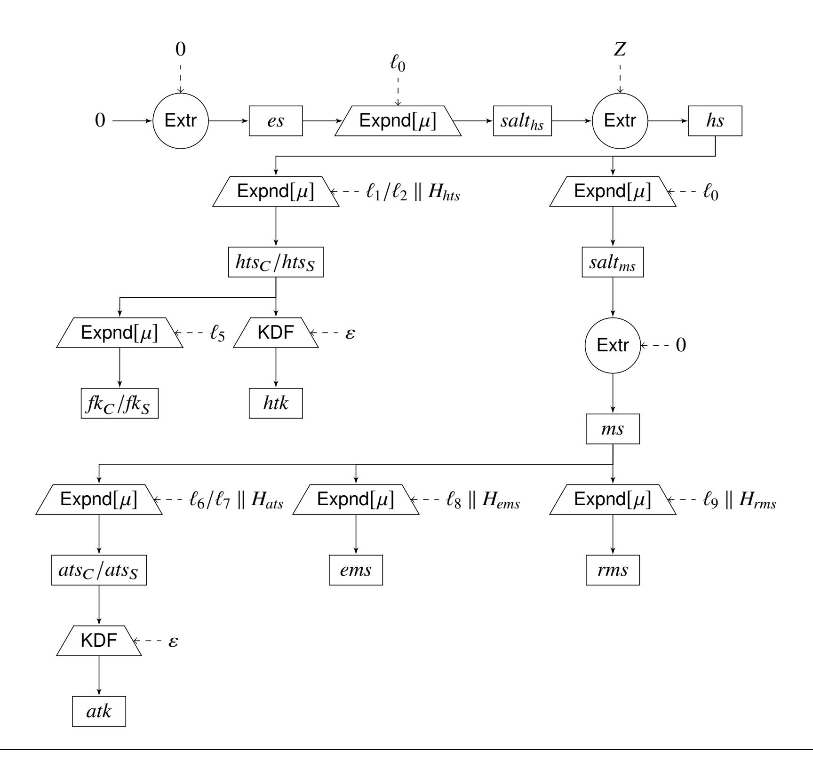

{0}------------------------------------------------

# On the Tight Security of TLS 1.3: Theoretically-Sound Cryptographic Parameters for Real-World Deployments

Denis Diemert and Tibor Jager<sup>∗</sup>

University of Wuppertal, Germany {denis.diemert, tibor.jager}@uni-wuppertal.de

#### **Abstract**

We consider the *theoretically-sound* selection of cryptographic parameters, such as the size of algebraic groups or RSA keys, for TLS 1.3 in practice. While prior works gave security proofs for TLS 1.3, their security loss is *quadratic* in the total number of sessions across all users, which due to the pervasive use of TLS is huge. Therefore, in order to deploy TLS 1.3 in a theoretically-sound way, it would be necessary to compensate this loss with unreasonably large parameters that would be infeasible for practical use at large scale. Hence, while these previous works show that in principle the design of TLS 1.3 is secure in an asymptotic sense, they do not yet provide any useful *concrete* security guarantees for real-world parameters used in practice.

In this work, we provide a new security proof for the cryptographic core of TLS 1.3 in the random oracle model, which reduces the security of TLS 1.3 *tightly* (that is, with constant security loss) to the (multi-user) security of its building blocks. For some building blocks, such as the symmetric record layer encryption scheme, we can then rely on prior work to establish tight security. For others, such as the RSA-PSS digital signature scheme currently used in TLS 1.3, we obtain at least a *linear* loss in the number of users, independent of the number of sessions, which is much easier to compensate with reasonable parameters. Our work also shows that by replacing the RSA-PSS scheme with a tightly-secure scheme (e. g., in a future TLS version), one can obtain the first fully tightly-secure TLS protocol.

Our results enable a theoretically-sound selection of parameters for TLS 1.3, even in large-scale settings with many users and sessions per user.

<sup>∗</sup>Supported by the European Research Council (ERC) under the European Union's Horizon 2020 research and innovation programme, grant agreement 802823.

<sup>©</sup> IACR 2020. This article is a minor revision of the version submitted by the authors to the IACR and to Springer-Verlag on July 17, 2020. The version published by Springer-Verlag will be available in the Journal of Cryptology.

{1}------------------------------------------------

## 1 Introduction

**Provable security and tightness.** In modern cryptography, a formal security proof is often considered a minimal requirement for newly proposed cryptographic constructions. This holds in particular for rather complex primitives, such as authenticated key exchange protocols like TLS. The most recent version of this protocol, TLS 1.3, is the first to be developed according to this approach.

A security proof for a cryptographic protocol usually shows that an adversary  $\mathcal A$  on the protocol can be efficiently converted into an adversary  $\mathcal B$  solving some conjectured-to-be-hard computational problem. More precisely, the proof would show that any adversary  $\mathcal A$  running in time  $t_{\mathcal A}$  and having advantage  $\epsilon_{\mathcal A}$  in breaking the protocol implies an adversary  $\mathcal B$  with running time  $t_{\mathcal B}$  and advantage  $\epsilon_{\mathcal B}$  in breaking the considered computational problem, such that

<span id="page-1-2"></span>
$$\frac{\epsilon_{\mathcal{A}}}{t_{\mathcal{A}}} \le \ell \cdot \frac{\epsilon_{\mathcal{B}}}{t_{\mathcal{B}}} \tag{1}$$

where  $\ell$  is bounded<sup>1</sup>. Following the approach of Bellare and Ristenpart [9, 10] to measure concrete security, the terms  $\epsilon_{\mathcal{A}}/t_{\mathcal{A}}$  and  $\epsilon_{\mathcal{B}}/t_{\mathcal{B}}$  are called the "work factors" of adversaries  $\mathcal{A}$  and  $\mathcal{B}$ , respectively, and the factor  $\ell$  is called the "security loss" of the reduction. We say that a security proof is "tight", if  $\ell$  is small (e. g., constant).

**Concrete security.** In classical complexity-theoretic cryptography it is considered sufficient if  $\ell$  is asymptotically bounded by a polynomial in the security parameter. However, the *concrete* security guarantees that we obtain from the proof depend on the *concrete* loss  $\ell$  of the reduction and (conjectured) concrete bounds on  $\epsilon_{\mathcal{B}}/t_{\mathcal{B}}$ . Thus, in order to obtain meaningful results for the concrete security of cryptosystems, we need to be more precise and make these quantities explicit.

If for a given protocol we have an concrete upper bound  $\epsilon_{\mathcal{A}}/t_{\mathcal{A}}$  on the work factor of any adversary  $\mathcal{A}$ , then we can say that the protocol provides "security equivalent to  $-\log_2(\epsilon_{\mathcal{A}}/t_{\mathcal{A}})$  bits". However, note that these security guarantees depend on the loss  $\ell$  of the reduction and a bound on  $\epsilon_{\mathcal{B}}/t_{\mathcal{B}}$ . More concretely, suppose that we aim for a security level of, say, "128-bit security". That is, we want to achieve  $-\log_2(\epsilon_{\mathcal{A}}/t_{\mathcal{A}}) \geq 128$ . A security proof providing (1) with some concrete security loss  $\ell$  would allow us to achieve this via

$$-\log_2(\epsilon_{\mathcal{A}}/t_{\mathcal{A}}) \ge -\log_2(\ell \cdot \epsilon_{\mathcal{B}}/t_{\mathcal{B}}) \ge 128$$

To this end, we have to make sure that it is reasonable to assume that  $\epsilon_{\mathcal{B}}/t_{\mathcal{B}}$  is small enough, such that  $-\log_2(\ell \cdot \epsilon_{\mathcal{B}}/t_{\mathcal{B}}) \geq 128$ . Indeed, we can achieve this by choosing cryptographic parameters (such as Diffie-Hellman groups or RSA keys) such that indeed it is reasonable to assume that  $\epsilon_{\mathcal{B}}/t_{\mathcal{B}}$  is sufficiently small. Hence, by making the quantities  $\ell$  and  $\epsilon_{\mathcal{B}}/t_{\mathcal{B}}$  explicit, the concrete security approach enables us to choose cryptographic parameters in a *theoretically-sound* way, such that  $\epsilon_{\mathcal{B}}/t_{\mathcal{B}}$  is sufficiently small and thus we *provably* achieve our desired security level.

However, note that if the security loss  $\ell$  is "large", then we need to compensate this with a "smaller"  $\epsilon_{\mathcal{B}}/t_{\mathcal{B}}$ . Of course we can easily achieve this by simply choosing the cryptographic parameters large enough, but this might significantly impact the computational efficiency of the protocol. In contrast, if the security proof is "tight", then  $\ell$  is "small" and we can accordingly use smaller parameters, while still being able to instantiate and deploy our protocol in a theoretically-sound way.

Since our focus is on the proof technique for TLS 1.3, we chose to consider this simple view on bit security. Alternatively, Micciancio and Walter [58] recently proposed a formal notion for bit security.

<span id="page-1-0"></span><sup>&</sup>lt;sup>1</sup>The exact bound on  $\ell$  depends on the setting. For instance, in the asymptotic setting, as described below,  $\ell$  is bounded by a polynomial.

<span id="page-1-1"></span><sup>&</sup>lt;sup>2</sup>Opposed to Bellare and Ristenpart, we consider the inverse of their work factor just to avoid dividing by 0 in the somewhat artifical case in which  $\epsilon = 0$ . We may assume that t > 0 as the adversary at least needs to read its input. This does not change anything other than we need to consider the negative logarithm for the bit security level.

{2}------------------------------------------------

They try to overcome paradoxical situations occurring with a simple notion of bit security as discussed above. The paradox there is that sometimes the best possible advantage is actually higher than the advantage against an idealized primitive, which is usually considered for bit security. As an example they mention pseudorandom generators (PRG) for which it was shown that the best possible attack in distinguishing the PRG from random using an n-bit seed value has advantage  $2^{-n/2}$  [30] (i. e., n/2 bits of security), even though the best seed recovery attack (with advantage  $2^{-n}$ ) does not contradict n-bit security. However, these paradoxical situations mostly occur in the non-uniform setting, in which the adversary receives additional information and thus allows the adversary to gain higher advantages. As the discussion above should serve only for motivation and we do not consider non-uniform adversaries, we believe that the simple, intuitive view on bit security we chose here is sufficient.

**Theoretically-sound deployment of TLS.** Due to the lack of tight security proofs for TLS 1.3, we are currently not able to deploy TLS 1.3 in a theoretically-sound way with reasonable cryptographic parameters. All current security proofs for different draft versions of TLS 1.3 [31, 32, 33, 37, 40] have a loss  $\ell \ge n_s^2$  which is at least *quadratic* in the total number  $n_s$  of sessions.

Let us illustrate the practical impact of this security loss. Suppose we want to choose parameters in a theoretically sound way, based on a security proof with this quadratic loss in the total number of sessions. Given that TLS will potentially be used by billions of systems, each running thousands of TLS sessions over time, it seems reasonable to assume at least  $2^{30}$  users and  $2^{15}$  sessions per user. In this case, we would have  $n_s \ge 2^{45}$  sessions over the life time of TLS 1.3. This yields a security loss of  $\ell \ge n_s^2 = 2^{90}$ , i. e., we lose "90 bits of security".

**Choosing practical parameters.** If we now instantiate TLS with parameters that provide "128-bit security" (more precisely, such that it is reasonable to assume that  $-\log_2(\epsilon_{\mathcal{B}}/t_{\mathcal{B}}) = 128$  for the best possible adversary  $\mathcal{B}$  on the underlying computational problem), then the existing security proofs guarantee only 128 - 90 = 38 "bits of security" for TLS 1.3, which is very significantly below the desired 128 bits.

Hence, from a *concrete security* perspective, the current proofs are not very meaningful for typical cryptographic parameters used in practice today.

Choosing theoretically-sound parameters. If we want to *provably* achieve "128-bit security" for TLS 1.3, we would need to deploy the protocol with cryptographic parameters that compensate the 90-bit security loss. Concretely, this would mean that an Elliptic Curve Diffie-Hellman group of order  $\approx 2^{256}$  must be replaced with a group of order at least  $\approx 2^{436}$ . The impact on RSA keys, as commonly used for digital signatures in TLS 1.3, is even more significant. While a modulus size of 3072 bits is today considered sufficient to provide "128-bit security", a modulus size of more than 10,000 bits would be necessary to compensate the 90-bit security loss.<sup>3</sup>

For illustration, consider ECDSA instantiated with NIST P-256 and instantiated with NIST P-384 (resp. NIST P-521), which are the closest standard curves to the calculated group order  $2^{436}$  to compensate 90-bit security loss. The openss1 speed benchmark shows that this would result in significantly decreasing the number of both signature computations and signature verifications per second. Concretely, for NIST P-256 we obtain  $\approx 39,407$  signature computations per second and  $\approx 14,249$  signature verifications per seconds. Whereas replacing NIST P-256 by the next larger NIST P-384 (resp. NIST P-521) we only obtain  $\approx 1,102$  (resp.  $\approx 3,437$ ) signature computations per second and  $\approx 1,479$  (resp.  $\approx 1,715$ ) signature verifications per seconds. For RSA, we measured for a modulus size of 3,072 bits,  $\approx 419$  signature computations per second and  $\approx 20,074$  signature

<span id="page-2-0"></span><sup>&</sup>lt;sup>3</sup>Cf. https://www.keylength.com/ and the various documents by different standardization bodies referenced there.

{3}------------------------------------------------

verfications per seconds, and for a modulus size of <sup>15</sup>, <sup>360</sup> bits, <sup>≈</sup><sup>4</sup> signature computations per second and 880 signature verfications per second.[4](#page-3-0)

Due to the significant performance penalty of these increased parameters, it seems impractical for most applications to choose parameters in a theoretically-sound way. This includes both "large-scale" TLS deployments, e. g., at content distribution providers or major Web sites, for which this would incur significant additional costs, as well as "small-scale" deployments, e. g., in Internet-of-Things applications with resource-constrained devices.

In practice, usually the first approach is followed, due to the inefficiency of the theoretically-sound approach. However, we believe it is a very desirable goal to make it possible to follow the theoretically-sound approach in practice, by giving improved, tighter security proofs. This is the main motivation behind the present paper.

**Our contributions and approach.** We give the first tight security proof for TLS 1.3, and thereby the first tight security proof for a real-world authenticated key exchange protocol used in practice. The proof covers both mutual and server-only authentication. The former setting is commonly considered in cryptographic research, but the latter is much more frequently used in practice.

Our proof reduces the security of TLS to appropriate *multi-user* security definitions for the underlying building blocks of TLS 1.3, such as the digital signature scheme, the HMAC and HKDF functions, and the symmetric encryption scheme of the record layer. Further, the proof is under the strong Diffie-Hellman (SDH) [\[1\]](#page-43-0) assumption in the random oracle model. In contrast, standard-model proofs often require a PRF-ODH-like assumption [\[43\]](#page-46-2). However, these assumptions are closely related. Namely, as shown by Brendel et al. [\[21\]](#page-44-2), PRF-ODH is implied by SDH in the random oracle model (see also [\[21\]](#page-44-2) for an analysis of various variants of the PRF-ODH assumption). One technical contribution of our work is the observation that using the same two assumptions explicitly in the security proof in combination with modeling the key derivation of TLS 1.3 as multiple random oracles [\[11\]](#page-44-3), we obtain leverage for a *tight* security proof. For details on how we use this see below.

Another technical contribution of our work is to identify and define reasonable multi-user definitions for these building blocks, and to show that these are sufficient to yield a tight security proof. These new definitions make it possible to independently analyze the multi-user security of the building blocks of TLS 1.3.

These building blocks can be instantiated as follows.

**Symmetric encryption.** Regarding the symmetric encryption scheme used in TLS 1.3, we can rely on previous work by Bellare and Tackmann [\[13\]](#page-44-4) and Hoang et al. [\[41\]](#page-46-3), who gave tight security proofs for the AES-GCM scheme and also considered the nonce-randomization mechanism adopted in TLS 1.3.

- **HMAC and HKDF.** For the HMAC and HKDF functions, which are used in TLS 1.3 to perform message authentication and key derivation, we give new proofs of tight multi-user security in the random oracle model.
- **Signature schemes.** TLS 1.3 specifies four signature schemes, RSA-PSS [\[26,](#page-45-4) [59\]](#page-47-1), RSA-PKCS #1 v1.5 [\[48,](#page-46-4) [59\]](#page-47-1), ECDSA [\[45\]](#page-46-5), and EdDSA [\[14,](#page-44-5) [46\]](#page-46-6). Due to the fact that RSA-based public keys are most common in practice, the RSA-based schemes currently have the greatest practical relevance in the context of TLS 1.3.

Like previous works on tightly-secure authenticated key exchange [\[4,](#page-43-1) [38\]](#page-46-7), we require *existential unforgeability in the multi-user setting with adaptive corruptions*. Here two dimensions are relevant for tightness, (i) the number of signatures issued per user, and (ii) the number of users.

<span id="page-3-0"></span><sup>4</sup>Generated on a Apple MacBook Pro (13-inch, 2019, Four Thunderbolt 3 ports) running macOS 10.15.3 and OpenSSL 1.1.1d (10 Sep 2019) on a 2,4 GHz Quad-Core Intel Core i5 (Coffee Lake, 8279U) CPU with 16 GB (2133 MHz LPDDR3) RAM.

{4}------------------------------------------------

- RSA-PSS is the recommended signature scheme in TLS 1.3. It has a tight security proof in the number of signatures per user [\[26,](#page-45-4) [47\]](#page-46-8), but not in the number of users.
- RSA-PKCS #1 v1.5 also has a tight security proof [\[42\]](#page-46-9) in the number of signatures per user, but not in the number of users. However, we note that this proof requires to double the size of the modulus, and also that it requires a hash function with "long" output (about half of the size of the modulus), and therefore does not immediately apply to TLS 1.3.
- For ECDSA there exists a security proof [\[35\]](#page-46-10) that considers a weaker "one-signature-permessage" security experiment. While this would be sufficient for our result (because the signatures are computed over random nonces which most likely are unique), their security proof is not tight.

We discuss the issue of non-tightness in the number of users below.

In contrast to previously published security proofs, which considered preliminary drafts of TLS 1.3, we consider the final version of TLS 1.3, as specified in RFC 8446. However, the differences are minor, and we believe that the published proofs for TLS 1.3 drafts also apply to the final version without any significant changes. We first focus on giving a tight security proof for the TLS 1.3 handshake. Then, following Günther [\[40\]](#page-46-1) we show how to generically compose the handshake with a symmetric encryption scheme to obtain security of the full protocol. Since we focus on efficiency of practical deployments, our security proof of TLS 1.3 is in the random oracle model [\[11\]](#page-44-3).

**Features of TLS omitted in the security analysis.** As common in previous cryptographic security analyses of the TLS protocol [\[31,](#page-45-1) [33,](#page-45-3) [40,](#page-46-1) [43,](#page-46-2) [55\]](#page-47-2), we consider the *"cryptographic core"* of TLS 1.3. That is, our analysis only focuses on the TLS 1.3 Full 1-RTT (EC)DHE Handshake and its composition with an arbitrary symmetric key protocol. The full TLS 1.3 standard allows the *negotiation* of different ciphersuites (i. e., AEAD algorithm and hash algorithm), DH groups, and signature algorithms, but this negotiation is out of scope of our work and we focus on a fixed selection of algorithms. Similarly, we do not consider version negotiation and backward compatability as, e. g., considered in [\[17,](#page-44-6) [34\]](#page-45-5). Instead, we only focus on clients and servers that negotiate TLS 1.3. We also do not consider advanced, optional protocol features, such as abbreviated session resumption based on pre-shared keys (PSK) (with optional (EC)DHE key exchange and 0-RTT, as in e. g., [\[31,](#page-45-1) [33\]](#page-45-3)). That is, we consider neither PSKs established using TLS nor PSKs established using some out-of-band mechanism. Further, we ignore the TLS 1.3 record layer protocol, which performs transmission of cryptographic messages (handshake messages and encrypted data) on top of the TCP protocol and below the cryptographic protocols used in TLS. Additionally, we omit the alert protocol [\[65,](#page-48-0) Sect. 6] and the considerations of extensions, such as post-handshake client authentication [\[54\]](#page-47-3). Furthermore, we do not consider ciphersuite downgrade or protocol version rollback attacks as discussed in [\[44,](#page-46-11) [57,](#page-47-4) [69\]](#page-48-1). Hence, we abstract the cryptographic core of TLS in essentially the same way as in [\[31,](#page-45-1) [33,](#page-45-3) [40,](#page-46-1) [43,](#page-46-2) [55\]](#page-47-2). See for instance [\[19,](#page-44-7) [28\]](#page-45-6) for a different approach, which analyses a concrete reference implementation of TLS (miTLS) with automated verification tools.

However, as mentioned earlier, we discuss the composition of the TLS 1.3 Full (EC)DHE Handshake with the nonce randomization mechanism of AES-GCM, which could be proven to be tightly secure by Hoang et al. [\[41\]](#page-46-3) and is a first step towards a tight composition with the actual record protocol.

**Achieving tightness using the random oracle model.** Conceptually, we adopt a technique of Cohn-Gordon et al. [\[25\]](#page-45-7) to TLS 1.3. The basic idea of the approach is that the random oracle and random self-reducibility of SDH allows us to embed a single SDH challenge into every protocol session simultaneously. The DDH oracle provided by the SDH experiment allows us to guarantee that we are able to recognize a random oracle query that corresponds to a solution of the given SDH instance without tightness loss. A remarkable difference to [\[25\]](#page-45-7) is that they achieve only a linear tightness loss in the

{5}------------------------------------------------

number of users, and show to be optimal for the class of high-efficiency protocols considered there. Previous proofs for different TLS versions suffered from the general difficulty of proving tight security of AKE protocols, such as the "commitment problem" described in [\[38\]](#page-46-7). We show that the design of TLS 1.3 allows a tightly-secure proof with constant security loss.

**Relation to previous non-tight security proofs in the standard model.** We stress that our result is not a strict improvement over previous security proofs for TLS 1.3 [\[31,](#page-45-1) [33,](#page-45-3) [40,](#page-46-1) [43,](#page-46-2) [55\]](#page-47-2), in particular not to standard model proofs without random oracles. Rather, our objective is to understand under which exact assumptions a tight security proof, and thus a theoretically-sound instantiation with optimal parameters such as group sizes is possible. We show that the random oracle model allows this. Hence, if one is willing to accept the random oracle model as a reasonable heuristic, then one can use optimal parameters. Otherwise, either no theoretically sound deployment is (currently) possible, or larger parameters must be used to overcome the loss.

**Tight security of signature schemes in the number of users.** All signature schemes in TLS have in common that they currently do not have a tight security proof in the number of users. Since all these schemes have unique secret keys in the sense of [\[5\]](#page-43-2), [Bader et al.](#page-43-2) even showed that they cannot have a tight security proof, at least not with respect to what they called a "simple" reduction.

There are several ways around this issue:

- 1. We can compensate the loss by choosing larger RSA keys. Note that the security loss is only *linear* in the number of *users*. For instance, considering 2 <sup>30</sup> users as above, we would lose only "30 bits of security". This might be compensated already with a 4096-bit RSA key, which is already quite common today.
  - Most importantly, due to our modular security proof, this security loss impacts *only* the signature keys. In contrast, for previous security proofs one would have to increase *all* cryptographic parameters accordingly (or require a new proof).
- 2. Alternatively, since the RSA moduli in the public keys of RSA-based signature schemes are independently generated, they do not share any common parameters, such as a common algebraic group as for many tightly-secure Diffie-Hellman-based schemes. On the one hand, this makes a tight security proof very difficult, because there is no common algebraic structure that would allow for, e. g., random self-reducibility. The latter is often used to prove tight security for Diffie-Hellman-based schemes.
  - On the other hand, one can also view this as a security advantage. The same reason that makes it difficult for us to give a tight security proof in the number of users, namely that there is no common algebraic structure, seems also to make it difficult for an adversary to leverage the availability of more users to perform a more efficient attack than on a single user. Hence, it seems reasonable to assume that tightness in the number of users is not particularly relevant for RSA-based schemes, and therefore we do not have to compensate any security loss.
  - This is an additional assumption, but it would even make it possible to choose *optimal* parameters, independent of the number of users.
- 3. Finally, in future revisions of TLS one could include another signature scheme which is tightlysecure in both dimensions, such as the efficient scheme recently constructed by Gjøsteen and Jager [\[38\]](#page-46-7).

{6}------------------------------------------------

**Further related work.** The design of TLS 1.3 is based on the OPTLS protocol by Krawczyk and Wee [56], which, however, does not have a tight security proof.

Constructing tightly-secure authenticated key exchange protocols has turned out to be a difficult task. The first tightly-secure AKE protocols were proposed by Bader et al. [4]. Their constructions do not have practical efficiency and are therefore rather theoretical. Notably, they achieve proofs in the standard model, that is, without random oracles or similar idealizations.

Recently, Gjøsteen and Jager [38] published the first practical and tightly-secure AKE protocol. Their protocol is a three-round variant of the signed Diffie-Hellman protocol, where the additional message is necessary to avoid what is called the "commitment problem" in [38]. Our result also shows implicitly that TLS is "out-of-the-box" able to avoid the commitment problem, without requiring an additional message. Furthermore, Gjøsteen and Jager [38] describe an efficient digital signature scheme with tight security in the multi-user setting with adaptive corruptions. As already mentioned above, this scheme could also be used in TLS 1.3 in order to achieve a fully-tight construction.

Cohn-Gordon et al. [25] constructed extremely efficient AKE protocols, but with security loss that is linear in the number of users. They also showed that this linear loss is unavoidable for many types of protocols.

Formal security proofs for (slightly modified variants of) prior TLS versions were given, e.g., in [15, 16, 19, 22, 43, 55, 60].

Concurrent and independent work. In concurrent and independent work, Davis and Günther [27] studied the tight security of the SIGMA protocol [51] and the main TLS 1.3 handshake protocol. Similar to our proof (see Theorem 6) they reduce the security of the TLS 1.3 handshake in the random oracle to the hardness of strong DH assumption (SDH), the collision resistance of the hash function, and the multi-user security of the signature scheme and the PRFs. However, we would like to point out that there are some notable differences between their work and ours:

- We use the multi-stage key exchange model from [36], which allows us to show security for all intermediate, internal keys and further secrets derived during the handshake. They use a code-based authenticated key exchange model, which considers mutual authentication and the negotiation of a single key, namely the final session key that is used in the TLS 1.3 record layer.
- Our work makes slightly more extensive use of the random oracle model. Concretely, both security proofs need to deal with the fact that the TLS 1.3 key derivation does not bind the DH key to the context used to derive a key in a single function. We resolve this by modeling several functions as random oracles, while Davis and Günther [27] model the functions HKDF.Extract and HKDF.Expand of the HKDF directly as random oracles and are able to circumvent the above problem by using efficient book-keeping in the proof.
- Since the multi-stage key exchange model [36] provides a tightly-secure composition theorem, we were able to make a first step towards a tight security proof for the composition of the TLS handshake with the TLS record layer by leveraging known security proofs for AES-GCM by Bellare and Tackmann [13] and Hoang et al. [41].
- Davis and Günther [27] focused only on the tight security of the handshake protocol of TLS 1.3, but provide an extensive evaluation of the concrete security implications of their bounds when instiated with various amounts of resources. Furthermore, they even give a bound for the strong DH assumption in the generic group model (GGM) and were able to show that SDH is as hard as the discrete logarithm problem in the GGM.

Hence, neither of these two independent works covers the other, both papers make complementary contributions towards understanding the theoretically-sound deployment of TLS in practice.

{7}------------------------------------------------

**Future work and open problems.** A notable innovative feature of TLS 1.3 is its 0-RTT mode for low-latency key exchange, which we do not consider in this work. We believe it is an interesting open question to analyze whether tight security can also achieved for the 0-RTT mode. Probably along with full forward security, as considered in [2].

Furthermore, we consider TLS 1.3 "in isolation", that is, independent of other protocol versions that may be provided by a server in parallel in order to maximize compatibility. It is known that this might yields cross-protocol attacks, such as those described in [3, 18, 44, 57]. It would be interesting to see whether (tight) security can also be proven in a model that considers such backwards compatibility issues as, e. g., in [17, 34], and which exact impact on tightness this would have, if any. A major challenge in this context is to tame the complexity of the security model and the security proof.

## 2 Preliminaries

In this section, we introduce notation used in this paper and recall definitions of fundamental building blocks as well as their corresponding security models.

#### 2.1 Notation

We denote the empty string, i.e., the string of length 0, by  $\varepsilon$ . For strings a and b, we denote the concatenation of these strings by  $a \parallel b$ . For an integer  $n \in \mathbb{N}$ , we denote the set of integers ranging from 1 to n by  $[n] := \{1, \ldots, n\}$ . For a set  $X = \{x_1, x_2, \ldots\}$ , we use  $(v_i)_{i \in X}$  as a shorthand for the tuple  $(v_{x_1}, v_{x_2}, \ldots)$ . We denote the operation of assigning a value y to a variable x by x := y. If S is a finite set, we denote by  $x \overset{\$}{\leftarrow} S$  the operation of sampling a value uniformly at random from set S and assigning it to variable x. If  $\mathcal{A}$  is an algorithm, we write  $x := \mathcal{A}(y_1, y_2, \ldots)$ , in case  $\mathcal{A}$  is deterministic, to denote that  $\mathcal{A}$  on inputs  $y_1, y_2, \ldots$  outputs x. In case  $\mathcal{A}$  is probabilistic, we overload notation and write  $x \overset{\$}{\leftarrow} \mathcal{A}(y_1, y_2, \ldots)$  to denote that random variable x takes on the value of algorithm  $\mathcal{A}$  ran on inputs  $y_1, y_2, \ldots$  with fresh random coins. Sometimes we also denote this random variable simply by  $\mathcal{A}(y_1, y_2, \ldots)$ .

## 2.2 Advantage Definitions vs. Security Definitions

Due to the real-world focus of this paper, we follow the *human-ignorance approach* proposed by Rogaway [66, 67] for our security definitions and statements. As a consequence, we drop security parameters in all of our syntactical definitions. This way we reflect the algorithms as they are used in practice more appropriately. The human-ignorance approach also allows us, e. g., to consider a fixed group opposed to the widely used approach of employing a group generator in the asymptotic security setting. We believe that doing so brings us closer to the actual real-world deployment of the schemes. In terms of wording, we can never refer to any scheme as being "secure" in a formal context. Formally, we only talk about advantages and success probabilities of adversaries.

#### 2.3 Diffie-Hellman Assumptions

We start with the definitions of the standard Diffie-Hellman (DH) assumptions [20, 29].

**Definition 1** (Computational Diffie-Hellman Assumption). Let  $\mathbb{G}$  be a cyclic group of prime order q and let g be a generator of  $\mathbb{G}$ . We denote the *advantage of an adversary*  $\mathcal{A}$  *against the computational Diffie-Hellman (CDH) assumption* by

$$\mathsf{Adv}^{\mathsf{CDH}}_{\mathbb{G},\,g}(\mathcal{A}) \coloneqq \Pr[a,b \xleftarrow{\$} \mathbb{Z}_q : \mathcal{A}(g^a,g^b) = g^{ab}].$$

{8}------------------------------------------------

**Definition 2** (Decisional Diffie-Hellman Assumption). Let  $\mathbb{G}$  be a cyclic group of prime order q and let g be a generator of  $\mathbb{G}$ . We denote the *advantage of an adversary*  $\mathcal{A}$  *against the decisional Diffie-Hellman (DDH) assumption* by

$$\mathsf{Adv}^{\mathsf{DDH}}_{\mathbb{G},\,g}(\mathcal{A}) \coloneqq |\Pr[a,b \overset{\$}{\leftarrow} \mathbb{Z}_q : \mathcal{A}(g^a,g^b,g^{ab}) = 1] - \Pr[a,b,c \overset{\$}{\leftarrow} \mathbb{Z}_q : \mathcal{A}(g^a,g^b,g^c) = 1]|.$$

Following Abdalla et al. [1], we also consider the *strong Diffie-Hellman (SDH)* assumption. The SDH problem is essentially the CDH problem except that the adversary has additionally access to a DDH oracle. The DDH oracle outputs 1 on input  $(g^a, g^b, g^c)$  if and only if  $c = ab \mod q$ . However, we restrict the DDH oracle in the SDH experiment by fixing the first component. Without this restriction, we would consider the *gap Diffie-Hellman* [63] problem.

<span id="page-8-1"></span>**Definition 3** (Strong Diffie-Hellman Assumption). Let  $\mathbb{G}$  be a cyclic group of prime order q and let g be a generator of  $\mathbb{G}$ . Further, let  $DDH(\cdot,\cdot,\cdot)$  denote the oracle that on input  $g^a,g^b,g^c\in\mathbb{G}$  outputs 1 if  $c=ab \mod q$  and 0 otherwise. We denote the *advantage of an adversary*  $\mathcal{A}$  *against the strong Diffie-Hellman (SDH) assumption* by

$$\mathsf{Adv}^{\mathsf{SDH}}_{\mathbb{G},\,g}(\mathcal{A}) \coloneqq \Pr[a,b \xleftarrow{\$} \mathbb{Z}_q : \mathcal{A}^{\mathsf{DDH}(g^a,\cdot,\cdot)}(g^a,g^b) = g^{ab}].$$

#### 2.4 Pseudorandom Functions

Informally, a *pseudorandom function (PRF)* is a keyed function that is indistinguishable from a truly random function. The standard definition only covers the case of a single key (resp. a single user). Bellare et al. introduced the related notion of *multi-oracle families* [8], which essentially formalizes *multi-user security* of a PRF. In contrast to the standard definition, the challenger now implements N oracles instead of a single one. The adversary may ask queries of the form (i, x), which translates to a request of an image of x under the i-th oracle. Hence, the adversary essentially plays N "standard PRF experiments" in parallel, except that the oracles all answer either uniformly at random or with the actual PRF.

<span id="page-8-0"></span>**Definition 4** (MU-PRF-Security). Let PRF be an algorithm implementing a deterministic, keyed function PRF:  $\mathcal{K}_{PRF} \times \mathcal{D} \to \mathcal{R}$  with finite key space  $\mathcal{K}_{PRF}$ , (possibly infinite) domain  $\mathcal{D}$  and finite range  $\mathcal{R}$ . Consider the following security experiment  $\text{Exp}_{PRF,N}^{\text{MU-PRF}}(\mathcal{A})$  played between a challenger and an adversary  $\mathcal{A}$ :

1. The challenger chooses a bit  $b \stackrel{\$}{\leftarrow} \{0,1\}$ , and for every  $i \in [N]$  a key  $k_i \stackrel{\$}{\leftarrow} \mathcal{K}_{PRF}$  and a function  $f_i \stackrel{\$}{\leftarrow} \{f \mid f \colon \mathcal{D} \to \mathcal{R}\}$  uniformly and independently at random. Further, it prepares a function  $O_b$  such that for  $i \in [n]$ 

$$O_b(i,\cdot) \coloneqq \begin{cases} \mathsf{PRF}(k_i,\cdot) & \text{, if } b = 0 \\ f_i(\cdot) & \text{, otherwise} \end{cases}$$

- 2. The adversary may issue queries  $(i, x) \in [N] \times \mathcal{D}$  to the challenger adaptively, and the challenger replies with  $O_b(i, x)$ .
- 3. Finally, the adversary outputs a bit  $b' \in \{0, 1\}$ . The experiment outputs 1 if b = b' and 0 otherwise.

We define the advantage of an adversary  $\mathcal A$  against the multi-user pseudorandomness (MU-PRF) of PRF for N users to be

$$\mathsf{Adv}^{\mathsf{MU-PRF}}_{\mathsf{PRF},N}(\mathcal{A}) \coloneqq \left| \Pr[\mathsf{Exp}^{\mathsf{MU-PRF}}_{\mathsf{PRF},N}(\mathcal{A}) = 1] - \frac{1}{2} \right|.$$

where  $\operatorname{Exp}^{\operatorname{MU-PRF}}_{\operatorname{PRF},N}(\mathcal{A})$  is defined above.

{9}------------------------------------------------

#### <span id="page-9-2"></span>2.5 Collision-Resistant Hash Functions

A (*keyless*) hash function H is a deterministic algorithm implementing a function H:  $\mathcal{D} \to \mathcal{R}$  such that usually  $|\mathcal{D}|$  is large (possibly infinite) and  $|\mathcal{R}|$  is small (finite). Recall the standard notion of *collision resistance* of a hash function.

<span id="page-9-3"></span>**Definition 5** (Collision Resistance). Let H be a keyless hash function. We denote the *advantage of an adversary*  $\mathcal{A}$  *against the collision resistance of* H by

$$\mathsf{Adv}^{\mathsf{Coll-Res}}_\mathsf{H}(\mathcal{A}) \coloneqq \Pr\left[ (m_1, m_2) \overset{\$}{\leftarrow} \mathcal{A} : m_1 \neq m_2 \land \mathsf{H}(m_1) = \mathsf{H}(m_2) \right].$$

## 2.6 Digital Signature Schemes

We recall the standard definition of a digital signature scheme by Goldwasser et al. [39].

<span id="page-9-0"></span>**Definition 6** (Digital Signature Scheme). A *digital signature scheme* for message space M is a triple of algorithms SIG = (SIG.Gen, SIG.Sign, SIG.Vrfy) such that

- 1. SIG.Gen is the randomized key generation algorithm generating a public (verification) key pk and a secret (signing) key sk and takes no input.
- 2. SIG.Sign(sk, m) is the randomized signing algorithm outputting a signature  $\sigma$  on input message  $m \in M$  and signing key sk.
- 3. SIG.Vrfy $(pk, m, \sigma)$  is the deterministic verification algorithm outputting either 0 or 1.

**Correctness.** We say that a digital signature scheme SIG is *correct* if for any  $m \in M$ , and for any (pk, sk) that can be output by SIG.Gen, it holds

$$SIG.Vrfy(pk, m, SIG.Sign(sk, m)) = 1.$$

#### 2.6.1 Existential Unforgeability of Signatures

The standard notion of security for digital signature schemes is called *existential unforgeability under an adaptive chosen-message attack (EUF-CMA)*. We recall the standard definition [39] next.

<span id="page-9-1"></span>**Definition 7** (EUF-CMA-Security). Let SIG be a digital signature scheme (Definition 6). Consider the following experiment  $\text{Exp}_{\text{SIG}}^{\text{EUF-CMA}}(\mathcal{A})$  played between a challenger and an adversary  $\mathcal{A}$ :

- 1. The challenger generates a key pair  $(pk, sk) \stackrel{\$}{\leftarrow} SIG.Gen$ , initializes the set of chosen-message queries  $Q_{Sign} := \emptyset$ , and hands pk to  $\mathcal{A}$  as input.
- 2. The adversary may issue signature queries for messages  $m \in M$  to the challenger adaptively. The challenger replies to each query m with a signature  $\sigma \leftarrow \mathsf{SIG.Sign}(sk,m)$ . Each chosen-message query m is added to the set of chosen-message queries  $Q_{\mathsf{Sign}}$ .
- 3. Finally, the adversary outputs a forgery attempt  $(m^*, \sigma^*)$ . The challenger checks whether SIG.Vrfy $(pk, m^*, \sigma^*) = 1$  and  $m^* \notin Q_{Sign}$ . If both conditions hold, the experiment outputs 1 and 0 otherwise.

We denote the advantage of an adversary  $\mathcal A$  in breaking the existential unforgeability under an adaptive chosen-message attack (EUF-CMA) for SIG by

$$\mathsf{Adv}^{\mathsf{EUF\text{-}CMA}}_{\mathsf{SIG}}(\mathcal{A}) \coloneqq \Pr\left[\mathsf{Exp}^{\mathsf{EUF\text{-}CMA}}_{\mathsf{SIG}}(\mathcal{A}) = 1\right]$$

where  $\mathsf{Exp}^{\mathsf{EUF\text{-}CMA}}_{\mathsf{SIG}}(\mathcal{A})$  is defined as before.

{10}------------------------------------------------

#### 2.6.2 Existential Unforgeability of Signatures in a Multi-User Setting

In a "real-world" scenario, the adversary is more likely faced a different challenge than described in Definition 7. Namely, a real-world adversary presumably plays against multiple users at the same time and might even be able to get the secret keys of a subset of these users. In this setting, its challenge is to forge a signature for any of the users that it has no control of (to exclude trivial attacks). To capture this intuition we additionally consider the multi-user EUF-CMA notion with adaptive corruptions as proposed by Bader et al. [4].

To that end, the single-user notion given in Definition 7 can naturally be upgraded to a multi-user notion with adaptive corruptions as follows.

<span id="page-10-1"></span>**Definition 8** (MU-EUF-CMA<sup>corr</sup>-Security). Let  $N \in \mathbb{N}$ . Let SIG be a digital signature scheme (Definition 6). Consider the following experiment  $\operatorname{Exp}^{\mathsf{MU-EUF-CMA}^{\mathsf{corr}}}_{\mathsf{SIG},\,N}(\mathcal{A})$  played between a challenger and an adversary  $\mathcal{A}$ :

- 1. The challenger generates a key pair  $(pk_i, sk_i) \stackrel{\$}{\leftarrow}$  SIG.Gen for each user  $i \in [N]$ , initializes the set of corrupted users  $Q^{\text{corr}} := \emptyset$ , and N sets of chosen-message queries  $Q_1, \ldots, Q_N := \emptyset$  issued by the adversary. Subsequently, it hands  $(pk_i)_{i \in [N]}$  to  $\mathcal{A}$  as input.
- 2. The adversary may issue signature queries  $(i,m) \in [N] \times M$  to the challenger adaptively. The challenger replies to each query with a signature  $\sigma \stackrel{\$}{\leftarrow} SIG.Sign(sk_i,m)$  and adds  $(m,\sigma)$  to  $Q_i$ . Moreover, the adversary may issue corrupt queries  $i \in [N]$  adaptively. The challenger adds i to  $Q^{corr}$  and replies  $sk_i$  to the adversary. We call each user  $i \in Q^{corr}$  corrupted.
- 3. Finally, the adversary outputs a tuple  $(i^*, m^*, \sigma^*)$ . The challenger checks whether SIG.Vrfy $(pk_{i^*}, m^*, \sigma^*) = 1$ ,  $i^* \notin Q^{\text{corr}}$  and  $(m^*, \cdot) \notin Q_{i^*}$ . If all of these conditions hold, the experiment outputs 1 and 0 otherwise.

We denote the advantage of an adversary  $\mathcal A$  in breaking the multi-user existential unforgeability under an adaptive chosen-message attack with adaptive corruptions (MU-EUF-CMA<sup>corr</sup>) for SIG by

$$\mathsf{Adv}^{\mathsf{MU-EUF-CMA}^{\mathsf{corr}}}_{\mathsf{SIG},\,N}(\mathcal{A}) \coloneqq \Pr\left[\mathsf{Exp}^{\mathsf{MU-EUF-CMA}^{\mathsf{corr}}}_{\mathsf{SIG},\,N}(\mathcal{A}) = 1\right]$$

where  $\mathsf{Exp}^{\mathsf{MU-EUF-CMA}^{\mathsf{corr}}}_{\mathsf{SIG},\,N}(\mathcal{A})$  is as defined before.

*Remark* 1. This notion can also be weakened by excluding adaptive corruptions. The resulting experiment is analogous except that queries to the corruption oracle are forbidden. The corresponding notions are denoted by MU-EUF-CMA instead of MU-EUF-CMA<sup>corr</sup>.

#### <span id="page-10-0"></span>**2.7 HMAC**

A prominent deterministic example of a message authentication code (MAC) is HMAC [7, 49]. The construction is based on a cryptographic hash function (Section 2.5). As we will model HMAC in the remainder mainly as a PRF (e. g., Section 5), we do not formally introduce MACs.

**Construction.** Let H be a cryptographic hash function with output length  $\mu$  and let be  $\kappa$  be the key-length.

- MAC.Gen: Choose  $k \stackrel{\$}{\leftarrow} \{0,1\}^{\kappa}$  and return k.
- MAC.Tag(k, m): Return  $t := H((k \oplus \text{opad}) \parallel H((k \oplus \text{ipad}) \parallel m))$ .
- MAC.Vrfy(k, m, t): Return 1 iff. t = MAC.Tag(k, m).

{11}------------------------------------------------

where opad and ipad are according to RFC 2104 [49] the bytes 0x5c and 0x36 repeated B-times, respectively, where B is the block size (in bytes) of the underlying hash function. k is padded with 0's to match the block size B. If k should be larger, then it is hashed down to less and then padded to the right length as before.

#### <span id="page-11-0"></span>2.8 HKDF Scheme

The core of the TLS 1.3 key derivation [65, Sect. 7.1] is the *key derivation function (KDF)* HKDF proposed by Krawczyk [52, 53] and standardized in RFC 5869 [50]. It follows the *extract-and-expand* [53] paradigm and is based on HMAC (Section 2.7). The algorithm consists of two subroutines HKDF.Extract and HKDF.Extract is a *randomness extractor* [61, 62] that on input a (non-secret and possibly fixed) extractor salt *xts* and a (not necessarily uniformly distributed) source key material *skm* outputs a pseudorandom key *prk*. The function HKDF.Expand is a *variable output length PRF* that on input *prk*, (potentially empty) context information *ctx* and length parameter *L* outputs a pseudorandom key *km* of length *L*.

**Construction.** Intuitively, HKDF derives a pseudorandom key (i. e., indistinguishable from a uniformly sampled key) from some source key material and then stretches this pseudorandom key to the desired length. Formally, we have the following construction.

```
1. prk := HKDF.Extract(xts, skm) = HMAC(xts, skm)
```

- 2.  $km = K(1) \| \cdots \| K(\omega) \coloneqq \mathsf{HKDF}.\mathsf{Expand}(prk, ctx, L)$ , where  $\omega \coloneqq \lceil L/\mu \rceil$ ,  $\mu$  is the output length of the underlying hash function used in HMAC and K(i) is inductively defined by
  - $K(1) := \mathsf{HMAC}(prk, ctx \parallel 0)$ , and
  - $K(i+1) := \mathsf{HMAC}(prk, K(i) \parallel ctx \parallel i)$  for  $1 \le i < \omega$ .

 $K(\omega)$  is simply truncated to the first  $(L \mod \mu)$  bits to fit the length of L.

We overload notation to denote by HKDF. Expand(prk, ctx) the function described above for a fixed length parameter L that is clear from the context.

The function HKDF then is just a shorthand for the execution of HKDF.Extract and HKDF.Expand in sequence. That is, on input (xts, skm, ctx, L) it computes prk := HKDF.Extract(xts, skm) and outputs km with km := HKDF.Expand(prk, ctx, L).

## <span id="page-11-1"></span>3 Multi-Stage Key Exchange

In this section, we recall the security model of *multi-stage key exchange (MSKE) protocols*. The model was introduced by Fischlin and Günther [36] and extended in subsequent work [31, 33, 37, 40]. In this paper, we adapt the version presented in [40] almost verbatim apart from the changes discussed in the paragraph below.

Following Günther [40], we describe the MSKE model by specifying *protocol-specific* (Section 3.1) and *session-specific* (Section 3.2) properties of MSKE protocols as well as the *adversary model* (Section 3.3). However, before we start giving the actual model, let us discuss the choice in favor of this model followed by our adaptations to the model.

{12}------------------------------------------------

**On the choice of MSKE.** The most commonly used game-based model for authenticated key exchange goes back to Bellare and Rogaway (BR) [\[12\]](#page-44-13). In the context of TLS, it has served as the foundation for the Authenticated and Confidential Channel Establishment (ACCE) model introduced by Jager et al. [\[43\]](#page-46-2) used for the analyses of TLS 1.2 [\[43,](#page-46-2) [55\]](#page-47-2), and also the MSKE model initially introduced for analysing QUIC [\[36\]](#page-46-12) and later adapted for analyses for TLS 1.3 [\[31,](#page-45-1) [33,](#page-45-3) [37\]](#page-46-0). The ACCE model was tailored specifically for the application to TLS 1.2 as it does not allow for a modular analysis due to interleaving of the handshake protocol and record layer. This is because of the established record layer key being already used in the handshake protocol. In TLS 1.3, this was solved by using a dedicated handshake traffic key for the encryption of handshake messages (see [Figure 1\)](#page-19-0) and thus a monolithic model as ACCE is no longer necessary. However, this change introduces another issue. Namely, we now have not only a single key that the communicating parties agree on after the execution of the AKE protocol, but multiple keys being used outside or inside of the protocol. Protocols structured like this motivated Fischlin and Günther (FG) to upgrade the BR model to the MSKE model. Besides the MSKE model, Chen et al. [\[24\]](#page-45-11) recently proposed a similar ACCE-style model taking into account multiple stages.

We prefer the FG model for an analysis of TLS 1.3 as it is the state-of-the-art security model for TLS 1.3 that is well studied and is already widely used. Most importantly, the model played a major role in the analysis of the Handshake candidates in the standardization process of TLS 1.3. Therefore, using the model in this paper provides the best comparability to previous results on the TLS 1.3 Handshake Protocol. Furthermore, it allows for a modular analysis, i. e., considering the security of the Handshake Protocol and Record Layer in separation. Fischlin and Günther also provide a composition theorem for MSKE protocols (see [Section 7\)](#page-36-0) allowing for a more general combination with other protocols compared to an ACCE-style model, which only captures secure combination with a encryption protocol.

Indeed, this theorem is very powerful as it allows to argue secure composition with various symmetric key protocol instances. For instance, in the case of the TLS 1.3 Full Handshake the parties exchange an application traffic key to be used in the TLS 1.3 Record Layer, a resumption master secret to be used for deriving a pre-shared key for later session resumption and an exporter master secret to be used as generic keying material exporters [\[64\]](#page-47-14). Therefore, the composition theorem allows us to guarantee secure use of all of these keys in their respective symmetric protocols (provided the protocols are secure on their own with respect to some well-defined security notion). In particular, this means that we even have security for a cascading execution of a TLS 1.3 Full Handshake followed by abbreviated PSK Handshakes. For details on the protocol and the composition theorem, see [Sections 4](#page-17-0) and [7,](#page-36-0) respectively.

**Changes to the model compared to Günther [\[40\]](#page-46-1).** We only consider the public-key variant of this model, i. e., we exclude pre-shared keys entirely in our model. Since this paper considers TLS 1.3, which does not use semi-static keys in its final version, we also remove these from the original model for simplicity. Further, in the full (EC)DHE TLS 1.3 handshake [\(Section 4\)](#page-17-0) considered in this paper, every stage is *non-replayable*. To that end, we remove the property REPLAY from the *protocol-specific properties* defined in [Section 3.1.](#page-12-0) Moreover, TLS 1.3 provides key independence. Therefore, we also remove key-dependent security from the model. Finally, we fix the key distribution D to be the uniform distribution on {0, <sup>1</sup>} for some key length ν <sup>∈</sup> <sup>N</sup>.

## <span id="page-12-0"></span>**3.1 Protocol-Specific Properties**

The protocol-specific properties of a MSKE protocol are described by a vector (M,AUTH,USE) described next. In this section, we consider the properties of the model in general and discuss their concrete instantiation for TLS 1.3 in [Section 4.3.](#page-24-0)

• M ∈ N is the *number of stages* the protocol is divided in. This also defines the number of keys derived during the protocol run.

{13}------------------------------------------------

- AUTH  $\subseteq$  {unauth, unilateral, mutual}<sup>M</sup> is the *set of supported authentication types* of the MSKE protocol. An element auth  $\in$  AUTH describes the mode of authentication for each stage of the key exchange protocol. A stage (resp. the key derived in that stage) is *unauthenticated* if it provides no authentication of either communication partner, *unilaterally authenticated* if it only requires authenticated by the responder (server), and *mutually authenticated* if both communication partners are authenticated during the stage.
- USE  $\in$  {internal, external}<sup>M</sup> is the vector describing how derived keys are used in the protocol such that an element USE<sub>i</sub> indicates how the key derived in stage i is used. An *internal* key is used within the key exchange protocol and might also be used outside of it. In contrast, an *external* key *must not* be used within the protocol, which makes them amenable to the usage in a protocol used in combination with the key exchange protocol (e. g., symmetric key encryption; see also Section 7).

### <span id="page-13-0"></span>3.2 Session-Specific Properties

We consider a set of *users*  $\mathcal{U}$  representing the participants in the system and each user is identified by some  $U \in \mathcal{U}$ . Each user maintains a number of (local) *sessions* of the protocol, which are identified (in the model) by a *unique label*  $|b| \in \mathcal{U} \times \mathcal{U} \times \mathbb{N}$ , where |b| = (U, V, k) indicates the k-th session of user U (*session owner*) with *intended communication partner* V. Each user  $U \in \mathcal{U}$  has a *long-term key pair*  $(pk_U, sk_U)$ , where  $pk_U$  is certified.

Also, we maintain a state for each session. Each state is an entry of the *session list* SList and contains the following information:

- $|b| \in \mathcal{U} \times \mathcal{U} \times \mathbb{N}$  is the *unique session label*, which is only used for administrative reasons in the model.
- $id \in \mathcal{U}$  is the *identity of the session owner*.
- pid  $\in (\mathcal{U} \cup \{*\})$  is the *identity of the intended communication partner*, where the value pid = \* (wildcard) stands for "unknown identity" and can be set to an identity once during the protocol.
- role  $\in$  {initiator, responder} is the *session owner's role* in this session.
- auth ∈ AUTH is the *intended authentication type* for the stages, which is an element of the protocol-specific supported authentication types AUTH.
- $st_{exec} \in (RUN \cup ACC \cup REJ)$  is the *state of execution*, where

```
\begin{aligned} \mathsf{RUN} &\coloneqq \{\mathsf{running}_i : i \in \mathbb{N}_0\}, \ \mathsf{ACC} \coloneqq \{\mathsf{accepted}_i : i \in \mathbb{N}_0\}, \\ \mathsf{and} \ \mathsf{REJ} &\coloneqq \{\mathsf{rejected}_i : i \in \mathbb{N}_0\}. \end{aligned}
```

With the aid of this variable, the experiment keeps track whether a session can be tested. Namely, a session can only be tested when it just accepted a key and has not used it in the following stage (see Section 3.3, Test). Therefore, we set it to one of the following three states: It is set to accepted<sub>i</sub> as soon as a session accepts the i-th key (i. e., it can be tested), to rejected<sub>i</sub> after rejecting the i-th key<sup>5</sup>, and to running<sub>i</sub> when a session continues after accepting key i. The default value is running<sub>0</sub>.

- stage  $\in \{0\} \cup [M]$  is the *current stage*. The default value is 0, and incremented to i whenever  $\mathsf{st}_{\mathsf{exec}}$  is set to  $\mathsf{accepted}_i$  (resp.  $\mathsf{rejected}_i$ ).
- $sid \in (\{0,1\}^* \cup \{\bot\})^M$  is the *list of session identifiers*. An element  $sid_i$  represents the *session identifier in stage i*. The default value is  $\bot$  and it is set once upon acceptance in stage *i*.

<span id="page-13-1"></span><sup>&</sup>lt;sup>5</sup>Assumption: The protocol execution halts whenever a stage rejects a key.

{14}------------------------------------------------

- cid  $\in (\{0,1\}^* \cup \{\bot\})^M$  is the *list of contributive identifiers*. An element cid<sub>i</sub> represents the *contributive identifier in stage i*. The default value is  $\bot$  and it may be set multiple times until acceptance in stage *i*.
- $\text{key} \in (\{0,1\}^* \cup \{\bot\})^{M}$  is the *list of established keys*. An element  $\text{key}_i$  represents the *established key in stage i*. The default value is  $\bot$  and it is set once upon acceptance in stage *i*.
- $st_{key} \in \{fresh, revealed\}^M$  is *state of the established keys*. An element  $st_{key,i}$  indicates whether the *session key of stage i has been revealed* to the adversary. The default value is fresh.
- tested  $\in$  {true, false}<sup>M</sup> is the *indicator for tested keys*. An element tested<sub>i</sub> indicates whether key<sub>i</sub> was already tested by the adversary. The default value is false.

**Shorthands.** We use shorthands, like lbl.sid, to denote, e.g., the list of session identifiers sid of the entry of SList, which is uniquely defined by label lbl. Further, we write lbl  $\in$  SList if there is a (unique) tuple (lbl,...)  $\in$  SList.

**Partnering.** Following Günther [40], we say that two distinct sessions lbl and lbl' are *partnered* if both sessions hold the same session identifier, i. e., lbl.sid = lbl'.sid  $\neq \bot$ . For correctness, we require that two sessions having a non-tampered joint execution are partnered upon acceptance. This means, we consider a MSKE protocol to be correct if, in the absence of an adversary (resp. an adversary that faithfully forwards every message), two sessions running a protocol instance hold the same session identifiers, i. e., they are partnered, upon acceptance.

## <span id="page-14-0"></span>3.3 Adversary Model

We consider an adversary  $\mathcal{A}$  that has control over the whole communication network. In particular, that is able to intercept, inject, and drop messages sent between sessions. To model these functionalities we allow the adversary (as in [40]) to interact with the protocol via the following oracles:

- NewSession(U,V, role, auth): Create a new session with a unique new label lbl for session owner id = U with role role, intended partner pid = V (might be V = \* for "partner unknown"), preferring authentication type auth  $\in$  AUTH. Add (lbl, U,V, role, auth) (remaining state information set to default values) to SList and return lbl.
- Send(lbl, m): Send message m to the session with label lbl. If lbl  $\notin$  SList, return  $\bot$ . Otherwise, run the protocol on behalf of lbl.id on message m, and return both the response and the updated state of execution lbl.st<sub>exec</sub>. If lbl.role = initiator and  $m = \top$ , where  $\top$  denotes the special *initiation symbol*, the protocol initiated and lbl outputs the first message in response.

Whenever the state of execution changes to  $accepted_i$  for some stage i in response to a Sendquery, the protocol execution is immediately suspended. This enables the adversary to test the computed key of that stage before it is used in the computation of the response. Using the special Send(lbl, continue)-query the adversary can resume a suspended session.

If in response to such a query the state of execution changes to  $\mathsf{lbl.st}_{\mathsf{exec}} = \mathsf{accepted}_i$  for some stage i and there is an entry for a partnered session  $\mathsf{lbl'} \in \mathsf{SList}$  with  $\mathsf{lbl'} \neq \mathsf{lbl}$  such that  $\mathsf{lbl'.st}_{\mathsf{key},i} = \mathsf{revealed}$ , then we set  $\mathsf{lbl.st}_{\mathsf{key},i} \coloneqq \mathsf{revealed}$  as well.<sup>6</sup>

If in response to such a query the state of execution changes to  $|b|.st_{exec} = accepted_i$  for some stage i and there is an entry for a partnered session  $|b|' \in SList$  with  $|b|' \neq |b|$  such that  $|b|'.tested_i = true$ , then set  $|b|.tested_i := true$  and only if  $USE_i = internal$ ,  $|b|.key_i := |b|'.key_i$ .

<span id="page-14-1"></span><sup>&</sup>lt;sup>6</sup>The original model [40] would also handle key dependent security at this point.

{15}------------------------------------------------

If in response to such a query the state of execution changes to  $\mathsf{lbl.st_{exec}} = \mathsf{accepted}_i$  for some stage i and  $\mathsf{lbl.pid} \neq *$  is corrupted (see Corrupt) by the adversary when  $\mathsf{lbl}$  accepts, then set  $\mathsf{lbl.st_{key}}_{i} := \mathsf{revealed}$ .

• Reveal(lbl, i): Reveal the contents of  $lbl.key_i$ , i. e., the session key established by session lbl in stage i, to the adversary.

If  $|b| \notin SList$  or |b|.stage < i, then return  $\bot$ . Otherwise, set  $|b|.st_{key,i} := revealed$  and return the content of  $|b|.key_i$  to the adversary.

If there is a partnered session  $|b|' \in SList$  with  $|b|' \neq |b|$  and  $|b|'.stage \geq i$ , then set  $|b|'.st_{key,i}| :=$  revealed. Thus, all stage-i session keys of all partnered sessions (if established) are considered to be revealed, too.

• Corrupt(U): Return the long-term secret key  $sk_U$  to the adversary. This implies that no further queries are allowed to sessions owned by U after this query. We say that U is corrupted.

For stage-j forward secrecy, we set  $\operatorname{st}_{\ker,i} := \operatorname{revealed}$  for each session lbl with lbl.id = U or lbl.pid = U and for all i < j or  $i > \operatorname{lbl.stage}$ . Intuitively, after corruption of user U, we cannot be sure anymore that keys of any stage before stage j as well as keys established in future stages have not been disclosed to the adversary. Therefore, these are considered revealed and we cannot guarantee security for these anymore.

• Test(lbl, i): Test the session key of stage i of the session with label lbl. This oracle is used in the security experiment  $\mathsf{Exp}_\mathsf{KE}^\mathsf{MSKE}(\mathcal{A})$  given in Definition 10 below and uses a uniformly random test bit  $b_\mathsf{Test}$  as state fixed in the beginning of the experiment definition of  $\mathsf{Exp}_\mathsf{KE}^\mathsf{MSKE}(\mathcal{A})$ .

In case  $|b| \notin SList$  or  $|b|.st_{exec} \neq accepted_i$  or  $|b|.tested_i = true$ , return  $\bot$ . To make sure that  $key_i$  has not been used until this query occurs, we set |ost| := true if there is a partnered session |b|' of |b| in SList such that  $|b|'.st_{exec} \neq accepted_i$ . This also implies that a key can only be tested once (after reaching an accepting state and before resumption of the execution).

We shall only allow the adversary to test a responder session in absence of mutual authentication if this session has an honest (i. e., controlled by the experiment) contributive partner. Otherwise, we would allow the adversary to trivially win the test challenge. Formally, if |b| auth<sub>i</sub> = unauth, or |b| and |b| unilateral and |b| role = responder, but there is no session  $|b|' \in SL$  with  $|b|' \neq |b|$  and |b| cid, then set |b|' is true.

If the adversary made a valid Test-query, set lbl.tested<sub>i</sub> := true. In case  $b_{\text{Test}} = 0$ , sample a key  $K \stackrel{\$}{\leftarrow} \{0,1\}^{\nu}$  uniformly at random from the session key distribution.<sup>7</sup> In case  $b_{\text{Test}} = 1$ , set  $K := \text{lbl.key}_i$  to be the real session key. If the tested key is an internal key, i. e.,  $\text{USE}_i = \text{internal}$ , set lbl.key<sub>i</sub> := K. This means, if the adversary gets a random key in response, we substitute the established key by this random key for consistency within the protocol.

Finally, we need to handle partnered session. If there is a partnered session |b|' in SList such that  $|b|.st_{exec}| = |b|'.st_{exec}| = accepted_i$ , i. e., which also just accepted the i-th key, we also set  $|b|'.tested_i| := true$ . We also need to update the state of |b|' in case the established key in stage i is internal. Formally, if  $USE_i| = internal$  then set  $|b|'.key_i| := |b|.key_i|$ . Therefore, we ensured consistent behavior in the further execution of the protocol.

Return *K* to the adversary.

<span id="page-15-0"></span><sup>&</sup>lt;sup>7</sup>Note that we replaced the session key distribution  $\mathcal{D}$  used in [37, 40] by the uniform distribution on  $\{0,1\}^{\nu}$ , where  $\nu$  denotes the key length.

{16}------------------------------------------------

### 3.4 Security Definition

The security definition of multi-stage key exchange as proposed in [37, 40] is twofold. On the one hand, we consider an experiment for *session matching* already used by Brzuska et al. [23]. In essence, this captures that the specified session identifiers (sid in the model) match in partnered sessions. This is necessary to ensure soundness of the protocol. On the other hand, we consider an experiment to capture classical key indistinguishability transferred into the multi-stage setting. This includes the goals of key independence, stage-j forward secrecy and different modes of authentication.

### 3.4.1 Session Matching

The notion of Match-security according to Günther [40] captures the following properties:

- 1. Same session identifier for some stage  $\implies$  Same key at that stage.
- 2. Same session identifier for some stage  $\implies$  Agreement on that stage's authentication level.
- 3. Same session identifier for some stage  $\implies$  Same contributive identifier at that stage.
- 4. Sessions are partnered with the indented (authenticated) participant.
- 5. Session identifiers do not match across different stages.
- 6. At most two session have the same session identifier at any (non-replayable) stage.

<span id="page-16-0"></span>**Definition 9** (Match-Security). Let KE be a multi-stage key exchange protocol with properties (M, AUTH, USE) and let  $\mathcal A$  be an adversary interacting with KE via the oracles defined in Section 3.3. Consider the following experiment  $\mathsf{Exp}^\mathsf{Match}_\mathsf{KE}(\mathcal A)$ :

- 1. The challenger generates a long term key pair  $(pk_U, sk_U)$  for each user  $U \in \mathcal{U}$  and hands the public keys  $(pk_U)_{U \in \mathcal{U}}$  to the adversary.
- 2. The adversary may issue queries to the oracles NewSession, Send, Reveal, Corrupt and Test as defined in Section 3.3.
- 3. Finally, the adversary halts with no output.
- 4. The experiment outputs 1 if and only if at least one of the following conditions holds:
  - (a) Partnered sessions have different session keys in some stage: There are two sessions  $|b| \neq |b|'$  such that for some  $i \in [M]$  it holds  $|b|.sid_i = |b|'.sid_i \neq \bot$ ,  $|b|.st_{exec} \neq rejected_i$  and  $|b|'.st_{exec} \neq rejected_i$  but  $|b|.key_i \neq |b|'.key_i$ .
  - (b) Partnered sessions have different authentication types in some stage: There are two sessions  $|b| \neq |b|'$  such that for some  $i \in [M]$  it holds  $|b|.sid_i = |b|'.sid_i \neq \bot$ , but  $|b|.auth_i \neq |b|'.auth_i$ .
  - (c) Partnered sessions have different or unset contributive identifiers in some stage: There are two sessions  $|b| \neq |b|'$  such that for some  $i \in [M]$  it holds  $|b|.sid_i = |b|'.sid_i \neq \bot$ , but  $|b|.cid_i \neq |b|'.cid_i$  or  $|b|.cid_i = |b|'.cid_i = \bot$ .
  - (d) Partnered sessions have a different intended authenticated partner: There are two sessions  $|b| \neq |b|'$  such that for some  $i \in [M]$  it holds  $|b|.sid_i = |b|'.sid_i \neq \bot$ ,  $|b|.auth_i = |b|'.auth_i \in \{unilateral, mutual\}$ , |b|.role = initiator, |b|'.role = responder, but  $|b|.pid \neq |b|'.id$  or in case  $|b|.auth_i = mutual$ ,  $|b|.id \neq |b|'.pid$ .
  - (e) Different stages have the same session identifier: There are two sessions |b|, |b|' such that for some  $i, j \in [M]$  with  $i \neq j$  it holds |b|. |b|'. |b|'.

{17}------------------------------------------------

(f) More than two sessions have the same session identifier in a stage: There are three pairwise distinct sessions |b|, |b|', |b|'' such that for some  $i \in [M]$  it holds |b|. |b|'. |b|''. |b|''. |b|''. |b|''.

We denote the advantage of adversary  $\mathcal{A}$  in breaking the Match-security of KE by

$$\mathsf{Adv}^{\mathsf{Match}}_{\mathsf{KE}}(\mathcal{A}) \coloneqq \Pr[\mathsf{Exp}^{\mathsf{Match}}_{\mathsf{KE}}(\mathcal{A}) = 1]$$

where  $\operatorname{Exp}^{\operatorname{Match}}_{\operatorname{KE}}(\mathcal{A})$  denotes the experiment described above.

### 3.4.2 Multi-Stage Key Secrecy

Now, to capture the actual key secrecy, we describe the multi-stage key exchange security experiment. Again, this is adapted from Günther [40].

<span id="page-17-1"></span>**Definition 10** (MSKE-Security). Let KE be a multi-stage key exchange protocol with key length  $\nu$  and properties (M, AUTH, USE) and let  $\mathcal A$  be an adversary interacting with KE via the oracles defined in Section 3.3. Consider the following experiment  $\mathsf{Exp}_{\mathsf{KE}}^{\mathsf{MSKE}}(\mathcal A)$ :

- 1. The challenger generates a long term key pair for each user  $U \in \mathcal{U}$  and hands the generated public keys to the adversary. Further, it samples a test bit  $b_{\mathsf{Test}} \xleftarrow{\$} \{0,1\}$  uniformly at random and sets lost := false.
- 2. The adversary may issue queries to the oracles NewSession, Send, Reveal, Corrupt and Test as defined in Section 3.3. Note that these queries may set the lost flag.
- 3. Finally, the adversary halts and outputs a bit  $b \in \{0, 1\}$ .
- 4. Before checking the winning condition, the experiment checks whether there exist two (not necessarily distinct) labels lbl, lbl' and some stage  $i \in [M]$  such that lbl.sid $_i = lbl'$ .sid $_i$ , lbl.st<sub>key,i</sub> = revealed and lbl'.tested $_i = true$ . If this is the case, the experiment sets lost := true. This condition ensures that the adversary cannot win the experiment trivially.
- 5. The experiment outputs 1 if and only if  $b = b_{Test}$  and lost = false. In this case, we say that the adversary  $\mathcal{A}$  wins the Test-challenge.

We denote the advantage of adversary  $\mathcal{A}$  in breaking the MSKE-security of KE by

$$\mathsf{Adv}_\mathsf{KE}^\mathsf{MSKE}(\mathcal{A}) \coloneqq \left| \Pr[\mathsf{Exp}_\mathsf{KE}^\mathsf{MSKE}(\mathcal{A}) = 1] - \frac{1}{2} \right|$$

where  $\operatorname{Exp}_{\operatorname{KE}}^{\operatorname{MSKE}}(\mathcal{A})$  denotes the experiment described above.

*Remark* 2. Note that the winning condition is independent of the required security goals. Key independence, stage-*j* forward secrecy and authentication properties are defined by the oracles described in Section 3.3.

## <span id="page-17-0"></span>4 TLS 1.3 Full (EC)DHE Handshake

In this section, we describe the cryptographic core of the final version of TLS 1.3 standardized as RFC 8446 [65]. In our view, we do not consider any negotiation of cryptographic parameters. Instead, we consider the cipher suite (AEAD and hash algorithm), the DH group and the signature scheme to be fixed once and for all. In the following, we denote the AEAD scheme by AEAD, the hash algorithm by H, the DH group by  $\mathbb{G}$  and the signature scheme by SIG. The output length of the hash function H is denoted by

{18}------------------------------------------------

 $\mu \in \mathbb{N}$  and the prime order of the group  $\mathbb{G}$  by p. The functions HKDF.Extract and HKDF.Expand used in the TLS 1.3 handshake are as defined in Section 2.8.8 Further, we do not consider the session resumption or 0-RTT modes of TLS 1.3.

## <span id="page-18-1"></span>**4.1 Protocol Description**

The full TLS 1.3 (EC)DHE Handshake Protocol is depicted in Figure 1. In the following, we describe the messages exchanged during the handshake in detail. We use the terminology used in the specification RFC 8446 [65]. For further detail we also refer to this specification. Subsequently, we discuss our abstraction of the TLS 1.3 key schedule.

ClientHello (CH): The ClientHello message is the first message of the TLS 1.3 Handshake and is used by a client to initiate the protocol with a server. The message itself consists of five fields. For our analysis the only important one is random, which is the random nonce chosen by the client, consisting of a 32-byte value  $r_C$ . The remaining values are mostly for backwards compatibility, which is irrelevant for our analysis as we only consider the negotiation of TLS 1.3. There also is a value for the supported ciphersuites of the client, which we omit since we consider the ciphersuite to be fixed once and for all.

There are various extensions added to this message. For our view only the key\_share extension is important. We denote this as a separate message called ClientKeyShare described next.

ClientKeyShare (CKS): The key\_share extension of the ClientHello message consists of the public DHE value X chosen by the client. It is defined as  $X := g^x$ , where  $x \stackrel{\$}{\leftarrow} \mathbb{Z}_p$  is the client's private DHE exponent and g the generator of the considered group  $\mathbb{G}$ . It only contains a single key share as we only consider a single group, which is fixed once and for all before the execution of the protocol.

**ServerHello** (SH): In response to the ClientHello the server sends the ServerHello. This message is structured similarly to the ClientHello message. Again, in our view only the random field is of importance. Here, we denote the 32-byte random value chosen by the server by  $r_S$ .

Similar to the ClientHello message there are various extensions added to this message. We only consider the key\_share extension, which we denote as a separate message ServerKeyShare described next.

**ServerKeyShare (SKS)** This message consists of the server's public DHE value Y chosen by the server. It is defined as  $Y := g^y$ , where  $y \stackrel{\$}{\leftarrow} \mathbb{Z}_p$  is the server's private DHE exponent and g the generator of  $\mathbb{G}$ .

After this message is computed the server is ready to compute the *handshake traffic key htk*. To that end, the server first computes the exchanged DHE key  $Z := X^y$ , where X is the client's public DHE value sent in the ClientKeyShare message. Using Z and the handshake messages computed and received so far, i. e., CH, CKS, SH, SKS, it computes the *handshake secret hs*, the *client handshake traffic secret hts*C and the *server handshake traffic secret hts*C. In our abstraction this is done by evaluating the function C1 defined in Figure 2, where C2 where C3 is only computed internally. Formally,

$$hts_C \parallel hts_S := F_1(Z, CH \parallel CKS \parallel SH \parallel SKS).$$

Based on the handshake traffic secrets  $hts_C$  and  $htk_S$  the server derives the handshake traffic key

$$htk := \mathsf{KDF}(hts_C \parallel hts_S, \varepsilon).$$

<span id="page-18-0"></span><sup>&</sup>lt;sup>8</sup>The context information *ctx*, i. e., the second parameter of HKDF.Expand is also represented differently in the specification. It just adds constant overhead to the labels which does not harm security and including them would make our view even more complicated. For details, we refer the reader to the TLS 1.3 specification [65].

{19}------------------------------------------------

```
Client (pk_C, sk_C)
                                                                                               Server (pk_S, sk_S)
r_{C} \overset{\$}{\longleftarrow} \{0,1\}^{\lambda} \\ x \leftarrow \mathbb{Z}_{p}, X := g^{x}
ClientHello: r_C
   + ClientKeyShare: X
                                                                                                                 _{s}r_{S} \stackrel{\circ}{\leftarrow} \{0,1\}^{\lambda}
                                                                                                            y \leftarrow \mathbb{Z}_p, Y \coloneqq g^y
                                                                                                            ServerHello: r_S
                                                                                                   + ServerKeyShare: Y
Z := Y^x
                                                                                                                           Z := X^y
                                 hts_C \parallel hts_S := F_1(Z, CH \parallel CKS \parallel SH \parallel SKS)
                                              htk := KDF(hts_C \parallel hts_S, \varepsilon)
                                                     htk_C \parallel htk_S \coloneqq htk
                                                                                                                 End of Stage 1
                                                                                             {EncryptedExtensions}
                                                                                             {CertificateRequest*}
                                                                                  {ServerCertificate*}: S, pk_S
                                              H_1 \coloneqq \mathsf{H}(\mathsf{CH} \parallel \cdots \parallel \mathsf{SCRT}^*)
                                                                           \sigma_S \leftarrow \text{SIG.Sign}(sk_S, \ell_{\text{SCV}} \parallel H_1)  {ServerCertificateVerify }: \sigma_S
                                        fk_S := \mathsf{HKDF}.\mathsf{Expand}(hts_S, \ell_5, \mu)
                                       fk_C^S := \mathsf{HKDF}.\mathsf{Expand}(hts_C, \ell_5, \mu)
                                        H_2 := \mathsf{H}(\mathsf{CH} \parallel \cdots \parallel \mathsf{SCRT}^* \parallel \mathsf{SCV}^*)
                                                                                                  fin_S := \mathsf{HMAC}(fk_S, H_2)
                                                                                              \{ServerFinished\}: fin_S
 Abort if SIG.Vrfy(pk_S, H_1, \sigma_S) \neq 1 or fin_S \neq HMAC(fk_S, H_2)
{ClientCertificate*}: C,pk_C
                                        H_3 := H(CH \parallel \cdots \parallel SCV^* \parallel CCRT^*)
 \sigma_C \overset{\$}{\leftarrow} \text{SIG.Sign}(sk_C, \ell_{\text{CCV}} \parallel H_3) \\ \{ \textbf{ClientCertificateVerify} \} : \sigma_C 
                                  H_4 := \mathsf{H}(\mathsf{CH} \parallel \cdots \parallel \mathsf{SCV}^* \parallel \mathsf{CCRT}^* \parallel \mathsf{CCV}^*)
fin_C := \mathsf{HMAC}(fk_C, H_4)
\{\mathsf{CIientFinished}\}: fin_C
                                 Abort if SIG.Vrfy(pk_C, H_3, \sigma_C) \neq 1 or fin_C \neq \mathsf{HMAC}(fk_C, H_4)
                                       ats_C \parallel ats_S := F_2(Z, CH \parallel \cdots \parallel SF)
                                              atk := \mathsf{KDF}(ats_C \parallel ats_S, \varepsilon)
                                                     atk_C \parallel atk_S := atk
                                                                                          ----- End of Stage 2
                                             ems := F_3(Z, CH \parallel \cdots \parallel SF)
                                                                                        ----- End of Stage 3
                                             rms := F_4(Z, CH \parallel \cdots \parallel CF)
                                                                                                                   End of Stage 4
```

<span id="page-19-0"></span>Figure 1: TLS 1.3 full (EC)DHE handshake. Every TLS handshake message is denoted as "MSG: C", where C denotes the message's content. Similarly, an extension is denoted by "+ MSG: C". Further, we denote by "{MSG}: C" messages containing C and being AEAD-encrypted under the handshake traffic key htk. A message "MSG\*" is an optional, resp. context-dependent message. Centered computations are executed by both client and server with their respective messages received, and possibly at different points in time. The functions KDF,  $F_1, \ldots, F_4$  are defined in Figures 2 and 3, and  $\ell_{SCV}$  = "TLS 1.3, server CertificateVerify" and  $\ell_{CCV}$  = "TLS 1.3, client CertificateVerify".

{20}------------------------------------------------

```
F_1(Z, transcript)
                                                                 F_2(Z, transcript)
1: hs := HKDF.Extract(salt_{hs}, Z)
                                                                  1: hs := HKDF.Extract(salt_{hs}, Z)
                                                                  2: salt_{ms} := HKDF.Expand(hs, \ell_0, \mu)
 2: hts_C := HKDF.Expand(hs, \ell_1 \parallel H(transcript), \mu)
3: hts_S := HKDF.Expand(hs, \ell_2 \parallel H(transcript), \mu)
                                                                  3: ms := HKDF.Extract(salt_{ms}, 0)
                                                                  4: ats_C := HKDF.Expand(ms, \ell_6 \parallel H(transcript), \mu)
 4: return hts_C \parallel hts_S
                                                                  5: ats_S := HKDF.Expand(ms, \ell_7 \parallel H(transcript), \mu)
                                                                  6: return ats_C \parallel ats_S
F_3(Z, transcript)
                                                                 F_4(Z, transcript)
 1: hs := HKDF.Extract(salt_{hs}, Z)
                                                                  1: hs := HKDF.Extract(salt_{hs}, Z)
                                                                  2: salt_{ms} := HKDF.Expand(hs, \ell_0, \mu)
2: salt_{ms} := HKDF.Expand(hs, \ell_0, \mu)
3: ms := HKDF.Extract(salt_{ms}, 0)
                                                                  3: ms := HKDF.Extract(salt_{ms}, 0)
 4: ems := HKDF.Expand(ms, \ell_8 \parallel H(transcript), \mu)
                                                                  4: rms := HKDF.Expand(ms, \ell_9 || H(transcript), \mu)
 5: return ems
                                                                  5: return rms
```

<span id="page-20-0"></span>Figure 2: Definition of the functions  $F_1$ ,  $F_2$ ,  $F_3$  and  $F_4$  used in Figure 1, where  $\ell_0 \coloneqq$  "derived"  $\parallel$   $\mathsf{H}(\varepsilon)$ ,  $\mathit{salt}_{hs} \coloneqq \mathsf{HKDF}.\mathsf{Expand}(\mathit{es},\ell_0,\mu)$  with  $\mathit{es} \coloneqq \mathsf{HKDF}.\mathsf{Extract}(0,0)$ ,  $\ell_1 \coloneqq$  "c hs traffic",  $\ell_2 \coloneqq$  "s hs traffic",  $\ell_6 \coloneqq$  "c ap traffic",  $\ell_7 \coloneqq$  "s ap traffic",  $\ell_8 \coloneqq$  "exp master", and  $\ell_9 \coloneqq$  "res master".

The definition of KDF is given in Figure 3. In essence, it summarizes the traffic key derivation in the way that encryption key and initialization vector (IV) are now abstracted into a single key and also combines the derivation for both parties into a single function call. The function KDF is not described in the

```
| KDF(s_1 \parallel s_2, m)
| 1: k_1 \coloneqq \mathsf{HKDF}.\mathsf{Expand}(s_1, \ell_3 \parallel m, l)
| 2: iv_1 \coloneqq \mathsf{HKDF}.\mathsf{Expand}(s_1, \ell_4 \parallel m, d)
| 3: k_2 \coloneqq \mathsf{HKDF}.\mathsf{Expand}(s_2, \ell_3 \parallel m, l)
| 4: iv_2 \coloneqq \mathsf{HKDF}.\mathsf{Expand}(s_2, \ell_4 \parallel m, d)
| 5: \mathbf{return}(iv_1, k_1) \parallel (iv_2, k_2)
```

<span id="page-20-1"></span>Figure 3: Definition of the function KDF used in Figure 1. Let  $s_1, s_2 \in \{0, 1\}^{\mu}$ , where  $\mu$  is the output length of the hash function used as a subroutine of HKDF.Expand, let  $m \in \{0, 1\}^*$  and let  $l, d \in \mathbb{N}$  with l being the encryption key length and d being the IV length of AEAD, respectively. Further, let  $\ell_3 :=$  "key" and let  $\ell_4 :=$  "iv".

specification [65]. We introduce this function to tame the complexity of our security proof.<sup>9</sup> We discuss the security of KDF in Section 5.3.

Upon receiving (SH, SKS), the client performs the same computations to derive htk except that it computes the DHE key as  $Z := Y^x$ .

All following messages sent from now on are encrypted under the handshake traffic key htk using AEAD. For the direction 'server  $\rightarrow$  client', we use the *server handshake traffic key htk\_S* and for the opposite direction, we use the *client handshake traffic key htk\_C*.

**EncryptedExtensions (EE):** This message contains all extensions that are not required to determine the

<span id="page-20-2"></span><sup>&</sup>lt;sup>9</sup>Using this function we can reduce the number of games introduced in the security proofs. For details, see Section 6.

{21}------------------------------------------------

cryptographic parameters. In previous versions, these extensions were sent in the plain. In TLS 1.3, these extensions are encrypted under the server handshake traffic key  $htk_S$ .

- **CertificateRequest (CR):** The CertificateRequest message is a context-dependent message that may be sent by the server. The server sends this message when it desires client authentication via a certificate.
- **ServerCertificate** (**SCRT**): This context dependent message consists of the actual certificate of the server used for authentication against the client. Since we do not consider any PKI, we view this message as some certificate  $^{10}$  that contains some server identity S and a public key  $pk_S$  appropriate for the signature scheme.
- **ServerCertificateVerify (SCV):** To provide a "proof" that the server sending the ServerCertificate message really is in possession of the private key  $sk_S$  corresponding to the announced public key  $pk_S$ , it sends a signature  $\sigma_S \stackrel{\$}{\leftarrow} SIG.Sign(sk_S, \ell_{SCV} \parallel H_1)$  over the hash  $H_1$  of the messages sent and received so far, i. e.,

$$H_1 = \mathsf{H}(\mathsf{CH} \parallel \mathsf{CKS} \parallel \mathsf{SH} \parallel \mathsf{SKS} \parallel \mathsf{EE} \parallel \mathsf{CR}^* \parallel \mathsf{SCRT}^*).$$

This message is only sent when the ServerCertificate message was sent. Recall that every message marked with \* is an optional or context-dependent message.

**ServerFinished** (SF): This message contains the HMAC (Section 2.7) value over a hash of all handshake messages computed and received by the server. To that end, the server derives the *server finished*  $key\,fk_S$  from  $hts_S$  as  $fk_S := \mathsf{HKDF}.\mathsf{Expand}(hts_S,\ell_5,\mu)$ , where  $\ell_5 := \mathsf{"finished"}$  and  $\mu \in \mathbb{N}$  denotes the output length of the used hash function H. Then, it computes the MAC

$$fin_S := \mathsf{HMAC}(fk_S, H_2)$$

with  $H_2 = H(CH \parallel CKS \parallel SH \parallel SKS \parallel EE \parallel CR^* \parallel SCRT^* \parallel SCV^*)$ .

Upon receiving (and after decryption) of (EE, CR\*, SCRT\*, SCV\*), the client first checks whether the signature and MAC contained in the ServerCertificateVerify message and ServerFinished message, respectively, are valid. To that end, it retrieves the server's public key from the ServerCertificate message (if present), derives the server finished key based on  $hts_S$ , and recomputes the hashes  $H_1$  and  $H_2$  with the messages it has computed and received. The client aborts the protocol if either of the message are not sound. Provided the client does not abort, it prepares the following messages.

- ClientCertificate (CCRT): This message is context-dependent and is only sent by the client in response to a CertificateRequest message, i. e., if the server demands client authentication. The message is structured analogously to the ServerCertificate message except that it contains a client identity C and an appropriate public key  $pk_C$ .
- ClientCertificateVerify (CCV): This message also is context-dependent and only sent in conjunction with the ClientCertificate message. Similar to message ServerCertificateVerify, this message contains a signature  $\sigma_C \stackrel{\$}{\leftarrow} \text{SIG.Sign}(sk_C, \ell_{\text{CCV}} \parallel H_3)$  over the hash  $H_3$  of all messages computed and received by the client so far, i.e.,

$$H_3 = H(CH \parallel CKS \parallel SH \parallel SKS \parallel EE \parallel CR^* \parallel SCRT^* \parallel SCV^* \parallel CCRT^*).$$

<span id="page-21-0"></span><sup>&</sup>lt;sup>10</sup>The certificate might be self-signed.

{22}------------------------------------------------

ClientFinished (CF): The last handshake message is the finished message of the client. As for the ServerFinished message this message contains a MAC over every message computed and received so far by the client. The client derives the *client finished key fk\_C* from  $hts_C$  as  $fk_C := \mathsf{HKDF}.\mathsf{Expand}(hts_C, \ell_5, \mu)$  and then, computes

$$fin_C := \mathsf{HMAC}(fk_C, H_4)$$

with 
$$H_4 = H(CH \parallel CKS \parallel SH \parallel SKS \parallel EE \parallel CR^* \parallel SCRT^* \parallel SCV^* \parallel CCRT^* \parallel CCV^*)$$
.

Upon receiving (and after decryption) of (CCRT\*, CCV\*, CF), the server first checks whether the signature and MAC contained in the ClientCertificateVerify message and ClientFinished message, respectively, are valid. To that end, it retrieves the client's public key from the ClientCertificate message (if present), derives the client finished key based on  $hts_C$ , and recomputes the hashes  $H_3$  and  $H_4$  with the messages it received. If one of the checks fails, the server aborts. Otherwise, client and server are ready to derive the *application traffic key atk*, which is used in the TLS Record Protocol.

They first derive the *master secret ms* from the handshake secret *hs* derived earlier. Based on *ms* and the handshake transcript up to the ServerFinished message, client and server derive the *client application traffic secret ats* $_C$  and *server application traffic secret ats* $_S$ , respectively. In our abstraction, ats $_C$  and ats $_S$  are computed by evaluating the function  $F_2$  defined in Figure 2, i. e.,

$$ats_C \parallel ats_S := F_2(Z, CH \parallel \cdots \parallel SF)$$

where ms again is computed internally. Using  $ats_C$  and  $ats_S$ , they finally can derive the *application traffic* key

$$atk := KDF(ats_C \parallel ats_S, \varepsilon),$$

where KDF (Figure 3) is the same function used in the derivation of *htk*.

After having derived atk, they derive the *exporter master secret ems* from the master secret derived earlier and the handshake transcript up to the ServerFinished message. In our abstraction, they evaluate the function  $F_3$  defined in Figure 2, i. e.,

$$ems := F_3(Z, CH \parallel \cdots \parallel SF).$$

Finally, they derive *resumption master secret rms* from the master secret derived earlier and the handshake transcript up to the ClientFinished message. In our abstraction, they evaluate the function  $F_4$  defined in Figure 2, i. e.,

$$rms := F_4(Z, CH \parallel \cdots \parallel CF).$$

## 4.2 On our Abstraction of the TLS 1.3 Key Schedule

In our presentation of the TLS 1.3 Handshake Protocol, we decompose the TLS 1.3 Key Schedule [65, Sect. 7.1] into independent key derivation steps. The main reason for this abstraction is a technical detail of the proof presented in Section 6, but also the nature of the MSKE security model requires a key derivation in stages to enable testing the stage keys before possible internal usage of them. Therefore, we introduce a dedicated function for every stage key derivation. These functions are  $F_1$ ,  $F_2$ ,  $F_3$  and  $F_4$  defined in Figure 2. Considering the definition of these functions, they seem quite redundant as values, like the handshake secret hs, are computed multiple times. We stress that this is only conceptual and does not change the implementation of the original TLS 1.3 Handshake Protocol. When running the protocol, these values of course can be cached and reused in following computations. We need this modularized key derivation as we will model each of these derivation steps as a random oracle in our proof. For completeness, we give the TLS 1.3 Key Schedule as it is defined in the standard in Figure 4. Our decomposition essentially consists of viewing the derivations of  $hts_C/hts_S$ ,  $ats_C/ats_S$ , ems and rms as separate functions based on the DHE key Z and the transcript.

{23}------------------------------------------------



#### **Building Blocks**

$$skm \rightarrow \boxed{\text{Extr}} = \text{HKDF.Extract}(xts, skm) \qquad prk \rightarrow \boxed{\text{Expnd[L]}} = \text{HKDF.Expand}(prk, ctx, L)$$

$$\varepsilon$$

$$s_1/s_2 \rightarrow \boxed{\text{KDF}} = \text{KDF}(s_1 \parallel s_2, \varepsilon)$$

<span id="page-23-0"></span>Figure 4: TLS 1.3 Key Schedule. The labels `<sup>i</sup> are defined in [Section 4.1.](#page-18-1) The hash values are defined as *Hhts* = H(CH k · · · k SKS), *Hats* = *Hems* = H(CH k · · · k SF), and *Hrms* = H(CH k · · · k CF). In this picture, we use the notation v1/v<sup>2</sup> to denote alternative usage of v<sup>1</sup> and v<sup>2</sup> in analogous computations.

{24}------------------------------------------------

#### <span id="page-24-0"></span>4.3 TLS 1.3 Handshake Protocol as a Multi-Stage Key Exchange Protocol

In this section, we model the TLS 1.3 Handshake as presented before as a multi-stage key exchange protocol. In particular, this means to define the protocol-specific properties as given in Section 3.1 and to describe how, e. g., session and contributive identifiers, are defined. We follow Günther [40] and adapt it to the current version of TLS 1.3 given in [65].

**Protocol-Specific Properties.** The TLS 1.3 Handshake has the following protocol-specific properties (M, AUTH, USE):

- 1. M = 4: In the full TLS 1.3 Handshake there are four keys derived, which are the handshake traffic key *htk* in stage 1, the application traffic key *atk* in stage 2, the resumption master secret *rms* in stage 3, and the exporter master secret *ems* in stage 4.
- 2. AUTH = {(unauth, auth', auth', auth') : auth'  $\in$  {unauth, unilateral, mutual}}: The handshake traffic key derived in stage 1 is always unauthenticated. The keys derived in stages 2–4 can *all* either be unauthenticated, server-only, or mutually authenticated. Note that our result given in Theorem 6 covers all of these authentication types.
- 3. USE = (internal, external, external): The handshake traffic key is used internally during the handshake, whereas all the other keys derived are only used outside the full handshake.

We define the session identifiers for each stage (analogously to [40]) as follows:

- $sid_1 = (CH, CKS, SH, SKS)$
- $sid_2 = (CH, CKS, SH, SKS, EE, CR^*, SCRT^*, SCV^*, CCRT^*, CCV^*)$
- $sid_3 = (sid_2, "RMS")$
- $\operatorname{sid}_4 = (\operatorname{sid}_3, \operatorname{EMS})$

Note that each message marked with \* is context dependent and might not be present, e.g., depending on the used authentication types.

Further, we set  $cid_1 := (CH, CKS)$  after the client sends (resp. the server receives) these messages. After the server sent its ServerHello message (resp. the client receives it), we extend  $cid_1 := (CH, CKS, SH, SKS) = sid_1$ . The contributive identifiers for stage 2–4 are set by each party after sending its respective finished message to  $cid_i := sid_1$ .

#### 4.3.1 Match-Security of TLS 1.3 Handshake

The proof of Match-security of the TLS 1.3 Handshake Protocol as described above basically follows along the lines of the proof given by Günther [40, Thm. 6.1] for TLS 1.3 draft-10. We restate the proof and adapt it to the final version of TLS 1.3 Handshake.

<span id="page-24-1"></span>**Theorem 1.** Let  $\lambda \in \mathbb{N}$ . Let  $\mathcal{A}$  be an adversary against the Match-security of the TLS 1.3 Handshake protocol as described in Section 4. Then, we have

$$\mathsf{Adv}^{\mathsf{Match}}_{\mathsf{TLS1.3}}(\mathcal{A}) \leq \frac{n_s^2}{p \cdot 2^{\lambda}}$$

where  $n_s$  is the maximum number of sessions, p is the order of  $\mathbb{G}$  used in the handshake and  $\lambda = 256$  is the bit-length of the nonces.

{25}------------------------------------------------

Intuitively, this bound is the probability that there are two sessions that choose the same nonce and the same key share.

PROOF. In order to prove this statement, we need to show each of the properties stated in Definition 9.

- 1. Same session identifier for some stage  $\implies$  same key at that stage: For stage 1, we have that the session identifier  $sid_1$  uniquely defines the ephemeral DH key Z, as it contains the public DH values contained in CKS and SKS, respectively. Further, Z and all messages contained in  $sid_1$ , i. e., (CH, CKS, SH, SKS), uniquely define the values hs,  $hts_C$  and  $hts_S$ . The values  $hts_C$  and  $hts_S$ , in turn, uniquely define the stage-1 key htk. For the remaining stage, first note that  $sid_2$  completely contains  $sid_1$ . As  $sid_2$  is completely contained in  $sid_3$  and  $sid_4$ ,  $sid_1$  is also contained in  $sid_3$  and  $sid_4$ . The key derivation in stages 2-4 (i. e., the derivation of atk, ems and rms) solely depends on ms and the messages contained in  $sid_2$ . As  $sid_2$  contains  $sid_1$ , the parties compute the same hs,  $hts_C$  and  $hts_S$  (see above). The handshake secret hs uniquely defines the value ms. Then,  $hts_C$  and  $hts_S$  define the server's and client's finished keys. Using these keys and the messages contained in  $sid_2$  the (valid) messages SF and CF (depending on SF) are uniquely defined. Finally, taking all this together the computations of atk, ems and rms are uniquely defined by  $sid_2$ .
- 2. Same session identifier for some stage  $\implies$  agreement on that stage's authentication level: The first stage is always authenticated. Therefore,  $\operatorname{auth}_i = \operatorname{unauth}$  for all sessions. For stages 2–4, recall that  $\operatorname{sid}_2$  is contained completely in  $\operatorname{sid}_3$  and  $\operatorname{sid}_4$ . Moreover, recall that  $\operatorname{sid}_2$  contains each handshake message exchanged apart from the finished messages, which are defined by the messages contained in  $\operatorname{sid}_2$ . Therefore,  $\operatorname{sid}_2$  reflects the used authentication types by the presence of the context-dependent messages. That is, if  $\operatorname{sid}_2 = (\operatorname{CH}, \operatorname{CKS}, \operatorname{SH}, \operatorname{SKS}, \operatorname{EE})$  then  $\operatorname{auth}_2 = \operatorname{unauth}$ . If in addition the message  $\operatorname{SCRT}^*$ ,  $\operatorname{SCV}^*$  are present in  $\operatorname{sid}_2$ , we have  $\operatorname{auth}_2 = \operatorname{unilateral}$ . While we have  $\operatorname{auth}_2 = \operatorname{mutual}$  if the messages  $\operatorname{CR}^*$ ,  $\operatorname{SCRT}^*$ ,  $\operatorname{SCV}^*$ ,  $\operatorname{CCRT}^*$ ,  $\operatorname{CCV}^*$  are in addition present. Finally, observe that  $\operatorname{auth}_2 = \operatorname{auth}_3 = \operatorname{auth}_4$  holds for every session.
- 3. Same session identifier for some stage  $\implies$  same contributive identifier at that stage: This is given by definition of the contributive identifier. First, note that  $sid_1$  is contained in the session identifier of every stage. The contributive identifier, for each stage, is set to  $sid_1$  once it is set and never changed.
- 4. Sessions are partnered with the indented (authenticated) participant: This can only be achieved in unilaterally or mutually authenticated stages. This means, this can only be given for stages 2–4. The sessions will obtain the partner identity in a certificate message. That is, in case of unilateral and mutual authentication the client will get the server's identity in the SCRT message. While the server will get the client's identity in the CCRT message in case of mutual authentication. Certificates always belong to a party that are considered honest and honest parties never send certificates that belong to another identity. As sid<sub>2</sub> (contained in sid<sub>3</sub> and sid<sub>4</sub>) contains both certificate message (if present), agreement on sid<sub>2</sub> implies partner agreement as well.
- 5. Session identifiers do not match across different stages: This holds trivially. sid<sub>2</sub> contains strictly less values than sid<sub>1</sub> and both sid<sub>3</sub> and sid<sub>4</sub> contain a dedicated unique label.
- 6. At most two session have the same session identifier at any stage: We analyze the probability that there are three sessions sharing the same identifier. To that end, assume there is a client (initiator) session and a server (responder) session holding the same session identifier for each stage. Due to the certificates included, there only can exist a session of either the client's or the server's party. Note that the sid<sub>1</sub> is contained in every other stages' session identifier and sid<sub>1</sub> defines the other messages contained in the other identifiers (apart from the unique labels and the certificates). The

{26}------------------------------------------------

third session therefore needs to sample the same group element and the same nonce as one of the other two sessions. The probability that this happens is bounded from above by

$$\frac{n_s^2}{p \cdot 2^{\lambda}}$$

which is the probability that both group element and nonces collide for any two sessions out of  $n_s$ , where  $n_s$  is the maximum number of sessions.

## <span id="page-26-0"></span>5 Tight Security of TLS 1.3 PRFs

In this section, we consider the tight security of the PRFs used in TLS 1.3.

## 5.1 Tight Security of HMAC

Bellare [6] has shown that the HMAC function (i.e., MAC.Tag as presented in Section 2.7) is a PRF as long as the used function H is a (dual) PRF. In this paper, we show that HMAC is tightly MU-PRF-secure (Definition 4) in the random oracle model.

<span id="page-26-3"></span>**Theorem 2.** Let  $\kappa, \mu \in \mathbb{N}$  and let H be modeled as a random oracle with output length  $\mu$ . Further, let  $\mathcal{A}$  be an adversary against the MU-PRF-security with N users of HMAC. Then,

$$\mathsf{Adv}_{\mathsf{HMAC},N}^{\mathsf{MU-PRF}}(\mathcal{A}) \leq \frac{N^2}{2^{\kappa}} + \frac{q_{\mathsf{H}}^2}{2^{\mu}} + \frac{2N}{2^{\kappa}}$$

where  $\kappa$  is the key length of the HMAC function and  $q_H$  is the number of queries issued to the random oracle H.

For simplicity, we prove this statement under the assumption that  $\kappa \leq 8B$ , where B is the byte-length of opad and ipad, respectively. In the context of TLS 1.3, this assumption is reasonable as all ciphersuites either use SHA-256 or SHA-384 ([65, Appx. B4]) as their hash algorithm, where SHA-256 has a block length of B=64 bytes and SHA-384 a block length of B=128 bytes. In TLS 1.3 (Section 4), we have  $\kappa=\mu$  for every direct application of HMAC, i. e., including when ran as a subroutine of HKDF.Extract or HKDF.Expand. That is, for SHA-256 and SHA-384 we always have  $\mu=256$  and  $\mu=384$  bits, respectively.

However, the proof can simply be extended by the case  $\kappa > B$  by adding another step.

PROOF. We prove this statement in a sequence of games [68]. Let  $\mathsf{break}_\delta$  denote the event that  $\mathcal A$  wins in Game  $\delta$ , i. e., Game  $\delta$  outputs 1, and let  $\mathsf{Adv}_\delta \coloneqq \mathsf{Pr}[\mathsf{break}_\delta] - 1/2$ .

<span id="page-26-2"></span><span id="page-26-1"></span>**Game 0.** The initial game is the multi-user PRF experiment  $\mathsf{Exp}^{\mathsf{MU-PRF}}_{\mathsf{HMAC},N}(\mathcal{A})$  given in Definition 4 and thus

$$\Pr[\mathsf{break}_0] = \Pr[\mathsf{Exp}^{\mathsf{MU-PRF}}_{\mathsf{HMAC},N}(\mathcal{A}) = 1] = \frac{1}{2} + \mathsf{Adv}_0.$$

{27}------------------------------------------------

**Game 1.** In this game, we make sure that every user has a distinct key. To that end, we add an abort rule and raise the event abort<sub>key</sub> if there are keys  $k_i, k_j$  such that  $k_i = k_j$  for users  $i, j \in [N]$  with  $i \neq j$ . Game 0 and Game 1 are identical until the event abort<sub>key</sub> occurs. Thus, we have by the Difference Lemma ([68, Lem. 1]) that

$$Adv_0 \leq Adv_1 + Pr[abort_{key}].$$

It remains to analyze  $Pr[abort_{key}]$ . The event  $abort_{key}$  is raised if there is a collision among N uniform and independent samples from the set  $\{0,1\}^{\kappa}$ . An upper bound for this probability is given by the birthday bound, which supplies

$$\Pr[\mathsf{abort}_{\mathsf{key}}] \le \frac{N^2}{|\{0,1\}^{\kappa}|} = \frac{N^2}{2^{\kappa}}.$$

Hence,  $Adv_0 \leq Adv_1 + N^2/2^{\kappa}$ .

Note that if the game is not aborted due to this rule, we have that the strings  $k_i \oplus \text{ipad}$  and  $k_i \oplus \text{opad}$  are distinct for every  $i \in [N]$ . Thus, in case the challenge bit is b = 0, i. e., the oracle is the real PRF, there are no two queries (i, x) and (j, x) with  $i \neq j$  to oracle  $O_b$  such that the challenger uses the same prefix  $k_i \oplus \text{opad} = k_j \oplus \text{opad}$  in the computation of the respective oracle responses

$$\mathsf{H}((k_i \oplus \mathsf{opad}) \parallel \mathsf{H}((k_i \oplus \mathsf{ipad}) \parallel x))$$
 and  $\mathsf{H}((k_j \oplus \mathsf{opad}) \parallel \mathsf{H}((k_j \oplus \mathsf{ipad}) \parallel x))$ .

<span id="page-27-0"></span>The same applies to the prefix of the internal random oracle call.

**Game 2.** This game is identical to Game 1, except that we add another abort rule. If during the execution of the security experiment the random oracle is ever queried with  $h \neq h'$  such that H(h) = H(h'), we raise the event abort<sub>coll</sub>. Since Game 1 and Game 2 are identical until abort<sub>coll</sub> occurs, we have

$$Adv_1 \leq Adv_2 + Pr[abort_{coll}]$$

Due to the birthday bound, the probability that a collision in the random oracle occurs is upper bounded by  $q_H^2 \cdot 2^{-\mu}$ , where  $q_H$  is the number of queries to the random oracle and  $\mu$  is the output length of the random oracle. Therefore,

$$\mathsf{Adv}_1 \leq \mathsf{Adv}_2 + \frac{q_\mathsf{H}^2}{2\mu}.$$

This modification ensures that, in case b = 0, there are no two queries (i, x) and (i, x') with  $x \neq x'$  to oracle  $O_b$  such that the responses are computed using

$$H((k_i \oplus \text{opad}) \parallel H((k_i \oplus \text{ipad}) \parallel x))$$
 and  $H((k_i \oplus \text{opad}) \parallel H((k_i \oplus \text{ipad}) \parallel x'))$ 

and it holds  $H((k_i \oplus ipad) \parallel x) = H((k_i \oplus ipad) \parallel x')$ , i. e., the inner evaluation of the random oracle collide. Otherwise, the responses would also collide as the random oracle needs to ensure consistency.

<span id="page-27-1"></span>**Game 3.** This game is identical to Game 2, except that we add another abort rule. Namely, we want to ensure that the adversary for any  $i \in [N]$  never queries the random oracle for the string  $pre \parallel y$  such that  $pre = k_i \oplus \text{opad}$  or  $pre = k_i \oplus \text{ipad}$ , and  $y \in \{0,1\}^*$ . To that end, we raise the event abort<sub>guess</sub> if the adversary makes such a query. Since Game 2 and Game 3 are identical until abort<sub>guess</sub> occurs, we have

$$Adv_2 \leq Adv_3 + Pr[abort_{guess}].$$

To analyze abort<sub>guess</sub>, let abort<sub>guess;i</sub> be the same event as abort<sub>guess</sub> except that we only consider user i. Then, we have that  $\Pr[\mathsf{abort}_{\mathsf{guess}}] = \sum_{i \in [N]} \Pr[\mathsf{abort}_{\mathsf{guess};i}]$ . It holds

$$Pr[abort_{quess:i}] = Pr[pre = k_i \oplus opad \lor pre = k_i \oplus ipad]$$

{28}------------------------------------------------

= 
$$\Pr[k_i = pre \oplus \text{opad} \lor k_i = pre \oplus \text{ipad}]$$
  
=  $2 \cdot \Pr[k_i = pre \oplus \text{opad}] = \frac{2}{2^{\kappa}}$ .

Hence,

$$Adv_2 \leq Adv_3 + \frac{2N}{2^{\kappa}}.$$

The main consequence of this modification is that the adversary is not able to query the random oracle with a bit string that at some point may be queried by the challenger in case b = 0 to compute a response to any query  $O_b(i, x)$  as otherwise the game would be aborted. However, Games 2 and 3 also remove the side channel of the adversary to successfully guess a key for some user  $i \in [N]$  and compare the outputs of the random oracle and the oracle  $O_b$  to win the game.

If Game 3 is not aborted due to  $abort_{guess}$ , we claim that  $Adv_3 = 0$ . To show this, we argue that the answer of the oracle  $O_b$  adversary  $\mathcal{A}$  is provided with in  $\mathsf{Exp}^{\mathsf{MU-PRF}}_{\mathsf{HMAC},N}(\mathcal{A})$  is distributed uniformly at random on  $\{0,1\}^{\mu}$  independent of the challenge bit b. To that end, it suffices to argue that this holds in case b = 0. In case b = 1, this is true by definition.

Games 1, 2 and 3 make sure that every computation of the oracle  $O_0$  is done by a *fresh* random oracle query, i. e., the query was neither issued by the adversary nor by the challenger at any point in time before this query. Consequently, every response of  $O_0$  is a bit string sampled uniformly and independently at random for any query (i, x). Hence, the answer of the oracle is a uniform and independent bit string in case b = 0 and b = 1, respectively. Formally, the advantage of the adversary in breaking the MU-PRF-security of HMAC is 0 in this setting.

## 5.2 Tight Security of HKDF

<span id="page-28-0"></span>By definition of HKDF.Extract (Section 2.8), we get the following result.

**Theorem 3.** Let HMAC and HKDF. Extract be the functions as defined in Sections 2.7 and 2.8, respectively. Further, let  $\mathcal{A}$  be an adversary against the MU-PRF-security with N users of HKDF. Extract. Then,

$$\mathsf{Adv}^{\mathsf{MU-PRF}}_{\mathsf{HKDF}.\mathsf{Extract},N}(\mathcal{A}) = \mathsf{Adv}^{\mathsf{MU-PRF}}_{\mathsf{HMAC},N}(\mathcal{A}).$$

Theorem 3 follows from the definition of HKDF.Extract. For HKDF.Expand, we get a similar result.

<span id="page-28-1"></span>**Theorem 4.** Let HMAC and HKDF.Expand (with fixed output length L) be the functions as defined in Sections 2.7 and 2.8, respectively. Further, let  $\mathcal A$  be an adversary against the MU-PRF-security with N users of HKDF.Expand running in time at most t. Then, we can construct an adversary  $\mathcal B$  running in time at most  $t' \approx t$  such that

$$\mathsf{Adv}^{\mathsf{MU-PRF}}_{\mathsf{HKDF}}.\mathsf{Expand}, N}(\mathcal{A}) \leq \mathsf{Adv}^{\mathsf{MU-PRF}}_{\mathsf{HMAC},N}(\mathcal{B}).$$

Sketch. The proof of Theorem 4 is straightforward. The adversary  $\mathcal B$  can perfectly simulate the experiment  $\mathsf{Exp}^{\mathsf{MU-PRF}}_{\mathsf{HKDF}.\mathsf{Expand},N}(\mathcal A)$  by computing every query issued by  $\mathcal A$  using its oracle. For every query of  $\mathcal A$ , it computes the HKDF. Expand function except that it used its oracle instead of the HMAC function. To that end, for every query of  $\mathcal A$ ,  $\mathcal B$  needs to make  $\lceil L/\mu \rceil$  queries to its oracle. In case  $\mathcal B$  is provided with the real HMAC function, it is easy to see that it perfectly simulates HKDF. Expand. Otherwise, if it is provided with a random function, each of the query answers is distributed uniformly and independently at random. Therefore, the string  $\mathcal A$  is provided with in response to a query is also a uniformly random string. Hence, if  $\mathcal A$  wins its experiment,  $\mathcal B$  also wins.

{29}------------------------------------------------

**Summary.** Taking these results together with Theorem 2, we get that both HKDF.Extract and HKDF.Extract are tightly MU-PRF-secure (Definition 4) in the random oracle model.

**Corollary 1.** Let HKDF.Extract (with fixed output length L) be the function as defined in Section 2.8 and let H (i. e., the internal hash function) be modeled as a random oracle with output length  $\mu$ . Then, for any adversary  $\mathcal{A}$ 

$$\mathsf{Adv}_{\mathsf{HKDF}.\mathsf{Extract},N}^{\mathsf{MU-PRF}}(\mathcal{A}) \leq \frac{N^2}{2^\kappa} + \frac{q_\mathsf{H}^2}{2^\mu} + \frac{2N}{2^\kappa}$$

where  $\kappa$  is the key length of the HKDF.Extract function and  $q_H$  is the number of queries issued to the random oracle H.

<span id="page-29-2"></span>**Corollary 2.** Let HKDF.Expand (with fixed output length L) be the function as defined in Section 2.8 and let H (i. e., the internal hash function) be modeled as a random oracle with output length  $\mu$ . Then, for any adversary  $\mathcal{A}$ 

$$\mathsf{Adv}_{\mathsf{HKDF}}^{\mathsf{MU-PRF}}(\mathcal{A}) \leq \frac{N^2}{2^\kappa} + \frac{q_\mathsf{H}^2}{2^\mu} + \frac{2N}{2^\kappa}$$

where  $\kappa$  is the key length of the HKDF.Expand function and  $q_H$  is the number of queries issued to the random oracle H.

## <span id="page-29-0"></span>**5.3** Security of KDF

In Section 4, we introduced the function KDF (Figure 3), which combines several computation steps of the TLS 1.3 Handshake Protocol into a single function call. It remains to argue about its security guarantees. KDF uses HKDF.Expand (Section 2.8) as a subroutine. In the following, we give a bound for KDF in Theorem 5.

<span id="page-29-1"></span>**Theorem 5.** Let HKDF.Expand be as defined in Section 2.8 and KDF be as defined in Figure 3. Then, for any adversary  $\mathcal{A}$  against the MU-PRF-security of KDF running in time at most t, we can construct adversaries  $\mathcal{B}_1$ ,  $\mathcal{B}_2$ ,  $\mathcal{B}_3$  and  $\mathcal{B}_4$  all running in time at most  $t' \approx t$  such that

$$\begin{split} \mathsf{Adv}^{\mathsf{MU-PRF}}_{\mathsf{KDF},N}(\mathcal{A}) & \leq \mathsf{Adv}^{\mathsf{MU-PRF}}_{\mathsf{HKDF}.\mathsf{Expand},N}(\mathcal{B}_1) + \mathsf{Adv}^{\mathsf{MU-PRF}}_{\mathsf{HKDF}.\mathsf{Expand},N}(\mathcal{B}_2) \\ & + \mathsf{Adv}^{\mathsf{MU-PRF}}_{\mathsf{HKDF}.\mathsf{Expand},N}(\mathcal{B}_3) + \mathsf{Adv}^{\mathsf{MU-PRF}}_{\mathsf{HKDF}.\mathsf{Expand},N}(\mathcal{B}_4) \end{split}$$

where  $\mathcal{B}_1$  and  $\mathcal{B}_3$  play against HKDF.Expand for fixed output length l, and  $\mathcal{B}_2$  and  $\mathcal{B}_4$  play against HKDF.Expand for fixed output length d.

This can be seen by a straightforward sequence of four games.

The main insight of this statement is that the bound is tight. Taking this together with the result of Corollary 2, we get that KDF is tightly-secure if the underlying hash function of HKDF. Expand is modeled as the random oracle.

<span id="page-29-3"></span>**Corollary 3.** Let KDF be as defined in Figure 3 and let H (i. e., the internal hash function used in HKDF.Expand (Section 2.8)) be modeled as a random oracle with output length  $\mu$ . Then, for any adversary  $\mathcal{A}$ 

$$\mathsf{Adv}^{\mathsf{MU-PRF}}_{\mathsf{KDF},N}(\mathcal{A}) \leq 4 \cdot \left( \frac{N^2}{2^\kappa} + \frac{q_\mathsf{H}^2}{2^\mu} + \frac{2N}{2^\kappa} \right) = \frac{4 \cdot (N^2 + q_\mathsf{H}^2 + 2N)}{2^\mu}$$

where  $\kappa = \mu$  is the key length of the HKDF.Expand function used internally and  $q_H$  is the number of queries issued to the random oracle H.

*Remark* 3. Note that the result on HKDF.Expand is independent of its outputs length. Also, although we use different output length HKDF.Expand instantiations in KDF, they still can share the same random oracle. This is due to the reason that the output length is determined by the number of rounds.

{30}------------------------------------------------

## <span id="page-30-1"></span>6 Tight MSKE-Security of the Full TLS 1.3 Handshake

<span id="page-30-0"></span>**Theorem 6.** Let  $\lambda, \mu \in \mathbb{N}$ , let  $\mathbb{G}$  be a cyclic group of prime order p and g be a generator of prime order q subgroup of  $\mathbb{G}$ , let SIG be a digital signature scheme (Def. 6), and let  $H: \{0,1\}^* \to \{0,1\}^{\mu}$  be a keyless hash function (Sect. 2.5). Moreover, let KDF:  $\{0,1\}^{2\mu} \times \{0,1\}^* \to \{0,1\}^{\nu}$ , let  $F_1, F_2: \mathbb{G} \times \{0,1\}^* \to \{0,1\}^{2\mu}$  and let  $F_3, F_4: \mathbb{G} \times \{0,1\}^* \to \{0,1\}^{\mu}$  be the functions defined in Figures 2 and 3. We model  $F_1, F_2, F_3$  and  $F_4$  as random oracles.

Further, let  $\mathcal{A}$  be an adversary against the MSKE-security (with key independence and stage-1 forward secrecy) of the TLS 1.3 handshake protocol as described in Section 4 running in time at most t'. Then, we can construct adversaries  $\mathcal{B}_2, \mathcal{B}_3, \mathcal{B}_5, \ldots, \mathcal{B}_{10}$  all running in time at most t such that  $t \approx t'$  and

$$\begin{split} \mathsf{Adv}_{\mathsf{TLS1.3}}^{\mathsf{MSKE}}(\mathcal{A}) & \leq \mathsf{Adv}_{\mathsf{H}}^{\mathsf{Coll-Res}}(\mathcal{B}_2) + \mathsf{Adv}_{\mathsf{SIG},\,|\mathcal{U}|}^{\mathsf{MU-EUF-CMA}^{\mathsf{corr}}}(\mathcal{B}_3) + \mathsf{Adv}_{\mathbb{G},\,g}^{\mathsf{SDH}}(\mathcal{B}_5) \\ & + \mathsf{Adv}_{\mathsf{KDF},n_s}^{\mathsf{MU-PRF}}(\mathcal{B}_6) + \mathsf{Adv}_{\mathbb{G},\,g}^{\mathsf{SDH}}(\mathcal{B}_7) + \mathsf{Adv}_{\mathsf{KDF},n_s}^{\mathsf{MU-PRF}}(\mathcal{B}_8) \\ & + \mathsf{Adv}_{\mathbb{G},\,g}^{\mathsf{SDH}}(\mathcal{B}_9) + \mathsf{Adv}_{\mathbb{G},\,g}^{\mathsf{SDH}}(\mathcal{B}_{10}) + \frac{n_s^2}{2^{\lambda}}. \end{split}$$

where  $n_s$  is the maximum number of sessions involved in TLS 1.3,  $\lambda = 256$  is the nonce length defined in RFC 8446 [65] and  $\nu = 2l + 2d^{11}$ , where l is the key length of the used AEAD scheme and d its IV length.

Before we give the proof of Theorem 6, we want to plug in all results given in Section 5. In particular, we model the hash function H in addition as a random oracle and then we apply the results of Corollary 3 to Theorem 6. Also, we use that for a random oracle H the collision probability is given by  $Adv_{H}^{Coll-Res}(\mathcal{B}) \leq q_{H}^{2}/2^{\mu}$  for any adversary  $\mathcal{B}$ ,  $q_{H}$  being the number of queries issued to the random oracle, and  $\mu$  being its output length.

<span id="page-30-5"></span>**Corollary 4.** Let H be modeled as a random oracle with output length  $\mu$ . Apart from that let all other quantities be defined as in Theorem 6. Then,

$$\begin{split} \mathsf{Adv}_{\mathsf{TLS1.3}}^{\mathsf{MSKE}}(\mathcal{A}) & \leq \mathsf{Adv}_{\mathsf{SIG}, \, |\mathcal{U}|}^{\mathsf{MU-EUF-CMA}^{\mathsf{corr}}}(\mathcal{B}_3) + \mathsf{Adv}_{\mathbb{G}, \, g}^{\mathsf{SDH}}(\mathcal{B}_5) + \mathsf{Adv}_{\mathbb{G}, \, g}^{\mathsf{SDH}}(\mathcal{B}_7) \\ & + \mathsf{Adv}_{\mathbb{G}, \, g}^{\mathsf{SDH}}(\mathcal{B}_9) + \mathsf{Adv}_{\mathbb{G}, \, g}^{\mathsf{SDH}}(\mathcal{B}_{10}) + \frac{8n_s^2 + 9q_{\mathsf{H}}^2 + 16n_s}{2^{\mu}} + \frac{n_s^2}{2^{256}}. \end{split}$$

where  $q_H$  is the number of queries to the random oracle H.

PROOF. Let break<sub> $\delta$ </sub> be the event that the adversary  $\mathcal A$  wins the Test-challenge in Game  $\delta$ . Further, we write  $\mathsf{Adv}_{\delta} \coloneqq \mathsf{Pr}[\mathsf{break}_{\delta}] - \frac{1}{2}$ .

<span id="page-30-3"></span>**Game 0.** The initial game of the sequence is exactly the MSKE security experiment as given in Definition 10, i. e.,

$$\Pr[\mathsf{break}_0] = \frac{1}{2} + \mathsf{Adv}^{\mathsf{MSKE}}_{\mathsf{TLS1.3}}(\mathcal{A}) = \frac{1}{2} + \mathsf{Adv}_0.$$

<span id="page-30-4"></span>**Game 1.** In this game, we want to make sure that there are no two honest sessions that sample the same nonce  $r_C$ , resp.  $r_S$ , in their \*Hello message. Therefore, we raise the event abort<sub>nnc</sub> if session |b| samples nonce r that was sampled by a session |b|'  $\neq$  |b| before.

The probability that such a collision among (at most)  $n_s$  independent samples from a set of size  $2^{\lambda}$  occurs, is given by the birthday bound:

$$Pr[abort_{nnc}] \leq n_s^2/2^{\lambda}$$
.

<span id="page-30-2"></span><sup>&</sup>lt;sup>11</sup>These quantities dependent on the selected ciphersuite. For details, see [65, Appx. B4].

{31}------------------------------------------------

Therefore,

$$\Pr[\mathsf{break}_0] \le \Pr[\mathsf{break}_1] + n_s^2/2^{\lambda} \iff \mathsf{Adv}_0 \le \mathsf{Adv}_1 + n_s^2/2^{\lambda}$$

<span id="page-31-0"></span>where  $n_s$  is the maximum number of sessions involved in the protocol.

**Game 2.** In this game, we abort if there are two honest sessions that compute the same hash for different inputs in any evaluation of the hash function. We denote the corresponding event by  $abort_{hash}$ . Observe that if the challenger aborts the game due to this reason, we have found a hash collision in the hash function H. In order to bound  $Pr[abort_{hash}]$ , we therefore construct an adversary  $\mathcal{B}_2$  against the collision resistance (Definition 5) of H.

**Construction of collision-finder**  $\mathcal{B}_2$ . The reduction  $\mathcal{B}_2$  simulates Game 1 for  $\mathcal{A}$ . If the challenger would raise the event abort<sub>hash</sub>,  $\mathcal{B}_2$  has found a collision and outputs the two (distinct) inputs to the hash function that resulted in the same hash as a collision.

Therefore,  $\mathcal{B}_2$  wins if abort<sub>hash</sub> is raised in Game 2, i. e.,  $\Pr[\mathsf{abort}_\mathsf{hash}] \leq \mathsf{Adv}_\mathsf{H}^\mathsf{Coll-Res}(\mathcal{B}_2)$ . Thus,

$$\mathsf{Adv}_1 \leq \mathsf{Adv}_2 + \mathsf{Adv}^{\mathsf{Coll-Res}}_\mathsf{H}(\mathcal{B}_2).$$

<span id="page-31-1"></span>**Game 3.** In this game, we make sure that the adversary can only test sessions that have an honest (contributive) partner in the first stage, i. e., they agree on  $\operatorname{cid}_1$ . To achieve this, we add another abort rule to the experiment. We raise the event  $\operatorname{abort}_{\operatorname{SIG}}$  if the adversary tests a session that receives a signature valid under the public key  $pk_U$  of some party  $U \in \mathcal{U}$  within a ServerCertificateVerify or ClientCertificateVerify message such that there is no honest and uncorrupted party that issued this signature. Here, we assume that the tested session in particular expects a signature, i.e., peer authentication is intended.

Let us analyze  $Pr[abort_{SIG}]$  first and then discuss the implications of this crucial step in detail afterwards. Observe that if the challenger of the experiment aborts the game due to this rule, we found a forgery for the underlying signature scheme SIG. To that end, we can bound  $Pr[abort_{SIG}]$  by constructing an adversary  $\mathcal{B}_3$  against the MU-EUF-CMA<sup>corr</sup>-security of SIG for  $|\mathcal{U}|$  users, where  $\mathcal{U}$  is the set of users, running  $\mathcal{A}$  as a subroutine.

Construction of forger  $\mathcal{B}_3$ . According to  $\operatorname{Exp}_{\operatorname{SIG}, |\mathcal{U}|}^{\operatorname{MU-EUF-CMA}^{\operatorname{corr}}}(\mathcal{B}_3)$  (Definition 8), adversary  $\mathcal{B}_3$  receives  $|\mathcal{U}|$  public keys  $(pk_U)_{U\in\mathcal{U}}^{12}$  as input. Further, it has access to a signing oracle, access to a corruption oracle and outputs a forgery  $(U, m^*, \sigma)$ . The forger  $\mathcal{B}_3$  now simulates Game 3 for  $\mathcal{A}$  except that it uses the public keys received by its challenger and the signing oracle to compute signatures of the respective user sessions. To be precise, a signature for user U is computed by issuing a signature query  $(U, \cdot)$  to the signing oracle. Whenever, the adversary queries  $\operatorname{Corrupt}(U)$ ,  $\mathcal{B}_3$  relays the corruption query to its corruption oracle and sends the answer to the adversary. Now, if the challenger in Game 3 would raise the event aborts<sub>IG</sub>, the forger has found a forgery. Namely, let  $m^* = \ell_{\operatorname{SCV}} \parallel H_1$  (resp.  $m^* = \ell_{\operatorname{CCV}} \parallel H_3$ ) (see Section 4), let  $\sigma$  be the signature involved in the event aborts<sub>IG</sub>, which was received in the ServerCertificateVerify (resp. ClientCertificateVerify) message and let U be the party such that  $\sigma$  is valid under  $pk_U$  for message  $m^*$ , but no honest session output  $\sigma$ . The forger outputs  $(U, m^*, \sigma)$ .

First, observe that  $\mathcal{B}_3$  can use its oracles to perfectly simulate Game 3 for  $\mathcal{A}$ . Further, note that abort<sub>SIG</sub> only includes uncorrupted parties, which implies that U was never corrupted by both  $\mathcal{A}$  and  $\mathcal{B}_3$ . Given this,  $\mathcal{B}_3$  wins  $\text{Exp}_{\text{SIG}, |\mathcal{U}|}^{\text{MU-EUF-CMA}^{\text{corr}}}(\mathcal{B}_3)$  if abort<sub>SIG</sub> occurs. Formally,

$$\Pr[\mathsf{abort}_{\mathsf{SIG}}] \leq \mathsf{Adv}^{\mathsf{MU-EUF-CMA}^{\mathsf{corr}}}_{\mathsf{SIG},\,|\mathcal{U}|}(\mathcal{B}_3).$$

<span id="page-31-2"></span><sup>&</sup>lt;sup>12</sup>For convenience, assume that the public keys are indexed by the user identifier.

{32}------------------------------------------------

This gives us

$$\mathsf{Adv}_2 \leq \mathsf{Adv}_3 + \mathsf{Adv}_{\mathsf{SIG},\,|\mathcal{U}|}^{\mathsf{MU-EUF-CMA}^{\mathsf{corr}}}(\mathcal{B}_3).$$

Next, we discuss the implications of this step. Suppose there is a tested session lbl that has no contributive first-stage partner, i. e., there is no  $|b|' \neq |b|$  such that  $|b|.cid_1 = |b|'.cid_1$ . Due to the definition of the identifiers, we have that cid<sub>1</sub> is contained in sid<sub>1</sub> and thus lbl also has no session partner lbl' such that  $lbl.sid_1 = lbl'.sid_1$ . This in turn implies that lbl cannot have an honest (contributive) partner in any stage since  $sid_1 = cid_2 = cid_3 = cid_4$  as described in Section 4.3. Recall that the model requires that keys can only be tested in unauthenticated stages if the tested session has a contributive partner (see Section 3.3, Test). Therefore, an adversary can only test a session in the absence of a contributive first-stage partner in stages 2–4 (stage 1 is always unauthenticated). Additionally, the adversary can only win in case of a client being tested if the key is responder-authenticated (i. e., lbl.auth<sub>i</sub>  $\in$  {unilateral, mutual}) and in case of a server the key is initiator-authenticated. This means whenever the adversary wants to test a session without a first-stage partner the messages ServerCertificateVerify or ClientCertificateVerify are sent. Recall that the expected signature is computed over  $H_1 = H(CH, CKS, SH, SKS, EE, CR^*, SCRT)$  for ServerCertificateVerify resp.  $H_3 = H(CH, CKS, SH, SKS, EE, CR^*, SCRT, SF, CCRT)$  for ClientCertificateVerify. In particular, both contain  $sid_1 = CH$ , CKS, SH, SKS of the tested session lbl. However, as already mentioned above if the tested session has no contributive first-stage partner, it also has no session partner. Therefore, no honest session will seek to compute the expected signature. The only way to be able to test a session without a contributive partner therefore is to forge a signature. Due to the modifications of Game 2, we also made sure that the adversary cannot use collisions in the hash function. Observe that if a session accepts a \*CertificateVerfify message it agrees on  $sid_1$ , and therefore  $cid_1$ , with the issuer of the respective signature. Hence, if the game does not abort due to the rule introduced in Game 3, the adversary is no longer able to issue a test query for a session that has no honest first-stage partner.

<span id="page-32-0"></span>**Game 4.** In the previous game, we ensured that the adversary is only able to test a session when it has an honest (contributive) first-stage partner session added via a NewSession-query. This in particular implies that the adversary in this game is potentially allowed to issue Test-queries in each stage. In the following games, we make sure that from the view of the adversary the derived keys in each stage are uniformly distributed bit strings for every session. This game prepares these steps.

Intuitively, we embed randomizations of a DH tuple in the client and server sessions. In order to do that, we change the behavior of the challenger as follows: In the beginning of game the challenger chooses  $a, b \stackrel{\$}{\leftarrow} \mathbb{Z}_p$  and computes the tuple  $(A, B, C) := (g^a, g^b, g^{ab})$ . Additionally, we change the implementation of the clients and servers.

• Implementation of client sessions. Consider an arbitrary client session identified by lbl in SList. The challenger proceeds exactly as in Game 3 until the session chooses its key share. Instead of choosing a fresh exponent x as described in Section 4, it chooses a value  $\tau_{|\mathsf{b}|} \overset{\$}{\leftarrow} \mathbb{Z}_p$  uniformly at random and outputs  $X := A \cdot g^{\tau_{|\mathsf{b}|}} = g^{a+\tau_{|\mathsf{b}|}}$  as its key share in the ClientKeyShare message. Then, it proceeds as in Game 3 until it receives ServerHello and ServerKeyShare, and thus is able to compute the DHE key. If the value  $Y = g^{b+\tau_{|\mathsf{b}|'}}$  received in ServerKeyShare was output by any honest server  $|\mathsf{b}|' \in \mathsf{SList}$ , we look up the used randomness  $\tau_{|\mathsf{b}|'}$  and compute the DHE key as

$$Z \coloneqq C \cdot A^{\tau_{\mathsf{lbl'}}} \cdot B^{\tau_{\mathsf{lbl}}} \cdot g^{\tau_{\mathsf{lbl}} \cdot \tau_{\mathsf{lbl'}}}.$$

Note that after a server session, which received lbl's ClientKeyShare, has sent (SH, SKS) it might not necessarily be received by lbl as it was sent. This is due to the fact that the signature is only sent after the first stage. Therefore, if lbl receives a SKS message that was not output by any honest server session, we do not know the corresponding value  $\tau_{\text{lbl'}}$  used in Y. Here, we cannot apply the

{33}------------------------------------------------

above formula and use that we know the exponent a instead. In this case, we compute

$$Z \coloneqq Y^{a+\tau_{\mathsf{lbl}}}.$$

The rest is exactly as in Game 3.

• Implementation of server sessions. Consider an arbitrary server session identified by lbl' in SList. The challenger proceeds exactly as in Game 3 until the session chooses its key share. If lbl' receives (CH, CKS) output by an corrupted client lbl, then it continues proceeding as in Game 3. In particular, it chooses a fresh exponent y for its key share Y. However, if lbl is not corrupted, it chooses a value  $\tau_{\text{lbl'}} \leftarrow \mathbb{Z}_p$  uniformly at random and outputs  $Y := B \cdot g^{\tau_{\text{lbl'}}} = g^{b+\tau_{\text{lbl'}}}$ . If the value  $X = g^{a+\tau_{\text{lbl}}}$  received in CKS was output by any client lbl, we look up the used randomness  $\tau_{\text{lbl}}$  and compute the DHE key as

$$Z := C \cdot A^{\tau_{\mathsf{lbl'}}} \cdot B^{\tau_{\mathsf{lbl}}} \cdot g^{\tau_{\mathsf{lbl}} \cdot \tau_{\mathsf{lbl'}}}.$$

The rest is exactly as in Game 3.

Although, we changed the way the sessions choose their key share values, we do not change their distribution. The key shares X, resp. Y, for all sessions still are distributed uniformly and independently at random in  $\mathbb{G}$ . Further, observe that the computation of Z yields valid DHE key based on the DH values sent by the respective parties. Thus, we have

$$Adv_3 = Adv_4$$
.

<span id="page-33-0"></span>**Game 5.** Using the preparations done in Game 4, we now argue that the adversary cannot learn anything about the values  $hts_C$  and  $hts_S$  unless it is able to break a variant of the CDH problem. To that end, we abort the game whenever the adversary queries the random oracle  $F_1$  for  $(Z, CH \parallel CKS \parallel SH \parallel SKS)$ , where (CH, CKS) and (SH, SKS) were output by honest sessions, respectively, and  $Z = g^{xy}$  such that CKS contains  $g^x$  and SKS contains  $g^y$ . We denote the corresponding event by abort hts. Observe that the challenger can efficiently check whether  $Z = g^{xy}$  because it knows the exponents x and y for every honest session. Note that if the challenger aborts the game due to this rule, the adversary was able to compute Z by only observing ClientKeyShare and ServerKeyShare. Thus, we can use  $\mathcal{A}$  to break a computational DH problem. To be precise, we break the SDH problem in this case. This is due to the reason that the reduction needs the DDH oracle provided in SDH experiment given in Definition 3 to recognize a valid solution Z.

**Construction of a SDH-adversary**  $\mathcal{B}_5$ . The reduction  $\mathcal{B}_5$  receives as input group elements  $(A, B) = (g^a, g^b) \in \mathbb{G}^2$  and outputs a group element  $C \in \mathbb{G}$ . Moreover, it has access to a DDH oracle DDH $(A, \cdot, \cdot)$ .  $\mathcal{B}_5$  simulates Game 4 for adversary  $\mathcal{A}$ , but instead of choosing fresh exponents in the beginning of the experiment, it uses (A, B) received as input. Further, the reduction does not know the exponents a and b. Therefore, it cannot compute Z for any session as described in Game 4. In these cases, we use that Z is input to the random oracle and the random oracle is under the control of the reduction. Whenever an honest session |b| would evaluate the random oracle  $F_1$  to compute

$$hts_C \parallel hts_S := F_1(Z, CH \parallel CKS \parallel SH \parallel SKS),$$

 $\mathcal{B}_5$  replaces Z by a place holder  $\star_{\mathsf{lbl}}$ , chooses a fresh image  $v \xleftarrow{\$} \{0,1\}^{2\mu}$  and programs

$$(\star_{\mathsf{lbl}}, \mathsf{CH} \parallel \mathsf{CKS} \parallel \mathsf{SH} \parallel \mathsf{SKS}) \mapsto v$$

{34}------------------------------------------------

into the random oracle  $F_1$ . If lbl has a contributively partnered session lbl', we need to make sure that lbl' uses the same value v for its computations to ensure consistency.

Using the value  $hts_C \parallel hts_S = v$ ,  $\mathcal{B}_5$  can proceed with the computations without knowing a or b at all. Then, if the adversary queries the random oracle  $F_1$  for  $(Z, \text{CH} \parallel \text{CKS} \parallel \text{SH} \parallel \text{SKS}})$ , where (CH, CKS) was output by some honest client session lbl and (SH, SKS) was output by some honest server session lbl',  $\mathcal{B}_5$  needs to check whether the adversary was able to break CDH, or whether it only made a random query. Therefore, it first needs to de-randomize Z. To that end, it looks up the randomnesses used by session lbl output (CH, CKS) and session lbl' output (SH, SKS), respectively. Note that due to the modifications of Game 1 these sessions are unique. We denote the respective randomnesses by  $\tau_{\text{lbl}}$  and  $\tau_{\text{lbl'}}$ , and compute

$$Z' \coloneqq Z \cdot (A^{\tau_{\mathsf{lbl'}}} \cdot B^{\tau_{\mathsf{lbl}}} \cdot g^{\tau_{\mathsf{lbl}} \cdot \tau_{\mathsf{lbl'}}})^{-1}.$$

Then, if DDH(B, Z') = 1 it outputs Z' and halts. Otherwise, it continues to simulate the game for  $\mathcal{A}$ . If the challenger aborts the game due to  $abort_{hts}$ ,  $\mathcal{B}_5$  would win with certainty. Thus, we have

$$\mathsf{Adv}_4 \leq \mathsf{Adv}_5 + \mathsf{Pr}[\mathsf{abort}_{hts}] \leq \mathsf{Adv}_5 + \mathsf{Adv}_{\mathbb{G},\,g}^{\mathsf{SDH}}(\mathcal{B}_5).$$

This modification has an important implication. When the challenger never aborts due to  $abort_{hts}$ , we get that the adversary never gets hold of  $hts_C \parallel hts_S$  computed by any honest sessions not under its control. In particular, this means that from the view of the adversary  $hts_C \parallel hts_S$  is a uniformly and independently (from the rest of the transcript) distributed bit string. Clearly, this also means that  $hts_C$  and  $hts_S$  considered individually are distributed uniformly and independently (also from each other!) at random.

The main technical step of our proof is the usage of function  $F_1$ . Using function  $F_1$ , we achieve that the DHE key Z and the messages ClientHello and ServerHello are bound together in a single function call (similar to the key derivation in TLS 1.2). If this would not be the case the reduction in this step would need to iterate over every pair of random values  $(\tau_{\text{lbl}}, \tau_{\text{lbl'}})$ , compute the value Z' for each of these pairs and check the DDH oracle for validity. This is rather inefficient (i. e., losing tightness) and is solved by the function  $F_1$  in combination with Game 1 in an elegant way. Furthermore, we need  $F_1$  to be a programmable random oracle to solve the "commitment problem" discussed by Gjøsteen and Jager [38] to achieve tightness. The programming of the random oracle in combination with the SDH assumption is an alternative solution to the widely used PRF-ODH assumption used in TLS proofs.

<span id="page-34-0"></span>**Game 6.** Observe that due to Game 3, the adversary is only able to issue Test-queries to sessions that have a first stage partner. In particular, this first stage partner is unique due to the modification given in Game 1. Since client and server sessions agree on cid<sub>1</sub> and thus on sid<sub>1</sub> = (CH, CKS, SH, SKS), where CH and SH are unique among the sessions, we also have a unique matching. In this game, we replace htk by a uniformly random value  $htk \leftarrow \{0,1\}^{\nu}$  in all sessions that have a contributive first stage partner, i. e., in every session that can possibly be tested by the adversary. Note that this is already determined when the sessions compute htk. Clearly, we need to use the same value htk in the contributively partnered session. This modification should be unrecognizable unless the adversary is able to distinguish KDF from a truly random function. We analyze the difference in  $\mathcal{A}$ 's advantage introduced by this modification by constructing a reduction against the multi-user pseudorandomness (Definition 4) of KDF for  $n_s$  users, where  $n_s$  is the maximum number of sessions.

Construction of a MU-PRF-distinguisher  $\mathcal{B}_6$ . The reduction  $\mathcal{B}_6$  has access to an oracle  $O_b(\cdot,\cdot)$  and outputs a bit  $b' \in \{0,1\}$ . For convenience, we assume that the users in experiment  $\mathsf{Exp}_{\mathsf{KDF},n_s}^{\mathsf{MU-PRF}}(\mathcal{B}_6)$  are identified by the same value as the unique session labels used in the MSKE experiment  $\mathsf{Exp}_{\mathsf{KE}}^{\mathsf{MSKE}}(\mathcal{A})$ .  $\mathcal{B}_6$  simulates Game 5 for  $\mathcal{A}$ . Whenever the challenger in Game 5 would compute htk,  $\mathcal{B}_6$  first checks whether the session at hand, say lbl, has a contributive partner and if this is the case, it uses its oracle  $O_b(\mathsf{lbl},\varepsilon)$  to

{35}------------------------------------------------

compute htk. Then, it sets htk to the same value for the partnered session. For the non-partnered session as well as the rest of the simulation it proceeds exactly as in Game 5. Finally, if  $\mathcal{B}_6$  outputs whatever  $\mathcal{A}$  outputs.

If  $O_b$  is the KDF, then  $\mathcal{B}_6$  perfectly simulates Game 5. Otherwise, if  $O_b$  is a truly random function it perfectly simulates Game 6. Thus,

$$Adv_5 \leq Adv_6 + Adv_{KDF, n_s}^{MU-PRF}(\mathcal{B}_6).$$

Now we have that the handshake traffic key htk, i. e.,  $htk_C$  and  $htk_S$ , used to encrypt the handshake messages is distributed uniformly and independently at random in all sessions that can be tested. Hence, the probability to guess the challenge bit correctly after any Test(lbl, 1)-query is 1/2. This is because the adversary is given a truly random key, independent of the test bit.

<span id="page-35-0"></span>**Game 7.** Similar to Game 5, we next argue that the adversary does not learn anything about the the values  $ats_C$  and  $ats_S$  unless it is able to break the SDH problem. We add a similar abort rule as before and abort the game whenever the adversary queries the random oracle  $F_2$  for  $(Z, CH \parallel CKS \parallel SH \parallel SKS \parallel \cdots \parallel SF)$ , where (CH, CKS) and (SH, SKS) were output by honest sessions, respectively, and  $Z = g^{xy}$  such that CKS contains  $g^x$  and SKS contains  $g^y$ . We denote the corresponding event by abort<sub>ats</sub>. To analyze the probability of abort<sub>ats</sub>, we construct an adversary  $\mathcal{B}_7$  against the SDH assumption. The construction of  $\mathcal{B}_7$  follows along the lines of  $\mathcal{B}_5$  except that we replace the considered random oracle by  $F_2$  and the considered random oracle query by  $(Z, CH \parallel CKS \parallel SH \parallel SKS \parallel \cdots \parallel SF)$ .

Following the same argumentation as in Game 5, we get

$$\mathsf{Adv}_6 \leq \mathsf{Adv}_7 + \mathsf{Pr}[\mathsf{abort}_{ats}] \leq \mathsf{Adv}_7 + \mathsf{Adv}^{\mathsf{SDH}}_{\mathbb{G},\,g}(\mathcal{B}_7).$$

<span id="page-35-1"></span>**Game 8.** In this game, we replace atk by a uniformly random value  $\widetilde{atk} \leftarrow \{0,1\}^{\nu}$  in all sessions that have a contributive first stage partner, i. e., in every session that possibly can be tested by the adversary. Note that this is already determined when the sessions compute atk. Clearly, we need to use the same value  $\widetilde{atk}$  in the contributively partnered session. This step is analogous to Game 6, and thus supplies

$$\mathsf{Adv}_7 \leq \mathsf{Adv}_8 + \mathsf{Adv}^{\mathsf{MU-PRF}}_{\mathsf{KDF},n_s}(\mathcal{B}_8).$$

<span id="page-35-2"></span>**Game 9.** In this game, we argue that the adversary does not learn anything about the stage-3 key *ems*. To that end, we employ the same argumentation already given in Games 5 and 7 that this is the case unless the adversary is not able to break the SDH assumption. Formally, we abort the game whenever the adversary queries the random oracle  $F_3$  for  $(Z, CH \parallel CKS \parallel SH \parallel SKS \parallel \cdots \parallel SF)$ , where (CH, CKS) and (SH, SKS) were output by honest sessions, respectively, and  $Z = g^{xy}$  such that CKS contains  $g^x$  and SKS contains  $g^y$ . We denote the corresponding event by abort<sub>ems</sub>. To analyze the probability of abort<sub>ems</sub>, we construct an adversary  $\mathcal{B}_9$  against the SDH assumption. The construction of  $\mathcal{B}_9$  follows along the lines of  $\mathcal{B}_5$  except that we replace the considered random oracle by  $F_3$  and the considered random oracle query by  $(Z, CH \parallel CKS \parallel SH \parallel SKS \parallel \cdots \parallel SF)$ .

<span id="page-35-3"></span>Following the same argumentation as in Games 5 and 7, we get

$$\mathsf{Adv}_8 \leq \mathsf{Adv}_9 + \mathsf{Pr}[\mathsf{abort}_{ems}] \leq \mathsf{Adv}_9 + \mathsf{Adv}_{\mathbb{G},\,g}^{\mathsf{SDH}}(\mathcal{B}_9).$$

{36}------------------------------------------------

**Game 10.** In this game, we argue that the adversary does not learn anything about the stage-4 key *rms*. To that end, we employ the same argumentation already given in Games 5, 7 and 9 that this is the case unless the adversary is not able to break the SDH assumption. Formally, we abort the game whenever the adversary queries the random oracle  $F_4$  for  $(Z, \text{CH} \parallel \text{CKS} \parallel \text{SH} \parallel \text{SKS} \parallel \cdots \parallel \text{CF})$ , where (CH, CKS) and (SH, SKS) were output by honest sessions, respectively, and  $Z = g^{xy}$  such that CKS contains  $g^x$  and SKS contains  $g^y$ . We denote the corresponding event by abort<sub>rms</sub>. To analyze the probability of abort<sub>rms</sub>, we construct an adversary  $\mathcal{B}_{10}$  against the SDH assumption. The construction of  $\mathcal{B}_{10}$  follows along the lines of  $\mathcal{B}_5$  except that we replace the considered random oracle by  $F_4$  and the considered random oracle query by  $(Z, \text{CH} \parallel \text{CKS} \parallel \text{SH} \parallel \text{SKS} \parallel \cdots \parallel \text{CF})$ .

Following the same argumentation as in Games 5, 7 and 9, we get

$$\mathsf{Adv}_9 \leq \mathsf{Adv}_{10} + \mathsf{Pr}[\mathsf{abort}_{rms}] \leq \mathsf{Adv}_{10} + \mathsf{Adv}^{\mathsf{SDH}}_{\mathbb{G},\,g}(\mathcal{B}_{10}).$$

**Closing remarks.** Finally, we have the case that in Game 10 the keys of either stage, i. e., htk, atk, ems and rms, are from the view of the adversary uniformly and independently distributed bit strings. This implies that for each Test-query, the distribution of the received key is independent of the test bit  $b_{\text{Test}}$ . Therefore, the probability that the adversary guesses the test bit correctly is 1/2. Hence, the advantage in guessing the test bit correctly in Game 10 is

$$Adv_{10} = 0.$$

Overall, we get

$$\begin{split} \mathsf{Adv}^{\mathsf{MSKE}}_{\mathsf{TLS1.3}}(\mathcal{A}) & \leq \mathsf{Adv}^{\mathsf{Coll-Res}}_{\mathsf{H}}(\mathcal{B}_2) + \mathsf{Adv}^{\mathsf{MU-EUF-CMA}^{\mathsf{corr}}}_{\mathsf{SIG},\,|\mathcal{U}|}(\mathcal{B}_3) + \mathsf{Adv}^{\mathsf{SDH}}_{\mathbb{G},\,g}(\mathcal{B}_5) \\ & + \mathsf{Adv}^{\mathsf{MU-PRF}}_{\mathsf{KDF},n_s}(\mathcal{B}_6) + \mathsf{Adv}^{\mathsf{SDH}}_{\mathbb{G},\,g}(\mathcal{B}_7) + \mathsf{Adv}^{\mathsf{MU-PRF}}_{\mathsf{KDF},n_s}(\mathcal{B}_8) \\ & + \mathsf{Adv}^{\mathsf{SDH}}_{\mathbb{G},\,g}(\mathcal{B}_9) + \mathsf{Adv}^{\mathsf{SDH}}_{\mathbb{G},\,g}(\mathcal{B}_{10}) + \frac{n_s^2}{2^\lambda}. \end{split}$$

<span id="page-36-0"></span>7 Tight Compositional Security of MSKE Protocols

In this section, we revisit the latest version of the composition theorem of MSKE-protocols stated by Günther [40, Thm. 4.4]. The original theorem suffers from a linear loss in the number of sessions involved in the protocol. However, Günther already conjectures that the hybrid argument inducing the linear loss in the proof of the composition theorem might be removed by making use of the multiple Test-queries allowed in MSKE model (Section 3). Currently, each hybrid step only uses a single Test-query in the reduction to the MSKE-security (see [40, Lem. 4.5]). Using as many Test-queries in the reduction to the MSKE experiment as number of sessions removes the necessity of a hybrid argument.

In the following, we recall necessary preliminaries from [40], state the improved (in terms of tightness) composition theorem, prove it and finally discuss the implications on TLS 1.3.

#### 7.1 Compositional Security of MSKE Protocols

In general, key exchange protocols are only reasonable when used in combination with another protocol using the derived keys. However, it is not trivially clear that the composition of a key exchange protocol with a "partner protocol" still remains secure. To tame complexity of the security analysis it is always desirable to be as modular as possible. Therefore, the appealing option is to prove the two protocols secure on there own and apply some generic composition theorem to show that the composition remains secure. In case of the standard Bellare-Rogaway key exchange model [12], Brzuska et al. [23] were able

{37}------------------------------------------------

to show that a protocol that is secure in the Bellare-Rogaway model can be securely composed with an arbitrary symmetric key protocol.

Fischlin and Günther [36] transferred this result into the multi-stage setting, which also evolved over time with the MSKE model (Section 3), see [31, 33, 37, 40]. We refer to the most recent version presented in [40]. The result states that an MSKE-secure protocol providing key-independence, stage-j forward secrecy and multi-stage session matching (see below), can be securely composed with an arbitrary symmetric key-protocol at a forward-secure, external and non-replayable stage.

### 7.1.1 Composed Security Experiment

Next, we describe the composed experiment. Let  $\mathsf{Exp}_\mathsf{KE}^\mathsf{MSKE}$  be the MSKE security experiment involving protocol KE and let  $\mathsf{Exp}_\Pi^\mathsf{GOAL}$  be some security experiment for an arbitrary symmetric key protocol  $\Pi$ . As Günther [40], we fix some stage i and consider only the keys of this stage to be used in  $\Pi$ .

We denote the composition of KE and  $\Pi$ , where only the stage-*i* keys are used in  $\Pi$ , by KE<sub>*i*</sub>;  $\Pi$ . The composed security experiment is denoted by  $\mathsf{Exp}_{\mathsf{KE}_i;\Pi}^{\mathsf{MSKE};\mathsf{GOAL}}$  and is defined as follows for some adversary  $\mathcal{A}$ : In essence, adversary  $\mathcal{A}$  is challenged in the composed game to win the sub-experiment  $\mathsf{Exp}^\mathsf{GOAL}_\Pi(\mathcal{A})$  with the modification of keys being not chosen by the challenger but originate from KE. To that end, we start by simulating  $\mathsf{Exp}^{\mathsf{MSKE}}_{\mathsf{KE}}(\mathcal{A})$ . We introduce a special key registration query in  $\mathsf{Exp}^{\mathsf{GOAL}}_{\mathsf{II}}$ to allow using keys originating from KE. This query is only executed by the composed game. Upon acceptance of a session key  $key_i$  in stage i of some session of KE such that the key was derived by either an authenticated session or a contributively partnered session, we register  $key_i$  as a new key in the sub-experiment  $\text{Exp}_{\Pi}^{\text{GOAL}}(\mathcal{A})$  allowing the adversary to issue queries as defined in  $\text{Exp}_{\Pi}^{\text{GOAL}}$  involving this (and possibly previous registered) key(s). To be precise, we only register accepted keys  $key_i$  of a session lbl such that either lbl has an authenticated communication partner, i.e., lbl.auth<sub>i</sub> = mutual or  $lbl.auth_i = unilateral$  and lbl.role = initiator, or has an honest contributive partner, i. e., there is a session lbl' in KE with  $lbl.cid_i = lbl'.cid_i$ . This is important to make sure that adversary has no information about the registered keys. Otherwise, we cannot guarantee security in  $\mathsf{Exp}^\mathsf{GOAL}_\Pi(\mathcal{A})$ . The composed game can be viewed as a concurrent execution of  $\mathsf{Exp}_\mathsf{KE}^\mathsf{MSKE}(\mathcal{A})$  and  $\mathsf{Exp}_\Pi^\mathsf{GOAL}(\mathcal{A})$  by some challenger. The adversary is allowed to issue queries of both experiment, which the challenger essentially just relays to the suitable sub-experiment. In case of queries, we need to make the following restrictions: First, as mentioned above, the key registration query for  $Exp_{\Pi}^{GOAL}$  can only be asked by the composed experiment challenger. Also, this query is only allowed to be executed when a key is accepted in stage i. Second, Reveal-queries of  $\mathsf{Exp}_{\mathsf{KF}}^{\mathsf{MSKE}}$  are not allowed for stage i keys. This is due to the reason that the corruption of stage i keys might only be captured by  $Exp_{\Pi}^{GOAL}$ . Third, the Test-query makes no sense in the composed experiment as we aim for the security goals of  $\Pi$  in the composed experiment. Finally, adversary  $\mathcal A$  wins the composed experiment, if it is able to win the sub-experiment  $\mathsf{Exp}^\mathsf{GOAL}_\Pi(\mathcal{A})$  with access to the oracles discussed above.

#### 7.1.2 Multi-Stage Session Matching

We recall the definition of a multi-stage session matching algorithm stated by [40].

<span id="page-37-0"></span>**Definition 11.** Let  $\mathcal{A}$  be any adversary interacting in the experiment  $\mathsf{Exp}_\mathsf{KE}^\mathsf{MSKE}(\mathcal{A})$ . We say an algorithm  $\mathcal{M}$  is a *multi-stage session matching algorithm* if the following holds. On input a stage i, the public information of the experiment, an ordered list of all queries made by  $\mathcal{A}$  and responses from  $\mathsf{Exp}_\mathsf{KE}^\mathsf{MSKE}(\mathcal{A})$  at any point of the experiment execution, as well as a list of all stage-j keys with j < i for all session accepted at this point, algorithm  $\mathcal{M}$  outputs two lists of pairs of all session in stage i. Here, the first list contains exactly those pairs of sessions that are partnered (i. e., they share the same session identifier  $\mathsf{sid}_i$ ). The second list contains exactly those pairs of sessions that are contributively partnered (i. e., they share the same contributive identifier  $\mathsf{cid}_i$ ).

We say KE allows for multi-stage session matching, if such an algorithm  $\mathcal M$  exists for KE.

{38}------------------------------------------------

Note that the session matching algorithms can be run at any point of the execution of the key exchange protocol.

## 7.2 Improved Multi-Stage Compositional Security

Next, we restate the composition theorem of Günther [40] with improved tightness. Compared to [40], we reduced the factor of the MSKE advantage to 1. This was already conjectured in [40].

<span id="page-38-0"></span>**Theorem 7.** Let KE be a MSKE-secure (Definition 10) key exchange protocol with properties (M, AUTH, USE) and key length v providing key independence and stage-j forward secrecy and that allows for multi-stage session matching (Definition 11). Let  $\Pi$  be a symmetric-key protocol that is secure in the sense of some security experiment  $\text{Exp}_{\Pi}^{\text{GOAL}}$  and keys are chosen uniformly at random from  $\{0,1\}^v$ . Further, let  $i \in M$  with  $i \geq j$  be a stage of KE such that  $\text{USE}_i = \text{external}$ . Then, for any adversary  $\mathcal{A}$  running in  $\text{Exp}_{\text{KE}_i;\Pi}^{\text{MSKE};\text{GOAL}}(\mathcal{A})$ , we can construct adversaries  $\mathcal{B}_1, \mathcal{B}_2, \mathcal{B}_3$  such that

$$\mathsf{Adv}_{\mathsf{KE}_i:\Pi}^{\mathsf{MSKE};\mathsf{GOAL}}(\mathcal{A}) \leq \mathsf{Adv}_{\mathsf{KE}}^{\mathsf{Match}}(\mathcal{B}_1) + \mathsf{Adv}_{\mathsf{KE}}^{\mathsf{MSKE}}(\mathcal{B}_2) + \mathsf{Adv}_{\Pi}^{\mathsf{GOAL}}(\mathcal{B}_3).$$

The proof of Theorem 7 basically follows along the lines of [40, Thm. 4.4].

PROOF. The proof follows a sequence of games [68]. Let  $Adv_{\delta}$  denote the advantage of the adversary  $\mathcal{A}$  in game  $\delta$ .

<span id="page-38-1"></span>**Game 0.** The first game equals the composed security experiment  $\mathsf{Exp}_{\mathsf{KE}_i;\Pi}^{\mathsf{MSKE};\mathsf{GOAL}}(\mathcal{A})$ , i. e.,

$$\mathsf{Adv}_0 = \mathsf{Adv}_{\mathsf{KE}_i;\Pi}^{\mathsf{MSKE};\mathsf{GOAL}}(\mathcal{A}).$$

<span id="page-38-2"></span>**Game 1.** Next, we modify Game 0 such that it always outputs the same key  $key_i$  for two partnered session in stage i. To that end, we raise the event  $abort_{Match}$  in case two partnered session do not agree on the same key. Therefore,

$$Adv_0 \leq Adv_1 + Pr[abort_{Match}].$$

To analyze  $Pr[abort_{Match}]$ , we construct an adversary  $\mathcal{B}_1$  against the Match-security of KE running  $\mathcal{A}$  as a subroutine.

**Construction of adversary**  $\mathcal{B}_1$ . The adversary  $\mathcal{B}_1$  simply relays every query made by  $\mathcal{A}$  in the sub-experiment  $\mathsf{Exp}^{\mathsf{MSKE}}_{\mathsf{KE}}(\mathcal{A})$  to its challenger and sends the responses back to  $\mathcal{A}$ . The second sub-experiment  $\mathsf{Exp}^{\mathsf{GOAL}}_{\mathsf{II}}$  can simulate  $\mathcal{B}$  by itself. By doing this,  $\mathcal{B}_1$  provides a perfect simulation of the composed security experiment for  $\mathcal{A}$ . Thus, if  $\mathcal{B}_1$  is run with an adversary  $\mathcal{A}$  that triggers the event abort<sub>Match</sub> it will always succeed in breaking the Match-security of KE, i. e.,

$$\Pr[\mathsf{abort}_{\mathsf{Match}}] \leq \mathsf{Adv}_{\mathsf{KE}}^{\mathsf{Match}}(\mathcal{B}_1).$$

<span id="page-38-3"></span>**Game 2.** In this game, we make the crucial step of this proof. This is also the step that differs from the analysis of Günther [40]. We change the way how the keys registered in the sub-experiment  $\text{Exp}_{\Pi}^{\text{GOAL}}$  are chosen. That is, whenever a session accepts in stage i such that the accepted key would be registered in the sub-experiment (i. e., either peer-authentication or an honestly partnered session, for details see above), we do not register the real key  $\text{key}_i$  but register a freshly chosen key  $\text{key}_i' \stackrel{\$}{\leftarrow} \{0,1\}^{\nu}$ .

We claim that based on adversary  $\mathcal{A}$ , we can construct an  $\mathcal{B}_2$  such that

$$|\mathsf{Adv}_1 - \mathsf{Adv}_2| \leq \mathsf{Adv}_\mathsf{KE}^\mathsf{MSKE}(\mathcal{B}_2).$$

Note that  $Adv_1$  and  $Adv_2$  depend on  $\mathcal{A}$ .

{39}------------------------------------------------

**Construction of**  $\mathcal{B}_2$ . The adversary  $\mathcal{B}_2$  simulates the composed security experiment  $\mathsf{Exp}_{\mathsf{KE}_i;\Pi}^{\mathsf{MSKE};\mathsf{GOAL}}(\mathcal{A})$  for  $\mathcal{A}$ . To that end, it relays all queries of  $\mathcal{A}$  issued to the MSKE sub-experiment directly to its MSKE-experiment, with a few exceptions described below. In case of the the symmetric-key sub-experiment,  $\mathcal{B}_2$  is able to simulate it on its own. Important to note it that it needs to use the stage-i keys established during the key exchange. To describe the simulation of the oracles in detail, we use the following two maps:

- 1. SDATA: LABELS  $\rightarrow$  {initiator, responder}  $\times$  {unauth, mutual, unilateral}  $\times$  ( $\{0,1\}^{\nu}$ ) $^{i-1}$ , which stores the role, the authentication type used in stage i and all sessions keys for stages j < i of each session involved in KE, and
- 2. SKEY: LABELS  $\rightarrow \{0,1\}^{\nu}$ , which stores the stage-*i* key that is registered in the symmetric key protocol.

For the oracles, we have the following:

- NewSession, Reveal and Corrupt queries are simply forwarded to  $\mathsf{Exp}_\mathsf{KE}^\mathsf{MSKE}(\mathcal{B}_2)$  and responses directly forwarded to  $\mathcal{A}$ . In addition,  $\mathcal{B}_2$  adds after every NewSession-query an entry to SDATA containing the issued label, the respective role and the respective authentication type for stage i.
  - Let us argue why it is valid to just forward Reveal and Corrupt to the experiment  $\mathcal{B}_2$  is running in. In case of Reveal, note that we assume key independence for KE. This means that any query Reveal $(\cdot,i')$  with  $i'\neq i$  (Reveal $(\cdot,i)$  is forbidden in the composed experiment) does not effect the security of a stage-i key (since they are independent). In case of Corrupt, the stage-j ( $j \leq i$ ) forward secrecy assumed for KE make sure that stage i keys are untouched by Corrupt queries.<sup>13</sup>
- Send-queries are also forwarded to the experiment  $\operatorname{Exp}_{\mathsf{KE}}^{\mathsf{MSKE}}(\mathcal{B}_2)$  and answered relayed back to  $\mathcal{A}$ . However,  $\mathcal{B}_2$  is doing the following. If some session lbl changes in  $\operatorname{Exp}_{\mathsf{KE}}^{\mathsf{MSKE}}(\mathcal{B}_2)$  to an accepting state for some stage j < i in response to a Send-query, adversary  $\mathcal{B}_2$  issues a Reveal(lbl, j)-query and stores the key  $\operatorname{key}_j$  it gets in response in the map SDATA. Due to the fact that  $\mathsf{KE}$  is key independent by assumption, such a Reveal query does not affect any stage-i key. We need to get these keys to run the multi-stage session matching algorithm in next step.

When any session lbl changes into an accepting state in stage i,  $\mathcal{B}_2$  runs the multi-stage session matching algorithm (Definition 11) for KE on input all queries and respective responses  $\mathcal{A}$  issued to the sub-experiment  $\mathsf{Exp}_\mathsf{KE}^\mathsf{MSKE}(\mathcal{A})$  of the composed experiment as well as all established stage-j keys for j < i stored in SDATA. The algorithm outputs all sessions that are partnered and also those that are contributively partnered in stage i.

If some session lbl is partnered with some other session lbl' such that SKEY(lbl') is set,  $\mathcal{B}_2$  sets SKEY(lbl) accordingly and provides  $\mathcal{A}$  with an identifier for SKEY(lbl) of lbl in the sub-experiment  $\mathsf{Exp}^\mathsf{GOAL}_\Pi(\mathcal{A})$  to enable queries on the key. Due to Game 1, we have already ensured that these keys are always identical.

If this is not the case,  $\mathcal{B}_2$  needs to check whether the key of lbl is supposed to be registered in the sub-experiment  $\operatorname{Exp}_{\Pi}^{\operatorname{GOAL}}(\mathcal{A})$ . Therefore, it checks whether lbl either lbl has an authenticated communication partner, i. e.,  $\operatorname{lbl.auth}_i = \operatorname{mutual}$  or  $\operatorname{lbl.auth}_i = \operatorname{unilateral}$  and  $\operatorname{lbl.role} = \operatorname{initiator}$  (obtained using SDATA), or has an honest contributive partner, i. e., there is a session  $\operatorname{lbl}'$  in KE with  $\operatorname{lbl.cid}_i = \operatorname{lbl'.cid}_i$ . In case this is true,  $\mathcal{B}_2$  queries  $\operatorname{Test}(\operatorname{lbl},i)$ , stores the resulting key in  $\operatorname{SKEY}(\operatorname{lbl})$  and registers  $\operatorname{SKEY}(\operatorname{lbl})$  for  $\operatorname{lbl}$  in the sub-experiment  $\operatorname{Exp}_{\Pi}^{\operatorname{GOAL}}(\mathcal{A})$ . The adversary is given an identifier for  $\operatorname{SKEY}(\operatorname{lbl})$  to query issues on that key.

<span id="page-39-0"></span> $<sup>^{13}</sup>$ Note that compared to [40], we do not mention the non-replayability of stage i at this point. This is due to the reason that we do not have RevealSemiStaticKey-queries in our model. However, non-replayability is important for a two-party symmetric key protocol to ensure that a key is shared only between two parties.

{40}------------------------------------------------

It remains to argue that  $\mathcal{B}_2$  wins the experiment  $\mathsf{Exp}_{\mathsf{KE}}^{\mathsf{MSKE}}(\mathcal{B}_2)$  if  $\mathcal{A}$  wins the composed experiment  $\mathsf{Exp}_{\mathsf{KE}_i;\Pi}^{\mathsf{MSKE};\mathsf{GOAL}}(\mathcal{A})$ . To that end, we argue that 1)  $\mathcal{B}_2$  never triggers the lost-flag to be set and 2)  $\mathcal{B}_2$  provides a perfect simulation for  $\mathcal{A}$ .

First, checking for a partnered session that might already have a set value for SKEY, ensures that  $\mathcal{B}_2$  only tests the session of two partnered sessions that accepts the key first (see Section 3.3, Test). Moreover, it never both tests and reveals a key (see Definition 10, 4.). This is due to the reason that  $\mathcal{B}_2$  only tests stage i keys, never reveals stage i keys and the adversary is not allowed to query the Test-oracle as well as Reveal $(\cdot,i)$ -queries at all. Finally, as we only register keys of sessions use authentication or have a contributive partner, we also never test a session with unauthenticated or dishonest contributive partner (see Section 3.3, Test). Hence,  $\mathcal{B}_2$  never triggers the lost-flag to be set.

Second, we argue that  $\mathcal{B}_2$  provides a perfect simulation for  $\mathcal{A}$ . Note that stage i of KE is external, i. e., all keys established are external keys, if the Test-query returns a random key (i. e.,  $b_{\mathsf{Test}} = 0$ ) then it does replace the actual key established in the protocol, which does not corrupt a perfect simulation. First of all,  $\mathcal{B}_2$  outputs 1 if  $\mathcal{A}$  terminates and wins the composed security experiment  $\mathsf{Exp}_{\mathsf{KE}_i;\Pi}^{\mathsf{MSKE};\mathsf{GOAL}}(\mathcal{A})$ . If  $\mathcal{A}$  looses, it outputs 0. Hence,  $\mathcal{B}_2$  perfectly simulates in case  $b_{\mathsf{Test}} = 0$ , Game 2 and in case  $b_{\mathsf{Test}} = 1$ , perfectly Game 1. Therefore, we have that  $\mathcal{B}_2$  always wins if  $\mathcal{A}$  wins and

$$|\mathsf{Adv}_1 - \mathsf{Adv}_2| \leq \mathsf{Adv}_{\mathsf{KE}}^{\mathsf{MSKE}}(\mathcal{B}_2).$$

**Final Step.** Finally, we informally claim that based on an adversary  $\mathcal A$  winning in Game 2, we can construct an adversary  $\mathcal B_3$  that wins the game  $\mathsf{Exp}^{\mathsf{GOAL}}_\Pi(\mathcal B_3)$  against  $\Pi$ . More formally, we show that given  $\mathcal A$  running in Game 2, we can construct an adversary  $\mathcal B_3$  running in  $\mathsf{Exp}^{\mathsf{GOAL}}_\Pi(\mathcal B_3)$  such that

$$Adv_2 \leq Adv_{\Pi}^{GOAL}(\mathcal{B}_3)$$
.

**Construction of**  $\mathcal{B}_3$ . The adversary  $\mathcal{B}_3$  simulates Game 2 for  $\mathcal{A}$ . Here, it simulates the key exchange sub-experiment completely on its own while forwarding any query issued to symmetric key sub-experiment to its experiment  $\text{Exp}_{\Pi}^{\text{GOAL}}(\mathcal{B}_3)$ . Due to the reason that stage-i keys are external, they are independent of the actual protocol, i. e.,  $\mathcal{B}_3$  can provide a perfect simulation on its own, since the keys are not effecting the protocol. However, we need to be careful when registering the keys in the experiment  $\text{Exp}_{\Pi}^{\text{GOAL}}(\mathcal{B}_3)$ . Therefore, we distinguish two cases when a session accepts a key in response to a Send-query:

- 1. If the session accepting the key is partnered,  $\mathcal{B}_3$  needs to make sure that the same key is registered for the partnered session in  $\mathsf{Exp}^\mathsf{GOAL}_\Pi(\mathcal{B}_3)$  and therefore returns the respective identifier of that key to the adversary. This is important to enable the adversary to issue queries in the symmetric key experiment.
- 2. Otherwise,  $\mathcal{B}_3$  asks its experiment  $\mathsf{Exp}^{\mathsf{GOAL}}_\Pi(\mathcal{B}_3)$  for a fresh key, which it then registers this fresh key in the composed experiment for the according session.

Due to Game 2 all keys are distributed uniformly at random (independent from each other). This is the same way the keys are chosen in  $\mathsf{Exp}^{\mathsf{GOAL}}_\Pi(\mathcal{B}_3)$ . In addition, ensuring consistency between partnered sessions provides us that  $\mathcal{B}_3$  perfectly simulates Game 2 for  $\mathcal{A}$ . When  $\mathcal{A}$  stops,  $\mathcal{B}_3$  simply outputs whatever  $\mathcal{A}$  outputs. Recall that  $\mathcal{A}$  in the composed security experiment essentially is challenged to to win the experiment  $\mathsf{Exp}^{\mathsf{GOAL}}_\Pi(\mathcal{A})$  with keys originating from the key exchange protocol. Therefore,  $\mathcal{B}_3$  will provide a correctly formed output. Hence, we obtain the following relation as claimed before:

$$\mathsf{Adv}_2 \leq \mathsf{Adv}^{\mathsf{GOAL}}_\Pi(\mathcal{B}_3).$$

Taking all steps together, we get the statement claimed in Theorem 7.

{41}------------------------------------------------

#### 7.3 Tight Compositional Security of TLS 1.3

The results on Match-security (Theorem 1) and on MSKE-security (Theorem 6) show that the tight security of TLS 1.3 is in principle achievable given the TLS 1.3 Record Protocol provides tight security as well. Bellare and Tackmann [13] and Hoang et al. [41] investigated the multi-user security of AES-GCM as used in TLS 1.3. In particular, Hoang et al. were able to give a tight bound for the *nonce-randomization mechanism* ([41, Thm. 4.2]) that is adopted in TLS 1.3 ([65, Sect. 5.3]).

### 7.3.1 Using the Bound of Hoang et al. for the TLS 1.3 Record Protocol

To formally apply the result of [41] in Theorem 7, we need to introduce a trivial intermediate step. TLS 1.3 as defined in Section 4 derives every traffic (i. e., handshake and application traffic key) as a pair of client and server key. To reflect this in the symmetric key protocol, we define an intermediate experiment that takes a key that can be split up into two separate keys and uses these keys for an authenticated encryption experiment. The adversary then can issue queries for both client and server individually.

To incorporate the result of [41], we extend their authenticated encryption experiment (see [41, Sect. 2.1]) accordingly.

<span id="page-41-0"></span>**Definition 12.** Let AEAD[E] = (AEAD[E].Gen, AEAD[E].Enc, AEAD[E].Dec) be an authenticated encryption scheme with associated data using an ideal cipher E:  $\{0,1\}^k \times \{0,1\}^n \to \{0,1\}^n$ , where  $k,n \in \mathbb{N}$ . Further, let the Gen output keys of length  $\nu \in \mathbb{N}$  such that  $2 \mid \nu$  and Enc outputs ciphertexts that are  $\lambda$ -bit longer then the message.

Consider the following experiment  $\mathsf{Exp}^{\mathsf{COMP-MU-AE}}_{\mathsf{AEAD}[E],U}(\mathcal{A})$  played between a challenger and an adversary  $\mathcal{A}$ :

- 1. The challenger generates a key  $K_i \stackrel{\$}{\leftarrow} \mathsf{AEAD}[E]$ . Gen for each user  $i \in [U]$ . We view each key as  $K_i^C \parallel K_i^S \coloneqq K_i$ . Further, it samples a bit  $b \stackrel{\$}{\leftarrow} \{0,1\}$ .
- 2. The adversary may adaptively issue queries to the following oracles:
  - ClientEnc(i, N, A, M): If b = 0, output AEAD[E].Enc( $K_i^C, N, A, M$ ). Otherwise, return  $C \leftarrow \{0, 1\}^{|M| + \lambda}$ .
  - ClientVf(i, N, A, C): If b = 0, set  $V := AEAD[E].Dec(K_i^C, N, A, C)$  and return  $(V \neq \bot)$ . Otherwise, return false.
  - ServerEnc(i,N,A,M): If b=0, output AEAD[E].Enc( $K_i^S,N,A,M$ ). Otherwise, return  $C \xleftarrow{\$} \{0,1\}^{|M|+\lambda}$ .
  - ServerVf(i, N, A, C): If b = 0, set  $V := AEAD[E].Dec(K_i^S, N, A, C)$  and return  $(V \neq \bot)$ . Otherwise, return false.
  - Prim(J, X): If X = (+, x), return  $E_J(x)$ . Otherwise, if X = (-, y), return  $E_i^{-1}(y)$ .

Further, we restrict the adversary in the following sense: We require  $\mathcal{A}$  that it must not repeat (i, N) for any ClientEnc and ServerEnc query, respectively. It can repeat nonces for ClientVf and ServerVf queries. However, it is not allowed to issue a query {Client, Server} Enc(i, N, A, M) to obtain a ciphertext C and then query the corresponding {Client, Server} Vf(i, N, A, C) oracle to avoid trivial wins.

- 3. Finally, the adversary outputs a guess  $b' \in \{0, 1\}$ .
- 4. The experiment outputs 1 if b = b' and the above stated conditions were not hurt. Otherwise, it outputs 0.

{42}------------------------------------------------

We denote the advantage of an adversary  $\mathcal{A}$  in winning the experiment  $\mathsf{Exp}_{\mathsf{AEAD}[E],U}^{\mathsf{COMP-MU-AE}}(\mathcal{A})$  by

$$\mathsf{Adv}_{\mathsf{AEAD}[E],U}^{\mathsf{COMP-MU-AE}}(\mathcal{A}) \coloneqq \left| \Pr[\mathsf{Exp}_{\mathsf{AEAD}[E],U}^{\mathsf{COMP-MU-AE}}(\mathcal{A})] - \frac{1}{2} \right|$$

where  $\operatorname{Exp}^{\operatorname{COMP-MU-AE}}_{\operatorname{AEAD}[E],U}(\mathcal{A})$  denotes the experiment defined above.

It remains to show that the tight bound given by Hoang et al. [41] implies tight security of AES-GCM in the model given in Definition 12.

<span id="page-42-0"></span>**Theorem 8.** Let  $E: \{0,1\}^k \times \{0,1\}^n \to \{0,1\}^n$ , where  $k,n \in \mathbb{N}$ , be a blockcipher that is modeled as an ideal cipher. Let  $\mathsf{AEAD}[E] = (\mathsf{AEAD}[E].\mathsf{Gen}, \mathsf{AEAD}[E].\mathsf{Enc}, \mathsf{AEAD}[E].\mathsf{Dec})$  be an authenticated encryption scheme with associated data using an ideal cipher  $E: \{0,1\}^k \times \{0,1\}^n \to \{0,1\}^n$ , where  $k,n \in \mathbb{N}$ . Further, let the  $\mathsf{Gen}$  output keys of length  $v \in \mathbb{N}$  such that  $2 \mid v$  and  $\mathsf{Enc}$  outputs ciphertexts that are  $\lambda$ -bit longer then the message.

Further, let  $\mathcal{A}$  be an adversary against  $\mathsf{AEAD}[E]$  in  $\mathsf{Exp}_{\mathsf{AEAD}[E],U}^{\mathsf{COMP-MU-AE}}(\mathcal{A})$ . Then, we can construct an adversary  $\mathcal{B}$  such that

$$\mathsf{Adv}_{\mathsf{AEAD}[E],U}^{\mathsf{COMP-MU-AE}}(\mathcal{A}) \leq \frac{1}{2}\,\mathsf{Adv}_{\mathsf{AEAD}[E],2U}^{\mathsf{mu-ae}}(\mathcal{B})$$

where  $Adv^{COMP-MU-AE}_{AEAD[E],U}(\cdot)$  is defined as in Definition 12 and  $Adv^{mu-ae}_{AEAD[E],2U}(\cdot)$  is as defined in [41, Sect. 2.1].

Remark 4. Observe that the factor of  $\frac{1}{2}$  results from the fact that the experiment  $\exp_{\mathsf{AEAD}[E],U}^{\mathsf{COMP-MU-AE}}(\cdot)$  is a "bit-guessing experiment" in contrast to the "real-or-random experiment" used in [41]. Further, we add a parameter of users to the advantage notation of  $\mathsf{Adv}_{\mathsf{AEAD}[E],2U}^{\mathsf{mu-ae}}(\cdot)$  to clarify the number of users running in the corresponding experiment.

Sketch. We briefly give the main idea in form of sketch. The adversary  $\mathcal{B}$  gets keys  $(K_1, \ldots, K_{2U})$  as input from its challenger. It then defines U keys

$$(K'_{(1,2)}, K'_{(3,4)}, \ldots, K'_{(2U-1,2U)}) := (K_1 \parallel K_2, K_3 \parallel K_4, \ldots, K_{2U-1} \parallel K_{2U}).$$

Subsequently, it hands  $(K'_{(1,2)}, K'_{(3,4)}, \ldots, K'_{(2U-1,2U)})$  to  $\mathcal A$  and simulates the experiment  $\operatorname{Exp}_{\mathsf{AEAD}[E],U}^{\mathsf{COMP-MU-AE}}(\mathcal A)$ . The important step now is the correct mapping of oracles:

Let (i,j) be any key identifier such that  $K_{(i,j)}$  was handed to  $\mathcal{A}$ . We map the oracles of  $\mathcal{A}$  to the oracles of  $\mathcal{B}$  as follows:

$$\begin{split} \text{ClientEnc}((i,j),\cdot) &\mapsto \text{Enc}(i,\cdot) & \text{ClientVf}((i,j),\cdot) &\mapsto \text{Vf}(i,\cdot) \\ \text{ServerEnc}((i,j),\cdot) &\mapsto \text{Enc}(j,\cdot) & \text{ServerVf}((i,j),\cdot) &\mapsto \text{Vf}(j,\cdot) \\ \end{split}$$

The Prim oracle queries are just relayed to the Prim oracle of  $\mathcal{B}$ . This way  $\mathcal{B}$  provides a perfect simulation of  $\operatorname{Exp}_{\mathsf{AEAD}[E],U}^{\mathsf{COMP-MU-AE}}(\mathcal{A})$ .

#### 7.3.2 Implications of Theorem 8

We stress that the tight bound given for the nonce-randomization of AES-GCM given in [41] is independent of the number of users. Thus, Theorem 8 shows that the given tight bound still applies to the experiment  $\mathsf{Exp}_{\mathsf{AEAD}[E],U}^{\mathsf{COMP-MU-AE}}(\cdot)$  although it involves twice as much users.

Using the composition theorem stated in Theorem 7 we obtain that given a MSKE protocol KE that provides a tight bound on both Match-security (Definition 9) and MSKE-security (Definition 10) and a symmetric key protocol  $\Pi$  that provides a tight bound in its respective security model, we result in a tightly secure composed protocol. For TLS 1.3, we were able to show in Theorem 6 when instantiated with suitable, tightly-secure primitives that the TLS 1.3 Handshake protocol is tightly-MSKE-secure in

{43}------------------------------------------------

the random oracle model. The results of [Section 5](#page-26-0) on the tight security of the PRFs used in the TLS 1.3 Handshake protocol supplies in [Corollary 4](#page-30-5) that we are indeed able to instantiate TLS 1.3 tightly-secure in the random oracle model with the exception of the signature scheme SIG. For the TLS 1.3 Record Layer, we can use [Theorem 8](#page-42-0) and the intermediate experiment defined in [Definition 12](#page-41-0) to incorporate the tight bound of Hoang et al. [\[41\]](#page-46-3) for AES-GCM's nonce randomization mechanism. Hence, we have that the composition of the TLS 1.3 Handshake protocol when using the keys derived in stage 2, i. e., the application traffic key, in the experiment [Definition 12](#page-41-0) enables an *almost* tight instantiation of TLS 1.3 for every TLS\_AES\_\*\_GCM\_\* ciphersuites.

Also, security for the Record Protocol in a stronger security model in a tightly-secure manner remains an open question. The result of Hoang et al. [\[41\]](#page-46-3) is stateless, however as attacks in the past have shown, security against reordering attacks is an important property for TLS. We note at this point that the in the way we did it in [Definition 12,](#page-41-0) one can transfer every multi-user notion into a similar experiment. Therefore, stronger results easily can be incorporated by a generalization of the experiment given in [Definition 12.](#page-41-0)

## **Acknowledgements.**

We thank the anonymous reviewers for their extensive and valuable comments that helped to improve the presentation of the paper a lot.

## **References**

- <span id="page-43-0"></span>[1] Abdalla, M., Bellare, M., Rogaway, P.: The oracle Diffie-Hellman assumptions and an analysis of DHIES. In: Naccache, D. (ed.) CT-RSA 2001. LNCS, vol. 2020, pp. 143–158. Springer, Heidelberg, Germany, San Francisco, CA, USA (Apr 8–12, 2001)
- <span id="page-43-3"></span>[2] Aviram, N., Gellert, K., Jager, T.: Session resumption protocols and efficient forward security for TLS 1.3 0-RTT. In: Ishai, Y., Rijmen, V. (eds.) EUROCRYPT 2019, Part II. LNCS, vol. 11477, pp. 117–150. Springer, Heidelberg, Germany, Darmstadt, Germany (May 19–23, 2019)
- <span id="page-43-4"></span>[3] Aviram, N., Schinzel, S., Somorovsky, J., Heninger, N., Dankel, M., Steube, J., Valenta, L., Adrian, D., Halderman, J.A., Dukhovni, V., Käsper, E., Cohney, S., Engels, S., Paar, C., Shavitt, Y.: DROWN: Breaking TLS using SSLv2. In: Holz, T., Savage, S. (eds.) USENIX Security 2016. pp. 689–706. USENIX Association, Austin, TX, USA (Aug 10–12, 2016)
- <span id="page-43-1"></span>[4] Bader, C., Hofheinz, D., Jager, T., Kiltz, E., Li, Y.: Tightly-secure authenticated key exchange. In: Dodis, Y., Nielsen, J.B. (eds.) TCC 2015, Part I. LNCS, vol. 9014, pp. 629–658. Springer, Heidelberg, Germany, Warsaw, Poland (Mar 23–25, 2015)
- <span id="page-43-2"></span>[5] Bader, C., Jager, T., Li, Y., Schäge, S.: On the impossibility of tight cryptographic reductions. In: Fischlin, M., Coron, J.S. (eds.) EUROCRYPT 2016, Part II. LNCS, vol. 9666, pp. 273–304. Springer, Heidelberg, Germany, Vienna, Austria (May 8–12, 2016)
- <span id="page-43-6"></span>[6] Bellare, M.: New proofs for NMAC and HMAC: Security without collision resistance. Journal of Cryptology 28(4), 844–878 (Oct 2015)
- <span id="page-43-5"></span>[7] Bellare, M., Canetti, R., Krawczyk, H.: Keying hash functions for message authentication. In: Koblitz, N. (ed.) CRYPTO'96. LNCS, vol. 1109, pp. 1–15. Springer, Heidelberg, Germany, Santa Barbara, CA, USA (Aug 18–22, 1996)

{44}------------------------------------------------

- <span id="page-44-12"></span>[8] Bellare, M., Canetti, R., Krawczyk, H.: Pseudorandom functions revisited: The cascade construction and its concrete security. In: 37th FOCS. pp. 514–523. IEEE Computer Society Press, Burlington, Vermont (Oct 14–16, 1996)
- <span id="page-44-0"></span>[9] Bellare, M., Ristenpart, T.: Simulation without the artificial abort: Simplified proof and improved concrete security for waters' IBE scheme. Cryptology ePrint Archive, Report 2009/084 (2009), <http://eprint.iacr.org/2009/084>
- <span id="page-44-1"></span>[10] Bellare, M., Ristenpart, T.: Simulation without the artificial abort: Simplified proof and improved concrete security for Waters' IBE scheme. In: Joux, A. (ed.) EUROCRYPT 2009. LNCS, vol. 5479, pp. 407–424. Springer, Heidelberg, Germany, Cologne, Germany (Apr 26–30, 2009)
- <span id="page-44-3"></span>[11] Bellare, M., Rogaway, P.: Random oracles are practical: A paradigm for designing efficient protocols. In: Denning, D.E., Pyle, R., Ganesan, R., Sandhu, R.S., Ashby, V. (eds.) ACM CCS 93. pp. 62–73. ACM Press, Fairfax, Virginia, USA (Nov 3–5, 1993)
- <span id="page-44-13"></span>[12] Bellare, M., Rogaway, P.: Entity authentication and key distribution. In: Stinson, D.R. (ed.) CRYPTO'93. LNCS, vol. 773, pp. 232–249. Springer, Heidelberg, Germany, Santa Barbara, CA, USA (Aug 22–26, 1994)
- <span id="page-44-4"></span>[13] Bellare, M., Tackmann, B.: The multi-user security of authenticated encryption: AES-GCM in TLS 1.3. In: Robshaw, M., Katz, J. (eds.) CRYPTO 2016, Part I. LNCS, vol. 9814, pp. 247–276. Springer, Heidelberg, Germany, Santa Barbara, CA, USA (Aug 14–18, 2016)
- <span id="page-44-5"></span>[14] Bernstein, D.J., Duif, N., Lange, T., Schwabe, P., Yang, B.Y.: High-speed high-security signatures. In: Preneel, B., Takagi, T. (eds.) CHES 2011. LNCS, vol. 6917, pp. 124–142. Springer, Heidelberg, Germany, Nara, Japan (Sep 28 – Oct 1, 2011)
- <span id="page-44-8"></span>[15] Beurdouche, B., Bhargavan, K., Delignat-Lavaud, A., Fournet, C., Kohlweiss, M., Pironti, A., Strub, P.Y., Zinzindohoue, J.K.: A messy state of the union: Taming the composite state machines of TLS. In: 2015 IEEE Symposium on Security and Privacy. pp. 535–552. IEEE Computer Society Press, San Jose, CA, USA (May 17–21, 2015)
- <span id="page-44-9"></span>[16] Bhargavan, K., Fournet, C., Kohlweiss, M.: miTLS: Verifying protocol implementations against real-world attacks. IEEE Security Privacy 14(6), 18–25 (2016)
- <span id="page-44-6"></span>[17] Bhargavan, K., Brzuska, C., Fournet, C., Green, M., Kohlweiss, M., Zanella-Béguelin, S.: Downgrade resilience in key-exchange protocols. In: 2016 IEEE Symposium on Security and Privacy. pp. 506–525. IEEE Computer Society Press, San Jose, CA, USA (May 22–26, 2016)
- <span id="page-44-10"></span>[18] Bhargavan, K., Delignat-Lavaud, A., Fournet, C., Pironti, A., Strub, P.Y.: Triple handshakes and cookie cutters: Breaking and fixing authentication over TLS. In: 2014 IEEE Symposium on Security and Privacy. pp. 98–113. IEEE Computer Society Press, Berkeley, CA, USA (May 18–21, 2014)
- <span id="page-44-7"></span>[19] Bhargavan, K., Fournet, C., Kohlweiss, M., Pironti, A., Strub, P.Y., Zanella Béguelin, S.: Proving the TLS handshake secure (as it is). In: Garay, J.A., Gennaro, R. (eds.) CRYPTO 2014, Part II. LNCS, vol. 8617, pp. 235–255. Springer, Heidelberg, Germany, Santa Barbara, CA, USA (Aug 17–21, 2014)
- <span id="page-44-11"></span>[20] Boneh, D.: The decision Diffie-Hellman problem. In: Third Algorithmic Number Theory Symposium (ANTS). LNCS, vol. 1423. Springer, Heidelberg, Germany (1998), invited paper
- <span id="page-44-2"></span>[21] Brendel, J., Fischlin, M., Günther, F., Janson, C.: PRF-ODH: Relations, instantiations, and impossibility results. In: Katz, J., Shacham, H. (eds.) CRYPTO 2017, Part III. LNCS, vol. 10403, pp. 651–681. Springer, Heidelberg, Germany, Santa Barbara, CA, USA (Aug 20–24, 2017)

{45}------------------------------------------------

- <span id="page-45-8"></span>[22] Brzuska, C., Fischlin, M., Smart, N., Warinschi, B., Williams, S.: Less is more: Relaxed yet composable security notions for key exchange. Cryptology ePrint Archive, Report 2012/242 (2012), <http://eprint.iacr.org/2012/242>
- <span id="page-45-12"></span>[23] Brzuska, C., Fischlin, M., Warinschi, B., Williams, S.C.: Composability of Bellare-Rogaway key exchange protocols. In: Chen, Y., Danezis, G., Shmatikov, V. (eds.) ACM CCS 2011. pp. 51–62. ACM Press, Chicago, Illinois, USA (Oct 17–21, 2011)
- <span id="page-45-11"></span>[24] Chen, S., Jero, S., Jagielski, M., Boldyreva, A., Nita-Rotaru, C.: Secure communication channel establishment: TLS 1.3 (over TCP fast open) vs. QUIC. In: Sako, K., Schneider, S., Ryan, P.Y.A. (eds.) ESORICS 2019, Part I. LNCS, vol. 11735, pp. 404–426. Springer, Heidelberg, Germany, Luxembourg (Sep 23–27, 2019)
- <span id="page-45-7"></span>[25] Cohn-Gordon, K., Cremers, C., Gjøsteen, K., Jacobsen, H., Jager, T.: Highly efficient key exchange protocols with optimal tightness. In: Boldyreva, A., Micciancio, D. (eds.) CRYPTO 2019, Part III. LNCS, vol. 11694, pp. 767–797. Springer, Heidelberg, Germany, Santa Barbara, CA, USA (Aug 18–22, 2019)
- <span id="page-45-4"></span>[26] Coron, J.S.: Optimal security proofs for PSS and other signature schemes. In: Knudsen, L.R. (ed.) EUROCRYPT 2002. LNCS, vol. 2332, pp. 272–287. Springer, Heidelberg, Germany, Amsterdam, The Netherlands (Apr 28 – May 2, 2002)
- <span id="page-45-9"></span>[27] Davis, H., Günther, F.: Tighter proofs for the SIGMA and TLS 1.3 key exchange protocols. Cryptology ePrint Archive, Report 2020/1029 (2020), <https://eprint.iacr.org/2020/1029>
- <span id="page-45-6"></span>[28] Delignat-Lavaud, A., Fournet, C., Kohlweiss, M., Protzenko, J., Rastogi, A., Swamy, N., Zanella-Béguelin, S., Bhargavan, K., Pan, J., Zinzindohoue, J.K.: Implementing and proving the TLS 1.3 record layer. In: 2017 IEEE Symposium on Security and Privacy. pp. 463–482. IEEE Computer Society Press, San Jose, CA, USA (May 22–26, 2017)
- <span id="page-45-10"></span>[29] Diffie, W., Hellman, M.E.: New directions in cryptography. IEEE Transactions on Information Theory 22(6), 644–654 (1976)
- <span id="page-45-0"></span>[30] Dodis, Y., Steinberger, J.P.: Message authentication codes from unpredictable block ciphers. In: Halevi, S. (ed.) CRYPTO 2009. LNCS, vol. 5677, pp. 267–285. Springer, Heidelberg, Germany, Santa Barbara, CA, USA (Aug 16–20, 2009)
- <span id="page-45-1"></span>[31] Dowling, B., Fischlin, M., Günther, F., Stebila, D.: A cryptographic analysis of the TLS 1.3 handshake protocol candidates. In: Ray, I., Li, N., Kruegel, C. (eds.) ACM CCS 2015. pp. 1197–1210. ACM Press, Denver, CO, USA (Oct 12–16, 2015)
- <span id="page-45-2"></span>[32] Dowling, B., Fischlin, M., Günther, F., Stebila, D.: A cryptographic analysis of the TLS 1.3 handshake protocol candidates. Cryptology ePrint Archive, Report 2015/914 (2015), [http://eprint.iacr.](http://eprint.iacr.org/2015/914) [org/2015/914](http://eprint.iacr.org/2015/914)
- <span id="page-45-3"></span>[33] Dowling, B., Fischlin, M., Günther, F., Stebila, D.: A cryptographic analysis of the TLS 1.3 draft-10 full and pre-shared key handshake protocol. Cryptology ePrint Archive, Report 2016/081 (2016), <http://eprint.iacr.org/2016/081>
- <span id="page-45-5"></span>[34] Dowling, B., Stebila, D.: Modelling ciphersuite and version negotiation in the TLS protocol. In: Foo, E., Stebila, D. (eds.) ACISP 15. LNCS, vol. 9144, pp. 270–288. Springer, Heidelberg, Germany, Brisbane, QLD, Australia (Jun 29 – Jul 1, 2015)

{46}------------------------------------------------

- <span id="page-46-10"></span>[35] Fersch, M., Kiltz, E., Poettering, B.: On the one-per-message unforgeability of (EC)DSA and its variants. In: Kalai, Y., Reyzin, L. (eds.) TCC 2017, Part II. LNCS, vol. 10678, pp. 519–534. Springer, Heidelberg, Germany, Baltimore, MD, USA (Nov 12–15, 2017)
- <span id="page-46-12"></span>[36] Fischlin, M., Günther, F.: Multi-stage key exchange and the case of Google's QUIC protocol. In: Ahn, G.J., Yung, M., Li, N. (eds.) ACM CCS 2014. pp. 1193–1204. ACM Press, Scottsdale, AZ, USA (Nov 3–7, 2014)
- <span id="page-46-0"></span>[37] Fischlin, M., Günther, F.: Replay attacks on zero round-trip time: The case of the TLS 1.3 handshake candidates. In: IEEE European Symposium on Security and Privacy 2017, EuroS&P 2017, Paris, France, April 26-28, 2017. pp. 60–75. IEEE (2017)
- <span id="page-46-7"></span>[38] Gjøsteen, K., Jager, T.: Practical and tightly-secure digital signatures and authenticated key exchange. In: Shacham, H., Boldyreva, A. (eds.) CRYPTO 2018, Part II. LNCS, vol. 10992, pp. 95–125. Springer, Heidelberg, Germany, Santa Barbara, CA, USA (Aug 19–23, 2018)
- <span id="page-46-13"></span>[39] Goldwasser, S., Micali, S., Rivest, R.L.: A digital signature scheme secure against adaptive chosen-message attacks. SIAM Journal on Computing 17(2), 281–308 (Apr 1988)
- <span id="page-46-1"></span>[40] Günther, F.: Modeling Advanced Security Aspects of Key Exchange and Secure Channel Protocols. Ph.D. thesis, Darmstadt University of Technology, Germany (2018), [http://tuprints.ulb.](http://tuprints.ulb.tu-darmstadt.de/7162/) [tu-darmstadt.de/7162/](http://tuprints.ulb.tu-darmstadt.de/7162/)
- <span id="page-46-3"></span>[41] Hoang, V.T., Tessaro, S., Thiruvengadam, A.: The multi-user security of GCM, revisited: Tight bounds for nonce randomization. In: Lie, D., Mannan, M., Backes, M., Wang, X. (eds.) ACM CCS 2018. pp. 1429–1440. ACM Press, Toronto, ON, Canada (Oct 15–19, 2018)
- <span id="page-46-9"></span>[42] Jager, T., Kakvi, S.A., May, A.: On the security of the PKCS#1 v1.5 signature scheme. In: Lie, D., Mannan, M., Backes, M., Wang, X. (eds.) ACM CCS 2018. pp. 1195–1208. ACM Press, Toronto, ON, Canada (Oct 15–19, 2018)
- <span id="page-46-2"></span>[43] Jager, T., Kohlar, F., Schäge, S., Schwenk, J.: On the security of TLS-DHE in the standard model. In: Safavi-Naini, R., Canetti, R. (eds.) CRYPTO 2012. LNCS, vol. 7417, pp. 273–293. Springer, Heidelberg, Germany, Santa Barbara, CA, USA (Aug 19–23, 2012)
- <span id="page-46-11"></span>[44] Jager, T., Schwenk, J., Somorovsky, J.: On the security of TLS 1.3 and QUIC against weaknesses in PKCS#1 v1.5 encryption. In: Ray, I., Li, N., Kruegel, C. (eds.) ACM CCS 2015. pp. 1185–1196. ACM Press, Denver, CO, USA (Oct 12–16, 2015)
- <span id="page-46-5"></span>[45] Johnson, D., Menezes, A., Vanstone, S.A.: The elliptic curve digital signature algorithm (ECDSA). International Journal of Information Security 1(1), 36–63 (2001), [https://doi.org/10.1007/](https://doi.org/10.1007/s102070100002) [s102070100002](https://doi.org/10.1007/s102070100002)
- <span id="page-46-6"></span>[46] Josefsson, S., Liusvaara, I.: Edwards-Curve Digital Signature Algorithm (EdDSA). RFC 8032 (Informational) (Jan 2017), <https://www.rfc-editor.org/rfc/rfc8032.txt>
- <span id="page-46-8"></span>[47] Kakvi, S.A.: On the security of rsa-pss in the wild. In: Proceedings of the 5th Security Standardisation Research Workshop (SSR'19), November 11, 2019, London, United Kingdom. (2019)
- <span id="page-46-4"></span>[48] Kaliski, B.: PKCS #1: RSA Encryption Version 1.5. RFC 2313 (Informational) (Mar 1998), <https://www.rfc-editor.org/rfc/rfc2313.txt>, obsoleted by RFC 2437
- <span id="page-46-14"></span>[49] Krawczyk, H., Bellare, M., Canetti, R.: HMAC: Keyed-Hashing for Message Authentication. RFC 2104 (Informational) (Feb 1997), <https://www.rfc-editor.org/rfc/rfc2104.txt>, updated by RFC 6151

{47}------------------------------------------------

- <span id="page-47-11"></span>[50] Krawczyk, H., Eronen, P.: HMAC-based Extract-and-Expand Key Derivation Function (HKDF). RFC 5869 (Informational) (May 2010), <https://www.rfc-editor.org/rfc/rfc5869.txt>
- <span id="page-47-7"></span>[51] Krawczyk, H.: SIGMA: The "SIGn-and-MAc" approach to authenticated Diffie-Hellman and its use in the IKE protocols. In: Boneh, D. (ed.) CRYPTO 2003. LNCS, vol. 2729, pp. 400–425. Springer, Heidelberg, Germany, Santa Barbara, CA, USA (Aug 17–21, 2003)
- <span id="page-47-9"></span>[52] Krawczyk, H.: Cryptographic extraction and key derivation: The HKDF scheme. In: Rabin, T. (ed.) CRYPTO 2010. LNCS, vol. 6223, pp. 631–648. Springer, Heidelberg, Germany, Santa Barbara, CA, USA (Aug 15–19, 2010)
- <span id="page-47-10"></span>[53] Krawczyk, H.: Cryptographic extraction and key derivation: The HKDF scheme. Cryptology ePrint Archive, Report 2010/264 (2010), <http://eprint.iacr.org/2010/264>
- <span id="page-47-3"></span>[54] Krawczyk, H.: A unilateral-to-mutual authentication compiler for key exchange (with applications to client authentication in TLS 1.3). In: Weippl, E.R., Katzenbeisser, S., Kruegel, C., Myers, A.C., Halevi, S. (eds.) ACM CCS 2016. pp. 1438–1450. ACM Press, Vienna, Austria (Oct 24–28, 2016)
- <span id="page-47-2"></span>[55] Krawczyk, H., Paterson, K.G., Wee, H.: On the security of the TLS protocol: A systematic analysis. In: Canetti, R., Garay, J.A. (eds.) CRYPTO 2013, Part I. LNCS, vol. 8042, pp. 429–448. Springer, Heidelberg, Germany, Santa Barbara, CA, USA (Aug 18–22, 2013)
- <span id="page-47-5"></span>[56] Krawczyk, H., Wee, H.: The OPTLS protocol and TLS 1.3. Cryptology ePrint Archive, Report 2015/978 (2015), <http://eprint.iacr.org/2015/978>
- <span id="page-47-4"></span>[57] Mavrogiannopoulos, N., Vercauteren, F., Velichkov, V., Preneel, B.: A cross-protocol attack on the TLS protocol. In: Yu, T., Danezis, G., Gligor, V.D. (eds.) ACM CCS 2012. pp. 62–72. ACM Press, Raleigh, NC, USA (Oct 16–18, 2012)
- <span id="page-47-0"></span>[58] Micciancio, D., Walter, M.: On the bit security of cryptographic primitives. In: Nielsen, J.B., Rijmen, V. (eds.) EUROCRYPT 2018, Part I. LNCS, vol. 10820, pp. 3–28. Springer, Heidelberg, Germany, Tel Aviv, Israel (Apr 29 – May 3, 2018)
- <span id="page-47-1"></span>[59] Moriarty (Ed.), K., Kaliski, B., Jonsson, J., Rusch, A.: PKCS #1: RSA Cryptography Specifications Version 2.2. RFC 8017 (Informational) (Nov 2016), [https://www.rfc-editor.org/rfc/rfc8017.](https://www.rfc-editor.org/rfc/rfc8017.txt) [txt](https://www.rfc-editor.org/rfc/rfc8017.txt)
- <span id="page-47-6"></span>[60] Morrissey, P., Smart, N.P., Warinschi, B.: A modular security analysis of the TLS handshake protocol. In: Pieprzyk, J. (ed.) ASIACRYPT 2008. LNCS, vol. 5350, pp. 55–73. Springer, Heidelberg, Germany, Melbourne, Australia (Dec 7–11, 2008)
- <span id="page-47-12"></span>[61] Nisan, N., Ta-Shma, A.: Extracting randomness: A survey and new constructions. Journal of Computer and System Sciences 58(1), 148–173 (1999), <https://doi.org/10.1006/jcss.1997.1546>
- <span id="page-47-13"></span>[62] Nisan, N., Zuckerman, D.: Randomness is linear in space. Journal of Computer and System Sciences 52(1), 43–52 (1996), <https://doi.org/10.1006/jcss.1996.0004>
- <span id="page-47-8"></span>[63] Okamoto, T., Pointcheval, D.: The gap-problems: A new class of problems for the security of cryptographic schemes. In: Kim, K. (ed.) PKC 2001. LNCS, vol. 1992, pp. 104–118. Springer, Heidelberg, Germany, Cheju Island, South Korea (Feb 13–15, 2001)
- <span id="page-47-14"></span>[64] Rescorla, E.: Keying Material Exporters for Transport Layer Security (TLS). RFC 5705 (Proposed Standard) (Mar 2010), <https://www.rfc-editor.org/rfc/rfc5705.txt>, updated by RFCs 8446, 8447

{48}------------------------------------------------

- <span id="page-48-0"></span>[65] Rescorla, E.: The Transport Layer Security (TLS) Protocol Version 1.3. RFC 8446 (Proposed Standard) (Aug 2018), <https://www.rfc-editor.org/rfc/rfc8446.txt>
- <span id="page-48-2"></span>[66] Rogaway, P.: Formalizing human ignorance. In: Nguyen, P.Q. (ed.) Progress in Cryptology - VIETCRYPT 06. LNCS, vol. 4341, pp. 211–228. Springer, Heidelberg, Germany, Hanoi, Vietnam (Sep 25–28, 2006)
- <span id="page-48-3"></span>[67] Rogaway, P.: Formalizing human ignorance: Collision-resistant hashing without the keys. Cryptology ePrint Archive, Report 2006/281 (2006), <http://eprint.iacr.org/2006/281>
- <span id="page-48-4"></span>[68] Shoup, V.: Sequences of games: a tool for taming complexity in security proofs. Cryptology ePrint Archive, Report 2004/332 (2004), <http://eprint.iacr.org/2004/332>
- <span id="page-48-1"></span>[69] Wagner, D., Schneier, B.: Analysis of the SSL 3.0 protocol. In: Proceedings of the 2nd Conference on Proceedings of the Second USENIX Workshop on Electronic Commerce - Volume 2. pp. 29–40. WOEC'96, USENIX Association, USA (November 1996)