{0}------------------------------------------------

## **Minerva: The curse of ECDSA nonces**

### **Systematic analysis of lattice attacks on noisy leakage of bit-length of ECDSA nonces**

Ján Jančár<sup>1</sup> , Vladimír Sedláček<sup>12</sup>, Petr Švenda<sup>1</sup> and Marek Sýs<sup>1</sup>

<sup>1</sup> Masaryk University, <sup>2</sup> Ca' Foscari University of Venice [{j08ny,vlada.sedlacek}@mail.muni.cz;{svenda,syso}@fi.muni.cz](mailto:j08ny@mail.muni.cz,vlada.sedlacek@mail.muni.cz,svenda@fi.muni.cz,syso@fi.muni.cz)

**Abstract.** We present our discovery[1](#page-0-0) of a group of side-channel vulnerabilities in implementations of the ECDSA signature algorithm in a widely used Atmel AT90SC FIPS 140-2 certified smartcard chip and five cryptographic libraries (libgcrypt, wolfSSL, MatrixSSL, SunEC/OpenJDK/Oracle JDK, Crypto++). Vulnerable implementations leak the bit-length of the scalar used in scalar multiplication via timing. Using leaked bit-length, we mount a lattice attack on a 256-bit curve, after observing enough signing operations. We propose two new methods to recover the full private key requiring just 500 signatures for simulated leakage data, 1200 for real cryptographic library data, and 2100 for smartcard data.

The number of signatures needed for a successful attack depends on the chosen method and its parameters as well as on the noise profile, influenced by the type of leakage and used computation platform. We use the set of vulnerabilities reported in this paper, together with the recently published TPM-FAIL vulnerability [\[MSE](#page-22-0)<sup>+</sup>20] as a basis for real-world benchmark datasets to systematically compare our newly proposed methods and all previously published applicable lattice-based key recovery methods. The resulting exhaustive comparison highlights the methods' sensitivity to its proper parametrization and demonstrates that our methods are more efficient in most cases. For the TPM-FAIL dataset, we decreased the number of required signatures from approximately 40000 to mere 900.

**Keywords:** ECDSA · Hidden Number Problem · side-channel attack · lattice attack · smartcards

## **1 Introduction**

The Elliptic Curve Digital Signature Algorithm (ECDSA) is a very popular digital signature algorithm, used among others in the TLS protocol [\[Res18\]](#page-23-0), document signing and in blockchain applications. One of its main pitfalls is that it requires a unique nonce per signed message. Its fragility with regards to these nonces is well known. Any reuse of the nonce for a different message trivially leads to key recovery, as was the case in the PlayStation 3 game console [\[FAIL10\]](#page-21-0), which utilized a fixed value for signing its binaries.

While nonce reuse problems are to large extent mitigated by using deterministic generation of nonces as specified in RFC 6979 [\[Por13\]](#page-23-1) or used in EdDSA [\[BDL](#page-20-0)<sup>+</sup>12], other potential issues can prove fatal. Knowing the nonce used for a single known message – or being able to brute-force it, as was the case for the Chromebook H1 chip [\[CrOS19\]](#page-21-1) used for U2F authentication – leads to private key recovery as well. Even worse, ECDSA is one of the Schnorr-like [\[Sch89\]](#page-23-2) signature schemes, featuring a linear relation between the nonce and the private key. Thus even partial information about the random nonces (such as knowledge of certain bits) can be sufficient to recover the private key, often via the use

<span id="page-0-0"></span><sup>1</sup>See <https://minerva.crocs.fi.muni.cz>.

{1}------------------------------------------------

of lattice reduction techniques. The partial information can originate from implementation issues (such as a faulty random number generator or a biased sampling method), or it might be observed via side-channel attacks or even forced via fault injection.

The already large, yet still incomplete list of past ECDSA-related vulnerabilities indicates a systemic difficulty in the implementation of secure, leakage-resistant ECDSA code. We developed a new leakage-testing tool, analyzed a variety of cryptographic libraries and devices, and found several with timing leakage during the ECDSA signing. In contrast to the more commonly used proof-based approach intrinsic to lattices, we focused on extensive heuristic comparison of existing and newly proposed methods on the benchmark data as collected from several real-world vulnerabilities and having different noise profiles.

The paper brings the following contributions in the area of lattice-based attack methods against real implementations of ECDSA:

- 1. Discovery and responsible disclosure of a set of vulnerabilities in the implementation of ECDSA in a certified cryptographic chip and five cryptographic libraries that allow to extract the private key used (Section [3](#page-2-0) and Section [4\)](#page-7-0).
- 2. Propositions of two new distinct methods for private key recovery, which can tolerate a certain number of errors in the estimation of nonce's known bits (Section [5\)](#page-10-0).
- 3. A systematic and extensive comparison of the newly proposed and all previously published methods and their parameterization on the benchmark created using noise profiles observed in the real-world vulnerable implementations (Section [6\)](#page-13-0). Notably, we show that newly proposed methods require an order of magnitude fewer signatures for a successful attack on the TPM-FAIL dataset [\[MSE](#page-22-0)<sup>+</sup>20].
- 4. Release of an open-source tool[2](#page-1-0) for extensive analysis of ECC implementations for software cryptographic libraries and JavaCard smartcards.

## **2 Related work**

The task of recovering the ECDSA private key given enough information about signature nonces can be seen as an instance of the Hidden Number Problem (HNP). The HNP was originally introduced by Boneh and Venkatesan [\[BV96\]](#page-21-2) to prove the hardness of computing Diffie-Hellman secrets. They showed a way to solve it by transforming it into a Closest Vector Problem (CVP) instance, solvable via lattice reduction and Babai's nearest plane algorithm [\[Bab86\]](#page-20-1). Howgrave-Graham and Smart [\[HS01\]](#page-22-1) and Nguyen and Shparlinski [\[NS02;](#page-23-3) [NS03\]](#page-23-4) used the HNP to show that the (EC)DSA schemes are insecure if the attacker can obtain information about the most significant bits of the nonces used. Since then, the HNP was used in many attacks against biased or leaked nonces in (EC)DSA, often utilizing side channels such as timing [\[ABuH](#page-20-2)<sup>+</sup>19; [BT11;](#page-21-3) [MSE](#page-22-0)<sup>+</sup>20], cache attacks [\[BH09;](#page-21-4) [BvdPS](#page-21-5)<sup>+</sup>14; [vdPSY15;](#page-23-5) [FWC16;](#page-22-2) [Rya19a;](#page-23-6) [DME](#page-21-6)<sup>+</sup>18; [Rya19b;](#page-23-7) [WSB20\]](#page-24-0), electromagnetic measurements and other side channels [\[GuHT](#page-22-3)<sup>+</sup>19; [GPP](#page-22-4)<sup>+</sup>16; [BFM](#page-20-3)<sup>+</sup>16].

Other attacks utilizing the HNP include using information about nonce distribution [\[BH19\]](#page-21-7) or fault injection in the case of the SM2 signature algorithm [\[LCL13\]](#page-22-5). There have also been some theoretical extensions [\[FGR12;](#page-21-8) [GRV16;](#page-22-6) [HR06\]](#page-22-7). Finally, a very different approach was taken by Mulder et al. [\[MHM](#page-22-8)<sup>+</sup>13], where lattice reduction is used just as a processing step, and the core of the method lies in the Fast Fourier Transform. The method, also known as Bleichenbacher's approach, allows more input errors in exchange for much more signatures than the lattice-based approach.

The real device leakage and measurement noise profiles largely influence the input information and can cause errors, to which lattice-based methods are susceptible. Furthermore, the parameter space for these methods is extensive. Thus so far, there is only a

<span id="page-1-0"></span><sup>2</sup> ECTester:<https://github.com/crocs-muni/ECTester>.

{2}------------------------------------------------

limited systematic comparison of the efficiency of existing methods, evaluated based on the number of required input signatures (the fewer, the better). We addressed the situation and created such a comparison based on real-world noise profiles.

## <span id="page-2-0"></span>3 The vulnerability

The vulnerable devices and libraries (see Table 1 for a list) leak the bit-length of the scalar used in scalar multiplication on an elliptic curve through timing. The leakage is insignificant for many applications of scalar multiplication such as ECDH or key generation as only the bit-length of the private key is leaked, which represents a small amount of information about the private key, which is always the same.

However, in ECDSA [NIST13], the bit-length of the random nonce is leaked. Such leakage is much more significant as each signature represents new and usable information about the private key. When enough leaked information is accumulated, the private key can be completely recovered using lattice reduction techniques.

<span id="page-2-1"></span>

| Type    | Name                   | ${\bf Version/Model}$  | Scalar multiplier                                          | Leakage   |
|---------|------------------------|------------------------|------------------------------------------------------------|-----------|
|         | OpenSSL<br>BouncyCasle | 1.1.1d<br>1.58         | Montgomery ladder <sup>1</sup><br>Comb method <sup>2</sup> | no<br>no  |
| Library | SunEC                  | JDK 7 - JDK 12         | Window-NAF<br>Lopez-Dahab ladder                           | no<br>yes |
|         | WolfSSL                | 4.0.0                  | Sliding window                                             | $yes^3$   |
|         | BoringSSL              | 974f4dddf              | Window method                                              | no        |
|         | libtomcrypt            | v1.18.2                | Sliding window                                             | no        |
|         | libgcrypt              | 1.8.4                  | Double-and-add                                             | yes       |
|         | Botan                  | 2.11.0                 | Window $method^4$                                          | no        |
|         | Microsoft CNG          | 10.0.17134.0           | Window method                                              | no        |
|         | mbedTLS                | 2.16.0                 | Comb method                                                | no        |
|         | MatrixSSL              | 4.2.1                  | Sliding window                                             | yes       |
|         | Intel PP Crypto        | 2020                   | Window-NAF                                                 | no        |
|         | Crypto++               | 8.2                    | unknown                                                    | yes       |
|         | Athena IDProtect       | 010b.0352.0005         | unknown                                                    | yes       |
| Card    | NXP JCOP3              | J2A081, J2D081, J3H145 | unknown                                                    | no        |
|         | Infineon JTOP          | 52GLA080AL, SLE78      | unknown                                                    | no        |
|         | G+D SmartCafe          | v6, v7                 | unknown                                                    | no        |

Table 1: Libraries and devices we analyzed with respect to their leakage.

#### 3.1 Elliptic Curve Digital Signature Algorithm (ECDSA)

The public domain parameters of the ECDSA consist of a standardized elliptic curve E over a finite field and a generator point G on E of prime order n. To sign a hashed message H(m) with a private key  $x \in \mathbb{Z}_n$ , the signer:

- 1. generates a uniformly random value ("nonce")  $k \in \mathbb{Z}_n^*$ ,
- 2. computes  $r = ([k]G)_x \pmod{n}$ , the x-coordinate of the point  $[k]G^3$ ,
- 3. computes  $s = k^{-1}(H(m) + xr) \pmod{n}^{3}$ ,
- 4. outputs (r, s) as the signature of H(m).

<sup>&</sup>lt;sup>1</sup> Applies the fixed bit-length mitigation.

<sup>&</sup>lt;sup>2</sup> Uses many scalar multiplication algorithms.

<sup>&</sup>lt;sup>3</sup> Likely not exploitable, due to a small amount of leakage.

<sup>&</sup>lt;sup>4</sup> Uses additive scalar blinding.

<span id="page-2-2"></span> $<sup>^3</sup>$ And returns to step 1. if the value equals 0.

{3}------------------------------------------------

## 3.2 Leakage

<span id="page-3-0"></span>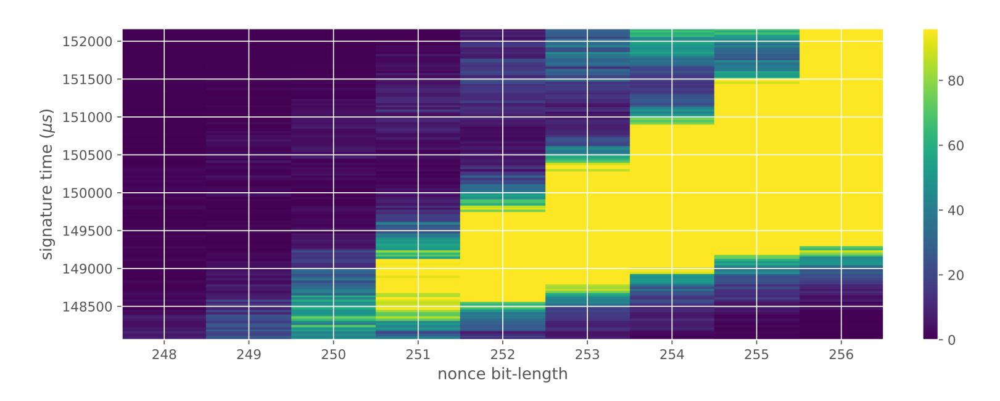

Figure 1: Heatmap of the signing duration and the bit-length of ECDSA nonces for 500 000 signatures using secp256r1 curve on the Athena IDProtect card.

For three out of five affected libraries in Table 1 (libgcrypt, MatrixSSL, SunEC) and the affected smartcard (Athena), the signing runtime directly depends on the bit-length of the nonce linearly: each additional bit represents one more iteration of a loop in scalar multiplication, which increases the runtime. The leakage can be clearly seen from powertraces of the card performing ECDSA signing in Figure 2.

For implementations leaking just the noisy bit-length (libgcrypt, SunEC, Athena) the leakage can be modeled using three parameters: duration of constant time processing in signing (e.g., hashing) (base), duration of one iteration of the scalar multiplication loop  $(iter\_time)$  and the standard deviation of the noise (sdev). For the secp256r1 curve, the leakage  $\bf L$  can be modelled as a random variable:

<span id="page-3-1"></span>
$$\mathbf{L} = base + iter\_time \cdot \mathbf{B} + \mathbf{N}$$

$$\mathbf{B} \sim \mathbf{Geom}(p = 1/2, (256, 255, \dots, 0))$$

$$\mathbf{N} \sim \mathbf{Norm}(0, sdev^2)$$
(1)

where **B** represents the bit-length with a truncated geometric distribution and **N** the noise. Only two of the above parameters,  $iter\_time$  and sdev, affect how much the implementation leaks; we will use them to assess how easy it is to mount an attack.

In the case of wolfSSL and its sliding window scalar multiplication implementation, the dependency is more complex, and the leakage much smaller. Thus we consider it to be leaking, yet not likely exploitable. The MatrixSSL implementation also leaks the Hamming weight of a scalar: each non-zero bit increases the computation runtime. The Crypto++ library leaks the bit-length and other unidentified information.

#### 3.3 Causes

We identified two main categories of root causes for the reported group of vulnerabilities. While the first one stems from an intricate relation between the ECDSA nonce, the private key, and the resulting signature, the second one relates to the general difficulty of implementing non-leaking scalar multiplication.

#### 3.3.1 Nonce issues

The susceptibility of (EC)DSA nonces to lattice attacks does not seem to be widely known amongst developers of cryptographic software. There are four main issues regarding nonce

{4}------------------------------------------------

<span id="page-4-0"></span>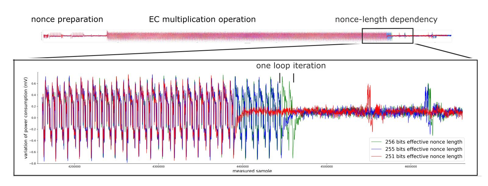

Figure 2: The visible leakage of nonce's bit-length on a power consumption trace of the Athena IDProtect smartcard as captured by an ordinary oscilloscope at 40MHz sampling frequency for three signatures (aligned) with nonces having 0, 1 and 5 leading zero bits. The zoomed region of the whole ECDSA operation displays the difference at the end of the multiplication operation. The pattern corresponding to a single iteration of the scalar multiplication algorithm is clearly discernible, allowing an attacker with physical access to a card to establish the bit-length of the nonces precisely and with no error. Note that captured powertrace is presented only to highlight the root cause of vulnerability – the oscilloscope is not required for the successful attack.

use in (EC)DSA: nonce reuse, the bias in nonce randomness, nonce bit-length leaks, and other leaks of partial information about nonces. Due to the aforementioned lattice attacks and their variants, all of these issues might lead to a private key recovery attack.

Deterministic generation of nonces, as done in EdDSA[3](#page-2-2) [\[BDL](#page-20-0)<sup>+</sup>12] or RFC6979 [\[Por13\]](#page-23-1) mitigates the issues of nonce reuse and nonce bias. However, it does not address the latter two in any significant way. Deterministic generation of nonces might help the attacker in case the attacker has a noisy side-channel leaking information about the nonce. If the attacker can observe the signing of the same message multiple times, they might use the fact that the same nonce was used to reduce the noise in the side-channel significantly.

#### <span id="page-4-1"></span>**3.3.2 Leaky scalar multiplication**

Not leaking the bit-length of the scalar used in scalar multiplication is surprisingly hard. Take almost any algorithm that processes the scalar in a left to right fashion – e.g., the Montgomery ladder [\[Mon87\]](#page-22-9) – and instantiate it with incomplete addition formulas (that cannot correctly compute ∞+*Q* or 2∞ in a side-channel indistinguishable way from *P* +*Q* and 2*P*). The result introduces a side-channel leaking the bit-length. At the start of the ladder that computes a multiple of a point *G*, the two ladder variables are initialised either as *R*<sup>0</sup> = ∞, *R*<sup>1</sup> = *G* or as *R*<sup>0</sup> = *G*, *R*<sup>1</sup> = 2*G*, depending on the used algorithm.

In the first case, the computation might start at any bit larger than the most significant set bit in the scalar, i.e., it can be a fixed loop bound, for example, on the bit-length of the order of the generator, as seen in Algorithm [1.](#page-5-0) However, until the first set bit is encountered, all of the additions and doublings will involve the point at infinity, and because of our assumption that the used formulas are incomplete, they will leak this information through some side-channel. The leak might have the form of short-circuiting addition formulas, which check whether the point at infinity was input and short circuit accordingly to satisfy ∞ + *P* = *P* and 2∞ = ∞. Such was the case for vulnerable versions of *libgcrypt* and was the reason why merely fixing a loop bound in scalar multiplication

<sup>3</sup>We remark that EdDSA is not vulnerable to our attack, as it uses a mitigation described in Section [3.4.](#page-5-1)

{5}------------------------------------------------

was not enough to fix the issue. The formulas might leak the fact that the point at infinity is present through different channels than timing: power or EM side-channels come to mind, as the point at infinity is often represented using only 0 or 1 values, which can often be distinguishable in multiplication and addition on a powertrace.

#### <span id="page-5-0"></span>**Algorithm 1** Montgomery ladder (complete)

```
function Ladder(G, k = (kl
                             , . . . , k0)2)
   R0 = ∞; R1 = G
   for i = l downto 0 do
      R¬ki = R0 + R1; Rki = 2Rki
   return R0
```

In the second case, the most significant bit of the scalar must be explicitly found, as seen in Algorithm [2.](#page-5-2) The ladder must start at that bit because the variables are initialized into a state such that the point at infinity will not appear (so that incomplete formulas can be used).

Such an implementation clearly leaks the bit-length through timing alone, because of the loop bound on the bit-length of the scalar.

#### <span id="page-5-2"></span>**Algorithm 2** Montgomery ladder (incomplete)

```
function Ladder(G, k = (kl
                             , . . . , k0)2)
   R0 = G; R1 = 2G
   for i = |k| − 1 downto 0 do
      R¬ki = R0 + R1; Rki = 2Rki
   return R0
```

The use of incomplete formulas or the direct computation of the bit-length of the scalar for use as a loop bound in scalar multiplication was the source of leakage in all of the vulnerable software cryptographic libraries. As the implementation on the vulnerable card is closed source, we were not able to analyze it directly; however, a similar cause is likely, given the nature of the leakage on the powertraces in Figure [2.](#page-4-0)

Both the vulnerable Athena IDProtect card and the used Atmel AT90SC chip and cryptographic library are FIPS 140-2 [\[Sma12a\]](#page-23-9) and Common Criteria (CC) [\[Sma12b;](#page-23-10) [Atm09\]](#page-20-4) certified devices, respectively. The presence of such a vulnerability in certified devices can be explained by noting that the CC security target of the AT90SC chip [\[Atm09\]](#page-20-4) contains mention of two versions of ECC functionality, fast and secure variants. It further goes to mention that the fast variants are not protected against side-channel attacks and should not be used on secure data. We think these fast and insecure functions were erroneously used by the Athena IDProtect card and resulted in the vulnerability.

#### <span id="page-5-1"></span>**3.4 Mitigations**

Below, we discuss several mitigations that can be applied to a leaking implementation to fix the vulnerability. The mitigations either stop the leak or mask it with additional randomness to prevent reconstruction of the private key.

#### **3.4.1 Complete formulas**

As described in Section [3.3.2,](#page-4-1) one of the root causes of the vulnerability was the usage of incomplete addition formulas, which introduced a measurable time difference between the case where one of the points being added is the point at infinity and the case where both points are affine. This ultimately led to a leak of the nonce length. The use of complete 

{6}------------------------------------------------

formulas [\[RCB16;](#page-23-11) [SM16\]](#page-23-12), which behave in the same way for all possible inputs, would prevent such leak. Besides being constant-time, these formulas also make the addition algorithm less complex. However, these formulas are slower than incomplete formulas, by a factor of around 1*.*4 as reported by Renes, Costello, and Batina [\[RCB16\]](#page-23-11), and until late, they were not even available for all short Weierstrass curves.

Using complete formulas is likely the most systematic mitigation, so we recommend to the developers of the affected systems to switch to complete formulas whenever possible. The mitigation also requires that the scalar multiplication loop starts at a fixed bit and that the bit-length of the scalar is not explicitly computed to shorten the loop.

#### **3.4.2 Fixing the bit-length**

Even if incomplete addition formulas are used, the vulnerability can still be removed by making all the nonces the same bit-length. One option is to add a suitable multiple of the group order to the nonce so that the result of multiplying a point by the nonce will not be affected. For example, following the recommendation by Brumley and Tuveri [\[BT11\]](#page-21-3), we could compute the modified nonce as

$$\hat{k} = \begin{cases} k + 2n & \text{if } \lceil \log_2(k+n) \rceil = \lceil \log_2 n \rceil \\ k + n & \text{otherwise.} \end{cases}$$

This fixes the bit-length of <sup>ˆ</sup>*k*, ensuring that <sup>d</sup>log<sup>2</sup> <sup>ˆ</sup>*k*<sup>e</sup> <sup>=</sup> <sup>d</sup>log<sup>2</sup> *<sup>n</sup>*<sup>e</sup> + 1. Subsequently, the scalar multiplication loop will always run the same number of times (as both points being added are already affine during the first addition), and the nonce length will not be leaked through timing. As the computational cost of using ˆ*k* over *k* is negligible, we recommend the affected systems to do so as a second line of defense.

#### **3.4.3 Scalar randomisation**

Alternatively, there are various side-channel countermeasures utilizing scalar randomization (i.e., performing the scalar multiplication without directly multiplying by the scalar). A basic overview of these methods can be found in Danger et al. [\[DGH](#page-21-9)<sup>+</sup>13]. While introducing some overhead, they also effectively protect against some power analysis attacks.

#### **3.4.4 Long nonces**

Finally, if one can afford it, generating much longer nonces and using them for scalar multiplication (without prior reduction modulo the group order *n*) should thwart these types of attacks, as learning the most significant bits of the scalar seems to provide almost no information about the most significant bits of the scalar modulo *n*. Such an approach is taken by EdDSA [\[BDL](#page-20-0)<sup>+</sup>12]: for example, when using Ed25519, the nonce is deterministically created as a 512-bit hash, whereas *n* has only 255 bits. In principle, the countermeasure could be adapted for ECDSA as well.

### **3.5 Responsible disclosure**

We disclosed the vulnerabilities to the affected vendors upon discovery; we also provided assistance and patches fixing the vulnerability to several of them. Currently, all of the vulnerabilities in the software products are fixed in their newer versions. The state of the vulnerable chip AT90SC is unknown, as it is currently offered by the WiseKey company [\[Wis\]](#page-24-1), which did not confirm or deny our findings regarding the chip. The Athena IDProtect card is no longer in production, as Athena was acquired by NXP Semiconductors, which confirmed to us that no new products are based on the vulnerable code. However, existing cards remain vulnerable as updates to JavaCards are often almost impossible to deploy.

{7}------------------------------------------------

We then disclosed the vulnerability publicly, together with a proof of concept and a testing tool that can be used to verify that other implementations are not vulnerable.

## <span id="page-7-0"></span>4 The attack

In the case of (EC)DSA and even attestation systems such as EPID [DME<sup>+</sup>18] or ECDAA [FIDO18; MSE<sup>+</sup>20], the knowledge of the most significant bits of nonces (with the goal of computing the private key) can be turned into an HNP instance [BV96], which can be turned into an instance of the Closest Vector Problem and solved using the methods of lattice reduction. We will introduce the HNP and show how the knowledge of the most significant bits of nonces translates into an HNP instance for the aforementioned systems.

#### 4.1 Notation

We use  $\lfloor y \rfloor_q$  to denote the reduction of  $y \in \mathbb{Z}$  modulo q (so that the result lies in [0, q-1]). We also use

$$|y|_q := \min_{a \in \mathbb{Z}} |y - aq|$$

to denote the distance of  $y \in \mathbb{R}$  to the closest integer multiple of q.

Note that  $|y|_q = |y|$  for all  $y \in [-q/2, q/2]$  and

$$|y|_q = |y - aq|_q$$

holds for all  $a \in \mathbb{Z}$ .

Also note that if 0 < y < z for any  $z \in \mathbb{R}$ , then

$$|y - z/2| < z/2.$$

**Definition 1** (Approximations). By  $APP_{l,q}(y)$ , we will denote any  $u \in \mathbb{Q}$  satisfying

$$|y-u|_q \leq q/2^l$$
.

Note that generally there are many such u.

The most significant modular bits [BV96; NS03] are defined in the following way:

<span id="page-7-1"></span>**Definition 2** (Most Significant Modular Bits). The l > 0 most significant modular bits of an element  $y \in \mathbb{Z}_q$  (regarded as an integer in [0, q - 1]) are the unique integer  $MSMB_{l,q}(y)$  such that

$$0 \le y - \text{MSMB}_{l,q}(y) \cdot q/2^l < q/2^l.$$

For example, when l = 1, the most significant bit of y is 0 or 1 depending on whether y < q/2.

As noted in [NS03], this definition is in contrast with the usual definition of the most significant bits of an integer. In the lattice context, the modular bits are more convenient to work with, but see Remark 1 in Section 4.3.

It is worth observing that the most significant modular bits give rise to a specific approximation of y. We can see directly from Definition 2 that

$$|y - \text{MSMB}_{l,q}(y) \cdot q/2^l| < q/2^l,$$

and since the absolute value argument already lies in [-q/2, q/2], it is equivalent to

$$|y - \text{MSMB}_{l,q}(y) \cdot q/2^l|_q < q/2^l.$$

Thus  $MSMB_{l,q}(y) \cdot q/2^l$  may be taken as  $APP_{l,q}(y)$ . Also, after recentering the bits,  $MSMB_{l,q}(y) \cdot q/2^l - q/2^{l+1}$  may be taken as  $APP_{l+1,q}(y)$  giving the exact approximation used in Nguyen and Shparlinski [NS03].

{8}------------------------------------------------

#### 4.2 The Hidden Number Problem

Following [NS03], we state the HNP in the following way:

**Definition 3** (Hidden Number Problem). Given approximations  $a_i = \text{APP}_{l_i,q}(k_i)$ , where  $k_i = \lfloor \alpha t_i - u_i \rfloor_q$ , for many known  $t_i$  that are uniformly and independently distributed in  $\mathbb{Z}_q^*$ , known  $u_i$  and a fixed secret  $\alpha \in \mathbb{Z}_q$ , find  $\alpha$ .

In the text, we will use the more common definition where the problem is, given many HNP inequalities  $|k_i - a_i|_q < q/2^{l_i}$ , find  $\alpha$ .

In the (EC)DSA case,  $\alpha$  is the fixed secret key,  $t_i$  and  $u_i$  are values constructed from the signatures such that  $k_i = \lfloor \alpha t_i - u_i \rfloor_q$  and  $a_i = \text{APP}_{l,q}(k_i)$  is the information leaked, in our case that is always 0, which claims that the l most-significant modular bits are zero. This simplifies the above inequality to:

$$|\alpha t_i - u_i|_q < q/2^{l_i}. (2)$$

## <span id="page-8-1"></span>4.3 Constructing the HNP

Assume that we are given d (EC)DSA signatures  $(r_i, s_i)$  of message hashes  $H(m_i)$  such that for each respective nonce  $k_i > 0$ , we know that the most significant  $l_i > 0$  bits of  $k_i$  are zero. Denoting the curve order by n and the private key by x, we have

<span id="page-8-2"></span>
$$|s_i^{-1}(xr_i + H(m_i))|_n < n/2^{l_i}$$

$$|s_i^{-1}(xr_i + H(m_i))|_n < n/2^{l_i}$$

$$|x[s_i^{-1}r_i]_n + [s_i^{-1}H(m_i)]_n|_n < n/2^{l_i}$$
(3)

Thus by setting  $q = n, \alpha = x, t_i = \lfloor s_i^{-1} r_i \rfloor_n$  and  $u_i = \lfloor -s_i^{-1} H(m_i) \rfloor_n$ , we have a HNP instance.

<span id="page-8-0"></span>Remark 1. The fact that the most significant  $l_i$  bits (in the classical sense) of  $k_i$  are zero translates into the inequality

$$\lfloor k_i \rfloor_n < 2^{\lceil \log_2(n) \rceil} / 2^{l_i},$$

which is weaker than the used  $\lfloor k_i \rfloor_n < n/2^{l_i}$ . This means that the inequalities above might not be true for all  $k_i$ . However, as the ratio  $n/2^{\lceil \log_2(n) \rceil}$  is around  $10^{-9}$  for the curve secp256r1 that we are working with, we will use the more convenient stronger inequality which will still be true with overwhelming probability.

It is worth having this distinction in mind though, as it would cause problems for example for the curve sect571k1, where the ratio  $n/2^{\lceil \log_2(n) \rceil}$  is almost 2.

In our setup, the values  $l_i$  are estimated from timing only, so it may well happen that the actual number of most significant zero bits is either higher or lower than  $l_i$ . The former case is not a significant issue, as the attack will still work (although we are using less information than available, so we need to balance this by a higher number of signatures). However, the latter case is quite problematic, as we are utilizing false information in the attack, and the lattice approach will very likely fail to compute the correct result. We will refer to the second case as to "input errors" in the remainder of the text and discuss some options of dealing with them in Section 5. For now, just note that there are two basic ways of removing the errors: either lowering the  $l_i$  or subtracting a certain multiple of  $n/2^{l_i}$  from  $k_i$ , so that the first inequality in (3) will hold. The latter option amounts to adding a certain multiple of  $n/2^{l_i}$  to  $u_i$ , which clears the high bits of  $k_i$ .

{9}------------------------------------------------

#### <span id="page-9-1"></span>4.4 Solving the HNP

Given d HNP inequalities of the form

$$|\alpha t_i - u_i|_n < n/2^{l_i},$$

we can construct a lattice spanned by the rows of the  $(d+1) \times (d+1)$  matrix B [NS02; BvdPS<sup>+</sup>14]:

$$B = \begin{pmatrix} 2^{l_1}n & 0 & 0 & \dots & 0 & 0\\ 0 & 2^{l_2}n & 0 & \dots & 0 & 0\\ & \vdots & & & \vdots & & \\ 0 & 0 & 0 & \dots & 2^{l_d}n & 0\\ 2^{l_1}t_1 & 2^{l_2}t_2 & 2^{l_3}t_3 & \dots & 2^{l_d}t_d & 1 \end{pmatrix}$$

Then, by the HNP inequalities above, the vector

$$\mathbf{u} = (2^{l_1}u_1, \dots, 2^{l_d}u_d, 0)$$

is a vector unusually close to a lattice point. The closest lattice point often has a form

$$\mathbf{v} = (2^{l_1}t_1\alpha, \dots, 2^{l_d}t_d\alpha, \alpha),$$

in which case finding such lattice point reveals the private key  $\alpha$ . To do so, one needs to solve the Closest Vector Problem (CVP). There are several algorithms for solving the CVP, the original paper [BV96] used Babai's nearest plane algorithm [Bab86] with LLL [LLL<sup>+</sup>82]. One could also use BKZ for lattice reduction or solve the CVP by enumeration. There is also a technique of transforming an instance of CVP to a Shortest Vector Problem (SVP) by embedding the target vector into a larger lattice:

$$C = \begin{pmatrix} B & 0 \\ \mathbf{u} & n \end{pmatrix}$$

Then, one can solve the SVP by lattice reduction and either looking directly at basis vectors or by further enumeration to find the shortest vector. As we used several heuristic arguments, the solution is not guaranteed to be found.

Generally, each inequality adds  $l_i$  bits of information and the problem starts to be solvable (theoretically) as soon as the lattice contains more information than the unknown information in the private key. The expected amount of information in N signatures can be computed as  $N \cdot \sum_{i=2}^{\lceil \log_2(n) \rceil} 2^{-l_i-1} \cdot l_i \approx \frac{3}{4}N$  assuming only signatures with  $l_i \geq 2$  are used. Adding inequalities with  $l_i < 2$  generally does not help, as those will not lead to the desired vector being unusually close to a lattice point [AFG<sup>+</sup>14].

Using the above formula, we obtain the expected minimum of around N=342 signatures for a 256-bit private key. Since the amount of information is linear in N it can be computed as  $N \approx \frac{4}{3} \cdot |K|$  for size |K| of the private key. Adding dimensions is also not for free, as the runtime of lattice algorithms grows significantly with an increase in the number of dimensions. However, adding some overhead of information, such that the lattice contains around 1.3 times the information of the private key, was shown to improve the success rate [Rya19b].

#### <span id="page-9-0"></span>4.5 Baseline attack

The baseline version of the attack, against which we will compare the variants, is an application of the attack from Brumley and Tuveri [BT11]. We collect N signatures from the library or card while measuring the duration of signing precisely. Then, we sort the

{10}------------------------------------------------

signatures by their duration and take d of the fastest. For the basic attack, we then assume these all have at least  $l_i = 3$  most-significant bits of the nonce zero, we construct the HNP and transform it into a CVP and then an SVP matrix. Given no noise (perfect dependency of the signing duration on the bit-length), the assumption of  $l_i = 3$  makes sense if the collected number of signatures N is larger than  $d \cdot 2^{l_i} = 8d$ , as then the d fastest signatures will likely have at least the required number of most-significant zero bits.

We use fplll [FPL16], an open-source implementation of the LLL and BKZ lattice reduction algorithms, to perform LLL and progressive BKZ [AWH<sup>+</sup>16] reduction of the SVP matrix with block sizes  $\beta \in \{15, 20, 30, 40, 45, 48, 51, 53, 55\}$ . After each reduction step, we check if the second to last column of the matrix contains the private key by multiplying the base-point by the column entries and testing equality to the public key.

## <span id="page-10-0"></span>5 Attack variants and new improvements

The main limitation of the attack described in Section 4.5 is the required number of signatures and its sensitivity to input errors (as the time measurements are noisy). This section offers a remedy: we present and discuss in detail the following methods, the last two of which are new to the best of our knowledge:

- Measurement improvements (known)
- Random subsets (known) [BT11]
- Recentering (known) [BH19; MSE<sup>+</sup>20]
- The CVP/SVP methods (known)
- Nonce differences (partially discussed in [FGR12] and [BH19])
- Geometric bounds (new in this work, Section 5.6)
- CVP + changes in u (new in this work, Section 5.7)

In Section 6, we will systematically compare these to each other as well as to the baseline attack on both simulated and real data.

As the listed methods are mostly independent of each other<sup>4</sup>, their combinations could possibly provide improvement in the decreased number of necessary signatures. However, the high number of computational experiments for all possible combinations makes an exhaustive analysis prohibitively expensive.

#### <span id="page-10-2"></span>5.1 Improving the input data

One straightforward way of improving a noise-sensitive method success rate is to lower the noise via better measurements. In our context, this means either mounting a micro-architectural side-channel attack on a vulnerable library or performing power/EM side-channel attack on a vulnerable card.

In the former case, the attacker would use, for example, a cache side-channel as done by Ryan [Rya19b], to count the number of calls to the point addition and doubling functions. This would give him a much more precise measurement of bit-length than simply timing the full ECDSA signing operation, which contains hashing, data processing, and other library functions.

In the latter case, the attacker with physical access to a vulnerable card would obtain power or EM traces as those shown in Figure 2 and use pattern matching to count the

<span id="page-10-1"></span> $<sup>^4</sup>$ There are two notable exceptions: CVP + changes in u requires the use of the CVP method and the recentering approach cannot be used in nonce differences.

{11}------------------------------------------------

number of addition and doubling operations in the trace. This will again give the attacker a much more precise measurement of bit-length.

We expect both of the above approaches to lead to noise-free information about the bit-length of the nonce and thus a much easier application of the HNP to obtain the private key, leading to a similar success rate as in Figure [15.](#page-25-0)

### **5.2 Random subsets**

The errors in the input can be mitigated by randomly selecting subsets of signatures from the set of all signatures with relatively short duration as proposed by Brumley and Tuveri [\[BT11\]](#page-21-3). If the number of errors is not too large, we can expect to find a subset without any error after a reasonable number of tries. Note that this strategy is also trivially parallelizable, unlike most of the other methods.

In practice, we can take a medium-sized subset of the fastest signatures (for example, 3 2 *d*, where *d* is the dimension of the matrix we are aiming for) and repeatedly run the attack with randomly selected *d* of these signatures. However, since the strategy does not always use the *d* fastest signatures, it does not use the information in an optimal way. On average less information is present in the randomly selected signatures, with the hope that the increased number of tries will lead to both enough information and few errors being present in at least one of them.

### **5.3 Recentering**

To increase the the amount of information in each HNP inequality, one can use the fact that the nonce is non-negative and that to gain a HNP inequality we only need to upper-bound the absolute value, as only it affects the norm of the vector. Instead of using the inequality in [\(3\)](#page-8-2), one can use:

$$|x\lfloor s_i^{-1}r_i\rfloor_n + \lfloor s_i^{-1}H(m_i)\rfloor_n - n/2^{l_i+1}|_n < n/2^{l_i+1}.$$

## **5.4 CVP/SVP approach**

Even though the HNP naturally translates into a CVP instance, such an approach is usually believed to not be very suitable [\[BvdPS](#page-21-5)<sup>+</sup>14; [BH19;](#page-21-7) [vdPSY15\]](#page-23-5). Instead, the standard approach is to further convert the CVP instance into an SVP instance by including the rows of *u<sup>i</sup>* 's in the matrix and checking for a short vector after lattice reduction (as described in Section [4.4\)](#page-9-1). However, for reasons that will be explained in Section [5.7,](#page-12-1) we also evaluate the CVP approach (using Babai's nearest plane algorithm) and measure how it compares to the SVP approach, even though we expect it to perform worse.

### **5.5 Differences of nonces**

Instead of using information about the nonces *k<sup>i</sup>* themselves, we could instead use information about their differences *k<sup>i</sup>* − *k<sup>j</sup>* , hoping that the most significant bits of *k<sup>i</sup>* and *k<sup>j</sup>* might cancel out.

Assuming that *l<sup>i</sup>* ≤ *l<sup>j</sup>* , we can make a similar computation as in [\(3\)](#page-8-2). From the inequality:

$$|\lfloor k_i \rfloor_n - \lfloor k_j \rfloor_n|_n < n/2^{\min(l_i, l_j)}$$
(4)

we get:

$$|\lfloor s_i^{-1}(H(m_i) + r_i x) \rfloor_n - \lfloor s_j^{-1}(H(m_j) + r_j x) \rfloor_n|_n < n/2^{\min(l_i, l_j)}$$

$$|x(\lfloor s_i^{-1} r_i - s_j^{-1} r_j \rfloor_n) + \lfloor s_i^{-1} H(m_i) - s_j^{-1} H(m_j) \rfloor_n|_n < n/2^{\min(l_i, l_j)}$$

{12}------------------------------------------------

Thus by setting  $t_i = \lfloor s_i^{-1} r_i - s_j^{-1} r_j \rfloor_n$  and  $u_i = -\lfloor s_i^{-1} H(m_i) - s_j^{-1} H(m_j) \rfloor_n$  we again obtain a HNP instance.

When utilizing nonce differences in practice, we aim to create the pairs (i, j) in a way that  $l_i = l_j$  whenever possible to minimize information loss due to the bound being the minimum. For the geometric bounds, it corresponds to taking differences of neighbouring signatures. Note that if the number of bits  $l_i = l_j$  was chosen erroneously too high in both cases, the error is nullified in the difference.

We note that when using differences of nonces, recentering is not possible, as the differences might be negative. This fact is, to some extent, mitigated by the aforementioned effect of subtraction correcting some errors.

#### <span id="page-12-0"></span>5.6 Bounds $l_i$

The bounds  $l_i$  state the minimal number of leading zero bits of nonces  $k_i$  ( $k_i = |\alpha t_i - u_i|_n < n/2^{l_i}$ ), representing the amount of information we gain from the nonces. They play a crucial role in our attacks since the lattice-based methods used to solve the HNP are quite sensitive to errors in  $l_i$  when the amount of information in the lattice is close to the size of the private key.

We are facing the problem of how to assign the bounds  $l_i$  to a given set of unknown nonces  $k_i$  based only on the times of corresponding signatures. The goal is to assign maximal values  $l_i$  to  $k_i$  such that the number of errors (false inequalities) is small. The values  $l_i$  should reflect the distribution of  $log_2(k_i)$  for a selected set of signatures (only a subset of signatures is used in the attack). The selection of the signatures is natural – only signatures with the shortest times are used in the attack, as corresponding to the shortest  $k_i$  and largest  $l_i$ .

The nonces  $k_i$  are generated uniformly at random; we can thus expect that the number of most significant zero bits follows a truncated geometric distribution when n is close to a power of two. Thus roughly for one-half of the nonces  $l_i = 0$ , for one-quarter of nonces  $l_i = 1$ , and so on. Assuming a one-to-one linear dependency between the bit-length of  $k_i$  and the duration of signing, we would obtain a clear method of assigning bounds to the signatures, sort them by duration and apply the above distribution. However, the real timing leakage is noisy and the distributions of duration for signatures with different bit-lengths overlap (see Figures 1 and 14).

In the experiments, when assigning bounds to the fastest d signatures out of N signatures collected, we used several strategies for the bound assignment:

- constant bounds fixed value  $c \in \{1, 2, 3, 4\}$  is used for all bounds  $l_i$ ,
- geometric bounds bounds are calculated according to the above truncated geometric distribution based on N, the number of signatures collected. One half of signatures has  $l_i = 0$ , one quarter has  $l_i = 1$ , etc. Then simply the fastest d signatures are taken with their calculated bounds.

Figure 3 clearly shows that on simulated data with no noise, the geometric bounds constitute the mean of the distribution of true leading zero bits, as the difference of the simulated data and the bounds has zero mean.

#### <span id="page-12-1"></span>5.7 CVP + changes in u

When using the SVP approach, the  $u_i$ 's are incorporated into the matrix, and it is not possible to change them without affecting the final result of lattice reduction. Thus any error in the  $u_i$ 's propagates to the reduced lattice. In contrast, taking the CVP approach, the lattice can be reduced independently of the  $u_i$ 's (which form the target). Such reduction is beneficial as we can reduce the lattice just once (and potentially with better quality)

{13}------------------------------------------------

<span id="page-13-1"></span>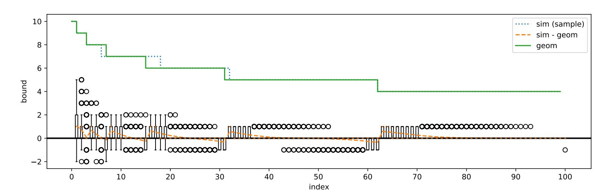

Figure 3: Plot of the geometric bounds (**geom**) with *N* = 2000 and *d* = 100, along with a random sample of the true leading zero bits from simulated data (**sim**) and boxplots of the distribution of the difference of the simulated data and the bounds (**sim - geom**). Negative values imply an error; positive implies some available information is unused.

and subsequently try to solve the CVP with many possible choices of *u<sup>i</sup>* 's (making changes at the *li*-th positions where the errors are most likely to occur). Since the reduction is the most computationally expensive part, if we are solving CVP via Babai's nearest plane algorithm, we can efficiently try many different changes and fix the input errors.

For each *e*-tuple, we could try flipping one bit at the *li*-th position simultaneously, which should be feasible at least for *e* ≤ 3. Since the runtime of the method should not depend on small changes in the *u<sup>i</sup>* 's, we expect that the total runtime for the strategy will be one reduction of the matrix and *d e* times the runtime of the CVP solving, for example via Babai's nearest plane algorithm, which is very fast. The advantage of the strategy is that it is trivially parallelizable.

## <span id="page-13-0"></span>**6 Systematic comparison of attack variants**

We compare existing methods for private key recovery with our newly proposed ones for the range of possible parameterizations. We run the methods while varying the number of signatures collected (*N*) and varying the dimension of the matrix (*d*) for four datasets with different noise profiles collected from the real-world leakages. For most experiments, the number of signatures *N* covered the range [500*,* 7000] with a step size of 100 and three additional steps at 8000*,* 9000*,* 10000. The dimension of the matrix and the number of signatures used in the matrix *d* ranged from 50 to 140 with a step size of 2. Such enumeration of the parameter space allowed us to evaluate the performance of the methods with a significantly wider range of parameters than presented in the introductory papers. Thus each variant of the attack goes through 3174 = 69 · 46 combinations of *N* and *d* with a typical runtime in seconds to minutes. Because of the size of the parameter space, we repeated each variant five times with random samples of *N* signatures from each of the four datasets described in Section [6.1.](#page-14-0) In total, the presented results took over 18 core-years to compute on our university cluster.

We evaluate the success rate of the attack improvements with respect to the number *N* of signatures available, which is frequently the biggest limitation for an attacker, influencing the attack practicality and runtime. Another interesting point of evaluation is the minimal number of signatures collected (*min*(*N*)), where a given attack variant succeeds for the first time. When not explicitly specified, we use the base parameters and method, as described in Section [4.5.](#page-9-0)

{14}------------------------------------------------

## <span id="page-14-0"></span>**6.1 Test data**

The attack variants are evaluated using four separate data sets (denoted as sim, sw, card, tpm) with varying levels of noise. All the datasets used consist of at least 50 000 ECDSA signatures over the secp256r1 curve from which we randomly sample *N* signatures for the evaluation of our attacks.

The **sim dataset** contains simulated data for which there is an exact one-to-one correspondence between the signing duration and the bit-length of the random nonce with no systematic noise. However, these simulated signatures were still generated by uniformly randomly selecting the random nonce and computing the number of most-signifcant zero bits. A given sample is thus a result of a random process and varies naturally.

The **sw dataset** contains data from a vulnerable version of the software cryptographic library *libgcrypt* collected from a simple C program on an ordinary Linux laptop.

The **tpm dataset** contains data from the recent work of Moghimi et al. [\[MSE](#page-22-0)<sup>+</sup>20] collected from a vulnerable STMicroelectronics TPM (Trusted Platform Module). The data was collected via a custom Linux kernel module and contained a relatively small amount of noise.

The **card dataset** contains data from the vulnerable Athena IDProtect smartcard, collected by a Python script running on an ordinary Linux laptop with a standard standalone smartcard reader connected. Such measurements are particularly noisy due to the complex software stack and hardware components between the script and a card.

| Table 2: Estimated parameters of the used datasets as given by the model in Equation (1). |  |  |  |  |  |  |  |  |
|-------------------------------------------------------------------------------------------|--|--|--|--|--|--|--|--|
|-------------------------------------------------------------------------------------------|--|--|--|--|--|--|--|--|

| Dataset | base (µs) | iter_time (µs) | sdev (µs) |
|---------|-----------|----------------|-----------|
| sim     | 0         | 1              | 0         |
| sw      | 453.4     | 12.7           | 17.2      |
| tpm     | 27047.3   | 236.1          | 211.3     |
| card    | 43578.4   | 371.5          | 451.3     |

### **6.2 Bounds** *l<sup>i</sup>*

The first experiment performed considered the types of bounds assignment discussed in Section [5.6:](#page-12-0) constant with *c* ∈ {1*,* 2*,* 3*,* 4} and geometric.

As can be seen on the heatmaps in Figures [4](#page-15-0) and [5](#page-15-1) and on the plot in Figure [6,](#page-15-2) geometric bounds perform better than constant bounds from the baseline attack on all datasets (see Section [4.5\)](#page-9-0). The geometric bounds utilize the leaked available information much better as they follow the mean distribution of the actual leading zero bits.

Amongst the constant bounds, those with *c* = 4 performed the best (see Figure [7\)](#page-16-0). However, all constant bounds achieved only insignificant success rate on the most noisy card dataset. We also note that constant bounds with *c* = 1 had a non-zero success rate on the sim dataset (see Figure [7\)](#page-16-0), which violates the requirement for HNP solvability of having more than one bit of information per inequality [\[AFG](#page-20-5)<sup>+</sup>14].

The limits of improvement through changing the assignment of the bounds can be seen on Figure [15,](#page-25-0) where bounds were assigned optimally, using the prior knowledge of the actual nonces and the private key. Such a success rate can also be achieved by improvement of the signal-to-noise ratio in input measurements as described in Section [5.1.](#page-10-2)

The best results for *min*(*N*) we obtained with geometric bounds were 1000, 1800, 1500 and 2600, for the sim, sw, tpm and card datasets, respectively.

{15}------------------------------------------------

<span id="page-15-0"></span>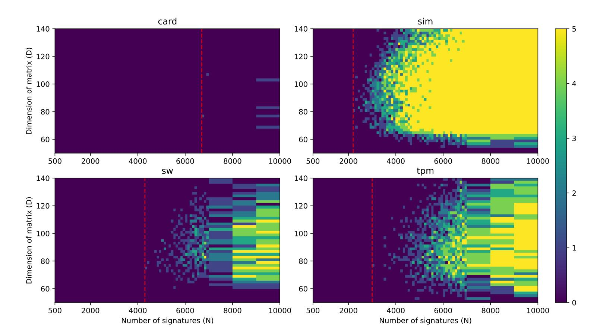

Figure 4: Heatmap of success rate (out of 5 tries) for constant bounds with c=3.

<span id="page-15-1"></span>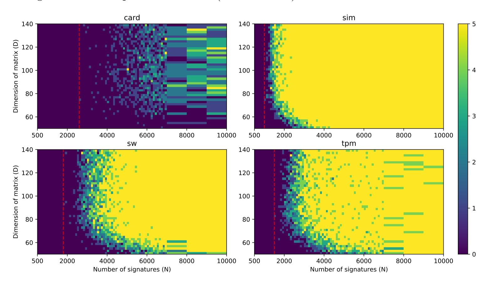

Figure 5: Heatmap of success rate (out of 5 tries) for geometric bounds.

<span id="page-15-2"></span>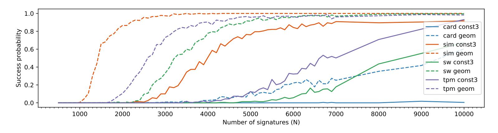

Figure 6: Success rate (averaged over all analyzed dimensions) of geometric bounds and constant c=3 bounds on the various datasets. Note that better results would be obtained if considering only dimensions above 70 according to Figure 4 and 5.

{16}------------------------------------------------

<span id="page-16-0"></span>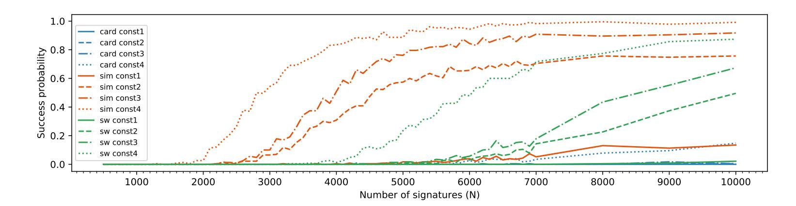

Figure 7: Success rate (averaged over all analyzed dimensions) of constant bounds with  $c \in \{1, 2, 3, 4\}$  on the various datasets.

## 6.3 CVP/SVP approach

In this experiment, we used the geometric bounds as described above together with either solving the HNP via SVP and examination of the reduced basis or CVP via Babai's nearest plane algorithm.

As expected, the Babai's nearest plane algorithm always performed worse than solving the HNP via SVP and direct search through the short basis vectors. The negative shift in success rate can be seen in Figure 8. We note that there are more methods of solving the SVP or CVP problems, such as enumeration [GNR10] or sieving [ADH<sup>+</sup>19], that we did not use in this work, mainly due to their runtime requirements. We expect these methods to provide better results than the simple Babai's nearest plane algorithm for CVP or the simple search through reduced lattice basis vectors for SVP.

<span id="page-16-1"></span>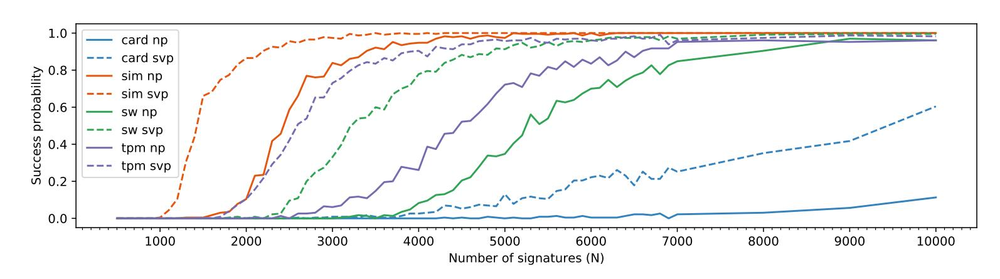

Figure 8: Success rate (averaged over all analyzed dimensions) of SVP (dashed line) and Babai's nearest plane (NP, solid line) algorithm, using geometric bounds.

#### 6.4 Recentering

The application of recentering, along with geometric bounds and SVP solving, presented significant improvements to success rate for all but the card dataset (see Figure 9, in comparison with not applying recentering. The improved min(N) values are 500, 1200, 900 and 2100 for the sim, sw, tpm and card datasets, respectively. The effect of recentering on the noisiest card dataset increased the success rate only slightly, if at all.

Using the true number of leading zero bits as the bounds, together with recentering, shows that with ideal input, the lattice attack achieves the theoretically expected minimum amount of signatures as computed in Section 4.4. The attack first succeeds at 400 signatures (see Figure 15), while the theoretical expected minimum is 342.

During our early experiments, we noted interesting behavior of recentering with biased bounds, which we summarise in Appendix B.

{17}------------------------------------------------

<span id="page-17-0"></span>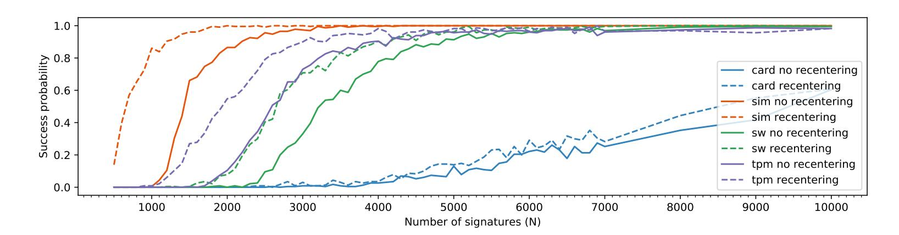

Figure 9: Success rate (averaged over all analyzed dimensions) of SVP with and without recentering, using geometric bounds.

#### 6.5 Random subsets

To evaluate the random subsets method, as introduced by Brumley and Tuveri [BT11], we performed the attacks for each of the points (N, d) up to 5 times, taking the 1.5d fastest signatures and using 100 random subsets of size d to construct the HNP, with geometric bounds, SVP solving and recentering. Due to the high runtime requirements of this attack, we chose to evaluate it only on dimensions D between 90 and 102. The comparison is made to the same attack without taking the random subsets.

Taking random subsets decreased the success rate for all but the card datasets (see Figure 10), where it produces quite better results, achieving a success probability close to 1 for N=10000. The worse behavior for less noisy datasets can be explained by noting that taking the d fastest signatures is optimal for the amount of information in them, and taking a random subset of 1.5d fastest signatures decreases this amount of information.

<span id="page-17-1"></span>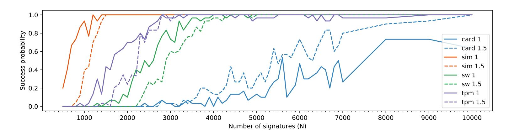

Figure 10: Success rate (averaged over all analyzed dimensions) of performing 100 random subsets from  $c \cdot d$  fastest signatures, with  $c \in \{1, 1.5\}$ . The more visible noise in the plot is caused by the smaller range of dimensions analysed.

#### 6.6 Differences

In this experiment, we evaluate the effect of using nonce differences on the attack when using geometric bounds and SVP solving but without recentering, as it is incompatible with taking nonce differences. Performing nonce differences surprisingly resulted in performance comparable to applying recentering to the baseline attack (see Figures 9 and 11). This might be explained by the fact that taking nonce differences might correct errors if the two nonces share the sequence of erroneous bits. These kinds of errors appear to be quite likely, with most of them being just one bit past the bound, as shown on Figure 16. However, the success rate for the noisiest card dataset decreased.

{18}------------------------------------------------

<span id="page-18-0"></span>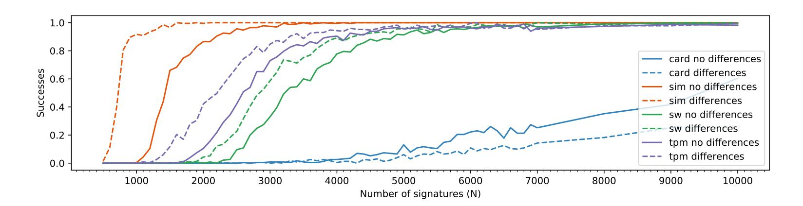

Figure 11: Success rate (averaged over the dimensions) of performing the attack using nonce differences on the various datasets.

#### 6.7 CVP + changes in u

In this experiment, we extended the block sizes of the progressive BKZ reduction with 57, 60, and 64 (as we want a more thoroughly reduced lattice than in the base approach) and also applied recentering using geometric bounds. Subsequently, we tested all possibilities of correcting errors occurring at either exactly 0, 1, 2 or 3 positions (thus running Babai's nearest plane algorithm up to  $1 + \binom{140}{1} + \binom{140}{2} + \binom{140}{3} = 457451$  times).

The results show that even though the average number of errors is much higher than 3 (see Figure 17), successfully correcting three errors often makes the difference between the successful or failed attack (see Figure 12). However, the method also increased runtime significantly, with both the stronger BKZ reduction and the brute-forcing of changes taking extra time. One attack run thus got prolonged from a few minutes to a maximum of four hours. Even with the increased runtime, due to the parallelizable nature, this method is a strong candidate for improving the attack through more computation power.

<span id="page-18-1"></span>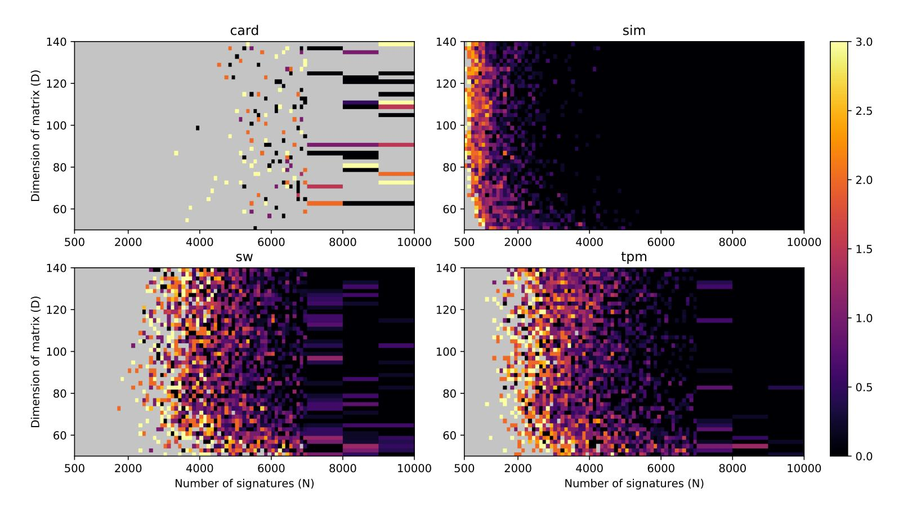

Figure 12: Heatmap of average minimal amount of fixed errors required for attack success. Babai's nearest plane algorithm with recentering and geometric bounds was used. Gray color marks areas where none of the attack tries succeeded.

{19}------------------------------------------------

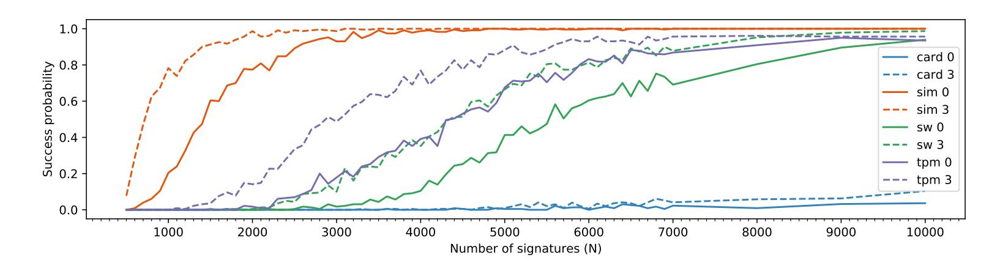

Figure 13: Success rate (averaged over the dimensions) of performing the attack using the Babai's nearest plane algorithm, recentering and either with up to 3 errors fixed (3), or with no error fixed (0).

### 7 Conclusion

Our paper identified a set of practically exploitable vulnerabilities in ECDSA implementations in certified security chips, cryptographic libraries, and open-source security projects, allowing for the extraction of the full private key using time observation of only several thousands of signatures. We further significantly reduced the required number of signatures in situations with noisy measurements by two new HNP-solving methods – using a geometric assignment of bounds instead of a constant one and an exhaustive correction of possible errors before the application of the HNP solver.

The existence of the real-world vulnerable implementations provided the opportunity to create benchmark datasets with realistic noise profiles, used for a systematic comparison of the existing and newly proposed HNP-solving methods. Using simulated and three real-world datasets, we provide the most extensive comparison of variously parametrized methods available so far in the research literature for this specific domain. The results show that:

- Newly proposed geometric assignment of bounds better approximates the real distribution of bit-lengths in the fastest signatures and leads to a decrease in the required number of signatures for successful key recovery.
- HNP solving via SVP always outperforms CVP with Babai's nearest plane algorithm.
- Using random subsets noticeably increases the success rate on noisy datasets.
- Recentering decreases the required number of signatures for the success of the attack by 30% in some datasets.
- Using differences of nonces with the same estimated bit-length instead of original nonces value works surprisingly well, as (potential) errors likely cancel out.
- Exhaustive correction (up to some bound limited only by available computational resources) of potential errors after the CVP lattice reduction significantly decreases the required number of signatures for a successful attack.

Compared to the very recent work of Moghimi et al. [MSE<sup>+</sup>20] on a similar vulnerability found in TPM chips, the new methods achieve key extraction with a much smaller number of signatures required when compared using their original dataset. Only 900 signatures (see Figure 9) are sufficient, though the success rate with such amount of signatures is low. The success rate improves significantly at 2000 signatures, which is still an order of magnitude lower than 40 000 signatures, as reported by [MSE<sup>+</sup>20].

While the actual private key extraction demands non-trivial methods, the leakage itself is relatively easy to detect, showing surprising deficiencies in the testing of security devices and cryptographic libraries – we release open-source tester to support such assessment.

{20}------------------------------------------------

## **Acknowledgements**

Access to computing and storage facilities owned by parties and projects contributing to the [National Grid Infrastructure MetaCentrum](https://www.metacentrum.cz/en/) provided under the programme "Projects of Large Research, Development, and Innovations Infrastructures" (CESNET LM2015042), is greatly appreciated. Ján Jančár was supported by the [Masaryk University Grant Agency](https://gamu.muni.cz/en) grant [MUNI/C/1701/2018.](https://www.muni.cz/en/research/projects/46834)

## **References**

- <span id="page-20-2"></span>[ABuH<sup>+</sup>19] Alejandro Cabrera Aldaya, Billy Bob Brumley, Sohaib ul Hassan, Cesar Pereida García, and Nicola Tuveri. Port contention for fun and profit. In *2019 IEEE Symposium on Security and Privacy, SP 2019, San Francisco, CA, USA, May 19-23, 2019*, pages 870–887. IEEE, 2019.
- <span id="page-20-7"></span>[ADH<sup>+</sup>19] Martin R. Albrecht, Léo Ducas, Gottfried Herold, Elena Kirshanova, Eamonn W. Postlethwaite, and Marc Stevens. The general sieve kernel and new records in lattice reduction. In Yuval Ishai and Vincent Rijmen, editors, *Advances in Cryptology - EUROCRYPT 2019 - 38th Annual International Conference on the Theory and Applications of Cryptographic Techniques, Darmstadt, Germany, May 19-23, 2019, Proceedings, Part II*, volume 11477 of *Lecture Notes in Computer Science*, pages 717–746. Springer, 2019.
- <span id="page-20-5"></span>[AFG<sup>+</sup>14] Diego F. Aranha, Pierre-Alain Fouque, Benoît Gérard, Jean-Gabriel Kammerer, Mehdi Tibouchi, and Jean-Christophe Zapalowicz. GLV/GLS Decomposition, Power Analysis, and Attacks on ECDSA Signatures with Single-Bit Nonce Bias. In *Advances in Cryptology - ASIACRYPT 2014 - 20th International Conference on the Theory and Application of Cryptology and Information Security, Kaoshiung, Taiwan, R.O.C., December 7-11, 2014. Proceedings, Part I*, pages 262–281, 2014.
- <span id="page-20-4"></span>[Atm09] Atmel. Atmel toolbox 00.03.11.05 on the AT90SC Family of Devices: Security target lite. June 2009. url: [https : / / www . ssi . gouv . fr / uploads / IMG /](https://www.ssi.gouv.fr/uploads/IMG/certificat/dcssi-cible_2009-11en.pdf) [certificat/dcssi-cible\\_2009-11en.pdf](https://www.ssi.gouv.fr/uploads/IMG/certificat/dcssi-cible_2009-11en.pdf).
- <span id="page-20-6"></span>[AWH<sup>+</sup>16] Yoshinori Aono, Yuntao Wang, Takuya Hayashi, and Tsuyoshi Takagi. Improved Progressive BKZ Algorithms and Their Precise Cost Estimation by Sharp Simulator. In *Advances in Cryptology - EUROCRYPT 2016 - 35th Annual International Conference on the Theory and Applications of Cryptographic Techniques, Vienna, Austria, May 8-12, 2016, Proceedings, Part I*, pages 789–819, 2016.
- <span id="page-20-1"></span>[Bab86] László Babai. On Lovász' lattice reduction and the nearest lattice point problem. *Combinatorica*, 6(1):1–13, 1986.
- <span id="page-20-0"></span>[BDL<sup>+</sup>12] Daniel J. Bernstein, Niels Duif, Tanja Lange, Peter Schwabe, and Bo-Yin Yang. High-speed high-security signatures. *J. Cryptographic Engineering*, 2(2):77–89, 2012.
- <span id="page-20-3"></span>[BFM<sup>+</sup>16] Pierre Belgarric, Pierre-Alain Fouque, Gilles Macario-Rat, and Mehdi Tibouchi. Side-Channel Analysis of Weierstrass and Koblitz Curve ECDSA on Android Smartphones. In *Topics in Cryptology - CT-RSA 2016 - The Cryptographers' Track at the RSA Conference 2016, San Francisco, CA, USA, February 29 - March 4, 2016, Proceedings*, pages 236–252, 2016.

{21}------------------------------------------------

- <span id="page-21-4"></span>[BH09] Billy Bob Brumley and Risto M. Hakala. Cache-timing template attacks. In Mitsuru Matsui, editor, *Advances in Cryptology - ASIACRYPT 2009, 15th International Conference on the Theory and Application of Cryptology and Information Security, Tokyo, Japan, December 6-10, 2009. Proceedings*, volume 5912 of *Lecture Notes in Computer Science*, pages 667–684. Springer, 2009.
- <span id="page-21-7"></span>[BH19] Joachim Breitner and Nadia Heninger. Biased nonce sense: lattice attacks against weak ECDSA signatures in cryptocurrencies. In Ian Goldberg and Tyler Moore, editors, *Financial Cryptography and Data Security - 23rd International Conference, FC 2019, Frigate Bay, St. Kitts and Nevis, February 18-22, 2019, Revised Selected Papers*, volume 11598 of *Lecture Notes in Computer Science*, pages 3–20. Springer, 2019.
- <span id="page-21-3"></span>[BT11] Billy Bob Brumley and Nicola Tuveri. Remote Timing Attacks Are Still Practical. In *Computer Security - ESORICS 2011 - 16th European Symposium on Research in Computer Security, Leuven, Belgium, September 12-14, 2011. Proceedings*, pages 355–371, 2011.
- <span id="page-21-2"></span>[BV96] Dan Boneh and Ramarathnam Venkatesan. Hardness of Computing the Most Significant Bits of Secret Keys in Diffie-Hellman and Related Schemes. In *Advances in Cryptology - CRYPTO '96, 16th Annual International Cryptology Conference, Santa Barbara, California, USA, August 18-22, 1996, Proceedings*, pages 129–142, 1996.
- <span id="page-21-5"></span>[BvdPS<sup>+</sup>14] Naomi Benger, Joop van de Pol, Nigel P. Smart, and Yuval Yarom. "Ooh Aah... Just a Little Bit" : A Small Amount of Side Channel Can Go a Long Way. In *Cryptographic Hardware and Embedded Systems - CHES 2014 - 16th International Workshop, Busan, South Korea, September 23-26, 2014. Proceedings*, pages 75–92, 2014.
- <span id="page-21-1"></span>[CrOS19] Chromium OS. U2F ECDSA vulnerability - The Chromium Projects. url: [https : / / sites . google . com / a / chromium . org / dev / chromium - os / u2f](https://sites.google.com/a/chromium.org/dev/chromium-os/u2f-ecdsa-vulnerability)  [ecdsa-vulnerability](https://sites.google.com/a/chromium.org/dev/chromium-os/u2f-ecdsa-vulnerability) (visited on 09/12/2019).
- <span id="page-21-9"></span>[DGH<sup>+</sup>13] Jean-Luc Danger, Sylvain Guilley, Philippe Hoogvorst, Cédric Murdica, and David Naccache. A synthesis of side-channel attacks on elliptic curve cryptography in smart-cards. *Journal of Cryptographic Engineering*, 3(4):241–265, 2013.
- <span id="page-21-6"></span>[DME<sup>+</sup>18] Fergus Dall, Gabrielle De Micheli, Thomas Eisenbarth, Daniel Genkin, Nadia Heninger, Ahmad Moghimi, and Yuval Yarom. CacheQuote: Efficiently Recovering Long-term Secrets of SGX EPID via Cache Attacks. *IACR Trans. Cryptogr. Hardw. Embed. Syst.*, 2018(2):171–191, 2018.
- <span id="page-21-0"></span>[FAIL10] failOverflow. Console Hacking 2010: PS3 Epic Fail. url: [https://www.cs.](https://www.cs.cmu.edu/~dst/GeoHot/1780_27c3_console_hacking_2010.pdf) [cmu.edu/~dst/GeoHot/1780\\_27c3\\_console\\_hacking\\_2010.pdf](https://www.cs.cmu.edu/~dst/GeoHot/1780_27c3_console_hacking_2010.pdf) (visited on 09/12/2019).
- <span id="page-21-8"></span>[FGR12] Jean-Charles Faugere, Christopher Goyet, and Guénaël Renault. Attacking (EC)DSA given only an implicit hint. In *International Conference on Selected Areas in Cryptography*, pages 252–274. Springer, 2012.
- <span id="page-21-10"></span>[FIDO18] FIDO Alliance. FIDO ECDAA Algorithm. February 2018. url: [https :](https://fidoalliance.org/specs/fido-v2.0-id-20180227/fido-ecdaa-algorithm-v2.0-id-20180227.html) [/ / fidoalliance . org / specs / fido - v2 . 0 - id - 20180227 / fido - ecdaa](https://fidoalliance.org/specs/fido-v2.0-id-20180227/fido-ecdaa-algorithm-v2.0-id-20180227.html)  [algorithm-v2.0-id-20180227.html](https://fidoalliance.org/specs/fido-v2.0-id-20180227/fido-ecdaa-algorithm-v2.0-id-20180227.html).
- <span id="page-21-11"></span>[FPL16] The FPLLL development team. fplll, a lattice reduction library. 2016. url: <https://github.com/fplll/fplll>.

{22}------------------------------------------------

- <span id="page-22-2"></span>[FWC16] Shuqin Fan, Wenbo Wang, and Qingfeng Cheng. Attacking OpenSSL implementation of ECDSA with a few signatures. In *Proceedings of the 2016 ACM SIGSAC Conference on Computer and Communications Security*, pages 1505–1515. ACM, 2016.
- <span id="page-22-11"></span>[GNR10] Nicolas Gama, Phong Q. Nguyen, and Oded Regev. Lattice Enumeration Using Extreme Pruning. In Henri Gilbert, editor, *Advances in Cryptology - EUROCRYPT 2010, 29th Annual International Conference on the Theory and Applications of Cryptographic Techniques, Monaco / French Riviera, May 30 - June 3, 2010. Proceedings*, volume 6110 of *Lecture Notes in Computer Science*, pages 257–278. Springer, 2010.
- <span id="page-22-4"></span>[GPP<sup>+</sup>16] Daniel Genkin, Lev Pachmanov, Itamar Pipman, Eran Tromer, and Yuval Yarom. ECDSA key extraction from mobile devices via nonintrusive physical side channels. In *Proceedings of the 2016 ACM SIGSAC Conference on Computer and Communications Security*, pages 1626–1638. ACM, 2016.
- <span id="page-22-6"></span>[GRV16] Dahmun Goudarzi, Matthieu Rivain, and Damien Vergnaud. Lattice Attacks Against Elliptic-Curve Signatures with Blinded Scalar Multiplication. In *Selected Areas in Cryptography - SAC 2016 - 23rd International Conference, St. John's, NL, Canada, August 10-12, 2016, Revised Selected Papers*, pages 120–139, 2016.
- <span id="page-22-3"></span>[GuHT<sup>+</sup>19] Cesar Pereida García, Sohaib ul Hassan, Nicola Tuveri, Iaroslav Gridin, Alejandro Cabrera Aldaya, and Billy Bob Brumley. Certified Side Channels, 2019. arXiv: [1909.01785](http://arxiv.org/abs/1909.01785).
- <span id="page-22-7"></span>[HR06] Martin Hlaváč and Tomáš Rosa. Extended Hidden Number Problem and Its Cryptanalytic Applications. In Eli Biham and Amr M. Youssef, editors, *Selected Areas in Cryptography, 13th International Workshop, SAC 2006, Montreal, Canada, August 17-18, 2006 Revised Selected Papers*, volume 4356 of *Lecture Notes in Computer Science*, pages 114–133. Springer, 2006.
- <span id="page-22-1"></span>[HS01] Nick Howgrave-Graham and Nigel P. Smart. Lattice Attacks on Digital Signature Schemes. *Des. Codes Cryptogr.*, 23(3):283–290, 2001.
- <span id="page-22-5"></span>[LCL13] Mingjie Liu, Jiazhe Chen, and Hexin Li. Partially Known Nonces and Fault Injection Attacks on SM2 Signature Algorithm. In *Information Security and Cryptology - 9th International Conference, Inscrypt 2013, Guangzhou, China, November 27-30, 2013, Revised Selected Papers*, pages 343–358, 2013.
- <span id="page-22-10"></span>[LLL<sup>+</sup>82] Hendrik Willem Lenstra, Arjen K Lenstra, L Lovfiasz, et al. Factoring polynomials with rational coeficients, 1982.
- <span id="page-22-8"></span>[MHM<sup>+</sup>13] Elke De Mulder, Michael Hutter, Mark E. Marson, and Peter Pearson. Using Bleichenbacher's Solution to the Hidden Number Problem to Attack Nonce Leaks in 384-Bit ECDSA. In *Cryptographic Hardware and Embedded Systems - CHES 2013 - 15th International Workshop, Santa Barbara, CA, USA, August 20-23, 2013. Proceedings*, pages 435–452, 2013.
- <span id="page-22-9"></span>[Mon87] Peter L Montgomery. Speeding the Pollard and elliptic curve methods of factorization. *Mathematics of computation*, 48(177):243–264, 1987.
- <span id="page-22-0"></span>[MSE<sup>+</sup>20] Daniel Moghimi, Berk Sunar, Thomas Eisenbarth, and Nadia Heninger. TPM-FAIL: TPM meets Timing and Lattice Attacks. In *29th USENIX Security Symposium (USENIX Security 20)*, Boston, MA. USENIX Association, August 2020. url: [https : / / www . usenix . org / conference /](https://www.usenix.org/conference/usenixsecurity20/presentation/moghimi) [usenixsecurity20/presentation/moghimi](https://www.usenix.org/conference/usenixsecurity20/presentation/moghimi) (visited on 11/12/2019).

{23}------------------------------------------------

- <span id="page-23-8"></span>[NIST13] FEDERAL INFORMATION PROCESSING STANDARDS PUBLICATION 186-4 Digital Signature Standard (DSS). Standard, National Institute for Standards and Technology, January 2013.
- <span id="page-23-3"></span>[NS02] Phong Q. Nguyen and Igor E. Shparlinski. The Insecurity of the Digital Signature Algorithm with Partially Known Nonces. *J. Cryptology*, 15(3):151– 176, 2002.
- <span id="page-23-4"></span>[NS03] Phong Q. Nguyen and Igor E. Shparlinski. The Insecurity of the Elliptic Curve Digital Signature Algorithm with Partially Known Nonces. *Des. Codes Cryptogr.*, 30(2):201–217, 2003.
- <span id="page-23-1"></span>[Por13] Thomas Pornin. Deterministic Usage of the Digital Signature Algorithm (DSA) and Elliptic Curve Digital Signature Algorithm (ECDSA). RFC 6979, RFC Editor, August 2013, pages 1–79. url: [https://tools.ietf.org/](https://tools.ietf.org/html/rfc6979) [html/rfc6979](https://tools.ietf.org/html/rfc6979).
- <span id="page-23-11"></span>[RCB16] Joost Renes, Craig Costello, and Lejla Batina. Complete Addition Formulas for Prime Order Elliptic Curves. In *Advances in Cryptology - EUROCRYPT 2016 - 35th Annual International Conference on the Theory and Applications of Cryptographic Techniques, Vienna, Austria, May 8-12, 2016, Proceedings, Part I*, pages 403–428, 2016.
- <span id="page-23-0"></span>[Res18] Eric Rescorla. The Transport Layer Security (TLS) Protocol Version 1.3. RFC 8446, RFC Editor, August 2018, pages 1–160. url: [https://tools.](https://tools.ietf.org/html/rfc8446) [ietf.org/html/rfc8446](https://tools.ietf.org/html/rfc8446).
- <span id="page-23-6"></span>[Rya19a] Keegan Ryan. Hardware-Backed Heist: extracting ECDSA keys from Qualcomm's TrustZone. In Lorenzo Cavallaro, Johannes Kinder, XiaoFeng Wang, and Jonathan Katz, editors, *Proceedings of the 2019 ACM SIGSAC Conference on Computer and Communications Security, CCS 2019, London, UK, November 11-15, 2019*, pages 181–194. ACM, 2019.
- <span id="page-23-7"></span>[Rya19b] Keegan Ryan. Return of the Hidden Number Problem. A Widespread and Novel Key Extraction Attack on ECDSA and DSA. *IACR Trans. Cryptogr. Hardw. Embed. Syst.*, 2019(1):146–168, 2019.
- <span id="page-23-2"></span>[Sch89] Claus-Peter Schnorr. Efficient Identification and Signatures for Smart Cards. In *Advances in Cryptology - CRYPTO '89, 9th Annual International Cryptology Conference, Santa Barbara, California, USA, August 20-24, 1989, Proceedings*, pages 239–252, 1989.
- <span id="page-23-12"></span>[SM16] Ruggero Susella and Sofia Montrasio. A Compact and Exception-Free Ladder for All Short Weierstrass Elliptic Curves. In *Smart Card Research and Advanced Applications - 15th International Conference, CARDIS 2016, Cannes, France, November 7-9, 2016, Revised Selected Papers*, pages 156– 173, 2016.
- <span id="page-23-9"></span>[Sma12a] Athena Smartcard. IDProtect with LASER PKI. April 2012. url: [https://](https://csrc.nist.gov/CSRC/media/projects/cryptographic-module-validation-program/documents/security-policies/140sp1711.pdf) [csrc.nist.gov/CSRC/media/projects/cryptographic-module-validation](https://csrc.nist.gov/CSRC/media/projects/cryptographic-module-validation-program/documents/security-policies/140sp1711.pdf)[program/documents/security-policies/140sp1711.pdf](https://csrc.nist.gov/CSRC/media/projects/cryptographic-module-validation-program/documents/security-policies/140sp1711.pdf).
- <span id="page-23-10"></span>[Sma12b] Athena Smartcard. OS755/IDProtect v6 SSCD – Security Target. May 2012. url: [https : / / www . ssi . gouv . fr / uploads / IMG / certificat / ANSSI - CC](https://www.ssi.gouv.fr/uploads/IMG/certificat/ANSSI-CC-cible_2012-23en.pdf)  [cible\\_2012-23en.pdf](https://www.ssi.gouv.fr/uploads/IMG/certificat/ANSSI-CC-cible_2012-23en.pdf).
- <span id="page-23-5"></span>[vdPSY15] Joop van de Pol, Nigel P. Smart, and Yuval Yarom. Just a Little Bit More. In *Topics in Cryptology - CT-RSA 2015, The Cryptographer's Track at the RSA Conference 2015, San Francisco, CA, USA, April 20-24, 2015. Proceedings*, pages 3–21, 2015.

{24}------------------------------------------------

<span id="page-24-1"></span>[Wis] WiseKey. Secure microcontrollers. url: [https : / / www . wisekey . com /](https://www.wisekey.com/vaultic/secure-microcontrollers/) [vaultic/secure-microcontrollers/](https://www.wisekey.com/vaultic/secure-microcontrollers/) (visited on 04/14/2020).

<span id="page-24-0"></span>[WSB20] Samuel Weiser, David Schrammel, and Lukas Bodner. Big numbers - big troubles: systematically analyzing nonce leakage in (ec)dsa implementations. In *29th USENIX Security Symposium (USENIX Security 20)*, Boston, MA. USENIX Association, August 2020. url: [https://www.usenix.org/](https://www.usenix.org/conference/usenixsecurity20/presentation/weiser) [conference/usenixsecurity20/presentation/weiser](https://www.usenix.org/conference/usenixsecurity20/presentation/weiser).

{25}------------------------------------------------

# **Appendices**

## A Additional figures

<span id="page-25-1"></span>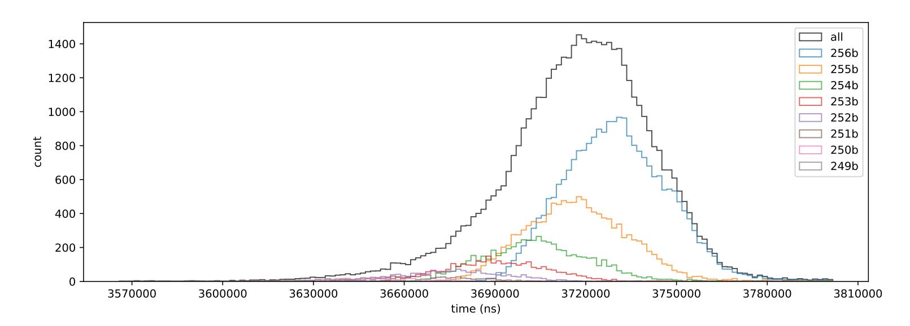

Figure 14: Histogram of signing duration for different number of leading zeros of the random nonces on the secp256r1 curve using the libgcrypt library.

<span id="page-25-0"></span>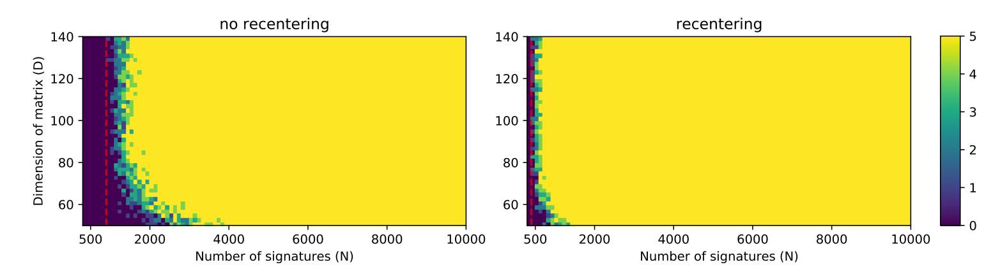

Figure 15: Heatmap of success rate (out of 5 tries) when the true leading zero bits are used as bounds, thus showing the real minimum of the signatures required.

<span id="page-25-2"></span>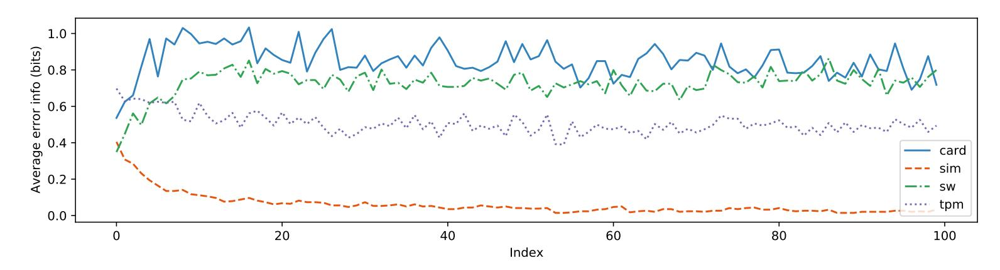

Figure 16: Average amount of erroneous information per index with d=100, when the geometric bounds are used with the four datasets. Here, average erroneous information means the average of error probability multiplied with the error depth (e.g. by how many bits was the bound overstated) at each index.

{26}------------------------------------------------

<span id="page-26-0"></span>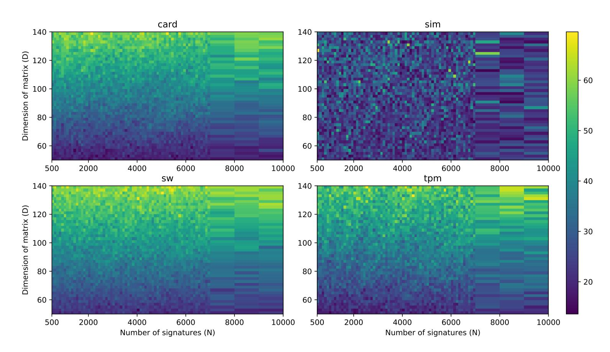

Figure 17: Heatmap of average number of errors for the various datasets, when using geometric bounds.

{27}------------------------------------------------

## <span id="page-27-0"></span>B Impact of recentering with biased bounds

During our early experiments, we observed a counter-intuitive behavior of the recentering technique. Figure 18 illustrates the strange behavior – the success rate decreases with the increasing number of signatures that represents the amount of gained information. This behavior occurs when the upper bounds  $n/2^{l_i}$  for the nonces  $k_i$  are too conservative (too large upper bound, too small  $l_i$ ), i.e., when number of errors is lowered.

<span id="page-27-1"></span>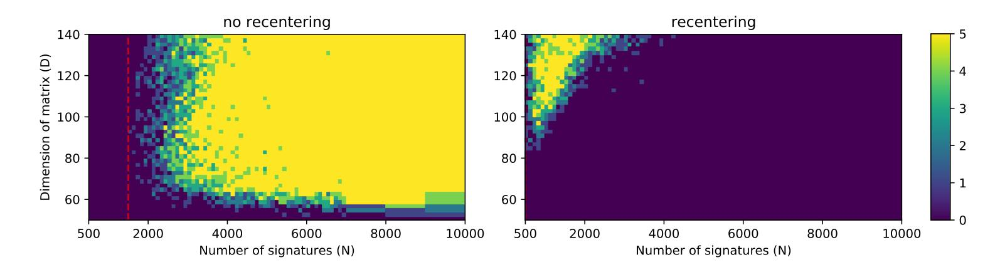

Figure 18: Heatmap of success rate (out of 5 tries) for recentering with biased bounds. Geometric bounds were used as if N=4d, which lead the bounds to be overly conservative for large N.

We believe that the reason is a shift of the nonces caused by recentering when using biased bounds. The bounded values of nonces  $\lfloor k_i \rfloor_n < n/2^{l_i}$  are shifted towards the new bounds  $n/2^{l_i+1}$  for biased bounds. The recentered nonces are bounded as follows:  $|k_i - n/2^{l_i+1}|_n < n/2^{l_i+1}$ . This shift and the distribution of  $k_i$  for i = 50, N = 5000 is illustrated by Figure 19. Note that  $k_i$  represents the i-th nonce in the set of N nonces sorted by their bit-length. The figure shows that the recentering acts as a shift of the nonces towards the bound  $n/2^{l_i+1}$  when a conservative bound  $l_i$  is used.

<span id="page-27-2"></span>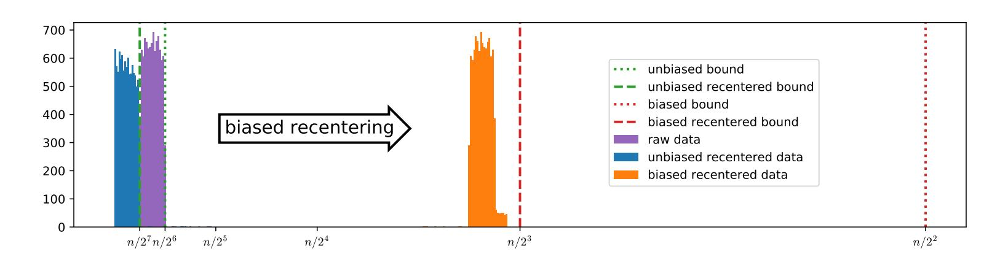

Figure 19: Distributions of the i = 50-th out of N = 5000 nonces, sorted by bit-length, with both the biased bound  $l_i = 2$  and unbiased bound  $l_i = 6$ . The effect of biased recentering manifests as a shift of the raw data to the right.

The overall conclusion is that recentering is usually beneficial, but only if the bounds are reasonable estimates of the actual ones, as seems to be the case for our geometric bounds.