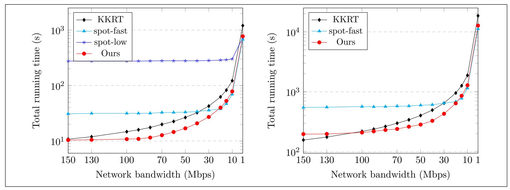
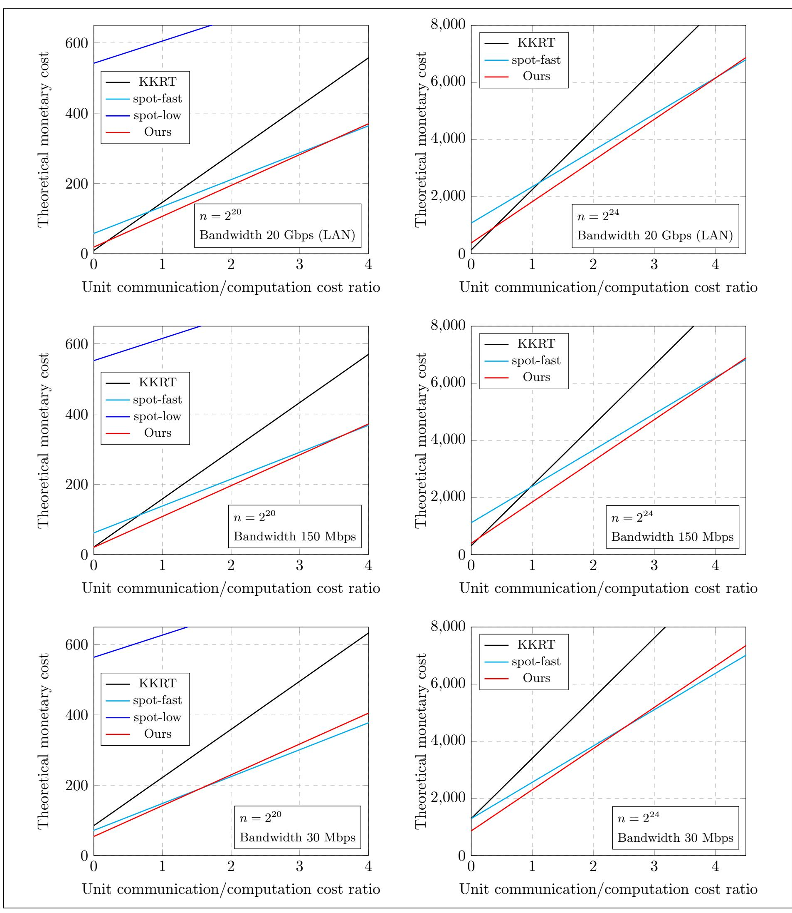

{0}------------------------------------------------

# Private Set Intersection in the Internet Setting From Lightweight Oblivious PRF

Melissa Chase Microsoft Research melissac@microsoft.com

Peihan Miao∗ Visa Research pemiao@visa.com

#### Abstract

We present a new protocol for two-party private set intersection (PSI) with semi-honest security in the plain model and one-sided malicious security in the random oracle model. Our protocol achieves a better balance between computation and communication than existing PSI protocols. Specifically, our protocol is the fastest in networks with moderate bandwidth (e.g., 30 − 100 Mbps). Considering the monetary cost (proposed by Pinkas et al. in CRYPTO 2019) to run the protocol on a cloud computing service, our protocol also compares favorably.

Underlying our PSI protocol is a new lightweight multi-point oblivious pesudorandom function (OPRF) protocol based on oblivious transfer (OT) extension. We believe this new protocol may be of independent interest.

## 1 Introduction

Private set intersection (PSI) enables two parties, each holding a private set of elements, to compute the intersection of the two sets while revealing nothing more than the intersection itself. PSI has found many applications including privacy-preserving location sharing [\[NTL](#page-24-0)+11], private contact discovery [\[CLR17,](#page-22-0) [RA17,](#page-25-0) [DRRT18\]](#page-23-0), DNA testing and pattern matching [\[TPKC07\]](#page-25-1), testing of fully sequenced human genomes [\[BBDC](#page-22-1)+11], collaborative botnet detection [\[NMH](#page-24-1)+10], and measuring the effectiveness of online advertising [\[IKN](#page-23-1)+17]. In the past several years PSI has been extensively studied and has become truly practical with extremely fast implementations [\[HFH99,](#page-23-2) [FNP04,](#page-23-3) [DSMRY09,](#page-23-4) [DCKT10,](#page-23-5) [ADCT11,](#page-22-2) [DCGT12,](#page-23-6) [HEK12,](#page-23-7) [DCW13,](#page-23-8) [PSZ14,](#page-24-2) [PSSZ15,](#page-24-3) [KKRT16,](#page-24-4)[RR17a,](#page-25-2)[RR17b,](#page-25-3)[CLR17,](#page-22-0)[RA17,](#page-25-0)[DRRT18,](#page-23-0)[FNO18,](#page-23-9)[PSWW18,](#page-24-5)[GN19,](#page-23-10)[PRTY19,](#page-24-6)[PRTY20\]](#page-24-7).

When measuring the efficiency of a PSI protocol, there are two major aspects usually considered. First, the computation cost, which is the amount of computing time necessary to run the protocol. Optimizing the computation cost is especially important in practice because of limited computational resources. The state-of-the-art computationally efficient semi-honest PSI protocol [\[KKRT16\]](#page-24-4) uses only oblivious transfer (OT) [\[Rab05\]](#page-25-4), a cryptographic hash function, symmetric-key cryptographic operations, and bitwise operations. It can privately compute the intersection of two millionsize sets in about 4 seconds. This is because OT itself has been heavily optimized, and in particular because of work on OT extension [\[IKNP03,](#page-23-11)[ALSZ13\]](#page-22-3), which allows many oblivious transfers to be performed using only a small number of public key operations and a combination of symmetric primitives (hash functions/AES) and bitwise operations.

∗Part of the work done while visiting Microsoft Research.

{1}------------------------------------------------

The second aspect in the measurement is the communication cost, which refers to the total amount of communication in the protocol. Minimizing the communication cost is also crucial in practice due to limited network bandwidth, which is often a shared resource for multiple applications. The communication-optimal PSI protocol [\[ADCT11\]](#page-22-2) requires communication that is only marginally more than a na¨ıve and insecure protocol (where one party simply sends hash of its elements to the other party), but the protocol is computationally too expensive to be adopted in practice.

On the more practical side, Pinkas et al. [\[PRTY19\]](#page-24-6) achieve communication that is half that of [\[KKRT16\]](#page-24-4) and roughly 8 times the na¨ıve approach at the cost of more expensive operations based on finite field arithmetic.[1](#page-1-0) The result is roughly a 6-7 times overhead compared to [\[KKRT16\]](#page-24-4). This leaves open the question of whether reducing the communication cost of [\[KKRT16\]](#page-24-4) requires more expensive computational tools, or whether it could be achieved with significantly lower computational overhead.

Can we achieve the best of both computation and communication?

When we look at tradeoffs between communication and computation, one valuable metric is the total running time of the protocol, which includes both the computation time and the time to transmit and receive the necessary messages. Of course this time will vary depending on the network bandwidth, and different protocols may perform better in different network settings. Viewed in this light, [\[KKRT16\]](#page-24-4) can be viewed as a protocol optimized for the LAN setting, where bandwidth is not a bottleneck, while [\[PRTY19\]](#page-24-6) is targeted at very low bandwidth settings. However, we argue that it is valuable to design optimized protocols for the full range of settings, and that the middle range (e.g. 30-100 Mbps) is in fact very important. During Q2-Q3 2018, the average download speed over fixed broadband in the U.S. was 95.25 Mbps and average upload speed was 32.88 Mbps [\[LLC18\]](#page-24-8). For example, the Comcast Standard business internet package includes 75 Mbps; larger businesses might have higher bandwidth but would not want to devote all of it to a single protocol. Thus, this seems like a very valuable range to consider.

In the work of Pinkas et al. [\[PRTY19\]](#page-24-6), they propose an alternative efficiency metric — the monetary cost to run the protocol on a cloud computing service. This new metric takes both computation cost and communication cost into consideration. The PSI protocols proposed in [\[PRTY19\]](#page-24-6) have much less communication compared to the computation-optimized protocol [\[KKRT16\]](#page-24-4) and much faster running time compared to the communication-optimized protocol [\[ADCT11\]](#page-22-2). As a result, they achieve a better balance between computation and communication and have the least monetary cost. We can ask though, whether they achieve the best balance.

## 1.1 Our Contribution

In this work, we make positive progress on the aforementioned questions by presenting a new PSI protocol that achieves a better balance between computation and communication.

A New PSI. We present a new PSI construction which we believe achieves better computation/ communication tradeoffs. This protocol is based only on oblivious transfer, hashing, symmetric-key

1The work [\[PRTY19\]](#page-24-6) describes two protocols, one optimized for speed (spot-fast) and one optimized for communication cost (spot-low). Here the comparison is for their fast protocol because the communication optimized one is significantly slower.

{2}------------------------------------------------

and bitwise operations, and as such it has favorable computation; at the same time its communication is almost as small as [\[PRTY19\]](#page-24-6). In particular, our protocol is 2.53−3.65× faster than spot-fast and 19.4 − 28.7× faster than spot-low [\[PRTY19\]](#page-24-6) in computation and requires 1.46 − 1.69× lower communication than [\[KKRT16\]](#page-24-4). Overall, our protocol is the fastest in a network with moderate bandwidth (e.g., 30 − 100 Mbps). In addition, we theoretically and experimentally analyze the monetary cost according to the metric from [\[PRTY19\]](#page-24-6) and show that it compares very favorably.

Efficient Multi-Point OPRF. The PSI protocol of [\[PRTY19\]](#page-24-6) is based on a multi-point oblivious PRF (OPRF) protocol that requires polynomial interpolation over a large field, which is computationally significantly more expensive than the symmetric-key and bitwise operations in the single-point OPRF of [\[KKRT16\]](#page-24-4). We propose a new multi-point OPRF protocol that is based on OT extension that again relies only on symmetric-key and bitwise operations and hashing. It is conceptually very simple to understand and easy to implement. Additionally, our protocol is more flexible in that it allows for tuning parameters to achieve better computation or better communication. We believe this protocol may be of independent interest.

Security Against Malicious Sender. In most of this work, we focus on the semi-honest security model, where both parties follow the PSI protocol description honestly while trying to extract more information about the other party's input set, and aim to achieve the optimal practical efficiency. However, we can show that our protocol also achieves security in the random oracle model when one of the parties is malicious, in particular if we refer to the parties as sender and receiver where the receiver is the party who receives the output, then we protect against the malicious sender. In the previous work [\[KKRT16,](#page-24-4)[PRTY19\]](#page-24-6), only the spot-low variant of [\[PRTY19\]](#page-24-6) achieves one-sided malicious security. As will be shown in Section [5,](#page-16-0) our protocol is much more efficient in running time and cheaper in monetary cost than spot-low.

We note that this sort of asymmetric guarantee is very appropriate in settings where the computation is between a large established company and a small business or a consumer. A large company may have a reputation to maintain and more policies and procedures in place to protect against misbehaviour, so assuming semi-honest security may be more reasonable. On the other hand, if the protocol is run with many different consumers or small businesses it may be hard to ensure that all of them are sufficiently trustworthy to assume semi-honest security.

In light of this, when we consider our efficiency metrics we also consider an asymmetric setting where the sender runs on a cloud service like AWS while the receiver has its own internet service; this should capture the example of a small business who does not have its own dedicated servers but would instead outsource its computations to the cloud. We see that in this setting our protocol is even more advantageous, achieving 5.01 − 6.48× lower monetary cost than spot-low [\[PRTY19\]](#page-24-6) in all of the settings we consider.

## 1.2 Technical Overview

Conceptually speaking, our PSI protocol leverages a primitive called an oblivious pseudorandom function (OPRF) [\[FIPR05\]](#page-23-12), which allows a sender to learn a PRF key k and a receiver to learn the PRF output OPRFk(y1), . . . , OPRFk(yn) on its inputs y1, . . . , yn ∈ Y . Nothing about the receiver's inputs is revealed to the sender and nothing more about the key k is revealed to the receiver. If the sender additionally computes OPRFk(x1), . . . , OPRFk(xn) on its inputs x1, . . . , xn ∈ X and sends them to the receiver, then the receiver can identify the intersecting PRF values and the 

{3}------------------------------------------------

corresponding set intersection. In this section we describe how to construct an efficient OPRF protocol based on OT extension.

Our starting point is the computationally most efficient PSI protocol [KKRT16], which can be conceptually viewed as evaluating n single-point OPRFs, where the sender learns a PRF key k while the receiver can only obliviously evaluate on a single input y. We first describe their protocol at a high level and then elaborate how to extend the single-point OPRF to a multi-point OPRF while still only using the efficient OT extension and symmetric-key operations.

**Single-Point OPRF.** The single-point OPRF realized in [KKRT16] is evaluated as follows. Let the PRF key k consist of two bit-strings  $q, s \in \{0, 1\}^{\lambda}$ . Let  $F(\cdot)$  be a pseudorandom code that produces a pseudorandom string and let H be a hash function. The pseudorandom function is computed as

$$\mathsf{OPRF}_k(x) = H(q \oplus [F(x) \cdot s]),$$

where  $\cdot$  denotes bitwise-AND and  $\oplus$  denotes bitwise-XOR. For a randomly generated s, if F(x) has enough Hamming weight then the function  $\mathsf{OPRF}_k(x)$  is pseudorandom assuming the hash function H is  $correlation\ robust$ .

To evaluate this single-point OPRF on the receiver's input y, the receiver first samples a random string  $r_0 \stackrel{\$}{\leftarrow} \{0,1\}^{\lambda}$  and computes  $r_1 = r_0 \oplus F(y)$ . The sender also samples a random string  $s \stackrel{\$}{\leftarrow} \{0,1\}^{\lambda}$ . Then the two parties execute  $\lambda$  oblivious transfers where the sender acts as a receiver in the OT and inputs  $\lambda$  choice bits  $s[1], s[2], \ldots, s[\lambda]$  while the receiver acts as a sender in the OT and inputs  $\lambda$  pairs of messages  $\{r_0[i], r_1[i]\}_{i \in [\lambda]}$  (each message is a single bit). At the end of the OT, the sender receives  $\lambda$  bits  $\{r_{s[i]}[i]\}_{i \in \lambda}$ . Now the sender simply sets  $q = r_{s[1]}[1] \| \ldots \| r_{s[\lambda]}[\lambda]$  and lets the PRF key be k = (q, s). The PRF value on y learned by the receiver is  $H(r_0)$ . Correctness can easily be checked, namely  $q \oplus [F(x) \cdot s] = r_0$  if x = y.

**PSI From Single-Point OPRF.** Given the above construction of single-point OPRF, [KKRT16] built a PSI protocol as follows. They first use Cuckoo hashing [PR04] to assign the receiver's elements into b bins such that each bin contains at most one element. Then the sender and receiver run the single-point OPRF for each bin so that the sender obtains b PRF keys and the receiver learns b PRF values. Now for each bin, the sender computes the PRF for that bin on all the possible elements in that bin, and sends all the PRF values to the receiver.

In the above single-point OPRF, the only heavy cryptographic tool needed is OT, which requires public-key operations. Since the same choice bits can be used for all the n instances of OPRF, all the OTs can be done via  $\lambda$  instances of string OTs, which can be efficiently instantiated by OT extension.

In this protocol, each element on the sender's side is evaluated on multiple PRFs (the number of hash functions plus the stash size in Cuckoo hashing), which incurs a constant overhead in communication from the sender to the receiver. We get rid of this overhead by constructing a multi-point ORPF so that every element is only evaluated once.

**Extending to Multi-Point OPRF.** In the single-point OPRF construction, there are  $2^{\lambda}$  possible choices of s and different resulting PRF keys k that the sender will receive. However, no matter which s is chosen,  $\mathsf{OPRF}_k(y) = H(r_0)$ . We extend this idea to multi-point OPRF.

{4}------------------------------------------------

Our new PRF key contains a matrix M of size m × w. To evaluate the PRF on input x, we again need a hash function H, and we evaluate a pseudorandom code F(x) which produces a vector in v ∈ [m] w. Let Mi denote the i-th column of M. The pseudorandom function is computed as

$$\mathsf{OPRF}_M(x) = H(M_1[v[1]] \| \dots \| M_w[v[w]]).$$

The sender picks a random string s ∈ {0, 1} w. The receiver prepares two sets of column vectors A1, . . . , Aw ∈ {0, 1} m and B1, . . . , Bw ∈ {0, 1} m. The two parties run w number of OTs where the sender behaves as a receiver and the receiver behaves as the sender. At the end of the protocol, the sender obtains w column vectors, which will form the PRF key M. On the other hand, the receiver forms an m × w matrix A = [A1 . . . Aw] and computes the OPRF on its values by OPRFA(y). At a high level, the receiver prepares the two sets of column vectors {A1, . . . , Aw} and {B1, . . . , Bw} such that no matter what s is chosen, OPRFM(x) = OPRFA(x) for every x ∈ Y . The parameters m, w are carefully chosen such that OPRFM(x) is pseudorandom to the receiver for every x /∈ Y . Preparing the column vectors takes the receiver linear time in n and only involves cheap symmetric-key and bitwise operations. The OTs can be instantiated by the efficient OT extension.

Multi-Point OPRF From [\[PRTY19\]](#page-24-6). We note that [\[PRTY19\]](#page-24-6) takes a different approach to achieving multi-point OPRF by high-degree polynomial interpolation and evaluation over a large field. Their computation complexity is asymptotically O(n log2 n) while ours is O(n). For concrete efficiency, our protocol only relies on efficient OT extension and AES operations. More details on performance comparison can be found in Section [5.](#page-16-0)

One-Sided Malicious Security. We further prove our protocol is secure against a malicious sender. We note that [\[PRTY19\]](#page-24-6) also proves one-sided malicious security for spot-low. In their security proof, a pseudorandom function used in their protocol is modeled as a random oracle. Since the malicious party knows the PRF key, the PRF cannot be instantiated by efficient block ciphers like AES. Instantiating it using a hash function makes the protocol much less efficient than the semi-honest secure protocol. In our protocol, the pseudorandom code F(·) is instantiated by a pseudorandom function Fk(·) and both parties know the PRF key, hence the same problem arises. In order to achieve the best efficiency, we only model hash functions as random oracles and assume F is a PRF, which makes our security proof more involved.

## 1.3 Related Work

In this work we primarily compare with [\[KKRT16\]](#page-24-4) and [\[PRTY19\]](#page-24-6) since as discussed above they currently provide the best tradeoffs between computation and communication. [\[PSZ14,](#page-24-2) [PSSZ15\]](#page-24-3) provide a good overview and performance comparison of a variety of approaches to PSI. To briefly mention a few, generic MPC based PSI [\[HEK12\]](#page-23-7) incurs higher comunication and computation costs, and Diffie-Hellman based PSI (e.g. [\[IKN](#page-23-1)+17]) has relatively small communication (comparable to [\[PRTY19\]](#page-24-6)) but incurs significantly higher computation costs. There are protocols based on garbled circuit-based OPRFs which can be competitive when the set sizes are very unequal [\[KRS](#page-24-10)+19]. There have also been other works based on OT extension [\[PSSZ15,](#page-24-3)[PSZ18\]](#page-24-11), which can achieves the best performance for very short elements and small set sizes.

There have also been several other works which followed up on the [\[KKRT16\]](#page-24-4) approach, notably [\[FNO18\]](#page-23-9). They describe a scheme which replaces the Cuckoo hash table with another algorithm for 

{5}------------------------------------------------

**Parameters:**  $P_1$ 's input set size  $n_1$  and  $P_2$ 's input set size  $n_2$ .

**Inputs:** Party  $P_1$  inputs a set of elements  $X = \{x_1, \ldots, x_{n_1}\}$  where  $x_i \in \{0, 1\}^*$ . Party  $P_2$  inputs a set of elements  $Y = \{y_1, \ldots, y_{n_2}\}$  where  $y_i \in \{0, 1\}^*$ .

**Output:** Party  $P_2$  receives the set intersection  $I = X \cap Y$ .

Figure 1: Ideal functionality for PSI  $\mathcal{F}_{PSI}$ .

assigning elements to table rows which is more complex to compute but allows for a slightly smaller table and removes the stash. They do not provide an implementation, but they claim that for most set sizes their scheme achieves a 10-15% improvement in communication costs over [KKRT16] whereas we achieve a 30-40% improvement in communication with what we would expect to be much lighter computational overhead.

## 2 Preliminaries

#### 2.1 Notation

We use  $\lambda, \sigma$  to denote the computational and statistical security parameters, respectively. We use [n] to denote the set  $\{1, 2, \ldots, n\}$ . For a vector v of length  $\ell$ , we use v[i] to denote the i-th element of the vector. For a matrix M of dimension  $n \times m$ , we use  $M_i$  to denote its i-th column vector  $(i \in [n])$ . We use  $||x||_{\mathsf{H}}$  to denote the hamming weight of a binary string x. By  $\mathsf{negl}(\lambda)$  we denote a negligible function, i.e., a function f such that  $f(\lambda) < 1/p(\lambda)$  holds for any polynomial  $p(\cdot)$  and sufficiently large  $\lambda$ .

## 2.2 Security Model

Private Set Intersection (PSI) is a special case of secure two-party computation. We follow the standard security definitions for secure two-party computation in this work. The ideal functionality of PSI is defined in Figure 1.

**Semi-honest security.** Let  $\mathsf{view}_1^{\Pi}(X,Y)$  and  $\mathsf{view}_2^{\Pi}(X,Y)$  be the view of  $P_1$  and  $P_2$  in the protocol  $\Pi$ , respectively. Let  $\mathsf{out}^{\Pi}(X,Y)$  be the output of  $P_2$  in the ideal functionality. The protocol  $\Pi$  is semi-honest secure if there exists PPT simulators  $\mathcal{S}_1$  and  $\mathcal{S}_2$  such that for all inputs X,Y,

$$\begin{split} \left(\mathsf{view}_1^\Pi(X,Y),\mathsf{out}^\Pi(X,Y)\right) &\overset{c}{\approx} \left(\mathcal{S}_1(1^\lambda,X,n_2),f(X,Y)\right); \\ \mathsf{view}_2^\Pi(X,Y) &\overset{c}{\approx} \mathcal{S}_2(1^\lambda,Y,n_1,f(X,Y)). \end{split}$$

Malicious security against  $P_1$ . The protocol  $\Pi$  is secure against a malicious  $P_1$  if for any PPT adversary  $\mathcal{A}$  in the real world (acting as  $P_1$ ) that could arbitrarily deviate from the protocol, there exists a PPT adversary  $\mathcal{S}$  in the ideal world (acting as  $P_1$ ) that could change its input to the ideal functionality and abort the output, such that for all inputs X, Y,

$$\mathsf{Real}^{\Pi}_{\mathcal{A}}(X,Y) \overset{c}{\approx} \mathsf{Ideal}^{\mathcal{F}}_{\mathcal{S}}(X,Y),$$

{6}------------------------------------------------

Parameters: Message length L.

**Inputs:** The receiver inputs a choice bit  $b \in \{0,1\}$  and the sender inputs nothing.

**Output:** Sample  $m_0, m_1 \stackrel{\$}{\leftarrow} \{0, 1\}^L$ . Output  $(m_0, m_1)$  to the sender and  $m_b$  to the receiver.

Figure 2: Ideal functionality for Random Oblivious Transfer  $\mathcal{F}_{\mathsf{ROT}}$ .

where  $\mathsf{Real}_{\mathcal{A}}^{\Pi}(X,Y)$  is the output of  $\mathcal{A}$  and  $P_2$  in the real world,  $\mathsf{Ideal}_{\mathcal{S}}^{\mathcal{F}}(X,Y)$  is the output of  $\mathcal{S}$  and  $P_2$  in the ideal world.

#### 2.3 Oblivious Transfer

Oblivious Transfer (OT), introduced by Rabin [Rab05], is a central cryptographic primitive in the area of secure computation. 1-out-of-2 OT refers to the setting where a sender has two input strings  $(m_0, m_1)$  and a receiver has an input choice bit  $b \in \{0, 1\}$ . As the result of the OT protocol, the receiver learns  $m_b$  without learning anything about  $m_{1-b}$  while the sender learns nothing about b. This primitive requires expensive public-key operations. Ishai et al. [IKNP03] introduced a technique called OT extension that allows for a large number of OT executions at the cost of computing a small number of public-key operations. In Random OT (ROT), the sender's OT inputs  $(m_0, m_1)$  are randomly chosen, which allows the protocol itself to produce these random values. Hence a random OT protocol requires much less communication especially from the sender to the receiver. In this work we only need the weaker primitive of random OT, whose functionality is defined in Figure 2.

#### 2.4 Correlation Robustness

Our PSI construction is proven secure under a *correlation robustness* assumption on the on the underlying hash function, which was introduced for OT extension [IKNP03] and later generalized in [KK13, KKRT16, PRTY19] to the version we use in this work.

**Definition 2.1** (Hamming Correlation Robustness). Let H be a hash function with input length n. Then H is d-Hamming correlation robust if, for any  $a_1, \ldots, a_m, b_1, \ldots, b_m \in \{0,1\}^n$  with  $||b_i||_{\mathsf{H}} \geq d$  for each  $i \in [m]$ , the following distribution, induced by random sampling of  $s \xleftarrow{\$} \{0,1\}^n$ , is pseudorandom. Namely,

$$(H(a_1 \oplus [b_1 \cdot s]), \dots, H(a_m \oplus [b_m \cdot s])) \stackrel{c}{\approx} (F(a_1 \oplus [b_1 \cdot s]), \dots, F(a_m \oplus [b_m \cdot s])),$$

where  $\cdot$  denotes bitwise-AND and  $\oplus$  denotes bitwise-XOR, F is a random function.

The IKNP protocol uses this assumption with  $n = d = \lambda$ . In that case, the only valid choice for  $b_i$  is  $1^{\lambda}$  and the distribution simplifies to  $H(a_1 \oplus s), \ldots, H(a_m \oplus s)$ . In our case, we use  $n > d = \lambda$ , so other choices for the  $b_i$  values are possible.

### 3 Our PSI Protocol

In this section we describe our protocol and prove its semi-honest security in the plain model and malicious security against  $P_1$  in the random oracle model.

{7}------------------------------------------------

#### 3.1 Construction

We describe our PSI protocol in Figure 3. During the protocol in Step 2 the two parties need to run an OT protocol. Since the matrix A is randomly sampled by  $P_2$ , this step can be instantiated efficiently using random OT as shown in Figure 4.

At a high level,  $P_2$  constructs two matrices A and B of special form from its input elements. Note that for each  $y \in Y$ , let  $v = F_k(H_1(y))$ , the matrices A and B are constructed such that  $D_i[v[i]] = 0$  for all  $i \in [w]$ , and hence  $A_i[v[i]] = B_i[v[i]] = C_i[v[i]]$  for all  $i \in [w]$ . That means, if  $P_1$ 's element x = y for some  $y \in Y$  (i.e., x is in the intersection), then its input to the hash function in Step 3 will be the same as y's input to the hash function. On the other hand, if x is not in the intersection, then its input to the hash function would be significantly different from any y's input to the hash function, and the PRF output would be pseudorandom to  $P_2$ . Note that the hash function  $H_1(\cdot)$  is not necessary for semi-honest security, but is applied for extracting  $P_1$ 's inputs in the malicious case.

The parameters m, w in our protocol are chosen such that if F is a random function and  $H_1(x)$  is different for each  $x \in X \cup Y$ , then for each  $x \in X \setminus I$  and  $v = F(H_1(x))$ , there are at least d 1's in  $D_1[v[1]], \ldots, D_w[v[w]]$  with all but negligible probability. We discuss how to choose these parameters in Section 3.3.

## 3.2 Security Proof

**Theorem 3.1.** If F is a PRF,  $H_1$  is a collision resistant hash function, and  $H_2$  is a d-Hamming correlation robust hash function, then the protocol in Figure 3 securely realizes  $\mathcal{F}_{PSI}$  in the semi-honest model when parameters  $m, w, \ell_1, \ell_2$  are chosen as described in Section 3.3.

Security against corrupt  $P_1$ . We construct  $S_1$  as follows. It is given  $P_1$ 's input set X.  $S_1$  runs the honest  $P_1$  protocol to generate its view with the following exceptions: For the oblivious transfer,  $S_1$  generates  $P_1$ 's random string  $s \stackrel{\$}{\leftarrow} \{0,1\}^w$  honestly and chooses a random matrix  $C \in \{0,1\}^{m \times w}$ , and runs the OT simulator to simulate the view for an OT receiver with inputs  $s[1], \ldots, s[w]$  and outputs  $S_1, \ldots, S_n$ . In Step 3a,  $S_1$  sends a uniformly random PRF key  $S_1$  to  $S_2$  outputs  $S_3$  view. We prove  $S_1$  outputs  $S_2$  outputs  $S_3$  view. We prove  $S_1$  outputs  $S_2$  outputs  $S_3$  view. We prove  $S_4$  outputs  $S_4$  outputs  $S_4$  outputs  $S_4$  view.

 $\mathsf{Hyb}_0$   $P_1$ 's view and  $P_2$ 's output in the real protocol.

- Hyb1 Same as Hyb0 except that on  $P_2$ 's side, for each  $i \in [w]$ , if s[i] = 0, then sample  $A_i \stackrel{\$}{\leftarrow} \{0,1\}^m$  and compute  $B_i = A_i \oplus D_i$ ; otherwise sample  $B_i \stackrel{\$}{\leftarrow} \{0,1\}^m$  and compute  $A_i = B_i \oplus D_i$ . This hybrid is identical to Hyb0.
- $\mathsf{Hyb}_2$  Same as  $\mathsf{Hyb}_1$  except that  $\mathcal{S}_1$  (instead of  $P_2$ ) chooses the random PRF key k. This hybrid is statistically identical to  $\mathsf{Hyb}_1$ .
- $\mathsf{Hyb}_3$  Same as  $\mathsf{Hyb}_2$  but the protocol aborts if there exists  $x,y\in X\cup Y, x\neq y$  such that  $H_1(x)=H_1(y)$ . The aborting probability is negligible because  $H_1$  is collision resistant.
- $\mathsf{Hyb}_4$  Same as  $\mathsf{Hyb}_3$  but the protocol also aborts if there exists  $x \in X \setminus I$  such that, for  $v = F_k(H_1(x))$ , there are fewer than d 1's in  $D_1[v[1]], \ldots, D_w[v[w]]$ . The parameters m, w are

{8}------------------------------------------------

0.  $P_1$  and  $P_2$  agree on security parameters  $\lambda, \sigma$ , protocol parameters  $m, w, \ell_1, \ell_2$ , two hash functions  $H_1: \{0,1\}^* \to \{0,1\}^{\ell_1}$  and  $H_2: \{0,1\}^w \to \{0,1\}^{\ell_2}$ , pseudorandom function  $F: \{0,1\}^{\lambda} \times \{0,1\}^{\ell_1} \to [m]^w$ .

#### 1. Precomputation

- $P_1$  samples a random string  $s \stackrel{\$}{\leftarrow} \{0,1\}^w$ .
- $P_2$  does the following:
  - (a) Initialize an  $m \times w$  binary matrix D to all 1's. Denote its column vectors by  $D_1, \ldots, D_w$ . Then  $D_1 = \cdots = D_w = 1^m$ .
  - (b) Sample a uniformly random PRF key  $k \stackrel{\$}{\leftarrow} \{0,1\}^{\lambda}$ .
  - (c) For each  $y \in Y$ , compute  $v = F_k(H_1(y))$ . Set  $D_i[v[i]] = 0$  for all  $i \in [w]$ .

#### 2. Oblivious Transfer

- (a)  $P_2$  randomly samples an  $m \times w$  binary matrix  $A \stackrel{\$}{\leftarrow} \{0,1\}^{m \times w}$ . Compute matrix  $B = A \oplus D$ .
- (b)  $P_1$  and  $P_2$  run w oblivious transfers where  $P_2$  is the sender with inputs  $\{A_i, B_i\}_{i \in [w]}$  and  $P_1$  is the receiver with inputs  $s[1], \ldots, s[w]$ . As a result  $P_1$  obtains w number of m-bit strings as the column vectors of matrix C (with dimension  $m \times w$ ).

#### 3. OPRF Evaluation

- (a)  $P_2$  sends the PRF key k to  $P_1$ .
- (b) For each  $x \in X$ ,  $P_1$  computes  $v = F_k(H_1(x))$  and its OPRF value  $\psi = H_2(C_1[v[1]] \| \dots \| C_w[v[w]])$  and sends  $\psi$  to  $P_2$ .
- (c) Let  $\Psi$  be the set of OPRF values received from  $P_1$ . For each  $y \in Y$ ,  $P_2$  computes  $v = F_k(H_1(y))$  and its OPRF value  $\psi = H_2(A_1[v[1]] \| \dots \| A_w[v[w]])$  and outputs y iff  $\psi \in \Psi$ .

Figure 3: Our private set intersection protocol.

chosen such that if F is a random function and  $H_1(x)$  is different for each  $x \in X \cup Y$ , then the aborting probability is negligible. If the aborting probability in  $\mathsf{Hyb}_4$  is non-negligible, then we can construct a PPT adversary  $\mathcal{A}$  to break the security of PRF. In particular, given the sets X and Y,  $\mathcal{A}$  constructs the matrix D as in  $\mathsf{Hyb}_4$  except that whenever it needs to compute  $F_k$ ,  $\mathcal{A}$  queries the PRF challenger for the output. Finally, if there exists  $x \in X \setminus I$  such that, for  $v = F_k(H_1(x))$ , there are fewer than d 1's in  $D_1[v[1]], \ldots, D_w[v[w]]$ , namely the protocol aborts, then  $\mathcal{A}$  guesses PRF, otherwise  $\mathcal{A}$  guesses random function.  $\mathcal{A}$  guesses correctly with probability  $\frac{1}{2} + \mathsf{non-negl}$ . Therefore, the protocol aborts with negligible probability in  $\mathsf{Hyb}_4$ .

Hyb5 Same as Hyb4 but party  $P_2$ 's output is replaced by f(X,Y) (i.e., the intersection  $I = X \cap Y$ ). This hybrid changes  $P_2$ 's output if and only if there exists  $x \in X, y \in Y, x \neq y$  such that, for  $v = F_k(H_1(x)), u = F_k(H_1(y)), H_2(C_1[v[1]] || \dots || C_w[v[w]]) = H_2(A_1[u[1]] || \dots || A_w[u[w]])$ . This happens with negligible probability as  $H_2(C_1[v[1]] || \dots || C_w[v[w]])$  is pseudorandom by the correlation robustness of  $H_2$ , so for sufficiently large  $\ell_2$  this probability will be negligible.

{9}------------------------------------------------

- 1.  $P_1$  and  $P_2$  perform w random OTs with message length m, where  $P_1$  is the receiver with inputs choice bits  $s[1], \ldots, s[w]$ . As a result,  $P_2$  gets w pairs of random messages  $\{r_i^{(0)}, r_i^{(1)}\}_{i \in [w]}$  and  $P_1$  gets w messages  $\{r_i\}_{i \in [w]}$  where  $r_i = r_i^{(s[i])}$ .
- 2.  $P_2$  does the following:
  - (a) Let  $\{r_i^{(0)}\}_{i\in[w]}$  form the column vectors of the matrix A and compute the matrix  $B=A\oplus D$ .
  - (b) Compute  $\Delta_i = B_i \oplus r_i^{(1)}$  for all  $i \in [w]$  and send to  $P_1$ .
- 3.  $P_1$  computes the matrix C as follows: if s[i] = 0 then set  $C_i = r_i$ ; otherwise set  $C_i = r_i \oplus \Delta_i$ .

Figure 4: Step 2 of our PSI protocol instantiated using random OT.

Specifically, for each  $x_i \in X \setminus I$ , let  $v_i = F_k(H_1(x))$ ,  $a_i = A_1[v_i[1]] \| \dots \| A_w[v_i[w]]$ , and  $b_i = D_1[v_i[1]] \| \dots \| D_w[v_i[w]]$ . Then  $x_i$ 's input to the hash function  $H_2$  is  $C_1[v_i[1]] \| \dots \| C_w[v_i[w]]$ , which is  $a_i \oplus [b_i \cdot s]$ . Additionally we have the guarantee that  $\|b_i\|_{\mathsf{H}} \geq d$ . Since s is randomly sampled, by the d-Hamming correlation robustness of  $H_2$ , the outputs of  $H_2(C_1[v_i[1]] \| \dots \| C_w[v_i[w]])$  are pseudorandom.

If the outputs of  $H_2(C_1[v_i[1]] \| \dots \| C_w[v_i[w]])$  are truly random, then a collision of  $H_2(C_1[v[1]] \| \dots \| C_w[v[w]]) = H_2(A_1[u[1]] \| \dots \| A_w[u[w]])$  happens with negligible probability. If the collision in this hybrid happens with non-negligible probability, then we can construct a PPT adversary  $\mathcal{A}$  to break the correlation robustness of  $H_2$ . In particular, given the sets X and Y,  $\mathcal{A}$  constructs the matrix A as in this hybrid and  $H_2(A_1[u_i[1]] \| \dots \| A_w[u_i[w]])$  for each  $y_i \in Y$ .  $\mathcal{A}$  can also compute the matrix D as in this hybrid and  $(a_i, b_i)$  for each  $x_i \in X \setminus I$ . As we explained above,  $H_2(C_1[v_i[1]] \| \dots \| C_w[v_i[w]]) = H_2(a_i \oplus [b_i \cdot s])$ .  $\mathcal{A}$  queries the oracle for the outputs of  $H_2(a_i \oplus [b_i \cdot s])$ . If a collision happens, then  $\mathcal{A}$  guesses the hash function; otherwise  $\mathcal{A}$  guesses random function.  $\mathcal{A}$  guesses correctly with probability  $\frac{1}{2}$  + non-negl. Therefore, the probability of collision is negligible by our choice of  $\ell_2$  for semi-honest security in Section 3.3.

- $\mathsf{Hyb}_6$  Same as  $\mathsf{Hyb}_5$  but the protocol does not abort. The indistinguishability of  $\mathsf{Hyb}_6$  and  $\mathsf{Hyb}_5$  follows from the collision resistance of  $H_1$  and the pseudorandomness of  $F_k$  by the same arguments as above.
- $\mathsf{Hyb}_7$  The simulated view of  $\mathcal{S}_1$  and f(X,Y). The only difference from  $\mathsf{Hyb}_6$  is that  $\mathcal{S}_1$  samples the matrix C and runs the OT simulator to simulate the view of an OT receiver for  $P_1$ . This hybrid is computationally indistinguishable from  $\mathsf{Hyb}_6$  by security of the OT protocol.

Security against corrupt  $P_2$ . We construct  $S_2$  as follows. It is given as input  $P_2$ 's set Y, the size of  $P_1$ 's set  $n_1$ , and the intersection I = f(X,Y).  $S_2$  runs the honest  $P_2$  protocol with the following exceptions: For the oblivious transfer,  $S_2$  computes the matrices A and B honestly and run the OT simulator to produce a simulated view for the OT sender. For each  $x \in I$ , it computes  $v = F_k(H_1(x))$  and the OPRF value  $\psi = H_2(A_1[v[1]] \| \dots \| A_w[v[w]])$ . Let this set of OPRF values be  $\Psi_I$ . Choose  $n_1 - |I|$  random  $\ell_2$ -bit strings and let this set be  $\Psi_{\mathsf{rand}}$ . Send

{10}------------------------------------------------

- $\Psi = \Psi_I \cup \Psi_{\mathsf{rand}}$  to  $P_2$  in Step 3b. Finally  $\mathcal{S}_2$  outputs  $P_2$ 's view in this invocation. We argue  $\mathsf{view}_2^{\Pi}(X,Y) \stackrel{c}{\approx} \mathcal{S}_2(1^{\lambda},Y,n_1,f(X,Y))$  through the following hybrids:
- $\mathsf{Hyb}_0$   $P_2$ 's view in the real protocol.
- $\mathsf{Hyb}_1$  Same as  $\mathsf{Hyb}_0$  but the protocol aborts if there exists  $x,y \in X \cup Y, x \neq y$  such that  $H_1(x) = H_1(y)$ . The aborting probability is negligible because  $H_1$  is collision resistant for sufficiently large  $\ell_1$  chosen in Section 3.3.
- Hyb2 Same as Hyb1 except that the protocol aborts if there exists  $x \in X \setminus I$  such that, for  $v = F_k(H_1(x))$ , there are fewer than d 1's in  $D_1[v[1]], \ldots, D_w[v[w]]$ . The parameters m, w are chosen such that if F is a random function and  $H_1(x)$  is different for each  $x \in X \cup Y$ , then the aborting probability is negligible. If the aborting probability in Hyb2 is non-negligible, then we can construct a PPT adversary  $\mathcal{A}$  to break the security of PRF. In particular, given the sets X and Y,  $\mathcal{A}$  constructs the matrix D as in Hyb2 except that whenever it needs to compute  $F_k$ ,  $\mathcal{A}$  queries the PRF challenger for the output. Finally, if there exists  $x \in X \setminus I$  such that, for  $v = F_k(H_1(x))$ , there are fewer than d 1's in  $D_1[v[1]], \ldots, D_w[v[w]]$ , namely the protocol aborts, then  $\mathcal{A}$  guesses PRF, otherwise  $\mathcal{A}$  guesses random function.  $\mathcal{A}$  guesses correctly with probability  $\frac{1}{2}$  + non-negl. Therefore, the protocol aborts with negligible probability in Hyb2.
- $\mathsf{Hyb}_3$  Same as  $\mathsf{Hyb}_2$  except that  $\mathcal{S}_2$  runs the OT simulator to produce a simulated view of an OT sender for  $P_2$ . This hybrid is computationally indistinguishable to  $\mathsf{Hyb}_2$  by security of the OT protocol.
- Hyb4 Same as Hyb3 except that we replace the OPRF values for  $x \in X \setminus I$  by random  $\ell_2$ -bit strings. Hyb4 is computationally indistinguishable from Hyb3 because of the d-Hamming correlation robustness of  $H_2$ . Specifically, for each  $x_i \in X \setminus I$ , let  $v_i = F_k(H_1(x))$ ,  $a_i = A_1[v_i[1]] \| \dots \| A_w[v_i[w]]$ , and  $b_i = D_1[v_i[1]] \| \dots \| D_w[v_i[w]]$ . Then  $x_i$ 's input to the hash function  $H_2$  is  $C_1[v_i[1]] \| \dots \| C_w[v_i[w]]$ , which is  $a_i \oplus [b_i \cdot s]$ . Additionally we have the guarantee that  $\|b_i\|_{\mathsf{H}} \geq d$ . Since s is randomly sampled and unknown to the  $P_2$ , by the d-Hamming correlation robustness of  $H_2$ , the outputs of  $H_2(C_1[v_i[1]] \| \dots \| C_w[v_i[w]])$ , i.e., the OPRF values for  $x_i \in X \setminus I$ , are pseudorandom by the choice of  $\ell_2$  for semi-honest security in Section 3.3.
- $\mathsf{Hyb}_5$  Same as  $\mathsf{Hyb}_4$  except that the protocol does not abort. The indistinguishability of  $\mathsf{Hyb}_4$  and  $\mathsf{Hyb}_5$  follows from the collision resistance of  $H_1$  and the pseudorandomness of F by the same arguments as above. The hybrid is the view output by  $\mathcal{S}_2$ .
- **Theorem 3.2.** If F is a PRF,  $H_1$  and  $H_2$  are modeled as random oracles, and the underlying OT protocol is secure against a malicious receiver, then the protocol in Figure 3 is secure against malicious  $P_1$  when parameters  $m, w, \ell_1, \ell_2$  are chosen as described in Section 3.3.

We construct S that interacts with the malicious  $P_1$  as follows. S samples a random matrix  $C \in \{0,1\}^{m \times w}$ , and runs the malicious OT simulator on  $P_1$  with output  $C_1, \ldots, C_w$ . S honestly chooses the random PRF key k and sends k to  $P_1$  in Step 3a. On  $P_1$ 's query x to the random oracle  $H_1$ , S records the pair  $(x, H_1(x))$  in a table  $T_1$ , which was initialized empty. On  $P_1$ 's query z to the random oracle  $H_2$ , S records the pair  $(z, H_2(z))$  in a table  $T_2$ , which was initialized empty. In Step 3b when  $P_1$  sends OPRF values  $\Psi$ , S finds all the values  $\psi \in \Psi$  such that  $\psi = H_2(z)$  for some

{11}------------------------------------------------

z in  $T_2$ , and  $z = C_1[v[1]] \parallel \ldots \parallel C_w[v[w]]$  where  $v = F_k(H_1(x))$  for some x in  $T_1$ . Then S sends these x's to the ideal functionality. Finally S outputs whatever  $P_1$  outputs.

Let  $Q_1, Q_2$  be the set of queries  $P_1$  makes to  $H_1, H_2$  respectively, and let  $Q_1 = |Q_1|, Q_2 = |Q_2|$ . We will abuse notation, and for  $m \times w$  bit-matrix C and vector  $u \in [m]^w$ , we write C[v] to mean  $C_1[v[1]] \| \dots \| C_w[v[w]]$ . Similarly, for a set V of vectors in  $[m]^w$ , we use C[V] to denote the set  $\{C[v] | v \in V\}$ .

We prove  $\mathsf{Real}^{\Pi}_{\mathcal{A}}(X,Y) \stackrel{c}{\approx} \mathsf{Ideal}^{\mathcal{F}}_{\mathcal{S}}(X,Y)$  via the following hybrid argument:

- $\mathsf{Hyb}_0$  The outputs of  $P_1$  and  $P_2$  in the real world.
- $\mathsf{Hyb}_1$  Same as  $\mathsf{Hyb}_0$  except that  $\mathcal{S}$  runs the OT simulator on  $P_1$  to extract s, lets  $C_i = A_i$  if s[i] = 0 and  $C_i = B_i$  otherwise, gives  $C_1, \ldots, C_w$  to the OT simulator as output. This hybrid is computationally indistinguishable from  $\mathsf{Hyb}_0$  because of OT security against a malicious receiver.
- Hyb2 Same as Hyb1 but the protocol aborts if there exists  $x, y \in \mathcal{Q}_1 \cup Y, x \neq y$  such that  $H_1(x) = H_1(y)$ . The aborting probability is negligible because  $H_1$  is a random oracle, hence also collision resistant for sufficiently large  $\ell_1$  chosen in Section 3.3.
- Hyb3 Same as Hyb2 but in Step 3c, for each OPRF value  $\psi$  sent by  $P_1$ , if  $\psi \notin H_2(\mathcal{Q}_2)$ , then  $P_2$  ignores  $\psi$  when computing the set intersection. This hybrid changes  $P_2$ 's output with negligible probability because  $H_2$  is a random oracle with output length at least  $\ell_2$  (see Section 3.3 for the choice of  $\ell_2$  in the malicious case). Specifically, the probability that  $\psi$  equals the output of  $H_2$  on one of  $P_2$ 's elements is negligible.
- Hyb4 Same as Hyb3 but the protocol aborts if in Step 3c, there exists  $z \in \mathcal{Q}_2, z' \in A[F_k(H_1(Y))]$  with  $z \neq z'$  and  $H_2(z) = H_2(z')$ . If this happens, then we find a collision of  $H_2$ , which happens with negligible probability because  $H_2$  is a random oracle with sufficiently large output length  $\ell_2$  chosen in Section 3.3 for malicious security.
- Hyb5 Same as Hyb4 but in Step 3c, for each OPRF value  $\psi$  sent by  $P_1$ ,  $P_2$  ignores  $\psi$  when computing the set intersection if  $\psi = H_2(z)$  for some  $z \in \mathcal{Q}_2$  where  $z \notin C[F_k(H_1(\mathcal{Q}_1))]$ .

This hybrid changes  $P_2$ 's output only if there exists  $y \in Y$  such that  $\psi = H_2(A[F_k(H_1(y))])$ , which implies  $z = A[F_k(H_1(y))]$  by the abort condition added in  $\mathsf{Hyb}_4$ .

First, note that if  $y \in \mathcal{Q}_1$ , then we have  $z = A[F_k(H_1(y))] = C[F_k(H_1(y))] \in C[F_k(H_1(\mathcal{Q}_1))]$  where the second equality follows from construction of the matrix D. Thus, we need only consider  $y \in Y \setminus \mathcal{Q}_1$ . Also note that for all  $y \in Y$ ,  $A[F_k(H_1(y))] = C[F_k(H_1(y))]$ , so we can say that the hybrid output changes only if there exists  $y \in Y \setminus \mathcal{Q}_1, z \in \mathcal{Q}_2$  such that  $z = C[F_k(H_1(y))]$ .

Suppose there is a PPT adversary  $\mathcal{A}$  that with non-negligible probability produces  $\mathcal{Q}_1, \mathcal{Q}_2, Y$  such that there exist  $z \in \mathcal{Q}_2, y \in Y \setminus \mathcal{Q}_1$  such that  $z = C[F_k(H_1(y))]$ . Then we show we can break security of the PRF.

To see this, consider the following experiment:

1. Pick random outputs to be used for  $H_1(\mathcal{Q}_1)$ .

{12}------------------------------------------------

- 2. Pick random C, simulate the OTs with  $\mathcal{A}$ , responding to its  $H_1$  queries using the prechosen outputs, and responding to its  $H_2$  queries using random function table  $T_2$  filled in on demand, and abort if any of the abort conditions are triggered.
- 3. Send a random k to  $\mathcal{A}$  in Step 3a and continue to respond to oracle queries the same way.
- 4.  $\mathcal{A}$  sends  $\Psi$ .
- 5. Pick random outputs to be used for  $H_1(Y \setminus Q_1)$ , and output 1 if there exist  $z \in Q_2, y \in Y \setminus Q_1$  such that  $z = C[F_k(H_1(y))]$ .

Observe that if  $\mathcal{A}$  succeeds in distinguishing the two hybrids, then this experiment outputs 1 with non-negligible probability. The intuition is that  $\mathcal{A}$  fixes  $\mathcal{Q}_2$  before we choose  $H_1(Y \setminus \mathcal{Q}_1)$ , so if the game succeeds then the PRF must be very biased, to the point where it is straightforwardly detectable.

To make this more formal, consider the following PRF adversary  $\mathcal{B}$ .  $\mathcal{B}$  will choose random C, then sample 2 sets of |Y| random values each,  $\mathcal{L}, \mathcal{L}'$ . Call the PRF challenger to obtain  $F(\mathcal{L}), F(\mathcal{L}')$ . Output PRF if  $C[F(\mathcal{L})] \cap C[F(\mathcal{L}')]$  is non-empty.

If F is a PRF: Define  $P_{C,k}$  as the probability of the above experiment outputting 1 conditioned on (C, k). Note that we are assuming for the sake of contradiction that the experiment outputs 1 with non-negligible probability  $\epsilon$ . Hence there must exist at least  $\epsilon$  fraction of (C, k) pairs such that  $P_{C,k} > \epsilon$ . Conditioned on (C, k), let  $\mathcal{W}_{C,k}$  be the set of  $H_2$  queries that maximizes the probability that the experiment outputs 1. Then we know that if  $P_{C,k} > \epsilon$ , then the probability that for random choice of  $\mathcal{L}$  we get  $\mathcal{W}_{C,k} \cap C[F_k(\mathcal{L})] \neq \emptyset$  is at least  $\epsilon$ . That means that there exists  $z_{C,k} \in \mathcal{W}_{C,k}$  such that the probability over random choice of  $\mathcal{L}$  that  $z \in C[F_k(\mathcal{L})]$  is at least  $\epsilon/Q_2$ . And for such  $z_{C,k}$ , if we pick 2 random sets  $\mathcal{L}, \mathcal{L}'$ , the probability that we get  $z_{C,k} \in C[F_k(\mathcal{L})]$  and  $z_{C,k} \in C[F_k(\mathcal{L}')]$  and therefore  $C[F_k(\mathcal{L})] \cap C[F_k(\mathcal{L}')] \neq \emptyset$  is at least  $\epsilon^2/Q_2^2$ . Thus, the overall probability that  $\mathcal{B}$  outputs PRF is at least  $\epsilon^3/Q_2^2$ , which is non-negligible.

If F is random function: First, note that with all but negligible probability,  $\mathcal{L}, \mathcal{L}'$  are disjoint sets with no repeated elements, so computing  $F(\mathcal{L}), F(\mathcal{L}')$  is equivalent to choosing  $2|Y \setminus \mathcal{Q}_1|$  random values  $\mathcal{W}, \mathcal{W}'$ . Now, for any pair of j, j' and any column i, the probability that  $C_i[\mathcal{W}_j[i]] = C_i[\mathcal{W}_{j'}[i]]$ , taken over the choice of  $\mathcal{W}, \mathcal{W}', C$  is:  $\Pr[\mathcal{W}_j[i] = \mathcal{W}_{j'}[i]] + \Pr[\mathcal{W}_j[i] \neq \mathcal{W}_{j'}[i]] \cdot \frac{1}{2} = \frac{1}{2} + \frac{1}{2m}$ , and these probabilities are independent across columns. Thus, the probability that  $C[\mathcal{W}_j] = C[\mathcal{W}_{j'}]$  is  $\left(\frac{1}{2} + \frac{1}{2m}\right)^w$ , which is negligible by our choice of parameters m, w in Section 3.3.

Hyb6 Same as Hyb5 but the protocol also aborts if there exists  $x \in \mathcal{Q}_1, y \in Y$  such that,  $z = C[F_k(H_1(x))] = A[F_k(H_1(y))]$  but  $x \neq y$ . We argue that this abort happens with negligible probability by security of the PRF.

Suppose that there exists a PPT adversary  $\mathcal{A}$  who can cause this abort to happen with non-negligible probability. Let Q be a polynomial upper bound on the number of  $H_1$  queries made by the adversary. Then we build the following algorithm  $\mathcal{B}$  to break security of the PRF.  $\mathcal{B}$  will first choose Q + |Y| random outputs to  $H_1$ .  $\mathcal{B}$  will then choose random C and use the OT simulator to extract s from the OTs. If  $\mathcal{A}$  makes  $H_1$  queries during this process it will use the pre-chosen outputs. Then  $\mathcal{B}$  computes the matrix D using the appropriate  $H_1$  outputs

{13}------------------------------------------------

and using its oracle to compute F. From C, D and s it will compute the matrix A. Finally, it will output PRF if there exist a pair of outputs h, h' in its pre-chosen random  $H_1$  output set for which C[F(h)] = A[F(h')].

Clearly this game outputs PRF with non-negligible probability in the PRF case if the abort in  $\mathsf{Hyb}_6$  happens with non-negligible probability. Now we will argue that in the random function case it outputs PRF with only negligible probability.

Consider the following game, which produces outputs identical to the above experiment with  $\mathcal{B}$  in random function case: We first pick the random function F and the  $H_1$  outputs. Then compute D. Then extract s from the OTs and choose random C. Finally, compute the corresponding A, and output PRF as above if there exist a pair of outputs  $h_1, h_2$  in its pre-chosen random  $H_1$  output set for which  $C[F(h_1)] = A[F(h_2)]$ .

Now we evaluate the probability of producing PRF in this game. First consider the probability that for a particular pair of  $H_1$  outputs h, h' we obtain C[F(h)] = A[F(h')]. Consider the step where we choose random C and compute A. Let u = F(h) and v = F(h'). Since C is chosen at random, if  $s_i \wedge D_i[v_i] = 0$ , then we have  $\Pr[C_i[u_i] = A_i[v_i]] = \Pr[C_i[u_i] = C_i[v_i]] = \frac{1}{2} + \frac{1}{2m}$  and if  $s_i \wedge D_i[v_i] = 1$ , then  $\Pr[C_i[u_i] = A_i[v_i]] = \Pr[C_i[u_i] \neq C_i[v_i]] = \frac{1}{2} - \frac{1}{2m}$ , and these probabilities are independent for different i's. Thus even in the worst case we have that the probability that C[F(h)] = A[F(h')] is at most  $\left(\frac{1}{2} + \frac{1}{2m}\right)^w$ , which for our choice of parameters in Section 3.3 is negligible.

- Hyb7 Same as Hyb6 except that party  $P_2$ 's output is replaced by its output in the ideal world. This hybrid changes  $P_2$ 's output if and only if there exists an OPRF value  $\psi$  sent by  $P_1$  and considered by  $P_2$  such that,  $\psi = H_2(C[F_k(H_1(x))])$  for some  $x \in \mathcal{Q}_1$ , and  $\psi = H_2(A[F_k(H_1(y))])$  for some  $y \in Y, y \neq x$ . We already know that  $C[F_k(H_1(x))] \neq A[F_k(H_1(y))]$  by the abort condition introduced in Hyb6, hence we find a collision of  $H_2$ , which happens with negligible probability because  $H_2$  is a random oracle with sufficiently large output length  $\ell_2$  chosen in Section 3.3 for malicious security.
- $\mathsf{Hyb}_8$  Same as  $\mathsf{Hyb}_7$  but the protocol does not abort.  $\mathsf{Hyb}_8$  and  $\mathsf{Hyb}_7$  are computationally indistinguishable because  $H_1$  and  $H_2$  are random oracles and  $F_k$  is a PRF by the same arguments as above.
- $\mathsf{Hyb}_9$  The outputs of  $\mathcal{S}$  and  $P_2$  in the ideal world. The only difference of this hybrid from  $\mathsf{Hyb}_8$  is that  $\mathcal{S}$  (instead of  $P_2$ ) samples the random matrix C, which is identically distributed.

#### 3.3 Parameter Analysis

**Choice of** m, w. The parameters m, w in our PSI protocol are chosen such that if F is a random function and  $H_1(x)$  is different for each  $x \in X \cup Y$ , then for each  $x \in X \setminus I$  and  $v = F(H_1(x))$ , there are at least d 1's in  $D_1[v[1]], \ldots, D_w[v[w]]$  with all but negligible probability. We now discuss how to choose the parameters. We first fix m and then decide on w as follows.

Consider each column  $D_i$ , initialized as  $1^m$ . Then for each  $y \in Y$ ,  $P_2$  computes  $v = F(H_1(y))$  and sets  $D_i[v[i]] = 0$ . Since  $H_1(y)$  is different for each  $y \in Y$  and F is a random function, v is random and independent for each  $y \in Y$ . The probability  $\Pr[D_i[j] = 1]$  is the same for all  $j \in [m]$ .

{14}------------------------------------------------

In particular,

$$\Pr[D_i[j] = 1] = \left(1 - \frac{1}{m}\right)^{n_2}.$$

Let  $p = (1 - \frac{1}{m})^{n_2}$ . For any  $x \in X \setminus I$ , let  $v = F(H_1(x))$ , then  $\Pr[D_i[v[i]] = 1] = p$  and the probability is independent for all  $i \in [w]$ . Hence the probability that there are k 1's in  $D_1[v[1]], \ldots, D_w[v[w]]$  is

$$\binom{w}{k} p^k (1-p)^{w-k}$$
.

We want there to be at least d 1's for each  $x \in X \setminus I$  with all but negligible probability. By the union bound, it is sufficient for the following probability to be negligible:

$$n_1 \cdot \sum_{k=0}^{d-1} {w \choose k} p^k (1-p)^{w-k} \le \mathsf{negl}(\sigma).$$

From this we can derive a proper w.

In our security proof against malicious  $P_1$ , we further require that  $\left(\frac{1}{2} + \frac{1}{2m}\right)^w \leq \mathsf{negl}(\lambda)$ . For all the concrete parameters we choose in Section 4.1, this requirement is also satisfied.

Choice of  $\ell_1$ . The parameter  $\ell_1$  is the output length of the hash function  $H_1$ . For security parameter  $\lambda$ , we need to set  $\ell_1 = 2\lambda$  to guarantee collision resistance against the birthday attack.

Choice of  $\ell_2$ . The parameter  $\ell_2$  is the output length of the hash function  $H_2$ , which controls the collision probability of the PSI protocol. For semi-honest security, it can be computed as  $\ell_2 = \sigma + \log(n_1 n_2)$ , similarly as in [KKRT16, PRTY19]. For security against malicious  $P_2$ , it can be computed similarly as  $\ell_2 = \sigma + \log(Q_2 \cdot n_2)$  where  $Q_2$  is the maximum number of queries the adversary can make to  $H_2$ .

## 4 Implementation Details

We implement our PSI protocol in C++. In this section we discuss the concrete parameters used in our implementation and how we instantiate all the cryptographic primitives. Our implementation is available on GitHub: https://github.com/peihanmiao/OPRF-PSI.

#### 4.1 Parameters

Our computational security parameter is set to  $\lambda = 128$  and statistical security parameter is  $\sigma = 40$ . We also set d to be 128. We focus on the setting where  $n_1 = n_2 = n$ , i.e., the two parties have sets of equal size. The other parameters are

- m: the number of rows (or height) of the matrix D.
- w: the number of columns (or width) of the matrix D.
- $\ell_1$ : the output length in bits of the hash function  $H_1$ , set as 256.
- $\ell_2$ : the output length in bits of the hash function  $H_2$ .

{15}------------------------------------------------

| n       | m    | w         | `2 (semi-honest) | `2 (malicious) |  |
|---------|------|-----------|---------------------|-------------------|--|
| 16 2 | n    | 609       | 72                  | 120               |  |
| 18 2 | n    | 615 76 |                     | 122               |  |
| 20 2 | n    | 621       | 80                  | 124               |  |
| 22 2 | n    | 627       | 84                  | 126               |  |
| 24 2 | n    | 633       | 88                  | 128               |  |
| 24 2 | 0.9n | 717       | 88                  | 128               |  |
| 24 2 | 1.1n | 571       | 88                  | 128               |  |
| 24 2 | 2n   | 349       | 88                  | 128               |  |

Table 1: Parameters for set size n, matrix height m, matrix width w, and output length `2 in bits of the hash function H2 for semi-honest and malicious security.

Our protocol is flexible in that we can set these parameters differently to trade-off between computation and communication. Specifically, once we fix n and m, we can compute w as in Section [3.3.](#page-13-0) Intuitively, for a fixed set size n, if we set a bigger m, then we will get a bigger fraction of 1's in each column of the matrix D, which leads to a smaller w and requires less computation of the pseudorandom function F in the PSI protocol. To guarantee collision resistance of H1, the parameter `1 is set to be 256. For security against malicious P1, we assume the maximum number of queries the adversary can make to H2 is 264. We list different choices of the other parameters in Table [1.](#page-15-0) In our experiment, we will set m = n for all settings as it achieves nearly optimal communication among all choices of m and allows for optimal computation.

#### 4.2 Instantiation of Cryptographic Primitives

Our PSI protocol requires the following cryptographic primitives:

- F: a pseudorandom function.
- H1: a collision-resistant hash function.
- H2: a Hamming correlation robust hash function.
- Base OTs for OT extension.

In our implementation, H1 and H2 are instantiated using BLAKE2 [\[BLA\]](#page-22-4). Base OTs are instantiated using Naor-Pinkas OT [\[NP99\]](#page-24-13). We use the implementation of base OTs from the libOTe library [\[Rin\]](#page-25-5).

Instantiation of F. We would like to instantiate F using AES, but note that the input and output length of AES is 128 bits. Recall that in our protocol, we require F : {0, 1} λ × {0, 1} `1 → [m] w, where the input length is `1 = 256 and output length is w · log m.

{16}------------------------------------------------

One way to instantiate F is to apply a pseudorandom generator (PRG) on top of cipher block chaining message authentication code (CBC-MAC). In particular, let  $G: \{0,1\}^{\lambda} \times \{0,1\}^{\lambda} \to \{0,1\}^{\lambda}$  be a pseudorandom function (instantiated by AES) and PRG:  $\{0,1\}^{\lambda} \to \{0,1\}^{t \cdot \lambda}$  be a PRG (instantiated by AES CTR mode), where  $t = \lceil \frac{w \cdot \log m}{\lambda} \rceil$ . Let  $x = x_0 || x_1$  be the input where  $x_0, x_1 \in \{0,1\}^{\lambda}$ . Then we instantiate F by

$$F_k(x) := \mathsf{PRG}(G_k(G_k(x_0) \oplus x_1)).$$

By the security of CBC-MAC [BKR00] and PRG, F is still a PRF. In this construction,  $G_k(\cdot)$  is parallelizable for multiple inputs and can be efficiently instantiated by AES ECB mode. However, PRG has to be computed on each element and cannot be parallelized for multiple elements.

To achieve better concrete efficiency, we try to parallelize the computation over multiple elements as much as possible so as to make best use of the hardware optimized AES ECB mode implementation. In particular, let  $G: \{0,1\}^{\lambda} \times \{0,1\}^{\lambda} \to \{0,1\}^{\lambda}$  be a pseudorandom function and PRG:  $\{0,1\}^{\lambda} \to \{0,1\}^{(t+1)\cdot\lambda}$  be a PRG where  $t = \lceil \frac{w \cdot \log m}{\lambda} \rceil$ . On a key k and input  $x = x_0 || x_1$ , we construct F as

$$F_k(x) = G_{k_1}(G_{k_0}(x_0) \oplus x_1) \|G_{k_2}(G_{k_0}(x_0) \oplus x_1)\| \dots \|G_{k_t}(G_{k_0}(x_0) \oplus x_1),$$

where  $k_0||k_1|| \dots ||k_t \leftarrow \mathsf{PRG}(k)$ . Now  $\mathsf{PRG}$  (instantiated by AES CTR mode) is only applied once on the key k, and  $G_{k_i}(\cdot)$  are all parallelizable by AES ECB mode. The security proof of F is deferred to Appendix  $\mathbf{A}$ .

In our implementation, the PRF key k is sent right after the base OT instead of after the entire OT extension. This allows both parties to run PRF evaluations in parallel and does not hurt malicious security because  $P_1$  does not send any message in the OT extension after the base OT.

## 5 Performance Evaluation

We implement our PSI protocol and report on its performance in comparison with the state-of-theart OT-extension-based protocols:

- KKRT: the computation-optimized protocol [KKRT16].
- SpOT-Light: the communication-optimized protocol [PRTY19]. They have two variants of the protocol, a speed-optimized variant (spot-fast) and a communication-optimized variant (spot-low). We compare our protocol with both variants.

In this section, we only report the performance with semi-honest security for comparison with KKRT and SpOT-Light. To achieve security against malicious  $P_1$ , our protocol requires the same amount of computation cost and 5-7% more communication cost (because  $\ell_2$  is bigger as shown in Table 1).

#### 5.1 Benchmark Comparison

Our benchmarks are implemented on two Microsoft Azure virtual machines with Intel(R) Xeon(R) 2.40GHz CPU and 140 GB RAM. The two machines are connected in a LAN network with 20 Gbps bandwidth and 0.1 ms RTT latency. We simulate the WAN connection between the two machines using the Linux tc command. In the WAN setting, the average RTT is set to be 80 ms and we

{17}------------------------------------------------

| n       | Protocol  | Comm. (MB) |       |       | Total running time (s) |         |         |        |        |        |        |        |
|---------|-----------|------------|-------|-------|------------------------|---------|---------|--------|--------|--------|--------|--------|
|         |           | P1         | P2    | Total | LAN                    | 150Mbps | 100Mbps | 80Mbps | 50Mbps | 30Mbps | 10Mbps | 1Mbps  |
| 16 2 | KKRT      | 3.95       | 4.82  | 8.77  | 0.34                   | 1.94    | 2.01    | 2.22   | 2.62   | 3.54   | 8.41   | 77.4   |
|         | spot-fast | 1.14       | 3.47  | 4.61  | 2.08                   | 2.97    | 2.99    | 2.99   | 3.03   | 3.12   | 4.86   | 40.9   |
|         | spot-low  | 0.53       | 3.38  | 3.91  | 12.2                   | 13.5    | 13.6    | 13.6   | 13.6   | 13.7   | 14.5   | 41.2   |
|         | Ours      | 0.58       | 4.76  | 5.34  | 0.63                   | 1.71    | 1.78    | 1.87   | 2.14   | 2.66   | 5.53   | 47.4   |
| 18 2 | KKRT      | 17.5       | 19.2  | 36.7  | 1.08                   | 3.98    | 4.71    | 5.44   | 7.79   | 12.0   | 33.2   | 323    |
|         | spot-fast | 5.02       | 13.9  | 18.9  | 8.24                   | 9.45    | 9.49    | 9.51   | 9.84   | 10.6   | 17.5   | 166    |
|         | spot-low  | 2.06       | 13.5  | 15.6  | 57.1                   | 58.8    | 59.2    | 59.4   | 59.7   | 60.3   | 64.9   | 167    |
|         | Ours      | 2.52       | 19.2  | 21.7  | 2.26                   | 3.01    | 3.34    | 3.77   | 5.08   | 7.53   | 20.0   | 192    |
| 20 2 | KKRT      | 60.0       | 76.8  | 137   | 4.58                   | 10.8    | 14.7    | 17.5   | 26.5   | 42.5   | 122    | 1,204  |
|         | spot-fast | 20.0       | 56.4  | 76.4  | 28.9                   | 30.9    | 31.5    | 31.6   | 33.1   | 35.8   | 69.3   | 676    |
|         | spot-low  | 8.18       | 55.0  | 63.2  | 271                    | 276     | 275     | 277    | 279    | 282    | 301    | 731    |
|         | Ours      | 10.0       | 77.6  | 87.6  | 9.44                   | 10.4    | 10.8    | 11.5   | 16.9   | 27.1   | 78.2   | 772    |
| 22 2 | KKRT      | 264        | 307   | 571   | 18.4                   | 42.3    | 58.8    | 71.2   | 108    | 175    | 509    | 5,027  |
|         | spot-fast | 88.0       | 226   | 314   | 117                    | 123     | 125     | 126    | 133    | 146    | 283    | 2,773  |
|         | spot-low  | 32.7       | 220   | 253   | 1,291                  | 1,303   | 1,305   | 1,311  | 1,315  | 1,331  | 1,406  | 3,311  |
|         | Ours      | 44.1       | 314   | 358   | 46.3                   | 49.2    | 50.6    | 51.1   | 65.5   | 107    | 317    | 3,152  |
| 24 2 | KKRT      | 880        | 1,229 | 2,109 | 67.9                   | 157     | 219     | 264    | 403    | 648    | 1,882  | 18,562 |
|         | spot-fast | 352        | 919   | 1,271 | 537                    | 559     | 567     | 566    | 598    | 647    | 1,149  | 11,231 |
|         | spot-low  | –          | –     | –     | –                      | –       | –       | –      | –      | –      | –      | –      |
|         | Ours      | 176        | 1,266 | 1,442 | 190                    | 200     | 216     | 234    | 289    | 431    | 1,277  | 12,717 |

Table 2: Communication cost (in MB) and running time (in seconds) comparing our protocol to [\[KKRT16\]](#page-24-4), spot-fast and spot-low [\[PRTY19\]](#page-24-6). Each party holds n elements. The LAN network has 20 Gbps bandwidth and 0.1 ms RTT latency. All the other network settings have 80 ms RTT. Communication cost of Pb (b = 1, 2) indicates the outgoing communication from Pb to the other party. Cells with "–" denote settings where the programs run out of memory.

test on various network bandwidths. All of our experiments use a single thread for each party. A detailed benchmark for set sizes 216 − 2 24 and controlled network configurations is presented in Table [2.](#page-17-0)

Communication Improvement. The total communication cost of our protocol is 1.46 − 1.69× smaller than that of KKRT. For example, to compute the set intersection of size n = 220, our protocol requires 87.6 MB communication, which is a 1.56× improvement of KKRT that requires 137 MB communication.

Computation Improvement. In the LAN network where the running time is dominated by computation, our protocol achieves a 2.53−3.65× speedup comparing to spot-fast and a 19.4−28.7× speedup comparing to spot-low. For example, to compute the set intersection of size n = 220, our protocol runs in 9.44 seconds, which is 3.06× faster than spot-fast that runs in 28.9 seconds and 28.7× faster than spot-low that runs in 271 seconds.

Overall Improvement. In the WAN setting, we plot in Figure [5](#page-18-0) the running time growth with decreasing network bandwidth for our protocol comparing to KKRT, spot-fast, and spot-low for set sizes n = 220 and n = 224. Note that spot-low runs out of memory for set size n = 224, so we do not include it in the comparison for n = 224. As shown in the figure, with moderate bandwidth (in particular, 30−100 Mbps), our protocol is faster than all the other protocols because we have lower communication than KKRT and faster computation than spot-fast and spot-low. For example, in

{18}------------------------------------------------

Figure 5: Growth of total running time (in seconds) on decreasing network bandwidth for our protocol compared with [\[KKRT16\]](#page-24-4), spot-fast and spot-low [\[PRTY19\]](#page-24-6). The y-axis is in log scale. The network latency is 80 ms RTT for all settings. The figure on the left is for set size n = 220 and the figure on the right is for set size n = 224. Note that since spot-low runs out of memory for n = 224, it is not included in the right figure.

the 50 Mpbs network, for set size n = 220, our protocols takes 16.9 seconds to run, which is a 1.57× speedup to KKRT that takes 26.5 seconds, a 1.96× speedup to spot-fast that takes 33.1 seconds, and a 16.5× speedup to spot-low that takes 279 seconds.

#### 5.2 Monetary Cost

We follow the same method as [\[PRTY19\]](#page-24-6) to evaluate the real-world monetary cost of running our protocol on the Amazon Web Services (AWS) Elastic Compute Cloud (EC2). In this section we give both theoretical analysis and experimental comparison in various settings.

#### 5.2.1 Pricing Scheme

The price for a protocol consists of two parts — machine cost and communication cost.[2](#page-18-1) We elaborate each cost in the following.

Machine Cost. The machine cost is charged proportional to the total time an instance is launched. The unit machine cost varies for different types of instances and also depends on the specific region. Generally speaking, an instance with more computation power and more memory would have higher cost per hour. The same type of instance costs in the Asia Pacific than in the US and Europe.

In our experiment we choose the general purpose virtual machine type m5.large with Intel(R) Xeon(R) 2.50GHz CPU and 8 GB RAM, which is the same as in [\[PRTY19\]](#page-24-6). The machine cost per hour (in USD) for m5.large is 0.096 (US), 0.112 (Paris), 0.12 (Sydney). For example, if we choose the machine type m5.4xlarge with 64 GB RAM, then the cost per hour (in USD) is 0.768 (US), 0.896 (Paris), 0.96 (Sydney).

2The pricing scheme can be found here: <https://aws.amazon.com/ec2/pricing/on-demand/>.

{19}------------------------------------------------

Figure 6: Growth of monetary cost on increasing unit communication/machine cost ratio (namely y/x – communication cost per MB / computation cost per second) for our protocol compared with [KKRT16], spot-fast and spot-low [PRTY19]. (For some real world y/x values, see Table 3.) The network latency is 80 ms RTT for all settings. The figures on the left are for set size  $n = 2^{20}$  and the ones on the right are for set size  $n = 2^{24}$ . The network bandwidth is indicated in each individual figure. Note that since spot-low runs out of memory for  $n = 2^{24}$ , it is not included in the right figures.

{20}------------------------------------------------

Communication Cost. The communication cost is charged proportional to the amount of data transfer. The unit data transfer cost varies depending on whether both endpoints are within AWS or only one party is in AWS. It also depends on the specific region of the endpoints. Generally speaking, data transfer from AWS to the Internet is more expensive than data transfer within AWS; data transfer from the Asia Pacific costs more than from the US or Europe. Specially:

- Data transfer in from the Internet to EC2 is free.
- Data transfer out from EC2 to the Internet is charged depending on the region of the EC2 instance. Cost per GB (in USD) is 0.09 (US), 0.09 (Paris), 0.114 (Sydney).
- Data transfer from one EC2 instance to another EC2 instance is charged depending on both endpoints' regions. Cost per GB (in USD) is 0.01 (Virginia-to-Ohio), 0.02 (US-to-Paris), 0.02 (US-to-Sydney), 0.02 (Paris-to-US), 0.02 (Paris-to-Sydney), 0.14 (Sydney-to-US), 0.14 (Sydney-to-Paris).
- Additionally, using a public IP address costs 0.01 USD/GB for all regions.

Network Settings. We consider the two network settings proposed in [\[PRTY19\]](#page-24-6). In a businessto-business (B2B) setting, two organizations want to regularly perform PSI on their dynamic data, where both endpoints may be within the AWS network. In an Internet setting, one organization wants to regularly perform PSI with a dynamically changing partner, where only one party may be within the AWS network. As the communication cost from P1 to P2 is much less than the cost from P2 to P1 for all the PSI protocols we consider, in our experiment we let P1 be the party within the AWS network.

#### 5.2.2 Theoretical Analysis

Internet Setting. In the Internet setting where only one party (P1) runs on an AWS EC2 instance, our protocol costs the least compared to all the other three protocols. At a high level, since our protocol takes less time to run on networks with moderate bandwidth (see Table [2\)](#page-17-0), the machine cost for our protocol is the lowest among the three protocols. In addition, the communication from P1 to P2 in our protocol is lower than KKRT and spot-fast and almost the same as spot-low. Therefore, overall our protocol is the cheapest to run in all the settings, as we will see in the experimental results.

B2B Setting. In the B2B setting where we run each party of the PSI protocol on an AWS EC2 instance, there is a trade-off between computation and communication. At a high level, since spotfast and spot-low have lower communication than KKRT and our protocol, the communication cost for them is lower. However, the total running time of our protocol is the shortest among all the protocols on networks with moderate bandwidth (see Table [2\)](#page-17-0), hence the machine cost for our protocol is the lowest among all the protocols. The total monetary cost is a combination of the machine and communication costs, and which protocol costs the least depends on the ratio of unit communication cost to unit machine cost.

More specifically, suppose the total running time is T seconds and the total data transfer between them is C MB. Assume the machine cost of an AWS EC2 instance is x per second and the communication cost is y per MB in both directions. Then the total cost in this setting is 2·T ·x+C·y.

{21}------------------------------------------------

Figure 7: Monetary cost per 1000 runs in the B2B setting (left) and Internet setting (right) comparing our protocol to [\[KKRT16\]](#page-24-4), spot-fast and spot-low [\[PRTY19\]](#page-24-6). Each party holds n = 220 elements and locates in different regions.

For a fixed set size n and fixed network setting, the running time T and communication complexity C for each protocol is fixed, hence which protocol costs the least only depends on the ratio of y/x.

In Figure [6](#page-19-0) we plot the theoretical monetary cost of our protocol compared with KKRT, spotfast, and spot-low in various network settings and for set sizes n = 220 and n = 224. As we can see in all the figures, our protocol costs the least when the ratio of unit communication cost to unit machine cost (namely, y/x) is within a certain range. More concretely, for set size n = 220, our protocol costs the least when 0.20 ≤ y/x ≤ 3.48 for LAN networks, when y/x ≤ 3.66 for networks with bandwidth 150 Mbps, and when y/x ≤ 1.55 for networks with bandwidth 30 Mbps. On the other hand, if y/x is sufficiently large, meaning that the unit communication cost is much higher than unit machine cost, then spot-fast achieves the lowest cost for all settings because of their lower communication.

#### 5.2.3 Experimental Results

We plot the experimental monetary cost of our protocol compared with KKRT, spot-fast, and spot-low in both B2B and Internet settings in Figure [7.](#page-21-0) The concrete running time and network bandwidth and latency are presented in Table [3.](#page-22-6) We also list the y/x ratio (communication cost per MB / computation cost per second) for each setting in the table. We see that our protocol is the cheapest in all the settings we consider. This result aligns with our theoretical analysis in Section [5.2.2.](#page-20-0) We only show the results for set size n = 220 while our protocol is the cheapest for other set sizes as well. In the B2B setting, our protocol is 1.37 − 2.73× cheaper than KKRT, 1.24 − 1.46× cheaper than spot-fast, and 3.75 − 6.80× cheaper than spot-low. In the Internet setting, our protocol is 4.28−5.00× cheaper than KKRT, 1.85−2.25× cheaper than spot-fast, and 5.01 − 6.48× cheaper than spot-low.

{22}------------------------------------------------

| Regions         | Bandwidth | Latency | y/x  | Protocol  | Runtime | B2B Cost | Internet Cost |
|-----------------|-----------|---------|------|-----------|---------|----------|---------------|
| Ohio-Virginia   |           | 12 ms   | 0.73 | KKRT      | 5.15    | 2.95     | 6.00          |
|                 | 1.09 Gbps |         |      | spot-fast | 27.9    | 2.98     | 2.70          |
|                 |           |         |      | spot-low  | 251     | 14.6     | 7.50          |
|                 |           |         |      | Ours      | 8.17    | 2.15     | 1.20          |
|                 | 170 Mbps  | 74 ms   | 1.10 | KKRT      | 10.1    | 4.55     | 6.13          |
| Oregon-Virginia |           |         |      | spot-fast | 29.9    | 3.83     | 2.75          |
|                 |           |         |      | spot-low  | 254     | 15.4     | 7.57          |
|                 |           |         |      | Ours      | 9.23    | 3.06     | 1.23          |
|                 | 75.6 Mbps | 167 ms  | 1.01 | KKRT      | 17.7    | 5.03     | 6.41          |
| Paris-Oregon    |           |         |      | spot-fast | 31.0    | 4.03     | 2.92          |
|                 |           |         |      | spot-low  | 256     | 16.6     | 8.75          |
|                 |           |         |      | Ours      | 12.0    | 3.26     | 1.35          |
|                 | 85.0 Mbps | 143 ms  | 2.69 | KKRT      | 16.3    | 12.0     | 7.81          |
| Sydney-Oregon   |           |         |      | spot-fast | 30.7    | 6.43     | 3.45          |
|                 |           |         |      | spot-low  | 257     | 18.2     | 9.55          |
|                 |           |         |      | Ours      | 10.8    | 4.39     | 1.57          |
|                 | 40.5 Mbps | 286 ms  | 2.50 | KKRT      | 29.9    | 13.0     | 8.26          |
| Sydney-Paris    |           |         |      | spot-fast | 34.2    | 6.79     | 3.57          |
|                 |           |         |      | spot-low  | 261     | 19.6     | 9.68          |
|                 |           |         |      | Ours      | 21.3    | 5.12     | 1.93          |

Table 3: Total monetary cost (in USD) per 1000 runs in the B2B and Internet settings comparing our protocol to [\[KKRT16\]](#page-24-4), spot-fast and spot-low [\[PRTY19\]](#page-24-6). Each party holds n = 220 elements and locates in different regions. The network bandwidth, RTT latency, and y/x ratio (communication cost per MB / computation cost per second) for each setting are indicated in the table.

## References

- [ADCT11] Giuseppe Ateniese, Emiliano De Cristofaro, and Gene Tsudik. (if) size matters: Sizehiding private set intersection. In International Workshop on Public Key Cryptography, pages 156–173. Springer, 2011.
- [ALSZ13] Gilad Asharov, Yehuda Lindell, Thomas Schneider, and Michael Zohner. More efficient oblivious transfer and extensions for faster secure computation. In 2013 ACM SIGSAC Conference on Computer and Communications Security, CCS'13, Berlin, Germany, November 4-8, 2013, pages 535–548, 2013.
- [BBDC+11] Pierre Baldi, Roberta Baronio, Emiliano De Cristofaro, Paolo Gasti, and Gene Tsudik. Countering gattaca: efficient and secure testing of fully-sequenced human genomes. In Proceedings of the 18th ACM conference on Computer and communications security, pages 691–702. ACM, 2011.
- [BKR00] Mihir Bellare, Joe Kilian, and Phillip Rogaway. The security of the cipher block chaining message authentication code. J. Comput. Syst. Sci., 2000.
- [BLA] BLAKE2 – fast secure hashing. <https://blake2.net/>. Accessed: 2020-01-24.
- [CLR17] Hao Chen, Kim Laine, and Peter Rindal. Fast private set intersection from homomorphic encryption. In Proceedings of the 2017 ACM SIGSAC Conference on Computer and Communications Security, pages 1243–1255. ACM, 2017.

{23}------------------------------------------------

- [DCGT12] Emiliano De Cristofaro, Paolo Gasti, and Gene Tsudik. Fast and private computation of cardinality of set intersection and union. In International Conference on Cryptology and Network Security, pages 218–231. Springer, 2012.
- [DCKT10] Emiliano De Cristofaro, Jihye Kim, and Gene Tsudik. Linear-complexity private set intersection protocols secure in malicious model. In International Conference on the Theory and Application of Cryptology and Information Security, pages 213–231. Springer, 2010.
- [DCW13] Changyu Dong, Liqun Chen, and Zikai Wen. When private set intersection meets big data: an efficient and scalable protocol. In Proceedings of the 2013 ACM SIGSAC conference on Computer & communications security, pages 789–800. ACM, 2013.
- [DRRT18] Daniel Demmler, Peter Rindal, Mike Rosulek, and Ni Trieu. Pir-psi: Scaling private contact discovery. Proceedings on Privacy Enhancing Technologies, 2018(4):159–178, 2018.
- [DSMRY09] Dana Dachman-Soled, Tal Malkin, Mariana Raykova, and Moti Yung. Efficient robust private set intersection. In International Conference on Applied Cryptography and Network Security, pages 125–142. Springer, 2009.
- [FIPR05] Michael J Freedman, Yuval Ishai, Benny Pinkas, and Omer Reingold. Keyword search and oblivious pseudorandom functions. In Theory of Cryptography Conference, pages 303–324. Springer, 2005.
- [FNO18] Brett Hemenway Falk, Daniel Noble, and Rafail Ostrovsky. Private set intersection with linear communication from general assumptions. IACR Cryptology ePrint Archive, 2018:238, 2018.
- [FNP04] Michael J Freedman, Kobbi Nissim, and Benny Pinkas. Efficient private matching and set intersection. In International conference on the theory and applications of cryptographic techniques, pages 1–19. Springer, 2004.
- [GN19] Satrajit Ghosh and Tobias Nilges. An algebraic approach to maliciously secure private set intersection. In EUROCRYPT, 2019.
- [HEK12] Yan Huang, David Evans, and Jonathan Katz. Private set intersection: Are garbled circuits better than custom protocols? In NDSS, 2012.
- [HFH99] Bernardo A Huberman, Matt Franklin, and Tad Hogg. Enhancing privacy and trust in electronic communities. EC, 99:78–86, 1999.
- [IKN+17] Mihaela Ion, Ben Kreuter, Erhan Nergiz, Sarvar Patel, Shobhit Saxena, Karn Seth, David Shanahan, and Moti Yung. Private intersection-sum protocol with applications to attributing aggregate ad conversions. IACR Cryptology ePrint Archive, 2017:738, 2017.
- [IKNP03] Yuval Ishai, Joe Kilian, Kobbi Nissim, and Erez Petrank. Extending oblivious transfers efficiently. In Annual International Cryptology Conference, pages 145–161. Springer, 2003.

{24}------------------------------------------------

- [KK13] Vladimir Kolesnikov and Ranjit Kumaresan. Improved ot extension for transferring short secrets. In Annual Cryptology Conference, pages 54–70. Springer, 2013.
- [KKRT16] Vladimir Kolesnikov, Ranjit Kumaresan, Mike Rosulek, and Ni Trieu. Efficient batched oblivious prf with applications to private set intersection. In Proceedings of the 2016 ACM SIGSAC Conference on Computer and Communications Security, pages 818–829. ACM, 2016.
- [KRS+19] Daniel Kales, Christian Rechberger, Thomas Schneider, Matthias Senker, and Christian Weinert. Mobile private contact discovery at scale. In 28th USENIX Security Symposium, USENIX Security 2019, Santa Clara, CA, USA, August 14-16, 2019., pages 1447–1464, 2019.
- [LLC18] Ookla LLC. 2018 united states speedtest market report. [https://www.speedtest.](https://www.speedtest.net/reports/united-states/2018/#fixed) [net/reports/united-states/2018/#fixed](https://www.speedtest.net/reports/united-states/2018/#fixed), 2018.
- [NMH+10] Shishir Nagaraja, Prateek Mittal, Chi-Yao Hong, Matthew Caesar, and Nikita Borisov. Botgrep: Finding p2p bots with structured graph analysis. In USENIX Security Symposium, volume 10, pages 95–110, 2010.
- [NP99] Moni Naor and Benny Pinkas. Oblivious transfer and polynomial evaluation. In Proceedings of the thirty-first annual ACM symposium on Theory of computing, pages 245–254. ACM, 1999.
- [NTL+11] Arvind Narayanan, Narendran Thiagarajan, Mugdha Lakhani, Michael Hamburg, Dan Boneh, et al. Location privacy via private proximity testing. In NDSS, volume 11, 2011.
- [PR04] Rasmus Pagh and Flemming Friche Rodler. Cuckoo hashing. Journal of Algorithms, 51(2):122–144, 2004.
- [PRTY19] Benny Pinkas, Mike Rosulek, Ni Trieu, and Avishay Yanai. Spot-light: Lightweight private set intersection from sparse ot extension. 2019.
- [PRTY20] Benny Pinkas, Mike Rosulek, Ni Trieu, and Avishay Yanai. PSI from paxos: Fast, malicious private set intersection. In EUROCRYPT. Springer, 2020.
- [PSSZ15] Benny Pinkas, Thomas Schneider, Gil Segev, and Michael Zohner. Phasing: Private set intersection using permutation-based hashing. In 24th USENIX Security Symposium, pages 515–530, 2015.
- [PSWW18] Benny Pinkas, Thomas Schneider, Christian Weinert, and Udi Wieder. Efficient circuit-based psi via cuckoo hashing. In Annual International Conference on the Theory and Applications of Cryptographic Techniques, pages 125–157. Springer, 2018.
- [PSZ14] Benny Pinkas, Thomas Schneider, and Michael Zohner. Faster private set intersection based on OT extension. In Kevin Fu and Jaeyeon Jung, editors, Proceedings of the 23rd USENIX Security Symposium, pages 797–812, 2014.
- [PSZ18] Benny Pinkas, Thomas Schneider, and Michael Zohner. Scalable private set intersection based on OT extension. ACM Trans. Priv. Secur., 21(2):7:1–7:35, 2018.

{25}------------------------------------------------

- [RA17] Amanda C Davi Resende and Diego F Aranha. Unbalanced approximate private set intersection. IACR Cryptology ePrint Archive, 2017:677, 2017.
- [Rab05] Michael O Rabin. How to exchange secrets with oblivious transfer. IACR Cryptology ePrint Archive, 2005:187, 2005.
- [Rin] Peter Rindal. libOTe: an efficient, portable, and easy to use Oblivious Transfer Library. <https://github.com/osu-crypto/libOTe>.
- [RR17a] Peter Rindal and Mike Rosulek. Improved private set intersection against malicious adversaries. In Annual International Conference on the Theory and Applications of Cryptographic Techniques, pages 235–259. Springer, 2017.
- [RR17b] Peter Rindal and Mike Rosulek. Malicious-secure private set intersection via dual execution. In Proceedings of the 2017 ACM SIGSAC Conference on Computer and Communications Security, pages 1229–1242. ACM, 2017.
- [TPKC07] Juan Ram´on Troncoso-Pastoriza, Stefan Katzenbeisser, and Mehmet Celik. Privacy preserving error resilient dna searching through oblivious automata. In Proceedings of the 14th ACM conference on Computer and communications security, pages 519–528. ACM, 2007.

{26}------------------------------------------------

## A Security Proof of PRF F

Theorem A.1. Let G : {0, 1} λ × {0, 1} λ → {0, 1} λ be a pseudorandom function. Let PRG : {0, 1} λ → {0, 1} (t+1)·λ be a pseudorandom generator. Define F : {0, 1} λ × {0, 1} 2λ → {0, 1} t·λ as follows. On a key k and input x = x0kx1 where k, x0, x1 ∈ {0, 1} λ ,

$$F_k(x) = G_{k_1}(G_{k_0}(x_0) \oplus x_1) \|G_{k_2}(G_{k_0}(x_0) \oplus x_1)\| \dots \|G_{k_t}(G_{k_0}(x_0) \oplus x_1),$$

where k0kk1k . . . kkt ← PRG(k). Then F is also a pseudorandom function.

Proof. We show that any PPT adversary A cannot distinguish F from a random function via a sequence of hybrids:

Hyb0 The adversary A has access to F.

Hyb1 The adversary A has access to the following function

$$G_{k_1}(G_{k_0}(x_0) \oplus x_1) \| G_{k_2}(G_{k_0}(x_0) \oplus x_1) \| \dots \| G_{k_t}(G_{k_0}(x_0) \oplus x_1),$$

where k0, k1, . . . , kt \$← {0, 1} λ are sampled uniformly at random.

If A can distinguish between Hyb0 and Hyb1 , then we can construct another PPT adversary B that breaks the security of PRG. In particular, B first gets k0kk1k . . . kkt from the PRG challenger. On query x = x0kx1 from A, B responds with Gk1 (Gk0 (x0) ⊕ x1)k . . . kGkt (Gk0 (x0) ⊕ x1). Finally B outputs whatever A outputs.

If the PRG challenger generates k0kk1k . . . kkt from PRG, then A is accessing Hyb0 ; otherwise, the challenger generates k0kk1k . . . kkt uniformly at random, then A is accessing Hyb1 . Hence, if A can distinguish between Hyb0 and Hyb1 , then B can break the PRG security.

Hyb2 The adversary A has access to the following function

$$G_1(G_{k_0}(x_0) \oplus x_1) \| \dots \| G_t(G_{k_0}(x_0) \oplus x_1),$$

where k0 \$← {0, 1} λ is sampled uniformly at random, and G1, . . . , Gt are all independent random functions. We argue that Hyb2 is computationally indistinguishable from Hyb1 via a sequence of hybrids, where Hyb2,0 = Hyb1 and Hyb2,t = Hyb2 :

Hyb2,i The adversary A has access to the following function

$$G_1(G_{k_0}(x_0) \oplus x_1) \| \dots \| G_i(G_{k_0}(x_0) \oplus x_1) \| G_{k_{i+1}}(G_{k_0}(x_0) \oplus x_1) \| \dots \| G_{k_t}(G_{k_0}(x_0) \oplus x_1),$$

where k0, ki+1, . . . , kt \$← {0, 1} λ are sampled uniformly at random, and G1, . . . , Gi are independent random functions. Note that Hyb2,0 = Hyb1 .

If A can distinguish between Hyb2,i−1 and Hyb2,i for any 1 ≤ i ≤ t, then we can construct another PPT adversary B that breaks the PRF security of Gi . In particular, B first randomly samples k0, ki+1, . . . , kt \$← {0, 1} λ , and then starts the experiment with A. On query x0kx1 from A, B computes z = Gk0 (x0) ⊕ x1 and Gki+1 (z)k . . . kGkt (z). B also randomly samples the outputs of G1(z), . . . , Gi−1(z). Note that if z already appears as 

{27}------------------------------------------------

an input to  $G_1, \ldots, G_{i-1}$  before,  $\mathcal{B}$  uses the previous outputs. Then  $\mathcal{B}$  queries the PRF challenger on input z for an output t, and sends the following back to  $\mathcal{A}$ :

$$G_1(z) \| \dots \| G_{i-1}(z) \| t \| G_{k_{i+1}}(z) \| \dots \| G_{k_t}(z).$$

Finally  $\mathcal B$  outputs whatever  $\mathcal A$  outputs.

If the PRF challenger chooses a PRF, then  $\mathcal{A}$  is accessing  $\mathsf{Hyb}_{2,i-1}$ ; otherwise  $\mathcal{A}$  is accessing  $\mathsf{Hyb}_{2,i}$ . Hence, if  $\mathcal{A}$  can distinguish between  $\mathsf{Hyb}_{2,i-1}$  and  $\mathsf{Hyb}_{2,i}$ , then  $\mathcal{B}$  can distinguish PRF from a random function.

 $\mathsf{Hyb}_3$  The adversary  $\mathcal{A}$  has access to the following function

$$G_1(G_0(x_0) \oplus x_1) \| \dots \| G_t(G_0(x_0) \oplus x_1),$$

where  $G_0, \ldots, G_t$  are all independent random functions.

If  $\mathcal{A}$  can distinguish between  $\mathsf{Hyb}_2$  and  $\mathsf{Hyb}_3$ , then we can construct another PPT adversary  $\mathcal{B}$  that breaks the PRF security of  $G_{k_0}$ .  $\mathcal{B}$  first starts the experiment with  $\mathcal{A}$ . On query  $x_0 \| x_1$  from  $\mathcal{A}$ ,  $\mathcal{B}$  queries the PRF challenger on  $x_0$  for an output y. Then  $\mathcal{B}$  computes  $z = y \oplus x_1$  and randomly samples the outputs of  $G_1(z), \ldots, G_t(z)$ . Note that if z already appears as an input to  $G_1, \ldots, G_t$  before,  $\mathcal{B}$  uses the previous outputs. Afterwards  $\mathcal{B}$  sends  $G_1(z) \| \ldots \| G_{k_t}(z)$  back to  $\mathcal{A}$ . Finally  $\mathcal{B}$  outputs whatever  $\mathcal{A}$  outputs.

If the PRF challenger chooses a PRF, then  $\mathcal{A}$  is accessing  $\mathsf{Hyb}_2$ ; otherwise  $\mathcal{A}$  is accessing  $\mathsf{Hyb}_3$ . Hence, if  $\mathcal{A}$  can distinguish between  $\mathsf{Hyb}_2$  and  $\mathsf{Hyb}_3$ , then  $\mathcal{B}$  can distinguish PRF from a random function.

 $\mathsf{Hyb}_4$  The adversary  $\mathcal A$  has access to a random function  $F(x_0\|x_1)$ . Let the queries from  $\mathcal A$  be  $x_0^1\|x_1^1,\dots,x_0^n\|x_1^n$ , and assume WLOG that they are all distinct queries. We argue that  $\mathsf{Hyb}_3$  is computationally indistinguishable from  $\mathsf{Hyb}_4$  via a sequence of hybrids, where  $\mathsf{Hyb}_{4,0} = \mathsf{Hyb}_3$  and  $\mathsf{Hyb}_{4,n} = \mathsf{Hyb}_4$ :

Hyb4,i For the first i queries  $x_0^1 \| x_1^1, \ldots, x_0^i \| x_1^i$  from  $\mathcal{A}$ , choose the outputs  $r^1, \ldots, r^i$  independently at random. For each  $j \in [i]$ , internally also choose a random  $G_0(x_0^j)$ . Let  $z^j = G_0(x_0^j) \oplus x_1^j$ , then also store the implied table for  $G_1, \ldots, G_t$ , namely store  $G_1(z^j) \| \ldots \| G_t(z^j) = r^j$ . If there is any collision in this table (i.e.  $G_0(x_0^{j_1}) \oplus x_1^{j_1} = G_0(x_0^{j_2}) \oplus x_1^{j_2}$  within the first i queries), record  $G_1(z^j) \| \ldots \| G_t(z^j) = r^j$  for the first queried  $x_0^j \| x_1^j$ . After the first i queries, compute the output according to this  $G_0, \ldots, G_t$ . The hybrid Hyb4,i is identical to Hyb4,i-1 unless the i-th query from  $\mathcal{A}$  collides with  $G_0(x_0^j) \oplus x_1^j$  for a previous query  $x_0^j \| x_1^j$ . However, note that when  $\mathcal{A}$  makes the i-th query, it has seen no information on  $G_0$ . So the probability that  $\mathcal{A}$  can find such a collision is negligible (in particular,  $i/2^{\lambda}$ ).