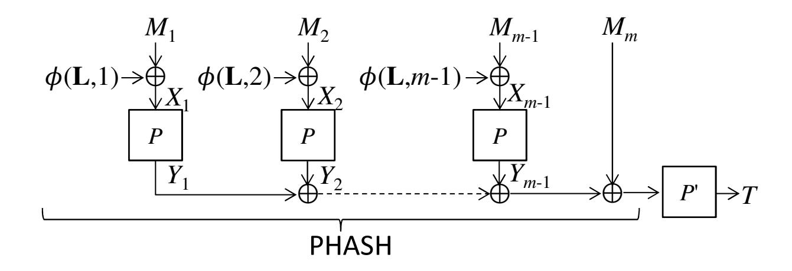
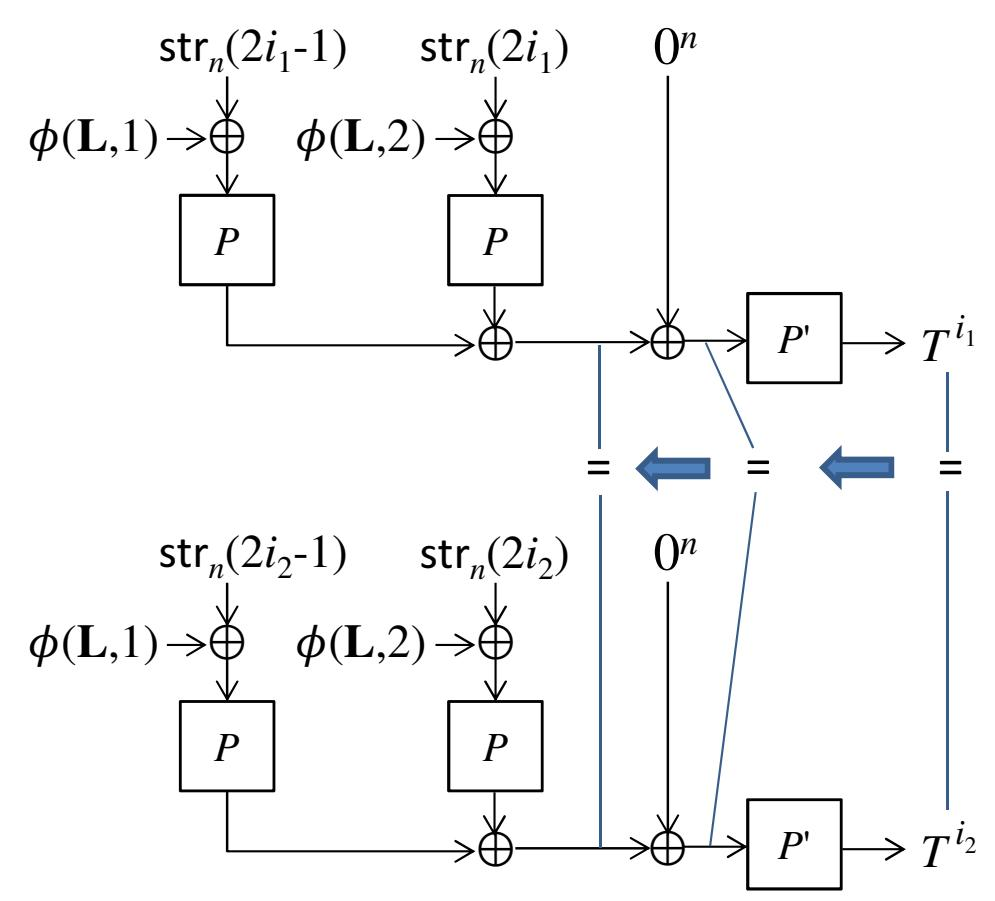
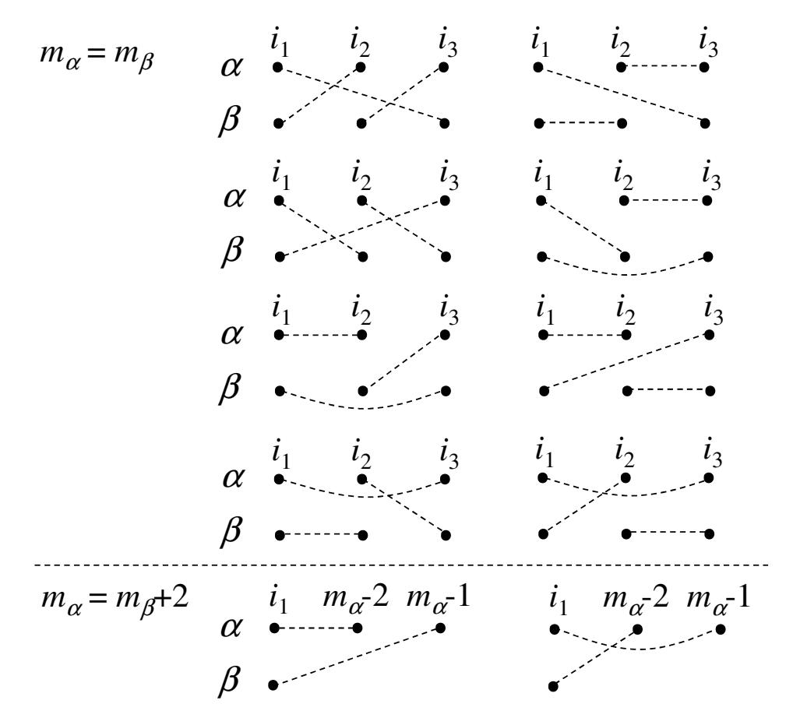

{0}------------------------------------------------

# **The Exact Security of PMAC with Three Powering-Up Masks**

### Yusuke Naito

Mitsubishi Electric Corporation, Kamakura, Kanagawa, Japan Naito.Yusuke@ce.MitsubishiElectric.co.jp

**Abstract.** PMAC is a rate-1, parallelizable, block-cipher-based message authentication code (MAC), proposed by Black and Rogaway (EUROCRYPT 2002). Improving the security bound is a main research topic for PMAC. In particular, showing a tight bound is the primary goal of the research, since Luykx et al.'s paper (EURO-CRYPT 2016). Regarding the pseudo-random-function (PRF) security of PMAC, a collision of the hash function, or the difference between a random permutation and a random function offers the lower bound Ω(*q* 2 */*2 *n* ) for *q* queries and the block cipher size *n*. Regarding the MAC security (unforgeability), a hash collision for MAC queries, or guessing a tag offers the lower bound Ω(*q* 2 *m/*2 *n* + *qv/*2 *n* ) for *qm* MAC queries and *qv* verification queries (forgery attempts). The tight upper bound of the PRF-security *O*(*q* 2 */*2 *n* ) of PMAC was given by Gaži et el. (ToSC 2017, Issue 1), but their proof requires a 4-wise independent masking scheme that uses 4 *n*-bit random values. Open problems from their work are: (1) find a masking scheme with three or less random values with which PMAC has the tight upper bound for PRFsecurity; (2) find a masking scheme with which PMAC has the tight upper bound for MAC-security.

In this paper, we consider PMAC with three powering-up masks that uses three random values for the masking scheme. We show that the PMAC has the tight upper bound *O*(*q* 2 */*2 *n* ) for PRF-security, which answers the open problem (1), and the tight upper bound *O*(*q* 2 *m/*2 *n* + *qv/*2 *n* ) for MAC-security, which answers the open problem (2). Note that these results deal with two-key PMAC, thus showing tight upper bounds of PMACs with single-key and/or with two (or one) powering-up masks are open problems.

**Keywords:** PMAC *·* powering-up *·* message-length influence *·* PRF-security *·* MACsecurity *·* tight security

### **Update**

This paper is an update version of our ToSC paper [Nai19] due to [Nan]. In the ToSC paper, we considered PMAC with two powering-up masks, and claimed that the PMAC has the tight security bounds *O*(*q* 2*/*2 *n*) for PRF-security and *O*(*q* 2 *m/*2 *n* +*qv/*2 *n*) for MACsecurity. However, Nandi et al. pointed out a bug of the proofs [Nan]. The detail of the bug is given in [CCJN20]. Hence, we change the masking scheme with three powering-up masks, and prove that the PMAC has the tight security bounds. Recently, Chakraborty, Chattopadhyay, Jha and Nandi [CCJN20] independently prove that PMAC with a 2-wise almost XOR universal hash function, which is a generalization of the three powering-up masks, achieves the tight PRF-security.

{1}------------------------------------------------

# 1 Introduction

A MAC (Message Authentication Code) is a fundamental symmetric-key primitive that produces a tag to authenticate a message. MACs are often realized by using a block cipher so that they become secure MACs (unforgeable under chosen message attacks) or secure PRFs (Pseudo-Random Functions) under the standard assumption that the underlying keyed block ciphers are secure PRPs (Pseudo-Random Permutations).

Block-cipher-based MACs are mainly categorized into CBC such as [BKR94, BR00, IK03, KI03, PR00] and PMAC such as [BR02, Rog04, GPR16]. PMAC was introduced by Black and Rogaway [BR02]. Although PMAC is slightly less efficient than the CBC MACs due to the masking scheme, unlike the CBC MACs, it allows to process the message blocks fully in parallel. Under parallel implementation, PMAC can outperform the CBC MACs.

For *n*-bit input message blocks  $M_1 || M_2 || \dots || M_m$ , the output of the hash function PHASH1, using keyed block ciphers P, P' over  $\{0, 1\}^n$ , r n-bit random values  $\mathbf{L} \in \{0, 1\}^{rn}$ , and a masking scheme  $\phi : \{0, 1\}^{rn} \times \mathbb{N} \to \{0, 1\}^n$ , is computed as

$$\mathsf{PHASH}[\mathbf{L}, P] \left( M_1 \| M_2 \| \dots \| M_m \right) = \left( \bigoplus_{i=1}^{m-1} P \left( \phi(\mathbf{L}, i) \oplus M_i \right) \right) \oplus M_m , \qquad (1)$$

and the output of PMAC is computed as

$$\mathsf{PMAC}[\mathbf{L}, P, P'] (M_1 || M_2 || \dots || M_m) = P' (\mathsf{PHASH}[\mathbf{L}, P] (M_1 || M_2 || \dots || M_m)) . \tag{2}$$

Figure 1 shows the PMAC construction. The masking scheme is realized by e.g., Gray code [BR02], the powering-up scheme [Rog04], LFSR-based schemes [CS08], or a combination of powering-up and LFSR [GJMN16]. Note that PMAC defined in (1) and (2) is a simplified version of the original PMACs [BR02, Rog04], and follows the definitions given in [LPSY16a, LPTY16]. The original versions are single-key MACs and the last keyed block cipher P' is realized by using P of which input is defined by XORing a last message block with a masking value differently from masking values in PHASH.

The PMAC schemes were designed to become secure PRFs (and thus secure MACs). As mentioned below, the upper bounds of the PRF-security have mainly been improved. In particular, showing a tight upper bound is the primary goal of the research, since Luykx et al.'s paper [LPSY16a, LPSY16b].

Regarding an upper bound of PMAC, the first PRF-security proof was given by Black and Rogaway [BR02], where the masking scheme is based on Gray code  $\phi(L,i) = \gamma_i \cdot L$  for the *i*-th Gray codeword  $\gamma_i$  and an *n*-bit random value L. The derived upper bound is  $O(\sigma^2/2^n)$  where  $\sigma$  is the total number of message blocks by all queries. Rogaway [Rog04] gave the same upper bound for PMAC with the powering-up scheme  $\phi(L,i) = 2^i \cdot L$  for an *n*-bit random value L, where the multiplication is done over  $GF(2^n)^*$ . Later, the security bounds were improved to  $O(m_{\text{max}}q^2/2^n)$  by Minematsu and Matsushima [MM07], and then to  $O(q\sigma/2^n)$  by Nandi [Nan10], for q queries and the maximum message block length  $m_{\text{max}}$ . Note that these proofs deal with the original PMACs.

The lower bound of the PRF-security of PMAC is  $\Omega(q^2/2^n)$  by a hash collision or by the difference between a random permutation and a random function. For the MAC-security, the lower bound is  $\Omega(q_m^2/2^n + q_v/2^n)$  for  $q_m$  MAC queries and  $q_v$  verification queries (forgery attempts). A hash collision for MAC queries offers the lower bound  $\Omega(q_m^2/2^n)$ , and guessing tags offers the one  $\Omega(q_v/2^n)$ . These lower bounds do not match the upper bounds mentioned above.

Gaži et al. [GPR16] filled the gap for the PRF-security of the Gray-code-based PMAC. They gave the lower bound  $\Omega(m_{\text{max}}q^2/2^n)$ , and showed that the lower bound holds even

&lt;sup>1 PHASH was named by Minematsu and Matsushima [MM07]. Whereas our definition includes the last message block in PHASH, the original definition does not include the last message block  $M_m$ .

{2}------------------------------------------------

with two Gray-code masks that use two n-bit random values.2 Thus, the existing upper bound of the PRF-security of the PMAC is tight. However, their result does not imply that the same lower bound holds for other masking schemes. They considered a 4-wise independent masking scheme that requires 4 n-bit secret random values, and proved that PMAC with the masking scheme has the tight upper bound  $O(q^2/2^n)$  regarding PRF-security, as long as  $m_{\text{max}} \leq 2^{n/2}$ , where two block cipher keys are independently drawn, i.e., P and P' are independent, and the last block is absent, i.e.,  $M_m = 0^n$ . Note that the PRF-security bound  $O(q^2/2^n)$  offers the MAC-security one  $O((q_m + q_v)^2/2^n)$ , but there is a gap between the lower and upper bounds.

### 1.1 Open Problems

Open problems from Gaži et al.'s work [GPR16] are listed below.

- The first open problem is to find a masking scheme with three or less random values with which PMAC has the tight upper bound  $O(q^2/2^n)$  regarding PRF-security.
- The second open problem is to find a masking scheme with which PMAC has the tight upper bound  $O(q_m^2/2^n + q_v/2^n)$  regarding MAC-security.

### 1.2 Our Results

In this paper, we consider PMAC with three powering-up masks, i.e., the masking scheme uses three *n*-bit random values  $\mathbf{L} = (L_1, L_2, L_3)$ . The masking scheme is defined as

$$\phi(\mathbf{L}, i) = 2^i \cdot L_1 \oplus 2^{2i} \cdot L_2 \oplus 2^{3i} \cdot L_3 \quad . \tag{3}$$

In Section 4, regarding PRF-security, we show that the PMAC has the tight upper bound  $O(q^2/2^n)$ , as long as  $m_{\text{max}} \leq 2^{n/2}$ , and P and P' are independent. Hence, the masking scheme ensures that three random values are sufficient for PMAC to achieve the  $O(q^2/2^n)$  PRF-security. The main difficulty of the proof is to show that the collision probability of PHASH is  $O(q^2/2^n)$ . In particular, we need to carefully analyze the influence of input collisions of P in PHASH. Using the structure of the masking scheme defined in (3), for distinct input messages to PHASH, the number of triples  $(L_1, L_2, L_3)$  offering the hash collision can be upper bounded by roughly  $2^{2n}$ . As  $(L_1, L_2, L_3) \in \{0,1\}^n \times \{0,1\}^n$ , the probability that the hash collision occurs from the input collisions is upper bounded by  $O(q^2/2^n)$ . Consequently, the tight upper bound is obtained.

In Section 5, regarding MAC-security, we show that the PMAC has the tight upper bound  $O(q_m^2/2^n+q_v/2^n)$ , as long as  $m_{\sf max} \leq 2^{n/2}$ , and P and P' are independent. As [CS16], our proof is based on the coefficient H technique [Pat08] and mainly considers the indistinguishability between the real oracles (PMAC and the verification oracle) and the ideal oracles (a random function and a reject oracle). Roughly speaking, for MAC queries, if no collision occurs for PHASH, then PMAC can be regarded as a random function. Using the hash collision analysis of the PRF-security of the PMAC, the collision probability is at most  $O(q_m^2/2^n)$ . Under the condition that PMAC behaves like a random function for MAC queries, there are two strategies of forging a tag. The first strategy is to use a hash collision between MAC and verification queries: when making a verification query with the tag obtained by the previous MAC query, if the hash collision occurs, then the verification query is accepted. The second strategy is to guess a tag randomly. The success probability of each strategy is  $O(q_v/2^n)$ . Thus, the tight upper bound is obtained.

Finally, open problems from our paper are listed below: (1) show a tight upper bounds of the PRF-security and/or of the MAC-security of PMAC of which masking scheme uses

Note that their result holds even when two block cipher keys are independently drawn, i.e., P and P' are independent.

{3}------------------------------------------------

two (or one) random values (the problem for the PRF-security of PMAC with one powering-up mask was posed by Luykx et al. [LPSY16a, LPSY16b]); (2) show a tight upper bounds of the PRF-security and/or of the MAC-security of single-key PMAC, i.e., P = P'.

### 1.3 Other Related Works

Several works show that by modifying the PMAC construction, the upper bound of the PRF-security is improved. PMAC with Parity [Yas12], PMACX [Zha15] and Light-MAC [LPTY16] achieve  $O(q^2/2^n)$  PRF-security. PMAC\_Plus [Yas11] and 2K-PMAC\_Plus [DDNP18] achieve  $O(m_{\mathsf{max}}^2 q^3/2^{2n})$  PRF-security. 1k-PMAC\_Plus [DDN+17] achieves  $O(q\sigma^2/2^{2n})$  PRF-security. LightMAC\_Plus [Nai17] achieves  $O(q^3/2^{2n})$  PRF-security. 2K-LightMAC\_Plus [DDNP18] achieves  $O(q^3/2^{2n}+q/2^n)$  PRF-security. Note that these MACs have different structures from PMAC defined in (1), (2).

Before Gaži et al.'s work [GPR16], Luykx et al. [LPSY16a, LPTY16] showed that for two distinct messages, the collision probability of the Gray-code-based PHASH depends on the message lengths. As the PRF-security of PMAC depends on the collision security of the hash collision, their result implies that the PMAC cannot achieve  $O(q^2/2^n)$  PRF-security.

### 1.4 Organization

The rest of the paper is organized as follows. In Section 2, the basic notations and the security definition are introduced. In Section 3, PMAC is defined, and the lower bounds of the PRF-security and of the MAC-security and the proofs are given. In Section 4, the tight upper bound of the PRF-security of the PMAC and the proof are given. In Section 5, the tight upper bound of the MAC-security of the PMAC and the proof are given. In Section 6, several modifications of the PMAC are discussed. Finally, in Section 7, the multi-user security of the PMAC is discussed (note that the previous sections consider the single-user security).

# 2 Preliminaries

### 2.1 Basic Notations

Let  $\lambda$  be an empty string and  $\{0,1\}^*$  the set of all bit strings. For an integer  $n \geq 0$ , let  $\{0,1\}^n$  the set of all n-bit strings,  $\{0,1\}^{n*}$  the set of all bit strings whose lengths are multiples of n, and  $0^n$  resp.  $1^n$  the bit string of n-bit zeroes resp. ones. For integers  $0 < j \leq i$ ,  $(i)_j = i(i-1) \cdots (i-j+1)$  denotes the falling factorial. For an integer  $i \geq 1$ , let  $[i] := \{1, 2, \ldots, i\}$ . For a non-empty set  $\mathcal{T}$ ,  $T \stackrel{\$}{\leftarrow} \mathcal{T}$  means that an element is chosen uniformly at random from  $\mathcal{T}$  and is assigned to T. The concatenation of two bit strings X and Y is written as X || Y or XY when no confusion is possible. For integers i and j with  $0 \leq i < 2^j$ , let  $\text{str}_j(i)$  be the j-bit binary representation of i. For sets  $\mathcal{X}$  and  $\mathcal{Y}$ ,  $\text{Perm}(\mathcal{X})$  denotes the set of all permutations on  $\mathcal{X}$ , and  $\text{Func}(\mathcal{X}, \mathcal{Y})$  denotes the set of all functions from  $\mathcal{X}$  to  $\mathcal{Y}$ .

### 2.2 Binary Fields

Let  $GF(2^n)$  be the field with  $2^n$  elements and  $GF(2^n)^*$  the multiplication subgroup of this field which contains  $2^n-1$  elements. We interchangeably think of an element a in  $GF(2^n)$  in any of the following ways: as an n-bit string  $a_{n-1}\cdots a_1a_0 \in \{0,1\}^n$  and as a formal polynomial  $a_{n-1}\mathbf{x}^{n-1}+\cdots+a_1\mathbf{x}+a_0\in GF(2^n)$ . Hence we need to fix a primitive polynomial  $a(\mathbf{x})=\mathbf{x}^n+a_{n-1}\mathbf{x}^{n-1}+\cdots+a_1\mathbf{x}+a_0$ . This paper uses a primitive polynomial with the property that the element  $2=\mathbf{x}$  generates the entire multiplication

{4}------------------------------------------------

group *GF*(2*n*) *∗* of order 2 *n−*1. Examples of primitive polynomials for *n* = 64 and *n* = 128 are *a*(x) = x 64 + x 4 + x 3 + x + 1 and *a*(x) = x 128 + x 7 + x 2 + x + 1.

# **2.3 Definition for Block Cipher**

A block cipher is a set of permutations indexed by a key. Let a non-empty set *K* be a key space and an integer *n* the input/output-block size. A block cipher is denoted by *E* : *K × {*0*,* 1*} n → {*0*,* 1*} n*, and a block cipher *E* having a key *K ∈ K* is denoted by *EK*.

In our security proofs, keyed block ciphers are assumed to be secure pseudo-random permutations (PRPs). In the PRP-security game, an adversary **A** has access to either the keyed block cipher *EK* for *K* \$*←− K* or a random permutation *P* \$ *←−* Perm(*{*0*,* 1*} n*), and returns a decision bit *y ∈ {*0*,* 1*}* after the interaction. An output of **A** with access to *O* is denoted by **A***O*. The PRP-security advantage function of **A** is defined as

$$\mathbf{Adv}^{\mathsf{prp}}_{E_K}(\mathbf{A}) := \Pr\left[K \xleftarrow{\$} \mathcal{K}; \mathbf{A}^{E_K} = 1\right] - \Pr\left[P \xleftarrow{\$} \mathsf{Perm}(\{0,1\}^n); \mathbf{A}^P = 1\right],$$

where the probabilities are taken over *K, P* and **A**. The maximum over all adversaries that run in time at most *t* and make at most *σ* queries is denoted by

$$\mathbf{Adv}_{E_K}^{\mathsf{prp}}(\sigma,t) := \max_{\mathbf{A}} \mathbf{Adv}_{E_K}^{\mathsf{prp}}(\mathbf{A})$$
 .

# **2.4 Definition for MAC**

Let *F* : *K × X → {*0*,* 1*} n* be a MAC function for an integer *n >* 0, a key space *K* and an input space *X* . The MAC function having a key *K ∈ K* is denoted by *FK*.

### **2.4.1 PRF-Security**

In the pseudo-random function (PRF) security game of *FK*, an adversary **A** has access to either *FK* for *K* \$*←− K* or a random function *R* \$ *←−* Func(*X , {*0*,* 1*} n*), and returns a decision bit *y ∈ {*0*,* 1*}* after the interaction. An output of **A** with access to *O* is denoted by **A***O*. The PRF-security advantage function of **A** is defined as

$$\mathbf{Adv}^{\mathsf{prf}}_{F_K}(\mathbf{A}) := \Pr\left[K \xleftarrow{\$} \mathcal{K}; \mathbf{A}^{F_K} = 1\right] - \Pr\left[\mathcal{R} \xleftarrow{\$} \mathsf{Func}(\mathcal{X}, \{0,1\}^\tau); \mathbf{A}^{\mathcal{R}} = 1\right] \ ,$$

where the probabilities are taken over *K, R* and **A**. The maximum over all adversaries that run in time at most *t* and make at most *q* queries of each message length at most *m*max blocks is denoted by

$$\mathbf{Adv}^{\mathsf{prf}}_{F_K}((q,m_{\mathsf{max}}),t) := \max_{\mathbf{A}} \mathbf{Adv}^{\mathsf{prf}}_{F_K}(\mathbf{A})$$
.

#### **2.4.2 MAC-Security**

The MAC-security of *FK* is defined in terms of unforgeability under a chosen-message attack. In the MAC-security game, an adversary **A** has access to *FK* for *K* \$*←− K* and the verification function Verif[*FK*], where for a query (*M, T*) *∈ X × {*0*,* 1*} n* to Verif[*FK*], Verif[*FK*](*M, T*) = accept if *FK*(*M*) = *T*, and Verif[*FK*](*M, T*) = reject otherwise. We call a query to *FK* "a MAC query" and a query to Verif[*FK*] "a verification query." The MAC-security advantage function of **A** is defined as

$$\mathbf{Adv}^{\mathsf{mac}}_{F_K}(\mathbf{A}) := \Pr\left[K \stackrel{\$}{\leftarrow} \mathcal{K}; \mathbf{A}^{F_K,\mathsf{Verif}[F_K]} \text{ forges}\right] ,$$

{5}------------------------------------------------

where the probabilities are taken over P and A. "A forges" means that A makes a verification query (M,T) such that the message M has not been made by the previous MAC queries and accept is returned. The maximum over all adversaries that run in time at most t, and make at most t maximum over all adversaries of each message length at most t maximum over all adversaries of each message length at most t maximum over all adversaries of each message length at most t maximum over all adversaries of each message length at most t maximum over all adversaries of each message length at most t maximum over all adversaries of each message length at most t maximum over all adversaries of each message length at most t maximum over all adversaries of each message length at most t maximum over all adversaries of each message length at most t maximum over all adversaries of each message length at most t maximum over all adversaries of each message length at most t maximum over all adversaries of each message length at most t maximum over all adversaries of each message length at most t maximum over all adversaries of each message length at most t maximum over all adversaries of each message length at most t maximum over all adversaries of each message length at most t maximum over all adversaries of each message length at most t maximum over all adversaries of each message length at most t maximum over all adversaries of each message length at most t maximum over all adversaries of each message length at most t maximum over all adversaries of each message length at most t maximum over all adversaries of each message length at most t maximum over all adversaries of each message length at most t maximum over all adversaries of each message length at most t maximum over all adversaries of each message length at most t maximum over all adversaries of each message t maximum over all adversaries of each message t maximum over all adversaries of each message t maxim

$$\mathbf{Adv}_{F_K}^{\mathsf{mac}}((q_m, q_v, m_{\mathsf{max}}), t) := \max_{\mathbf{A}} \mathbf{Adv}_{F_K}^{\mathsf{mac}}(\mathbf{A}) .$$

Note that

$$\mathbf{Adv}^{\mathsf{mac}}_{F_K}((q_m, q_v, m_{\mathsf{max}}), t) \leq \mathbf{Adv}^{\mathsf{prf}}_{F_K}((q, m_{\mathsf{max}}), t') + \frac{q_v}{2^n} ,$$

where  $q = q_m + q_v$  and  $t' = t + O(\sigma)$  for  $\sigma$  the total number of message lengths in blocks by all queries.

## 2.5 Collision Security

Consider the collision security of a keyed hash function  $H: \mathcal{K} \times \mathcal{X} \to \{0,1\}^n$  with a key space  $\mathcal{K}$ , an input space  $\mathcal{X}$ , and an output length n > 0. The keyed function is denoted by  $H_K$  for a key  $K \in \mathcal{K}$ . The advantage function of the collision security of  $H_K$  is defined as

$$\mathbf{Adv}^{\mathsf{coll}}_{H_{K}}(q, m_{\mathsf{max}}) := \max_{M^{1}, \dots, M^{q}} \Pr\left[K \xleftarrow{\$} \mathcal{K}; \exists i, j \text{ s.t. } i \neq j \text{ and } H_{K}\left(M^{i}\right) = H_{K}\left(M^{j}\right)\right] ,$$

where the maximum goes over all q tuples of distinct messages of each message length at most  $m_{\sf max}$  blocks.

# 3 PMAC with Three Powering-Up Masks

Let r be the number of n-bit random values used in a masking scheme and  $\phi: \{0,1\}^{nr} \times \mathbb{N} \to \{0,1\}^n$  a masking scheme in PMAC. For random values  $\mathbf{L} \in \{0,1\}^{nr}$  and a keyed block cipher  $E_K: \{0,1\}^n \to \{0,1\}^n$ , we define  $\mathsf{PHASH}[\mathbf{L}, E_K]: \{0,1\}^{n*} \to \{0,1\}^n$  the hash function of PMAC as

$$\mathsf{PHASH}[\mathbf{L}, E_K] \left( M_1 \| M_2 \| \cdots \| M_m \right) = \left( \bigoplus_{i=1}^{m-1} E_K \left( \phi(\mathbf{L}, i) \oplus M_i \right) \right) \oplus M_m \ ,$$

where the length of each message block  $M_i$  is n bits. In the following analysis, the i-th input and output of  $E_K$  are denoted by

$$X_i = \phi(\mathbf{L}, i) \oplus M_i$$
, and  $Y_i = E_K(X_i)$ .

 $\mathsf{PMAC}[\mathbf{L}, E_K, E_{K'}] : \{0,1\}^{n*} \to \{0,1\}^n$  is derived from  $\mathsf{PHASH}$  by additionally encrypting the hash value using a keyed block cipher  $E_{K'}$ :

$$\mathsf{PMAC}[\mathbf{L}, E_K, E_{K'}](M) = E_{K'}\left(\mathsf{PHASH}[\mathbf{L}, E_K](M)\right)$$
.

Figure 1 shows the PMAC construction.

In this paper, we mainly analyze the security of PMAC where K and K' are independently drawn, and a masking scheme with three powering-up masks is used: r = 3,  $\mathbf{L} = (L_1, L_2, L_3) \stackrel{\$}{\leftarrow} \{0, 1\}^{3n}$ , and, the masking scheme is defined as

$$\phi(\mathbf{L}, i) = 2^i \cdot L_1 \oplus 2^{2i} \cdot L_2 \oplus 2^{3i} \cdot L_3 \quad . \tag{4}$$

{6}------------------------------------------------

**Figure 1:** PMAC. *P* := *EK* and *P ′* := *EK′* .

The well known attacks on PMAC (more generally, hash-then-encrypt-type MACs) use a hash collision [PvO95]. Precisely, a collision of PHASH implies a collision of PMAC, which offers a distinguishing attack and a forgery. Thus, the attack offers the upper bounds of the PRF-security Ω(*q* 2*/*2 *n*) for *q* queries, and of the MAC-security Ω(*q* 2 *m/*2 *n* + *qv/*2 *n*) for *qm* MAC queries and *qv* verification queries. Another distinguishing attack is to use the difference between a random permutation and a random function, which offers the lower bound of the PRF-security Ω(*q* 2*/*2 *n*). Another forgery is to guess a tag, which offers the lower bound Ω(*qv/*2 *n*). These attacks are existing ones, but for the sake of completeness, these attacks are given in Sections 3.1 (PRF-security) and 3.2 (MAC-security). Note that these attacks are not new.

On the other hand, proving the tight upper bounds of PMAC with the masking scheme (4) is non-trivial. In Section 4, we give the tight upper bound *O*(*q* 2*/*2 *n*) regarding the PRF-security of the PMAC. In Section 5, we give the tight upper bound *O*(*q* 2 *m/*2 *n* + *qv/*2 *n*) regarding the MAC-security of the PMAC.

### **3.1 Lower Bound of the PRF-Security of PMAC**

The lower bound of the PRF-security of PMAC is given in the following theorem, where the underlying block ciphers *EK, EK′* are assumed to be random permutations *P* \$ *←−* Perm(*{*0*,* 1*} n*), *P ′* \$ *←−* Perm(*{*0*,* 1*} n*).

**Theorem 1.** *There exists an adversary* **A** *making q queries such that*

$$\mathbf{Adv}^{\mathsf{prf}}_{\mathsf{PMAC}[\mathbf{L},P,P']}(\mathbf{A}) \geq \Omega\left(\frac{q^2}{2^n}\right) \ .$$

*Proof.* **(PRF-attack 1)** Let *O* be either PMAC[**L***, P, P′* ] or a random function *R*, where *P* \$ *←−* Perm(*{*0*,* 1*} n*), *P ′* \$ *←−* Perm(*{*0*,* 1*} n*), and *R* \$ *←−* Func(*{*0*,* 1*} n*). A PRF adversary that uses a collision of PHASH is defined below.

- 1. For *i* = 1*, . . . , q −* 2, make a query *Mi* = str*n*(2*i −* 1)*∥*str*n*(2*i*)*∥*0 *n* and receive the response *T i* = *O*(*Mi* ).
- 2. If *∃i*1*, i*2 *∈* [*q −* 2] s.t. *i*1 *̸*= *i*2 *∧ T i*1 = *T i*2 , then
  - (a) make queries *M′* = str*n*(2*i*1*−*1)*∥*str*n*(2*i*1)*∥*1 *n* and *M∗* = str*n*(2*i*2*−*1)*∥*str*n*(2*i*2)*∥*1 *n*, and receive the responses *T ′* = *O*(*M′* ) and *T ∗* = *O*(*M∗* ).
  - (b) If *T ′* = *T ∗* , then return 1.
- 3. Return 0.

{7}------------------------------------------------

Figure 2: An internal state collision from a tag collision.

If  $\mathcal{O} = \mathsf{PMAC}[\mathbf{L}, P, P']$ , then as shown Figure 2, the tag collision at the step 2 offers the internal state (hash) collision occurs. Thus, even when modifying the last blocks as  $0^n \to 1^n$  at the step (2a), the collision occurs, and the probability that the adversary returns 1 at the step (2b) is 1. On the other hand, if  $\mathcal{O} = \mathcal{R}$ , the probability that the adversary returns 1 at the step (2b) is negligible. By the birthday analysis, the collision probability is  $\Omega(q^2/2^n)$ , and thus the lower bound in Theorem 1 is obtained.

(PRF-attack 2) Next, an adversary using the difference between P' and  $\mathcal{R}$  is defined below.

- 1. For i = 1, ..., q, make a query str(i) to  $\mathcal{O}$ , and receive the response  $T^i = \mathcal{O}(str(i))$ .
- 2. If  $\exists i_1, i_2 \in [q]$  s.t.  $T^{i_1} = T^{i_2}$ , then return 0.
- 3. Otherwise return 1.

As the messages are all one block and all distinct, if  $\mathcal{O} = \mathsf{PMAC}[\mathbf{L}, P, P']$ , then **A** returns 1. On the other hand, if  $\mathcal{O} = \mathcal{R}$ , then an output collision occurs with probability  $\Omega(q^2/2^n)$  by the birthday analysis. Thus, the lower bound in Theorem 1 is obtained.

### 3.2 Lower Bound of the MAC-Security of PMAC

The lower bound of the MAC-security of PMAC is given in the following theorem, where the underlying keyed block ciphers  $E_K, E_{K'}$  are assumed to be random permutations  $P \stackrel{\$}{\leftarrow} \mathsf{Perm}(\{0,1\}^n), P' \stackrel{\$}{\leftarrow} \mathsf{Perm}(\{0,1\}^n).$ 

Theorem 2. There exists an adversary A making q queries such that

$$\mathbf{Adv}^{\mathsf{mac}}_{\mathsf{PMAC}[\mathbf{L},P,P']}(\mathbf{A}) \geq \Omega\left(\frac{q_m^2}{2^n} + \frac{q_v}{2^n}\right)$$
 .

*Proof.* (MAC-attack 1) The first term  $q_m^2/2^n$  is obtained by using a collision of PHASH, as the proof of Theorem 1. The adversarial procedure is given below.

{8}------------------------------------------------

1. For i = 1, ..., q - 2, make a MAC queries  $M^i = \mathsf{str}_n(2i - 1) \| \mathsf{str}_n(2i) \| 0^n$  and receive the response  $T^i = \mathsf{PMAC}[\mathbf{L}, P, P'](\mathsf{str}_n(2i - 1) \| \mathsf{str}_n(2i) \| 0^n)$ .

- 2. If  $\exists i_1, i_2 \in [q-2]$  s.t.  $T^{i_1} = T^{i_2}$ , then
  - (a) make a MAC queries  $M' = \mathsf{str}_n(2i_1 1) \| \mathsf{str}_n(2i_1) \| 1^n$ , receive the response T, and
  - (b) define  $M^* = \mathsf{str}_n(2i_2 1) \|\mathsf{str}_n(2i_2)\| 1^n$  and make a verification query  $(M^*, T)$ .

If a hash collision occurs at the step 2, the tag collision occurs  $\mathsf{PMAC}[\mathbf{L}, P, P'](M') = \mathsf{PMAC}[\mathbf{L}, P, P'](M^*)$ . Hence, at the step (2b), accept is returned, even when modifying the last block as  $0^n \to 1^n$ . By the birthday analysis, the collision probability is  $\Omega(q_m^2/2^n)$ . Thus, the first term is obtained.

(MAC-attack 2) The second term  $q_v/2^n$  is obtained from an adversary that makes verification queries whose tags are chosen uniformly at random from  $\{0,1\}^n$ .

(MAC-attack 3) The second term  $q_v/2^n$  is also obtained from a hash collision between MAC and verification queries: firstly, an adversary makes a MAC query  $M^*$  and obtains the response  $T^*$ ; secondly, makes verification queries  $(\hat{M}^1, T^*), \ldots, (\hat{M}^{q_v}, T^*)$ . If for some i the hash collision PHASH[ $\mathbf{L}, P$ ]( $M^*$ ) = PHASH[ $\mathbf{L}, P$ ]( $\hat{M}^i$ ) occurs, then PMAC[ $\mathbf{L}, P, P'$ ]( $\hat{M}^i$ ) =  $T^*$ , and thus the i-th response is accept. The collision probability is  $\Omega(q_v/2^n)$ , and thus the second term is obtained.

# 4 PRF-Security of PMAC with Three Powering-Up Masks

Regarding the PRF-security of PMAC where the masking scheme is defined in (4) and K, K' are independently drawn, we give the tight upper bound  $O(q^2/2^n)$  for q queries.

**Theorem 3.** Assume that  $4 \le n$ , and the maximum length in blocks  $m_{\text{max}}$  is at most  $2^{n/2}$ . Then, we have

$$\mathbf{Adv}^{\mathsf{prf}}_{\mathsf{PMAC}[\mathbf{L},E_K,E_{K'}]}((q,m_{\mathsf{max}}),t) \leq \frac{3.5q^2}{2^n} + 2 \cdot \mathbf{Adv}^{\mathsf{prp}}_E(\sigma,t') \ ,$$

where  $t' = t + O(\sigma)$  for  $\sigma$  the total number of message blocks by all queries.

# 4.1 The High-Level Structure of the Security Proof

The high-level structure of the proof is given below, which is based on the existing proof of PMAC given in [GPR16].

#### 4.1.1 The PRF-Security from the Collision Security

Firstly, the underlying keyed block ciphers  $E_K, E_{K'}$  are replaced with random permutations  $P \stackrel{\$}{\leftarrow} \operatorname{Perm}(\{0,1\}^n), P' \stackrel{\$}{\leftarrow} \operatorname{Perm}(\{0,1\}^n)$ , respectively. The replacement introduces the PRP-advantages of the keyed block ciphers. Secondly, a random permutation P' is replaced with a random function g. By the PRP-PRF switch, the replacement introduces the term  $q^2/2^{n+1}$ . Thirdly, the PRF-security of the resultant MAC  $g \circ \operatorname{PHASH}[\mathbf{L}, P]$  is considered. As the MAC returns fresh random values as long as no hash collision occurs, the PRF-security of the MAC is reduced to the collision security of PHASH[ $\mathbf{L}, P$ ]. Putting these steps together offers the following lemma which is given in Lemma 1 in [GPR16] (and also given in several papers).

{9}------------------------------------------------

#### Lemma 1.

$$\mathbf{Adv}^{\mathrm{prf}}_{\mathrm{PMAC}[\mathbf{L},E_K,E_{K'}]}((q,m_{\mathrm{max}}),t) \leq \mathbf{Adv}^{\mathrm{coll}}_{\mathrm{PHASH}[\mathbf{L},P]}(q,m_{\mathrm{max}}) + \frac{q^2}{2^{n+1}} + 2 \cdot \mathbf{Adv}^{\mathrm{prp}}_E(\sigma,t') \enspace ,$$

where  $t' = t + O(\sigma)$  for  $\sigma$  the total number of message blocks by all queries.

The collision advantage  $\mathbf{Adv}^{\mathsf{coll}}_{\mathsf{PHASH}[\mathbf{L},P]}(q,m_{\mathsf{max}})$  is upper bounded by summing the collision probabilities of any two messages. Thus, the following lemma is satisfied.

#### Lemma 2.

$$\mathbf{Adv}^{\mathrm{coll}}_{\mathsf{PHASH}[\mathbf{L},P]}(q,m_{\mathsf{max}}) \leq \binom{q}{2} \cdot \mathbf{Adv}^{\mathsf{coll}}_{\mathsf{PHASH}[\mathbf{L},P]}(2,m_{\mathsf{max}}) \ .$$

# 4.1.2 Analysis of the Collision Advantage $\mathrm{Adv}^{\mathsf{coll}}_{\mathsf{PHASH}[\mathtt{L},P]}(2,m_{\mathsf{max}})$

The collision advantage  $\mathbf{Adv}^{\mathsf{coll}}_{\mathsf{PHASH}[\mathbf{L},P]}(2,m_{\mathsf{max}})$ , which is equal to the following probability, is considered:

$$\max_{M^{\alpha} \neq M^{\beta}} \Pr \left[ \mathbf{L} \xleftarrow{\$} \{0,1\}^{3n}, P \xleftarrow{\$} \mathsf{Perm}(\{0,1\}^n); \mathsf{PHASH}[\mathbf{L},P] \left( M^{\alpha} \right) = \mathsf{PHASH}[\mathbf{L},P] \left( M^{\beta} \right) \right] \ .$$

#### **Outline**

In order to upper bound the probability, two events are considered. The first event  $E_1$  is that some output of P is not trivially canceled out. The second event  $E_2$  is that all outputs of P are trivially canceled out. The analysis for  $E_1$  is not new, whereas the one for  $E_2$  is new.

- For the hash collision with the event  $E_1$ , the randomness of an output, which is not trivially canceled out, can be used, and thus the collision probability is upper bounded by  $O(1/2^n)$  (as the output is chosen uniformly at random from roughly  $2^n$  values).
- For the hash collision with the event  $E_2$ , we need to analyze the collision probability for inputs to P. The analysis uses the structure of the masking scheme defined in (4). We show that the collision probability is upper bounded by  $O(1/2^n)$ .

#### **Detail**

For two distinct messages  $M^{\alpha}, M^{\beta}$ , without loss of generality, assume that  $|M^{\alpha}| \geq |M^{\beta}|$ . For  $\gamma \in \{\alpha, \beta\}$ , let  $m_{\gamma}$  be the block length of  $M^{\gamma}$ , and variables/values corresponding with  $M^{\gamma}$  are denoted by using the superscript character of  $\gamma$  such as  $X_{i}^{\gamma}, Y_{i}^{\gamma}$ , etc. Regarding  $X_{i}^{\beta}$  and  $Y_{i}^{\beta}$ , if  $m_{\beta} < i$ , then  $X_{i}^{\beta} := \lambda$  and  $Y_{i}^{\beta} := \lambda$ . Let

$$I_1^{\neq}(M^{\alpha}, M^{\beta}) := \left\{ i \in [m_{\alpha} - 1] \middle| X_i^{\alpha} \neq X_i^{\beta} \right\} ,$$

$$I_2^{\neq}(M^{\alpha}, M^{\beta}) := \left\{ (i, \gamma) \in I_1^{\neq}(M^{\alpha}, M^{\beta}) \times \{\alpha, \beta\} \middle| X_i^{\gamma} \neq \lambda \right\} .$$

Note that the above sets depend only on  $M^{\alpha}$ ,  $M^{\beta}$  and do not depend on random values  $\mathbf{L}$ . Let  $\mathcal{Y} := \{Y_i^{\gamma} | (i, \gamma) \in I_2^{\neq}(M^{\alpha}, M^{\beta})\}$  be the multiset of outputs of P that are not trivially canceled out.

{10}------------------------------------------------

$$\begin{array}{cccccccccccccccccccccccccccccccccccc$$

**Figure 3:** Graphical representation of inputs to P.

The hash collision has the form of

$$\mathsf{PHASH}[\mathbf{L},P](M^\alpha) = \mathsf{PHASH}[\mathbf{L},P](M^\beta) \Leftrightarrow \bigoplus_{i=1}^{m_\alpha-1} Y_i^\alpha \oplus \bigoplus_{i=1}^{m_\beta-1} Y_i^\beta = M_{m_\alpha}^\alpha \oplus M_{m_\beta}^\beta \\ \Leftrightarrow \bigoplus_{Y \in \mathcal{Y}} Y = \underbrace{M_{m_\alpha}^\alpha \oplus M_{m_\beta}^\beta}_{=:B}.$$

A=B is satisfied if one of the following events occurs.

- $E_1$ :  $\mathcal{Y}$  includes an odd multiplicity element.
- $E_2$ :  $\mathcal{Y}$  includes only even multiplicity elements.

We then have

$$\mathbf{Adv}^{\mathrm{coll}}_{\mathsf{PHASH}[\mathbf{L},P]}(2,m_{\mathsf{max}}) = \underbrace{\max_{M^{\alpha} \neq M^{\beta}} \Pr\left[\mathbf{L} \xleftarrow{\$} \{0,1\}^{3n}, P \xleftarrow{\$} \mathsf{Perm}(\{0,1\}^{n}); A = B \land E_{1}\right]}_{=:p_{\mathrm{coll}}^{1}} + \underbrace{\max_{M^{\alpha} \neq M^{\beta}} \Pr\left[\mathbf{L} \xleftarrow{\$} \{0,1\}^{3n}, P \xleftarrow{\$} \mathsf{Perm}(\{0,1\}^{n}); A = B \land E_{2}\right]}_{=:p_{\mathrm{coll}}^{2}}.$$

Regarding  $p_{\text{coll}}^1$ , under the event  $E_1$ , some output  $Y \in \mathcal{Y}$  used in A is not canceled out, and thus the number of possibilities of A is at least  $2^n - (m_\alpha + m_\beta)$ . Hence, we have

$$\begin{split} p_{\text{coll}}^1 &\leq \max_{M^{\alpha} \neq M^{\beta}} \Pr\left[\mathbf{L} \xleftarrow{\$} \{0,1\}^{3n}, P \xleftarrow{\$} \text{Perm}(\{0,1\}^n); A = B \middle| E_1 \right] \\ &\leq \frac{1}{2^n - (m_{\alpha} + m_{\beta})} \leq \frac{1}{2^n - 2m_{\text{max}}} \leq \frac{2}{2^n} \ , \end{split}$$

as  $m_{\text{max}} \leq 2^{n-2}$  from the assumption.

Regarding  $p_{\text{coll}}^2$ , the analysis is given in Section 4.2. The upper bound is  $4/2^n$  given in Equation (6).

Hence, we have

$$\mathbf{Adv}_{\mathsf{PHASH}[\mathbf{L},P]}^{\mathsf{coll}}(2, m_{\mathsf{max}}) = p_{\mathsf{coll}}^1 + p_{\mathsf{coll}}^2 \le \frac{6}{2^n} \ . \tag{5}$$

#### 4.1.3 Conclusion of the Proof

The upper bound in Theorem 3 is obtained by putting Lemmas 1, 2 and the upper bound (5) together.

# 4.2 Upper Bounding $p_{\mathrm{coll}}^2$

The probability  $p_{\text{coll}}^2$  is upper bounded, where  $|M^{\alpha}| \geq |M^{\beta}|$  (assumed above). In this analysis, inputs are graphically depicted. Figure 3 is an example for inputs with  $m_{\alpha} = 5$ ,

{11}------------------------------------------------

$$m_{\alpha} = m_{\beta}$$

$$\alpha \bullet \bullet \bullet$$

$$\beta \bullet \bullet$$

$$m_{\alpha} = m_{\beta} + 1$$

$$\alpha \bullet \bullet \bullet$$

$$\beta \bullet$$

$$\beta \bullet$$

$$\beta \bullet$$

$$m_{\alpha} = m_{\beta} + 2$$

$$\alpha \bullet \bullet \bullet$$

$$\alpha \bullet \bullet$$

$$\alpha \bullet \bullet$$

$$\alpha \bullet \bullet$$

$$\alpha \bullet \bullet$$

$$\beta \bullet$$

**Figure 4:** Inputs from the type-3 messages. Inputs that are not in  $\mathcal{Y}$  are omitted.

$$\begin{array}{cccccccccccccccccccccccccccccccccccc$$

**Figure 5:** Collision patterns for the type-3 messages. The dot lines represent input collisions. Inputs that are not in  $\mathcal{Y}$  are omitted.

 $m_{\beta}=3,\ I_{2}^{\neq}(M^{\alpha},M^{\beta})=\{(2,\alpha),(4,\alpha),(5,\alpha),(2,\beta)\}: \ \text{for}\ \gamma\in\{\alpha,\beta\}, i\in[5],\ \text{a dot at a row with }\gamma \ \text{and an }i\text{-th column represents}\ X_{i}^{\gamma}.$  Dots connected with each other (1st, 3rd columns in Figure 3) are inputs that are trivially canceled out.

Let

$$\mathcal{L} := \left\{ (L_1, L_2, L_3) \in \{0, 1\}^{3n} \middle| (A = B) \land E_2 \right\}$$

be the set of triples  $(L_1, L_2, L_3)$  that offer hash collisions and satisfy the event  $E_2$ . As  $(L_1, L_2, L_2) \in \{0, 1\}^{3n}$ ,

$$p_{\text{coll}}^2 \le \frac{|\mathcal{L}|}{2^{3n}}$$
.

The following analyses show that  $|\mathcal{L}| \leq 4 \cdot 2^{2n}$ , and thus we have

$$p_{\text{coll}}^2 \le \frac{4 \cdot 2^{2n}}{2^{3n}} = \frac{4}{2^n} \ . \tag{6}$$

**Type-1:**  $|I_1^{\neq}(M^{\alpha}, M^{\beta})| = 0$ . For the type-1 messages, the event  $E_2$  occurs. However, as  $M^{\alpha} \neq M^{\beta}$ ,  $M_{m_{\alpha}}^{\alpha} \neq M_{m_{\beta}}^{\beta}$ , i.e.,  $B \neq 0$  is satisfied. Thus, we have  $|\mathcal{L}| = 0$ .

**Type-2:**  $|I_1^{\neq}(M^{\alpha}, M^{\beta})| = 1$ . For the type-2 messages,  $\mathcal{Y}$  includes odd multiplicity elements only, where  $\mathcal{Y} = \{Y_i^{\alpha}, Y_i^{\beta}\}$  when  $I_1^{\neq}(M^{\alpha}, M^{\beta}) = \{i\}$ . Thus, we have  $|\mathcal{L}| = 0$ .

**Type-3:**  $|I_1^{\neq}(M^{\alpha}, M^{\beta})| = 2$ . Let  $I_1^{\neq}(M^{\alpha}, M^{\beta}) = \{i_1, i_2\}$  with  $i_1 < i_2$ . There are three cases:  $m_{\alpha} = m_{\beta}$ ,  $m_{\alpha} = m_{\beta} + 1$ , and  $m_{\alpha} = m_{\beta} + 2$ . Figure 4 shows these cases. If  $m_{\alpha} = m_{\beta} + 1$  then  $\mathcal{Y}$  includes an odd multiplicity element. Thus, the remaining cases  $m_{\alpha} = m_{\beta}$  and  $m_{\alpha} = m_{\beta} + 2$  are considered.

The first case  $(m_{\alpha} = m_{\beta})$  is considered. In this case, either  $X_{i_1}^{\alpha} = X_{i_2}^{\alpha}$  or  $X_{i_1}^{\alpha} = X_{i_2}^{\beta}$  occurs if  $E_2$  occurs. Figure 5 shows collision patterns for the messages. For  $\gamma \in \{\alpha, \beta\}$ ,

$$X_{i_1}^{\alpha} = X_{i_2}^{\gamma} \Leftrightarrow 2^{i_1} \cdot L_1 \oplus 2^{i_2} \cdot L_2 \oplus 2^{3i_1} \cdot L_3 \oplus M_{i_1}^{\alpha} = 2^{i_2} \cdot L_1 \oplus 2^{2i_2} \cdot L_2 \oplus 2^{3i_2} \cdot L_3 \oplus M_{i_2}^{\gamma}$$
$$\Leftrightarrow (2^{i_1} \oplus 2^{i_2}) \cdot L_1 \oplus (2^{2i_1} \oplus 2^{2i_2}) \cdot L_2 \oplus (2^{3i_1} \oplus 2^{3i_2}) \cdot L_3 = M_{i_1}^{\alpha} \oplus M_{i_2}^{\gamma}.$$

{12}------------------------------------------------

$$m_{\alpha} = m_{\beta}$$

$$\beta \quad \bullet \quad \bullet$$

$$m_{\alpha} = m_{\beta} + 1$$

$$\alpha \quad \bullet \quad \bullet$$

$$\beta \quad \bullet \quad \bullet$$

$$\beta \quad \bullet \quad \bullet$$

$$\beta \quad \bullet \quad \bullet$$

$$\beta \quad \bullet \quad \bullet$$

$$\beta \quad \bullet \quad \bullet$$

$$\beta \quad \bullet \quad \bullet$$

$$\alpha \quad \bullet \quad \bullet$$

$$\alpha \quad \bullet \quad \bullet$$

$$\alpha \quad \bullet \quad \bullet$$

$$\beta \quad \bullet$$

$$\alpha \quad \bullet \quad \bullet$$

$$\beta \quad \bullet$$

$$\alpha \quad \bullet \quad \bullet$$

$$\alpha \quad \bullet \quad \bullet$$

$$\alpha \quad \bullet \quad \bullet$$

$$\alpha \quad \bullet \quad \bullet$$

$$\alpha \quad \bullet \quad \bullet$$

$$\beta \quad \bullet$$

$$\alpha \quad \bullet \quad \bullet$$

$$\beta \quad \bullet$$

$$\alpha \quad \bullet \quad \bullet$$

$$\beta \quad \bullet$$

$$\alpha \quad \bullet \quad \bullet$$

$$\beta \quad \bullet$$

$$\alpha \quad \bullet \quad \bullet$$

$$\beta \quad \bullet$$

$$\alpha \quad \bullet \quad \bullet$$

$$\beta \quad \bullet$$

$$\alpha \quad \bullet \quad \bullet$$

$$\beta \quad \bullet$$

$$\alpha \quad \bullet \quad \bullet$$

$$\beta \quad \bullet$$

$$\alpha \quad \bullet \quad \bullet$$

$$\beta \quad \bullet$$

$$\alpha \quad \bullet \quad \bullet$$

$$\beta \quad \bullet$$

$$\alpha \quad \bullet \quad \bullet$$

$$\alpha \quad \bullet$$

$$\alpha \quad \bullet \quad \bullet$$

$$\alpha \quad \bullet$$

$$\alpha \quad \bullet \quad \bullet$$

$$\alpha \quad \bullet$$

$$\alpha \quad \bullet \quad \bullet$$

$$\alpha \quad \bullet$$

$$\alpha \quad \bullet$$

$$\alpha \quad \bullet$$

$$\alpha \quad \bullet$$

$$\alpha \quad \bullet$$

$$\alpha \quad \bullet$$

$$\alpha \quad \bullet$$

$$\alpha \quad \bullet$$

$$\alpha \quad \bullet$$

$$\alpha \quad \bullet$$

$$\alpha \quad \bullet$$

$$\alpha \quad \bullet$$

$$\alpha \quad \bullet$$

$$\alpha \quad \bullet$$

$$\alpha \quad \bullet$$

$$\alpha \quad \bullet$$

$$\alpha \quad \bullet$$

$$\alpha \quad \bullet$$

$$\alpha \quad \bullet$$

$$\alpha \quad \bullet$$

$$\alpha \quad \bullet$$

$$\alpha \quad \bullet$$

$$\alpha \quad \bullet$$

$$\alpha \quad \bullet$$

$$\alpha \quad \bullet$$

$$\alpha \quad \bullet$$

$$\alpha \quad \bullet$$

$$\alpha \quad \bullet$$

$$\alpha \quad \bullet$$

$$\alpha \quad \bullet$$

$$\alpha \quad \bullet$$

$$\alpha \quad \bullet$$

$$\alpha \quad \bullet$$

$$\alpha \quad \bullet$$

$$\alpha \quad \bullet$$

$$\alpha \quad \bullet$$

$$\alpha \quad \bullet$$

$$\alpha \quad \bullet$$

$$\alpha \quad \bullet$$

$$\alpha \quad \bullet$$

$$\alpha \quad \bullet$$

$$\alpha \quad \bullet$$

$$\alpha \quad \bullet$$

$$\alpha \quad \bullet$$

$$\alpha \quad \bullet$$

$$\alpha \quad \bullet$$

$$\alpha \quad \bullet$$

$$\alpha \quad \bullet$$

$$\alpha \quad \bullet$$

$$\alpha \quad \bullet$$

$$\alpha \quad \bullet$$

$$\alpha \quad \bullet$$

$$\alpha \quad \bullet$$

$$\alpha \quad \bullet$$

$$\alpha \quad \bullet$$

$$\alpha \quad \bullet$$

$$\alpha \quad \bullet$$

$$\alpha \quad \bullet$$

$$\alpha \quad \bullet$$

$$\alpha \quad \bullet$$

$$\alpha \quad \bullet$$

$$\alpha \quad \bullet$$

$$\alpha \quad \bullet$$

$$\alpha \quad \bullet$$

$$\alpha \quad \bullet$$

$$\alpha \quad \bullet$$

$$\alpha \quad \bullet$$

$$\alpha \quad \bullet$$

$$\alpha \quad \bullet$$

$$\alpha \quad \bullet$$

$$\alpha \quad \bullet$$

$$\alpha \quad \bullet$$

$$\alpha \quad \bullet$$

$$\alpha \quad \bullet$$

$$\alpha \quad \bullet$$

$$\alpha \quad \bullet$$

$$\alpha \quad \bullet$$

$$\alpha \quad \bullet$$

$$\alpha \quad \bullet$$

$$\alpha \quad \bullet$$

$$\alpha \quad \bullet$$

$$\alpha \quad \bullet$$

$$\alpha \quad \bullet$$

$$\alpha \quad \bullet$$

$$\alpha \quad \bullet$$

$$\alpha \quad \bullet$$

$$\alpha \quad \bullet$$

$$\alpha \quad \bullet$$

$$\alpha \quad \bullet$$

$$\alpha \quad \bullet$$

$$\alpha \quad \bullet$$

$$\alpha \quad \bullet$$

$$\alpha \quad \bullet$$

$$\alpha \quad \bullet$$

$$\alpha \quad \bullet$$

$$\alpha \quad \bullet$$

$$\alpha \quad \bullet$$

$$\alpha \quad \bullet$$

$$\alpha \quad \bullet$$

$$\alpha \quad \bullet$$

$$\alpha \quad \bullet$$

$$\alpha \quad \bullet$$

$$\alpha \quad \bullet$$

$$\alpha \quad \bullet$$

$$\alpha \quad \bullet$$

$$\alpha \quad \bullet$$

$$\alpha \quad \bullet$$

$$\alpha \quad \bullet$$

$$\alpha \quad \bullet$$

$$\alpha \quad \bullet$$

$$\alpha \quad \bullet$$

$$\alpha \quad \bullet$$

$$\alpha \quad \bullet$$

$$\alpha \quad \bullet$$

$$\alpha \quad \bullet$$

$$\alpha \quad \bullet$$

$$\alpha \quad \bullet$$

$$\alpha \quad \bullet$$

$$\alpha \quad \bullet$$

$$\alpha \quad \bullet$$

$$\alpha \quad \bullet$$

$$\alpha \quad \bullet$$

$$\alpha \quad \bullet$$

$$\alpha \quad \bullet$$

$$\alpha \quad \bullet$$

$$\alpha \quad \bullet$$

$$\alpha \quad \bullet$$

$$\alpha \quad \bullet$$

$$\alpha \quad \bullet$$

$$\alpha \quad \bullet$$

$$\alpha \quad \bullet$$

$$\alpha \quad \bullet$$

$$\alpha \quad \bullet$$

$$\alpha \quad \bullet$$

$$\alpha \quad \bullet$$

$$\alpha \quad \bullet$$

$$\alpha \quad \bullet$$

$$\alpha \quad \bullet$$

$$\alpha \quad \bullet$$

$$\alpha \quad \bullet$$

$$\alpha \quad \bullet$$

$$\alpha \quad \bullet$$

$$\alpha \quad \bullet$$

$$\alpha \quad \bullet$$

$$\alpha \quad \bullet$$

$$\alpha \quad \bullet$$

$$\alpha \quad \bullet$$

$$\alpha \quad \bullet$$

$$\alpha \quad \bullet$$

$$\alpha \quad \bullet$$

$$\alpha \quad \bullet$$

$$\alpha \quad \bullet$$

$$\alpha \quad \bullet$$

$$\alpha \quad \bullet$$

$$\alpha \quad \bullet$$

$$\alpha \quad \bullet$$

$$\alpha \quad \bullet$$

$$\alpha \quad \bullet$$

$$\alpha \quad \bullet$$

$$\alpha \quad \bullet$$

$$\alpha \quad \bullet$$

$$\alpha \quad \bullet$$

$$\alpha \quad \bullet$$

$$\alpha \quad \bullet$$

$$\alpha \quad \bullet$$

$$\alpha \quad \bullet$$

$$\alpha \quad \bullet$$

$$\alpha \quad \bullet$$

$$\alpha \quad \bullet$$

$$\alpha \quad \bullet$$

$$\alpha \quad \bullet$$

$$\alpha \quad \bullet$$

$$\alpha \quad \bullet$$

$$\alpha \quad \bullet$$

$$\alpha \quad \bullet$$

$$\alpha \quad \bullet$$

$$\alpha \quad \bullet$$

$$\alpha \quad \bullet$$

$$\alpha \quad \bullet$$

$$\alpha \quad \bullet$$

$$\alpha \quad \bullet$$

$$\alpha \quad \bullet$$

$$\alpha \quad \bullet$$

$$\alpha \quad \bullet$$

$$\alpha \quad \bullet$$

$$\alpha \quad \bullet$$

$$\alpha \quad \bullet$$

$$\alpha \quad \bullet$$

$$\alpha \quad \bullet$$

$$\alpha \quad \bullet$$

$$\alpha \quad \bullet$$

**Figure 6:** Inputs from the type-4 messages. Inputs that are not in  $\mathcal{Y}$  are omitted.

**Figure 7:** Collision patterns for the type-4 messages. The dot lines represent input collisions. Inputs that are not in  $\mathcal{Y}$  are omitted.

As the number of possibilities of  $L_1$  is  $2^n$ , we have  $|\mathcal{L}| \leq 2 \cdot 2^n$ .

Regarding the remaining case  $(m_{\alpha} = m_{\beta} + 2)$ ,  $X_{i_1}^{\alpha} = X_{i_2}^{\alpha}$  is satisfied if  $E_2$  occurs, where  $i_i = m_{\alpha} - 1$  and  $i_2 = m_{\alpha}$ . Figure 5 shows the collision pattern. By the same analysis, we have  $|\mathcal{L}| \leq 2^n$ .

**Type-4:**  $|I_1^{\neq}(M^{\alpha}, M^{\beta})| = 3$ . Let  $I^{\neq}(M^{\alpha}, M^{\beta}) = \{i_1, i_2, i_3\}$  such that  $i_1 < i_2 < i_3$ . There are four cases:  $m_{\alpha} = m_{\beta}$ ;  $m_{\alpha} = m_{\beta} + 1$ ;  $m_{\alpha} = m_{\beta} + 2$ ;  $m_{\alpha} = m_{\beta} + 3$ . Figure 6 shows these cases. If  $m_{\alpha} = m_{\beta} + 1$  or  $m_{\alpha} = m_{\beta} + 3$  then  $\mathcal{Y}$  includes odd multiplicity elements. Hence, the remaining cases  $m_{\alpha} = m_{\beta}$  and  $m_{\alpha} = m_{\beta} + 2$  are considered.

The case  $(m_{\alpha} = m_{\beta})$  is considered. If the event  $E_2$  occur, then three input collisions occur. For example,  $X_{i_1}^{\alpha} = X_{i_3}^{\beta}$ ,  $X_{i_1}^{\beta} = X_{i_2}^{\alpha}$  and  $X_{i_2}^{\beta} = X_{i_3}^{\alpha}$ . The first two collisions offer

{13}------------------------------------------------

the following system:

$$(2^{i_1} \oplus 2^{i_3}) \cdot L_1 \oplus (2^{2i_1} \oplus 2^{2i_3}) \cdot L_2 \oplus (2^{3i_1} \oplus 2^{3i_3}) \cdot L_3 = M_{i_1}^{\alpha} \oplus M_{i_3}^{\beta} ,$$
  
$$(2^{i_1} \oplus 2^{i_2}) \cdot L_1 \oplus (2^{2i_1} \oplus 2^{2i_2}) \cdot L_2 \oplus (2^{3i_1} \oplus 2^{3i_2}) \cdot L_3 = M_{i_1}^{\beta} \oplus M_{i_2}^{\alpha} .$$

Fixing  $L_3$ , the above system offers a unique solution for  $L_1$  and  $L_2$ . As shown Figure 7, there are at most six patterns (each pattern offers a unique solution for  $L_1$  and  $L_2$ , fixing  $L_3$ ), and thus we have  $|\mathcal{L}| \leq 6 \cdot 2^n$ .

The case  $(m_{\alpha} = m_{\beta} + 2)$  is considered. In this case,  $i_2 = m_{\alpha} - 2$ ,  $i_3 = m_{\alpha} - 1$ . As Figure 7, there are at most two patterns, and each pattern offers a unique solution for  $L_1$  and  $L_2$  (fixing  $L_3$ ) by the same analysis as the above. Thus, we have  $|\mathcal{L}| \leq 2 \cdot 2^n$ .

**Type-5:**  $|I_1^{\neq}(M^{\alpha}, M^{\beta})| \geq 4$ . If  $E_2$  occurs, then there exist input collisions  $X_{i_1}^{\gamma_1} = X_{i_2}^{\gamma_2}, X_{i_3}^{\gamma_3} = X_{i_4}^{\gamma_4}$  for  $(i_1, \gamma_1), (i_2, \gamma_2), (i_3, \gamma_3), (i_4, \gamma_4) \in I_2^{\neq}(M^{\alpha}, M^{\beta})$  such that at least three of  $i_1, i_2, i_3, i_4$  are distinct.3 The input collisions offer the following system.

$$X_{i_{1}}^{\gamma_{1}} = X_{i_{2}}^{\gamma_{2}} \Leftrightarrow (2^{i_{1}} \oplus 2^{i_{2}}) \cdot L_{1} \oplus (2^{2i_{1}} \oplus 2^{2i_{2}}) \cdot L_{2} \oplus (2^{3i_{1}} \oplus 2^{3i_{2}}) \cdot L_{2} = M_{i_{1}}^{\gamma_{1}} \oplus M_{i_{2}}^{\gamma_{2}} ,$$

$$X_{i_{3}}^{\gamma_{3}} = X_{i_{4}}^{\gamma_{4}} \Leftrightarrow (2^{i_{3}} \oplus 2^{i_{4}}) \cdot L_{1} \oplus (2^{2i_{3}} \oplus 2^{2i_{4}}) \cdot L_{2} \oplus (2^{3i_{3}} \oplus 2^{3i_{4}}) \cdot L_{3} = M_{i_{3}}^{\gamma_{3}} \oplus M_{i_{4}}^{\gamma_{4}} .$$

$$(7)$$

Here, we show that the rank of the above system is 2. Let u be a constant value such that  $2^{i_1} \oplus 2^{i_2} = u \cdot (2^{i_3} \oplus 2^{i_4})$ . Using the constant, the second equation becomes

$$u \cdot (2^{i_3} \oplus 2^{i_4}) \cdot L_1 \oplus u \cdot (2^{2i_3} \oplus 2^{2i_4}) L_2 \oplus u \cdot (2^{3i_3} \oplus 2^{3i_4}) \cdot L_3 = u \cdot (M_{i_3}^{\gamma_3} \oplus M_{i_4}^{\gamma_4}).$$

We then consider the following two cases.

- If  $u \neq 1$ , then for the second terms  $(2^{2i_1} \oplus 2^{2i_2})$  and  $u(2^{2i_3} \oplus 2^{2i_4})$ , we have  $2^{2i_1} \oplus 2^{2i_2} = u^2(2^{i_3} \oplus 2^{i_4})^2 = u^2(2^{2i_3} \oplus 2^{2i_4}) \neq u \cdot (2^{3i_3} \oplus 2^{3i_4})$ . Hence, fixing  $L_3$ , the rank of the above system is 2, and thus that offers a unique solution for  $L_1, L_2$ .
- If u = 1, then we consider the third terms  $2^{3i_1} \oplus 2^{3i_2}$  and  $2^{3i_3} \oplus 2^{3i_4}$ . As  $i_1, i_2, i_3, i_4 \le m_{\mathsf{max}} < 2^{n-1}/3$  and  $i_1, i_2, i_3$  are all distinct, in order to satisfy  $2^{3i_1} \oplus 2^{3i_2} = 2^{3i_3} \oplus 2^{3i_4}$ ,  $i_1, i_2, i_3, i_4$  must be all distinct. Then,

$$2^{3i_1} \oplus 2^{3i_2} = 2^{3i_3} \oplus 2^{3i_4} \Leftrightarrow (2^{i_1} \oplus 2^{i_2})^3 \oplus (2^{i_1} \oplus 2^{i_2}) \cdot 2^{i_1+i_2} = (2^{i_3} \oplus 2^{i_4})^3 \oplus (2^{i_3} \oplus 2^{i_4}) \cdot 2^{i_3+i_4}$$
$$\Leftrightarrow (2^{i_1} \oplus 2^{i_2}) \cdot (2^{i_1+i_2} \oplus 2^{i_3+i_4}) = 0^n .$$

As  $i_1 + i_2$ ,  $i_3 + i_4 < 2^{n/2+1} < 2^n$ , we have

$$2^{3i_1} \oplus 2^{3i_2} = 2^{3i_3} \oplus 2^{3i_4} \Leftrightarrow i_1 + i_2 = i_3 + i_4$$
.

Similarly,

$$2^{3i_1} \oplus 2^{3i_3} = 2^{3i_2} \oplus 2^{3i_4} \Leftrightarrow i_1 + i_3 = i_2 + i_4,$$
$$2^{3i_1} \oplus 2^{3i_4} = 2^{3i_2} \oplus 2^{3i_3} \Leftrightarrow i_1 + i_4 = i_2 + i_3.$$

The three equations  $i_1 + i_2 = i_3 + i_4$ ,  $i_1 + i_3 = i_2 + i_4$  and  $i_1 + i_4 = i_2 + i_3$  offer the condition  $i_1 = i_2 = i_3 = i_4$ . Hence, we have  $2^{3i_1} \oplus 2^{3i_2} \neq 2^{3i_3} \oplus 2^{3i_4}$ . Thus, fixing  $L_2$ , the rank of the above system is 2, and that offers a unique solution for  $L_1, L_3$ .

³ It is easy to see that for any distinct pairs  $(j_1, \delta_1)$ ,  $(j_2, \delta_2)$ ,  $(j_3, \delta_3)$ ,  $(j_4, \delta_4) \in I_2^{\neq}(M^{\alpha}, M^{\beta})$ , at least two of  $j_1, j_2, j_3, j_4$  are distinct. Hence, we only have to do is to show that if the event  $E_2$  occurs, then choosing  $(j_1, \delta_1)$ ,  $(j_2, \delta_2)$ ,  $(j_3, \delta_3)$ ,  $(j_4, \delta_4) \in I_2^{\neq}(M^{\alpha}, M^{\beta})$  such that two of  $j_1, j_2, j_3, j_4$  are distinct, i.e.,  $j_1 = j_3 \neq j_2 = j_4$ , and the collisions  $X_{i_1}^{\delta_1} = X_{i_2}^{\delta_2}, X_{i_3}^{\delta_3} = X_{i_4}^{\delta_4}$  occur, there exist other collision pairs  $(j_5, \delta_5)$ ,  $(j_6, \delta_6) \in I_2^{\neq}(M^{\alpha}, M^{\beta})$  (i.e.,  $X_{i_5}^{\delta_5} = X_{i_6}^{\delta_6}$ ) such that  $j_5, j_6$  are distinct from  $j_1, j_2, j_3, j_4$ . As  $|I_1^{\neq}(M^{\alpha}, M^{\beta})| \geq 4$ , if the event  $E_2$  occurs, there are such collision pairs.

{14}------------------------------------------------

Fix  $i_1, i_3$ . When  $X_{i_1}^{\gamma_1} \neq X_{i_3}^{\gamma_3}$ , the numbers of  $i_2$  and  $i_4$  (i.e., the number of collisions  $X_{i_1}^{\gamma_1} = X_{i_3}^{\gamma_3}$  and  $X_{i_2}^{\gamma_2} = X_{i_4}^{\gamma_4}$ ) are at most  $(m_{\alpha} + m_{\beta} - 2)$  and  $(m_{\alpha} + m_{\beta} - 3)$ , respectively. When  $X_{i_1}^{\gamma_1} = X_{i_3}^{\gamma_3}$ , fix  $i_2$ , and then the number of  $i_4$  (the number of collisions  $X_{i_2}^{\gamma_2} = X_{i_4}^{\gamma_4}$ ) is at most  $(m_{\alpha} + m_{\beta} - 3)$ . Hence, we have  $|\mathcal{L}| \leq ((m_{\alpha} + m_{\beta} - 2)(m_{\alpha} + m_{\beta} - 3) + (m_{\alpha} + m_{\beta} - 3)) \cdot 2^n \leq 4m_{\max}^2 \cdot 2^n \leq 4 \cdot 2^{2n}$ .

#### 4.3 Remark

The above proof considers two events that cover attacks given in Section 3.1. The first event deals with the PRP-PRF switch at the last block. This event corresponds with (PRF-attack 2). The second event deals with a hash collision. This event corresponds with (PRF-attack 1).

# 5 MAC-Security of PMAC with Two Powering-Up Masks

Regarding the MAC-security of PMAC where the masking scheme defined in (4) and K, K' are independently drawn, we give the tight upper bound  $O(q_m^2/2^n + q_v/2^n)$  for  $q_m$  MAC and  $q_v$  verification queries.

**Theorem 4.** Assume that  $4 \le n$ , and the maximum length in blocks  $m_{\text{max}}$  is at most  $2^{n/2}$ . Then, we have

$$\mathbf{Adv}^{\mathsf{mac}}_{\mathsf{PMAC}[\mathbf{L}, E_K, E_{K'}]}((q_m, q_v, m_{\mathsf{max}}), t) \leq \frac{3.5q_m^2}{2^n} + \frac{8q_v}{2^n} + 2 \cdot \mathbf{Adv}^{\mathsf{prp}}_E(\sigma, t') \ ,$$

where  $t' = t + O(\sigma)$  for  $\sigma$  the total number of message blocks by all queries.

As Section 4.1, the term  $2 \cdot \mathbf{Adv}_E^{\mathsf{prp}}(\sigma, t')$  is introduced by replacing the underlying keyed block ciphers  $E_K, E_{K'}$  with random permutations  $P \overset{\$}{\leftarrow} \mathsf{Perm}(\{0,1\}^n), P' \overset{\$}{\leftarrow} \mathsf{Perm}(\{0,1\}^n)$ , respectively. Hereafter,  $\mathbf{Adv}_{\mathsf{PMAC}[\mathbf{L},P,P']}^{\mathsf{mac}}(q_m,q_v,m_{\mathsf{max}})$ , the advantage function of the MAC-security of  $\mathsf{PMAC}[\mathbf{L},P,P']$ , is upper bounded. Without loss of generality, an adversary  $\mathbf{A}$  is deterministic. We demand that  $\mathbf{A}$  never asks a repeated query and a trivial verification query (M,T) that was obtained from some previous MAC query.

### 5.1 Indistinguishability between Real and Ideal Worlds

As [CS16], we consider the indistinguishability between the real and ideal worlds. The real and ideal oracles are defined as

$$\Pi_R = (\mathsf{PMAC}[\mathbf{L}, P, P'], \mathsf{Verif}[\mathsf{PMAC}[\mathbf{L}, P, P']]), \text{ and } \Pi_I = (\mathcal{R}, \mathsf{Rej}),$$

where  $\mathcal{R} \stackrel{\$}{\leftarrow} \mathsf{Func}(\{0,1\}^*,\{0,1\}^{\tau})$  is a random function and Rej is a reject oracle that returns a reject symbol reject for any query. The advantage function of an adversary  $\mathbf{A}$  outputting a bit is defined as

$$\mathbf{Adv}_{\Pi_R,\Pi_I}^{\mathsf{ind}}(\mathbf{A}) := \Pr[\mathbf{A}^{\Pi_R} = 1] - \Pr[\mathbf{A}^{\Pi_I} = 1]$$
.

In the ideal world, in addition to the ideal oracles, a random permutation  $P \leftarrow \text{Perm}(\{0,1\}^n)$  and random values  $\mathbf{L} = (L_1, L_2, L_3) \leftarrow \{0,1\}^{3n}$  are defined, which do not affect an adversarial behavior but are used in this proof.

Let

$$\tau_m = ((M^1, T^1), (M^2, T^2), \dots, (M^{q_m}, T^{q_m}))$$

{15}------------------------------------------------

be the list of MAC queries of A and the corresponding answers, and

$$\tau_v = \left( (\hat{M}^1, \hat{T}^1, b^1), (\hat{M}^2, \hat{T}^2, b^2), \dots, (\hat{M}^{q_v}, \hat{T}^{q_v}, b^{q_v}) \right)$$

the list of verification queries  $(\hat{M}^i, \hat{T}^i)$  of  $\mathbf{A}$  and the corresponding answers  $b^i \in \{\text{accept}, \text{reject}\}$ . In addition to the lists, hash values  $\tau_{h,m}$  by MAC queries and  $\tau_{h,v}$  by verification queries are revealed to  $\mathbf{A}$ , after its interaction. Note that in the ideal world, for a message M, the hash value H is defined as  $H = \mathsf{PHASH}[\mathbf{L}, P](M)$ .

$$\tau_{h,m} = (H^1, \dots, H^{q_m})$$
 and  $\tau_{h,v} = (\hat{H}^1, \dots, \hat{H}^{q_v})$ ,

where  $H^i$  is the hash value defined by the *i*-th MAC query and  $\hat{H}^i$  is the hash value defined by the *i*-th verification query. The transcript, which **A** obtains after the interaction, is defined as

$$\tau = (\tau_m, \tau_v, \tau_{h,m}, \tau_{h,v}) .$$

A transcript  $\tau$  is said attainable (with respect to adversary  $\mathbf{A}$ ) if the probability to obtain this transcript in the ideal world is non-zero. In particular, note that for an attainable transcript  $\tau$ , the answer of any verification query  $(\hat{M}^i, \hat{T}^i)$  is  $b^i = \text{reject}$ . We denote  $\mathcal{T}$  the set of attainable transcripts. We also denote  $\mathsf{T}_R$ , resp.  $\mathsf{T}_I$ , the probability distribution of the transcript  $\tau$  induced by the real, resp. ideal oracles.

We upper bound the indistinguishability advantage by using the coefficient H technique [Pat08] (we follow the description of [CS14]).

**Lemma 3.** Fix an adversary  $\mathbf{A}$ . Let  $\mathcal{T} = \mathcal{T}_{\mathsf{good}} \cup \mathcal{T}_{\mathsf{bad}}$  be a partition of the set of attainable transcripts. Assume that there exists  $\varepsilon$  such that for any  $\tau \in \mathcal{T}_{\mathsf{good}}$ , one has  $\frac{\Pr[\mathsf{T}_R = \tau]}{\Pr[\mathsf{T}_I = \tau]} \geq 1 - \varepsilon$ . Then,  $\mathbf{Adv}_{\Pi_R,\Pi_I}^{\mathsf{ind}}(\mathbf{A}) \leq \Pr[\mathsf{T}_I \in \mathcal{T}_{\mathsf{bad}}] + \varepsilon$ .

### 5.1.1 Good and Bad Transcripts

 $\mathcal{T}_{\mathsf{bad}}$  is defined so that one of the following events occurs.

- $\mathsf{bad}_1 \Leftrightarrow \exists i, j \in [q_m] \text{ s.t. } i \neq j \text{ and } H^i = H^j \text{ (a hash collision occurs for MAC queries)}.$
- $\mathsf{bad}_2 \Leftrightarrow \exists i, j \in [q_m] \text{ s.t. } i \neq j \text{ and } T^i = T^j \text{ (a tag collision occurs for MAC queries)}.$
- $\mathsf{bad}_3 \Leftrightarrow \exists i \in [q_m], j \in [q_v] \text{ s.t. } H^i = \hat{H}^j \wedge T^i = \hat{T}^j \text{ (hash and tag collisions occur between MAC and verification queries).}$

 $\mathcal{T}_{good}$  is defined as  $\mathcal{T}_{good} = \mathcal{T} \setminus \mathcal{T}_{bad}$ .

### 5.1.2 Upper Bound of $\Pr[\mathsf{T}_I \in \mathcal{T}_{\mathsf{bad}}]$

By the definition of  $\mathcal{T}_{bad}$ ,

$$\Pr[\mathsf{T}_2 \in \mathcal{T}_{\mathsf{bad}}] = \Pr[\mathsf{bad}_1 \vee \mathsf{bad}_2 \vee \mathsf{bad}_3]$$
.

Firstly, the probability that  $\mathsf{bad}_1$  occurs, denoted by  $p_1$ , is upper bounded. For two distinct messages  $M^{\alpha}$ ,  $M^{\beta}$  of block lengths at most  $m_{\mathsf{max}}$ , the hash collision probability is upper bounded by  $6/2^n$  (given in Equation (5) in Section 4.1.2). Using the upper bound,

$$p_1 \le \binom{q_m}{2} \cdot \frac{6}{2^n} \le \frac{3q_m^2}{2^n} ,$$

{16}------------------------------------------------

Secondly, the probability that  $bad_2$  occurs denoted by  $p_2$  is, by the birthday analysis,

$$p_2 \le \frac{0.5q_m^2}{2^n} .$$

Thirdly, the probability that  $\mathsf{bad}_3$  occurs under the condition that  $\mathsf{bad}_2$  does not occur, denoted by  $p_3$ , is upper bounded. Fix  $i \in [q_v]$ . By  $\neg \mathsf{bad}_2$ , the number of messages of encryption queries whose responses are  $\hat{H}^i$  is at most 1. Let  $j \in [q_m]$  such that  $H^j = \hat{H}^i$ . Then, the hash collision probability for the inputs  $M^j$  and  $\hat{M}^i$  is upper bounded by  $6/2^n$  (given in Equation (5) in Section 4.1.2). Thus we have

$$p_3 \le \frac{6q_v}{2^n} .$$

Finally, we have

$$\Pr[\mathsf{T}_I \in \mathcal{T}_{\mathsf{bad}}] \le p_1 + p_2 + p_3 \le \frac{3.5q_m^2}{2^n} + \frac{6q_v}{2^n}$$

### **5.1.3** Upper Bound $\varepsilon$

Let  $\tau \in \mathcal{T}_{good}$ . Let p be the probability that a random permutation P and random values  $\mathbf{L} = (L_1, L_2)$  are compatible with the hash values in  $\tau_{h,m}, \tau_{h,v}$ .

Regarding the ideal world, for  $i \in [q_m]$ ,  $\Pr[\mathcal{R}(M^i) = T^i] = 1/2^n$ , and thus we have

$$\Pr[\mathsf{T}_I = \tau] = p \cdot \left(\frac{1}{2^n}\right)^{q_m}$$
.

Next, the real world is considered. Regarding MAC queries, by  $\neg \mathsf{bad}_2$ , hash values  $H^i$  are all distinct, and by  $\neg \mathsf{bad}_1$ , tags  $T^i$  are all distinct. Thus, the probability that the responses are equal to  $(T^1, \ldots, T^{q_m})$  is

$$\frac{1}{(2^n)_{q_m}} .$$

Regarding verification queries, by  $\neg \mathsf{bad}_3$ , hash values defined by verification queries are distinct from those by MAC queries. The probability that the *i*-th responses is reject is at least

$$1 - \frac{1}{2^n - q_m - (i - 1)} \ge 1 - \frac{1}{2^n - (q_m + q_v)} \ge 1 - \frac{2}{2^n}$$
, assuming  $q_m + q_v \le 2^{n - 1}$ ,

and thus the probability that the responses are all reject is at least

$$\left(1 - \frac{2}{2^n}\right)^{q_v} \ge 1 - \frac{2q_v}{2^n} .$$

We thus have

$$\Pr[\mathsf{T}_R = \tau] \ge p \cdot \frac{1}{(2^n)_{q_m}} \cdot \left(1 - \frac{2q_v}{2^n}\right) .$$

Consequently,

$$\frac{\Pr[\mathsf{T}_R = \tau]}{\Pr[\mathsf{T}_I = \tau]} \ge \frac{p \cdot \frac{1}{(2^n)_{q_m}} \cdot \left(1 - \frac{2q_v}{2^n}\right)}{p \cdot \left(\frac{1}{2^n}\right)^{q_m}} = \frac{(2^n)^{q_m}}{(2^n)_{q_m}} \cdot \left(1 - \frac{2q_v}{2^n}\right) \\
\ge 1 - \frac{2q_v}{2^n} ,$$

and thus we have

$$\varepsilon = \frac{2q_v}{2^n} .$$

{17}------------------------------------------------

# 5.1.4 Upper Bound of $\mathrm{Adv}^{\mathsf{ind}}_{\Pi_R,\Pi_I}(A)$

Putting the upper bound of  $\Pr[\mathsf{T}_I \in \mathcal{T}_{\mathsf{bad}}]$  and  $\varepsilon$  into Lemma 3 gives

$$\mathbf{Adv}_{\Pi_R,\Pi_I}^{\mathsf{ind}}(\mathbf{A}) \le \frac{3.5q_m^2}{2^n} + \frac{8q_v}{2^n} \ .$$
 (8)

# 5.2 Upper Bound of $\mathrm{Adv}^{\mathsf{mac}}_{\mathsf{PMAC}[\mathrm{L},P,P']}(q_m,q_v,m_{\mathsf{max}})$

The indistinguishability between  $\Pi_R$  and  $\Pi_I$  ensures that the upper bound (8) is also the one of the difference  $\mathbf{Adv}_{\Pi_R}^{\mathsf{mac}}(q_m, q_v, m_{\mathsf{max}}) - \mathbf{Adv}_{\Pi_I}^{\mathsf{mac}}(q_m, q_v, m_{\mathsf{max}})$ . As  $\mathbf{Adv}_{\Pi_I}^{\mathsf{mac}}(q_m, q_v, m_{\mathsf{max}}) = 0$ , we have

$$\mathbf{Adv}_{\mathsf{PMAC}[\mathbf{L},P,P']}^{\mathsf{mac}}(q_m,q_v,m_{\mathsf{max}}) \leq \frac{3.5q_m^2}{2^n} + \frac{8q_v}{2^n} \enspace .$$

### 5.3 Remarks

The analysis in the above proof covers the three attacks in Section 3.2. The event  $\mathsf{bad}_1$  corresponds with  $(\mathsf{MAC}\text{-}\mathsf{attack}\ 1)$  that is the attack using a hash collision for MAC queries. The events  $\mathsf{bad}_2$  and  $\mathsf{bad}_3$  correspond with  $(\mathsf{MAC}\text{-}\mathsf{attack}\ 3)$  that is the attack using a hash collision between MAC and verification queries. In the evaluation of  $\varepsilon$  in Section 5.1.3, these events are used to ensure that tags by verification queries are (almost) n-bit random values, and thus correspond with  $(\mathsf{MAC}\text{-}\mathsf{attack}\ 2)$  that is the attack of guessing tags randomly.

The proof can be applied to other hash-then-encrypt-type MACs, where a block cipher key in the hash function is independently drawn from that of the finalization. Our proof offers the upper bound  $O(q_m^2/2^n + q_v/2^n)$  for  $q_m$  MAC and  $q_v$  verification queries as long as the hash collision probability for any distinct two messages is  $O(1/2^n)$ . Several hash-then-encrypt-type MACs such as EMAC [JN16] and LightMAC [LPTY16] achieve the hash collision probability, and thus have the tight upper bound.

The upper bound  $O(q_m^2/2^n + q_v/2^n)$  ensures that the PMAC has beyond-birthday-bound security with respect to verification queries as long as  $q_m^2 \leq q_v$ .

## 6 Modifications

### 6.1 Arbitrary Length Messages

The previous sections consider PMAC of which input lengths are multiples of n. Using the one-zero padding  $10^*$ , arbitrary length messages can be handled: the last message block is defined as  $M_m || 10^{n-1-|M_m|}$ . As PMAC1 [Rog04], using multiplications by 3,5 over  $GF(2^n)^*$ , one can avoid an additional block cipher call by the one-zero padding: for example, the last input block is defined as

$$M_m \| 10^{n-1-|M_m|} \oplus 3 \cdot (2^{m-1} \cdot L_1 \oplus 2^{2(m-1)} \cdot L_2 \oplus 2^{3(m-1)} \cdot L_3) \quad \text{if } |M_m| < n ,$$

$$M_m \oplus 5 \cdot (2^{m-1} \cdot L_1 \oplus 2^{2(m-1)} \cdot L_2 \oplus 2^{3(m-1)} \cdot L_3) \quad \text{if } |M_m| = n .$$

$$(9)$$

# 6.2 Random Values $L_1, L_2, L_3$ from Keyed Block Cipher $E_{K^\prime}$

Using the block cipher  $E_{K'}$  used at the last block, secret values  $L_1, L_2, L_3$  can be defined, e.g.,  $L_1 \leftarrow E_{K'}(0^n), L_2 \leftarrow E_{K'}(0^{n-1}1), L_3 \leftarrow E_{K'}(0^{n-2}10)$ . In this case, if no input to  $E_{K'}$  (hash value) collides with  $0^n$ ,  $0^{n-1}1$  or  $0^{n-2}10$ , then the (almost) same security bounds in Theorems 3, 4 can be obtained. Regarding PMAC defined in Section 3, an adversary can obtain an output of  $E_{K'}$  for any input, by a one-block query to PMAC, yielding (PRF and forgery) attacks on the MAC. On the other hand, applying secret

{18}------------------------------------------------

masks to the last blocks such as (9), an adversary cannot obtain  $L_1$  and  $L_2$  by queries to PMAC, unless some last input block is  $0^n$  or  $1^n$  incidentally. By the randomness of  $L_1$  or  $L_2$ , the probability that some last block is  $0^n$  or  $1^n$  is at most  $O(q/2^n)$ , which appears to the security bounds.

# 6.3 Single-Key PMAC with Three Powering-Up Masks

When K = K', in order to obtain the same security bounds in Theorems 3, 4, one needs to ensure that no collision occurs between inputs to  $E_K$  and to  $E_{K'}$ . However, for the total number of message blocks  $\sigma$  and the number of queries q, the input collision probability is  $O(q\sigma/2^n)$ , and thus our results cannot be applied to the single-key version for obtaining the tight upper bounds.

# 7 Multi-User Security of PMAC with Two Powering-Up Masks

In the previous sections, we discuss the single-user security of PMAC defined in Section 3. Regarding the multi-user security, our proofs for the single-user security can easily be extended to the ones for the multi-user security. Assume that the number of users is u. First, 2u keyed block ciphers are replaced with random permutations. In this replacement, the multi-user PRP-security advantage of the keyed block ciphers is introduced (the advantage is defined in e.g. [ML15]). Next, consider the security of the PMAC with random permutations. Since for each user, random permutations are chosen independently, one can analyze the security of the PMAC for each of u users independently. For the PRF-security, let  $q_i$  be the number of queries by the i-th user, then from Theorem 3, the upper bound becomes  $O(q_1^2/2^n + q_2^2/2^n + \cdots + q_u^2/2^n)$ , which is tight. Similarly, for MAC-security of the PMAC, the tight upper bound can be obtained.

### **Acknowledgments**

We would like to thank the reviewers for many helpful comments and suggestions. We would also like to thank Chakraborty, Chattopadhyay, Jha and Nandi for pointing out the bug of our proof of PMAC with two powering-up masks and sharing their paper.

## References

- [BKR94] Mihir Bellare, Joe Kilian, and Phillip Rogaway. The Security of Cipher Block Chaining. In *CRYPTO '94*, volume 839 of *LNCS*, pages 341–358. Springer, 1994.
- [BR00] John Black and Phillip Rogaway. CBC MACs for Arbitrary-Length Messages: The Three-Key Constructions. In  $CRYPTO\ 2000$ , volume 1880 of LNCS, pages 197–215. Springer, 2000.
- [BR02] John Black and Phillip Rogaway. A Block-Cipher Mode of Operation for Parallelizable Message Authentication. In EUROCRYPT~2002, volume 2332 of LNCS, pages 384–397. Springer, 2002.
- [CCJN20] Bishwajit Chakraborty, Soumya Chattopadhyay, Ashwin Jha, and Mridul Nandi. On Length Independent Security Bounds for the PMAC Family. Cryptology ePrint Archive, Report 2020/656, 2020. https://eprint.iacr.org/2020/656.

{19}------------------------------------------------

- [CS08] Debrup Chakraborty and Palash Sarkar. A General Construction of Tweakable Block Ciphers and Different Modes of Operations. *IEEE Trans. Information Theory*, 54(5):1991–2006, 2008.
- [CS14] Shan Chen and John P. Steinberger. Tight Security Bounds for Key-Alternating Ciphers. In *EUROCRYPT 2014*, volume 8441 of *LNCS*, pages 327–350. Springer, 2014.
- [CS16] Benoît Cogliati and Yannick Seurin. EWCDM: An Efficient, Beyond-Birthday Secure, Nonce-Misuse Resistant MAC. In *CRYPTO 2016*, volume 9814 of *LNCS*, pages 121–149. Springer, 2016.
- [DDN+17] Nilanjan Datta, Avijit Dutta, Mridul Nandi, Goutam Paul, and Liting Zhang. Single Key Variant of PMAC\_Plus. *IACR Trans. Symmetric Cryptol.*, 2017(4):268–305, 2017.
- [DDNP18] Nilanjan Datta, Avijit Dutta, Mridul Nandi, and Goutam Paul. Doubleblock Hash-then-Sum: A Paradigm for Constructing BBB Secure PRF. *IACR Trans. Symmetric Cryptol.*, 2018(3):36–92, 2018.
- [GJMN16] Robert Granger, Philipp Jovanovic, Bart Mennink, and Samuel Neves. Improved Masking for Tweakable Blockciphers with Applications to Authenticated Encryption. In *EUROCRYPT 2016*, volume 9665 of *LNCS*, pages 263–293. Springer, 2016.
- [GPR16] Peter Gaži, Krzysztof Pietrzak, and Michal Rybár. The Exact Security of PMAC. *IACR Trans. Symmetric Cryptol.*, 2016(2):145–161, 2016.
- [IK03] Tetsu Iwata and Kaoru Kurosawa. OMAC: One-Key CBC MAC. In *FSE 2003*, volume 2887 of *LNCS*, pages 129–153. Springer, 2003.
- [JN16] Ashwin Jha and Mridul Nandi. Revisiting structure graphs: Applications to CBC-MAC and EMAC. *J. Mathematical Cryptology*, 10(3-4):157–180, 2016.
- [KI03] Kaoru Kurosawa and Tetsu Iwata. TMAC: Two-Key CBC MAC. In *CT-RSA 2003*, volume 2612 of *LNCS*, pages 33–49. Springer, 2003.
- [LPSY16a] Atul Luykx, Bart Preneel, Alan Szepieniec, and Kan Yasuda. On the Influence of Message Length in PMAC's Security Bounds. In *EUROCRYPT 2016*, volume 9665 of *LNCS*, pages 596–621. Springer, 2016.
- [LPSY16b] Atul Luykx, Bart Preneel, Alan Szepieniec, and Kan Yasuda. On the Influence of Message Length in PMAC's Security Bounds. *IACR Cryptology ePrint Archive*, 2016:185, 2016.
- [LPTY16] Atul Luykx, Bart Preneel, Elmar Tischhauser, and Kan Yasuda. A MAC Mode for Lightweight Block Ciphers. In *FSE 2016*, volume 9783 of *LNCS*, pages 43–59. Springer, 2016.
- [ML15] Nicky Mouha and Atul Luykx. Multi-key Security: The Even-Mansour Construction Revisited. In *CRYPTO 2015*, volume 9215 of *LNCS*, pages 209–223. Springer, 2015.
- [MM07] Kazuhiko Minematsu and Toshiyasu Matsushima. New Bounds for PMAC, TMAC, and XCBC. In *FSE 2007*, volume 4593 of *LNCS*, pages 434–451. Springer, 2007.

{20}------------------------------------------------

[Nai17] Yusuke Naito. Blockcipher-Based MACs: Beyond the Birthday Bound Without Message Length. In *ASIACRYPT 2017*, volume 10626 of *LNCS*, pages 446–470. Springer, 2017.

- [Nai19] Yusuke Naito. The Exact Security of PMAC with Two Powering-Up Masks. *IACR Trans. Symmetric Cryptol.*, 2019(2):125–145, 2019.
- [Nan] Mridul Nandi. Personal communication.
- [Nan10] Mridul Nandi. A Unified Method for Improving PRF Bounds for a Class of Blockcipher Based MACs. In *FSE 2010*, volume 6147 of *LNCS*, pages 212–229. Springer, 2010.
- [Pat08] Jacques Patarin. The "Coefficients H" Technique. In *SAC 2008*, volume 5381 of *LNCS*, pages 328–345. Springer, 2008.
- [PR00] Erez Petrank and Charles Rackoff. CBC MAC for Real-Time Data Sources. *J. Cryptology*, 13(3):315–338, 2000.
- [PvO95] Bart Preneel and Paul C. van Oorschot. MDx-MAC and Building Fast MACs from Hash Functions. In *CRYPTO '95*, volume 963 of *LNCS*, pages 1–14. Springer, 1995.
- [Rog04] Phillip Rogaway. Efficient Instantiations of Tweakable Blockciphers and Refinements to Modes OCB and PMAC. In *ASIACRYPT 2004*, volume 3329 of *LNCS*, pages 16–31. Springer, 2004.
- [Yas11] Kan Yasuda. A New Variant of PMAC: Beyond the Birthday Bound. In *CRYPTO 2011*, volume 6841 of *LNCS*, pages 596–609. Springer, 2011.
- [Yas12] Kan Yasuda. PMAC with Parity: Minimizing the Query-Length Influence. In *CT-RSA 2012*, volume 7178 of *LNCS*, pages 203–214. Springer, 2012.
- [Zha15] Yusi Zhang. Using an Error-Correction Code for Fast, Beyond-Birthday-Bound Authentication. In *CT-RSA 2015*, volume 9048 of *LNCS*, pages 291– 307. Springer, 2015.