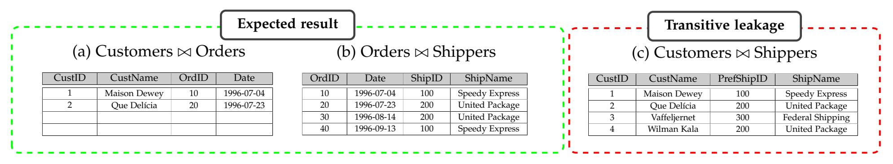
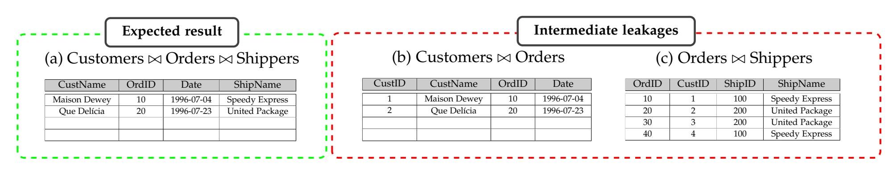
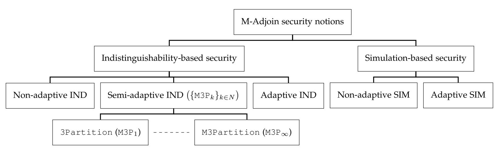
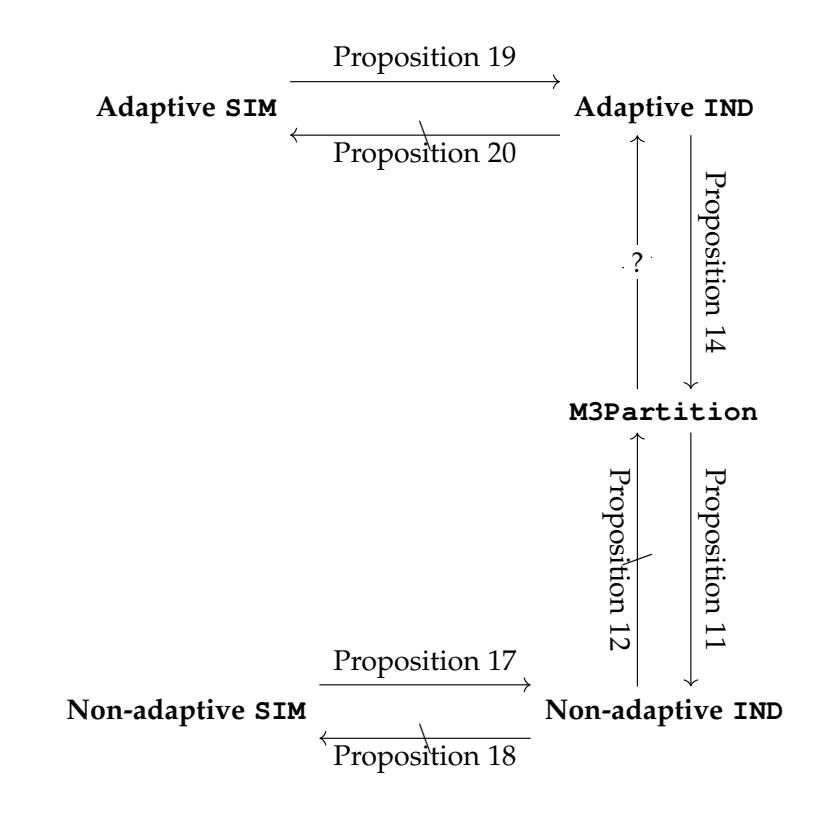
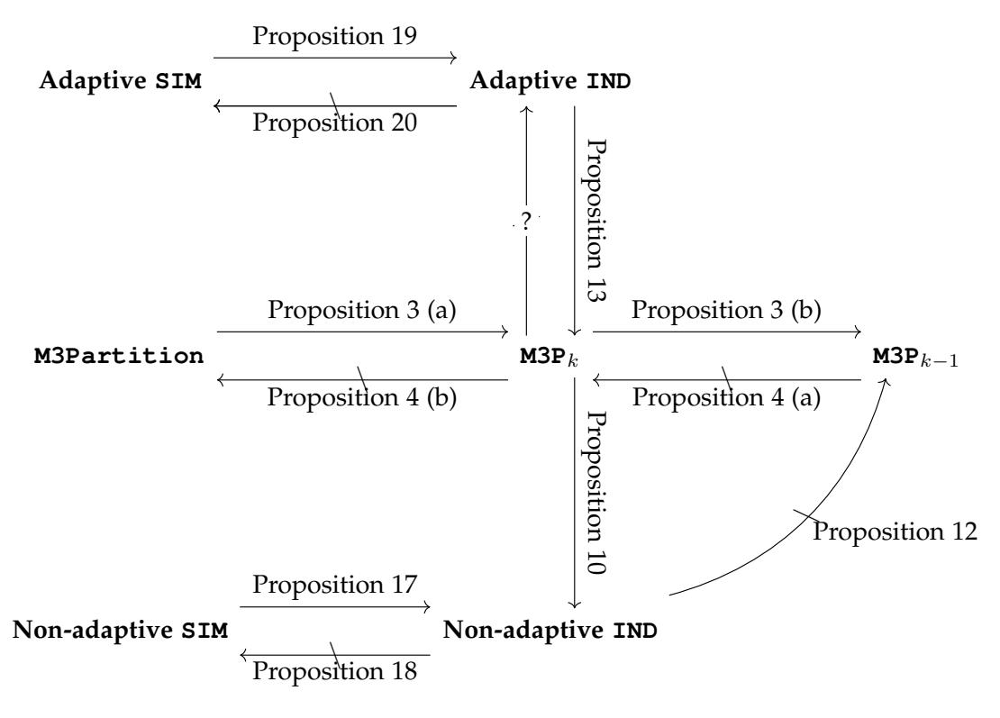

{0}------------------------------------------------

#### 1

# Security of Multi-Adjustable Join Schemes: Separations and Implications

Mojtaba Rafiee, Shahram Khazaei

**Abstract**—Database management systems (DBMS) are one of cloud services with great interests in industry and business. In such services, since there is no trust in the cloud servers, the databases are encrypted prior to outsourcing. One of the most challenging issues in designing these services is supporting SQL join queries on the encrypted database. The multi-adjustable join scheme (M-Adjoin) [Khazaei-Rafiee 2019], an extension of Adjoin [Popa-Zeldovich 2012 and Mironov-Segev-Shahaf 2017], is a symmetric-key primitive that supports the join queries for a list of column labels on an encrypted database. In previous works, the following security notions were introduced for Adjoin and M-Adjoin schemes: 3Partition, M3Partition and M3P*k*, for every integer *k*. Additionally, simulation-based and indistinguishability-based security notions have been defined by Mironov et al. for Adjoin scheme. In this paper, we extend their results to M-Adjoin and study the relations between all security notions for M-Adjoin. Some non-trivial relations are proved which resolve some open problems raised by Mironov et al. [\[1\]](#page-9-0).

**Index Terms**—Simulation, Indistinguishability, Transitivity, Intermediate, Separation, Implication.

# ✦

# **1 INTRODUCTION**

D ATABASE management systems (DBMS) are one of the most applicable cloud services in industry and business. In such services, since there is no trust in the external servers, the databases are encrypted prior to outsourcing. CryptDB, designed by Popa et al. [[2\]](#page-9-1), [[3\]](#page-9-2), [[4](#page-9-3)], [\[5](#page-9-4)], is one of the popular database management systems that supports a wide range of SQL queries, such as selections, projections, joins, aggregates, and orderings, on the encrypted database.

One of the challenges in designing such services is to support SQL join queries on the encrypted database. Several research, such as [[1](#page-9-0)], [\[5\]](#page-9-4), [[6](#page-9-5)], [\[7\]](#page-9-6), [[8](#page-9-7)], studied and provided solutions for the secure join queries on the encrypted database with various trade-offs between security and efficiency. In the simplest case, the scenario model for this functionality includes two parties: a client (or data owner) and a server (or cloud service provider). The client first locally encrypts his database, and then outsources it to the server. A database includes several tables, and each table contains several data records that they are vertically partitioned into columns. After outsourcing encrypted database to the server, the client can issue the join queries for his desired tables at any time. A join query is formulated as a list of column labels. At the end, the server runs the requested join query on the encrypted database and returns the result to the client.

The adjustable join scheme (Adjoin), first proposed by Popa and Zeldovich [[5\]](#page-9-4), is a symmetric-key primitive that supports the secure join queries for a pair of column labels on an encrypted database. The security notion introduced in [\[5](#page-9-4)], considers an experiment in which an adversary may adaptively define two disjoint sets of columns, which we refer to as a left set *L* and a right set *R*. The adversary is given the ability to compute joins inside *L* and joins inside *R*, but it should not be able to compute the join between any column in *L* and any column in *R*.

Mironov et al. [[1](#page-9-0)] argued that the proposed security notion in [[5\]](#page-9-4) does not capture *transitivity leakage*, and hence it is far from the expected security for adjustable join schemes. An adjustable join scheme suffers from the transitive leakage, if for any three column labels *li* , *lj* and *lk*, the join tokens for computing the joins between *li* and *lk* and between *lk* and *lj* , allow to compute the join between *li* and *lj* without having queried the required tokens. They proposed a strong and intuitive security notion, called 3Partition, for the adjustable join schemes, and argued that it indeed captures the security of such schemes (i.e., no transitive leakage). Also, they introduced natural simulationbased and indistinguishability-based notions that capture the minimal leakage of such schemes, and proved that the 3Partition notion is positioned between their adaptive and non-adaptive variants with respect to some natural *minimal leakage*. The minimal leakage [\[1\]](#page-9-0) reveals some accepted information such as the database dimensions (i.e., the total number of columns and the length of each column), the search pattern (i.e., the repetition of columns in different queries), the result pattern (i.e., the positions in which all columns of a join query contain identical elements) as well as the duplication pattern (i.e., the positions in each column with identical contents for every column in the database).

Recently, Khazaei and Rafiee [\[9](#page-9-8)] extended the notion of adjustable join schemes to the multi-adjustable join (M-Adjoin) schemes, where the join queries are formulated as a list of column labels instead of a pair of column labels. They argued that the proposed security notion in [\[1\]](#page-9-0) does not capture the *intermediate leakage*, and therefore it is far from the expected security for multi-adjustable join schemes. We say that an adjustable join scheme suffers from the intermediate leakage, if the join token for a list of column labels allows to join a sub-list of column labels. To model the security of M-Adjoin schemes that do not allow the intermediate leakage, [\[9](#page-9-8)] proposed a family *{*M3P*k}k∈N* of security notions, where an increase in parameter *k* reduces the intermediate leakage level. This family of security notions covers a hierarchical sequence of security notions

{1}------------------------------------------------

between 3Partition and M3Partition. More precisely, M3P1 is exactly the 3Partition security, M3Pk positions between M3Pk-1 and M3Pk+1 but bellow M3Partition.

Additionally, M3Partition can be viewed as M3P $_k$  when k goes to infinity. Tables 1, 2, and 3 show a simplified description of the transitive and intermediate leakages.

Let A and B be two tables. A  $\bowtie$  B denotes the join between tables A and B based on columns with the same labels. For simplicity, we have shown a selection of the join result as the output of the operator  $\bowtie$  on the tables A and B.

TABLE 1: A simplified product database with tables on Orders, Customers and Shippers.

(a) Customers table.

| CustID | CustName     | PostalCode | PrefShipID |
|--------|--------------|------------|------------|
| 1      | Maison Dewey | B-1180     | 100        |
| 2      | Que Delícia  | 02389-673  | 200        |
| 3      | Vaffeljernet | 8200       | 300        |
| 4      | Wilman Kala  | 21240      | 200        |

(b) Orders table.

| OrdID | CustID | Date       | ShipID |
|-------|--------|------------|--------|
| 10    | 1      | 1996-07-04 | 100    |
| 20    | 2      | 1996-07-23 | 200    |
| 30    | 3      | 1996-08-14 | 200    |
| 40    | 4      | 1996-09-13 | 100    |

(c) Shippers table.

| ShipID | ShipName         | Phone          |
|--------|------------------|----------------|
| 100    | Speedy Express   | (503) 555-9831 |
| 200    | United Package   | (503) 555-3199 |
| 300    | Federal Shipping | (503) 555-9931 |
|        |                  |                |

TABLE 2: Transitivity leakages for join queries (Customers ⋈ Orders) and (Orders ⋈ Shippers) using Adjoin scheme proposed by Popa and Zeldovich [5].

TABLE 3: Intermediate leakages for join query (Customers  $\bowtie$  Orders  $\bowtie$  Shippers) using Adjoin scheme proposed by Mironov et al. [1].

In this paper, we extend the natural simulation-based and indistinguishability-based security notions for Adjoin to M-Adjoin. Additionally, we introduce a leakage function to model the information leaked by the M3P $_k$  security notion. Then, we study the relations between different security notions. In this regard, we resolve some open problems raised by Mironov et al. [1].

It is valuable to know that although the M-Adjoin scheme is motivated by the secure join queries on the encrypted database, it is a general and independent cryptographic primitive, and can be used by a variety of real world applications. For example, the M-Adjoin scheme supports all of the applications presented in [1] for the Adjoin scheme, such as: Boolean searchable symmetric encryption (BSSE) [10], private set intersection in the cloud scenarios (PSI) [11], privacy preserving data mining [12], and distributed storage systems [7] with higher performance and security levels.

#### 1.1 Contributions

In this paper, we first introduce natural simulation-based and indistinguishability-based notions for the adaptive and non-adaptive variants with respect to the minimal leakage function mentioned earlier and a new leakage function that we refer to as the k-monotonous leakage. We then show that the family  $\{M3P_k\}_{k\in N}$  of security notions is stronger than the non-adaptive variant and weaker than the adaptive variant.

The k-monotonous leakage function. In addition to the minimal leakage, we introduce the notion of *k-monotonous* leakage functions for the M-Adjoin schemes. These leakage functions model the information that is reveled when a database is outsourced and later queried. Recall that the minimal leakage function reveals some standard and accepted information that was mentioned earlier. The *k*-monotonous leakage function, in addition to the minimal leakage set, reveals information about the *monotonicity pattern*. The monotonicity pattern is parameterized by a pos-

{2}------------------------------------------------

Fig. 1: The security notions of the multi-adjustable join schemes.

itive integer k, and indicates the positions that have the same elements, for each k-column subset of a join query. See Section 3 for details.

**Natural simulation-based and indistinguishability-based notions.** We introduce natural simulation-based and indistinguishability-based notions for the adaptive and non-adaptive variants with respect to the above mentioned leakages. Figure 1 shows all of the M-Adjoin security notions that we study in this paper. See Sections 2.4, 4 and 5 for more details on each security notion.

**Separations and implications.** We determine almost all relations between different security notions. The obtained results are summarized in Figures 2 and 3. The relation "A  $\Longrightarrow$  B" indicates that the security notion A implies the security notion B. The relation "A  $\Longrightarrow$  B" stands for a separation between the security notions A and B. That is, the security notion A does not necessarily imply the security notion B. See Section 4 and 5 for more details on our separations and implications results. We remark that the following relations remained unanswered in [1]:

(Adaptive IND  $\stackrel{?}{\Longrightarrow}$  Adaptive SIM): We show that these notions are separated.

(Non — adaptive IND  $\stackrel{?}{\Longrightarrow}$  3Partition): We show the stronger result that non-adaptive IND and M3Partition are separated.

(3Partition  $\stackrel{?}{\Longrightarrow}$  Adaptive IND): This case also remains open in this paper. In particular, it remains open if M3Partition implies adaptive IND with minimal leakage, or M3P $_k$  implies adaptive IND with k-monotonous leakage.

#### 1.2 Paper organization

The rest of this paper is organized as follows. In Section 2, we present notations and definitions that are used throughout this paper. We also recall the formal definition of M-Adjoin and the M3Partition and M3P $_k$  security Non-adaptive SIM notions. We describe the M-Adjoin leakage functions in Section 3. The indistinguishability-based and simulation-based security notions of multi-adjustable join schemes are proposed in Sections 4 and 5, respectively. Our new results are presented in Sections 4.3, 5.3 and 6. Finally, Section 7 concludes the paper.

#### 2 PRELIMINARIES

In this section, we present the required background. For further discussion, the reader may refer to [1], [9].

Fig. 2: Relations between different security notions for minimal leakage.

Fig. 3: Relations between different security notions for k-monotonous leakage.

#### 2.1 Notation

Throughout the paper, we use [m] to denote the set  $\{1, \ldots, m\}$ , where m is a positive integer. The security parameter is denoted by  $\lambda$ . Assuming that A is a (possibly)

{3}------------------------------------------------

probabilistic algorithm,  $y \leftarrow A(x)$  means that y is the output of A on input x. When A is a finite set,  $x \leftarrow A$  stands for uniformly selecting an element x from A. We say that a function is negligible, if it is smaller than the inverse of any polynomial in  $\lambda$  for sufficiently large values of  $\lambda$ . As a convention, we denote the output of a defined experiment by the experiment name itself.

## 2.2 Computational indistinguishability

Let  $X_{\lambda}, Y_{\lambda}$  be distributions over  $\{0,1\}^{l(\lambda)}$  for some polynomial  $l(\lambda)$ . We say that the families  $\{X_{\lambda}\}$  and  $\{Y_{\lambda}\}$  are computationally indistinguishable, and write  $X_{\lambda} \approx Y_{\lambda}$ , if for all probabilistic polynomial-time (PPT) distinguisher  $\mathcal{D}$ , there exists a negligible function  $\varepsilon$  such that

$$|\Pr[t \leftarrow X_{\lambda} : \mathcal{D}(t) = 1] - [t \leftarrow Y_{\lambda} : \mathcal{D}(t) = 1] \le \varepsilon(\lambda).$$

## 2.3 M-Adjoin scheme

A multi-adjustable join scheme (M-Adjoin), first introduced in [9] as an extension of Adjoin [1], [5], is a symmetric-key primitive that enables a user to generate an encoding of any word relative to any column label, and to generate a tuple of tokens to compute the join of any list of given columns.

M-Adjoin schemes are used as follows. A user wishing to outsource his database to a server, first generates a secret key K and public parameters Param using a key generation algorithm denoted by Gen. Then, the user computes an encoded-word  $\tilde{w}$  for every word w relative to any database column label l using an encoding algorithm denoted by Encod and sends them along with the public parameters *Param* to the server. Later, when the user wants to send a join query  $q=(l_1,\cdots,l_m)$  to the server, he computes a list of adjustment tokens  $(at_1, \dots, at_m)$  using a token generation algorithm denoted by Token. Upon receiving adjustment tokens  $(at_1, \cdots, at_m)$ , the server computes an adjusted word aw for every encoded-word relative to every column label in the join query using an adjustment algorithm denoted by Adjust. Finally, the server computes the result set from the adjusted words using an evaluation algorithm denoted by Eval, and sends them to the user.

**Definition 1** (M-Adjoin syntax [9]). A multi-adjustable join scheme is a collection of five polynomial-time algorithms  $\Pi =$  (Gen, Encod, Token, Adjust, Eval) such that:

- $(Param, K) \leftarrow \mathsf{Gen}(1^{\lambda})$ : is a probabilistic key generation algorithm that takes as input a security parameter  $\lambda$ , and returns a secret key K and public parameters Param.
- $\widetilde{w} \leftarrow \operatorname{Encod}_K(w, l)$ : is a deterministic encoding algorithm that takes as input a secret key K, a word w and a column label l, and outputs an encoded-word  $\widetilde{w}$ .
- $(at_1, \dots, at_m) \leftarrow \mathsf{Token}_K(l_1, \dots, l_m)$ : is a probabilistic token generation algorithm that takes as input a secret key K and a list of distinct column labels  $(l_1, \dots, l_m)$ , and returns a tuple  $(at_1, \dots, at_m)$  of adjustment tokens.
- $aw \leftarrow \mathsf{Adjust}_{Param}(\widetilde{w}, at)$ : is a deterministic algorithm that takes as input the public parameters Param, an encoded-word  $\widetilde{w}$  and an adjustment token at, and outputs an adjusted word aw.
- $b \leftarrow \mathsf{Eval}_{Param}(aw_1, \cdots, aw_m)$ : is a deterministic evaluation algorithm that takes as input the public parameters

Param and a list of adjusted words  $aw_1, \dots, aw_m$ , and outputs a bit b.

**Correctness.** The M-Adjoin correctness intuitively guarantees that no PPT adversary can find a list of column labels  $(l_1, \dots, l_m) \in (\{0, 1\}^{\lambda})^m$  and a list of words  $(w_1, \dots, w_m) \in (\{0, 1\}^{\lambda})^m$  such that  $w_i \neq w_j$  for some distinct  $i, j \in [m]$  and Eval algorithm returns 1 as its output, except with a negligible probability.

# 2.4 $\{\mathtt{M3P}_k\}_{k\in\mathbb{N}\cup\{\infty\}}$ family of security notions

In this subsection, we review the family  $\{M3P_k\}_{k\in\mathbb{N}\cup\{\infty\}}$  of security notions proposed in [9] for M-Adjoin. The 3Partition security notion introduced for Adjoin in [1] and M3Partition security notion introduced in [9] for M-Adjoin can be considered as special cases of M3P $_k$  (see Proposition 3). The M3P $_k$  security notion considers an adversary that defines three disjoint groups of columns, denoted by  $\mathscr{L}$  (left),  $\mathscr{M}$  (middle) and  $\mathscr{R}$  (right). It can then adaptively receive encoded-word of every selected word relative to any chosen column label. The adversary can also obtain the join tokens related to allowed queries, adaptively. For every integer k, a query  $q = (l_1, \cdots, l_m)$  is allowed if it is of one of the following three types:

**T1)** 
$$(l_1, \dots, l_m) \in \mathcal{L} \cup \mathcal{M}$$
 or,  
**T2)**  $(l_1, \dots, l_m) \in \mathcal{M} \cup \mathcal{R}$  or,  
**T3)**  $l_1, \dots, l_m \in \mathcal{L} \cup \mathcal{M} \cup \mathcal{R}$ ,  $\{l_1, \dots, l_m\} \cap \mathcal{M} \neq \emptyset$  and  $m \leq k+1$ .

This security notion requires that such an adversary should not be able to compute the join of any list of column labels  $(l_1,\cdots,l_m)$  such that  $l_1,\cdots,l_m\in\mathcal{L}\cup\mathcal{R}$ ,  $\{l_1,\cdots,l_m\}\cap\mathcal{L}\neq\emptyset$  and  $\{l_1,\cdots,l_m\}\cap\mathcal{R}\neq\emptyset$ . This is modeled by enabling the adversary to output a pair of challenge words  $w_0^*,w_1^*$ , and providing the adversary either with the encodings of  $w_0^*$  for all columns in  $\mathcal{R}$  or with the encodings of  $w_1^*$  for all columns in  $\mathcal{R}$ . The adversary must be unable to distinguish these two cases with a nonnegligible advantage, as long as the adversary did not explicitly ask for an encoding of  $w_0^*$  or  $w_1^*$  relative to some column label in  $\mathcal{M}\cup\mathcal{R}$ . Here is the formal definition.

**Definition 2** (M3Pk security [9]). Let  $k \in \mathbb{N} \cup \{\infty\}$ . An M-Adjoin scheme such as  $\Pi = (\text{Gen}, \text{Encod}, \text{Token}, \text{Adjust}, \text{Eval})$  is M3Pk-secure if for all PPT algorithms  $\mathcal{A}$ , there exists a negligible function  $\varepsilon$  such that

$$\begin{split} \mathsf{Adv}^{\mathsf{M3P}_k}_{\Pi,\mathcal{A}}(\lambda) &= |\Pr[\mathsf{Exp}^{\mathsf{M3P}_k}_{\Pi,\mathcal{A}}(\lambda,0) = 1] - \Pr[\mathsf{Exp}^{\mathsf{M3P}_k}_{\Pi,\mathcal{A}}(\lambda,1) = 1]| \leq \varepsilon(\lambda), \\ \textit{where for each } b \in \{0,1\}, \textit{ the experiment } \mathsf{Exp}^{\mathsf{M3P}_k}_{\Pi,\mathcal{A}}(\lambda,b) \textit{ is defined as follows:} \end{split}$$

- 1) Setup phase: The challenger Chal samples  $(Param, K) \leftarrow \operatorname{Gen}(1^{\lambda})$ , and initialize  $\mathscr{L} = \mathscr{M} = \mathscr{R} = \emptyset$ . The public parameters Param are given as input to the adversary  $\mathcal{A}$ .
- 2) **Pre-challenge query phase:** The adversary A may adaptively issue Addlbl, Encod and Token queries, which are defined as follows:
  - a) Addlbl(l,X): adds the column label l to the group X, where  $X \in \{\mathcal{L}, \mathcal{M}, \mathcal{R}\}$ . The adversary  $\mathcal{A}$  is not allowed to add a column label into

{4}------------------------------------------------

more than one set (i.e., the groups  $\mathcal{L}$ ,  $\mathcal{M}$  and  $\mathcal{R}$  must always be pairwise disjoint).

- b) Encod(w,l): computes and returns an encodedword  $\widetilde{w} \leftarrow \text{Encod}_K(w,l)$  to the adversary  $\mathcal{A}$ , where  $l \in \mathcal{L} \cup \mathcal{M} \cup \mathcal{R}$ .
- c) Token $(l_1, \dots, l_m)$ : computes and returns a list  $(at_1, \dots, at_m) \leftarrow \text{Token}_K(l_1, \dots, l_m)$  of adjustment tokens to the adversary  $\mathcal{A}$ , where
  - $l_1, \dots, l_m \in \mathcal{L} \cup \mathcal{M}$ ,
  - or  $l_1, \cdots, l_m \in \mathcal{M} \cup \mathcal{R}$ ,
  - or  $l_1, \dots, l_m \in \mathcal{L} \cup \mathcal{M} \cup \mathcal{R}$ ,  $\{l_1, \dots, l_m\} \cap \mathcal{M} \neq \emptyset \text{ and } m \leq k+1$ .
- 3) Challenge phase: The adversary  $\mathcal{A}$  chooses a pair of challenge words  $w_0^*$  and  $w_1^*$  subject to the constraint that the adversary  $\mathcal{A}$  did not previously issue a query of the form  $\mathsf{Encod}(w,l)$  where  $w \in \{w_0^*, w_1^*\}$  and  $l \in \mathcal{M} \cup \mathcal{R}$ . As a response, the adversary  $\mathcal{A}$  obtains an encoded-word  $\widetilde{w}^* \leftarrow \mathsf{Encod}_K(w_b^*, l)$  for every  $l \in \mathcal{R}$ .
- 4) **Post-challenge query phase:** As in the pre-challenge query phase, with the restriction that the adversary  $\mathcal{A}$  is not allowed to issue a query of the form  $\mathsf{Encod}_K(w,l)$ , where  $w \in \{w_0^*, w_1^*\}$  and  $l \in \mathcal{M} \cup \mathcal{R}$ . In addition, for each  $\mathsf{Addlbl}(l,\mathcal{R})$  query, the adversary  $\mathcal{A}$  is also provided with  $\widetilde{w} \leftarrow \mathsf{Encod}_K(w_b^*, l)$ .
- 5) Output phase: The adversary A outputs a value  $\sigma \in \{0,1\}$  which is defined as the output of the experiment.

The M3Partition security is defined similar to the M3P $_k$  security except that the condition  $m \leq k+1$  in items T3 and 2(c) are ignored. Equivalently, it can be consider as the case  $k=\infty$ . Additionally, if k=1, then the conditions  $l_1,\cdots,l_m\in\mathcal{L}\cup\mathcal{M}\cup\mathcal{R},\{l_1,\cdots,l_m\}\cap\mathcal{M}\neq\emptyset$  and  $m\leq k+1$  in items T3 and 2(c) are redundant, and by eliminating them, the 3Partition security notion is defined. In the following, we review the relations presented in [1] for the family  $\{\text{M3P}_k\}_{k\in\mathbb{N}\cup\{\infty\}}$  of security notions.

**Proposition 3** (Trivial implications [9, Corollary 8]). Let k be an integer. Then,

- (a) (M3Partition  $\implies$  M3Pk) Any M3Partition-secure M-Adjoin scheme is M3Pk-secure, too.
- (b) (M3P $_{k+1} \implies$  M3P $_k$ ) Any M3P $_{k+1}$ -secure M-Adjoin scheme is M3P $_k$ -secure, too.
- (c) (Limit cases)  $M3P_1 \equiv 3Partition$  and  $M3P_{\infty} \equiv M3Partition$ .

**Proposition 4** (Separations [9, Proposition 10]). Let k be an integer. Then,

- (a) (M3Pk  $\Longrightarrow$  M3Pk+1) An M3Pk-secure M-Adjoin scheme is not necessarily M3Pk+1-secure.
- (b) (M3P $_k$   $\Longrightarrow$  M3Partition) An M3P $_k$ -secure M-Adjoin scheme is not necessarily M3Partition-secure.

#### 3 M-ADJOIN LEAKAGE FUNCTIONS

The indistinguishability-based and simulation-based security notions are parameterized with respect to an auxiliary deterministic polynomial-times function Leak, called the *leakage function* [13]. The leakage function models the

information that is reveled when a database is outsourced and later queried.

A typical leakage function, studied in the literature, is the *minimal leakage function*. Since M-Adjoin schemes are an extension of Adjoin schemes, we adapt the minimal leakage function of Adjoin schemes [1] for M-Adjoin schemes. This leakage function includes information about the database dimensions (i.e., the total number of columns and the length of each column), the search pattern (i.e., the repetition of columns in different queries), the result pattern (i.e., the positions in which all columns of a join query contain identical elements) as well as the duplication pattern (i.e., the positions in each column with identical contents for every column in the database).

We also consider another leakage function called the k-monotonous leakage function. This leakage, in addition to the minimal leakage set, includes the monotonicity pattern. The monotonicity pattern is parameterized by a positive integer k, and indicates the positions that have the same elements, for each (k+1)-column subset of a join query. Intuitively, the k-monotonous leakage function models the information that the family  $\{M3P_k\}_{k\in N}$  of security notions allows to be revealed.

In the following, we first present some notations, and then formalize the above mentioned leakage functions.

Database and join query. A database  $\mathcal{DB} = ((\ell_i, C_i))_{i \in [n]}$  is a list of label/column pairs, where n is the number of columns,  $\mathcal{L} = (\ell_i)_{i \in [n]}$  is a list of distinct column labels with  $\ell_i \in \{0,1\}^{\lambda}$ , and  $C_i = (w_1^i, \cdots, w_{n_i}^i) \in (\{0,1\}^{\lambda})^{n_i}$  is the column with label  $\ell_i$ . It is assumed that the total size of the database, i.e.,  $N = n + \sum_{i \in [n]} n_i$ , is polynomial in the security parameter  $\lambda$ . A join query is essentially a list  $q = (l_1, \cdots, l_m) \in \mathcal{L}^m$  of column labels, for some integer  $m \geq 2$ .

Equality pattern and index pattern. We define the equality pattern and index pattern of a join query  $q = (\ell_{i_1}, \dots, \ell_{i_m})$ , respectively, as follows

$$EQ(q) = EQ(\ell_{i_1}, \dots, \ell_{i_m}) = ((k_1, \dots, k_m) \mid w_{k_1}^{i_1} = \dots = w_{k_m}^{i_m}),$$

and

$$I(q) = (i_1, \ldots, i_m) .$$

Also, for a tuple  $x=(i_1,\ldots,i_m)$ , we let  $\mathrm{I}^{-1}(x)=(q:\mathrm{I}(q)=x)$ .

Below, we formally define the minimal and k-monotonous leakage functions, where k is an integer parameter.

**Definition 5** (leakage functions). For a database  $\mathcal{DB} = ((\ell_i, C_i))_{i \in [n]}$ , a list of join queries  $\mathcal{Q}$  and an integer k, we define the minimal leakage and the k-monotonous leakage function, respectively, as follows:

$$(SP, DIM, DP, RP) \leftarrow \mathsf{MinLeak}(\mathcal{DB}, \mathcal{Q}) \; ,$$
  $(SP, DIM, DP, RP, MP_k) \leftarrow \mathsf{MonLeak}_k(\mathcal{DB}, \mathcal{Q}) \; ,$ 

where the leakage profile includes:

• **Search pattern.**  $SP = \mathcal{I} = (I(q))_{q \in \mathcal{Q}}$  is the search pattern that specifies the repetition of columns in different queries,

{5}------------------------------------------------

- **Dimension.**  $DIM = (|C_i|)_{i \in [n]}$  is the database dimensions that determines the total number of columns and the length of each column,
- **Duplication pattern.**  $DP = \left( \mathrm{EQ} \big( \mathrm{I}^{-1}(i,i) \big) \right)_{i \in [n]}$  is the duplication pattern that specifies the positions in each column with identical contents for every column in the database,
- **Result pattern.**  $RP = (EQ(I^{-1}(x)))_{x \in \mathcal{I}}$  is the result pattern that shows the positions in which all columns of a join query contain identical elements,
- **Monotonicity pattern.**  $MP_k = (\mathrm{EQ}(\mathrm{I}^{-1}(x')))_{x' \in \mathcal{I}_k}$  is the monotonicity pattern, where  $\mathcal{I}_k$  includes every subset of size k+1 of every indexed query; that is,  $\mathcal{I}_k = (y:y \subseteq x, |y| = k+1, x \in \mathcal{I})$ .

**Remark 6** (Label-hiding v.s. label-leaking profile). Our leakage functions do not reveal the column labels. One may also consider a label-leaking variant of the above leakage functions where the label set  $\mathcal{L}$  is also included in the leakage profile. Hiding labels, however, is not a big burden in practice since it can be handled using standard techniques; e.g., see [1, Section 4.4]. Nevertheless, as we will see in Section 5 (Proposition 18), the label-hiding property is crucial for proving separation between non-adaptive simulation-based security and non-adaptive indistinguishability-based security definitions.

# 4 INDISTINGUISHABILITY-BASED SECURITY NO-TIONS

Mironov et al. [1] proposed two indistinguishability-based security notions for Adjoin schemes, a non-adaptive variant and an adaptive variant. In this section, we propose similar definitions for M-Adjoin schemes. First, we introduce the following notation.

Extended algorithms of the M-Adjoin scheme. In this paper, based on the real applications of M-Adjoin schemes, as well as its security notions, we consider extensions of some algorithms of M-Adjoin scheme. To this end, we extend the Token algorithm such that it outputs  $\mathsf{Token}_K(\mathcal{Q}) = (\mathsf{Token}_K(q))_{q \in \mathcal{Q}}$  on a list  $\mathcal{Q}$  of queries. Similarly, we extend the encoding algorithm to take a column  $C = (w_1, \cdots, w_t)$  and a label l, and compute an encoded column  $\widetilde{C} \leftarrow \mathsf{Encod}_K(C, l)$  where  $\widetilde{C} = (\widetilde{w_1}, \cdots, \widetilde{w_t})$  and  $\widetilde{w_i} \leftarrow \mathsf{Encod}_K(w_i, l)$ , for  $i = 1, \cdots, t$ . Finally, we allow the encoding algorithm to take a key K and a database  $\mathcal{DB} = ((\ell_i, C_i))_{i \in [n]}$  and output an encoded database  $\widetilde{\mathcal{DB}} \leftarrow \mathsf{Encod}_K(\mathcal{DB})$  where  $\widetilde{\mathcal{DB}} = ((i, \widetilde{C}_i))_{i \in [n]}$  and  $\widetilde{C}_i = \mathsf{Encod}_K(C_i, \ell_i)$ .

## 4.1 Non-adaptive IND security

The non-adaptive indistinguishability-based security notion is one of the simplest and most natural security notions. This notion considers an adversary that receives the public parameters of an M-Adjoin scheme. It then chooses a pair of challenge databases  $\mathcal{DB}_0, \mathcal{DB}_1$ , and a challenge query list  $\mathcal{Q}$  such that  $\operatorname{Leak}(\mathcal{DB}_0, \mathcal{Q}) = \operatorname{Leak}(\mathcal{DB}_1, \mathcal{Q})$ . Such an adversary is called a valid adversary. This security notion requires that such an adversary should not be able to distinguish between  $(\operatorname{Encod}_K(\mathcal{DB}_0), \operatorname{Token}_K(\mathcal{Q}))$  and

(Encod $_K(\mathcal{DB}_1)$ , Token $_K(\mathcal{Q})$ ) with a non-negligible advantage. The formal definition is as follows.

**Definition 7** (Non-adaptive IND security). *An M-Adjoin* scheme such as  $\Pi = (\text{Gen}, \text{Encod}, \text{Token}, \text{Adjust}, \text{Eval})$  is called non-adaptively indistinguishable-based secure with respect to the leakage function Leak (abbreviated Leak-naIND-secure) if for all PPT valid adversary  $\mathcal{A}$ , there exists a negligible function  $\varepsilon$  such that

$$\begin{split} \mathsf{Adv}^{\mathsf{naIND}}_{\Pi,\mathcal{A}}(\lambda) &= |\Pr[\mathsf{Exp}^{\mathsf{naIND}}_{\Pi,\mathcal{A}}(\lambda,0) = 1] - \Pr[\mathsf{Exp}^{\mathsf{naIND}}_{\Pi,\mathcal{A}}(\lambda,1) = 1]| \leq \varepsilon(\lambda), \\ \textit{where for each } b \in \{0,1\}, \textit{ the experiment } \mathsf{Exp}^{\mathsf{naIND}}_{\Pi,\mathcal{A}}(\lambda,b) \textit{ is defined as follows.} \end{split}$$

- 1) Setup phase: The challenger Chal samples  $(Param, K) \leftarrow \text{Gen}(1^{\lambda})$  and sends the public parameters Param to the adversary A.
- 2) Challenge phase: The adversary  $\mathcal{A}$  chooses two databases  $\mathcal{DB}_0$ ,  $\mathcal{DB}_1$ , and a list of queries  $\mathcal{Q}$  such that  $\mathsf{Leak}(\mathcal{DB}_0,\mathcal{Q}) = \mathsf{Leak}(\mathcal{DB}_1,\mathcal{Q})$ . As a response, the adversary  $\mathcal{A}$  obtains  $\mathsf{Encod}_K(\mathcal{DB}_b)$  and  $\mathsf{Token}_K(\mathcal{Q})$ .
- 3) Output phase: The adversary A outputs a value  $\sigma \in \{0,1\}$  which is defined as the output of the experiment.

#### 4.2 Adaptive IND security

In this subsection, we introduce an adaptive variant of Definition 7. This definition considers an adversary that receives the public parameters of the M-Adjoin scheme. It can then adaptively issue a pair of challenge words  $w_0, w_1$ and a column label l, and obtain an encoding  $\mathsf{Encod}_K(w_b, l)$ , for some fixed bit  $b \in \{0, 1\}$ . In this type of query, the adversary gradually constructs two databases  $\mathcal{DB}_0, \mathcal{DB}_1$  with the same dimension and the same column label set. The adversary can adaptively issue a list of column labels, and obtain a token for computing their join. Let Q be a list of queries that the adversary has obtained their tokens at a given point of time. Such an adversary is called valid if after having made each query it holds that Leak $(\mathcal{DB}_0, \mathcal{Q}) = \text{Leak}(\mathcal{DB}_1, \mathcal{Q})$ . The adaptive indistinguishability-based security notion requires that such an adversary should not be able to distinguish between the game in which b=0 and the game with b=1, with a non-negligible advantage.

The formal definition is given below. In order to be precise, we present the following definition, before giving the formal security definition.

**Definition 8** (Inserting into a database). Let  $\mathcal{DB} = ((\ell_i, C_i))_{i \in [n]}$  be a database and  $(w, l) \in \{0, 1\}^{\lambda} \times \{0, 1\}^{\lambda}$  be a word/label pair. By insertion of (w, l) into  $\mathcal{DB}$  we get a new database as follows. If l already exists in the column label set, i.e.,  $l = \ell_i$  for some  $i \in [n]$ , then w is appended to the end of  $C_i$ ; otherwise, a single-word column  $C_{n+1} = (w)$  with label  $\ell_{n+1} = l$ , i.e., the pair (l, (w)) is appended to the database.

**Definition 9** (Adaptive IND security). *An M-Adjoin scheme* such as  $\Pi = (\text{Gen}, \text{Encod}, \text{Token}, \text{Adjust}, \text{Eval})$  is called adaptively indistinguishable-based secure with respect to the leakage function Leak (abbreviated Leak-aIND-secure) if for all PPT valid adversary A, there exists a negligible function  $\varepsilon$  such that

$$\mathsf{Adv}^{\mathsf{aIND}}_{\Pi,\mathcal{A}}(\lambda) = |\Pr[\mathsf{Exp}^{\mathsf{aIND}}_{\Pi,\mathcal{A}}(\lambda,0) = 1] - \Pr[\mathsf{Exp}^{\mathsf{aIND}}_{\Pi,\mathcal{A}}(\lambda,1) = 1]| \leq \varepsilon(\lambda),$$

{6}------------------------------------------------

where for each  $b \in \{0, 1\}$ , the experiment  $\mathsf{Exp}_{\Pi, \mathcal{A}}^{\mathsf{aIND}}(\lambda, b)$  is defined as follows.

- 1) Setup phase: The challenger Chal samples  $(Param, K) \leftarrow Gen(1^{\lambda})$  and sends the public parameters Param to the adversary A. In addition, two empty databases  $\mathcal{DB}_0$ ,  $\mathcal{DB}_1$  and an empty list Q for the queries are initialized.
- 2) Challenge phase: The adversary A may adaptively issue  $\operatorname{Encod}_K'(\cdot,\cdot,\cdot)$  and  $\operatorname{Token}_K(\cdot)$  queries, which are defined as follows:
  - Encod'K( $w_0$ , ,  $w_1$ , l): The pairs ( $w_0$ , l) and ( $w_1$ , l) are inserted into the databases  $\mathcal{DB}_0$  and  $\mathcal{DB}_1$ , respectively. Then, the challenger sends an encoded-word  $\mathsf{Encod}_K(w_b, l)$  to the adversary  $\mathcal{A}$ .
  - Token $_K(q)$ : The query  $q=(l_1,\cdots,l_m)$  is inserted into the list  $\mathcal{Q}$ , and the challenger sends the adjustments tokens  $(at_1,\cdots,at_m) \leftarrow \operatorname{Token}_K(q)$  to the adversary  $\mathcal{A}$ .

It is required that, after issuing each query, the equality  $Leak(\mathcal{DB}_0, \mathcal{Q}) = Leak(\mathcal{DB}_1, \mathcal{Q})$  holds.

3) **Output phase:** The adversary A outputs a value  $\sigma \in \{0,1\}$  which is defined as the output of the experiment.

## 4.3 Relation with $\mathtt{M3P}_k$ security notion

In this subsection, we show that the family  $\{M3P_k\}_{k\in N}$  of security notions is stronger than the non-adaptive IND security and weaker than the adaptive IND security for both MonLeak $_k$  and MinLeak leakage functions. Recall that the M-Adjoin scheme and the M3Partition security notion are extensions of the Adjoin scheme and the 3Partition notion, respectively. For the case of Adjoin, the relations between the 3Partition security and the non-adaptively IND security with respect to the minimal leakage function have been studied in [1, Claims 4.3]. Their proofs extend to the case of M-Adjoin in a straightforward way, giving rise to the following two propositions.

**Proposition 10** (M3Pk  $\Longrightarrow$  MonLeakk-naIND). *Any M3Pk-secure scheme is* MonLeakk-naIND-secure, too.

**Proposition 11** (M3Partition ⇒ MinLeak-naIND). *Any* M3Partition-secure scheme is MinLeak-naIND-secure, too.

Additionally proving/refuting equivalence between the <code>3Partition</code> security and <code>naIND-security</code> (with minimal leakage) was left unexpressed for the case of Adjoin in [1]. The following proposition, which is proved using standard techniques for separating non-adaptive and adaptive security notions, shows that they are indeed inequivalent.

**Proposition 12** (naIND  $\implies$  3Partition). For any leakage function Leak, the Leak-naIND-security of an M-Adjoin scheme does not necessarily imply its 3Partition security.

*Proof.* Let  $\Pi = (\mathsf{Gen}, \mathsf{Encod}, \mathsf{Token}, \mathsf{Adjust}, \mathsf{Eval})$  be some naIND-secure M-Adjoin scheme. We construct an M-Adjoin scheme  $\widetilde{\Pi} = (\mathsf{Gen}, \mathsf{Encod}, \mathsf{Token}, \mathsf{Adjust}, \mathsf{Eval})$  which is yet naIND-secure, with the same leakage function, however it is not 3Partition secure. The scheme  $\widetilde{\Pi}$  is as follows:

- $\widetilde{\mathsf{Gen}}(1^\lambda)$ : It runs  $(Param,K) \leftarrow \mathsf{Gen}(1^\lambda)$  and chooses a random word  $w^* \in \{0,1\}^\lambda$ , and outputs  $(Param,\widetilde{K})$ , where  $\widetilde{K} = (K,w^*)$ .
- $\bullet \quad \operatorname{Encod}_{\widetilde{K}}(w,l) \text{:} \ \operatorname{It} \ \operatorname{computes} \ \operatorname{an} \ \operatorname{encoded-word} \ \widetilde{w} \ \operatorname{as}$

$$\widetilde{w} = \widetilde{\mathsf{Encod}}_{\widetilde{K}}(w, l) = \left\{ \begin{array}{ll} (\mathsf{Encod}_K(w, l), w^*) & \quad w \neq w^* \\ w^* & \quad w = w^* \end{array} \right.$$

It is easy to see that  $\widetilde{\Pi}$  is still naIND-secure without any change in the leakage function, since the adversary's advantage only increases by  $\frac{1}{2^{\lambda}}$  due to his ability to guess  $w^*$ . It is also easy to construct a 3Partition-attacker for  $\widetilde{\Pi}$  with advantage one, since the adversary learns  $w^*$  after issuing the first query. He will then use it as one of his challenge words.

**Proposition 13** (MonLeakk-aIND  $\Longrightarrow$  M3Pk). Any MonLeakk-aIND-secure M-Adjoin scheme is M3Pk-secure, too.

*Proof.* The proof is simple and straightforward because the adaptive IND security experiment with respect to the k-monotonous leakage function MonLeak $_k$  has fewer restrictions than the M3P $_k$  security experiment. Let  $\mathcal A$  be an adversary for the M3P $_k$  security experiment, we can construct an adversary  $\mathcal B$  for the adaptive IND security experiment with the same advantage. The adversary  $\mathcal B$  acts as follows for the issued queries in variant phases of the M3P $_k$  security experiment:

- All queries of the form  $\mathsf{Addlbl}(l,X)$  are ignored. However, the adversary  $\mathcal B$  keeps a log of group  $X=\mathscr R.$
- Any query of the form  $\operatorname{Encod}(w,l)$  is converted into a query  $\operatorname{Encod}(w,w,l)$ .
- Any query of the form  $\mathsf{Token}(l_1,\cdots,l_m)$  is sent without any modification.
- The challenge  $(w_0^*, w_1^*, l^*)$  is converted into a query  $\operatorname{Encod}(w_0^*, w_1^*, l^*)$ .
- Any query of the form  $\mathsf{Addlbl}(l,\mathscr{R})$  in the post-challenge phase is converted into a query  $\mathsf{Encod}(w_0^*,w_1^*,l).$

The proof of the following proposition is exactly like proof of Proposition 13, and hence we omitted it.

**Proposition 14 (MinLeak-aIND**  $\Longrightarrow$  M3Partition). Any MinLeak-aIND-secure M-Adjoin scheme is M3Partition-secure, too.

For the case of Adjoin in [1, Page 641, Section 1.4], it has been argued that for databases with a logarithmic number of columns the <code>3Partition</code> security and <code>aIND-security</code> with minimal leakage are equivalent. The same argument also applies here to show that, for the M-Adjoin schemes, the <code>M3Partition</code> (resp.  $M3P_k$ ) security is equivalent to the <code>aIND-security</code> with regards to the minimal leakage (resp. k-monotonous leakage). However, it remains open if this is true for databases with a super-logarithmic number of columns.

{7}------------------------------------------------

#### 5 SIMULATION-BASED SECURITY NOTIONS

Mironov et al. also proposed simulation-based security notions for Adjoin scheme, which again has an adaptive and a non-adaptive variant. These notions extend to M-Adjoin in a straightforward way. In the following, we first formalize the non-adaptive simulation-based security notion, and then generalize it to the adaptive variant.

#### 5.1 Non-adaptive SIM security

Our non-adaptive simulation-based security notion considers an adversary, a simulator and two worlds called real and ideal. In the real-world, the adversary interacts with the M-Adjoin scheme and receives the public parameters. Then, it chooses a database  $\mathcal{DB}$  and a list  $\mathcal{Q}$  of queries and obtains an encoded database and a list of join tokens for each query  $q \in \mathcal{Q}$ . In the ideal-world, the adversary, however, interacts with a simulator. It gets the public parameters produced by the simulator and chooses a database  $\mathcal{DB}$  and a list  $\mathcal{Q}$  of queries. It then obtains an encoded database and a list of join tokens for each  $q \in \mathcal{Q}$ , produced by the simulator using the leakage profile Leak( $\mathcal{DB}, \mathcal{Q}$ ), without having access to the key. The non-adaptive simulation-based security notion requires that such an adversary should not be able to distinguish whether he interacts with the M-Adjoin scheme or with the simulator, unless with a negligible advantage. The formal definition is given below.

**Definition 15** (Non-adaptive SIM security). *An M-Adjoin* scheme such as  $\Pi = (\text{Gen}, \text{Encod}, \text{Token}, \text{Adjust}, \text{Eval})$  is said to be non-adaptively simulation-based secure with respect to the leakage function Leak (abbreviated Leak-naSIM-secure) if for every PPT adversary  $\mathcal A$  there exist a PPT simulator  $\mathcal S$  and a negligible function  $\varepsilon$  such that

$$\begin{split} \mathsf{Adv}^{\mathsf{naSIM}}_{\Pi,\mathcal{A}}(\lambda) = |\Pr[\mathsf{Exp}^{\mathsf{Real},\mathsf{naSIM}}_{\Pi,\mathcal{A}}(\lambda) = 1] - \\ &\Pr[\mathsf{Exp}^{\mathsf{Ideal},\mathsf{naSIM}}_{\Pi,\mathcal{A},\mathcal{S}}(\lambda) = 1]| \leq \varepsilon(\lambda), \end{split}$$

where the experiments  $\mathsf{Exp}_{\Pi,\mathcal{A}}^{\mathsf{Real},\mathsf{naSIM}}(\lambda)$  and  $\mathsf{Exp}_{\Pi,\mathcal{A},\mathcal{S}}^{\mathsf{Ideal},\mathsf{naSIM}}(\lambda)$  are defined as follows.

defined as follows. Real-world  $(\mathsf{Exp}_{\Pi,\mathcal{A}}^{\mathsf{Real},\mathsf{naSIM}}(\lambda))$ :

- 1) Setup phase: The challenger samples  $(Param, K) \leftarrow \text{Gen}(1^{\lambda})$ , and returns the public parameters Param to the adversary A.
- 2) Challenge phase: The adversary A takes the security parameter  $\lambda$ , chooses a database  $\mathcal{DB}$  and a list of queries Q, and sends them to the challenger.
- 3) Response phase: The challenger computes  $\mathcal{DB} \leftarrow \operatorname{Encod}_K(\mathcal{DB})$  and  $AT \leftarrow \operatorname{Token}_K(\mathcal{Q})$ , and returns them to the adversary  $\mathcal{A}$ .
- 4) **Output phase:** The adversary A outputs a value  $\sigma \in \{0,1\}$  which is defined as the output of the experiment.

# Ideal-world ( $\mathsf{Exp}_{\Pi,\mathcal{A},\mathcal{S}}^{\mathsf{Ideal},\mathsf{naSIM}}(\lambda)$ ):

- 1) **Setup phase:** The simulator S produces the public parameters  $Param^*$ , which are given as input to the adversary A.
- 2) **Challenge phase:** The adversary A takes the security parameter  $\lambda$ , chooses a database  $\mathcal{DB}$  and a list of queries  $\mathcal{Q}$ , and sends them to the challenger.

- 3) Response phase: The challenger computes the leakage profile  $L \leftarrow \text{Leak}(\mathcal{DB}, \mathcal{Q})$ , and gives L as input to the simulator. The simulator  $\mathcal{S}$  produces an encoded database  $\widetilde{\mathcal{DB}}^*$  and a list of tokens  $AT^*$ , which are then given to the adversary  $\mathcal{A}$ .
- 4) Output phase: The adversary A outputs a value  $\sigma \in \{0,1\}$  which is defined as the output of the experiment.

# 5.2 Adaptive SIM security

In this subsection, we introduce an adaptive variant of Definition 15. This definition, similar to the non-adaptive variant, considers an adversary, a simulator and the real and ideal worlds. In the real-world, the adversary interacts with the M-Adjoin scheme and receives the public parameters. It can then adaptively issue a pair of word/label (w, l), and obtain an encoding  $\mathsf{Encod}_K(w,l)$ . The adversary can also adaptively issue a query, and obtain a token for computing the join. In the ideal-world, the adversary, however, interacts with the simulator. It obtains the public parameters produced by the simulator. Then, the adversary can adaptively issue a pair of word/label (w, l), and obtain an encoding  $\mathsf{Encod}_K(w,l)$ , produced by the simulator using the leakage profile  $L \leftarrow \text{Leak}(\mathcal{DB}, \mathcal{Q})$ . It can also adaptively issue a query, and obtain a token for computing the join, produced by the simulator using the leakage profile  $L \leftarrow \mathsf{Leak}(\mathcal{DB}, \mathcal{Q}).$ 

The adaptive simulation-based security notion requires that such an adversary should not be able to distinguish whether it interacts with the M-Adjoin scheme or with the simulator, unless with a negligible advantage. The formal definition is as follows.

**Definition 16** (Adaptive SIM security). An M-Adjoin scheme such as  $\Pi = (\text{Gen}, \text{Encod}, \text{Token}, \text{Adjust}, \text{Eval})$  is said to be adaptively simulation-based secure with respect to the leakage function Leak (abbreviated Leak-aSIM-secure) if for every PPT adversary  $\mathcal A$  there exist a PPT simulator  $\mathcal S$  and a negligible function  $\varepsilon$  such that

$$\begin{split} \mathsf{Adv}^{\mathsf{aSIM}}_{\Pi,\mathcal{A}}(\lambda) &= |\Pr[\mathsf{Exp}^{\mathsf{Real},\mathsf{aSIM}}_{\Pi,\mathcal{A}}(\lambda) = 1] - \\ &\quad \Pr[\mathsf{Exp}^{\mathsf{Ideal},\mathsf{aSIM}}_{\Pi,\mathcal{A},\mathcal{S}}(\lambda) = 1]| \leq \varepsilon(\lambda), \end{split}$$

where the experiments  $\operatorname{Exp}_{\Pi,\mathcal{A}}^{\mathsf{Real},\mathsf{aSIM}}(\lambda)$  and  $\operatorname{Exp}_{\Pi,\mathcal{A},\mathcal{S}}^{\mathsf{Ideal},\mathsf{aSIM}}(\lambda)$  are defined as follows.

defined as follows. Real-world ( $\mathsf{Exp}_{\Pi,\mathcal{A}}^{\mathsf{Real,aSIM}}(\lambda)$ ):

- 1) Setup phase: The challenger samples  $(Param, K) \leftarrow Gen(1^{\lambda})$ , and returns the public parameters Param to the adversary A.
- 2) Challenge phase: The adversary A may adaptively issue  $\operatorname{Encod}_K(\cdot,\cdot)$  and  $\operatorname{Token}_K(\cdot)$  queries and receive back the output.
- 3) Output phase: The adversary A outputs a value  $\sigma \in \{0,1\}$  which is defined as the output of the experiment.

# **Ideal-world** ( $\mathsf{Exp}_{\Pi,\mathcal{A},\mathcal{S}}^{\mathsf{Ideal},\mathsf{aSIM}}(\lambda)$ ):

1) **Setup phase:** The simulator S produces the public parameters  $Param^*$ , which are given as input to the adversary A. An empty database DB and an empty list Q of column labels are initialized.

{8}------------------------------------------------

- 2) Challenge phase: The adversary A may adaptively issue  $\mathsf{Encod}(\cdot, \cdot)$  and  $\mathsf{Token}(\cdot)$  queries, which are defined as follows:
  - Encod(w, l): The pair (w, l) is inserted into the database  $\mathcal{DB}$ , and the simulator  $\mathcal{S}$  obtains the leakage profile  $L \leftarrow \mathsf{Leak}(\mathcal{DB}, \mathcal{Q})$ . Finally, the simulator  $\mathcal{S}$  sends an encoded-word  $\widetilde{w}^*$  to the adversary  $\mathcal{A}$ .
  - Token(q): The query  $q = (l_1, \dots, l_m)$  is inserted into the list  $\mathcal{Q}$ , and the simulator  $\mathcal{S}$  obtains the leakage profile  $L \leftarrow \text{Leak}(\mathcal{DB}, \mathcal{Q})$ . Finally, the simulator  $\mathcal{S}$  sends a list of adjustment tokens  $(at_1^*, \dots, at_m^*)$  to the adversary  $\mathcal{A}$ .
- 3) **Output phase:** The adversary A outputs a value  $\sigma \in \{0,1\}$  which is defined as the output of the experiment.

#### 5.3 Relation with indistinguishability-based definition

In this subsection, we study the relations between the indistinguishability-based and simulation-based security notions.

**Proposition 17** (naSIM  $\implies$  naIND). Let Leak be any of the leakage functions defined in Definition 5 (i.e, MinLeak or MonLeakk). If an M-Adjoin scheme is Leak-naSIM-secure, then it is Leak-naIND-secure too.

*Proof.* Let  $\mathcal{A}$  be an adversary for the naIND security experiment, we can construct an adversary  $\mathcal{B}$  for the naSIM experiment as follows:

- The adversary  $\mathcal{B}$  gives the security parameter  $\lambda$  to the adversary  $\mathcal{A}$ , and receives two databases  $\mathcal{DB}_0, \mathcal{DB}_1$ , and a list of queries  $\mathcal{Q}$  such that  $\mathsf{Leak}(\mathcal{DB}_0, \mathcal{Q}) = \mathsf{Leak}(\mathcal{DB}_1, \mathcal{Q})$ .
- The adversary  $\mathcal{B}$  samples  $c \leftarrow \{0,1\}$  and outputs  $(\mathcal{DB}_c,\mathcal{Q})$ ,
- Finally, the adversary  $\mathcal B$  receives the output of naIND security experiment (i.e.,  $\sigma$ ), and outputs  $\sigma \oplus c$ .

Therefore, for any simulator  $\mathcal S$  we have

$$\begin{split} \mathsf{Adv}^{\mathsf{naIND}}_{\Pi,\mathcal{B}}(\lambda) &= |\Pr[\mathsf{Exp}^{\mathsf{naIND}}_{\Pi,\mathcal{B}}(\lambda,0) = 1] - \Pr[\mathsf{Exp}^{\mathsf{naIND}}_{\Pi,\mathcal{B}}(\lambda,1) = 1]| \\ &= |\Pr[\mathsf{Exp}^{\mathsf{Real},\mathsf{naSIM}}_{\Pi,\mathcal{A}}(\lambda) = 1|c = 0] - \\ &\qquad \qquad \qquad \Pr[\mathsf{Exp}^{\mathsf{Real},\mathsf{naSIM}}_{\Pi,\mathcal{A}}(\lambda) = 0|c = 1]|. \end{split}$$

Also, since  $\mathsf{Leak}(\mathcal{DB}_0,\mathcal{Q}) = \mathsf{Leak}(\mathcal{DB}_1,\mathcal{Q})$  , we have

$$\Pr[\mathsf{Exp}^{\mathsf{Ideal},\mathsf{naSIM}}_{\Pi,\mathcal{A},\mathcal{S}}(\lambda) = 1 | c = 0] = \Pr[\mathsf{Exp}^{\mathsf{Ideal},\mathsf{naSIM}}_{\Pi,\mathcal{A},\mathcal{S}}(\lambda) = 1 | c = 1],$$

and hence for  $\mathsf{Adv}_{\Pi,\mathcal{B}}^{\mathsf{naIND}}(\lambda)$  we have

$$\begin{split} \mathsf{Adv}^{\mathsf{naIND}}_{\Pi,\mathcal{B}}(\lambda) &= |\Pr[\mathsf{Exp}^{\mathsf{Real},\mathsf{naSIM}}_{\Pi,\mathcal{A}}(\lambda) = 1 | c = 0] - \\ &\quad \Pr[\mathsf{Exp}^{\mathsf{Ideal},\mathsf{naSIM}}_{\Pi,\mathcal{A},\mathcal{S}}(\lambda) = 1 | c = 0] + \\ &\quad \Pr[\mathsf{Exp}^{\mathsf{Ideal},\mathsf{naSIM}}_{\Pi,\mathcal{A},\mathcal{S}}(\lambda) = 1 | c = 1] - \\ &\quad \Pr[\mathsf{Exp}^{\mathsf{Real},\mathsf{naSIM}}_{\Pi,\mathcal{A}}(\lambda) = 0 | c = 1]|. \end{split}$$

Finally, since the adversary  $\mathcal{B}$  inverts the output of adversary  $\mathcal{A}$  in case that c=1, we have

$$\begin{split} \mathsf{Adv}^{\mathsf{naIND}}_{\Pi,\mathcal{B}}(\lambda) &= |\Pr[\mathsf{Exp}^{\mathsf{Real},\mathsf{naSIM}}_{\Pi,\mathcal{A}}(\lambda) = 1 | c = 0] - \\ &\quad \Pr[\mathsf{Exp}^{\mathsf{Ideal},\mathsf{naSIM}}_{\Pi,\mathcal{A},\mathcal{S}}(\lambda) = 1 | c = 0] + \\ &\quad \Pr[\mathsf{Exp}^{\mathsf{Real},\mathsf{naSIM}}_{\Pi,\mathcal{A},\mathcal{S}}(\lambda) = 0 | c = 1] | - \\ &\quad \Pr[\mathsf{Exp}^{\mathsf{Ideal},\mathsf{naSIM}}_{\Pi,\mathcal{A},\mathcal{S}}(\lambda) = 1 | c = 1] \\ &\quad = 2 \cdot \mathsf{Adv}^{\mathsf{naIND}}_{\Pi,\mathcal{A},\mathcal{S}}(\lambda). \end{split}$$

Using the assumption that the scheme  $\Pi$  is Leak-naSIM-secure, there exists a simulator  $\mathcal S$  such that  $\operatorname{Adv}_{\Pi,\mathcal A,\mathcal S}^{\mathsf{naIND}}(\lambda)$  is negligible. Therefore,  $\operatorname{Adv}_{\Pi,\mathcal B}^{\mathsf{naIND}}(\lambda)$  is negligible, and the proof is finished.  $\square$ 

The naIND and naSIM security definitions have shown to be equivalent in [1], assuming that the leakage function is label-leaking. The below proposition shows that this does not hold true for the label-hiding function of our interest in Definition 5.

**Proposition 18** (naIND  $\implies$  naSIM). Let Leak be any of the leakage functions defined in Definition 5 (i.e, MinLeak or MonLeakk). Then, the Leak-naIND security does not necessarily imply the Leak-naSIM security.

*Proof.* Let  $\Pi$  be some Leak-naIND-secure M-Adjoin scheme. We construct an M-Adjoin scheme  $\widetilde{\Pi}$  which is still Leak-naIND-secure, but it is not Leak-naSIM-secure. All algorithms of  $\widetilde{\Pi}$  are the same as  $\Pi$  except the encoding algorithm. Denote these algorithms by Encod and Encod, respectively. On a key K and a word/label pair (w,l), the modified encoding algorithm outputs

$$\widetilde{\mathsf{Encod}}_K(w,l) = \Big(\mathsf{Encod}_K(w,l),l\Big)$$
.

That is, the label is revealed to the adversary. It is easy to see that  $\widetilde{\Pi}$  is still Leak-naIND-secure, because the adversary already knows the labels as he chooses them himself. Therefore, his advantage in attacking  $\widetilde{\Pi}$  is the same as that of attacking  $\Pi$ .

However, the modified scheme is not Leak-naSIM-secure, because the leakage profile does not contain any information about the label set. Therefore, the simulator has no way to simulate the output of Encod except to guess. But this will be detected by an adversary who constructs the databases with random labels. We conclude that there exists an attacker that can distinguish the real and ideal worlds for every given simulator.

**Proposition 19** (aSIM  $\implies$  aIND). For any leakage function Leak, if an M-Adjoin scheme is Leak-aSIM-secure, then it is Leak-aIND-secure too.

*Proof.* The proof idea of this proposition is similar to the non-adaptive variant (i.e., Proposition 17). In a general and intuitive way, the idea is that the adversary cannot distinguish between encoded database  $\mathcal{DB}_0$  and encoded database generated by the simulator, and between encoded database generated by the simulator and encoded database  $\mathcal{DB}_1$ . Similar to Proposition 17, let  $\mathcal{A}$  be an adversary for the aIND security experiment, we can construct an adversary  $\mathcal{B}$  for the aSIM experiment as follows:

{9}------------------------------------------------

- The adversary  $\mathcal{B}$  samples  $c \leftarrow \{0, 1\}$ ,
- The adversary  $\mathcal{B}$  converts each query of the form  $\operatorname{Encod}(w_0,w_1,l)$  into a query  $\operatorname{Encod}(w_c,l)$ ,
- Finally, when the adversary  $\mathcal A$  halts and outputs  $\sigma$ , then the adversary  $\mathcal B$  outputs  $\sigma\oplus c$ .

Using a similar argument to Proposition 17, we can show that  $\mathsf{Adv}_{\Pi,\mathcal{B}}^{\mathsf{naIND}}(\lambda)$  is negligible.  $\square$ 

The following proposition—which was left unanswered for the case of Adjoin in [1]— separates the aIND and aSIM security definitions with respect to leakage functions defined in Definition 5. The point that we take advantage of is that we consider the leakage functions to be label-hiding. It remains open if the separation still holds for label-leaking leakage functions. The proof of this proposition is exactly like proof of Proposition 18, and hence we omitted it from here.

**Proposition 20** (aIND  $\implies$  aSIM). Let Leak be any of the leakage functions defined in Definition 5 (i.e, MinLeak or MonLeakk). Then, the Leak-aIND security does not necessarily imply the Leak-aSIM security.

## 6 THE HIERARCHY OF LEAKAGE FUNCTIONS

In this section, we prove the relation between the minimal and k-monotonous leakage functions. The reader can recall these definitions (Definition 5) before continuing this section. The following "figurative" relation in terms of the amount of leakage

$$MinLeak \leq MonLeak_{k+1} \leq MonLeak_k$$
,

is formally proved by the following propositions. The first one is trivial. We only prove the second one.

**Proposition 21** (Leakage implications). Let  $X \in \{aSIM, naSIM, aIND, naIND\}$  and k be an integer.

- (a) (MinLeak  $\Longrightarrow$  MonLeakk) If an M-Adjoin scheme is MinLeak-X-secure scheme, it is MonLeakk-X-secure, too.
- (b) (MonLeak $_{k+1}$   $\Longrightarrow$  MonLeak $_k$ ) If an M-Adjoin scheme is MonLeak $_{k+1}$ -X-secure scheme, it is MonLeak $_k$ -X-secure, too.

**Proposition 22** (Leakage separation). Let  $X \in \{aSIM, naSIM, aIND, naIND\}$  and k be an integer. Then,

- (a) (MonLeakk  $\Longrightarrow$  MonLeakk+1) A MonLeakk-X-secure scheme is not necessarily MonLeakk+1-X-secure.
- (b) (MonLeakk  $\Longrightarrow$  MinLeak) A MonLeakk-X-secure scheme is not necessarily MinLeak-X-secure.

*Proof.* The proof idea is the same for both Part (a) and (b). Therefore, in the following we present only the proof for Part (a). Let  $\Pi$  be an MonLeak $_k$ -X-secure M-Adjoin scheme. We modify  $\Pi$  to get a scheme  $\widetilde{\Pi}$  which is not MonLeak $_k$ -1-X-secure but retains its MonLeak $_k$ -X-security.

The key generation algorithms of  $\Pi$  and  $\widetilde{\Pi}$  are the same. Let  $q=(l_1,\ldots,l_m)$  be a query that is given to the token generation algorithm of  $\widetilde{\Pi}$ . A token  $(at_1,\ldots,at_m)$  for q is first computed using the token generation algorithm of  $\Pi$  which will be the output of if  $m \leq k+1$ . Otherwise, a token

 $(at_1',\ldots,at_{k+1}')$  is also generated for  $q'=(\ell_1,\ldots,\ell_{k+1})$  using  $\Pi$  and the adjustment token of q in  $\widetilde{\Pi}$  will be

$$((at_1, at'_1), \ldots, (at_{k+1}, at'_{k+1}), at_{k+2}, \cdots, at_m)$$
.

The other algorithms are modified accordingly. Clearly, the M-Adjoin scheme  $\widetilde{\Pi}$  is not MonLeak $_{k+1}$ -X-secure.

It remains to prove that the modified scheme remains  $\mathsf{MonLeak}_k\text{-X-secure}$ . To see this, recall the monotonicity pattern leakage in the  $\mathsf{MonLeak}_k$  leakage function (see Definition 5). It indicates the positions that have the same elements, for each (k+1)-column subset of a join query. Therefore, our modification (i.e., including an adjustment token for the sub-query  $q' = (\ell_1, \dots, \ell_{k+1})$  when  $m \geq k+2$ ) does not provide anything new to adversary since he was already allowed to get such a leakage.  $\square$ 

#### 7 Conclusions

In this paper, we first reviewed the syntax and security notions of the multi-adjustable join schemes as a cryptographic primitive that allows a client to outsource his database to a server, and to privately issue his join queries for a list of columns on it. We then introduced the natural simulation-based and indistinguishability-based notions for the adaptive and non-adaptive variants with respect to two leakage functions: minimal, and k-monotonous. We proved that the family  $\{M3P_k\}_{k\in\mathbb{N}}$  of security notions is stronger than the non-adaptive variant and weaker than the adaptive variant for both leakage functions. We also studied and proved the relation between the minimal and k-monotonous leakage functions. The relations between different security notions have been determined except two cases, which are left for future: "M3Partition ⇒ MinLeak-aIND" and "M3P $_k \stackrel{:}{\Longrightarrow} \mathsf{MonLeak}_k$ -aIND".

#### REFERENCES

- [1] I. Mironov, G. Segev, and I. Shahaf, "Strengthening the security of encrypted databases: non-transitive joins," in *Theory of Cryptography Conference*. Springer, 2017, pp. 631–661.
- [2] R. A. Popa, "Building practical systems that compute on encrypted data," Ph.D. dissertation, Massachusetts Institute of Technology, Department of Electrical Engineering, 2014.
- [3] R. A. Popa, C. Redfield, N. Zeldovich, and H. Balakrishnan, "Cryptdb: protecting confidentiality with encrypted query processing," in *Proceedings of the Twenty-Third ACM Symposium on Operating Systems Principles*. ACM, 2011, pp. 85–100.
- [4] —, "Cryptdb: processing queries on an encrypted database," *Communications of the ACM*, vol. 55, no. 9, pp. 103–111, 2012.
- [5] R. A. Popa and N. Zeldovich, "Cryptographic treatment of cryptdb's adjustable join," 2012.
- [6] J. Furukawa and T. Isshiki, "Controlled joining on encrypted relational database," in *International Conference on Pairing-Based Cryptography*. Springer, 2012, pp. 46–64.
- [7] I. Hang, F. Kerschbaum, and E. Damiani, "Enki: access control for encrypted query processing," in *Proceedings of the 2015 ACM SIGMOD International Conference on Management of Data.* ACM, 2015, pp. 183–196.
- [8] S. Kamara and T. Moataz, "Sql on structurally-encrypted databases," in *International Conference on the Theory and Application of Cryptology and Information Security*. Springer, 2018, pp. 149–180.
- [9] S. Khazaei and M. Rafiee, "Multi-adjustable join scheme," 2019.
- [10] D. Cash, S. Jarecki, C. Jutla, H. Krawczyk, M.-C. Roşu, and M. Steiner, "Highly-scalable searchable symmetric encryption with support for boolean queries," in *Advances in cryptology—CRYPTO 2013*. Springer, 2013, pp. 353–373.

{10}------------------------------------------------

- [11] A. Abadi, S. Terzis, and C. Dong, "Vd-psi: Verifiable delegated private set intersection on outsourced private datasets," in *International Conference on Financial Cryptography and Data Security*. Springer, 2016, pp. 149–168.
- [12] C. C. Aggarwal and S. Y. Philip, *Privacy-preserving data mining: models and algorithms*. Springer Science & Business Media, 2008.
- [13] R. Curtmola, J. Garay, S. Kamara, and R. Ostrovsky, "Searchable symmetric encryption: improved definitions and efficient constructions," *Journal of Computer Security*, vol. 19, no. 5, pp. 895–934, 2011.

**Mojtaba Rafiee** obtained his M.Sc. degree in computer science from Shahid Beheshti University, Tehran, Iran, in 2014. He is currently a Ph.D. student of computer science at Sharif University of Technology. His research interest areas include applied cryptography, database security and forensics, verifiable and secure computation.

**Shahram Khazaei** is an assistant professor at the Department of Mathematical Sciences at Sharif University of Technology, Iran, since 2012. He received his Ph.D. in computer science from EPFL, Switzerland, in 2010 and was a postdoctoral researcher at KTH Royal Institute of Technology, Sweden, from 2011 to 2012. His main research interests is theoretical and practical aspects of cryptography.