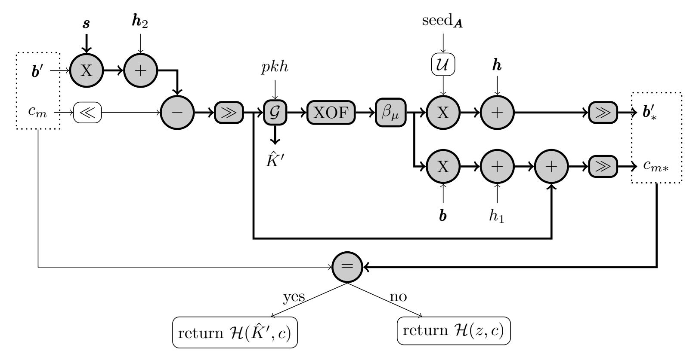
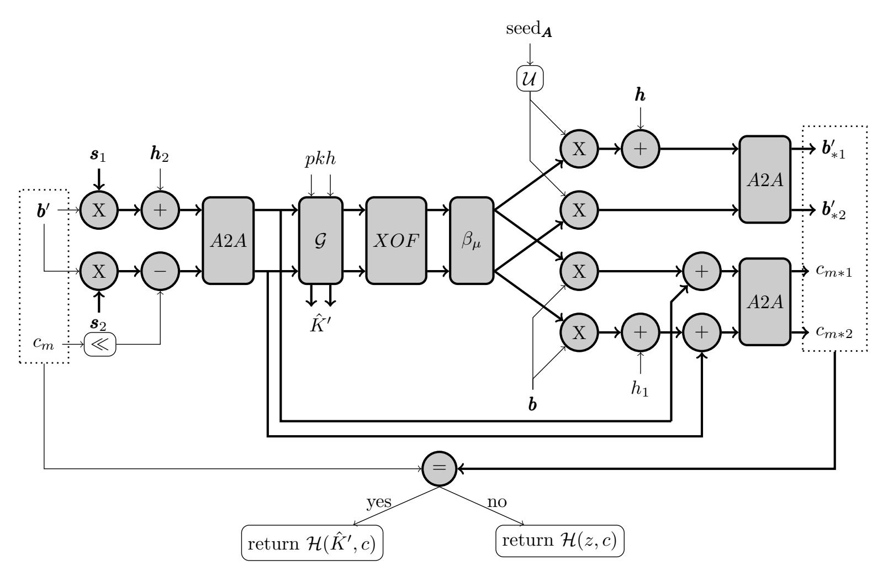
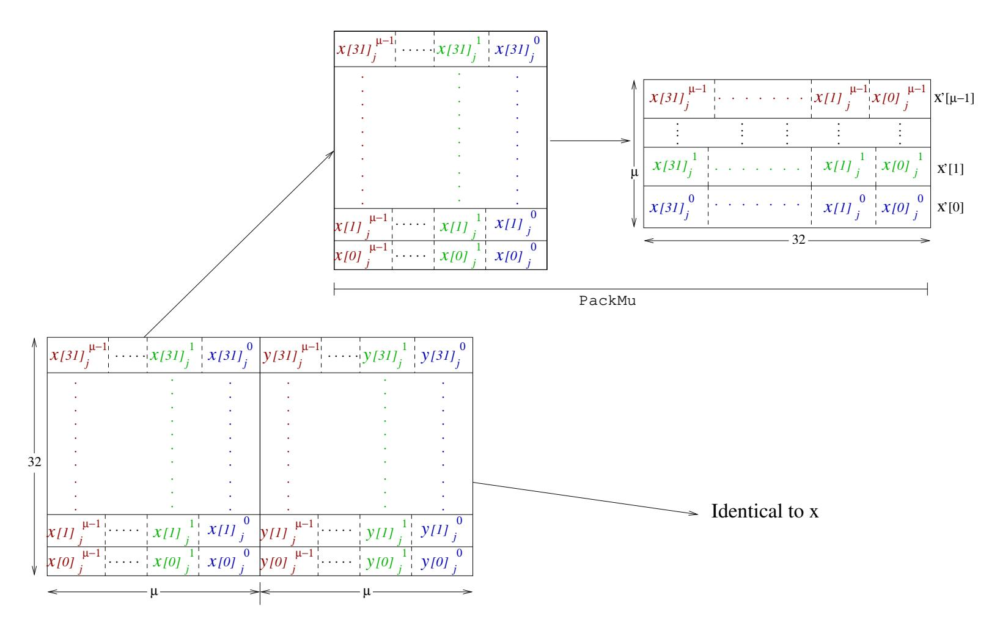
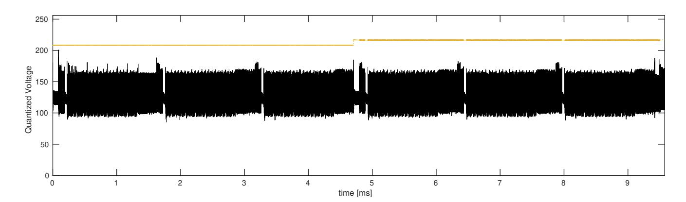
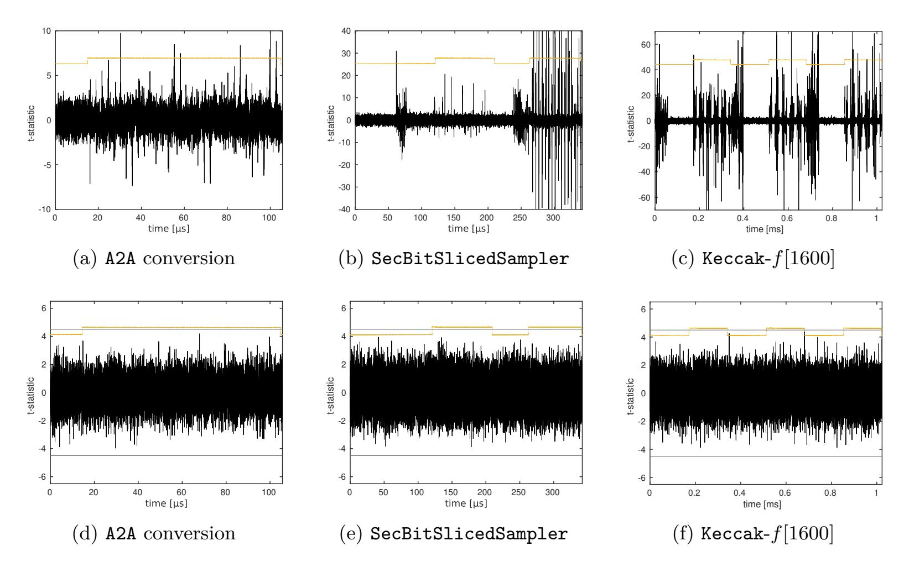
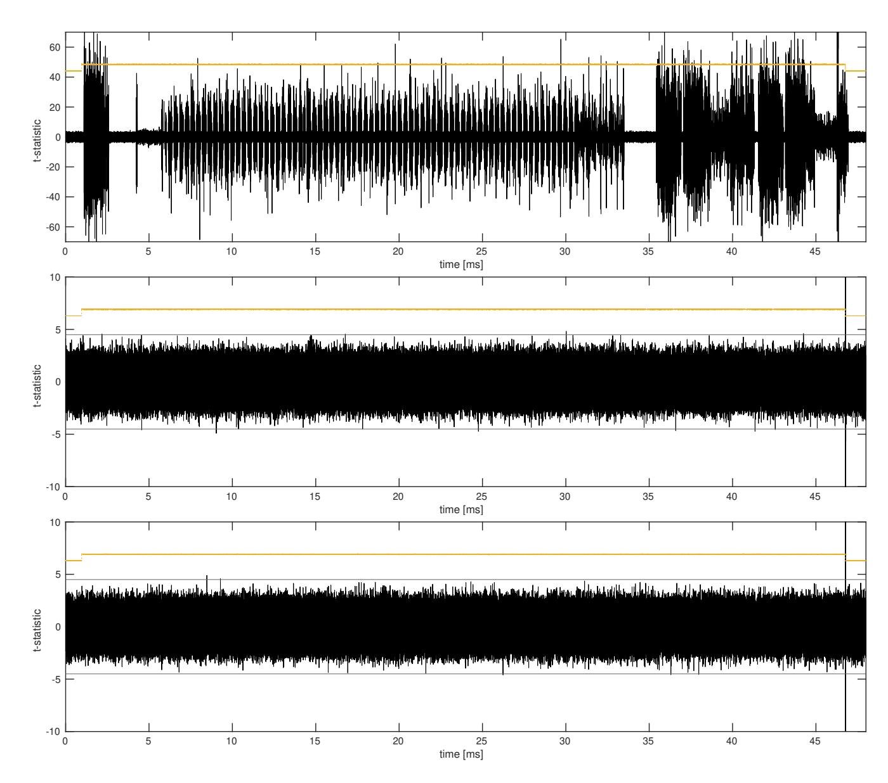

{0}------------------------------------------------

# **A Side-channel Resistant Implementation of SABER**

Michiel Van Beirendonck<sup>1</sup> , Jan-Pieter D'Anvers<sup>1</sup> , Angshuman Karmakar<sup>1</sup> , Josep Balasch<sup>1</sup>*,*<sup>2</sup> and Ingrid Verbauwhede<sup>1</sup>

> 1 imec-COSIC KU Leuven Kasteelpark Arenberg 10 - bus 2452, 3001 Leuven, Belgium 2 eMedia Lab-STADIUS KU Leuven Andreas Vesaliusstraat 13 - bus 2600, 3000 Leuven, Belgium [{firstname}.{lastname}@esat.kuleuven.be](mailto:michiel.vanbeirendonck@esat.kuleuven.be)

**Abstract.** The candidates for the NIST Post-Quantum Cryptography standardization have undergone extensive studies on efficiency and theoretical security, but research on their side-channel security is largely lacking. This remains a considerable obstacle for their real-world deployment, where side-channel security can be a critical requirement. This work describes a side-channel resistant instance of Saber, one of the lattice-based candidates, using masking as a countermeasure. Saber proves to be very efficient to mask due to two specific design choices: power-of-two moduli, and limited noise sampling of learning with rounding. A major challenge in masking lattice-based cryptosystems is the integration of bit-wise operations with arithmetic masking, requiring algorithms to securely convert between masked representations. The described design includes a novel primitive for masked logical shifting on arithmetic shares, as well as adapts an existing masked binomial sampler for Saber. An implementation is provided for an ARM Cortex-M4 microcontroller, and its side-channel resistance is experimentally demonstrated. The masked implementation features a 2.5x overhead factor, significantly lower than the 5.7x previously reported for a masked variant of NewHope. Masked key decapsulation requires less than 3,000,000 cycles on the Cortex-M4 and consumes less than 12kB of dynamic memory, making it suitable for deployment in embedded platforms. We have made our implementation available at <https://github.com/KULeuven-COSIC/SABER-masking>.

**Keywords:** Post-Quantum Cryptography, Masking, SABER, ARM Cortex-M4

## **1 Introduction**

The security of our current public-key cryptographic infrastructure depends on the intractability of mathematical problems such as large integer factorization or the elliptic-curve discrete logarithm problem. However, if a large scale quantum computer becomes available, these mathematical problems can be *easily* solved using Shor's [\[Sho97\]](#page-27-0) algorithm. In anticipation of this possible disruption, the National Institute of Standards and Technology (NIST) started a procedure in 2017 for standardizing post-quantum cryptographic primitives. These primitives are based on mathematical problems not solvable by quantum computers, such as computational problems over lattices or codes. After an intense scrutiny and lengthy deliberation, in which provable and concrete mathematical security have been the most prominent evaluation criteria, 26 of the original 69 proposals have advanced to the second round. NIST has already announced that, in the second round, more stress will be put on implementation aspects. In particular, more importance will be given to efficient implementations on resource constrained platforms as well as physical security aspects.

{1}------------------------------------------------

Lattice-based cryptography is one of the most promising families in this process, sprouting 11 out of 26 round 2 candidates. When looking at lattice-based encryption schemes, these can be further divided into two main categories: NTRU-based schemes and Learning With Errors (LWE)-based schemes. The latter category still encompasses a multitude of schemes such as FrodoKEM [\[NAB](#page-26-0)<sup>+</sup>19], NewHope KEM [\[PAA](#page-26-1)<sup>+</sup>19] and Kyber [\[SAB](#page-27-1)<sup>+</sup>19], whose security can be reduced to variants of the LWE problem, and Saber [\[DKRV19\]](#page-25-0) and Round5 [\[GZB](#page-25-1)<sup>+</sup>19], with security reduction to variants of the Learning With Rounding (LWR) problem. The security of both problems relies on introducing noise into a linear equation. However, in LWE-based schemes the noise is explicitly generated and added to the equation, while the LWR problem introduces noise through rounding of some least significant bits.

Side-channel attacks [\[Koc96\]](#page-26-2) are a widely acknowledged threat against implementations of cryptographic algorithms. These attacks exploit information contained in physically measurable channels, for instance the instantaneous power consumption of a chip [\[KJJ99\]](#page-25-2), in order to extract secret keys processed by an implementation. The field of side-channel attacks and countermeasures has significantly evolved in the last 20 years, with a strong focus on protecting existing and standardized cryptographic primitives. The advent of post-quantum cryptography is, however, bringing new challenges to the field, and therefore it is gaining attention in the research community.

Reparaz et al. [\[RRVV15\]](#page-27-2) were first to propose a side-channel resistant implementation of a Ring-LWE (RLWE) lattice-based cryptosystem. Their method relied on masking techniques [\[CJRR99\]](#page-24-0) in combination with a custom masked decoder to achieve first-order security. A subsequent work by the same authors [\[RdCR](#page-26-3)<sup>+</sup>16] removes the need for this masked decoder, by exploiting the additively-homomorphic property of the RLWE encryption. Masking approaches typically increase the cost of an implementation by at least a factor of 2x in performance metrics such as speed and memory, or area and latency for a hardware implementation. This is the case because masking duplicates most linear operations, but requires more complex routines for non-linear operations, such as the masked decoder. For their first work, Reparaz et al. report an overhead factor of 5.2x in CPU cycles for a masked decryption on an ARM Cortex-M4.

Where Reparaz et al. successfully masked a Chosen-Plaintext Attack (CPA)-secure RLWE decryption, real-world applications typically require Chosen-Ciphertext Attack (CCA) secure primitives, which can be obtained using an appropriate CCA-transform. It has been shown that the CCA-transform is itself susceptible to side-channel attacks and should be masked [\[RRCB20\]](#page-27-3). Oder et al. [\[OSPG18\]](#page-26-4) presented a masked implementation of a complete CCA-secure RLWE key decapsulation similar to NewHope KEM [\[ADPS16\]](#page-23-0), reporting a factor 5.7x overhead over an unmasked implementation. Masked software implementations of the lattice-based signature schemes GLP [\[GLP12\]](#page-25-3), Dilithium [\[DKL](#page-25-4)<sup>+</sup>18], and qTESLA [\[ABB](#page-23-1)<sup>+</sup>19] have also received research attention [\[BBE](#page-23-2)<sup>+</sup>18, [MGTF19,](#page-26-5) [GR20\]](#page-25-5).

**Our contribution.** Saber is a Module-LWR (MLWR)-based encryption scheme that is accepted in the second round of the NIST post-quantum standardization process. Its most notable features are the choice of power-of-two moduli, contrary to the prime moduli present in similar lattice-based schemes, and the introduction of noise through rounding instead of adding explicit error terms. In this paper, we show that these two key properties make Saber very efficient to mask. We construct a first-order masked implementation of Saber's CCA-secure decapsulation algorithm, with an overhead factor of only 2.5x over the unmasked implementation. Saber's side-channel secure version can be built with relatively simple building blocks compared to other NIST candidates, resulting in significantly less overhead for a side-channel secure design.

In our masked implementation of Saber, we develop a novel primitive to perform masked logical shifting on arithmetic shares. We subsequently adapt an existing masked binomial sampler, to take advantage of Saber's power-of-two moduli. Furthermore, Saber 

{2}------------------------------------------------

avoids excessive noise sampling due to its choice for LWR. We implement and benchmark our design on an ARM Cortex-M4 microcontroller. An experimental validation of our implementation follows, using the well-known Test Vector Leakage Assessment (TVLA) to assess security. We develop critical routines directly in assembly, and thereby confirm suppression of side-channel leakage even on the Cortex-M4 general-purpose embedded processor. We integrate and profile our masked CCA-secure decapsulation in the PQM4 [\[KRSS\]](#page-26-6) post-quantum benchmark suite for the Cortex-M4, showing our close-to-ideal 2.5x overhead in CPU cycles. This factor can directly be compared to the overhead factor 5.7x reported by Oder et al., which is the work most closely related to ours, and we show that it can largely be attributed to the masking-friendly design choices of Saber.

The remainder of this paper is structured as follows. First, we give the general notation and definitions used throughout this paper, including masking as the implemented sidechannel countermeasure. Thereafter, we give an introduction to Saber, describing both the baseline CPA-secure public-key encryption scheme as well as the CCA-secure KEM. In Section [4,](#page-6-0) we follow up with a description of our side-channel resistant instance of Saber. First, we give a high-level overview of the masked primitives our implementation requires. Subsequently, we present our novel primitive for masked logical shifting, and adapt an existing masked binomial sampler to fit Saber's parameters. In Section [5,](#page-14-0) we describe the implementation of our masked Saber instance on an ARM-Cortex M4 microcontroller. In Section [6,](#page-16-0) we experimentally demonstrate the side-channel resistance using TVLA, and in Section [7](#page-19-0) we benchmark our design in the PQM4 suite for relevant performance metrics and compare to related work. Finally, in Section [8,](#page-22-0) we conclude our work.

# **2 Preliminaries**

### **2.1 Notation**

We denote with Z*<sup>q</sup>* the ring of integers modulo the integer *q*, where the elements of this ring are represented with integers in [0*, q*). We define the polynomial ring *Rq*(*X*) = Z*q*[*X*]*/*(*X<sup>N</sup>* + 1) with *N* = 256 throughout this paper. For a ring *R*, let *Rl*1×*l*<sup>2</sup> be the ring of *l*<sup>1</sup> × *l*<sup>2</sup> matrices over *R*. Matrices will be written in uppercase bold letters (e.g. *A*), vectors in lowercase bold (e.g. *b*) and single polynomials without markup (e.g *v*).

Let b·c be the flooring operation which returns the largest integer smaller than the input and let b·e be the rounding operation that rounds to the nearest integer, i.e. b*x*e = b*x*+0*.*5c. Let *x b* denote shifting an integer *x* with *b* positions to the left, which corresponds to a multiplication of *x* with 2 *b* . Correspondingly, let *x b* denote shifting an integer *x* with *b* positions to the left, which can be calculated as b*x/*2 *b* c. All these operations can be applied to (matrices of) polynomial rings by performing them coefficient-wise.

Let *x* ← *χ* denote sampling *x* according to a distribution *χ*. This notation is extended for (matrices of) polynomials as *X* ← *χ*(*R<sup>l</sup>*1×*l*<sup>2</sup> ), where the coefficients of *X* ∈ *R<sup>l</sup>*1×*l*<sup>2</sup> are sampled independently according to the distribution *χ*. Optionally, one can specify the seed *r* to denote pseudorandomly sampling *X* from this seed, which is written as *X* ← *χ*(*R<sup>l</sup>*1×*l*<sup>2</sup> ; *r*). The uniform distribution is denoted as U and the centered binomial distribution as *β<sup>µ</sup>* with parameter *µ*, which is the binomial distribution with 2*µ* coins, where the result is subtracted with *µ*.

### **2.2 Cryptographic Definitions**

A Public Key Encryption scheme (PKE) consists of three functions KeyGen, Encrypt and Decrypt, where KeyGen generates a secret key *sk* and a public key *pk*, where Encrypt takes the public key *pk* and a message *m* from a message space M to construct a ciphertext *ct*, and where Decrypt returns a message *m*<sup>0</sup> given the secret key *sk* and ciphertext *ct*. We 

{3}------------------------------------------------

say that a PKE is  $\delta$ -correct if  $P[\texttt{Decrypt}(sk, ct) \neq m : ct \leftarrow \texttt{Encrypt}(pk, m)] \leq \delta$ . We will bound the security of a PKE using the advantage of an adversary  $\mathcal{A}$  in the indistinguishability against chosen-plaintext attacks (IND-CPA) security model as follows:

$$\operatorname{adv}_{\mathtt{PKE}}^{\mathtt{ind-cpa}}(\mathcal{A}) = \left| P \left[ b = b^* : \begin{array}{c} (pk, sk) \leftarrow \mathtt{KeyGen}(); m_0, m_1 \leftarrow \mathcal{A}(pk), m_0, m_1 \in \mathcal{M}; \\ b \leftarrow \{0, 1\}; c_b \leftarrow \mathtt{Encrypt}(pk, m_b); \ b^* \leftarrow \mathcal{A}^{\mathtt{Encrypt}()}(pk, c_b) \end{array} \right] - \frac{1}{2} \right|.$$

A Key Encapsulation Mechanism (KEM) consists of three functions KeyGen, Encaps and Decaps. KeyGen generates a secret key sk and a public key pk, Encaps takes the public key pk and generates a ct and key K, and Decaps returns a key K' from the ciphertext ct and the secret key sk. Similarly to the PKE case, we will say that a KEM is  $\delta$ -correct if  $P[\text{Decaps}(sk,ct) \neq K: (ct,K) \leftarrow \text{Encaps}(pk)] \leq \delta$ . We define the advantage of an adversary against the chosen-ciphertext (IND-CCA) security of a KEM as follows:

$$\operatorname{adv}_{\mathtt{KEM}}^{\operatorname{ind-cca}}(\mathcal{A}) = \left| \operatorname{Pr} \left[ b' = b : \begin{array}{c} (pk, sk) \leftarrow \mathtt{KeyGen}(); \ b \leftarrow \mathcal{U}(\{0, 1\}); (c, k_0) \leftarrow \mathtt{Encaps}(pk); \\ k_1 \leftarrow \mathcal{K}; \ b' \leftarrow \mathcal{A}^{\mathtt{Decaps}(sk, \cdot), \mathtt{Encaps}()}(pk, c, k_b); \end{array} \right] - \frac{1}{2} \right| .$$

## 2.3 Masking

Our side-channel resistant instance of Saber is based on masking [CJRR99], a well-studied countermeasure to thwart side-channel attacks. First-order masking provides resistance against attacks exploiting information in the first-order statistical moment. A first-order masking splits any sensitive variable x in the algorithm into two shares  $x_1$  and  $x_2$ , such that  $x = x_1 \odot x_2$ , and perform all operations in the algorithm on the shares separately. The operator  $\odot$  refers to the type of masking. Classical examples include arithmetic masking  $(x = x_1 + x_2)$  and Boolean masking  $(x = x_1 \oplus x_2)$ . Performing operations in the masked domain prevents any type of leakage due to the variable x, since it is never directly manipulated. Instead, the only observable leakage in the side-channel measurements is due to computations involving either  $x_1$  or  $x_2$ . Since these shares are randomized at each execution of the algorithm, they contain no exploitable information about x. This is typically done by setting one share to a randomly sampled mask, for which we reserve the notation  $x_2 = R$ , and computing the other share as  $x_1 = A = x - R$  for arithmetic masking or as  $x_1 = B = x \oplus R$  for Boolean masking.

# 3 The Saber Algorithm

In this section we provide a brief and high-level description of the functionality of Saber. We focus on aspects relevant to developing a side-channel resistant version, and hence we intentionally omit details about the underlying mathematical background. For detailed information, we refer the interested reader to the original paper in [DKRV18] and the latest version described in the NIST round 2 submission document [DKRV19].

### 3.1 Saber PKE

First, we introduce the public-key encryption variant of Saber, which serves as the cornerstone for Saber.KEM, the candidate for the NIST post-quantum cryptography process. The Saber package is based on the Module Learning With Rounding (MLWR) problem, and its security can be reduced to the security of this problem. MLWR is a variant of the well known Learning With Errors (LWE) problem [Reg04], which combines a module structure as introduced by Langlois and Stehlé [LS15] with the introduction of noise through rounding as proposed by Banerjee et al. [BPR12]. The core element of the MLWR problem are MLWR samples, which are defined as  $(A, b = |As|_p)$ , given a public matrix

{4}------------------------------------------------

<span id="page-4-1"></span>

| Table 1. I arameter settings of baber. I KL |   |     |          |          |       |       |                     |
|---------------------------------------------|---|-----|----------|----------|-------|-------|---------------------|
|                                             | l | N   | q        | p        | T     | $\mu$ | quantum<br>security |
| LightSaber.PKE                              | 2 | 256 | $2^{13}$ |          | $2^3$ | 5     | 114                 |
| Saber.PKE                                   | 3 | 256 | $2^{13}$ | $2^{10}$ | $2^4$ | 4     | 185                 |
| FireSaber.PKE                               | 4 | 256 | $2^{13}$ | $2^{10}$ | $2^6$ | 3     | 257                 |

Table 1: Parameter settings of Saber.PKE

 $A \leftarrow \mathcal{U}(R_q^{l \times l})$ , secret vector of polynomials  $\mathbf{s} \leftarrow \beta_{\mu}(R_q^{l \times 1})$ , and a rounding modulus p. The relevant search MLWR problem states that it is hard to recover the secret  $\mathbf{s}$  given a MLWR sample, while the decision MLWR problem states that it is hard to distinguish a MLWR sample from a uniformly random sample from the distribution  $\mathcal{U}(R_q^{l \times l} \times R_q^{l \times 1})$ . It is assumed that for certain parameter sets, MLWR is hard to solve even in the presence of large scale quantum computers, and it can be shown that Saber.PKE is at least as secure as the underlying decisional MLWR problem.

The encryption scheme Saber.PKE consists of three algorithms, described in Figure 1: Saber.PKE.KeyGen generates a public key pk and private key sk, Saber.PKE.Enc encrypts a 256-bit message m into a ciphertext c based on the public key pk, and Saber.PKE.Dec decrypts the ciphertext c using the private key sk. The output message is denoted as m'. It can be shown that m and m' are equal with high probability. Saber.PKE has three variants aimed at a different security level. In order of increasing security they are LightSaber, Saber and FireSaber, and their parameters can be found in Table 1. In this work we focus on the medium security version Saber, but all the methods described in this work can be adapted for LightSaber and FireSaber with trivial modifications.

```
\begin{array}{lll} \text{Saber.PKE.KeyGen}() & \text{Saber.PKE.Enc}(pk = (seed_{\pmb{A}}, \pmb{b}), m \in R_2; r) \\ \text{1. } seed_{\pmb{A}} \leftarrow \mathcal{U}(\{0,1\}^{256}) & \text{1. } \pmb{A} := \mathcal{U}(R_q^{l \times l}; \operatorname{seed}_{\pmb{A}}) \\ \text{2. } \pmb{A} := \mathcal{U}(R_q^{l \times l}; \operatorname{seed}_{\pmb{A}}) & \text{2. } \mathbf{if} : r \text{ is not specified:} \\ \text{3. } r := \mathcal{U}(\{0,1\}^{256}) & \text{3. } r := \mathcal{U}(\{0,1\}^{256}) \\ \text{4. } \pmb{s} := \beta_{\mu}(R_q^{l \times 1}; r) & \text{4. } \pmb{s'} := \beta_{\mu}(R_q^{l \times 1}; r) \\ \text{5. } \pmb{b'} := ((\pmb{A}^T \pmb{s} + \pmb{h}) \bmod q) \gg (\epsilon_q - \epsilon_p) \in R_p^{l \times 1} \\ \text{6. } \mathbf{return} \ (pk := (seed_{\pmb{A}}, \pmb{b}), sk := (\pmb{s})) & \text{7. } \\ & c_m := (v' + h_1 - 2^{\epsilon_p - 1} m \bmod p) \gg (\epsilon_p - \epsilon_T) \in R_T \\ & \text{8. } \mathbf{return} \ c := (c_m, \pmb{b'}) \\ \text{Saber.PKE.Dec}(sk = \pmb{s}, c = (c_m, \pmb{b'})) \\ \text{1. } v := \pmb{b'}^T (\pmb{s} \bmod p) \in R_p \\ \text{2. } m' := ((v - 2^{\epsilon_p - \epsilon_T} c_m + h_2) \bmod p) \gg (\epsilon_p - 1) \in R_2 \\ \text{3. } \mathbf{return} \ m' \\ \end{array}
```

Figure 1: Saber.PKE

The additions with the constant terms  $h_1, h_2$  and  $\boldsymbol{h}$  are needed to center the errors introduced by rounding around 0, which reduce the failure probability of the protocol. This is achieved by choosing  $h_1 \in R_q$  with coefficients following  $2^{\epsilon_q - \epsilon_p - 1}$  and  $h_2 \in R_q$  with coefficients following  $(2^{\epsilon_p - 2} - 2^{\epsilon_p - \epsilon_T - 1} + 2^{\epsilon_q - \epsilon_p - 1})$ . The vector  $\boldsymbol{h} \in R_q^{l \times 1}$  can be constructed as l polynomials  $h_1$ .

Practically, the generation of the secret polynomial s' according to distribution  $\beta_{\mu}$  using a seed r is realized by first expanding r to a pseudorandom bit-string of length  $2\mu \cdot l \cdot N$  using SHAKE-128 as eXtendable Output Function (XOF). This bit-string is then divided into segments (x, y) of  $2\mu$  bits. Finally, each element of the secret vector is calculated by subtracting Hamming weight of last  $\mu$  bits, HW(y), from the Hamming Weight of first  $\mu$  bits, HW(x).

{5}------------------------------------------------

```
Saber.KEM.KeyGen()
                                                                                  \texttt{Saber.KEM.Encaps}(pk = (seed_{\bm{A}}, \bm{b}))
                                                                                  1. m \leftarrow \mathcal{U}(\{0,1\}^{256})
1. (seed_{\boldsymbol{A}}, \boldsymbol{b}, \boldsymbol{s}) = \mathtt{Saber.PKE.KeyGen}()
                                                                                  2. (K,r) = \mathcal{G}(\mathcal{F}(pk),m)
2. pk = (seed_{\mathbf{A}}, \mathbf{b})
3. pkh = \mathcal{F}(pk)
                                                                                  3. c = \mathtt{Saber.PKE.Enc}(pk, m; r)
4. z = \mathcal{U}(\{0,1\}^{256})
                                                                                  4. K = \mathcal{H}(K,c)
                                                                                  5. return (c, K)
5. return
(pk := (seed_{\boldsymbol{A}}, \boldsymbol{b}), sk := (\boldsymbol{s}, z, pkh))
Saber.KEM.Decaps(sk = (\boldsymbol{s}, z, pkh), pk = (seed_{\boldsymbol{A}}, \boldsymbol{b}), c)
1. m' = \text{Saber.PKE.Dec}(\boldsymbol{s}, c)
2. (\hat{K}',r')=\mathcal{G}(pkh,m')
3. c_* = \mathtt{Saber.PKE.Enc}(pk, m'; r')
4. if: c = c_*
        return K = \mathcal{H}(\hat{K}', c)
5.
6. else:
        return K = \mathcal{H}(z, c)
7.
```

Figure 2: Saber.KEM

#### 3.2 Saber KEM

One drawback of the public key variant of Saber is that it is not secure against chosen-ciphertext attacks. To achieve security against these types of attacks, Saber.PKE can be compiled into Saber.KEM using a post-quantum variant of the Fujisaki-Okamoto (FO) transformation [TU16]. The resulting KEM can be found in Figure 2 and consists of a key generation, an encapsulation and a decapsulation phase. Additionally, it requires three hash functions that model random oracles:  $\mathcal{F}, \mathcal{G}$  and  $\mathcal{H}$ , which are instantiated with SHA3-256, SHA3-512 and SHA3-256 respectively.

The transformation from chosen-plaintext secure PKE to chosen-ciphertext secure KEM does not impact the communication cost and preserves the security estimate (which is now in a stronger attack model). However, it does complicate the decapsulation process, which on top of decrypting the message also performs a re-encryption step to validate the input ciphertext. Whenever the input ciphertext does not correspond to the newly generated ciphertext, a random response is given as described in the decapsulation procedure.

From a side-channel perspective, the decapsulation, Saber.KEM.Decaps, is the most sensitive operation to protect, the reason being it directly involves the long-term secret key s. Consequently, our efforts in this work are devoted to obtain a side-channel resistant version of the decapsulation algorithm, Saber.Masked.KEM.Decaps. Figure 3 gives an overview of the arithmetic flow of the decapsulation procedure, where the sensitive operations that contain information about the secret key s are indicated in grey.

Two properties of Saber stand out when compared to other lattice-based schemes: Saber uses power-of-two moduli q, p and T, and is based on the LWR hard problem. The first property not only implies that modular reductions are essentially free, but also that some masking operations can be implemented more efficiently. The latter property has a big positive impact in that only one secret vector  $\boldsymbol{s}$  needs to be sampled securely, in contrast to LWE-based schemes that also need to sample additional two error vectors. Avoiding the generation of these two elements is a big advantage, as we will show later that the sampling of these vectors becomes one of the most costly operations in a masked implementation.

{6}------------------------------------------------

<span id="page-6-1"></span>

Figure 3: Decapsulation of Saber. In grey the operations that are influenced by the long term secret *s* and thus vulnerable to side-channel attacks.

# <span id="page-6-0"></span>**4 Side-Channel Resistant Saber**

In this section, we describe Saber*.*Masked*.*KEM*.*Decaps, the key decapsulation routine for Saber with built-in resistance against side-channel attacks. In Figure [3,](#page-6-1) operations influenced by the long term secret *s* are highlighted in grey. These operations are vulnerable to side-channel attacks, and must be masked. First, we give a high-level overview of these masked primitives our implementation requires, and we refer to existing solutions. Then, we develop a new primitive which we call A2A conversion, which serves as the substitute of the logical shift operation performed on arithmetic shares. Finally, we describe how a recent masked binomial sampler should be tweaked to fit the Saber algorithm, taking advantage of Saber's power-of-two moduli. Figure [4](#page-7-0) illustrates the arithmetic flow of Saber*.*Masked*.*KEM*.*Decaps and serves as a visual representation of our discussion in this section.

We do not explicitly give a masked implementation of the IND-CPA secure Saber*.* Masked*.*PKE*.*Dec, even though it is contained in the Saber*.*Masked*.*KEM*.*Decaps implementation. The reason being that even without side-channel information, the Saber*.*PKE is vulnerable to chosen-ciphertext attacks if the secret key is re-used, which was shown by Fluhrer [\[Flu16\]](#page-25-7) to be the case for all current LWE-based and LWR-based IND-CPA secure encryption schemes.

The shift operation on the input *c<sup>m</sup>* and the expansion of seed*<sup>A</sup>* are operations on values known to the adversary. As they do not depend on the secret *s* there is no need to mask them. A similar reasoning is true for the calculation of the return value. While the comparison of the input ciphertext with the reconstructed ciphertext does compute on sensitive values that depend on *s*, the output of this comparison is not valuable information to a side-channel adversary. The reason is that a smart adversary should know whether the input ciphertext is valid or not: it is clearly not possible to construct a non-valid ciphertext that still succeeds the comparison, and, as discussed in [\[DGJ](#page-24-2)<sup>+</sup>19], it is hard to generate a valid ciphertext that fails the comparison check. Another way to look at this is the fact that there exists an analogous FO transformation to the one used in Saber with similar practical security bounds [\[HHK17\]](#page-25-8), with the only difference that the return value is explicitly set to ⊥ when the comparison check does not return true. From this it is clear that an adversary that explicitly learns the result of the comparison does not learn any

{7}------------------------------------------------

<span id="page-7-0"></span>

Figure 4: Masked decapsulation of Saber. In grey the operations that are influenced by the long term secret  $\boldsymbol{s}$  and thus vulnerable to side-channel attacks.

sensitive information.

#### 4.1 Masked Primitives

#### 4.1.1 Masked Polynomial Arithmetic

The main workhorse in Saber.PKE.Dec and Saber.PKE.Enc is polynomial arithmetic. Luckily, polynomial multiplication and addition/subtraction are easy to protect using arithmetic masking. Given a polynomial  $x = x_1 + x_2$ , the multiplication  $y = x \cdot c$  with an unmasked polynomial c can be split into two independent computations as:

$$y_1 = x_1 \cdot c \qquad y_2 = x_2 \cdot c.$$

Saber.Masked.KEM.Decaps does not require multiplication of two masked polynomials, which is a significantly more expensive computation. Similarly, addition (resp. subtraction) can be performed as:

$$y_1 = x_1 \pm c \qquad y_2 = x_2$$

or as:

$$y_1 = x_1 \pm c_1$$
  $y_2 = x_2 \pm c_2$ ,

when the second polynomial is also shared  $c = c_1 + c_2$ . In all cases, the correctness of the result can be trivially checked by reverting the masking:  $y = y_1 + y_2$ .

#### 4.1.2 Masked Logical Shift

Both Saber.PKE.Dec and Saber.PKE.Enc use coefficient-wise logical shifting of polynomials, i.e. each polynomial coefficient is shifted separately. Logical shifting is easy to protect using Boolean masking, but non-trivial for arithmetically masked polynomial coefficients. For a Boolean masked coefficient, it is easy to see that  $x = (x_h || x_l) = (B_h || B_l) \oplus (R_h || R_l)$ 

{8}------------------------------------------------

<span id="page-8-0"></span>Table 2: The carry of *A<sup>l</sup>* + *R<sup>l</sup>* is correlated with the unmasked value *x<sup>l</sup>* . Sharings *A<sup>l</sup>* + *R<sup>l</sup>* with a carry bit are highlighted in bold.

| xl |     |     | Al + Rl |     |
|----|-----|-----|---------|-----|
| 0  | 0+0 | 1+3 | 2+2     | 3+1 |
| 1  | 0+1 | 1+0 | 2+3     | 3+2 |
| 2  | 0+2 | 1+1 | 2+0     | 3+3 |
| 3  | 0+3 | 1+2 | 2+1     | 3+0 |

implies *x<sup>h</sup>* = *B<sup>h</sup>* ⊕ *Rh*, due to the XOR being a bit-wise operator. Logical shifting can therefore be performed on each share separately. However, given an arithmetic masked coefficient (*x<sup>h</sup>* k *xl*) = (*A<sup>h</sup>* k*Al*) + (*R<sup>h</sup>* k*Rl*), it does not necessarily hold that *x<sup>h</sup>* = *A<sup>h</sup>* +*Rh*. This is the case because a *carry* might propagate from the lower masked bits *A<sup>l</sup>* + *R<sup>l</sup>* to the upper masked bits *A<sup>h</sup>* + *Rh*. Moreover, as illustrated in Table [2](#page-8-0) for *A<sup>l</sup>* , *R<sup>l</sup>* having size two bits, the occurrence of a carry in *A<sup>l</sup>* + *R<sup>l</sup>* is correlated with *x<sup>l</sup>* , and the carry is therefore itself a sensitive value that must be masked. In Section [4.2,](#page-9-0) we elaborate on the most straightforward approach to logical shifting of arithmetic shares, which first converts to a Boolean masking and subsequently shifts both Boolean shares, a technique known as Arithmetic to Boolean (A2B) conversion. However, this approach is rather wasteful for masked logical shifting, since the Boolean masking of the lower bits is computed only to be discarded in the following operation. Because of this observation we subsequently develop a novel primitive, which is more efficient in both speed and memory.

#### **4.1.3 Masked G, XOF**

In Saber, both the random oracle G and the XOF are instantiated with primitives defined in the *SHA*3 standard, *SHA*3 − 512 and *SHAKE* − 128, specifically. Both are a subset of the broader cryptographic primitive Keccak, which has previously received attention for a masked implementation [\[BDPVA10\]](#page-23-3) using Boolean masking. The Keccak-*f*[1600] permutation is relatively easy to mask. The operations *θ, ρ, π* and *ι* are linear, i.e. they can be duplicated for both shares, and only the *χ* step requires special treatment. In our implementation we apply the masking scheme of [\[BDPVA10\]](#page-23-3), which re-uses a linear term from the state to securely mask the computation of the logical AND that is embedded in *χ*.

#### **4.1.4 Masked Binomial Sampler**

The masked binomial sampler must compute HW(**x**) − HW(**y**), where **x** and **y** are masked pseudo-random bit strings supplied by the masked *SHAKE* − 128. Both the calculation of the Hamming weight as well as the subtraction are arithmetic operations, whereas the masked *SHAKE* −128 of [\[BDPVA10\]](#page-23-3) outputs Boolean shares. Similarly to masked logical shifting, binomial sampling algorithms typically employ mask conversion to solve this issue, i.e they transform from Boolean to Arithmetic (B2A) shares. In Section [4.3,](#page-11-0) we describe how a recent masked binomial sampler from [\[SPOG19\]](#page-27-6) can be adapted to fit Saber.

#### <span id="page-8-1"></span>**4.1.5 Masked Comparison**

The comparison *c* = *c*<sup>∗</sup> must likewise be protected from the side-channel adversary, since the unmasked *c*<sup>∗</sup> depends on the secret *s*. In [\[OSPG18\]](#page-26-4), it was proposed to avoid unmasking the sensitive intermediate *c*∗, using an additional hashing step. Relying on the collisionresistance of a hashing function H<sup>0</sup> , H<sup>0</sup> (*c* − *c*<sup>∗</sup>1) ?= H<sup>0</sup> (*c*<sup>∗</sup>2) is only true for valid ciphertexts, in which case the adversary already knows *c*∗. As discussed at the start of this section, the inputs to the comparison contain sensitive information, but the outcome of the comparison does not give any extra information to an adversary. In such a setting the unmasked

{9}------------------------------------------------

 $c_*$  is sensitive, but, relying on the pre-image resistance of  $\mathcal{H}'$ ,  $\mathcal{H}'(c-c_{*1}) \stackrel{?}{=} \mathcal{H}'(c_{*2})$  no longer contains exploitable information about  $c_*$ . Note that a similar argument applies for the sensitive  $\hat{K}' = \hat{K}'_1 \oplus \hat{K}'_2$ , which should only be selectively unmasked in case a valid ciphertext was submitted.

In Saber.KEM.Decaps, the comparison between the input ciphertext  $c = (c_m, b')$  and the re-encrypted ciphertext  $c_* = (c_{m*}, b'_*)$  is typically implemented as two separate checks, since  $c_{m*}$ , and  $b'_*$  can be computed largely independently. This is not straightforwardly possible in Saber.Masked.KEM.Decaps, since the output of the *individual* comparisons does contain sensitive additional information for the side-channel adversary. Similarly to [OSPG18] we instantiate  $\mathcal{H}'$  with (unmasked) SHAKE-128, but use an incremental state to avoid having to store a masked version of both  $c_{m*}$ , and  $b'_*$  in memory. Using  $SHAKE-128.absorb(b'-b'_{1*})$  and  $SHAKE-128.absorb(b'_{2*})$ , we must only keep the two Keccak states in memory, rather than the much larger masked  $b'_*$ .

## <span id="page-9-0"></span>4.2 Masked Logical Shift: A2B and A2A Conversion

A straightforward approach to logical shifting of arithmetic shares, is to first convert to a Boolean masking and subsequently shift both Boolean shares. This approach is also adopted in [OSPG18]. Several secure A2B as well as B2A conversion algorithms exist. These generally come in two flavours, depending on whether the arithmetic shares use a power-of-two or a prime modulus. The former group have received considerably more research interest due to their use in symmetric primitives, and they are typically more efficient and simpler to implement. In this group, Goubin |Gou01| was the first to introduce first-order secure B2A and A2B conversions. Especially Goubin's B2A conversion remains very efficient, whereas the time complexity of Goubin's A2B method was improved by Coron et al. |CGTV15|. Another approach to first-order A2B was proposed and developed in a series of works that use table-based implementations. Table-based A2B algorithms were first proposed by Coron and Tchulkine |CT03|. A second method was proposed by Neiße and Pulkus NP04, which claims resistance against DPA, but introduces a variable that could facilitate attacks using SPA techniques. Finally, Debraize [Deb12] corrected a bug in |CT03| and proposes a third method with a time/memory trade-off. Higher-order secure conversion algorithms have been described and subsequently improved in |CGV14, Cor17, BCZ18, HT19|.

Saber heavily benefits from the added simplicity and extensive research of conversions with power-of-two moduli, since all its moduli p, q and T are powers of two. In contrast, algorithms for prime moduli are typically more ad hoc, adapting existing approaches to fit lattice schemes with prime moduli. Oder et al. [OSPG18] use a power-of-two A2B conversion in their masked CCA-secure variant of NewHope. Because of NewHope's prime modulus q=12289, they have to include an extra algorithm, TransformPower2, to first transform the shares to a power of two. Barthe et al. [BBE+18] similarly have to develop new algorithms for prime conversion in their masking of GLP, but they provide a more generic solution for arbitrary orders. Finally, Schneider et al. [SPOG19] combine the previous two algorithms, and at the same time present a new algorithm, B2Aq, which works for arbitrary moduli as well as arbitrary security orders. However, when instantiated as a power-of-two conversion, e.g.  $q=2^8$ , B2Aq only outperforms [BCZ18] and [CGV14] for more than nine shares.

Whereas the approach to use first A2B conversion and subsequently shift the Boolean shares is quite straightforward, it is also quite wasteful. The Boolean masking of the lower bits is computed only to be shifted out in the following operation. In the remainder of this section, we first describe the Coron-Tchulkine [CT03] table-based A2B algorithm, including the fix from [Deb12]. Based on this algorithm we subsequently develop a more frugal approach, that avoids computing the Boolean sharing of the lower bits entirely. Because this requires minimal algorithmic change from A2B conversion, but leaves the output shares

{10}------------------------------------------------

in an arithmetic masking, we call this new primitive A2A conversion. Compared to the classical approach, our novel A2A primitive reduces both the table size and number of arithmetic instructions.

#### **4.2.1 Table-based A2B Conversion**

Table-based A2B conversions use a divide-and-conquer approach to convert the arithmetic masking *x* = *A* + *R* to a Boolean masking *x* = *B* ⊕ *R*. The conversion is first performed for a smaller mask *r*, and *x* = *A* + *r* can be converted to *x* = *B* ⊕ *r* by securely computing *B* = (*A* + *r*) ⊕ *r*. The intermediate unmasking step (*A* + *r*) can be avoided using a pre-computed table *T*, such that *T*[*A*] = (*A* + *r*) ⊕ *r* for a fixed mask *r*. For a *k*-bit value *A*, the size of *T* is then 2 *k* entries of *k* bits. Because this is quickly prohibitive when *k* is the size of a full processor word, Coron and Tchulkine [\[CT03\]](#page-24-4) proposed to iteratively apply the conversion to smaller *k*-bit chunks,

$$(B_{n-1} \parallel ... \parallel B_i \parallel ... \parallel B_0) = ((A_{n-1} \parallel ... \parallel A_i \parallel ... \parallel A_0) + (r \parallel ... \parallel r \parallel ... \parallel r)) \oplus (r \parallel ... \parallel r \parallel ... \parallel r).$$

This is possible using two tables, *G* and *CA*, which are pre-computed as illustrated in Algorithms [1](#page-10-0) and [2,](#page-10-1) respectively. Table *G* converts chunk *A<sup>i</sup>* to a Boolean masking *B<sup>i</sup>* = (*A<sup>i</sup>* + *r*) ⊕ *r*, whereas table *C<sup>A</sup>* contains the carry from the modular addition (*A<sup>i</sup>* + *r*) that should be added to chunk *Ai*+1. As mentioned before, the carry of (*Ai*+*r*) is correlated to the unmasked value *x<sup>i</sup>* , which is why the carry is itself masked with an arithmetic mask *γ* in table *CA*. The conversion itself, using tables *G* and *C<sup>A</sup>* is shown in Algorithm [3.](#page-11-1) Since (*r* k *...* k *r* k *...* k *r*) is not a uniformly distributed mask, during the conversion only the least significant *k*-bit chunk *A<sup>l</sup>* of *A* is masked with *r* and unmasked with *R<sup>l</sup>* .

| Algorithm 1:                                                                | Algorithm 2:                                                                      |  |  |
|-----------------------------------------------------------------------------|-----------------------------------------------------------------------------------|--|--|
| Pre-computation of G [CT03]                                                 | Pre-computation of CA<br>[CT03, Deb12]                                            |  |  |
| input<br>: k<br>k<br>1 r ← U({0, 1}<br>)<br>k −<br>2 for A = 0 to 2<br>1 do | input<br>: k, r<br>e<br>1 γ ← U({0, 1}<br>)<br>k −<br>2 for A = 0 to 2<br>1 do    |  |  |
| G[A] = (A + r) ⊕ r<br>3                                                     | k<br>CA[A] =<br>γ,<br>if A + r < 2<br>3<br>γ + 1 mod 2e<br>k<br>if A + r ≥ 2<br>, |  |  |
| 4 end<br>5 return G, r                                                      | 4 end<br>5 return CA, γ                                                           |  |  |

#### <span id="page-10-1"></span><span id="page-10-0"></span>**4.2.2 Table-based A2A Conversion**

We adapt the method from [\[CT03,](#page-24-4) [Deb12\]](#page-24-5) for logical shifting and call this new primitive A2A conversion. Algorithm [3](#page-11-1) can easily be adapted to this use case. For logical shifting, we only need to compute the propagation of the carry, but can discard the conversion to a Boolean share. This requires just table *CA*, obsoleting table *G*. The computation of *B<sup>i</sup>* can likewise be removed, and, because we do not require the mask *r* on the upper *m* bits, the same applies for the final unmasking with *r*. Our A2A conversion making this adjustment is shown in Algorithm [4.](#page-12-0) Its input is an *m* + (*n* · *k*)-bit arithmetic masking of *x*. Its output is an *m*-bit arithmetic masking of *x* (*n* · *k*). Similarly to the original algorithm this is computed iteratively, in *k*-bit chunks. For Saber, the logical shifts in Saber*.*PKE*.*Dec and Saber*.*PKE*.*Enc are 9, 3 and 6. Since these are all multiples of 3, we use tables with *k* = 3 uniformly for the three conversion, and illustrate the other parameters in Table [3.](#page-11-2) Note that the output of (*A, R*) ∈ *R*<sup>2</sup> *<sup>p</sup>* (*<sup>p</sup>* − 1) is a 1-bit arithmetic masking, which is equivalent to a 1-bit Boolean masking, as addition modulo 2 is exactly the same as a XOR

{11}------------------------------------------------

```
Algorithm 3: A2B conversion of a (n \cdot k)-bit variable |CT03, Deb12|
    input : (A, R) such that x = A + R \mod 2^{n \cdot k},
                  G, C_A, r, \gamma
    \mathbf{output}: B \text{ such that } x = B \oplus R
    /* Let A=(A_h\parallel A_l), R=(R_h\parallel R_l) with A_l, R_l the k least significant bits.
          A_h, A_l, R_h, R_l are updated at the same time as A, R.
                                                                                                                                    */
 \mathbf{1} \ \Gamma \leftarrow \sum_{i=1}^{n-1} 2^{i \cdot k} \cdot \gamma \ \text{mod} \ 2^{n \cdot k}
 \mathbf{2} \ A \leftarrow A - (r \parallel \ldots \parallel r \parallel \ldots \parallel r) \ \mathrm{mod} \ 2^{n \cdot k}
 \mathbf{3} \ A \leftarrow A - \Gamma \mod 2^{n \cdot k}
 4 for i = 0 to n - 1 do
          A \leftarrow A + R_l \mod 2^{(n-i)\cdot k}
 5
          if i < n-1 then
 6
           A_h \leftarrow A_h + C_A[A_l] \mod 2^{(n-i-1)\cdot k}
 7
          B_i \leftarrow G[A_l] \oplus R_l
 8
          A \leftarrow A_h
 9
          R \leftarrow R_h
10
11 end
12 return B \oplus (r \| ... \| r \| ... \| r)
```

<span id="page-11-2"></span>Table 3: Parameters of the three A2A conversions..

|                                                 | m  | n | k |
|-------------------------------------------------|----|---|---|
| $(A,R) \in R_p^2 \gg (\epsilon_p - 1)$          | 1  | 3 | 3 |
| $(A,R) \in R_p^2 \gg (\epsilon_p - \epsilon_T)$ | 4  | 2 | 3 |
| $(A,R) \in R_q^2 \gg (\epsilon_q - \epsilon_p)$ | 10 | 1 | 3 |

operation. Therefore, the conversion from an arithmetic masking to Boolean masking at the input of  $\mathcal G$  is implicit.

In the original method from Coron and Tchulkine, the size of  $\gamma$  was set to e=k bits. It was later noted by Debraize that in this case  $A_h+C[A_l]-\gamma$  does not always equal  $A_h+1$  when  $A_h$  has more than k bits. For this equation to hold for all iterations of the loop in Algorithm 3, the size of  $\gamma$  must be at least  $e=(n-1)\cdot k$  bits. For the correctness of our A2A algorithm a similar argument applies, and we require that the size of  $\gamma$  is at least  $e=m+((n-1)\cdot k)$  bits. The total table size is then  $2^k\cdot (m+((n-1)\cdot k))$  bits.

Debraize proposed a third table-based A2B conversion method [Deb12] (Algorithm 4.4), where carries are protected by a Boolean mask  $\rho$  instead of an arithmetic mask  $\gamma$ . It can be adapted to masked logical shifting similarly to what we described above, but still requires an extra table to add the Boolean carry to the resulting arithmetic shares, which is why this approach is less practical. We also note that it is possible to decompose table  $C_A$  with an arithmetic mask of the carry into tables  $C_B$  and  $C_{B2A}$  [Deb12] (Algorithm 4.1), that compute the Boolean masked carry of  $(A_l + r)$  and convert the Boolean masked carry to an arithmetic masked carry, respectively. These two tables have reduced memory compared to  $C_A$ , but require two table look-ups, which can offer a useful time/memory trade-off for extremely resource-constrained devices.

#### <span id="page-11-0"></span>4.3 Masked Binomial Sampling

Secret vectors in Saber are sampled from a binomial sampler, and as illustrated in Figure 4, it is an operation that also should be masked. Similarly to masked logical shifting, masked binomial sampling typically employs mask conversion within the algorithm. A recent implementation of Schneider et al. [SPOG19] employs their  $B2A_q$  conversion to propose two efficient masked binomial sampling algorithms. The first algorithm is a generalization of

{12}------------------------------------------------

```
Algorithm 4: A2A conversion of a m + (n \cdot k)-bit variable
    input : (A, R) such that x = A + R \mod 2^{m+n \cdot k},
                 C_A, r, \gamma
    output: (A, R) such that x \gg (n \cdot k) = A + R \mod 2^m
    /* Let A=(A_h\parallel A_l), R=(R_h\parallel R_l) with A_l, R_l the k least significant bits.
         A_h, A_l, R_h, R_l are updated at the same time as A, R.
                                                                                                                                */
1 \Gamma \leftarrow \sum_{i=1}^{n} 2^{i \cdot k} \cdot \gamma \mod 2^{m+(n \cdot k)}
2 P \leftarrow \sum_{i=0}^{n-1} 2^{i \cdot k} \cdot r /* (0 \| ... \| r \| ... \| r)
                                                                                                                               */
 \mathbf{3} \ A \leftarrow A - P \ \text{mod } 2^{m + (n \cdot k)}
 4 A \leftarrow A - \Gamma \mod 2^{m + (n \cdot k)}
 5 for i = 0 to n - 1 do
         A \leftarrow A + R_l \mod 2^{m + (n-i) \cdot k}
         A_h \leftarrow A_h + C_A[A_l] \mod 2^{m+(n-i-1)\cdot k}
 7
         A \leftarrow A_h
 8
         R \leftarrow R_h
 9
10 end
11 return A, R
```

[OSPG18], which converts individual masked bits, whereas the second algorithm employs bit-slicing. Bit-slicing is known to increase the efficiency of sampling [KRR+18] as it can generate multiple samples in parallel. Similarly to B2Aq itself, both algorithms are generic, in the sense that they can be instantiated with an arbitrary B2A algorithm and at arbitrary security orders. Here, we instantiate the bit-sliced sampler with Goubin's B2A algorithm [Gou01], which is currently the most efficient B2A algorithm for first-order security. For Saber, we additionally require packing and unpacking functions, since the output of the masked SHAKE-128 is not naturally in bit-sliced format. All the variables in this section are in bit-sliced format, and we denote the i-th bit of the j-th share of  $\mathbf{x}$  as  $x_j^{(i)}$ .

In the bit-sliced binomial sampler, the Hamming weight computation  $z = HW(\mathbf{x}) - HW(\mathbf{y})$  is computed by directly adding and subtracting the individual Boolean shared bits of  $\mathbf{x}$  and  $\mathbf{y}$ . This is based on the bit-wise equations of a half adder,  $(s = z \oplus x, c = zx)$ , and subtractor,  $(s = z \oplus y, c = \overline{z}y)$ , and allows to bit-slice these equations over the full processor word-width. For Boolean shares, the XOR operator is linear, whereas the logical AND needs a secure substitute, SecAnd [CGV14]. The resulting  $\mathbf{z}$  is still in Boolean masked format, and only one B2A conversion is necessary to ultimately convert it to an arithmetic sharing. To realize the masked bit-sliced sampler we use the functions SecBitAdd, SecBitSub, and SecConstAdd, and we describe these functions below.

SecBitAdd takes input Boolean shares  $\mathbf{x}=(x_i)_{1\leq i\leq n}\in\mathbb{F}_{2^\mu}$  such that  $\bigoplus_i x_i=x$ . It produces an output  $\mathbf{z}=(z_i)_{1\leq i\leq n}\in\mathbb{F}_{2^\lambda}$  such that  $\bigoplus_i z_i=HW(x)$ . Algorithm 5 shows our implementation of SecBitAdd, which is slightly adapted from [SPOG19] to reduce the number of calls to SecAnd. In [SPOG19], the inner loop iterates from l=2 to  $\lambda$ , resulting in a total of  $\mu\cdot\lceil\log_2(\mu+1)\rceil$  calls to SecAnd. However, SecBitAdd starts from z=0, and during outer loop iteration j,z is therefore upper bounded by j-1. Secondly, there can only ever be a carry to bit  $z^{(l)}$  when  $z\geq 2^{(l-1)}-1$ . Joining these two conditions, the inner loop is only necessary when  $l\leq\log_2(j)+1$ . This adaptive loop condition is easily expressed in standard C as for(l=2,k=j;k>1;l++,k>>=1), and makes only  $\sum_{i=0}^{\lfloor\log_2(\mu)\rfloor}\mu-2^i+1$  calls to SecAnd. For Saber, which uses  $\mu=4$ , this reduces the number of calls to SecAnd from 12 to just 4. SecAnd is described in [CGV14]. For first-order security, SecAnd requires a single random bit, and the amount of needed randomness is therefore also reduced by our modification.

SecBitSub takes input Boolean shares  $\mathbf{z} = (z_i)_{1 \leq i \leq n} \in \mathbb{F}_{2^{\lambda}}$  and  $\mathbf{y} = (y_i)_{1 \leq i \leq n} \in \mathbb{F}_{2^{\mu}}$  such that  $\bigoplus_i z_i = z$  and  $\bigoplus_i y_i = y$ . It produces an output  $\mathbf{z} = (z_i)_{1 \leq i \leq n} \in \mathbb{F}_{2^{\lambda}}$  such that

{13}------------------------------------------------

```
Algorithm 5: SecBitAdd, adapted from [SPOG19]
   input : x = (xi)1≤i≤n ∈ F2µ such that L
                                          i
                                           xi = x
   output : z = (zi)1≤i≤n ∈ F2λ such that L
                                         i
                                           zi = HW(x), λ = dlog2
                                                              (µ + 1)e + 1
1 s, z ← 0
2 for j = 1 to µ do
 3 cin ← x
             (j)
 4 s
       (1) ← z
              (1) ⊕ cin
 5 for l = 2 to blog2
                      (j)c + 1 do
 6 cin ← SecAnd(cin, z
                            (l−1))
 7 s
           (l) ← z
                 (l) ⊕ cin
 8 end
 9 z ← s
10 end
11 return z
```

L *i z<sup>i</sup>* = *z* − *HW*(*y*). It is very similar to Algorithm [5,](#page-13-0) with the exception that a negation is added at line [6.](#page-13-1) This negation is necessary because the carry of a half subtractor is computed as *c* = *zy*, requiring to negate the bit *z*. Since the carry of the subtraction can always propagate the full length of **z**, a similar modification as in SecBitAdd is not possible for SecBitSub and we take the implementation from Algorithm 12 of [\[SPOG19\]](#page-27-6).

Finally, the SecConstAdd routine adds the constant *µ* to **z**, which is necessary to avoid negative values after SecBitSub and subsequently convert **z** correctly to an arithmetic sharing. This added value is later compensated by subtracting *µ* from the arithmetic shares. We show SecConstAdd in Algorithm [6,](#page-13-2) which we have optimized for Saber's constant *µ* = 4. For generic constants values we refer the interested reader to Algorithm 13 of [\[SPOG19\]](#page-27-6).

```
Algorithm 6: SecConstAdd, optimized for µ = 4
  input : x = (xi)1≤i≤n ∈ F2µ such that L
                                            i
                                             xi = x
  output : y = (yi)1≤i≤n ∈ F2λ such that L
                                           i
                                             yi = x + 4
1 y ← x
2 y
   (3) ← y
          (3) Ly
                  (2)
3 y
   (2)
   0 ← y
          (2)
          0
             L1
4 return y
```

At this moment we have described all the components that constitute the bit-sliced sampler of [\[SPOG19\]](#page-27-6). However, for Saber, we still need two additional functions PackMu and UnpackMu. These functions are necessary to make the input, which is a consecutive string of *µ* bits belonging to **x**[0], *µ* bits belonging to **y**[0], *µ* bits belonging to **x**[1], *µ* bits belonging to **y**[1] and so forth, suitable for using in the bit-sliced format, as well as transform the output of the bit-sliced sampler back to the normal format. Intuitively, the packing functions are necessary to align all the *k*-th bits, *k* ∈ [0*, µ* − 1] of consecutive **x**[*j*] in a single CPU word. Our target platform is an ARM Cortex-M4 device which has 32-bit word-width, and it can perform 32 single bit Boolean operations in parallel using bit-wise Boolean operators. Hence, our bit-sliced sampler generates 32 binomial samples at a time.

The PackMu function packs **x**[0 : 31] with *µ*-bit entries into an array **x** 0 [0 : *µ*−1] with 32 bit words such that **x** 0 [*k*] contains the *k*-th bits of all 32 elements of **x**[0 : 31]. The UnpackMu does the opposite of PackMu, i.e. it unpacks **x** 0 [0 : *µ* − 1] back into **x**[0 : 31], such that **x**[*j*] again contains the *µ* bits that are associated to a single sample. A visual representation of the extraction and subsequent packing transformation is shown in Figure. [5.](#page-14-1) Before

{14}------------------------------------------------

<span id="page-14-1"></span>

Figure 5: The PackMu function packs  $\mathbf{x}[0:31]$  with  $\mu$ -bit entries into an array  $\mathbf{x}'[0:\mu-1]$  with 32-bit words.

executing PackMu, the bitstring containing  $\mathbf{x}$  and  $\mathbf{y}$  is split into both components, after which the packing procedure of  $\mathbf{y}$  is identical to the packing procedure of  $\mathbf{x}$ . Note that PackMu can be applied to each share independently.

After packing  $\mathbf{x}$  and  $\mathbf{y}$  into  $\mathbf{x}'$  and  $\mathbf{y}'$ , the algorithms described above can be performed on full 32-bit words instead of single bits, where the bit operations are replaced with their bit-wise counterparts. This way, all algorithms generate 32 binomially distributed coefficients in parallel. If we consider  $\mathbf{x}[0:31]$  as a  $32\times32$  bit-matrix, the PackMu and UnpackMu can be materialized by a bit-matrix transpose operation. There exist very sophisticated algorithms to do this operation as described in [War13]. However, as our bit-matrix is very sparse, i.e. we have only  $\mu=4$  columns, we found that a naïve implementation of bit-matrix transpose performs better in our case. The full bit-sliced binomial sampler, including PackMu and UnpackMu, is shown in Algorithm 7.

# <span id="page-14-0"></span>5 Implementation

We have implemented Saber.Masked.KEM.Decaps on two STM32F4 microcontrollers manufactured by ST Microelectronics. This embedded processor based on the ARM Cortex-M4 architecture is very popular for realizing IoT applications. For our performance evaluation, we use the STM32F407-DISCOVERY development board, also targeted by the PQM4 [KRSS] post-quantum crypto library and benchmark suite for the ARM Cortex-M4. For our side-channel evaluation we use the highly similar STM32F417 chip, mounted on a custom PCB to facilitate power side-channel measurements. Both chips have a maximal operating frequency of 168 MHz and feature 1 MB of Flash memory, 192 KB of SRAM, FPU/DSP instruction extensions, and an internal TRNG. Memory footprint and speed-optimized implementations of Saber tailored to this architecture have been documented in two recent works [KMRV18, BMKV20]. For our experiments, we started with the implementation with the best time-memory trade-off, combining different methods from both these works. It achieves fast polynomial multiplication by leveraging on the DSP

{15}------------------------------------------------

```
Algorithm 7: SecBitSlicedSampler
     input \mathbf{x}[0:31] = (x_i[0:31])_{1 \le i \le n} \in \mathbb{F}_{2^{\mu}}^{32}, \ \mathbf{y}[0:31] = (y_i[0:31])_{1 \le i \le n} \in \mathbb{F}_{2^{\mu}}^{32} \text{ such that } \mathbf{y}[0:31]
                       \bigoplus_{i} x_i[j] = x[j], \bigoplus_{i} y_i[j] = y[j]
     \mathbf{output} : \mathbf{A}[0:31] = (A_i[0:31])_{1 \le i \le n} \in \mathbb{F}_q^{32} \text{ such that } \sum_i A_i[j] = HW(x[j]) - HW(y[j])
                       \mod q
 \mathbf{x}' \leftarrow \mathtt{PackMu}(\mathbf{x})
 \mathbf{z} \ \mathbf{y}' \leftarrow \mathtt{PackMu}(\mathbf{y})
 \mathbf{z}' \leftarrow \mathtt{SecBitAdd}(\mathbf{x}')
 \mathbf{z}' \leftarrow \mathtt{SecBitSub}(\mathbf{z}', \mathbf{y}')
 \mathbf{z}' \leftarrow \mathtt{SecConstAdd}(\mathbf{z}')
 \mathbf{6} \ \mathbf{z} \leftarrow \mathtt{UnpackMu}(\mathbf{z}')
 7 for j = 0 to 31 do
             \mathbf{A}[j] \leftarrow B2A(\mathbf{z}[j])
              A_0[j] \leftarrow A_0[j] - \mu \mod q
 9
10 end
11 return A[0:31]
```

<span id="page-15-1"></span>extensions and through a clever combination of Toom-Cook, Karatsuba and low-degree schoolbook multiplication methods. In both our performance and side-channel evaluation, we use the same settings as PQM4, i.e. a core system clock of 24 MHz, and a 48 MHz clock for the TRNG, but we additionally disable the data cache to prevent timing side-channel leakages. The TRNG supplies 32-bit random numbers every 40 clock cycles, corresponding to only 20 clock cycles of the core system clock. All masking randomness is sampled directly from the TRNG. Since the TRNG offers ample throughput, we avoid complex bookkeeping of random bits. For example, to mask two 13-bit secret key coefficients we use 32 bits of randomness, effectively discarding the redundant 6 bits. This allows us to use straightforward halfword operations, rather than having to unpack the random bitstrings.

We build on the unprotected Saber reference implementations from KMRV18, and |BMKV20| and extend them to realize our protected design. Operations that are duplicated on both shares can easily be implemented by re-using the original functions from Saber.KEM.Decaps. For non-linear operations combining both shares, new implementations are necessary. Furthermore, it is a well-known issue that a theoretically secure masking scheme can still show side-channel leakage [BGG<sup>+</sup>14]. Microarchitectural effects can easily violate the independent leakage assumption, and produce leakage due to the unexpected combination of both shares. Bus transitions, memory or register overwrites, re-use of stack memory or hidden registers in the ALU are all examples that can cause such leakage. Consider for example the inner loop of Algorithm 4. Subsequent loads from memory  $C_A|A_l|$  load the memory bus with either  $\gamma$  or  $\gamma+1$ . Each of the possible bus transitions has a different power profile, and directly leaks information correlated to the sensitive carry. Implementations can be meticulously crafted not to have these issues, using techniques such as assigning different registers to different shares, and clearing the memory or datapath buses before sensitive transitions. We use this approach for routines that combine both shares and integrate these techniques directly in hand-crafted assembly. In our implementation, we use such assembly code for A2A conversion, bit-sliced binomial sampling and the non-linear Keccak  $\chi$  function.

Similarly to the Cortex-M4 implementations from [KMRV18, BMKV20], we try to make the best tradeoff between speed and memory usage wherever possible. Our design is compatible with many of the just-in-time techniques that reduce dynamic memory usage, such as polynomial-by-polynomial generation of the public matrix  $\boldsymbol{A}$ . Another example of reducing memory usage, is the masked comparison we described in Section 4.1.5. Using the incremental SHAKE-128.absorb allows us to allocate just 2\*200 bytes of stack memory for its state, rather than 2\*960 bytes for the masked  $\boldsymbol{b}'_*$ .

{16}------------------------------------------------

Another similarity we share with [KMRV18] is the use of the ARM Cortex-M4's support for SIMD instructions to speed up execution. In both A2A and B2A conversion, the USUB16 or UADD16 instructions complement the bitwise operators, allowing us to perform two  $\epsilon_q$  or  $\epsilon_p$ -bit conversions in parallel in a 32-bit processor word. B2A conversion benefits most, since the table lookups of A2A are inherently sequential. To illustrate, by parallelising B2A in this fashion, the loop in SecBitSlicedSampler, line 7, makes only 16 calls to B2A, rather than 32.

We refresh our A2A tables before the conversion of each full 256-coefficient polynomial. The exact table parameters are given in Table 3. The bit-size l of  $\gamma$  in table  $C_A$  is 7 bits, 7 bits, and 10 bits, for  $\gg (\epsilon_t - 1)$ ,  $\gg (\epsilon_p - \epsilon_T)$ , and  $\gg (\epsilon_q - \epsilon_p)$ , respectively. Because the overall table size  $2^3 \cdot l$  is tiny compared to Saber's total dynamic memory usage, we avoid table entries of exactly l bits. Rather, we use byte-size tables for l = 7 and halfword-size tables for l = 10, making packing and unpacking routines unnecessary. Even then, the size of the largest table with l = 16 only amounts to a total 16 bytes of dynamic memory.

## <span id="page-16-0"></span>6 Security Evaluation

In this section we experimentally validate the soundness of our first-order secure Saber. Masked.KEM.Decaps. We first describe our experimental setup and security assessment methodology, and then provide results that confirm the suppression of side-channel leakage in the first-order moment. As mentioned in the previous section, we use a custom PCB target board for our side-channel evaluation, which guarantees a very stable behaviour of the STMF417 chip. This PCB is stripped of all of the unnecessary components of the DISCOVERY development board, which would introduce additional noise into the measurements. The PCB contains a dedicated shunt resistor to monitor side-channel information through the chip's instantaneous power consumption. To ensure maximal stability, the PCB is driven by an external power supply at 3.2 V and clocked by an external clock at 8 MHz, which is the same speed as the DISCOVERY board's crystal oscillator.

We use a Tektronix DPO 70604C digital oscilloscope to collect instantaneous power measurements during executions of Saber.Masked.KEM.Decaps with a sample rate of 125 MS/s. In between the oscilloscope and the PCB we add a PA 303 SMA pre-amplifier and a 48 MHz low-pass filter to perform analog pre-processing of the collected traces. A central PC is used to communicate input/output data to the board through a serial USART connection, as well as to collect and analyze power measurements. In Figure 6 we show an exemplary measurement obtained with our setup, which captures the inner product between the input ciphertext part b' and the secret key s. The black signal shows the quantized voltage over the shunt resistor, which corresponds directly to the instantaneous power consumption of the chip. We add a yellow trigger signal to partition the power trace into  $b'^T \cdot s_1$  and  $b'^T \cdot s_2$ . The six clearly visible patterns in the measurement each correspond to one polynomial multiplication.

We use the Test Vector Leakage Assessment (TVLA) methodology introduced by Goodwill et al. [GJJR11] in order to validate the security of our implementation. The method analyzes two sets of measurements which are defined according to sensitive information. In our experiments we use a non-specific fix vs. random test. The fix class contains measurements obtained when the algorithm's input  $x_1$ ,  $x_2$  is a fresh masking of a fixed value  $x_1 + x_2 = x_{fix}$ , while the random class contains measurements when the input is randomly generated  $x_1 + x_2 = x_{rand}$ . TVLA uses the Welch's t-test to detect differences in the mean power consumption between the two sets. The so-called t-test statistic is

{17}------------------------------------------------

<span id="page-17-0"></span>

Figure 6: Power measurement of the masked inner product  $b'^T \cdot s$ .

computed for every sample in the measurements as:

$$t = \frac{\overline{X}_1 - \overline{X}_2}{\sqrt{\frac{\sigma_1^2}{N_1} + \frac{\sigma_2^2}{N_2}}},$$

where  $\overline{X}_1$  and  $\overline{X}_2$  denote the means of each set,  $\sigma_1^2$  and  $\sigma_2^2$  their respective variances, and  $N_1, N_2$  the number of samples in each class. Following [GJJR11], the t-test is repeated twice, on independently collected data sets. The null-hypothesis is rejected with confidence greater than 99.999% when the t value exceeds the  $\pm 4.5$  range for a large number of measurements, in the same direction and at the same time point for both data sets. Put differently, t values outside this range indicate that the means of both sets are distinguishable and, consequently, there exists leakage in the side-channel measurements of the unmasked value  $x_1 + x_2 = x$ .

## 6.1 Experimental Results

We start our experiments by testing the security of our hand-crafted assembly routines. These are the most critical operations, since they are non-linear operations that must combine both shares to compute their results. In our experiments, we first test our measurement setup by testing the security of these routines when the TRNG is turned off. This is equivalent to testing an unprotected implementation, as one of the input shares  $x_2$  is set to zero at each execution and therefore  $x_1 = x$ . Furthermore, when these routines sample randomness internally, e.g. in SecAnd, this randomness is likewise supplied as 0.

The results of applying the TVLA method with a pool of  $10\,000$  measurements and masks OFF are shown in Figure 7 (a,b,c) for A2A conversion, bit-sliced binomial sampling, and the Keccak-f[1600] round permutation, respectively. For A2A conversion and bit-sliced binomial sampling, we show conversion and sampling of the first 32 polynomial coefficients. For the bit-sliced sampler, this corresponds to one iteration of the central routine. The black signal corresponds to the value of the t-statistic at each sample.

In our t-test, we add a yellow trigger signal to single out specific operations. In the A2A conversion, the yellow trigger is first low for the generation of table  $C_A$  and subsequently high for the 32 conversions. Since the table generation is a constant operation that does not depend on the input, it shows no t-test leakage even with masks OFF. For binomial sampling, the trigger is first low for PackMu, then high for SecBitAdd, SecBitSub, and SecConstAdd, low for UnpackMu, and finally high for B2A conversion. From the figure, PackMu and UnpackMu are applied to each share independently, and it is clear that with masks OFF only the operation on the share  $x_1 = x$  shows leakage. Finally, we show the first three rounds of Keccak-f[1600], and use the yellow trigger to mark the non-linear  $\chi$  operation. Again it can be observed that the linear operations show leakage for only one of the shares.

Next, we test the implementation when the TRNG is turned ON. The results of applying the TVLA method with a pool of 100 000 measurements are shown in Figure 7 (d,e,f). In

{18}------------------------------------------------

<span id="page-18-0"></span>

Figure 7: T-statistic as a function of time after applying TVLA with a pool of 10 000 measurements and masks OFF (top), and with a pool of 100 000 measurements and masks ON (bottom).

contrast to the previous experiment, there are no visible peaks during the execution of the respective routines. Since the masking is enabled, neither A2A conversion, bit-sliced binomial sampling, or Keccak-f[1600] exhibit first-order leakage. In our experiments with  $100\,000$  measurements, none of the t-statistic pass the confidence boundary of  $\pm 4.5$ , such that a second repetition of the t-test is unnecessary. Nonetheless, we verified that the results are reproducible, and the experiment confirms the soundness of our assembly subroutines.

We continue our experiments with a validation of the full Saber.Masked.KEM.Decaps. To allow for more measurements, we set the Saber module parameter l universally to l=1 in our TVLA experiment. This reduces the vectors of polynomials  $\mathbf{s}'$  and  $\mathbf{b}'$ , as well as the public matrix  $\mathbf{A}$  to a single polynomial. All operations are largely identical to l=3, but there are fewer iterations of the same routines, e.g. the matrix-vector multiplication  $\mathbf{A} \cdot \mathbf{s}'$  becomes a single polynomial multiplication. This allows us to test the exact same routines used in Saber.Masked.KEM.Decaps with l=3, but cut the length of the power traces by roughly a factor 3. With l=1 at 125 MS/s, power traces for Saber.Masked.KEM.Decaps consist of approximately 6,000,000 samples.

In our TVLA experiment for Saber.Masked.KEM.Decaps, we divide between measurements with a fresh masking of the fixed secret key  $\mathbf{s}_1 + \mathbf{s}_2 = \mathbf{s}_{fix}$ , and measurements with a masking of a random secret key  $\mathbf{s}_1 + \mathbf{s}_2 = \mathbf{s}_{rand}$ , accordingly to the null-hypothesis that the implementation does not leak the sensitive unmasked  $\mathbf{s}$ . The input ciphertext  $c = (c_m, \mathbf{b}')$  is kept as a constant, valid, ciphertext encrypted under  $\mathbf{s}_{fix}$ . The results of applying the TVLA method with a pool of 10 000 measurements and masks OFF are shown in Figure 8 (top).

We again add the yellow trigger signal, and this time use it to mark the start and end of the sensitive part of Saber.Masked.KEM.Decaps, i.e. the operations highlighted in grey in Figure 4. The results of applying the TVLA method with a pool of 100 000 measurements and masks ON are shown in Figure 8 (middle). Directly after the yellow trigger there

{19}------------------------------------------------

<span id="page-19-1"></span>

Figure 8: T-statistic of Saber*.*Masked*.*KEM*.*Decaps as a function of time after applying TVLA with a pool of 10 000 measurements and masks OFF (top), and with a pool of 100 000 measurements and masks ON (middle, bottom). The *t*-statistic does not pass the confidence boundary ±4*.*5 at the same time instant in both independent tests with masks ON.

is still a strong indication of leakage, due to the final comparison H<sup>0</sup> (*c* − *c*<sup>∗</sup>1) ?= H<sup>0</sup> (*c*<sup>∗</sup>2) after the hash. As mentioned in Section [4.1.5,](#page-8-1) the final outcome of this comparison is unmasked, as it does not give information to an adversary. In our *t*-test scenario where *c* is a ciphertext encrypted under *sf ix*, the comparison is always *true* for the *fixed* set and always *f alse* for the *random* set of measurements, such that the *t*-test can clearly extract the difference from the power traces. After 100 000 measurements, our *t*-test results for Saber*.*Masked*.*KEM*.*Decaps with masks ON still show some slight excursions past the ±4*.*5 confidence boundary. This is sometimes expected for long traces, and therefore, as per [\[GJJR11\]](#page-25-12), we conduct a second independent *t*-test showing that these excursions are never at the same time instant. Results from this second experiment are shown in Figure [8](#page-19-1) (bottom). Together, these two *t*-tests confirm that Saber*.*Masked*.*KEM*.*Decaps suppresses the leakage of the sensitive *s*, confirming the soundness of our design.

# <span id="page-19-0"></span>**7 Results and Comparison**

To evaluate the performance of Saber*.*Masked*.*KEM*.*Decaps, we integrate it in the PQM4 [\[KRSS\]](#page-26-6) benchmarking framework for the STM32F407-DISCOVERY. We benchmark for speed and stack usage, as well as profiling cycles spent in different primitives. We compile with optimization flag -O3, but add attributes such as noinline to prevent the compiler optimizations from removing the masking. In PQM4, cycle counts are measured from

{20}------------------------------------------------

<span id="page-20-0"></span>Table 4: CPU cycles and dynamic memory consumption of Saber*.*KEM*.*Decaps compared to different implementations of Saber*.*Masked*.*KEM*.*Decaps.

|                         |     | CPU Cycles        | Dynamic Memory [bytes] |  |
|-------------------------|-----|-------------------|------------------------|--|
| Saber.KEM.Decaps        | (A) | 1,123,280 (1.00x) | 6,320 (1.00x)          |  |
| Saber.Masked.KEM.Decaps | (B) | 2,986,568 (2.66x) | 11,656 (1.84x)         |  |
|                         | (C) | 2,824,800 (2.51x) | 11,656 (1.84x)         |  |
|                         | (D) | 2,645,279 (2.35x) | 11,656 (1.84x)         |  |
|                         | (E) | 2,833,348 (2.52x) | 11,656 (1.84x)         |  |

the system timer (SysTick) and dynamic memory is measured using stack canaries. For the dynamic memory consumption, we report the use case where the long-term secret key is already stored in masked format and is refreshed after every masked decapsulation, ensuring that the same masked representation is never used twice. Both shares of the secret are assumed to be stored in non-volatile memory, e.g. EEPROM, and therefore do not contribute to dynamic memory consumption. Note that this requires 2496 bytes of non-volatile memory, which is exactly twice the size required by Saber*.*KEM*.*Decaps.

To motivate our design choices, in Table [4,](#page-20-0) we first compare the performance of Saber*.*KEM*.*Decaps with different C implementations of Saber*.*Masked*.*KEM*.*Decaps. In masked design (B), we implement Saber*.*Masked*.*KEM*.*Decaps with Goubin's A2B conversion to perform masked logical shifting, as well as implement the *non* bit-sliced sampler from [\[SPOG19\]](#page-27-6). In masked design (C), we substitute the five polynomial A2B conversions with our novel A2A tables, netting a performance improvement of more than 150,000 CPU cycles. Our most efficient design is (D), where both A2A tables and the SecBitSlicedSampler are implemented. Our A2A tables, as well as the matrix arrays of SecBitSlicedSampler are able to reuse stack memory from other functions, such that the memory usage is exactly 11,656 bytes for all the different implementations.

As mentioned in the previous section, microarchitectural effects can easily destroy the theoretically secure masking. Therefore, in masked design (E), we implement the critical routines of (D) directly in assembly. We assign different CPU registers to different shares. Before sensitive transitions, we randomize the load and store memory buses, as well as applying the same technique for the *Rn*, *Rm*, and *Rd* operand and destination buses of the ALU. For Keccak.*χ*, which showed persistent leakage, we make sure that the register file never contains two values that jointly leak sensitive information. Our hand-crafted assembly adds 200,000 CPU cycles to masked design (D), and our final implementation only has overhead factors 2.52x and 1.84x over the unmasked implementation for CPU cycles and stack usage, respectively. It is masked design (E) that we evaluated in the previous section, and therefore only these numbers correctly reflect the overhead cost of the secure Saber*.*Masked*.*KEM*.*Decaps on the ARM-Cortex M4.

Masking has so far received limited attention in post-quantum cryptography, but will become increasingly important in the continuation of the NIST standardization process. To improve understanding of the overhead cost of masking, we profile the CPU cycles of important operations in our masked design (E), and group the results in Table [5.](#page-21-0) We compare operations in the masked implementation with the equivalent operations in the unmasked design, e.g. SecBitSlicedSampler(**x***,* **y**) is equivalent to **z** = HW(**x**) − HW(**y**), and categorize the overhead factors accordingly. From this table, it can be seen that the linear operations, i.e. polynomial arithmetic, have roughly a factor 2x overhead in the masked design, due to the duplication of every polynomial multiplication. Non-linear operations, on the other hand, have overhead factors ranging from 7x for A2A conversion to 23x for binomial sampling. Our design requires 5048 random bytes, and spends roughly 100,000 cycles sampling these from the TRNG. Note that these cycles are interleaved in the algorithm, which is why we list them separately.

{21}------------------------------------------------

| Operation                                                                               | CPU cycles |                    |  |
|-----------------------------------------------------------------------------------------|------------|--------------------|--|
|                                                                                         | Unmasked   | Masked             |  |
| Saber.Masked.KEM.Decaps                                                                 | 1,123,280  | 2,833,348 ( 2.52x) |  |
| Saber.Masked.PKE.Dec                                                                    | 132,836    | 259,931 ( 1.96x)   |  |
| Polynomial arithmetic                                                                   | 130,769    | 239,868 ( 1.83x)   |  |
| $(A,R) \in R_p^2 \gg (\epsilon_p - 1)$                                                  | 1,832      | 19,138 (10.45x)    |  |
| SHA3 - 512(pkh, m')                                                                     | 13,379     | 123,840 ( 9.26x)   |  |
| Saber.Masked.PKE.Enc                                                                    | 853,382    | 2,116,031 ( 2.48x) |  |
| Polynomial arithmetic                                                                   | 452,835    | 938,859 ( 2.07x)   |  |
| $\boldsymbol{A} := \mathcal{U}(R_q^{l \times l}; \operatorname{seed}_{\boldsymbol{A}})$ | 314,964    | 314,964 ( 1.00x)   |  |
| $\boldsymbol{s'} := \beta_{\mu}(\hat{R_q^{l\times 1}};r)$                               | 73,543     | 796,260 (10.83x)   |  |
| $\mathbf{x}, \mathbf{y} = SHAKE - 128(r)$                                               | 65,619     | 615,493 ( 9.38x)   |  |
| ${\tt SecBitSlicedSampler}({\bf x},{\bf y})$                                            | 7,777      | 180,619 (23.22x)   |  |
| $(A,R) \in R_q^{lx2} \gg (\epsilon_q - \epsilon_p)$                                     | 6,267      | 43,569 (6.95x)     |  |
| $(A,R) \in R_p^2 \gg (\epsilon_p - \epsilon_T)$                                         | 2,091      | 16,830 ( 8.05x)    |  |
| $\mathcal{H}'(c-c_{*1}) \stackrel{?}{=} \mathcal{H}'(c_{*2})$                           | 8,097      | 184,852 (22.83x)   |  |
| TRNG (1262 calls)                                                                       | 0          | 114,842            |  |

<span id="page-21-0"></span>Table 5: Profiled CPU cycles of Saber.KEM.Decaps compared to Saber.Masked.KEM.Decaps.

<span id="page-21-1"></span>Table 6: CPU cycles and dynamic memory consumption of Saber.Masked.KEM.Decaps compared to related work.

| Masking Scheme       | CPU cycles |                    | Dynamic Memory [bytes] |
|----------------------|------------|--------------------|------------------------|
|                      | Unmasked   | Masked             | Masked                 |
| Our work             | 1,123,280  | 2,833,348 (2.52x)  | 11,656                 |
| Masked RLWE [OSPG18] | 4,416,918  | 25,334,493 (5.74x) | 25,696                 |

#### 7.1 Comparison

The work most closely related to ours is that of Oder et al. [OSPG18], presenting a CCA-secure masked implementation of a Ring-LWE cryptosystem similar to NewHope KEM [ADPS16]. In Table 6, we make the comparison with our work presented in this paper, for both CPU cycles and dynamic memory consumption. Oder et al. do not present the dynamic memory consumption for an unmasked design, such that we only make the masked comparison for that performance metric. Since [OSPG18] presents a masked variant of Newhope1024, which has security parameters similar to FireSaber, an absolute comparison is not directly possible. However, it is still possible to directly compare the CPU cycles overhead cost in masking, which are 2.52x and 5.74x for our work and the work of Oder et al., respectively.

The significant performance improvement of Saber.Masked.KEM.Decaps over the work presented in [OSPG18] can largely be attributed to two key properties of Saber, i.e. the choice for power-of-two moduli together with LWR as the underlying hard problem. The former property allows Saber to use simple and efficient power-of-two A2B, A2A, and B2A conversions. In contrast to the simple A2A routine we employ for logical shifting, Oder et al. present a complex equivalent procedure, MDecode, to extract the MSB of an arithmetic sharing with a prime modulus. MDecode requires several calls to A2B conversion, extra random bits, as well as many additional arithmetic and bit-wise operations.

Secondly, the colossal benefit of LWR in a masked implementation can easily be extracted from Table 5. LWE-based schemes sample extra error vectors from  $\beta_{\mu}$  to substitute the rounding operation [] used in Saber. If Saber was likewise based on LWE, the cost of the *masked* rounding, i.e. the A2A conversions  $\gg (\epsilon_q - \epsilon_p)$  and  $\gg (\epsilon_p - \epsilon_T)$ , would be replaced with the cost of the *masked* sampling of four error polynomials from

{22}------------------------------------------------

*βµ*. From Table [5,](#page-21-0) these two A2A conversions take roughly 60,000 CPU cycles, whereas masked sampling of four error polynomials from *β<sup>µ</sup>* would take approximately 1,026,000 CPU cycles. The high cost of masked binomial sampling is further illustrated in [\[OSPG18\]](#page-26-4) (Table 2), where roughly 71% of the decapsulation's CPU cycles are spent in the masked sampling routine. Note that PQM4 features a very efficient full assembly implementation of the Keccak permutation, whereas our implementation has only Keccak*.χ* in assembly. An efficient masked implementation of Keccak with a lower overhead factor would contribute significantly to reducing the overhead of both Saber*.*Masked*.*KEM*.*Decaps, as well as masked binomial sampling in general.

## **7.2 Discussion**

In this paper, we focus on a first-order secure implementation of Saber*.*Masked*.*KEM*.*Decaps. To protect against higher-order DPA, our implementation must be extended to higher-order masking. Linear operations that process each share independently can straightforwardly be extended to higher orders by duplicating the respective operation for extra shares. Non-linear routines, however, need special treatment to guarantee that they do not leak sensitive information in higher-order statistical moments. Higher-order secure A2B and B2A conversion algorithms have been proposed in [\[CGV14,](#page-24-6) [Cor17,](#page-24-7) [BCZ18,](#page-23-4) [HT19\]](#page-25-10). Subsequent work could investigate whether the A2B routines in these works similarly lend themselves to efficient implementations of masked logical shifting. Higher-order masked polynomial comparison has been described in [\[BPO](#page-24-9)<sup>+</sup>20]. The masked binomial sampler from [\[SPOG19\]](#page-27-6) that we described and adapted can be instantiated for arbitrary security orders. Finally, for the Keccak permutation, we refer the reader to [\[BDPVA10\]](#page-23-3) for a discussion on higher-order masking.

While our implementation can be extended to higher-order DPA, there are other sidechannel attack vectors that must be addressed as well. Attacks relying on SPA techniques typically exploit variable-time arithmetic operations or control flow. Since we start from a constant-time implementation of Saber, these attacks are countered in our implementation. It has also been shown that even a single power trace might be enough for a full key recovery. These single-trace attacks analyze the power trace horizontally, e.g. using horizontal DPA on schoolbook polynomial multiplication [\[ATT](#page-23-6)<sup>+</sup>18] or template attacks on the NTT [\[PPM17,](#page-26-10) [PP19\]](#page-26-11). Since the horizontal information in the single trace contains both the shares, masking typically only hardens the implementation but does not fully prevent these attacks. Even though previous attacks have focused on schoolbook mulitplication or the NTT, Saber's multiplication, using a combination of Toom-Cook, Karatsuba, and schoolbook, is likely vulnerable to similar attacks as well. A possible countermeasure is to randomize the order of execution of these vulnerable routines. Randomness should be used to shuffle the order of operations in Saber's multiplication or introduce dummy operations. At the same time, these techniques increase the noise level for higher-order DPA attacks. Oder et al. [\[OSPG18\]](#page-26-4) included such hiding countermeasures in the linear operations of their masked design at only 1.01x overhead in CPU cycles.

## <span id="page-22-0"></span>**8 Conclusions**

In this work we presented a side-channel resistant instance of Saber using masking. We showed that Saber is very efficient to mask, and only features a 2.5x overhead factor between masked and unmasked key decapsulation in a post-quantum benchmark suite. Saber's side-channel secure version can be built with relatively simple building blocks, at an overhead factor that is significantly less than other candidates of the NIST Post-Quantum standardization process. This can largely be attributed to two key properties of Saber's design: power-of-two moduli and LWR as the underlying hard problem. The former

{23}------------------------------------------------

property allows Saber to use simple and efficient mask conversion algorithms, and allows to tightly integrate arithmetic and bit-wise operations on masked variables. We developed a new masked primitive for Saber that takes advantage of this property, allowing to perform masked logical shifting directly on arithmetic shares. Saber's choice for LWR further contributes to the efficient masking, by replacing the very costly masked noise sampling with efficient masked logical shifting. We have made our implementation available at <https://github.com/KULeuven-COSIC/SABER-masking>.

## **Acknowledgments**

This work was supported in part by CyberSecurity Research Flanders with reference number VR20192203, the Research Council KU Leuven (C16/15/058), the Horizon 2020 ERC Advanced Grant (695305 Cathedral), and SRC grant 2909.001. The authors would like to thank Kasper Verhulst for initially starting this work.

# **References**

- <span id="page-23-1"></span>[ABB<sup>+</sup>19] Erdem Alkim, Paulo S. L. M. Barreto, Nina Bindel, Juliane Kramer, Patrick Longa, and Jefferson E. Ricardini. The lattice-based digital signature scheme qtesla. Cryptology ePrint Archive, Report 2019/085, 2019.
- <span id="page-23-0"></span>[ADPS16] Erdem Alkim, Léo Ducas, Thomas Pöppelmann, and Peter Schwabe. Postquantum key exchange - A new hope. In Thorsten Holz and Stefan Savage, editors, *USENIX Security Symposium - USENIX Security 16*, pages 327–343. USENIX Association, 2016.
- <span id="page-23-6"></span>[ATT<sup>+</sup>18] Aydin Aysu, Youssef Tobah, Mohit Tiwari, Andreas Gerstlauer, and Michael Orshansky. Horizontal side-channel vulnerabilities of post-quantum key exchange protocols. In *2018 IEEE International Symposium on Hardware Oriented Security and Trust, HOST 2018, Washington, DC, USA, April 30 - May 4, 2018*, pages 81–88. IEEE Computer Society, 2018.
- <span id="page-23-2"></span>[BBE<sup>+</sup>18] Gilles Barthe, Sonia Belaïd, Thomas Espitau, Pierre-Alain Fouque, Benjamin Grégoire, Mélissa Rossi, and Mehdi Tibouchi. Masking the GLP Lattice-Based Signature Scheme at Any Order. In Jesper Buus Nielsen and Vincent Rijmen, editors, *Advances in Cryptology – EUROCRYPT 2018*, Lecture Notes in Computer Science, pages 354–384, Cham, 2018. Springer International Publishing.
- <span id="page-23-4"></span>[BCZ18] Luk Bettale, Jean-Sébastien Coron, and Rina Zeitoun. Improved high-order conversion from boolean to arithmetic masking. *IACR Trans. Cryptogr. Hardw. Embed. Syst.*, 2018(2):22–45, 2018.
- <span id="page-23-3"></span>[BDPVA10] Guido Bertoni, Joan Daemen, Michaël Peeters, and Gilles Van Assche. Building power analysis resistant implementations of keccak. In *Second SHA-3 candidate conference*, volume 142. Citeseer, 2010.
- <span id="page-23-5"></span>[BGG<sup>+</sup>14] Josep Balasch, Benedikt Gierlichs, Vincent Grosso, Oscar Reparaz, and François-Xavier Standaert. On the cost of lazy engineering for masked software implementations. In Marc Joye and Amir Moradi, editors, *Smart Card Research and Advanced Applications - 13th International Conference, CARDIS 2014, Paris, France, November 5-7, 2014. Revised Selected Papers*, volume 8968 of *Lecture Notes in Computer Science*, pages 64–81. Springer, 2014.

{24}------------------------------------------------

- <span id="page-24-8"></span>[BMKV20] Jose Maria Bermudo Mera, Angshuman Karmakar, and Ingrid Verbauwhede. Time-memory trade-off in toom-cook multiplication: an application to modulelattice based cryptography. *IACR Transactions on Cryptographic Hardware and Embedded Systems*, 2020(2):222–244, Mar. 2020.
- <span id="page-24-9"></span>[BPO<sup>+</sup>20] Florian Bache, Clara Paglialonga, Tobias Oder, Tobias Schneider, and Tim Güneysu. High-speed masking for polynomial comparison in lattice-based kems. *IACR Trans. Cryptogr. Hardw. Embed. Syst.*, 2020(3):483–507, 2020.
- <span id="page-24-1"></span>[BPR12] Abhishek Banerjee, Chris Peikert, and Alon Rosen. Pseudorandom functions and lattices. In *Advances in Cryptology - EUROCRYPT 2012*, volume 7237 of *Lecture Notes in Computer Science*, pages 719–737. Springer, 2012.
- <span id="page-24-3"></span>[CGTV15] Jean-Sébastien Coron, Johann Großschädl, Mehdi Tibouchi, and Praveen Kumar Vadnala. Conversion from arithmetic to boolean masking with logarithmic complexity. In Gregor Leander, editor, *Fast Software Encryption - 22nd International Workshop, FSE 2015, Istanbul, Turkey, March 8-11, 2015, Revised Selected Papers*, volume 9054 of *Lecture Notes in Computer Science*, pages 130–149. Springer, 2015.
- <span id="page-24-6"></span>[CGV14] Jean-Sébastien Coron, Johann Großschädl, and Praveen Kumar Vadnala. Secure conversion between boolean and arithmetic masking of any order. In Lejla Batina and Matthew Robshaw, editors, *Cryptographic Hardware and Embedded Systems - CHES 2014*, volume 8731 of *LNCS*, pages 188–205. Springer, 2014.
- <span id="page-24-0"></span>[CJRR99] Suresh Chari, Charanjit S. Jutla, Josyula R. Rao, and Pankaj Rohatgi. Towards Sound Approaches to Counteract Power-Analysis Attacks. In Michael J. Wiener, editor, *Advances in Cryptology - CRYPTO '99*, volume 1666 of *LNCS*, pages 398–412. Springer, 1999.
- <span id="page-24-7"></span>[Cor17] Jean-Sébastien Coron. High-order conversion from boolean to arithmetic masking. In Wieland Fischer and Naofumi Homma, editors, *Cryptographic Hardware and Embedded Systems - CHES 2017 - 19th International Conference, Taipei, Taiwan, September 25-28, 2017, Proceedings*, volume 10529 of *Lecture Notes in Computer Science*, pages 93–114. Springer, 2017.
- <span id="page-24-4"></span>[CT03] Jean-Sébastien Coron and Alexei Tchulkine. A new algorithm for switching from arithmetic to boolean masking. In Colin D. Walter, Çetin Kaya Koç, and Christof Paar, editors, *Cryptographic Hardware and Embedded Systems - CHES 2003, 5th International Workshop, Cologne, Germany, September 8-10, 2003, Proceedings*, volume 2779 of *Lecture Notes in Computer Science*, pages 89–97. Springer, 2003.
- <span id="page-24-5"></span>[Deb12] Blandine Debraize. Efficient and provably secure methods for switching from arithmetic to boolean masking. In Emmanuel Prouff and Patrick Schaumont, editors, *Cryptographic Hardware and Embedded Systems - CHES 2012 - 14th International Workshop, Leuven, Belgium, September 9-12, 2012. Proceedings*, volume 7428 of *Lecture Notes in Computer Science*, pages 107–121. Springer, 2012.
- <span id="page-24-2"></span>[DGJ<sup>+</sup>19] Jan-Pieter D'Anvers, Qian Guo, Thomas Johansson, Alexander Nilsson, Frederik Vercauteren, and Ingrid Verbauwhede. Decryption failure attacks on ind-cca secure lattice-based schemes. In *Public-Key Cryptography – PKC 2019*, volume 11443 of *Lecture Notes in Computer Science*, pages 565–598. Springer, 2019.

{25}------------------------------------------------

- <span id="page-25-4"></span>[DKL<sup>+</sup>18] Léo Ducas, Eike Kiltz, Tancrède Lepoint, Vadim Lyubashevsky, Peter Schwabe, Gregor Seiler, and Damien Stehlé. Crystals-dilithium: A latticebased digital signature scheme. *IACR Trans. Cryptogr. Hardw. Embed. Syst.*, 2018(1):238–268, 2018.
- <span id="page-25-6"></span>[DKRV18] Jan-Pieter D'Anvers, Angshuman Karmakar, Sujoy Sinha Roy, and Frederik Vercauteren. Saber: Module-LWR Based Key Exchange, CPA-Secure Encryption and CCA-Secure KEM. In Antoine Joux, Abderrahmane Nitaj, and Tajjeeddine Rachidi, editors, *Progress in Cryptology - AFRICACRYPT 2018*, volume 10831 of *LNCS*, pages 282–305. Springer, 2018.
- <span id="page-25-0"></span>[DKRV19] Jan-Pieter D'Anvers, Angshuman Karmakar, Sujoy Sinha Roy, and Frederik Vercauteren. SABER. Technical report, National Institute of Standards and Technology, 2019.
- <span id="page-25-7"></span>[Flu16] Scott Fluhrer. Cryptanalysis of ring-lwe based key exchange with key share reuse. Cryptology ePrint Archive, Report 2016/085, 2016.
- <span id="page-25-12"></span>[GJJR11] Gilbert Goodwill, Benjamin Jun, Josh Jaffe, and Pankaj Rohatgi. A testing methodology for side-channel resistance validation. NIST Non-Invasive Attack Testing Workshop - NIAT, 2011.
- <span id="page-25-3"></span>[GLP12] Tim Güneysu, Vadim Lyubashevsky, and Thomas Pöppelmann. Practical Lattice-Based Cryptography: A Signature Scheme for Embedded Systems. In Emmanuel Prouff and Patrick Schaumont, editors, *Cryptographic Hardware and Embedded Systems – CHES 2012*, Lecture Notes in Computer Science, pages 530–547, Berlin, Heidelberg, 2012. Springer.
- <span id="page-25-9"></span>[Gou01] Louis Goubin. A sound method for switching between boolean and arithmetic masking. In Çetin Kaya Koç, David Naccache, and Christof Paar, editors, *Cryptographic Hardware and Embedded Systems - CHES 2001*, volume 2162 of *LNCS*, pages 3–15. Springer, 2001.
- <span id="page-25-5"></span>[GR20] François Gérard and Mélissa Rossi. An efficient and provable masked implementation of qtesla. In Sonia Belaïd and Tim Güneysu, editors, *Smart Card Research and Advanced Applications*, pages 74–91, Cham, 2020. Springer International Publishing.
- <span id="page-25-1"></span>[GZB<sup>+</sup>19] Oscar Garcia-Morchon, Zhenfei Zhang, Sauvik Bhattacharya, Ronald Rietman, Ludo Tolhuizen, Jose-Luis Torre-Arce, Hayo Baan, Markku-Juhani O. Saarinen, Scott Fluhrer, Thijs Laarhoven, and Rachel Player. Round5. Technical report, National Institute of Standards and Technology, 2019.
- <span id="page-25-8"></span>[HHK17] Dennis Hofheinz, Kathrin Hövelmanns, and Eike Kiltz. A modular analysis of the fujisaki-okamoto transformation. In *TCC (1)*, pages 341–371. Springer, 2017.
- <span id="page-25-10"></span>[HT19] Michael Hutter and Michael Tunstall. Constant-time higher-order boolean-toarithmetic masking. *J. Cryptographic Engineering*, 9(2):173–184, 2019.
- <span id="page-25-2"></span>[KJJ99] Paul C. Kocher, Joshua Jaffe, and Benjamin Jun. Differential power analysis. In Michael J. Wiener, editor, *Advances in Cryptology - CRYPTO '99*, volume 1666 of *LNCS*, pages 388–397. Springer, 1999.
- <span id="page-25-11"></span>[KMRV18] Angshuman Karmakar, Jose M. Bermudo Mera, Sujoy Sinha Roy, and Ingrid Verbauwhede. Saber on ARM cca-secure module lattice-based key encapsulation on ARM. *IACR Trans. Cryptogr. Hardw. Embed. Syst.*, 2018(3):243–266, 2018.

{26}------------------------------------------------

- <span id="page-26-2"></span>[Koc96] Paul C. Kocher. Timing Attacks on Implementations of Diffie-Hellman, RSA, DSS, and Other Systems. In Neal Koblitz, editor, *Advances in Cryptology - CRYPTO '96*, volume 1109 of *LNCS*, pages 104–113. Springer, 1996.
- <span id="page-26-9"></span>[KRR<sup>+</sup>18] Angshuman Karmakar, Sujoy Sinha Roy, Oscar Reparaz, Frederik Vercauteren, and Ingrid Verbauwhede. Constant-time discrete gaussian sampling. *IEEE Trans. Computers*, 67(11):1561–1571, 2018.
- <span id="page-26-6"></span>[KRSS] Matthias J. Kannwischer, Joost Rijneveld, Peter Schwabe, and Ko Stoffelen. PQM4: Post-quantum crypto library for the ARM Cortex-M4.
- <span id="page-26-7"></span>[LS15] Adeline Langlois and Damien Stehlé. Worst-case to average-case reductions for module lattices. *Designs, Codes and Cryptography*, 75(3):565–599, Jun 2015.
- <span id="page-26-5"></span>[MGTF19] Vincent Migliore, Benoît Gérard, Mehdi Tibouchi, and Pierre-Alain Fouque. Masking dilithium - efficient implementation and side-channel evaluation. In Robert H. Deng, Valérie Gauthier-Umaña, Martín Ochoa, and Moti Yung, editors, *Applied Cryptography and Network Security - 17th International Conference, ACNS 2019, Bogota, Colombia, June 5-7, 2019, Proceedings*, volume 11464 of *Lecture Notes in Computer Science*, pages 344–362. Springer, 2019.
- <span id="page-26-0"></span>[NAB<sup>+</sup>19] Michael Naehrig, Erdem Alkim, Joppe Bos, Léo Ducas, Karen Easterbrook, Brian LaMacchia, Patrick Longa, Ilya Mironov, Valeria Nikolaenko, Christopher Peikert, Ananth Raghunathan, and Douglas Stebila. FrodoKEM. Technical report, National Institute of Standards and Technology, 2019.
- <span id="page-26-8"></span>[NP04] Olaf Neiße and Jürgen Pulkus. Switching blindings with a view towards IDEA. In Marc Joye and Jean-Jacques Quisquater, editors, *Cryptographic Hardware and Embedded Systems - CHES 2004: 6th International Workshop Cambridge, MA, USA, August 11-13, 2004. Proceedings*, volume 3156 of *Lecture Notes in Computer Science*, pages 230–239. Springer, 2004.
- <span id="page-26-4"></span>[OSPG18] Tobias Oder, Tobias Schneider, Thomas Pöppelmann, and Tim Güneysu. Practical CCA2-Secure and Masked Ring-LWE Implementation. *IACR Trans. Cryptogr. Hardw. Embed. Syst.*, 2018(1):142–174, 2018.
- <span id="page-26-1"></span>[PAA<sup>+</sup>19] Thomas Poppelmann, Erdem Alkim, Roberto Avanzi, Joppe Bos, Léo Ducas, Antonio de la Piedra, Peter Schwabe, Douglas Stebila, Martin R. Albrecht, Emmanuela Orsini, Valery Osheter, Kenneth G. Paterson, Guy Peer, and Nigel P. Smart. NewHope. Technical report, National Institute of Standards and Technology, 2019.
- <span id="page-26-11"></span>[PP19] Peter Pessl and Robert Primas. More practical single-trace attacks on the number theoretic transform. In Peter Schwabe and Nicolas Thériault, editors, *Progress in Cryptology – LATINCRYPT 2019*, pages 130–149, Cham, 2019. Springer International Publishing.
- <span id="page-26-10"></span>[PPM17] Robert Primas, Peter Pessl, and Stefan Mangard. Single-trace side-channel attacks on masked lattice-based encryption. In Wieland Fischer and Naofumi Homma, editors, *Cryptographic Hardware and Embedded Systems – CHES 2017*, pages 513–533, Cham, 2017. Springer International Publishing.
- <span id="page-26-3"></span>[RdCR<sup>+</sup>16] Oscar Reparaz, Ruan de Clercq, Sujoy Sinha Roy, Frederik Vercauteren, and Ingrid Verbauwhede. Additively Homomorphic Ring-LWE Masking. In Tsuyoshi Takagi, editor, *Post-Quantum Cryptography - PQCrypto 2016*, volume 9606 of *LNCS*, pages 233–244. Springer, 2016.

{27}------------------------------------------------

- <span id="page-27-4"></span>[Reg04] Oded Regev. *New Lattice-based Cryptographic Constructions*, volume 51-6, pages 899–942. ACM, November 2004.
- <span id="page-27-3"></span>[RRCB20] Prasanna Ravi, Sujoy Sinha Roy, Anupam Chattopadhyay, and Shivam Bhasin. Generic side-channel attacks on cca-secure lattice-based PKE and kems. *IACR Trans. Cryptogr. Hardw. Embed. Syst.*, 2020(3):307–335, 2020.
- <span id="page-27-2"></span>[RRVV15] Oscar Reparaz, Sujoy Sinha Roy, Frederik Vercauteren, and Ingrid Verbauwhede. A masked ring-lwe implementation. In *Cryptographic Hardware and Embedded Systems - CHES 2015 - 17th International Workshop, Saint-Malo, France, September 13-16, 2015, Proceedings*, pages 683–702, 2015.
- <span id="page-27-1"></span>[SAB<sup>+</sup>19] Peter Schwabe, Roberto Avanzi, Joppe Bos, Léo Ducas, Eike Kiltz, Tancrède Lepoint, Vadim Lyubashevsky, John M. Schanck, Gregor Seiler, and Damien Stehlé. CRYSTALS-KYBER. Technical report, National Institute of Standards and Technology, 2019.
- <span id="page-27-0"></span>[Sho97] Peter W. Shor. Polynomial time algorithms for prime factorization and discrete logarithms on a quantum computer. *SIAM J. Sci. Statist. Comput.*, 26:1484, 1997.
- <span id="page-27-6"></span>[SPOG19] Tobias Schneider, Clara Paglialonga, Tobias Oder, and Tim Güneysu. Efficiently masking binomial sampling at arbitrary orders for lattice-based crypto. In Dongdai Lin and Kazue Sako, editors, *Public-Key Cryptography – PKC 2019*, pages 534–564, Cham, 2019. Springer International Publishing.
- <span id="page-27-5"></span>[TU16] Ehsan Ebrahimi Targhi and Dominique Unruh. *Post-Quantum Security of the Fujisaki-Okamoto and OAEP Transforms*, pages 192–216. Springer Berlin Heidelberg, Berlin, Heidelberg, 2016.
- <span id="page-27-7"></span>[War13] Henry S. Warren. *Hackers delight*. Addison-Wesley, 2013.