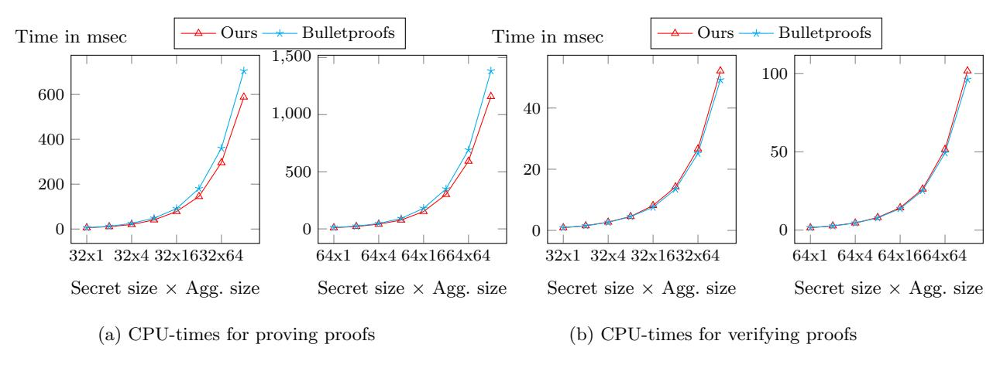
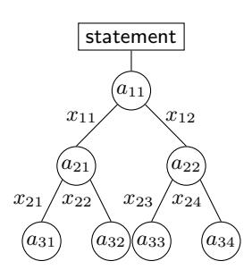

# Bulletproofs+: Shorter Proofs for Privacy-Enhanced Distributed Ledger

Heewon Chung<sup>1</sup> , Kyoohyung Han2? , Chanyang Ju<sup>1</sup> , Myungsun Kim<sup>3</sup> , and Jae Hong Seo1??

> <sup>1</sup> Department of Mathematics & Research Institute for Natural Sciences, Hanyang University, Seoul 04763, Republic of Korea {heewonchung, chanyangju, jaehongseo}@hanyang.ac.kr

<sup>2</sup> Samsung SDS R&D Center

kh89.han@samsung.com

<sup>3</sup> The University of Suwon msunkim@suwon.ac.kr

Abstract. We present a new short zero-knowledge argument for the range proof and the arithmetic circuits without a trusted setup. In particular, the proof size of our protocol is the shortest of the category of proof systems with a trustless setup. More concretely, when proving a committed value is a positive integer less than 64 bits, except for negligible error in the 128-bit security parameter, the proof size is 576 byte long, which is of 85.7% size of the previous shortest one due to B¨unz et al. (Bulletproofs, IEEE Security and Privacy 2018), while computational overheads in both proof generation and verification are comparable with those of Bulletproofs, respectively.

Bulletproofs is established as one of important privacy enhancing technologies for distributed ledger, due to its trustless feature and short proof size. In particular, it has been implemented and optimized in various programming languages for practical usages by independent entities since it proposed. The essence of Bulletproofs is based on the logarithmic inner product argument with no zero-knowledge. In this paper, we revisit Bulletproofs from the viewpoint of the first sublinear zero-knowledge argument for linear algebra due to Groth (CRYPTO 2009) and then propose Bulletproofs+, an improved variety of Bulletproofs. The main ingredient of our proposal is the zeroknowledge weighted inner product argument (zk-WIP) to which we reduce both the range proof and the arithmetic circuit proof. The benefit of reducing to the zk-WIP is a minimal transmission cost during the reduction process. Note the zk-WIP has all nice features of the inner product argument such as an aggregating range proof and batch verification.

# 1 Introduction

Distributed ledger is a database that is consensually shared and synchronized across multiple nodes without a trusted administrator. The blockchain is one type of distributed ledger, where database consists of linked blocks, called chain, and the cryptocurrency such as Bitcoin [58] is a representative application of the blockchain. The benefit of distributed ledger is that it is immutable and any independent observer can verify its validity without the aid of trusted third party. Transparency of natural realization of distributed ledger often causes an issue of data privacy since all information is public. For instance, all transaction details including the sender, the receiver, and the amount transferred are public in Bitcoin.

Non-interactive zero-knowledge proofs (NIZK) enables the data owner to generate a proof for convincing observers of the validity of the data without disclosing it. Range proofs are a special NIZK for membership in a predetermined interval. That is, the prover first commits to a value using a commitment scheme and then prove that a committed value lies in a given interval. The range proof has broad applications that include blockchain-based cryptocurrencies in particular. For example, using a range proof, each transaction can be confidentially transferred without disclosing the amount transferred by including only a zero-knowledge proof validity of the transaction [56].

<sup>?</sup> This work is done before this author joins Samsung SDS.

<sup>??</sup> Corresponding author

Due to distributed and transparent nature, short NIZK without a trusted setup is highly desired in the context of distributed ledger. B¨unz et al. [20] proposed a short NIZK without a trusted setup, called Bulletproofs, on the basis of the techniques by Bootle et al. [16]. Bulletproofs provides the shortest proof size, which is indeed incomparably shorter than the other range proof systems, when a trusted setup is undesired. In fact, [16] achieves the first logarithmic communication complexity and Bulletproofs improves Bootle et al.'s protocol so that the proof size is reduced by a factor of 3 and the protocol is suitable for proving statements on committed values. Hoffmann, Klooß, and Rupp [47] improves Bulletproofs to efficiently cover more expressive relations than rank 1 constraint systems. Even though [47] presents more generic approach than Bulletproofs, it fails to reduce proof size in specific arguments such as range proofs. Recently, B¨unz, Fisch, and Szepieniec [21] devise a novel polynomial commitment scheme based on the class group and propose the first succinct NIZK without trusted setup, called Supersonic, on the basis of their polynomial commitment scheme. Although Supersonic has a strength in both low verification costs and short proof size, it requires the proof size at least more than × 6 of that of Bulletproofs for the 128-bit security level and the gap becomes larger when increasing the security level. Bulletproofs is established as one of important privacy enhancing technologies for distributed ledger, due to its trustless feature and short proof size. In particular, it has been implemented and optimized in various programming languages for practical usages by independent entities since it proposed: Java [18], C [63], C++ [65], Rust [57, 28], Go [60], and Haskell [49], to name a few.

In this paper, we present Bulletproofs+, an improved variety of Bulletproofs, that has shorter proof size than Bulletproofs. That is, Bulletproofs+ achieves the shortest proof size in the category of NIZK without trusted setup. We compare the proof size of the range proof protocol of Bulletproofs+ with that of Bulletproofs in Table 1 for typical data types on a scale from 8-bit to 64-bit. As a result, the proof size of our range proof is × 0.8 ∼ 0.857 of that of Bulletproofs. Note that computational overheads in both proof generation and verification in Bulletproofs+ are comparable with those of Bulletproofs, respectively. To achieve shorter proof size, we revisit Bulletproofs from the viewpoint of the first sublinear zero-knowledge argument for linear algebra due to Groth [43]. Bulletproofs employs the inner product argument without zero-knowledge as the essential ingredient. In [43] and Bulletproofs+, the main ingredient is the zero-knowledge weighted inner product argument (zk-WIP) to which we reduce both the range proof and the arithmetic circuit proof. The benefit of reducing to the zk-WIP is a minimal transmission cost during the reduction process, which makes the overall proof size of Bulletproofs+ smaller than that of Bulletproofs. Furthermore, like Bulletproofs, Bulletproofs+ also has additional extensions such as aggregating range proofs and batch verification.

# 1.1 Our Approach

Why Weighted Inner Product? The inner product argument based on a homomorphic commitment scheme such as a generalization of Pedersen commitment [61, 43] is employed, as a core building block, for more complicated relations such as linear algebra equations, range relation, and circuit satisfiability [43, 16, 20]. More precisely, Groth [43] proposed efficient reductions from the advanced arguments to the inner product argument and Bootle et al. [16] and B¨unz et al. [20] improved Groth's result in terms of the communication overhead by imposing more interactions between the prover and the verifier, which is not a big burden in the random oracle model [9] since it can be converted into the non-interactive argument through Fiat-Shamir heuristic [31] in the random oracle model.

In fact, when Groth proposed the reduction from the advanced argument for linear algebra equations, he used the weighted inner product (WIP) argument as well as the inner product

|         | Proof Size (bytes) |      |        | Applicable                  |
|---------|--------------------|------|--------|-----------------------------|
| Size    | [20]               | Ours | ratio* | Data Types                  |
| 8 bits  | 480                | 384  | 0.800  | age                         |
| 32 bits | 608                | 512  | 0.842  | position, zip code          |
| 64 bits | 672                | 576  | 0.857  | balance, transaction amount |

<sup>\*</sup> Bulletproofs+/Bulletproofs ratio

Table 1: Logarithmic Zero-Knowledge Range Proofs

argument as ingredient protocols. For a constant vector  $\mathbf{c} \in \mathbb{Z}_p^n$ , the weighted inner product with respect to  $\mathbf{c}$ , denoted by  $\odot_{\mathbf{c}}$ , is defined as

$$\begin{array}{ll} \odot_{\bm{c}}: \mathbb{Z}_p^n \times \mathbb{Z}_p^n & \rightarrow \mathbb{Z}_p \ (\bm{a}, \bm{b}) & \mapsto \langle \bm{a}, (\bm{c} \circ \bm{b}) \rangle, \end{array}$$

where  $\langle \ , \ \rangle$  denotes the standard inner product and  $\circ$  denotes the component-wise product (a.k.a. the Hadamard product).

At the heart of the reductions to the weighted inner product argument is to batch several equations so that the communication overhead is reduced. For example, the Hadamard product equation between two vectors  $\boldsymbol{a}$  and  $\boldsymbol{b}$ , denoted by  $\boldsymbol{a} \circ \boldsymbol{b} = \boldsymbol{c} \in \mathbb{Z}_p^n$ , is a set of n equations, and it can be converted, by imposing a random integer y, into an equation

$$\langle \boldsymbol{a}, ((y, y^2, \dots, y^n) \circ \boldsymbol{b}) \rangle = \langle \boldsymbol{c}, (y, y^2, \dots, y^n) \rangle \in \mathbb{Z}_p.$$
 (1)

The prover can convince the verifier of the original Hadamard product equation  $\mathbf{a} \circ \mathbf{b} = \mathbf{c} \in \mathbb{Z}_p^n$  by convincing of Eq. (1) for randomly chosen y. The both hand sides of Eq. (1) can be directly considered as the weighted inner product with respect to the coefficient vector  $(y, y^2, \dots, y^n)$ . Therefore, an efficient proof protocol for the weighted inner product is necessary in this approach.

Logarithmic Zero-Knowledge Argument for Weighted Inner Product. Groth [43] proposes a zero-knowledge argument for weighted inner product (zk-WIP) with linear communication overhead, which is an ingredient protocol for more advanced arguments for linear algebra equations. Subsequent works [16, 20] employ an inner product argument without zero-knowledge as an ingredient protocol but zero-knowledgeness for the advanced relations such as circuit satisfiability is achieved by the reduction to the inner product argument. Wahby et al. [71] presents a logarithmic zero-knowledge argument for inner product between a hidden vector and a public vector, which is distinct from (weighted) inner product between two hidden vectors in [43]. Hoffmann, Klooß, and Rupp [47] propose a zero-knowledge argument for inner product between two hidden vectors satisfying some constraints, which is called almost zero-knowledge proof protocol by the authors. In order to blind witness vectors, they use random vectors depending on the witness, which brings some constraint for the witness. To the best of our knowledge, there is no concrete construction for logarithmic WIP proof protocol with full zero-knowledge, where both input vectors of WIP are perfectly hidden.

We begin with logarithmic inner product arguments [16, 20]. We find that at the heart of logarithmic inner product argument is the following equality as well as the bilinearity of the inner product. For the sake of simplicity, let n be an even number  $n=2\widehat{n}$  for some integer  $\widehat{n}$  and  $\boldsymbol{a}=(\boldsymbol{a}_1,\boldsymbol{a}_2),\boldsymbol{b}=(\boldsymbol{b}_1,\boldsymbol{b}_2)\in\mathbb{Z}_p^{\widehat{n}}\times\mathbb{Z}_p^{\widehat{n}}$ . Then, we have

$$\langle \boldsymbol{a}, \boldsymbol{b} \rangle = \langle \boldsymbol{a}_1, \boldsymbol{b}_1 \rangle + \langle \boldsymbol{a}_2, \boldsymbol{b}_2 \rangle.$$
 (2)

That is, an inner product can be represented by sum of two *half-length* inner products. This property is essential for reduction to a half-length inner product, which leads logarithmic communications. The WIP is also a bilinear map and satisfies the similar property to Eq. (2) when c is the Vandermonde vector, e.g.,  $c = (y, \ldots, y^n) \in \mathbb{Z}_n^n$ .

$$\boldsymbol{a} \odot_{(y,\dots,y^{\widehat{n}})} \boldsymbol{b} = \boldsymbol{a}_1 \odot_{(y,\dots,y^{\widehat{n}})} \boldsymbol{b}_1 + (y^{\widehat{n}} \cdot \boldsymbol{a}_2) \odot_{(y,\dots,y^{\widehat{n}})} \boldsymbol{b}_2. \tag{3}$$

Let us give an intuition for logarithmic WIP argument w.r.t.  $(y, ..., y^n) \in \mathbb{Z}_p^n$ . Suppose that the prover commits to vectors  $\mathbf{a}_1, \mathbf{a}_2, \mathbf{b}_1, \mathbf{b}_2 \in \mathbb{Z}_p^{\widehat{n}}$ , and integers  $c_L = \mathbf{a}_1 \odot_{(y,...,y^{\widehat{n}})} \mathbf{b}_2$ ,  $c = \mathbf{a}_1 \odot_{(y,...,y^n)} \mathbf{b}_1$ ,  $c_R = (y^{\widehat{n}} \cdot \mathbf{a}_2) \odot_{(y,...,y^{\widehat{n}})} \mathbf{b}_1 \in \mathbb{Z}_p$  and the prover aims to convince of the relation  $c = \mathbf{a} \odot_{(y,...,y^n)} \mathbf{b}$ . The bilinearity of the WIP and Eq. (3) guarantee that the following equation holds for a random challenge e.

$$(e\mathbf{a}_{1} + e^{-1}y^{\hat{n}}\mathbf{a}_{2}) \odot_{(y,\dots,y^{\hat{n}})} (e\mathbf{b}_{2} + e^{-1}\mathbf{b}_{1})$$

$$= e^{2}\mathbf{a}_{1} \odot_{(y,\dots,y^{\hat{n}})} \mathbf{b}_{2} + \mathbf{a} \odot_{(y,\dots,y^{n})} \mathbf{b} + e^{-2}(y^{\hat{n}}\mathbf{a}_{2}) \odot_{(y,\dots,y^{\hat{n}})} \mathbf{b}_{1}$$

$$(4)$$

In our protocol, the verifier can calculate the commitments to  $(e\boldsymbol{a}_1+e^{-1}y^{\hat{n}}\boldsymbol{a}_2)$  and  $(e\boldsymbol{b}_2+e^{-1}\boldsymbol{b}_1)$ , inputs of WIP of the left-hand side in Eq. (4), with an aid of the prover. Let  $\hat{\boldsymbol{c}}:=e^2c_L+c+e^{-2}c_R$ . Then, the commitment to  $\hat{c}$  can be publicly calculated using the homomorphic property of an underlying commitment scheme and it will be used as the result of WIP when taking  $(e\boldsymbol{a}_1+e^{-1}y^{\hat{n}}\boldsymbol{a}_2)$  and  $(e\boldsymbol{b}_2+e^{-1}\boldsymbol{b}_1)$  as input. Thus, the equality between Eq. (4) and  $\hat{c}$  for randomly chosen e guarantees the equality between each coefficient of power of e of the right-hand side in Eq. (4) and that of  $\hat{c}$ , so that we have  $c=\boldsymbol{a}\odot_{(y,\dots,y^n)}\boldsymbol{b}$ . Therefore, a WIP proof w.r.t  $(y,\dots,y^n)$  between n-dimension vectors is reduced to a WIP proof w.r.t  $(y,\dots,y^n)$  between  $\hat{n}$ -dimension vectors.

The commitment to the hidden vector of length n, which is input of the reduction, and each transmission sent by the prover during the reduction are blinded by random group elements chosen by the prover, so that the witness is perfectly hidden from the viewpoint of the verifier. Using the discrete logarithms of such random group elements, the prover updates the blinding factor in the commitment to the new hidden vector of length  $\hat{n}$ , which is output of the reduction.

Constant communication is sufficient for each reduction step and  $O(\log_2(n))$  number of rounds are sufficient for reducing to a dimension 1 WIP proof protocol. For the final step of zero-knowledge WIP proof protocol, we devise a variant of Schnorr protocol, which requires 2 group elements and 3 field elements. Therefore, the proposed zk-WIP protocol requires communication of  $2\log_2(n) + 5$  field or group elements.

One Round Reduction for Bulletproofs-like Protocols. Bünz et al. propose a short zero-knowledge argument called Bulletproofs, which includes an aggregate range proof protocol with logarithmic size in the witness size and an arithmetic circuit proof protocol with logarithmic size in the circuit size. Both aggregate range proof and arithmetic circuit proof protocols are built on their inner product proof protocol.

We show that when our zk-WIP proof protocol is used as an ingredient protocol, one commitand-challenge round is sufficient to reduce from the advanced protocols such as aggregate range proof and arithmetic circuit proof to the zk-WIP proof protocol. In particular, the prover sends only a group element in our reductions.

Let us explain the idea of the reduction for our single range proof protocol. The prover's goal is to convince the verifier that the witness v belongs to an interval  $[0, 2^n - 1]$ . The prover begins with committing to  $\mathbf{a}_L, \mathbf{a}_R \in \mathbb{Z}_p^n$  satisfying

$$\mathbf{a}_L - \mathbf{a}_R = \mathbf{1}^n \in \mathbb{Z}_p^n \wedge \mathbf{a}_L \circ \mathbf{a}_R = \mathbf{0} \in \mathbb{Z}_p^n \wedge \langle \mathbf{a}_L, \mathbf{2}^n \rangle = v \in \mathbb{Z}_p,$$
 (5)

where 1 <sup>n</sup> = (1, . . . , 1) is the vector filled with 1's in all entries and 2 <sup>n</sup> = (1, 2, . . . , 2 n−1 ) is the vector consisting of powers of 2. Eq. (5) is sufficient to convince the verifier. Next, the verifier sends a random challenge y ∈ Zp. Then, 2n + 1 equations in Eq. (5) will be batched to a WIP equation. To this end, we put each term of left-hand sides in Eq. (5) into a coefficient of distinct monomial with variables y and z as follows.

$$(\boldsymbol{a}_{L} - \boldsymbol{1}^{n} \cdot z) \odot_{(y,\dots,y^{n})} (\boldsymbol{a}_{R} + \boldsymbol{2}^{n} \circ (y^{n}, y^{n-1}, \dots, y) + \boldsymbol{1}^{n} \cdot z)$$

$$= \boldsymbol{a}_{L} \odot_{(y,\dots,y^{n})} \boldsymbol{a}_{R} + y^{n+1} \langle \boldsymbol{a}_{L}, \boldsymbol{2}^{n} \rangle + z \cdot (\boldsymbol{a}_{L} - \boldsymbol{a}_{R}) \odot_{(y,\dots,y^{n})} \boldsymbol{1}^{n} - \zeta(y, z) \in \mathbb{Z}_{p},$$

where ζ(y, z) = y <sup>n</sup>+1zh1 n , 2 n i + z 2 h1 n , −→y n <sup>i</sup> and −→<sup>y</sup> n indicates (y, . . . , y<sup>n</sup> ). Each term of the right-hand sides in Eq. (5) is either constant or the witness v and appeared as a coefficient of distinct monomial with variables y and z in

$$0 + y^{n+1}v + z\mathbf{1}^n \odot_{(y,\dots,y^n)} \mathbf{1}^n - \zeta(y,z).$$
 (6)

Therefore, the remaining part of our range proof protocol is to run the zk-WIP protocol w.r.t. (y, . . . , y<sup>n</sup> ) that convinces

$$(\boldsymbol{a}_{L} - \mathbf{1}^{n} \cdot z) \odot_{(y,\dots,y^{n})} (\boldsymbol{a}_{R} + \mathbf{2}^{n} \circ (y^{n}, y^{n-1}, \dots, y) + \mathbf{1}^{n} \cdot z)$$

$$= y^{n+1}v + z\mathbf{1}^{n} \odot_{(y,\dots,y^{n})} \mathbf{1}^{n} - \zeta(y,z).$$
(7)

By the homomorphic property of an underlying commitment scheme, the commitments to inputs and output of WIP in Eq. (7) can be publicly calculated from public parameters and the commitment sent by the prover at the beginning of our range protocol. Therefore, both the prover and the verifier can run the zk-WIP protocol. Similarly, aggregate range proof and arithmetic circuit proof protocols can be reduced to the zk-WIP proof protocol through one commit-and-challenge round.

# 1.2 Applications

Blockchain: Confidential Transactions, Smart Contracts, and More. Although Bitcoin [58] supports pseudonymity, it does not guarantee perfect privacy [3, 66]. To address confidentiality kkissue, Maxwell [56] proposed the concept of the confidential transaction, where every information except the validity is hidden, in the UTXO model. Here, the UTXO is an unspent transaction output and the UTXO model means that each transaction should fully spend the outputs of previously unspent transactions. A confidential transaction consists of commitments to a set of inputs and a set of outputs with Pedersen commitment scheme [61]. Although the homomorphic property of Pedersen commitment enables the verifier to check if the sum of inputs is equal to the sum of outputs, the verifier cannot verify if a sender has enough balance to involved amounts, and thus a sender should provide an additional evidence for this. The range proof exactly resolves this problem and thus essential in confidential transactions.

Monero [69, 74] is one of well-known privacy-enhanced blockchain projects which employ confidential transactions in the UTXO model. Each transaction in the UTXO model has 2.5 outputs on average. The range proof should be attached for each output of transaction in Monero, so that on average 2.5 range proofs required for each transaction. The size of each transaction with two outputs has been reduced from 13kB to 2.5kB since Bulletproofs for aggregate range proof was integrated with Monero in 2018. Bulletproofs+ for aggregate range proof is 96 bytes smaller than Bulletproofs in 128-bit security, so that when applying Bulletproofs+ instead of Bulletproofs to Monero two output transaction can be further reduced and finally obtained 2.4 kB. Recently, each block of Monero contains 15 transactions on average and is generated per 2

minutes so that 10,800 transactions are produced on a day. Therefore, Bulletproofs+ can save more than 1 MB for every day. In addition, our improved range proofs can impact on transactions per second (TPS) and a transaction fee which are major criteria for evaluating scalability since a node can handle more transaction as much as reduced size and it eases the burden to propagate a transaction. We can obtain a similar affect to the other privacy cryptocurrencies beside Monero, e.g., QuisQuis due to Fauzi et al. [30]. Compared to Monero, QuisQuis makes UTXO sets non-monotomic growing by introducing new notion, called updatable public keys, however, Bulletproofs still plays an essential role in QuisQuis. Thus Bulletproofs+ can also affect to QuisQuis by reducing the transaction size.

Mimblewimble aims to resolve privacy and scalability problem in Bitcoin. Like Bitcoin, it was proposed by an anonymous named Jedusor [51] on Bitcoin IRC channel and Poelstra [62] released a revised version. In the last year, Fuchsbauer et al. [33] provided a provable-security analysis for Mimblewimble. In UTXO model, sums of input transaction values and output transaction values should be the same, apart from a transaction fee, and anyone can get a commitment to 0 from the valid transaction. Then, a sender signs a transaction under the commitment to 0 (as the public key) which implies that no money vanished and none was created. Through this, they simplify the structure of a confidential transaction, however, they still require sender's balance check for the validity of the transaction and thus a range proof is indispensable. To resolve scalability issue, Mimblewimble only requires to store necessary transaction with cut-through while Bitcoin should store the entire transaction history, which implies the entire blockchain size is significantly reduced and it makes bootstrapping more faster. Grin [40] and Beam [8] are major implementations of Mimblewimble. For a million blocks, 10 million transactions (2 inputs, 2.5 outputs average) and 100,000 unspent outputs, UTXO size is nearly 520 MB and among them almost 517 MB is allocated to the range proofs [40]. UTXO size can be significantly reduced to about 90 MB (100 MB, respectively) with Bulletproofs+ (Bulletproofs, respectively).

Besides a confidential transaction, there are several attempts to employ range proofs in smart contract. A confidential transaction is first proposed based on the UTXO model, however, a smart contract platform usually takes an account-based model. To construct a confidential transaction for the smart contract, it should support not only range proofs, but also statements on algebraically-encoded values to execute arbitrary smart contract securely. Zether [19] suggests a confidential transaction compatible with a smart contract platform, especially Ethereum [72], called confidential transfers. Additionally, Findora [32] is also one of projects employing Bulletproofs on a smart contract. The main feature of [32] is supporting audits on a confidential transaction and it enables to prove more nuanced statements with selective disclosure. Both [19] and [32] support a confidential asset transfer and range proofs and arithmetic circuit proofs are necessary. Thus, Bulletproofs+ can enhance the efficiency of account-based model.

Both the range proofs and the arithmetic circuit proofs can be used for confidential transaction between different assets to ensure that a balance for each asset is preserved, in zeroknowledge manner. Another popular cryptocurrency Stellar [68] proposed a project for this purpose and implemented a confidential asset protocol, called Cloak [50, 67], using Bulletproofs. In [50], a transaction consists of the number of asset transfers and to preserver the secrecy of the values, each transfer is blended by merging, shuffling, and splitting with other transfers in a transaction. Every function can be proven by Bulletproofs+ and thus the verifier can confirm correctness of the execution with smaller communication overhead than Bulletproofs.

The sidechains also employs Bulletproofs to reflect sidechain's transactions in the mainchain [36]. Each sidechain node should provide a signature on the transactions in the sidechains to convince the mainchain nodes and it is quite burden for mainchain nodes to verify all signatures as many as the number of sidechain nodes. For alleviating burden, Gazi, Kiayias and Zindros [36] employ multisignature and Merkle-tree hashing for verification key aggregation and Bulletproofs is used for further storage optimization. Since Bulletproofs+ can also support the membership proof and it can save more storage than Bulletproofs, our suggestion can further optimize their construction.

Range Proofs. The range proof is an essential tool for resolving privacy issues in the digital financial technology including distributed ledger, e.g., [59]. Banks performs the process of identifying and verifying the identity of the client when opening an account. Due to regulations such as the anti-money laundering and know-your-customer, this process becomes mandatory and at the same time privacy issues cause. The zero-knowledge proofs enables to perform this process without disclosing the customer's private information. Using the range proofs, the client can convince the banks of some relations on the age, the zip codes, and the GPS position without disclosing the actual information. For instance, the client can prove that the customer's age is over the legal age and the zip codes and the GPS information are contained in specific ranges to validate the location where the customer stays.

Verifiable Shuffles. Bulletproofs+ for the arithmetic circuit can be employed to reduce the proof size of applications beyond distributed ledgers. For example, it can be applied to the verifiable shuffle [2, 41, 45, 7, 20] that takes a list of committed values as input and outputs a permuted list along with the proof of correctness of permuted list. Although the verifiable shuffle is an important stand-alone protocol, it is also a good building block for many other applications like e-voting protocols [34, 2], mix-net [24], privacy-preserving advertisement delivery [5], and solvency proofs [27]. In terms of the proof size, Bulletproofs has the most efficient scheme that increases the proof size logarithmically in the size of the input list. The shuffle can be implemented either by the sorting circuit using O(n log<sup>2</sup> (n)) multiplications, where n is the size of input list [20], or by the permutation circuit and the multi-exponentiation circuits in [7].<sup>4</sup> Although Bulletproofs+ reduces only constant term (e.g., 96 bytes for the 128-bit security), for practically large n (e.g., n < 2 <sup>32</sup>) the improvement of Bulletproofs+ makes a meaningful difference like the range proof case due to logarithmic increasing speed of Bulletproofs' proof size in n.

# 1.3 Other Related Works

For better understanding and positioning out results, we give a brief survey about ZK arguments for range and arithmetic circuits.

Range proofs. A tons of researches have been done into the range proof since Brickell et al. [17] presented the first proposal. The range proof plays an essential building block in lots of cryptographic applications: to name a few, anonymous credentials [23], anonymous e-cash [22], auction protocols [53], e-voting [42], privacy-preserving certificate transparency [29].

Lipmaa [52] presents a range proof protocol that relies on Lagrange's four-square theorem (a.k.a., Bachet's conjecture), which states that any positive integer can be written as a sum of four squares. Groth [42] improved Lipmaa's proposal by exploiting Legendre's three-square theorem, which states that a positive integer α can be written as a sum of three squares if and only if α is not of the form 4n<sup>1</sup> (8n2+7) for n1, n<sup>2</sup> ∈ Z. More recently, Couteau et al. [26] proposed a range proof solution based on a weaker assumption than the strong RSA assumption [6]. All these proposals rely on the the hardness of factoring large numbers, so that a trusted setup is required to generate the RSA modulus. .

NIZK for Arithmetic Circuits. Zero-knowledge proof was first introduced as interactive protocol [39]. In many applications, prover and verifier may not be online at the same time or

<sup>4</sup> One can use Bulletproofs to design the permutation argument and the multi-exponentiation argument in [7] to achieve the logarithmic proof size of verifiable shuffles.

prover might want to preprocess multiple proofs. Blum et al.[13] introduced NIZK proofs in the common reference string model.

In recent years, a lot of improvement on NIZK for the circuit satisfiability has been made [37, 11, 44]. SNARKs are arguments of knowledge that have succinct proofs and efficient verifiers. Even though SNARKs provides high performance that can meet practical requirements, SNARKs inherently and inevitably require a trusted setup to generate the structured reference string (SRS). In order to mitigate this problem, Groth et al. [46] and many subsequent works [55, 35, 25, 73] proposed proof systems relying on the SRS, where SRS is efficiently updatable. Nevertheless, these proof systems with the updatable SRS still requires at least one trusted setup at the beginning of the proof system.

NIST has announced and prepared the transition to post-quantum secure cryptography in the near future [64], and thus achieving post-quantum secure NIZKs with suitable performance is a desired goal as well. Toward this goal, several NIZK schemes have been proposed: ZK-Boo [38], Ligero [1], Aurora [12], STARKs [10], Virgo [75], to name a few. Even though much improvements has been made in recent years, the performance of post-quantum secure NIZKs in specialized circuits (e.g. range proof) is hard to compete with NIZKs from classical assumptions such as RSA and discrete logarithms.

# 1.4 Concurrent Works

There are two independent and concurrent works that improve Bulletproofs [14, 4]. Boneh, Fisch, Gabizon and Williamson [14] propose a simple range proof from hiding polynomial commitment scheme. To prove 0 ≤ v < 2 <sup>n</sup> with zero-knowledge property, it requires two polynomials of degree n + 1 and executing three polynomial evaluation protocols and the prover should transmit 2 · dlog<sup>2</sup> (n+2)e+2 elements in G and 5 elements in Zp. Definitely, its communication costs less than Bulletproofs, however, still requires at least one more element than our range proof. Moreover, since the construction is based on a polynomial commitment scheme which needs to choose a prime p larger than n, a prover can only claim the same interval once a polynomial commitment scheme is determined, otherwise a prover should renew the polynomial commitment scheme if the prover wants a new range. On the contrary, our range proof scheme supports an arbitrary n and thus there is no restriction for a prover. Attema and Cramer [4] focus on reconciling Bulletproofs with theory of Σ-Protocols. A prover needs to prove quadratic equations for a range proof, however, Σ-Protocols are appropriate for proving arbitrary linear relations and thus Bulletproofs requires reinvention with the quadratic constraint and it may causes some technical difficulties. To resolve this issue, they employ an arithmetic secret sharing based technique which enables to linearize all non-linear statements, while preserving the same communication reduction. More precisely, a communication cost for their range proof is 2·dlog<sup>2</sup> (2n+3)e elements in G and 5 elements in Z<sup>p</sup> and thus Bulletproofs+ still remains as a transparent range proof with the smallest proof size.

# 1.5 Organization

We provide definitions of assumptions, homomorphic commitment scheme, and zero-knowledge argument in Section 2. In Section 3, we present a main building block protocol, the zeroknowledge argument for weighted inner product without a trusted setup. We propose short zeroknowledge arguments for the range proof and the arbitrary arithmetic circuits in the subsequent sections, Section 4 and Section 5, respectively. Finally, we provide performance of proposed protocols for the concrete parameters in Section 6.

#### 2 Preliminaries

We begin with defining some basic notations to be used when defining the preliminary concepts in the following subsections. More specific notations that are useful for describing and analyzing the proposed proof systems are provided in Section 2.5. For any algorithm A, y = A(x; r) denotes that y is the output of A on input x with randomness r. When using uniform randomness, we use a shorten notation  $y \leftarrow A(x)$  meaning that randomness r is chosen at random outside A and we set y = A(x; r). For any set S,  $x \stackrel{\$}{\leftarrow} S$  means uniform sampling of x at random from S. Throughout the paper,  $\lambda$  denotes the security parameter and it is written unary when it is used as the input of algorithms. For a function  $f: \mathbb{N} \to [0,1]$ , we say that f is negligible if  $f(\lambda) = \lambda^{-\omega(1)}$  and that f is overwhelming when  $f(\lambda) = 1 - \lambda^{-\omega(1)}$ .  $negl(\lambda)$  denotes a negligible function.

# 2.1 Discrete Logarithm Assumption

Let  $\mathcal{G}$  be a group generation algorithm that takes the security parameter with the unary form  $1^{\lambda}$  and outputs a prime p of  $\lambda$  bits, a cyclic group  $\mathbb{G}$  of order p, and a generator q of  $\mathbb{G}$ .

**Definition 1 (Discrete Logarithm Assumption).** We say that the discrete logarithm assumption holds relative to  $\mathcal{G}$  if for all non-uniform polynomial-time adversaries  $\mathcal{A}$ , there exists a negligible function  $negl(\lambda)$  such that

$$\Pr\left[g^x = h \mid \frac{(\mathbb{G}, p, g) \leftarrow \mathcal{G}(1^{\lambda}); \ h \overset{\$}{\leftarrow} \mathbb{G};}{x \leftarrow \mathcal{A}(\mathbb{G}, p, g, h)}\right] < negl(\lambda).$$

The discrete logarithm assumption can be generalized to the following equivalent assumption. When we mention the discrete logarithm assumption in the paper, it always means the discrete logarithm relation assumption.

**Definition 2 (Discrete Logarithm Relation Assumption).** We say that the discrete logarithm relation assumption holds with respect to  $\mathcal{G}$  if for all  $n \geq 1$  and all non-uniform polynomial-time adversaries  $\mathcal{A}$ , there exists a negligible function  $negl(\lambda)$  such that

$$\Pr\left[ \exists a_i \neq 0, i \in [0, n] \middle| \begin{matrix} (\mathbb{G}, p, g_0) \leftarrow \mathcal{G}(1^{\lambda}); \\ (\mathbb{G}, p, g_0) \leftarrow \mathbb{G}(1^{\lambda}); \end{matrix} \right] \\ \leqslant \prod_{i=0}^n g_i^{a_i} = 1 \middle| \lbrace a_j \rbrace_{j=0}^n \leftarrow \mathcal{A}(\mathbb{G}, p, \lbrace g_i \rbrace_{i=0}^n) \end{matrix} \right] < negl(\lambda).$$

If there exists  $a_i \neq 0$  for some i while satisfying  $\prod_{i=0}^n g_i^{a_i} = 1$ , then we call it is a non-trivial discrete logarithm relation.

#### 2.2 Homomorphic Commitments

A (non-interactive) commitment scheme consists of two algorithms Gen and Com. Gen is called the key generation algorithm that takes the security parameter and outputs the commitment key ck. The message space  $M_{ck}$ , the randomness space  $R_{ck}$ , and the commitment space  $C_{ck}$  are specified in ck. The commitment algorithm Com combined with the commitment key ck specifies a commitment function  $Com_{ck}: M_{ck} \times R_{ck} \to C_{ck}$  that takes  $m \in M_{ck}$  and outputs a commitment  $com \in C_{ck}$  using randomness  $r \in R_{ck}$ . To commit to a message  $m \in M_{ck}$ , the sender selects  $r \stackrel{\$}{\leftarrow} R$  and computes the commitment  $com = Com_{ck}(m;r)$ . We define several properties of the commitment scheme.

**Definition 3 (Homomorphic Commitments).** A homomorphic commitment scheme is a (non-interactive) commitment scheme that has a homomorphic property such that

$$Com(m_1; r_1) +_{C_{ck}} Com(m_2; r_2) = Com(m_1 +_{M_{ck}} m_2; r_1 +_{R_{ck}} r_2),$$

for all  $m_1, m_2 \in M_{ck}$  and  $r_1, r_2 \in R_{ck}$ , where  $+_{C_{ck}}, +_{M_{ck}}$  and  $+_{R_{ck}}$  define operations in  $C_{ck}, M_{ck}$  and  $R_{ck}$ , respectively.

**Definition 4 (Hiding Commitments).** A commitment scheme is hiding if for all non-uniform polynomial-time interactive adversaries A, there exists a negligible function  $negl(\lambda)$  such that

$$\left|\frac{1}{2}-\Pr\left[\begin{matrix}\operatorname{ck}\leftarrow\operatorname{Gen}(1^{\lambda});(m_{0},m_{1})\leftarrow\mathcal{A}(\operatorname{ck});\\b'=b\mid &b\overset{\$}\leftarrow\{0,1\} &;&r\overset{\$}\leftarrow\operatorname{R}_{\operatorname{ck}};\\\operatorname{com}=\operatorname{Com}(m_{b};r);b'\overset{\$}\leftarrow\mathcal{A}(\operatorname{com})\end{matrix}\right]\right|\leq negl(\lambda),$$

where the probability goes over the randomness used in A and Gen and the choice of b and r. We say the scheme is perfectly hiding if  $negl(\lambda) = 0$ .

**Definition 5 (Binding Commitments).** A commitment scheme is binding if for all non-uniform polynomial-time interactive adversary A, there exists a negligible function  $negl(\lambda)$  such that

$$\Pr \begin{bmatrix} \mathsf{Com}(m_0; r_0) \\ = \mathsf{Com}(m_1, r_1) \\ \land m_0 \neq m_1 \end{bmatrix} \begin{array}{c} \mathsf{ck} \leftarrow \mathsf{Gen}(1^{\lambda}); \\ (m_0, m_1, r_0, r_1) \leftarrow \mathcal{A}(\mathsf{ck}) \end{bmatrix} \leq negl(\lambda).$$

where the probability goes over the randomness used in A and Gen. We say the commitment scheme is perfectly binding if  $negl(\lambda) = 0$ .

In this paper, we will use a generalized Pedersen commitment scheme. We explain here how generalized Pedersen commitment implemented. Let  $\mathsf{M}_{\mathsf{ck}} = \mathbb{Z}_p^n$ ,  $\mathsf{R}_{\mathsf{ck}} = \mathbb{Z}_p$  and  $\mathsf{C}_{\mathsf{ck}} = \mathbb{G}_p^n$  where  $ck = (\mathbb{G}, p, g, g_1, ..., g_n)$  and  $g, g_i \overset{\$}{\leftarrow} \mathbb{G}$  for i = 1, ..., n. To commit to a message vector  $\mathbf{m} = (m_1, ..., m_n) \in \mathbb{Z}_p^n$ , we compute  $\mathsf{Com}_{\mathsf{ck}}(\mathbf{m}; r) := g^r \prod_{i=1}^n g_i^{m_i}$  where  $r \overset{\$}{\leftarrow} \mathbb{Z}_p$ . The generalized Pedersen commitment scheme is perfectly hiding since g is a generator of the cyclic group and thus the random blinding factor  $g^r$  is uniformly distributed over the cyclic group. If the discrete logarithm assumption holds on  $\mathbb{G}$ , then the Pedersen commitment scheme is computationally binding [61, 43]. An important fact is that the generalized Pedersen commitment is an homomorphic commitment, i.e., for all  $\mathbf{m}, \mathbf{m'} \in \mathbb{Z}_p^n$  and  $r, r' \in \mathbb{Z}_p$ ,  $\mathsf{Com}_{\mathsf{ck}}(\mathbf{m}; r) \cdot \mathsf{Com}_{\mathsf{ck}}(\mathbf{m'}; r') = \mathsf{Com}_{\mathsf{ck}}(\mathbf{m} + \mathbf{m'}; r + r')$  holds.

#### 2.3 Zero-Knowledge Arguments of Knowledge

We consider arguments consisting of three interactive probabilistic polynomial-time algorithms  $(\mathcal{K}, \mathcal{P}, \mathcal{V})$  in the common random string model.  $\mathcal{K}$  is called the common reference string generator that takes the security parameter  $1^{\lambda}$  as input and outputs the common reference string  $\sigma$ . In this paper, the common reference string is a public key for the generalized Pedersen commitment scheme, that is, uniformly chosen group elements.  $^{5}$   $\mathcal{P}$  and  $\mathcal{V}$  are called the prover and the verifier, respectively. For the sake of simplicity, in this paper, we do not explicitly describe  $\mathcal{K}$  but assume the common reference string is given as common input to both  $\mathcal{P}$  and  $\mathcal{V}$ . At the end

<sup>&</sup>lt;sup>5</sup> The public key (or commitment key) of Pedersen commitment scheme can be chosen as a random string. Therefore, we are in the common random string model, and even in the plain model if we let the verifier chooses the random string.

of interaction, the verifier V accepts (equivalently outputs 1) or rejects (equivalently outputs 0).

We will prove that the proposed protocol, Bulletproofs+, is a zero-knowledge argument of knowledge. Informally, the goal of the prover in this protocol is to convince the verifier of knowledge of witness that guarantees some statement holds, without disclosing the witness. Due to space constraint, we provide the formal definition of zero-knowledge arguments of knowledge in Appendix A.

# 2.4 Non-Interactive Argument without Trusted Setup in the Random Oracle Model

A protocol in the common random string model can be converted into a protocol without a trusted setup in the random oracle model [9]. In particular, if the common reference string consists of random group generators of a group  $\mathbb{G}$ , then we can use a hash function modeled as a random oracle to map from  $\{0,1\}^*$  to  $\mathbb{G}$ , as in [15] and the common reference string is replaced by the output of the hash function from a small seed.

The public coin argument (Definition 9) protocol can be converted into a non-interactive argument protocol in the random oracle model by replacing all random challenges chosen by the verifier with hash values of the transcript up to that point. That is, the Fiat-Shamir heuristic [31] is used in this conversion.

#### 2.5 Notation

Let p denote a prime of length  $\lambda$ . In our protocol, we use several sets  $\mathbb{G}, \mathbb{Z}_p, \mathbb{Z}_p^*, \mathbb{G}^n, \mathbb{Z}_p^n$  and several binary operations over them. Let  $\mathbb{G}$  denote a group of order p,  $\mathbb{Z}_p$  denote the ring of integers modulo p, and  $\mathbb{Z}_p^*$  denote  $\mathbb{Z}_p \setminus \{0\}$ . For a group  $\mathbb{F}$ ,  $\mathbb{F}^n$  denotes the n-dimensional product group, and hence it also denotes vector spaces of dimension n over  $\mathbb{F}$ .  $\mathbb{Z}_p^{n \times m}$  denotes the set of matrices with n rows and m columns over  $\mathbb{Z}_p$ . An element in cartesian product set  $\mathbb{F} \in \{\mathbb{G}^n, \mathbb{Z}_p^n, \mathbb{Z}_p^{n \times m}\}$  is denoted by bold letters, i.e.  $\mathbf{g} = (g_1, ..., g_n) \in \mathbb{G}^n$ ,  $\mathbf{a} = (a_1, ..., a_n) \in \mathbb{Z}_p^n$ , and  $\mathbf{B} \in \mathbb{Z}_p^{n \times m}$ . We often consider a vector  $\mathbf{a}$  in  $\mathbb{Z}_p^n$  as a row matrix in  $\mathbb{Z}_p^{1 \times n}$  and its transpose vector, which is the corresponding column vector, is denoted by  $\mathbf{a}^{\top}$ .

We define notations for several binary operators among the above defined sets. For two vectors  $\boldsymbol{a}, \boldsymbol{b} \in \mathbb{Z}_p^n$ , the inner-product between  $\boldsymbol{a}$  and  $\boldsymbol{b}$  is defined as  $\boldsymbol{a} \cdot \boldsymbol{b}^\top = \sum_{i=1}^n a_i \cdot b_i \in \mathbb{Z}_p$  and also denoted by  $\langle \boldsymbol{a}, \boldsymbol{b} \rangle$ . The component-wise multiplication (a.k.a the Hadamard product) between  $\boldsymbol{a}$  and  $\boldsymbol{b}$  is denoted by  $\boldsymbol{a} \circ \boldsymbol{b}$ , i.e.,  $\boldsymbol{a} \circ \boldsymbol{b} = (a_1 \cdot b_1, \dots, a_n \cdot b_n) \in \mathbb{Z}_p^n$ . For  $\boldsymbol{a} \in \mathbb{Z}_p^n$  and  $\boldsymbol{g} \in \mathbb{G}^n$ , the multi-exponentiation  $\prod_{i=1}^n g_i^{a_i} \in \mathbb{G}$  is denoted by  $\boldsymbol{g}^{\boldsymbol{a}}$ . For a scalar  $c \in \mathbb{Z}_p$  and a vector  $\boldsymbol{a} \in \mathbb{Z}_p^n$ , the scalar multiplication is denoted by  $c \cdot \boldsymbol{a} \in \mathbb{Z}_p^n$ , i.e.,  $c \cdot \boldsymbol{a} = (c \cdot a_1, \dots, c \cdot a_n)$ . For an integer  $\boldsymbol{y} \in \mathbb{Z}_p^*$ , we use two vector notations  $\overrightarrow{\boldsymbol{y}}^n$  and  $\overleftarrow{\boldsymbol{y}}^n$  to denote  $(y, y^2, \dots, y^n)$ , and

For an integer  $y \in \mathbb{Z}_p^*$ , we use two vector notations  $\overrightarrow{y}^n$  and  $\overleftarrow{y}^n$  to denote  $(y, y^2, \dots, y^n)$ , and  $(y^n, y^{n-1}, \dots, y^1)$ , respectively. In addition, we use two constant vectors  $(1, \dots, 1), (1, 2, \dots, 2^{n-1}) \in \mathbb{Z}_p^n$ , denoted by  $\mathbf{1}^n$  and  $\mathbf{2}^n$ , respectively. Then, an interesting equality

$$\overrightarrow{y}^n \circ \overleftarrow{y}^n = y^{n+1} \cdot \mathbf{1}^n \tag{8}$$

holds.

For a ternary relation  $\mathcal{R}$ , we use the format  $\{(\text{Public Input; Witness}) : \mathcal{R}\}$  to denote the relation  $\mathcal{R}$  using specific Public Input and Witness.

#### 3 Weighted Inner Product Argument

Groth [43] proposed the zero-knowledge argument for the weighted inner product (zk-WIP) and used it to build square-root zero-knowledge arguments for linear algebra equations. We propose

an improved zk-WIP argument and use it to build short zero-knowledge arguments for range proofs and arithmetic circuits.

For a constant vector  $\boldsymbol{c}$ , the weighted inner product (WIP) with respect to  $\boldsymbol{c}$  is defined as

$$\begin{array}{ll} \odot_{\bm{c}}: \mathbb{Z}_p^n \times \mathbb{Z}_p^n & \to \mathbb{Z}_p \ (\bm{a}, \bm{b}) & \mapsto \langle \bm{a}, (\bm{c} \circ \bm{b}) \rangle. \end{array}$$

The most interesting special case is that  $\mathbf{c} = \overrightarrow{y}^n$  for an integer  $y \in \mathbb{Z}_p^*$ , which is also mainly used in [43], since it has useful properties. We design arguments for range proofs and arithmetic circuits on the basis of the zk-WIP argument with respect to  $\overrightarrow{y}^n$ . For simplicity, we use the notation  $\odot_y$  instead of  $\odot_{\overrightarrow{y}^n}$ . Note that if y = 1, then  $\odot_y$  is equivalent to the inner-product. Even after the map is defined with y > 1, we can utilize it like the inner-product by computing  $\mathbf{a} \odot_y (\mathbf{b} \circ \overleftarrow{y}^n)$ . One can verify that

$$\boldsymbol{a} \odot_y (\boldsymbol{b} \circ \overleftarrow{y}^n) = y^{n+1} \cdot \langle \boldsymbol{a}, \boldsymbol{b} \rangle$$
 (9)

and we use this property in our protocols when we need to perform the inner product between a and b after fixing y > 1.

We propose a zero-knowledge argument for the WIP w.r.t.  $\overrightarrow{y}^n$  relation. In particular, we employ group-based homomorphic commitment schemes as a building block, so that the relation necessarily involves group elements. In addition, we use *compressed representation*, in the sense that the witness and the WIP result are committed together into a group element.<sup>6</sup> More precisely, we propose a zero-knowledge proof system for the following relation:

$$\left\{ (\boldsymbol{g}, \boldsymbol{h} \in \mathbb{G}^n, g, h, P \in \mathbb{G}; \boldsymbol{a}, \boldsymbol{b} \in \mathbb{Z}_p^n, \alpha \in \mathbb{Z}_p) : P = \boldsymbol{g}^{\boldsymbol{a}} \boldsymbol{h}^{\boldsymbol{b}} g^{\boldsymbol{a} \odot_y \boldsymbol{b}} h^{\alpha} \right\}$$

The WIP w.r.t  $\overrightarrow{y}^n$  as well as its simplest case, inner-product have an interesting property, which leads to logarithmic communication cost when combining with homomorphic commitment schemes. The WIP w.r.t  $\overrightarrow{y}^n$  can be replaced with a sum of two WIPs with half-lengths. When n is an even number, say  $n=2\widehat{n}$ , let  $a=(a_1,a_2), b=(b_1,b_2)\in\mathbb{Z}_p^{\widehat{n}}\times\mathbb{Z}_p^{\widehat{n}}$ . Then, we have

$$\boldsymbol{a} \odot_{y} \boldsymbol{b} = \boldsymbol{a}_{1} \odot_{y} \boldsymbol{b}_{1} + (y^{\widehat{n}} \cdot \boldsymbol{a}_{2}) \odot_{y} \boldsymbol{b}_{2}$$
 (10)

Roughly speaking, using the homomorphic property of homomorphic commitment scheme and Eq. (10), we can reduce from the zk-WIP w.r.t.  $\overrightarrow{y}^n$  to two zk-WIPs w.r.t.  $\overrightarrow{y}^{\widehat{n}}$ . However, this reduction does not lead to the proof size diminution and we need to a more trick to batch two  $\widehat{n}$ -length arguments to an  $\widehat{n}$ -length argument. To ensure this end, we impose an additional round and use a random challenge given from the verifier, so that we obtain logarithmic communication cost in the length of vector n. More precisely, the prover of the zk-WIP w.r.t.  $\overrightarrow{y}^n$  transmits  $2 \cdot \lceil \log_2(n) \rceil + 2$  elements in  $\mathbb{G}$  and 3 elements in  $\mathbb{Z}_p$ . Computational cost of both the prover and the verifier are linear in n.

#### 3.1 Zero-Knowledge Argument for WIP

We describe the zero-knowledge argument for WIP w.r.t.  $\overrightarrow{y}^n$ , denoted by  $\mathsf{zk\text{-WIP}}_{\overrightarrow{y}^n}(\boldsymbol{x};\boldsymbol{y})$ , where  $\boldsymbol{x}$  is the input of  $\mathcal{V}$  and  $(\boldsymbol{x};\boldsymbol{y})$  is the input of  $\mathcal{P}$ . In the proposed protocol, the verifier starts with the public parameters including group generators  $\boldsymbol{g}, \boldsymbol{h} \in \mathbb{G}^n, g, h \in \mathbb{G}$  as well as a commitment  $P = \boldsymbol{g}^{\boldsymbol{a}}\boldsymbol{h}^{\boldsymbol{b}}g^{\boldsymbol{c}}h^{\alpha}$ , where  $\boldsymbol{a}, \boldsymbol{b}$ , and  $\alpha$  consist of witness satisfying  $\boldsymbol{c} = \boldsymbol{a} \odot_{\boldsymbol{y}} \boldsymbol{b}$ . The prover takes as input  $\boldsymbol{g}, \boldsymbol{h}, g, h, P$  and  $\boldsymbol{a}, \boldsymbol{b}, \alpha$ .

<sup>&</sup>lt;sup>6</sup> The witness and the inner-product result are separately committed in [43, 16], but those are committed together in [20]. For short proof size, we follow the representation of [20].

```
\mathsf{zk\text{-}WIP}_{\overrightarrow{d}^n}(\boldsymbol{g},\boldsymbol{h},g,h,P;\boldsymbol{a},\boldsymbol{b},\alpha)
Relation \{(\boldsymbol{g}, \boldsymbol{h} \in \mathbb{G}^n, g, h, P \in \mathbb{G}; \boldsymbol{a}, \boldsymbol{b} \in \mathbb{Z}_p^n, \alpha \in \mathbb{Z}_p) : P = \boldsymbol{g}^{\boldsymbol{a}} \boldsymbol{h}^{\boldsymbol{b}} g^{\boldsymbol{a} \odot_y \boldsymbol{b}} h^{\alpha} \}
     \mathcal{P}'s input: (\boldsymbol{g}, \boldsymbol{h}, g, h, P; \boldsymbol{a}, \boldsymbol{b}, \alpha)
     V's input: (\boldsymbol{g}, \boldsymbol{h}, g, h, P)
     \mathcal{P}'s output: none
     V's output: Accept or Reject
     If n=1:
                      \mathcal{P}: r, s, \delta, \eta \stackrel{\$}{\leftarrow} \mathbb{Z}_p and computes
                                                                         A = \mathbf{g}^r \mathbf{h}^s g^{r \odot_y \mathbf{b} + s \odot_y \mathbf{a}} h^{\delta} \in \mathbb{G},

B = g^{r \odot_y s} h^{\eta} \in \mathbb{G}.
                          \mathcal{P} \to \mathcal{V} \mid A.B
                          \overline{\mathcal{V}}: e \stackrel{\$}{\leftarrow} \mathbb{Z}_n^*
                          \overline{\mathcal{P}\leftarrow\mathcal{V}}: \epsilon
                        \mathcal{P}: computes
                                                                          r' = r + \boldsymbol{a} \cdot e \in \mathbb{Z}_p
                                                                         s' = s + \mathbf{b} \cdot e \in \mathbb{Z}_p
\delta' = \eta + \delta \cdot e + \alpha \cdot e^2 \in \mathbb{Z}_p
                       \mathcal{P} \to \mathcal{V} : r', s', \delta'
                       \boxed{\mathcal{V}}: outputs Accept iff the following equality holds P^{e^2}A^eB=\boldsymbol{g}^{r'\cdot e}\boldsymbol{h}^{s'\cdot e}g^{r'\odot_ys'}h^{\delta'}\in\mathbb{G}
        else (n > 1): Let \widehat{n} = \frac{n}{2}, \boldsymbol{a} = (\boldsymbol{a}_1, \boldsymbol{a}_2), \boldsymbol{b} = (\boldsymbol{b}_1, \boldsymbol{b}_2), \boldsymbol{g} = (\boldsymbol{g}_1, \boldsymbol{g}_2), and \boldsymbol{h} = (\boldsymbol{h}_1, \boldsymbol{h}_2),
                 where a_i's, b_i's, g_i's, and h_i's are of the same length \hat{n}.
                      \mathcal{P}: d_L, d_R \stackrel{\$}{\leftarrow} \mathbb{Z}_p and computes
                                                                         c_L = \boldsymbol{a}_1 \odot_y \boldsymbol{b}_2 \in \mathbb{Z}_p
                                                                         \begin{aligned} c_L &= & \bm{u}_1 & \bm{\odot}_y & \bm{o}_2 \in \mathbb{Z}_p \ c_R &= (y^{\widehat{n}} \cdot \bm{a}_2) \odot_y & \bm{b}_1 \in \mathbb{Z}_p \ L &= \bm{g}_2^{(y^{-\widehat{n}} \cdot \bm{a}_1)} \bm{h}_1^{\bm{b}_2} g^{c_L} h^{d_L} \in \mathbb{G} \ R &= \bm{g}_1^{(y^{\widehat{n}} \cdot \bm{a}_2)} \bm{h}_2^{\bm{b}_1} g^{c_R} h^{d_R} \in \mathbb{G} \end{aligned}
                          \mathcal{P} \to \mathcal{V} \mid : L, R
                          \overline{\mathcal{V}}: e \stackrel{\$}{\leftarrow} \mathbb{Z}_n^*
                           \overline{\mathcal{P}\leftarrow\mathcal{V}}:e
                          \overline{\mathcal{P}} and \overline{\mathcal{V}}: compute
                                                                                           \begin{split} \widehat{\boldsymbol{g}} &= \boldsymbol{g}_1^{e^{-1}} \circ \boldsymbol{g}_2^{e \cdot y^{-\widehat{n}}} \in \mathbb{G}^{\widehat{n}} \\ \widehat{\boldsymbol{h}} &= \boldsymbol{h}_1^e \circ \boldsymbol{h}_2^{e^{-1}} \in \mathbb{G}^{\widehat{n}} \\ \widehat{P} &= L^{e^2} P R^{e^{-2}} \in \mathbb{G} \end{split}
                       |\mathcal{P}|: computes
                                                                         \widehat{\boldsymbol{a}} = \boldsymbol{a}_1 \cdot e + (\boldsymbol{a}_2 \cdot y^{\widehat{n}}) \cdot e^{-1} \in \mathbb{Z}_p^{\widehat{n}}
\widehat{\boldsymbol{b}} = \boldsymbol{b}_1 \cdot e^{-1} + \boldsymbol{b}_2 \cdot e \in \mathbb{Z}_p^{\widehat{n}}
\widehat{\alpha} = d_L \cdot e^2 + \alpha + d_R \cdot e^{-2} \in \mathbb{Z}_p
                        \mathcal{P} and \mathcal{V}: run zk-WIP_{\overrightarrow{\boldsymbol{\eta}}\,\widehat{\boldsymbol{n}}}(\widehat{\boldsymbol{g}},\widehat{\boldsymbol{h}},g,h,\widehat{P};\widehat{\boldsymbol{a}},\widehat{\boldsymbol{b}},\widehat{\alpha}).
```

Fig. 1: Zero Knowledge Argument for WIP relation

For the sake of simplicity, we assume that n is a power of 2 and let  $\hat{n} = n/2$ . When n > 1, the protocol zk-WIP $_{\overrightarrow{\eta}^n}(\boldsymbol{g}, \boldsymbol{h}, g, h, P; \boldsymbol{a}, \boldsymbol{b}, \alpha)$  is a reduction from length-n argument to  $\hat{n}$ -length

argument. The prover chooses random integers  $d_L, d_R \stackrel{\$}{\leftarrow} \mathbb{Z}_p$ , computes

$$\begin{aligned} c_L &= & \boldsymbol{a}_1 \odot_y \boldsymbol{b}_2 \in \mathbb{Z}_p \ c_R &= (y^{\widehat{n}} \cdot \boldsymbol{a}_2) \odot_y \boldsymbol{b}_1 \in \mathbb{Z}_p \ L &= \boldsymbol{g}_2^{(y^{-\widehat{n}} \cdot \boldsymbol{a}_1)} \boldsymbol{h}_1^{\boldsymbol{b}_2} g^{c_L} h^{d_L} \in \mathbb{G} \ R &= \boldsymbol{g}_1^{(y^{\widehat{n}} \cdot \boldsymbol{a}_2)} \boldsymbol{h}_2^{\boldsymbol{b}_1} g^{c_R} h^{d_R} \in \mathbb{G}, \end{aligned}$$

and sends L and R to the verifier. Next, the verifier sends a random challenge e to the prover. Then, both the prover and the verifier compute

$$\widehat{\boldsymbol{g}} = \boldsymbol{g}_1^{e^{-1}} \circ \boldsymbol{g}_2^{e \cdot y^{-\widehat{n}}} \in \mathbb{G}^{\widehat{n}}, \ \widehat{\boldsymbol{h}} = \boldsymbol{h}_1^e \circ \boldsymbol{h}_2^{e^{-1}} \in \mathbb{G}^{\widehat{n}}, \ \widehat{P} = L^{e^2} P R^{e^{-2}} \in \mathbb{G},$$

and the prover additionally computes

$$\widehat{\boldsymbol{a}} = \boldsymbol{a}_1 \cdot e + (\boldsymbol{a}_2 \cdot y^{\widehat{n}}) \cdot e^{-1} \in \mathbb{Z}_p^{\widehat{n}},$$

$$\widehat{\boldsymbol{b}} = \boldsymbol{b}_1 \cdot e^{-1} + \boldsymbol{b}_2 \cdot e \in \mathbb{Z}_p^{\widehat{n}},$$

$$\widehat{\alpha} = d_L \cdot e^2 + \alpha + d_R \cdot e^{-2} \in \mathbb{Z}_p.$$

Then, the above  $\hat{n}$ -length vectors  $\hat{a}$  and  $\hat{b}$  have a relation with  $c_L, c_R$ , and c as follows:

$$\widehat{\boldsymbol{a}} \odot_y \widehat{\boldsymbol{b}}$$

$$= \boldsymbol{a}_1 \odot_y \boldsymbol{b}_2 e^2 + \boldsymbol{a}_1 \odot_y \boldsymbol{b}_1 + (y^{n/2} \cdot \boldsymbol{a}_2) \odot_y \boldsymbol{b}_2 + y^{\widehat{n}} \boldsymbol{a}_2 \odot_y \boldsymbol{b}_1 e^{-2}$$

$$= c_L \cdot e^2 + c + c_R \cdot e^{-2}$$

Using this result, one can verify the following equality through a simple calculation.

$$\widehat{P} = L^{e^2} P R^{e^{-2}} = \widehat{g}^{\widehat{a}} h^{\widehat{b}} g^{\widehat{a} \odot_y \widehat{b}} h^{\widehat{\alpha}}$$

Therefore,  $(\widehat{\boldsymbol{g}}, \widehat{\boldsymbol{h}}, g, h, \widehat{P}; \widehat{\boldsymbol{a}}, \widehat{\boldsymbol{b}}, \widehat{\alpha})$  is composed of the same zk-WIP argument with a half length  $\widehat{n}$ , which is the desired reduction from an argument related to  $\boldsymbol{a}$  and  $\boldsymbol{b} \in \mathbb{Z}_p^n$  to an argument related to  $\widehat{\boldsymbol{a}}$  and  $\widehat{\boldsymbol{b}} \in \mathbb{Z}_p^n$ . Here, the prover sends only two group elements for each reduction, so that totally it requires only logarithmic communication cost in n.

When n=1, we design a variant of Schnorr protocol such that logarithms of input bases fulfill a specific quadratic relation, which yields both constant communication and computation costs.

We provide the security statement for our zk-WIP protocol in Theorem 1 and its proof is relegated to Appendix C.

**Theorem 1.** Let y be a constant in  $\mathbb{Z}_p^*$ . The zero-knowledge argument for WIP presented in Fig.1. has perfect completeness, perfect honest verifier zero-knowledge and computational witness-extended emulation.

#### 4 Range Proofs

This section describes our zero-knowledge argument protocols for single range proof in Section 4.1 and aggregate range proof in Section 4.2.

#### 4.1 Single Range Proof Protocol

We consider the following group-based range relation such that witeness is committed using the Pedersen commitment scheme.

$$\{(\boldsymbol{g},\boldsymbol{h}\in\mathbb{G}^n,g,h,V\in\mathbb{G};v,\gamma\in\mathbb{Z}_p):\ V=g^vh^\gamma\wedge v\in[0,2^n-1]\}$$

Here, V is a commitment to the witness v that lies in an interval  $[0, 2^n - 1]$ .  $\mathbf{g}$  and  $\mathbf{h}$  are vectors of generators of the group  $\mathbb{G}$ , but their usage is yet ambiguous in the above relation. In fact, those are parameters of the generalized Pedersen commitment scheme. v can be represent as an n-bit string  $\mathbf{a}_L$  and it will be committed using  $\mathbf{g}$  and  $\mathbf{h}$  in our range proof protocol. Then, the goal of the range protocol is to prove the knowledge of  $\mathbf{a}_L$  and an additional vector  $\mathbf{a}_R$  satisfying

$$\mathbf{a}_R = \mathbf{a}_L - \mathbf{1}^n \wedge \mathbf{a}_L \circ \mathbf{a}_R = \mathbf{0} \wedge \langle \mathbf{a}_L, \mathbf{2}^n \rangle = v$$
 (11)

Eq. (11) consists of 2n + 1 equations. To handle multiple equations at once with sublinear manner in n, we follow the technique dating back to Groth [43] such that it batches equations by computing inner-product with  $\overrightarrow{y}^n$  for a random challenge y given from the verifier.

Applying the batching technique, Eq. (11) becomes a product relation between three values, the witness  $a_L$ ,  $a_R$  and the challenge y used in batching technique. Bünz et al. [20] presented a proof system for the relations in Eq. (11) on the basis of their inner-product argument. Their inner-product protocol does not support the zero-knowledgeness property, so that the openings of the Pedersen commitments are revealed to the verifier. Hence, the reduction process should introduce exponentiation-level blinding factors to hide openings, which is rather cumbersome to handle, so that it requires several interactions and transmission of 5 elements in  $\mathbb{Z}_p$  and 2 group elements in  $\mathbb{G}$ .

Our zk-WIP protocol w.r.t.  $\overrightarrow{y}^n$  is a tailored protocol for proving a product relation between two hidden vectors  $\mathbf{a}_L$  and  $\mathbf{a}_R$  and the challenge  $\overrightarrow{y}^n$  with zero-knowledge. Consequently, we obtain an optimal reduction to zk-WIP protocol in the sense that the prover transmits only a group element in one move during the reduction phase.

Let us explain our reduction to the WIP protocol. The prover begins with sending  $A = g^{a_L} h^{a_R} h^{\alpha} \in \mathbb{G}$  and the verifier returns random challenges  $y, z \in \mathbb{Z}_p$ . Next, both the prover and the verifier can compute

$$\widehat{A} = A g^{-\mathbf{1}^n z} h^{\mathbf{2}^n \circ \overleftarrow{y}^n + \mathbf{1}^n z} V^{y^{n+1}} g^{\langle \mathbf{1}^n, \overrightarrow{y}^n \rangle z - \langle \mathbf{1}^n, \mathbf{2}^n \rangle y^{n+1} z - \langle \mathbf{1}^n, \overrightarrow{y}^n \rangle z^2}$$
(12)

Here, all the exponents are combinations of the challenges y and z, so that  $\widehat{A}$  is publicly computable. Finally, both the prover and the verifier run the WIP argument w.r.t  $\overrightarrow{y}^n$  on input  $(g, h, g, h, \widehat{A}; \widehat{a}_L, \widehat{a}_R, \widehat{\alpha})$ , where

$$\widehat{\boldsymbol{a}}_{L} = \boldsymbol{a}_{L} - \mathbf{1}^{n} \cdot z \in \mathbb{Z}_{p}^{n}$$

$$\widehat{\boldsymbol{a}}_{R} = \boldsymbol{a}_{R} + \mathbf{2}^{n} \circ \overleftarrow{y}^{n} + \mathbf{1}^{n} \cdot z \in \mathbb{Z}_{p}^{n}$$

$$\widehat{\alpha} = \alpha + \gamma \cdot y^{n+1} \in \mathbb{Z}_{p}.$$

One can easily check that the above defined  $\hat{a}_L$ ,  $\hat{a}_R$ , and  $\hat{\alpha}$  are the exponents with the base g, h, and h of  $\hat{A}$ , respectively. See the proof of Theorem 2 for the completeness.

Now, let us explain the intuition why the above reduction correctly works. Let  $\beta$  be the exponent with the base g in A, which is set to be 0 by the honest prover. Then, the WIP argument guarantees that the exponent with the base g of  $\widehat{A}$ , which is defined as

$$\beta + vy^{n+1} + \langle \mathbf{1}^n, \overrightarrow{y}^n \rangle z - \langle \mathbf{1}^n, \mathbf{2}^n \rangle y^{n+1} z - \langle \mathbf{1}^n, \overrightarrow{y}^n \rangle z^2$$
(13)

```
Relation
\{(\boldsymbol{g},\boldsymbol{h}\in\mathbb{G}^n,q,h,V\in\mathbb{G};v,\gamma\in\mathbb{Z}_p):\ V=q^vh^\gamma\wedge v\in[0,2^n-1]\}
    \mathcal{P}'s input: (\boldsymbol{g}, \boldsymbol{h}, g, h, V; v, \gamma)
   \mathcal{V}'s input: (\boldsymbol{g}, \boldsymbol{h}, g, h, V)
    \mathcal{P}'s output: none
    \mathcal{V}'s output: Accept or Reject
     \mathcal{P}: \alpha \overset{\$}{\leftarrow} \mathbb{Z}_p, sets \boldsymbol{a}_L \in \{0,1\}^n such that \langle \boldsymbol{a}_L, \boldsymbol{2}^n \rangle = v and \boldsymbol{a}_R = \boldsymbol{a}_L - \boldsymbol{1}^n \in \mathbb{Z}_n^n, and
             computes A = g^{a_L} h^{a_R} h^{\alpha} \in \mathbb{G}.
      P \to V: A
       V \to \mathcal{P} : y, z
       \mathcal{P} and \mathcal{V}: compute
                                                            \begin{split} \widehat{A} &= A \cdot \boldsymbol{g}^{-\mathbf{1}^{n} \cdot z} \cdot \boldsymbol{h}^{\mathbf{2}^{n} \circ \overleftarrow{y}^{n} + \mathbf{1}^{n} \cdot z} \cdot V^{y^{n+1}} \\ & \cdot g^{\langle \mathbf{1}^{n}, \overrightarrow{y}^{n} \rangle \cdot z - \langle \mathbf{1}^{n}, \mathbf{2}^{n} \rangle \cdot y^{n+1}z - \langle \mathbf{1}^{n}, \overrightarrow{y}^{n} \rangle \cdot z^{2}} \in \mathbb{G} \end{split}
     |\mathcal{P}|: computes
                                              \widehat{\boldsymbol{a}}_L = \boldsymbol{a}_L - \boldsymbol{1}^n \cdot \boldsymbol{z} \in \mathbb{Z}_p^n
\widehat{\boldsymbol{a}}_R = \boldsymbol{a}_R + \boldsymbol{2}^n \circ \boldsymbol{y}^n + \boldsymbol{1}^n \cdot \boldsymbol{z} \in \mathbb{Z}_p^n
                                               \widehat{\alpha} = \alpha + \gamma \cdot y^{n+1} \in \mathbb{Z}_p
      \overline{\mathcal{P}} and \overline{\mathcal{V}}: run zk-WIP_{\overrightarrow{\mathcal{J}}^n}(\boldsymbol{g},\boldsymbol{h},g,h,\widehat{A};\widehat{\boldsymbol{a}}_L,\widehat{\boldsymbol{a}}_R,\widehat{\alpha})
```

Fig. 2: Zero Knowledge Argument for Range Proof  $v \in [0, 2^n - 1]$ 

by Eq. (12), is equal to  $\hat{a}_L \odot_y \hat{a}_R$ . In fact, it can be written as

$$(\boldsymbol{a}_{L} - \boldsymbol{1}^{n} \cdot z) \odot_{y} (\boldsymbol{a}_{R} + \boldsymbol{2}^{n} \circ \overleftarrow{y}^{n} + \boldsymbol{1}^{n} \cdot z)$$

$$= \boldsymbol{a}_{L} \odot_{y} \boldsymbol{a}_{R} + \boldsymbol{a}_{L} \odot_{y} (\boldsymbol{2}^{n} \circ \overleftarrow{y}^{n} + \boldsymbol{1}^{n} \cdot z) - (\boldsymbol{1}^{n} \cdot z) \odot_{y} \boldsymbol{a}_{R}$$

$$-(\boldsymbol{1}^{n} \cdot z) \odot_{y} (\boldsymbol{2}^{n} \circ \overleftarrow{y}^{n} + \boldsymbol{1}^{n} \cdot z)$$

$$= \boldsymbol{a}_{L} \odot_{y} \boldsymbol{a}_{R} + y^{n+1} \cdot \langle \boldsymbol{a}_{L}, \boldsymbol{2}^{n} \rangle + (\boldsymbol{a}_{L} - \boldsymbol{a}_{R}) \odot_{y} (\boldsymbol{1}^{n} \cdot z)$$

$$-\langle \boldsymbol{1}^{n}, \boldsymbol{2}^{n} \rangle y^{n+1} z - \langle \boldsymbol{1}^{n}, \overrightarrow{y}^{n} \rangle z^{2}$$

$$(14)$$

where the fourth equality holds due to Eq. (9). Then, since  $a_L$ ,  $a_R$ , and v are committed to before seeing the challenges y and z, we expect that each coefficient of distinct monomial in Eq. (13) is equal to the corresponding coefficient in Eq. (14). Therefore, Eq. (11) should satisfy.

The full description of our range proof protocol is provided in Figure 2. The prover sends only one group element  $A \in \mathbb{G}$  for this reduction to the WIP argument of length-n vectors. Totally, the prover in the aggregate range proof protocol transmits  $2 \cdot \lceil \log_2(n) \rceil + 3$  elements in  $\mathbb{G}$  and 3 elements in  $\mathbb{Z}_p$ . Computational cost of both the prover and the verifier is linear in n.

We provide the security statement for our range proof protocol in Theorem 2 and its proof is relegated to Appendix D.

**Theorem 2.** The zero-knowledge argument for range proof presented in Figure 2 has perfect completeness, perfect honest verifier zero-knowledge and computational witness extended emulation.

#### 4.2 Aggregating Range Proofs

We show that our range proof can be extended to support aggregate range proof as in [20]. That is, when the prover needs to perform m > 1 range proofs at the same time, the proof size

increases only logarithmically in m, so that we achieve the shortest proof size even in performing multiple range proofs. More precisely, we present a proof system for the following relation.

$$\left\{ (\boldsymbol{g}, \boldsymbol{h} \in \mathbb{G}^{m \cdot n}, g, h \in \mathbb{G}, \boldsymbol{V} \in \mathbb{G}^m; \boldsymbol{v}, \boldsymbol{\gamma} \in \mathbb{Z}_p^m) \\ : V_j = g^{v_j} h^{\gamma_j} \wedge v_j \in [0, 2^n - 1] \text{ for } j \in [1, m] \right\}$$

For  $j \in [1, m]$ , let  $\mathbf{d}_j := \underbrace{(0, \dots, 0, \mathbf{2}^n, \underbrace{0, \dots, 0})}_{(j-1) \cdot n}$ . The prover commits to  $\mathbf{a}_L \in \{0, 1\}^{m \cdot n}$ , which is the concatenation of all of the bits for  $v_j$ 's and satisfies  $\langle \mathbf{a}_L, \mathbf{d}_j \rangle = v_j$  for all  $j \in [1, m]$ , and

is the concatenation of all of the bits for  $v_j$ 's and satisfies  $\langle \boldsymbol{a}_L, \boldsymbol{d}_j \rangle = v_j$  for all  $j \in [1, m]$ , and  $\boldsymbol{a}_R := \boldsymbol{a}_L - \mathbf{1}^{mn}$ . More precisely, the prover sends  $A = \boldsymbol{g}^{\boldsymbol{a}_L} \boldsymbol{h}^{\boldsymbol{a}_R} h^{\alpha} \in \mathbb{G}$ . Then, the prover's goal is to prove the knowledge of  $\boldsymbol{a}_L$  and  $\boldsymbol{a}_R$  satisfying following relations:

$$\boldsymbol{a}_R = \boldsymbol{a}_L - \boldsymbol{1}^n \ \land \ \boldsymbol{a}_L \circ \boldsymbol{a}_R = \boldsymbol{0} \ \land \ \langle \boldsymbol{a}_L, \boldsymbol{d}_j \rangle = v_j \text{ for all } j \in [1, m].$$

Although the aggregate range proof requires more relations to convince the verifier than the single range proof, the batching technique used in the single range proof can be suitably extended. For the challenge z given from the verifier, we let  $\mathbf{d} := \sum_{j=1}^m z^{2j} \cdot \mathbf{d}_j$ , and then m relations  $\langle \mathbf{a}_L, \mathbf{d}_j \rangle = v_j \ \forall j \in [1, m]$  can be batched to a single relation  $\langle \mathbf{a}_L, \mathbf{d} \rangle = \sum_{j=1}^m z^{2j} \cdot v_j$ . Here, we use even powers of z since z is already reserved for convincing the other equations. All the other parts of the protocol are essentially the same as the single range proof protocol.

The full description of our aggregate range proof protocol is provided in Figure 3. The prover sends only one group element  $A \in \mathbb{G}$  for this reduction to the zk-WIP argument of length-mn vectors. Totally, the prover in the aggregate range proof protocol transmits  $2 \cdot \lceil \log_2(m) + \log_2(n) \rceil + 3$  elements in  $\mathbb{G}$  and 3 elements in  $\mathbb{Z}_p$ . Computational cost of both the prover and the verifier is linear in mn.

We provide the security statement for our aggregate range proof protocol in Theorem 3 and its proof is relegated to Appendix D.

**Theorem 3.** The zero-knowledge argument for range proof presented in Figure 3 has perfect completeness, perfect honest verifier zero-knowledge and computational witness extended emulation.

# 5 Zero-knowledge Argument for Arithmetic Circuits

As another application of the zk-WIP argument, we present a zero-knowledge proof system for arbitrary arithmetic circuits. Bootle et al. [16] presents a conversion from an arbitrary arithmetic circuit with n multiplication gates into a certain relation containing a Hadamard-prodct with some linear constraints, which is formally described below. Bünz et al. [20] slightly generalizes the relation to include committed values as inputs to the arithmetic circuit, so that the converted relation contains the committed values as well. We present a zero-knowledge argument for the following relation, which is exactly the same as that in [20].

$$\left\{ \begin{pmatrix} \boldsymbol{g}_{1}, \boldsymbol{g}_{2}, \boldsymbol{h}_{1}, \boldsymbol{h}_{2} \in \mathbb{G}^{n}, \boldsymbol{V} \in \mathbb{G}^{m}, \ g, h \in \mathbb{G}, \boldsymbol{W}_{L}, \boldsymbol{W}_{R}, \boldsymbol{W}_{O} \in \mathbb{Z}_{p}^{Q \times n}, \\ \boldsymbol{W}_{V} \in \mathbb{Z}_{p}^{Q \times m}, \ \boldsymbol{c} \in \mathbb{Z}_{p}^{Q}; \boldsymbol{a}_{L}, \boldsymbol{a}_{R}, \boldsymbol{a}_{O} \in \mathbb{Z}_{p}^{n}, \boldsymbol{v}, \boldsymbol{\gamma} \in \mathbb{Z}_{p}^{m} \\ \vdots \\ V_{j} = g^{v_{j}} h^{\gamma_{j}} \forall j \in [1, m] \quad \land \quad \boldsymbol{a}_{L} \circ \boldsymbol{a}_{R} = \boldsymbol{a}_{O} \\ \vdots \\ \land \boldsymbol{W}_{L} \cdot \boldsymbol{a}_{L}^{\top} + \boldsymbol{W}_{R} \cdot \boldsymbol{a}_{R}^{\top} + \boldsymbol{W}_{O} \cdot \boldsymbol{a}_{O}^{\top} = \boldsymbol{W}_{V} \cdot \boldsymbol{v}^{\top} + \boldsymbol{c}^{\top} \\ \end{cases} \right\}$$

Here, we restrict  $\mathbf{W}_V \in \mathbb{Z}_p^{Q \times m}$  to be of rank m, as in Bulletproofs [20].

Like our range proof protocol, our goal for arithmetic circuit proof is to reduce to the zk-WIP argument and we show that one move with one group element (in terms of the prover) is sufficient

```
Relation \{(\boldsymbol{g},\boldsymbol{h}\in\mathbb{G}^{m\cdot n},g,\boldsymbol{h}\in\mathbb{G},\boldsymbol{V}\in\mathbb{G}^m;\boldsymbol{v},\boldsymbol{\gamma}\in\mathbb{Z}_p^m):\ V_j=g^{v_j}\boldsymbol{h}^{\gamma_j}\wedge v_j\in[0,2^n-1]\ \text{for}\ j\in[1,m]\}

\mathcal{P}'s input: (\boldsymbol{g},\boldsymbol{h},g,\boldsymbol{h},\boldsymbol{V};\boldsymbol{v},\boldsymbol{\gamma})
\mathcal{V}'s input: (\boldsymbol{g},\boldsymbol{h},g,\boldsymbol{h},\boldsymbol{V})
\mathcal{P}'s output: none
\mathcal{V}'s output: Accept or Reject

\boxed{\mathcal{P}}:\ \text{for}\ j\in[1,m],\ \text{let}\ \boldsymbol{d}_j:=\underbrace{(0,\ldots,0,2^n,0,\ldots,0)}_{(j-1)\cdot n},\ \text{conses}\ \boldsymbol{\alpha}\overset{\$}{\leftarrow}\mathbb{Z}_p,
sets \boldsymbol{a}_L\in\{0,1\}^{m\cdot n} such that \langle\boldsymbol{a}_L,\boldsymbol{d}_j\rangle=v_j and \boldsymbol{a}_R=\boldsymbol{a}_L-\mathbf{1}^{mn}\in\mathbb{Z}_p^{mn},\ \text{and} computes A=\boldsymbol{g}^{a_L}\boldsymbol{h}^{a_R}\boldsymbol{h}^{\alpha}\in\mathbb{G}.
\boxed{\mathcal{P}}\to\mathcal{V}:\ A
\boxed{\mathcal{V}}:\ y,z\overset{\$}{\leftarrow}\mathbb{Z}_p^*
\boxed{\mathcal{V}}\to\mathcal{P}:\ y,z
\boxed{\mathcal{P}}\ \text{and}\ \mathcal{V}:\ \text{let}\ \boldsymbol{d}:=\sum_{j=1}^m z^{2j}\cdot\boldsymbol{d}_j,\ \text{and}\ \text{computes}
\widehat{\boldsymbol{A}}=\boldsymbol{A}\cdot\boldsymbol{g}^{-\mathbf{1}^{mn}\cdot z}\boldsymbol{h}^{d\circ \overleftarrow{\psi}^{mn}+\mathbf{1}^{mn}\cdot z}\cdot\left(\prod_{j=1}^m V_j^{z^{2j}})^{y^{mn+1}}
\cdot g^{\langle \mathbf{1}^{mn},\overrightarrow{\psi}^{mn}\rangle\cdot z-\langle \mathbf{1}^{mn},d\rangle\cdot y^{mn+1}z-\langle \mathbf{1}^{mn},\overrightarrow{\psi}^{mn}\rangle\cdot z^2}\in\mathbb{G}
\boxed{\mathcal{P}}:\ \text{computes}
\widehat{\boldsymbol{a}}_L=\boldsymbol{a}_L-\mathbf{1}^{mn}\cdot\boldsymbol{z}\in\mathbb{Z}_p^{mn}
\widehat{\boldsymbol{a}}_R=\boldsymbol{a}_R+\boldsymbol{d}\circ_{j}\boldsymbol{z}^{mn}+\mathbf{1}^{mn}\cdot\boldsymbol{z}\in\mathbb{Z}_p^{mn}
\widehat{\boldsymbol{a}}_R=\boldsymbol{a}_R+\boldsymbol{d}\circ_{j}\boldsymbol{z}^{mn}+\mathbf{1}^{mn}\cdot\boldsymbol{z}\in\mathbb{Z}_p^{mn}
\widehat{\boldsymbol{a}}_R=\boldsymbol{a}_R+\mathbf{1}^{mn}\cdot\boldsymbol{z}^{mn}+\mathbf{1}^{mn}\cdot\boldsymbol{z}^{mn}\cdot\boldsymbol{z}^{mn}+\mathbf{1}^{mn}\cdot\boldsymbol{z}^{mn}+\mathbf{1}^{mn}\cdot\boldsymbol{z}^{mn}+\mathbf{1}^{mn}\cdot\boldsymbol{z}^{mn}+\mathbf{1}^{mn}\cdot\boldsymbol{z}^{mn}+\mathbf{1}^{mn}\cdot\boldsymbol{z}^{mn}+\mathbf{1}^{mn}\cdot\boldsymbol{z}^{mn}+\mathbf{1}^{mn}\cdot\boldsymbol{z}^{mn}+\mathbf{1}^{mn}\cdot\boldsymbol{z}^{mn}+\mathbf{1}^{mn}\cdot\boldsymbol{z}^{mn}+\mathbf{1}^{mn}\cdot\boldsymbol{z}^{mn}+\mathbf{1}^{mn}\cdot\boldsymbol{z}^{mn}+\mathbf{1}^{mn}\cdot\boldsymbol{z}^{mn}+\mathbf{1}^{mn}\cdot\boldsymbol{z}^{mn}+\mathbf{1}^{mn}\cdot\boldsymbol{z}^{mn}+\mathbf{1}^{mn}\cdot\boldsymbol{z}^{mn}+\mathbf{1}^{mn}\cdot\boldsymbol{z}^{mn}+\mathbf{1}^{mn}\cdot\boldsymbol{z}^{mn}+\mathbf{1}^{mn}\cdot\boldsymbol{z}^{mn}+\mathbf{1}^{mn}\cdot\boldsymbol{z}^{mn}+\mathbf{1}^{mn}+\mathbf{1}^{mn}\cdot\boldsymbol{z}^{mn}+\mathbf{1}^{mn}+\mathbf{1}^{mn}\cdot\boldsymbol{z}^{mn}+\mathbf{1}^{mn}\cdot\boldsymbol{z}^{mn}+\mathbf{1}^{mn}+\mathbf{1}^{mn}\cdot\boldsymbol{z}^{mn}+\mathbf{1}^{mn}\cdot\boldsymbol{z}^{mn}+\mathbf{1}^{mn}\cdot\boldsymbol{z}^{mn}+\mathbf{1}^{mn}\cdot\boldsymbol{z}^{mn}+\mathbf{1}^{mn}+\mathbf{1}^{mn}\cdot\boldsymbol{z}^{mn}+\mathbf{1}^{mn}\cdot\boldsymbol{z}^{mn}+\mathbf{1}^{mn}+\mathbf{1}^{mn}\cdot\boldsymbol{z}^{mn}+\mathbf{1}^{mn}\cdot\boldsymbol{z}^{mn}+\mathbf{1}^{mn}+\mathbf{1}^{mn}+\mathbf{1}^{mn}+\mathbf{1}^{mn}+\mathbf{1}^{mn}+\mathbf{1}^{mn}+\mathbf{1}^{mn}+\mathbf{1}^{mn}+\mathbf{1}^{mn}+\mathbf{1}^{mn}+\mathbf{1}^{mn}+\mathbf{1}^{mn}+\mathbf{1}^{mn}+\mathbf{1}^{mn}+\mathbf{1}^{mn}+\mathbf{1}^{mn}+\mathbf{1}^{mn}+\mathbf{1}^{mn}+\mathbf{1}^{mn}+\mathbf{1}^{mn}+\mathbf{1}^{mn}+\mathbf{1}^{
```

Fig. 3: Zero Knowledge Argument for Aggregate Range Proof  $v_i \in [0, 2^n - 1]$  for  $j \in [1, m]$ 

for our reduction. The whole description of our arithmetic circuit proof is given in Fig. 4. For a concise description, we introduce notation used in Fig. 4. For an integer  $z \in \mathbb{Z}_p$ ,  $\tilde{\boldsymbol{z}}^Q$  denotes a vector  $(z, z^3, z^5, \dots, z^{2Q-1}) \in \mathbb{Z}_p^Q$  consisting of odd powers of z. For matrices  $\boldsymbol{W} \in \mathbb{Z}_p^{Q \times n}$ ,  $\mathsf{T}_{\boldsymbol{W}}^{(y,z)}$  denotes  $(y^{-1}, y^{-2}, \dots, y^{-n}) \circ (\tilde{\boldsymbol{z}}^Q \boldsymbol{W})$ . That is, when y, z are challenges given from the verifier,  $\mathsf{T}_{\boldsymbol{W}}^{(y,z)}$  is a publicly computable value.

First, the prover sends  $A = g_1^{a_L} g_2^{a_O} h_1^{a_R} h^{\alpha}$  that is a commitment to  $a_L, a_O, a_R$ . Then, the prover's goal is to convince that  $a_L, a_O, a_R$  as well as  $v_j$ 's satisfy the following relations.

$$\begin{aligned} V_j &= g^{v_j} h^{\gamma_j} \forall j \in [1,m] \ \wedge \boldsymbol{a}_L \circ \boldsymbol{a}_R &= \boldsymbol{a}_O \ \wedge \boldsymbol{W}_L \cdot \boldsymbol{a}_L^\top + \boldsymbol{W}_R \cdot \boldsymbol{a}_R^\top + \boldsymbol{W}_O \cdot \boldsymbol{a}_O^\top &= \boldsymbol{W}_V \cdot \boldsymbol{v}^\top + \boldsymbol{c}^\top \end{aligned}$$

Next, both the prover and the verifier compute

$$\widehat{A} = A g_1^{\mathsf{T}_{W_R}^{(y,z)}} h_1^{\mathsf{T}_{W_L}^{(y,z)}} h_2^{y^{-n}(\mathsf{T}_{W_O}^{(y,z)} - \mathbf{1}^n)} V^{\tilde{z}^Q W_V} g^{\tilde{z}^Q \cdot c^\top + \mathsf{T}_{W_R}^{(y,z)} \odot_y \mathsf{T}_{W_L}^{(y,z)}}$$
(15)

and run the protocol for the zk-WIP w.r.t.  $\overrightarrow{y}^{2n}$  on input  $((\boldsymbol{g}_1, \boldsymbol{g}_2), (\boldsymbol{h}_1, \boldsymbol{h}_2), g, h, \widehat{A}; \widehat{\boldsymbol{a}}_L, \widehat{\boldsymbol{a}}_R, \widehat{\alpha})$ , where

$$\widehat{\boldsymbol{a}}_L = (\boldsymbol{a}_L + \mathsf{T}_{\boldsymbol{W}_R}^{(y,z)}, \ \boldsymbol{a}_O) \tag{16}$$

$$\widehat{\boldsymbol{a}}_{R} = (\boldsymbol{a}_{R} + \mathsf{T}_{\boldsymbol{W}_{L}}^{(y,z)}, \ y^{-n}(\mathsf{T}_{\boldsymbol{W}_{O}}^{(y,z)} - \mathbf{1}^{n}))$$

$$\widehat{\alpha} = \alpha + \tilde{\boldsymbol{z}}^{Q} \boldsymbol{W}_{V} \boldsymbol{\gamma}^{\top}$$
(17)

One can easily check that the above defined  $\hat{a}_L$ ,  $\hat{a}_R$ , and  $\hat{\alpha}$  are the exponents with the base  $(g_1, g_2)$ ,  $(h_1, h_2)$ , and h of  $\hat{A}$ , respectively. See the proof of Theorem 4 for the completeness.

Now, let us explain the intuition why the above reduction correctly works. Let  $\beta$  be the exponent with the base g in A, which is set to be 0 by the honest prover. Similarly, let  $a_P$  be the exponent with base  $h_2$  in A, which is set to be 0 by the honest prover. Then, the WIP argument guarantees that the exponent with the base g of  $\widehat{A}$ , which is defined as

$$\beta + \tilde{\boldsymbol{z}}^{Q} \boldsymbol{W}_{V} \boldsymbol{v}^{\top} + \tilde{\boldsymbol{z}}^{Q} \cdot \boldsymbol{c}^{\top} + \mathsf{T}_{\boldsymbol{W}_{R}}^{(y,z)} \odot_{y} \mathsf{T}_{\boldsymbol{W}_{L}}^{(y,z)}$$

$$\tag{18}$$

by Eq. (15), is equal to  $\hat{a}_L \odot_y \hat{a}_R$  and so is equal to

$$(\boldsymbol{a}_L + \mathsf{T}_{\boldsymbol{W}_R}^{(y,z)}, \ \boldsymbol{a}_O) \odot_y (\boldsymbol{a}_R + \mathsf{T}_{\boldsymbol{W}_L}^{(y,z)}, \ \boldsymbol{a}_P + y^{-n} (\mathsf{T}_{\boldsymbol{W}_O}^{(y,z)} - \mathbf{1}^n))$$
 (19)

by Eq. (16) and (17).  $a_L$ ,  $a_R$ , and v are committed to before disclosing the challenges y and z, so that we expect that each coefficient of distinct monomial in Eq. (18) is equal to the corresponding coefficient in Eq. (19). This enables to convince the verifier of several relations given in Eq. (11) at a time. For example, there is no y only terms in Eq. (18), but  $a_L \odot_y a_R + y^n \cdot a_O \odot_y a_P - a_O \odot_y \mathbf{1}^n$  is y only terms in Eq. (19), so that we have a relation

$$\mathbf{a}_L \odot_y \mathbf{a}_R + y^n \cdot \mathbf{a}_O \odot_y \mathbf{a}_P - \mathbf{a}_O \odot_y \mathbf{1}^n = \mathbf{0}$$

and it implies the desired relation  $a_L \circ a_R = a_O$ . We relegate the detailed calculations for checking the soundness to the proof of Theorem 4.

The full description of our arithmetic circuit proof protocol is provided in Figure 4. The prover sends only one group element  $A \in \mathbb{G}$  for this reduction to the zk-WIP argument of length-2n vectors. Totally, the prover of the aggregate range proof protocol transmits  $2 \cdot \lceil \log_2(n) \rceil + 5$  elements in  $\mathbb{G}$  and 3 elements in  $\mathbb{Z}_p$ . Computational cost of the prover and the verifier is linear in n.

We provide the security statement for our zero-knowledge proof protocol for arithmetic circuits in Theorem 4 and its proof is relegated to Appendix E.

**Theorem 4.** The zero-knowledge argument presented in Figure 4 has perfect completeness, perfect honest verifier zero-knowledge and computational witness extended emulation.

# 6 Evaluation

In this section, we report our experimental results for our protocols discussed in the previous sections and present a comparison with Bulletproofs [20].

**Experimental Setup.** Except where noted, our experimental results were conducted on an Intel i5-9600K CPU @ 3.70GHz and 32GB DDR4 memory. For fair comparison with optimized implementation for Bulletproofs, our protocols are implemented in Rust using the curve25519-dalek library for ECC operations [54] and compared with the January 2020 git version of Bulletproofs implementation in by Valence et al. [28], which is, to the best of our knowledge, one of the most optimized implementations for Bulletproofs. For more details, we use  $\mathbb{F}_p = \mathbb{F}_{2^{255}-19}$  and point arithmetic in affine Niels coordinates and both implementations for Bulletproofs and Bulletproofs+ are expected to have 128-bit security [48].

#### 6.1 Practical Optimizations

We implement several optimizations to make producing and verifying the proofs in our protocols faster.

```
Relation \{(g_1,g_2,h_1,h_2\in\mathbb{G}^n,\ V\in\mathbb{G}^m,\ g,h\in\mathbb{G},W_L,W_R,W_O\in\mathbb{Z}_p^{Q\times n},\ W_V\in\mathbb{Z}_p^{Q\times n},\ c\in\mathbb{Z}_p^Q;\ a_L,a_R,a_O\in\mathbb{Z}_p^n,v,\gamma\in\mathbb{Z}_p^m): V_j=g^{v_j}h^{v_j}\forall j\in[1,m]\land a_L\circ a_R=a_O\land W_L\cdot a_L^\top+W_R\cdot a_R^\top+W_O\cdot a_O^\top=W_V\cdot v^\top+c\}

\mathcal{P}\text{'s input: }(g_1,g_2,h_1,h_2\ V,\ g,h,\ W_L,W_R,W_O,\ W_V,\ c;\ a_L,a_R,a_O,v,\gamma)
\mathcal{V}\text{'s input: }(g_1,g_2,h_1,h_2\ V,\ g,h,\ W_L,W_R,W_O,\ W_V,\ c)
\mathcal{P}\text{'s output: none}
\mathcal{V}\text{'s output: Accept or }Reject
\boxed{\mathcal{P}\text{: chooses }\alpha\stackrel{\$}{\leftarrow}\mathbb{Z}_p\text{ and computes}} \qquad \qquad \qquad \qquad \qquad \qquad \qquad \qquad \qquad \qquad \qquad \qquad \qquad \qquad \qquad \qquad \qquad \qquad
```

Fig. 4: Zero Knowledge Argument for Arithmetic Circuit

Reduction to Single Multi-Exponentiation. Let g and h be the generators used in the final round of the protocol and  $e_i$  be the challenge from the i-th round. At the last round, the verifier should compute  $g^{r'\cdot e}h^{s'\cdot e}$ . To avoid computing  $\hat{g}$  and  $\hat{h}$  at every round, we rewrite these final generators g, h as the single multi-exponentiation, using recursion unrolling like [20]. This quite reduces computational overhead on the verifier side since a single multi-exponentiation can be done much faster than multiplying the results of of individual exponentiations.

$$\mathsf{g} = \prod_{i=1}^n g_i^{s_i} \in \mathbb{G} \text{ and } \mathsf{h} = \prod_{i=1}^n h_i^{s_i'} \in \mathbb{G},$$

where  $\mathbf{s} = (s_1, \dots, s_n), \mathbf{s}' = (s'_1, \dots, s'_n) \in \mathbb{Z}_p^n$  depend on only the challenges  $(e_1, \dots, e_{\log_2(n)})$ . The scalars  $s_1, \dots, s_n$  and  $s'_1, \dots, s'_n$  can be computed by the following simple calculations:

$$s_i = (1/y^{i-1}) \cdot \prod_{j=1}^{\log_2(n)} e_j^{b(i,j)} \text{ and } s_i' = \prod_{j=1}^{\log_2(n)} e_j^{-b(i,j)}$$

where

$$b(i,j) = \begin{cases} 1 & \text{the } j\text{-th bit of } i-1 \text{ is } 1\\ -1 & \text{otherwise} \end{cases}$$

Then the entire verification check in zk-WIP argument protocol given in Figure 1 reduces to a single multi-exponentiation as follows:

$$\begin{split} \boldsymbol{g}^{r'e\cdot\boldsymbol{s}}\boldsymbol{h}^{s'e\cdot\boldsymbol{s}'}g^{r'\odot s'}h^{\delta'} &\stackrel{?}{=} \left(P \cdot \prod_{j=1}^{\log_2(n)} L_j^{e_j^2}R_j^{e_j^{-2}}\right)^{e^2} \cdot A^e \cdot B \\ &= P^{e^2} \cdot \left(\prod_{j=1}^{\log_2(n)} L_j^{e^2 \cdot e_j^2}R_j^{e^2 \cdot e_j^{-2}}\right) \cdot A^e \cdot B. \end{split}$$

Reuse in Scalars. As an additional optimization, our implementation uses the dynamic programming paradigm to reduce the number of exponentiations in  $\mathbb{F}_p$  that cover a large part of computing scalars. For example, consider an exponent of base g while computing  $\widehat{A}$  in our range proof protocol (see Figure 2). We inductively obtain  $y^i$  by multiplying y by  $y^{i-1}$  and this result will be reused in computing the last term of exponent of base g. In consequence, we can get a resulting scalar for the g only with n+5 multiplications in  $\mathbb{F}_p$  where we do not count the exponentiations of base g as g and g are understood of the implementations of other argument protocols.

Batch Verification. Batch verification technique in [20] is applicable to Bulletproofs+. Informally, batch verification collapses two independent exponentiations  $g^a \stackrel{?}{=} 1$  and  $g^b \stackrel{?}{=} 1$  into a single exponentiation  $g^{a \cdot r + b} \stackrel{?}{=} 1$  by picking a random value in  $\mathbb{F}_p$ . Similarly, in our WIP-based argument protocols, the verifier needs to test whether  $\widehat{A}$  is correctly computed and to invoke the WIP verifier with a reduced proof. Because the bases in both computations are equivalent, we can utilize batch verification technique so as to reduce CPU-times at the verifier as in Bulletproofs.

#### 6.2 Experimental Results

We implement our protocols with the above optimizations and in what follows, we present the results. The experimental results of range arguments are summarized in Table 2 for each of our metrics. We use three metrics: 1) the size of a proof in bytes; 2) the total CPU time at the prover in milliseconds, and 3) the total CPU time at the verifier. For this purpose, we use Rust's benchmark tests that runs our benchmark a number of times and takes the average. When demonstrating CPU times, we omit the total number of iterations made by the test crate.

**Proof Size.** As shown in the previous sections, the prover of Bulletproofs+ for range proof transmits  $2 \cdot \lceil \log_2(m) + \log_2(n) \rceil + 6$  field or group elements which is 3 elements smaller than that of Bulletproofs. In general, the prover of Bulletproofs+ for arbitrary arithmetic circuit sends  $2 \cdot \lceil \log_2(n) \rceil + 8$  field or group elements which is 5 elements smaller than that of Bulletproofs. In our experimental parameter setting, Bulletproofs+ for range proof and arithmetic circuit proof always save 96 bytes and 160 bytes, respectively, compared with Bulletproofs, regardless of input size.

**Prover's CPU time on Aggregate Range Proof.** Table 2 and its graph on the prover's time in Figure 5(a) show that a prover of Bulletproofs+ is slightly faster than that of Bulletproofs. When aggregating more proofs, the ratio between speeds tends to increase in our experimentation. For instance, in the case of range argument for a single 32-bit secret, our range argument protocol runs 9.7% faster than that of Bulletproofs; on the other hand, in the case of  $64\times32$ -bit secrets our protocol runs 26.8% faster than that of Bulletproofs.

| Parameters | Proof size   | e (bytes) | Prover time (msec) |              | Verifier time (msec) |            |
|------------|--------------|-----------|--------------------|--------------|----------------------|------------|
| rarameters | Bulletproofs | Ours      | Bulletproofs       | Ours         | Bulletproofs         | Ours       |
| 32x1       | 608          | 512       | 6.050174           | 5.939959     | 0.888529             | 0.905392   |
| 32x8       | 800          | 704       | 48.539556          | 40.602728    | 4.514268             | 4.552336   |
| 32x16      | 864          | 768       | 90.876456          | 78.086673    | 7.557350             | 8.136567   |
| 32x32      | 928          | 832       | 181.853941         | 144.960432   | 13.477161            | 14.235688  |
| 32x128     | 1,056        | 960       | 704.885309         | 588.255902   | 49.228749            | 52.147692  |
| 64x1       | 672          | 576       | 11.820812          | 10.449486    | 1.518970             | 1.524615   |
| 64x8       | 864          | 768       | 91.297399          | 77.096859    | 7.774852             | 8.060279   |
| 64x32      | 992          | 896       | 349.924111         | 301.339810   | 25.211956            | 26.216368  |
| 64x64      | 1056         | 960       | 691.087248         | 591.986488   | 49.274442            | 51.575539  |
| 64x128     | 1,120        | 1,024     | 1,382.280920       | 1,158.273015 | 96.373233            | 101.762113 |

Table 2: Comparison summary of proof size and timing in aggregate range proofs with Bullet-proofs



Fig. 5: Timing comparisons in aggregation range proofs with Bulletproofs

Comparing our WIP prover with a prover in the inner product argument of Bulletproofs, our WIP prover has to perform more operations, exponentions for blinding factor, in order to achieve zero-knowledgeness. These computational overhead is insignificant compared to heavy multi-exponentiations performed in the two provers. The most influential computation is performed during the process of reduction from the aggregate range proof to ingredient protocols (WIP for ours and inner product for Bulletproofs). In fact, the benefit of using WIP is a simpler process in the reduction than the approach used in Bulletproofs. More precisely, Bulletproofs requires more multi-exponentiations in the reduction process, contrary to a single multi-exponentiation in Bulletproofs+.

Verifier's CPU time on Aggregate Range Proof. Figure 5(b) shows that our proposal is comparable to Bulletproofs in terms of the verifier's computational cost. Both of the verification costs in Bulletproofs and Bulletproofs+ are dominated by a single multi-exponentiation. In fact, Bulletproofs+ requires a multi-exponentiation for computing  $\widehat{A}$  during the resuction process. We note that  $\widehat{A}$  is taken as input of the WIP protocol so that it eventually becomes a component in the multi-exponentiation performed in the WIP argument protocol. Thus, the verifier can delay the computation of  $\widehat{A}$  and extend the technique for reduction to single multi-exponentiation in Section 6.1. Finally, we obtain a single multi-exponentiation.

Further Results on Proof for Matrix Multiplication. Now we demonstrate the performance of Bulletproofs+ for the knowledge of two matrices whose product equals a public matrix. Matrix multiplication arguments are often used for benchmarks of proof systems [70, 71, 73]. We use Bulletproofs+ for arithmetic circuit in Figure 4. Table 3 shows a benchmark result on matrix multiplication with different sizes from 2 × 2 to 8 × 8. We will release our solution as an open-source implementation later.

|      |     |            | Prover time (msec) Verifier time (msec) |
|------|-----|------------|-----------------------------------------|
| Size | 2x2 | 3.283881   | 0.856449                                |
|      | 4x4 | 20.820100  | 4.961256                                |
|      | 8x8 | 157.151009 | 39.029444                               |

Table 3: CPU times in our matrix multiplication argument

Acknowledgement. This work was supported by Institute for Information & communications Technology Promotion (IITP) grant funded by the Korea government (MSIT) (No. 2016-6- 00600, A Study on Functional Encryption: Construction, Security Analysis, and Implementation) and by the National Research Foundation of Korea(NRF) grant funded by the Korea government(MSIT) (No. 2020R1C1C1A01006968). Myungsun Kim was supported by the Institute for Information and Communication Technology Promotion (IITP) grant funded by the Korean government (MSIT) (2018-0-00251, Privacy-Preserving and Vulnerability Analysis for Smart Contract).

# References

- 1. S. Ames, C. Hazay, Y. Ishai, and M. Venkitasubramaniam. Ligero: Lightweight sublinear arguments without a trusted setup. In Proceedings of the 2017 ACM sigsac conference on computer and communications security, pages 2087–2104. Association for Computing Machinery, 2017.
- 2. C. Andrew Neff. A verifiable secret shuffle and its application to e-voting. In Proceedings of the 8th ACM conference on Computer and Communications Security, pages 116–125. Association for Computing Machinery, 2001.
- 3. E. Androulaki, G. Karame, M. Roeschlin, T. Scherer, and S. Capkun. Evaluating user privacy in bitcoin. In Financial Cryptography and Data Security - FC 2013, volume 7859 of Lecture Notes in Computer Science, 2013.
- 4. T. Attema and R. Cramer. Compressed σ-protocol theory and practical application to plug & play secure algorithmics. Cryptology ePrint Archive, Report 2020/152, 2020. https://eprint.iacr.org/2020/152.
- 5. M. Backes, A. Kate, M. Maffei, and K. Pecina. Obliviad: Provably secure and practical online behavioral advertising. In 2012 IEEE Symposium on Security and Privacy, pages 257–271. IEEE, 2012.
- 6. N. Bari´c and B. Pfitzmann. Collision-free accumulators and fail-stop signature schemes without trees. In EUROCRYPT '97, volume 9696 of LNCS, pages 480–494. Springer, 1997.
- 7. S. Bayer and J. Groth. Efficient zero-knowledge argument for correctness of a shuffle. In EUROCRYPT 2012, volume 7237 of LNCS, pages 263–280. Springer, 2012.
- 8. Beam. https://beam.mw.
- 9. M. Bellare and P. Rogaway. Random oracles are practical: A paradigm for designing efficient protocols. In Proceedings of the 1st ACM conference on Computer and communications security, pages 62–73. Association for Computing Machinery, 1993.
- 10. E. Ben-Sasson, I. Bentov, Y. Horesh, and M. Riabzev. Scalable zero knowledge with no trusted setup. In Annual International Cryptology Conference, pages 701–732. Springer, 2019.
- 11. E. Ben-Sasson, A. Chiesa, D. Genkin, E. Tromer, and M. Virza. Snarks for c: Verifying program executions succinctly and in zero knowledge. In CRYPTO 2013, pages 90–108. Springer, 2013.
- 12. E. Ben-Sasson, A. Chiesa, M. Riabzev, N. Spooner, M. Virza, and N. P. Ward. Aurora: Transparent succinct arguments for r1cs. In EUROCRYPT 2019, pages 103–128. Springer, 2019.
- 13. M. Blum, P. Feldman, and S. Micali. Non-interactive zero-knowledge and its applications. In Proceedings of the twentieth annual ACM symposium on Theory of computing, pages 103–112. Association for Computing Machinery, 1988.

- 14. D. Boneh, B. Fisch, A. Gabizon, and Z. Williamson. https://hackmd.io/@dabo/B1U4kx8XI.
- 15. D. Boneh, B. Lynn, and H. Shacham. Short signatures from the weil pairing. Journal of Cryptology, 17(4):297–319, 2004.
- 16. J. Bootle, A. Cerulli, P. Chaidos, J. Groth, and C. Petit. Efficient zero-knowledge arguments for arithmetic circuits in the discrete log setting. In EUROCRYPT 2006, LNCS, pages 327–357. Springer, 2016.
- 17. E. F. Brickell, D. Chaum, I. B. Damg˚ard, and J. van de Graaf. Gradual and verifiable release of a secret. In CRYPTO'87, LNCS, pages 156–166. Springer, 1988.
- 18. B. B¨unz. https://github.com/bbuenz/BulletProofLib.
- 19. B. B¨unz, S. Agrawal, M. Zamani, and D. Boneh. Zether: Towards privacy in a smart contract world. Cryptology ePrint Archive, Report 2019/191, 2019. https://eprint.iacr.org/2019/191.
- 20. B. B¨unz, J. Bootle, D. Boneh, A. Poelstra, P. Wuille, and G. Maxwell. Bulletproofs: Short proofs for confidential transactions and more. In IEEE Symposium on Security and Privacy 2018, pages 315–334. IEEE, 2018.
- 21. B. B¨unz, B. Fisch, and A. Szepieniec. Transparent snarks from dark compilers. In EUROCRYPT 2020, volume 12105 of LNCS, pages 677–706. Springer, 2020.
- 22. J. Camenisch, S. Hohenberger, and A. Lysyanskaya. Compact e-cash. In EUROCRYPT 2005, volume 3494 of LNCS, pages 302–321. Springer, 2005.
- 23. J. Camenisch and A. Lysyanskaya. An efficient system for non-transferable anonymous credentials with optional anonymity revocation. In EUROCRYPT 2001, volume 2045 of LNCS, pages 93–118. Springer, 2001.
- 24. D. Chaum. Blind signatures for untraceable payments. In Advances in cryptology, pages 199–203. Springer, 1983.
- 25. A. Chiesa, Y. Hu, M. Maller, P. Mishra, N. Vesely, and N. Ward. Marlin: Preprocessing zksnarks with universal and updatable srs. In EUROCRYPT 2020, volume 12105 of LNCS, pages 738–768. Springer, 2020.
- 26. G. Couteau, T. Peters, and D. Pointcheval. Removing the strong rsa assumption from arguments over the integers. In EUROCRYPT 2017, volume 10211 of LNCS, pages 321–350. Springer, 2017.
- 27. G. Dagher, B. B¨unz, J. Bonneau, J. Clark, and D. Boneh. Provisions: Privacy-preserving proofs of solvency for bitcoin exchanges. In Proceedings of the 22nd ACM SIGSAC Conference on Computer and Communications Security, pages 720–731. Association for Computing Machinery, 2015.
- 28. H. de Valence, C. Yun, and O. Andreev. A pure-rust implementation of Bulletproofs using ristretto, 2018. https://github.com/dalek-cryptography/Bulletproofs.
- 29. S. Eskandarian, E. Messeri, J. Bonneau, and D. Boneh. Certificate transparency with privacy. PoPETs, 2017(4):329–344, 2017.
- 30. P. Fauzi, S. Meiklejohn, R. Mercer, and C. Orlandi. Quisquis: A new design for anonymous cryptocurrencies. In ASIACRYPT 2019, volume 11921 of LNCS, pages 649–678. Springer, 2019.
- 31. A. Fiat and A. Shamir. How to prove yourself: Practical solutions to identification and signature problems. In CRYPTO 1986, volume 263 of LNCS, pages 186–194. Springer, 1987.
- 32. Findora. https://findora.org.
- 33. G. Fuchsbauer, M. Orr`u, and Y. Seurin. Aggregate cash systems: A cryptographic investigation of mimblewimble. In EUROCRYPT 2019, volume 11476 of LNCS, pages 657–689. Springer, 2019.
- 34. J. Furukawa and K. Sako. An efficient scheme for proving a shuffle. In CRYPTO 2001, pages 368–387. Springer, 2001.
- 35. A. Gabizon, Z. J. Williamson, and O. Ciobotaru. Plonk: Permutations over lagrange-bases for oecumenical noninteractive arguments of knowledge. Cryptology ePrint Archive, Report 2019/953, 2019. https://eprint. iacr.org/2019/953.pdf.
- 36. P. Gazi, A. Kiayias, and D. Zindros. Proof-of-stake sidechains. In 2019 IEEE Symposium on Security and Privacy, pages 139–156. IEEE, 2019.
- 37. R. Gennaro, C. Gentry, B. Parno, and M. Raykova. Quadratic span programs and succinct nizks without pcps. In EUROCRYPT 2013, pages 626–645. Springer, 2013.
- 38. I. Giacomelli, J. Madsen, and G. Orlandi. Zkboo: Faster zero-knowledge for booean circuits. In USENIX Security Symposium 2016, pages 1069–1083. USENIX Association, 2016.
- 39. S. Goldwasser, S. Micali, and C. Rackoff. The knowledge complexity of interactive proof systems. SIAM Journal on computing, 18:186–208, 1989.
- 40. Grin. https://grin.mw.
- 41. J. Groth. A verifiable secret shuffe of homomorphic encryptions. In PKC 2009, LNCS, pages 145–160. Springer, 2003.
- 42. J. Groth. Non-interactive zero-knowledge arguments for voting. In Applied Cryptography and Network Security, pages 467–482, 2005.
- 43. J. Groth. Linear algebra with sub-linear zero-knowledge arguments. In CRYPTO 2009, LNCS, pages 192–208. Springer, 2009.
- 44. J. Groth. On the size of pairing-based non-interactive arguments. In EUROCRYPT 2016, pages 305–326. Springer, 2016.

- 45. J. Groth and Y. Ishai. Sub-linear zero-knowledge argument for correctness of a shuffle. In Annual International Conference on the Theory and Applications of Cryptographic Techniques, pages 379–396. Springer, 2008.
- 46. J. Groth, M. Kohlweiss, M. Maller, S. Meiklejohn, and I. Miers. Updatable and universal common reference strings with applications to zk-snarks. In Annual International Cryptology Conference, pages 698–728. Springer, 2018.
- 47. M. Hoffmann, M. Klooß, and A. Rupp. Efficient zero-knowledge arguments in the discrete log setting, revisited. In Proceedings of the 2019 ACM SIGSAC Conference on Computer and Communications, pages 2093–2110, 2019.
- 48. IEFT. Rfc 7748, 2016.
- 49. A. Inc. https://github.com/adjoint-io/bulletproofs.
- 50. Interstellar. https://interstellar.com.
- 51. T. E. Jedusor. Mimblewimble, 2016.
- 52. H. Lipmaa. On diophantine complexity and statistical zero-knowledge arguments. In ASIACRYPT 2003, volume 2894 of LNCS, pages 398–415. Springer, 2003.
- 53. H. Lipmaa, N. Asokan, and V. Niemi. Secure vickrey auctions without threshold trust. In Financial Cryptography, volume 2357 of LNCS, pages 87–101. Springer, 2003.
- 54. I. A. Lovecruft and H. de Valence. curve25519-dalek version 2.0.0, 2019. https://docs.rs/ curve25519-dalek/2.0.0/curve25519\_dalek/.
- 55. M. Maller, S. Bowe, M. Kohlweiss, and S. Meiklejohn. Sonic: Zero-knowledge snarks from linear-size universal and updatable structured reference strings. In Proceedings of the 2019 ACM SIGSAC Conference on Computer and Communications, pages 2111–2128. Association for Computing Machinery, 2019.
- 56. G. Maxwell. Confidential transactions, 2016. https://people.xiph.org/~greg/confidential\_values.txt.
- 57. Mimblewimble. https://github.com/mimblewimble/rust-secp256k1-zkp.
- 58. S. Nakamoto. Bitcoin: A peer-to-peer electronic cash system, 2009.
- 59. I. open-source projects. https://csrc.nist.gov/projects/post-quantum-cryptography.
- 60. I. open-source projects. https://github.com/ing-bank/zkrp/tree/master/bulletproofs.
- 61. T. P. Pedersen. Non-interactive and information-theoretic secure verifiable secret sharing. In CRYPTO 1991, volume 576 of LNCS, pages 129–140. Springer, 1991.
- 62. A. Poelstra. Mimblewimble, 2016.
- 63. A. Poelstra, P. Wuille, and G. Maxwell. https://github.com/apoelstra/secp256k1-mw/tree/ bulletproofs.
- 64. N. P. Q. C. Project. https://csrc.nist.gov/projects/post-quantum-cryptography.
- 65. T. M. Project. https://github.com/monero-project/monero/tree/master/src/ringct.
- 66. D. Ron and A. Shamir. Quantitative analysis of the full bitcoin transaction graph. In Financial Cryptography and Data Security - FC 2013, volume 7859 of Lecture Notes in Computer Science, 2013.
- 67. C. specification. https://github.com/stellar/slingshot/blob/main/spacesuit/spec.md.
- 68. Stellar. https://www.stellar.org.
- 69. S.-F. Sun, M. Au, J. Liu, and T. Yuen. Ringct 2.0: A compact accumulator-based (linkable ring signature) protocol for blockchain cryptocurrency monero. In ESORICS 2017, volume 10493 of LNCS, pages 456–474. Springer, 2017.
- 70. J. Thaler. Time-optimal interactive proofs for circuit evaluation. In CRYTPO (2) 2013, volume 8043 of LNCS, pages 71–89. Springer, 2013.
- 71. R. S. Wahby, I. Tzialla, A. Shelat, J. Thaler, and M. Walfish. Doubly-efficient zkSNARKs without trusted setup. In IEEE Symposium on Security and Privacy 2018, pages 926–943. IEEE, 2018.
- 72. G. Wood. Ethereum: A secure decentralised generalised transaction ledger. Ethereum project yellow paper, 151:1–32, 2014.
- 73. T. Xie, J. Zhang, Y. Zhang, C. Papamanthou, and D. Song. Libra: Succinct zero-knowledge proofs with optimal prover computation. In CRYPTO (3) 2019, volume 11694 of LNCS, pages 733–764. Springer, 2019.
- 74. T. H. Yuen, S. feng Sun, J. K. Liu, M. H. Au, M. F. Esgin, Q. Zhang, and D. Gu. Ringct 3.0 for blockchain confidential transaction: Shorter size and stronger security. IACR Cryptology ePrint Archive, 2019:508, 2019.
- 75. J. Zhang, T. Xie, Y. Zhang, and D. Song. Transparent polynomial delegation and its applications to zero knowledge proof. Cryptology ePrint Archive, Report 2019/1482, 2019. https://eprint.iacr.org/2019/ 1482.

#### A Zero-Knowledge Arguments

We consider arguments consisting of three interactive probabilistic polynomial-time algorithms  $(\mathcal{K}, \mathcal{P}, \mathcal{V})$  in the common random string model.  $\mathcal{K}$  is called the common reference string generator that takes the security parameter  $1^{\lambda}$  as input and outputs the common reference string  $\sigma$ . In this paper, the common reference string is a public key for the (generalized) Pedersen commitment scheme, that is, uniformly chosen group elements.  $\mathcal{P}$  and  $\mathcal{V}$  are called the prover and the verifier, respectively, and the transcript produced by  $\mathcal{P}$  and  $\mathcal{V}$  when interacting on inputs x and y is denoted by  $tr \leftarrow \langle \mathcal{P}(x), \mathcal{V}(y) \rangle$ . At the end of transcript, the verifier  $\mathcal{V}$  accepts (equivalently outputs 1) or rejects (equivalently outputs 0). To explicitly denote  $\mathcal{V}$ 's final output, we use the notation  $\langle \mathcal{P}(x), \mathcal{V}(y) \rangle = b$ , where b = 1 if  $\mathcal{V}$  accepts and b = 0 if  $\mathcal{V}$  rejects.

Let  $\mathcal{R} \subset \{0,1\}^* \times \{0,1\}^* \times \{0,1\}^*$  be a polynomial time verifiable ternary relation. Given the common reference string  $\sigma$ , we call w a witness for a statement x if  $(\sigma, x, w) \in \mathcal{R}$ . We define a corresponding reference string dependent language  $L_{\sigma}$  as the set of statements x that has a witness w such that  $(\sigma, x, w) \in \mathcal{R}$ . That is,

$$L_{\sigma} = \{ x \mid \exists w \text{ such that } (\sigma, x, w) \in \mathcal{R} \}$$

and if  $\sigma = \emptyset$ , then this is the same as the standard notion of an NP-languages.

**Definition 6 (Argument of Knowledge).** The triple  $(K, \mathcal{P}, \mathcal{V})$  is called an argument of knowledge for relation  $\mathcal{R}$  if it satisfies Completeness and Witness-Extended Emulation as defined below.

**Definition 7 (Perfect Completeness).**  $(\mathcal{K}, \mathcal{P}, \mathcal{V})$  has perfect completeness if for all non-uniform polynomial-time interactive adversaries  $\mathcal{A}$ ,

$$\Pr\left[ \begin{array}{c|c} \langle \mathcal{P}(\sigma, x, w), \mathcal{V}(\sigma, x) \rangle = 1 & \sigma \leftarrow \mathcal{K}(1^{\lambda}); \\ \vee (\sigma, x, w) \notin \mathcal{R} & (x, w) \leftarrow \mathcal{A}(\sigma) \end{array} \right] = 1.$$

**Definition 8 (Computational Witness-Extended Emulation).** We say that  $(\mathcal{K}, \mathcal{P}, \mathcal{V})$  has witness-extended emulation if for all deterministic polynomial prover  $\mathcal{P}^*$  if there exists an expected polynomial time emulator  $\mathcal{E}$  such that for all non-uniform polynomial time interactive adversaries  $\mathcal{A}$ , there exists a negligible function  $negl(\lambda)$  such that the gap between the following two probabilities is smaller than  $negl(\lambda)$ .

$$\Pr\left[ \mathcal{A}(tr) = 1 \mid \begin{array}{c} \sigma \leftarrow \mathcal{K}(1^{\lambda}); (x,s) \leftarrow \mathcal{A}(\sigma); \\ tr \leftarrow \langle \mathcal{P}^{*}(\sigma,x,s), \mathcal{V}(\sigma,x) \rangle \end{array} \right] \ and$$

$$\Pr\left[ \begin{array}{c} \mathcal{A}(tr) = 1 \land \\ if \ tr \ is \ accepting, \\ then(\sigma,x,w) \in \mathcal{R} \end{array} \right| \begin{array}{c} \sigma \leftarrow \mathcal{K}(1^{\lambda}); (x,s) \leftarrow \mathcal{A}(\sigma); \\ (tr,w) \leftarrow \mathcal{E}^{\langle \mathcal{P}^{*}(\sigma,x,s), \mathcal{V}(\sigma,x) \rangle}(\sigma,x) \end{array} \right],$$

where  $\mathcal{E}$  has access to the oracle  $\langle \mathcal{P}^*(\sigma, x, s), \mathcal{V}(\sigma, x) \rangle$  that permits rewinding to a specific round and rerunning with with  $\mathcal{V}$  using fresh randomness.

In the definition of witness-extended emulation, the value s can be regarded to be the state of  $\mathcal{P}^*$ , including the randomness. Therefore, whenever  $\mathcal{P}^*$  is able to make a convincing argument when in state s,  $\mathcal{E}$  can extract a witness, and so we call an argument  $(\mathcal{K}, \mathcal{P}, \mathcal{V})$  satisfying Def. 8 and Def. 7 argument of knowledge (of witness w).

<sup>&</sup>lt;sup>7</sup> The public key (or commitment key) of Pedersen commitment scheme can be chosen as a random string. Therefore, we are in the common random string model, and even in the plain model if we let the verifier chooses the random string.

**Definition 9 (Public Coin).** An argument  $(K, \mathcal{P}, \mathcal{V})$  is called public coin if all verifier's challenges are chosen uniformly at random and independently of the prover's messages, i.e., the challenges correspond to the verifier's randomness.

**Definition 10 (Perfect Special Honest Verifier Zero-Knowledge).** A public coin argument  $(K, \mathcal{P}, \mathcal{V})$  is perfect special honest verifier zero-knowledge (SHVZK) for  $\mathcal{R}$  if there exists probabilistic polynomial time simulator S such that for all non-uniform polynomial time interactive adversaries A,

$$\Pr \begin{bmatrix} \mathcal{A}(tr) = 1 \land & \sigma \leftarrow \mathcal{K}(1^{\lambda}); (x, w, \rho) \leftarrow \mathcal{A}(\sigma); \\ (\sigma, x, w) \in \mathcal{R} & tr \leftarrow \langle \mathcal{P}(\sigma, x, w), \mathcal{V}(\sigma, x; \rho) \rangle \end{bmatrix}$$
$$= \Pr \begin{bmatrix} \mathcal{A}(tr) = 1 \land & \sigma \leftarrow \mathcal{K}(1^{\lambda}); \\ (\sigma, x, w) \in \mathcal{R} & (x, w, \rho) \leftarrow \mathcal{A}(\sigma); \\ tr \leftarrow \mathsf{S}(x, \rho) \end{bmatrix},$$

where  $\rho$  is the public coin randomness used by V.

#### B Lemmas

# **B.1** General Forking Lemma

Consider a public coin interactive argument system that has (2m+1)-move between  $\mathcal{P}$  and  $\mathcal{V}$ . We view some accepting transcripts used in the argument form a  $(n_1, ..., n_m)$ -tree and depict the tree has (m+1)-depth and root of the tree is labelled with a statement. We label each node in depth i as an message from prover  $a_{ij}$  and each edge from the prover's message as a challenge from verifier  $x_{ik}$  where the index j and k identify the values in the same depth  $i \in [1, m]$ . Because each node in depth i has  $n_i$  branches, there are  $\prod_{i=1}^m n_i$  accepting transcripts and that correspond to paths from root(statement) to leave. For example, a (2,2)-tree of accepting transcripts for 5-move public coin interactive argument can be represented as in Fig. 6.

We state the general forking lemma [16] that we will use for the security proof of Bulletproofs+.



Fig. 6: An example image of (2,2)-tree

**Lemma 1 (General Forking Lemma [16]).** Let  $(K, \mathcal{P}, \mathcal{V})$  be a (2m+1)-move, public coin interactive protocol. Let  $\chi$  be a witness extraction algorithm that succeeds with overwhelming probability in extracting a witness from an  $(n_1, \ldots, n_m)$ -tree of accepting transcripts in probabilistic polynomial time. Assume that  $\prod_{i=1}^m n_i$  is bounded above by  $\operatorname{poly}(\lambda)$  where  $\lambda$  is the security parameter. Then (Setup,  $\mathcal{P}, \mathcal{V}$ ) has computational witness-extended emulation.

#### **B.2** Supplementary Mathematics

**Lemma 2.** Let  $f(X_1, ..., X_\ell)$  be a multivariate polynomial in  $\mathbb{Z}_p[X_1, ..., X_\ell]$  of degree at most  $d_i$  in the variable  $X_i$  for  $i \in [1, \ell]$ . If we have sets  $S_i$  of distinct integers  $x_{i,j_i}$ 's for  $i \in [1, \ell]$  and  $j_i \in [1, d_i + 1]$  such that

$$f(x_{1,j_1},\ldots,x_{\ell,j_\ell})=0,$$

then f is identical to the zero polynomial.

*Proof.* We prove the statement by using the mathematical induction in  $\ell$ . The case of  $\ell=1$  is trivial due to the polynomial interpolation. That is, we have degree plus one number of roots, so that f must be the zero polynomial. Assume that the statement is true for  $\ell=k-1$  for some  $k\geq 2$ . When considering variables  $X_1,\ldots,X_{k-1}$  as if constants, we can think of f as a single variable polynomial in  $X_k$ . That is, we can re-write f as follows.

$$f(X_1, \dots, X_k) = f_0 + f_1 \cdot X_k + \dots + f_{d_k} \cdot X_k^{d_k}$$

for some  $f_0, \ldots, f_{d_k} \in \mathbb{Z}_p[X_1, \ldots, X_{k-1}]$ . For each  $(s_1, \ldots, s_{k-1}) \in S_1 \times \cdots \times S_{k-1}$ ,  $f(s_1, \ldots, s_{k-1}, X_k)$  is polynomial of degree at most  $d_k$  and by the definition of f,  $f(s_1, \ldots, s_{k-1}, X_k)$  must be the zero polynomial since it has degree plus one roots. Hence, all coefficients of polynomial  $f(s_1, \ldots, s_{k-1}, X_k)$  should be zero, equivalently,  $f_i(s_1, \ldots, s_{k-1}) = 0$ . Since  $f_i(X_1, \ldots, X_{k-1})$ 's are polynomials with k-1 variables and for all i,  $f_i(X_1, \ldots, X_{k-1})$  becomes zero at all points in  $S_1 \times \cdots \times S_{k-1}$ , we can apply the induction hypothesis to all  $f_i$ 's and obtain that all  $f_i(X_1, \ldots, X_{k-1})$ 's are the zero polynomials. Since all coefficients are zeros,  $f(X_1, \ldots, X_k)$  is indeed the zero polynomial.

By the mathematical induction, we conclude that the statement in the lemma is true for all  $\ell \geq 1$ .

By extending the above result, we can consider polynomials containing negative powers of degree at most  $\bar{d}_i$ , where i is the index for the number of variables. In this case, we can derive a similar result by considering  $(\bar{d}_i+d_i)$  distinct roots instead of  $d_i$  distinct roots. The proof is straightforward. We can consider  $f(x)\cdot\prod_{i=1}^\ell X_i^{\bar{d}_i}$ , which contains only positive powers of variables, and apply Lemma 2 to  $f(x)\cdot\prod_{i=1}^\ell X_i^{\bar{d}_i}$ . As a result, we have  $f(x)\cdot\prod_{i=1}^\ell X_i^{\bar{d}_i}=0$ , which means that all coefficients of  $f(x)\cdot\prod_{i=1}^\ell X_i^{\bar{d}_i}$  are zeros, so that f(X)=0.

# C Proof of Theorem 1

*Proof.* (perfect completeness) We show that the WIP argument has perfect completeness. First, we assume that  $P = g^a h^b g^{a \odot_y b} h^{\alpha}$  and show that the case n=1 satisfies the perfect completeness. That is, we show that the verification equation holds. It is sufficient to show that the corresponding four equations with bases g, h, g, h, respectively, are holds.

$$\mathbf{a}e^{2} + re = (\mathbf{a}e + r)e = r'e \in \mathbb{Z}_{p}$$

$$\mathbf{b}e^{2} + se = (\mathbf{b}e + s)e = s'e \in \mathbb{Z}_{p}$$

$$ay\mathbf{b}e^{2} + (ry\mathbf{b} + sy\mathbf{a})e + rys = (\mathbf{b}e + s)(\mathbf{a}ye + ry) = r' \odot_{y} s' \in \mathbb{Z}_{p}$$

$$\alpha e^{2} + \delta e + \eta = \delta' \in \mathbb{Z}_{p}$$

From the above four equalities, the perfect completeness for the case n=1 is proven.

Next, we move to the case n>1. For every end of recursive step, if the parameters  $(\widehat{g},\widehat{h},g,h,\widehat{P};\widehat{a},\widehat{b},\widehat{\alpha})$  that will be used for the next call satisfy the relation  $\widehat{P}=\widehat{g}^{\widehat{a}}\widehat{h}^{\widehat{b}}g^{\widehat{a}\odot_y\widehat{b}}h^{\widehat{\alpha}}$ 

when  $P = g^{a}h^{b}g^{a\odot_{y}b}h^{\alpha}$  then we can be sure that the protocol will drive to end up with a correct input for the last step of n = 1. Therefore we show that if the input P is of the form  $g^{a}h^{b}g^{a\odot_{y}b}h^{\alpha}$  and  $\widehat{P}, \widehat{g}, \widehat{h}, \widehat{a}, \widehat{b}$  are computed as the protocol, then  $\widehat{P}$  has the desired form  $\widehat{g}^{a}\widehat{h}^{b}g^{a\odot_{y}\widehat{b}}h^{\widehat{\alpha}}$ .

Let  $P, \widehat{P}, \widehat{g}, \widehat{h}, \widehat{a}, \widehat{b}$  be the form in the protocol description for the case n > 1. If L and R are computed as the description of the protocol, then  $\widehat{P}$  is computed by  $\widehat{P} = L^{e^2} P R^{e^{-2}}$  and we can write  $\widehat{P}$  according to the corresponding bases.

$$\begin{aligned} & \pmb{a}_1 + y^{\widehat{n}} \pmb{a}_2 e^{-2} \!\!=\!\! (\pmb{a}_1 e + y^{\widehat{n}} \pmb{a}_2 e^{-1}) e^{-1} = \widehat{\pmb{a}} e^{-1} \in \mathbb{Z}_p \\ & y^{-\widehat{n}} \pmb{a}_1 e^2 + \pmb{a}_2 \!\!=\!\! (\pmb{a}_1 e + y^{\widehat{n}} \pmb{a}_2 e^{-1}) e y^{-\widehat{n}} = \widehat{\pmb{a}} e y^{-\widehat{n}} \in \mathbb{Z}_p \\ & \pmb{b}_2 e^2 + \pmb{b}_1 \!\!=\!\! (\pmb{b}_2 e + \pmb{b}_1 e^{-1}) e = \widehat{\pmb{b}} e \in \mathbb{Z}_p \\ & \pmb{b}_2 + \pmb{b}_1 e^{-2} \!\!=\!\! (\pmb{b}_2 e + \pmb{b}_1 e^{-1}) e^{-1} = \widehat{\pmb{b}} e^{-1} \in \mathbb{Z}_p \\ & c_L e^2 + \pmb{a} \odot_y \pmb{b} + c_R e^{-1} \!\!=\!\! \pmb{a}_1 \odot_y \pmb{b}_2 e^2 + \pmb{a} \odot_y \pmb{b} + y^{\widehat{n}} \pmb{a}_2 \odot_y \pmb{b}_1 e^{-2} \in \mathbb{Z}_p \\ & d_L e^2 + \alpha + d_R e^{-2} \!\!=\!\! \widehat{\alpha} \in \mathbb{Z}_p \end{aligned}$$

Furthermore, from the defintion of  $\hat{a}$  and  $\hat{b}$ , we see that

$$\widehat{\boldsymbol{a}} \odot_{y} \widehat{\boldsymbol{b}}$$

$$= (\boldsymbol{a}_{1}e + (\boldsymbol{a}_{2}y^{\widehat{n}})e^{-1}) \odot_{y} (\boldsymbol{b}e_{-1} + \boldsymbol{b}_{2}e)$$

$$= \boldsymbol{a}_{1} \odot_{y} \boldsymbol{b}_{1} + \boldsymbol{a}_{1} \odot_{y} \boldsymbol{b}_{2}e^{2} + (y^{\widehat{n}}\boldsymbol{a}_{2}) \odot_{y} \boldsymbol{b}_{1}e^{-2} + (y^{\widehat{n}}\boldsymbol{a}_{2}) \odot_{y} \boldsymbol{b}_{2}$$

$$= \boldsymbol{a}_{1} \odot_{y} \boldsymbol{b}_{2}e^{2} + \boldsymbol{a} \odot_{y} \boldsymbol{b} + (y^{\widehat{n}}\boldsymbol{a}_{2}) \odot_{y} \boldsymbol{b}_{1}e^{-2} \in \mathbb{Z}_{p},$$

which is equal to the g-base exponent of  $\widehat{P}$ . Using the above observation, we can easily check that the following holds.

$$\begin{split} \widehat{P} &= \boldsymbol{g}_{1}^{\widehat{\boldsymbol{a}}e^{-1}} \boldsymbol{g}_{2}^{\widehat{\boldsymbol{a}}ey^{-\widehat{\boldsymbol{n}}}} \boldsymbol{h}_{1}^{\widehat{\boldsymbol{b}}e} \boldsymbol{h}_{2}^{\widehat{\boldsymbol{b}}e^{-1}} g^{\widehat{\boldsymbol{a}}\odot_{y}\widehat{\boldsymbol{b}}} h^{\widehat{\boldsymbol{\alpha}}} \\ &= \big( \boldsymbol{g}_{1}^{e^{-1}} \boldsymbol{g}_{2}^{ey^{-\widehat{\boldsymbol{n}}}} \big)^{\widehat{\boldsymbol{a}}} \big( \boldsymbol{h}_{1}^{e} \boldsymbol{h}_{2}^{e^{-1}} \big)^{\widehat{\boldsymbol{b}}} g^{\widehat{\boldsymbol{a}}\odot_{y}\widehat{\boldsymbol{b}}} h^{\widehat{\boldsymbol{\alpha}}} \\ &= \widehat{\boldsymbol{g}}^{\widehat{\boldsymbol{a}}} \widehat{\boldsymbol{h}}^{\widehat{\boldsymbol{b}}} g^{\widehat{\boldsymbol{a}}\odot_{y}\widehat{\boldsymbol{b}}} h^{\widehat{\boldsymbol{\alpha}}} \in \mathbb{G} \end{split}$$

This completes the proof of the perfect completeness.

(perfect SHVZK) To prove the argument system is perfect special honest verifier zero-knowledge, we construct a simulator, given only the public input, it outputs a simulated transcript that is identical to the valid transcript produced by the prover and verifier in the real interaction.

We first describe our simulator construction, and then analyze it. The simulator begins with taking the statement and the randomness  $\rho$  of the verifier as input. Using  $\rho$ , the simulator can generates all challenges whose distribution is identical to that of the real argument. We describe how the simulator generates a non-challenge part. For each n > 1, the simulator chooses two random group elements and set those  $L_n, R_n$ . For the case of n = 1, the simulator chooses  $A_s \stackrel{\$}{\leftarrow} \mathbb{G}$  and  $r'_s, s'_s, \delta'_s \stackrel{\$}{\leftarrow} \mathbb{Z}_p$  at random and computes

$$B_s = (P^{e^2} A^e \mathbf{g}^{-r'_s \cdot e} \mathbf{h}^{-s'_s \cdot e} g^{-r'_s \odot_y s'_s} h^{-\delta'_s})^{-1} \in \mathbb{G}.$$

Next, we analyze the distribution of the simulated transcript for the non-challenge part  $(\{(L_i, R_i)\}_i, A_s, B_s, r'_s, s'_s, \delta'_s)$ . In the protocol description,  $\forall i, (L_i, R_i)$  distributes uniformly and independently due to blinding factors  $d_{L_i}$  and  $d_{R_i}$  and all  $(L_i, R_i)$ 's contribute to generate P used in the case n = 1. The simulator generates uniformly  $(L_i, R_i)$ 's at random, so that its'

distribution is identical to that of the real argument. From now, we analyze the distribution of  $(A_s, B_s, r'_s, s'_s, \delta'_s)$  for given P in the case n = 1.

Before analyzing the simulated transcript  $(A_s, B_s, r'_s, s'_s, \delta'_s)$ , we first analyze the real transcript  $(A, B, r', s', \delta')$  and then show two distributions are identical. For the sake of simplicity, we consider the non-challenge part of the transcript in the case n = 1 as a vector in  $\mathbb{Z}_p^5$  instead of  $\mathbb{G}^2 \times \mathbb{Z}_p^3$ , by taking discrete logarithms with base h for elements in the cyclic group  $\mathbb{G}$  of prime order. It does not mean we can find discrete logarithms, but we just analyze the distributions of group elements in the transcript. Let  $\zeta_g = \log_h g$ ,  $\zeta_h = \log_h h$ , and  $\zeta_g = \log_h g$ . Then, the non-challenge part in the real argument is as follows:

$$\begin{pmatrix} \log_h A = \left(r\zeta_{\boldsymbol{g}} + s\zeta_{\boldsymbol{h}} + (r\odot_{\boldsymbol{y}}\boldsymbol{b} + s\odot_{\boldsymbol{y}}\boldsymbol{a})\zeta_g + \delta\right), \\ \log_h B = (r\odot_{\boldsymbol{y}}s)\zeta_g + \eta, \\ r' = r + \boldsymbol{a} \cdot e, \\ s' = s + \boldsymbol{b} \cdot e, \\ \delta' = \eta + \delta \cdot e + \alpha \cdot e^2, \end{pmatrix} \in \mathbb{Z}_p^5,$$

where  $r, s, \delta, \eta \in \mathbb{Z}_p$  are choosen at random by the real prover, and  $a, b, \alpha$  are witnesses of given P in the case n = 1. Here, we focus on  $(\log_h A, r', s', \delta')$  and claim that it is uniformly distributed in  $\mathbb{Z}_p^4$  when  $(r, s, \delta, \eta)$  is uniformly distributed in  $\mathbb{Z}_p^4$ . To this end, it is sufficient to prove the following claim.

Claim. There exists a one-to-one correspondence between  $(r, s, \delta, \eta)$  and  $(\log_h A, r', s', \delta')$ . Proof. First, consider the following function mapping from  $(r, s, \delta, \eta)$  to  $(\log_h A, r', s', \delta')$ .

$$\begin{pmatrix} \zeta_{\boldsymbol{g}} \zeta_{\boldsymbol{h}} & 1 & 0 \\ 1 & 0 & 0 & 0 \\ 0 & 1 & 0 & 0 \\ 0 & 0 & e & 1 \end{pmatrix} \begin{pmatrix} r \\ s \\ \delta \\ \eta \end{pmatrix} + \begin{pmatrix} (r \odot_{\boldsymbol{y}} \boldsymbol{b} + s \odot_{\boldsymbol{y}} \boldsymbol{a}) \zeta_{\boldsymbol{g}} \\ \boldsymbol{a} \cdot e \\ \boldsymbol{b} \cdot e \\ \alpha \cdot e^{2} \end{pmatrix}$$

$$= \begin{pmatrix} r\zeta_{\boldsymbol{g}} + s\zeta_{\boldsymbol{h}} + (r \odot_{\boldsymbol{y}} \boldsymbol{b} + s \odot_{\boldsymbol{y}} \boldsymbol{a}) \zeta_{\boldsymbol{g}} + \delta \\ r + \boldsymbol{a} \cdot e \\ s + \boldsymbol{b} \cdot e \\ \eta + \delta \cdot e + \alpha \cdot e^{2} \end{pmatrix} = \begin{pmatrix} \log_{\boldsymbol{h}} A \\ r' \\ s' \\ \delta' \end{pmatrix}$$

Assume that we have another tuple  $(\tilde{r}, \tilde{s}, \tilde{\delta}, \tilde{\eta})$  whose image via the above function is also  $(\log_h A, r', s', \delta')$ . Then, subtracting two function values we obtain

$$\begin{pmatrix} 0 \\ 0 \\ 0 \\ 0 \end{pmatrix} = \begin{pmatrix} \zeta_{\boldsymbol{g}} \zeta_{\boldsymbol{h}} & 1 & 0 \\ 1 & 0 & 0 & 0 \\ 0 & 1 & 0 & 0 \\ 0 & 0 & e & 1 \end{pmatrix} \begin{pmatrix} r - \tilde{r} \\ s - \tilde{s} \\ \delta - \tilde{\delta} \\ \eta - \tilde{\eta} \end{pmatrix} + \begin{pmatrix} (r \odot_{\boldsymbol{y}} \boldsymbol{b} + s \odot_{\boldsymbol{y}} \boldsymbol{a} - \tilde{r} \odot_{\boldsymbol{y}} \boldsymbol{b} - \tilde{s} \odot_{\boldsymbol{y}} \boldsymbol{a}) \zeta_{\boldsymbol{g}} \\ 0 \\ 0 \\ 0 \end{pmatrix}.$$

From two intermediate rows, we have  $r - \tilde{r} = 0$  and  $s - \tilde{s} = 0$ , and then putting those two equalities into the above equation again, we obtain  $\delta - \tilde{\delta} = 0$  and  $\eta - \tilde{\eta} = 0$ . This completes the one-to-one correspondence and so does the proof of the claim.  $\square$ 

In the generation of the real transcript  $(\log_h A, \log_h B, r', s', \delta')$ , only four random integer  $r, s, \delta$ , and  $\eta$  are used. Therefore, the above result implies that the distribution of  $(\log_h A, \log_h B, r', s', \delta')$  is identical to the distribution that  $(\log_h A, r', s', \delta')$  is uniformly distributed and  $\log_h B$  is

uniquely defined by the others and the verification equation. In fact, the latter process is exactly same as the simulated transcript. Therefore, the simulated transcript is identical to that of the real transcript for given P in the case n=1. Overall, we complete the proof of the perfect special honest verifier zero-knowledge.

(witness-extended emulation) For witness extended emulation, we construct an expected polynomial time extractor  $\chi$  that extracts a witness using a  $poly(\lambda)$ -bounded tree of accepting transcripts, so that to meet the requirements of the general forking lemma. Consider the case n=1. At the first move, the prover sends A and B to verifier. By rewinding the oracle  $\langle \mathcal{P}^*, \mathcal{V} \rangle$  four times with five distinct challenges  $e_1$ ,  $e_2$ ,  $e_3$ ,  $e_4$ , and  $e_5$  while using the same A and B, the extractor obtains five tuples  $(r'_i, s'_i, \delta'_i)$  satisfying the following verification equation.

$$P^{e_i^2} A^{e_i} B = \boldsymbol{g}^{r_i' \cdot e_i} \boldsymbol{h}^{s_i' \cdot e_i} g^{r_i' \odot_y s_i'} h^{\delta_i'} \quad \text{for } i = 1, ..., 4$$

$$(20)$$

Using the first three challenges and the corresponding valid responses, we can interpret the exponents as a product of  $3 \times 3$  matrix with each row vectors  $(e_i^2, e_i, 1)$  for i = 1, 2, 3 and are the Vandermonde matrix that is invertible in  $\mathbb{Z}_p^{3\times3}$  since  $e_i$ 's are distinct. The other exponents in the right hand side of Eq. (20) are public as well. Thus, from those three challenges and responses, we can obtain the exponents  $a_P, b_P, c_P, d_P, a_A, b_A, c_A, d_A, a_B, b_B, c_B, d_B$  such that

$$P = g^{a_P} h^{b_P} g^{c_P} h^{d_P},$$
  
 $A = g^{a_A} h^{b_A} g^{c_A} h^{d_A},$   
 $B = g^{a_B} h^{b_B} g^{c_B} h^{d_B}.$ 

Using the above three equations and the verification equation, we obtain for each  $e_i \in \{e_1, e_2, e_3, e_4, e_5\}$ ,

$$\begin{aligned} \bm{g}^{r_i'e_i-a_Pe_i^2-a_Ae_i-a_B} \bm{h}^{s_i'e_i-b_Pe_i^2-b_Ae_i-b_B} \ \cdot \, g^{r_i'\odot_y s_i'-c_Pe_i^2-c_Ae_i-c_B} h^{\delta_i'-d_Pe_i^2-d_Ae_i-d_B} = 1_{\mathbb{G}}. \end{aligned}$$

Thus, under the discrete logarithm relation assumption, we have four equations of exponents according to the bases g, h, g, h,

$$r'_{i}e_{i} - a_{P}e_{i}^{2} - a_{A}e_{i} - a_{B} = 0$$

$$s'_{i}e_{i} - b_{P}e_{i}^{2} - b_{A}e_{i} - b_{B} = 0$$

$$r'_{i} \odot_{y} s'_{i} - c_{P}e_{i}^{2} - c_{A}e_{i} - c_{B} = 0$$

$$\delta'_{i} - d_{P}e_{i}^{2} - d_{A}e_{i} - d_{B} = 0$$

and, equivalently,

$$r_i' = a_P e_i + a_A + a_B e_i^{-1} (21)$$

$$s_i' = b_P e_i + b_A + b_B e_i^{-1} (22)$$

$$r'_{i} \odot_{y} s'_{i} = c_{P} e_{i}^{2} + c_{A} e_{i} + c_{B}$$

$$\delta'_{i} = d_{P} e_{i}^{2} + d_{A} e_{i} + d_{B}.$$
(23)

By eliminating  $r'_i$  and  $s'_i$  from Eq. (21), Eq. (22), and Eq. (23), we have for  $i \in \{1, \ldots, 5\}$ 

$$a_{P} \odot_{y} b_{P} \cdot e_{i}^{2} + (a_{P} \odot_{y} b_{A} + b_{P} \odot_{y} a_{A}) \cdot e_{i} + (a_{P} \odot_{y} b_{B} + b_{P} \odot_{y} a_{B} + a_{A} \odot_{y} b_{A}) + (a_{A} \odot_{y} b_{B} + b_{A} \odot_{y} a_{B}) e_{i}^{-1} + a_{B} \odot_{y} b_{B} \cdot e_{i}^{-2} = e_{P} e_{i}^{2} + c_{A} e_{i} + c_{B} \in \mathbb{Z}_{p}$$
(24)

This equation can be considered as an inner-product with  $(e_i^2, e_i, 1, e_i^{-1}, e_i^{-2})$  and constants vector. Since Eq. (24) holds for all five distinct challenges  $e_i \in \{e_1, \ldots, e_5\}$  and so  $(e_i^2, e_i, 1, e_i^{-1}, e_i^{-2})$ 's are linearly independent, each coefficient in the left hand side of Eq. (24) must be equal to the corresponding coefficient in the right hand side of Eq. (24). As we intended, the extractor either extracts a witness  $(a_P, b_P)$  satisfying  $a_P \odot_y b_P = c_P$ , or a discrete logarithm relation between the generators.

Next, we move to the case n > 1. We prove the case n > 1 recursively. That is, we construct an extractor  $\chi_{2k}$  for the case n = 2k using an extractor  $\chi_k$  and let  $\chi_1$  be the extractor  $\chi$  we constructed for the case n = 1. We start with input  $(\mathbf{g}, \mathbf{h}, g, h, P)$  for the case n = 2k. Assume that we have the extractor  $\chi_k$  for the case n = k. The extractor  $\chi_{2k}$  runs the prover to get L and R. At this point, the extractor  $\chi_{2k}$  rewinds the oracle four times, uses four distinct challenges  $e_i$  for  $i = 1, \ldots, 4$ , and sets

$$\widehat{\boldsymbol{g}}_i = {\boldsymbol{g}_1^{e_i^{-1}}} \circ {\boldsymbol{g}_2^{e_i \cdot y^{-k}}}, \ \widehat{\boldsymbol{h}}_i = {\boldsymbol{h}_1^{e_i}} \circ {\boldsymbol{h}_2^{e^{-1}}}, \ \widehat{P}_i = L^{e_i^2} P R^{e_i^{-2}} \in \mathbb{G} \ \text{for} \ i = 1, \dots, 4.$$

Then, for each i, it feeds  $(\widehat{\boldsymbol{g}}_i, \widehat{\boldsymbol{h}}_i, g, h, \widehat{P}_i)$  to  $\chi_k$  and obtain the corresponding witness  $\widehat{\boldsymbol{a}}_i, \widehat{\boldsymbol{b}}_i$  and  $\widehat{\alpha}$  that satisfy

$$L^{e_i^2} P R^{e_i^{-2}} = (\mathbf{g}_1^{e_i^{-1}} \circ \mathbf{g}_2^{e_i \cdot y^{-k}})^{\widehat{a}_i} (\mathbf{h}_1^{e_i} \circ \mathbf{h}_2^{e_i^{-1}})^{\widehat{b}_i} g^{\widehat{a}_i \odot_y \widehat{b}_i} h^{\widehat{\alpha}_i}, \ i \in [1, 4]$$
(25)

For the first three challenges  $e_1, e_2, e_3, (e_i^2, 1, e_i^{-2})$ 's are linearly independent and so compose of a  $3 \times 3$  invertible matrix in  $\mathbb{Z}_p^{3 \times 3}$ . We can see that all exponents are constants known to the extractor. Thus, by applying the elementary linear algebra in the public exponent of the first three equations of Eq. (25), we can find the exponents  $\boldsymbol{a}_P, \boldsymbol{b}_P, c_P, d_P, \ \boldsymbol{a}_L, \boldsymbol{b}_L, c_L, d_L, \ \boldsymbol{a}_R, \boldsymbol{b}_R, c_R, d_R$  satisfying

$$P = \mathbf{g}^{\mathbf{a}_{P}} \mathbf{h}^{\mathbf{b}_{P}} g^{c_{P}} h^{d_{P}} \in \mathbb{G},$$

$$L = \mathbf{g}^{\mathbf{a}_{L}} \mathbf{h}^{\mathbf{b}_{L}} g^{c_{L}} h^{d_{L}} \in \mathbb{G},$$

$$R = \mathbf{g}^{\mathbf{a}_{R}} \mathbf{h}^{\mathbf{b}_{R}} q^{c_{R}} h^{d_{R}} \in \mathbb{G}.$$

From now, we prove that those exponents satisfy the desired relation  $c_P = \mathbf{a}_P \odot_y \mathbf{b}_P$ . Putting the above representations of P, L, R into Eq. (25) for each i, we have the following equations with bases  $\mathbf{g}, \mathbf{h}, g, h$  under the discrete logarithm relation assumption.

$$g^{a_L e_i^2} g^{a_P} g^{a_R e_i^{-2}} = (g_1^{e_i^{-1}} \circ g_2^{e_i \cdot y^{-k}})^{\widehat{a}_i}$$
 (26)

$$h^{b_L e_i^2} h^{b_P} h^{b_R e_i^{-2}} = \left(h_1^{e_i} \circ h_2^{e_i^{-1}}\right)^{\widehat{b}_i}$$
(27)

$$g^{c_L e_i^2} g^{c_P} g^{c_R e_i^{-2}} = g^{\widehat{\boldsymbol{a}}_i \odot_y \widehat{\boldsymbol{b}}_i}$$

$$h^{d_L e_i^2} h^{d_P} h^{d_R e_i^{-2}} = h^{\widehat{\alpha}_i}$$
(28)

That is, Eq. (25) is separated into the above four equations according to the bases g, h, g, h. If we find exponents satisfying Eq. (25) but not the above four equations, it directly implies a non-trivial relation between the generators and so break the discrete logarithm assumption. We use the above four equations to prove  $\mathbf{a}_P \odot_y \mathbf{b}_P = c_P$ . To this end, we first find a relation between  $\hat{\mathbf{a}}_i$  and  $\mathbf{a}_P$  from Eq. (26), second find another relation between  $\hat{\mathbf{b}}_i$  and  $\mathbf{b}_P$  from Eq. (27), and then finally use Eq. (28) containing  $c_P$ ,  $\hat{\mathbf{a}}_i$ ,  $\hat{\mathbf{b}}_i$  variables in order to show the desired relation between  $c_P$ ,  $a_P$ , and  $a_P$ .

First, we show that relation between  $\hat{a}_i$  and  $a_P$  from Eq. (26). By the discrete logarithm assumption, it is infeasible to find relation between  $g_1$  and  $g_2$ , so that Eq. (26) induces two

equations with the base  $g_1$  and  $g_2$ , which are equivalent to the following equations.

$$a_{L,1}e_i^2 + a_{P,1} + a_{R,1}e_i^{-2} = e_i^{-1}\widehat{a}_i$$
  
 $a_{L,2}e_i^2 + a_{P,2} + a_{R,2}e_i^{-2} = y^{-k}e_i\widehat{a}_i$ 

where  $\boldsymbol{a}_P = (\boldsymbol{a}_{P,1}, \boldsymbol{a}_{P,2}), \boldsymbol{a}_L = (\boldsymbol{a}_{L,1}, \boldsymbol{a}_{L,2}), \boldsymbol{a}_R = (\boldsymbol{a}_{R,1}, \boldsymbol{a}_{R,2}) \in \mathbb{Z}_p^k \times \mathbb{Z}_p^k$ . By eliminating  $\hat{\boldsymbol{a}}_i$  from the above two equations, we obtain

$$\mathbf{a}_{L,1}e_i^3 + \mathbf{a}_{P,1}e_i + \mathbf{a}_{R,1}e_i^{-1} = \mathbf{a}_{L,2}y^k e_i + \mathbf{a}_{P,2}y^k e_i^{-1} + \mathbf{a}_{R,2}y^k e_i^{-3}$$
(29)

Eq. (29) holds for all four challenges  $e_1, \ldots, e_4$  and there are four variable terms  $e_i, e_i^3, e_i^{-1}, e_i^{-3}$ . This implies that the following must holds.

$$\begin{aligned} \bm{a}_{L,1} &= 0 \in \mathbb{Z}_p^k, \ \bm{a}_{P,1} &= \bm{a}_{L,2} y^k \in \mathbb{Z}_p^k, \ \bm{a}_{R,1} &= \bm{a}_{P,2} y^k \in \mathbb{Z}_p^k, \ \bm{a}_{R,2} &= 0 \in \mathbb{Z}_p^k. \end{aligned}$$

Using the above result with Eq. (26), we obtain that the exponent of the base  $g_1$  in Eq. (26) is

$$\mathbf{a}_{P,1} + \mathbf{a}_{P,2} y^k e_i^{-2} = e_i^{-1} \widehat{\mathbf{a}}_i,$$

so that we have a relation between  $\hat{a}_i$  and  $a_P$ ,

$$\hat{a}_i = a_{P,1}e_i + a_{P,2}y^k e_i^{-1}. \tag{30}$$

Second, we show that relation between  $\hat{b}_i$  and  $b_P$  from Eq. (27). Under the discrete logarithm assumption, we extract the exponent of the base  $h_1$  and  $h_2$  from Eq. (27).

$$\begin{aligned} \bm{b}_{L,1}e_i^2 + \bm{b}_{P,1} + \bm{b}_{R,1}e_i^{-2} &= e_i \widehat{\bm{b}}_i \ \bm{b}_{L,2}e_i^2 + \bm{b}_{P,2} + \bm{b}_{R,2}e_i^{-2} &= e_i^{-1} \widehat{\bm{b}}_i \end{aligned}$$

where  $\boldsymbol{b}_P = (\boldsymbol{b}_{P,1}, \boldsymbol{b}_{P,2}), \boldsymbol{b}_L = (\boldsymbol{b}_{L,1}, \boldsymbol{b}_{L,2}), \boldsymbol{b}_R = (\boldsymbol{b}_{R,1}, \boldsymbol{b}_{R,2}) \in \mathbb{Z}_p^k \times \mathbb{Z}_p^k$ . By eliminating  $\hat{\boldsymbol{b}}_i$  from the above two equations, we obtain

$$\mathbf{b}_{L,1} \cdot e_i + \mathbf{b}_{P,1} \cdot e_i^{-1} + \mathbf{b}_{R,1} \cdot e_i^{-3} = \mathbf{b}_{L,2} y^k \cdot e_i^3 + \mathbf{b}_{P,2} \cdot e_i + \mathbf{b}_{R,2} \cdot e_i^{-1}$$
(31)

Eq. (31) holds for all four challenges  $e_1, \ldots, e_4$  and there are four variable terms  $e_i, e_i^3, e_i^{-1}, e_i^{-3}$ . This implies that the following must holds.

$$\begin{aligned} \boldsymbol{b}_{L,1} &= \boldsymbol{b}_{P,2} \in \mathbb{Z}_p^k, \ \boldsymbol{b}_{P,1} &= \boldsymbol{b}_{R,2} \in \mathbb{Z}_p^k, \ \boldsymbol{b}_{L,1} &= 0 \in \mathbb{Z}_p^k, \ \boldsymbol{b}_{L,2} &= 0 \in \mathbb{Z}_p^k \end{aligned}$$

Using the above result with Eq. (27), we obtain that the exponent of the base  $h_1$  in Eq. (27) is

$$\boldsymbol{b}_{P,2}e_i^2 + \boldsymbol{b}_{P,1} = e_i\widehat{\boldsymbol{b}}_i,$$

so that we have a relation between  $\hat{\boldsymbol{b}}_i$  and  $\boldsymbol{b}_P$ ,

$$\hat{\boldsymbol{b}}_{i} = \boldsymbol{b}_{P,2} e_{i} + \boldsymbol{b}_{P,1} e_{i}^{-1} \tag{32}$$

Finally, we use Eq. (28) in order to show relation between  $c_P$ ,  $a_P$ , and  $b_P$ . Taking the WIP  $\odot_y$  on Eq. (30) and Eq. (32), we have

$$\widehat{\boldsymbol{a}}_{i} \odot_{y} \widehat{\boldsymbol{b}}_{i} 
= (\boldsymbol{a}_{P,1} \odot_{y} \boldsymbol{b}_{P,2})e_{i}^{2} + (\boldsymbol{a}_{P,1} \odot_{y} \boldsymbol{b}_{P,1} + \boldsymbol{a}_{P,2} \odot_{y} \boldsymbol{b}_{P,2} \cdot y^{k}) 
+ (\boldsymbol{a}_{P,2} \odot_{y} \boldsymbol{b}_{P,1} \cdot y^{k})e_{i}^{-2}$$

Combining this result with Eq. (28), we have

$$\left(\boldsymbol{a}_{P,1}\odot_{y}\boldsymbol{b}_{P,2}-c_{L},\boldsymbol{a}_{P,1}\odot_{y}\boldsymbol{b}_{P,1}+\boldsymbol{a}_{P,2}\odot_{y}\boldsymbol{b}_{P,2}y^{k}-c_{P},\boldsymbol{a}_{P,2}\odot_{y}\boldsymbol{b}_{P,1}y^{k}-c_{R}\right)\cdot\begin{pmatrix}e_{i}^{2}\\1\\e_{i}^{-2}\end{pmatrix}=0$$

The above equation holds for three distinct challenges  $e_1, \ldots, e_3$ . Since the vectors  $(e_i^2, 1, e_i^{-2})$ 's are linear independent, this implies that the following must holds.

$$\boldsymbol{a}_P \odot_y \boldsymbol{b}_P = \boldsymbol{a}_{P,1} \odot_y \boldsymbol{b}_{P,1} + \boldsymbol{a}_{P,2} \odot_y \boldsymbol{b}_{P,2} \cdot y^k = c_P$$

For each recursive step, the extractor  $\chi_{2k}$  uses 4 transcripts and  $\chi_1$  uses 5 transcripts, so that the final extractor  $\chi_n$  uses  $5 \cdot 4^{\log_2(n)}$  transcripts in total and this runs in expected polynomial time in  $\lambda$  since n is polynomial in  $\lambda$ . Then, by the general forking lemma, we conclude that the proposed WIP argument system has computational witness extended emulation.

### D Proof of Theorem 2 and Theorem 3

Theorem 2 is a special case of Theorem 3. Thus, we omit its proof and refer to the proof of Theorem 3 given below.

*Proof.* (perfect completeness) Since the proposed range proof argument runs the WIP argument as a subprotocol, we prove the perfect completeness by showing that if  $A = g^{a_L} h^{a_R} h^{\alpha}$  is correctly computed, then  $\hat{A}$  satisfies the WIP relation such that

$$\widehat{A} = g^{\widehat{a}_L} h^{\widehat{a}_R} g^{\widehat{a}_L \odot_y \widehat{a}_R} h^{\widehat{\alpha}} \in \mathbb{G}$$
(33)

From the computation

$$\widehat{A} = A \cdot \boldsymbol{g^{-1}}^{mn \cdot z} \boldsymbol{h^{d \circ \overleftarrow{y}^{mn} + 1^{mn} \cdot z}} \big( \prod_{j=1}^{m} V_j^{z^{2j}} \big)^{y^{mn+1}} g^{\langle 1^{mn}, \overrightarrow{y}^{mn} \rangle \cdot z - \langle 1^{mn}, d \rangle \cdot y^{mn+1} z - \langle 1^{mn}, \overrightarrow{y}^{mn} \rangle \cdot z^2},$$

one can easily check the exponents of bases g, h and h are equal to  $\widehat{a}_L, \widehat{a}_L$  and  $\widehat{\alpha}$ , respectively. Only the thing that remains to confirm is whether the exponent of the base g is equal to  $\widehat{a}_L \odot_y \widehat{a}_R$  that can be checked as follows.

$$\widehat{\boldsymbol{a}}_{L} \odot_{y} \widehat{\boldsymbol{a}}_{R} 
= (\boldsymbol{a}_{L} - \boldsymbol{1}^{mn} \cdot z) \odot_{y} (\boldsymbol{a}_{R} + \boldsymbol{d} \circ \overleftarrow{\boldsymbol{y}}^{mn} + \boldsymbol{1}^{mn} \cdot z) 
= \boldsymbol{a}_{L} \odot_{y} \boldsymbol{a}_{R} + \boldsymbol{a}_{L} \odot_{y} (\boldsymbol{d} \circ \overleftarrow{\boldsymbol{y}}^{mn}) + \boldsymbol{a}_{L} \odot_{y} \boldsymbol{1}^{mn} \cdot z - \boldsymbol{1}^{mn} \odot_{y} \boldsymbol{a}_{R} \cdot z - \boldsymbol{1}^{mn} \odot_{y} (\boldsymbol{d} \circ \overleftarrow{\boldsymbol{y}}^{mn}) \cdot z - \boldsymbol{1}^{mn} \odot_{y} \boldsymbol{1}^{mn} \cdot z^{2} 
= \langle \boldsymbol{a}_{L}, \boldsymbol{d} \rangle \cdot y^{mn+1} + \langle \boldsymbol{1}^{mn}, \overrightarrow{\boldsymbol{y}}^{mn} \rangle \cdot z - \langle \boldsymbol{1}^{mn}, \boldsymbol{d} \rangle \cdot z \cdot y^{mn+1} - \langle \boldsymbol{1}^{mn}, \overrightarrow{\boldsymbol{y}}^{mn} \rangle \cdot z^{2}$$
(34)

The first component in the far right hand side in Eq. (34) is equal to

$$\langle \boldsymbol{a}_L, \sum_{j=1}^m z^{2j} \cdot \boldsymbol{d}_j \rangle \cdot y^{mn+1} = \sum_{j=1}^m z^{2j} \cdot \langle \boldsymbol{a}_L, \boldsymbol{d}_j \rangle \cdot y^{mn+1} = \sum_{j=1}^m z^{2j} \cdot v_j \cdot y^{mn+1},$$

which is the g-base exponent of  $\left(\prod_{j=1}^m V_j^{z^{2j}}\right)^{y^{mn+1}}$ . Then, Eq. (34) is exactly equal to the g-base exponent of  $\widehat{A}$ , so that Eq. (33) holds. Since Eq. (33) has the correct format of the bilinear argument, we can utilize the perfect completeness of the WIP argument, so that we conclude that the proposed aggregatable range proof argument has perfect completeness.

(perfect SHVZK) For perfect special honest verifier zero-knowledge, we construct a simulator. The simulator samples  $A \stackrel{\$}{\leftarrow} \mathbb{G}$  and sets the input of the WIP argument according to the description of the range protocol. Then, the simulator runs the simulator for the perfect SHVZK of the WIP argument as a subalgorithm. In the real transcript, A is uniformly distributed due to the blinding factor  $\alpha$ , and it, along with y and z, contributes to define the input of the bilinear argument. In the simulated transcript, A is also uniformly generated and for fixed input of the WIP argument, we have already proved that the simulator for the perfect SHVZK of the WIP argument can perfectly simulate the real transcript. Therefore, we conclude that the distribution of simulated transcript is identical to that of the real transcript.

(witness-extended emulation) We prove that the proposed protocol has witness-extended emulation. To this end, we construct the extractor  $\chi_R$  that extracts a witness of the range proof argument by using 3n+3 distinct y challenges and 2m+2 distinct z challenges. In the proof, we first explain how the extractor extracts opening  $v_j$ 's of the Pedersen commitments and next prove that it satisfies the desired relation  $v_j \in [0, 2^n - 1]$ .

In order to extract openings of the Pedersen commitments, the extractor uses another extractor  $\chi_B$  for the bilinear arguments whose existence is already proved in the proof of Theorem 1. More precisely, after fixing the first message A sent by the prover,  $\chi_R$  rewinds the prover by using one y challenge and m+1 distinct z challenges, computes the corresponding  $\widehat{A}$ , calls  $\chi_B$  by giving  $(g, h, g, h, \widehat{A})$  as input, and then obtains the corresponding values  $\widehat{a}_L, \widehat{a}_R$  and  $\widehat{\alpha}$  such that

$$g^{\widehat{\boldsymbol{a}}_{L}}\boldsymbol{h}^{\widehat{\boldsymbol{a}}_{R}}g^{\widehat{\boldsymbol{a}}_{L}\odot_{y}\widehat{\boldsymbol{a}}_{R}}h^{\widehat{\alpha}}$$

$$= A \cdot g^{-\mathbf{1}^{mn}\cdot z}\boldsymbol{h}^{\boldsymbol{d}\circ\overleftarrow{\boldsymbol{y}}^{mn}+\mathbf{1}^{mn}\cdot z} \Big(\prod_{j=1}^{m} V_{j}^{z^{2j}}\Big)^{y^{mn+1}} g^{\langle \mathbf{1}^{mn},\overrightarrow{\boldsymbol{y}}^{mn}\rangle\cdot z-\langle \mathbf{1}^{mn},\boldsymbol{d}\rangle\cdot y^{mn+1}z-\langle \mathbf{1}^{mn},\overrightarrow{\boldsymbol{y}}^{mn}\rangle\cdot z^{2}}$$
(35)

Here,  $\chi_R$  knows all exponents of both hand sides in Eq. (35) and so we can efficiently perform any linear operations among the exponents in Eq. (35). The tuple of exponents of A and  $V_j$ 's in Eq. (35) is the (m+1)-dimensional vector  $(1, y^{mn+1}z^2, \ldots, y^{mn+1}z^{2m})$ . We know that a set of vectors  $(1, z^2, \ldots, z^{2m})$  for m+1 distinct z's is linearly independent since it composes the Vandermonde matrix with distinct rows. By multiplying the inverse of such the Vandermonde matrix to the exponents in Eq. (35), the extractor can compute A and  $V_j^{y^{mn+1}}$ 's decompositions with base g, h, g and h, and so do  $V_j$  for  $j = 1, \ldots, m$  by exponentiation with  $y^{-mn-1}$ . Therefore, now the extractor  $\chi_R$  has values  $a_L, a_R, \alpha, \beta, v_L, v_R, v_j$ 's, and  $\gamma_j$ 's such that  $A = g^{a_L} h^{a_R} g^{\beta} h^{\alpha}$  and  $V_j = g^{v_L} h^{v_R} g^{v_j} h^{\gamma_j}$  for  $j = 1, \ldots, m$ . In particular, we successfully extract  $v_j$ 's for  $j = 1, \ldots, m$  opening of the Pedersen commitments.

Next, we show that the extracted values  $\mathbf{a}_L, \mathbf{a}_R, \mathbf{v}_L, \mathbf{v}_R$ , and  $v_j$  for j = 1, ..., m satisfy the desired relations  $v_j \in [0, 2^n - 1]$  for j = 1, ..., m and  $\mathbf{v}_L = \mathbf{v}_R = \mathbf{0}$ . To this end, it is sufficient to show that these values satisfy five equations,  $\mathbf{a}_R = \mathbf{a}_L - \mathbf{1}^{mn}$ ,  $\mathbf{a}_L \circ \mathbf{a}_R = \mathbf{0}$ ,  $\langle \mathbf{a}_L, \mathbf{d}_j \rangle = v_j$  for  $j \in [1, m]$ ,  $\mathbf{v}_L \circ \mathbf{v}_R = \mathbf{0}$ , and  $\mathbf{v}_L + \mathbf{v}_R = \mathbf{0}$ . First, we consider Eq. (35). Although  $\widehat{\mathbf{a}}_L, \widehat{\mathbf{a}}_R, \widehat{\alpha}$  are computed by using only the m+1 challenges  $z_j$ 's, these are fixed exponents for the commitment A and public  $V_j$  for j = 1, ..., m regardless of challenges. That is, if we find a challenge pair that does not satisfy Eq. (35), then we directly obtains a non-trivial discrete logarithm relation between the 2n+2 generators g, h, g, h of  $\mathbb{G}$ . If Eq. (35) holds for all challenge pairs (y, z), again

under the discrete logarithm relation assumption, we can change Eq. (35) with the following four equations according to the bases g, h, g, and h.

$$\widehat{\boldsymbol{a}}_{L} = \boldsymbol{a}_{L} - \mathbf{1}^{mn} \cdot z + \boldsymbol{v}_{L} \cdot y^{mn+1} \in \mathbb{Z}_{p}^{n}$$

$$\widehat{\boldsymbol{a}}_{R} = \boldsymbol{a}_{R} + \boldsymbol{d} \circ \overleftarrow{\boldsymbol{y}}^{mn} + \mathbf{1}^{mn} \cdot z + \boldsymbol{v}_{R} \cdot y^{mn+1} \in \mathbb{Z}_{p}^{n}, \text{ where } \boldsymbol{d} = \sum_{j=1}^{m} z^{2j} \cdot \boldsymbol{d}_{j}$$

$$\widehat{\boldsymbol{a}}_{L} \odot_{y} \widehat{\boldsymbol{a}}_{R} = \beta + \sum_{j=1}^{m} v_{j} \cdot z^{2j} \cdot y^{mn+1} + \langle \mathbf{1}^{mn}, \overrightarrow{\boldsymbol{y}}^{mn} \rangle \cdot z - \langle \mathbf{1}^{mn}, \boldsymbol{d} \rangle \cdot y^{mn+1} z - \langle \mathbf{1}^{mn}, \overrightarrow{\boldsymbol{y}}^{mn} \rangle \cdot z^{2} \in \mathbb{Z}_{p}$$

$$\widehat{\boldsymbol{\alpha}} = \alpha + \sum_{j=1}^{m} \gamma_{j} \cdot z^{2j} \cdot y^{mn+1} \in \mathbb{Z}_{p}$$

The right hand sides of the above equations can be considered as polynomials in variables y and z. By eliminating  $a_L$  and  $a_R$  in the left hand sides of the first three equations, we obtain the following equation in y and z.

$$\widehat{a}_{L} \odot_{y} \widehat{a}_{R} = \underbrace{a_{L} \odot_{y} a_{R}}_{y,\dots,y^{mn} \text{ terms}} + \underbrace{y^{mn+1} \cdot \langle a_{L}, d \rangle}_{y^{mn+1}z^{2},\dots,y^{mn+1}z^{2m} \text{ terms}} + \underbrace{y^{mn+1} \cdot a_{L} \odot_{y} v_{R}}_{y^{mn+2},\dots,y^{2mn+1} \text{ terms}} + \underbrace{y^{mn+1}z^{2},\dots,y^{mn}z \text{ terms}}_{y^{mn+2}z^{2},\dots,y^{mn}z \text{ terms}} + \underbrace{y^{mn+1}z \cdot \langle 1^{mn}, d \rangle}_{y^{mn+1}z^{2+1},\dots,y^{mn+1}z^{2m+1} \text{ terms}} - \underbrace{z^{2} \cdot 1^{mn} \odot_{y} 1^{mn}}_{y^{mn}z^{2} \text{ terms}} - \underbrace{y^{mn+1}z \cdot 1^{mn} \odot_{y} v_{R}}_{y^{mn+2}z,\dots,y^{2mn+1}z \text{ terms}} + \underbrace{y^{mn+1}z^{2+1},\dots,y^{mn+1}z^{2m+1} \text{ terms}}_{y^{mn+2}z^{2},\dots,y^{2mn+2}z \text{ terms}} + \underbrace{y^{mn+1}z \cdot v_{L} \odot_{y} 1^{mn}}_{y^{mn+2}z,\dots,y^{2mn+1}z \text{ terms}} + \underbrace{y^{2mn+2} \cdot v_{L} \odot_{y} v_{R}}_{y^{mn+2}z,\dots,y^{2mn+1}z \text{ terms}} + \underbrace{\sum_{j=1}^{m} v_{j} \cdot z^{2j} \cdot y^{mn+1}}_{y^{mn+1}z^{2},\dots,y^{mn}z \text{ terms}} + \underbrace{\langle 1^{mn}, \overrightarrow{y}^{mn} \rangle \cdot z}_{yz,\dots,y^{mn}z \text{ terms}} + \underbrace{\langle 1^{mn}, \overrightarrow{y}^{mn} \rangle \cdot z}_{yz,\dots,y^{mn}z \text{ terms}} + \underbrace{\langle 1^{mn}, \overrightarrow{y}^{mn} \rangle \cdot z}_{yz,\dots,y^{mn}z \text{ terms}} + \underbrace{\langle 1^{mn}, \overrightarrow{y}^{mn} \rangle \cdot z}_{yz,\dots,y^{mn}z \text{ terms}} + \underbrace{\langle 1^{mn}, \overrightarrow{y}^{mn} \rangle \cdot z}_{yz,\dots,y^{mn}z \text{ terms}} + \underbrace{\langle 1^{mn}, \overrightarrow{y}^{mn} \rangle \cdot z}_{yz,\dots,y^{mn}z \text{ terms}} + \underbrace{\langle 1^{mn}, \overrightarrow{y}^{mn} \rangle \cdot z}_{yz,\dots,y^{mn}z \text{ terms}} + \underbrace{\langle 1^{mn}, \overrightarrow{y}^{mn} \rangle \cdot z}_{yz,\dots,y^{mn}z \text{ terms}} + \underbrace{\langle 1^{mn}, \overrightarrow{y}^{mn} \rangle \cdot z}_{yz,\dots,y^{mn}z \text{ terms}} + \underbrace{\langle 1^{mn}, \overrightarrow{y}^{mn} \rangle \cdot z}_{yz,\dots,y^{mn}z \text{ terms}} + \underbrace{\langle 1^{mn}, \overrightarrow{y}^{mn} \rangle \cdot z}_{yz,\dots,y^{mn}z \text{ terms}} + \underbrace{\langle 1^{mn}, \overrightarrow{y}^{mn} \rangle \cdot z}_{yz,\dots,y^{mn}z \text{ terms}} + \underbrace{\langle 1^{mn}, \overrightarrow{y}^{mn} \rangle \cdot z}_{yz,\dots,y^{mn}z \text{ terms}} + \underbrace{\langle 1^{mn}, \overrightarrow{y}^{mn} \rangle \cdot z}_{yz,\dots,y^{mn}z \text{ terms}} + \underbrace{\langle 1^{mn}, \overrightarrow{y}^{mn} \rangle \cdot z}_{yz,\dots,y^{mn}z \text{ terms}} + \underbrace{\langle 1^{mn}, \overrightarrow{y}^{mn} \rangle \cdot z}_{yz,\dots,y^{mn}z \text{ terms}} + \underbrace{\langle 1^{mn}, \overrightarrow{y}^{mn} \rangle \cdot z}_{yz,\dots,y^{mn}z \text{ terms}} + \underbrace{\langle 1^{mn}, \overrightarrow{y}^{mn} \rangle \cdot z}_{yz,\dots,y^{mn}z \text{ terms}} + \underbrace{\langle 1^{mn}, \overrightarrow{y}^{mn} \rangle \cdot z}_{yz,\dots,y^{mn}z \text{ terms}} + \underbrace{\langle 1^{mn}, \overrightarrow{y}^{mn} \rangle \cdot z}_{yz,\dots,y^{mn}z \text{ terms}} + \underbrace{\langle 1^{mn}, \overrightarrow{y}^{mn} \rangle \cdot z}_{yz,\dots,y^{mn}z \text{ terms}} + \underbrace{\langle 1^{mn}, \overrightarrow{y}^{mn} \rangle \cdot z}_{yz,\dots,y^{mn}z \text{ terms}} + \underbrace{\langle 1^{mn}$$

The above equation holds for all y, z challenges, which are 3n+3 distinct y challenges and 2m+2 distinct z challenges, and thus the following equations must holds. (See Lemma 2 in Appendix B.2 for a rigorous proof for this argument.)

$$\begin{array}{|c|c|c|c|c|} \hline \text{Variables in Eq. (36)} & & & & & & & & \\ \hline y,\ldots,y^{mn} & & & & & & & & \\ \hline y^{mn+1}z^2,\ldots,y^{mn+1}z^{2m} & & & & & & \\ \hline yz,\ldots,y^{mn}z & & & & & & \\ \hline y^{2mn+3},\ldots,y^{3mn+2} & & & & & \\ \hline y^{mn+2}z,\ldots,y^{2mn+1}z & & & & \\ \hline \end{array}$$

Therefore, the extracted values  $v_j$  and  $\gamma_j$  satisfy the desired relations  $v_j \in [0, 2^n - 1]$  and  $V_j = g^{v_j} h^{\gamma_j}$  for all  $j = 1, \dots, m$ .

Finally, the extractor  $\chi_R$  runs the prover with 3n+3 distinct y challenges and 2m+2 distinct z challenges and also invokes  $\chi_B$  on each of the transcripts, so that in total  $\chi_R$  uses  $(3n+3)\cdot(2m+2)\cdot(5\cdot4^{\log(n)})$  valid transcripts, which is polynomial in  $\lambda$  since both n and m

are polynomial in  $\lambda$ . The extractor  $\chi_R$  rewinds the prover  $(3n+3)\cdot(2m+2)\cdot(5\cdot4^{\log(n)})$  times, so that it runs in expected polynomial time in  $\lambda$ . Combining the result of the general forking lemma, we conclude that the proposed protocol has witness-extended emulation.

#### E Proof of Theorem 4

For the readers who are not familiar with our notation  $\mathsf{T}_{\boldsymbol{W}}^{(y,z)}$ , we note that the equality

$$\boldsymbol{a}\odot_{\boldsymbol{y}}\mathsf{T}_{\boldsymbol{W}}^{(\boldsymbol{y},z)}=\check{\boldsymbol{z}}^{Q}\boldsymbol{W}\boldsymbol{a}^{\top}$$
 for any vector  $\boldsymbol{a}\in\mathbb{Z}_{p}^{n}$ 

holds and is frequently used in the following proof.

*Proof.* (perfect completeness) As in case of the range proof, the proposed arithmetic circuit argument uses the WIP argument. Since the WIP argument has the perfect completeness, for the perfect completeness, it is sufficient to prove the following equality holds.

$$\begin{split} \widehat{A} &= A \boldsymbol{g}_{1}^{\mathsf{T}_{\boldsymbol{W}_{R}}^{(y,z)}} \boldsymbol{h}_{1}^{\mathsf{T}_{\boldsymbol{W}_{L}}^{(y,z)}} \boldsymbol{h}_{2}^{y^{-n}(\mathsf{T}_{\boldsymbol{W}_{O}}^{(y,z)}-\mathbf{1}^{n})} \boldsymbol{V}^{\tilde{\boldsymbol{z}}^{Q} \cdot \boldsymbol{W}_{V}} \boldsymbol{g}^{\tilde{\boldsymbol{z}}^{Q} \cdot \boldsymbol{c}^{\top} + \mathsf{T}_{\boldsymbol{W}_{R}}^{(y,z)} \odot_{y} \mathsf{T}_{\boldsymbol{W}_{L}}^{(y,z)}} \\ &= \boldsymbol{g}^{\hat{\boldsymbol{a}}_{L}} \boldsymbol{h}^{\hat{\boldsymbol{a}}_{R}} \boldsymbol{g}^{\hat{\boldsymbol{a}}_{L} \odot_{y} \hat{\boldsymbol{a}}_{R}} \boldsymbol{h}^{\hat{\boldsymbol{\alpha}}} \end{split}$$

Let  $\widehat{\boldsymbol{a}}_L = (\widehat{\boldsymbol{a}}_{L,1}, \widehat{\boldsymbol{a}}_{L,2})$  and  $\widehat{\boldsymbol{a}}_R = (\widehat{\boldsymbol{a}}_{R,1}, \widehat{\boldsymbol{a}}_{R,2})$ , where  $\widehat{\boldsymbol{a}}_{L,i}, \widehat{\boldsymbol{a}}_{R,i} \in \mathbb{Z}_p^n$  for i = 1, 2. To avoid complex expression, we will check the equality base-by-base.

$$\begin{array}{ll} \text{(Exponent with $g_1$ base )} & \widehat{\boldsymbol{a}}_{L,1} &= \boldsymbol{a}_L + \mathsf{T}_{\boldsymbol{W}_R}^{(y,z)} \in \mathbb{Z}_p^n \\ \text{(Exponent with $g_2$ base )} & \widehat{\boldsymbol{a}}_{L,2} &= \boldsymbol{a}_O \in \mathbb{Z}_p^n \\ \text{(Exponent with $h_1$ base )} & \widehat{\boldsymbol{a}}_{R,1} &= \boldsymbol{a}_R + \mathsf{T}_{\boldsymbol{W}_L}^{(y,z)} \in \mathbb{Z}_p^n \\ \text{(Exponent with $h_2$ base )} & \widehat{\boldsymbol{a}}_{R,2} &= \boldsymbol{y}^{-n} (\mathsf{T}_{\boldsymbol{W}_O}^{(y,z)} - \mathbf{1}^n) \in \mathbb{Z}_p^n \\ \text{(Exponent with $g$ base )} & \widehat{\boldsymbol{a}}_L \odot_y \, \widehat{\boldsymbol{a}}_R = \tilde{\boldsymbol{z}}^Q \boldsymbol{W}_V \boldsymbol{v}^\top + \tilde{\boldsymbol{z}}^Q \boldsymbol{c}^\top + \mathsf{T}_{\boldsymbol{W}_R}^{(y,z)} \odot_y \, \mathsf{T}_{\boldsymbol{W}_L}^{(y,z)} \in \mathbb{Z}_p \\ \text{(Exponent with $h$ base )} & \widehat{\boldsymbol{\alpha}} &= \boldsymbol{\alpha} + \tilde{\boldsymbol{z}}^Q \boldsymbol{W}_V \boldsymbol{\gamma}^\top \in \mathbb{Z}_p \end{array}$$

The bases of g, h and h can be checked directly from the definition of  $\hat{a}_L, \hat{a}_L$  and  $\hat{\alpha}$ . For the equality of exponent of the base g, we show the equality holds as follows.

$$\begin{split} \widehat{\boldsymbol{a}}_{L} \odot_{y} \widehat{\boldsymbol{a}}_{R} &= (\boldsymbol{a}_{L} + \mathsf{T}_{\boldsymbol{W}_{R}}^{(y,z)}, \ \boldsymbol{a}_{O}) \odot_{y} (\boldsymbol{a}_{R} + \mathsf{T}_{\boldsymbol{W}_{L}}^{(y,z)}, \ \boldsymbol{y}^{-n} (\mathsf{T}_{\boldsymbol{W}_{O}}^{(y,z)} - \mathbf{1}^{n})) \\ &= (\boldsymbol{a}_{L} + \mathsf{T}_{\boldsymbol{W}_{R}}^{(y,z)}) \odot_{y} (\boldsymbol{a}_{R} + \mathsf{T}_{\boldsymbol{W}_{L}}^{(y,z)}) + \boldsymbol{a}_{O} \odot_{y} (\mathsf{T}_{\boldsymbol{W}_{O}}^{(y,z)} - \mathbf{1}^{n}) \\ &= \boldsymbol{a}_{L} \odot_{y} \boldsymbol{a}_{R} + \boldsymbol{a}_{L} \odot_{y} \mathsf{T}_{\boldsymbol{W}_{L}}^{(y,z)} + \mathsf{T}_{\boldsymbol{W}_{R}}^{(y,z)} \odot_{y} \boldsymbol{a}_{R} + \mathsf{T}_{\boldsymbol{W}_{R}}^{(y,z)} \odot_{y} \mathsf{T}_{\boldsymbol{W}_{L}}^{(y,z)} + \boldsymbol{a}_{O} \odot_{y} \mathsf{T}_{\boldsymbol{W}_{O}}^{(y,z)} - \boldsymbol{a}_{O} \odot_{y} \mathbf{1}^{n} \\ &= \tilde{\boldsymbol{z}}^{Q} \boldsymbol{W}_{L} \boldsymbol{a}_{L}^{\top} + \tilde{\boldsymbol{z}}^{Q} \boldsymbol{W}_{R} \boldsymbol{a}_{R}^{\top} + \tilde{\boldsymbol{z}}^{Q} \boldsymbol{W}_{O} \boldsymbol{a}_{O}^{\top} + \mathsf{T}_{\boldsymbol{W}_{R}}^{(y,z)} \odot_{y} \mathsf{T}_{\boldsymbol{W}_{L}}^{(y,z)} \\ &= \tilde{\boldsymbol{z}}^{Q} \boldsymbol{W}_{V} \boldsymbol{v}^{\top} + \tilde{\boldsymbol{z}}^{Q} \boldsymbol{c}^{\top} + \mathsf{T}_{\boldsymbol{W}_{R}}^{(y,z)} \odot_{y} \mathsf{T}_{\boldsymbol{W}_{L}}^{(y,z)} \end{split}$$

This completes the proof of the perfect completeness.

(perfect SHVZK) For the perfect SHVZK of the proposed protocol, we construct a simulator. The simulator samples  $A \stackrel{\$}{\leftarrow} \mathbb{G}$  and sets the input of the WIP argument according to the description of the range protocol. Then, the simulator runs the simulator for the perfect SHVZK of the WIP argument given in the proof of Theorem 1.

In the real transcript, A is uniformly distributed due to the blinding factor  $\alpha$ , and it, along with y and z, contributes to define the input of the bilinear argument. In the simulated transcript, A is also uniformly generated and for fixed input of the WIP argument, we have already

proved that the simulator for the perfect SHVZK of the WIP argument can perfectly simulate the real transcript in the proof of Theorem 1. Therefore, we conclude that the distribution of simulated transcript is identical to that of the real transcript.

(witness-extended emulation) We prove that the proposed protocol has witness-extended emulation. The overall strategy is almost same as that of the proof of Theorem 3. We construct the extractor  $\chi_C$  that extracts a witness of the the proposed argument by using 3n+1 distinct y challenges and 4Q-1 distinct z challenges. In the proof, we first explain how the emulator extracts opening  $v_j$ 's of the Pedersen commitments and next prove that it satisfies the desired relations  $\mathbf{a}_L \circ \mathbf{a}_R = \mathbf{a}_O$  and  $\mathbf{W}_L \cdot \mathbf{a}_L^\top + \mathbf{W}_R \cdot \mathbf{a}_R^\top + \mathbf{W}_O \cdot \mathbf{a}_O^\top = \mathbf{W}_V \cdot \mathbf{v}^\top + \mathbf{c}$ 

In order to extract openings of the Pedersen commitments, the extractor uses another extractor  $\chi_B$  for the bilinear arguments whose existence is already proved in the proof of Theorem 1. More precisely, after fixing the first message A sent by the prover,  $\chi_C$  rewinds the prover by using one y challenge and 2Q distinct z challenges, computes the corresponding  $\widehat{A}$ , calls  $\chi_B$  by giving  $((\boldsymbol{g}_1, \boldsymbol{g}_2), (\boldsymbol{h}_1, \boldsymbol{h}_2), g, h, \widehat{A})$  as input, and then obtains the corresponding values  $\widehat{\boldsymbol{a}}_L, \widehat{\boldsymbol{a}}_R$ , and  $\widehat{\alpha}$  such that

$$(\boldsymbol{g}_{1},\boldsymbol{g}_{2})^{\widehat{\boldsymbol{a}}_{L}}(\boldsymbol{h}_{1},\boldsymbol{h}_{2})^{\widehat{\boldsymbol{a}}_{R}}g^{\widehat{\boldsymbol{a}}_{L}\odot_{y}\widehat{\boldsymbol{a}}_{R}}h^{\widehat{\alpha}} = A\boldsymbol{g}_{1}^{\mathsf{T}_{\boldsymbol{W}_{R}}^{(y,z)}}\boldsymbol{h}_{1}^{\mathsf{T}_{\boldsymbol{W}_{L}}^{(y,z)}}\boldsymbol{h}_{2}^{y^{-n}(\mathsf{T}_{\boldsymbol{W}_{O}}^{(y,z)}-\mathbf{1}^{n})}\boldsymbol{V}^{\tilde{\boldsymbol{z}}^{Q}.\boldsymbol{W}_{V}}g^{\tilde{\boldsymbol{z}}^{Q}.\boldsymbol{c}^{\top}+\mathsf{T}_{\boldsymbol{W}_{R}}^{(y,z)}\odot_{y}\mathsf{T}_{\boldsymbol{W}_{L}}^{(y,z)}(37)$$

Here,  $\chi_C$  knows all exponents of both hand sides in Eq. (37) and so we can efficiently perform linear operations on the exponents of Eq. (37). The tuple of exponents of A and  $V_j$ 's in Eq. (37) is the (m+1)-dimensional vector  $(1, \tilde{\boldsymbol{z}}_i^Q \cdot \boldsymbol{W}_{\boldsymbol{V}}) \in \mathbb{Z}_p^{m+1}$  for 2Q distinct z's. One can easily find (m+1) z challenges such that for such z's the set of vectors  $(1, \tilde{\boldsymbol{z}}_i^Q \cdot \boldsymbol{W}_{\boldsymbol{V}})$  is linearly independent. More precisely, first we can always efficiently find (Q+1) z challenges such that  $(1, \tilde{\boldsymbol{z}}^Q) = (1, z, z^3, \dots, z^{2Q-1})$ 's  $\in \mathbb{Z}_p^{Q+1}$  are linearly independent. Consider the following equality.

$$\begin{pmatrix} 1 & \tilde{\boldsymbol{z}}_{1}^{Q} \\ 1 & \tilde{\boldsymbol{z}}_{2}^{Q} \\ \vdots & \vdots \\ 1 & \tilde{\boldsymbol{z}}_{Q+1}^{Q} \end{pmatrix}_{\in \mathbb{Z}_{p}^{(Q+1)\times(Q+1)}} \cdot \begin{pmatrix} 1 & 0 & \dots & 0 \\ 0 & & & \\ \vdots & \boldsymbol{W}_{V} \\ 0 & & & \end{pmatrix}_{\in \mathbb{Z}_{p}^{(Q+1)\times(m+1)}} = \begin{pmatrix} 1 & \tilde{\boldsymbol{z}}_{1}^{Q} \cdot \boldsymbol{W}_{V} \\ 1 & \tilde{\boldsymbol{z}}_{2}^{Q} \cdot \boldsymbol{W}_{V} \\ \vdots & & \vdots \\ 1 & \tilde{\boldsymbol{z}}_{Q+1}^{Q} \cdot \boldsymbol{W}_{V} \end{pmatrix}_{\in \mathbb{Z}_{p}^{(Q+1)\times(m+1)}}$$

Since  $W_V$  is of rank m+1, we know that the matrix in the left hand side is of rank m+1. Thus, the remaining part of algorithm is to find (m+1) linearly independent rows from the matrix, so that we have linearly independent (m+1) vectors  $(1, \tilde{\boldsymbol{z}}_i^Q \cdot \boldsymbol{W}_V)$ 's. Now, using this linear independence and elementary linear algebra,  $\chi_C$  can extract values  $\boldsymbol{a}_L, \boldsymbol{a}_O, \boldsymbol{a}_R, \boldsymbol{a}_P \in \mathbb{Z}_p^n, \alpha, \beta \in \mathbb{Z}_p, \boldsymbol{B}_g, \boldsymbol{B}_h \in \mathbb{Z}_p^{m \times 2n}, \boldsymbol{v}, \boldsymbol{\gamma} \in \mathbb{Z}_p^m$  satisfying  $A = \boldsymbol{g}_1^{a_L} \boldsymbol{g}_2^{a_O} \boldsymbol{h}_1^{a_R} \boldsymbol{h}_2^{a_P} g^\beta \boldsymbol{h}^\alpha \in \mathbb{G}$  and  $\boldsymbol{V} = \boldsymbol{g}_2^{B_g} \boldsymbol{h}^{B_h} g^{\boldsymbol{v}} \boldsymbol{h}^{\boldsymbol{\gamma}} \in \mathbb{G}^m$ . Note that although we used 2Q challenges in order to find these exponents of A and  $\boldsymbol{V}$ , these values are fixed regardless of used challenges if the discrete logarithm is computationally infeasible.

From the above result, we know that  $\boldsymbol{v}$  is the opening of  $\boldsymbol{V}$  with base  $\boldsymbol{g}$ . Now, we show that the desired circuit relations satisfy. That is, the extracted values  $\boldsymbol{v}, \boldsymbol{a}_L, \boldsymbol{a}_R, \boldsymbol{a}_O$  satisfy  $\boldsymbol{a}_L \circ \boldsymbol{a}_R = \boldsymbol{a}_O$  and  $\boldsymbol{W}_L \boldsymbol{a}_L^\top + \boldsymbol{W}_R \boldsymbol{a}_R^\top + \boldsymbol{W}_O \boldsymbol{a}_O^\top = \boldsymbol{W}_V \boldsymbol{v}^\top + \boldsymbol{c}^\top$ . For all challenge pairs (y, z), those satisfy Eq. (37) and we will use this equation in our analysis. Since it is computationally infeasible to find a non-trivial relation between the generators  $\boldsymbol{g} = (\boldsymbol{g}_1, \boldsymbol{g}_2), \boldsymbol{h} = (\boldsymbol{h}_1, \boldsymbol{h}_2), \boldsymbol{g}, \boldsymbol{h}$  under the discrete logarithm relation assumption, we can change Eq. (37) with the following

four equations according to bases g, h, g, h.

$$\begin{split} \widehat{\boldsymbol{a}}_L &= (\boldsymbol{a}_L, \boldsymbol{a}_O) + (\mathsf{T}_{\boldsymbol{W}_R}^{(y,z)}, \boldsymbol{0}) + \tilde{\boldsymbol{z}}^Q \boldsymbol{W}_V \boldsymbol{B}_{\boldsymbol{g}} \in \mathbb{Z}_p^{2n} \\ \widehat{\boldsymbol{a}}_R &= (\boldsymbol{a}_R, \boldsymbol{a}_P) + (\mathsf{T}_{\boldsymbol{W}_L}^{(y,z)}, \boldsymbol{y}^{-n} (\mathsf{T}_{\boldsymbol{W}_O}^{(y,z)} - \boldsymbol{1}^n)) + \tilde{\boldsymbol{z}}^Q \boldsymbol{W}_V \boldsymbol{B}_{\boldsymbol{h}} \in \mathbb{Z}_p^{2n} \\ \widehat{\boldsymbol{a}}_L \odot_y \widehat{\boldsymbol{a}}_R &= \beta + \tilde{\boldsymbol{z}}^Q \boldsymbol{W}_V \boldsymbol{v}^\top + \tilde{\boldsymbol{z}}^Q \boldsymbol{c}^\top + \mathsf{T}_{\boldsymbol{W}_R}^{(y,z)} \odot_y \mathsf{T}_{\boldsymbol{W}_L}^{(y,z)} \in \mathbb{Z}_p \\ \widehat{\boldsymbol{\alpha}} &= \boldsymbol{\alpha} + \tilde{\boldsymbol{z}}^Q \boldsymbol{W}_V \boldsymbol{\gamma}^\top \in \mathbb{Z}_p \end{split}$$

Removing  $\hat{\boldsymbol{a}}_L$  and  $\hat{\boldsymbol{a}}_R$  from the first three equations, we obtain

$$\begin{aligned} &\boldsymbol{a}_{L}\odot_{y}\boldsymbol{a}_{R}+\boldsymbol{y}^{n}\cdot\boldsymbol{a}_{O}\odot_{y}\boldsymbol{a}_{P}+\boldsymbol{a}_{L}\odot_{y}\mathsf{T}_{\boldsymbol{W}_{L}}^{(y,z)}+\boldsymbol{a}_{O}\odot_{y}(\mathsf{T}_{\boldsymbol{W}_{O}}^{(y,z)}-\mathbf{1}^{n})+(\boldsymbol{a}_{L},\boldsymbol{a}_{O})\odot_{y}\tilde{\boldsymbol{z}}^{Q}\boldsymbol{W}_{V}\boldsymbol{B}_{\boldsymbol{h}}\\ &+\mathsf{T}_{\boldsymbol{W}_{R}}^{(y,z)}\odot_{y}\boldsymbol{a}_{R}+\mathsf{T}_{\boldsymbol{W}_{R}}^{(y,z)}\odot_{y}\mathsf{T}_{\boldsymbol{W}_{L}}^{(y,z)}+(\mathsf{T}_{\boldsymbol{W}_{R}}^{(y,z)},\mathbf{0})\odot_{y}\tilde{\boldsymbol{z}}^{Q}\boldsymbol{W}_{V}\boldsymbol{B}_{\boldsymbol{h}}\\ &+\tilde{\boldsymbol{z}}^{Q}\boldsymbol{W}_{V}\boldsymbol{B}_{\boldsymbol{g}}\odot_{y}\left((\boldsymbol{a}_{R},\boldsymbol{a}_{P})+(\mathsf{T}_{\boldsymbol{W}_{L}}^{(y,z)},\boldsymbol{y}^{-n}(\mathsf{T}_{\boldsymbol{W}_{O}}^{(y,z)}-\mathbf{1}^{n}))+\tilde{\boldsymbol{z}}^{Q}\boldsymbol{W}_{V}\boldsymbol{B}_{\boldsymbol{h}}\right)\\ &=\beta+\tilde{\boldsymbol{z}}^{Q}\boldsymbol{W}_{V}\boldsymbol{v}^{\top}+\tilde{\boldsymbol{z}}^{Q}\boldsymbol{c}^{\top}+\mathsf{T}_{\boldsymbol{W}_{R}}^{(y,z)}\odot_{y}\mathsf{T}_{\boldsymbol{W}_{L}}^{(y,z)}.\end{aligned}$$

Using the bilinearity and the property of  $\mathsf{T}^{(y,z)}$ , we can further simplify the equality as follows:

$$a_{L} \odot_{y} a_{R} + y^{n} \cdot a_{O} \odot_{y} a_{P} + \tilde{z}^{Q} W_{L} a_{L}^{\top} + \tilde{z}^{Q} W_{O} a_{O}^{\top} - a_{O} \odot_{y} \mathbf{1}^{n} + (a_{L}, a_{O}) \odot_{y} \tilde{z}^{Q} W_{V} B_{h}$$

$$+ \tilde{z}^{Q} W_{R} a_{R}^{\top} + \mathsf{T}_{W_{R}}^{(y,z)} \odot_{y} \mathsf{T}_{W_{L}}^{(y,z)} + (\mathsf{T}_{W_{R}}^{(y,z)}, \mathbf{0}) \odot_{y} \tilde{z}^{Q} W_{V} B_{h}$$

$$+ \tilde{z}^{Q} W_{V} B_{g} \odot_{y} \left( (a_{R}, a_{P}) + (\mathsf{T}_{W_{L}}^{(y,z)}, y^{-n} (\mathsf{T}_{W_{O}}^{(y,z)} - \mathbf{1}^{n})) + \tilde{z}^{Q} W_{V} B_{h} \right)$$

$$= \underbrace{a_{L} \odot_{y} a_{R} + y^{n} \cdot a_{O} \odot_{y} a_{P} - a_{O} \odot_{y} \mathbf{1}^{n}}_{y, \dots, y^{2n} \text{ terms}} + \underbrace{\tilde{z}^{Q} W_{L} a_{L}^{\top} + \tilde{z}^{Q} W_{O} a_{O}^{\top} + \tilde{z}^{Q} W_{R} a_{R}^{\top}}_{y, \dots, y^{2n} \text{ terms}}$$

$$+ \underbrace{(a_{L}, a_{O}) \odot_{y} \tilde{z}^{Q} W_{V} B_{h}}_{(y, \dots, y^{2n}) \times (z, z^{3}, \dots, z^{2Q-1}) \text{ terms}} + \underbrace{\tilde{z}^{Q} W_{V} B_{g} \odot_{y} (\mathsf{T}_{W_{L}}^{(y,z)}, y^{-n} (\mathsf{T}_{W_{O}}^{(y,z)} - \mathbf{1}^{n}))}_{z^{2}, x^{4}, \dots, z^{4Q-2} \text{ terms}} + \underbrace{\tilde{z}^{Q} W_{V} B_{g} \odot_{y} (a_{R}, a_{P})}_{(y, \dots, y^{2n}) \times (z, z^{3}, \dots, z^{2Q-1}) \text{ terms}} + \underbrace{\tilde{z}^{Q} W_{V} B_{g} \odot_{y} (\mathsf{T}_{W_{L}}^{(y,z)}, y^{-n} (\mathsf{T}_{W_{O}}^{(y,z)} - \mathbf{1}^{n}))}_{z^{2}, x^{4}, \dots, z^{4Q-2} \text{ terms}} + \underbrace{\tilde{z}^{Q} W_{V} B_{g} \odot_{y} \tilde{z}^{Q} W_{V} B_{h}}_{z^{2}, z^{4}, \dots, z^{4Q-2} \& (y, \dots, y^{n}) \times (z, z^{3}, \dots, z^{2Q-1}) \text{ terms}} + \underbrace{\tilde{z}^{Q} W_{V} B_{g} \odot_{y} \tilde{z}^{Q} W_{V} B_{h}}_{z^{2}, z^{4}, \dots, z^{4Q-2} \& (y, \dots, y^{n}) \times (z, z^{3}, \dots, z^{2Q-1}) \text{ terms}} + \underbrace{\tilde{z}^{Q} W_{V} V^{T} + \tilde{z}^{Q} C^{T}}_{z^{2}, x^{4}, \dots, z^{4Q-2} \& (y, \dots, y^{n}) \times (z^{2}, z^{4}, \dots, z^{4Q-2}) \text{ terms}}_{z^{2}, z^{4}, \dots, z^{4Q-2} \text{ terms}}$$

$$= \underbrace{\beta}_{\text{constant terms}} + \underbrace{\tilde{z}^{Q} W_{V} V^{T} + \tilde{z}^{Q} C^{T}}_{z^{2}, x^{4}, \dots, z^{4Q-2} \text{ terms}}_{z^{2}, z^{4}, \dots, z^{4Q-2} \text{ terms}}^{(y, z^{2}, z^{4}, \dots, z^{4Q-2}) \text{ terms}}_{z^{2}, z^{4}, \dots, z^{4Q-2} \text{ terms}}^{(y, z^{2}, z^{4}, \dots, z^{4Q-2}) \text{ terms}}_{z^{2}, z^{4}, \dots, z^{4Q-2} \text{ terms}}^{(y, z^{2}, z^{4}, \dots, z^{4Q-2}) \text{ terms}}_{z^{2}, z^{4}, \dots, z^{4Q-2} \text{ terms}}^{(y, z^{2}, z^{4}, \dots, z^{4Q-2}) \text{ terms}}_{z^{2}, z^{4}, \dots, z^{4Q-2}, z^{4}, \dots, z^{4Q-2}) \text{$$

The above equation holds for all y, z challenges, which are 3n+1 distinct y challenges and 4Q-1 distinct z challenges, and thus the following equations must holds. (See Lemma 2 and the explanation below Lemma 2 in Appendix B.2 for a rigorous proof for this argument.)

Therefore, the extracted values  $\boldsymbol{a}_L, \boldsymbol{a}_R, \boldsymbol{a}_O, \boldsymbol{v}$ , and  $\boldsymbol{\gamma}$  satisfy the desired relations  $\boldsymbol{a}_L \circ \boldsymbol{a}_R = \boldsymbol{a}_O$  and  $\boldsymbol{W}_L \boldsymbol{a}_L^\top + \boldsymbol{W}_O \boldsymbol{a}_O^\top + \boldsymbol{W}_R \boldsymbol{a}_R^\top = \boldsymbol{W}_V \boldsymbol{v}^\top + \boldsymbol{c}^\top$ .

Finally, the extractor  $\chi_C$  runs the prover with 3n+1 distinct y challenges and 4Q-1 distinct z challenges and also invokes  $\chi_B$  on each of the transcripts, so that in total  $\chi_C$  uses

(3n + 1) · (4Q − 1) · (5 · 4 log(n) ) valid transcripts, which is polynomial in λ since both n and Q are polynomial in λ. The extractor χ<sup>R</sup> rewinds the prover (3n + 1)·(4Q − 1)·(5 · 4 log(n) ) times, so that it runs in expected polynomial time in λ. Combining the result of the general forking lemma, we conclude that the proposed protocol has witness-extended emulation.