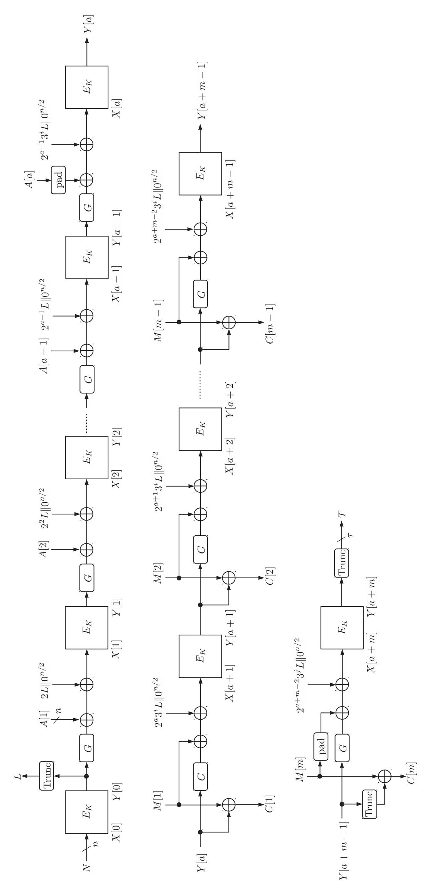
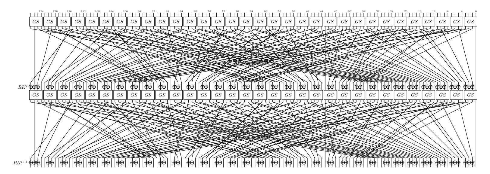
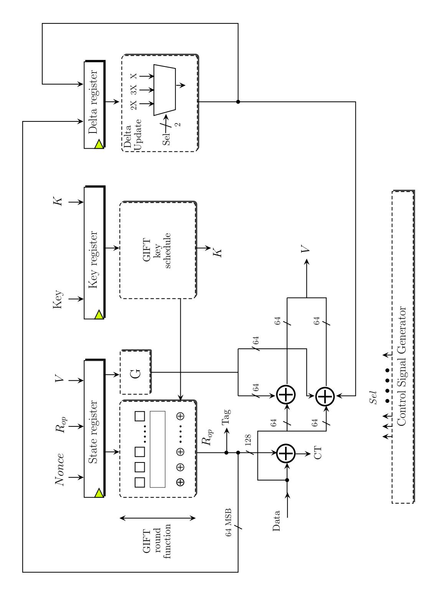
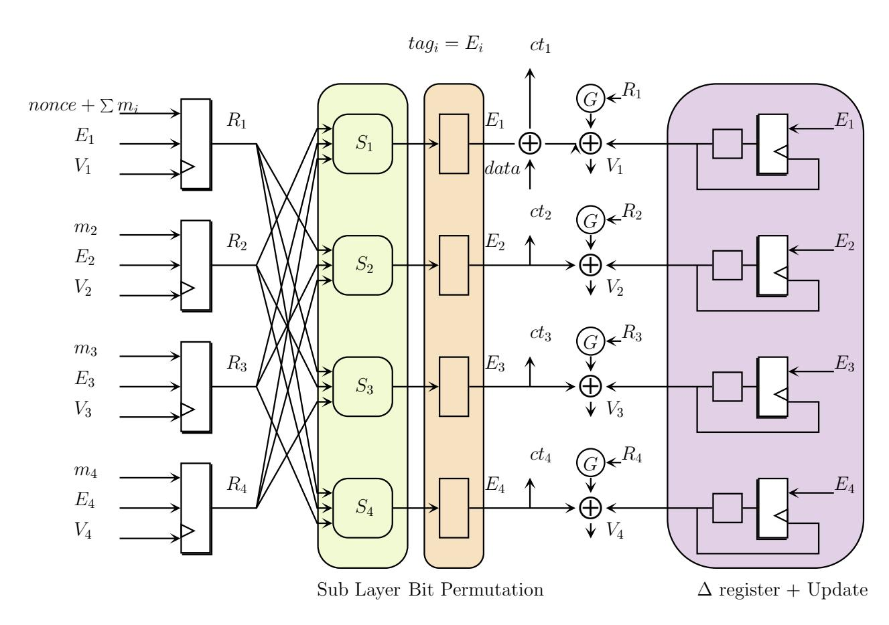
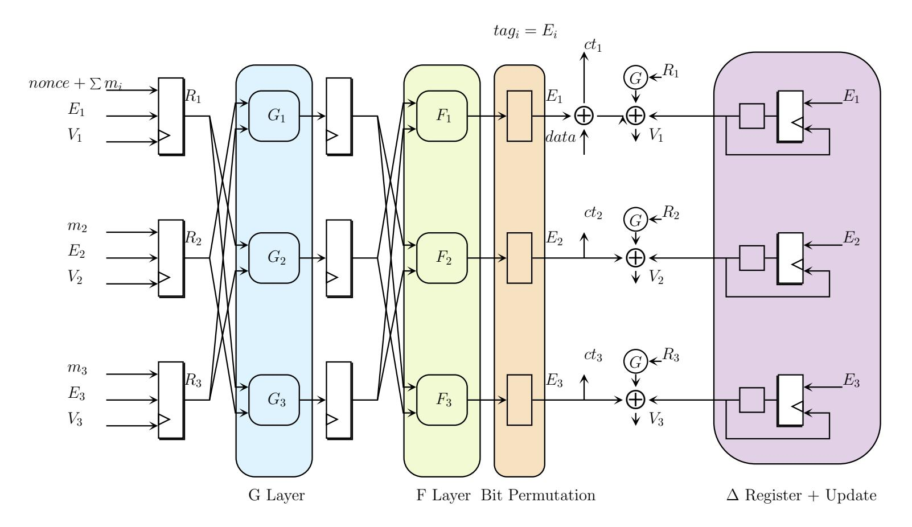

{0}------------------------------------------------

Subhadeep Banik<sup>1</sup>, Avik Chakraborti<sup>2</sup>, Akiko Inoue<sup>4</sup>, Tetsu Iwata<sup>3</sup>, Kazuhiko Minematsu<sup>4</sup>, Mridul Nandi<sup>5</sup>, Thomas Peyrin<sup>6,7</sup>, Yu Sasaki<sup>2</sup>, Siang Meng Sim<sup>6</sup> and Yosuke Todo<sup>2</sup>

LASEC, Ecole Polytechnique Fédérale de Lausanne, Switzerland

NTT Secure Platform Laboratories, Japan

Nagoya University, Japan

NEC Corporation, Japan

Indian Statistical Institute, Kolkata, India

Nanyang Technological University, Singapore

Temasek Laboratories@NTU, Singapore

giftcofb@googlegroups.com
https://www.isical.ac.in/~lightweight/COFB/

**Abstract.** In this article, we propose GIFT-COFB, an Authenticated Encryption with Associated Data (AEAD) scheme, based on the GIFT lightweight block cipher and the COFB lightweight AEAD operating mode. We explain how these two primitives can fit together and the various design adjustments possible for performance and security improvements. We show that our design provides excellent performances in all constrained scenarios, hardware or software, while being based on a provably-secure mode and a well analysed block cipher.

**Keywords:** GIFT · COFB · authenticated encryption · lightweight · lower bound

# 1 Introduction

Confidentiality and authentication are two critical security properties, historically offered with separated cryptographic components. However, due to the possible security issues that might arise when combining these two components and in a hope for performance gains, so-called authenticated encryption (AE) is now becoming more prominent. AE is a symmetric-key cryptographic scheme providing both confidentiality and authenticity in a single primitive. In 2002, Rogaway [38] proposed the concept of Authenticated Encryption with Associated Data (AEAD), well adopted nowadays, which allows in addition a user to authenticate some associated data, without encrypting it (typically some Internet packet header).

Due to the recent rise in communication networks operated on small devices, the era of the so-called Internet of Things, AE is expected to play a key role in securing these networks. After a decade of many advances in the field of lightweight symmetric-key cryptography, an extremely lightweight block cipher – GIFT [3] and a very low state size AEAD scheme – COFB [11] were concurrently proposed at CHES 2017 conference. The former is an ad-hoc primitive while the latter is an operating mode, but both primarily focus on obtaining very good hardware implementation results. GIFT reduces the footprint of its algorithmic operations to the bare minimum without compromising its security (actually improving it when compared to PRESENT cipher [8], probably the most famous lightweight block cipher). On the other hand, COFB minimises the additional state required for a rate-1 block cipher based AEAD scheme. It was then very natural to match these

{1}------------------------------------------------

 two primitives to build a very efficient candidate for the NIST lightweight cryptography competition. Yet, several details need to be handled when matching, in order to maintain the full performance and ensure compliance with NIST requirements.

 In this work, we describe the GIFT-COFB authenticated encryption, which instantiates the COFB (COmbined FeedBack) block cipher based AEAD mode with the GIFT block cipher, but with several small tweaks on both COFB and GIFT to further improve their efficiency. Here, we consider the overhead in size, thus the state memory size beyond the underlying block cipher itself (including the key schedule) as one of the main criteria we want to minimize, which is particularly relevant for hardware implementations.

 This version supports all the desirable properties mentioned in the NIST lightweight cryptography portfolio [\[32\]](#page-28-1), and it is efficient for lightweight implementations as well.

 There are many approaches for designing a secure and lightweight block cipher based AEAD. We focus on using the lightweight, very efficient and well analyzed block cipher GIFT-128 [\[3\]](#page-26-0) and minimizing the total encryption/decryption state size by using combined feedback over the block cipher output and the data blocks along with a tweak dependent secret masking (as used in XEX [\[39\]](#page-28-2)). This combination helps us to minimize the amount of masking by a factor of 2 from [\[39\]](#page-28-2).

 The COFB mode achieves several interesting features. It provides a high rate of 1 (i.e, it needs only one block cipher call per input block). The mode is inverse-free, as it does not need a block cipher inverse during decryption or decryption. In addition to these features, this mode has a very small state size, namely 1*.*5*n* + *k* bits, where *n* and *k* denote the underlying block cipher block size and key size respectively.

**Our Contributions.** In this article, we describe GIFT-COFB, an Authenticated Encryption with Associated Data (AEAD) scheme, based on the GIFT-128 lightweight block cipher and the COFB lightweight AEAD operating mode. We analyse how these two primitives can be adapted to fit together and how various design adjustments that we made to improve performance and security. We recall that COFB is a provably secure operating mode and that GIFT block cipher has been thoroughly analysed by its designers and retains a very comfortable security margin even after a lot of third party analysis. We show that our design provides excellent performances in all constrained scenarios, both hardware and software.

**Organisation of the paper.** We first introduce some notations in Section [2](#page-1-0) and describe our proposal GIFT-COFB in Section [3.](#page-4-0) Then, we explain the design rationale in Section [4](#page-7-0) and recall security analysis conducted on the mode COFB and on the internal primitive GIFT in Section [5.](#page-11-0) Finally, we report latest hardware and software implementation results in Sections [6](#page-18-0) and [7.](#page-24-0)

# <span id="page-1-0"></span>**2 Preliminaries**

## **2.1 Notation**

For any *X* ∈ {0*,* 1} ∗ , where {0*,* 1} ∗ is the set of all finite bit strings (including the empty string *ϵ*), we denote the number of bits of *X* by |*X*|. Note that |*ϵ*| = 0. For a string *X* and an integer *t* ≤ |*X*|, Trunc*t*(*X*) is the first *t* bits of *X*. Throughout this document, *n* represents the block size in bits of the underlying block cipher *EK*. Typically, we consider *n* = 128 and GIFT-128 is the underlying block cipher, where *K* is the 128-bit GIFT-128 key. For two bit strings *X* and *Y* , *X*∥*Y* denotes the concatenation of *X* and *Y* . A bit string *X* is called a *complete* (or *incomplete*) block if |*X*| = *n* (or |*X*| *< n*, respectively). We write the set of all complete (or incomplete) blocks as B (or B *<sup>&</sup>lt;*, respectively). Note that *ϵ* is considered as an incomplete block and *ϵ* ∈ B*<sup>&</sup>lt;*. Let B <sup>≤</sup> = B *<sup>&</sup>lt;* ∪ B denote the set

{2}------------------------------------------------

of all blocks. For  $B \in \mathcal{B}^{\leq}$ , we define  $\overline{B}$  as follows:

$$\overline{B} = \begin{cases} 10^{n-1} & \text{if } B = \epsilon \\ B||10^{n-1-|B|} & \text{if } B \neq \epsilon \text{ and } |B| < n \\ B & \text{if } |B| = n \end{cases}$$

Given non-empty  $Z \in \{0,1\}^*$ , we define the parsing of Z into n-bit blocks as

$$(Z[1], Z[2], \dots, Z[z]) \stackrel{n}{\leftarrow} Z$$
,

where  $z = \lceil |Z|/n \rceil$ , |Z[i]| = n for all i < z and  $1 \le |Z[z]| \le n$  such that  $Z = (Z[1] || Z[2] || \cdots || Z[z])$ . If  $Z = \epsilon$ , we let z = 1 and  $Z[1] = \epsilon$ . We write ||Z|| = z (number of blocks present in Z). Given any sequence  $Z = (Z[1], \ldots, Z[s])$  and  $1 \le a \le b \le s$ , we represent the sub sequence  $(Z[a], \ldots, Z[b])$  by Z[a..b]. For integers  $a \le b$ , we write [a..b] for the set  $\{a, a + 1, \ldots, b\}$ . For two bit strings X and Y with  $|X| \ge |Y|$ , we define the extended xor-operation as

$$X \underline{\oplus} Y = X[1..|Y|] \oplus Y$$
 and  $X \overline{\oplus} Y = X \oplus (Y||0^{|X|-|Y|}),$ 

where  $(X[1], X[2], \dots, X[x]) \stackrel{1}{\leftarrow} X$  and thus X[1..|Y|] denotes the first |Y| bits of X. When |X| = |Y|, both operations reduce to the standard  $X \oplus Y$ .

Let  $\gamma = (\gamma[1], \ldots, \gamma[s])$  be a tuple of equal-length strings. We define  $\mathsf{mcoll}(\gamma) = r$  if there exist distinct  $i_1, \ldots, i_r \in [1..s]$  such that  $\gamma[i_1] = \cdots = \gamma[i_r]$  and r is the maximum of such integer. We say that  $\{i_1, \ldots, i_r\}$  is an r-multi-collision set for  $\gamma$ .

# 2.2 Underlying Finite Field $\mathbb{F}_{2^n}$

Let  $\mathbb{F}_{2^s}$  denote the binary Galois field of size  $2^s$ , for a positive integer s. Field addition and multiplication between  $a, b \in \mathbb{F}_{2^s}$  are represented by  $a \oplus b$  (or a + b whenever understood) and  $a \cdot b$  respectively. Any field element  $a \in \mathbb{F}_{2^s}$  can be represented by any of the following equivalent ways for  $a_0, a_1, \ldots, a_{s-1} \in \{0, 1\}$ .

- An s-bit string  $a_{s-1} \cdots a_0 \in \{0,1\}^s$ .
- A polynomial  $a(x) = a_0 + a_1x + \cdots + a_{s-1}x^{s-1}$  of degree at most (s-1).

### 2.3 Choice of Primitive Polynomials

In our construction, the primitive polynomial [1] used to represent the field  $\mathbb{F}_{2^{64}}$  is

$$p_{64}(x) = x^{64} + x^4 + x^3 + x + 1.$$

We denote the primitive element  $0^{s-2}10 \in \mathbb{F}_{2^s}$  by  $\alpha_s$  (here s = 64). We use  $\alpha$  to mean  $\alpha_s$  for notational simplicity. The field multiplication  $a(x) \cdot b(x)$  is the polynomial r(x) of degree at most (s-1) such that  $a(x)b(x) \equiv r(x) \mod p_s(x)$ .

Multiplication by Primitive Element  $\alpha$ . We first see an example how we can multiply by  $\alpha = \alpha_{64}$ . Multiplying an element  $b := b_{63}b_{62}\cdots b_0 \in \mathbb{F}_{2^{64}}$  by the primitive element  $\alpha$  of  $\mathbb{F}_{2^{64}}$  can be done very efficiently as follows:

$$b \cdot \alpha = \begin{cases} b \ll 1, & \text{if } b_{63} = 0, \\ (b \ll 1) \oplus 0^{59} 11011, & \text{else,} \end{cases}$$

where  $(b \ll r)$  denotes left shift of b by r bits. For  $b \in \mathbb{F}_{2^{64}}$ , we use  $2 \cdot b$  (or  $2^m \cdot b$ ) and  $3 \cdot b$  (or  $3^m \cdot b$ ) to denote  $\alpha \cdot b$  (or  $\alpha^m \cdot b$ ) and  $(1 + \alpha) \cdot b$  (or  $(1 + \alpha)^m \cdot b$ ), respectively.

{3}------------------------------------------------

## 2.4 Authenticated Encryption and Security Definitions

109

110

111

112

113

114

115

116

117

118

119

120

121

122

123

124

125

126

127

An authenticated encryption or AE algorithm takes a nonce N (which is a value never repeats at encryption) together with associated date A and plaintext M, the encryption function of AE,  $\mathcal{E}_K$ , produces a tagged-ciphertext (C,T) where |C| = |M| and |T| = t. It provides both privacy of a plaintext  $M \in \{0,1\}^*$  and authenticity or integrity of M as well as associate data  $A \in \{0,1\}^*$ . The corresponding decryption function,  $\mathcal{D}_K$ , takes (N,A,C,T) and returns a decrypted plaintext M when the verification on (N,A,C,T) is successful, otherwise returns the atomic error symbol denoted by  $\bot$ .

**Privacy.** Given an adversary  $\mathcal{A}$ , we define the PRF-advantage of  $\mathcal{A}$  against  $\mathcal{E}$  as  $\mathbf{Adv}_{\mathcal{E}}^{\mathrm{prf}}(\mathcal{A}) = |\Pr[\mathcal{A}^{\mathcal{E}_K} = 1] - \Pr[\mathcal{A}^{\$} = 1]|$ , where \$ returns a random string of the same length as the output length of  $\mathcal{E}_K$ , by assuming that the output length of  $\mathcal{E}_K$  is uniquely determined by the query. The PRF-advantage of  $\mathcal{E}$  is defined as

$$\mathbf{Adv}_{\mathcal{E}}^{\mathrm{prf}}(q, \sigma, t) = \max_{\mathcal{A}} \mathbf{Adv}_{\mathcal{E}}^{\mathrm{prf}}(\mathcal{A}),$$

where the maximum is taken over all adversaries running in time t and making q queries with the total number of blocks in all the queries being at most  $\sigma$ . If  $\mathcal{E}_K$  is an encryption function of AE, we call it the *privacy advantage* and write as  $\mathbf{Adv}_{\mathcal{E}}^{\text{priv}}(q, \sigma, t)$ , as the maximum of all nonce-respecting adversaries (that is, the adversary can arbitrarily choose nonces provided all nonce values in the encryption queries are distinct).

**Authenticity.** We say that an adversary  $\mathcal{A}$  forges an AE scheme  $(\mathcal{E}, \mathcal{D})$  if  $\mathcal{A}$  is able to compute a tuple (N, A, C, T) satisfying  $\mathcal{D}_K(N, A, C, T) \neq \bot$ , without querying (N, A, M) for some M to  $\mathcal{E}_K$  and receiving (C, T), i.e. (N, A, C, T) is a non-trivial forgery.

In general, a forger can make  $q_f$  forging attempts without restriction on N in the decryption queries, that is, N can be repeated in the decryption queries and an encryption query and a decryption query can use the same N. The forging advantage for an adversary  $\mathcal{A}$  is written as  $\mathbf{Adv}_{\mathcal{E}}^{\text{auth}}(\mathcal{A}) = \Pr[\mathcal{A}^{\mathcal{E}} \text{ forges}]$ , and we write

$$\mathbf{Adv}_{\mathcal{E}}^{\text{auth}}((q, q_f), (\sigma, \sigma_f), t) = \max_{\mathcal{A}} \mathbf{Adv}_{\mathcal{E}}^{\text{auth}}(\mathcal{A})$$

to denote the maximum forging advantage for all adversaries running in time t, making q encryption and  $q_f$  decryption queries with total number of queried blocks being at most  $\sigma$  and  $\sigma_f$ , respectively.

Unified Security Notion for AE. The privacy and authenticity advantages can be unified into a single security notion as introduced in [15, 40]. Let  $\mathcal{A}$  be an adversary that only makes non-repeating queries to  $\mathcal{D}_K$ . Then, we define the AE-advantage of  $\mathcal{A}$  against  $\mathcal{E}$  as

$$\mathbf{Adv}_{\mathcal{E}}^{AE}(\mathcal{A}) = |\Pr[\mathcal{A}^{\mathcal{E}_K, \mathcal{D}_K} = 1] - \Pr[\mathcal{A}^{\$, \perp} = 1]|,$$

where  $\perp$ -oracle always returns  $\perp$  and \$-oracle is as the privacy advantage. We similarly define  $\mathbf{Adv}_{\mathcal{E}}^{AE}((q,q_f),(\sigma,\sigma_f),t) = \max_{\mathcal{A}} \mathbf{Adv}_{\mathcal{E}}^{AE}(\mathcal{A})$ , where the maximum is taken over all adversaries running in time t, making q encryption and  $q_f$  decryption queries with the total number of blocks being at most  $\sigma$  and  $\sigma_f$ , respectively.

**Block Cipher Security.** We use a block cipher E as the underlying primitive, and we assume the security of E as a PRP (pseudorandom permutation). The PRP-advantage of a block cipher E is defined as  $\mathbf{Adv}_{E}^{\mathrm{prp}}(\mathcal{A}) = |\Pr[\mathcal{A}^{E_{K}} = 1] - \Pr[\mathcal{A}^{\mathsf{P}} = 1]|$ , where  $\mathsf{P}$  is a random permutation uniformly distributed over all permutations over  $\{0,1\}^{n}$ . We write

$$\mathbf{Adv}_{E}^{\mathrm{prp}}(q,t) = \max_{\mathcal{A}} \mathbf{Adv}_{E}^{\mathrm{prp}}(\mathcal{A})\,,$$

where the maximum is taken over all adversaries running in time t and making q queries. Here,  $\sigma$  does not appear as each query has a fixed length. 

{4}------------------------------------------------

Coefficients-H Technique. Coefficients-H technique was developed by Patarin, that is a convenient tool for bounding the advantage (see [33, 12]). We will use this technique (without giving a proof) to prove our security claims. Consider two oracles  $\mathcal{O}_0 = (\$, \bot)$  (the ideal oracle) and  $\mathcal{O}_1$  (the real oracle, i.e., our construction). Let  $\mathcal{V}$  denotes the set of all possible views an adversary can obtain. For any view  $\tau \in \mathcal{V}$ , we will denote the probability to realize the view as  $\mathsf{ip}_{\mathsf{real}}(\tau)$  (or  $\mathsf{ip}_{\mathsf{ideal}}(\tau)$ ) when it is interacting with the real oracle (or ideal oracle, respectively). We call these *interpolation probabilities*. Without loss of generality, we assume that the adversary is deterministic and fixed. Then, the probability space for the interpolation probabilities is uniquely determined by the underlying oracle. As we deal with stateless oracles, these probabilities are independent of the order of queries and responses in the view. Suppose we have a set of views,  $\mathcal{V}_{\mathsf{good}} \subseteq \mathcal{V}$ , which we call good views, and the following conditions hold:

- 1. In the game involving the ideal oracle  $\mathcal{O}_0$  (and the fixed adversary), the probability of getting a view in  $\mathcal{V}_{good}$  is at least  $1 \epsilon_1$ .
- 2. For any view  $\tau \in \mathcal{V}_{good}$ , we have  $\mathsf{ip}_{\mathsf{real}}(\tau) \geq (1 \epsilon_2) \cdot \mathsf{ip}_{\mathsf{ideal}}(\tau)$ .

Then we have  $|\Pr[\mathcal{A}^{\mathcal{O}_0} = 1] - \Pr[\mathcal{A}^{\mathcal{O}_1} = 1]| \leq \epsilon_1 + \epsilon_2$ . The proof can be found, e.g., in [12].
We will later use this result to prove the security of our construction in Theorem 1 by defining certain  $\mathcal{V}_{good}$  for our games, and evaluating the bounds,  $\epsilon_1$  and  $\epsilon_2$ .

# <span id="page-4-0"></span>3 Specification

# 3.1 Syntax

The encryption algorithm (with authentication), denoted as GIFT-COFB $(K,N,A,M)\mapsto (C,T)$ , takes as input an encryption key  $K\in\{0,1\}^{128}$ , a nonce  $N\in\{0,1\}^{128}$ , associated data  $A\in\{0,1\}^*$ , and a message  $M\in\{0,1\}^*$ . The nonce N can include a counter to make the nonce non-repeating. It generates a ciphertext  $C\in\{0,1\}^{|M|}$  and a tag  $T\in\{0,1\}^{128}$ . The decryption algorithm (with verification), denoted as GIFT-COFB $^{-1}(K,N,A,C,T)\mapsto M$ , takes (K,N,A,C,T) as input. It generates a message  $M\in\{0,1\}^{|C|}$  or a special symbol  $\bot$  denoting rejection.

## 3.2 Building Blocks of GIFT-COFB

### 3.2.1 Building Blocks of COFB

Block Cipher. The underlying encryption cipher,  $E_K$ , is an 128-bit block cipher with 128-bit key equivalent to GIFT-128 but with a small tweak in the input and output data format. See Section 3.2.2 for the specification and Section 4.2 for the rationale.

**Padding Function.** For  $x \in \{0,1\}^*$ , we define padding function Pad as

$$\mathsf{Pad}(x) = \begin{cases} x & \text{if } x \neq \epsilon \text{ and } |x| \bmod n = 0 \\ x \|10^{(n-(|x| \bmod n) - 1)} & \text{otherwise.} \end{cases}$$

Note that  $Pad(\epsilon) = 10^{n-1}$ .

{5}------------------------------------------------

**Feedback Function.** Let  $Y \in \{0,1\}^{128}$  and  $(Y[1],Y[2]) \stackrel{64}{\leftarrow} Y$ , where  $Y[i] \in \{0,1\}^{64}$ . We define  $G: \{0,1\}^{128} \to \{0,1\}^{128}$  as

$$G(Y) = (Y[2], Y[1] \ll 1),$$

where for a string  $X, X \ll r$  is the left rotation of X by r bits. We also view G as the 170  $128 \times 128$  non-singular binary matrix, so we write G(Y) and  $G \cdot Y$  interchangeably. For  $M \in \{0,1\}^{128}$  and  $Y \in \{0,1\}^{128}$ , we define  $\rho_1(Y,M) = G \cdot Y \oplus M$ . The feedback function  $\rho$  and its corresponding  $\rho'$  are defined as

$$\rho(Y,M) = (\rho_1(Y,M), Y \oplus M),$$
  
$$\rho'(Y,C) = (\rho_1(Y,Y \oplus C), Y \oplus C).$$

Note that when  $(X, M) = \rho'(Y, C)$  then  $X = (G \oplus I) \cdot Y \oplus C$ , where I is the  $128 \times 128$  identity matrix. Our choice of G ensures that  $G \oplus I$  has rank n-1 (precisely, 127, in our construction with n=128). When Y is chosen randomly, both  $\rho_1(Y, M)$  (during encryption) and  $\rho_1(Y, Y \oplus C)$  (during decryption) also has almost full entropy.

We need this property when we bound probability of bad events later.

Tweak Value for The Last Block. Given the last block of associated data,  $A \in \{0, 1\}^*$ , we define  $\delta_A \in \{1, 2\}$  as follows:

$$\delta_A = \begin{cases} 1 & \text{if } A \neq \epsilon \text{ and } n \text{ divides } |A| \\ 2 & \text{otherwise.} \end{cases}$$

Given the last block of either a message or a ciphertext,  $Z \in \{0,1\}^*$ , we define  $\delta_Z \in \{1,2\}$  as follows:

$$\delta_Z = \begin{cases} 1 & \text{if } n \text{ divides } |Z| \\ 2 & \text{otherwise.} \end{cases}$$

This will be used to differentiate the cases that the last block of A or Z is n bits or shorter, for Z being a message or a ciphertext. We also define a formatting function  $\mathsf{Fmt}$  for a pair of bit strings (A,Z). Let  $(A[1],\ldots,A[a]) \stackrel{n}{\leftarrow} A$  and  $(Z[1],\ldots,Z[z]) \stackrel{n}{\leftarrow} Z$ . We define  $\mathsf{t}[i]$  as follows:

$$t[i] = \begin{cases} (i,0) & \text{if } i < a \\ (a-1,\delta_A) & \text{if } i = a \\ (i-1,\delta_A) & \text{if } a < i < a+z \\ (a+z-2,\delta_A+\delta_Z) & \text{if } i = a+z \end{cases}$$

Now, the formatting function Fmt(A, Z) returns the following sequence

$$\begin{cases} \left( (A[1],\mathsf{t}[1]),\ldots,(\overline{A[a]},\mathsf{t}[a]) \right) & \text{if } Z = \epsilon \\ \left( (A[1],\mathsf{t}[1]),\ldots,(\overline{A[a]},\mathsf{t}[a]),(Z[1],\mathsf{t}[a+1]),\ldots,(\overline{Z[z]},\mathsf{t}[a+z]) \right) & \text{if } Z \neq \epsilon \end{cases}$$

where the first coordinate of each pair specifies the input block to be processed, and the second coordinate specifies the exponents of  $\alpha$  and  $1+\alpha$  to determine the constant over  $GF(2^{n/2})$ . Let  $\mathbb{Z}_{\geq 0}$  be the set of non-negative integers and  $\mathcal{X}$  be some non-empty set. We say that a function  $f: \mathcal{X} \to (\mathcal{B} \times \mathbb{Z}_{\geq 0} \times \mathbb{Z}_{\geq 0})^+$  is prefix-free if for all  $X \neq X'$ ,  $f(X) = (Y[1], \ldots, Y[\ell])$  is not a prefix of  $f(X') = (Y'[1], \ldots, Y'[\ell'])$  (in other words,  $(Y[1], \ldots, Y[\ell]) \neq (Y'[1], \ldots, Y'[\ell])$ ). Here, for a set  $\mathcal{S}$ ,  $\mathcal{S}^+$  means  $\mathcal{S} \cup \mathcal{S}^2 \cup \cdots$ , and we have the following lemma.

**Lemma 1.** The function  $Fmt(\cdot)$  is prefix-free.

The proof is more or less straightforward and hence we skip it.

{6}------------------------------------------------

### <span id="page-6-0"></span>3.2.2 GIFT building blocks

**Initialization and Finalization.** The 128-bit plaintext P is loaded into the cipher state S which will be expressed as 4 32-bit segments,  $S = \{S_0, S_1, S_2, S_3\}$ , where  $S_i \in \{0, 1\}^{32}$ . On the other hand, the 128-bit secret key K is loaded into the key state KS which will be expressed as 8 16-bit words,  $KS = \{W_0, W_1, \ldots, W_7\}$ , where  $W_i \in \{0, 1\}^{16}$ .

$$\mathsf{Initalize}(P) = \begin{bmatrix} S_0 \\ S_1 \\ S_2 \\ S_3 \end{bmatrix} \leftarrow \begin{bmatrix} B_0 & \parallel & B_1 & \parallel & B_2 & \parallel & B_3 \\ B_4 & \parallel & B_5 & \parallel & B_6 & \parallel & B_7 \\ B_8 & \parallel & B_9 & \parallel & B_{10} & \parallel & B_{11} \\ B_{12} & \parallel & B_{13} & \parallel & B_{14} & \parallel & B_{15} \end{bmatrix},$$

$$\mathsf{Initalize}(K) = \begin{bmatrix} W_0 & \parallel & W_1 \\ W_2 & \parallel & W_3 \\ W_4 & \parallel & W_5 \\ W_6 & \parallel & W_7 \end{bmatrix} \leftarrow \begin{bmatrix} B_0 \| B_1 & \parallel & B_2 \| B_3 \\ B_4 \| B_5 & \parallel & B_6 \| B_7 \\ B_8 \| B_9 & \parallel & B_{10} \| B_{11} \\ B_{12} \| B_{13} & \parallel & B_{14} \| B_{15} \end{bmatrix},$$

where  $B_i$  are the arriving bytes.

The function Finalize will be the reverse process, outputting the state byte by byte.

**SubCells Function.** We denote the SubCells function  $S \leftarrow \mathsf{SubCells}(S)$  as the following set of instructions:

$$S_1 \leftarrow S_1 \oplus (S_0 \& S_2)$$
 $S_0 \leftarrow S_0 \oplus (S_1 \& S_3)$ 
 $S_2 \leftarrow S_2 \oplus (S_0 \mid S_1)$ 
 $S_3 \leftarrow S_3 \oplus S_2$ 
 $S_1 \leftarrow S_1 \oplus S_3$ 
 $S_3 \leftarrow \sim S_3$ 
 $S_2 \leftarrow S_2 \oplus (S_0 \& S_1)$ 
 $\{S_0, S_1, S_2, S_3\} \leftarrow \{S_3, S_1, S_2, S_0\},$ 

where &, | and  $\sim$  are AND, OR and NOT operation respectively.

PermBits Function. We define the parsing of  $S_i$  into 32 individual bits as

$$(S_i[31], S_i[30], \dots, S_i[0]) \stackrel{1}{\leftarrow} S_i.$$

We denote

PermBits
$$(S) = \{Pb_0(S_0), Pb_1(S_1), Pb_2(S_2), Pb_3(S_3)\},$$

where  $Pb_i$  is described in Table 1, the row "Index" shows the indexing of the 32 bits in all  $S_i$ 's and the row " $S_i$ " shows the ending position of the bits. For example,  $S_1[1]$  (the 2nd rightmost bit) is shifted 1 position to the right, to the initial position of  $S_1[0]$ , while  $S_1[0]$  is shifted 8 positions to the left where  $S_1[8]$  was.

AddRoundKey Function. We define the AddRoundKey function AddRoundKey as

$$\mathsf{AddRoundKey}(S, KS, i) = \{S_0, S_1 \oplus (W_6 \parallel W_7), S_2 \oplus (W_2 \parallel W_3), S_3 \oplus \mathtt{Const_i}\},$$

where  $Const_i = 0x800000XY$  is the *i*-th round constant and the byte  $XY = 00c_5c_4c_3c_2c_1c_0$  is the round constant generated using the a 6-bit affine LFSR, whose state is updated as follows:

$$c_5 \|c_4\|c_3\|c_2\|c_1\|c_0 \leftarrow c_4 \|c_3\|c_2\|c_1\|c_0\|c_5 \oplus c_4 \oplus 1.$$

{7}------------------------------------------------

<span id="page-7-1"></span>

| Table 1: Specifications of bit permutation P bi |    |    |    |    |    |    |    |    |    |    |    |    |    |    |    |    |
|-------------------------------------------------|----|----|----|----|----|----|----|----|----|----|----|----|----|----|----|----|
| Index                                           | 31 | 30 | 29 | 28 | 27 | 26 | 25 | 24 | 23 | 22 | 21 | 20 | 19 | 18 | 17 | 16 |
| P b0                                            | 29 | 25 | 21 | 17 | 13 | 9  | 5  | 1  | 30 | 26 | 22 | 18 | 14 | 10 | 6  | 2  |
| P b1                                            | 30 | 26 | 22 | 18 | 14 | 10 | 6  | 2  | 31 | 27 | 23 | 19 | 15 | 11 | 7  | 3  |
| P b2                                            | 31 | 27 | 23 | 19 | 15 | 11 | 7  | 3  | 28 | 24 | 20 | 16 | 12 | 8  | 4  | 0  |
| P b3                                            | 28 | 24 | 20 | 16 | 12 | 8  | 4  | 0  | 29 | 25 | 21 | 17 | 13 | 9  | 5  | 1  |
|                                                 |    |    |    |    |    |    |    |    |    |    |    |    |    |    |    |    |
| Index                                           | 15 | 14 | 13 | 12 | 11 | 10 | 9  | 8  | 7  | 6  | 5  | 4  | 3  | 2  | 1  | 0  |
| P b0                                            | 31 | 27 | 23 | 19 | 15 | 11 | 7  | 3  | 28 | 24 | 20 | 16 | 12 | 8  | 4  | 0  |
| P b1                                            | 28 | 24 | 20 | 16 | 12 | 8  | 4  | 0  | 29 | 25 | 21 | 17 | 13 | 9  | 5  | 1  |
| P b2                                            | 29 | 25 | 21 | 17 | 13 | 9  | 5  | 1  | 30 | 26 | 22 | 18 | 14 | 10 | 6  | 2  |
| P b3                                            | 30 | 26 | 22 | 18 | 14 | 10 | 6  | 2  | 31 | 27 | 23 | 19 | 15 | 11 | 7  | 3  |

The six bits, *c<sup>i</sup>* , are initialized to zero, and updated *before* being used in a given round. The values of the constants for each round are given in the table below, encoded to byte values for each round, with *c*<sup>0</sup> being the least significant bit.

| Rounds  | Constants                                       |  |  |  |  |  |
|---------|-------------------------------------------------|--|--|--|--|--|
| 1 - 16  | 01,03,07,0F,1F,3E,3D,3B,37,2F,1E,3C,39,33,27,0E |  |  |  |  |  |
| 17 - 32 | 1D,3A,35,2B,16,2C,18,30,21,02,05,0B,17,2E,1C,38 |  |  |  |  |  |
| 33 - 48 | 31,23,06,0D,1B,36,2D,1A,34,29,12,24,08,11,22,04 |  |  |  |  |  |

<sup>231</sup> **Key State Update Function.** The key state update function KeyUpdate is defined as <sup>232</sup> follows:

KeyUpdate
$$(KS) = \{W_6 \ggg 2, W_7 \ggg 12, W_0, W_1, W_2, W_3, W_4, W_5\}$$

## <sup>234</sup> **3.3 GIFT-COFB Pseudocode**

230

 We present the specifications of GIFT-COFB in Fig. [1,](#page-8-0) where *α* and (1 + *α*) are written as 2 and 3. See also Fig. [2.](#page-9-0) The encryption and decryption algorithms are denoted by COFB-E*<sup>K</sup>* and COFB-D*K*. We remark that the nonce length is 128 bits, which is enough for the security up to the birthday bound. The nonce is processed as *EK*(*N*) to yield the first internal chaining value. The encryption algorithm takes *A* and *M*, and outputs *C* and *T* such that |*C*| = |*M*| and |*T*| = 128. The decryption algorithm takes (*N, A, C, T*) and outputs *M* or ⊥. Both encryption and decryption algorithms use block cipher *E<sup>K</sup>* and the key *K* is implicitly given to them.

# <span id="page-7-0"></span><sup>243</sup> **4 Design Rationale**

<sup>244</sup> As both GIFT and COFB are already well-established primitives, in this section we explain <sup>245</sup> the rationale for this combination, followed by the tweaks we made to these original <sup>246</sup> publications to enhance the performance and security.

## <sup>247</sup> **4.1 AEAD Scheme: GIFT-COFB**

<sup>248</sup> COFB is a block cipher based authenticated encryption mode that uses GIFT-128 as the <sup>249</sup> underlying block cipher and GIFT-COFB can be viewed as an efficient integration of the

{8}------------------------------------------------

```
Algorithm COFB-\mathcal{E}_K(N,A,M)
                                                                                       Algorithm COFB-\mathcal{D}_K(N, A, C, T)
                                                                                           1. Y[0] \leftarrow E_K(N), L \leftarrow \mathsf{Trunc}_{n/2}(Y[0])
   1. Y[0] \leftarrow E_K(N), L \leftarrow \mathsf{Trunc}_{n/2}(Y[0])
   2. (A[1], \ldots, A[a]) \stackrel{n}{\leftarrow} \mathsf{Pad}(A)
                                                                                           2. (A[1], \ldots, A[a]) \stackrel{n}{\leftarrow} \mathsf{Pad}(A)
   3. if M \neq \epsilon then
                                                                                           3. if C \neq \epsilon then
                                                                                           4. (C[1], \ldots, C[c]) \stackrel{n}{\leftarrow} \mathsf{Pad}(C)
    4. (M[1], \ldots, M[m]) \stackrel{n}{\leftarrow} \mathsf{Pad}(M)
    5. for i = 1 to a - 1
                                                                                           5. for i = 1 to a - 1
   6. L \leftarrow 2 \cdot L
                                                                                           6. L \leftarrow 2 \cdot L
   7. X[i] \leftarrow A[i] \oplus G \cdot Y[i-1] \oplus L||0^{n/2}|
                                                                                           7. X[i] \leftarrow A[i] \oplus G \cdot Y[i-1] \oplus L||0^{n/2}|
   8. Y[i] \leftarrow E_K(X[i])
                                                                                           8. Y[i] \leftarrow E_K(X[i])
                                                                                           9. if |A| \mod n = 0 and A \neq \epsilon then L \leftarrow 3 \cdot L
   9. if |A| \mod n = 0 and A \neq \epsilon then L \leftarrow 3 \cdot L
  10. else L \leftarrow 3^2 \cdot L
                                                                                          10. else L \leftarrow 3^2 \cdot L
  11. if M = \epsilon then L \leftarrow 3^2 \cdot L
                                                                                          11. if C = \epsilon then L \leftarrow 3^2 \cdot L
  12. X[a] \leftarrow A[a] \oplus G \cdot Y[a-1] \oplus L||0^{n/2}|
                                                                                          12. X[a] \leftarrow A[a] \oplus G \cdot Y[a-1] \oplus L||0^{n/2}|
  13. Y[a] \leftarrow E_K(X[a])
                                                                                          13. Y[a] \leftarrow E_K(X[a])
                                                                                          14. for i = 1 to c - 1
  14. for i = 1 to m - 1
  15. L \leftarrow 2 \cdot L
                                                                                          15. L \leftarrow 2 \cdot L
  16. C[i] \leftarrow M[i] \oplus Y[i+a-1]
                                                                                          16. M[i] \leftarrow Y[i+a-1] \oplus C[i]
  17. X[i+a] \leftarrow M[i] \oplus G \cdot Y[i+a-1] \oplus L||0^{n/2}|
                                                                                                 X[i+a] \leftarrow M[i] \oplus G \cdot Y[i+a-1] \oplus L||0^{n/2}||
                                                                                          17.
                                                                                          18. Y[i+a] \leftarrow E_K(X[i+a])
  18. Y[i+a] \leftarrow E_K(X[i+a])
                                                                                          19. if C \neq \epsilon then
  19. if M \neq \epsilon then
  20. if |M| \mod n = 0 then L \leftarrow 3 \cdot L
                                                                                               if |C| \mod n = 0 then
                                                                                          20.
  21. else L \leftarrow 3^2 \cdot L
                                                                                                      L \leftarrow 3 \cdot L
                                                                                          21.
  22. C[m] \leftarrow M[m] \oplus Y[a+m-1]
                                                                                          22.
                                                                                                      M[c] \leftarrow Y[a+c-1] \oplus C[c]
  23. X[a+m] \leftarrow M[m] \oplus G \cdot Y[a+m-1] \oplus L||0^{n/2}||
                                                                                          23.
                                                                                                   else
                                                                                                      L \leftarrow 3^2 \cdot L, c' \leftarrow |C| \mod n
  24. Y[a+m] \leftarrow E_K(X[a+m])
                                                                                          24.
                                                                                                     M[c] \leftarrow \mathsf{Trunc}_{c'}(Y[a+c-1] \oplus C[c]) \|10^{n-c'-1}\|
  25. C \leftarrow \mathsf{Trunc}_{|M|}(C[1]||\ldots||C[m])
                                                                                          25.
                                                                                                  X[a+c] \leftarrow M[c] \oplus G \cdot Y[a+c-1] \oplus L||0^{n/2}||
  26. T \leftarrow \mathsf{Trunc}_{\tau}(Y[a+m])
                                                                                          26.
  27. else C \leftarrow \epsilon, T \leftarrow \mathsf{Trunc}_{\tau}(Y[a])
                                                                                          27. Y[a+c] \leftarrow E_K(X[a+c])
                                                                                                  M \leftarrow \mathsf{Trunc}_{|C|}(M[1]||\dots||M[c])
  28. return (C,T)
                                                                                          28.
                                                                                                 T' \leftarrow \mathsf{Trunc}_{\tau}(Y[a+c])
                                                                                          29.
Algorithm E_K(X)
                                                                                          30. else M \leftarrow \epsilon, T' \leftarrow \mathsf{Trunc}_{\tau}(Y[a])
   1. S \leftarrow \mathsf{Initialize}(X)
                                                                                          31. if T' = T then return M, else return \perp
   2. KS \leftarrow \text{Initialize}(K)
   3. for i = 1 to 40
    4. S \leftarrow \mathsf{SubCells}(S)
   5. S \leftarrow \mathsf{PermBits}(S)
          S \leftarrow \mathsf{AddRoundKey}(S, KS, i)
    6.
        KS \leftarrow \mathsf{KeyUpdate}(KS)
    7.
```

Figure 1: The encryption and decryption algorithms of GIFT-COFB.

8.  $Y \leftarrow \mathsf{Finalize}(S)$ 9. **return** Y

250

251

252

253

254

255

256

COFB and GIFT-128. GIFT-128 maintains an 128-bit state and 128-bit key. To be precise, GIFT is a family of block ciphers parametrized by the state size and the key size and all the members of this family are lightweight and can be efficiently deployed on lightweight applications. COFB mode on the other hand, computes of "COmbined FeedBack" (of block cipher output and data block) to uplift the security level. This actually helps us to design a mode with low state size and eventually to have a low state implementation. This technique actually resist the attacker to control the input block and next block cipher

{9}------------------------------------------------

<span id="page-9-0"></span>

Figure 2: Encryption of COFB. In the rightmost figure, the case of encryption for empty *M* (hence a MAC for (*N, A*)) can be highlighted as *T* = Trunc*<sup>τ</sup>* (*Y* [*a*])

{10}------------------------------------------------

<span id="page-10-1"></span>

Figure 3: 2 rounds of GIFT-128.

<sup>257</sup> input simultaneously. Overall, a combination of GIFT and COFB can be considered to be <sup>258</sup> one of the most efficient lightweight, low state block cipher based AEAD construction.

# <span id="page-10-0"></span><sup>259</sup> **4.2 Underlying Block Cipher: GIFT**

<sup>260</sup> GIFT-128 is an 128-bit Substitution-Permutation network (SPN) based block cipher with a <sup>261</sup> key length of 128-bit. It is a 40-round iterative block cipher with identical round function. <sup>262</sup> For brevity, we simply call it GIFT.

 There are different ways to perceive GIFT-128, the more pictorial description is detailed in Section 2 of [\[4\]](#page-26-5), which looks like a larger version of PRESENT cipher with 32 4-bit S-boxes and an 128-bit bit permutation (see Figure [3\)](#page-10-1). In our work, we use an alternative description of GIFT, using bitslice description which is similar to Appendix A of [\[4\]](#page-26-5). Note that the security properties are equivalent up to bit arrangement of the plaintext and ciphertext.

 GIFT is considered to be one of the lightest design existing in the literature. It is denoted as "Small PRESENT" as the design rationale of GIFT follows that of PRESENT [\[8\]](#page-26-2). However, GIFT has got rid of several well known weaknesses existing in PRESENT with regards to linear cryptanalysis. Overall GIFT promises much increased efficiency (both lighter and faster) over PRESENT. GIFT is a very simple design that outperforms even SIMON and SKINNY for round based implementations. It consists of very simple operations such that the total hardware footprint is almost consumed by the underlying and the cipher storage. The design is somewhat "optimal" as a weaker S-box (than GIFT S-box) would lead to a weaker design. The linear layer is completely free for a round-based implementation in hardware (consisting of simply bit-wiring) and the constants are generated thanks to a very lightweight LFSR. The key schedule is also very light, simply consisting of shifts. The presented security analysis details and hardware implementation results also support the claims made by the designers.

 Although there is almost no impact on hardware implementation, there are several motivations for using bitslice implementation (non-LUT based) instead of LUT based implementation of GIFT when we consider software implementation. Here, we will state the 3 most obvious benefits relating to its 3 steps in a round function.

**Constant time non-linear layer.** For LUT based implementation, we can consider updat- ing 2 GIFT S-boxes (1 byte) in a single memory call with a reasonable 256 entries LUT. This would require 16 lookups and it takes approximately 16 to 64 cycles to do all S-boxes in a round, assuming a few cycles to access the RAM. Using bitslice implementation, it requires just 11 basic operations (or 10 with XNOR operation) to compute all the S-boxes

{11}------------------------------------------------

in parallel. And more importantly, using bitslice implementation has the nice feature that it doesn't need any RAM and that it is constant time, mitigating potential timing attacks.

**Efficient linear layer.** While it is basically free on hardware, for software implementation it is extremely slow and complex to implement. This effect can be reduced by doing several blocks in parallel using none other than bitslice implementation. Even for a single block encryption, bitslice implementation is still more efficient that LUT based implementation because of the way the bits are packed.

**Simpler key addition.** For LUT based implementation, the subkeys need to be XORed to bit positions that are 3 bits apart, making the key addition tedious and non-trivial. An option is to precompute the subkeys, but even so the key addition would require several XOR operations to update the 128-bit state. Using bitslice, the bits that were once 3 bits apart are now packed together in 32-bit words, making the key addition as simple as just 2 XOR operations.

# 4.3 Authenticated Encryption Mode: COFB

COFB is a lightweight AEAD mode. The mode presented in this write up differs slightly with the original proposal. They are as follows.

- We change the nonce to be 128 bits.
- $\bullet$  We change the feedback (more precisely the G matrix) to make it more hardware efficient.
- We now deal with empty data. We change the mask update function for the purpose.
- We change the padding for the associated data. To be precise, if the associated data is empty, then padding the associated data will yield the constant block  $10^{n-1}$  (n: block cipher state size).

We observed that, the updates make the design more lightweight and more efficient to deal with short data inputs. However, these updates do not have impact on the security of the mode (only a nominal 1-bit security degradation).

# <span id="page-11-0"></span>5 Security

### <span id="page-11-2"></span>5.1 Security proof of COFB

We present the security analysis of COFB in Theorem 1.

<span id="page-11-1"></span>Theorem 1 (Main Theorem).

$$\mathbf{Adv}_{\mathsf{COFB}}^{\mathsf{AE}}((q,q_f),(\sigma,\sigma_f),t) \leq \mathbf{Adv}_{\mathsf{GIFT}}^{\mathsf{prp}}(q',t') + \frac{\binom{q'}{2}}{2^n} + \frac{\sigma+1}{2^{n/2}} + \frac{q_f(n+4)}{2^{n/2+1}} + \frac{3\sigma^2 + q_f + 2(q+\sigma+\sigma_f) \cdot \sigma_f}{2^n}$$

where  $q' = q + q_f + \sigma + \sigma_f$ , which corresponds to the total number of block cipher calls through the game, and t' = t + O(q'). We claim the above bound when  $q' \leq 2^{\frac{n}{2}-1}$ .

*Proof.* We make a transition by using an n-bit (uniform) random permutation P instead of  $E_K$ , which is GIFT, and next an n-bit (uniform) random function R instead of P. The first two terms in our bounds comes from these two transitions using the standard PRP-PRF switching lemma and the computation to the information security reduction (e.g., see [5]).

{12}------------------------------------------------

Thus we only need a bound for COFB with R, denoted by COFB-R. Here, we prove

$$\mathbf{Adv}_{\mathsf{COFB-R}}^{\mathsf{AE}}((q,q_f),(\sigma,\sigma_f),\infty) \le \frac{\sigma+1}{2^{n/2}} + \frac{q_f(n+4)}{2^{n/2+1}} + \frac{3\sigma^2 + q_f + 2(q+\sigma+\sigma_f) \cdot \sigma_f}{2^n}.$$
(1)

For  $1 \leq i \leq q$ , let  $(N_i, A_i, M_i)$  and  $(C_i, T_i)$  denote the *i*-th encryption query and response, respectively. We use the notation  $(A_i[1], \ldots, A_i[a_i]) \stackrel{n}{\leftarrow} \mathsf{Pad}(A_i), (M_i[1], \ldots, M_i[m_i]) \stackrel{n}{\leftarrow}$  $\mathsf{Pad}(M_i)$  and  $(C_i[1],\ldots,C_i[m_i]) \stackrel{n}{\leftarrow} \mathsf{Pad}(C_i)$ . Let  $\ell_i=a_i+m_i+1$ , which denotes the total input block length (including nonce) for the i-th encryption query. The i-th decryption query is  $(N_i^*, A_i^*, C_i^*, T_i^*)$  with a response  $Z_i^*$  (either  $\perp$  for an invalid decryption attempt or a message). We similarly define  $c_i^*$  and  $a_i^*$ , and write  $\ell_i^* = a_i^* + c_i^* + 1$ . We have  $\sigma = \sum_i \ell_i$ and  $\sigma_f = \sum_i \ell_i^*$ . We also use the notation  $(L_i[j], R_i[j]) \stackrel{n/2}{\leftarrow} X_i[j]$  for all  $i \in [1..q]$  and  $j \in [1..\ell_i].$ 

**Real Oracle.** Real oracle follows COFB-R (where  $E_K$  is replaced by R). We use  $X_i[j]$  (resp.  $Y_i[j]$ ) for  $i=1,\ldots,q$  and  $j=0,\ldots,\ell_i$  for the j-th input (resp. output) of the internal R invoked during the i-th encryption query, with the order of invocation shown in Fig. 1. We set  $X_i[0] = N_i$  and  $Y_i[\ell_i] = T_i$ . We write  $L_i = \mathsf{Trunc}_{n/2}(Y_i[0])$ .

The following relaxations are introduced that only gain the advantage. After making all the encryption queries and forging attempts, release all the Y-values for the encryption queries only. The transcript due to encryption queries consists of  $(N_i, A_i, M_i, Y_i)_i$  where  $Y_i$  denotes  $(Y_i[0], \ldots, Y_i[\ell_i]) = Y_i[0..\ell_i]$ .

**Ideal Oracle.** In case of the ideal oracle, for the *i*-th encryption query  $(N_i, A_i, M_i)$  such that  $i \in \{1, \ldots, q_e\}$ ,  $A_i = (A_i[1], \ldots, A_i[a_i])$ , and  $M_i = (M_i[1], \ldots, M_i[m_i])$ , the oracle samples  $(Y_i[0], \ldots, Y_i[\ell_i])$  independently and uniformly at random from  $\{0, 1\}^{n(\ell_i+1)}$ . It sets the tag  $T_i = Y_i[\ell_i]$  and the ciphertext  $C_i = (C_i[1], \ldots, C_i[m_i])$  where  $C_i[j] = Y_i[j+a_i-1] \oplus M_i[j]$  for  $1 \le j \le m_i$  and returns  $(C_i, T_i)$  to A. The AD processing phase it is a dummy phase and has no influence to the response  $(C_i, T_i)$ .

For the i'-th decryption query  $(N_{i'}^*, A_{i'}^*, C_{i'}^*, T_{i'}^*)$  such that  $i' \in \{1, \ldots, q_f\}, A_{i'}^* = (A_{i'}^*[1], \ldots, A_{i'}^*[a_{i'}^*])$ , and  $C_{i'}^* = (C_{i'}^*[1], \ldots, C_{i'}^*[c_{i'}^*])$ , the ideal oracle always returns  $Z_{i'}^* = \bot$  (here we assume that the adversary makes only fresh queries).

**Views.** In our case, a view  $\tau$  is defined by the following tuple:

$$\tau = ((N_i, A_i, M_i, Y_i)_{i \in \{1, \dots, q\}}, (N_{i'}^*, A_{i'}^*, C_{i'}^*, T_{i'}^*, Z_{i'}^*)_{i' \in \{1, \dots, q_f\}}).$$

Note that,  $X_i$ -values of encryption queries are also uniquely determined following the construction based on  $N_i$ ,  $A_i$ ,  $M_i$  and  $Y_i$ .

Definition of  $p_i$  and i'. For the i-th decryption query, we define  $p_i = -1$  if there is no jwith  $N_j = N_i^*$ . In this case i' is not defined. Otherwise, there is a unique index i' with  $N_{i'} = N_i^*$ . We define  $p_i$  as the length of the longest common prefix of  $\mathsf{Fmt}(A_i^*, C_i^*)$  and  $\mathsf{Fmt}(A_{i'}, C_{i'})$ . Since  $\mathsf{Fmt}$  is prefix-free, it holds that  $p_i < \min\{\ell_i^*, \ell_{i'}\}$ .

Bad Views. The complement of the set of bad views is defined to be the set of good views. A view is called bad if one of the following events occurs:

```
<sup>363</sup> B1: X_{i_1}[j_1] = X_{i_2}[j_2] for some (i_1, j_1) \neq (i_2, j_2) where j_1, j_2 \geq 0.
```

B2: 
$$Y_{i_1}[j_1] = Y_{i_2}[j_2]$$
 for some  $(i_1, j_1) \neq (i_2, j_2)$  where  $j_1, j_2 \geq 0$ .

**B3:**  $\operatorname{mcoll}(R) > n/2$  where R is the tuple of all  $R_i[j]$  values.

366 **B4:** 
$$X_i^*[p_i+1] = X_{i_1}[j_1]$$
 for some  $(i, i_1, j_1)$  with  $j_1 \neq 0$ .

{13}------------------------------------------------

**B5:**  $p_i = \ell_i^* - 1$  and  $X_i^*[p_i + 1] = X_{i_1}[j_1]$  for some  $(i, i_1, j_1)$  with  $Y_{i_1}[j_1] = T_i^*$ .

**B6:**  $p_i \neq -1$  and  $X_i^*[p_i + 1] = X_{i'}[0]$  for some i, where i' is uniquely determined from i.

**B7:**  $p_i \neq -1, \ell_i^* - 1$  and  $X_i^*[p_i + 1] = X_{i_1}[0]$  and  $X_i^*[p_i + 2] = X_{i_2}[j_2]$  for some  $i_1 \neq i'$  and  $(i_2, j_2)$ .

**B8:** For some  $i, Z_i^* \neq \bot$ . This clearly cannot happen for the ideal oracle case.

We add some intuitions on these events. When **B1** does not hold, then all the inputs for the random function are distinct for encryption queries, which makes the responses from encryption oracle completely random in the "real" game.

**B2** event is an auxiliary event which is required to bound **B5**.

Similarly, **B3** would be required to bound the probability of the other bad events. When **B3** does not hold, then at the right half of  $X_i[j]$  we see at most n/2 multi-collisions. A successful forgery is to choose one of the n/2 multi-collision blocks and forge the left part so that the entire block collides. Forging the left part has  $2^{-n/2}$  probability due to randomness of masking. So, when **B3** does not hold, then the  $(p_i + 1)$ -st input for the *i*-th forging attempt will be fresh with a high probability and so all the subsequent inputs will remain fresh with a high probability. The event **B4** to **B7** are different cases for which  $(p_i + 1)$ -st input for the *i*-th forging attempt are not fresh.

A view is called good if none of the above events hold. Let  $\mathcal{V}_{good}$  be the set of all such good views. The following lemma bounds the probability of not realizing a good view while interacting with the ideal oracle (this will complete the first condition of the Coefficients-H technique).

### <span id="page-13-0"></span>Lemma 2.

$$\Pr_{\mathsf{ideal}}[\tau \not\in \mathcal{V}_{\mathsf{good}}] \leq \frac{\sigma}{2^{n/2}} + \frac{1}{2^{n/2}} + \frac{q_f(n+4)}{2^{n/2+1}} + \frac{3\sigma^2}{2^n}$$

*Proof of Lemma 2.* Throughout the proof, we assume all probability notations are defined over the ideal game. We bound all the bad events individually and then by using the union bound, we will obtain the final bound.

- (1)  $\Pr[\mathbf{B1}] \leq \sigma/2^{n/2} + \sigma^2/2^{n+1}$ : For any  $(i_1, j_1) \neq (i_2, j_2)$  with  $j_1, j_2 \geq 1$ , the equality event  $X_{i_1}[j_1] = X_{i_2}[j_2]$  has a probability at most  $2^{-n}$  since this event is a non-trivial linear equation on  $Y_{i_1}[j_1-1]$  and  $Y_{i_2}[j_2-1]$  and they are independent to each other. W.l.o.g, let  $i_1 < i_2$ . If  $j_1 = j_2 = 0$ , then  $X_{i_1}[0] = N_{i_1}$  and  $X_{i_2}[0] = N_{i_2}$  cannot be equal. When  $j_1 = 0$  and  $j_2 > 0$ , then  $N_{i_1} = X_{i_2}[j_2]$  (where  $N_{i_1} = X_{i_1}[0]$ ) has a probability at most  $2^{-n}$  since this event is a non-trivial linear equation on  $Y_{i_2}[j_2-1]$ . Thus, this case has probability at most  $\sigma^2/2^{n+1}$ . When  $j_1 > 0$  and  $j_2 = 0$ , the probability of  $X_{i_1}[j_1] = X_{i_2}[j_2]$ , where  $X_{i_2}[j_2] = N_{j_2}$ , is at most  $1/2^{n/2}$ . We observed that the last n/2-bit parts of nonce  $N_{j_2}$  can be chosen to match the corresponding bits of  $X_{i_1}[j_1]$ , and only the remaining n/2-bit part is unpredictable, as observed in [20]. Consequently, this case has probability at most  $\sigma/2^{n/2}$ . Summing up the two cases yields  $\sigma/2^{n/2} + \sigma^2/2^{n+1}$ .
- (2)  $\Pr[\mathbf{B2}] \leq \sigma^2/2^{n+1}$ : This case is similar to the first case of  $\mathbf{B1}$  since Y values in the ideal world are completely random.
- (3)  $\Pr[\mathbf{B3}] \leq 1/2^{n/2}$ : The event  $\mathbf{B3}$  is a multi-collision event for randomly chosen  $\sigma$  many n/2-bit strings as Y values are mapped in a regular manner (see the feedback function) to R values. From the union bound, we have

$$\Pr[\mathbf{B3}] \le {\sigma \choose \frac{n}{2} + 1} \frac{1}{2^{\frac{n^2}{4}}} < \frac{\sigma^{\frac{n}{2} + 1}}{2^{\frac{n^2}{4}}} \le \left(\frac{\sigma}{2^{(n/2) - 1}}\right)^{\frac{n}{2} + 1} \le \frac{1}{2^{n/2}},$$

{14}------------------------------------------------

where the last inequality follows from the assumption  $\sigma \leq 2^{(n/2)-2}$  since otherwise the theorem is trivially true.

- (4)  $\Pr[\mathbf{B4} \wedge \mathbf{B3}^c] \leq nq_f/2^{n/2+1}$ : We can assume that **B3** does not hold so the maximum number of multi-collision on R-values is at most n. Now fix  $(i_1, j_1)$  with  $i_i \neq i'$ and hence due to randomness of  $L_{i_1}$  the probability of this case is at most  $1/2^{n/2}$ . Let us assume that  $i_1 = i'$  and so  $j_1 \neq p_i + 1$ . Once again it is easy to see that  $X_i^*[p_i+1] = X_{i'}[j_1]$  reduces to a non-trivial equation in  $L_{i'}$ . Thus, the probability of this case is also at most  $1/2^{n/2}$ . By union bound the probability of this event is at most  $0.5n/2^{n/2}$  for all i. Summing over all decryption queries, we get  $\Pr[\mathbf{B4} \wedge \mathbf{B3}^c] \le nq_f/2^{n/2+1}$ . 418
- (5)  $\Pr[\mathbf{B5} \wedge \mathbf{B2}^c] \leq q_f/2^{n/2}$ : As **B2** does not hold, there can be at most one  $(i_1, j_1)$  for 419 which  $Y_{i_1}[j_1] = T_i^*$  (for a given i). If there is any such  $(i_1, j_1), X_i^*[p_i + 1] = X_{i_1}[j_1]$ 420 can hold with probability at most  $1/2^{n/2}$ . Summing over all decryption queries, we 421 get  $\Pr[\mathbf{B5} \wedge \mathbf{B2}^c] \leq q_f/2^{n/2}$ . 422
- (6)  $\Pr[\mathbf{B6}] \leq q_f/2^{n/2}$ : This is a non-trivial equation in  $L_{i'}$  and hence it holds with 423 probability at most  $1/2^{n/2}$  for every i. Thus,  $\Pr[\mathbf{B6}] \leq q_f/2^{n/2}$ . 424
- (7)  $\Pr[\mathbf{B7} \wedge \mathbf{B3}^c] \leq \frac{2q\sigma q_f}{2^{3n/2}}$ : 425

409

410

411

412

413

414

415

416

417

426

427

428

429

430

432

433

435

For a fixed i, we have

$$\Pr[X_i^*[p_i+1] = X_{i_1}[0]] = \Pr[(G+I) \cdot Y_{i'}[p_i] \oplus L_{i'}^{p_i} \oplus C_i^*[p_i+1] = N_{i_1}],$$

where  $L_{i'}^{p_i}$  is the L value for the  $p_i$ -th index of the i'-th encryption query. This is bounded by  $1/2^{n/2}$ . Now given  $L_{i'}$ , (the randomness of the first collision),  $X_i^*[p_i+2] =$  $(G+I) \cdot Y_{i_1}[0] \oplus L_{i'}^{p_i+1} \oplus C_i^*[p_i+2]$  has (n-1)-bit entropy of  $(G+I) \cdot Y_{i_1}[0]$  (since G+I has rank n-1). So,

$$\Pr[\mathbf{B7} \wedge \mathbf{B3}^c] \leq q_f \cdot \frac{q}{2^{n/2}} \cdot \frac{2\sigma}{2^n} = \frac{2q\sigma q_f}{2^{3n/2}}.$$

Summarizing, we have

$$\Pr_{\mathsf{ideal}}[\tau \notin \mathcal{V}_{\mathsf{good}}] \leq \Pr[\mathbf{B1}] + \Pr[\mathbf{B2}] + \Pr[\mathbf{B3}] + \Pr[\mathbf{B4} \wedge \mathbf{B3}^c] + \Pr[\mathbf{B5} \wedge \mathbf{B2}^c] \\
+ \Pr[\mathbf{B6}] + \Pr[\mathbf{B7} \wedge \mathbf{B3}^c] + \Pr[\mathbf{B8}] \\
\leq \frac{\sigma}{2^{n/2}} + \frac{1 + \frac{nq_f}{2} + 2q_f}{2^{n/2}} + \frac{\sigma^2}{2^n} + \frac{2q\sigma q_f}{2^{3n/2}} \\
\leq \frac{\sigma}{2^{n/2}} + \frac{1}{2^{n/2}} + \frac{q_f(n+4)}{2^{n/2+1}} + \frac{3\sigma^2}{2^n}.$$

For the last inequality we assume  $q_f \leq 2^{n/2}$  and  $q \leq \sigma$  since otherwise the bound is 431 trivially true. This concludes the proof.

Lower Bound of  $ip_{real}(\tau)$ . We consider the ratio of  $ip_{real}(\tau)$  and  $ip_{ideal}(\tau)$ . In this paragraph we assume that all the probability space, except for  $ip_{ideal}(*)$ , is defined over the real game. We fix a good view

$$\tau = ((N_i, A_i, M_i, Y_i)_{i \in \{1, \dots, q\}}, (N_{i'}^*, A_{i'}^*, C_{i'}^*, T_{i'}^*, Z_{i'}^*)_{i' \in \{1, \dots, q_f\}}),$$

where  $Z_{i'}^* = \perp$ ,  $\forall i'$ . We separate  $\tau$  into 434

$$\tau_e = (N_i, A_i, M_i, Y_i)_{i \in \{1, \dots, q\}} \text{ and } \tau_d = (N_{i'}^*, A_{i'}^*, C_{i'}^*, T_{i'}^*, Z_{i'}^*)_{i' \in \{1, \dots, q_f\}},$$

{15}------------------------------------------------

and we first see that for a good view  $\tau$ ,  $ip_{ideal}(\tau)$  equals to  $1/2^{n(q+\sigma)}$ .

Now we consider the real case. Since **B1** and **B2** do not hold with  $\tau$ , all inputs of the random function inside  $\tau_e$  are distinct, which implies that the released Y-values are independent and uniformly random. The variables in  $\tau_e$  are uniquely determined given these Y-values, and there are exactly  $q + \sigma$  distinct input-output of R. Therefore,  $\Pr[\tau_e]$  is exactly  $2^{-n(q+\sigma)}$ .

We next evaluate

$$\mathsf{ip}_{\mathsf{real}}(\tau) = \Pr[\tau_e, \tau_d] = \Pr[\tau_e] \cdot \Pr[\tau_d | \tau_e] = \frac{1}{2^{n(q+\sigma)}} \cdot \Pr[\tau_d | \tau_e]. \tag{2}$$

We observe that  $\Pr[\tau_d|\tau_e]$  equals to  $\Pr[\perp_{\mathsf{all}}|\tau_e]$ , where  $\perp_{\mathsf{all}}$  denotes the event that  $Z_i^* = \bot$  for all  $i = 1, \ldots, q_f$ , as other variables in  $\tau_d$  are determined by  $\tau_e$ .

We now define an event  $\eta$  that captures a collision between  $X_i^*[j]$  in a decryption query with some  $X_{i_1}[j_1]$  in an encryption query, or with some  $X_{i_2}^*[j_2]$  in a decryption query. Concretely, let  $\eta$  denote the event that, for all  $i=1,\ldots,q_f,\,X_i^*[j]$  for  $p_i < j \leq \ell_i^*$  is not colliding to X-values (represented by  $X_{i_1}[j_1]$ s) in  $\tau_e$  and  $X_{i_2}^*[j_2]$  for all  $i_2 \in \{1,\ldots,q_f\}$  and  $0 \leq j_2 \leq \ell_{i_2}^*$ , except for trivial collisions in decryption queries. For  $j=p_i+1$ , the above condition is fulfilled by **B4** except the case when  $X_i^*[p_i+1]$  collides with some nonce in  $\tau_e$  and it is not the last block. This case, fulfilled by **B5**, **B6** and **B7** holds for  $j=p_i+2$ . Thus, depending on the cases,  $X_i^*[p_i+1]$  or  $X_i^*[p_i+2]$  are fresh with high probability and almost uniform (almost due to 1-bit entropy degradation, since the rank of G+I is n-1). Hence, all the subsequent  $X^*$  values are also fresh and almost uniform due to the property of feedback function (here, observe that the mask addition between the chain of  $Y_i^*[j]$  to  $X_i^*[j+1]$  does not reduce the randomness).

Now we have  $\Pr[\perp_{\mathsf{all}} | \tau_e] = 1 - \Pr[(\perp_{\mathsf{all}})^c | \tau_e]$ , and we also have  $\Pr[(\perp_{\mathsf{all}})^c | \tau_e] = \Pr[(\perp_{\mathsf{all}})^c, \eta | \tau_e] + \Pr[(\perp_{\mathsf{all}})^c, \eta^c | \tau_e]$ . Here,  $\Pr[(\perp_{\mathsf{all}})^c, \eta | \tau_e]$  is the probability that at least one  $T_i^*$  for some  $i = 1, \ldots, q_f$  is correct as a guess of  $Y_i^*[\ell_i^*]$ . Here  $Y_i^*[\ell_i^*]$  is completely random from  $\eta$ , hence using the union bound we have

$$\Pr[(\perp_{\mathsf{all}})^c, \eta | \tau_e] \le \frac{q_f}{2^n}.$$

For  $\Pr[(\perp_{\mathsf{all}})^c, \eta^c | \tau_e]$  which is at most  $\Pr[\eta^c | \tau_e]$ , the above observation suggests that this can be evaluated by counting the number of possible bad pairs (i.e. a pair that a collision inside the pair violates  $\eta$ ) among the all X-values in  $\tau_e$  and all  $X^*$ -values in  $\tau_d$ , as in the same manner to the collision analysis of e.g., CBC-MAC using R. The difference is that, due to the rank of G + I being n - 1, the chaining value determined by a decryption query has n - 1-bit randomness rather than n as mentioned above. The total number of bad pairs is at most  $(q + \sigma + \sigma_f) \cdot \sigma_f$ , and each pair has collision probability of  $1/2^{n-1}$ . Hence, we have

$$\Pr[(\perp_{\mathsf{all}})^c, \eta^c | \tau_e] \le \frac{2(q + \sigma + \sigma_f) \cdot \sigma_f}{2^n}.$$

Combining all, we have

$$\begin{split} \mathrm{ip_{real}}(\tau) &= \frac{1}{2^{n(q+\sigma)}} \cdot \Pr[\tau_d | \tau_e] = \mathrm{ip_{ideal}}(\tau) \cdot \Pr[\bot_{\mathsf{all}} | \tau_e] \\ &\geq \mathrm{ip_{ideal}}(\tau) \cdot (1 - (\Pr[(\bot_{\mathsf{all}})^c, \eta | \tau_e] + \Pr[(\bot_{\mathsf{all}})^c, \eta^c | \tau_e])) \\ &\geq \mathrm{ip_{ideal}}(\tau) \cdot \left(1 - \frac{q_f + 2(q + \sigma + \sigma_f) \cdot \sigma_f}{2^n}\right). \end{split}$$

{16}------------------------------------------------

#### Brief summary of security analysis of GIFT 5.2

477

492

493

494

495

496

497

498

501

503

504

505

506

507

508

509

510

511

512

513

514

515

516

517

518

The thorough security analysis of GIFT-128 is provided in Section 4 of [4] and by third 478 party cryptanalysis. Here we highlight several important features. 479

**Differential cryptanalysis.** Zhu et al. applied the mixed-integer-linear-programming based 480 differential characteristic search method for GIFT-128 and found an 18-round differential 481 characteristic with probability  $2^{-109}$  [43], which was further extended to a 23-round key 482 recovery attack with complexity  $(Data, Time, Memory) = (2^{120}, 2^{120}, 2^{80})$ . We expect 483 that full (40) rounds are secure against differential cryptanalysis. 484

**Linear cryptanalysis.** GIFT-128 has a 9-round linear hull effect of  $2^{-45.99}$ , which means 485 that we would need around 27 rounds to achieve correlation potentially lower than 486  $2^{-128}$ . Therefore, we expect that 40-round GIFT-128 is enough to resist against linear 487 cryptanalysis. 488

**Integral attacks.** The lightweight 4-bit S-box in GIFT may allow efficient integral attacks. 489 The bit-based division property is evaluated against GIFT-128 by the designers, which 490 detected a 11-round integral distinguisher. 491

**Meet-in-the-middle attacks.** Meet-in-the-middle attack exploits the property that a part of key does not appear during a certain number of rounds. The designers and the follow-up work by Sasaki [41] showed the attack against 15-rounds of GIFT-64 and mentioned the difficulty of applying it to GIFT-128 because of the larger ratio of the number of subkey bits to the entire key bits per round; each round uses 32 bits and 64 bits of keys per round in GIFT-64 and GIFT-128, respectively, while the entire key size is 128 bits for both.

#### New third-party analysis and its implications **5.3**

Besides the security argument by the designers, GIFT has received a lot of third-party 499 analysis. Moreover, during the first and second rounds, several groups analyzed the security 500 of GIFT-COFB. Here, we summarize the third-party analysis against GIFT and GIFT-COFB, which suggests that GIFT-COFB is highly secure against cryptanalysis. 502

#### Third-party analysis on GIFT-128 5.3.1

In short, our underlying 40-round block cipher GIFT-128 [3] remains secure with high security margin. We have summarized the latest third-party cryptanalysis results in Table 2.

[43] is the corrected version of [44] with the 22-round differential cryptanalysis on GIFT, the original 23-round attack was invalid.

We remark that the biclique attacks claimed in [17] are flawed, as detailed in [13].

Although GIFT did not make related-key security claims, third-party analysis [9, 24, 31] have shown that GIFT is actually resistant against related-key attacks.

#### 5.3.2 Third-party analysis on GIFT-COFB

Zong et al. [45] applied their linear cryptanalysis to mount the key-recovery attack on the reduced-round variant of GIFT-COFB, in which the number of rounds of GIFT is reduced to 15 rounds. In short, it makes many encryption queries under different nonces to obtain pairs of plaintext and ciphertext in the consequent two blocks. The pairs partially reveal the internal state value. By setting the linear masks only to exploit those values, linear cryptanalysis can be mounted. The attack complexity is (Time, Data, Memory) =

{17}------------------------------------------------

<span id="page-17-0"></span>Table 2: Summary of third-party analysis result on GIFT. Rounds with asterisk (\*) are optimal results. SK – single-key, RK – related-key, LC – linear cryptanalysis, DC – differential cryptanalysis.

| Setting       | Rounds | Approach  | Prob.          | Time                   | Data                   | Mem.         | Ref.                                             |  |  |  |
|---------------|--------|-----------|----------------|------------------------|------------------------|--------------|--------------------------------------------------|--|--|--|
| Distinguisher |        |           |                |                        |                        |              |                                                  |  |  |  |
| SK            | 11     | Integral  | 1              | -                      | $2^{127}$              | _            | [14]                                             |  |  |  |
| SK            | 9*     | LC        | $2^{-44}$      | -                      | -                      | -            | [23]                                             |  |  |  |
| SK            | 10*    | LC        | $2^{-52}$      | -                      | -                      | -            | [23]                                             |  |  |  |
| SK            | 15     | LC        | $2^{-109}$     | -                      | -                      | -            | [45]                                             |  |  |  |
| SK            | 9*     | DC        | $2^{-45.4}$    | -                      | -                      | -            | [30]                                             |  |  |  |
| SK            | 10*    | DC        | $2^{-49.4}$    | -                      | -                      | -            | [30]                                             |  |  |  |
| SK            | 11*    | DC        | $2^{-54.4}$    | -                      | -                      | -            | [30]                                             |  |  |  |
| SK            | 12*    | DC        | $2^{-60.4}$    | -                      | -                      | -            | [30]                                             |  |  |  |
| SK            | 13*    | DC        | $2^{-67.8}$    | -                      | -                      | -            | [30]                                             |  |  |  |
| SK            | 14*    | DC        | $2^{-79.000}$  | -                      | -                      | -            | [23]                                             |  |  |  |
| SK            | 15*    | DC        | $2^{-85.415}$  | -                      | -                      | -            | [23]                                             |  |  |  |
| SK            | 16*    | DC        | $2^{-90.415}$  | -                      | -                      | -            | [23]                                             |  |  |  |
| SK            | 17*    | DC        | $2^{-96.415}$  | -                      | -                      | -            | [23]                                             |  |  |  |
| SK            | 18     | DC        | $2^{-109}$     | -                      | -                      | -            | [43]                                             |  |  |  |
| SK            | 18*    | DC        | $2^{-103.415}$ | -                      | -                      | -            | [23]                                             |  |  |  |
| SK            | 19     | DC        | $2^{-110.83}$  | -                      | -                      | -            | [23]                                             |  |  |  |
| SK            | 20     | DC        | $2^{-121.415}$ | -                      | -                      | -            | [29]                                             |  |  |  |
| SK            | 20     | DC        | $2^{-120.245}$ | -                      | -                      | -            | [24]                                             |  |  |  |
| SK            | 20     | DC        | $2^{-121.813}$ | -                      | -                      | -            | [45]                                             |  |  |  |
| SK            | 21     | DC        | $2^{-126.4}$   |                        |                        |              | [30]                                             |  |  |  |
| RK            | 7      | DC        | $2^{-15.83}$   | -                      |                        |              | [9]                                              |  |  |  |
| RK            | 10     | DC        | $2^{-72.66}$   | -                      | -                      | _            | [9]                                              |  |  |  |
| RK            | 19     | Boomerang | $2^{-121.2}$   | -                      | -                      | -            | [31]                                             |  |  |  |
| RK            | 19     | Boomerang | $2^{-109.626}$ | -                      | -                      | -            | $\boxed{[24]}$                                   |  |  |  |
|               | L      |           | Key-Recove     | ry                     | 1                      | 1            | <u> </u>                                         |  |  |  |
| SK            | 22     | LC        | -              | $2^{117}$              | $2^{117}$              | $2^{78}$     | [45]                                             |  |  |  |
| SK            | 22     | DC        | -              | $2^{114}$              | $2^{114}$              | $2^{53}$     | [43]                                             |  |  |  |
| SK            | 26     | DC        | -              | $2^{124.415}$          | $2^{109}$              | $2^{109}$    | [29]                                             |  |  |  |
| SK            | 26     | DC        | -              | $2^{123.245}$          | $2^{123.245}$          | $2^{109}$    | [24]                                             |  |  |  |
| SK            | 27     | DC        | -              | $2^{124.83}$           | $2^{123.53}$           | $2^{80}$     | [45]                                             |  |  |  |
| RK            | 21     | Boomerang | _              | $2^{126.6}$            | $2^{126.6}$            | $2^{126.6}$  | [31]                                             |  |  |  |
| RK            | 22     | Boomerang | -              | $\frac{2}{2^{112.63}}$ | $\frac{2}{2^{112.63}}$ | $2^{52}$     | $ \begin{array}{ c c } \hline [24] \end{array} $ |  |  |  |
| RK            | 23     | Rectangle | _              | $2^{126.89}$           | $2^{121.31}$           | $2^{121.63}$ | $\begin{bmatrix} 24 \end{bmatrix}$               |  |  |  |

 $(2^{90.7}, 2^{62}, 2^{96})$ . Note that the number of attacked rounds is significantly smaller than that of GIFT, because of the limited degrees of freedom for the attacker to set the active bit positions. Also note that Zong et al. [45] show that the similar attack can be mounted on SUNDAE-GIFT up to 16 rounds, 1 round longer than GIFT-COFB because of the difference of the bit-positions to extract the key stream. This illustrates the validity of GIFT-COFB on the bit-positions of extracting the key stream.

{18}------------------------------------------------

Khairallah analyzed the security of GIFT-COFB as a mode [25, 26], i.e., GIFT is treated as a black box. In [25], a forgery attack against GIFT-COFB that makes  $O(2^{n/2})$  encryption queries and  $O(2^{n/2})$  decryption queries in a single key setting is presented. An analysis in the multi-key setting is also presented. In [25], the forgery attack is improved to make  $O(2^{n/4})$  encryption queries and  $O(2^{n/2})$  decryption queries. These attacks are almost matching attacks to the provable security bound, up to the logarithmic factor. That is, these results show that the provable security bound presented in Theorem 1 is almost tight. Subsequently, Khairallah [27] showed an attack using  $2^{n/2}$  decryption queries with single encryption query, and Inoue and Minematsu [21] showed a forgery attack using  $2^{n/2}$  encryption queries with single decryption query. These attack do not contradict our bound of GIFT-COFB.

There was a paper posted on Cryptology ePrint Archive 2020/698 [10] claiming forgery attack on GIFT-COFB, but we have contacted and clarified with the authors that the attack is invalid due to an oversight of the GIFT-COFB specification and the authors have since been withdrawn their paper.

Inoue et al. [20] presented a distinguishing attack of complexity  $q \sim 2^{n/2}$ , which shows that there is an error in the previous version (Cryptology ePrint Archive 2020/738, version 20200618) of this article. We remark that this does not contradict the so called "bit security" claims. We, together with Akiko Inoue, inspected the proof and identified that one condition was missing in a bad event that increases the bound by  $\sigma/2^{n/2}$ , as pointed out in [20]. The current proof in Sect. 5.1 has been fixed incorporating this condition. We also fixed other minor issues and improved the readability. The revised bound matches the result of Inoue et al. and shows its tightness.

### 5.3.3 Third-party analysis from various viewpoints

In addition to conventional cryptanalysis, GIFT receives third-party evaluation from different viewpoints.

Hou et al. [19] investigated physical security of GIFT-COFB, in particular differential ciphertext side-channel attacks.

Jang et al. [22] and Bijwe et al. [6] evaluated the post-quantum security of GIFT, in particular, amount of quantum resource to implement the Grover search on GIFT.

# <span id="page-18-0"></span>6 Hardware Implementation Details

The COFB mode was designed with rate 1, that is every message block is processed only once. Such designs are not only beneficial for throughput, but also energy consumption. However the design does need to maintain an additional 64 bit state, which requires a 64-bit register to additionally included in any hardware circuit that implements it. Although this might not be energy efficient for short messages, in the long run COFB performs excellently with respect to energy consumption. The GIFT block cipher was designed with a motivation for good performance on lightweight platforms. The roundkey additon for the cipher is over only half the state and the keyschedule being only a bit permutation does not require logic gates. These characteristics make the GIFT family of block ciphers well suited for lightweight applications. In fact as reported in [3], among the block ciphers defined for 128-bit block size GIFT-128 has the lowest hardware footprint and very low energy consumption. Thus GIFT-COFB combines the best of both the advantages of the design ideologies.

### 6.1 Hardware API

NIST has yet to publish a hardware API for the evaluation of the lightweight candidates, and the discussion about the best way forward is still ongoing. Hence we use a minimal

{19}------------------------------------------------

API, designed to be simple enough such that it can easily be plugged into existing systems and ensures that any AEAD scheme can be used in all possible configuration such as no associated data or plaintexts blocks and partially filled blocks. Our reasoning for favoring this simpler API is to ensure that no significant energy is consumed to handle the API itself, e.g. the CAESAR HW API [18] requires padding to be done by the circuit, which brings a large array of multiplexers and amplifies the energy consumption for each loaded authenticated data and message block. Nonetheless, a preprocessor circuit could be placed before our AE schemes to ensure CAESAR HW API compatibility. The individual signals are defined in the following way:

- **CLK, RST:** System clock and active-low reset signal. We distinguish two different clock rates; 10 MHz for the partially unrolled versions and 20 MHz for the fully unrolled implementations. Inverse gating technique uses only the first phase of the clock cycle to compute the full block cipher call, therefore the clock period is doubled to ensure all glitches are stabilized during this clock phase.
- **KEY, NONCE:** Key and nonce vectors. These signals are stable once the circuit is reset and are kept active during the entire computation.
- **DATA:** Single data vector that comprises both associated data and regular plaintext material. This choice saves an additional large multiplexer, since all the schemes process associated data and plaintext blocks separately and not in parallel.
- **EAD, EPT:** Single bit signals that indicate whether there are no associated data blocks (EAD) or no plaintext blocks (EPT). Both signals are supplied with the reset pulse and remain stable throughout the computation.
- **LBLK, LPRT:** Single bit signals that indicate whether currently processed block is the last associated data block or the last plaintext block (LBLK), and also whether it is partially filled (LPRT). Both signals are supplied alongside each data block and remain stable during its computation.
- **BRDY, ARDY:** Single bit output indicators whether the circuit has finished processing a data block and a new one can be supplied on the following rising clock edge (BRDY) or the entire AEAD computation has been completed (ARDY).
- **CT, TAG:** Separate ciphertext and tag vectors. This again saves an additional multiplexer in schemes where the ciphertext and tag are not ready at the same time, or they appear at different wires.

Figure 4 details the hardware circuit for round based GIFT-COFB. The mode is designed to require one additional 64-bit state apart from the ones used in the block cipher circuit. Thus the design requires an additional 64-bit register. The initial nonce (denoted by *Nonce* in the above figure) to the encryption routine, and other control signals are generated centrally depending on the length of the plaintext and associated data. Depending on the phase of operation the state register may need to feed either the nonce, the output of the GIFT-128 round function, which is the sum of the encryption output, associated data/plaintext and the additional state *Delta*.

The state Delta is updated by multiplying with suitable filed elements of the form  $\gamma = \alpha^x (1+\alpha)^y$  with  $x+y \leq 4$ . Thus we allocate 4 clock cycles to compute the potential Delta update signal. Depending on the value of  $\gamma$ , we update the Delta register by either doubling, tripling or the identity operation. For example if  $\gamma = \alpha^2$ , we execute doubling for 2 cycles and the identity operation for 2 more cycles. Thus in addition to the field operation, the circuit requires a 3:1 multiplexer controlled by a Sel signal generated centrally.

{20}------------------------------------------------

<span id="page-20-0"></span>

Figure 4: Hardware circuit for round based GIFT-COFB

{21}------------------------------------------------

## **6.2 Timing**

 The GIFT-128 block cipher takes *T<sup>E</sup>* = 40 cycles to complete one encryption function. This is the number of clock cycles required in the encryption of the nonce. Each block of associated data would take *T<sup>E</sup>* cycles to process. Before each block of associated data or plaintext is processed we spend *D<sup>u</sup>* = 4 cycles to update the *Delta*. Thus if *na, n<sup>m</sup>* are the total number of associated data/ message blocks an encryption pass requires *T* = *T<sup>E</sup>* + (*n<sup>a</sup>* + *nm*)(*T<sup>E</sup>* + *Du*) cycles to compute.

## **6.3 Clock Gating**

 The state register in Figure [4,](#page-20-0) requires an additional Enable signal to prevent overwrite when the Delta register is being computed. A flip-flop with such an additional functionality usually requires more hardware area. One could circumvent this requirement by gating the clock signal input to the flip-flop bank, so as to prevent unwanted overwrites. This not only brings down the area of the circuit but also power and energy consumptions.

## **6.4 Performance**

 We present the synthesis results for the design. The following design flow was used: first the design was implemented in VHDL. Then, a functional verification was first done using Mentor Graphics Modelsim software. The designs were synthesized using the standard cell library of the 90nm logic process of STM (CORE90GPHVT v2.1.a) with the Synopsys Design Compiler, with the compiler being specifically instructed to optimize the circuit for area. A timing simulation was done on the synthesized netlist. The switching activity of each gate of the circuit was collected while running post-synthesis simulation. The average power was obtained using Synopsys Power Compiler, using the back annotated switching activity.

 Our smallest implementation of GIFT-COFB (with clock gating) occupied 3271 GE. The power consumed at an operating frequency of 10 MHz is 118.8 *µ*W. The energy consumption figures for various lengths of data inputs are given in the first two rows of Table [3.](#page-22-0)

### **6.5 Threshold Implementation**

 The algebraic degree of the GIFT S-box is 3 (same as PRESENT) and as such constructing threshold circuits is slightly more difficult than for quadratic S-boxes, since it is known that a threshold construction of any function with algebraic degree *d* requires at least *d* + 1 shares [\[7\]](#page-26-11). However threshold implementations of the round-based GIFT-128 circuit has been extensively studied in [\[16\]](#page-27-13). Since the S-box is cubic, the number of direct shares it must be decomposed to needs to be at least 4. However, the authors in [\[16\]](#page-27-13) report three philosophies.

 The first decomposes the S-box as the composition *F* ◦ *G* of two quadratic S-boxes *F, G*, and implements each decomposed S-box using 3 shares with a register separating the two shared implementations, as in [\[34\]](#page-28-9). As such complete evaluation of the substitution layer requires 2 clock cycles instead of one. A second optimization uses the fact that the shares of both *G, F* are algebraically similar to each other, and differs only in the order of input bits. Hence the authors can further apply an optimization due to [\[28\]](#page-27-14), that reduces the area of the circuit by implementing the shares over 3 cycles, using a multiplexer to permute the order of bits each time. The third is a direct sharing approach using 4 shares.

 For this work, since we focus on energy minimization as an additional optimizable metric, we focus on only the constructions that evaluate the Substitution layer in at most two cycles. Thus we adopted two approaches:

{22}------------------------------------------------

<span id="page-22-0"></span>

| Table 3: Implementation results for GIFT-COFB.<br>(Power reported at 10 MHz). Circuits    |
|-------------------------------------------------------------------------------------------|
| with clock gating are suffixed by "-CG". The notations (xSK), (xS) denote circuits with x |
| shares with/without keypath shared.                                                       |

| Configuration | Clock | Area  | Power | Energy(nJ) |             |             |  |  |
|---------------|-------|-------|-------|------------|-------------|-------------|--|--|
|               | Gated | (GE)  | (µW)  | AD<br>PT   | AD<br>PT    | AD<br>PT    |  |  |
|               |       |       |       | 16B<br>32B | 16B<br>128B | 16B<br>800B |  |  |
| Unshared      |       |       |       |            |             |             |  |  |
| COFB          | NO    | 3446  | 122.0 | 2.098      | 5.319       | 27.865      |  |  |
| COFB-CG       | YES   | 3271  | 118.8 | 2.043      | 5.180       | 27.134      |  |  |
| 4 Shares      |       |       |       |            |             |             |  |  |
| COFB(4S)      | NO    | 20292 | 794.0 | 13.657     | 34.618      | 181.350     |  |  |
| COFB(4S)-CG   | YES   | 19506 | 789.6 | 13.581     | 34.427      | 180.345     |  |  |
| COFB(4SK)     | NO    | 22510 | 896.7 | 15.423     | 39.096      | 204.806     |  |  |
| COFB(4SK)-CG  | YES   | 21697 | 902.0 | 15.514     | 39.327      | 206.017     |  |  |
| 3 Shares      |       |       |       |            |             |             |  |  |
| COFB(3S)      | NO    | 11186 | 423.7 | 14.067     | 35.421      | 184.902     |  |  |
| COFB(3S)-CG   | YES   | 10555 | 400.6 | 13.300     | 33.490      | 174.822     |  |  |
| COFB(3SK)     | NO    | 13131 | 504.8 | 16.759     | 42.201      | 220.294     |  |  |
| COFB(3SK)-CG  | YES   | 12179 | 444.9 | 14.771     | 37.194      | 194.154     |  |  |

**1. Direct Sharing using 4 shares:** A direct implementation using 4 shares is a straight- forward one as the GIFT s-box has an algebraic degree of 3. This circuit requires 4 registers to implement each state share as well as 4 registers to store the shared values of ∆. One may choose or not to share the key path which would require one or 4 registers to implement the keyschedule.

 Since the s-box computation can be cone in one cycle, the number of cycles that this circuit takes to compute the ciphertext/tag pair is the same as the unshared version. Figure [5,](#page-23-0) gives a block level representation of the circuit (the key path is omitted for simplicity). As can be seen in the figure, depending on whether the key path is shared or not we need 3/6 random 128 bit masks to do all computations.

**2. Decomposing as** *F* **◦** *G* **using 3 shares:** Since the GIFT s-box is quadratic, it can be decomposed as *F* ◦*G*[1](#page-22-1) , where *F* and *G* are quadratic s-boxes. Each of these functions can be constructed using 3 shares. To prevent propagation of glitches from the *G* to the *F* layer, we need to put register banks in between them. Hence one substitution layer evaluation is carried out over 2 clock cycles, computation of an encryption operation requires 2 · *T<sup>E</sup>* = 80 cycles. Hence an encryption pass requires *T* = 2 · *T<sup>E</sup>* + (*n<sup>a</sup>* + *nm*)(2 · *T<sup>E</sup>* + *Du*) cycles to compute. So this type of construction is considerably slower. On the other hand, from Figure [6,](#page-23-1) it is clear that depending on whether the key path is shared, the construction requires 2/4 random 128 bit <sup>683</sup> masks.

<sup>684</sup> Table [3](#page-22-0) tabulates detailed experimental results of all threshold circuits constructed <sup>685</sup> with 3 as well as 4 shares. The smallest threshold circuit, is the one with 3 shares after <sup>686</sup> applying clock gating and occupies 10555 GE.

<span id="page-22-1"></span><sup>1</sup> for the exact description of the algebraic expressions for the shared *F, G, S* boxes please refer to [\[16\]](#page-27-13)

{23}------------------------------------------------

<span id="page-23-0"></span>

Figure 5: GIFT-COFB using 4 shares (key path is omitted for simplicity)

<span id="page-23-1"></span>

Figure 6: GIFT-COFB using 3 shares (key path is omitted for simplicity)

{24}------------------------------------------------

# <span id="page-24-0"></span>**7 Software Implementation Details**

 In this section, we discuss software implementation of GIFT-128. Due to its inherent bitslice structure, it seems natural to consider that the most efficient software implementations of GIFT-128 will be a bitslice strategy, which also offers a constant-time guarantee. This is also the reason why we have used bitslice loading of plaintext/key when using GIFT-128 in the operating mode. The COFB mode being rate-1 and quite simple, as long as a non-parallel implementation is used the entire GIFT-COFB primitive will have similar throughput to GIFT-128 as the input to be handled becomes longer.

 Indeed, since COFB is not a parallel operating mode, one can't use several consecutive encryption blocks, which might prevent us to fully use the power of bitslice implementations. More precisely, as the GIFT-128 Sbox size is 4 bits, one will need *x* parallel blocks on a 32*x*-bit architecture. This fits perfectly architecture of 32-bit or less. For bigger registers, one can simply use dummy extra blocks (blocks with random or zero data) to simulate a real bitslice implementation (1 dummy block for 64-bit registers, 3 dummy blocks for 128-bit registers, etc.), which will of course lead to an efficiency penalty. We note however that on a server communicating with several clients, one could consider avoiding the dummy blocks penalty by ciphering all these communications in parallel.

 Assume then an architecture with 32-bit registers. The 128-bit plaintext, already in bitslice form, is directly loaded in four registers (similarly for the key). The implementation of the Sbox is straightforward and is provided below. It requires only 6 XORs, 3 ANDs, 1 OR and 1 NOT instruction.

```
1 /* Input : ( MSB ) x [3] , x [2] , x[1] , x [0] ( LSB ) */
 2 x [1] = x [1] XOR (x[0] AND x [2]) ;
 3 t = x [0] XOR (x[1] AND x [3]) ;
 4 x [2] = x [2] XOR (t OR x [1]) ;
 5 x [0] = x [3] XOR x [2];
 6 x [1] = x [1] XOR x [0];
 7 x [0] = NOT x [0];
 8 x [2] = x [2] XOR (t AND x [1]) ;
 9 x [3] = t;
10 /* Output : ( MSB ) x[3] , x[2] , x[1] , x [0] ( LSB ) */
```

Figure 7: Software-optimized implementation of the GIFT Sbox.

 Applying the subkeys and constants is also straightforward with XOR instructions (one could even consider that subkeys/constants are precomputed and stored in memory). A much more difficult task if to apply the bit permutation, as it is quite costly the move individual bits around in software. A crucial property of the GIFT bit permutations is that a bit in slice *i* is always sent to the same slice *i* during this permutation. Thus, applying the bit permutation layer means simply permuting the ordering of the bits inside the registers independently. Fortunately, we have found a new representation of the GIFT-64 and GIFT-128 bit permutations that makes it efficient and simple to implement in software. This strategy, named *fix-slicing* [\[2\]](#page-26-12), indeed leads to very efficient one-block constant-time GIFT-128 implementations on 32-bit architectures such as ARM Cortex-M family of processors (79 cycles/ byte on ARM Cortex-M3), making GIFT-COFB one of the most efficient candidate according to microcontroller benchmarks [\[35,](#page-28-10) [42\]](#page-28-11). Using smaller architecture will not be an issue as we will actually save more operations comparatively, since part of the bit permutation can be done by proper unrolling and register scheduling. This is confirmed with 8-bit AVR benchmarks [\[35,](#page-28-10) [42\]](#page-28-11) where GIFT-COFB is again ranked among the top candidates. Note that using exactly this implementation will also provide decent performance on recent high-end processors (and excellent performances if parallel computations of GIFT-COFB instances are considered and vector instructions are used).

{25}------------------------------------------------

# **8 Other Implementation/Benchmarking Results on GIFT-COFB**

# **8.1 Software Benchmarking by Renner et. al. [\[35\]](#page-28-10)**

 This benchmark results are mainly obtained on five different microcontroller unit platforms. The results are based on the custom made performance evaluation framework, introduced at the NIST LWC Workshop in November 2019. Precisely, the result contains speed, ROM and RAM and benchmarks for software implementations of the 2nd round candidates. We would like to point that, though GIFT-COFB is not designed for microcontrollers, it still stands among the top five designs of the 2nd round candidates. Notably, among the finalists candidates, it ranks in 2nd position on 8-bit AVR, a key platform for comparison at is it much more constrained than larger 32-bit microcontrollers. The detailed table can be found in [\[35\]](#page-28-10).

# **8.2 Software Implementations and Benchmarking by Weatherley et. al. [\[42\]](#page-28-11)**

 Rhys Weatherley provides efficient 8-bit AVR and 32-bit ARM Cortex-M3 implementations of GIFT-COFB using the fix-slicing strategy. All these implementations are available on the corresponding GitHub repository and benchmarks on these two platforms are provided. Again, we point that, though GIFT-COFB is not designed for microcontrollers, among the finalists candidates it again ranks in 2nd position on 8-bit AVR, a key platform for comparison at is it much more constrained than larger 32-bit microcontrollers. On 32-bit platforms, it ranks at 5th place on ARM Cortex-M3 and 3rd on ESP32.

## **8.3 Hardware Benchmarking by Rezvani et. al. [\[36\]](#page-28-12)**

 This work implements 6 NIST LWC Round 2 candidates SpoC, GIFT-COFB, COMET-AES, COMET-CHAM, ASCON, and Schwaemm and Esch, on Artix-7, Spartan-6, and Cyclone-V. The results show that SpoC, GIFT-COFB and COMET-CHAM achieves the lowest increase in dynamic power with increasing frequency.

# **8.4 Hardware Benchmarking by Rezvani et. al. [\[37\]](#page-28-13)**

 This work implements three NIST LWC Round 2 candidates GIFT-COFB, SpoC and Spook and few other CAESAR candidates on Artix7. All the implementations are validated on the CAESAR API. The results depict that GIFT-COFB has the highest throughput-to-area (TPA) ratio at 0.154 Mbps/LUT.

# **9 Conclusion**

 In this work, we presented a lightweight and efficient AEAD scheme GIFT-COFB that instantiate AEAD operating mode COFB with block cipher GIFT. In comparison with the previous publications [\[3,](#page-26-0) [11\]](#page-26-1), small but significant tweaks are introduced to both COFB and GIFT to further improve the efficiency and performance. With provable security bounds for the operating mode and thorough security analysis, including third party cryptanalysis, on the underlying block cipher primitive, GIFT-COFB is one of the more well-established and competitive candidates in the NIST lightweight cryptography competition.

{26}------------------------------------------------

# **References**

- <span id="page-26-3"></span> [1] Recommendation for Block Cipher Modes of Operation: The CMAC Mode for Authentication. NIST Special Publication 800-38B, 2005. National Institute of Standards and Technology.
- <span id="page-26-12"></span> [2] Alexandre Adomnicai, Zakaria Najm, and Thomas Peyrin. Fixslicing: A new GIFT representation. *IACR Cryptol. ePrint Arch.*, 2020:412, 2020.
- <span id="page-26-0"></span> [3] Subhadeep Banik, Sumit Kumar Pandey, Thomas Peyrin, Yu Sasaki, Siang Meng Sim, and Yosuke Todo. GIFT: A small present - towards reaching the limit of lightweight encryption. In *Cryptographic Hardware and Embedded Systems - CHES 2017 - 19th International Conference, Taipei, Taiwan, September 25-28, 2017, Proceedings*, pages 321–345, 2017.
- <span id="page-26-5"></span> [4] Subhadeep Banik, Sumit Kumar Pandey, Thomas Peyrin, Siang Meng Sim, Yosuke Todo, and Yu Sasaki. Gift: A small present. Cryptology ePrint Archive, Report 2017/622, 2017. <https://eprint.iacr.org/2017/622>.
- <span id="page-26-6"></span> [5] Mihir Bellare, Joe Kilian, and Phillip Rogaway. The security of the cipher block chaining message authentication code. *J. Comput. Syst. Sci.*, 61(3):362–399, 2000.
- <span id="page-26-10"></span> [6] Subodh Bijwe, Amit Kumar Chauhan, and Somitra Kumar Sanadhya. Quantum Search for Lightweight Block Ciphers: GIFT, SKINNY, SATURNIN. *IACR Cryptol. ePrint Arch.*, 2020:1485, 2020.
- <span id="page-26-11"></span> [7] Begül Bilgin. Threshold implementationsas countermeasure against higher-order differential power analysis. Doctoral Dissertation to K.U.Leuven, 2015. [https:](https://www.esat.kuleuven.be/cosic/publications/thesis-256.pdf) [//www.esat.kuleuven.be/cosic/publications/thesis-256.pdf](https://www.esat.kuleuven.be/cosic/publications/thesis-256.pdf).
- <span id="page-26-2"></span> [8] Andrey Bogdanov, Lars R. Knudsen, Gregor Leander, Christof Paar, Axel Poschmann, Matthew J. B. Robshaw, Yannick Seurin, and C. Vikkelsoe. PRESENT: An Ultra-Lightweight Block Cipher. In *CHES 2007*, pages 450–466, 2007.
- <span id="page-26-8"></span> [9] Meichun Cao and Wenying Zhang. Related-Key Differential Cryptanalysis of the Reduced-Round Block Cipher GIFT. *IEEE Access*, 7:175769–175778, 2019.
- <span id="page-26-9"></span> [10] Zhe CEN, Xiutao FENG, Zhangyi Wang, and Chunping CAO. (–Withdrawn–) Forgery attack on the authentication encryption GIFT-COFB. Cryptology ePrint Archive, Report 2020/698, 2020. <https://eprint.iacr.org/2020/698>.
- <span id="page-26-1"></span> [11] Avik Chakraborti, Tetsu Iwata, Kazuhiko Minematsu, and Mridul Nandi. Blockcipher- based authenticated encryption: How small can we go? In *Cryptographic Hardware and Embedded Systems - CHES 2017 - 19th International Conference, Taipei, Taiwan, September 25-28, 2017, Proceedings*, pages 277–298, 2017.
- <span id="page-26-4"></span> [12] Shan Chen and John P. Steinberger. Tight security bounds for key-alternating ciphers. In Phong Q. Nguyen and Elisabeth Oswald, editors, *Advances in Cryptology - EUROCRYPT 2014 - 33rd Annual International Conference on the Theory and Applications of Cryptographic Techniques, Copenhagen, Denmark, May 11-15, 2014. Proceedings*, volume 8441 of *Lecture Notes in Computer Science*, pages 327–350. Springer, 2014.
- <span id="page-26-7"></span> [13] The GIFT-COFB Designers. Invalidity of biclique attacks on full GIFT with significant complexity advantages. Comments to NIST LWC mailing list, 2022.

{27}------------------------------------------------

<span id="page-27-4"></span> [14] Zahra Eskandari, Andreas Brasen Kidmose, Stefan Kölbl, and Tyge Tiessen. Finding Integral Distinguishers with Ease. In *SAC*, volume 11349 of *Lecture Notes in Computer Science*, pages 115–138. Springer, 2018.

- <span id="page-27-0"></span> [15] Ewan Fleischmann, Christian Forler, and Stefan Lucks. Mcoe: A family of almost foolproof on-line authenticated encryption schemes. In Anne Canteaut, editor, *Fast Software Encryption - 19th International Workshop, FSE 2012, Washington, DC, USA, March 19-21, 2012. Revised Selected Papers*, volume 7549 of *Lecture Notes in Computer Science*, pages 196–215. Springer, 2012.
- <span id="page-27-13"></span> [16] Naina Gupta, Arpan Jati, Anupam Chattopadhyay, Somitra Kumar Sanadhya, and Donghoon Chang. Threshold implementations of GIFT: A trade-off analysis. *IACR Cryptology ePrint Archive*, 2017:1040, 2017.
- <span id="page-27-2"></span> [17] Guoyong Han, Hongluan Zhao, and Chunquan Zhao. Unbalanced biclique cryptanalysis of full-round GIFT. *IEEE Access*, 7:144425–144432, 2019.
- <span id="page-27-12"></span> [18] Ekawat Homsirikamol, William Diehl, Ahmed Ferozpuri, Farnoud Farahmand, Panasayya Yalla, Jens-Peter Kaps, and Kris Gaj. Caesar hardware api. Cryptology ePrint Archive, Report 2016/626, 2016. <https://eprint.iacr.org/2016/626>.
- <span id="page-27-10"></span> [19] Xiaolu Hou, Jakub Breier, and Shivam Bhasin. DNFA: Differential No-Fault Analysis of Bit Permutation Based Ciphers Assisted by Side-Channel. In *DATE*, 2021. to appear. The preprint version is available at IACR Cryptol. ePrint Arch. 2020/1554.
- <span id="page-27-1"></span> [20] Akiko Inoue, Tetsu Iwata, and Kazuhiko Minematsu. Analyzing the provable security bounds of GIFT-COFB and photon-beetle. *IACR Cryptol. ePrint Arch.*, page 1, 2022.
- <span id="page-27-9"></span> [21] Akiko Inoue and Kazuhiko Minematsu. GIFT-COFB is Tightly Birthday Secure with Encryption Queries. *IACR Cryptol. ePrint Arch.*, page 737, 2021.
- <span id="page-27-11"></span> [22] Kyoungbae Jang, Hyunjun Kim, Siwoo Eum, and Hwajeong Seo. Grover on GIFT. *IACR Cryptol. ePrint Arch.*, 2020:1405, 2020.
- <span id="page-27-5"></span> [23] Fulei Ji, Wentao Zhang, and Tianyou Ding. Improving Matsui's Search Algorithm for the Best Differential/Linear Trails and its Applications for DES, DESL and GIFT. *The Computer Journal*, 64(4):610–627, April 2021. available at IACR Cryptol. ePrint Arch. 2019/1190.
- <span id="page-27-3"></span> [24] Fulei Ji, Wentao Zhang, Chunning Zhou, and Tianyou Ding. Improved (Related-key) Differential Cryptanalysis on GIFT. In *SAC*, Lecture Notes in Computer Science. Springer, 2021. to appear. The preprint version is available at IACR Cryptol. ePrint Arch. 2020/1242.
- <span id="page-27-6"></span> [25] Mustafa Khairallah. Weak Keys in the Rekeying Paradigm: Application to COMET and mixFeed. *IACR Trans. Symmetric Cryptol.*, 2019(4):272–289, 2019.
- <span id="page-27-7"></span> [26] Mustafa Khairallah. Observations on the Tightness of the Security Bounds of GIFT-COFB and HyENA. *IACR Cryptol. ePrint Arch.*, 2020:1463, 2020.
- <span id="page-27-8"></span> [27] Mustafa Khairallah. Security of COFB against Chosen Ciphertext Attacks. *IACR Trans. Symmetric Cryptol.*, 2022(1):138–157, 2022.
- <span id="page-27-14"></span> [28] Sebastian Kutzner, Phuong Ha Nguyen, Axel Poschmann, and Huaxiong Wang. On 3-share threshold implementations for 4-bit s-boxes. In Emmanuel Prouff, editor, *Constructive Side-Channel Analysis and Secure Design - 4th International Workshop, COSADE 2013, Paris, France, March 6-8, 2013, Revised Selected Papers*, volume 7864 of *Lecture Notes in Computer Science*, pages 99–113. Springer, 2013.

{28}------------------------------------------------

- <span id="page-28-8"></span> [29] Lingchen Li, Wenling Wu, Yafei Zheng, and Lei Zhang. The Relationship between the Construction and Solution of the MILP Models and Applications. *IACR Cryptol. ePrint Arch.*, 2019:49, 2019.
- <span id="page-28-7"></span> [30] Yu Liu, Huicong Liang, Muzhou Li, Luning Huang, Kai Hu, Chenhe Yang, and Meiqin Wang. STP Models of Optimal Differential and Linear Trail for S-box Based Ciphers. *Science China Information Sciences*, 64(159103), May 2021. available at IACR Cryptol. ePrint Arch. 2019/25.
- <span id="page-28-6"></span> [31] Yunwen Liu and Yu Sasaki. Related-Key Boomerang Attacks on GIFT with Automated Trail Search Including BCT Effect. In *ACISP*, volume 11547 of *Lecture Notes in Computer Science*, pages 555–572. Springer, 2019.
- <span id="page-28-1"></span>[32] NIST. Lightweight cryptography project, 2019.
- <span id="page-28-4"></span> [33] Jacques Patarin. The "coefficients h" technique. In Roberto Maria Avanzi, Liam Keliher, and Francesco Sica, editors, *Selected Areas in Cryptography, 15th International Workshop, SAC 2008, Sackville, New Brunswick, Canada, August 14-15, Revised Selected Papers*, volume 5381 of *Lecture Notes in Computer Science*, pages 328–345. Springer, 2008.
- <span id="page-28-9"></span> [34] Axel Poschmann, Amir Moradi, Khoongming Khoo, Chu-Wee Lim, Huaxiong Wang, and San Ling. Side-channel resistant crypto for less than 2, 300 GE. *J. Cryptology*, 24(2):322–345, 2011.
- <span id="page-28-10"></span> [35] Sebastian Renner, Enrico Pozzobon, and Jürgen Mottok. NIST LWC Software Performance Benchmarks on Microcontrollers, 2020.
- <span id="page-28-12"></span> [36] Behnaz Rezvani, Flora Coleman, Sachin Sachin, and William Diehl. Hardware implementations of NIST lightweight cryptographic candidates: A first look. *IACR Cryptol. ePrint Arch.*, 2019:824, 2019.
- <span id="page-28-13"></span> [37] Behnaz Rezvani and William Diehl. Hardware Implementations of NIST Lightweight Cryptographic Candidates: A First Look, 2019.
- <span id="page-28-0"></span> [38] Phillip Rogaway. Authenticated-encryption with associated-data. In *Proceedings of the 9th ACM Conference on Computer and Communications Security, CCS 2002, Washington, DC, USA, November 18-22, 2002*, pages 98–107, 2002.
- <span id="page-28-2"></span> [39] Phillip Rogaway. Efficient instantiations of tweakable blockciphers and refinements to modes OCB and PMAC. In *Advances in Cryptology - ASIACRYPT 2004, 10th International Conference on the Theory and Application of Cryptology and Information Security, Jeju Island, Korea, December 5-9, 2004, Proceedings*, pages 16–31, 2004.
- <span id="page-28-3"></span> [40] Phillip Rogaway and Thomas Shrimpton. A provable-security treatment of the key- wrap problem. In Serge Vaudenay, editor, *Advances in Cryptology - EUROCRYPT 2006, 25th Annual International Conference on the Theory and Applications of Cryptographic Techniques, St. Petersburg, Russia, May 28 - June 1, 2006, Proceedings*, volume 4004 of *Lecture Notes in Computer Science*, pages 373–390. Springer, 2006.
- <span id="page-28-5"></span> [41] Yu Sasaki. Integer linear programming for three-subset meet-in-the-middle attacks: Application to gift. In Atsuo Inomata and Kan Yasuda, editors, *Advances in Infor- mation and Computer Security*, pages 227–243, Cham, 2018. Springer International Publishing.
- <span id="page-28-11"></span>[42] Rhys Weatherley. Lightweight Cryptography Primitives, 2020.

{29}------------------------------------------------

<span id="page-29-0"></span> [43] Baoyu Zhu, Xiaoyang Dong, and Hongbo Yu. Milp-based differential attack on round-reduced gift. Cryptology ePrint Archive, Report 2018/390, 2018. [https:](https://eprint.iacr.org/2018/390) [//eprint.iacr.org/2018/390](https://eprint.iacr.org/2018/390).

- <span id="page-29-1"></span> [44] Baoyu Zhu, Xiaoyang Dong, and Hongbo Yu. Milp-based differential attack on round- reduced GIFT. In *CT-RSA*, volume 11405 of *Lecture Notes in Computer Science*, pages 372–390. Springer, 2019.
- <span id="page-29-2"></span> [45] Rui Zong, Xiaoyang Dong, Huaifeng Chen, Yiyuan Luo, Si Wang, and Zheng Li. Towards Key-recovery-attack Friendly Distinguishers: Application to GIFT-128. *IACR Trans. Symmetric Cryptol.*, 2021(1):156–184, 2021.