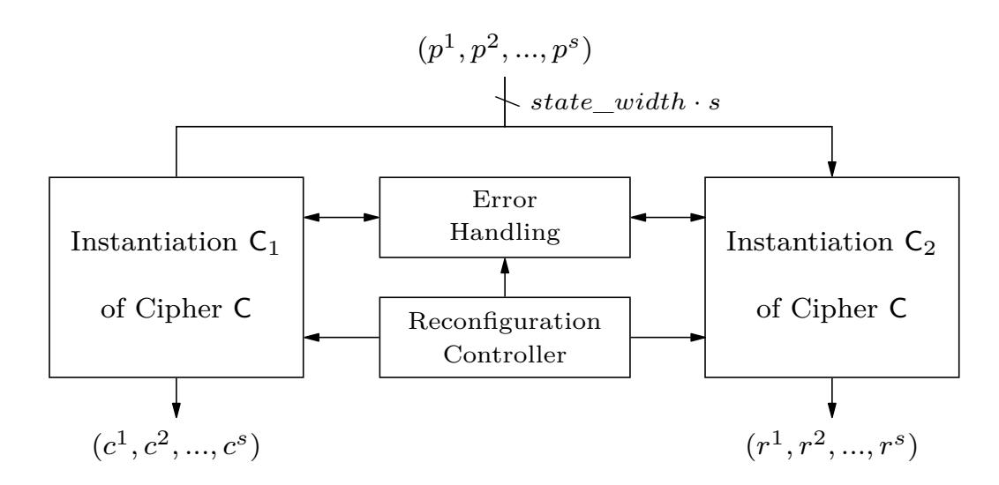
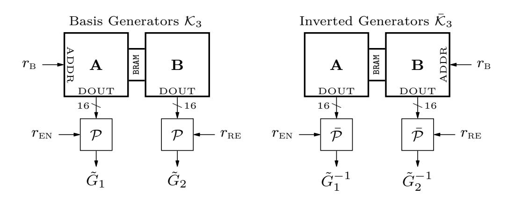
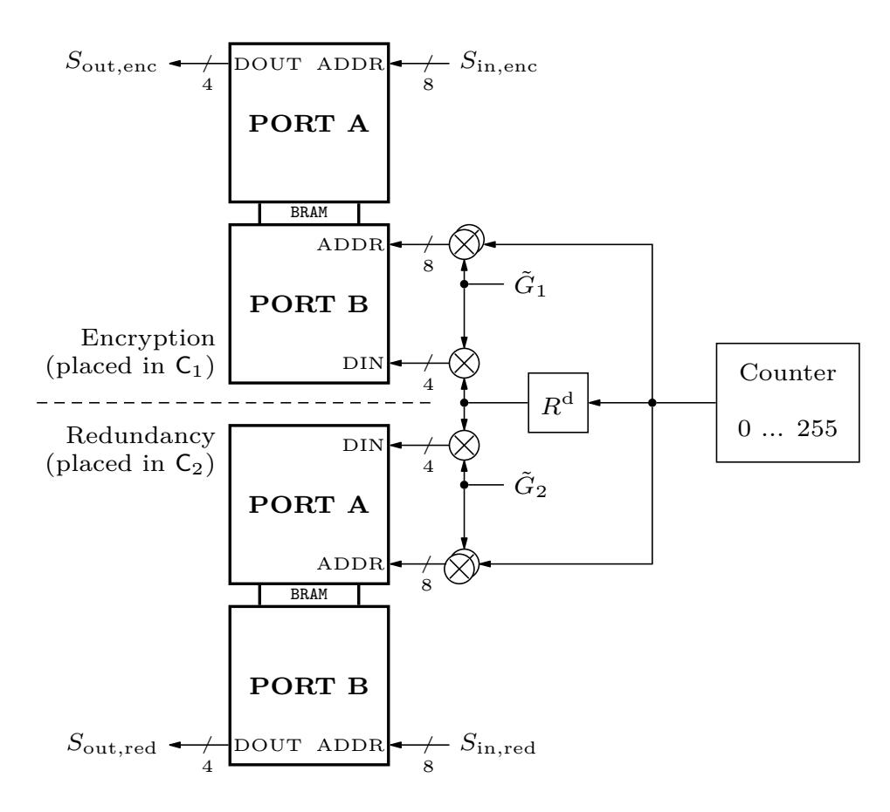
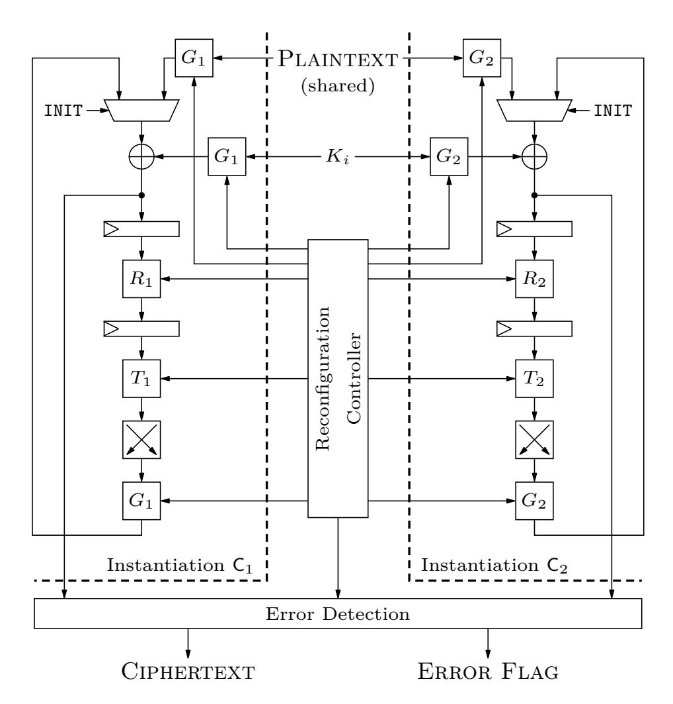
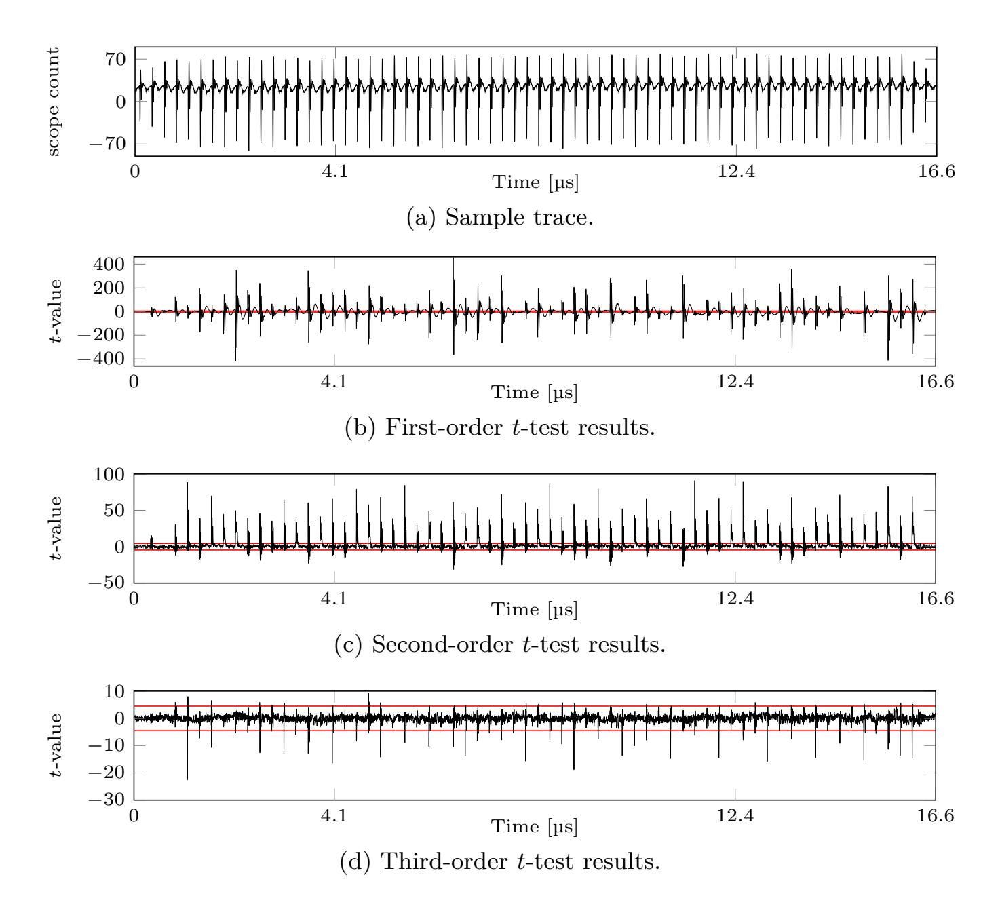
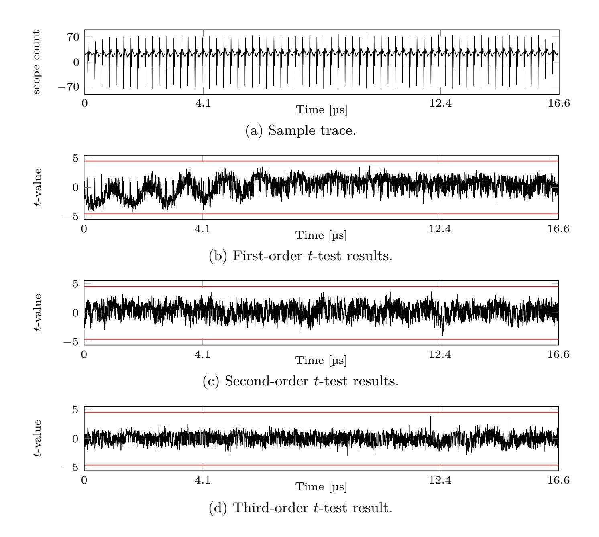

{0}------------------------------------------------

# **Improved Side-Channel Resistance by Dynamic Fault-Injection Countermeasures**

Jan Richter-Brockmann1 and Tim Güneysu1*,*2

1 Ruhr-Universität Bochum, Horst-Görtz Institute for IT-Security, Germany 2 DFKI, Germany

[firstname.lastname@rub.de](mailto:firstname.lastname@rub.de)

#### **Abstract.**

Side-channel analysis and fault-injection attacks are known as serious threats to cryptographic hardware implementations and the combined protection against both is currently an open line of research. A promising countermeasure with considerable implementation overhead appears to be a mix of first-order secure Threshold Implementations and linear Error-Correcting Codes.

In this paper we employ for the first time the inherent structure of non-systematic codes as fault countermeasure which dynamically mutates the applied generator matrices to achieve a higher-order side-channel and fault-protected design. As a case study, we apply our scheme to the PRESENT block cipher that do not show any higher-order side-channel leakage after measuring 150 million power traces.

**Keywords:** FIA · SCA · combined countermeasure · hiding · reconfiguration.

# **1 Introduction**

Side-Channel Analysis (SCA) and Fault-Injection Attacks (FIAs) are known as significant threats to any cryptographic implementation exposed to physical attackers, ranging from passive timing attacks [\[Koc96\]](#page-13-0), differential power analysis [\[KJJ99\]](#page-13-1) to active attacks such as FIA [\[BS97\]](#page-13-2).

Over the last years, a plethora of countermeasures has been proposed against these threats. Promising techniques to specifically counteract SCA can be divided into *hiding* and *masking*. While countermeasures based on *hiding* try to decrease the Signal-to-Noise Ratio (SNR) in order to harden the extraction of usable information (e.g., from power traces), *masking* is based on secret sharing and multi-party computations. Threshold Implementation (TI) belongs to this type of SCA countermeasure and was originally designed to provide provable first-order security [\[NRR06\]](#page-14-0). However, the principle of TI can be extended ensuring also higher-order protection [\[RBN](#page-14-1)+15,[DCBR](#page-13-3)+15] but with a drawback of an unacceptable implementation overhead [\[MW15\]](#page-14-2).

Countermeasures designed to resist FIA are often based on detection schemes which either withhold a faulty computation [\[KKG03,](#page-13-4) [AMR](#page-12-0)+19] or perform an infective computation hampering an attacker to obtain any exploitable information from the outputs [\[GST12,](#page-13-5)[DMAAN](#page-13-6)+18]. However, recently Dobraunig et *al.* demonstrated that these kinds of countermeasures can be broken by using a statistical analysis method called Statistical Ineffective Fault Analysis (SIFA) [\[DEK](#page-13-7)+18]. Therefore, linear Error-Correcting Codes (ECCs) seem to be a promising method to provide a resilient protection against fault injections as they can also be used to correct occurred faults which would thwart SIFA based attacks [\[SJR](#page-14-3)+19,[SRM20\]](#page-14-4).

Despite of the wealth of countermeasures treating SCA and FIA as a separate problem, only few works target the combined setting. In 2016, Schneider et *al.* [\[SMG16\]](#page-14-5) used

{1}------------------------------------------------

two already existing countermeasures (TI and linear ECCs), which separately resist SCA and FIA respectively, and combined the two techniques into one protected design. The resulting implementation provides first-order security against SCA including protection against fault injections. However, extending the TI to resist higher-order SCA would increase the implementation costs significantly and would be impracticable in a real world environment. In the following years Reparaz et *al.* [\[RDMB](#page-14-6)+18] proposed a concept inspired by Multi-Party Computation (MPC) protocols that achieved protection against SCA and FIA. De Meyer et *al.* [\[DMAAN](#page-13-6)+18] discuss a technique based on masking schemes while the resistance against FIA is achieved by adding Message Authentication Code (MAC) tags incorporating an information theoretic approach to the design. All proposals, however, share the unfavorable property of excessive costs in time and/or area in case protection against higher-order attacks should be considered as well.

**Contribution** In this work we present an alternative strategy to design a combined countermeasure against SCA and FIA that is suitable to achieve higher-order protection at reasonable cost. We therefore revisit existing solutions that successfully combine first-order secure masking schemes with hiding techniques, such as [\[SMG15,](#page-14-7)[SMG17\]](#page-14-8). One strategy in this regard is to exploit the composition of small S-boxes into affine equivalences in order to replace the affine functions on the fly. This reconfiguration technique introduces additional randomness into a running encryption process and hides higher-order leakage. This can be further improved with encoding the cipher's state with randomly selected functions resulting in hiding the higher-order leakage in the introduced noise of the encoding scheme. The latter approach is inspired by the idea behind White-Box Cryptography.

Based on the observations from previous works, we now come up with the following original strategy: we compose a first-order secure TI with a randomization technique based on linear ECCs that augments our fault-injection protection with additional noise. In contrast to previous works, we do not rely on systematic codes here but rather explicitly pick generators producing non-systematic codes. These generators are dynamically evolved during runtime in order to hide higher-order leakage as a hiding countermeasure. As shown in our work, we finally achieve a combined hardware countermeasure which successfully resists higher-order side-channel and fault-injection attacks at very reasonable implementation costs.

**Outline** In [Section 2](#page-1-0) we provide the basic theoretical background of TIs, linear ECCs and linear algebra required for this manuscript. Starting with [Section 3,](#page-3-0) we first outline our design considerations and define our adversary model. This is followed by a detailed description of our novel countermeasure. We implement our design in a case study described in [Section 4.](#page-6-0) In [Section 5](#page-9-0) we eventually evaluate our design for Field-Programmable Gate Arrays (FPGAs). Before we conclude our work in [Section 7,](#page-11-0) [Section 6](#page-10-0) addresses future work and additional considerations.

## **2 Preliminaries**

As motivated in the introduction, the presented approach is based on a first-order secure masking technique, more precisely on TI, and on linear ECCs to achieve resilience against FIA. In the following we briefly describe both concepts.

#### **2.1 Threshold Implementations**

TI as originally proposed by Nikova et *al.* is known as a provable secure and widely used masking-scheme to protect digital circuits against SCA [\[NRR06\]](#page-14-0). Since it is based on secret sharing and on methods from multi-party computation, a vector *x* ∈ F *m* 2 of *m* single 

{2}------------------------------------------------

bits  $\langle x_1, ..., x_m \rangle$  can be split up into s shares  $\mathbf{x}^i \in \mathbb{F}_2^m$ . Then, using Boolean masking, it holds for the shared representation  $\bar{\mathbf{x}} = (\mathbf{x}^1, ..., \mathbf{x}^s)$  that

$$\boldsymbol{x} = \bigoplus_{i=1}^s \bar{\boldsymbol{x}} = \bigoplus_{i=1}^s \boldsymbol{x}^i.$$

To provide the desired security, the target implementation has to fulfill the following properties.

**Correctness** Given a function  $\mathbf{y} = \mathsf{F}(\mathbf{x})$  from  $\mathbb{F}_2^m$  to  $\mathbb{F}_2^n$ , the TI realization of F requires a shared representation  $\bar{\mathsf{F}} = (\mathsf{F}^1, ..., \mathsf{F}^t)$  where the  $\mathsf{F}^i$  are called component functions. Correctness is ensured if  $\bar{\mathbf{y}} = \bar{\mathsf{F}}(\bar{\mathbf{x}})$  satisfies  $\mathbf{y} = \bigoplus_{i=1}^t \mathsf{F}^i(\bar{\mathbf{x}})$  for  $\mathbf{x} = \bigoplus_{i=1}^s \bar{\mathbf{x}}$ .

**Non-Completeness** To ensure a secure TI implementation in the presence of glitches, each function  $\bar{\mathsf{F}}$  has to be *non-complete*. Particularly, for a first-order secure implementation of a function  $\mathsf{F}$  each component function  $\mathsf{F}^{i\in\{1,\ldots,t\}}$  must be independent of at least one input share  $\boldsymbol{x}^{j\in\{1,\ldots,s\}}$ .

Uniformity Since the security of TI is based on Boolean masking, a uniform distribution of the shared representation is essential. However, the results of a shared function  $\bar{\mathsf{F}}$  are used as input to subsequent functions such that uniformly distributed outputs of  $\bar{\mathsf{F}}$  are required. In other words, the set of all possible output sharings  $\mathcal{F} = \{\mathsf{F}^1, ..., \mathsf{F}^t | \bar{x} \in \mathcal{X}\}$  must be uniformly drawn from the set  $\mathcal{Y} = \{\bar{y} | \bigoplus_{i=1}^t \bar{y} = y\}$  assuming a given set of all possible input sharings  $\mathcal{X} = \{\bar{x} | \bigoplus_{i=1}^s \bar{x} = x\}$ . Violating the uniformity property would lead to a biased sharing and first-order leakage.

### 2.2 Basic Notations of Linear Error Codes and Linear Algebra

In the first part of this paragraph we briefly summarize important properties of linear ECCs which are mainly known from communication theory. The second part covers basic definitions from linear algebra which are required to implement and optimize our approach.

**Linear Codes** The description for the background of linear ECCs follows the notations of [vT04] and [MS77].

**Definition 1.** A linear code C of length n is defined as any linear subspace of  $\mathbb{F}_q^n$ .

Note, since we intend to apply the linear error codes to symmetric block ciphers implemented in digital hardware circuits, we only consider binary fields  $\mathbb{F}_2^n$ .

**Definition 2.** A generator matrix G of an [n, k]-code C is a  $k \times n$  matrix whose k rows form a basis of C. The basis vectors of length n allow to generate all codewords of C.

Hence, a codeword  $c \in \mathbb{F}_q^n$  is generated by a target message  $m \in \mathbb{F}_q^k$  calculating the vector-matrix product  $m \cdot G = c \in \mathbb{C}$ .

**Definition 3.** A parity check matrix H of an [n,k]-code C is an  $(n-k) \times n$  matrix which satisfies

$$\mathbf{0} = H \cdot c^{\mathrm{T}} \quad \forall c \in \mathbf{C}.$$

As a result, a given  $c' \in \mathbb{F}_q^n$  can be easily checked for a valid codeword of C. The output  $s = H \cdot c'^{\mathrm{T}}$  is called syndrome.

**Definition 4.** The *minimum distance* d of a linear code C is the smallest Hamming distance (HD) between all codewords and is defined as

$$d = \min (\{ HD(c_1, c_2) | c_1, c_2 \in \mathbf{C}, c_1 \neq c_2 \}).$$

{3}------------------------------------------------

The minimum distance *d* is an essential property of linear error codes since it determines error detection and correction capabilities. To this end, such codes are commonly called [*n, k, d*]-codes.

**Corollary 1.** *A code C with minimum distance d can detect u* = *d* − 1 *errors and correct v* = *d*−1 2 *errors. If d is even, this implies C can simultaneously detect u* = *d* 2 *errors and correct v* = *d*−2 2 *errors.*

A faulted codeword *c* 0 = *c* ⊕ *e*, where *e* ∈ F *n q* denotes an error vector, can be detected by an [*n, k, d*]-code as long as HW(*e*) ≤ *u*.

**Definition 5.** Two linear codes over F*q* are equivalent if one can be obtained from the other by a combination of operations of the following two types:

- (a) an arbitrary permutation of its coordinate positions
- (b) multiplication of symbols appearing in a fixed position by a non-zero scalar.

Hence, equivalent codes have the same properties, i.e., the same minimum distance *d*.

**Definition 6.** A code *C* is called systematic code if and only if *G* = [*Ik*|*P*] where *Ik* denotes the identity matrix of size *k*.

Note that every generator matrix *G* of a non-systematic code *C* can be transformed to another generator matrix *G*˜ of a systematic code based on [Definition 5](#page-3-1) [\[Bla03\]](#page-13-8).

**Linear Algebra** Following the definitions from [\[BV18\]](#page-13-9), we now recap important properties from linear algebra.

**Lemma 1.** *The determinant of a quadratic matrix A is non-zero if and only if A*−1 *exists.*

**Lemma 2.** *If two matrices A and B are invertible the product A* · *B is invertible as well and the product's inverse is calculated by*

$$(A \cdot B)^{-1} = B^{-1} \cdot A^{-1}.$$

**Definition 7.** A quadratic *k* × *k* matrix *Q* is called orthogonal matrix if and only if

$$Q^{\mathrm{T}} = Q^{-1}$$

and the columns are unit vectors.

This includes that *Q* · *Q*T = *Q*T · *Q* = *Ik* holds for all orthogonal matrices.

**Definition 8.** A quadratic *k* × *k* matrix *P* is called permutation matrix if and only if one entry per row and column is one and the rest is zero.

Thus, due to [Definition 7,](#page-3-2) each permutation matrix is also an orthogonal matrix. Note, however, that not every orthogonal matrix is a permutation matrix.

# **3 Methodology**

This section describes our general design considerations and defines our adversary model. Based on these information we introduce our generic principle and describe our implementation strategy. Eventually, we deduce suitable codes for lightweight ciphers.

{4}------------------------------------------------

### **3.1 General Considerations**

We now introduce our combined countermeasure that aims to resist both side-channel attacks and fault-injection attacks. The fundamental (first-order-only) concept is inspired by [\[SMG16\]](#page-14-5) and relies on a design which combines TI and linear ECCs. As evaluated in [\[AMR](#page-12-0)+19, [SRM20\]](#page-14-4), linear ECCs provide terrific properties protecting cryptographic implementations on hardware against fault-injection attacks. However, instantiating firstorder secure TI as only countermeasure against SCA, higher-order attacks can be still successfully applied to the combined countermeasure. Note that the ideas of TI can generally be extended to higher orders at – unfortunately – significant costs [\[MW15\]](#page-14-2). To provide higher-order protection against SCA without excessive cost overhead, we therefore utilize the existing properties provided by linear ECCs in a continuous randomized update process as hiding countermeasure.

We picked an FPGA as target platform for our case-study. They inherently provide a perfect environment for implementing reconfigurable systems realizing the dynamic exchange of the ECCs.

### **3.2 Adversary Model**

First, we assume an attacker that characterizes a target device by acquiring the power consumption or the electro-magnetic radiation. Here, we follow the well-known *d*-probing model where an implementation is assumed to be secure under a *d*-order attack [\[ISW03\]](#page-13-10). Furthermore, our adversary model includes glitches which will be considered in our security evaluation.

Second, we assume an adversary that additionally is able to inject faults into the target implementation. We model occurring faults by additive errors and instead of assuming an uniform error distribution, we follow the biased fault distribution E*Bb* from [\[SMG16\]](#page-14-5) where the attacker can inject up to *b* faults into a target codeword *c*. This approach considers biased fault injections which seems to be more realistic considering an attacker trying to recover the cryptographic secret. In this work we only consider faults occurring in the data depended path of the design since this kind of faults are more important regarding the design of countermeasures thwarting physical attacks.

#### **3.3 Design Strategy**

As introduced before we employ a first-order secure threshold implementation combined with linear ECCs as fundamental building block. Inspired by previous work [\[SMG16\]](#page-14-5), we decided to choose *n*=2 · *k* such that each word of *k* bits is separately encoded by a generator matrix *G*. However, instead of relying on systematic linear error codes – as it was mainly done in the past (e.g., in [\[AMR](#page-12-0)+19]) – we explicitly want to apply *non-systematic* codes. By dynamically exchanging the applied linear codes, we generate additional algorithmic noise in order to hide any exploitable higher-order side-channel leakage given the presence of a provably-secure first-order secure masking scheme. This way we achieve an increased security level exploiting the already existing properties of the FIA countermeasure, i.e., of the underlying ECC.

The fundamental principle of our approach is depicted in Figure [1](#page-5-0) and expects a shared input *p* with *s*-shares. Due to the selected parameters for the linear ECCs (*n*=2 · *k*), the target cipher C is duplicated, and a redundancy is created processing the same input data as the original cipher. However, since we apply non-systematic codes to the target cipher C, both instantiations have to be adapted in order to process the encoded states. Generally, each word *m* of *k* bits of the cipher's state is encoded by a generator matrix *G*= [*G*1|*G*2]. To ensure the maximum possible security level against FIA, the selection of a code should be made with regard to maximize to minimum distance *d*. Given a subfunction *F* of the

{5}------------------------------------------------

Figure 1: Generic principle of protecting a target cipher C.

target cipher C and  $i \in \{1, 2\}$ , each subfunction  $F_i$  of the cipher's instantiation  $C_i$  has to be adapted so that

$$F_i = G_i \circ F \circ G_i^{-1} \tag{1}$$

holds. Equation 1 also reveals another important requirement to the generator matrix G: the sub-matrices  $G_1$  and  $G_2$  have to be non-singular in order to calculate their inverses  $G_1^{-1}$  and  $G_2^{-1}$ , respectively.

The protection against higher-order side-channel attacks should be achieved by dynamically exchanging the linear ECC, i.e., the generator matrix G and therewith the sub-matrices  $G_1$  and  $G_2$ . This task is accomplished by a reconfiguration controller which adapts on the one hand the ciphers' subfunctions and on the other hand the module being responsible for the error handling. Depending on the properties of the applied ECCs, the error handling module can either be implemented to detect or to correct occurring faults.

#### 3.4 Suitable Codes for Lightweight Ciphers

In this section we describe the procedure of finding suitable codes implementing our approach for lightweight ciphers. Additionally, we investigate the total number of different variations that can be generated using dynamic ECCs. For lightweight symmetric ciphers we assume a nibble-oriented state such that k=4 and n=8. Selecting these parameters, the maximum minimum distance d that can be achieved is d=4. We performed an exhaustive search over all possibilities of [8,4,4] linear ECCs and identified the set

$$\mathcal{K}_1 = \left\{ G \in \mathbb{F}_2^{4 \times 8} \middle| d = 4 \text{ for } \mathbf{C} = \left\{ m \cdot G \middle| m \in \mathbb{F}_2^4 \right\} \right\}$$

which contains 596 736 different generators. Since we need to split up G into the submatrices  $G_1$  and  $G_2$  in order to allow a separate processing of the data in  $C_1$  and  $C_2$ , we tested the sub-matrices  $G_1$  and  $G_2$  of each  $G \in \mathcal{K}_1$  for invertibility. This classification leaves us with a slightly narrowed set

$$\mathcal{K}_2 = \{ G = [G_1 | G_2] \in \mathcal{K}_1 | \det(G_1), \det(G_2) \neq 0 \}$$

including 483 840 different generators. However, since each generator is represented by 32 bit, storing all possible generators would require  $483\,840\cdot32\,\mathrm{bit}\approx2\,\mathrm{MByte}$  which consequently would result in exploding implementation costs.

To reduce these costs, we further minimized the size of  $\mathcal{K}_2$  being able to randomly generate new generator matrices on the fly. Therefore, we defined a set  $\mathcal{P}$  including all permutation matrices of size  $4 \times 4$  leading to  $|\mathcal{P}| = 4!$ . Given that and a valid generator matrix G, we can construct another valid generator matrix  $\tilde{G}$  by randomly choosing  $P_{i \in \{1,2\}} \in \mathcal{P}$  and permuting the columns within the sub-matrices  $G_{i \in \{1,2\}}$  which results in

$$\tilde{G} = [G_1 \cdot P_1 | G_2 \cdot P_2]. \tag{2}$$

{6}------------------------------------------------

This operation does not change the capability of the underlying code and the resulting submatrices are still invertible due to Lemma 2. Subsequently, given one arbitrary generator matrix from the set  $\mathcal{K}_2$ , we can generate  $4! \cdot 4! = 576$  different variants from it applying Equation 2. Hence, we do not have to store the entire  $483\,840$  generators but rather can reduce the size of  $\mathcal{K}_2$  creating a new set  $\mathcal{K}_3$  with  $483\,840/576 = 840$  different generators which we will call *basis generators* in the following. In summary, we can generate all  $\tilde{G} \in \mathcal{K}_2$  on the fly using the defined 840 basis generators and permutations from  $\mathcal{P}$ .

As shown in Equation 1, the dynamic exchange of the linear ECCs does not only require the sub-matrices  $G_{i\in\{1,2\}}$  but also their inverses. Assuming we have pre-calculated and stored all the inverses of the basis generator's sub-matrices in a set  $\bar{\mathcal{K}}_3$ , we can compute the inverses of the permuted matrices  $G_i \cdot P_i$  on the fly by

$$(G_i \cdot P_i)^{-1} = P_i^{-1} \cdot G_i^{-1} = P_i^{\mathrm{T}} \cdot G_i^{-1}$$
(3)

where  $P_i \in \mathcal{P}$  and  $i \in \{1, 2\}$ . Simplifying implementation processes for hardware devices, we define an additional set  $\bar{\mathcal{P}}$  which contains all transposed permutations from  $\mathcal{P}$ .

### 4 Case Study

As we concentrated our investigations mainly on lightweight ciphers, we apply our approach in a practical case study to the PRESENT block cipher [BKL+07]. As a target platform we selected FPGAs as already mentioned in Section 3.1.

#### 4.1 PRESENT

PRESENT is a block cipher consisting of a 64-bit state and supporting key lengths of 80 bits and 128 bits. Independent of the chosen key length, the cipher executes 31 rounds where each round includes a key addition, a linear layer, and a non-linear substitution. The key addition adds (xor) a round key  $K_i$  for  $1 \le i \le 32$  to the current state where the last round key  $K_{32}$  is used for post-whitening. The linear layer is realized by a bit-wise permutation of the state. In order to perform the non-linear substitution, the state is divided into nibbles which are used as inputs to 16 parallel 4-bit to 4-bit S-boxes S(x). Note that we refer to the PRESENT version using an 80-bit key in the following.

#### 4.2 Reconfiguration Controller

One important part of our design is the reconfiguration controller as depicted in Figure 1. To generate all possible variations from  $\mathcal{K}_2$  on the fly, we instantiated two 36 KB Block-RAM (BRAM) modules (cf. Figure 2) storing  $\mathcal{K}_3$  and  $\bar{\mathcal{K}}_3$ , respectively. Using the random bits  $r_{\rm B}$ , we can read one of the stored basis generators and the corresponding inverse into one clock cycle setting the data-width to 32 bits. The outputs G and  $G^{-1}$  are separated into two 16-bit words representing  $G_{i\in\{1,2\}}$  and  $G_{i\in\{1,2\}}^{-1}$ , respectively. Using additional randomness  $r_{\rm EN}$  and  $r_{\rm RE}$ , the permutation matrices  $P_i \in \mathcal{P}$  and  $\bar{P}_i \in \bar{\mathcal{P}}$  with  $i \in \{1,2\}$  are selected in order to permute the prior determined basis generators  $G_i \in \mathcal{K}_3$  and  $G_i^{-1} \in \bar{\mathcal{K}}_3$  applying Equation 3. The outputs  $\tilde{G}_{i\in\{1,2\}}$  and  $\tilde{G}_{i\in\{1,2\}}^{-1}$  are then used to reconfigure the TI S-boxes, the error handling module, and modules being responsible for encoding the state and round keys  $K_i$ .

#### 4.3 Cryptographic Instantiations

The non-linear S-boxes of the instantiations  $C_1$  and  $C_2$  are realized using BRAMs. Since we implemented a first-order secure TI, we decomposed the cubic-non-linearity S(x) into

{7}------------------------------------------------

Figure 2: Randomized generation of G and  $G^{-1}$ .

two quadratic functions S(x) = T(R(x)) using affine equivalences. We decided to apply the same shared decomposed functions as the authors in [SMG16] where  $R^1 = R^2 = R^3 = R^d$  and  $T^1 = T^2 = T^3 = T^d$ . Each 8-bit to 4-bit Look-Up Table (LUT) is stored in an own dual-port BRAM module as exemplary shown in Figure 3 for two realizations of  $R^d$  where the above BRAM is placed in the instantiation of  $C_1$  (encryption path) and the lower BRAM in  $C_2$  (redundancy).

This implementation strategy reduces the amount of sequential logic and logic cells and allows a concurrent reconfiguration of the non-linear functions due to the dual-port memories. A reconfiguration is conducted by an eight bit counter which on the one hand reads out the values of the shared decomposed functions  $R^{\rm d}$  and  $T^{\rm d}$  and on the other hand serves as foundation to determine new addresses. To complete the computation of the addresses, the counter values are split into two nibbles and are separately encoded by the corresponding generator matrices  $\tilde{G}_{i\in\{1,2\}}$ . The new S-box values are determined based on the original values of  $R^{\rm d}$  and  $T^{\rm d}$  and a subsequent encoding with  $\tilde{G}_{i\in\{1,2\}}$ . During reconfiguration, the second BRAM port is used for processing the data of the encryption and redundancy such that the input values are forwarded to the address-ports and the outputs are used as inputs to the subsequent subfunction. After a reconfiguration is completed, a context switch is performed and the freshly reconfigured LUTs are used.

#### 4.4 Error Handling

The realization of the error handling module follows the design of [SMG16] and is used to detect occurring faults within an encryption. After every key addition, the states of the encryption path and of the redundant path are decoded and compared in order to prevent faulty encryptions within the detection capability of the used ECC. As the applied ECCs change over time, the detection module has to be reconfigured as well which requires the inverse  $\tilde{G}^{-1}$  of the used generator matrix  $\tilde{G}$ . Here we just rely on combinatorial logic and do not utilize BRAM in order to avoid additional delays when performing the error-check.

#### 4.5 Overall Implementation

Figure 4 shows a schematic of the overall implementation composed of the aforementioned building blocks. Note that all data paths are realized in shares to implement a correct TI. Each plaintext that should be encrypted is first encoded by  $G_1$  forwarded to the cipher's instantiation  $\mathsf{C}_1$  (left data flow) and encoded by  $G_2$  forwarded to the cipher's instantiation  $\mathsf{C}_2$  (right data flow). Besides the shared plaintext, every round key  $K_i$  needs to be encoded as well so that additional encoding modules (implemented in combinatorial logic) are placed right before every key addition. The following register stage is included in the BRAM modules and is used to prevent glitches. The LUTs  $R_1$  and  $R_2$  represent the encoded quadratic function R generated by the reconfiguration technique described in Figure 3. Again, the next register stage is included in the BRAM modules. However, to

{8}------------------------------------------------

Figure 3: Reconfiguration of the TI S-boxes exemplary shown for the quadratic decomposed function  $\mathbb{R}^{\mathrm{d}}$ .

generate the values of T, only the inputs get encoded by the reconfiguration controller. The outputs of T are returned in a non-encoded form in order to allow a straightforward application of the permutation layer. Afterwards both states of  $C_1$  and  $C_2$  are encoded again by  $G_1$  and  $G_2$ , respectively. As described above, the error handling module compares the states of  $C_1$  and  $C_2$  after the key addition. In case a fault is detected, the Error FLAG is raised and an ongoing encryption is directly interrupted.

Figure 4: Schematic of the overall implementation.

{9}------------------------------------------------

#### **4.6 Reconfiguration Performance**

In [Section 4.3](#page-6-2) we already mentioned that a reconfiguration can be performed in parallel to an encryption due to the dual-port BRAMs. One reconfiguration takes 2 8 = 256 clock cycles (one clock cycle for each value of the TI S-boxes). The latency of one encryption adds up to 64 clock cycles which perfectly fits to the 256 clock cycles required for the reconfiguration. Hence, four encryptions are performed with the same encoding (i.e., the same generator matrices) before a context switch between the two parts of the BRAMs is induced and the freshly reconfigured LUTs can be used for upcoming encryptions. Furthermore, due to this technique, no additional latency is introduced and a continuous encryption process can be ensured.

## **5 Analysis**

This section presents the implementation results as well as the security analysis. After we compare our approach to already existing implementations, we focus our evaluation on a theoretical discussion about the achieved fault coverage. Afterwards, we apply a state-ofthe-art leakage assessment methodology based on Test Vector Leakage Assessment (TVLA) validating higher-order security.

### **5.1 Implementation Results**

Since our approach uses reconfiguration techniques, FPGAs seem to be a perfect platform for implementing and evaluating our design. As a target platform we selected a Xilinx Kintex-7 XC7K160T FPGA. [Table 1](#page-10-1) shows the implementation results divided into area utilization, speed, and power. Comparing our approach to designs reported in the literature, the area overhead regarding the required amount of LUTs is reasonable considering that our approach has implemented resistance against FIA which is missing in all other designs. The decreased number of registers used in our implementation originates from the instantiated BRAM modules realizing the non-linearities. Each BRAM module contains a non-configurable input register which is in case of TI needed anyway to avoid glitches. However, our design requires a total amount of 196 BRAM tiles since each instantiation C*i*∈{1*,*2} requires 96 tiles realizing the S-boxes and the four additional tiles are required to hold the basis generators and the corresponding inverses.

The achieved throughput of 266 MB*/*s is comparable to the designs by Sasdrich et *al.* [\[SMG15,](#page-14-7)[SMG17\]](#page-14-8) and slightly lower than the approach by Moradi and Wild [\[MW15\]](#page-14-2).

Even though no work from the considered references provide any results regarding the power consumption, we decided to include it within our evaluation table as additional important metric especially for devices relying on power provided by battery. We determined the power consumption using Vivado leaving all settings at their default values. Eventually, we obtained a power consumption with a high confidence of 423 mW for our target device (excluding static power).

#### **5.2 Resistance against Fault Injections**

The resistance against FIA is determined by the underlying ECCs. In our case study we only used linear codes with the maximum minimal distance being available for the selected parameters, i.e., *n*=8, *k*=4, *d*=4. Since we rely on the same structure and codes with the same capabilities as the authors in [\[SMG16\]](#page-14-5), our design achieves the same fault coverage. Using the biased fault distribution E*Bb* introduced in [Section 3.2,](#page-4-1) where an attacker is able to inject up to *b* faults into a single codeword, the fault coverage *C*cov follows

$$C_{\rm cov} = 1 - \frac{F_{\rm not}}{F_{\rm tot}}$$

{10}------------------------------------------------

| Approach                            | Logic |        | Memory |       | Latency | Freq. | Through. | Power  |
|-------------------------------------|-------|--------|--------|-------|---------|-------|----------|--------|
|                                     | LUT   | FF     | LUTRAM | BRAMi | cycles  | MHz   | MBit/s   | mW     |
| 1st-order TI [MW15]                 | 808   | 384    | –      | 0     | 64      | 207   | 413      | N/A    |
| 2nd-order TI [MW15]                 | 2 245 | 1 680  | –      | 0     | 128     | 204   | 406      | N/A    |
| Affine Equivalences [SMG15]         | 1 834 | 742    | –      | 1     | 64      | 112   | 224      | N/A    |
| Glitch-Free Duplication [MW15]      | 5 442 | 12 672 | –      | 0     | 704     | 459   | 458      | N/A    |
| Dynamic Hardware Mod. [SMG17] 3 236 |       | 3 246  | 1 952  | 192   | 124     | 153   | 315      | N/A    |
| ii Dynamic ECCs [this work]      | 3 955 | 219    | 0      | 196   | 64      | 135   | 266      | 423iii |

Table 1: Implementation results compared to related work.

where *F*not represents the number of undetectable errors and *F*tot the total number of errors that can occur in the defined fault model. The corresponding fault distribution is given by [Table 2.](#page-10-2) Note that the used codes have a 100 % fault coverage as long as *b* ≤ 3 due to a minimum distance of *d*=4 (cf. [Corollary 1\)](#page-3-4). However, this does not mean that *F*not = *F*tot when *b* ≥ 4 as only faults that are equal to valid codewords will not be detected. For detailed information we refer the interested reader to the original work from Schneider et *al.* [\[SMG16\]](#page-14-5).

Table 2: Fault coverage of the applied linear ECCs.

| EB1   | EB2   | EB3   | EB4     | EB5     | EB6     | EB7     |  |
|-------|-------|-------|---------|---------|---------|---------|--|
| 100 % | 100 % | 100 % | 91.36 % | 93.58 % | 94.31 % | 94.49 % |  |

### **5.3 Resistance against Side-Channel Analysis**

For evaluating the resistance against SCA, we used the side-channel measurement board Sakura-X equipped with a Kintex-7 FPGA holding the cryptographic implementation and a Spartan-6 FPGA controlling the measurement which includes the generation of a stable clock of 4 MHz. The voltage drop was measured using a 1 Ω shunt resistor while amplifying the signal with a ZFL-100 LN+ amplifier (24 dB gain). The analog signal was converted into an 8-bit digital word using a 6404D PicoScope and a sampling rate of 625 MS*/*s. Furthermore, we used the PicoScope's low-pass filter with a cut-off frequency of 25 MHz. As leakage assessment methodology we applied an univariate Welch's *t*-test since it can be extended to higher-order statistical moments [\[SM15\]](#page-14-11).

To validate our implementation and measurement setup, we first conduct measurements setting all masks to zero and disable the additional randomness required for the dynamic reconfiguration of the ECCs. The corresponding results are shown in Figure [5.](#page-11-1) As expected, after acquiring 1 million power traces, we clearly see leakage in all considered statistical orders.

In our second experiment, we use random masks and enable the Linear Feedback Shift Register (LFSR) providing the required randomness for the reconfiguration of the dynamic ECCs. The *t*-test results for the first three statistical moments after acquiring 150 million power traces are shown in Figure [6.](#page-12-1) Within the considered confidence threshold of ±4*.*5, we do not detect any *t*-value that falls outside the interval. Hence, we do not detect any noticeable leakage in the considered statistical moments.

# **6 Discussion**

Implementing the *error handling* module just as detection module (cf. Figure [1\)](#page-5-0), offers weak points against SIFA based fault attacks. However, the application of storing the S-box

i 18 KB tiles. ii Only work that includes a countermeasure against SCA and FIA. iii Dynamic power.

{11}------------------------------------------------

Figure 5: Measurement results using a static code, zero masks and 1 million traces.

values in BRAMs does not allow to implement correction modules as the input registers of BRAMs are not accessible by the user so that faults occurring in these registers cannot be corrected before processed by the S-boxes. The non-linearities would uncontrollably spread a fault over an entire codeword such that the correction capabilities would be exceeded. To this end, our approach could be still implemented using distributed memory instead of BRAM as the designer can place input registers combined with correction modules before each non-linearity. This procedure would allow to apply our combined protection mechanism and to successfully thwart SIFA based attacks.

[Section 3.4](#page-5-3) deals with suitable codes for lightweight ciphers which does not include larger algorithms like the Advanced Encryption Standard (AES). Performing an exhaustive search over all [16*,* 8]-codes (each byte of the AES state matrix is encoded separately), would not be possible as there are 2 16·8 possibilities. However, picking already existing codes like the [16*,* 8*,* 5]-code described in the appendix of [\[BCC](#page-12-2)+14] and using the same permutation process as described in [Section 3.4,](#page-5-3) would produce 8! · 8! different generator matrices given just one basis generator. Hence, an application to AES would be conceivable but not all existing basis generator matrices could be exploited.

# **7 Conclusion**

In this work we present a combined countermeasure against SCA and FIA based on a combination of a first-order secure TI and linear ECCs. Using the underlying structure of the linear codes as an opportunity to introduce additional noise by randomizing the used

{12}------------------------------------------------

Figure 6: Measurement results using dynamic codes, random masks and 150 million traces.

generators, we achieve a higher-order protected design against SCA. We narrowed down the size of the required generator matrices resulting in a reconfiguration controller which is able to generate 483 840 different variations on the fly while achieving acceptable implementation overhead. Eventually, a case study on PRESENT, including power measurements with 150 million traces, shows protection up to the third statistical order while providing resistance against FIA.

# **Acknowledgments**

The authors would like to thank Florian Bache for helpful discussions and his support performing the measurements. The work described in this paper has been supported by the German Federal Ministry of Education and Research BMBF through the projects SecRec (16KIS0606K) and VeriSec (16KIS0603).

## **References**

[AMR+19] Anita Aghaie, Amir Moradi, Shahram Rasoolzadeh, Aein Rezaei Shahmirzadi, Falk Schelllenberg, and Tobias Schneider. Impeccable Circuits. *IEEE Transactions on Computers*, 2019.

[BCC+14] Julien Bringer, Claude Carlet, Hervé Chabanne, Sylvain Guilley, and Houssem Maghrebi. Orthogonal Direct Sum Masking. In *IFIP Interna-*

{13}------------------------------------------------

- *tional Workshop on Information Security Theory and Practice*, pages 40–56. Springer, 2014.
- [BKL+07] Andrey Bogdanov, Lars R Knudsen, Gregor Leander, Christof Paar, Axel Poschmann, Matthew JB Robshaw, Yannick Seurin, and Charlotte Vikkelsoe. PRESENT: An Ultra-Lightweight Block Cipher. In *International workshop on cryptographic hardware and embedded systems*, pages 450–466. Springer, 2007.
- [Bla03] Richard E Blahut. *Algebraic Codes for Data Transmission*. Cambridge University Press, 2003.
- [BS97] Eli Biham and Adi Shamir. Differential Fault Analysis of Secret Key Cryptosystems. In *Advances in Cryptology - CRYPTO '97, 17th Annual International Cryptology Conference, Santa Barbara, California, USA, August 17-21, 1997, Proceedings*, pages 513–525, 1997.
- [BV18] Stephen Boyd and Lieven Vandenberghe. *Introduction to Applied Linear Algebra: Vectors, Matrices, and Least Squares*. Cambridge university press, 2018.
- [DCBR+15] Thomas De Cnudde, Begül Bilgin, Oscar Reparaz, Ventzislav Nikov, and Svetla Nikova. Higher-Order Threshold Implementation of the AES Sbox. In *International Conference on Smart Card Research and Advanced Applications*, pages 259–272. Springer, 2015.
- [DEK+18] Christoph Dobraunig, Maria Eichlseder, Thomas Korak, Stefan Mangard, Florian Mendel, and Robert Primas. SIFA: Exploiting Ineffective Fault Inductions on Symmetric Cryptography. *IACR Transactions on Cryptographic Hardware and Embedded Systems*, pages 547–572, 2018.
- [DMAAN+18] Lauren De Meyer, Victor Arribas Abril, Svetla Nikova, Ventzislav Nikov, and Vincent Rijmen. M&m: Masks and macs against physical attacks. *IACR Transactions on Cryptographic Hardware and Embedded Systems*, 2019(1):25–50, 2018.
- [GST12] Benedikt Gierlichs, Jörn-Marc Schmidt, and Michael Tunstall. Infective Computation and Dummy Rounds: Fault Protection for Block Ciphers without Check-Before-Output. In *International conference on cryptology and information security in Latin America*, pages 305–321. Springer, 2012.
- [ISW03] Yuval Ishai, Amit Sahai, and David Wagner. Private Circuits: Securing Hardware Against Probing Attacks. In *Annual International Cryptology Conference*, pages 463–481. Springer, 2003.
- [KJJ99] Paul Kocher, Joshua Jaffe, and Benjamin Jun. Differential Power Analysis. In *Annual International Cryptology Conference*, pages 388–397. Springer, 1999.
- [KKG03] Ramesh Karri, Grigori Kuznetsov, and Michael Goessel. Parity-Based Concurrent Error Detection of Substitution-Permutation Network Block Ciphers. In *International Workshop on Cryptographic Hardware and Embedded Systems*, pages 113–124. Springer, 2003.
- [Koc96] Paul C. Kocher. Timing Attacks on Implementations of Diffie-Hellman, RSA, DSS, and Other Systems. In *Advances in Cryptology - CRYPTO '96, 16th Annual International Cryptology Conference, Santa Barbara, California, USA, August 18-22, 1996, Proceedings*, pages 104–113, 1996.

{14}------------------------------------------------

- [MS77] Florence Jessie MacWilliams and Neil James Alexander Sloane. *The Theory of Error-Correcting Codes*. Elsevier, 1977.
- [MW15] Amir Moradi and Alexander Wild. Assessment of Hiding the Higher-Order Leakages in Hardware. In *International Workshop on Cryptographic Hardware and Embedded Systems*, pages 453–474. Springer, 2015.
- [NRR06] Svetla Nikova, Christian Rechberger, and Vincent Rijmen. Threshold Implementations against Side-Channel Attacks and Glitches. In *International conference on information and communications security*, pages 529–545. Springer, 2006.
- [RBN+15] Oscar Reparaz, Begül Bilgin, Svetla Nikova, Benedikt Gierlichs, and Ingrid Verbauwhede. Consolidating Masking Schemes. In *Annual Cryptology Conference*, pages 764–783. Springer, 2015.
- [RDMB+18] Oscar Reparaz, Lauren De Meyer, Begül Bilgin, Victor Arribas, Svetla Nikova, Ventzislav Nikov, and Nigel Smart. CAPA: The Spirit of Beaver against Physical Attacks. In *Annual International Cryptology Conference*. Springer, 2018.
- [SJR+19] Sayandeep Saha, Dirmanto Jap, Debapriya Basu Roy, Avik Chakraborti, Shivam Bhasin, and Debdeep Mukhopadhyay. Transform-and-Encode: A Countermeasure Framework for Statistical Ineffective Fault Attacks on Block Ciphers. Cryptology ePrint Archive, Report 2019/545, 2019. <https://eprint.iacr.org/2019/545>.
- [SM15] Tobias Schneider and Amir Moradi. Leakage Assessment Methodology. In *International Workshop on Cryptographic Hardware and Embedded Systems*, pages 495–513. Springer, 2015.
- [SMG15] Pascal Sasdrich, Amir Moradi, and Tim Güneysu. Affine Equivalence and its Application to Tightening Threshold Implementations. In *International Conference on Selected Areas in Cryptography*. Springer, 2015.
- [SMG16] Tobias Schneider, Amir Moradi, and Tim Güneysu. ParTI - Towards Combined Hardware Countermeasures Against Side-Channel and Fault-Injection Attacks. In *Annual Cryptology Conference*, pages 302–332. Springer, 2016.
- [SMG17] Pascal Sasdrich, Amir Moradi, and Tim Güneysu. Hiding Higher-Order Side-Channel Leakage. In *Cryptographers' Track at the RSA Conference*, pages 131–146. Springer, 2017.
- [SRM20] Aein Rezaei Shahmirzadi, Shahram Rasoolzadeh, and Amir Moradi. Impeccable Circuits II. In *2020 57th ACM/IEEE Design Automation Conference (DAC)*. IEEE, 2020.
- [vT04] Henk CA van Tilborg. Coding theory, a first course, 2004.