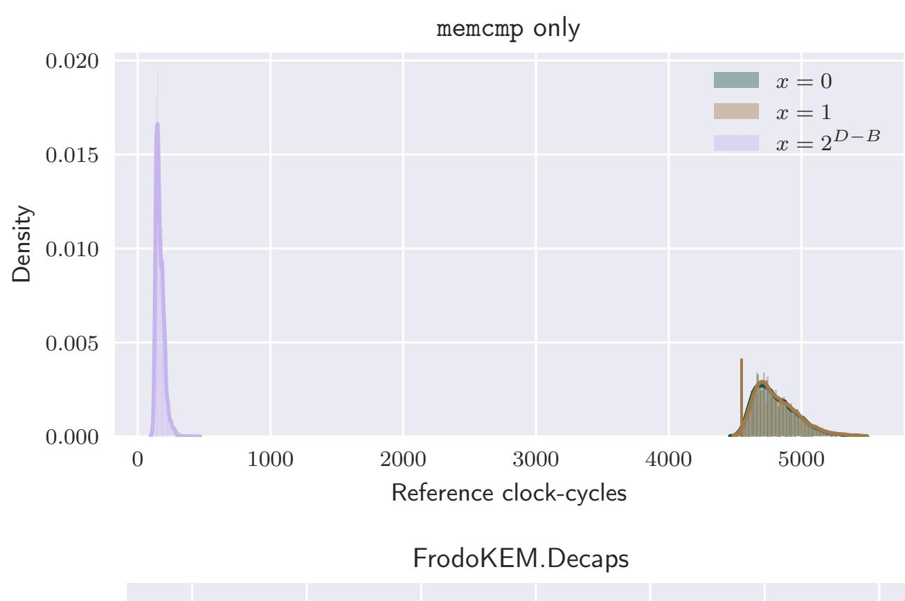
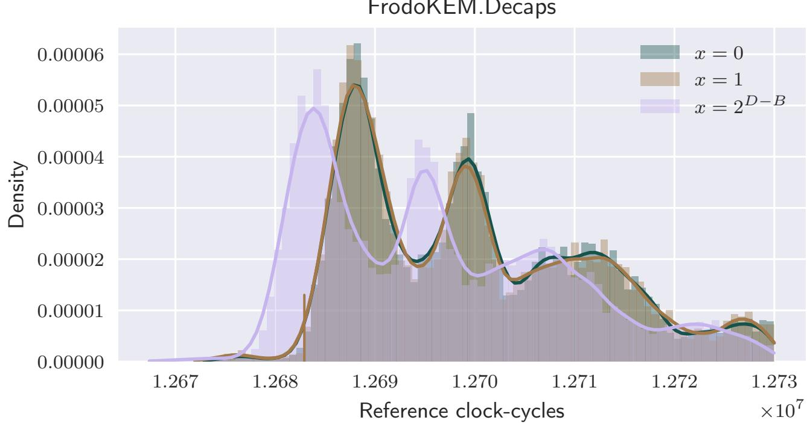

{0}------------------------------------------------

# A key-recovery timing attack on post-quantum primitives using the Fujisaki-Okamoto transformation and its application on FrodoKEM

Qian Guo1,<sup>2</sup> , Thomas Johansson<sup>1</sup> , and Alexander Nilsson1,<sup>3</sup>

Abstract. In the implementation of post-quantum primitives, it is well known that all computations that handle secret information need to be implemented to run in constant time. Using the Fujisaki-Okamoto transformation or any of its different variants, a CPA-secure primitive can be converted into an IND-CCA secure KEM. In this paper we show that although the transformation does not handle secret information apart from calls to the CPA-secure primitive, it has to be implemented in constant time. Namely, if the ciphertext comparison step in the transformation is leaking side-channel information, we can launch a key-recovery attack. Several proposed schemes in round 2 of the NIST post-quantum standardization project are susceptible to the proposed attack and we develop and show the details of the attack on one of them, being FrodoKEM. It is implemented on the reference implementation of FrodoKEM, which is claimed to be secure against all timing attacks. Experiments show that the attack code is able to extract the secret key for all security levels using about 2 <sup>30</sup> decapsulation calls.

Keywords: Lattice-based cryptography, NIST post-quantum standardization, LWE, timing attacks, side-channel attacks.

## 1 Introduction

Post-Quantum Cryptography is the area of cryptographic research in the presence of an, assumed to be practical, quantum computer. It is well known that most of today's public-key solutions are insecure under this assumption since they are based on the difficulty of factoring or the discrete log problem. These two problems can be solved in polynomial time if a large enough quantum computer exists [30]. Instead, post-quantum cryptography is based on other hard problems, not known to be broken by a quantum computer. The two most popular areas are lattice-based schemes and code-based schemes.

Learning with errors (LWE) is a hard problem that is closely connected to difficult problems in lattices, such as the shortest vector problem. Learning with

<sup>1</sup> Dept. of Electrical and Information Technology, Lund University, Lund, Sweden {qian.guo,thomas.johansson,alexander.nilsson}@eit.lth.se

<sup>2</sup> Selmer Center, Department of Informatics, University of Bergen, Bergen, Norway <sup>3</sup> Advenica AB, Malmö, Sweden

{1}------------------------------------------------

errors, or some version of the problem, is used in many of the recently proposed schemes to build public-key encryption schemes (PKE) and key encapsulation mechanisms (KEM).

Code-based schemes are similar to LWE schemes, but rely instead on difficult coding theory problems, like finding a minimum (Hamming) weight codeword in a binary code. Code-based schemes date back to 1978 and the McEliece PKE scheme [26].

The importance of post-quantum cryptography is highlighted by the fact that NIST is currently running a standardization project on post-quantum cryptography [1] which is in the second round. Most KEM- and PKE-schemes remaining in the NIST post-quantum cryptography standardization project (NIST PQ project) are either lattice-based or code-based schemes.

A very common approach for the above mentioned types of schemes is to construct a public-key encryption scheme that is secure in the chosen plaintext model (CPA) and then use a generic transformation to transform the scheme into a IND-CCA secure KEM. An IND-CCA secure primitive is secure in in the model of indistinguishability under chosen ciphertext attacks. For definitions of these models, we refer to any textbook on the subject [31]. The most common generic transformation is the Fujisaki-Okamoto (FO) transformation [19] or any of its many different variants [21]. It gives IND-CCA security in the random oracle model, and there is also a post-quantum secure version [21]. This is also the way lattice-based and code-based KEM schemes in the NIST PQ project are constructed. They all use some version of the FO transformation.

In the implementation of post-quantum primitives, it is well known that all computations that handle secret information need to be implemented to run in constant time. Leakage of timing information can give information about secret values. This is a hard problem in practice, as we might not trust just any programmer to pay enough attention to such issues. There is now much focus on constant time implementations for the remaining candidates in the NIST PQ project and much research is devoted to examine cryptanalysis on so called side-channels [14, 24]. This includes work showing attacks on schemes with implementations that leak timing information when processing secret data, such as the step of decoding an error correcting code inside the decryption scheme.

In this paper we show that even though the FO transformation itself does not handle secret information apart from calls to the CPA-secure PKE (running in constant time), it still has to be implemented in constant time. Namely, if the ciphertext comparison step in the FO transformation is leaking side-channel information, we can launch a key-recovery attack. The attack is based on generating decryption failures in the CPA-secure primitive by modifying the ciphertext. Through timing information we can learn whether a modified ciphertext is decrypted to the same message as the original ciphertext, or not.

This kind of attack has not been observed before, as several of the NIST candidates provide implementations that are directly susceptible to the proposed attack. We mention that at least the round 2 candidates FrodoKEM, LAC, BIKE, HQC, ROLLO and RQC have all submitted reference implementations 

{2}------------------------------------------------

that potentially leaked timing information in the ciphertext comparison step, and thus they might be susceptible to this attack.

We decided to develop and show the details of the attack on one of them, being FrodoKEM. FrodoKEM is a lattice-based KEM where the security is based on the LWE problem. It is a very conservative design with strong security proofs and its design team contains many very distinguished cryptographers. In the document [27] submitted to NIST, it is claimed that "All our implementations avoid the use of secret address accesses and secret branches and, hence, are protected against timing and cache attacks." An implementation of FrodoKEM that can be attacked also appears in Open Quantum Safe [3].

The attack on FrodoKEM is detailed in the paper and then implemented on the reference implementation of FrodoKEM. Using experiments, we show that the attack code, by measuring the execution time of full decapsulations, is able to collect enough data for a complete secret key recovery using about 2 <sup>30</sup> decapsulation queries. We target the FrodoKEM parameters for the highest security level.

Previous work: Some previous work on using decryption failures in cryptanalysis appeared in [22, 23]. More recent attacks using decryption failures on lattice-based schemes are to be found in [8–10, 18]. None of these attacks apply to CCA-secure schemes unless there is some misuse of the scheme.

Attacks on CCA secure schemes based on failures were modelled in [15] and a complex attack on an NTRU version was presented. An attack on LAC [25] using decryption errors was given in [20].

Side-channel attacks were first proposed by Kocher in [24]. In such an attack, information obtained through physical measurements is used in the attack, being timing information, power measurements, electromagnetic radiation or other means. Brumley and Boneh attacked OpenSSL in [14], showing that remote timing attacks are practical. Side-channel attacks on post-quantum primitives have been proposed on signature schemes like BLISS [13]. Side-channel attacks on encryption/KEM primitives have been less successful, but include [17] measuring the robustness of the candidates in the NIST PQ project against cache-timing attacks. An attack on LWE schemes that use error correcting codes for which decoding is not implemented in constant time was given in [16] and the same for code-based schemes are given in [32] and [33].

Paper organization: The remaining parts of the paper are organized as follows. Section 2 gives basic notation and definitions used later in the paper. In Section 3 we give a high-level description of the attack and describe the general underlying ideas used to achieve success in building the key parts of the attack. In Section 4 we describe the FrodoKEM scheme and briefly highlight the weakness in its reference implementation. In Section 5 we give the full details on how to apply the attack on FrodoKEM and recover the secret key. Results on implementing the attack on the FrodoKEM reference implementation are given. Finally, we discuss in Section 6 a few other round 2 NIST schemes where the reference implementations can be attacked, including LWE schemes using error correction 

{3}------------------------------------------------

and pure code-based schemes. Further details on how the attack could be adapted to LAC is found in the appendix.

## 2 Preliminary

We start by defining some useful notations used throughout the rest of the paper. In post-quantum cryptography with emphasis on lattice-based or codebased schemes, it makes sense to consider the message m ∈ M and ciphertext c ∈ C as being vectors with entries in some alphabet Zq. A PKE is then a triple of algorithms (KeyGen, Enc, Dec), where KeyGen generates the secret key sk ∈ SK and the public key pk ∈ PK. The encryption algorithm Enc maps the message to a ciphertext using the public key and the decryption algorithm Dec maps the ciphertext back to a message using the secret key. Encryption may also use some randomness denoted r ∈ R, that can be viewed as part of the input to the algorithm. If c = Enc(pk, m; r), then decrypting such a ciphertext, i.e., computing Dec(sk, pk, c), returns the ciphertext m. Some schemes may have a small failure probability, meaning that the decryption algorithm fails to return a correctly encrypted message when decrypted.

A KEM is similarly defined as a triple of algorithms (KeyGen, Encaps, Decaps), where KeyGen generates the secret key sk ∈ SK and the public key pk ∈ PK. The encapsulation algorithm Encaps generates a random session key, denoted as s ∈ S, and computes a ciphertext c using the public key. Applying the decapsulation algorithm Decaps on a ciphertext using the secret key returns the chosen session key s, or possibly a random output in case the ciphertext does not fully match a possible output of the encapsulation algorithm.

Security can be defined in many different models, but most commonly the analysis is done in the CPA model, where the adversary essentially only have access to the public key pk and the public encryption/encapsulation calls. In a CCA model, the adversary is allowed to ask for decryptions/decapsulations of her choice. So for example, the notion of IND-CCA for a KEM is defined through the following game: Let the ciphertext c be the encapsulation of the secret key s<sup>0</sup> ∈ S. Consider another randomly selected key s<sup>1</sup> ∈ S. The adversary gets the ciphertext c as well as sb, where b ∈ {0, 1} is randomly chosen. The adversarial task is to correctly predict b with as large probability as possible and access to the decapsulation oracle is allowed for all ciphertext inputs except c. For more detailed definitions of these different security models, we refer to any textbook on the subject, for example [31].

A very common approach is to construct a public-key primitive that is secure in the CPA model and then use a generic transformation to transform the scheme into a IND-CCA secure primitive. A common such generic transformation is the FO transformation [19], which has also many different variants [21]. It gives IND-CCA security in the random oracle model and include a post-quantum secure version [21]. This is also the way lattice-based and code-based KEM schemes in the NIST PQ project are constructed. They use some version of the FO trans

{4}------------------------------------------------

formation. We will introduce and investigate the FO transformation in relation to side-channel leakage in the next section.

## 3 A general description of the proposed attack

We describe the attack for post-quantum primitives in the form of KEMs, although the attack could work for other types of PKC primitives as well.

Let  $\mathsf{PKE}.\mathsf{CPA}.\mathsf{Enc}(\mathsf{pk},\mathbf{m};\mathbf{r})$  denote a public key encryption algorithm which is secure in the CPA model. Here  $\mathsf{pk}$  is the public key,  $\mathbf{m}$  is the message to be encrypted, and  $\mathbf{r}$  is the randomness used in the scheme. The algorithm returns a ciphertext  $\mathbf{c}$ . Furthermore, let  $\mathsf{PKE}.\mathsf{CPA}.\mathsf{Dec}(\mathsf{sk},\mathsf{pk},\mathbf{c})$  denote the corresponding decryption algorithm. This algorithm returns a message, again denoted  $\mathbf{m}$ .

We will now assume that the  $\mathsf{PKE}.\mathsf{CPA}.\mathsf{Dec}(\cdot)$  call is implemented in constant-time and is not leaking any side-channel information.

The CCA-secure KEM is assumed to be obtained through some variant of the FO transformation, resulting in algorithms for encapsulation and decapsulation similar to algorithms 1 and 2 shown here.

## Algorithm 1 KEM.CCA.Encaps

```
Input: pk
Output: c and s

1: pick a random m

2: (\mathbf{r}, \mathbf{k}) \leftarrow H_1(\mathbf{m}, \mathsf{pk})

3: \mathbf{c} \leftarrow \mathsf{PKE.CPA.Enc}(\mathsf{pk}, \mathbf{m}; \mathbf{r})

4: \mathbf{s} \leftarrow H_2(\mathbf{c}, \mathbf{k})

5: Return (\mathbf{c}, \mathbf{s})
```

## Algorithm 2 KEM.CCA.Decaps

```
Input: sk, pk, c

Output: s'

1: \mathbf{m}' \leftarrow \mathsf{PKE.CPA.Dec}(\mathsf{sk}, \mathbf{c})

2: (\mathbf{r}', \mathbf{k}') \leftarrow H_1(\mathbf{m}', \mathsf{pk})

3: \mathbf{c}' \leftarrow \mathsf{PKE.CPA.Enc}(\mathsf{pk}, \mathbf{m}'; \mathbf{r}')

4: if (\mathbf{c}' = \mathbf{c}) then Return \mathbf{s}' \leftarrow H_2(\mathbf{c}, \mathbf{k}')

5: else Return \mathbf{s}' \leftarrow H_2(\mathbf{c}, \mathbf{k}')

6: end if
```

Here  $\mathbf{k} \in \mathcal{K}$  and  $H_1$  and  $H_2$  are pseudo-random functions generating values indistinguishable from true randomness, with images  $\mathcal{R} \times \mathcal{K}$  and  $\mathcal{S}$ , respectively. Also,  $(\mathbf{r}', \mathbf{k}') = (\mathbf{r}, \mathbf{k})$  if  $\mathbf{m}' = \mathbf{m}$ . The key generation algorithm, denoted

{5}------------------------------------------------

KEM.CCA.KeyGen, randomly selects a secret key sk and computes the corresponding public key pk, and returns both of them. We note that essentially all KEM candidates in the NIST PQ project can be written in the above form or in some similar way.

The side-channel attack is now described using calls to an oracle that determines whether, in the PKE.CPA.Dec(·) call, a modified ciphertext decrypts to the same "message" or not. To be a bit more precise, we follow the steps in the public KEM.CCA.Encaps algorithm and record the values of a chosen m, and the corresponding computed r and ciphertext c. Then we modify the ciphertext to c <sup>0</sup> = c + d, where d denotes a predetermined modification to the ciphertext. Finally, we require that the oracle can tell us if the modified ciphertext is still decrypted to the same message, i.e., whether m = PKE.CPA.Dec(sk, c 0 ). If so, the oracle returns 0. But if PKE.CPA.Dec(sk, c 0 ) returns a different message, the oracle returns 1. Finally, we assume that an oracle output of −1 represents a situation when the oracle cannot decisively give an answer. The high-level construction of the oracle is given in Algorithm 3.

## Algorithm 3 Decryption.Error.In.CPAcall.Oracle

Input: m, a ciphertext modification d Output: b (decryption failure or not)

```
1: (r, k) ← H1(m, pk)
```

2: c ← PKE.CPA.Enc(pk, m; r)

3: c <sup>0</sup> ← c + d

4: t ← Side-channel.information[KEM.CCA.Decaps(c 0 )]

5: b ← F(t), where F(t) uses the side.channel information to determine whether PKE.CPA.Dec(c 0 ) returns m or not (b = 0 means returning m, b = 1 means not returning m, and b = −1 means inconclusive)

6: Return b

The notation t = Side-channel.information[X] means that side-channel information of some kind is collected when executing algorithm X. This information is then analyzed in the F(t) analysis algorithm. In our case we are collecting the time of execution through the number of clock cycles and this is the assumed type of side-channel information. At the end of the paper we discuss and argue for the fact that other types of side-channel information can also be used, for example analysis of power or electromagnetic emanations in case of microcontroller or pure hardware implementations.

The design of F(t) is clearly a key part of the attack. Assuming we have found an oracle that can give us decisive answers for some choices of m and ciphertext modifications d, the final step is to extract information about the secret key used in the PKE.CPA.Dec algorithm. This part will be highly dependent on the actual scheme considered, but a general summary is given in Algorithm 4.

{6}------------------------------------------------

## Algorithm 4 Secret key recovery

Input: n<sup>1</sup>

Output: the secret key sk

- 1: for i = 0;i < n1;i ← i + 1 do
- 2: find (m<sup>i</sup> , di) such that Decryption.Error.In.CPAcall.Oracle(m<sup>i</sup> , di)∈ {0, 1}
- 3: end for
- 4: Use the determined set {((m<sup>i</sup> , di), 0 ≤ i < n)} to extract the secret key, by exploring the relation between the secret key and modifications that cause decryption errors in PKE.CPA.Dec.
- 5: Return sk

## 3.1 Designing the oracle for LWE-based schemes

The main question is how to find m and ciphertext modifications d such that the measured timing information may reveal whether PKE.CPA.Dec(c+d) inside the KEM.CCA.Decaps(c + d) is returning the same message m or not. The general idea is the following.

The side-channel information t ← timing.information[X] is simply the time (clock cycles) it takes to execute X. The ciphertext of an LWE-based scheme, created in PKE.CPA.Enc(pk, m; r) may consist of several parts, but at a general level we may describe it as

$$\mathbf{c} = g(\mathsf{pk}, \mathbf{m}; \mathbf{r}) + e(\mathbf{r}),$$

where e(r) is a vector of small error values, and g(pk, m; r) represents the remaining part of the ciphertext generation in the scheme. Unique for postquantum schemes is the property that the error vector e(r) may vary a bit without affecting the ability to decrypt the ciphertext to the correct message. So if we introduce a modified ciphertext c <sup>0</sup> = c + d, then the new ciphertext c <sup>0</sup> = g(pk, m; r) + e(r) + d. Two things can then happen. Either the modification d is small enough so that it does not cause an error in decryption and m ← PKE.CPA.Dec(sk, c 0 ); or the modification d is big enough to cause an error in decryption and m 6= m<sup>0</sup> ← PKE.CPA.Dec(sk, c 0 );

An observation is that when we have an error in decryption of c 0 , receiving m<sup>0</sup> (6= m), then re-encrypting m<sup>0</sup> in the decapsulation (line 3 of Algorithm 2) results in a completely different ciphertext, which is not at all similar to c 0 . The attack relies on the fact that the side-channel information can be used to distinguish between the two cases.

The key observation used in the paper is now that if we adopt a ciphertext modification of the form

$$\mathbf{d} = (\underbrace{00\cdots 0}_{n-l} d_{n-l} d_{n-l+1} \cdots d_{n-1}),$$

i.e., we only modify the last l entries of the ciphertext, we have the two different cases:

{7}------------------------------------------------

Either there is no decryption error, which leads to m = m<sup>0</sup> ←PKE.CPA .Dec(sk, c 0 ), (r, k) = (r 0 , k 0 ), and c = PKE.CPA.Enc(pk, m<sup>0</sup> ; r 0 ). So in the check in line 4 of Algorithm 2, (c <sup>0</sup> = c), we see that c <sup>0</sup> and c are guaranteed identical except for the last l positions.

If there is a decryption error, on the other hand, i.e., m 6= m<sup>0</sup> ←PKE.CPA .Dec(sk, c 0 ), then the next step in the decapsulation, (r 0 , k 0 ) ← H1(m<sup>0</sup> , pk) leads to completely different values of (r 0 , k 0 ), which in turn will give a completely different ciphertext c. In particular c <sup>0</sup> and c will most likely have different values already in the beginning of the vectors.

Finally, how can we separate the two cases using timing information? This is possible since the check in line 4 of Algorithm 2, (c <sup>0</sup> = c), involves checking the equality of two long vectors and a standard implementation would terminate after finding a position for which equality does not hold. In the first case above, the first n − l positions are equal and we would have to run through and check all of them before we terminate. In the second case, however, it is very likely to terminate the check very quickly. Typical instructions for which this assumption is true is the use of the memcmp function in C or the java.util.Arrays.equals function in Java. The analysis function F(t), in its simplest form, is assumed to have made some initial measurements to establish intervals I0, I<sup>1</sup> for the time of execution in the two cases and returns F(t) = 0 if the number of clock cycles is in I0, F(t) = 1 if it is in I<sup>1</sup> and F(t) = −1 otherwise. In practice, timing measurements are much more complicated and more advanced methods to build F(t) should be considered.

## 4 The FrodoKEM design and implementation

In the next section, we will apply our general attack on the FrodoKEM scheme, a main candidate of round 2 in the NIST PQ project. FrodoKEM is a lattice-based KEM with security based on the standard LWE problem. It is a conservative design with security proofs. In the document [27] submitted to NIST, it is claimed that "All our implementations avoid the use of secret address accesses and secret branches and, hence, are protected against timing and cache attacks." An implementation of FrodoKEM that can be attacked also appears in Open Quantum Safe [3].

#### 4.1 The FrodoKEM design

FrodoKEM was firstly published in [12]. We describe the different algorithms in FrodoKEM (from [27]) for the key generation, the key encapsulation, and the key decapsulation in Algorithm 5–7. We refer to the design document [27] for all the design details and provide only algorithmic descriptions of the relevant parts in the design. We now also use the notation from the design paper.

Briefly, from an initial seed the key generation FrodoKEM.KeyGen generates the secret and public keys. Note that from pk = (seedA, B), we generate A = 

{8}------------------------------------------------

 $Frodo.Gen(seed_{\mathbf{A}})$ . We have the following equation for a key pair (pk, sk),

$$\mathbf{B} = \mathbf{AS} + \mathbf{E},\tag{1}$$

where  $\mathbf{B}, \mathbf{E}, \mathbf{S} \in \mathbb{Z}_q^{n \times \bar{n}}$  and  $\mathbf{A} \in \mathbb{Z}_q^{n \times n}$ . Note that while  $\mathbf{A}$  and  $\mathbf{B}$  are publicly known both  $\mathbf{S}$  and  $\mathbf{E}$  are secrets and  $\mathbf{S}$  is saved as part of  $\mathsf{sk}$  to be used in the decapsulation process, later. Here  $\mathbf{E}, \mathbf{S}$  are error matrices and by this we mean that the entries in the matrices are small values (compared to  $\mathbb{Z}_q$ ) and distributed according to some predetermined distribution  $\chi$ .

## Algorithm 5 FrodoKEM. KeyGen

```
Input: None.
```

```
Output: Key pair (\mathsf{pk},\mathsf{sk}') with \mathsf{pk} \in \{0,1\}^{\mathsf{len}_{\mathsf{seed}_{\mathbf{A}}} + D \cdot n \cdot \bar{n}}, \mathsf{sk}' \in \{0,1\}^{\mathsf{len}_{\mathsf{s}} + \mathsf{len}_{\mathsf{seed}_{\mathbf{A}}} + D \cdot n \cdot \bar{n}} \times \mathbb{Z}_q^{n \times \bar{n}} \times \{0,1\}^{\mathsf{len}_{\mathsf{pkh}}}.
```

- 1: Choose uniformly random seeds  $s||seed_{SE}||z \leftarrow_{\$} U(\{0,1\}^{\mathsf{len_s} + \mathsf{len_{seed}_{SE}} + \mathsf{len_z}})$
- 2: Generate pseudorandom seed  $\mathsf{seed}_\mathbf{A} \leftarrow \mathsf{SHAKE}(\mathbf{z}, \mathsf{len}_{\mathsf{seed}_\mathbf{A}})$
- 3: Generate the matrix  $\mathbf{A} \in \mathbb{Z}_q^{n \times n}$  via  $\mathbf{A} \leftarrow \mathsf{Frodo}.\mathsf{Gen}(\mathsf{seed}_{\mathbf{A}})$
- 4: Generate pseudorandom bit string  $(\mathbf{r}^{(0)}, \dots, \mathbf{r}^{(2n\bar{n}-1)}) \leftarrow \text{SHAKE}(0x5F||\text{seed}_{\mathbf{SE}}, 2n\bar{n} \cdot \text{len}_{\chi})$
- 5: Sample error matrix  $\mathbf{S} \leftarrow \text{Frodo.SampleMatrix}((\mathbf{r}^{(0)}, \dots, \mathbf{r}^{(n\bar{n}-1)}), n, \bar{n}, T_{\scriptscriptstyle Y})$
- 6: Sample error matrix  $\mathbf{E} \leftarrow \mathsf{Frodo.SampleMatrix}((\mathbf{r}^{(n\bar{n})}, \dots, \mathbf{r}^{(2n\bar{n}-1)}), n, \bar{n}, T_{\chi})$
- 7: Compute  $\mathbf{B} \leftarrow \mathbf{AS} + \mathbf{E}$
- 8: Compute  $\mathbf{b} \leftarrow \mathsf{Frodo.Pack}(\mathbf{B})$
- 9: Compute  $pkh \leftarrow SHAKE(seed_{\mathbf{A}}||\mathbf{b}, len_{pkh})$
- 10: **Return** public key  $\mathsf{pk} \leftarrow \mathsf{seed}_{\mathbf{A}} || \mathbf{b} \text{ and secret key } \mathsf{sk}' \leftarrow (\mathbf{s} || \mathsf{seed}_{\mathbf{A}} || \mathbf{b}, \mathbf{S}, \mathsf{pkh})$

In an encapsulation, a uniformly random key  $\mu \leftarrow_{\$} U(\{0,1\}^{\mathsf{len}_{\mu}})$  is first chosen. It is then used to generate a pseudorandom bit string that in turn determines error matrices  $\mathbf{S}', \mathbf{E}', \mathbf{E}''$ . A ciphertext now contains two parts, one being  $\mathbf{S}'\mathbf{A} + \mathbf{E}'$  and the second part being  $\mathbf{S}'\mathbf{B} + \mathbf{E}'' + \mathsf{Frodo}.\mathsf{Encode}(\mu)$ . These matrices are converted to bitstrings using the Frodo.Pack and Frodo.UnPack algorithms. The shared key  $\mathbf{s}\mathbf{s}$  is computed using the pseudorandomness generator SHAKE.

{9}------------------------------------------------

#### Algorithm 6 FrodoKem.Encaps

14: Compute  $\mathbf{c}_2 \leftarrow \mathsf{Frodo.Pack}(\mathbf{C})$ 

15: Compute  $\mathbf{ss} \leftarrow \mathrm{SHAKE}(\mathbf{c}_1||\mathbf{c}_2||\mathbf{k},\mathsf{len}_{\mathbf{ss}})$ 

16: **Return** ciphertext  $\mathbf{c}_1 || \mathbf{c}_2$  and shared secret  $\mathbf{s}\mathbf{s}$ 

```
Input: Public Key \mathsf{pk} = \mathsf{seed}_{\mathbf{A}} || \mathbf{b} \in \{0, 1\}^{\mathsf{len}_{\mathsf{seed}_{\mathbf{A}}} + D \cdot n \cdot \bar{n}}.
Output: Ciphertext \mathbf{c}_1 || \mathbf{c}_2 \in \{0, 1\}^{(\bar{m} \cdot n + \bar{m} \cdot \bar{n})D} and shared secret
\mathbf{ss} \in \{0,1\}^{\mathsf{len}_{\mathbf{ss}}}.
  1: Choose a uniformly random key \mu \leftarrow U(\{0,1\}^{\mathsf{len}_{\mu}})
  2: Compute pkh \leftarrow SHAKE(pk, len_{pkh})
  3: Generate pseudorandom values
        seed_{SE}||\mathbf{k} \leftarrow SHAKE(pkh||\mu, len_{seed_{SE}} + len_{\mathbf{k}})
  4: Generate pseudorandom bit string
        (\mathbf{r}^{(0)}, \dots, \bar{\mathbf{r}}^{(2\bar{m}n+\bar{m}\bar{n}-1)}) \leftarrow \text{SHAKE}(0 \times 96 || \text{seed}_{\mathbf{SE}}, (2\bar{m}n+\bar{m}\bar{n}) \cdot \text{len}_{\chi})
  5: Sample error matrix
        \mathbf{S}' \leftarrow \text{Frodo.SampleMatrix}((\mathbf{r}^{(0)}, \dots, \mathbf{r}^{(\bar{m}n-1)}), \bar{m}, n, T_{\chi})
  6: Sample error matrix
        \mathbf{E}' \leftarrow \mathsf{Frodo.SampleMatrix}((\mathbf{r}^{(\bar{m}n)}, \dots, \mathbf{r}^{(2\bar{m}n-1)}), \bar{m}, n, T_{\scriptscriptstyle Y})
  7: Generate \mathbf{A} \leftarrow \mathsf{Frodo}.\mathsf{Gen}(\mathsf{seed}_{\mathbf{A}})
  8: Compute \mathbf{B}' \leftarrow \mathbf{S}'\mathbf{A} + \mathbf{E}'
  9: Compute \mathbf{c}_1 \leftarrow \mathsf{Frodo.Pack}(\mathbf{B}')
10: Sample error matrix
        \mathbf{E}'' \leftarrow \text{Frodo.SampleMatrix}((\mathbf{r}^{(2\bar{m}n)}, \dots, \mathbf{r}^{(2\bar{m}n+\bar{m}\bar{n}-1)}), \bar{m}, \bar{n}, T_{\chi})
11: Compute \mathbf{B} \leftarrow \mathsf{Frodo.UnPack}(\mathbf{b}, n, \bar{n})
12: Compute \mathbf{V} \leftarrow \mathbf{S}'\mathbf{B} + \mathbf{E}''
13: Compute \mathbf{C} \leftarrow \mathbf{V} + \mathsf{Frodo}.\mathsf{Encode}(\mu)
```

{10}------------------------------------------------

In decapsulation, the step  $\mathbf{M} \leftarrow \mathbf{C} - \mathbf{B'S}$  actually computes Frodo.Encode( $\mu'$ ) +  $\mathbf{S'E} - \mathbf{E'S} + \mathbf{E''}$ . Since  $\mathbf{S}, \mathbf{S'}, \mathbf{E}, \mathbf{E'}, \mathbf{E''}$  all have small entries, also  $\mathbf{S'E} - \mathbf{E'S} + \mathbf{E''}$  will have somewhat small entries and is regarded as noise. The Frodo.Decode algorithm removes this noise and returns the initial seed  $\mu'$ . The decapsulation then continues by re-encrypting using this seed to get the corresponding ciphertext  $\mathbf{B''}||\mathbf{C'}|$ . In line 16 the two ciphertexts are compared to check equality. If they are equal, the correct shared key  $\mathbf{ss}$  is returned.

## Algorithm 7 FrodoKEM.Decaps

```
Input: Ciphertext \mathbf{c}_1 || \mathbf{c}_2 \in \{0, 1\}^{(\bar{m} \cdot n + \bar{m} \cdot \bar{n})D}, secret \mathsf{sk'} \in \{0, 1\}^{\mathsf{len}_\mathsf{s} + \mathsf{len}_\mathsf{seed}_\mathbf{A} + D \cdot n \cdot \bar{n}} \times \mathbb{Z}_q^{n \times \bar{n}} \times \{0, 1\}^{\mathsf{len}_\mathsf{pkh}}.
Output: Shared secret ss \in \{0, 1\}^{len_{ss}}.
  1: \mathbf{B}' \leftarrow \mathsf{Frodo.UnPack}(\mathbf{c}_1)
  2: \mathbf{C} \leftarrow \text{Frodo.UnPack}(\mathbf{c}_2)
  3: Compute \mathbf{M} \leftarrow \mathbf{C} - \mathbf{B}'\mathbf{S}
  4: Compute \mu' \leftarrow \mathsf{Frodo.Decode}(\mathbf{M})
  5: Parse \mathsf{pk} \leftarrow \mathsf{seed}_{\mathbf{A}} || \mathbf{b}
  6: Generate pseudorandom values
        seed_{SE'}||\mathbf{k'} \leftarrow SHAKE(pkh||\mu', len_{seed_{SE}} + len_{\mathbf{k}})
  7: Generate pseudorandom bit string
        (\mathbf{r}^{(0)}, \dots, \mathbf{r}^{(2\bar{m}n + \bar{m}\bar{n} - 1)}) \leftarrow \text{SHAKE}(0 \times 96 || \text{seed}_{\mathbf{SE}'}, (2\bar{m}n + \bar{m}\bar{n}) \cdot \text{len}_{\chi})
  8: Sample error matrix
        \mathbf{S}' \leftarrow \text{Frodo.SampleMatrix}((\mathbf{r}^{(0)}, \dots, \mathbf{r}^{(\bar{m}n-1)}), \bar{m}, n, T_{\chi})
  9: Sample error matrix
        \mathbf{E}' \leftarrow \mathsf{Frodo.SampleMatrix}((\mathbf{r}^{(\bar{m}n)}, \dots, \mathbf{r}^{(2\bar{m}n-1)}), \bar{m}, n, T_{\chi})
10: Generate \mathbf{A} \leftarrow \mathsf{Frodo}.\mathsf{Gen}(\mathsf{seed}_{\mathbf{A}})
11: Compute \mathbf{B}'' \leftarrow \mathbf{S}'\mathbf{A} + \mathbf{E}'
12: Sample error matrix
        \mathbf{E}'' \leftarrow \text{Frodo.SampleMatrix}((\mathbf{r}^{(2\bar{m}n)}, \dots, \mathbf{r}^{(2\bar{m}n+\bar{m}\bar{n}-1)}), \bar{m}, \bar{n}, T_{\chi})
13: Compute \mathbf{B} \leftarrow \mathsf{Frodo.UnPack}(\mathbf{b}, n, \bar{n})
14: Compute \mathbf{V} \leftarrow \mathbf{S}'\mathbf{B} + \mathbf{E}''
15: Compute \mathbf{C}' \leftarrow \mathbf{V} + \mathsf{Frodo}.\mathsf{Encode}(\mu')
16: if B'||C = B''||C' then
               Return shared secret ss \leftarrow SHAKE(c_1||c_2||k', len_{ss})
17:
18: else
                Return shared secret ss \leftarrow SHAKE(c_1||c_2||s, len_{ss})
19:
20: end if
```

The Frodo.SampleMatrix algorithm constructs the matrices with small values from a distribution described by a table  $T_{\chi}$ , as given in algorithms 8 and 9.

Algorithms 10 and 11 gives the encoding and decoding procedures.

{11}------------------------------------------------

## Algorithm 8 Frodo.Sample

```
Input: A (random) bit string \mathbf{r} = (\mathbf{r}_0, \dots, \mathbf{r}_{\mathsf{len}_{\chi}-1}) \in \{0, 1\}^{\mathsf{len}_{\chi}}, the table T_{\chi} = (T_{\chi}(0), \dots, T_{\chi}(s)).

Output: A sample e \in \mathbb{Z}.

1: t \leftarrow \sum_{i=1}^{\mathsf{len}_{\chi}-1} \mathbf{r}_i \cdot 2^{i-1}
2: e \leftarrow 0
3: for z = 0; z < s; z \leftarrow z + 1 do
4: if t > T_{\chi}(z) then
5: e \leftarrow e + 1
6: end if
7: end for
8: e \leftarrow (-1)^{\mathbf{r}_0} \cdot e
9: Return C
```

## Algorithm 9 Frodo.SampleMatrix

```
Input: A (random) bit string \mathbf{r} = (\mathbf{r}^{(0)}, \dots, \mathbf{r}^{(n_1 \times n_2 - 1)}) \in \{0, 1\}^{n_1 n_2 \cdot \text{len}_{\chi}}, the table T_{\chi}.

Output: A sample \mathbf{E} \in \mathbb{Z}^{n_1 \times n_2}.

1: for i = 0; i < n_1; i \leftarrow i + 1 do

2: for j = 0; j < n_2; j \leftarrow j + 1 do

3: \mathbf{E}_{i,j} \leftarrow \text{Frodo.Sample}(\mathbf{r}^{(i \cdot n_2 + j)}, T_{\chi})

4: end for

5: end for

6: Return \mathbf{E}
```

## Algorithm 10 Frodo.Encode

```
Input: Bit string \mathbf{k} \in \{0,1\}^l, l = B \cdot \bar{m} \cdot \bar{n}.

Output: Matrix \mathbf{K} \in \mathbb{Z}_q^{\bar{m} \times \bar{n}}.

1: for i = 0; i < \bar{m}; i \leftarrow i + 1 do

2: for j = 0; j < \bar{n}; j \leftarrow j + 1 do

3: k = \sum_{l=0}^{B-1} \mathbf{k}_{(i \cdot \bar{n} + j)B + l} \cdot 2^l

4: \mathbf{K}_{i,j} \leftarrow \operatorname{ec}(k) = k \cdot q/2^B

5: end for

6: end for

7: Return \mathbf{K} = (\mathbf{K}_{i,j})_{0 \le i \le \bar{m}, 0 \le j \le \bar{n}}
```

{12}------------------------------------------------

#### Algorithm 11 Frodo.Decode

```
Input: Matrix \mathbf{K} \in \mathbb{Z}_q^{\bar{m} \times \bar{n}}.
Output: Bit string \mathbf{k} \in \{0,1\}^l, l = B \cdot \bar{m} \cdot \bar{n}.
 1: for i = 0; i < \bar{m}; i \leftarrow i + 1 do
            for j = 0; j < \bar{n}; j \leftarrow j + 1 do
 2:
                  k \leftarrow \mathsf{dc}(\mathbf{K}_{i,j}) = \lfloor \mathbf{K}_{i,j} \cdot 2^B / q \rfloor \mod 2^B
 3:
                  k = \sum_{l=0}^{B-1} k_l \cdot 2^l \text{ where } k_l \in \{0, 1\}
 4:
                  for l = 0; l < D; l \leftarrow l + 1 do
 5:
                        \mathbf{k}_{(i\cdot\bar{n}+j)B+l} \leftarrow k_l
 6:
                   end for
 7:
             end for
 8:
 9: end for
10: Return k
```

Finally, Frodo designs packing and unpacking algorithms to transform matrices with entries in  $\mathbb{Z}_q$  to bit strings and vice versa, as described in Algorithm 12 and Algorithm 13.

## Algorithm 12 Frodo.Pack

```
Input: Matrix \mathbf{C} \in \mathbb{Z}_q^{n_1 \times n_2}
Output: Bit string \mathbf{b} \in \{0,1\}^{D \cdot n_1 \cdot n_2}
 1: for i = 0; i < n_1; i \leftarrow i + 1 do
            for j = 0; j < n_2; j \leftarrow j + 1 do

\mathbf{C}_{i,j} = \sum_{l=0}^{D-1} c_l \cdot 2^l where c_l \in \{0, 1\}
  2:
  3:
                  for l = 0; l < D; l \leftarrow l + 1 do
  4:
  5:
                         \mathbf{b}_{(i \cdot n_2 + j)D + l} \leftarrow c_{D-1-l}
                   end for
  6:
  7:
             end for
  8: end for
  9: Return b
```

The security parameters of FrodoKEM are listed in Table 1.

#### 4.2 A useful observation

A useful observation is that Line 16 in Frodo.Decaps (i.e., Algorithm 7) is, in the reference implementation, implemented in a standard way using the following code block.

```
1 // Is (Bp == BBp & C == CC) = true
2 if (memcmp(Bp, BBp, 2*PARAMS_N*PARAMS_NBAR) == 0 && memcmp(C,
```

{13}------------------------------------------------

#### Algorithm 13 Frodo.Unpack

```
Input: Bit string \mathbf{b} \in \{0,1\}^{D \cdot n_1 \cdot n_2}, \ n_1, \ n_2.

Output: Matrix \mathbf{C} \in \mathbb{Z}_q^{n_1 \times n_2}

1: for i = 0; i < n_1; i \leftarrow i + 1 do

2: for j = 0; j < n_2; j \leftarrow j + 1 do

3: \mathbf{C}_{i,j} = \sum_{l=0}^{D-1} \mathbf{b}_{(i \cdot n_2 + j)D + l} \cdot 2^{D-1-l}

4: end for

5: end for

6: Return \mathbf{C}
```

Table 1. Proposed parameters in FrodoKEM.

|            | n    | $q$ $\sigma$   | support of y    | $\sqrt{\mathrm{B}\; \bar{m} \times \bar{n}\; \mathrm{S}}$ | Security |
|------------|------|----------------|-----------------|-----------------------------------------------------------|----------|
| Frodo-640  | 640  | $2^{15} \ 2.8$ | $[-12\dots12]$  | $28 \times 8$                                             | 1        |
| Frodo-976  | 976  | $2^{16} \ 2.3$ | $[-10\dots 10]$ | $38 \times 8$                                             | 3        |
| Frodo-1344 | 1344 | $2^{16} 1.4$   | $[-6\dots 6]$   | $48 \times 8$                                             | 5        |

```
memcpy(Fin_k, kprime, CRYPTO_BYTES);
left
```

We follow the attack strategy from the previous section and assume that the attacker modifies the  $\mathbf{c}_2$  part in the ciphertext. If the modification does not affect the output of Frodo.Decode, the re-encryption procedure will generate the same tuple  $(\mathbf{S}', \mathbf{E}', \mathbf{E}'')$  and the check

```
memcmp(Bp, BBp, 2*PARAMS_N*PARAMS_NBAR) == 0
will be satisfied. Thus,
```

```
memcmp(C, CC, 2*PARAMS_NBAR*PARAMS_NBAR) == 0
```

will be further executed. On the other hand, if Frodo.Decode outputs a different message  $\mu'$ , the first check will fail and the second check after the && operation will be ignored. This type of mechanics is referred to as Short Circuit Evaluation, and should not be employed to handle sensitive data. This could lead to a significant difference when comparing the executed time.

More importantly though, the function  $\mathsf{memcmp}$  is not implemented in a constant time manner, meaning that if we change only the last part of  $\mathbf{C}$  it will lead to a longer execution time. We further explore this feature by only changing the last part of  $\mathbf{C}$  to enlarge the timing gap.

## 5 The attack applied on FrodoKEM

We first mention the adversary model, which is a CCA attack model with timing leakage. In this model, the adversary  $\mathcal{A}$  sends a series of (valid or invalid)

{14}------------------------------------------------

ciphertexts to the decapsulation oracle O and could obtain the corresponding decapsulation time information. He then performs further analysis to recover the secret key S.

## 5.1 The details of the attack

With a call to the PKE decryption function Frodo.Decode, FrodoKEM.Decaps computes

$$\mathbf{M} = \mathbf{C} - \mathbf{B}'\mathbf{S} = \text{Frodo.Encode}(\mu) + \mathbf{S}'\mathbf{E} - \mathbf{E}'\mathbf{S} + \mathbf{E}''.$$

The next lemma from [27] states the error size that can be handled by the Frodo decode algorithm Frodo.Decode.

Lemma 1. Let q = 2D, B ≤ D. Then dc(ec(k) + e) = k for any k, e ∈ Z, such that 0 ≤ k ≤ 2 <sup>B</sup> and −q/2 <sup>B</sup>+1 ≤ e < q/2 <sup>B</sup>+1. Here dc is the decoding function and ec is the encoding function.

We start by generating a valid ciphertext (c1||c2), which will be successfully decrypted. This event happens with probability close to one since the designed decryption failure probability of the CCA version of Frodo is very low. Let E<sup>000</sup> denote the noise matrix, i.e.,

$$\mathbf{E}''' = \mathbf{S}'\mathbf{E} - \mathbf{E}'\mathbf{S} + \mathbf{E}''. \tag{2}$$

Note that S 0 , E<sup>0</sup> , E<sup>00</sup> are known values and E = B − AS due to Equation (1). If we can determine E<sup>000</sup>, we will have linear equations in the secret key value S. We know that all the m¯ × n¯ entries in the matrix E<sup>000</sup> belong to the interval [−q/2 <sup>B</sup>+1, q/2 <sup>B</sup>+1) = [−2 D−B−1 , 2 D−B−1 ) because the decryption succeed.

We now show how to recover E<sup>000</sup> i,j , the element of the i-th row and j-th column of E<sup>000</sup>. We first unpack c<sup>2</sup> to C by applying Frodo.UnPack(c2) and our goal is to decide the value x<sup>0</sup> such that

$$\mathbf{E'''}_{i,j} + x_0 = 2^{D-B-1}.$$

If we add a positive value x to the element of the i-th row and j-th column of C to form C<sup>0</sup> , then this operation is equivalent to adding x to E<sup>000</sup> i,j . We pack C0 to c 0 <sup>2</sup> and send the new ciphertext (c1||c 0 2 ) to the decapsulation procedure. If we detect a fast execution, we know that a decryption failure occurred and the value E<sup>000</sup> i,j + x should be outside the interval [−2 D−B−1 , 2 D−B−1 ). Since x is picked to be positive, then we know that

$$\mathbf{E'''}_{i,j} + x \ge 2^{D-B-1}.$$

Otherwise, for a slow execution, we know that

$$\mathbf{E'''}_{i,j} + x < 2^{D-B-1}.$$

{15}------------------------------------------------

Since it will definitely lead to a decryption failure if choosing x = 2D−B, we could start the binary search by setting the initial interval as [0, 2 <sup>D</sup>−B] and determine x<sup>0</sup> by (D − B − 1) different choices<sup>4</sup> of x.

Due to the implementation of the memcmp function, we intend to introduce the added noise at the tail part of c2, to enlarge the time difference. Therefore, we aim to recover E000m¯ <sup>−</sup>1,j , where 0 ≤ j < n¯, for one valid ciphertext (c1||c2). For such n¯ entries, the changes in the ciphertext are limited to the last n¯ positions. Thus, if a decryption error is triggered and the re-encrypted ciphertext is a totally different one, the timing difference could be large.

Let N denote the number of valid ciphertexts generated. One pair of generated valid ciphertexts could provide us m¯ × n¯ linear equations. For the Frodo parameters, we always have m¯ = ¯n = 8. As described before, we only select n¯ equations corresponding to the last n¯ entries in E<sup>000</sup> with the largest time difference. Since we have n × n¯ unknown entries in S, we need roughly N ≈ n valid ciphertexts for a full key-recovery if all the collected linear equations are independent<sup>5</sup> . Then, the complexity can be roughly estimated as N×n¯×(D−B−1)×Ndis, where Ndis is the required number of decryption attempts to decide if it is a fast execution or not.

Last, we point out that if errors occur in the process of recovering the value of x0, one could use a post-processing step like lattice reduction algorithms to handle these errors and to fully recover the secret key. In this case, it would be helpful to reduce the post-processing complexity if a few more equations are collected.

A summary of the attack procedure against FrodoKEM is given in Algorithm 14.

## Algorithm 14 Timing attack on Frodo.KEM

```
Input: The public key pk ← (seedA, B).
Output: The secret key S.
 1: for t = 0;t < N;t ← t + 1 do
 2: Generate a valid ciphertext (c1||c2)
 3: for i = 0;i < n¯;i ← i + 1 do
 4: Use the binary search to recover E000
                                              ( ¯m−1),i
 5: end for
 6: end for
 7: Recover S from E000
                      ( ¯m−1),i values by solving linear equations
 8: Return S
```

<sup>4</sup> Due to the distribution of E 000 i,j a minor optimization is possible; The binary search midpoint selection is can be skewed towards the more likely values closer to the middle of the range. This makes a small reduction in the average number of necessary binary search evaluations.

<sup>5</sup> As q is a large integer, the probability for a matrix to be full-rank is high. One could also collect slightly more than n ciphertexts to ensure that a full-rank matrix will be obtained.

{16}------------------------------------------------

#### 5.2 Simulation method

To increase the chances of successfully distinguishing the two outcomes for each step of the binary search algorithm, the following actions were taken to minimize the noise in our experiment and improving the accuracy of the measurements.

- Hyper Threading was turned off in BIOS.
- Intel SpeedStep was turned off in BIOS.
- Linux kernel's scheduling governor was set to 'performance'.
- All unnecessary processes in the system were turned off for the duration of the measurements.
- The measurement program's affinity was set to a single core.
- The remaining system processes' CPU core affinity were set to the other remaining cores.
- The measurement program's priority was set to the highest value.
- The rdtscp instruction were used for measurements. This is a serializing version of the rdtsc instruction which forces every preceding instruction to complete before allowing the program to continue. This prevents the CPU out-of-order execution from interfering with the measurements.
- Before starting the timer the decapsulation function is executed once, without being measured, to warm up the data and instruction caches.

Despite the actions listed above the noise in the measurements are considerable, and critically, the amount of noise and the shape of the histogram seems to be non-constant. We compensate both by increasing the number of samples and also by attempting a reliability estimation of each set of measurements and discard if they do not seem to match what we expect. The rest of this section will be dedicated to explaining how this has been done in the experiment.

Before running the binary search a warmup-phase is executed which ensures that the CPU frequency stabilizes, branch prediction buffers are populated and the cache is filled. These measurements are also used to calculate a very rough "cutoff" limit above which no timing values will be recorded, as they are deemed too noisy to be of any interest.

We begin by observing that the most significant measurements are those which are closest to the minimum, since these are the values least affected by noise. In our experiments, the most effective strategy to distinguish the two distributions was to simply count the number of measurements whose values are lower than a certain small threshold.

We establish a good threshold by profiling with a high number of iterations I<sup>p</sup> in 2 stages.

First we generate a set of measurements Mlow, with |Mlow| = Ip, as the first part of the profiling step by repeatedly measuring with a single ciphertext modified by a low amount (x = 1). The subset Tlow ⊂ Mlow is the fraction Flow of the values in Mlow whose measurements are smallest, i.e. |Tlow| = |Mlow| ∗ Flow. Flow is a fixed value in the interval (0..1) and has been determined by experimentation (see Section 5.3).

{17}------------------------------------------------

Llow = max(Tlow) is used to determine the similar fraction Fhigh of values from the second profiling stage Mhigh, whose values were generated by a high amount of modification (x = 2D−B). That is to say

$$T_{\text{high}} = \{t | t \in M_{\text{high}}, t \leq L_{\text{low}}\}$$

and

$$F_{\text{high}} = \frac{|T_{\text{high}}|}{|M_{\text{high}}|}.$$

Flow (fixed) and Fhigh (dynamic) are used in the next measurement phase where the binary search algorithm decides whether or not it is experiencing a "fast" or "slow" execution for the particular modification x under evaluation.

We use the set of measurements M<sup>x</sup> (where |Mx| = Im) to denote the measurements for a certain value of x and T<sup>x</sup> the subset of measurements whose values are lower than Llow, so

$$T_{\mathbf{x}} = \{t | t \in M_{\mathbf{x}}, t \le L_{\text{low}}\}.$$

If

$$F_x = \frac{|T_x|}{|M_x|}$$

is closer to Fhigh than to Flow then we assume E<sup>000</sup> i,j + x ≥ 2 D−B−1 . Likewise if F<sup>x</sup> is closer to Flow than to Fhigh then we assume E<sup>000</sup> i,j + x < 2 D−B−1 .

Reliability estimation As previously mentioned, the measurement noise is considerable, due to the total run-time of the decapsulation routine being so large relative to the difference we wish to measure. The probability of making the wrong decision in each step of the binary search algorithm is non-negligible and therefore some additional checks are added, as detailed below.

If

$$F_{\text{low}} + \frac{\Delta F}{4} \le F_x \le F_{\text{high}} - \frac{\Delta F}{4},$$

where ∆F = Fhigh − Flow, then we deem F<sup>x</sup> as too uncertain for us to draw any conclusions. In such a case we do another round of measurements until either F<sup>x</sup> move beyond one of the limits or we give up. In the latter case we restart the profiling phase and start over for that particular set of indexes (i, j).

Furthermore we additionally redo the binary search steps when they a) have not changed direction<sup>6</sup> in a number of steps or b) when we have narrowed the possible range down to a single value and we wish to confirm our findings. For case a) this helps with detection and recovery of bad early decisions. Case b) is a way to lower the probability of finding an erroneous value due to a bad decision later in the binary search.

<sup>6</sup> i.e. if we either continuously lower the upper limit or continuously raise the lower limit for a number of consecutive steps, then we retry the last step to guard against an earlier erroneous decision.

{18}------------------------------------------------

Lastly we make sure  $F_x \leq F_{\text{high}} + \Delta F$ , otherwise we discard the measurements since they indicates that the profile is no longer valid. In that case we restart with a new profiling phase for the indexes i, j.

#### 5.3 Results

The results documented in this section were generated<sup>7</sup> on a i5–4200U CPU running at 1.6GHz using the FrodoKEM-1344-AES variant as implemented in the Open Quantum Safe software library<sup>8</sup> (liboqs) and compiled with default compiler flags.

In Figure 1 we see that the timing difference is in the order of  $\approx 4800$  reference clock cycles, as measured on our machine. In contrast, the entire FrodoKEM.Decaps function requires  $\approx 12.7 \mathrm{M}$  clock cycles, in average, to complete when running on the same machine. Thus we need to distinguish differences in the running time of less than 0.04% of the total run-time of a single decapsulation.

Using the method previously described and with  $F_{\text{low}} = 1\%$  (see the  $L_{\text{low}}$  indication in Figure 1) we get 85000 measured decapsulations per  $\mathbf{E}_{i,j}^{"'}$  value, split between  $10000 \times 2$  for profiling each index of  $\mathbf{E}_{i,j}^{"'}$  and 5000 for each step of the binary search and confirmation stage. Factoring in retries of the binary search the average number of decapsulations ends up at  $\approx 97000$ . Using these settings no incorrect values of  $\mathbf{E}_{i,j}^{"'}$  were obtained after collecting data for > 3000 out of the  $1344 \times 8 = 10752$  equations necessary for complete key recovery.

#### 5.4 Summary

For FrodoKEM-1344-AES  $\mathbf{E}'''$  is a matrix of size  $1344 \times 8$  and the attack as implemented requires  $97000 \times 1344 \times 8 \approx 2^{30}$  measured decapsulations to complete. With an average runtime of 3.3 positions of  $\mathbf{E}'''_{i,j}$  per hour (on the limited hardware described above) we can make a complete key recovery in approximately 136 core-days. This is only taking the data collection phase into account, additional computation for solving the linear equations is considered negligible in comparison.

A strategy to lower the sample complexity would be to improve upon our admittedly simple distinguisher for the two timing distributions. Another source of potentially unnecessary samples is the repetition of the profiling phase for each set of indexes and ciphertexts. It can be argued that a simple timing model could be developed which would allow for a reuse of information from a single or smaller number of profiling steps.

The sample complexity can be even lower if we increase the complexity of the post-processing step using lattice reduction algorithms to deal with any decision errors that would follow a reduced number of measured decapsulations.

<sup>&</sup>lt;sup>7</sup> Proof of concept implementation available at: https://github.com/atneit/open-quantum-safe-attacks

<sup>&</sup>lt;sup>8</sup> The latest official reference implementation at https://github.com/Microsoft/PQCrypto-LWEKE appear to be identical to the implementation in liboqs.

{19}------------------------------------------------





Fig. 1. Histograms of timing measurements of only the memcmp function-call (the C = C0 check) and the entire decapsulation function, respectively. The same ciphertext was sent to the decapsulation function modified in the last position (i = j = ¯n − 1) of Ci,j by the amount x according to the legend. The curves are the Kernel Density Estimate over the raw measurements. The vertical bar indicates the Llow value where F<sup>1</sup> = 1%. In this graph we see that the cutoff limits are at 5500 and 12730000 respectively, above which no values were recorded. 10000 decapsulations each were measured to generate the two figures.

{20}------------------------------------------------

Last, the complexity for attacking Frodo-640 and Frodo-976 will be lower due to the smaller size of n. The reason is two-folds; we need to collect less equations and also for a fixed post-process cost (again using lattice reduction techniques), we can handle larger decision errors in the binary search.

## 6 Discussion on attacking other schemes

The new timing attack could also be applied on the NIST PQC round-2 implementations of LAC [25], HQC [4], BIKE<sup>9</sup> [6], Rollo [7], and RQC [5], where the non constant-time function memcmp or a short circuit evaluation is employed in the implementation of the FO transform to check the re-encrypted ciphertexts. The similar designs indicate that they should be vulnerable to the newly proposed attack and the leaked timing information allows a key recovery.

The attack should be slightly adjusted when being applied to schemes like LAC and HQC where additional error-correcting codes are implemented to further reduce the decryption failure probability. In their published implementations, efforts have been made to ensure the BCH decoding to be constant-time in LAC and the recently revised HQC implementation, but a constant-time implementation for the FO transform do not appear to be considered. This knowledgegap could lead to severe security issues. We refer the interested readers to the appendix for more details on a proposed adaptation of the attack for LAC. The attack on HQC is similar.

We also noted a similar problem in a java implementation of NTRUEncrypt in the NTRU Open Source Project [2], using a non constant-time comparison java.util.Arrays.equals for implementing the FO transform.

For all of the schemes mentioned in this paper we suggest to use the constanttime counterpart to memcmp (or similar). To do so should not impact the performance of the schemes in any way.

## 7 Conclusions and future works

We have presented a novel timing attack that can be applied to lattice-based or code-based schemes that use the FO transformation. It uses timing leakage in the ciphertext comparison step of the FO transformation and it can potentially recover the secret key. We applied it on FrodoKEM and implemented the attack with the result that we, with experiments, extrapolated that enough information to determine the secret key can be obtained by measuring about 2 <sup>30</sup> decapsulation calls. Additionally we derived some details of how the attack can be adapted to work on LAC, see appendix.

The attack applies also a number of other round 2 candidates, although we did not fully derive the details of the attack for other schemes, nor did we implement the attack on them.

<sup>9</sup> The attack discussed using the memcmp function appears to not be applicable to BIKE's implementation in the Open Quantum Safe project nor the latest reference implementation (available on https://bikesuite.org).

{21}------------------------------------------------

Note that the current attack could not directly be applied to the submitted reference implementations of, for example, NewHope [28], Kyber [29], classic McEliece [11], or the latest implementation of BIKE (including the BIKE implementation in Open Quantum Safe).

Following the basic idea of the attack on FrodoKEM, one can note that the bitwise sum of the two ciphertexts to be compared have quite different Hamming weights in the two cases of generating a decryption failure or not in the call to the CPA-secure primitive. If a modified ciphertext is decrypted to the same message, the Hamming weights of the xor differences is very low. Such a scenario opens up for other types of side-channel attacks like power analysis, since operations on binary data with different Hamming weight is a typical source of leakage in power analysis.

## 8 Acknowledgements

The authors would like to thank the anonymous reviewers from CRYPTO 2020 for their helpful comments. This work was partially supported by the Wallenberg AI, Autonomous Systems and Software Program (WASP) funded by the Knut and Alice Wallenberg Foundation, by the Norwegian Research Council (Grant No. 247742/070), by the SSF SURPRISE project and the Swedish Research Council (Grant No. 2019-04166).

## References

- 1. Nist post-quantum cryptography standardization. https: //csrc.nist.gov/Projects/Post-Quantum-Cryptography/ Post-Quantum-Cryptography-Standardization, accessed: 2018-09-24
- 2. NTRU Open Source Project. https://github.com/NTRUOpenSourceProject, accessed: 2020-02-10
- 3. Open quantum safe. https://openquantumsafe.org, accessed: 2020-01-21
- 4. Aguilar Melchor, C., Aragon, N., Bettaieb, S., Bidoux, L., Blazy, O., Deneuville, J.C., Gaborit, P., Persichetti, E., Zémor, G.: HQC. Tech. rep., National Institute of Standards and Technology (2019), available at https://csrc.nist.gov/ projects/post-quantum-cryptography/round-2-submissions
- 5. Aguilar Melchor, C., Aragon, N., Bettaieb, S., Bidoux, L., Blazy, O., Deneuville, J.C., Gaborit, P., Zémor, G., Couvreur, A., Hauteville, A.: RQC. Tech. rep., National Institute of Standards and Technology (2019), available at https://csrc. nist.gov/projects/post-quantum-cryptography/round-2-submissions
- 6. Aragon, N., Barreto, P., Bettaieb, S., Bidoux, L., Blazy, O., Deneuville, J.C., Gaborit, P., Gueron, S., Guneysu, T., Aguilar Melchor, C., Misoczki, R., Persichetti, E., Sendrier, N., Tillich, J.P., Zémor, G., Vasseur, V.: BIKE. Tech. rep., National Institute of Standards and Technology (2019), available at https://csrc.nist. gov/projects/post-quantum-cryptography/round-2-submissions
- 7. Aragon, N., Blazy, O., Deneuville, J.C., Gaborit, P., Hauteville, A., Ruatta, O., Tillich, J.P., Zémor, G., Aguilar Melchor, C., Bettaieb, S., Bidoux, L., Bardet, M., Otmani, A.: ROLLO. Tech. rep., National Institute of Standards and Technology (2019), available at https://csrc.nist.gov/projects/ post-quantum-cryptography/round-2-submissions

{22}------------------------------------------------

- 8. Baetu, C., Durak, F.B., Huguenin-Dumittan, L., Talayhan, A., Vaudenay, S.: Misuse attacks on post-quantum cryptosystems. In: Ishai, Y., Rijmen, V. (eds.) Advances in Cryptology – EUROCRYPT 2019, Part II. Lecture Notes in Computer Science, vol. 11477, pp. 747–776. Springer, Heidelberg, Germany, Darmstadt, Germany (May 19–23, 2019). https://doi.org/10.1007/978-3-030-17656-3\_26
- 9. Bauer, A., Gilbert, H., Renault, G., Rossi, M.: Assessment of the key-reuse resilience of NewHope. In: Matsui, M. (ed.) Topics in Cryptology – CT-RSA 2019. Lecture Notes in Computer Science, vol. 11405, pp. 272–292. Springer, Heidelberg, Germany, San Francisco, CA, USA (Mar 4–8, 2019). https://doi.org/10.1007/978- 3-030-12612-4\_14
- 10. Bernstein, D.J., Bruinderink, L.G., Lange, T., Panny, L.: HILA5 pindakaas: On the CCA security of lattice-based encryption with error correction. Cryptology ePrint Archive, Report 2017/1214 (2017), https://eprint.iacr.org/2017/1214
- 11. Bernstein, D.J., Chou, T., Lange, T., von Maurich, I., Misoczki, R., Niederhagen, R., Persichetti, E., Peters, C., Schwabe, P., Sendrier, N., Szefer, J., Wang, W.: Classic McEliece. Tech. rep., National Institute of Standards and Technology (2019), available at https://csrc.nist.gov/projects/ post-quantum-cryptography/round-2-submissions
- 12. Bos, J.W., Costello, C., Ducas, L., Mironov, I., Naehrig, M., Nikolaenko, V., Raghunathan, A., Stebila, D.: Frodo: Take off the ring! Practical, quantum-secure key exchange from LWE. In: Weippl, E.R., Katzenbeisser, S., Kruegel, C., Myers, A.C., Halevi, S. (eds.) ACM CCS 2016: 23rd Conference on Computer and Communications Security. pp. 1006–1018. ACM Press, Vienna, Austria (Oct 24–28, 2016). https://doi.org/10.1145/2976749.2978425
- 13. Bruinderink, L.G., Hülsing, A., Lange, T., Yarom, Y.: Flush, gauss, and reload - A cache attack on the BLISS lattice-based signature scheme. In: Gierlichs, B., Poschmann, A.Y. (eds.) Cryptographic Hardware and Embedded Systems – CHES 2016. Lecture Notes in Computer Science, vol. 9813, pp. 323–345. Springer, Heidelberg, Germany, Santa Barbara, CA, USA (Aug 17–19, 2016). https://doi.org/10.1007/978-3-662-53140-2\_16
- 14. Brumley, D., Boneh, D.: Remote timing attacks are practical. In: USENIX Security 2003: 12th USENIX Security Symposium. USENIX Association, Washington, DC, USA (Aug 4–8, 2003)
- 15. D'Anvers, J.P., Guo, Q., Johansson, T., Nilsson, A., Vercauteren, F., Verbauwhede, I.: Decryption failure attacks on IND-CCA secure lattice-based schemes. In: Lin, D., Sako, K. (eds.) PKC 2019: 22nd International Conference on Theory and Practice of Public Key Cryptography, Part II. Lecture Notes in Computer Science, vol. 11443, pp. 565–598. Springer, Heidelberg, Germany, Beijing, China (Apr 14–17, 2019). https://doi.org/10.1007/978-3-030-17259-6\_19
- 16. D'Anvers, J.P., Tiepelt, M., Vercauteren, F., Verbauwhede, I.: Timing attacks on error correcting codes in post-quantum secure schemes. IACR Cryptology ePrint Archive 2019, 292 (2019)
- 17. Facon, A., Guilley, S., Lec'Hvien, M., Schaub, A., Souissi, Y.: Detecting cachetiming vulnerabilities in post-quantum cryptography algorithms. In: 2018 IEEE 3rd International Verification and Security Workshop (IVSW). pp. 7–12. IEEE (2018)
- 18. Fluhrer, S.: Cryptanalysis of ring-LWE based key exchange with key share reuse. Cryptology ePrint Archive, Report 2016/085 (2016), http://eprint.iacr.org/ 2016/085

{23}------------------------------------------------

- 19. Fujisaki, E., Okamoto, T.: Secure integration of asymmetric and symmetric encryption schemes. In: Wiener, M.J. (ed.) Advances in Cryptology – CRYPTO'99. Lecture Notes in Computer Science, vol. 1666, pp. 537–554. Springer, Heidelberg, Germany, Santa Barbara, CA, USA (Aug 15–19, 1999). https://doi.org/10.1007/3- 540-48405-1\_34
- 20. Guo, Q., Johansson, T., Yang, J.: A novel CCA attack using decryption errors against LAC. In: Galbraith, S.D., Moriai, S. (eds.) Advances in Cryptology – ASIACRYPT 2019, Part I. Lecture Notes in Computer Science, vol. 11921, pp. 82–111. Springer, Heidelberg, Germany, Kobe, Japan (Dec 8–12, 2019). https://doi.org/10.1007/978-3-030-34578-5\_4
- 21. Hofheinz, D., Hövelmanns, K., Kiltz, E.: A modular analysis of the Fujisaki-Okamoto transformation. In: Kalai, Y., Reyzin, L. (eds.) TCC 2017: 15th Theory of Cryptography Conference, Part I. Lecture Notes in Computer Science, vol. 10677, pp. 341–371. Springer, Heidelberg, Germany, Baltimore, MD, USA (Nov 12–15, 2017). https://doi.org/10.1007/978-3-319-70500-2\_12
- 22. Howgrave-Graham, N., Nguyen, P.Q., Pointcheval, D., Proos, J., Silverman, J.H., Singer, A., Whyte, W.: The impact of decryption failures on the security of NTRU encryption. In: Boneh, D. (ed.) Advances in Cryptology – CRYPTO 2003. Lecture Notes in Computer Science, vol. 2729, pp. 226–246. Springer, Heidelberg, Germany, Santa Barbara, CA, USA (Aug 17–21, 2003). https://doi.org/10.1007/978-3-540- 45146-4\_14
- 23. Howgrave-Graham, N., Silverman, J.H., Singer, A., Whyte, W.: NAEP: Provable security in the presence of decryption failures. Cryptology ePrint Archive, Report 2003/172 (2003), http://eprint.iacr.org/2003/172
- 24. Kocher, P.C.: Timing attacks on implementations of Diffie-Hellman, RSA, DSS, and other systems. In: Koblitz, N. (ed.) Advances in Cryptology – CRYPTO'96. Lecture Notes in Computer Science, vol. 1109, pp. 104–113. Springer, Heidelberg, Germany, Santa Barbara, CA, USA (Aug 18–22, 1996). https://doi.org/10.1007/3- 540-68697-5\_9
- 25. Lu, X., Liu, Y., Jia, D., Xue, H., He, J., Zhang, Z., Liu, Z., Yang, H., Li, B., Wang, K.: LAC. Tech. rep., National Institute of Standards and Technology (2019), available at https://csrc.nist.gov/projects/post-quantum-cryptography/ round-2-submissions
- 26. McEliece, R.J.: A public-key cryptosystem based on algebraic. Coding Thv 4244, 114–116 (1978)
- 27. Naehrig, M., Alkim, E., Bos, J., Ducas, L., Easterbrook, K., LaMacchia, B., Longa, P., Mironov, I., Nikolaenko, V., Peikert, C., Raghunathan, A., Stebila, D.: FrodoKEM. Tech. rep., National Institute of Standards and Technology (2019), available at https://csrc.nist.gov/projects/post-quantum-cryptography/ round-2-submissions
- 28. Poppelmann, T., Alkim, E., Avanzi, R., Bos, J., Ducas, L., de la Piedra, A., Schwabe, P., Stebila, D., Albrecht, M.R., Orsini, E., Osheter, V., Paterson, K.G., Peer, G., Smart, N.P.: NewHope. Tech. rep., National Institute of Standards and Technology (2019), available at https://csrc.nist.gov/projects/ post-quantum-cryptography/round-2-submissions
- 29. Schwabe, P., Avanzi, R., Bos, J., Ducas, L., Kiltz, E., Lepoint, T., Lyubashevsky, V., Schanck, J.M., Seiler, G., Stehlé, D.: CRYSTALS-KYBER. Tech. rep., National Institute of Standards and Technology (2019), available at https://csrc.nist. gov/projects/post-quantum-cryptography/round-2-submissions

{24}------------------------------------------------

- 30. Shor, P.W.: Algorithms for quantum computation: Discrete logarithms and factoring. In: 35th Annual Symposium on Foundations of Computer Science. pp. 124–134. IEEE Computer Society Press, Santa Fe, NM, USA (Nov 20–22, 1994). https://doi.org/10.1109/SFCS.1994.365700
- 31. Smart, N.P.: Cryptography Made Simple. Information Security and Cryptography, Springer, Heidelberg, Germany (2016). https://doi.org/10.1007/978-3-319-21936-3
- 32. Strenzke, F.: A timing attack against the secret permutation in the McEliece PKC. In: Sendrier, N. (ed.) The Third International Workshop on Post-Quantum Cryptography, PQCRYPTO 2010. pp. 95–107. Springer, Heidelberg, Germany, Darmstadt, Germany (May 25–28 2010). https://doi.org/10.1007/978-3-642-12929-2\_8
- 33. Strenzke, F.: Timing attacks against the syndrome inversion in code-based cryptosystems. In: Gaborit, P. (ed.) Post-Quantum Cryptography - 5th International Workshop, PQCrypto 2013. pp. 217–230. Springer, Heidelberg, Germany, Limoges, France (Jun 4–7 2013). https://doi.org/10.1007/978-3-642-38616-9\_15

## A The attack on LAC

In this section, we focus on applying the new attack on LAC [25]. Similar procedures can also be used in attacking HQC after some minor modifications, and the framework is the same as we described here for general schemes with ECC.

LAC is a lattice-based proposal to the NIST Post-quantum Standardization project that has advanced to the second round. It includes three different versions, LAC128-v2, LAC192-v2, and LAC256-v2, aiming for the security levels of 128, 192, and 256 bits, respectively. We take LAC128-v2 as an instance to describe how the new timing attacks can be applied to the LAC proposal. The concrete parameters of LAC128-v2 are shown in Table 2.

Table 2. Proposed parameters of LAC128-v2.

| n | q       | R               | h       | η | Distribution   | ecc                         | bit-er |      | DFR Security |
|---|---------|-----------------|---------|---|----------------|-----------------------------|--------|------|--------------|
|   | 512 251 | Zq[x]<br>hxn+1i | 256 400 |   | Ψ1, Ψ n,h<br>1 | BCH[511, 256, 33] 2−12.61 2 |        | −116 | I            |

Notations. Let the modulus be q, and the underlying polynomial ring be R = Zq/(x <sup>n</sup> + 1). The distribution Ψ<sup>1</sup> randomly outputs 0 with probability 1/2 and outputs 1 (or −1) with probability 1/4. For a positive integer h, the distribution Ψ n,h 1 outputs a length-n vector with h/2 ones, h/2 minus-ones, and (n−h) zeros.

The LAC design. The LAC scheme has an extreme design with a very small q and therefore the position-wise error probability (denoted as bit-er in Table 2) is rather large. It uses an error correcting codes (ECC) to further reduce the overall decryption error probability. The concrete code used is a BCH code with length 511, dimension 256, and minimum distance 33. Thus, the error correcting capability of the employed BCH code is 16. This code is a shorten code and the 

{25}------------------------------------------------

parameter η denotes the size of the information and the redundant data. In the second round submission, the designers employ a compression function to reduce the ciphertext size in transmission.

The algorithms in the LAC proposal for key generation, key encapsulation, and key decapsulation can be found in [25]. We list them here for completeness.

## Algorithm 1 LAC.KeyGen()

Output: A pair of public key and secret key (pk, sk).

```
1: seeda
        $← S;
2: a ← Samp(U(R);seeda) ∈ R;
3: s
    $← Ψ
         n
         σ
           ;
4: e
     $← Ψ
          n
         σ
           ;
5: b ← as + e ∈ R;
6: return (pk := (seeda, b), sk := s);
```

## Algorithm 2 LAC.CCA.Enc(pk;seedm)

Output: A ciphertext and encapsulation key pair (c, K).

```
1: m ← Samp(U(M);seedm) ∈ M;
2: seed ← G(m) ∈ S;
3: c ← LAC.CPA.Enc(pk, m;seed);
4: K ← H(m, c) ∈ {0, 1}
                       lk ;
5: return (c, K);
```

A general approach for attacking schemes with ECC. We now describe the general attacking framework. Similar to the FrodoKEM, the ciphertext is generally of the form (c1||c2) and the decoding is done by computing c<sup>2</sup> − c1s, where s is the secret key. In the schemes with ECC, however, the ambient space is a polynomial ring where a vector can be also treated as a polynomial. Thus, we could mix the use of the notations of s(x) and s if there is no ambiguity.

The main tool is still to introduce additional noise in the last part of c2, which can be done by adding a large value to a position in the Euclidean case (for LAC) or by filliping many bits within a small chunk of positions in the Hamming case (for HQC). The aim is then to recover the noise variables w.r.t. certain positions, which are linear functions of the secret key by testing the

{26}------------------------------------------------

## **Algorithm 3** LAC.CCA.Dec $(sk; \mathbf{c})$

Output: An encapsulation key (K).

```
1: \mathbf{m} \leftarrow \mathsf{LAC.CPA.Dec}(sk, \mathbf{c});

2: K \leftarrow H(\mathbf{m}, \mathbf{c});

3: \mathbf{seed} \leftarrow G(\mathbf{m}) \in \mathcal{S};

4: \mathbf{c}' \leftarrow \mathsf{LAC.CPA.Enc}(pk, \mathbf{m}; \mathsf{seed});

5: \mathbf{if} \ \mathbf{c}' \neq \mathbf{c} \ \mathbf{then}

6: K \leftarrow H(H(sk), \mathbf{c});

7: \mathbf{end} \ \mathbf{if}

8: \mathbf{return} \ K;
```

## $\mathbf{Algorithm} \ \mathbf{4} \ \mathsf{LAC}.\mathsf{CPA}.\mathsf{Enc}(pk = (\mathsf{seed_a}, \mathbf{b}), \mathbf{m} \in \mathcal{M}; \mathsf{seed} \in \mathcal{S})$

Output: A ciphertext c.

```
\begin{aligned} &1: \ \mathbf{a} \leftarrow \mathsf{Samp}(U(\mathcal{R}); \mathsf{seed_a}) \in \mathcal{R}; \\ &2: \ \mathbf{c_m} \leftarrow \mathsf{ECCEnc(m)} \in \{0,1\}^{l_v}; \\ &3: \ (\mathbf{r}, \mathbf{e}_1, \mathbf{e}_2) \leftarrow \mathsf{Samp}(\varPsi_\sigma^n, \varPsi_\sigma^n, \varPsi_\sigma^{l_v}; \mathsf{seed}); \\ &4: \ \mathbf{c}_1 \leftarrow \mathbf{ar} + \mathbf{e}_1 \in \mathcal{R}; \\ &5: \ \mathbf{c}_2 \leftarrow (\mathbf{br})_{l_v} + \mathbf{e}_2 + \lfloor \frac{q}{2} \rfloor \cdot \mathbf{c_m} \in \mathbb{Z}_q^{l_v}; \\ &6: \ \mathbf{return} \ \mathbf{c} := (\mathbf{c}_1, \mathbf{c}_2) \in \mathcal{R} \times \mathbb{Z}_q^{l_v}; \end{aligned}
```

minimal added noise size that could lead to a decryption error. The decryption will lead to a fast checking in the non constant-time FO implementation since the re-encrypted ciphertext are random vectors leading to a difference at the beginning part of the ciphertexts  $\mathbf{c}_1$ , as described. However, since the overall decryption error happen only if strictly more than  $\delta_0$  position errors occur in the decryption phase, the attack strategy is less straightforward.

Since one could trigger a position error using the described process of introducing a rather large noise, the attacker is capable of adding position errors at the last positions to ensure the number of position errors to be exactly  $\delta_0$ . The attacker is then capable of detecting if an uncontrolled position is erroneous or error-free — he could add a big noise to that position and this will lead to a decryption error if the position is error-free.

The attacker picks a position close to the controlled error positions that are error-free and tests the error value in that position by the binary search as discussed in the previous section for FrodoKEM. The error term is generally in the form of  $w(x) = e(x)r(x) - e_1(x)s(x) + e_2(x)$ , where e(x) and s(x) contain the secret key information, and r(x),  $e_1(x)$ , and  $e_2(x)$  could be known from the encapsulation algorithm. Thus, we can obtain one linear equation whose

{27}------------------------------------------------

## Algorithm 5 LAC.CPA.Dec $(sk = s; c = (c_1, c_2))$

Output: A plaintext m.

```
1: \mathbf{u} \leftarrow \mathbf{c}_1 \mathbf{s} \in \mathcal{R};
  2: \mathbf{c}'_{\mathbf{m}} \leftarrow \mathbf{c}_2 - (\mathbf{u})_{l_v} \in \mathbb{Z}_q^{l_v};
  3: for i = 0 to l_v - 1 do
                if \frac{q}{4} \leq \mathbf{c'_{m}}_i < \frac{3q}{4} then
  4:
                         \mathbf{c}_{\mathbf{m}i} \leftarrow 1
  5:
                 else
  6:
                         \mathbf{c}_{\mathbf{m}i} \leftarrow 0
  7:
                end if
  8:
  9: end for
10: \mathbf{m} \leftarrow \mathsf{ECCDec}(\mathbf{c_m});
11: return m;
```

unknowns are the coefficients of e(x) and s(x) from the detected one coefficient (position) of w(x). Also, note that we already know n linear equations w.r.t. the coefficients of e(x) and s(x) from the key generation procedure. The attack proceeds by generating more ciphertexts until a sufficient number of equations are collected for a full key-recovery.

**Dealing with the compression function.** In the round-2 submission of LAC, a ciphertext compression technique is employed, introducing an additional rounding error. Thus, the general attack approach should be tweaked to handle this unknown noise part.

In the reference implementation of LAC128-v2, the comparison between the ciphertext and the re-encrypted one is implemented as follows.

```
//verify\nif (memcmp(c,c_v,CIPHER_LEN)!=0)
{
    //k=hash(hash(sk)|c)
    hash((unsigned char*)sk,DIM_N,buf);
    hash(buf,MESSAGE_LEN+CIPHER_LEN,k);
}
```

Here,  $\mathbf{c} = (\mathbf{c}_1 || \mathbf{c}_{2,\mathsf{compressed}})$ , where  $\mathbf{c}_1$  is a length-512 vector (or polynomial) and  $\mathbf{c}_{2,\mathsf{compressed}}$  is the compressed ciphertext part of length 200, and  $\mathbf{c}_v$  is the re-encrypted ciphertext of the same size. Each byte in  $\mathbf{c}_{2,\mathsf{compressed}}$  is the concatenation of the 4 most significant bits in the two corresponding positions in  $\mathbf{c}_2$ . Thus, the final noise term should include a new polynomial  $e_3(x)$  from the compression operation. Since this polynomial is from a rounding operation and unknown to us, the above general approach can not be directly applied.

On the other hand, it is already shown in [15] that if one can detect if a position is erroneous, then a few thousand such erroneous positions could lead

{28}------------------------------------------------

to a full recovery. We next show in detail the procedure of determining the erroneous positions, which is an elaboration of the method described in the general attack.

For LAC128-v2, the position-wise decoding is successful if the error variable corresponding to that position lies in the interval of [-62, 62], and in this case, the value has a small absolute value with high probability. Let  $\mathbf{c}_2$  be the vector of length 400, which will be compressed to  $\mathbf{c}_{2,\text{compressed}}$  of length 200 in the ciphertext. Then, it will cause a position error with high probability if adding 125 to a position in  $\mathbf{c}_2$  and compressing the new  $\mathbf{c}_2$  to  $\mathbf{c}'_{2,\mathsf{compressed}}$  by the compression function. Since the position error probability for LAC128-v2 is only  $2^{-12.61}$  (see Table 2), it will have  $\delta_0 = 16$  position errors with high probability if one adds 125 to the last 16 entries in  $\mathbf{c}_2$ . The threshold  $\delta_0$  is set to be 16 since the error correcting capability of the employed BCH codes is exactly 16. With some probability (of about  $384/2^{12.6}$ ), one could find one position error originally occurs in the first 384 positions of  $c_2$ . Thus, it will lead to a different re-encryption if one adds 125 to the last 16 positions of  $\mathbf{c}_2$ , but not if only 15 positions are changed. After finding this state, the attacker can keep the last 15 positions of  $\mathbf{c}_2$  added by 125 and also add the *i*-th position in  $\mathbf{c}_2$  by 125. He then compresses the invalid ciphertext and sends it to the decryption oracle. If the i-th position is already erroneous, the number of position errors will not be increased and a fast check cannot be detected via the timing channel. All additions are operated over  $\mathbb{Z}_q$ .

The other LAC versions can be attacked in a similar manner, and the attack version on LAC256-v2 with the D2 encoding would need a slight adjustment.