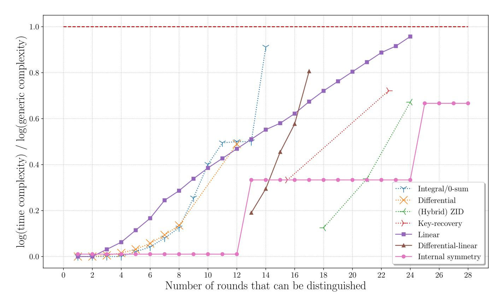
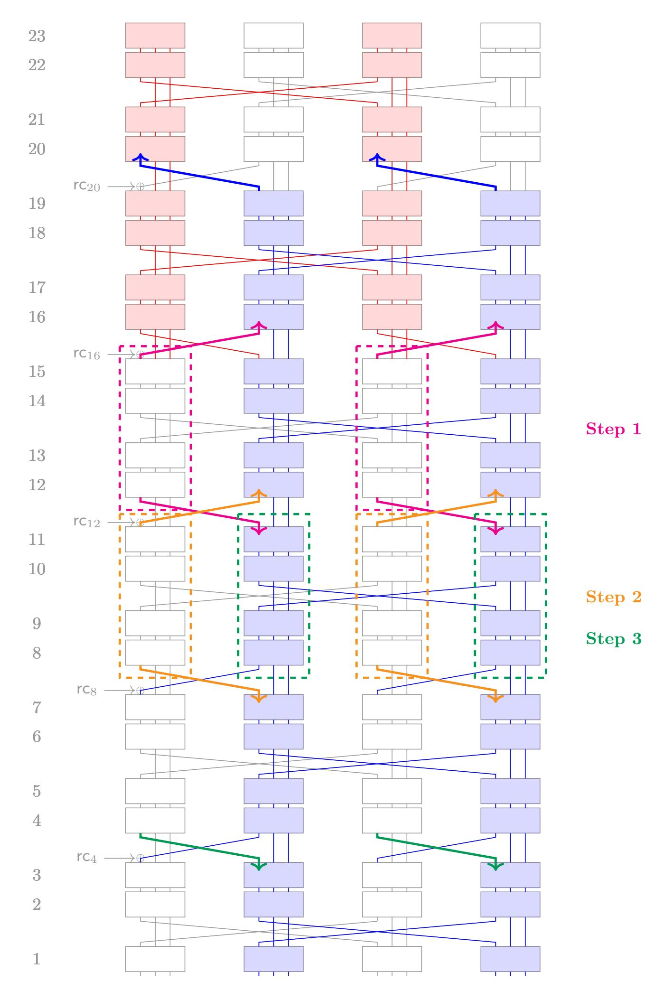
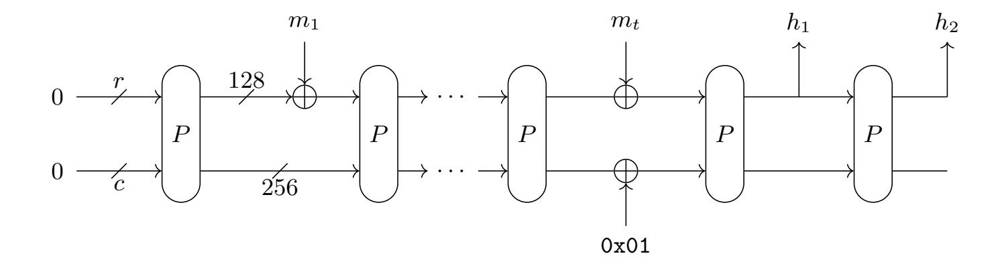
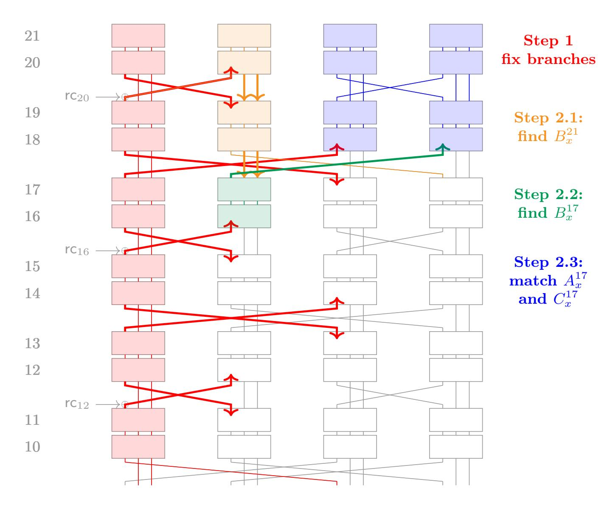
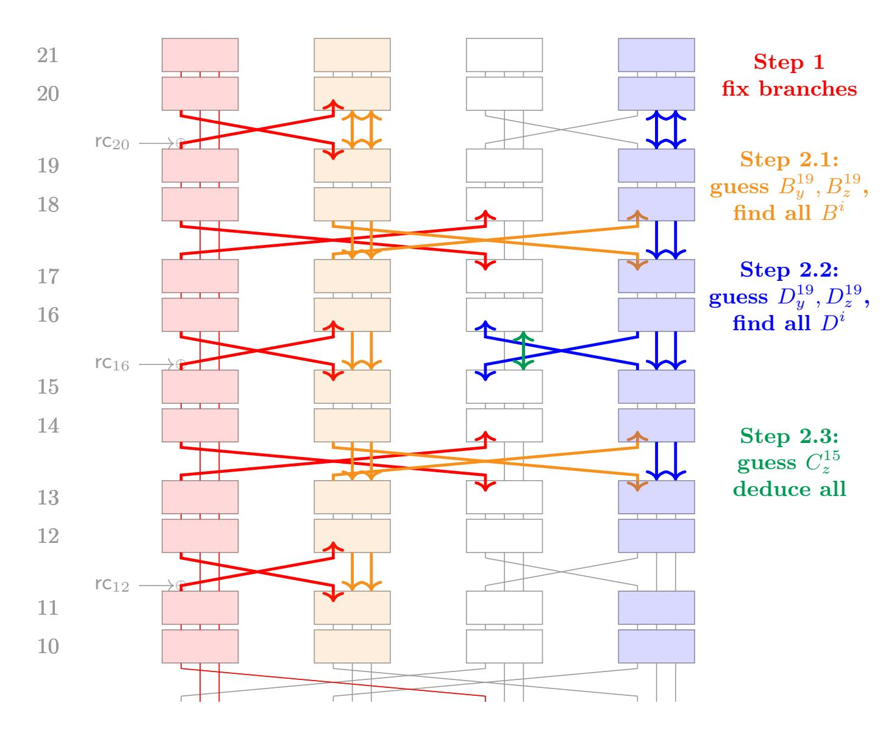
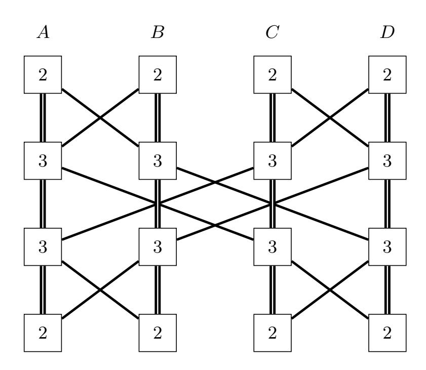
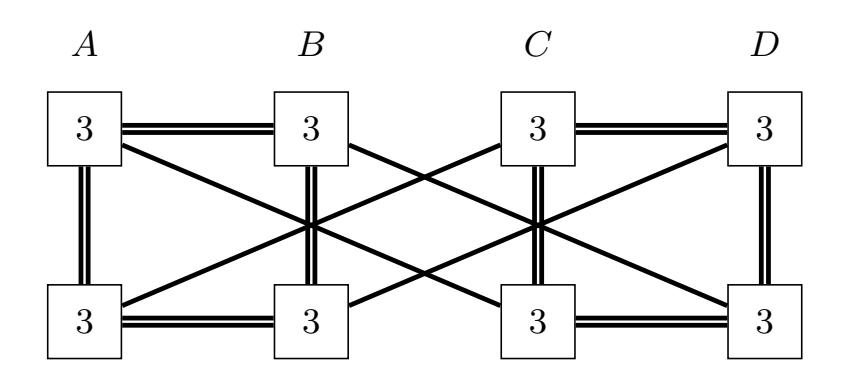
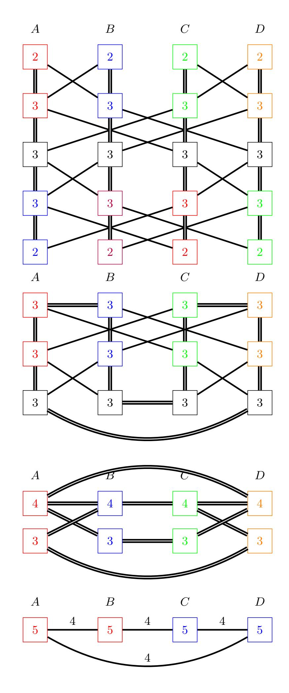
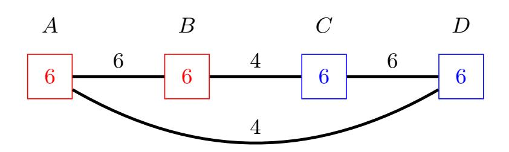
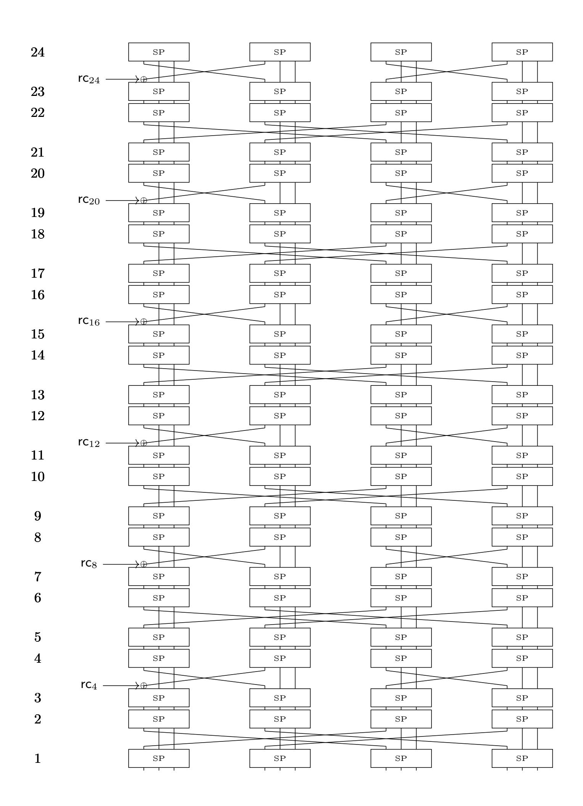

{0}------------------------------------------------

# Internal Symmetries and Linear Properties: Full-permutation Distinguishers and Improved Collisions on Gimli \*

Antonio Flórez Gutiérrez<sup>1</sup> , Gaëtan Leurent<sup>1</sup> , María Naya-Plasencia<sup>1</sup> , Léo Perrin<sup>1</sup> , André Schrottenloher2† Ferdinand Sibleyras<sup>1</sup>

> 1 Inria, Paris, France (firstname.lastname@inria.fr) <sup>2</sup> Cryptology Group, CWI, Amsterdam, The Netherlands (firstname.lastname@m4x.org)

Abstract. Gimli is a family of cryptographic primitives (both a hash function and an AEAD scheme) that has been selected for the second round of the NIST competition for standardizing new lightweight designs. The candidate Gimli is based on the permutation Gimli, which was presented at CHES 2017. In this paper, we study the security of both the permutation and the constructions that are based on it. We exploit the slow diffusion in Gimli and its internal symmetries to build, for the first time, a distinguisher on the full permutation of complexity 2 <sup>64</sup>. We also provide a practical distinguisher on 23 out of the full 24 rounds of Gimli that has been implemented.

Next, we give (full state) collision and semi-free-start collision attacks on Gimli-Hash, reaching respectively up to 12 and 18 rounds. On the practical side, we compute a collision on 8-round Gimli-Hash. In the quantum setting, these attacks reach 2 more rounds. Finally, we perform the first study of linear trails in Gimli, and we find a linear distinguisher on the full permutation.

Keywords: Gimli, symmetries, symmetric cryptanalysis, full-round distinguisher, collision attacks, linear approximations

# <span id="page-0-0"></span>1 Introduction

Gimli is a cryptographic permutation that was published at CHES 2017 [\[4\]](#page-33-0). It is also the core primitive of a submission to the NIST lightweight cryptography project [\[5\]](#page-33-1) which is part of the 32 candidates that made it to the second round. It is intended to run well on a vast variety of platforms and contexts, from powerful processors supporting vector instructions to side-channel protected hardware.

<sup>\*</sup> This article is an extended version of the paper "New Results on Gimli: Full-Permutation Distinguishers and Improved Collisions" which appeared in the proceedings of ASIACRYPT 2020 [\[18\]](#page-34-0).

<sup>†</sup> This work was carried out while André Schrottenloher was at Inria.

{1}------------------------------------------------

A cryptographic permutation is a versatile primitive which is easily used to construct a hash function (as originally intended for this type of object [\[7\]](#page-33-2)). It was later shown that they can also be used to build authenticated ciphers [\[10\]](#page-33-3), pseudo-random number generators [\[9\]](#page-33-4), etc. In all such structures, the security of the cryptographic function relies on the properties of the permutation. In particular, it is assumed in the underlying security proofs that the permutation used behaves like a permutation picked uniformly at random—apart of course from the existence of a compact implementation, a property which should not be expected from a random object.

By definition, a cryptographic permutation does not have a key. Thus, we cannot define its security level using a game that relies on distinguishing a random permutation from a keyed instance with a random key. Still, since it should behave like a permutation picked uniformly at random, we can assess its security level by trying to identify properties that hold for the permutation studied but which should not be expected for one picked uniformly at random. In this context, cryptanalysts can re-use approaches originally intended for block cipher cryptanalysis (e.g. differential attacks [\[11\]](#page-33-5)). In fact, given that no key material is involved, we can also borrow techniques from hash function cryptanalysis such as rebound attacks [\[29\]](#page-34-1).

The aim is usually then to obtain inputs of the permutation satisfying a certain property using an algorithm which is more efficient than the generic one, i.e. the one that would work on a random permutation.

Our Contributions. In this paper, we complete the original security analysis of the designers of Gimli by targeting both the permutation on its own, and the NIST candidate Gimli-Hash. Our results on the permutation are summarized in Figure [1](#page-2-0) (plain lines). In order to account for the different costs of the generic attacks, we divided the logarithm of the time complexity of our distinguishers by the logarithm of the time complexity of the corresponding generic distinguisher. In Figure [1,](#page-2-0) a distinguisher is valid if the ratio is under 1.0. Previous attacks from the literature are represented with dotted lines. The complexities of all our attacks (included those against the hash function) are given in Table [1,](#page-3-0) along with all the results from the literature we are aware of.

Our main result is a distinguisher of the full 24-round permutation with a cost of 2 <sup>64</sup>, while a similar generic distinguisher has a cost of 2 <sup>96</sup>. We also propose a distinguisher on 23 rounds that is practical, with a cost of 2 <sup>32</sup>, and has been successfully implemented. These distinguishers exploit internal symmetries that are encouraged by the round function. The 23-round distinguisher could be extended by 1 round for free if the rounds were shifted.[3](#page-1-0)

Using similar guess-and-determine ideas, we increase to 12 the number of rounds susceptible to collision attacks on Gimli-Hash. A reduced-round version of this attack has been implemented. In the quantum setting, we obtain collisions up to 14 rounds. We also build semi-free start collisions, i.e. we show how to find one internal state value and two different messages (thus not affecting the capacity part) that provide a collision on the capacity after applying the permutation.

<span id="page-1-0"></span><sup>3</sup> This behaviour appears because the linear layer of Gimli is round dependent.

{2}------------------------------------------------



<span id="page-2-0"></span>**Fig. 1.** Comparison of various cryptanalysis techniques. Note that we may consider "shifted" variants of Gimli that do not start at round 24. Dotted lines correspond to results from the literature.

This attack is more efficient than a generic one for 18 rounds classically, and up to 20 quantumly. As a side note, these results provide a new example where quantum attacks reach more rounds than classical ones, much like in [25]. We also find a state-recovery attack on the authenticated encryption Gimli-Cipher (which leads to a key-recovery) up to 12 rounds, with only 3 blocks of data.

In addition, we provide the first extensive study of the linear properties of the round function of Gimli. We design a full-round linear distinguisher and study faster differential-linear distinguishers on reduced-round variants.

Our implementations (23-round distinguisher, reduced-round collision attack, search for linear trails) are available at this URL<sup>4</sup>.

Differences with [18]. This article is an extended version of the paper "New Results on Gimli: Full-Permutation Distinguishers and Improved Collisions" which appeared in the proceedings of ASIACRYPT 2020 [18]. Our new contributions are the state-recovery attacks explored in Section 6 and the full-round linear distinguisher on Gimli in Section 7. The rest of the paper (e.g., the distinguishers of Section 3 and the collision attacks of Section 4) is unchanged with respect to the ASIACRYPT version.

Organization of the paper. The organization of the paper is as follows. In Section 2 we provide the description of the Gimli permutation and primitive, as well as previous known results. Section 3 provides the new distinguishers exploiting the internal symmetries that allow to distinguish the full permutation, and

<span id="page-2-1"></span><sup>4</sup> https://project.inria.fr/quasymodo/files/2020/05/gimli\_cryptanalysis\_eprint.tar.gz

{3}------------------------------------------------

<span id="page-3-0"></span>Table 1. Results against algorithms of the Gimli family (including quantum attacks). Time is counted in evaluations of Gimli, and memory in 128-bit blocks. Attacks that were actually implemented are written in bold. is a term that we only estimated experimentally ( ≈ 10, see Section [4\)](#page-12-0). In rounds attacked, <sup>1</sup> → <sup>2</sup> means rounds <sup>1</sup> to <sup>2</sup> included.

|                                                | Technique             | Rounds   | Time      |       |      | Memory Generic Reference |
|------------------------------------------------|-----------------------|----------|-----------|-------|------|--------------------------|
|                                                | Key-recovery          | 25 → 2.5 | 138.5     | 128   | 192  | [24]                     |
|                                                | on Gimli-PRF          | 15.5     | 64        | 64    | 192  | [24]                     |
|                                                | Zero-sum              | 14       | 351       | negl. | 384  | [15]                     |
| Distinguishers                                 | ZID                   | 18       | 2         | negl. | 4    | [34]                     |
| on the                                         | Linear                | 16       | 238.8     | negl. | 384  | Sec. 7.1                 |
| permutation                                    | Linear                | 24       | 367.6     | negl. | 384  | Sec. 7.1                 |
| (real rounds:                                  | Differential-Linear   | 15       | 87.4      | negl. | 192  | Sec. 7.2                 |
| 24 → 1)                                        | Differential-Linear   | 16       | 110.8     | negl. | 192  | Sec. 7.2                 |
|                                                | Differential-Linear   | 17       | 154.8     | negl. | 192  | Sec. 7.2                 |
|                                                | Symmetry              | 23 → 0   | 32        | negl. | 96   | Sec. 3                   |
|                                                | Symmetry              | 27 → 0   | 64        | negl. | 96   | Sec. 3                   |
| Preimages on                                   | Divide-and            | 2        | 42.4      | 32    | 128  | [34]                     |
| Gimli-Hash                                     | conquer               | 5        | 96        | 65.6  | 128  | [34]                     |
| Preimages on<br>Gimli-XOF-128                  |                       | 9        | 104       | 70    | 128  | [34]                     |
|                                                |                       | 5        | 65        | –     | 128  | [32]                     |
|                                                | Divide-and<br>conquer | 3        | practical | –     | 128  | [32]                     |
| Collisions on                                  |                       | 6        | 64        | 64    | 128  | [33]                     |
| Gimli-Hash                                     | Symmetry              | 21 → 14  | 32 + 𝜖    | negl. | 128  | Sec. 4                   |
|                                                | Symmetry              | 12       | 96 + 𝜖    | negl. | 128  | Sec. 4                   |
|                                                | Quantum               | 14       | 64 + 𝜖    | negl. | 85.3 | Sec. 4                   |
| Semi-free start<br>collisions on<br>Gimli-Hash | Symmetry              | 8        | 64        | negl. | 128  | [33]                     |
|                                                | Symmetry              | 12       | 32 + 𝜖    | negl. | 128  | Sec. 4                   |
|                                                | Symmetry              | 16       | 96 + 𝜖    | negl. | 128  | Sec. 4                   |
|                                                | Symmetry              | 18       | 96 + 𝜖    | 64    | 128  | Sec. 4                   |
|                                                | Quantum               | 20       | 64 + 𝜖    | 64    | 85.3 | Sec. 4                   |
|                                                | D & C                 | 9        | 192       | 190   | 256  | [33]                     |
| State-recovery<br>on Gimli-Cipher              | Symmetry              | 8        | 128       | 128   | 256  | Sec. 6                   |
|                                                | Symmetry              | 12       | 192       | 192   | 256  | Sec. 6                   |

to build practical distinguishers up to 23 rounds. Section [4](#page-12-0) presents improved collision and semi-free start collision attacks, and Section [5](#page-18-0) their quantum counterpart. In Section [6,](#page-22-0) we use similar methods to perform state-recovery attacks on reduced-round versions of the AE scheme Gimli-Cipher. Section [7](#page-24-0) presents our new results regarding statistical distinguishers, with new linear trails and differential-linear attacks. We conclude the paper in Section [8](#page-31-0) with a summary, a discussion on the impact of our results and a proposal of tweak that would mitigate their reach.

{4}------------------------------------------------

#### <span id="page-4-0"></span>2 Preliminaries

In this section we describe the Gimli permutation and we provide an overview of previous cryptanalysis results. The Gimli-Hash function is described directly in Section 4.

We adopt the following notations in this paper:  $\ll, \gg, \ll, \gg$  represent respectively shift left, shift right, rotate left and rotate right operations. x, y, z will denote elements of  $\mathbb{F}_2^{32}$ . SP is the 96-bit SP-Box. We denote  $x_i$  the  $(i \mod 32)^{th}$  bit of x  $(x_{33} = x_1)$  with  $x_0$  least significant (right-most). We denote the output of the SP box as SP(x, y, z) = (x', y', z') and  $SP^2(x, y, z) = (x'', y'', z'')$ .

#### 2.1 The Gimli Permutation

State Structure. We denote by S the 384-bit Gimli state, which is the concatenation of 4 columns of 96-bit, that we denote A, B, C, D, where A is column number 0, and D is column number 3. Each column is cut into three 32-bit words x, y, z which are denoted e.g.  $A_x, A_y, A_z$ . Thus, the state is a  $4 \times 3 \times 32$  parallelepiped. We will speak of the x lane to denote the sequence or concatenation of words  $A_x, B_x, C_x, D_x$ .

SP-Box. The only non-linear operation in Gimli is the SP-Box, which is applied columnwise. On input x, y, z, it updates the three words as follows:

- 1. Rotate x and y:  $x \leftarrow x \ll 24, y \leftarrow y \ll 9$ .
- 2. Perform the following non-linear operations in parallel (shifts are used rather than rotations):

```
x \leftarrow x \oplus (z \ll 1) \oplus ((y \wedge z) \ll 2),

y \leftarrow y \oplus x \oplus ((x \vee z) \ll 1),

z \leftarrow z \oplus y \oplus ((x \wedge y) \ll 3).
```

3. Swap x and z:  $(x, z) \leftarrow (z, x)$ .

Rounds. Gimli applies a sequence of 24 rounds numbered from 24 downto 1 inclusively. Each round applies an SP-Box layer, then performs a swap (every two rounds, either a "big swap" or a small "small swap" as shown in Algorithm 1) and a constant addition (every four rounds). The constant at round i, if there is one, will be denoted  $rc_i$  in what follows. In Gimli we have:  $rc_i = 0$ x9e377900  $\oplus i$ . Note that all the attacks studied in this paper are independent of the choice of round constants.

An algorithmic depiction of full Gimli is given in Algorithm 1 and it is depicted in Figure 10, where each wire represents a word.

**Boolean Description of the SP-Box** Now we give a full description of the SP box using Boolean functions:

- for x':

<span id="page-4-1"></span>
$$\begin{cases}
x'_{0} = y_{23} + z_{0} \\
x'_{1} = y_{24} + z_{1} \\
x'_{2} = y_{25} + z_{2} \\
x'_{i} = y_{i-9} + z_{i} + x_{i+5}y_{i-12}, \quad 3 \le i \le 32,
\end{cases} \tag{1}$$

{5}------------------------------------------------

#### Algorithm 1 The full Gimli permutation.

```
Input: State  = , , , 
 Output: Gimli()
1: for  = 24 downto 1 inclusive do
2: , , ,  ← (), (), (), () ◁ SP-Box layer
3: if  mod 4 = 0 then
4: Swap  and , swap  and  ◁ small swap
5:  ←  ⊕ rc ◁ Constant addition
6: else if  mod 2 = 0 then
7: Swap  and , swap  and  ◁ big swap
8: end if
9: end for
 Return
```

<span id="page-5-0"></span>– for ′ :

<span id="page-5-1"></span>
$$\begin{cases} y_0' = x_8 + y_{23} \\ y_i' = x_{i+8} + y_{i-9} + x_{i+7} + z_{i-1} + x_{i+7} z_{i-1}, & 1 \le i \le 32 \end{cases},$$
 (2)

– and for ′ :

<span id="page-5-2"></span>
$$\begin{cases}
z'_0 = x_8 \\
z'_1 = x_9 + z_0 \\
z'_i = x_{i+8} + z_{i-1} + y_{i-11}z_{i-2}, \quad 2 \le i \le 32 .
\end{cases}$$
(3)

<span id="page-5-3"></span>Description of the SP<sup>2</sup> Box. If ′ <sup>0</sup> = <sup>23</sup> + <sup>0</sup> as in Equation [\(1\)](#page-4-1) then it naturally holds that ′′ <sup>0</sup> = ′ <sup>23</sup> + ′ <sup>0</sup> and thus we can use Equations [\(2\)](#page-5-1) and [\(3\)](#page-5-2) to get the full formula. Here we write some of them:

$$x'' \begin{cases} x_0'' = x_8 + x_{30} + x_{31} + y_{14} + z_{22} + x_{30}z_{22} \\ x_1'' = x_9 + x_{31} + x_0 + y_{15} + z_0 + z_{23} + x_{31}z_{23} \\ x_2'' = x_{10} + x_0 + x_1 + y_{16} + z_1 + z_{24} + y_{23}z_0 + x_0z_{24} \\ x_i'' = x_{i-2} + x_{i-1} + x_{i+8} + y_{i-18} + z_{i-10} + z_{i-1} + x_{i-2}z_{i-10} + y_{i-11}z_{i-2} \\ + x_{i-4}y_{i-4} + x_{i-4}z_{i+5} + y_{i-4}y_{i+11} + y_{i+11}z_{i+5} + x_{i-5}z_{i+5} + x_{i-5}y_{i-4} \\ + y_{i-4}z_{i-13} + z_{i-13}z_{i+5} + x_{i-4}x_{i+10}y_{i-7} + x_{i+10}y_{i-7}y_{i+11} \\ + x_{i-5}y_{i-4}z_{i-13} + x_{i-5}z_{i-13}z_{i+5} + x_{i-5}x_{i+10}y_{i-7} + x_{i+10}y_{i-7}z_{i-13} \\ + x_{i-5}x_{i+10}y_{i-7}z_{i-13}, i \neq 0, 1, 2, 9, 12, 27, 28, 29 \mod 32 \end{cases}$$

$$(4)$$

 ′′ {︁ ′′ <sup>0</sup> = <sup>30</sup> + <sup>31</sup> + <sup>14</sup> + <sup>31</sup> + <sup>8</sup> + <sup>22</sup> + 13<sup>28</sup> + 30<sup>22</sup> (5)

$$z'' \begin{cases} z_0'' = y_{31} + z_8 + x_{13}y_{28} \\ z_1'' = x_8 + y_0 + z_9 + x_{14}y_{29} \end{cases}$$
 (6)

The 2-round probability 1 linear relation ′′ <sup>0</sup> + ′′ <sup>0</sup> + ′′ <sup>0</sup> = <sup>8</sup> follows.

{6}------------------------------------------------

#### 2.2 Previous work

We provide here a brief overview of the main previous third-party results of cryptanalysis against either the permutation or the NIST candidate Gimli. Notice that all the cryptanalysis previously considered were classical attacks, while in this paper, we will also give quantum attacks on reduced-round Gimli-Hash. Let us point out that no search of linear trails was done prior to our work.

Zero-sum permutation distinguishers on 14 rounds. In [\[15\]](#page-33-6), Cai, Wei, Zhang, Sun and Hu present a zero-sum distinguisher on 14 rounds of Gimli. This distinguisher uses the inside-out technique and improves by one round the integral distinguishers given by the designers.

Structural permutation distinguisher on 22.5 rounds. In [\[24\]](#page-34-3), Hamburg proposed the first third-party cryptanalysis of the Gimli permutation, providing distinguishers on reduced-round versions of the permutation. This analysis does not depend on the details of the SP-Box, and is based only on the slow diffusion of Gimli. Thus, it follows a similar path as the distinguishers of Section [3.](#page-8-0) In his work, Hamburg defines a PRF with 192-bit input and 192-bit key that computes (, ) = trunc192(Gimli(‖)). He gives a distinguishing attack in time 2 <sup>64</sup> for 15.5 rounds (omitting the final swap), and a key-recovery attack on when using 22.5 rounds of Gimli, precisely rounds 25 to 2.5 (omitting again the final swap). This attack runs in time 2 <sup>138</sup>.<sup>5</sup> with a memory requirement of 2 129 , which is faster than the expected 2 <sup>192</sup>, and thus shows that 22.5-round Gimli behaves differently than what could be expected from a random permutation.

Hamburg's attacks are based on a meet-in-the-middle approach, exploiting the slow diffusion by tabulating some of the values that are passed from an SP-Box to another. The 15.5-round distinguisher relies on a table of size 2 <sup>64</sup>, and the 22.5-round attack on a table of size 2 <sup>128</sup>. None of these attacks are practical.

ZID Permutation Distinguishers. In an independent and simultaneous work posted on ePrint [\[34\]](#page-35-0), Liu, Isobe, and Meier present a "hybrid zero-internal differential" (ZID) distinguisher on full Gimli, which extends a ZID distinguisher of previous unpublished work. The basic ZID distinguisher happens to be what we call an internal symmetry distinguisher, where states with symmetries are produced in the input and in the output of a reduced-round variant of Gimli. A "hybrid" one adds a limited birthday-like property (which is absent from our distinguishers). The steps that they take are however different from ours, as this distinguisher only spans 14 rounds. Compared with our analysis in Section [3,](#page-8-0) they will actually start from a much more constrained middle state, which limits the number of rounds by which one can extend the distinguisher afterwards (or significantly increases the complexity). In contrast, we complete the middle state in multiple successive steps, each step ensuring that more rounds will be later covered. The ZID distinguisher targets 18 rounds of Gimli with a negligible complexity. After the publication of our results, and personal communications, the authors updated their ePrint report [\[34\]](#page-35-0). They proposed to modify our distinguisher of Section [3](#page-8-0) to reduce the complexity from 2 <sup>64</sup> to 2 52 .

{7}------------------------------------------------

Collisions and Preimages on Gimli-Hash. In [39], Zong, Dong and Wang study Gimli among other candidates of the competition. They present a 6-round collision attack on Gimli-Hash of complexity 2<sup>113</sup>, using a 6-round differential characteristic where the input and output differences are active only in the rate. This differential characteristic was invalidated in [33].

In [32], [34] and [33] Liu, Isobe and Meier give collision and preimage attacks on reduced-round Gimli-Hash. Their attacks rely on divide-and-conquer methods, exploiting the lack of diffusion between the columns, as did Hamburg, but they also rely on SP-Box equations in order to attack the hash function itself. These equations are different from those that we will solve in Section 4, and they mostly relate the input and outputs of a single SP-Box, whereas we study directly two SP-Boxes. Their analysis is also much more precise, since they prove running times of solving these equations.

After giving a meet-in-the-middle generic preimage attack of time and memory complexity  $2^{128}$ , which sets a bound against the sponge construction used in Gimli-Hash, they give practical preimage attacks on 2-round Gimli-Hash and practical collision attacks on 3-round Gimli-Hash. They give a collision attack on 5-round Gimli-Hash with a time complexity  $2^{65}$  and a second preimage attack with time complexity  $2^{96}$ . They give in [34] a preimage attack on 5-round Gimli-Hash. In [33], they give a semi-free start collision attack on 8 rounds and a state-recovery attack on the AE scheme for 9 rounds.

#### 2.3 On the Notion of Distinguisher

Some of our results are "distinguishers" targeting the Gimli permutation itself. However, as there is a unique instance of this permutation, what is the meaning of "distinguishing" it from a random permutation?

As far as primitives are concerned, distinguishers are normally defined for keyed algorithms, and work as follows (in the case of a block cipher). First, an n-bit block cipher  $E_k$  is instantiated with a key k picked uniformly at random from the relevant set, and a permutation P of  $\mathbb{F}_2^n$  is picked uniformly at random from the set of such permutations. Then, the attacker is given black-box access to both algorithms and their task is to figure out which is which with a success probability greater than 1/2.

This notion of distinguisher breaks down when we look at cryptographic permutations. Indeed, since there is no key, the permutation  $\pi$  used is picked from a set of size 1, and thus the attacker could simply query for instance P(0) and, if it is equal to  $\pi(0)$ , win the game with overwhelming probability.

At the same time, it is also obvious that cryptographic permutations must satisfy specific requirements in order for them to be valid building blocks for secure hashing or AEAD. To take a trivial example: using the notion of distinguisher outlined above, it is not much harder to distinguish the Keccak permutations from random than it is to distinguish the identity from random. And yet, instantiating a sponge with each of these permutations yields hash functions with vastly different security levels.

{8}------------------------------------------------

As we can see, the problem of defining a distinguisher for a fixed permutation is in fact close to that of defining one for an open key cipher, i.e. a block cipher instantiation for which the key is known. A first notion to capture the meaning of "distinguisher" in this context was proposed by Gilbert in [\[19\]](#page-34-4), namely that of T-intractable relation. Informally, a T-intractable relation ℛ is such that it is infeasible to find a set = (0, . . . , ) of inputs and a corresponding set = ((0), . . . , ()) of outputs such that ℛ in time less than if is a permutation picked uniformly at random. Of course, the definition of ℛ cannot be chosen arbitrarily—otherwise, we could simply define ℛ to be such that ℛ (). For a keyed primitive, the relation should not depend on the key.

As a consequence, it is natural to rely on linear structures to define a relationship ℛ that may be of interest when assessing the security level of a cryptographic permutation. The limited birthday [\[20,](#page-34-5)[26\]](#page-34-6), originally intended for hash functions, is an approach in this direction. The idea is to find pairs of inputs (, ′ ) such that the pair ( ⊕ ′ , () ⊕ ()) lives in a vector space of a high dimension. If these pairs can be found faster than with a classical birthday search, then it is a distinguisher.

In this paper, we propose another type of distinguisher whereby we generate an input such that (, ()) lives in a specific affine space. As with the limited birthday, if this can be done faster than with a brute-force approach, then it can be seen as a distinguisher.

More generally, we consider that a distinguisher for a permutation is an algorithm that can return (tuples of) input/output pairs in a specific affine space that is more efficient than the generic algorithm. As the aim of a cryptographic permutation is to yield complex and non-linear relations between its input and output, we claim that this approach is the correct one to assess the security of a keyless cryptographic permutation.

# <span id="page-8-0"></span>3 Internal Symmetry Distinguishers against Gimli

In this section we present new distinguishers on the Gimli permutation. Our distinguishers improve upon the best previously known ones, reaching the full 24 round permutation. They are practical on 23 rounds and have been implemented. The results presented in this section do not exploit the specifics of the SP-Box: they would work equally well if the SP-Box was replaced with a permutation picked uniformly at random. Like all the other analyses presented in this paper, they do not depend on the values of the round constants.

Our distinguishers rely on internal symmetries. The general idea consists in identifying a specific form of symmetry (formally, a vector space) that is preserved by the round function under some circumstances, and then trying to craft an input for the permutation such that this symmetry traverses all the rounds so that the output has the same type of property.

In our case, we formalize the symmetry using the notion of 2-identical states.

{9}------------------------------------------------

Definition 1 (2-identical states). A state is 2-identical if = , if = , or if one of these properties holds up to a swap and a constant addition.

Our internal symmetries distinguisher aims at finding a 2-identical input that is mapped to a 2-identical output. Since there are 96 bits of constraint, a generic algorithm returning such an input should run in time 2 <sup>96</sup> by evaluating the permutation on a set of inputs satisfying the property until the output matches it by chance. Our aim is to find more efficient algorithms in the case of Gimli.

This definition is similar to the one used in [\[16\]](#page-33-7). In fact, an internal symmetry distinguisher can be seen as a stronger variant of a limited birthday distinguisher of the type used in [\[16\]](#page-33-7). Indeed, we can build a limited birthday pair using our distinguisher: by producing a pair of inputs , ′ satisfying the internal symmetry property, we obtain ⊕ ′ ∈ and () ⊕ ( ′ ) ∈ . Further, since the converse is not true, an internal symmetry distinguisher is strictly stronger.

From now on, denotes the Gimli state before round .

#### 3.1 23-round Practical Distinguisher

We design an internal symmetry distinguisher on 23 rounds of Gimli, that is represented in Figure [2,](#page-10-0) running in time equivalent to 2 <sup>32</sup> evaluations of Gimli on average. Algorithm [2](#page-11-0) starts from a symmetric state in the middle and completes the state <sup>11</sup> in three steps. Each step assigns a value to more words of the state, and ensures that the 2-identical symmetry property traverses more rounds.

Each step of Algorithm [2](#page-11-0) requires to evaluate a few SP-Boxes 2 <sup>32</sup> times (we do not even need to evaluate the inverse SP-Box). The total amount of computations is smaller than 2 <sup>32</sup> evaluations of 23-round Gimli. Notice also that the algorithm uses only a small amount of memory. Our implementation of Algorithm [2](#page-11-0) ran in less than one hour on a regular laptop.

The time complexity of the algorithm can be computed as follows: 8 × 2 32 SP-Box evaluations for the first step, 8 × 2 <sup>32</sup> for the second and 16 × 2 <sup>32</sup> for the third, meaning a total of 8 × 2 <sup>32</sup> + 8 × 2 <sup>32</sup> + 16 × 2 <sup>32</sup> = 40 × 2 <sup>32</sup> which is less than 2 <sup>32</sup> evaluations of 23-round Gimli (each of them consisting essentially of 92 SP-Box evaluations). This complexity is to be compared to that of the generic algorithm for obtaining our internal symmetry property, which costs 2 96 .

Below, we provide an example of input-output pair that we obtained, with a 2-identical input that remains 2-identical after Gimli(23, 1):

```
7f9fcf70 6aedf7e6 7f9fcf70 cb2f0e6a
Input: 0ba2f1f9 f339b619 0ba2f1f9 f70cf15c
      b2ee8259 df0b4801 b2ee8259 3856106d
      a8ef848d 8c17b743 9615b3bc 8c17b743
Output: 541122c5 30530879 8d9d5d30 30530879
      74b6dbe6 18885a6e 744b55c1 18885a6e
```

#### 3.2 Distinguisher on full Gimli and Extensions

Here we will describe how to extend the 23-round distinguisher to the full Gimli permutation, and even to more rounds. All these results are summarized in

{10}------------------------------------------------



<span id="page-10-0"></span>Fig. 2. Distinguisher on 23 rounds. The same color for symmetric branches or columns at a given round means that they are equal.

{11}------------------------------------------------

#### **Algorithm 2** 23-round internal symmetry distinguisher.

**Output:** a 2-identical state S such that Gimli(23,1)(S) is 2-identical We start from the middle. We will be interested in the state  $S^{11}$ .

- 1. Select  $A_x^{15}, A_y^{15}, A_z^{15}$  and  $C_x^{15} = A_x^{15} \oplus \text{rc}_{16}, C_y^{15} = A_y^{15}, C_z^{15} = A_z^{15}$  such that  $B_x^{11} = D_x^{\tilde{1}1}.$ 
  - Notice that due to the small swap operation, the values  ${\cal B}_x^{11}$  and  ${\cal D}_x^{11}$  actually come from A and C and depend only on  $A^{15}$  and  $C^{15}$ . At this point, we have ensured that for any values of  $B^{15} = D^{15}$ :
    - $-S^{23}$  is 2-identical: indeed, A and C will remain identical from rounds 16 to 19 backwards. Then, the small swap backwards injects the same value in A and C since B and D are also identical. Thus,  $A^{23} = C^{23}$ .
    - $S^7$  is 2-identical: indeed, since  $B_x^{11} = D_x^{11}$ , B and D remain equal until the SP-Box layer of round 8, and the 2-identical property remains after the small swap of round 8.
  - Once good values have been found, we can compute part of the state  $S^{11}$ :  $A^{11}_{y,z}$
- $C_{y,z}^{11}$ , and  $B_x^{11} = D_x^{11}$  are fixed. The rest remains free. 2. Select  $A_x^{11} = C_x^{11} \oplus \operatorname{rc}_{12}$  such that  $B_x^7 = C_x^7$ . At this point, the two-identicality of the output state is preserved through 4 more rounds (until round 4 included):  $S^3$ is 2-identical.
- In the state  $S^{11}$ ,  $B^{11}_{y,z} = D^{11}_{y,z}$  remain free. 3. Select  $B^{11}_{y,z} = D^{11}_{y,z}$  such that  $B^3_x = C^3_x$ . Thus, the output  $S^0$  is 2-identical.

<span id="page-11-0"></span>Figure 1 from Section 1. An extension of our distinguisher to the full Gimli is a trivial matter. Indeed, after running Algorithm 2, we obtain a 2-identical input state  $S^{23} = A^{23}, B^{23}, C^{23}, D^{23}$  with  $A^{23} = C^{23}$ . Then, if  $B_x^{23} = D_x^{23}$ , which is a 32-bit condition, the state remains 2-identical after the inverse round 24. By repeating the previous procedure  $2^{32}$  times, we should find an input value that verifies the output property. The generic complexity of finding a 2-identical input that generates a 2-identical output is still 2<sup>96</sup>. Thus, full Gimli can be distinguished in time less than  $2^{32+32} = 2^{64}$  full Gimli evaluations, and constant memory.

An interesting question is: how many rounds of a Gimli-like permutation can we target? The distinguisher works mainly because the diffusion in Gimli is somewhat slow. Thus, a possible fix would be to increase the number of swaps, for example by having one in each round instead of every two rounds. An attack exploiting this behaviour that worked previously for r rounds would now a priori work for r/2 rounds only. Of course, the details of the SP-box could allow further improvement of these results given that a single iteration would now separate the swaps rather than a double.

Extending to 28 Rounds. It is trivial to adapt this distinguisher to an extended version of Gimli with more rounds. The 2-identicality of  $S^0$  is preserved after one round since the next round would apply only an SP-Box layer and a small swap. Similarly, the 2-identicality of  $S^{24}$  is preserved after 3 more inverse rounds since the next swap operation is a big swap which exchanges data between A and

{12}------------------------------------------------

Table 2. Collision attacks on round-reduced Gimli

<span id="page-12-1"></span>

| Type                     | Nhr of rounds  | s Time complexity                        | Memory complexity  |
|--------------------------|----------------|------------------------------------------|--------------------|
| Type                     | Typi of founds | 5 Time complexity                        | Wellory complexity |
| Standard                 | 8              | $8 \times 2^{32} \times t_e$ (practical) | negl.              |
| Standard                 | 12             | $8 \times 2^{96} \times t_e$             | negl.              |
| Quantum                  | 14             | $\simeq 8 \times 2^{64} \times t_e$      | negl.              |
| Semi-free start          | 12             | $10 \times 2^{32} \times t_e$            | negl.              |
| Semi-free start          | 16             | $10 \times 2^{96} \times t_e$            | negl.              |
| Semi-free start          | 18             | $7 \times 2^{96} \times t_e$             | $2^{64}$           |
| Semi-free start          | 18             | $2^{96}$                                 | $2^{96}$           |
| Semi-free start, quantum | n 20           | $\simeq 2^{64} \times 10 \times t_e$     | $2^{64}$           |

C only. Thus, our practical distinguisher works against  $\mathsf{Gimli}(23,0)$  (a 24-round version of  $\mathsf{Gimli}$  shifted by one round), and our extended distinguisher works against  $\mathsf{Gimli}(27,0)$  (a 28-round version of  $\mathsf{Gimli}$ ).

# <span id="page-12-0"></span>4 Classical Collisions on Reduced-Round Gimli-Hash

In this section, we describe collision attacks on Gimli-Hash when it is instantiated with a round-reduced variant of Gimli. Table 2 summarizes our results.

#### 4.1 The Gimli-Hash Function

This function is built using the Gimli permutation in a sponge construction [8], represented in Figure 3.

Gimli-Hash (Algorithm 5) initializes the Gimli state to the all-zero value. The message is padded and separated into blocks of size r=128, which corresponds to the rate r, introducing message blocks of 128 bits between two permutation applications by XORing them to the first 128 bits of the state. Once all the padded message blocks are processed, a 32-byte hash is generated by outputting 16 bytes of the internal state, applying once more the permutation, and outputting 16 additional ones. In Gimli-Hash, the rate part is formed of the words  $A_x, B_x, C_x, D_x$  and the capacity part of  $A_{y,z}, B_{y,z}, C_{y,z}, D_{y,z}$ .

We will consider two kinds of collision attacks:

- Full-state collision attacks: we will build pairs of two-block messages  $M_0, M_1$  and  $M_0, M_1'$  such that the state after absorbing these pairs becomes again equal. Thus, one can append any sequence of message blocks after this and obtain the same hash.
- Semi-freestart collision attacks: we will build pairs of (384-bit) states S, S' such that S differs from S' only in a single x, and after r rounds of Gimli,  $\pi(S)$  and  $\pi(S')$  differ only in a single x as well. This does not yield a collision on the hash function as we would need to choose the value of the same initial state; however, it represents a vulnerability that may be used in the context of the Gimli modes of operation. For example, in Gimli-cipher, the initial state

{13}------------------------------------------------



Fig. 3. Gimli-Hash ( stands for the Gimli permutation). The rate part is formed of the words , , , and the capacity part of ,, ,, ,, ,.

<span id="page-13-0"></span>contains a key of 256 bits and a nonce of 128 bits which is put in the values. Then each block of plaintext is handled in the same way as Gimli-hash. Thus, by XORing the right values before and after , one can create a key, a nonce and a pair of messages which yield the same tags.

### 4.2 SP-Box Equations and How to Solve Them

All collision attacks in this section exploit the slow diffusion of Gimli and the simplicity of the SP-Box (contrary to the distinguishers on the permutation, which worked regardless of the SP-Box used). In this section, we describe a series of "double SP-Box equations"; solving them will be the main building block of our attacks. We define the following equations.

<span id="page-13-4"></span><span id="page-13-3"></span><span id="page-13-2"></span><span id="page-13-1"></span>Given 
$$y, z$$
, find  $x \neq x'$  such that  $SP^2(x, y, z)_x = SP^2(x', y, z)_x$ . (7)

Given 
$$y, z, y', z'$$
, find  $x$  such that  $SP^2(x, y, z)_x = SP^2(x, y', z')_x$ . (8)

Given 
$$y, z, y', z'$$
, find  $x$  such that  $SP^2(x, y, z)_z = SP^2(x, y', z')_z$ . (9)

Given 
$$y, z, x'$$
, find  $x$  such that  $SP^2(x, y, z)_x = x'$ . (10)

Number of Solutions. Except Equation [\(7\)](#page-13-1), all these equations have on average, when the inputs are drawn uniformly at random, a single solution. However, the variance on the number of solutions depends on the equation considered. For example, only approx. 6.2% of inputs to Equation [\(8\)](#page-13-2) have a solution, and they have on average 82.4 solutions each. Equation [\(10\)](#page-13-3) gives a little more than 1.5 solutions. This variance is not a problem for us, as long as we can produce efficiently all solutions of the equations, which remains the case. In order to simplify our presentation, we will do as if equations [\(8\)](#page-13-2), [\(9\)](#page-13-4) and [\(10\)](#page-13-3) always gave exactly a single solution for each input.

Solving the Equations. We use an off-the-shelf SAT solver [\[38\]](#page-35-4). In some cases, more time seems spent building the SAT instance rather than solving it, and we believe that our current implementation is highly unoptimized.

{14}------------------------------------------------

The solver allows us to retrieve all solutions of a given equation (we treat Equation (7) differently because it has on average  $2^{32}$  of them). Let us consider the average time to produce a solution when random inputs are given. On a standard laptop, this time varies between approximately 0.1 milliseconds (Equation (8)) and 1 millisecond (Equation (10)). This difference mainly stems from the fact that Equation (8) often has no solutions, and that the solver quickly finds a counterexample, while Equation (10) practically always has solutions that must be found.

On the same computer, an evaluation of the full Gimli permutation (not reduced-round) takes about 1 microsecond, so there is approximately a factor 1000 between computing Gimli and solving a double SP-Box equation.

We consider that all equations have approximately the same complexity and introduce a factor  $t_e$  that expresses the time taken to solve them in number of evaluations of Gimli or a reduced-round version (depending on the studied case).

#### 4.3 Practical 8-round Collision Attack

We consider 8 rounds of Gimli, e.g. rounds 21 to 14 included, and name Gimli(21, 14) this reduced-round permutation. We omit the last swap, because it has no incidence (it only swaps x values). The situation is represented on Figure 4. As before, we name  $S^i$  the partial state immediately before round i.

Algorithm 3 finds on average a single solution, with any input state. There is some variance on the number of solutions, that is induced by the SP-Box equations, but it is small in practice. Furthermore, we can eliminate the memory requirement by solving Equation (7) for many input random states. Starting from a given state, it suffices to apply one more Gimli permutation with a random message block, in order to re-randomize the input.

Remark that if we omit the second step then we already have a semi-free-start collision attack, because we can reconstruct the inputs  $C^{21}$  and  $D^{21}$  immediately from the middle.

Practical Application: first step. In our practical computations, we considered rounds 21 to 14 included. We solved step 1, starting from 0, 0, 0, 0 and using a random message  $m_1, 0, 0, 0$  to randomize the first block. We also solved at the same time the two Equations (10) that enabled us to go back to  $A_x^{17}$ ,  $B_x^{17}$ .

same time the two Equations (10) that enabled us to go back to  $A_x^{17}, B_x^{17}$ . We had to produce  $15582838652 \simeq 2^{33.86}$  solutions for Equation (7) until we found a solution for Step 1 and for both equations. We verified experimentally that each solution for Equation (7) yielded on average a solution for the final equation. We obtained in total 5 solutions (Table 3). There are two different solutions for  $A_x^{15} \oplus \operatorname{rc}_{16}$ , which yield two and three solutions respectively for  $B_x^{17}$ . The total computation ran in less than 5000 core-hours. It was easy to run on many concurrent processes as this algorithm is trivial to parallelize.

Practical Application: second step. We solved step 2, that is, looking for  $C_x^{21}$ ,  $D_x^{21}$  that lead to one of the pairs  $A_x^{17}$ ,  $B_x^{17}$ . This step was much faster than the previous one, although it ought to have the same complexity: this is because we paid in step 1 the probability to find a solution (twice) in Equation (10), while

{15}------------------------------------------------



<span id="page-15-0"></span>**Fig. 4.** Collision attack on 8 rounds of Gimli, extended to 12 rounds. The first step fixes the branches in red, which have equal values for the two inputs  $A_x^{21}, A_x'^{21}$ . Then we find values of  $B_x^{21}, C_x^{21}, D_x^{21}$  that will conform to these branches. Then, the whole states are deduced. The branches  $A_x^{13}$  and  $A_x^{11}$  remain to match.

in step 2 we benefited from having 5 different possible solutions. We found two solutions:  $C_x^{21}, D_x^{21}=$  819b1392, 9f4d3233 and  $C_x^{21}, D_x^{21}=$  aa9f6f2d, 3a6e613a.

Putting both Steps Together. With these solutions, we built two collisions on 8-round Gimli(21, 14). We start from  $m_1, 0, 0, 0$ , then after one round, we inject the values  $A_x^{21}, B_x^{21}, C_x^{21}, D_x^{21}$  and  $A_x'^{21}, B_x^{21}, C_x^{21}, D_x^{21}$  respectively in the rate; then we obtain two states that differ only on the x-coordinate of the third column (not the first, due to a big swap), and we inject two different blocks to cancel out this difference, obtaining the same state. The full state then collides, and we can append any message block that we want. The two collisions are given in Table 4.

Extending the Attack. Remark that the first step can be extended to span any number of  $SP^2$ -boxes. However, each time we add two more rounds, there is one more branch coming from the B,C,D states which has to match an expected value, so we add a factor  $2^{32}$  in complexity. Since  $t_e \ll 2^{32}$ , we can do that twice before meeting the bound  $2^{128}$ . Thus, a collision on 12-round Gimli-Hash can be built in time  $2^{96} \times 4 \times t_e$ .

{16}------------------------------------------------

#### **Algorithm 3** 8-round collision attack.

**Input:** an input state  $A^{21}, B^{21}, C^{21}, D^{21}$ 

**Output:** values  $A_x^{21}, A_x'^{21}, B_x^{21}, C_x^{21}, D_x^{21}$  such that by putting  $A_x^{21}, B_x^{21}, C_x^{21}, D_x^{21}$  and  $A_x'^{21}, B_x^{21}, C_x^{21}, D_x^{21}$  respectively in the rate, after Gimli(21, 14) (without the last swap), the state differs only on  $A_x$ .

Complexity:  $7 \times 2^{32} \times t_e$  time and  $2^{32}$  memory or  $8 \times 2^{32} \times t_e$  and negligible memory.

The attack runs in two main steps, both of which must solve 2<sup>32</sup> times a sequence of SP-Box equations.

# **Step 1:** find good $A_x^{21}, A_x'^{21}$ .

- 1. Find all pairs  $A_x^{21}, A_x^{\prime 21}$  such that the branch  $B_x^{19}$  collides (there are  $2^{32}$  such pairs, that can be found in time  $2^{32}$ ).
- 2. For each pair, compute  $A_y^{19}$ ,  $A_z^{19}$ ,  $A_y'^{19}$ ,  $A_z'^{19}$  and solve the SP-Box equation (8): find  $A_x^{19}$  such that the branch  $C_x^{17}$  collides (there is on average one solution)
- 3. Given this value, compute  $A_y^{17}$ ,  $A_z^{17}$ ,  $A_y^{\prime 17}$ ,  $A_z^{\prime 17}$  and solve the SP-Box equation (8) again: find  $A_x^{17}$  such that the branch  $B_x^{15}$  collides (there is on average one solution)
- 4. Given these values, compute  $A_y^{15}$ ,  $A_z^{15}$ ,  $A_y^{\prime 15}$ ,  $A_z^{\prime 15}$  and solve Equation (9): find  $A_x^{15}$  such that  $A_z^{13}$  and  $A_z^{\prime 13}$  collide.

Since we do that  $2^{32}$  times, we expect on average a single solution such that  $A_y^{13}$ and  $A_y^{\prime 13}$  also collide.

Now that we have found  $A_x^{21}, A_x^{21}$ , it remains to find  $B_x^{21}, C_x^{21}, D_x^{21}$  that give the wanted  $A_x^{19}, A_x^{17}, A_x^{15}$  (in red on Figure 4). We expect on average a single solution, and little variation on the number of solutions, as only Equation (10) is involved.

- Step 2: find  $B_x^{21}, C_x^{21}, D_x^{21}$ . 1. Find  $B_x^{21}$  by solving Equation (10), given the input y and z, and the output x

  - wanted. Deduce the values of  $B_y^{17}$ ,  $B_z^{17}$ .

    2. Given  $B_y^{17}$ ,  $B_z^{17}$ , and  $A_x^{15}$ , solve Equation (10) again to get  $B_x^{17}$ .

    3. Now find  $C_x^{21}$ ,  $D_x^{21}$  that lead to the wanted  $A_x^{17}$ ,  $B_x^{17}$ . First guess the value of  $C_x^{21}$ , deduce  $C_y^{19}$ ,  $C_z^{19}$  and with  $C_y^{19}$ ,  $C_z^{19}$ ,  $A_x^{17}$ , solve Equation (10) to obtain  $C_x^{19}$ . Next, given  $D_y^{21}$ ,  $D_z^{21}$  and  $C_x^{19}$ , solve Equation (10) to obtain  $D_x^{21}$ . Deduce a value for  $B_x^{17}$  and check if it matches what we want; we expect to find a match after trying all  $2^{32}$  guesses for  $C_x^{21}$ .

#### <span id="page-16-0"></span>Semi-free Start Collisions on Reduced-round Gimli 4.4

We will now design semi-free start collision attacks based on the same principle. This time, our goal is to obtain two input states S, S' that differ only in the rate (in practice, only in  $A_x$ ) and such that after applying a reduced-round Gimli, the output states differ only in the rate (the x values). They can also be seen as finding one state and two pairs of 2-block messages such that after inserting both messages we obtain a collision. The previous "first step" remains the same, with an extension to whichever number of rounds we are targeting. The "second step" is changed, because we can now choose completely the columns B, C, D, e.g. by starting from the middle instead of having to choose only the input rate.

{17}------------------------------------------------

**Table 3.** Results of the first step

<span id="page-17-0"></span>

| $m_1$ dc84bf38 | $A_x^{21}$ bbdb41f3            | $A_x^{\prime 21}$ 1b1da6e4 | $A_x^{19} \oplus rc_{20}$<br>07f25303 | 2                    | $B_x^{21}$ aae48b72 |
|----------------|--------------------------------|----------------------------|---------------------------------------|----------------------|---------------------|
|                | $B_{x}^{17}$ 92f536b6 0d9605fe |                            |                                       | f72044db<br>b1c91a60 |                     |

**Table 4.** Two 8-round collisions on Gimli-Hash

<span id="page-17-1"></span>

|                                      | Starting state (fir | st message bloc | k)                                      |          |  |
|--------------------------------------|---------------------|-----------------|-----------------------------------------|----------|--|
| dc84bf38 00000000                    | 00000000 00000000   | dc84bf38 0000   | 000000000000000000000000000000000000000 | 00000000 |  |
|                                      | Second me           | ssage block     |                                         |          |  |
| bbdb41f3 4333192c                    | bc17e444 8a9d06c7   | 1b1da6e4 4333   | 3192c bc17e444                          | 8a9d06c7 |  |
|                                      |                     | sage block      |                                         |          |  |
| 00000000 00000000                    | 00000000 000000000  | 00000000 0000   | 00000 afad801e                          | 00000000 |  |
| Starting state (first message block) |                     |                 |                                         |          |  |
| dc84bf38 00000000                    |                     |                 | 000000000000000000000000000000000000000 | 00000000 |  |
| Second message block                 |                     |                 |                                         |          |  |
| bbdb41f3 4333192c                    |                     |                 | 3192c 971398fb                          | 2fbe55ce |  |
| Third message block                  |                     |                 |                                         |          |  |
| 00000000 00000000                    | 00000000 00000000   | 00000000 0000   | 00000 afad801e                          | 00000000 |  |

Doing this allows us to reach 4 rounds more for the same cost as before, as outlined on Figure 5 and Algorithm 4. We can then append new rounds as before, reaching 16 rounds classically in time  $2^{96} \times 10 \times t_e$ .

Another Improvement using Precomputations. We are going to win a factor  $2^{32}$ using  $2^{64} \times t_e$  precomputations and a table of size  $2^{64}$ . This way, we can attack two more rounds. Indeed, once we have computed the first step, the two branches  $C_x^{17}$  and  $A_x^{13}$  contain arbitrary fixed values. Then, when we try to find the right C, we could have a table that for all  $C_y^{15}$ ,  $C_z^{15}$ , gives all input-output values for  $C^{17}$  and  $C^{14}$ , and we could directly use this table to match the values  $C_x^{15}$  and

 $D_x^{15}$  that come from D (instead of having to make a guess of  $C_z^{15}$ .

Let us fix  $C_x^{17} = A_x^{13} = 0$ . Thus, we repeat step 1 in Algorithm 4 a total of 2<sup>64</sup> times in order to have  $C_x^{17} = A_x^{13} = 0$ . Step 1 now costs  $2^{96} \times t_e$ .

The table that we precompute shall contain: for each x', x'', all values (on

average 1) of y', z' such that  $SP^2(0, *, *) = x', y', z'$  and  $SP^2(x'', y', z') = 0, *, *$ .

Now, in Algorithm 4, for each guess of  $B_{y,z}^{19}$ , and for each guess of  $D_{y,z}^{19}$ , we can find the value of C that matches all the fixed branches in time 1, using this table. Thus, we can repeat this  $2^{96}$  times, extending the attack by 6 rounds.

- Step 1 costs  $2 \times 2^{96} \times t_e$  (we solve only 2 equations most of the time, before aborting if the wanted "0" do not appear).
- The table costs  $2^{64} \times t_e$ , which is negligible
- Step 2 costs  $2^{96} \times 5 \times t_e$ , since it is the same as before, and we only need forwards computation of SP-Boxes to check if the full path is correct.

Note that we can get rid of the term  $t_e$  if we use a memory of size  $2^{96}$  to store the solutions of the SP-Box equations. In that case, the overall time complexity

{18}------------------------------------------------



<span id="page-18-1"></span>Fig. 5. Semi-free start collision attack on 12 rounds of Gimli (see Algorithm 4).

is slightly below  $2^{96}$  evaluations of Gimli, since fewer SP-Boxes are evaluated in each step than in the full primitive.

# <span id="page-18-0"></span>5 Better Quantum Collision Attacks

In this section, we explain how our attacks can be extended in the quantum setting, where even more rounds can be broken. We want to emphasize that, as our goal is simply to determine a security margin, we will not go into the details of the implementation of these attacks as quantum algorithms. We will only show how to use well-known building blocks of quantum computing in order to build these new attacks, and show why they perform better than the corresponding generic quantum attacks. At this point, we assume that the reader is familiar with the basics of quantum computing that are covered in textbooks such as [36]. We define quantum algorithms in the quantum circuit model. The circuit starts with a set of qubits (elementary quantum systems) initialized to a basis state and applies quantum operations. The state of the system lies in a Hilbert space of dimension  $2^n$  if there are n qubits. Quantum operations are linear operators of this space, and a quantum circuit is built from such elementary operators

{19}------------------------------------------------

Algorithm 4 12-round semi-free start collision attack (see Figure 5).

**Input:** an initial A (can be given)

**Output**  $A_x, A'_x, B, C, D$  such that after Gimli(21, 10), only the rate differs.

As before, we don't write the last swapping step.

**Step 1:** Same step as in Algorithm 3, extended to 12 rounds. It gives a total of 10 32-bit branches (input values) that are required, that are represented in red on Figure 5.

**Step 2:** we will start from the middle.

- 1. We take an arbitrary value for  $B_{y,z}^{19}$ . This guess enables to deduce all values of the column B, from  $B^{21}$  to  $B^{10}$ , either by simply computing the SP-Box, or by solving Equation (10) (given two input branches y, z, given the output x, deduce the input x). From this, we deduce the value in all branches that go from B to D on the figure, hence 4 branches. They are represented in orange on Figure 5.
- 2. We take an arbitrary value for  $D_{y,z}^{19}$ . Again, this enables to deduce the whole sequence of states from  $D^{20}$  to  $D^{10}$ , either by computing the SP-Box when possible, or by finding the input x value corresponding to a given output. We also obtain the values of branches that are transmitted from D to C.
- 3. We now guess  $C_z^{15}$ . Given this, and  $C_x^{15}$ , and the output  $A_x^{13}$  that must be met, we obtain the whole state by solving another simple SP-Box equation (which is not Equation (10), but has a similar form).
- 4. Having deduced  $C^{15}$ , we have only  $2^{-32}$  chances of obtaining the right  $C_x^{17}$ , so we have to repeat all of this  $2^{32}$  times.

<span id="page-19-0"></span>In total, we have to solve 5 SP-Box equations,  $2^{32}$  times, in both steps, so the time complexity is  $2^{32} \times 10 \times t_e$ .

coined quantum gates. The result of a quantum computation is accessed through measurement of the qubits, which destroys their state.

The cryptanalytic algorithms that we consider in this section do not require any form of query to a black-box, since we want only to build a collision on the hash function. Thus, they do not require any more specific model (e.g. the Q2 model used in some works in quantum cryptanalysis).

#### 5.1 Tools, Model and Complexity Estimates

Most of the collision attacks presented in this section rely on an exhaustive search. For example, consider the 8-round attack of Algorithm 3. Both steps are exhaustive searches in spaces of size  $2^{32}$  that contain on average a single solution:

– In the first step, we find  $A_x^{21}$  such that, after solving a sequence of SP-Box equations, a 32-bit condition is met: the first equation finds  $A_x'^{21}$  such that there is a collision in x after two SP-Boxes, the second equation finds  $A_x^{19}$  such that there is a collision in x after two SP-Boxes, etc., and the final 32-bit condition is that  $A_z'^{13}$  and  $A_z^{13}$  must collide.

{20}------------------------------------------------

– In the second step, we find the good 21 by guessing it and trying to match with a 32-bit condition.

Quantumly, Grover's algorithm [\[23\]](#page-34-7) speeds up exhaustive search quadratically. Amplitude Amplification [\[13\]](#page-33-9) is a powerful generalization which applies to any pair , such that:

- is a quantum algorithm without measurements (a unitary and reversible operation), that takes no input and produces an output ∈ .
- : → {0, 1} is a function that decides whether ∈ is a "good" output of (() = 1) or a "failure" of , such that can also be implemented as a quantum algorithm.

<span id="page-20-0"></span>Theorem 1 (Amplitude Amplification [\[13\]](#page-33-9), informal). Let be a quantum algorithm without measurements that succeeds with probability and be a quantum algorithm that tests whether an output of is a failure or not. Then there exists a quantum algorithm that finds a good output of using ( √︀ 1/) calls to and .

Quantum Embeddings. Any classical algorithm admits a quantum embedding, that is, a quantum algorithm that returns the same results. Note that this is not a trivial fact, because a quantum algorithm without measurement is reversible.

Definition 2. Let be a randomized algorithm with no input. A quantum embedding for is a quantum algorithm ′ that has no input, and the distribution over the possible outcomes of ′ (after measurement) is the same as the distribution over possible outcomes of .

This quantum embedding admits similar time and space complexities, where classical elementary operations (logic gates) are replaced by quantum gates and classical bits by qubits. Generic time-space trade-offs have been studied in [\[3](#page-33-10)[,31](#page-34-8)[,28\]](#page-34-9), but precise optimizations are required in practice, where the bulk of the work comes from making the computation reversible. As we just want to compare costs with quantum generic attacks, the following fact will be useful.

Remark 1. The ratio in time complexities is approximately preserved when embedding classical algorithms into quantum algorithms.

For example, if a classical algorithm has a time complexity equivalent to 1000 evaluations of Gimli, we can consider that the corresponding quantum embedding has a time complexity equivalent to 1000 quantum evaluations of Gimli. In all quantum attacks, we will give quantum time complexities relatively to quantumly evaluating Gimli. In order to use Amplitude Amplification (Theorem [1](#page-20-0) above), we simply need to define classical randomized algorithms for and .

{21}------------------------------------------------

#### 5.2 Example

We take the example of the classical 8-round collision attack. Both steps run in classical time  $2^{32} \times 4 \times t_e$  by running  $2^{32}$  iterates of a randomized algorithm of time complexity  $4 \times t_e$ . Using Amplitude Amplification, we obtain a corresponding quantum algorithm with time complexity approximately  $2^{16} \times 4 \times t_{qe}$ , where  $t_{qe}$  is the time to solve quantumly an SP-Box equation, relative to the cost of a quantum implementation of Gimli. As we remarked above, we can approximate  $t_{qe} \simeq t_e$ .

This approximation comes from different factors:

- a small constant factor  $\frac{\pi}{2}$  which is inherent to quantum search.
- the trade-offs between time and space in the detailed implementations of the primitive and its components. Let us simply notice that Gimli, compared to other primitives that have been studied in this setting, e.g. AES [27], seems fairly easy to implement using basic quantum computing operations. In the example of AES, the most costly component is the S-Box [27], and Gimli does not have such.

We are mainly interested in the security margin, and these approximations will be sufficient for us to determine whether a given algorithm runs faster or slower than the corresponding quantum generic attack. Thus, we will write that the quantum 8-round attack on Gimli-Hash runs in time  $\simeq 2^{16} \times 4 \times t_e$ .

#### 5.3 Quantum Collision Bounds and Quantum Attacks

The best quantum generic attack for finding collisions depends on the computational model, more precisely, on the cost assigned to quantum-accessible memory. Different choices are possible, which are detailed *e.g.* in [25]. In short, the overall cost of quantum collision search depends on the cost that is assigned to quantum hardware.

In this paper, we will simply consider the most conservative setting, where quantum memory is free. Note that this actually makes our attacks overall *less* efficient, since the generic algorithm is the most efficient possible (and they'll also work in the other settings). In this situation, the best collision search algorithm is by Brassard, Høyer and Tapp [14]. It will find a collision on Gimli-Hash in approximately  $2^{256/3} \simeq 2^{85.3}$  quantum evaluations of Gimli, using a quantum-accessible memory of size  $2^{85.3}$ .

Quantum collision attacks reaching more rounds than classical ones. In [25], Hosoyamada and Sasaki initiated the study of dedicated quantum attacks on hash functions. They remarked that quantum collision search does not benefit from a square-root speedup (it goes from roughly  $2^{n/2}$  to  $2^{n/3}$  with the BHT algorithm, and the gain is even smaller in more constrained models of quantum hardware), while some collision-finding procedures may have a better speedup, say, quadratic. Thus:

- there may exist quantum collision attacks such that the corresponding classical algorithm is *not* an attack (it gets worse than the generic bound);

{22}------------------------------------------------

– the quantum security margin of hash functions for collision attacks is likely to be smaller than the classical one.

Hosoyamada and Sasaki studied differential trails in the hash functions AES-MMO and Whirlpool. Although our attacks are based on a different framework, we show that similar findings apply for Gimli.

#### 5.4 Quantum Collision Attacks on Gimli

We assume that < 2 <sup>20</sup>, hence solving an equation costs less than evaluating reduced-round Gimli 2 <sup>20</sup> times, which is suggested by our computations, and should hold in the quantum setting as well.

Full-state collisions. By adding another 32-bit condition in the classical 12 round collision attack, we obtain a procedure which runs classically in time 4 × 2 <sup>128</sup> × , which is too high. However, using Amplitude Amplification, we obtain a procedure that runs in quantum time ≃ 4 × 2 <sup>64</sup> × and reaches 14 rounds, with less complexity than the quantum collision bound.

Semi-free start collisions. We can extend the 18-round semi-free start collision attack in the same way. Building the table will still cost a time 2 <sup>64</sup>. This table must be stored in a classical memory with quantum random access. The first step goes from 2 × 2 <sup>96</sup> × classically to approximately 2 × 2 <sup>48</sup> × quantumly. The second step does as well. Thus, adding a 32-bit condition enables us to attack 20 rounds in quantum time 2 <sup>64</sup> × 4 × .

# <span id="page-22-0"></span>6 State-recovery Attacks on Gimli-Cipher

In this section, we study state-recovery attacks on Gimli-Cipher. Gimli-Cipher uses the Duplex mode, where message blocks are XORed in the same place as in Gimli-Hash. The goal of a state-recovery attack is to recover the complete internal state, including the capacity. Once this is done, the Duplex is invertible and the key can also be recovered.

Since there are 256 bits of key in Gimli-Cipher, a meaningful state-recovery attack can have a complexity up to 2 <sup>256</sup>, although it will not necessarily contradict the security claims of [\[5\]](#page-33-1), which go only up to 128 bits of security.

The current best attack is from [\[33\]](#page-35-2), targeting 9 rounds in time 2 <sup>192</sup> and memory 2 190 .

Generic Principle. We will target reduced-round variants of the permutation, starting, as before, from an intermediate round in order to leverage the rounddependent linear layer. Due to the Duplex mode, the value of the rate (the words , , , ) is known before and after each call to the permutation. Starting from any nonce, we inject zero messages and observe the results. Let = (, , , ) be the current state. Let be the reduced-round permutation. Let ′ = () and ′′ = ( ′ ). This means that we know = (, , , ), ′ and ′′ .

{23}------------------------------------------------

Given  $S_x$  and  $S_x'$ , there are on average  $2^{128}$  possibilities for S'. Given  $S_x'$  and  $S_x''$ , there are also  $2^{128}$  possibilities for S''. Thus our goal is to produce these two lists of (at least)  $2^{128}$  values and to find a collision between them. We expect a single collision to occur.



<span id="page-23-0"></span>**Fig. 6.** Synthesis of 8 rounds of Gimli, with 4 double SP-Boxes. We write in each double SP-Box the number of word-degrees of freedom.

Strategy for 8 rounds. As we have seen before, the double SP-Box equations allow to relate the input and outputs of a double SP-Box. Thus, it makes sense to consider each double SP-Box individually, and to focus on the number of values that it can take. Without any constraint, it can take  $2^{96}$  values. If we constrain a word in input or output, it can take  $2^{64}$  values, and so on.

We write 8 rounds of Gimli as on Figure 6, where single-word constraints are put on the beginning and the end. Since each double SP-Box takes at most  $2^{96}$  values, we can start by writing down a list of these values for each double SP-Box. We will then merge these lists together progressively. If we merge two lists of size  $2^{\ell}$  and  $2^{\ell'}$ , and if the double SP-Boxes have 2 words in common, then we obtain a list of size  $2^{\ell+\ell'-2\times 32}$ .

The goal is to obtain a list of states that will match all the input and output constraints. This is graphically intuitive: on Figure 6, we will progressively merge the nodes. When we merge two nodes of labels i and j, we obtain a node of label  $\max(i+j-m,0)$  where m is the number of edges between them. All outgoing edges of i and j are copied to the new node. We will end with a single node, that represents a list of possible states. The time and memory complexities of this procedure are roughly equal to the biggest list size encountered, that is, in  $\log_2$ , 32 times the biggest label that was put on a node during the process.

Starting from Figure 6, our strategy for 8 rounds is to first merge the nodes pairwise, obtaining Figure 7.

{24}------------------------------------------------



Fig. 7. 8-round merging process, step 2.

<span id="page-24-2"></span>Next, we merge , , , into single nodes, and obtain a label 4. That is, thanks to the input and output constraints, we have only 2 <sup>128</sup> choices for each column separately. Next, there are 4 edges between abd , 4 edges between and , so we merge into 2 <sup>128</sup> choices for , and , separately. There are 4 edges between the remaining two nodes, so we merge into a list of 2 <sup>128</sup> possible states.

This gives a state-recovery attack of time and memory complexity 2 <sup>128</sup> (up to a small constant factor). Note that at this point, we can assume that the double SP-Box has been tabulated, and so, we don't need to solve equations anymore.

More Rounds. The complexity rapidly increases with the number of rounds. Once we represent them as on Figure [6](#page-23-0) and Figure [7,](#page-24-2) we find that our merging strategies are rather limited.

As soon as we move to 10 rounds, the merging process produces nodes of label 6, that is, lists of size 2 <sup>192</sup> (see Figure [8\)](#page-25-0). This seems to correspond to the 9-round attack of [\[33\]](#page-35-2), written differently (note that [\[33\]](#page-35-2) starts from the first round of Gimli, and thus, there is a swap immediately after the first SP-box).

With a minor modification in the merging process, we obtain the same complexity for 12 rounds, where the final step gives Figure [9.](#page-26-0)

With more rounds, that is, adding another layer of double SP-Boxes, all the merging strategies that we tried produced nodes of label at least 8 (that is, a complexity 2 <sup>256</sup>). We conjecture that this method cannot perform better.

# <span id="page-24-0"></span>7 Statistical Analyses of Gimli

#### <span id="page-24-1"></span>7.1 Linear cryptanalysis

This section aims to provide the first analysis of the linear properties of the Gimli permutation and its components. For this purpose, we used a bit-oriented Mixed Integer Linear Programming (MILP) modelization of the state transformations of Gimli constructed according to [\[1\]](#page-32-0). The resulting optimization problems were then solved with the SCIP solver [\[21,](#page-34-11)[22\]](#page-34-12) to search for linear trails with optimal correlation.

Using this tool, we provide a rudimentary analysis of the linear approximation table of the double Gimli SP-box, as well as constructing effective linear distinguishers for up to the full 24 rounds of the Gimli permutation.

{25}------------------------------------------------



<span id="page-25-0"></span>Fig. 8. 10-round merging process. Nodes merged at the next step are displayed with the same colors.

{26}------------------------------------------------



Fig. 9. Merging with 12 rounds, final step.

<span id="page-26-0"></span>Linear trails of the (double) SP-box We begin by studying the linear trails of the SP-Box. Since the Gimli permutation mainly uses the composition of the SP-Box with itself, we focus on the "double" SP-Box SP<sup>2</sup> .

Let us consider that we apply the double SP-box to = (, , ) to obtain ′′ = ( ′′, ′′, ′′) = <sup>2</sup> (, , ). We are interested in correlated linear approximations, that is, masks = (, , ) and = (, , ) for which

$$c(SP^2, \alpha, \beta) = 2^{-96} \Big( \big| \{ A : \alpha \cdot A \oplus \beta \cdot A'' = 0 \} \big| - \big| \{ A : \alpha \cdot A \oplus \beta \cdot A'' = 1 \} \big| \Big)$$

is as large (in absolute value) as possible. From Section [2.1](#page-5-3) we already know that the relationship <sup>8</sup> + ′′ <sup>0</sup> + ′′ <sup>0</sup> + ′′ <sup>0</sup> = 0 always holds. This is a linear trail of the double SP-box with correlation 1, and it is the only one.

An automated MILP-based search for linear trails of correlation 2 <sup>−</sup><sup>1</sup> and 2 −2 shows that there exist at least 41 trails of the former kind and 572 of the latter, but this is not an exhaustive count. Although these approximations probably only account for a very small fraction of the possible ones, a more thorough study of the distribution of the different correlation values among all the trails would be of interest.

We have found no signs of significant linear-hull effects (that is, of different highly-biased linear trails with the same input and output masks, as shown in [\[37\]](#page-35-6)) within these linear approximations of the double SP-box, although since we have not considered every interesting linear trail, they might still exist for trails of lower correlation.

Some linear trails of round-reduced Gimli. In order to provide some linear trails for reduced-round Gimli, we first focus on trails with only one active SP-Box in each round, or more specifically, with masks which only cover one column in each round. They do not provide an upper bound on the correlation of more general trails, but we still think they could be of interest, and this restriction greatly limits the search space.

More specifically, we consider linear trails on powers of the SP-box such that the mask for the word is zero every two rounds. This means that the mask is unaffected by the big and small swaps, and these trails easily translate into trails for the reduced-round Gimli construction with the same correlation.

We first look at iterative linear trails for the double SP-box so that both the input and output masks have the word set to zero, which means they can be easily extended and the correlation is computed using the piling-up lemma from 

{27}------------------------------------------------

[\[35\]](#page-35-7). We find that the optimal correlation is 2 <sup>−</sup>26, and this is the (maybe not unique) associated trail:

```
1 :
     00000000
     0a064e03
     0c08e406
                 SP
                −→
                2
                 −14
                     0c8b0507
                     01040322
                     00054302
                                SP
                               −→
                               2
                                −12
                                    00000000
                                    0a064e03
                                    0c08e406
                                               .
```

As this trail is iterative, we can construct 2-round trails with correlation 2 −26 . Next, we provide a similar iterative trail for four rounds with correlation 2 <sup>−</sup>47, though we were unable to check optimality and other trails with larger correlation might exist within the same restrictions:

```
2 :
     00000000
     02060000
     00020541
                 SP
                −→
               2
                 −19
                     06422511
                     088a8131
                     08828111
                                SP
                               −→
                               2
                                −11
                                    00000000
                                    15024215
                                    0405003a
                                               SP
                                               −→
                                              2
                                               −10
                                                   04054102
                                                   00010280
                                                   000182a0
                                                              SP
                                                              −→
                                                             2
                                                               −7
                                                                   00000000
                                                                   02060000
                                                                   00020541
```

.

.

With this, we can construct trails of 4 rounds with correlation 2 −47 .

We have also been able to construct an eight-round iterative trail with correlation 2 <sup>−</sup><sup>67</sup>, which allows to construct trails of 8 rounds with correlation 2 −67 :

```
3 :
    00000000
    20202020
    20202020
                SP
               −→
               2
                −8
                    00000000
                    40404040
                    40404040
                               SP
                              −→
                              2
                               −10
                                   00000000
                                   80c08080
                                   80e08080
                                              SP
                                              −→
                                             2
                                               −9
                                                  80000000
                                                  01810101
                                                  01c10101
                                                              SP
                                                             −→
                                                             2
                                                               −8
                                                                  00000000
                                                                  03020203
                                                                  03020203
                                                                             SP
                                                                            −→
                                                                            2
                                                                              −8
    00000000
    04040404
    04040404
                SP
               −→
               2
                −8
                    00000000
                    08080808
                    08080808
                               SP
                              −→
                              2
                                −8
                                   00000000
                                   10101010
                                   10101010
                                              SP
                                             −→
                                             2
                                               −8
                                                  00000000
                                                  20202020
                                                  20202020
                                                             .
```

We also performed some additional experiments to see whether there linear hull of the linear approximation based on these input and output masks has a larger linear potential than the one suggested by this single linear trail. We found that, in fact, there are 8 trails with correlation 2 <sup>−</sup><sup>67</sup>, 32 trails with correlation 2 −68 , 128 trails with correlation 2 <sup>−</sup><sup>69</sup>, 466 trails with correlation 2 <sup>−</sup><sup>70</sup>, and 1527 trails with correlation 2 <sup>−</sup><sup>71</sup>. This gives the linear approximation an Estimated Linear Potential (ELP, see [\[37\]](#page-35-6)) of at least

```
8 · 2
    −67·2 + 32 · 2
                   −68·2 + 128 · 2
                                    −69·2 + 466 · 2
                                                    −70·2 + 1527 · 2
                                                                      −71·2 ≃ 2
                                                                                 −128.8
                                                                                         .
```

For comparison, the ELP if we consider a single trail would be 2 <sup>−</sup>67·<sup>2</sup> = 2<sup>−</sup><sup>134</sup> . Additionally, when we consider iterations of this approximation, it is possible that even more trails appear.

For a small number of rounds, iterative trails are far from optimal. We now construct some nice trails for up to six rounds. We start with an optimal fourround trail with correlation 2 <sup>−</sup><sup>16</sup>:

```
4 :
     00000000
     90002000
     00400110
                SP
                −→
               2
                 −3
                    00400100
                    00000020
                    00000000
                                SP
                               −→
                               2
                                 −1
                                    00000000
                                    00004000
                                    00000001
                                               SP
                                              −→
                                              2
                                                −2
                                                   00000001
                                                   00800001
                                                   00800001
                                                              SP
                                                             −→
                                                             2
                                                              −10
                                                                  00000000
                                                                  000002aa
                                                                  010002aa
```

We attempt to extend this trail at the top. There are no approximations for the double SP-box for which the output mask is the input mask of <sup>4</sup> and so

{28}------------------------------------------------

<span id="page-28-0"></span>Table 5. Linear trails for Gimli. Some of them apply to shifted versions of the algorithm starting with two consective SP-box substitutions instead of one.

|    |           | # Rounds Correlation Construction | Shift |
|----|-----------|-----------------------------------|-------|
| 2  | 1         | Probability 1 trail from 2.1 Yes  |       |
| 6  | −32<br>2  | 𝛤5, 𝛤4                            | Yes   |
| 8  | −55<br>2  | Rounds 24 to 17 of 𝛤6             | No    |
| 16 | −122<br>2 | Rounds 24 to 9 of 𝛤6              | No    |
| 24 | −189<br>2 | −367.6<br>(ELP ≥ 2<br>𝛤6<br>)     | No    |

that the input mask has the word set to zero. However, by removing the last condition we can add two rounds with a 2 <sup>−</sup><sup>16</sup> correlation:

```
5 :
     68009800
     40202088
     403510d4
                 SP
                −→
                2
                 −10
                     40211090
                     00480010
                     00200088
                                SP
                               −→
                               2
                                 −6
                                    00000000
                                    90002000
                                    00400110
                                               .
```

This gives us a six round linear trail with correlation 2 −32 .

We now aim to construct an effective 24-round distinguisher for the full permutation based on the 8-round iterative linear trail. To this end, we find a prolongation of this linear trail by seven rounds at the top, which includes a swap. We obtain a 24-round linear trail with correlation 2 <sup>−</sup><sup>189</sup>. Furthermore, because of the linear hull properties of the iterative linear trail, we know that the ELP of the linear approximation using the same input and output linear masks is at least 2 −367.6 .

```
6 :
    80860280
    01404060
    00000200
    00004000
    00800001
    00000201
               SP
               −→
              2
                −6
               SP
               −→
              2
                −1
                   00000000
                   80808003
                   00000601
                   00000201
                   00000000
                   00000000
                              Swap
                               ↘
                               ↗
                                   00000201
                                   80808003
                                   00000601
                                              SP
                                             −→
                                             2
                                               −3
                                                  00000600
                                                  01000101
                                                  00000103
                                                             SP
                                                            −→
                                                            2
                                                              −5
    00000000
    00020203
    00020205
               SP
               −→
              2
                −8
                   00000006
                   04040404
                   04040404
                               SP
                              −→
                              2
                               −8
                                   00000000
                                   0c080808
                                   08080808
                                              SP
                                             −→
                                             2
                                               −8
                                                  00000000
                                                  10101010
                                                  10101010
                                                             SP
                                                            −→
                                                            2
                                                              −8
    00000000
    20202020
    20202020
               3
               −→
              2
                −67
                    00000000
                    20202020
                    20202020
                               3
                              −→
                              2
                               −67
                                   00000000
                                   20202020
                                   20202020
                                              SP
                                             −→
                                             2
                                               −8
                                                  00000000
                                                  40404040
                                                  40404040
                                                             .
```

In general, we provide the linear trails for up to 24 rounds of Gimli shown in Table [5.](#page-28-0) We should note that we have not proven the optimality of these trails (in fact we consider it quite likely that they are not), as we have focused on a very specific subfamily of trails and we haven't even shown optimality within that family for more than four rounds.

Our 24-round linear approximation can be used to mount a distinguishing attack on the Gimli permutation, which also works for the block cipher built 

{29}------------------------------------------------

with the Even-Mansour construction. It is possible to reduce the complexity slightly by using multiple linear cryptanalysis, as in [\[12\]](#page-33-12). The time complexity is equal to the data complexity, which is a number of known plaintext-ciphertext pairs inversely proportional to the ELP of 2 −367.6 . By considering the same approximation but in the four columns we can mount a multiple attack with an increase in the capacity by a factor of four.

The problem of finding a linear approximation whose input and output masks lie on the lane (that is, on the rate of the Gimli-Hash and Gimli-Cipher constructions) remains open.

# <span id="page-29-0"></span>7.2 Differential-Linear Cryptanalysis

We now consider differential-linear cryptanalysis, a technique that combines a differential trail and a linear trail built independently. The differential-linear distinguishers of this section have the advantage of smaller complexities than the linear distinguishers presented above.

We use the approach of Leurent [\[30\]](#page-34-13) where we actually split the cipher in three parts = <sup>⊥</sup> ∘⊥⊤ ∘⊤, with a differential trail in ⊤, a linear trail in ⊥, and an experimental evaluation of the bias in ⊥⊤. This gives a more accurate evaluation of the complexity. More precisely, we consider

- a differential trail in → out for <sup>⊤</sup> with probability = Pr (︀ ⊤() ⊕ ⊤( ⊕ in) = out)︀ .
- an experimental bias from out to for ⊥⊤:

$$b = c(\alpha \cdot E_{\perp}(W), \alpha \cdot E_{\perp}(W \oplus \delta_{\text{out}}))$$
  
=  $2 \Pr_{W}(\alpha \cdot E_{\perp}(W) = \alpha \cdot E_{\perp}(W \oplus \delta_{\text{out}})) - 1$ 

– a linear trail → for <sup>⊥</sup> with correlation = 2 Pr (· = ·⊥( ))−1.

If the three parts are independent then we can estimate the bias of the differentiallinear distinguisher as:

$$c(\beta \cdot E(X), \beta \cdot E(X \oplus \delta_{\text{in}})) = 2 \Pr_{X}(\beta \cdot E(X) = \beta \cdot E(X \oplus \delta_{\text{in}})) - 1 \approx pbc^{2}$$

Therefore, the complexity of the distinguisher is about 2/<sup>2</sup> 2 4 .

In Gimli, there are no keys, so the assumption of independence does not hold, but experiments show that the computed bias is close to the reality. In practice, the best results are obtained when out and have a low hamming weight [\[30\]](#page-34-13).

Differential Trail. We start by picking a trail that mainly follows the one given by the designers [\[4\]](#page-33-0) with slight changes to optimize it for for our number of rounds. We chose a trail with a difference pattern out with two active bits. A differential trail over 5 rounds with probability = 2<sup>−</sup><sup>28</sup> is given in Table [6.](#page-30-0) We considered trade-offs between the different phases, and it never seems to be worth it to propagate the trail any further.

{30}------------------------------------------------

Table 6. A 5-round differential trail.

<span id="page-30-0"></span>

|                      | 40418080 | 02010000 | 0000000 | 0000000 |
|----------------------|----------|----------|---------|---------|
| $\delta_{\text{in}}$ | 40400010 | 0000000  | 0000000 | 0000000 |
|                      | 80002080 | 80010080 | 0000000 | 0000000 |
|                      | 80010080 | 0000000  | 0000000 | 0000000 |
| Round 24             | 00402000 | 0000000  | 0000000 | 0000000 |
| $p = 2^{-18}$        | 80400080 | 0000000  | 0000000 | 0000000 |
|                      | 08000000 | 0000000  | 0000000 | 0000000 |
| Round 23             | 0040000  | 0000000  | 0000000 | 0000000 |
| $p = 2^{-8}$         | 80000000 | 0000000  | 0000000 | 0000000 |
|                      | 0000000  | 0000000  | 0000000 | 0000000 |
| Round 22             | 0000000  | 0000000  | 0000000 | 0000000 |
| p = 1                | 80000000 | 0000000  | 0000000 | 0000000 |
|                      | 80000000 | 0000000  | 0000000 | 0000000 |
| Round 21             | 0000000  | 0000000  | 0000000 | 0000000 |
| p = 1                | 0000000  | 0000000  | 0000000 | 0000000 |
| $\delta_{\rm out}$   | 0000000  | 0000000  | 0000000 | 0000000 |
| Round 20             | 0080000  | 0000000  | 0000000 | 0000000 |
| $p = 2^{-2}$         | 00800000 | 0000000  | 0000000 | 0000000 |
|                      |          |          |         |         |

**Experimental Bias.** Starting from the target difference pattern  $\delta_{\rm out}$  at round 19, we experimentally evaluate the bias after a few rounds with all possible masks  $\alpha$  with a single active bit. Concretely, we choose the state at random, build the second state by adding  $\delta_{\rm out}$  and observe the bias a few rounds later.

The most useful results are on the least significant bit  $z_0$  of the last word, where the probability of having a difference is smaller than 1/2. After computing 8 round, the probability of having an active difference on this bit in round 12 is  $\frac{1}{2} - 2^{-6.2}$ , a correlation of  $b = -2^{-5.2}$ . After 9 rounds, at the end of round 11, there is a correlation of  $b = -2^{-16.9}$ . These probabilities are large enough to be experimentally significant after the  $2^{40}$  trials we have made.

**Linear Trail.** We use assisted tools to find good linear trails, starting from the mask corresponding to  $z_0$ . The diffusion is not the same depending whether we start after round 12 or 11 so we show the best 3 rounds linear approximation for both case. We find a correlation c of  $2^{-17}$  and  $2^{-16}$  respectively, see Table 7.

Complexity of the distinguishers. We can combine the trails in different way to obtain distinguishers on 15, 16 or 17 rounds (starting from round 24).

- **15 rounds** We use 5 rounds for  $E_{\perp}$ , 8 rounds for  $E_{\perp}$ , 2 rounds for  $E_{\perp}$ . The corresponding complexity is  $2/pbc^2 = 2 \times 2^{2 \times 28} \times 2^{2 \times 5.2} \times 2^{4 \times 5} = 2^{87.4}$ .
- **16 rounds** We use 5 rounds for  $E_{\perp}$ , 9 rounds for  $E_{\perp}$ , 2 rounds for  $E_{\perp}$ . The corresponding complexity is  $2/pbc^2 = 2 \times 2^{2 \times 28} \times 2^{2 \times 16.9} \times 2^{4 \times 5} = 2^{110.8}$ .
- 17 rounds We use 5 rounds for  $E_{\perp}$ , 9 rounds for  $E_{\perp}$ , 3 rounds for  $E_{\perp}$ . The corresponding complexity is  $2/pbc^2 = 2 \times 2^{2 \times 28} \times 2^{2 \times 16.9} \times 2^{4 \times 16} = 2^{154.8}$ .

Those distinguishers can be used when the Gimli permutation is used to build a block cipher with the Even-Mansour construction. Such a cipher should ensure

{31}------------------------------------------------

Table 7. Diffusion of <sup>0</sup> starting at the end of round 12.

<span id="page-31-1"></span>

| Round 12        | 00000000 | 00000000 | 00000000 | 00000000 |
|-----------------|----------|----------|----------|----------|
|                 | 00000000 | 00000000 | 00000000 | 00000000 |
|                 | 00000000 | 00000000 | 00000000 | 00000001 |
| Round 11        | 00000000 | 00000000 | 00000000 | 00000001 |
| −0<br>corr = 2  | 00000000 | 00000000 | 00000000 | 00000001 |
|                 | 00000000 | 00000000 | 00000000 | 00000001 |
| Round 10        | 00000000 | 00800001 | 00000000 | 00000000 |
| −5<br>corr = 2  | 00000000 | 00000000 | 00000000 | 00800201 |
|                 | 00000000 | 00000000 | 00000000 | 01c00201 |
| Round 9         | 00000000 | 00880000 | 00000000 | 01000201 |
| −12<br>corr = 2 | 00000000 | 00f10000 | 00000000 | 01040000 |
|                 | 00000000 | 01e00000 | 00000000 | 01840000 |

Table 8. Diffusion of <sup>0</sup> starting at the end of round 11.

| Round 11        | 00000000 | 00000000 | 00000000 | 00000000 |
|-----------------|----------|----------|----------|----------|
|                 | 00000000 | 00000000 | 00000000 | 00000000 |
|                 | 00000001 | 00000000 | 00000000 | 00000000 |
| Round 10        | 00000000 | 00000000 | 00000001 | 00000000 |
| −0<br>corr = 2  | 00000001 | 00000000 | 00000000 | 00000000 |
|                 | 00000001 | 00000000 | 00000000 | 00000000 |
| Round 9         | 00000001 | 00000000 | 00800000 | 00000000 |
| −5<br>corr = 2  | 00000201 | 00000000 | 00800000 | 00000000 |
|                 | 00000201 | 00000000 | 01c00000 | 00000000 |
| Round 8         | 00000000 | 00200201 | 00000000 | 01004000 |
| −11<br>corr = 2 | 00000001 | 00000000 | 01004001 | 00000000 |
|                 | 01000001 | 00000000 | 0180e001 | 00000000 |

a birthday bound security of up to 2 <sup>192</sup> query, which is less efficient than our differential-linear distinguisher if the number of rounds Gimli is reduced to 17 (or fewer). Further improvement should be possible with the partitioning technique of [\[30\]](#page-34-13), but we leave this to future work.

# <span id="page-31-0"></span>8 Conclusion

A common point of the results presented in this paper is that they exploit the relatively slow diffusion between the columns of the Gimli state. This issue has trivial causes: swaps are effectively the identity for 256 out of the 384 bits of the internal state, and occur only every second round. Thus, the Gimli SP-Box is always applied twice, except at the first and last rounds. This means that the permutation can be viewed as an SPN with only 12 rounds, and with very simple linear layers. Meanwhile, the double SP-Box is a rather simple function, and some of our attacks rely crucially on solving efficiently equations that relate its inputs and outputs.

{32}------------------------------------------------

Though our results do not pose a direct threat to the Gimli NIST candidate, low-complexity full-round distinguishers on the permutation or reduced-round attacks for a high proportion of the rounds (specially when not predicted by the designers) have been considered in some cases as an issue worth countering by proposing a tweak, as can be seen for instance in the modification proposed by the Spook team [\[2\]](#page-32-1) to protect against the cryptanalysis results from [\[16\]](#page-33-7). In September 2020, after the results of [\[18\]](#page-34-0) were made public, the NIST offered the submitters of second-round algorithms to propose status updates. In their document [\[6\]](#page-33-13), the designers of Gimli acknowledged the collision attacks of Section [4](#page-12-0) but dismissed the distinguishers of Section [3,](#page-8-0) and did not introduce any change to their specification. Later on, Gimli was not accepted among the finalists of the competition.

The Gimli designers studied other linear layers instead of the swaps, like using an MDS or the linear transformation from SPARX [\[17\]](#page-33-14), and they found some advantages in proving security against various types of attacks. On the other hand, they also found it unclear whether these advantages would outweight the costs. We believe our results show some light in this direction: the other variants that were considered seem a priori to be stronger regarding our analysis, though an extensive study should be performed.

We believe the symmetry distinguishers might still be improved by exploiting the properties of the SP-Box, which we have not done yet.

In order to mitigate the attacks based on internal symmetries and guess-anddetermine methods (including our distinguishers on the permutation) a simple fix would be to perform a swap at each round instead of every second round. This would however imply a renewed cryptanalysis effort.

Acknowledgments. The authors would like to thank all the members of the cryptanalysis party meetings, for many useful comments and discussions, in particular many thanks to Anne Canteaut, Virginie Lallemand and Thomas Fuhr for many interesting discussions over previous versions of this work. Thanks to Donghoon Chang for finding some mistakes and inaccuracies, including an error in a 32-round version of our distinguisher. This project has received funding from the European Research Council (ERC) under the European Union's Horizon 2020 research and innovation programme (grant agreement no. 714294 acronym QUASYModo).

# References

- <span id="page-32-0"></span>1. Abdelkhalek, A., Sasaki, Y., Todo, Y., Tolba, M., Youssef, A.M.: MILP modeling for (large) s-boxes to optimize probability of differential characteristics. IACR Trans. Symm. Cryptol. 2017(4), 99–129 (2017)
- <span id="page-32-1"></span>2. Bellizia, D., Berti, F., Bronchain, O., Cassiers, G., Duval, S., Guo, C., Leander, G., Leurent, G., Levi, I., Momin, C., Pereira, O., Peters, T., Standaert, F.X., Udvarhelyi, B., Wiemer, F.: Spook: Sponge-based leakage-resistant authenticated encryption with a masked tweakable block cipher. IACR Trans. Symm. Cryptol. 2020(S1), 295–349 (2020)

{33}------------------------------------------------

- <span id="page-33-10"></span>3. Bennett, C.H.: Time/space trade-offs for reversible computation. SIAM J. Comput. 18(4), 766–776 (1989)
- <span id="page-33-0"></span>4. Bernstein, D.J., Kölbl, S., Lucks, S., Massolino, P.M.C., Mendel, F., Nawaz, K., Schneider, T., Schwabe, P., Standaert, F.X., Todo, Y., Viguier, B.: Gimli : A crossplatform permutation. In: Fischer, W., Homma, N. (eds.) CHES 2017. LNCS, vol. 10529, pp. 299–320. Springer, Heidelberg (Sep 2017)
- <span id="page-33-1"></span>5. Bernstein, D.J., Kölbl, S., Lucks, S., Massolino, P.M.C., Mendel, F., Nawaz, K., Schneider, T., Schwabe, P., Standaert, F.X., Todo, Y., Viguier, B.: Gimli. Submission to the NIST Lightweight Cryptography project. Available online [https:](https://csrc.nist.gov/CSRC/media/Projects/Lightweight-Cryptography/documents/round-1/spec-doc/gimli-spec.pdf) [//csrc.nist.gov/CSRC/media/Projects/Lightweight-Cryptography/](https://csrc.nist.gov/CSRC/media/Projects/Lightweight-Cryptography/documents/round-1/spec-doc/gimli-spec.pdf) [documents/round-1/spec-doc/gimli-spec.pdf](https://csrc.nist.gov/CSRC/media/Projects/Lightweight-Cryptography/documents/round-1/spec-doc/gimli-spec.pdf). (2019)
- <span id="page-33-13"></span>6. Bernstein, D.J., Kölbl, S., Lucks, S., Massolino, P.M.C., Mendel, F., Nawaz, K., Schneider, T., Schwabe, P., Standaert, F.X., Todo, Y., Viguier, B.: Gimli: NIST LWC second-round candidate status update. Available online [https:](https://csrc.nist.gov/CSRC/media/Projects/lightweight-cryptography/documents/round-2/status-update-sep2020/gimli_update.pdf) [//csrc.nist.gov/CSRC/media/Projects/lightweight-cryptography/](https://csrc.nist.gov/CSRC/media/Projects/lightweight-cryptography/documents/round-2/status-update-sep2020/gimli_update.pdf) [documents/round-2/status-update-sep2020/gimli\\_update.pdf](https://csrc.nist.gov/CSRC/media/Projects/lightweight-cryptography/documents/round-2/status-update-sep2020/gimli_update.pdf). (2020)
- <span id="page-33-2"></span>7. Bertoni, G., Daemen, J., Peeters, M., Van Assche, G.: Sponge functions. In: ECRYPT hash workshop (2007)
- <span id="page-33-8"></span>8. Bertoni, G., Daemen, J., Peeters, M., Van Assche, G.: On the indifferentiability of the sponge construction. In: Smart, N.P. (ed.) EUROCRYPT 2008. LNCS, vol. 4965, pp. 181–197. Springer, Heidelberg (Apr 2008)
- <span id="page-33-4"></span>9. Bertoni, G., Daemen, J., Peeters, M., Van Assche, G.: Sponge-based pseudorandom number generators. In: Mangard, S., Standaert, F.X. (eds.) CHES 2010. LNCS, vol. 6225, pp. 33–47. Springer, Heidelberg (Aug 2010)
- <span id="page-33-3"></span>10. Bertoni, G., Daemen, J., Peeters, M., Van Assche, G.: Duplexing the sponge: Singlepass authenticated encryption and other applications. In: Miri, A., Vaudenay, S. (eds.) SAC 2011. LNCS, vol. 7118, pp. 320–337. Springer, Heidelberg (Aug 2012)
- <span id="page-33-5"></span>11. Biham, E., Shamir, A.: Differential cryptanalysis of DES-like cryptosystems. Journal of Cryptology 4(1), 3–72 (Jan 1991)
- <span id="page-33-12"></span>12. Biryukov, A., De Cannière, C., Quisquater, M.: On multiple linear approximations. In: Franklin, M. (ed.) CRYPTO 2004. LNCS, vol. 3152, pp. 1–22. Springer, Heidelberg (Aug 2004)
- <span id="page-33-9"></span>13. Brassard, G., Hoyer, P., Mosca, M., Tapp, A.: Quantum amplitude amplification and estimation. Contemporary Mathematics 305, 53–74 (2002)
- <span id="page-33-11"></span>14. Brassard, G., Høyer, P., Tapp, A.: Quantum cryptanalysis of hash and claw-free functions. In: Lucchesi, C.L., Moura, A.V. (eds.) LATIN 1998. LNCS, vol. 1380, pp. 163–169. Springer, Heidelberg (Apr 1998)
- <span id="page-33-6"></span>15. Cai, J., Wei, Z., Zhang, Y., Sun, S., Hu, L.: Zero-sum distinguishers for roundreduced Gimli permutation. In: Mori, P., Furnell, S., Camp, O. (eds.) Proceedings of the 5th International Conference on Information Systems Security and Privacy, ICISSP 2019, Prague, Czech Republic, February 23-25, 2019. pp. 38–43. SciTePress (2019)
- <span id="page-33-7"></span>16. Derbez, P., Huynh, P., Lallemand, V., Naya-Plasencia, M., Perrin, L., Schrottenloher, A.: Cryptanalysis results on Spook - bringing full-round Shadow-512 to the light. In: Micciancio, D., Ristenpart, T. (eds.) CRYPTO 2020, Part III. LNCS, vol. 12172, pp. 359–388. Springer, Heidelberg (Aug 2020)
- <span id="page-33-14"></span>17. Dinu, D., Perrin, L., Udovenko, A., Velichkov, V., Großschädl, J., Biryukov, A.: Design strategies for ARX with provable bounds: Sparx and LAX. In: Cheon, J.H., Takagi, T. (eds.) ASIACRYPT 2016, Part I. LNCS, vol. 10031, pp. 484–513. Springer, Heidelberg (Dec 2016)

{34}------------------------------------------------

- <span id="page-34-0"></span>18. Flórez-Gutiérrez, A., Leurent, G., Naya-Plasencia, M., Perrin, L., Schrottenloher, A., Sibleyras, F.: New results on Gimli: full-permutation distinguishers and improved collisions. In: Moriai, S., Wang, H. (eds.) ASIACRYPT 2020, Part I. LNCS, vol. 12491, pp. 33–63. Springer, Heidelberg (Dec 2020)
- <span id="page-34-4"></span>19. Gilbert, H.: A simplified representation of AES. In: Sarkar, P., Iwata, T. (eds.) ASIACRYPT 2014, Part I. LNCS, vol. 8873, pp. 200–222. Springer, Heidelberg (Dec 2014)
- <span id="page-34-5"></span>20. Gilbert, H., Peyrin, T.: Super-sbox cryptanalysis: Improved attacks for AES-like permutations. In: Hong, S., Iwata, T. (eds.) FSE 2010. LNCS, vol. 6147, pp. 365– 383. Springer, Heidelberg (Feb 2010)
- <span id="page-34-11"></span>21. Gleixner, A., Bastubbe, M., Eifler, L., Gally, T., Gamrath, G., Gottwald, R.L., Hendel, G., Hojny, C., Koch, T., Lübbecke, M.E., Maher, S.J., Miltenberger, M., Müller, B., Pfetsch, M.E., Puchert, C., Rehfeldt, D., Schlösser, F., Schubert, C., Serrano, F., Shinano, Y., Viernickel, J.M., Walter, M., Wegscheider, F., Witt, J.T., Witzig, J.: The SCIP Optimization Suite 6.0. Technical report, Optimization Online (July 2018), [http://www.optimization-online.org/DB\\_HTML/2018/](http://www.optimization-online.org/DB_HTML/2018/07/6692.html) [07/6692.html](http://www.optimization-online.org/DB_HTML/2018/07/6692.html)
- <span id="page-34-12"></span>22. Gleixner, A., Bastubbe, M., Eifler, L., Gally, T., Gamrath, G., Gottwald, R.L., Hendel, G., Hojny, C., Koch, T., Lübbecke, M.E., Maher, S.J., Miltenberger, M., Müller, B., Pfetsch, M.E., Puchert, C., Rehfeldt, D., Schlösser, F., Schubert, C., Serrano, F., Shinano, Y., Viernickel, J.M., Walter, M., Wegscheider, F., Witt, J.T., Witzig, J.: The SCIP Optimization Suite 6.0. ZIB-Report 18-26, Zuse Institute Berlin (July 2018), [http://nbn-resolving.de/urn:nbn:de:](http://nbn-resolving.de/urn:nbn:de:0297-zib-69361) [0297-zib-69361](http://nbn-resolving.de/urn:nbn:de:0297-zib-69361)
- <span id="page-34-7"></span>23. Grover, L.K.: A fast quantum mechanical algorithm for database search. In: 28th ACM STOC. pp. 212–219. ACM Press (May 1996)
- <span id="page-34-3"></span>24. Hamburg, M.: Cryptanalysis of 22 1/2 rounds of Gimli. Cryptology ePrint Archive, Report 2017/743 (2017), <https://eprint.iacr.org/2017/743>
- <span id="page-34-2"></span>25. Hosoyamada, A., Sasaki, Y.: Finding hash collisions with quantum computers by using differential trails with smaller probability than birthday bound. In: Canteaut, A., Ishai, Y. (eds.) EUROCRYPT 2020, Part II. LNCS, vol. 12106, pp. 249–279. Springer, Heidelberg (May 2020)
- <span id="page-34-6"></span>26. Iwamoto, M., Peyrin, T., Sasaki, Y.: Limited-birthday distinguishers for hash functions - collisions beyond the birthday bound can be meaningful. In: Sako, K., Sarkar, P. (eds.) ASIACRYPT 2013, Part II. LNCS, vol. 8270, pp. 504–523. Springer, Heidelberg (Dec 2013)
- <span id="page-34-10"></span>27. Jaques, S., Naehrig, M., Roetteler, M., Virdia, F.: Implementing grover oracles for quantum key search on AES and LowMC. In: Canteaut, A., Ishai, Y. (eds.) EUROCRYPT 2020, Part II. LNCS, vol. 12106, pp. 280–310. Springer, Heidelberg (May 2020)
- <span id="page-34-9"></span>28. Knill, E.: An analysis of Bennett's pebble game. CoRR abs/math/9508218 (1995)
- <span id="page-34-1"></span>29. Lamberger, M., Mendel, F., Schläffer, M., Rechberger, C., Rijmen, V.: The rebound attack and subspace distinguishers: Application to Whirlpool. Journal of Cryptology 28(2), 257–296 (Apr 2015)
- <span id="page-34-13"></span>30. Leurent, G.: Improved differential-linear cryptanalysis of 7-round Chaskey with partitioning. In: Fischlin, M., Coron, J.S. (eds.) EUROCRYPT 2016, Part I. LNCS, vol. 9665, pp. 344–371. Springer, Heidelberg (May 2016)
- <span id="page-34-8"></span>31. Levin, R.Y., Sherman, A.T.: A note on Bennett's time-space tradeoff for reversible computation. SIAM J. Comput. 19(4), 673–677 (1990)

{35}------------------------------------------------

- <span id="page-35-1"></span>32. Liu, F., Isobe, T., Meier, W.: Preimages and collisions for up to 5-round Gimli-Hash using divide-and-conquer methods. Cryptology ePrint Archive, Report 2019/1080 (2019), <https://eprint.iacr.org/2019/1080>
- <span id="page-35-2"></span>33. Liu, F., Isobe, T., Meier, W.: Automatic verification of differential characteristics: Application to reduced Gimli. In: Micciancio, D., Ristenpart, T. (eds.) CRYPTO 2020, Part III. LNCS, vol. 12172, pp. 219–248. Springer, Heidelberg (Aug 2020)
- <span id="page-35-0"></span>34. Liu, F., Isobe, T., Meier, W.: Exploiting weak diffusion of Gimli: A full-round distinguisher and reduced-round preimage attacks. Cryptology ePrint Archive, Report 2020/561 (2020), <https://eprint.iacr.org/2020/561>
- <span id="page-35-7"></span>35. Matsui, M.: Linear cryptanalysis method for DES cipher. In: Helleseth, T. (ed.) EUROCRYPT'93. LNCS, vol. 765, pp. 386–397. Springer, Heidelberg (May 1994)
- <span id="page-35-5"></span>36. Nielsen, M.A., Chuang, I.L.: Quantum information and quantum computation. Cambridge: Cambridge University Press 2(8), 23 (2000)
- <span id="page-35-6"></span>37. Nyberg, K.: Linear approximation of block ciphers (rump session). In: Santis, A.D. (ed.) EUROCRYPT'94. LNCS, vol. 950, pp. 439–444. Springer, Heidelberg (May 1995)
- <span id="page-35-4"></span>38. Soos, M., Nohl, K., Castelluccia, C.: Extending SAT solvers to cryptographic problems. In: Kullmann, O. (ed.) Theory and Applications of Satisfiability Testing - SAT 2009, 12th International Conference, SAT 2009, Swansea, UK, June 30 - July 3, 2009. Proceedings. Lecture Notes in Computer Science, vol. 5584, pp. 244–257. Springer (2009)
- <span id="page-35-3"></span>39. Zong, R., Dong, X., Wang, X.: Collision attacks on round-reduced Gimli-Hash/Ascon-Xof/Ascon-Hash. Cryptology ePrint Archive, Report 2019/1115 (2019), <https://eprint.iacr.org/2019/1115>

{36}------------------------------------------------

# A Appendix

# A.1 SP-Box Inverse

The SP-Box is a bijective operation, but its inverse is difficult to write (and it is never used).

- 1. Swap and
- 2. Perform:[5](#page-36-1)

$$x_{0} \leftarrow x'_{0}$$

$$y_{0} \leftarrow y'_{0} + x'_{0}$$

$$z_{0} \leftarrow z'_{0} + x'_{0} + y'_{0}$$

$$x_{1} \leftarrow x'_{1} + z_{0}$$

$$y_{1} \leftarrow y'_{1} + x'_{1} + z_{0} + (x_{0} \lor z_{0})$$

$$z_{1} \leftarrow z'_{1} + y'_{1} + x'_{1} + z_{0} + (x_{0} \lor z_{0})$$

$$x_{2} \leftarrow x'_{2} + z_{1} + (y_{0} \land z_{0})$$

$$y_{2} \leftarrow y'_{2} + x'_{2} + z_{1} + (y_{0} \land z_{0}) + (x_{1} \lor z_{1})$$

$$z_{2} \leftarrow z'_{2} + y'_{2} + x'_{2} + z_{1} + (y_{0} \land z_{0}) + (x_{1} \lor z_{1})$$

$$\forall 3 \leq i \leq 32, x_{i} \leftarrow x'_{i} + z_{i-1} + (y_{i-2} \land z_{i-2})$$

$$y_{i} \leftarrow y'_{i} + x_{i} + (x_{i-1} \lor z_{i-1})$$

$$z_{i} \leftarrow z'_{i} + y_{i} + (x_{i-3} \land y_{i-3})$$

3. Rotate and : = +24 mod 32 and = +9 mod 32

# A.2 Gimli-Hash

# Algorithm 5 Gimli-Hash (from [\[5\]](#page-33-1))

```
Input:  ∈ {0, 1}
               *
  Output: ℎ ∈ {0, 1}
                256
1:  ← 0 ◁ Initialize state to 0
2: 1, . . . ,  ← pad()
3: for  from 1 to  do
4: if  =  then
5:  ←  ⊕ 0x01000000
6: end if
7:  ← absorb(, ) ◁ XOR  in the rate: , , , , apply Gimli
8: end for
9: ℎ ← ‖‖‖
10:  ← Gimli()
11: ℎ ← ℎ‖‖‖‖
  Return ℎ
```

<span id="page-36-1"></span><span id="page-36-0"></span><sup>5</sup> Note that the formulas given page 15 of the specification of Gimli are erroneous. In the line ′ ← + + (−<sup>3</sup> ∧ −3), −<sup>3</sup> should be replaced by −<sup>3</sup> and ∧ must be replaced by ∧ in the subsequent formulas.

{37}------------------------------------------------

#### A.3 Representation of Full Gimli



<span id="page-37-0"></span>Fig. 10. A representation of full Gimli.