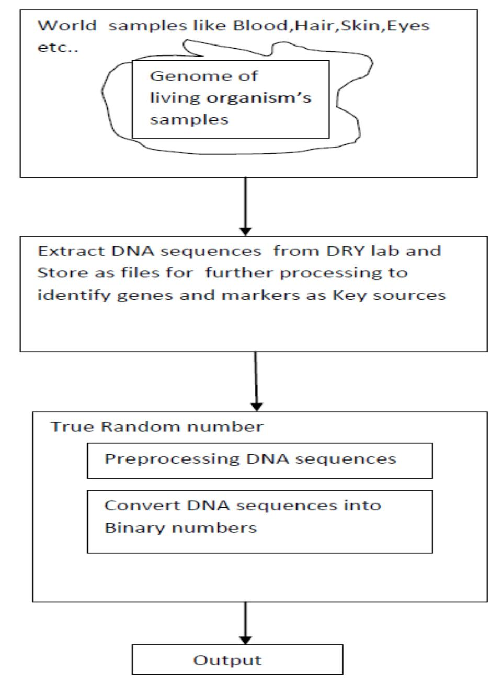

{0}------------------------------------------------

# True Random Number Generation Based on DNA molecule Genetic Information (DNA-TRNG)

1Siddaramappa.V, 2Ramesh.K.B

1Research Scholar, Department of Computer Science and Engineering, VTU,Bangalore,India 2Professor, Department of Electronics and Instrument Technology, VTU,Bangalore,India

Abstract - In digital world cryptographic algorithms protect sensitive information from intruder during communication. True random number generation is used for Cryptography algorithms as key value encryption and decryption process. To develop unbreakable algorithms key as one important parameter for Cryptography .We based proposed **DNA** True random number generation.DNA is deoxyribonucleic acid chemical molecule present in all living cells. DNA molecule consists of 4 nucleotides A-adenine, T-Thymine, G-Guanine and C-Cytosine. DNA molecules have uniqueness properties like Each person in the world distinguish based on DNA sequences and genes. The proposed algorithm pass NIST SP 800-22 test suite for DNA based true random number generation with highest Entropy,FFT,Block Frequency and Linear Complexity.

## Keywords: DNA-TRNG, Gene-TRNG, PRNG-D-TRNG, Gene Randomness

#### I. Introduction

DNA is a molecule of carries genetic information from one living cells into another cells. It is chemical molecule have definite structures in a particular organisms. DNA is deoxyribonucleic acid. In 1953, J.D. Watson (an American biologist) and F.H.C. Crick (a British Physicist) proposed the three-dimensional model of physiological DNA (i. e B-DNA) on the basis of X-ray diffraction data of DNA obtained by Franklin and Wilkins. For this epoch-making discovery, Watson, Crick and Wilkins got Nobel Prize in medicine in 1962 [1]. In living cells production of proteins from DNA molecules very complex problems , because it involves

different components while production of proteins plays very important role in living cells. The DNA is located in the core or nucleus of cell of humans being double stranded spiral model of double helix model. Each strand made up of millions of chemical bases like adenine, thymine, cytosine and guanine. The order of bases are combinations and permutations in each strand. There are 23 chromosomes present in human genome. A gene consists of coding sequences exons and non coding sequence intons to involved in Transcription and Translation process . Transcription is a process to produce mRNA from DNA template while Translation produces proteins from mrna. Genes are basic units of DNA which acts as molecules to produce molecules called Proteins. The human genome project has estimated between 20,000 to 25 000 genes in human beings.Random numbers are useful for a variety of purposes, such as generating data encryption keys, simulating and modeling complex phenomena and for selecting random samples from larger data sets. a random number is one that is drawn from a set of possible values, each of which is equally probable, i.e., a uniform distribution. When discussing a sequence of random numbers, each number drawn must be statistically independent of the others. There are two main approaches to generating random numbers using a computer: Pseudo-Random Number Generators (PRNGs) and True Random Number Generators (TRNGs)[2]. PRNGs are algorithms that use mathematical formulae or simply precalculated tables to produce sequences of numbers that appear random. PRNGs are typically also periodic, which means that the sequence will eventually repeat itself.PRNGs are not suitable for applications where it is important that the numbers are really unpredictable, such as data encryption and

{1}------------------------------------------------

gambling. True Random Number Generators (TRNGs) extract randomness from physical phenomena and introduce it into a computer. A suitable physical phenomenon is atmospheric noise, which is quite easy to pick up with a normal radio.

The National Institute of Standards and Technology(NIST) SP 800-22 Test suite for testing randomness properties of numbers and number generation is tested[6].

The key contribution in this research paper are as follows

- 1) We introduce DNA sequence based TRNG .The human DNA contains information in terms of nucleotides A-adenine,G-guanine,T-thymine and Ccytosine like digital world 0s and 1s.
- 2) Each living cells in the world have uniqueness properties ,so that in this paper we have consider human DNA sequence to generate true random numbers
- 3) Existing methods have problems with extra device or circuit ,In proposed method after DNA sequence obtained we can generate true random number generation without hardware related circuit
- 4) The Proposed method pass the NIST SP 800-22 test for true random number generation
- 5) Next feature DNA samples of human being consider for true random number generation based on his genes to cryptographic applications to protect from attacker.

#### **II. RELATED WORK**

Cryptography is art of writing how to secure information from unauthorized person. Basic knowledge of information processing during communication between two entities. More generally, it is about a set of rules for construction and analyzing correct behavior in the presence of adversaries.

which are related to various appearance of information security such as data confidentiality, data integrity and authentication. Modem cryptography intersects the disciplines of mathematics, computer science and electrical engineering. The use of cryptography include ATM cards, computer user name and passwords, electronic e-commerce.There are two types of random number generation methods one is using software based on small initial value and another is based on hardware related like natural sources, analog and digital circuits in different operational modes. The generated numbers form software or algorithm based are called pseudo random number (PRNG), which has excellent statistical property [3].PRNG has excellent in efficiency, deterministic but periodic [4] so that impossible to generate complete random numbers. These PRNG are are LFSR (Linear Feedback Shift Register), LCG (Linear Congruential Generator), multiplication system, and so on [5][7].

The generation of random numbers from software have facing problems from attackers, attacker use same software setup or resources to get hack the information based on random number generation in the same environment this means same key generated. To overcome this Hardware based random number generation based on unpredictable physical phenomena has been proposed to solve the drawbacks of the software methods[8][9][10] .The extra device needed to implement and stores random numbers. The device faces problems of random numbers contains noise during processing of generation of random numbers. Table1 briefly explains how different methods of generation of random number generation.Based on probability like dice and coin but man resources needed to note down the results[4].

{2}------------------------------------------------

Table1: Methods of generation of Random Number generation

| Category       | Generation          | Description                    |  |  |
|----------------|---------------------|--------------------------------|--|--|
|                | Methods             |                                |  |  |
| Classical      | Throwing coin,      | Based on                    |  |  |
| method         | a dice              | number of time           |  |  |
|                |                     | tossed and                  |  |  |
|                |                     | occurrence                     |  |  |
| White noise | Thermal noise    | Noise                          |  |  |
| method         | ,shot noise         | occurrence in               |  |  |
|                |                     | environment. Based             |  |  |
|                |                     | on semiconductor            |  |  |
|                |                     | material and                |  |  |
|                |                     | operation based                |  |  |
| Jitter         | Jitter and clock    | Oscillator                     |  |  |
| oscillator     |                     | functionality based         |  |  |
| method         |                     | on clock                       |  |  |
| Unstable       | Connecting and      | State of digital               |  |  |
| state method   | disconnecting       | circuit and                 |  |  |
|                | inverter input and  | switching from              |  |  |
|                | output              | metastable to               |  |  |
|                |                     | bitstable state in a        |  |  |
|                |                     | circuit                        |  |  |
| Chaotic        | Non linear       | Generation of               |  |  |
| signal method  | shape of natural | sampling values             |  |  |
|                | world               | from chaotic signal circuit |  |  |

Every circuit does not work with 100% efficient power utilization some circuits losses power in terms heat ,light and noise also present in power[11][12][13][14].

Jittered oscillator method utilizes the instability of the oscillator to generate random number [15]. The signal output from oscillator with noise generator is called Jitter.

Output of digital circuit has two states either 0 or 1 but internally it contains neither metastable state not 1 nor 0. So that noise present in between 1 or 0 consider for generation random numbers [16][17][18].

The actual chaotic system has noise consider as random number generation from it. The noise in chaotic signal system have good non linear characteristics in nature but generated random number have limited to specific ranges[19][20][21].

Some of techniques of number of key generation from functional biometric and voice based presented in a review existing environment [22]

Zhang et al [25] proposed the encryption algorithm proposed based on DNA sequences addition operation.The results and security analysis show that the algorithm can demonstrate good encryption effect, and also can resist exhaustive attack, statistical attack and differential attack.

Al-Wattar et al proposed DNA based MixColumna and ShiftRows transformation to implement AES algorithm to resistance against attacks [23][24]analyzed the different approach of DNA cryptography based on matrix manipulation and secure key generation scheme.

The cryptography key generation from ECG features proposed based on low latency. Inter Pulse Interval (IPI) feature of an ECG signal and points of interest as parameters of ECG consider to generate cryptography key[26]. But ECG features have disadvantages depends on human being normal and abnormal conditions. The true random number generation from visible spectrum for secure communication in 5G network proposed and evaluated entropy of stream of bit numbers [27].

A Cryptosystem is the list of possible plaintexts, cipher texts, keys, and the encryption and decryption algorithms are part of cryptosystems to each key. Keys are play major role, as a 

{3}------------------------------------------------

convert plain text to ciphers with specific order knowledge of the generation of cipher therefore to protect message from third party.

Network security issues are solved through the use of cryptography, a science based on abstract mathematical algebra. Our goal is to give enough information about cryptography to make network security understandable using DNA technology. There are two cryptography algorithms based on keys: symmetric key also called secret key and asymmetric also called public key cryptography algorithms. The cryptography key generation from ECG features proposed based on low latency. Inter Pulse Interval (IPI) feature of an ECG signal and points of interest as parameters of ECG consider to generate cryptography key[26]. But ECG features have disadvantages depends on human being normal and abnormal conditions. The true random number generation from visible spectrum for secure communication in 5G network proposed and evaluated entropy of stream of bit numbers [27].

> **III. PROPOSED TRUE RANDOM NUMBER GENERATION BASED ON DNA SEQUENCES**

There are various random number generation methods available ,there is a problem generators uses limited and insufficient data sources because hardware issues are exists .So that We propose DNA sequence as source of generating true random number generation techniques. Each living cells in the earth contains small to large DNA sequences consists of A,T,G and C nucleotides. A means Adenine , T means Thymine, G means Guanine and C means Cytosine like computer understand 0 and 1 ,Human being complete made up of these four nucleotides inside cells to perform a particular task. Human beings contains 3 billion base sequences and 26000 genes. A gene is sequence of Exons and Introns to perform a task. Example XX chromosomes represents Female genes while XY chromosomes represents Male.

Let us consider function f (x):{A,T,G,C} ------(1)

Function f contains a sequences of DNA nucleotides (A,T,G and C) .From table1 convert function into binary representation any one combinations out of 8 columns from table2.

Table 2. Combination of DNA mapping into binary values

| DNA | 1  | 2  | 3  | 4  | 5  | 6  | 7  | 8  |
|-----|----|----|----|----|----|----|----|----|
| A   | 00 | 00 | 01 | 01 | 10 | 10 | 11 | 11 |
| T   | 11 | 11 | 10 | 10 | 01 | 01 | 00 | 00 |
| G   | 01 | 10 | 00 | 11 | 00 | 11 | 01 | 10 |
| C   | 10 | 01 | 11 | 00 | 11 | 00 | 10 | 01 |

Examlple: f(x): AGCTATGC

F(x) in binary: 00 01 10 11 00 11 01 10

We have selected human genome as source of true random number generation . From fig1 clearly shows sampling taken from Blood ,skin and eyes gene sequences for analysis or a portion of genes from human genome. Initially we extract DNA sequences from high throughtput methods for PCR(Polymerase chain reaction ) and A Southern blot is a method used in [molecular biology](https://en.wikipedia.org/wiki/Molecular_biology) for detection of a specific [DNA sequence](https://en.wikipedia.org/wiki/DNA_sequence) in DNA samples. After DNA sequence processed in wet lab and store the DNA sequence as source for generating true random number based genes or markers of samples. Finally convert DNA sequences into binary representation to generate true random number generation.

{4}------------------------------------------------

 Figure1: True random number generation using Human Genome

### **IV. EXPERIMENT RESLTS AND DISCUSSION**

The Human genome contains 3 billion base pairs and 26000 genes. In human beings we filter DNA sequences based on GC percentage 45-65% and genes .We selected brain tissue sample contains Homo sapiens mRNA for ATPase, Cu++ transporting, alpha polypeptide variant protein gene(NCBI Reference number: AB208828.1) which contains 5296 base pairs. This gene contains 1583 A, 970 C, 1067 Gand 1676 T nucleotides converted into binary numbers from table1 and evaluated NIST standard for True random number generation methods. The complete 3 billion base pairs are divided into 100 sequence length because in human genome dna sequence length 100 is uniqueness compare to another person in the world.

Table3: NIST Test suite for 100 sequence length and number of reads is 10 of Gene 10592 bases

| NIST Test Parameters   | proportion |
|------------------------|------------|
| Frequency              | 10/10      |
| BlockFrequency         | 10/10      |
| CumulativeSums         | 10/10      |
| Runs                   | 10/10      |
| FFT                    | 9/10       |
| NonOverlappingTemplate | 9/10       |
| OverlappingTemplate    | 10/10      |
| ApproximateEntropy     | 10/10      |
| Serial                 | 10/10      |
| LinearComplexity       | 10/10      |

Table4: NIST Test suite for 100 sequence length and number of reads is 9 of Gene 10592 bases

| NIST Test Parameters   | proportion |
|------------------------|------------|
| Frequency              | 9/9        |
| BlockFrequency         | 9/9        |
| CumulativeSums         | 9/9        |
| Runs                   | 9/9        |
| FFT                    | 8/9        |
| NonOverlappingTemplate | 8/9        |
| OverlappingTemplate    | 9/9        |
| ApproximateEntropy     | 9/9        |
| Serial                 | 8/9        |
| LinearComplexity       | 9/9        |

{5}------------------------------------------------

Table5: NIST Test suite for 100 sequence length and number of reads is 8 of Gene 10592 bases

| NIST Test Parameters   | proportion |
|------------------------|------------|
|                        |            |
| Frequency              | 8/8        |
| BlockFrequency         | 8/8        |
| CumulativeSums         | 8/8        |
| Runs                   | 8/8        |
| FFT                    | 7/8        |
| NonOverlappingTemplate | 7/8        |
| OverlappingTemplate    | 8/8        |
| ApproximateEntropy     | 8/8        |
| Serial                 | 7/8        |
| LinearComplexity       | 8/8        |

From the above Table3,Table4 and Table5 ,the NIST SP 800- 22 Test for true random number generation for cryptographic applications is pass and DNA cryptographic keys contains highest Entropy ,Frequency BlockFrequency,FFT and Linear complexity . From these results DNA based true random number generation best for cryptographic applications without any hardware

#### **V. CONCLUSION**

True random number generation methods based on DNA sequences have good properties of randomness ,these numbers are generated based on living cells of DNA nucleotides. Each person in the world identified by DNA samples to distinguish from another person. The NIST SP 800-22 Test pass for DNA based true random number generation for cryptographic applications. The proposed method contains DNA samples as source for true random numbers generation without hardware circuit in the design.

#### REFERENCES

- [1] J. D. Watson and F. H. C. Crick, Nature, 1953, **171**, 737.
- [2] https://www.random.org/randomness/
- [3] NIST. Recommendation for the Entropy Sources Used for Random Bit Generation. [Online]. Available: https://csrc.nist.gov/csrc/media/publications/sp/800-
- 90b/draft/documents/sp800-90b\_second\_draft.pdf
- [4] D. W. Davies and W. L. Price, Security for Computer Networks: An Introduction to Data Security in Teleprocessing and Electronic Funds Transfer.Hoboken, NJ, USA: Wiley, 1989.
- [5] B. Jansson, Random Number Generators. Stockholm, Sweden: Almqvist & Wiksell, 1966.
- [6]https://csrc.nist.gov/projects/random-bitgeneration/documentation-and-software.
- [7]M. Blum and S. Micali, ``How to generate cryptographically strong sequences of pseudo-random bits,'' SIAM J. Comput., vol. 13, no. 4, pp. 850\_864, 1984.
- [8] G. B. Agnew, ``Random sources for cryptographic systems,'' in Proc. Workshop Theory Appl. Cryptograph. Techn., 1987, pp. 77\_81.
- [9] D. Davis, R. Ihaka, and P. Fenstermacher, ``Cryptographic randomness from air turbulence in disk drives,'' in Proc. Adv. Cryptol., 1994, vol. 94. pp. 120\_144.
- [10] M. Jakobsson, E. Shriver, B. K. Hillyer, and A. Juels, ``A practical secure physical random bit generator,'' in Proc. ACM Conf. Comput. Commun. Security, 1998, pp. 103\_111.
- [11] B. Jun and P. Kocher, ``The intel random number generator,'' Cryptography Res., San Francisco, CA, USA, White Paper, 1999.
- [12] C. S. Petrie and J. A. Connelly, ``A noise-based IC random number generator for applications in cryptography,'' IEEE Trans. Circuits Syst. I, Fundam. Theory Appl., vol. 47, no. 5, pp. 615\_621, May 2000.
- [13] M. Bucci, L. Germani, R. Luzzi, A. Tri\_letti, and M. Varanonuovo, ``A high-speed oscillator-based truly random number source for cryptographic applications on a smart card

{6}------------------------------------------------

- IC,'' IEEE Trans. Comput., vol. 52, no. 4, pp. 403\_409, Apr. 2003.
- [14] V. Bagini and M. Bucci, ``A design of reliable true random number generator for cryptographic applications,'' in Proc. Conf. Cryptograph. Hardw.Embedded Syst., 1999, p. 728.
- [15] M. Dichtl and N. Janssen, ``A high quality physical random number generator,'' in Proc. Sophia Antipolis Forum Microelectron., 2000, pp. 48\_53.
- [16] I. Vasyltsov, E. Hambardzumyan, Y.-S. Kim, and B. Karpinskyy, Fast Digital TRNG Based on Metastable Ring Oscillator (Lecture Notes in Computer Science). Berlin, Germany: Springer, 2008, pp. 164\_180.
- [17] V. B. Suresh and W. P. Burleson, ``Entropy extraction in metastabilitybased TRNG,'' In Proc. IEEE Int. Symp. Hardw.- Oriented Security Trust, Jun. 2010, pp. 135\_140.
- [18] J. Qu and M. O'Neill, ``Ultra-lightweight true random number generators,'' Electron. Lett., vol. 46, no. 14, pp. 988\_990, Jul. 2010.
- [19] S. Callegari, R. Rovatti, and G. Setti, ``Embeddable ADC-based true random number generator for cryptographic applications exploiting nonlinear signal processing and chaos,'' IEEE Trans. Signal Process., vol. 53, no. 2, pp. 793\_805, Feb. 2005.
- [20] T. Stojanovski and L. Kocarev, ``Chaos-based random number generators\_Part I: Analysis [cryptography],'' IEEE Trans. Circuits Syst. I, Fundam. Theory Appl., vol. 48, no. 3, pp. 288\_291, 2001.
- [21] S. Ergun and S. Ozog, ``Truly random number generators based on a nonautonomous
- chaotic oscillator,'' J. Int. J. Electron. Commun., vol. 61, no. 4, pp. 235\_242, 2007.
- [22] S. M. Hussain and H. Al-Bahadili. A password-based key derivation algorithm using the KBRP method. American Journal of Applied Sciences, Vol. 5, No. 7, pp. 777-782, 2008.
- [23] A. H. Al-Wattar, R. Mahmod, Z. A. Zukarnain, and N.Udzir. A new DNA based approach of generating key

- dependent MixColumns transformation. International Journal of Computer Networks & Communications (IJCNC), Vol. 7, No. 2, pp. 93-102, March 2015.
- [24] A. Al-Wattar, R. Mahmod, Z. Zukarnain, and N.Udzir, "A new DNA based approach of generating keydependent ShiftRows transformation. International Journal of Network Security and Its Applications (IJNSA), Vol.7, No.1, January 2015.
- [25] Q. Zhang, L. Guo, X. Xue, and X. Wei. An image encryption algorithm based on DNA sequence addition operation. Proceedings of the 4th International conference on Bio-Inspired Computing (BIC-TA '09), pp. 1-5, Beijing, China, 16-19 October 2009.
- [26] Sanaz Rahimi Moosavi ,Ethiopia Nigussie,Marco Levorato Seppo Virtanen and Jouni Isoaho, "Low-Latency Approach for Secure ECG Feature Based Cryptographic Key Generation",IEEE Access, Volume 6, 2018 .
- [27] Kyungroul Lee,Sun-Young Lee, Changho Seo, and Kangbin Yim, " TRNG (True Random Number Generator) Method Using Visible Spectrum for Secure Communication on 5G Network ", IEEE Access, Volume 6, 2018 .