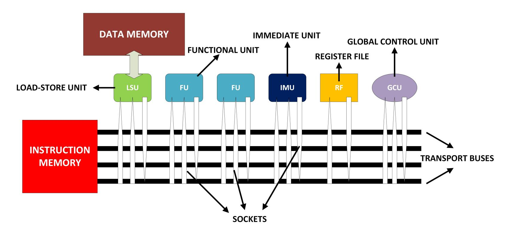
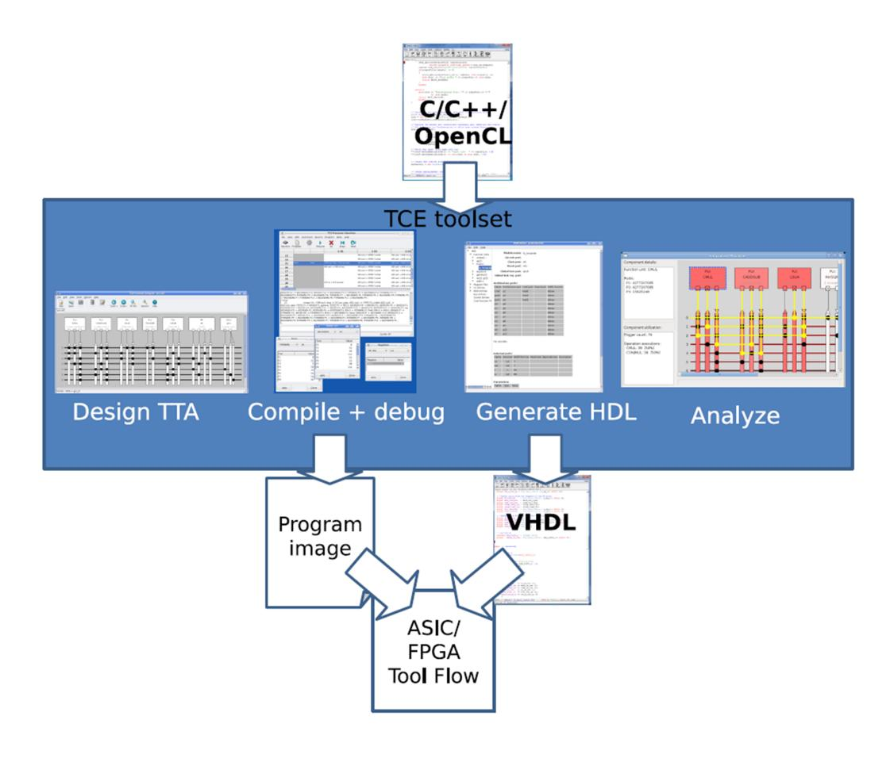
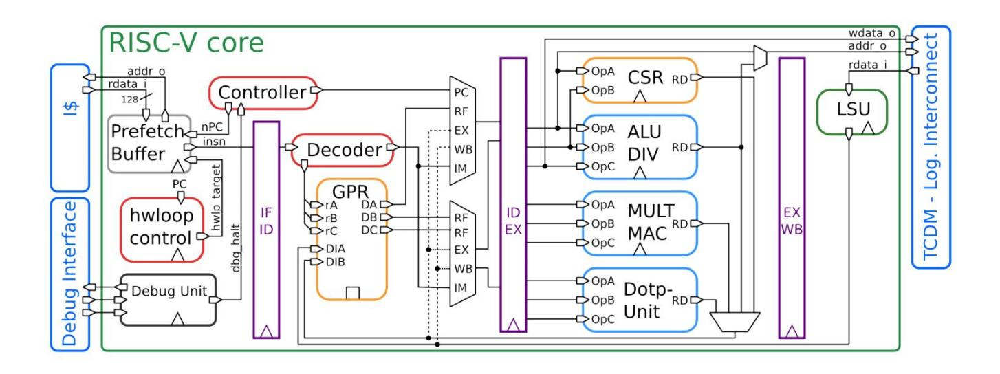
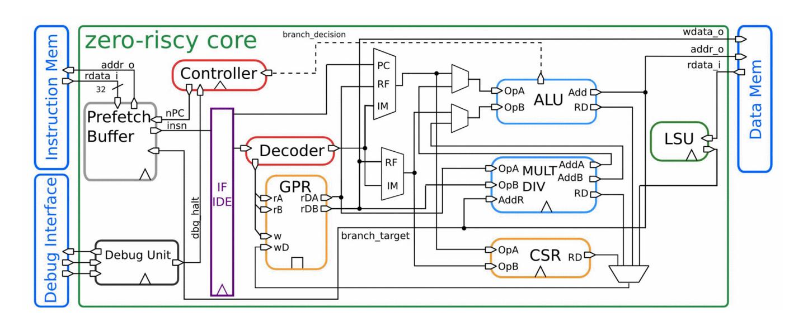
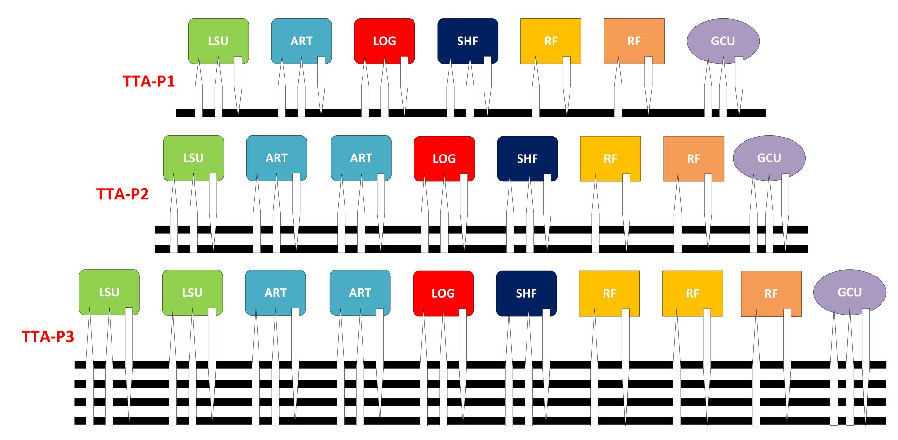
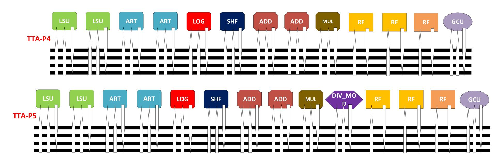
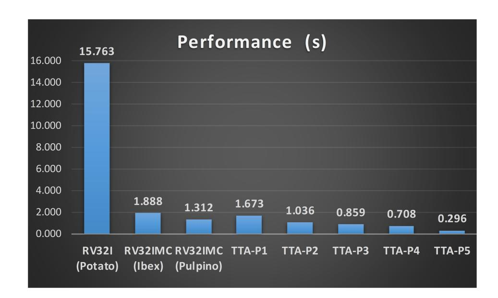
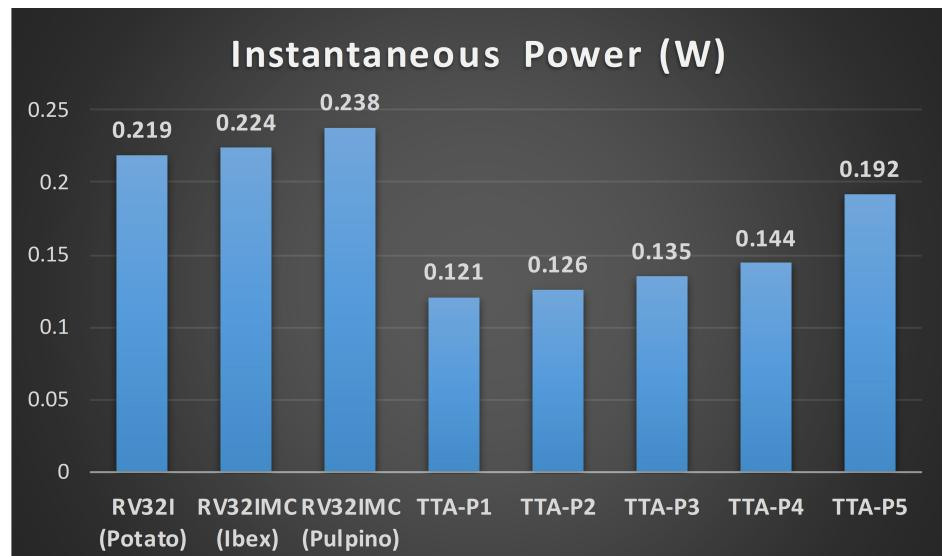
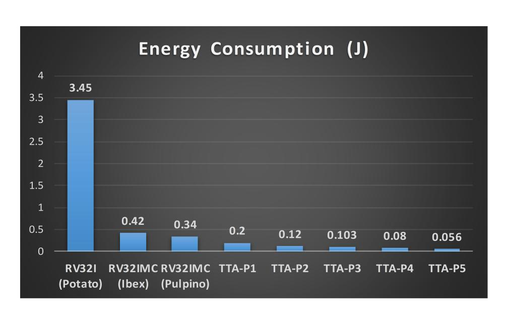
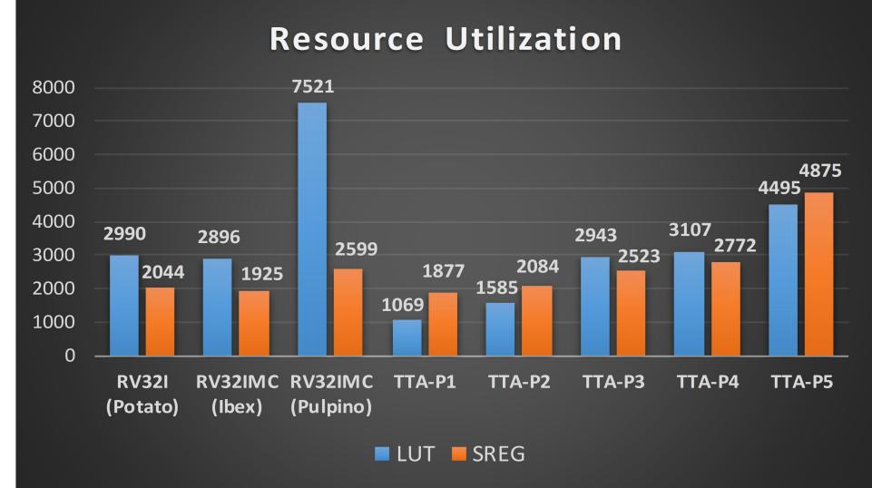

{0}------------------------------------------------

# Comparison of RISC-V and transport triggered architectures for a post-quantum cryptography application

## Latif AKC¸ AY, Berna ORS ¨

Department of Electronics and Communication Engineering, Faculty of Electrical and Electronics Engineering, Istanbul Technical University, Istanbul, Turkey, ORCID iD: https://orcid.org/0000-0003-2580-2643, https://orcid.org/0000-0003-0851-8501

 Abstract: Cryptography is one of the basic phenomena of security systems. However, some of the widely used public- key cryptography algorithms can be broken by using quantum computers. Therefore, many post-quantum cryptography algorithms are proposed in recent years to handle this issue. NTRU is one of the most important of these quantum-safe algorithms. Besides the importance of cryptography algorithms, the architecture where they are implemented is also essential. In this study, we developed an NTRU public key cryptosystem application and designed several processors to compare them in many aspects. We address two different architectures in this work. The RISC-V is chosen as it is the most lately version of classical RISC architecture. As competitor to this, we preferred transport triggered architecture (TTA) which offers high level customization and scalability. Details of all different implementations and the test results obtained with them are shared and discussed.

Key words: Lattice-based cryptography, secure communication, application specific processor design, open source

### 1. Introduction

 The importance of cryptography is especially increasing in recent years due to the need for information security. Today, cryptography is widely used in many areas such as secure communication, data privacy or secure authentication [\[1\]](#page-10-0). Public key cryptography algorithms like Rivest–Shami–Adleman (RSA) and Elliptic Curve Cryptography (ECC) are believed to be secure enough for brute-force attacks and mathematical cryptanalysis techniques done by using classical computers [\[2,](#page-10-1) [3\]](#page-10-2). However, researches done on development of quantum computers has open a new field in cryptography which is called post-quantum cryptography [\[4\]](#page-10-3).

 Nth Degree Truncated Polynomial Ring Units (NTRU) is a public key cryptosystem which is not known to be breakable by using quantum computers [\[5\]](#page-10-4). It was proposed in 1996 by three mathematicians: Jeffrey Hoffstein, Joseph H.Silverman, Jill Pipher. Although it is not a new or widely used method, it is becoming more and more important today due to the need for post-quantum cryptography. NTRU features reasonably short and easily created keys, has high speed and requires low memory compared to RSA and ECC [\[5\]](#page-10-4). It was the first public key cryptography algorithm that does not depend on integer factorization or discrete logarithm problems [\[6\]](#page-10-5). In order to be safe against the attacks done by using quantum computers, algorithms such as NTRU are strongly needed.

Application-specific processors (ASIPs) are widely used in almost all areas of embedded electronics,

{1}------------------------------------------------

 because the electronics industry needs low power consuming products which utilize small area or run at high speed. More importantly, two or more of these demands are often desired together.

 RISC-V and TTA are two very different processor architectures [\[7,](#page-10-6) [8\]](#page-10-7). While the RISC-V is the newest example of Reduced Instruction Set Computing (RISC) design concept, TTA is more like Very Long Instruction Word (VLIW) architecture [\[9\]](#page-10-8). On the other hand, both of them can be used for designing ASIPs and provide different kind of advantages. In this work, we developed a NTRU public key cryptosystem application and run it on the processors which have RISC-V and TTA architectures. Then, we analyzed speed, resource utilization, power and energy consumption of them.

 The rest of the paper is organized as follows. We give related work in the second section. In the third section, post-quantum cryptography and mathematical background of NTRU algorithm are explained in detail. RISC-V and TTA processor architectures are summarized in the fourth section. Then, we share details of our processor designs and our NTRU application in the fifth section. Finally, we give experimental results and conclude the paper in the sixth and seventh sections respectively.

#### 2. Related works

 To the best of our knowledge, there is not yet any work on comparison of RISC and TTA architectures for the NTRU algorithm. Further more, there are not many studies about a general comparison of these architectures. A related study on this topic is published by Pekka J¨a¨askel¨ainen et al [\[10\]](#page-10-9). They compared a dual-issue TTA processor with a multi-issue VLIW and a single-issue RISC processors to evaluate the trade-offs between them. Another important work was done by Yi Fan He et al [\[11\]](#page-11-0). They shared power consumption and performance results of TTA and its RISC counterpart for IDCT, FIR and Histogram applications. This study also introduces an improved TTA which aims to reduce its drawbacks.

 There are a few papers on NTRU-specific processor design in literature. An energy efficient implementa- tion for small devices was done by Kaps [\[12\]](#page-11-1). Another low-cost implementation can be found in the work of Ali Can Atıcı et al [\[13\]](#page-11-2). An efficient GPU implementation of NTRU was published by Jens Hermans et al by using the CUDA platform [\[14\]](#page-11-3). There is also an optimized polynomial arithmetic library work done by Wei Dai et al [\[15\]](#page-11-4). It was introduced for accelerating ring operations on NVidia GPUs.

## 3. Post-quantum cyrptography and NTRU

 Decomposition of a composite integer number in to it's factors is called integer factorization problem. If the number is large enough, solution of the problem is computationally inefficient. In fact, this is the phenomenon that enables the creation of today's public key cryptography algorithms such as ECC and RSA. Research on this subject has shown that these algorithms are still quite powerful against classical computers [\[16\]](#page-11-5). However, this is not the case for quantum computers. According to the American mathematician Peter Shor, quantum computers can solve factorization problems faster than the classical computers [\[17\]](#page-11-6). Shor's algorithm shows that a quantum computer works in polynomial time for a given factorization problem while classical computers works in sub-exponential time. This is very threatening for widely used and very popular public key cryptography algorithms such as RSA and ECC [1](#page-1-0) . For this reason, we need to design quantum-safe cryptosystems without being late, as personal and sensitive information which are stored safely today may be deciphered ten years later by a quantum computer!

Tufts University. Computer System Security. [online]. Website http://www.cs.tufts.edu/comp/116/archive/fall2015/zkirsch.pdf [accessed 24 December 2019]

{2}------------------------------------------------

 The National Institute of Standards and Technology (NIST) started a process and called for submissions for design, evaluation and standardization of public key quantum-resistant cryptographic algorithms in 2016 [2](#page-2-0) . In January 2019, NIST has revealed the second round candidates which consist of 26 algorithms. There are lattice-based, hash-based, code-based and multivariate-quadratic-based approaches to the problem [3](#page-2-1) .

#### 3.1. NTRU public key cryptosystem

 NTRU is a lattice-based approach for public key cryptography and mainly uses polynomial addition and multiplication. The power of the algorithm comes from the hardness of the Shortest Vector Problem (SVP) in a lattice [\[18\]](#page-11-7). The SVP is to find the Euclidean length of a non-zero vector in a given lattice. Various versions of the SVP is known to be NP-hard [\[19\]](#page-11-8). Besides, similar problems are defined such as Closest Vector Problem (CVP) and Shortest Independent Vector Problem (SIVP) in lattice mathematics [\[20,](#page-11-9) [21\]](#page-11-10).

 NTRU operations (polynomial addition, multiplication and multiplicative inverse) are done in a polynomial ring R = Z[x]/(x N − 1). Multiplication of two polynomials in this ring refers to the cyclic convolution of them [\[22\]](#page-11-11). Coefficients of the obtained polynomials are reduced using either modulo q or modulo p and some- times are needed to be centerlifted (shifting the coefficients in to a range). In addition, Extended Euclidean Algorithm (EEA) is used to compute polynomial inversion operations [\[23\]](#page-11-12). More detailed information about the mathematics of NTRU can be found in [\[5\]](#page-10-4). Here we just summarized the algorithm itself below.

The NTRU scheme uses three integer numbers (N, p, q) and three ring polynomials (f, g, r) such that;

- N is prime number and determines the maximum degree of ring polynomials,
- p and q are two relatively prime numbers,
- q must be much larger than p (in general p is taken as 3 ),
- f is a secret polynomial in the ring R with coefficients in (−p/2, p/2)
- g is an initially secret polynomial in the ring R with coefficients in (−p/2, p/2)
- r is a random blinding polynomial in the ring R with reduced coefficients modulo p

 NTRU key generation: After choosing f and g polynomials, it must be checked whether the polynomial f has multiplicative inverses, F p and F q , over the ring R such that;

$$f * Fp = 1(\bmod p) \tag{1}$$

$$f * Fq = 1((\bmod q)) \tag{2}$$

 If not, another polynomial f must be selected. The secret keys of the system are determined as f and F q . Public key polynomial h is calculated as follows;

$$h = Fq * g(\bmod q) \tag{3}$$

NIST. Post-Quantum Cryptography. [online] Website https://csrc.nist.gov/Projects/Post-Quantum-Cryptography [accessed 24 December 2019]

PQCRYPTO. Post-Quantum Cryptography. [online] Website https://pqcrypto.org/ [accessed 24 December 2019]

{3}------------------------------------------------

User Alice hides the secret keys but reveals the public key h and parameters N, p, q to everyone.

 NTRU encryption: Let's suppose user Bob wants to send a message m to Alice. He must form the message m in a ring polynomial with coefficients in (−p/2, p/2). Then, he must use Alice's public key and compute the encrypted message as follows;

$$e = r * h + m(\bmod q) \tag{4}$$

where the obtained encrypted message e is again a polynomial in the ring R.

NTRU decryption: Alice decrypts the incoming message e to the original message m as follows;

$$a = f * e(\bmod q) \tag{5}$$

Then, Allice needs to centerlift the coefficients of a in to (−q/2, q/2).

$$d = Fp * a(\bmod p) \tag{6}$$

Finally, Allice needs to centerlift the coefficients of d in to (−p/2, p/2) which retrieves m;

$$m = d (7)$$

 According to literature, NTRU has many advantages over RSA and ECC [\[5\]](#page-10-4). Faster key generation (especially for larger key sizes), faster encryption-decryption operations and also low memory usage make NTRU a very appropriate candidate for quantum-age public key cryptography applications.

## 4. Preferred architectures for comparison

 Two different processor architectures are selected and examined for this work; RISC-V and TTA [\[7,](#page-10-6) [8\]](#page-10-7). There are a few reasons for this choice. First of all, both RISC-V and TTA architectures are open source and royalty free. The second reason is that the both of the architectures can be easily implemented on an FPGA. In addition, the processors which have RISC and TTA architectures are customizable at different levels, usually occupy smaller area and consume less power. We briefly introduce both of them below.

#### 4.1. RISC-V

 RISC-V is a new instruction set architecture (ISA) that was originally designed to support computer architecture research and education, but it is also expected to become a standard, free and open architecture for industrial implementations [\[7\]](#page-10-6).

 The RISC-V ISA is available in 32, 64 and 128 bit versions. It includes a small base integer ISA and optional standard extensions. Besides, it can be extended by other designers. But, base and standard extensions were frozen by the RISC-V designers to provide the RISC-V compatibility. As a design philosophy, the ISA avoids particular microarchitectural or implementation technology-dependent features. In addition, it comes with a free BSD open source license that does not require patent to implement a RISC-V processor.

 RISC-V project is maintained by RISC-V Foundation in University of Berkeley, California. The project has attracted a great deal of attention all over the world. Thus, it is now called "Linux of the hardware world". Therefore, the RISC-V ISA is much more prominent than the other alternative open source RISC architectures

{4}------------------------------------------------

- like OpenRISC 1000 [\[24\]](#page-11-13). More information about the RISC-V ISA and its implementations can be found in
- official web page [4](#page-4-0) .

## 4.2. Transport triggered architecture

- TTA is a highly customizable processor design approach in which the moving instructions on transport busses
- trigger the functional units (FUs). In this respect, TTA has a similar methodology with the VLIW processors.
- However, there are some differences between these two [\[25\]](#page-11-14). In the VLIW architecure, the FUs are always
- connected to a multi-port register file (RF) but in TTA there are multiple register files and they are connected
- to the interconnection network, not directly to the FUs. Therefore, in TTA processors, result of an operation
- can directly be moved to another FUs instead of RF. This difference provides extensive register bypassing and
- reduces data path complexity. A simple TTA processor structure is shown in Figure [1.](#page-4-1)

Figure 1. General structure of a TTA processor.

 There may be different number of transport buses in a TTA processor. Each bus can be connected to the FUs, RFs, Immediate Units (IMUs) or Global Control Units (GCUs) as shown in Figure [1.](#page-4-1) The architecture is very appropriate for instruction level parallelism (ILP). So, TTA processors can accelerate many applications significantly. In addition to ILP, one can design custom FUs for a specific application and integrate it to the processor. Custom FU design ability makes TTA a very good alternative for ASIP design and development.

## 4.3. TTA-based co-design environment

 TTA-based Co-design Environment (TCE) is an open source tool set for designing TTA processors developed by Tampere University. By using TCE, one can create a TTA processor, compile a program for this processor, simulate a code, analyze the performance and generate HDL implementation of the design [\[26\]](#page-11-15). Additionally, there are many useful tools with well-designed graphical user interfaces (GUIs).

 TCE takes C, C++ and OpenCL source codes as input. Also, the tools need an architecture definition file (.adf) which contains the design definitions of the template processor. LLVM compiler is used for compiling

RISC-V Foundation. [online] Website https://riscv.org/ [accessed 24 December 2019]

{5}------------------------------------------------

- and generating architecture-specific machine codes. A simplified overview of the TCE is shown in Figure [2.](#page-5-0)
- Detailed information about the tool set can be obtained from the official document [\[26\]](#page-11-15).

Figure 2. Overview of TTA co-design environment [\[26\]](#page-11-15).

## 5. The NTRU application and prepared processors

- The data memory required by the NTRU codes available in the literature is too large for the RISC processors
- used in this study. So, we developed a light-weight C application which realize key generation, encryption
- and decryption phases of NTRU public key cryptosystem. At the end of the decryption phase, plain text and
- decrypted messages are compared to ensure that the application works correctly. The application is compiled
- and debugged with both RISC-V and TCE toolchains. It is portable to any system, as we only used the standard
- C libraries.

 Eight different processor designs have been prepared for NTRU application. Five different TTA processors have been designed for comparison with the selected three different RISC-V processors.

## 5.1. Selected RISC-V processors

 The RISC-V ISA is defined as a base integer ISA, which must be present in any implementation, plus optional extensions to the base ISA [\[7\]](#page-10-6). Firstly, we have selected a very simple RISC-V processor which implements a classical five-stage pipeline. Potato is an open source processor written in VHDL [5](#page-5-1) . The processor supports 32-bit RISC-V base instruction set (RV32I).

 PULPino is also an open source, configurable, single-core, 32-bit microcontroller system designed by ETH Zurich and University of Bologna [\[27\]](#page-11-16). Riscy version of the core includes four-stage pipeline and has fully support for RISC-V base, compressed and multiplication instruction sets (RV32IMC). Overall structure of Riscy core is shown in Figure [3.](#page-6-0)

The Potato Project. Processor Datasheet.[online] Website https://github.com/skordal/potato/blob/master/docs/, [accessed 24 December2019]

{6}------------------------------------------------

Figure 3. Overview of Riscy core [\[27\]](#page-11-16).

 Ibex is a small and efficient, 32-bit, in-order RISC-V core with a two-stage pipeline that implements the RV32IMC instruction sets. It is based on a simpler version of Riscy core which is called Zero-riscy [\[28\]](#page-11-17). Ibex is an area optimized processor and aimed to achieve low power consumption. The project is further developed by lowRISC, which is a non-profit company [6](#page-6-1) . The block design of the core is demonstrated in Figure [4.](#page-6-2)

 Although there are more advanced RISC-V candidates in the literature, we chose these three processors because of small area and low power features. For a fair comparison with TTA designs, peripherals such as UART, GPIO, timer and instruction cache are removed from the RISC processors.

Figure 4. Overview of Zero-riscy core [\[28\]](#page-11-17).

#### 5.2. Designed transport triggered architecture processors

 We used TCE for designing the TTA processors. First of all, the processor TTA-P1 is designed using Processor Designer (ProDe) of the toolset. As seen in Table 1, TTA-P1 includes one bus, one arithmetic unit (ART), one logic unit (LOG), one shift unit (SHF), which are all some kind of FUs. Additionally, we integrated one 40 x 32-bit and one 2 x 1-bit register files. Global control unit (GCU) and load-store unit (LSU) must be used for data memory connection and general functionality of the system. The detailed structure of the TTA- P1 processor is shown in Figure [5.](#page-7-0) After the design is complete, the NTRU application is compiled for this architecture. Then, the TCE simulator (proxim) is used for analyzing total number of cycles (NoC), mostly used FUs and RF occupation statistics. Other TTA processors are designed according to the results obtained

 lowRISC. Ibex User Manual. [online] Website https://ibex-core.readthedocs.io/en/latest/ [accessed 24 December 2019]

{7}------------------------------------------------

- from these analyzes. The block design of TTA-P1, TTA-P2 and TTA-P3 processors are demonstrated in Figure
- [5.](#page-7-0) Similarly, configurations of the processors TTA-P4 and TTA-P5 are shown in Figure [6](#page-8-0) respectively. As
- shown in Table [1,](#page-8-1) additional FUs like MUL (multiplication), ADD (addition), DIV-MOD (division and modulo
- operation) are connected to the processors to improve performance. Besides, more transport buses, LSUs and
- RFs are also added to the designs.

Figure 5. Configuration of TTA-P1, TTA-P2 and TTA-P3 processors

 The ART unit includes simple arithmetic operations which are addition, subtraction, equality check and greatness comparison. The SHF unit is responsible from the shifting operations to right or to left. Basic logical operations AND, OR and XOR are done by the LOG unit. The GCU manages jump and call operations of a running program while the LSU load or store data in varying lengths from 8-bit to 32-bit. The TCE makes it possible to modify the operations contained in these blocks or to add completely new units. However, all units are designed to have exactly the same configuration on the processors in our study.

 Instruction width (IW) of the proposed designs can be seen in the rightmost column of Table [1.](#page-8-1) VHDL implementations of the processors were generated by using the Processor Generator (ProGe) tool. We made synthesis and simulation of all designs for the same FPGA (xc7a100t-1) by using Xilinx Vivado [\[29,](#page-11-18) [30\]](#page-11-19). Estimation of power and energy analyzes were performed with Vivado Power Analyzer by generating post- synthesis simulation activity file (SAIF). We have evaluated NoC values as a performance indicator. Resource utilization results are given in terms of number of look-up tables (LUT) and registers (SREG) used in the designs. Also, instantaneous power values and total energy consumption values are given in Watt and Joule units. We obtained the results for all RISC-V and TTA processors. All integrated FUs and other architectural units included in designs can be found in Table [1.](#page-8-1) Also, we share experimental test results for NTRU application running on the processors in Table [2.](#page-8-2)

#### 6. Result and discussion

 Comparison of instantaneous power consumption and performance, in terms of run time of the application, can be seen in Figure [7.](#page-9-0) Likewise, the overall energy consumption and resource utilization values for all

{8}------------------------------------------------

Figure 6. Configuration of TTA-P4 and TTA-P5 processors

Table 1. Architectural details of compared RISC-V and TTA processors

| Processor | Bus | Function Units                                         |   | RF         | IW  |
|-----------|-----|--------------------------------------------------------|---|------------|-----|
| RV32I     | 1   | Base Instructions, 5-stage                             |   | 1          | 32  |
| RV32IMC   | 1   | Base, Multiplication, Compressed Instructions, 2-stage | 1 | 1          | 32  |
| RV32IMC   | 1   | Base, Multiplication, Compressed Instructions, 4-stage | 1 | 1          | 32  |
| TTA-P1    | 1   | 1xART, 1xLOG, 1xSHF                                    | 1 | 1xRF, 1xBL | 43  |
| TTA-P2    | 2   | 2xART, 1xLOG, 1xSHF                                    | 1 | 1xRF, 1xBL | 86  |
| TTA-P3    | 4   | 2xART, 1xLOG, 1xSHF                                    | 2 | 2xRF, 1xBL | 176 |
| TTA-P4    | 4   | 4xART, 1xLOG, 2xSHF, 1xMUL, 2xADD                      | 2 | 2xRF, 1xBL | 176 |
| TTA-P5    | 4   | 4xART, 1xLOG, 2xSHF, 1xMUL, 2xADD, 1xDIV-MOD           | 2 | 2xRF, 1xBL | 176 |

- 1 eight processors are indicated in Figure [8.](#page-9-1) Although it includes five-stage pipeline, it is obvious that the
- 2 RV32I processor exhibits the worst results on performance and energy. It can be seen that these values are
- 3 improved considerably with the addition of the multiplication and compressed instruction sets on RV32IMC
- 4 processors. However, the integration of these instructions increases the resource utilization values reasonably.
- 5 TTA processors offered better results in terms of instantaneous power and resource utilization when compared
- 6 to RISC-V processors. The overall energy consumption results are particularly striking. In this sense, TTA
- 7 processors are undoubtedly more advantageous. Resource utilization of TTA processors increases as the number
- 8 of parallel buses and functional units increase. But, we think that this is acceptable as performance level
- 9 improves significantly and energy consumption decreases. All of these results approve that TTA may be a serious
- 10 option to design application specific processors for NTRU based systems. It also appears that TTA processors
- 11 may be a particularly good choice for all Lattice-based cryptography applications. However, this should not be

Table 2. Experimental results of NTRU application on RISC-V and TTA processors

| Processor | Frequency (MHz) | NoC       | Area (LUT, SREG) | Power (W) | Energy (J) |
|-----------|-----------------|-----------|------------------|-----------|------------|
| RV32I     | 50              | 788173585 | 2990, 2044       | 0.219     | 3,452      |
| RV32IMC   | 50              | 94398939  | 2896, 1925       | 0.224     | 0.422      |
| RV32IMC   | 40              | 52489786  | 7521, 2599       | 0.238     | 0.312      |
| TTA-P1    | 125             | 209124976 | 1069, 1877       | 0.120     | 0,200      |
| TTA-P2    | 117             | 121912681 | 1585, 2084       | 0.126     | 0.124      |
| TTA-P3    | 100             | 85925831  | 2943, 2523       | 0.135     | 0.103      |
| TTA-P4    | 100             | 70823327  | 3107, 2772       | 0.144     | 0.085      |
| TTA-P5    | 90              | 26690829  | 4495, 4875       | 0.192     | 0.056      |

{9}------------------------------------------------

Figure 7. Comparison of performance and instantaneous power consumption

Figure 8. Comparison of energy consumption and resource utilization

 perceived as a conclusive result. Because both architectures offer quite a number of customization facilities. For instance, RISC-V processors can be designed to deliver higher performance with standard and non-standard instruction set extensions. In addition, more stages of pipeline or out-of-order design methodologies can be implemented. Of course, all of these techniques may lead to increase the required chip area and instantaneous power. Nevertheless, the energy consumption is expected to be less.

 As stated in the previous paragraph, performance increases rapidly as the number of parallel buses increases for TTA processors. This can be considered as a natural result of instruction-level parallelism. In the case of our NTRU application, we have experienced that the performance does not change much even if the number of buses is more than four for TTA-P3, TTA-P4 and TTA-P5 processors. Similarly, as seen in RISC-V processors, another important factor affecting the performance is the addition of custom FUs. In this way, TTA-P5 processor reaches the best values in terms of performance. But, this improvement causes to double the required LUT and slice registers. However, that does not raised the instantaneous power level much. Furthermore, total energy consumption improves considerably. It can be further enhanced with further analysis of the processor design.

 Of course, custom peripherals, more special FUs or custom instruction set extension methods may be used for both RISC-V and TTA processors. We plan to make various processor implementations to apply these options and extend the comparisons in our next study. Another factor, which is likely to affect the results, is the implementation way of the NTRU algorithm in software. For example, using different multiplication or

{10}------------------------------------------------

- division techniques can seriously improve performance while reducing the energy consumption. These kinds of
- analyzes are thought to be done in future studies. In addition, other alternative processor architectures should
- be compared to determine the best option even if it may not be possible for all criteria.

## 7. Conclusion

- NTRU is one of the most important candidate for quantum-resistant public key cryptography. Thus, the most efficient architectures for such algorithms should be investigated in order to construct secure communication
- systems both today and in the future. In this work, we developed a public key cryptosystem application based on
- NTRU algorithm especially suitable for light-weight devices. Also, we designed five TTA processors to compare
- them with tree different RISC-V counterparts for the application. We implemented our designs on the same
- FPGA and tried to establish an equitable environment to be able to reach consistent findings. The comparison
- is made in terms of area, performance, power and energy consumption. The other purpose of this study is to
- analyse the capabilities of TTA processors on Lattice-based post-quantum cryptography applications. Based
- on the test results given in the previous section, we think that TTA processors offer considerable potential
- for Lattice-Based Cryptography algorithms such as NTRU. They seem to be very advantageous compared to
- RISC-V alternatives especially in terms of performance and energy consumption. However, we still think that
- more comparisons should be made with different scenarios, and we plan to do so for the future work.

## References

-  [1] Stallings W. Cryptography and network security: principles and practice. Upper Saddle River, NJ, USA: Pearson, 2017.
-  [2] Bhanot R, Rahul H. A review and comparative analysis of various encryption algorithms. International Journal of Security and Its Applications 9.4 2015: 289-306.
-  [3] Bos J, Kaihara M, Kleinjung T, Lenstra A, Montgomery P. On the Security of 1024-bit RSA and 160-bit Elliptic Curve Cryptography. IACR Cryptology ePrint Archive. 2009. 389.
-  [4] Bernstein D J. Introduction to post-quantum cryptography. In: Bernstein Daniel J, Buchmann J, Dahmen E (editors.). Post-Quantum Cryptography. Heidelberg, Berlin: Springer, 2009 pp. 1-14.
-  [5] Hoffstein J, Pipher J, Joseph H S. NTRU: A Ring-Based Public Key Cryptosystem. In: Buhler J.P. (editor) Algorithmic Number Theory. ANTS. Lecture Notes in Computer Science, vol 1423. Heidelberg, Berlin: Springer, 1998, pp. 267–288.
-  [6] Yan S Y. Integer Factorization and Discrete Logarithms. In: Primality Testing and Integer Factorization in Public-Key Cryptography. Boston, MA, USA: Springer, 2009 pp. 209-285.
-  [7] Waterman A, Lee Y, Patterson D.A, Asanovi K. The RISC-V Instruction Set Manual, Volume I: Base User-Level ISA. Department of Electrical Engineering and Computer Sciences University of Berkeley at California, Technical Report No. UCB/EECS-2014-54. California, USA: 2014.
-  [8] Corporaal H. Design of transport triggered architectures. In: Proceedings of 4th Great Lakes Symposium on VLSI, IEEE, 1994. pp. 130-135
-  [9] Alexandru N, Joseph A. F. Measuring the parallelism available for very long instruction word architectures. In: IEEE Transactions on Computers, vol. C-33, no. 11, 1984. 968-976 doi:10.1109/TC.1984.1676371
-  [10] J¨a¨askel¨ainen P, Tervo A, Vay´a G. P, Viitanen T, Behmann N, Takala J, et al. Transport-Triggered Soft Cores. In: 2018 IEEE International Parallel and Distributed Processing Symposium Workshops (IPDPSW). Vancouver, BC; IEEE, 2018. doi: 10.1109/IPDPSW.2018.00022

{11}------------------------------------------------

-  [11] Yifan H, She D, Mesman B, Corporaal H. MOVE-Pro: A low power and high code density TTA architecture. In: 2011 International Conference on Embedded Computer Systems: Architectures, Modeling and Simulation, SAMOS. IEEE, 2011. pp. 294-301. doi: 10.1109/SAMOS.2011.6045474
- [12] Kaps J. Cryptography for Ultra-Low Power Devices. PhD, Worcester Polytechnic Institute, May 2006.
-  [13] Atici A.C, Batina L, Fan J, Verbauwhede I, Yalcin S.B. Low-cost implementations of NTRU for pervasive security. In: International Conference on Application-Specific Systems, Architectures and Processors. Leuven; IEEE, 2008. pp. 79-84.
-  [14] Hermans J, Vercauteren F, Preneel B. Speed records for NTRU. Cryptographers' Track at the RSA Conference. Lecture Notes in Computer Science, vol 5985; Heidelberg, Berlin, Springer, 2010, pp.73-88.
-  [15] Dai W, Dor¨oz Y, Sunar B. Accelerating NTRU based homomorphic encryption using GPUs. In: 2014 IEEE High Performance Extreme Computing Conference (HPEC). Waltham, MA; IEEE, 2014. pp. 1-6.
-  [16] Kleinjung T, Aoki K, Franke J, Lenstra A.K, Thom´e E, et al. Factorization of a 768-bit RSA modulus. In: Annual Cryptology Conference. Heidelberg, Berlin: Springer, 2010. pp. 333-350.
-  [17] Peter W. S. Polynomial-Time Algorithms for Prime Factorization and Discrete Logarithms on a Quantum Computer. SIAM Journal on Computing (5), 1997. 1484–1509. doi:10.1137/s0097539795293172
-  [18] Micciancio D. On the hardness of the shortest vector problem. PhD, Massachusetts Institute of Technology, USA, 1998.
-  [19] Ajtai M. Generating hard instances of lattice problems. In: Proceedings of the Twenty-eighth Annual ACM Symposium on Theory of Computing. Philadelphia, Pennsylvania, USA, 1996. pp. 99-108.
-  [20] Micciancio D. The hardness of the closest vector problem with preprocessing. In: IEEE Transactions on Information Theory 47.3; 2001. pp. 1212-1215.
-  [21] Chris P. Public-key cryptosystems from the worst-case shortest vector problem. In: Proceedings of the Forty-first Annual ACM Symposium on Theory of Computing. ACM, 2009.
-  [22] O'Rourke C, Sunar B. Achieving NTRU with Montgomery multiplication. In: IEEE Transactions on Computers 52.4, 2003. pp. 440-448.
- [23] Anton I, Kyurkchiev N, Asen Rahnev. A Note on Adaptation of the Knuth0 s Extended Euclidean Algorithm for Computing Multiplicative Inverse. International Journal of Pure and Applied Mathematics 118.2, 2018. 281-290. doi:10.12732/ijpam.v118i2.13
-  [24] Akcay L, Tukel M, Ors B. Design and implementation of an OpenRISC system-on-chip with an encryption pe- ripheral. In: IEEE European Conference on Circuit Theory and Design (ECCTD); Catania; 2017. pp. 1-4. doi: 10.1109/ECCTD.2017.8093340
-  [25] M¨antyneva J. Automated Design Space Exploration of Transport Triggered Architectures. PhD, Tampere University of Technology, Tampere, Finland, 2009.
-  [26] J¨a¨askel¨ainen P, Esko O, Kultala H, Guzma V, Salminen E, et al. TTA-based Co-design Environment v1.18 User Manual. Department of Pervasive Computing, Tampere University of Technology, Finland, 2018.
- [27] Traber A, Gautschi M. PULPino: Datasheet. ETH Zurich, University of Bologna, 2017.
-  [28] Schiavone P. D, Conti F, Rossi D, Gautschi M, Pullini A, et al. Slow and steady wins the race? A comparison of ultra-low-power risc-v cores for internet-of-things applications. In: 2017 27th International Symposium on Power and Timing Modeling, Optimization and Simulation (PATMOS); Thessaloniki, IEEE, 2017. pp. 1-8. doi: 10.1109/PATMOS.2017.8106976
-  [29] Przybus B. Xilinx redefines power, performance, and design productivity with three new 28 nm fpga families: Virtex-7, kintex-7, and artix-7 devices. Xilinx White Paper WP373 (v1.0), 2010.
- [30] Tom F. Vivado design suite. Xilinx White Paper WP416 (v1.1), 2012.