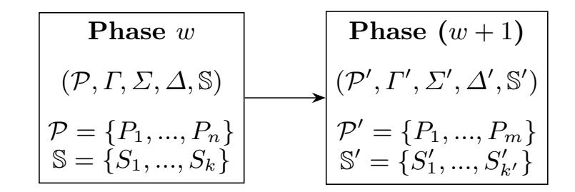

{0}------------------------------------------------

# Communication-Efficient (Proactive) Secure Computation for Dynamic General Adversary Structures and Dynamic Groups

Karim Eldefrawy1, Seoyeon Hwang2, Rafail Ostrovsky3, and Moti Yung<sup>4</sup>

 SRI International, Menlo Park, CA, USA University of California Irvine, Irvine, CA, USA University of California Los Angeles, Los Angeles, CA, USA Columbia University and Google, New York, NY, USA

Abstract. In modern distributed systems, an adversary's limitations when corrupting subsets of a system's components (e.g., servers) may not necessarily be based on threshold constraints, but rather based on other technical or organizational characteristics. This means that the corruption patterns (and thus protection guarantees) are not based on the adversary being limited by a threshold, but on the adversary being limited by other constraints, in particular by what is known as a *General Adversary Structure (GAS)*. We consider efficient secure multiparty computation (MPC) under such dynamicallychanging GAS settings. In such settings, one desires to protect against and during corruption profile changes; such adaptivity also renders some (secret sharing-based) encoding schemes underlying MPC protocols more efficient than others when operating with the (currently) considered GAS.

One of our contributions is a set of new protocols to efficiently and securely convert back and forth between different MPC schemes for GAS; this process is often called *share conversion*. We consider two MPC schemes, one based on additive secret sharing and the other based on Monotone Span Programs (MSP). The ability to convert between the secret sharing representations of these MPC schemes enables us to construct *the first communication-e*ffi*cient structure-adaptive proactive MPC protocol for dynamic GAS settings*. By structure-adaptive, we mean that the choice of the MPC protocol to execute in future rounds after the GAS is changed (as specified by an administrative entity) is chosen to ensure communication-efficiency (the typical bottleneck in MPC). Furthermore, since such secure collaborative computing may be long-lived, we consider the *mobile adversary setting*, often called the *proactive security setting*. As our second contribution, we construct communication-efficient MPC protocols that can adapt to the proactive security setting. Proactive security assumes that at each (well defined) period of time the adversary corrupts different parties and may visit the entire system overtime and corrupt all parties, provided that in each period it controls groups obeying the GAS constraints. In our protocol, the shares can be refreshed, meaning that parties receive new shares reconstructing the same secret, and some parties who lost their shares because of the reboot/reset can recover their shares. As our third contribution, we consider another aspect of global long-term computations, namely, that of the dynamic groups. Settings with dynamic groups and GAS were not dealt with in existing literature on (proactive) MPC. In dynamic group settings, parties can be added and eliminated from the computation, under different GAS restrictions. We extend our protocols to this additional dynamic group settings defined by different GAS.

Keywords: secure multiparty computation, secret sharing, share conversion, dynamic general adversary structures, monotone span programs, proactive security

{1}------------------------------------------------

### 1 Introduction

Secure Multiparty Computation (MPC) is a general primitive consisting of several protocols executed among a set of parties, and has motivated the study of different adversary models and various new settings in cryptography [24, 14, 34, 33, 17, 7, 16, 9, 26, 3]. For groups with more than two parties, i.e., the multiparty setting, secret sharing (SS) is often an underlying primitive used in constructing MPC; SS also has other applications in secure distributed systems and protocols used therein [12, 25, 23, 13, 2, 18, 20, 21].

In typical arithmetic MPC, the underlying SS [36, 10] is of the threshold type scheme, i.e., a dealer shares a secret *s* among *n* parties such that an adversary that corrupts no more than a threshold *t* of the parties (called corruption threshold) does not learn anything about *s*, while any *t* + 1 parties can efficiently recover it. MPC protocols built on top of SS allow a set of distrusting parties *P*1*, . . . , Pn*, with private inputs *x*1*, . . . , xn*, to jointly compute (in a secure distributed manner) a function *f*(*x*1*, x*2*, . . . , xn*) while guaranteeing correctness of its evaluation and privacy of inputs for honest parties. The study of secure computation was initiated by [38] for two parties and [24] for three or more parties. Constructing efficient MPC protocols withstanding stronger adversaries has been an important problem in cryptography and witnessed significant progress since its inception, e.g., [8, 14, 34, 28, 17, 16, 9, 33, 3, 4].

Enforcing a bound on adversary's corruption limit is often criticized as being arbitrary for protocols with long execution times, especially when considering the so-called "reactive" functionalities that continuously run a control loop. Such reactive functionalities become increasingly important, as MPC is adopted to resiliently implement privacy-sensitive control functions in critical infrastructures such as power-grids or command-and-control in distributed network monitoring and defense infrastructure. In those two cases, one should expect resourceful adversaries to continuously attack parties/servers involved in such an MPC, and given enough time, vulnerabilities in underlying software will eventually be found.

An approach to deal with the ability of adversaries to eventually corrupt all parties is the *proactive security model* [33]. This model introduced the notion of a mobile adversary motivated by the persistent corruption of parties in an MPC protocol. A mobile adversary can corrupt all parties in a distributed protocol during the execution of said protocol, but with the following limitations: (i) only a constant fraction (in the threshold setting) of parties can be corrupted during any round of the protocol; (ii) parties periodically get rebooted to a clean initial state, guaranteeing small fraction of corrupted parties, assuming that the corruption rate is not more than the reboot rate<sup>5</sup>. The model also assumes that an adversary cannot predict or reconstruct the randomness used by parties in any uncorrupted period of time, as demarcated by rebooting.

In most (standard and proactive) MPC literature, the adversary's corruption capability is characterized by a threshold *t* (out of the *n* parties). More generally, however, the adversary's corruption capability could be specified by a so-called *general adversary structure (GAS)*, i.e., a set of potentially corruptible subsets of parties. Even more generally, it can be specified by a set of corruption scenarios, one of which the adversary can choose (secretly). For instance, each scenario can specify a set of parties that can be passively corrupted and a subset of them that can even be actively corrupted. Furthermore, such scenarios may change over time, thus effectively rendering the GAS describing them to itself be dynamically evolving. There are currently no proactive MPC protocols efficiently handling such dynamic general specifications of adversaries, especially when the group of parties performing MPC is dynamic.

<sup>5</sup> In our model, rebooting to a clean state includes global information, e.g., circuits to be computed via MPC, identities of parties in the computation, and access to secure point-to-point channels and a broadcast channel.

{2}------------------------------------------------

Our main objective is to address a setting that is as close as possible to the complex dynamic reality of today's distributed systems. We accomplish this by answering the following question: *Can we design a communication-e*ffi*cient proactively secure MPC (PMPC) protocol for dynamic groups with security against dynamic general adversary structures?*

Contributions: We answer the above question in the affirmative. One of our main contributions is to build a set of protocols to efficiently convert back and forth between two different MPC schemes for GAS; this process is often called *share conversion*. Specifically, we consider an MPC scheme based on additive secret sharing and another MPC scheme based on Monotone Span Programs (MSP). The ability to efficiently and securely convert between these MPCs enables us to construct *the first communication-e*ffi*cient structure-adaptive proactive MPC (PMPC) protocol for dynamic GAS settings.* We note that *all* existing proactive secret sharing and PMPC protocols (details in Appendix A.1 and Table 4 therein) can only handle (threshold) adversary structures that describe sets of parties with cardinality less than a fraction of the total number of parties.

Given the large number of "moving parts" and complexity of PMPC protocols and the additional complexity for specifying them for GAS, we start from a standard (i.e., non-proactive) MPC protocol with GAS and extend it to the proactive setting for static groups and then dynamic groups. Note that MPC protocols typically extend secret sharing and perform computations on secret shared inputs, we thus focus the discussion in this paper on MPC with the understanding that results also apply to secret sharing.

As part of the proactive protocols, we support the following three functionalities: refreshing shares that reconstructs the same secret, recovering shares of parties who lost them or were rebooted from clear state, and redistributing new shares of the same secret to another group of parties. This implies that we can also deal with dynamic sets of parties, where parties can be eliminated and where parties can be added (i.e., start with a recovery of their shares in a refresh phase). Also, we can deal with settings where the entire set of parties changes and existing secret shared data has to be moved to a new set of parties with a possibly new specification of the GAS they should protect against. This original set of parties then redistributes the shared secrets to the new set (which may, or may not, have some overlap with the original set).

Paper Outline: In Section 3, we overview the typical blueprint of PMPC and briefly discuss the related work and roadblocks/challenges facing constructing communication-efficient structure-adaptive PMPC protocols for dynamic groups and dynamic GAS settings. Section 4 contains necessary preliminaries and specifications of underlying network and communication models, the adversary model, and some other basic building blocks required in the rest of the paper. We then describe the details of the new protocols developed in this paper in Section 5 (with security proofs in Appendix).

# 2 The Need for Secure Computation for Dynamic Groups with Changing Specifications of the General Adversary Structures

Large networked systems, such as public clouds, private clouds and the computer infrastructure of companies are managed for their security and reliability by specialists who employ tools, measurements, and reporting systems (including AI tools nowadays). These specialists maintain such large systems while facing changes and failures. This methodology of managing large systems is known as *DevOps* which is a set of practices that combines software development (Dev) and information-technology operations (Ops) that aims to shorten the systems development life cycle and provide continuous delivery with high software quality and system reliability [30]. In particular (starting with Google) the profession of such people, performing 

{3}------------------------------------------------

these tasks, is called *Site Reliability Engineering (SRE)*. Some of the responsibilities of SRE include: (1) Reducing organizational silos (separate sections of engineers to create joint coherent responsibilities in large systems with various elements cooperating); (2) Accepting failure as normal (and react to failures such as security breaches, overloading of subsystems, etc. managing system configuration with responsiveness and agility); (3) Implementing gradual changes (long-term maintenance based on past issues and future needs as they come or envisioned); (4) Leveraging tooling and automation (as the large system need to be controlled remotely, effectively this cannot be performed manually and control tools are needed); and (5) Measuring everything (constantly monitoring the needs and act according to the data, while keeping statistics on performance of systems).

A modern information security concept in managing large systems and defending against threats is *moving target defense (MTD)*, which is the method of controlling change across multiple system dimensions in order to increase uncertainty and apparent complexity for attackers, reduce their window of opportunity, and increase the costs of their probing and attack efforts. MTD assumes that perfect security is unattainable and adds system changes as increased challenges to the potential attacker.

One can view an SRE team getting information about and reacting to a system's suspicious behavior (at some parts of the network) and employing analysis which dictates configuration change. One can also view the team as occasionally and proactively, for the sake of implementing an MTD strategy, calling the network of servers to rearrange itself in a different fashion than the current setting, in the (general) scenarios we consider. This would correspond to changing the specification of the general adversary structure being protected against. When the team manages the configuration, they employ a secure and authenticated control and command system over servers, they can notify servers to reconfigure and organize their distributed data according to some protocol and dictated parameters, and certain servers do reboot from clean state. In our treatment, we assume that such a system is available in our underlying secure computation system and we augment existing configuration tools with the ability to manage and dynamically change the underlying "secret sharing" settings among the network's server.

### 3 Overview of Proactive MPC and Design Roadblocks

This section reviews the typical blueprint of Proactive MPC (PMPC) protocols. Due to space constraints, we discuss details of related work in Appendix A.1. We then discuss roadblocks facing designing communication-efficient structure-adaptive PMPC protocols for GAS.

### 3.1 Blueprint of Proactive Secret Sharing (PSS) and Proactive MPC (PMPC)

PMPC protocols [33, 3] are usually constructed on top of (linear) secret sharing schemes, and involve alternating compute and refresh (and reboot/reset) phases. The refresh phases involve distributed re-randomization of the secret shares, and deleting old ones to ensure that a mobile adversary does not obtain enough shares (from the same phase) that can allow them to violate secrecy of the shared inputs and intermediate compute results. A PMPC protocol usually consist of the following six sub-protocols:

- 1. Share: allows a dealer (typically one of the parties) to share a secret *s* among the *n* parties.
- 2. Reconstruct: allows parties to reconstruct a shared secret *s* using the shares they collectively hold.
- 3. Refresh: is executed between two consecutive phases, *w* and *w* + 1, and generates new shares for phase *w* + 1 that encode the same secret as, but are independent of the shares in phase *w*, and erases the old shares.

{4}------------------------------------------------

- 4. Recover: allows parties that lost their shares (due to rebooting/resetting or other reasons) to obtain new shares encoding the same secret *s*, with the help of other online parties.
- 5. Add: allows parties holding shares of two secrets, *s* and *t*, to obtain shares encoding the sum, *s* + *t*.
- 6. Multiply: allows parties holding shares of two secrets, *s* and *t*, to obtain shares encoding the product, *s · t*.

The overall operation of a standard PMPC protocol is as follows: First each party uses the Share sub-protocol to securely distribute its private inputs among the *n* parties (including itself). The function to be computed on the inputs of parties is transformed into a public arithmetic circuit. The circuit is composed of multiple layers (the depth of the circuit) where each consists of a set of Add and Multiply gates which are computed via the corresponding sub-protocols one layer at a time. At the end of each circuit layer6, shares of all nodes can be refreshed via the Refresh protocol and old shares are deleted; refreshing and deleting old shares ensures that different shares collected by the adversary at different phases can not be used together to reconstruct the secret shared inputs and intermediate and final results of the computation. In addition, during refresh phases, some nodes are randomly reset/rebooted, these then use the Recover protocol to obtain new shares encoding the same shared secrets corresponding to the current state of the PMPC computation, i.e., the output of the current circuit layer and any shard values that will be needed in future layers. When the (secret shared) output of the final layer of the computation is produced, parties use the Reconstruct protocol to compute the final output in the clear (or towards whichever nodes are supposed to obtain it).

To deal with dynamic groups, where parties can leave, or new parties can join the group, the following additional sub-protocol Redistribute is required:

7. Redistribute: is executed between two consecutive protocol phases, *w* and *w* + 1, and allows parties in a new group (in phase *w* + 1) to obtain new shares that encode the same secret as the shares in phase *w*.

In addition, we observe that the specifics of the secret sharing-based encoding underlying the PMPC protocol largely dictate the communication-efficiency. This is an issue that is often overlooked and that does not appear when one only considers the threshold adversary structure as opposed to GAS. For example, if one considers an additive secret sharing scheme similar to the one used in the MPC protocol in [32], and if the adversary structure one should protect against is the threshold one, then there is an exponential blowup in the share size compared to a monotone span program (MSP) based scheme. Thus, any protocols that require transmitting such shares encoded additively, e.g., multiplication, recovery, or redistribution of shares, is going to be inefficient compared to an MSP-based one. A communication-efficient protocol should thus be structure-adaptive when considering evolving GAS, this means that if the set of parties performing the MPC receives (from an administrator) a request to adapt to a new GAS, for which it is known that another (secret sharing) encoding scheme is more efficient, they need to convert. We stress that this is different than the Redistribute protocol, which re-shares a shared secret but *with the same secret sharing scheme.* We require a non-trivial additional protocol to perform such conversion:

8. Convert: is executed between two consecutive protocol phases, *w* and *w* + 1, and allows parties in a new group defined by a new GAS (in phase *w* + 1) to obtain new shares under

<sup>6</sup> Or after several layers, or at the end of one execution of a circuit of reactive functionalities executing in a loop. In this paper we do not specify when parties should refresh shares, we just develop the protocol to accomplish this.

{5}------------------------------------------------

a different secret sharing scheme but that encode the same secret as the shares in phase *w* (under the old secret sharing scheme and the old GAS).

### 3.2 Roadblocks Facing PMPC for Dynamic General Adversary Structures and Dynamic Groups

Starting with an appropriate SS scheme and an MPC protocol for GAS, the following is to be addressed to develop a communication-efficient PMPC protocol for dynamic groups and GAS:

- 1. *Design convert protocols to be structure-adaptive:* Given that we are considering settings with changing GAS, and given that some (secret sharing) encoding schemes underlying MPC result in different communication complexities, we design new efficient protocols (secure against GAS) to convert between different secret sharing schemes. We consider converting from an additive sharing to an MSP-based sharing, and the opposite direction. Such conversion protocols may be of independent interest.
- 2. *Design refresh and recover protocols to proactivize the underlying SS scheme:* This enables parties to re-randomize the shares in a secure distributed manner. To enable rebooted/reset parties to recover their shares, and not to loose shared inputs or intermediate results of the computation over time, rebooted parties have to be able to recover shares with the help of the rest of the parties.
- 3. *Design a redistribute protocol for settings with dynamic groups:* In such settings, parties can leave and/or newly join the group performing the computation, this results in the GAS, as well as the number of parties in the group, changing over time. One has to redistribute new shares to parties in the new group which encode the same secret as the shares in the previous group, but also needs to prevent departing parties from using their shares to obtain any information about the secret.
- 4. *E*ffi*cient communication in all protocols:* All the involved protocols should be efficient, e.g., ideally have linear dependence on the specification of adversary structures and the number of parties, or at least (a low) polynomial. We note that in this work we do not attempt to minimize the descriptions of the adversary structures, i.e., the size of specifications of some structures may be exponential in the number of parties *n*.

### 4 Preliminaries

This section provides preliminaries required for the rest of the paper. We first provide terminology and other definitions used in this paper. We then discuss the underlying communication model, security guarantees, and the adversary model that we consider. The section concludes by reviewing the information checking and dispute control schemes used in the MPC protocols [27, 29] on which we build our protocols.

#### 4.1 Terminology of Proactive Security

Let *P* = *{P*1*, ..., Pn}* be a set of *n* participating parties in PMPC protocols. The parties in *P* want to compute a function *f* over a finite field F. Similar to the previous proactive security literature [1, 3, 22], a proactive protocol proceeds in *phases*. A phase consists of a number of consecutive rounds and every round belongs to exactly one phase. There are two types of phases, *refresh* and *operational*, which alternate. Intuitively, a refresh phase re-randomizes the secret shared data so that attacks in different phases cannot affect each other, while an operational phase performs whatever computations the protocol is designed for. Finally, a *stage* consists of an *opening* refresh phase, an operational phase, and a *closing* refresh phase, i.e., each refresh phase is not only the closing of one stage, but also the opening of another stage. If an adversary 

{6}------------------------------------------------

corrupts a party  $P_i$  during an operational phase, the adversary is given the view of  $P_i$  starting from its state at the beginning of the current operational phase. Else if the corruption is made during a refresh phase, the adversary gets the view of  $P_i$  in both stages, u and u + 1, that include the refresh phase as the closing and the opening and  $P_i$  is assumed to be corrupted for the stage u + 1. Detailed definitions can be found in Appendix A.

### 4.2 Definitions and Assumptions

In this work, we consider protocols with unconditional security for both passive and active adversaries. In terms of the communication model, we consider a synchronous network of n parties connected by an authenticated broadcast channel and point-to-point channels. Note that without this setting, we do not guarantee the information-theoretic security. The different security guarantees and communication models in the MPC literature are discussed in Appendix A in more detail. We consider the adversary's capabilities in terms of the general adversary structure (GAS), which is a more general and flexible notion to reason about adversaries (compared to only the threshold limitation on corruptions) and applicable to various cases, e.g. when special combination of parties is needed, when some parties are authorized, etc.

Let  $2^{\mathcal{P}}$  denote the set of all the subsets of  $\mathcal{P}$ . A subset of  $2^{\mathcal{P}}$  is called *qualified* if parties in the subset can reconstruct/access the secret, while a subset of  $2^{\mathcal{P}}$  that parties in the set obtain no information about the secret is called *ignorant*. Every subset of  $\mathcal{P}$  is either qualified or ignorant. The secrecy condition is stronger: even if any ignorant set of parties holds any kind of partial information about the shared value, they must not obtain any additional information about the shared value.

The access structure  $\Gamma$  is the set of all qualified subsets of  $\mathcal{P}$  and the secrecy structure  $\Sigma$  is the set of all ignorant subsets of  $\mathcal{P}$ . Naturally,  $\Gamma$  includes all supersets of each element in it (so often called monotone access structure), while  $\Sigma$  includes all subsets of each element in it. We call such minimum or maximum sets as basis structure, and denote it with  $\widetilde{\cdot}$ . i.e., the basis access structure  $\widetilde{\Gamma}$  is the set of all minimal subsets in  $\Gamma$ , and the basis secrecy structure  $\widetilde{\Sigma}$  is the set of all maximal subsets in  $\Sigma$ . As a generalization of specifying the adversary's capabilities by a corruption type (passive or active) and a threshold t, an adversary can be described by a corruption type and an adversary structure  $\Delta \subseteq \Sigma$ . The adversary structure  $\Delta$  is a set of subsets of parties that can be potentially corrupted. The adversary can choose a set in  $\Delta$  and corrupt all the parties in the set. Note that the adversary structure in t-threshold SS is the set of all subsets of  $\mathcal{P}$  of at most t parties and GAS extends this to non-threshold models. A GAS includes all of these structures,  $(\Gamma, \Sigma, \Delta)$ .

The types of adversaries can be classified as passive adversary and active adversary. A passive adversary can only perform passive corruptions on  $\Sigma$ , eavesdropping on all the inputs and outputs of corrupted parties in  $\Sigma$ . i.e.,  $\Delta = \Sigma$ . On the other hand, an active adversary, which is also called  $(\Sigma, \Delta)$ -adversary, can passively corrupt some parties in a set A and actively corrupt some parties in a set B, where  $A \in \Delta$  and  $(A \cup B) \in \Sigma$ .

In real-world scenarios, it is natural to deal with dynamic groups, which means participating parties can leave and/or newly join in the group performing the computation. Then, the GAS  $(\Gamma, \Sigma, \Delta)$  as well as the participating parties  $\mathcal{P}$  may be changed. Therefore, we need one more protocol to deal with dynamic groups, which redistributes new shares to the new group that encodes the same secret as the ones in the previous group. It also needs to prevent leaving parties from using their shares to obtain any information about the secret.

#### 4.3 Information Checking (IC) and Dispute Control

In some of the MPC protocols that we consider, an *information checking (IC)* technique is used to prevent active adversaries from announcing wrong values through corrupted parties. It

{7}------------------------------------------------

is a three party protocol among a sender  $P_s$ , a receiver  $P_r$ , and a verifier  $P_v$ . When  $P_s$  sends a message m to  $P_r$ ,  $P_s$  also encloses an authentication tag to  $P_r$ , while giving a verification tag to  $P_v$  through private channels. Whenever any disagreement about what  $P_s$  sent to  $P_r$  occurs,  $P_k$  acts as an objective third party and verifies the authenticity of m to  $P_r$ . The MPC protocols in this paper use different variants of IC, but the common idea is to check if all the points that  $P_r$  and  $P_v$  have lie on the polynomial of degree 1. Note that this can be naturally extended to the polynomial of degree l, where l is the number of secrets in a batch of sharing, as in [29]. An IC scheme consists of two protocols, called Authenticate and Verify, and each IC scheme for two MPC protocols are presented in Appendix B.1 and D.1, respectively.

MPC protocols in this paper also use the dispute control to deal with detected cheaters. This means that each party  $P_i$  locally maintains a list  $\mathcal{D}_i$  of parties that  $P_i$  distrusts, and the list  $\mathcal{D}$  of pairs of parties who are in dispute with each other. These lists are empty when the MPC protocol begins, and whenever any dispute arises between two parties  $P_i$  and  $P_j$  (for example,  $P_i$  insists that  $P_j$  is lying), the pair  $\{P_i, P_j\}$  is added to the dispute list  $\mathcal{D}$ . Since all disputes are broadcasted, each party  $P_i$  has the same list  $\mathcal{D}$ , while maintaining its own list  $\mathcal{D}_i$ . After  $P_j$  is added to  $\mathcal{D}_i$ ,  $P_i$  behaves in all future invocations of the protocol for authentication and verification with  $P_j$  as if it fails whether this is the case or not. Some MPC schemes also maintain a list  $\mathcal{C}$  of parties that everyone agrees are corrupted.

| Notation                       | Explanation                                                                         |
|--------------------------------|-------------------------------------------------------------------------------------|
| $\mathcal{P} = \{P_1,, P_n\}$  | a set of participating parties in a protocol                                        |
| $(\Gamma, \Sigma, \Delta)$     | the access/secrecy/adversary structures in a GAS                                    |
| S                              | a sharing specification describing how shares are distributed                       |
| w, w + 1                       | a phase (number)                                                                    |
| $[s]^w$                        | a sharing of a secret $s$ in phase $w$ , i.e., a set of shares of $s$               |
| F                              | a finite field                                                                      |
| $\mathcal{D}$                  | the (public) list of pairs of parties who are in dispute with each other            |
| ${\cal D}_i$                   | a (local) list of parties that $P_i$ distrusts                                      |
| $\mathcal{C}$                  | the (public) list of parties that everyone agrees to their corruptness              |
| M                              | a matrix from a MSP $\widehat{M} = (\mathbb{F}, M, \rho, \mathbf{r})^7$             |
| a                              | a vector (with bold texts)                                                          |
| ${M}_i$                        | a matrix of rows of $M$ assigned to $P_i$ according to an indexing function         |
| $M_A$                          | a matrix of rows of M assigned to all $P_i \in A$ according to an indexing function |
| $\langle \; , \; \rangle$      | the inner product                                                                   |
| $A \setminus B$                | the set difference of $A$ and $B$ , i.e., the set of elements in $A$ but not in $B$ |
| $a \xleftarrow{\$} \mathbb{F}$ | randomly chosen element $a$ from the finite field $\mathbb{F}$                      |

Table 1. Notations used in this paper. GAS denotes the general adversary structure.

## 5 Proactive MPC Protocols for Dynamic GAS and Dynamic Groups

As mentioned in Section 3, our PMPC protocols build on two MPC protocols with different underlying secret sharing schemes. One is an MPC protocol [27] based on additive secret sharing and the other [29] is based on a monotone span program (MSP) with multiplication. For convenience, we call the former as additive MPC and the latter as MSP-based MPC in the rest of the paper. Both guarantee unconditional security against active Q2 adversaries. Q2 means no two sets in  $\Delta$  cover the entire set of parties; i.e., for  $\forall A, B \in \Delta, \mathcal{P} \not\subseteq A \cup B$ . Table 1 summarizes the notations we use in this paper.

In Section 5.1 and Section 5.2, we present the *additive PMPC* and *MSP-based PMPC* schemes, respectively, with our new additional protocols to "proactivize" each MPC scheme. We formalize the base protocols of [27] and [29] in Appendix B and D, and focus on our new protocols in the main body of the paper. For proactivizing a MPC protocol, we develop two new main protocols, called Refresh and Recover, and add one more protocol, called

<sup>&</sup>lt;sup>7</sup> Detailed definitions of components of MSP are provided in Section 5.2.

{8}------------------------------------------------

Redistribute, for dynamic groups. The resulting PMPC is composed of 6 protocols, Share, Reconstruct, Add, Multiply, Refresh, and Recover, or 7 in the dynamic groups case when including Redistribute. For clarification, we denote each protocol with superscripts, A or M, for additive PMPC and MSP-based PMPC, respectively. All the proofs for our protocols are presented in Appendix C and E. Note that the complexity of additive PMPC protocols depends on  $|\Sigma|$  and n, while that of MSP-based PMPC protocols depends on d and n, where n is the number of participating parties,  $|\widetilde{\Sigma}|$  is the size of the set of all maximal subsets in the secrecy structure, and d is the number of rows of the MSP matrix.

In Section 5.3, we develop share conversion protocols between the additive PMPC and MSP-based PMPC schemes to enable one to adapt/change the utilized protocols according to the dynamic GAS. As we mentioned in Section 2, this is necessary and important because one can become more communication-efficient than the other depending on the circumstances. For instance, considering the upper bound on d is about  $|\Sigma|^{2.7}$  [29], the MSP-based MPC is more expensive than the additive MPC, but d can be also low as  $n = |\mathcal{P}|$  in some cases, which makes the MSP-based MPC more communication-efficient. The proofs for the share conversion protocols are in Appendix F.

#### Additive PMPC **5.1**

We build our additive PMPC protocol on top of Hirt and Tschudi's unconditional MPC [27] based on additive secret sharing. Due to the space limit, we briefly review their protocols in this section and provide formal specifications in Appendix B. Also, all proofs for our new protocols are provided in Appendix C.

Assuming n participating parties  $\mathcal{P} = \{P_1, ..., P_n\}$ , parties want to share a sharing of a secret s according to the sharing specification S. Any  $\Delta$ -private sharing specification, which means for every  $Z \in \Delta$ ,  $\exists S \in \mathbb{S}$  such that  $S \cup Z = \emptyset$ , can be used to securely share a secret, and we adopt one from [32],  $\mathbb{S} = (S_1, ..., S_k)$ , where  $S_i = \mathcal{P} \setminus T_i$  for  $\widetilde{\Sigma} = \{T_1, ..., T_k\}$ , the set of all maximal subsets in  $\Sigma$ . In [27], they use an IC scheme for dealing with active adversaries, which consists of Authenticate<sup>A</sup> and Verify<sup>A</sup>. Authenticate<sup>A</sup> $(P_s, P_r, P_v, m)$  is for  $P_s$  to distribute the authentication tag of m to  $P_r$  and the verification tag of m to  $P_v$ , and  $Verify^{A}(P_s, P_r, P_v, m', tags)$  is for  $P_j$  to request  $P_v$  to verify the value m' with an authentication tag and a verification tag. Each protocol is presented in Appendix B.1 in detail.

**Definition 5.1.** A value s is **shared** with respect to a sharing specification  $\mathbb{S} = (S_1, ..., S_k)$  by additive secret sharing, if the following holds:

- a) There exists shares  $s_1, ..., s_k$  such that  $s = \sum_{i=1}^k s_i$ . b) Each  $s_i$  is known to every party in  $S_i$ , for all i.
- c)  $\forall P_s, P_r \in S_i, \forall P_v \in \mathcal{P}, P_v \text{ can verify the value } s_i \text{ using the } IC, \text{ for each } i.$

A secret value s is shared among  $\mathcal{P}$  through the protocol Share and any qualified subgroup B of  $\mathcal{P}$  can reconstruct the secret value through Reconstruct. In Share protocol, a dealing party randomly chooses k-1 values in  $\mathbb{F}$ , sets the k-th value as  $s-\sum_{i=1}^{k-1} s_i$ , and sends each i-th value to every player in  $S_i$ . Then multiple Authenticate<sup>A</sup> are invoked to generate the IC tags. In Reconstruct<sup>A</sup>, parties in B verify the forwarded values of each share from the others using Verify<sup>A</sup> and reconstruct the secret value by locally adding all the verified share values. The formal protocols are presented in Appendix B.2. Note that the sharing of s is linear and does not leak any information about s without the whole set of sharing. Assuming the shares for the values s and t are already shared among  $\mathcal{P}$ , addition of s and t can be done naturally even without any interaction among n parties by the linearity. However, multiplication is quite tricky and requires a lot of communications to securely form the share of  $(s \cdot t)$  among n parties, 

{9}------------------------------------------------

as  $s \cdot t = \sum_{i=1}^k s_i \cdot \sum_{j=1}^k t_i = \sum_{i=1}^k \sum_{j=1}^k (s_i \cdot t_i)$ . All the protocols for Add<sup>A</sup> and Multiply<sup>A</sup> are presented in the Appendix B.3.

To make this additive MPC scheme to be a PMPC that can also handle dynamic groups, we build three protocols, called Refresh<sup>A</sup>, Recover<sup>A</sup>, and Redistribute<sup>A</sup>. The protocol Refresh<sup>A</sup> periodically refreshes or rerandomizes the shares in a distributed manner. This can be done naturally by every party's sharing zero and locally adding all the received shares to the current holding share. The execution of this protocol does not reveal any additional information about the secret as only the shares of zeros are communicated. The security proof for this protocol is provided in Appendix C.1.

```
Protocol Refresh<sup>A</sup>(w,[s]) \longrightarrow [s]^{w+1}
```

**Input:** a phase w and a sharing of s

**Output:** new sharing of s in phase w + 1,  $[s]^{w+1}$ 

- 1. Every party  $P_i$  in  $\mathcal{P}$  invokes  $Share^A(w, 0, \mathcal{P})$ . (in parallel)
- 2. Each party adds all shares received in Step 1 to shares of s and sets result as the new share of s in phase w+1.
- 3. parties in  $\mathcal{P}$  collectively output  $[s]^{w+1}$ .

**Theorem 5.1.** (Correctness and Secrecy of Refresh<sup>A</sup>) When Refresh<sup>A</sup> terminates, all parties receive new shares encoding the same secret as old shares with error probability  $n^4|\mathbb{S}|/|\mathbb{F}|$ , and cannot obtain any information about the secret by execution of the protocol. Refresh<sup>A</sup> requires  $|\mathbb{S}|(7n^4+n^2)\log|\mathbb{F}|$  bits of communication and broadcasts  $|\mathbb{S}|((3n^4+n)\log|\mathbb{F}|+n^3)$  bits.

For the protocol Recover<sup>A</sup>, we construct the following two sub-protocols, ShareRandom<sup>A</sup> and RobustReshare<sup>A</sup>. ShareRandom<sup>A</sup> generates a sharing of a random element r in  $\mathbb{F}$  and parties in the same  $S_i$  receive the i-th share of r for each i, but the value of r is not revealed to anyone. Since each iteration requires  $O(|S_q|^2 \log |\mathbb{F}|)$  broadcast bits for each q and each  $|S_q|$  is less than n, it broadcasts at most  $O(|S|n^2 \log |\mathbb{F}|)$  bits among parties and no communications is required.

```
Protocol ShareRandom^{\mathtt{A}}(w,\mathcal{P}) \longrightarrow [r]^w
```

**Input:** a phase w and a set of participating parties  $\mathcal{P}$ 

**Output:** a sharing [r] of a random number r, shared among  $\mathcal{P}$ 

- 1. For each  $S_q \in \mathbb{S} = \{S_1, ..., S_k\}$ :
- 2. Each party  $P_i \in S_q$  generates a random number  $r_{qi}$  and broadcast it among all parties in  $S_q$ .
- 3. Each  $P_i \in S_q$  locally adds up all values received in Step 2, and set it as  $r_q$ .
- 4. The parties in  $\mathcal{P}$  collectively output [r], where  $r = \sum_{q=1}^{k} r_q$ .

The protocol RobustReshare<sup>A</sup> allows parties in  $\mathcal{P}_R \in \Gamma$  to receive a sharing of an input random number r (with the value of r) from the parties in  $\mathcal{P}_S$ , where everyone in  $\mathcal{P}_S$  knows the value of r. Distributing one sharing of r is non-trivial in the active adversary model because we cannot trust one party who might be corrupted. Let  $Honest := \{\mathcal{P} \setminus A \mid A \in \overline{\Delta}\}$ , where  $\overline{\Delta}$  is the set of all maximal subsets in  $\Delta$ . Since the adversary can corrupt one set of parties in  $\Delta$  in each phase, there exists at least one set of parties in Honest that includes only honest parties in that phase. The main idea of the protocol RobustReshare<sup>A</sup> below is to find such set by repeating to share and reconstruct for each party's holding value for r. At the end of the protocol, parties in  $\mathcal{P}_R$  can set a sharing of r and also know the value of the random number r.

{10}------------------------------------------------

### Protocol RobustReshare $(w, r, \mathcal{P}_S, \mathcal{P}_R) \longrightarrow [r]^w$

**Input:** a phase w, a random number r, a set  $\mathcal{P}_S$  of parties sending r, and a set  $\mathcal{P}_R$  of receiving parties, where  $\mathcal{P}_R \in \Gamma$ 

**Output:** a sharing of r in phase w,  $[r]^w$ 

- 1. Every party in  $\mathcal{P}_S$  executes Share<sup>A</sup> $(w, r, \mathcal{P}_R)$  according to the sharing specification  $\mathbb{S}_R$  on  $\mathcal{P}_R$ . Let  $[r]^{(i)}$  be the sharing of r that  $P_{k_i} \in \mathcal{P}_S$  shares.
- 2. Parties in  $\mathcal{P}_R$  invoke Reconstruct<sup>A</sup>( $[r]^{(i)}, \mathcal{P}_R$ ), for each  $i = 1, 2, ..., |\mathcal{P}_S|$ . Let  $r^{(i)}$  be the output of each invocation.
- 3. Each party chooses a set  $H \in Honest$  such that  $\exists v, v = r^{(i)}$  for all  $P_{k_i} \in H$ . If there are multiple such sets, choose the minimal set including  $P_i$  with lower id, i.
- 4. Output the sharing of r from the party  $P_i$  in H with the minimum id, i. i.e. Output  $[r] \leftarrow [r]^{(min)}$ , where  $min := \min_{P_i \in H} \{i\}$ .

The security of RobustReshare<sup>A</sup> relies on the security of Share<sup>A</sup> and Reconstruct<sup>A</sup>, as the rest is executed locally. For complexities, as both protocols Share<sup>A</sup> and Reconstruct<sup>A</sup> are invoked for each party in  $\mathcal{P}_S$  and  $|Honest| = |\overline{\Delta}| \leq |\overline{\Sigma}| = |\mathbb{S}|$ , the total communication and broadcast complexities of RobustReshare<sup>A</sup> is  $O(|\mathbb{S}|n^3 + |\mathcal{P}_S||\mathbb{S}|n^3 + |Honest|) = O(|\mathcal{P}_S||\mathbb{S}|n^3)$ . The total analysis of all additive PMPC protocols is shown in Table 2.

The protocol Recover<sup>A</sup> allows rebooted/reset parties to obtain new shares for the same secret s with the assistance of other parties. Let  $R \subset \mathcal{P}$  be a set of parties who need to recover their shares. Note that  $\mathcal{P} \setminus R$  must be still in  $\Gamma$  for the protocol Recover<sup>A</sup> to output a new sharing of s because otherwise, it contradicts to the definition of the access structure. It needs the condition  $\mathcal{Q}^1(S_q, \mathcal{Z})$ , which is already a necessary condition for the protocol Reconstruct<sup>A</sup>. The main idea is as follows: a sharing of unknown random value r is generated among entire parties in  $\mathcal{P}$  by ShareRandom<sup>A</sup> and the parties in  $\mathcal{P} \setminus R$  holding the shares of s re-share the value r' = r + s and a sharing of r' to entire parties. Then, all parties including R can compute the new shares of s by computing [r'] - [r]. The proof for Theorem 2 is in Appendix C.2.

# Protocol Recover<sup>A</sup> $(w, [s], R) \longrightarrow [s]^{w+1}$ or $\bot$

**Input:** a phase w, a sharing of s, and a set of rebooted parties R **Output:** new sharing of s in phase w + 1,  $[s]^{w+1}$ , or aborted

- 1. Parties in  $\mathcal{P}$  invoke ShareRandom<sup>A</sup> $(w, \mathcal{P})$  to generate a sharing [r] of r, where r is a random in  $\mathbb{F}$ .
- 2. Each party in  $\mathcal{P} \setminus R$  invokes  $Add^{A}(w,[r],[s])$  to share the sharing of r+s.
- 3. Reconstruct<sup>A</sup> $(w, [r+s], \mathcal{P} \setminus R)$  is invoked and every party in  $\mathcal{P} \setminus R$  gets r' := r + s.
- 4. RobustReshare  $(w, r', P \setminus R, P)$  is invoked, and each party in P gets [r'].
- 5. Each party computes [r'] [r] by executing  $Add^A(w, [r'], -[r])$ , where -[r] is the additive inverses of the shares in  $\mathbb{F}$ .

**Theorem 5.2.** (Correctness and Secrecy of Recover<sup>A</sup>) If  $\mathbb{S}$  and  $\mathbb{Z}$  satisfy  $\mathbb{Q}^1(\mathbb{S}, \mathbb{Z})$ , the protocol Recover<sup>A</sup> allows a set  $\forall R \in \Delta$  of rebooted parties to recover their shares encoding the same secret with error probability  $O((n-|R|)|\mathbb{S}|n^3/|\mathbb{F}| + (n-|R|)|\mathbb{S}|n^2/(|\mathbb{F}|-2))$ . Recover<sup>A</sup> does not reveal any additional information about the secret. Recover<sup>A</sup> requires  $O((n-|R|)|\mathbb{S}|n^3\log|\mathbb{F}|)$  bits of communication and broadcasts  $O((n-|R|)|\mathbb{S}|n^3\log|\mathbb{F}|)$  bits.

bits of communication and broadcasts  $O((n-|R|)|\mathbb{S}|n^3\log|\mathbb{F}|)$  bits. To handle dynamic groups and dynamic GASs, assume that the participating parties and structures are given as in Figure 1. As mentioned in Section 2, these phase information is specified by a trusted third party. The protocol Redistribute<sup>A</sup> allows new participating parties

{11}------------------------------------------------



**Fig. 1.** Dynamic groups and GAS in two consecutive phases, w and w+1

to obtain a sharing of the same secret as the previous phase according to the new GAS. The idea is quite intuitive because of the repetitive sharing properties, which is to double-share the sharing of a secret from the previous participating group to the new group. Note that the protocol Redistribute<sup>M</sup> we will show in the next section has different, non-trivial idea, and reduced complexities. The security proof is in Appendix C.3.

 $\text{Protocol Redistribute}^{\mathtt{A}}(w,s) \longrightarrow [s]^{w+1}$ 

**Input:** phase w and a secret s

Output: shares of s in phase w+1

**Precondition**: parties in P share  $[s]^w$  for a secret s

**Postcondition**: parties in P' share  $[s]^{w+1}$  encoding the same secret s

- 1. For each  $S_i \in \mathbb{S}$ :
- 2. Each party  $P_y$  in  $S_i$  forwards its holding value  $[s_i]_y$  for  $s_i$  to every party in  $S_i$  who is supposed to hold the same share (over the secure channel).
- 3. Verify<sup>A</sup> $(P_S, P_R, P_V, w, [s_i]_y, A_{S,R,V}(s_i))$  is invoked for all  $P_R, P_V \in S_i, \forall P_S \in S_i$ . If  $P_V$  outputs  $[s_i]_y$  in each invocation,  $P_V$  accepts it as value for  $s_i$ . Denote  $v_i$  as the accepted value for  $s_i$ , for each i.
- 4. Each party  $P_y \in S_i$  runs  $Share^{A}(w+1, v_i, \mathcal{P}')$  according to S'.
- 5. For each  $S'_i \in \mathbb{S}'$ :
- Each party in  $S'_j$  holds  $\{v_{ij}\}_{i=1}^k$ . For each  $v_{ij}$ , all  $P_R, P_V \in S'_j$  invoke  $\mathsf{Verify}^\mathtt{A}(P_S, P_R, P_V, w, v_{ij}, A_{S,R,V}(v_{ij}))$  for  $\forall P_S \in S'_j$  and accept the output value as  $v_{ij}$ .
- 7. Each party in  $S'_j$  sums up all k values accepted in step 6, and set it as new j-th share of s. i.e.,  $s'_j := \sum_{i=1}^k v_{ij}$ .

**Theorem 5.3.** (Correctness and Secrecy of Redistribute<sup>A</sup>) By executing Redistribute<sup>A</sup>, new participating parties receive a sharing of the same secret as the old shares with error probability  $((|\mathbb{S}|n^3 + |\mathbb{S}'|m^3)/(|\mathbb{F}|-2) + nm^3|\mathbb{S}'|/|\mathbb{F}|)$  and it does not reveal any additional information about the secret. It communicates  $O(|\mathbb{S}||\mathbb{S}'|nm^3\log|\mathbb{F}|)$  bits and broadcasts  $O(|\mathbb{S}||\mathbb{S}'|nm^3\log|\mathbb{F}|)$  bits, where  $\mathbb{S}$  and  $\mathbb{S}'$  denote the sets for sharing specification in two consecutive phases and n, m are the number of parties in each participating group, i.e.,  $n = |\mathcal{P}|$  and  $m = |\mathcal{P}'|$ . Assuming n = m and  $|\mathbb{S}| = |\mathbb{S}'|$ , communication/broadcast complexities are  $O(|\mathbb{S}|^2n^4\log|\mathbb{F}|)$ .

Note that the function of  $Recover^A$  can be naturally substituted with  $Redistribute^A$  with the same participating groups and the same sharing specification, but using our  $Recover^A$  protocol is more efficient as it has linear complexity in |S|, while  $Redistribute^A$  has quadratic complexities in |S|. Table 2 shows the total analysis of communication and broadcast complexities with error probability for each protocol in our additive PMPC scheme.

#### 5.2 MSP-based PMPC

Lampkins and Ostrovsky [29] presented an unconditionally secure MPC protocol based on Monotone Span Program (MSP) secret sharing against any Q2-adversary, which has linear

{12}------------------------------------------------

|                                | Additive PMPC based on [27]         |                                                     |                                                     |                                                                                                  |  |  |  |
|--------------------------------|-------------------------------------|-----------------------------------------------------|-----------------------------------------------------|--------------------------------------------------------------------------------------------------|--|--|--|
|                                | Protocol                            | Comm. (bits)                                        | Broad. (bits)                                       | Error Pr.                                                                                        |  |  |  |
| IC                             | Authenticate [27]                   | $7\log  \mathbb{F} $                                | $3\log \mathbb{F} +1$                               | $1/ \mathbb{F} $                                                                                 |  |  |  |
|                                | Verify <sup>A</sup> [27]            | $\log  \mathbb{F} $                                 | -                                                   | $1/( \mathbb{F} -2)$                                                                             |  |  |  |
|                                | Share <sup>A</sup> [27]             | $O( \mathbb{S} n^3\log \mathbb{F} )$                | $O( \mathbb{S} n^3\log \mathbb{F} )$                | $n^3 \mathbb{S} / \mathbb{F} $                                                                   |  |  |  |
|                                | Reconstruct <sup>A</sup> [27]       | $O( \mathbb{S} n^3\log \mathbb{F} )$                | -                                                   | $n^2 \mathbb{S} /( \mathbb{F} -2)$                                                               |  |  |  |
| 100/1VII C                     | Add <sup>A</sup> [27]               | -<br>-                                              | <del>-</del>                                        | <del>-</del>                                                                                     |  |  |  |
|                                | BasicMultiply [27]                  | $O( \mathbb{S} n^4\log \mathbb{F} )$                | $O( \mathbb{S} n^4\log \mathbb{F} )$                | $O(n^4 \mathbb{S} / \mathbb{F} )$                                                                |  |  |  |
|                                | RandomTriple <sup>A</sup> [27]      | $O( \mathbb{S} n^4\log \mathbb{F} )$                | $O( \mathbb{S} n^4\log \mathbb{F} )$                | $O(n^4 \mathbb{S} / \mathbb{F} )$                                                                |  |  |  |
|                                | Multiply <sup>A</sup> [27]          | $O( \mathbb{S} n^5\log \mathbb{F} )$                | $O( \mathbb{S} n^5\log \mathbb{F} )$                | $O(n^5 \mathbb{S} / \mathbb{F} )$                                                                |  |  |  |
| Our<br>Additional<br>Protocols | Refresh <sup>A</sup>                | $O( \mathbb{S} n^4\log \mathbb{F} )$                | $O( \mathbb{S} n^4\log \mathbb{F} )$                | $n^4 \mathbb{S} / \mathbb{F} $                                                                   |  |  |  |
|                                | ShareRandom <sup>A</sup>            | -                                                   | $O( \mathbb{S} n^2\log \mathbb{F} )$                | -                                                                                                |  |  |  |
|                                | RobustReshare <sup>A</sup>          | $O( \mathcal{P}_S  \mathbb{S} n^3\log \mathbb{F} )$ | $O( \mathcal{P}_S  \mathbb{S} n^3\log \mathbb{F} )$ | $O( \mathbb{S} ( \mathcal{P}_S n^3/ \mathbb{F} +  \mathcal{P}_S n^2/( \mathbb{F} -2)))$          |  |  |  |
|                                | Recover                             | $O((n- R ) \mathbb{S} n^3\log \mathbb{F} )$         | $O((n- R ) \mathbb{S} n^3\log \mathbb{F} )$         | $ \frac{O((n- R )n^3 \mathbb{S} / \mathbb{F}  + (n- R )n^2 \mathbb{S} /( \mathbb{F} -2))}{ R } $ |  |  |  |
|                                | Redistribute <sup>A</sup>           | $O( \mathbb{S} ^2 n^4 \log  \mathbb{F} )$           | $O( \mathbb{S} ^2 n^4 \log  \mathbb{F} )$           | $O( \mathbb{S} n^3/( \mathbb{F} -2)\\+n^4 \mathbb{S} / \mathbb{F} )$                             |  |  |  |
| Total                          | Additive PMPC for                   | $O( \mathbb{S} n^5\log \mathbb{F} )$                | $O( \mathbb{S} n^5\log \mathbb{F} )$                |                                                                                                  |  |  |  |
|                                | Static groups                       |                                                     |                                                     |                                                                                                  |  |  |  |
|                                | Additive PMPC for<br>Dynamic groups | $O( \mathbb{S} ^2 n^5 \log  \mathbb{F} )$           | $O( \mathbb{S} ^2 n^5 \log  \mathbb{F} )$           |                                                                                                  |  |  |  |

Table 2. Total Analysis of Protocols in Additive PMPC based on [27]. Each column denotes communication complexity (bits), broadcast complexity (bits), and error probability for the protocol failure (abbreviated Comm., Braod., and Error Pr., respectively). For rows, IC denotes the information checking scheme, SS denotes the secret sharing scheme, and MPC denotes the multi-party computation scheme. In RobustReshare,  $\mathcal{P}_S$  denotes a set of sending parties, which is less than n. In Recover, R denotes the set of parties who need to recover their shares, and we assume m = n and |S'| = |S| for Redistribute. With that assumption, the total complexities for static group (without Redistribute) are less than the complexities for Multiply and remain linear in |S|, but for dynamic groups (with Redistribute), communication and broadcast complexities are quadratic in |S|. communication complexity in the size of multiplicative MSP. We build our MSP-based PMPC protocol on top of their MPC protocol, without increasing the complexity in terms of the size

**Definition 5.2.** ( $\mathbb{F}$ , M,  $\rho$ ,  $\boldsymbol{a}$ ) is called a monotone span program (MSP), if  $\mathbb{F}$  is a finite field, M is a  $d \times e$  matrix over  $\mathbb{F}$ ,  $\rho : \{1, 2, ..., d\} \rightarrow \{1, 2, ..., n\}$  is a surjective indexing function for each row of M, and  $\boldsymbol{a} \in \mathbb{F}^e \setminus \boldsymbol{0}$  is a (fixed) target vector, where  $\boldsymbol{0} = (0, ..., 0) \in \mathbb{F}^e$ . ( $\mathbb{F}$ , M,  $\rho$ ,  $\boldsymbol{a}$ ,  $\boldsymbol{r}$ ) is called a multiplicative MSP, if ( $\mathbb{F}$ , M,  $\rho$ ,  $\boldsymbol{a}$ ) is a MSP and  $\boldsymbol{r}$  is a recombination vector, which means the vector  $\boldsymbol{r}$  satisfies the property that  $\langle \boldsymbol{r}, M\boldsymbol{b}*M\boldsymbol{b}' \rangle = \langle \boldsymbol{a}, \boldsymbol{b} \rangle \cdot \langle \boldsymbol{a}, \boldsymbol{b}' \rangle$ , for all  $\boldsymbol{b}, \boldsymbol{b}'$ , where \* is the Hadamard product and  $\cdot$  is the inner product.

of MSP, d. As in Table 1, a vector is denoted with bold texts.

The target vector  $\mathbf{a}$  can be any vector in  $\mathbb{F}^e \setminus \mathbf{0}$ ; we use  $\mathbf{a} = (1,0,...,0)^t \in \mathbb{F}^e$  for convenience, as in [29]. Let  $f : \{0,1\}^n \to \{0,1\}$  be a monotone function. A MSP  $(\mathbb{F}, M, \rho, \mathbf{a})$  is said to compute f if for all nonempty set  $A \subset \{1,...,n\}$ ,  $f(A) = 1 \Leftrightarrow \mathbf{a} \in \operatorname{Im} M_A^t$ , i.e.,  $\exists \lambda_A$  such that  $M_A^t \lambda_A = \mathbf{a}$ . Also, a MSP  $(\mathbb{F}, M, \rho, \mathbf{a})$  computing f is said to accept  $\Gamma$  if  $B \in \Gamma \Leftrightarrow f(B) = 1$ . Note that any given MSP computes a monotone Boolean function f, defined  $f(x_1,...,x_n) = 1 \Leftrightarrow \mathbf{a} \in \operatorname{Im} M_A^t$  where  $A = \{1 \leq i \leq n | x_i = 1\}$ , and it is well known that any monotone Boolean function can be computed by a MSP.

The secret sharing (SS) scheme based on the MSP accepting  $\Gamma$  [15, 29] also consists of Share and Reconstruct protocols. The protocol BasicShare<sup>M</sup> generates a sharing of s by sending each assigned row of  $\mathbf{s} = M\mathbf{b}$  by the indexing function  $\rho$ , where  $M \in \mathcal{M}(d \times e)$  is the matrix of the MSP corresponding to  $\Delta$  and  $\mathbf{b} := (s, r_2, ..., r_e) \in \mathbb{F}^e$  is a vector containing the secret value s and (e-1) random values  $r_i$ 's. For reconstruction, since the MSP accepts  $\Gamma$ ,  $B \in \Gamma \Leftrightarrow f(B) = 1 \Leftrightarrow \mathbf{a} \in \text{Im} M_B^t$ , which means there is some vector  $\lambda_B$  such that  $M_B^t \lambda_B = \mathbf{a}$ . Therefore, parties can reconstruct the secret value with shares that parties in B hold by computing  $\langle \lambda_B, [s]_B \rangle = \langle \lambda_B, M_B \mathbf{b} \rangle = \langle M_B^t \lambda_B, \mathbf{b} \rangle = \langle \mathbf{a}, \mathbf{b} \rangle = s$ , because  $\mathbf{a} = (1, 0, ..., 0)$  and  $\mathbf{b} = (s, r_2, ..., r_e)$ .

{13}------------------------------------------------

For dealing with active adversaries, they use a (different) IC scheme, which accepts the Shamir's secret sharing techniques [36], and the dispute control. We describe the IC scheme in Appendix D.1. For dispute control, one more list  $\mathcal{C}$  is also used, where  $\mathcal{C}$  is a set of parties known by all parties to be corrupted. That means, the list  $\mathcal{D}$  maintains the parties in each dispute list  $\mathcal{D}_i$ , for all i, and some of them move to the list  $\mathcal{C}$  when all parties agree that they are corrupted. Note that their SS scheme for active adversaries allows parties to share and reconstruct multiple secret values in one execution of the protocol, but we only consider the case with one secret value per execution to fairly compare the complexities with additive PMPC protocols. So we call the share and reconstruct protocols (with a batch of multiple secrets) in [29] as ShareMultiple<sup>M</sup> and ReconstructMultiple<sup>M</sup> and our considering special case protocols (with single secret) as Share<sup>M</sup> and Reconstruct<sup>M</sup>. On the other hand, the protocol LC-Reconstruct<sup>™</sup> [29] allows parties to reconstruct linear combinations of multiple secrets that have been shared using Share<sup>M</sup> protocol and to detect corrupted parties while reconstructing. As we adopt their protocol with small variants, we present the formal descriptions in Appendix D.2. For computations, addition can be done with no communication thanks to the linearity of the shares, while multiplication needs a little trick. As we just adopt the protocols from [29], we provide the details of the protocols Add<sup>M</sup> and Multiply<sup>M</sup> in Appendix D.3.

To make this MPC scheme to PMPC handling dynamic groups, we build three new main protocols, called Refresh<sup>M</sup>, Recover<sup>M</sup>, and Redistribute<sup>M</sup>. Because of the space limit, we present all the proofs of our protocols in Appendix E. Recall that the protocol Refresh<sup>M</sup> re-randomizes the shares that each party has regularly so that the adversary cannot reconstruct the secret until he corrupts any set in the access structure in the period. By the linearity of the shares, the main idea is same as before.

# $\text{Protocol Refresh}^{\texttt{M}}(w,[s]) \longrightarrow [s]^{w+1}$

**Input:** a phase w and a sharing of s

**Output:** new sharing of s in phase w + 1,  $[s]^{w+1}$ 

- 1. Every party  $P_i$  in  $\mathcal{P}$  invokes Share<sup>M</sup> $(w, 0, P_i)$ . (in parallel)
- 2. Each party locally does component-wise addition with all the shares received in Step 1 and the shares of s, and set it as the new share of s in phase w + 1.
- 3. parties in  $\mathcal{P}$  collectively output  $[s]^{w+1}$ .

**Theorem 5.4.** (Correctness and Secrecy of Refresh) When the protocol Refresh terminates, all parties receive new shares encoding the same secret as old shares they had before, and they cannot get any information about the secret by the execution of the protocol. It communicates  $O((n^2d + n^3\kappa)\log|\mathbb{F}| + n^3\kappa\log d)$  bits and broadcasts  $O(n^3\log d + (n^3 + nd)\log|\mathbb{F}|)$  bits.

For Recover<sup>M</sup> and Redistribute<sup>M</sup>, we construct two sub-protocols, ShareRandom<sup>M</sup> and RobustReshare<sup>M</sup>. The goals of the protocols are similar to the ones in Section 5.1, but due to the fact that each party holds the unique share of a secret, ShareRandom<sup>M</sup> can be generalized for multiple groups of parties, which enables to build the efficient Redistribute<sup>M</sup> protocol. The protocol ShareRandom<sup>M</sup> allows participating parties to generate multiple sharings of a random value  $r \in \mathbb{F}$  for each group without reconstructing the value r. Note that  $W = \{w\}$  for Recover<sup>M</sup>, while  $W = \{w, w + 1\}$  for Redistribute<sup>M</sup>. The protocol ShareRandom<sup>M</sup> outputs |W| sharings of the same r, where r is the summation of all random elements from each party in each phase. For instance, when  $W = \{w\}$ , the output is one sharing of r, say  $[r] = \{\mathbf{r}_1, ..., \mathbf{r}_n\}$ , where LC-Reconstruct<sup>M</sup>(w, [r]) reconstructs  $r = \sum_{P_i \notin \mathcal{C}} r^{(i)}$ . We denote ShareRandom<sup>M</sup>(w) in this case. On the other hand, when  $W = \{w, w + 1\}$ , it outputs two

{14}------------------------------------------------

sharings of r,  $[r]^w := \{\mathbf{r}_1^w, ..., \mathbf{r}_n^w\}$  and  $[r]^{w+1} := \{\mathbf{r}_1^{w+1}, ..., \mathbf{r}_m^{w+1}\}$ , where both sharings reconstruct the same r. i.e., LC-Reconstruct  $(w, [r]^w) = \text{LC-Reconstruct}(w+1, [r]^{w+1}) = r$ , where  $r = \sum_{P_i \notin \mathcal{C}^w} r^{(w,i)} + \sum_{P_i \notin \mathcal{C}^{w+1}} r^{(w+1,j)}$ .

# $Protocol ShareRandom^{M}(W) \longrightarrow \{[r]^{w}\}_{w \in W}$

**Input:** a list W of phases where participating parties generate sharing(s) of a random value **Output:** |W| sharing(s) of a random value r, for each  $\mathcal{P}^w$  in  $w \in W$ 

- 1. For each  $w \in W$ :
- 2. Every party  $P_i \notin \mathcal{C}^w$  chooses a random value  $r^{(w,i)}$  and invokes  $\mathtt{Share}^{\mathtt{M}}(w', r^{(w,i)}, \mathcal{P}^{w'}) |W|$  times in parallel with respect to  $\mathbb{S}^w$ , for each  $w' \in W$ .
- 3. For each  $w \in W$ :
- 4. Each party  $P_i \in \mathcal{P}^w$  locally computes  $\mathbf{r}_i^w := \sum_{w' \in W} \sum_{P_j \notin \mathcal{C}^{w'}} [r^{(w',j)}]_i^w$ , where  $[r^{(w',j)}]_i^w$  is  $P_i$ 's holding share of  $r^{(w',j)}$  received in Step 2 from  $P_j \notin \mathcal{C}^{w'}$ .
- 5. |W| sharings of r,  $\{[r]^w\}_{w\in W}$ , are collectively output, where  $r:=\sum_{P_j\notin\mathcal{C}^w,w\in W}r^{(w,j)}$  and  $[r]^w:=\{\mathbf{r}_1^w,...,\mathbf{r}_{|\mathcal{P}^w|}^w\}$ .

Note that all summand vectors  $\{[r^{(w',j)}]_i^w\}$  have the same lengths for each party. For  $N := \sum_{w \in W} |\mathcal{P}^w|$ , the protocol communicates  $O(N|W|((nd+n^2\kappa)\log|\mathbb{F}|+n^2\kappa\log d))$  bits and broadcasts  $O(N|W|(n^2\log d + (n^2 + d)\log|\mathbb{F}|))$  bits.

Recall that  $Honest := \{ \mathcal{P} \setminus A \mid A \in \overline{\Delta} \}$  is a set of potential honest parties sets. The protocol RobustReshare<sup>M</sup> similarly works as the one in Section 5.1. Every party in  $\mathcal{P}_S \subseteq \mathcal{P}^{w_S}$  in phase  $w_S$  knows the value r and wants to send a right sharing of r to the parties in  $\mathcal{P}_R \subseteq \mathcal{P}^{w_R}$  in phase  $w_R$ . As the adversary picks one subset of parties in  $\Delta$  in each phase, there exists at least one set in Honest consisting of only honest parties in that phase.

# Protocol RobustReshare $^{\mathtt{M}}(r,w_S,\mathcal{P}_S,w_R,\mathcal{P}_R)\longrightarrow [r]^{w_R}$

**Input:** a random element  $r \in \mathbb{F}$ , a phase  $w_S$ , a set of parties  $\mathcal{P}_S$  in phase  $w_S$ , a phase  $w_R$ , and a set of parties  $\mathcal{P}_R \in \Gamma$  in phase  $w_R$ 

**Output:** a sharing of r in phase  $w_R$ ,  $[r]^{w_R}$ 

**Precondition:** All parties in  $\mathcal{P}_S$  know the value of r.

**Postcondition:** Each party in  $\mathcal{P}_R$  receives the share of new sharing of r.

- 1. Every party in  $\mathcal{P}_S$  executes Share<sup>M</sup> $(w_R, r, \mathcal{P}_R)$  according to  $\mathbb{S}_R$ . Let  $[r]^{(i)}$  be the sharing of r that  $P_{k_i} \in \mathcal{P}_S$  shares.
- 2. For each  $i = 1, 2, ..., |\mathcal{P}_S|$ , Reconstruct<sup>M</sup> $(w_R, [r]^{(i)}, \mathcal{P}_R)$  is invoked. Let  $r^{(i)}$  be the result of each reconstruction.
- 3. Choose a value v such that  $v = r^{(i)}$  for all  $P_{k_i} \in H$ , for some  $H \in Honest$ . Each party chooses such set  $H \in Honest$ . If there exists multiple such sets, the minimal set including  $P_i$  with lower id, i, is chosen.
- 4. Parties in  $\mathcal{P}_R$  collectively outputs the sharing of r from the party  $P_i$  in H with the minimum id, i. i.e. Output  $[r] \leftarrow [r]^{(min)}$ , where  $min := \min_{P_i \in H} \{i\}$ .

Security of RobustReshare<sup>M</sup> relies on the security of Share<sup>M</sup> and Reconstruct<sup>M</sup> and communicates  $O(|\mathcal{P}_S|(|\mathcal{P}_R|^2 \kappa \log d_R + (|\mathcal{P}_R|^3 + |\mathcal{P}_R|^2 \kappa + |\mathcal{P}_R|d_R) \log |\mathbb{F}|))$  and broadcasts  $O(|\mathcal{P}_S|(|\mathcal{P}_R|^2 \log d_R + (|\mathcal{P}_R|^2 + d_R) \log |\mathbb{F}|))$  bits.

Using these sub-protocols,  $Recover^{M}$  allows the rebooted/reset parties to recover their shares, by generating new sharing of the same secret in  $\mathcal{P}$  with the assistance of other parties.

{15}------------------------------------------------

A sharing of a random element r is generated using ShareRandom<sup>M</sup>, LC-Reconstruct<sup>M</sup> allows every party to reconstruct a publicly known random value r' := r + s, and RobustReshare<sup>M</sup> helps parties to set one same sharing of r'.

```
Protocol Recover<sup>M</sup>(w, [s], R) \longrightarrow [s]^{w+1} or \bot
```

**Input:** a phase w, a sharing of s, and a set of rebooted parties R **Output:** new sharing of s in phase w+1,  $[s]^{w+1}$ , or aborted

- 1. Invoke ShareRandom<sup>M</sup>(w) and generate a sharing  $[r] := \{\mathbf{r}_1, ..., \mathbf{r}_n\}$  of a random r in  $\mathbb{F}$ .
- 2. Each party  $P_i$  in  $\mathcal{P} \setminus R$  locally computes  $\mathbf{r}_i + \mathbf{s}_i$ , the share of r' := r + s.
- 3. LC-Reconstruct<sup>M</sup>(w, [r']) is invoked in  $\mathcal{P} \setminus R$  and every party in  $\mathcal{P} \setminus R$  gets r'.
- 4. RobustReshare  $(r', w, P \setminus R, w, P)$  is invoked, and each party in P gets  $[r']^w := \{\mathbf{r}'_1, ..., \mathbf{r}'_n\}$ .
- 5. Each party locally computes  $\mathbf{r}'_i \mathbf{r}_i$  and sets it as new share of s.

**Theorem 5.5.** (Correctness and Secrecy of Recover<sup>M</sup>) The protocol Recover<sup>M</sup> allows a set R of parties who were rebooted to recover their shares encoding the same secret, for any  $R \in \Delta$ , and does not reveal any additional information about the secret except the shares each party had before the execution of the protocol. It communicates  $O(n^3 \kappa \log d + (n^4 + n^3 \kappa + n^2 d) \log |\mathbb{F}|)$  bits and broadcasts  $O(n^3 \log d + (n^3 + nd) \log |\mathbb{F}|)$  bits.

Assuming the dynamic settings in Figure 1, recall that the protocol Redistribute<sup>M</sup> allows parties in the new group  $\mathcal{P}'$  to receive the shares encoding the same secret. The main idea is similar to the one in Recover<sup>M</sup>, but as parties might be different in two phases, it needs to be considered very carefully. To send a right sharing of s from  $\mathcal{P}$  to  $\mathcal{P}'$  without revealing the secret value s to the parties, both parties in two phases generate a sharing of random value r without reconstructing the value r using ShareRandom<sup>M</sup>. Then, parties holding the share of s locally compute the share of r to the share of s and reconstruct s+r using them. Now, all parties in  $\mathcal{P}$  knows the value s+r, but not s or r, so that they invoke RobustReshare<sup>M</sup> to send a right sharing of s+r to the parties in  $\mathcal{P}'$ . As parties in  $\mathcal{P}'$  are also holding the share of r, now each party can locally computes the share of s.

```
 \text{Protocol Redistribute}^{\texttt{M}}(w,[s]^w) \longrightarrow [s]^{w+1}
```

**Input:** a phase w and the sharing of s in phase w,  $[s]^w = \{\mathbf{s}_1^w, ..., \mathbf{s}_n^w\}$  **Output:** new sharing of s for phase w+1,  $[s]^{w+1} = \{\mathbf{s}_1^{w+1}, ..., \mathbf{s}_m^{w+1}\}$ 

- 1. Parties in  $\mathcal{P}$  and  $\mathcal{P}'$  invoke ShareRandom<sup>M</sup>(W), where  $W = \{w, w+1\}$ , to generate two sharings of a random value r, unknown to every party. That is, parties in  $\mathcal{P}$  separately receive a sharing  $[r]^w := \{\mathbf{r}_1^w, ..., \mathbf{r}_n^w\}$ , while parties in  $\mathcal{P}'$  receive a sharing  $[r]^{w+1} := \{\mathbf{r}_1^{w+1}, ..., \mathbf{r}_m^{w+1}\}$ , and no one knows the value of r.
- 2. Each party  $P_i$  in  $\mathcal{P}$  locally computes  $\mathbf{x}_i := \mathbf{r}_i^w + \mathbf{s}_i^w$ , where  $\mathbf{s}_i^w$  is the share of s.
- 3. Parties in  $\mathcal{P}$  invoke LC-Reconstruct<sup>M</sup>(w, [x]) with  $[x] := \{\mathbf{x}_1, ..., \mathbf{x}_n\}$  and the result is denoted by x. Note that x = s + r, where r is random and unknown to everyone.
- 4. Parties invoke RobustReshare<sup>M</sup> $(x, w, \mathcal{P}, w + 1, \mathcal{P}')$  so that parties in  $\mathcal{P}'$  receive a sharing of x, say  $[x] := \{\mathbf{z}_1, ..., \mathbf{z}_m\}$ , for  $\mathbf{z}_i := M_i'\mathbf{X}$ , where the vector  $\mathbf{X} = (x, \$, ..., \$) \in \mathbb{F}^{e'}$  with random \$'s.
- 5. Each party  $P'_i$  in  $\mathcal{P}'$  locally computes  $\mathbf{s}_i^{w+1} := \mathbf{z}_i \mathbf{r}_i^{w+1}$ , for i = 1, ..., m.
- 6. Parties in  $\mathcal{P}'$  collectively output  $\{\mathbf{s}_1^{w+1},...,\mathbf{s}_m^{w+1}\}$  as a sharing of s in new phase.

**Theorem 5.6.** (Correctness and Secrecy of Redistribute<sup>M</sup>) When the protocol terminates, all parties in new participating group have the shares of the same secret as the old shares, and

{16}------------------------------------------------

the protocol does not reveal any information about the secret. It communicates  $O(n^2 \kappa \log d + nm^2 \kappa \log d' + ((n^2 + mn)d + (m^2 + mn)d' + (n^3 + m^3)\kappa + (m+n)mn\kappa + nm^3) \log |\mathbb{F}|)$  bits and broadcasts  $O((n^3 + mn^2) \log d + nm^2 \log d' + (n^3 + (n+m)(mn+d) + nd') \log |\mathbb{F}|)$  bits, where  $|\mathcal{P}| = n$ ,  $|\mathcal{P}'| = m$ , size(M) = d, and size(M') = d'.

Table 3 shows the total analysis of MSP-based PMPC protocols based on the protocols in [29]. Even after adding our new protocols, for both static groups and dynamic groups, the total communication/broadcast complexities remain linear in the size of MSP, d, the number of rows of the corresponding matrix M.

|            | MSP-based PMPC based on [29] |                                                                            |                                                   |  |  |  |
|------------|------------------------------|----------------------------------------------------------------------------|---------------------------------------------------|--|--|--|
|            | Protocol                     | Communication Comp.                                                        | Broadcast Comp.                                   |  |  |  |
| IC         | Authenticate*                | $O(\kappa(\log d + \log  \mathbb{F} ))$                                    | $O(\log d + \log  \mathbb{F} )$                   |  |  |  |
|            | Verify*                      | $O(\kappa \log d + (l + \kappa) \log  \mathbb{F} )$                        | 1                                                 |  |  |  |
| SS /       | BasicShare                   | $O(d\log  \mathbb{F} )$                                                    | <del>-</del>                                      |  |  |  |
|            | Share                        | $O((nd + n^2 \kappa) \log  \mathbb{F}  + n^2 \kappa \log d)$               | $O(n^2 \log d + (n^2 + d) \log  \mathbb{F} )$     |  |  |  |
|            | Reconstruct                  | $O(n^{2}\kappa \log d + (n^{3} + n^{2}\kappa) \log  \mathbb{F} )$          | $O(d\log  \mathbb{F} )$                           |  |  |  |
|            | LC-Reconstruct*              | $O(n^{2}\kappa \log d + (n^{3} + n^{2}\kappa) \log  \mathbb{F} )$          | $O(n(\log_2 L + 1)d\log  \mathbb{F} )$            |  |  |  |
|            | Add                          | -                                                                          |                                                   |  |  |  |
|            | Gen-Rand                     | $O((n^2d + n^3\kappa)\log \mathbb{F}  + n^3\kappa\log d)$                  | $O(n^3 \log d + (n^3 + nd) \log  \mathbb{F} )$    |  |  |  |
|            | Gen-Mult-Triples             | $O((n^4 + n^3\kappa + n^2d)\log \mathbb{F}  + n^3\kappa\log d)$            |                                                   |  |  |  |
| Our        | Refresh                      | $O((n^2d + n^3\kappa)\log \mathbb{F}  + n^3\kappa\log d)$                  | $O(n^3 \log d + (n^3 + nd) \log  \mathbb{F} )$    |  |  |  |
|            | ShareRandom                  | $O(N W ((nd+n^2\kappa)\log \mathbb{F} +$                                   | $O(N W (n^2 \log d +$                             |  |  |  |
| Additional |                              | $n^2 \kappa \log d))$                                                      | $(n^2 + d) \log  \mathbb{F} ))$                   |  |  |  |
|            | RobustReshare                | $O( \mathcal{P}_S ( \mathcal{P}_R ^2\kappa\log d_R +$                      | $O( \mathcal{P}_S ( \mathcal{P}_R ^2 \log d_R +$  |  |  |  |
|            |                              | $( \mathcal{P}_R ^3 +  \mathcal{P}_R ^2 \kappa$                            | $( \mathcal{P}_R ^2 + d_R) \log  \mathbb{F} )$    |  |  |  |
|            |                              | $+ \mathcal{P}_R d_R)\log \mathbb{F} ))$                                   | $( FR  + aR) \log  F )$                           |  |  |  |
|            | Recover                      | $O(n^{3}\kappa \log d + (n^{4} + n^{3}\kappa + n^{2}d)\log  \mathbb{F} )$  | $O(n^3 \log d + (n^3 + nd) \log  \mathbb{F} )$    |  |  |  |
|            | Redistribute                 | $O(n^3 \kappa \log d + (n^2 d +$                                           | $O(n^3 \log d +$                                  |  |  |  |
|            | rearsarinate                 | $n^4 + n^3 \kappa) \log  \mathbb{F} $                                      | $(n^3 + nd) \log  \mathbb{F} )$                   |  |  |  |
| Total      | MSP-based PMPC               | $O(n^{3}\kappa \log d + (n^{2}d + n^{4} + n^{3}\kappa) \log  \mathbb{F} )$ | $O(n^3 \log d + (n^3 + n^2 d) \log  \mathbb{F} )$ |  |  |  |

Table 3. Total analysis of protocols in MSP-based PMPC scheme based on [29]. Each column denotes communication complexity (bits) and broadcast complexity (bits). For rows, IC denotes the information checking scheme, SS denotes the secret sharing scheme, and MPC denotes the multi-party computation scheme.  $\kappa$  denotes the security parameter. Only IC scheme and LC-Reconstruct are based on multiple secret values, and the others are based on one secret value. In IC, l is the number of secret values and in LC-Reconstruct,  $L := max_j(l_j)$ , where  $l_j$  is the number of secrets from  $P_j$ . In ShareRandom,  $N = \sum_{w \in W} |\mathcal{P}^w|$  and W is a set of phases which parties participate in the protocol. In Redistribute, it is assumed that  $|\mathcal{P}| = |\mathcal{P}'| = n$  and size(MSP) = d = d'. Note that all protocols still have linear complexities in size of MSP, d, even after adding out new protocol, for both static and dynamic groups.

#### 5.3 Conversions between Additive and MSP-based MPC

Now, we present the way to convert the additive PMPC scheme into the MSP-based PMPC and the opposite direction. Recall that the complexity of an additive PMPC scheme depends on the size of the sharing specification  $|\mathbb{S}|$  (we use the basic secrecy structure  $|\widetilde{\Sigma}|$ ), while the one of a MSP-based PMPC scheme depends on the size of the MSP, d. Since d can be varied from n to  $|\widetilde{\Sigma}|^{2.7}$  depending on the adversary structures [29], there are some cases worth to convert the schemes even though the conversion itself needs some resource. One PMPC scheme with better complexities can be chosen, only when participating groups or GAS are changed. That is, when dynamic groups and structures of two consecutive phases are given, participating parties can continue the current PMPC scheme by executing Redistribute protocol or they can convert the scheme from one to the other by calling the protocols, called ConvertAdditiveIntoMSP or ConvertMSPIntoAdditive. The security proofs are given in Appendix F.

{17}------------------------------------------------

Let dynamic groups and structures in consecutive phases are given as  $S^w := (\mathcal{P}, \Gamma, \Sigma, \Delta, \mathbb{S})$  and  $S^{w+1} := (\mathcal{P}', \Gamma', \Sigma', \Delta', \mathbb{S}')$  and let the additive PMPC scheme has been using in phase w with sharing specification  $\mathbb{S} = \{S_1, S_2, ..., S_k\}$ . The protocol ConvertAdditiveIntoMSP converts current additive sharing of s into a MSP-based sharing of s. By definition, if no qualified subset of parties in the access structure  $\Gamma$  remains in  $\mathcal{P}$ , then the secret value s cannot be reconstructed even though the protocol is executed. That is, there exists at least one honest party in each  $S_i \in \mathbb{S}$ . For dealing with active adversaries, all parties in each  $S_i$  needs to share their holding share  $s_i$  to the parties in  $\mathcal{P}'$  using the Share<sup>M</sup> protocol. Then parties in  $\mathcal{P}'$  hide their shares with the shares of a random number and open (reconstruct) the hided values to decide one sharing of  $s_i$  from the honest party in  $S_i$ . By linearity of shares, each party in  $\mathcal{P}'$  can locally compute the MSP-based share of s by component-wise adding all its receiving shares. The formal protocol is as follows.

Protocol ConvertAdditiveIntoMSP( $[s]^w, w, \mathcal{S}^w, w+1, \mathcal{S}^{w+1}) \longrightarrow [s]^{w+1}$ 

Input:  $S^w := (\mathcal{P}, \Gamma, \Sigma, \Delta, \mathbb{S})$  in phase w and a sharing  $\{s_1, ..., s_{|\mathbb{S}|}\}$  of s such that  $\sum_{i=1}^{|\mathbb{S}|} s_i = s$ Output: a sharing of s for  $S^{w+1} := (\mathcal{P}', \Gamma', \Sigma', \Delta', \widehat{M})$  in phase w+1, where  $M \in \mathcal{M}(d \times e)$  is corresponding matrix of the MSP  $\widehat{M}$ 

- 1. For each  $i \in \{1, ..., |\mathbb{S}|\}$  (in parallel):
- 2. Every party in  $S_i$  invokes  $Share^{M}(s_i, w+1, \mathcal{P}')$ . Denote  $|S_i|$  sharings of  $s_i$  by  $[s_i]^{(1)}, ..., [s_i]^{(|S_i|)}$ .
- 3. Parties in  $\mathcal{P}'$  invoke ShareRandom<sup>M</sup>(w+1) to generate a sharing of a random number, say  $r^{(i)}$ .
- 4. Parties in  $\mathcal{P}'$  locally compute  $[x_i^{(j)}] := [s_i]^{(j)} + [r^{(i)}]$ , for  $j = 1, ..., |S_i|$ .
- Parties in  $\mathcal{P}'$  execute LC-Reconstruct<sup>M</sup> $(w+1,[x_i^{(j)}])$  (in parallel)  $|S_i|$  times for each sharing and choose a set  $H \in Honest := \{\mathcal{P} \setminus A | A \in \overline{\Delta}\}$  that  $x_i^{(j)} = v$  for all  $P_{k_j} \in (S_i \cap H)$ . If there exists multiple such sets, they choose the minimal set including  $P_{id}$  with lower id.
- 6. The sharing  $[s_i^{(min)}]$  of  $s_i$  from  $P_{min} \in H$  is chosen as a sharing of  $s_i$ , say  $[s_i]$ .
- 7. At this point, parties in  $\mathcal{P}'$  hold  $|\mathbb{S}|$  sharings for each  $s_i$  and each party  $P_j \in \mathcal{P}'$  holds  $|\mathbb{S}|$  vectors of length  $d_j$ , for each sharing. Each party locally computes component-wise addition with these vectors and set it as its share of s. i.e.,  $P_j$  computes  $\mathbf{s}_j := \sum_{i=1}^{|\mathbb{S}|} [s_i]_j \in \mathbb{F}^{d_j}$ , where each share is the vector of length  $d_j$ .
- 8. Parties in  $\mathcal{P}'$  collectively output a sharing of s,  $[s]^{w+1} := \{\mathbf{s}_1, ..., \mathbf{s}_m\}$ , where  $m = |\mathcal{P}'|$ .

Theorem 5.7. (Correctness and Secrecy of ConvertAdditiveIntoMSP) When the protocol ConvertAdditiveIntoMSP terminates, all parties in new participating group have shares of the same secret encoded by the old shares, and the protocol does not reveal any information about the secret. ConvertAdditiveIntoMSP communicates  $O(k((m^2+mn)d+(m^3+m^2n)\kappa+nm^3)\log |\mathbb{F}|+k(m^3+m^2n)\kappa\log d)$  bits and broadcasts  $O(k(mnd+m^3+m^2n)\log |\mathbb{F}|+k(m^3+m^2n)\log d)$  bits, where  $|\mathcal{P}|=n$ ,  $|\mathcal{P}'|=m$ ,  $|\mathbb{S}|=k$ , and size(M)=d.

On the other hand, when participating parties currently use the MSP-based PMPC scheme and want to convert it to the additive PMPC in the next phase, they can execute the protocol ConvertMSPIntoAdditive. It converts a MSP-based sharing of s in phase w into an additive sharing of s in phase w+1. Note that each party  $P_i$  has different shares of s in MSP-based PMPC and  $P_i$ 's share of s is the vector of length  $d_i$ . For these reasons, each party needs to invoke multiple Share<sup>A</sup> protocols to share each component of the vector according to the sharing specification  $\mathbb{S}'$  in phase w+1. Each party in each  $S_j \in \mathbb{S}'$  collects all the shares received from the same party  $P_i$  and form a vector of length  $d_i$ . Then, all the parties in  $S_j$  hold the same n vectors of different lengths. When recomposing these n vectors according to the indexing

{18}------------------------------------------------

function  $\rho$  of phase w, each party can compute its share of s by inner product with the vector  $\lambda$  such that  $M^t\lambda=\mathbf{a}$ .

Protocol ConvertMSPIntoAdditive( $[s]^w, w, \mathcal{S}^w, w+1, \mathcal{S}^{w+1}) \longrightarrow [s]^{w+1}$ 

Input:  $S^w := (\mathcal{P}, \Gamma, \Sigma, \Delta, \widehat{M})$  and the sharing  $\{\mathbf{s}_i\}_{i=1}^n$  of s such that  $\mathbf{s}_i = M_i \mathbf{b}$  for each i, where  $M \in \mathcal{M}(d \times e)$  of the MSP  $\widehat{M}$  computes f and accepts  $\Gamma$  and  $\mathbf{b} = (s, r_2, ..., r_e)$  for  $r_i \stackrel{\$}{\leftarrow} \mathbb{F}$  Output: a sharing of s for  $S^{w+1} := (\mathcal{P}', \Gamma', \Sigma', \Delta', \mathbb{S}')$ , where  $\mathbb{S}' := \{S_1, S_2, ..., S_k\}$  is the sharing specification in phase w+1

- 1. Each party  $P_i \in \mathcal{P}$  invokes  $\operatorname{Share}^{\mathtt{A}}(w+1,s_i^{(i)},\mathcal{P}')$ , for each  $s_i^{(i)}$  of  $\mathbf{s}_i := (s_1^{(i)},...,s_{d_i}^{(i)})$ .
- 2. Every party in  $S_j \in \mathbb{S}'$  forms a vector of shares received in Step 1 from the same party  $P_i$ , as  $\mathbf{s}_{ij} := ((s_1^{(i)})_j, ..., (s_{d_i}^{(i)})_j)$ . i.e., Parties in  $S_j$  hold n different vectors  $\{\mathbf{s}_{1j}, ..., \mathbf{s}_{nj}\}$  from every party in  $\mathcal{P}$  and each vector  $\mathbf{s}_{ij}$  has length  $d_i$ .
- 3. Every parties in  $S_j$  forms the recomposition vector  $\mathbf{Q}_j$  with n vectors  $\{\mathbf{s}_{1j},...,\mathbf{s}_{nj}\}$  with respect to the indexing function  $\rho$  of  $\widehat{M}$ . Note that the length of  $\mathbf{Q}_j$  is d for all j=1,...,k.
- 4. Each party in  $S_j$  sets  $s_j := \langle \lambda, \mathbf{Q}_j \rangle$ , where  $\lambda$  is the vector such that  $M^t \lambda = \mathbf{a}$ , for each j = 1, ..., |S|.
- 5. Players in  $\mathcal{P}'$  collectively output  $[s]^{w+1} := \{s_1, ..., s_k\}.$

**Theorem 5.8.** (Correctness and Secrecy of ConvertMSPIntoAdditive) When the protocol terminates, all parties in new participating group have the shares of the same secret as the old shares, and the protocol does not reveal any information about the secret. It communicates  $O(dkn^3 \log |\mathbb{F}|)$  bits and broadcasts  $O(dkn^3 \log |\mathbb{F}|)$  bits, where  $|\mathcal{P}| = n$ ,  $|\mathcal{P}'| = m$ ,  $|\mathbb{S}'| = k$ , and size(M) = d.

From the Theorem F.1 and Theorem F.2, we can derive the following corollary.

Corollary. A proactive MPC scheme based on additive secret sharing and a proactive MPC scheme based on MSP-based secret sharing are convertible. That is, one can transform an additive sharing of a secret to a MSP-based sharing of the same secret and also transform a MSP-based sharing of a secret to an additive sharing of the same secret, without revealing any information about the secret among participating parties.

## Acknowledgements

Rafail Ostrovsky is supported in part by DARPA and NIWC Pacific under contract N66001-15-C-4065, DARPA under Cooperative Agreement No: HR0011-20-2-0025, the Office of the Director of National Intelligence (ODNI), Intelligence Advanced Research Projects Activity (IARPA), via 2019-1902070008, NSF-BSF Grant 1619348, US-Israel BSF grant 2012366, Google Faculty Award, JP Morgan Faculty Award, IBM Faculty Research Award, Xerox Faculty Research Award, OKAWA Foundation Research Award, B. John Garrick Foundation Award, Teradata Research Award, and Lockheed-Martin Corporation Research Award. The views and conclusions contained herein are those of the authors and should not be interpreted as necessarily representing the official policies, either expressed or implied, of ODNI, IARPA, the Department of Defense, or the U.S. Government. The U.S. Government is authorized to reproduce and distribute reprints for governmental purposes notwithstanding any copyright annotation therein.

{19}------------------------------------------------

# References

- 1. Jesu´s F. Almansa, Ivan Damg˚ard, and Jesper Buus Nielsen. Simplified threshold rsa with adaptive and proactive security. In *Proceedings of the 24th annual international conference on The Theory and Applications of Cryptographic Techniques*, EUROCRYPT'06, pages 593–611, 2006.
- 2. Michael Backes, Christian Cachin, and Reto Strobl. Proactive secure message transmission in asynchronous networks. In *Proceedings of the Twenty-Second ACM Symposium on Principles of Distributed Computing, PODC 2003, Boston, Massachusetts, USA, July 13-16, 2003*, pages 223– 232, 2003.
- 3. Joshua Baron, Karim Eldefrawy, Joshua Lampkins, and Rafail Ostrovsky. How to withstand mobile virus attacks, revisited. In *Proceedings of the 2014 ACM Symposium on Principles of Distributed Computing*, PODC '14, pages 293–302, 2014.
- 4. Joshua Baron, Karim Eldefrawy, Joshua Lampkins, and Rafail Ostrovsky. Communication-optimal proactive secret sharing for dynamic groups. In *Proceedings of the 2015 International Conference on Applied Cryptography and Network Security*, ACNS '15, 2015.
- 5. Donald Beaver. Efficient multiparty protocols using circuit randomization. In Joan Feigenbaum, editor, *Advances in Cryptology — CRYPTO '91*, pages 420–432, Berlin, Heidelberg, 1992. Springer Berlin Heidelberg.
- 6. Zuzana Beerliov´a-Trub´ıniov´a and Martin Hirt. Efficient multi-party computation with dispute control. In *TCC*, pages 305–328, 2006.
- 7. Zuzana Beerliov´a-Trub´ıniov´a and Martin Hirt. Perfectly-secure mpc with linear communication complexity. In *TCC*, pages 213–230, 2008.
- 8. Michael Ben-Or, Shafi Goldwasser, and Avi Wigderson. Completeness theorems for noncryptographic fault-tolerant distributed computation (extended abstract). In *STOC*, pages 1–10, 1988.
- 9. Eli Ben-Sasson, Serge Fehr, and Rafail Ostrovsky. Near-linear unconditionally-secure multiparty computation with a dishonest minority. In *CRYPTO*, pages 663–680, 2012.
- 10. G. R. Blakley. Safeguarding cryptographic keys. *Proc. of AFIPS National Computer Conference*, 48:313–317, 1979.
- 11. Christian Cachin, Klaus Kursawe, Anna Lysyanskaya, and Reto Strobl. Asynchronous verifiable secret sharing and proactive cryptosystems. In *ACM Conference on Computer and Communications Security*, pages 88–97, 2002.
- 12. Ran Canetti and Amir Herzberg. Maintaining security in the presence of transient faults. In *CRYPTO*, pages 425–438, 1994.
- 13. Miguel Castro and Barbara Liskov. Practical byzantine fault tolerance and proactive recovery. *ACM Trans. Comput. Syst.*, 20(4):398–461, 2002.
- 14. David Chaum, Claude Cr´epeau, and Ivan Damgard. Multiparty unconditionally secure protocols. In *Proceedings of the twentieth annual ACM symposium on Theory of computing*, STOC '88, pages 11–19, 1988.
- 15. Ronald Cramer, Ivan Damgrd, and Ueli Maurer. Span programs and general secure multi-party computation. *BRICS Report Series*, 4(28), Jan. 1997.
- 16. Ivan Damg˚ard, Yuval Ishai, and Mikkel Krøigaard. Perfectly secure multiparty computation and the computational overhead of cryptography. In *EUROCRYPT*, pages 445–465, 2010.
- 17. Ivan Damg˚ard, Yuval Ishai, Mikkel Krøigaard, Jesper Buus Nielsen, and Adam Smith. Scalable multiparty computation with nearly optimal work and resilience. In *CRYPTO*, pages 241–261, 2008.
- 18. S. Dolev, J. Garay, N. Gilboa, and V. Kolesnikov. Swarming secrets. In *Communication, Control, and Computing, 2009. Allerton 2009. 47th Annual Allerton Conference on*, pages 1438–1445, Sept 2009.
- 19. Shlomi Dolev, Karim Eldefrawy, Joshua Lampkins, Rafail Ostrovsky, and Moti Yung. Proactive secret sharing with a dishonest majority. In *Proceedings of the 10th International Conference on Security and Cryptography for Networks - Volume 9841*, pages 529–548, 2016.
- 20. Shlomi Dolev, Juan A. Garay, Niv Gilboa, and Vladimir Kolesnikov. Secret sharing krohn-rhodes: Private and perennial distributed computation. In *Innovations in Computer Science - ICS 2010, Tsinghua University, Beijing, China, January 7-9, 2011. Proceedings*, pages 32–44, 2011.

{20}------------------------------------------------

- 21. Shlomi Dolev, Juan A. Garay, Niv Gilboa, Vladimir Kolesnikov, and Yelena Yuditsky. Towards efficient private distributed computation on unbounded input streams. *J. Mathematical Cryptology*, 9(2):79–94, 2015.
- 22. Karim Eldefrawy, Rafail Ostrovsky, Sunoo Park, and Moti Yung. Proactive secure multiparty computation with a dishonest majority. In *Security and Cryptography for Networks - 11th International Conference, SCN 2018, Amalfi, Italy, September 5-7, 2018, Proceedings*, pages 200–215, 2018.
- 23. Yair Frankel, Peter Gemmell, Philip D. MacKenzie, and Moti Yung. Proactive rsa. In *Proceedings of the 17th Annual International Cryptology Conference on Advances in Cryptology*, CRYPTO '97, pages 440–454, London, UK, UK, 1997. Springer-Verlag.
- 24. O. Goldreich, S. Micali, and A. Wigderson. How to play any mental game. In *Proceedings of the Nineteenth Annual ACM Symposium on Theory of Computing*, STOC '87, pages 218–229, 1987.
- 25. Amir Herzberg, Stanislaw Jarecki, Hugo Krawczyk, and Moti Yung. Proactive secret sharing or: How to cope with perpetual leakage. In *CRYPTO*, pages 339–352, 1995.
- 26. Martin Hirt, Ueli Maurer, and Christoph Lucas. A Dynamic Tradeoff between Active and Passive Corruptions in Secure Multi-Party Computation. In Ran Canetti and Juan A. Garay, editors, *Advances in cryptology - CRYPTO 2013 : 33rd Annual International Cryptology Conference, Santa Barbara, CA, USA, August 18-22, 2013 : proceedings*, volume 8043 of *Lecture notes in computer science*, pages 203–219, Heidelberg, 2013. Springer.
- 27. Martin Hirt and Daniel Tschudi. Efficient general-adversary multi-party computation. In Kazue Sako and Palash Sarkar, editors, *Advances in Cryptology - ASIACRYPT 2013*, pages 181–200, Berlin, Heidelberg, 2013. Springer Berlin Heidelberg.
- 28. Yuval Ishai, Eyal Kushilevitz, Rafail Ostrovsky, and Amit Sahai. Cryptography with constant computational overhead. In *STOC*, pages 433–442, 2008.
- 29. Joshua Lampkins and Rafail Ostrovsky. Communication-efficient mpc for general adversary structures. In Michel Abdalla and Roberto De Prisco, editors, *Security and Cryptography for Networks*, pages 155–174, Cham, 2014. Springer International Publishing.
- 30. Mike Loukides. What is devops? OReilly Media, 2012. 7 June.
- 31. Sai Krishna Deepak Maram, Fan Zhang, Lun Wang, Andrew Low, Yupeng Zhang, Ari Juels, and Dawn Xiaodong Song. Churp: Dynamic-committee proactive secret sharing. *IACR Cryptology ePrint Archive*, 2019:17, 2019.
- 32. Ueli Maurer. Secure multi-party computation made simple. In *Proceedings of the 3rd International Conference on Security in Communication Networks*, SCN'02, pages 14–28, Berlin, Heidelberg, 2003. Springer-Verlag.
- 33. Rafail Ostrovsky and Moti Yung. How to withstand mobile virus attacks (extended abstract). In *PODC*, pages 51–59, 1991.
- 34. T. Rabin and M. Ben-Or. Verifiable secret sharing and multiparty protocols with honest majority. In *Proceedings of the twenty-first annual ACM symposium on Theory of computing*, STOC '89, pages 73–85, 1989.
- 35. David Schultz. *Mobile Proactive Secret Sharing*. PhD thesis, Massachusetts Institute of Technology, 2007.
- 36. Adi Shamir. How to share a secret. *Commun. ACM*, 22(11):612–613, 1979.
- 37. Theodore M. Wong, Chenxi Wang, and Jeannette M. Wing. Verifiable secret redistribution for archive system. In *IEEE Security in Storage Workshop*, pages 94–106, 2002.
- 38. Andrew C. Yao. Protocols for secure computations. In *Proceedings of the 23rd Annual Symposium on Foundations of Computer Science*, FOCS '82, pages 160–164, 1982.
- 39. Lidong Zhou, Fred B. Schneider, and Robbert van Renesse. Apss: proactive secret sharing in asynchronous systems. *ACM Trans. Inf. Syst. Secur.*, 8(3):259–286, 2005.

{21}------------------------------------------------

### Appendix A

### A.1 Related Work in Proactive Secret Sharing and Proactive MPC

Proactive Secret Sharing (PSS): SS is typically utilized as a building block for MPC protocols. Table 4 summarizes existing PSS schemes which all consider only the threshold adversary structures and are typically insecure when majority of the parties are compromised. PSS schemes [33, 25, 37, 39] [35, 3, 4] typically store the secret as the free term in a polynomial of degree t < n/2, thus once an adversary compromises t+1 parties (even if only passively), it can reconstruct the polynomial and recover the secret. PSS schemes with optimal-communication [3, 4] also use a similar technique but instead of storing the secret in the free term, they store a batch of b secrets at different points in the polynomial; similar to the single secret case, even when secrets are stored as multiple points on a polynomial, once the adversary compromises t+1 parties, it can reconstruct the polynomial and recover the stored secrets. Different techniques are required to construct PSS secure against GAS. Recently [19] developed the first PSS scheme for a dishonest majority but also only for a threshold adversary structure, the scheme cannot be generalized for other structures. Also, the work in [19] only describes a PSS scheme and does not specify how to perform PMPC for the same thresholds. While it may be possible to extend that PSS scheme to PMPC, it will remain limited to the threshold adversary structure.

| Scheme    | ${\rm Threshold} \ {\rm Passive} \ ({\rm Active})$ | Security | Network<br>Type | Dynamic<br>Groups | Adversary<br>Structure | Comm. Complexity              |
|-----------|----------------------------------------------------|----------|-----------------|-------------------|------------------------|-------------------------------|
| [37]      | $t < n/2 \ (n/2)$                                  | Crypt.   | Sync.           | Static            | Threshold              | exp(n)                        |
| [39]      | $t < n/3 \ (n/3)$                                  | Crypt.   | Async.          | Static            | Threshold              | $\exp(n)$                     |
| [11]      | $t < n/3 \ (n/3)$                                  | Crypt.   | Async.          | Static            | Threshold              | $O(n^4)$                      |
| [35]      | $t < n/3 \ (n/3)$                                  | Crypt.   | Async.          | Static            | Threshold              | $O(n^4)$                      |
| [25]      | $t < n/2 \ (n/2)$                                  | Crypt.   | Sync.           | Static            | Threshold              | $O(n^2)$                      |
| [3]       | $t < n/3 - \epsilon (n/3 - \epsilon)$              | Perfect  | Sync.           | Static            | Threshold              | $O(1)^*$                      |
| [3]       | $t < n/2 - \epsilon \ (n/2 - \epsilon)$            | Uncond.  | Sync.           | Static            | Threshold              | $O(1)^*$                      |
| [4]       | $t < n/2 - \epsilon \ (n/2 - \epsilon)$            | Uncond.  | Sync.           | Dynamic           | Threshold              | $O(1)^*$                      |
| [19]      | $t < n - 1 \ (n/2 - 1)$                            | Crypt.   | Sync.           | Static            | Threshold              | $O(n^4)$                      |
| [31]      | (t < n/2)                                          | Crypt.   | Sync.           | Dynamic           | Threshold              | $O(n^3)$                      |
| This work |                                                    |          |                 |                   |                        |                               |
| Additive  |                                                    |          |                 | Static            |                        | $O( \mathbb{S}  * poly(n))$   |
| Additive  | N/A                                                | Uncond.  | Sync.           | Dynamic           | General                | $O( \mathbb{S} ^2 * poly(n))$ |
| MSP-based | IV/A                                               | o neona. | byfic.          | Static            | General                | O(d*poly(n))                  |
| MSP-based |                                                    |          |                 | Dynamic           |                        | O(d*poly(n))                  |

Table 4. Comparing existing proactive secret sharing (PSS) schemes; n is the number of parties, threshold t is for each refresh phase. 'Crypt.', 'Perfect', and 'Uncond.' denote cryptographic, perfect, and unconditional security, respectively; 'Sync.' and 'Async.' denote the synchronous and asynchronous networks, respectively. Note that [19] also handles mixed adversaries which are characterized by two thresholds, one for passive corruptions and one for active corruptions. (\*) Communication complexities in [3,4] are amortized.  $|\mathbb{S}|$  denotes the size of sharing specification and the maximal secrecy structure  $\widetilde{\Sigma}$  can be used [32] as  $\mathbb{S}$ . d is the size of a monotone span program, which is the number of rows of the matrix M. Notation details are further clarified in Section 4 and detail communication complexity analysis for our work is provided in Table 2 in Section 5.1 and Table 3 in Section 5.2.

Proactive Secure Multiparty Computation (PMPC): To the best of our knowledge, there are currently only a few PMPC protocols, e.g., [33] requiring  $O(Cn^3)$  communication, where C is the size of the circuit to be computed via MPC, and [3] requiring  $O(Clog^2(C)polylog(n) + Dpoly(n)log^2(C))$ . Existing PMPC protocols are only specified for threshold adversary structures and cannot be easily<sup>8</sup> augmented to handle GAS; this is because these protocols all rely on secret sharing via polynomials. In addition, all current PMPC can only tolerate dishonest

<sup>&</sup>lt;sup>8</sup> Or at least it is not obvious to us how to easily augment them to accommodate GAS.

{22}------------------------------------------------

minorities, except one protocol [22], but even that one is only limited to the threshold adversary structure. The reason is that the underlying SS stores secrets as points on polynomials so once the adversary compromises enough parties (even if only passively), it can reconstruct the polynomial and recover the secret. The only structure that can be described is one in terms of a fraction of the degree of the polynomial (typically also a fraction of number of parties) and once the adversary compromises enough parties (even if only passively), it can reconstruct the polynomial and recover the secret.

### A.2 Types of Security and Communication Models

MPC literature distinguishes between two types of security, perfect (or information-theoretic) security and cryptographic security. Protocols with information-theoretic security can withstand an adversary with unrestricted computing power. On the other hand, protocols with cryptographic security restrict an adversary's computing power and assume certain assumptions about the hardness of some computational problems, e.g., factoring large integers or computing discrete logarithms. In this paper, we consider protocol with perfect security for general adversary structures (GAS) consisting of passive adversaries, and cryptographic security for GAS consisting of active adversaries or mixed (both passive and active) adversaries.

For communication models, the literature consider the following two models: synchronous and asynchronous. In asynchronous communication models, there is no guarantees about data transmission between sender and receiver. In contrast, synchronous communication models (which we consider in this paper) guarantee that any pair of parties can communicate over a bilateral secure channel. That is, when a sender sends data to a receiver, the receiver is guaranteed to get data in certain times. The synchronous communication models sometimes include a broadcast channel (as we consider in this paper). The broadcast channel guarantees consistency of received values, when a sender sends a value to several parties.

#### A.3 Adversary Models

An adversary's capability can be described by a corruption type and an adversary structure. The adversary structure ∆ is a set of subsets of parties that are potentially corruptible. The adversary can choose a set of parties in ∆ and corrupt all the parties listed in the set. The corruption types are classified as passive corruptions, active corruptions, and both.

- Passive Adversary Models The adversary can eavesdrop all the view of corrupted parties, but cannot forge the process that parties should follow. i.e., The corrupted parties should follow the protocol honestly. This type of adversaries are also called honest-but-curious (HBC). In HBC models, the adversary structure ∆ is equal to the secrecy structure Σ.
- Active Adversary Models The adversary can take full control of the corrupted parties and can make them behave arbitrarily from the protocol. i.e., The adversary can forge the messages of corrupted parties as well as eavesdrop all of their views.
- Threshold Adversary Models In the classic *t*-threshold SS and MPC, adversaries are assumed to be able to either passively or actively corrupt up to *t* parties. The adversary structure in *t*-threshold models is the set of all subsets of *P* which size is at most *t*.
- General Adversary Models General adversary structures (GAS) extend this threshold settings to non-threshold models. The adversary can actively corrupt a subset of parties and passively corrupt another subset of parties. Sometimes it is classified as in general adversary models and mixed general adversary models as follows: The former has adversaries who can either passively corrupt or actively corrupt the parties, while the latter has adversaries who can do both passive corruptions and active corruptions. We collectively describe both models as general adversary models in this paper. The adversary is specified by the secrecy structure Σ and the adversary structure ∆ ⊆ Σ. The (Σ*,* ∆)-adversary denotes the

{23}------------------------------------------------

adversary that can passively corrupt some parties in a set A and actively corrupt some parties in a set B, where  $A \in \Delta$  and  $(A \cup B) \in \Sigma$ .

#### A.4 Phases and Stages of a Proactively Secure MPC Protocol

We adopt terminology in previous formalization of the proactive security model such as [1, 3].

**Phases** The rounds of a proactive protocol are grouped into *phases*  $\phi_1, \phi_2, \ldots$ : a phase  $\phi$  consists of a sequence of consecutive rounds, and every round belongs to exactly one phase. There are two types of phases: refresh phases and operation phases. The phases alternate between refresh and operation phases; the first and last phase of the protocol are both operation phases. Each refresh phase is furthermore subdivided into a  $closing\ period$  consisting of the first k rounds of the phase, followed by an  $opening\ period$  consisting of the final  $\ell-k$  rounds of the phase, where  $\ell$  is the total number of rounds in the phase.

In non-reactive MPC, the number of operation phases can be thought to correspond to the depth of the circuit to be computed in the MPC. Intuitively, each operation phase serves to compute a layer of the circuit to be computed, and each refresh phase serves to re-randomize the data held by parties such that combining the data of corrupt parties across different phases will not be helpful to an adversary.

Stages A stage  $\sigma$  of the protocol consists of an opening period of a refresh phase, followed by the subsequent operation phase, followed by the closing period of the subsequent refresh phase. In the case of the first and last stages of a protocol, there is an exception to the alternating "refresh-operation-refresh" format: the first stage starts with the first operation phase, and the last stage ends with the last operation phase. Thus, a stage spans (but does not cover) three consecutive phases, and the number of stages in a protocol is equal to its number of operation phases. (: For a protocol  $\Pi$ , if the number of phases in  $\Pi$  is  $\#(\phi) = m$ , then the number of operation phases in  $\Pi$  is  $\#(\phi) = \lceil \frac{m}{2} \rceil$  and the number of stages in  $\Pi$  is  $\#(\sigma) = \frac{m-3}{2} + 2 = \frac{m+1}{2}$ . Since m = 2m' + 1 for some  $m' \in \mathbb{N}$ ,  $\#(\phi) = \#(\sigma) = m' + 1$ .)

**Stage Changes** The adversary  $\mathcal{A}$  can trigger a new stage at any point during an operation phase, by sending a special message newstage to all parties. Upon receiving the newstage message, the parties initiate a refresh phase.

Corruptions If a party  $P_i$  is corrupted by the adversary  $\mathcal{A}$  during an operation phase of a stage  $\sigma_j$ , then  $\mathcal{A}$  learns the view of  $P_i$  starting from his state at the beginning of stage  $\sigma_j$ . If the corruption is made during a refresh phase between consecutive stages  $\sigma_j$  and  $\sigma_{j+1}$ , then  $\mathcal{A}$  learns  $P_i$ 's view starting from the beginning of stage  $\sigma_j$ . Moreover, in the case of a corruption during a refresh phase,  $P_i$  is considered to be corrupt in both stages  $\sigma_j$  and  $\sigma_{j+1}$ .

Finally, if  $P_i$  is corrupted during the closing period of a refresh phase in stage  $\sigma_j$ ,  $\mathcal{A}$  may decide to decorrupt him. In this case,  $P_i$  is considered to be no longer corrupted in stage  $\sigma_{j+1}$  (unless  $\mathcal{A}$  corrupts him again before the end of the next closing period). A decorrupted party  $P_i$  immediately rejoins the protocol as an honest party: if  $P_i$  was passively corrupted, then it rejoins with the correct state according to the protocol up to this point; or if  $P_i$  was actively corrupted, then it is restored to a clean default state (which may be a function of the current round). Note that in restoring a party to the default state, its randomness tapes are overwritten with fresh randomness: this is important since otherwise, any once-corrupted party would be deterministic to the adversary.

Erasing State In our model, parties erase their internal state (i.e., the content of their tapes) between phases. The capability of erasing state is necessary in the proactive model: if an adversary could learn all previous states of a party upon corruption, then achieving security

{24}------------------------------------------------

would be impossible, since over the course of a protocol execution a proactive adversary would be able learn the state of *all* parties in certain rounds.

# Appendix B Protocols for the Additive MPC Scheme [27]

### B.1 Information Checking (IC)

The information checking scheme consists of two protocols, called Authenticate and Verify. The protocol Authenticate generates valid tags for participating parties with respect to the input value, and the protocol Verify verifies the input value with respect to the input tags from participating parties. There are three participating parties, a sender  $P_s$ , a receiver  $P_r$ , and a verifier  $P_v$ . The sender  $P_s$  sends a message s along with the authentication tag  $tag_{auth}$  to  $P_r$ , while sending the verification tag  $tag_{ver}$  to  $P_v$ . Also, we assume that any pair of two parties  $(P_s, P_v)$  knows a fixed secret value, denoted by  $\alpha_{s,v} \in \mathbb{F} \setminus \{0,1\}$ .

**Definition B.1.** A vector  $(s, y, z, \alpha)$  is **1-consistent** if there exists a polynomial f of degree 1 over  $\mathbb{F}$  such that  $f(0) = s, f(1) = y, f(\alpha) = z$ .

**Definition B.2.** A value s is called  $(P_s, P_r, P_v)$ -authenticated if  $P_r$  knows s and some authentication tag y and  $P_v$  knows a verification tag z such that  $(s, y, z, \alpha_{s,v})$  is 1-consistent. The vector  $(y, z, \alpha_{s,v})$  is denoted by  $A_{s,r,v}(s)$ 

Protocol Authenticate<sup>A</sup> $(P_i, P_j, P_k, w, s) \longrightarrow (y, z)$  or  $\bot$ 

**Input:**  $P_i$  and  $P_j$  holding s,  $P_k \in \mathcal{P}$ , a phase w, and a value s **Output:** a pair of authentication tag y and verification tag z, or aborted

- 1.  $P_i$  chooses random values  $(y, z) \in \mathbb{F}^2$  such that  $(s, y, z, \alpha_{i,k})$  is 1-consistent, and random values  $(s', y', z') \in \mathbb{F}^3$  such that  $(s', y', z', \alpha_{i,k})$  is 1-consistent, and sends (s', y, y') to  $P_j$  and (z, z') to  $P_k$ .
- 2.  $P_k$  broadcasts random value  $r \in \mathbb{F}$ .
- 3.  $P_i$  broadcasts s'' := rs + s' and y'' := ry + y'.
- 4.  $P_j$  checks if the forwarded values s'', y'' are correct by comparing s'' = rs + s' and y'' = ry + y' and broadcasts OK/NOK. If NOK is broadcasted, then  $P_j$  adds  $P_i$  to the list  $\mathcal{D}_j$  and the protocol is aborted, which outputs  $\perp$ .
- 5.  $P_k$  checks if  $(s'', y'', rz + z', \alpha_{i,k})$  is 1-consistent. If it is, then  $P_k$  sends OK to  $P_j$ . Otherwise,  $P_k$  sends  $(\alpha_{i,k}, z)$  to  $P_j$  and adds  $P_i$  to the list  $\mathcal{D}_k$ . When  $P_j$  receives  $(\alpha_{i,k}, z)$ ,  $P_j$  adjusts y such that  $(s, y, z, \alpha_{i,k})$  is 1-consistent.
- 6.  $P_j$  outputs y as the authentication tag and  $P_k$  outputs z as the verification tag.

The protocol Authenticate<sup>A</sup> allows  $P_i$  to securely  $(P_i, P_j, P_k)$ -authenticate the value s. If  $P_k$  is honest and s is known to the honest parties  $\{P_i, P_j\}$ , then Authenticate<sup>A</sup> $(P_i, P_j, P_k, s)$  either securely  $(P_i, P_j, P_k)$ -authenticate s or aborts with error probability at most  $1/|\mathbb{F}|$ .

Assume that  $P_k$  knows a candidate s' or a  $(P_i, P_j, P_k)$ -authenticates value s and  $P_j$  wants to prove the authenticity of s'. The protocol  $\operatorname{Verify}^{\mathtt{A}}$  allows parties to authenticate s' with their tags. If  $P_k$  and  $P_j$  are honest parties knowing s' = s,  $P_k$  will output s in  $\operatorname{Verify}^{\mathtt{A}}$ , or output  $\bot$  otherwise, except with error probability at most  $1/(\mathbb{F}-2)$ .

Protocol Verify<sup>A</sup> $(P_i, P_j, P_k, w, s', A_{i,j,k}(s)) \longrightarrow s \text{ or } \bot$ 

{25}------------------------------------------------

**Input:** a candidate value s' known to  $P_j$  and  $P_k$  for a  $(P_i, P_j, P_k)$ -authenticated value s, a phase w, and the authentication for s,  $A_{i,j,k}(s) = (y, z, \alpha_{i,k})$  where  $P_j$  has the authentication tag y, and  $P_k$  has the verification tag z

**Output:** s or  $\bot$ 

- 1.  $P_j$  sends y to  $P_k$ .
- 2.  $P_k$  checks if  $(s', y, z, \alpha_{i,k})$  is 1-consistent and outputs s' if it is. Otherwise,  $P_k$  adds  $P_j$  to the list  $\mathcal{D}_k$  and outputs  $\perp$ .

As the parties use local dispute control, even though the adversary has at most  $n^2$  attempts to cheat, the total error probability of arbitrary many instances of each protocols is at most  $O(n^2/|\mathbb{F}|)$ , which is independent of secrecy structure. The security proofs are provided in [27].

### **B.2** Secret Sharing

For any adversary structure  $\Delta$ , the following protocol allows a dealer  $P_D$  to securely share a secret value s among n parties in  $\mathcal{P}$  with respect to the sharing specification  $\mathbb{S} = (S_1, ..., S_k)$ .

## [27] Protocol Share $(w, s, \mathcal{P}) \longrightarrow [s]^w$

**Input:** a phase w, a secret value s, and a set  $\mathcal{P}$  of parties who receives the shares **Output:** k shares of s in phase w

- 1. A dealing party  $P_D$  chooses k-1 random integers,  $s_1, ..., s_{k-1} \stackrel{\$}{\leftarrow} \mathbb{F}$ , and sets the k-th share as  $s_k := s \sum_{i=1}^{k-1} s_i$ .
- 2. For all  $i \in \{1, ..., k\}$ , do the following:
- 3.  $P_D$  sends  $s_i$  to every party in  $S_i$ .
- 4.  $\forall P_a, P_b \in S_i \text{ and } \forall P_c \in \mathcal{P} \text{ invoke Authenticate}^{\mathbb{A}}(P_a, P_b, P_c, s_i)$ . If any result was aborted,  $P_D$  broadcasts  $s_i$ , the parties in  $S_i$  replace their share, and  $\forall P_a, P_b \in S_i \text{ and } \forall P_c \in \mathcal{P} \text{ set the forwarded value } s_i \text{ as the tags, authentication tag and the verification tag.}$
- 5. The parties in  $\mathcal{P}$  collectively output [s].

For any qualified subset B in  $\Gamma$ , the protocol Reconstruct<sup>A</sup> enables each parties in B to reconstruct (or access) the secret as below. The value for  $s_q$  forwarded from  $P_j$  to  $P_k$  is denoted by  $s_q^{(j,k)}$ . It is shown in [27] that the following protocol securely reconstruct s to the parties in B, if  $Q^2(\mathbb{S}, \Delta)$  is met. i.e., For  $\forall Z_1, Z_2 \in \Delta, \forall S \in \mathbb{S}, S \not\subseteq Z_1 \cup Z_2$ .

### [27] Protocol Reconstruct<sup>A</sup> $(w, [s], B) \longrightarrow s \text{ or } \bot$

**Input:** a phase w, a sharing of s (collectively), and a set B of parties participating in reconstruction **Output:** s or aborted

- 1. For all  $q \in \{1, ..., k\}$ , do the following:
- 2. Every party in  $S_q$  sends  $s_q$  to each party in B.
- 3. For all  $P_j \in S_q$  and  $P_k \in B$ ,
- Verify<sup>A</sup> $(P_i, P_j, P_k, w, s_q^{(j,k)}, A_{i,j,k}(s_q))$  is invoked for  $\forall P_i \in S_q$ . If  $P_k$  outputs  $s_q^{(j,k)}$  in each invocation,  $P_k$  accepts it as value for  $s_q$ .
- 5. Each  $P_k \in B$  outputs  $\perp$  if he never accepted in Step 4.
- 6. Each party in B locally adds up the accepted shares, and output the sum.

{26}------------------------------------------------

### **B.3** Addition and Multiplication

Assuming the shares for the values s and t are already shared among  $\mathcal{P}$ , addition of s and t can be done naturally even without any interaction among n parties Because of the linearity, each party can locally add two shares and set it as the new share for s+t. i.e.,  $[s+t] = \{(s+t)_1, ..., (s+t)_k\}$  where  $(s+t)_i$ ;  $= s_i + t_i$ . It can be formally specified as follows:

[27] Protocol Add $(w, [s], [t]) \longrightarrow [s+t]$ 

**Input:** phase w, shares of s, and shares of t

**Output:** new shares of s + t

**Precondition:** Two values  $s = \sum_{i=1}^k s_i$  and  $t = \sum_{i=1}^k t_i$  are shared

**Postcondition**: s + t is shared independently

1. Each party  $P_h$  locally adds each share of s to the share of t and keep the result as a share of s+t. i.e.,  $(s+t)_i := s_i + t_i$  for each  $i \in \{i \in \{1,...,k\} | P_h \in S_i\}$ .

On the other hand, it is quite tricky and requires a lot of communications to securely form the share of (s\*t) among n parties, as  $s \cdot t = \sum_{i=1}^k \sum_{j=1}^k (s_i \cdot t_i)$ . To securely form the share of (s\*t) among n parties, where s and t are pre-shared through Share<sup>A</sup> protocol, participating parties need to perform the protocol Multiply<sup>A</sup>. The basic idea is adopted from [32]. Each party computes the local product  $(s_p*s_q)$  for all  $s_p$  and  $s_q$  that the party holds and shares it. In addition, a probabilistic check is performed in each loop to identify corrupted parties. For privacy, the multiplication of random values is used instead of actual multiplying values. The protocol Multiply<sup>A</sup> is as follows:

[27] Protocol Multiply<sup>A</sup> $(w, [x], [y]) \longrightarrow [xy]$ 

**Input:** a phase w, a sharing of x, and a sharing of y, collectively **Output:** a sharing of xy

- 1. Set  $M = \emptyset$  and invoke RandomTriple<sup>A</sup>(w, M).
- 2. If the protocol outputs M', then repeat Step 1 with M'. Otherwise, use the output as random multiplication triple ([a], [b], [c]) such that c = ab.
- 3. Each party locally computes  $[d_x] := [x] [a]$  and  $[d_y] := [y] [b]$ .
- 4. parties invoke Reconstruct<sup>A</sup> $(w, [d_x], \mathcal{P})$  and Reconstruct<sup>A</sup> $(w, [d_y], \mathcal{P})$  to get  $d_x$  and  $d_y$ , and locally compute  $d_x d_y + d_x[b] + d_y[a] + [c]$  and set it as the share of xy.

The protocol Multiply<sup>A</sup> uses the protocol RandomTriple<sup>A</sup> as a subprotocol to obtain a random multiplication triple ([a],[b],[c]) such that c=ab, and compute the sharing of xy by computing  $xy=((x-a)+a)((y-b)+b)=(d_x+a)(d_y+b)=d_xd_y+d_xb+d_ya+ab=d_xd_y+d_xb+d_ya+c$ . In the protocol RandomTriple<sup>A</sup>,  $I_Z(i)$  denotes the set of pairs of shares assigned to  $P_i$ , i.e.,  $I_Z(i):=\{(p,q)|P_i=min_{\mathcal{P}}(P\in(S_p\cap S_q)\setminus Z)\}$ , for some  $Z\in\Delta$ .

[27] Protocol RandomTriple $^{\mathtt{A}}(w,M) \longrightarrow ([a],[b],[c]) \text{ or } M'$ 

**Input:** a phase w, and a set of (identified) malicious parties M**Output:** a random multiplication triple ([a], [b], [c]) or a set M' such that  $M \subseteq M'$ 

{27}------------------------------------------------

- 28
- 1. Parties generate random shared values [a], [b], [b'], [r] by summing up shared random values (one from each party) for each value.
- 2. BasicMultiply<sup>A</sup>([a], [b], M) is invoked to compute (( $[c_1], ..., [c_n]$ ), [c]) and BasicMultiply<sup>A</sup>([a], [b'], M) is invoked to compute (( $[c'_1], ..., [c'_n]$ ), [c']).
- 3. Reconstruct  $(w, [r], \mathcal{P})$  is invoked and each party gets the value r.
- 4. Each party locally computes [e] := r[b] + [b'].
- 5. Reconstruct  $(w, [e], \mathcal{P})$  is invoked and each party gets the value e.
- 6. Each party locally computes [d] := e[a] r[c] [c'].
- 7. Reconstruct (w, [d], P) is invoked and each party gets the value d.
- 8. If d=0, each party collectively outputs ([a],[b],[c]). Otherwise, reconstruct the sharings [a],[b],[b'],  $[c_1],...,[c_n],[c'_1],...,[c'_n]$  and output  $M':=M\cup\{P_i:rc_i+c'_i\neq\sum_{(p,q)\in I(i)}r(a_pb_q)+(a_pb'_q)\}.$

The protocol RandomTriple<sup>A</sup> uses the subprotocol BasicMultiply<sup>A</sup>, which inputs the sharings of two values, [a] and [b], and a set of malicious parties M, and outputs the sharing of c = ab and the sharing of the shares  $c_i$ 's of c such that  $[c] = \sum_{i=1}^n [c_i]$ , if no more actively corrupted parties exist in  $\mathcal{P} \setminus M$  as below.

# [27] Protocol BasicMultiply<sup>A</sup> $(w, [a], [b], M) \longrightarrow ([c_1], ..., [c_n]), [c])$ or $\bot$

**Input:** a phase w, sharings of a and b, collectively, and a set of (identified) malicious parties M **Output:**  $([c_1], ..., [c_n])$  and  $[c] = \sum_{i=1}^n [c_i]$ , if no party in  $\mathcal{P} \setminus M$  actively cheats

- 1. For all  $S_q$  such that  $S_q \cap M \neq \emptyset$ ,
- 2. Every party in  $S_q$  sends their holding values for  $a_q$  and  $b_q$  to each other.
- 3. For all  $P_j, P_k \in S_q$ ,  $\operatorname{Verify}^{\mathtt{A}}(P_i, P_j, P_k, w, a_q^{(j,k)}, A_{i,j,k}(a_q))$  and  $\operatorname{Verify}^{\mathtt{A}}(P_i, P_j, P_k, w, b_q^{(j,k)}, A_{i,j,k}(b_q))$  are invoked for  $\forall P_i \in S_q$ . If  $P_k$  outputs  $a_q^{(j,k)}$  (or  $b_q^{(j,k)}$ , respectively) in each invocation,  $P_k$  accepts it as value for  $a_q$  (or  $b_q$ ). If all output  $\bot$ , the protocol is aborted.
- 4. a) Each party  $P_i \in \mathcal{P} \setminus M$  locally computes and shares  $c_i = \sum_{(p,q) \in I(i)} a_p b_q$ , where  $I(i) := \{p,q) | P_i = \min_P (P \in S_p \cap S_q) \}$ .
  - b) Each party  $P_i \in M$  sets the sharing of  $c_i$  as  $(c_i, 0, ..., 0)$  where  $c_i = \sum_{(p,q) \in I(i)} a_p b_q$ , and  $\forall P_j, P_k$  set corresponding tags as  $y_j = [c_i]_j$ ,  $z_j = [c_i]_j$ , for j = 1, ..., k. i.e., The tags are  $(c_i, c_i)$  only for  $[c_i]_1$  and the rest is (0,0) for all  $[c_i]_j$ .
- 5. Parties in  $\mathcal{P}$  collectively output  $([c_1], ..., [c_n])$  and  $[c] = \sum_{i=1}^n [c_i]$ .

## Appendix C Our Protocols for Additive PMPC and Their Proofs

#### C.1 The Protocol Refresh<sup>A</sup>

 $\text{Protocol Refresh}^{\texttt{A}}(w,[s]) \longrightarrow [s]^{w+1}$ 

**Input:** a phase w and a sharing of s

**Output:** new sharing of s in phase w + 1,  $[s]^{w+1}$ 

- 1. Every party  $P_i$  in  $\mathcal{P}$  invokes  $Share^{A}(w, 0, \mathcal{P})$ . (in parallel)
- 2. Each party adds all shares received in Step 1 to shares of s, and set result as the new share of s in phase w+1.
- 3. parties in  $\mathcal{P}$  collectively output  $[s]^{w+1}$ .

{28}------------------------------------------------

**Theorem C.3.** (Correctness and Secrecy of Refresh<sup>A</sup>) When the protocol Refresh<sup>A</sup> terminates, all parties receive new shares encoding the same secret as old shares they had before with error probability  $n^4|\mathbb{S}|/|\mathbb{F}|$ , and they cannot get any information about the secret by the execution of the protocol. It communicates  $|\mathbb{S}|(7n^4+n^2)\log|\mathbb{F}|$  bits and broadcasts  $|\mathbb{S}|((3n^4+n)\log|\mathbb{F}|+n^3)$  bits.

*Proof.* Because of the linearity of the authentication, each party can locally set up corresponding authentication tag y and verification tag z. Let  $r_{i,q}$  be the q-th share of zero from  $P_i$ . Then, for  $[s]_q^w := (s_q, A_{i,j,k}(s_q))$ , the new q-th share of s in phase w+1 is  $[s]_q^{w+1} = (s_q', A_{i,j,k}(s_q'))$ , where  $s_q' = s_q + \sum_{i=1}^n r_{i,q}$  and  $A_{i,j,k}(s_q') = (y_{s_q} + \sum_{i=1}^n y_{r_{i,q}}, z_{s_q} + \sum_{i=1}^n z_{r_{i,q}}, \alpha_{i,k})$ . Also, since every party shares the sharing of zero, new sharing of s also reconstruct the same value s as follows:

$$\sum_{q=1}^{h} s_{q}' = \sum_{q=1}^{h} (s_{q} + \sum_{i=1}^{n} r_{i,q}) = \sum_{q=1}^{h} s_{q} + \sum_{q=1}^{h} \sum_{i=1}^{n} r_{i,q} = \sum_{q=1}^{h} s_{q} + \sum_{i=1}^{n} \sum_{q=1}^{h} r_{i,q} = s + \sum_{i=1}^{n} 0 = s$$

In addition, each q-th share is verified with  $A_{i,j,k}(s'_q) = (y', z', \alpha_{i,k})$  because  $(s'_q, y', z', \alpha_{i,k})$  is 1-consistent for  $\forall P_i, P_j \in S_q$  and  $\forall P_k \in B$  for  $\forall B \in \Gamma$ . i.e.,

$$(f+F)(0) = f(0) + F(0) = s_q + \sum_{q=1}^h r_{i,q} = s'_q,$$

$$(f+F)(1) = f(1) + F(1) = y_{s_q} + \sum_{i=1}^n y_{r_{i,q}} = y',$$
and
$$(f+F)(\alpha_{i,k}) = f(\alpha_{i,k}) + F(\alpha_{i,k}) = z_{s_q} + \sum_{i=1}^n z_{r_{i,q}} = z'$$

As every party in  $\mathcal{P}$  invokes Share<sup>A</sup>, they communicate  $n * Cost(Share^A)$  bits.

#### C.2 The Protocol Recover<sup>A</sup>

Protocol Recover<sup>A</sup> $(w,[s],R) \longrightarrow [s]^{w+1}$  or  $\bot$ 

**Input:** a phase w, a sharing of s, and a set of rebooted parties R **Output:** new sharing of s in phase w + 1,  $[s]^{w+1}$ , or aborted

- 1. Parties in  $\mathcal{P}$  invoke ShareRandom<sup>A</sup> $(w, \mathcal{P})$  to generate a sharing [r] of r, where r is random in  $\mathbb{F}$ .
- 2. Each party in  $\mathcal{P} \setminus R$  invokes  $Add^A(w, [r], [s])$  to share the sharing of r + s.
- 3. Reconstruct<sup>A</sup> $(w, [r+s], \mathcal{P} \setminus R)$  is invoked and every party in  $\mathcal{P} \setminus R$  gets r' := r + s.
- 4. RobustReshare  $(w, r', P \setminus R, P)$  is invoked, and each party in P gets [r']
- 5. Each party computes [r'] [r] by executing  $Add^{A}(w, [r'], -[r])$ , where -[r] is the additive inverses of the shares in  $\mathbb{F}$ .

**Theorem C.4.** (Correctness and Secrecy of Recover<sup>A</sup>) If  $\mathbb{S}$  and  $\mathbb{Z}$  satisfy  $\mathbb{Q}^1(\mathbb{S}, \mathbb{Z})$ , the protocol Recover<sup>A</sup> allows a set  $\forall R \in \Delta$  of rebooted parties to recover their shares encoding the same secret with error probability  $O((n-|R|)|\mathbb{S}|n^3/|\mathbb{F}|+(n-|R|)|\mathbb{S}|n^2/(|\mathbb{F}|-2))$ , and does not reveal any additional information about the secret. It communicates  $O((n-|R|)|\mathbb{S}|n^3\log|\mathbb{F}|)$  bits and broadcasts  $O((n-|R|)|\mathbb{S}|n^3\log|\mathbb{F}|)$  bits.

{29}------------------------------------------------

Proof. Correctness: Since all parties in  $\mathcal{P}$  holds both sharings of r and r' and by linearity of additive sharing, each party's locally computing value is [r']-[r]=[r+s]+[-r]=[(r+s)-r]=[s]. As Reconstruct<sup>A</sup> terminates with error probability  $n^2|\mathbb{S}|/(|\mathbb{F}|-2)$  and RobustReshare<sup>A</sup> has error probability  $O(|\mathcal{P}_S||\mathbb{S}|n^3/|\mathbb{F}|+|\mathcal{P}_S||\mathbb{S}|n^2/(|\mathbb{F}|-2))$ , the protocol Recover<sup>A</sup> successfully ends with error probability  $O((n-|R|)|\mathbb{S}|n^3/|\mathbb{F}|+(n-|R|)|\mathbb{S}|n^2/(|\mathbb{F}|-2))$ . Secrecy: As each party locally adds its holding share of r and the share of s without reconstructing r or s, all they can see is each sharing of r' and the reconstructed value r'. Since r is a random shared element in  $\mathbb{F}$ , r'=r+s is also random in  $\mathbb{F}$  and it does not reveal any information about s without reconstructing r. Each party can sync the sharing of r' by RobustReshare<sup>A</sup>. Communication: Recall that the protocol ShareRandom<sup>A</sup> communicates  $|\mathbb{S}|n$  values in  $\mathbb{F}$  and also broadcasts  $|\mathbb{S}|n$  values in  $\mathbb{F}$ , the protocol RobustReshare<sup>A</sup> communicates  $|\mathbb{S}|n$  values in  $\mathbb{F}$  without broadcasting. Therefore, the total communication complexity is  $|\mathbb{S}|n^2+|\mathbb{S}|(n^3+n^2)+O((n-|R|)|\mathbb{S}|n^3)=O((n-|R|)|\mathbb{S}|n^3)$ .

#### C.3 The Protocol Redistribute<sup>A</sup>

Protocol Redistribute<sup>A</sup> $(w,s) \longrightarrow [s]^{w+1}$ 

**Input:** phase w and a secret s

Output: shares of s in phase w+1

**Precondition**: parties in P share  $[s]^w$  for a secret s

**Postcondition**: parties in P' share  $[s]^{w+1}$  encoding the same secret s

- 1. For each  $S_i \in \mathbb{S}$ :
- 2. Each party  $P_y$  in  $S_i$  forwards its holding value  $[s_i]_y$  for  $s_i$  to every party in  $S_i$  who is supposed to hold the same share (over the secure channel).
- 3. Verify<sup>A</sup> $(P_S, P_R, P_V, w, [s_i]_y, A_{S,R,V}(s_i))$  is invoked for all  $P_R, P_V \in S_i, \forall P_S \in S_i$ . If  $P_V$  outputs  $[s_i]_y$  in each invocation,  $P_V$  accepts it as value for  $s_i$ . Denote  $v_i$  as the accepted value for  $s_i$ , for each i.
- 4. Each party  $P_y \in S_i$  runs Share  $(w+1, v_i, \mathcal{P}')$  according to S'.
- 5. For each  $S'_i \in \mathbb{S}'$ :
- Each party in  $S'_j$  holds  $\{v_{ij}\}_{i=1}^k$ . For each  $v_{ij}$ , all  $P_R, P_V \in S'_j$  invoke  $\mathsf{Verify}^\mathtt{A}(P_S, P_R, P_V, w, v_{ij}, A_{S,R,V}(v_{ij}))$  for  $\forall P_S \in S'_j$  and accept the output value as  $v_{ij}$ .
- 7. Each party in  $S'_j$  sums up all k values accepted in step 6, and set it as new j-th share of s. i.e.,  $s'_j := \sum_{i=1}^k v_{ij}$ .

**Theorem C.5.** (Correctness and Secrecy of Redistribute<sup>A</sup>) By executing Redistribute<sup>A</sup>, new participating parties receive a sharing of the same secret as the old shares with error probability  $((|\mathbb{S}|n^3 + |\mathbb{S}'|m^3)/(|\mathbb{F}|-2) + nm^3|\mathbb{S}'|/|\mathbb{F}|)$  and it does not reveal any additional information about the secret. It communicates  $O(|\mathbb{S}||\mathbb{S}'|nm^3\log|\mathbb{F}|)$  bits and broadcasts  $O(|\mathbb{S}||\mathbb{S}'|nm^3\log|\mathbb{F}|)$  bits, where  $\mathbb{S}$  and  $\mathbb{S}'$  denote the sets for sharing specification in two consecutive phases and n, m are the number of parties in each participating group, i.e.,  $n = |\mathcal{P}|$  and  $m = |\mathcal{P}'|$ . Assuming n = m and  $|\mathbb{S}| = |\mathbb{S}'|$ , communication/broadcast complexities are  $O(|\mathbb{S}|^2n^4\log|\mathbb{F}|)$ .

*Proof.* Correctness: The new sharing reconstructs the same secret s, as

$$\sum_{j=1}^{k'} s'_j = \sum_{j=1}^{k'} \sum_{i=1}^k v_{ij} = \sum_{i=1}^k \sum_{j=1}^{k'} v_{ij} = \sum_{i=1}^k v_i = \sum_{i=1}^k s_i = s.$$

For error probability, as the error probability of Verify<sup>A</sup> is  $1/(|\mathbb{F}|-2)$  and the one of Share<sup>A</sup> is  $n^3|\mathbb{S}|/|\mathbb{F}|$ , the protocol Redistribute<sup>A</sup> outputs new sharing of s with error probability

{30}------------------------------------------------

 $|\mathbb{S}|n^3Err(\mathsf{Verify^A}) + max|S_i|Err(\mathsf{Share^A}) + |\mathbb{S}'|m^3Err(\mathsf{Verify^A}) = (|\mathbb{S}|n^3 + |\mathbb{S}'|m^3)/(|\mathbb{F}| - 2) + nm^3|\mathbb{S}'|/|\mathbb{F}|.$  **Secrecy:** Each party forwards their share to the parties who are supposed to have the same share, Step 1 does not reveal additional information about the share. Step 3 to 6 reply on the secrecy of the protocols  $\mathsf{Verify^A}$  and  $\mathsf{Share^A}$ , and Step 7 is local computation, which does not reveal any. **Communication:** In Step 1, each party in  $S_i$  sends their share value to each other, so they communicate  $O(max|S_i|^2\log|\mathbb{F}|)$  bits for each  $i=1,\ldots,|\mathbb{S}|$ . Thus, the total communication complexity is  $O(|\mathbb{S}|(n^2\log|\mathbb{F}| + n^3Cost(\mathsf{Verify^A}) + nCost(\mathsf{Share^A})) + |\mathbb{S}'|(n^3Cost(\mathsf{Verify^A}))) = O(|\mathbb{S}||\mathbb{S}'|nm^3\log|\mathbb{F}|)$  bits and the total broadcast is  $|\mathbb{S}|nCost(\mathsf{Share^A}) = O(|\mathbb{S}||\mathbb{S}'|nm^3\log|\mathbb{F}|)$  bits. When we assume n=m and  $|\mathbb{S}|=|\mathbb{S}'|$  for simplicity, the communication/broadcast complexities become  $O(|\mathbb{S}|^2n^4\log|\mathbb{F}|)$ .

## Appendix D Protocols for the MSP-based MPC Scheme [29]

### D.1 Information Checking

In [29], they use the variant of [6] for information checking. They use an extension field  $\mathbb{G}$  over  $\mathbb{F}$  such that the field  $\mathbb{G}$  has minimal size satisfying  $|\mathbb{G}| \geq d|\mathbb{F}|$ , to allow the sender to produce tags for messages of length at most d. Note that  $\kappa$  is a security parameter,  $P_S$  is the sender,  $P_R$  is the receiver, and  $P_V$  is the verifier.

# Protocol Authenticate<sup>M</sup> $(P_S, P_R, P_V, w, \mathbf{s}) \longrightarrow (y, z)$ or $\perp$

**Input:** the sender  $P_S$  and the receiver  $P_R$  both knowing  $\mathbf{s}$ , the verifier  $P_V$ , a phase w, and a vector of secret values  $\mathbf{s} = (s^{(1)}, ..., s^{(l)}) \in \mathbb{F}^l$  s.t.  $l \leq d$ 

**Output:** a pair of tags (y, z), where  $y = \{y_i\}_{i=1}^{\kappa}$  is a set of authentication tags and  $z = \{z_i\}_{i=1}^{\kappa}$  is a set of verification tags, or aborted  $(\bot)$ 

- 1.  $P_S$  picks  $2\kappa$  random elements  $y_1, ..., y_{\kappa}, u_1, ..., u_{\kappa} \in \mathbb{G}$ .
- 2. For each  $i = 1, ..., \kappa$ ,  $P_S$  determines  $v_i$  such that the (l + 2) points,  $(0, y_i), (1, s^{(1)}), ..., (l, s^{(l)}), (u_i, v_i)$  lie on a polynomial of degree l over  $\mathbb{G}$ .
- 3.  $P_S$  sends  $y_1, ..., y_{\kappa}$  to  $P_R$  and  $z_1, ..., z_{\kappa}$  to  $P_V$ , where  $z_i = (u_i, v_i)$  for each i.
- 4.  $P_V$  partitions the set  $\{1, ..., \kappa\}$  into two sets I and  $\overline{I}$  of almost equal size  $(||I| |\overline{I}|| \le 1)$ , and sends  $\{z_i\}_{i\in I}$  to  $P_R$ .
- 5.  $P_R$  checks if the (l+2) points,  $(0, y_i), (1, s^{(1)}), ..., (l, s^{(l)}), (u_i, v_i)$  lie on a polynomial of degree l, for each  $z_i$ .  $P_R$  broadcasts NOK, if any of these checks fails, or OK, otherwise.
- 6. Only if  $P_R$  broadcasts NOK in Step 5, the followings are executed:
  - a)  $P_R$  picks one  $z_i$  that failed the check and broadcasts  $(i, z_i)$ .
  - b)  $P_S$  and  $P_V$  broadcast  $z_i$  for i received in Step a).
  - c) Based on the values broadcasted in Step a) and b), a pair  $\{P_i, P_j\}$  of parties is added to the dispute list  $\mathcal{D}$ , where  $P_i, P_j$  are two parties over  $P_S, P_R, P_V$  such that their broadcasted values are different. The protocol is aborted.
- 7. Output  $\{y_i\}_{i=1}^{\kappa}$  as authentication tags and  $\{z_i\}_{i=1}^{\kappa}$  as verification tags.

If the protocol Authenticate<sup>M</sup> succeeds,  $P_R$  receives the messages and authentication tags and  $P_V$  receives verification tags, which obtains no information about the messages. On the other hand, the following protocol Verify<sup>M</sup> allows  $P_V$  to verify the authenticity of the messages  $P_R$  requested as below. The security proofs are shown in [6] and [29].

Protocol Verify<sup>M</sup> $(P_S, P_R, P_V, w, \mathbf{s}', (y, z)) \longrightarrow \mathbf{s}'$  or  $\perp$ 

{31}------------------------------------------------

**Input:** a phase w, a candidate vector  $\mathbf{s}'$  for  $\mathbf{s} = (s^{(1)}, ..., s^{(l)}) \in \mathbb{F}^l$ , the authentication tag y that  $P_R$  has, and the verification tag z that  $P_V$  has **Output:** s or  $\bot$ 

- 1.  $P_R$  sends  $\mathbf{s}' = (s'^{(1)}, ..., s'^{(l)})$  and authentication tags  $y = \{y_i\}_{i \in \overline{I}}$  to  $P_V$ .
- 2.  $P_V$  broadcasts OK and outputs  $\mathbf{s}'$ , if the points  $(0, y_i), (1, s^{(1)}), ..., (l, s^{(l)}), (u_i, v_i)$  form a polynomial of degree l, for any  $i \in \overline{I}$ . Otherwise,  $P_V$  broadcasts NOK and the protocol is aborted.

As shown in [29], the communication complexity of Authenticate<sup>M</sup> is  $O(\kappa \log d)$ , and the one of Verify<sup>M</sup> is  $O(l + \kappa \log d)$ , with negligible error probability less than  $\kappa/(d(2^{\kappa} - 1) - 1)$ .

### D.2 Secret Sharing

In [29], multiple secrets are generated from a dealer and one pair of authentication and verification tags is generated for multiple secrets. To compare with additive SS, which a dealer share one secret value per one execution of the protocol Share<sup>M</sup>, we present naturally reduced version of Share<sup>M</sup> protocol, where a dealer shares one secret per execution of the protocol. The original protocols for SS are shown in this section. For clarifying, we call the original SS scheme in [29] as ShareMultiple<sup>M</sup> and ReconstructMultiple<sup>M</sup>, and the reduced version of SS scheme in this paper as Share<sup>M</sup> and Reconstruct<sup>M</sup>. We only present the protocols Share<sup>M</sup> and Reconstruct<sup>M</sup> in this paper.

The protocol Share<sup>M</sup> uses the protocol BasicShare<sup>M</sup> as a subprotocol to make it tolerable against active adversaries. The protocol BasicShare<sup>M</sup> [15] is a basic secret sharing protocol using a MSP with matrix M of size  $d \times e$  described as above. After the execution of this protocol, each party not in dispute with dealing party  $P_D$  will get the shares of the secret value s, while the parties in dispute with  $P_D$  will receive the all-zero vectors as their shares, called  $Kudzu\ share\ [6]$ .

# [15, 29] Protocol BasicShare $^{\mathsf{M}}(w,s) \longrightarrow [s]^w$

**Input:** a phase w and a secret value  $s \in \mathbb{F}$ 

**Output:** the sharing of s in phase w

- 1. A dealing party  $P_D$  constructs a vector  $\mathbf{b} := (s, r_2, ..., r_e) \in \mathbb{F}^e$ , where  $r_i \stackrel{\$}{\leftarrow} \mathbb{F}$  such that all parties in  $\mathcal{D}_D$  will receive the all-zero vectors as their shares.
- 2.  $P_D$  computes  $\mathbf{s} = M\mathbf{b}$ , where M is the MSP corresponding to  $\Delta$ .
- 3.  $P_D$  sends  $\mathbf{s}_j = M_j \mathbf{b}$  to each  $P_j \notin \mathcal{D}_D$ , where  $M_j$  denotes the matrix collecting all the rows assigned to  $P_j$ , i.e., all *i*'s such that  $\rho(i) = j$ .

For active adversaries, an information checking (IC) and dispute control are used. IC for the MSP-based MPC consists of two protocols, Authenticate<sup>M</sup> and Verify<sup>M</sup>, described in Appendix D.1. For dispute control, one more list  $\mathcal{C}$  is also used, where  $\mathcal{C}$  is a set of parties known by all parties to be corrupted. That means, the list  $\mathcal{D}$  maintains the parties in each dispute list  $\mathcal{D}_i$ , for all i and some of them move to the list  $\mathcal{C}$  when all parties agree their being corrupted. Our considering Share<sup>M</sup> protocol is as follows.

## [29] Protocol Share<sup>M</sup> $(w, s, \mathcal{P}) \longrightarrow [s]^w$

**Input:** a phase w, a secret value  $s \in \mathbb{F}$ , and a group  $\mathcal{P}$  of parties receiving shares **Output:** the sharing of s in phase w

1. A dealing party  $P_D$  chooses n extra random values,  $u^{(1)}, ..., u^{(n)}$ , then invokes (n+1) BasicShare<sup>M</sup> (in parallel) for each  $\{u^{(i)}\}_{i=1}^n$  and s.

{32}------------------------------------------------

- 2. For each pair  $P_R, P_V \notin \mathcal{D}_D$  such that  $\{P_R, P_V\} \notin \mathcal{D}$ , Authenticate<sup>M</sup> $(P_D, P_R, P_V, \mathbf{v}_R)$  is invoked, where  $\mathbf{v}_R := (\mathbf{s}_R, \mathbf{u}_R^{(1)}, ..., \mathbf{u}_R^{(n)})$ . Note that each  $\mathbf{s}_R$  and  $\mathbf{u}_R^{(i)}$  is a vector of length  $d_R$  so that the length of the vector  $\mathbf{v}_R$  is  $d_R * (n+1)$ .
- 3. For each  $P_V \notin \mathcal{D}_D$ , the followings are performed (in parallel):
- 4.  $P_V$  chooses a random vector  $r \in \mathbb{F}$  and broadcasts it.
- 5. Each party  $P_i \notin \mathcal{D}_D$  sends his share of  $r * \mathbf{s}_i + \mathbf{u}_i^{(V)}$  to  $P_V$ . Recall that  $\mathbf{s}_i := M_i \mathbf{b}$ , where  $\mathbf{b}$  is a random vector in  $\mathbb{F}^e$  with first component s, and  $\mathbf{u}_i^{(V)}$  is similarly defined.
- 6. If the shares received in Step 5 forms a consistent sharing,  $P_V$  broadcasts OK. Otherwise,  $P_V$  broadcasts NOK. i.e.,  $P_V$  accepts if the sharing is a vector in the span of the matrix  $M_{\mathcal{G}}$ , where  $\mathcal{G} = \mathcal{P} \mathcal{C}$ .
- 7. For the lowest  $P_V$  who broadcast NOK in Step 6, the followings are executed:
  - a)  $P_D$  broadcasts each share of  $r * \mathbf{s}_k + \mathbf{u}_k^{(V)}$  for k = 1, ..., n.
  - b-1) If this sharing is not in  $\operatorname{Span}(M_{\mathcal{G}})$ , then each party adds  $P_D$  to his list  $\mathcal{D}_i$ , i.e.,  $P_D$  is added to  $\mathcal{C}$ , and the protocol is aborted.
  - b-2) Otherwise, there is a share of some party  $P_i \not\in \mathcal{D}_D$  which is different from the one broadcasted by  $P_D$ .  $P_V$  broadcasts (accuse,  $P_i$ ,  $P_D$ ,  $v_i$ ,  $v_D$ ), where  $v_i$  is the share sent by  $P_i$  and  $v_D$  is the value of the share sent by  $P_D$  for i-th share.
  - c) If  $P_i$  disagrees with the value  $v_i$  broadcasted by  $P_V$ , then  $P_i$  broadcasts (dispute,  $P_i, P_V$ ) so that the pair  $\{P_i, P_V\}$  is added to  $\mathcal{D}$ , and the protocol is aborted.
  - d) If  $P_D$  disagrees with the value  $v_D$  broadcasted by  $P_V$ , then  $P_D$  broadcasts (dispute,  $P_D$ ,  $P_V$ ), the pair  $\{P_D, P_V\}$  is added to  $\mathcal{D}$ , and the protocol is aborted.
  - e) If neither  $P_i$  nor  $P_D$  complained in the previous steps, then  $\{P_i, P_D\}$  is added to  $\mathcal{D}$  and the protocol is aborted.
- 8. Otherwise, the parties in  $\mathcal{P}$  collectively output  $[s] := \{\mathbf{s}_1, ..., \mathbf{s}_n\}$  with  $\{[u^{(i)}]\}_{i=1}^n$ .

Reconstruct<sup>M</sup> allows parties in  $\forall B \in \Gamma$  to reconstruct the secret which has been shared using Share<sup>M</sup>.

#### [29] Protocol Reconstruct<sup>M</sup> $(w,[s]) \longrightarrow s$ or $\bot$

**Input:** a phase w and a sharing of s (collectively), shared by  $P_D$  **Output:** s or aborted

- 1. Each party in  $\mathcal{G} := \mathcal{P} \setminus \mathcal{C}$  holding a non-Kudzu share of [s] broadcasts its share.
- 2. If the shares broadcast in Step 1 and Kudzu shares form a consistent sharing, i.e. they are in  $\mathrm{Span}(M_{\mathcal{G}})$ , then the protocol terminates with the output of  $\langle \lambda_{\mathcal{G}}, [s]_{\mathcal{G}} \rangle$ , where  $\lambda_{\mathcal{G}}$  is a vector satisfying  $M_{\mathcal{G}}^t \lambda_{\mathcal{G}} = \mathbf{a}$  and  $[s]_{\mathcal{G}}$  is the recomposition vector with respect to the indexing function  $\rho$  with all the shares of parties in  $\mathcal{G}$ .
- 3. If the shares broadcast in Step 1 are inconsistent, i.e., not in  $Span(M_{\mathcal{G}})$ , then  $P_D$  broadcasts the index i of each party he accuses of sending an incorrect share.
- 4. If  $P_D$  did not broadcast an index in Step 3, or if the remaining shares after removing the shares that  $P_D$  accused are still inconsistent, or if the set of parties in dispute with  $P_D$  is no longer in  $\Delta$ , then  $P_D$  is added to C.
- 5. If  $P_D \notin \mathcal{C}$ , do the following:
  - 5.a) For each party  $P_i$  accused by  $P_D$  in Step 3, parties invoke  $\text{Verify}(P_D, P_i, P_k, w, \mathbf{v}_i, tags)$  for each party  $P_k \notin \mathcal{D}_i \cup \mathcal{D}_j$ , where  $\mathbf{v}_i = (\mathbf{s}_i, \mathbf{u}_i^{(1)}, ..., \mathbf{u}_i^{(n)})$  as defined in Step 2 of Share<sup>M</sup>.
  - 5.b) For any  $P_i$  who sent a share to  $P_k$  that was different than the share broadcast in Step 1,  $P_k$  broadcasts (accuse, i) and  $\{P_k, P_i\}$  is added to the list  $\mathcal{D}$ .
  - 5.c) If  $P_k \notin \mathcal{D}_i$  rejects in Step 5.a, then  $\{P_k, P_j\}$  is added to the list  $\mathcal{D}$ . Otherwise,  $\{P_D, P_k\}$  is added to  $\mathcal{D}$ .
  - 5.d) If the shares of parties not in  $\mathcal{C}$  (after some parties are added to  $\mathcal{C}$ ) and the Kudzu shares

{33}------------------------------------------------

form a consistent sharing, then those shares are used to reconstruct s. Otherwise,  $P_D$  is added to  $\mathcal{C}$  and proceed to Step 6.

- 6. If  $P_D \in \mathcal{C}$ , do the following:
  - 6.a) For all  $P_j$  holding non-Kudzu shares and for all  $P_k \not\in \mathcal{D}_j$ , the parties invoke  $\mathsf{Verify}^{\mathsf{M}}(P_D, P_j, P_k, w, \mathbf{v}_j, tags)$ , where  $\mathbf{v}_j = (\mathbf{s}_j, \mathbf{u}_j^{(1)}, ..., \mathbf{u}_j^{(n)})$ .
  - 6.b) For any  $P_j$  who sent a share to  $P_k$  that is different than the share broadcast in Step 1,  $P_k$  broadcasts (accuse, j) and  $\{P_k, P_j\}$  is added to the list  $\mathcal{D}$ .
  - 6.c) The shares of parties not in  $\mathcal{C}$  are used to reconstruct s as in Step 2.

In Step 2, the correctness holds when  $B \in \Gamma \Leftrightarrow f(B) = 1$ , which means there is some vector  $\lambda_B$  such that  $M_B^t \lambda_B = \mathbf{a}$ . Therefore,  $\langle \lambda_B, [s]_B \rangle = \langle \lambda_B, M_B \mathbf{b} \rangle = \langle M_B^t \lambda_B, \mathbf{b} \rangle = \langle \mathbf{a}, \mathbf{b} \rangle = s$ , as  $\mathbf{a} = (1, 0, ..., 0)$  and  $\mathbf{b} = (s, r_2, ..., r_e)$ . Through out the steps in Reconstruct, parties can detect all the potentially corrupted parties. Note that whenever the remaining parties in  $\mathcal{G}$  is no longer in  $\Gamma$ , parties cannot reconstruct the secret value.

For LC-Reconstruct<sup>M</sup>, we add more explanations about the assumptions and how this protocol works in detail in addition to the one in [29] as it is not trivial. Intuitively, each party first broadcasts its share of q and reconstruct the value q if all broadcast shares are consistent. However, if they are inconsistent, they divide it to small chunks and see if which parties sent the wrong values. Since the IC scheme does not satisfy the linearity, parties holding tags of two shared secrets cannot locally compute the right tag for the linear computation of two secret values. To be specific, authentication tags can be computed locally by adding two existing authentication tags because an authentication tag is defined as the y-intercept of a function. However, verification tags cannot be computed locally as the X coordinate value of each tag is randomly chosen so that the probability of having same X coordinate values for two verification tags is very low. That is, even though one party knows two verification tags (u, v) and (u', v') for function (of same degree) f and f', respectively, f and f are inconsistent that f are inconsistent.

Now, let us see the assumptions and settings of this protocol. Assume that each party  $P_j$  shared  $l_j$  secrets,  $s^{(j,1)}, s^{(j,2)}, ..., s^{(j,l_j)}$ , and parties want to compute the total summation of multiple linear combinations of these  $l_j$  secrets for each  $P_j$ . i.e., parties in  $\mathcal{P}$  want to reconstruct the value q, where  $q:=q^{(1)}+...+q^{(n)}$  and  $q^{(j)}:=\sum_{i=1}^{l_j}a_i^{(j)}s^{(j,i)}$  for some  $a_i^{(j)}\in\mathbb{F},\ i=1,...,l_j$  for each j=1,...,m. Note that m can be up to n. For instance, if  $P_1$  shares  $l_1$  secret values,  $s^{(1,1)},...,s^{(1,l_1)},P_2$  shares  $l_2$  secret values,  $s^{(2,1)},...,s^{(2,l_2)}$ , and  $P_3$  shares  $l_3$  secret values,  $s^{(3,1)},...,s^{(3,l_3)}$  (i.e., j=3), then we are assuming that the parties in  $\mathcal{P}=\{P_1,...,P_n\}$  want to reconstruct  $q=q^{(1)}+q^{(2)}+q^{(3)}$ , where  $q^{(1)}:=\sum_{i=1}^{l_1}a_i^{(1)}s^{(1,i)},\ q^{(2)}:=\sum_{i=1}^{l_2}a_i^{(2)}s^{(2,i)}$ , and  $q^{(3)}:=\sum_{i=1}^{l_3}a_i^{(3)}s^{(3,i)}$ .

[29] Protocol LC-Reconstruct<sup>M</sup> $(w,[q]) \longrightarrow q$  or  $\bot$ 

```
Input: a phase w and locally computed sharing of q (collectively), [q] = \{\mathbf{q}_1, ..., \mathbf{q}_n\}, where q = q^{(1)} + ... + q^{(n)} and each q^{(j)} is a linear combination of l_j secrets shared by P_j, i.e., q^{(j)} := \sum_{i=1}^{l_j} a_i^{(j)} s^{(j,i)} for some a_i^{(j)} \in \mathbb{F} and \{s^{(j,i)}\}_{i=1}^{l_j}: secrets shared by P_j. Note that [s^{(j,i)}] = \{\mathbf{s}_1^{(\mathbf{j},\mathbf{i})}, ..., \mathbf{s}_n^{(\mathbf{j},\mathbf{i})}\} is a sharing of i-th secret that P_j shared. Output: q or aborted
```

1. Each  $P_i \notin \mathcal{C}$  broadcasts its share  $\mathbf{q}_i$  of [q].

{34}------------------------------------------------

- 2. a) If the sharing broadcast in Step 1 is consistent (i.e., in Span $(M_{\mathcal{G}})$ ), then q is reconstructed by  $\langle \lambda_{\mathcal{G}}, [q]_{\mathcal{G}} \rangle$  and the protocol terminates, where  $[q]_{\mathcal{G}}$  is the recomposition vector with all the shares  $\mathbf{q}_i$ 's for  $P_i \in \mathcal{G}$ .
  - b) Otherwise, each  $P_i \not\in \mathcal{C}$  broadcasts its share  $\mathbf{q}_i^{(j)}$  of  $[q^{(j)}]$ , for each  $P_j$ .
- 3. a) If any party  $P_i$  broadcasted values such that  $\mathbf{q}_i \neq \sum_{j=1}^n \mathbf{q}_i^{(j)}$ , then all such parties are added to  $\mathcal{C}$  and the protocol terminates.
  - b) Otherwise, for the lowest j such that the shares of  $[q^{(j)}]$  broadcasted in Step 2.b are inconsistent, do one of the followings depending on  $P_j \notin \mathcal{C}$  or not.
- 4. If  $P_j \notin \mathcal{C}$ , do the followings:
  - a)  $P_j$  broadcasts (accuse, i) for  $P_i$  he thinks to have sent an incorrect share.
  - b) Since  $[q^{(j)}]$  is a linear combination of sharings generated by  $P_j$ , the parties internally know that  $[q^{(j)}] = \sum_{k=1}^{l_j} a_k^{(j)}[s^{(j,k)}]$ , where each  $[s^{(j,k)}]$  was generated with Share and each  $a_k^{(j)}$  is non-zero. From  $l_j$  sharings  $a_1^{(j)}[s^{(j,1)}], a_2^{(j)}[s^{(j,2)}], ..., a_{l_j}^{(j)}[s^{(j,l_j)}], P_i$  accused in Step 4.a broadcasts his shares of  $\sum_{k=1}^{\lfloor l_j/2 \rfloor} a_k^{(j)}[s^{(j,k)}]$  and  $\sum_{k=\lfloor l_j/2 \rfloor+1}^{l_j} a_k^{(j)}[s^{(j,k)}],$  i.e.,  $\sum_{k=1}^{\lfloor l_j/2 \rfloor} a_k^{(j)}[s^{(j,k)}]$  and  $\sum_{k=\lfloor l_j/2 \rfloor+1}^{l_j} a_k^{(j)}[s^{(j,k)}]$ .
  - c) If  $P_i$ 's two broadcasted shares in Step 4.b do not match up with the previously sent share of their sum (e.g.  $\mathbf{q}_i^{(j)}$  for the first round), then  $P_i$  is added to  $\mathcal{C}$  and the protocol terminates.
  - d)  $P_j$  broadcasts which of shares broadcasted in Step 4.b he disagrees with. If this is a single sharing  $a_k^{(j)}[s^{(j,k)}]$ , then parties proceed Step 4.e. Otherwise, parties return to Step 4.b with the sharings  $P_j$  disagreed with. i.e., If  $P_j$  disagrees with some sum  $a_{k_1}^{(j)}[s^{(j,k_1)}] + ... + a_{k_2}^{(j)}[s^{(j,k_2)}]$ , then parties repeat Step 4.b to Step 4.d with  $a_{k_1}^{(j)}[s^{(j,k_1)}], ..., a_{k_2}^{(j)}[s^{(j,k_2)}]$  instead of  $a_1^{(j)}[s^{(j,1)}], ..., a_{l_j}^{(j)}[s^{(j,l_j)}]$ .
  - e) At this point,  $P_i$  broadcasted its share  $a_k^{(j)} \mathbf{s}_i^{(\mathbf{j},\mathbf{k})}$  of  $a_k^{(j)} [s^{(j,k)}]$  for some k and  $P_j$  broadcasted that he disagrees with this share. For each  $P_V \notin \mathcal{D}_j \cup \mathcal{D}_i$ , parties invoke  $\mathsf{Verify}^{\mathsf{M}}(P_j, P_i, P_V, w, \mathbf{v}_i, tags)$ , where  $\mathbf{v}_i = (\mathbf{s}_i^{(j,k)}, \mathbf{u}_i^{(1)}, ..., \mathbf{u}_i^{(n)})$  as in Step 2 in Share protocol.
  - f) If the shares sent from  $P_i$  to  $P_V$  in  $Verify^M$  do not match with the share of  $a_k^{(j)}[s^{(j,k)}]$ , then  $P_V$  broadcasts (accuse, i), and  $\{P_i, P_V\}$  is added to  $\mathcal{D}$ .
  - g)  $\{P_i, P_V\}$  is added to  $\mathcal{D}$  for each  $P_V \notin \mathcal{D}_i$  who rejected in the invocation of  $Verify^M$  in Step 4.e, or  $\{P_j, P_V\}$  is added to  $\mathcal{D}$  for each  $P_V$  who accepted it.
  - h) At this point, all parties are in dispute with either  $P_i$  or  $P_j$  and by the  $Q^2$  property of  $\Delta$ , one of  $\mathcal{D}_i$  or  $\mathcal{D}_j$  is no longer in  $\Delta$ . If  $\mathcal{D}_i \notin \Delta$ ,  $P_i$  is added to  $\mathcal{C}$ , and if  $\mathcal{D}_j \notin \Delta$ ,  $P_j$  is added to  $\mathcal{C}$ . Then the protocol terminates.
- 5. If  $P_i \in \mathcal{C}$ , do the followings:
  - a) Since  $[q^{(j)}]$  is a linear combination of sharings generated by  $P_j$ , the parties internally know that  $[q^{(j)}] = \sum_{k=1}^{l_j} a_k^{(j)} [s^{(j,k)}]$ , where each  $[s^{(j,k)}]$  was generated with Share<sup>M</sup> and each  $a_k^{(j)}$  is non-zero. From  $l_j$  sharings  $a_1^{(j)}[s^{(j,1)}], a_2^{(j)}[s^{(j,2)}], ..., a_{l_j}^{(j)}[s^{(j,l_j)}]$ , each party  $P_i \notin \mathcal{C}$  broadcasts its shares of  $\sum_{k=1}^{\lfloor l_j/2 \rfloor} a_k^{(j)}[s^{(j,k)}]$  and  $\sum_{k=\lfloor l_j/2 \rfloor+1}^{l_j} a_k^{(j)}[s^{(j,k)}]$ , i.e.,  $\sum_{k=1}^{\lfloor l_j/2 \rfloor} a_k^{(j)}[s^{(j,k)}]$  and  $\sum_{k=\lfloor l_j/2 \rfloor+1}^{l_j} a_k^{(j)}[s^{(j,k)}]$ .
  - b) Any party  $P_i$  whose sum of two broadcasted shares in Step 5.a does not match up with the previously sent share of their sum (e.g.  $\mathbf{q}_i^{(j)}$  for the first round) is added to  $\mathcal{C}$  and the protocol terminates.
  - c) At this point, one of two shares broadcasted in Step 5.a is inconsistent. If this is a single sharing  $a_k^{(j)}[s^{(j,k)}]$ , then parties proceed Step 5.d. Otherwise, if this is some sum  $a_{k_1}^{(j)}[s^{(j,k_1)}] + \dots + a_{k_2}^{(j)}[s^{(j,k_2)}]$ , then parties return to Step 5.a with  $a_{k_1}^{(j)}[s^{(j,k_1)}], \dots, a_{k_2}^{(j)}[s^{(j,k_2)}]$  instead of  $a_1^{(j)}[s^{(j,1)}], \dots, a_{l_i}^{(j)}[s^{(j,l_j)}]$ .
  - d) Parties invoke Reconstruct<sup>M</sup> $(w, [s^{(j,k)}])$  for the single sharing  $a_k^{(j)}[s^{(j,k)}]$  decided in Step 5.c, but skip Step 1, as they already broadcasted their shares. As a result of Reconstruct<sup>M</sup>, a new party is added to  $\mathcal{C}$  and the protocol terminates.

Note that if m parties only shared one secret  $s^{(i,1)}$  for each party  $P_i$ , then each  $\mathbf{q}_i^{(j)}$  of  $[q^{(j)}]$  is already a single sharing, i.e.,  $q = q^{(1)} + ... + q^{(m)}$  where  $q^{(j)} = a^{(j)}s^{(j,1)}$ . Therefore, they can directly jump to Step 4.e or Step 5.d according to whether  $P_j \notin \mathcal{C}$  or not.

{35}------------------------------------------------

### D.3 Addition and Multiplication

By the linearity of the shares, addition can be done naturally without any communication or broadcast as below.

 $[29] \ \operatorname{Protocol} \ \operatorname{Add}^{\operatorname{M}}(w,[s],[t]) \longrightarrow [s+t]$ 

**Input:** phase w, shares of s, and shares of t

**Output:** new shares of s + t

**Precondition**: Two values s and t are shared with Share<sup>M</sup>

**Postcondition**: s + t is shared independently

1. Each party  $P_i$  locally adds each share of s to the share of t and keep the result as a share of s+t. i.e.,  $(\mathbf{s+t})_i := \mathbf{s}_i + \mathbf{t}_i \in \mathbb{F}^{d_i}$ , for each i=1,...,n.

The protocol Generate-Randomness<sup>M</sup> generates l random elements, which are publicly known in  $\mathcal{P}$ . This is used in Generate-Multiplication-Triples<sup>M</sup> protocol for error detection.

[29] Protocol Generate-Randomness $^{\text{M}}(w,l) \longrightarrow r^{(1)},...,r^{(l)}$ 

**Input:** a phase w and the non-negative integer l **Output:** publicly known l random elements in  $\mathbb{F}$ 

- 1. Every party  $P_i \notin \mathcal{C}$  chooses l random values  $r^{(1,i)}, ..., r^{(l,i)}$ .
- 2. Each  $P_i$  invokes ShareMultiple<sup>M</sup> $(w, \mathbf{r}, P_i)$ , where  $\mathbf{r} := (r^{(1,i)}, ..., r^{(l,i)})$  to verifiably share these l random values.
- 3. Parties in  $\mathcal{P}$  call LC-Reconstruct<sup>M</sup> $(w, [r^{(j)}])$  l times in parallel, to reconstruct l random values,  $r^{(1)}, ..., r^{(l)}$ , where  $r^{(j)} := \sum_{P_i \notin \mathcal{C}} r^{(j,i)}$ .

For multiplication gates, the protocol Generate-Multiplication-Triples<sup>M</sup> generates random sharings of l multiplication triples (a,b,c) such that c=ab, without revealing any values of a,b, or c to parties. These random triple can be used in each multiplication gate, by computing [st] := [c] + [s](t-b) + [t](s-a) - (s-a)(t-b) as in [5]. To generate a sharing of a random triple  $(a^{(k)},b^{(k)},c^{(k)})$ , a random element  $a^{(k)}$  is generated and each  $P_i$  creates a random triple  $a^{(k)}b^{(i,k)} = c^{(i,k)}$ . After verifying each triple's correctness using a triple  $a^{(k)}\tilde{b}^{(i,k)} = \tilde{c}^{(i,k)}$  also created by each  $P_i$ , the final triple is defined as  $(a^{(k)},\sum_{i=1}^n b^{(i,k)},\sum_{i=1}^n c^{(i,k)})$  for each k=1,...,l. For simplicity, we present the reduced version, which generates a sharing of only one multiplication triple, say (a,b,c).

[29] Protocol Generate-Multiplication-Triples  $^{\mathtt{M}}(w) \longrightarrow [(a,b,c)]$ 

Input: phase w

**Output:** a sharing of random triple (a, b, c) such that c = ab

- 1. Each  $P_i \notin \mathcal{C}$  invokes  $\mathsf{Share}^{\mathbb{M}}(2n+3)$  times (in parallel), for each  $a^{(i)}, b^{(i)}, \widetilde{b}^{(i)}, \{r^{(i,j)}\}_{j=1}^n$ , and  $\{\widetilde{r}^{(i,j)}\}_{j=1}^n$ , and  $\mathsf{Share}^{\mathbb{M}}(2n+3)$  times for generating sharings of 1 (in parallel), denoted by  $\{1^{(i,j)}\}_{j=1}^n$  and  $\{\widetilde{1}^{(i,j)}\}_{j=1}^n$ . The sharings of parties in  $\mathcal{C}$  are defined to be all-zero sharings.
- 2. Each party defines and locally computes  $[a] := \sum_{m=1}^{n} [a^{(m)}], [r^{(i)}] := \sum_{m=1}^{n} [r^{(i,m)}], [1^{(i)}] := \sum_{m=1}^{n} [1^{(m,i)}] + w[1^{(i,i)}], \text{ and } [\widetilde{1}^{(i)}] := \sum_{m=1}^{n} [\widetilde{1}^{(m,i)}] + \widetilde{w}[\widetilde{1}^{(i,i)}], \text{ where each } w \text{ and } \widetilde{w} \in \mathbb{F} \text{ is the unique element that makes } [1^{(i)}] \text{ and } [\widetilde{1}^{(i)}] \text{ a sharing of } 1.$

{36}------------------------------------------------

- 3. Each  $P_j \notin \mathcal{C}$  sends its share of  $[a][b^{(i)}] + [r^{(i)}][1^{(i)}]$  and  $[a][\widetilde{b}^{(i)}] + [\widetilde{r}^{(i)}][\widetilde{1}^{(i)}]$  to  $P_i \notin \mathcal{C}$ .
- 4. Each  $P_i \notin \mathcal{C}$  reconstructs  $D^{(i)} := ab^{(i)} + r^{(i)}$  and  $\widetilde{D}^{(i)} := a\widetilde{b}^{(i)} + \widetilde{r}^{(i)}$  with the shares received in Step 3, and broadcasts  $D^{(i)}$  and  $\widetilde{D}^{(i)}$ .
- 5. Each party locally computes  $[c^{(i)}] := D^{(i)} [r^{(i)}]$  and  $[\widetilde{c}^{(i)}] := \widetilde{D}^{(i)} [\widetilde{r}^{(i)}]$ .
- 6. parties invoke Generate-Randomness<sup>M</sup>(w,1) to generate a random element s.
- 7. Each party  $\notin \mathcal{D}_i$  broadcasts its share of  $[\widehat{b}^{(i)}] := [\widetilde{b}^{(i)}] + s[b^{(i)}]$ , for i = 1, ..., n.
- 8. If the sharing of some  $[\hat{b}^{(i)}]$  broadcast in Step 7 is inconsistent,  $P_i$  broadcasts (accuse,  $P_j$ ) for such sharing sent by  $P_j \notin \mathcal{D}_i$ .  $\{P_i, P_j\}$  is added to  $\mathcal{D}$  and the protocol terminates.
- 9. parties invoke LC-Reconstruct<sup>M</sup> n times (in parallel) to reconstruct  $z^{(i)} := [a]\hat{b}^{(i)} [\tilde{c}^{(i)}] s[c^{(i)}]$ , for i = 1, ..., n.
- 10. If all reconstructed values in Step 9 are zero, then the protocol terminates successfully with the triple (a,b,c) with  $[b]:=\sum_{m=1}^n[b^{(m)}]$  and  $[c]:=\sum_{m=1}^n[c^{(m)}]$ . Otherwise, if any  $z^{(i)}$  is non-zero, then proceed into the Step 11 for the lowest index i such that  $z^{(i)} \neq 0$ .
- 11. a) Each  $P_j$  broadcasts its share of  $[a^{(m)}], [\widetilde{r}^{(m,i)}],$  and  $[r^{(m,i)}]$  for each  $P_m \notin \mathcal{D}_j$ .
  - b) If  $P_i$  sees that the shares of some  $P_j \notin \mathcal{D}_i$  sent in Step 11.a are inconsistent with the share sent in Step 3 or 9, then  $P_i$  broadcasts (accuse,  $P_j$ ) and  $\{P_i, P_j\}$  is added to  $\mathcal{D}$  and the protocol terminates.
  - c) Each  $P_m$  examines the shares (broadcast in Step 11.a) of all sharings that  $P_m$  generated. If  $P_m$  notices that some  $P_j \notin \mathcal{D}_m$  broadcast an incorrect share, then  $P_m$  broadcasts (accuse,  $P_j$ ) and  $\{P_m, P_j\}$  is added to  $\mathcal{D}$  and the protocol terminates.
  - d) If no one broadcasts, then  $P_i$  is added to C and the protocol terminates.

## Appendix E Our Protocols for MSP-based PMPC and Their Proofs

#### E.1 The Protocol Refresh<sup>M</sup>

Protocol Refresh<sup>M</sup> $(w, [s]) \longrightarrow [s]^{w+1}$ 

**Input:** a phase w and a sharing of s

**Output:** new sharing of s in phase w + 1,  $[s]^{w+1}$ 

- 1. Every party  $P_i$  in  $\mathcal{P}$  invokes Share<sup>M</sup> $(w, 0, P_i)$ . (in parallel)
- 2. Each party locally does component-wise addition with all the shares received in Step 1 and the shares of s, and set it as the new share of s in phase w + 1.
- 3. parties in  $\mathcal{P}$  collectively output  $[s]^{w+1}$ .

**Theorem E.1.** (Correctness and Secrecy of Refresh<sup>M</sup>) When the protocol Refresh<sup>M</sup> terminates, all parties receive new shares encoding the same secret as old shares they had before, and they cannot get any information about the secret by the execution of the protocol. It communicates  $O((n^2d + n^3\kappa)\log |\mathbb{F}| + n^3\kappa\log d)$  bits and broadcasts  $O(n^3\log d + (n^3 + nd)\log |\mathbb{F}|)$  bits.

Proof. Correctness: Recall that each party  $P_i$  has the vector  $\mathbf{s}_i = M_i \mathbf{b} \in \mathbb{F}^{d_i}$  as the share of s, where  $\mathbf{b} = (s, r_2, ..., r_e)$  for some random values  $r_j$ 's. After Step 1, every party  $P_i$  receives n vectors  $\{\mathbf{0}_i^{(j)}\}_{j=1}^n$  as shares of 0's, where  $\mathbf{0}_i^{(j)} = M_i \mathbf{b}^{(j)}$  is the share of 0 from each party  $P_j$ , where  $\mathbf{b}^{(j)} = (0, \$, ..., \$) \in \mathbb{F}^{d_i}$  with some random values (denoted by \$). Since these n vectors have the same lengths  $d_i$ , each party  $P_i$  can locally compute the vector addition  $\mathbf{s}_i' := \mathbf{s}_i + \sum_{j=1}^n \mathbf{0}_i^{(j)} \in \mathbb{F}^{d_i}$ . As all the summands of s and n zeros are shared by Share<sup>M</sup>, for

{37}------------------------------------------------

s' = s + 0 + ... + 0, the invocation of LC-Reconstruct<sup>M</sup>(w, [s']) with  $[s'] := \{s'_1, ..., s'_n\}$  outputs s', which is equal to s. Secrecy: parties communicate only the shares of zeros but nothing about the secret s or the shares of it, the protocol does not reveal any information about s. Communication: As every party shares zero to each other, they communicates and broadcasts  $n * Cost(Share^M)$  bits.

Protocol Recover<sup>M</sup> $(w, [s], R) \longrightarrow [s]^{w+1}$  or  $\bot$ 

**Input:** a phase w, a sharing of s, and a set of rebooted parties R **Output:** new sharing of s in phase w + 1,  $[s]^{w+1}$ , or aborted

- 1. Invoke ShareRandom<sup>M</sup>(w) and generate a sharing  $[r] := \{\mathbf{r}_1, ..., \mathbf{r}_n\}$  of a random r in  $\mathbb{F}$ .
- 2. Each party  $P_i$  in  $\mathcal{P} \setminus R$  locally computes  $\mathbf{r}_i + \mathbf{s}_i$ , the share of r' := r + s.
- 3. LC-Reconstruct<sup>M</sup>(w, [r']) is invoked in  $\mathcal{P} \setminus R$  and every party in  $\mathcal{P} \setminus R$  gets r'.
- 4. RobustReshare  $(r', w, P \setminus R, w, P)$  is invoked, and each party in P gets  $[r']^w := \{\mathbf{r}'_1, ..., \mathbf{r}'_n\}$ .
- 5. Each party locally computes  $\mathbf{r}'_i \mathbf{r}_i$  and sets it as new share of s.

**Theorem E.2.** (Correctness and Secrecy of Recover<sup>M</sup>) The protocol Recover<sup>M</sup> allows a set R of parties who were rebooted to recover their shares encoding the same secret, for any  $R \in \Delta$ , and does not reveal any additional information about the secret except the shares each party had before the execution of the protocol. It communicates  $O(n^3 \kappa \log d + (n^4 + n^3 \kappa + n^2 d) \log |\mathbb{F}|)$  bits and broadcasts  $O(n^3 \log d + (n^3 + nd) \log |\mathbb{F}|)$  bits.

Proof. Correctness: For each party, as the length of its share is same as the number of rows in M mapped to that party, the party can locally compute component-wise addition/subtraction with its shares. By the linearity of the shares,  $\mathbf{r}'_i - \mathbf{r}_i$  is the i-th share of r' - r = (r+s) - r = s for each  $P_i$ . Thus, all parties in  $\mathcal{P}$  including parties in R receive a new sharing of s, the same secret. Secrecy: In Step 3, every party receives the reconstruction result of r' = r + s, but as r is random in  $\mathbb{F}$  and not reconstructed in  $\mathcal{P}$ , each party has any information about r. Thus, the value r' does not reveal any information about s in Step 3. Step 1 and 4 are to share a sharing of the random elements and Step 2 and 5 are local computations. Therefore, the execution of this protocol does not reveal any information about the secret s. Communication: The protocol ShareRandom<sup>M</sup> is invoked by the group of parties in phase w, where  $W = \{w\}$ . i.e. N = n and |W| = 1. In LC-Reconstruct<sup>M</sup>, each parties only have l = 1 secret values to share. In RobustReshare<sup>M</sup>,  $\mathcal{P}_S = \mathcal{P} \setminus R$  and  $\mathcal{P}_R = \mathcal{P}$  in the same phase w. Thus, the total number of communication bits is  $O(n^3 \kappa \log d + (n^4 + n^3 \kappa + n^2 d) \log |\mathbb{F}|$  and the total number of broadcast bits is  $O(n^3 \log d + (n^3 + nd) \log |\mathbb{F}|)$ .

### E.2 The Protocol Redistribute<sup>M</sup>

 $\text{Protocol Redistribute}^{\texttt{M}}(w,[s]^w) \longrightarrow [s]^{w+1}$ 

**Input:** a phase w and the sharing of s in phase w,  $[s]^w = \{\mathbf{s}_1^w, ..., \mathbf{s}_n^w\}$  **Output:** new sharing of s for phase w+1,  $[s]^{w+1} = \{\mathbf{s}_1^{w+1}, ..., \mathbf{s}_m^{w+1}\}$ 

- 1. Parties in  $\mathcal{P}$  and  $\mathcal{P}'$  invoke ShareRandom<sup>M</sup>(W), where  $W = \{w, w+1\}$ , to generate two sharings of a random value r, unknown to every party. That is, parties in  $\mathcal{P}$  separately receive a sharing  $[r]^w := \{\mathbf{r}_1^w, ..., \mathbf{r}_n^w\}$ , while parties in  $\mathcal{P}'$  receive a sharing  $[r]^{w+1} := \{\mathbf{r}_1^{w+1}, ..., \mathbf{r}_m^{w+1}\}$ , and no one knows the value of r.
- 2. Each party  $P_i$  in  $\mathcal{P}$  locally computes  $\mathbf{x}_i := \mathbf{r}_i^w + \mathbf{s}_i^w$ , where  $\mathbf{s}_i^w$  is the share of s.

{38}------------------------------------------------

- 3. Parties in  $\mathcal{P}$  invoke LC-Reconstruct<sup>M</sup>(w, [x]) with  $[x] := \{\mathbf{x}_1, ..., \mathbf{x}_n\}$  and the result is denoted by x. Note that x = s + r, where r is random and unknown to everyone.
- 4. Parties invoke RobustReshare<sup>M</sup> $(x, w, \mathcal{P}, w + 1, \mathcal{P}')$  so that parties in  $\mathcal{P}'$  receive a sharing of x, say  $[x] := \{\mathbf{z}_1, ..., \mathbf{z}_m\}$ , for  $\mathbf{z}_i := M_i'\mathbf{X}$ , where the vector  $\mathbf{X} = (x, \$, ..., \$) \in \mathbb{F}^{e'}$  with random \$'s.
- 5. Each party  $P'_i$  in  $\mathcal{P}'$  locally computes  $\mathbf{s}_i^{w+1} := \mathbf{z}_i \mathbf{r}_i^{w+1}$ , for i = 1, ..., m.
- 6. Parties in  $\mathcal{P}'$  collectively output  $\{\mathbf{s}_1^{w+1},...,\mathbf{s}_m^{w+1}\}$  as a sharing of s in new phase.

**Theorem E.3.** (Correctness and Secrecy of Redistribute<sup>M</sup>) When the protocol terminates, all parties in new participating group have the shares of the same secret as the old shares, and the protocol does not reveal any information about the secret. It communicates  $O(n^2 \kappa \log d + nm^2 \kappa \log d' + ((n^2 + mn)d + (m^2 + mn)d' + (n^3 + m^3)\kappa + (m + n)mn\kappa + nm^3) \log |\mathbb{F}|$  bits and broadcasts  $O((n^3 + mn^2) \log d + nm^2 \log d' + (n^3 + (n + m)(mn + d) + nd') \log |\mathbb{F}|)$  bits, where  $|\mathcal{P}| = n$ ,  $|\mathcal{P}'| = m$ , size(M) = d, and size(M') = d'.

Proof. Correctness: Since there exists  $\lambda$  such that  $(M_B')^t \lambda = \mathbf{a}$  for  $\forall B \in \Gamma$ ,  $\langle \lambda, \mathbf{s} \rangle = \langle \lambda, M_B' \mathbf{S} \rangle = \langle \lambda, M_B' (\mathbf{X} - \mathbf{R}) \rangle = \langle \lambda, M_B' \mathbf{X} \rangle - \langle \lambda, M_B' \mathbf{R} \rangle = \langle (M_B')^t \lambda, \mathbf{X} \rangle - \langle (M_B')^t \lambda, \mathbf{R} \rangle = x - r = (s + r) - r = s$ , where  $\mathbf{s}$  is the recomposition vector with shares of parties in  $\forall B \in \Gamma$ ,  $\mathbf{S}$  is the recomposition vector with shares of all parties in  $\mathcal{P}'$ ,  $\mathbf{X}$  is the vector defined in Step 4, and  $\mathbf{R}$  is the vector of length e' having r of Step 1 for the first component and (e' - 1) random values for the others. Thus, new sharing reconstructs the same secret s as the input sharing. Secrecy: Communicating values are either random value or the share of random value, and the shares of secret s are handled only by local computations. Also, since no one knows the value of r throughout the protocol, reconstruction of s does not reveal any information about the secret value s. Communication: Apply s and s and s and s and s and s and s and s and s and s and s and s and s and s and s and s and s are the local computations. Assuming s and s and s are the total number of communication bits is s and s and s and s and s and s and s and s and s and s and s and s and s and s and s and s and s and s and s and s and s and s and s and s and s and s and s and s and s and s and s and s and s and s and s and s and s and s and s and s and s and s and s and s and s and s and s and s and s and s and s and s and s and s and s and s and s and s and s and s and s and s and s and s and s and s and s and s and s and s and s and s and s and s and s and s and s and s and s and s and s and s and s and s and s and s and s and s and s and s and s and s and s and s and s and s and s and s and s and s and s and s and s and s and

## Appendix F Protocols and Proofs for Conversions

#### F.1 Conversion from Additive PMPC to MSP-based PMPC

Protocol ConvertAdditiveIntoMSP( $[s]^w, w, \mathcal{S}^w, w+1, \mathcal{S}^{w+1}) \longrightarrow [s]^{w+1}$ 

Input:  $S^w := (\mathcal{P}, \Gamma, \Sigma, \Delta, \mathbb{S})$  in phase w and a sharing  $\{s_1, ..., s_{|\mathbb{S}|}\}$  of s such that  $\sum_{i=1}^{|\mathbb{S}|} s_i = s$ Output: a sharing of s for  $S^{w+1} := (\mathcal{P}', \Gamma', \Sigma', \Delta', \widehat{M})$  in phase w+1, where  $M \in \mathcal{M}(d \times e)$  is corresponding matrix of the MSP  $\widehat{M}$ 

- 1. For each  $i \in \{1, ..., |\mathbb{S}|\}$  (in parallel):
- 2. Every party in  $S_i$  invokes  $Share^{M}(s_i, w+1, \mathcal{P}')$ . Denote  $|S_i|$  sharings of  $s_i$  by  $[s_i]^{(1)}, ..., [s_i]^{(|S_i|)}$ .
- 3. Parties in  $\mathcal{P}'$  invoke ShareRandom<sup>M</sup>(w+1) to generate a sharing of a random number, say  $r^{(i)}$
- 4. Parties in  $\mathcal{P}'$  locally compute  $[x_i^{(j)}] := [s_i]^{(j)} + [r^{(i)}]$ , for  $j = 1, ..., |S_i|$ .
- Parties in  $\mathcal{P}'$  execute LC-Reconstruct<sup>M</sup> $(w+1,[x_i^{(j)}])$  (in parallel)  $|S_i|$  times for each sharing and choose a set  $H \in Honest := \{\mathcal{P} \setminus A | A \in \overline{\Delta}\}$  that  $x_i^{(j)} = v$  for all  $P_{k_j} \in (S_i \cap H)$ . If there exists multiple such sets, they choose the minimal set including  $P_{id}$  with lower id.
- 6. The sharing  $[s_i^{(min)}]$  of  $s_i$  from  $P_{min} \in H$  is chosen as a sharing of  $s_i$ , say  $[s_i]$ .
- 7. At this point, parties in  $\mathcal{P}'$  hold  $|\mathbb{S}|$  sharings for each  $s_i$  and each party  $P_j \in \mathcal{P}'$  holds  $|\mathbb{S}|$  vectors of length  $d_j$ , for each sharing. Each party locally computes component-wise addition with these

{39}------------------------------------------------

vectors and set it as its share of s. i.e.,  $P_j$  computes  $\mathbf{s}_j := \sum_{i=1}^{|\mathbb{S}|} [s_i]_j \in \mathbb{F}^{d_j}$ , where each share is the vector of length  $d_j$ .

8. Parties in  $\mathcal{P}'$  collectively output a sharing of s,  $[s]^{w+1} := \{\mathbf{s}_1, ..., \mathbf{s}_m\}$ , where  $m = |\mathcal{P}'|$ .

Theorem F.1. (Correctness and Secrecy of ConvertAdditiveIntoMSP) When the protocol ConvertAdditiveIntoMSP terminates, all parties in new participating group have shares of the same secret encoded by the old shares, and the protocol does not reveal any information about the secret. ConvertAdditiveIntoMSP communicates  $O(k((m^2+mn)d+(m^3+m^2n)\kappa+nm^3)\log |\mathbb{F}|+k(m^3+m^2n)\kappa\log d)$  bits and broadcasts  $O(k(mnd+m^3+m^2n)\log |\mathbb{F}|+k(m^3+m^2n)\log d)$  bits, where  $|\mathcal{P}|=n$ ,  $|\mathcal{P}'|=m$ ,  $|\mathbb{S}|=k$ , and size(M)=d.

*Proof.* Correctness: Since the adversary chooses one set in  $\Delta$  to corrupt, there exists at least one subset of parties in Honest that includes only honest parties. Thus, parties in  $\mathcal{P}'$  can figure out the right sharing of  $s_i$  from  $|S_i|$  reconstruction values  $\{(x_i^{(j)})_{j=1}^{|S_i|}$  for each i. In Step 7, each party  $P_j \in \mathcal{P}'$  locally computes the summation of  $|\mathbb{S}|$  vectors,  $\mathbf{s}_j := \sum_{i=1}^{|\mathbb{S}|} [s_i]_j \in \mathbb{F}^{d_j}$ , where  $[s_i]_j = M_j \mathbf{b}^{(i)}$  for  $\mathbf{b}^{(i)} := (s_i, \$, ..., \$)^t \in \mathbb{F}^e$ . By definition,  $\exists \lambda \in \mathbb{F}^{d_B}$  such that  $M_B^t \lambda = \mathbf{a} \in \mathbb{F}^{d_B}$  $\mathbb{F}^e$ , for  $\forall B \in \Gamma'$ . When parties in  $\forall B \in \Gamma'$  reconstruct with their shares, the recomposition vector with B shares is  $\mathbf{S}_B = M_B \mathbf{b}$ , where  $\mathbf{b} = \sum_{i=1}^{|\mathbb{S}|} \mathbf{b}^{(i)}$ . Thus,  $\langle \lambda, \mathbf{S}_B \rangle = \langle \lambda, M_B \mathbf{b} \rangle =$  $\langle M_B^t \lambda, \mathbf{b} \rangle = \text{(the first component of } \mathbf{b}) = \sum_{i=1}^{|\mathbb{S}|} s_i = s. \text{ Secrecy: Since each } S_i \in \mathbb{S} \text{ can include}$ one or more parties and some of them might be corrupted, parties who receive the sharing of  $s_i$  need to choose the sharing of honest party in  $S_i$ . However, if parties in  $\mathcal{P}'$  reconstruct  $s_i$ , then all parties can compute s by adding all  $s_i$ 's at the end. Therefore, they generate a sharing of a random element  $r^{(i)}$  for each  $s_i$ , and the random number will never be reconstructed. In Step 4 of the loop, although each party sees the value of  $x_i^{(j)}$ , it does not reveal anything about  $s_i$  because it is hided by the random number that no one knows. Communications: It costs  $|\mathbb{S}| * \{n * Cost(\mathtt{Share}^{\mathtt{M}}) + Cost(\mathtt{ShareRandom}^{\mathtt{M}}) + n * Cost(\mathtt{LC-Reconstruct}^{\mathtt{M}})\}, \text{ as } max_i|S_i| = 0$  $|\mathcal{P}| = n$  when  $S_i$  include all parties in  $\mathcal{P}$ . 

#### F.2 Conversion from MSP-based PMPC to Additive PMPC

 $\text{Protocol ConvertMSPIntoAdditive}([s]^w, w, \mathcal{S}^w, w+1, \mathcal{S}^{w+1}) \longrightarrow [s]^{w+1}$ 

Input:  $S^w := (\mathcal{P}, \Gamma, \Sigma, \Delta, \widehat{M})$  and the sharing  $\{\mathbf{s}_i\}_{i=1}^n$  of s such that  $\mathbf{s}_i = M_i \mathbf{b}$  for each i, where  $M \in \mathcal{M}(d \times e)$  of the MSP  $\widehat{M}$  computes f and accepts  $\Gamma$  and  $\mathbf{b} = (s, r_2, ..., r_e)$  for  $r_i \stackrel{\$}{\leftarrow} \mathbb{F}$  Output: a sharing of s for  $S^{w+1} := (\mathcal{P}', \Gamma', \Sigma', \Delta', \mathbb{S}')$ , where  $\mathbb{S}' := \{S_1, S_2, ..., S_k\}$  is the sharing specification in phase w+1

- 1. Each party  $P_i \in \mathcal{P}$  invokes  $\operatorname{Share}^{\mathtt{A}}(w+1,s_j^{(i)},\mathcal{P}')$ , for each  $s_j^{(i)}$  of  $\mathbf{s}_i := (s_1^{(i)},...,s_{d_i}^{(i)})$ .
- 2. Every party in  $S_j \in \mathbb{S}'$  forms a vector of shares received in Step 1 from the same party  $P_i$ , as  $\mathbf{s}_{ij} := ((s_1^{(i)})_j, ..., (s_{d_i}^{(i)})_j)$ . i.e., Parties in  $S_j$  hold n different vectors  $\{\mathbf{s}_{1j}, ..., \mathbf{s}_{nj}\}$  from every party in  $\mathcal{P}$  and each vector  $\mathbf{s}_{ij}$  has length  $d_i$ .
- 3. Every parties in  $S_j$  forms the recomposition vector  $\mathbf{Q}_j$  with n vectors  $\{\mathbf{s}_{1j},...,\mathbf{s}_{nj}\}$  with respect to the indexing function  $\rho$  of  $\widehat{M}$ . Note that the length of  $\mathbf{Q}_j$  is d for all j=1,...,k.
- 4. Each party in  $S_j$  sets  $s_j := \langle \lambda, \mathbf{Q}_j \rangle$ , where  $\lambda$  is the vector such that  $M^t \lambda = \mathbf{a}$ , for each j = 1, ..., |S|.
- 5. Players in  $\mathcal{P}'$  collectively output  $[s]^{w+1} := \{s_1, ..., s_k\}.$

**Theorem F.2.** (Correctness and Secrecy of ConvertMSPIntoAdditive) When the protocol terminates, all parties in new participating group have the shares of the same secret as the old

{40}------------------------------------------------

shares, and the protocol does not reveal any information about the secret. It communicates  $O(dkn^3 \log |\mathbb{F}|)$  bits and broadcasts  $O(dkn^3 \log |\mathbb{F}|)$  bits, where  $|\mathcal{P}| = n$ ,  $|\mathcal{P}'| = m$ ,  $|\mathbb{S}'| = k$ , and size(M) = d.

Proof. Correctness: After Step 1, each party in  $S_j$  of phase w+1 gets n vectors,  $\{\mathbf{s}_{1j}, \mathbf{s}_{2j}, ..., \mathbf{s}_{nj}\}$ , where  $\mathbf{s}_{ij} := ((s_1^{(i)})_j, (s_2^{(i)})_j, ..., (s_{d_i}^{(i)})_j) \in \mathbb{F}^{d_i}$  is the vector of j-th additive shares of the share that  $P_i \in \mathcal{P}$  has. Since each party in  $S_j$  received each vector  $\mathbf{s}_{ij}$  from all n parties in  $\mathcal{P}$ , it can rearrange n vectors with respect to the indexing function  $\rho$  and form a vector of length d. Since parties in  $S_j$  have all j-th additive share of shares of phase w,  $\mathbf{Q}_j$  is the vector of j-th shares of each component of  $\mathbf{s} \in \mathbb{F}^d$ , where  $\mathbf{s} := M\mathbf{b}$ ,  $\mathbf{b} := (s, r_2, ..., r_e) \in \mathbb{F}^e$  as in Section 5.2. i.e.,  $\sum_{j=1}^k \mathbf{Q}_j = \mathbf{s}$ . By the properties of the inner product (over  $\mathbb{R} \supset \mathbb{F} = GF(p)$ ) that  $\langle u, v \rangle = \langle v, u \rangle$  and  $\langle au + bv, w \rangle = a\langle u, w \rangle + b\langle v, w \rangle$ ,  $\langle \lambda, \mathbf{Q}_1 + ... + \mathbf{Q}_k \rangle = \langle \lambda, \mathbf{Q}_1 \rangle + ... + \langle \lambda, \mathbf{Q}_k \rangle$ . Since  $\langle \lambda, \mathbf{s} \rangle = \langle \lambda, M\mathbf{b} \rangle = \langle M^t\lambda, \mathbf{b} \rangle = \langle \mathbf{a}, \mathbf{b} \rangle = s$ , and  $\langle \lambda, \mathbf{s} \rangle = \langle \lambda, \mathbf{Q}_1 + ... + \mathbf{Q}_k \rangle = \langle \lambda, \mathbf{Q}_1 \rangle + ... + \langle \lambda, \mathbf{Q}_k \rangle$ , each  $\langle \lambda, \mathbf{Q}_j \rangle$  can be set as the j-th additive share of s. Secrecy: It relies on the secrecy of the protocol Share. As what each party receives after the protocol is one additive share of s, it does not reveal any information about the secret until Reconstruct. Communications: As all other steps are local computations, complexities only rely on the  $d*Cost(Share^A)$ .