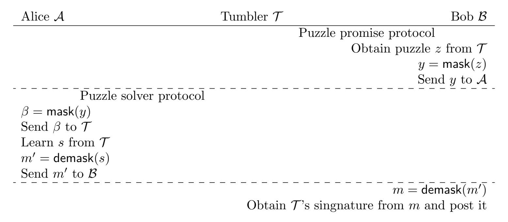

{0}------------------------------------------------

# Anonymous probabilistic payment in payment hub

Tatsuo Mitani

Akira Otsuka

Graduate School of Information Security, Institute of Information Security Mitsubishi Chemical Systems, Inc. dgs187101@iisec.ac.jp

Graduate School of Information Security, Institute of Information Security otsuka@iisec.ac.jp

June 19, 2020

#### Abstract

Privacy protection and scalability are significant issues with blockchain. We propose an anonymous probabilistic payment under the general functionality for solving them. We consider the situation that several payers pay several payees through a tumbler. We have mediated the tumbler of the payment channel hub between payers and payees. Unlinkability means that the link, which payer pays which payee via the tumbler, is broken. A cryptographic puzzle plays a role in controlling the intermediation and execution of transactions. Masking the puzzle enables the payer and the payee to unlink their payments. The overview of the proposed protocol is similar to TumbleBit (NDSS 2017). We confirm the protocol realizes the ideal functionalities discussed in TumbleBit. The functionality required for our proposal is the hashed time lock contract that various cryptocurrencies use. This request is general, not restricted to any particular cryptocurrency. Our proposal includes a probabilistic payment. In probabilistic payment, one pays an ordinary mount with a certain probability. One pays a small amount as an expected value. One can run fewer transactions than a deterministic payment. It contributes scalability. We introduce a novel fractional oblivious transfer for probabilistic payment. We call it the ring fractional oblivious transfer (RFOT). RFOT is based on the ring learning with errors (RLWE) encryption. Our trick is based on the fact that an element of the ring is indistinguishable from the circular shifted element. We confirm that RFOT holds the properties of fractional hiding and binding presented in the DAM scheme (Eurocrypt 2017).

## 1 Introduction

The Bitcoin [\[Nak08\]](#page-26-0) announced by Nakamoto has spread all over the world. This underlying technology is now called the blockchain. There are many other cryptocurrencies based on blockchain technology. Cryptocurrencies also have spread and usable in the real world. There are many problems that blockchain needs to be solved. Scalability and privacy protection are significant problems in blockchain. However, there are a few proposals to solve these problems at the same time.

Let us state privacy protection. The transaction normally links a payer and a payee. One can figure out their balance and trading frequency by analyzing the links of transactions. Privacy is not protected. Breaking the transaction link is necessary to protect privacy.

Let us describe scalability. It is costly to write all the small transactions into the blockchain. The payment of a small amount of money is called micropayment. For such micropayments, Wheeler [\[Whe97\]](#page-27-0) and Rivest [\[Riv97\]](#page-26-1) proposed a probabilistic payment before blockchain appears. It reduces costs for micropayment. In probabilistic payment, one pays an ordinary mount m with a certain probability p. One pays a small amount mp as an expected value. By the probability p (e.g. p ≈ 0.1 ∼ 0.001), one can reduce 1/p times transactions compared to deterministic payment. Micropay [\[Ps15\]](#page-26-2), the DAM scheme [\[CGL](#page-25-0)<sup>+</sup>17] and Microcash [\[ABCar\]](#page-24-0) have proposed a new micropayment on the blockchain. It is attracting attention as one of the leading solutions for scalability in the blockchain.

{1}------------------------------------------------

1 INTRODUCTION 2

## 1.1 Our contribution

We propose an anonymous probabilistic payment. It aims to solve both scalability and privacy protection. In this work, we realize a kind of unlinkability, which is "k-anonymity in an epoch." This definition is mentioned in TumbleBit [\[HAB](#page-25-1)+17] and their earlier work [\[HBG16\]](#page-25-2). The link means that which payer pays which payee via a tumbler within an epoch. Anonymity says the link is broken. Even a tumbler never knows the link. The "k" is the number of participants trading via the tumbler. The epoch is the period during which transactions are completed.

Our proposal includes a probabilistic payment. In probabilistic payment, one pays an ordinary mount m with a certain probability p (e.g. p ≈ 0.1 ∼ 0.001). One pays a small amount mp as an expected value. One can reduce 1/p times transactions compared to deterministic payment. We introduce a novel fractional oblivious transfer for adopting the probabilistic payment. We call it the ring fractional oblivious transfer. It is based on the ring learning with errors (RLWE) encryption. The functionality required for our proposal is hashed time lock contract (HTLC). Various cryptocurrencies adapt HTLC. This request is general, not restricted to any particular cryptocurrency.

## 1.2 Related work

In this subsection, we describe the related work regarding anonymity in blockchain, probabilistic payment, fractional oblivious transfer, and the comparison with a concurrent work.

#### 1.2.1 Anonymity in blockchain

There are researches on a new anonymous cryptocurrency. Zerocash [\[SCG](#page-26-3)+14] is a famous anonymous cryptocurrency and is implemented as ZCash. Regarding ZCash, their group has proposed continuous researches such as BOLT [\[GM17\]](#page-25-3) and DAM scheme [\[CGL](#page-25-0)+17]. Monero is also a famous anonymous cryptocurrency and provided with incredible works [\[Noe15,](#page-26-4) [SALY17,](#page-26-5)[YSL](#page-27-1)+ar,[MSRL](#page-26-6)+19]. There are studies to realize anonymity for existing cryptocurrencies by using off-chain technology. TumbleBit [\[HAB](#page-25-1)+17] is compatible with Bitcoin. Zether [\[BAZBar\]](#page-24-1) is compatible with Ethereum.

#### 1.2.2 Probabilistic payments

Wheeler [\[Whe97\]](#page-27-0) and Rivest [\[Riv97\]](#page-26-1) proposed a probabilistic payment. Micropay [\[Ps15\]](#page-26-2) is compatible with Bitcoin. Microcash [\[ABCar\]](#page-24-0) can be implemented as a smart contract. The DAM scheme, which is the extension of anonymous ZCash, also realizes a probabilistic payment.

#### 1.2.3 Fractional oblivious transfer over the ring

Bellare and Micali [\[BM90\]](#page-25-4) and Bellare and Rivest [\[BR99\]](#page-25-5) proposed the fractional oblivious transfer based on the computational Diffie-Hellman assumption as the early works. The DAM scheme [\[CGL](#page-25-0)+17[,CGL](#page-25-6)+16] also proposed a novel fractional oblivious transfer based on the decisional Diffie-Hellman assumption as fractional message transfer. Note that [\[CGL](#page-25-6)<sup>+</sup>16] is the full version of [\[CGL](#page-25-0)<sup>+</sup>17].

Brakerski and D¨ottling proposed an oblivious transfer based on the learning with errors [\[BD18\]](#page-25-7). This work is the first oblivious transfer in the post-quantum cryptography. Liu and Hu first proposed an efficient 1-out-of-2 oblivious transfer (OT) on the RLWE assumption and extends 1-out-of-n OT [\[LH19\]](#page-26-7). To the best of our knowledge, we first propose the fractional oblivious transfer over the ring.

#### 1.2.4 Comparison with a concurrent work

The DAM scheme [\[CGL](#page-25-0)<sup>+</sup>17, [CGL](#page-25-6)<sup>+</sup>16] is an anonymous probabilistic payment, which passes ZCash transaction by a fractional oblivious transfer. Since the scheme includes a ZCash transaction in the message, it is a ZCash specific implementation. Although we also propose an anonymous probabilistic payment, the required functionality is the hashed time lock contract (HTLC). Various cryptocurrencies such as Bitcoin, implement HTLC. Therefore our proposal is not limited to a specific cryptocurrency.

{2}------------------------------------------------

1 INTRODUCTION 3

## 1.3 Our approach

We present the approach of the anonymous probabilistic payment and the ring fractional oblivious transfer, which is a vital ingredient in our proposal.

#### 1.3.1 Anonymous probabilistic payment

We propose an anonymous probabilistic payment that a payer pays a payee via a tumbler. We name the payer Alice and the payee Bob. Suppose that she wants to send one coin to him through the tumbler with a certain probability p. We show the overview of the protocol in Fig. [1.](#page-2-0) Our protocol mostly follows TumbleBit [\[HAB](#page-25-1)+17].

Let us explain each phase in the protocol, setup, puzzle promise, and puzzle solver as follows. In the setup phase, the tumbler generates a one-time key pair consisting of a public key and a private key. The tumbler also attaches proof of the zero-knowledge proof. The tumbler publishes this proof and the public key.

In the promise phase, the tumbler and Bob interact. The tumbler prepares an escrow transaction that pays one coin to him from the tumbler. Both the signatures of the tumbler and he can execute this escrow transaction. The tumbler does not present its signature to him in this phase. Instead, the tumbler creates puzzles and promises from its signature and presents them to him. If he has this puzzle answer, then he obtains the tumbler signature from the promise and puzzle.

To gain the answer, Bob will ask Alice to solve the puzzle. Then, he masks the puzzle to delete his link and sends it to her. She also masks the received puzzle from him to delete her link. She will pay and get the answer to the puzzle with probability p in the next phase.

In the solver phase, Alice interacts with the tumbler to get the puzzle answer. She makes a probability payment to the tumbler, paying one coin with probability p. Then, she sends the double-masked puzzle to the tumbler. She issues a transaction to the tumbler and asks the tumbler to post the puzzle answer. She asks the tumbler to decrypt in exchange for the commitment to the transaction. The tumbler posts the answer and executes the transaction. Alice demasks the decrypted answer and sends the single masked answer to Bob.

In the cash-out phase, Bob receives the single masked answer from Alice. He demasks it and obtains the answer. As the tumbler and he promised in the promise phase, he gets the tumbler signature from the answer. Finally, he executes the escrow transaction and gain one coin.

For the probabilistic payment in the solver phase, we introduce a novel ingredient. It is a fractional oblivious transfer based on the ring learning with errors (RLWE) encryption. We call it the ring fractional oblivious transfer (RFOT).



<span id="page-2-0"></span>Figure 1: Overview of the proposed protocol

#### 1.3.2 Ring fractional oblivious transfer

Let us describe the ring fractional oblivious transfer (RFOT).

{3}------------------------------------------------

2 BUILDING BLOCKS 4

**Basic idea.** In the RLWE encryption, it is essential to operate on the ring  $\mathbf{R}_q = \mathbb{Z}_q[X]/\langle X^{n_d} + 1 \rangle$ . Let us compare an element  $a \in \mathbf{R}_q$  with  $aX^k$  multiplied by  $X^k$  with an integer k. One can choose k randomly from the set  $\{1,\ldots,n\}$ , where  $n < n_d$ . Because  $X^{n_d} = -1$ , the original coefficient of the element a is cyclically shifted regardless of the sign. In key generation or encryption, one samples coefficients of the element a randomly from the uniform distribution or the discrete Gaussian distribution. These distributions are positive and negative symmetric. The element a chosen from the distributions and the shifted  $aX^k$  are indistinguishable. Looking at the  $aX^k$ , one cannot identify how much the shift is.

**Procedure.** Suppose that a sender sends a message m to a receiver. We name the sender Alice and the receiver Bob. First, he creates a one-time key pair, a public key and private key. He randomly chooses an integer  $k \in \{1, \ldots, n\}$ , cyclically shifts the public key by multiplying  $X^{-k}$ . Furthermore, he issues this shifted public key to her. She creates the ciphertext by the shifted public key. She does not know the shift amount of k. She also randomly chooses an integer  $l \in \{1, \ldots, n\}$ , and shifts the ciphertext by multiplying  $X^l$ . He receives the shifted ciphertext and decrypts it by the secret key. If both shifted amounts l and k match, he can obtain a message m in the specified format. If they do not match, he has a broken message  $\emptyset$ . The probability that both l and k match is 1/n.

**Security.** We prove that the RFOT satisfies the fractional hiding and fractional binding. The DAM scheme |CGL<sup>+</sup>17, CGL<sup>+</sup>16| introduced the two properties. Fractional hiding is a property that a ciphertext created by an honest encryptor can be decrypted exactly with probability p. Fractional binding is a property that a malicious encryptor cannot create valid ciphertext that can be decrypted with probability  $p' \neq p$ . We prove the security of the fractional hiding and fractional binding with the simulation-based security like [CGL<sup>+</sup>17, CGL<sup>+</sup>16]. We adopt a trapdoor to simulate the RFOT. Let us explain the trapdoor for the simulated RFOT. We use the scheme for the trapdoor proposed in the identity-based encryption over NTRU lattice [DLP14]. The trapdoor requires the decisional small polynomial ratio (DSPR) assumption. We regard the one-time public key and private key as a user key and the simulated trapdoor as a master key. It can directly produce the small elements of the RLWE encryption. One can simulate a shifted secret key or plaintext and randomness from the randomly sampled elements  $s_1, s_2$  such that  $y = as_1 + 2s_2$ for the given y and the trapped a. A trapdoor using a gadget matrix is known. Micciancio and Peikert proposed a gadget matrix based trapdoor [MP12]. Following this work, Genise and Micciancio proposed an efficient Gaussian sampler for the trapdoor [GM18]. Cousins et al. proposed the implementation of the RLWE encryption |CDG<sup>+</sup>18|. However, this method does not output the small elements required for RLWE encryption.

#### 1.4 Chapter organization

We describe the organization of this work. In Section 2, we state the building blocks. In Section 3, we introduce the ring fractional oblivious transfer. In Section 4, we introduce the puzzle solver protocol and the puzzle promise protocol and discuss the security of the protocols. In Section 5, we conclude this work.

# <span id="page-3-0"></span>2 Building blocks

In this section, we describe the building blocks.

#### 2.1 Notation

Let  $\mathbb{N}, \mathbb{Z}, \mathbb{Q}$  and  $\mathbb{R}$  be the set of natural numbers, the set of integers, the set of rational numbers and the set of real numbers, respectively. Let the finite field  $\mathbb{Z}_q = \mathbb{Z}/q\mathbb{Z} = \{0, 1, \dots, q-1\}$ , where q is a prime number. Let  $\mathbb{Z}[X]$  be the ring of polynomials over the integers. Let  $\Phi_l \in \mathbb{Z}[X]$  be the l-th cyclotomic polynomial. We set l to a power of 2. We have the cyclotomic polynomial  $\Phi_l = X^{n_d} + 1$ , where  $n_d = \phi(l)$ .  $\phi$  is the Euler function. Let the ring of integers  $\mathbf{R} = \mathbb{Z}[X]/\langle X^{n_d} + 1 \rangle$ , and let  $\mathbf{R}_q = \mathbb{Z}_q[X]/\langle X^{n_d} + 1 \rangle = \mathbb{Z}[X]/\langle X^{n_d} + 1, q \rangle$ .  $\mathbf{R}_q$  is the ring of integers  $\mathbf{R}$  modulo q. We identify a vector  $(a_0, \dots, a_{n_d-1}) \in \mathbb{Z}^{n_d}$  with a polynomial  $a_0 + a_1X + \dots + a_{n_d-1}X^{n_d-1} \in \mathbf{R}$ . We denote the norms of  $a = a_0 + a_1X + \dots + a_{n_d-1}X^{n_d-1} \in \mathbf{R}$  as follows.  $|a_i|$  is the absolute value of  $a_i$ .

{4}------------------------------------------------

2 BUILDING BLOCKS 5

- $l_2$ -norm  $|a| = \sqrt{a_0^2 + a_1^2 + \dots + a_{n_d-1}^2}$
- $l_{\infty}$ -norm  $|a|_{\infty} = \max(|a_0|, |a_1|, \dots, |a_{n_d-1}|)$

If  $\forall c \in \mathbb{N}$ ,  $\exists n_c$  such that  $\forall n > n_c, f(n) < 1/n^c$ , then we denote the function f as a negligible function f negl(f). If an element f is sampled randomly from a distribution f or a uniform distribution over the set f, then we denote f then we denote f then we denote f as a negligible function f as a negligible function f as a negligible function f as a negligible function f as a negligible function f as a negligible function f as a negligible function f as a negligible function f as a negligible function f as a negligible function f as a negligible function f as a negligible function f as a negligible function f as a negligible function f and f are f and f are f and f are f and f are f and f are f are f and f are f are f and f are f are f and f are f are f are f and f are f are f are f are f are f are f are f are f are f are f are f are f are f are f are f are f are f are f are f are f are f are f are f are f are f are f are f are f are f are f are f are f are f and f are f are f are f are f are f are f are f are f are f are f are f are f are f are f are f are f are f are f are f are f are f are f are f are f are f are f are f are f are f are f are f are f are f are f are f are f are f are f are f are f are f are f are f are f are f are f are f are f are f are f are f are f are f are f are f are f are f are f are f are f are f are f are f are f are f are f are f are f are f are f are f are f are f are f are f are f are f are f are f are f are f are f are f are f are f are f are f are f are f are f are f are f are f are f are f are f are f are f are f are f are f are f are f are f are f are f are f are f are f are f are f are f

## 2.2 Ring learning with errors encryption

We introduce the definitions regarding the ring learning with errors (RLWE) encryption.

#### 2.2.1 Discrete Gaussian distribution

we describe the discrete Gaussian distribution.

- $\rho_{v,\sigma}^{n_d}(x) = (\frac{1}{\sqrt{2\pi}\sigma})^{n_d} e^{\frac{-|x-v|^2}{2\sigma^2}}$  is the continuous normal distribution over  $\mathbb{R}^{n_d}$  centered at v with standard deviation  $\sigma$ . If v=0, then we write  $\rho_{v,\sigma}^{n_d}$  as  $\rho_{\sigma}^{n_d}$ .
- $D^{n_d}_{v,\sigma}(x) = \rho^{n_d}_{v,\sigma}(x)/\rho^{n_d}_{\sigma}(\mathbb{Z}^{n_d})$  is the discrete normal distribution over  $\mathbb{Z}^{n_d}$  centered at  $v \in \mathbb{Z}^{n_d}$  with standard deviation  $\sigma$ . In this definition, the quantity  $\rho^{n_d}_{\sigma}(\mathbb{Z}^{n_d}) = \sum_{z \in \mathbb{Z}^{n_d}} \rho^{n_d}_{\sigma}(z)$  is just a normalized quantity. It is necessary to express the function as a probability distribution. We also mention that  $\forall v \in \mathbb{Z}^{n_d}, \, \rho^{n_d}_{v,\sigma}(\mathbb{Z}^{n_d}) = \rho^{n_d}_{\sigma}(\mathbb{Z}^{n_d})$ . The scaling factor is the same for all v. If the dimension  $n_d$  is clear from the context, then we omit  $n_d$  and write  $D^{n_d}_{\sigma}$  as  $D_{\sigma}$ . We also denote  $D_{\sigma}$  as  $\chi$ .

We introduce the below lemma regarding the discrete Gaussian distribution.

<span id="page-4-0"></span>**Lemma 1** (Lemma 4.4 in [MR07]). Let  $n_d \in \mathbb{N}$ . For any number  $\sigma > \omega(\sqrt{\log n_d})$ , we have

$$\Pr_{x \stackrel{\$}{\leftarrow} D_{\sigma}}[|x|_{\infty} > \sigma \sqrt{n_d}] \le 2^{-n_d + 1}.$$

**Remark 1.** According to Lemma 1,  $|x| \leq B$  with overwhelming probability if  $x \stackrel{\$}{\leftarrow} D_{\sigma}$ . B is a constant value.

#### 2.2.2 Assumption

First, we present the problems over the ring as follows.

<span id="page-4-2"></span>**Definition 1** (Ring learning with errors (RLWE<sub> $\phi,q,\chi$ </sub>) problem). Let  $\phi(X) \in \mathbb{Z}[X]$  be a polynomial of degree  $n_d$ , let  $q \in \mathbb{Z}$  be a prime integer, let  $\chi$  denote a distribution over the ring  $\mathbf{R} = \mathbb{Z}[X]/\langle \phi(X) \rangle$ , and let  $\mathbf{R}_q = \mathbf{R}/q\mathbf{R}$ . The ring learning with errors problem  $\mathsf{RLWE}_{\phi,q,\chi}$  is to distinguish between the following two distributions:  $(a,y) \in \mathbf{R}_q^2$  such that  $a \stackrel{\$}{\leftarrow} \mathbf{R}_q$ ,  $s,e \stackrel{\$}{\leftarrow} \chi$ , y=as+e, and  $(a,y) \stackrel{\$}{\leftarrow} \mathbf{R}_q^2$ .

The RLWE assumption indicates that the RLWE problem is hard for any probabilistic polynomial time algorithm. The RLWE assumption still holds even if we choose the secret s according to the error distribution  $D_{\sigma}$  rather than uniformly [LPR13].

<span id="page-4-1"></span>**Definition 2** (Decisional small polynomial ratio (DSPR $_{\phi,q,\chi}$ ) problem (Definition 3.4 in [LATV12])). Let  $\phi(X) \in \mathbb{Z}[X]$  be a polynomial of degree  $n_d$ , let  $q \in \mathbb{Z}$  be a prime integer, and let  $\chi$  denote a distribution over the ring  $\mathbf{R} = \mathbb{Z}[X]/\langle \phi(X) \rangle$ . The decisional small polynomial ratio problem  $\mathsf{DSPR}_{\phi,q,\chi}$  is to distinguish between the following two distributions: a polynomial h = g/f, where f and g are sampled from the distribution  $\chi$  (conditioned on f being invertible over  $\mathbf{R}_q = \mathbf{R}/q\mathbf{R}$ ), and a polynomial  $h \stackrel{\$}{\leftarrow} \mathbf{R}_q$ .

According to [LATV12], let us explain a standard deviation of the discrete Gaussian distribution  $D_{\sigma}$  and DSPR assumption. It is known that the DSPR problem is hard if the standard deviation is large. For the calculation using homomorphic encryption, we want to take a small one. In this case, it is assumed that the DSPR problem is still hard. This is called DSPR assumption.

{5}------------------------------------------------

#### 2.2.3 RLWE encryption and its syntax

Now we introduce Brakerski-Vaikuntanathan (BV) scheme [BV11]. We describe plaintext space, key generation, encryption and decryption as follows.

- The plaintext space  $\mathbf{M} = \mathbf{R}_p = \mathbb{Z}[X]/\langle X^{n_d} + 1, p \rangle$ . In this work, we set p = 2 in  $\mathbf{M}$ .
- To generate key,  $a, s \stackrel{\$}{\leftarrow} \mathbf{R}_q$ ,  $e_s \stackrel{\$}{\leftarrow} D_{\sigma}$ ,  $b = as + e_s$ , where (a, b) is a public key and s is a secret key.
- To encrypt a plaintext  $m \in \mathbf{M}$ , choose a set of randomness  $v, e, f \stackrel{\$}{\leftarrow} D_{\sigma}$ , and compute the ciphertext  $c = (c_1, c_2) = (bv + pe + m, av + pf) \in \mathbf{C}$ . We also denote the procedure as  $c = \mathsf{RLWE}.\mathsf{Enc}(\mathsf{pk}, m)$  or  $c = \mathsf{RLWE}.\mathsf{Enc}(\mathsf{pk}, m, v, e, f)$ . The latter is the case of specifing the randomness.
- To decrypt  $c = (c_1, c_2)$  with secret key s and obtain a plaintext m, compute  $m = (c_1 s \cdot c_2 \mod q)$  mod p. We also denote the procedure as  $m = \mathsf{RLWE}.\mathsf{Dec}(\mathsf{sk}, c)$ .

## <span id="page-5-0"></span>3 Ring fractional oblivious transfer

In this section, we introduce a fractional oblivious transfer over the ring. First, we describe the trapdoor and the zero-knowledge proof. Next, we introduce the syntax and the definition of the scheme and its simulator, and its properties, referring to [CGL<sup>+</sup>16]. Finally, we present the construction of a novel fractional oblivious transfer and discuss the security.

## 3.1 Trapdoor

We introduce the trapdoor based on DSPR assumption according to [DLP14]. We use IBE.MasterKeygen( $n_d$ , q) and IBE.Extract( $\mathbf{B}$ , t) of [DLP14]. We show the functions in Fig. 2. We state the difference between our functions and [DLP14]. [DLP14] calculates the hash value of the second argument in the function IBE.Extract. However, we use the target value t as it is.

- Master key generation: IBE.MasterKeygen $(n_d, q) \to (a, \mathbf{B}, g_a, f_a)$ On input a dimension  $n_d$  of the ring  $\mathbf{R}$  and a modulo q of the ring  $\mathbf{R}_q = \mathbf{R}/q\mathbf{R}$ , IBE.MasterKeygen outputs a master public key a, a master secret key  $\mathbf{B}$ , and small polynomials  $g_a, f_a$  such that  $a = g_a \cdot f_a^{-1}$ .
- Extractor: IBE.Extract( $\mathbf{B}, t$ )  $\to$   $(s_1, s_2)$ On input a master secret key  $\mathbf{B}$  and a target value t, IBE.Extract outputs a pair of small polynomials  $(s_1, s_2)$  such that  $t = as_1 + 2s_2$ , where a is the master public key.

<span id="page-5-1"></span>Figure 2: Trapdoor by identity-based encryption [DLP14]

## 3.2 Non-interactive zero-knowledge proof

Let us state the non-interactive zero-knowledge proof (NIZK). We show the syntax of NIZK in Fig. 3, referring to [CGL<sup>+</sup>16]. In this work, we represent NIZK according to the syntax.  $\mathcal{R}$  is a relation regarding an instance x and a witness w. If x and w satisfy the relation  $\mathcal{R}$ , then we denote  $(x, w) \in \mathcal{R}$ .

The non-interactive zero-knowledge proof for the relation  $\mathcal{R}$  is a protocol that satisfies the below properties.

1. Completeness For any  $(x, w) \in \mathcal{R}$ , the conditional probability

$$\Pr[\mathsf{NIZK}.\mathsf{Verify}(\mathsf{crs},x,\pi) = 1 \land (x,w) \in \mathcal{R} \mid \\ \mathsf{crs} \leftarrow \mathsf{NIZK}.\mathsf{Setup}(1^\lambda,\mathcal{R}), \pi \leftarrow \mathsf{NIZK}.\mathsf{Prove}(\mathsf{crs},x,w)] \geq 1 - \mathsf{negl}(\lambda).$$

{6}------------------------------------------------

- Setup: NIZK.Setup(1<sup>λ</sup> , R) → crs On input a security parameter λ and a relation R, NIZK.Setup outputs a common reference strings crs.
- Prove: NIZK.Prove(crs, x, w) → π On input a common reference strings crs, an instance x, and a witness w, NIZK.Prove outputs a proof π.
- Verify: NIZK.Verify(crs, x, π) → 1 or 0 On input a common reference strings crs, an instance x, and a proof π, NIZK.Verify outputs 1 if π is valid, otherwise 0.
- Simulated setup: NIZK.SimSetup(1<sup>λ</sup> , R) → (crs,td) On input a security parameter λ and a relation R, NIZK.SimSetup outputs a common reference strings crs and a trapdoor td.
- Knowledge extractor: NIZK.Extract(crs,td, x, π) → w On input a common reference strings crs, a trapdoor td, an instance x, and a proof π, NIZK.Extract outputs a witness w.
- Simulator: NIZK.Simulate(crs,td, x) → π On input a common reference strings crs, a trapdoor td, and an instance x, NIZK.Simulate outputs a proof π.
- Knowledge extracting simulator: NIZK.ExtSimulate(crs,td, x) → π On input a common reference strings crs, a trapdoor td, and an instance x, NIZK.ExtSimulate outputs a proof π.

<span id="page-6-0"></span>Figure 3: Syntax of NIZK [\[CGL](#page-25-6)<sup>+</sup>16]

{7}------------------------------------------------

#### 2. Soundness

Let a knowledge extractor NIZK.Extract for any adversary A exist. For all (x, w) 6∈ R, the conditional probability

$$\begin{split} \Pr[\mathsf{NIZK}.\mathsf{Verify}(\mathsf{crs},x,\pi') &= 1 \wedge (x,w') \not\in \mathcal{R} \mid \\ (\mathsf{crs},\mathsf{td}) \leftarrow \mathsf{NIZK}.\mathsf{SimSetup}(1^{\lambda},\mathcal{R}), \pi \leftarrow \mathsf{NIZK}.\mathsf{Prove}(\mathsf{crs},x,w), \\ w' \leftarrow \mathsf{NIZK}.\mathsf{Extract}(\mathsf{crs},\mathsf{td},x,\pi), \pi' \leftarrow \mathcal{A}(\mathsf{crs},x,w')] \leq \mathsf{negl}(\lambda). \end{split}$$

#### 3. Zero-knowledge

For any adversary, the below two distribution ensembles E real Z , E ideal Z are computationally indistinguishable.

$$\begin{split} \mathcal{E}_Z^{\mathsf{real}} &= \{ (\mathcal{R}, \mathsf{crs}, x, \pi) \mid \mathsf{crs} \leftarrow \mathsf{NIZK}.\mathsf{Setup}(1^\lambda, \mathcal{R}), \pi \leftarrow \mathsf{NIZK}.\mathsf{Prove}(\mathsf{crs}, x, w) \} \\ \mathcal{E}_Z^{\mathsf{ideal}} &= \{ (\mathcal{R}, \mathsf{crs}, x, \pi) \mid (\mathsf{crs}, \mathsf{td}) \leftarrow \mathsf{NIZK}.\mathsf{SimSetup}(1^\lambda, \mathcal{R}), \\ &\quad \pi \leftarrow \mathsf{NIZK}.\mathsf{Simulate}(\mathsf{crs}, \mathsf{td}, x) \} \end{split}$$

We introduce the following relations RK, R<sup>0</sup> and RE. We describe the concrete protocols for these relations in Appendix [A.](#page-27-2)

$$\mathcal{R}_{K} = \{ ((a,y),(s,e)) \mid y = as + 2e \land |s|, |e| \leq \tilde{\mathcal{O}}(\sqrt{n_{d}}\alpha) \}$$

$$\mathcal{R}_{0} = \{ ((c_{1},c_{2}),(v,e,f)) : (c_{1},c_{2}) = (bv + pe, av + pf) \land |v|, |e|, |f| \leq \tilde{\mathcal{O}}(\sqrt{n_{d}}\alpha) \}$$

$$\mathcal{R}_{E} = \{ ((c_{1},c_{2},a,y),(m,v,e,f)) \mid c_{1} = yv + 2e + m \land c_{2} = av + 2f$$

$$\land |m|_{\infty} \leq 1 \land |v|, |e|, |f| \leq \tilde{\mathcal{O}}(\sqrt{n_{d}}\alpha) \}$$

Let us explain NIZK.ExtSimulate regarding the relation R<sup>E</sup> for a randomly sampled pair (c1, c2) as follows. We adopt the special trapdoor td<sup>I</sup> since a pair (c1, c2) is randomly sampled.

<span id="page-7-0"></span>Definition 3 (Extract Simulate with trapdoor). NIZK.ExtSimulate regarding the relation R<sup>E</sup> for a given pair (c1, c2) \$ ←− C is stated as follows.

- NIZK.ExtSimulate(crsE,td<sup>I</sup> , x) → π
  - 1. Parse x as (c1, c2, a, y).
  - 2. Parse td<sup>I</sup> as (B, ga, fa).
  - 3. Compute (v 0 , f<sup>0</sup> ) = IBE.Extract(B, c2).
  - 4. Compute (s1, s2) = IBE.Extract(B,(c<sup>1</sup> − yv<sup>0</sup> )f −1 a ).
  - 5. Compute m<sup>0</sup> , e<sup>0</sup> from (c<sup>1</sup> − yv<sup>0</sup> )f −1 <sup>a</sup> = as<sup>1</sup> + 2s2.
  - 6. Compute π = NIZK.Prove(crsE, x,(m<sup>0</sup> , v<sup>0</sup> , e<sup>0</sup> , f<sup>0</sup> )).
  - 7. Output π.

Remark 2. Let us confirm how to obtain m<sup>0</sup> , e<sup>0</sup> from (c<sup>1</sup> −yv<sup>0</sup> )f −1 <sup>a</sup> = as<sup>1</sup> + 2s2. Note that a = gaf −1 a , where f<sup>a</sup> and g<sup>a</sup> are small polynomials.

$$(c_1 - yv')f_a^{-1} = as_1 + 2s_2$$

$$(c_1 - yv')f_a^{-1} = s_1g_af_a^{-1} + 2s_2$$

$$c_1 - yv' = s_1g_a + 2s_2f_a$$

$$c_1 = yv' + s_1g_a + 2s_2f_a$$

We have m<sup>0</sup> = s1g<sup>a</sup> mod 2 and e <sup>0</sup> = s2fa. We obtain c<sup>1</sup> = yv<sup>0</sup> + 2e <sup>0</sup> + m<sup>0</sup> . 

{8}------------------------------------------------

<span id="page-8-1"></span>Lemma 2. Let NIZK.ExtSimulate be defined as Definition [3.](#page-7-0) The below two distribution ensembles E real <sup>Z</sup><sup>0</sup> and E ideal <sup>Z</sup><sup>0</sup> are computationally indistinguishable.

$$\begin{split} \mathcal{E}_{Z'}^{\mathsf{real}} &= \{ (\mathcal{R}_E, \mathsf{crs}, x, \pi) \mid \mathsf{crs} \leftarrow \mathsf{NIZK}.\mathsf{Setup}(1^\lambda, \mathcal{R}_E), \pi \leftarrow \mathsf{NIZK}.\mathsf{Prove}(\mathsf{crs}, x, w) \} \\ \mathcal{E}_{Z'}^{\mathsf{ideal}} &= \{ (\mathcal{R}_E, \mathsf{crs}, x, \pi) \mid (\mathsf{crs}, \mathsf{td}) \leftarrow \mathsf{NIZK}.\mathsf{SimSetup}(1^\lambda, \mathcal{R}_E), \\ &\quad \pi \leftarrow \mathsf{NIZK}.\mathsf{ExtSimulate}(\mathsf{crs}, \mathsf{td}, x) \} \end{split}$$

Proof. Let us confirm Definition [3](#page-7-0) of ExtSimulate. A simulated witness w <sup>0</sup> = (m<sup>0</sup> , v<sup>0</sup> , e<sup>0</sup> , f<sup>0</sup> ) is generated from the trapdoor td<sup>I</sup> . Then the true witness w is entirely unnecessary. We can choose a small witness w 0 that fits the norm constraint by IBE.Extract. Besides, we can call the actual proving function NIZK.Prove inline. The simulated proof by NIZK.ExtSimulate is computationally indistinguishable from the proof by NIZK.Prove. We conclude that the two distribution ensembles E real <sup>Z</sup><sup>0</sup> and E ideal <sup>Z</sup><sup>0</sup> are computationally indistinguishable.

## 3.3 Syntax and definition

We introduce the definitions of the scheme, the correctness, and the simulator, fractional hiding, and fractional binding. These definitions appear initially as fractional message transfer in [\[CGL](#page-25-6)+16]. We follow the syntax and the definition in [\[CGL](#page-25-6)<sup>+</sup>16], and realize our original scheme and its security in Section [3.4.](#page-10-0)

### 3.3.1 Syntax and definition of scheme and simulator

We state the syntax and the definition regarding the scheme and its simulator. We show the syntax and definition of the scheme in Fig. [4.](#page-9-0)

Definition 4 (Correctness [\[CGL](#page-25-6)+16]). A scheme is correct if for every security parameter λ, public parameters pp ∈ RFOT.Setup(1<sup>λ</sup> ), probability p ∈ [0, 1], key pair (pk,sk) ∈ RFOT.Keygen(pp, p), and message m ∈ M,

$$\mathsf{RFOT}.\mathsf{Decrypt}(\mathsf{pp},\mathsf{sk},\mathsf{RFOT}.\mathsf{Encrypt}(\mathsf{pp},\mathsf{pk},m)) = \begin{cases} m & \textit{with probability } p \\ \emptyset & \textit{with probability } 1-p \end{cases}$$

Remark 3. The types of a decrypted message m<sup>0</sup> are as follows. Let us name valid/invalid message hit/miss since we illustrate a probabilistic payment as a lottery ticket.

- m : well formatted valid message. We also call it "hit."
- ∅ : broken formatted invalid message. We also call it "miss."
- ⊥ : error message reporting error occurrence

#### 3.3.2 Fractional hiding and binding

In this subsection, we introduce the definitions of fractional hiding and binding, according to [\[CGL](#page-25-6)<sup>+</sup>16].

<span id="page-8-0"></span>Definition 5 (Fractional hiding (Claim A.7 in [\[CGL](#page-25-6)<sup>+</sup>16])). The hiding property holds when the following distribution ensembles E real <sup>H</sup> and E ideal <sup>H</sup> are computationally indistinguishable for any adversary AH, where

$$\begin{split} \mathcal{E}_H^{\mathsf{real}} &= \{\mathsf{out} \mid \mathsf{RFOT}.\mathsf{Setup}(1^\lambda) \to \mathsf{pp}, \mathcal{A}_H(\mathsf{pp}) \to (\mathsf{pk}, m), \\ &\quad \mathsf{RFOT}.\mathsf{Encrypt}(\mathsf{pp}, \mathsf{pk}, m) \to c, \mathcal{A}_H(c) \to \mathsf{out} \} \end{split}$$

and

$$\begin{split} \mathcal{E}_H^{\mathsf{ideal}} &= \{\mathsf{out} \mid \mathsf{RFOT}.\mathsf{SimSetup}(1^\lambda) \to (\mathsf{pp}, \mathsf{td}), \mathcal{A}_H(\mathsf{pp}) \to (\mathsf{pk}, m), \\ & \text{``1 with probability p and 0 otherwise''} \to b, \\ & \text{if } b = 1, \ set \ m' = m; \ else \ set \ m' = \emptyset, \\ & \mathsf{RFOT}.\mathsf{SimEncrypt}(\mathsf{pp}, \mathsf{td}, \mathsf{pk}, b, m') \to c, \mathcal{A}_H(c) \to \mathsf{out} \}. \end{split}$$

{9}------------------------------------------------

The syntax of the scheme

- Setup: RFOT.Setup(1<sup>λ</sup> ) → pp On input a security parameter λ, RFOT.Setup outputs a public parameter pp.
- Key generation: RFOT.Keygen(pp, p) → (pk,sk) On input a public parameter pp and a probability p ∈ [0, 1], RFOT.Keygen outputs a public key pk and a secret key sk.
- Encryption: RFOT.Encrypt(pp, pk, m) → c On input a public parameter pp, a public key pk, and a message m, RFOT.Encrypt outputs a ciphertext c.
- Decryption: RFOT.Decrypt(pp,sk, c) → m<sup>0</sup> On input a public parameter pp, a secret key sk, and a ciphertext c, RFOT.Decrypt outputs a message m0 .

The simulator regarding the security for the scheme

- Simulated setup: RFOT.SimSetup(1<sup>λ</sup> ) → (pp,td) On input a security parameter λ, RFOT.SimSetup outputs a public parameter pp and a trapdoor td.
- Simulated key generation: RFOT.SimKeygen(pp,td, p) → (pk,sk) On input a public parameter pp, a trapdoor td, and a probability p ∈ [0, 1], RFOT.SimKeygen outputs a public key pk and a secret key sk.
- Simulated encryption: RFOT.SimEncrypt(pp,td, pk, b, m<sup>0</sup> ) → c On input a public parameter pp, a trapdoor td, a public key pk, a bit b, and a message m<sup>0</sup> , RFOT.SimEncrypt outputs a ciphertext c.
- Extracting decryption: RFOT.ExtDecrypt(pp,td,sk, c) → m On input a public parameter pp, a trapdoor td, a secret key sk, and a ciphertext c, RFOT.ExtDecrypt outputs a message m.
- Simulated decryption: RFOT.SimDecrypt(pp,td,sk, b) → sk<sup>0</sup> On input a public parameter pp, a trapdoor td, a secret key sk, and a bit b, RFOT.SimDecrypt outputs a simulated secret key sk<sup>0</sup> .

<span id="page-9-0"></span>Figure 4: Syntax of the scheme and its simulator [\[CGL](#page-25-6)<sup>+</sup>16]

{10}------------------------------------------------

<span id="page-10-2"></span>Definition 6 (Fractional binding (Claim A.8 in [\[CGL](#page-25-6)+16])). The binding property holds when the following distribution ensembles E real <sup>B</sup> and E ideal <sup>B</sup> are computationally indistinguishable for any adversary AB, where

$$\begin{split} \mathcal{E}_B^{\mathsf{real}} &= \{(\mathsf{pp}, \mathsf{pk}, \mathsf{sk}, c, m) \mid \mathsf{RFOT}.\mathsf{Setup}(1^\lambda) \to \mathsf{pp}, \mathsf{RFOT}.\mathsf{Keygen}(\mathsf{pp}, p) \to (\mathsf{pk}, \mathsf{sk}), \\ \mathcal{A}_B(\mathsf{pp}, \mathsf{pk}) \to c, \mathsf{RFOT}.\mathsf{Decrypt}(\mathsf{pp}, \mathsf{sk}, c) \to m \} \end{split}$$

and

$$\begin{split} \mathcal{E}_B^{\text{ideal}} &= \{(\mathsf{pp}, \mathsf{pk}, \mathsf{sk}', c, m') \mid \text{ "1 with probability p and 0 otherwise"} \to b, \\ &\quad \mathsf{RFOT}.\mathsf{SimSetup}(1^\lambda) \to (\mathsf{pp}, \mathsf{td}), \\ &\quad \mathsf{RFOT}.\mathsf{SimKeygen}(\mathsf{pp}, \mathsf{td}, p) \to (\mathsf{pk}, \mathsf{sk}), \\ &\quad \mathcal{A}_B(\mathsf{pp}, \mathsf{pk}) \to c, \mathsf{RFOT}.\mathsf{ExtDecrypt}(\mathsf{pp}, \mathsf{td}, \mathsf{sk}, c) \to m, \\ &\quad \mathsf{RFOT}.\mathsf{SimDecrypt}(\mathsf{pp}, \mathsf{td}, \mathsf{sk}, b) \to \mathsf{sk}', \\ &\quad if \ b = 1, \ set \ m' = m; \ else \ set \ m' = \emptyset\}. \end{split}$$

## <span id="page-10-0"></span>3.4 Construction

We describe the scheme, the correctness, and simulation-based security.

#### 3.4.1 Scheme

Let us introduce the formal definition of our scheme.

<span id="page-10-1"></span>Definition 7 (Ring fractional oblivious transfer). The ring fractional oblivious transfer (RFOT)

$$\mathsf{RFOT} = (\mathsf{RFOT}.\mathsf{Setup}, \mathsf{RFOT}.\mathsf{Keygen}, \mathsf{RFOT}.\mathsf{Encrypt}, \mathsf{RFOT}.\mathsf{Decrypt})$$

is defined in Fig. [5.](#page-11-0)

Remark 4. We denote the encryption as c = RFOT.Encrypt(pk, m; v, e, f) if an encryptor specifies the randomness v, e, f.

#### 3.4.2 Correctness

Let us confirm the correctness of decryption in our scheme. If l = k, then

$$(c_1 - c_2 s)X^{-k} = ((yX^{-k}v + 2e + m)X^l - (av + 2f)s)X^{-k}$$

$$= ((yX^{l-k} - as)v + 2(eX^l - fs))X^{-k} + mX^{l-k}$$

$$= ((y - as)v + 2(eX^l - fs))X^{-k} + m$$

$$= 2(e_s v + eX^l - fs)X^{-k} + m$$

(esv + eX<sup>l</sup> − fs)X<sup>−</sup><sup>k</sup> is small. We have m<sup>0</sup> = (c<sup>1</sup> − c2s)X<sup>−</sup><sup>k</sup> mod 2 = m.

#### 3.4.3 Security

In this subsection, we state the simulation-based security.

Definition 8 (Simulated ring fractional oblivious transfer). The simulated ring fractional oblivious transfer

$$\label{eq:RFOT-SimSetup} \begin{aligned} \mathsf{RFOT}.\mathsf{SimSetup}, \mathsf{RFOT}.\mathsf{SimKeygen}, \mathsf{RFOT}.\mathsf{SimEncrypt}, \\ \mathsf{RFOT}.\mathsf{ExtDecrypt}, \mathsf{RFOT}.\mathsf{SimDecrypt}) \end{aligned}$$

is defined in Fig. [6.](#page-12-0)

{11}------------------------------------------------

- RFOT.Setup(1<sup>λ</sup> ) → pp
  - 1. Compute crs<sup>K</sup> ← NIZK.Setup(1<sup>λ</sup> , RK).
  - 2. Compute crs<sup>E</sup> ← NIZK.Setup(1<sup>λ</sup> , RE).
  - 3. Set a \$ ←− Rq.
  - 4. Output pp = (crsK, crsE, a).
- RFOT.Keygen(pp, 1/n) → (pk,sk)
  - 1. Parse pp as (crsK, crsE, a).
  - 2. Set s, e<sup>s</sup> \$ ←− χ.
  - 3. Compute y = as + 2es.
  - 4. Set k \$←− {1, . . . , n}.
  - 5. Compute y<sup>0</sup> = yX<sup>−</sup><sup>k</sup> .
  - 6. Compute π<sup>K</sup> = NIZK.Prove(crsK,(a, y0),(sX<sup>−</sup><sup>k</sup> , esX<sup>−</sup><sup>k</sup> )).
  - 7. Set pk = (1/n, a, y0, πK).
  - 8. Set sk = (1/n, s, es, k, πK).
  - 9. Output key pair (pk,sk).
- RFOT.Encrypt(pp, pk, m) → c
  - 1. Parse pp as (crsK, crsE, a).
  - 2. Parse pk as (1/n, a, y0, πK).
  - 3. Set l \$←− {1, . . . , n}.
  - 4. Compute c 0 <sup>1</sup> = y0v + 2e + m, c<sup>2</sup> = av + 2f.
  - 5. Compute c<sup>1</sup> = c 0 <sup>1</sup>X<sup>l</sup> = (y0v + 2e + m)X<sup>l</sup> .
  - 6. Compute π<sup>E</sup> = NIZK.Prove(crsE,(c1, c2, a, y0),(m, v, e, f)).
  - 7. Output c = (l, c1, c2, πE).
- RFOT.Decrypt(pp,sk, c) → m<sup>0</sup>
  - 1. Parse pp as (crsK, crsE, a).
  - 2. Parse sk as (1/n, s, es, k, πK).
  - 3. Parse c as (l, c1, c2, πE).
  - 4. If l 6∈ {1, . . . , n}, then output ⊥.
  - 5. If NIZK.Verify(crsE,(c1, c2, a, y0), πE) = 0, then output ⊥.
  - 6. If l 6= k, then output m<sup>0</sup> = ∅.
  - 7. If l = k, then output m<sup>0</sup> = (c<sup>1</sup> − c2s)X<sup>−</sup><sup>k</sup> mod 2.

<span id="page-11-0"></span>Figure 5: Construction of the ring fractional oblivious transfer

{12}------------------------------------------------

- RFOT.SimSetup $(1^{\lambda}) \rightarrow (pp, td)$ 
  - 1. Compute  $(\operatorname{crs}_K,\operatorname{td}_K) \leftarrow \operatorname{NIZK}.\operatorname{SimSetup}(1^{\lambda},\mathcal{R}_K).$
  - 2. Compute  $(\operatorname{crs}_E,\operatorname{td}_E) \leftarrow \mathsf{NIZK}.\mathsf{SimSetup}(1^\lambda,\mathcal{R}_E).$
  - 3. Compute  $(a, \mathbf{B}, g_a, f_a) = \mathsf{IBE}.\mathsf{MasterKeygen}(n_d, q).$
  - 4. Set  $td_I = (\mathbf{B}, g_a, f_a)$ .
  - 5. Set  $pp = (crs_K, crs_E, a)$ .
  - 6. Set  $td = (td_K, td_E, td_I)$ .
  - 7. Output (pp, td).
- RFOT.SimKeygen(pp, td, 1/n)  $\rightarrow$  (pk, sk)
  - 1. Parse pp as  $(crs_K, crs_E, a)$ .
  - 2. Parse td as  $(\mathsf{td}_K, \mathsf{td}_E, \mathsf{td}_I)$ .
  - 3. Set  $s, e_s \stackrel{\$}{\leftarrow} \chi$ .
  - 4. Compute  $y = as + 2e_s$ .
  - 5. Set  $k \stackrel{\$}{\leftarrow} \{1, \dots, n\}$ .
  - 6. Compute  $y_0 = yX^{-k}$ .
  - 7. Compute  $\pi_K = \mathsf{NIZK}.\mathsf{Simulate}(\mathsf{crs}_K,\mathsf{td}_K,(a,y_0)).$
  - 8. Set  $pk = (1/n, a, y_0, \pi_K)$ .
  - 9. Set  $sk = (1/n, s, e_s, k, \pi_K)$ .
  - 10. Output key pair (pk, sk).
- <span id="page-12-0"></span>• RFOT.SimEncrypt(pp, td, pk, b, m')  $\rightarrow c$ 
  - 1. Parse pp as  $(\operatorname{crs}_K, \operatorname{crs}_E, a)$ .
  - 2. Parse td as  $(td_K, td_E, td_I)$ .
  - 3. Parse pk as  $(1/n, a, y_0, \pi_K)$ .
  - 4. Set  $l \stackrel{\$}{\leftarrow} \{1, \dots, n\}$ .
  - 5. If b = 0, then
    - Set  $(c_1, c_2) \stackrel{\$}{\leftarrow} \mathbf{C}$ .
    - Compute  $\pi_E = \mathsf{NIZK}.\mathsf{ExtSimulate}(\mathsf{crs}_E, \mathsf{td}_I, (c_1, c_2, a, y_0)).$
  - 6. If b=1, then
    - Compute  $c'_1 = y_0v + 2e + m'$ ,  $c_2 = av + 2f$ ,  $c_1 = c'_1X^l$ .
    - Compute  $\pi_E = \mathsf{NIZK.Prove}(\mathsf{crs}_E, (c_1, c_2, a, y_0), (m', v, e, f)).$
  - 7. Output  $c = (l, c_1, c_2, \pi_E)$ .
    - Figure 6: Simulator of the ring fractional oblivious transfer

- $\bullet \;\; \mathsf{RFOT}.\mathsf{ExtDecrypt}(\mathsf{pp},\mathsf{td},\mathsf{sk},c) \to m$ 
  - 1. Parse sk as  $(1/n, s, e_s, k, \pi_K)$ .
  - 2. Parse c as  $(l, c_1, c_2, \pi_E)$ .
  - 3. Output  $m = (c_1 X^{-l} c_2 s X^{-k}) \mod 2.$
- $\bullet \;\; \mathsf{RFOT}.\mathsf{SimDecrypt}(\mathsf{pp},\mathsf{td},\mathsf{sk},b) \to \mathsf{sk}'$ 
  - 1. Parse pp as  $(\operatorname{crs}_K, \operatorname{crs}_E, a)$ .
  - 2. Parse td as  $(\mathsf{td}_K, \mathsf{td}_E, \mathsf{td}_I)$ .
  - 3. Parse  $\operatorname{td}_I$  as  $(\mathbf{B}, g_a, f_a)$ .
  - 4. Parse sk as  $(1/n, s, e_s, k, \pi_K)$ .
  - 5. If b = 0,
    - Compute
      - $(s', e'_s) = \mathsf{IBE}.\mathsf{Extract}(\mathbf{B}, y_0)$
    - Set  $sk' = (1/n, s', e'_s, k, \pi_K).$
  - 6. If b = 1, then output sk.

{13}------------------------------------------------

**Remark 5.** Let us confirm that one can extract the plaintext with RFOT.ExtDecrypt, even if  $l \neq k$ .

$$c_1 X^{-l} - c_2 s X^{-k} = (y_0 v + 2e + m) - (av + 2f) s X^{-k}$$

$$= (y X^{-k} v + 2e + m) - (av + 2f) s X^{-k}$$

$$= (y - as) v X^{-k} + 2(e - fs X^{-k}) + m$$

$$= 2(e_s v + e - fs) X^{-k} + m$$

 $(e_s v + e - f s) X^{-k}$  is small. We obtain  $(c_1 X^{-l} - c_2 s X^{-k})$  mod 2 = m.

Lemma 3. The below two distribution ensembles are computationally indistinguishable:

$$\{\operatorname{pp}\mid \mathsf{RFOT}.\mathsf{Setup}(1^\lambda)\to\operatorname{pp}\}\ \ and\ \{\operatorname{pp}\mid \mathsf{RFOT}.\mathsf{SimSetup}(1^\lambda)\to(\operatorname{pp},\mathsf{td})\}.$$

*Proof.* We suppose that an adversary distinguishes the two pp. Let us confirm the variable  $a \in pp$ . The one is randomly sampled from  $\mathbf{R}_q$ , and the other is equal to  $g_a \cdot f_a^{-1}$ . If the adversary distinguishes the two a, then the adversary could break the DSPR assumption regarding Definition 2. This is a contradiction. We conclude that RFOT.Setup and RFOT.SimSetup are computationally indistinguishable.

<span id="page-13-1"></span>Lemma 4. The below two distribution ensembles are computationally indistinguishable:

$$\{(\mathsf{pp},\mathsf{pk}) \mid \mathsf{RFOT}.\mathsf{Setup}(1^\lambda) \to \mathsf{pp}, \ \mathsf{RFOT}.\mathsf{Keygen}(\mathsf{pp},p) \to (\mathsf{pk},\mathsf{sk})\} \ \mathit{and} \\ \{(\mathsf{pp},\mathsf{pk}) \mid \mathsf{RFOT}.\mathsf{SimSetup}(1^\lambda) \to (\mathsf{pp},\mathsf{td}), \ \mathsf{RFOT}.\mathsf{SimKeygen}(\mathsf{pp},\mathsf{td},p) \to (\mathsf{pk},\mathsf{sk})\}.$$

*Proof.* The difference between RFOT.Keygen and RFOT.SimKeygen are each function that outputs each proof. One is NIZK.Prove. The other is NIZK.Simulate. The proofs by NIZK.Prove and NIZK.Simulate are computationally indistinguishable because NIZK scheme satisfies zero-knowledge. We conclude that the lemma holds.

Lemma 5 (Fractional hiding). The scheme of Definition 7 holds the fractional hiding of Definition 5.

*Proof.* Let us compare  $\mathcal{E}_H^{\mathsf{real}}$  with  $\mathcal{E}_H^{\mathsf{ideal}}$ . There are two differences between the two ensembles. The one is NIZK.Prove or NIZK.ExtSimulate. These proofs are indistinguishable from Lemma 2.

The other difference is the encryption or the ramdom sampling.  $c'_1 = y_0 v + 2e + m'$ ,  $c_1 = c'_1 X^l$ ,  $c_2 = av + 2f$  in  $\mathcal{E}_H^{\mathsf{real}}$  or  $(c_1, c_2) \overset{\$}{\leftarrow} \mathbf{C}$  in  $\mathcal{E}_H^{\mathsf{ideal}}$ . If an adversary  $\mathcal{A}$  can distinguish  $\mathcal{E}_H^{\mathsf{real}}$  and  $\mathcal{E}_H^{\mathsf{ideal}}$ , then  $\mathcal{A}$  could distinguish the true ciphertext  $(c_1, c_2)$  from the randomly sampled element  $(c_1, c_2) \overset{\$}{\leftarrow} \mathbf{C}$ . This situation goes against the RLWE assumption regarding Definition 1. We conclude that  $\mathcal{E}_H^{\mathsf{real}}$  and  $\mathcal{E}_H^{\mathsf{ideal}}$  are indistinguishable. The scheme holds the fractional hiding.

**Lemma 6** (Fractional binding). The scheme of Definition 7 holds the fractional hiding of Definition 6.

Proof. Let us compare  $\mathcal{E}_B^{\text{real}}$  with  $\mathcal{E}_B^{\text{ideal}}$ . RFOT.Keygen and RFOT.SimKeygen are computationally indistinguishable because of Lemma 4. RFOT.ExtDecrypt outputs a unique plaintext m for a valid ciphertext even if  $l \neq k$ . The simulated secret key  $\mathsf{sk}'$  is distributed independently of the actual secret key  $\mathsf{sk}$ . When b = 1, output the actual secret key itself. When b = 0, a different secret key  $(s', e'_s)$  is output, satisfying the relationship  $y_0 = as' + 2e'_s$  with the fixed public key  $(a, y_0)$  with IBE.Extract. We conclude that the scheme holds the fractional binding.

# <span id="page-13-0"></span>4 Protocol and security

In this section, we present the protocols, the ideal functionalities, the theorems that each protocol realizes each ideal functionality, and the proofs regarding the puzzle solver and puzzle promise. Let us outline the security discussion. We present a simulation-based proof of the real/ideal world paradigm. We build simulators in the cases of each corrupt participant. We discuss the indistinguishability of the game sequence by using a hybrid argument. The discussion is based on TumbleBit [HAB+17, HAB+16]. We also combine the DAM scheme [CGL+17, CGL+16] regarding the puzzle solver protocol related to RFOT.

{14}------------------------------------------------

## 4.1 Puzzle solver protocol

We present the puzzle solver protocol, the ideal functionality, the theorem, and the proof. We show the puzzle solver protocol in Fig. [7](#page-16-0) and the ideal functionality in Fig. [8.](#page-17-0) We also show the simulators in Fig. [9](#page-18-0) and Fig. [10.](#page-18-1) The simulator in Fig. [9](#page-18-0) corresponds to the corrupt Alice. The simulator in Fig. [10](#page-18-1) corresponds to the corrupt the tumbler. Let us present the quick look at the protocol, the overview of the ideal functionality, and proof sketch as the below paragraphs.

Quick look at the protocol. We change the procedure by the RSA encryption in TumbleBit [\[HAB](#page-25-1)+17, [HAB](#page-25-12)+16], into the one by the RLWE encryption. Also, we combine RFOT with the procedure in TumbleBit. The tumbler and Alice interact at the protocol. We use a cut-and-choose technique in the procedure. Alice creates real puzzles and fake puzzles, respectively. At Step 1, She further masks the masked puzzle (ciphertext) she receives for the real puzzles. She creates ciphertext by randomly choosing a plaintext by herself. She adds this with the puzzle. At Step 2, she creates a ciphertext from randomly chosen plaintext for the fake puzzles. She does not add the received puzzle to the ciphertext. At Step 3, she mixes these puzzles and executes the RFOT encryption. She permutes and mixes real puzzles and fake puzzles. These puzzles are just RLWE ciphertexts. She chooses the integer l randomly and shifts all puzzles by the single amount l. In this way, she produces the RFOT ciphertext from the RLWE ciphertexts. She passes the puzzles to the tumbler. At Step 4, the tumbler decrypts all the puzzles it receives. If the puzzles are miss/error, then the tumbler cannot obtain the correct message. In this case, the tumbler aborts. (Even if the tumbler chooses s randomly, she will notice that it does not match her plaintext at Step 7. Moreover, the tumbler does not know which puzzle is in the fake set at this stage.) The tumbler creates a ciphertext c for the decrypted message by using symmetric key encryption. The tumbler also selects the hash value h of k randomly. The tumbler sends these (c, h) to her for commitment. At Step 5, upon receiving the commitment (c, h), she informs the tumbler of which puzzle belongs to the fake set. She sends a message and randomness to the tumbler for opening. At Step 6, the tumbler verifies the received message and randomness, by matching the ciphertext received earlier. If all can be verified correctly, the tumbler sends k belonging to the fake set to her. At Step 7, she obtains s by the decryption process from the received k and the ciphertext c of the symmetric key encryption. If s matches the original plaintext, she continues. Otherwise, she aborts. At Step 8, she fills in the transaction on the blockchain. Both the preimages of h and the tumbler's signature can fulfill this transaction. She sends the received puzzle to the tumbler and the message and the randomness in the real set. At Step 9, the tumbler verifies the ciphertext from the received message, randomness, and puzzle. If it is OK, the tumbler fills k in the transaction offered at Step 10. At Step 11, she gets k from the transaction, executes the symmetric key encryption, and gets s. She removes her message by XOR operation and gets the message of the received puzzle y.

Overview of the ideal functionality. We combine the functionality of TumbleBit and the functionality of fractional message transfer (FMT) in the DAM scheme for the ideal functionality. First, we incorporate mutual fairness into functionalities, following TumbleBit. Fairness for Alice means that the tumbler earns one coin if and only if she gets the correct answer. Fairness for the tumbler means that the protocol executes decrypting the puzzle selected by her. Upon setup, the functionality receives the key from the tumbler and verifies if it is valid. If the verification is successful, the functionality sends the key to her and Simulator. At the evaluation, the functionality receives the request containing the ciphertext from her and sends it to the tumbler. Also, the functionality receives the plaintext result from the tumbler, sends it to Alice, and pays to the tumbler.

Next, we append a probabilistic payment to the functionality, following the DAM scheme. The functionality conveys a valid message with probability p. Alice sends to the functionality at the request, including bit b and probability pA. The functionality confirms the bit b to determine whether there is an error. The tumbler sends the key to the functionality together with the probability p<sup>T</sup> . The functionality judges that a lottery is an error in the case that b = 0 or the probabilities do not match. If b = 1 and the probabilities are equal, the functionality runs that the ciphertext is a hit with probability p and is a failure with probability 1 − p. The functionality stores the judged value in Q as a pair (sid, mid). Let us confirm the behavior after the functionality receives the evaluation result from the tumbler. The functionality searches Q for mid paired with sid. If mid is a hit and the message x from the tumbler is valid, the functionality sends x to her and 

{15}------------------------------------------------

pays the tumbler. Otherwise, the tumbler refunds to her as a missing lottery or an error.

**Proof sketch.** In the case of corrupt Alice, she cannot learn more than the decrypted message.

Let us confirm the case of corrupt the tumbler. The protocol adopts a cut-and-choose technique like TumbleBit. Therefore, the tumbler must present invalid ciphertexts to the real set while correctly responding to the fake set. The tumbler cannot obtain the information regarding the fake set and the real set before her opening. The probability of corrupt tumbler's success is negligible.

**Theorem 1.** Let  $\lambda$  be a security parameter. Let  $n_d \geq 2\lambda$ . Assume that H and  $H^{\mathsf{prg}}$  are independent random oracles, and the RLWE and DSPR problems are hard. Then, the protocol in Fig. 7 securely realizes the functionality  $\mathcal{F}_{\mathsf{solver}}$  in Fig. 8 with the following security guarantees. The security for  $\mathcal{T}$  is  $1 - \mathsf{negl}(\lambda)$  and the security for  $\mathcal{A}$  is  $1 - 1/\binom{\mu + \eta}{\eta} - \mathsf{negl}(\lambda)$ .

*Proof.* We divide the proof into two cases. One is the case of the corrupt Alice. The other is the case of the corrupt the tumbler. The simulator S in Fig. 9 corresponds to the corrupt Alice  $\mathcal{A}^*$ . The simulator S in Fig. 10 corresponds to the corrupt the tumbler  $\mathcal{T}^*$ .

Case that Alice is corrupt. We adopt a hybrid argument and confirm the indistinguishability between the real world and the ideal world. The simulator S in Fig. 9 plays a role of the corrupt Alice  $\mathcal{A}^*$ .

 $\mathfrak{d}_0$ : This is the real game.

 $\partial_1$ : The difference between  $\partial_0$  and  $\partial_1$  is how the key  $k_i$  is computed. If  $x' = \mathsf{RFOT}.\mathsf{Decrypt}(\mathsf{sk}, \beta_i) \neq \emptyset$  with salt, the simulator in this hybrid  $\partial_1$  sends  $k_i' = \mathsf{Equivocate}(c_i, x, h_i)$ , instead of  $k_i$ . If  $x' = \emptyset$ , then both games receive refund and halt. From the assumption regarding the random oracle,  $c_i$  and  $h_i$  statistically hide the encrypted message and the preimage. The probability of the event Collision is negligible. So the view in  $\partial_1$  is indistinguishable from the view in  $\partial_0$ .

 $\partial_2$ : The difference between  $\partial_1$  and  $\partial_2$  is what one inputs Equivocate. The simulator in this hybrid  $\partial_2$  computes Equivocate $(c_i, \rho_i, h_i)$  instead of Equivocate $(c_i, x + r_i, h_i)$ . Then x is a valid message of y. x is taken from  $\mathcal{F}_{\text{solver}}$  after Adv has sent  $T_{\text{puzzle}}$ . Both games receive refund instead of x and halt. The view in  $\partial_2$  is generated by just a single value x. The view in  $\partial_2$  is indistinguishable from the view in  $\partial_1$ . The simulator in  $\partial_2$  corresponds to Simulator S in Fig. 9.

Case that the tumbler is corrupt. The simulator S in Fig. 10 plays a role of the corrupt the tumbler  $\mathcal{T}^*$ . Because of the RLWE assumption, all ciphertexts  $\beta_1, \ldots, \beta_{\mu+\eta}$  are uniformly distributed. They reveal no information about the sets F, R. Furthermore,  $H, H^{\mathsf{prg}}$  are modeled as a random oracle. The encryption of the key is binding. It is impossible for an adversary Adv to change the values after the sets F, R are revealed. Then, we denote the event that an adversary presumes the set F as the event BAD. The probability of the event BAD is as follows.

$$\Pr[\mathsf{BAD}] = \frac{1}{\binom{\mu+\eta}{\eta}} + \frac{1}{2^{\lambda_1}}$$

The difference between the transcript by the simulator S in Fig. 10 in the ideal world and the one in the real world is if the event BAD happens or not. The two worlds are distinguishable with the negligible probability  $Pr[\mathsf{BAD}]$ .

We conclude that the protocol in Fig. 7 securely realizes the functionality  $\mathcal{F}_{solver}$  in Fig. 8.

#### 4.2 Puzzle promise protocol

We present the puzzle promise protocol, the ideal functionality, the theorem, and the proof. We show the protocol in Fig. 11 and the ideal functionality in Fig. 12. We also show the simulators in Fig. 13 and Fig. 14. The simulator in Fig. 13 corresponds to the corrupt Bob. The simulator in Fig. 14 corresponds to the corrupt the tumbler. Let us present the quick look at the protocol, the overview of the ideal functionality, and proof sketch as the below paragraphs.

{16}------------------------------------------------

```
Public input: pk. \pi_K in pk proves validity of pk in a one time setup phase.
Alice A. Input: puzzle y
                                                                                                           the tumbler \mathcal{T}. Secret input: sk
1. Prepare real puzzles R
salt \stackrel{\$}{\leftarrow} \{0,1\}^{\lambda}
For j = 1, \ldots, \mu:
\begin{array}{c} r_{j} \xleftarrow{\$} \{0,1\}^{\lambda}, v_{j}, e_{j}, f_{j} \xleftarrow{\$} \chi \\ \underline{d_{j}} = \underbrace{\mathsf{RLWE}.\mathsf{Enc}(\mathsf{pk}, \mathsf{salt}||r_{j}; v_{j}, \underline{e_{j}}, f_{\underline{j}}) + \underline{y}}_{2}. \text{ Prepare fake values } F \end{array}
                                                                                              ______
For i = 1, \ldots, \eta:
\begin{array}{l} \rho_i \xleftarrow{\$} \{0,1\}^{\lambda}, v_i, e_i, f_i \xleftarrow{\$} \chi \\ \underline{\delta_i = \text{RLWE.Enc}(\text{pk, salt}||\rho_i; v_i, e_i, f_i)} \\ \overline{3}. \text{ Mix sets and RFOT} \end{array}
                                                                          · = = = = = = = = = = = = = = = = = = =
Permute \{d_1, \ldots, d_{\mu}, \delta_1, \ldots, \delta_{\eta}\} randomly
and obtain \{\beta'_1, \ldots, \beta'_{\mu+\eta}\}
l \stackrel{\$}{\leftarrow} \{1, \dots, n\}
For i = 1, ..., \mu + \eta:
    Parse \beta_i' as (c_1', c_2) and set c_1 = c_1' X^l
                                                                  \xrightarrow{\text{salt},l,\beta_1,\ldots,\beta_{\mu+\eta}} \xrightarrow{\text{salt},l,\beta_1,\ldots,\beta_{\mu+\eta}}
    Set \beta_i = (c'_1, c_2)
Let R be the indices of the d_i
Let F be the indices of the \delta_i
                                                                                                          4. Evaluation.
                                                                                                           For i = 1, ..., \mu + \eta:
                                                                                                               Evaluate \beta_i: s_i = \mathsf{RFOT}.\mathsf{Decrypt}(\mathsf{sk}, \beta_i)
                                                                                                               Check if s_i = \emptyset with salt. If not, abort.
                                                                                                               Encrypt the result s_i:
                                                                                                                  k_i \stackrel{\$}{\leftarrow} \{0,1\}^{\lambda_1}
                                                                                                                  c_i = H^{\mathsf{prg}}(k_i) \oplus s_i
                                                            \leftarrow \underbrace{\frac{(c_1, h_1), \dots, (c_{\mu+\eta}, h_{\mu+\eta})}{-\overline{F}, \overline{\rho_i}, \overline{v_i}, \overline{e_i} \overline{f_i} \ \forall i \in F}_{-}}_{}
                                                                                                                   Commit to the keys: h_i = H(k_i)
 5. Identify fake set.
                                                                                                           6. Check fake set.
                                                                                                          For all i \in F: Verify \beta_i =
                                                                                                                    \mathsf{RFOT}.\mathsf{Encrypt}(\mathsf{pk},\mathsf{salt}||\rho_i;v_i,e_i,f_i,l)
                                                                          k_i \ \forall i \in F
                                                                                                          If yes, reveal k_i \ \forall i \in F. Else abort.
7. Check fake set.
For all i \in F:
    Verify h_i = H(k_i)
    Decrypt s_i = H^{\mathsf{prg}}(k_i) \oplus c_i
    Verify s_i = \rho_i
Abort if any check fails
8. Post transaction T_{\text{puzzle}}
T_{\mathsf{puzzle}} offers one coin within timewindow tw_1
under condition "the fulfilling transaction is signed
                                                                              y,r_j,v_j,e_j,f_j \ \forall j \in R
by \mathcal{T} and has preimages of h_j \ \forall j \in R"
                                                                                                          9. Check \bar{\beta}_i unblind to y \ \forall j \in R
                                                                                                           For all j \in R: Verify \beta_i =
                                                                                                           RFOT.Encrypt(pk, salt||r_j; v_j, e_j, f_j, l) + y
                                                                                                           If not, abort.
                                                                                                           10. Post transaction T_{\text{puzzle}}
                                                                                                          T_{\text{puzzle}} = \text{contains } k_j \ \forall j \in R
11. Obtain puzzle solution.
For j \in R:
    Learn k_j from T_{puzzle}
    Decrypt s_j = H^{\mathsf{prg}}(k_j) \oplus c_j
    Verify \beta_i = \mathsf{RFOT}.\mathsf{Encrypt}(\mathsf{pk},\mathsf{salt}||s_j;v_j,e_j,f_j,l) + y
    Obtain solution s_j + r_j \mod 2
```

<span id="page-16-0"></span>Figure 7: Puzzle solver protocol. We model H and  $H^{prg}$  as random oracles.

{17}------------------------------------------------

### Parties.

• A, T and adversary S.

## Setup.

- Receive (Setup, pk,sk, p<sup>T</sup> ) from T .
- If pk or sk are invalid, then
  - do nothing.
- Else,
  - Send (Setup, pk) to A and S.

#### Evaluation.

- On input (request,sid, y, 1coin, pA, b) from A:
  - If b = 1 and p<sup>A</sup> = p<sup>T</sup> ,
    - ∗ Set mid = hit with probability p<sup>A</sup> or mid = miss with probability 1 − pA.
  - Else if b = 0 or p<sup>A</sup> 6= p<sup>T</sup> , set mid = error.
  - Send (request,sid, A, y) to T .
  - Append (sid, mid) to Qid.
  - Start counter twsid = 0.
- On input (evaluate,sid, A, x) from T :
  - Obtain mid corresponding sid from Qid.
  - If mid = hit and x 6= ∅, then
    - ∗ Send (sid, x) to A.
    - ∗ Send (payment,sid, 1coin) to T .
  - Else, send (refund,sid, 1coin) to A.
- If twsid = tw, send (refund,sid, 1coin) to A.

<span id="page-17-0"></span>Figure 8: Ideal functionality Fsolver

{18}------------------------------------------------

- 1. Receive salt,  $l, \beta_1, \ldots, \beta_{\mu+\eta}$  from Adv. Choose  $c_i \stackrel{\$}{\leftarrow} \{0,1\}^{\lambda}$  and  $h_i \in \{0,1\}^{\lambda_2}$  for  $i \in [\mu+\eta]$ . Send them to Adv.
- 2. Receive  $F, \rho_i, v_i, e_i, f_i$  for  $i \in F$ . For all  $i \in F$ , check if  $\beta_i = \mathsf{RFOT}.\mathsf{Encrypt}(\mathsf{pk}, \mathsf{salt}||\rho_i; v_i, e_i, f_i, l)$ . If check fails, output whatever  $\mathsf{Adv}$  outputs, send (request,  $\mathsf{sid}, y, 1\mathsf{coin}, p_{\mathcal{A}}, b = 0$ ) to  $\mathcal{F}_{\mathsf{solver}}$  and halt. Else, run  $k_i' = \mathsf{Equivocate}(c_i, \rho_i, h_i)$ . Send  $k_i'$  for  $i \in F$  to  $\mathsf{Adv}$ .
- 3. Receive  $y, r_i, v_i, e_i, f_i$  for  $i \in R$ . Check if  $\beta_i = \mathsf{RFOT}.\mathsf{Encrypt}(\mathsf{pk}, \mathsf{salt}||r_i; v_i, e_i, f_i, l) + y$  for all  $i \in R$ . If the check succeeds, transaction  $T_{\mathsf{puzzle}}$  is correctly formed, execute as follows.
  - Send (request, sid, y, 1coin,  $p_A$ , b=1) to  $\mathcal{F}_{\mathsf{solver}}$  and obtain x or refund.
  - If obtain x,
    - Run  $k'_i$  = Equivocate $(c_i, x + r_i, h_i)$  with  $i \in R$ .
    - Send transaction  $T_{\mathsf{solve}}$  with values  $k_i'$ .
  - Else if obtain refund, halt.

Else, checks have failed so output whatever Adv outputs, send (request, sid, y, 1coin,  $p_A$ , b = 0) to  $\mathcal{F}_{solver}$  and halt.

Procedure random oracle simulation for  $Q_H$ ,  $Q_{H^{prg}}$  is as follows: Receive query q for  $H(\text{resp.}, H^{prg})$ :

- 1. If query  $q \in \mathcal{Q}_H(\text{resp.}, H^{\text{prg}})$ , retrieve entry (q, a) from the set and output a.
- 2. Else  $a \stackrel{\$}{\leftarrow} \{0,1\}^{\lambda_2}(\text{resp.}, \lambda_1)$ , and (q, a) to  $\mathcal{Q}_H(\text{resp.}, H^{\text{prg}})$  and output a.

Procedure Equivocate $(c_i, m_i, h_i)$  is stated as below:

- 1.  $k_i' \stackrel{\$}{\leftarrow} \{0,1\}^{\lambda_1}$ . If  $k_i' \in \mathcal{Q}_H$  or  $\mathcal{Q}_{H^{prg}}$ , output Collision and abort.
- 2. Compute  $a_i = c_i \oplus m_i$ , then append  $(k'_i, a_i)$  to  $\mathcal{Q}_{H^{prg}}$ .
- 3. Append  $(k'_i, h_i)$  to  $\mathcal{Q}_H$ .
- 4. Output  $k_i'$ .

<span id="page-18-0"></span>Figure 9: Simulator for the puzzle solver protocol in the case that Alice is corrupt

- 1. If pk and sk are valid, S receives (request, sid, A, y) from  $\mathcal{F}_{solver}$ .
- 2. Compute  $x' = \mathsf{RFOT}.\mathsf{ExtDecrypt}(\mathsf{pp},\mathsf{td},\mathsf{sk},y)$  and extract x from  $x' = \mathsf{salt}||x|$ .
- 3. Receiving  $\{k_i\}$  for all  $i \in F$  from Adv, S checks if all  $\{c_i\}_{i \in F}$  are correct. If yes, S sends message (evaluate, sid, A, x) to  $\mathcal{F}_{solver}$ . Then,  $\mathcal{F}_{solver}$  sends the puzzle solution x or refund to A. Meanwhile, S sends  $T_{puzzle}$  to Adv.
- 4. S receives  $T_{\text{solve}}$  from Adv. If all keys  $\{k_i\}\ \forall i\in R$  decrypt ciphertexts  $c_i$ , not containing valid puzzle solutions, then S outputs BAD and aborts. Else, S outputs whatever Adv outputs and halts.

<span id="page-18-1"></span>Figure 10: Simulator for the puzzle solver protocol in the case that the tumbler is corrupt

{19}------------------------------------------------

Quick look at the protocol. The tumbler and Bob interact at the protocol. As with the puzzle solver protocol, we also use the cut-and-choose technique. At Step 1, the tumbler sets up the escrow transaction. From Step 2 to Step 4, Bob creates real and fake hash values and sends the shuffled hash values to the tumbler. At Step 5, the tumbler signs everything does corresponding puzzles and sends these with promises. At Step 6, he opens fake set to the tumbler. At Step 7, the tumbler verifies them and presents to him the puzzle answers corresponding to the fake values. At Step 8, he verifies these answers. Note that we must arrange a situation where it is sufficient for him to send one of the real puzzles to Alice. At Step 9, the tumbler sends the difference from other elements and proves that the ciphertext is zero. The tumbler uses the non-interactive zero-knowledge proof for the relation  $\mathcal{R}_0$ . At Step 10 and 12, he can agree that it is sufficient to send either one to her by verifying the proof and the difference. At Step 11, the tumbler posts the transaction.

The difference from TumbleBit is the adoption of the RLWE encryption instead of RSA encryption. The RLWE encryption is probabilistic encryption, unlike the RSA encryption. One can verify the ciphertext by its plaintext and randomness by reproducing and verifing it with the encryption algorithm. We make the tumbler encrypt this randomness with symmetric key encryption and pass it to Bob. Let the key of the symmetric key encryption be the plaintext itself. Even if we adopt the RLWE encryption, we can use the only plaintext as the answer to the puzzle by this trick.

Overview of the ideal functionality. We show the ideal functionality in Fig. 12. This ideal functionality is the same as TumbleBit. Let us outline the ideal functionality briefly. The ideal functionality plays a role as a trusted third party. The functionality signs a transaction by calling the signature oracle. It is fairness for Bob that he obtains a promise that contains a valid signature for at least one genuine transaction. It is fairness for the tumbler that he has no knowledge of anything but the fake transaction signature. Upon receiving fake and real transactions from him, the functionality stores them and sends fake transactions to the tumbler. Upon receiving a promise from the tumbler, the functionality signs the fake transactions. The functionality records fake transaction signatures and the promises to real transactions. Finally, the functionality sends the promises to him. Upon receiving the signature verification from any party, the functionality tells them that the functionality has already recorded the signatures on the fake transactions. Since the functionality does not store real transactions, the functionality records them.

**Proof sketch.** Regarding corrupt Bob, we change RSA encryption in the simulator in TumbleBit into RLWE encryption. We show the simulator in Fig. 13. The simulator in Fig. 14 is the same as TumbleBit for corrupt the tumbler. The proof in TumbleBit holds in the same way.

**Theorem 2.** Let  $\lambda$  be a security parameter. Let  $n_d \geq 2\lambda$ . Assume that H, H' and  $H^{\mathsf{shk}}$  are independent random oracles, and the RLWE and DSPR problems are hard. Then, the protocol in Fig. 11 securely realizes the functionality  $\mathcal{F}_{\mathsf{promise sign}}$  in Fig. 12 with the following security guarantees. The security for  $\mathcal{T}$  is  $1-\mathsf{negl}(\lambda)$  and the security for  $\mathcal{B}$  is  $1-1/\binom{\mu+\eta}{\eta}-\mathsf{negl}(\lambda)$ .

*Proof.* We divide the proof into two cases. One is the case of corrupt Bob. The other is the case of the corrupt the tumbler.

Case that Bob is corrupt. We confirm the indistinguishability between the real world and the ideal world with a hybrid argument. The simulator S in Fig. 13 plays a role of the corrupt Bob  $\mathcal{B}^*$ .

 $\mathfrak{d}_0$ : This is the real world.

 $\partial_{0.5}$ : When the simulator receives  $h_R, h_F$  and  $\{\beta_1, \ldots, \beta_{\mu+\eta}\}$  from  $\mathcal{B}^*$ , the simulator checks the set of queries  $\mathcal{Q}_H$  and extracts the pair  $(\mathsf{salt}||R, h_R)$  and  $(\mathsf{salt}||F, h_F)$ . If there is no pair regarding  $h_R, h_F$ , the simulator aborts. This abort is the difference between  $\partial_0$  and  $\partial_{0.5}$ . The probability of the abort is  $1/2^{\lambda_2}$ , so the two games are statistically close.

 $\mathfrak{D}_1$ : Instead of computing  $c_i = H^{\mathsf{shk}}(\epsilon_i) \oplus \sigma_i$ , the simulator chooses  $c_i \stackrel{\$}{\leftarrow} \{0,1\}^s$  and stores the pair  $(\epsilon_i, c_i \oplus \sigma_i)$  in  $\mathcal{Q}_{H^{\mathsf{shk}}}$  in  $\mathfrak{D}_1$ . The both games  $\mathfrak{D}_{0.5}$  and  $\mathfrak{D}_1$  are statistically close because  $H^{\mathsf{shk}}$  is unpredictable.

{20}------------------------------------------------

Public input:  $(pk, PK_T^{eph})$ .  $\pi_K$  in pk proves validity of pk in a one time setup phase.  $\mathcal{T}$  chooses a fresh ephemeral ECDSA-Secp256k1 key  $(\mathsf{SK}_{\mathcal{T}}^{eph}, \mathsf{PK}_{\mathcal{T}}^{eph})$ Bob  $\mathcal{B}$ the tumbler  $\mathcal{T}$ . Secret input: sk1. Set up  $T_{\mathsf{escr}(\mathcal{T},\mathcal{B})}$ Sign but do not post transaction  $T_{\mathsf{escr}(\mathcal{T},\mathcal{B})}$ timelocked for  $tw_2$  offering one coin under the condition: "the fulfilling transaction  $T_{\mathsf{escr}(\mathcal{T},\mathcal{B})}$ is signed under key  $\mathsf{PK}^{eph}_{\mathcal{T}}$  and key  $\mathsf{PK}_{\mathcal{B}}$ "  $\overline{2}$ . Prepare  $\mu$  real unsigned  $\overline{T}_{\mathsf{escr}(\mathcal{T},\mathcal{B})}$ . For  $i \in 1, \ldots, \mu$ : For  $i \in 1, \ldots, \eta$ :  $\underline{r_i} \stackrel{\$}{\leftarrow} \underline{\{0,1\}}^{\lambda}, \ \underline{ft_i} = \underline{H'(\mathsf{FakeFormat}||r_i)}.$  4. Mix sets. \_\_\_\_\_\_ Permute  $\{ft_1,\ldots,ft_\eta,ht_1,\ldots,ht_\mu\}$  randomly  $\xrightarrow{\beta_1,\ldots,\beta_{\mu+\eta}}$ and obtain  $\{\beta_1, \ldots, \beta_{\mu+\eta}\}$ Let R be the indices of the  $ht_i$ Let F be the indices of the  $ft_i$  $\text{Choose salt} \xleftarrow{\$} \{0,1\}^{\lambda}$  $h_R = H(\operatorname{salt}||R), h_F = H(\operatorname{salt}||F)$ 5. Evaluation. For  $i = 1, \ldots, \mu + \eta$ : ECDSA sign  $\beta_i$  to get  $\sigma_i = Sig(SK_T^{eph}, \beta_i)$  $\epsilon_i \stackrel{\$}{\leftarrow} \{0,1\}^{\lambda}, v_i, e_i, f_i \stackrel{\$}{\leftarrow} \chi.$ Create promise  $c_i = H^{\mathsf{shk}}(\epsilon_i) \oplus \sigma_i$ Encrypt  $\bar{v}_i = \mathsf{Enc}(v_i; \epsilon_i), \bar{e}_i = \mathsf{Enc}(e_i; \epsilon_i)$  $\underbrace{ (c_1, z_1, \bar{v}_1, \bar{e}_1, \bar{f}_1), \dots,}_{ (c_{\mu+\eta}, z_{\mu+\eta}, \bar{v}_{\mu+\eta}, \bar{e}_{\mu+\eta}, \bar{f}_{\mu+\eta})} \underbrace{ (c_{\mu+\eta}, z_{\mu+\eta}, \bar{v}_{\mu+\eta}, \bar{e}_{\mu+\eta}, \bar{f}_{\mu+\eta})}_{R, F, r_i} \forall i \in F, \text{salt} }_{-}$ and  $\bar{f}_i = \mathsf{Enc}(f_i; \epsilon_i)$ Create puzzle  $z_i = \mathsf{RLWE}.\mathsf{Enc}(\mathsf{pk}, 0^\lambda || \epsilon_i; v_i, e_i, f_i)$ 6. Identify fake set. 7. Check fake set. Check  $h_R = H(\mathsf{salt}||R)$  and  $h_F = H(\mathsf{salt}||F)$ For all  $i \in F$ : Verify  $\beta_i = H'(\mathsf{FakeFormat}||r_i)$  $\epsilon_i \ \forall i \in F$ Abort if any check fails 8. Check fake set. For all  $i \in F$ : Validate  $\epsilon_i \in \{0,1\}^{\lambda}$ Decrypt  $v_i = \mathsf{Dec}(\bar{v}_i; \epsilon_i), e_i = \mathsf{Dec}(\bar{e}_i; \epsilon_i), f_i = \mathsf{Dec}(f_i; \epsilon_i)$ Validate puzzle  $z_i = \mathsf{RLWE}.\mathsf{Enc}(\mathsf{pk}, 0^{\lambda} || \epsilon_i; v_i, e_i, f_i)$ Validate promise  $c_i$ : Decrypt  $\sigma_i = H^{\mathsf{shk}}(\epsilon_i) \oplus c_i$ Verify  $\sigma_i$  such that  $(\mathsf{PK}^{eph}_{\mathcal{T}}, H'(ft_i), \sigma_i) = 1$ Abort if any check fails 9. Prepare differences For  $R = \{j_1, ..., j_{\mu}\}$ : Set  $d_2 = \epsilon_{j_2} - \epsilon_{j_1}, \dots, d_{\mu} = \epsilon_{j_{\mu}} - \epsilon_{j_{\mu-1}}$  $d_2,\ldots,d_\mu,\pi_2,\ldots,\pi_\mu$ Set  $\pi_j$  proving  $z_j + d_j \in \mathbf{C}_0$ 70. Difference test. For  $R = \{j_1, \ldots, j_{\mu}\}$ : Verify  $\pi_j$ Abort if any check fails 11. Post transaction  $T_{\operatorname{escr}(\mathcal{T},\mathcal{B})}$ 12. Start Payment Phase. Set  $z_t = z_{j_1}$ .  $m_b \xleftarrow{\$} \{0, 1\}^{\lambda}$ . Send  $z_{tb} = z_t + \mathsf{RLWE}.\mathsf{Enc}(\mathsf{pk}, 0^{\lambda} || m_b)$  to Alice  $\mathcal{A}$ .

<span id="page-20-0"></span>Figure 11: Puzzle promise protocol. We model H, H' and  $H^{\mathsf{shk}}$  as random oracles.

{21}------------------------------------------------

#### Parties.

• B, T and adversary S.

#### Setup.

• Inform Fpromise sign if T is corrupt or honest.

#### Key generation.

- Receive message (Keygen, B) from B.
- Send (Keygen, B) to S.
- Receive response (PKeph T , Sig) from S.
- Send (Setup, PKeph T ) to B.
- Record (PKeph T , Sig).

#### Signature request.

- Receive message (sign request, PKeph<sup>0</sup> T , {FkTxni}i∈[η] , {mi}i∈[µ]) from B.
- If PKeph<sup>0</sup> T 6= PKeph T , then do nothing.
- If ∀i, FkTxn<sup>i</sup> compiles with FakeFormat, then send (sign request, B, PKeph T , {FkTxni}i∈[η]) to T .
- Else, do nothing.

#### Promise.

- Receive (promise, B, ans, Set) from T .
- If ans = no, then set all signatures to ⊥.
- Else, if Set 6= ∅, compute signatures as follows:
  - If T is honest, Set FkSign<sup>i</sup> = Sig(FkTxn<sup>i</sup> , PKeph T ) for i ∈ [η].
  - Else T is corrupt, Send (Sign, FkTxn<sup>i</sup> , B) to adversary S, and obtain respective signatures.
  - Abort if there is a recorded entry (FkTxn<sup>i</sup> , FkSign<sup>i</sup> , PKeph T , 0).
  - Record entries (FkTxn<sup>i</sup> , FkSign<sup>i</sup> , PKeph T , 1) and (m<sup>j</sup> , PKeph T , promise).
- Send (sign promise, ans) to B.

#### Signature verification.

- Receive (Verify,sid, m, σ, PKeph<sup>0</sup> T ) from any party P:
  - If PKeph<sup>0</sup> T 6= PKeph T , then do nothing.
  - Else, if T is honest:
    - ∗ If there is a recorded entry (m, σ, PKeph T , 1), then set ver = 1. (completeness condition)
    - ∗ If there is no recorded entry (m, σ, PKeph T , 1), then set ver = 0 and set the entry (m, σ, PKeph T , 0). (unforgeability condition)
  - Else, if T is corrupt, then let ver be set by S. (corrupt signer case)
- Send (Verify,sid, m, σ, ver) from party P.

<span id="page-21-0"></span>Figure 12: Ideal functionality Fpromise sign (Fig. 8 in [\[HAB](#page-25-12)<sup>+</sup>16])

{22}------------------------------------------------

- Simulator S simulates the messages that Adversary B ∗ expects from T as follows.
  - 1. Inform Fpromise sign that T is honest.
  - 2. Compute (PKeph T , SKeph T ) = Keygen(1<sup>λ</sup> ).
  - 3. Send PKeph T to B <sup>∗</sup> and Fpromise sign.
- Receive hR, h<sup>F</sup> and {β1, . . . , βµ+η} from B ∗ , runs as follows:
  - 1. Extracts the sets F, R from the random oracle, checking the set of queries Q<sup>H</sup> and extracting the pair (salt||R, hR) and (salt||F, h<sup>F</sup> ). If there is no pair regarding hR, h<sup>F</sup> , then set R = F = ⊥.
  - 2. Send B ∗ the pair (c<sup>i</sup> , zi) which is made as:
    - (a) For all i, c<sup>i</sup> \$←− {0, 1} s .
    - (b) For i ∈ F, <sup>i</sup> \$←− {0, 1} <sup>λ</sup> and z<sup>i</sup> = RLWE.Enc(pk, 0 λ ||i).
    - (c) For R = {j1, . . . , jµ}, zj<sup>1</sup> , d2, . . . , d<sup>µ</sup> \$←− {0, 1} <sup>λ</sup> and zj<sup>i</sup> = RLWE.Enc(pk, 0 λ ||di) + (0<sup>λ</sup> ||zji−<sup>1</sup> )
- Receive (F 0 , R<sup>0</sup> , ri) from B ∗ , runs as follows:
  - 1. If F <sup>0</sup> 6= F or R<sup>0</sup> 6= R, then abort.
  - 2. If any (FakeFortmat||r<sup>i</sup> , βi) 6∈ QH<sup>0</sup> for i ∈ F, then abort.
  - 3. For j ∈ R, set m<sup>j</sup> = γ if (γ, βi) ∈ QH<sup>0</sup> . Else set m<sup>j</sup> = ⊥.
  - 4. Send to Fpromise sign the message (sign request, PKeph T , {FakeFormat||ri}i∈<sup>F</sup> , {mj}j∈R).
  - 5. Obtain response (promise, B ∗ , ans, {FkSign}i∈[η]).
  - 6. If ans = no, then halt and output whatever B <sup>∗</sup> outputs.
  - 7. Compute hj<sup>l</sup> = cj<sup>l</sup> ⊕ FkSign<sup>l</sup> .
  - 8. Store the pair (j<sup>l</sup> , hj<sup>l</sup> ) in QHshk .
  - 9. Send <sup>i</sup> for i ∈ F and the differences d2, . . . , dµ.
- Finally, output whatever B <sup>∗</sup> outputs and halt.

Procedure RO1, which is the random oracle simulation for H is as follows:

- 1. Receive query q for H.
- 2. If q ∈ QH, retrieve (γ, a) for QH.
- 3. Else a \$←− {0, 1} λ<sup>2</sup> .
- 4. Append (γ, a) to QH.
- 5. Output a.

Procedure RO2, which is the random oracle simulation for Hshk is as follows:

- 1. Receive query q for Hshk .
- 2. If q ∈ QHshk , retrieve (γ, a) for QHshk .
- 3. If γ = RLWE.Dec(sk, zi) for some i ∈ R and (γ, a) 6∈ QHshk , then output RLWE failure.
- 4. Else a \$←− {0, 1} λ<sup>2</sup> .
- 5. Append (γ, a) to QHshk .
- 6. Output a.

<span id="page-22-0"></span>Figure 13: Simulator for the puzzle promise protocol in the case that Bob is corrupt

{23}------------------------------------------------

The simulator S executes  $\mathcal{T}^*$  internally.

First, we introduce the algorithm  $\operatorname{Sig}(m_i, \operatorname{PK}_{\mathcal{T}}^{eph})$  as follows.

- $L_{\mathsf{fake}}, L_{\mathsf{real}}$  are internal variables.
- If  $(m_i, \beta_i, \sigma_i) \in L_{\mathsf{fake}}$ , output signature  $(\beta_i, \sigma_i)$ .
- Else if  $(m_i, \beta_i, \sigma_i) \in L_{\mathsf{real}}$ , then append  $(m_i, \beta_i)$  to  $\mathcal{Q}_{H'}$ , and output signature  $(\beta_i, \sigma_i)$ .
- Else, abort.

Receive (Keygen,  $\mathcal{B}$ ). Send request to  $\mathcal{T}^*$ . Obtain  $\mathsf{PK}^{eph}_{\mathcal{T}}$ . Send  $(\mathsf{PK}^{eph}_{\mathcal{T}}, \mathsf{Sig})$  to  $\mathcal{F}_{\mathsf{promise sign}}$ .

Receive (sign request,  $\mathcal{B}$ ,  $\mathsf{PK}^{eph}_{\mathcal{T}}$ ,  $\{\mathsf{FkTxn}_i\}_{i\in[\eta]}$ ).

Pick randomly F, R with  $F \cap R = \emptyset$ . Compute the RO outputs  $h_F, h_R$  and  $\beta_1, \ldots, \beta_{\mu+\eta}$ . Send them to  $\mathcal{T}^*$ . Receive a pair  $(c_i, z_i)$  from  $\mathcal{T}^*$ :

- 1. Extract  $\epsilon_i$  by queries to  $H^{\mathsf{shk}}$
- 2. Let  $\sigma_i$  be the signature decrypted from  $c_i$  with  $\epsilon_i$
- 3. If  $c_i, z_i, \epsilon_i, \beta_i, \sigma_i$  for  $i \in F$  are valid, store  $(\mathsf{FkTxn}_i, \beta_i, \sigma_i)$  in  $L_{\mathsf{fake}}$ .
- 4. If  $c_i, z_i, \epsilon_i, \beta_i, \sigma_i$  for  $i \in F$  are valid, append i to set Set and append  $(\beta_i, \sigma_i)$  to  $L_{\mathsf{real}}$ . If such i does not exist, set  $\mathsf{real} = \mathsf{no}$ .

For all  $i \in F$ ,  $r_i \stackrel{\$}{\leftarrow}$ . Send  $r_i$  to  $\mathcal{T}^*$ . Append the pair  $(\mathsf{FkTxn}_i || r_i, \beta_i)$  to  $\mathcal{Q}_{H'}$ .

Receive the openings  $\epsilon'_i$  to fake messages  $i \in F$ . Obtain  $\sigma'_i$  with  $\epsilon'_i$ ,  $c_i$ . If any  $(i, c_i, z_i, \epsilon'_i, \beta_i, \sigma'_i)$  is invalid, send (promise,  $\mathcal{B}$ , no,  $\perp$ ) to  $\mathcal{F}_{\text{promise sign}}$ . Else, send (promise,  $\mathcal{B}$ , yes, Set) to  $\mathcal{F}_{\text{promise sign}}$ .

Now let us confirm the below two cases:

Case 1: If any  $i \in F$  such that  $(i, \epsilon'_i, \beta_i, \sigma'_i)$  is valid but  $(\cdot, \beta_i, \sigma'_i) \notin L_{\mathsf{fake}}$ , then abort and output binding fail. Case 2: Suppose that all  $i \in F$  such that  $(i, \epsilon'_i, \beta_i, \sigma'_i)$  is valid and  $(\cdot, \beta_i, \sigma'_i) \in L_{\mathsf{fake}}$ .

- 1. If real = no, abort and output cut and choose fail.
- <span id="page-23-0"></span>2. Else, set variables  $L_{\mathsf{fake}}, L_{\mathsf{real}}$  for the algorithm Sig.

Figure 14: Simulator for the puzzle promise protocol in the case that the tumbler is corrupt (Appendix F in [HAB<sup>+</sup>16])

{24}------------------------------------------------

5 CONCLUSION 25

the plaintext presented will match is  $1/2^{\lambda}$ . It is negligible. Note that  $\partial_2$  computes neither  $\epsilon_i$  nor  $\sigma_i$  for real messages  $m_i$  with  $i \in R$ .

 $\mathfrak{D}_3$ : Instead of the actual signature, the simulator sends the message

(sign request, 
$$\mathsf{PK}^{eph}_{\mathcal{T}}$$
,  $\{\mathsf{FakeFormat}||r_i\}_{i\in F}, \{m_j\}_{j\in R}$ )

to  $\mathcal{F}_{\text{promise sign}}$ . Then, S obtains the response (promise,  $\mathcal{B}^*$ , ans,  $\{\text{FkSign}\}_{i\in[\eta]}$ ) and uses  $\sigma_i = \text{FkSign}_i$ .  $\partial_2$  and  $\partial_3$  is identical from the view of  $\mathcal{B}^*$ .  $\partial_3$  is the simulator S in Fig. 13 itself. We conclude that the transcript by the simulator S in Fig. 13 is indistinguishable from the one in the real world.

**Remark 6.** The below lemma shows that  $\mathcal{B}^*$  cannot forge a valid signature  $\sigma$  for a valid message  $T_{\mathsf{cash}(\mathcal{T},\mathcal{B})}$ .

**Lemma 7** (Lemma 3 in [HAB<sup>+</sup>16] ). If ECDSA is an existentially unforgeable signature scheme, then  $Pr[E_{forge}]$  is negligible.

Case that the tumbler is corrupt. The simulator S in Fig. 14 plays a role of the corrupt the tumbler  $\mathcal{T}^*$ . The difference between the real world and the ideal world is whether the simulator S in Fig. 14 stops. Let us confirm the probability that the simulator will stop for each event.

• Event cut and choose fail:

$$\Pr[\mathsf{cut} \; \mathsf{and} \; \mathsf{choose} \; \mathsf{fail}] = \frac{1}{\binom{\mu + \eta}{\eta}} + \frac{1}{2^{\lambda_1}}$$

• Event binding fail:

$$\Pr[\mathsf{binding}\;\mathsf{fail}] = \frac{1}{2^{\lambda_2}}$$

We conclude that the protocol in Fig. 11 securely realizes the functionality  $\mathcal{F}_{promise \ sign}$  in Fig. 12.

## <span id="page-24-2"></span>5 Conclusion

Scalability and privacy protection are significant problems with blockchain. In this work, we have proposed an anonymous probabilistic payment to solve these simultaneously. Our proposal is not restricted to any particular cryptocurrency. We have mediated the tumbler of the payment channel hub between a payer and a payee. A cryptographic puzzle plays a role in controlling the intermediation and the execution of transactions. Masking the puzzle enables the payer and payee to unlink their payments. The proposed protocol realizes the ideal functionalities discussed in TumbleBit (NDSS 2017). Besides, we have introduced a novel fractional oblivious transfer based on the RLWE encryption. We confirm that RFOT holds the properties of fractional hiding and binding presented in the DAM scheme (Eurocrypt 2017). We have adopted it for a probabilistic payment.

## References

- <span id="page-24-0"></span>[ABCar] Ghada Almashaqbeh, Allison Bishop, and Justin Cappos. Microcash: Practical concurrent processing of micropayments. *International Conference on Financial Cryptography and Data Security 2020*, to appear.
- <span id="page-24-1"></span>[BAZBar] Benedikt Bünz, Shashank Agrawal, Mahdi Zamani, and Dan Boneh. Zether: Towards privacy in a smart contract world. *International Conference on Financial Cryptography and Data Security* 2020, to appear.
- <span id="page-24-3"></span>[BCK<sup>+</sup>14] Fabrice Benhamouda, Jan Camenisch, Stephan Krenn, Vadim Lyubashevsky, and Gregory Neven. Better zero-knowledge proofs for lattice encryption and their application to group signatures. In Palash Sarkar and Tetsu Iwata, editors, *Advances in Cryptology – ASIACRYPT 2014*, pages 551–572, Berlin, Heidelberg, 2014. Springer Berlin Heidelberg.

{25}------------------------------------------------

REFERENCES 26

<span id="page-25-7"></span>[BD18] Zvika Brakerski and Nico D¨ottling. Two-message statistically sender-private ot from lwe. In Amos Beimel and Stefan Dziembowski, editors, Theory of Cryptography, pages 370–390, Cham, 2018. Springer International Publishing.

- <span id="page-25-4"></span>[BM90] Mihir Bellare and Silvio Micali. Non-interactive oblivious transfer and applications. In Gilles Brassard, editor, Advances in Cryptology — CRYPTO' 89 Proceedings, pages 547–557, New York, NY, 1990. Springer New York.
- <span id="page-25-5"></span>[BR99] Mihir Bellare and Ronald L Rivest. Translucent cryptography—an alternative to key escrow, and its implementation via fractional oblivious transfer. Journal of cryptology, 12(2):117–139, 1999.
- <span id="page-25-11"></span>[BV11] Zvika Brakerski and Vinod Vaikuntanathan. Fully homomorphic encryption from ring-lwe and security for key dependent messages. In Phillip Rogaway, editor, Advances in Cryptology – CRYPTO 2011, pages 505–524, Berlin, Heidelberg, 2011. Springer Berlin Heidelberg.
- <span id="page-25-10"></span>[CDG+18] D. B. Cousins, G. Di Crescenzo, K. D. G¨ur, K. King, Y. Polyakov, K. Rohloff, G. W. Ryan, and E. Savas. Implementing conjunction obfuscation under entropic ring lwe. In 2018 IEEE Symposium on Security and Privacy (SP), pages 354–371, 2018.
- <span id="page-25-6"></span>[CGL+16] Alessandro Chiesa, Matthew Green, Jingcheng Liu, Peihan Miao, Ian Miers, and Pratyush Mishra. Decentralized anonymous micropayments. Cryptology ePrint Archive, Report 2016/1033, 2016. <https://eprint.iacr.org/2016/1033>.
- <span id="page-25-0"></span>[CGL+17] Alessandro Chiesa, Matthew Green, Jingcheng Liu, Peihan Miao, Ian Miers, and Pratyush Mishra. Decentralized anonymous micropayments. In Jean-S´ebastien Coron and Jesper Buus Nielsen, editors, Advances in Cryptology – EUROCRYPT 2017, pages 609–642, Cham, 2017. Springer International Publishing.
- <span id="page-25-8"></span>[DLP14] L´eo Ducas, Vadim Lyubashevsky, and Thomas Prest. Efficient identity-based encryption over ntru lattices. In Palash Sarkar and Tetsu Iwata, editors, Advances in Cryptology – ASIACRYPT 2014, pages 22–41, Berlin, Heidelberg, 2014. Springer Berlin Heidelberg.
- <span id="page-25-13"></span>[FS87] Amos Fiat and Adi Shamir. How to prove yourself: Practical solutions to identification and signature problems. In Andrew M. Odlyzko, editor, Advances in Cryptology — CRYPTO' 86, pages 186–194, Berlin, Heidelberg, 1987. Springer Berlin Heidelberg.
- <span id="page-25-3"></span>[GM17] Matthew Green and Ian Miers. Bolt: Anonymous payment channels for decentralized currencies. In Proceedings of the 2017 ACM SIGSAC Conference on Computer and Communications Security, CCS '17, page 473–489, New York, NY, USA, 2017. Association for Computing Machinery.
- <span id="page-25-9"></span>[GM18] Nicholas Genise and Daniele Micciancio. Faster gaussian sampling for trapdoor lattices with arbitrary modulus. In Jesper Buus Nielsen and Vincent Rijmen, editors, Advances in Cryptology – EUROCRYPT 2018, pages 174–203, Cham, 2018. Springer International Publishing.
- <span id="page-25-12"></span>[HAB<sup>+</sup>16] Ethan Heilman, Leen Alshenibr, Foteini Baldimtsi, Alessandra Scafuro, and Sharon Goldberg. Tumblebit: An untrusted bitcoin-compatible anonymous payment hub. 2016. [https://eprint.](https://eprint.iacr.org/2016/575) [iacr.org/2016/575](https://eprint.iacr.org/2016/575).
- <span id="page-25-1"></span>[HAB<sup>+</sup>17] Ethan Heilman, Leen Alshenibr, Foteini Baldimtsi, Alessandra Scafuro, and Sharon Goldberg. Tumblebit: An untrusted bitcoin-compatible anonymous payment hub. In Network and Distributed System Security Symposium, 2017.
- <span id="page-25-2"></span>[HBG16] Ethan Heilman, Foteini Baldimtsi, and Sharon Goldberg. Blindly signed contracts: Anonymous on-blockchain and off-blockchain bitcoin transactions. In Jeremy Clark, Sarah Meiklejohn, Peter Y.A. Ryan, Dan Wallach, Michael Brenner, and Kurt Rohloff, editors, Financial Cryptography and Data Security, pages 43–60, Berlin, Heidelberg, 2016. Springer Berlin Heidelberg.

{26}------------------------------------------------

REFERENCES 27

<span id="page-26-11"></span>[LATV12] Adriana L´opez-Alt, Eran Tromer, and Vinod Vaikuntanathan. On-the-fly multiparty computation on the cloud via multikey fully homomorphic encryption. In Proceedings of the Forty-Fourth Annual ACM Symposium on Theory of Computing, STOC '12, page 1219–1234, New York, NY, USA, 2012. Association for Computing Machinery.

- <span id="page-26-7"></span>[LH19] Momeng Liu and Yupu Hu. Universally composable oblivious transfer from ideal lattice. Front. Comput. Sci., 13(4):879–906, August 2019.
- <span id="page-26-10"></span>[LPR13] Vadim Lyubashevsky, Chris Peikert, and Oded Regev. On ideal lattices and learning with errors over rings. Journal of the ACM (JACM), 60(6):43, 2013.
- <span id="page-26-13"></span>[Lyu09] Vadim Lyubashevsky. Fiat-shamir with aborts: Applications to lattice and factoring-based signatures. In Mitsuru Matsui, editor, Advances in Cryptology – ASIACRYPT 2009, pages 598–616, Berlin, Heidelberg, 2009. Springer Berlin Heidelberg.
- <span id="page-26-14"></span>[Lyu12] Vadim Lyubashevsky. Lattice signatures without trapdoors. In David Pointcheval and Thomas Johansson, editors, Advances in Cryptology – EUROCRYPT 2012, pages 738–755, Berlin, Heidelberg, 2012. Springer Berlin Heidelberg.
- <span id="page-26-15"></span>[MO20] T. Mitani and A. Otsuka. Traceability in permissioned blockchain. IEEE Access, 8:21573–21588, 2020.
- <span id="page-26-8"></span>[MP12] Daniele Micciancio and Chris Peikert. Trapdoors for lattices: Simpler, tighter, faster, smaller. In David Pointcheval and Thomas Johansson, editors, Advances in Cryptology – EUROCRYPT 2012, pages 700–718, Berlin, Heidelberg, 2012. Springer Berlin Heidelberg.
- <span id="page-26-9"></span>[MR07] Daniele Micciancio and Oded Regev. Worst-case to average-case reductions based on gaussian measures. SIAM Journal on Computing, 37(1):267–302, 2007.
- <span id="page-26-6"></span>[MSRL+19] Pedro Moreno-Sanchez, Randomrun, Duc V. Le, Sarang Noether, Brandon Goodell, and Aniket Kate. Dlsag: Non-interactive refund transactions for interoperable payment channels in monero. Technical report, 2019. <https://eprint.iacr.org/2019/595>.
- <span id="page-26-0"></span>[Nak08] Satoshi Nakamoto. Bitcoin: A peer-to-peer electronic cash system. Retrieved from Website: https://bitcoin.org/bitcoin.pdf, 2008.
- <span id="page-26-4"></span>[Noe15] Shen Noether. Ring signature confidential transactions for monero. 2015. [https://eprint.](https://eprint.iacr.org/2015/1098) [iacr.org/2015/1098](https://eprint.iacr.org/2015/1098).
- <span id="page-26-12"></span>[Ped92] Torben Pryds Pedersen. Non-interactive and information-theoretic secure verifiable secret sharing. In Joan Feigenbaum, editor, Advances in Cryptology — CRYPTO '91, pages 129–140, Berlin, Heidelberg, 1992. Springer Berlin Heidelberg.
- <span id="page-26-2"></span>[Ps15] Rafael Pass and abhi shelat. Micropayments for decentralized currencies. In Proceedings of the 22nd ACM SIGSAC Conference on Computer and Communications Security, CCS '15, page 207–218, New York, NY, USA, 2015. Association for Computing Machinery.
- <span id="page-26-1"></span>[Riv97] Ronald L. Rivest. Electronic lottery tickets as micropayments. In Rafael Hirschfeld, editor, Financial Cryptography, pages 307–314, Berlin, Heidelberg, 1997. Springer Berlin Heidelberg.
- <span id="page-26-5"></span>[SALY17] Shi-Feng Sun, Man Ho Au, Joseph K. Liu, and Tsz Hon Yuen. Ringct 2.0: A compact accumulator-based (linkable ring signature) protocol for blockchain cryptocurrency monero. In Simon N. Foley, Dieter Gollmann, and Einar Snekkenes, editors, Computer Security – ESORICS 2017, pages 456–474, Cham, 2017. Springer International Publishing.
- <span id="page-26-3"></span>[SCG<sup>+</sup>14] Eli Ben Sasson, Alessandro Chiesa, Christina Garman, Matthew Green, Ian Miers, Eran Tromer, and Madars Virza. Zerocash: Decentralized anonymous payments from bitcoin. In 2014 IEEE Symposium on Security and Privacy, pages 459–474. IEEE, 2014.

{27}------------------------------------------------

- <span id="page-27-0"></span>[Whe97] David Wheeler. Transactions using bets. In Mark Lomas, editor, *Security Protocols*, pages 89–92, Berlin, Heidelberg, 1997. Springer Berlin Heidelberg.
- <span id="page-27-1"></span>[YSL<sup>+</sup>ar] Tsz Hon Yuen, Shi-feng Sun, Joseph K Liu, Man Ho Au, Muhammed F Esgin, Qingzhao Zhang, and Dawu Gu. Ringct 3.0 for blockchain confidential transaction: shorter size and stronger security. Technical report, to appear.
- <span id="page-27-4"></span>[ZZD<sup>+</sup>15] Jiang Zhang, Zhenfeng Zhang, Jintai Ding, Michael Snook, and Özgür Dagdelen. Authenticated key exchange from ideal lattices. In Elisabeth Oswald and Marc Fischlin, editors, *Advances in Cryptology - EUROCRYPT 2015*, pages 719–751, Berlin, Heidelberg, 2015. Springer Berlin Heidelberg.

## <span id="page-27-2"></span>A Zero-knowledge proof

In this section, we present the zero-knowledge proofs of knowledge for RLWE encryption.

## A.1 Pedersen commitments

Let us introduce Pedersen commitments [Ped92]. Given a family of prime order groups  $\{\mathbb{G}(\lambda)\}_{\lambda\in\mathbb{N}}$  such that the discrete logarithm problem is hard in  $\mathbb{G}(\lambda)$  with security parameter  $\lambda$ , let  $\tilde{q} = \tilde{q}(\lambda)$  be the order of  $\mathbb{G} = \mathbb{G}(\lambda)$ . We denote all elements with order  $\tilde{q}$  with a tilde in the following. We write the group  $\mathbb{G}(\lambda)$  additively.

- CSetup: This algorithm chooses  $\tilde{g}, \tilde{h} \xleftarrow{\$} \mathbb{G}$  and outputs  $cpars = (\tilde{g}, \tilde{h})$ .
- Commit: To commit to a message  $m \in \mathbb{Z}_{\tilde{q}}$ , it first chooses  $r \stackrel{\$}{\leftarrow} \mathbb{Z}_{\tilde{q}}$ . It then outputs a pair  $(\widetilde{cmt}, o) = (m\tilde{g} + r\tilde{h}, r)$ .
- COpen: Given a commitment  $\widetilde{cmt}$ , an opening o, a public key cpars and a message m, it outputs accept if and only if  $(\widetilde{cmt}, o) \stackrel{?}{=} (m\tilde{g} + r\tilde{h}, r)$ .

**Lemma 8** (Theorem 2.1. in [BCK<sup>+</sup>14]). Under the discrete logarithm assumption for  $\mathbb{G}$ , the given commitment scheme is perfectly hiding and is computationally binding.

In the protocols of this chapter, we make use of the above scheme as an auxiliary commitment scheme. We denote it as (aCSetup, aCCommit, aCOpen).

## A.2 Rejection sampling

To realize zero-knowledge proof, the technique of rejection sampling is useful [Lyu09, Lyu12]. The technique can conceal the information of the witness. Therefore, we apply the technique when the prover sends the response to the verifier.

<span id="page-27-3"></span>**Lemma 9** (Theorem 4.6 in [Lyu12]). Let V be a subset of  $\mathbb{Z}^m$  in which all elements have norms less than T,  $\sigma$  be some element in  $\mathbb{R}$  such that  $\sigma = \omega(T\sqrt{\log m})$ , and  $h: V \to \mathbb{R}$  be a probability distribution. Then, there exists a constant  $M = \tilde{\mathcal{O}}(1)$  such that the distribution of the following algorithm  $\mathcal{A}$ :

- 1.  $v \stackrel{\$}{\leftarrow} h$
- 2.  $z \stackrel{\$}{\leftarrow} D_{v,\sigma}^m$
- 3. output (z, v) with probability  $\min(\frac{D_{\sigma}^{m}(z)}{MD_{v,\sigma}^{m}(z)}, 1)$

is within statistical distance  $\frac{2^{-\omega(\log m)}}{M}$  of the distribution of the following algorithm  $\mathcal{F}$ :

1. 
$$v \stackrel{\$}{\leftarrow} h$$

{28}------------------------------------------------

2. 
$$z \stackrel{\$}{\leftarrow} D_{\sigma}^m$$

3. output (z, v) with probability 1/M

Moreover, the probability that A outputs something is at least  $\frac{1-2^{-\omega(\log m)}}{M}$ .

More concretely, if  $\sigma = \alpha T$  for any positive  $\alpha$ , then  $M = e^{12/\alpha + 1/(2\alpha^2)}$ , the output of algorithm  $\mathcal{A}$  is within statistical distance  $\frac{2^{-100}}{M}$  of the output of  $\mathcal{F}$ , and the probability that  $\mathcal{A}$  outputs something is at least  $\frac{1-2^{-100}}{M}$ .

## A.3 Definition

We describe the formal definition of the  $\Sigma'$ -protocol, the protocol and its theorem proving this relationship.

**Definition 9** (Definition 2.5. in [BCK<sup>+</sup>14] ). Let (P, V) be a two-party protocol, where V is a probabilistic polynomial time algorithm, and let  $L, L' \subseteq \{0,1\}^*$  be languages with witness relations R, R' such that  $R \subseteq R'$ . Then, (P, V) is called a  $\Sigma'$ -protocol for L, L' with completeness error  $\alpha$ , a challenge set  $\mathbb{C}$ , a public input x and a private input x, if and only if it satisfies the following conditions:

- Three-move form: The prover P, on input (x, w), computes a commitment t and sends it to V. The verifier V, on input x, then draws a challenge  $c \stackrel{\$}{\leftarrow} \mathbb{C}$  and sends it to P. The prover sends a response s to the verifier. Depending on the protocol transcript (t, c, s), the verifier finally accepts or rejects the proof. The protocol transcript (t, c, s) is called accepting, if the verifier accepts the protocol run.
- Completeness: Whenever  $(x, w) \in R$ , the verifier V accepts with probability at least  $1 \alpha$ .  $\alpha$  is the completeness error.
- Special soundness: There exists a PPT algorithm E (the knowledge extractor) that takes two accepting transcripts (t, c', s'), (t, c'', s'') satisfying  $c' \neq c''$  as inputs, and outputs w' such that  $(x, w') \in R'$ . The knowledge error denotes the probability that the verifier accepts the proof even if the prover does not know a witness.
- Special honest verifier zero-knowledge (HVZK): There exists a PPT algorithm S (the simulator) taking  $x \in L$  and  $c \in \mathbb{C}$  as inputs. Moreover, the simulator outputs (t,s) so that the triple (t,c,s) is indistinguishable from an accepting protocol transcript generated by a real protocol run.

Moreover, let us present the following useful property.

• High-entropy commitments: For all  $(y, w) \in R$  and for all t, the probability that an honestly generated commitment by P takes on the value t is negligible.

### A.4 Relation for the key generation

We want to show that we know a private key of a public key without revealing the private key itself. We introduce the zero-knowledge proof for the purpose in this subsection. Let us confirm Theorem 3.3. in [BCK<sup>+</sup>14].

<span id="page-28-0"></span>**Lemma 10** (Theorem 3.3. in [BCK<sup>+</sup>14]). The protocol in Fig. 15 is an HVZK  $\Sigma'$ -protocol for the following relations:

$$\mathcal{R} = \{ ((a, y), (s, e)) : y = as + e \land |s|, |e| \le \tilde{\mathcal{O}}(\sqrt{n_d}\alpha) \}$$
$$\mathcal{R}' = \{ ((a, y), (s, e)) : 2y = 2as + 2e \land |2s|, |2e| \le \tilde{\mathcal{O}}(n_d^2\alpha) \}$$

where 2s and 2e are reduced modulo q. The protocol has a knowledge error of  $1/(2n_d)$ , a completeness error of 1-1/M, and high-entropy commitments.

{29}------------------------------------------------

Common input: the open value 
$$(a,y)$$
 Relation:  $R = \{((a,y),(s,e)): y = as + e \land |s|, |e| \leq \tilde{\mathcal{O}}(\sqrt{n_d}\alpha)\}$ 

Prover

$$r_s, r_e \stackrel{\$}{\leftarrow} D_{\tilde{\mathcal{O}}(\sqrt{n_d}\alpha)}$$

$$t = ar_s + r_e$$

$$(c_{\text{aux}}, d_{\text{aux}}) = \text{aCommit}(t)$$

$$c \stackrel{\$}{\leftarrow} \mathbb{C} = \{0, \dots, 2n_d - 1\}$$

$$s_s = r_s + X^c s$$

$$s_e = r_e + X^c e$$

$$\text{accept with probability}$$

$$D_{\tilde{\mathcal{O}}(\sqrt{2n_d}\alpha)}((s_e, s_s))$$

$$\overline{MD_{(X^c e, X^c s), \tilde{\mathcal{O}}(\sqrt{2n_d}\alpha)}((s_e, s_s))}$$

$$t, d_{\text{aux}}, (s_s, s_e)$$

$$X^c y + t \stackrel{?}{=} as_s + s_e$$

$$\text{aCOpen}(t, c_{\text{aux}}, d_{\text{aux}}) \stackrel{?}{=} \text{accept}$$

$$|s_s|, |s_e| \leq \tilde{\mathcal{O}}(n_d\alpha)$$

<span id="page-29-0"></span>Figure 15: Zero-knowledge proof of knowledge of RLWE secrets s, e such that y = as + e (Protocol 3.2. in [BCK<sup>+</sup>14])

We can use Lemma 10 for the below relation  $\mathcal{R}_K$  by replacing  $y \to y/p, a \to a/p$ .

$$\mathcal{R}_K = \{ ((a, y), (s, e)) \mid y = as + 2e \land |s|, |e| \le \tilde{\mathcal{O}}(\sqrt{n_d}\alpha) \}$$

Let us describe the non-interactive zero-knowledge proof for the relation  $\mathcal{R}_K$ . The protocol in Fig. 15 realizes the zero-knowledge proof for the relation  $\mathcal{R}_K$ . Moreover, we can obtain the non-interactive zero-knowledge proof by using Fiat-Shamir transform [FS87] and running the protocol in parallel. Let us confirm the simulator for the relation  $\mathcal{R}_K$ . The technique of the rejection sampling is used for zero-knowledge in the protocol. According to Lemma 9, the algorithm  $\mathcal{F}$  includes no witness and is statistically indistinguishable from the algorithm  $\mathcal{A}$ . We can implement the simulator for  $\mathcal{R}_K$  by replacing the algorithm  $\mathcal{A}$  with the algorithm  $\mathcal{F}$ .

## A.5 Relation for the ciphertext of zero

We want to show that we know that the plaintext of a given ciphertext is zero without decryption or revealing randomness of the ciphertext. We introduce the zero-knowledge proof for the purpose in this subsection. We show a non-interactive zero-knowledge proof for ciphertext of zero in Fig. 16. h is a cryptographic hash function. We make the interactive proof non-interactive by using the Fiat-Shamir heuristic [FS87]. This protocol satisfies Lemma 11. The parallel protocol satisfies Theorem 3.

<span id="page-29-1"></span>**Lemma 11** (Lemma 5 in [MO20]). The protocol in Fig. 16 is an HVZK  $\Sigma'$ -protocol for the following relations:

$$\mathcal{R}_{0} = \{ ((c_{1}, c_{2}), (v, e, f)) : (c_{1}, c_{2}) = (bv + pe, av + pf) \land |v|, |e|, |f| \leq \tilde{\mathcal{O}}(\sqrt{n_{d}}\alpha) \}$$

$$\mathcal{R}'_{0} = \{ ((c_{1}, c_{2}), (v, e, f)) : (2c_{1}, 2c_{2}) = (2bv + 2pe, 2av + 2pf)$$

$$\land |2v|, |2e|, |2f| \leq \tilde{\mathcal{O}}(n_{d}^{2}\alpha) \}$$

where 2v, 2e and 2f are reduced modulo q. The protocol has a knowledge error of  $1/(2n_d)$ , a completeness error of 1-1/M, and high-entropy commitments.

{30}------------------------------------------------

```
Common input: the public key (a, b), the ciphertext (c_1, c_2)
Relation: R_0 = \{((c_1, c_2), (v, e, f)) : (c_1, c_2) = (bv + pe, av + pf) \land |v|, |e|, |f| \leq \tilde{\mathcal{O}}(\sqrt{n_d}\alpha)\}
```

```
Prover
                                                                                                                                                                                   Verifier
r_v, r_e, r_f \stackrel{\$}{\leftarrow} D_{\tilde{\mathcal{O}}(\sqrt{n_d}\alpha)}
t_1 = br_v + r_e
t_2 = ar_v + r_f(c_{\text{aux}}^{(1)}, d_{\text{aux}}^{(1)}) = \mathsf{aCommit}(t_1)
 (c_{\mathrm{aux}}^{(2)}, d_{\mathrm{aux}}^{(2)}) = \mathsf{aCommit}(t_2)
                                                                                        c_{\text{aux}}^{(1)}, c_{\text{aux}}^{(2)}
 c = h(t_1, t_2, c_{\text{aux}}^{(1)}, d_{\text{aux}}^{(1)}, c_{\text{aux}}^{(2)}, d_{\text{aux}}^{(2)})
 s_v = r_v + X^c v
 s_e = r_e + X^c p e
 s_f = r_f + X^c p f
 accept with probability
accept with probability
D_{\tilde{\mathcal{O}}(\sqrt{3n_d}\alpha)}((s_v, s_e, s_f))
\overline{MD_{(X^cv, X^ce, X^cf), \tilde{\mathcal{O}}(\sqrt{3n_d}\alpha)}((s_v, s_e, s_f))}
\underline{t_1, t_2, d_{\text{aux}}^{(1)}, d_{\text{aux}}^{(2)}, (s_v, s_e, s_f)}
                                                                                                  c = h(t_1, t_2, c_{\text{aux}}^{(1)}, d_{\text{aux}}^{(1)}, c_{\text{aux}}^{(2)}, d_{\text{aux}}^{(2)})
                                                                                                                                       X^c c_1 + t_1 \stackrel{?}{=} b s_v + s_e
                                                                                                                                      X^c c_2 + t_2 \stackrel{?}{=} a s_v + s_f
                                                                                                        \begin{aligned} & \mathsf{aCOpen}(t_1, c_{\mathrm{aux}}^{(1)}, d_{\mathrm{aux}}^{(1)}) \stackrel{?}{=} \mathsf{accept} \\ & \mathsf{aCOpen}(t_2, c_{\mathrm{aux}}^{(2)}, d_{\mathrm{aux}}^{(2)}) \stackrel{?}{=} \mathsf{accept} \end{aligned}
                                                                                                                                |s_v|, |s_e|, |s_f| \le \tilde{\mathcal{O}}(n_d \alpha)
```

<span id="page-30-0"></span>Figure 16: Non-interactive zero-knowledge proof of a ciphertext of zero regarding RLWE encryption (Figure 3 in [MO20])

{31}------------------------------------------------

<span id="page-31-0"></span>Theorem 3 (Theorem 6 in [\[MO20\]](#page-26-15)). Let us apply the protocol in Fig. [16](#page-30-0) for λ times in parallel (the parallel protocol). Let the parallel protocol be accepting if and only if at least λ/2M out of λ proofs were valid under the condition that an honest verifier rejects no proofs. Then, the parallel protocol has both a completeness error and knowledge error of negl(λ) under the condition n<sup>d</sup> ≥ 2M.

## A.6 Relation for valid ciphertext

We want to show that we know that a given ciphetext is valid without decryption or revealing a message and randomness of the ciphertext. We introduce the zero-knowledge proof for the purpose in this subsection.

We introduce the following technical lemmas.

<span id="page-31-2"></span>Lemma 12 (Lemma 3.1 in [\[BCK](#page-24-3)+14]). Let n<sup>d</sup> be a power of 2 and let 0 < i, j < 2nd−1. Then, 2(X<sup>i</sup> − X<sup>j</sup> ) −1 mod (Xn<sup>d</sup> + 1) only has coefficients in {−1, 0, 1}.

<span id="page-31-3"></span>Lemma 13 (Lemma 2 in [\[ZZD](#page-27-4)+15]). For any s, t <sup>∈</sup> <sup>R</sup>, we have <sup>|</sup>s·t| ≤ <sup>√</sup> nd·|s|·|t| and |s·t|<sup>∞</sup> ≤ nd·|s|∞·|t|∞.

Let us introduce the relation R<sup>E</sup> as follows. In the relation RE, let a message space M = R2.

$$\mathcal{R}_{E} = \{ ((c_{1}, c_{2}, a, y), (m, v, e, f)) \mid c_{1} = yv + 2e + m \land c_{2} = av + 2f \land |m|_{\infty} \leq 1 \land |v|, |e|, |f| \leq \tilde{\mathcal{O}}(\sqrt{n_{d}}\alpha) \}$$

We construct a non-interactive zero-knowledge proof for the RLWE ciphertext, referring to Protocol 4.1 and Theorem 4.2 in [\[BCK](#page-24-3)+14]. We present the protocol in Fig. [17.](#page-32-0) This protocol in Fig. [17](#page-32-0) satisfies Lemma [14.](#page-31-1) We can make the completeness error and knowledge error in Lemma [14](#page-31-1) negligible, by the parallelization as Theorem [3.](#page-31-0) Let us explain the notation a<sup>l</sup> . One obtains a by an anti-cyclic shift a vector a by l. That is, a<sup>l</sup> = aX<sup>l</sup> in R. If we write the elements of the vector explicitly, we have

$$a_{\ll l} = (a_0, \dots, a_{n_d-1})_{\ll l} = (-a_{n_d-l}, \dots, -a_{n_d-1}, a_0, \dots, a_{n_d-l-1}).$$

<span id="page-31-1"></span>Lemma 14. The protocol in Fig. [17](#page-32-0) is an honest verifier zero-knowledge Σ 0 -protocol for the following relations:

$$\mathcal{R} = \{((c_{1}, c_{2}, \tilde{g}, \tilde{h}, (\widetilde{cmt_{i}})_{i=0}^{n_{d}-1}, p, a, b), (m, v, e, f, (r_{i})_{i=0}^{n_{d}-1})) :$$

$$(c_{1}, c_{2}) = (bv + pe + m, av + pf) \land \bigwedge_{i=0}^{n_{d}-1} \widetilde{cmt_{i}} = r_{m,i}\tilde{g} + r_{r,i}\tilde{h}$$

$$\land |m|_{\infty} \leq 1 \land |v|, |e|, |f| \leq \tilde{\mathcal{O}}(\sqrt{n_{d}}\alpha) \}$$

$$\mathcal{R}' = \{((c_{1}, c_{2}, \tilde{g}, \tilde{h}, (\widetilde{cmt_{i}})_{i=0}^{n_{d}-1}, p, a, b), (m, v, e, f, (r_{i})_{i=0}^{n_{d}-1})) :$$

$$(2c_{1}, 2c_{2}) = (2bv + 2pe + 2m, 2av + 2pf) \land \bigwedge_{i=0}^{n_{d}-1} 2\widetilde{cmt_{i}} = (2m \mod q)_{i}\tilde{g} + 2r_{r,i}\tilde{h}$$

$$\land |2m| \leq 2n_{d}^{2} \land |2v|, |2e|, |2f| \leq \tilde{\mathcal{O}}(n_{d}^{2}\alpha) \}$$

where 2v, 2e and 2f are reduced modulo q and (2m mod q)<sup>i</sup> is the i-coefficient of 2m ∈ Rq. The protocol has a knowledge error of 1/(2nd), a completeness error of 1 − 1/M, and high-entropy commitments.

Proof. Let us confirm the proof from the following points: completeness, honest verifier zero-knowledge, special soundness, and high-entropy commitments.

Completeness From Lemma [9](#page-27-3) of the rejection sampling, a prover responds with a probability 1/M. If the prover does not abort, then

$$bs_v + ps_e + s_m = b(r_v + X^c v) + p(r_e + X^c e) + (r_m + X^c m)$$
  
=  $X^c (bv + pe + m) + (br_v + pr_e + r_m)$   
=  $X^c c_1 + t_1$ 

{32}------------------------------------------------

```
Common input: the ciphertext (c_1, c_2), the integer p, the public key (a, b), the public key of commitment (\tilde{g}, \tilde{h}), the commitment (\widetilde{cmt_i})_{i=0}^{n_d-1} Relation \mathcal{R} = \{((c_1, c_2, \tilde{g}, \tilde{h}, (\widetilde{cmt_i})_{i=0}^{n_d-1}, p, a, b), (m, v, e, f, (r_i)_{i=0}^{n_d-1})) : (c_1, c_2) = (bv + pe + m, av + pf) \land \bigwedge_{i=0}^{n_d-1} \widetilde{cmt_i} = r_{m,i}\tilde{g} + r_{r,i}\tilde{h} \land |m|_{\infty} \leq 1 \land |v|, |e|, |f| \leq \tilde{\mathcal{O}}(\sqrt{n_d}\alpha)\}
```

```
Prover
                                                                                                                                                                    Verifier
r_v, r_e, r_f \stackrel{\$}{\leftarrow} D_{\tilde{\mathcal{O}}(\sqrt{n_d}\alpha)}
r_m \stackrel{\$}{\leftarrow} D_{\tilde{\mathcal{O}}(\sqrt{n_d})}
r_{r,i} \stackrel{\$}{\leftarrow} \mathbb{Z}_{\tilde{q}} \text{ for } i = 0, \dots, n_d - 1
t_1 = br_v + pr_e + r_m
t_2 = ar_v + pr_f
\tilde{t}_i = r_{m,i}\tilde{g} + r_{r,i}\tilde{h} \text{ for } i = 0, \dots, n_d - 1
(c_{\text{aux}}, d_{\text{aux}}) = \mathsf{aCommit}(t_1, t_2, (\tilde{t}_i)_{i=0}^{n_d-1})
                                                                                     \xrightarrow{c_{\mathrm{aux}}}
c = h(t_1, t_2, (\tilde{t}_i)_{i=0}^{n_d-1}, c_{\text{aux}}, d_{\text{aux}})
s_v = r_v + X^c v
s_e = r_e + X^c e
s_f = r_f + X^c f
s_m = r_m + X^c m
s_r = r_r + X^c r
accept with probability
\frac{D_{\tilde{\mathcal{O}}(2\sqrt{n_d}\alpha)}((s_v, s_e, s_f, s_m))}{MD_{(X^cv, X^ce, X^cf, X^cm), \tilde{\mathcal{O}}(2\sqrt{n_d}\alpha)}((s_v, s_e, s_f, s_m))}
                                                      \underbrace{t_{1},t_{2},(\tilde{t}_{i})_{i=0}^{n_{d}-1},d_{\text{aux}},(s_{v},s_{e},s_{f},s_{m},s_{r})}_{}
                                                                                                         c = h(t_1, t_2, (\tilde{t}_i)_{i=0}^{n_d-1}, c_{\text{aux}}, d_{\text{aux}})
                                                                                                                  X^{c}c_{1} + t_{1} \stackrel{?}{=} bs_{v} + ps_{e} + s_{m}
                                                                                                                              X^c c_2 + t_2 \stackrel{?}{=} as_v + ps_f
                                                     (\widetilde{cmt_0}, \dots, \widetilde{cmt_{n_d-1}})_{\ll c} + (\widetilde{t_0}, \dots, \widetilde{t_{n_d-1}}) \stackrel{?}{=} s_m \widetilde{g} + s_r \widetilde{h}
                                                                         \mathsf{aCOpen}((t_1, t_2, (\tilde{t}_i)_{i=0}^{n_d-1}), c_{\mathrm{aux}}, d_{\mathrm{aux}}) \stackrel{?}{=} \mathsf{accept}
                                                                                                                             |s_v|, |s_e|, |s_f| \le \mathcal{O}(n_d \alpha)
                                                                                                                                                     |s_m| \leq \tilde{\mathcal{O}}(n_d)
```

<span id="page-32-0"></span>Figure 17: Non-interactive zero-knowledge proof of plaintext knowledge regarding RLWE encryption

{33}------------------------------------------------

and

$$as_v + ps_f = a(r_v + X^c v) + p(r_f + X^c f)$$
  
=  $X^c (av + pf) + (ar_v + pr_f)$   
=  $X^c c_2 + t_2$ .

Let us confirm the equation of the commitment

$$(\widetilde{cmt}_0,\ldots,\widetilde{cmt}_{n_d-1})_{\ll c} + (\tilde{t}_0,\ldots,\tilde{t}_{n_d-1}) \stackrel{?}{=} s_m \tilde{g} + s_r \tilde{h}.$$

Let us expand the first term of the left hand side.

$$(\widetilde{cmt}_0, \dots, \widetilde{cmt}_{n_d-1})_{\ll c} = (m_0 \tilde{g} + r_0 \tilde{h}, \dots, m_{n_d-1} \tilde{g} + r_{n_d-1} \tilde{h})_{\ll c}$$

$$= (m_0, \dots, m_{n_d-1})_{\ll c} \tilde{g} + (r_0, \dots, r_{n_d-1})_{\ll c} \tilde{h}$$

$$= X^c m \tilde{g} + X^c r \tilde{h}$$

We also expand the second term of the left hand side.

$$\begin{split} (\tilde{t}_0, \dots, \tilde{t}_{n_d-1}) &= (r_{m,0}\tilde{g} + r_{r,0}\tilde{h}, \dots, r_{m,n_d-1}\tilde{g} + r_{r,n_d-1}\tilde{h}) \\ &= (r_{m,0}, \dots, r_{m,n_d-1})\tilde{g} + (r_{r,0}, \dots, r_{r,n_d-1})\tilde{h} \\ &= r_m\tilde{g} + r_r\tilde{h} \end{split}$$

Therefore we have

$$(\widetilde{cmt}_0, \dots, \widetilde{cmt}_{n_d-1})_{\ll c} + (\tilde{t}_0, \dots, \tilde{t}_{n_d-1}) = (X^c m \tilde{g} + X^c r \tilde{h}) + (r_m \tilde{g} + r_r \tilde{h})$$

$$= (r_m + X^c m) \tilde{g} + (r_r + X^c r) \tilde{h}$$

$$= s_m \tilde{g} + s_r \tilde{h}.$$

Let us confirm the norms of  $s_v, s_e, s_f$  and  $s_m$ . The standard deviations of  $r_v, r_e, r_f$  are  $\tilde{\mathcal{O}}(\sqrt{n_d}\alpha)$ . Also, the standard deviations of  $r_m$  is  $\tilde{\mathcal{O}}(\sqrt{n_d})$ . We have

$$|s_v| \le |r_v| + |v| \le \tilde{\mathcal{O}}(n_d \alpha)$$

$$|s_e| \le |r_e| + |e| \le \tilde{\mathcal{O}}(n_d \alpha)$$

$$|s_f| \le |r_f| + |f| \le \tilde{\mathcal{O}}(n_d \alpha)$$

$$|s_m| \le |r_m| + |m| \le \tilde{\mathcal{O}}(n_d)$$

with the overwhelming probability.

**Honest verifier zero-knowledge** A challenge value c is randomly chosen from the set  $\mathbb{C} = \{0, \dots, 2n_d - 1\}$ . A simulator outputs the tuple ( $\mathsf{aCommit}(0), c, \bot$ ) with the probability 1 - 1/M. With the probability 1/M, the simulator runs as follows.

$$\begin{split} r_v, r_e, r_f & \stackrel{\$}{\leftarrow} D_{\tilde{\mathcal{O}}(\sqrt{n_d}\alpha)} \\ r_m & \stackrel{\$}{\leftarrow} D_{\tilde{\mathcal{O}}(\sqrt{n_d})} \\ t_1 &= br_v + pr_e + r_m - X^c c_1 \\ t_2 &= ar_v + pr_f - X^c c_2 \\ \tilde{t}_i &= r_{m,i} \tilde{g} + r_{r,i} \tilde{h} \quad \text{for } i = 0, \dots, n_d - 1 \\ (c_{\text{aux}}, d_{\text{aux}}) &= \mathsf{aCommit}(t_1, t_2, (\tilde{t}_i)_{i=0}^{n_d - 1}) \end{split}$$

{34}------------------------------------------------

Finally, the simulator outputs

$$(c_{\text{aux}}, d_{\text{aux}}, c, t_1, t_2, (\tilde{t}_i)_{i=0}^{n_d-1}, (s_v, s_e, s_f, s_m)).$$

From Lemma 9, the outputs  $s_v, s_e, s_f$  and  $s_m$  without abort do not depend on v, e, f and m as the witness. Therefore, the simulator and the actual protocol are indistinguishable. If the protocol aborts, then it is indistinguishable because of the hiding property of aCommit. For any c, the abort occurs in the same way.

Special soundness Let us consider knowledge extractor and suppose that both

$$(c_{\text{aux}}, d'_{\text{aux}}, c', t'_1, t'_2, (\tilde{t}'_i)_{i=0}^{n_d-1}, (s'_v, s'_e, s'_f, s'_m, s'_r))$$

and

$$(c_{\text{aux}}, d''_{\text{aux}}, c'', t''_1, t''_2, (\tilde{t}''_i)_{i=0}^{n_d-1}, (s''_i, s''_i, s''_i, s''_m, s''_r))$$

pass the verification by the verifier. From the binding property of aCommit, we have

$$t_1 := t_1' = t_1'', \ t_2 := t_2' = t_2'', \ (\tilde{t}_i)_{i=0}^{n_d - 1} := (\tilde{t}_i')_{i=0}^{n_d - 1} = (\tilde{t}_i'')_{i=0}^{n_d - 1}.$$

Let us confirm  $(\tilde{t}_i)_{i=0}^{n_d-1}$ . From the verification, we have

$$(\widetilde{cmt_0}, \dots, \widetilde{cmt_{n_d-1}})_{\ll c'} + (\tilde{t}_0, \dots, \tilde{t}_{n_d-1}) = s'_m \tilde{g} + s'_r \tilde{h}$$

$$(\widetilde{cmt_0}, \dots, \widetilde{cmt_{n_d-1}})_{\ll c''} + (\tilde{t}_0, \dots, \tilde{t}_{n_d-1}) = s''_m \tilde{g} + s''_r \tilde{h}.$$

From the subtraction between these two equations, we have

$$(\widetilde{cmt}_0, \dots, \widetilde{cmt}_{n_d-1})(X^{c'} - X^{c''}) = (s'_m - s''_m)\tilde{g} + (s'_r - s''_r)\tilde{h}.$$

Multiplying by  $2(X^{c'}-X^{c''})^{-1}$  to this equation, we have

$$(\widetilde{cmt}_0, \dots, \widetilde{cmt}_{n_d-1}) = \frac{2(s'_m - s''_m)}{X^{c'} - X^{c''}} \tilde{g} + \frac{2(s'_r - s''_r)}{X^{c'} - X^{c''}} \tilde{h} =: 2\hat{m}\tilde{g} + 2\hat{r}\tilde{h}.$$

Then, let us confirm the upper bound of the norm  $|2\hat{m}|$ . By adopting Lemma 12 and 13, and the triangle inequality  $|a \pm b| \le |a| + |b|$ , we have

$$|2\hat{m}| \le \sqrt{n_d} \cdot |s'_m - s''_m| \cdot \left| \frac{2}{X^{c'} - X^{c''}} \right|$$

$$\le \sqrt{n_d} \cdot |s'_m - s''_m| \cdot \sqrt{n_d}$$

$$\le n_d(|s'_m| + |s''_m|) = 2n_d^2.$$

We can have a similar discussion with regard to  $t_1$  and  $t_2$ . Let us confirm  $t_1$ . From the verification equation, we have

$$X^{c'}c_1 + t_1 = bs'_v + ps'_e + m'$$
$$X^{c''}c_1 + t_1 = bs''_v + ps''_e + m''.$$

From the subtraction between these two equations, we obtain

$$(X^{c'} - X^{c''})c_1 = b(s'_v - s''_v) + p(s'_e - s''_e) + (m' - m'').$$

Multiplying by  $2(X^{c'} - X^{c''})^{-1}$  to the equation,

$$2c_1 = b\frac{2(s'_v - s''_v)}{X^{c'} - X^{c''}} + p\frac{2(s'_e - s''_e)}{X^{c'} - X^{c''}} + \frac{2(s'_m - s''_m)}{X^{c'} - X^{c''}} =: 2b\hat{v} + 2p\hat{e} + 2\hat{m}.$$

{35}------------------------------------------------

From the similar discussion in the upper bound of  $|2\hat{m}|$ , we obtain

$$|2\hat{v}| \leq \sqrt{n_d} \cdot |s'_v - s''_v| \cdot \left| \frac{2}{X^{c'} - X^{c''}} \right|$$

$$\leq n_d(|s'_v| + |s''_v|)$$

$$\leq \tilde{\mathcal{O}}(n_d^2 \alpha).$$

Since a similar discussion also holds for  $\hat{e}$ , we have  $|2\hat{e}| \leq \tilde{\mathcal{O}}(n_d^2\alpha)$ . In addition, dealing with the verification equation regarding  $t_2$  in a similar way of  $t_1$ , we obtain

$$2c_2 = a\frac{2(s_v' - s_v'')}{X^{c'} - X^{c''}} + p\frac{2(s_f' - s_f'')}{X^{c'} - X^{c''}} =: 2a\hat{v} + 2p\hat{f}.$$

In the same way, we obtain  $|2\hat{f}| \leq \tilde{\mathcal{O}}(n_d^2\alpha)$ .

**High-entropy commitments** This property directly follows from the security of the auxiliary commitment scheme.