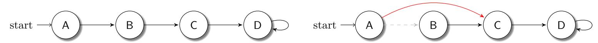
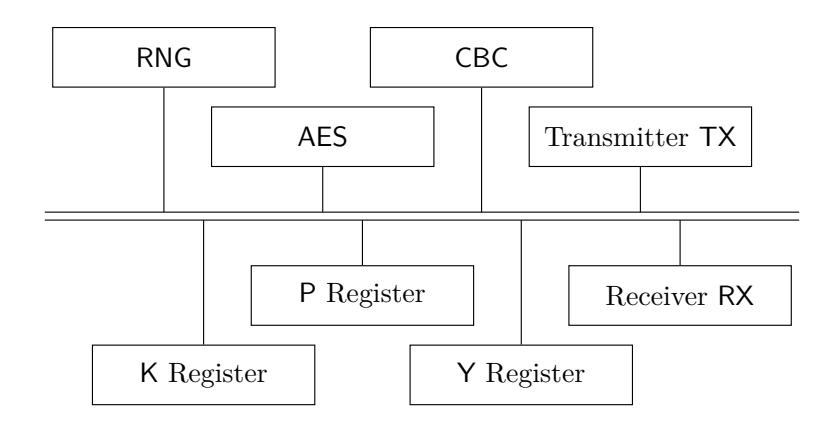
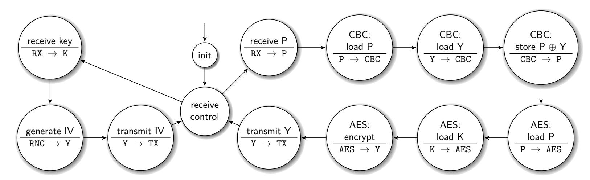
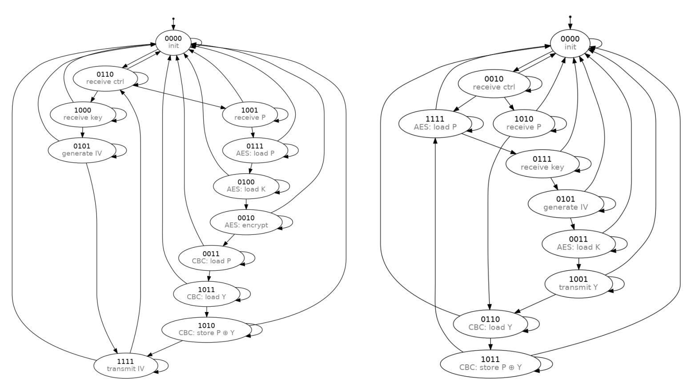
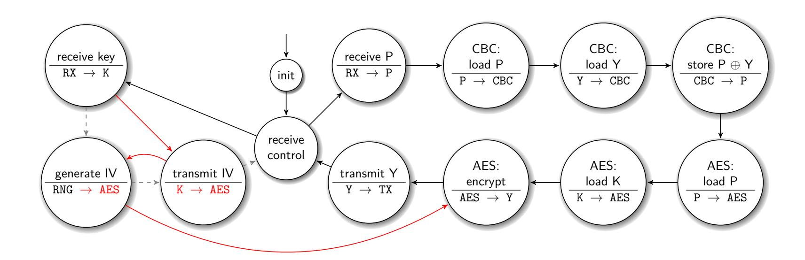

{0}------------------------------------------------

# **Doppelganger Obfuscation — Exploring the Defensive and Offensive Aspects of Hardware Camouflaging**

Max Hoffmann<sup>1</sup>*,*<sup>2</sup> and Christof Paar<sup>2</sup>

<sup>1</sup> Ruhr University Bochum, Horst Görtz Institute for IT Security, Germany <sup>2</sup> Max Planck Institute for Security and Privacy, Germany [max.hoffmann@rub.de](mailto:max.hoffmann@rub.de), [christof.paar@csp.mpg.de](mailto:christof.paar@csp.mpg.de)

**Abstract.** Hardware obfuscation is widely used in practice to counteract reverse engineering. In recent years, low-level obfuscation via *camouflaged gates* has been increasingly discussed in the scientific community and industry. In contrast to classical high-level obfuscation, such gates result in recovery of an erroneous netlist. This technology has so far been regarded as a purely defensive tool. We show that low-level obfuscation is in fact a double-edged sword that can also enable stealthy malicious functionalities.

In this work, we present Doppelganger, the first generic design-level obfuscation technique that is based on low-level camouflaging. Doppelganger obstructs central control modules of digital designs, e.g., Finite State Machines (FSMs) or bus controllers, resulting in two different design functionalities: an apparent one that is recovered during reverse engineering and the actual one that is executed during operation. Notably, both functionalities are under the designer's control.

In two case studies, we apply Doppelganger to a universal cryptographic coprocessor. First, we show the defensive capabilities by presenting the reverse engineer with a different mode of operation than the one that is actually executed. Then, for the first time, we demonstrate the considerable threat potential of low-level obfuscation. We show how an invisible, remotely exploitable key-leakage Trojan can be injected into the same cryptographic coprocessor just through obfuscation. In both applications of Doppelganger, the resulting design size is indistinguishable from that of an unobfuscated design, depending on the choice of encodings.

**Keywords:** Hardware Obfuscation · Camouflaging · Hardware Trojans

## <span id="page-0-0"></span>**1 Introduction**

Hardware-based threats have become increasingly important in recent years and have moved into the public discussion, for example, in the 2018-Bloomberg allegations about a supposed hardware backdoor in Supermicro server hardware [\[RR18\]](#page-23-0), or the recent ban by the US government on telecommunication equipment from China [\[KS\]](#page-22-0). In the work at hand, we focus on an important aspect of hardware security, namely protection against hardware reverse engineering. Such protection is crucial in several scenarios, including (1) protection of Intellectual Property (IP), (2) impeding the insertion of hardware Trojans by third parties, and (3) hiding security- or safety-critical components. First, *IP-theft* is of great concern for virtually all industries, ranging from consumer electronics to the large-scale cyber-physical systems. The Semiconductor Equipment and Materials International Association (SEMI) reported losses from IP-theft between \$2 billion and \$4 billion already in 2008 [\[Sem08\]](#page-23-1). Second, preventing malicious *hardware manipulations* is another important effect of defending against hardware reverse engineering. The fear

Licensed under [Creative Commons License CC-BY 4.0.](http://creativecommons.org/licenses/by/4.0/) Received: 2020-07-15 Accepted: 2020-09-15 Published: 2020-12-03

{1}------------------------------------------------

of such manipulations is also a backdrop for the current discussions on the possibility of hidden backdoors in foreign-built computer and communication equipment [\[KS\]](#page-22-0). Finally, hiding critical components, e.g., in TPMs, HSMs, smart cards, and larger designs that contain security modules, is a widely used defense strategy to reduce the surface for attack vectors such as targeted key extraction, laser-based fault attacks, or weakening of TRNGs.

Apart from physical protection of Integrated Circuits (ICs), e.g., via active shields or coatings, the primary method to defend the design itself against reverse engineering is through *obfuscation*. By definition, an obfuscation is a transformation that maintains functional equivalence but obstructs comprehensibility. Hence, obfuscation aims to increase reversing cost to extents where it becomes infeasible for an attacker. We would like to stress that hardware obfuscation is not a niche technology but widely used in the design industry, e.g., commercial IP cores are routinely obfuscated.

Hardware obfuscation methods can be divided in two families: traditional high-level and hidden low-level obfuscation. Traditional high-level obfuscation is applied in order to increase the difficulty of *understanding the netlist* of an IC, examples include bus scrambling, randomized routing, and dummy states in FSMs. Note that an adversary has all information about the design under attack and given enough effort, will be successful. More recently, low-level obfuscation has been increasingly discussed in academia. In stark contrast to traditional obfuscation, its goal is to create a situation in which the reverse engineer can only recover an incomplete or *erroneous netlist* through almost invisible alterations to logic cells or even single transistors. For instance, by changing the dopant concentration of transistors, a gate can have a different functionality from the apparent one recovered during reverse engineering. We note that low-level obfuscation (in contrast to traditional obfuscation) creates an asymmetry between the designer and the analyst, because the latter recovers incomplete or even incorrect information about the design under attack. Interestingly, while such low-level techniques have been addressed over the past seven years in academia [\[RSSK13,](#page-23-2) [EEAM16,](#page-21-0) [CEMG16,](#page-21-1) [MBPB15,](#page-22-1) [LSM](#page-22-2)<sup>+</sup>17, [PAKS17,](#page-22-3) [SSTF19\]](#page-23-3), patents [\[BCCJ98,](#page-20-0) [CBCJ07,](#page-20-1) [CBW](#page-20-2)<sup>+</sup>12, [CBWC12\]](#page-20-3), and even by companies that offer camouflaged gates as a service [\[Ram\]](#page-22-4), they were purely presented as atomic building blocks. Little is known how to leverage these building blocks in novel high-level techniques for generic obfuscation of (large) designs.

In this work, we close this gap by presenting Doppelganger, a generic and extremely stealthy hardware obfuscation technique. Doppelganger is applicable to arbitrary encoding logic, for instance, FSM state transitions or address resolution. Especially the former is an attractive target for obfuscation since in more complex designs, the control logic often contains the majority of the high-level information a reverse engineer may want to discover. At its core, Doppelganger-generated logic presents a different visible behavior to a reverse engineer than the one which is actually executed. On the physical level, our technique makes use of camouflaged gates with dummy inputs and can be instantiated independently of the physical realization of said primitive. We demonstrate that Doppelganger comes at virtually no observable overhead and offers the designer control over the visible outcome of the obfuscation, which enables much more stealthy results than traditional approaches.

As mentioned above, obfuscation is traditionally regarded as a purely defensive countermeasure. However, obfuscation is in fact a double-edged sword. In this work we, for the first time, highlight alarming implications of offensive use of low-level obfuscation. Using Doppelganger, we trojanize a cryptographic coprocessor in a way that raises no suspicion, even upon detailed analysis, yet enables remote exploitation.

#### **Contribution:** Our three main contributions are:

• We present Doppelganger, a novel hardware obfuscation technique to generate logic which presents a different behavior to a reverse engineer than the one which is actually implemented. It is generically applicable to arbitrary encoding or addressing logic as found in virtually any digital design. Our technique does not infer a noticeable area

{2}------------------------------------------------

overhead and is (conveniently) applied at the design stage in human-readable format. Within limits posed by the functionality to obfuscate, it gives the designer control over the apparent version of the design that a reverse engineer will face.

- We demonstrate the **defensive** strength and applicability of Doppelganger in a case study where we obstruct the central control logic of a cryptographic coprocessor. Our results demonstrate the power of our method by generating an apparent functionality that is still plausible. We further show that, depending on the application, even a randomized apparent functionality can result in strong obfuscation.
- To highlight the **offensive** implications of low-level obfuscation, we take the pointof-view of a malicious designer. We show that Doppelganger can be used to inject an extremely stealthy hardware Trojan into the same cryptographic coprocessor. Our exemplary Trojan — coined Evil Twin — is the first demonstration of a kleptographic Algorithm Substitution Attack (ASA) in hardware and allows for remote exploitation. We argue that our Trojan remains undetected when faced with the majority of conventional Trojan detection approaches.

**Availability:** All algorithms and hardware implementations are available open source at <https://github.com/emsec/doppelganger>.

## **2 Technical Background**

In this section, we will provide background knowledge for selected parts of our contribution. We will discuss hardware reverse engineering, low-level obfuscation, and briefly survey related work.

### <span id="page-2-0"></span>**2.1 Hardware Reverse Engineering**

Hardware reverse engineering can be split into two phases: netlist recovery and netlist analysis. Netlist recovery from an IC consists of four time-consuming steps [\[QCF](#page-22-5)<sup>+</sup>16, [CC90,](#page-20-4) [TJ11\]](#page-23-4), namely (1) decapsulation, (2) delayering, (3) imaging and (4) post-processing. During decapsulation, the die is extracted from its surrounding package. The die is then delayered via a mixture of chemical and mechanical etching, while several high-resolution images of the surface of each layer are taken. The standard procedure for image acquisition in advanced labs is combining optical imaging for general structures with Scanning Electron Microscope (SEM) imaging for small features [\[TJ11,](#page-23-4) [BWL](#page-20-5)<sup>+</sup>20] which results in several hundred to thousand images per layer. During post-processing, they are aligned, annotated, and standard cells and their interconnections across multiple layers are identified. These steps result in the netlist, an abstracted representation of the design, equivalent to a large circuit diagram. Note that this phase is *destructive*, hence if errors occur that cannot be corrected retrospectively, the process has to be (partially) repeated with a new IC.

The second phase is netlist analysis, which heavily depends on the analyst's objective. However, it is typically a mixture of manual and semi-automated analyses to gain an *understanding* of critical parts. An example is the semi-automated reverse engineering of high level modules, which is a common initial step, cf. [S <sup>+</sup>[12,](#page-23-5) L <sup>+</sup>[13,](#page-22-6) M<sup>+</sup>[16b,](#page-22-7) M<sup>+</sup>[16a,](#page-22-8) [FWS](#page-21-2)<sup>+</sup>18]. If the netlist that was recovered in the first phase is faulty, e.g., because of low-level obfuscation, gaining a correct understanding of the analyzed device can be considerably impeded.

#### <span id="page-2-1"></span>**2.2 Low-Level Obfuscation**

Obfuscation is considered as the primary countermeasure against reverse engineering [\[MBPB15,](#page-22-1) [VPH](#page-23-6)<sup>+</sup>17]. The main difference between traditional high-level and low-level

{3}------------------------------------------------

hardware obfuscation (cf. [Section 1\)](#page-0-0) is that the former complicates analysis of a recovered netlist, while the latter increases the difficulty of recovering the netlist itself, as it results in an erroneous netlist. Crucially, an adversary that is faced with a traditional obfuscation is working with a correct netlist, while he has to cope with an unknown level of uncertainty when faced with low-level obfuscation. In the latter case, one or more gates possess a functionality different from what is apparent (camouflaging) or seemingly connected wires are actually floating (dummy wires). In contrast to traditional obfuscation, lowlevel obfuscation is particularly vulnerable to dynamic analysis, if there is an observable mismatch between expected and obtained outputs: the more precisely an analyst can trace the impact of single gates on the output, the easier he can locate and deobfuscate camouflaged cells. However, this isolated analysis is often not possible in practice due to the many levels of registers and logic between primary inputs and outputs.

Particularly relevant for the work at hand is gate- or transistor-level obfuscation, i.e., camouflaging. In the following we briefly present related work in this area.

**Related Work:** Previous work has almost exclusively focused on providing camouflaged circuit elements as atomic building blocks. This includes several Google patents [\[BCCJ98,](#page-20-0) [CBCJ07,](#page-20-1) [CBW](#page-20-2)<sup>+</sup>12, [CBWC12\]](#page-20-3) and multiple academic publications: Rajendran et al. presented a camouflaged gate that can implement either an OR, AND, or an XOR gate [\[RSSK13\]](#page-23-2), i.e, a one-of-many gate. Their construction features a comparatively large number of transistors connected through a matrix of wires, where only a few connections are actually conducting while others are separated via small isolation layers. Therefore, their camouflaged gates can be easily identified on the layer images, but the implemented functionality of the gate is not deducible from those. In parallel, Erbagci et al. and Collantes et al. proposed constructions for one-of-many gates based on the transistor threshold voltage asserted during manufacturing [\[EEAM16,](#page-21-0) [CEMG16\]](#page-21-1). Malik et al. proposed a standard cell library that integrates gate-level obfuscation through dopant manipulations into standard design tools [\[MBPB15\]](#page-22-1). While dopant changes remain invisible during the standard reverse engineering process they can be recovered with notable additional effort per gate [\[SSF](#page-23-7)<sup>+</sup>14]. Li et al. formally analyzed resistance of gate camouflaging against SAT-solver-based reverse engineering, revisited dopant-based modification to facilitate always-on and always-off transistors, and demonstrated how to securely obfuscate AND-trees [\[LSM](#page-22-2)<sup>+</sup>17]. In [\[PAKS17\]](#page-22-3), Patnaik et al. focused on obfuscating the vias that interconnect gates and wires. Their approach basically generates several multi-driven gate inputs where only one driver is actually connected.

Recently, Shakya et al. revisited dopant-based camouflaging in [\[SSTF19\]](#page-23-3). They describe how minuscule manipulations in the channels of transistors can be used to effectively turn them into always-on or always-off transistors. Always-on transistors are achieved by applying a shallow doping area underneath the transistor's gate, virtually connecting the source and drain directly, while always-off transistors are achieved by inserting a shallow insulating layer of SiO<sup>2</sup> between the transistor's source/drain and their respective metal contacts. Using these modified transistors they show how to extend a combinational gate by an arbitrary number of dummy inputs. Crucially, they experimentally demonstrate indistinguishability of their always-on/-off transistors from normal transistors using stateof-the-art imaging techniques on a real chip. Furthermore, the authors claim that their instantiation cannot be detected as shown by [\[SSF](#page-23-7)<sup>+</sup>14]. This makes their camouflaging technique an excellent building block for our obfuscation scheme.

<span id="page-3-0"></span>Low-level obfuscation is also already commercially available, e.g., in the SypherMedia Library (SML) Circuit Camouflage Technology by Rambus [\[Ram\]](#page-22-4). However, somewhat surprisingly, there are no reports in the open literature on how to employ camouflaged gates to obfuscate more complex high-level structures, which is the objective of our contribution.

{4}------------------------------------------------

## **3 Obfuscation with Doppelganger**

In this section we present Doppelganger, a novel obfuscation technique that is applicable to addressing logic or encoding logic. Especially attractive targets for Doppelganger obfuscation are FSM state transition functions (encoding logic), since they are the central control elements in digital designs, or bus address resolution modules (addressing logic), since buses control the data flow of the design. For clarity, we will collectively refer to encoding and addressing as *encoding* in the following.

We start with a high-level overview on Doppelganger, followed by a short example. Then, we provide a detailed algorithmic descriptions. The strength and stealthiness of Doppelganger are evaluated with respect to our experiments in Sections [4,](#page-9-0) [5,](#page-10-0) and [6](#page-14-0) and general limitations are discussed in [Section 7.](#page-18-0)

**Overview & Terminology:** The overarching goal of Doppelganger is to generate a design that, when reverse engineered, yields a netlist that does not match the actual functionality of the design. While a reverse engineer will recover a seemingly valid netlist that appears to implement a certain *visible functionality*, the IC actually executes a different *hidden functionality.* In the following we will synonymously refer to the visible functionality as *f*<sup>V</sup> and to the hidden functionality as *f*H. As a unique feature, the designer has control over **both** functionalities. This is in contrast to many other obfuscation schemes, where the designer cannot control the output that is visible to a reverse engineer.

In a nutshell, Doppelganger achieves this dual-functionality by *ignoring* parts of the combinational logic via camouflaged gates. Applied during the conceptual phase of the design process, i.e., on HDL level, Doppelganger takes two high-level descriptions as input: one of the visible functionality and one of the hidden functionality. Its output consists of two components: The first one is a synthesizable design that implements the visible functionality. The second component is a set of specific connections between nets and cells. When the specified connections are ignored in the computations by replacing the respective gates with their camouflaged counterparts, the design now executes the hidden functionality. Since a reverse engineer cannot tell the camouflaged gates apart from benign gates, he is not aware that parts of the circuitry are effectively ignored, and therefore still recovers a netlist of the visible functionality.

<span id="page-4-0"></span>**Requirements and Adversarial Model:** In order to successfully apply Doppelganger at full strength, the designer has to be able to instantiate camouflaged gates with dummy inputs in the fabrication process, e.g., commercially available SML technology by Rambus [\[Ram\]](#page-22-4) or the covered gates from [\[SSTF19\]](#page-23-3). The "adversary" is a reverse engineer, facing an unknown IC that features hidden functionality generated with Doppelganger. His goal is to recover (parts of) the actual functionality, i.e., the hidden functionality, of the IC. The reverse engineer has access to several fabricated ICs. Note, that the adversary is an actor that operates after fabrication, i.e., Doppelganger is not suitable to defend, e.g., against a malicious foundry. We assume that the adversary employs the default techniques of the state-of-the-art reversing process (cf. [Section 2.1\)](#page-2-0), i.e., based on delayering and imaging. Thus, the employed camouflaged gates must be indistinguishable from their benign counterparts during this standard procedure, as demonstrated in [\[SSTF19\]](#page-23-3). Note that we do not restrict the adversary in his reversing techniques, but it is a reasonable assumption that non-standard procedures are only employed given an initial suspicion. Further, our technique is independent of the exact realization of the underlying camouflaged gates. Hence, even if dedicated deobfuscation methods exist, they tend to infer high costs [\[SSF](#page-23-7)<sup>+</sup>14] and the large design space for camouflaged gates in general [\[VPH](#page-23-6)<sup>+</sup>17] makes it impossible to apply them preemptively to substantial parts of even moderately-sized ICs.

{5}------------------------------------------------

<span id="page-5-0"></span>

<span id="page-5-3"></span><span id="page-5-1"></span>(a) The visible FSM, where a reverse engineer finds four states

<span id="page-5-2"></span>**(b)** The hidden FSM, dummy state B is actually never reached

Figure 1: A simple Doppelganger FSM

**Table 1:** Exemplary encodings of the states for our FSM

| State                | Α  | В  | C  | D  |
|----------------------|----|----|----|----|
| Encoding $[s_1:s_0]$ | 00 | 11 | 01 | 10 |

### 3.1 An Example of Doppelganger

In this section, we will illustrate the workflow of Doppelganger by means of a simple example. As mentioned above, Doppelganger is applied to obfuscate encoding logic. Hence, an especially attractive target are FSMs, which are present in virtually all digital designs. Here, Doppelganger can be applied to the feedback logic which determines the state transitions, i.e., the *next state* signal.

We consider the FSMs shown in Figure 1. The designer wants the reverse engineer to recover the visible FSM from Figure 1a, while the actually executed functionality is the hidden FSM shown in Figure 1b. The first step is to select suitable encodings for the states. Assume the encodings of the 2-bit FSM state register s shown in Table 1. These encodings result in the following Boolean functions for the *next state* signals  $s'_{visible}$  and  $s'_{hidden}$ , where "in X" resembles a helper signal to indicate that the FSM is currently in state X:

$$\begin{aligned} \mathbf{s}'_{\mathrm{visible},1} &= \mathrm{in} \ \mathsf{A} \ \mathsf{or} \ \mathrm{in} \ \mathsf{C} \ \mathsf{or} \ \mathrm{in} \ \mathsf{D} \ \\ \mathbf{s}'_{\mathrm{visible},0} &= \mathrm{in} \ \mathsf{A} \ \mathsf{or} \ \mathrm{in} \ \mathsf{B} \ \\ \mathbf{s}'_{\mathrm{hidden},1} &= \qquad & \mathrm{in} \ \mathsf{C} \ \mathsf{or} \ \mathrm{in} \ \mathsf{D} \ \\ \mathbf{s}'_{\mathrm{hidden},0} &= \mathrm{in} \ \mathsf{A} \ \mathsf{or} \ \mathrm{in} \ \mathsf{B} \end{aligned}$$

Comparing both state transition functions, the hidden functionality is computed if a term from the functions of the visible functionality is excluded from the computation. This is a direct result of the selected state encodings. Therefore, we can directly implement the hidden FSM by replacing the 3-input  $\mathtt{OR}$ -gate from the equation for  $\mathtt{s'_{visible,1}}$  with a camouflaged gate, where the term "in A" is connected to a dummy input.

Since the dummy inputs cannot be identified as such by a reverse engineer, he will eventually recover the state transition function  $\mathbf{s}'_{\text{visible}}$ , although  $\mathbf{s}'_{\text{hidden}}$  is computed physically. Again, note that we were able to design both, the visible and the hidden FSM, i.e., what a reverse engineer will erroneously recover.

### <span id="page-5-4"></span>3.2 The Doppelganger Algorithm

In the following we explain the Doppelganger algorithm in detail. Figure 2 contains a walking example in form of a high-level breakdown of the algorithm's steps based on the example from the previous section. Our explanations follow the figure step-by-step. A more formal pseudocode description of Doppelganger can be found in Appendix A.

#### **3.2.1** Inputs:

The main inputs for Doppelganger are a description of  $f_{\mathcal{V}}$  and  $f_{\mathcal{H}}$ . The functionalities are given via rules,  $R_{\mathcal{V}}$  for the visible and  $R_{\mathcal{H}}$  for the hidden functionality, that describe under

{6}------------------------------------------------

#### <span id="page-6-1"></span>**(a) Inputs to the algorithm.**

<span id="page-6-0"></span>
$$\begin{array}{l} R_{\mathcal{V}} = \{\texttt{inA} \rightarrow \texttt{B, inB} \rightarrow \texttt{C, inC} \rightarrow \texttt{D, inD} \rightarrow \texttt{D}\} \\ R_{\mathcal{H}} = \{\texttt{inA} \rightarrow \texttt{C, inB} \rightarrow \texttt{C, inC} \rightarrow \texttt{D, inD} \rightarrow \texttt{D}\} \\ & \text{Predefined Encodings} = \{\texttt{A: 00}\} \end{array}$$

#### <span id="page-6-2"></span>**(b) Binary Encoding selection for all symbols.**

All symbols S = {A, B, C, D} Sorted critical symbols S = {B, C} Apply predefined encodings:

$$E(A) = 00$$

Process critical symbols in sorted order:

*E*(C): available encodings: {01, 10, 11} *E*(C) = 01

*E*(B): available encodings: {10, 11} after filtering non-overlapping encodings: {11} *E*(B) = 11

Remaining symbols are uncritical → assign remaining encodings: *E*(D) = 10

#### <span id="page-6-3"></span>**(c) Function generation.**

Initialize Boolean encoding functions *e*<sup>1</sup> := 0 and *e*<sup>0</sup> := 0. Updates are highlighted in green, underlined terms are marked as *to ignore* and thus input to a dummy pin of a camouflaged gate.

Process changed elements from *R*<sup>V</sup> to *R*H:

$$R_{\mathcal{V}}$$
: "inA  $\to$  B"  $\Rightarrow$   $e=11$  when inA  $R_{\mathcal{H}}$ : "inA  $\to$  C"  $\Rightarrow$   $e=01$  when inA  $e_1=\underline{\mathrm{inA}}$   $e_0=\mathrm{inA}$ 

Process unchanged elements from *R*<sup>V</sup> and *R*H:

"inB → C" ⇒ *e* = 01 when inB:

$$e_1 = \underline{\text{inA}}$$

$$e_0 = \text{inA} + \text{inB}$$

"inC → D" ⇒ *e* = 10 when inC:

$$e_1 = \underline{\text{in}}\underline{A} + \text{in}C$$
  
 $e_0 = \text{in}A + \text{in}B$ 

"inD → D" ⇒ *e* = 10 when inD:

$$e_1 = \underline{\text{inA}} + \text{inC} + \text{inD}$$
  
 $e_0 = \text{inA} + \text{inB}$ 

Process exclusive elements in *R*<sup>V</sup> : (no elements in this group)

**Figure 2:** Rundown of the Doppelganger algorithm applied to the example from [Section 3.1](#page-4-0)

{7}------------------------------------------------

which signal combinations a specific symbol shall be output, e.g., "*when signal\_x is 1 and current symbol is symbol* A*, then output symbol* B". By specifying different rules for both functionalities, i.e., different signal combinations or output symbols, the designer can control the real (hidden) functionality and the apparent (visible) functionality. If necessary, predefined encodings for some symbols can also be provided. [Figure 2a](#page-6-1) shows the precise inputs for the example from [Section 3.1.](#page-4-0)

**Limitations:** The user is not entirely free in the differences between the rules of both functionalities. Given that *f*<sup>H</sup> was designed to output the set of symbols S*H*, the joint set of symbols S of both functionalities has to be encoded with the same number of bits as necessary to encode just S*H*. In other words, the symbols that *f*<sup>V</sup> encodes do not have to be a subset of S*H*, but also must not increase the size of individual encodings.

Next, the signal combinations in the rules for *f*<sup>V</sup> must be supersets of the signal combinations in the rules for *f*H. Effectively this means that *f*<sup>V</sup> can include dummy signals in its conditions that are ignored in *f*H, but no signal combinations used in the rules for *f*<sup>H</sup> can be ignored in the rules for *f*<sup>V</sup> .

Furthermore, the differences between the functionalities must not form a cyclic dependency between symbols. If, for instance, for their respective signal combinations symbol A in the visible functionality shall become B in the hidden functionality and vice versa, this would result in both symbols depending on each other (a cyclic dependency), making it impossible to find suitable encodings. This is due to the necessity of encodings to overlap each other, as we will explain in the next paragraph.

#### **3.2.2 Obfuscation Approach:**

The overall goal is to generate benign logic for *f*<sup>V</sup> that actually computes *f*<sup>H</sup> when implemented with dummy inputs at specific gates. Rules that output the same symbol in both functionalities but that ignore some signals in *f*H, i.e., "*a and b* → X" in *R*<sup>V</sup> and "*b* → X" in *R*H, are straightforward to facilitate by simply connecting these ignored signals to dummy inputs in the combinational logic. However, rules that (in addition) change the output symbol have to be assessed differently: the respective symbols have to be encoded in a specific way, such that by ignoring parts of the encoding computation via dummy inputs, the hidden symbol is output. To this end, Doppelganger consists of two steps: (1) choosing suitable encodings and (2) generating the logic that enables both functionalities.

#### **3.2.3 Step 1: Selecting Encodings**

Doppelganger assigns a simple binary encoding, i.e., given |S| = *n* symbols, all encodings have *k* = d*log*2(*n*)e bit. As explained above, the most crucial step is to select suitable encodings for all symbols that appear in rules with different outputs from *R*<sup>V</sup> to *R*H. We refer to these symbols as *critical symbols* in the following.

Suppose that, for a specific combination of signals, *f*<sup>V</sup> shall output symbol x and *f*<sup>H</sup> shall output symbol y. Encodings have to be chosen such that the encoding *E*(x) has a 1-bit wherever *E*(y) has a 1-bit. Since all encodings have to be unique, this implies that *HW*(*E*(x)) *> HW*(*E*(y)). We refer to encodings with this relation and their respective symbols as *overlapping*. An example for suitable overlapping encodings for x and y would be *E*(x) = 1010 and *E*(y) = 0010. With these encodings, feeding the terms that will compute the additional 1-bits of *E*(x) into dummy signals of camouflaged gates will result in computation of the encoding of *E*(y) in *f*H. For the non-critical symbols, encoding values do not matter for the obfuscation since they are untouched between *f*<sup>V</sup> and *f*H. Hence, for all non-critical symbols, the remaining available encodings are sorted in ascending order and the first available one is assigned to each to minimize gaps in utilized encodings.

We present two algorithms for assigning encodings to critical symbols, (1) a greedy algorithm and (2) an exhaustive algorithm. For both algorithms, the critical symbols are

{8}------------------------------------------------

sorted first: if the encoding of symbol x has to overlap the encoding of symbol y, then y has to be processed before x. [Figure 2b](#page-6-2) visualizes the encoding selection process for the example from [Section 3.1](#page-4-0) using the greedy algorithm.

**Greedy Encoding Assignment:** Suppose that we want to assign an encoding for critical symbol x. The greedy algorithm forms a candidate set *C* of encodings that are suitable for x and yet unassigned. This is done by collecting all unassigned encodings that overlap all encodings of symbols that x overlaps. The algorithm then simply assigns the first encoding in *C* to x. A formal description of the algorithm can be found in [Algorithm 1.](#page-24-1)

Since the greedy algorithm simply traverses all symbols once and assigns an encoding, its complexity is O(*c*) for *c* ≤ *n* critical symbols. However, since it always picks the first suitable encoding, it can run out of candidates if the overlap structure is more complex. In that case, the exhaustive algorithm can take over, which we describe in the following.

**Exhaustive Encoding Assignment:** The exhaustive algorithm can be compared to a recursive depth-first search across all possible encoding assignments. Basically, it works exactly as the greedy variant, but instead of just assigning the first encoding in *C*, it tries all of them in each iteration until a suitable encoding for all critical symbols is found.

In other words, it starts like the greedy variant, by taking the first critical symbol and determining all suitable encodings. It then assigns one of these encodings and proceeds with the next symbol. Again, it collects all suitable unassigned encodings, assigns one, and proceeds to the next symbol. This is done until all symbols have a suitable encoding assigned, which indicates successful termination of the algorithm, or there is no suitable encoding available for a symbol. In this case, the algorithm assigns the next suitable encoding to the previous symbol and tries again. If there are also no more suitable encodings for the previous symbol, the encoding for the symbol before is advanced and so on. This way, the algorithm exhaustively iterates all possible encoding assignments for all symbols, eventually finding a suitable set of assignments if it exists. A formal description of this recursive algorithm can be found in [Algorithm 2.](#page-25-0)

For *c* ≤ *n* critical symbols, the exhaustive algorithm has a worst-case complexity that can be approximated as O(*c*!) since the number of available encodings decreases with each symbol. This can lead to long run times depending on the number of critical symbols. However, in practice, the whole computation has to be performed only once in the design process. In addition, the algorithm can be easily parallelized, e.g., by splitting the available encodings for the first critical symbol into sets of equal size and processing each set in a separate thread. In our implementation, the greedy algorithm is used as the initial algorithm and the exhaustive algorithm only takes over if the greedy version fails. Note that if a suitable encoding assignment exists for all critical symbols, the exhaustive algorithm will definitely find it. In our case studies in [Section 5](#page-10-0) and [Section 6,](#page-14-0) the greedy algorithm was always able to find suitable encodings.

#### **3.2.4 Step 2: Generating Obfuscated Logic**

After encodings have been assigned, the obfuscated logic is generated in form of a Boolean function *e<sup>i</sup>* for each output bit of the encoding output *e*. All output functions are initialized to *e<sup>i</sup>* = 0. Doppelganger then analyzes the rules in *R*<sup>H</sup> and *R*<sup>V</sup> and assigns them to one of three groups: (1) those which are only present in *R*<sup>V</sup> , (2) those which were changed from *R*<sup>V</sup> to *R*H, and (3) those which are contained in both *R*<sup>H</sup> and *R*<sup>V</sup> . It then iterates these groups and generates the output functions bit-by-bit in DNF format, based on the encoding of the respective output symbol in the visible functionality. Depending on the assigned group, specific DNF-terms are marked as *to ignore* if they appear only in visible functionality. By connecting all signals that hold the terms marked as *to ignore* to dummy inputs of camouflaged gates, the hidden functionality is actually computed because of the overlapping encodings. [Figure 2c](#page-6-3) shows the final function generation step-by-step

{9}------------------------------------------------

<span id="page-9-1"></span>

**Figure 3:** Functional modules of the CBC-encryption core, connected via a central data bus

for the example from [Section 3.1.](#page-4-0) A formal description of the algorithm can be found in [Algorithm 3.](#page-26-0)

## <span id="page-9-0"></span>**4 Case Study Overview**

In this section, we give an overview on the cryptographic coprocessor that is used as the baseline for our two case studies in [Section 5](#page-10-0) and [Section 6.](#page-14-0)

### **4.1 Motivation**

The chosen design resembles a cryptographic coprocessor for symmetric ciphers as used in many applications with security features. The user is able to select from a variety of cipher primitives and modes of operation to leverage hardware-accelerated cryptography.

Our design employs a standard architecture: modularity is achieved via a centralized bus that interconnects the available functional modules and register files. Both, cipher cores and the additional functionalities of modes of operation, can thus be implemented as isolated modules, connected to the bus, and then used interchangeably. While the architecture allows to add an arbitrary number of cipher primitives and modes, we implemented support for one cipher (AES) and one mode of operation (CBC) for the sake of simplicity. In CBC mode, the previous output (or the IV in case of the first block) is xored to the plaintext and then the result is encrypted.

#### **4.2 Design**

All functional modules and bus connections of our implementation are shown in [Figure 3.](#page-9-1) It consists of I/O modules RX and TX, a random number generator RNG, an AES encryption module AES, a CBC module CBC, and three registers: K for a key, P for a plaintext, and Y for the output. The modules are orchestrated via a central FSM, which also operates a Bus Controller that in turn controls the data flow. We selected a bus width of *w* = 16 bit. For simplicity, the bus connections are implemented via tri-state logic: the current master can arbitrarily write to the bus lines and all other nodes keep their bus connections on high-impedance to allow for signal transmissions in arbitrary directions. Note, that the mode-of-operation functionality, in case of CBC a simple xor, is intentionally computed outside of the cipher module. This way, additional modes are easily added, while being decoupled from the underlying cipher primitive. For the same reason, there is a dedicated register for the plaintext P, which could be merged with the output register Y if only CBC-mode had to be supported.

We synthesized the design using the Nangate 45nm standard cell library and the Synopsys design suite multiple times with different random encodings in the components we will obfuscate, i.e., the central FSM states and the bus controller addresses. Note that,

{10}------------------------------------------------

<span id="page-10-1"></span>

**Figure 4:** Functionality of the design. For readability, only transitions to other states are shown.

in practice, encodings can be chosen by the designer but are often also auto-generated by design tools, which yields varying outcomes depending, e.g., on synthesis options, HDL code, toolchain. [Table 4](#page-12-0) summarizes the min., max., and average size of the entire design, as well as the sizes of the central FSM and the bus controller in isolation, for ten synthesis runs.

### **4.3 Functionality**

In our case studies, Doppelganger will be applied to the central FSM and the bus controller. [Figure 4](#page-10-1) shows the combined functionality of both components. Note that, for the sake of readability, we omitted arrows indicating a waiting state, i.e., we only included transitions to other states. Each state circle contains its functionality as well as the performed bus transmissions (if available).

The overall functionality of the design is as follows: After initialization, the core awaits a control byte indicating either a new key or a new plaintext for encryption. If a new key should be set, the core stores the new key, generates a fresh Initialization Vector (IV), stores it in the Y-register, and transmits it to the user. When a new plaintext is received, it is stored in the P-register. Then, it is sent to the CBC-module together with the previous ciphertext from the Y-register, which is the IV in the first encryption, and stores the result back into P. This result is then sent as the plaintext to the encryption module, followed by the key. After encryption, the ciphertext is stored in Y and then transmitted to the user.

Thus, this design implements a cryptographic coprocessor that offers benign AES-CBC functionality. There are no unusual design decisions and input/output behavior is as expected given the specifications. Note that a fully-fledged design would likely feature decryption functionality, additional modes of operation, and other symmetric ciphers, all of which further increase complexity and thus the required effort for reverse engineering.

## <span id="page-10-0"></span>**5 Case Study I – Defensive Obfuscation**

In our first case study, we assess the impact of applying Doppelganger as a protective measure. We show that a reverse engineer can be tricked into recovering a different but *plausible* functionality. Furthermore, we demonstrate that partially random obfuscation can massively hinder the analyst if plausibility cannot be easily verified in an application.

### **5.1 Plausible Obfuscation**

In the case of a cryptographic coprocessor, control logic can quite easily be checked for plausibility when the functional modules are understood. In the first part of this case study, we therefore apply Doppelganger such that the visible functionality is plausible and

{11}------------------------------------------------

<span id="page-11-0"></span>**Table 2:** Introduced changes in the visible functionality to the FSM state transitions (left) and bus address decoding (right)

| Conditions           | State in fH | State in fV |
|----------------------|-------------|-------------|
| state = receive P    | CBC: load P | AES: load P |
| state = AES: encrypt | transmit Y  | CBC: load P |
| state = CBC: P ⊕ Y   | AES: load P | transmit IV |

| Conditions          | Bus config<br>in fH | Bus config<br>in fV |  |
|---------------------|---------------------|---------------------|--|
| state = AES: load P | P → AES             | Y → AES             |  |

presents the reverse engineer with a different mode of operation, namely CFB instead of CBC. In this mode, the previous output (or the IV in the first block) is encrypted and the plaintext is then xored. To lead a reverse engineer to recover this (incorrect) mode, we applied Doppelganger to the central FSM and the bus controller of our coprocessor. The hidden functionality is simply the original functionality of the design. For the visible functionality we changed three state transitions and a bus address decoding to suggest the CFB mode, as shown in [Table 2.](#page-11-0) With these changes, our design indeed first encrypts the previous output, stored in the Y-register and combines the output with the plaintext via xor by reusing the CBC functionality *afterwards*. Note that the final transition was changed to transmit IV instead of transmit Y to avoid a circular dependency between overlapping encodings. Since effectively in both states the Y-register is transmitted and the next state is receive ctrl for both, this results in a functional design.

**Results:** To enable the obfuscation, only four signals have to be connected to dummy inputs of camouflaged gates. The number of sequential cells is unchanged, since Doppelganger only affects combinational logic. [Table 4](#page-12-0) compares the size of the synthesized plausibly-obfuscated coprocessor to the unobfuscated variant. Notably, the FSM and the bus controller are both in the range of the unobfuscated design, i.e., a distinct areaoverhead is not noticeable. To assess the output of Doppelganger, we then used the netlist analysis framework HAL [\[FWS](#page-21-2)<sup>+</sup>18] to analyze the resulting FSM implementation from the point-of-view of a reverse engineer. We applied the recent FSM detection and state transition recovery algorithm from Fyrbiak et al. [\[FWD](#page-21-3)<sup>+</sup>18]. The recovered state transition graph contains all transitions that are possible with the given combinational logic. Note that this can include state transitions that never occur in practice, but that are generally possible when just looking at the combinational logic. The resulting state transition graph is shown in [Figure 5a.](#page-13-0) For readability, we show the corresponding state names grayed-out next to the binary encodings. Note that a real-world analyst does not have these semantic names and has to recover the purpose of each state with further analyses. The algorithm from [\[FWD](#page-21-3)<sup>+</sup>18] correctly recovered the visible CFB-mode FSM, confirming that an analyst would not see the CBC-mode that is actually executed.

**Discussion:** The obfuscation was introduced without a noticeable increase in area. Even the sizes of the obfuscated components in isolation are still in the range of what was observed for the unobfuscated design. When analyzing the visible functionality, the reverse engineer will recover a valid AES-CFB core instead of an AES-CBC core. If the analyst is constrained to static analysis, the plausibility of the visible functionality therefore results in an incorrect understanding of the design. However, with dynamic analysis capabilities, the analyst is able to detect a mismatch between expected and obtained results. Note that he is still not able to immediately tell that parts of the design are obfuscated, nor can he immediately locate the obfuscation that way. Only through further analysis, he may be able to identify the source of his mismatched results (cf. [Section 2.2\)](#page-2-1). In the end, this notably increases the effort and cost of the reversing process, rendering the obfuscation successful in any case.

{12}------------------------------------------------

| Conditions                                      | State in $f_{\mathcal{H}}$ | State in $f_{\mathcal{V}}$ |
|-------------------------------------------------|----------------------------|----------------------------|
| state = receive ctrl<br>and ctrl byte = new key | receive key                | AES: load P                |
| $\mathrm{state} = generate \; IV$               | transmit IV                | AES: load K                |
| state = receive P                               | CBC: load P                | CBC: load Y                |
| $\mathrm{state} = AES$ : load P                 | AES: load K                | receive key                |
| $\mathrm{state} = AES$ : load K                 | AES: encrypt               | transmit Y                 |
| state = transmit Y                              | receive ctrl               | CBC: store $P \oplus Y$    |

<span id="page-12-1"></span>**Table 3:** Randomized changes to the state transitions of the central FSM

<span id="page-12-0"></span>**Table 4:** Size comparison of the defensive applications of Doppelganger. Area includes all cells of the module, #CC denotes the number of combinational cells only.

|                 |     | FSM                        |                 | Bus Controller     |                 | Entire Design                   |                 |
|-----------------|-----|----------------------------|-----------------|--------------------|-----------------|---------------------------------|-----------------|
| Design          |     | Area                       | $\#\mathrm{CC}$ | Area               | $\#\mathrm{CC}$ | Area                            | $\#\mathrm{CC}$ |
|                 | min | $\overline{58 \text{ GE}}$ | 38              | $\overline{55}$ GE | 41              | $\overline{16,686~\mathrm{GE}}$ | 10,170          |
| Unobfuscated    | avg | $61~\mathrm{GE}$           | 42              | 58  GE             | 44              | $16,737~\mathrm{GE}$            | 10,186          |
|                 | max | $65~\mathrm{GE}$           | 47              | $60~\mathrm{GE}$   | 47              | $16,776~\mathrm{GE}$            | 10,202          |
| Plausible Obf.  |     | $63~\mathrm{GE}$           | 47              | 59  GE             | 46              | $16,770~\mathrm{GE}$            | 10,200          |
| Randomized Obf. |     | $62~\mathrm{GE}$           | 45              | $54~\mathrm{GE}$   | 40              | $16{,}775~\mathrm{GE}$          | 10,205          |

#### 5.2 Randomized Obfuscation

Arguably, the plausibility of the visible functionality of the coprocessor can be verified once the crucial functional modules are understood, i.e., after the AES core and the registers have been identified. However, this is not the case if there is no or little a-priory knowledge about the target netlist, which is often the case during reverse engineering. If plausibility cannot be easily verified, a (partially) randomized visible functionality can thus heavily impede progress of the reverse engineer. As an example, we apply such randomized obfuscation to the cryptographic coprocessor. In the visible functionality, we replace six output symbols, i.e., six "next states", with random other states. The symbolic modifications are shown in Table 3.

**Results:** To enable the hidden functionality, only six signals have to be connected to dummy inputs of camouflaged gates. Table 4 also includes the randomly-obfuscated design in its area comparisons. Again, all observed values are in the ranges that where obtained from the unobfuscated design. Applying the state transition recovery algorithm to the obfuscated design results in the graph shown in Figure 5b. Comparing the recovered state transition graph from the figure with the transitions of the hidden functionality shows the major additional hurdles randomized obfuscation introduces for a reverse engineer who cannot check for plausibility: First, three functional states of the hidden FSM, i.e., transmit IV, CBC: load P, and AES: encrypt, are missing in the graph, which are thus not even considered by the analyst. Note that it is common that not all possible values of the FSM state register encode valid states. The 12 found states still require four bits to be encoded, hence not raising suspicion. Second, the overall structure of the recovered state transition graph does not match the original structure anymore: instead of two isolated state sequences (reacting to a new key and encrypting a plaintext) which return to a common state, the recovered state transition graph of the obfuscated FSM has two converging sequences that eventual lead to a loop. Third, the recovered state sequences are completely different from the actually traversed sequences. Hence, even if the analyst managed to reverse engineer the functionality of each module, the recovered interworkings are *incorrect*. Without means to easily verify plausibility, it is likely impossible for an analyst to detect the obfuscation via static analysis.

{13}------------------------------------------------



- <span id="page-13-0"></span>**(a)** Recovered state transition graph of the plausibly-obfuscated FSM
- <span id="page-13-1"></span>**(b)** Recovered state transition graph of the randomly-obfuscated FSM

**Figure 5:** Recovered state transition graphs using the algorithm from [\[FWD](#page-21-3)<sup>+</sup>18]. Note that the analyst does not know the semantic meanings marked in gray.

**Discussion:** Doppelganger heavily obfuscates the central control logic. Analysis of the resulting circuitry shows that the difficulty of understanding the design is notably increased, assuming that the plausibility of the FSM cannot be verified. If the output of such a design is also probabilistic or cannot be reasonably cross-checked with simulation results, we argue that the obfuscation constitutes a major hurdle for the reverse engineer. In contrast to randomly injecting camouflaged gates into the design, randomized Doppelganger immediately shows the high-level effect of the obfuscation to the designer. Note that there is a difference between applying randomized Doppelganger and random injection of plain camouflaged gates. With randomly injected gates, the precise effects on what a reverse engineer recovers are unknown. If the random insertion points were chosen unluckily, they might even cancel each other out or have limited impact in impeding the reverse engineer's understanding. The precise effects have to be determined via further analysis, close to reverse engineering the affected party by oneself. In randomized Doppelganger, the randomization is applied to the rules of the encoding logic. Hence, the designer immediately knows the functionality a reverse engineer will recover and can properly assess the obfuscation strength.

#### **5.3 Summarizing the Defensive Strength of Doppelganger**

As for the majority of obfuscation methods, it is difficult to provide quantiative measures for stealth. Therefore, we provide a qualitative discussion of the stealthiness of Doppelganger. Naturally, the strength of the obfuscation depends on the amount of information and techniques available to an analyst. In the strongest case, where an analyst cannot perform plausibility checks and cannot meaningfully check internal states of the design, e.g., because dynamic analysis is not possible or because outputs are probabilistic, even randomized application of Doppelganger is virtually impossible to detect. If the analyst has said capabilities, a carefully crafted plausible functionality of Doppelganger still results in high stealthiness. In that case, detectability solely depends on the application, as we will also demonstrate in our case study of malicious obfuscation (cf. [Section 6\)](#page-14-0). Note that our

{14}------------------------------------------------

obfuscation inferred no noticeable area overhead for the entire design. All variations in area were in the natural range caused by different encodings, as shown in the synthesis results for the unobfuscated design in [Table 4.](#page-12-0) Our case studies show that an analyst has to overcome major additional obstacles, regardless of the scenario. First, he has to make sure that a potential mismatch was not caused by an error during netlist recovery, which is a very common problem [\[BWL](#page-20-5)<sup>+</sup>20]. Now, even if the analyst was sure that there was no error, he still has to narrow the source of the mismatch down to a few specific gates, which is a challenging task, especially in large IC with billions of transistors. Assuming that the analyst successfully located the obfuscation, he then has to uncover the hidden functionality, which in turn requires him to understand how the camouflaged gates are instantiated. Furthermore, existing reverse engineering methods such as [S <sup>+</sup>[12\]](#page-23-5) or [\[FWD](#page-21-3)<sup>+</sup>18] are of less use to a reverse engineer, since they operate solely on the netlist, i.e., only recover the visible functionality. Likewise, it is more effective than existing schemes for obfuscation, e.g., FSM obfuscation [\[Kou12,](#page-21-4) [CB09\]](#page-20-6), since techniques that break FSM obfuscation such as [\[FWD](#page-21-3)<sup>+</sup>18] are not applicable to Doppelganger.

## <span id="page-14-0"></span>**6 Case Study II – Stealthy Hardware Trojans**

While obfuscation schemes have thus far primarily been presented as defensive techniques, they can also be employed by malicious actors. In this section, we demonstrate the dangerous implications of **malicious obfuscation**, by the example of a dangerous cryptographic backdoor. This very topic underlies the current discussion about trust in foreign-build computer and communication devices [\[KS\]](#page-22-0). We demonstrate that this is a viable threat by presenting an invisible, remotely exploitable, key-leakage Trojan, which is facilitated by Doppelganger. Since a reverse engineer will find a benign design and only the hidden functionality contains the malicious functionality, we call the Trojan **Evil Twin**.

### **6.1 Motivation**

Hardware as the root of trust is often implicitly assumed to be free of manipulation. However, Trojans in hardware are a dangerous threat for high-value targets, e.g., critical infrastructure components such as network routers, the smart grid, government communication, or military systems. An example for the latter is the alleged backdoor in Syrian air defense systems, which was exploited in 2007 [\[Pag,](#page-22-9) [Ley\]](#page-22-10). Notably, the US Department of Defense even advised against importing hardware from foreign countries because of the associated risks in its 2015-report [\[oD\]](#page-22-11). The 2018 Bloomberg allegations on a supposed hardware backdoor in Supermicro server hardware [\[RR18\]](#page-23-0) and the recent ban by the US government on using telecommunication equipment from China due to security concerns [\[KS\]](#page-22-0) underline the ongoing relevance. Trojans that are near-impossible to detect are particularly attractive for nation-state actors. While common scenarios describe Trojans that are inserted by a third party, they can also be implanted by the original designer, e.g., when pressured by a government, as described in the Snowden documents, cf. [\[SFKR15\]](#page-23-8).

Several sophisticated hardware Trojans have been proposed in the academic literature, ranging from side-channel Trojans [L <sup>+</sup>[09,](#page-22-12) [EGMP17\]](#page-21-5), over dopant-based Trojans [B <sup>+</sup>[13\]](#page-20-7), Trojans which introduce exploitable bugs [\[BCS08,](#page-20-8) G<sup>+</sup>[16\]](#page-21-6) or exploit parasitic effects [\[KAFP19\]](#page-21-7), to analog Trojan triggers in digital designs [Y<sup>+</sup>[16\]](#page-23-9). The different classes of hardware Trojans as well as countermeasures have been surveyed in [T <sup>+</sup>[10,](#page-23-10) [CNB09\]](#page-21-8).

**Scenario:** In this case study, we take the point-of-view of a **malicious designer**, who wants to implement a hidden backdoor in the cryptographic coprocessor from [Section 4.](#page-9-0) The backdoor has to stay hidden even if the IC is reverse engineered, hence we employ Doppelganger to stealthily subvert the given design. Recall that the adversary, i.e., an analyst that reverse engineers the trojanized design, is outside of the fabrication chain

{15}------------------------------------------------

and external to the design house, e.g., an inspector of foreign infrastructure technology before wide-spread deployment or an analyst during certification assessment. Given the application, the analyst is quite unrestricted in his approaches: plausibility checks and comparisons to functional ICs are possible. Therefore, the visible functionality has to be plausible with respect to the design specifications **and** the real output of the hidden functionality has to be indistinguishable from expected output under reasonable inspection. However, note that the analyst does not have access to a golden model or semantic design internals, as he is not part of the design house.

### **6.2 Trojanization Strategy**

Following the Trojan taxonomy of [T <sup>+</sup>[10,](#page-23-10) [CNB09\]](#page-21-8), Evil Twin is an *always-on* Trojan. The payload, the user-supplied symmetric key, shall be leaked via the encryption output. While symmetric encryption in isolation does not leave room for key leakage, the mode of operation can be used to exfiltrate data: most common modes, e.g., CBC, CFB, OFB, and partially CTR or GCM, use random IVs to provide their security guarantees. The IV is transmitted in plain together with the subsequently encrypted blocks. Hence, our Trojan exploits the (seemingly) random IV, for leaking the secret symmetric key. Note that the premise of such an *IV-Trojan* was sketched in [\[BPR14\]](#page-20-9), however we craft a notably more stealthy variant that does not have to insert an adversary-chosen key into the design.

The central bus architecture, while being a common design element, is crucial to facilitate the Trojan. In order to leak the key through the IV, there has to exist a data path between the IV register and the key register. A bus structure creates a physical data path between all connected components, even though not all pairs of connected components exchange data during normal operation.

**Related Work:** Young and Yung introduced kleptography [\[YY96,](#page-24-2) [YY97\]](#page-24-3), inspired by covert channels [\[Sim84\]](#page-23-11), as the study of "stealing information securely and subliminally". The premise of a trojanized implementation in general that presents genuine input/output behavior but includes exploitable mechanisms was formalized as Algorithm Substitution Attacks (ASAs) by Bellare et al. [\[BPR14,](#page-20-9) B <sup>+</sup>[15\]](#page-20-10). Note that none of these theoretical concepts have been transferred or applied to hardware designs so far. To the best of our knowledge, Evil Twin is the first time a hardware design with a kleptographic ASA Trojan has been demonstrated.

#### **6.3 Applying Doppelganger**

It is important to note that we do not make any changes to the design's architecture to implement the Trojan. Rather, we apply Doppelganger to the central FSM and the bus controller. The visible functionality is simply the benign functionality of the coprocessor. However, the hidden functionality turns said benign design into a trojanized design.

The most naive approach to facilitate a key-leakage Trojan would be to set the IV as a plain copy of the key. However, this can be trivially detected from I/O testing, even by an unsuspecting user. Generally speaking, as long as the IV is the result of a deterministic function of just the key, the IV will be **static**. Setting the same key multiple times will always result in an identical IV which is easily noticed.

In order to overcome that limitation, the IV has to be the result of a *probabilistic* function. This leads to a delicate trade-off: The malicious designer has to be able to recover the key from a randomized IV in order to exploit the Trojan. At the same time, the entropy in the IV has to be high enough to thwart detection during testing. Therefore, we implement Evil Twin via the following strategy: Evil Twin uses the existing AES module to encrypt the user-supplied key *k*user with an ephemeral key *k*rnd and outputs *IV* = *AES<sup>k</sup>*rnd (*k*user). Since an entirely random *k*rnd would require breaking the underlying cipher to recover

{16}------------------------------------------------

<span id="page-16-0"></span>**Table 5:** Introduced changes in the visible functionality to the FSM state transitions (left) and bus address decoding (right) to enable Evil Twin. Note that this time  $\mathcal{V}$  resembles the original functionality.

| Conditions                        | State in $f_{\mathcal{H}}$ | State in $f_{\mathcal{V}}$ |
|-----------------------------------|----------------------------|----------------------------|
| state = receive key               | transmit IV                | generate IV                |
| $\mathrm{state} = generate \; IV$ | AES: encrypt               | transmit IV                |
| state = transmit IV               | generate IV                | receive ctrl               |

| Conditions                                  | Bus config in $f_{\mathcal{H}}$ | Bus config in $f_{\mathcal{V}}$ |
|---------------------------------------------|---------------------------------|---------------------------------|
| $\overline{\rm state} = {\sf transmit\ IV}$ | $K \to AES$                     | $Y \to TX$                      |
| $\mathrm{state} = generate \; IV$           | $RNG \to AES$                   | $RNG \to Y$                     |

 $k_{\text{user}}$ , the strategy is to generate a partially random key. In our design, randomness is obtained by filling the key register with output of the RNG module. We generate a key with reduced entropy by starting encryption early, i.e., before all bus transmissions from the RNG module are completed. This results the previously reset encryption core to use a key of the binary form  $k_{\text{rnd}} = 00...00 | R$ , with R being a random bit string of length  $t \cdot w$ , where w is the bus width and t the number of transmitted bus words before encryption is started. The Trojan is therefore parameterizable during design time via the security parameter  $\lambda = t \cdot w$ . For example, starting encryption after two transmitted data words (t=2) with a bus width of w=16 would result in  $k_{\text{rnd}}$  consisting of 96 zero bits followed by 32 random bits and thus allows for  $2^{32}$  unique IVs for one static user-supplied key.

**Evil Twin Details:** We implemented our Evil Twin Trojan by applying Doppelganger to both, the state transition logic of the central FSM and the bus addressing logic. The changes are shown in Table 5 and the resulting hidden functionality is depicted in Figure 6.

The hidden functionality operates as follows: Once a key is received in state receive key the FSM transitions to transmit IV instead of generate IV. This is done since we need the RNG module later, which is enabled during generate IV. Now in former state transmit IV, the bus source address and bus destination address are modified. Instead of transmitting the content of the Y register to the TX module, the content of the K register is sent to the encryption module AES as plaintext. After that, the hidden FSM transitions to generate IV. Here, instead of transmitting the output of the RNG module to the Y register, it is transmitted directly to the encryption core as the key. The final modified state transition starts the encryption process early, by transitioning to AES: encrypt directly after the first bus transmission (t=1). While the remaining data of the RNG module is still transmitted to the bus, all bus read buffers are in high-impedance state, i.e., this does not impact the AES module, which now holds the value  $k_{\rm rnd} = 00...00 | R$  in its internal key register. R is the first 16-bit data word that was transmitted by the RNG module. Note that the entire right side of the functionality in Figure 6 remains unchanged in order to keep plaintext encryptions unmodified. In the following cycles, AES finishes, outputting  $AES_{k_{\rm rnd}}(k_{\rm user})$ into the Y register, which is subsequently transmitted to the user in transmit Y. Therefore, the user receives a seemingly random value as the IV, which will be used for encryption of the next transmitted plaintext.

Exploiting the Trojan: During operation, the user key can be recovered from just a single wiretapped transmission that includes the IV and the encryption of a single block of (partially) known plaintext. In practice, parts of a plaintext are often known, e.g., formatting information or protocol header data. In order to recover  $k_{\rm user}$ , the IV is decrypted while iterating through all possible  $k_{\rm rnd}$ , yielding candidate keys. If decrypting the ciphertext with a candidate key matches the known plaintext,  $k_{\rm user}$  was successfully exfiltrated. This key search requires on average  $2^{\lambda-1}$  operations, consisting of decryption of the IV and decryption of a ciphertext with the resulting key candidate. Hence the average cost of recovering the user key is  $2^{\lambda}$  decryptions. The entropy of  $k_{\rm rnd}$  can easily be adapted by changing either w or t. However, this also scales the exploitation complexity accordingly. In our implementation with w = 16 and t = 1, the Trojan is exploitable via

{17}------------------------------------------------

<span id="page-17-0"></span>

**Figure 6:** Overview on the realization of Evil Twin via Doppelganger. The gray transitions of the visible functionality are changed to the red ones in the hidden functionality. Likewise, bus address modifications are shown in red.

2 <sup>16</sup> AES decryptions on average.

### **6.4 Evaluation of Evil Twin**

**Overhead:** We synthesized the trojanized design with the same options as in our first case study [Section 5.](#page-10-0) The synthesized trojanized coprocessor has a total area of 16,683 GE, includes 10,165 combinational cells, and six signals have to be connected to dummy inputs of camouflaged gates. The FSM in isolation has an area of 60 GE with 40 combinational cells and the bus controller in isolation has an area of 61 GE and 49 combinational cells. Comparing these sizes to the sizes of the unobfuscated design in [Table 4,](#page-12-0) the FSM size matches the average unobfuscated size, while the bus controller is marginally larger, with 1 GE more than the unobfuscated designs. Again, the number of sequential cells is unchanged as expected. The FSM analysis algorithm from [\[FWD](#page-21-3)<sup>+</sup>18] correctly recovered the visible functionality, mirroring [Figure 6.](#page-17-0)

**Trojan Strength:** Intuitively, a hardware Trojan requires additions to the benign design, e.g., new modules, gates, or even analog components. Such additional components are visible in the netlist and make for suitable anchor points during reverse engineering-based inspection [\[BFS15\]](#page-20-11). Crucially, all existing static analysis methods for Trojan detection, e.g., [\[WSS13,](#page-23-12) [OSYT15,](#page-22-13) [HYT17,](#page-21-9) [FWS](#page-21-2)<sup>+</sup>18], fail when faced with our Trojan, since the analyzed netlist perfectly describes the visible, benign functionality and malicious functionality is achieved by *ignoring* circuitry, not by adding new logic. Given that the analyst can employ dynamic analysis, it is possible, however highly unlikely, that the presence of our Trojan can be detected. While we cannot assess all available dynamic analysis approaches, in the following we argue that the Trojan stays undetected for well known techniques.

Since the IV is (partially) random, netlist-based test pattern generation, e.g., via Automated Test Pattern Generation (ATPG), is not applicable. Regarding latency, the trojanized design takes longer to output an IV since a full encryption has to be performed. Hence, comparing the expected duration of IV generation with the duration on a functional IC might reveal a mismatch. However, this is only the case if there are no unpredictable delays, e.g., when querying a TRNG. If the obfuscation is paired with common side-channel countermeasures such as random delays, this analysis does not reveal the Trojan. Likewise, increased power consumption during IV generation is only visible when comparing with a golden model, which the analyst does not have.

Looking at the Trojan design, the most promising approach for detection lies in finding IV collisions: if for a fixed key the same IV is observed multiple times in short periods, suspicion arises. Based on the birthday paradox such a collision is expected

{18}------------------------------------------------

after approximately 2 *λ/*<sup>2</sup> attempts for a fixed user key. Instantiating the design with, for example, *λ* = 32, the first collision is hence expected after roughly 2 <sup>16</sup> IVs. However, since there is no indication of a Trojan at any point of the reversing process, it is not reasonable to observe that many IVs for a single static key out of curiosity. Given *λ* = 32, 2 <sup>32</sup> decryptions are required on average to exploit the Trojan. Such a computation can be done in a matter of minutes on a modern desktop PC purely in software and even faster using the specialized AES-NI instructions.

In total, we expect Evil Twin to remain undetected. In a real-world implementation, with several more functionalities and potentially countermeasures against other attack vectors, the Trojan would be even more stealthy than in our experimental setting. Note that, to the unsuspecting user, the Trojan is entirely invisible since IVs appear to be random and the device is interoperable with genuine devices.

**Parametrization:** In order to further decrease the likelihood of detectability from testing IV collisions, the security parameter *λ* can be increased even more. However, this negatively impacts exploitability, as one has to invest exponentially more computations to recover a user key. For example, at *λ* = 64 the analyst would have to observe an average of 2 <sup>32</sup> IVs for the same key before a collision is expected, while the Trojan designer would need to perform 2 <sup>64</sup> decryptions to recover the user key. Even though this is considerable effort, it seems highly likely that nation-state adversaries can routinely perform such computations. Hence, the trade-off between detectability and exploitability also introduces a notion of exclusivity: if the workload to exploit the Trojan is increased, only well-equipped actors can exploit the Trojan even after it is uncovered.

## <span id="page-18-0"></span>**7 Discussion**

After demonstrating Doppelganger in two case studies and discussing its strength with respect to the scenarios, we will now discuss its overall overhead and limitations.

### **7.1 Overhead**

Typically, obfuscation schemes introduce a quantifiable overhead, e.g., increasing design area by a fixed percentage. As shown in our experiments, the obfuscated designs are similar in size to the unobfuscated designs, even when only inspecting the obfuscated modules in isolation. This is mainly due to the fact that the design size is mostly dependent on the chosen encodings since they directly influence the surrounding combinational logic. This is also shown by the area variations of the unobfuscated designs in [Table 4.](#page-12-0) However, since specific signals must be connected to dummy inputs to enable the hidden functionality, i.e., must not be removed or merged during synthesis optimization, Doppelganger puts minor constraints on the synthesis process. As optimization passes typically employ heuristics and highly depend on the synthesis targets, e.g., optimization for speed/area, we found the effects of these minor constraints to get lost in the overall design complexity. Unfortunately, a more precise generic quantification is difficult to provide, since the output of the obfuscation, i.e., the encodings and surrounding circuitry, is largely dependent on the application-dependent visible and hidden functionality specified by the designer. Still, encoding logic typically makes an integral but area-wise very small part of modern ICs. Thus, we expect the obfuscation overhead to not be noticeable in virtually all applications.

## **7.2 Obfuscation Limitations**

Doppelganger is a valuable defensive tool for design obfuscation (cf. [Section 5\)](#page-10-0) and at the same time poses a considerable threat in offensive applications (cf. [Section 6\)](#page-14-0). It should be noted that Doppelganger can easily be combined with traditional obfuscation methods, 

{19}------------------------------------------------

e.g., bus scrambling. However, like all obfuscation it comes with limitations.

Naturally, the stealthiness of Doppelganger is dependent on the strength of the underlying low-level obfuscation (cf. requirements in [Section 3\)](#page-3-0). Should an analyst be able to uncover the camouflaged gates, he can recover an error-free netlist of the IC's hidden functionality. If he is able to do so immediately during the standard netlist recovery process (cf. [Section 2.1\)](#page-2-0), i.e., the camouflaged gates are broken, Doppelganger is broken as well, but only for that specific instantiation of camouflaging.

Another limitation lies in the fact that Doppelganger is only applied to a small part of the design. While encoding logic is typically present in the central elements that orchestrate the majority of a design, in many applications a reverse engineer can still correctly analyze other functional modules, e.g., the I/O modules in our case study. However, in more complex designs with a multitude of shared functional components, understanding the control logic is imperative to recover the high-level functionalities of the design.

A potential way to quickly detect and locate low-level obfuscation in general is via scan chains, where the state of each FF in the IC can be written and read out. Virtually all ICs are equipped with (partial) scan chains for testing. While scan chains can be deactivated after fabrication, in some applications they need to remain active for in-field reliability testing. For Doppelganger to remain undetected, it is imperative that access to scan chains is prohibited or that Doppelganger-affected modules are not included in the scan chains. Da Rolt et al. provide an extensive overview on measures to authenticate scan-chain access and to counteract malicious use [\[DDN](#page-21-10)<sup>+</sup>14] which were further evaluated by Azriel et al. [\[AGGM17\]](#page-20-12). Karmakar et al. also propose a logic locking scheme to protect scan chains [\[KCK18\]](#page-21-11). However, their solution was shown to be insecure [\[AYS](#page-20-13)<sup>+</sup>19] and the real-world security of logic locking in general is currently critically discussed [\[EHP19,](#page-21-12) [RTR](#page-23-13)<sup>+</sup>19].

## **8 Conclusion**

In this work we presented Doppelganger, a generic hardware obfuscation technique for arbitrary encoding logic. Built on camouflaged gates, the designer not only has control over the functionality that is obfuscated, but also over the output a reverse engineer is facing. This enables to present an analyst with an incorrect but plausible netlist.

We demonstrated the defensive strength of Doppelganger by obfuscating an exemplary cryptographic coprocessor. Then, we demonstrated for the first time that obfuscation with camouflaged gates is a double-edged sword. We show how a kleptographic ASA, initially proposed as a theoretical construct, can in fact be stealthily mounted using Doppelganger. The trojanized design is still interoperable with genuine designs and allows for remote key-leakage via a known-plaintext attack.

In summary, Doppelganger offers major advantages over the state of the art in hardware obfuscation, which is almost entirely restricted to traditional logic-level obfuscation methods. Furthermore, it introduces no perceivable overhead while notably impeding reverse engineering. Our results demonstrate that low-level obfuscation enables the novel threat of invisible Trojans embedded in seemingly benign functionality. Crucially, even though a large body of research exists on detection techniques for hardware Trojans in general, they are all unable to detect Doppelganger-enabled low-level Trojans. Hence, our work also highlights the need for novel interdisciplinary approaches to detect such threats.

## **Acknowledgements**

We thank D. Holcomb, L. Benini, and F. Gürkaynak for technical insights and helpful discussions. This work was supported in part by ERC grant 695022 and DFG Excellence Strategy grant 39078197 (EXC 2092, CASA).

{20}------------------------------------------------

## **References**

- <span id="page-20-12"></span>[AGGM17] Leonid Azriel, Ran Ginosar, Shay Gueron, and Avi Mendelson. Using scan side channel to detect IP theft. *IEEE Trans. Very Large Scale Integr. Syst.*, 25(12):3268–3280, 2017.
- <span id="page-20-13"></span>[AYS<sup>+</sup>19] Lilas Alrahis, Muhammad Yasin, Hani H. Saleh, Baker Mohammad, Mahmoud Al-Qutayri, and Ozgur Sinanoglu. Scansat: unlocking obfuscated scan chains. In Toshiyuki Shibuya, editor, *Proceedings of the 24th Asia and South Pacific Design Automation Conference, ASPDAC 2019, Tokyo, Japan, January 21-24, 2019*, pages 352–357. ACM, 2019.
- <span id="page-20-7"></span>[B<sup>+</sup>13] G. T. Becker et al. Stealthy Dopant-Level Hardware Trojans. In *CHES*, pages 197–214. Springer, 2013.
- <span id="page-20-10"></span>[B<sup>+</sup>15] M. Bellare et al. Mass-Surveillance Without the State: Strongly Undetectable Algorithm-Substitution Attacks. In *ACM CCS*, pages 1431–1440, 2015.
- <span id="page-20-0"></span>[BCCJ98] James P Baukus, Lap Wai Chow, and William M Clark Jr. Digital circuit with transistor geometry and channel stops providing camouflage against reverse engineering, July 21 1998. US Patent 5,783,846.
- <span id="page-20-8"></span>[BCS08] Eli Biham, Yaniv Carmeli, and Adi Shamir. Bug Attacks. In *Annual International Cryptology Conference*, pages 221–240. Springer, 2008.
- <span id="page-20-11"></span>[BFS15] Chongxi Bao, Domenic Forte, and Ankur Srivastava. On Reverse Engineering-Based Hardware Trojan Detection. *IEEE Transactions on Computer-Aided Design of Integrated Circuits and Systems*, 35(1):49–57, 2015.
- <span id="page-20-9"></span>[BPR14] Mihir Bellare, Kenneth G Paterson, and Phillip Rogaway. Security of Symmetric Encryption Against Mass Surveillance. In *International Cryptology Conference*, pages 1–19. Springer, 2014.
- <span id="page-20-5"></span>[BWL<sup>+</sup>20] Ulbert J. Botero, Ronald Wilson, Hangwei Lu, Mir Tanjidur Rahman, Mukhil A. Mallaiyan, Fatemeh Ganji, Navid Asadizanjani, Mark M. Tehranipoor, Damon L. Woodard, and Domenic Forte. Hardware Trust and Assurance through Reverse Engineering: A Survey and Outlook from Image Analysis and Machine Learning Perspectives, 2020.
- <span id="page-20-6"></span>[CB09] Rajat Subhra Chakraborty and Swarup Bhunia. HARPOON: An Obfuscation-Based SoC Design Methodology for Hardware Protection. *IEEE Trans. CAD of Integrated Circuits and Systems*, 28(10):1493–1502, 2009.
- <span id="page-20-1"></span>[CBCJ07] Lap-Wai Chow, James P Baukus, and William M Clark Jr. Integrated circuits protected against reverse engineering and method for fabricating the same using an apparent metal contact line terminating on field oxide, November 13 2007. US Patent 7,294,935.
- <span id="page-20-2"></span>[CBW<sup>+</sup>12] Ronald P Cocchi, James P Baukus, Bryan J Wang, Lap Wai Chow, and Paul Ouyang. Building block for a secure cmos logic cell library, February 7 2012. US Patent 8,111,089.
- <span id="page-20-3"></span>[CBWC12] Lap Wai Chow, James P Baukus, Bryan J Wang, and Ronald P Cocchi. Camouflaging a standard cell based integrated circuit, April 3 2012. US Patent 8,151,235.
- <span id="page-20-4"></span>[CC90] Elliot J. Chikofsky and James H Cross. Reverse Engineering and Design Recovery: A Taxonomy. *IEEE software*, 7(1):13–17, 1990.

{21}------------------------------------------------

- <span id="page-21-1"></span>[CEMG16] Maria I Mera Collantes, Mohamed El Massad, and Siddharth Garg. Threshold-Dependent Camouflaged Cells to Secure Circuits Against Reverse Engineering Attacks. In *VLSI (ISVLSI), 2016 IEEE Computer Society Annual Symposium on*, pages 443–448. IEEE, 2016.
- <span id="page-21-8"></span>[CNB09] Rajat Subhra Chakraborty, Seetharam Narasimhan, and Swarup Bhunia. Hardware Trojan: Threats and Emerging Solutions. In *High Level Design Validation and Test Workshop, 2009. HLDVT 2009. IEEE International*, pages 166–171. IEEE, 2009.
- <span id="page-21-10"></span>[DDN<sup>+</sup>14] Jean DaRolt, Amitabh Das, Giorgio Di Natale, Marie-Lise Flottes, Bruno Rouzeyre, and Ingrid Verbauwhede. Test versus security: Past and present. *IEEE Trans. Emerg. Top. Comput.*, 2(1):50–62, 2014.
- <span id="page-21-0"></span>[EEAM16] Burak Erbagci, Cagri Erbagci, Nail Etkin Can Akkaya, and Ken Mai. A Secure Camouflaged Threshold Voltage Defined Logic Family. In *2016 IEEE International symposium on hardware oriented security and trust (HOST)*, pages 229–235. IEEE, 2016.
- <span id="page-21-5"></span>[EGMP17] Maik Ender, Samaneh Ghandali, Amir Moradi, and Christof Paar. The First Thorough Side-Channel Hardware Trojan. In *International Conference on the Theory and Application of Cryptology and Information Security*, pages 755–780. Springer, 2017.
- <span id="page-21-12"></span>[EHP19] Susanne Engels, Max Hoffmann, and Christof Paar. The end of logic locking? A critical view on the security of logic locking. *IACR Cryptol. ePrint Arch.*, 2019:796, 2019.
- <span id="page-21-3"></span>[FWD<sup>+</sup>18] Marc Fyrbiak, Sebastian Wallat, Jonathan Déchelotte, Nils Albartus, Sinan Böcker, Russell Tessier, and Christof Paar. On the Difficulty of FSM-based Hardware Obfuscation. *IACR Transactions on Cryptographic Hardware and Embedded Systems*, 2018(3):293–330, Aug. 2018.
- <span id="page-21-2"></span>[FWS<sup>+</sup>18] Marc Fyrbiak, Sebastian Wallat, Pawel Swierczynski, Max Hoffmann, Sebastian Hoppach, Matthias Wilhelm, Tobias Weidlich, Russell Tessier, and Christof Paar. HAL-The Missing Piece of the Puzzle for Hardware Reverse Engineering, Trojan Detection and Insertion. *IEEE Transactions on Dependable and Secure Computing*, 2018.
- <span id="page-21-6"></span>[G<sup>+</sup>16] S. Ghandali et al. A Design Methodology for Stealthy Parametric Trojans and Its Application to Bug Attacks. In *CHES*, pages 625–647. Springer, 2016.
- <span id="page-21-9"></span>[HYT17] Kento Hasegawa, Masao Yanagisawa, and Nozomu Togawa. Trojan-feature extraction at gate-level netlists and its application to hardware-trojan detection using random forest classifier. In *2017 IEEE International Symposium on Circuits and Systems (ISCAS)*, pages 1–4. IEEE, 2017.
- <span id="page-21-7"></span>[KAFP19] Christian Kison, Omar Mohamed Awad, Marc Fyrbiak, and Christof Paar. Security implications of intentional capacitive crosstalk. *IEEE Transactions on Information Forensics and Security*, 14(12):3246–3258, 2019.
- <span id="page-21-11"></span>[KCK18] Rajit Karmakar, Santanu Chattopadhyay, and Rohit Kapur. Encrypt flipflop: A novel logic encryption technique for sequential circuits. *CoRR*, abs/1801.04961, 2018.
- <span id="page-21-4"></span>[Kou12] F. Koushanfar. Provably Secure Active IC Metering Techniques for Piracy Avoidance and Digital Rights Management. *IEEE Trans. Info. For. Sec.*, 7(1):51–63, 2012.

{22}------------------------------------------------

- <span id="page-22-0"></span>[KS] Cecilia Kang and David E. Sanger. Trump's Ban On Telecom Hits Huawei. [https://www.nytimes.com/2019/05/15/business/huawei-ban](https://www.nytimes.com/2019/05/15/business/huawei-ban-trump.html)[trump.html](https://www.nytimes.com/2019/05/15/business/huawei-ban-trump.html). Accessed: 2019-06-18.
- <span id="page-22-12"></span>[L<sup>+</sup>09] L. Lin et al. Trojan Side-Channels: Lightweight Hardware Trojans Through Side-Channel Engineering. In *CHES*, pages 382–395. Springer, 2009.
- <span id="page-22-6"></span>[L<sup>+</sup>13] W. Li et al. WordRev: Finding Word-Level Structures in a Sea of Bit-Level Gates. In *IEEE HOST*, pages 67–74, 2013.
- <span id="page-22-10"></span>[Ley] John Leyden. Israel suspected of 'hacking' syrian air defences. [https://www.](https://www.theregister.co.uk/2007/10/04/radar_hack_raid/) [theregister.co.uk/2007/10/04/radar\\_hack\\_raid/](https://www.theregister.co.uk/2007/10/04/radar_hack_raid/). Accessed: 2018-11-14.
- <span id="page-22-2"></span>[LSM<sup>+</sup>17] Meng Li, Kaveh Shamsi, Travis Meade, Zheng Zhao, Bei Yu, Yier Jin, and David Z Pan. Provably secure camouflaging strategy for ic protection. *IEEE transactions on computer-aided design of integrated circuits and systems*, 2017.
- <span id="page-22-8"></span>[M<sup>+</sup>16a] T. Meade et al. Gate-Level Netlist Reverse Engineering for Hardware Security: Control Logic Register Identification. In *IEEE ISCAS*, pages 1334–1337, 2016.
- <span id="page-22-7"></span>[M<sup>+</sup>16b] T. Meade et al. Netlist Reverse Engineering for High-Level Functionality Reconstruction. In *ASP-DAC*, pages 655–660, 2016.
- <span id="page-22-1"></span>[MBPB15] Shweta Malik, Georg T Becker, Christof Paar, and Wayne P Burleson. Development of a Layout-Level Hardware Obfuscation Tool. In *VLSI (ISVLSI), 2015 IEEE Computer Society Annual Symposium on*, pages 204–209. IEEE, 2015.
- <span id="page-22-11"></span>[oD] U.S.D. of Defense. Defense science board task force on high performance microchip supply. [https://www.acq.osd.mil/dsb/reports/2005-02-HPMS\\_](https://www.acq.osd.mil/dsb/reports/2005-02-HPMS_Report_Final.pdf) [Report\\_Final.pdf](https://www.acq.osd.mil/dsb/reports/2005-02-HPMS_Report_Final.pdf). Accessed: 2015, now offline.
- <span id="page-22-13"></span>[OSYT15] Masaru Oya, Youhua Shi, Masao Yanagisawa, and Nozomu Togawa. A scorebased classification method for identifying hardware-trojans at gate-level netlists. In *2015 Design, Automation & Test in Europe Conference & Exhibition (DATE)*, pages 465–470. IEEE, 2015.
- <span id="page-22-9"></span>[Pag] Lewis Page. Cyber strike and robot weapons: Can the uk dominate the fifth domain of war? [https://arstechnica.com/information](https://arstechnica.com/information-technology/2015/12/cyber-strike-and-robot-weapons-can-the-uk-dominate-the-fifth-domain-of-war/)[technology/2015/12/cyber-strike-and-robot-weapons-can-the-uk](https://arstechnica.com/information-technology/2015/12/cyber-strike-and-robot-weapons-can-the-uk-dominate-the-fifth-domain-of-war/)[dominate-the-fifth-domain-of-war/](https://arstechnica.com/information-technology/2015/12/cyber-strike-and-robot-weapons-can-the-uk-dominate-the-fifth-domain-of-war/). Accessed: 2018-11-14.
- <span id="page-22-3"></span>[PAKS17] Satwik Patnaik, Mohammed Ashraf, Johann Knechtel, and Ozgur Sinanoglu. Obfuscating the interconnects: Low-cost and resilient full-chip layout camouflaging. In *2017 IEEE/ACM International Conference on Computer-Aided Design (ICCAD)*, pages 41–48. IEEE, 2017.
- <span id="page-22-5"></span>[QCF<sup>+</sup>16] Shahed E Quadir, Junlin Chen, Domenic Forte, Navid Asadizanjani, Sina Shahbazmohamadi, Lei Wang, John Chandy, and Mark Tehranipoor. A Survey on Chip to System Reverse Engineering. *JETC*, 13(1):1–34, 2016.
- <span id="page-22-4"></span>[Ram] Rambus. SypherMedia Library (SML) Circuit Camouflage Technology. [https://www.rambus.com/security/cryptofirewall-cores/circuit](https://www.rambus.com/security/cryptofirewall-cores/circuit-camouflage-technology/)[camouflage-technology/](https://www.rambus.com/security/cryptofirewall-cores/circuit-camouflage-technology/). Accessed: 20.01.2020.

{23}------------------------------------------------

- <span id="page-23-0"></span>[RR18] Jordan Robertson and Michael Riley. The Big Hack: How China Used a Tiny Chip to Infiltrate U.S. Companies. [https:](https://www.bloomberg.com/news/features/2018-10-04/the-big-hack-how-china-used-a-tiny-chip-to-infiltrate-america-s-top-companies) [//www.bloomberg.com/news/features/2018-10-04/the-big-hack-how](https://www.bloomberg.com/news/features/2018-10-04/the-big-hack-how-china-used-a-tiny-chip-to-infiltrate-america-s-top-companies)[china-used-a-tiny-chip-to-infiltrate-america-s-top-companies](https://www.bloomberg.com/news/features/2018-10-04/the-big-hack-how-china-used-a-tiny-chip-to-infiltrate-america-s-top-companies), 2018.
- <span id="page-23-2"></span>[RSSK13] Jeyavijayan Rajendran, Michael Sam, Ozgur Sinanoglu, and Ramesh Karri. Security Analysis of Integrated Circuit Camouflaging. In *ACM CCS*, pages 709–720, 2013.
- <span id="page-23-13"></span>[RTR<sup>+</sup>19] Mir Tanjidur Rahman, Shahin Tajik, M. Sazadur Rahman, Mark Mohammad Tehranipoor, and Navid Asadizanjani. The key is left under the mat: On the inappropriate security assumption of logic locking schemes. *IACR Cryptol. ePrint Arch.*, 2019:719, 2019.
- <span id="page-23-5"></span>[S<sup>+</sup>12] Y. Shi et al. Extracting Functional Modules From Flattened Gate-Level Netlist. In *ISCIT*, pages 538–543, 2012.
- <span id="page-23-1"></span>[Sem08] Semiconductor Equipment and Materials International (SEMI) Association. Innovation at Risk: Intellectual Property Challenges and Opportunities, June 2008. White Paper.
- <span id="page-23-8"></span>[SFKR15] Bruce Schneier, Matthew Fredrikson, Tadayoshi Kohno, and Thomas Ristenpart. Surreptitiously weakening cryptographic systems. Cryptology ePrint Archive, Report 2015/097, 2015. <https://eprint.iacr.org/2015/097>.
- <span id="page-23-11"></span>[Sim84] Gustavus J Simmons. The Prisoners' Problem and the Subliminal Channel. In *Advances in Cryptology*, pages 51–67. Springer, 1984.
- <span id="page-23-7"></span>[SSF<sup>+</sup>14] Takeshi Sugawara, Daisuke Suzuki, Ryoichi Fujii, Shigeaki Tawa, Ryohei Hori, Mitsuru Shiozaki, and Takeshi Fujino. Reversing Stealthy Dopant-Level Circuits. In *International Workshop on Cryptographic Hardware and Embedded Systems*, pages 112–126. Springer, 2014.
- <span id="page-23-3"></span>[SSTF19] Bicky Shakya, Haoting Shen, Mark Tehranipoor, and Domenic Forte. Covert Gates: Protecting Integrated Circuits with Undetectable Camouflaging. *IACR Transactions on Cryptographic Hardware and Embedded Systems*, 2019(3):86– 118, May 2019.
- <span id="page-23-10"></span>[T<sup>+</sup>10] M. Tehranipoor et al. A Survey of Hardware Trojan Taxonomy and Detection. *IEEE Design & Test of Computers*, 27(1):10–25, 2010.
- <span id="page-23-4"></span>[TJ11] Randy Torrance and Dick James. The State-Of-The-Art in Semiconductor Reverse Engineering. In *Proceedings of the 48th Design Automation Conference*, pages 333–338. ACM, 2011.
- <span id="page-23-6"></span>[VPH<sup>+</sup>17] Arunkumar Vijayakumar, Vinay C Patil, Daniel E Holcomb, Christof Paar, and Sandip Kundu. Physical Design Obfuscation of Hardware: A Comprehensive Investigation of Device and Logic-Level Techniques. *IEEE Trans. Information Forensics and Security*, 12(1):64–77, 2017.
- <span id="page-23-12"></span>[WSS13] Adam Waksman, Matthew Suozzo, and Simha Sethumadhavan. Fanci: identification of stealthy malicious logic using boolean functional analysis. In *Proceedings of the 2013 ACM SIGSAC conference on Computer & communications security*, pages 697–708, 2013.
- <span id="page-23-9"></span>[Y<sup>+</sup>16] K. Yang et al. A2: Analog Malicious Hardware. In *IEEE Symposium on Security and Privacy*, pages 18–37, 2016.

{24}------------------------------------------------

- <span id="page-24-2"></span>[YY96] Adam Young and Moti Yung. The Dark Side of "Black-Box" Cryptography Or: Should We Trust Capstone? In *Annual International Cryptology Conference*, pages 89–103. Springer, 1996.
- <span id="page-24-3"></span>[YY97] Adam Young and Moti Yung. Kleptography: Using Cryptography Against Cryptography. In *Eurocrypt*, volume 97, pages 62–74. Springer, 1997.

## <span id="page-24-0"></span>**A Algorithms of Doppelganger**

In this section we provide detailed algorithmic descriptions to complement our explanations in [Section 3.2.](#page-5-4) The set of conditions of each rule *x* in *R*<sup>V</sup> and *R*<sup>H</sup> is addressed by "*x*.conditions" and the respective resulting output symbol is addressed by "*x*.symbol". Starting with the selection of suitable encodings, [Algorithm 1](#page-24-1) shows the greedy algorithm and [Algorithm 2](#page-25-0) shows the exhaustive variant. Generation of the output functions is shown in [Algorithm 3](#page-26-0)

#### <span id="page-24-1"></span>**Algorithm 1** Greedy Encoding Generation

**Input:** Symbols S, rules of visible functionality *R*<sup>V</sup> , rules of hidden functionality *R*H, predefined encodings *E*<sup>∗</sup>

```
Output: Encodings E or error symbol ⊥
 1: k ← dlog2(|S|)e
 2: Eavail ← {0, . . . , 2
                    k − 1} \ {encodings in E∗}
 3: S ← S \ {symbols in E∗}
 4: E ← E∗
 5: Scrit ← compute_critical_symbol_order(S, RV , RH)
 6: for all s ∈ Scrit do
 7: Sov ← get_overlapped_symbols(s, RV , RH) // get all symbols that s overlaps
 8: Eov ← {E(x)}∀x ∈ Sov
 9: C ← get_suitable_encodings(Eavail, Eov)
10: if C = ∅ then return ⊥ // no suitable encodings left
11: E(s) ← C[0]
12: Eavail ← Eavail \ {E(s)}
13: for all s ∈ S \ Scrit do // assign remaining encodings to uncritical symbols
14: E(s) ← Eavail[0]
15: Eavail ← Eavail \ {E(s)}
16: return E
```

{25}------------------------------------------------

#### <span id="page-25-0"></span>Algorithm 2 Exhaustive Encoding Generation

20:

**Input:** Symbols  $\mathcal{S}$ , rules of visible functionality  $R_{\mathcal{V}}$ , rules of hidden functionality  $R_{\mathcal{H}}$ , predefined encodings  $E^*$ 

```
Output: Encodings E or error symbol \perp
 1: k \leftarrow \lceil log_2(|\mathcal{S}|) \rceil
 2: E_{avail} \leftarrow \{0, \dots, 2^k - 1\} \setminus \{\text{encodings in } E^*\}
 3: S \leftarrow S \setminus \{\text{symbols in } E^*\}
 4: S_{crit} \leftarrow \text{compute\_critical\_symbol\_order}(S, R_{V}, R_{H})
 5: E \leftarrow \text{RecursiveWalk}(0, E^*)
                                                      // start recursion at the first symbol in order with
     only the predefined encodings
 6: for all s \in \mathcal{S} \setminus \mathcal{S}_{crit} do
                                              // assign remaining encodings to uncritical symbols
          E(s) \leftarrow E_{avail}[0]
 7:
          E_{avail} \leftarrow E_{avail} \setminus \{E(s)\}
 8:
 9: \mathbf{return}\ E
10: procedure RecursiveWalk(index i, encodings E')
          if i \geq |\mathcal{S}_{crit}| then return E'
11:
          s \leftarrow \mathcal{S}_{crit}[i]
12:
          S_{ov} \leftarrow \text{get\_overlapped\_symbols}(s, R_{\mathcal{V}}, R_{\mathcal{H}})
                                                                                // get all symbols that s overlaps
13:
          E'_{avail} \leftarrow E_{avail} \setminus \{\text{encodings in } E'\}
14:
          C \leftarrow \text{get\_suitable\_encodings}(E'_{avail}, E_{ov})
15:
          for all e \in C do
16:
               E'(s) = e
17:
               R \leftarrow \text{RecursiveWalk}(i+1, \text{copy } E')
18:
               if R \neq \bot then return R
19:
          return \perp
```

{26}------------------------------------------------

#### <span id="page-26-0"></span>**Algorithm 3** Output Logic Generation

**Input:** rules of visible functionality *R*<sup>V</sup> , rules of hidden functionality *R*H, encodings *E* **Output:** Boolean functions *e<sup>i</sup>* and corresponding sets of terms *I<sup>i</sup>* marked as *to ignore*, or error symbol ⊥

```
1: n ← bitlength of encodings in E
2: U ← RV ∩ RH // unchanged entries
3: A ← RV \ RH // entries added in RV
4: RH ← RH \ U
5: RV ← RV \ (U ∪ A)
6: C ← ∅ // collect pairs of changed entries in C
7: for all h ∈ RH do
8: for all v ∈ RV do
9: if h.symbol = v.symbol and h.conditions ⊂ v.conditions then
10: // conditions were changed, add to set
11: C ← C ∪ {(h, v)}
12: RH ← RH \ {h}
13: RV ← RV \ {v}
14: for all h ∈ RH do
15: for all v ∈ RV do
16: if h.symbol 6= v.symbol and h.conditions ⊆ v.conditions then
17: // at least the output symbol was changed, add to set
18: C ← C ∪ {(h, v)}
19: RH ← RH \ {h}
20: RV ← RV \ {v}
21: // At this point, RV and RH are separated in three groups U, A, and C
22: if RH =6 ∅ then return ⊥ // Error: functionality in RH is not a subset of
   functionality in RV
23: for all i ∈ {0, . . . , n − 1} do // assign remaining encodings to uncritical symbols
24: ei ← 0
25: Ii ← ∅
26: for all x ∈ U do
27: if E(x.symbol)i = 1 then // check if i-th bit is set
28: ei ← ei +
                    Q
                      x.conditions // add condition term to DNF
29: for all (h, v) ∈ C do
30: if E(v.symbol)i = 1 then // check if i-th bit is set in the apparent output
31: th ←
                Q
                  h.conditions
32: tv ←
                Q
                  (v.conditions\h.conditions) // extract conditions that are ig-
   nored in the hidden functionality
33: ei ← ei + (th · tv) // add both condition terms to DNF
34: Ii ← Ii ∪ {tv} // mark condition term tv as to be ignored
35: for all x ∈ A do
36: if E(x.symbol)i = 1 then // check if i-th bit is set
37: t ←
               Q
                 x.conditions
38: ei ← ei + t // add condition term to DNF
39: Ii ← Ii ∪ {t} // mark condition term as to be ignored
40: return ei
           , Ii ∀i
```