{0}------------------------------------------------

# **DANA Universal Dataflow Analysis for Gate-Level Netlist Reverse Engineering**

Nils Albartus<sup>1</sup>*,*<sup>2</sup> , Max Hoffmann<sup>1</sup>*,*<sup>2</sup> , Sebastian Temme<sup>1</sup> , Leonid Azriel<sup>3</sup> and Christof Paar<sup>2</sup>

<sup>1</sup> Ruhr University Bochum, Horst Görtz Institute for IT Security, Germany [{nils.albartus,max.hoffmann,sebastian.temme}@rub.de](mailto:{nils.albartus, max.hoffmann, sebastian.temme}@rub.de) <sup>2</sup> Max Planck Institute for Security and Privacy, Bochum, Germany [christof.paar@csp.mpg.de](mailto:christof.paar@csp.mpg.de) <sup>3</sup> Technion - Israel Institute of Technology, Haifa, Israel [leonida@tx.technion.ac.il](mailto:leonida@tx.technion.ac.il)

**Abstract.** Reverse engineering of integrated circuits, i.e., understanding the internals of Integrated Circuits (ICs), is required for many benign and malicious applications. Examples of the former are detection of patent infringements, hardware Trojans or Intellectual Property (IP)-theft, as well as interface recovery and defect analysis, while malicious applications include IP-theft and finding insertion points for hardware Trojans. However, regardless of the application, the reverse engineer initially starts with a large unstructured netlist, forming an incomprehensible sea of gates.

This work presents DANA, a generic, technology-agnostic, and fully automated dataflow analysis methodology for flattened gate-level netlists. By analyzing the flow of data between individual Flip Flops (FFs), DANA recovers high-level registers. The key idea behind DANA is to combine independent metrics based on structural and control information with a powerful automated architecture. Notably, DANA works without any thresholds, scenario-dependent parameters, or other "magic" values that the user must choose. We evaluate DANA on nine modern hardware designs, ranging from cryptographic co-processors, over CPUs, to the OpenTitan, a stateof-the-art System-on-Chip (SoC), which is maintained by the lowRISC initiative with supporting industry partners like Google and Western Digital. Our results demonstrate almost perfect recovery of registers for all case studies, regardless whether they were synthesized as FPGA or ASIC netlists. Furthermore, we explore two applications for dataflow analysis: we show that the raw output of DANA often already allows to identify crucial components and high-level architecture features and also demonstrate its applicability for detecting simple hardware Trojans.

Hence, DANA can be applied universally as the first step when investigating unknown netlists and provides major guidance for human analysts by structuring and condensing the otherwise incomprehensible sea of gates. Our implementation of DANA and all synthesized netlists are available as open source on GitHub.

**Keywords:** Hardware Reverse Engineering · Gate Level Netlists · Dataflow Analysis

## **1 Introduction**

Understanding the internals of unknown hardware, commonly referred to as Hardware Reverse Engineering (HRE), is of major interest in many scenarios [\[QCF](#page-22-0)<sup>+</sup>16]. For instance, it constitutes an important technique to detect low-level manipulations, e.g., hardware Trojans or backdoors, which underlies the current discussion about foreign-built communication and computer equipment [\[RR18,](#page-22-1)[Sat19\]](#page-22-2). Furthermore, it is widely applied industry practice to use HRE for competitive analysis, which is legal in many countries, including the United States and the EU [\[TJ11\]](#page-23-0). Further applications include detection of

Licensed under [Creative Commons License CC-BY 4.0.](http://creativecommons.org/licenses/by/4.0/) Received: 2020-04-15 Accepted: 2020-06-15 Published: 2020-08-26 

{1}------------------------------------------------

IP infringements [FSK<sup>+</sup>17] or recovery of interface specifications. Despite the relevance of HRE, it is still relatively poorly understood compared to many other areas of hardware security [FSK<sup>+</sup>17] or compared to software reverse engineering, where numerous tools, techniques, and sophisticated scientific approaches exist.

Generally speaking, HRE consists of two phases: (1) netlist extraction and (2) netlist analysis. In the first phase, the netlist, a circuit-diagram-like representation of gates and wires of a design, is obtained from the design under investigation. Netlists can come from many sources: Examples include destructively delayering and analyzing an Application Specific Integrated Circuit (ASIC) [TJ09,LWU<sup>+</sup>19,QCF<sup>+</sup>16,VPH<sup>+</sup>17] or non-invasively extracting information from scan chains [AGGM16, AGM17], translating the bitstream of an Field Programmable Gate Array (FPGA) [Sym18,ESW<sup>+</sup>19], directly analyzing a given IP-core or leaked GDSII design files. We note that especially FPGA bitstreams also enable direct manipulation of the hardware design with relative ease, e.g., for Trojan injection [ESW<sup>+</sup>19, SFKP15]. However, the mere recovery of a netlist in any of the scenarios is only the first phase.

The second phase of HRE focuses on the *understanding* of the obtained netlist. Depending on the reverse engineer's objectives, (semi-) automated and manual analyses are carried out with the goal of extracting high-level information from (parts of) the netlist [TJ09]. In contrast to netlist extraction, this phase has received rather scant treatment in the scientific literature. Furthermore, existing approaches often focus on specific elements such as Finite State Machines (FSMs) recovery with limited success rates for general netlists, cf. Section 2.4.

In general, the fundamental problem in reverse engineering of gate-level netlists is the absence of (1) boundaries of the implemented modules, (2) module hierarchies, and (3) meaningful descriptive labels [FSK<sup>+</sup>17]. Hence, the primary challenge when facing a netlist lies in structuring the complex sea of gates, which can consist of millions of elements in large modern ICs. A crucial initial step for the second phase is thus the identification of meaningful high-level structures in the netlist. Such structuring has the potential to substantially reduce the complexity of any automated or manual follow-up analysis, regardless of the analyst's specific objectives.

In this work, we present DANA (Dataflow-based Netlist Analysis), a powerful technique for identifying high-level register structures in arbitrary flattened gate-level netlists as illustrated in Figure 1. DANA performs a fully automated analysis on the flow of data between FFs. Several independent metrics are combined to facilitate an analysis that respects multiple points of view. Our evaluation on multiple modern designs shows that DANA is capable of correctly recovering the overwhelming majority of high-level registers.

<span id="page-1-0"></span>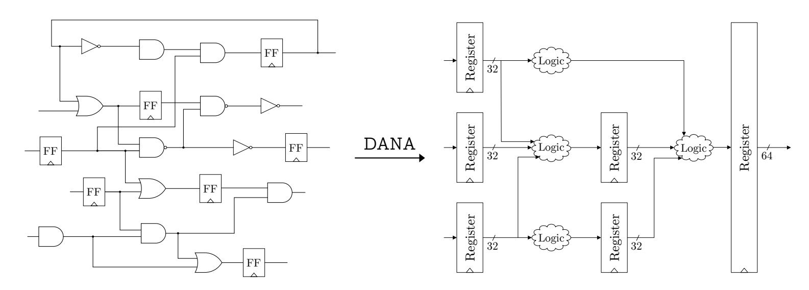

**Figure 1:** Visualization of the goal of DANA

As we will show in Sections 5 and 6, identification of such registers provides much structural and architectural information of the design under investigation. Our implemen-

{2}------------------------------------------------

tation of DANA is open source, technology-agnostic, and highly optimized, analyzing even a modern SoC in a matter of minutes. The output of DANA presents a structured baseline for a reverse engineer, making it a viable candidate as *the* first step in netlist analysis.

**Contributions:** The work at hand consists of three main contributions:

- We introduce a generic methodology for analyzing unknown flattened gate-level netlists, coined DANA, which is based on dataflow analysis. We present an instantiation of DANA and provide information on its internals and algorithms.
- We evaluate DANA on nine modern open source designs, ranging from cryptographic IP-cores, over general purpose CPUs, to the OpenTitan SoCs. Our results show almost perfect recovery of the overwhelming majority of registers, even in the most complex designs.
- We demonstrate the value of the substantial information a reverse engineer can obtain directly from the output of DANA in two selected applications. First, we show that solely based on the automatically generated output of DANA, we are able to correctly identify the cryptographic components of the OpenTitan SoC. Second, we demonstrate how DANA's output uncovers unintended datapaths, disclosing the presence of a key-leakage hardware Trojan. Our case studies show that, with the help of DANA, the search space for crucial components, such as cryptographic key registers, the register file of a CPU, or its central program counter, can be reduced significantly.

Our implementation is available as a plugin for the open-source netlist analysis framework HAL as part of the official HAL repository on GitHub[1](#page-2-0) . We also published our collection of modern open-source cores that we synthesized for ASICs and FPGAs [2](#page-2-1) in a separate repository.

## **2 Background**

In this section, we summarize the relevant technical background and introduce the terminology used in the remainder of this paper. We then review related work and highlight shortcomings in the state-of-the-art of netlist reverse engineering.

### <span id="page-2-2"></span>**2.1 Technical Background**

Below, we clarify the term gate-level netlist and introduce HAL, a netlist analysis framework that was used in our work.

**Netlists:** A netlist is a representation of the components of a hardware design and their interconnections. While netlists can focus on different levels, e.g., transistor-level netlists, the general term is mostly used to refer to gate- or cell-level netlists, i.e., ensembles of gates or standard cells together with their interconnections [\[WH15\]](#page-23-4). Thus, a gate-level netlist is comparable to a circuit diagram of the entire design. A *flattened* netlist contains no information about functional modules or any form of hierarchies. Furthermore, netlists typically lack meaningful descriptive labels for gates and signals.

**HAL:** Our implementation of DANA is a plug-in for HAL, a comprehensive reverse engineering and manipulation framework for gate-level netlists [\[FWS](#page-21-0)<sup>+</sup>18]. HAL converts a netlist into a directed graph. This representation enables the application of structural analyses and established graph algorithms. HAL's simple plugin system, similar to popular software reverse engineering frameworks such as IDA Pro or Ghidra, allowed the implementation of DANA as a highly optimized C++ plugin. HAL is available open source on GitHub<sup>1</sup> .

<span id="page-2-0"></span><sup>1</sup><https://github.com/emsec/hal>

<span id="page-2-1"></span><sup>2</sup><https://github.com/emsec/hal-benchmarks>

{3}------------------------------------------------

### **2.2 Terminology**

DANA analyzes the flow of data between *sequential elements* of a design. This primarily includes Flip Flops (FFs), but also latches and other clocked elements like RAMs. For the sake of simplicity, we will use the term FFs to collectively address these elements. The goal of our analysis is to recreate high-level information about *registers*, i.e., semantic groups of FFs. The output of DANA and the majority of its internal workings revolve around *groupings*. A grouping is simply a set of register candidates, i.e., a set of group of FFs.

## **2.3 State-of-the-Art of Netlist Reverse Engineering**

The problem of netlist reverse engineering has been addressed in several works [\[AGM19\]](#page-20-4). Hansen *et al*. pioneered gate-level netlist reverse engineering in the academic literature [\[HYH99\]](#page-21-1). They described several best-practices for a human reverse engineer such as the detection of recurring modules and common library structures. Their work sparked a slowly growing body of research, typically focusing on specific aspects of netlist analysis.

A major focus of previous reverse engineering approaches was the identification of FSMs or control logic in general. Typical approaches for FSM reverse engineering combine structural analysis — for locating FSM circuitry — and functional analysis to recover state transition graphs [\[STGR10,](#page-22-5)[MZJ16,](#page-22-6)[McE01\]](#page-22-7). In order to identify FSM state elements, Meade *et al*. proposed *RELIC* [\[MJTZ16\]](#page-22-8) which aims at classifying FFs as data or control elements. *RELIC* identifies similar fan-in trees between FFs and tries to classify them as state and non-state elements. Due to its long run time, *RELIC* is only applicable to small netlists of up to a few thousand gates. Recently, Brunner *et al*. [\[BBS19\]](#page-20-5) published *fastRELIC*, which provides a speed-up of up to 100x compared to the original implementation, while providing the same functionality. Fyrbiak *et al*. [\[FWD](#page-21-2)<sup>+</sup>18] demonstrated flaws in many well-established FSM obfuscation techniques incorporating mentioned FSM recovery techniques.

In [\[LWS12\]](#page-21-3), Li *et al*. presented a method to match an extracted sub-circuit using behavioral matching against a library of components. One year later, Li *et al*. tackled the problem of finding possible sub-circuit candidates in a sea of gates by reconstructing word-level structures and improved the matching approach with *WordRev* [\[LGS](#page-21-4)<sup>+</sup>13]. Subramanyan *et al*. [\[STP](#page-22-9)<sup>+</sup>13] extended the toolset *WordRev* with a component matching library that incorporates formal methods. This enables the identification of small components including adders, multipliers, counters, and register. Gascón *et al*. [\[GSD](#page-21-5)<sup>+</sup>14] improved the method for component matching by Subramanyan *et al*., to support more advanced and complex combinational circuitry. Recently, Fyrbiak *et al*. [\[FWR](#page-21-6)<sup>+</sup>20] showed that well-known graph similarity algorithms can be applied to the problem of netlist reverse engineering to identify sub-circuits.

### <span id="page-3-0"></span>**2.4 Shortcomings of Previous Work**

The state of the art in netlist reverse engineering cannot be considered satisfactory. Brunner *et al*. already remarked in their initial work that the introduction of mandatory parameters which result in varying outputs, highly complicates proper evaluation and estimation of real-world applicability, especially when applied to unknown netlists [\[BBS19\]](#page-20-5). An example for such a "magic" value would be a threshold or a search depth, i.e., a mandatory parameter that leads to heavily varying success rates. A reverse engineer who analyzes a completely unknown netlist cannot reliably decide which values to choose. In other words, correctness of the algorithm heavily depends on a correct parameter choice that the analyst cannot easily verify.

In 2018, Meade *et al*. [\[MSL](#page-22-10)<sup>+</sup>18] brought to attention that most gate-level netlist reverse engineering techniques lack a proper evaluation. They highlighted that previous work oftentimes employed custom evaluation metrics, tailored to the intrinsics of their proposed techniques. Hence, evaluation results are difficult to compare — and biased. In turn,

{4}------------------------------------------------

Meade *et al*. suggested using the Normalized Mutual Information (NMI), a widely accepted statistical metric for evaluating clusters. Since a grouping or classification of gates can be considered as a form of clustering, the NMI as a central metric leads to more unbiased results for the evaluation of netlist reverse engineering methods. In a nutshell, the NMI is computed by comparing the output to a ground truth. The closer the NMI is to 0, the worse is the coverage, while an NMI of 1 indicates perfect matching. We used the NMI to evaluate DANA (cf. [Section 5\)](#page-12-0).

Finally, most prior work has been evaluated on severely outdated and constrained designs. The most popular benchmark suite ISCAS'85 is over 30 years old and only contains combinational circuits with not more than 3.5k gates. ISCAS'85 was neither meant to provide designs for reverse engineering nor are its cores representative for designs of interest to today's reverse engineers. Thus, we conclude that there is a lack of a dedicated modern benchmark for hardware reverse engineering.

## <span id="page-4-0"></span>**3 Dataflow Analysis Methodology DANA**

With the shortcomings of previous work discussed (cf. [Section 2.4\)](#page-3-0) we now present our dataflow analysis DANA. DANA is fast, easy to use, fully automated, and most importantly gate-library and technology independent. Our approach to combine structural and control information together with our dedicated architecture that actually lets the data decide its outcome, is the key to achieving truly helpful output for a reverse engineer as we will show in our evaluation in [Section 6.](#page-15-0)

DANA operates in two modes: (1) *Normal Mode* and (2) *Steered Mode*. In *Normal Mode*, DANA autonomously analyzes the given netlist, without any prioritization or weighting. Using the *Steered Mode*, the analyst can optionally feed additional a-priori information to virtually "steer" our algorithms. Note that this information basically expresses an optional algorithm specialization, not an arbitrary numeric threshold or magic number as criticized in previous work, such as search depth or ever changing thresholds. In our instantiation, we implemented support to prioritize registers of specific expected sizes, i.e., information that a reverse engineer can extract from datasheets. To clarify: if the reverse engineer knows that the underlying design is, i.e., a 32-bit CPU, he would expect to find several 32-bit register and thus steer DANA towards said sizes.

In this section we present our generic dataflow analysis methodology before presenting a concrete instantiation and implementation in [Section 4.](#page-6-0)

### **3.1 Goal**

The goal of DANA is to analyze the flow of data in a netlist to recover high-level design information. More precisely, DANA recovers high-level registers and their interconnections from the unstructured sea of gates as visualized in [Figure 1.](#page-1-0) By recovering this highlevel grouping information of individual FFs and their dependencies, the reverse engineer obtains an additional, more structured view on the netlist. Hence, DANA aims to provide massive aid to the human analyst for his subsequent automated and manual analyses in any scenario.

### **3.2 General Workflow**

The general idea of our approach is to analyze the dataflow between FFs to recover registers. The combinational logic in between said FFs or, more precisely, their functionality are not incorporated in the analysis. Therefore, the entire netlist is lifted to a higher level of abstraction which only contains FFs and connections to their respective sequential successors and predecessors.

This condensed view on the netlist is then processed as follows: by analyzing specific characteristics of FFs, e.g., their control signals or common succeeding and preceding FFs, 

{5}------------------------------------------------

they can be assigned to groups. However, a single characteristic alone is not sufficient. For example, several (unrelated) registers are reset by the same control signal and could thus end up in the same group. If now multiple characteristics are taken into account after each other, the resulting groupings can be refined and may eventually accurately resemble the high-level register groupings. To sort out misclassifications, we evaluate several characteristics and their permutations in parallel and then let a specialized voting decide the final grouping. This entire process is repeated multiple times, each time starting with the final grouping of the previous round as input, until the final grouping does not change anymore. This way, the existing groupings are automatically refined.

The output of DANA then consists of the identified registers and their dependencies, i.e., connections indicating a flow of data.

#### <span id="page-5-4"></span>3.3 Architecture of DANA

<span id="page-5-0"></span>In this section we explain the methodology and architecture of our dataflow analysis in detail. Figure 2 shows an architectural overview and our explanations will follow the terminology of that figure.

<span id="page-5-1"></span>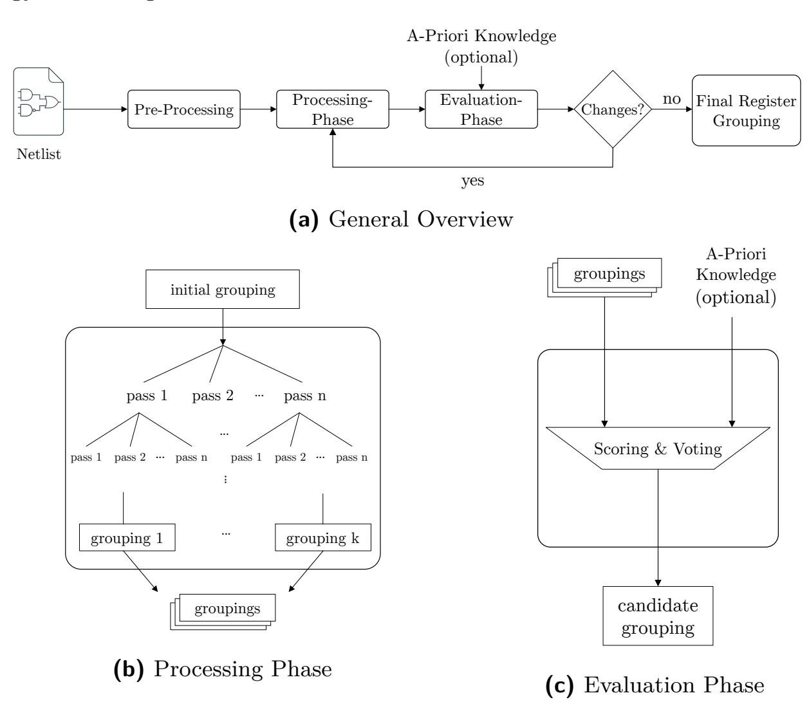

<span id="page-5-3"></span><span id="page-5-2"></span>Figure 2: Architectural overview on DANA

In general, the dataflow analysis is split into three phases, (1) pre-processing, (2) processing, and (3) evaluation, where phases 2 and 3 are executed multiple times alternatingly (cf. Figure 2a).

**Pre-processing Phase:** Our analysis starts by pre-processing the netlist. First, all FFs are identified. Then, for each FF, its output signals are traced until other FFs are hit to find the dependencies, i.e., flow of data, between FFs. This results in the abstraction of the netlist which the remainder of the analysis will work on.

In addition, further characteristics of the netlist abstraction can be precomputed in this phase to reduce processing time in the later phases.

**Processing Phase:** The processing phase, depicted in Figure 2b, is executed multiple times in alternation with the evaluation phase. It gets an *initial grouping* as input. In

{6}------------------------------------------------

the first execution of this phase, the initial grouping consists of each FF assigned to its own unique group. In the following iterations, the initial grouping is the output of the evaluation phase.

The idea is to process this initial grouping into a more refined grouping via *processing passes*. Each pass analyzes a specific characteristic of all groups of FFs and then tries to merge existing groups or split them up based on this characteristic. Its output is then a refined grouping of FFs, the input remains unchanged.

In detail, the initial grouping is subjected to each available combination of two passes. We also evaluated sequences of more than two passes, but this had virtually no impact on our results apart from increasing run time. This stems from the fact that, due to repeated executions of the processing phase, the passes are still combined sufficiently. Additional layers thus do not introduce significant amounts of additional information to DANA.

After, the initial grouping has been individually processed by all pass sequences, the processing phase outputs all the obtained refined groupings.

**Evaluation Phase:** The evaluation phase takes all the refined groupings that were computed in the processing phase and reduces them to a final grouping as depicted in [Figure 2c.](#page-5-3) This is done via a specialized majority voting: the idea is that individual groups that occur in many of the refined groupings are most likely correctly classified. However, priority is given to groups that minimize the number of FFs that would end up isolated or in very small groups. The reason for this prioritization is that data mostly flows through larger registers, while smaller registers handle control flow, e.g., FSMs.

In Steered Mode, the voting can assign higher priority to individual groups based on the given a-priori knowledge about the design. Thus, the Steered Mode can be seen as an optional algorithm specialization.

In the end, the voting results in a single grouping, which was generated from all the refined groupings of the processing phase. This grouping is taken as a *candidate grouping* for the final output. It is then compared to all candidate groupings that were obtained from previous iterations of the evaluation phase. If the current candidate has already been obtained before, i.e., the candidate did not change from the last iteration or a cycle is found, it becomes the final output of DANA and the analysis is finished. Otherwise, the processing phase is started again but this time taking the current candidate grouping as its initial grouping.

#### **3.4 Design Rationales**

The architecture of DANA is designed to work fully automated, without magic values or mandatory parameters. This makes results comparable and representative for other designs. Furthermore, DANA is not restricted to any technology or application. In the following we discuss the design rationals of our architecture. Our considerations are backed by the results of our evaluation in [Section 5.](#page-12-0)

The main strength of DANA lies within the layering of passes and the reduction of their outputs into a single grouping. An isolated metric rarely leads to correct register groupings since it is constrained to a single point of view. Therefore, our approach to evaluate all permutations of multiple pass sequences enables DANA to basically combine several points of view into its outcome. Naturally, the results of exhaustively applying all available pass sequences also contain numerous incorrect groupings. The specialized majority voting is designed to sort them out. More precisely, it is designed to let the obtained data decide the outcome by itself. The Steered Mode further enables DANA to optionally incorporate a-priori knowledge at this point.

<span id="page-6-0"></span>Finally, the iterative architecture of feeding the output of the evaluation phase back to the processing phase, creates a workflow where all passes jointly optimize their own previous output.

{7}------------------------------------------------

## **4 Instantiation Details of DANA**

We implemented DANA in modern C++ as a plugin for the open source netlist analysis framework HAL (cf. [Section 2.1\)](#page-2-2). In this section, we provide details on our concrete instantiation, e.g., the employed passes and majority voting internals. Our implementation is highly optimized to even handle complex netlists of SoCs in a matter of minutes.

### <span id="page-7-0"></span>**4.1 Preprocessing**

The main task of the preprocessing phase is to create the discussed netlist abstraction. However, we also compute several characterestics that are accessed by the processing passes in specialized rule checks. In the following, we present details on both computations.

#### **4.1.1 Computing the Netlist Abstraction**

DANA only takes the dependencies of FFs into account - thus all logic has to be replaced by their mere connections. Creating this netlist abstraction is straightforward. All FFs of the netlist are collected and their outputs are traced through combinational logic until other FFs are hit, yielding the successor/predecessor relations. In other words: considering that the entire netlist is a directed graph, where the gates are nodes and nets are edges that connect the gates, we replace every combinational logic gate with a simple edge. This leaves us with a FF dependency graph.

#### **4.1.2 Preparation of Rule Checks**

It might be possible that a pass would create a group that simply does not make sense in real-world designs. For example, FFs that are clocked by different branches of the clock tree are highly unlikely to be part of the same register. Therefore, all passes have to follow a set of rules. Since our rules match fixed global characteristics, we compute those already in the preprocessing phase to save time in the pass computations.

In detail, we formulate two reasonable rules: First, we only allow groups of registers that share the same clock & control signals. As a metric for grouping, this would unarguably often lead to register groups that are too large, since entire modules can share the same clock and enable signals, but as a restrictive rule it allows filtering of incorrect groupings. Second, we analyze potential register stages. All FFs of a group have to be members of the same estimated register stage. Every pass has to check conformity with these two rules before it can perform a certain merging or splitting of groups.

**Clock & Control Signals:** All FFs are driven by a clock signal and can feature optional control pins, e.g., an enable or reset pin. Usually, all FFs of a register share the same control signals and are driven by the same clock or rather a certain branch of a clock gated by a common enable signal. Hence, we use this characteristic as a required condition: only FFs with matching control signals and clock can be assigned to the same register group.

To properly collect said signals for each FF, some preparations are necessary: if, for example, a signal reaches multiple FFs but has a separate buffer for each connection, several distinct nets are found at FF inputs, despite being the same signal. A generalization of this problem are duplicated logic cones, i.e., the same combinational function being computed on the same input nets, but in multiple instantiations of the same gates. These duplications are often inserted by the synthesizer to meet certain timing or placement constraints. Therefore, we identify and merge all instances of these duplicated logic cones. After this step, FFs that share a common signal are actually connected to the same net.

Finally, this preprocessing step is finished by extracting the IDs of all nets that are connected to the control pins and clock pin of the FFs in the design. These IDs can then be compared in the rule check.

{8}------------------------------------------------

**Register Stage Identification:** From a high-level view, registers in a design can be assigned into *stages* based on the order in which they are reached by data. While the actual ordering of stages is not important to DANA, all FFs of a register definitely have to reside in the same register stage. By precomputing the potential register stages of each FF, we can rule out all register groups in the processing phase that violate this rule.

Intuitively, one could traverse the netlist starting from its primary inputs and assigning FFs to stages based on their depth from the primary inputs. However, this simple approach does not work at all for real designs. For example, CPUs often only have the clock as a primary input while inputs are loaded from internal memories. Furthermore, if one would apply the same approach but traversing backwards from primary outputs, the resulting stages would contain different FFs due to different traversal of circular structures.

Therefore, we take a different approach that does not depend on primary inputs or outputs. The basic idea of our register stage identification algorithm is that all successors/predecessors of a FF belong into the same stage. Based on this premise, the algorithm operates in three steps: (1) forward and backward stage assignment, (2) result splitting, and (3) merging. These steps are also illustrated in [Figure 3.](#page-8-0)

<span id="page-8-3"></span><span id="page-8-1"></span><span id="page-8-0"></span>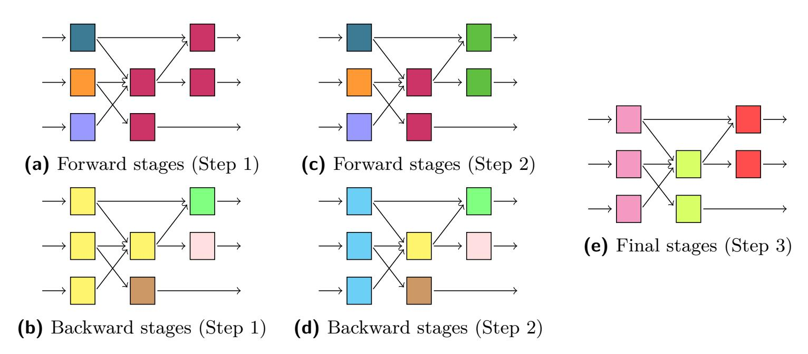

<span id="page-8-5"></span><span id="page-8-4"></span><span id="page-8-2"></span>**Figure 3:** Visualization of our register stage identification algorithm. Each color represents an identified stage.

In step 1, for each FFs, the set of all successor FFs is inspected: if none of the successor FFs is assigned to a stage yet, they are simply all assigned to a new stage. If already assigned successor FFs are members of different stages, because of previously inspected FFs, all these stages are merged into one. After this merging, or if already assigned successor FFs were only members of a single stage, all unassigned successor FFs are also assigned to said stage. Consequently, the resulting stages are independent of the order in which FFs are analyzed. This step is illustrated in [Figure 3a.](#page-8-1)

The above analysis is then independently repeated by inspecting the predecessors of all FFs as shown in [Figure 3b.](#page-8-2) This leaves us with two sets of stage assignments, one by traversing the netlist forwards, one by traversing backwards. However, these stages are too relaxed: FFs can now be part of the same stage as their successors/predecessors, because of a common successor/predecessor FF.

Therefore, in step 2, we iteratively analyze and split the obtained stages. All gates that also have a predecessor/successor in their stage are collectively moved into a new stage, which is then again inspected for the same criterion. This way, we are left with quite restrictive but correct stages as shown in Figures [3c](#page-8-3) and [3d.](#page-8-4)

In step 3, the forward and backward stages are merged: if any stage in the forward stages is a subset of a stage in the backward stages, the respective subset is removed, i.e., only the superset remains. The same merging is performed in the other direction. 

{9}------------------------------------------------

The remaining stages of both directions now form the final stages. Note that FFs can be assigned to more than one stage. This only happens when a FF was part of a forward and backward stage that were not subsets in any direction. However, this does not necessarily apply to all FF in the ambiguous stages, i.e., some of them can appear in only one of them. Hence, for each set of ambiguous stages, all FF of these stages are merged into one combined stage. The final output of this step is shown in [Figure 3e.](#page-8-5)

## **4.2 Processing Phase**

The heart of the processing phase are the so called passes. Recall that a pass gets a register grouping as an input, processes it based on a specific metric, and outputs a new register grouping (cf. [Section 3.3\)](#page-5-4). In the initial input grouping of the first iteration every FF is in its own group.

The general workflow of a pass is as follows: First, the pass merges or splits its input groups into candidates for its output groups. Then, for each output candidate group, the pass checks whether the group violates the rules for matching characteristics using the precomputed characteristics from the preprocessing phase (cf. [Section 4.1\)](#page-7-0). If the check passes, the group is added to the output. In the end, all groups of the original input that could not be merged or split are simply copied to the output.

In total, we implemented nine different passes. Since each pass is stateless and leaves its input grouping untouched, we automatically parallelize the processing phase over all available CPU cores. In the following we provide details on our implemented passes.

#### **4.2.1 Pass: Group by Successors/Predecessors**

This analysis merges groups that have the same predecessor or successor groups, hence providing two passes for DANA. [Figure 4](#page-9-0) depicts the *group by predecessor* variant. Since the blue groups both share the same predecessor groups, they would be merged by this pass.

<span id="page-9-0"></span>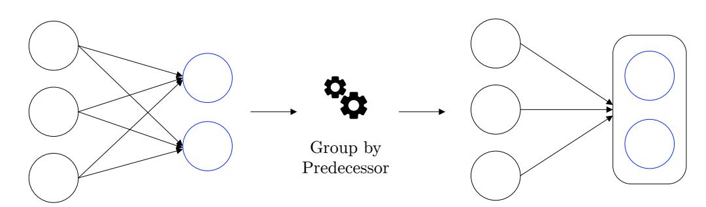

**Figure 4:** Visualization of merging existing groups by common predecessor groups

#### **4.2.2 Pass: Iteratively Group by Successors/Predecessors**

This analysis works exactly as the above analysis, however, it is executed iteratively until no more changes occur. Hence, it again provides two passes for DANA. This behaviour is depicted in [Figure 5](#page-9-1) for the *group by predecessor* variant. In theory the same behavior could be achieved with just the non-iterative pass and a lot of iterations, but our experiments showed that having both variants improved results by approaching the problem from both sides.

<span id="page-9-1"></span>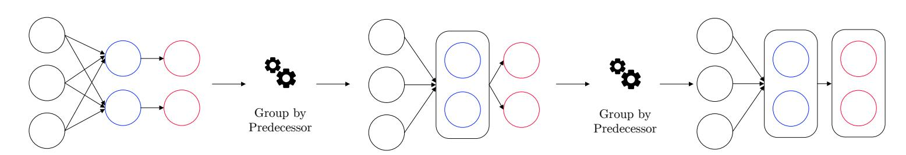

**Figure 5:** Visualization of iterative merging of groups based on common predecessors

{10}------------------------------------------------

#### **4.2.3 Pass: Split by Successor/Predecessor Groupings**

Instead of merging existing groups, this analysis splits larger groups into smaller ones. For each input group, it analyzes the succeeding or preceding groups of each contained FF. If there are different sets of succeeding or preceding groups found, the input group is split based on these sets. Since no groups are merged, and all input groups already fulfill the rules, the rule checking can be skipped. As this analysis focuses again on either successor or predecessor groups, it again contributes two passes for DANA. This splitting becomes essential in later iterations, where different metrics combined resulted in too large groupings.

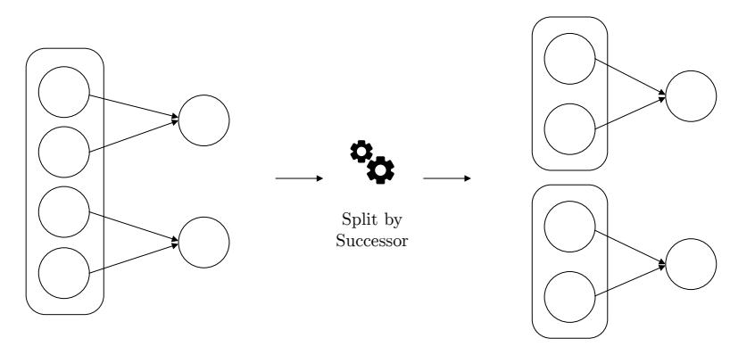

**Figure 6:** Visualization of splitting groups based on different successors of subgroups

#### **4.2.4 Pass: Group by Number of Successors/Predecessors**

This analysis focuses on the number of successor or predecessor FFs of the FFs in each group, hence again providing two passes for DANA. For each group it computes the minimum and maximum number of FF-successors/predecessors over all contained FFs. It then merges groups with matching values. Note that the rule check still ensures that no unrelated groups are merged.

The reasoning behind these passes is that FFs, which form a register, often have identical or similar logic before or after them. Indeed, our results improved notably after including this analysis.

#### **4.2.5 Pass: Group by Control Signals**

Our final pass actively merges groups with the same clock and control signals. Without this pass, DANA would only consider said signals during the rule check, using the information restrictively to **prevent** groupings. However, actively grouping by these characteristics is notably beneficial for – among others – CPUs, where control signals play an important part. Although groups can often be too large, since entire modules can share the same clock and control signals, this pass presents new insights for the structural passes. Further recall, that large groups can also be split by passes, e.g., in our split by successor/predecessor groupings pass.

### **4.3 Evaluation Phase**

In this phase all refined groupings that were generated by the pass sequences are reduced to a single grouping in a meaningful way. This is done by a specialized majority voting as shown in [Algorithm 1.](#page-11-0)

First, all unique groups within all refined groupings are counted. These unique groups are then sorted by their count, i.e., their votes, like in a normal majority voting. However, instead of simply selecting the groups with the most votes, we perform a scan of the most voted groups that are a maximum of 10% away from the voting of the currently most voted group. Each of these groups is scanned for the number of FFs that it would force to be in a so called *bad group*. We define bad groups as groups of size less than eight, since DANA analyzes dataflow and data mostly flows through larger registers. Now, the first group which forces the least amount of FFs into bad groups is selected to become

{11}------------------------------------------------

part of the output. All other group candidates that contain a subset of the selected group are excluded from further considerations, since every FF can only be assigned to a single group. This is repeated until all groups are scanned. If FFs remain that could not be assigned to any group, they are assigned to new 1-element groups each.

#### <span id="page-11-0"></span>**Algorithm 1** Specialized Majority Voting

```
Input: refined groupings R
Output: final grouping G
 1: unique groups U ← ∅
 2: votes ← empty map
 3: for all group r ∈ R do
 4: votes[r]++
 5: U ← U ∪ {r}
 6: sort U by votes descending
 7: G ← ∅
 8: while |U| > 0 do
 9: lower_bound ← votes[U[0]] · 0.9
10: scanned ← {s ∈ U|votes[s] ≥ lower_bound}
11: best ← min_element(scanned, count_resulting_bad_groups)
12: G ← G ∪ {best}
13: U ← U \ {x ∈ U|x ⊂ best}
14: return G
```

**Incorporating A-Priori Knowledge:** The analyst can *steer* our algorithm by adding a-priori knowledge in the form of expected register sizes. For example, if the analyst knows that he is facing a 64-bit CPU, one would expect to find several 64-bit registers. This information can originate from a datasheet or previously reverse engineered information. In our instantiation, these expected sizes can specialize the majority voting: instead of sorting the unique groups just by their votes, they are primarily sorted by whether they are of prioritized size and then by votes second. Hence, the scanning will check all groups of expected sizes first. In addition to minimizing the number of bad groups the voting also tries to maximize the number of groups of expected sizes.

#### **4.4 Potential Improvements to DANA**

**Technology-Specific Optimizations:** We emphasized several times that our instantiation of DANA is technology-agnostic. However, when focusing on a certain technology, e.g., ASICs, DANA's analysis can be specialized as well. For instance, in the case of ASICs, information about the location of FFs can be leveraged, since the FFs of registers are typically laid out in close proximity of each other. This information is much less reliable in FPGAs, where resource locations are defined by the FPGA-layout and the synthesizer potentially has to spread out registers. We do not analyze this information in our instantiation of DANA; but, exploring its effectiveness is an interesting task for future research.

**Approaches That Did Not Work:** Apart from the described passes of our instantiation, we explored several further characteristics and metrics and experimented with additional metrics in the evaluation phase. However, many attempts resulted in worse results for virtually all designs. In the following, we briefly explain these "failed attempts":

- Merging or splitting by the shape of input or output logic, i.e., by the combinational logic that is interconnecting FFs resulted in worse results.
- In contrast to grouping by input/output size, splitting by input/output size did never result in improved results.
- Filtering the groups in the majority voting to exclude groups with exceptionally little votes surprisingly resulted in worse groupings as well.

{12}------------------------------------------------

## <span id="page-12-0"></span>**5 Evaluation**

In this section we evaluate DANA with respect to several netlists and demonstrate its suitability as a universal initial step in netlist reverse engineering. Crucially, as discussed in [Section 2.4,](#page-3-0) evaluation methods in reverse engineering need to be improved with up-to-date benchmark designs and well established metrics that lead to unbiased and comparable results [\[MSL](#page-22-10)<sup>+</sup>18,[BBS19\]](#page-20-5).

### **5.1 Evaluation Metrics**

Since DANA groups sequential elements together into registers, it can be categorized as a clustering algorithm. Therefore, we can follow the recommendation by Meade *et al*. and employ the NMI to evaluate the outputs of DANA. Furthermore, according to [\[MRS08\]](#page-22-11), the purity of clusters is typically measured as well. Both metrics, NMI and purity, compare the outcome of clustering to a ground truth and output a value between 0 and 1. If output clusters contain elements from different clusters of the ground truth, the purity is lowered. As long as all output clusters are subsets of golden clusters, the purity remains 1. Namely, the perfect result would have purity of 1, but so would an output where each element is in its own cluster. Hence, purity *alone* is not an effective measure, but complements the NMI. The NMI is influenced by several characteristics, including cluster sizes and coverage of the ground truth. A value closer to 0 means that the cluster is worse off the ground truth, while an NMI of 1 indicates a perfect result. Both metrics in conjunction provide a comprehensible assessment of a clustering and are thus used in our evaluation.

### **5.2 Evaluated Designs**

To overcome the noted issues regarding outdated benchmarks, and to assess DANA under real-world conditions, we collected a set of 9 modern open source designs. Our selection includes cryptopgraphic coprocessors, general purpose CPUs, and an SoC — the OpenTitan by the ETH Zürich.

**Table 1:** Overview on the designs used to evaluate DANA

<span id="page-12-1"></span>

| Design         | #Gates  |        | Description                                                                            | Expected           |
|----------------|---------|--------|----------------------------------------------------------------------------------------|--------------------|
|                | ASIC    | FPGA   |                                                                                        | reg. sizes         |
|                |         |        | Cryptographic Cores                                                                    |                    |
| AES [Hsib]     | 144,303 | 7,678  | unrolled T-Table AES-128 encryption                                                    | 128                |
| DES [dlP]      | 19,217  | 3,770  | unrolled DES encryption                                                                | 64, 56             |
| PRESENT [Gaj]  | 1,393   | 372    | round-based PRESENT-80 encryption                                                      | 80, 64             |
| RSA [srm]      | 79,787  | 18,672 | RSA-512 encryption in Montgomery domain                                                | 512                |
| SHA-3 [Hsia]   | 15,876  | 6,478  | SHA-3 with 512-bit digest,<br>security parameters r = 1088, c = 512                    | 1600, 1088,<br>512 |
|                |         |        | General Purpose Processors                                                             |                    |
| edge [AlM]     | 39,607  | 7,237  | 32-bit MIPS CPU, 5 pipeline stages                                                     | 33, 32, 31         |
| ibex [low]     | 12,751  | 6,078  | mature 32-bit RISC-V CPU, 2 pipeline stages                                            | 33, 32, 31         |
| open8 [jsh]    | 1,884   | 1,134  | 8-bit CPU                                                                              | 16, 8              |
|                |         |        | System-on-Chips (SoCs)                                                                 |                    |
| OpenTitan [lI] | 90,688  | 52,119 | high-quality SoC, which includes AES, HMAC,<br>and ibex CPU, connected by a 32-bit bus | 32                 |

{13}------------------------------------------------

To demonstrate that DANA is architecture-agnostic, all designs were synthesized for both FPGA and ASIC according to industry standards. An overview on the designs is given in [Table 1.](#page-12-1) For each design, the table provides the designs total number of gates, a short description, and expected register sizes, which will be used as a-priori knowledge when evaluating DANA's Steered Mode.

Regarding synthesis, for FPGAs we used Vivado and the Xilinx Unisim library and for ASICs we used the Synopsys DC and the open LSI10k library. We generated flattened netlists, optimized for area, and specifically kept human-readable names to later compare DANA's output against the ground truth. In the case of ASICs, we instantiated a gated clock tree, as commonly done to reduce power consumption. A special case is the OpenTitan SoC, where the entire tool flow was specifically designed for FPGAs with Vivado. Hence, to synthesize the OpenTitan with Synopsys, we had to substitute FPGA-specific elements, e.g., RAM blocks, with black boxes. The number of the remaining FFs is still realistic and the overall datapaths remain unchanged.

### **5.3 Evaluation Procedure**

For each synthesized netlist, we run DANA twice, once in Normal Mode and once in Steered Mode, providing a-priori information in form of the most common expected register sizes. For our ground truth, we automatically group the sequential elements of the respective netlists by their human readable names. For example 32 FFs that form a register are automatically grouped in to one 32-bit register by their human readable name in the ground truth generation. All FFs can and will only be assigned to exactly one register group. We emphasize that DANA does not use this information for the group generation. Again, the input is a flattened gate-level netlist, with no module information or other hierarchical information. We then individually compare both output groupings of DANA with the ground truth via the NMI and purity metrics.

### <span id="page-13-0"></span>**5.4 Results & Discussion**

For the evaluation we ran DANA on an Intel Xeon Gold 6132 CPU @ 2.60GHz. [Table 2](#page-14-0) shows the results of our evaluation. For each design and synthesis option, we denote the number of FFs and the NMI, purity, and run time of DANA for both executions. While we made use of a powerful multi-core processor, even our largest evaluated design, OpenTitan (Synopsys), finishes in 16 minutes on a standard laptop.

The results shown in [Table 2](#page-14-0) are very promising. Even in Normal Mode, the majority of all designs achieved an NMI and a purity above 0.90. In Steered Mode, some results showed notable improvements while the other designs remained mostly unchanged. Manually comparing DANA's output to the ground truth, the overwhelming majority of the registers were correctly grouped. Oftentimes, DANA even managed to subdivide registers according to their functionality: for example, in case of the ibex processor, where many similar registers are driven by common control signals, the program counter is precisely identified.

The strength of combining the different viewpoints our passes provide becomes especially apparent when looking closer at the results of AES or DES: In these unrolled designs, all FFs share the same clock and control signal. Hence, the part of our rule check and our pass that is based on this metric does not provide any useful information to DANA. Still, especially thanks to our register stage identification and the remaining structural passes, DANA was able to correctly reconstruct the unrolled round structure of the designs. However, especially in the case of DES, the NMI/purity values are comparatively low (0.85/0.49). In the following we want to discuss that low values not necessarily indicate useless results.

**Discussion of Lower NMI and Purity Scores:** Naturally, NMI and purity values both close to 1 indicate almost perfect recovery of registers with respect to our ground

{14}------------------------------------------------

<span id="page-14-0"></span>Design Synthesizer #FFs Plain Analysis With A-Priori Knowledge NMI Purity RT NMI Purity RT Cryptographic Cores AES synopsys 6,720 0.86 0.65 10.6 s 0.92 0.98 7.2 s vivado 3,968 0.99 1.00 2.1 s 0.99 1.00 2.2 s DES synopsys 1,976 0.84 0.48 0.7 s 0.98 0.98 1.2 s vivado 1,976 0.84 0.48 0.5 s 0.98 0.98 0.9 s PRESENT synopsys 151 0.91 1.00 0.1 s 0.91 1.00 0.1 s vivado 152 0.90 1.00 0.1 s 0.90 1.00 0.1 s RSA synopsys 8,715 0.86 0.94 73.5 s 0.87 0.94 70.0 s vivado 7,189 0.99 0.99 39.3 s 0.99 0.99 36.4 s SHA3 synopsys 2,245 0.67 0.99 4.4 s 0.92 0.99 2.1 s vivado 2,244 0.94 0.99 2.2 s 0.94 0.99 2.2 s General Purpose Processors edge synopsys 2,929 0.97 0.90 3.8 s 0.98 0.95 3.7 s vivado 1,858 0.96 0.90 4.3 s 0.98 0.94 4.5 s ibex synopsys 2,354 0.97 0.97 20.7 s 0.97 0.96 20.3 s vivado 1,028 0.93 0.92 2.1 s 0.94 0.93 2.1 s open8 synopsys 208 0.94 0.93 0.2 s 0.95 0.94 0.2 s vivado 209 0.95 0.91 0.2 s 0.96 0.93 0.2 s SoC OpenTitan synopsys 22,134 0.90 0.91 156.2 s 0.89 0.91 201.1 s

**Table 2:** Overview on the results of our evaluation

truth. Thus, it is interesting to inspect DANA's outputs that resulted in lower scores, e.g., DES (0.85/0.49) or SHA3 (0.67/1.00 for Synopsys) in Normal Mode. Intuitively, lower values indicate incorrect results. However, this is not necessarily the case: looking closer at the results of DES, DANA groups the 56-bit key register and the two 32-bit halves of the state registers (Feistel network) into a 120-bit register. This results in a low purity, since several registers that were separated in the ground truth were joined in DANA's identified register. However, this result is not wrong — all 16 rounds are correctly identified as shown in [Figure 7a.](#page-15-1) Furthermore, in Steered Mode, DANA is able to precisely assign the FFs into one 56-bit and two 32-bit registers for each round as shown in [Figure 7b.](#page-15-2) Here, a human analyst can immediately recognize the unique Feistel structure of DES, which consists of a 56-bit key register and the two states halves of 32 bits. The situation is similar for the AES-128 IP-core. Here, in Normal Mode, DANA recovers 256-bit registers for each round, merging state and key registers. Using Steered Mode, we find the 128-bit registers cleanly separated.

vivado 20,600 0.94 0.81 140.3 s 0.94 0.81 167.5 s

Looking at the results of DANA for the SHA3 design, where the output of DANA achieved an NMI of 0.67 despite a purity of 1.00 for the Synopsys-synthesized netlist, one finds a large 1600 bit register (the Keccak state) followed by a rather unexpected chain of registers with around 32 bits each (cf. [Figure 12](#page-24-0) in the Appendix). These registers are actually part of a single intermediate register of the SHA3 sponge construction, hence the low NMI (the register was split up) despite perfect purity (different registers were not mixed). A reverse engineer can still see a clear interdependency between only these registers and the main state register, hence still recognizing them as one unit.

As evident after our inspection, the outputs in both examples have comparatively lower

{15}------------------------------------------------

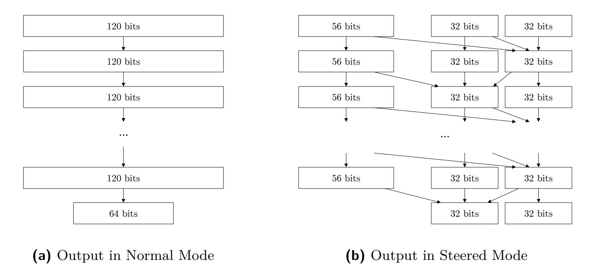

<span id="page-15-2"></span><span id="page-15-1"></span>**Figure 7:** Outputs of DANA analyzing DES with (a) and without a-priori knowledge (b). Arrows indicate a flow of data through combinational logic.

NMI values despite not being wrong. Furthermore, we emphasize that the employed golden models are just approximations, based on the human-readable register names that were assigned on HDL level. Generalizing the above, we conclude that a combination of high NMI and purity values are a reliable indicator for good recovery, while (reasonably) lower values do not necessarily carry a reliable statement, neither positive nor negative. Still, the output of DANA can be as useful as seemingly a perfect result. In a real-world scenario, an analyst does not get any measure of output quality at all.

## <span id="page-15-0"></span>**6 Applications of DANA**

The output of DANA provides a valuable baseline for further analyses. However, an analyst can already deduce notable high-level information about the design's architecture from DANA's output alone. For example, register sizes provide partial information on included modules, especially in the case of cryptography. Since DANA's output contains all datapaths, it even includes connections that were added through malicious external manipulations, hence also providing a baseline for novel means of Trojan identification.

In the following, we demonstrate this versatility by identifying the cryptographic modules in the OpenTitan netlist and by identifying a simple input-activated key-leakage Trojan in an AES core.

## **6.1 Dissecting the OpenTitan SoC — Overcoming the Sea-of-Gates**

The OpenTitan, an open source SoC maintained by the lowRISC initiative, is one of the most mature open source hardware designs available [\[lI\]](#page-21-12). Based on the RISC-V ibex CPU, the OpenTitan aims to provide a silicon root-of-trust by building on high-quality IP cores — including AES-256 and HMAC-SHA-256 as cryptographic primitives [\[goo20\]](#page-21-13). Most of the IP-cores are provided by the ETH Zürich and industry partners like Google to ensure implementations are according to the most recent industrial practices and standards.

In the following, we will demonstrate how DANA can be used to immediately identify the cryptographic modules in the large netlist of OpenTitan, without ever taking the actual combinational logic into account. Our analysis is solely based on the knowledge, that the OpenTitan features hardware support for AES-256, SHA-256, and HMAC-SHA-256, i.e., high-level information that can typically be obtained from publicly available documentations or marketing material.

{16}------------------------------------------------

#### **6.1.1 Properties of Cryptographic Modules**

Cryptographic modules are often of particular interest to reverse engineers. For instance, identifying and locating key registers is useful or even necessary for fault attacks, sidechannel analysis, or invasive key extraction. A reverse engineer often attempts to gain as much internal information as possible, e.g., the physical location of the key-register in the ASIC and other implementation details of the cipher. In the case of FPGAs, key registers are particularly interesting because they can be targeted in custom-tailored key-leakage Trojans that can be inserted through bitstream manipulations, cf. [\[FSK](#page-20-0)<sup>+</sup>17,[SFKP15\]](#page-22-4).

In order to identify the cryptographic modules in the output of DANA and to benefit from Steered Mode, we briefly discuss design properties of the respective modules.

Looking at generic descriptions of the AES-256, SHA-256, and HMAC-SHA-256, one can expect the occurrence of the following register sizes: AES is expected to feature a 256-bit register for the key and a 128-register for the state. Furthermore, due to size constraints, we can expect the AES to be implemented as a round-based architecture. SHA is expected to have a message block register of 512 bits, a state register of 256 bits, and a digest register of 256 bits. Finally, we recall that the HMAC is computed as follows:

$$\mathsf{HMAC}(\mathsf{key}, \mathsf{message}) = \mathsf{SHA}((\mathsf{key} \oplus \mathsf{opad}) \mid\mid \mathsf{SHA}((\mathsf{key} \oplus \mathsf{ipad}) \mid\mid \mathsf{message}))$$

The HMAC is thus expected to have a 256-bit key register and a state register of at least 256 bit, which gets updated with the SHA output.

In Normal Mode, DANA already recovers three 128-bit registers, three 256-bit registers and one 512-bit register. Since we have suspect the expected register sizes discussed above, we can use them as a-priori information in Steered Mode. Here, DANA recovers one additional 256-bit and one 128-bit register. The next step is to analyze which of the registers belong to which module and to filter out unrelated registers.

#### <span id="page-16-1"></span>**6.1.2 Identifying Cryptographic Modules in the Output of DANA**

Due to the direct dependency of input, state, and output registers, we expect that the respective registers of a module are directly connected. [Figure 8](#page-16-0) shows the output of DANA, condensed to the registers of expected sizes and their connections. Interestingly, the dependencies between the registers immediately reveal 4 independent groups. As stated [Section 3,](#page-4-0) a key design feature of DANA is to only analyze the relationship between FFs. All combinational logic is abstracted as directed edges in the figure.

<span id="page-16-0"></span>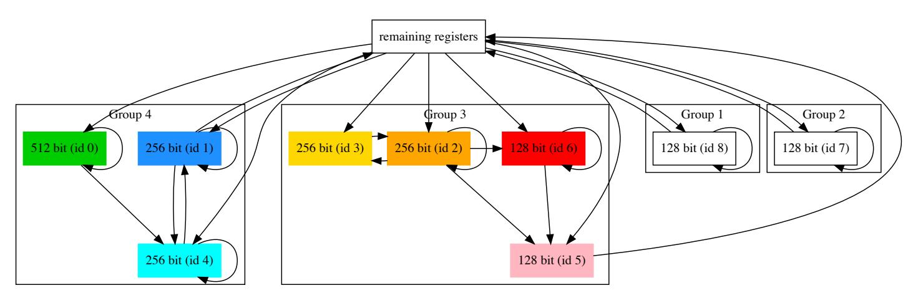

**Figure 8:** Automatically generated output of DANA visualizing the candidate registers for cryptographic modules in the OpenTitan

In the following, we examine these four groups in detail and set up hypotheses for the functionalities of the registers. In [Section 6.1.3](#page-17-0) we will then validate our hypotheses using the official specifications and HDL code.

**Groups 1 and 2:** Groups 1 and 2 contain only a single register each, which is not connected to any other register of interest. We conclude that they are not part of the cryptographic modules since they all consist of more registers.

{17}------------------------------------------------

**Group 3:** Group 3 includes a 256-bits and a 128-bits registers — registers we would expect for an AES-256. In fact, DANA not only found two, but four registers in total that belong in this group, two 256-bits and two 128-bits registers. From merely studying the graph, it is possible to identify state and key register, not only by their sizes, but also by their connections: the key register (id 2) gets updated every round, hence the looping arrow, and influences the state register (id 6). In turn, the state register is also updated every round, but never influences the key register, hence there is no arrow pointing *into* the key register. In addition, we can identify an output register (id 5), which is the only register with a connection that leaves the module. Since it is influenced by both, key and state register, we suspect that the final AES round, which is different from the remaining rounds, is computed on the fly when this register is written. The remaining 256-bit register is currently of unknown functionality.

**Group 4:** Group 4 includes one 512-bit register and two 256-bit registers — exactly the registers expected for a SHA-256 implementation. The 512-bit message register (id 0) influences the state register (id 4), which in turn updates the digest/output register (id 1). However, the registers of the HMAC were not found. Since the SHA and HMAC are typically closely intertwined, we extended our rendering to include registers preceding the SHA message register as shown in [Figure 9.](#page-17-1) This immediately revealed eight 32-bit registers (256 bits total) that are influenced by other logic, and sixteen 32-bit registers (512 bits in total) that are influenced by other logic as well, but also by the output register of the SHA. Mapping this to the expected structure of the HMAC, the sixteen registers are suspected to be the state/message register, since it is both input to the SHA and updated by the SHA's output. Since the remaining eight 32-bit registers are also input to the SHA but not updated by its output, we suspect that they form the HMAC key register.

<span id="page-17-1"></span>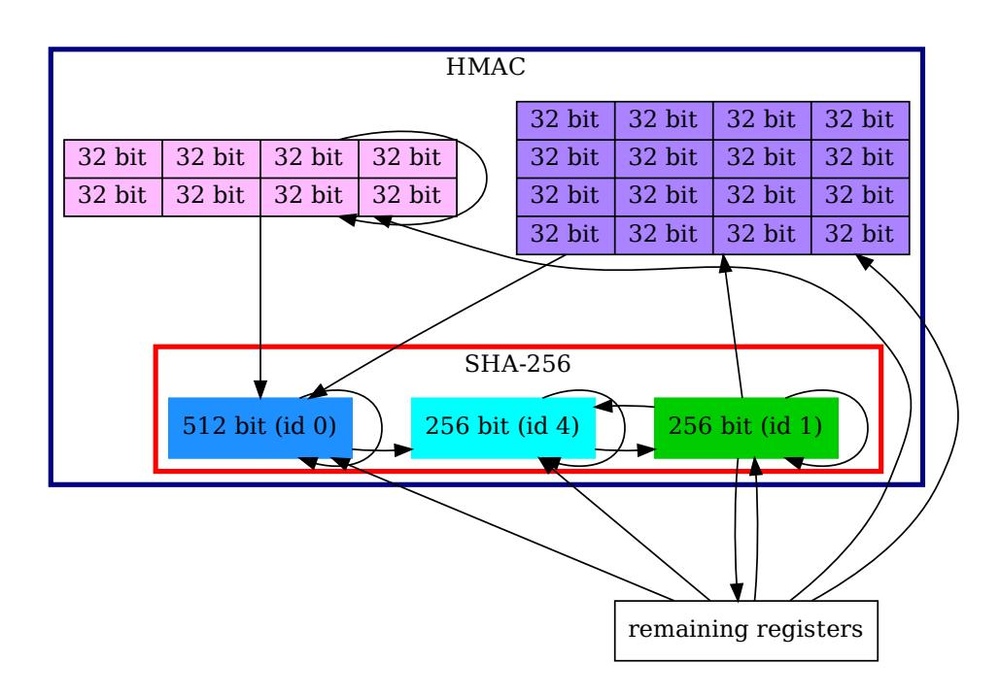

**Figure 9:** Extended visualization of group 3 from [Figure 8.](#page-16-0) Each suspected register is highlighted in a different color.

#### <span id="page-17-0"></span>**6.1.3 Hypotheses Validation**

In order to check whether our hypotheses are correct we check them using the official OpenTitan design specifications.

{18}------------------------------------------------

**Comparison to Specification:** Comparing our findings to the public documentations of the AES[3](#page-18-0) and HMAC[4](#page-18-1) almost perfectly confirms the correctness of our hypotheses.

In case of the AES module, the registers DANA identified were correctly analyzed. The remaining 256-bit register is in fact used to hold a decryption key such that the same core can be used for encryption and decryption — an implementation-specific detail that a human analyst would relatively easily discover.

Regarding the HMAC/SHA, our final analysis was also correct. However, recall that the HMAC registers were identified as several 32-bit registers by DANA and only showed up by taking the direct dependencies of the identified SHA registers into account. The official specification actually describes the HMAC message buffer as sixteen 32-bit registers and not as a single 512-bit register. Hence, this was an implementation-specific detail which we predicted incorrectly, but notably we were still able to correctly identify the register(s) in the output of DANA due to their direct relation with the other registers. A more detailed analysis and side-by-side comparison to the reference schematics of the OpenTitan can be found in Appendix [B.](#page-25-0)

**Location Visualization:** Our successful identification of the cryptographic modules in the OpenTitan, in turn allows also for locating said modules on-chip. In [Figure 10,](#page-18-2) we highlighted the identified registers in the floorplan image of the design. This information could now be employed for, e.g., probe positioning in electromagnetic-emanation-based side-channel attacks.

<span id="page-18-2"></span>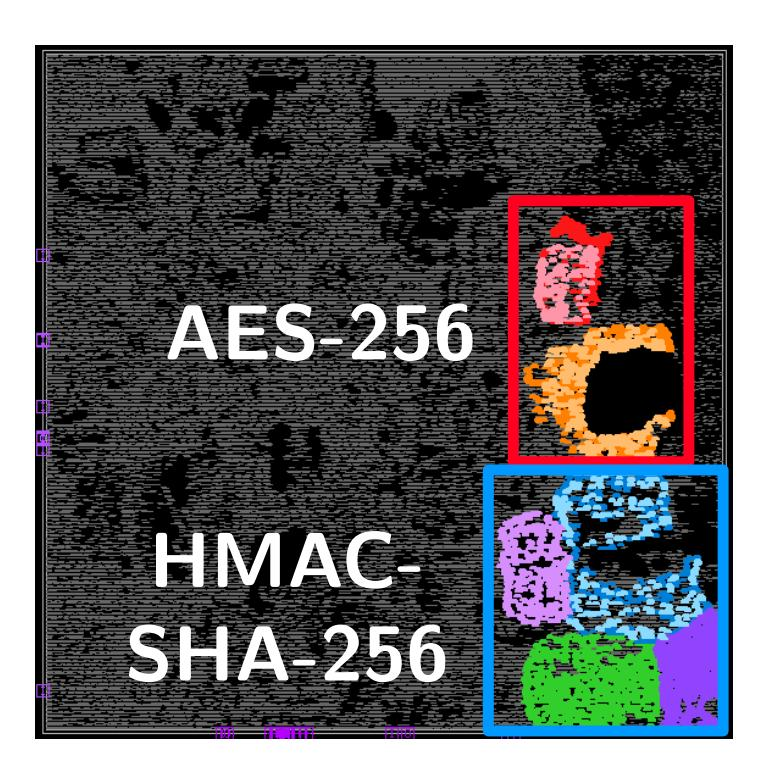

**Figure 10:** Floorplan view of the placed and routed OpenTitan netlist synthesized with Synopsys DC. All identified registers are colored as depicted in [Figure 8](#page-16-0) and [Figure 9.](#page-17-1)

#### **6.1.4 Lessons Learned**

By inspecting the registers DANA automatically identified in the unprocessed sea-of-gates, we were able to both quickly and correctly identify the cryptographic modules of the OpenTitan. Notably, this was done without any functional analysis, the combinational logic itself was never taken into account. This further demonstrates the strength of dataflow analysis. Of course, not all modules or functionalities can be immediately identified in the output of DANA. However, the general procedure can also be applied to other parts of the design, followed by further analyses. For instance, when trying to identify the program counter, a central component in every CPU, letting DANA prioritize 31-bit registers (PC always increments in multiples of 2, hence the lsb is absent), narrows the search space from roughly 22,000 FFs down to just 17 registers.

<span id="page-18-0"></span><sup>3</sup><https://docs.opentitan.org/hw/ip/aes/doc/index.html>

<span id="page-18-1"></span><sup>4</sup><https://docs.opentitan.org/hw/ip/hmac/doc/index.html>

{19}------------------------------------------------

### **6.2 Trojan Detection — Identifying Suspicious Datapaths**

Our second application deals with the identification of Trojans. Due to the prohibitively high costs of maintaining a custom foundry, IC fabrication is commonly outsourced to foundries across the globe. However, this gives un-trusted parties access to the design and has led to major research effort over the last decades to secure against rogue players in the design chain [\[CNB09,](#page-20-8)[TK10\]](#page-23-5). The resulting threat of malicious modifications, i.e., hardware Trojans, also underlies the current public debate on foreign equipment for the 5G infrastructure [\[hua\]](#page-21-14).

One way to check an IC for hardware Trojans is through reverse engineering of IC samples. In the following, we demonstrate how DANA can assist a designer to perform a quick-check on critical registers, e.g., key registers of cryptographic modules. We implemented a simple input-activated key-leakage Trojan in the unrolled AES design, which we used in our evaluation. Triggered by a specific input plaintext, the Trojan outputs the secret key instead of the final ciphertext.

[Figure 11](#page-19-0) shows a visualization of the output of DANA given the trojanized netlist. The AES designer, analyzing a sample of fabricated ICs, knows that there should be no direct data paths from the initial key register to the output. However, we see this very connection in the output of DANA (marked in red). Furthermore, we find an extra data path from the initial plaintext register to the output register (also marked in red). This is due to the comparator, which controls the multiplexer that in turn decides to output the final ciphertext or the initial key.

<span id="page-19-0"></span>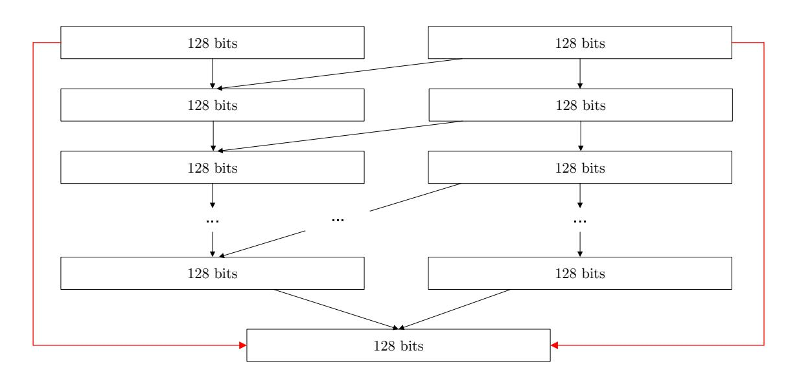

**Figure 11:** Output of DANA for the trojanized AES

This small case study shows how DANA can be used to examine the dataflow of sensitive registers and check for unexpected datapaths. Of course, not all kinds of Trojans can be detected with this simple method, but it demonstrates once more that DANA provides a significant reduction of complexity.

## **7 Conclusion**

In this work we present DANA, a generic, fully automated dataflow analysis methodology. Heavily condensing and structuring the initial sea of gates in a netlist by recovering high-level registers and their dependencies, DANA is beneficial as the crucial initial step for netlist analysis. Our extensive analysis on a variety of modern hardware designs demonstrates that DANA is technology-agnostic and able to correctly recover the majority of included registers in a matter of seconds to minutes. Furthermore, we demonstrated that the output of DANA alone can be used to locate various modules in Google's OpenTitan SoC or to identify simple hardware Trojans in cryptographic designs. DANA is the first comprehensive tool of its kind and will be available as open source.

{20}------------------------------------------------

## **Acknowledgments**

This work was supported in part by DFG Excellence Strategy grant 39078197 (EXC 2092, CASA), through ERC grant 695022 and NSF grant CNS-1563829. Furthermore this research was partially supported by the Technion Hiroshi Fujiwara Cyber Security Research Center and the Israel National Cyber Directorate.

## **References**

- <span id="page-20-1"></span>[AGGM16] Leonid Azriel, Ran Ginosar, Shay Gueron, and Avi Mendelson. Using scan side channel for detecting IP theft. In *Proceedings of the Hardware and Architectural Support for Security and Privacy 2016, HASP@ICSA 2016, Seoul, Republic of Korea, June 18, 2016*, pages 1:1–1:8. ACM, 2016.
- <span id="page-20-2"></span>[AGM17] Leonid Azriel, Ran Ginosar, and Avi Mendelson. Revealing on-chip proprietary security functions with scan side channel based reverse engineering. In Laleh Behjat, Jie Han, Miroslav N. Velev, and Deming Chen, editors, *Proceedings of the on Great Lakes Symposium on VLSI 2017, Banff, AB, Canada, May 10-12, 2017*, pages 233–238. ACM, 2017.
- <span id="page-20-4"></span>[AGM19] Leonid Azriel, Ran Ginosar, and Avi Mendelson. Sok: An overview of algorithmic methods in IC reverse engineering. In Chip-Hong Chang, Ulrich Rührmair, Daniel E. Holcomb, and Patrick Schaumont, editors, *Proceedings of the 3rd ACM Workshop on Attacks and Solutions in Hardware Security Workshop, ASHES@CCS 2019, London, UK, November 15, 2019*, pages 65–74. ACM, 2019.
- <span id="page-20-7"></span>[AlM] Hesham AlMatary. edge (MIPS) Core. [Online]. Available: [https://](https://opencores.org/projects/edge) [opencores.org/projects/edge](https://opencores.org/projects/edge).
- <span id="page-20-5"></span>[BBS19] Michaela Brunner, Johanna Baehr, and Georg Sigl. Improving on state register identification in sequential hardware reverse engineering. In *IEEE International Symposium on Hardware Oriented Security and Trust, HOST 2019, McLean, VA, USA, May 5-10, 2019*, pages 151–160. IEEE, 2019.
- <span id="page-20-8"></span>[CNB09] Rajat Subhra Chakraborty, Seetharam Narasimhan, and Swarup Bhunia. Hardware trojan: Threats and emerging solutions. In *IEEE International High Level Design Validation and Test Workshop, HLDVT 2009, San Francisco, CA, USA, 4-6 November 2009*, pages 166–171. IEEE Computer Society, 2009.
- <span id="page-20-6"></span>[dlP] Antonio de la Piedra. DES Core. [Online]. Available: [https://opencores.](https://opencores.org/projects/descore) [org/projects/descore](https://opencores.org/projects/descore).
- <span id="page-20-3"></span>[ESW<sup>+</sup>19] Maik Ender, Pawel Swierczynski, Sebastian Wallat, Matthias Wilhelm, Paul Martin Knopp, and Christof Paar. Insights into the mind of a trojan designer: the challenge to integrate a trojan into the bitstream. In Toshiyuki Shibuya, editor, *Proceedings of the 24th Asia and South Pacific Design Automation Conference, ASPDAC 2019, Tokyo, Japan, January 21-24, 2019*, pages 112–119. ACM, 2019.
- <span id="page-20-0"></span>[FSK<sup>+</sup>17] Marc Fyrbiak, Sebastian Strauss, Christian Kison, Sebastian Wallat, Malte Elson, Nikol Rummel, and Christof Paar. Hardware reverse engineering: Overview and open challenges. In *IEEE 2nd International Verification and Security Workshop, IVSW 2017, Thessaloniki, Greece, July 3-5, 2017*, pages 88–94. IEEE, 2017.

{21}------------------------------------------------

- <span id="page-21-2"></span>[FWD<sup>+</sup>18] Marc Fyrbiak, Sebastian Wallat, Jonathan Déchelotte, Nils Albartus, Sinan Böcker, Russell Tessier, and Christof Paar. On the difficulty of fsm-based hardware obfuscation. *IACR Trans. Cryptogr. Hardw. Embed. Syst.*, 2018(3):293– 330, 2018.
- <span id="page-21-6"></span>[FWR<sup>+</sup>20] Marc Fyrbiak, Sebastian Wallat, Sascha Reinhard, Nicolai Bissantz, and Christof Paar. Graph similarity and its applications to hardware security. *IEEE Trans. Computers*, 69(4):505–519, 2020.
- <span id="page-21-0"></span>[FWS<sup>+</sup>18] Marc Fyrbiak, Sebastian Wallat, Pawel Swierczynski, Max Hoffmann, Sebastian Hoppach, Matthias Wilhelm, Tobias Weidlich, Russell Tessier, and Christof Paar. HAL-The Missing Piece of the Puzzle for Hardware Reverse Engineering, Trojan Detection and Insertion. *IEEE Transactions on Dependable and Secure Computing*, 2018.
- <span id="page-21-8"></span>[Gaj] Krzysztof Gajewski. PRESENT Core. [Online]. Available: [https://](https://opencores.org/projects/present) [opencores.org/projects/present](https://opencores.org/projects/present).
- <span id="page-21-13"></span>[goo20] google. OpenTitan - open sourcing transparent, trustworthy, and secure silicon, 2020.
- <span id="page-21-5"></span>[GSD<sup>+</sup>14] Adrià Gascón, Pramod Subramanyan, Bruno Dutertre, Ashish Tiwari, Dejan Jovanovic, and Sharad Malik. Template-based circuit understanding. In *Formal Methods in Computer-Aided Design, FMCAD 2014, Lausanne, Switzerland, October 21-24, 2014*, pages 83–90. IEEE, 2014.
- <span id="page-21-9"></span>[Hsia] Homer Hsing. sha-3 Core. [Online]. Available: [https://github.com/](https://github.com/freecores/sha3) [freecores/sha3](https://github.com/freecores/sha3).
- <span id="page-21-7"></span>[Hsib] Homer Hsing. tiny\_aes Core. [Online]. Available: [https://opencores.org/](https://opencores.org/projects/tiny_aes) [projects/tiny\\_aes](https://opencores.org/projects/tiny_aes).
- <span id="page-21-14"></span>[hua] Trump's Ban On Telecom Hits Huawei. [https://www.nytimes.com/2019/](https://www.nytimes.com/2019/05/15/business/huawei-ban-trump.html) [05/15/business/huawei-ban-trump.html](https://www.nytimes.com/2019/05/15/business/huawei-ban-trump.html). Accessed: 2019-06-18.
- <span id="page-21-1"></span>[HYH99] Mark C. Hansen, Hakan Yalcin, and John P. Hayes. Unveiling the ISCAS-85 benchmarks: A case study in reverse engineering. *IEEE Design & Test of Computers*, 16(3):72–80, 1999.
- <span id="page-21-11"></span>[jsh] Kirk Hays jshamlet. open8 (uRISC) Core. [Online]. Available: [https://](https://opencores.org/projects/open8_urisc) [opencores.org/projects/open8\\_urisc](https://opencores.org/projects/open8_urisc).
- <span id="page-21-4"></span>[LGS<sup>+</sup>13] Wenchao Li, Adrià Gascón, Pramod Subramanyan, Wei Yang Tan, Ashish Tiwari, Sharad Malik, Natarajan Shankar, and Sanjit A. Seshia. Wordrev: Finding word-level structures in a sea of bit-level gates. In *2013 IEEE International Symposium on Hardware-Oriented Security and Trust, HOST 2013, Austin, TX, USA, June 2-3, 2013*, pages 67–74. IEEE Computer Society, 2013.
- <span id="page-21-12"></span>[lI] lowrisc Initiative. OpenTitan - Open Source Silicon Root of Trust (RoT) Project. [Online]. Available: <https://opentitan.org>.
- <span id="page-21-10"></span>[low] lowrisc. ibex RISC-V Core. [Online]. Available: [https://github.com/](https://github.com/lowRISC/ibex) [lowRISC/ibex](https://github.com/lowRISC/ibex).
- <span id="page-21-3"></span>[LWS12] Wenchao Li, Zach Wasson, and Sanjit A. Seshia. Reverse engineering circuits using behavioral pattern mining. In *2012 IEEE International Symposium on Hardware-Oriented Security and Trust, HOST 2012, San Francisco, CA, USA, June 3-4, 2012*, pages 83–88. IEEE Computer Society, 2012.

{22}------------------------------------------------

- <span id="page-22-3"></span>[LWU<sup>+</sup>19] Bernhard Lippmann, Michael Werner, Niklas Unverricht, Aayush Singla, Peter Egger, Anja Dübotzky, Horst A. Gieser, Martin Rasche, Oliver Kellermann, and Helmut Graeb. Integrated flow for reverse engineering of nanoscale technologies. In Toshiyuki Shibuya, editor, *Proceedings of the 24th Asia and South Pacific Design Automation Conference, ASPDAC 2019, Tokyo, Japan, January 21-24, 2019*, pages 82–89. ACM, 2019.
- <span id="page-22-7"></span>[McE01] Kenneth S. McElvain. Methods and apparatuses for automatic extraction of finite state machines, 2001.
- <span id="page-22-8"></span>[MJTZ16] Travis Meade, Yier Jin, Mark Tehranipoor, and Shaojie Zhang. Gate-level netlist reverse engineering for hardware security: Control logic register identification. In *IEEE International Symposium on Circuits and Systems, ISCAS 2016, Montréal, QC, Canada, May 22-25, 2016*, pages 1334–1337. IEEE, 2016.
- <span id="page-22-11"></span>[MRS08] Christopher D. Manning, Prabhakar Raghavan, and Hinrich Schütze. *Introduction to information retrieval*. Cambridge University Press, 2008.
- <span id="page-22-10"></span>[MSL<sup>+</sup>18] Travis Meade, Kaveh Shamsi, Thao Le, Jia Di, Shaojie Zhang, and Yier Jin. The old frontier of reverse engineering: Netlist partitioning. *J. Hardware and Systems Security*, 2(3):201–213, 2018.
- <span id="page-22-6"></span>[MZJ16] Travis Meade, Shaojie Zhang, and Yier Jin. Netlist reverse engineering for high-level functionality reconstruction. In *21st Asia and South Pacific Design Automation Conference, ASP-DAC 2016, Macao, Macao, January 25-28, 2016*, pages 655–660. IEEE, 2016.
- <span id="page-22-0"></span>[QCF<sup>+</sup>16] Shahed E. Quadir, Junlin Chen, Domenic Forte, Navid Asadizanjani, Sina Shahbazmohamadi, Lei Wang, John A. Chandy, and Mark Tehranipoor. A survey on chip to system reverse engineering. *JETC*, 13(1):6:1–6:34, 2016.
- <span id="page-22-1"></span>[RR18] Jordan Robertson and Michael Riley. The Big Hack: How China Used a Tiny Chip to Infiltrate U.S. Companies. [https:](https://www.bloomberg.com/news/features/2018-10-04/the-big-hack-how-china-used-a-tiny-chip-to-infiltrate-america-s-top-companies) [//www.bloomberg.com/news/features/2018-10-04/the-big-hack-how](https://www.bloomberg.com/news/features/2018-10-04/the-big-hack-how-china-used-a-tiny-chip-to-infiltrate-america-s-top-companies)[china-used-a-tiny-chip-to-infiltrate-america-s-top-companies](https://www.bloomberg.com/news/features/2018-10-04/the-big-hack-how-china-used-a-tiny-chip-to-infiltrate-america-s-top-companies), October 2018. [Online; accessed 2020-February-26].
- <span id="page-22-2"></span>[Sat19] Adam Satariano. Huawei Tells Parliament It's No Security Threat, Aiming to Avoid a Ban. [https://www.nytimes.com/2019/06/10/technology/huawei](https://www.nytimes.com/2019/06/10/technology/huawei-britain-parliament-ban.html)[britain-parliament-ban.html](https://www.nytimes.com/2019/06/10/technology/huawei-britain-parliament-ban.html), Jun 2019. [Online; accessed 2020-February-26].
- <span id="page-22-4"></span>[SFKP15] Pawel Swierczynski, Marc Fyrbiak, Philipp Koppe, and Christof Paar. FPGA trojans through detecting and weakening of cryptographic primitives. *IEEE Trans. on CAD of Integrated Circuits and Systems*, 34(8):1236–1249, 2015.
- <span id="page-22-12"></span>[srm] srmcqueen. BASIC RSA Core. [Online]. Available: [https://github.com/](https://github.com/freecores/BasicRSA) [freecores/BasicRSA](https://github.com/freecores/BasicRSA).
- <span id="page-22-5"></span>[STGR10] Yiqiong Shi, Chan Wai Ting, Bah-Hwee Gwee, and Ye Ren. A highly efficient method for extracting fsms from flattened gate-level netlist. In *International Symposium on Circuits and Systems (ISCAS 2010), May 30 - June 2, 2010, Paris, France*, pages 2610–2613. IEEE, 2010.
- <span id="page-22-9"></span>[STP<sup>+</sup>13] Pramod Subramanyan, Nestan Tsiskaridze, Kanika Pasricha, Dillon Reisman, Adriana Susnea, and Sharad Malik. Reverse engineering digital circuits using functional analysis. In Enrico Macii, editor, *Design, Automation and Test in*

{23}------------------------------------------------

- *Europe, DATE 13, Grenoble, France, March 18-22, 2013*, pages 1277–1280. EDA Consortium San Jose, CA, USA / ACM DL, 2013.
- <span id="page-23-3"></span>[Sym18] SymbiFlow. Project X-Ray, 2018.
- <span id="page-23-1"></span>[TJ09] Randy Torrance and Dick James. The state-of-the-art in IC reverse engineering. In Christophe Clavier and Kris Gaj, editors, *Cryptographic Hardware and Embedded Systems - CHES 2009, 11th International Workshop, Lausanne, Switzerland, September 6-9, 2009, Proceedings*, volume 5747 of *Lecture Notes in Computer Science*, pages 363–381. Springer, 2009.
- <span id="page-23-0"></span>[TJ11] Randy Torrance and Dick James. The state-of-the-art in semiconductor reverse engineering. In Leon Stok, Nikil D. Dutt, and Soha Hassoun, editors, *Proceedings of the 48th Design Automation Conference, DAC 2011, San Diego, California, USA, June 5-10, 2011*, pages 333–338. ACM, 2011.
- <span id="page-23-5"></span>[TK10] Mohammad Tehranipoor and Farinaz Koushanfar. A survey of hardware trojan taxonomy and detection. *IEEE Design & Test of Computers*, 27(1):10–25, 2010.
- <span id="page-23-2"></span>[VPH<sup>+</sup>17] Arunkumar Vijayakumar, Vinay C. Patil, Daniel E. Holcomb, Christof Paar, and Sandip Kundu. Physical design obfuscation of hardware: A comprehensive investigation of device and logic-level techniques. *IEEE Trans. Information Forensics and Security*, 12(1):64–77, 2017.
- <span id="page-23-4"></span>[WH15] Neil HE Weste and David Harris. *CMOS VLSI design: a circuits and systems perspective*. Pearson Education India, 2015.

{24}------------------------------------------------

## **A DANA Output of SHA-3 (Synopsys)**

<span id="page-24-0"></span>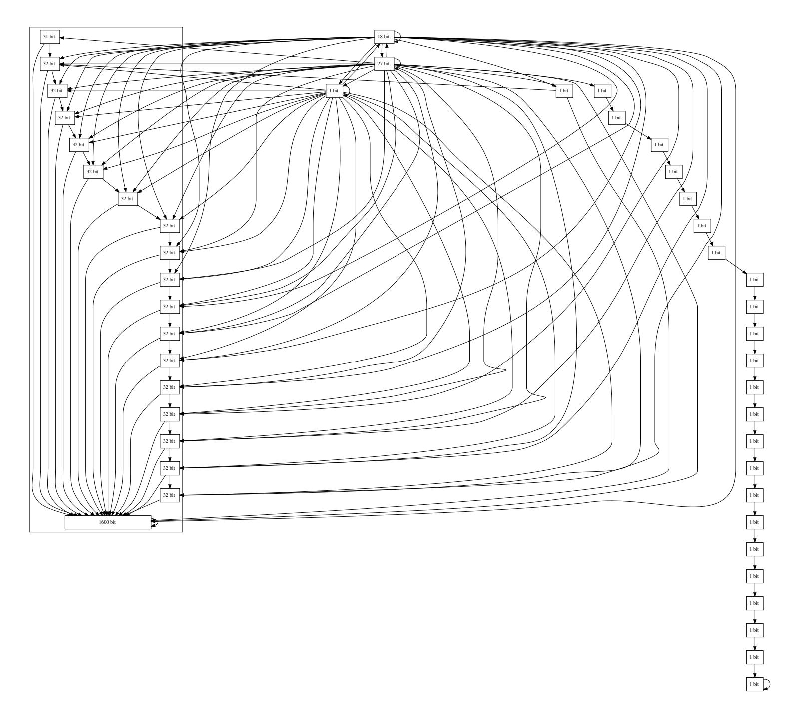

**Figure 12:** Output of DANA for the SHA-3 design synthesized with Synopsys. The enclosed 32-bit registers on the together constitute the discussed intermediate SHA3 register (cf. [Section 5.4\)](#page-13-0). The chain of 1-bit registers on the right is a correctly identified delay chain which ultimately outputs a done signal.

{25}------------------------------------------------

## <span id="page-25-0"></span>**B Comparison of Recovered Dataflow Graphs of DANA to OpenTitan Implemantation Details**

In the following we are comparing the graphs recovered by DANA to the block-diagrams of the modules as provided in the official OpenTitan documentations [5](#page-25-1) .

Note that our results were solely derived from visually analyzing the output of DANA. In the following, we describe how our hypotheses match what can be seen in the block diagrams.

**AES** Comparing our recovered result of the AES using the dataflow graph generation of DANA with the official documentation shows that our results match the provided high-level block-diagram of the module.

The *state* register (colored in red) is always influenced by itself. This stems from the fact that it traverses through all AES round functions and is then written back. In the output of DANA this is depicted by the loop. The *state* register is also influenced by the *full key* register (colored in orange), as depicted in the dataflow graph by the connection of these two. This originates from the key addition (depicted with the ⊕ in the block-diagram on the right), where the output of MixColumns is XORed with the output of the *full key* register - thus the one-way dependency (the state never actually influences the calculation of the key). The *decryption key* register, which we did were not able to assign a functionality in our hypothesis, is used support decryption and encryption with the same logic. It is thus only directly connected with *full key* register. Interestingly, the output register which we correctly identified (highlighted in pink), is not specified in the block diagram but can be found in the design's HDL code.

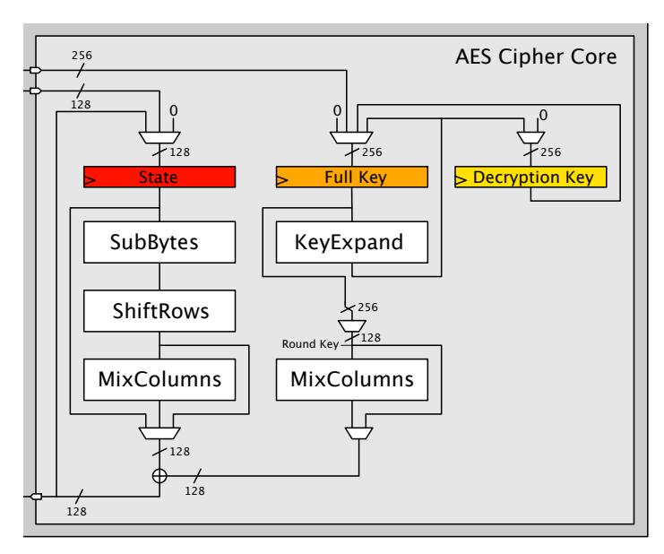

**(a)** Official Reference Block-Diagram

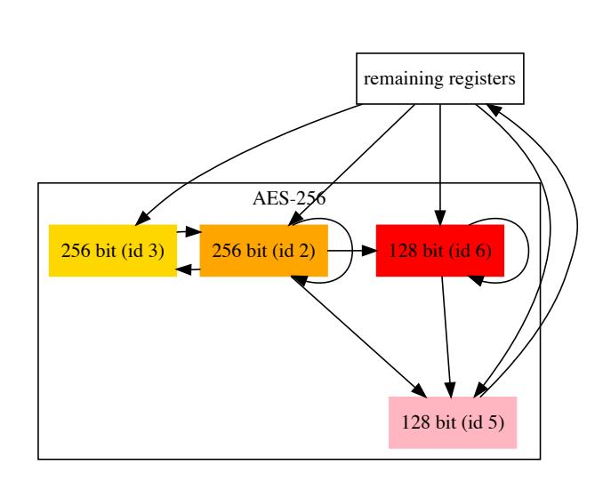

**(b)** Output of DANA

**Figure 13:** Comparison of AES

<span id="page-25-1"></span><sup>5</sup><https://docs.opentitan.org>

{26}------------------------------------------------

**SHA-256** The SHA-256 module has also been discovered immediately by DANA. [Fig](#page-26-0)[ure 14](#page-26-0) shows the side-by-side comparison between the high-level overview of the OpenTitan documentation to the dataflow graph of DANA— both visualizations match perfectly. The message (msg) register does influence the hash register (id 4), but not the digest register (id 1) of the SHA-256. The hash register gets updated by the compress function with, among others, the content of the message register. The digest register can also be clearly identified as such, since it is the only of the three registers that has an output to other registers in the design.

<span id="page-26-0"></span>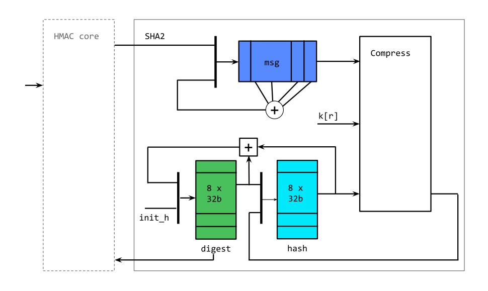

**(a)** Official Reference Block-Diagram

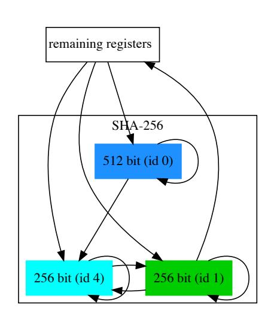

**(b)** Output of DANA

**Figure 14:** SHA-256

{27}------------------------------------------------

**HMAC** In [Section 6.1.2,](#page-16-1) we were not immediately able to identify the key and message registers of the HMAC at first, since we explicitly searched for registers of at least 256 bit. Looking at the official block diagram shown the side-by-side comparison in [Figure 15](#page-27-0) it is clear to see why: the message register has been specified as a 16 × 32-bit FIFO (highlighted in dark purple). However, by taking the surrounding registers of the already identified SHA-256 module into account, we were able to clearly find and correctly label these 16 × 32-bit registers based on their dependencies. Furthermore, we identified a key register which is not depicted in the reference block diagram. However, this register is present in the design's HDL code, (marked in pink in [Figure 15b\)](#page-27-1) hence our hypothesis was correct. Thus, using DANA we were also able to correctly identify the message and key register of the HMAC.

<span id="page-27-0"></span>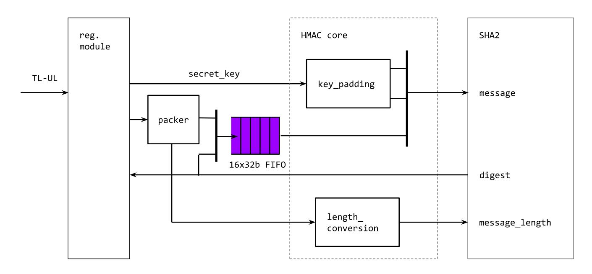

**(a)** Official Reference Block-Diagram

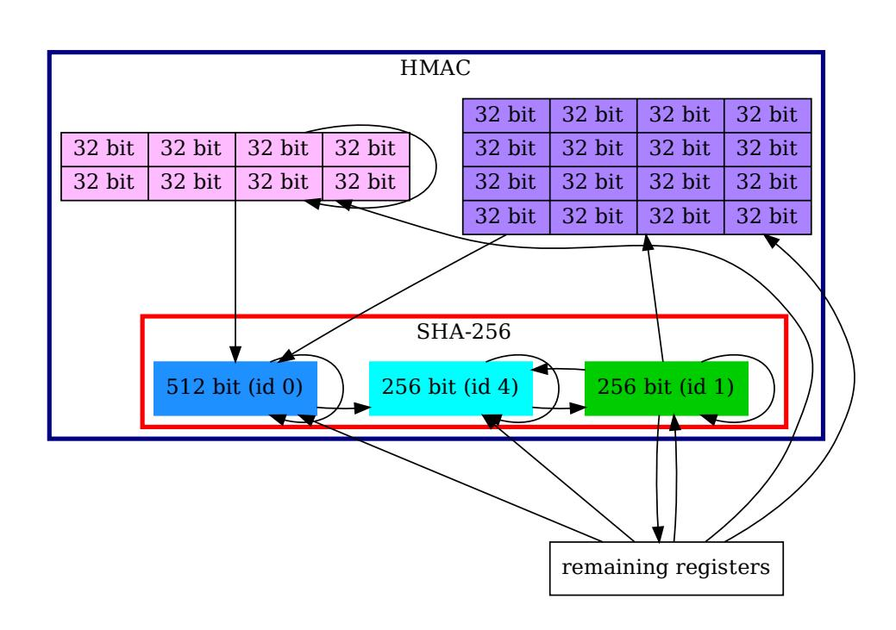

<span id="page-27-1"></span>**(b)** Output of DANA

**Figure 15:** Comparison HMAC