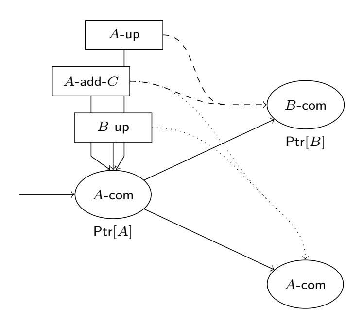
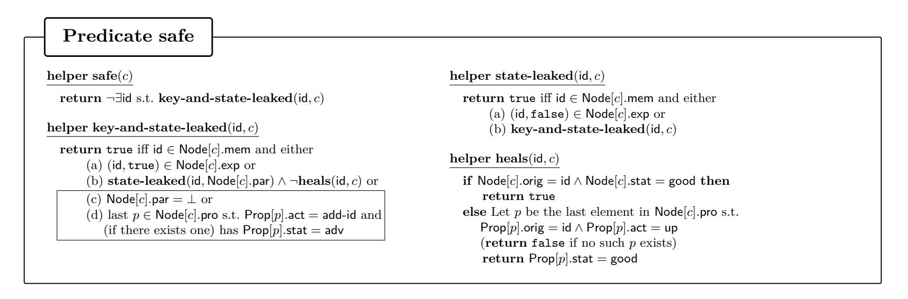
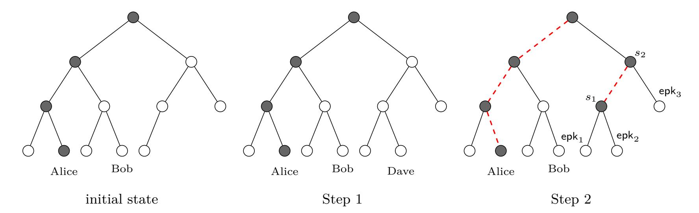
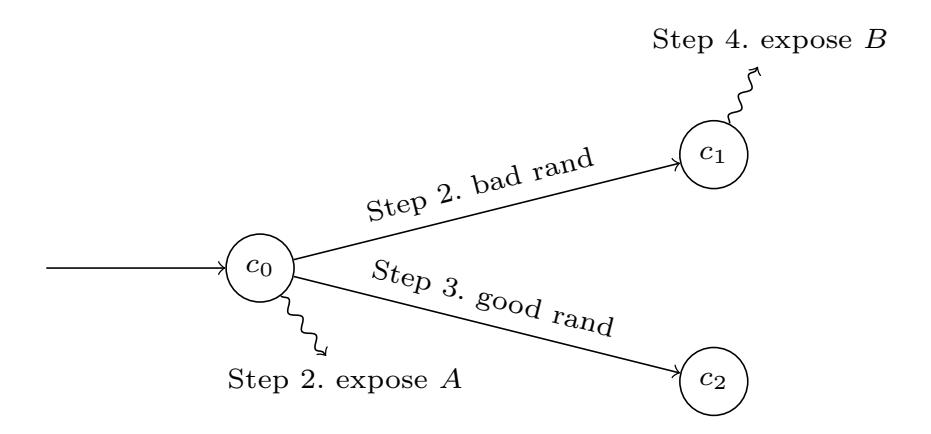
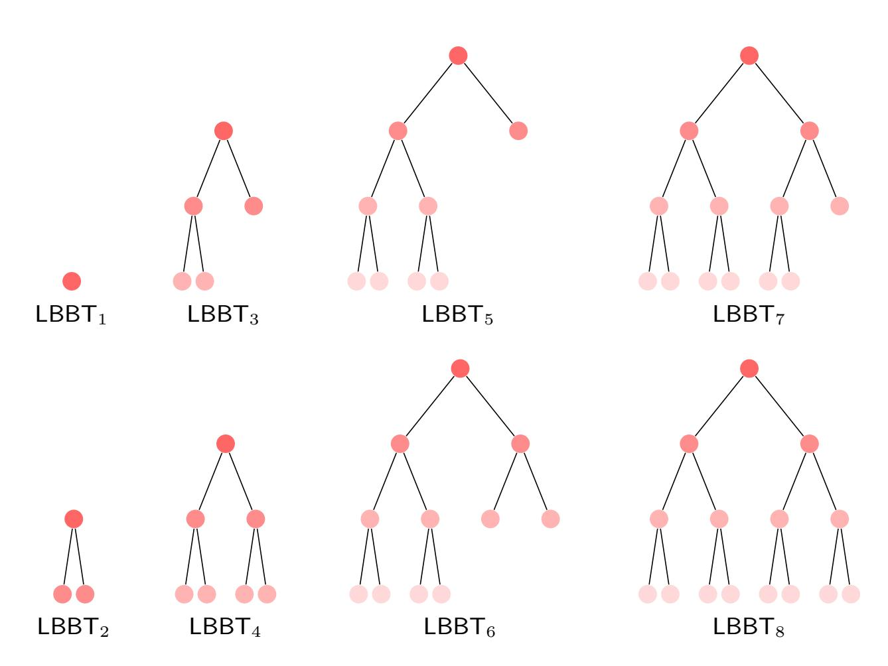
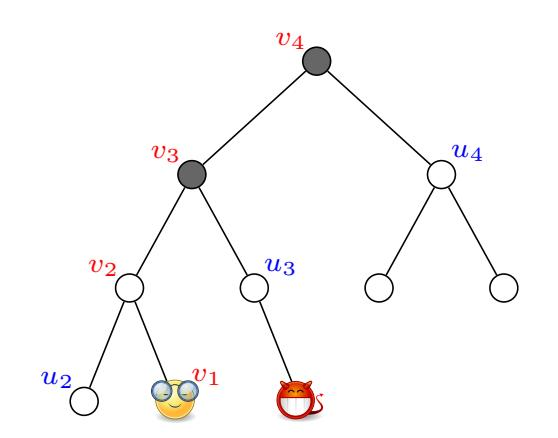
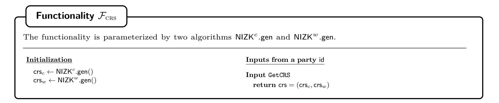

{0}------------------------------------------------

# **Continuous Group Key Agreement with Active Security**

Jo¨el Alwen<sup>1</sup> , Sandro Coretti<sup>2</sup> , Daniel Jost<sup>3</sup> , and Marta Mularczyk<sup>3</sup>*?*

<sup>1</sup> Wickr, jalwen@wickr.com 2 IOHK, sandro.coretti@iohk.io <sup>3</sup> ETH Zurich, Switzerland, {dajost, mumarta}@inf.ethz.ch

**Abstract.** A *continuous group key agreement* (CGKA) protocol allows a long-lived group of parties to agree on a continuous stream of fresh secret key material. The protocol must support constantly changing group membership, make no assumptions about when, if, or for how long members come online, nor rely on any trusted group managers. Due to sessions' long life-time, CGKA protocols must simultaneously ensure both *post-compromise security* and *forward secrecy* (PCFS). That is, current key material should be secure despite both past and future compromises.

The work of Alwen et al. (CRYPTO'20), introduced the CGKA primitive and identified it as a crucial component for constructing end-to-end secure group messaging protocols (SGM) (though we believe there are certainly more applications given the fundamental nature of key agreement). The authors analyzed the *TreeKEM* CGKA, which lies at the heart of the SGM protocol under development by the IETF working group on Messaging Layer Security (MLS).

In this work, we continue the study of CGKA as a stand-alone cryptographic primitive. We present 3 new security notions with increasingly powerful adversaries. Even the weakest of the 3 (*passive* security) already permits attacks to which all prior constructions (including all variants of TreeKEM) are vulnerable.

Going further, the 2 stronger (*active* security) notions additionally allow the adversary to use parties' exposed states (and full network control) to mount attacks. These are closely related to so-called *insider attacks*, which involve malicious group members actively deviating from the protocol. Insider attacks present a significant challenge in the study of CGKA (and SGM). Indeed, we believe ours to be the first security notions (and constructions) to formulate meaningful guarantees (e.g. PCFS) against such powerful adversaries. They are also the first composable security notions for CGKA of any type at all.

In terms of constructions, for each of the 3 security notions we provide a new CGKA scheme enjoying sub-linear (potentially even logarithmic) communication complexity in the number of group members. We prove each scheme *optimally* secure, in the sense that the only security violations possible are those necessarily implied by correctness.

*<sup>?</sup>* Research was supported by the Zurich Information Security and Privacy Center (ZISC).

{1}------------------------------------------------

# **Table of Contents**

| 1 | Introduction                                                           | 3      |  |  |
|---|------------------------------------------------------------------------|--------|--|--|
|   | 1.1<br>Overview and Motivation                                         | 3      |  |  |
|   | 1.2<br>Contributions                                                   | 4      |  |  |
|   | 1.3<br>Technical Overview                                              | 5      |  |  |
|   | 1.4<br>Related Work                                                    | 7      |  |  |
|   | 1.5<br>Outline                                                         | 8      |  |  |
| 2 | Preliminaries                                                          | 8      |  |  |
| 3 | Continuous Group Key Agreement                                         |        |  |  |
|   | 3.1<br>CGKA Schemes                                                    | 9<br>9 |  |  |
|   | 3.2<br>CGKA Syntax                                                     | 10     |  |  |
|   |                                                                        | 10     |  |  |
| 4 | Modeling Security of CGKA                                              |        |  |  |
| 5 | Security of CGKA in the Passive Setting<br>12<br>17                    |        |  |  |
|   | 6<br>Security of CGKA in the Active Setting<br>                        |        |  |  |
| 7 | Construction for the Authenticated Setting                             | 21     |  |  |
|   | 7.1<br>TTKEM                                                           | 21     |  |  |
|   | 7.2<br>Cross-Group Attacks                                             | 23     |  |  |
|   | 7.3<br>The Protocol P-Pas                                              | 24     |  |  |
|   | 7.4<br>Efficiency<br>                                                  | 25     |  |  |
| 8 | Constructions for the Passive Setting                                  | 25     |  |  |
|   | 8.1<br>Basic Modifications of the Passive Protocol                     | 25     |  |  |
|   | 8.2<br>The Non-Robust Protocol                                         | 26     |  |  |
|   | 8.3<br>The Robust Protocol using NIZKs                                 | 27     |  |  |
| 9 | On the Sub-optimality of Alternative Solutions                         | 28     |  |  |
|   | 9.1<br>Pairwise Channels                                               | 29     |  |  |
|   | 9.2<br>Key-Homomorphic Encryption                                      | 29     |  |  |
|   | 10 Conclusions and Future Directions                                   | 30     |  |  |
|   |                                                                        |        |  |  |
|   | 10.1 Conclusions                                                       | 30     |  |  |
|   | 10.2 Future Directions                                                 | 30     |  |  |
| A | Additional Preliminaries                                               | 34     |  |  |
|   | A.1<br>Additional Notation                                             | 34     |  |  |
|   | A.2<br>UC Security                                                     | 34     |  |  |
|   | A.3<br>Left-Balanced Binary Trees                                      | 36     |  |  |
|   | A.4<br>Cryptographic Primitives                                        | 37     |  |  |
| B | Details of the Security Model                                          | 40     |  |  |
|   | B.1<br>The Corruption Model                                            | 40     |  |  |
|   | B.2<br>Restricted Environments                                         | 41     |  |  |
|   | B.3<br>PKI                                                             | 41     |  |  |
| C | Details of the Construction for the Passive Setting                    | 42     |  |  |
|   | C.1<br>Labeled Trees                                                   | 42     |  |  |
|   | C.2<br>The Algorithms of P-Pas                                         | 43     |  |  |
|   |                                                                        |        |  |  |
| D | Proof of Thm. 1: Security in the Non-Programmable ROM                  | 46     |  |  |
| E | Proof of Thm. 2: Full UC Security in the Programmable ROM<br>51        |        |  |  |
| F | Details of the Construction for the Active Setting                     | 51     |  |  |
|   | F.1<br>Shared Modifications                                            | 51     |  |  |
|   | F.2<br>The Non-robust Protocol                                         | 52     |  |  |
|   | F.3<br>The Robust Protocol                                             | 54     |  |  |
| G | Proof of Thm. 3: Security of the Construction without Robustness<br>56 |        |  |  |
| H | Proof of Thm. 5: Security of the Construction with Robustness<br>60    |        |  |  |

{2}------------------------------------------------

## <span id="page-2-0"></span>**1 Introduction**

## <span id="page-2-1"></span>**1.1 Overview and Motivation**

A *continuous group key agreement* (CGKA) protocol allows a long-lived dynamic group to agree on a continuous stream of fresh secret group keys. In CGKA new parties may join and existing members may leave the group at any point mid-session. In contrast to standard (dynamic) GKA, the CGKA protocols are *asynchronous* in that they make no assumptions about if, when, or for how long members are online.[4](#page-2-2) Moreover, unlike, say, broadcast encryption, the protocol may not rely on a (trusted) group manager or any other designated party. Due to a session's potentially very long life-time (e.g., years), CGKA protocols must ensure a property called *post-compromise forward security (PCFS)*. PCFS strengthens the two standard notions of *forward security (FS)* (the keys output must remain secure even if some party's state is compromised in the future) and *post-compromise security (PCS)* (parties recover from state compromise after exchanging a few messages and the keys become secure again) in that it requires them to hold *simultaneously*.

CGKA as a stand-alone primitive was introduced by Alwen et al. in [\[5\]](#page-30-0). The authors analyzed (a version of) the *TreeKEM* CGKA protocol [\[11\]](#page-31-0), a core component in the *scalable* end-to-end *secure group messaging (SGM)* protocol *MLS*, currently under development by the eponymous Messaging Layer Security working group of the IETF [\[9\]](#page-30-1).

A SGM protocol is an asynchronous (in the above sense) protocol enabling a dynamic group of parties to exchange messages over the Internet. While such protocols initially relied on a service provider acting as a trusted third party, nowadays end-to-end security is the norm, and the provider merely acts as an untrusted delivery service. SGM protocols are expected to (simultaneously) provide *post-compromise forward security* for messages defined analogously to CGKA.[5](#page-2-3) The proliferation of SGM protocols in practice has been extensive with more than 2 billion users today.

The primary bottleneck for greater scalability of CGKA/SGM protocols is the communication and computational complexity of performing a group operation (e.g. agree on a new group key, add a party, etc.). Almost all protocols, in particular all those used in practice today, have complexity *Ω*(*n*) for groups of size *n* (e.g. [\[34,](#page-32-0) [37,](#page-32-1) [28\]](#page-31-1)). This is an unfortunate side effect of them being built black-box on top of 2-party secure messaging (SM) protocols. The first (CGKA) protocol to break this mold, thereby achieving "fair-weather" complexity of *O*(log(*n*)), is the ART protocol of [\[20\]](#page-31-2). Soon to follow were the TreeKEM family of protocols including those in [\[11,](#page-31-0) [5,](#page-30-0) [2\]](#page-30-2) and their variations used in the different iterations of MLS. By *fair-weather* complexity we mean that the cost of the next operation in a session can range from *Θ*(log(*n*)) to *Θ*(*n*) depending on the exact sequence of preceding operations. However, under quite mild assumptions about the online/offline behaviour of participants, the complexity can be kept in the *O*(log(*n*)) range.

In [\[4\]](#page-30-3) the authors modularize and generalize the core MLS design to present a practical, black-box SGM construction from CGKA (and several other standard primitives). This directly motivates the study of CGKA by making precise the intuition, put forth in [\[5\]](#page-30-0), that CGKA captures the essence of SGM protocol design; specifically, that the CGKA component's efficiency profile, asynchronous nature, trust assumptions and security guarantees are all naturally inherited (or strengthened) by the resulting SGM protocol. Finally, it is worth stating that we believe CGKA will find further uses beyond SGM, given the significantly more fundamental nature of key agreement. In a nutshell (and very roughly speaking), CGKA is to SGM what KEM is to public key encryption.

*The Security of CGKA.* For efficiency reasons, the current design of MLS (and, consequently, the analysis by [\[5\]](#page-30-0)) is based on the assumption that the attacker does not forge any ciphertexts in the time *between state compromise and healing through PCS*. This assumption — henceforth referred to as the *cannot-inject assumption (CIA)* — prevents the attacker from *destroying* the group state

<span id="page-2-2"></span><sup>4</sup> Instead, the protocol must allow parties that come online to immediately derive all new key material agreed upon in their absence simply by locally processing all protocol messages sent to the group during the interim. Conversely, any operations they wish to perform (e.g., add/remove a party, or agree on fresh key material) must be implemented non-interactively by producing a single message to be broadcasted to the group.

<span id="page-2-3"></span><sup>5</sup> As for CGKA, PCFS is *strictly* stronger than the "non-simultaneous" combination of FS and PCS. That is, there are protocols that individually satisfy FS and PCS, but not PCFS [\[5\]](#page-30-0). Intuitively, an attack on a session's current security may require compromising parties *both* in the past and the future.

{3}------------------------------------------------

by sending maliciously crafted ciphertexts and is, therefore, closely related to the issue of *insider security*, i.e., security against group members who actively deviate from the prescribed protocol, which has hitherto been a mostly open problem and remains an ongoing concern for the MLS working group.[6](#page-3-1)

A second assumption that underlies prior work on secure group messaging is the *no-splitting assumption (NSA)*: When multiple parties propose a change to the group state simultaneously, the delivery service (and, hence, the attacker) is assumed to mediate and choose the change initiated by *one* of the parties and deliver the corresponding protocol message to all group members. This (artificially) bars the attacker from splitting the group into subgroups (unaware of each other) and thereby potentially breaking protocol security. Therefore, the NSA represents a serious limitation of the security model.

## <span id="page-3-0"></span>**1.2 Contributions**

*Defining Optimally Secure CGKA.* This work proposes the first security definition in the realm of secure group messaging that does not impose any unrealistic restrictions on adversarial capabilities. We define *optimally secure* flavors of CGKA, where the definition requires each produced key be secure unless information about it leaked is trivially to the attacker due to corruption. However, our notions are flexible and can be extended to model sub-optimal security.

Our definitions allow the adversary to control the communication network, including the delivery service, as well as to corrupt parties by leaking their states and/or controlling their randomness. Furthermore, attackers are not limited by the above assumptions, the CIA and the NSA. Specifically, two settings, called the *passive setting* and the *active setting*, are considered: The passive setting only makes the CIA (but not the NSA), and hence corresponds to a passive network adversary (or authenticated channels). It should be considered a stepping stone to the active setting, where attackers are limited by neither CIA nor NSA. Note that [\[20,](#page-31-2) [2,](#page-30-2) [4\]](#page-30-3) have also considered the setting without the NSA.

While our active setting does not, per se, formally model malicious parties, it does allow the adversary to send arbitrary messages on behalf of parties whose states leaked.[7](#page-3-2) Thus, our CGKA security definition goes a long way towards considering the insider attacks mentioned above (cf. [Section 4](#page-9-1) for more details on the relation to insider security and [Section 10](#page-29-0) for related open problems.).

It should be noted that in the 2-party setting, studying optimal security has proven highly beneficial, irrespective of the lack of practically efficient schemes achieving such a strong notion. First, from a theoretical point of view, it is typically easier to intuitively weaken a security definition (e.g. by simply forbidding certain invocation patterns) rather than strengthening one as the latter typically entails modifying the definition's high-level interface. Second, defining and naming optimal guarantees leads to new insights that can guide the design of efficient protocols by raising awareness for the respective guarantees, identifying primitives and abstraction boundaries, and ultimately enabling conscious trade-offs.

*Flexible Security Definitions.* The security definitions in this work are flexible in that several crucial parts of the definition are generic. For example, following the definitional paradigm of [\[4\]](#page-30-3), they are parameterized by a so-called *safety predicate* that encodes which keys are expected to be secure in any given execution. In particular, we use the term *optimal* security (with respect to a particular security goal and adversarial model) to denote that the safety predicate marks as insecure only those keys that are trivially computable by the adversary due to the correctness of the protocol. While the constructions in this work all achieve optimal security (in different settings), sub-optimal but meaningful safety predicates may also be of interest (e.g. for admitting more efficient protocols).

*Composable Security.* This work formalizes CGKA security by considering appropriate functionalities in the UC framework [\[16\]](#page-31-3). This framework comes with a composition theorem, stating that UCsecurity implies security in an arbitrary environment. In particular, CGKA security phrased, as in

<span id="page-3-1"></span><sup>6</sup> Note that the CIA is also implicit in the design of the 2-party SM protocol Signal [\[34\]](#page-32-0).

<span id="page-3-2"></span><sup>7</sup> For example, the adversary is allowed to "bypass" the PKI and add new members with arbitrary keys.

{4}------------------------------------------------

this paper, with respect to a single group implies security with respect to many groups, a setting not formalized until now.

We note, however, that due to so-called commitment problem, some of our statements provide composition only with respect to a restricted class of environments. However, we believe that our statements are a solid indication for multi-group security (see below and [Section 10](#page-29-0) for more discussion).

Phrasing CGKA security via UC functionalities also allows to abstract away irrelevant aspects and delegate some tasks to the simulator, which would otherwise require running the actual protocol as part of the security definition in seemingly unnatural places (or even have special "interpretation" algorithms as part of the CGKA definition in the active setting).

*Protocols with Optimal Security.* We put forth three protocols, all with the same (fair-weather) asymptotic efficiency as the best CGKA protocols in the literature.

Interestingly, even in the passive case, optimal security is not achieved by any existing protocol — not even inefficient solutions based on pairwise channels (no matter how secure those channels might be). Instead, we adapt the "key-evolving" techniques of [\[29\]](#page-32-2) to the group setting to obtain Protocol P-Pas enjoying optimal security for the passive setting; i.e. against passive but adaptive adversaries.[8](#page-4-1)

Next, we augment P-Pas to obtain two more protocols geared to the active setting meeting incomparable security notions. Specifically, Protocol P-Act provides security against both active and adaptive adversaries but at the cost of a slightly less than ideal "robustness" guarantees. More precisely, the adversary can use leaked states of parties to inject messages that are processed correctly by some parties, but rejected by others.

Meanwhile, the protocol P-Act-Rob uses non-interactive zero-knowledge proofs (NIZKs) to provide the stronger guarantee that if one party accepts a message, then all other parties do but therefore only against active but static adversaries.

For protocols P-Pas and P-Act we prove security with respect to two models. First, in a relaxation of the UC framework with restricted environments (this notion achieves restricted composition and is analogous to game-based notions), we prove security in the non-programmable random oracle model. Second, we prove full UC security in the programmable random oracle model. For the third protocol P-Act-Rob, we consider the standard model, but only achieve semi-static security (the environment is restricted to commit ahead of time to certain information — but not to all inputs).

#### <span id="page-4-0"></span>**1.3 Technical Overview**

*History Graphs.* The central formal tool we use to capture CGKA security are so-called *history graphs*, introduced in [\[4\]](#page-30-3). A history graph is a symbolic representation of the semantics of a given CGKA session's history. It is entirely agnostic to the details of a construction, depending only on the high-level inputs to the CGKA functionality/protocol and the actions of the adversary. The graph contains the minimal set of information required to formalize the various security guarantees. It is grown and annotated by the ideal CGKA functionality[9](#page-4-2) as the session evolves in order to keep track of the relevant data. This way, at any given point, the functionality can use the safety predicate (defined over history graphs) to determine wether a particular group key is to be considered secure or not. Meanwhile, in a security proof for a CGKA protocol, it is the job of the simulator to interpret the network packets injected by the adversary so as to inform the CGKA functionality of the effect these packets have on the current history graph.

More concretely, a history graph is an annotated tree, in which each node represents a fixed group state (including a group key). A node *v* is annotated with (the semantics of) the group operations that took place when transitioning from the parent node to *v*; e.g., "Alice was added using public key epk. Bob was removed. Charlie updated his slice of the distributed group state." The node is further annotated to record certain events; e.g., that bad randomness was used in the transition or that parties' local states leaked to the adversary while they are in group state *v*. To

<span id="page-4-1"></span><sup>8</sup> We do place some restrictions on their adaptivity described bellow in the paragraph on the commitment problem.

<span id="page-4-2"></span><sup>9</sup> or by the challenger in the security games of [\[4\]](#page-30-3)

{5}------------------------------------------------

this end, for each party the history graph maintains a pointer indicating at in which group state the party is (meant) to be in.

*Modeling Injections.* Our CGKA UC functionalities are designed as "idealized CGKA services" (much in the way that PKE models an idealized PKE service in [\[16,](#page-31-3) [18\]](#page-31-4)). Thus, they offer the parties interfaces for performing all group operations, but for each operation the attacker then gets to choose an arbitrary string to represent the corresponding (idealized) protocol message that would be created for that same operation in the real world. This encodes that no guarantees are made about protocol messages (e.g., their format) beyond their semantic effects as captured by the history graph.

Just as for PKE this approach means that the environment must "deliver" the idealized messages from the party that initiated an operation to all other group members. In particular, this modeling choice allows us to reuse use the same overall CGKA functionality interface in both the passive and active settings. In the former, the environment is restricted to only deliver messages previously chosen to represent a group operation. Meanwhile, in the active setting, the restriction is dropped instead allowing *injection*; that is delivery of new messages.

Probably the greatest challenge in defining security for the active setting is how to sensibly model injected messages in a way that maintains consistency with a real world protocol yet still provides interesting security guarantees. In more detail, by using the leaked protocol state of a party and fixing their randomness the environment can "run ahead" to predict the exact protocol messages a party will produce for future operations. So in particular, it may use an injection to invite new members to join the group at a future history graph node which doesn't even exist yet in the experiment. Yet, existing member might eventually catch up to the new member at which point their real world protocols will have consistent states (in particular, a consistent group key).

More fundamentally, the functionality can no longer rely on 2 assumptions which have significantly simplified past security notions (and proofs) for CGKA. Namely A) that injections are never accepted their receiver and B) that each new protocol message by an honest party always defines a fresh group state (i.e. history graph node).

So, to begin modeling injections, we create new "adversarial" history graph nodes for parties to transition to when they join a group by processing an injected message. This means that, in the active setting, the history graph is really a forest, not a tree. Still, we restrict the environment to a single "Create Group" call to the CGKA functionality so there is (at most) 1 tree rooted at a node *not* created by an injection. We call this tree the *honest group* and it is for this group that we want to provide security guarantees.

The above solution is incomplete as it leaves open the question of how to model delivery of injected protocol messages to members already in a group (honest or otherwise). To this end, the functionality relies on 2 reasonable properties of a protocol.

- <span id="page-5-0"></span>1. Protocol messages are unique across the whole execution and can be used to identify nodes. This means that any pair of parties parties that accept a protocol message will agree on all (security relevant) aspects of their new group states e.g. the group key and group membership.
- 2. Second, every protocol message *w* welcoming a new member to a group in state (i.e. node) *v<sup>i</sup>* must uniquely identify the corresponding protocol message *c* updating existing group members to *v<sup>i</sup>* . Formally, this is done by having the simulator provide a value for *c* whenever a new *w* is successfully injected by the environment.

The net result is that we can now reasonably model meaningful expectations for how a protocol handles injections. Suppose an existing group member id<sup>1</sup> at a node *v*<sup>1</sup> in some tree accepts an injected protocol message *c*. If another party id<sup>2</sup> already processed *c* then simply move id<sup>1</sup> to the same node as id2. Otherwise, check if *c* was previously assigned to a welcome message *w* injected to some id3. If so, we can safely attach the node *v*<sup>3</sup> created for *w* as a child of *v*<sup>1</sup> and transition id<sup>1</sup> to *v*3. With the two properties above, we can require that id<sup>1</sup> and id<sup>2</sup> (in the first case) or id<sup>1</sup> and id<sup>3</sup> (the second case) end up in consistent states.

Finally, if neither *c* nor a matching *w* has appeared before then we can safely create a fresh "adversarial" node for id<sup>1</sup> as a child of *v*1. We give no guarantees for keys in adversarial nodes (as secrecy is anyway inherently lost). Still, we require that they do not affect honest nodes.

{6}------------------------------------------------

*The Commitment Problem.* Since universal composition is an extremely strong guarantee and seems to be impossible for CGKA in the standard model (for reasons similar to the impossibility of UCsecure key exchange under adaptive corruptions [\[24\]](#page-31-5)), this work also considers a weaker definition in which, similarly to [\[7\]](#page-30-4) and [\[31\]](#page-32-3), the environment is constrained to not perform corruptions that would cause the so-called *commitment problem*. However, this restriction only impacts composition guarantees, which are not the main aspect of this work. In particular, the weaker statement is still (at least) as strong as a natural game-based definition (as used by related work) that would exclude some corruptions as "trivial wins."

*Techniques Used in the Protocols.* Our protocol P-Pas for the passive setting is an adaptation of the TTKEM protocol; a variant of the TreeKEM protocol introduced in [\[2\]](#page-30-2)). Our protocol uses hierarchical identity based encryption (HIBE) in lieu of regular public-key encryption and ensures that *all* keys are updated with every operation. This helps in avoiding group-splitting attacks, as it ensures that different subgroups use keys for different HIBE identities.

In the active setting, there are two difficulties to solve. First, to prevent injecting messages from uncorrupted parties, we use key-updating signatures [\[29\]](#page-32-2), which provide guarantees similar to HIBE (preventing injections using state from another subgroup after a split).

Second, we have to ensure that all parties that accept a message transition to compatible states. As in all CGKA protocols to date, each protocol message consists of a collection of ciphertexts encrypting related plaintexts. A receiving party, though, can, usually only check consistency of a subset ciphertexts. This leaves open the possibility of injecting messages with disjoint selfconsistent but otherwise inconsistent subsets of ciphertexts which could lead two distinct parties both accepting the protocol message but ending up in inconsistent group states thus violating Property [1](#page-5-0) of the protocol required by our functionalities.

We tackle this problem with two different modifications of our P-Pas protocol. Protocol P-Act uses a simple solution based on a hash function. The mechanism guarantees that all partitions that accept a message also end up with a consistent state. However, parties may not agree on whether to accept or reject the injection. So our second protocol P-Act-Rob implements the consistency using a NIZK proof attached to each message proving its consistency. As a price, we can no longer model a key part of the consistency relation via a random oracle which means our proof technique for adaptive adversaries no longer applies. Thus, for P-Act-Rob, we only prove a type of static security.

## <span id="page-6-0"></span>**1.4 Related Work**

*2-party ratcheting.* The 2-party case has an older, richer history than the group case. 2-party Ratcheting is a similar primitive to CKA (the 2-party analogue of CGKA). Both were first designed with secure messaging protocols in mind. However, Ratcheting encompasses significantly more of an SM protocol than a CKA. A CKA protocol is defined so as to capture the essence of the efficiency costs in an SM protocol and the root of its security properties. Conversely, Ratcheting additionally performs tasks like providing multiple FS keys per party at a given history graph node, ensuring authenticity and turning the stand-alone properties of FS and PCS into the strictly stronger PCFS property. The Ratcheting protocols in practical SM protocols can be built from their underlying CKA using, now well understood, mechanism based only on standard symmetric primitives requiring no further communication and only very minimal computation.

Ratcheting was first investigated as a stand-alone primitive by Bellare et al. [\[10\]](#page-31-6). That work was soon followed by the works of [\[36\]](#page-32-4) and [\[29\]](#page-32-2) who considered active security for Ratcheting (the later in the context of an SM protocol). In particular, the work of Poettring and R¨osler [\[36\]](#page-32-4) can be viewed as doing for Ratcheting what our work does for the past CGKA results. In contrast, [\[21,](#page-31-7) [30\]](#page-32-5) looked at strong security notions for Ratcheting achievable using practically efficient constructions, albeit at the cost of losing message-loss resilience. Two-party continuous key agreement (CKA) was first defined in [\[1\]](#page-30-5) where it was used build a family of SM protocols generalizing Signal's messaging protocol [\[34\]](#page-32-0).

*CGKA.* In comparison to the 2-party primitives, SGM and CGKA have received less attention. In practice, SGM protocols make black-box use of 2-party SM (or at least 2-party Ratcheting) which 

{7}------------------------------------------------

results in *Ω*(*n*) computational and communication complexity in the group size *n*.[\[22,](#page-31-8) [28,](#page-31-1) [34,](#page-32-0) [37\]](#page-32-1). The first CGKA with fair-weather complexity (defined above) was introduced ART protocol by Cohn-Gordon et al. in [\[20\]](#page-31-2). This was soon followed by (several variant of) the TreeKEM CGKA [\[11\]](#page-31-0). The RTreeKEM (for "re-randomized TreeKEM") introduced and analyzed in [\[4\]](#page-30-3) greatly improves the FS properties of TreeKEM and ART. However, security is only proven using both the CIA and NSA and results in a quasi-polynomial loss for adaptive security. Meanwhile, the TTKEM construction (i.e. "Tainted TreeKEM") in [\[2\]](#page-30-2) has the first adaptive security proof with *polynomial* loss and only uses the CIA (although it does not achieve optimal security). Finally, the CGKA in the current MLS draft [\[8\]](#page-30-6) represents a significant evolution of the above constructions in that it introduces the "propose and commit" paradigm used in this work and in [\[5\]](#page-30-0).[10](#page-7-2) Our construction build on TTKEM, RTreeKEM and the propose-and-commit version of TreeKEM.

The TreeKEM protocol is moreover related to schemes for broadcast encryption (BE), introduced by Fiat and Naor [\[23\]](#page-31-9), and multicast encryption (ME) [\[35,](#page-32-6) [19,](#page-31-10) [15\]](#page-31-11) schemes that improve the efficiency of BE schemes by explicitly maintaining a group of users who share a common key.

*Modeling CGKA.* From a definitional point of view, we build on the history graph paradigm of [\[4\]](#page-30-3). That work, in turn, can be seen as a generalization of the model introduced by Alwen et al. [\[5\]](#page-30-0). To avoid the commitment problem we adopt the restrictions of environments by Backes et al. [\[7\]](#page-30-4) to the UC framework. A similar approach has also been used by Jost, Maurer, and Mularczyk [\[31\]](#page-32-3) in the realm of secure messaging.

*GKA.* Another related primitive to CGKA is Group Key Agreement (GKA) protocols (e.g. [\[32\]](#page-32-7)). These allow a group to agree on a shared key. *Dynamic* GKA (DGKA) (e.g.[\[13,](#page-31-12) [12\]](#page-31-13)) also support joining and leaving the group. However, while some of these protocols do provide FS none are shown to provide PCS (let alone PCFS). (D)GKA protocols are also interactive precluding their use in an asynchronous setting like CGKA is designed for while their communication complexity scales linearly in the group size. We refer to Table 1 in [\[12\]](#page-31-13) for an overview of some of some recent DGKA constructions and their efficiency.

#### <span id="page-7-0"></span>**1.5 Outline**

Some basic preliminaries can be found in [Section 2](#page-7-1) (further preliminaries are in [Appendix A\)](#page-33-0). [Section 3](#page-8-0) introduces CGKA schemes and their formal syntax. [Section 4](#page-9-1) outlines our general security model. The actual security definitions for the passive and active settings are presented in [Sections 5](#page-11-0) and [6,](#page-16-0) accordingly. Our protocol for the passive setting can be found in [Section 7,](#page-20-0) while the two protocols for the active setting are in [Section 8.](#page-24-1) In [Section 9](#page-27-0) we explain why some simple solutions based on existing protocols do not achieve optimal security. Finally, in [Section 10](#page-29-0) we outline some potential future work.

## <span id="page-7-1"></span>**2 Preliminaries**

*Notation.* We write N := {1*,* 2*, . . .*} and for *a, b* ∈ N with *a* ≤ *b* we write [*a*] := {1*,* 2*, . . . , a*} and [*a, b*] := {*a, a* + 1*, . . . , b*}. For *vectors x* = (*x*1*, . . . , xa*) and *y* = (*y*1*, . . . , yb*) we denote their concatenation by *x*||*y* := (*x*1*, . . . , xa, y*<sup>1</sup> *. . . , yb*), and for a single element *z* we write *x*||*z* := (*x*1*, . . . , xa, z*). Moreover, we use *(associative) arrays*[11](#page-7-3) — i.e. mappings from elements of an arbitrary index *I* space to elements from a set *X* — and use *A*[*i*] ← *x* and *y* ← *A*[*i*] to denote assignment and retrieval, respectively. We denote the security parameter by *κ*. All our algorithms implicitly take as an argument 1*<sup>κ</sup>* . For an algorithm A, we write A(·; *r*) to denote that A is run with explicit randomness *r*.

*GUC framework.* We define security in the global universal composability framework [\[17\]](#page-31-14), which extends the UC framework [\[16\]](#page-31-3) by global setup functionalities, shared between all protocols. Global functionalities exist both in the real and the ideal world (and the simulator has no control over

<span id="page-7-2"></span><sup>10</sup> See [Section 3](#page-8-0) for more on the paradigm.

<span id="page-7-3"></span><sup>11</sup> We note that associative arrays can be efficiently implemented using e.g. hash tables.

{8}------------------------------------------------

such setup). For example, a *global* random oracle corresponds to the standard notion of *nonprogrammable* random oracle, while a *local* random oracle allows programming by the simulator. We give a short overview of this framework in [Appendix A.](#page-33-0)

We describe UC functionalities using pseudo-code. The following special statements as used: **assert** *cond* is used to enforce restrictions on the simulator's inputs, i.e., the simulator is not allowed to violate *cond*. More formally, if *cond* evaluates to false, then the functionality immediately returns ⊥ and shuts down (i.e., stops responding), making it trivial for the environment to distinguish it from the real-world process. The statement **req** *cond* is used to restrict the environment, i.e. the environment is not allowed to violate *cond* — see [Section 4](#page-9-1) for the definition.

*Cryptographic primitives.* We define syntax and security of the cryptographic primitives used in our constructions in [Appendix A.](#page-33-0) Whenever our construction uses a non-standard primitive, we recall the intuition behind it as we go.

# <span id="page-8-0"></span>**3 Continuous Group Key Agreement**

## <span id="page-8-1"></span>**3.1 CGKA Schemes**

A CGKA scheme aims at providing a steady stream of shared (symmetric) secret keys for a dynamically evolving set of parties. Those two aspects are tied together by so-called *epochs*: each epoch provides a (fresh) group key to a (for this epoch) fixed set of participants. CGKA schemes are *non-interactive* — a party creates a new epoch by broadcasting a single message, which can then be processed by the other members to move along. Rather than relying on an actual broadcast scheme, CCKA schemes however merely assume an untrusted (or partially trusted) delivery service. As multiple parties might try to initiate a new epoch simultaneously, the delivery service's main job is to determine the successful one by picking an order. As a consequence, a party trying to initiate a new epoch itself cannot immediately move forward to it but rather has to wait until its message is confirmed by the delivery service. For simplicity, we assume that the party then just processes it the same way as any other member.

*Evolving the member set: add and remove proposals.* During each epoch, the parties propose to add or remove members by broadcasting a corresponding *proposal*. To create a new epoch, a party then selects an (ordered) list thereof to be applied. We say that the party *commits* those proposals, and thus call the message initiating the next epoch the *commit message* and the creator thereof the committer.

*Group policies.* A higher-level application using a CGKA scheme may impose various restrictions on who is allowed to perform which operations (e.g. restricting commits to administrators or restricting valid proposal vectors within a commit). In this work, we consider a very permissive setting outlined in [Section 4.](#page-9-1) It is easy to see that any result in the permissive setting immediately carries over to a more restrictive setting.

*PKI.* CGKA schemes in many aspects represent a generalization of non-interactive key exchange (NIKE) to groups. Indeed, adding a new member must be possible without this party participating in the protocol. Rather, the party should be able to join the group by receiving a single *welcome message* that was generated alongside the commit message. Hence, it should not come as a surprise that CGKA schemes rely on a PKI that provides some initial key material for new members. This work assumes a simple PKI functionality for this purpose, described in [Section 4.](#page-9-1)

*State compromises and forward security.* CGKA schemes are designed with exposures of parties' states in mind. In particular, they strive to provide FS: exposing a party's state in some epoch should not reveal the group keys of past epochs. This also implies, that once removed, a party's state should reveal nothing about the group keys.

*Post-compromise security and update proposals.* In addition, CGKA schemes should also provide PCS. For this, parties regularly send *update proposals*, which roughly suggest removing the sender and immediately adding him with a fresh key (analogous to the one from PKI). In addition, the committer always implicitly updates himself.

{9}------------------------------------------------

#### <span id="page-9-0"></span>**3.2 CGKA Syntax**

A *continuous group key-agreement scheme* is a tuple of algorithms CGKA = (kg*,* create*,* join*,* add*,* rem*,* upd*,* commit*,* proc*,* key) with the following syntax. To simplify notation, we assume that all algorithms implicitly know ID of the party running them.

- **– Group Creation:** *γ* ← create() takes no input and returns a fresh protocol state for a group containing only the user party running the algorithm. In particular, this represents the first *epoch* of a new session.[12](#page-9-2)
- **– Key Generation:** (pk*,*sk) ← kg() samples a fresh public/secret key pair (which will be sent to the PKI).
- **– Add Proposal:** (*γ* 0 *, p*) ← add(*γ,* id*t,* pk*<sup>t</sup>* ) proposes adding a new member to the group. On input a protocol state, identity of the new member and his public key (generated by kg), it outputs an updated state and *add proposal message*.
- **– Remove Proposal:** (*γ* 0 *, p*) ← rem(*γ,* id*t*) proposes removing a member from the group. On input a protocol state and identity, it outputs an updated state and *remove proposal message*.
- **– Update Proposal:** (*γ* 0 *, p*) ← upd(*γ*) proposes updating the member's key material. It outputs an updated state and an *update proposal message*.
- **– Join A Group:** (*γ* 0 *,*roster*,* id*i*) ← join(sk*, w*) allows a party with secret key sk (generated by kg) to join a group with a welcome message *w*. The outputs are: an updated protocol state, a group *roster* (i.e. a set of IDs listing the group members), an epoch ID, and the ID of the inviter (i.e. the party that created the welcome message).
- **– Commit:** (*γ, c, w*) ← commit(*γ, ~p*) applies (a.k.a. *commits*) a vector of proposals to a group. The output consists of an updated protocol state, *commit message* and a (potentially empty) *welcome message* (depending on if any add proposal messages where included in *~p*).[13](#page-9-3)
- **– Process:** (*γ* 0 *,* info) ← proc(*γ, c, ~p*) processes an incoming commit message and the corresponding proposals to output a *commit info message* info and an updated group state which represents a new epoch in the ongoing CGKA session. The commit info message captures the semantics of the processed commit and it has the form:

$$\mathsf{info} = (\mathsf{id}, (\mathsf{propSem}_1, \dots, \mathsf{propSem}_z))$$

where id is the ID sender of the commit message the vector conveys the semantics of the committed add and remove proposals via triples of the form propSem = (id*s,* op*,* id*t*). Here, id*<sup>s</sup>* denotes the identity of the proposal's sender, op ∈ {"addP"*,* "remP"} is the proposal's type and id*<sup>t</sup>* is the identity of the proposal's target (i.e. the partying being added or removed).

**– Get Group Key:** (*γ* 0 *, K*) ← key(*γ*) outputs the current group key for use by a higher-level application, and deletes it from the state.

## <span id="page-9-1"></span>**4 Modeling Security of CGKA**

This section explains our approach to modeling security of CGKA schemes, outlining some modeling choices, introducing the UC setting in which a CGKA scheme is executed, and give an outline our type of security statement.

*PKI.* CGKA protocols rely on a service that distributes so-called key bundles used to add new members to the group. (Using the syntax of [Section 3,](#page-8-0) a key bundle is the public key output by kg.) In order not to distract from the main results and to keep the already considerable definitional complexity manageable, this work uses a simplified PKI service that generates one key pair for each identity, making the public keys available to all users. This guarantees to the user proposing to add someone to the group that the new member's key is available, authentic, and honestly generated.

We arrive at this PKI model by making 3 simplifications relative to how comparable (CGKA and SGM) PKI is thought of in practice. Jumping ahead for a moment, joining a group requires immediately deleting (at least part of) the key bundle's secret key (for forward secrecy). So, at

<span id="page-9-2"></span><sup>12</sup> To create a group, a party adds the other members using individual add proposals.

<span id="page-9-3"></span><sup>13</sup> For simplicity, we do assume a global welcome message sent to all joining parties, rather than individual ones (which could result in lower overall communication).

{10}------------------------------------------------

face value, allowing only 1 such key may seem limiting, e.g. parties cannot re-join groups in our model. However, a more accurate picture is to think of end-users having multiple one-time use *sub*-identities. Thus they can always re-join groups using a fresh sub-identity. For simplicity, our model restricts itself directly to these sub-identities.

The second simplification we make is for key bundles to be generated directly by the PKI rather than by (honest) parties who then register the public keys with the PKI. Although this seems to require more trust in the PKI, it is normally effectively realized via an *un-trusted* key server by having parties mutually authenticate their key bundles (e.g. via signatures and out-of-band authentication of the verification key). Here too, we leave the exact mechanism by which our PKI is ultimately realized outside the scope of our work. [14](#page-10-0)

Finally, our PKI effectively rules out meaningful corruptions before members join a group. Thus our model has been simplified to simply not allow such corruptions. However, this is mitigated by the fact that A) the adversary can corrupt them immediately after they join the group and B) the adversary can still inject Add proposals with arbitrary keys bundles (e.g. using leaked state of a current group member). Together these 2 attacks provide the adversary with, essentially, the same capabilities as obtained when corrupting parties before they join (even before they register their key-bundles).

Our PKI is defined by the functionality Fpki, and our CGKA protocols are analyzed in the Fpki-hybrid model. Concretely, Fpki securely stores key bundle secret keys until fetched by their owner. (Without loss of generality, Fpki also provides parties fresh secret randomness when they fetch their secret key.) For a formal description of Fpki used in this paper, see [Appendix B.3.](#page-40-1)

*Validity of Proposals.* When defining the semantics of a propose-then-commit based CGKA scheme, one must define how applying a vector of proposals *~p* affects the group state. Moreover, one might want to restrict who is allowed to propose (what and when) and who is allowed to commit. In this work, we take a liberal stance on the latter aspect and leave this to the higher-level protocol.

To simplify the exposition, we however make two basic assumptions: (1) Only current group members are allowed to propose changes.[15](#page-10-1) (2) We require that every proposal individually makes sense, i.e., a party is only allowed to propose to remove or add a party that is currently in, respectively not in the group. While the second requirement seems justifiable given that proposals are only ordered once committed, it still leaves the possibility for orderings where some of them are not applicable, e.g., because *~p* contains a remove proposal before an update proposal for the same person. There, we use the following natural rule: each proposal that can be applied is, and all others are (silently) ignored. In particular, this means that for two conflicting add proposals the former counts, while for two update proposals of the same party the latter counts.

*Mapping the CGKA syntax to a UC protocol.* In order to assess the security of CGKA scheme as defined in [Section 3](#page-8-0) relative to an ideal functionality, the CGKA scheme is translated into a CGKA *protocol* as follows. The protocol of a user id accepts the following inputs:

- **–** Create**:** If the party is the designated group creator,[16](#page-10-2) then the protocol initializes *γ* using create().
- **–** (Propose*,* act)*,* act ∈ {up*,* add**-**id*t,*rem**-**id*t*}**:** If id is not part of the group, the protocol simply returns ⊥. Otherwise, it invokes the corresponding algorithm add, rem, or upd using the currently stored state *γ*. For add, it first fetches pk*<sup>t</sup>* for id*<sup>t</sup>* from Fpki. The protocol then outputs *p* to the environment, and stores the updated state *γ* 0 (deleting the old one).
- **–** (Join*, w*)**:** If id is already in the group, the protocol returns ⊥. Otherwise, it fetches sk and fresh randomness *r* from Fpki, invokes join(*r*), stores *γ*, and outputs the remaining results (or an error ⊥).

<span id="page-10-0"></span><sup>14</sup> One-time use sub-identities and out-of-band authentication for realizing trusted PKI quite accurately reflect the reality of practical CGKA/SGM protocols. The PKI in our work closely models so called "pre-keys" [\[34,](#page-32-0) [37\]](#page-32-1), "ephemeral keys" [\[28\]](#page-31-1) or "key packages" [\[8\]](#page-30-6) which are distributed via an un-trusted PKI. Sub-identity public keys are both authenticated and bound to a long-term super-identity by associating a single signing key pair with that super-identity. The public key is verified between parties out-of-band and the signing key certifies sub-identity public keys. [\[28,](#page-31-1) [8\]](#page-30-6).

<span id="page-10-1"></span><sup>15</sup> Allowing for external add-proposals has been discussed by the MLS working group.

<span id="page-10-2"></span><sup>16</sup> Formally, the creator is encoded as part of the SID; upon calling Create, a party checks whether it is the designated one, and otherwise just ignores the invocation.

{11}------------------------------------------------

- **–** (Commit*, ~p*) and (Process*, c, ~p*) and Key**:** If id is not part of the group, the protocol returns ⊥. Otherwise, it invokes the corresponding algorithm using the current *γ*, stores *γ* 0 , and outputs the remaining results (or ⊥) to the environment.
- **–** Key**:** If id is not part of the group, it returns ⊥. Otherwise, it invokes key, stores the updated state, and outputs the the key (or ⊥) to the environment.

*Security via idealized services.* This paper captures security of CGKA schemes CGKA by comparing the UC protocol based on CGKA to an ideal functionality. The ideal functionality models an idealized "CGKA service" (much in the way that PKE models an idealized PKE service in [\[16,](#page-31-3) [18\]](#page-31-4)) rather than some kind of key exchange functionality. For example, when a party wishes to commit several proposals, the functionality outputs an idealized control message *c* (and potentially an idealized welcome message *w*), which is chosen by the simulator. The functionality does not concern itself with the delivery of control messages *c*; this must be accomplished by a higher-level protocol.

To simplify definitions, we identify epochs by the commit messages *c* creating them. We note that in reality one would use other epoch identifiers derived from *c*, e.g., via hashing. Our results easily extend to such protocols as well.

*Modeling corruptions.* We start with the (non-standard for UC but common for messaging) corruption model with both continuous state leakage (in UC terms, transient passive corruptions) and adversarially chosen randomness (this resembles the semi-malicious model of [\[6\]](#page-30-7)). Roughly, we model this in UC as follows. The adversary repeatedly corrupts parties by sending them two types of corruption messages: (1) a message Expose causes the party to send its entire state to the adversary (once), (2) a message (CorrRand*, b*) sets the party's rand-corrupted flag to *b*. If this flag is set, the party's randomness-sampling algorithm is replaced by asking the adversary to choose the random values. Ideal functionalities are activated upon corruptions and can adjust their behavior accordingly. We give a formal description of the corruption model in [Appendix B.](#page-39-0)

*Restricted environments.* Recall that in the passive setting we assume that the adversary does not inject messages, which corresponds to authenticated network. However, with the above modeling, one obviously cannot assume authenticated channels, as is usually done. Instead, we consider a weakened variant of UC security, where statements quantify over a restricted class of *admissible* environments, e.g. those that only deliver control messages outputted by the CGKA functionality. In other words, we provide no guarantees if the environment is not admissible and it is the task of a higher-level protocol (or the system designer) to make sure that the protocol's environment is admissible.

Whether an environment is admissible or not is defined by the ideal functionality F. Concretely, the pseudo-code description of F can contain statements of the form **req** *cond* and an environment is called admissible (for F), if it has negligible probability of violating any such *cond* when interacting with F. For a formal definition, see [Appendix B.](#page-39-0)

Apart from modeling authenticated channels, we also use this mechanism to avoid the so-called commitment problem (there, we restrict the environment not to corrupt parties at certain times, roughly corresponding to "trivial wins" in the game-based language). We always define two versions of our functionalities, with and without this restriction.

*Relation to full insider security.* The main difference between our active setting and insider security (i.e. active party corruptions) is in the incorruptible PKI. For example, in our model, in order to add a party with maliciously generated public key, the adversary must first corrupt someone already in the group and inject an add proposal. However, we stress that our model does allow active corruptions of current group members (who already used up their PKI secret keys). Such an active corruption corresponds to leaking a member's state, blocking all communication with him, and injecting arbitrary messages on his behalf. In fact, our model allows even more — a member can be "uncorrupted", in which case he resumes executing the protocol using the state from before corruption.

## <span id="page-11-0"></span>**5 Security of CGKA in the Passive Setting**

*The history graph.* CGKA functionalities keep track of group evolution using so-called *history graphs* (cf. [Fig. 1\)](#page-12-0), a formalism introduced in [\[4\]](#page-30-3). The nodes in a history graph correspond either

{12}------------------------------------------------

<span id="page-12-0"></span>

Fig. 1: A graphical representation of a history graph with three commit-nodes (circles), where two of them are child nodes of the first one, and proposal-nodes (rectangles). The proposals belong to the leftmost commit node, as indicated by the arrows. The labels describe the action that created the node, e.g. *A*-add-*C* means that *A* proposed adding *C* and *A*-com means that *A* committed. The dashed and dotted arrows indicate which of the proposals where included in the respective commits. Observe that although *A* created one of the commits, her pointer has not moved yet. Indeed, it is still possible that she moves to the commit node created by *B* instead.

to group creation, to commits, or to proposals. Nodes of the first two categories correspond to particular group states and form a tree. The root of the tree is a (in fact, the only) group-creation node, and each commit node is a child of the node corresponding to the group state from which it was created. Similarly, proposal nodes point to the commit node that corresponds to the group state from which they created.

Any commit node is created from a (ordered) subset of the proposals of the parent node; which subset is chosen is up to the party creating the commit. Observe that it is possible for commit nodes to "fork," which happens when parties simultaneously create commits from the same node.

For each party, the functionality also maintains a pointer Ptr[id] indicating the current group state of the party. This pointer has two special states: before joining the pointer is set to fresh and after leaving the group to removed. Note that a party's pointer does not move upon creation of a new commit node. Rather, the pointer is only moved once the corresponding control message is input by the party. This models, e.g., the existence of a delivery service that resolves forks by choosing between control messages that correspond to nodes with the same parent.[17](#page-12-1)

CGKA functionalities identify commit resp. proposal nodes by the corresponding (unique) control messages *c* resp. proposal messages *p* (chosen by the simulator). The arrays Node[·] resp. Prop[·] map control messages *c* resp. proposal messages *p* to commit resp. proposal nodes. Moreover, for a welcome message *w*, array Wel[*w*] stores the commit node to which joining the group via *w* leads. Nodes in the history graph store the following values:

- **–** orig: the party whose action created the node
- **–** par: the parent commit node
- **–** stat ∈ {good*,* bad}: a status flag indicating whether secret information corresponding to the node is known to the adversary (e.g., by having corrupted its creator or the creator having used bad randomness).

*Proposal* nodes further store the following value:

**–** lbl ∈ {up*,* add-id<sup>0</sup> *,*rem-id<sup>0</sup> }: the proposed action

*Commit* nodes further store the following values:

- **–** pro: the ordered list of committed proposals,
- **–** mem: the group members,

<span id="page-12-1"></span><sup>17</sup> Note, however, that such behavior is not imposed by the functionality; it is entirely possible that group members follow different paths.

{13}------------------------------------------------

- **–** key: the group key,
- **–** chall: a flag set to true if a random group key has been generated for this node, and to false if the key was set by the adversary (or not generated);
- **–** exp: a set keeping track of parties corrupted in this node, including whether only their secret state used to process the next commit message or also the key leaked.

*The CGKA functionality* Fcgka-auth*.* The remainder of this section introduces and explains functionality Fcgka-auth, which deals with *passive* network adversaries, i.e., adversaries who do not create their own control messages (nor proposals) and who deliver them in the correct order. *Active* attackers, which are not restricted to such behavior, are dealt with in [Section 6.](#page-16-0)

Functionality Fcgka-auth offers interfaces for creating groups (to a group creator specified via the session ID), creating new proposals, creating commits, processing commits, joining, and retrieving the current group key. It is described in [Fig. 2;](#page-14-0) some tedious functions assisting with bookkeeping have been outsourced to [Fig. 3.](#page-15-0)

*Interaction with parties.* The inputs with which uncorrupted parties interact with Fcgka-auth are described first; the boxed content in [Fig. 2](#page-14-0) is related to corruption and described later. Initially, the history graph is empty and the only possible action is for a designated party idcreator to create a new group with itself in it.

The input Propose allows parties to create new proposals. The functionality ensures that only parties that are currently in the group can create proposals (line [a]). Recall that the proposal identifier *p* is chosen by the simulator (line [b]) but guaranteed to be unique (line [c]). The identifier is returned to the calling party.

Parties create new commits using the input Commit. As part of the input, the calling party has to provide an ordered list of proposals to commit to. All proposals have to be well-defined, belong to the party's current commit node, and are valid with respect to its member set (line [d]). Moreover, a party is not allowed to commit to a proposal that removes the party from the group (line [e]). Once more, the simulator chooses the identifier *c* for the commit, and, if a new party is added in one of the proposals, the attacker also choses the welcome message *w* (line [b]). Both *c* and *w* must be unique (line [c]).

A current group member can move their pointer to a child node *c* of their current state by calling (Process*, c, ~p*) (in case the proposals *~p* in *c* removes the group member, their pointer is set to ⊥ instead). The functionality ensures a party always inputs the correct proposal array (line [d]). Moreover, it imposes *correctness*: while the simulator is notified of the action (line [f]), the pointer is moved to *c* and the helper **get-output-process** returns the proposals true interpretations irrespective of the simulator's actions.

A new member can join the group at node Wel[*w*] via (Join*, w*). The value Wel[*w*] must exist and correspond to a commit node for which the calling party is in the group (line [g]).

Finally, Key outputs the group key for the party's current node. The keys are selected via the function **set-key**(*c*), which either returns a random key or lets the simulator pick the key if information about it has been leaked due to corruption or the use of bad randomness (see below).

*Corruptions and bad randomness.* Generally, keys provided by Fcgka-auth are always uniformly random and independent unless the information the adversary has obtained via corruption would trivially allow to compute them (as a consequence of protocol correctness). In order to stay on top of this issue, the functionality must do some bookkeeping, which is used by the predicate **safe** to determine whether a key would be known to the adversary.

First, when a party id is exposed via (Expose*,* id), the following from id's state that becomes available to the adversary:

- **–** Any key material id stored locally in order to process future control messages.
- **–** The current group key, if id has not retrieved it yet via Key. The flag HasKey[id] indicates if id currently holds the key.
- **–** The key material for update proposals and commits that id has created from its current epoch (but not processed yet).

The functionality records this symbolically as follows: the pair (id*,* HasKey[id]) is added to the "corrupted set" exp of id's current node. To address the third point, the helper function **update-status**

{14}------------------------------------------------

```
Functionality \mathcal{F}_{\text{CGKA-AUTH}}
The functionality expects as part of the instance's session identifier sid the group creator's identity id<sub>creator</sub>. It is
parameterized in:
    - the predicate safe, specifying which keys are leaked via corruptions
    - the flag restrict-corruptions, indicating if it restricts the environment (avoiding the commitment
         problem), or if it provides full adaptive security.
  Initialization
                                                                                                                  Input (Process, c, \vec{p})
                                                                                                                     a: if Ptr[id] \in \{fresh, removed\} then return \bot
          \mathsf{Ptr}[\cdot] \leftarrow \mathsf{fresh}
                                                                                                                     d: req Node[c] \neq \bot \land Node[c].par = Ptr[id]
          \mathsf{Node}[\cdot], \mathsf{Prop}[\cdot], \mathsf{Wel}[\cdot] \leftarrow \bot
                                                                                                                                   \land \mathsf{Node}[c].\mathsf{pro} = \vec{p}
          |RndCor[\cdot], RndPool[\cdot] \leftarrow good|
                                                                                                                     f: Send (Process, id, c, \vec{p}) to the adversary.
          \mathsf{HasKey}[\cdot] \leftarrow \mathsf{false}
                                                                                                                          if \exists p \in \vec{p} : \mathsf{Prop}[p].\mathsf{act} = \mathsf{rem-id} \ \mathbf{then}
                                                                                                                                Ptr[id] \leftarrow removed
  Inputs from idcreator
                                                                                                                           else
  Input Create
                                                                                                                                \mathsf{Ptr}[\mathsf{id}] \leftarrow c
          if Ptr[id_{creator}] \neq fresh then return \bot
                                                                                                                               rand-stat(id)
          stat \leftarrow rand-stat(id_{creator})
                                                                                                                                \mathsf{HasKey}[\mathsf{id}] \leftarrow \mathtt{true}
          \mathsf{Node}[\epsilon] \leftarrow \mathbf{create\text{-}root}(\mathsf{id}_{\mathsf{creator}}, \boxed{\mathsf{stat}})
                                                                                                                          return get-output-process(c)
          \mathsf{HasKey}[\mathsf{id}_{\mathsf{creator}}] \leftarrow \mathsf{true}
                                                                                                                  Input (Join, w)
          \mathsf{Ptr}[\mathsf{id}_{\mathsf{creator}}] \leftarrow \epsilon
                                                                                                                          if Ptr[id] \notin \{fresh, removed\} then return \bot
  Inputs from a party id
                                                                                                                          c \leftarrow \mathsf{Wel}[w]
                                                                                                                     g: \operatorname{req} c \neq \bot \land \operatorname{\mathsf{Node}}[c] \neq \bot \land \operatorname{\mathsf{id}} \in \operatorname{\mathsf{Node}}[c].\mathsf{mem}
  Input (Propose, act), act \in \{up, add-id', rem-id'\}
                                                                                                                          Send (Join, id, w) to the adversary
    a: if Ptr[id] \in \{fresh, removed\} then return \bot
                                                                                                                                          and receive ack.
    b: Send (Propose, id, act) to the adversary and receive p.
                                                                                                                          if Ptr[id] = fresh \lor ack then
    c: assert Prop[p] = \bot
                                                                                                                                \mathsf{Ptr}[\mathsf{id}] \leftarrow c
          \mathsf{stat} \leftarrow \mathsf{good}
                                                                                                                                rand-stat(id)
          if act = up then
                                                                                                                                \mathsf{HasKey}[\mathsf{id}] \leftarrow \mathtt{true}
               \mathsf{stat} \leftarrow \mathbf{rand}\text{-}\mathbf{stat}(\mathsf{id})
                                                                                                                                return get-output-join(c)
          \mathsf{Prop}[p] \leftarrow \mathbf{create\text{-}prop}(\mathsf{Ptr}[\mathsf{id}], \mathsf{id}, \mathsf{act}, \boxed{\mathsf{stat}})
                                                                                                                          else
          return p
                                                                                                                                \mathbf{return} \perp
  \mathbf{Input}\;(\mathtt{Commit},\vec{p})
                                                                                                                  Corruptions
    a: if Ptr[id] \in \{fresh, removed\} then return \bot
    d: req \forall p \in \vec{p} : (\mathsf{Prop}[p] \neq \bot \land \mathbf{valid-proposal}(c, p))
                                                                                                                  Input (Expose, id)
          mem \leftarrow \mathbf{members}(\mathsf{Ptr}[\mathsf{id}], \vec{p})
                                                                                                                          if Ptr[id] \in \{fresh, removed\} then
    e: req id \in mem
                                                                                                                                return
    b: Send (Commit, id, \vec{p}) to the adversary and receive (c, w).
                                                                                                                           \mathsf{Node}[\mathsf{Ptr}[\mathsf{id}]].\mathsf{exp} \leftarrow \mathsf{Node}[\mathsf{Ptr}[\mathsf{id}]].\mathsf{exp}
    c: assert Node[c] = \bot
                                                                                                                                                               \cup \{(id, HasKey[id])\}
          \mathsf{stat} \leftarrow \mathbf{rand\text{-}stat}(\mathsf{id})
                                                                                                                           update-status-after-expose(id)
          \mathsf{Node}[c] \leftarrow \mathbf{create\text{-}child}(\mathsf{Ptr}[\mathsf{id}], \mathsf{id}, \vec{p}, \mathsf{mem}, \boxed{\mathsf{stat}})
                                                                                                                           \mathsf{RndPool[id]} \leftarrow \mathsf{bad}
          \mathbf{assert}\ w \neq \bot\ \mathbf{iff}\ (\mathsf{mem} \setminus \mathsf{Node}[\mathsf{Ptr}[\mathsf{id}]].\mathsf{mem}) \neq \varnothing
                                                                                                                          if restrict-corruptions then
          if w \neq \bot then
                                                                                                                               \operatorname{req} \forall c, \text{ if } \operatorname{\mathsf{Node}}[c].\operatorname{\mathsf{chall}} = \operatorname{\mathsf{true}} \operatorname{then} \operatorname{\mathbf{safe}}(c)
               assert Wel[w] = \bot
    c:
                                                                                                                          \mathbf{else}
               \mathsf{Wel}[w] \leftarrow c
                                                                                                                                Send to the adversary
          return (c, w)
                                                                                                                                            \{(c,\mathsf{Node}[c].\mathsf{key}): \neg\mathbf{safe}(c)\}.
  Input Key
                                                                                                                  \textbf{Input} \ (\texttt{CorrRand}, \mathsf{id}, b), b \in \{\mathsf{good}, \mathsf{bad}\}
    a: if Ptr[id] \in \{fresh, removed\} \lor \neg HasKey[id] then
                return \perp
                                                                                                                          RndCor[id] \leftarrow b
          if Node[Ptr[id]].key = \perp then
               set-key(Ptr[id])
          \mathsf{HasKey}[\mathsf{id}] \leftarrow \mathtt{false}
          return Node[Ptr[id]].key
```

Fig. 2: The ideal CGKA functionality for the passive setting. The behavior related to corruptions is marked in boxes. The helper functions are defined in Fig. 3 and the optimal predicate **safe** used in this paper is defined in Fig. 4.

{15}------------------------------------------------

```
Helper Functions
helper create-child(c, id, \vec{p}, mem, stat)
                                                                                                                         helper valid-proposal(c, p)
   return new node with par \leftarrow c, orig \leftarrow id, pro \leftarrow \vec{p},
                                                                                                                            \mathbf{return} \ \mathsf{Prop}[p].\mathsf{par} = c \land \mathsf{Prop}[p].\mathsf{orig} \in \mathsf{Node}[c].\mathsf{mem}
                  mem \leftarrow mem, stat \leftarrow stat.
                                                                                                                                        \land \neg(\mathsf{Prop}[p].\mathsf{act} = \mathsf{add} \text{-}\mathsf{id}' \land \mathsf{id}' \in \mathsf{Node}[c].\mathsf{mem})
                                                                                                                                        \land \neg(\mathsf{Prop}[p].\mathsf{act} = \mathsf{rem-id}' \land \mathsf{id}' \notin \mathsf{Node}[c].\mathsf{mem})
helper create-root(id, stat)
                                                                                                                         helper set-key(c)
   return new node with par \leftarrow \bot, orig \leftarrow id, pro \leftarrow (),
                  \mathsf{mem} \leftarrow \{\mathsf{id}\},\,\mathsf{stat} \leftarrow \mathsf{stat}.
                                                                                                                            if \neg \mathbf{safe}(c) then
                                                                                                                                   Send (Key, id) to the adversary and receive I.
helper create-prop(c, id, act, stat)
                                                                                                                                   \mathsf{Node}[c].\mathsf{key} \leftarrow I
   return new proposal with par \leftarrow c, orig \leftarrow id,
                                                                                                                                   \mathsf{Node}[c].\mathsf{chall} \leftarrow \mathtt{false}
                  act \leftarrow act, stat \leftarrow stat.
                                                                                                                            else
                                                                                                                                   \mathsf{Node}[c].\mathsf{key} \leftarrow \ \mathcal{I}
helper members(c, \vec{p})
                                                                                                                                   \mathsf{Node}[c].\mathsf{chall} \leftarrow \mathsf{true}
    (G, \cdot) \leftarrow \mathbf{apply-proposals}(c, \vec{p})
                                                                                                                         helper rand-stat(id)
   return G
                                                                                                                            \mathbf{if} \ \mathsf{RndPool[id]} = \mathsf{good} \lor \mathsf{RndCor[id]} = \mathsf{good} \ \mathbf{then}
helper get-output-process(c)
                                                                                                                                   RndPool[id] \leftarrow good
   (\cdot, \mathsf{propSem}) \leftarrow \mathbf{apply-proposals}(c, \mathsf{Node}[c].\mathsf{pro})
                                                                                                                                  return good
   \mathbf{return} \,\, (\mathsf{Node}[c].\mathsf{orig},\mathsf{propSem})
                                                                                                                             \mathbf{else}
                                                                                                                                  return bad
helper get-output-join(c)
                                                                                                                         helper update-status-after-expose(id)
   return (Node[c].mem, Node[c].orig)
                                                                                                                            for each p s.t. Prop[p] \neq \bot and
helper apply-proposals (c, \vec{p})
                                                                                                                                    (a) Prop[p].par = Ptr[id] and
   G \leftarrow \mathsf{Node}[c].\mathsf{mem}; P \leftarrow ()
                                                                                                                                     (b) \mathsf{Prop}[p].\mathsf{orig} = \mathsf{id} and
                                                                                                                                    (c) Prop[p].act = up
   for p \in \vec{p} do
         \mathbf{if}\ \mathsf{Prop}[p].\mathsf{act} = \mathsf{add}\text{-}\mathsf{id}' \wedge \mathsf{id}' \notin G\ \mathbf{then}
                                                                                                                            |\mathbf{do}| Prop[p].stat \leftarrow bad
                                                                                                                            for each c s.t. Node[c] \neq \bot and
                P \leftarrow P \parallel (\mathsf{Prop}[p].\mathsf{orig}, \mathsf{Prop}[p].\mathsf{act})
                                                                                                                                     (a) \mathsf{Node}[c].\mathsf{par} = \mathsf{Ptr}[\mathsf{id}] and
                G \leftarrow G \cup \{\mathsf{id}'\}
          else if Prop[p].act = rem-id' \wedge id' \in G then
                                                                                                                                     (b) \mathsf{Node}[c].\mathsf{orig} = \mathsf{id}
                                                                                                                            \mathbf{do} \ \mathsf{Node}[c].\mathsf{stat} \leftarrow \mathsf{bad}
                P \leftarrow P \parallel (\mathsf{Prop}[p].\mathsf{orig}, \mathsf{Prop}[p].\mathsf{act})
               G \leftarrow G \setminus \{\mathsf{id}'\}
   return (G, P)
```

Fig. 3: The helper functions for the CGKA functionality, defined in Fig. 2. The behavior related to corruptions is marked in boxes.

<span id="page-15-1"></span>

Fig. 4: The predicate **safe**, that determines if the key in a node c is secure. The part in the box is only relevant in the active setting (Section 6).

{16}------------------------------------------------

**-after-expose**(id) sets the status of all child nodes (update proposals and commits) created by id to stat = bad, i.e., they are marked as no longer healing the party.

The second avenue for the attacker to obtain information about group keys is when the parties use bad randomness. Note that this work assumes that CGKA schemes use their own randomness pool, which is refreshed with randomness from the underlying operating system (OS) before every use. This guarantees that a party uses good randomness whenever (1) the OS supplies random values or (2) the pool is currently random (from the attacker's perspective).

In Fcgka-auth, the flag RndCor[id] records for each party id whether id's OS currently supplies good randomness; the flag can be changed by the adversary at will via CorrRand.

Moreover, for each party id, the functionality stores the status of its randomness pool (good or bad) in RndPool[id]. Whenever id executes a randomized action, the functionality checks whether id uses good randomness by calling **rand-stat**(id) and stores the result as the stat flag of the created node. As a side effect, **rand-stat**(id) updates the pool status to good if good fresh OS randomness is used.

*The safety predicate.* The predicate **safe**(*c*) is defined as follows: The key corresponding to *c* is secure if and only if it has not been exposed via one of the parties. This can happen in two situations: either if the party's state has been exposed in this particular state *c* while the party still stored the key ((id*,* true) ∈ Node[*c*]*.*exp), or its previous state (not necessary with the key) is known to the adversary and *c* did not heal the party. This can also be interpreted as a reachability condition: the key is exposed if the party has been corrupted in any ancestor of *c* and there is no "healing" commit node on the path from this ancestor to *c*.

The commit *c* is said to be healing, iff it contains an update by id with good randomness or id is the committer and used good randomness. Observe that this is optimal as those are the only operations, that by definition of a CGKA scheme, are supposed to affect the party's own key material. Moreover, clearly if there is no such healing operation after a corruption, then an adversary can still compute the state, including the group key, of the given party by correctness. Hence, our safe predicate is optimal.

*Adaptive corruptions.* Exposing a a party's state may cause **safe**(*c*) to change to false for some nodes *c*. In other words, some keys that were already output as secure (i.e., random) now become insecure. A natural solution is to have the functionality send all insecure keys to the adversary. Unfortunately, because of the commitment problem[18](#page-16-1) this guarantee turns out to be very strong. Hence, we define two variants of Fcgka-auth, which differ in the behavior upon exposure (see the part in the dashed box) — in the weaker notion (the parameter **restrict-corruptions** = true), the environment is restricted not to corrupt a party if it would cause a challenged key to become insecure, while in the stronger notion (**restrict-corruptions** = false), the adversary is given all insecure keys.

## <span id="page-16-0"></span>**6 Security of CGKA in the Active Setting**

This section introduces the functionality Fcgka, which deals with active network adversaries, i.e., it allows the environment to input arbitrary messages. It is defined in [Fig. 5,](#page-17-0) and the differences from Fcgka-auth are marked in boxes.

On a high level, the main difficulty compared to the passive setting is that Fcgka has to account for inherent injections of valid control messages, where the adversary uses leaked states of parties. To this end, Fcgka marks history graph nodes created by the adversary via injections by a special status flag stat = adv. It maintains the following *history graph invariant*, formally defined in [Fig. 7:](#page-18-0)

- 1. Adversarially created nodes only occur if inherent, that is, their (claimed) creator's state must have leaked in the parent node. (We explain the special case of creating orphan nodes later.)
- 2. The history graph is consistent.

<span id="page-16-1"></span><sup>18</sup> Roughly, the simulator, having already outputted a commit message that "binds" him to the group key, now has to produce a secret state, such that processing this message results in the (random) key from the functionality.

{17}------------------------------------------------

```
Functionality \mathcal{F}_{\text{\tiny CGKA}}
The functionality expects as part of the instance's session identifier sid the group creator's identity id<sub>creator</sub>. It is
parameterized in:
    - the predicate safe, specifying which keys are leaked via corruptions
    - the flag restrict-corruptions, indicating if it restricts the environment (avoiding the commitment
         problem), or if it provides full adaptive security
    - the flag robust, indicating that parties must be able to process "honest" messages.
 <u>Initialization</u>
                                                                                                              Input (Process, c, \vec{p})
                                                                                                                      \mathbf{if} \ \mathsf{Ptr}[\mathsf{id}] \in \{\mathsf{fresh}, \mathsf{removed}\} \ \mathbf{then} \ \mathbf{return} \ \bot
     \mathsf{Ptr}[\cdot] \leftarrow \mathsf{fresh}
                                                                                                                      Send (Process, id, c, \vec{p}) to the adversary
     \mathsf{Node}[\cdot], \mathsf{Prop}[\cdot], \mathsf{Wel}[\cdot] \leftarrow \bot
     RndCor[\cdot], RndPool[\cdot] \leftarrow good
                                                                                                                                   and receive (ack, orig').
     \mathsf{HasKey}[\cdot] \leftarrow \mathtt{false}
                                                                                                                 c: | if valid-proc-by-correctness(id, c, \vec{p}) \lor ack then
 Inputs from id<sub>creator</sub>
                                                                                                                           fill-proposals(id, \vec{p})
                                                                                                                d:
                                                                                                                           \forall p \in \vec{p} : \mathbf{assert \ valid-proposal}(\mathsf{Ptr}[\mathsf{id}], p)
 Input Create
                                                                                                                e:
                                                                                                                           \mathsf{mem} \leftarrow \mathbf{members}(\mathsf{Ptr}[\mathsf{id}], \vec{p})
     if Ptr[id_{creator}] \neq fresh then return
     \mathsf{stat} \leftarrow \mathsf{rand}\text{-}\mathsf{stat}(\mathsf{id}_{\mathsf{creator}})
                                                                                                                           |\mathbf{if} \ \mathsf{Node}[c] = \bot \ \mathbf{then}
     \mathsf{Node}[\epsilon] \leftarrow \mathbf{create\text{-}root}(\mathsf{id}_{\mathsf{creator}},\mathsf{stat})
                                                                                                                                Node[c] \leftarrow \mathbf{create\text{-}child}(Ptr[id], orig', \vec{p}, mem, adv)
                                                                                                                h:
     \mathsf{HasKey}[\mathsf{id}_{\mathsf{creator}}] \leftarrow \mathsf{true}
                                                                                                                           else
     \mathsf{Ptr}[\mathsf{id}_{\mathsf{creator}}] \leftarrow \epsilon
                                                                                                                                check-valid-successor(c, id, \vec{p}, mem)
                                                                                                                i:
                                                                                                                                if Node[c].par = \bot then attach(c, id, \vec{p})
                                                                                                                f:
 Inputs from a party id
                                                                                                                           if \exists p \in \vec{p} : \mathsf{Prop}[p].\mathsf{act} = \mathsf{rem-id} \ \mathbf{then}
                                                                                                                                 Ptr[id] \leftarrow removed
 Input (Propose, act), act \in \{up, add-id', rem-id'\}
                                                                                                                           {\it else}
         if Ptr[id] \in \{fresh, removed\}\ then\ return \perp
                                                                                                                                \mathsf{Ptr}[\mathsf{id}] \leftarrow c
         Send (Propose, id, act) to the adversary and receive p.
                                                                                                                                rand-stat(id)
         \mathsf{stat} \leftarrow \mathsf{good}
                                                                                                                                \mathsf{HasKey}[\mathsf{id}] \leftarrow \mathsf{true}
         if act = up then
                                                                                                                          assert invariant
                                                                                                                g:
               stat \leftarrow rand-stat(id)
                                                                                                                           return get-output-process(c)
         if Prop[p] = \bot then
                                                                                                                   else return \perp
               \mathsf{Prop}[p] \leftarrow \mathbf{create\text{-}prop}(\mathsf{Ptr[id]}, \mathsf{id}, \mathsf{act}, \mathsf{stat})
         \mathbf{else}
                                                                                                             Input (Join, w)
              | check-prop-consistency(p, id, act, stat)
                                                                                                                      \mathbf{if} \ \mathsf{Ptr}[\mathsf{id}] \neq \{\mathsf{fresh}, \mathsf{removed}\} \ \mathbf{then} \ \mathbf{return} \ \bot
    a:
              |\mathsf{Prop}[p].\mathsf{stat} \leftarrow \mathsf{stat}|
   b:
                                                                                                                      Send (Join, id, w) to the adversary
         return p
                                                                                                                                    and receive (ack, c', orig', mem')
 \mathbf{Input}\ (\mathtt{Commit}, \vec{p})
                                                                                                                c: if valid-join-by-correctness(id, w) \vee ack then
         if Ptr[id] \in \{fresh, removed\}\ then\ return \perp
                                                                                                                           c \leftarrow \mathsf{Wel}[w]
         Send (Commit, id, \vec{p}) to the adversary
                                                                                                                           if c = \bot then
                        and receive (|ack|, c, w).
                                                                                                                                c \leftarrow c'
                                                                                                                                 \mathsf{Wel}[w] \leftarrow c
    c: | if valid-comm-by-correctness(id, \vec{p}) \vee ack then
                                                                                                                j:
                                                                                                                           if Node[c] = \bot then
    d:
              | fill-proposals(id, \vec{p})
                                                                                                                                \mathsf{Node}[c] \leftarrow \mathbf{create\text{-}child}(\bot,\mathsf{orig}',\bot,\mathsf{mem}',\mathsf{adv})
                                                                                                                k:
              |\forall p \in \vec{p} : \mathbf{assert\ valid-proposal}(\mathsf{Ptr}[\mathsf{id}], p)
    e:
                                                                                                                           \mathsf{Ptr}[\mathsf{id}] \leftarrow c
               \mathsf{stat} \leftarrow \mathbf{rand}\text{-}\mathbf{stat}(\mathsf{id})
                                                                                                                           rand-stat(id)
               mem \leftarrow \mathbf{members}(\mathsf{Ptr}[\mathsf{id}], \vec{p})
                                                                                                                           \mathsf{HasKey}[\mathsf{id}] \leftarrow \mathsf{true}
               \mathbf{assert} \ \mathsf{id} \in \mathsf{mem}
                                                                                                                          assert invariant
                                                                                                                 g:
               if Node[c] = \bot then
                                                                                                                           return get-output-join(c)
                    Node[c] \leftarrow \mathbf{create\text{-}child}(Ptr[id], id, \vec{p}, mem, stat)
                                                                                                                   else return \perp
               else
                     check-comm-consistency(c, id, \vec{p}, stat, mem)
    \mathbf{a}:
                                                                                                              Corruptions
                     \mathsf{Node}[c].\mathsf{stat} \leftarrow \mathsf{stat}
   b:
    f:
                    if Node[c].par = \perp then attach(c, id, \vec{p})
                                                                                                              Input (Expose, id)
               \mathbf{assert}\ w \neq \bot\ \mathbf{iff}\ (\mathsf{mem} \setminus \mathsf{Node}[\mathsf{Ptr}[\mathsf{id}]].\mathsf{mem}) \neq \varnothing
                                                                                                                      if Ptr[id] \in \{fresh, removed\}\ then
               if w \neq \bot then
                                                                                                                           return
                    assert Wel[w] \in \{\bot, c\}
                                                                                                                      \mathsf{Node}[\mathsf{Ptr}[\mathsf{id}]].\mathsf{exp} \leftarrow \mathsf{Node}[\mathsf{Ptr}[\mathsf{id}]].\mathsf{exp} \cup \{(\mathsf{id},\mathsf{HasKey}[\mathsf{id}])\}
                    \mathsf{Wel}[w] \leftarrow c
                                                                                                                      update-status-after-expose(id)
              assert invariant
    g:
                                                                                                                      RndPool[id] \leftarrow bad
              return (c, w)
                                                                                                                     if restrict-corruptions then
      else return \perp
                                                                                                                           \operatorname{req} \forall c, if \operatorname{Node}[c].chall = true then \operatorname{safe}(c)
 Input Key
                                                                                                                      else
         if Ptr[id] \in \{fresh, removed\} \lor \neg HasKey[id] then
                                                                                                                           Send to the adversary
                                                                                                                                       \{(c, \mathsf{Node}[c].\mathsf{key}) : \neg \mathbf{safe}(c)\}.
               \operatorname{return} \perp
         if Node[Ptr[id]].key = \bot then
                                                                                                             Input (CorrRand, id, b), b \in \{good, bad\}
               set-key(Ptr[id])
                                                                                                                  \operatorname{RndCor}[\operatorname{id}] \leftarrow b
         \mathsf{HasKey}[\mathsf{id}] \leftarrow \mathtt{false}
         return Node[Ptr[id]].key
```

Fig. 5: The ideal CGKA functionality for the active setting. The behavior related to injections is marked in boxes. The corresponding helper functions are defined in Figs. 3 and 6, the invariant in Fig. 7, and the optimal predicate **safe** in Fig. 4.

{18}------------------------------------------------

```
Helper Functions
                                                                                                                    helper attach(c, id, \vec{p})
helper fill-proposals(id, \vec{p})
   for p \in \vec{p} s.t. \mathsf{Prop}[p] = \bot \mathbf{do}
                                                                                                                        // Attach (detached) node c as successor of id's current
         Send (Proposal, p) to the adversary
                                                                                                                             node with proposals \vec{p}
                        and receive (orig, act).
                                                                                                                       \mathsf{Node}[c].\mathsf{par} \leftarrow \mathsf{Ptr}[\mathsf{id}]
         \mathsf{Prop}[p] \leftarrow \mathbf{create\text{-}prop}(\mathsf{Ptr}[\mathsf{id}],\mathsf{orig},\mathsf{act},\mathsf{adv})
                                                                                                                       \mathsf{Node}[c].\mathsf{pro} \leftarrow \vec{p}
helper check-prop-consistency (p, id, act, stat)
                                                                                                                    helper valid-comm-by-correctness(id, \vec{p})
   // Preexisting p valid for id proposing act?
                                                                                                                       // Does correctness enforce the commit-call to succeed?
   assert Prop[p].orig = id \land Prop[p].act = act
                                                                                                                       return \forall p \in \vec{p} : \mathsf{Prop}[p] \neq \bot \land \mathbf{valid-proposal}(\mathsf{Ptr}[\mathsf{id}], p)
                \land \ \mathsf{Prop}[p].\mathsf{par} = \mathsf{Ptr}[\mathsf{id}] \land \mathsf{Prop}[p].\mathsf{stat} = \mathsf{adv}
                                                                                                                                       \land \mathsf{id} \in \mathbf{members}(\mathsf{Ptr}[\mathsf{id}], \vec{p})
   if act = up then
         assert stat \neq good
                                                                                                                    helper valid-proc-by-correctness (id, c, \vec{p})
                                                                                                                       // Does correctness enforce the process-call to succeed?
helper check-comm-consistency(c, id, \vec{p}, stat, mem)
                                                                                                                       \mathbf{return} \ \mathbf{robust} \ \land \ \mathsf{Node}[c] \neq \bot \land \ \mathsf{Node}[c].\mathsf{stat} \neq \mathsf{adv}
    // Preexisting c valid for id committing \vec{p}?
                                                                                                                                       \land \ \mathsf{Node}[c].\mathsf{par} = \mathsf{Ptr}[\mathsf{id}] \land \mathsf{Node}[c].\mathsf{pro} = \vec{p}
   \mathbf{check\text{-}valid\text{-}successor}(c,\mathsf{id},\vec{p},\mathsf{mem})
                                                                                                                                       \land \ \forall p \in \vec{p} : \mathsf{Prop}[p].\mathsf{stat} \neq \mathsf{adv}
   \mathbf{assert} \,\, \mathsf{stat} \neq \mathsf{good} \wedge \mathsf{Node}[c].\mathsf{stat} = \mathsf{adv}
                  \land \ \mathsf{Node}[c].\mathsf{orig} = \mathsf{id}
                                                                                                                    \mathbf{helper}\ \mathbf{valid\text{-}join\text{-}by\text{-}correctness}(\mathsf{id}, w)
                                                                                                                        // Does correctness enforce the join-call to succeed?
helper check-valid-successor(c, id, \vec{p}, mem)
                                                                                                                       c \leftarrow \mathsf{Wel}[w]
   // Preexisting node valid for id processing (c, \vec{p})?
                                                                                                                       return robust \land Ptr[id] = fresh \land c \neq \bot \land \mathsf{Node}[c] \neq \bot
   assert \mathsf{Node}[c].\mathsf{mem} = \mathsf{mem} \land \mathsf{Node}[c].\mathsf{pro} \in \{\bot, \vec{p}\}
                                                                                                                                      \land \mathsf{Node}[c].\mathsf{stat} \neq \mathsf{adv}
                    \land \mathsf{Node}[c].\mathsf{par} \in \{\bot, \mathsf{Ptr}[\mathsf{id}]\}
                                                                                                                                      \land id \in (Node[c].mem \setminus Node[c].par.mem)
```

Fig. 6: The additional helper functions for the CGKA functionality for the active setting, defined in Fig. 5.

```
Predicate invariant

Return true if all of the following are true:

- adversarial nodes created only by corrupted parties:

• ∀c, if Node[c].stat = adv then state-leaked(Node[c].par, Node[c].orig)
or Node[c].par = ⊥

• ∀p, if Prop[p].stat = adv then state-leaked(Prop[p].par, Prop[p].orig)

- the history graph's state is consistent: ∀c s.t. Node[c].par ≠ ⊥:

• Node[c].pro ≠ ⊥ and ∀p ∈ Node[c].pro Prop[p].par = Node[c].par

• Node[c].mem = members(Node[c].par, Node[c].pro)

- pointers consistent: ∀id s.t. Ptr[id] ∉ {fresh, removed} : id ∈ Node[Ptr[id]].mem

- the graph contains no cycles
```

Fig. 7: The graph invariant. The predicate **exposed** is defined as part of the predicate **safe** in Fig. 4.

The invariant is checked at the end of every action potentially violating it (cf. lines [g]). We now describe the changes and some additional checks in more detail.

Injected proposals and commits. First, consider the case where a party calls commit with an injected proposal p (i.e.,  $\mathsf{Prop}[p] = \bot$ ). In such case, the simulator is allowed to reject the input (if it is invalid) by sending  $ack = \mathtt{false}$ . Otherwise, the functionality asks the simulator to interpret the missing proposals by providing properties (action etc.) for new proposal nodes (line [d]) and marks them as adversarial by setting their status to adv. (Note that those interpretations must be valid with respect to the corresponding actions, cf. line [e], as otherwise the simulator must reject the input.) The behavior of  $\mathcal{F}_{\text{CGKA}}$  in case a party calls process with an injected commit or proposal message is analogous, except that the simulator also interprets the commit message, creating a new commit node (line [h]).

While in the authentic-network setting we could enforce that each honest propose and commit call results in a unique proposal or commit message, respectively, this is no longer the case when taking injections into account. For example, add proposals are deterministic, so if the adversary uses a leaked state to deliver an add proposal p, then the next add proposal computed by the party is p as well. The same can happen with randomized actions where the adversary controls the

{19}------------------------------------------------

randomness. Accordingly, we modify the behavior of Fcgka on propose and commit inputs and allow outputting messages corresponding to existing nodes, as long as this is consistent. That is, in addition to the invariant, Fcgka at this point also needs to enforce that the values stored as part of the preexisting node correspond to the intended action, and that this does not happen for randomized actions with fresh randomness (see lines [a]). If all those checks succeed, the node is treated as non-adversarial and we adjust its status accordingly (see lines [b]).

*Injected welcome messages.* If a party calls join with an injected welcome message, we again ask the simulator to interpret the injected welcome message by providing the corresponding commit message *c* (line [j]), which can either refer to an existing node or a new one the simulator is allowed to set the corresponding values for (line [k]). The main difficulty compared to injected proposals and commits, however, is that sometimes this node's position in the history graph cannot be determined. For example, consider an adversary who welcomes a party id to a node at the end of a path that he created in his head, by advancing the protocol a number of steps from a leaked state. Unless welcome messages contain the whole conversation history (and not just e.g. a constant size transcript hash thereof), it is impossible for any efficient simulator to determine the path.

As a result, Fcgka deals with an injected welcome message *w* as follows: if the commit node to which *w* leads does not exist (*c* is provided by the simulator), then a new detached node is created, with all values (except parent and proposals) determined by the simulator. The new member can call propose, commit and process from this detached node as from any other node, which creates an alternative history graph rooted at the detached node. Moreover, new members can also join the alternative graph. The node, together with its alternative subtree, can be attached to the main tree when the commit message *c* is generated or successfully processed by a party from the main tree. The function **check-valid-successor**, invoked during commit and process (lines [i,a]) verifies if attaching is allowed.

*Security.* So far we have explained how the CGKA functionality maintains a history graph, and enforces its consistency, even when allowing (inherent) injections. It remains to consider how such adversarially generated nodes affect the secrecy of group keys. First, obviously an adversarial commit or update does not heal the corresponding party. Note that **heals** from the safe predicate (cf. [Fig. 4\)](#page-15-1) already handles this by checking for stat = good. Second, for adversarial add proposals we have to assume that the contained public-key was chosen such that the adversary knows the corresponding secret key, implying that the adversary can read its welcome message. Hence, both secret state of the added party and the new group key are considered exposed (see the part (d) in [Fig. 4](#page-15-1) marked with a *box* ).

Finally, consider a detached node created by an injected welcome message. Recall that new members join using a welcome message, containing all the relevant information about the group. Since our model does not include any long-term PKI, this welcome message is the only information about the group available to them and we cannot hope for a protocol that detects injected welcome messages. Moreover, we additionally don't know where in the history graph a detached node belongs, and in particular whether it is a descendant of a node where another party is exposed or not. This means that we cannot guarantee secrecy for keys in detached nodes or their children (the part (c) of in [Fig. 4](#page-15-1) marked with a *box* ). Still, we can at least express that this does not affect the guarantees of existing group members, and in particular, can start considering the subtree's security once it is attached to the main tree (e.g. by a party from the main tree moving there).

*Robustness.* Finally, we consider robustness, i.e., correctness guarantees with respect to honestly generated ciphertext in a setting where parties might have processed adversarially generated ones beforehand. We define two variants of Fcgka, which differ in the level of required robustness. Intuitively, the stronger variant, identified by the parameter **robust** = true, requires that honestly generated ciphertexts can always be processed by the intended recipients, while in the weaker variant with **robust** = false, the adversary can inject ciphertexts resulting parties to reject subsequent honest ones.

Formally, consider line [c] of commit first. While we generally allow the simulator to specify whether the call succeeds, robustness ensures that if all proposals were honestly generated and valid for this epoch, the call always succeeds. Analogously, for process robustness ensures that when called with matching honestly generated commit message and proposals, the message is considered 

{20}------------------------------------------------

correct and can be processed. Finally, robustness enforces that a party who was never in the group before can actually join it when receiving a respective honestly generated welcome message.

The reason for defining two variants is that any attack on robustness can be emulated by a network adversary not delivering the message. So, the weaker guarantee may be sufficient in many scenarios, and can potentially be achieved with more efficient protocols or from weaker assumptions.

# <span id="page-20-0"></span>**7 Construction for the Authenticated Setting**

This section introduces the intuition behind the protocol P-Pas for the authenticated setting. The formal description, including pseudocode, can be found in [Appendix C.](#page-41-0)

In the following, we first describe the TTKEM protocol [\[2\]](#page-30-2), which is the basis for our construction. Then, we explain why TTKEM is not optimally secure due to so-called cross-group attacks, and how we fix this using HIBE. Additionally, in [Section 9](#page-27-0) we argue that replacing HIBE by more efficient primitives (e.g. key-updatable encryption) is unlikely to preserve optimal security. [Section 9](#page-27-0) also shows that the simple (but inefficient) solution that constructs CGKA from pairwise channels does not lead to optimal security.

#### <span id="page-20-1"></span>**7.1 TTKEM**

*The distributed group state.* The primary object making up the construction's distributed state is a *labeled left-balanced binary tree* (LT) *τ* . [19](#page-20-2) We distinguish between the *public* part of *τ* which does not need to be hidden from the adversary and the *private* part of *τ* , i.e., labels corresponding to secret values. Specifically, each node *v* in LT has 2 public labels epk and taintedby as well as 1 private label esk. In the order listed, the labels contain a public encryption key, the ID of the party which "tainted" (i.e. sampled) epk and the secret key corresponding to epk. The root of an LT is special in that instead of the above mentioned labels, it only has a private label grpkey, which holds the group key of the current epoch.

Private labels will (usually) only be known to a particular subset of the group. Specifically, the construction assigns each member id*<sup>i</sup>* their own leaf and maintains the following invariants:

- <span id="page-20-3"></span>1. id*<sup>i</sup>* knows all public labels;
- <span id="page-20-4"></span>2. id*<sup>i</sup>* knows the private labels for all nodes on its *direct path*, that is the path from id*<sup>i</sup>* 's leaf to the root;
- <span id="page-20-5"></span>3. id*<sup>i</sup>* at most knows the private labels for nodes that are either on its direct path or on the path from a node marked as tainted by id*<sup>i</sup>* to the root.

Note that [Invariants 1](#page-20-3) and [2](#page-20-4) concern correctness, whereas [Invariant 3](#page-20-5) concerns security. In particular, an honest party never explicitly stores private labels off his direct path — nevertheless, corrupting the party (especially his randomness) might additionally leak those labels to the adversary.

Apart from the LT, the state of each member id*<sup>i</sup>* contains secret keys for *pending* proposals and commits, i.e. those generated by id*<sup>i</sup>* , but not yet processed.

*Proposals.* Proposals represent suggestions for modifying the current LT (e.g. by adding or removing nodes and/or modifying labels).

- **–** A *Remove* proposal suggests deleting all the labels of the specified member's leaf.
- **–** An *Add* proposal suggests adding a new leaf assigned to the new member id*t*. The proposal contains the epk label for the new leaf, which is fetched from the PKI by the calling protocol, as well as a public key epk<sup>0</sup> to be used to encrypt the respective welcome message while committing the proposal.
- **–** An *Update* proposal suggests replacing esk and epk in a user's leaf by a fresh key pair, with the public key specified in the proposal.

Each proposal has to be brought forward by a current member of the group id*s*, the sender. Add and remove proposals refer to another party id*t*, the target, while update proposals always refer to the sender's key material.

<span id="page-20-2"></span><sup>19</sup> See [Appendix A.3](#page-35-0) for the definition of a left-balanced binary tree.

{21}------------------------------------------------

<span id="page-21-0"></span>

Fig. 8: An example: Alice commits adding Dave. The gray nodes are tainted by Alice. In Step 1, Alice adds a new leaf for Dave, with the epk label containing his public key. In Step 2, she marks all nodes on Dave's direct path as tainted by herself and performs rekeying. For this, she partitions the nodes into two paths, marked by the dashed lines. To re-key the right path, she generates random *s*<sup>1</sup> and computes *s*<sup>2</sup> = H1(*s*1). The new keys in *v<sup>i</sup>* are computed using the randomness H2(*si*). The commit message thus contains the following ciphertexts for the right path: *s*<sup>2</sup> encrypted under epk<sup>3</sup> and *s*<sup>1</sup> encrypted under both epk<sup>1</sup> and epk<sup>2</sup> . Note that for PCS it is crucial that the right path is first processed, as it is "lower" than the left one, such that the root is encrypted under the *new* key derived from *s*2.

*Commits.* To commit a sequence of proposals, a user id*<sup>c</sup>* first creates the LT for the new epoch and then computes a commit message that allows all other group members to compute their respective views of the new LT. An example if depicted in [Fig. 8.](#page-21-0)

In more detail, the committer first creates a fresh copy *τ* <sup>0</sup> of (their local view of) the LT and modifies its leaves according to the committed proposals[20](#page-21-1) This in particular entails replacing keys of leaves of newly added members and members having proposed an update with the respective ones stored as part of the proposals. Then, *τ* 0 is further modified by the committer choosing new key pairs (described below) for the following additional nodes:

- **–** The root; this refreshes the group secret.
- **–** Nodes on removed members' direct paths as well as on paths from nodes tainted by them to the root; by [Invariant 3](#page-20-5) this replaces all secrets potentially known to the removed members.
- **–** Nodes potentially known (according to [Invariant 3\)](#page-20-5), to users who proposed an update (except their leaves) and the committer; this provides PCS for these users.
- **–** Nodes on added members' direct paths (except their leaves); this allows the committer to produce a welcome message that ensures [Invariant 2](#page-20-4) for the new members.

All those rekeyed nodes are marked as tainted by the committer (to maintain [Invariant 3\)](#page-20-5).

The commit message contains all new public keys (for [Invariant 1\)](#page-20-3) and a collection of ciphertexts, both computed during rekeying. Each ciphertext encrypts a different secret which can be used to re-derive a particular portion of the new secret keys. The secrets are encrypted in such a way that each group member can decrypt (at least) the secrets needed to ensure that they satisfy [Invariant 2,](#page-20-4) while not violating [Invariant 3,](#page-20-5) in the new epoch.

*Re-Keying.* The goal is to generate the new keys in a way that pairs minimizes the number of ciphertexts each party needs to decrypt (as well as the total number of ciphertexts generated). This is enabled by two observations. First, the nodes to be rekeyed can be partitioned into a small number of path segments from a starting node one of its ancestor.[21](#page-21-2) Second, each user should know the (upper) part of each segment that is shared with their direct path.

<span id="page-21-1"></span><sup>20</sup> See [Appendix C](#page-41-0) for the details on how the protocol interprets the order of proposals.

<span id="page-21-2"></span><sup>21</sup> Our construction uses the heuristic of iterating over the tainted nodes in order from deepest to shallowest and left to right in the tree until no tainted node is left that isn't already covered in the partition. At each iteration we add the segment from the current tainted node to root or until another segment already in the partition is met.

{22}------------------------------------------------

As a consequence, the algorithm generates the keys on each segment (*u v*) by "hashing up the path". Namely, it chooses a random secret *s* ← {0*,* 1} *<sup>κ</sup>* and iterates over the nodes in (*u v*). At each step it deterministically derives a new key pair for the node using random coins H2(*s*) and updates the secret for use with the next node on the path by setting *s* ← H1(*s*). This way, a segment's secret *s* for a node *a* can be used to derive new keys for all nodes above *a*. Hence, each user only needs one ciphertext for each segment.

It remains to describe under which keys to encrypt those freshly sampled keys. Observe that the keys we are replacing are exactly those we no longer want to consider secure, in order to achieve PCS and securely dismiss removed parties. (Recall that the protocol also must provide a PCS guarantee to the committer.) Hence, we cannot use any of those old keys to encrypt the fresh ones. Since, however, each fresh key only needs to be known to its descendants, i.e., parties whose leave have the key as ancestor, we can encrypt it to its children's secrets (assuming that neither of them is replaced as well). If a child is part of the same segment, then we don't need to encrypt the key to it, as the parties can derive deterministically from the child's key due to the "hashing up the path" approach. Care has to be taken, however, in places where two different segments meet, i.e., where a one's segment's node is the parent of another segment's node. There, we still have to encrypt the node to the child, yet ensure that the child node's new key is used. Note that this can be done by processing the segments from "lower" to "higher", according to the depth of their end point (when directed from leaves to root), which is well-defined partial order on the segments.

*Process.* Most users process the above commit message in the obvious way. The only exception is the committer themselves. Observe that while for parties with an included update proposal, their leaves are not part of the rekeyed segments. Rather, they get the get the seed of the direct parent node encrypted under their new secret key (which they chose themselves). In contrast, the committer is unable to decrypt even a single one of the included ciphertexts using their current group state. Instead, they denote *τ* <sup>0</sup> as "pending" by storing it in a local array pendCom just before sending out *c*. That way, if *c* is delivered to them again by the network (i.e. the adversary) they simply overwrite their current state with *τ* 0 . [22](#page-22-1)

*Welcome Messages.* It remains to describe how welcome messages are built and how a group is joined. Recall that an add proposal contains a CGKA public key for the new member. In TTKEM, this key consists of two public keys epk and epk<sup>0</sup> , where the former is placed in the new leaf. A welcome message prepared by the committer contains the (new) LT *τ* <sup>0</sup> but with only the public labels set (so, without the group key and the secret key labels) to ensure [Invariant 1.](#page-20-3)

To ensure [Invariant 2,](#page-20-4) for each freshly added member, the welcome message moreover contains the secret labels of all nodes on the new member's direct path (except the leaf) encrypted under epk<sup>0</sup> . (Recall that the committer knows all those keys as he just generated them during rekeying.) The leaf's secret key is fetched from the PKI and provided to the party as additional argument to join by the calling protocol.

*Security.* One can observe that the protocol maintains [Invariant 3,](#page-20-5) as long as all parties process the same sequence of commit messages. Thus, whenever a commit updates all previously compromised parties and the committer is using good randomness, then all potentially leaked keys are discarded, replaced by fresh and independent ones, and encrypted under so far uncompromised keys as part of the commit message. We refer to [\[2,](#page-30-2) [3\]](#page-30-8) for an in-depth security analysis of TTKEM.

#### <span id="page-22-0"></span>**7.2 Cross-Group Attacks**

The TTKEM protocol is however vulnerable against so-called cross-group attacks. Intuitively, cross-group attacks are possible against protocols where commits affect only part of the group state. A simple example of such attack is as follows.

1. Create a group with *A, B* and *C*. Move all parties to the same node Node[*c*0].

<span id="page-22-1"></span><sup>22</sup> We recall that Alice can not immediately switch to her new state *τ* <sup>0</sup> when sending a commit lest another group member happens to simultaneously perform a commit and the (honest) delivery service selects the other commit as the first of the two to broadcast to the group. In such a case, Alice applying her own commit preemptively would mean she has locked herself out of the group.

{23}------------------------------------------------

- 2. Make A send a commit  $c_1$  and B send a commit  $c_2$ , neither containing an update for C.
- 3. Move C to  $Node[c_1]$ , and A and B to  $Node[c_2]$ .
- 4. Expose C's secret state.

In an optimally secure protocol, partitioning the group into C on the one side and A and B on the other side would be all the adversary could do. Especially, the two sub-groups should then evolve independently, without the exposure of C in the one branch affecting the security of the other branch.

In case of TTKEM, however, the group states in epochs  $c_0$ ,  $c_1$  and  $c_2$  all share the same key pair for C's leaf. Moreover, if C is added last, then his node in the tree will be the direct right child of the root. Thus, when generating  $c_1$  and  $c_2$ , both A and B encrypt the new root secret under C's leaf public key.<sup>23</sup> Hence, the adversary can derive the group key of  $\mathsf{Node}[c_2]$  by using C's leaked secret key to decrypt the corresponding ciphertext in  $c_2$ .

We note that this cannot be easily fixed by just mixing the old group key into the new one. For this, we modify the above attack and corrupt B after Step 1. This leaks the old group key. Still, the key in  $c_2$  should be secure, because the commit is supposed to heal B.

#### <span id="page-23-0"></span>7.3 The Protocol P-Pas

To avoid cross-group attacks, we modify TTKEM so that a commit evolves all key pairs in the LT. For this, we first replace the standard encryption scheme by HIBE. That is, each node, instead of labels epk and esk, has two public mpk and id, as well as one private label hsk. In the order listed, these labels contain a (master) HIBE public key, and a HIBE identity vector and the corresponding HIBE secret key for identity id. Encryption for a node is done with mpk and id. Whenever a new key pair is created for an internal node (e.g. during rekeying), the node's id is initialized to the empty string. For leaf nodes, the first ID in the vector id is set to the ID of the user assigned to that leaf.

Second, we can now evolve all keys with every commit: For nodes whose keys does not get replaced with the commit, we simply append the the hash of the commit message  $H_3(c)$  to the HIBE ID vectors, and update all secret keys on the processor's direct path (known by Invariant 2) accordingly.

Intuitively, this provides forward secrecy for individual HIBE keys in the LT. First, HIBE schemes ensure that secret keys for an ID vector can not be used to derive secrets for prefixes of that ID vector. So, the HIBE key of a node can not be used to derive its keys from previous epochs. Second, this guarantees in the event the group is split into parallel epochs (by delivering different commit messages to different group members) that the keys of a node in one epoch can not be used to derive the keys for that node in any parallel epochs. That is because, more generally, HIBE schemes ensure that secret keys for an ID vector id can not be used to derive keys for any other ID vector id unless id is a prefix of id. But as soon as parallel epochs are created, the resulting ID vectors of any given node in both LTs have different commit messages in them at the same coordinate ensuring that no such vector is a prefix of another.

We prove two statements about the security of our protocol. First, if the hash functions are modeled as non-programmable random oracles, then the protocol realizes the relaxed functionality that restricts the environment not to perform certain corruptions. Second, if we do allow programming the random oracles, then it achieves full UC security. Formally, we prove the following theorems.

<span id="page-23-3"></span>**Theorem 1.** Assuming that HIBE and PKE are IND-CPA secure, the protocol P-Pas realizes  $\mathcal{F}_{\text{CGKA-AUTH}}$  with **restrict-corruptions** = true in the  $(\mathcal{F}_{\text{PKI}}, \mathcal{G}_{\text{RO}})$ -hybrid model, where  $\mathcal{G}_{\text{RO}}$  denotes the global random oracle, calls to hash functions  $H_i$  are replaced by calls to  $\mathcal{G}_{\text{RO}}$  with prefix  $H_i$  and calls to PRG.eval are replaced by calls to  $\mathcal{G}_{\text{RO}}$  with prefix PRG.

*Proof.* The proof is presented in Appendix D.

<span id="page-23-2"></span><span id="page-23-1"></span>This attack can be easily extended to situations where C leaf is not a direct child of the root by considering internal nodes that don't get updated.

{24}------------------------------------------------

**Theorem 2.** *Assuming that* HIBE *and* PKE *are* IND-CPA *secure, the protocol*P-Pas *realizes* Fcgka-auth *with* **restrict-corruptions** = false *in the* (Fpki*,* FRO)*-hybrid model, where* FRO *denotes the (local) random oracle, calls to hash functions* H*<sup>i</sup> are replaced by calls to* GRO *with prefix H<sup>i</sup> and calls to* PRG*.*eval *are replaced by calls to* GRO *with prefix PRG.*

*Proof.* The proof is presented in [Appendix E.](#page-50-0)

## <span id="page-24-0"></span>**7.4 Efficiency**

The commit messages in P-Pas have fair-weather size logarithmic in group size.[24](#page-24-3) Additionally, if the HIBE scheme has constant-size ciphertexts, e.g. [\[33\]](#page-32-8), then P-Pas has only constant blow-up over TTKEM (otherwise, the size of packets grows with the number of commits without interaction, but not with the group size).

For the computation cost, our simplified description of the process algorithm in [Appendix C](#page-41-0) implies that it requires work linear in group size, since a party updates identities in the whole LT. We note that this is not inherent. Since all identity vectors are suffixes of a global commit-history, we only need to store in each node the index when it was created. This makes the computation cost of a process (and all other algorithms) logarithmic in the group size.

Note, however, that the computation cost of HIBE depends also on the length of identity vectors, which in our case correspond to the number of messages sent without interaction. In particular, encryption, which is part of the commit algorithm, is often linear in the identity length. We note that for some HIBE schemes it may be possible to pre-process the public key for encryption with given identity vector. This would make it possible to trade off the cost of commit for the cost of process.

# <span id="page-24-1"></span>**8 Constructions for the Passive Setting**

This section explains how to gradually enhance our protocol with passive security from [Section 7](#page-20-0) to deal with active network adversaries.

#### <span id="page-24-2"></span>**8.1 Basic Modifications of the Passive Protocol**

*Authentication.* The goal of the first modification is to prevent injections whenever they are not inherent given correctness. More precisely, the adversary should be able to make some party accept a message as coming from id in epoch *c* only if id's state in *c* is exposed (in the sense of the safe predicate).

We achieve this using key-updatable signatures (KUS) [\[29\]](#page-32-2), a signature analogon of HIBE, where verification additionally takes an identity vector and signing keys can be updated to lower-level ones, for longer identity vectors (just like HIBE decryption keys).[25](#page-24-4) See [Appendix A.4](#page-36-0) for the definition.

We first modify the group state: each leaf in the LT has two additional labels: a KUS verification key spk and a corresponding signing key ssk for the leafs identity vector *~*id (the same one as for HIBE). The leaf's KUS keys live alongside its HIBE keys: each update and commit of the user id assigned to the leaf contains a fresh spk, and whenever id processes a commit message *c*, he updates ssk using the identity *c*. All messages sent by id are signed with his current signing key and verified by receiving parties using his current verification key and *~*id. Accordingly, the PKI key generation outputs an additional KUS key pair for the new member.

*Binding control messages to epochs.* Next, recall that Fcgka-auth, apart from guaranteeing authenticated communication, also prevents the environment from using control messages out of context, e.g., trying to process a commit message that does not originate from the current state, or

<span id="page-24-3"></span><sup>24</sup> Actually, our pseudo-code description in [Appendix C](#page-41-0) has logarithmic complexity in the *maximal ever reached* group size, as we never prune the tree. This could, however, easily be adopted from [\[5\]](#page-30-0).

<span id="page-24-4"></span><sup>25</sup> Technically, the notion of [\[29\]](#page-32-2) is weaker, since their EUF-CMA adversary can derive secret keys only along one path in the identity tree. This weaker notion is exactly what we need in our construction.

{25}------------------------------------------------

embedding a proposal belonging to a different epoch in a commit message. In the active setting, context verification is the role of the protocol. It achieves this as follows.

Each control message (commit or proposal) contains an epoch id epid, which is simply a hash of the last commit message, i.e., one that created the current epoch. Each commit message additionally contains a hash of the list of committed proposals. The current epid is stored as part of the state. The commit algorithm commit, before doing anything else, verifies that all proposals being committed have epid matching the current one in the state. The process algorithm proc verifies that the commit has the matching epid and that the proposals match the hash in the commit message. If any of these checks fail, the protocol immediately returns ⊥.

*Proposal validation.* Apart from proposals belonging to the correct epoch, protocols realizing Fcgka-auth could also assume some additional validity conditions of proposals, which now the protocol has to check: Namely, the commit algorithm has to check that all proposals being committed to were created by a current member of the group, that add- and remove-proposals only add and remove parties that are currently not yet in the group, respectively already in the group, and that the proposals don't remove the party executing commit from the group (as this party chooses the next group key). The process algorithm proc executes the analogous checks.

*Validating the public state in welcome messages.* Recall that Fcgka allows the environment to inject a welcome message, making a party join a detached node. If afterwards the environment makes a different party process the corresponding commit message, the node is attached to its parent. Fcgka requires that in such case the joining and the processing party end up in a consistent state (e.g. they agree on the member set). Our protocol guarantees this by 1) including in a commit message a hash H5(*τpub*), where *τpub* is the public part of the LT in the new epoch, and 2) including the whole commit *c* in the welcome message.

If after processing a commit *c* the resulting LT doesn't match the hash, the protocol returns ⊥. The joining party verifies that *τpub* in the welcome message matches the hash in the commit *c* and computes epid as hash of *c*. [26](#page-25-1)

#### <span id="page-25-0"></span>**8.2 The Non-Robust Protocol**

*Well-formedness via hashing.* The next goal is to prevent the adversary from successfully injecting (using leaked states) malformed control messages. This is not a problem for our proposal messages, since they only contain public information, which can be easily verified.[27](#page-25-2) However, commit and welcome messages both contain a number of ciphertexts of (supposedly) related data, only part of which can be decrypted by a given party. The following simple solution to this problem provides security, but not robustness.

Consider first commit messages, which contain a number of public keys and a number of ciphertexts, used by a party to derive his slice of corresponding secret keys and the new group key. While validity of derived secret keys can be verified against the public keys, this is not the case for the group key. Hence, we add to the message an analogue of a public-key for the group key — we use hash functions H<sup>6</sup> and H<sup>7</sup> and whenever a party is ready to send a commit *c* creating an LT *τ* , it attaches to *c* a *confirmation key* H6(*c, τ.*grpkey) (recall that grpkey is the label in the root of *τ* ). The actual group key for the new epoch is then defined to be H7(*τ.*grpkey). The group key and all derived secret keys are then verified by the proc algorithm against the confirmation key and the public keys, accordingly.

Second, a welcome message contains the public part of the LT *τpub*, encryption of the new member's slice of the secret part and the commit message *c*. The join algorithm performs the same checks as proc: it verifies the decrypted secret keys against the public keys in *τpub* and the decrypted *τ.*grpkey against the confirmation key in *c*.

*Putting it all together.* Combining the above techniques results in our first protocol, P-Act. In particular, a commit in P-Act is computed as follows: (1) Generate the message *c* as in the

<span id="page-25-1"></span><sup>26</sup> Recall that the functionality identifies epochs by *c*, so in order for the simulator to determine the epoch for injected welcome messages, it has to contain the whole *c*.

<span id="page-25-2"></span><sup>27</sup> Note that the validity of the public-key contained in add-proposals cannot be verified at all without the protocol interacting with an identity PKI, which is not considered in our model.

{26}------------------------------------------------

protocol with passive security (taking into account the additional KUS labels). (2) Add the hash of the public state and epoch id:  $c \leftarrow (c, \mathsf{epid}, \mathsf{H}_5(\tau_{pub}))$ . (3) Compute the confirmation key as  $\mathsf{conf-key} = \mathsf{H}_6(c, \tau.\mathsf{grpkey})$ . (4) Output  $(c, \mathsf{conf-key})$ , signed with the current KUS secret key. (We note that we use KUS with unique signatures).

Security. We note that the confirmation key has in fact two functions. Apart from guaranteeing that parties end up with the same group keys, in the random oracle model, it also constitutes a proof of knowledge of the group key with respect to the commit message. This prevents the adversary from copying parts of commits sent by honest parties, where he does not know the secrets, into his injected commits (he cannot copy the honest committer's confirmation key, because the control message c no longer matches).

As in the case of protocols with passive security, we prove two statements: if the hash functions are modeled as non-programmable random oracles, then we achieve security with respect to a restricted class of environments, while if the random oracles are programmable, we achieve full UC security.

<span id="page-26-1"></span>**Theorem 3.** Assuming that HIBE and PKE are IND-CCA secure, and KUS is EUF-CMA secure the non-robust protocol P-Act realizes  $\mathcal{F}_{\text{CGKA}}$  with **robust** = false and **restrict-corruptions** = true in the  $(\mathcal{F}_{\text{PKI}}, \mathcal{G}_{\text{RO}})$ -hybrid model, where  $\mathcal{G}_{\text{RO}}$  denotes the global random oracle, calls to hash functions  $H_i$  are replaced by calls to  $\mathcal{G}_{\text{RO}}$  with prefix  $H_i$  and calls to PRG.eval are replaced by calls to  $\mathcal{G}_{\text{RO}}$  with prefix PRG.

*Proof.* The proof is presented in Appendix G.

**Theorem 4.** Assuming that HIBE and PKE are IND-CCA secure, and KUS is EUF-CMA secure the non-robust protocol P-Act realizes  $\mathcal{F}_{\text{CGKA}}$  with **robust** = false and **restrict-corruptions** = true in the  $(\mathcal{F}_{\text{PKI}}, \mathcal{F}_{\text{RO}})$ -hybrid model, where  $\mathcal{F}_{\text{RO}}$  denotes the (local) random oracle, calls to hash functions  $H_i$  are replaced by calls to  $\mathcal{G}_{\text{RO}}$  with prefix  $H_i$  and calls to PRG.eval are replaced by calls to  $\mathcal{G}_{\text{RO}}$  with prefix PRG.

*Proof.* The statement follows by extending the proof of Theorem 3 (cf. Appendix G) in the exact same way as the proof of Theorem 2 (cf. Appendix E) extends the proof of Theorem 1.

#### <span id="page-26-0"></span>8.3 The Robust Protocol using NIZKs

Unfortunately, the solution with the confirmation key not provide robustness, since a party cannot verify all ciphertexts, and so it may accept a commit message that will be rejected by another party. In order to provide robustness, we need a mechanism that allows parties to verify well-formedness of all ciphertexts in a commit message. For this, we replace the simple method of well-formedness verification via hashing by a non-interactive zero-knowledge argument (NIZK) (for the definition, see Appendix A.4).

Well-formedness via NIZK. Let in the following  $(\gamma',c',w')=\mathsf{commit}'(\gamma,\vec{p};r)$  denote the commit algorithm from the passive protocol with the basic modifications for active security, but where c' does not yet contain the signature. Here, r denotes the explicit randomness,  $\gamma$  the committer's old state, and  $\gamma'$  the updated state.

We first add a way for a current group member to verify that c' was computed correctly. For this, id attaches to c' a NIZK proving that that he knows the secret state matching the current public state (already known to the receiver's) and randomness used to generate c'. In particular, we use the NIZK of knowledge for the following relation:

$$R_c \coloneqq \big\{ \left( x = (c', \vec{p}, \tau_{pub}), \ \omega = (\gamma, r) \right) : (\cdot, c', \cdot) = \mathsf{commit}'(\gamma, \vec{p}; r) \land \gamma.\tau.\mathsf{public} = \tau_{pub} \big\}.$$

Second, we add a way for a joining party  $\mathsf{id}_t$  to verify w'. Here, the problem is that in order to verify that  $\mathsf{id}$  run the protocol correctly,  $\mathsf{id}_t$  needs the old tree  $\tau_{pub}$  (he currently only receives the new one for the epoch he joins). So, we communicate  $\tau_{pub}$  to  $\mathsf{id}_t$  alongside  $\tau'_{pub}$  — the commit

{27}------------------------------------------------

message contains  $H_5(\tau_{pub}, \tau'_{pub})$  and the welcome message contains both trees. Then id attaches to w' a NIZK of knowledge for:

$$R_w \coloneqq \big\{ \left( x = (w', c', \vec{p}, \tau_{pub}), \ \omega = (\gamma, r) \right) \ : \ (\cdot, c', w') = \mathsf{commit}'(\gamma, \vec{p}; r) \land \gamma.\tau.\mathsf{public} = \tau_{pub} \, \big\}.$$

We note that, similar to the confirmation key, the NIZKs also proves knowledge of the resulting group key K of c' (which can be derived from the state and randomness).

Putting it all together. The commit algorithm of the robust protocol P-Act-Rob generates message c' and w', the NIZKs  $\pi_c$  and  $\pi_w$  for relations  $R_c$  and  $R_w$ , accordingly. It outputs  $c = (c', \mathsf{H}_5(\tau_{pub}, \tau'_{pub}), \pi_c)$  signed with the current KUS key and  $w = (w', c, \tau_{pub}, \tau'_{pub}, \vec{p}, \pi_w)$ .

When executing **proc**, parties verify the proof using the c' received, the referenced proposals, and (the public part of) the LT of their current group state, the joining party verifies that  $\tau_{pub}$ ,  $\tau'_{pub}$  and  $\vec{p}$  match the values in hashes (the hash of  $\vec{p}$  is part of c').

Security. Given that our protocol relies on NIZKs, our security statements needs to assume common reference strings (CRS). To this end, we assume a setup functionality  $\mathcal{F}_{CRS}$  which outputs to every party a tuple ( $\mathsf{crs}_c, \mathsf{crs}_w$ ) sampled by  $\mathsf{NIZK}^c$ .gen and  $\mathsf{NIZK}^w$ .gen, which belong to the NIZK systems  $\mathsf{NIZK}^c$  and  $\mathsf{NIZK}^w$  for  $R_c$  and  $R_w$ , respectively. Formally, this implies that we have to modify the syntax of a CGKA scheme and the according embedding as a UC protocol to pass along the CRS to commit, proc, and join.

Since the above protocol P-Act-Rob requires NIZKs for statements involving hash functions, we moreover have to prove security in the standard model, rather than the ROM. Unfortunately, proving adaptive security of P-Act-Rob without random oracles seems unlikely.<sup>28</sup> Therefore, we prove a weaker statement, where the environment has to commit to certain information in advance. In particular, whenever a party commits and hence determines a new group key, the environment must specify whether this key is secure or not. We then restrict it to stick to its choice.

Formally, we define a functionality  $\mathcal{F}^{\mathsf{static}}_{\mathsf{CGKA}}$ , which differs from  $\mathcal{F}_{\mathsf{CGKA}}$  only on input commit. Specifically, commit in  $\mathcal{F}^{\mathsf{static}}_{\mathsf{CGKA}}$  takes as an additional input a bit secure. Whenever the commit returns messages (c, w) (and not  $\bot$ ), the functionality sets the group key in  $\mathsf{Node}[c]$  as follows. If  $\mathsf{secure} = 1$  and  $\mathsf{safe}(c)$ , then it sets  $\mathsf{Node}[c]$ .key to a random value and  $\mathsf{Node}[c]$ .chall to true. Else, it asks the adversary to provide the key. In any case,  $\mathcal{F}^{\mathsf{static}}_{\mathsf{CGKA}}$  sends  $\mathsf{secure}$  to the simulator and allows him to revise his choice of c— the simulator chooses a new c' s.t.  $\mathsf{Node}[c] = \bot$  and the functionality sets  $\mathsf{Node}[c'] \leftarrow \mathsf{Node}[c]$  and  $\mathsf{Node}[c] \leftarrow \bot$ . Note that this means that  $\mathsf{set}\text{-key}$  helper is never called. Moreover, our restriction  $\mathsf{restrict}\text{-corruptions}$  to avoid the commitment problem disables environment's actions that would contradict the choice of  $\mathsf{secure}$ . In the real world, the additional input  $\mathsf{secure}$  is ignored by our protocol.

<span id="page-27-2"></span>Putting it all together, we then obtain the following security statement for the protocol P-Act-Rob.

**Theorem 5.** Let NIZK<sup>c</sup> and NIZK<sup>w</sup> be two zero-knowledge and simulation-sound extractable NIZK systems for the relations  $R_c$  and  $R_w$ , respectively. Moreover, assume that HIBE and PKE are IND-CCA secure, that KUS is EUF-CMA secure, that HIBE and KUS have an efficiently checkable one-to-one matching between public- and secret-keys, that PRG is a secure PRNG with input, and that the hash functions satisfy PRG security. Then, the protocol P-Act-Rob realizes  $\mathcal{F}_{CGKA}^{\text{static}}$  with robust = true and restrict-corruptions = true in the  $(\mathcal{F}_{CRS}, \mathcal{F}_{PKI})$ -hybrid model, where  $\mathcal{F}_{CRS}$  generates the pair of CRS for NIZK<sup>c</sup> and NIZK<sup>w</sup>.

*Proof.* The proof is presented in Appendix H.

#### <span id="page-27-0"></span>9 On the Sub-optimality of Alternative Solutions

In this section we show that several alternative approaches to secure group messaging do not lead to optimal security, even in the passive setting. In particular, we consider pairwise communication

<span id="page-27-1"></span>Our protocol involves encrypting keys under different keys, resulting in encryption chains — the setting of so-called generalized selective decryption (GSD). We are not aware of any efficient reduction for GSD in the standard model. (Note that we cannot use non-interactive non-committing encryption, as this would result in a limit on the number of messages we can send without interaction).

{28}------------------------------------------------

channels (even optimally secure) and replacing HIBE by key-homomorphic encryption. (The fact that TTKEM is not optimal already follows from [\[2\]](#page-30-2)).

## <span id="page-28-0"></span>**9.1 Pairwise Channels**

One approach to group communication, implemented for example by Signal, is to use a complete network of pairwise channels. That is, each pair of parties is connected by a (reasonably) secure channel, which provides forward secrecy and post compromise security. To send a message to the group, Alice sends it to each participant separately.

While this does not exactly match the CGKA abstraction, we argue that similar approaches (e.g. to commit, Alice sends a fresh group key to each other party) do not yield optimal security, even if the pairwise channels are optimally secure [\[29,](#page-32-2) [36\]](#page-32-4). The reason is that when Alice sends a message to every other participant, then this cannot affect the channel between, say, Bob and Charlie (for this, we would need an action from Bob or Charlie). So, an adversary executing the following sequence of actions breaks optimal security.

- 1. Create a group with *A, B* and *C*. Move all parties to the same node Node[*c*0].
- 2. Make *A* send a commit *c*<sup>1</sup> and *B* send a commit *c*2.
- 3. Move *C* to Node[*c*1] and then expose him.

The state of the channel between *B* and *C* is not affected by *c*<sup>1</sup> sent by *A*, so the adversary can use *C*'s state to receive *B*'s message *c*<sup>2</sup> and decrypt the key in Node[*c*2].

#### <span id="page-28-1"></span>**9.2 Key-Homomorphic Encryption**

The examples of TTKEM and pairwise channels show that an update should affect the whole state of a group. Indeed, this is what our protocol achieves with HIBE. However, one may ask if the same cannot be achieved without such inefficient primitives. This question was raised in the two-party setting by [\[21,](#page-31-7) [30\]](#page-32-5), resulting in efficient, but sub-optimal constructions. We argue that extending their ideas to the group setting would also yield sub-optimal constructions, at least if we allow exposing commit randomness.

In particular, consider the following modification of our protocol. Instead of HIBE, we use socalled key-homomorphic encryption, e.g. ElGamal. Here, public and secret keys are group elements, and given two keys epk<sup>1</sup> and epk<sup>2</sup> , one can efficiently compute the product key epk<sup>1</sup> ∗ epk<sup>2</sup> , corresponding to the product secret key esk<sup>1</sup> + esk2. Now to commit, a party samples fresh updatekey (epk*,* esk) and includes (epk*,* esk) in each ciphertext (so every party learns it). On process, instead of evolving keys with HIBE, a party updates every ratchet tree node *v* with the update-key: *v.*epk ← *v.*epk ∗ epk and, whenever *v.*esk is known, *v.*esk ← *v.*esk + esk.

Intuitively, the problem with this solution is that the group operation on secret keys is efficiently invertible, at least for all schemes we are aware of (note that this is not the case for HIBE). This means that if the new key esk is not transmitted securely (e.g., because the randomness leaks), then given in addition *v.*esk+esk (e.g., obtained by corrupting a party), the adversary can compute the previous key *v.*esk. Concretely, consider the adversary, who executes the following (the history graph he creates is in [Fig. 9\)](#page-29-3):

- 1. Create a group with *A* and *B*. Move both parties to the same node Node[*c*0].
- 2. Expose *A* and make her send a commit *c*<sup>1</sup> with bad randomness.
- 3. Make *A* send another commit *c*<sup>2</sup> with good randomness.
- 4. Move *B* to Node[*c*1] and then expose him.
- 5. Move *A* to Node[*c*2] and request the key.

Clearly, **safe**(*c*2) = true, since the commit with good randomness heals *A*. However, the adversary learns: (1) *A*'s state and randomness used to compute *c*1, (2) *B*'s state from Node[*c*1]. (1) allows to compute the secret update-key esk from *c*<sup>1</sup> (since the commit is deterministic) and (2) contains *B*'s updated secret keys *v.*esk + esk. Hence, the adversary can compute *B*'s keys *v.*esk in Node[*c*0], and use them to process *c*2. Note that it would not help to e.g. mix a group secret into the update-key, as this leaks with *A*'s state.

We note that [\[5\]](#page-30-0) also applies the techniques of [\[30\]](#page-32-5) to TreeKEM for better forward secrecy. However, their protocol does not update the whole ratchet tree (as this would be inefficient), so it suffers from the same vulnerability as TTKEM.

{29}------------------------------------------------

<span id="page-29-3"></span>

Fig. 9: The history graph created by the adversary against the scheme using key-homomorphic encryption.

# <span id="page-29-0"></span>**10 Conclusions and Future Directions**

#### <span id="page-29-1"></span>**10.1 Conclusions**

In our paper, we formally have defined optimal security for continuous group key agreement (CGKA) schemes. We considered two settings: First, the passive setting, where the adversary cannot tamper or inject messages but — in contrast to previous work — can freely reorder and drop messages without being confined to a global order thereof. Second, we considered the active setting, where the adversary fully controls the network and thus, using a party's exposed state, can impersonate that party.

For both of the settings we proposed corresponding schemes. All schemes scale sub-linearly in the number of parties and polynomially in the security parameter, thus — while not practically efficient — provide feasibility results for those strong security notions under the basic design premise of MLS.

#### <span id="page-29-2"></span>**10.2 Future Directions**

*Secure group messaging.* The prime application of CGKA is secure group messaging (SGM). It is therefore an important open problem to define active (and optimal) security of SGM and prove (or disprove) that the black-box construction of SGM from CGKA from [\[4\]](#page-30-3) achieves optimal SGM security assuming optimally-secure CGKA.

*Identity PKI and related guarantees.* Our treatment does not consider long-term identity keys. As a consequence, there are a number of related questions that are currently not answered by our work. First, our ephemeral PKI currently idealizes the guarantees of the identity PKI end ensures that if Alice wants to add Bob to the group, she will always receive a key actually owned by Bob. At the same time, however, Bob has no means of checking, first, whether the corresponding welcome message has actually been sent by Alice and, second, whether he is joined to a legitimate and fresh state of the group or whether Alice made up all the contained information. Hence, the potential compromise of long term identity keys and recovery thereof, appears vital to actually guarantee strong forms of security in practice.

*Full insider security.* In addition, our overly idealized and incorruptible PKI also separates our active setting — where the adversary can perform basic operations in the name of a party having corrupted its state — from true insider security. In particular, the PKI does not allow malicious parties to upload secret keys which they generated themselves, perhaps without knowing the secret key or using honest parties' keys. This means that in order to add a party with a maliciously generated public key, the adversary must first corrupt someone already in the group and inject an add proposal. We leave defining security without this restriction as an open problem.

*Standard model results and impossibilities.* Most of our security proofs come in two flavors: UC security with restricted environments in the non-programmable ROM, and full UC security in the programmable ROM. An interesting open question is, whether the same level of security, while preserving logarithmic complexity, could also be achieved in the standard model. We conjecture 

{30}------------------------------------------------

the impossibility of full UC security in the standard model; but what about UC security with restricted environments? Note that such a result would not only be of purely theoretic interest, but for instance also enable us to revisit the result on our protocol using NIZK proofs (which seems to achieve better security against insider attacks), for which given the incompatibility of NIZK and the ROM we currently can only prove static security.

*Security of detached nodes.* Consider the following scenario: a group consists of Alice and Bob, where Alice is the only exposed party. The adversary uses her state to create a sequence of *n* epochs (where Alice is always the committer), where the last epoch adds Charlie. Then Charlie joins and removes Alice. In principle, Charlie ends up with a secure key. However, our definition does not guarantee secrecy in this case, since not all ancestors of Charlie's epoch can be determined. In particular, how can the functionality, using only its symbolic information, determine whether Bob's state in Charlie's epoch is inherently exposed?

A solution would be to require from the protocol that all ancestors of an epoch can be determined from the commit message (i.e., the simulator, given an injected welcome message for Charlie, should be able to determine the ancestor epoch where Alice is exposed). We conjecture that protocols with such guarantee are inherently inefficient w.r.t size of messages, which now have to contain information about all ancestors.We leave proving (or disproving) this as an interesting open problem.

*Practical protocols.* Our protocols use HIBE, key-updatable signatures and generic NIZKs — it would be interesting to see whether this is inherent for optimal security, and whether one can achieve more efficient solutions at the expense of slightly sub-optimal security (as is the case for 2-party messaging [\[21,](#page-31-7) [30\]](#page-32-5)).

# **References**

- <span id="page-30-5"></span>[1] Jo¨el Alwen, Sandro Coretti, and Yevgeniy Dodis. The double ratchet: Security notions, proofs, and modularization for the Signal protocol. In Yuval Ishai and Vincent Rijmen, editors, *Advances in Cryptology – EUROCRYPT 2019, Part I*, volume 11476 of *Lecture Notes in Computer Science*, pages 129–158. Springer, Heidelberg, May 2019.
- <span id="page-30-2"></span>[2] Jo¨el Alwen, Margarita Capretto, Miguel Cueto, Chethan Kamath, Karen Klein, Guillermo Pascual-Perez, Krzysztof Pietrzak, and Michael Walter. Keep the dirt: Tainted treekem, an efficient and provably secure continuous group key agreement protocol. Cryptology ePrint Archive, Report 2019/1489, 2019. <https://eprint.iacr.org/2019/1489>.
- <span id="page-30-8"></span>[3] Jo¨el Alwen, Margarita Capretto, Miguel Cueto, Chethan Kamath, Karen Klein, Guillermo Pascual-Perez, Krzysztof Pietrzak, and Michael Walter. Keep the dirt: Tainted treekem, an efficient and provably secure continuous group key agreement protocol. Private communication, 2020.
- <span id="page-30-3"></span>[4] Jo¨el Alwen, Sandro Coretti, Yevgeniy Dodis, and Yiannis Tselekounis. Modular design of secure group messaging. Private communication, 2020.
- <span id="page-30-0"></span>[5] Jo¨el Alwen, Sandro Coretti, Yevgeniy Dodis, and Yiannis Tselekounis. Security analysis and improvements for the ietf mls standard for group messaging. In *Advances in Cryptology – CRYPTO 2020 – 40th Annual International Cryptology Conference, Proceedings*, 2020. Full version: [https:](https://eprint.iacr.org/2019/1189) [//eprint.iacr.org/2019/1189](https://eprint.iacr.org/2019/1189).
- <span id="page-30-7"></span>[6] Gilad Asharov, Abhishek Jain, Adriana L´opez-Alt, Eran Tromer, Vinod Vaikuntanathan, and Daniel Wichs. Multiparty computation with low communication, computation and interaction via threshold FHE. In David Pointcheval and Thomas Johansson, editors, *Advances in Cryptology – EURO-CRYPT 2012*, volume 7237 of *Lecture Notes in Computer Science*, pages 483–501. Springer, Heidelberg, April 2012.
- <span id="page-30-4"></span>[7] Michael Backes, Markus D¨urmuth, Dennis Hofheinz, and Ralf K¨usters. Conditional reactive simulatability. In Dieter Gollmann, Jan Meier, and Andrei Sabelfeld, editors, *ESORICS 2006: 11th European Symposium on Research in Computer Security*, volume 4189 of *Lecture Notes in Computer Science*, pages 424–443. Springer, Heidelberg, September 2006.
- <span id="page-30-6"></span>[8] R. Barnes, B. Beurdouche, , J. Millican, E. Omara, K. Cohn-Gordon, and R. Robert. The messaging layer security (mls) protocol (draft-ietf-mls-protocol-09). Technical report, IETF, Mar 2020. [https:](https://datatracker.ietf.org/doc/draft-ietf-mls-protocol/) [//datatracker.ietf.org/doc/draft-ietf-mls-protocol/](https://datatracker.ietf.org/doc/draft-ietf-mls-protocol/).
- <span id="page-30-1"></span>[9] Richard Barnes, Jon Millican, Emad Omara, Katriel Cohn-Gordon, and Raphael Robert. Message layer security (mls) wg. https://datatracker.ietf.org/wg/mls/about/.

{31}------------------------------------------------

- <span id="page-31-6"></span>[10] Mihir Bellare, Asha Camper Singh, Joseph Jaeger, Maya Nyayapati, and Igors Stepanovs. Ratcheted encryption and key exchange: The security of messaging. In Jonathan Katz and Hovav Shacham, editors, *Advances in Cryptology – CRYPTO 2017, Part III*, volume 10403 of *Lecture Notes in Computer Science*, pages 619–650. Springer, Heidelberg, August 2017.
- <span id="page-31-0"></span>[11] Karthikeyan Bhargavan, Richard Barnes, and Eric Rescorla. Treekem: Asynchronous decentralized keymanagement for large dynamic groups., May 2018.
- <span id="page-31-13"></span>[12] Muhammad Bilal and Shin-Gak Kang. A secure key agreement protocol for dynamic group. *Cluster Computing*, 20(3):2779–2792, 2017.
- <span id="page-31-12"></span>[13] Emmanuel Bresson, Olivier Chevassut, and David Pointcheval. Dynamic group Diffie-Hellman key exchange under standard assumptions. In Lars R. Knudsen, editor, *Advances in Cryptology – EUROCRYPT 2002*, volume 2332 of *Lecture Notes in Computer Science*, pages 321–336. Springer, Heidelberg, April / May 2002.
- <span id="page-31-15"></span>[14] Jan Camenisch, Robert R. Enderlein, Stephan Krenn, Ralf K¨usters, and Daniel Rausch. Universal composition with responsive environments. In Jung Hee Cheon and Tsuyoshi Takagi, editors, *Advances in Cryptology – ASIACRYPT 2016, Part II*, volume 10032 of *Lecture Notes in Computer Science*, pages 807–840. Springer, Heidelberg, December 2016.
- <span id="page-31-11"></span>[15] R. Canetti, J. Garay, G. Itkis, D. Micciancio, M. Naor, and B. Pinkas. Multicast security: a taxonomy and some efficient constructions. In *IEEE INFOCOM '99. Conference on Computer Communications. Proceedings. Eighteenth Annual Joint Conference of the IEEE Computer and Communications Societies. The Future is Now (Cat. No.99CH36320)*, volume 2, pages 708–716, 1999.
- <span id="page-31-3"></span>[16] Ran Canetti. Universally composable security: A new paradigm for cryptographic protocols. In *42nd Annual Symposium on Foundations of Computer Science*, pages 136–145. IEEE Computer Society Press, October 2001.
- <span id="page-31-14"></span>[17] Ran Canetti, Yevgeniy Dodis, Rafael Pass, and Shabsi Walfish. Universally composable security with global setup. In Salil P. Vadhan, editor, *TCC 2007: 4th Theory of Cryptography Conference*, volume 4392 of *Lecture Notes in Computer Science*, pages 61–85. Springer, Heidelberg, February 2007.
- <span id="page-31-4"></span>[18] Ran Canetti, Hugo Krawczyk, and Jesper Buus Nielsen. Relaxing chosen-ciphertext security. In Dan Boneh, editor, *Advances in Cryptology – CRYPTO 2003*, volume 2729 of *Lecture Notes in Computer Science*, pages 565–582. Springer, Heidelberg, August 2003.
- <span id="page-31-10"></span>[19] Chung Kei Wong, M. Gouda, and S. S. Lam. Secure group communications using key graphs. *IEEE/ACM Transactions on Networking*, 8(1):16–30, 2000.
- <span id="page-31-2"></span>[20] Katriel Cohn-Gordon, Cas Cremers, Luke Garratt, Jon Millican, and Kevin Milner. On ends-to-ends encryption: Asynchronous group messaging with strong security guarantees. In David Lie, Mohammad Mannan, Michael Backes, and XiaoFeng Wang, editors, *ACM CCS 2018: 25th Conference on Computer and Communications Security*, pages 1802–1819. ACM Press, October 2018.
- <span id="page-31-7"></span>[21] F. Bet¨ul Durak and Serge Vaudenay. Bidirectional asynchronous ratcheted key agreement with linear complexity. In Nuttapong Attrapadung and Takeshi Yagi, editors, *IWSEC 19: 14th International Workshop on Security, Advances in Information and Computer Security*, volume 11689 of *Lecture Notes in Computer Science*, pages 343–362. Springer, Heidelberg, August 2019.
- <span id="page-31-8"></span>[22] Facebook. Messenger secret conversations (technical whitepaper version 2.0), 2016. Retrieved 05/2020 from [https://fbnewsroomus.files.wordpress.com/2016/07/messenger-secret](https://fbnewsroomus.files.wordpress.com/2016/07/messenger-secret-conversations-technical-whitepaper.pdf)[conversations-technical-whitepaper.pdf](https://fbnewsroomus.files.wordpress.com/2016/07/messenger-secret-conversations-technical-whitepaper.pdf).
- <span id="page-31-9"></span>[23] Amos Fiat and Moni Naor. Broadcast encryption. In Douglas R. Stinson, editor, *Advances in Cryptology – CRYPTO'93*, volume 773 of *Lecture Notes in Computer Science*, pages 480–491. Springer, Heidelberg, August 1994.
- <span id="page-31-5"></span>[24] Eduarda S. V. Freire, Julia Hesse, and Dennis Hofheinz. Universally composable non-interactive key exchange. In Michel Abdalla and Roberto De Prisco, editors, *SCN 14: 9th International Conference on Security in Communication Networks*, volume 8642 of *Lecture Notes in Computer Science*, pages 1–20. Springer, Heidelberg, September 2014.
- <span id="page-31-17"></span>[25] Craig Gentry and Alice Silverberg. Hierarchical ID-based cryptography. In Yuliang Zheng, editor, *Advances in Cryptology – ASIACRYPT 2002*, volume 2501 of *Lecture Notes in Computer Science*, pages 548–566. Springer, Heidelberg, December 2002.
- <span id="page-31-18"></span>[26] Jens Groth. Simulation-sound NIZK proofs for a practical language and constant size group signatures. In Xuejia Lai and Kefei Chen, editors, *Advances in Cryptology – ASIACRYPT 2006*, volume 4284 of *Lecture Notes in Computer Science*, pages 444–459. Springer, Heidelberg, December 2006.
- <span id="page-31-16"></span>[27] Jeremy Horwitz and Ben Lynn. Toward hierarchical identity-based encryption. In Lars R. Knudsen, editor, *Advances in Cryptology – EUROCRYPT 2002*, volume 2332 of *Lecture Notes in Computer Science*, pages 466–481. Springer, Heidelberg, April / May 2002.
- <span id="page-31-1"></span>[28] Chris Howell, Tom Leavy, and Jo¨el Alwen. Wickr messaging protocol : Technical paper, 2019. [https://1c9n2u3hx1x732fbvk1ype2x-wpengine.netdna-ssl.com/wp-content/uploads/](https://1c9n2u3hx1x732fbvk1ype2x-wpengine.netdna-ssl.com/wp-content/uploads/2019/12/WhitePaper_WickrMessagingProtocol.pdf) [2019/12/WhitePaper\\_WickrMessagingProtocol.pdf](https://1c9n2u3hx1x732fbvk1ype2x-wpengine.netdna-ssl.com/wp-content/uploads/2019/12/WhitePaper_WickrMessagingProtocol.pdf).

{32}------------------------------------------------

- <span id="page-32-2"></span>[29] Joseph Jaeger and Igors Stepanovs. Optimal channel security against fine-grained state compromise: The safety of messaging. In Hovav Shacham and Alexandra Boldyreva, editors, *Advances in Cryptology – CRYPTO 2018, Part I*, volume 10991 of *Lecture Notes in Computer Science*, pages 33–62. Springer, Heidelberg, August 2018.
- <span id="page-32-5"></span>[30] Daniel Jost, Ueli Maurer, and Marta Mularczyk. Efficient ratcheting: Almost-optimal guarantees for secure messaging. In Yuval Ishai and Vincent Rijmen, editors, *Advances in Cryptology – EURO-CRYPT 2019, Part I*, volume 11476 of *Lecture Notes in Computer Science*, pages 159–188. Springer, Heidelberg, May 2019.
- <span id="page-32-3"></span>[31] Daniel Jost, Ueli Maurer, and Marta Mularczyk. A unified and composable take on ratcheting. In Dennis Hofheinz and Alon Rosen, editors, *TCC 2019: 17th Theory of Cryptography Conference, Part II*, volume 11892 of *Lecture Notes in Computer Science*, pages 180–210. Springer, Heidelberg, December 2019.
- <span id="page-32-7"></span>[32] Jonathan Katz and Moti Yung. Scalable protocols for authenticated group key exchange. *Journal of Cryptology*, 20(1):85–113, January 2007.
- <span id="page-32-8"></span>[33] Allison B. Lewko and Brent Waters. New techniques for dual system encryption and fully secure HIBE with short ciphertexts. In Daniele Micciancio, editor, *TCC 2010: 7th Theory of Cryptography Conference*, volume 5978 of *Lecture Notes in Computer Science*, pages 455–479. Springer, Heidelberg, February 2010.
- <span id="page-32-0"></span>[34] M. Marlinspike and T. Perrin. The double ratchet algorithm, 11 2016. [https://whispersystems.](https://whispersystems.org/docs/specifications/doubleratchet/doubleratchet.pdf) [org/docs/specifications/doubleratchet/doubleratchet.pdf](https://whispersystems.org/docs/specifications/doubleratchet/doubleratchet.pdf).
- <span id="page-32-6"></span>[35] Suvo Mittra. Iolus: A framework for scalable secure multicasting. In *Proceedings of the ACM SIGCOMM '97 Conference on Applications, Technologies, Architectures, and Protocols for Computer Communication*, SIGCOMM '97, page 277–288, New York, NY, USA, 1997. Association for Computing Machinery.
- <span id="page-32-4"></span>[36] Bertram Poettering and Paul R¨osler. Towards bidirectional ratcheted key exchange. In Hovav Shacham and Alexandra Boldyreva, editors, *Advances in Cryptology – CRYPTO 2018, Part I*, volume 10991 of *Lecture Notes in Computer Science*, pages 3–32. Springer, Heidelberg, August 2018.
- <span id="page-32-1"></span>[37] WhatsApp. Whatsapp encryption overview, 2017. Retrieved 05/2020 from [https://www.whatsapp.](https://www.whatsapp.com/security/WhatsApp-Security-Whitepaper.pdf) [com/security/WhatsApp-Security-Whitepaper.pdf](https://www.whatsapp.com/security/WhatsApp-Security-Whitepaper.pdf).

{33}------------------------------------------------

# <span id="page-33-0"></span>**A Additional Preliminaries**

## <span id="page-33-1"></span>**A.1 Additional Notation**

We explain here some notation only used in the various appendices.

In the pseudocode description of algorithms, we sometimes call subroutines with the keyword **try**, indicating that if the called function returns ⊥, then the calling algorithm also immediately halts with output ⊥. Analogously, we parse messages as tuples of values using the keyword **parse**, halting the calling procedure with ⊥ if the message was malformated.

To simplify exposition of algorithms we make use of several queues. We write [*.*] to denote the empty queue. Further, we write *Q.*enq(*x*) for enqueuing *x* and *y* ← *Q.*deq for dequeuing an item and storing it in *y*. We use *Q.*del(*x*) to denote deleting all occurrences of *x* from the queue, and *Q.*reverse to reverse the order of the queue.

To make the domain and codomain of associative arrays explicit, we denote the creation of of a new (empty) associative array *A* mapping *I* to *X* by *A* = array *I* → *X*. For reasons of forward secrecy it is important that our constructions specify when data must be deleted. For an associative array *A* we thus write *A.*clear to denote deleting all entries in the array.

## <span id="page-33-2"></span>**A.2 UC Security**

Our results are formulated in the global universal composability (GUC) framework, introduced by Canetti et al. [\[17\]](#page-31-14) as an extension to the original universal composability (UC) framework [\[16\]](#page-31-3). Moreover, we use the modification of responsive environments introduced by Camenisch et al. [\[14\]](#page-31-15) to avoid artifacts arising from seemingly local operations (such as sampling randomness or producing a ciphertext) to involve the adversary.

The goal of the UC framework is to capture what it means for a protocol to securely achieve a given task. To this end, UC compares a real-world process executing the actual protocol to an ideal-world process where the protocols are replaced by dummy instances making use of an ideal functionality F that formalizes the security properties. In the following, we present a short summary of this framework.

*Real-world process.* The real-world execution consists of an environment Z interacting with an adversary A and a session of a protocol *Π*.

Formally, the protocol *Π* corresponds to an interactive Turing machine (ITM) *MΠ*, of which at runtime new instances can be spawned. Each ITM instance (denoted ITI), is defined as the pair (*MΠ,* id), where id = (sid*,* pid) consisting of a session identifier sid and a party identifier pid. A session of a protocol *Π*, with respect to a session number sid, is defined as the set of ITIs (*MΠ,* id*i*) with id*<sup>i</sup>* = (pid*<sup>i</sup> ,*sid).

The ITIs of the execution can communicate in various manners. First, the environment can invoke either of the protocol instances or the adversary as a subroutine. Second, the protocol instances can exchange messages. The UC model thereby does not give any guarantee for its built-in network. The network is asynchronous without guaranteed delivery, the messages are visible and fully controlled by the adversary. That is, the adversary is responsible for delivering messages from one party to another one.

The UC model follows a token-based activation model. Initially, the environment is activated, and upon completion of its actions (entering a special state) the adversary is activated next. Afterwards, the activation token is passed according to natural rules corresponding to the communication (e.g., when invoking another instance as a subroutine, activation is passed to that instance). The execution ends by the environment Z outputting a value *v*, which is assumed to be binary.

We denote by EXEC*Π,*A*,*<sup>Z</sup> (*κ, z, r*) the resulting output, where *κ* denotes the security parameter, *z* the initial input to the environment, and *r* the randomness for the whole experiment. Moreover, let EXEC*Π,*A*,*<sup>Z</sup> (*κ, z*) denote the probability distribution when *r* is chosen uniformly at random, and let

$$\mathrm{EXEC}_{\Pi,\mathcal{A},\mathcal{Z}} \coloneqq \left\{ \mathrm{EXEC}_{\Pi,\mathcal{A},\mathcal{Z}}(\kappa,z) \right\}_{\kappa \in \mathbb{N}, z \in \{0,1\}^*}$$

denote the respective probability ensemble.

{34}------------------------------------------------

Ideal-world process. In the ideal process the environment  $\mathcal{Z}$  interacts with an ITI  $\mathcal{F}$ , called ideal functionality, and an ITI  $\mathcal{S}$ , called simulator or ideal-world adversary. A bit more formally, the interaction between the environment and the ideal functionality  $\mathcal{F}$  happens via so-called dummy parties, replacing the protocol instances, which are ITI that just forward any of their inputs to  $\mathcal{F}$  and the corresponding answers to  $\mathcal{Z}$ .

Analogous to the real-world process, we can now define the output of the interaction. We denote by  $\mathrm{EXEC}_{\mathcal{F},\mathcal{S},\mathcal{Z}}(\kappa,z,r)$  the resulting output, where  $\kappa$  denotes the security parameter, z the initial input to the environment, and r the randomness for the whole experiment. Moreover, let  $\mathrm{EXEC}_{\mathcal{F},\mathcal{S},\mathcal{Z}}(\kappa,z)$  denote the probability distribution when r is chosen uniformly at random, and let

$$\mathrm{EXEC}_{\mathcal{F},\mathcal{S},\mathcal{Z}} \coloneqq \left\{ \mathrm{EXEC}_{\mathcal{F},\mathcal{S},\mathcal{Z}}(\kappa,z) \right\}_{\kappa \in \mathbb{N}, z \in \{0,1\}^*}$$

denote the respective probability ensemble.

Hybrid worlds. Setup assumptions are modeled in UC via so-called hybrid worlds, where some setup functionality is available to the protocol machines. In this work, we make use of two types of setup functionalities: local ones, i.e., ones that are assumed to be exclusively for the protocol instance under consideration, and global ones, which are shared across protocol instances and even different protocols.

For a setup functionality  $\mathcal{F}$ , the  $\mathcal{F}$ -hybrid-world process is defined analogous to the real-world with the following addition: Analogous to the ideal-world, the parties can interact with an instance of  $\mathcal{F}$ . However, whereas in the ideal-world one considers dummy parties only, in the hybrid-world the actual protocol instances interact with  $\mathcal{F}$ .

If  $\mathcal{F}$  is a local setup functionality, then the environment can only access  $\mathcal{F}$  indirectly via the parties or the adversary. For global setup functionalities, we use the so-called externalized UC (EUC) model [17], which is a special case of the GUC model. In EUC, the environment is allowed to interact directly with the setup functionality to model access and influence that other sessions of the protocol, or other protocols altogether, might have on the setup. For instance, if one thinks of a concrete hash function such as SHA-256 instantiating the random oracle, then this hash function is clearly not bound to this protocol session but can be evaluated by everyone in the world.<sup>29</sup>

Formally, this is achieved by allowing the environment to spawn dummy parties with arbitrary identities (barring collisions with the ones involved in the protocol execution) that in particular can belong to different sessions. The interaction with the setup functionality then happens through those dummy parties. We typically use  $\mathcal{G}$  to denote global shared functionalities.

We denote the probability ensemble corresponding to such a hybrid-world execution as  $\mathrm{EXEC}_{\Pi,\mathcal{A},\mathcal{Z}}^{\mathcal{F}}$  in the case of a local setup functionality or  $\mathrm{EXEC}_{\Pi,\mathcal{A},\mathcal{Z}}^{\mathcal{G}}$  in the case of a shared setup functionality, respectively. Shared setup, moreover, is typically preserved by a protocol also appears in the ideal-world process. We use  $\mathrm{EXEC}_{\mathcal{F},\mathcal{S},\mathcal{Z}}^{\mathcal{G}}$  to denote the corresponding probability ensemble.

Secure realization and composition. A protocol  $\Pi$  securely realized an ideal functionality  $\mathcal{F}$ , if for every efficient adversary  $\mathcal{A}$ , there exists an efficient simulator  $\mathcal{S}$ , such that the real-world and ideal-world processes are indistinguishable:

$$\text{EXEC}_{\Pi,\mathcal{A},\mathcal{Z}} \approx \text{EXEC}_{\mathcal{F},\mathcal{S},\mathcal{Z}},$$

defined as

$$\forall c, d \in \mathbb{N} : \exists \kappa_0 \in \mathbb{N} : \forall \kappa > \kappa_0, z \in \bigcup_{k \leq \kappa^d} \{0, 1\}^k : |\operatorname{Pr}[\operatorname{EXEC}_{\mathcal{F}, \mathcal{S}, \mathcal{Z}}(\kappa, z) = 1] - \operatorname{Pr}[\operatorname{EXEC}_{\mathcal{H}, \mathcal{A}, \mathcal{Z}}(\kappa, z) = 1]| < \kappa^{-c}.$$

Secure realization in a hybrid model is defined analogously by for instance considering the experiments  $\mathrm{EXEC}_{\Pi,\mathcal{A},\mathcal{Z}}^{\mathcal{G}}$  and  $\mathrm{EXEC}_{\mathcal{F},\mathcal{S},\mathcal{Z}}^{\mathcal{G}}$ , respectively, in the case of a shared setup functionality  $\mathcal{G}$ .

The notion of secure realization is composable. That is, if a protocol securely realized  $\mathcal{F}$  in a  $\mathcal{H}$ -hybrid model, and another securely realized  $\mathcal{H}$ , then the combined protocol securely realized  $\mathcal{F}$ . We refer to the literature for more details.

<span id="page-34-0"></span>Technically, we consider both local and global random oracles, the former representing the programmable ROM and the latter the non-programmable ROM.

{35}------------------------------------------------

#### <span id="page-35-0"></span>A.3 Left-Balanced Binary Trees

All trees in this work are (undirected) binary trees. In fact, every *internal* node v will always have both its left child v.lchild and right child v.lchild while leaf nodes have no children. Let  $\tau$  be such a tree. We denote its root by  $\tau$ .root. If v is not the root then we denote by v.sib the other child of v.parent.

The left (and right) subtrees of a node are the trees rooted at its left (and right) children. To roote u and v we write  $(u \leadsto v)$  to denote the path from u to v. The length of a path, written  $|(u \leadsto v)|$ , is the number of edges traversed by the path. The least common ancestor of nodes u and v is the node furthers from  $\tau$ .root which traversed by both  $(u \leadsto \tau . root)$  and  $(v \leadsto \tau . root)$ . The height of a tree with root r is  $\max_v(|(r \leadsto v)|)$ . The full binary  $\mathsf{FT}_h$  is the tree with height v and v heaves. For two nodes v and v we denote their least common ancestor by  $\mathsf{lca}(u,v)$ . That is, for root v the node  $\mathsf{lca}(u,v)$  is the node where the paths v and v and v representation.

Finally, the *post-order* traversal **po-trav**( $\tau$ ) of a tree  $\tau$  is the list obtained by ordering nodes from bottom to top and left to right. That is, first sort nodes according to their depth with the furthest nodes from the root first and the root last. Then, for each given depth sort the nodes from left to right as they appear in the tree. In particular, the left most leaf of  $\tau$  will be first and the root last.

For  $n \in \mathbb{N}$  we write  $mp2(n) := \max\{2^p : p \in \mathbb{N} \land 2^p < n\}$ . We define the following special case of a binary tree.

**Definition 1 (Left-Balanced Binary Tree).** For  $n \in \mathbb{N}$  the  $(n^{th})$  left-balanced binary tree is denoted by LBBT<sub>n</sub>. Specifically, LBBT<sub>1</sub> is the tree consisting of one node. Further, if m = mp2(n) then LBBT<sub>n</sub> is the tree whose root has left and right subtrees LBBT<sub>m</sub> and LBBT<sub>n-m</sub>.

We remark that for each n there is exactly one such binary tree and it has n leaves while all internal nodes have both children — see Fig. 10 for a depiction of the first few LBBTs. In particular, if n is a power of 2 then  $\mathsf{LBBT}_n = \mathsf{FT}_{\log_2(n)}$ .

<span id="page-35-2"></span>

Fig. 10: The first eight left-balanced binary trees LBBT<sub>1</sub> to LBBT<sub>8</sub>.

<span id="page-35-1"></span> $<sup>^{30}</sup>$  For completeness, if no such child exists than we consider the corresponding subtree to simply be the empty tree with no nodes.

{36}------------------------------------------------

A basic operation in the CGKA construction in this work requires adding leaves to (data structures that represent) LBBTs. We describe the algorithm \*addLeaf which takes as input an LBBT and a new leaf inserting it to obtain an output tree LBBT $_{n+1}$ .

**Definition 2** (\*addLeaf). The algorithm \*addLeaf( $\tau$ , v) takes input a tree  $\tau$  with root r and a fresh leaf v and returns a new tree  $\tau'$ . Let  $\tau_{\mathsf{L}}$  and  $\tau_{\mathsf{R}}$  be the left and right subtrees of r.

- If  $\tau = \mathsf{FT}_n$  (for some  $n \in \mathbb{N}$ ) then create a new root r' for  $\tau'$ . Attach r as the left child and v as the right child.
- Otherwise let  $\tau' = \tau$  except that  $\tau_R$  is replaced by \*addLeaf( $\tau_R, v$ ).

The following elementary lemma of [5] establishes the correctness of the algorithm.

Lemma 1.  $\tau = LBBT_n \implies *addLeaf(\tau, v) = LBBT_{n+1}$ .

#### <span id="page-36-0"></span>A.4 Cryptographic Primitives

**Public-Key Encryption.** A public-key encryption (PKE) scheme is a tuple of algorithms  $\mathsf{PKE} = (\mathsf{PKE}.\mathsf{kg}, \, \mathsf{PKE}.\mathsf{enc}, \, \mathsf{PKE}.\mathsf{dec}), \, \mathsf{where} \, (\mathsf{epk}, \mathsf{esk}) \leftarrow \mathsf{PKE}.\mathsf{kg} \, \mathsf{denotes} \, \mathsf{key} \, \mathsf{generation}, \, c \leftarrow \mathsf{PKE}.\mathsf{enc}(\mathsf{epk}, m) \, \mathsf{denotes} \, \mathsf{encryption} \, \mathsf{and} \, m \leftarrow \mathsf{PKE}.\mathsf{dec}(\mathsf{esk}, c) \, \mathsf{denotes} \, \mathsf{decryption}. \, \mathsf{We} \, \mathsf{require} \, \mathsf{the} \, \mathsf{standard} \, \mathsf{IND-CPA} \, \mathsf{security} \, \mathsf{notion}.$ 

Hierarchical Identity-Based Encryption. An identity-based encryption (IBE) scheme is an encryption scheme, which allows the owner of the master secret key to derive secret keys for identities  $id \in \{0,1\}^*$ . A message encrypted for id can be decrypted only using the secret key for id. Hierarchical identity-based encryption (HIBE) [27, 25] is IBE, which additionally allows delegation — every secret key corresponds to a vector of identities id and can be used to derive keys for vectors  $id \parallel id'$  for arbitrary suffixes id'. The HIBE secret keys can be seen as a tree, where the master secret key, corresponding to the empty id, is the root, and keys at depth k correspond to id's of length k. A secret key allows to decrypt ciphertexts encrypted for keys in its subtree, and only those.

Formally, an HIBE scheme is a tuple of algorithms HIBE = (HIBE.setup, HIBE.kg, HIBE.enc, HIBE.dec) with the following syntax.

- **Setup:**  $(mpk, hsk_{()}) \leftarrow HIBE.setup$  samples a fresh master public key and the corresponding root secret key.
- **Key Generation:**  $\mathsf{hsk}_{i\vec{d}\parallel id} \leftarrow \mathsf{HIBE.kg}(\mathsf{hsk}_{i\vec{d}}, id)$  outputs a lower-level secret key. For compactness, we write  $\mathsf{hsk}_{i\vec{d}\parallel i\vec{d}'} \leftarrow \mathsf{HIBE.kg}(\mathsf{hsk}_{i\vec{d}}, i\vec{d}')$  to denote the iterative derivation of  $\mathsf{hsk}_{i\vec{d}\parallel i\vec{d}'}$  using each  $id \in i\vec{d}'$ .
- **Encryption:**  $c \leftarrow \mathsf{HIBE.enc}(\mathsf{mpk}, \mathsf{id}, m)$  encrypts m for identity vector  $\mathsf{id}$ .
- **Decryption:**  $m \leftarrow \mathsf{HIBE.dec}(\mathsf{hsk}_{\mathsf{id}}, c) \text{ decrypts } c.$

We require that HIBE schemes satisfy IND-CCA security, as captured by the game depicted in Fig. 11. It is the standard IND-CCA game for public-key encryption with an additional corrupt oracle, which outputs secret keys for identity vectors chosen by the adversary. In order to disable "trivial wins", the game stores the set Chal-ID of identity vectors used in challenge queries and the set Rev-ID of identity vectors used in corrupt queries, and checks that a corrupted identity is not a prefix of a challenged identity. We also define IND-CPA security, where the decryption oracle is disabled.

**Definition 3.** Let  $Adv_{\mathsf{HIBE},\mathcal{A}}^{\mathsf{IND-CCA}} \coloneqq 2\Pr[\mathsf{IND-CCA}_{\mathsf{HIBE},\mathcal{A}} = \mathsf{true}] - 1$  denote the advantage of  $\mathcal{A}$  against the game defined in Fig. 11. A scheme HIBE is  $\mathsf{IND-CCA}$  secure, if for all PPT adversaries  $\mathcal{A}$ ,  $Adv_{\mathsf{HIBE},\mathcal{A}}^{\mathsf{IND-CCA}}$  is negligible in  $\kappa$ .

**Definition 4.** Let  $Adv_{\mathsf{HIBE},\mathcal{A}}^{\mathsf{IND-CPA}} \coloneqq 2\Pr[\mathsf{IND-CPA}_{\mathsf{HIBE},\mathcal{A}} = \mathsf{true}] - 1$  denote the advantage of  $\mathcal{A}$  against the game defined in Fig. 11 without the Decrypt oracle. A scheme HIBE is IND-CPA secure, if for all PPT adversaries  $\mathcal{A}$ ,  $Adv_{\mathsf{HIBE},\mathcal{A}}^{\mathsf{IND-CPA}}$  is negligible in  $\kappa$ .

{37}------------------------------------------------

```
Game IND-CCA<sub>HIBE,\mathcal{A}</sub>
                                                                                                                Oracle Challenge (id, m_0, m_1)
    b \leftarrow \$ \{0, 1\}
                                                                                                                    if |m_0| = |m_1| then
    (mpk, hsk) \leftarrow HIBE.setup
                                                                                                                          Chal-ID \leftarrow Chal-ID \cup {\vec{id}}
    \begin{array}{l} \mathsf{Rev-ID}, \mathsf{Chal-ID}, \mathsf{Ctxts} \leftarrow \varnothing \\ b' \leftarrow \mathcal{A}_{\mathsf{HIBE}}^{\mathbf{Challenge}, \mathbf{Corrupt}}(\mathsf{mpk}) \end{array}
                                                                                                                          c \leftarrow \mathsf{HIBE.enc}(\mathsf{mpk}, \overrightarrow{id}, m_b)
                                                                                                                          \mathsf{Ctxts} \leftarrow \mathsf{Ctxts} \cup \{(c, \vec{\mathrm{id}})\}
    \mathbf{if} \ \exists \vec{id} \in \mathsf{Rev-ID}, \vec{id}' \in \mathsf{Chal-ID}
                                                                                                                          return c
              s.t. id prefix of id'
    then return false
                                                                                                                Oracle Decrypt(id, c)
    else return b = b'
                                                                                                                    if (id, c) \notin Ctxts then
Oracle Corrupt(id)
                                                                                                                          Rev-ID \leftarrow Rev-ID \cup \{i\vec{d}\}
                                                                                                                          return HIBE.kg(hsk, id)
    Rev-ID \leftarrow Rev-ID \cup \{i\vec{d}\}\
    return HIBE.kg(hsk, id)
```

Fig. 11: The IND-CCA game for HIBE.

**Key-Updatable Signatures.** A key-updatable signature scheme, as introduced in [29], is a signature scheme that additionally allows to repeatedly update the secret key and (independently) the public key with some arbitrary public identity id  $\in \{0,1\}^*$ . A signing key updated with an identity vector  $\overrightarrow{id}$  allows to compute signatures which verify with public updated with vectors  $\overrightarrow{id}$  for arbitrary suffixes  $\overrightarrow{id}$ . Intuitively, key-updatable signature schemes or the signature analogon to HIBE, which however only guarantee security as long as the signer only follows a single path.

Formally, a key-updatable signature scheme is a tuple of algorithms KUS = (KUS.kg, KUS.sig, KUS.vrf, KUS.up-sk, KUS.up-vk) with the following syntax.

- **Key Generation:** (spk, ssk) ← KUS.kg samples a public/secret key pair.
- **Updating Keys:**  $ssk' \leftarrow KUS.up-sk(ssk, id)$  and  $spk' \leftarrow KUS.up-vk(spk, id)$  update the secret and the public key with identity id, respectively.
- **Signing:**  $\sigma \leftarrow \mathsf{KUS}.\mathsf{sig}(\mathsf{ssk}, m) \text{ signs a message } m.$
- Verification:  $v \leftarrow \mathsf{KUS.vrf}(\mathsf{spk}, m, \sigma)$  verifies the signature on m.

We require that key-updatable signature schemes have unique signatures (see [29] for the precise definition) and that they provide unforgeability (EUF-CMA), as captured by the game depicted in Fig. 12. The EUF-CMA game allows the adversary to interact with the scheme by requesting signatures and updating the signing key. At some point, the adversary can obtain the secret key via a corrupt query. His goal is to forge a signature that cannot be computed using the corrupted key (condition (b) in Fig. 12), on a message/identity pair that has not been signed by the sign oracle (condition (a)).

**Definition 5.** Let  $Adv_{\mathsf{KUS},\mathcal{A}}^{\mathsf{EUF\text{-}CMA}} \coloneqq \Pr[\mathsf{EUF\text{-}CMA}_{\mathsf{KUS},\mathcal{A}} = \mathsf{true}]$  denote the advantage of  $\mathcal{A}$  against the game defined in Fig. 12. A key-updatable signature scheme KUS is  $\mathsf{EUF\text{-}CMA}$  secure if for all PPT adversaries  $\mathcal{A}$ ,  $Adv_{\mathsf{KUS},\mathcal{A}}^{\mathsf{EUF\text{-}CMA}}$  is negligible in  $\kappa$ .

We note that while [29] only defines one-time signatures, in our protocols we sign multiple messages. The construction from [29] can easily be extended to allow this.

**PRNG with Input.** We use (a variant of) PRNG with input to model the randomness pool used by our protocols. Intuitively, such PRNG has a secret state and repeatedly takes inputs, which refresh the state and produce an additional (pseudorandom) output. The guarantee that we need in this paper is that if either the state or the additional input is secret and uniformly random (from adversary's point of view), then both the next state and the output are uniformly random. Formally, we have a pair of algorithms PRG = (PRG.init, PRG.eval) with the following syntax.

- Initialization: pool  $\leftarrow$  PRG.init samples a fresh state pool.

{38}------------------------------------------------

```
Game EUF-CMA<sub>KUS,\mathcal{A}</sub>
                                                                                                                              Oracle Sign(m)
id \leftarrow ()
                                                                                                                                   \sigma \leftarrow \mathsf{KUS}.\mathsf{sig}(\mathsf{ssk}, m)
i\vec{d}_c \leftarrow \bot
                                                                                                                                   \mathsf{Sigs} \leftarrow \mathsf{Sigs} \cup \{(m, \vec{\mathrm{id}})\}
\mathsf{Sigs} \leftarrow \varnothing
                                                                                                                                   return \sigma
(\mathsf{spk},\mathsf{ssk}) \leftarrow \mathsf{KUS}.\mathsf{kg}
(\sigma, m, \overrightarrow{\mathrm{id}}) \leftarrow \mathcal{A}_{\mathsf{KUS}}^{\mathbf{Sign}, \mathbf{Update}, \mathbf{Corrupt}}(\mathsf{spk})
                                                                                                                              Oracle Update(id)
\mathbf{for} \ \mathrm{id} \in \mathrm{id} \ \mathbf{do} \ \mathsf{spk} \leftarrow \mathsf{KUS.up-vk}(\mathsf{spk},\mathrm{id})
if either
                                                                                                                                   \mathsf{ssk} \leftarrow \mathsf{KUS}.\mathsf{up}\text{-}\mathsf{sk}(\mathsf{ssk},\mathrm{id})
            (a) (m, id) \in Sigs or
                                                                                                                                   i\vec{d} \leftarrow i\vec{d} \parallel id
            (b) \vec{id}_c prefix of \vec{id} or
            (c) \neg KUS.vrf(spk, m, \sigma) then
                                                                                                                              Oracle Corrupt
       return false
else return true
                                                                                                                                   if id_c = \bot then
                                                                                                                                          i\dot{d}_c \leftarrow i\dot{d}
                                                                                                                                           return ssk
```

Fig. 12: The EUF-CMA game for key-updatable signatures.

```
Game PRNG<sub>PRG,\mathcal{A}</sub>
                                                                                                            Oracle Challenge(x)
    pool \leftarrow PRG.init
                                                                                                                x \leftarrow \mathbf{sam\text{-}if\text{-}nec}(x)
   \mathsf{corr} \leftarrow \mathtt{false}
                                                                                                                \mathbf{if}\ \neg \mathsf{corr}\ \mathbf{then}
    b \leftarrow \$ \{0,1\}
   b' \leftarrow \mathcal{A}_{\texttt{PRG}}^{\textbf{Evaluate}, \textbf{Challenge}, \textbf{Corrupt}}
                                                                                                                      (pool, y) \leftarrow \mathsf{PRG.eval}(pool, x)
                                                                                                                      if b = 1 then y \leftarrow \$ \mathcal{Y}
    return b = b'
                                                                                                                      return y
Oracle Evaluate(x)
    x \leftarrow \mathbf{sam\text{-}if\text{-}nec}(x)
    (\mathsf{pool}, y) \leftarrow \mathsf{PRG}.\mathsf{eval}(\mathsf{pool}, x)
   return y
                                                                                                            Helper sam-if-nec(x)
                                                                                                                if x = \bot then
Oracle Corrupt
                                                                                                                     x \leftarrow \$ \mathcal{X}
   if ¬corr then
                                                                                                                      \mathsf{corr} \leftarrow \mathtt{false}
                                                                                                                return x
          corr \leftarrow true
          return pool
```

Fig. 13: The security game for PRNG with input.

- **Evaluate:**  $(pool', y) \leftarrow PRG.eval(pool, x)$ , on input a state and a value x, outputs a refreshed state and a value y.

For the security notion, depicted in Fig. 13, we adapt the definition of [1] (see that paper for the construction).

Non-Interactive Zero Knowledge Proofs. We define (multi-theorem) non-interactive zero-knowledge (NIZK) proofs following Groth [26]. Let R be an NP relation, and let  $L_R = \{x : \exists \omega \ (x,\omega) \in R\}$  be the corresponding language. A non-interactive zero knowledge (NIZK) argument for R is a triple of algorithms NIZK = (NIZK.gen, NIZK.prove, NIZK.vrfy) with the following syntax.

- CRS generation: The algorithm NIZK.gen, on input a security parameter  $1^{\kappa}$ , outputs a common reference string crs.
- **Proving:**  $\pi \leftarrow \mathsf{NIZK}.\mathsf{prove}(\mathsf{crs}, x, \omega)$  generates an argument  $\pi$  that  $x \in L_R$ , using a witness  $\omega$ .
- **Verification:**  $v \leftarrow \mathsf{NIZK.vrfy}(\mathsf{crs}, x, \pi)$  verifies if the argument  $\pi$  is correct (where v = 1 means "accept" and v = 0 means "reject").

We require *perfect completeness*, as well as the *zero-knowledge* and *simulation-sound extractability* properties.

{39}------------------------------------------------

Definition 6 (Perfect completeness). For all adversaries A we have

$$\Pr \big[ \mathsf{crs} \leftarrow \mathsf{NIZK}.\mathsf{gen}(1^\kappa); (x,\omega) \leftarrow \mathcal{A}(\mathsf{crs}); \pi \leftarrow \mathsf{NIZK}.\mathsf{prove}(\mathsf{crs},x,\omega) : \\ \mathsf{NIZK}.\mathsf{vrfy}(\mathsf{crs},x,\pi) = 1 \text{ if } (x,\omega) \in R \big].$$

**Definition 7 (Zero-knowledge).** Let NIZK be a non-interactive proof system for a relation R and let  $S = (S_1, S_2)$  be a pair of PPT algorithms, called simulator. Further let  $S'(\mathsf{crs}, \tau, x, \omega) = S_2(\mathsf{crs}, \tau, x)$  for  $(x, \omega) \in R$ , and  $S'(\mathsf{crs}, \tau, x, \omega) = \mathsf{failure}$  for  $(x, \omega) \notin R$ . We define the zero-knowledge advantage of an adversary A as

$$\begin{split} \mathrm{Adv}^{\mathrm{nizk\text{-}ZK}}_{\mathsf{NIZK},S,\mathcal{A}} \coloneqq \Pr \big[ \mathsf{crs} \leftarrow \mathsf{NIZK}.\mathsf{gen}(1^\kappa) : \mathcal{A}^{\mathsf{NIZK}.\mathsf{prove}(\mathsf{crs},\cdot,\cdot)}(\mathsf{crs}) = 1 \big] \\ - \Pr \big[ (\mathsf{crs},\tau) \leftarrow S_1(1^\kappa) : \mathcal{A}^{S'(\mathsf{crs},\tau,\cdot,\cdot)}(\mathsf{crs}) = 1 \big]. \end{split}$$

We call (NIZK.gen, NIZK.prove, NIZK.vrfy,  $S_1, S_2$ ) a non-interactive zero-knowledge proof system for R if  $Adv_{NIZK,S,A}^{nizk-ZK}$  is negligible for all non-uniform PTT A.

**Definition 8 (Simulation-sound extractability).** Let NIZK be a proof system for a relation R and let  $E = (E_1, E_2)$  and  $S = (S_1, S_2)$  be pairs of PPT algorithms, called knowledge extractor and simulator, respectively. For a probabilistic algorithm A, we define

$$\begin{split} \mathrm{Adv}^{\mathrm{nizk\text{-}ssExt}_1}_{\mathsf{NIZK},E,\mathcal{A}} &\coloneqq \Pr \big[ \mathsf{crs} \leftarrow \mathsf{NIZK}.\mathsf{gen}(1^\kappa) : \mathcal{A}(\mathsf{crs}) = 1 \big] \\ &- \Pr \big[ (\mathsf{crs},\xi) \leftarrow E_1(1^\kappa) : \mathcal{A}(\mathsf{crs}) = 1 \big], \end{split}$$

and, for  $SE_1$  being an algorithm that outputs  $(crs, \tau, \xi)$  such that it is identical to  $S_1$  when restricted to the first two parts  $(crs, \tau)$ ,

$$\begin{split} \mathrm{Adv}^{\mathrm{nizk\text{-}ssExt}_2}_{\mathsf{NIZK},S,E,\mathcal{A}} &\coloneqq \Pr \big[ (\mathsf{crs},\tau,\xi) \leftarrow SE_1(1^\kappa); \ (x,\pi) \leftarrow \mathcal{A}^{S_2(\mathsf{crs},\tau,\cdot)}(\mathsf{crs},\xi); \\ & \omega \leftarrow E_2(\mathsf{crs},\xi,x,\pi) : \\ \mathsf{NIZK.vrfy}(\mathsf{crs},x,\pi) &= 1 \ \land \ (x,\omega) \notin R \land (x,\omega) \notin Q \big]. \end{split}$$

 $We\ call\ (\mathsf{NIZK.gen}, \mathsf{NIZK.prove}, \mathsf{NIZK.vrfy}, S_1, S_2, E_1, E_2)\ a\ \mathrm{simulation}$ -sound extractable NIZK  $proof\ system\ for\ R\ if\ \mathrm{Adv}^{\mathrm{nizk-ssExt_1}}_{\mathsf{NIZK},E,\mathcal{A}}\ and\ \mathrm{Adv}^{\mathrm{nizk-ssExt_2}}_{\mathsf{NIZK},S,E,\mathcal{A}}\ are\ negligible\ for\ all\ non-uniform\ PPT\ \mathcal{A}.$ 

#### <span id="page-39-0"></span>B Details of the Security Model

#### <span id="page-39-1"></span>**B.1** The Corruption Model

Recall that we consider two types of corruptions: state leakage and adversarial randomness. Overall, our corruption model is reminiscent of the one with semi-malicious adversaries, introduced by Asharov et al. [6]. On a technical level, we however do not follow their exposition due to a number of subtle differences in the requirements. Hence, we briefly outline the formal corruption model below.

In the UC framework, the adversary corrupts a party by sending a corruption message to the party's backdoor tape. Handling of this message is not hard-coded by the framework, but rather delegated to the so-called protocol shell, a wrapper around the actual protocol, which can be defined in different ways to model different corruption types. (Notably, the the composition theorem is agnostic of the type of shell.)

For this work, we introduce the following type of shell. Upon receiving any corruption message, the environment is immediately notified thereof, learning the corrupted ITI's identity.<sup>31</sup> The shell handles two types of corruption messages: state exposures and randomness corruptions, identified by keywords Expose and CorrRand, respectively. Upon processing Expose, the ITI writes its current state but without its randomness tape onto the backdoor tape. (Recall that we assume perfectly erasable memory.) Note that this corruption is not persistent, i.e., if the state is updated, then another corruption message is required to leak it. Messages CorrRand contain an additional boolean

<span id="page-39-2"></span><sup>&</sup>lt;sup>31</sup> That is, the shell is so-called standard f-revealing.

{40}------------------------------------------------

flag, allowing the corruption to be toggled on and off. The shell behaves then as follows: whenever the protocol wants to access its randomness tape, the shell checks whether the randomness is currently corrupted. If so, it asks the adversary to provide the randomness instead (as an urgent request as introduced by Camenisch et al. [\[14\]](#page-31-15)). Otherwise, it provides the regular randomness. We assume here the randomness tape to be read-once.

As customary in UC, in hybrid- or ideal-world processes, corruptions are routed via the ideal functionality. That is, the adversary has to announce a corruption to the functionality that then notifies the corresponding (dummy) party.

#### <span id="page-40-0"></span>**B.2 Restricted Environments**

In our work, we consider a weakened variation of UC security with restricted environments. To this end, we adopt the approach by Backes, D¨urmuth, Hofheinz, and K¨usters [\[7\]](#page-30-4) originally developed for the Reactive Simulatability framework. Note that a similar approach has been used by Jost, Maurer, and Mularczyk [\[31\]](#page-32-3) in the realm of ratcheting in the Constructive Cryptography framework.

More formally, we make secure realization statements that only quantify over admissible environments. Whether an environment is admissible or not is defined by the ideal functionality F. More concretely, the pseudo-code description of our ideal functionalities can contain statements of the form **req** *cond*. An environment is then called *admissible for* F, if it has negligible probability of violating any of those conditions *cond* when interacting with the ideal functionality F. So far, this however does not allow us to disable corruptions: Given that corruptions are triggered by the adversary and not the environment, if our functionality were to use **req** to disallow corruptions, then such a secure realization statement would become trivial — the simulator could just immediately trigger such a prohibited corruption, disqualifying all environments. To remedy this issue, we only consider *corruption respecting* adversaries that trigger a corruption if and only if instructed by the environment.[32](#page-40-2)

We then say that a protocol *Π* securely realized an ideal functionality F under restricted environments, if for every corruption respecting adversary A, there exists a corruption respecting simulator S, such that

$$\mathrm{EXEC}_{\Pi,\mathcal{A},\mathcal{Z}} \approx \mathrm{EXEC}_{\mathcal{F},\mathcal{S},\mathcal{Z}},$$

for all (with respect to F) admissible environments Z. For hybrid-world statements, the environment has to be admissible with respect to both the ideal, as well as the hybrid functionality.

We note that our results live in the global UC (GUC) framework [\[17\]](#page-31-14), and are proven in the externalized UC (EUC) framework, relying on the well-known lifting from EUC to GUC. There is no reason to assume our workaround for the commitment problem should affect this lifting result.

## <span id="page-40-1"></span>**B.3 PKI**

In [Fig. 14,](#page-41-2) we define the functionality Fpki used in this paper, corresponding to the service that distributes authenticated one-time key bundles for new group members. This abstraction captures both authenticity guarantees, which in the real world are usually provided by a PKI, and availability guarantees, provided by a delivery service. Moreover, since we do not consider corruptions before joining the group, Fpki additionally implements secure key storage and randomness source, both of which can only be accessed once (this will be done while joining).

We stress that Fpki is uncorruprible and always generates keys with good randomness. Also, each party gets only one key pair. (This is done to prevent parties from abusing the PKI as an incorruptible randomness source and secret-key storage throughout the protocol.) While this means that parties cannot re-join the group, we note that one can deal with this by assigning to a user many identities. We refer to [Section 4](#page-9-1) for additional discussion.

<span id="page-40-2"></span><sup>32</sup> Thus, immediately notifying the environment of a corruption would no longer be required. We, however, chose to still define our corruption model in the standard manner, for it to be usable with regular UC security.

{41}------------------------------------------------

```
Functionality \mathcal{F}_{\scriptscriptstyle \mathrm{PKI}}
The functionality is parameterized by a key generation algorithm kg().
 Initialization
                                                                                                      Input GetSK
                                                                                                         if SK[id] = \bot then return \bot
    \mathsf{PK}[\cdot], \mathsf{SK}[\cdot] \leftarrow \bot
                                                                                                          \mathsf{sk} \leftarrow \mathsf{SK}[\mathsf{id}]
                                                                                                          \mathsf{seed} \leftarrow \$ \ \{0,1\}^{\kappa}
 Inputs from a party id
                                                                                                          \mathsf{SK}[\mathsf{id}] \leftarrow \bot
 Input (GetPK, id')
                                                                                                          return (sk, seed)
    if PK[id'] = \bot \mathbf{then}
         (PK[id'], SK[id']) \leftarrow kg()
         Send (PK[id'], id') to the adversary
    return PK[id']
```

Fig. 14: The ephemeral-PKI functionality.

## <span id="page-41-0"></span>C Details of the Construction for the Passive Setting

We begin the formal definition of the passively secure protocol P-Pas by defining labeled LBBTs (the core object making up group states). Next we define several simple but useful operations on an such a group state. This lays the foundations for the pseudocode specifying the higher level algorithms instantiating the CGKA syntax (in Fig. 15) and the helper functions they use (in Figs. 16 and 17).

#### <span id="page-41-1"></span>C.1 Labeled Trees

The primary object making up the construction's (distributed) state  $\gamma$  is a labeled left-balanced binary tree (LT)  $\tau$ . We distinguish between the public part of  $\tau$  which does not need to be hidden from the adversary and the private part of  $\tau$ , i.e., those labels corresponding to secret values. In particular, private labels will (usually) only be known to a particular subset of the group. So, while the tree structure (i.e. the set of nodes and edges) as well as labels holding public keys are all public and known to all group members, other labels holding the matching secret keys are private. A group member's view of the LT consists of both the public and their private part of LT.

Recall that the sessions evolve in epochs which are initiated by processing an incoming commit message. Each epoch has a fixed LT. Proposals represent suggestions for modifying the current LT (e.g. by adding or removing nodes and/or modifying labels). To produce a commit message the committer gathers such proposals, applies the changes to the current LT resulting in a new LT. Next, they compute and distribute a message to all other group members allowing them to compute their respective views of the new LT.

Labels. In more detail, an LT is an LBBT on n nodes (for some value n which changes as the group evolves). The value of n (and thus the entire tree structure of LT) is public. Each node v in LT has 3 public mpk,  $i\vec{d}$  and taintedby as well as 1 private label hsk. In the order listed, the public labels contain a HIBE master public key, a HIBE ID (vector) and the ID of the party which "tainted" (i.e. sampled) mpk. Finally, hsk contains a HIBE secret key the ID  $i\vec{d}$  under master public key mpk. Besides the node labels an LT has a private label grpkey which holds the value of the group key for the current epoch.

Each group member  $id_i$  is assigned their own leaf which is denoted by setting the first identity in that leaf's ID vector to be  $i\vec{d} = (id_i, ...)$ . A leaf which has not been assigned a group member is called *blank* (denoted by setting the first identity in the leaf's ID vector to be the special symbol  $\epsilon$ . More generally, an internal node u is called *blank* if all leaves of the subtree rooted at u are blank.

{42}------------------------------------------------

We use standard object oriented notation to denote the labels, parents and children of given nodes.[33](#page-42-1) In addition we make use of the following helpful methods associated with nodes and LT trees.

| v.isroot        | Returns true iff v = τ.root.                                                                               |
|-----------------|------------------------------------------------------------------------------------------------------------|
| v.inuse         | Returns true iff v.~id<br>6=  and the remaining 3 labels are not ⊥.                                        |
| v.clearlabs()   | If v is a leaf node or both children of v are not in use, then sets v.~id<br>←  and                        |
|                 | the remaining 3 labels of v to ⊥, then recurses on the parent of v.                                        |
| v.labelleaf(id) | Sets v.taintedby ← id, v.~id<br>← (id), (v.mpk, hsk) ← HIBE.setup and v.hsk ←                              |
|                 | HIBE.kg(hsk, id).                                                                                          |
| τ.nodes         | Returns the set of nodes in τ .                                                                            |
| τ.leaves        | Returns the set of leaves in τ .                                                                           |
| τ.public        | Returns copy of τ but with private labels set to ⊥.                                                        |
| τ.leafof(id)    | Returns (left most) leaf with v.~id = (id,) or<br>⊥ if none exists.                                        |
| τ.lca(id0, id1) | Returns the least common ancestor of the leaves of id0<br>and id1.                                         |
| τ.roster        | The IDs of group members; i.e. {id : τ.leafof(id) 6= ⊥}.                                                   |
| τ.taintedby(id) | Returns the queue of all nodes in τ tainted by id enqueued according to the                                |
|                 | post-order (i.e., bottom-up) traversal of τ .                                                              |
|                 | to have v.taintedby ←<br>τ.retaint(id0, id1) Modifies τ by setting all of its nodes with v.taintedby = id0 |
|                 | id1<br>instead.                                                                                            |

*Getting a New Leaf.* To add a new member to a group we must assign them an unused leaf. Either we return the left most blank leaf or, when no blank leaves exist, we add a leaf to the LT and return the new leaf. More precisely (*τ* 0 *, v*) ← \*getLeaf(*τ* ) first scans the leaves of *τ* from left to right. If it finds a blank leaf *v* it returns the pair (*τ, v*). Otherwise (when no blank leaf is found) it creates a new leaf node *u*, inserts it into *τ* by running *τ* <sup>0</sup> ← \*addLeaf(*τ, u*) and returns (*τ* 0 *, u*)

#### <span id="page-42-0"></span>**C.2 The Algorithms of** P-Pas

The construction makes black-box use of the following primitives:

- **–** A public key encryption scheme PKE = (PKE*.*kg*,* PKE*.*enc*,* PKE*.*dec).
- **–** A HIBE HIBE = (HIBE*.*setup*,* HIBE*.*kg*,* HIBE*.*enc*,* HIBE*.*dec).
- **–** A PRG with input PRG = (PRG*.*init*,* PRG*.*eval).
- **–** Three hash functions H1, H2, H3.

*CGKA state.* The CGKA state *γ* of a party id contains the following variables. For ease of notation, in the following algorithms we treat them as global variables leaving the passing of *γ* is an argument and return value implicit.

| id      | The identity of the state's owner.                                                    |
|---------|---------------------------------------------------------------------------------------|
| τ       | An LT tree.                                                                           |
| pool    | The internal state of a PRG with input.                                               |
| pendUp  | An associative array mapping a HIBE public key to its secret key. Intuitively, these  |
|         | hold the secret keys or proposed updates that haven't been committed yet.             |
| pendCom | An associative array mapping a commit message to an LT tree. Intuitively, this stores |
|         | the new CGKA state defined by a commit message while it awaits confirmation.          |
| ctr     | A counter for uniquely identifying propositions.                                      |

*Paths.* To facilitate operations on the underlying binary tree we use *path* objects representing segments along paths from a leaf to the root. Let *u* be a node in the LT and *v* be a node on the

<span id="page-42-1"></span><sup>33</sup> E.g. *v.*mpk denotes the HIBE public key of node *v*, *v.*parent is its parent node while *v.*lchild and *v.*rchild denotes its left and right children. If *v* has no parent, left or right child then the respective terms are defined to be ⊥.

{43}------------------------------------------------

path  $(u \leadsto \tau.\mathsf{root})$ . A new path object representing the path  $(u \leadsto v)$  is created using the notation  $\phi \leftarrow \mathsf{path}(u \leadsto v)$ . The start of the path is  $\phi.\mathsf{source} = u$  and its end is  $\phi.\mathsf{sink} = v$ . For node w we denote by  $\phi.\mathsf{traverses}(w)$  the boolean indicating whether  $\phi$  traverses w. (In particular if w = u or w = v then  $\phi.\mathsf{traverses}(w)$  is true.) For 2 path objects  $\phi$  and  $\psi$  we write  $\mathsf{meets}(\phi, \psi)$  to denote a boolean indicating whether the paths have any nodes in common. If they do, then  $\mathsf{meetsAt}(\phi, \phi)$  denotes the node furthest from the root amongst all nodes the paths have in common.

Randomness. For all constructions in this work, we assume that parties are initialized upon the first create or join call with a uniform randomly sampled entropy pool; i.e. a string pool  $\leftarrow$ \$  $\{0,1\}^{\kappa}$ . Then, whenever any fresh random bits are required during the execution (e.g. by a key generation algorithms) the bits are sampled as follows. First, sample  $\kappa$  bits r uniformly at random. Next, mix them into the pool by calling (pool, r')  $\leftarrow$  PRG.eval(pool, r) and finally, return r' as (pseudo)random bit to the calling procedure.

The algorithms. Next we describe the algorithms implementing the CGKA syntax. To help with readability we wrap some of the details in helper functions described after the main algorithms. Some of these functions may return  $\bot$  to indicate an error has occurred (due to malformed inputs). Thus, we use the keyword **try** when calling such functions from within the construction's main algorithms to indicate that if  $\bot$  is returned then the calling algorithms unwinds all changes made to any global variables (i.e. the protocol state) before halting with output  $\bot$ .

```
Protocol P-Pas
<u>create</u>
                                                                                                                      join(sk, w)
   Set id to the owners ID
                                                                                                                           parse ("welcome", id_i, \tau, e, nonce) \leftarrow w
   ctr \leftarrow 0
                                                                                                                          (esk, hsk) \leftarrow sk
   \tau \leftarrow \text{new LT}(LBBT_1)
                                                                                                                          v \leftarrow \tau.leafof(id)
   \tau.root.labelleaf(id)
                                                                                                                          v.\mathsf{hsk} \leftarrow \mathsf{hsk}
   \tau.grpkey \leftarrow$ \{0,1\}^{\kappa}
                                                                                                                          for (u, ctxt) \in e[v] do
                                                                                                                                s \leftarrow \mathsf{PKE}.\mathsf{dec}(\mathsf{esk}, ctxt)
kg
                                                                                                                                if u.isroot then
                                                                                                                                      \tau.grpkey \leftarrow \mathsf{H}_1(s)
   (epk, esk) \leftarrow PKE.kg
   (\mathsf{mpk}, \mathsf{hsk}') \leftarrow \mathsf{HIBE}.\mathsf{setup}
                                                                                                                                else
                                                                                                                                      u.id \leftarrow \epsilon
   hsk \leftarrow HIBE.kg(hsk', id)
                                                                                                                                      (u.\mathsf{mpk}, u.\mathsf{hsk}) \leftarrow \mathsf{HIBE}.\mathsf{setup}(\mathsf{H}_2(s))
   return (pk, sk) = ((epk, mpk), (esk, hsk))
                                                                                                                                     u.\mathsf{taintedby} \leftarrow \mathsf{id}
                                                                                                                          \tau \leftarrow *evolve-sks(\tau, nonce)
\mathsf{add}(\mathsf{id}_t,\mathsf{pk})
                                                                                                                          return (\tau.roster, id_i)
   return p = (\text{"addP"}, \text{id}, \text{ctr++}, \text{id}_t, \text{pk})
                                                                                                                      \mathsf{proc}(c, \vec{p})
rem(id_t)
                                                                                                                           if pendCom[c] \neq \bot then
   return p = ("remP", id, ctr++, id_t)
                                                                                                                                \tau \leftarrow \mathsf{pendCom}[c]
                                                                                                                          else
upd
                                                                                                                                parse ("commit", id<sub>c</sub>, mpks, \vec{c}) \leftarrow c
    (mpk, hsk') \leftarrow HIBE.setup
                                                                                                                                \mathbf{try}\ (\tau,.,\mathsf{info}) \leftarrow *apply-props(\mathsf{id},\tau,\mathsf{id}_c,\mathsf{pendUp},\vec{p})
   hsk \leftarrow HIBE.kg(hsk', id)
                                                                                                                                if id \in \tau.roster then
   pendUp[mpk] \leftarrow hsk
                                                                                                                                      \tau \leftarrow *apply-rekey(id, \tau, id_c, mpks, \vec{c})
   return p = ("updP", id, mpk)
                                                                                                                                      \tau \leftarrow *evolve-sks(\tau, \mathsf{H}_3(c))
                                                                                                                                else
\mathsf{commit}(\vec{p})
                                                                                                                                     \tau \leftarrow \bot
    \mathbf{try}\ (\tau', \mathsf{newLvs}, .) \leftarrow *apply-props(id, \tau, id, \mathsf{pendUp}, \vec{p})
                                                                                                                           pendUp.clear
                                                                                                                          pendCom.clear
    (\mathsf{mpks}, \vec{c}, \mathsf{newSec}) \leftarrow *\mathsf{rekey}(\mathsf{id}, \tau')
                                                                                                                           return info
    c \leftarrow (\texttt{"commit"}, \mathsf{id}, \mathsf{mpks}, \vec{c})
    \tau' \leftarrow *evolve-sks(\tau', \mathsf{H}_3(c))
                                                                                                                       key
    \mathsf{pendCom}[c] \leftarrow \tau'
    if newLvs \neq \emptyset then
                                                                                                                           K \leftarrow \tau.\mathsf{grpkey}
         w \leftarrow *wmsg(\tau', id, newLvs, newSec, H_3(c))
                                                                                                                           \tau.grpkey \leftarrow \bot
    else w \leftarrow \bot
                                                                                                                           return K
   return (c, w)
```

Fig. 15: Protocol P-Pas: CGKA protocol with optimal safe predicate against adaptive adversaries in the passive setting.

{44}------------------------------------------------

#### <span id="page-44-0"></span>**Protocol P-Pas: Helper Functions** \*apply-props(id, $\tau$ , id $_c$ , pendUp, $\vec{p}$ ) \*evolve-sks $(\bar{\tau}, nonce)$ for $v \in \bar{\tau}$ .nodes s.t. v.inuse do $\bar{\tau} \leftarrow \tau$ $\mathsf{newLvs} \leftarrow \varnothing$ $v.id \leftarrow v.id||\mathsf{nonce}|$ $\mathsf{info} \leftarrow [.]$ if $v.\mathsf{hsk} \neq \bot$ then while $\vec{p} \neq [.]$ do $v.\mathsf{hsk} \leftarrow \mathsf{HIBE.kg}(v.\mathsf{hsk},\mathsf{nonce})$ $p \leftarrow \vec{p}.\mathsf{deq}$ return $\bar{\tau}$ $\mathbf{parse}\;(.,\mathsf{id}_s,\ldots)\leftarrow p$ \*set-public-labels( $\bar{\tau}$ , mpks, id<sub>c</sub>) if $p = (\text{"addP"}, \text{id}_s, ., \text{id}_t, \text{pk}) \land \text{id}_t \notin \bar{\tau}.\text{roster then}$ $(\bar{\tau}, \ell) \leftarrow *getLeaf(\bar{\tau})$ $P \leftarrow *to-be-rekeyed(\bar{\tau}, id_c)$ $\ell.i\vec{\mathrm{d}} \leftarrow (\mathsf{id}_t)$ while $P \neq [.]$ do $\mathsf{newLvs} \leftarrow \mathsf{newLvs} \cup \{(\mathsf{id}_t, \ell, \mathsf{epk})\}$ $\psi \leftarrow P.\mathsf{deq}$ $\mathbf{parse}\ (\mathsf{mpk}, \mathsf{epk}) \leftarrow \mathsf{pk}$ $u \leftarrow \psi.\mathsf{source}$ $\ell.\mathsf{mpk} \leftarrow \mathsf{mpk}$ repeat $\ell.\mathsf{taintedby} \leftarrow \mathsf{id}_t$ $u.id \leftarrow \epsilon$ $\ell$ .parent.taintedby $\leftarrow \mathsf{id}_c$ $u.\mathsf{mpk} \leftarrow \mathsf{mpks}[u]$ $\mathsf{info.enq}((\mathsf{id}_s, \mathsf{add}\text{-}\mathsf{id}_t))$ u.taintedby $\leftarrow id_c$ $\mathbf{if}\ p = (\texttt{"remP"},.,.,\mathsf{id}_t) \land \mathsf{id}_t \in \bar{\tau}.\mathsf{roster}\ \mathbf{then}$ $u \leftarrow u.\mathsf{parent}$ $\ell \leftarrow \bar{\tau}.\mathsf{leafof}(\mathsf{id}_t)$ until $u = \psi$ .sink.parent $\ell$ .clearlabs() return $\bar{\tau}$ $\bar{\tau}$ .retaint(id<sub>t</sub>, id<sub>c</sub>) $info.enq((id_s, rem-id_t))$ \*wmsg( $\tau'$ , id<sub>s</sub>, newLvs, newSec, nonce) if $p = ("updP", id_s, mpk) \land id_s \in \bar{\tau}.roster then$ $e = \text{array} : \tau'.\text{leaves} \rightarrow \text{queue of (node, string) pairs}$ $\bar{\tau}$ .retaint(id<sub>s</sub>, id<sub>c</sub>) for $(., \ell, \mathsf{epk}) \in \mathsf{newLvs} \ \mathbf{do}$ $\ell \leftarrow \bar{\tau}.\mathsf{leafof}(\mathsf{id}_s)$ $a \leftarrow \ell.\mathsf{parent}$ $\ell.i\vec{d} \leftarrow (id_s)$ repeat $\ell$ .taintedby $\leftarrow \mathsf{id}_s$ $ctxt \leftarrow \mathsf{PKE}.\mathsf{enc}(\mathsf{epk},\mathsf{newSec}[a])$ $\ell.\mathsf{mpk} \leftarrow \mathsf{mpk}$ $e[\ell].\mathsf{enq}((a,ctxt))$ if $id_s = id$ then $a \leftarrow a.\mathsf{parent}$ $\ell$ .hsk $\leftarrow$ pendUp[mpk] until $a = \bot$ **return** ( $\bar{\tau}$ , newLvs, info) $w \leftarrow ("welcome", id_s, \tau'.public, e, nonce)$ $\mathbf{return}\ w$

Fig. 16: Protocol P-Pas: Helper functions.

```
Protocol P-Pas: Helper Functions for Re-Keying
*rekey(id, \bar{\tau})
                                                                                                                                      *apply-rekey(id, \bar{\tau}, id_c, mpks, \bar{c})
    \mathsf{newSec} = \mathsf{array} : \bar{\tau}.\mathsf{nodes} \to \{0,1\}^{\kappa}
                                                                                                                                           P \leftarrow *to-be-rekeyed(\bar{\tau}, id_c)
    mpks, \vec{c} = \text{array} : \bar{\tau}.\text{nodes} \rightarrow \{0, 1\}^*
                                                                                                                                           \phi \leftarrow \mathsf{path}(\tau.\mathsf{leafof}(\mathsf{id}) \leadsto \tau.\mathsf{root})
    P \leftarrow *to-be-rekeyed(\bar{\tau}, id)
                                                                                                                                           while P \neq [.] do
   while P \neq [.] do
                                                                                                                                                 \psi \leftarrow P.\mathsf{deq}
          s \leftarrow \$ \{0,1\}^{\kappa}
                                                                                                                                                if meets(\psi, \phi) then
          \mathsf{args} \gets (\mathsf{id}, P.\mathsf{deq}, s, \mathsf{mpks}, \vec{c}, \mathsf{newSec})
                                                                                                                                                        a \leftarrow \mathsf{meetsAt}(\psi, \phi)
          (\mathsf{mpks}, \vec{c}, \mathsf{newSec}) \leftarrow \mathsf{*rekey-path}(\mathsf{args})
                                                                                                                                                       if \phi.traverses(a.lchild) then b \leftarrow a.lchild
    return (mpks, \vec{c}, newSec).
                                                                                                                                                       else b \leftarrow a.rchild
                                                                                                                                                        s \leftarrow \mathsf{HIBE.dec}(b.\mathsf{hsk}, \vec{c}[b])
\verb|*rekey-path|(\mathsf{id},\psi,s,\mathsf{mpks},\vec{c},\mathsf{newSec})
                                                                                                                                                       repeat
                                                                                                                                                              if a.isroot then
    v \leftarrow \psi.\mathsf{source}
                                                                                                                                                                    a.\mathsf{grpkey} \leftarrow \mathsf{H}_1(s)
   repeat
                                                                                                                                                              else
          \mathsf{newSec}[v] \leftarrow s
                                                                                                                                                                    (a.\mathsf{mpk}, a.\mathsf{hsk}) \leftarrow \mathsf{HIBE}.\mathsf{setup}(\mathsf{H}_2(s))
          l \leftarrow v.\mathsf{lchild}
                                                                                                                                                                    s \leftarrow \mathsf{H}_1(s)
          r \leftarrow v.\mathsf{rchild}
                                                                                                                                                              a \leftarrow a.\mathsf{parent}
          if l \neq \bot \land l.inuse \land \neg \psi.traverses(l) then
                                                                                                                                                        until a = \psi.sink.parent
                 \vec{c}[l] \leftarrow \mathsf{HIBE.enc}(l.\mathsf{mpk}, l.\overrightarrow{\mathrm{id}}, s)
                                                                                                                                          return *set-public-labels(\bar{\tau}, mpks, id<sub>c</sub>)
          if r \neq \bot \land r.inuse \land \neg \psi.traverses(r) then
                \vec{c}[r] \leftarrow \mathsf{HIBE.enc}(r.\mathsf{mpk}, r.\mathrm{id}, s)
                                                                                                                                      *to-be-rekeyed(\bar{\tau},\mathsf{id}_c)
          if v.isroot then
                                                                                                                                           \mathsf{rekeyed}, P \leftarrow \lceil . \rceil
                v.\mathsf{grpkey} \leftarrow \mathsf{H}_1(s)
                                                                                                                                          T \leftarrow \bar{\tau}.\mathsf{taintedby}(\mathsf{id}_c)
          else
                                                                                                                                          while T \neq [.] do
                v.id \leftarrow \epsilon
                 (v.\mathsf{mpk}, v.\mathsf{hsk}) \leftarrow \mathsf{HIBE}.\mathsf{setup}(\mathsf{H}_2(s))
                                                                                                                                                u \leftarrow T.\mathsf{deq}
                 v.\mathsf{taintedby} \leftarrow \mathsf{id}
                                                                                                                                                 v_{\mathsf{next}} \leftarrow u
                \mathsf{mpks}[v] \leftarrow v.\mathsf{mpk}
                                                                                                                                                repeat
          s \leftarrow \mathsf{H}_1(s)
                                                                                                                                                       v \leftarrow v_{\mathsf{next}}
                                                                                                                                                       \mathsf{rekeyed} \leftarrow \mathsf{rekeyed} \cup \{v\}
          v \leftarrow v.\mathsf{parent}
    \mathbf{until}\ v = \psi.\mathsf{sink.parent}
                                                                                                                                                       T.\mathsf{del}(v)
    return (mpks, \vec{c}, newSec)
                                                                                                                                                       v_{\mathsf{next}} \leftarrow v.\mathsf{parent}
                                                                                                                                                 until v_{\mathsf{next}} = \bot \lor v_{\mathsf{next}} \in \mathsf{rekeyed}
                                                                                                                                                 P.\mathsf{enq}(\mathsf{path}(u\leadsto v))
                                                                                                                                           P.reverse
                                                                                                                                          return P
```

Fig. 17: Protocol P-Pas: Helper functions for re-keying during commit (and process).

{45}------------------------------------------------

## <span id="page-45-0"></span>**D Proof of Thm. 1: Security in the Non-Programmable ROM**

**Theorem 1.** *Assuming that* HIBE *and* PKE *are* IND-CPA *secure, the protocol* P-Pas *realizes* Fcgka-auth *with* **restrict-corruptions** = true *in the* (Fpki*,* GRO)*-hybrid model, where* GRO *denotes the global random oracle, calls to hash functions* H*<sup>i</sup> are replaced by calls to* GRO *with prefix H<sup>i</sup> and calls to* PRG*.*eval *are replaced by calls to* GRO *with prefix PRG.*

*Proof.* We introduce the simulator gradually, with a sequence of hybrids.

- **Hybrid 1.** This is the real world. We make a syntactic change: the simulator S<sup>1</sup> interacts with a dummy functionality Fdummy, which routs all inputs and outputs through S1, who executes the protocol.
- **Hybrid 2.** This change concerns correctness. The simulator S<sup>2</sup> still executes the protocol but now interacts with Fcgka-auth, but with the safe predicate redefined as **safe**(·) := false. That is, the simulator sets all keys in the history graph.
- **Hybrid 3.** This change concerns the randomness pool. When randomness for a party id is sampled while **rand-stat**(id) = good, the simulator S<sup>3</sup> uses fresh independent value instead of calling GRO.
- **Hybrid 4.** This change concerns encrypting welcome messages. Whenever a party id commits while **rand-stat**(id) = good, the simulator S<sup>4</sup> replaces the ciphertexts in the welcome message by encryptions of 0 and computes the initial state of the new members using the information that would be encrypted directly.
- **Hybrid 5.** This change concerns the group keys. Fcgka-auth uses the original safe predicate. (The simulator remains unchanged.) This is the ideal world.

It is clear that Hybrids 3 and 4 are indistinguishable by IND-CPA security of the encryption scheme (note that in both hybrids parties use fresh encryption randomness and the simulator has never to output the corresponding decryption key). We now prove the remaining game hops.

*Claim.* No efficient distinguisher can distinguish between Hybrids 1 and 2.

Proof: Observe that the functionality Fcgka-auth, with **safe**(·) := false, still asks the simulator for all outputs. The two main differences are: First, it performs additional **assert** checks based on the history graph and related state it maintains. If the simulator were to violate any of those checks, the functionality would be trivially distinguishable from Hybrid 1. Second, the functionality only asks once for the key per group state, i.e., all members in the same group state must agree on the same key.

The **assert** checks enforce uniqueness per message type. For deterministic actions, the protocol enforces this via including the sender and a counter per sender. For update and commit messages, this follows from include fresh keys derived via the randomness pool — i.e., even if the adversary provides the same randomness, the pool (in the ROM) ensures that with overwhelming probability those keys are derived with independent randomness. Moreover, it follows by simple inspection of the protocol that all party having processed the same sequence of commit messages agree on the same (public) group state, and in particular on the same group key.

*Claim.* No efficient distinguisher can distinguish between Hybrids 2 and 3.

Proof: Observe that the calls to **rand-stat**(id) in Fcgka-auth correspond exactly to id's calls (pool*, r*<sup>0</sup> ) ← PRG*.*eval(pool*, r*) with a newly-sampled *r*. Let *t* be an upper bound on the number of such **rand-stat**/PRG calls. We consider a sequence of *t* hybrids, where in hybrid *i* the outputs (pool*, r*<sup>0</sup> ) of the first *i* PRG calls with **rand-stat**(id) = good (where id is the calling party) are replaced by independent random values. Now consider hybrids *i* − 1 and *i*, which differ in the *i*-th PRG call with **rand-stat**(id) = good. We have the following cases:

**–** The party id calling PRG is not randomness-corrupted. Since PRG is modeled as a random oracle, the advantage in distinguishing hybrids *i* − 1 and *i* is upper-bounded by the probability of guessing *r*, which is negligible.

{46}------------------------------------------------

**–** Else, we must have RndPool[id] = good (recall the definition of **rand-stat** and that we assume that it returns good).

Now RndPool[id] is set to bad initially and when id is exposed, and it is only set to good on a **rand-stat** call when id is not randomness-corrupted. So, there must exist a *j < i* s.t. the current value pool is the output of the *j*-th PRG call with **rand-stat**(id) = good and id was not exposed since that call.

Since *j < i*, pool is replaced by an independent random value in both hybrids. Hence, the distinguishing advantage, upper-bounded by the probability of guessing pool, is negligible.

*Claim.* Assuming the HIBE scheme is IND-CPA secure, Hybrids 4 and 5 are indistinguishable.

Proof: The proof is a reduction to IND-CPA security of HIBE, in the non-programmable ROM. The main difficulty, as in the case of TTKEM, is that the commit messages contain encryptions of (the seeds used to generate) secret keys. This means that each (seed used to generate) group key is encrypted under a number of public keys, where secret keys are encrypted under a number of other public keys and so on. We note that the simple solution where the simulator replaces these ciphertexts by encryptions of 0 does not work, since a party may be corrupted after the commit message is sent (note that the new group key is generated only once the commit message is processed). This situation is exactly the commitment problem, but on the encryptions of new secret keys.

We prove our statement by adapting the strategy used in the security proof for TTKEM [\[3\]](#page-30-8) [34](#page-46-0) . There, the authors observe that the above problem has already been studied as the generalized secure decryption (GSD) security of symmetric encryption. To prove security of TTKEM, they define GSD for public-key encryption, show that a winner against TTKEM implies a GSD winner, and finally use a GSD winner to break IND-CPA. The last reduction is efficient only for certain GSD winners, which happen to include those induced by TTKEM. In the following, we do the same for HIBE.

*GSD for HIBE.* Roughly, in the GSD game there are *N* key pairs and the adversary is allowed to see the encryptions of some secret keys under others (the graph corresponding to the observed encryption dependencies is called the GSD graph). An encryption scheme is GSD-secure if a challenge secret key (for which the public key has not been used) cannot be distinguished from a fresh one.

The GSD game for the setting of HIBE is defined in [Fig. 18.](#page-47-0) It maintains a multi-graph with *N* nodes, each storing a HIBE master key pair (initially neither secret nor public keys are revealed). The adversary makes the following queries:

- **–** Encrypt the master secret key in node *v* under the public key in node *u* and identity vector *~*id. The game creates a new edge from *u* to *v* with label *~*id and gives to the adversary the ciphertext and the master public key in *u*.
- **–** Obtain a secret key derived from the master secret key in a node *v* with identity *~*id.
- **–** Challenge a node *q* and receive either a fresh master secret key, or the one from *q*.

In order to disable trivial wins, we require that the predicate **safe** is always true. In particular, any challenge node *q* must be a sink (else, the adversary could verify against the public key revealed via encrypt) and must not be reachable from a node *u*, where master secret key can be decrypted given encrypt and corrupt queries. For the latter, we use the predicate **exposed**(*u*): the key in *u* can be decrypted if the adversary obtained (1) an encryption of the key in *u* under a key in *v* and identity *~*id and (2) the secret key derived from *v* with a prefix of *~*id.

**Definition 9.** *Let* AdvGSD HIBE*,*<sup>A</sup> := 2Pr[GSDHIBE*,*<sup>A</sup> = true] − 1 *denote the advantage of* A *against the game defined in [Fig. 18.](#page-47-0) A scheme* HIBE *is* GSD *secure, if for all PPT adversaries* A*,* AdvGSD HIBE*,*A *is negligible in κ.*

*GSD with hashes.* While the GSD game assumes that all keys are independent, our protocol derives keys using a hash chain of path secrets. To account for this, we modify the GSD game the same way as [\[3\]](#page-30-8). Let H<sup>1</sup> and H<sup>2</sup> be random oracles.

<span id="page-46-0"></span><sup>34</sup> [\[3\]](#page-30-8) improves on [\[2\]](#page-30-2) by having a polynomial instead of a quasi-polynomial security reduction for TTKEM.

{47}------------------------------------------------

```
Game GSD_{HIBE,A}
The game is parameterized by the number of nodes N and the security parameter \kappa.
G = (V, E) denotes a labeled multi-graph with vertex set V and edge set E. The elements of E are triples
(u, v, l), denoting an edge from u to v with label l.
    b \leftarrow \$ \{0, 1\}
    for each v \in [N] do (\mathsf{mpk}_v, \mathsf{hsk}_v) \leftarrow \$ HIBE.setup
                                                                                               Oracle Corrupt(v, id)
    G = (V, E) \leftarrow ([N], \varnothing)
                                                                                                  \mathsf{Corr} \leftarrow \mathsf{Corr} \cup \{(v, \mathrm{id})\}
    \mathsf{Corr}, \mathsf{Chal} \leftarrow \varnothing
    b' \leftarrow \mathcal{A}_{\mathsf{HIBE}}^{\mathbf{Encrypt}, \mathbf{Corrupt}, \mathbf{Corrupt}}()
                                                                                                  return HIBE.kg(hsk_v, \vec{id})
    if \negsafe then return false
                                                                                               Oracle Challenge(v)
    else return b = b'
                                                                                                  Chal \leftarrow D \cup \{v\}
  Oracle Encrypt(u, v, id)
                                                                                                  if b then
                                                                                                       (mpk, hsk) \leftarrow HIBE.setup
    E \leftarrow E \cup \{(u, v, \vec{id})\}
                                                                                                      return hsk
    \mathbf{return} \; (\mathsf{mpk}_u, \mathsf{HIBE}.\mathsf{enc}(\mathsf{mpk}_u, \mathrm{id}, \mathsf{hsk}_v))
                                                                                                  else
                                                                                                       return hsk<sub>v</sub>
 helper safe
                                                                                               helper exposed(u)
    if G contains a cycle then
                                                                                                  if \exists v, \vec{id}, \vec{id}' s.t. (u, v, \vec{id}) \in E and (u, \vec{id}') \in Corr and
        return false
                                                                                                         id prefix of id then return true
    else if \exists q \in \mathsf{Chal} \ \mathrm{s.t.} either
                                                                                                  else return false
           (a) q is not a sink or
           (b) \exists u \text{ s.t. } \mathbf{exposed}(u) \text{ and } q \text{ reachable from } u
    then return false
    else return true
```

Fig. 18: The GSD game for the setting of HIBE.

- The secret keys for nodes are generated dynamically when they are first used by an oracle.
- Secret keys are replaced by random seeds: Every node u stores a seed  $s_u$ , and its key pair is computed as HIBE.setup( $H_2(s_u)$ ). The encrypt oracle encrypts  $s_u$  not the secret key and the challenge oracle returns  $s_u$  (or a random value).
- In addition to Encrypt, there is an oracle  $\operatorname{Hash}(u,v)$  with the following behavior. If there is no seed  $s_v$  stored in v, then  $s_v$  is computed as  $s_v = \mathsf{H}_1(s_u)$  and an edge (u,v,()) is added. The oracle outputs the public key in v.

In the rest of this proof, we only consider this modified GSD game.

Reduction to GSD. Let D be a distinguisher for Hybrids 3 and 4. Let N be a bound on the number of master key pairs generated in an execution with D. We construct an adversary  $\mathcal{A}$  against the GSD game with N nodes. It is important to note that  $\mathcal{A}$  will only create GSD graphs with in-degree 2 (this is needed later in the reduction to IND-CPA of HIBE).

On a very high level,  $\mathcal{A}$  emulates the execution for D by running the protocol, except that for master key pairs created using good randomness  $\mathcal{A}$  uses keys from the GSD game. Moreover, when D requests a key for which **safe** is true,  $\mathcal{A}$  responds using his challenge oracle. In more detail,  $\mathcal{A}$  executes the code of  $\mathcal{F}_{\text{CGKA-AUTH}}$ , except that in each commit node of the history graph he additionally stores the protocol state, represented by a ratchet tree. Moreover, each node v for which the secret key is not known to D given corruptions has  $v.\mathsf{hsk} = \bot$  and is associated with a node in the GSD game,  $\mathsf{gsd-node}(v)$ .  $\mathcal{A}$  outputs whatever D outputs. He processes D's queries by executing the code of  $\mathcal{F}_{\text{CGKA-AUTH}}$ , except the following.

- On input (Propose, act) from id, A generates p by executing the protocol, except the following.
  - If act = upd and stat = bad, use D's randomness to derive the new key pair and store the keys in Prop[p].
  - If act = upd and stat = good, include in the message a HIBE public key from an unused GSD node (to get the key, request an encryption of 0 from the game), and store the GSD node in the proposal node Prop[p].
  - If  $\mathsf{act} = \mathsf{add}\text{-}\mathsf{id}_t$ , do as follows. If this is the first message adding  $\mathsf{id}_t$ , include in the message the HIBE key from a new GSD node and store the GSD node in  $\mathsf{Prop}[p]$ . Else, let p' be

{48}------------------------------------------------

<span id="page-48-0"></span>

To compute \*rekey-path( $v_1, v_4, \ldots$ ), the reduction  $\mathcal{A}$  does:

- $i^* = 3$  the devil knows hsk in  $u_3$ .
- $\mathcal{A}$  associates new GSD nodes with  $v_1, v_2$  and  $v_3$ . He calls Hash with GSD nodes for  $v_1$  and  $v_2$ , and then for  $v_2$  and  $v_3$ .
- $\mathcal{A}$  calls Corrupt on  $v_3$ 's GSD node and gets the seed  $s_3$ . He uses it to compute  $s_4$ .
- Since  $u_2$ 's secret key is unknown to the devil,  $\mathcal{A}$  can use the GSD oracle to get the encryption of  $s_2$  (which he doesn't know) under  $u_2$ .mpk.
- Finally, A encrypts  $s_3$  under  $u_3$ .mpk and  $s_4$  under  $u_4$ .mpk himself.

Fig. 19: An example of how the reduction  $\mathcal{A}$  executes \*rekey-path.

the first message adding  $id_t$ . Include in p the HIBE key from p' and store in Prop[p] the GSD node from Prop[p'].

- On input (Commit,  $\vec{p}$ ) from id,  $\mathcal{A}$  first processes  $\vec{p}$ . This is done as in the protocol, except for each p that modifies the ratchet tree node v, if  $\mathsf{Prop}[p]$  stores the secret key or the GSD node, use them to set v.hsk or  $\mathsf{gsd-node}(v)$ , accordingly.

Then, if stat = bad, A computes the ratchet tree for the new node and the commit message c by executing the protocol using D's randomness.

Else, he modifies the way \*rekey-path( $v_1, v_t, ...$ ) generates public keys and ciphertexts as follows (see Fig. 19 for an example).

- Let  $v_1, \ldots, v_t$  be the nodes on the path  $(v_1 \leadsto v_t)$ , and let  $i^*$  be the smallest index such that  $v_{i^*-1}$ .sib.hsk  $\neq \bot$  (or t if no such  $i^*$  exists).
- Generate seeds: Associate  $v_1, \ldots, v_{i^*}$  with new GSD nodes  $\operatorname{\mathsf{gsd-node}}(v_1), \ldots, \operatorname{\mathsf{gsd-node}}(v_{i^*})$ . For  $i = 2..i^*$ , call  $\operatorname{\mathsf{Hash}}(\operatorname{\mathsf{gsd-node}}(v_{i-1}), \operatorname{\mathsf{gsd-node}}(v_i))$ . Corrupt  $\operatorname{\mathsf{gsd-node}}(v_{i^*})$  with identity  $\operatorname{\mathsf{id}} = ()$  and receive the seed  $s_{i^*}$ . Compute the seeds for nodes  $v_{i^*}, \ldots, v_t$  using  $s_{i^*}$  and  $\operatorname{\mathsf{H}}_1$ .
- **Update labels:** The id-labels of the new nodes are computed as in the protocol. For  $i < i^*$ ,  $v_i$ .mpk is obtained from the hash oracle (see above) and  $v_i$ .hsk =  $\bot$ . For  $i \ge i^*$ ,  $v_i$ .mpk and  $v_i$ .hsk are computed from the seed, except in the root  $v_t$  they are empty.
- Generate ciphertexts for co-path: Let  $u_2, \ldots, u_t$  denote the nodes on the co-path. Observe that by definition of  $i^*$ , we have  $u_i.\mathsf{hsk} = \bot$  for all  $i < i^*$ . Hence, for  $i < i^*$  the ciphertext can be obtained by calling the GSD encrypt oracle on input  $(\mathsf{gsd-node}(u_i), \mathsf{gsd-node}(v_i), u_i.id)$ . For  $i \ge i^*$ ,  $\mathcal{A}$  encrypts the seeds himself.
- If  $v_1$  is an internal node,  $\mathcal{A}$  encrypts it for the children: For each v s.t.  $v.\mathsf{parent} = v_1$ , he uses the encrypt oracle or encrypts himself, depending on whether  $v.\mathsf{hsk} = \bot$ .
- On input (Expose, id) while id is in a commit node c, update HIBE secret keys in c and its children as follows. For each node v in c's ratchet tree s.t. v is on id's path to the root and  $v.\mathsf{hsk} = \bot$ , do:
  - Corrupt  $(gsd-node(u) \text{ with } v.\overrightarrow{id} \text{ and receive hsk.}$
  - For each child c' of c and each node u in c''s ratchet tree s.t.  $u.\mathsf{mpk} = v.\mathsf{mpk}$ , derive  $u.\mathsf{hsk}$  as  $\mathsf{HIBE.kg}(\mathsf{hsk}, \vec{\mathsf{id}}')$ , where  $\vec{\mathsf{id}}'$  is the path  $(c \leadsto c')$ .
- On input Key from id, if safe is true in id's history graph node, then  $\mathcal{A}$  calls his challenge oracle on the GSD node corresponding to the root of id's ratchet tree. Else,  $\mathcal{A}$  uses the seed stored in the ratchet tree, corrupting the GSD node corresponding to the root, if necessary.

Clearly, if in the GSD game b=0, then the simulation proceeds as in Hybrid 5 (the ideal world with random group keys), and if b=1, it proceeds as in Hybrid 4 (the real world with encrypted seeds). It is left to show that if D does not violate **safe** in  $\mathcal{F}_{\text{CGKA-AUTH}}$ , then **safe** is not violated in the GSD game induced by the execution with  $\mathcal{A}$ .

Consider **safe** in Fig. 18. Clearly,  $\mathcal{A}$  creates no encryption cycles and condition (a) is satisfied, because all challenges concern ratchet tree roots, for which are not used to derive more seeds (no Hash calls), and which have no public keys (no Encrypt calls). Now assume that condition (b) is false. This means that  $\mathcal{A}$  challenges a node  $q_{ch}$ , corrupts a node  $q_{cor}$ , and  $q_{ch}$  is reachable from  $q_{cor}$ . Now  $q_{ch}$  must correspond to a root of a ratchet tree in a commit node  $c_{ch}$  with  $\mathbf{safe}(c_{ch}) = \mathbf{true}$  (else,  $\mathcal{A}$  would not challenge). To show that this contradicts corrupting  $q_{cor}$ , we consider two cases, depending on when  $q_{cor}$  is corrupted.

{49}------------------------------------------------

- 1. **During an expose.** Here,  $\mathcal{A}$  corrupts  $q_{cor}$  with an identity  $(c_1, \ldots, c_l)$ , corresponding to a path in the history graph, where commit  $c_1$  creates  $q_{cor}$ , and a party id in the subtree of the ratchet tree node that stores  $q_{cor}$  is corrupted in  $c_l$ . Moreover, (b) being false implies that
  - $\mathcal{A}$  queried encrypt with  $q_{cor}$ ,  $q_{par}$  and an identity  $(c_1, \ldots, c_l, c_{l+1}, \ldots, c_m)$ , corresponding to an extension of the first path. The way we defined  $\mathcal{A}$ , this must have been during a commit  $c_{m+1}$ , in which  $q_{par}$  was created for the ratchet-tree parent of  $q_{cor}$ 's node.
  - There is a GSD path from  $q_{par}$  to  $q_{ch}$ . Then there is a history graph path  $(c_{m+1}, \ldots, c_n, c_{ch})$ . Overall, we have a party id such that either  $(id, state) \in Node[c_l].exp$  or  $(id, full) \in Node[c_l].exp$  and a path  $(c_l \leadsto c_n)$ , and none of the nodes  $c_{l+1}, \ldots, c_m$  has  $heals(id, c_i) = true$ . The reason is that any commit by id or, one that contains id's update, would result in assigning to the ratchet tree node storing  $q_{cor}$  a fresh GSD node (chosen during \*rekey-path by the committer), and hence  $q_{cor}$  wouldn't be used in  $c_{m+1}$ . Then,  $c_{m+1}$  cannot heal id either, because  $q_{cor}$  is used as one of the co-path keys to encrypt  $q_{par}$ . Now any update from id would replace either  $q_{cor}$  before creating  $q_{par}$ , or  $q_{par}$  (depending on which is refreshed first). Finally, any healing commit on the  $c_{m+1}$ - $c_{ch}$  path would replace  $q_{par}$ . Hence, we have  $safe(c_n) = false$ .
- 2. **During a commit with good randomness.** Here,  $\mathcal{A}$  chooses a ratchet tree node  $v_{i^*}$  so that  $u_{i^*}.\mathsf{hsk} \neq \bot$ , where  $u_{i^*} = v_{i^*-1}.\mathsf{sib}$  (note that  $v_{i^*}$  is an internal node). He creates  $q_{cor}$  using a hash query and corrupts it with empty identity. He updates  $\mathsf{gsd}$ -node $(v_{i^*})$  to  $q_{cor}$  and  $v_{i^*}.\mathsf{hsk}$  to  $q_{cor}$ 's seed.

Now  $u_{i^*}$ .hsk can switch to  $\neq \bot$  for two reasons: either a party in  $u_{i^*}$ 's subtree is exposed, or a party refreshes it during a commit with bad randomness.

In the first case, we have the following commit nodes:

- $-c_{exp}$ : the node where  $id_{exp}$  in  $u_{i*}$ 's was exposed.
- $c_{cor}$ : the commit by  $id_{good}$  when  $q_{cor}$  is corrupted and  $v_{i^*}$ .hsk is updated to  $q_{cor}$ 's seed.  $c_{cor}$  is a descendant of  $c_{exp}$ .

There is no node c on the  $c_{exp}$ - $c_{cor}$  path with  $\mathbf{heals}(\mathsf{id}_{exp}, c) = \mathsf{true}$ , since in such c the committer would refresh  $u_{i^*}$  and replace  $u_{i^*}$ .hsk. Moreover, there is a path  $(c_{cor} \leadsto c_{ch})$ . Again, there is no healing c on this path, as the committer would refresh the  $u_{i^*}$ -root path, which would break the GSD path (the nodes  $q_{cor}$  and its hash-descendants are deleted).

In the second case we notice that the committer must have been exposed (else, his pool would be secret). We use the following nodes:

- $-c_{exp}$ : the node where the committer  $id_{exp}$  was exposed.
- $c_{ref}$ : the commit by  $id_{exp}$ , an ancestor of  $c_{exp}$ , setting  $u_{i^*}$ .hsk using bad randomness.
- $c_{cor}$ : as before.

There is no node c on the  $c_{exp}$ - $c_{ref}$  path with  $\mathbf{heals}(\mathsf{id}_{exp}, c) = \mathsf{true}$ , because any action with good randomness would heal  $\mathsf{id}_{exp}$ 's pool. After  $c_{ref}$ ,  $v_{i^*}$  is tainted by  $\mathsf{id}_{exp}$ , so any commit c on the  $c_{ref}$ - $c_{cor}$  path that contains  $\mathsf{id}_{exp}$ 's update or where  $\mathsf{id}_{exp}$  is the committer would refresh  $u_{i^*}$ . hsk. Finally, the  $c_{cor}$ - $c_{ch}$  path cannot contain a healing update either: since  $u_{i^*}$  is tainted by  $\mathsf{id}_{exp}$ , any such c would refresh the whole  $u_{i^*}$ -root path, which would break the GSD path.

Reduction to IND-CPA. Finally, we apply the following lemma.

**Lemma 2.** Assume  $H_1$ ,  $H_2$  are modeled as a random oracles. If there exists a GSD adversary  $A_{gsd}$  with advantage  $\epsilon$  against the game who only creates graphs with maximum in-degree k, then there exists an IND-CPA adversary  $A_{cpa}$  with advantage  $2k^2N^{k+1}\epsilon$  and similar running time.

*Proof.* The proof is essentially the same as in [3], except that we re-define reachability in the GSD graph to our  $\operatorname{reachable}(u,v)$  predicate from Fig. 18. Accordingly, we re-define the challenge sub-graph of the GSD graph as all nodes u such that  $\operatorname{reachable}(u,q)$ , where q is the challenge node. It is easy to see that if  $\operatorname{safe}$  is true in the GSD game, then (1) for every edge between nodes in the challenge sub-graph, the corresponding IND-CPA challenge query is allowed, and (2) for every GSD corrupt query, the corresponding IND-CPA query is allowed as well.

This concludes the proof of the last claim and, thus, the overall proof of the theorem.

<span id="page-49-0"></span>

{50}------------------------------------------------

## <span id="page-50-0"></span>E Proof of Thm. 2: Full UC Security in the Programmable ROM

Theorem 2. Assuming that HIBE and PKE are IND-CPA secure, the protocolP-Pas realizes  $\mathcal{F}_{\text{CGKA-AUTH}}$  with restrict-corruptions = false in the  $(\mathcal{F}_{\text{PKI}}, \mathcal{F}_{\text{RO}})$ -hybrid model, where  $\mathcal{F}_{\text{RO}}$  denotes the (local) random oracle, calls to hash functions  $H_i$  are replaced by calls to  $\mathcal{G}_{\text{RO}}$  with prefix  $H_i$  and calls to PRG.eval are replaced by calls to  $\mathcal{G}_{\text{RO}}$  with prefix PRG.

Proof (Sketch). Notice that the only difference from the setting with restricted corruptions is that when a party is exposed, the functionality may now send to the simulator a group key for a node where **safe** switched from true to false (restricting corruptions guaranteed that there are no such nodes). The (final) simulator from the proof of Theorem 1 (the same statement for the non-programmable ROM) does not work in this situation because of the so-called commitment problem. Namely, the environment already obtained the key K, sampled independently by  $\mathcal{F}_{\text{CGKA-AUTH}}$ , and now the simulator outputs the exposed state, which allows the environment to decrypt the root seed  $s_{root}$  (which the simulator chose according to the protocol) and check if  $H_1(s_{root}) = K$ . Since  $s_{root}$  was chosen independently of K, this is most likely not the case.

The crucial difference in PROM is that the environment can no longer compute the hash  $H_1(s_{root})$  without involving the simulator to emulate the RO. By IND-CPA, such query can happen only after the exposure (else, the environment must have computed  $s_{root}$  from a ciphertext without knowing the secret key). Hence, our new simulator can simply reply to this query with the value K obtained from  $\mathcal{F}_{CGKA-AUTH}$ .

Overall, our simulator is the same as the one for Theorem 1, except:

- 1. He emulates the RO by lazy sampling (both for the protocol it runs and to answer the environment's queries), except for the root seeds chosen when emulating the protocol for commits with  $\mathbf{safe}(c)$  true.
- 2. When  $\mathcal{F}_{CGKA-AUTH}$  asks the simulator to choose the output of Key for a node with safe false, he queries the (emulated) RO on the corresponding root seed and sends the resulting output.
- 3. When a party is corrupted, the simulator receives from  $\mathcal{F}_{\text{CGKA-AUTH}}$  the key K for each node c, whose key has been already output to the environment and for which safe(c) now switches from true to false. For each such c, he takes the corresponding root seed  $s_{root}$  he generated before and programs the random oracle such that  $H_1(s_{root}) = K$ . If this would be inconsistent, i.e., if this position of the random oracle has been queried before, then the simulator halts.

We only have to show that if the simulator halts in Step 3, then the environment D can be used to break IND-CPA. To this end, let id be the party that chose the group key under consideration by committing the respective message c. Note that the key of c is only considered secure firsthand if  $\mathbf{rand\text{-}stat}(id) = \mathbf{good}$ . Hence, id uses fresh and uniform randomness for the corresponding encryptions of the seeds  $s_1, \ldots, s_{root}$ . Say that the corresponding encryption keys and identities are called  $\mathsf{mpk}_i$  and  $id_i$ , respectively. If D has not queried RO on one of the seeds used to generate  $\mathsf{mpk}_i$ , then from his point of view they are generated using fresh randomness and querying the RO on  $s_{root}$  implies inverting the encryption of some  $s_i$ . Else, he queried the RO on a seed  $s'_i$  used to create some  $\mathsf{mpk}_i$ . Now this must have happened while creating a parent node c' with good randomness and  $\mathsf{safe}(c') = \mathsf{true}$  (else, we would have  $\mathsf{safe}(c) = \mathsf{false}$ , the way  $\mathsf{safe}$  is defined). We repeat the same argument inductively and finally find an encryption using a key generated using fresh (from D's perspective) randomness, that D inverted.

## <span id="page-50-1"></span>F Details of the Construction for the Active Setting

In this section, we provide formal definitions of our two actively secure protocols P-Act and P-Act-Rob.

#### <span id="page-50-2"></span>F.1 Shared Modifications

*Protocol state.* The protocol state  $\gamma$  is the same as in the passive protocol from Appendix C with the following additions:

{51}------------------------------------------------

- **–** Each leaf of the labeled tree *τ* now additionally stores a (private) signing- and (public) verification-key pair of a KUS scheme.
- **–** The state contains a so-called epoch id epid a hash of the last commit message *c*.

The keys of the KUS scheme are updated according to the HIBE identity vector *~*id. Note that in contrast to HIBE, the KUS scheme requires to also update the verification keys rather than just the signing keys, which is done as part of the \*evolve-sks helper function. Since all of them are updated with the same identity in each step, this (analogous to the identity vectors) could be done lazily to avoid the linear complexity.

*Key generation.* The key bundles produced by kg (and stored in the PKI) are enhanced by a KUS key pair. To enable a joining party to verify that the public keys he was added with actually matches the secret keys passed into join, we include the public key in the secret key.

*Basic checks.* Since we no longer want to trust the delivery service (i.e., restrict the environment on the technical level) our protocol must include some basic sanity checks not necessary in the passive protocol. First, both proposals and commit messages include the current epoch id epid, preventing them from being used out of context. Second, proposals and commit messages are signed using the party's current KUS key. The signature and epid are verified for each proposal message during commit and process (the latter also verifies these values for the commit message).

When creating a proposal, the helper function \*prep-prop is used to attach epid and the signature, and \*parse-and-verify-prop to verify them. The helper \*parse-and-verify-prop is invoked from the helper \*apply-props, which in turn is used by both commit to create the commit message as well as by proc to process the commit message. The helper \*apply-props also checks the validity of proposals with respect to the conditions outlined in [Section 4,](#page-9-1) i.e., that the sender of a proposal is in the current member set, that a remove proposal only removes parties that are in the current member set, and that add proposals only suggest parties not yet in the member set. Moreover, proc checks that the proposals attached to a commit message do not remove the committer from the group.

To allow newly joining parties to verify the public group state, such as the member set, commit includes a hash H5(*τ* 0 *.*public) of the new public state in each commit messages, and includes the full corresponding commit message as part of welcome messages. (This is anyway needed as our security definition identifies states by the full commit message, which the simulator needs to be able to deduce from the welcome message.) In addition to fresh parties in join, other parties in proc must verify the hash as well.

Finally, the active protocols need to deal with the possibility of (IND-CCA secure) HIBE or PKE decryption failing on injected ciphertexts in proc and join, respectively.

#### <span id="page-51-0"></span>**F.2 The Non-robust Protocol**

The non-robust protocol is depicted in [Fig. 20](#page-52-0) (the main protocol) and [Fig. 21](#page-53-1) (the helpers). Additionally to the already described changes to the passive protocol, it also uses so-called *confirmation keys* to allow parties to check they got the correct group key.

A bit more precisely, commit includes a hash H<sup>6</sup> of the new group key as part of the commit message *c*, which is then checked against the derived one in proc and join, ensuring that all parties in a given state agree on the group key. As such a hash reveals information about *τ* 0 *.*grpkey (allows to verify guesses), the protocol furthermore derives the actual group key using an independent hash function H7.

To ensure that whenever the adversary injects his own confirmation key he must actually know the group key (and thus cannot e.g. just copy a confirmation key), those hashes also include the commit message.

Note that the H<sup>6</sup> hashes the commit message without the signature, to allow the signature to actually include this hash without creating recursive dependencies. Since we use unique signatures, this is however not a problem. In contrast, H<sup>7</sup> can include the full commit message to derive the group key, which is actually needed as freshly joining parties cannot verify the signature. Hence, this guarantees that if the adversary tampers with a welcome message by only replacing the signature of the included commit message (by an invalid one), then the party will join but use an independent group key.

{52}------------------------------------------------

```
Protocol P-Act
<u>create</u>
                                                                                                                                                \mathsf{join}(\mathsf{sk}, w)
    Set id to the owners ID
                                                                                                                                                     \mathbf{parse} \; ("welcome", \mathsf{id}_i, \tau', e, \boxed{c}) \leftarrow w
    \mathsf{ctr} \leftarrow 0
                                                                                                                                                     \mathbf{parse}\ (c', [\overline{\mathsf{conf-key}}, \sigma) \leftarrow c
    epid \leftarrow \$ \{0,1\}^{\kappa}
                                                                                                                                                     parse(c'', pubhash) \leftarrow c'
    \tau \leftarrow \text{new LT}(LBBT_1)
                                                                                                                                                     if id \notin \tau'.roster then
    \tau.root.labelleaf(id)
                                                                                                                                                         {\bf return} \perp
    \tau.grpkey \leftarrow$ \{0,1\}^{\kappa}
                                                                                                                                                     v \leftarrow \tau^{\prime}.\mathsf{leafof(id)}
                                                                                                                                                     (esk, hsk, ssk, mpk, spk) \leftarrow sk
kg
                                                                                                                                                    |\mathbf{if} \ v.\mathsf{mpk} \neq \mathsf{mpk} \lor v.\mathsf{spk} \neq \mathsf{spk} \ \mathbf{then}|
     (\mathsf{epk}, \mathsf{esk}) \leftarrow \mathsf{PKE}.\mathsf{kg}
                                                                                                                                                           {\bf return} \perp
     (mpk, hsk') \leftarrow HIBE.setup
    hsk \leftarrow HIBE.kg(hsk', id)
                                                                                                                                                     v.\mathsf{ssk} \leftarrow \mathsf{ssk}
                                                                                                                                                     v.\mathsf{hsk} \leftarrow \mathsf{hsk}
    (\mathsf{spk}',\mathsf{ssk}') \leftarrow \mathsf{KUS.kg}
                                                                                                                                                     for (u, ctxt) \in e[v] do
    \mathsf{spk} \leftarrow \mathsf{KUS}.\mathsf{up-vk}(\mathsf{spk}',\mathsf{id})
                                                                                                                                                           \mathbf{try}\ s \leftarrow \mathsf{PKE}.\mathsf{dec}(\mathsf{esk}, ctxt)
    |\mathsf{ssk} \leftarrow \mathsf{KUS}.\mathsf{up}-\mathsf{sk}(\mathsf{ssk}',\mathsf{id})|
                                                                                                                                                            if u.isroot then
    pk \leftarrow (epk, mpk, spk)
                                                                                                                                                                   u.\mathsf{grpkey} \leftarrow \mathsf{H}_1(s)
    \mathsf{sk} \leftarrow (\mathsf{esk}, \mathsf{hsk}, \mathsf{ssk}, \mathsf{mpk}, \mathsf{spk})
                                                                                                                                                            {\bf else}
    return (pk, sk)
                                                                                                                                                                   u.id \leftarrow \epsilon
                                                                                                                                                                   (u.\mathsf{mpk}, u.\mathsf{hsk}) \leftarrow \mathsf{HIBE}.\mathsf{setup}(\mathsf{H}_2(s))
add(id_t, pk)
                                                                                                                                                                   u.taintedby \leftarrow id
                                                                                                                                                     \tau' \leftarrow \texttt{*evolve-sks}(\tau', \mathsf{H}_3(c''))
    p' \leftarrow (\text{"addP"}, \text{ctr++}, \text{id}_t, \text{pk})
                                                                                                                                                    if H_5(\tau'.public) \neq pubhash then
    |\mathbf{return} \ p = *\mathsf{prep-prop}(\tau, \mathsf{id}, \mathsf{epid}, p')|
                                                                                                                                                           {\bf return}\ \bot
                                                                                                                                                    \mathbf{hif} conf-key = \mathsf{H}_6(c', \tau').grpkey) \mathbf{then}
\mathsf{rem}(\mathsf{id}_t)
                                                                                                                                                       \tau'.grpkey \leftarrow \mathsf{H}_7(\mathsf{H}_7,\tau'.\mathsf{grpkey})
    p' \leftarrow ("remP", ctr++, id_t)
                                                                                                                                                    else
    |\mathbf{return} \ p = *\mathsf{prep-prop}(\tau, \mathsf{id}, \mathsf{epid}, p')|
                                                                                                                                                     \boxedsymbol{\boxedsymbol{\boxedsymbol{\beta}}}return \boldsymbol{\boxedsymbol{\boxedsymbol{\boxedsymbol{\beta}}}
                                                                                                                                                     epid \leftarrow \mathsf{H}_4(c)
upd
                                                                                                                                                     \tau \leftarrow \overline{\tau'}
     (mpk, hsk') \leftarrow HIBE.setup
                                                                                                                                                     return (\tau.roster, id<sub>i</sub>)
    hsk \leftarrow HIBE.kg(hsk', id)
    (\mathsf{spk}',\mathsf{ssk}') \leftarrow \mathsf{KUS}.\mathsf{kg}
                                                                                                                                                 \mathsf{proc}(c, \vec{p})
    |ssk \leftarrow KUS.up-sk(ssk', id)|
                                                                                                                                                     if pendCom[c] \neq \bot then
    |spk \leftarrow KUS.up-vk(spk', id)|
                                                                                                                                                            \tau' \leftarrow \mathsf{pendCom}[c]
    |pendUp[mpk, spk] \leftarrow (hsk, ssk)
                                                                                                                                                     else
                                                                                                                                                            \mathbf{parse}\ (c', \mathsf{conf-key}, \overline{\sigma}) \leftarrow c
    p' \leftarrow ("updP", mpk, spk)
                                                                                                                                                            \mathbf{parse}\ (c'', \boxed{\mathsf{pubhash}}) \leftarrow c'
    |\mathbf{return}| p = *prep-prop(\tau, id, epid, p')
                                                                                                                                                            \mathbf{parse} \; (\texttt{"commit"}, \mathsf{id}_c, \mathsf{epid}_c, \mathsf{mpks}, \mathsf{spk}, \vec{c}) \leftarrow c''
\mathsf{commit}(\vec{p})
                                                                                                                                                             v \leftarrow \tau.\mathsf{leafof}(\mathsf{id}_c)
                                                                                                                                                             b \leftarrow \mathsf{KUS.vrf}(v.\mathsf{spk}, (c', \mathsf{conf-key}), \sigma)
    \mathbf{try}\ (\tau', \mathsf{newLvs}, \cdot) \leftarrow \mathtt{*apply-props}(\mathsf{id}, | \mathsf{epid} |, \tau, \mathsf{id}, \mathsf{pendUp}, \vec{p})
                                                                                                                                                            \mathbf{if} \ \neg b \lor \mathsf{id}_c \notin \tau.\mathsf{roster} \lor \mathsf{epid} \neq \mathsf{epid}_c \ \mathbf{then}
    if id \notin \tau'.roster then
                                                                                                                                                                {\bf return}\ \bot
        \mathbf{return} \perp
                                                                                                                                                            \mathbf{try}\ (\tau',\cdot,\mathsf{info}) \leftarrow *apply-props(\mathsf{id},\mathsf{epid},\tau,\mathsf{id}_c,\mathsf{pendUp},\vec{p})
     (\mathsf{mpks}, \vec{c}, \mathsf{newSec}) \leftarrow \mathtt{*rekey}(\mathsf{id}, \tau')
                                                                                                                                                            \mathbf{try}\ \tau' \leftarrow \mathtt{*apply-rekey}(\mathsf{id},\tau',\mathsf{id}_c,\mathsf{mpks},\vec{c})
    v' \leftarrow \tau'.leafof(id)
    (\mathsf{spk'},\mathsf{ssk'}) \leftarrow \mathsf{KUS}.\mathsf{kg}
                                                                                                                                                            if id_c \notin \tau'.roster then
    v'.ssk \leftarrow KUS.up-sk(ssk', id)
                                                                                                                                                                  {\bf return}\ \bot
    v'.spk \leftarrow KUS.up-vk(spk', id)
                                                                                                                                                             v' \leftarrow \tau'.leafof(id<sub>c</sub>)
                                                                                                                                                            v'.spk \leftarrow spk
    c'' \leftarrow ("commit", id, [epid], mpks, [v.spk], \vec{c})
                                                                                                                                                             \tau' \leftarrow *evolve-sks(\tau', \mathsf{H}_3(c''))
    \tau' \leftarrow *evolve-sks(\tau', \mathsf{H}_3(c''))
                                                                                                                                                           if H_5(\tau').public \neq pubhash then
   c' \leftarrow (c'', \mathsf{H}_5(\tau'.\mathsf{public}))
                                                                                                                                                                  {\bf return}\ \bot
   conf-key \leftarrow \mathsf{H}_6(c',\tau'.\mathsf{grpkey})
                                                                                                                                                           \mathbf{if} conf-key = \mathsf{H}_6(c', \tau'.\mathsf{grpkey}) then
    \sigma \leftarrow \mathsf{KUS.sig}(\tau.\mathsf{leafof}(\mathsf{id}).\mathsf{ssk}, (c', \mathsf{conf-key}))
                                                                                                                                                              \tau'.grpkey \leftarrow \mathsf{H}_7(c,\tau'.\mathsf{grpkey})
    c \leftarrow (c'', \mathsf{conf-key}, \sigma)
                                                                                                                                                           else
                                                                                                                                                            \boxedsymbol{\boxedsymbol{\boxedsymbol{\beta}}}return \boldsymbol{\boxedsymbol{\boxedsymbol{\boxedsymbol{\beta}}}
    \exists \tau'.\mathsf{grpkey} \leftarrow \mathsf{H}_7(c,\tau'.\mathsf{grpkey})
                                                                                                                                                     if id \in \tau'.roster then
    pendCom[c] \leftarrow \tau
                                                                                                                                                           \tau \leftarrow \tau'
                                                                                                                                                            \mathsf{epid} \leftarrow \mathsf{H}_4(c)
     if newLvs \neq \emptyset then
           w \leftarrow *wmsg(\tau', id, newLvs, newSec, c)
                                                                                                                                                     else
    else w \leftarrow \bot
                                                                                                                                                            \tau \leftarrow \bot
    return (c, w)
                                                                                                                                                            \mathsf{epid} \leftarrow \bot
                                                                                                                                                     pendUp.clear
key
                                                                                                                                                     pendCom.clear
                                                                                                                                                     return info
    K \leftarrow \tau.\mathsf{grpkey}
    \tau.grpkey \leftarrow \bot
    return K
```

Fig. 20: Protocol P-Act: CGKA protocol with optimal safe predicate, but not robustness, against adaptive adversaries in the active setting. The main (non syntactical) differences with respect to the passive protocol, i.e., Fig. 15, are highlighted by boxes. Solid boxes refer to the basic modifications, whereas dashed boxes are specific to the non-robust protocol.

{53}------------------------------------------------

```
Protocol P-Act: Helper Functions
                                                                                                                                       *evolve-sks(\bar{\tau}, nonce)
*apply-props(id, epid, \tau, id<sub>c</sub>, pendUp, \vec{p})
                                                                                                                                            for v \in \bar{\tau}.nodes s.t. v.inuse do
   \bar{\tau} \leftarrow \tau
                                                                                                                                                  v.i\vec{\mathbf{d}} \leftarrow v.i\vec{\mathbf{d}}||\mathsf{nonce}|
   \mathsf{newLvs} \leftarrow \varnothing
                                                                                                                                                  if v.\mathsf{hsk} \neq \bot then
   \mathsf{info} \leftarrow [.]
                                                                                                                                                         v.\mathsf{hsk} \leftarrow \mathsf{HIBE.kg}(v.\mathsf{hsk},\mathsf{nonce})
   while \vec{p} \neq [.] do
                                                                                                                                                  if v.\mathsf{spk} \neq \bot then
          p \leftarrow \vec{p}.\mathsf{deq}
                                                                                                                                                         v.\mathsf{spk} \leftarrow \mathsf{KUS}.\mathsf{up-vk}(v.\mathsf{spk},\mathsf{nonce})
         |\mathbf{try}| (\mathsf{id}_s, p') \leftarrow *\mathsf{parse-and-verify-prop}(\tau, \mathsf{epid}, p)|
                                                                                                                                                  if v.ssk \neq \bot then
          if p' = ("addP", \cdot, id_t, pk) then
                                                                                                                                                         v.\mathsf{ssk} \leftarrow \mathsf{KUS}.\mathsf{up\text{-}sk}(v.\mathsf{ssk},\mathsf{nonce})
                if id_t \in \tau.roster then
                                                                                                                                            return \bar{\tau}
                      {\bf return}\ \bot
                 else if id_t \in \bar{\tau}.roster then
                                                                                                                                       *apply-rekey(id, \bar{\tau}, id_c, mpks, \vec{c})
                        skip
                                                                                                                                           P \leftarrow *to-be-rekeyed(\bar{\tau}, id_c)
                 (\bar{\tau}, \ell) \leftarrow *getLeaf(\bar{\tau})
                                                                                                                                           \phi \leftarrow \mathsf{path}(\tau.\mathsf{leafof}(\mathsf{id}) \leadsto \tau.\mathsf{root})
                 \ell.id \leftarrow (id_t)
                                                                                                                                            while P \neq [.] do
                 newLvs \leftarrow newLvs \cup \{(id_t, \ell, epk)\}
                                                                                                                                                  \psi \leftarrow P.\mathsf{deq}
                 \mathbf{parse}\;(\mathsf{mpk},\mathsf{epk},\!|\,\mathsf{spk}\,\!)\leftarrow\mathsf{pk}
                                                                                                                                                  if meets(\psi, \phi) then
                 \ell.mpk \leftarrow mpk
                                                                                                                                                         a \leftarrow \mathsf{meetsAt}(\psi, \phi)
                 \ell.\mathsf{spk} \leftarrow \mathsf{spk}
                                                                                                                                                         if \phi.traverses(a.lchild) then b \leftarrow a.lchild
                 \ell.taintedby \leftarrow id<sub>t</sub>
                                                                                                                                                         else b \leftarrow a.rchild
                 \ell.parent.taintedby \leftarrow \mathsf{id}_c
                                                                                                                                                        \mathbf{try}\ s \leftarrow \mathsf{HIBE.dec}(b.\mathsf{hsk}, \vec{c}[b])
                 info.enq((id_s, add-id_t))
                                                                                                                                                         repeat
          if p' = ("remP", \cdot, id_t) then
                                                                                                                                                                if a.isroot then
                if id_t \notin \tau.roster then
                                                                                                                                                                      a.\mathsf{grpkey} \leftarrow \mathsf{H}_1(s)
                       \operatorname{return} \perp
                                                                                                                                                                else
                 else if id_t \notin \bar{\tau}.roster then
                                                                                                                                                                      (a.\mathsf{mpk}, a.\mathsf{hsk}) \leftarrow \mathsf{HIBE}.\mathsf{setup}(\mathsf{H}_2(s))
                       skip
                                                                                                                                                                      s \leftarrow \mathsf{H}_1(s)
                 \ell \leftarrow \bar{\tau}.\mathsf{leafof}(\mathsf{id}_t)
                                                                                                                                                                a \leftarrow a.\mathsf{parent}
                 \ell.clearlabs()
                                                                                                                                                         until a = \psi.sink.parent
                 \bar{\tau}.retaint(id<sub>t</sub>, id<sub>c</sub>)
                                                                                                                                           return *set-public-labels(\bar{\tau}, mpks, id<sub>c</sub>)
                 info.enq((id_s, rem-id_t))
          if p' = ("updP", mpk, spk) then
                                                                                                                                       *prep-prop(\tau, id, epid, p)
                 if id_s \notin \bar{\tau}.roster then
                                                                                                                                           v \leftarrow \tau.leafof(id)
                        skip
                                                                                                                                           p' \leftarrow (\mathsf{id}, \mathsf{epid}, p)
                 \bar{\tau}.retaint(id<sub>s</sub>, id<sub>c</sub>)
                                                                                                                                           \sigma \leftarrow \mathsf{KUS}.\mathsf{sig}(v.\mathsf{ssk}, p')
                 \ell \leftarrow \bar{\tau}.\mathsf{leafof}(\mathsf{id}_s)
                                                                                                                                           return p'' = (\sigma, p')
                 \ell.id \leftarrow (id_s)
                 \ell.taintedby \leftarrow \mathsf{id}_s
                                                                                                                                       *parse-and-verify-prop(\tau, \operatorname{epid}, p'')
                 \ell.\mathsf{mpk} \leftarrow \mathsf{mpk}
                                                                                                                                           parse (\sigma, p') \leftarrow p''
                |\ell.\mathsf{spk} \leftarrow \mathsf{spk}|
                                                                                                                                           \mathbf{parse} \; (\mathsf{id}_s, \mathsf{epid}_s, p) \leftarrow p'
                 if id_s = id then
                                                                                                                                           v \leftarrow \tau.\mathsf{leafof}(\mathsf{id}_s)
                        (\ell.\mathsf{hsk}, \underline{\ell.\mathsf{ssk}}) \leftarrow \mathsf{pendUp}[\mathsf{mpk}, |\mathsf{spk}|]
                                                                                                                                           b \leftarrow \mathsf{KUS.vrf}(v.\mathsf{spk}, p', \sigma)
   return (\bar{\tau}, \text{newLvs}, \text{info})
                                                                                                                                           if \neg b \lor id_s \notin \tau.roster \lor epid_s \neq epid then
                                                                                                                                                  \mathbf{return} \perp
                                                                                                                                            else
                                                                                                                                                  return (id_s, p)
```

Fig. 21: Protocol P-Act: Modified helper functions. The other helpers remain unchanged from the passive protocol, i.e., Figs. 16 and 17.

#### <span id="page-53-0"></span>F.3 The Robust Protocol

Well-formedness via NIZK. The robust protocol, depicted in Fig. 22, relies on two NIZK systems  $NIZK^c = (NIZK^c.gen, NIZK^c.prove, NIZK^c.vrfy)$  and  $NIZK^w = (NIZK^w.gen, NIZK^w.prove, NIZK^w.vrfy)$  for the relations

$$R_c \coloneqq \big\{ \left( x = (c', \vec{p}, \tau_{pub}), \ \omega = (\gamma, r) \right) : (\cdot, c', \cdot) = \mathsf{commit}'(\gamma, \vec{p}; r) \land \gamma.\tau.\mathsf{public} = \tau_{pub} \big\},$$

and

$$R_w \coloneqq \big\{ \left( x = (w', c', \vec{p}, \tau_{pub}), \ \omega = (\gamma, r) \right) \ : \ (\cdot, c', w') = \mathsf{commit}'(\gamma, \vec{p}; r) \land \gamma.\tau.\mathsf{public} = \tau_{pub} \, \big\},$$

respectively, where commit' is defined in Fig. 22.

The commit' algorithm essentially corresponds to the passive protocol with the shared modifications — such as binding control messages to epochs and verifying proposals — for the two active protocols applied. Note that, however, the returned c' of commit' is not yet signed, as the protocol signs the overall message including the NIZK proof at the end; since we assume unique signatures and verify the signature, there is no need to include the signature in the NIZK proof.

{54}------------------------------------------------

```
Protocol P-Act-Rob
create and kg
                                                                                                                                                   \operatorname{proc}(c, \vec{p}, \overline{\operatorname{crs}})
     // as in non-robust protocol
                                                                                                                                                        if pendCom[c] \neq \bot then
                                                                                                                                                              \tau' \leftarrow \mathsf{pendCom}[c]
 add(id_t, pk), rem(id_t), and upd
                                                                                                                                                        else
                                                                                                                                                               parse (c', \pi_c, \sigma) \leftarrow c
     // as in non-robust protocol
                                                                                                                                                               \mathbf{parse}\ (c'', \mathsf{pubhash}) \leftarrow c'
                                                                                                                                                              \mathbf{parse} ("commit", \mathsf{id}_c, \mathsf{epid}_c, \mathsf{mpks}, \mathsf{spk}, \vec{c}) \leftarrow c''
\mathsf{commit}(\vec{p}, \mathsf{Crs})
                                                                                                                                                              v \leftarrow \tau.\mathsf{leafof}(\mathsf{id}_c)
     \mathbf{parse}\ (\mathsf{crs}_c, \mathsf{crs}_w) \leftarrow \mathsf{crs}
                                                                                                                                                              b \leftarrow \mathsf{KUS.vrf}(v.\mathsf{spk}, (c', \overline{\pi_c}), \sigma)
     \gamma \leftarrow (\mathsf{id}, \tau, \mathsf{epid}, \mathsf{pendUp})
                                                                                                                                                              if \neg b \lor id_c \notin \tau.roster \lor \overline{epid} \neq epid_c then
     |r_1 \leftarrow \$ \{0,1\}^{\kappa}
                                                                                                                                                                     {\bf return} \perp
    |r_2 \leftarrow \$ \{0,1\}^{\kappa}
                                                                                                                                                              \mathbf{try}\ (\tau', \cdot, \mathsf{info}) \leftarrow *apply-props(\mathsf{id}, \mathsf{epid}, \tau, \mathsf{id}_c, \mathsf{pendUp}, \vec{p})
                                                                                                                                                              \mathbf{try} \ \tau' \leftarrow *apply-rekey(id, \tau', id_c, mpks, \vec{c})
     |r \leftarrow (r_1, r_2)|
                                                                                                                                                              if id_c \notin \tau'.roster then
    |(\tau',c',w') \leftarrow \mathsf{commit}'(\gamma,\vec{p};(r_1,r_2))|
                                                                                                                                                                     \mathbf{return} \perp
    x_c \leftarrow (c', \vec{p}, \tau.\mathsf{public})
    x_w \leftarrow (w', c', \vec{p}, \tau. \text{public})
                                                                                                                                                              v' \leftarrow \tau'.leafof(id<sub>c</sub>)
                                                                                                                                                              v'.\mathsf{spk} \leftarrow \mathsf{spk}
     |\omega \leftarrow (\gamma, \vec{p}, r)|
                                                                                                                                                               \tau' \leftarrow *evolve-sks(\tau', \mathsf{H}_3(c''))
     |\pi_c \leftarrow \mathsf{NIZK}^c.\mathsf{prove}(\mathsf{crs}_c, x_c, \omega)|
     \pi_w \leftarrow \mathsf{NIZK}^w.\mathsf{prove}(\mathsf{crs}_w, x_w, \omega)
                                                                                                                                                              if H_5(\tau, public, \tau', public) \neq pubhash then
                                                                                                                                                                     return \bot
    \sigma \leftarrow \mathsf{KUS.sig}(\tau.\mathsf{leafof}(\mathsf{id}).\mathsf{ssk}, (c', \overline{\pi_c}))
                                                                                                                                                              \mathbf{parse}\;(\mathsf{crs}_c,.) \leftarrow \mathsf{crs}
     c \leftarrow (c', \pi_c, \sigma)
                                                                                                                                                               x_c \leftarrow (c', \vec{p}, \tau.\mathsf{public})
    if newLvs \neq \emptyset then
                                                                                                                                                              |\mathbf{if} \neg \mathsf{NIZK}^c.\mathsf{vrfy}(\mathsf{crs}_c, x_c, \pi_c) \ \mathbf{then}|
           w \leftarrow (w', c, \tau.\mathsf{public}, \tau'.\mathsf{public}, \vec{p}, \pi_w)
                                                                                                                                                                   {\bf return}\ \bot
     else w \leftarrow \bot
                                                                                                                                                        if id \in \tau'.roster then
     \mathsf{pendCom}[c] \leftarrow \tau'
                                                                                                                                                              \tau \leftarrow \tau'
     return (c, w)
                                                                                                                                                               epid \leftarrow H_4(c)
                                                                                                                                                       else
join(sk, w, crs)
                                                                                                                                                              \tau \leftarrow \bot
                                                                                                                                                               \mathsf{epid} \leftarrow \bot
     \mathbf{parse}\ (w', c, \boxed{\tau'_{par}} \tau', \vec{p}, \pi_w) \leftarrow w
                                                                                                                                                        pendUp.clear
     \mathbf{parse} \; (\texttt{"welcome"}, \mathsf{id}_i, e) \leftarrow w'
                                                                                                                                                        pendCom.clear
     parse (c',.,.) \leftarrow c
                                                                                                                                                        return info
     parse(c'', pubhash) \leftarrow c'
     if id \notin \tau'.roster then
                                                                                                                                                   key
           {\bf return} \perp
     v \leftarrow \tau'.\mathsf{leafof}(\mathsf{id})
                                                                                                                                                        // as in non-robust protocol
     (\mathsf{esk}, \mathsf{hsk}, \overline{\mathsf{ssk}}, \mathsf{mpk}, \mathsf{spk}) \leftarrow \mathsf{sk}
     if v.\mathsf{mpk} \neq \mathsf{mpk} \vee v.\mathsf{spk} \neq \mathsf{spk} then
           \operatorname{return} \bot
     v.\mathsf{ssk} \leftarrow \mathsf{ssk}
    v.\mathsf{hsk} \leftarrow \mathsf{hsk}
     for (u, ctxt) \in e[v] do
           \mathbf{try} \ s \leftarrow \mathsf{PKE}.\mathsf{dec}(\mathsf{esk}, ctxt)
                                                                                                                                                  \mathsf{commit}'(\gamma, \vec{p}; r)
            if u.isroot then
                                                                                                                                                        \mathbf{parse} \; (\mathsf{id}, \tau, \mathsf{epid}, \mathsf{pendUp}) \leftarrow \gamma
                   u.\mathsf{grpkey} \leftarrow \mathsf{H}_1(s)
                                                                                                                                                        parse (r_1, r_2) \leftarrow r
            else
                                                                                                                                                        \mathbf{try}\ (\tau', \mathsf{newLvs}, \cdot) \leftarrow *apply-props(\mathsf{id}, \mathsf{epid}, \tau, \mathsf{id}, \mathsf{pendUp}, \vec{p})
                   u.id \leftarrow \epsilon
                                                                                                                                                        if id \notin \tau'.roster then
                   (u.\mathsf{mpk}, u.\mathsf{hsk}) \leftarrow \mathsf{HIBE}.\mathsf{setup}(\mathsf{H}_2(s))
                                                                                                                                                              {\bf return}\ \bot
                   u.\mathsf{taintedby} \leftarrow \mathsf{id}
                                                                                                                                                        (\mathsf{mpks}, \vec{c}, \mathsf{newSec}) \leftarrow *\mathsf{rekey}(\mathsf{id}, \tau'; [r_1])
     \tau' \leftarrow *evolve-sks(\tau', H_3(c''))
                                                                                                                                                        v' \leftarrow \tau'.leafof(id)
     if H_5(\tau'_{par}.public, \tau'.public) \neq pubhash then
                                                                                                                                                        (\mathsf{spk}', \mathsf{ssk}') \leftarrow \mathsf{KUS.kg}(\boxed{r_2})
            {\bf return}\ \bot
                                                                                                                                                        v'.\mathsf{ssk} \leftarrow \mathsf{KUS}.\mathsf{up}-\mathsf{sk}(\mathsf{ssk}',\mathsf{id})
    |\mathbf{parse}(.,\mathsf{crs}_w) \leftarrow \mathsf{crs}|
                                                                                                                                                        v'.\mathsf{spk} \leftarrow \mathsf{KUS}.\mathsf{up-vk}(\mathsf{spk}',\mathsf{id})
     x_w \leftarrow (w', c', \vec{p}, \tau'_{par}.\mathsf{public})
                                                                                                                                                        c'' \leftarrow ("commit", id, epid, mpks, v.spk, \vec{c})
    |\mathbf{if} \neg \mathsf{NIZK}^w.\mathsf{vrfy}(\mathsf{crs}_w, x_w, \pi_w) \mathbf{then}|
                                                                                                                                                        \tau' \leftarrow *evolve-sks(\tau', \mathsf{H}_3(c''))
           \rm_{return} \bot
                                                                                                                                                        c' \leftarrow (c'', \mathsf{H}_{5}(\boxed{\tau.\mathsf{public}}, \tau'.\mathsf{public}))
     \mathsf{epid} \leftarrow \mathsf{H}_4(c)
                                                                                                                                                       w' \leftarrow * wmsg(id, newLvs, newSec)
     \tau \leftarrow \tau'
                                                                                                                                                       return (\tau', c', w')
     return (\tau.roster, id<sub>i</sub>)
```

Fig. 22: Protocol P-Act-Rob: CGKA protocol with optimal safe predicate and robustness, against static adversaries in the insecure communication model. The protocol is based on the one of Fig. 20 (without the parts marked in dashed boxes there), with changes marked with boxes. The commit' algorithm is the same as used in the definitions of the NIZK relations. Most helpers remain unchanged from P-Act, with the ones modified to use explicitly passed randomness depicted in Fig. 23.

{55}------------------------------------------------

```
Protocol P-Act-Rob: Modified Helper Functions
*rekey(id, \bar{\tau}; r)
                                                                                                                             *wmsg(id<sub>s</sub>, newLvs, newSec;r)
   \mathsf{newSec} = \mathsf{array} : \bar{\tau}.\mathsf{nodes} \to \{0,1\}^{\kappa}
                                                                                                                                 e = \operatorname{array} : \tau'.\operatorname{leaves} \to \operatorname{queue} \operatorname{of} (\operatorname{node}, \operatorname{string}) \operatorname{pairs}
   mpks, \vec{c} = \text{array} : \bar{\tau}.\text{nodes} \rightarrow \{0, 1\}^*
                                                                                                                                 for (., \ell, \mathsf{epk}) \in \mathsf{newLvs} \ \mathbf{do}
   P \leftarrow *to-be-rekeyed(\bar{\tau}, id)
                                                                                                                                       a \leftarrow \ell.parent
   while P \neq [.] do
                                                                                                                                       repeat
        (r,s) \leftarrow \mathsf{PRG}.\mathsf{eval}(r,0)
                                                                                                                                             (r,s) \leftarrow \mathsf{PRG}.\mathsf{eval}(r,0)
                                                                                                                                             ctxt \leftarrow \mathsf{PKE}.\mathsf{enc}(\mathsf{epk},\mathsf{newSec}[a]; \overline{s})
         args \leftarrow (id, P.deq, s, mpks, \vec{c}, newSec)
         (\mathsf{mpks}, \vec{c}, \mathsf{newSec}) \leftarrow *\mathtt{rekey-path}(\mathsf{args})
                                                                                                                                             e[\ell].\mathsf{enq}((a,ctxt))
   return (mpks, \vec{c}, newSec).
                                                                                                                                             a \leftarrow a.\mathsf{parent}
                                                                                                                                       until a = \bot
                                                                                                                                 w' \leftarrow ("welcome", id_s, e)
                                                                                                                                 return w
```

Fig. 23: Protocol P-Act-Rob: Modified helper functions that take explicit randomness r.

For a joining party to be able to verify the NIZK proof of the welcome message, he needs the parent public state  $\tau_{par}$ , which is hence included as part of w. To correctly bind the commit and welcome messages, the hash in c moreover also includes the parent public state.

Common reference strings. The commit, proc, and join algorithms of the robust protocol require the pair of CRS for  $NIZK^c$  and  $NIZK^w$  as additional input. They are generated by the functionality  $\mathcal{F}_{CRS}$  shown in Fig. 24, and assumed to be fetched and passed along by the corresponding UC protocol for the robust CGKA scheme.

<span id="page-55-2"></span>

Fig. 24: The CRS functionality.

#### <span id="page-55-0"></span>G Proof of Thm. 3: Security of the Construction without Robustness

**Theorem 3.** Assuming that HIBE and PKE are IND-CCA secure, and KUS is EUF-CMA secure the non-robust protocol P-Act realizes  $\mathcal{F}_{\text{CGKA}}$  with robust = false and restrict-corruptions = true in the  $(\mathcal{F}_{\text{PKI}}, \mathcal{G}_{\text{RO}})$ -hybrid model, where  $\mathcal{G}_{\text{RO}}$  denotes the global random oracle, calls to hash functions  $H_i$  are replaced by calls to  $\mathcal{G}_{\text{RO}}$  with prefix  $H_i$  and calls to PRG.eval are replaced by calls to  $\mathcal{G}_{\text{RO}}$  with prefix PRG.

*Proof.* We introduce the simulator  $\mathcal{S}$  gradually, together with a sequence of hybrids.

**Hybrid 1.** This is the real world. We make a syntactic change: the simulator  $S_1$  interacts with a dummy functionality  $\mathcal{F}_{\text{DUMMY}}$ , which routs all inputs and outputs through  $S_1$ , who executes the protocol.

**Hybrid 2.** This change concerns the randomness pool. The simulator  $\mathcal{S}_2$  computes  $\mathbf{rand\text{-}stat}(\cdot)$  as in  $\mathcal{F}_{CGKA}$ . When randomness for a party id is sampled while  $\mathbf{rand\text{-}stat}(\mathsf{id}) = \mathsf{good}$ , the simulator uses fresh independent value instead of calling  $\mathcal{G}_{RO}$ .

{56}------------------------------------------------

- **Hybrid 3.** This change concerns the guarantees on the history graph. S<sup>3</sup> interacts with the original Fcgka, except that Fcgka uses **safe**(*c*) := false and always allows injections (formally, it skips the first invariant condition from [Fig. 7\)](#page-18-0). S<sup>3</sup> computes all messages *c* and *p* outputted by Fcgka according to the protocol. He sends *ack* = false if some CGKA function outputs ⊥, and deduces the semantics of injected messages (e.g. the sender and commit node for welcome messages) from the messages (the values are always included). He sets all group keys.
- **Hybrid 4.** This change concerns signing. Fcgka uses the original invariant.
- **Hybrid 5.** This change concerns welcome messages. Whenever a party id commits with good randomness, i..e, while **rand-stat**(id) = good, the simulator S<sup>5</sup> modifies the welcome message by replacing each ciphertext encrypted under a key from PKI (i.e. the add proposal is not injected) by an encryption of 0. S<sup>5</sup> computes the initial state of new member using the information that would be encrypted directly.

**Hybrid 6.** Fcgka uses the original **safe** predicate. This is the ideal world.

The proof that Hybrids 1 and 2 are indistinguishable is the same as in the proof for the passive setting [\(Appendix D\)](#page-45-0).

*Claim.* Hybrids 2 and 3 are indistinguishable.

Proof: We first prove that the history graph is well formed, and then verify the consistency requirements on this graph.

- **–** *The history graph has well defined nodes (i.e. each two outputted messages are different).* This is true, because each message contains (1) the sender's identity and (2) a random value (or a counter). Now (1) guarantees that messages sent by different parties are different, and (2) guarantees that a party never sends two identical messages. For the latter, recall that the randomness is sampled using the pool, as a hash chain of RO calls. The probability of repeating a value in such chain is negligible.
- **–** *The history graph has well defined edges (i.e. one parent per node).* This is implied by including epid (the hash chain of the history of all past *c*'s) in a commit *c* — parties accepting *c* agree on current epid, so they agree on the whole history of commits, which is equivalent to being in the parent of *c*.
- **–** *Each node has well defined labels.* The labels of a proposal node (the sender and the action) are included in the message *p*, so clearly they are well defined. For a commit node, we additionally have:
  - *The group key.* Recall that the group key is computed as H7(*s*), where *s* is the seed in the ratchet tree root. Moreover, *c* contains the *confirmation key* H6(*s*). Clearly, finding a *c* s.t. two parties output different keys H7(*s*) 6= H7(*s* 0 ) requires finding a collision on H6.
  - *The proposal list.* A commit *c* contains a hash of the committed proposal list *~p*, so *c* binds to *~p* (unless we find collisions). In particular, every call to process with *c* and a different list results in output ⊥.
- **–** *Welcome messages.* The only guarantee we need is that a welcome message uniquely identifies the commit node (we do not provide robustness), which follows from including epid.
- **–** *The graph invariant: the graph's state is consistent.* The first point follows from including epid in each proposal message and the protocol checking it it in commit (for honestly generated commit messages) and proc (for injections). For the second property, observe that the member set is computed by the protocol and functionality in the same way from the parent's member set and the proposal list (which is consistent, as proved above). Finally, observe that attaching an initially detached node cannot violate the consistency of the group state with respect to the member set. To see this, observe that the welcome message *w* contains the corresponding commit message *c*. Moreover, *c* contains a hash of the resulting public part of the ratchet tree, from which the member-set can be uniquely deduced, an which is checked by both the proc and join algorithms when moving to the epoch identified by *c*.
- **–** *The graph invariant: no cycles.* Attaching a detached node cannot lead to cycles. To this end, observe that the commit messages form a hash chain. The probability of efficiently finding a cycle in the random oracle model is negligible.

{57}------------------------------------------------

The fact that the rest of the invariant (except the disabled anti-injections checks) and the additional assert-checks are preserved follows easily by inspection.

*Claim.* Hybrids 3 and 4 are indistinguishable, if KUS is EUF-CMA secure.

Proof: Assume *D* is a distinguisher for Hybrids 3 and 4. We construct an adversary A against EUF-CMA security [\(Fig. 12\)](#page-38-0) of KUS: A behaves as Hybrid 3, except he tries to extract a forgery from *D* as follows.

*Embed the instance.* First, note that a new KUS key pair is generated on each update, add and commit. So, A first guesses an index *i*, smaller than the maximum total number of such inputs. Then, for the *i*-th such input he uses spk from his EUF-CMA instance (if during this query we have **rand-stat**(id) = good, A aborts). For each other such input, A uses his own key.

*Answer D's queries.* Assume the *i*-th query created the key spk for id (i.e., id updated, committed or was added), while he was in node *c*0. The corresponding secret key ssk exists only in id's state, and only in the path (*c*<sup>0</sup> *ct*) taken by id (where *c<sup>t</sup>* replaces the key, i.e., id updates, commits or is removed). So, A computes signatures as follows: whenever id sends a message while on the path (*c*<sup>0</sup> *ct*), A computes the signature using his sign oracle. Whenever id moves from *c<sup>k</sup>* to *ck*+1, A calls update with identity *ck*+1. If id is exposed in *ck*, then A queries corrupt with identity (*c*1*, . . . , c*corr) and later signs himself.

*Extracting the forgery.* Assume *D* (1) injects a message and (2) it's not allowed in Hybrid 4 (this is the only difference between hybrids, so *D*'s distinguishing advantage is upper-bounded by the probability of this event). (1) means *D* created a node Node[*c* ∗ ] or Prop[*p* ∗ ], where *c* <sup>∗</sup> or *p* <sup>∗</sup> was not outputted by the functionality. If the created node is a child of some *c*forge, then A parses the injected message as (*m, σ*) and submits his forgery (*m, σ,*(*c*1*, . . . , c*forge)). Else, A aborts.

Now assume the forgery is invalid. We know that the signature verifies (else, the message would be rejected by the simulator) and that A didn't use the sign oracle on *m*, since all (honest) messages are unique. Hence, it must be that A corrupted an identity (*c*1*, . . . , c*corr), a prefix of (*c*1*, . . . , c*forge). But this means that *D* corrupted id in *c*corr, an ancestor of *c*forge, which contradicts (2) (see the invariant [Fig. 7](#page-18-0) and the exposed predicate [Fig. 4\)](#page-15-1).

*Claim.* Hybrids 4 and 5 are indistinguishable, if PKE is IND-CCA secure,

Proof: Assume *D* is a distinguisher for Hybrids 4 and 5. We construct a multi-user IND-CCA adversary A that uses the public key from the *i*-th instance for the PKI public key of the *i*-th user. For welcome messages created with good randomness, A uses his corresponding challenge oracles. Injected welcome messages are decrypted using A's corresponding decrypt oracles.

*Claim.* Hybrids 5 and 6 are indistinguishable, if HIBE is IND-CCA secure.

Proof: The difference from the proof of passive security (c.f. [Appendix D\)](#page-45-0) is that now the distinguisher can inject messages coming from corrupted parties (signatures are of no use here). We note that injections are not a problem for the simulator, who uses real ratchet-tree keys and can simply process them. Proving that injected messages do not harm the secrecy of group keys is part of the reduction to IND-CCA, which we show next.

We consider a CCA version of the HIBE GSD game from [Fig. 18.](#page-47-0) In particular, we add the oracle Decrypt(*p, c, ~*id), which decrypts *c* under the secret key derived from the master key in node *p*, using identity *~*id. Decryption is allowed as long as *p* is not a challenge (*p /*∈ Chal-ID) and *c* was not obtained from Encrypt(*p,* ·*, ~*id). We can easily extend the reduction [Lemma 2](#page-49-0) to prove that IND-CCA security of HIBE implies CCA-GSD security (the reduction simply forwards decryption queries to HIBE CCA oracles).

Now assume *D* distinguishes Hybrids 5 and 6. The CCA-GSD adversary A is the same as for the passive protocol (c.f. [Appendix D\)](#page-45-0), except it handles injected messages from *D* as follows.

*Injected proposals.* Proposals can be injected with inputs commit and process. (Any malformed proposals, in particular proposals with wrong epid, are ignored.) First, consider an injected update proposal *p* with correct epid, coming from id. To be considered an injection, *p* must contain an mpk 

{58}------------------------------------------------

that was not generated by id for this epoch, or a wrong counter (we assumed that the signature scheme KUS has unique signatures). For unknown mpk, A stores it mpk. Now id will never process *p*, unless *D* at some later point provides bad randomness that causes him to do so. If this happens, A uses this randomness to compute hsk and stores it. Otherwise, we call updates with unknown secret key (and without a GSD node, as in honest updates) *"hijacked"*.

Similarly, for injected add proposals with public keys that do not match PKI, A simply stores mpk and we call such adds hijacked. When generating honest commits (c.f. the passive proof), A treats hijacked nodes as those for which *D* knows the secret state.

*Injected commits.* Consider *D* making a party id process an injected commit *c* with proposals *~p*. To simulate *D*'s experiment, A has to first determine if (the simulator on behalf of) id accepts *c*, and if so, build the ratchet tree for the new node.

To this end, A first processes the proposals *~p*, as in the proof of the passive protocol. If *~p* contains a "hijacked" update from id, A immediately rejects the commit. Then, A executes id's process algorithm, except whenever id would decrypt a ciphertext *c<sup>i</sup>* , A does:

- 1. Notation: let *u* be the ratchet tree node with the key used to decrypt *c<sup>i</sup>* . Note that *u* either has a GSD node, or *u.*hsk 6= ⊥. Indeed, this is not the case only if *u* is a leaf created with a hijacked update or add. However, id only decrypts under his own leaf and never processes hijacked updates or adds that affect his leaf.
- 2. If *u.*hsk 6= ⊥, then A decrypts *c<sup>i</sup>* with *u.*hsk.
- 3. Else, if *c<sup>i</sup>* has *not* been generated by one of his calls to the encrypt oracle, then he queries the decrypt oracle on (gsd-node(*u*)*, c<sup>i</sup> , u.~*id). (Since *u* is used to decrypt, it is not the root, so it's not challenged.)
- 4. Else, A must have called Encrypt(gsd-node(*u*)*,* ·*, u.~*id). This could happen only while generating a commit *c* <sup>0</sup> with good randomness. Moreover, using the same *u.*mpk and *u.~*id implies that *c* 0 and *c* are siblings and share the same node *u*. If *u.*hsk 6= ⊥ in *c* 0 , then A sets *u.*hsk in *c* and decrypts *c<sup>i</sup>* (note that *u.*hsk could have leaked when a party was exposed). Else, assume *c<sup>i</sup>* was used in *c* during rekeying path up to *w*. We have the following cases:
  - (a) If *w* is not the root, then A does not decrypt *c<sup>i</sup>* . Instead, for every node *v* above *u* that is currently rekeyed, A sets the labels (including the GSD node) of *v* in *c* to the labels of the corresponding node *v* in *c* 0 .
    - Observe that it's not a problem if non-root nodes in *c* and *c* 0 share keys, since diverging HIBE identities effectively make them independent.
  - (b) If *w* is the root, then A searches *D*'s RO calls for a hash chain *s<sup>i</sup> , ..., s<sup>t</sup>* s.t. *si*+1 = H1(*si*) and H6(*c, s*) = conf-key, where conf-key is the confirmation key in *c*. If there is no such chain, A rejects the commit. Else, *s<sup>i</sup>* is the plaintext in *c<sup>i</sup>* and A uses it to derive the key to win his GSD game (note that A leaves *u.*hsk = ⊥ and calls encrypt only if knowing the plaintext would not constitute a trivial win in the GSD game).
    - (In particular, if *c<sup>i</sup>* can be used to compute the root in *c* 0 , A can extract that root from RO's queries and win the game.)

In any case, the new node *c* has **safe**(*c*) = false. A can compute the group key for Key queries using the seed *s* extracted from *D*'s RO queries.

*Injected welcome messages.* Consider the situation when id joins with an injected welcome message *w*. A first decrypts id's secret state, using id's key from the emulated PKI and rejects *w* if so would id (e.g. if the decryption fails or if some secret labels don't match the public ones). Then, if *w* takes id to an existing node, A simply behaves as in the passive case. Else, he creates the new node Node[*c*] with labels computed as in Fcgka (an orphan, with symbolic values computed from *w*), and with the ratchet tree defined as follows.

A starts with the ratchet tree *τ* from *w*, with public labels only. Then, for each node *v* in *τ* , A searches the history graph for ratchet tree nodes with the same mpk as *v*'s and:

- **–** If there is no such node, then *D* created mpk. A sets *v.*hsk if available to id.
- **–** If there is such node *u* with *u.*hsk 6= ⊥ and *u.~*id a prefix of *v.~*id, then A computes *v.*hsk (he does not use the equivalent *v.*hsk potentially decrypted by id).

{59}------------------------------------------------

- If there is such node u with  $u.\mathsf{hsk} = \bot$ , then  $\mathcal{A}$  sets  $\mathsf{gsd}\mathsf{-node}(v)$  to  $\mathsf{gsd}\mathsf{-node}(u)$ . If id can decrypt the corresponding  $\mathsf{hsk}$ , then  $\mathcal{A}$  uses it to win the GSD game and halts.
- Else,  $v.\mathsf{hsk} = \bot$ .

Exposures. For hijacked adds of id or updates by id,  $\mathcal{A}$  clearly cannot compute id's secret state upon exposure. We note that this is not necessary, since id never processes such welcome, respectively, commit message.

Preserving safe. We show that with the above changes, safe in  $\mathcal{F}_{CGKA}$  implies safe in the GSD game. The argument is the same as in the passive proof, except that to account for injections, we observe that:

- If a commit is made with some hijacked proposals, then **safe** is false until the corresponding party is removed and his leaf is deleted. Thus, hijacked leaves are only used to encrypt seeds chosen by  $\mathcal{A}$  for insecure group keys.
- An injected commit shares "secure" encryptions of seeds only with its siblings. Shared encryptions of non-root seeds are irrelevant, as the HIBE identities diverge. Shared root seeds are excluded by the confirmation key.

This concludes the overall proof of Theorem 3.

# <span id="page-59-0"></span>H Proof of Thm. 5: Security of the Construction with Robustness

**Theorem 5.** Let NIZK<sup>c</sup> and NIZK<sup>w</sup> be two zero-knowledge and simulation-sound extractable NIZK systems for the relations  $R_c$  and  $R_w$ , respectively. Moreover, assume that HIBE and PKE are IND-CCA secure, that KUS is EUF-CMA secure, that HIBE and KUS have an efficiently checkable one-to-one matching between public- and secret-keys, that PRG is a secure PRNG with input, and that the hash functions satisfy PRG security. Then, the protocol P-Act-Rob realizes  $\mathcal{F}_{\text{CGKA}}^{\text{static}}$  with robust = true and restrict-corruptions = true in the  $(\mathcal{F}_{\text{CRS}}, \mathcal{F}_{\text{PKI}})$ -hybrid model, where  $\mathcal{F}_{\text{CRS}}$  generates the pair of CRS for NIZK<sup>c</sup> and NIZK<sup>w</sup>.

*Proof.* We introduce the simulator S gradually, together with a sequence of hybrids. The first five hybrids are the same as in the proof of the protocol without robustness from Appendix G; we repeat them for completeness.

- **Hybrid 1.** This is the real world. We make a syntactic change:  $S_1$  interacts with a dummy functionality  $\mathcal{F}_{\text{DUMMY}}$ , which routs all inputs and outputs through  $S_1$ , who executes the protocol.
- **Hybrid 2.** This change concerns the randomness pool. The simulator  $S_2$  computes  $\operatorname{rand-stat}(\cdot)$  as in  $\mathcal{F}^{\text{static}}_{\text{CGKA}}$ . When randomness for a party id is sampled while  $\operatorname{rand-stat}(\operatorname{id}) = \operatorname{good}$ , the simulator uses fresh independent value instead of calling  $\mathcal{G}_{\text{RO}}$ .
- **Hybrid 3.** This change concerns the guarantees on the history graph.  $\mathcal{F}'_{CGKA}$  is the same as  $\mathcal{F}_{CGKA}$ , except it uses  $\mathbf{safe}(c) \coloneqq \mathtt{false}$  and always allows injections (formally, it skips the second invariant condition from Fig. 7). The simulator  $\mathcal{S}_3$  computes all messages c and p outputted by  $\mathcal{F}'_{CGKA}$  according to the protocol. He sends  $ack = \mathtt{false}$  if some CGKA function outputs  $\bot$ , and deduces the semantics of injected messages (e.g. the sender and commit node for welcome messages) from the messages (the values are always included). He sets all group keys.
- **Hybrid 4.** This change concerns signing.  $\mathcal{F}_{CGKA}^{\mathsf{static}'}$  uses the original invariant (see Fig. 7).
- **Hybrid 5.** This change concerns NIZK proofs. The simulator  $S_5$  generates the crs (outputted by the emulated  $\mathcal{F}_{CRS}$ ) using the trapdoor-generation algorithm  $SE_1$ . Whenever during a commit the additional input is secure = true,  $S_5$  sends a new commit c' with all NIZK proofs replaced by ones simulated using the trapdoor  $\tau$ .
- **Hybrid 6.** This change concerns welcome messages. Whenever a party id commits using good randomness, i.e., while rand-stat(id) = good, the simulator  $S_6$  replaces ciphertexts in the welcome message by encryptions of 0 and computes the initial state of new member using the information that would be encrypted directly.

{60}------------------------------------------------

**Hybrid 7.** This change concerns secrecy of group keys.  $\mathcal{F}_{CGKA}^{\text{static}'}$  uses the original predicate safe. Whenever the simulator  $\mathcal{S}_7$  generates a commit c, he checks if safe(c) and the additional input secure are both true. If so, he sends to  $\mathcal{F}_{CGKA}^{\text{static}'}$  a new commit c', where (1) all HIBE ciphertexts are replaced by encryptions of 0 and (2) all new HIBE key pairs are generated using fresh randomness (instead of by hashing up the tree). This is the ideal world.

Hybrids 1 and 2 are clearly indistinguishable by security of the PRG with input used to implement the randomness pool. Indistinguishability of Hybrids 4 and 5 trivially follows from the zero-knowledge property and the fact that the trapdoor-generation algorithm outputs an indistinguishable CRS (note that we generate both trapdoors, so we also need the nizk-ssExt<sub>1</sub> property). We address the rest of the hops next.

Claim. Hybrids 2 and 3 are indistinguishable, assuming that NIZK is sound and that HIBE and KUS provide perfect correctness.

<u>Proof</u>: This proof is mostly the same as for the non-robust protocol (see Appendix G). The only difference is that the soundness of NIZK implies that if any party accepts a commit message, then there exists some encryption randomness that would result in all ciphertexts being consistent (w.r.t. hashing up the tree). Recall now that the underlying (passive) scheme is provides correctness even if the adversary choses the randomness (by perfect correctness of the HIBE scheme). Analogously, perfect correctness of KUS preserves this property for the underlying without the NIZK (i.e., the passive ones with the basic additional checks). This implies, that each party will decrypt correctly and end up in the consistent state.

Claim. Hybrids 3 and 4 are indistinguishable, if KUS is EUF-CMA secure.

<u>Proof</u>: This proof is the same as for the non-robust protocol, see Appendix G.

Claim. Hybrids 5 and 6 are indistinguishable, if PKE is IND-CCA secure.

<u>Proof</u>: The NIZKs are simulated and independent of encryptions, so we can use the same proof as for the non-robust protocol, see Appendix G.

Claim. Hybrids 6 and 7 are indistinguishable, assuming that HIBE is IND-CCA secure and NIZK is simulation-sound extractable and  $H_i$  are secure PRGs.

<u>Proof</u>: The difference between Hybrids 6 and 7 is in those commit messages for which **safe** and **secure** are both true. We will refer to such messages as "simulatable".

Assume  $t_e$  is the maximum number of epochs and  $t_u$  is the maximum size of a ratchet tree (corresponding to the number of users). The proof follows by a sequence of sub-hybrids  $\mathcal{H}_{i,j}$  for  $i = 0...t_e$  and  $j = 0...2t_u$ , where  $\mathcal{H}_{i,2t_u}$  is the same as  $\mathcal{H}_{i+1,0}$ . Let  $c_i$  denote the *i*-th simulatable commit message.

- $\mathcal{H}_{i,0}$ : The first i-1 simulatable commit messages  $c_i$  are simulated as in Hybrid 7, and the rest is as in Hybrid 6.
- $\mathcal{H}_{i,j}$  for  $j = 1...t_u$ : The difference from  $\mathcal{H}_{i,0}$  is that the first (according to some arbitrary order) j HIBE ciphertexts in  $c_i$  are replaced by encryptions of 0.
- $\mathcal{H}_{i,t_u+j}$  for  $j=1...t_u$ : The difference from  $\mathcal{H}_{i,t_u}$  is that the first j calls to HIBE.setup made while generating  $c_i$  (according to the order of calls) use fresh randomness, instead of hashing up the tree.

Hybrids  $\mathcal{H}_{i,j-1}$  and  $\mathcal{H}_{i,j}$  for  $1 \leq j \leq t_u$ . Given a distinguisher  $D_1$ , we construct an IND-CCA adversary  $\mathcal{A}_1$  as follows. In general,  $\mathcal{A}_1$  emulates for  $D_1$  the execution of  $\mathcal{H}_{i,j-1}$ . This means that  $\mathcal{A}_1$  executes the code of the simulator and knows both the simulation and the extraction trapdoors for the NIZK.  $\mathcal{A}_1$  modifies  $\mathcal{H}_{i,j-1}$  as follows:

- 1. Generating control messages.
  - (a)  $\mathcal{A}_1$  guesses an index q, smaller than the maximum number of calls to HIBE.setup. If the q-th call to HIBE.setup is made while generating  $c_{i'}$  for some i' < i, or if it's made for an (honest) add or update,  $\mathcal{A}_1$  replaces the output by the key  $\mathsf{mpk}^*$  from his IND-CCA game. (Otherwise, he aborts.)

{61}------------------------------------------------

- (b) If the j-th ciphertext in  $c_i$  is encrypted under  $\mathsf{mpk}^*$ ,  $\mathcal{A}_1$  replaces it by  $\mathsf{ctxt}^*$ , obtained from the IND-CCA challenge oracle on inputs 0 and the actual encrypted seed. (Otherwise, he aborts.)
- 2. Exposures. To emulate exposures involving mpk\*, he calls the IND-CCA corrupt oracle.
- 3. Injections. If  $D_1$  injects a commit  $c = (c', \pi)$  and both the NIZK and the signature verify,  $\mathcal{A}_1$  does:
  - (a) If c' contains a ciphertext  $\mathsf{ctxt} \neq \mathsf{ctxt}^*$  for  $\mathsf{mpk}^*$ ,  $\mathcal{A}_1$  calls the decrypt oracle to process c'.
  - (b) If c' contains  $\mathsf{ctxt}^*$ ,  $\mathcal{A}_1$  uses the trapdoor to extract from  $\pi$  the state  $\gamma$  and randomness r s.t.  $c' = \mathsf{commit}'(\gamma, \vec{p}; r)$ . This, in particular, allows to compute the randomness s used to encrypt  $\mathsf{ctxt}^*$ .  $\mathcal{A}_0$  checks if  $\mathsf{ctxt}^*$  is the encryption of 0 with randomness s, guesses the IND-CCA bit accordingly, and halts.

Observe first that since  $c_i$  is simulatable, we have  $\mathbf{safe}(c_i) = \mathbf{true}$  and  $\mathbf{secure} = \mathbf{true}$ . This also means  $\mathcal{F}_{\text{CGKA}}^{\text{static}'}$  immediately sampled a random group key for  $\mathsf{Node}[c^*]$  and set  $\mathsf{Node}[c^*]$ .chall to true. This means that  $\mathbf{safe}(c^*)$  will never switch to false due to the restriction on  $D_1$  (flag restrict-corruptions).

Assume  $A_1$  correctly guesses the index q of the setup query used to generate the j-th ciphertext in  $c_i$ .

We first show that embedding the instance in Step 1 (a) does not change the execution of neither hybrid. First, observe that all keys in  $c'_i$  with i' < i (as well as in add and update messages) are generated using fresh randomness. Second,  $\mathcal{A}_1$  does not abort in this step — otherwise, the group state in  $c_i$ 's parent contains a HIBE key generated by some id using bad randomness. This means that id was exposed in a parent of  $c_i$  and since any healing action (update or commit) by id would replace this key, we have  $\mathbf{safe}(c_i) = \mathtt{false}$ , a contradiction.

Second, suppose  $\mathcal{A}$  is not a valid IND-CCA adversary, i.e. he corrupts  $\vec{\mathrm{id}}_{\mathsf{corr}}$  and challenges  $\vec{\mathrm{id}}_{\mathsf{corr}} \parallel \vec{\mathrm{id}}_{\mathsf{chal}}$ . Given the definition of  $\mathcal{A}_1$ , we have  $\vec{\mathrm{id}}_{\mathsf{chal}} = \vec{c} \parallel c_i$  and  $\vec{\mathrm{id}}_{\mathsf{corr}} = \vec{c} \parallel c_{\mathsf{exp}}$ , where some party holding the secret key for  $\mathsf{mpk}^*$  was exposed in  $c_{\mathsf{exp}}$ . Again, there is no healing action on the  $c_{\mathsf{exp}}$ - $c_i$  path, as this would replace  $\mathsf{mpk}^*$ . This contradicts  $\mathsf{safe}$ .

Finally, by simulation extractability,  $A_1$  does not fail in Step 3 (b).

Hybrids  $\mathcal{H}_{i,t_u+j-1}$  and  $\mathcal{H}_{i,t_u+j}$  for  $1 \leq j \leq t_u$ . This follows from PRG security, using the standard hybrid argument.

This concludes the overall proof of Theorem 5.