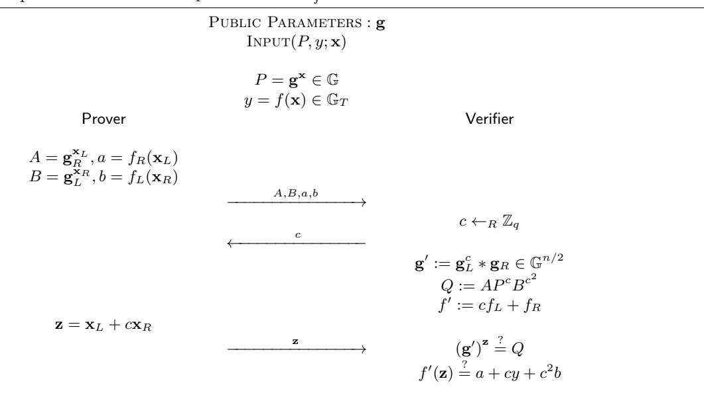
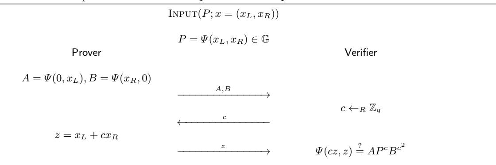

# **Compressing Proofs of** *k***-Out-Of-***n* **Partial Knowledge**

Thomas Attema<sup>1</sup>*,*2*,*3*,?*, Ronald Cramer<sup>1</sup>*,*2*,??*, and Serge Fehr<sup>1</sup>*,*2*,? ? ?*

<sup>1</sup> CWI, Cryptology Group, Amsterdam, The Netherlands

Version 4 - March 9, 2021[4](#page-0-0)

**Abstract.** In an (honest-verifier) zero-knowledge proof of partial knowledge, introduced by Cramer, Damgård and Schoenmakers (CRYPTO 1994), a prover knowing witnesses for some *k*-subset of *n* given public statements can convince the verifier of this claim without revealing which *k*-subset. The accompanying solution combines *Σ*-protocol theory and linear secret sharing, and achieves linear communication complexity for general *k, n*. Especially the "one-out-of-*n*" case *k* = 1 has seen myriad applications during the last decades, e.g., in electronic voting, ring signatures, and confidential transaction systems in general.

In this paper we focus on the discrete logarithm (DL) setting, where the prover claims knowledge of DLs of *k*-out-of-*n* given elements. Groth and Kohlweiss (EUROCRYPT 2015) have shown how to solve the special case *k* = 1 with *logarithmic* (in *n*) communication, instead of linear as prior work. However, their method takes explicit advantage of *k* = 1 and does not generalize to *k >* 1 without losing all advantage over prior work. Alternatively, an *indirect* approach for solving the considered problem is by translating the *k*-out-of-*n* relation into a circuit and then applying recent advances in communication-efficient circuit ZK. Indeed, for the *k* = 1 case this approach has been highly optimized, e.g., in ZCash.

Our main contribution is a new, simple honest-verifier zero-knowledge proof protocol for proving knowledge of *k* out of *n* DLs with *logarithmic* communication and *for general k and n*, without requiring any generic circuit ZK machinery. Our solution puts forward a novel extension of the *compressed Σ*-protocol theory (CRYPTO 2020), which we then utilize to compress a new *Σ*-protocol for proving knowledge of *k*-out-of-*n* DL's down to logarithmic size. The latter *Σ*-protocol is inspired by the CRYPTO 1994 approach, but a careful re-design of the original protocol is necessary for the compression technique to apply. Interestingly, *even for k* = 1 *and general n* our approach improves prior *direct* approaches as it reduces prover complexity without increasing the communication complexity. Besides the conceptual simplicity, we also identify regimes of practical relevance where our approach achieves asymptotic and concrete improvements, e.g., in proof size and prover complexity, over the generic approach based on circuit-ZK.

Finally, we show various extensions and generalizations of our core result. For instance, we extend our protocol to proofs of partial knowledge of Pedersen (vector) commitment openings, and/or to include a proof that the witness satisfies some additional constraint, and we show how to extend our results to non-threshold access structures.

**Keywords:** Proofs of Partial Knowledge, One-out-of-Many, Compressed *Σ*-Protocol Theory, Zero-Knowledge, Secure Algorithmics, Ring-Signatures.

## **1 Introduction**

### **1.1 Proofs of Partial Knowledge**

Proofs of partial knowledge [\[CDS94\]](#page-17-0) allow a prover to convince a verifier that the prover knows *k* out of *n* secrets, without revealing which secrets the prover knows. Typically, these secrets are solutions to public

<sup>2</sup> Leiden University, Mathematical Institute, Leiden, The Netherlands

<sup>3</sup> TNO, Cyber Security and Robustness, The Hague, The Netherlands

*<sup>?</sup>* thomas.attema@tno.nl

*<sup>??</sup>* cramer@cwi.nl, cramer@math.leidenuniv.nl

*<sup>? ? ?</sup>* serge.fehr@cwi.nl

<span id="page-0-0"></span><sup>4</sup> **Change log** w.r.t. Version 3 - October 21, 2020: (a) minor editorial changes, and (b) revised introduction of our techniques.

instances of intractable problems, such as the discrete logarithm problem. The work of [\[CDS94\]](#page-17-0) gives an elegant solution with linear communication complexity that combines *Σ*-protocol theory with linear secret sharing. Our goal is to invoke the techniques of Bulletproofs [\[BCC](#page-17-1)<sup>+</sup>16, [BBB](#page-17-2)<sup>+</sup>18] and follow-up work, in particular the compressed *Σ*-protocol framework of [\[AC20\]](#page-17-3), to construct proofs of partial knowledge with *logarithmic* communication complexity.

Compressed *Σ*-protocol theory [\[AC20\]](#page-17-3) was introduced as a strengthening of *Σ*-protocol theory. It inherits the flexibility and versatility of *Σ*-protocols while compressing their communication complexity from linear to logarithmic. The main pivot of this theory is a standard *Σ*-protocol for opening linear forms on Pedersen vector commitments, i.e., a *Σ*-protocol for proving that a committed vector **x** satisfies *L*(**x**) = *y* for a public linear form *L* and a public scalar *y*. By an appropriate adaptation of the techniques from [\[BCC](#page-17-1)<sup>+</sup>16, [BBB](#page-17-2)<sup>+</sup>18] this pivotal *Σ*-protocol is compressed to achieve communication complexity that is logarithmic in the dimension of **x**; additionally a linearization approach to handle non-linearities is described [\[AC20\]](#page-17-3). As one of the applications of this theory it was shown how to obtain circuit zero-knowledge (ZK) protocols with logarithmic communication complexity for arbitrary arithmetic circuits.

An obvious approach for constructing proofs of partial knowledge with logarithmic complexity is to apply recent advances in communication efficient circuit ZK to a suitably constructed circuit for capturing the *k*out-of-*n* relation. For instance, this is how the decentralized and confidential transaction system ZCash is designed [\[HBHW20\]](#page-17-4).

In this work here, we take a more *direct* approach that avoids generic circuit techniques. We find such a direct solution scientifically more appealing, but there are also efficiency considerations that may make our solution the preferred choice (we discuss this in detail in Section [1.5\)](#page-3-0). Our solution is inspired by the core idea of [\[CDS94\]](#page-17-0) of exploiting properties of linear secret sharing; however, the straightforward approach of compressing the original [\[CDS94\]](#page-17-0)-protocol with the techniques of [\[AC20\]](#page-17-3) does not work; the third message in the [\[CDS94\]](#page-17-0)-protocol includes a consistent secret sharing of the challenge, which cannot be compressed.

## **1.2 Their Applications**

Proofs of partial knowledge have seen myriad applications during the last decades. For instance, they were shown to be applicable to the construction of *group signature schemes* [\[Cam97\]](#page-17-5). Group signature schemes [\[CvH91\]](#page-17-6) allow a member of a group to sign a message without revealing which member it is, while a designated *group manager* is capable of revoking the anonymity of the signer.

Another application is to *ring signature schemes* [\[RST01\]](#page-18-0), which do not contain such a revocation mechanism. In a ring signature scheme, a group member can select any ad-hoc subset of group members and anonymously sign a message on behalf of this subset. Here, 1-out-of-*n* proofs together with the Fiat-Shamir [\[FS86\]](#page-17-7) heuristic allow for a straightforward construction of ring-signature schemes. Because of the ad-hoc nature a ring signature must contain a list of the subset's members and, therefore, its size grows linearly in the size of the ring; however, in many practical scenario's the costs of specifying a ring can be amortized over many instances.

Proofs of partial knowledge, in particular in the form of ring signature schemes, also play a crucial role in confidential decentralized transactions system such as Zerocoin [\[MGGR13\]](#page-18-1). Zerocoin was proposed as an extension of Bitcoin to provide stronger privacy guarantees. A Zerocoin transaction requires a ZKPoK that the transferred coin is an element of a public set of unspent coins. Other decentralized payment systems that rely on 1-out-of-*n* proofs to provide confidentiality are, e.g., Lelantus [\[Jiv19\]](#page-17-8), ZCash [\[HBHW20\]](#page-17-4), Zether [\[BAZB20\]](#page-17-9) and Monero [\[Ser20\]](#page-18-2).

As a generalization of ring signature schemes, threshold ring signatures only allow a large enough subset to compute a valid signature [\[BSS02\]](#page-17-10). These schemes require a generalization of the special proof of partial knowledge case *k* = 1. For instance, Monero is actively working on threshold ring signature schemes [\[GN18\]](#page-17-11). Moreover, in [\[Dia20\]](#page-17-12), it is shown how their generalization from 1-out-of-*n* proofs to so-called many-out-ofmany proofs improves the communication complexity of the Zether payment system. They show that many practical scenarios require more general proofs of partial knowledge than only 1-out-of-*n* proofs.

#### 1.3 Our Contributions

In this work, we start off by introducing and analyzing a novel extension of the core compression protocol from compressed  $\Sigma$ -protocol theory [AC20]. Namely, we observe that the compressed  $\Sigma$ -protocol for opening linear forms can be adapted to apply to general homomorphisms, i.e., for proving that a committed vector  $\mathbf{x} \in \mathbb{Z}_q^n$  satisfies  $f(\mathbf{x}) = y$  for an arbitrary group homomorphism  $f: \mathbb{Z}_q^n \to \mathbb{G}$  and an element  $y \in \mathbb{G}$ . The loss of efficiency is at most a constant factor and the adapted protocol still achieves a logarithmic communication complexity. Furthermore, the amortization technique to open multiple linear forms for essentially the price of one [AC20] directly carries over to opening multiple homomorphisms. This generalized functionality has not been considered before in the context of logarithmic complexity. As we discuss below, it turns out to be very useful in the design of efficient proofs of partial knowledge, but possibly also beyond.

Indeed, given n group elements  $P_1, \ldots, P_n \in \mathbb{G}$ , consider a prover claiming that it knows k out of the n DLs, i.e., it knows a subset  $S \subset \{1, \ldots, n\}$  of cardinality k and exponents  $x_i \in \mathbb{Z}_q$  such that  $g^{x_i} = P_i$  for all  $i \in S$ . Inspired by the design principle of [CDS94], we reduce this k-out-of-n case to the n-out-of-n case by having the prover "eliminate" the instances that it does not know, and then we apply the amortized version of the new compressed  $\Sigma$ -protocol for opening homomorphisms to prove the n instances in one go, with logarithmic complexity. However, the original solution of [CDS94] to reduce the k-out-of-n to the n-out-of-n case, achieved by secret sharing the challenge, does not work for us, as the resulting protocol is not in the shape for the (above generalization of the) [AC20] compression technique to apply.

Instead, we use the following new solution. The prover first chooses an (n-k+1)-out-of-n Shamir secret sharing  $(s_1,\ldots,s_n)$  of the default secret s=1, where it selects the non-constant "random" coefficients  $a_1,\ldots,a_{n-k}$  of the sharing polynomial  $p(X)=1+a_1X+\cdots+a_{n-k}X^{n-k}$  so that  $s_i=0$  for  $i\notin S$ . The prover then commits to the vector  $(\mathbf{a},\mathbf{t})=(a_1,\ldots,a_{n-k},t_1,\ldots,t_n)\in\mathbb{Z}_q^{2n-k}$  with  $t_i$  set to  $t_i=s_ix_i$  for any i, understood to be equal to 0 for  $i\notin S$ , i.e., when  $s_i=0$ . Finally, it proves that

<span id="page-2-0"></span>
$$g^{t_i} = P_i^{s_i} \tag{1}$$

for all  $i \in \{1, ..., n\}$ . Proving this linear relation with a standard  $\Sigma$ -protocol gives a novel secret-sharing based realization of [CDS94], with linear communication complexity.

This protocol crucially differs from the original proofs-of-partial knowledge, making it amenable to our compression techniques. First, it generates a single compact commitment to the vector of interest  $(\mathbf{a}, \mathbf{t})$ . No compact commitments are used in the original protocol. Second, the (n-k+1,n)-secret sharing of 1 is implicitly defined by the committed coefficients  $a_1, \ldots, a_{n-k}$ . By contrast, in the original protocol the prover computes an arbitrary (n-k+1,n)-secret sharing of a challenge c sampled uniformly at random by the verifier. Since the verifier has to check the consistency of this secret sharing this approach has an inherent linear communication complexity.

Let us consider our proofs-of-partial knowledge realization. By the linearity of Shamir's secret sharing scheme, for any i Equation 1 can be cast as a homomorphism of the committed values  $a_1, \ldots, a_{n-k}, t_1, \ldots, t_n$ , and thus our novel variation of [AC20], including the amortization over the n homomorphisms, applies, thereby achieving a logarithmic communication complexity.

In total, our k-out-of-n proof protocol requires the prover to send  $4 \lceil \log_2(2n-k+1) \rceil - 5$  group elements and 4 elements in  $\mathbb{Z}_q$  to the verifier. We also show how to further reduce this to  $2 \lceil \log_2(2n-k+1) \rceil - 1$  group elements and 4 elements in  $\mathbb{Z}_q$  on a pairing-based platform. The protocol is public-coin and can therefore be made non-interactive by the Fiat-Shamir transform [FS86]. The public set-up, necessary for the vector commitment, consists of at most 2n group elements, and the complexity of the prover scales linearly in n.

#### 1.4 Extensions and Variations

The conceptual simplicity of our design principle makes it easy to extend the protocol in various directions, for instance to proofs of partial knowledge about "multi-generator discrete logarithms" and corresponding

<span id="page-2-1"></span><sup>&</sup>lt;sup>5</sup> Concretely, we consider the homomorphism  $f_i: \mathbb{Z}_q^{2n-k} \to \mathbb{G}$ ,  $(\mathbf{a}, \mathbf{t}) \mapsto g^{t_i} P_i^{-\ell_i(\mathbf{a})}$  with  $\ell_i$  the linear functional  $\ell_i(\mathbf{a}) = a_1 i + a_2 i^2 + \dots + a_{n-k} i^{n-k}$ , and we ask the prover to prove that the committed values map to  $P_i$ .

Pedersen vector commitments. Furthermore, by introducing a pairing and considering a pairing based extension of Pedersen's vector commitment scheme, we can reduce the relevant constant by another factor up to 2. Moreover, we show that our proofs of partial knowledge are compatible with circuit ZK protocols of [AC20], allowing the prover to demonstrate that his secret information satisfies some arbitrary given constraint. Finally, we generalize the results from threshold access structures to arbitrary access structures.

#### <span id="page-3-0"></span>1.5 Comparison with Other Approaches

Achieving partial proofs of knowledge with logarithmic complexity has received quite some attention over the last few years, with different approaches and different (partial) solutions. We discuss here the examples that are most relevant in the context of our new approach, and we compare them with our results.

In [GK15], Groth and Kohlweiss consider the special case k=1, and where the prover claims to be able to open 1 out of n public commitments to zero. Their solution is a  $\Sigma$ -protocol that works for any additively homomorphic commitment scheme over  $\mathbb{Z}_q$  and it achieves a logarithmic communication complexity. To describe their approach, let  $1 \leq \ell \leq n$  be the index of the prover's secret. The prover commits to each bit of  $\ell$  and runs  $\lceil \log_2(n) \rceil$  standard  $\Sigma$ -protocols, in parallel and on a common challenge, proving that all these commitments can indeed be opened to a binary value. In addition, the prover shows that the responses of these parallel  $\Sigma$ -protocols satisfy some multiplicative relation, which completes the protocol. This approach does not have an obvious generalization to k-out-of-n proofs.

The 1-out-of-n proof of [GK15] requires the prover to send  $4 \lceil \log_2(n) \rceil$  group elements and  $3 \lceil \log_2(n) \rceil + 1$  field elements. By using Pedersen *vector* commitments, instead of ordinary Pedersen commitment, the communication costs can be further reduced to  $\lceil \log_2(n) \rceil + 4$  group elements and  $\lceil \log_2(n) \rceil + 3$  field elements [BCC<sup>+</sup>15]. Instead of the binary decomposition, the approach of [BCC<sup>+</sup>15] considers the m-ary decomposition of the secret index  $\ell$ . Here, we have optimized their approach for proving knowledge of 1-out-of-n discrete logarithms by taking m = 2. The work of [BCC<sup>+</sup>15] focuses on a slightly different scenario in which the communication costs are minimized for m = 4.

In comparison, in our protocol, which works for any k, the prover sends  $4\lceil \log_2(2n-k+1)\rceil - 5$  group elements and 4 field elements to the verifier, which is reduced to  $2\lceil \log_2(2n-k+1)\rceil - 1$  group elements and 4 field elements on a pairing-based platform. Hence, perhaps surprisingly, our simple protocols are comparable to dedicated solutions for the special case k=1.

Recently, a generalization from 1-out-of-n proofs of [GK15] to "many-out-of-many" proofs was given [Dia20]. This generalization considers a prover that claims to know the opening of all commitments in one of the orbits of a public permutation of n public commitments. However, the protocol only works for permutations with orbits of equal size. Since the permutation is public and of this specific form, this protocol does not constitute a general k-out-of-n proof of partial knowledge.

The prover complexity of the aforementioned 1-out-of-n proofs [GK15, BCC<sup>+</sup>15] is  $O(\kappa n \log(n))$ , and that of the "many-out-of-many" proofs [Dia20] is  $O(\kappa n \log^2(n))$ , where  $\kappa$  is the computational security parameter. By contrast, our protocol has prover complexity  $O(\kappa n)$ . Here and below, we express the prover complexity in terms of the number of group operations required. Note that, a single exponentiation requires  $O(\kappa) = O(\log(q))$  group operations. By contrast, some other authors express the prover complexity in the number of exponentiations. Similarly, we specify the communication costs in terms of the number group and field elements.

Aiming to improve the prover complexity of the 1-out-of-n proofs of [GK15, BCC<sup>+</sup>15], Jivanyan and Mamikonyan [JM20] proposed a hierarchical approach. Their protocol assumes that n = NM and applies an appropriate 1-out-of-N proof followed by a 1-out-of-M proof. It reduces the prover complexity from  $O(\kappa n \log(n))$  down to  $O(\kappa (n+N\log(N)+M\log(M)))$ , which equals  $O(\kappa n)$  if, for example,  $N=M=\sqrt{n}$ . However, this hierarchical approach increases the communication complexity to  $O(N\log(N)+M\log(M)+M)$ , hence it is subject to a trade-off between prover and communication complexity.

Alternatively to our and the above approaches, proofs of partial knowledge can be constructed via generic circuit ZK protocols. This *indirect* approach is, for example, followed by the confidential transaction system ZCash [HBHW20]. A standard construction for the 1-out-of-n case is to incorporate the group elements  $P_i$ 

into a Merkle tree [\[Mer80\]](#page-18-4), and ask the prover to prove knowledge of an exponent *x<sup>i</sup>* such that the group element *g xi* is the leaf of a valid, but secret, Merkle path. In this case, the arithmetic circuit *C* implements a composition of the exponentiation *g <sup>x</sup><sup>i</sup>* and the log<sup>2</sup> (*n*) hash function evaluations corresponding to the validation of a Merkle path, and it is therefore of size |*C*| = *O κ* log(*n*) .

Even though this is obviously possible, to our knowledge this Merkle-tree approach has not been explicitly generalized to the *k*-out-of-*n* case before, making it difficult to do a rigorous efficiency comparison. However, such a generalization would require *k* Merkle paths to be validated, resulting in circuits of size |*C*| = *O κk* log<sup>2</sup> (*n*) . In addition, the circuit has to validate that the *k* Merkle paths are *distinct*. The obvious way to do this requires a circuit of size *O*(*k* 2 ). In these complexity estimates we neglect the *O*(*κn*) size circuit required to construct the Merkle tree, because these costs can be amortized in some applications.

In Table [1,](#page-4-0) the asymptotic complexities of our direct approach are compared with the indirect approach, instantiated with typical communication efficient circuit ZK protocols for which the size of the public parameters and the prover complexity are linear and the communication complexity is logarithmic in the circuit size. We observe that, if *k* = *Ω* ( √ *n*), our approach yields an asymptotic improvement over the indirect approach.

Moreover, the constants of our approach are small. By contrast, taking for instance the case *k* = 1 and a highly optimized group, associated to a security parameter *κ* ≈ 100, the indirect approach can be instantiated with arithmetic circuits containing approximately 1400 log<sup>2</sup> (*n*) multiplication gates [\[HBHW20\]](#page-17-4). Hence, even for the 1-out-of-*n* case, where the indirect approach has better asymptotic complexities, we obtain better communication complexity for *n* ranging up to roughly 9000.

<span id="page-4-0"></span>**Table 1.** Comparison of the asymptotic complexities of the indirect approach, using typical communication-efficient circuit ZK protocols, and our direct approach, for *k*-out-of-*n* proofs of partial knowledge, with security parameter *κ*.

|                           | Indirect Circuit ZK Approach Our Direct Approach |                     |
|---------------------------|--------------------------------------------------|---------------------|
| Size of Public Parameters | <br>2<br><br>O<br>κk log(n) + k                  | <br><br>O<br>n      |
| Prover Complexity         | <br>2<br><br>O<br>κk log(n) + k                  | <br>κn<br>O         |
| Communication Complexity  | <br>log<br>2<br><br>O<br>κk log(n) + k           | <br><br>O<br>log(n) |

The above circuit approach can further be adjusted, for instance by invoking ZK protocols with constant communication complexity [\[Gro10\]](#page-17-15), or by replacing Merkle trees with RSA-accumulators [\[BdM93\]](#page-17-16), which results in arithmetic circuits with a number of multiplication gates that is constant in *n* [\[STY00\]](#page-18-5). However, these approaches are incomparable in that they are based on computational hardness assumptions that are considered less standard, like the strong-RSA assumption or the knowledge-of-exponent assumption. Furthermore, in these protocols, the size of the public parameters and the prover complexity are still linear in the circuit size, and for practical instances still result in sizeable circuits, respectively.

### **1.6 Organization of the Paper**

The remainder of paper is organized as follows. In Section [2,](#page-5-0) we recall the notation and some of the results from compressed *Σ*-protocol theory [\[AC20\]](#page-17-3). In Section [3,](#page-7-0) we describe our twist on the pivotal *Σ*-protocol from [\[AC20\]](#page-17-3). In Section [4,](#page-12-0) we combine this generalization with an adaptation of the techniques from [\[CDS94\]](#page-17-0) to construct our proof of partial knowledge. Finally, in Section [5,](#page-14-0) we discuss a number of extensions and generalizations of our proofs of partial knowledge.

### <span id="page-5-0"></span>2 Preliminaries

#### 2.1 Interactive Proofs

We briefly introduce the concept of an interactive proof<sup>6</sup> and some of the basic (security) properties. An interactive proof  $\Pi$  for relation R is a protocol between prover  $\mathcal{P}$  and a verifier  $\mathcal{V}$ . It takes as public input the statement x and as prover's private input the witness w, which is written as INPUT(x; w). As the output of the protocol the verifier either accepts or rejects the prover's claim of knowing a witness w.  $\Pi$  is called (perfectly) complete if on any input  $(x; w) \in R$  the verifier always accepts. Evaluating  $\Pi$  on input (x; w) is also written as  $\Pi(x; w)$ .

An interactive proof with  $\mu$  communication rounds is also called a  $\mu$ -move protocol. Note that the final message is always sent from the prover to the verifier. The messages communicated in one protocol evaluation are also referred to as a *conversation* or a *transcript*. If all the messages from the verifier to the prover consist of random coins chosen by the verifier, one speaks of a *public-coin* protocol. All our protocols will be public-coin and thereby suitable for the Fiat-Shamir transformation [FS86], which turns public-coin interactive proofs into *non-interactive* protocols.

An interactive proof  $\Pi$  for relation R is said to have witness extended emulation [Lin03] if there exists algorithm  $\chi$  (witness extended emulator) that runs in expected polynomial time and does the following. The algorithm  $\chi$ , on input x and given rewindable oracle access to a (possibly dishonest) prover  $\mathcal{P}^*$ , outputs a transcript and a witness w such that: (1) the emulated transcript is statistically indistinguishable from conversations between  $\mathcal{P}^*$  and an honest verifier  $\mathcal{V}$ , and (2) the probability that the emulated transcript is accepting and the witness w is not a valid witness for x is negligible. Witness extended emulation gives a notion for proofs of knowledge (PoKs) that is sufficient in practical applications [BCC+16, BBB+18, AC20].

We also consider the computational version of a PoK, where witness extended emulation is required to hold only for computationally bounded dishonest provers under a computational hardness assumption. In those cases, the relation R typically depends on a (possibly implicit) security parameter, as well as on some additional public parameters that are assumed to be chosen according to a specific probability distribution, and the success probability of the prover is then understood to be on average over the choice of these public parameters. These computational variants of proofs of knowledge are also called arguments of knowledge.

Protocol  $\Pi$  is called honest verifier zero-knowledge (HVZK) if there exists an efficient simulator that, on input a statement x that admits a witness w, outputs an accepting transcript, such that the simulated transcripts follow exactly the same distribution as transcripts between an honest prover and an honest verifier.

A 3-move public-coin interactive proof is called a  $\Sigma$ -protocol. The 3 messages are then typically denoted (a, c, z) where c is called the *challenge*. For a HVZK  $\Sigma$ -protocol the simulator often proceeds by first selecting a random challenge c and then preparing the messages a and z; in this case, we speak of *special honest verifier zero-knowledge* (SHVZK).

A  $\Sigma$ -protocol is called *k-special sound* if there exists an efficient algorithm that, on input any statement x and k accepting transcripts  $(a, c_1, z_1), \ldots, (a, c_k, z_k)$  with common first message a and pairwise distinct challenges  $c_i$ , outputs a witness w for x.

More generally, we consider  $(2\mu+1)$ -move public-coin protocols, in which all the verifier's messages are uniformly random challenges. These protocols are called  $(k_1, \ldots, k_\mu)$ -special sound if there exists an efficient algorithm that, on input any statement x and a  $(k_1, k_2, \ldots, k_\mu)$ -tree of accepting transcripts, outputs a witness w for x. A  $(k_1, k_2, \ldots, k_\mu)$ -tree of accepting transcripts is a set of  $\prod_{i=1}^{\mu} k_i$  accepting transcripts that are arranged in the following tree structure. The nodes in this tree correspond to the prover's messages and the edges correspond to the verifier's challenges. Every node at depth i has precisely  $k_i$  children corresponding to  $k_i$  pairwise distinct challenges. Every transcript corresponds to exactly one path from the root node to a leaf node.

We note that in some public-coin protocols the verifier sends  $\mu$  challenges in less than  $2\mu + 1$  rounds, i.e., some of the verifier's messages contain more than one challenge. For these protocols, we also consider the

<span id="page-5-1"></span><sup>&</sup>lt;sup>6</sup> In contrast to the original definition [GMR85], we do not require an interactive proof to be complete and sound by definition; instead, we consider those (and other) properties as desirable security properties.

 $(k_1, \ldots, k_{\mu})$ -special soundness property. In this case, a  $(k_1, k_2, \ldots, k_{\mu})$ -tree of accepting transcripts contains nodes that do not correspond to a message sent from the prover to the verifier.

Let us assume that the challenges are sampled uniformly at random from challenge sets with a cardinality that is exponential in the security parameter. In this work all challenge sets are equal to  $\mathbb{Z}_q \cong \mathbb{Z}/(q\mathbb{Z})$  for some prime q that is understood to be exponential in the security parameter. Hence, for the protocols in this work this assumption is satisfied. Then witness extended emulation is known to follow from  $(k_1, k_2, \ldots, k_{\mu})$ -special soundness [BCC<sup>+</sup>16]. In this work, we will show that all protocols are  $(k_1, k_2, \ldots, k_{\mu})$ -special sound for some  $\mu$  and some list of  $k_i$ 's, from which witness extended emulation therefore follows.

## 2.2 Multi-Exponentiation and The Pedersen Vector Commitment Scheme

We consider statements over the ring  $\mathbb{Z}_q \cong \mathbb{Z}/(q\mathbb{Z})$  with q prime. We let  $\mathbb{G}$  be an Abelian group of prime order q for which we write its group operation multiplicatively. We write vectors in  $\mathbb{Z}_q^n$  or  $\mathbb{G}^n$  in boldface, i.e.,  $\mathbf{x} = (x_1, \dots, x_n) \in \mathbb{Z}_q^n$  and  $\mathbf{g} := (g_1, \dots, g_n) \in \mathbb{G}^n$ , and we write  $\mathbf{g}^{\mathbf{x}}$  for the multi-exponentiation

$$\mathbf{g}^{\mathbf{x}} := \prod_{i=1}^{n} g_i^{x_i} \in \mathbb{G}$$
 .

Furthermore, for vectors  $\mathbf{x}, \mathbf{y} \in \mathbb{Z}_q^n$ ,  $\mathbf{g}, \mathbf{h} \in \mathbb{G}^n$  and scalar  $c \in \mathbb{Z}_q$ , we have the following component-wise operations:

$$\mathbf{g} * \mathbf{h} := (g_1 h_1, g_2 h_2, \dots, g_n h_n) \in \mathbb{G}^n, \ \mathbf{g}^c := (g_1^c, g_2^c, \dots, g_n^c) \in \mathbb{G}^n \text{ and } \mathbf{x} * \mathbf{y} := (x_1 y_1, x_2 y_2, \dots, x_n y_n) \in \mathbb{Z}_q^n.$$

Additionally, assuming n is even, we write  $\mathbf{g}_L := (g_1, \ldots, g_{n/2}), \ \mathbf{g}_R := (g_{n/2+1}, \ldots, g_n) \in \mathbb{G}^{n/2}$  and  $\mathbf{x}_L := (x_1, \ldots, x_{n/2}), \ \mathbf{x}_R := (x_{n/2+1}, \ldots, x_n) \in \mathbb{Z}_q^{n/2}$ , for the left and right halves of these vectors.

We let  $\mathbb{G}_T$  be another Abelian group and denote the set of all group homomorphisms  $f: \mathbb{Z}_q^n \to \mathbb{G}_T$  by  $\operatorname{Hom}(\mathbb{Z}_q^n, \mathbb{G}_T)$ . Typically  $\mathbb{G}_T = \mathbb{G}$  or  $\mathbb{G}_T = \mathbb{Z}_q$ , in the latter case  $\operatorname{Hom}(\mathbb{Z}_q^n, \mathbb{G}_T) = \operatorname{Hom}(\mathbb{Z}_q^n, \mathbb{Z}_q)$  is the set of linear forms on  $\mathbb{Z}_q^n$ . For any homomorphism  $f: \mathbb{Z}_q^n \to \mathbb{G}_T$  it holds that its image  $\operatorname{im}(f) \subset \mathbb{G}_T$  is a  $\mathbb{Z}_q$ -module. For this reason, and without loss of generality, we assume that  $\mathbb{G}_T$  is a  $\mathbb{Z}_q$ -module.

Moreover, we define the left and right part of f as follows:

$$f_L: \mathbb{Z}_q^{n/2} \to \mathbb{G}_T, \quad \mathbf{x} \mapsto f(\mathbf{x}, 0),$$
  
$$f_R: \mathbb{Z}_q^{n/2} \to \mathbb{G}_T, \quad \mathbf{x} \mapsto f(0, \mathbf{x}),$$
 (2)

where, e.g.,  $(\mathbf{x}, 0) \in \mathbb{Z}_q^n$  is the vector  $\mathbf{x} \in \mathbb{Z}_q^{n/2}$  appended with n/2 zeros.

In this work we also consider the Pedersen vector commitment scheme. This commitment scheme allows a prover to (compactly) commit to an n-dimensional vector  $\mathbf{x} \in \mathbb{Z}_q^n$  in a single group element  $P \in \mathbb{G}$ . We recall that a Pedersen vector commitment P is simply a multi-exponentiation, i.e.,

$$P = h^{\gamma} \mathbf{g}^{\mathbf{x}},$$

for public parameters  $h \in \mathbb{G}$  and  $\mathbf{g} \in \mathbb{G}^n$  and for a (private)  $\gamma \in \mathbb{Z}_q$  sampled uniformly at random by the prover.

The Pedersen vector commitment scheme is perfectly hiding and computationally binding under the discrete logarithm assumption. More precisely, the commitment scheme is binding under the assumption that a prover does not know a non-zero vector  $(\gamma, x_1, \ldots, x_n) \in \mathbb{Z}_q^{n+1}$  such that

$$h^{\gamma} \prod_{i=1}^{n} g_i^{x_i} = 1.$$

<span id="page-6-0"></span><sup>&</sup>lt;sup>7</sup> In a recent unpublished work [ACK21], it is shown that  $(k_1, k_2, \ldots, k_{\mu})$ -special soundness implies the more standard notion of *knowledge soundness*. In turn, knowledge soundness implies witness extended emulation [Lin03].

Such a non-zero vector  $(\gamma, x_1, \ldots, x_n)$  is also called a non-trivial discrete log relation for group elements  $h, g_1, \ldots, g_n$ . From here on forward, we assume that these group elements have been sampled uniformly at random in a setup phase and that the prover does not know a non-trivial discrete logarithm (DL) relation. These group elements form the set of public parameters for all our protocols. We say a protocol is computationally  $(k_1, \ldots, k_\mu)$ -special sound, under the discrete logarithm assumption, if  $(k_1, \ldots, k_\mu)$ -special soundness holds under the assumption that a prover does not know a non-trivial DL relation between the public parameters.

## <span id="page-7-0"></span>3 Proving Group Homomorphism Openings on Multi-Exponentiations

In this section, we construct an interactive proof for proving that a secret multi-exponent  $\mathbf{x} \in \mathbb{Z}_q^n$  for a public multi-exponentiation  $P = \mathbf{g}^{\mathbf{x}} \in \mathbb{G}$  is mapped to a given public value y under an arbitrary but given group homomorphism  $f: \mathbb{Z}_q^n \to \mathbb{G}_T$ . Our new protocol has a communication complexity that is logarithmic in the dimension n. By considering one of the coordinates of  $\mathbf{x}$  to be "the randomness", and considering an f that ignores this coordinate, we immediately get a protocol that applies to Pedersen vector commitments and proves that the committed vector satisfied the relation defined by the considered group homomorphism and the target value y.

Our approach for constructing said protocol is as follows. We start with the canonical  $\Sigma$ -protocol for the considered problem of proving  $f(\mathbf{x}) = y$  (Section 3.1), and we then adapt the compression mechanism of [AC20] such that it is applicable to our setting. Indeed, our setting is a generalization of [AC20], which applies to the special case where f is a linear form  $L: \mathbb{Z}_q^n \to \mathbb{Z}_q$ . This then results in a compressed  $\Sigma$ -protocol that features the claimed logarithmic complexity (Section 3.3).

Later in the section, we also discuss a couple of (standard) amortization techniques applied to our protocol, for instance for proving  $f_i(\mathbf{x}) = y_i$  for several group homomorphisms  $f_i$  at (essentially) the cost of proving one.

#### <span id="page-7-1"></span>3.1 The Standard $\Sigma$ -protocol for Opening Homomorphisms

We consider the problem of proving that the multi-exponent  $\mathbf{x}$  of a multi-exponentiation  $P = \mathbf{g}^{\mathbf{x}}$  is mapped to a certain value y under a given homomorphism  $f \in \text{Hom}(\mathbb{Z}_q, \mathbb{G}_T)$ , i.e., that  $f(\mathbf{x}) = y$ , without revealing  $\mathbf{x}$ . More concretely, we want to construct PoK protocols for the relation

$$R_f = \left\{ \left( P \in \mathbb{G}, y \in \mathbb{G}_T; \mathbf{x} \in \mathbb{Z}_q^n \right) : P = \mathbf{g}^{\mathbf{x}}, y = f(\mathbf{x}) \right\}.$$
 (3)

Protocol 1, denoted by  $\Pi_0$ , is the canonical  $\Sigma$ -protocol for this relation  $R_f$ , following the generic construction design for q-one-way group homomorphisms<sup>8</sup> [Cra96, CD98]. The properties of  $\Pi_0$ , known to hold for this generic construction, are summarized in Theorem 1. Note that the only difference between this protocol and Protocol 2 of [AC20] is that here we consider multi-exponentiations and general group homomorphisms instead of Pedersen commitments and linear forms.

<span id="page-7-3"></span>Theorem 1 (Homomorphism Evaluation).  $\Pi_0$  is a  $\Sigma$ -protocol for relation  $R_f$ . It is perfectly complete, special honest-verifier zero-knowledge and unconditionally special sound. Moreover, the communication costs are:

- $-\mathcal{P} \to \mathcal{V}$ : 1 element of  $\mathbb{G}$ , 1 element of  $\mathbb{G}_T$  and n elements of  $\mathbb{Z}_q$ .
- $\mathcal{V} \to \mathcal{P}$ : 1 element of  $\mathbb{Z}_q$ .

<span id="page-7-2"></span><sup>8</sup> Here, applied to the q-one-way group homomorphisms  $\mathbb{Z}_q^n \to \mathbb{G} \times \mathbb{G}_T$ ,  $\mathbf{x} \mapsto (\mathbf{g}^{\mathbf{x}}, f(\mathbf{x}))$ .

<span id="page-8-0"></span>**Protocol 1**  $\Sigma$ -protocol  $\Pi_0$  for relation  $R_f$ Opening a homomorphism on a Pedersen vector commitment.

Public Parameters : 
$$\mathbf{g} \in \mathbb{G}^n$$
, Input $(P, y; \mathbf{x})$ 

$$P = \mathbf{g}^{\mathbf{x}} \in \mathbb{G}$$

$$y = f(\mathbf{x}) \in \mathbb{G}_T$$
Prover
$$\mathbf{r} \leftarrow_R \mathbb{Z}_q^q$$

$$A = \mathbf{g}^{\mathbf{r}}$$

$$t = f(\mathbf{r})$$

$$\xrightarrow{A,t} \longrightarrow c \leftarrow_R \mathbb{Z}_q$$

$$\mathbf{z} = c\mathbf{x} + \mathbf{r}$$

$$\mathbf{g}^{\mathbf{z}} \stackrel{?}{=} AP^c$$

$$f(\mathbf{z}) \stackrel{?}{=} cy + t$$

#### 3.2 Compression mechanism

The  $\Sigma$ -protocol  $\Pi_0$  for opening homomorphisms has a linear communication complexity. We now deploy the techniques from [BCC<sup>+</sup>16, BBB<sup>+</sup>18, AC20] to compress the communication complexity from linear to logarithmic. A first observation is that the verifier's final check verifies that

$$(AP^c, cy + t; \mathbf{z}) \in R_f$$
,

i.e., that the prover's final message  $\mathbf{z}$  is a witness with respect to the same relation  $R_f$  for the statement  $(AP^c, cy+t)$ ; which is computed by the verifier. This is no coincidence; this holds generically for this standard construction of  $\Sigma$ -protocols for q-one-way group homomorphisms. The final message of  $\Pi_0$  can therefore be understood as a trivial PoK for relation  $R_f$ , and replacing this trivial PoK by a more efficient one will reduce the communication complexity without affecting security (significantly). In particular, the alternative PoK does not have to be zero-knowledge since the trivial one obviously is not.

Our compression mechanism is thus an interactive proof  $\Pi_1$  for relation  $R_f$  that is not zero-knowledge anymore but has improved efficiency. The compression mechanism is very similar to the one used in [AC20]. The difference is that we consider the more general case of opening arbitrary group homomorphisms, rather than restricting ourselves to linear forms. This generalization requires a minor adaptation. The first step in the compression of [AC20] is namely to incorporate the linear form evaluation into the multi-exponentiation as an additional exponent on a new generator  $k \in \mathbb{G}$ . This reduction step does not apply to the general case of opening arbitrary group homomorphisms, and is therefore omitted in our protocols. For this reason we directly apply (a minor adaptation of) the main compression mechanism of [AC20]; ultimately this will increase the communication costs of the compressed  $\Sigma$ -protocol by roughly a factor two when compared to opening linear forms. However, in contrast to the compressed  $\Sigma$ -protocol for opening linear forms [AC20], our protocol is unconditionally sound rather than computationally. In Section 5.1, we show how a more general class of homomorphisms can be incorporated into the commitment, thereby avoiding the factor two loss in the communication efficiency.

The compression mechanism, i.e., our protocol  $\Pi_1$  for relation  $R_f$  that has improved efficiency but is not zero-knowledge, is described in Protocol 2 below. Here, n is assumed to be even, which is without loss of generality (if not the witness can be appended with a zero). Also, recall that  $\mathbf{x}_L := (x_1, \ldots, x_{n/2})$  equals the left half of the vector  $\mathbf{x} \in \mathbb{Z}_q^n$  and that  $f_R(\mathbf{x}_L) := f(0, \ldots, 0, \mathbf{x}_L)$ , etc.

Before discussing the security of  $\Pi_1$  as a proof of knowledge in Theorem 2, we emphasize the following two important properties of  $\Pi_1$ . The size of the response has halved compared to the original protocol  $\Pi_0$ , and thereby the communication costs are reduced by roughly a factor two, and second, verifying the correctness of the response is again by means of checking whether it is a witness for the relation  $R_{f'}$ , now instantiated with the group homomorphism  $f' := cf_L + f_R \in \text{Hom}(\mathbb{Z}_q^{n/2}, \mathbb{G}_T)$ .

#### <span id="page-9-0"></span>**Protocol 2** Compression Mechanism $\Pi_1$ for relation $R_f$ .



<span id="page-9-1"></span>**Theorem 2 (Compression Mechanism).** Let  $n \in \mathbb{Z}_{>0}$  be even. Then  $\Pi_1$  is a 3-move protocol for relation  $R_f$ . It is perfectly complete and unconditionally 3-special sound. Moreover, the communication costs are:

- $-\mathcal{P} \to \mathcal{V}$ : 2 elements of  $\mathbb{G}$ , 2 elements of  $\mathbb{G}_T$  and n/2 elements of  $\mathbb{Z}_q$ .
- $\mathcal{V} \to \mathcal{P} \colon 1 \text{ element of } \mathbb{Z}_q.$

*Proof.* Completeness follows directly.

**Special Soundness**: We show that the protocol is 3-special sound, i.e., there exists an efficient algorithm that on input three accepting transcripts computes a witness for relation  $R_f$ .

Let  $(A, B, a, b, c_1, \mathbf{z}_1)$ ,  $(A, B, a, b, c_2, \mathbf{z}_2)$  and  $(A, B, a, b, c_3, \mathbf{z}_3)$  be three accepting transcripts for distinct challenges  $c_1, c_2, c_3 \in \mathbb{Z}_q$ . Let  $a_1, a_2, a_3 \in \mathbb{Z}_q$  be such that

$$\begin{pmatrix} 1 & 1 & 1 \\ c_1 & c_2 & c_3 \\ c_1^2 & c_2^2 & c_3^2 \end{pmatrix} \begin{pmatrix} a_1 \\ a_2 \\ a_3 \end{pmatrix} = \begin{pmatrix} 0 \\ 1 \\ 0 \end{pmatrix}.$$

Note that, since the challenges are distinct, this Vandermonde matrix is invertible and a solution to this equation exists. We define  $\bar{\mathbf{z}} = \sum_{i=1}^{3} a_i(c_i\mathbf{z}_i, \mathbf{z}_i)$  for which it is easily verified that

$$\mathbf{g}^{\bar{\mathbf{z}}} = P$$
 and  $f(\bar{\mathbf{z}}) = y$ .

Hence,  $\bar{\mathbf{z}}$  is a witness for relation  $R_f$ , which completes the proof.

#### <span id="page-10-0"></span>3.3 Compressed $\Sigma$ -protocol

Finally, we compose  $\Sigma$ -protocol  $\Pi_0$  and its compression mechanism  $\Pi_1$  to obtain a compressed  $\Sigma$ -protocol for opening homomorphisms on multi-exponentiations  $\mathbf{g}^{\mathbf{x}}$  such as Pedersen vector commitments. We follow the notation of [AC20] and write  $\Pi_b \diamond \Pi_a$  for the composition of two composable interactive proofs  $\Pi_a$  and  $\Pi_b$  are composable if protocol  $\Pi_b$  is a PoK for the prover's final message of protocol  $\Pi_a$ . Recall that this composition means that the final message of protocol  $\Pi_a$  is replaced by an execution of protocol  $\Pi_b$ .

We assume that n is a power of two, if it is not the witness can be appended with zeros such that its dimension is a power of 2. For  $n \leq 2$  it is optimal to omit the compression mechanism, for this reason it is assumed that n > 2. To minimize the communication complexity we recursively apply the compression protocol  $\Pi_1$  until the dimension of the witness is reduced to four, i.e.,  $\mu = \lceil \log_2(n) \rceil - 2$  times. For this composition we write

$$\Pi_c = \underbrace{\Pi_1 \diamond \dots \diamond \Pi_1}_{\mu \text{ times}} \diamond \Pi_0. \tag{4}$$

Theorem 3 captures the security and efficiency properties of Protocol  $\Pi_c$ .

<span id="page-10-1"></span>Theorem 3 (Compressed  $\Sigma$ -Protocol for Opening Homomorphisms). Let n > 2, then  $\Pi_c$  is a  $(2\mu + 3)$ -move protocol for relation  $R_f$ , where  $\mu = \lceil \log_2(n) \rceil - 2$ . It is perfectly complete, special honest-verifier zero-knowledge and unconditionally  $(2, 3, 3, \ldots, 3)$ -special sound. Moreover, the communication costs are:

```
-\mathcal{P} \to \mathcal{V}: 2\lceil \log_2(n) \rceil - 3 elements of \mathbb{G}, 2\lceil \log_2(n) \rceil - 3 elements of \mathbb{G}_T and 4 elements of \mathbb{Z}_q. -\mathcal{V} \to \mathcal{P}: \lceil \log_2(n) \rceil - 1 elements of \mathbb{Z}_q.
```

*Proof.* Completeness follows in a straightforward manner.

**Special Honest Verifier Zero-Knowledge** follows since  $\Pi_0$  is SHVZK. A simulator for  $\Pi_c$  runs the simulator for  $\Pi_0$ , and replaces the final messages of the simulated transcripts by honest executions of  $\Pi_1 \diamond \cdots \diamond \Pi_1$ .

**Special Soundness**: Since the protocol is the composition of protocols that are 2- or 3-special sound, it is easily seen that  $\Pi_c$  is  $(2,3,\ldots,3)$ -special sound, i.e., there exists an efficient algorithm that on input a  $(2,3,\ldots,3)$ -tree (depth  $\mu+1$ ) of  $2\cdot 3^{\mu}$  accepting transcripts computes a witness for relation  $R_f$ .

Remark 1. We explicitly emphasize once more that the above and below results on opening homomorphisms  $f(\mathbf{x})$  on multi-exponentiations  $\mathbf{g}^{\mathbf{x}}$  immediately carry over to opening homomorphisms  $f(\mathbf{x})$  on Pedersen vector commitments  $\mathbf{g}^{\mathbf{x}}h^{\gamma}$ , simply by renaming the involved variables in the obvious way.

#### 3.4 Amortization Techniques

This section describes two standard amortization techniques. First, we consider the scenario where a prover wishes to open *one* homomorphism f on many multi-exponentiations  $P_1, \ldots, P_s$ , i.e., we consider the relation

$$R_{\text{AMOREXP}} = \{ (P_1, \dots, P_s, y_1, \dots, y_s; \mathbf{x}_1, \dots, \mathbf{x}_s) : P_1 = \mathbf{g}^{\mathbf{x}_1}, y_1 = f(\mathbf{x}_1), \dots, P_1 = \mathbf{g}^{\mathbf{x}_1}, y_s = f(\mathbf{x}_s) \}.$$
 (5)

The standard (amortized)  $\Sigma$ -protocol for relation  $R_{\text{AMOREXP}}$  is similar to  $\Sigma$ -protocol  $\Pi_0$  for relation  $R_f$ : it has the same first two moves, but then the prover's final response is  $\mathbf{z} = \mathbf{r} + \sum_{i=1}^s c^i \mathbf{x}_i$  and the verifier checks that  $\mathbf{g}^{\mathbf{z}} = AP_1^c \cdots P_s^{c^s}$  and  $f(\mathbf{z}) = t + cy_1 + \cdots + c^s y_s$ . The communication costs of the amortized  $\Sigma$ -protocol are exactly equal to the communication costs of protocol  $\Pi_0$  and the compression mechanism applies as before. We denote the compressed amortized  $\Sigma$ -protocol for relation  $R_{\text{AMOREXP}}$  by  $\Pi_{\text{AMOREXP}}$ . Its main properties are summarized in Theorem 4.

<span id="page-10-2"></span>Theorem 4 (Amortization over Many Multi-Exponentiations). Let n > 2, then  $\Pi_{AMOREXP}$  is a  $(2\mu+3)$ -move protocol for relation  $R_{AMOREXP}$ , where  $\mu = \lceil \log_2(n) \rceil - 2$ . It is perfectly complete, special honest-verifier zero-knowledge and unconditionally  $(s+1,3,3,\ldots,3)$ -special sound. Moreover, the communication costs are:

$$-\mathcal{P} \to \mathcal{V}$$
:  $2\lceil \log_2(n) \rceil - 3$  elements of  $\mathbb{G}$ ,  $2\lceil \log_2(n) \rceil - 3$  elements of  $\mathbb{G}_T$  and  $4$  elements of  $\mathbb{Z}_q$ .  
 $-\mathcal{V} \to \mathcal{P}$ :  $\lceil \log_2(n) \rceil - 1$  elements of  $\mathbb{Z}_q$ .

Second, we consider the amortization scenario where a prover wishes to open many homomorphisms  $f_1, \ldots, f_s$  on *one* multi-exponentiation P, i.e., we consider a compressed  $\Sigma$ -protocol for the following relation

$$R_{\text{AMORHOM}} = \{ (P, y_1, \dots, y_s; \mathbf{x}) : P = \mathbf{g}^{\mathbf{x}}, y_1 = f_1(\mathbf{x}), \dots y_s = f_s(\mathbf{x}) \}.$$

$$(6)$$

This scenario is reduced to the original scenario of opening one homomorphism on one commitment by means of a standard polynomial amortization trick. In the first move of the protocol, the verifier sends a random challenge  $\rho \in \mathbb{Z}_q$  to the prover, and then  $\Pi_c$  is executed on the instance given by  $P = \mathbf{g}^{\mathbf{x}}$ ,  $f_{\rho} = f_1 + \rho f_2 + \dots + \rho^{s-1} f_s$  and  $y_{\rho} = y_1 + \rho y_2 + \dots + \rho^{s-1} y_s$ .

The core idea behind this construction is the observation that if  $\mathbf{x}$  satisfies  $f_{\rho}(\mathbf{x}) = y_{\rho}$  for s distinct choices of  $\rho$  then  $f_i(\mathbf{x}) = y_i$  for all  $i \in \{1, \dots, s\}$ . A caveat is that when trying to extract such an  $\mathbf{x}$  by rewinding s-1 times and choosing different  $\rho$ 's, one might potentially extract different choices of  $\mathbf{x}$ 's. However, since  $\mathbf{g}^{\mathbf{x}} = P$  must still hold, this would lead to a non-trivial DL relation among the  $g_i$ 's, and thus cannot happen when the prover is computationally bounded.

The properties of this protocol for relation  $R_{\text{AMORHOM}}$ , denoted by  $\Pi_{\text{AMORHOM}}$ , are summarized in Theorem 5. Note that the communication from prover to verifier is identical to that of protocol  $\Pi_c$ . However, the polynomial amortization trick degrades the soundness from unconditional to computational because of the above reason.

<span id="page-11-0"></span>Theorem 5 (Amortization over Many Homomorphisms). Let n > 2, then  $\Pi_{A\text{MORHOM}}$  is a  $(2\mu + 4)$ -move protocol for relation  $R_{A\text{MORHOM}}$ , where  $\mu = \lceil \log_2(n) \rceil - 2$ . It is perfectly complete, special honest-verifier zero-knowledge and computationally  $(s, 2, 3, 3, \ldots, 3)$ -special sound, under the discrete logarithm assumption in  $\mathbb{G}$ . Moreover, the communication costs are:

```
-\mathcal{P} \to \mathcal{V}: 2\lceil \log_2(n) \rceil - 3 elements of \mathbb{G}, 2\lceil \log_2(n) \rceil - 3 elements of \mathbb{G}_T and 4 elements of \mathbb{Z}_q. -\mathcal{V} \to \mathcal{P}: \lceil \log_2(n) \rceil elements of \mathbb{Z}_q.
```

In the above claim on the computational special soundness we take it as understood that  $g_1, \ldots, g_n$  are chosen uniformly at random in  $\mathbb{G}$ .

*Proof.* Completeness and SHVZK follow directly from the corresponding properties of Protocol  $\Pi_c$ .

**Special Soundness**: From the proof of Theorem 3 we know that for every  $\rho$  there exists an efficient algorithm that, from any  $(2,3,\ldots,3)$ -tree (depth  $\mu+1$ ) of accepting transcripts, extracts a witness  $\mathbf{z}$  such that  $\mathbf{g}^{\mathbf{z}} = P$  and  $f_{\rho}(\mathbf{z}) = y_1 + \rho y_2 + \cdots + \rho^{s-1} y_s$ .

We show that there also exists an efficient algorithm that, from s exponents  $\mathbf{z}_1, \dots, \mathbf{z}_s \in \mathbb{Z}_q^n$  such that  $\mathbf{g}^{\mathbf{z}_i} = P$  and  $f_{\rho_i}(\mathbf{z}_i) = y_1 + \rho_i y_2 + \dots + \rho_i^{s-1} y_s$  for all i and for pairwise distinct challenges  $\rho_i \in \mathbb{Z}_q$ , extracts either a non-trivial DL-relation for the public parameters  $\mathbf{g}$  or a witness for relation  $R_{\text{AMORHOM}}$ . Combining these two results shows that Protocol  $\Pi_{\text{AMORHOM}}$  is  $(s, 2, 3, \dots, 3)$ -special sound from which knowledge soundness follows from [AC20].

First suppose that there exist  $1 \le i, j \le s$  such that  $\mathbf{z}_i \ne \mathbf{z}_j$ . Then  $\mathbf{g}^{\mathbf{z}_i} = P = \mathbf{g}^{\mathbf{z}_j}$  gives a non-trivial DL-relation, which completes the proof for this case.

Now suppose that  $\mathbf{z}_i = \mathbf{z}$  for all i. Let  $(a_{i,j})_{1 \leq i,j \leq s}$  be the inverse of the Vandermonde matrix generated by the challenges  $\rho_1, \ldots, \rho_s$ , i.e.,

$$\begin{pmatrix} 1 & \cdots & 1 \\ \vdots & \ddots & \vdots \\ \rho_1^s & \cdots & \rho_s^s \end{pmatrix} \begin{pmatrix} a_{1,1} & \cdots & a_{1,s} \\ \vdots & \ddots & \vdots \\ a_{s,1} & \cdots & a_{s,s} \end{pmatrix} = I_s.$$

Note that this Vandermonde matrix is invertible because the challenges are pairwise distinct. Then for all  $1 \le i \le s$  it holds that

$$f_i(\mathbf{z}) = a_{1,i} f_{\rho_1}(\mathbf{z}) + \dots + a_{s,i} f_{\rho_s}(\mathbf{z}) = y_i.$$

Hence  $\mathbf{z}$  is a witness for relation  $R_{\text{AmorHom}}$  which completes the proof.

#### <span id="page-12-0"></span>4 Proving Partial Knowledge

Here, we show our new efficient proofs for partial knowledge, i.e., for proving knowledge of k-out-of-n discrete logarithms (Section 4.1), and for proving knowledge of k-out-of-n commitment openings (Section 4.2). As we will see, these new proofs of partial knowledge follow quite easily by exploiting the core idea of the general construction in [CDS94] and combining it with the techniques and results from the section above. This further demonstrates the strength of combining the compression technique introduced by [BCC<sup>+</sup>16, BBB<sup>+</sup>18] with general  $\Sigma$ -protocol theory.

#### <span id="page-12-1"></span>4.1 Partial Knowledge of DL's

In this section we construct a simple SHVZK proof of knowledge for proving knowledge of k-out-of-n discrete logarithms. Our protocol inherits the logarithmic communication from the compressed  $\Sigma$ -protocol(s) from the previous section. More precisely, we give a SHVZK protocol for the following relation

$$R_{\text{Partial}} = \left\{ \left( g, P_1, \dots, P_n \in \mathbb{G}, k \in \{1, \dots, n\}; S \subset \{1, \dots, n\}, \mathbf{x} \in \mathbb{Z}_q^n \right) : |S| = k, P_i = g^{x_i} \text{ for all } i \in S \right\}.$$

$$(7)$$

Note that, for notational convenience, the witness  $\mathbf{x}$  is defined as a vector in  $\mathbb{Z}_q^n$  while only the k coefficients  $(x_i)_{i \in S}$  are relevant in this relation.

The protocol goes as follows. First, the prover computes the unique polynomial

$$p(X) = 1 + \sum_{j=1}^{n-k} a_j X^j \in \mathbb{Z}_q[X]$$

of degree at most n-k such that p(0)=1 and p(i)=0 for all  $i \notin S$ .

Second, the prover computes

$$t_i := p(i)x_i$$

for  $i \in \{1, ..., n\}$  (recall that p(i) vanishes for those i for which the prover does not know  $x_i$ ), and sends a Pedersen commitment  $P \in \mathbb{G}$  to the vector

$$\mathbf{y} = (a_1, \dots, a_{n-k}, t_1, \dots, t_n) \in \mathbb{Z}_q^{2n-k}$$

to the verifier. Here, the commitment P is computed as  $P = \mathbf{g}^{\mathbf{y}} h^{\gamma}$  with respect to public parameters  $\mathbf{g} = (g_1, \dots, g_{2n-k}) \in \mathbb{G}^{2n-k}$  and  $h \in \mathbb{G}$  for which no non-trivial DL-relations are known to the prover, i.e., so that the commitment is indeed binding.

Finally, the prover proves to the verifier that the committed vector  $\mathbf{y}$  satisfies

<span id="page-12-2"></span>
$$g^{t_i} = P_i^{p(i)} \tag{8}$$

for all  $i \in \{1, ..., n\}$ , where the exponent p(i) on the right-hand-side term is understood as the evaluation of the affine function  $(w_1, ..., w_{n-k}) \mapsto 1 + \sum_{j=1}^{n-k} w_j i^j$  applied to  $a_1, ..., a_{n-k}$ . Thus, rewriting (8) as

<span id="page-12-4"></span>
$$g^{t_i} P_i^{-\sum_j a_j i^j} = P_i \tag{9}$$

we obtain an expression where the left hand side is a group homomorphism f applied to the committed committed vector  $\mathbf{y}$ , and thus the prover can prove one instance of (8) by means of the compressed protocol from Theorem 3; respectively, for improved efficiency, it can invoke the amortized protocol  $\Pi_{\text{AMORHOM}}$  from Theorem 5 for proving that (8) holds for all  $i \in \{1, \ldots, n\}$ .

<span id="page-12-3"></span>The resulting protocol, denoted  $\Pi_{\text{Partial}}$ , is summarized below in Protocol 3. We note that, in line with the amortized protocol it uses as a subroutine, it is *computationally* special sound, based on the assumption that the prover does not know any non-trivial DL-relations among the public parameters. The security and efficiency properties of  $\Pi_{\text{Partial}}$  are formally described in Theorem 6.

<span id="page-13-1"></span>**Protocol 3** SHVZK Proof of Partial Knowledge  $\Pi_{\text{Partial}}$  for Relation  $R_{\text{Partial}}$  Proving knowledge of k-out-of-n discrete logarithms.

Public Parameters : 
$$\mathbf{g} \in \mathbb{G}^{2n-k}, h \in \mathbb{G}$$

$$\operatorname{Input}(g, P_1, \dots, P_n, k; S, \mathbf{x})$$

$$S \subset \{1, \dots, n\}, |S| = k$$

$$g^{x_i} = P_i \text{ for } i \in S$$
Prover
$$p(X) = 1 + \sum_{i=1}^{n-k} a_i X^i \text{ s.t.}$$

$$p(i) = 0 \quad \forall i \notin S$$

$$\mathbf{y} = (a_1, \dots, a_{n-k}, p(1)x_1, \dots, p(n)x_n)$$

$$\gamma \leftarrow_R \mathbb{Z}_q, P = \mathbf{g}^{\mathbf{y}} h^{\gamma}$$

$$Rum \ \Pi_{\text{Amorhom}} \text{ to prove that } \mathbf{y} \text{ satisfies}$$

$$g^{y_{i+n-k}} P_i^{-\sum_j y_j i^j} = P_i \quad \forall i \in \{1, \dots, n\}$$

Theorem 6 (k-out-of-n SHVZK Proof of Partial Knowledge). Let n > 1, then  $\Pi_{\text{Partial}}$  is a  $(2\mu+5)$ -move protocol for relation  $R_{\text{Partial}}$ , where  $\mu = \lceil \log_2(2n-k+1) \rceil - 2$ . It is perfectly complete, special honest-verifier zero-knowledge and computationally  $(n, 2, 3, 3, \ldots, 3)$ -special sound, under the discrete logarithm assumption in  $\mathbb{G}$ . Moreover, the communication costs are:

$$-\mathcal{P} \to \mathcal{V}$$
:  $4\lceil \log_2(2n-k+1) \rceil - 5$  elements of  $\mathbb{G}$  and  $4$  elements of  $\mathbb{Z}_q$ .  
 $-\mathcal{V} \to \mathcal{P}$ :  $\lceil \log_2(2n-k+1) \rceil$  elements of  $\mathbb{Z}_q$ .

*Proof.* Completeness follows in a straightforward manner.

**Special Honest Verifier Zero-Knowledge** follows immediately from the fact that P is uniformly random and from the corresponding zero-knowledge property of  $\Pi_{AMORHOM}$ .

**Special Soundness**: The computational special soundness of  $\Pi_{\text{AMORHOM}}$  guarantees existence of an extractor that extracts, from any computationally-bounded successful prover, an opening  $\mathbf{y} = (a_1, \ldots, a_{n-k}, t_1, \ldots, t_n)$  of the commitment P for which (9) holds for all  $i \in \{1, \ldots, n\}$ , and thus, considering the corresponding polynomial  $p(X) = 1 + \sum_{j=1}^{n-k} a_j X^j$ , for which (8) holds for all  $i \in \{1, \ldots, n\}$ . Given the bounded degree of p and the non-zero constant coefficient, p(i) = 0 for at most n - k choices of  $i \in \{1, \ldots, n\}$ . Thus, setting  $S := \{i : p(i) \neq 0\}$ , we have  $|S| \geq k$ , and for any  $i \in S$  we can set  $x_i := t_i/p(i)$  and (8) then implies that  $g^{x_i} = P_i$ .

#### <span id="page-13-0"></span>4.2 Partial Knowledge of Commitment Openings

In the previous section we constructed a protocol for proving knowledge of k-out-of-n discrete logarithms or, equivalently, a protocol for showing that a prover can open k-out-of-n Pedersen commitments to 0. This protocol can easily be adapted to accommodate, for example, the following variation of this zero-knowledge scenario.

In this variation we let  $P_1, \ldots, P_n$  be Pedersen commitments, for which the prover claims to know k-out-of-n openings, not necessarily to 0. More precisely, the prover claims to know a witness for the following relation:

$$R_{\text{PARTIALCOM}} = \left\{ \left( g, h, P_1, \dots, P_n \in \mathbb{G}, k \in \{1, \dots, n\}; S \subset \{1, \dots, n\}, x_1, \dots, x_n \in \mathbb{Z}_q, \right. \right.$$

$$\left. \gamma_1, \dots, \gamma_n \in \mathbb{Z}_q \right) : |S| = k, P_i = g^{x_i} h^{\gamma_i} \text{ for all } i \in S \right\}.$$

$$(10)$$

A proof of knowledge for relation  $R_{\text{PARTIALCOM}}$  is obtained by applying the following adaptations. After defining the polynomial p(X) as before, the prover computes

$$t_i := p(i)x_i \in \mathbb{Z}_q$$
 and  $s_i := p(i)\gamma_i \in \mathbb{Z}_q$ ,

for  $i \in \{1, ..., n\}$  and sends a Pedersen commitment  $P \in \mathbb{G}$  to the vector

$$\mathbf{y} = (a_1, \dots, a_{n-k}, t_1, \dots, t_n, s_1, \dots, s_n) \in \mathbb{Z}_q^{3n-k},$$

to the verifier. Finally, by invoking Protocol  $\Pi_{\text{AmorHom}}$ , the prover shows that

$$g^{t_i}h^{s_i}P_i^{-\sum_j a_ji^j} = P_i$$

for all  $i \in \{1, ..., n\}$ . Formally, we have the following security and efficiency properties.

Theorem 7 (k-out-of-n SHVZK Proof of Partial Knowledge for Commitment Openings).  $\Pi_{\text{PartialCom}}$  is a  $(2\mu + 5)$ -move protocol for relation  $R_{\text{PartialCom}}$ , where  $\mu = \lceil \log_2 (3n - k + 1) \rceil - 2$ . It is perfectly complete, special honest-verifier zero-knowledge and computationally (n, 2, 3, 3, ..., 3)-special sound, under the discrete logarithm assumption in  $\mathbb{G}$ . Moreover, the communication costs are:

$$-\mathcal{P} \to \mathcal{V}$$
:  $4\lceil \log_2 (3n-k+1) \rceil - 5$  elements of  $\mathbb{G}$  and  $4$  elements of  $\mathbb{Z}_q$ .  $-\mathcal{V} \to \mathcal{P}$ :  $\lceil \log_2 (3n-k+1) \rceil$  elements of  $\mathbb{Z}_q$ .

Remark 2. We emphasize that  $\Pi_{\text{PartialCom}}$  is only special sound under the assumption that the prover does not know a non-trivial DL relation between the public parameters  $\mathbf{g} \in \mathbb{G}^{3n-k}$  and  $h \in G$  for the Pedersen commitment P to the vector  $\mathbf{y}$ , i.e., it is crucial that the commitment P is binding. By contrast, the special soundness of  $\Pi_{\text{PartialCom}}$  does not depend on a computational assumption regarding the public parameters  $g, h \in \mathbb{G}$  for the Pedersen commitments  $P_i$ , i.e., the commitments  $P_i$  are not required to be binding for Protocol  $\Pi_{\text{PartialCom}}$  to be special sound.

## <span id="page-14-0"></span>5 Extensions and Generalizations

Our techniques from Section 4 for proofs of partial knowledge can be extended and generalized in various directions. We discuss some examples here.

#### <span id="page-14-1"></span>5.1 Pairing Based Commitments to Reduce the Communication Complexity

We show here that by introducing a pairing and considering a pairing based extension of Pedersen's vector commitment scheme (see below), we can incorporate a trick from [BBB<sup>+</sup>18] to reduce the relevant constant by another factor up to 2.

Recall that, rather than a general homomorphism  $f: \mathbb{Z}_q^n \to \mathbb{G}_T$ , [AC20] considers the special case of a linear form  $L: \mathbb{Z}_q^n \to \mathbb{Z}_q$ , with the goal to prove that a secret vector  $\mathbf{x} \in \mathbb{Z}_q^n$ , committed to as  $P = \mathbf{g}^{\mathbf{x}} h^{\gamma}$ , satisfies  $L(\mathbf{x}) = y$  for a publicly known P and y. The trick then is to include y into the commitment by considering  $P' = \mathbf{g}^{\mathbf{x}} h^{\gamma} k^y$  instead, and proving it to be of the claimed form using a  $\Sigma$ -protocol and then compressing it. The gained advantage is not that y becomes hidden in the commitment -y is still known, and P' would actually be computed by the verifier from P and y—but that the public information is reduced to a single group element. In the language of our general view (Appendix A), Protocol 4 is applied to the homomorphism  $\mathbb{Z}_q^n \to \mathbb{G}_T$ ,  $\mathbf{x} \mapsto \mathbf{g}^{\mathbf{x}} h^{\gamma} k^{L(\mathbf{x})}$ , rather than to  $\mathbb{Z}_q^n \to \mathbb{G}_T \times \mathbb{Z}_q$ ,  $\mathbf{x} \mapsto (\mathbf{g}^{\mathbf{x}} h^{\gamma}, L(\mathbf{x}))$ . Thereby, in every recursion of the compression mechanism, each "cross term" consists of just one element in  $\mathbb{G}_T$  now, rather than a pair in  $\mathbb{G}_T \times \mathbb{Z}_q$ . Overall this reduces the communication costs by roughly a factor up to 2, depending on the choice of the group  $\mathbb{G}_T$  and the representation of its elements.

<span id="page-14-2"></span><sup>&</sup>lt;sup>9</sup> The element  $h \in \mathbb{G}$ , used in the commitments  $P_i$ , is not necessarily the same element as the element  $h \in \mathbb{G}$  used in the Pedersen vector commitment P of Protocol  $\Pi_{\text{PARTIAL}}$ .

To apply this approach to our scenario, and incorporate  $f(\mathbf{x}) \in \mathbb{G}_T$  into the commitment, we require a compact vector commitment scheme for vectors  $(\mathbf{x}, y) \in \mathbb{Z}_q^n \times \mathbb{G}_T$ , which have coefficients in both  $\mathbb{Z}_q$  and  $\mathbb{G}_T$ . Under bilinear pairing assumptions these commitment schemes exist [AFG<sup>+</sup>16, LMR19]. Namely, let us assume that there exists a group  $\mathbb{G}_2$  of prime order q, and a bilinear pairing  $e: \mathbb{G}_T \times \mathbb{G}_2 \to \mathbb{G}$ . For public parameters  $\mathbf{g} \in \mathbb{G}^n$ ,  $h \in \mathbb{G}$  and  $R \in \mathbb{G}_2$  sampled uniformly at random, we can define the following commitment scheme:

$$COM': \mathbb{Z}_q^n \times \mathbb{G}_T \times \mathbb{Z}_q \to \mathbb{G}, \quad (\mathbf{x}, y, \gamma) \mapsto \mathbf{g}^{\mathbf{x}} h^{\gamma} e(y, R), \tag{11}$$

where  $\gamma \in \mathbb{Z}_q$  is chosen uniformly at random to commit to an element  $(\mathbf{x}, y) \in \mathbb{Z}_q^n \times \mathbb{G}_T$ . This commitment scheme is unconditionally hiding and binding under the assumption that the prover does not know a non-zero vector  $(\mathbf{x}, y, \gamma) \in \mathbb{Z}_q^n \times \mathbb{G}_T \times \mathbb{Z}_q$  such that  $\mathbf{g}^{\mathbf{x}} h^{\gamma} e(y, R) = 1 \in \mathbb{G}$ . This assumption is implied by the double pairing (DBP) assumption, which is in turn implied by the decisional Diffie-Hellman assumption over  $\mathbb{G}_T$  [AFG<sup>+</sup>16, LMR19].

A more efficient protocol for opening arbitrary homomorphisms  $f: \mathbb{Z}_q^n \to \mathbb{G}_T$  is now obtained by replacing the Pedersen vector commitment scheme by this pairing based commitment scheme that allows the group element  $f(\mathbf{x})$  to be incorporated into the commitment. The resulting compressed  $\Sigma$ -protocol for opening homomorphisms is derived as in Section 3, but with the generic compression Protocol 4 now instantiated with the group homomorphism  $\mathbb{Z}_q^{n+1} \to \mathbb{G}$ ,  $(\mathbf{x}, \gamma) \mapsto \mathbf{g}^{\mathbf{x}} h^{\gamma} e(cf(\mathbf{x}), R)$ , for a random challenge  $c \in \mathbb{Z}_q$ , rather than  $\mathbb{Z}_q^{n+1} \to \mathbb{G} \times \mathbb{G}_T$ ,  $(\mathbf{x}, \gamma) \mapsto (\mathbf{g}^{\mathbf{x}} h^{\gamma}, f(\mathbf{x}))$ . Applying this modification to the k-out-of-n proof of partial knowledge (Protocol 3) results in communication costs, from prover to verifier, of exactly  $2 \lceil \log_2(2n-k+1) \rceil - 1$  elements of  $\mathbb{G}$  and 4 elements of  $\mathbb{Z}_q$ .

## 5.2 Multi-Exponentiations and Vector Commitments

A straightforward generalization of Protocol  $\Pi_{\text{PARTIAL}}$  shows that, instead of the DL problem for standard exponentiations, we can also consider multi-exponentiations. More concretely, this generalization gives a protocol for the following relation

$$R' = \left\{ \left( \mathbf{h} \in \mathbb{G}^m, P_1, \dots, P_n \in \mathbb{G}, k \in \{1, \dots, n\}; S \subset \{1, \dots, n\}, \mathbf{x}_1, \dots, \mathbf{x}_n \in \mathbb{Z}_q^m \right) : |S| = k, P_i = \mathbf{h}^{\mathbf{x}_i} \text{ for all } i \in S \right\}.$$

$$(12)$$

The only adaptation of protocol  $\Pi_{\text{Partial}}$  that is required is the replacement of the scalars  $x_i \in \mathbb{Z}_q$  by vectors  $\mathbf{x}_i \in \mathbb{Z}_q^m$ . The communication complexity of the resulting protocol grows logarithmically in the dimension m of the multi-exponentiations. In a completely analogous manner, protocol  $\Pi_{\text{PartialCom}}$  from Section 4.2 can be generalized to proving partial knowledge of Pedersen vector commitment openings.

#### 5.3 Plug and Play with Circuit Zero-Knowledge

In many practical scenarios, one wishes to prove not only partial knowledge of commitment openings, but also that the committed values satisfy some additional constraints. Typically these constraints are defined by an arithmetic circuit  $C: \mathbb{Z}_q^n \to \mathbb{Z}_q$  and the committed values  $x_1, \ldots, x_n \in \mathbb{Z}_q$  are claimed to satisfy  $C(x_1, \ldots, x_n) = 0$ . More concretely, we consider a prover that claims to know a witness for the following relation

$$R_{\text{PARTIALCIRC}} = \left\{ \left( g, h, P_1, \dots, P_n \in \mathbb{G}, k \in \{1, \dots, n\}; S \subset \{1, \dots, n\}, x_1, \dots, x_n \in \mathbb{Z}_q, \right. \right.$$

$$\left. \gamma_1, \dots, \gamma_n \in \mathbb{Z}_q \right) : |S| = k, P_i = g^{x_i} h^{\gamma_i} \text{ for all } i \in S, C(x_1, \dots, x_n) = 0 \right\}.$$

$$(13)$$

Note that in this relation the prover is only committed to k-out-of-n scalars  $x_i$ , i.e., it can choose n-k scalars freely.

To handle this extension of the partial knowledge scenario we deploy the circuit ZK techniques from [AC20]. For these techniques to be applicable all we need to show is that we can open homomorphisms and linear forms on the same Pedersen vector commitment. In [AC20] it is namely shown how circuit

ZK protocols, for arbitrary arithmetic circuits, are derived from the functionality of opening linear forms on Pedersen vector commitments.

However, for any homomorphism  $f: \mathbb{Z}_q^n \to \mathbb{G}_T$  and any linear form  $L: \mathbb{Z}_q^n \to \mathbb{Z}_q$  it is easily seen that the following map is again a homomorphism

$$(f,L): \mathbb{Z}_q^n \to \mathbb{G}_T \times \mathbb{Z}_q \quad \mathbf{x} \mapsto (f(\mathbf{x}), L(\mathbf{x})).$$

So the functionality of Protocol  $\Pi_c$ , opening homomorphisms, trivially extends to the functionality of opening homomorphisms and linear forms on the same vector commitment.

Applying this approach directly results in a protocol for relation  $R_{\text{PARTIALCIRC}}$  where the communication costs, from prover to verifier, are roughly  $6\log_2(n)$  elements. These communication costs can be reduced to roughly  $4\log_2(n)$  elements, or  $2\log_2(n)$  on a pairing based platform, by applying the techniques from Section 5.1 and [AC20].

Remark 3. Various other (natural) circuit ZK scenarios exist. For example, when the circuit  $C: \mathbb{Z}_q^k \to \mathbb{Z}_q$  only takes the scalars  $x_i$  for  $i \in S$  as input. Many of these scenarios are easily dealt with by plug and play (modular design) with the techniques from [AC20].

#### 5.4 General Access Structures

Thus far, we have restricted ourselves to provers that claim to know the solutions of some (secret) subset S, of cardinality at least k, of n (public) DL problems  $P_i = g^{x_i}$ , i.e., the secret subset S is an element of a threshold access structure

$$\Gamma_{k,n} = \{A \subset \{1,\dots,n\} : |A| \ge k\} \subset 2^{\{1,\dots,n\}}.$$

Here, we describe how the protocols from Section 4 can easily be generalized to arbitrary monotone access structures  $\Gamma \subset 2^{\{1,\dots,n\}}$ , i.e., to provers that claim to know the solutions of some subset of  $S \in \Gamma$  of n DL problems. Recall that  $\Gamma$  is called a monotone access structure if for all  $A \in \Gamma$  and for all  $B \supset A$  it holds that  $B \in \Gamma$ . The proofs of partial knowledge of [CDS94] already considered arbitrary access structures and we adapt their techniques by combining them with our compression framework.

Our proofs of k-out-of-n partial knowledge implicitly deploy a linear secret sharing scheme (LSSS) for access structure  $\Gamma_{k,n}^* = \Gamma_{n-k,n}$ . Here,  $\Gamma^*$  denotes the dual of access structure  $\Gamma$ , generally given by

$$\Gamma^* = \{ A \subset \{1, \dots, n\} : A^c \notin \Gamma \}.$$

More concretely the protocols of Section 4 use Shamir's secret sharing scheme and the polynomial  $p(X) = 1 + \sum_{j=1}^{n-k} a_j X^j$  defines a secret sharing of the field element 1.

To construct a proof of partial knowledge for monotone access structure  $\Gamma$  we simply replace p(i) by the i-th share (which may consist of several field elements, depending on the expansion factor) of a linear secret sharing of 1, with the randomness chosen so that the "right" shares (i.e, those corresponding to the  $x_i$ 's that the prover does not know) vanish.

Note that an honest prover knows  $(x_i)_{i\in S}$  for some  $S\in \Gamma$ . Hence,  $S^c\notin \Gamma^*$  and for this reason the appropriate secret sharing of 1 exists, showing completeness of the generalized proof of partial knowledge.

Special soundness follows from the following observation. Let  $A \subset \{1, \ldots, n\}$  be the subset for which all the corresponding shares vanish. Then, by linearity of the secret sharing scheme and since the secret sharing reconstructs to 1, it follows that  $A \notin \Gamma^*$ . Hence,  $A^c \in \Gamma$  and special soundness follows as before.

The communication complexity of the resulting protocol depends logarithmically on the size of the LSSS for  $\Gamma^*$ , which is given by the monotone-span-program complexity of  $\Gamma^*$  [SJM91] and which coincides with the monotone-span-program complexity of  $\Gamma$  [Gál95].

#### 6 Acknowledgements

Thomas Attema has been supported by EU H2020 project No 780701 (PROMETHEUS) and by the Vraaggestuurd Programma Veilige Maatschappij, supervised by the Innovation Team of the Dutch Ministry of Justice and Security. Ronald Cramer has been supported by ERC ADG project No 74079 (ALGSTRONGCRYPTO) and by the NWO Gravitation Programme (QSC).

## **References**

- <span id="page-17-3"></span>AC20. Thomas Attema and Ronald Cramer. Compressed sigma-protocol theory and practical application to plug & play secure algorithmics. In *CRYPTO (3)*, volume 12172 of *Lecture Notes in Computer Science*, pages 513–543. Springer, 2020.
- <span id="page-17-18"></span>ACK21. Thomas Attema, Ronald Cramer, and Lisa Kohl. A compressed *Σ*-protocol theory for lattices. *IACR Cryptol. ePrint Arch.*, 2021:307, 2021.
- <span id="page-17-21"></span>AFG<sup>+</sup>16. Masayuki Abe, Georg Fuchsbauer, Jens Groth, Kristiyan Haralambiev, and Miyako Ohkubo. Structurepreserving signatures and commitments to group elements. *J. Cryptology*, 29(2):363–421, 2016.
- <span id="page-17-9"></span>BAZB20. Benedikt Bünz, Shashank Agrawal, Mahdi Zamani, and Dan Boneh. Zether: Towards privacy in a smart contract world. In *Financial Cryptography*, volume 12059 of *Lecture Notes in Computer Science*, pages 423–443. Springer, 2020.
- <span id="page-17-2"></span>BBB<sup>+</sup>18. Benedikt Bünz, Jonathan Bootle, Dan Boneh, Andrew Poelstra, Pieter Wuille, and Gregory Maxwell. Bulletproofs: Short proofs for confidential transactions and more. In *IEEE Symposium on Security and Privacy*, pages 315–334. IEEE Computer Society, 2018.
- <span id="page-17-14"></span>BCC<sup>+</sup>15. Jonathan Bootle, Andrea Cerulli, Pyrros Chaidos, Essam Ghadafi, Jens Groth, and Christophe Petit. Short accountable ring signatures based on DDH. In *ESORICS (1)*, volume 9326 of *Lecture Notes in Computer Science*, pages 243–265. Springer, 2015.
- <span id="page-17-1"></span>BCC<sup>+</sup>16. Jonathan Bootle, Andrea Cerulli, Pyrros Chaidos, Jens Groth, and Christophe Petit. Efficient zeroknowledge arguments for arithmetic circuits in the discrete log setting. In *EUROCRYPT (2)*, volume 9666 of *Lecture Notes in Computer Science*, pages 327–357. Springer, 2016.
- <span id="page-17-16"></span>BdM93. Josh Cohen Benaloh and Michael de Mare. One-way accumulators: A decentralized alternative to digital sinatures (extended abstract). In *EUROCRYPT*, volume 765 of *Lecture Notes in Computer Science*, pages 274–285. Springer, 1993.
- <span id="page-17-10"></span>BSS02. Emmanuel Bresson, Jacques Stern, and Michael Szydlo. Threshold ring signatures and applications to ad-hoc groups. In *CRYPTO*, volume 2442 of *Lecture Notes in Computer Science*, pages 465–480. Springer, 2002.
- <span id="page-17-5"></span>Cam97. Jan Camenisch. Efficient and generalized group signatures. In *EUROCRYPT*, volume 1233 of *Lecture Notes in Computer Science*, pages 465–479. Springer, 1997.
- <span id="page-17-20"></span>CD98. Ronald Cramer and Ivan Damgård. Zero-knowledge proofs for finite field arithmetic; or: Can zeroknowledge be for free? In *CRYPTO*, volume 1462 of *Lecture Notes in Computer Science*, pages 424–441. Springer, 1998.
- <span id="page-17-0"></span>CDS94. Ronald Cramer, Ivan Damgård, and Berry Schoenmakers. Proofs of partial knowledge and simplified design of witness hiding protocols. In *CRYPTO*, volume 839 of *Lecture Notes in Computer Science*, pages 174–187. Springer, 1994.
- <span id="page-17-19"></span>Cra96. Ronald Cramer. *Modular Design of Secure yet Practical Cryptographic Protocols*. PhD thesis, CWI and University of Amsterdam, 1996.
- <span id="page-17-6"></span>CvH91. David Chaum and Eugène van Heyst. Group signatures. In *EUROCRYPT*, volume 547 of *Lecture Notes in Computer Science*, pages 257–265. Springer, 1991.
- <span id="page-17-12"></span>Dia20. Benjamin E. Diamond. "Many-out-of-Many" proofs with applications to anonymous Zether. *IACR Cryptol. ePrint Arch.*, 2020:293, 2020.
- <span id="page-17-7"></span>FS86. Amos Fiat and Adi Shamir. How to prove yourself: Practical solutions to identification and signature problems. In *CRYPTO*, volume 263 of *Lecture Notes in Computer Science*, pages 186–194. Springer, 1986.
- <span id="page-17-22"></span>Gál95. Anna Gál. *Combinatorial methods in Boolean function complexity*. PhD thesis, University of Chicago, 1995.
- <span id="page-17-13"></span>GK15. Jens Groth and Markulf Kohlweiss. One-out-of-many proofs: Or how to leak a secret and spend a coin. In *EUROCRYPT (2)*, volume 9057 of *Lecture Notes in Computer Science*, pages 253–280. Springer, 2015.
- <span id="page-17-17"></span>GMR85. Shafi Goldwasser, Silvio Micali, and Charles Rackoff. The knowledge complexity of interactive proofsystems (extended abstract). In *STOC*, pages 291–304. ACM, 1985.
- <span id="page-17-11"></span>GN18. Brandon Goodell and Sarang Noether. Thring signatures and their applications to spender-ambiguous digital currencies. *IACR Cryptol. ePrint Arch.*, 2018:774, 2018.
- <span id="page-17-15"></span>Gro10. Jens Groth. Short pairing-based non-interactive zero-knowledge arguments. In *ASIACRYPT*, volume 6477 of *Lecture Notes in Computer Science*, pages 321–340. Springer, 2010.
- <span id="page-17-4"></span>HBHW20. Daira Hopwood, Sean Bowe, Taylor Hornby, and Nathan Wilcox. *Zcash Protocol Specication - Version 2020.1.7*, 2020.
- <span id="page-17-8"></span>Jiv19. Aram Jivanyan. Lelantus: Towards confidentiality and anonymity of blockchain transactions from standard assumptions. *IACR Cryptol. ePrint Arch.*, 2019:373, 2019.

- <span id="page-18-3"></span>JM20. Aram Jiyanyan and Tigran Mamikonyan. Hierarchical one-out-of-many proofs with applications to blockchain privacy and ring signatures. In AsiaJCIS, pages 74–81. IEEE, 2020.
- <span id="page-18-6"></span>Lin03. Yehuda Lindell. Parallel coin-tossing and constant-round secure two-party computation. J. Cryptology, 16(3):143–184, 2003.
- <span id="page-18-8"></span>LMR19. Russell W. F. Lai, Giulio Malavolta, and Viktoria Ronge. Succinct arguments for bilinear group arithmetic: Practical structure-preserving cryptography. In ACM Conference on Computer and Communications Security, pages 2057–2074. ACM, 2019.
- <span id="page-18-4"></span>Mer80. Ralph C. Merkle. Protocols for public key cryptosystems. In *IEEE Symposium on Security and Privacy*, pages 122–134. IEEE Computer Society, 1980.
- <span id="page-18-1"></span>MGGR13. Ian Miers, Christina Garman, Matthew Green, and Aviel D. Rubin. Zerocoin: Anonymous distributed ecash from bitcoin. In IEEE Symposium on Security and Privacy, pages 397–411. IEEE Computer Society,
- <span id="page-18-0"></span>RST01. Ronald L. Rivest, Adi Shamir, and Yael Tauman. How to leak a secret. In ASIACRYPT, volume 2248 of Lecture Notes in Computer Science, pages 552–565. Springer, 2001.
- <span id="page-18-2"></span>Serhack. Mastering Monero: The Future of Private Transactions. Independently Published, 2020. Ser 20.
- <span id="page-18-9"></span>SJM91. Gustavus J. Simmons, Wen-Ai Jackson, and Keith M. Martin. The geometry of shared secret schemes. Bulletin of the Institute of Combinatorics and its Applications, 1:71–88, 1991.
- <span id="page-18-5"></span>STY00. Tomas Sander, Amnon Ta-Shma, and Moti Yung. Blind, auditable membership proofs. In Financial Cryptography, volume 1962 of Lecture Notes in Computer Science, pages 53-71. Springer, 2000.

## <span id="page-18-7"></span>General View on the Compression

We consider here the natural generalization of the compression Protocol 2 to an arbitrary group homomorphism  $\Psi: \mathbb{H} \to \mathbb{G}$  for groups  $\mathbb{H}$  and  $\mathbb{G}$  of prime exponent q and for which  $\mathbb{H}$  is a direct sum  $\mathbb{H} = \mathbb{H}' \oplus \mathbb{H}'$  of a group  $\mathbb{H}'$  with itself. Thus, any  $x \in \mathbb{H}$  can be written as a tuple  $x = (x_L, x_R)$  of group elements  $x_L, x_R \in \mathbb{H}'$ . By convention, we write  $\mathbb{H}'$ , and thus  $\mathbb{H}$ , as an additive group and  $\mathbb{G}$  as a multiplicative group. Protocol 4, denoted by  $\Pi_{\Psi}$ , below is a proof of knowledge for the relation

$$R_{\Psi} = \{(P; x) \in \mathbb{G} \times \mathbb{H} : \Psi(x) = P\}.$$

Its properties are summarized in the following theorem. The proof is along the very same lines as the proof of Theorem 2, with obvious adjustments. We provide it here for completeness.

Theorem 8 (General Compression Mechanism). Let  $\mathbb{H} = \mathbb{H}' \oplus \mathbb{H}'$  for some group  $\mathbb{H}'$ . Then  $\Pi_{\Psi}$  is a 3-move protocol for relation  $R_{\Psi}$ . It is perfectly complete and unconditionally 3-special sound. Moreover, the communication costs are:

- $-\mathcal{P} \to \mathcal{V}$ : 2 elements of  $\mathbb{G}$  and 1 element of  $\mathbb{H}'$ .  $-\mathcal{V} \to \mathcal{P}$ : 1 element of  $\mathbb{Z}_q$ .

*Proof.* Completeness follows directly.

**Special Soundness:** We show that the protocol is 3-special sound. Let  $(A, B, c_1, z_1)$ ,  $(A, B, c_2, z_2)$  and  $(A, B, c_3, z_3)$  be three accepting transcripts for distinct challenges  $c_1, c_2, c_3 \in \mathbb{Z}_q$ . Let  $a_1, a_2, a_3 \in \mathbb{Z}_q$  be such

$$\begin{pmatrix} 1 & 1 & 1 \\ c_1 & c_2 & c_3 \\ c_1^2 & c_2^2 & c_3^2 \end{pmatrix} \begin{pmatrix} a_1 \\ a_2 \\ a_3 \end{pmatrix} = \begin{pmatrix} 0 \\ 1 \\ 0 \end{pmatrix}.$$

Note that, since the challenges are distinct, this Vandermonde matrix is invertible and a solution to this equation exists. We define  $\bar{z} = \sum_{i=1}^{3} a_i(c_i z_i, z_i)$  for which it is easily verified that  $\Psi(\bar{z}) = P$ . Hence,  $\bar{z}$  is a witness for relation  $R_{\Psi}$ , which completes the proof. 

<span id="page-18-10"></span><sup>&</sup>lt;sup>10</sup> Recall that the exponent of group is the least common multiple of the orders of all group elements, i.e., it is the smallest e such that  $g^e = 1$  for all group elements g.

<span id="page-19-0"></span>**Protocol 4** Generic Compression Mechanism  $\Pi_{\Psi}$  for relation  $R_{\Psi}$ .



Considering the setting of Section 3 and instantiating  $\Psi$  with  $\Psi: \mathbb{Z}_q^n \to \mathbb{G} \times \mathbb{G}_T$ ,  $\mathbf{x} \mapsto (\mathbf{g}^{\mathbf{x}}, f(\mathbf{x}))$  for the considered group homomorphism  $f: \mathbb{Z}_q^n \to \mathbb{G}_T$ , with n assumed to be even so that  $\mathbb{Z}_q^n = \mathbb{Z}_q^{n/2} \oplus \mathbb{Z}_q^{n/2}$ , we recover the relation  $R_f$  and Protocol 2 from Section 3. Similarly, we recover the pairing-based compression protocol of Section 5.1 by instantiating  $\Psi$  with  $\Psi: \mathbb{Z}_q^n \to \mathbb{G}$ ,  $\mathbf{x} \mapsto \mathbf{g}^{\mathbf{x}} e(f(\mathbf{x}), R)$ .

Consider the final verification  $\Psi(cz,z) \stackrel{?}{=} AP^cB^{c^2}$  in Protocol 4. In line with Protocol 2 in Section 3, when we define, for an arbitrary given  $c \in \mathbb{Z}_q$ , the group homomorphism  $\Psi' : \mathbb{H}' \to \mathbb{G}$ ,  $z \mapsto \Psi(cz,z)$  and the group element  $P' = AP^cB^{c^2}$ , we observe that the final verification step in Protocol 4 is to check if (P,z) satisfies the relation  $R_{\Psi'}$ . Therefore, if  $\mathbb{H}'$  happens to again be a direct sum  $\mathbb{H}' = \mathbb{H}'' \oplus \mathbb{H}''$  of a group  $\mathbb{H}''$  with itself, we can replace the last communication and verification step in Protocol 2 by an execution of Protocol 2 for the relation  $R_{\Psi'}$ . Thus, if  $\mathbb{H}$  is actually the *n*-fold direct sum of a group  $\mathbb{H}_{\circ}$  with itself for *n* a power of 2 (which we may assume without loss of generality), we obtain a proof of knowledge for relation  $R_{\Psi}$ , where the communication costs, from prover to verifier, are  $2\log(n)$  elements of  $\mathbb{G}$  and 1 element of  $\mathbb{H}_{\circ}$ .