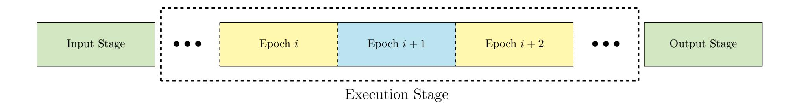
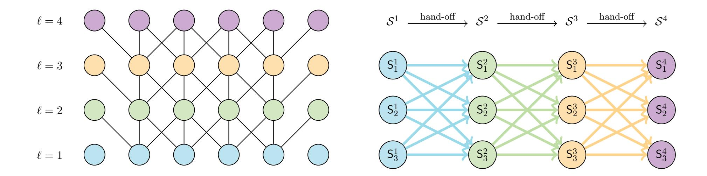
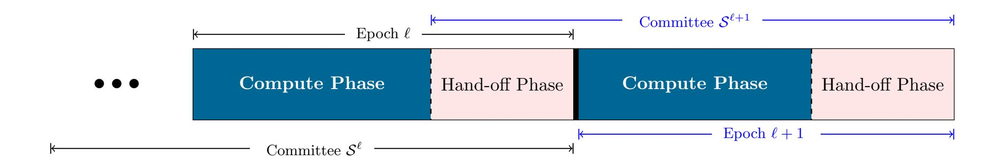
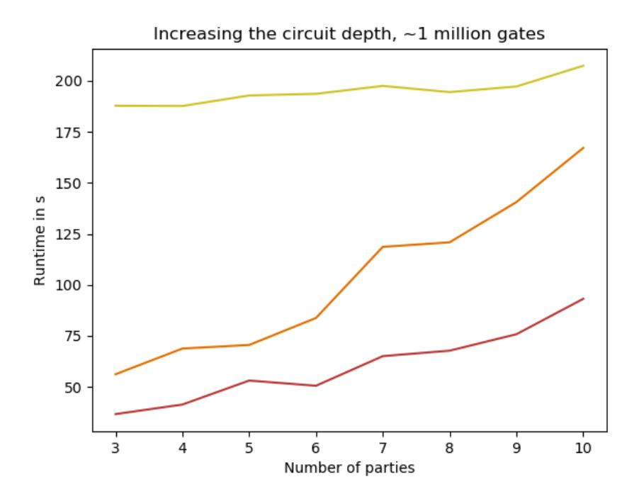

{0}------------------------------------------------

# Fluid MPC: Secure Multiparty Computation with Dynamic Participants

Arka Rai Choudhuri1 , Aarushi Goel1 , Matthew Green1 , Abhishek Jain1 , and Gabriel Kaptchuk2

1Johns Hopkins University , {achoud,aarushig,mgreen,abhishek}@cs.jhu.edu 2Boston University , kaptchuk@bu.edu

#### Abstract

Existing approaches to secure multiparty computation (MPC) require all participants to commit to the entire duration of the protocol. As interest in MPC continues to grow, it is inevitable that there will be a desire to use it to evaluate increasingly complex functionalities, resulting in computations spanning several hours or days.

Such scenarios call for a dynamic participation model for MPC where participants have the flexibility to go offline as needed and (re)join when they have available computational resources. Such a model would also democratize access to privacy-preserving computation by facilitating an "MPC-as-a-service" paradigm — the deployment of MPC in volunteer-operated networks (such as blockchains, where dynamism is inherent) that perform computation on behalf of clients.

In this work, we initiate the study of fluid MPC, where parties can dynamically join and leave the computation. The minimum commitment required from each participant is referred to as fluidity, measured in the number of rounds of communication that it must stay online. Our contributions are threefold:

- We provide a formal treatment of fluid MPC, exploring various possible modeling choices.
- We construct information-theoretic fluid MPC protocols in the honest-majority setting. Our protocols achieve maximal fluidity, meaning that a party can exit the computation after receiving and sending messages in one round.
- We implement our protocol and test it in multiple network settings.

{1}------------------------------------------------

# Contents

| 1 |                                                                    | Introduction |          |  |  |  |  |  |  |  |  |  |
|---|--------------------------------------------------------------------|--------------|----------|--|--|--|--|--|--|--|--|--|
|   | 1.1 Our Contributions                                        |              | 5        |  |  |  |  |  |  |  |  |  |
|   | 1.2 Future Directions                                        |              | 6        |  |  |  |  |  |  |  |  |  |
|   | 1.3 Related Work                                             |              | 7        |  |  |  |  |  |  |  |  |  |
| 2 | Technical Overview                                                 |              |          |  |  |  |  |  |  |  |  |  |
|   | 2.1 Main Challenges                                          |              | 9        |  |  |  |  |  |  |  |  |  |
|   | 2.2 Adapting Optimized Semi-honest BGW [GRR98] to Fluid MPC  |              | 9        |  |  |  |  |  |  |  |  |  |
|   | 2.3 Compiler for Malicious Security                          |              | 11       |  |  |  |  |  |  |  |  |  |
| 3 | Fluid MPC                                                          |              |          |  |  |  |  |  |  |  |  |  |
|   | 3.1 Modeling Dynamic Computation                             |              | 15       |  |  |  |  |  |  |  |  |  |
|   | 3.2 Committees                                               |              | 16       |  |  |  |  |  |  |  |  |  |
|   | 3.3 Security                                                 |              | 18       |  |  |  |  |  |  |  |  |  |
| 4 | Preliminaries                                                      |              |          |  |  |  |  |  |  |  |  |  |
|   | 4.1 Threshold Secret Sharing                                 |              | 24 24 |  |  |  |  |  |  |  |  |  |
|   | 4.2 Layered Circuits                                         |              | 26       |  |  |  |  |  |  |  |  |  |
| 5 | Roadmap to Our Results                                             |              |          |  |  |  |  |  |  |  |  |  |
|   |                                                                    |              |          |  |  |  |  |  |  |  |  |  |
| 6 | Additive Attack Paradigm in Fluid MPC                              |              | 28       |  |  |  |  |  |  |  |  |  |
|   | 6.1 Linear-Based Fluid MPC Protocols                         |              | 29       |  |  |  |  |  |  |  |  |  |
|   | 6.2 Weak Privacy and Security up to Additive Attacks         |              | 32       |  |  |  |  |  |  |  |  |  |
| 7 | Malicious Security Compiler for Fluid MPC                          |              | 33       |  |  |  |  |  |  |  |  |  |
|   | 7.1 Robust Circuit                                           |              | 34       |  |  |  |  |  |  |  |  |  |
|   | 7.2 Maliciously Secure Fluid MPC                             |              | 36       |  |  |  |  |  |  |  |  |  |
|   | 7.2.1 Checking Equality to Zero                              |              | 36       |  |  |  |  |  |  |  |  |  |
|   | 7.2.2 Compiled Protocol                                      |              | 37       |  |  |  |  |  |  |  |  |  |
| 8 | Weakly Private Fluid MPC                                           |              | 38       |  |  |  |  |  |  |  |  |  |
|   | 8.1 Linear Protocols                                         |              | 38       |  |  |  |  |  |  |  |  |  |
|   | 8.2 Proof of Weak Privacy                                    |              | 39       |  |  |  |  |  |  |  |  |  |
| 9 | Implementation and Evaluation                                      |              | 41       |  |  |  |  |  |  |  |  |  |
|   | 9.1 Evaluation                                               |              | 42       |  |  |  |  |  |  |  |  |  |
| A | Proof of Theorem 2                                              |              | 48       |  |  |  |  |  |  |  |  |  |

{2}------------------------------------------------

# 1 Introduction

Secure multiparty computation (MPC) [\[Yao86,](#page-47-1) [GMW87,](#page-45-1) [BGW88,](#page-43-0) [CCD88\]](#page-43-1) allows a group of parties to jointly compute a function while preserving the confidentiality of their inputs. The increasing practicality of MPC protocols has recently spurred demand for its use in a wide variety of contexts such as studying the wage gap in Boston [\[LVB](#page-46-0)+16] and student success [\[BKK](#page-43-2)+16].

Given the increasing popularity of MPC, it is inevitable that more ambitious applications will be explored in the near future — like complex simulations on secret initial conditions or training machine learning algorithms on massive, distributed datasets. Because the circuit representations of these functionalities can be extremely deep, evaluating them could take several hours or even days, even with highly efficient MPC protocols. While MPC has been studied in a variety of settings over the years, nearly all previous work considers static participants who must commit to participating for the entire duration of the computation. However, this requirement may not be reasonable for large, long duration computations such as above because the participants may be limited in their computational resources or in the amount of time that they can devote to the computation at a stretch. Indeed, during such a long period, it is more realistic to expect that some participants may go offline either to perform other duties (or undergo maintenance), or due to connectivity problems.

To accommodate increasingly complex applications and participation from parties with fewer computational resources, MPC protocols must be designed to support flexibility. In this work, we formalize the study of MPC protocols that can support dynamic participation – where parties can join and leave the computation without interrupting the protocol. Not only would this remove the need for parties to commit to entire long running computations, but it would also allow fresh parties to join midway through, shepherding the computation to its end. It would also reduce reliance on parties with very large computational resources, by enabling parties with low resources to contribute in long computations. This would effectively yield a weighted, privacy preserving, distributed computing system.

Highly dynamic computational settings have already started to appear in practice, e.g. Bitcoin [\[Nak08\]](#page-46-1), Ethereum [B +[14\]](#page-43-3), and TOR [\[DMS04\]](#page-44-0). These networks are powered by volunteer nodes that are free to come and go as they please, a model that has proven to be wildly successful. Designing networks to accommodate high churn rates means that anyone can participate in the protocol, no matter their computational power or availability. Building MPC protocols that are amenable to this setting would be an important step towards replicating the success of these networks. This would allow the creation of volunteer networks capable of private computation, creating an "MPC-as-a-service" [\[BHKL18\]](#page-43-4) system and democratizing access to privacy preserving computation.

Fluid MPC. To bring MPC to highly dynamic settings, we formalize the study of fluid MPC. Consider a group of clients that wish to compute a function on confidential inputs, but do not have the resources to conduct the full computation themselves. These clients share their inputs in a privacy preserving manner with some initial committee of (volunteer) servers. Once the computation begins, both the clients and the initial servers may exit the protocol execution. Additionally, other servers, even those not present during the input stage, can "sign-up" to join part-way through the protocol execution, and then may later leave before the computation finishes. Informally, the work that these transient servers perform should be proportional only to a fraction of the circuit size, as they are only present for a fraction of the protocol execution. The resulting protocol should still provide the security properties we expect from MPC.

{3}------------------------------------------------

We consider a model in which the computation is divided into an input stage, an execution stage, and an output stage. We illustrate this in Figure [1.](#page-4-1) During the input stage, a set of clients prepare their inputs for computation and hand them over to the first committee of servers. The execution stage is further divided into a sequence of epochs. During each epoch, a committee of servers are responsible for doing some part of the computation, and then the intermediary state of the computation is securely transferred to a new committee. Critically, this work must be independent of the depth of the circuit being computed. Once the full circuit has been evaluated, there is an output stage where the final results are recovered by the clients.

In order to see how well suited a particular protocol is to this dynamic setting, we introduce the notion of fluidity of a protocol. Fluidity captures the minimum commitment required from each server participating in the execution stage, measured in communication rounds. More specifically, fluidity is the number of communication rounds within an epoch.

A protocol with worse fluidity might require that servers remain active to send, receive, or act as passive observers on many rounds of communication. In this sense, MPC protocols designed for static participants have the worst possible fluidity — all participants must remain active throughout the lifetime of the entire protocol. In this work, we focus on protocols with only a single round of communication per epoch, which we say achieve maximal fluidity. Note that such protocols must have no intra-committee communication, as the communication round must be used to transfer state.

Recall that the idea of flexibility is central to the goal of Fluid MPC. Protocols with maximal fluidity give the most flexibility to the servers participating in the protocol. It allows owners of computational resources to contribute spare cycles to MPC during downtime, and a quick exit (without disrupting computation) when they are needed for another, possibly a more important task. Moreover, since one of the motivations behind Fluid MPC is to enable long computations, we require the computation done by the servers in each epoch to be independent of the size of the function/circuit (or at least the depth). The goal of our work is to achieve these two properties simultaneously.

There are several other modeling choices that can significantly impact feasibility and efficiency of a fluid MPC protocol — many of which are non-trivial and unique to this setting. For instance: when and how are the identities of the servers in the committee of a particular epoch fixed? What requirements are there on the churn rate of the system? How does the adversary's corruption model interact with the dynamism of the protocol participants? We have already seen from the extensive literature on consensus networks that different networks make different, reasonable assumptions and arrive at very different protocols.

We discuss these modeling choices and provide a formal treatment of fluid MPC in Section [3.](#page-13-0) For the constructions we give in this work, we assume that the identities of the servers in a committee are made known during the previous epoch.

Applications. We imagine that fluid MPC will be most useful for applications that involve longrunning computations with deep circuits. In such a setting, being able to temporarily enlist dynamic computing resources could facilitate privacy-preserving computations that are difficult or impossible with limited static resources. This model would be especially valuable in scientific computing, where deep circuits are common and resources can be scarce. Consider, for example, an optimization problem with many constraints over distributed medical datasets. Using a fluid MPC protocol makes it more feasible to perform such a computation with limited resources: the privacy provided by MPC can help clear important regulatory or legal impediments that would otherwise prevent

{4}------------------------------------------------

Figure 1: Computation model of fluid MPC. A set of clients initiate the computation with the input stage. During the execution stage, servers come and go, doing small amounts of work during the compute phases and transferring state in the hand-off phase. Finally, once the entire circuit has been evaluated, the output parties recover the outputs during the output stage.

stakeholders from contributing data to the analysis, and a dynamic participation model can allow stakeholders to harness computing resources as they become available.

Prior Work: Player Replaceability. In recent years, the notion of player replaceability has been studied in the context of Byzantine Agreement (BA) [\[Mic17,](#page-46-2) [CM19\]](#page-44-1). These works design BA protocols where after every round, the "current" set of players can be replaced with "new" ones without disrupting the protocol. This idea has been used in the design of blockchains such as Algorand [\[GHM](#page-45-2)+17a], where player replaceability helps mitigate targeted attacks on chosen participants after their identity is revealed.

Our work can be viewed as extending this line of research to the setting of MPC. We note that unlike BA where the parties have no private states – and hence, do not require state transfer for achieving player replaceability – the MPC setting necessitates a state transfer step to accommodate player churn. Maximal fluidity captures the best possible scenario where this process is performed in a single round.

## 1.1 Our Contributions

In this work, we initiate the study of fluid MPC. We state our contributions below.

Model. We provide a formal treatment of fluid MPC, exploring possible modeling choices in the setting of dynamic participants.

Protocols With Maximal Fluidity. We construct information-theoretic fluid MPC protocols that achieve maximal fluidity. We consider adversaries that (adaptively) corrupt any minority of the servers in each committee.

We begin by observing that the protocol by Genarro, Rabin and Rabin [\[GRR98\]](#page-45-0), which is an optimized version of the classical semi-honest BGW protocol [\[BGW88\]](#page-43-0) can be adapted to the fluid MPC setting in a surprisingly simple manner. We call this protocol Fluid-BGW. This protocol also achieves division of work, in the sense that the amount of work that each committee is required to do is independent of the depth of the circuit.

To achieve security against malicious adversaries, we extend the "additive attack" paradigm of [\[GIP](#page-45-3)+14] to the fluid MPC setting, showing that any malicious adversarial strategy on semihonest fluid MPC protocols (with a specific structure and satisfying a weak notion of privacy against malicious adversaries[1](#page-4-2) ) is limited to injecting additive values on the intermediate wires of

1 It was observed in [\[GIP](#page-45-3)+14] that almost all known secret sharing based semi-honest protocols in the static model

{5}------------------------------------------------

the circuit. We use this observation to build an efficient compiler (in a similar vein as recent works of [\[CGH](#page-44-2)+18, [NV18\]](#page-46-3)) that transforms such semi-honest fluid MPC protocols into ones that achieve security with abort against malicious adversaries. Our compiler enjoys two salient properties:

- It preserves fluidity of the underlying semi-honest protocol.
- It incurs a multiplicative overhead of only 2 (for circuits over large fields) in the communication complexity of the underlying protocol.

Applying our compiler to Fluid-BGW yields a maximally fluid MPC protocol that achieves security with abort against malicious adversaries.

We note that, while we consider a slightly restrictive setting where the adversary is limited to corrupting a minority of servers in each committee, there is evidence that our assumption might hold in practice if we, e.g., leverage certain blockchains. The work of [\[BGG](#page-43-5)+20] (see also [\[GHM](#page-45-4)+20]) explores a similar problem of dynamism in the context of secret-sharing with a similar honest-majority assumption as in our work. They show that in certain blockchain networks, it is possible to leverage the honest-majority style assumption (which is crucial to the security of such blockchains) to elect committees of servers with an honest majority of parties. The same mechanism can also be used in our work (we discuss this in more detail in Section [3.2\)](#page-15-0). Moreover, the honest majority assumption is necessary for achieving information-theoretic security (or for using assumptions weaker than oblivious transfer), for the same reasons as in standard (static) MPC.

Implementation. We implement Fluid-BGW and our malicious compiler in C++, building off the code-base of [\[Cry19,](#page-44-3) [CGH](#page-44-2)+18]. We run our implementation across multiple network settings and give concrete measurements. We discuss results from our implementation in the supplementary material (Section [9\)](#page-40-0).

## 1.2 Future Directions

In this work we take the first steps towards designing MPC protocols with dynamic participation. We envision a host of interesting problems in this area that are yet to be tackled. Here we provide a brief, non-exhaustive list of some natural problems.

Efficiency. In this work, we build a malicious security compiler that preserves the fluidity of the underlying semi-honest protocol while incurring only a small constant multiplicative overhead. This means that future designs of concretely efficient fluid MPC protocols only need to focus on semi-honest security.

Our construction of semi-honest fluid MPC is based on the classical BGW protocol which performs worse than best known concretely efficient semi-honest MPC protocols such as [\[DN07\]](#page-44-4). However, these protocols use amortization techniques that inherently require the parties to keep large private states (proportional to circuit size). As we discuss in Section [2,](#page-7-0) this is problematic in the fluid MPC setting. As such, constructing more efficient semi-honest fluid MPC protocols for general computations is an interesting problem for future work.

naturally satisfy this weak privacy property. We observe that the fluid version of BGW continues to satisfy this property. Further, we conjecture that most secret-sharing based approaches in the fluid MPC setting would also yield semi-honest protocols that achieve this property.

{6}------------------------------------------------

Security. In this work, we consider an honest majority model in which the adversary is limited to corrupting a minority of servers in each committee. A natural question is whether it is possible to construct fluid MPC protocols in the more challenging setting where an adversary can corrupt more than half of the servers in some or potentially all of the committees.

In the present work, we only focus on achieving security with abort. While there exist settings where inducing abort might be catastrophic, our motivating applications, like scientific computing, are ones in which there is little to be gained from aborting a computation. Although it would be frustrating to end such a computation with failure, this is mainly an inconvenience. Ensuring that it is hard for malicious parties to violate privacy, on the other hand, is critical, for which security with abort is sufficient. However, for other applications, it would be interesting to design a Fluid MPC protocol that achieves guaranteed output delivery in a possibly weaker model than ours. Known techniques in the literature used for guaranteed output delivery do not seem to be compatible with our specific model.

Other Models. In this work, we put forth an initial, and in our eyes, natural model for fluid MPC. As we discuss in Section [3,](#page-13-0) there are a plethora of modeling choices that arise in this setting; exploring them remains an interesting avenue for future research.

## 1.3 Related Work

Proactive Multiparty Computation. The proactive security model, first introduced in [\[OY91\]](#page-46-4), aims to model the persistent corruption of parties in a distributed computation, and the continuous race between parties for corruption and recovery. To capture this, the model defines a "mobile" adversary that is not restricted in the total number of corruptions, but can corrupt a subset of parties in different time periods, and the parties periodically reboot to a clean state to mitigate the total number of corruptions. Prior works have investigated the feasibility of proactive security both in the context of secret sharing [\[HJKY95,](#page-46-5) [MZW](#page-46-6)+19] and general multiparty computation [\[OY91,](#page-46-4) [BELO14,](#page-43-6) [EOPY18\]](#page-44-5).

While both fluid MPC and Proactive MPC (PMPC) consider dynamic models, the motivation behind the two models are completely different. This in turn leads to different modeling choices. Indeed, the dynamic model in PMPC considers slow-moving adversaries, modeling a spreading computer virus where the set of participants are fixed through the duration of the protocol. This is in contrast to the Fluid MPC model where the dynamism is derived from participants leaving and joining the protocol execution as desired. As such, the primary objective of our work is to construct protocols that have maximal fluidity while simultaneously minimizing the computational complexity in each epoch. Neither of these goals are a consideration for protocols in the PMPC setting. Furthermore, unlike PMPC, fluid MPC captures the notion of volunteer servers that signup for computation proportional to the computational resources available to them.

The difference in motivation highlighted above also presents different constraints in protocol design. For instance, unlike PMPC, the size of private states of parties is a key consideration in the design of fluid MPC; we discuss this further in Section [2.](#page-7-0) We do note, however, that some ideas from the PMPC setting, such as state re-randomization are relevant in our setting as well.

Transferable MPC. In [\[CH14\]](#page-44-6), Clark and Hopkinson consider a notion of Transferable MPC (T-MPC) where parties compute partial outputs of their inputs and transfer these shares to other parties to continue computation while maintaining privacy. Unlike our setting, the sequence of transfers, and the computation at each step is determined completely by the circuit structure. 

{7}------------------------------------------------

In the constructed protocol, each partial computation involves multiple rounds of interaction and therefore does not achieve fluidity; additionally parties cannot leave during computation sacrificing on dynamism.

Concurrent and Independent Work. Two independent and concurrent works [\[GKM](#page-45-5)+20, [BGG](#page-43-5)+20] that recently appeared on ePrint Archive also model dynamic computing environments by considering protocols that progress in discrete stages denoted as epochs, which are further divided into computation and hand-off phases. These works study and design secret sharing protocols in the dynamic environment. In contrast, our work focuses on the broader goal of multi-party computation protocols for all functionalities.

Furthermore, we focus on building protocols that achieve maximal fluidity. While this goal is not considered in [\[GKM](#page-45-5)+20], [\[BGG](#page-43-5)+20] can be seen as achieving maximal fluidity for secret sharing. In choosing committees for each epoch, [\[GKM](#page-45-5)+20] consider an approach similar to ours where the committee is announced at the start of the hand-off phase of each epoch. [\[BGG](#page-43-5)+20] leverage properties in the blockchain to implement a committee selection procedure that ensures an honest majority in each committee.

Lastly, both of these works consider a security model incomparable to ours. Specifically, they consider security with guaranteed output delivery for secret sharing against computationally bounded adversaries, whereas we consider MPC with security with abort against computationally unbounded adversaries.

Malicious Security Compilers for MPC. There has been a recent line of exciting work [\[CGH](#page-44-2)+18, [NV18,](#page-46-3) [LN17,](#page-46-7) [ABF](#page-42-0)+17, [AFL](#page-43-7)+16, [MRZ15,](#page-46-8) [IKHC14,](#page-46-9) [FL19\]](#page-44-7) in designing concretely efficient compiler that upgrade security from semi-honest to malicious in the honest majority setting. Some of these compilers rely on the additive attack paradigm introduced in [\[GIP](#page-45-3)+14]. We take a similar approach, but adapt and extend the additive attack paradigm to the fluid MPC setting.

# 2 Technical Overview

We start by briefly discussing some specifics of the model in which we will present our construction. A detailed formal description of our model is provided in Section [3.](#page-13-0)

As discussed earlier, we consider a client-server model where computation proceeds in three phases – input stage, execution stage and output stage (see Figure [1\)](#page-4-1). The execution stage proceeds in epochs, where different committees of servers perform the computation. Each epoch ` is further divided into two phases: (1) computation phase, where the servers in the committee (denoted as S ` ) perform computation, and (2) hand-off phase, where the servers in S ` transfer their states to the incoming committee S `+1. Because our goal is to divide the work of the protocol, we impose the efficiency requirement that the computation and communication of each epoch is independent of the depth of the circuit. In order to facilitate the smooth transition of protocol state, we require that at the start of the hand-off phase of epoch `, everyone is aware of committee S `+1. We consider security in the presence of an adversary who can corrupt a minority of servers in every committee.

For the remainder of the technical overview, we describe our ideas for the simplified case where all the committees are disjoint and the size of the committees remain the same across all epochs, denoted as n. Neither of these restrictions are necessary for our protocols, and we refer the reader to the technical sections for further details.

{8}------------------------------------------------

#### 2.1 Main Challenges

Designing protocols that are well suited to the fluid MPC setting requires overcoming challenges that are not standard in the static setting. While some of these challenges have been considered previously in isolation in other contexts, the main difficulty is in addressing them at the same time.

- 1. Fluidity. The primary focus of our work is the fluidity of protocols, a measure of how long the servers must remain online in order to contribute to the computation. The fluidity of a protocol is the number of rounds of interaction in a single epoch, and we say that a protocol achieves maximal fluidity if there is only a single round in each epoch. Designing protocols with maximal fluidity means that the computation phase of an epoch must be "silent" (i.e., non-interactive), and the hand-off phase must complete in a single round.
- 2. Small State Complexity. In many classical MPC protocols, the private state held by each party is quite large, often proportional to the size of the circuit (see, e.g. [\[DN07\]](#page-44-4)). We refer to this as the state complexity of the protocol. While state complexity is generally not considered an important measure of a protocol's efficiency, in the fluid MPC setting it takes on new importance. Because the state held by the servers must be transferred between epochs, the state complexity of a protocol contributes directly to its communication complexity. Protocols with large state complexity, say proportional to the size of the circuit, would require each committee to perform a large amount of work, violating our efficiency requirements. Therefore, special attention must be paid to minimize the state complexity of the protocol in the fluid MPC setting.
- 3. Secure State Transfer. As mentioned earlier, we consider adversaries that can corrupt a minority of servers in every committee. As such, state cannot be naively handed off between committees in a one-to-one manner. To illustrate why this is true, consider secret sharing based protocols where the players collectively hold a t-out-of-n secret sharing of the wire values and iteratively compute on these shares. If states were transferred by having each server in committee S i choose a unique server in S i+1 (as noted, we assume for convenience that |Si | = |Si+1|) and simply sending that new server their state, the adversary would see 2t shares of the transferred state, t shares from S i and another t shares from S i+1, thus breaking the privacy of the protocol. Fluid MPC protocols must therefore incorporate mechanisms to securely transfer the protocol state between committees.

In this work, we focus our attention on protocols that achieve maximal fluidity. Designing such protocols requires careful balancing between these three factors. In particular, the need for small state complexity makes it difficult to use many of the efficient MPC techniques known in the literature, as we will discuss in more detail below.

# 2.2 Adapting Optimized Semi-honest BGW [\[GRR98\]](#page-45-0) to Fluid MPC

Despite the challenges involved in the design of fluid MPC protocols, we observe that the protocol by Gennaro et al. [\[GRR98\]](#page-45-0), which is an optimized version of the semi-honest BGW [\[BGW88\]](#page-43-0) protocol can be adapted to the fluid MPC setting in a surprisingly simple manner.

Recall that in [\[GRR98\]](#page-45-0), the parties collectively compute over an arithmetic circuit representation of the functionality that they wish to compute, using Shamir's secret sharing scheme. For each intermediate wire in the circuit, the following invariant is maintained: the shares held by the parties

{9}------------------------------------------------

Figure 2: **Left:** Part of the circuit partitioned into different layers, indicated by the different colors. **Right:** A visual representation of the flow of information during the modified version of BGW presented in Section 2.2, running with committees of size 3, which achieves maximal fluidity.  $S^{\ell} = \{S_1^{\ell}, S_2^{\ell}, S_3^{\ell}, \}$  denotes the set of active servers in each committee corresponding to level  $\ell$ , indicated by the same color.

correspond to a t-of-n secret sharing of the value induced by the inputs on that wire. Evaluating addition gates requires the parties to simply add their shares of the incoming wires, leveraging the linearity of the secret sharing scheme. For evaluating multiplication gates, the parties first locally multiply their shares of the incoming wires, resulting in a distributed degree 2t polynomial encoding of the value induced on the output wire of the gate. Then, each party computes a fresh t-out-of-n sharing of this degree 2t share and sends one of these share-of-share to every other party. Finally, the parties locally interpolate these received shares and as a result, all the parties hold a t-out-of-n sharing of the product. Thus, every multiplication gate requires only one round of communication.

We observe that adapting this version of semi-honest BGW to fluid MPC setting, which we will refer to as Fluid-BGW, is straightforward. The key observation is that the degree reduction procedure of this protocol *simultaneously* re-randomizes the state, so that only a *single round of communication* is required to accomplish both goals. In each epoch, the servers will evaluate all the gates in a *single layer* of the circuit, which may contain both addition and multiplication gates (see Figure 2). More specifically, for each epoch  $\ell$ :

Computation Phase: The servers in  $S^{\ell}$  interpolate the shares-of-shares (received from the previous committee) to obtain a degree t sharing for full intermediary state (for each gate in that layer). Then, they locally evaluate each gate in layer  $\ell$ , possibly increasing the degree of the shares that they hold. Finally, they compute a t-out-of-n secret sharing of the entire state they hold, including multiplied shares, added shares and any "old" values that may be needed later in the circuit.

**Hand-off Phase:** The servers in  $S^{\ell}$  then send one share of each sharing to each active server in  $S^{\ell+1}$ .

The computation phase is non-interactive and the hand-off phase consists of only a single round of communication, and therefore the above protocol achieves maximal fluidity.

Recall that we consider adversaries who can corrupt a minority of t servers in each committee, a significant departure from the classical setting in which a total of t parties can be corrupted. At first glance, it may seem as though the adversary can gain significant advantage by corrupting

{10}------------------------------------------------

(say) the first t parties in committee S ` and the last t parties in committee S `+1. However, since computing shares-of-shares essentially re-randomizes the state, at the end of the hand-off phase of epoch `, the adversary is aware of the (1) nt shares-of-shares that were sent to the last t corrupt servers during the hand-off phase of epoch ` and (2) (n − t) × t shares-of-shares that the first t corrupt servers in S ` sent to the (n − t) honest servers in S `+1. This is in fact no different than regular BGW. Since the partial information that the adversary has about the states of the (n − t) honest servers in S `+1 only corresponds to t shares of their individual states, privacy is ensured.

## 2.3 Compiler for Malicious Security

Having established the feasibility of semi-honest MPC with maximal fluidity, we now describe our ideas for transforming semi-honest fluid MPC protocols into ones that achieve security against malicious adversaries. Our goal is to achieve two salient properties: (1) fluidity preservation, i.e., preserve the fluidity of the underlying protocol, (2) multiplicative overhead of 2 in the complexity of the underlying protocol.

Shortcomings of Natural Solutions. Consider a natural way of achieving malicious security: after each gate evaluation, the servers perform a check that the gate was properly evaluated, as is done in the malicious-secure version of BGW [\[BGW88\]](#page-43-0). However, known techniques for implementing gate-by-gate checks rely on primitives such as verifiable secret sharing (among others) that require additional interaction between the parties. Such a strategy is therefore incompatible with our goal of achieving maximal fluidity, which requires a single round hand-off phase.

Starting Idea: Consolidated Checks. Since performing gate-by-gate checks is not well-suited to fluid MPC, we consider a consolidated check approach to malicious security, where the correctness of the computation (of the entire circuit) is checked once. This approach has previously been studied in the design of efficient MPC protocols [\[DPSZ12,](#page-44-8) [GIP](#page-45-3)+14, [GIP15,](#page-45-6) [NV18,](#page-46-3) [CGH](#page-44-2)+18, [FL19,](#page-44-7) [GSZ20\]](#page-46-10). In this line of work, [\[GIP](#page-45-3)+14] made an important observation, that linear-based MPC protocols (a natural class of semi-honest honest-majority MPC protocols) are secure up to additive attacks, meaning any strategy followed by a malicious adversary is equivalent to injecting an additive error on each wire in the circuit. They use this observation to first compile the circuit into another circuit that automatically detects errors, e.g., AMD circuits and then run a semi-honest protocol on this modified circuit to get malicious security. Many other works [\[GIP15,](#page-45-6) [GIW16\]](#page-45-7) follow suit.

Assuming that the same observation caries over to the fluid MPC setting, for feasibility, one could consider running a semi-honest, maximally fluid MPC protocol on such transformed circuits. However, transforming a circuit into an AMD circuit incurs very high overhead in practice. In order to design a more efficient compiler that only incurs an overhead of 2, we turn towards the approach taken by some of the more recent malicious security compilers [\[NV18,](#page-46-3) [CGH](#page-44-2)+18, [FL19,](#page-44-7) [GSZ20\]](#page-46-10). In some sense, the ideas used in these works can be viewed as a more efficient implementation of the same idea as above (without using AMD circuits).

Roughly speaking, in the approach taken by these recent compilers, for every shared wire value z in the circuit, the parties also compute a secret sharing of a MAC on z. At the end of the protocol, the parties verify validity of all the MACs in one shot. Given the observation from [\[GIP](#page-45-3)+14], it is easy to see that the parties can generate a single, secret MAC key r at the beginning of the protocol and compute MAC(r, z) = rz for each wire z in the circuit. It holds that if the adversary injects an additive error δ on the wire value z, to surpass the check, they must inject a corresponding additive error of ˆδ = rδ on the MAC. Because r is uniformly distributed and unknown to all servers, this 

{11}------------------------------------------------

can only happen with probability negligible in the field size. While previously, this approach has primarily been used for improving the efficiency of MPC protocols, we use it in this work for also maximizing fluidity.

Verifying the MACs requires revealing the key r, but this is only done at the end of the protocol, as revealing r too early would allow the adversary to forge MACs. Furthermore, to facilitate efficient MAC verification, the parties finish the protocol with the following "condensed" check: they generate random coefficients  $\alpha_k$  and use them to compute linear combinations of the wire values and MACs as follows:

$$u = \sum_{k \in [|C|]} \alpha_k \cdot z_k$$
 and  $v = \sum_{k \in [|C|]} \alpha_k \cdot rz_k$ .

Finally, they reconstruct the key r and interactively verify if v = ru, before revealing the output shares.

To build on this approach, we first need to show that linear-based fluid MPC protocols are also secure up to additive attacks against malicious adversaries. We prove this to be true in Section 6and show that the semi-honest Fluid-BGW satisfies the structural requirement of linear-based fluid MPC protocols. At first glance, it would appear that we can then directly implement the above mechanism to the fluid MPC setting as follows: in the output stage, parties interactively generate shares of  $\alpha_k$ , locally compute this linear combination, reconstruct r, and perform the equality check.

To see where this approach falls short, consider the state complexity of this protocol. To perform the consolidated check, parties in the output stage require shares of all wires in the circuit, namely  $z_k$  and  $rz_k$  for  $k \in [|C|]$ , which must have been passed along as part of the state between each consecutive pair of committees. This means that the state complexity of the protocol is proportional to the size of the circuit, which (as discussed earlier) would undermine the advantages of the fluid MPC model. More concretely, this approach would incur at least |C| multiplicative overhead in the communication of the underlying protocol – far higher than our goal of achieving constant overhead.

Incrementally Computing Linear Combination. In order to implement the above consolidated check approach in the fluid MPC setting, we require a method for computing the aforementioned aggregated values that does not require access to the entire intermediate computation during the output stage. Towards this, we observe that the servers can incrementally compute u and v throughout the protocol. This can be done by having each committee incorporate the part of u and v corresponding to the gates evaluated by the previous committee into the partial sum. That is, committee  $S^{\ell}$  is responsible for (1) evaluating the gates on layer  $\ell$ , (2) computing the MACs for gates on layer  $\ell$ , and (3) computing the partial linear combination for all the gates before layer  $\ell - 1$ .

Let the output of the  $k^{\text{th}}$  gate on the  $i^{\text{th}}$  layer of the circuit be denoted as  $z_k^i$ . Apart from the shares of  $z_k^{\ell-1}$  and  $rz_k^{\ell-1}$  (for  $k \in [w]$ ), the servers computing layer  $\ell$  of the circuit  $\mathcal{S}^{\ell}$  also receive shares of

$$u_{\ell-2} = \sum_{i \le \ell-2} \sum_{k \in [w]} \alpha_k^i \cdot z_k^i \text{ and } v_{\ell-2} = \sum_{i \le \ell-2} \sum_{k \in [w]} \alpha_k^i \cdot r z_k^i$$

from  $\mathcal{S}^{\ell-1}$  during hand-off, where  $\alpha_k^i$  is a random value associated with the gate outputting  $z_k^i$ . While  $u_{\ell-2}$  and  $v_{\ell-2}$  represent the consolidated check for all gates in the circuit before layer  $\ell-1$ .

{12}------------------------------------------------

 $\mathcal{S}^{\ell}$  then computes shares of

$$u_{\ell-1} = u_{\ell-2} + \sum_{k \in [w]} \alpha_k^{\ell-1} \cdot z_k^{\ell-1} \text{ and } v_{\ell-1} = v_{\ell-2} + \sum_{k \in [w]} \alpha_k^{\ell-1} \cdot r z_k^{\ell-1}$$

in addition to shares of the outputs of gates on layer  $\ell$  ( $z_k^{\ell}$  and  $rz_k^{\ell}$ ) and transfer  $u_{\ell-1}$  and  $v_{\ell-1}$  to  $\mathcal{S}^{\ell+1}$  during hand-off. Note that the final  $u=u_d$  and  $v=v_d$ , where d is the depth of the circuit. This leaves the following main question: how do the servers agree upon the values of  $\alpha_k^{\ell}$ ?

Notice that  $|\{\alpha_k^\ell\}_{k\in[w],\ell\in[d]}| = |C|$ , therefore generating shares of all the  $\alpha_k^\ell$  values at the beginning of the protocol and passing them forward will, again, yield a protocol that has an excessively large state complexity. Another natural solution might be to have the servers generate  $\alpha_k^\ell$  as and when they need them. However, because our goal is to maintain maximal fluidity, the servers in  $\mathcal{S}^j$  for some fixed j cannot generate  $\alpha_k^j$ , as this would require communication within  $\mathcal{S}^j$ .

Instead, consider a protocol in which the servers in  $\mathcal{S}^{j-1}$  do the work of generating the shares of  $\alpha_k^j$ . Each server in  $\mathcal{S}^{j-1}$  generates a random value and shares it, sending one share to each server in  $\mathcal{S}^j$ . The servers in  $\mathcal{S}^j$  then combine these shares using a Vandermonde matrix to get correct shares of  $\alpha_k^j$ , as suggested by [BTH06]. While this approach achieves maximal fluidity and requires a small state complexity, it incurs a multiplicative overhead of n in the complexity of the underlying semi-honest protocol.2

Efficient Compiler. We now describe our ideas for achieving multiplicative overhead of only 2 (for circuits over large fields). In our compiler, we use the above intuition, having each committee, evaluate gates for its layer, compute MACs for the previous layer, and incrementally add to the sum. In the input stage, the clients generate a sharing of a secret random MAC key r, and secret random values  $\beta, \alpha_1, \ldots, \alpha_w$ . Over the course of the protocol, the servers will incrementally compute values

$$u = \sum_{\ell \in [d]} \sum_{k \in [w]} (\alpha_k(\beta)^{\ell}) \cdot z_k^{\ell} \text{ and } v = \sum_{\ell \in [d]} \sum_{k \in [w]} (\alpha_k(\beta)^{\ell}) \cdot r z_k^{\ell}$$

where  $z_k^{\ell}$  is the output of the  $k^{th}$  gate on level  $\ell$ ,  $(\beta)^{\ell}$  is  $\beta$  raised to the  $\ell^{th}$  power, and  $\alpha_k(\beta)^{\ell}$  is the "random" coefficient associated with it. At the end of the protocol, the parties verify whether v = ru.

Notice that at the beginning of the execution stage, the servers do not have shares of  $(\alpha_k(\beta)^{\ell})$  for  $\ell > 0$ , but they have the necessary information to compute a valid sharing of this coefficient in parallel with the normal computation, namely  $\beta, \alpha_1, \ldots, \alpha_w$ . To compute the coefficients, we require that the servers computing layer  $\ell$  are given shares of  $(\alpha_k(\beta)^{\ell-1})$  and  $\beta$  by the previous set of servers, in addition to the shares of the actual wire values. The servers in  $\mathcal{S}^{\ell}$  then use these shares to compute shares of (1) the values  $z_k^{\ell}$  on outgoing wires from the gates on layer  $\ell$ , (2) the partial sums by adding the values computed in the previous layer  $u_{\ell-1} = u_{\ell-2} + (\alpha_k(\beta)^{\ell-1}) \cdot z_k^{\ell-1}$  and  $v_{\ell-1} = v_{\ell-2} + (\alpha_k(\beta)^{\ell-1}) \cdot r z_k^{\ell-1}$ , and (3) the coefficients for the next layer  $(\alpha_k(\beta)^{\ell}) = \beta \cdot \alpha_k(\beta)^{\ell-1}$ . All of this information can be securely transferred to the next committee.

We give a simplified sketch to illustrate why this check is sufficient. Let  $\epsilon_{z,k}^{\ell}$  (and  $\epsilon_{rz,k}^{\ell}$  resp.) be the additive error introduced by the adversary on the computation of  $z_k^{\ell}$  ( $rz_k^{\ell}$  resp.).

&lt;sup>2In the static setting, this technique allows for batched randomness generation, by generating O(n) sharings with  $O(n^2)$  messages. In the fluid MPC setting, however, the number of servers *cannot* be known in advance and may not correspond to the width of the circuit. Therefore, such amortization techniques are not applicable.

{13}------------------------------------------------

As before, the check succeeds if

$$r \cdot \sum_{\ell \in [d]} \sum_{k \in [w]} (\alpha_k(\beta)^{\ell}) (z_k^{\ell} + \epsilon_{z,k}^{\ell}) = \sum_{\ell \in [d]} \sum_{k \in [w]} (\alpha_k(\beta)^{\ell}) (r z_k^{\ell} + \epsilon_{rz,k}^{\ell})$$

Let the  $q^{th}$  gate on level m be the first gate where the adversary injects errors  $\epsilon_{z,q}^m$  and  $\epsilon_{rz,q}^m$ . The above equality can be re-written as.

$$\alpha_{q} \left[ \sum_{\ell=m}^{d} ((\beta)^{\ell} \epsilon_{rz,q}^{\ell}) - r \sum_{\ell=m}^{d} ((\beta)^{\ell} \epsilon_{z,q}^{\ell}) \right] = r \cdot \sum_{\ell=m}^{d} \sum_{\substack{k \in [w] \\ k \neq q}} (\alpha_{k}(\beta)^{\ell}) (z_{k}^{\ell} + \epsilon_{z,k}^{\ell}) - \sum_{\ell=m}^{d} \sum_{\substack{k \in [w] \\ k \neq q}} (\alpha_{k}(\beta)^{\ell}) (rz_{k}^{\ell} + \epsilon_{rz,k}^{\ell})$$

This holds only if either (1)  $\sum_{\ell=m}^{d} ((\beta)^{\ell} \epsilon_{z,q}^{\ell}) = 0$  and  $\sum_{\ell=m}^{d} ((\beta)^{\ell} \epsilon_{rz,q}^{\ell}) = 0$ . The key point is that since these are polynomials in  $\beta$  with degree at most d, the probability that  $\beta$  is equal to one of its roots is  $d/|\mathbb{F}|$ . Or if (2)  $r = \sum_{\ell=m}^{d} ((\beta)^{\ell} \epsilon_{rz,q}^{\ell}) (\sum_{\ell=m}^{d} ((\beta)^{\ell} \epsilon_{z,q}^{\ell}))^{-1}$ . Since r is uniformly distributed, this happens only with probability  $1/|\mathbb{F}|$ .

This analysis is significantly simplified for clarity and the full analysis is included in Appendix A . Note that the adversary can inject additive errors on r and  $\beta$ , since these values are also reshared between sets of servers. Also, since the  $\alpha$  values for the gates on level  $\ell>0$  are computed using a multiplication operation, the adversary can potentially inject additive errors on these values as well. However, we observe that the additive errors on the value of  $\beta$  and consequently on the  $\alpha$  values associated with the gates on higher levels, does not hamper the correctness of output. But the errors on the value of r, do need to be taken into consideration. The analysis in the Appendix A addresses how these errors can be handled, making it non-trivial and notationally complicated, but the core intuition remains the same.

We note that we are not the first to consider generating multiple random values by raising a single random value to consecutively larger powers. In particular, [DPSZ12] performs consolidated checks by taking a linear combination of all wire values, the coefficients for which need to be generated securely, i.e. be randomly distributed and authenticated. But this generation is expensive, so they generate a single secure value and derive all other values by raising it to consecutively larger powers. A consequence of this technique is that once the single secure value is revealed, the exponentiations are done locally and therefore precludes any introduction of errors in this computation for the honest parties. Although this technique might seem similar to ours, our specific implementation is different and for a different purpose, namely, achieving maximal fluidity together with small constant multiplicative overhead.

A roadmap to our constructions can be found in Section 5.

## 3 Fluid MPC

In this section, we give a formal treatment of the fluid MPC setting. We start by describing the model of computation and then turn to the task of defining security. Our goals in this section are twofold: first, we illustrate that there are many possible modeling parameters to choose from in the fluid MPC setting. Second, we highlight the modeling choices that we make for the protocols we describe in later sections. Before beginning, we reiterate that the functionalities considered in this setting can be represented by circuits where the depth of such circuits are large.

**Model of Computation.** We consider a *client-server* model of computation where a set of clients  $\mathcal{C}$  want to compute a function over their private inputs. The clients delegate the computation of

{14}------------------------------------------------

the function to a set of servers S. Unlike the traditional client-server model [\[CDI05,](#page-43-9) [DI05,](#page-44-9) [DI06\]](#page-44-10) where every server is required to participate in the entire computation (and hence, remain online for its entire duration), we consider a dynamic model of computation where the servers can volunteer their computational resources for part of the computation and then potentially go offline. That is, the set of servers is not fixed in advance.

We adopt terminology from the execution model used in the context of permissionless blockchains [\[PSs17,](#page-47-2) [PS17,](#page-47-3) [GKL15\]](#page-45-8). The protocol execution is specified by an interactive Turing Machine (ITM) E referred to as the environment. The environment E represents everything that is external to the protocol execution. The environment generates inputs to all the parties, reads all the outputs and additionally can interact in an arbitrary manner with an adversary A during the execution of the protocol.

Protocols in this execution model proceed in rounds, where at the start of each round, the environment E can specify an input to the parties, and receive an output from the corresponding parties at the end of the round. We also allow the environment E to spawn new parties at any point during the protocol. The parties have access to point-to-point and broadcast channels. In addition, we assume fully synchronous message channels, where the adversary does not have control over the delivery of messages. This is the commonly considered setting for MPC protocols.

## 3.1 Modeling Dynamic Computation

In a fluid MPC protocol, computation proceeds in three stages:

Input Stage: In this stage, the environment E hands the input to the clients at the start of the protocol, who then pre-process their inputs and hand them off to the servers for computation.

Execution Stage: This is the main stage of computation where only the servers participate in the computation of the function.

Output Stage: This is the final stage where only the clients participate in order to reconstruct the output of the function. The output is then handed to the environment.

The clients only participate in the input and output stages of the protocol. Consequently, we require that the computational complexity of both the input and the output stages is independent of the depth of the functionality (when represented as a circuit) being computed by the protocol. Indeed, a primary goal of this work is to offload the computation work to the servers and a computation-intensive input/output phase would undermine this goal.

We wish to capture dynamism for the bulk of the computation, and thus model dynamism in the execution stage of the protocol (rather than the input and output stages). In the following, we highlight the key modeling choices for the protocols we present by displaying them in bold font in color.

Epoch. We model the progression of the execution stage in discrete steps referred to as epochs. In each epoch `, only a subset of servers S ` participate in the computation. We refer to this set of servers S ` as the committee for epoch `. An epoch is further divided into two phases, illustrated in Figure [3:](#page-15-1)

Computation Phase: Every epoch begins with a computation phase where the servers in the committee S ` perform computation over their local states, possibly involving multiple rounds of interaction with each other. We require that the computation and communication complexity of an epoch should be independent of the depth of the circuit.

{15}------------------------------------------------

Figure 3: Epochs ` and ` + 1

Functionality fcommittee

Hardcoded: Sampling function Sample : P 7→ P.

- 1. Set P := ∅
- 2. When party Pi sends input nominate, P := P ∪ {Pi}.
- 3. When the environment E sends input elect, compute P 0 ← Sample(P) and broadcast P 0 as the selected committee.

Figure 4: Functionality for Committee Formation.

Hand-off Phase: The epoch then transitions to a hand-off phase where the committee S ` transfers the protocol state to the next committee S `+1. As with the computation phase, this phase may involve multiple rounds of interaction. When this phase is completed, epoch ` + 1 begins.

Fluidity. We define the notion of fluidity to measure the minimum commitment that a server needs to make for participating in the execution stage.

Definition 1 (Fluidity). Fluidity is defined as the number of rounds of interaction within an epoch.

Clearly, the fewer the number rounds in an epoch, the more "fluid" the protocol. We say that a protocol has maximal fluidity when the number of rounds in an epoch is 1. We emphasize that this is only possible when the computation phase of an epoch is completely non-interactive, i.e., the servers only perform local computation on their states without interacting with each other. This is because the hand-off phase must consist of at least one round of communication. In this work, we aim to design protocols with maximal fluidity.

## 3.2 Committees

We now explore modeling choices for committees. We address three key aspects of a committee – its formation, size and possible overlap with other committees. Along the way, we also discuss how long a server needs to remain online.

Committee Formation. From our above discussion on computation progressing in epochs, we consider two choices for committee formation:

{16}------------------------------------------------

Static. In the most restrictive choice, the environment determines right at the start, which servers will participate in the protocol, and the epoch(s) they will be participating in. This in turn determines the committee for every epoch. This means that the servers must commit to their resources ahead of time. We view this choice to be too restrictive and shall not consider it for our model.

On-the-fly. In the other choice, committees are determined dynamically such that committee for epoch ` + 1 is determined and known to everyone at the start of the hand-off phase of epoch `. We consider the functionality fcommittee described in Figure [4](#page-15-2) to capture this setting.

In an epoch `, if the environment E provides input nominate to a party at the start of the round, it relays this message to fcommittee to indicate that it wants to be considered in the committee for epoch ` + 1. The functionality computes the committee using the sampling function Sample, from the set of parties P that have been "nominated." The environment E is also allowed a separate input elect that specifies the cut-off point for the functionality to compute the committee. The cut-off point corresponds to the start of the hand-off phase of epoch ` where the parties in S ` are made aware of the committee S `+1 via a broadcast from fcommittee.

We consider two possible committee choices in this dynamic setting below.

Volunteer Committees. One can view the servers as "volunteers" who sign up to participate in the execution stage whenever they have computational resources available. Essentially anyone, who wants to, can join (up until the cut-off point) in aiding with the computation. This can be implemented by simply setting the sampling function Sample in fcommittee to be the identity function, i.e. a party is included in the committee for epoch ` + 1 if and only if it sent a nominate to fcommittee during the computation phase of epoch `.

Elected Committees. One could envision other sampling functions that implement a selection process using a participation criterion such as the cryptographic sortition [\[GHM](#page-45-2)+17a] considered in the context of proof of stake blockchains. The work of [\[BGG](#page-43-5)+20] considers the function Sample that is additionally parameterized by a probability p; for each party in P, Sample independently flips a coin that outputs 1 with probability p, and only includes the party in the final committee if the corresponding coin toss results in the value 1. To ensure that all parties are considered in the selection process, one can simply require that every party sends a nominate to fcommittee in each epoch. Committee election has also been studied in different network settings; e.g., the recent work of [\[WJS](#page-47-4)+19] provides methods for electing committees over TOR [\[DMS04\]](#page-44-0).

Both of the above choices have direct consequences on the corruption model. The former choice of volunteer committees models protocols that are accessible to anyone who wants to participate. However, an adversary could misuse this accessibility to corrupt a large fraction of (maybe even all) participants of a committee. As such, we view this as an optimistic model since achieving security in this model can require placing severe constraints on the global corruption threshold.

The latter choice of elected committees can, by design, be viewed as a semi-closed system since not everyone who "volunteers" their resources are selected to participate in the computation. However, by using an appropriate sampling function, this selection process can potentially ensure that the number of corruptions in each committee are kept within a desired threshold.

We envision that the choice of the specific model (i.e. the sampling function Sample) is best determined by the environment the protocol is to be deployed in and the corruption threshold 

{17}------------------------------------------------

one is willing to tolerate. (We discuss the latter implication in Section [3.3.](#page-17-0)) Our protocol design is agnostic to this choice and only requires that the committee S ` knows committee S `+1 at the start of the hand-off phase.

Participant Activity. We say that a server is active within an epoch if it either (a) performs some protocol computation, or (b) sends/receives protocol messages. Clearly, a server S is active during epoch ` only if it belongs to S ` ∪ S`+1. When extending this notion to a committee, we say committee S ` is active from the beginning of the hand-off phase in epoch ` − 1 to the end of the hand-off phase in epoch ` (see Figure [3\)](#page-15-1).

We say that a server is "online" if it is active (in the above sense) or simply passively listening to broadcast communication. A protocol may potentially require a server to be online throughout the protocol and keep its local state up-to-date as a function of all the broadcast protocol messages (possibly for participation at a later stage). In such a case, while a server may not be performing active computation throughout the protocol, it would nevertheless have to commit to being present and listening throughout the protocol. To minimize the amount of online time of participants, ideally one would like servers to be online only when active.

Committee Sizes. In view of modeling committee members signing up as and when they have available computational resources, we allow for variable committee sizes in each epoch. This simply follows from allowing the environment E to determine how many parties it provides the nominate input. For simplicity, we describe our protocol in the technical sections for the simplified setting where the committee sizes in each epoch are equal and indicate how it extends to the variable committee size setting. An alternative choice would be to require the committee to have a fixed size, or change sizes at some prescribed rate. These choices might be more reasonable under the requirement that servers announce their committee membership at the start of the protocol.

Committee Overlap. In our envisioned applications, participants with available computational resources will sign up more often to be a part of a committee (see Remark [1\)](#page-17-1). In view of this, we make no restriction on committee overlap, i.e., we allow a server to volunteer to be in multiple epoch committees. As we discuss below, this has some bearing on modeling security for the protocol.

Remark 1 (Weighted Computation.). We note that our model naturally allows for a form of weighted computation, where the amount of work performed by a participant is proportional to its available resources. This is because a participant (i.e., a server) can choose to participate in a number of epochs proportional to its available resources.

#### 3.3 Security

As in traditional MPC, there are various choices for modeling corruption of parties to determine the number of parties that can be corrupted (i.e., honest vs dishonest majority) as well as the time of corruption (i.e., static vs adaptive corruption). The environment E can determine to corrupt a party, and on doing so, hands the local state of the corrupted party to the adversary A. For a semihonest (passive) corruption, A is only able to continue viewing the local state, but for a malicious (active) corruption, A takes full control of the party and instructs its behavior subsequently.

Corruption Threshold. We consider an honest-majority model for fluid MPC where we restrict (A, E) to the setting where the adversary A controls any minority of the clients as well as any minority of servers in every committee in an epoch.

{18}------------------------------------------------

We discuss the impact of the choice of committee formation on corruption threshold:

- Volunteer Committee. In the volunteer setting, ensuring honest majority in each epoch may be difficult; as such we view it as an optimistic model. In the extreme case, honestmajority per epoch can be enforced by assuming the global corruption threshold to be N/2E where E is the total number of epochs and N is the total number of parties across all epochs.
- Elected Committee. In the elected committee model, the committee selection process may enforce an honest majority amongst the selected participants in every epoch. The work of [\[BGG](#page-43-5)+20] enforces this via a cryptographic sortition process in proof-of-stake blockchains where an honest majority of stake is assumed (in fact they require a larger stake fraction to be honest for their committee selection).

An alternative model is where an adversary may control a majority of clients and additionally a majority of servers in one or more epochs. We leave the study of such a model for future work.

Corruption Timing. Given that the protocol progresses in discrete steps, and knowledge of committees may not be known in advance, it is important to model when an adversary can specify the list of corrupted parties. For clients, this is straightforward: we assume that the environment E specifies the list of corrupted clients at the start of the protocol, i.e. we assume static corruption for the clients. Since the servers perform the bulk of the computation, and their participation is already dynamic, there are various considerations for corruption timing. We consider two main aspects below: point of corruption and effect on prior epochs.

Point of corruption: When the committee S ` is determined at the start of hand-off phase of epoch ` − 1, the adversary can specify the corrupted servers from S ` in either:

- 1. a static manner, where the environment E is only allowed to list the set of corrupted servers when the committee S ` is determined; or
- 2. an adaptive manner, where the environment E can corrupt servers in S ` adaptively up until the end of epoch `, i.e. while they are active.

Effect on prior epochs: We consider the effect of the adversary corrupting parties during epoch ` on prior epochs.

1. No retroactive effect: In this setting, the corruption of servers during epoch ` has no bearing on any epoch j < `, i.e. the adversary does not learn any additional information about epoch j at epoch `. This model can be achieved in two ways:

Erasure of states: If servers in S j erase their respective local states at the end of epoch j, then even if the server were to participate in epoch ` (i.e. S j ∩ S` 6= ∅), the adversary would not gain any additional information when the environment E hands over the local state.

Disjoint committees: If the sets of servers in each epoch are disjoint, by corrupting servers in epoch `, the adversary cannot learn anything about prior epochs.

We note that for any protocol that is oblivious to the real identities of the servers (i.e. the protocol doesn't assume any prior state from the servers), the two methods of achieving no retroactive effect, i.e. erasures and disjoint committees are equivalent. This follows from

{19}------------------------------------------------

- the fact that servers do not have to keep state in order to rejoin computation, and therefore from the point of view of the protocol and for all purposes, are equivalent to new servers.[3](#page-19-0)
- 2. Retroactive effect: In this setting, the adversary is allowed limited information from prior epochs. Specifically, when corrupting a server S ∈ S` in epoch `, the adversary learns private states of the server in all prior epochs (if the server has been in a committee before). Therefore, the S is then assumed to have been (passively) corrupt in every epoch j < `. In order to prevent the adversary from arbitrarily learning information about prior epochs, the adversary is limited to corrupting servers in epoch ` as long as corrupting a server S and its retroactive effect of considering S to be corrupted in all prior epochs does not cross the corruption threshold in any epoch.

One could consider models with various combinations of the aforementioned aspects. We will narrow further discussion to two models of the adversary:

Definition 2 (R-adaptive Adversary). We say that the (A, E) results in an R-adaptive adversary A if the environment E can statically corrupt a set T of the clients (at the start of the protocol) and corrupt the servers in an adaptive manner with retroactive effect. Specifically, in epoch `, the environment E can adaptively choose to corrupt a set of servers T ` ⊂ [n` ] from the set S ` , where T ` corresponds to a canonical mapping based on the ordering of servers in S ` . On E corrupting the server, A learns its entire past state and can send messages on its behalf in epoch `. The set of servers that E can corrupt, and its corresponding retroactive effect, will be determined by the corruption threshold τ specifying that ∀`, |T ` | < τ · n` .

Definition 3 (NR-adaptive Adversary). We say that the (A, E) results in an NR-adaptive adversary A if the environment E can statically corrupt a set T of the clients (at the start of the protocol) and corrupt the servers in an adaptive manner with no retroactive effect. The corruption process is similar to the case of R-adaptive adversaries, except that the environment E can corrupt any server in epoch ` as long as the number of corrupted servers in epoch ` are within the corruption threshold. As mentioned earlier, any protocol that achieves security against such an adversary necessarily requires either (a) erasure of state, or (b) disjoint committees.

While our security definition will be general, and encompass both adversarial models, we will consider protocols in the model with R-adaptive adversary.

In the above discussions, we have considered corruptions only when servers are active. One could also consider a seemingly stronger model where the adversary can corrupt servers when they are offline, i.e. no longer active. We remark below that our model already captures offline corruption.

Remark 2 (Offline Corruption). If servers are offline once they are no longer active i.e. they are not passively listening to protocol messages, then offline corruptions in the retroactive effect model is the same as adaptive corruptions during (and until the end of ) the epoch due to the fact that the server's protocol state has not changed since the last time it was active. Going forward, since honest parties do go offline when they are no longer active, we do not specify offline corruptions as they are already captured by our model.

Remark 3 (Un-corrupting parties). It might be desirable to consider a model in which a server is initially corrupted by the adversary, but then the adversary eventually decided to "un-corrupt" that

3We would like to point out that if one were to implement point-to-point channels via a PKI, this equivalence may not hold.

{20}------------------------------------------------

server, returning it to honest status. This kind of "mobile adversary" has been studied in some prior works [\[GHM](#page-45-9)+17b]. We note that this can be captured in our model by just having the adversary "un-corrupt" a server by making that server leave the computation at the end of the epoch and rely on the natural churn of the network to replace that server.

Defining Security. We consider a network of m-clients and N-servers S and denote by (−→n = (n1, . . . , nE), E) the partitioning of the servers into E tuples (corresponding to epochs) where the `-th tuple has n` parties (corresponding to committee in the `-th epoch), i.e. S ` ⊂ S such that ∀` ∈ [E], |S` | = n` .

Similar to the client-server setting, defined in [\[CDI05,](#page-43-9) [DI05,](#page-44-9) [DI06\]](#page-44-10), only the m clients have an input (and receive output), computing a function f : X1 × · · · × Xm → Y1 × · · · × Ym, where for each i ∈ [m], Xi and Yi are the input and output domains of the i-th client.

We provide a definition of fluid MPC that corresponds to the classical security notion in the MPC literature called security with abort, but note that other commonly studied security notions can also be defined in this setting in a straightforward manner. The security of a protocol (with respect to a functionality f) is defined by comparing the real-world execution of the protocol with an ideal-world evaluation of f by a trusted party. More concretely, it is required that for every adversary A, which attacks the real execution of the protocol, there exist an adversary Sim, also referred to as a simulator in the ideal-world such that no environment E can tell whether it is interacting with A and parties running the protocol or with Sim and parties interacting with f. As mentioned earlier, the environment E (i) determines the inputs to the parties running the protocol in each round; (ii) sees the outputs to the protocol; and (iii) interacts in an arbitrary manner with the adversary A. In this context, one can view the environment E as an interactive distinguisher.

It should be noted that it is only the clients that have inputs to the protocol π. While the servers have no input, the environment E, in any round, can provide it with the input nominate upon which the server relays this message to the ideal functionality to indicate it is volunteering for the committee in the subsequent epoch. These servers have no output, so do not relay any information back to E.

In the real execution of the (−→n , E)-party protocol π for computing f in the presence of fcommittee proceeds first with the environment passing the inputs to all the clients, who then preprocess their inputs and hand it off to the servers in S 1 . The protocol then proceeds in epochs as described earlier in the presence of an adversary A and environment E. E at the start of the protocol chooses a subset of clients T ⊂ [m] to corrupt and hands their local states to A . As discussed, the corruption of the clients is static, and thus fixed for the duration of the protocol. The honest parties follow the instructions of π. Depending on whether A is R-adaptive or NR-adaptive, E proceeds with adaptively corrupting servers and handing over their states to A who then sends messages on their behalf.

The execution of the above protocol defines REALπ,A,T,E,fcommittee (z), a random variable whose value is determined by the coin tosses of the adversary and the honest players. This random variable contains (a) the output of the adversary (which may be an arbitrary function of its view); (b) the outputs of the uncorrupted clients; and (c) list of all the corrupted servers T ` `∈[E] .

The ideal world execution is defined similarly to prior works. We formally define the ideal execution for the case of retroactive adaptive security, and the analogous definition for non-retroactive adaptive security can be obtained by appropriate modifications. Roughly, in the ideal world execution, the participants have access to a trusted party who computes the desired functionality f. 

{21}------------------------------------------------

The participants send their inputs to this trusted party who computes the function and returns the output to the participants.

More formally, an ideal world execution for a function f in the presence of fcommittee with adversary Sim proceeds as follows:

- Clients send inputs to the trusted party: The clients send their inputs to the trusted party, and we let x 0 i denote the value sent by client Ci . The adversary Sim sends inputs on behalf of the corrupted clients.
- Corruption Phase of servers: The trusted party initializes ` = 1. Until Sim indicates the end of the current phase (see below), the following steps are executed:
  - 1. Trusted party sends ` to Sim and initializes an append-only list Corrupt` to be ∅.
  - 2. Sim then sends pairs of the form (j, i) where j denotes epoch number and i denotes the index of the corrupted server in epoch j ≤ `. Upon receiving this, the trusted party appends i to the list Corruptj . This step can be repeated multiple times.
  - 3. Sim sends continue to the trusted party, and the trusted party increments ` by 1.

Sim may also send an abort message to the trusted party in this phase in which case the trusted party sends ⊥ to all honest clients and stops. Else, Sim sends next phase to the trusted party to indicate the end of the current phase.

The following steps are only executed if the Sim has not already sent an abort message to the trusted.

- Trusted party sends output to the adversary: The trusted party computes f(x 0 1 , . . . , x0 m) = (y1, . . . , ym) and sends {yi}i∈T to the adversary Sim.
- Adversary instructs trust party to abort or continue: This is formalized by having the adversary send either a continue or abort message to the trusted party. In the latter case, the trusted party sends to each uncorrupted client Ci its output value yi . In the former case, the trusted party sends the special symbol ⊥ to each uncorrupted client.
- Outputs: Sim outputs an arbitrary function of its view, and the honest parties output the values obtained from the trusted party.

Sim also interacts with the environment E in an identical manner to the real execution interaction between E and A. In particular this means, Sim cannot rewind E or look at its internal state. The above ideal execution defines a random variable IDEALπ,Sim,T,E,fcommittee (z) whose value is determined by the coin tosses of the adversary and the honest players. This random variable containing the (a) output of the ideal adversary Sim; (b) output of the honest parties after an ideal execution with the trusted party computing f where Sim has control over the adversary's input to f; and (c) the lists Corrupt` ` of corrupted servers output by the trusted party. If Sim sends abort in the corruption phase of the server, the trusted party outputs the lists that have been updated until the point the abort message was received from Sim.

Having described the real and the ideal worlds, we now define security.

{22}------------------------------------------------

Definition 4. Let f : X1 × · · · × Xm → Y1 × · · · × Ym be a functionality and let π be a fluid MPC protocol for computing f with m clients, N servers and E epochs. We say that π achieves (τ, µ) retroactive adaptive security (resp. non-retroactive adaptive security) if for every probabilistic adversary A in the real world there exists a probabilistic simulator Sim in the ideal world such that for every probabilistic environment E if A is R-adaptive (resp. NR-adaptive) controlling a subset of servers T ` ⊆ S` , ∀` ∈ [E] s.t. |T ` | < τ · n` and less than τ · m clients, it holds that for all auxiliary input z ∈ {0, 1} ∗

$$\mathsf{SD}\left(\mathsf{IDEAL}_{f,\mathsf{Sim},T,\mathcal{E},f_{\mathit{committee}}}(z),\mathsf{REAL}_{\pi,\mathcal{A},T,\mathcal{E},f_{\mathit{committee}}}(z)\right) \leq \mu$$

where SD(X, Y ) is the statistical distance between distributions X and Y .

When µ is a negligible function of some security parameter λ, we say that the protocol π is τ -secure.

Remark 4. We note that the above definitions do not explicitly state whether the adversary behaves in (a) a semi-honest manner, where the messages that it sends on behalf of the parties are computed as per protocol specification; or (b) a malicious manner, where it can deviate from the protocol specification. Our intention is to give a general definition independent of the type of adversary. In the subsequent description, we will appropriately prefix the adversary with semi-honest/malicious to indicate the power of the adversary.

This Work. We summarize the fluid MPC model that we focus on in this work , in the definition below.

Definition 5 (Maximally-Fluid MPC with R-Adaptive Security). We say that a Fluid MPC protocol π is a Maximally-Fluid MPC with R-Adaptive Security if it additionally satisfies the following properties:

- Fluidity: It has maximal fluidity.
- Volunteer Based Sign-up Model: Committee for epoch ` + 1 is determined and known to everyone at the start of the hand-off phase of epoch ` where the sampling function for fcommittee is the identity function. Each epoch can have variable committee sizes, and the committees themselves can arbitrarily overlap. A server is only required to be online during epochs where it is active.
- Malicious R-Adaptive Security: It achieves security as per Definition [4](#page-22-0) against malicious R-adaptive adversaries who control any minority (τ < 1/2) of clients and any minority of servers in every committee in an epoch.

As we have just shown, there are many interesting, reasonable modeling choices that can be made in the study of fluid MPC. While our specific model name may be heavy-handed, we want to ensure that our modeling choices are clear throughout this work. Additionally, we hope to emphasize that our work is an initial foray in the study of fluid MPC and much is to be done to fully understand this setting.

Security Proofs in the Rest of the Paper. While we have presented our model in the fully generalized setting above, moving forward we will find it convenient to avoid notational clutter and make some simplifying assumption to the model for our setting without affecting its security, as we argue below.

{23}------------------------------------------------

- 1. To start off, we will not prove a composition theorem for our protocols; we simply prove that they are secure in a standalone execution. However, our constructed simulator will work in a straight-line fashion, meaning it will not rewind E; and neither will it require knowledge of E's internal state.
- 2. The inputs to the protocol, the client inputs, are determined at the start of the protocol and no other participant has an input. This prevents the environment from adaptively choosing inputs, and we will prove that our protocol holds for all choices of client inputs.
- 3. While the environment can adaptively (adaptive over its view so far) decide to spawn, corrupt or even volunteer parties over the course of the protocol execution, we will prove that our protocol is secure for any of the aforementioned operations as long as the corruption threshold is maintained.
- 4. Lastly, our protocol is oblivious to the choice of the Sample functionality of fcommittee as long the parties in epoch ` are aware of the committee in epoch `+1, S `+1, when the hand-off phase of epoch ` begins; so we omit calls to fcommittee. To remove E's dependence on determining the start of the hand-off phase; we simply assume there is a "cut-off" period within each epoch that starts the hand-off phase. This makes no difference to the security since honest parties simply wait for the hand-off phase to start otherwise.

This in turn means that the environment's view is determined completely by the view of the adversary, and the outputs of the honest parties, i.e. the notion that E is an interactive distinguisher can be reduced to a non-interactive one. We will therefore find it convenient to denote the ideal world and real world random variables as IDEALf,Sim,T and REALπ,A,T respectively.

# 4 Preliminaries

In this section we present some of the notations used for representing secret shares and give a formal definition of layered circuits.

#### 4.1 Threshold Secret Sharing

A t-out-of-n secret sharing scheme enables n parties to share as secret v ∈ F so that no subset of t parties can learn any information about it, while any subset of t + 1 parties can reconstruct it. We use Shamir's secret sharing scheme [\[Sha79\]](#page-47-5) in our protocols that supports the following procedures (taken verbatim from [\[CGH](#page-44-2)+18]):

- share(v): In this procedure, a dealer shares a value v ∈ F as follows:
  - 1. Set p0 = v and sample p1, . . . , pt ←\$ F t .
  - 2. Set p(z) = p0 + p1z + p2z 2 + . . . + ptz t .
  - 3. For each i ∈ [n], set vi = p(i).

Each output share vi (for i ∈ [n]) is the share intended for party Pi . We denote the t-out-of-n sharing of a value v by [v]. We use the notation [v]J to denote the shares held by a subset of parties J ⊂ [n]. We stress that if the dealer is corrupted, then the shares received by the parties 

{24}------------------------------------------------

may not be correct. Nevertheless, we abuse notation and say that the parties hold shares [v] even if these are not correct.

– share(v, J, [v]J ): This procedure is similar to the previous procedure, except that here the shares of a subset J of parties with |J| ≤ t are fixed in advance. Given the value v to be shared, let p(z) = v +p1z +p2z 2 +. . .+ptz t be the polynomial used for secret sharing. Now given |J| shares, we get the following system of equations:

$$\forall i \in J, \ v_i = v + p_1 i + p_2 i^2 + \ldots + p_t i^t$$

This a system of |J| equations in t variables {p1, . . . , pt} and can be easily solved using Gaussian elimination. Finally, given the polynomial p(z) the shares of all other parties i ∈ [n] \ J is vi = p(i).

Remark. If |J| = t, then [v]J together with v fully determine all the shares v1, . . . , vn. This also means that any t + 1 shares fully determine all shares. (This follows since with t + 1 shares one can always obtain v. However, for Shamir's secret sharing scheme, this holds directly as well).

– reconstruct(J, [v]J ): Given the shares of a subset J of parties with |J| = t + 1, this procedure reconstructs the value v consistent with these shares. Since shares in Shamir's secret sharing scheme correspond to points on a polynomial, we can use Lagrange Interpolation over a finite field to reconstruct the value v. For a given set J, for each i ∈ J, the Lagrange coefficient ci is defined as

$$c_i = \prod_{j \in J, j \neq i} \frac{-j}{i - j}$$

The value v can now be computed as v = P i∈J ci · vi .

- open([v]): Given a sharing of v held by parties, this procedure guarantees that at the end of the execution, if [v] is not correct, then all the honest parties will abort. Otherwise, if [v] is not correct, then each party will output ⊥. This procedure works as follows:
  - Sample any two subsets J1 ⊂ [n] and J2 ⊂ [n].
  - Check if reconstruct(J1, [v]J1 ) = reconstruct(J2, [v]J2 ). If so, output reconstruct(J1, [v]J1 ), else, output ⊥.

Clearly, open can be run by any subset of t + 1 or more parties. If any subset of t + 1 parties run this procedure, it always output a non-⊥ value.

- Operations: Given correct sharings [u] and [v] and a scalar α ∈ F, the parties can generate correct t-out-of-n sharings [u + v], [α · v],[v + α] and 2t-out-of-n sharings hu · vi (where hu · vi denotes the 2t-out-of-n sharing of u · v) using local operations only (i.e., without any interaction). We denote these operations as follows:
  - Addition: [u + v] = [u] + [v]
  - Scalar Addition: [α + v] = α + [v]
  - Scalar Multiplication: [α · v] = α · [v]
  - Multiplication: hu · vi = [u] · [v].

{25}------------------------------------------------

### 4.2 Layered Circuits

We will design a protocol that works for any polynomial-sized arithmetic circuit with a specific structure. In particular, we consider circuits that can be decomposed into well-defined layers such that the output of gates on a layer  $\ell$  are only used as input to the gates on layer  $\ell+1$ . We refer to such circuits as *layered circuits*. Apart from the regular addition and multiplication gates, these circuits can additionally have single input *relay gates* that implement the identity operation. We start by giving a formal definition of layered circuits. Later we show that any arithmetic circuit can be transformed into a layered circuit with the same depth and twice the width.

**Definition 6** (Layered Circuits). An arithmetic circuit C over a field  $\mathbb{F}$  with depth d and maximum width w is said to be a layered circuit, if it satisfies the following properties:

- The circuit C can be decomposed into d distinct and well-defined layers/layers such that the gates on layer  $\ell \in [d]$  take only output wires coming from gates on layer  $\ell 1$  as input.
- layer  $\ell = 0$  is a special layer consisting of special gates called input gates. These gates have in-degree 0. In some cases, we also allow these gates with in-degree 0 to be labeled as random input gates. As the name suggests, random input gates output random values. The output of gates in this layer act as inputs to the gates on layer  $\ell = 1$ .
- The circuit consists of another special type of gates called output gates on layer  $\ell=d+1$ . These gates have out-degree 0. The output of gates on layer  $\ell=d$  are inputs to the output gates.
- Apart from the input and output gates, the circuit consists of the following types of gates:
  - **Addition Gates:** These gates have arbitrary in-degrees and out-degrees. Given inputs  $x_1, \ldots, x_q \in \mathbb{F}$  on the respective input wires, addition gates output  $\sum_{i=1}^q x_i$  on each of their output wires.
  - Addition-by-Constant Gates: These gates have an in-degree of one and arbitrary outdegree. Given input  $x \in \mathbb{F}$ , addition-by-constant gates output (x + c) on each of their output wires, where  $c \in \mathbb{F}$  is some constant hardwired in the gate.
  - **Multiplication Gates:** These gates have in-degree two and arbitrary out-degrees. Given inputs  $x, y \in \mathbb{F}$  on the respective input wires, multiplication gates output  $x \cdot y$  on each of their output wires.
  - Multiplication-by-Constant Gates: These gates have in-degree one and arbitrary outdegree. Given input  $x \in \mathbb{F}$ , multiplication-by-constant gates output  $c \cdot x$  on each of their output wires, where  $c \in \mathbb{F}$  is some constant hardwired in the gate.
  - **Relay Gates:** Relay gates have in-degree one and arbitrary out-degree. These gates essentially implement the identity function. Given input  $x \in \mathbb{F}$ , they output x on each of their output wires.

Transforming any arithmetic circuit into a layered circuit. We first discuss how to transform circuit with fan-in 2 and fan-out 2 gates and then later discuss how to tranform general circuits into layered circuits.

1. Circuits with fan-in 2 and fan-out 2 gates. Lets assume the circuit is such that each gate has fan-in 2 and fan-out 2 (we know that such circuits are complete): Let  $w_i$  be the number

{26}------------------------------------------------

of number of gates on layer i. Number of output wires coming out of the first layer is 2w1. The number of input wires going into the second layer is 2w2. The number of output wires from layer 1 that are not consumed by the second layer = 2w1 − 2w2. Which means, we will need to add 2w1 − 2w2 relay gates on the second layer. Now, we have (2w1 − 2w2) output wires coming from these newly added relay gates and 2w2 wires coming from the original gates on the second layer. Overall, number of output wires coming out of the second layer = (2w1 − 2w2) + 2w2 = 2w1. Similarly, for the third layer, 2w3 of these wires will be used as input wires and for the remaining unused 2w1 −2w3 wires, we will have add relay gates. This combined with the 2w3 output wires from the original gates on layer 3, the total number of output wires coming out from layer 3 are now = (2w1 − 2w3) + 2w3 = 2w1. We can extend this argument to show that the total number of additional relay gates that need to be added to make this circuit into a layered circuit = P i∈[2,d] 2w1 − 2wi .

2. General Circuits. When trying to directly transform a general circuit that has gates with unbounded fan-out, into a layered circuit – it is difficult to come up with a clean expression to predict how many relay gates will need to be added. Hence, its cleaner to think of first transforming such a circuit into one that only has gates with fan out 2 and then applying the above transformation. Even though the transformation to circuits where each gate has fanout 2 may not be "efficient". But this additional overhead somewhat seems unavoidable. As observed earlier, in the fluid MPC model, since sequential computation is divided amongst different committees, state complexity inevitably translates to communication complexity. Indeed, consider a circuit where the output of a gate from the layer is consumed as input by a gate on the last layer. When locally evaluating such a circuit, one must hold on to the output of that gate from the first layer all the way up until the last layer. As a result, when evaluating inside the fluid MPC model, each committee (starting with the first committee) must forward the output of this gate to its subsequent committee, so that the last committee can evaluate the last layer.

# 5 Roadmap to Our Results

In this work, we construct a Maximally-Fluid MPC with R-Adaptive Security (see Definition [5\)](#page-22-1). In this section, we outline the sequence of steps used for obtaining this result.

- 1. In Section [6,](#page-27-0) we adapt the additive attack paradigm of [\[GIP](#page-45-3)+14] to the fluid MPC setting. In particular, we start by formally defining a class of secret sharing based fluid MPC protocols, called "linear-based fluid MPC protocols". We then focus on "weakly private" linear-based fluid MPC protocols, which are semi-honest protocols that additionally achieve a weak notion of privacy against a malicious R-adaptive (see Definition [2\)](#page-19-1) adversary. We show that such weakly private protocols are also secure against a malicious R-adaptive adversary up to "additive attacks".
- 2. In Section [7,](#page-32-0) we present a general compiler that can transform any linear based fluid MPC protocol that is secure against a malicious R-adaptive adversary up to additive attacks, into a protocol that achieves security with abort against a malicious R-adaptive adversary. Our resulting protocol only incurs a constant multiplicative overhead in the communication complexity of the original protocol and also preserves its fluidity.

{27}------------------------------------------------

3. In Section [8,](#page-37-0) we adapt the semi-honest BGW [\[BGW88\]](#page-43-0) protocol to the fluid MPC setting and show that this protocol is both linear-based and weakly private against a malicious R-adaptive adversary, and achieves maximal fluidity.

By using the result in Section [6,](#page-27-0) we establish that the linear-based weakly private protocol described in Section [8](#page-37-0) is also secure against a malicious R-adaptive adversary up to additive attacks. Finally, compiling this protocol using the compiler from Section [7,](#page-32-0) we obtain a maximally fluid MPC protocol secure against malicious R-adaptive adversaries. In Section [9,](#page-40-0) we implement and evaluate this protocol in various network settings.

Notations. From this point onwards, unless specified otherwise, we denote a fluid MPC protocol that satisfies all the properties listed in Definition [5](#page-22-1) except that it may or may not be maximally fluid as a Fluid MPC with R-Adaptive Security and as a Fluid MPC, if the corruption model is also unspecified.

# 6 Additive Attack Paradigm in Fluid MPC

In this section, we formalize the notion of "linear-based" Fluid MPC protocols. Linear-based protocols are a special class of MPC protocols that rely on threshold secret sharing and satisfy some additional structural properties. This notion was previously studied in [\[GIP](#page-45-3)+14], we generalize it to the Fluid MPC[4](#page-27-1) setting. We discuss these structural properties in more detail in Section [6.1.](#page-28-0)

We analyze the security of linear-based Fluid MPC protocols against malicious R-adaptive adversaries, w.r.t. two security notions (1) weak privacy and (2) security up to additive attacks. We start by recalling these security notions as defined in [\[GIP](#page-45-3)+14].

- A protocol is said achieve weak privacy against a malicious adversary, if its "truncated" view (i.e., its view excluding the last communication round) in the real execution can be simulated by a simulator in the ideal world, who does not query the trusted functionality on the inputs of the corrupt parties.
- A protocol is said to be secure against a malicious adversary up to additive attacks, if any malicious strategy of the adversary in the protocol is equivalent to injecting arbitrary additive values on each intermediate wire of the circuit (representing the functionality that the MPC computes). More importantly, these additive values are independent of the inputs of the honest parties. Intuitively, this means that in such a protocol, the privacy of the honest parties' inputs is ensured, but the correctness of output is not guaranteed.

We consider weak privacy in the presence of malicious R-adaptive adversaries[5](#page-27-2) and show that a weakly private linear-based Fluid MPC protocol is secure against a malicious R-adaptive adversary up to additive attacks. This corresponds to adapting the proof from [\[GIP](#page-45-3)+14] to the fluid MPC setting. The rest of this section is organized as follows. In Section [6.1,](#page-28-0) we define linear-based

4As mentioned in the previous section, we emphasize on the use of a different font for the term Fluid MPC. This is because, we define linear-based protocols for a restricted class of fluid MPC protocols that satisfy all the properties listed in Definition [5,](#page-22-1) except that they may or may not be maximally fluid and are not restricted to any corruption model. We do not restrict ourselves to any corruption model for this definition since it only captures the structural properties of a protocol.

5 In order to adapt the notion of weak privacy in the Fluid MPC setting, we consider a slightly modified variant of this definition, which we discuss in Section [6.2](#page-31-0)

{28}------------------------------------------------

Fluid MPC protocols and in Section [6.2](#page-31-0) we formally define weak privacy and security up to additive attacks and establish the above relation between these notions.

## 6.1 Linear-Based Fluid MPC Protocols

We start by giving an overview of linear-based MPC protocols as defined in [\[GIP](#page-45-3)+14] and then discuss how we extend this concept to the Fluid MPC setting. A linear protocol satisfies two main properties[6](#page-28-1) :

- Messages: Each message exchanged by the parties in a linear protocol is either computed as an arbitrary function of their main inputs or as a linear combination of their incoming messages.
- Output: The output of each party in a linear protocol is computed as a linear combination of its incoming messages.

We now describe the structure of a linear-based protocol w.r.t. linear protocols. At a high level, the parties in a linear-based MPC protocol collectively evaluate the circuit (representing the functionality that they wish to compute) in a gate-by-gate manner on the secret shared inputs of all parties. Each of these inputs is secret shared at the beginning of the protocol using a linear protocol and the shares correspond to those of a threshold secret sharing scheme. The parties evaluate each gate on the secret shared values using a linear protocol. The output of the parties in this linear protocol is a secret sharing of values on the outgoing wires of that gate. At the end, each party holds a share of the output, which they then reveal to each other and reconstruct the output.

In the context of Fluid MPC, we define linear protocols w.r.t. two sets of parties, where only the first set has inputs and only the second set gets the output. In addition to satisfying all of the properties discussed earlier, we impose a structural requirement. In the Fluid MPC setting, we require that a linear protocol be divided into three main phases: (1) computation phase, where only the parties in the first set communicate within themselves, (2) the hand-off phase, where both sets of parties communicate with each other and (3) the output phase, where the parties in the second set locally compute their output.

In order to adapt the definition of a linear-based protocol in the Fluid MPC setting, we require the parties to necessarily operate on a layered circuit (see Definition [6\)](#page-25-1). Similar to any fluid MPC protocol, a linear-based Fluid MPC is also divided into an input stage, execution stage and an output stage. In the input stage, the clients and the servers in the first committee participate in a linear protocol that allows the clients to secret share their inputs with the first committee. In the execution stage, each committee is responsible for evaluating one layer of the circuit. For each gate in layer ` of the circuit, committee S ` and S `+1 engage in a linear protocol, where the servers in S ` evaluate the gate and hand-off the shares of its output to the servers in S `+1. The last committee S d hands-off the shares of the output gates (gates on the last layer) to the clients. The clients reveal the shares that they receive to all the other clients in the output stage and reconstruct the output. As a result, the number of committees (and hence the number of epochs) in a linear-based Fluid MPC is equal to the depth of the layered circuit.

Next, we formally define a linear and linear-based Fluid MPC protocol.

6 In [\[GIP](#page-45-3)+14], the authors consider two different kinds of inputs in a linear protocol-namely the main inputs of the parties and their auxiliary inputs. In our setting, it suffices for us to consider a simplified version of their definition, where the parties do not have any auxiliary inputs.

{29}------------------------------------------------

**Definition 7** (Linear Protocol). An  $(n_1 + n_2)$ -party protocol  $\Pi$  is said to be a linear protocol, over some finite field  $\mathbb{F}$  if  $\Pi$  consists of communication amongst the parties in  $[1, n_1]$  (called the computation phase), followed by a hand-off phase, where the parties in  $[1, n_1]$  communicate with the parties in  $[n_1+1, n_1+n_2]$ , followed a non-interactive output phase and has the following properties:

- 1. **Inputs.** The input of every party  $P_i$ , for  $i \in [1, n_1]$ , is a vector of field elements. Parties in  $[n_1 + 1, n_1 + n_2]$  have no inputs.
- 2. **Messages.** Each message in  $\Pi$  is a vector of field elements. We require that every message  $\overrightarrow{m}$  of  $\Pi$ , sent by the parties belongs to one of the following categories:
  - (a)  $\overrightarrow{m}$  is some fixed arbitrary function of  $P_i$ 's inputs.
  - (b) every entry  $m_j$  of  $\overrightarrow{m}$  is generated as some fixed linear combination of elements of previous messages received by  $P_i$ .
- 3. **Outputs.** The output of every party  $P_i$ , for  $i \in [n_1 + 1, n_1 + n_2]$ , is a linear function of its incoming messages. The parties in  $[1, n_1]$  do not have any output.

**Remark.** A linear protocol is said to have maximal fluidity if there is no communication amongst the parties in  $[1, n_1]$  and the handoff phase consists of a single round of communication where the parties in  $[1, n_1]$  send messages to the parties in  $[n_1 + 1, n_1 + n_2]$ .

As observed in [GIP+14], the output function can be described as a linear function as follows.

**Definition 8** (Output function of a linear protocol). Let  $\pi$  be a linear protocol for computing a functionality f and let  $T \subset [n_1 + 1, n_1 + n_2]$  be a subset of parties. Let  $\overrightarrow{x}$  be the input to  $\pi$  and let  $m_{\mathsf{inp},T}$  be the messages of type 2a in Definition 7 sent by parties in T to themselves during an honest execution of  $\pi$  on  $\overrightarrow{x}$ . In addition, let  $\mathsf{m}_{\overline{T} \to T}$  be the messages of type 2b sent by the parties in  $\overline{T} = [n_1 + 1, n_1 + n_2] \setminus T$  to the parties in T during an honest execution of  $\pi$ . We say that a function  $\mathsf{out}_T$  is the output function of T in  $\pi$  if for any input  $\overrightarrow{x}$  it holds that

$$\mathsf{out}_T\left(m_{\mathsf{inp},T}\mathsf{m}_{\overline{T}\to T}\right) = f_T(\overrightarrow{x})$$

where  $f_T$  is the restriction of f to the outputs of the parties in T.

The following claim is restated from  $[GIP^+14]$ .

Claim 1. Let  $\pi$  be a linear protocol and let T be a set of parties. In addition let  $\mathsf{out}_T$  be the output function of T in  $\pi$ . Then for any  $m_1, m_2, m_1', m_2'$  it holds that

$$\operatorname{out}_{T}\left(m_{1}+m_{1}',m_{2}+m_{2}'\right)= \\ \operatorname{out}_{T}\left(m_{1},m_{2}\right)+\operatorname{out}_{T}\left(m_{1}',m_{2}'\right)$$

We now define the notion of a *linear based Fluid MPC protocol*. For simplicity, we assume that all clients get the same output.

Parties: The protocol is executed by the following sets of parties:

- Clients: 
$$C := \{C_1, \ldots, C_m\}$$

{30}------------------------------------------------

- Servers: For each  $\ell \in [d]$ ,  $S^{\ell} := \{S_1^{\ell}, \dots, S_{n_{\ell}}^{\ell}\}$ , where d is the depth of the circuit representing the functionality that the clients wish to compute. There may or may not be an overlap between these sets of servers.

**Definition 9** (Linear-based Fluid MPC protocol). Let (share, reconstruct) be the functions associated with a threshold secret sharing scheme (section 4.1). A m-client  $\overrightarrow{n}$ -sever Fluid MPC protocol  $\Pi$  for computing a single output, m-client layered circuit (see Section 4.2)  $C: (\mathbb{F}^{\text{in}})^m \to \mathbb{F}^{\text{out}}$ , where t out of  $m \geq 2t+1$  clients maybe corrupt, out is the output length and in is the length of each client's input and where d is the depth of C, is said to be linear-based with respect to the threshold secret sharing scheme if  $\Pi$  has the following structure:

Input Stage. All the clients C and the servers  $S^1$  participate in a linear protocol  $\pi_{input}$ , where for every input gate  $G_i$ , some client  $C_j$  has input  $x_i$ . At the end of the protocol, each server in  $S^1$  holds a share for each input gate  $G_i$ . Simultaneously, the clients C and the servers  $S^1$  also participate in a linear protocol  $\pi_{rand}$  for every random input gate  $G_k^r$ .

**Execution Stage.** The protocol  $\Pi$  proceeds in stages. In each stage  $\ell$ , all gates in level  $\ell$  of the circuit are evaluated. The gates  $\mathsf{G}_k^{\ell}$  themselves in the level are evaluated in parallel, and at the end of the stage, the servers in  $\mathcal{S}^{\ell+1}$  hold a sharing of the output of each  $\mathsf{G}_k^{\ell}$ . For notational convenience we denote by  $\mathsf{G}_c$  gates of the form  $\mathsf{G}_w^{\ell}$  and by  $\mathsf{G}_a$  and  $\mathsf{G}_b$  gates of the form  $\mathsf{G}_w^{\ell-1}$ . We set  $\mathcal{S}^{d+1} = \mathcal{C}$ . The evaluation of the gates are done in the following manner

- 1. addition gate. For every addition gate  $G^c$  in C with inputs  $G^a$  and  $G^b$ ,  $\Pi$  evaluates  $G^c$  by having the servers in  $S^\ell$  sum its shares corresponding to the outputs of  $G^a$  and  $G^b$ . The servers in  $S^\ell$  and  $S^{\ell+1}$  then participate in a linear protocol  $\pi_{\mathsf{trans}}$  where the inputs of the servers in  $S^\ell$  are the shares computed above.
- 2. addition by constant gate. For every addition by constant gate  $G^c$  in C with inputs  $G^a$  and constant b,  $\Pi$  evaluates  $G^c$  by having the servers in  $S^\ell$  sum its shares corresponding to the outputs of  $G^a$  and b. The servers in  $S^\ell$  and  $S^{\ell+1}$  then participate in a linear protocol  $\pi_{\mathsf{trans}}$  where the inputs of the servers in  $S^\ell$  are the shares computed above.
- 3. multiplication by constant gate. For every multiplication by constant gate  $G^c$  in C with inputs  $G^a$  and constant b,  $\Pi$  evaluates  $G^c$  by having the servers in  $S^\ell$  multiply its shares corresponding to the outputs of  $G^a$  with b. The servers in  $S^\ell$  and  $S^{\ell+1}$  then participate in a linear protocol  $\pi_{trans}$  where the inputs of the servers in  $S^\ell$  are the shares computed above.
- 4. **multiplication gate.** For every multiplication gate  $G^c$  in C with inputs  $G^a$  and  $G^b$ , the servers in  $S^\ell$  and  $S^{\ell+1}$  participate in a linear protocol  $\pi_{\mathsf{mult}}$  where the inputs of the servers in  $S^\ell$  are the shares of  $G^a$  and  $G^b$ .
- 5. **relay gate.** For every relay gate  $G^c$  in C with input  $G^a$ ,  $\Pi$  evaluate  $G^c$  by considering the corresponding share of  $G^a$ . The servers in  $S^\ell$  and  $S^{\ell+1}$  then participate in a linear protocol  $\pi_{\mathsf{trans}}$  where the inputs of the servers in  $S^\ell$  are the shares computed above.

**Output Stage.** The output recovery phase is done as follows. For each output gate of C, the first t+1 clients send their corresponding shares to all other parties, and all the parties in turn recover each output of C using reconstruct.

{31}------------------------------------------------

Note in the last epoch of the execution stage  $S^{d+1} = C$ . Therefore, at the end of the execution stage every client in has a share of the output wires. It's obvious from the description, but is used in the malicious compiler.

**Remark.** As defined above, each epoch in the execution stage comprises of multiple parallel executions of various linear protocols and each linear protocol consists of a computation phase, a hand-off phase and an output phase. The computation phases of each of the linear protocols in a given epoch are part of the computation phase of that epoch. The hand-off phases of each of these linear protocols together constitute the hand-off phase of that epoch. And the output phases of the linear protocols of a given epoch can be combined with computation phase of the next epoch. A linear-based Fluid MPC protocol is said to have maximal fluidity if it only comprises of maximally fluid linear protocols.

## 6.2 Weak Privacy and Security up to Additive Attacks

We now formalize the notion of weak privacy against malicious R-adaptive adversaries. As discussed earlier, a protocol is said to be weakly private if its truncated view in the real execution can be simulated by a simulator in the ideal world. When considering weak privacy in the Fluid MPC setting against a malicious R-adaptive adversary, we must also keep track of the list of all the corrupted servers in each epoch (similar to the security definition in Section 3.3). Therefore, we consider the following modified variant of the above definition.

**Definition 10** (Weak Privacy). Let  $\pi$  be a Fluid MPC protocol (with E epochs) for computing a functionality f, and let A be a malicious R-adaptive adversary, who corrupts a subset  $T \subset [m]$  of the clients and a subset  $T^{\ell} \subset [n_{\ell}]$  of the servers in each epoch  $\ell$  servers. Denote by  $\operatorname{view}_{\mathcal{A}}^{\pi,\operatorname{trunc}}(\overrightarrow{x})$  the view of A excluding the last communication round  $\overline{\ell}$  during a real execution of  $\pi$  on inputs  $\overrightarrow{x}$ . We say that  $\pi$  is weakly-private against A if there exists a simulator  $\operatorname{Sim}$  such that,

$$\left(\mathsf{view}_{\mathcal{A}}^{\pi,\mathsf{trunc}}(\overrightarrow{x}),\{T^{\ell}\}_{\ell\in[E]}\right)\equiv\left(\mathsf{Sim}(\overrightarrow{x}_T),\{\mathsf{corrupt}^{\ell}\}_{\ell\in[E]}\right)$$

where  $\operatorname{\mathsf{Sim}}$  gets the following "limited" communication access to the trusted party: The trusted party initializes  $\ell=1$ . Until  $\operatorname{\mathsf{Sim}}$  indicates the end of the execution stage, the following steps are executed:

- 1. Trusted party sends  $\ell$  to Sim and initializes an append-only list Corrupt  $\ell$  to be  $\emptyset$ .
- 2. Sim then sends pairs of the form (j,i) where j denotes epoch number and i denotes the index of the corrupted server in epoch  $j \leq \ell$ . Upon receiving this, the trusted party appends i to the list Corruptj. This step can be repeated multiple times.
- 3. Sim sends continue to the trusted party, and the trusted party increments  $\ell$  by 1.

Sim can also send an abort message to the trusted party in which case the trusted party outputs the lists that have been updated until the point the abort message was received. Else, Sim sends next phase to the trusted party to indicate the end of the execution stage, and hence the end of

 $^{7}$ We emphasize that we are talking about the last round and not the last epoch here. In any Fluid MPC protocol, this will generally correspond to the last round of the output stage. In other words, this truncated view includes the view of the adversary in the input stage, execution stage (all E epochs) and all but the last round of the output stage.

{32}------------------------------------------------

the corruption phase of servers. In this case, the ideal functionality outputs the final version of  $\{\operatorname{corrupt}^{\ell}\}_{\ell\in[E]}$ . Notice that  $\operatorname{Sim}$  can only update the trusted functionality f with the list of corrupt servers and cannot make any other queries to the trusted functionality regarding the output of f.

We now proceed to formalize the notion of additive attacks.

Additive Attack. Let C be a circuit. An additive attack A on C assigns a field element to every intermediate wire as well as to the outputs of C. We use  $A_{a,b}$  to denote the attack restricted to wire (a,b), where a and b denote gates. Similarly we use  $A_{\text{out}}$  to denote the restriction of A to the outputs of C. An additive attack changes the computation performed by circuit C in the following manner. For every wire (a,b) in C, the value  $A_{a,b}$  is added to the output of a before it enters the input of a. Similarly the value  $A_{\text{out}}$  is added to the outputs of C.

**Definition 11** (Additively Corruptible Version of a Circuit). Let  $C: (\mathbb{F}^{\text{in}})^m \to \mathbb{F}^{\text{out}}$  be an m-party circuit containing  $\omega$  wires. We define the additively corruptible version of C to be the m-party functionality  $\widetilde{f}_C: (\mathbb{F}^{\text{in}})^m \times \mathbb{F}^\omega \to \mathbb{F}^{\text{out}}$  that apart from the inputs  $\overrightarrow{x}$ , takes additional input A from the adversary specifying an additive attack for every wire of C, and outputs the result of the additively corrupted C as specified by the additive attack A.

With the appropriate definitions in place, we can now restate the appropriately modified theorem from  $[GIP^+14]$  in the context of our setting.

**Theorem 1.** Let  $\Pi$  be a Fluid MPC protocol computing a (possibly randomized) m-client circuit  $C: (\mathbb{F}^{\mathsf{in}})^m \to \mathbb{F}^{\mathsf{out}}$  using N servers that is a linear-based Fluid MPC with respect to a t-out-of-n secret sharing scheme, and is weakly-private against malicious R-adaptive adversaries controlling at most  $t_{\ell} < n_{\ell}/2$  servers in committee  $\mathcal{S}_{\ell}$  (for each  $\ell \in [d]$ ) and t < m/2 clients, where d is the depth of the circuit C and  $n_{\ell}$  are the number of servers in epoch  $\ell$ . Then,  $\Pi$  is a 1/2-Fluid MPC with R-Adaptive Security with d epochs for computing the additively corruptible version  $\widetilde{f}_{C}$  of C.

The proof extends identically as in [GIP+14], and we provide a description of the simulator in Appendix B for completeness.

# 7 Malicious Security Compiler for Fluid MPC

In this section, we describe a generic compiler that can compile any linear-based Fluid MPC protocol that is secure up to additive attacks against a malicious R-adaptive adversary into one that achieves security with abort against R-adaptive adversaries (Definition 4) in the fluid MPC setting. Our compiler achieves two main properties: (1) it preserves the fluidity of the underlying protocol and (2) only incurs a constant multiplicative overhead in the communication complexity of the underlying protocol. We discuss these properties in detail in the upcoming subsections.

As discussed in Section 2, in order to go from security up to additive attacks to security with abort against malicious adversaries, we require the parties to compute a MAC of each individual wire value and incrementally compute two random linear combinations: (1) one using the actual values induced on the intermediate wires of the circuit during evaluation and (2) the other one using the MAC values corresponding to these wire values. Finally, correctness of the computation is verified by performing a check on the two linear combinations. For designing a generic compiler that implements this idea, we proceed in two main steps.

{33}------------------------------------------------

- 1. In the first step (Section 7.1), given a layered arithmetic circuit C, we augment it to obtain a robust circuit  $\tilde{C}$ , that additionally computes these MAC values and the two linear combinations.
- 2. Then, in the second step (Section 7.2), we run the underlying protocol (say  $\Pi$ ) that is secure up to additive attacks on this robust circuit  $\tilde{C}$ . Before executing the output stage of  $\Pi$ , the clients first check if the computation was done honestly by comparing the two linear combinations. They proceed to the output stage of  $\Pi$  only if this check succeeds.

From the previous section, we know that any weakly private linear-based Fluid MPC is secure against a malicious R-adaptive adversary up to additive attacks. Hence, for the remainder of this section, we refer to the underlying linear-based Fluid MPC as being weakly private or being secure against a malicious R-adaptive adversary, interchangeably. For simplicity, throughout this section, we assume that the number of clients and number of servers in each committee are n. While in most places it is easy to see how the protocol can be extended to support committees of different sizes, we add additional remarks wherever necessary. We also assume (w.l.o.g.) that all parties get the same output.

#### 7.1 Robust Circuit

In this section, we describe the first step towards building our malicious security compiler, i.e., transforming a layered circuit C into a robust circuit  $\tilde{C}$ . We transform C in such a way, that the resulting circuit  $\tilde{C}$  computes the two linear combinations (mentioned above) incrementally. Recall that this incremental computation is necessary in order to prevent the size of the circuit from blowing up. As a result, our transformation only incurs a constant (multiplicative) overhead in the size of the original circuit C. Another property of our transformation is that the resulting protocol is also a layered circuit.8

We start by formally defining a robust circuit.

**Definition 12** (Robust Circuit). Given a layered arithmetic circuit C for functionality f of depth d and maximum width w, the robust circuit  $\tilde{C}$  corresponding to C, that realizes a functionality  $\tilde{f}$  that computes the following:

- 1. Original Output: Compute  $\overrightarrow{z} = C(\overrightarrow{x})$  on the given set of inputs  $\overrightarrow{x}$ .
- 2. Random Values: Sample random values  $r \in \mathbb{F}$ ,  $\beta \in \mathbb{F}$  and  $\alpha_1, \ldots, \alpha_w \in \mathbb{F}^w$ .
- 3. Linear Combinations: Computes the following linear combinations

$$u = \sum_{l=0}^{d} \left( \sum_{k=1}^{w} \alpha_k^l z_k^l \right) \quad and \quad v = \sum_{l=0}^{d} \left( \sum_{k=1}^{w} \alpha_i^l (r z_k^l) \right)$$

where  $z_k^{\ell}$  corresponds to the output of gate  $G_k^{\ell}$  ( $k^{th}$  gate on level  $\ell$ ),  $\alpha_k^0 = \alpha_k$  and for  $\ell > 0$ 

$$\alpha_k^{\ell} = \alpha_k^{\ell-1} \beta = \alpha_k(\beta)^{\ell}$$

4. Final Output: Output  $\overrightarrow{z}, r, u, v$ .

&lt;sup>8This property is necessary for the second step in our compiler and reason behind it will become clear in Section 7.2.

{34}------------------------------------------------

We now show how any layered circuit can be transformed into a robust circuit with constant overhead in size.

**Lemma 1.** Any layered arithmetic circuit C for functionality f with depth d and maximum width w, can be transformed into a randomized layered robust circuit  $\tilde{C}$  for functionality  $\tilde{f}$  (as defined in 12) of depth d+1 and maximum width 4w+4.

*Proof.* The transformation proceeds as follows:

- 1. Add w + 2 random input gates for  $r, \alpha_1, \ldots, \alpha_w, \beta \in \mathbb{F}$  on level  $\ell = 0$ .
- 2. Add n multiplication gates on level 1 to multiply each of the input values  $\{x_i\}_{i\in[n]}$  with the random input r.
- 3. All the gates in on level  $\ell > 0$  in the original circuit C, are now on level  $\ell + 1$ . Add relay gates on level  $\ell = 1$  to connect the input gates with the gates on level  $\ell = 2$  (note that these gates were originally on level  $\ell = 1$ ).
- 4. Now for each layer  $\ell \in \{2, \ldots, d+1\}$ , do the following:
  - For each gate  $G_k^{\ell}$  (for  $k \in [w]$ ), do the following:
    - If  $G_k^{\ell}$  is an addition gate: Let  $G_k^{\ell}$  take as input a set of values  $\{z_i^{\ell-1}\}_{i\in Q}$  from the previous layer, add another addition gate on layer  $\ell$  with a similar in-degree that takes as input values  $\{rz_i^{\ell-1}\}_{i\in Q}$ .
    - If  $G_k^{\ell}$  is a multiplication gate: Let  $G_k^{\ell}$  take as input values  $z_i^{\ell-1}, z_j^{\ell-1}$  from the previous layer, add another multiplication gate on layer  $\ell$  that takes as input values  $rz_i^{\ell-1}$  and  $z_i^{\ell-1}$ .
    - If  $G_k^{\ell}$  is a multiplication-by-constant gate: Let  $G_k^{\ell}$  take as input value  $z_i^{\ell-1}$  from the previous layer, add another multiplication-by-constant gate on layer  $\ell$  that takes as input value  $rz_i^{\ell-1}$ .
    - If  $G_k^{\ell}$  is an addition-by-constant gate: Let  $G_k^{\ell}$  take as input value  $z_i^{\ell-1}$  from the previous layer and has a value c hard-wired in it, add a multiplication-by-constant gate on level  $\ell-1$  that has the value c hardwired in it and takes as input r. Add another addition gate on layer  $\ell$  that takes as input value  $rz_i^{\ell-1}$  and the output of the new multiplication-by-constant gate on level  $\ell-1$ .
    - If  $G_k^{\ell}$  is a relay gate: Let  $G_k^{\ell}$  take as input  $z_i^{\ell-1}$  from the previous layer, add another relay gate on layer  $\ell$  with a similar in-degree that takes as input values  $rz_i^{\ell-1}$ .
  - Add 3w multiplication gates where the first w gates are used for multiplying  $\alpha_k^{\ell-1}$  with  $\beta$  to output  $\alpha_k^{\ell}$ , The next set of w gates are used for multiplying  $\alpha_k^{\ell-1}$  with  $z_k^{\ell-1}$  and the last set of w gates are used for multiplying  $\alpha_k^{\ell-1}$  with  $rz_k^{\ell-1}$ .
  - $\text{ If } \ell > 2 \text{, add 2 addition gates to add } u^{\ell-2}, \{\alpha_k^{\ell-2} z_k^{\ell-2}\}_{k \in [w]} \text{ to get } u^{\ell-1} \text{ and } v^{\ell-2}, \{\alpha_k^{\ell-2} r z_k^{\ell-2}\}_{k \in [w]} \text{ to get } v^{\ell-1} \text{ respectively (assuming } u^0 = 0 \text{ and } v^0 = 0).$
  - Add 2 relay gates to relay  $r, \beta$  to the next level respectively.
- 5. At the end the circuit outputs the actual output z of C along with  $r, u = u^d$  and  $v = v^d$ .

{35}------------------------------------------------

#### 7.2 Maliciously Secure Fluid MPC

In this section, we describe the final step towards building our compiler. Our malicious security compiler, works by running the weakly private linear-based Fluid MPC protocol (say Π) on a robust circuit C˜ (as defined earlier). In the output stage, the clients first check if the computation was done honestly by comparing the linear combinations (computed in the robust circuit). If this check succeeds, the clients reveal the shares of the "actual" outputs and reconstruct the output. Incorporating this additional check to verify correctness of output, bootstraps the security of the underlying protocol to security with abort against malicious R-adaptive adversaries (as defined in definition [4\)](#page-22-0).

It is easy to see that since the execution stage of the weakly private protocol is executed as is (albeit on a different circuit), the resulting protocol achieves the same fluidity as the underlying protocol. Moreover, since the size of the robust circuit on which this underlying protocol is executed is only a constant times bigger than the original layered circuit, our compiler only incurs a constant multiplicative overhead in the communication complexity of the servers.

### 7.2.1 Checking Equality to Zero

We first discuss a functionality described in Chida et.al [\[CGH](#page-44-2)+18], that enables a set of parties to check whether the shares held by the parties correspond to a valid sharing of the value 0, without revealing any further information on the shared value. Looking ahead, this functionality will be used in our compiled protocol for the verification check at the end. For the sake of completeness we describe this functionality in figure [5.](#page-35-2) We refer the reader to [\[CGH](#page-44-2)+18] for the description of the protocol that securely realizes this functionality.

The functionality 
$$f_{\mathsf{checkZero}}(\mathcal{C} := \{\mathsf{C}_1, \dots, \mathsf{C}_n\})$$

The n-party functionality fcheckZero, running with clients {C1, . . . , Cn} and the ideal adversary Sim receives [v]H from the honest clients and uses them to compute v.

- If v = 0, then fcheckZero sends 0 to the ideal adversary Sim. If Sim responds with reject (resp., accept), then fcheckZero sends reject (resp., accept) to the honest parties.
- If v 6= 0, then fcheckZero procees as follows:
  - With probability 1 |F| it sends accept to the honest clients and ideal adversary Sim.
  - With probability 1 − 1 |F| it sends reject to the honest clients and ideal adversary Sim.

Figure 5: Functionality for checking equality to zero

Lemma 2. [\[CGH](#page-44-2)+18] There exists a protocol that securely realizes fcheckZero with abort in the presence of static malicious adversaries who control t < n/2 parties.

{36}------------------------------------------------

Looking ahead, this sub-protocol will be run by the clients in the output stage. We note that it suffices for the protocol realizing  $f_{\mathsf{checkZero}}$  to be secure against a static malicious adversary because an R-adaptive adversary only statically corrupts the clients.

### 7.2.2 Compiled Protocol

Finally, we describe a Fluid MPC protocol that achieves security with abort against an R-adaptive adversary that can corrupt t < n/2 clients and t < n/2 servers in each committee in the  $f_{\sf checkZero-hybrid}$  model.

**Auxiliary Inputs:** A finite field  $\mathbb{F}$  and a layered robust arithmetic circuit  $\tilde{C}$  (corresponding to C) of depth d and width w over  $\mathbb{F}$  that computes the function  $\tilde{f}$  on inputs of length n.

**Parties:** The protocol is executed by the following sets of parties: (1) Clients:  $C := \{C_1, \ldots, C_n\}$  and (2) Servers: For each  $\ell \in [d]$ ,  $S^{\ell} := \{S_1^{\ell}, \ldots, S_n^{\ell}\}$ , where d is the depth of the circuit  $\tilde{C}$ .

**Inputs:** For each  $j \in [n]$ , client  $C_j$  holds input  $x_i \in \mathbb{F}$ . All other other parties have no input.

**Protocol:** Let  $\Pi$  be a weakly private linear-based Fluid MPC protocol. The clients and servers execute the *input and execution stage* of protocol  $\Pi$  for circuit  $\tilde{C}$ . Let [z], [r], [u], [v] be the shares obtained by the clients at the end of the execution stage. The output stage is modified as follows:

- The clients locally compute:  $[T] = [v] [r] \cdot [u]$
- They invoke  $f_{\mathsf{checkZero}}$  on [T]. If  $f_{\mathsf{checkZero}}$  outputs reject, the clients output  $\bot$ . Else, if it outputs accept, the clients run the *output stage* reveal their shares of z.

**Output:** All clients then locally run open([z]) to learn the output.

This completes the description of our compiled maliciously secure protocol. We now proceed to analyze its concrete efficiency.

Concrete Efficiency. Let  $W_{\mathsf{exec}}(n_{\ell-1}, w, n_{\ell})$  be the total communication/computation complexity of epoch  $\ell$  in the weakly private linear-based Fluid MPC protocol, where  $n_{\ell-1}$  (and  $n_{\ell}$ , resp.) is the size of the committee in epoch  $\ell-1$  (and  $\ell$ , resp.) and w is the maximum width of the layered circuit C representing the functionality f. In the above transformation, the layered circuit C of depth d, and width w transformed into a robust layered circuit of depth d+1 and width d+1 and width d+1 Running the weakly private linear-based Fluid MPC protocol on this robust circuit, yields the total communication and computation complexity of  $W_{\mathsf{exec}}(n_{\ell-1}, (4w+4), n_{\ell})$  in epoch  $\ell$ .

We give a proof of the following theorem in Appendix A.

**Theorem 2.** Let  $C: (\mathbb{F}^{\text{in}})^m \to \mathbb{F}^{\text{out}}$  be a (possibly randomized) m-client circuit. Let  $\tilde{C}$  be the robust circuit corresponding to C (see Definition 6). Let  $\Pi$  be a Fluid MPC protocol computing  $\tilde{C}$  using N servers that is a linear-based Fluid MPC with respect to a t-out-of-n secret sharing scheme, and is weakly-private against malicious R-adaptive adversaries controlling at most  $t_{\ell} < n_{\ell}/2$  servers in committee  $S_{\ell}$  (for each  $\ell \in [d+1]$ ) and t < m/2 clients, where d is the depth of the circuit C and  $n_{\ell}$  is the number of servers in epoch  $\ell$ . Then, the above protocol is a 1/2-Fluid MPC with R-Adaptive Security with d+1 epochs for computing C. Moreover, this protocol preserves the fluidity of  $\Pi$  and only adds a constant multiplicative overhead to the communication complexity of  $\Pi$ .

{37}------------------------------------------------

## 8 Weakly Private Fluid MPC

In this section, we describe a linear-based Fluid MPC that achieves weak privacy against malicious R-adaptive adversaries. This is an adaptation of the protocol by Gennaro et el. [GRR98], which is an optimized version of the semi-honest BGW [BGW88] protocol in the fluid MPC setting. For simplicity, throughout this section, we assume that the number of clients and number of servers in each committee are n. While in most places it is easy to see how the protocol can be extended to support committees of different sizes, we add additional remarks wherever necessary.

#### 8.1 Linear Protocols

In this section, we discuss the sub-protocols that are used in our protocol. Each of these sub-protocols is a *linear protocol* (see Definition 7). Instantiating the protocol from Definition 9 with these sub-protocols, we get our weakly private linear-based Fluid MPC protocol. Each of these linear protocols is described between parties:  $\mathcal{P}^1 = \{P_1^1, \ldots, P_n^1\}$  and  $\mathcal{P}^2 = \{P_1^2, \ldots, P_n^2\}$ .

Linear Protocol for  $\pi_{rand}$ . This protocol outputs honestly computed shares of random values or  $\bot$ . Parties in  $\mathcal{P}^1$  sample random values and secret share them amongst the parties in  $\mathcal{P}^2$ . The parties in  $\mathcal{P}^2$  compute a sum of these shares to obtain shares of a random value. A formal description of the protocol is given in Figure 6.

#### Protocol $\pi_{\mathsf{rand}}$

**Inputs:** The parties do not have any inputs. **Protocol:** The parties proceed as follows:

- Computation Phase: Each party  $\{P_i^1\}$  (for  $i \in [n]$ ) chooses a random element  $u_i \in \mathbb{F}$ . It runs  $\mathsf{share}(u_i)$  to receive shares  $\{u_{i,j}\}_{j\in[n]}$ .
- **Hand-off Phase:** For each  $i, j \in [n]$ ,  $P_i^1$  sends  $u_{i,j}$  to party  $P_j^2$ .
- **Output Phase:** Given shares  $([u_1], \ldots [u_n])$ , the parties in  $\mathcal{P}^2$  compute and output

$$[r] = \sum_{i \in [n]} [u_i]$$

Figure 6: Protocol  $\pi_{rand}$ 

Linear Protocol for  $\pi_{input}$ . This is a simple input sharing protocol where in the computation phase, the parties in  $\mathcal{P}^1$  computes secret shares of their inputs and send them to the parties in  $\mathcal{P}^2$  during the hand-off phase.

Linear Protocol for  $\pi_{\mathbf{mult}}$ . This is the multiplication protocol used in BGW [BGW88] adapted to our setting, where the input sharings [x], [y] are held by the parties in  $\mathcal{P}^1$  who want to securely compute and send shares  $[x \cdot y]$  to the parties in  $\mathcal{P}^2$ . A formal description of this protocol is given in Figure 7. Note that in this protocol, the parties in  $\mathcal{P}^1$  (and the ones in  $\mathcal{P}^2$ ) do not communicate

{38}------------------------------------------------

amongst themselves, their is only one round of interaction where all the parties in P 1 send messages to all the parties in P 2 .

### Protocol πmult

Inputs: The parties in P 1 hold shares [x], [y]. Protocol: The parties proceed as follows:

- Computation Phase: The parties in P 1 locally compute hx · yi = [x] · [y]. Let xyi be the resulting share held by P 1 i . Each P 1 i (for i ∈ [n]) runs share(xyi) on their share xyi to receive shares {xyi,j}j∈[n] .
- Handoff Phase: For each i, j ∈ [n], P 1 i sends xyi,j to party P 2 j .
- Output Phase: Parties in P 2 locally compute and output [x · y] = P i∈[2t+1] ci · [xyi ], where each ci is the Lagrange reconstruction coefficient for a degree 2t polynomial.

Figure 7: Protocol πmult

Linear Protocol for πtrans. This is a protocol for secure transfer, where the parties in P 1 hold shares of a value x and wish to securely re-share it amongst the parties in P 2 . A formal description of this protocol is given in Figure [8.](#page-38-2)

#### Protocol πtrans

Inputs: The parties in P 1 hold shares [x]. Protocol: The parties proceed as follows:

- Computation Phase: Each P 1 i (for i ∈ [n]) runs share(xi) on their share xi to receive shares {xi,j}j∈[n] .
- Hand-off Phase: For each i, j ∈ [n], P 1 i sends xi,j to party P 2 j .
- Output Phase: Parties in P 2 locally compute and output [x] = P i∈[t+1] ci ·[xi ], where each ci is the Lagrange reconstruction coefficient for a degree t polynomial.

Figure 8: Protocol πtrans

## 8.2 Proof of Weak Privacy

In this section, we show that the linear-based Fluid MPC protocol described in Definition [9,](#page-30-0) when instantiated with the sub protocols in Sections [8.1](#page-37-1) for n clients and −→n servers achieves weak privacy 

{39}------------------------------------------------

(see Definition 10) against a malicious R-adaptive adversary controlling at most t < n/2 servers in each epoch and at most t < n/2 clients. This protocol achieves maximal fluidity.

**Lemma 3.** Let f be an n-input functionality and C be a layered arithmetic circuit representing f. Let n, t be positive integers such that  $n \geq 2t + 1$ . The protocol defined in Definition 9 instantiated with linear protocols from Section 8.1 is weakly private against a malicious R-adaptive adversary controlling at most t servers in each epoch and at most t clients,

*Proof.* We begin by describing the simulator.

**Simulator.** Until the end of the computation phase of the first layer of the circuit, as and when the adversary corrupts these servers, for each newly corrupted server  $S_i^1$ , the simulator sends (1, i) to the trusted functionality and does the following:

- **Input gates:** For each input gate  $G_j$  held by an honest client  $C_j$ , it samples a random share  $z_{j,i}^0$  on behalf of that honest client and sends to the adversary.
- Random input gates: For each random input gate  $G_k^r$ , the simulator samples a random share  $u_{k,j,i}$  on behalf of each honest client  $C_j$  and sends them to the adversary.

**Execution Stage:** For each epoch  $(\ell \in [d])$ , the simulator does the following. Since the servers are allowed to volunteer in as many epochs as they want, let  $\hat{S}^{\ell+1}$ , where  $|\hat{S}^{\ell+1}| \leq t$  be corrupt servers in  $\mathcal{S}^{\ell+1}$  that the adversary had already corrupted in some prior epoch that they were part of (we will call them pre-corrupted in the context of this epoch). In addition to these, the adversary is also allowed to adaptively corrupt more servers in  $\mathcal{S}^{\ell+1}$  from the beginning of the hand-off phase of epoch  $\ell$ , until the end of the computation phase of epoch  $\ell+1$  as long as the total number of corruptions do not exceed t in the current or any prior epoch (we will call them newly corrupted in the context of this epoch). The simulator sends continue to the trusted functionality and proceeds as follows:

- Corruption within the epoch: For each pre-corrupted and newly corrupted server  $\mathsf{S}_i^{\ell+1}$ , it sends  $(\ell+1,i)$  to the trusted functionality. For each gate  $\mathsf{G}_k^\ell$  (for  $k\in[w]$ ), the simulator samples a random share  $z_{k,i,j}^\ell$ , on behalf of each honest server in the set  $\mathsf{S}_j^\ell$  and sends them to the adversary.
- **Handling Retroactive effect:** For each newly corrupted server  $S_i^{\ell+1}$ , if it was part of the execution phase in any prior epoch, then the simulator does the following. It sends  $(\ell', i')$  to the trusted functionality. For each  $\ell' < \ell + 1$  that  $S_i^{\ell+1}$  was a part of, let i' be its assigned position in that epoch. For each  $k \in [w]$ , the simulator samples a random value  $z_{k,i'}^{\ell}$  and computes an honest t-out-of-n secret sharing  $[z_{k,i'}^{\ell}]$  of this value that is consistent with the shares  $\{z_{k,i',j}^{\ell}\}_{j\in \cap \mathcal{S}^{\ell'+1}}$  sent by the simulator on behalf of this party to the corrupt parties in epoch  $\ell'$ . It sends this value along with all the n shares to the adversary.

If at any point during the execution phase, the adversary aborts, then the simulator sends abort to the trusted functionality.

Indistinguishability Argument. Throughout the protocol, the messages sent by each server or client to the next set of servers are always a sharing of some value. Since the adversary only controls at most t parties in each committee, by the privacy property of Shamir secret sharing

{40}------------------------------------------------

with privacy threshold t, the distribution of messages received by the adversary from every honest client or server during each round of communication is indistinguishable from a uniformly sampled value and does not depend on the value the honest client or server shared. Therefore, it suffices for the simulator to send random values to the adversary on behalf of each honest server/client. Moreover, even while handling retroactive effect, the simulator can simply compute and send to the adversary, shares of a random value (say v), as long as they are consistent with the shares sent for the remaining corrupt parties. Recall that in the real world, this value v corresponds to the value obtained by locally multiplying or adding (depending on the gate) shares of the incoming wires values of that gate. To an adversary who corrupts at most t servers in every committee, these shares of the incoming wires values appear uniformly distributed. As a result, the value v also appears uniformly distributed. Finally, the list of corrupted servers is also determined identically in the real and ideal worlds, and hence the joint distribution of the list of corrupted servers and the view of the adversary in the real and ideal executions is indistinguishable.

Remark. This protocol trivially extends to the setting where each server set consists of a different number of servers. In this setting, we allow up to ti < |Si |/2 corruptions in server set S i and for each retro-active corruption, the simulator computes ti-out-of-ni secret sharing instead of t-out-of-n.

Combining Lemma [3](#page-39-0) with Theorem [1](#page-32-1) and subsequently with Theorem [2,](#page-36-1) we get the following corollary.

Corollary 1. There exists an information-theoretically secure Maximally-Fluid MPC with R-Adaptive Security (see Definition [5\)](#page-22-1) for any f ∈ P/P oly.

# 9 Implementation and Evaluation

We implement our protocol in C++, using the evaluation code written Chida et al. [\[CGH](#page-44-2)+18] as a starting point. Chida et. al. is a state of the art, honest-majority malicious security compiler with constant overhead in the static setting. Both the initial code base and our modification relies on the libscapi [\[Cry19\]](#page-44-3) library to facilitate communication and evaluate field operations. libscapi supports a number of different fields, but we choose to execute all of our tests using the 61-bit Mersenne field. We note that the probability of detecting a malicious adversary with our compiler is proportional to the depth of the circuit. As such, for very deep circuits, the size of the field may need to be chosen accordingly. All communication was over unencrypted TCP point to point channels.

In our implementation, we incorporate a number of optimizations that are not included in our initial protocol description, that we omitted to streamline the intuition and analysis. In our formal description of the protocol, we introduce relay gates to signify transitioning data between committees. These relay gates also make explicit the need to re-share wire values connecting to gates deeper in the circuit than the immediate next layer. In our implementation, we chose not to alter the arithmetic circuit representation used by libscapi and instead keep track of where relay gates would be injected. To do this, we preprocess all wires in the circuit to count the number of times they are used in the circuit and decrement that value each time the wire is used as input to a gate being evaluated. Once this value reaches zero, it is no longer passed during the communication round. Importantly, our implementation, therefore, does not require circuits to be strictly layered.

In order to minimize the number of alpha values that need to be sent between committees, we add an additional preprocessing step to count the width of each layer of the circuit. Instead of

{41}------------------------------------------------

Figure 9: The computation phase runtimes of circuits with depths 10 (red), 100 (orange) and 1000 (yellow), but approximately equal numbers of multiplication gates.

| Configuration |       | Number of Parties |         |         |         |         |         |         |         |          |
|---------------|-------|-------------------|---------|---------|---------|---------|---------|---------|---------|----------|
| Net Config    | Width | 3                 | 4       | 5       | 6       | 7       | 8       | 9       | 10      | 20       |
| LAN           | 100   | 0.389             | 0.458   | 0.516   | 0.550   | 0.686   | 0.758   | 0.990   | 1.036   | 3.171    |
| LAN           | 1000  | 2.441             | 3.180   | 3.577   | 3.822   | 5.099   | 5.605   | 6.683   | 7.294   | 22.939   |
| WAN           | 150   | 184.891           | 183.335 | 184.149 | 183.643 | 185.319 | 186.131 | 186.243 | 185.871 | 370.906  |
| WAN           | 1500  | 186.823           | 187.683 | 189.532 | 189.905 | 195.937 | 192.087 | 195.443 | 200.885 | 1842.295 |

Figure 10: Computation time, in milliseconds, per layer of the circuit. In WAN deployment, the communication time significantly dominates the time spent computing the gates. Note that the increase between 10 and 20 players is dramatic, as there are insufficient threads available on C4.large's for all parties to sync simultaneously.

sending a fixed number of alpha values at each layer, the parties only send a number of alphas equal to the maximum width of any future layer. While this optimization is insignificant in rectangular circuits, the savings can be considerable when circuits are more triangular in shape.

Because our implementation is intended to evaluate the efficiency of our protocol, we make the simplifying assumption that the parties are fixed for the duration of the protocol. While this might seem like a significant departure from the protocol described in Section [7,](#page-32-0) we note that switching between committees is not important for evaluating efficiency. The messages sent between parties and the computation performed do not change as a result of fixing the parties. Moreover, there are many possible ways to select which parties will be in each committee and we want our evaluation to be agnostic to these decisions. Finally, we keep the size of each committee fixed throughout the evaluation of each circuit.

#### 9.1 Evaluation

In order to test our implementation, we needed to run it using varying number of parties and on circuits of various sizes. Because existing arithmetic circuit compilers infrastructure is lacking, we chose to generate randomized circuits instead of compiling specific functionalities. This randomized 

{42}------------------------------------------------

process allowed us to more carefully control the size and shape of the test circuits. Circuits were generated as follows: (1) A fixed number of inputs (1024 input wires for most of our test circuits) were randomly divided between the prescribed number of parties (2) The generator proceeds layer by layer for a prescribed number of layers. In each layer, it randomly selects a number of multiplication in  $[\frac{w}{2}, 2]$  where w is the maximum width of any layer (another prescribed value). These gates are randomly connected to the output wires of the preceding layer. The generator also generates a random number of addition gates, subtraction gates, and scalar multiplication gates in  $[\frac{w}{2}, 2]$ , wiring them similarly. After this process, if there are any unconnected wires from the previous layer, the generator inserts addition gates until all wires are connected. (3) Finally, the generator assigns the wires in the final layer as outputs to random parties. Using this method, we generate circuits of depth d that have between  $\frac{wd}{2}$  and wd multiplication gates, and a similar number of addition gates.

We tested our protocol in both a LAN and WAN setting. The LAN configuration ran all parties on a single, large computer in our lab. The machine had 72 Intel Xeon E5 processors and 500GB of RAM. The WAN setup attempted to replicate the WAN deployment of [CGH+18]. We used AWS C4.large instances spread between North Virgina, Germany and India. Each party was run on a separate C4.large instance, even when the parties were located within the same zone. We report per-layer timing results for both our LAN deployment and WAN deployment in Figure 10. Circuits for these tests were generated with the widths in the second column using techniques described above. Notably, the cost of doing wide area communication far outweighs the cost of local computation. The computation runtime of various depth circuits containing approximately 1 million gates is shown in Figure 9.

**Acknowledgements.** The fourth author would like to thank Amit Sahai and Sunoo Park for insightful discussions on dynamism in MPC. The fifth author would like to thank Shaanan Cohney for early discussions around blockchains and MPC.

Arka Rai Choudhuri, Aarushi Goel and Abhishek Jain are supported in part by DARPA/ARL Safeware Grant W911NF-15-C-0213, NSF CNS-1814919, NSF CAREER 1942789, Samsung Global Research Outreach award and Johns Hopkins University Catalyst award. Arka Rai Choudhuri and Abhishek Jain are also supported in part by the Office of Naval Research Grant N00014-19-1-2294. Arka Rai Choudhuri is also supported in part by NSF Grant CNS-1908181. Matthew Green is supported by NSF under awards CNS-1653110 and CNS-1801479, the Office of Naval Research under contract N00014-19-1-2292, DARPA under Contract No. HR001120C0084, and a Security and Privacy research award from Google. Gabriel Kaptchuk is supported by the National Science Foundation under Grant #2030859 to the Computing Research Association for the CIFellows Project. Significant portions of this work were done while Gabriel Kaptchuk was at Johns Hopkins University and supported by NSF CNS-1329737. Any opinions, findings and conclusions or recommendations expressed in this material are those of the author(s) and do not necessarily reflect the views of the United States Government or DARPA.

### References

[ABF+17] Toshinori Araki, Assi Barak, Jun Furukawa, Tamar Lichter, Yehuda Lindell, Ariel Nof, Kazuma Ohara, Adi Watzman, and Or Weinstein. Optimized honest-majority MPC for malicious adversaries - breaking the 1 billion-gate per second barrier. In

{43}------------------------------------------------

- 2017 IEEE Symposium on Security and Privacy, pages 843–862, San Jose, CA, USA, May 22–26, 2017. IEEE Computer Society Press.
- [AFL+16] Toshinori Araki, Jun Furukawa, Yehuda Lindell, Ariel Nof, and Kazuma Ohara. Highthroughput semi-honest secure three-party computation with an honest majority. In Edgar R. Weippl, Stefan Katzenbeisser, Christopher Kruegel, Andrew C. Myers, and Shai Halevi, editors, ACM CCS 2016, pages 805–817, Vienna, Austria, October 24–28, 2016. ACM Press.
- [B+14] Vitalik Buterin et al. A next-generation smart contract and decentralized application platform. white paper, 3(37), 2014.
- [BELO14] Joshua Baron, Karim El Defrawy, Joshua Lampkins, and Rafail Ostrovsky. How to withstand mobile virus attacks, revisited. In Magn´us M. Halld´orsson and Shlomi Dolev, editors, 33rd ACM PODC, pages 293–302, Paris, France, July 15–18, 2014. ACM.
- [BGG+20] Fabrice Benhamouda, Craig Gentry, Sergey Gorbunov, Shai Halevi, Hugo Krawczyk, Chengyu Lin, Tal Rabin, and Leonid Reyzin. Can a blockchain keep a secret? Cryptology ePrint Archive, Report 2020/464, 2020. <https://eprint.iacr.org/2020/464>.
- [BGW88] Michael Ben-Or, Shafi Goldwasser, and Avi Wigderson. Completeness theorems for non-cryptographic fault-tolerant distributed computation (extended abstract). In 20th ACM STOC, pages 1–10, Chicago, IL, USA, May 2–4, 1988. ACM Press.
- [BHKL18] Assi Barak, Martin Hirt, Lior Koskas, and Yehuda Lindell. An end-to-end system for large scale p2p mpc-as-a-service and low-bandwidth mpc for weak participants. In Proceedings of the 2018 ACM SIGSAC Conference on Computer and Communications Security, CCS '18, pages 695–712, New York, NY, USA, 2018. ACM.
- [BKK+16] Dan Bogdanov, Liina Kamm, Baldur Kubo, Reimo Rebane, Ville Sokk, and Riivo Talviste. Students and taxes: a privacy-preserving study using secure computation. Proceedings on Privacy Enhancing Technologies, 2016(3):117–135, 2016.
- [BTH06] Zuzana Beerliov´a-Trub´ıniov´a and Martin Hirt. Efficient multi-party computation with dispute control. In Shai Halevi and Tal Rabin, editors, TCC 2006, volume 3876 of LNCS, pages 305–328, New York, NY, USA, March 4–7, 2006. Springer, Heidelberg, Germany.
- [CCD88] David Chaum, Claude Cr´epeau, and Ivan Damg˚ard. Multiparty unconditionally secure protocols (abstract) (informal contribution). In Carl Pomerance, editor, CRYPTO'87, volume 293 of LNCS, page 462, Santa Barbara, CA, USA, August 16–20, 1988. Springer, Heidelberg, Germany.
- [CDI05] Ronald Cramer, Ivan Damg˚ard, and Yuval Ishai. Share conversion, pseudorandom secret-sharing and applications to secure computation. In Joe Kilian, editor, TCC 2005, volume 3378 of LNCS, pages 342–362, Cambridge, MA, USA, February 10–12, 2005. Springer, Heidelberg, Germany.

{44}------------------------------------------------

- [CGH+18] Koji Chida, Daniel Genkin, Koki Hamada, Dai Ikarashi, Ryo Kikuchi, Yehuda Lindell, and Ariel Nof. Fast large-scale honest-majority MPC for malicious adversaries. In Hovav Shacham and Alexandra Boldyreva, editors, CRYPTO 2018, Part III, volume 10993 of LNCS, pages 34–64, Santa Barbara, CA, USA, August 19–23, 2018. Springer, Heidelberg, Germany.
- [CH14] Michael R. Clark and Kenneth M. Hopkinson. Transferable multiparty computation with applications to the smart grid. IEEE Trans. Inf. Forensics Secur., 9(9):1356– 1366, 2014.
- [CM19] Jing Chen and Silvio Micali. Algorand: A secure and efficient distributed ledger. Theor. Comput. Sci., 777:155–183, 2019.
- [Cry19] Cryptobiu. cryptobiu/libscapi, May 2019.
- [DI05] Ivan Damg˚ard and Yuval Ishai. Constant-round multiparty computation using a blackbox pseudorandom generator. In Victor Shoup, editor, CRYPTO 2005, volume 3621 of LNCS, pages 378–394, Santa Barbara, CA, USA, August 14–18, 2005. Springer, Heidelberg, Germany.
- [DI06] Ivan Damg˚ard and Yuval Ishai. Scalable secure multiparty computation. In Cynthia Dwork, editor, CRYPTO 2006, volume 4117 of LNCS, pages 501–520, Santa Barbara, CA, USA, August 20–24, 2006. Springer, Heidelberg, Germany.
- [DMS04] Roger Dingledine, Nick Mathewson, and Paul Syverson. Tor: The second-generation onion router. In Proceedings of the 13th Conference on USENIX Security Symposium - Volume 13, SSYM'04, pages 21–21, Berkeley, CA, USA, 2004. USENIX Association.
- [DN07] Ivan Damg˚ard and Jesper Buus Nielsen. Scalable and unconditionally secure multiparty computation. In Alfred Menezes, editor, CRYPTO 2007, volume 4622 of LNCS, pages 572–590, Santa Barbara, CA, USA, August 19–23, 2007. Springer, Heidelberg, Germany.
- [DPSZ12] Ivan Damg˚ard, Valerio Pastro, Nigel P. Smart, and Sarah Zakarias. Multiparty computation from somewhat homomorphic encryption. In Reihaneh Safavi-Naini and Ran Canetti, editors, CRYPTO 2012, volume 7417 of LNCS, pages 643–662, Santa Barbara, CA, USA, August 19–23, 2012. Springer, Heidelberg, Germany.
- [EOPY18] Karim Eldefrawy, Rafail Ostrovsky, Sunoo Park, and Moti Yung. Proactive secure multiparty computation with a dishonest majority. In Dario Catalano and Roberto De Prisco, editors, SCN 18, volume 11035 of LNCS, pages 200–215, Amalfi, Italy, September 5–7, 2018. Springer, Heidelberg, Germany.
- [FL19] Jun Furukawa and Yehuda Lindell. Two-thirds honest-majority MPC for malicious adversaries at almost the cost of semi-honest. In Lorenzo Cavallaro, Johannes Kinder, XiaoFeng Wang, and Jonathan Katz, editors, ACM CCS 2019, pages 1557–1571. ACM Press, November 11–15, 2019.

{45}------------------------------------------------

- [GHM+17a] Yossi Gilad, Rotem Hemo, Silvio Micali, Georgios Vlachos, and Nickolai Zeldovich. Algorand: Scaling byzantine agreements for cryptocurrencies. In Proceedings of the 26th Symposium on Operating Systems Principles, Shanghai, China, October 28-31, 2017, pages 51–68, 2017.
- [GHM+17b] Yossi Gilad, Rotem Hemo, Silvio Micali, Georgios Vlachos, and Nickolai Zeldovich. Algorand: Scaling byzantine agreements for cryptocurrencies. Cryptology ePrint Archive, Report 2017/454, 2017. <http://eprint.iacr.org/2017/454>.
- [GHM+20] Craig Gentry, Shai Halevi, Bernardo Magri, Jesper Buus Nielsen, and Sophia Yakoubov. Random-index pir and applications. Cryptology ePrint Archive, Report 2020/1248, 2020. <https://eprint.iacr.org/2020/1248>.
- [GIP+14] Daniel Genkin, Yuval Ishai, Manoj Prabhakaran, Amit Sahai, and Eran Tromer. Circuits resilient to additive attacks with applications to secure computation. In David B. Shmoys, editor, 46th ACM STOC, pages 495–504, New York, NY, USA, May 31 – June 3, 2014. ACM Press.
- [GIP15] Daniel Genkin, Yuval Ishai, and Antigoni Polychroniadou. Efficient multi-party computation: From passive to active security via secure SIMD circuits. In Rosario Gennaro and Matthew J. B. Robshaw, editors, CRYPTO 2015, Part II, volume 9216 of LNCS, pages 721–741, Santa Barbara, CA, USA, August 16–20, 2015. Springer, Heidelberg, Germany.
- [GIW16] Daniel Genkin, Yuval Ishai, and Mor Weiss. Binary AMD circuits from secure multiparty computation. In Martin Hirt and Adam D. Smith, editors, TCC 2016-B, Part I, volume 9985 of LNCS, pages 336–366, Beijing, China, October 31 – November 3, 2016. Springer, Heidelberg, Germany.
- [GKL15] Juan A. Garay, Aggelos Kiayias, and Nikos Leonardos. The bitcoin backbone protocol: Analysis and applications. In Elisabeth Oswald and Marc Fischlin, editors, EUROCRYPT 2015, Part II, volume 9057 of LNCS, pages 281–310, Sofia, Bulgaria, April 26–30, 2015. Springer, Heidelberg, Germany.
- [GKM+20] Vipul Goyal, Abhiram Kothapalli, Elisaweta Masserova, Bryan Parno, and Yifan Song. Storing and retrieving secrets on a blockchain. Cryptology ePrint Archive, Report 2020/504, 2020. <https://eprint.iacr.org/2020/504>.
- [GMW87] Oded Goldreich, Silvio Micali, and Avi Wigderson. How to play any mental game or A completeness theorem for protocols with honest majority. In Alfred Aho, editor, 19th ACM STOC, pages 218–229, New York City, NY, USA, May 25–27, 1987. ACM Press.
- [GRR98] Rosario Gennaro, Michael O. Rabin, and Tal Rabin. Simplified VSS and fast-track multiparty computations with applications to threshold cryptography. In Brian A. Coan and Yehuda Afek, editors, 17th ACM PODC, pages 101–111, Puerto Vallarta, Mexico, June 28 – July 2, 1998. ACM.

{46}------------------------------------------------

- [GSZ20] Vipul Goyal, Yifan Song, and Chenzhi Zhu. Guaranteed output delivery comes free in honest majority MPC. In Daniele Micciancio and Thomas Ristenpart, editors, CRYPTO 2020, Part II, volume 12171 of LNCS, pages 618–646, Santa Barbara, CA, USA, August 17–21, 2020. Springer, Heidelberg, Germany.
- [HJKY95] Amir Herzberg, Stanislaw Jarecki, Hugo Krawczyk, and Moti Yung. Proactive secret sharing or: How to cope with perpetual leakage. In Don Coppersmith, editor, CRYPTO'95, volume 963 of LNCS, pages 339–352, Santa Barbara, CA, USA, August 27–31, 1995. Springer, Heidelberg, Germany.
- [IKHC14] Dai Ikarashi, Ryo Kikuchi, Koki Hamada, and Koji Chida. Actively private and correct MPC scheme in t < n/2 from passively secure schemes with small overhead. Cryptology ePrint Archive, Report 2014/304, 2014. [http://eprint.iacr.org/2014/](http://eprint.iacr.org/2014/304) [304](http://eprint.iacr.org/2014/304).
- [LN17] Yehuda Lindell and Ariel Nof. A framework for constructing fast MPC over arithmetic circuits with malicious adversaries and an honest-majority. In Bhavani M. Thuraisingham, David Evans, Tal Malkin, and Dongyan Xu, editors, ACM CCS 2017, pages 259–276, Dallas, TX, USA, October 31 – November 2, 2017. ACM Press.
- [LVB+16] Andrei Lapets, Nikolaj Volgushev, Azer Bestavros, Frederick Jansen, and Mayank Varia. Secure mpc for analytics as a web application. In 2016 IEEE Cybersecurity Development (SecDev), pages 73–74. IEEE, 2016.
- [Mic17] Silvio Micali. Very simple and efficient byzantine agreement. In Christos H. Papadimitriou, editor, ITCS 2017, volume 4266, pages 6:1–6:1, Berkeley, CA, USA, January 9–11, 2017. LIPIcs.
- [MRZ15] Payman Mohassel, Mike Rosulek, and Ye Zhang. Fast and secure three-party computation: The garbled circuit approach. In Indrajit Ray, Ninghui Li, and Christopher Kruegel, editors, ACM CCS 2015, pages 591–602, Denver, CO, USA, October 12–16, 2015. ACM Press.
- [MZW+19] Sai Krishna Deepak Maram, Fan Zhang, Lun Wang, Andrew Low, Yupeng Zhang, Ari Juels, and Dawn Song. CHURP: dynamic-committee proactive secret sharing. In ACM Conference on Computer and Communications Security, pages 2369–2386. ACM, 2019.
- [Nak08] S. Nakamoto. Bitcoin: A peer-to-peer electronic cash system, 2008. 2008.
- [NV18] Peter Sebastian Nordholt and Meilof Veeningen. Minimising communication in honestmajority MPC by batchwise multiplication verification. In Bart Preneel and Frederik Vercauteren, editors, ACNS 18, volume 10892 of LNCS, pages 321–339, Leuven, Belgium, July 2–4, 2018. Springer, Heidelberg, Germany.
- [OY91] Rafail Ostrovsky and Moti Yung. How to withstand mobile virus attacks (extended abstract). In Luigi Logrippo, editor, 10th ACM PODC, pages 51–59, Montreal, QC, Canada, August 19–21, 1991. ACM.

{47}------------------------------------------------

- [PS17] Rafael Pass and Elaine Shi. FruitChains: A fair blockchain. In Elad Michael Schiller and Alexander A. Schwarzmann, editors, 36th ACM PODC, pages 315–324, Washington, DC, USA, July 25–27, 2017. ACM.
- [PSs17] Rafael Pass, Lior Seeman, and abhi shelat. Analysis of the blockchain protocol in asynchronous networks. In Jean-Sébastien Coron and Jesper Buus Nielsen, editors, EUROCRYPT 2017, Part II, volume 10211 of LNCS, pages 643–673, Paris, France, April 30 – May 4, 2017. Springer, Heidelberg, Germany.
- [Sha79] Adi Shamir. How to share a secret. Commun. ACM, 22(11):612–613, 1979.
- [WJS+19] Ryan Wails, Aaron Johnson, Daniel Starin, Arkady Yerukhimovich, and S. Dov Gordon. Stormy: Statistics in tor by measuring securely. In Lorenzo Cavallaro, Johannes Kinder, XiaoFeng Wang, and Jonathan Katz, editors, *ACM CCS 2019*, pages 615–632. ACM Press, November 11–15, 2019.
- [Yao86] Andrew Chi-Chih Yao. How to generate and exchange secrets (extended abstract). In 27th FOCS, pages 162–167, Toronto, Ontario, Canada, October 27–29, 1986. IEEE Computer Society Press.

# A Proof of Theorem 2

From Theorem 1, we know that a weakly private linear-based Fluid MPC realizes functionality  $\tilde{f}_C$  against malicious R-adaptive adversaries. In other words, it achieves security against such malicious adversaries up to additive attacks, meaning that the adversary can add an arbitrary error value to each wire in the circuit. Since our robust circuit  $\tilde{C}$  computes on different types of values, we use different variables to denote the additive errors that the adversary can inject on each of these computations. For simplicity, we assume  $\ell \in [0,d]$ , where  $\ell=0$  consists of input and random input gates.

- Let  $\epsilon_{\beta}^{\ell}$  be the additive error value added by the adversary on the output of the relay gate on level  $\ell$  that is used to transfer  $\beta$ .
- Let  $\epsilon_{\alpha,k}^{\ell}$  be the additive error value added by the adversary on the output of the multiplication gate on level  $\ell$  that is used to multiply  $\alpha_k^{\ell-1}$  with  $\beta$ .
- Let  $\epsilon_r^{\ell}$  be the additive value added by the adversary on the output of the relay gate on level  $\ell$  that is used to transfer r. We use  $\epsilon_r$  to denote  $\sum_{\ell=\{0,\ldots,d\}} \epsilon_r^{\ell}$ .
- Let  $\epsilon_{z,k}^{\ell}$  be the additive error value added by the adversary on the output of the  $k^{th}$  gate on level  $\ell$  in the original circuit C when evaluated on actual inputs  $\overrightarrow{x}$ .
- Let  $\epsilon_{rz,k}^{\ell}$  be the additive error value added by the adversary on the output of the  $k^{th}$  gate on level  $\ell$  in the original circuit C when evaluated on randomized inputs  $r\overrightarrow{x}$ .
- Let  $\epsilon_u$  denote the cumulative errors added on the multiplication gates used to multiply the output of each gate  $z_k^{\ell}$  with the respective  $\alpha_k^{\ell}$  and the errors added on the relay gates used to transfer partially computed values of u at each level.

{48}------------------------------------------------

– Similarly, let  $\epsilon_v$  denote the cumulative errors added on the multiplication gates used to multiply the output of each gate (on randomized inputs)  $rz_k^{\ell}$  with the respective  $\alpha_k^{\ell}$  and the errors added on the relay gates used to transfer partially computed values of v at each level.

Let  $\mathcal{A}$  be the real adversary who controls the set of corrupted clients and servers. The simulator Sim works as follows:

**Simulator.** We describe the simulator in  $f_{\text{checkZero}}$ - hybrid model. The simulator uses the simulator of the underlying weakly private linear-based Fluid MPC protocol to simulate messages for the adversary in the input stage and execution stage. During simulation, it stores the inputs of the adversarial clients and the additive errors added by the adversary on each wire, that are extracted by the simulator of the underlying protocol. It also forwards the list of corrupt servers sent by the underlying simulator to its ideal functionality. At the end of the execution stage, it performs the following check:

- If there does not exist any non-zero error of the form  $\epsilon_r^\ell$  or  $\epsilon_{z,k}^\ell$  or  $\epsilon_u$  or  $\epsilon_v$ ,  $^9$  it sends the extracted inputs of the adversarial clients to the ideal functionality and gets the output z. It simulates  $f_{\mathsf{checkZero}}$  sending accept to the adversary. Finally, it runs the last step of the underlying simulator on input z to compute the last set of messages for the adversary. It ignores the shares of r, u, v and only forwards the shares of z to the adversary. Upon receiving shares of z from the adversary on behalf of each honest client  $C_i \in \overline{T}$ , it checks if all the shares of z are consistent. If so, it sends continue, i to the ideal functionality, to instruct it to send the correct output to the honest client  $C_i$ . Else, it sends abort, i, in which case the honest client  $C_i$  gets  $\bot$ .
- Else there exists any non-zero error of the form  $\epsilon_r^{\ell}$  or  $\epsilon_{z,k}^{\ell}$  or  $\epsilon_{u}$  or  $\epsilon_{u}$  or  $\epsilon_{v}$ . It also sends  $\perp$  to its ideal functionality. It simulates  $f_{\mathsf{checkZero}}$  sending reject to the adversary. The simulator simulates sending  $\perp$  to the adversary on behalf of all the honest parties. The output of all the honest parties is  $\perp$  in this case.

Finally, it outputs whatever A outputs.

**Remark.** As is clear from the description of the simulator, we argue selective security with abort against R-adaptive adversaries. The security can be easily bootstrapped to unanimous abort (in a straight-forward manner), if the clients have access to a broadcast channel in the last round or if they implement a broadcast over point-to-point channels.

Indistinguishability Argument. We need to argue indistinguishability of the view of the adversary, the outputs of the honest clients and the list of corrupt servers in the real and ideal worlds. Indistinguishability of the list of corrupt servers follows from the security of the underlying protocol up to additive attacks. Next, we note that the only difference between the view generated by the simulator (and how the output of the honest parties is decided) in the ideal world and that obtained in the real execution is that the simulator sends reject on behalf of  $f_{\text{checkZero}}$  if it sees any additive errors of the form  $e^{\ell}$  or  $\epsilon^{\ell}_{z,k}$  or  $\epsilon_{rz,k}$  or  $\epsilon_{v}$ . If  $f_{\text{checkZero}}$  returns accept in the real world, then the view generated by the simulator and the output of the honest clients is trivially distinguishable from that of the real execution. We argue that this happens with at most negligible probability.

&lt;sup>9We note that the simulator does not need to account for additive errors of the form  $\epsilon_{\beta}^{\ell}$  and  $\epsilon_{\alpha,k}^{\ell}$ . This is because additive errors on  $\beta$  and the  $\alpha$  values does not affect correctness of the "real" output. This point will become clear later in the indistinguishability argument.

{49}------------------------------------------------

Recall that if every party behaves honestly, then

$$u = \sum_{l=0}^{d} \left( \sum_{k=1}^{w} \alpha_k^l z_k^l \right) \text{ and } v = \sum_{l=0}^{d} \left( \sum_{k=1}^{w} \alpha_k^l (r z_k^l) \right)$$

We would like to check if ru = v, ie.

$$r\left[\sum_{l=0}^{d} \left(\sum_{k=1}^{w} \alpha_k^l z_k^l\right)\right] = \sum_{l=0}^{d} \left(\sum_{k=1}^{w} \alpha_k^l (r z_k^l)\right)$$

This is trivially true if no additive errors were added by the adversary at any step. Accounting for all the additive errors that the adversary might introduce, we get the following, where  $\hat{\alpha_k}^0 = \alpha_k^0 + \epsilon_{\alpha,k}^0$  and for  $\ell > 0$ ,  $\hat{\alpha_k}^\ell = \hat{\alpha}_k^{\ell-1}(\beta + \sum_{j=0}^\ell \epsilon_\beta^j) + \epsilon_{\alpha,i}^\ell$ 

$$ru = (r + \epsilon_r) \left[ \sum_{\ell=0}^d \left( \sum_{k=1}^w \hat{\alpha}_k^\ell(z_k^\ell + \epsilon_{z,k}^\ell) \right) + \epsilon_u \right] \qquad v = \sum_{\ell=0}^d \left( \sum_{k=1}^w \hat{\alpha}_k^\ell(rz_k^\ell + \epsilon_{rz,k}^\ell) \right) + \epsilon_v$$

We now consider the following cases:

- Case 1: No additive errors introduced in computation of the original circuit on  $\overrightarrow{x}$  and  $r\overrightarrow{x}$ . This does not preclude errors introduced as a consequence of relay gates for r, i.e.,  $\forall \ell \in \{0,\ldots,d\}$  and  $\forall k \in [w], \ \epsilon_{z,k}^{\ell}, \epsilon_{rz,k}^{\ell} = 0$ : We want to calculate the probability that the following equation holds, i.e.,

$$(r+\epsilon_r)\left[\sum_{\ell=0}^d \left(\sum_{k=1}^w \hat{\alpha}_k^\ell z_k^\ell\right) + \epsilon_u\right] = \sum_{\ell=0}^d \left(\sum_{k=1}^w \hat{\alpha}_k^\ell r z_k^\ell\right) + \epsilon_v$$

in other words

$$r\epsilon_u = \epsilon_v - \epsilon_r \left[ \sum_{\ell=0}^d \left( \sum_{k=1}^w \hat{\alpha}_k^\ell z_k^\ell \right) + \epsilon_u \right]$$

– Case a: If  $\epsilon_u \neq 0$ 

Since r is sampled uniformly, the probability that the following holds is  $1/|\mathbb{F}|$ .

$$r = \left(\epsilon_v - \epsilon_r \left[ \sum_{\ell=0}^d \left( \sum_{k=1}^w \hat{\alpha}_k^{\ell} z_k^{\ell} \right) + \epsilon_u \right] \right) \cdot \epsilon_u^{-1}$$

- Case b: Else if  $\epsilon_u = 0$ , then

$$\epsilon_v = \epsilon_r \left[ \sum_{\ell=0}^d \left( \sum_{k=1}^w \hat{\alpha}_k^{\ell} z_k^{\ell} \right) \right] \tag{1}$$

We know that  $\hat{\alpha_k}^{\ell} = \hat{\alpha}_k^{\ell-1}(\beta + \sum_{j=0}^{\ell} \epsilon_{\beta}^j) + \epsilon_{\alpha,k}^{\ell}$ , we expand each  $\hat{\alpha_k}^{\ell}$  and write it out as terms that depend on  $\alpha_0$  and terms that don't

$$\hat{\alpha_k}^{\ell} = p_k^{\ell} + \left(\alpha_k^0 \prod_{j=0}^{\ell} (\beta + \sum_{i=0}^{j} \epsilon_{\beta}^i)\right)$$

{50}------------------------------------------------

where  $p_k^{\ell}$  only depends on  $\beta$  and the additive errors added but not on  $\alpha_k^0$  and can be expanded as the following:

$$p_k^{\ell} = \hat{\alpha}_k^{\ell-1}(\beta + \sum_{j=0}^{\ell} \epsilon_{\beta}^j) + \epsilon_{\alpha,k}^{\ell} - \left(\alpha_k^0 \prod_{j=0}^{\ell} (\beta + \sum_{i=0}^{j} \epsilon_{\beta}^i)\right)$$

Let  $q \in [w]$  be the smallest q such that  $\exists z_q^{\ell} \neq 0$  for some  $\ell \in \{0, \ldots, d\}$ . From equation 1,  $\epsilon_v$  is equal to the following:

$$\begin{split} \epsilon_v &= \epsilon_r \left[ \sum_{\ell=0}^d \hat{\alpha}_q^\ell + \sum_{\ell=0}^d \left( \sum_{k=1, k \neq q}^w \hat{\alpha}_k^\ell z_k^\ell \right) \right] \\ &= \epsilon_r \left[ \sum_{\ell=0}^d p_q^\ell z_q^\ell + \alpha_q^0 \sum_{\ell=0}^d \prod_{j=0}^\ell (\beta + \sum_{i=0}^j \epsilon_\beta^i) z_q^\ell + \sum_{\ell=0}^d \left( \sum_{k=1, k \neq q}^w \hat{\alpha}_k^\ell z_k^\ell \right) \right] \end{split}$$

Which can be rewritten as

$$\alpha_q^0 \epsilon_r \left( \sum_{\ell=0}^d \prod_{j=0}^\ell (\beta + \sum_{i=0}^j \epsilon_\beta^i) z_q^\ell \right) = \left( \epsilon_v - \epsilon_r \left[ \sum_{\ell=0}^d p_q^\ell z_q^\ell + \sum_{\ell=0}^d \left( \sum_{k=1, k \neq q}^w \hat{\alpha}_k^\ell z_k^\ell \right) \right] \right) \tag{2}$$

We now consider the following two cases:

1. If  $\epsilon_r \left( \sum_{\ell=0}^d \prod_{j=0}^{\ell} (\beta + \sum_{i=0}^j \epsilon_{\beta}^i) z_q^{\ell} \right) = 0$ :

Then either  $\epsilon_r = 0$ , which from equation 1 would imply that  $\epsilon_v = 0$ . This would mean that the adversary has only injected additive errors on the computations and transfers of  $\alpha$ 's and  $\beta$ . This does not hamper the correctness of output.

Else, this is a uni-variate polynomial in  $\beta$  with degree at most d. Such a polynomial has at most d roots. Since  $\beta$  is uniformly distributed, the probability that  $\beta$  is equal to one of these roots is  $d/|\mathbb{F}|$ .

2. Else if  $\epsilon_r \left( \sum_{\ell=0}^d \prod_{j=0}^\ell (\beta + \sum_{i=0}^j \epsilon_{\beta}^i) z_q^\ell \right) \neq 0$ : Since  $\alpha_q^0$  is uniformly distributed, the probability that the equality in Equation 2 holds is  $1/|\mathbb{F}|$ .

Hence, overall the probability that that the view generated by the simulator in Case 1 is distinguishable from the view in the real execution is at most

$$\frac{1}{|\mathbb{F}|} + \left(1 - \frac{1}{|\mathbb{F}|}\right) \left(\frac{d}{|\mathbb{F}|} + \left(1 - \frac{d}{|\mathbb{F}|}\right) \frac{1}{|\mathbb{F}|}\right) < \frac{d+1}{|\mathbb{F}|}$$

- Case 2: Not all  $\epsilon_{z,k}^{\ell}$  and  $\epsilon_{rz,k}^{\ell}$  are 0: Let the  $q^{th}$  gate on level m be the first gate with non-zero errors. We want to calculate the probability that ru = v, where:

{51}------------------------------------------------

$$ru = (r + \epsilon_r) \left[ \sum_{\ell=0}^{m-1} \left( \sum_{k=1}^{w} \hat{\alpha}_k^{\ell} z_k^{\ell} \right) + \sum_{k=1}^{q-1} \hat{\alpha}_k^m z_k^m \right] + (r + \epsilon_r) \left[ \hat{\alpha}_q^m (z_q^m + \epsilon_{z,q}^m) + \sum_{k=q+1}^{w} \hat{\alpha}_k^m (z_k^m + \epsilon_{z,k}^m) \right]$$

$$+ (r + \epsilon_r) \left[ \sum_{\ell=m+1}^{d} \left( \sum_{k=1}^{w} \hat{\alpha}_k^{\ell} (z_k^{\ell} + \epsilon_{z,k}^{\ell}) \right) + \epsilon_u \right]$$

$$v = \sum_{\ell=0}^{m-1} \left( \sum_{k=1}^{w} \hat{\alpha}_k^{\ell} r z_k^{\ell} \right) + \sum_{k=1}^{q-1} \hat{\alpha}_k^m r z_k^m + \hat{\alpha}_q^m (r z_q^m + \epsilon_{rz,q}^m) + \sum_{k=q+1}^{w} \hat{\alpha}_k^m (r z_k^m + \epsilon_{rz,k}^m)$$

$$+ \sum_{\ell=m+1}^{d} \left( \sum_{k=1}^{w} \hat{\alpha}_k^{\ell} (r z_k^{\ell} + \epsilon_{rz,k}^{\ell}) \right) + \epsilon_v$$

Substituting into ru = v, and canceling the equal terms (similar to Case 1) we get

$$\hat{\alpha}_{q}^{m} \left( \epsilon_{r}(z_{q}^{m} + \epsilon_{z,q}^{m}) - \epsilon_{rz,q}^{m} + r\epsilon_{z,q}^{m} \right) = \sum_{k=q+1}^{w} \hat{\alpha}_{k}^{m} \epsilon_{rz,k}^{m} + \sum_{\ell=m+1}^{d} \left( \sum_{k=1}^{w} \hat{\alpha}_{k}^{\ell} \epsilon_{rz,k}^{\ell} \right) + \epsilon_{v}$$

$$- r \left[ \sum_{k=q+1}^{w} \hat{\alpha}_{k}^{m} \epsilon_{z,k}^{m} + \sum_{\ell=m+1}^{d} \left( \sum_{k=1}^{w} \hat{\alpha}_{k}^{\ell} \epsilon_{z,k}^{\ell} \right) + \epsilon_{u} \right]$$

$$- \epsilon_{r} \left[ \sum_{\ell=0}^{m-1} \left( \sum_{k=1}^{w} \hat{\alpha}_{k}^{\ell} z_{k}^{\ell} \right) + \sum_{k=1}^{q-1} \hat{\alpha}_{k}^{m} z_{k}^{m} + \sum_{k=q+1}^{w} \hat{\alpha}_{k}^{m} (z_{k}^{m} + \epsilon_{z,k}^{m}) + \sum_{\ell=m+1}^{d} \left( \sum_{k=1}^{w} \hat{\alpha}_{k}^{\ell} (z_{k}^{\ell} + \epsilon_{z,k}^{\ell}) \right) + \epsilon_{u} \right]$$

This can be further simplified to get

$$\hat{\alpha}_{q}^{m} \left( \epsilon_{r}(z_{q}^{m} + \epsilon_{z,q}^{m}) - \epsilon_{rz,q}^{m} + r\epsilon_{z,q}^{m} \right) = \epsilon_{v} - (r + \epsilon_{r})\epsilon_{u} + \sum_{k=q+1}^{w} \hat{\alpha}_{k}^{m} (\epsilon_{rz,k}^{m} - r\epsilon_{z,k}^{m} - \epsilon_{r}(z_{k}^{m} + \epsilon_{z,k}^{m}))$$

$$+ \sum_{\ell=m+1}^{d} \left( \sum_{k=1}^{w} \hat{\alpha}_{k}^{\ell} (\epsilon_{rz,k}^{\ell} - r\epsilon_{z,k}^{\ell} - \epsilon_{r}(z_{k}^{\ell} + \epsilon_{z,k}^{\ell})) \right)$$

$$+ \epsilon_{r} \left[ \sum_{k=1}^{q-1} \hat{\alpha}_{k}^{m} z_{k}^{m} + \sum_{\ell=0}^{m-1} \sum_{k=1}^{w} \hat{\alpha}_{k}^{\ell} z_{k}^{\ell} \right]$$

This is equivalent to separating out all the terms on the right hand side that are of the form  $\hat{\alpha}_q^{\ell} \times$ 

{52}------------------------------------------------

(something) for all  $\ell \in [d]$ .

$$\hat{\alpha}_{q}^{m} \left( \epsilon_{r}(z_{q}^{m} + \epsilon_{z,q}^{m}) - \epsilon_{rz,q}^{m} + r\epsilon_{z,q}^{m} \right) = \epsilon_{v} - (r + \epsilon_{r})\epsilon_{u} + \sum_{k=q+1}^{w} \hat{\alpha}_{k}^{m} (\epsilon_{rz,k}^{m} - r\epsilon_{z,k}^{m} - \epsilon_{r}(z_{k}^{m} + \epsilon_{z,k}^{m}))$$

$$+ \sum_{\ell=m+1}^{d} \left( \sum_{k=1, k \neq q}^{w} \hat{\alpha}_{k}^{\ell} (\epsilon_{rz,k}^{\ell} - r\epsilon_{z,k}^{\ell} - \epsilon_{r}(z_{k}^{\ell} + \epsilon_{z,k}^{\ell})) \right)$$

$$+ \sum_{\ell=m+1}^{d} \hat{\alpha}_{q}^{\ell} \left( \epsilon_{rz,q}^{\ell} - r\epsilon_{z,q}^{\ell} - \epsilon_{r}(z_{q}^{\ell} + \epsilon_{z,q}^{\ell}) \right)$$

$$+ \epsilon_{r} \left[ \sum_{k=1}^{q-1} \hat{\alpha}_{k}^{m} z_{k}^{m} + \sum_{\ell=0}^{m-1} \sum_{k=1, k \neq q}^{w} \hat{\alpha}_{k}^{\ell} z_{k}^{\ell} \right] + \epsilon_{r} \left[ \sum_{\ell=0}^{m-1} \hat{\alpha}_{q}^{\ell} z_{q}^{\ell} \right]$$

Substituting  $\hat{\alpha}_q^{\ell} = p_q^{\ell} + \alpha_q^0 \prod_{j=0}^{\ell} (\beta + \sum_{i=0}^{j} \epsilon_{\beta}^i)$  for all  $\ell \in [d]$ , we get

$$\alpha_{q}^{0} \left[ \sum_{\ell=m}^{d} \left[ \left( \prod_{j=0}^{\ell} (\beta + \sum_{i=0}^{j} \epsilon_{\beta}^{i}) \right) \left( \epsilon_{r} (z_{q}^{\ell} + \epsilon_{z,q}^{\ell}) - \epsilon_{rz,q}^{\ell} + r \epsilon_{z,q}^{\ell} \right) \right] \right] - \alpha_{q}^{0} \left[ \sum_{\ell=0}^{m-1} \epsilon_{r} z_{q}^{\ell} \prod_{j=0}^{\ell} (\beta + \sum_{i=0}^{j} \epsilon_{\beta}^{i}) \right]$$

$$= \epsilon_{v} - (r + \epsilon_{r}) \epsilon_{u} + \sum_{k=q+1}^{w} \hat{\alpha}_{k}^{m} (\epsilon_{rz,k}^{m} - r \epsilon_{z,k}^{m} - \epsilon_{r} (z_{k}^{m} + \epsilon_{z,k}^{m}))$$

$$+ \sum_{\ell=m+1}^{d} \left( \sum_{k=1, k \neq q}^{w} \hat{\alpha}_{k}^{\ell} (\epsilon_{rz,k}^{\ell} - r \epsilon_{z,k}^{\ell} - \epsilon_{r} (z_{k}^{\ell} + \epsilon_{z,k}^{\ell})) \right) + \sum_{\ell=m}^{d} p_{q}^{\ell} \left( \epsilon_{rz,q}^{\ell} - r \epsilon_{z,q}^{\ell} - \epsilon_{r} (z_{q}^{\ell} + \epsilon_{z,q}^{\ell}) \right)$$

$$+ \epsilon_{r} \left[ \sum_{k=0}^{q-1} p_{k}^{m} z_{k}^{m} + \sum_{\ell=0}^{m-1} \sum_{k=1, k \neq q}^{w} \hat{\alpha}_{k}^{\ell} z_{k}^{\ell} \right] + \epsilon_{r} \left[ \sum_{\ell=0}^{m-1} p_{q}^{\ell} z_{q}^{\ell} \right]$$

$$(3)$$

Left hand side of this equation can be re-written as

$$\alpha_{q}^{0} \left( r \epsilon_{z,q}^{\ell} \left[ \sum_{\ell=m}^{d} \left( \prod_{j=0}^{\ell} (\beta + \sum_{i=0}^{j} \epsilon_{\beta}^{i}) \right) \right] + \left[ \sum_{\ell=m}^{d} \left[ \left( \prod_{j=0}^{\ell} (\beta + \sum_{i=0}^{j} \epsilon_{\beta}^{i}) \right) \left( \epsilon_{r} (z_{q}^{\ell} + \epsilon_{z,q}^{\ell}) - \epsilon_{rz,q}^{\ell} \right) \right] \right] - \left[ \sum_{\ell=0}^{m-1} \epsilon_{r} z_{q}^{\ell} \prod_{j=0}^{\ell} (\beta + \sum_{i=0}^{j} \epsilon_{\beta}^{i}) \right] \right)$$

Let the above term be equal to  $\alpha_q^0 \cdot y$ , where y is the term within  $(\cdot)$ .

Now, equation 3 holds if either of the following hold:

1. If  $y \neq 0$  Since  $\alpha_q^0$  is uniformly distributed, the probability that in this case the equality in equation 3 holds is  $1/|\mathbb{F}|$ .

{53}------------------------------------------------

2. Or if y = 0, then

$$r\epsilon_{z,q}^{\ell} \left[ \sum_{\ell=m}^{d} \left( \prod_{j=0}^{\ell} (\beta + \sum_{i=0}^{j} \epsilon_{\beta}^{i}) \right) \right] = - \left[ \sum_{\ell=m}^{d} \left[ \left( \prod_{j=0}^{\ell} (\beta + \sum_{i=0}^{j} \epsilon_{\beta}^{i}) \right) \left( \epsilon_{r} (z_{q}^{\ell} + \epsilon_{z,q}^{\ell}) - \epsilon_{rz,q}^{\ell} \right) \right] \right] + \left[ \sum_{\ell=0}^{m-1} \epsilon_{r} z_{q}^{\ell} \prod_{j=0}^{\ell} (\beta + \sum_{i=0}^{j} \epsilon_{\beta}^{i}) \right]$$

In this case, either  $\epsilon_{z,q}^{\ell} \left[ \sum_{\ell=m}^{d} \left( \prod_{j=0}^{\ell} (\beta + \sum_{i=0}^{j} \epsilon_{\beta}^{i}) \right) \right] = 0$ . Since this is a uni-variate polynomial in  $\beta$  with degree at most d, it has at most d roots. Since  $\beta$  was sampled uniformly, the probability that  $\beta$  is equal to one of these roots is  $d/|\mathbb{F}|$ . Or  $\epsilon_{z,q}^{\ell} \left[ \sum_{\ell=m}^{d} \left( \prod_{j=0}^{\ell} (\beta + \sum_{i=0}^{j} \epsilon_{\beta}^{i}) \right) \right] \neq 0$ . Since r is uniformly distributed in  $\mathbb{F}$ , the probability that in this case the equality in equation 3 holds is  $1/|\mathbb{F}|$ .

Hence, overall the probability that that the view generated by the simulator in Case 2 is distinguishable from the view in the real execution is at most

$$\frac{1}{|\mathbb{F}|} + \left(1 - \frac{1}{|\mathbb{F}|}\right) \left(\frac{d}{|\mathbb{F}|} + \left(1 - \frac{d}{|\mathbb{F}|}\right) \frac{1}{|\mathbb{F}|}\right) < \frac{d+1}{|\mathbb{F}|}$$

In both cases, the probability of equality is upper bounded by  $\frac{(d+1)}{|\mathbb{F}|}$ . Therefore, the protocol is secure, since if the adversary induces errors of the form  $\epsilon_r^\ell$  or  $\epsilon_{z,k}^\ell$  or  $\epsilon_{rz,k}$  or  $\epsilon_u$  or  $\epsilon_v$ , then the value T computed during verification will be zero with probability at most  $\frac{(d+1)}{|\mathbb{F}|}$ . In the case where  $T \neq 0$ ,  $f_{\mathsf{checkZero}}$  fails (in detection) with probability at most  $\frac{1}{|\mathbb{F}|}$ . Thus overall, the probability of distinguishing between the real and ideal world is at most  $\frac{(d+2)}{|\mathbb{F}|}$ . For reasonable-sized fields, this is negligible in the security parameter.

Operating over Smaller fields. This protocol works for fields that are large enough such that  $\frac{(d+2)}{|\mathbb{F}|}$  is an acceptable probability of an adversary cheating. In cases where it might be desirable to instead work in a smaller field, we can use the same approach as used by Chida et al. [CGH+18]. In particular, instead of having a single randomized evaluation of the circuit w.r.t. r, we can generate shares for  $\delta$  random values  $r_1, \ldots, r_{\delta}$  (such that  $(\frac{(d+2)}{|\mathbb{F}|})^{\delta}$  is negligible in the security parameter) and run multiple randomized evaluations of the circuit and verification steps for each  $r_i$ . Since each  $r_i$  is independently sampled and their corresponding verification procedures are also independent, this will yield a cheating probability of at most  $(\frac{(d+2)}{|\mathbb{F}|})^{\delta}$ , as required.

## B Proof of Theorem 1

In order to prove Theorem 1, we need to construct a simulator that can "extract" the additive errors induced by the adversary on each intermediate wire. While the view of the adversary until the last round can be simulated using the simulator for weak privacy, the last round messages and the output of the honest parties crucially depend on these additive errors. At a high level, in  $[GIP^+14]$ , the simulator for additive security Sim proceeds as follows: First, Sim invokes the adversary  $\mathcal A$  on the truncated view simulated by the simulator for weak privacy Sim. Recall that the truncated view

{54}------------------------------------------------

produced by  $\mathsf{Sim}$  consists of the simulated honest party messages, which are relayed from  $\mathsf{Sim}$  to  $\mathcal{A}$  at each step of the protocol, and the corresponding responses from  $\mathcal{A}$  are recorded. Next, at each step  $\mathsf{Sim}$  determines the messages that  $\mathcal{A}$  should have sent were it behaving in an honest manner. Using the observation from Claim 1,  $\mathsf{Sim}$  uses both (a) messages sent by  $\mathcal{A}$ ; and (b) messages that  $\mathcal{A}$  should have sent were it behaving honestly; to determine the additive errors injected by  $\mathcal{A}$  on each wire. Finally,  $\mathsf{Sim}$  invokes the ideal functionality, on (a) the inputs extracted from  $\mathcal{A}$ ; and (b) the additive errors for each wire in the circuit. Upon receiving the corresponding output from the ideal functionality,  $\mathsf{Sim}$  then simulates the messages of the last round appropriately.

Given a simulator for weak privacy against a malicious R-adaptive adversary, the simulator for security up to additive attacks in the Fluid MPC setting works exactly like the simulator described in [GIP+14] for the static corruption setting. This is because, all the messages sent to the adversary until the last round are simulated using the simulator for weak privacy, and extraction of additive errors during these rounds does not affect the view of the adversary. Recall that in the Fluid MPC setting, by corrupting a server in a given epoch, a malicious R-adaptive adversary cannot change the messages that it had sent in any of the prior epochs. Therefore, the additive errors determined by the simulator based on adversary's messages in any given epoch do not change if the adversary decides to corrupt a server at a later stage and can be extracted in a similar way. The last round messages in the Fluid MPC setting, correspond to the messages exchanged by the clients in the output stage. Since the clients are statically corrupted, the same approach can be used to simulate these messages in the Fluid MPC setting as well. Moreover the list of corrupted servers that the simulator for security up to additive attacks is required to send to the trusted functionality can also be determined using the simulator for weak privacy (see Definition 10).

Since we use slightly different notations, for the sake of completeness, we formally describe the simulator. However, we omit the argument for indistinguishability. This is because indistinguishability of the list of corrupt servers and of the adversary's view up to the last round follows from weak privacy. The indistinguishability of the output of the honest clients and the view of the adversary in the last round (i.e., the output computation) depends on whether or not the additive errors were correctly computed by the simulator. Since a malicious R-adaptive adversary cannot change these errors by corrupting servers at a later stage, this is no different than the static corruption setting. For simplicity, we assume that the number of clients and the number of servers in each epoch are n.

Additionally, we also assume that the adversary corrupts exactly t servers in each epoch. While in reality an adversary could corrupt fewer than t servers in an epoch. This distinction between these two kinds of adversaries has already been studied in the regular MPC setting in [GIP+14]. At a high level they prove this by taking an adversary that corrupts fewer than t parties and suitably augmenting it to construct an adversary that corrupts exactly t parties. Using the intuition that the adversary cannot affect messages previously sent by the honest parties, this idea can also be extended to our Fluid MPC setting. We refer the reader to [GIP+14] for more details.

Simulator Let  $\Pi$  be a linear-based fluid MPC protocol for computing a (possibly) randomized m-client circuit  $C: (\mathbb{F}^{\mathsf{in}})^m \to \mathbb{F}^{\mathsf{out}}$  using  $\overrightarrow{n}$  servers that is weakly private against malicious adversaries controlling at most t servers in each epoch, and linear based with respect to a t-out-of-n threshold secret sharing scheme. In addition let  $\mathcal{A}$  be an adversary controlling a subset T of clients and a subset T of servers. We use  $\overline{T}$  to denote the set of honest clients. Since an R-adaptive adversary can adaptively corrupt the servers at any point, in the context of this simulator, we use  $T^{\ell}$  to denote the set of corrupt servers in epoch  $\ell$  during epoch  $\ell$ . This does not include the servers in epoch  $\ell$ 

{55}------------------------------------------------

that the adversary might choose to corrupt in a later epoch. Similarly, we use  $\overline{T}^{\ell}$  to denote the set of honest servers in epoch  $\ell$  during epoch  $\ell$ . The simulator Sim on input  $\overrightarrow{x}_T$ , of the corrupted clients, initializes an additive attack A and does the following:

- 1. Truncated view generation phase. Let  $\mathsf{Sim}_{\mathsf{trunc}\mathsf{-view}}$  be a simulator guaranteed by the weak-privacy property of  $\Pi$  against malicious  $\mathsf{R}\mathsf{-adaptive}$  adversary. Invoke  $\mathsf{Sim}_{\mathsf{trunc}\mathsf{-view}}$  on the inputs  $\overrightarrow{x}_T$  and obtain a simulated truncated view  $u'_{\mathcal{A}}$ . At each step when  $\mathsf{Sim}_{\mathsf{trunc}\mathsf{-view}}$  generates an updated list of corrupted servers,  $\mathsf{Sim}$  forwards it to its trusted functionality.
- 2. Input Stage (Random Input Gates). Let  $\mathsf{out}_{\overline{T}^1,\pi_{\mathsf{rand}}}$  be the output function of  $\overline{T}^1$  in  $\pi_{\mathsf{rand}}$  as defined in Definition 8. The simulation proceeds as follows:
  - (a) Simulate the honest behavior of the clients in T given their truncated view  $u'_{\mathcal{A}}$  and obtain the messages  $\mathsf{m}_{T \to \overline{T}^1}^{\prime \pi_{\mathsf{rand}}}$  that should have been sent by the clients in T to  $\overline{T}^1$  during the execution of  $\pi_{\mathsf{rand}}$ . In addition, for every server  $\mathsf{S}_i \in T^1$ , for every randomness gate  $\mathsf{G}^c$  obtain the share  $\overline{\mathsf{G}}_i^{\prime c}$  that is part of the output of  $\mathsf{S}_i$  at the end of the honest execution of  $\pi_{\mathsf{rand}}$ .
  - (b) Invoke  $\mathcal{A}$  on the truncated view  $u'_{\mathcal{A}}$  and obtain the messages  $\widetilde{\mathsf{m}}_{T \to \overline{T}^1}^{\prime \pi_{\mathsf{rand}}}$  sent by the adversary to the servers in  $\overline{T}^1$  during the execution of  $\pi_{\mathsf{rand}}$ .
  - $\text{(c) Compute } \gamma^{\pi_{\mathsf{rand}}}_{\overline{T}^1} \leftarrow \mathsf{out}_{\overline{T}^1,\pi_{\mathsf{rand}}}(0,\widetilde{\mathsf{m}}'^{\pi_{\mathsf{rand}}}_{T \to \overline{T}^1} \mathsf{m}'^{\pi_{\mathsf{rand}}}_{T \to \overline{T}^1}).$
  - (d) For every randomness gate  $\mathsf{G}^c$ , let  $\gamma^c_{\overline{T}^1} \in \mathbb{F}^{t+1}$  be the restriction of  $\gamma^{\pi_{\mathsf{rand}}}_{\overline{T}^1}$  to the values corresponding to  $\mathsf{G}^c$ .
    - i. The simulator now determines entries for the additive attack A on the circuit C. Notice that  $\gamma^c_{\overline{T}^1}$  is a vector of t+1 shares of the threshold secret sharing scheme, and thus forms a valid sharing of some value. Compute  $\alpha^c := \operatorname{reconstruct}(\gamma^c_{\overline{T}^1}, \overline{T}^1)$ , and for every gate  $\mathsf{G}^d$  connected to  $\mathsf{G}^c$  set  $A_{c,d} := \alpha^c$ . Additionally, compute the shares  $\gamma^c_{T^1}$  of the adversarial servers consistent with  $\gamma^c_{\overline{T}^1}$ .
    - ii. The simulator for each  $S_i^1 \in T^1$  computes the share  $G_i^{\prime c} := \overline{G}_i^{\prime c} + \gamma_i^c$ .

## 3. Input Stage (Input Gates).

- (a) for each input gate  $\mathsf{G}^c$  that is part of the inputs of some honest client  $\mathsf{C}_i$ :
  - i. for every corrupted server  $S_j^1$ , retrieve from  $u'_{\mathcal{A}}$  the value  $G'^c_j$  representing  $S_j^1$ 's share of  $C_i$ 's input for  $G^c$  and send it to  $\mathcal{A}$ .
  - ii. for any gate  $G^d$  connected to the output of  $G^c$ , set  $A_{c,d} := 0$ .
- (b) For each input gate  $\mathsf{G}^c$  that is part of the inputs of some adversarial client  $\mathsf{C}_i$ :
  - i. for each honest server  $\mathsf{S}^1_j$ , receive a message  $\widetilde{\mathsf{G}}'^c_j$  from  $\mathcal{A}$  corresponding to the  $\mathsf{S}^1_j$ 's share of  $\mathcal{A}$ 's input for  $\mathsf{G}^c$ .

{56}------------------------------------------------

- ii. notice that the honest shares is a vector of t+1 shares of the threshold secret sharing scheme, and thus forms a valid sharing of some value.
  - Compute  $\widetilde{x}^c := \operatorname{reconstruct}(\left\{\widetilde{\mathsf{G}}_j'^c\right\}_{\mathsf{S}_j^1 \in \overline{T}^1}, \overline{T}^1)$ . for any gate  $\mathsf{G}^d$  connected to the output of  $\mathsf{G}^c$ , set  $A_{c,d} := \widetilde{x}^- x_c$  where  $x_c$  is the input of  $\mathsf{C}_i$  to  $\mathsf{G}^c$ .
- iii. For each corrupted server compute the shares  $\mathsf{G}^c_{T^1}$  of the adversarial servers consistent with the shares obtain above.
- 4. **Execution Stage.** For each layer  $\ell \in [d]$ , the simulator simulates all the gates in the layer  $\ell$  as follows

Addition gate. For each corrupted server, do the following:

- (a) Simulate the honest behavior of the servers in  $T^{\ell}$  given their truncated view  $u'_{\mathcal{A}}$ , on main inputs  $(\mathsf{G}'^a_i + \mathsf{G}'^b_i)_{\mathsf{S}^\ell_i \in T^\ell}$  and obtain the messages  $\mathsf{m}'^{\pi_{\mathsf{trans}}}_{T^\ell \to \overline{T}^\ell}$  that should have been sent by the servers in  $T^\ell$  to  $\overline{T}^\ell$  during the execution of  $\pi_{\mathsf{trans}}$ . In addition, for every server  $\mathsf{S}^{\ell+1}_i \in T^{\ell+1}$ , obtain the share  $\overline{\mathsf{G}}'^c_i$  that is part of the output of  $\mathsf{S}^{\ell+1}_i$  at the end of the execution of  $\pi_{\mathsf{trans}}$ .
- (b) Invoke  $\mathcal{A}$  on the truncated view  $u'_{\mathcal{A}}$  and obtain the messages  $\widetilde{\mathsf{m}}_{T^\ell \to \overline{T}^\ell}^{\prime \pi_{\mathsf{trans}}}$  sent by the adversary to the servers in  $\overline{T}^\ell$  during the execution of  $\pi_{\mathsf{rand}}$ .
- (c) Compute  $\delta_{\overline{T}^{\ell}}^{\pi_{\mathsf{trans}}} \leftarrow \mathsf{out}_{\overline{T}^{\ell}, \pi_{\mathsf{trans}}}(0, \widetilde{\mathsf{m}}_{T^{\ell} \to \overline{T}^{\ell}}'^{\pi_{\mathsf{trans}}} \mathsf{m}_{T^{\ell} \to \overline{T}^{\ell}}'^{\pi_{\mathsf{trans}}}).$
- (d) The simulator now determines entries for the additive attack A on the circuit C. Notice that  $\delta^c_{T^\ell}$  is a vector of t+1 shares of the threshold secret sharing scheme, and thus forms a valid sharing of some value.

Compute  $\alpha^c := \operatorname{reconstruct}(\delta^c_{\overline{T}^\ell}, \overline{T}^\ell)$ , and for every gate  $\mathsf{G}^d$  connected to  $\mathsf{G}^c$  set  $A_{c,d} := \alpha^c$ . Additionally, compute the shares  $\delta^c_{T^\ell}$  of the adversarial servers consistent with  $\delta^c_{\overline{T}^\ell}$ .

(e) The simulator for each  $S_i^{\ell+1} \in T^{\ell+1}$  computes the share  $G_i^{\prime c} := \overline{G}_i^{\prime c} + \delta_i^c$ .

Addition-by-a-constant and multiplication-by-a-constant gates. The simulation proceeds identically as above with the only change being that simulation of the honest behavior of the adversarial servers are done with inputs  $(\mathsf{G}_i'^a + b)_{\mathsf{S}_i^\ell \in T^\ell}$  (respectively  $(\mathsf{G}_i'^a \cdot b)_{\mathsf{S}_i^\ell \in T^\ell}$ ) for the addition-by-a-constant (respectively multiplication-by-a-constant) gate.

**Relay gate.** As above, the simulation is identical to the addition gate with the only change being that simulation of the honest behavior of the adversarial servers are done with inputs  $\mathsf{G}^a$  for the relay gate.

**Multiplication gate.** As above, the simulation is identical to the addition gate with the following two changes:

- (a) the simulation is done for the protocol  $\pi_{\text{mult}}$  instead of  $\pi_{\text{trans}}$ ; and
- (b) the inputs to  $\pi_{\mathsf{mult}}$  are  $(\mathsf{G}_i'^a, \mathsf{G}_i'^b)_{\mathsf{S}_i^\ell \in T^\ell}$ .

{57}------------------------------------------------

- 5. **Output stage.** At the end of the circuit evaluation phase, for each output gate  $G^z$  each corrupted client  $C_i \in T$  holds a share  $\widetilde{G}_i^z$  of the supposed output.
  - (a) The simulator sets to 0 all coordinates of A that were not previously set.
  - (b) The simulator invokes the trusted party computing  $\widetilde{f}_C$  with the inputs of the corrupted parties and with the aforementioned wire corruptions A. The trusted party responds to the simulator with the output y.
  - (c) For each output gate  $\mathsf{G}^z$  of C that is connected to an output of some gate  $g^a$  the simulator chooses shares of  $y_z$  that are compatible with  $(\mathsf{G}^a_i)_{\mathsf{C}^{\in}_i T}$ , adds them to  $u'_{\mathcal{A}}$  and sends them to  $\mathcal{A}$ .
  - (d) The simulator outputs  $u'_{\mathcal{A}}$ .

The proof of indistinguishability follows identically as in [GIP+14], and we refer the reader to their paper for further details.