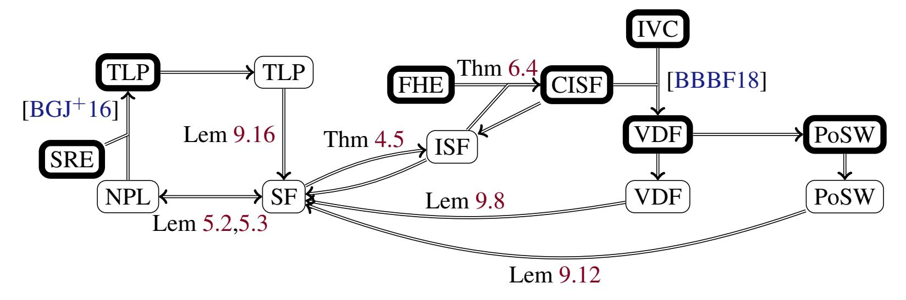
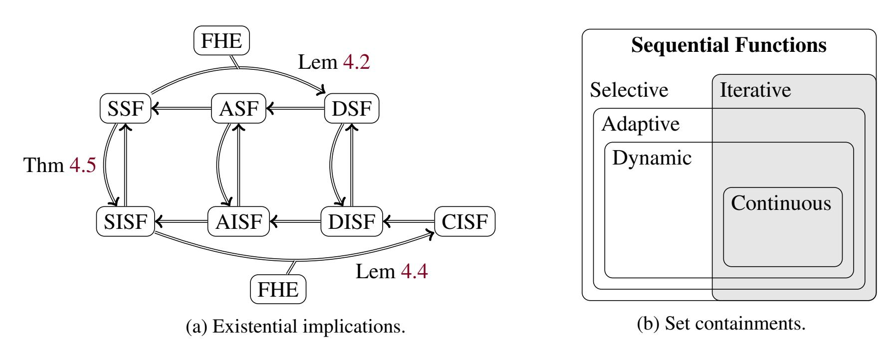
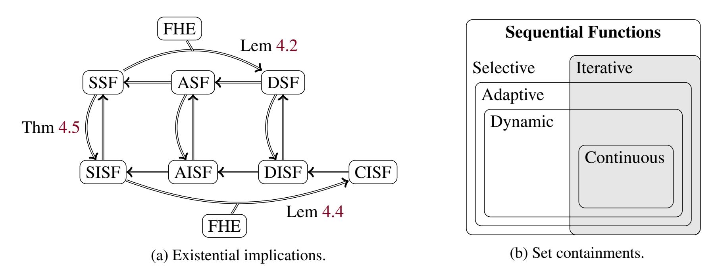

{0}------------------------------------------------

# Time-release Cryptography from Minimal Circuit Assumptions

Samuel Jaques<sup>∗</sup> Hart Montgomery† Arnab Roy‡

#### Abstract

*Time-release* cryptography requires problems that take a long time to solve and take just as long even with significant computational resources. While time-release cryptography originated with the seminal paper of Rivest, Shamir and Wagner ('96), it has gained special visibility recently due to new time-release primitives, like *verifiable delay functions* (VDFs) and *sequential proofs of work*, and their novel blockchain applications. In spite of this recent progress, security definitions remain inconsistent and fragile, and foundational treatment of these primitives is scarce. Relationships between the various time-release primitives are elusive, with few connections to standard cryptographic assumptions.

We systematically address these drawbacks. We define formal notions of *sequential functions*, the building blocks of time-release cryptography. The new definitions are robust against change of machine models, making them more amenable to complexity theoretic treatment. We demonstrate the equivalence of various types of sequential functions under standard cryptographic assumptions. The time-release primitives in the literature (such as those defined by Bitansky *et al.* (ITCS '16)) imply that these primitives exist, as well as the converse.

However, showing that a given construction is a sequential function is a hard circuit lower bound problem. To our knowledge, no results show that standard cryptographic assumptions imply any sequentiality. For example, repeated squaring over RSA groups is assumed to be sequential, but nothing connects this conjecture to standard hardness assumptions. To circumvent this, we construct a function that we prove is sequential if there *exists* any sequential function, without needing any specific knowledge of this hypothetical function. Our techniques use universal circuits and fully homomorphic encryption and generalize some of the elegant techniques of the recent work on lattice NIZKs (Canetti *et al.*, STOC '19).

Using our reductions and sequential function constructions, we build VDFs and sequential proofs of work from fully homomorphic encryption, incremental verifiable computation, and the existence of a sequential function. Though our constructions are theoretical in nature and not competitive with existing techniques, they are built from much weaker assumptions than known constructions.

## 1 Introduction

Traditional security models in cryptography consider adversaries with a given amount of general computational power. The adversary is assumed to be able to efficiently compute some class of functions–say, anything that a modern processor can compute with 2 <sup>80</sup> operations–but nothing else is assumed about the adversary's power, and there are no other restrictions on their computation.

However, there are several new and exciting cryptographic primitives that need stronger bounds on the power of an adversary, such as *verifiable delay functions* [\[BBBF18\]](#page-37-0) (VDFs). Informally, a verifiable delay

<sup>∗</sup>Oxford University, Oxford, UK. Email: sam@samueljaques.com

<sup>†</sup> Fujitsu Laboratories of America, CA, USA. Email: hmontgomery@fujitsu.com

<sup>‡</sup> Fujitsu Laboratories of America, CA, USA. Email: aroy@fujitsu.com

{1}------------------------------------------------

function is a function that requires T *sequential* steps of computation and has a unique output on every input that can be verified efficiently in time "almost" independent of T. In other words, any "honest" user with a relatively small amount of computing power should be able to compute the function in almost the same time as an "adversarial" user with substantial parallel computing resources. This kind of assumption has a radically different flavor from typical cryptographic security assumptions.

Verifiable delay functions have a number of exciting applications, including randomness beacons [\[Rab83,](#page-40-0) [CH10\]](#page-38-0), resource-efficient blockchains [\[KRDO17,](#page-39-0) [PKF](#page-40-1)+18, [Lab17\]](#page-40-2), and proofs of replication [\[ABBK16\]](#page-37-1). In fact, the Ethereum Foundation and a number of other blockchain entities are rapidly pushing towards building practical VDFs in order to better scale Ethereum [\[CHI](#page-38-1)+20]. Potentially billions of dollars [\[eth\]](#page-39-1) will rely on a secure VDF construction in the near future, so it is important that we have a secure construction. We encourage interested readers to refer to [\[BBBF18\]](#page-37-0) for a full treatment of the applications of VDFs and time-release cryptography.

## 1.1 Time-release Cryptography

VDFs are certainly not the only primitive that requires a sequential computational assumption. The field of sequential (or "time-release") crypto dates all the way back to 1996, when Rivest, Shamir, and Wagner first proposed time-lock puzzles [\[RSW96\]](#page-41-0). Informally, a time-lock puzzle is a problem for which it is easy to generate a problem instance but which require a moderate amount of *sequential* computation to solve. In [\[RSW96\]](#page-41-0), the authors first proposed that repeated squaring on a group of unknown order is an inherently sequential function, and so far this has been the core idea behind almost all non-random oracle primitives in time-release cryptography. Boneh and Naor [\[BN00\]](#page-38-2) followed up by building timed commitment schemes, but time-release cryptography was a relatively quiet field until the advent of blockchain [\[Nak19\]](#page-40-3).

Recently there has been substantial interest in sequential primitives. There have been a number of constructions on time-lock puzzles [\[BGJ](#page-38-3)+16], including a new notion of *homomorphic* time-lock puzzles that allow for greater efficiency [\[MT19,](#page-40-4) [BDGM19\]](#page-38-4). Mahmoody *et al.* [\[MMV13\]](#page-40-5) defined a primitive called a *publicly verifiable sequential proof of work*, which is similar to a VDF except the verify solution may not be unique. More recently, Cohen and Pietrzak [\[CP18\]](#page-39-2) showed a simpler construction.

Verifiable Delay Functions. Much of the most recent work has focused on the aforementioned *verifiable delay functions*. The genesis of this work was seemingly a construction by Lenstra and Wesolowski called Sloth [\[LW17\]](#page-40-6). Approximately two years later, Boneh *et al.* wrote the seminal VDF paper [\[BBBF18\]](#page-37-0) which formally defined and introduced the notion of a VDF. More efficient constructions from Weselowski [\[Wes19\]](#page-41-1) and Pietrzak [\[Pie19\]](#page-40-7) followed this, as well as more analysis of these constructions [\[BBF18\]](#page-37-2).

Other interesting VDF constructions have been shown as well: Dottling ¨ *et al.* showed how to construct *tight* VDFs in [\[DGMV19\]](#page-39-3), giving a greater theoretical understanding to the problem. VDFs have been built from elliptic curve isogenies [\[DMPS19,](#page-39-4) [Sha19\]](#page-41-2). The imminent use of VDFs in blockchains has even prompted work on more efficient parallel field operations [\[Ozt](#page-40-8) ¨ , [Ozt20](#page-40-9) ¨ ].

The complexity requirements of VDFs have also attracted attention. In their paper on continuous VDFs, Ephraim *et al.* [\[EFKP20\]](#page-39-5) connect the existence of a VDF to the computation of Nash equilibria. Mahmoody *et al.* show that VDFs satisfying perfect uniqueness and tight VDFs are impossible to construct in a black-box way solely from ideal hash functions [\[MSW19\]](#page-40-10). Rotem *et al.* [\[RSS20\]](#page-41-3) show that what they call "generic group delay functions" which model the known VDF constructions which require hidden-order groups, meaning that we are unlikely to be able to build VDFs from group-based assumptions without groups of unknown order.

{2}------------------------------------------------

### 1.2 Models of Computation and Time

The existing models of computation in time release cryptography works [\[RSW96,](#page-41-0) [BBBF18,](#page-37-0) [Wes19\]](#page-41-1) are based on parallel random access machines. Boneh et al [\[BBBF18\]](#page-37-0) define a notion of (t, )-sequentiality for functions, which is roughly as follows: the function can be honestly computed in time t, while no adversary will have a non-negligible chance of computing it within time (1 − )t. Of course if the adversary has a vastly superior machine compared to an honest evaluator, it can even accelerate the honest computation. So such a possibility is implicit in the notion, although not explicitly encoded in the definition.

However, such a notion is not robust to changes in machine models which makes a complexity theoretic treatment difficult. For example, if we want to analyze a function in the circuit model, which is very common in cryptography, it is natural to take the depth as the run time and the width as the amount of parallelism. However, the adversary may execute this in a random access machine which may shave off a log(λ) factor in evaluation time.

We therefore ask the following question: is there a notion of sequential functions that is independent of the specific, perhaps distinct, models adopted by the honest and adversarial evaluators, as long as these models are reasonable in some sense? If so, can we relate these notions to each other, to standard time-release primitives, and to standard cryptographic notions?

## 1.3 Assumptions of Existing Constructions

If we examine all of the above constructions of time-release cryptography, then we notice that there are some common threads. In particular, all of the constructions we have mentioned (except for [\[BGJ](#page-38-3)+16], which we will mention in more detail later) explicitly rely on one (or both) of the following assumptions: that repeatedly computing a random oracle on its own output is an inherently sequential operation, and that repeated squaring in a group of unknown order is an inherently sequential operation. Each of these assumptions has some unfortunate drawbacks.

The Random Oracle Assumption. The random oracle sequentiality assumption in the above papers is typically a more precise statement of the following form: given a random oracle H : X → X , if it takes h time to compute H on a single input x ∈ X , then it takes O (hk) time to compute H<sup>k</sup> (x), where H<sup>k</sup> (x) = H (...H (x)) for k computations of H. While there may be more complicated bounds involved, this is the general structure of typical random oracle assumptions.

However, this is a very strong assumption on random oracle models. The random oracle model [\[BR93\]](#page-38-5) assumes that an adversary has *black-box* access to a random oracle: in other words, they can query the oracle on inputs of their choice, and receive back the corresponding outputs. For some cryptographic protocols, such as digital signatures, the protocols reasonably fit the scheme. For instance, if a signer has a (perhaps keyed) random oracle that is used to hash a message before signing, then an adversary only has black-box access to the random oracle.

In the case of time-release cryptography, though, this black-box assumption no longer holds. An adversary generally must have the circuit description of a random oracle in order to compute any sequential functions, and we must assume that *given a circuit description of* H an adversary cannot find another circuit that computes H<sup>k</sup> much faster than k evaluations of H. This is a very strong (and nonstandard) requirement of random oracles, and while it seems to hold for popular choices of random oracle such as SHA256, it remains to be seen if researchers will be able to parallelize computations of random oracle instantiations such as SHA256, particularly once there are large financial incentives to do so.

{3}------------------------------------------------

Even more clearly defying the random oracle assumption, random oracle VDF constructions not only require access to the circuit of the random oracle, but the proofs of correctness are built around the circuit itself [BBBF18]. In fact, with only black-box access to H, VDFs are impossible [DGMV19].

**Groups of Unknown Order.** The more prominent sequentiality assumption made in VDFs and other sequential crypto primitives is that repeated squaring in a group of unknown order is inherently sequential. More precisely, many constructions assume that with a description of a group  $\mathbb G$  that does not include the order, and a generator  $g \in \mathbb G$ , then it takes O(T) time to compute  $g^{2^T}$ . This assumption can be generalized to include arbitrary powers other than squaring, which some constructions use.

This assumption is already known to be false: Bernstein and Sorenson [BS07] showed all the way back in 2007 that modular exponentation of  $2^T$  can be parallelized with  $T^{1+o(1)}$  processors to a depth of  $O(T/\lg\lg T)$ . While this algorithm is not a strong practical concern, it highlights that these assumptions are tenuous. There are no known reductions relating the hardness of computing modular exponentiation of  $2^T$  with any traditionally hard problems over groups of unknown order, such as factoring, even for exponentially-sized T.

Finally, we would be neglectful if we did not mention that efficient quantum computers can determine the order of groups in polynomial time [Sho99]. Recently [RSS20] showed that delay functions on groups require an unknown order, meaning that we will need to completely scrap this assumption if quantum computing becomes viable.

**Ideal Assumptions.** Naturally, we want to ask: can we do better? If so, how? Traditonal complexity theorists have studied parallel complexity for quite some time [AB09], but devoted less attention to parallel *average-case* complexity, which would be applicable to cryptographic protocols. [BGJ $^+$ 16] define average-case non-parallelizing languages and show that they imply one-way functions, but we would like a reverse implication. Ideally we could build some sequential function F such that violating the sequentiality of F allowed for some traditional cryptographic assumption to be broken. But this style of reduction seems difficult, since we currently have no way of relating sequentiality assumptions to traditional cryptographic assumptions.

On the other hand, what if we could build time-release cryptography from two assumptions: a very broad assumption stating that *some* sequential function of a certain type existed, and a traditional cryptographic assumption? Assuming only the existence of some non-parallelizing language, and a specific randomized encoding, [BGJ<sup>+</sup>16] construct a concrete time-lock puzzle. This is fairly close to ideal, since the existence of sequential functions is necessary for things like VDFs in the first place. Can we do this for VDFs?

**Related Work.** There has been some progress on building sequential cryptographic primitives from better assumptions. In  $[BGJ^+16]$ , Bitansky *et al.* show how to construct time-locked puzzles from randomized encodings [AIK04] assuming the existence of what they call a t-non-parallelizing language. Informally, a t-non-parallelizing language is decidable in time t, but hard for circuits of depth substantially smaller than t. Notably, the authors of  $[BGJ^+16]$  only need to assume *worst-case* hardness of the non-parallelizing language, avoiding average case assumptions of sequentiality.

Bitansky *et al.* show two main constructions of TLPs from randomized encodings. The first, an (essentially) optimal construction from *succinct* randomized encodings, has the drawback that the only known way to construct such randomized encodings uses indistinguishability obfuscation (iO) [GGH<sup>+</sup>13, BGL<sup>+</sup>15]. The second construction is of *weak* TLPs (similar to the primitive given in the random oracle construction of [MMV13]) from randomized encodings that are implied by one-way functions.

{4}------------------------------------------------

The [\[BGJ](#page-38-3)+16] construction is, to our knowledge, the only known construction of time-release cryptographic primitives that does not rely on a concrete sequentiality assumption. As such, we will refer to it frequently in the paper. However, the only "optimal" construction relies on iO, which is a very strong assumption.

## 1.4 Our Contributions

We develop new notions of sequential functions and show that we can, in fact, build time-release cryptography from general circuit assumptions and standard cryptographic assumptions. We substantially advance the line of work started in [\[BGJ](#page-38-3)+16] by showing several new constructions of time-release primitives, as well as some implications between them all.

Sequential Function Notions. Informally, we allow distinct models for a challenger (the honest user) and the adversary, which we call M<sup>C</sup> and MA, respectively. A *sequential* computation in both models takes time proportional to some function of a security parameter λ and a time parameter k. M<sup>A</sup> is allowed to be more powerful (up to some factors) than M<sup>C</sup> with respect to λ but should be no more powerful with respect to k. In this paradigm, we will consider (tC, tA)-sequentiality to model the gap between an honest user and an adversary rather than the notion of (t, ) sequentiality as in [\[BBBF18\]](#page-37-0). Our modeling here reflects the fact that an adversary may have faster hardware or a better model of computation than the challenger, which is not reflected in previous definitions. We develop several variants of the notion in terms of adaptivity and iterativity and show the equivalence of the existence of these notions under standard cryptographic assumptions. We also show that these primitives are implied by time-release primitives in the literature, as well as the converse.

Sequential Function Constructions. Our core construction is an iterative sequential function (ISF) from minimal circuit assumptions. In particular, we show how to build an ISF from the following ingredients:

- The existence of an iterative sequential function (ISF).
- A fully homomorphic encryption (FHE) scheme.

We emphasize that we do not actually need to know a construction of an ISF, we just need the knowledge that one exists within some set of parameters. We need an FHE scheme that allows us to compute potentially a superpolynomially large number of operations, so we will unfortunately need to assume circular-secure LWE [\[Reg05\]](#page-41-5) because we will need to bootstrap [\[Gen09\]](#page-39-7). Concretely, our scheme uses the [\[GSW13\]](#page-39-8) FHE scheme.

Circuit Framework. We define a circuit-based framework and assumptions for time-release cryptography. In section [5,](#page-19-0) we show that our minimal circuit assumptions both imply and are implied by the the t-nonparallelizing language assumption of [\[BGJ](#page-38-3)+16] up to some small loss factors. We specifically use the circuit model and we focus on "search" problems instead of decision problems because these apply more directly to recent time-reelase cryptographic primitives. To our knowledge, there has not been a model around sequential computation for VDFs and other "modern" sequential primitives that is as fine-grained as this one, so we think that this framework may be useful for future work in the space of time-release cryptography.

{5}------------------------------------------------

<span id="page-5-0"></span>

| Legend  |                                          |                 |
|---------|------------------------------------------|-----------------|
| (C) ISF | (continous) iterated sequential function | Definition 4.3  |
| FHE     | fully homomorphic encryption             | Definition 3.2  |
| IVC     | incremental verifiable computation       | Definition 9.6  |
| NPL     | non-parallelizing language               | Definition 5.1  |
| PoSW    | proof of sequential work                 | Definition 9.10 |
| SF      | sequential function                      | Definition 4.1  |
| SRE     | succinct randomized encoding             | _               |
| TLP     | time-lock puzzle                         | Definition 9.14 |
| VDF     | verifiable delay function                | Definition 9.1  |

Figure 1: Relation between time-release cryptography assumptions. Thin borders indicate existential assumptions (e.g., there exists an ISF) and thick borders indicate constructive assumptions (e.g., the construction in Section 6 is an ISF). Unlabelled arrows are consequences that follow directly from definitions.

**Applications.** [BBBF18] showed that an iterated sequential function (ISF), together with incremental verifiable computation (IVC), can produce a verifiable delay function (VDF). This implies that if there exists an ISF, an FHE, and IVC, then our construction can create a VDF.

We also show a converse result, that VDFs, proofs of sequential work, and time-lock puzzles all imply the existence of sequential functions by definition. From this, the existence of any of these primitives implies that ISFs exist, which in turn implies that VDFs exist. Our results provide some connection between these time-release cryptography assumptions, illustrated in Figure 1.

### 1.5 Paper Outline

The rest of the paper proceeds as follows. In Section 2, we give a technical overview highlighting the key points of our construction. This section summarizes some of the intuition and key observations we make.

We then begin the core of the paper. Section 3 covers some preliminary material. Section 4 introduces our new definitions for various flavours of sequential functions, and also proves their equivalence if FHE exists. We discuss our main assumption about the existence of a sequential function. Section 5 relates these ideas to non-parallelizing languages, the notion of sequentiality defined in [BGJ<sup>+</sup>16].

In Section 6, we focus on our ISF construction. More precisely, we show an ISF from minimal circuit assumptions and FHE. Since the construction depends heavily on some properties of universal circuits and FHE, we explain the universal circuit constructions in Section 7 and then show that the [GSW13] FHE scheme can be used to meet our required sequentiality properties in Section 8.

{6}------------------------------------------------

We then move to applications of our construction, which we explain in Section [9.](#page-30-0) Notably, we show that our ISF can be used to build several other primitives, including a VDF.

## <span id="page-6-0"></span>2 Technical Overview

Our primary goal is to construct sequential functions. The input to these functions is a cryptographic security parameter λ and a time parameter k, which is allowed to be subexponential in λ. Informally, these are functions where both the honest evaluator's and adversary's required computation times scale with k. We require this property even if the adversary may have superpolynomial parallelism in λ. As we will show in this paper, these sequential functions can be viewed as the building blocks of time-release cryptography.

## 2.1 Sequential Function Notions

Computational Models. In defining time-release cryptography, we implicitly assume two models of computation. One is the model where the construction execution time is measured, and the other is the model where the adversarial execution takes place. The latter model can be significantly faster than the former. For example, for normal operations of a protocol where client and mobile computing devices are involved we have to consider a standard CPU with limited parallelism, whereas a highly motivated adversary can have access to supercomputers with massive parallelism and GPU access. Such a dichotomy is not unreasonable in scenarios where state-sponsored cyberattackers and bitcoin miners with huge financial incentives are involved. It is therefore not always useful to compare wall clock times between a challenger and an adversary, so we redefine sequential functions in terms of distinct models M<sup>C</sup> and M<sup>A</sup> for the challenger and adversary, respectively.

We want a computational model that can capture general computations and which has universal simulation. That is, all algorithms F in the model M can be simulated by a universal algorithm U in the same model, which takes a description of F as the input to U and outputs the result of executing of F, running in time at most O(poly(λ)) more than F. Such models include:

- Uniform boolean circuits, with depth denoting time
- Uniform arithmetic circuits, with depth denoting time
- Turing machines
- Parallel random access machines with polynomial parallelism

These models are also simulatable by each other with O(poly(λ))-factor time conversions.

We want to know whether sequential functions exist with respect to the models M<sup>C</sup> and MA, and if so, how "tight" they are: how much faster is M<sup>A</sup> compared to MC? Importantly, the tightness may change between different models. Very tight ISFs may exist when M<sup>A</sup> = MC, but not if M<sup>A</sup> is a PRAM and M<sup>C</sup> is a Turing machine.

For our construction we will need to restrict M<sup>C</sup> to a bounded fan-in boolean circuit model. Given both the overheads on our construction and the possible gap between models, we adopt the more liberal premise that an O(poly(λ)) degradation in the challenger's time is acceptable. This is weaker than existing definitions like [\[BBBF18,](#page-37-0) [Wes19\]](#page-41-1), but we posit that our definitions may reflect practical reality more closely, given differences in actual computational speed. Further, our complexity theoretic analyses are more natural under this premise. With our definition, we forward the following thesis:

{7}------------------------------------------------

A sequential function in the model  $(\mathcal{M}_C, \mathcal{M}_A)$  is also a sequential function in the model  $(\mathcal{M}'_C, \mathcal{M}'_A)$ , for any reasonable tuple of classical computation models  $(\mathcal{M}_C, \mathcal{M}_A, \mathcal{M}'_C, \mathcal{M}'_A)$ . Thus the notion of sequential functions makes sense independent of the underlying machine models.

Importantly, we emphasize that we assume an initial  $O(\text{poly}(\lambda))$  gap in execution time between  $\mathcal{M}_C$  and  $\mathcal{M}_A$ , but this gap is independent of the time parameter k. That is, once we fix a security parameter  $\lambda$ , we have also fixed the adversary's advantage, and increasing the time parameter does not change that advantage. This is a strong claim, but we show in Section 9 that standard time-release primitives imply this.

<span id="page-7-0"></span>

Figure 2: Relations between sequential function definitions. {S,A,D}SF are {sequential, adaptive, dynamic} sequential functions (Definition 4.1). {S,A,D,C}ISF are {sequential, adaptive, dynamic, continuous} iterated sequential functions (Definition 4.3). Unlabelled arrows represent implications that follow directly from definitions

**Sequential Functions.** We explore the notion of a sequential function in Section 4. We consider two dimensions: how adaptive the function is to the time parameter, and whether the function is iterable.

The most restrictive case is what we call a *selective* sequential function, where even the public parameters must be selected according to the time parameters. Isogeny-based VDFs are in this category [DMPS19, Sha19].

Loosening this requirement, the setup may accommodate all time parameters up to some bound, but we need the time parameter to generate inputs. We call this type of sequential function *adaptive*. Time-lock puzzles are adaptively sequential, since they must have a specific delay parameter specified to generate the puzzle; it does not make sense to allow the solver to decide on the delay. In contrast, most VDFs can choose a delay parameter *after* a random input is selected, since the goal is simply to run a long computation, not to produce a specific output. We call this last category *dynamic*.

Further, all known VDF constructions are *iterated*, meaning that the sequential function is formed by iterating some atomic round function, but this is not required by the definition. Any of the previous three varieties can be iterated. In addition, some VDFs may be chained together (what [DGMV19] call "self-composable") if the internal round function is the same for all delay parameters. We call these *continuous*.

Thus, we have seven varieties of sequential functions. Remarkably, we show that if FHE exists, then they are all existentially equivalent: If any type of sequential function exists, the other six types exist as well. We also show that even without FHE, from any sequential function with polynomial space requirements, we can

{8}------------------------------------------------

construct an iterated sequential function. To do this we encode the machine state of the sequential function as part of its input and output, and simulate its evaluation for a small number of steps. These implications are depicted in Figure 2.

## 2.2 Sequential Function Constructions

**FHE and the Universal Circuit.** The starting point of our construction is not any of the recent VDF constructions; rather, it is the beautiful line of work on building NIZKs from lattice assumptions [CCRR18, CCH<sup>+</sup>19, PS19]. The core technique of these papers (that we will also use) is the idea of computing a *universal circuit* [Val76] homomorphically over encrypted data. Informally, we refer to a circuit  $\mathcal{UC}_{d,g}^{n,m}$  as a *universal circuit* if, given a description  $\tilde{\mathcal{C}}$  of any circuit  $\mathcal{C}$  with n inputs, m outputs, depth at most d, and no more than g gates, then it holds that

$$\mathcal{UC}_{d,g}^{n,m}\left(\tilde{\mathcal{C}},x_1,...,x_n\right) = \mathcal{C}\left(x_1,...,x_n\right) = y_1,...,y_m$$

In other words, given a circuit description of a certain size and a valid input, the universal circuit computes the given circuit on the input and outputs the result. Suppose we are given an encryption of a circuit description  $\tilde{\mathcal{C}}$  and an encryption of a program input  $\mathbf{x}$ , which we will refer to as  $\text{Enc}\left(\tilde{\mathcal{C}}\right)$  and  $\text{Enc}\left(\mathbf{x}\right)$ , respectively. If Eval denotes the FHE evaluation function under the appropriate public key, then we can compute

$$\mathsf{Eval}\left(\mathcal{UC}_{g,d}^{n,m}\left(\cdot\right),\mathsf{Enc}\left(\tilde{\mathcal{C}}\right),\mathsf{Enc}\left(\mathbf{x}\right)\right)=\mathsf{Enc}\left(\mathcal{C}\left(\mathbf{x}\right)\right)$$

In words, we homomorphically compute the universal circuit on an encrypted description of a circuit  $\mathcal{C}$  and an encrypted input to the circuit  $\mathbf{x}$ , and get a valid encryption of  $\mathcal{C}(\mathbf{x})$ . What makes this technique so powerful is that, due to FHE security, the encrypted circuit description  $\tilde{\mathcal{C}}$  is indistinguishable from random—so someone computing the universal circuit in this way (without the secret key) cannot determine whether they are computing  $\mathcal{C}$  or any other circuit that meets the requirements of the parameters n, m, g, and d.

The authors of [CCH<sup>+</sup>19, PS19] use this to show correlation intractability, which allows them to use a lattice-based hash function in the place of random oracles for NIZKs. We will use this technique to avoid having to make any specific assumptions about parallel circuit complexity.

**The Basic Idea.** We start with a very basic assumption about circuits. Suppose there exists some function f which is computable by a circuit  $\mathcal{C}$  such that  $\mathcal{C}$  has n input and output bits, g gates, and depth d, where d = poly(g). In addition, suppose that  $\mathcal{C}$  is the *shallowest* circuit that can efficiently compute f. Finally, we make an even stronger assumption about f: namely, that computing  $f^k(\cdot)$  can only be done efficiently in depth  $T := d \cdot k$ . This means that f is an inherently sequential function.

It is straightforward to see that f would be a very useful function for time-release cryptography. For instance, if we could efficiently generate proofs of correctness for  $f^k$ , then constructing both VDFs and proofs of sequential work would be simple. However, actually showing that some particular f satisfies these properties could be very difficult, and we have no current known results in this direction for standard model functions.

This is where we can use the ideas about FHE and universal circuits that we mentioned earlier. Suppose that instead of directly computing f, we computed the homomorphic evaluation of the universal circuit

<span id="page-8-0"></span><sup>&</sup>lt;sup>1</sup>We don't rule out the fact that there may be ways to compute f in circuit depth d' < d at computational cost superpolynomial in d - d', but we consider this to be "inefficient." We elaborate on this more in the body of the paper.

{9}------------------------------------------------

on an encryption f, or more precisely, FHE.Eval UCn,n d,g (), Enc C˜ , Enc (x) . Suppose we call this new function g. If the overhead from the FHE evaluation and the universal circuit do not add too much depth to the computation of f, then we can still use g in our constructions of sequential primitives since it retains the core sequential properties of f. There may be extra complications involved if we want to make proofs associated with f still go through, but let's ignore this for now.

At this point, in order to evaluate g, we do not even need to know f "in the clear" – we only receive an encrypted ciphertext that contains a description of the circuit C that represents f. But due to the security of the FHE, no adversary should be able to tell whether we have faithfully encrypted f, or if we have merely encrypted all zeroes. So for our construction to be secure, we do not need to know such a function f–we only need to be certain that such a function f *exists*. Claiming the *existence* of such a function f is a far weaker assumption than claiming that some function satisfies the properties we have required for f, as we do not need to do any tricky or complicated reductions around parallel computation. Moreover, as we will discuss later, if such a function f does not exist, then many of the sequential primitives we would like to build cannot exist either. So this is (intuitively, not formally) a "best of both worlds" construction: if there exists a VDF, then the construction we have outlined here is a VDF (although a potentially "loose" one).

Unfortunately, our constructions based on this intuition are not remotely practical: honest parties will need a huge amount of computational parallelism to compute our core sequential function. Instead, we view our constructions as a theoretical advancement that will hopefully spur further improvements in this area, and that maybe one day some constructions in this vein will be practical. However, even now we can use our main idea here to construct some primitives in time-release cryptography with very nice theoretical properties. We discuss these later.

Construction overheads. We need to show that there exist both a universal circuit construction and an FHE scheme such that neither adds much circuit depth to the input function. There already exists a universal circuit construction from Cook and Hoover [\[CH85\]](#page-38-10) that only inflates the depth of the circuits it simulates by a constant factor. We find this constant in Section [7.](#page-23-0) We also outline some tricks in Section [8](#page-24-0) that allow the [\[GSW13\]](#page-39-8) FHE scheme to only add O log λ (log log λ) 2 overhead (for some security parameter λ) to the depth of the circuit evaluation. Importantly, this is independent of T. These results allow us to instantiate a construction with the intuition we have defined above.

The appeal of our construction is that we have a *provable* lower bound on the adversary's parallel run-time, assuming such a bound exists for any function at all. However, this may be much less than the *actual* run-time. Our construction inflates the run-time of an honest user with the overhead of the universal circuit and the homomorphic encryption, but we cannot prove that the adversary's run-time must also include these overheads. Other VDF proposals do not include these circuit-level details, so we do not regard this as a weakness for the scheme.

Our proofs work because our construction acts as a circuit to evaluate the underlying ISF, and thus cannot run faster than the ISF itself. However, in practice, an adversary must still act like a universal circuit and must still homomorphically evaluate this circuit. We thus expect them to compute the same overheads as honest users.

In this case, if they simply find a universal circuit with smaller overhead or a faster homomorphic encryption scheme, then this should still only use poly(λ, log T) parallelism, and then honest users can simply adopt these new algorithms and nullify the adversary's advantage.

To maintain an advantage, an adversary must use their parallelism advantage to reduce the overhead. We know this is possible for the Cook-Hoover universal circuit. As the proof of Lemma [7.1](#page-23-1) discusses, an exponential increase in the selection layer can reduce the depth overhead by a factor of at most 2. For the

{10}------------------------------------------------

FHE, we do not know of a super-polynomial method to reduce finite field multiplication over F<sup>q</sup> below Ω(log q) or multiplication of N × N matrices below Ω(log N); either result would be an interesting result in complexity theory. From these arguments, we expect that in practice a highly parallel adversary will have a limited advantage in computing our construction.

A more serious concern is that the required parallelism for an honest user is too large in practice. While the FHE relies on vector and matrix computations which could be run on widely-available specialized hardware like GPUs or TPUs, the universal circuit is much worse. The initial parallelism overhead for a g-gate circuit is O(g 3 ), but by Lemma [4.7,](#page-19-3) to ensure that there exists a sufficiently deep circuit we must square this. Since g must be at least as large as the input and outputs, each of which must be at least λ, our construction requires at least 64λ <sup>6</sup> parallel processors, which is well beyond the bounds of practicality.

Model overheads. If there exists a very tight ISF in the circuit model, our construction adds only O(log1+ (λ)) overhead. However, this assumption may not be true. Instead, tight ISFs might exist in other models, and we have an "overhead" of O(poly(λ)) when we try to infer the tightness of the ISFs that exist in the circuit model.

We may further relax our assumptions by considering weaker notions of sequential functions. While an ISF runs in time T by iterating some base function, other sequential functions may run an entirely different algorithm for each time parameter. Our reductions in Section [4](#page-12-0) create significant tightness loss. Finally, we note that the definitions of time-release cryptography primitives do not imply *iterative* sequential functions. Thus, to conclude that our construction is an ISF, we need to follow a chain of implications, each one losing tightness.

We emphasize that the majority of the loss is from the *assumptions*, rather than our construction. If there exists a very tight VDF, our construction is a VDF, but we can only guarantee that it is a very loose VDF. Yet, if that VDF is built out of a very tight ISF, then that implies more directly that our construction is a VDF and the loss of tightness is much smaller. For example, if squaring in a group of unknown order is a tight ISF, then our construction only loses O(log1+ (λ)) tightness.

## 2.3 Applications to Time-release Cryptography

We show how to build verifiable delay functions (which immediately imply proofs of sequential work) that are provably secure based on the existence of sequential functions and standard cryptographic primitives. For example, we use the blackbox construction of [\[BBBF18\]](#page-37-0) of a VDF from an iterative sequential function and incrementally verifiable computation (IVC). An IVC, in turn, can be built from SNARKs [\[BCTV14\]](#page-38-11).

More precisely, we show how to build a slightly loose VDF: in particular, we can only prove that the sequential computation time in M<sup>C</sup> is within a factor of O log1+ λ for any > 0 for that of MA, so we construct a O log1+ (λ) T, T -VDF. We note that this looseness seems very difficult to avoid, as switching between computational models could incur even higher overhead. However, if we make some basic assumptions about FHE evaluation that are seemingly plausible, then we can get a "tight" VDF, up to constant multiplicative factors.

<span id="page-10-0"></span>Conversely, we show that verifiable delay functions (VDFs), proofs of sequential work (PoSWs), and time-lock puzzles (TLPs) each imply our circuit assumption. If there exists FHE and IVC, then following the [\[BBBF18\]](#page-37-0) construction, we can build a VDF from our sequential function. This VDF is "universal" in the sense that if any other VDF exists, our construction is also a VDF. In turn this shows that VDFs and PoSWs are equivalent assumptions (up to some loss factors), and both are implied by TLPs. If we also assume succinct randomized encodings (which is, admittedly, a rather strong assumption), then sequential functions imply TLPs [\[BGJ](#page-38-3)+16], and all three time-release cryptography primitives are equivalent assumptions.

{11}------------------------------------------------

## 3 Preliminaries

In this section we provide background material and definitions for our constructions and reductions. Experienced cryptographers should be familiar with the content, although the notation might be unfamiliar in some cases.

## 3.1 Public Key Encryption

We define basic public key encryption, mirroring the definitions of [\[CCH](#page-38-9)+19]. We chose this definition because it is useful for our primitives that rely on FHE, which we will define later.

Definition 3.1. Public Key Encryption A public key encryption scheme PKE = (Gen, Enc, Dec) consists of three PPT algorithms:

- Gen 1 λ → (pk, sk) takes as input the security parameter and outputs a public key pk and a secret key sk.
- Enc (pk, m) → ct takes as input the public key pk and a message m[1](#page-11-1) and outputs a ciphertext ct.
- Dec (sk, ct) → m<sup>0</sup> takes as input the secret key and a ciphertext ct and outputs a message m<sup>0</sup> .

Any PKE must satisfy the following properties:

- Correctness: for all λ and messages m, and all valid tuples (pk, sk), it holds with probability 1 that Dec (sk, Enc (pk, m)) = m.
- Semantic Security: for any two messages m and m<sup>0</sup> , the distribution ensembles

$$\left\{ \left(\mathsf{pk},\mathsf{sk}\right) \leftarrow \mathsf{Gen}\left(1^{\lambda}\right) : \left(\mathsf{pk},\mathsf{Enc}\left(\mathsf{pk},m\right)\right) \right\}$$

and

$$\left\{ \left(\mathsf{pk},\mathsf{sk}\right) \leftarrow \mathsf{Gen}\left(1^{\lambda}\right) : \left(\mathsf{pk},\mathsf{Enc}\left(\mathsf{pk},m'\right)\right) \right\}$$

are computationally indistinguishable.

## 3.2 Fully Homomorphic Encryption

We now briefly go over definitions and notation for fully homomorphic encryption (FHE) [\[Gen09\]](#page-39-7). We base our presentation off of [\[CCH](#page-38-9)+19] because we use FHE in a similar manner as they do.

<span id="page-11-0"></span>Definition 3.2. Fully Homomorphic Encryption: A *fully homomorphic encryption* (FHE) scheme FHE = (Gen, Enc, Dec, Eval) consists of four PPT algorithms such that (Gen, Enc, Dec) is a public key encryption scheme and

• Eval(pk, f, ct1, ..., ctn) → ct<sup>0</sup> takes as input the public key pk, a function f (represented by a Boolean circuit), and a vector of ciphertexts (ct1, ..., ctn). Eval outputs another ciphertext ct<sup>0</sup> which has size that is polynomial in λ (and, without loss of generality, linear in the output length of f).

<span id="page-11-1"></span><sup>1</sup>Note that we are not specifiying a domain for m.

{12}------------------------------------------------

• For any  $(pk, sk) \leftarrow Gen(1^{\lambda})$ , any vector of messages  $(m_1, ..., m_n)$  and any circuit  $\mathcal{C} : \{0, 1\}^n \rightarrow \{0, 1\}$  it holds with probability 1 that

$$\mathsf{Dec}\left(\mathsf{sk},\mathsf{Eval}\left(\mathsf{pk},\mathcal{C},\mathsf{Enc}\left(\mathsf{pk},m_{1}\right),...,\mathsf{Enc}\left(\mathsf{pk},m_{n}\right)\right)\right)=\mathcal{C}\left(m_{1},...,m_{n}\right)$$

**Definition 3.3.** Levelled FHE: A *levelled* fully homomorphic encryption scheme FHE = (Gen, Enc, Dec, Eval) satisfies the same syntax, correctness, and security properties of an FHE scheme, except that

- $\bullet$  Gen  $(1^{\lambda}, 1^d)$  takes as input an additional parameter d representing a circuit depth.
- $\bullet$  Homomorphic evaluation correctness of Eval is only guaranteed to hold for circuits of depth at most d.
- Ciphertexts output by  $\operatorname{Enc}(\operatorname{pk},m)$  and  $\operatorname{Eval}(\operatorname{pk},f,\operatorname{ct})$  have size that are polynomial in  $\lambda$  (and the output length of f) and independent of d.
- The decryption algorithm Dec(sk, ct) has a fixed  $poly(\lambda)$  depth which is independent of d.

**Definition 3.4.** Circular Secure Encryption: A public key encryption scheme PKE is said to be *circular secure* if the following two distributions are computationally indistinguishable:

$$\begin{split} \left\{ (\mathsf{pk},\mathsf{sk}) \leftarrow \mathsf{Gen} \left( 1^{\lambda} \right) : \left( \mathsf{pk}, \mathsf{Enc} \left( pk, 0^{|\mathsf{sk}|} \right) \right) \right\} \approx_c \\ \left\{ (\mathsf{pk},\mathsf{sk}) \leftarrow \mathsf{Gen} \left( 1^{\lambda} \right) : \left( \mathsf{pk}, \mathsf{Enc} \left( \mathsf{pk}, \mathsf{sk} \right) \right) \right\} \end{split}$$

### 3.3 Universal Circuits

Our construction needs a universal circuit [CH85, Weg87, LMS16a] for homomorphic computation of encrypted circuits. We define this below.

<span id="page-12-1"></span>**Definition 3.5.** Universal Circuit: A circuit  $\mathcal{UC}_{d,g}^{n,m}$  is called a universal circuit if it cointains n true input variables, m true output variables, and g distinguished universal gates such that for any circuit  $\mathcal{C}$  of sice  $g_c \leq g$  and depth  $d_c \leq d$ , there is an efficiently computable configuration for  $\mathcal{UC}$  such that the ith distinguished universal gate of  $\mathcal{UC}$  computes the same function as the ith gate of  $\mathcal{C}$  for  $1 \leq i \leq g_c$ .

Let  $\mathcal{C}$  denote the bitwise representation of some circuit  $\mathcal{C}$  with  $g_c \leq g$  gates, n true input variables, and m true output variables. We define the following convention:

$$\mathcal{UC}_{d,g}^{n,m}\left(\tilde{\mathcal{C}},x_1,...,x_n\right) = \mathcal{C}\left(x_1,...,x_n\right) = m_1,...,m_n$$

In this work, we will focus on the simple, traditional circuit model with boolean gates of fan-in 2. This is the most common type of universal circuit, although there have been universal circuits constructed for other circuit classes, such as arithmetic circuits [LMS16a].

## <span id="page-12-0"></span>4 Sequential Functions

In this section we define sequential functions and related primitives and prove equivalence results between different notions of sequential functions. We also relate our new definitions to previous work, such as [BBBF18] and [BGJ<sup>+</sup>16]. We start by introducing our models of comptuation, as these will motivate many of our new definitions.

{13}------------------------------------------------

### 4.1 Models of Computation

We assume two models of computations M<sup>C</sup> and MA, respectively, for the challenger and the adversary. We will still assume that both the models are asymptotically probabilistic polynomial time, though at certain points we we will require time polynomial in the delay parameter. The resources of each model are parameterized by the security parameter λ, with M<sup>C</sup> having poly(λ) parallelism, whereas M<sup>A</sup> may have parallelism up to some function in 2 o(λ) . The precise subexponential resources of M<sup>A</sup> must be polynomial in the delay T, but not enough to break the security of the FHE scheme we will use. Rather than clutter our notation with these specific functions, we will simply refer to the parallelism of M<sup>A</sup> as 2 o(λ) .

These two models allow us to define (tC, tA)-sequential functions. Informally, M<sup>C</sup> can compute such a function in time tC, and t<sup>A</sup> is the fastest time that an algorithm in M<sup>A</sup> can compute the same function.

Our constructions and reductions will use both universal circuits and FHE. Since we will need to keep track of the circuit overhead of these primitives in order to properly describe our constructions and reductions, we will actually require four different computational models:

- 1. The model M<sup>C</sup> which can compute a (tC, tA)-sequential function. There must be a universal circuit which can simulate MC.
- 2. The model MUC in which a universal circuit can run. MUC must be homomorphically computable by the FHE.
- 3. The model MF HE in which the fully homomorphic encryption is performed and the universal circuit homomorphically evaluated.
- 4. The adversarial model MA.

In this paper, we choose M<sup>C</sup> to be a boolean circuit model with gates of fanin two, with unit cost and unit depth for all 16 possible gates. Assuming a (tC, tA)-sequential function exists is a stronger assumption if M<sup>C</sup> is less powerful. Unfortunately, we must choose a weaker model M<sup>C</sup> so that a universal circuit exists that can efficiently evaluate circuits in this model.

We choose MUC to be a boolean circuit model, since this accommodates a universal circuit, but we restrict the gate set so it can be easily evaluated homomorphically.

We also model MF HE as a boolean circuit of bounded fanin, simply for ease of analysis. Since this is the model that actually computes the construction, it should be similar to MA. If not, we risk losing logarithmic factors in the sequentiality.

Adversarial Modelling. It is a little bit tricky to model the adversary appropriately. We want our definitions to remain true even if an adversary has, say, substantially better hardware than an honest player. For instance, if an honest player is computing a VDF on a phone and an adversary is using a fast GPU, then it is only natural that the adversary could compute the VDF more quickly than the honest user, and such a fact should not invalidate a VDF.

What is even more complicated is if an adversary somehow has hardware that enables a better *model of computation* than an honest user. For instance, suppose an honest user is restricted to gates of fan-in 2 while an adversary has gates of large fan-in. Clearly there are some functions (for instance, the parity function) that the adversary could compute in logarithmically better depth than an honest user. While this is a contrived example, we want to be able to model situations where there are large differences in hardware. This is certainly the case in cryptocurrency mining, and we believe that if time-release cryptogrpahy becomes popular on the blockchain, it is very possible that a hardware arms race will ensue. We would ideally like our 

{14}------------------------------------------------

definitions to be able to apply even in these difficult cases. It may also be that a parallel RAM model is a more accurate description of the runtime of real computers, but our construction measures the depth of  $\mathcal{M}_C$  in the boolean circuit model.

Still, we need to be careful with the power that we give the adversary. If the adversary were allowed an exponential number of gates, then they could compute any circuit in depth logarithmic in the input size by hard-coding the truth table of the function being computed. To avoid such pitfalls, we prevent the model  $\mathcal{M}_A$  from having exponential parallelism. Previous works [BBBF18] also only allow subexponential parallelism to the adversary.

Even given this restriction, with subexponential parallelism the adversary can potentially compress the circuit depth [GKW18]. However, our assumption states that once we fix the dependence of adversary resources on  $\lambda$ , the time required for it to compute the function still scales linearly with k upto subexponential values.

Specifically, we allow an adversary to reduce circuit depth from d to d', with an increase in circuit size of  $\Omega(2^{d-d'})$ . This means with  $\operatorname{poly}(k,\lambda)$  size, they can reduce the depth of a circuit by an *additive* factor of  $O(\log k + \log \lambda)$ . This allows us to choose a slightly smaller  $t'_A(\lambda)$  such that  $kt_A(\lambda) - O(\log k + \log \lambda) \ge kt'_A(\lambda)$  for all  $k \le 2^{o(\lambda)}$  and retain the linear scaling.

The key observation for our model is that we are more flexible in allowing an adversary to compute a sequential function *once* very quickly – up to  $\operatorname{poly}(\lambda)$  faster than  $\mathcal{M}_C$  – but we still have the restriction that computing such a function k times is sequence takes time proportional to k times the original computation.

## **4.2** Definitions of Sequential Functions

In this work, instead of considering  $(t,\epsilon)$ -sequentiality as in [BBBF18], we will consider  $(t_C,t_A)$ -sequentiality. If  $\mathcal{M}_C=\mathcal{M}_A$  (except for the allowed parallelisms), then these definitions are trivially equivalent with  $t=t_C$  and  $\epsilon=1-\frac{t_A}{t_C}$ .

We view sequential functions in practice to have three phases, captured in the (Setup, Gen, Eval) tuple which we will present soon in Definition 4.1. The infrequent setup phase Setup generates public parameters depending on the required cryptographic strength. Then the instance generation function Gen comes up with a seed value for the sequential evaluation. Finally, the evaluation function Eval runs on the seed for a desired duration and outputs a value. For honest participants, the requirement is that these subroutines should be efficient to perform. For security, we want to disallow adversaries to output the same value too soon.

In defining the syntax and security of sequential functions, we have freedom along two dimensions. The first is adaptivity in selecting the duration parameter: which of the three phases require the duration parameter. The most inflexible situation ("selective") is when the duration needs to be decided at the setup phase. This restricts all runtime instances to the same duration parameter. Isogeny-based VDFs are in this category [DMPS19, Sha19]. We can relax this restriction to make the setup independent of the delay parameter, but the instance generation phase can select its own ("adaptive"). The least restrictive case is when even the instance generation is duration independent ("dynamic") - here the evaluation can select its desired duration.

The second dimension is iterativity, where the evaluation function has a repetitive structure composed of rounds. Having a repetitive structure is not only more convenient, but also enables some primitive constructions, such as VDFs by using IVC and SNARKs [BBBF18, DGMV19] and continuous VDFs [EFKP20]. We can have all possible conjuctions of adaptivity and iterativity.

In an iterative sequential function where only Eval requires the duration parameter, Eval is allowed to select a different round function for each duration parameter. We can relax this further and allow the round function to be independent of the duration parameter ("continous"). This allows us to extend the duration at

{15}------------------------------------------------

any point by computing more iterations of the round function. This captures the idea of a self-composable VDF from [DGMV19]. We take the name from continuous VDFs [EFKP20], though a continuous VDF requires the proofs to also be produced iteratively.

Some of the implications among these primitives follow from the definitions. We show some non-trivial implications in this section. Remarkably, the existence of all these notions are equivalent assuming FHE and restricting evaluation to polynomial space in the security parameter.

**Sequential Functions.** We define three flavors of Sequential Functions: Selective, Adaptive and Dynamic as below:

<span id="page-15-0"></span>**Definition 4.1 (Sequential Functions).** A **selective sequential function (SSF)** F = (Setup, Gen, Eval) is defined as the following tuple of algorithms:

- Setup $(1^{\lambda}, k) \to pp$ : On input the security parameter  $1^{\lambda}$ , and  $k \in 2^{o(\lambda)}$ , the setup algorithm returns the public parameters pp. By convention, the public parameters encode an input domain X and an output domain Y.
- $\mathsf{Gen}(\mathsf{pp}\, \cite{0.05cm}, k)) \to x$ : On input the public parameters  $\mathsf{pp}\, \cite{0.05cm}$ , and  $k \in 2^{o(\lambda)}$ , the instance generation algorithm samples a random input  $x \leftarrow X$ .
- Eval(pp, x, k)  $\to y$ : On input the public parameters pp, an input  $x \in X$ , and  $k \in 2^{o(\lambda)}$ , the evaluation algorithm returns an output  $y \in Y$ .

An SSF is an **Adaptive Sequential Function (ASF)** if Setup is independent of k. An ASF is a **Dynamic Sequential Function (DSF)** if Gen is independent of k.

An SF F satisfies  $(t_C(\lambda), t_A(\lambda))$ -sequentiality for machine models  $(\mathcal{M}_C, \mathcal{M}_A)$  if the following hold:

- 1. There exists an algorithm in the computational model  $\mathcal{M}_C$  such that for all x that can be output by Gen, it computes Eval in at most time  $k \cdot t_C(\lambda)$ .
- 2. (SSF) For all  $\lambda \in \mathbb{N}$  and for all tuples of PPT machines  $(\mathcal{A}_0, \mathcal{A}_1, \mathcal{A}_2)$ , such that  $\mathcal{A}_2$  runs in time strictly less than  $k \cdot t_A(\lambda)$  in the computational model  $\mathcal{M}_A$ , there exists a negligible function negl such that:

$$\Pr\left[\begin{array}{c|c} y = y' & k \leftarrow \mathcal{A}_0(1^{\lambda}), \ \mathsf{pp} \leftarrow \mathsf{Setup}(1^{\lambda}, k), \ \tau \leftarrow \mathcal{A}_1(\mathsf{pp}, k), \ x \leftarrow \mathsf{Gen}(\mathsf{pp}, k) \\ y' \leftarrow \mathcal{A}_2(\mathsf{pp}, x, k, \tau), \ y \leftarrow \mathsf{Eval}(\mathsf{pp}, x, k) \end{array}\right] = \operatorname{negl}(\lambda)$$

3. (ASF) For all  $\lambda \in \mathbb{N}$  and for all pairs of PPT machines  $(\mathcal{A}_1, \mathcal{A}_2)$ , such that  $\mathcal{A}_2$  runs in time strictly less than  $k \cdot t_A(\lambda)$  in the computational model  $\mathcal{M}_A$ , there exists a negligible function negl such that:

$$\Pr\left[\begin{array}{c|c} y = y' & \mathsf{pp} \leftarrow \mathsf{Setup}(1^{\lambda}), \ (k,\tau) \leftarrow \mathcal{A}_1(\mathsf{pp}), \ x \leftarrow \mathsf{Gen}(\mathsf{pp},k) \\ y' \leftarrow \mathcal{A}_2(\mathsf{pp},x,k,\tau), \ y \leftarrow \mathsf{Eval}(\mathsf{pp},x,k) \end{array}\right] = \operatorname{negl}(\lambda)$$

4. (DSF) For all  $\lambda \in \mathbb{N}$  and for all pairs of PPT machines  $(A_1, A_2)$ , such that  $A_2$  runs in time strictly less than  $k \cdot t_A(\lambda)$  in the computational model  $\mathcal{M}_A$ , there exists a negligible function negl such that:

<span id="page-15-1"></span>
$$\Pr\left[\begin{array}{c|c} y = y' & \mathsf{pp} \leftarrow \mathsf{Setup}(1^{\lambda}), \ (k,\tau) \leftarrow \mathcal{A}_1(\mathsf{pp}), \ x \leftarrow \mathsf{Gen}(\mathsf{pp}) \\ y' \leftarrow \mathcal{A}_2(\mathsf{pp}, x, k, \tau), \ y \leftarrow \mathsf{Eval}(\mathsf{pp}, x, k) \end{array}\right] = \operatorname{negl}(\lambda)$$

By definition, we have DSF  $\implies$  ASF  $\implies$  SSF, but FHE allows us to show the reverse implications.

{16}------------------------------------------------

**Lemma 4.2.** If a selective sequential function and FHE exist, then a dynamic sequential function exists.

*Proof.* Given an SSF and an FHE, we construct a DSF as follows:

```
DSF.Setup(1^{\lambda}) \to pp: Sample pk \leftarrow \mathsf{FHE}.\mathsf{Gen}(1^{\lambda}). Let l be the poly(\lambda) size bound of SSF.Setup(1^{\lambda}, \cdot). Sample pp_1 \leftarrow \mathsf{FHE}.\mathsf{Enc}(pk, 0^l). Output pp = (pk, pp_1).
```

**DSF**.Gen(pp)  $\to x$ : Let l' be the poly( $\lambda$ ) size bound of SSF.Gen(pp,  $\cdot$ ). Sample and output  $x \leftarrow \mathsf{FHE}.\mathsf{Enc}(\mathsf{pk}, 0^{l'})$ .

**DSF**.Eval(pp,  $x, k) \to y$ : Let  $P_E$  be the algorithm SSF.Eval( $\cdot, \cdot, k$ ). Output FHE.Eval(pk,  $P_E, pp_1, x$ ).

First we argue that if the above DSF has SSF-sequentiality then it has DSF-sequentiality as well. We build a DSF-sequentiality adversary  $(\mathcal{A}_1, \mathcal{A}_2)$  from an SSF-sequentiality adversary  $(\mathcal{A}_0', \mathcal{A}_1', \mathcal{A}_2')$  as follows:  $\mathcal{A}_1(pp)$  calls  $\mathcal{A}_0'(1^{\lambda})$  and obtains k, then it calls  $\mathcal{A}_1'(pp,k)$  to obtain  $\tau$ . Then it returns  $(k,\tau)$ . Finally  $\mathcal{A}_2$  just mimics  $\mathcal{A}_2'$ . Now observe that the advantage of both adversaries are same.

Now we construct the following hybrid SSF' as follows:

- **SSF**'.Setup $(1^{\lambda}, k) \to pp$ : Sample  $pk \leftarrow \mathsf{FHE}.\mathsf{Gen}(1^{\lambda})$ . Let l be the  $poly(\lambda)$  size bound of SSF.Setup $(1^{\lambda}, \cdot)$ . Sample  $pp' \leftarrow \mathsf{SSF}.\mathsf{Setup}(1^{\lambda}, k)$  and pad it to l bits. Sample  $pp_1 \leftarrow \mathsf{FHE}.\mathsf{Enc}(pk, pp')$ . Output  $pp = (pk, pp_1)$ .
- **SSF**'.Gen(pp, k)  $\to x$ : Let l' be the poly( $\lambda$ ) size bound of SSF.Gen(pp,  $\cdot$ ). Let  $P_G$  be the algorithm PadTo(SSF.Gen( $\cdot$ , k), l'). Sample and output  $x \leftarrow \mathsf{FHE}.\mathsf{Eval}(\mathsf{pk}, P_G, \mathsf{pp}_1)$ .
- **SSF**'.Eval(pp, x, k)  $\to y$ : Let  $P_E$  be the algorithm SSF.Eval( $\cdot, \cdot, k$ ). Output FHE.Eval(pk,  $P_E, pp_1, x$ ).

By the semantic security of FHE, it follows that the SSF-sequentiality of SSF' implies the same of DSF. Finally, by the correctness of FHE, we observe that SSF' is SSF-sequential if SSF is the same.

<span id="page-16-0"></span>**Iterative Sequential Functions.** We next move to our definitions of iterative sequential functions.

**Definition 4.3.** An Iterative Sequential Function (ISF) is a Sequential Function such that the Eval function is iterative: there exists a function Round such that  $\text{Eval}(\mathsf{pp},x,k) = (\mathsf{Round}(\mathsf{pp},\cdot,k))^{(k)}(x)$ . We have Selective, Adaptive and Dynamic Iterative Sequential Functions defined in the same way as Sequential Functions. In addition, we say that a DISF is a Continuous ISF (CISF) if Round is also independent of k.

<span id="page-16-1"></span>By definition, we have CISF  $\implies$  DISF  $\implies$  AISF  $\implies$  SISF, and an iterative sequential function of any type (selective, adaptive, or dynamic) implies the existence of a non-iterative sequential function of the same type. We now prove the converse implications.

**Lemma 4.4.** If a selective iterative sequential function and FHE exist, then a continuous iterative sequential function exists.

*Proof.* Given an SISF and an FHE, we construct a CISF as follows:

 $\textbf{CISF}. \mathsf{Setup}(1^{\lambda}) \to \mathsf{pp:} \ \, \mathsf{Sample} \ \, \mathsf{pk} \leftarrow \mathsf{FHE}. \mathsf{Gen}(1^{\lambda}). \ \, \mathsf{Let} \ \, l \ \, \mathsf{be} \ \, \mathsf{the} \ \, \mathsf{poly}(\lambda) \ \, \mathsf{size} \ \, \mathsf{bound} \ \, \mathsf{of} \ \, \mathsf{SISF}. \mathsf{Setup}(1^{\lambda}, \cdot). \\ \mathsf{Sample} \ \, \mathsf{pp}_1 \leftarrow \mathsf{FHE}. \mathsf{Enc}(\mathsf{pk}, 0^l). \ \, \mathsf{Output} \ \, \mathsf{pp} = (\mathsf{pk}, \mathsf{pp}_1).$ 

{17}------------------------------------------------

- **CISF**.Gen(pp)  $\to x$ : Let l' be the poly( $\lambda$ ) size bound of SISF.Gen(pp,  $\cdot$ ) and let l'' be the  $o(\lambda)$  size bound of k. Sample  $x' \leftarrow \mathsf{FHE}.\mathsf{Enc}(\mathsf{pk},0^{l'})$  and  $k' \leftarrow \mathsf{FHE}.\mathsf{Enc}(\mathsf{pk},0^{l''})$ . Output x = (x',k').
- **CISF**. Round(pp, x)  $\to y$ : Let  $P_E$  be the algorithm SISF. Round( $\cdot, \cdot, \cdot$ ). Output FHE. Eval(pk,  $P_E$ , pp<sub>1</sub>, x', x').

First we argue that if the above CISF has SISF-sequentiality then it has CISF-sequentiality as well. We build a CISF-sequentiality adversary  $(\mathcal{A}_1, \mathcal{A}_2)$  from an SISF-sequentiality adversary  $(\mathcal{A}'_0, \mathcal{A}'_1, \mathcal{A}'_2)$  as follows:  $\mathcal{A}_1(pp)$  calls  $\mathcal{A}'_0(1^{\lambda})$  and obtains k, then it calls  $\mathcal{A}'_1(pp,k)$  to obtain  $\tau$ . Then it returns  $(k,\tau)$ . Finally  $\mathcal{A}_2$  just mimics  $\mathcal{A}'_2$ . Now observe that the advantage of both adversaries are same.

Now we construct the following hybrid SISF':

- **SISF**'.Setup $(1^{\lambda}, k) \to pp$ : Sample  $pk \leftarrow \mathsf{FHE}.\mathsf{Gen}(1^{\lambda})$ . Let l be the  $poly(\lambda)$  size bound of SISF.Setup $(1^{\lambda}, \cdot)$ . Sample  $pp' \leftarrow \mathsf{SISF}.\mathsf{Setup}(1^{\lambda}, k)$  and pad it to l bits. Sample  $pp_1 \leftarrow \mathsf{FHE}.\mathsf{Enc}(pk, pp')$ . Output  $pp = (pk, pp_1)$ .
- $\mathbf{SISF}'.\mathsf{Gen}(\mathsf{pp},k) \to x$ : Let l' be the  $\mathsf{poly}(\lambda)$  size bound of  $\mathsf{SISF}.\mathsf{Gen}(\mathsf{pp},\cdot)$  and let l'' be the  $o(\lambda)$  size bound of k. Let  $P_G$  be the algorithm  $\mathsf{PadTo}(\mathsf{SISF}.\mathsf{Gen}(\cdot,k),l')$ . Sample  $x' \leftarrow \mathsf{FHE}.\mathsf{Eval}(\mathsf{pk},P_G,\mathsf{pp}_1)$  and  $k' \leftarrow \mathsf{FHE}.\mathsf{Enc}(\mathsf{pk},\mathsf{PadTo}(k,l''))$ .
- **SISF**'.Round(pp,  $x, k) \to y$ : Let  $P_E$  be the algorithm SISF.Eval( $\cdot, \cdot, \cdot$ ). Output FHE.Eval(pk,  $P_E, pp_1, x', k'$ ).

By the semantic security of FHE, it follows that the SISF-sequentiality of SISF' implies the same of CISF. Finally, by the correctness of FHE, we observe that SISF' is SISF-sequential if SISF is the same.

<span id="page-17-0"></span>**Theorem 4.5.**  $DSF \implies DISF$ , provided DSF. Eval runs in poly-space in  $\lambda$ . Similarly,  $ASF \implies AISF$  and  $SSF \implies SISF$  with the same poly-space restrictions.

*Proof.* Let  $C_{\Omega}$  be an algorithm in model  $\mathcal{M}_C$  that takes a configuration description M (in the model  $\mathcal{M}_C$ ) of length  $\operatorname{poly}(\lambda)$  and outputs M' of length  $\operatorname{poly}(\lambda)$ , the configuration resulting after the simulation of  $t_C$  steps. We will make the initial configuration to be the description of the function DSF. Eval followed by the input (x,k).  $C_{\Omega}$  will only introduce a  $\operatorname{poly}(\lambda)$  overhead in time. We define the DISF as follows:

- Setup  $(1^{\lambda}) \to pp$ :
  - Let [E] denote the description of DSF.Eval(), and  $s(\lambda)$  define the upper limit of its space requirement.
  - Sample  $pp_0 \leftarrow DSF.Setup(1^{\lambda})$
  - Output  $pp = (pp_0, [E], s(\lambda))$ .
- Gen (pp):
  - Sample  $x \leftarrow \text{DSF.Gen}(\mathsf{pp}_0)$ .
  - Output M=([E],x,0) padded to make it  $s(\lambda)$ -bits.
- Round (pp, M, k):
  - If M is of the form ([E], x, 0) then let M' = ([E], x, k), otherwise let M' = M. Pad M' to make it  $s(\lambda)$ -bits.
  - Output  $C_{\Omega}(M)$ , padded to make it  $s(\lambda)$ -bits.

The proof can be simply adapted for the other two implications ASF  $\implies$  AISF and SSF  $\implies$  SISF with the same poly-space restrictions.

{18}------------------------------------------------

## 4.3 Overall Picture

Figure [3](#page-18-0) shows the overall relationship between all of the sequential functions we have defined and their implications. The main conclusion is that the existence of any type implies the existence of any of the others, though perhaps with a poly(λ) loss of tightness.

<span id="page-18-0"></span>

Figure 3: Relations between sequential function definitions, identical to Figure [2.](#page-7-0) {S,A,D}SF are {sequential, adaptive, dynamic} sequential functions (Definition [4.1\)](#page-15-0). {S,A,D,C}ISF are {sequential, adaptive, dynamic, continuous} iterated sequential functions (Definition [4.3\)](#page-16-0). Unlabelled arrows represent implications that follow directly from definitions

## 4.4 Main Assumption

As we have mentioned, we do not know of any primitives that are provably sequential in a rigorous sense. Like other works, we will make an assumption that some sort of sequential function exists. Our goal is that this assumption should be as weak as possible, and that we only need the *existence* of such a function–not necessarily the *knowledge* of one.

This core assumption is that continous ISFs exist:

<span id="page-18-1"></span>Definition 4.6 (Circuit Assumption CKTt<sup>C</sup> ,tA,d,g,n). There exists a CISF, denoted CISF<sup>∗</sup> , with (tC, tA) sequentiality such that f <sup>∗</sup> = CISF<sup>∗</sup> .Round has a circuit of at most g gates, at most d depth, and at most n inputs and n outputs.

We will typically assume that CISF<sup>∗</sup> is a boolean circuit with fan-in 2, although all circuit models are interchangeable up to polynomial loss. Though we assume the strongest type of ISF, Lemma [4.4](#page-16-1) shows that the types of ISF are also interchangeable up to polynomial loss.

## 4.5 Parameter Selection

Our construction is universal in the sense that if there are any iterated sequential functions that can be simulated by the universal circuit and FHE, then our construction is an iterated sequential function. However, we must choose parameters for the universal circuit, and these parameters may not accomodate any iterated sequential function.

Our circuit assumption CKTt<sup>C</sup> ,tA,d,g,n has many parameters, and it is not obvious that it holds for all parameters. That is, perhaps all iterated sequential functions require many more gates g than their depth d. 

{19}------------------------------------------------

Here we prove a particular relationship between them, allowing us to choose values of d, g, and n that are likely to capture a CISF, if it exists.

<span id="page-19-3"></span>**Lemma 4.7.** The assumption  $\mathsf{CKT}_{t_C,t_A,d,g,n}$  implies  $\mathsf{CKT}_{t'_C,t'_A,d',g',n}$ , where  $d'=g,\,g'=g^2,\,t'_C=d'-o(d')$  and  $\frac{d'}{t'_A} \leq 2\frac{t_C}{t_A}$ .

*Proof.* Let CISF\* = (Setup, Gen, Eval, Round) be a continous iterated sequential function implied by the circuit assumption. Let CISF' be identical to CISF\*, except CISF'. Round consists of repeating CISF\*. Round for  $\lfloor g/t_C \rfloor$  iterations. This repeats the round function at most g times and thus has at most  $g^2$  gates. In model  $\mathcal{M}_C$  it runs in time  $t'_C := t_C \cdot \lfloor \frac{g}{t_C} \rfloor = g - o(g)$ . Because CISF\* is an iterated sequential function, CISF'. Round cannot run faster than  $t'_A := t_A \lfloor \frac{g}{t_C} \rfloor$  in model  $\mathcal{M}_A$ .

Since CISF\*. Round can be computed in a circuit of depth  $t_C$ , CISF'. Round can be computed with a circuit of depth at most  $t_C \lfloor g/t_C \rfloor \leq g$ , and thus d' := g.

Finally, since  $t_C \leq g$  we have  $\lfloor g/t_C \rfloor \geq g/2t_C$ , and thus

$$\frac{d'}{t'_A} = \frac{g}{t_A \lfloor g/t_C \rfloor} \le 2\frac{t_C}{t_A}.$$

## <span id="page-19-0"></span>5 Non-Parallelizing Languages

Bitansky *et al.* defined a primitive called a *non-parallelizing language* in their work on time-locked puzzles [BGJ<sup>+</sup>16]. We modify their definition slightly to use our  $(\mathcal{M}_C, \mathcal{M}_A)$  approach and then show equivalences between our definition of adaptive sequential function and the definition of a non-parallelizing language. Informally, an adaptive sequential function is akin to the "search problem" variant of a non-parallel language.

<span id="page-19-1"></span>**Definition 5.1.** An average-case non-parallelizing language ensemble with gap  $\epsilon$  is a set of languages  $\{\mathcal{L}_{\lambda,t}\}_{\lambda,t\in\mathbb{N}}$ , where  $\mathcal{L}_{\lambda,t}\subseteq\{0,1\}^{\lambda}$ , that satisfies:

**Completeness:** For all  $\lambda \in \mathbb{N}$  and  $t \leq 2^{o(\lambda)}$ , there exists a decision algorithm  $\mathcal{L}$  in model  $\mathcal{M}_C$  such that for all  $\lambda$  and t and all inputs  $x \in \{0,1\}^{\lambda}$ ,  $\mathcal{L}(t,x)$  runs in time t and outputs 1 if and only if  $x \in \mathcal{L}_{\lambda,t}$ .

Average-case non-parallelizing: There exists an efficient sampler Gen such that for every family of circuits  $\mathcal{A} = \{\mathcal{A}_{\lambda}\}_{{\lambda} \in \mathbb{N}}$  in model  $\mathcal{M}_A$  with parallelism at most  $2^{o({\lambda})}$ , there exists a negligible function negl such that for all  ${\lambda}$  and t, if the run-time of  $\mathcal{A}_{\lambda} < (1-\epsilon)t$ , then

$$\Pr\left[\begin{array}{c|c} \mathcal{A}_{\lambda}(x) = \mathcal{L}(t,x) \mid x \leftarrow \operatorname{Gen}(1^{\lambda},t) \end{array}\right] \leq \operatorname{negl}(\lambda).$$

<span id="page-19-2"></span>**Lemma 5.2.** The existence of a  $(t_C, t_A)$  ASF implies an average case non-parallelizing language of gap  $\epsilon = 1 - \frac{t_A}{t_C} + o(1)$ .

*Proof.* Our proof is a relatively basic application of the Goldreich-Levin Theorem [GL89]. A critical fact necessary for the proof to work is that queries in the Goldreich-Levin algorithm (as stated in theorem) are nonadaptive and thus can be computed in parallel.

Let ASF = (Setup, Gen, Eval) be an ASF and let  $pp = \text{Setup}(1^{\lambda})$ . We let  $T = kt_C(\lambda)$  and l be the bit-length of the outputs of Gen(pp, k). We create a language  $\mathcal{L}_{\lambda, T} \subseteq \{0, 1\}^{l+l}$  as the set of all strings  $(\mathbf{x}, r)$ 

{20}------------------------------------------------

such that  $\langle \text{Eval}(\mathsf{pp}, k, \mathbf{x}), r \rangle \equiv 1 \mod 2$ . The behaviour of Eval may be undefined if  $\mathbf{x}$  is not the output of Gen; we include such strings in  $\mathcal{L}_{\lambda,T}$  if Eval runs in T and produces a well-formed output with odd parity with r.

Finding the parity with Eval satisfies the completeness property, since Eval runs in time  $kt_C(\lambda) = T$ . If Eval fails to run in that time or does not produce a well-formed output, the string is not in the language by definition and we can correctly output 0.

We let ASF.Gen be the efficient sampler for the languages. If  $\mathcal{L}_{\lambda,T}$  are not average-case non-parallelizing, then there is a parallel circuit  $\mathcal{A}$  that decides  $\mathcal{L}_{\lambda,T}$  with probability greater than  $\frac{1}{2}+p$  in time less than  $(1-\epsilon)T$  on the outputs of Gen. The Goldreich-Levin algorithm will then find the output of Eval by running  $\mathcal{A}$  for  $O(p^{-2}\lambda^{1+o(1)})$  inputs [GL89]; however, this is less than  $2^{o(\lambda)}$ , and these can be run in parallel, since the output of the algorithm is just the bitwise majority of the outputs of  $\mathcal{A}$ . Thus, the total time will be less than  $(1-\epsilon)T+O(\log(p)+\log(\lambda))$ . If we let  $\epsilon=1-\frac{t_A}{t_C}+\delta$ , then this equals

$$kt_C(\lambda) - \delta kt_C(\lambda) + O(\log(p) + \log(\lambda)).$$

If  $\delta$  is large enough this contradicts the sequentiality of ASF, and a large enough  $\delta$  is still o(1) in terms of  $\lambda$ .

<span id="page-20-0"></span>**Lemma 5.3.** If there exists an average-case non-parallelizing languages of gap  $\epsilon$ , then there is a  $(1, 1 - \epsilon)$  ASF.

*Proof.* Suppose we have a language  $\mathcal{L}_{\lambda,t}$  which is average-case non-parallelizing of gap  $\epsilon$ . It comes with an algorithm  $\mathcal{L}$  with decides the language. We set  $\mathsf{Setup}(1^\lambda) \to \lambda$ . The definition of non-parallelizing implies a sampler  $\mathcal{L}$ . Gen, and we define the Gen function for the ASF as  $\lambda$  repetitions of  $\mathcal{L}$ . Gen, outputting  $\mathbf{x} = (\mathbf{x}_1, \dots, \mathbf{x}_{\lambda})$ . We then define

$$\mathsf{Eval}(\mathsf{pp}, k, \mathbf{x}) \to \mathcal{L}(k, \mathbf{x}_1) \| \mathcal{L}(k, \mathbf{x}_2) \| \dots \| \mathcal{L}(k, \mathbf{x}_{\lambda}).$$

Since  $\mathcal{L}$  can be run in time k for any t, Eval runs in time  $k \cdot 1$ .

If  $(\mathcal{A}_1, \mathcal{A}_2)$  breaks sequentiality of this ASF, then  $\mathcal{A}_1$  can be run once to produce k, since Setup produces only the public information  $\lambda$ . Then  $\mathcal{A}_2$  produces the output of Eval in time less than  $kt_A := k(1-\epsilon)$ , and the output of Eval decides the language  $\mathcal{L}_{\lambda,k}$  with non-negligible probablity, contradicting the average-case non-parallelization of  $\mathcal{L}_{\lambda,t}$ .

**Lemma 5.4.** If there exist a worst-case non-parallelizing language of gap  $\epsilon$ , then there is a  $(\kappa_{FHE}, (1 - \epsilon))$  ASF, where  $\kappa_{FHE}$  is the sequential overhead of FHE.

*Proof.* Suppose we have a languages  $\mathcal{L}_{\lambda,t}$  which is *worst*-case non-parallelizing of gap  $\epsilon$ . As before, it comes with an algorithm  $\mathcal{L}$  with decides the language. We sample  $\mathsf{pk} \leftarrow \mathsf{FHE}.\mathsf{Gen}\left(1^{\lambda}\right)$  and set  $\mathsf{Setup}(1^{\lambda}) \rightarrow (\mathsf{pk}, \lambda)$ . Let S be the sampler implied by the definition of  $\mathcal{L}_{\lambda,t}$ , and set  $\mathsf{Gen}$  to be

$$FHEEnc\left(\mathbf{x}_{1}\leftarrow S\|\mathbf{x}_{2}\leftarrow S\|\ldots\|\mathbf{x}_{\lambda}\leftarrow S\right)$$

Finally, we set

$$\mathsf{Eval}\left(\mathsf{pp},k,\mathbf{x}\right) \to \mathsf{FHE}.\mathsf{Eval}\left(\mathcal{L}\left(k,\cdot\right),\mathbf{x}_{1}\right) \| \dots \| \mathsf{FHE}.\mathsf{Eval}\left(\mathcal{L}_{\lambda}\left(k,\cdot\right),\mathbf{x}_{\lambda}\right)$$

S This has the exact same structure as in lemma 5.3 except for the fact that the input string is encrypted and we are evaluating everything homomorphically. Thus, our argument would follow immediately for average-case non-parallelizing languates.

{21}------------------------------------------------

However, the FHE scheme hides the input of Eval (effectively the output from Gen). So, by the security of the FHE scheme, an adversary cannot tell whether this is a random input or a specially tailored one. Using a simple hybrid argument, we can switch out the input x for arbitrary (i.e. worst-case) value, which completes the proof.

Lemma 8.8 proves that the [GSW13] FHE encryption scheme has sequential overhead of  $O\left(\log^{1+\epsilon}\lambda\right)$  for any  $\epsilon>0$ , which means we can instantiate the implied construction from the above lemma with relatively good parameters.

## <span id="page-21-0"></span>6 Construction

We are now in position to define our construction of an iterated sequential function assuming the *existence* but not *knowledge* of some iterated sequential function as well as an FHE scheme. Since we only assume the existence of an ISF, we do not need to have one as an input to our scheme.

### **6.1** Formal Definition

We formally describe our ISF construction. This ISF is a continuous ISF (CISF) in the sense of Section 4, as the subroutines Setup, Gen and Round are all independent of k. We use a universal circuit  $\mathcal{UC}_{d,g}^{n,n}$  (Definition 3.5), and we assume the existence of a fully homomorphic encryption scheme FHE = (Gen, Enc, Dec, Eval) (Definition 3.2).

**Definition 6.1 (CISF**<sub>FHE</sub> **construction).** The continous iterated sequential function CISF<sub>FHE</sub> is defined as follows:

- Setup  $(1^{\lambda}) \to pp$ :
  - Select g, k, and d to be in  $O(\text{poly}(\lambda))$ , such that  $n \in \Omega(\lambda)$  and  $g = d^2$  (see Lemma 4.7). These parameterize the number of gates, the input size, and depth, respectively, of a universal circuit.
  - Let b denote the largest number of bits required to represent the circuit portion of the input to  $\mathcal{UC}_{d,q}^{n,n}\left(\cdot\right)$ .
  - Sample  $(\mathsf{pk}, \mathsf{sk}) \leftarrow \mathsf{FHE}.\mathsf{Gen}\,\big(1^\lambda\big).$
  - Sample  $\mathsf{ct}_{ckt} \leftarrow \langle \mathsf{FHE}.\mathsf{Enc}\left(\mathsf{pk},0\right) \rangle_{i=1}^b.$
  - Output the tuple  $pp = (pk, ct_{ckt})$ .
- Gen (pp):
  - Sample  $\mathbf{x} \leftarrow \langle \text{FHE.Enc} (\mathsf{pk}, 0) \rangle_{i=1}^n$ .
  - Output x.
- Round (pp, x):
  - Output FHE.Eval  $\left(\mathsf{pk}, \mathcal{UC}_{d,g}^{n,n}, \mathsf{ct}_{ckt}, \mathbf{x}\right)$ .
- Eval (pp,  $\mathbf{x}, k$ ):
  - Output  $\left(\mathsf{Round}\left(\mathsf{pk},\mathcal{UC}_{d,g}^{n,n},\mathsf{ct}_{ckt},\cdot\right)\right)^{(k)}(\mathbf{x}).$

{22}------------------------------------------------

## 6.2 Sequentiality

Here we show that  $CISF_{FHE}$  is a continous ISF as long as there exists a continuous ISF. Since we must assume FHE for this construction, then Lemma 4.4 and Theorem 4.5 show that the existence of any type of sequential function implies that  $CISF_{FHE}$  is a continuous ISF.

Our construction adds two constant overheads to the scheme:  $\kappa_{UC}$ , the overhead to compute a circuit with a universal circuit, and  $\kappa_{FHE}$ , the overhead to compute a circuit homomorphically with an FHE scheme. Sections 7 and 8 discuss these constants, and show that they are a function only of the security parameter  $\lambda$ . Here we show that evaluating a sequential function with either a universal circuit or an FHE scheme is also sequential.

Recall Definition 4.6, which defines  $\mathsf{CKT}_{t_C,t_A,d,g,n}$  as the assumption that there exists some  $(t_C,t_A)$  continous ISF, simulatable by  $\mathcal{UC}_{d,g}^{n,n}$ . We use this in the lemma below:

<span id="page-22-1"></span>**Lemma 6.2 (UC Sequentiality).** Assuming  $\mathsf{CKT}_{t'_C, t'_A, d, g, n}$ , there exists a continous  $\mathit{ISF}\ \mathit{CISF} = (\mathsf{Setup}, \mathsf{Gen}, \mathsf{Eval})$  such that  $(\mathsf{Setup}, \mathsf{Gen}, \mathcal{UC}^{n,n}_{d,g}(f, \cdot))$  is a  $(t_C, t_A)$  continous  $\mathit{ISF}$ , with  $t_C = \kappa_{UC}g$  and  $t_A = t'_A \lfloor \frac{g}{t'_C} \rfloor$ .

*Proof.* Lemma 4.7 strengthens the circuit assumption to  $\mathsf{CKT}_{t''_C, t''_A, g, g^2, n}$  with  $t''_C = g$  and  $t''_A = t'_A \lfloor \frac{g}{t_C} \rfloor$ , implying the existence of CISF. Then Lemma 7.1 gives the sequentiality of the universal circuit partially applied to f.

<span id="page-22-2"></span>**Lemma 6.3 (FHE Sequentiality).** If CISF = (Setup, Gen, Eval) is an iterated  $(t'_C, t'_A)$ -sequential function such that CISF. Eval has circuit C, then CISF' = (Setup', Gen', Eval') is an iterated  $(t_C, t_A)$ -sequential function, with  $t_C = (\kappa_{FHE} + o(1))t'_C$  and  $t_A = t'_A$ , where

- $\mathsf{Setup}'(1^{\lambda}) \to (\mathsf{pp}_1 := \mathit{CISF}.\mathsf{Setup}(1^{\lambda}), \mathsf{pp}_2 := \mathit{FHE}.\mathsf{Gen}(1^{\lambda}))$
- $\operatorname{\mathsf{Gen}}'((\operatorname{\mathsf{pp}}_1,\operatorname{\mathsf{pp}}_2)) \to \mathit{FHE}.\operatorname{\mathsf{Enc}}(\operatorname{\mathsf{pp}}_2,\mathit{CISF}.\operatorname{\mathsf{Gen}}(\operatorname{\mathsf{pp}}_1))$
- $\bullet \ \operatorname{Eval}'((\operatorname{pp}_1,\operatorname{pp}_2),k,\mathbf{x}) = (\mathit{FHE}.\operatorname{Eval}(\operatorname{pp},\mathcal{C},\cdot))^{(k)}\left(\mathbf{x}\right)$

*Proof.* If we decrypt the output of Eval', then it acts as a circuit to compute the iterated sequential function CISF, and this cannot run faster than  $t_A$ . Lemma 8.8 gives the overheads for these computations. Decrypting the output adds the o(1) term.

<span id="page-22-0"></span>Finally, we prove that our scheme is sequential even if the encrypted public parameters do not encode a sequential function.

**Theorem 6.4 (Sequentiality).** Let  $CISF_{FHE}$  be instantiated with parameters d,  $g = d^2$ , and n. Assuming  $CKT_{t'_C,t'_A,d,d,n}$  and CPA-2 security of FHE,  $CISF_{FHE}$  is a  $(t_C,t_A)$ -iterated sequential function, where  $t_C = (\kappa_{FHE}\kappa_{UC} + o(1))d$  and  $t_A = (\frac{t'_A}{t'_C} - o(1))d$ .

*Proof.* The circuit assumption and Lemma 6.2 imply that there exists CISF = (Setup, Gen, Eval), a CISF, that  $\mathcal{UC}_{d,d^2}^{n,n}$  can simulate.

We now play an adaptive security game with an oracle for an FHE scheme with public key pk. First we run Gen and get a random message m, and we send this to the FHE oracle to get an input  $\mathbf{x}$ . Then for the challenge, we send  $m_0 = \{0\}^b$  and  $m_1$  as the circuit for f. We receive a ciphertext  $\mathsf{ct}_c$  for  $c \in \{0,1\}$ , and we set  $\mathsf{pp}_c = (\mathsf{pk}, \mathsf{ct}_c)$  to be the public parameters of our construction.

{23}------------------------------------------------

Suppose that  $(A_1, A_2)$  breaks the sequentiality of  $CISF_{FHE}$ . We set  $(k, \tau) \leftarrow A_1(pp_c)$  and then set  $y_A \leftarrow A_2(pp_c, \mathbf{x}, k, \tau)$ , which runs in some time  $T_A$ . We also honestly compute  $CISF_{FHE}(pp_c, k, \mathbf{x})$ .

By our assumption that  $A_2$  breaks the iterated sequentiality of  $CISF_{FHE}$ , if c=0 then  $y=y_A$  and  $T_A < kt_A$ . However, if c=1, then both statements cannot be true, since then  $A_2$  would contradict Lemmas 6.2 and 6.3. Thus, we can compare y to  $y_A$ , and  $T_A$  to  $kt_A$ , and deduce the original value of c, breaking the semantic security of FHE. Honestly computing  $CISF_{FHE}$  requires only  $k \operatorname{poly}(\lambda) \leq 2^{o(\lambda)}$  resources, so this is a computationally feasible attack.

## <span id="page-23-0"></span>7 Universal Circuits

The definition of a universal circuit (Definition 3.5)  $\mathcal{UC}_{d,g}^{n,m}$  requires that it evaluates circuits of depth d, but does not specify the depth of the universal circuit itself. Let  $d_{UC}$  be the depth of  $\mathcal{UC}_{d,g}^{n,m}$ . We define the depth overhead  $\kappa_{UC}$  of this universal circuit to equal  $d_{UC}/d$ . Cook and Hoover describe a *depth-universal* circuit that simulates circuits of depth d in depth O(d) [CH85, Theorem 1]. Here we account for the constants in their construction to give better bounds on  $\kappa_{UC}$ .

<span id="page-23-1"></span>**Lemma 7.1** (**UC Overhead**). There exists a universal circuit  $\mathcal{UC}_{d,g}^{k,\ell}$  such that for any circuit  $\mathcal{C}$  of k inputs,  $\ell$  ouputs, at most g gates, and at most d depth, there is an efficiently-computable encoding of  $\mathcal{C}$  into a binary string such that  $\mathcal{UC}_{d,g}^{k,\ell}$  computes  $\mathcal{C}$  in depth at most  $\kappa_{UC}d$  and size  $O(\operatorname{poly}(g))$ , where  $\kappa_{UC}$  is independent of k,  $\ell$ , g, and d.

*Proof.* We use Cook and Hoover's construction, which requires the circuit be presented in an *extended* encoding. Each gate is represented as a tuple  $(v, \pi, g, l, r)$ , where v is the index of an initial node,  $\pi$  describes a forward path from v, g describes the gate at the end of the path, and l and r are the indices of the inputs to this gate. They show that this is efficiently computable from a standard encoding of a circuit.

Their construction divides the universal circuit into stages, where each stage has two steps: first, trees of height h of universal gates of fanin 2 simulate the next h gates in the circuit, and then trees of selection circuits rearrange the outputs as necessary. If the selection circuit has depth  $d_s(g)$  and each universal gate has depth  $d_u$ , then the total depth is

$$\frac{d}{h}(d_u h + d_s(g))$$

Since we can build a selection tree out of  $2\lceil \log g \rceil$  sequential AND gates, we can parameterize the universal circuit to have a total depth between  $2dd_u + o(d)$  and  $dd_u + \epsilon$ . Increasing h means fewer switching layers but larger simulation trees, leading to a lower depth but larger circuit size. The size of the simulation trees is  $g2^hd/h$ , so to approach the minimum depth of  $dd_u + \epsilon$  the circuit size must increase exponentially. We take  $h = d_s(g)/d_u$ , so that the total depth is  $2dd_u$  and thus  $\kappa_{UC} = 2d_u$ .

We can further modify the Cook-Hoover construction by partially evaluating the universal circuit. For example, suppose there is a gate G in the circuit whose inputs are bits  $c_i$  and  $c_j$  in the encoding of the circuit. We can pre-compute  $G(c_i, c_j)$  as part of the encoding of the circuit. We replace the output wire of G with an input wire, which takes the value  $G(c_i, c_j)$ . This allows us to save some depth during the universal gates.

<span id="page-23-2"></span>**Lemma 7.2.** In a boolean circuit model with unbounded fanout and  $\{AND, XOR\}$  gates of unit depth,  $\kappa_{UC} \leq 10$ . With a gate Select of unit depth such that

$$\mathsf{Select}(x,y,z) = (x \land y) \lor (\overline{x} \land z)$$

then  $\kappa_{UC} \leq 4$ .

{24}------------------------------------------------

*Proof.* We will provide the value of du, and by Theorem [7.1,](#page-23-1) κUC ≤ 2du.

From [\[LMS16b\]](#page-40-13), d<sup>u</sup> ≤ 6 if we treat all 0- and 1-fan-in gates as 2-fan-in gates, by identifying them with gates that ignore one or both inputs. This can be done as part of the encoding process. In their construction, we can partially evaluate the initial XOR gates, bringing the depth to 5.

Another approach to a universal gate on two inputs is to use the two input bits x and y as an index to address one of the bits c0c1c2c<sup>3</sup> of the gate description. In this way the bits of the gate directly encode the truth table for the gate. We can compute this by

$$\mathsf{Select}(y, \mathsf{Select}(x, c_0, c_1), \mathsf{Select}(x, c_2, c_3)).$$

In short, the overhead of a universal circuit is constant and small. We mention the function Select in Lemma [7.2](#page-23-2) because this can be implemented in an FHE scheme in the same depth as an XOR gate.

## <span id="page-24-0"></span>8 Fully Homomorphic Encryption

In this section we define the Gentry, Sahai, and Waters [\[GSW13\]](#page-39-8) FHE encryption scheme and explain some of its parallel evaluation properties. Readers familiar with the scheme may still want to refresh their memory, as we will use very specific properties of the scheme in order to prove bounds on circuit depth.

Our overall goal is to show that, given enough parallel resources, we can homomorphically evaluate a circuit C of depth d consisting of AND and XOR gates in depth O d log1+ (λ) , where λ is the security parameter (which is typically closely related to the lattice dimension).

## 8.1 Helper Functions

We start by defining some "helper" functions that are used throughout [\[GSW13\]](#page-39-8). Let k, q ∈ Z be integers, and let ` = blog qc + 1 and N = k · `.

Definition 8.1. BitDecomp Function: We define BitDecomp : Z k <sup>q</sup> → Z N 2 as the function that, on an input vector a ∈ Z k q , outputs the binary vector (a1,0, ..., a1,`−1, a2,0, ..., ak,0, ..., ak,`−1) where ai,j represents the jth bit of the ith entry of a.

Definition 8.2. BitDecomp−<sup>1</sup> Function: We define BitDecomp−<sup>1</sup> : Z N <sup>q</sup> → Z k q as the function that, on an input vector a ∈ Z N <sup>q</sup> where we define a = (a1,0, ..., a1,`−1, a2,0, ..., ak,0, ..., ak,`−1), outputs the vector P`−<sup>1</sup> <sup>j</sup>=0 2 <sup>j</sup>a1,j , P`−<sup>1</sup> <sup>j</sup>=0 2 <sup>j</sup>a2,j , ...,P`−<sup>1</sup> <sup>j</sup>=0 2 <sup>j</sup>ak,j .

While this function does invert BitDecomp it is also well-defined if the entries of a are not binary (and thus, not a possible output of BitDecomp).

Definition 8.3. Flatten Function: We define Flatten : Z N <sup>q</sup> → Z N 2 to be the function such that Flatten (a) = BitDecomp BitDecomp−<sup>1</sup> (a) .

Definition 8.4. Powersof2 Function: We define PowersOf2 : Z k <sup>q</sup> → Z ` q in the following say. On an input vector b ∈ Z k q , we output the vector b1, 2b2, ..., 2 `−1b1, ..., bk, 2bk, ..., 2 `−1b<sup>k</sup> .

In [\[GSW13\]](#page-39-8), the authors explain intuition about these functions in more detail. We encourage interested readers to read the original text for more information.

{25}------------------------------------------------

Definition 8.5. [\[GSW13\]](#page-39-8) Fully Homomorphic Encryption Scheme: The [\[GSW13\]](#page-39-8) FHE scheme is defined as follows:

- Gen 1 λ , 1 L : Choose a modulus q of κ = κ (λ, L) bits, lattice dimension parameter n = n (λ, L) and error distribution χ = χ (λ, L) appropriately for LWE that achieves at least 2 λ security against known attacks. Also, choose parameter m = m (λ, L) = O (n log q). Let pp = (n, q, χ, m). Let ` = blog qc + 1 and N = (n + 1) `.
- SecretKeyGen (pp): Sample t ← Z n q . Output sk = s ← (1, −t1, ..., −tn) ∈ Z n+1 q . Let v = PowersOf2 (s).
- PublicKeyGen (pp, sk): Generate a matrix B ← Z m×n <sup>q</sup> uniformly and a vector e ← χ <sup>m</sup>. Set b = B · t + e. Set A to be the (n + 1)-column matrix consisting of b followed by the n columns of B. Set the public key pk = A.
- Enc (pp, pk, µ) : to encrypt a message µ ∈ Zq, sample a uniform matrix R ∈ {0, 1} <sup>N</sup>×<sup>m</sup> and output the ciphertext C given as follows:

$$\mathbf{C} = \mathsf{Flatten}\left(\mu \cdot \mathbf{I}_N + \mathsf{BitDecomp}\left(\mathbf{R} \cdot \mathbf{A}\right)\right) \in \mathbb{Z}_q^{N \times N}$$

• Dec (pp, sk, C): Observe that the first ` coefficients of v are 1, 2, ..., 2 `−1 . Among these coefficients, let v<sup>i</sup> = 2<sup>i</sup> be in q 4 , q 2 . Let C<sup>i</sup> be the ith row of C. Compute x<sup>i</sup> ← (C<sup>i</sup> , v). Output µ <sup>0</sup> = j xi vi m .

This scheme, in contrast to our definition of FHE (see Definition [3.2\)](#page-11-0), splits up the Gen function into SecretKeyGen and PublicKeyGen and also has an extra set of public parameters called pp. We can still "simulate" our definition of FHE given this syntax, as we can make the pp part of the public key, and just have Gen call both SecretKeyGen and PublicKeyGen.

We will also use some "less secure" variants of the above algorithms. For instance, in the case where we don't need a ciphertext to look fresh (i.e. we just want to use it for bootstrapping) we define the following algorithm:

• EncFixR (pp, pk, µ, R) : to encrypt a message µ ∈ Z<sup>q</sup> with fixed randomness, output the ciphertext C given as follows:

$$\mathbf{C} = \mathsf{Flatten}\left(\mu \cdot \mathbf{I}_N + \mathsf{BitDecomp}\left(\mathbf{R} \cdot \mathbf{A}\right)\right) \in \mathbb{Z}_q^{N \times N}$$

Since BitDecomp (R · A) can be precomputed for a fixed R, we can precompute the entire function EncFixR for µ = {0, 1}.

## 8.2 Homomorphic Operations

So far we have not defined how Eval works for [\[GSW13\]](#page-39-8). We slowly build our way to this, and in this section we define the [\[GSW13\]](#page-39-8) homomorphic operations and explain how they work.

Definition 8.6. [\[GSW13\]](#page-39-8) Homomorphic Operations Let C1, C2, and C<sup>3</sup> be three valid ciphertexts such that C<sup>i</sup> = Enc (pp, pk, µi) for i ∈ {1, 2, 3}. The following homomorphic operations hold:

• Add (C1, C2) = Flatten (BitDecomp (C<sup>1</sup> + C2)) is a valid enrcyption of µ<sup>1</sup> + µ2, assuming the noise tolerance has not been exceeded.

{26}------------------------------------------------

- Multiply (C1, C2) = Flatten (BitDecomp (C1C2)) is a valid enrcyption of µ1µ2, assuming the noise tolerance has not been exceeded.
- Invert(C1) = Flatten (BitDecomp (−C1)) is a valid enrcyption of −µ1. Alternatively we can write Invert(C1) = Multiply (Enc (pp, pk, −1), C1).

We refer to the original text of [\[GSW13\]](#page-39-8) for the proofs or correctness of these operations, although they are relatively straightforward.

The following logical gates can also be constructed, assuming the ciphertexts are encryptions of either zero or one (we assume the noise tolerance is not exceeded during these operations for correctness):

- NAND (C1, C2) = Add (Enc (pp, pk, 1), Invert(Multiply (C1, C2)))is a valid encryption of NAND (µ1, µ2).
- AND (C1, C2) = Multiply (C1, C2) is a valid encryption of AND (µ1, µ2).
- XOR (C1, C2) = Add (Add (C1, C2), Invert(Multiply (Enc (pp, pk, 2), Multiply (C1, C2)))) is a valid encryption of XOR (µ1, µ2).
- OR (C1, C2) = Add (Add (C1, C2), Invert(Multiply (C1, C2))) is a valid encryption of OR (µ1, µ2).
- NOT(C1) = Add (Enc (pp, pk, 1), Invert(C1)) is a valid encryption of NOT(µ1).
- Select(C1, C2, C3) = Add (Multiply (C1, C2), Add (C3, Multiply (Invert(C1), C3))) is a valid encryption of Select(µ1, µ2, µ3).

In the above algorithms, we can always replace the calls to Enc that encrypt constant values with EncFixR since we do not care about the security of these ciphertexts themselves. Assuming b<sup>1</sup> and b<sup>2</sup> are binary, the constructions of the above gates follow from the fact that:

- NAND (b1, b2) = 1 − b1b2.
- AND (b1, b2) = b1b2.
- XOR (b1, b2) = b<sup>1</sup> + b<sup>2</sup> − 2b1b2.
- OR (b1, b2) = b<sup>1</sup> + b<sup>2</sup> − b1b2.
- NOT(b1) = 1 − b1.
- Select(b1, b2, b3) = b1b<sup>2</sup> + (1 − b1)b3.

These are very basic results on constructing boolean circuits over fields, but we mention them for clarity. Given the above gates, we can homomorphically construct any boolean circuit with fan-in 2, so we can view Eval as operating on boolean circuits using these results.

## 8.3 Bootstrapping

In order to homomorphically compute a function iteratively for a long period of time, we will need to use bootstrapping, which is a technique from [\[Gen09\]](#page-39-7) allowing us to perform an indefinite amount of homomorphic computations. The idea is simple yet elegant: using an encryption of the secret key (under itself), we encrypt a ciphertext and then homomorphically decrypt it, lowering the noise in the process if it has gotten large. Bootstrapping in [\[GSW13\]](#page-39-8) is relatively simple since decryption is (essentially) linear and can be done using what amounts to Regev decryption [\[Reg05\]](#page-41-5).

{27}------------------------------------------------

**Definition 8.7.** [GSW13] Bootstrapping: We define [GSW13] bootstrapping in the following way. We are given a ciphertext to bootstrap C and a series of ciphertexts  $C_{\mathbf{v}_i}$  for  $i \in [1, N]$  where  $C_{\mathbf{v}_i}$  is an encryption of the *i*th value of the secret key vector  $\mathbf{v}$ .

In order to bootstrap, we need to homomorphically compute the decryption of **C**. This involves the following:

- Encrypt each bit of the jth row of the matrix C, which we previously denoted  $C_j$ .
- Using binary operations, compute  $C_i \cdot v$  homomorphically.
- Choose an appropriate encryption (of a high-order bit of the computed operation  $C_i \cdot v$ ) and output that encryption.

We don't need to do a "proper encryption" since we do not need the bootstrapped ciphertext to look "fresh," so we can use EncFixR instead of Enc for our encryptions. When we compute  $C_i \cdot v$ , we are doing a homomorphic operation where we are given access to only the individual bits of each field element, so we must do bitwise operations to compute this. One of the easiest ways to do this is to write the dot product in terms of traditional logic gates and then use our formulas from above.

By definition  $\mathbf{C} \cdot \mathbf{v} = \mu \mathbf{v} + \mathbf{e}$  for some error vector v, so the output of the homomorphically computed dot product of the ith row of  $\mathbf{C}$  is an encryption of the ith element of  $\mu \mathbf{v} + \mathbf{e}$ , denoted  $\mathbf{x}_i$ . We want to compute  $\lfloor \frac{\mathbf{x}_i}{\mathbf{v}_i} \rfloor$ . The first  $\ell$  coefficients of  $\mathbf{v}$  are  $\mathbf{v}_j = 2^j$ . Thus, all we need to do to eliminate the noise is to pick an encryption of one of the jth high-order bits of our encryption of  $\mathbf{x}_i$ , such that  $2^j \in (\frac{q}{4}, \frac{q}{2}]$ . This will be 1 if and only  $\mu = 1$ , so we output the encryption of this bit.

## 8.4 Circuit Complexity of [GSW13] FHE Operations

We next discuss the circuit complexity of the FHE operations we will need in our construction. In particular, we will focus on the circuit depth of the operations.

#### **8.4.1** Circuit Complexity of Field Operations

We next mention some lemmas describing the complexity of performing arithmetic operations over a field  $\mathbb{F}_q$  using boolean gates with fanin and fanout 2. The classic textbook [Vol13] and some survey papers [GS13, Wan12] summarize and contain many complexity results of this type, and [HV06] is also very useful reading. In addition, most of our matrix operations will never need modular reduction, which enables us to save on circuit complexity.

**Addition over**  $\mathbb{F}_q$  without modular reduction. It is a well-known and classic result that addition of two q-bit numbers can be done in  $AC^0$ . However, since we are only allowed gates with fan-in two, the overall depth of addition will be  $O(\log q)$ , since we will need to simulate a large fan-in addition gate with a tree of fan-in 2 gates.

The [GSW13] construction calls Flatten after every operation. So, in the actual construction, we will typically only need to add very small values together. If q is a constant, then the circuit depth of addition is still constant for gates with fan-in two.

{28}------------------------------------------------

Multiplication over F<sup>q</sup> without modular reduction. It is substantially less easy to show that the upper (and lower) bounds for multiplication of two elements in F<sup>q</sup> are O (log q) depth. This is explained nicely in [\[GS13\]](#page-39-11).

Again, if q is constant, then we can multiply in constant depth as well.

Matrix Multiplication over F<sup>q</sup> without modular reduction. Parallel matrix multiplication typically works as follows: on an N × N matrix, we perform N<sup>3</sup> multiplications in parallel and then, also in parallel, generate N<sup>2</sup> sums of N elements for the final output. So, the parallel circuit depth of such an operation is the depth of one multiplication followed by the depth of summing N elements together.

This means that even multiplication of binary matrices using typical boolean circuits will take O (log N) depth in this format. There has been quite a bit of work done on the complexity of matrix multiplication [\[RS01,](#page-41-10) [Shp01\]](#page-41-11). However, a simple argument using Hastad's switching lemma [\[Has86](#page-39-13) ˚ ] (which states that any polysize circuits for computing the parity function using fan-in two AND, OR, and NOT gates require logarithmic depth in the number of inputs) can be used to show that matrix multiplication should have at least log N depth in our model, no matter what our elements are.

If we multiply binary matrices, our algorithmic depth is actually log N: binary multiplication is constant depth, and adding N binary elements together can also be done in log N depth with poly (N) gates. This result is slightly complicated, although a common problem for advanced complexity theory classes, and a good reference is [\[YVPL99\]](#page-41-12). So our actual circuit for matrix multiplication matches the lower bounds known, up to constant factors.

## 8.4.2 Helper Functions

We first mention the circuit complexity of our helper functions. While it is generally simple, getting this out of the way now lets us avoid having to deal with these calls later.

- BitDecomp is a depth one function. In fact, since we are computing Z<sup>q</sup> functions using the direct bits of field elements (rather than in an arithmetic manner), BitDecomp doesn't need any gates and is just a rewiring of bits to bits. If we count rewiring as a "depth zero" function–possible in some cases–then BitDecomp can be done in depth zero. Regardless, we are ignoring constants so this difference is immaterial.
- BitDecomp−<sup>1</sup> is slightly more complicated. If the input vector a is binary, then it would just rewire bits. However, since we do not assume the input is binary (and it is actually important that we do not), we cannot necessarily just rewire bits. Instead we can write each output of BitDecomp−<sup>1</sup> using a single, blog qc + 1-parity gate, computable in depth log log (q + 1). An exact lower bound exists as well, as a bounded fan-in circuit with blog qc + 1 input bits has depth at least log log (q + 1).
- Flatten is both upper and lower bounded by log log (q + 1) + 1 due to our results on BitDecomp and BitDecomp−<sup>1</sup> .
- PowersOf2: The depth of PowersOf2 depends on the choice of q: in particular, if q were a power of 2, it would be a simple rewiring. But this is unlikely to be a good choice for q. We can view PowersOf2 as just N multiplications by powers of 2 in parallel, meaning that PowersOf2 is upper and lower bounded by O (log q) depth.

{29}------------------------------------------------

### **8.4.3** Basic Operations

We start by considering the basic homomorphic operations.

- EncFixR: This corresponds to one addition operation, followed by a Flatten operation. Since we only use binary encryptions, we only ever need encryptions of 0, 1, and 2 in our other operations<sup>1</sup>, we can just precompute these encryptions (and reuse them) which means that this operation does not cost us any depth.
- Add: This is just a matrix addition, followed by some bit manipulations. Since we are only ever adding binary matrices (because we are flattening after every operation), Add will only be constant depth.
- Multiply: In a similar vein, we can view Multiply as just a matrix multiplication over  $\mathbb{F}_q$  followed by some bit manipulations. As with Add, we can assume the input matrices are binary, but in this case, we will need  $O(\log N)$  depth as we discussed in the previous section.
- Invert: If we use our second form of inversion (multiplying by a fixed encryption of -1) then this operation corresponds exactly to a Multiply operation, and the depth will be the same at  $O(\log N)$ . If we attempt to do this naively using the first method we propose, then our overall circuit depth might be logarithmic in q (which will be larger than N) rather than logarithmic in N.

#### **8.4.4** Eval for General Functions

All of our gates can be built using a constant number of calls to EncFixR, Add, Multiply, and Invert. Since all of the above functions use no more than  $O(\log N)$  depth, the depth of any of our gates must be no more than  $O(\log N)$ .

In particular, note that the only gates for which we need logarithmic depth are Multiply and Invert. Add and EncFixR can be done in constant depth when the inputs are binary. However, since all of the gates we present have either an inversion or a multiplication (or both), we note that all of our gates require  $\log N$  depth.

#### 8.4.5 Bootstrapping

Recall that bootstrapping is essentially three steps: encryption of many (existing) ciphertexts, a large dimension multiplication, and then bit selection. We can encrypt using EncFixR in constant depth, so we can ignore this in our asymptotic analysis.

Computing  $C_i \cdot v$  homomorphically can be done using a generic algorithm for field multiplication homomorphically using binary circuits over each matrix, followed by additions. Since v is not binary, we unfortunately must use the general multiplication algorith rather than a faster one. However, we know that this can be done in depth  $O(\log(N\log q))$  in our existing gates, so the total depth multiplies with the depth of our current gates. Thus, our total depth is  $O(\log^2(N)\log\log q)$ .

We note that the bootstrapping circuit has depth  $\log{(N\log q)}$  in our boolean logic gates. Since each of these gates contains a multiplication, and each multiplication "blows" up the noise by up to a factor of  $\sqrt{N}$ , this means our modulus will need to be proportional to  $\sqrt{N}^{\log N \log \log q}$ , which is slightly superpolynomial (quasipolynomial). This means that LWE security is not ideal [Reg05], but is a parameter choice that many papers in lattice cryptography make. This fact is alluded to in the brief section in [GSW13] on bootstrapping and is a common drawback of all known "true" FHE schemes.

<span id="page-29-0"></span><sup>&</sup>lt;sup>1</sup>We use the encryption of 2 solely in or XOR gate computation and not as an encryption of something in and of itself.

{30}------------------------------------------------

### 8.4.6 Putting It All Together

In this section, we tie together all of our previous results and discussion into formal statements about the parallel evaluation of [\[GSW13\]](#page-39-8) encryption primitves.

<span id="page-30-1"></span>Lemma 8.8. *Let* C *be a boolean circuit composed of a polynomial number of fan-in and fan-out* 2 AND*,* NOT*,* OR*, and* Select *gates. Suppose we have an instantiation of the [\[GSW13\]](#page-39-8) FHE scheme with modulus* q ≥ 2 O(log N log log q) *. Let* C *have depth* d *for some* d ≥ log<sup>3</sup> λ*. Given an encrypted input to* C*, we can homomorphically evaluate* C *using the [\[GSW13\]](#page-39-8) encryption scheme with our implementations of the protocols described above using* poly (λ) *parallelism in depth* O log1+ λ ∗ d *for any* > 0*.*

*Proof.* This statement follows from all of our previous work in this section. First, note that N = poly (λ) log q. All of our circuit gates take no more than O (log N) = O (log λ log log q) = O log1+ λ depth. The last equality holds from the fact that q = 2o(λ) .

Bootstrapping takes depth O log<sup>2</sup> N log log q , so as long as we only bootstrap every log1+ N steps, this extra cost is amortized away. Setting the modulus q ≥ 2 <sup>O</sup>(log <sup>N</sup> log log <sup>q</sup>) makes this possible, so we can compute circuits indefinitely.

### 8.4.7 Tighter Bounds

In this section, we have shown that FHE using the [\[GSW13\]](#page-39-8) FHE scheme only adds a O log1+ λ *sequential* overhead to a circuit computation. However, from a practical perspective, it seems unlikely that an adversary could outperform the computations we have shown above by a substantial margin. In particular, as long as each circuit operation was computed homomorphically (and thus, at some point a ciphertext of each incremental operation existed), it would seemingly be hard for an adversary to do compute the [\[GSW13\]](#page-39-8) FHE operations in lower depth. A formal argument about this would allow us to build much tighter sequential primitives, but unfortunately we do not know how to do this. We leave such an argument as interesting future work.

## <span id="page-30-0"></span>9 Applications

In this section we relate sequential functions to several existing time-release cryptography primitives: verifiable delay functions, proofs of sequential work and time-lock puzzles. We show that these notions imply each other under appropriate cryptographic assumptions, completing the depiction in Figure [1.](#page-5-0)

## 9.1 Verifiable Delay Functions

The first application we consider is probably also the most popular: verifiable delay functions (VDFs). A VDF produces a deterministic output from a long computation ("function"), such that any party can compute the output if they spend the time ("delay") and any party can efficiently verify that the computation was performed correctly ("verifiable"). We can use a VDF in situations where we want some shared, verifiable data, but we do not want any party to access that data until after a certain delay.

### 9.1.1 VDF Definition

We adapt the definitions below from [\[BBBF18,](#page-37-0) [DGMV19\]](#page-39-3). Specifically, we define sequentiality *twice*: once for their (T, ) notion of sequentiality, and once for our (TC, TA) definition of sequentiality. Our new

{31}------------------------------------------------

definition helps us more accurately take into account differences in computational models (and thus hardware). The two definitions are trivially equivalent if the same hardware model is used for both honest and adversarial evaluators.

<span id="page-31-0"></span>**Definition 9.1 (Verifiable Delay Function).** A VDF V = (Setup, Gen, Eval, Vf) is defined as the following tuple of algorithms:

Setup $(1^{\lambda}) \to pp$ : On input the security parameter  $1^{\lambda}$ , the setup algorithm returns the public parameters pp. By convention, the public parameters encode an input domain X and an output domain Y.

 $\mathsf{Gen}(\mathsf{pp}) \to x$ : On input the public parameters  $\mathsf{pp}$ , the instance generation algorithm samples a random input  $x \leftarrow X$ .

Eval(pp, x, T)  $\to$   $(y, \pi)$ : On input the public parameters pp, an input  $x \in X$ , and a time parameter  $T \in 2^{o(\lambda)}$ , the evaluation algorithm returns an output  $y \in Y$  together with a proof  $\pi$ . The evaluation algorithm may use random coins to compute  $\pi$ , but not for computing y.

Vf(pp,  $x, y, \pi, T$ )  $\rightarrow$  {0, 1}: On input the public parameter pp, an input  $x \in X$ , an output  $y \in Y$ , a proof  $\pi$ , and a time parameter T, the verification algorithm outputs a bit {0, 1}.

**Efficiency.** We require that Setup and Gen run in time  $\operatorname{poly}(\lambda)$ , and Vf runs within  $\operatorname{poly}(\log(T), \lambda)$ . We require Eval to run in exact parallel time T with at most  $\operatorname{poly}(\log(T), \lambda)$  processors.

**Definition 9.2 (Completeness).** A VDF  $V = (\mathsf{Setup}, \mathsf{Gen}, \mathsf{Eval}, \mathsf{Vf})$  is complete if for all  $\lambda \in \mathbb{N}$  and all  $T \in \mathbb{N}$ , the following holds:

$$\Pr\left[\begin{array}{c|c} \mathsf{Vf}(\mathsf{pp},x,y,\pi,T) = 1 & \mathsf{pp} \leftarrow \mathsf{Setup}(1^\lambda) \\ x \leftarrow \mathsf{Gen}(\mathsf{pp}) \\ (y,\pi) \leftarrow \mathsf{Eval}(\mathsf{pp},x,T) \end{array}\right] = 1$$

**Definition 9.3 (Soundness).** A VDF  $V = (\mathsf{Setup}, \mathsf{Gen}, \mathsf{Eval}, \mathsf{Vf})$  is sound if for all  $\lambda \in \mathbb{N}$  and for all PPT machines  $\mathcal{A}$ , there exists a negligible function  $\mathsf{negl}$  such that:

$$\mathsf{Pr} \left[ \begin{array}{c|c} \mathsf{Vf}(\mathsf{pp}, x, y', \pi', T) = 1 \text{ and } y \neq y' & \mathsf{pp} \leftarrow Setup(1^{\lambda}) \\ (T, x, y', \pi') \leftarrow \mathcal{A}_1(\mathsf{pp}) \\ (y, \pi) \leftarrow \mathsf{Eval}(\mathsf{pp}, x, T) \end{array} \right] = \mathsf{negl}(\lambda)$$

We can define sequentiality for VDFs:

**Definition 9.4**  $((T, \epsilon)$ -Sequentiality). A VDF  $V = (\mathsf{Setup}, \mathsf{Gen}, \mathsf{Eval}, \mathsf{Vf})$  is  $(T, \epsilon)$ -sequential if for all  $\lambda \in \mathbb{N}$  and for all pairs of PPT machines  $(\mathcal{A}_1, \mathcal{A}_2)$ , such that the parallel running time of  $\mathcal{A}_2$  (with  $\mathsf{poly}(T, \lambda)$  processors) is less than  $(1 - \epsilon) \cdot T$ , there exists a negligible function negl such that:

$$\Pr\left[\begin{array}{c|c} y=y' & \mathsf{pp} \leftarrow \mathsf{Setup}(1^\lambda), \ (T,\tau) \leftarrow \mathcal{A}_1(\mathsf{pp}), \ x \leftarrow \mathsf{Gen}(\mathsf{pp}) \\ y' \leftarrow \mathcal{A}_2(\mathsf{pp},x,T,\tau), \ (y,\pi) \leftarrow \mathsf{Eval}(\mathsf{pp},x,T) \end{array}\right] = \mathrm{negl}(\lambda)$$

**Definition 9.5** ( $(T_C, T_A)$ -Sequentiality). A VDF V = (Setup, Gen, Eval, Vf) is  $(T_C, T_A)$ -sequential if for all  $\lambda \in \mathbb{N}$  and for all pairs of PPT machines  $(\mathcal{A}_1, \mathcal{A}_2)$ , such that the running time of  $\mathcal{A}_2$  on computational model  $\mathcal{M}_A$  is less than  $T_A$ , there exists a negligible function negl such that:

$$\Pr\left[\begin{array}{c|c} y = y' & \mathsf{pp} \leftarrow \mathsf{Setup}(1^{\lambda}), \ (T_C, \tau) \leftarrow \mathcal{A}_1(\mathsf{pp}), \ x \leftarrow \mathsf{Gen}(\mathsf{pp}) \\ y' \leftarrow \mathcal{A}_2(\mathsf{pp}, x, T_C, \tau), \ (y, \pi) \leftarrow \mathsf{Eval}(\mathsf{pp}, x, T_C) \end{array}\right] = \mathrm{negl}(\lambda)$$

As for sequential functions, if  $\mathcal{M}_C = \mathcal{M}_A$  (except for their parallelism difference) then these definitions are the same, with  $T = T_C$  and  $\epsilon = 1 - \frac{T_A}{T_C}$ .

{32}------------------------------------------------

## 9.1.2 Incremental Verifiable Computation

Incremental Verifiable Computation (IVC) allows a prover to produce a proof that a certain state is indeed the current state of the computation, at every incremental step. An iterative sequential function (ISF) supports the computation structure required by IVCs. Bitansky *et al.* [\[BCCT13\]](#page-38-12) showed that any SNARK system such as [\[PHGR13\]](#page-40-14) can be used to construct IVC. Boneh *et al.* [\[BBBF18\]](#page-37-0) use IVCs to generically compile an ISF to VDF. To achieve this they require an additional property called "tight incremental proving", which they show is achievable by existing IVCs.

<span id="page-32-0"></span>Definition 9.6 (IVC). An IVC scheme consists of three polynomial time algorithms, (Gen, Prove, Verify).

- (ek, vk) ← Gen(λ, f). A randomized algorithm that takes a function f, where f(k, x) = g k (x), and a security parameter λ. It outputs a public evaluation key ek and a public verification key vk.
- (y, π) ← Prove(ek, k, x). Computes and outputs y = f(k, x) alongside a proof π of the correctness of this output.
- {0, 1} ← Verify(vk, x, y, k, π). A deterministic algorithm that outputs 1 if y = f(k, x) and 0 otherwise.

Definition 9.7 (IVC Properties). An IVC scheme (Gen, Prove, Verify) has the following properties:

Completeness. For all λ ∈ N, k ∈ N and x ∈ X, the following holds:

$$\Pr\left[\begin{array}{c|c} \mathsf{Verify}(\mathsf{vk},x,y,k,\pi) = 1 & (\mathsf{ek},\mathsf{vk}) \leftarrow \mathsf{Gen}(\lambda,f) \\ (y,\pi) \leftarrow \mathsf{Prove}(\mathsf{ek},k,x) \end{array}\right] = 1$$

Succinctness. The length of a proof and the complexity of Verify is bounded by poly(λ, log(k · t)).

(Sub-exponential-)Soundness For all λ ∈ N and for all algorithms A running in time 2 o(λ) , there exists a negligible function negl such that:

$$\Pr\left[\begin{array}{c|c} \mathsf{Verify}(\mathsf{vk},x,y,k,\pi) = 1\\ \mathsf{and}\ f(k,x) \neq y \end{array} \middle| \begin{array}{c} (\mathsf{ek},\mathsf{vk}) \leftarrow \mathsf{Gen}(\lambda,f)\\ (x,y,k,\pi) \leftarrow \mathcal{A}(\mathsf{ek},\mathsf{vk}) \end{array} \right] = \mathrm{negl}(\lambda)$$

Tight Incremental Proving. There exists a k 0 such that for all k ≥ k 0 and k = 2o(λ) , Prove(ek, k, x) runs in parallel time k · t + O(1) using poly(λ, t)-processors.

For our purposes the function f is the Eval function from an iterated sequential function.

### 9.1.3 VDF Construction

[\[BBBF18\]](#page-37-0) describe a verifiable delay function construction from an iterated sequential function ISF = (Setup, Gen, Eval) and incremental verifiable computation IVC. They construct it as follows:

Setup(1<sup>λ</sup> ): Sample pp<sup>1</sup> ← ISF.Setup(1<sup>λ</sup> ) and (ek, vk) ← IVC.Gen(λ, ISF.Eval(pp, ·, ·)). Output pp = (ek, vk, pp<sup>1</sup> )

Gen(pp): Sample x ← ISF.Gen(pp<sup>1</sup> ) 

{33}------------------------------------------------

Eval(pp, x, T): Set k to be the largest integer such that IVC.Prove(ek, k, x) takes time less than T. Compute  $(y, \pi) \leftarrow \text{IVC.Prove}(\text{ek}, k, x)$ . Output  $(y, \pi)$ .

Vf(pp,  $x, y, \pi$ ): Output IVC. Verify(vk,  $x, y, k, \pi$ ).

Let FHE-VDF be the VDF constructed by using  $CISF_{FHE}$  (from Section 6) as the ISF in the above construction. Theorem 6.4 implies that if there exists any iterated sequential function, then  $CISF_{FHE}$  is an iterated sequential function and thus FHE-VDF is a VDF. We further show that FHE-VDF is universal in the sense that if there exists any VDF, then FHE-VDF is a VDF as well.

We assume that any VDF comes with a minimum delay t. This is no loss of generality, as we can take t=1 if need be.

<span id="page-33-0"></span>**Lemma 9.8.** If there exists a VDF with a minimum time of t, and VDF. Eval(pp, x, t) can be evaluated by a circuit with  $g(\lambda)$  gates and has a machine state describable with at most  $n(\lambda)$  bits, then the circuit assumption  $\mathsf{CKT}_{d(\lambda),(1-\epsilon)t,d(\lambda),g(\lambda),n(\lambda)}$  holds, where d, g, and n are  $\mathsf{poly}(\lambda)$ .

*Proof.* By definition the Eval function runs on a  $(t, (1-\epsilon)t)$ -adaptively sequential function. As we're in the boolean circuit model, from Theorem 4.5 this implies an iterated  $(d(\lambda), (1-\epsilon)t)$ -sequential function, where  $d(\lambda)$  contains the overheads of Theorem 4.5. The size  $n(\lambda)$  will be the original input size, plus the size of the machine state.

<span id="page-33-1"></span>**Theorem 9.9.** If there exists a  $(T', \epsilon')$ -sequential VDF, an FHE, and an IVC, then FHE-VDF is a  $(T, \epsilon)$ -sequential VDF for  $T = \kappa_{FHE} \kappa_{UC} g$ , where g is a polynomial function of  $\lambda$  and

$$\epsilon = 1 - \frac{(1 - \epsilon')t'}{\kappa_{FHE}\kappa_{UC}d'}$$

for d' and t' as polynomial functions of  $\lambda$ .

*Proof.* Lemma 9.8 shows that the self-composable VDF implies  $\mathsf{CKT}_{d'(\lambda),(1-\epsilon')t',d',g',n'}$  for some minimum depth time t', depth d', gates g', and input size n'. We can instantiate our construction with g as a polynomial function of  $\lambda$ , and then Theorem 6.4 implies that this will be a  $(T,(1-\epsilon)T)=(\kappa_{FHE}\kappa_{UC}+o(1))g$ ,  $\frac{(1-\epsilon')t'}{d'}g$ )-sequential function, which by [BBBF18] can construct a VDF with an IVC. We then solve for  $\epsilon.\square$ 

The specific value of  $\epsilon$  shows that this is quite a loose VDF. So our construction of a VDF will not be remotely practical, particularly compared to constructions based on unknown order, for which people conjecture  $\epsilon$  to be very small. However, our assumption is much weaker than what is currently known to imply VDFs, and, as we mentioned earlier, it is a VDF assuming that there exists some VDF.

### 9.2 Proofs of Sequential Work

The next application we consider is *proofs of sequential work*, pioneered by Mahmoody  $et\ al.\ [MMV13]$ . The difference between a proof of sequential work (PoSW) and a VDF is that a PoSW needs no output beyond the proof, and the sequential proving algorithm can be probabilistic. Given a PoSW for some delay T, one can be assured that the prover spent at last time T constructing the proof, and in particular they must have started at least time T before the present moment. The prover can use this as a timestamp, for example.

We start by providing a definition of PoSW and then show a construction from our function  $CISF_{FHE}$ .

{34}------------------------------------------------

#### 9.2.1 Definition of PoSW

We adapt the definition from [CP18], but without the use of random oracles and with explicit functions to generate inputs and challenges.

<span id="page-34-0"></span>**Definition 9.10.** A proof of sequential work is a triple PoSW = (Setup, Gen, Prove, Challenge, Open, Verify) for a prover and verifier, such that:

Setup $(1^{\lambda}) \to pp$ : Produces public parameters pp from a security parameter  $\lambda$ .

 $\mathsf{Gen}(\mathsf{pp},T) \to x$ : The verifier produces an input  $x \in \{0,1\}^{\mathrm{poly}(\lambda)}$ .

Prove(pp, x, T)  $\to$   $(\pi_v, \pi_p)$ : With an input x, a time parameter T, the prover produces a proof  $\pi_v$  for the verifier and a helper proof  $\pi_p$  for the prover.

Challenge(pp,  $x, \pi_v, T$ )  $\to r$ : The verifier responds to the proof  $\pi_v$  with a challenge r.

Open $(pp, x, T, \pi_p, r) \to \pi_o$ : The prover takes the random challenge r from the verifier and produces a final proof for the verifier.

Verify $(pp, x, T, \pi_v, r, \pi_o) \to \{0, 1\}$ : The verifier verifies the two proofs  $\pi_v$  and  $\pi_o$  relative to the input x and challenge r.

**Definition 9.11 (PoSW Properties).** A proof of sequential work (Setup, Gen, Prove, Challenge, Open, Verify) must satisfy:

**Tightness.** Prove(pp, x, T) runs in time at most T on a machine with poly(log  $T, \lambda$ ) processors.

**Correctness.** For all  $T \leq 2^{o(\lambda)}$ :

$$\Pr\left[\begin{array}{c|c} \mathsf{Pr}\left[\begin{array}{c|c} \mathsf{Verify}(\mathsf{pp},x,T,\pi_v,r,\pi_o) = 1 \end{array} \middle| \begin{array}{c} \mathsf{pp} \leftarrow \mathsf{Setup}(1^\lambda), \ x \leftarrow \mathsf{Gen}(\mathsf{pp},T) \\ (\pi_v,\pi_p) \leftarrow \mathsf{Prove}(\mathsf{pp},x,T), \\ r \leftarrow \mathsf{Challenge}(\mathsf{pp},x,\pi_v,T) \\ \pi_o \leftarrow \mathsf{Open}(\mathsf{pp},x,T,\pi_p,r) \end{array} \right] = 1.$$

 $\epsilon$ -Sequential Soundness. For all  $\lambda \in \mathbb{N}$ , all  $T \leq 2^{o(\lambda)}$ , and for all triples of PPT machines  $(\mathcal{A}_1, \mathcal{A}_2, \mathcal{A}_3)$ , such that the parallel running time of  $\mathcal{A}_1$  with  $\operatorname{poly}(T, \lambda)$  processors is less than  $(1 - \epsilon)T$ , there exists a negligible function negl such that:

$$\mathsf{Pr} \left[ \begin{array}{c|c} \mathsf{Verify}(\mathsf{pp}, x, T, \pi_v, r, \pi_o) = 1 \end{array} \middle| \begin{array}{c} \mathsf{pp} \leftarrow \mathsf{Setup}(1^\lambda), \, (T, \tau) \leftarrow \mathcal{A}_1(\mathsf{pp}) \\ x \leftarrow \mathsf{Gen}(\mathsf{pp}, T), \, (\pi_v, \pi_p) \leftarrow \mathcal{A}_2(x, T, \tau) \\ r \leftarrow \mathsf{Challenge}(\mathsf{pp}, x, \pi_v, T) \\ \pi_o \leftarrow \mathcal{A}_3(x, T, \pi_p, r, \tau) \end{array} \right] = \mathsf{negl}(\lambda)$$

#### 9.2.2 Construction of PoSW

<span id="page-34-1"></span>[BBBF18] show that a VDF is a proof of sequential work (PoSW, Definition 9.10), but not the converse. A PoSW need not output a deterministic output, which a VDF must. However, we can simply fix the randomness at each step of the PoSW.

{35}------------------------------------------------

Lemma 9.12. *Let PoSW* = (Setup, Prove, Open, Verify) *be a proof of sequential work. Let PoSW*<sup>0</sup> = (Setup, Prove<sup>0</sup> , Open<sup>0</sup> , Verify) *be scheme where the random coins in* Prove *and* Open *are replaced with fixed values. Then PoSW*<sup>0</sup> *is a proof of sequential work.*

*Proof.* We must prove correctness and sequential soundness. Correctness follows by correctness of PoSW, since it must be certain that Prove and Open will produce proofs which correctly verify. This means every posssible value for the randomness must produce a valid proof, include the fixed values used in Prove<sup>0</sup> and Open<sup>0</sup> .

The algorithms Prove and Open do not appear at all in the definition of sequential soundness, so PoSW<sup>0</sup> also inherits this property.

Intuitively, if fixing the randomness made the new protocol insecure, then an adversary could fix the randomness in the original protocol and break it.

We must fix the randomness so that the description of the machine to compute Prove can be efficiently described as a deterministic circuit. We can specify the randomness once and use that as needed. Thus, since Prove uses only polynomial space, we can construct the following adaptive sequential function:

ASF.Setup(1<sup>λ</sup> ) → pp: Use PoSW.Setup directly.

ASF.Gen(pp, k) → x: Use PoSW.Gen directly.

ASF.Eval(pp, x, k) → y: Run PoSW.Prove(pp, x, k) → (πv, πp), with the randomness fixed, and output y = (πv, πp).

Lemma 9.13. *The construction above is a* (1, 1 − )*-adaptively sequential function.*

*Proof.* Tightness of ASF follows from tightness of PoSW. If (A1, A2) breaks (1, 1 − )-sequentiality of ASF, then we break -sequential soundness of PoSW as follows: We run (k, τ ) ← A1(pp), x ← PoSW.Gen(pp, k), then set (πv, πp) ← A2(pp, x, k, τ ). We receive r from PoSW.Challenge(pp, x, πv, k), then run PoSW.Open honestly to produce πo. Since A<sup>2</sup> breaks ASF, then with greater than negligible probability, (πv, πp) = PoSW.Prove(. . .), where PoSW.Prove(. . .) is certain to verify correctly.

Since a VDF is a special case of a PoSW, then Theorem [9.9](#page-33-1) implies that CISFF HE can also form a universal PoSW.

## 9.3 Time-lock Puzzles

We finally consider the relation of time-lock puzzles (TLPs) to our sequential functions. A time-lock puzzle is like a VDF, except the inputs are created by a challenger who knows the output that they will eventually produce. The challenger can embed some data into the output of the puzzle and release it publicly, with the assurance that no one will know the data until after a certain time as has passed.

We show that TLPs imply ASFs, which means that the existence of a TLP implies all of the other primitives we have discussed here. We start with a definition of TLPs and then show the reduction. However, TLPs seem inherently stronger than our notion of sequential function and it seems we would need to use indistinguishability obfuscation or some other strong primitive rather than just FHE in order to build them from our notions of sequential function.

{36}------------------------------------------------

#### 9.3.1 Definition of TLPs

We adapt the definition from [BGJ<sup>+</sup>16] for a time-lock puzzle.

<span id="page-36-0"></span>**Definition 9.14 (Time-Lock Puzzle).** A time-lock puzzle is a triple of algorithms Puzzle = (Setup, Gen, Sol), such that

- Setup $(1^{\lambda}) \to pp$  produces public parameters pp from a security parameter  $\lambda$ .
- Gen(pp, T, s)  $\to Z$  is a probabilistic algorithm taking as input public parameters pp, a time parameter T, a solution  $s \in \{0, 1\}^{\lambda}$ , and outputs a puzzle Z.
- $Sol(pp, Z) \rightarrow s$  is a deterministic algorithm that outputs the solution s to a puzzle Z.

We require a time-lock puzzle to have the following properties:

**Definition 9.15 (TLP Properties).** A time-lock puzzle (Setup, Gen, Sol) must satisfy:

**Tightness.** On inputs pp, T, and s, with poly $(\log T, \lambda)$  processors, Gen runs in time poly $(\log T, \lambda)$  and Sol runs in time T on any output of  $\mathsf{Gen}(\mathsf{pp}, T, s)$ .

**Completeness.** For all security parameters  $\lambda$ , all time parameters  $T \leq 2^{o(\lambda)}$ , and all solutions  $s \in \{0,1\}^{\lambda}$ :

$$\Pr\left[\begin{array}{c|c}\operatorname{Sol}(\mathsf{pp},Z)=s&\operatorname{pp}\leftarrow\operatorname{Setup}(1^\lambda)\\Z\leftarrow\operatorname{Gen}(\mathsf{pp},T,s)\end{array}\right]=1.$$

**Time-lock with gap**  $\epsilon$ . For all  $\lambda \in \mathbb{N}$  and for all pairs of PPT machines  $(\mathcal{A}_1, \mathcal{A}_2, \mathcal{A}_3)$  such that the parallel running time of  $\mathcal{A}_2$  with  $\operatorname{poly}(T, \lambda)$  processors is less than  $(1 - \epsilon)T$ , there is a negligible function negl such that

$$\Pr\left[\begin{array}{c|c} b \leftarrow_{\$} \{0,1\} \\ \mathsf{pp} \leftarrow \mathsf{Setup}(1^{\lambda}) \\ (T,\tau,s_{1,0},s_{1,1},\ldots,s_{k,0},s_{k,1}) \leftarrow \mathcal{A}_1(pp) \\ Z_i \leftarrow \mathsf{Puzzle}.\mathsf{Gen}(\mathsf{pp},T,s_{i,b}) \\ b' \leftarrow \mathcal{A}_2(\mathsf{pp},T,\tau,Z_1,\ldots,Z_k) \end{array}\right] \leq \frac{1}{2} + \mathrm{negl}(\lambda).$$

This is slightly stronger than [BGJ<sup>+</sup>16], who allow a polynomial gap in depth.

### 9.4 Construction of ASF from a TLP

Time-lock puzzles (TLPs, Definition 9.14) imply the existence of adaptively sequential functions (ASFs). We construct ASF = (Setup, Gen, Eval) from a TLP (Puzzle.Setup, Puzzle.Gen, Puzzle.Sol) as follows:

**ASF**.Setup $(1^{\lambda}) \rightarrow pp$ : Use Puzzle.Setup directly.

**ASF**.Gen(pp, k)  $\to x$ : Choose  $s \leftarrow_{\$} \{0,1\}^{\lambda}$  and output  $x \leftarrow$  Puzzle.Gen(pp, k,s).

**ASF**.Eval(pp, x, k)  $\rightarrow y$ : Compute  $y \leftarrow \text{Puzzle.Sol}(pp, x)$ .

<span id="page-36-1"></span>**Lemma 9.16.** If Puzzle is a TLP with gap  $\epsilon$ , then the above construction is an ASF with  $(1, 1-\epsilon)$ -sequentiality

{37}------------------------------------------------

*Proof.* By the tightness property of the TLP,  $\mathcal{M}_C$  can compute Puzzle. Sol, and hence ASF. Eval, in time at most k.

Suppose there is a pair of PPT machines (ASF. $\mathcal{A}_1$ , ASF. $\mathcal{A}_2$ ) that breaks the sequentiality of this function. We can construct (Puzzle. $\mathcal{A}_1$ , Puzzle. $\mathcal{A}_2$ ) as follows to break the TLP: Puzzle. $\mathcal{A}_1$  runs ASF. $\mathcal{A}_1$  and outputs  $(k,\tau)$  along with 2k random solutions  $s_{1,0},s_{1,1},\ldots,s_{k,0},s_{k,1}$  from  $\{0,1\}^{\lambda}$ . Then Puzzle.Gen follows the security game and produces k puzzles  $Z_1,\ldots,Z_k$ .

With these puzzles, Puzzle. $\mathcal{A}_2(\mathsf{pp}, k, \tau, Z_1, \dots, Z_k)$  calls ASF. $\mathcal{A}_2(\mathsf{pp}, Z_i, k, \tau)$  for any i. ASF. $\mathcal{A}_2$  will run in time less than  $(1 - \epsilon)k$  and produce  $y' = \mathsf{ASF}.\mathsf{Eval}(\mathsf{pp}, Z_i, k) = \mathsf{Puzzle}.\mathsf{Sol}(\mathsf{pp}, Z_i) = s'$ . Puzzle. $\mathcal{A}_2$  compares this to  $s_{i,0}$  and  $s_{i,1}$ . With probability greater than  $\mathsf{negl}$ ,  $s' = s_{i,b}$  and  $\mathsf{Puzzle}.\mathcal{A}_2$  outputs this value of b; otherwise it outputs a random value. This succeeds with probability greater than  $\frac{1}{2} + \mathsf{negl}(\lambda)$ .  $\square$ 

We don't need the full power of the TLP here: we only need to use one of the outputs of Puzzle.Gen rather than all k of them as stated in the TLP definition.

Together with Theorem 4.5, this shows that the existence of a TLP implies  $CISF_{FHE}$ , which in turn can form VDFs and PoSWs. However, we do not know how to construct a time-lock puzzle directly from our construction. The primary obstacle is that, even if we know the secret key of the FHE scheme, that does not tell us *precisely* which ciphertext will be output at the end of computing  $CISF_{FHE}$ . Eval. We could perhaps encode a circuit  $\mathcal{C}$  in the public parameters such that  $FHE.Dec(CISF_{FHE}.Eval(pp, k, x)) = \mathcal{C}^k(FHE.Dec(x))$  such that we can efficiently compute  $\mathcal{C}^k$ , but there may be no way to predict the precise ciphertext that  $CISF_{FHE}.Eval$  will produce.

**Acknowledgements.** S. Jaques was supported by the University of Oxford Clarendon fund. Hart Montgomery would also like to thank Ryan Williams for an incredibly useful and insightful discussion on the relationship between complexity theory and verifiable delay functions, as well as the VDF Alliance for hosting VDF Day at Stanford, where these discussions occurred.

## References

- <span id="page-37-3"></span>[AB09] Sanjeev Arora and Boaz Barak. *Computational complexity: a modern approach*. Cambridge University Press, 2009.
- <span id="page-37-1"></span>[ABBK16] Frederik Armknecht, Ludovic Barman, Jens-Matthias Bohli, and Ghassan O. Karame. Mirror: Enabling proofs of data replication and retrievability in the cloud. In Thorsten Holz and Stefan Savage, editors, *USENIX Security 2016*, pages 1051–1068. USENIX Association, August 2016.
- <span id="page-37-4"></span>[AIK04] Benny Applebaum, Yuval Ishai, and Eyal Kushilevitz. Cryptography in NC<sup>0</sup>. In *45th FOCS*, pages 166–175. IEEE Computer Society Press, October 2004.
- <span id="page-37-0"></span>[BBBF18] Dan Boneh, Joseph Bonneau, Benedikt Bünz, and Ben Fisch. Verifiable delay functions. In Hovav Shacham and Alexandra Boldyreva, editors, *CRYPTO 2018*, *Part I*, volume 10991 of *LNCS*, pages 757–788. Springer, Heidelberg, August 2018.
- <span id="page-37-2"></span>[BBF18] Dan Boneh, Benedikt Bünz, and Ben Fisch. A survey of two verifiable delay functions. Cryptology ePrint Archive, Report 2018/712, 2018. https://eprint.iacr.org/2018/712.

{38}------------------------------------------------

- <span id="page-38-12"></span>[BCCT13] Nir Bitansky, Ran Canetti, Alessandro Chiesa, and Eran Tromer. Recursive composition and bootstrapping for SNARKS and proof-carrying data. In Dan Boneh, Tim Roughgarden, and Joan Feigenbaum, editors, *45th ACM STOC*, pages 111–120. ACM Press, June 2013.
- <span id="page-38-11"></span>[BCTV14] Eli Ben-Sasson, Alessandro Chiesa, Eran Tromer, and Madars Virza. Scalable zero knowledge via cycles of elliptic curves. In Juan A. Garay and Rosario Gennaro, editors, *CRYPTO 2014, Part II*, volume 8617 of *LNCS*, pages 276–294. Springer, Heidelberg, August 2014.
- <span id="page-38-4"></span>[BDGM19] Zvika Brakerski, Nico Dottling, Sanjam Garg, and Giulio Malavolta. Leveraging linear decryp- ¨ tion: Rate-1 fully-homomorphic encryption and time-lock puzzles. In *TCC 2019, Part II*, LNCS, pages 407–437. Springer, Heidelberg, March 2019.
- <span id="page-38-3"></span>[BGJ+16] Nir Bitansky, Shafi Goldwasser, Abhishek Jain, Omer Paneth, Vinod Vaikuntanathan, and Brent Waters. Time-lock puzzles from randomized encodings. In Madhu Sudan, editor, *ITCS 2016*, pages 345–356. ACM, January 2016.
- <span id="page-38-7"></span>[BGL+15] Nir Bitansky, Sanjam Garg, Huijia Lin, Rafael Pass, and Sidharth Telang. Succinct randomized encodings and their applications. In Rocco A. Servedio and Ronitt Rubinfeld, editors, *47th ACM STOC*, pages 439–448. ACM Press, June 2015.
- <span id="page-38-2"></span>[BN00] Dan Boneh and Moni Naor. Timed commitments. In Mihir Bellare, editor, *CRYPTO 2000*, volume 1880 of *LNCS*, pages 236–254. Springer, Heidelberg, August 2000.
- <span id="page-38-5"></span>[BR93] Mihir Bellare and Phillip Rogaway. Random oracles are practical: A paradigm for designing efficient protocols. In Dorothy E. Denning, Raymond Pyle, Ravi Ganesan, Ravi S. Sandhu, and Victoria Ashby, editors, *ACM CCS 93*, pages 62–73. ACM Press, November 1993.
- <span id="page-38-6"></span>[BS07] Daniel J. Bernstein and Jonathan P. Sorenson. Modular exponentiation via the explicit chinese remainder theorem. *Mathematics of Computation*, 76(257):443–454, 2007.
- <span id="page-38-9"></span>[CCH+19] Ran Canetti, Yilei Chen, Justin Holmgren, Alex Lombardi, Guy N. Rothblum, Ron D. Rothblum, and Daniel Wichs. Fiat-Shamir: from practice to theory. In Moses Charikar and Edith Cohen, editors, *51st ACM STOC*, pages 1082–1090. ACM Press, June 2019.
- <span id="page-38-8"></span>[CCRR18] Ran Canetti, Yilei Chen, Leonid Reyzin, and Ron D. Rothblum. Fiat-Shamir and correlation intractability from strong KDM-secure encryption. In Jesper Buus Nielsen and Vincent Rijmen, editors, *EUROCRYPT 2018, Part I*, volume 10820 of *LNCS*, pages 91–122. Springer, Heidelberg, April / May 2018.
- <span id="page-38-10"></span>[CH85] Stephen A Cook and H James Hoover. A depth-universal circuit. *SIAM Journal on Computing*, 14(4):833–839, 1985.
- <span id="page-38-0"></span>[CH10] Jeremy Clark and Urs Hengartner. On the use of financial data as a random beacon. *EVT/WOTE*, 89, 2010.
- <span id="page-38-1"></span>[CHI+20] Megan Chen, Carmit Hazay, Yuval Ishai, Yuriy Kashnikov, Daniele Micciancio, Tarik Riviere, abhi shelat, Muthu Venkitasubramaniam, and Ruihan Wang. Diogenes: Lightweight scalable rsa modulus generation with a dishonest majority. Cryptology ePrint Archive, Report 2020/374, 2020. <https://eprint.iacr.org/2020/374>.

{39}------------------------------------------------

- <span id="page-39-2"></span>[CP18] Bram Cohen and Krzysztof Pietrzak. Simple proofs of sequential work. In Jesper Buus Nielsen and Vincent Rijmen, editors, *EUROCRYPT 2018, Part II*, volume 10821 of *LNCS*, pages 451–467. Springer, Heidelberg, April / May 2018.
- <span id="page-39-3"></span>[DGMV19] Nico Dottling, Sanjam Garg, Giulio Malavolta, and Prashant Nalini Vasudevan. Tight verifiable ¨ delay functions. Cryptology ePrint Archive, Report 2019/659, 2019. [https://eprint.](https://eprint.iacr.org/2019/659) [iacr.org/2019/659](https://eprint.iacr.org/2019/659).
- <span id="page-39-4"></span>[DMPS19] Luca De Feo, Simon Masson, Christophe Petit, and Antonio Sanso. Verifiable delay functions from supersingular isogenies and pairings. In *ASIACRYPT 2019, Part I*, LNCS, pages 248–277. Springer, Heidelberg, December 2019.
- <span id="page-39-5"></span>[EFKP20] Naomi Ephraim, Cody Freitag, Ilan Komargodski, and Rafael Pass. Continuous verifiable delay functions. In Vincent Rijmen and Yuval Ishai, editors, *EUROCRYPT 2020, Part III*, LNCS, pages 125–154. Springer, Heidelberg, May 2020.
- <span id="page-39-1"></span>[eth] <https://coinmarketcap.com/currencies/ethereum/>.
- <span id="page-39-7"></span>[Gen09] Craig Gentry. Fully homomorphic encryption using ideal lattices. In Michael Mitzenmacher, editor, *41st ACM STOC*, pages 169–178. ACM Press, May / June 2009.
- <span id="page-39-6"></span>[GGH+13] Sanjam Garg, Craig Gentry, Shai Halevi, Mariana Raykova, Amit Sahai, and Brent Waters. Candidate indistinguishability obfuscation and functional encryption for all circuits. In *54th FOCS*, pages 40–49. IEEE Computer Society Press, October 2013.
- <span id="page-39-9"></span>[GKW18] Alexander Golovnev, Alexander S. Kulikov, and R. Ryan Williams. Circuit depth reductions, 2018.
- <span id="page-39-10"></span>[GL89] Oded Goldreich and Leonid A. Levin. A hard-core predicate for all one-way functions. In *21st ACM STOC*, pages 25–32. ACM Press, May 1989.
- <span id="page-39-11"></span>[GS13] S. Gashkov and I. Sergeev. Complexity of computation in finite fields. *Journal of Mathematical Sciences*, 191, 06 2013.
- <span id="page-39-8"></span>[GSW13] Craig Gentry, Amit Sahai, and Brent Waters. Homomorphic encryption from learning with errors: Conceptually-simpler, asymptotically-faster, attribute-based. In Ran Canetti and Juan A. Garay, editors, *CRYPTO 2013, Part I*, volume 8042 of *LNCS*, pages 75–92. Springer, Heidelberg, August 2013.
- <span id="page-39-13"></span>[Has86] ˚ Johan Hastad. Almost optimal lower bounds for small depth circuits. In ˚ *18th ACM STOC*, pages 6–20. ACM Press, May 1986.
- <span id="page-39-12"></span>[HV06] Alexander Healy and Emanuele Viola. Constant-depth circuits for arithmetic in finite fields of characteristic two. pages 672–683, 02 2006.
- <span id="page-39-0"></span>[KRDO17] Aggelos Kiayias, Alexander Russell, Bernardo David, and Roman Oliynykov. Ouroboros: A provably secure proof-of-stake blockchain protocol. In Jonathan Katz and Hovav Shacham, editors, *CRYPTO 2017, Part I*, volume 10401 of *LNCS*, pages 357–388. Springer, Heidelberg, August 2017.

{40}------------------------------------------------

- <span id="page-40-2"></span>[Lab17] Protocol Labs. Filecoin: A decentralized storage network, 2017. [https://filecoin.io/](https://filecoin.io/filecoin.pdf) [filecoin.pdf](https://filecoin.io/filecoin.pdf).
- <span id="page-40-12"></span>[LMS16a] Helger Lipmaa, Payman Mohassel, and Saeed Sadeghian. Valiant's universal circuit: Improvements, implementation, and applications. Cryptology ePrint Archive, Report 2016/017, 2016. <https://eprint.iacr.org/2016/017>.
- <span id="page-40-13"></span>[LMS16b] Helger Lipmaa, Payman Mohassel, and Saeed Sadeghian. Valiant's universal circuit: Improvements, implementation, and applications. Cryptology ePrint Archive, Report 2016/017, 2016. <http://eprint.iacr.org/2016/017>.
- <span id="page-40-6"></span>[LW17] Arjen K Lenstra and Benjamin Wesolowski. Trustworthy public randomness with sloth, unicorn, and trx. *International Journal of Applied Cryptography*, 3(4):330–343, 2017.
- <span id="page-40-5"></span>[MMV13] Mohammad Mahmoody, Tal Moran, and Salil P. Vadhan. Publicly verifiable proofs of sequential work. In Robert D. Kleinberg, editor, *ITCS 2013*, pages 373–388. ACM, January 2013.
- <span id="page-40-10"></span>[MSW19] Mohammad Mahmoody, Caleb Smith, and David J. Wu. A note on the (im)possibility of verifiable delay functions in the random oracle model. Cryptology ePrint Archive, Report 2019/663, 2019. <https://eprint.iacr.org/2019/663>.
- <span id="page-40-4"></span>[MT19] Giulio Malavolta and Sri Aravinda Krishnan Thyagarajan. Homomorphic time-lock puzzles and applications. In Alexandra Boldyreva and Daniele Micciancio, editors, *CRYPTO 2019, Part I*, volume 11692 of *LNCS*, pages 620–649. Springer, Heidelberg, August 2019.
- <span id="page-40-3"></span>[Nak19] Satoshi Nakamoto. Bitcoin: A peer-to-peer electronic cash system. Technical report, Manubot, 2019.
- <span id="page-40-8"></span>[Ozt] ¨ Erdinc¸ Ozt ¨ urk. Modular multiplication algorithm suitable for low-latency circuit implementa- ¨ tions.
- <span id="page-40-9"></span>[Ozt20] ¨ Erdinc¸ Ozt ¨ urk. Design and implementation of a low-latency modular multiplication algorithm. ¨ *IEEE Transactions on Circuits and Systems I: Regular Papers*, 2020.
- <span id="page-40-14"></span>[PHGR13] Bryan Parno, Jon Howell, Craig Gentry, and Mariana Raykova. Pinocchio: Nearly practical verifiable computation. In *2013 IEEE Symposium on Security and Privacy*, pages 238–252. IEEE Computer Society Press, May 2013.
- <span id="page-40-7"></span>[Pie19] Krzysztof Pietrzak. Simple verifiable delay functions. In Avrim Blum, editor, *ITCS 2019*, volume 124, pages 60:1–60:15. LIPIcs, January 2019.
- <span id="page-40-1"></span>[PKF+18] Sunoo Park, Albert Kwon, Georg Fuchsbauer, Peter Gazi, Joel Alwen, and Krzysztof Pietrzak. ¨ SpaceMint: A cryptocurrency based on proofs of space. In *FC 2018*, LNCS, pages 480–499. Springer, Heidelberg, February / March 2018.
- <span id="page-40-11"></span>[PS19] Chris Peikert and Sina Shiehian. Noninteractive zero knowledge for NP from (plain) learning with errors. In Alexandra Boldyreva and Daniele Micciancio, editors, *CRYPTO 2019, Part I*, volume 11692 of *LNCS*, pages 89–114. Springer, Heidelberg, August 2019.
- <span id="page-40-0"></span>[Rab83] Michael O Rabin. Transaction protection by beacons. *Journal of Computer and System Sciences*, 27(2):256–267, 1983.

{41}------------------------------------------------

- <span id="page-41-5"></span>[Reg05] Oded Regev. On lattices, learning with errors, random linear codes, and cryptography. In Harold N. Gabow and Ronald Fagin, editors, *37th ACM STOC*, pages 84–93. ACM Press, May 2005.
- <span id="page-41-10"></span>[RS01] Ran Raz and Amir Shpilka. Lower bounds for matrix product, in bounded depth circuits with arbitrary gates. In *33rd ACM STOC*, pages 409–418. ACM Press, July 2001.
- <span id="page-41-3"></span>[RSS20] Lior Rotem, Gil Segev, and Ido Shahaf. Generic-group delay functions require hidden-order groups. In Vincent Rijmen and Yuval Ishai, editors, *EUROCRYPT 2020, Part III*, LNCS, pages 155–180. Springer, Heidelberg, May 2020.
- <span id="page-41-0"></span>[RSW96] Ronald L Rivest, Adi Shamir, and David A Wagner. Time-lock puzzles and timed-release crypto. 1996.
- <span id="page-41-2"></span>[Sha19] Barak Shani. A note on isogeny-based hybrid verifiable delay functions. Cryptology ePrint Archive, Report 2019/205, 2019. <https://eprint.iacr.org/2019/205>.
- <span id="page-41-4"></span>[Sho99] Peter W Shor. Polynomial-time algorithms for prime factorization and discrete logarithms on a quantum computer. *SIAM review*, 41(2):303–332, 1999.
- <span id="page-41-11"></span>[Shp01] Amir Shpilka. Lower bounds for matrix product. In *42nd FOCS*, pages 358–367. IEEE Computer Society Press, October 2001.
- <span id="page-41-6"></span>[Val76] Leslie G Valiant. Universal circuits (preliminary report). In *Proceedings of the eighth annual ACM symposium on Theory of computing*, pages 196–203, 1976.
- <span id="page-41-8"></span>[Vol13] Heribert Vollmer. *Introduction to circuit complexity: a uniform approach*. Springer Science & Business Media, 2013.
- <span id="page-41-9"></span>[Wan12] Fengming Wang. *On circuit complexity classes and iterated matrix multiplication*. PhD thesis, Rutgers University-Graduate School-New Brunswick, 2012.
- <span id="page-41-7"></span>[Weg87] Ingo Wegener. *The complexity of Boolean functions*. BG Teubner, 1987.
- <span id="page-41-1"></span>[Wes19] Benjamin Wesolowski. Efficient verifiable delay functions. In Yuval Ishai and Vincent Rijmen, editors, *EUROCRYPT 2019, Part III*, volume 11478 of *LNCS*, pages 379–407. Springer, Heidelberg, May 2019.
- <span id="page-41-12"></span>[YVPL99] Chi-Hsiang Yeh, EA Varvarigos, B Parhami, and H Lee. Optimal-depth threshold circuits for multiplication and related problems. In *Conference Record of the Thirty-Third Asilomar Conference on Signals, Systems, and Computers (Cat. No. CH37020)*, volume 2, pages 1331– 1335. IEEE, 1999.