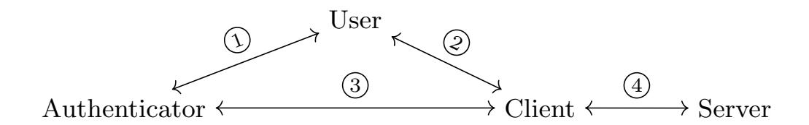
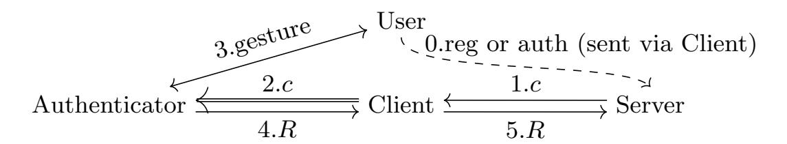
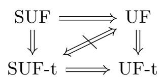
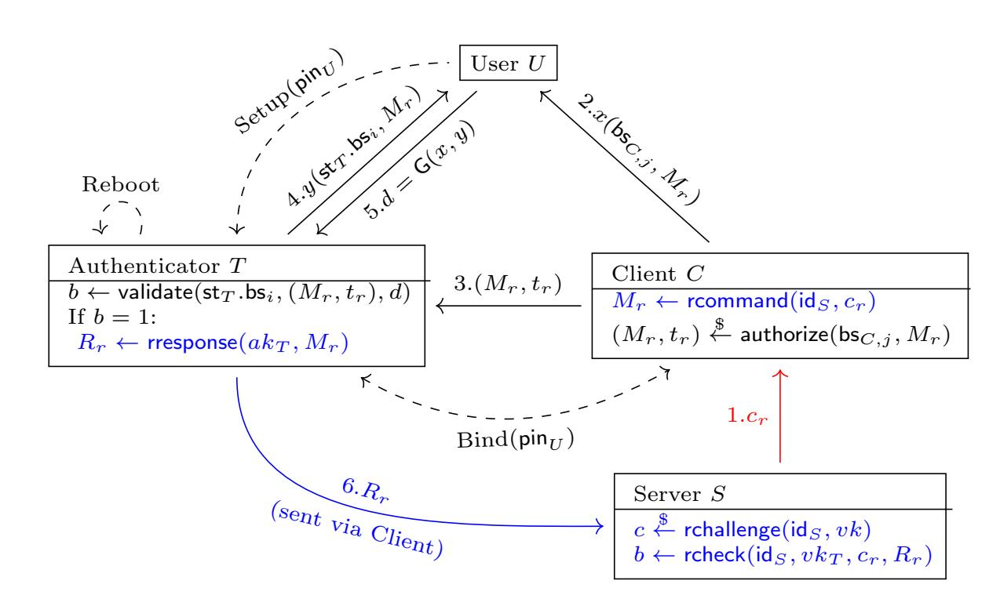

{0}------------------------------------------------

<span id="page-0-0"></span>An extended abstract of this paper appeared in CRYPTO 2021. This is the full version.

# Provable Security Analysis of FIDO2

Manuel Barbosa<sup>1</sup> , Alexandra Boldyreva<sup>2</sup> , Shan Chen<sup>3</sup> , and Bogdan Warinschi<sup>4</sup>

> University of Porto (FCUP) and INESC TEC, mbb@fc.up.pt Georgia Institute of Technology, sasha@gatech.edu Technische Universit¨at Darmstadt<sup>∗</sup> , dragoncs16@gmail.com University of Bristol and Dfinity, csxbw@bristol.ac.uk

> > May 26, 2022

#### Abstract

We carry out the first provable security analysis of the new FIDO2 protocols, the promising FIDO Alliance's proposal for a standard for passwordless user authentication. Our analysis covers the core components of FIDO2: the W3C's Web Authentication (WebAuthn) specification and the new Client-to-Authenticator Protocol (CTAP2).

Our analysis is modular. For WebAuthn and CTAP2, in turn, we propose appropriate security models that aim to capture their intended security goals and use the models to analyze their security. First, our proof confirms the authentication security of WebAuthn. Then, we show CTAP2 can only be proved secure in a weak sense; meanwhile, we identify a series of its design flaws and provide suggestions for improvement. To withstand stronger yet realistic adversaries, we propose a generic protocol called sPACA and prove its strong security; with proper instantiations, sPACA is also more efficient than CTAP2. Finally, we analyze the overall security guarantees provided by FIDO2 and WebAuthn+sPACA based on the security of their components.

We expect that our models and provable security results will help clarify the security guarantees of the FIDO2 protocols. In addition, we advocate the adoption of our sPACA protocol as a substitute for CTAP2 for both stronger security and better performance.

# 1 Introduction

Motivation. Passwords are pervasive yet insecure. According to some studies, the average consumer of McAfee has 23 online accounts that require a password [\[19\]](#page-24-0), and the average employee using LastPass has to manage 191 passwords [\[26\]](#page-24-1). Not only are the passwords difficult to keep track of, but it is well-known that achieving strong security while relying on passwords is quite difficult (if not impossible). According to the Verizon Data Breach Investigations Report [\[39\]](#page-25-0), 81% of hacking-related breaches relied on either stolen and/or weak passwords. What some users may consider an acceptable password, may not withstand sophisticated and powerful modern password cracking tools. Moreover, even strong passwords may fall prey to phishing attacks and identity fraud. According to Symantec, in 2017, phishing emails were the most widely used means of infection, employed by 71% of the groups that staged cyber attacks [\[35\]](#page-25-1).

An ambitious project which tackles the above problem is spearheaded by the Fast Identity Online (FIDO) Alliance. A truly international effort, the alliance has working groups in the US, China,

<sup>∗</sup>Shan Chen did most of his work while at Georgia Institute of Technology.

{1}------------------------------------------------

<span id="page-1-3"></span>Europe, Japan, Korea and India and has brought together many companies and types of vendors, including Amazon, Google, Microsoft, Apple, RSA, Intel, Yubico, Visa, Samsung, major banks, etc.

The goal is to enable user-friendly passwordless authentication secure against phishing and identity fraud. The core idea is to rely on security devices (controlled via biometrics and/or PINs) which can then be used to register and later seamlessly authenticate to online services. The various standards defined by FIDO formalize several protocols, most notably Universal Authentication Framework (UAF), the Universal Second Factor (U2F) protocols and the new FIDO2 protocols: W3C's Web Authentication (WebAuthn) and FIDO Alliance's Client-to-Authenticator Protocol v2.0 (CTAP2[1](#page-1-0) ).

FIDO2 is moving towards wide deployment and standardization with great success. Major web browsers including Google Chrome and Mozilla Firefox have implemented WebAuthn. In 2018, Clientto-Authenticator Protocol (CTAP)[2](#page-1-1) was recognized as international standards by the International Telecommunication Union's Telecommunication Standardization Sector (ITU-T). In 2019, WebAuthn became an official web standard. Also, Android and Windows Hello earned FIDO2 Certification. Although the above deployment is backed-up by highly detailed description of the security goals and a variety of possible attacks and countermeasures, these are informal [\[23\]](#page-24-2).

Our Focus. We provide the first provable security analysis of the FIDO2 protocols. Our focus is to clarify the formal trust model assumed by the protocols, to define and prove their exact security guarantees, and to identify and fix potential design flaws and security vulnerabilities that hinder their widespread use. Our analysis covers the actions of human users authorizing the use of credentials via gestures and shows that, depending on the capabilities of security devices, such gestures enhance the security of FIDO2 protocols in different ways. We concentrate on the FIDO2 authentication properties and leave the study of its arguably less central anonymity goals for future work.

Related Work. Some initial work in this direction already exists. Hu and Zhang [\[29\]](#page-24-3) analyzed the security of FIDO UAF 1.0 and identified several vulnerabilities in different attack scenarios. Later, Panos et al. [\[36\]](#page-25-2) analyzed FIDO UAF 1.1 and explored some potential attack vectors and vulnerabilities. However, both works were informal. FIDO U2F and WebAuthn were analyzed using the applied pi-calculus and ProVerif tool [\[27,](#page-24-4)[31,](#page-25-3)[37\]](#page-25-4). Regarding an older version of FIDO U2F, Pereira et al. [\[37\]](#page-25-4) presented a server-in-the-middle attack and Jacomme and Kremer [\[31\]](#page-25-3) further analyzed it with a structured and fine-grained threat model for malware. Guirat and Halpin [\[27\]](#page-24-4) confirmed the authentication security provided by WebAuthn while pointed out that the claimed privacy properties (i.e., account unlinkability) failed to hold due to the same attestation key pair used for different servers.

However, none of the existing work employs the cryptographic provable security approach to the FIDO2 protocols in the course of deployment. In particular, there is no analysis of CTAP2, and the results for WebAuthn [\[31\]](#page-25-3) are limited in scope: as noted by the authors themselves, their model "makes a number of simplifications and so much work is needed to formally model the complete protocol as given in the W3C specification". The analysis in [\[31\]](#page-25-3) further uses the symbolic model (often called the Dolev-Yao model [\[20\]](#page-24-5)), which captures weaker adversarial capabilities than those in computational models (e.g., the Bellare-Rogaway model [\[11\]](#page-23-0)) employed by the provable security approach we adopt here.

The works on two-factor authentication (e.g., [\[18,](#page-24-6)[33\]](#page-25-5)) are related to our work, but the user in such protocols has to use the password and the two-factor device during each authentication/login. With FIDO2, there is no password during user registration or authentication. The PIN used in FIDO2 is meant to authorize a client (e.g., a browser) access to an authenticator device (e.g., an authentication token); the server does not use passwords at all.[3](#page-1-2) Some two-factor protocols can also generate a binding cookie after the first login to avoid using the two-factor device or even the password for future logins. However, this requires trusting the client, e.g., a malicious browser can log in as the user

<span id="page-1-0"></span><sup>1</sup>The older version is called CTAP1/U2F.

<span id="page-1-2"></span><span id="page-1-1"></span><sup>2</sup>CTAP refers to both versions: CTAP1/U2F and CTAP2.

<sup>3</sup>Some form of prior user authentication method is required for registration of a new credential, but this is a set-up assumption for the protocol.

{2}------------------------------------------------

<span id="page-2-2"></span>

<span id="page-2-0"></span>Figure 1: Communication channels



<span id="page-2-1"></span>Figure 2: FIDO2 flow (simplified): double arrow = CTAP2 authorized command.

without having the two-factor device (or the password). FIDO2 uses the PIN to prevent an attacker with a stolen device from authenticating to a server from a new client.

Our work is not directly applicable to federated authentication protocols such as Kerberos, OAuth, or OpenID. FIDO2 allows the user to keep a hardware token that it can use to authenticate to multiple servers without having to use a federated identity. The only trust anchor is an attestation key pair for the token. To the best of our knowledge, there are no complete and formal security models for federated authentication in the literature, but such models would differ significantly from the ones we consider here. It is interesting to see how FIDO2 and federated authentication can be used securely together; we leave this as an interesting direction for future work. Our work could, however, be adapted to analyze some second-factor authentication protocols like Google 2-step [\[2\]](#page-23-1).

FIDO2 Overview. FIDO2 consists of two core components (see Figure [1](#page-2-0) for the communication channels and Figure [2](#page-2-1) for the simplified FIDO2 flow).

WebAuthn is a web API that can be built into browsers to enable web applications to integrate user authentication. At its heart, WebAuthn is a passwordless "challenge-response" scheme between a server and a user. The user relies on a trusted authenticator device (e.g., a security token or a smartphone) and a possibly untrusted client (e.g., a browser or an operating system installed on the user's laptop). Such a device-assisted "challenge-response" scheme works as follows (see details in Section [5\)](#page-9-0). First, in the registration phase, the server sends a random challenge to the security device through the client. In this phase, the device signs the challenge using its long-term embedded attestation private key, along with a new public key credential to use in future interactions; the credential is included in the response to the server. In the subsequent interactions, which correspond to user authentication, the challenge sent by the server is signed by the device using the secret key corresponding to the credential. In both cases, the signature is verified by the server.

The other FIDO2 component, CTAP2, specifies the communication between an authenticator device and the client (usually a browser). Its goal is to guarantee that the client can only use the authenticator with the user's permission, which the user authorizes by 1) entering a PIN when the authenticator powers up and 2) directly using the authenticator interface (e.g., a simple push-button) to authorize registration and authentication operations. CTAP2 specifies how to configure (or set up) an authenticator with a user PIN. Roughly speaking, its security goal is to "bind" a trusted client to the set-up authenticator by requiring the user to provide the correct PIN, such that the authenticator accepts only authorized commands sent from a "bound" client. We remark that, surprisingly, CTAP2 relies on the (unauthenticated) Diffie-Hellman key exchange. The details are in Section [7.](#page-15-0)

Our Contributions. We perform the first thorough cryptographic analysis of the authentication properties guaranteed by FIDO2 using the provable security approach. Our analysis is conducted in a modular way. That is, we first analyze WebAuthn and CTAP2 components separately and then derive the overall security of a typical use of FIDO2. We note that our models, although quite different, 

{3}------------------------------------------------

<span id="page-3-0"></span>follow the Bellare-Rogaway model [\[11\]](#page-23-0) that was proposed to analyze key exchange protocols, which defines oracle queries to closely simulate the real-world adversarial abilities. Its extensions (like ours) have been widely used to analyze real-world protocols such as TLS 1.3 [\[14,](#page-24-7) [21\]](#page-24-8), Signal [\[15\]](#page-24-9), etc.

Provable security of WebAuthn. We start our analysis with the simpler base protocol, WebAuthn. We define the class of passwordless authentication (PlA) protocols that capture the syntax of WebAuthn. Our PlA model considers an authenticator and a server (often referred to as a relying party) communicating through a client, which consists of two phases. The server is assumed to know the attestation public key that uniquely identifies the authenticator. In the registration phase the authenticator and the server communicate with the intention to establish some joint state corresponding to this registration session: this joint state fixes a credential registered on the server, which is bound to the authenticator's attestation public key vk and the server's identity id<sup>S</sup> (e.g., a server domain name). The server gets the guarantee that the joint state is stored in a specific authenticator, which is assumed to be tamper-proof. The joint state can then be used in the authentication phase. Here, the authenticator and server engage in a message exchange where the goal of the server is to verify that it is interacting with the same authenticator that registered the credential bound to (vk, idS).

Roughly speaking, a PlA protocol is secure if, whenever a registration/authentication session completes on the server side, there is a unique partnered registration/authentication session which completed successfully on the authenticator side. For authentication sessions, we further impose that there is a unique associated registration session on both sides, and that these registration sessions are also uniquely partnered. This guarantees that registration contexts (i.e., information about the credentials) are isolated from one another; moreover, if a server session completes an authentication session with an authenticator, then the authenticator must have completed a registration session with the server earlier. We use the model thus developed to prove the security of WebAuthn under the assumption that the underlying hash function is collision-resistant and the signature scheme is unforgeable. Full details can be found in Section [5.](#page-9-0)

Provable security of CTAP2. Next we study the more complex CTAP2 protocol. We define the class of PIN-based access control for authenticators (PACA) protocols to formalize the general syntax of CTAP2. Although CTAP2 by its name may suggest a two-party protocol, our PACA model involves the user as an additional participant and therefore captures human interactions with the client and the authenticator (e.g., the user typing its PIN into the browser window or rebooting the authenticator). A PACA protocol runs in three phases as follows. First, in the authenticator setup phase, the user "embeds" its PIN into the authenticator via a client and, as a result, the authenticator stores a PIN-related long-term state. Then, in the binding phase, the user employs the same PIN to "bind" the client to the authenticator to authorize the client access to it, where they each end up with a (perhaps different) binding state. Finally, in the access channel phase, the client is able to send any authorized command (computed using its binding state) to the authenticator, which validates it using its own binding state. Note that the final established access channel is unidirectional, i.e., it only guarantees authorized access from the client to the authenticator but not the other way.

Our model captures the security of the above access channels. The particular implementation of CTAP2 operates as follows. In the binding phase, the authenticator privately sends its associated secret called pinToken (generated upon power-up) to the trusted client and the pinToken is then stored on the client as the binding state. Later, in the access channel phase, that binding state is used by the bound client to authorize messages sent to the authenticator. We note that, by the CTAP2 design, each authenticator is associated with a single pinToken per power-up, so multiple clients establish multiple access channels with the same authenticator using the same pinToken. This limits the security of CTAP2 access channels: for a particular channel from a client to an authenticator to be secure (i.e., no attacker can forge new authorized commands sent over that channel), none of the clients bound to the same authenticator during the same power-up can be compromised.

Motivated by the above discussion, we distinguish between unforgeability (UF) and strong unforgeability (SUF) for PACA protocols. The former corresponds to the weak level of security discussed above. The latter, captures strong fine-grained security where the attacker can compromise any clients 

{4}------------------------------------------------

except for the target client involved in the target access channel for which we claim security (and we call the involved authenticator the target authenticator below). As we explain later (see Section [6\)](#page-11-0), SUF also covers certain forward secrecy guarantees for authentication. For both notions, we consider a powerful attacker that can manipulate the communication between parties, compromise clients (that are not bound to the target authenticator) to reveal the binding states, and corrupt users (that did not set up the target authenticator) to learn their secret PINs.

Even with the stronger trust assumption (made in UF) on the bound clients, we are unable to prove that CTAP2 realizes the expected security model: we describe an attack that exploits the fact that CTAP2 uses unauthenticated Diffie-Hellman. Since it is important to understand the limits of the protocol, we consider a further refinement of the security models which makes stronger trust assumptions on the binding phase of the protocol. Specifically, in the trusted binding setting the attacker cannot launch active attacks against the client during the binding phase, but it may try to do so against the authenticator, i.e., it cannot launch man-in-the-middle (MITM) attacks but it may try to impersonate the client to the authenticator. We write UF-t and SUF-t for the security levels which consider trusted binding and the distinct security goals outlined above. In summary we propose four notions: by definition SUF is the strongest security notion and UF-t is the weakest one. Interestingly, UF and SUF-t are incomparable as established by our separation result discussed in Section [7](#page-15-0) and Section [8.](#page-18-0) Based on our security model, we prove that CTAP2 achieves the weakest UF-t security and show that it is not secure regarding the three stronger notions. Finally, we identify a series of design flaws of CTAP2 and provide suggestions for improvement.

Improving CTAP2 security. CTAP2 cannot achieve UF security because in the binding phase it uses unauthenticated Diffie-Hellman key exchange which is vulnerable to MITM attacks. This observation suggests a change to the protocol which leads to stronger security. Specifically, we propose a generic sPACA protocol (for strong PACA), which replaces the use of unauthenticated Diffie-Hellman in the binding phase with a password-authenticated key exchange (PAKE) protocol. Recall that PAKE takes as input a common password and outputs the same random session key for both parties. The key observation is that the client and the authenticator share a value (derived from the user PIN) which can be viewed as a password. By running PAKE with this password as input, the client and the authenticator obtain a strong key which can be used as the binding state to build the access channel. Since each execution of the PAKE (with different clients) results in a fresh independent key, we can prove that sPACA is a SUF-secure PACA protocol. Furthermore, we compare the performance of CTAP2 and sPACA (with proper PAKE instantiations). The results show that our sPACA protocol is also more efficient, so it should be considered for adoption.

Composed security of WebAuthn and CTAP2. Finally, towards our main goal of the analysis of full FIDO2 (by full FIDO2 we mean the envisioned usage of the two protocols), we study the composition of PlA and PACA protocols (see Section [9\)](#page-20-0). The composed protocol, which we simply call PlA+PACA, is defined naturally for an authenticator, user, client, and server. The composition, and the intuition that underlies its security, is as follows. Using PACA, the user (via a client) sets a PIN for the authenticator. This means that only clients that obtain the PIN from the user can "bind" to the authenticator and issue commands that it will accept. In other words, PACA establishes the access channel from the bound client to the authenticator. Then, the challenge-response protocol of PlA runs between the server and the authenticator, via a PACA-authorized client. The server-side PlA guarantees are preserved by the composed protocol, and now the PlA+PACA authenticator can control client access to its credentials using PACA; this composition result is intuitive and easy to prove given our modular formalization.

Interestingly, we formalize an even stronger property that shows that the composed protocol gives mutual authentication guarantees between the human user and server with proper user gestures if the client and server are connected by a server-to-client authenticated channel. We note that such a channel is, for instance, provided by Transport Layer Security (TLS) and hence the above guarantees apply to the typical use of FIDO2 over TLS. Our results apply to both FIDO2 (WebAuthn+CTAP2) and WebAuthn+sPACA but in different PACA corruption models (i.e., different restrictions on adver

{5}------------------------------------------------

sarial capabilities to reveal secrets in the PACA component), with the former in the UF-t corruption model and the latter in the SUF corruption model.

We conclude with an analysis of the role of user gestures in FIDO2. We first show that SUF security offered by sPACA allows the user, equipped with an authenticator that can display a simple access channel identifier, to perform a gesture to detect and prevent attacks from malware that may compromise the states of PACA clients previously bound to the authenticator. (This is not possible for the current version of CTAP2.) We also show how gestures can help a human user distinguish the server identity being approved in concurrent PlA+PACA sessions.

Summary. Our analyses clarify the security guarantees FIDO2 should provide for the various parties involved in the most common usage scenario where: 1) the user owns a simple hardware token that is capable of accepting push-button gestures and, optionally, to display an identifier code (e.g., akin to bluetooth pairing codes) or other human-readable information; 2) the user configures the token with her secret PIN using a trusted client; 3) the user authorizes some trusted clients access (i.e., ability to authorize commands) to her token; 4) the user connects/disconnects the token to multiple authorized clients, some trusted, some untrusted, and uses it to register/authenticate to multiple servers.

In all of the above interactions, the server that accepts in authentication with a credential is assured that: 1) the authentication came from the token that registered the credential in use; 2) the token was accessed by an authorized command bound to this authentication; 3) this command was issued by a client authorized since the last token power-up (this implies the user entered the correct PIN recently). The last guarantee assumes the following: the token is not stolen (i.e., only the honest user can perform a gesture on her token), the PIN is not corrupted (i.e., only known by the user), and the authorized client is not compromised (i.e., the client platform where the user entered her PIN is isolated from malicious code and runs CTAP2 correctly). Note that even if the token is stolen, the attacker still has to guess the PIN (without locking the token) in order to impersonate the user.

Given a server-to-client authenticated channel, the user is assured that any authentication that she approved on her token can only be accepted by the intended server, except if the attacker corrupts her PIN or compromises the client platform (in the current power-up period) used by her.

With our proposed modifications, FIDO2 will meet this level of security. Without them, the above guarantees will only hold when assuming weaker client compromise capabilities and, more importantly, the attacker cannot perform active man-in-the-middle attacks against the client client (that input the user PIN) during any binding session, which seems unrealistic.

### 2 Preliminaries

**Notations.** In this paper,  $\{0,1\}^*$  denotes the set of all finite-length binary strings (including the empty string  $\varepsilon$ ) and  $\{0,1\}^n$  denotes the set of n-bit binary strings. We use  $y \leftarrow x$  for assigning a value to a variable. For a function (or algorithm) f, we use  $y \leftarrow f(x)$  to denote assigning y with the output of f on input x (and sometimes we use  $y \stackrel{\$}{\leftarrow} f(x)$  to emphasize f is probabilistic). We also use  $y \stackrel{\$}{\leftarrow} \mathcal{S}$  to denote assigning y with an element chosen uniformly at random from set  $\mathcal{S}$ . We use the wildcard  $\cdot$  to indicate a valid input of a function. If any input of a function is invalid, so is the output, where invalid input/output is denoted by  $\bot$ .

In Appendix A, we recall the definitions of pseudorandom functions (PRFs), collision-resistant hash function families, message authentication codes (MACs), signature schemes, the computational Diffie-Hellman (CDH) problem and strong CDH (sCDH) problem, as well as the corresponding advantage measures  $\mathbf{Adv}^{\mathsf{prf}}$ ,  $\mathbf{Adv}^{\mathsf{coll}}$ ,  $\mathbf{Adv}^{\mathsf{coll}}$ ,  $\mathbf{Adv}^{\mathsf{euf-cma}}$ ,  $\mathbf{Adv}^{\mathsf{colh}}$ ,  $\mathbf{Adv}^{\mathsf{colh}}$ . In Appendix B, we recall the syntax for PAKE and its security of perfect forward secrecy and explicit authentication.

{6}------------------------------------------------

# <span id="page-6-2"></span><span id="page-6-1"></span>3 Execution Model

The protocols we consider involve four disjoint sets of parties. Formally, the set of parties P is partitioned into four disjoint sets: users U, authenticators (or tokens for short) T , clients C, and servers S. Each party has a well-defined and non-ambiguous identifier, which one can think of as being represented as an integer; we typically use P, U, T, C, S for identifiers bound to a party in a security experiment and id for the case where an identifier is provided as input in the protocol syntax.

For simplicity, we do not consider certificates or certificate checks but assume the public key associated with a party is supported by a public key infrastructure (PKI) and hence certified and bound to the party's identity. This issue arises explicitly only for attestation public keys bound to authenticators in Section [4.](#page-7-0)

The possible communication channels are represented as double-headed arrows in Figure [1.](#page-2-0) In FIDO2, the client is a browser and the user-client channel is the browser window, which keeps no longterm state. The authenticator is a hardware token or mobile phone that is connected to the browser via an untrusted link that includes the operating system, some authenticator-specific middleware, and a physical communication channel that connects the authenticator to the machine hosting the browser. The authenticator exposes a simple interface to the user that allows it to perform a "gesture", confirming some action; ideally the authenticator should also be able to display information to the user (this is natural when using a mobile phone as an authenticator but not so common in USB tokens or smartcards). Following the intuitive definitions of human-compatible communications by Boldyreva et al. [\[13\]](#page-24-10), we require that messages sent to the user be human-readable and those sent by the user be human-writable. [4](#page-6-0) The user PIN needs to be human-memorizable.

We assume authenticators have a good source of random bits and keep volatile and static (or longterm) storage. Volatile storage is erased every time the device goes through a power-down/power-up cycle, which we call a reboot. Static storage is assumed to be initialized using a procedure carried out under special setup trust assumptions; in the case of this paper we will consider the setup procedures to generate an attestation key pair for the authenticator and to configure a user PIN, i.e., to "embed" the PIN in the authenticator.

Trust model. For each of the protocols we analyze in the paper we specify a trust model, which justifies our proposed security models. Here we state the trust assumptions that are always made throughout the paper. First, human communications ( <sup>1</sup> <sup>2</sup> ) are authenticated and private. This in practice captures the direct human-machine interaction between the human user and the authenticator device or the client terminal, which involves physical senses and contact that we assume cannot be eavesdropped or interrupted by an attacker. Second, client-authenticator communications ( 3 ) are not protected, i.e., neither authenticated nor private. Finally, authenticators are assumed to be tamperproof, so our models will not consider corruption of their internal state.

Modeling users and their gestures. We do not include in our protocol syntaxes and security models explicit state keeping and message passing for human users, i.e., there are no session oracles for users in the security experiments. We shortly explain why this is the case. The role of the user in these protocols is to a) first check that the client is operating on correct inputs, e.g., by looking at the browser window to see if the correct server identity is being used; b) possibly (if the token has the capability to display information) check that the token and client are operating on consistent inputs; and c) finally confirm to the token that this is the case. Therefore, the user itself plays the role of an out-of-band secure channel via which the consistency of information exchanged between the client and the token can be validated.

We model this with a public gesture predicate G that captures the semantics of the user's decision. Intuitively, the user decision d ∈ {0, 1} is given by d = G(x, y), where x and y respectively represent the information conveyed to the user by the client and the token in step b) above. Note that x, y may not be input by the user. Tokens with different user interface capabilities give rise to different

<span id="page-6-0"></span><sup>4</sup>We regard understandable information displayed on a machine as human-readable and typing in a PIN or rebooting an authenticator as human-writable.

{7}------------------------------------------------

classes of gesture predicates. For example, if a user can observe a server domain name id on the token display before pressing a button, then we can define the gesture of checking that the token displayed an identifier id that matches the one displayed by the client  $id^*$  as  $G(id^*, id) = (id^* \stackrel{?}{=} id)$ .

User actions are hardwired into the security experiments as direct inputs to either a client or a token, which is justified by our assumption that users interact with these entities via fully secure channels. We stress that here G is a modeling tool, which captures the sequence of interactions a), b), c) above. Providing a gesture means physical possession of the token, so an attacker controlling only some part of the client machine (e.g., malware) is *not* able to provide a gesture. Moreover, requiring a gesture from the user implies that the user can detect when some action is requested from the token.

# <span id="page-7-0"></span>4 Passwordless Authentication

We start our analysis with the simpler FIDO2 component protocol, WebAuthn. In order to analyze the authentication security of WebAuthn we first define the syntax and security model for passwordless authentication (PlA) protocols.

## 4.1 Protocol Syntax

A PlA protocol is an interactive protocol among three parties: a token (representing a user), a client, and a server. The token is associated with an attestation public key that is pre-registered to the server. The protocol defines two types of interactions: registration and authentication. In registration the server requests the token to register some initial authentication parameters. If this succeeds, the server can later recognize the same token using a challenge-response protocol.

The possible communication channels are as shown in Figure 1, but we do not include the user. Servers are accessible to clients via a communication channel that models Internet communications.

The state of token T, denoted by  $\mathsf{st}_T$ , is partitioned into the following (static) components: i) an attestation key pair  $(vk_T, ak_T)$  and ii) a set of registration contexts  $\mathsf{st}_T.\mathsf{rct}$ . Each server S has a unique identity  $\mathsf{id}_S$  (e.g., a server domain name) and it also keeps its registration contexts  $\mathsf{st}_S.\mathsf{rcs}$ . Clients do not keep long-term state.<sup>5</sup> All states are initialized to the empty string  $\varepsilon$ .

A PlA protocol consists of the following algorithms and subprotocols:

**KeyGen:** This algorithm, denoted by Kg, is executed at most once for each authenticator; it generates an attestation key pair (vk, ak).

**Register:** This subprotocol is executed among a token, a client, and a server. The token inputs its attestation private key  $ak_T$ , the client inputs an intended server identity  $i\hat{d}_S$ , and the server inputs its identity  $i\hat{d}_S$  and the token's attestation public key  $vk_T$ . At the end of the subprotocol, the token always accepts while the server either accepts or rejects. Each party on acceptance obtains a new registration context.

**Authenticate:** This subprotocol is executed between a token, a client, and a server. The token inputs its registration contexts, the client inputs an intended server identity  $i\bar{d}_S$ , and the server inputs its identity  $i\bar{d}_S$  and registration contexts. At the end of the subprotocol, the token always *accepts* while the server either *accepts* or *rejects*. Each party on acceptance updates its registration contexts.

RESTRICTED CLASS OF PROTOCOLS. For both Register and Authenticate, we focus on 2-pass challenge-response protocols with the following structure:

• Server-side computation is split into four algorithms: rchallenge and rcheck for registration, achallenge and acheck for authentication. The challenge algorithms are probabilistic, which take the server's input to the Register or Authenticate subprotocol and return a challenge. The check

<span id="page-7-1"></span><sup>&</sup>lt;sup>5</sup>Some two-factor protocols may have a "trust this computer" feature that requires the client to store some long-term states. This is not included in our model as to the best of our knowledge FIDO2 does not have that feature.

{8}------------------------------------------------

<span id="page-8-0"></span>algorithms get the same input, the challenge, and a response. rcheck outputs a bit  $b_r \in \{0,1\}$  (1 for accept and 0 for reject) and the updated registration contexts rcs that are later input by acheck; acheck also outputs a bit  $b_a$  and updates rcs.

- Client-side computation is modeled as two deterministic functions rcommand and acommand that capture possible checks and translations performed by the client before sending commands to the token. These algorithms output commands denoted by  $M_r$ ,  $M_a$  respectively, which they generate from the input intended server identity and the received challenge. The client may append some information about the challenge to the token's response before sending it to the server, which is an easy step that we do not model explicitly.
- Token-side computation is modeled as two probabilistic algorithms rresponse and aresponse that, on input a command and the token's input to the Register or Authenticate subprotocol, generate a response and update the registration contexts rct. In particular, rresponse outputs the updated registration contexts rct that are later input by aresponse.

CORRECTNESS. Correctness imposes that for any server identities  $id_S$ ,  $id_S$ ,  $id_S$ ,  $id_S$  the following probability is 1, where the last four authentication procedures can be repeated as many times:

Pr 
$$\begin{bmatrix} (ak, vk) & & & \\ (ak, vk) & & & \\ (c_r & & & \\ & & & \\ & & & \\ & & & \\ & & & \\ & & & \\ & & & \\ & & & \\ & & & \\ & & & \\ & & & \\ & & & \\ & & & \\ & & & \\ & & & \\ & & & \\ & & & \\ & & & \\ & & & \\ & & & \\ & & & \\ & & & \\ & & & \\ & & & \\ & & & \\ & & & \\ & & & \\ & & & \\ & & & \\ & & & \\ & & & \\ & & & \\ & & & \\ & & & \\ & & & \\ & & & \\ & & & \\ & & & \\ & & & \\ & & & \\ & & & \\ & & & \\ & & & \\ & & & \\ & & & \\ & & & \\ & & & \\ & & & \\ & & & \\ & & & \\ & & & \\ & & & \\ & & & \\ & & & \\ & & & \\ & & & \\ & & & \\ & & & \\ & & & \\ & & & \\ & & & \\ & & & \\ & & & \\ & & & \\ & & & \\ & & & \\ & & & \\ & & & \\ & & & \\ & & & \\ & & & \\ & & & \\ & & & \\ & & & \\ & & & \\ & & & \\ & & & \\ & & & \\ & & & \\ & & & \\ & & & \\ & & & \\ & & & \\ & & & \\ & & & \\ & & & \\ & & & \\ & & & \\ & & & \\ & & & \\ & & & \\ & & & \\ & & & \\ & & & \\ & & & \\ & & & \\ & & & \\ & & & \\ & & & \\ & & & \\ & & & \\ & & & \\ & & & \\ & & & \\ & & & \\ & & & \\ & & & \\ & & & \\ & & & \\ & & & \\ & & & \\ & & & \\ & & & \\ & & & \\ & & & \\ & & & \\ & & & \\ & & & \\ & & & \\ & & & \\ & & & \\ & & & \\ & & & \\ & & & \\ & & & \\ & & & \\ & & & \\ & & & \\ & & & \\ & & & \\ & & & \\ & & & \\ & & & \\ & & & \\ & & & \\ & & & \\ & & & \\ & & & \\ & & & \\ & & & \\ & & & \\ & & & \\ & & & \\ & & & \\ & & & \\ & & & \\ & & & \\ & & & \\ & & & \\ & & & \\ & & & \\ & & & \\ & & & \\ & & & \\ & & & \\ & & & \\ & & & \\ & & & \\ & & & \\ & & & \\ & & & \\ & & & \\ & & & \\ & & & \\ & & & \\ & & & \\ & & & \\ & & & \\ & & & \\ & & & \\ & & & \\ & & & \\ & & & \\ & & & \\ & & & \\ & & & \\ & & & \\ & & & \\ & & & \\ & & & \\ & & & \\ & & & \\ & & & \\ & & & \\ & & & \\ & & & \\ & & & \\ & & & \\ & & & \\ & & & \\ & & & \\ & & & \\ & & & \\ & & & \\ & & & \\ & & & \\ & & & \\ & & & \\ & & & \\ & & & \\ & & & \\ & & & \\ & & & \\ & & & \\ & & & \\ & & & \\ & & & \\ & & & \\ & & & \\ & & & \\ & & & \\ & & & \\ & & & \\ & & & \\ & & & \\ & & & \\ & & & \\ & & & \\ & & & \\ & & & \\ & & & \\ & & & \\ & & & \\ & & & \\ & & & \\ & & & \\ & & & \\ & & & \\ & & & \\ & & & \\ & & & \\ & & & \\ & & & \\ & & & \\ & & & \\ & & & \\ & & & \\ & & & \\ & & & \\ & & & \\ & & & \\ & & & \\ & & & \\ & & & \\ & & & \\ & & & \\ & & & \\ & & & \\ & & & \\ & & & \\$$

Intuitively, correctness requires that the server always accepts an authentication that is consistent with a prior registration, if and only if the client's input intended server identities match the server identity received from the server. Note that the latter check is performed by the client rather than the human user. It helps to prevent a so-called server-in-the-middle attack identified in [37].

#### 4.2 Security Model

**Trust model.** Before defining security we clarify that there are no security assumptions on the communication channels shown in Figure 1. Authenticators are assumed to be *tamper-proof*, so the model will not consider corruption of their internal state. (Note that clients and servers keep *no* secret state.) We assume the key generation stage, where the attestation key pair is generated and then installed in the token, is either carried out within the token itself, or performed in a trusted context that leaks nothing about the attestation private key.

Session oracles. As with the Bellare-Rogaway model [11], to capture multiple sequential and parallel PlA executions (or instances), we associate each party  $P \in \mathcal{T} \cup \mathcal{S}$  with a set of session oracles  $\{\pi_P^{i,j}\}_{i,j}$ , which models two types of PlA instances corresponding to registration and authentication. We omit session oracles for clients, since all they do can be performed by the adversary. For servers and tokens, session oracles are structured without loss of generality as follows:  $\pi_P^{i,0}$  refers to the *i*-th registration instance of P, whereas  $\pi_P^{i,j}$  for  $j \geq 1$  refers to the *j*-th authentication instance of P associated with  $\pi_P^{i,0}$  after it accepts. In other words, the registration context generated by  $\pi_P^{i,0}$  is shared only with  $\pi_P^{i,j}$  for j > 0. As a result, each session oracle  $\pi_P^{i,j}$  has access to only one registration context.

**Security experiment.** The security experiment is run between a challenger and an adversary  $\mathcal{A}$  against a PlA protocol  $\Pi$ . At the beginning of the experiment, the challenger runs  $(ak_T, vk_T) \stackrel{\$}{\leftarrow} \mathsf{Kg}()$  for all  $T \in \mathcal{T}$  to generate their attestation key pairs. The challenger manages the attestation public

{9}------------------------------------------------

<span id="page-9-2"></span>keys  $\{vk_T\}_{T\in\mathcal{T}}$  and provides them to the server oracles as needed. The adversary  $\mathcal{A}$  is given all attestation public keys and server identities and then allowed to interact with session oracles via the following queries:

- Start( $\pi_S^{i,j}, T$ ). The challenger asks a specified server oracle  $\pi_S^{i,j}$  to run rchallenge(id<sub>S</sub>,  $vk_T$ ) (if j=0) or achallenge(id<sub>S</sub>, rcs) (if j>0) to start the Register or Authenticate subprotocol and generate a challenge c, which is stored by the server oracle as  $\pi_S^{i,j}.c$  and given to  $\mathcal{A}$ .
- Challenge( $\pi_T^{i,j}, M$ ). The challenger delivers a specified command M to a specified token oracle  $\pi_T^{i,j}$ , which runs rresponse( $ak_T, M$ ) (if j = 0) or are sponse(rct, M) (if j > 0) and returns the response to A.
- Complete $(\pi_S^{i,j}, R)$ . This returns  $\bot$  if a  $\mathsf{Start}(\pi_S^{i,j}, T)$  query for some token T has not been made. Otherwise, the challenger delivers a specified response R to a specified server oracle  $\pi_S^{i,j}$ , which runs  $\mathsf{rcheck}(\mathsf{id}_S, vk_T, \pi_S^{i,j}.c, R)$  (if j = 0) or  $\mathsf{acheck}(\mathsf{id}_S, \mathsf{rcs}, \pi_S^{i,j}.c, R)$  (if j > 0) and returns the result to  $\mathcal{A}$ .

We assume without loss of generality that each query is only made *once* for each session oracle and allow the adversary to get the full state of the server oracle via Start and Complete queries.

**Partners.** We follow the seminal work by Bellare, Pointcheval and Rogaway [10] to define partnership via session identifiers. A server registration oracle  $\pi_S^{i,0}$  and a token registration oracle  $\pi_T^{k,0}$  are each other's partner if they agree on the same session identifier, which is defined by the analyzed protocol to uniquely identify a communication session of the parties with overwhelming probability. For instance, it could be defined as a subset of the communication trace that fixes the server-generated challenge.

Furthermore, a server authentication oracle  $\pi_S^{i,j}$  (j>0) and a token authentication oracle  $\pi_T^{k,l}$  (l>0) are each other's partner if: i) they agree on the session identifier and ii)  $\pi_S^{i,0}$  and  $\pi_T^{k,0}$  are each other's partner. That is, the authentication session partnership holds only if the token and the server are also partnered for the associated registration sessions: a credential registered in a server should not be used to authenticate a token using another credential.

Advantage measure. Let  $\Pi$  be a PlA protocol. We define the passwordless authentication advantage  $Adv_{\Pi}^{\mathsf{pla}}(\mathcal{A})$  as the probability that: there exists a server oracle that accepts with a given attestation public key, but it is not uniquely partnered with a token oracle that owns the corresponding attestation private key. In particular, a secure PlA protocol guarantees that, if a server oracle accepts, then there exists a unique token oracle that has derived the same session identifier, and no other server oracle has derived the same session identifier.

Note that in this work we assume each token generates its own attestation key pair for simplicity, but in practice many tokens (e.g., produced by the same manufacturer) may share the *same* attestation key pair for privacy purposes. In the latter case, often called *batch attestation*, PlA security is still well defined for authentication, in the sense that authentication is only accepted with respect to the registered token. However, for registration, PlA security only guarantees one of the tokens that shares the same key pair is accepted but it may not be the token being registered by the honest user, so in this case one often assumes (e.g., for WebAuthn) that token registration is executed in a trusted environment to rule out active attacks. Our model also applies to this case, because sessions of different tokens with the same attestation key pair can be modeled as session oracles of the same token without loss of generality.

# <span id="page-9-0"></span>5 The W3C Web Authentication Protocol

In this section, we present the cryptographic core of W3C's Web Authentication (WebAuthn) protocol [16] of FIDO2 and analyze its security.

PROTOCOL DESCRIPTION. We show the core cryptographic operations of WebAuthn in Figure 3 in accordance with PlA syntax.<sup>6</sup> For WebAuthn, a server identity is an effective domain (e.g., a hostname) of the server URL. The attestation key pair is generated by the key generation algorithm

<span id="page-9-1"></span><sup>&</sup>lt;sup>6</sup>We do not include the WebAuthn explicit reference to user interaction/gestures at this point, as this will be later handled by our PACA protocol and the composed protocol.

{10}------------------------------------------------

```
Client C (\hat{\mathsf{id}}_S/\bar{\mathsf{id}}_S)
                                                                                                                                                                 Server S (id<sub>S</sub>, vk_T)
Authenticator T(ak_T)
Register:
                                                                                                                                                                               rchallenge:
                                                                                                                                             rs \stackrel{\$}{\leftarrow} \{0,1\}^{\geq \lambda}, \ uid \stackrel{\$}{\leftarrow} \{0,1\}^{4\lambda}
                                                                               rcommand:
                                                                                                                  _{\perp}cc
                                                                                                                                                                   cc \leftarrow (\mathsf{id}_S, uid, rs)
                                                                           (\mathsf{id}_S, uid, r) \leftarrow cc
rresponse:
                                                                         if id_S \neq id_S: abort
                                                          M_r
                                                                      M_r \leftarrow (\mathsf{id}_S, uid, \mathsf{H}(r))
(\mathsf{id}_S, uid, h_r) \leftarrow M_r
(pk, sk) \stackrel{\$}{\leftarrow} \mathsf{Sig.Kg}()
n \leftarrow 0, cid \stackrel{\$}{\leftarrow} \{0,1\}^{\geq \lambda}
ad \leftarrow (\mathsf{H}(\mathsf{id}_S), n, cid, pk)
                                                                                                                                                                                     rcheck:
                                                                              R_r = (ad, \sigma)
\sigma \leftarrow \mathsf{Sig.Sign}(ak_T, (ad, h_r))
                                                                                                                               gets r from Client, (h, n, cid, pk) \leftarrow ad
                                                                                                                               reject if r \neq rs or h \neq \mathsf{H}(\mathsf{id}_S) or n \neq 0
                                                                                                                                        or Sig.Ver(vk_T, (ad, H(r)), \sigma) = 0
rct.insert((id_S, uid, cid, sk, n))
                                                                                                                                        accept; rcs.insert((uid, cid, pk, n))
Authenticate:
                                                                                                                                                                              achallenge:
                                                                                                                                                                          rs \stackrel{\$}{\leftarrow} \{0,1\}^{\geq \lambda}
                                                                              acommand:
                                                                                                                  \leftarrow cr
                                                                                                                                                                          cr \leftarrow (\mathsf{id}_S, rs)
                                                                              (\mathsf{id}_S, r) \leftarrow cr
                                                                         if id_S \neq \bar{id}_S: abort
aresponse:
                                                           M_a
                                                                          M_a \leftarrow (\mathsf{id}_S, \mathsf{H}(r))
(\mathsf{id}_S, h_r) \leftarrow M_a
(uid, cid, sk, n) \leftarrow \mathsf{rct.get}(\mathsf{id}_S)
n \leftarrow n + 1, \ ad \leftarrow (\mathsf{H}(\mathsf{id}_S), n)
                                                                                                                                                                                    acheck:
                                                                       R_a = (cid, ad, \sigma, uid)
\sigma \stackrel{\$}{\leftarrow} \mathsf{Sig.Sign}(sk, (ad, h_r))
                                                                                                                                                    (uid', pk, n) \leftarrow \mathsf{rcs.get}(cid)
                                                                                                                                          gets r from Client, (h, n_t) \leftarrow ad
                                                                                                                                                reject if uid \neq uid' or r \neq rs
                                                                                                                                                        or h \neq \mathsf{H}(\mathsf{id}_S) or n_t \leq n
                                                                                                                                           or Sig.Ver(pk, (ad, H(r)), \sigma) = 0
                                                                                                                                       accept; rcs.insert((uid, cid, pk, n_t))
rct.insert((id_S, uid, cid, sk, n))
```

<span id="page-10-0"></span>Figure 3: The WebAuthn protocol

Kg of a signature scheme Sig = (Kg, Sign, Ver). (Note that WebAuthn supports the RSASSA-PKCS1-v1\_5 and RSASSA-PSS signature schemes [34].) In Figure 3, we use H to denote the SHA-256 hash function and  $\lambda$  to denote the default parameter 128 (in order to accommodate potential parameter changes). WebAuthn supports two types of operations: Registeration and Authentication (see Figure 1 and Figure 2 in [16]), respectively corresponding to the PlA Register and Authenticate subprotocols. In the following description, we assume each token is registered at most once for a server; this is without loss of generality since otherwise one can treat the one token as several tokens sharing the same attestation key pair.

• In registration, the server generates a random string rs of length at least  $\lambda=128$  bits and a random 512-bit user id uid, forms a challenge cc with rs,uid and its identity  $\mathrm{id}_S$ , and then sends it to the client. Then, the client checks if the received server identity matches its input (i.e., the intended server), then passes the received challenge (where the random string is hashed) to the token. The token generates a key pair (pk,sk) with Sig.Kg, sets the signature counter n to  $0,^7$  and samples a credential id cid of length at least  $\lambda=128$  bits; it then computes an attestation signature (on  $\mathrm{H}(\mathrm{id}_S), n, cid, pk$  and the random string hash  $h_r$ ) and sends the signed (public) credential and signature to the client as a response; the token also inserts the generated credential into its registration contexts. Upon receiving the response, the server checks the validity of the attestation signature and inserts the credential into its registration contexts.

<span id="page-10-1"></span><sup>&</sup>lt;sup>7</sup>The signature counter is mainly used to detect cloned tokens, but it also helps in preventing replay attacks (if such attacks are possible).

{11}------------------------------------------------

<span id="page-11-1"></span>• In authentication, the server also generates a random string rs, but no uid is sampled; it then forms a challenge cr with rs and its identity  $id_S$ , and sends it to the client. Then, the client checks if the received  $id_S$  matches its input and passes the challenge (where the random string is hashed) to the token. The token retrieves the credential associated with the authenticating server  $id_S$  from its registration contexts, increments the signature counter n, computes an authentication signature (on  $H(id_S)$ , n and the random string hash  $h_r$ ), and sends it to the client together with  $H(id_S)$ , n and the retrieved credential id cid and user id uid; the token also updates the credential with the new signature counter. Upon receiving the response, the server retrieves the credential associated with the credential id cid and checks the validity of the signature counter and the signature; if all checks pass, it accepts and updates the credential with the new signature counter.

It is straightforward to check that WebAuthn is a correct PlA protocol.

WEBAUTHN ANALYSIS. The following theorem (proved in Appendix D.1) assesses PlA security of WebAuthn uses (ad, H(r)) as the session identifier.

<span id="page-11-2"></span>**Theorem 1** For any efficient adversary A that makes at most  $q_S$  queries to Start and  $q_C$  queries to Challenge, there exist efficient adversaries  $\mathcal{B}, \mathcal{C}$  such that (recall  $\lambda = 128$ ):

$$\mathbf{Adv}^{\mathsf{pla}}_{\mathrm{WebAuthn}}(\mathcal{A}) \leq \mathbf{Adv}^{\mathsf{coll}}_{\mathsf{H}}(\mathcal{B}) + (|\mathcal{T}| + q_{\mathsf{C}}) \cdot \mathbf{Adv}^{\mathsf{euf-cma}}_{\mathsf{Sig}}(\mathcal{C}) + (q_{\mathsf{S}}^2 + q_{\mathsf{C}}^2) \cdot 2^{-\lambda}.$$

The security guarantees for the WebAuthn instantiations follow from the results proving RSASSA-PKCS1-v1\_5 and RSASSA-PSS to be EUF-CMA in the random oracle model under the RSA assumption [12, 32] and the assumption that SHA-256 is collision-resistant.

## <span id="page-11-0"></span>6 PIN-Based Access Control for Authenticators

In this section, we define the syntax and security model for *PIN-based access control for authenticators* (PACA) protocols. The goal of the protocol is to ensure that after PIN setup and possibly an arbitrary number of authenticator reboots, the user can employ the client to issue PIN-authorized commands to the token, which the token can use for access control, e.g., to unlock built-in functionalities that answer client commands.

#### 6.1 Protocol Syntax

A PACA protocol is an interactive protocol involving a human user, an authenticator (or token for short), and a client. The state of token T, denoted by  $\mathsf{st}_T$ , consists of static storage  $\mathsf{st}_T.\mathsf{ss}$  that remains intact across reboots and volatile storage  $\mathsf{st}_T.\mathsf{vs}$  that gets reset after each reboot.  $\mathsf{st}_T.\mathsf{ss}$  is comprised of: i) a private secret  $\mathsf{st}_T.\mathsf{s}$  and ii) a public retries counter  $\mathsf{st}_T.\mathsf{n}$ , where the latter is used to limit the maximum number of consecutive failed active attacks (e.g., PIN guessing attempts) against the token.  $\mathsf{st}_T.\mathsf{vs}$  consists of: i) power-up state  $\mathsf{st}_T.\mathsf{ps}$  and ii) binding states  $\mathsf{st}_T.\mathsf{bs}_i$  (together denoted by  $\mathsf{st}_T.\mathsf{bs}$ ). A client C may also keep binding states, denoted by  $\mathsf{bs}_{C,j}$ . All states are initialized to the empty string  $\varepsilon$ .

A PACA protocol consists of the following algorithms and subprotocols, all of which can be executed a number of times, except if stated otherwise:

**Reboot:** This algorithm represents a power-down/power-up cycle and it is executed by the authenticator with mandatory user interaction. We use  $\mathsf{st}_T.\mathsf{vs} \leftarrow \mathsf{reboot}(\mathsf{st}_T.\mathsf{ss})$  to denote the execution of this algorithm, which inputs its static storage and resets all volatile storage. Note that one should always run this algorithm to power up the token before it does any other PACA executions.

**Setup:** This subprotocol is executed *at most once* for each authenticator. The user inputs a PIN through the client and the token inputs its volatile storage. In the end, the token sets up its *static* storage and the client (and through it the user) gets an indication of whether the subprotocol completed successfully.

{12}------------------------------------------------

**Bind:** This subprotocol is executed by the three parties to establish an access channel over which commands can be issued. The user inputs its PIN through the client, whereas the token inputs its static storage and power-up state. At the end of the subprotocol, each of the token and client that terminates (i.e., without aborting) obtains a (volatile) binding state. In either case (success or not), the token may update its static retries counter. We assume the client always initiates this subprotocol once it gets the PIN from the user.

**Authorize:** This algorithm allows a client to generate authorized commands for the token. The client inputs a binding state  $\mathsf{bs}_{C,j}$  and a command M. We denote  $(M,t) \leftarrow \mathsf{authorize}(\mathsf{bs}_{C,j},M)$  as the generation of an authorized command.

**Validate:** This algorithm allows a token to validate authorized commands with respect to a user decision. The token inputs a binding state  $\mathsf{st}_T.\mathsf{bs}_i$ , an authorized command (M,t), and a user decision d (see Section 3 for its definition). We denote  $b \leftarrow \mathsf{validate}(\mathsf{st}_T.\mathsf{bs}_i, (M,t), d)$  as the validation performed by the token to obtain an accept or reject indication.

CORRECTNESS. Consider any token T and any sequence of PACA executions that includes the following (perhaps not consecutive) algorithms and subprotocols: i) a Reboot of T; ii) a successful Setup using PIN fixing  $\mathsf{st}_T.\mathsf{ss}$  via some client; iii) a Bind with PIN creating token-side binding state  $\mathsf{st}_T.\mathsf{bs}_i$  and client-side binding state  $\mathsf{bs}_{C,j}$  at a client C; iv) authorization of command M by C as  $(M,t) \leftarrow \mathsf{authorize}(\mathsf{bs}_{C,j},M)$ ; and v) validation by T as  $b \leftarrow \mathsf{validate}(\mathsf{st}_T.\mathsf{bs}_i,(M,t),d)$ . If no Reboot of T is executed after iii), then correctness requires that the above authorized command (M,t) is accepted (i.e., b=1) if the user approved it (i.e., d=1). Correctness further imposes that b=1 implies d=1, i.e., authorized commands cannot be accepted without user approval; this also enforces human interaction for accepted commands.

REMARK. The above PACA syntax may seem overly complex but it is actually difficult (if not impossible) to decompose. First, Setup and Bind share the same power-up state generated by Reboot so cannot be separated into two independent procedures. Then, although Authorize and Validate together can independently model an access channel, detaching them from PACA makes it difficult to define security in a general way: Bind may not establish random symmetric keys; it could, for instance, output asymmetric key pairs.

#### 6.2 Security Model

**Trust model.** Before defining our security model, we first state the assumed security properties for the involved communication channels, as shown in Figure 1 excluding the client-server channel. We assume that Setup is carried out over an authenticated channel where the adversary can only eavesdrop communications between the client and authenticator; this is a necessary assumption, as there are no pre-established authentication parameters between the parties.

Session oracles. To capture multiple sequential and parallel PACA executions, each party  $P \in \mathcal{T} \cup \mathcal{C}$  is associated with a set of session oracles  $\{\pi_P^i\}_i$ , where  $\pi_P^i$  models the *i*-th PACA instance of P. For clients, session oracles are totally independent from each other and they are assumed to be available throughout the protocol execution. For tokens, the static storage and power-up state are maintained by the security experiment and shared by all oracles of the same token. Token oracles keep only binding states (if any). If a token is rebooted, its binding states got reset and hence become *invalid*, i.e., those states will be no longer accessible to anyone including the adversary.

**Security experiment.** The security experiment is executed between a challenger and an adversary  $\mathcal{A}$  against a PACA protocol  $\Pi$ . At the beginning of the experiment, the challenger fixes an arbitrary distribution  $\mathscr{D}$  over a PIN dictionary  $\mathcal{PIN}$ ; it then samples independent user PINs according to  $\mathscr{D}$ ,

<span id="page-12-0"></span><sup>&</sup>lt;sup>8</sup>When such an update is possible, the natural assumption often made in cryptography requires that incoming messages are processed in an atomic way by the token, which avoids concurrency issues. Note that Bind executions could still be concurrent.

{13}------------------------------------------------

denoted by  $\langle \operatorname{pin}_U \stackrel{\mathcal{P}}{\leftarrow} \mathcal{PIN} \rangle_{U \in \mathcal{U}}$ . Without loss of generality, we assume each user holds only one PIN. The challenger also initializes states of all oracles to the empty string. Then,  $\mathcal{A}$  is allowed to interact with the challenger via the following queries:

- Reboot(T). The challenger marks all previously used instances  $\pi_T^i$  (if any) of token T as  $invalid^9$  and sets  $\mathsf{st}_T.\mathsf{vs} \leftarrow \mathsf{reboot}(\mathsf{st}_T.\mathsf{ss})$ . Nothing is returned to  $\mathcal{A}$ .
- Setup( $\pi_T^i, \pi_C^j, U$ ). The challenger inputs  $\operatorname{pin}_U$  through  $\pi_C^j$  and runs Setup between  $\pi_T^i$  and  $\pi_C^j$ ; it returns the trace of communications to  $\mathcal{A}$ . After this query, T is  $\operatorname{set} up$ , i.e.,  $\operatorname{st}_T.\operatorname{ss}$  is set and available, for the rest of the experiment. Oracles created in this query, i.e.,  $\pi_T^i$  and  $\pi_C^j$ , must never have been used before and are always marked  $\operatorname{invalid}$  after Setup completion.
- Execute $(\pi_T^i, \pi_C^j)$ . The challenger runs Bind between  $\pi_T^i$  and  $\pi_C^j$  using the same  $\mathsf{pin}_U$  that set up T; it returns the trace of communications to  $\mathcal{A}$ . This query allows the adversary to access honest Bind executions in which it can only take passive actions, i.e., eavesdropping. The resulting binding states on both sides are kept as  $\mathsf{st}_T.\mathsf{bs}_i$  and  $\mathsf{bs}_{C,j}$  respectively.
- Connect $(T, \pi_C^j)$ . The challenger asks  $\pi_C^j$  to initiate the Bind subprotocol with T using the same  $\operatorname{pin}_U$  that set up T; it returns the first message sent by  $\pi_C^j$  to  $\mathcal{A}$ . Note that no client oracles can be created for active attacks if Connect queries are disallowed, since we assume the client is the initiator of Bind. This query allows the adversary to launch an active attack against a client oracle.
- Send( $\pi_P^i, m$ ). The challenger delivers m to  $\pi_P^i$  and returns its response (if any) to  $\mathcal{A}$ . If  $\pi_P^i$  completes the Bind subprotocol, then the binding state is kept as  $\mathsf{st}_T.\mathsf{bs}_i$  for a token oracle and as  $\mathsf{bs}_{C,i}$  for a client oracle. This query allows the adversary to launch an active attack against a token oracle or completing an active attack against a client oracle.
- Authorize( $\pi_C^j, M$ ). The challenger asks  $\pi_C^j$  to authorize command M; it returns to  $\mathcal{A}$  the authorized command  $(M, t) \leftarrow \text{authorize}(\mathsf{bs}_{C,j}, M)$ .
- Validate( $\pi_T^i$ , (M, t)). The challenger asks  $\pi_T^i$  to validate (M, t); it returns to  $\mathcal{A}$  the validation result  $b \leftarrow \mathsf{validate}(\mathsf{st}_T.\mathsf{bs}_i, (M, t), 1)$ . Note that this captures a very powerful adversary such that d = 1 always holds, i.e., the adversary possesses all tokens.
- Compromise $(\pi_C^j)$ . The challenger returns  $\mathsf{bs}_{C,j}$  and marks  $\pi_C^i$  as compromised.
- $\bullet$  Corrupt(U). The challenger returns  $\mathsf{pin}_U$  and marks  $\mathsf{pin}_U$  as  $\mathit{corrupted}$ .

**Partners.** We say a token oracle  $\pi_T^i$  and a client oracle  $\pi_C^j$  in binding sessions are each other's partner if they have both completed their Bind executions and agree on the same session identifier. As with our PlA model, session identifiers must be properly defined by the analyzed protocol. Moreover, we also say  $\pi_C^j$  is T's partner (and hence T may have multiple partners). Note that, as mentioned before, if a token is rebooted then all of its existing session oracles (if any) are invalidated. A valid partner refers to a valid session oracle.

Advantage measures. We define four security notions for a PACA protocol  $\Pi$ . All advantage measures define PAKE-like security: the adversary's winning probability should be negligibly larger than that of the trivial attack of guessing the user PIN (known as *online dictionary attacks* with more details in Appendix B).

Unforgeability (UF). We define  $\mathbf{Adv}_{\Pi}^{\mathsf{uf}}(\mathcal{A})$  as the probability that there exists a token oracle  $\pi_T^i$  that accepts an authorized command (M,t) but at least one of the following conditions does *not* hold:

- 1) d = 1 (this always holds due to PACA correctness);
- 2) (M,t) was output by Authorize $(\pi_C^j,M)$  and  $\pi_C^j$  is one of T's valid partners.

The adversary must be able to trigger the above event without compromising the access channel that carries (M, t), i.e., i) without corrupting  $\operatorname{pin}_U$ , that was used to set up T, before  $\pi_T^i$  accepted (M, t) and ii) without compromising any of T's partners created after T's last reboot and before  $\pi_T^i$  accepted (M, t). We refer to these corruption restrictions as the UF corruption model.

<span id="page-13-1"></span><span id="page-13-0"></span><sup>&</sup>lt;sup>9</sup>All queries are ignored if they refer to an oracle  $\pi_P^i$  marked as invalid.

<sup>&</sup>lt;sup>10</sup>Session oracles used for Setup are separated since they may cause ambiguity in defining session identifiers for binding sessions.

{14}------------------------------------------------



<span id="page-14-0"></span>Figure 4: Relations between PACA security notions.

The above captures the attacks where the attacker successfully makes a token accept a forged new authorized command, without corrupting the user PIN used to set up the token or compromising any of the token's partners. In other words, a UF-secure PACA protocol protects the token from unauthorized access when the honest commands are all different with high probability, e.g., in FIDO2 the commands are almost always different because they are derived from high-entropy WebAuthn challenges. This is in particular useful when the token is stolen and possessed by an attacker. Nevertheless, UF considers only weak security for access channels, i.e., compromising one channel or corrupting the user PIN could result in compromising all channels (with respect to the same token after its last reboot).

Unforgeability with trusted binding (UF-t). We define  $\mathbf{Adv}_{\Pi}^{\mathsf{uf-t}}(\mathcal{A})$  the same as  $\mathbf{Adv}_{\Pi}^{\mathsf{uf}}(\mathcal{A})$  in the same corruption model as UF, except that the adversary is *not* allowed to make Connect queries.

As mentioned before, the attacker is now forbidden to launch active attacks against clients (that input user PINs) during binding; it can still, however, perform active attacks against tokens. This restriction captures the minimum requirement for proving the security of CTAP2 (using our model), which is the main reason we define UF-t. Clearly, UF security implies UF-t security.

Strong unforgeability (SUF). We define  $\mathbf{Adv}^{\mathsf{suf}}_{\Pi}(\mathcal{A})$  as with UF, with one more condition captured:

3)  $\pi_T^i$  and  $\pi_C^j$  are each other's unique valid partner.

More importantly, the adversary considered in this strong notion is allowed to compromise T's partners, provided that it has not compromised  $\pi_C^j$ . It is also allowed to corrupt  $\operatorname{pin}_U$  used to set up T even before the command is accepted, as long as  $\pi_T^i$  has set its binding state. We refer to these corruption restrictions as the SUF corruption model.

The above captures similar attacks considered in UF but in a strong sense, where the attacker is allowed to compromise the token's partners. This means SUF considers strong security for access channels, i.e., compromising any channel does not affect other channels. It hence guarantees a unique binding between an accepted command and an access channel (created by uniquely partnered token and client oracles running Bind), which explains the above added condition. Finally, the attacker is further allowed to corrupt the user PIN *immediately* after the access channel establishment. This guarantees "forward secrecy" for access channels, i.e., once the channel is created its security will no longer be affected by later PIN corruption. Note that SUF security obviously implies UF security.

Strong unforgeability with trusted binding (SUF-t). For completeness we can also define  $\mathbf{Adv}_{\Pi}^{\mathsf{suf-t}}(\mathcal{A})$  in the same corruption model as SUF, where the adversary is *not* allowed to make Connect queries. Again, it is easy to see that SUF security implies SUF-t security.

**Relations between PACA security notions.** Figure 4 shows the implication relations among our four defined notions. Note that UF and SUF-t do not imply each other, for which we will give separation examples in Sections 7 and 8.

Improving (S)UF-t security with user confirmation. Trusted binding excludes active attacks against the client (during binding), but online dictionary attacks are still possible against the token. Such attacks can be mitigated by requiring user confirmation (e.g., pressing a button) for Bind execution, such that only honest Bind executions will be approved when the token is possessed by an honest user. We argue that the confirmation overhead is quite small for CTAP2-like protocols since the user has to type its PIN into the client anyway; the security gain is meaningful as now no online dictionary attacks (that introduce non-negligible adversarial advantage) can happen to unstolen tokens.

A practical implication of SUF security. We note that SUF security has a practical meaning: an accepted command can be traced back to a unique access channel. This means that a token that

{15}------------------------------------------------

<span id="page-15-4"></span>allows a human user to confirm an identifier for the access channel that carries the honest command can enable a human user to detect rogue commands issued by an adversary (e.g., malware) that compromised one of the token's partners (e.g., browsers).

PACA security bounds. In our theorems for PACA security shown later, we fix q<sup>S</sup> + q<sup>E</sup> (i.e., the total number of Setup and Execute queries) as an adversarial parameter to bound the adversary's success probability of token-side online dictionary attacks (e.g., the first bound term in Theorem [2](#page-17-0) and the PAKE advantage term in Theorem [3\)](#page-18-1), while for PAKE security the number of Send queries q<sup>s</sup> is used (see [\[10\]](#page-23-2) or Appendix [B](#page-27-0) for example). This is because PACA has a token-side retries counter to limit the total number of failed PIN guessing attempts (across reboots).

# <span id="page-15-0"></span>7 The Client to Authenticator Protocol v2.0

In this section, we present the cryptographic core of the FIDO Alliance's CTAP2, analyze its security using PACA model, and make suggestions for improvement.

Protocol Description. CTAP2's cryptographic core lies in its authenticator API[11](#page-15-1) which we show in Figure [5](#page-16-0) in accordance with PACA syntax. One can also refer to its specification (Figure 1, [\[1\]](#page-23-3)) for a command-based description.[12](#page-15-2) The PIN dictionary PIN of CTAP2 consists of 4∼63-byte strings.[13](#page-15-3) In Figure [5,](#page-16-0) the client inputs an arbitrary user PIN pin<sup>U</sup> ∈ PIN . We use ECKG<sup>G</sup>,G to denote the key generation algorithm of the NIST P-256 elliptic-curve Diffie-Hellman (ECDH) [\[30\]](#page-24-13), which samples an elliptic-curve secret and public key pair (a, aG), where G is an elliptic-curve point that generates a cyclic group G of prime order |G| and a is chosen at random from the integer set {1, . . . , |G| − 1}. Let H denote the SHA-256 hash function and H <sup>0</sup> denote SHA-256 with output truncated to the first λ = 128 bits; CBC<sup>0</sup> = (K, E, D) denotes the (deterministic) encryption scheme AES-256-CBC [\[22\]](#page-24-14) with fixed IV = 0; HMAC<sup>0</sup> denotes the MAC HMAC-SHA-256 [\[8\]](#page-23-4) with output truncated to the first λ = 128 bits. Note that we use the symbol λ to denote the block size in order to accommodate parameter changes in future versions of CTAP2.

- Reboot generates st<sup>T</sup> .ps by running ECKG<sup>G</sup>,G, sampling a kλ-bit pinToken pt (where k ∈ N<sup>+</sup> can be any fixed parameter, e.g., k = 2 for a 256-bit pt), and resetting the mismatch counter m ← 3 that limits the maximum number of consecutive mismatches. It also erases the binding states st<sup>T</sup> .bs (if any).
- Setup is essentially an unauthenticated ECDH followed by the client transmitting the (encrypted) user PIN to the token. The shared encryption key is derived from hashing the x-coordinate of the ECDH result. A HMAC<sup>0</sup> tag of the encrypted PIN is also attached for authentication; but as we will show this is actually useless. The token checks if the tag is correct and if the decrypted PIN pin<sup>U</sup> is valid; if so, it sets the static secret st<sup>T</sup> .s to the PIN hash and sets the retries counter st<sup>T</sup> .n to the default value 8.
- Bind also involves an unauthenticated ECDH but followed by the transmission of the encrypted PIN hash. First, if st<sup>T</sup> .n = 0, the token blocks further access unless being reset to factory default state, i.e., erasing all static and volatile state. Otherwise, the token decrements st<sup>T</sup> .n and checks if the decrypted PIN hash matches its stored static secret. If the check fails, it decrements the mismatch counter m, generates a new key pair, then aborts (and raises error); if m = 0, it further requires a reboot to enforce user interaction (and hence user detectability). If the check passes, it

<span id="page-15-1"></span><sup>11</sup>The rest of CTAP2 does not focus on security but specifies transport-related behaviors like message encoding and transport-specific bindings.

<span id="page-15-2"></span><sup>12</sup>There the command used for accessing the retries counter st<sup>T</sup> .n is omitted because PACA models it as public state. Commands for PIN resets are also omitted and left for future work, but capturing those is not hard by extending our analysis since CTAP2 changes PIN by simply running the first part of Bind (to establish the encryption key and verify the old PIN) followed by the last part of Setup (to set a new PIN). Without PIN resets, our analysis still captures CTAP2's core security aspects and our PACA model becomes more succinct.

<span id="page-15-3"></span><sup>13</sup>PINs memorized by users are at least 4 Unicode characters and of length at most 63 bytes in UTF-8 representation.

{16}------------------------------------------------

```
Client C (pin<sub>U</sub>)
Authenticator T
Reboot:
(a,aG) \overset{\$}{\leftarrow} \mathsf{ECKG}_{\mathbb{G},G}(\,),\, pt \overset{\$}{\leftarrow} \{0,1\}^{k\lambda},\, m \leftarrow 3
\mathsf{st}_T.\mathsf{ps} \leftarrow (a, aG, pt, m), \, \mathsf{st}_T.\mathsf{bs} \leftarrow \varepsilon
Setup:
                                                                                       _{r}cmd = 2
                                                                                            aG
                                                                                                                (b,bG) \stackrel{\$}{\leftarrow} \mathsf{ECKG}_{\mathbb{G},G}(\ ),\ K \leftarrow \mathsf{H}(baG.x)
                                                                                        cmd = 3
                                                                                                                                                c_p \leftarrow \mathsf{CBC}_0.\mathsf{E}(K,\mathsf{pin}_U)t_p \leftarrow \mathsf{HMAC}'(K,c_p)
                                                                                       bG, c_p, t_p
K \leftarrow \mathsf{H}(abG.x)
if t_p \neq \mathsf{HMAC}'(K, c_p): abort
pin_U \leftarrow CBC_0.D(K, c_p)
if pin_U \not\in \mathcal{PIN}: abort
                                                                                             ok
\mathsf{st}_T.\mathsf{s} \leftarrow \mathsf{H}'(\mathsf{pin}_U), \, \mathsf{st}_T.\mathsf{n} \leftarrow 8
Bind:
                                                                                      _{\rm r}{\rm cmd}=2
                                                                                             aG
                                                                                                                (b,bG) \stackrel{\$}{\leftarrow} \mathsf{ECKG}_{\mathbb{G},G}(\,),\, K \leftarrow \mathsf{H}(baG.x)
if st_T.n = 0: block access
                                                                                                                                      c_{ph} \leftarrow \mathsf{CBC}_0.\mathsf{E}(K,\mathsf{H}'(\mathsf{pin}_U))
                                                                                        \mathsf{cmd} = 5
                                                                                        bG, c_{ph}
K \leftarrow \mathsf{H}(abG.x), \, \mathsf{st}_T.\mathsf{n} \leftarrow \mathsf{st}_T.\mathsf{n} - 1
if \operatorname{st}_T.s \neq \mathsf{CBC}_0.\mathsf{D}(K,c_{ph}):
      m \leftarrow m-1, (a, aG) \stackrel{\$}{\leftarrow} \mathsf{ECKG}_{\mathbb{G},G}()
      abort (if m = 0: reboot)
m \leftarrow 3, \operatorname{st}_T.n \leftarrow 8
                                                                                             c_{pt}
c_{pt} \leftarrow \mathsf{CBC}_0.\mathsf{E}(K,pt)
                                                                                                                                              \mathsf{bs}_{C,j} \leftarrow \mathsf{CBC}_0.\mathsf{D}(K,c_{pt})
\mathsf{st}_T.\mathsf{bs}_i \leftarrow pt
                                                                                                                                                  Authorize:
Validate:
                                                                                           M, t
if t \neq \mathsf{HMAC}'(\mathsf{st}_T.\mathsf{bs}_i, M):
                                                                                                                                                  t \leftarrow \mathsf{HMAC}'(\mathsf{bs}_{C,i}, M)
      m \leftarrow m-1, reject
      if m=0: reboot
m \leftarrow 3, collect user decision d
                                                                                         uv = 1
accept if d=1
```

<span id="page-16-0"></span>Figure 5: The CTAP2 protocol (and CTAP2\* that excludes the boxed contents).

resets the retries counter, sends back the encrypted pinToken, and uses its pinToken as the binding state  $\mathsf{st}_T.\mathsf{bs}_i$ ; the client then uses the decrypted pinToken as its binding state  $\mathsf{bs}_{C,j}$ .

- Authorize generates an authorized command by attaching a HMAC' tag.
- $\bullet$  Validate accepts the command if and only if the tag is correct and the user gesture approves the command. The default CTAP2 gesture predicate  $G_1$  always outputs 1, since only physical user presence is required. The mismatch counter is also updated to trigger user interaction.

It is straightforward to check that CTAP2 is a correct PACA protocol.

CTAP2 ANALYSIS. The session identifier of CTAP2 is defined as the full communication trace of the Bind execution.

Insecurity of CTAP2. It is not hard to see that CTAP2 is not UF-secure (and hence not SUF-secure). An attacker can query Connect to initiate the Bind execution of a client oracle that inputs the user PIN, then impersonate the token to get the PIN hash, and finally use it to get the secret binding state pt from the token. CTAP2 is not SUF-t-secure either because compromising any partner of the token reveals the common binding state pt used to access all token oracles.

{17}------------------------------------------------

<span id="page-17-2"></span>UF-t security of CTAP2. The following theorem (proved in Appendix D.3) confirms CTAP2's UF-t security, by modeling the hash function H (with fixed 256-bit input) and truncated HMAC HMAC' as random oracles  $\mathcal{H}_1, \mathcal{H}_2$ .

<span id="page-17-0"></span>**Theorem 2** Let  $\mathscr{D}$  be an arbitrary distribution over  $\mathcal{PIN}$  with min-entropy  $h_{\mathscr{D}}$ . For any efficient adversary  $\mathcal{A}$  making at most  $q_{\mathsf{R}}, q_{\mathsf{S}}, q_{\mathsf{E}}, q_{\mathsf{\tilde{S}}}, q_{\mathsf{V}}$  queries respectively to Reboot, Setup, Execute, Send, Validate, and  $q_{\mathcal{H}_2}$  queries to  $\mathcal{H}_2$ , there exist efficient adversaries  $\mathcal{B}, \mathcal{C}, \mathcal{D}$  such that (recall  $\lambda = 128$ ):

$$\mathbf{Adv}_{\mathrm{CTAP2}}^{\mathrm{uf-t}}(\mathcal{A}) \leq 8(q_{\mathsf{S}} + q_{\mathsf{E}}) \cdot 2^{-h_{\mathscr{D}}} + (q_{\mathsf{S}} + q_{\mathsf{R}}q_{\mathsf{E}} + q_{\tilde{\mathsf{S}}}q_{\mathsf{E}}) \cdot \mathbf{Adv}_{\mathbb{G},G}^{\mathsf{scdh}}(\mathcal{B}) + \mathbf{Adv}_{\mathsf{H}'}^{\mathsf{coll}}(\mathcal{C})$$

$$+ 2(q_{\mathsf{S}} + q_{\mathsf{E}}) \cdot \mathbf{Adv}_{\mathrm{AES-256}}^{\mathsf{prf}}(\mathcal{D}) + q_{\mathsf{V}} \cdot 2^{-k\lambda} + q_{\mathsf{S}}q_{\mathcal{H}_{2}} \cdot 2^{-2\lambda}$$

$$+ (12q_{\mathsf{S}} + 2|\mathcal{U}|q_{\mathsf{R}}q_{\mathsf{E}} + q_{\mathsf{R}}^{2}q_{\mathsf{E}} + (k+1)^{2}q_{\mathsf{E}} + q_{\mathsf{V}}) \cdot 2^{-\lambda}.$$

We remark that for conciseness the above theorem does not show what security should be achieved by CBC<sub>0</sub> for CTAP2's UF-t security to hold, but directly reduces to the PRF security of the underlying AES-256 cipher. Actually, the proof of the above theorem also shows that it is sufficient for CBC<sub>0</sub> to achieve a novel security notion that we call *indistinguishability under one-time chosen and then random plaintext attack (IND-1\$PA)*, which (defined in Appendix C) we think would be of independent interest. We prove in Appendix D.2 that the IND-1\$PA security of CBC<sub>0</sub> can be reduced to the PRF security of AES-256.

 $\mathbf{SUF-t} \Rightarrow \mathbf{UF}$ . Note that we can modify CTAP2 to achieve SUF-t security by using independent pinTokens for each Bind execution, but this is not UF-secure due to unauthenticated ECDH. This shows that SUF-t does not imply UF.

CTAP2 improvement. Here we make suggestions for improving CTAP2 per se, but we advocate the adoption of our proposed efficient PACA protocol with stronger SUF security in Section 8.

Setup simplification. First, we notice that the Setup authentication procedures (boxed in Figure 5) are useless, since there are no pre-established authentication parameters between the token and client. In particular, a MITM attacker can pick its own aG to compute the shared key K and generate the authentication tag. More importantly, CTAP2 uses the same key K for both encryption and authentication, which is considered bad practice and the resulting security guarantee is elusive; this is why we have to model HMAC' as a random oracle. Therefore, we suggest removing those redundant authentication procedures (or using checksums), then the resulting protocol, denoted by CTAP2\*, is also UF-t-secure, with the proof in Appendix D.4 where HMAC' is treated as an EUF-CMA-secure MAC.<sup>14</sup> Furthermore, one can use a simple one-time pad (with appropriate key expansion) instead of CBC<sub>0</sub> to achieve the same UF-t security. This is because only one encryption is used in Setup and hence one-time security provided by a one-time pad is sufficient.

Unnecessary reboots. In order to prevent attacks that block the token without user interaction, CTAP2 requires a token reboot after 3 consecutive failed binding attempts. Such reboots do not enhance security as the stored PIN hash is not updated, but they could cause usability issues since reboots invalidate all established access channels by erasing the existing binding states. We therefore suggest replacing reboots with tests of user presence (e.g., pressing a button) that do not affect existing bindings. For a similar reason, the regeneration of a new ECDH key pair does not enhance the security either and hence can be removed. Note that reboots are also introduced for user interaction in Validate executions; this however is completely useless when CTAP2 already requires a test of user presence before accepting each command.

User confirmation for binding. As discussed at the end of Section 6, we suggest CTAP2 require user confirmation for Bind executions to improve security. Note that here user confirmation is used to detect and prevent malicious Bind executions rather than confirming honest ones.

<span id="page-17-1"></span><sup>14</sup> Note that HMAC-SHA-256 has been proved to be a PRF (and hence EUF-CMA) assuming SHA-256's compression function is a PRF [7].

{18}------------------------------------------------

```
Authenticator T
                                                                                                                                        Client C (pin<sub>II</sub>)
Reboot:
(a, aG) \stackrel{*}{\leftarrow} \mathsf{ECKG}_{\mathbb{G}, G}(), m \leftarrow 3
\mathsf{st}_T.\mathsf{ps} \leftarrow (a, aG, m), \, \mathsf{st}_T.\mathsf{bs} \leftarrow \varepsilon
Setup:
                                                                                    bG
                                                                                                                             (b,bG) \stackrel{\$}{\leftarrow} \mathsf{ECKG}_{\mathbb{G},G}()
                                                                                   aG
                                                                                                                                          K \leftarrow \mathsf{H}(baG.x)
K \leftarrow \mathsf{H}(abG.x)
                                                                                    c_p
\mathsf{pin}_U \leftarrow \mathsf{CBC}_0.\mathsf{D}(K, c_p)
                                                                                                                            c_p \leftarrow \mathsf{CBC}_0.\mathsf{E}(K,\mathsf{pin}_U)
if pin_U \notin \mathcal{PIN}: abort
                                                                                   ok
\mathsf{st}_T.\mathsf{s} \leftarrow \mathsf{H}'(\mathsf{pin}_U),\,\mathsf{st}_T.\mathsf{n} \leftarrow 8
Bind:
if st_T.n = 0: blocks access
                                                                       PAKE(H'(pin_U))
\mathsf{st}_T.\mathsf{n} \leftarrow \mathsf{st}_T.\mathsf{n} - 1
if PAKE outputs sk_T \in \{0,1\}^{\kappa}:
                                                                                                          if PAKE outputs sk_C \in \{0,1\}^{\kappa}:
      m \leftarrow 3, \operatorname{st}_T.n \leftarrow 8
                                                                                                                                               \mathsf{bs}_{C,i} \leftarrow sk_C
      \mathsf{st}_T.\mathsf{bs}_i \leftarrow sk_T
otherwise:
      m \leftarrow m-1, abort
      (if m = 0: tests user presence)
                                                                                                                            Authorize:
{\bf Validate}:
                                                                                 M, t
                                                                                                                             t \leftarrow \mathsf{HMAC}'(\mathsf{bs}_{C,i}, M)
reject if t \neq \mathsf{HMAC}'(\mathsf{st}_T.\mathsf{bs}_i, M)
collects user decision d
                                                                               uv = 1
accept if d=1
```

<span id="page-18-2"></span>Figure 6: The sPACA protocol

### <span id="page-18-0"></span>8 The Secure PACA Protocol

In this section, we propose a generic PACA protocol that we call sPACA for *secure PACA*, prove its SUF security, and compare its performance with CTAP2 when instantiating the underlying PAKE of sPACA with CPace [28].

PROTOCOL DESCRIPTION. We purposely design our sPACA protocol following CTAP2 such that the required modification is minimized if sPACA is adopted. As shown in Figure 6, sPACA employs the same PIN dictionary  $\mathcal{PIN}$  and cryptographic primitives as CTAP2 and additionally relies on a PAKE protocol PAKE initiated by the client. Compared to CTAP2, sPACA does not have pinTokens, but instead establishes independent random binding states in Bind executions by running PAKE between the token and the client (that inputs the user PIN) on the shared PIN hash; it also excludes unnecessary reboots. We also note that the length of session keys  $sk_T, sk_C \in \{0,1\}^{\kappa}$  established by PAKE is determined by the concrete PAKE instantiation; typically  $\kappa \in \{224, 256, 384, 512\}$  when the keys are derived with a SHA-2 hash function.

spaca analysis. The session identifier of spaca is simply that of Pake.

<span id="page-18-1"></span>**SUF security of sPACA.** The following theorem (proved in Appendix D.5) confirms SUF security of sPACA by modeling H as a random oracle  $\mathcal{H}$ .

**Theorem 3** Let PAKE be a 3-pass protocol where the client is the initiator and let  $\mathscr{D}$  be an arbitrary distribution over  $\mathcal{PIN}$  with min-entropy  $h_{\mathscr{D}}$ . For any efficient adversary  $\mathcal{A}$  making at most  $q_{\mathsf{S}}, q_{\mathsf{E}}, q_{\mathsf{C}}$  queries respectively to Setup, Execute, Connect, and  $q_{\mathcal{H}}$  queries to  $\mathcal{H}$ , there exist efficient adversaries

{19}------------------------------------------------

<span id="page-19-3"></span> $\mathcal{B}, \mathcal{C}, \mathcal{D}, \mathcal{E}, \mathcal{F}$  such that:

$$\begin{aligned} \mathbf{Adv}_{\mathrm{sPACA}}^{\mathrm{suf}}(\mathcal{A}) &\leq q_{\mathrm{S}}q_{\mathcal{H}} \cdot \mathbf{Adv}_{\mathbb{G},G}^{\mathrm{cdh}}(\mathcal{B}) + \mathbf{Adv}_{\mathrm{H'}}^{\mathrm{coll}}(\mathcal{C}) + 2q_{\mathrm{S}} \cdot \mathbf{Adv}_{\mathrm{AES-256}}^{\mathrm{prf}}(\mathcal{D}) \\ &+ \mathbf{Adv}_{\mathrm{PAKE}}(\mathcal{E}, 16(q_{\mathrm{S}} + q_{\mathrm{E}}) + 2q_{\mathrm{C}}, h_{\mathscr{D}}) + (q_{\mathrm{E}} + q_{\mathrm{C}}) \cdot \mathbf{Adv}_{\mathrm{HMAC'}}^{\mathrm{euf-cma}}(\mathcal{F}) + 12q_{\mathrm{S}} \cdot 2^{-\lambda}. \end{aligned}$$

Note that it is crucial for PAKE to guarantee *explicit* authentication, otherwise, the token might not be able to detect wrong PIN guesses and then decrement its retries counter to prevent exhaustive PIN guesses. The  $q_{\rm C}$  term in the PAKE advantage bound is very small in practice because it requires the client to input the user PIN and hence refers to only the number of user-initiated bindings. Also note that the PAKE advantage bound may itself include calls to an independent random oracle. Finally, PAKE can be instantiated with variants of CPace [28] or SPAKE2 [3,6] that include explicit authentication. Both protocols were recently considered by the IETF for standardization and CPace was selected in the end. They both meet the required security property, as they have been proved secure in the UC setting which implies the game-based security notion we use [4,28].

 $\mathbf{UF} \Rightarrow \mathbf{SUF-t}$ . Note that one can easily transform sPACA into a protocol that is still UF secure, but not SUF-t secure: similar to CTAP2, let the authenticator generate a global pinToken used as binding states for all its partners and send it (encrypted with the session key output by PAKE) to its partners at the end of Bind executions. This shows that UF does not imply SUF-t.

Performance comparison of CTAP2 and sPACA. It is straightforward to see from Figure 5 and Figure 6 that CTAP2 and sPACA differ mainly in their Bind executions, while sPACA has slightly better performance than CTAP2 in other subprotocols. We therefore compare their performance for binding (where sPACA is instantiated with CPace) in terms of message flows, computations (for group exponentiations, hashes, AES) on both sides, and communication complexity. Among these three factors, the number of flows reflects the network latency cost that usually dominates the performance. Therefore, one can observe that sPACA (with CPace) is more efficient than CTAP2 from the results summarized in Table 1, which we explain as follows.

First, CPace needs 3 flows when explicit authentication is required and hence so does sPACA, while CTAP2 needs 4. Besides, if Bind is executed when the client already has a command to issue, the last CPace message can be piggy-backed with the authorized command, leading to a very efficient 2-flow binding. As shown in Figure 5, CTAP2 requires two Diffie-Hellman group exponentiations and 2k AES computations (for pt of k-block length) on both sides; the token computes one hash while the client computes two (one for hashing PIN). For sPACA, CPace requires two Diffie-Hellman group exponentiations and four hashes on both sides; the client also needs to compute the PIN hash beforehand. In short, sPACA incurs 3 more hashes while CTAP2 involves 2k more AES computations. Note that the most expensive computations are group exponentiations, for which both protocols have two. Regarding communication complexity, both protocols exchange two group elements and two messages of the same length as the binding states, so they are equal if, say,  $\kappa = k\lambda = 256$ . Overall, sPACA (with CPace) is more efficient than CTAP2 due to less flows.

Finally, we note that the cryptographic primitives in sPACA could be instantiated with more efficient ones compared to those in CTAP2 without compromising security. For instance, as mentioned before, one can use a very efficient one-time pad (with appropriate key expansion) instead of  $\mathsf{CBC}_0$  in Setup.

<span id="page-19-0"></span><sup>&</sup>lt;sup>15</sup>One does not actually need explicit token-to-client authentication in the proof, as clients do not have long-term secret to protect. This would allow removing the server-side authentication component from the PAKE instantiation for further efficiency. We do not propose to do this and choose to rely on the standard *mutual* explicit authentication property to enable direct instantiation of a standardized protocol.

<span id="page-19-2"></span><span id="page-19-1"></span><sup>16</sup>https://mailarchive.ietf.org/arch/msg/cfrg/j88r8N819bw88xCOyntuw\_Ych-I

<sup>&</sup>lt;sup>17</sup>This piggy backing has the extra advantage of associating the end of the binding state with a user gesture by default, which helps detect online dictionary attacks against the token as stated in Section 6.

{20}------------------------------------------------

<span id="page-20-1"></span>

| Table 1:  | Performance | comparison   | of  | CTAP2 | and  | sPACA | for | binding.   |
|-----------|-------------|--------------|-----|-------|------|-------|-----|------------|
| 100010 1. |             | COLLIDATIONI | O - | O     | CULL |       | 101 | ~ 111 0111 |

| Table 1. I critimatice comparison of a 1111 2 and of 1101 of officing. |      |     |       |     |     |        |     |                                                    |  |  |  |  |
|------------------------------------------------------------------------|------|-----|-------|-----|-----|--------|-----|----------------------------------------------------|--|--|--|--|
| Protocol                                                               | Flow |     | Token |     |     | Client |     | Communication                                      |  |  |  |  |
|                                                                        |      | exp | hash  | AES | exp | hash   | AES | $(\lambda = 128)$                                  |  |  |  |  |
| CTAP2                                                                  | 4    | 2   | 1     | 2k  | 2   | 2      | 2k  | $4\lambda + 2k\lambda \text{ (e.g., } k = 2)$      |  |  |  |  |
| sPACA[CPace]                                                           | 3    | 2   | 4     | 0   | 2   | 5      | 0   | $4\lambda + 2\kappa \text{ (e.g., } \kappa = 256)$ |  |  |  |  |



<span id="page-20-2"></span>Figure 7: Full PlA+PACA registration flow: black = PACA, blue = PlA, red = authenticated (e.g., through a TLS channel), dashed = PACA algorithms/subprotocols.

# <span id="page-20-0"></span>9 Composed Security of PlA and PACA

In this section we discuss the composed security of PlA and PACA and the implications of this composition for FIDO2 and WebAuthn+sPACA. The composed protocol, which we simply refer to as PlA+PACA, is defined in the natural way, and it includes all the parties that appear in Figure 1. We give a typical flow for registration in Figure 7, where we assume PACA Setup and Bind have been correctly executed. The server's role is purely that of a PlA server. The client receives the server challenge via an authenticated channel (i.e., it knows the true server identity  $\mathrm{id}_S$  when it gets a challenge from the server). It then authorizes the challenge using the PACA protocol and sends it to the authenticator. The authenticator first validates the PACA command (with respect to a user gesture) and, if successful, it produces a PlA response that is conveyed to the server. The flow for authentication looks exactly the same, apart from the fact that the appropriate PlA authentication algorithms are used instead. The requirement on the token is that it supports the combined functionalities of PlA and PACA protocols and that it is able to validate the correct authorization of two types of commands,  $(M_r, t_r)$  and  $(M_a, t_a)$ , that correspond to PlA registration and authentication. These commands are used to control access to the PlA registration and authentication functionalities. In Appendix E we formally give a syntax for such composed protocols.

A crucial aspect of our security results is that we convey the *two-sided* authentication guarantees offered by PlA+PACA, and not only the server-side guarantees. The server-side guarantees given by the composed protocol are at least those offered by PlA, as the server is simply a PlA server: only tokens with the allowed attestation private keys can register credentials to the server and in authentication the server can recognize the same token for any registered credential. Furthermore, PACA security requires that each registration/authentication must have been carried over a PACA access channel (no matter compromised or not). However, what further guarantees does the server have if the involved access channel is not compromised? How do the token and user know which server

{21}------------------------------------------------

they are registering or authenticating to? What proper user gestures in different PACA corruption models are required to achieve the desired security guarantees? We answer these questions next.

Security model. We give a short description of the security model here (with details in Appendix E). We analyze the PlA+PACA composition in a trust model as with our PACA model but we further require a server-to-client authenticated channel for user-side server authentication. This captures a basic guarantee offered by secure communication protocols like TLS, whereby the client knows the true identity of the server that generated the challenge and is ensured the integrity of the received challenge; it allows formalizing server authentication guarantees given to the token and user by the composed protocol. We allow the adversary to create arbitrary bindings between clients and tokens, used to authorize arbitrary commands to those token oracles. Compromise of binding states and corruption of user PINs are modeled as in the PACA security model. The adversarial queries include (extended) PlA queries and all those defined in PACA except Authorize and Validate, and then each PlA token oracle is created only if it accepted a PACA authorized command. In particular, we model the server-to-token interactions of a registration/authentication session initiated by an honest user via a unified Start query: the adversary can request a challenge from a server oracle, via a PACA client oracle aimed at a specific client-to-token PACA access channel; we hardwire the server's true identity to the challenge, which is justified by our assumption of a server-to-client authenticated channel.

We define  $mutual\ authentication\ (MA)$  as the security goal for the composed protocol. First, it requires the following for user authentication: a server oracle that accepts in registration/authentication is uniquely partnered with a token oracle, which was created on acceptance of a new authorized command (M,t) through a PACA access channel; if this access channel was not compromised, then the accepting server oracle was created by a unified Start query and (M,t) was output by the involved PACA client oracle (which in practice means the honest user that owns the token indeed initiated and approved the session). Furthermore, MA requires (implicit) server authentication for users and tokens: for an honest user that registers/authenticates to a server oracle through an uncompromised client oracle, if the user approves this session on her token with respect to a proper public gesture predicate, then the session can be accepted by only the intended server oracle (authenticated by the client oracle via the given server-to-client authenticated channel) rather than other honest ones.

**Security result overview.** Here we give a brief intuition on how MA security of a PlA+PACA protocol can be proved based on its components under our trust model, with details in Appendix E.

First, we sketch how the server-side result can be proved assuming the underlying PlA and PACA components are secure. Here we consider authentication as it is the more complicated case and registration works similarly. Suppose a server authentication oracle  $\pi_S^{i,j}$  (j>0) accepts and its associated server registration oracle  $\pi_S^{i,0}$  took as input the attestation public key of token T:

- PlA security guarantees a unique partner oracle in T, which determines two partner token oracles:  $\pi_T^{k,0}$  for registration and  $\pi_T^{k,l}$  (l>0) for authentication.
- PlA token oracles are, by construction, created on acceptance of PACA commands. Therefore, token T must have accepted PACA authorized commands (which might be produced by the adversary) to create the above PlA partner token oracles.
- If the involved access channel was not compromised, PACA security binds a PACA command accepted by the token to a unique PACA partner client oracle (in the SUF/SUF-t corruption model) or a set of the token's PACA partner client oracles (in the UF/UF-t corruption model). Recall that PlA security also guarantees uniqueness of server-side partner oracles, which implies that the two accepted PACA commands must each uniquely fix  $\mathrm{id}_S$  and the challenge respectively produced by  $\pi_S^{i,0}$  and  $\pi_S^{i,j}$ .

Then, server authentication guarantee for users and tokens can be derived from PlA correctness, the assumed server-to-client authenticated channel, and PACA security with proper user gestures, with more details discussed at the end of this section.

{22}------------------------------------------------

Implications for FIDO2. The above result implies that FIDO2 components WebAuthn and CTAP2 securely compose to achieve the MA security guarantees under a weak UF-t corruption model: MA security (beyond what guaranteed by PlA security) is broken if the adversary can corrupt the target user PIN or compromise *any* client that has access to the target token since the last power-up, or if the adversary can launch an *active* attack against a client (that inputs the user PIN) via the CTAP2 API (i.e., the user thinks it is embedding the PIN into the token but it is actually giving it to the adversary). Such attacks are excluded by the trust model assumed for clients.

Security in the SUF model. The above result also implies that WebAuthn composing with our sPACA protocol from Section 8 gives MA security in the strongest SUF corruption model we considered. Intuitively, no active attacks against the Bind subprotocol can help the attacker beyond simply guessing the user PIN. Besides, MA security in the SUF corruption model allows for compromising access channels to the target token, as long as the target channel remains secure; this captures the real-world scenario where the token is not stolen and proper user gestures are employed to enforce that it can only accept commands authorized by the intended secure channel, as we discuss below.

User gestures can upgrade security. Now we discuss how user gestures can help achieve strong MA security, especially server authentication to the human user (and the token with help of the user).

Apparently, there is a guarantee that an attacker that does not control the token cannot force a registration or authentication, as it will be unable to provide a gesture. (Recall that an attacker that steals the token still has to guess the PIN in a small number of tries or compromise the access channel to succeed in impersonating the user.) Besides, server authentication for the user (and the token) is assured if none of the access channels to its token is compromised and the user initiates no concurrent registrations or authentications to different servers: PlA correctness and server-to-client explicit authentication ensure that the authorized PACA command corresponds to the challenge generated by the intended server and PACA security guarantees that the command cannot be forged by an attacker. Note that here server authentication is implicit in the sense that the intended server may not accept due to attacks that replay a previous command to the token or simply block the token's response to the server.

However, if SUF/SUF-t security has been established, one very important aspect of user awareness is to deal with malware attacks that may compromise clients that have been bound to the user's token. Here, the user can help prevent attackers from abusing the compromised access channels to break server authentication, provided that the token and client support a user gesture that permit confirming the expected access channel is transmitting each command. Such a gesture also helps improve server-side security, because now concurrent registrations and authentications via different channels can be distinguished by the user and hence the involved access channel is guaranteed to be uncompromised if the user runs on an uncompromised client and her token is not stolen. However, there is no way to prevent the above kind of abuse in the weaker UF/UF-t corruption model, as compromising one access channel implies compromising all access channels to the same token.

Simpler gestures can be used to give explicit guarantees to the user that the server identity used in a PlA session is the intended one. For example, there could be ambiguity with multiple (honest and malicious) client browser windows issuing concurrent commands from multiple servers. Suppose gesture G permits confirming which client browser window is issuing the registration and authentication commands. In this case we get a strong guarantee that the token is registering or authenticating via an uncompromised client to the server with identifier  $\mathrm{id}_S^\star$ , where  $\mathrm{id}_S^\star$  was explicitly confirmed by the user on the client interface, provided that the client browser window issued only one command to the token. Alternatively, G can be defined to directly confirm the specific  $\mathrm{id}_S^\star$  value that can be displayed by the authenticator itself and we get the same guarantee.

On the other hand, if the gesture cannot confirm consistency between the client and token when the user initiates *concurrent* registrations or authentications via different channels, then the user will

<span id="page-22-0"></span><sup>&</sup>lt;sup>18</sup>For example, the gesture could be that the client browser and token somehow display a human-readable identifier for the access channel in use such that the human user can crosscheck and confirm. For FIDO2, the identifier of an access channel could be its binding state hashed into human-readable digits.

{23}------------------------------------------------

not be able to distinguish which access channel is transmitting the PlA command and know for sure which  $\mathsf{id}_S$  the command it is approving refers to. However, our composition result does show that trivial gestures are sufficient if the user establishes only one access channel with the token per power-up, as then there is no ambiguity as to which access channel is used and only a single client is provided with the intended  $\mathsf{id}_S^*$  as input.

## 10 Conclusion

We performed the first provable security analysis of the new FIDO2 protocols for a standard of passwordless user authentication. We identified several shortcomings and proposed stronger protocols. We hope our results will help clarify the security guarantees of the FIDO2 protocols and help the design and deployment of more secure and efficient passwordless user authentication protocols.

**Acknowledgments.** We thank the anonymous reviewers for their valuable comments. We thank Alexei Czeskis for help with FIDO2 details. A. Boldyreva and S. Chen were partially supported by the National Science Foundation under Grant No. 1946919. M. Barbosa was funded by National Funds through the Portuguese Foundation for Science and Technology in project PTDC/CCI-INF/31698/2017.

# References

- <span id="page-23-3"></span>[1] FIDO Alliance. Client to authenticator protocol (CTAP) - proposed standard (January 2019), https://fidoalliance.org/specs/fido-v2.0-ps-20190130/fido-client-to-authenticator-protocol-v2.0-ps-20190130.html 16
- <span id="page-23-1"></span>[2] Google 2-step verification (2020), https://www.google.com/landing/2step/ 3
- <span id="page-23-6"></span>[3] Abdalla, M., Barbosa, M.: Perfect forward security of SPAKE2. Cryptology ePrint Archive, Report 2019/1194 (2019), https://eprint.iacr.org/2019/1194 20
- <span id="page-23-8"></span>[4] Abdalla, M., Barbosa, M., Bradley, T., Jarecki, S., Katz, J., Xu, J.: Universally composable relaxed password authenticated key exchange. Cryptology ePrint Archive, Report 2020/320 (2020), https://eprint.iacr.org/2020/320 20, 28
- <span id="page-23-9"></span>[5] Abdalla, M., Bellare, M., Rogaway, P.: The oracle Diffie-Hellman assumptions and an analysis of DHIES. In: CT-RSA 2001. pp. 143–158. Springer (2001) 27
- <span id="page-23-7"></span>[6] Abdalla, M., Pointcheval, D.: Simple password-based encrypted key exchange protocols. In: CT-RSA 2005. pp. 191–208. Springer (2005) 20
- <span id="page-23-5"></span>[7] Bellare, M.: New proofs for nmac and hmac: Security without collision-resistance. In: CRYPTO 2006. pp. 602–619. Springer (2006) 18
- <span id="page-23-4"></span>[8] Bellare, M., Canetti, R., Krawczyk, H.: Keying hash functions for message authentication. In: CRYPTO 1996. pp. 1–15. Springer (1996) 16
- <span id="page-23-10"></span>[9] Bellare, M., Desai, A., Jokipii, E., Rogaway, P.: A concrete security treatment of symmetric encryption. In: FOCS 1997. pp. 394–403. IEEE (1997) 32
- <span id="page-23-2"></span>[10] Bellare, M., Pointcheval, D., Rogaway, P.: Authenticated key exchange secure against dictionary attacks. In: EUROCRYPT 2000. pp. 139–155. Springer (2000) 10, 16, 28
- <span id="page-23-0"></span>[11] Bellare, M., Rogaway, P.: Entity authentication and key distribution. In: CRYPTO 1993. pp. 232–249. Springer (1993) 2, 4, 9

{24}------------------------------------------------

- <span id="page-24-12"></span>[12] Bellare, M., Rogaway, P.: The exact security of digital signatures-how to sign with RSA and Rabin. In: EUROCRYPT 1996. pp. 399–416. Springer (1996) [12](#page-11-1)
- <span id="page-24-10"></span>[13] Boldyreva, A., Chen, S., Dupont, P.A., Pointcheval, D.: Human computing for handling strong corruptions in authenticated key exchange. In: CSF 2017. pp. 159–175. IEEE (2017) [7](#page-6-2)
- <span id="page-24-7"></span>[14] Chen, S., Jero, S., Jagielski, M., Boldyreva, A., Nita-Rotaru, C.: Secure communication channel establishment: TLS 1.3 (over TCP fast open) versus QUIC. Journal of Cryptology 34(3), 1–41 (2021) [4](#page-3-0)
- <span id="page-24-9"></span>[15] Cohn-Gordon, K., Cremers, C., Dowling, B., Garratt, L., Stebila, D.: A formal security analysis of the Signal messaging protocol. Journal of Cryptology 33(4), 1914–1983 (2020) [4](#page-3-0)
- <span id="page-24-11"></span>[16] Consortium, W.W.W., et al.: Web authentication: An API for accessing public key credentials level 1 – W3C recommendation (March 2019), <https://www.w3.org/TR/webauthn> [10,](#page-9-2) [11](#page-10-2)
- <span id="page-24-16"></span>[17] Cramer, R., Shoup, V.: Design and analysis of practical public-key encryption schemes secure against adaptive chosen ciphertext attack. SIAM Journal on Computing 33(1), 167–226 (2003) [30](#page-29-1)
- <span id="page-24-6"></span>[18] Czeskis, A., Dietz, M., Kohno, T., Wallach, D., Balfanz, D.: Strengthening user authentication through opportunistic cryptographic identity assertions. In: CCS 2012. pp. 404–414 (2012) [2](#page-1-3)
- <span id="page-24-0"></span>[19] Davis, G.: The past, present, and future of password security (May 2018) [1](#page-0-0)
- <span id="page-24-5"></span>[20] Dolev, D., Yao, A.: On the security of public key protocols. IEEE Transactions on Information Theory 29(2), 198–208 (1983) [2](#page-1-3)
- <span id="page-24-8"></span>[21] Dowling, B., Fischlin, M., G¨unther, F., Stebila, D.: A cryptographic analysis of the TLS 1.3 handshake protocol. Cryptology ePrint Archive, Report 2020/1044 (2020), [https://eprint.](https://eprint.iacr.org/2020/1044) [iacr.org/2020/1044](https://eprint.iacr.org/2020/1044) [4](#page-3-0)
- <span id="page-24-14"></span>[22] Dworkin, M.: Recommendation for block cipher modes of operation. methods and techniques. Tech. rep., National Inst of Standards and Technology Gaithersburg MD Computer security Div (2001) [16](#page-15-4)
- <span id="page-24-2"></span>[23] FIDO: Specifications overview. <https://fidoalliance.org/specifications/> [2](#page-1-3)
- <span id="page-24-18"></span>[24] Fischlin, M., Mittelbach, A.: An overview of the hybrid argument. Cryptology ePrint Archive, Report 2021/088 (2021), <https://eprint.iacr.org/2021/088> [30](#page-29-1)
- <span id="page-24-17"></span>[25] Goldwasser, S., Micali, S.: Probabilistic encryption. Journal of computer and system sciences 28(2), 270–299 (1984) [30](#page-29-1)
- <span id="page-24-1"></span>[26] Gott, A.: LastPass reveals 8 truths about passwords in the new Password Expos´e (November 2017) [1](#page-0-0)
- <span id="page-24-4"></span>[27] Guirat, I.B., Halpin, H.: Formal verification of the W3C web authentication protocol. In: 5th Annual Symposium and Bootcamp on Hot Topics in the Science of Security. p. 6. ACM (2018) [2](#page-1-3)
- <span id="page-24-15"></span>[28] Haase, B., Labrique, B.: AuCPace: Efficient verifier-based PAKE protocol tailored for the IIoT. IACR Transactions on Cryptographic Hardware and Embedded Systems pp. 1–48 (2019) [19,](#page-18-3) [20](#page-19-3)
- <span id="page-24-3"></span>[29] Hu, K., Zhang, Z.: Security analysis of an attractive online authentication standard: FIDO UAF protocol. China Communications 13(12), 189–198 (2016) [2](#page-1-3)
- <span id="page-24-13"></span>[30] Igoe, K., McGrew, D., Salter, M.: Fundamental elliptic-curve Cryptography Algorithms. RFC 6090 (Feb 2011). https://doi.org/10.17487/RFC6090 [16](#page-15-4)

{25}------------------------------------------------

- <span id="page-25-3"></span>[31] Jacomme, C., Kremer, S.: An extensive formal analysis of multi-factor authentication protocols. In: CSF 2018. pp. 1–15. IEEE (2018) 2
- <span id="page-25-8"></span>[32] Jager, T., Kakvi, S.A., May, A.: On the security of the PKCS# 1 v1. 5 signature scheme. In: CCS 2018. pp. 1195–1208 (2018) 12
- <span id="page-25-5"></span>[33] Jarecki, S., Krawczyk, H., Shirvanian, M., Saxena, N.: Two-factor authentication with end-to-end password security. In: PKC 2018. pp. 431–461. Springer (2018) 2
- <span id="page-25-7"></span>[34] Moriarty, K., Kaliski, B., Jonsson, J., Rusch, A.: PKCS #1: RSA Cryptography Specifications Version 2.2. RFC 8017 (Nov 2016). https://doi.org/10.17487/RFC8017 11
- <span id="page-25-1"></span>[35] Nahorney, B.: Email threats 2017. Symantec. Internet Security Threat Report (2017) 1
- <span id="page-25-2"></span>[36] Panos, C., Malliaros, S., Ntantogian, C., Panou, A., Xenakis, C.: A security evaluation of FIDO's UAF protocol in mobile and embedded devices. In: International Tyrrhenian Workshop on Digital Communication. pp. 127–142. Springer (2017) 2
- <span id="page-25-4"></span>[37] Pereira, O., Rochet, F., Wiedling, C.: Formal analysis of the FIDO 1. x protocol. In: International Symposium on Foundations and Practice of Security. pp. 68–82. Springer (2017) 2, 9
- <span id="page-25-9"></span>[38] Shoup, V.: Sequences of games: a tool for taming complexity in security proofs. IACR Cryptol. ePrint Arch. **2004**, 332 (2004) 30
- <span id="page-25-0"></span>[39] Verizon: 2017 data breach investigations report. https://enterprise.verizon.com/resources/reports/2017\_dbir.pdf (2017) 1

# <span id="page-25-6"></span>A Preliminary Definitions

### A.1 Pseudorandom Function

For a function family  $F: \{0,1\}^{\lambda} \times \{0,1\}^n \to \{0,1\}^m$ , consider the following security experiment associated with an adversary  $\mathcal{A}$ . In the beginning, sample a bit  $b \stackrel{\$}{\leftarrow} \{0,1\}$ . If b=0,  $\mathcal{A}$  is given oracle access, i.e., can make queries, to  $F_k(\cdot) = F(k,\cdot)$  where  $k \stackrel{\$}{\leftarrow} \{0,1\}^{\lambda}$ . If b=1,  $\mathcal{A}$  is given oracle access to  $f(\cdot)$  that maps elements from  $\{0,1\}^n$  to  $\{0,1\}^m$  uniformly at random. In the end,  $\mathcal{A}$  outputs a bit b' as a guess of b. The advantage of  $\mathcal{A}$  is defined as  $\mathbf{Adv}_F^{\mathsf{prf}}(\mathcal{A}) = |\Pr[b'=1|b=0] - \Pr[b'=1|b=1]|$ , which measures  $\mathcal{A}$ 's ability to distinguish  $F_k$  (with random k) from a random function f.

F is a pseudorandom function (PRF) if: 1) for any  $k \in \{0,1\}^{\lambda}$  and any  $x \in \{0,1\}^n$ , there exists an efficient algorithm to compute F(k,x); and 2) for any efficient adversary  $\mathcal{A}$ ,  $\mathbf{Adv}_F^{\mathsf{prf}}(\mathcal{A})$  is sufficiently small (e.g., roughly  $2^{-\lambda}$ ).

#### A.2 Collision-Resistant Hash Function Family

Consider a function family  $H = \mathcal{K} \times \mathcal{D} \to \mathcal{R}$ , where  $|\mathcal{D}| > |\mathcal{R}|$  and computing  $H_k = H(k, \cdot)$  on any input is efficient given k. In the security experiment, an adversary  $\mathcal{A}$  takes as input a random  $k \stackrel{\$}{\leftarrow} \mathcal{K}$ , then outputs two messages  $(x_1, x_2) \in \mathcal{D}$ . Its advantage measure  $\mathbf{Adv}_H^{\mathsf{coll}}(\mathcal{A})$  is defined as the probability that  $x_1 \neq x_2$  and  $H_k(x_1) = H_k(x_2)$ .

H is collision-resistant if for any efficient adversary  $\mathcal{A}$ ,  $\mathbf{Adv}_H^{\mathsf{coll}}(\mathcal{A})$  is sufficiently small (e.g., roughly  $2^{-\lambda}$ ). Note that in practice H is not a hash family but consists of only a single or very few hash functions; in this case it should be infeasible to construct an efficient adversary that finds a collision.

{26}------------------------------------------------

#### <span id="page-26-0"></span>A.3 Message Authentication Code

A message authentication code (MAC) MAC is a three-tuple (K, Mac, Ver):

- $\mathcal{K}$ : this is the key space.
- Mac: takes as input a key k and a message m, then outputs a tag t.
- Ver: takes as input a key k, a message m, and a tag t, then outputs a bit b indicating if the tag is valid.

The correctness requires that for any  $k \in \mathcal{K}$  and any  $m \in \mathcal{M}$ , Ver(k, m, Mac(k, m)) = 1.

For security, consider the following security experiment associated with an adversary  $\mathcal{A}$ . In the beginning, sample a random key  $k \stackrel{\$}{\leftarrow} \mathcal{K}$ . Then,  $\mathcal{A}$  is given access to oracles  $\mathsf{Mac}_k(\cdot) = \mathsf{Mac}(k, \cdot)$  and  $\mathsf{Ver}_k(\cdot, \cdot) = \mathsf{Ver}(k, \cdot, \cdot)$ . In the end,  $\mathcal{A}$  outputs a message-tag pair (m, t). Its advantage measure  $\mathsf{Adv}^{\mathsf{euf}\text{-}\mathsf{cma}}_{\mathsf{MAC}}(\mathcal{A})$  is defined as the probability that  $\mathsf{Ver}_k(m, t) = 1$  and m was not queried to the  $\mathsf{Mac}_k(\cdot)$  oracle.

MAC is secure in the sense of existentially unforgeable under chosen message attack (EUF-CMA) if for any efficient adversary  $\mathcal{A}$ ,  $\mathbf{Adv}_{\mathsf{MAC}}^{\mathsf{euf-cma}}(\mathcal{A})$  is sufficiently small (e.g., roughly  $2^{-\log |\mathcal{K}|}$ ).

## A.4 Signature Scheme

A signature scheme Sig consists of three efficient algorithms (Kg, Sign, Ver):

- $\mathsf{Kg}(1^{\lambda})$ : takes as input the security parameter  $1^{\lambda}$  and outputs a pair of keys: a public verification key pk and a private signing key sk.
- Sign: takes as input a signing key sk and a message m, then outputs a signature  $\sigma$ .
- Ver: takes as input a verification key pk, a message m, and a signature  $\sigma$ , then outputs a bit b indicating if the signature is valid.

The correctness requires that for any  $(pk, sk) \stackrel{\$}{\leftarrow} \mathsf{Kg}(1^{\lambda})$  and any  $m, \mathsf{Ver}(pk, m, \mathsf{Sign}(sk, m)) = 1$ .

For security, consider the following security experiment associated with an adversary  $\mathcal{A}$ . In the beginning, run  $(pk, sk) \stackrel{\$}{\leftarrow} \mathsf{Kg}(1^{\lambda})$ . Then,  $\mathcal{A}$  is given pk and access to the oracle  $\mathsf{Sign}_{sk}(\cdot) = \mathsf{Sign}(sk, \cdot)$ . In the end,  $\mathcal{A}$  outputs a message-signature pair  $(m, \sigma)$ . Its advantage measure  $\mathsf{Adv}^{\mathsf{euf-cma}}_{\mathsf{Sig}}(\mathcal{A})$  is defined as the probability that  $\mathsf{Ver}(pk, m, \sigma) = 1$  and m was not queried to the  $\mathsf{Sign}_{sk}(\cdot)$  oracle.

Sig is EUF-CMA-secure if for any efficient adversary  $\mathcal{A}$ ,  $\mathbf{Adv}^{\mathsf{euf-cma}}_{\mathsf{Sig}}(\mathcal{A})$  is sufficiently small (e.g., roughly  $2^{-\lambda}$ ).

## A.5 The (Strong) Computational Diffie-Hellman Assumption

Consider a cyclic group  $\mathbb{G} = \langle g \rangle$  of prime order q associated with the security parameter  $\lambda$ . The computational Diffie-Hellman (CDH) assumption states that it is computationally infeasible to compute  $g^{ab}$  given  $\mathbb{G}, g, g^a, g^b$  for random  $a, b \stackrel{\$}{\leftarrow} \mathbb{Z}_q$ . That is, let  $\mathbf{Adv}^{\mathsf{cdh}}_{\mathbb{G},g}(\mathcal{A})$  denote the probability that an adversary  $\mathcal{A}$  outputs  $g^{ab}$ , then we have  $\mathbf{Adv}^{\mathsf{cdh}}_{\mathbb{G},g}(\mathcal{A})$  is sufficiently small (e.g., roughly  $2^{-\lambda}$ ) for any efficient adversary  $\mathcal{A}$ .

For the strong CDH (sCDH) assumption [5], an adversary  $\mathcal{A}$  is additionally granted oracle access to  $\mathcal{O}_a(\cdot,\cdot)$ , which takes any group elements  $Y,Z\in\mathbb{G}$  as input and checks if  $Y^a=Z$ . Let  $\mathbf{Adv}^{\mathsf{scdh}}_{\mathbb{G},g}(\mathcal{A})$  denote the probability that  $\mathcal{A}$  outputs  $g^{ab}$ . The sCDH assumption states that for any efficient adversary  $\mathcal{A}$ ,  $\mathbf{Adv}^{\mathsf{scdh}}_{\mathbb{G},g}(\mathcal{A})$  is sufficiently small (e.g., roughly  $2^{-\lambda}$ ).

{27}------------------------------------------------

## <span id="page-27-1"></span><span id="page-27-0"></span>B Password-Authenticated Key Exchange

A password-authenticated key exchange (PAKE) protocol is an interactive protocol between two parties (sometimes referred to as client/server or initiator/responder, but in PACA we have client/token). PAKE protocols allow them to establish a high-entropy session key over an insecure channel using only a shared low-entropy, human-memorizable password for mutual authentication.

Since a password has low entropy, an adversary has non-negligible chance of successfully impersonating one of the parties by guessing their shared password. Such an impersonation attack is called an *online* dictionary attack because the adversary cannot mount this attack by itself (referred to as *offline* dictionary attack) but needs to interact with an "online" party to verify its guess. Note that an offline attack, if possible, is disastrous to a PAKE protocol due to the low entropy of the password. Informally, a secure PAKE protocol guarantees that for any efficient adversary an exhaustive online dictionary attack is the best strategy to break the protocol.

We consider the game-based security model for (non-augmented) PAKE protocols with perfect forward secrecy and explicit mutual authentication, as described for example in [10], but without explicit separation of passive session executions (i.e., the attacker can adaptively decide whether it is going to be passive or active in a given session). This game-based security model is implied by UC security [4].

**Security experiments.** Consider an efficient adversary  $\mathcal{A}$  associated with the experiments. In the PFS experiment,  $\mathcal{A}$  is challenged to distinguish established session keys from truly random ones with an advantage that is better than password guessing. In the explicit authentication experiment,  $\mathcal{A}$  is challenged to make a party terminate without having a unique partner (defined later).

The challenger emulates an execution environment in which tokens  $T \in \mathcal{T}$  and clients  $C \in \mathcal{C}$  communicate using PAKE. The sets of tokens and clients are disjoint, the client initiates the protocol, and each pair of client-token shares a pre-agreed password. The challenger first generates arbitrary global public parameters called the common reference string (CRS) that PAKE may rely on and samples passwords for all pairs of parties from an arbitrary distribution  $\mathcal{D}$  (over some password dictionary). Passwords need not be uniformly distributed, but it is assumed that they are sampled independently for each pair of parties. The important parameter of  $\mathcal{D}$  is its min-entropy  $h_{\mathcal{D}}$ , which intuitively characterizes the most likely password. The challenger manages a set of instances  $\pi_P^i$ , each corresponding to the *i*-th session instance at party  $P \in \mathcal{C} \cup \mathcal{T}$ , according to the protocol definition. The adversary  $\mathcal{A}$  then takes the CRS as input and interact with the following set of oracles, to which it may place multiple adaptive queries:

SEND: Given a party identity P, an instance i, and a message m, this oracle processes m according to the state of  $\pi_P^i$  (or creates this state if the instance was not yet initialized) and returns any outgoing messages to  $\mathcal{A}$ .

CORRUPT: Given a pair of party identities (C, T), this oracle returns the corresponding pre-shared password to A.

Reveal: Given a party identity P and an instance i, this oracle checks  $\pi_P^i$  and, if it has completed as defined by the protocol, the output of the session (usually either a secret key or  $\bot$ ) is returned.

TEST: Given a party identity P and an instance i, this oracle checks if  $\pi_P^i$  has terminated (i.e., completed without aborting) and it is fresh (defined later), if so, challenges the adversary on guessing bit b: if b = 0 then the derived key is given to A; otherwise a new independent random key is returned.

Eventually,  $\mathcal{A}$  terminates and outputs a guess bit b' in the PFS experiment. As detailed below, trivial attacks are excluded by the notion of session freshness used in the Test oracle.

<span id="page-27-2"></span> $<sup>^{19}</sup>$ We use this definition to emphasize that one does not need to assume that the distribution of PINs is uniform; we could just as well assume a small dictionary and uniform sampling, or a more fine-grained definition of advantage considering the sum of the probabilities of the  $q_s$  most likely pins.

{28}------------------------------------------------

Partners and session freshness. Two session instances are partnered if their views match with respect to the identity of the peer, exchanged messages, and derived secret keys—the first two are usually interpreted as a session identifier. A session instance is *fresh* if the instance and its partner(s) (if any) were not queried to Test or Reveal before and at least one of the following conditions holds: i) the adversary behaved passively when completing that session; ii) the associated password was not corrupted prior to completion.

Security goals. We consider two security goals for a PAKE protocol PAKE as follows.

PAKE offers perfect forward secrecy (PFS) if, for any efficient attacker A interacting with the above experiment, we have

$$|\Pr[b'=1|b=1] - \Pr[b'=1|b=0]| \le q_s \cdot 2^{-h_{\mathscr{D}}} + \epsilon_{\mathsf{pfs}},$$

where  $\epsilon_{pfs}$  is a negligible term and  $q_s$  is the number of SEND queries in which the adversary delivered a modified message (i.e., actively attacked the session).

PAKE provides explicit (mutual) authentication (EA) if the following conditions hold, except with probability  $q_s \cdot 2^{-h_{\mathscr{D}}} + \epsilon_{\mathsf{ea}}$ :

- if a client instance terminates, then it has a unique token partner that has derived the same key and session identifier;
- if a token instance terminates, then it has a unique client partner that has derived the same key and session identifier;

Note that this implies that any active attack launched by  $\mathcal{A}$  leads to a session abort with overwhelming probability, unless it was able to guess the password.

We define  $\mathbf{Adv}_{\mathsf{PAKE}}(\mathcal{A}, q_s, h_{\mathscr{D}}) = 2q_s \cdot 2^{-h_{\mathscr{D}}} + \epsilon_{\mathsf{pfs}} + \epsilon_{\mathsf{ea}}$ .

# <span id="page-28-0"></span>C IND-1\$PA for Deterministic Encryption

In this section, we propose a security notion for deterministic encryption, which we call *indistinguishability under one-time chosen and then random plaintext attack (IND-1\$PA)*. This notion is used to analyze CTAP2 security but may be of independent interest when only random messages are encrypted.

**Definition 1 (IND-1\$PA)** For an arbitrary deterministic encryption scheme DE = (K, E, D) with message space  $\mathcal{M}$ , consider an adversary  $\mathcal{A}$  interacting with a challenger  $\mathcal{C}$  as follows:

- 1. C samples random  $k \stackrel{\$}{\leftarrow} \mathcal{K}$  and  $b \stackrel{\$}{\leftarrow} \{0,1\}$ .
- 2. A selects from  $\mathcal{M}$  a list of equal-length message pairs  $\mathcal{L}_c = \langle (m_0^i, m_1^i) \rangle_i$ .
- 3. A specifies a message length  $l_i \in \mathbb{N}_+$  and then C samples from M a pair of independent random messages  $(\tilde{m}_0^i, \tilde{m}_1^i)$  of length  $l_i$  and returns it to A; this step can be performed as many times and let  $\mathcal{L}_r = \langle (\tilde{m}_0^i, \tilde{m}_1^i) \rangle_i$  denote the list of all sampled random message pairs.
- 4. A selects only one chosen message pair from  $\mathcal{L}_c$  and as many random message pairs from  $\mathcal{L}_r$ , then queries its LR encryption oracle:
  - $\mathcal{O}_{LR}(m_0, m_1)$ : returns  $\mathsf{E}(k, m_b)$  if the input messages  $m_0, m_1$  are of the same length, or returns  $\perp$  otherwise.

In the end,  $\mathcal{A}$  outputs a bit b' as its guess of b. Its advantage  $\mathbf{Adv}_{\mathsf{DE}}^{\mathsf{ind-1\$pa}}(\mathcal{A})$  is defined as  $|2\Pr(b=b')-1|$  or equivalently  $|\Pr[b'=1|b=0]-\Pr[b'=1|b=1]|$ .

{29}------------------------------------------------

<span id="page-29-1"></span>Relation to one-time IND-CPA. IND-1\$PA clearly implies one-time IND-CPA for which only one chosen  $\mathcal{O}_{LR}$  query and no random  $\mathcal{O}_{LR}$  query is allowed (i.e.,  $|\mathcal{L}_r| = 0$ ). One-time IND-CPA was defined as security against passive attacks by Cramer and Shoup [17]. We use  $\mathbf{Adv}_{DE}^{\text{ot-ind-cpa}}(\mathcal{A})$  to denote its advantage measure. Note that one-time IND-CPA does not imply IND-1\$PA, e.g., the one-time pad is one-time-IND-CPA-secure but not IND-1\$PA-secure.

# D Security Proofs

Our proofs follow the game-playing technique [38] that considers a sequence of games (i.e., security experiments) associated with an adversary. Each pair of consecutive games are "close" enough such that the difference between the adversary's "winning" probabilities in the two games can be properly bounded. When two consecutive games operate in the same way until some "bad" event occurs, one can bound their adversarial probability difference by the probability of that "bad" event. Some of our proofs employ the hybrid argument [25] without comprehensive details, which is a fundamental proof technique widely used in modern cryptography (e.g., see [24] for a tutorial).

### <span id="page-29-0"></span>D.1 Proof of Theorem 1

**Proof:** Consider a sequence of games (i.e., security experiments) and let  $Pr_i$ ,  $i \geq 0$  denote the winning probability of  $\mathcal{A}$  in **Game** i.

**Game 0:** This is the original PlA experiment, so  $Pr_0 = \mathbf{Adv_{WebAuthn}^{\mathsf{pla}}}(\mathcal{A})$ .

**Game 1:** This game is identical to Game 0, except that it aborts if a H hash collision occurs. It is straightforward to construct an efficient adversary  $\mathcal{B}$  against the collision-resistance security of H such that  $|\Pr_0 - \Pr_1| \leq \mathbf{Adv}^{\mathsf{coll}}_\mathsf{H}(\mathcal{B})$ .

Game 2: This game aborts if there exist two identical challenges. We have  $|\Pr_1 - \Pr_2| \le q_{\mathsf{S}}^2 \cdot 2^{-\lambda}$  due to the random r. Note that at this point we excluded any possibility of session identifier colliding on the server side.

**Game 3:** This game aborts if there exists a server-side oracle  $\pi_S^{i,j}$  that accepts with more than one token-side partner. There are two cases: j=0 and j>0.

If j=0, having two partners means that two token-side registration sessions signed the same message. Due to the random  $\lambda$ -bit cid generated by each token session, any two token sessions signed the same message with probability at most  $2^{-\lambda}$ ; by a union bound, we have the probability that some registration session accepts with more than one partner is at most  $q_{\mathsf{C}}^2 \cdot 2^{-\lambda}$ .

If j > 0, we are only left to consider the case where some  $\pi_S^{i,j}$  has two partners  $\pi_T^{k,l}$  and  $\pi_{T'}^{k',l'}$  but  $\pi_S^{i,0}$  has at most one partner. By the definition of partnership for authentication sessions,  $\pi_S^{i,0}$  is partnered with  $\pi_T^{k,0} = \pi_{T'}^{k',0}$ , i.e., T = T' and k = k'. This means  $\pi_S^{i,j}$  has two partners  $\pi_T^{k,l}$  and  $\pi_T^{k,l'}$  for  $l \neq l'$ , but this is impossible due to the signature counter that increments for every new authentication session.<sup>20</sup>

Therefore, we have  $|\Pr_2 - \Pr_3| \le q_{\mathsf{C}}^2 \cdot 2^{-\lambda}$ .

Game 4: This game aborts if there exists a server-side oracle  $\pi_S^{i,j}$  that accepts with no token-side partner. The probability of such a bad event can be bounded by considering an efficient adversary  $\mathcal{C}$  against the EUF-CMA security of the signature scheme Sig as follows.

 $\mathcal{C}$ 's strategy is to first guess the attestation key pair (if j=0) or the credential (if j>0) used by the target session  $\pi_S^{i,j}$  that accepts with no partner and then simulates the game by answering all queries concerning that credential with its EUF-CMA signing oracle  $\mathsf{Sign}_{sk}(\cdot)$  and the associated verification key pk. There are two cases: j=0 and j>0.

<span id="page-29-2"></span><sup>&</sup>lt;sup>20</sup>Here we ignore concurrency issues and assume that the signature counter is updated in an atomic way. Note that in cryptography operation atomicity is often assumed by default. In our case, this simplifies our analysis but does not incur security issues in practice, because otherwise the accepting session would have more than one partner but with the same token and the same credential.

{30}------------------------------------------------

If j=0,  $\mathcal{C}$  just has to guess the token T used to create the target session  $\pi_S^{i,0}$  in a Start query and then it can simulate  $\mathcal{A}$ 's view perfectly (i.e.,  $\mathcal{C}$  does not sample the attestation key pair for T but instead uses its  $\mathsf{Sign}_{sk}(\cdot)$  oracle and pk to simulate the related queries). Since we already ruled out colliding challenges after Game 2,  $\mathcal{A}$  wins only if it forged a valid signature for a new message and then  $\mathcal{C}$  wins the EUF-CMA game. Therefore, we have that  $1/|\mathcal{T}| \cdot \Pr[\mathsf{abort} \wedge j = 0] \leq \mathbf{Adv}_{\mathsf{Sig}}^{\mathsf{euf-cma}}(\mathcal{C})$ .

If j > 0, we are only left to consider the case where  $\pi_S^{i,j}$  has no partner. This implies that  $\pi_S^{i,0}$  has a unique partner  $\pi_T^{k,0}$ , since after Game 3  $\pi_S^{i,0}$  can only have at most one partner and it cannot have no partner as otherwise the game should have already aborted once  $\pi_S^{i,0}$  accepted. As a result,  $\mathcal{C}$  only needs to guess the credential used by  $\pi_S^{i,j}$ , which is the one generated by  $\pi_T^{k,0}$  in a Challenge query, and then it can simulate  $\mathcal{A}$ 's view perfectly (i.e.,  $\mathcal{C}$  does not sample that target credential but uses its  $\operatorname{Sign}_{sk}(\cdot)$  oracle and pk to simulate the related queries). Similar to the previous case,  $\mathcal{A}$  wins only if it forged a valid signature for a new message and then  $\mathcal{C}$  wins the EUF-CMA game. Therefore, we have that  $1/|q_{\mathcal{C}}| \cdot \Pr[\mathsf{abort} \wedge j > 0] \leq \operatorname{Adv}_{\operatorname{Sig}}^{\mathsf{euf-cma}}(\mathcal{C})$ .

Together, we have  $|\Pr_3 - \Pr_4| \leq (|\mathcal{T}| + q_{\mathsf{C}}) \cdot \mathbf{Adv}_{\mathsf{Sig}}^{\mathsf{euf-cma}}(\mathcal{C})$ .

**Final analysis.** At this point the attacker has probability 0 of succeeding, since unique partnership is guaranteed and we have ruled out collisions on the session identifier on the server side.  $\Box$ 

## <span id="page-30-0"></span>D.2 IND-1PA Security of $CBC_0$

In the following theorem, we prove that  $CBC_0$  achieves IND-1\$PA security defined in Appendix C by modeling its underlying AES-256 cipher as a PRF. This implies that  $CBC_0$  also achieves one-time IND-CPA security, which allows for only one chosen message pair (from a pre-specified list  $\mathcal{L}_c$ ) and no random message pair ( $|\mathcal{L}_r| = 0$ ).

**Theorem 4** For any efficient adversary A, there exists an efficient adversary B such that:

<span id="page-30-1"></span>
$$\mathbf{Adv}^{\mathsf{ind-1\$pa}}_{\mathsf{CBC}_0}(\mathcal{A}) \leq 2\mathbf{Adv}^{\mathsf{prf}}_{\mathsf{AES-256}}(\mathcal{B}) + 2\left(|\mathcal{L}_c||\mathcal{L}_r| + \binom{|\mathcal{L}_r|}{2} + \binom{\frac{\mu}{\lambda}}{2}\right)2^{-\lambda},$$

where  $\lambda=128$  denotes the block size and  $\mu$  denotes the total bit length of ciphertexts in response to all encryption oracle queries.

**Proof:** Consider a sequence of games (i.e., security experiments) and let  $Pr_i$  denote the probability that  $\mathcal{A}$  outputs b'=1 in **Game** i for  $i\geq 0$ .

**Game 0:** This is the left world of the original IND-1\$PA experiment (i.e., b = 0), so  $Pr_0 = Pr[b' = 1|b=0]$ .

**Game 1:** This game replaces the AES-256 block cipher with a random function  $f: \{0,1\}^{\lambda} \to \{0,1\}^{\lambda}$ . Note that it is straightforward to simulate either Game 0 or Game 1 with the PRF oracles either AES-256<sub>k</sub> (for random k) or f. Therefore, there exists an efficient adversary  $\mathcal{B}_0$  against the PRF security of AES-256 such that  $|\Pr_0 - \Pr_1| \leq \mathbf{Adv}_{AES-256}^{\mathsf{prf}}(\mathcal{B}_0)$ .

**Game 2:** This game aborts if any of the left messages in  $\mathcal{L}_c$  shares the same first block with any of the left messages in  $\mathcal{L}_r$  or if any two left messages in  $\mathcal{L}_r$  share the same first block. Since messages in  $\mathcal{L}_r$  are chosen independently at random, each collision happens with probability  $2^{-\lambda}$ . By a union bound, we have  $|\Pr_1 - \Pr_2| \leq (|\mathcal{L}_c||\mathcal{L}_r| + {|\mathcal{L}_r| \choose 2}) \cdot 2^{-\lambda}$ .

**Game 3:** This is the "mirror" game of Game 2, where the LR encryption oracle always encrypts the right message (i.e., b=1). Note that Game 2 and Game 3 behave identically as long as all f inputs are distinct in both games. Therefore, it is sufficient to bound the probability of input collisions. Since there are  $\mu/\lambda$  blocks in each world, by a union bound we have  $|\Pr_2 - \Pr_3| \leq 2 \binom{\mu/\lambda}{2} 2^{-\lambda}$ .

**Game 4:** This is the "mirror" game of Game 1. With the same argument, we have  $|\Pr_3 - \Pr_4| \le (|\mathcal{L}_c||\mathcal{L}_r| + {|\mathcal{L}_r| \choose 2}) \cdot 2^{-\lambda}$ .

{31}------------------------------------------------

<span id="page-31-1"></span>**Game 5:** This is the right world of the original IND-1\$PA experiment (i.e., b=1), so  $\Pr_5 = \Pr[b'=1|b=1]$ . Similar to the argument in Game 1, there exists an efficient adversary  $\mathcal{B}_1$  such that  $|\Pr_4 - \Pr_5| \leq \mathbf{Adv}_{\text{AES-256}}^{\mathsf{prf}}(\mathcal{B}_1)$ .

Final analysis: The proof is concluded by noticing that  $\mathbf{Adv}_{\mathsf{CBC}_0}^{\mathsf{ind-1\$pa}}(\mathcal{A}) = |\Pr[b'=1|b=0] - \Pr[b'=1|b=1]| = |\Pr_0 - \Pr_5|$ .

We also refer to [9] (Theorem 16) for a similar security analysis of the randomized CBC scheme that can be adapted to our case.  $\Box$ 

### <span id="page-31-0"></span>D.3 Proof of Theorem 2

**Proof:** Consider a sequence of games (i.e., security experiments) and let  $Pr_i$  denote the winning probability of  $\mathcal{A}$  in **Game** i for  $i \geq 0$ .

**Game 0:** This is the original UF-t experiment, so  $Pr_0 = \mathbf{Adv}^{\mathsf{uf-t}}_{\mathrm{CTAP2}}(\mathcal{A})$ .

Game 1: This game replaces all keys  $K = \mathcal{H}_1(abG.x) = \mathcal{H}_1(baG.x)$  established in Setup and Execute queries with independent random values  $\widetilde{K} \stackrel{\$}{\leftarrow} \{0,1\}^{2\lambda}$ . It is not hard to see that this game is the same as Game 0 unless  $\mathcal{A}$  ever queried  $\mathcal{H}_1$  with the correct input ECDH result abG.x for some aG,bG used in the corresponding Setup or Execute query. The probability of such a bad event Bad can be bounded by considering an efficient adversary  $\mathcal{B}$  against the sCDH security of  $(\mathbb{G}, G)$  as follows.

 $\mathcal{B}$  first guesses  $\mathcal{A}$ 's queries that generated the target  $\tilde{a}G, \tilde{b}G$  for the target  $\mathcal{H}_1(\tilde{a}\tilde{b}G.x)$  query. If  $\mathcal{H}_1(\tilde{a}\tilde{b}G.x)$  was queried in a Setup query, then  $\tilde{a}G, \tilde{b}G$  can be regarded as both generated in that Setup query because they both are revealed to  $\mathcal{A}$  and used for the first time. If  $\mathcal{H}_1(\tilde{a}\tilde{b}G.x)$  was queried in a Execute query, then  $\tilde{a}G$  was generated by one of the Reboot or Send queries and  $\tilde{b}G$  was generated by one of the Execute queries. Therefore,  $\mathcal{B}$  guesses correctly with probability at least  $1/(q_S+q_Rq_E+q_{\tilde{S}}q_E)$ .  $\mathcal{B}$  then simulates the game by embedding its challenge group elements respectively into the target  $\tilde{a}G, \tilde{b}G$ . It simulates random oracle queries via lazy sampling, where it samples independent random output values for distinct inputs while ensuring consistency (i.e., the same input is answered with the same output). Note that when some token oracle receives a malicious bG sent by  $\mathcal{A}$  via a Send query,  $\mathcal{B}$  may not know the  $\tilde{a}bG.x$  value but still has to check if  $\mathcal{H}_1(\tilde{a}bG.x)$  has been queried before to ensure sampling consistency. In this case,  $\mathcal{B}$  can check with its sCDH verification oracle  $\mathcal{O}_{\tilde{a}}(\cdot,\cdot)$  (where  $\mathcal{O}_{\tilde{a}}(bG,Z)$  checks if  $\tilde{a}bG=Z$ ); it can also answer  $\mathcal{H}_1(\tilde{a}\tilde{b}G.x)$  in this way if needed. The rest of the game can be easily simulated. In this way,  $\mathcal{B}$  can perfectly simulate  $\mathcal{A}$ 's view in Game 0 and  $\mathcal{B}$  wins the sCDH game (by checking if  $\mathcal{O}_{\tilde{a}}(\tilde{b}G,\cdot)=1$  for all  $\mathcal{A}$ 's  $\mathcal{H}_1$  queries) with probability at least  $\Pr[\mathsf{Bad}]/(q_S+q_Rq_E+q_{\tilde{S}}q_E)$ .

Therefore, we have  $|\Pr_0 - \Pr_1| \leq \Pr[\mathsf{Bad}] \leq (q_\mathsf{S} + q_\mathsf{R}q_\mathsf{E} + q_{\tilde{\mathsf{S}}}q_\mathsf{E}) \cdot \mathbf{Adv}_{\mathbb{G},G}^{\mathsf{scdh}}(\mathcal{B}).$ 

**Game 2:** This game aborts if a hash collision occurs for the truncated hash function H'. It is straightforward to construct an efficient adversary  $\mathcal C$  such that  $|\Pr_1 - \Pr_2| \leq \mathbf{Adv}^{\mathsf{coll}}_{H'}(\mathcal C)$ .

Game 3: This game replaces all authentication tags  $t_p = \mathcal{H}_2(\widetilde{K}, c_p)$  computed in Setup queries with independent random values  $\tilde{t}_p \leftarrow \{0,1\}^{\lambda}$ . This game and Game 2 proceed identically unless  $\mathcal{A}$  ever queried  $\mathcal{H}_2(\widetilde{K}, c_p)$  for some independent random  $2\lambda$ -bit  $\widetilde{K}$  set in a Setup query. Therefore, by a union bound we have  $|\Pr_2 - \Pr_3| \leq q_{\mathsf{S}} q_{\mathcal{H}_2} \cdot 2^{-2\lambda}$ .

Game 4: This game replaces all encrypted PINs  $c_p = \mathsf{E}(\widetilde{K},\mathsf{pin}_U)$  computed in Setup queries with the encryptions  $\widetilde{c}_p = \mathsf{E}(\widetilde{K},\mathsf{pin}_0)$  of an arbitrarily fixed PIN  $\mathsf{pin}_0 \in \mathcal{PIN}$ . For this, we apply a hybrid argument to replace them one by one. It is straightforward to construct an efficient adversary against the one-time IND-CPA security of  $\mathsf{CBC}_0$  that perfectly simulates two consecutive hybrid games using its LR encryption oracle (once): the input adaptive message pair is simply  $(\mathsf{pin}_{U^*}, \mathsf{pin}_0)$ , for which  $\mathsf{pin}_{U^*}$  is the user PIN to be encrypted in the target Setup query. Then, by a union bound, there exists an efficient adversary  $\mathcal{E}$  such that  $|\Pr_3 - \Pr_4| \leq q_{\mathsf{S}} \mathbf{Adv}_{\mathsf{CBC}_0}^{\mathsf{ot-ind-cpa}}(\mathcal{E})$ .

Since an encrypted PIN is of length 4 blocks, according to Theorem 4 we have that there exists an efficient adversary  $\mathcal{D}_1$  such that  $\mathbf{Adv}^{\mathsf{ot\text{-}ind\text{-}cpa}}_{\mathsf{CBC}_0}(\mathcal{E}) \leq 2\mathbf{Adv}^{\mathsf{prf}}_{\mathsf{AES\text{-}}256}(\mathcal{D}_1) + 12 \cdot 2^{-\lambda}$ .

{32}------------------------------------------------

Game 5: This game replaces all encrypted PIN hashes  $c_{ph} = \mathsf{E}(\widetilde{K},\mathsf{H}'(\mathsf{pin}_U))$  and encrypted pinTokens  $c_{pt} = \mathsf{E}(\widetilde{K},pt)$  computed in Execute queries with respectively  $\widetilde{c}_{ph} = \mathsf{E}(\widetilde{K},\mathsf{H}'(\mathsf{pin}_0))$  and  $\widetilde{c}_{pt} = \mathsf{E}(\widetilde{K},\widetilde{pt})$  (for an independent random  $\widetilde{pt} \overset{\$}{\leftarrow} \{0,1\}^{k\lambda}$ ). Again, we apply a hybrid argument. As illustrated below, we can construct an efficient adversary against the IND-1\$PA security of  $\mathsf{CBC}_0$  that perfectly simulates the consecutive hybrid games. Then, by a union bound, there exists an efficient adversary  $\mathcal{F}$  such that  $|\Pr_4 - \Pr_5| \leq q_{\mathsf{E}} \mathbf{Adv}_{\mathsf{CBC}_0}^{\mathsf{ind-1\$pa}}(\mathcal{F})$ .

To simulate the consecutive hybrid games that replaces  $c_{ph}^k, c_{pt}^k$  with  $\tilde{c}_{ph}^k, \tilde{c}_{pt}^k$  in the k-th Execute query, we consider an efficient adversary  $\mathcal{F}_k$  against the IND-1\$PA security of CBC<sub>0</sub>. After all user PINs are sampled,  $\mathcal{F}_k$  sets  $\mathcal{L}_c = \langle (\mathsf{H}'(\mathsf{pin}_U), \mathsf{H}'(\mathsf{pin}_0)) \rangle_{U \in \mathcal{U}}$  and asks the IND-1\$PA challenger for  $q_R$  pairs of independent random  $k\lambda$ -bit messages  $\mathcal{L}_r = \langle (pt_i, \tilde{p}t_i) \rangle_i$ . Then,  $\mathcal{F}_k$  uses  $\langle pt_i \rangle_i$  as the pinTokens. In the k-th Execute( $\pi_T^i, \pi_C^j$ ) query, say  $\mathsf{pin}_{U^*}$  is used to set up T and  $pt_u$  is used as  $\pi_T^i$ 's pinToken;  $\mathcal{F}_k$  queries its LR encryption oracle with the adaptive message pair  $(\mathsf{H}'(\mathsf{pin}_{U^*}), \mathsf{H}'(\mathsf{pin}_0))$  and random pair  $(pt_u, \tilde{p}t_u)$ , and then uses the answers as the encrypted PIN hash and encrypted pinToken respectively. In this way,  $\mathcal{F}_k$  can simulate the hybrid games perfectly, where in the left world it simulates the hybrid game with  $\tilde{c}_{ph}^k, \tilde{c}_{pt}^k$  and in the right world it simulates the hybrid game with  $\tilde{c}_{ph}^k, \tilde{c}_{pt}^k$ .

Now, note that  $|\mathcal{L}_c| = |\mathcal{U}|, |\mathcal{L}_r| = q_R$ , an encrypted PIN hash is of 1-block length and an encrypted pinToken is of k-block length. According to Theorem 4, there exists an efficient adversary  $\mathcal{D}_2$  such that  $\mathbf{Adv}_{\mathsf{CBC}_0}^{\mathsf{ind-1\$pa}}(\mathcal{F}) \leq 2\mathbf{Adv}_{\mathsf{AES-256}}^{\mathsf{prf}}(\mathcal{D}_2) + 2(|\mathcal{U}|q_{\mathsf{R}} + \binom{q_{\mathsf{R}}}{2} + \binom{k+1}{2}) \cdot 2^{-\lambda} \leq 2\mathbf{Adv}_{\mathsf{AES-256}}^{\mathsf{prf}}(\mathcal{D}_2) + (2|\mathcal{U}|q_{\mathsf{R}} + \binom{q_{\mathsf{R}}}{2} + (k+1)^2) \cdot 2^{-\lambda}$ .

Game 6: This game aborts if there exists a token oracle  $\pi_T^i$  that accepts a malicious  $c_{ph}$  sent by  $\mathcal{A}$  via a Send query, i.e., the decrypted PIN hash matches  $\operatorname{st}_T$ .s. Note that after Game 5 a token's stored PIN hash is independent from  $\mathcal{A}$ 's view if  $\mathcal{A}$  does not corrupt the corresponding user PIN, because all exchanged messages are independent of the user PIN and the UF-t adversary  $\mathcal{A}$  is not allowed to launch active attacks against clients (that input the user PIN) with Connect queries. Since each Setup or Execute query allows  $\mathcal{A}$  to make at most 8 failed guesses (or 3 failed guesses without involving user interaction) about the token's secret PIN hash and each guess succeeds with probability at most  $2^{-h_{\mathscr{D}}}$  (note that after Game 2 distinct PINs generate distinct PIN hashes and hence the min-entropy for PIN hashes is also  $h_{\mathscr{D}}$ ), by a union bound we have  $|\operatorname{Pr}_5 - \operatorname{Pr}_6| \leq 8(q_{\mathsf{S}} + q_{\mathsf{E}}) \cdot 2^{-h_{\mathscr{D}}}$ .

Final analysis: In Game 6, any token T's pinToken pt is independent of  $\mathcal{A}$ 's view before it is used to answer Authorize or Validate queries, if  $\mathcal{A}$  does not corrupt the user PIN or compromise any of T's partners. By modeling HMAC' as a random oracle  $\mathcal{H}_2$ , Authorize and Validate queries do not reveal information about pt either. In order to forge a valid tag  $t = \mathcal{H}_2(pt, M)$ ,  $\mathcal{A}$  can either query  $\mathcal{H}_2$  by guessing pt correctly or guess t directly, which together happens with probability at most  $2^{-k\lambda} + 2^{-\lambda}$  for each Validate query. By a union bound we have  $\Pr_6 \leq q_{\mathsf{V}} \cdot (2^{-k\lambda} + 2^{-\lambda})$ .

#### <span id="page-32-0"></span>D.4 UF-t Security of CTAP2\*

**Theorem 5** Let  $\mathscr{D}$  be an arbitrary distribution over  $\mathcal{PIN}$  with min-entropy  $h_{\mathscr{D}}$ . For any efficient adversary  $\mathcal{A}$  making at most  $q_{\mathsf{R}}, q_{\mathsf{S}}, q_{\mathsf{E}}, q_{\mathsf{\tilde{S}}}$  queries respectively to Reboot, Setup, Execute, Send, there exist efficient adversaries  $\mathcal{B}, \mathcal{C}, \mathcal{D}, \mathcal{E}$  such that (recall  $\lambda = 128$ ):

$$\begin{split} \mathbf{Adv}^{\mathsf{uf-t}}_{\mathsf{CTAP2^*}}(\mathcal{A}) &\leq 8(q_{\mathsf{S}} + q_{\mathsf{E}}) \cdot 2^{-h_{\mathscr{D}}} + (q_{\mathsf{S}} + q_{\mathsf{R}}q_{\mathsf{E}} + q_{\tilde{\mathsf{S}}}q_{\mathsf{E}}) \mathbf{Adv}^{\mathsf{scdh}}_{\mathbb{G},G}(\mathcal{B}) + \mathbf{Adv}^{\mathsf{coll}}_{\mathsf{H'}}(\mathcal{C}) \\ &+ 2(q_{\mathsf{S}} + q_{\mathsf{E}}) \mathbf{Adv}^{\mathsf{prf}}_{\mathsf{AES-256}}(\mathcal{D}) + q_{\mathsf{R}} \mathbf{Adv}^{\mathsf{euf-cma}}_{\mathsf{HMAC'}}(\mathcal{E}) \\ &+ (12q_{\mathsf{S}} + 2|\mathcal{U}|q_{\mathsf{R}}q_{\mathsf{E}} + q_{\mathsf{R}}^2q_{\mathsf{E}} + (k+1)^2q_{\mathsf{E}}) \cdot 2^{-\lambda}. \end{split}$$

**Proof:** This proof is almost the same as that of Theorem 2 in Appendix D.3, except that there is no Game 3 and the final analysis is concluded by reducing to the EUF-CMA security of HMAC' as follows.

{33}------------------------------------------------

Final analysis: In this final game, any token T's pinToken pt is independent of  $\mathcal{A}$ 's view before it is used to answer Authorize and Validate queries, if  $\mathcal{A}$  does not corrupt the associated user PIN or compromise any of T's partners. Consider an efficient adversary  $\mathcal{E}$  against the EUF-CMA security of HMAC'.  $\mathcal{E}$  first guesses the target reboot cycle (that corresponds to the target token oracle  $\pi_T^i$  that accepts a tag forged by  $\mathcal{A}$ ) with probability at least  $1/q_R$ , then uses its  $\mathsf{Mac}_k(\cdot)$  and  $\mathsf{Ver}_k(\cdot,\cdot)$  oracles to answer  $\mathcal{A}$ 's Authorize and Validate queries to T's partners and T's session oracles that share the same target pinToken. In this way,  $\mathcal{E}$  can perfectly simulate  $\mathcal{A}$ 's view without knowing the target pinToken because in the final game pinTokens are only used in answering Authorize and Validate queries. If  $\mathcal{E}$  guesses the reboot cycle correctly, then  $\mathcal{A}$  wins implies that  $\mathcal{E}$  wins. Therefore, we can bound  $\mathcal{A}$ 's winning probability by  $q_R \mathbf{Adv}_{\mathsf{HMAC'}}^{\mathsf{euf}\text{-cma}}(\mathcal{E})$ .

### <span id="page-33-0"></span>D.5 Proof of Theorem 3

**Proof:** Consider a sequence of games (i.e., security experiments) and let  $Pr_i$  denote the winning probability of A in **Game** i for  $i \geq 0$ .

**Game 0:** This is the original SUF experiment, so  $Pr_0 = \mathbf{Adv}_{sPACA}^{\mathsf{suf}}(\mathcal{A})$ .

Game 1: This game replaces all shared keys  $K = \mathcal{H}(abG.x)$  established in Setup queries with independent random values  $\tilde{K} \stackrel{\$}{\leftarrow} \{0,1\}^{\lambda}$ . This is similar to Game 1 in Appendix D.3, with only subtle differences. First, the sCDH assumption is no longer necessary as ECDH is performed only in Setup queries. Then, without the sCDH verification oracle, the CDH adversary has to additionally guess the target  $\mathcal{H}(\tilde{a}\tilde{b}G.x)$  query and uses  $\tilde{a}\tilde{b}G$  as its output for the CDH game. Therefore, there exists an efficient adversary  $\mathcal{B}$  against the CDH security of  $(\mathbb{G}, G)$  such that  $|\Pr_0 - \Pr_1| \leq q_{\mathbb{S}}q_{\mathcal{H}}\mathbf{Adv}^{\mathsf{cdh}}_{\mathbb{G},G}(\mathcal{B})$ .

**Game 2** and **Game 3** are the same as Game 2 and Game 4 in Appendix D.3, so there exist efficient adversary  $\mathcal{C}$  and  $\mathcal{D}$  such that the game differences are bounded by  $\mathbf{Adv}^{\mathsf{coll}}_{\mathsf{H'}}(\mathcal{C}) + 2q_{\mathsf{S}}\mathbf{Adv}^{\mathsf{prf}}_{\mathsf{AES-256}}(\mathcal{D}) + 12q_{\mathsf{S}} \cdot 2^{-\lambda}$ .

**A PAKE attacker.** We now describe an efficient PAKE adversary  $\mathcal{E}$  that we will use to bridge the following two game hops. The adversary is parameterized with a switch bit  $c \in \{\top, \bot\}$  that asks it to attack either explicit authentication (which we use to hop to Game 4) or perfect forward secrecy (which we use to hop to Game 5) of PAKE, as defined in Appendix B.

First, we note that to simulate PACA games, the PAKE challenger samples passwords by first sampling a PIN from  $\mathcal{PIN}$  according to distribution  $\mathcal{D}$  then hashing it with H'. After Game 2 there are no H' collisions, so the resulting password distribution has the same min-entropy as  $\mathcal{D}$ . Since  $\mathcal{PIN}$  has low entropy,  $\mathcal{E}$  can brute-force the PIN hashes offline and record all (pin, H'(pin)) pairs for PACA simulation. Note that PAKE clients essentially correspond to PACA users since PACA clients do not own PINs but only input them; PACA clients execute PAKE on behalf of the users.  $\mathcal{E}$  can simulate Execute, Connect, Send using its SEND oracle; after Game 3, Reboot, Setup can be simulated without oracle queries. To simulate a Corrupt query,  $\mathcal{E}$  first gets the PIN hash using its CORRUPT oracle, then looks up in its recorded PIN-hash pairs for the corresponding PIN. Reveal queries are simply forwarded to REVEAL. To simulate Authorize, Validate queries,  $\mathcal{E}$  needs to get the secret binding states (i.e., PAKE session keys). It performs differently depending on the switch bit c: if  $c = \top$ ,  $\mathcal{E}$  queries its REVEAL oracle; if  $c = \bot$ ,  $\mathcal{E}$  queries its TEST oracle. When  $\mathcal{A}$  terminates: if  $c = \top$ ,  $\mathcal{E}$  wins if explicit authentication is ever broken in the PAKE game; if  $c = \bot$ ,  $\mathcal{E}$  returns 1 if  $\mathcal{A}$  won the PACA game and 0 otherwise.

We now analyze the maximum number of malicious SEND queries placed by this adversary. To compute this bound we assume that PAKE is three-pass, with the client as the initiator, i.e., Connect triggers the first pass, each client oracle accepts at most one Send query, and each token oracle accepts at most two Send queries. This applies to all of our suggested PAKE instantiations. Since each Setup or Execute query allows  $\mathcal{A}$  to make at most 8 failed guesses (or 3 guesses without requiring user interaction) about the secret password (i.e.,  $H'(pin_U)$ ), we know that  $\mathcal{E}$  will make at most  $16(q_S + q_E)$  queries to its SEND oracle in order to deal with token-side Send queries. Furthermore,  $\mathcal{A}$  has to make a Connect query before interacting with a client, which means that  $\mathcal{E}$  makes at most  $2q_C$  SEND queries

{34}------------------------------------------------

to deal with client-side Send queries by  $\mathcal{A}$ . In total  $\mathcal{E}$  makes at most  $16(q_S + q_E) + 2q_C$  SEND queries where it actively attacks the session.

**Game 4:** This game aborts if the explicit authentication guarantee is violated on either the client side or the token side. We bound the game difference in this hop by running the above adversary  $\mathcal{E}$  in its authentication adversary  $(c = \top)$  mode. Then, we have  $|\Pr_3 - \Pr_4| \leq (16(q_S + q_E) + 2q_C) \cdot 2^{-h_{\mathscr{D}}} + \epsilon_{ea}$ .

**Game 5:** This game replaces all PAKE session keys for which the password was not corrupted prior to their completion with independent random values. We bound the game difference in this hop by running the above adversary  $\mathcal{E}$  in its key secrecy adversary  $(c = \bot)$  mode. Note that  $\mathcal{E}$  perfectly simulates the two games and hence  $|\Pr_4 - \Pr_5| \le (16(q_S + q_E) + 2q_C) \cdot 2^{-h_{\mathscr{D}}} + \epsilon_{\mathsf{pfs}}$ .

Final analysis: This is similar to the final analysis in Appendix D.4. In this final game, binding states (i.e., PAKE session keys) of the accepting token oracle  $\pi_T^i$  and its unique partner  $\pi_C^j$  (guaranteed by PAKE client authentication) are independent of  $\mathcal{A}$ 's view before they are used to answer Authorize and Validate queries, if  $\mathcal{A}$  does not corrupt the associated user PIN or compromise  $\pi_C^j$ . Consider an efficient adversary  $\mathcal{F}$  against the EUF-CMA security of HMAC'.  $\mathcal{F}$  first guesses the accepting token oracle  $\pi_T^i$  with probability at least  $1/(q_E + q_C)$ , then simulates the game perfectly with its  $\mathsf{Mac}_k(\cdot)$  and  $\mathsf{Ver}_k(\cdot,\cdot)$  oracles.  $\mathcal{A}$  wins implies  $\mathcal{F}$  wins. Therefore, we have  $|\Pr_4 - \Pr_5| \leq (q_E + q_C) \cdot \mathsf{Adv}_{\mathsf{HMAC'}}^{\mathsf{euf-cma}}(\mathcal{F})$ .

# <span id="page-34-0"></span>E Formal Composition Result for PlA+PACA

In this section, we define the syntax and security model for the composed protocol PlA+PACA and show a composition result for its security.

# E.1 Protocol Syntax

A PlA+PACA protocol is an interactive protocol among four parties: a human user, a token, a client, and a server. The state of a token T, denoted by  $\mathsf{st}_T$ , consists of PACA volatile storage  $\mathsf{st}_T.\mathsf{vs}$  and the following static storage: i) a PlA attestation key pair  $(vk_T, ak_T)$ ; ii) PlA registration contexts  $\mathsf{st}_T.\mathsf{rct}$ ; and iii) PACA static storage  $\mathsf{st}_T.\mathsf{ss}$ . A server S has a unique identity  $\mathsf{id}_S$  and also keeps its static registration contexts  $\mathsf{st}_S.\mathsf{rcs}$ . A client C may keep binding states, denoted by  $\mathsf{bs}_{C,j}$ . All states are initialized to the empty string  $\varepsilon$ .

A PlA+PACA protocol is associated with a public gesture predicate **G** and consists of the following algorithms and subprotocols, all of which can be executed a number of times, except if stated otherwise:

**KeyGen:** This algorithm is the same as in PlA.

**Reboot:** This algorithm is the same as in PACA and should be executed to power up the token before running the following subprotocols.

**Setup:** This subprotocol is the same as in PACA and executed at most once per token.

**Bind:** This subprotocol is the same as in PACA.

Authorize: This subprotocol is the same as in PACA.

Validate: This subprotocol is the same as in PACA.

**Register:** This subprotocol is executed among a human user, a token, a client, and a server. The user inputs the public gesture predicate G, the token inputs its attestation private key  $ak_T$  and a binding state  $\operatorname{st}_T.\operatorname{bs}_i$ , the client inputs an intended server identity  $\operatorname{id}_S$  and a binding state  $\operatorname{bs}_{C,j}$ , and the server inputs its identity  $\operatorname{id}_S$  and the token's attestation public key  $vk_T$ . At the end of the subprotocol, the token and the server either accepts or rejects. Each party that accepts sets its session identifier and obtains a new registration context.

{35}------------------------------------------------

Authenticate: This subprotocol is executed among a human user, a token, a client, and a server. The user inputs the public gesture predicate G, the token inputs its registration contexts and a binding state  $\operatorname{st}_T.\operatorname{bs}_i$ , the client inputs an intended server identity  $\operatorname{id}_S$  and a binding state  $\operatorname{bs}_{C,j}$ , and the server inputs its identity  $\operatorname{id}_S$  and registration contexts. At the end of the subprotocol, the token and the server either *accepts* or *rejects*. Each party that accepts sets its session identifier and updates its registration contexts.

RESTRICTED CLASS OF PROTOCOLS. We restrict our attention to protocols that combine a PlA and a PACA protocol in a specific black-box way, which we describe next. This captures our target applications WebAuthn+CTAP2 and WebAuthn+sPACA, and it allows us to have a more intuitive security definition. It is clear from the syntax above that PlA+PACA inherits without change the KeyGen algorithm from PlA and the Reboot, Setup, and Bind subprotocols from PACA. The interaction between the PlA and PACA algorithms is visible only in the Register and Authenticate subprotocols, which like for PlA we restrict to the following 2-pass protocol that combines PlA and PACA:

- Server-side computation is the same as in PlA, i.e., split into four algorithms: rchallenge and rcheck for registration, achallenge and acheck for authentication.
- Client-side computation extends PlA by authorizing the outgoing commands with PACA Authorize. More precisely, the client first uses PlA algorithm rcommand or acommand to convert the input intended server identity and the received challenge into a PlA command, then uses PACA Authorize to obtain an authorized command that can be sent to the token.
- Token-side computation extends PlA by validating the received commands with PACA Validate. More precisely, the token first uses PACA Validate to check if the received authorized command is valid, then if the check passes it runs PlA algorithm rresponse or aresponse and otherwise it rejects.

Correctness. Correctness is defined as PlA correctness, extended with correct PACA binding state setup and command authorization and validation. It also requires a correct gesture predicate, i.e., it outputs 1 for a correct PlA execution through an established PACA access channel. Intuitively, PlA correctness should hold for any sequence of executions that guarantees that the commands sent to the token for registration and authentication are issued under conditions covered by PACA correctness. We omit a formal definition.

#### E.2 Security Model

**Trust model.** The trust model is identical to the PACA model for user authentication, but in order to capture server authentication guarantees for users and tokens we add a server-to-client explicit authentication guarantee that does not exist in the PlA setting. This captures a basic guarantee given by secure channels like TLS channels, whereby the client knows the true identity of the server that generates the challenge and is ensured the integrity of the received challenge.

Session oracles. We keep track of three types of token session oracles: PACA oracles  $\pi_T^i$ , PlA registration oracles  $\pi_T^{i,0}$ , and PlA authentication oracles  $\pi_T^{i,j}$  for j>0. We also keep track of PACA client oracles  $\pi_C^j$ . Finally, server oracles  $\pi_S^{i,j}$  are structured as in our PlA security model.

Security experiment. The security experiment is executed between a challenger and an adversary  $\mathcal{A}$  against a PlA+PACA protocol  $\Pi$  associated with a public gesture predicate  $\mathsf{G}$ . The challenger proceeds the combined parameter generation of both PlA and PACA games to fix PINs and attestation key pairs for all tokens. Queries accepted by the challenger include all those defined in the PACA experiment, except that Authorize and Validate are replaced by the following (extended) PlA queries:

• Start( $\pi_S^{i,j}$ , T,  $\pi_C^k$  or unspecified). If the last input is unspecified, then this is the same as in PlA; otherwise, this query is marked as *honest* and the following is executed. The challenger asks  $\pi_S^{i,j}$  to execute rchallenge(id<sub>S</sub>,  $vk_T$ ) (if j=0) or achallenge(id<sub>S</sub>, rcs) (if j>0) to start the Register or

{36}------------------------------------------------

Authenticate subprotocol and generate a challenge c, which is stored by the server oracle as  $\pi_S^{i,j}.c$  and given to  $\mathcal{A}$ . This challenge is then delivered to  $\pi_C^k$ , which runs  $\operatorname{rcommand}(\operatorname{id}_S,c)$  (if j=0) or  $\operatorname{acommand}(\operatorname{id}_S,c)$  (if j>0) to get the output command M, authorizes it  $(M,t)\leftarrow\operatorname{authorize}(\operatorname{bs}_{C,k},M)$ , and then returns the authorized command (M,t) to  $\mathcal{A}$ . Note that this captures the assumed server-to-client authenticated channel:  $\pi_C^k$  knows the server's true identity  $\operatorname{id}_S$  and its received challenge c is not tampered. Here we also assume without loss of generality that  $\pi_C^k$  takes  $\operatorname{id}_S$  as the input intended server identity, i.e., client oracles enforce server identity check (part of PlA correctness) by default.

- Challenge $(\pi_T^i, \pi_T^{j,k}, (M,t), \pi_S^{l,m})$ . The challenger delivers the specified (M,t) to  $\pi_T^i$ , which validates it by running  $b \leftarrow \text{validate}(\text{st}_T.\text{bs}_i, (M,t), d)$ . Here the user decision bit d=1 if  $\pi_S^{l,m}$  was not created by an honest Start query, which captures the case where  $\mathcal{A}$  possesses the token as with the PACA model. Otherwise, an honest  $\text{Start}(\pi_S^{l,m}, T, \pi_C^n)$  query has been made and  $d = \mathsf{G}(x,y)$ , where x,y were respectively provided by  $\pi_C^n$  and  $\pi_T^i$  as discussed in Section 3. Finally, if (M,t) was accepted (b=1), the challenger asks  $\pi_T^{j,k}$  to run rresponse  $(ak_T,M)$  (if j=0) or aresponse (rct,M) (if j>0) and returns the response to  $\mathcal{A}$ ; otherwise (b=0), the challenger returns  $\perp$  without creating  $\pi_T^{j,k}$ . After this query, we say  $\pi_T^{j,k}$  is associated with the access channel that carries (M,t) to  $\pi_T^i$ .
- Complete $(\pi_S^{i,j}, R)$ . This returns  $\bot$  if a  $\mathsf{Start}(\pi_S^{i,j}, T, \cdot)$  query for some token T has not been made. Otherwise, the challenger delivers R to  $\pi_S^{i,j}$ , which runs  $\mathsf{rcheck}(\mathsf{id}_S, vk_T, \pi_S^{i,j}.c, R)$  (if j = 0) or  $\mathsf{acheck}(\mathsf{id}_S, \mathsf{rcs}, \pi_S^{i,j}.c, R)$  (if j > 0) and returns the result to  $\mathcal{A}$ .

As with our PlA model, we assume without loss of generality that each query is only made *once* for each PlA session oracle (except for the PlA server oracle in Challenge queries) and allow the adversary to get the full state of the server oracle via Start and Complete queries.

**Partners.** We do not introduce new notions of partnership. We refer to partnership relations between token oracles (or a token) and client oracles in PACA binding sessions as PACA-partnered as with our PACA model, and refer to partnership relations between token oracles and server oracles in PlA sessions as PlA-partnered as with our PlA model.

Advantage measures. For a PlA+PACA protocol  $\Pi$  with a public gesture predicate G, we define its mutual authentication (MA) advantage  $\mathbf{Adv}_{\Pi}^{\mathsf{ma}}(\mathcal{A})$  as  $\mathbf{Adv}_{\Pi}^{\mathsf{ma}}(\mathcal{A}) = \max\{\mathbf{Adv}_{\Pi}^{\mathsf{ua}}(\mathcal{A}), \mathbf{Adv}_{\Pi}^{\mathsf{sa}}(\mathcal{A})\}$ , where the latter two advantage measures are defined below. Note that all security notions defined in our composed PlA+PACA model is associated with a specific PACA corruption model (that restricts the adversarial abilities). For instance, we say a PlA+PACA protocol  $\Pi$  is UA secure in the SUF corruption model if the PlA+PACA adversary is restricted in the same way as SUF regarding the PACA component of the PlA+PACA security experiment.

User authentication (UA). We define  $\mathbf{Adv}^{\mathsf{ua}}_{\Pi}(\mathcal{A})$  as the probability that there exists a server oracle  $\pi_S^{i,j}$  that accepts in registration (j=0) or authentication (j>0), but the following does not all hold:

- 1)  $\pi_S^{i,j}$  is uniquely partnered with a PlA token oracle  $\pi_T^{k,l}$ ;
- 2) if  $\pi_T^{k,l}$ 's associated access channel was not compromised, then the accepted authorized command was output by an honest  $\mathsf{Start}(\pi_S^{i,j}, T, \cdot)$  query.

The above captures attacks that impersonate the honest user to a server. The first condition captures the PlA security, and the second condition captures additional guarantees enabled by PACA security (i.e., the accepted session was indeed initiated and approved by the honest user that owns the token). Together, UA security implies that, in order to impersonate a user to a server, the attacker has to compromise one of the access channels to the user's token and make it accept the authorized command derived from the server-issued challenge, where the latter requires human interaction with the token (i.e., the attacker has to steal the token or trick the user to approve a malicious session).

Note that UA security requires nothing from the gesture predicate G except its correctness, so the trivial gesture predicate  $G_1$  that always outputs 1 suffices. In practice, one may need more powerful user gestures to upgrade user authentication, e.g., to ensure the access channel used by the user's token was indeed not compromised or to guarantee user authentication even through a compromised

{37}------------------------------------------------

channel (by checking if the expected command displayed on the client was accepted by the token). Such security upgrades resulting from powerful user gestures are not modeled by our UA notion for conciseness, but some potential user gestures and how they affect security are discussed at the end of Section 9. For instance, in the stronger SUF/SUF-t corruption models where compromising access channels to the user's token is allowed, the user should employ proper gestures to ensure the associated access channel is the expected uncompromised one. However, such "ensure-expected-channel" user gestures are not necessary in the weaker UF/UF-t corruption models due to their strong assumption that no access channels to the user's token can be compromised.

Server authentication (SA). We define  $\mathbf{Adv}^{\mathsf{sa}}_{\Pi}(\mathcal{A})$  as the probability that, there exists a token oracle  $\pi^{i,j}_T$  that accepted an authorized command output by an honest  $\mathsf{Start}(\pi^{k,l}_S, T, \cdot)$  query such that  $\pi^{i,j}_T$  is partnered with a different server oracle  $\pi^{k',l'}_{S'} \neq \pi^{k,l}_S$ .

The above captures implicit server authentication, which intuitively means if a user approved an honestly authorized command on her token then the token's response cannot be accepted by unintended server sessions. Similarly, our SA notion only requires the trivial gesture predicate  $\mathsf{G}_1$  and more powerful user gestures can upgrade server authentication, as discussed at the end of Section 9. For instance, if the user gesture can ensure the token's accepted command is the same as the one that the client received from the intended server, then we are guaranteed that the user only approves honestly authorized commands on her token.

## E.3 Composition

Consider a PlA protocol  $\Pi$  that is PlA-secure and a PACA protocol  $\Sigma$  that is X-secure with advantage  $\mathbf{Adv}_{\Sigma}^{\mathsf{x}}$ , where  $X \in \{\text{SUF}, \, \text{SUF-t}, \, \text{UF}, \, \text{UF-t}\}$ . Our formal composition results are as follows.

<span id="page-37-0"></span>**Theorem 6** For any efficient adversary  $\mathcal{A}$  against the UA security of the composed protocol  $\Pi + \Sigma$ , there exist efficient adversaries  $\mathcal{B}, \mathcal{C}$  such that  $\mathbf{Adv}^{\mathsf{ua}}_{\Pi + \Sigma}(\mathcal{A}) \leq \mathbf{Adv}^{\mathsf{pla}}_{\Pi}(\mathcal{B}) + \mathbf{Adv}^{\mathsf{x}}_{\Sigma}(\mathcal{C})$ .

**Proof:** Let us look at the UA requirements in order:

- 1) The unique partnership property can be proved by a direct reduction to the PlA experiment.
  - First, we can construct an adversary  $\mathcal{B}$  that simulates all the PACA queries of the UA experiment and uses its Start, Challenge and Complete oracles in the PlA experiment (together with the simulated PACA binding states) to simulate the corresponding queries in the PlA+PACA experiment; it is not hard to see that this simulation is perfect.
  - Then, note that the PlA partnership is defined the same way in the PlA+PACA model, so if the uniqueness of PlA partners is violated in the simulation then the same property is violated in the PlA experiment.
- 2) Now, it is sufficient to show that the UA security (with PlA unique partnership guaranteed) is reduced to the underlying PACA security.
  - First, we can also construct an adversary  $\mathcal{C}$  that samples all PlA attestation key pairs and uses them together with its PACA oracles to perfectly simulate the UA experiment.
  - Then, consider the case where  $\mathcal{A}$  wins, i.e.,  $\pi_T^{k,l}$ 's associated access channel was not compromised but the accepted authorized command (M,t) was not output by an honest  $\mathsf{Start}(\pi_S^{i,j},T,\cdot)$  query. Since we are now guaranteed that  $\pi_T^{k,l}$  and  $\pi_S^{i,j}$  are uniquely partnered, (M,t) cannot be output by honest queries to any other server oracle  $\pi_S^{i',j'}$  as otherwise delivering  $\pi_T^{k,l}$ 's response to  $\pi_S^{i',j'}$  will result in acceptance and hence another partner of  $\pi_T^{k,l}$ . Therefore, (M,t) is a valid authorized command forged by  $\mathcal{A}$  (in the same corruption model of the PACA component  $\Sigma$ ), and hence  $\mathcal{C}$  can use it to break its PACA security.

Together, our proof is concluded.

{38}------------------------------------------------

Theorem 7 For any efficient adversary  $\mathcal{A}$  against the SA security of the composed protocol  $\Pi + \Sigma$ , there exist efficient adversaries  $\mathcal{B}$  such that  $\mathbf{Adv}_{\Pi+\Sigma}^{\mathsf{sa}}(\mathcal{A}) \leq \mathbf{Adv}_{\Pi}^{\mathsf{pla}}(\mathcal{B})$ .

**Proof:** Similar to the first part of the proof of Theorem 6, we can construct an adversary  $\mathcal{B}$  that perfectly simulates the SA experiment for  $\mathcal{A}$ . Then, consider the case where  $\mathcal{A}$  wins, i.e.,  $\pi_T^{i,j}$  accepted an authorized command output by an honest  $\mathsf{Start}(\pi_S^{k,l},T,\cdot)$  query while partnered with a different server oracle  $\pi_{S'}^{k',l'}$ . By PlA+PACA correctness, we know  $\pi_S^{k,l}$  will accept  $\pi_T^{i,j}$ 's response R, so we can make a  $\mathsf{Complete}(\pi_S^{k,l},R)$  query such that  $\pi_S^{k,l}$  is partnered with  $\pi_T^{i,j}$ . This results in two partners of  $\pi_T^{i,j}$  and hence  $\mathcal{B}$  wins in the PlA game.

It is worth noting that the above theorem seems to indicate that server authentication only relies on PlA security, but it actually also relies on PlA correctness and the assumed server-to-client authentication channel, which are already hardwired in honest Start queries to restrict the adversarial abilities considered in SA.