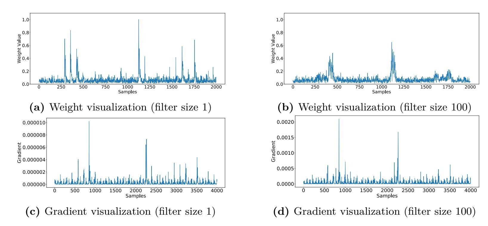
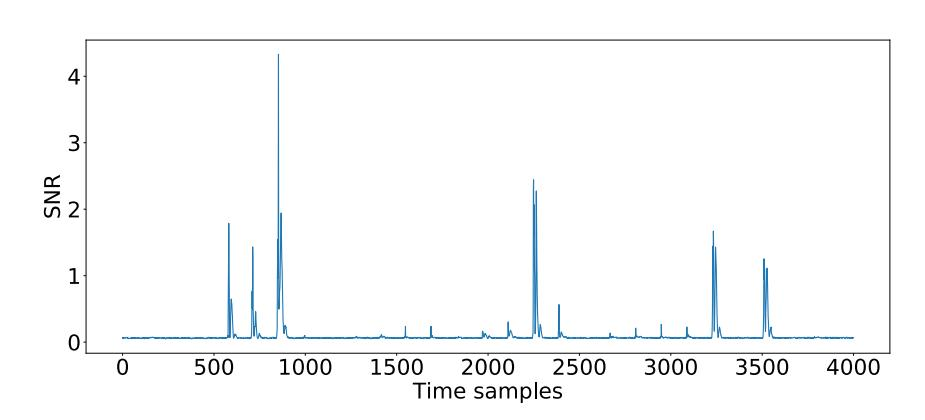

{0}------------------------------------------------

# **Understanding Methodology for Efficient CNN Architectures in Profiling Attacks**

Gabriel Zaid1*,*2 , Lilian Bossuet1 , Amaury Habrard1 and Alexandre Venelli2

1 Univ Lyon, UJM-Saint-Etienne, CNRS Laboratoire Hubert Curien UMR 5516 F-42023, Saint-Etienne, France, [firstname.lastname@univ-st-etienne.fr](mailto:firstname.lastname@univ-st-etienne.fr) 2 Thales ITSEF, Toulouse, France, [firstname.lastname@thalesgroup.com](mailto:firstname.lastname@thalesgroup.com)

**Abstract.** The use of deep learning in side-channel analysis has been more and more prominent recently. In particular, Convolution Neural Networks (CNN) are very efficient tools to extract the secret information from side-channel traces. Previous work regarding the use of CNN in side-channel has been mostly proposed through practical results. Zaid *et al.* have proposed a theoretical methodology in order to better understand the convolutional part of CNN and to understand how to construct an efficient CNN in the side-channel context [\[ZBHV19\]](#page-10-0). The proposal of Zaid *et al.* has been recently questioned by [\[WAGP20\]](#page-10-1). However this revisit is based on wrong assumptions and misinterpretations. Hence, many of the claims of [\[WAGP20\]](#page-10-1) are unfounded regarding [\[ZBHV19\]](#page-10-0). In this paper, we clear out the potential misunderstandings brought by [\[WAGP20\]](#page-10-1) and explain more thoroughly the contributions of [\[ZBHV19\]](#page-10-0).

**Keywords:** Side-Channel Attacks · Deep Learning · Network Architecture · Weight Visualization · Entanglement

## **1 Introduction**

Side-Channel Analysis (SCA) is a class of cryptographic attack in which an attacker tries to exploit the vulnerabilities of a system by analyzing its physical properties. One of the most powerful types of SCA attacks are *profiled attacks* which were introduced by [\[CRR03\]](#page-9-0). Very similar to profiled attacks, the application of machine learning algorithms was inevitably explored in the side-channel context [\[HZ12,](#page-9-1) [LBM14\]](#page-10-2).

Some recent papers have shown the robustness of convolutional neural networks (CNNs) to the most common countermeasures, namely *masking* [\[MPP16,](#page-10-3) [MDP19b\]](#page-10-4) and *desynchronization* [\[CDP17,](#page-9-2) [ZBHV19\]](#page-10-0). One of their main advantages is that they do not require pre-processing. Nonetheless, finding a suitable architecture is one of the most challenging tasks in deep learning because we have to set the network parameters properly to achieve a good level of efficiency. Hence, choosing correct model hyperparameters is the first step towards obtaining an optimal neural network. Recently, Zaid *et al.* provided a methodology for generating suitable CNN architectures [\[ZBHV19\]](#page-10-0). They consider that CNNs can be decomposed into two parts: a *Convolutional* part and a *Classification* part. The convolutional part aims at retrieving information from the input to help the decision-making while the classification part exploits the information provided by these relevant samples. In [\[ZBHV19\]](#page-10-0), Zaid *et al.* only focus their investigation on the feature detection (*i.e. Convolutional* part). They try to understand the impact induced by each convolutional hyperparameter. To that purpose, they introduce some new visualizations tools (*i.e. Weight Visualization* and *Heatmap*) in the side-channel context. Zaid *et al.* propose a methodology to generate CNNs with a suitable *Convolutional* part that limits the impact

{1}------------------------------------------------

of the desynchronization. Their methodology outperforms the previous state-of-the-art CNN models on all the public datasets. They dramatically reduce the network complexity and the training time while increasing the network performance.

Recently, Wouters *et al.* proposed a revisit of this methodology in [\[WAGP20\]](#page-10-1). Unfortunately, most of their claims on Zaid *et al.* work are based on misinterpretations or wrong assumptions.

**Contributions.** This paper clears out the false statements from [\[WAGP20\]](#page-10-1) regarding [\[ZBHV19\]](#page-10-0). We explain more clearly the tools introduced in the paper *"Methodology for Efficient CNN Architectures in Profiling Attacks"* [\[ZBHV19\]](#page-10-0). We discuss the difference between the gradient visualization and the weight visualization tools. By introducing the concepts of *Leakage Detection*, *Leakage Exploitation* and *Network Confidence*, we show how [\[WAGP20\]](#page-10-1) misinterprets the weight visualization. Then, we use these definitions to link the concepts of *Entanglement* and *Receptive Field*. We expose that [\[WAGP20\]](#page-10-1) wrongly claims that Zaid *et al.* correlate the network performance with the number of convolutional blocks. Then, we correct the methodology applied to the AES\_RD dataset in [\[ZBHV19\]](#page-10-0). The proposition of Zaid *et al* aims to find a good trade-off between leakage detection, network complexity and training time. Finally, we mention how unclear are the contributions of [\[WAGP20\]](#page-10-1) regarding these aspects.

## **2 Visualization Tools**

Due to the black-box nature of neural networks, it can be challenging to explain and interpret its decision-making. In order to overcome this problem, some visualization techniques have been developed [\[vdMH08,](#page-10-5) [ZF14\]](#page-10-6) but their application in the SCA context is not exploited well enough. As shown in [\[MDP19a,](#page-10-7) [HGG19,](#page-9-3) [PEC19\]](#page-10-8), these techniques could be useful in SCA to evaluate the ability of a network to extract the Points of Interest (PoIs). We first recall the main tools applied in the SCA context. Then, we explicit the misinterpretations of [\[WAGP20\]](#page-10-1) regarding the weight visualization tool.

#### **2.1 Background**

**Gradient Visualization (GV).** GV is a well known visualization tool in machine learning [\[SVZ14\]](#page-10-9) that was introduced by Masure *et al.* in the side-channel context [\[MDP19a\]](#page-10-7). This technique computes the derivatives of a CNN model with respect to an input trace such that the magnitude of the derivatives indicates which features need to be modified the least to affect the class score the most. Let *F* be a trainable model and **t** a trace that we want to evaluate at a coordinate *x*. Following the value of the gradient, we can assess if *x* is included in the set of PoIs, denoted EZ , such that [\[MDP19a\]](#page-10-7),

$$\frac{\partial}{\mathbf{t}[x]} F(\mathbf{t})[z] \begin{cases} \approx 0 & \text{if } x \notin \mathcal{E}_{\mathcal{Z}}, \\ \neq 0 & \text{if } x \in \mathcal{E}_{\mathcal{Z}}. \end{cases}$$
 (1)

GV is useful for identifying the temporal instants that influence the most the classification. Comparing these points to PoIs, we are able to interpret the learning phase of a network. In other words, GV helps to evaluate the ability of the network to identify the PoIs and to exploit them. The magnitude of the gradient indicates how a sample affects the classification. However, as stated in [\[ZBHV19\]](#page-10-0), this visualization technique cannot be considered if an attacker wants to precisely evaluate the impact of the convolutional hyperparameters.

{2}------------------------------------------------

**Weight Visualization (WV).** To circumvent this issue, Zaid et al. introduce the weight visualization tool [ZBHV19, Section 3.2] in order to visualize the trainable weights and interpret the recognition patterns in the classification part. This method was first introduced in BPK92 as an useful framework when dealing with spatial information. During the training process, the network evaluates the neurons which influence the most an efficient classification. The role of the convolutional part is to select the relevant time samples (i.e. Pols) that compose a trace for an efficient classification [ZBHV19]. Therefore, by applying the WV, Zaid et al. propose a new tool that estimates the capacity of the convolutional part to retrieve the leakages.

Let  $n_u^{[\text{flatten}+1]}$  be the number of neurons in the layer following the flatten,  $n_f^{[\text{flatten}-1]}$ the number of filters in the last convolutional blocks and  $dim_{\rm traces}^{\rm [flatten\,-1]}$  the dimension associated with each intermediate traces after the last pooling layer. Let  $W^{[\text{flatten}+1]}$  be the weights corresponding to the first fully-connected layer. Let  $W_m^{\text{vis}} \in \mathbb{R}^{\dim_{\text{traces}}^{[\text{flatten} - 1]}}$  be a vector that enables visualization of the weights related to the m-th neurons of the layer following the flatten:

$$W_m^{\text{vis}}[i] = \frac{1}{n_f^{[\text{flatten}-1]}} \sum_{j=i \times n_f^{[\text{flatten}-1]}}^{(i+1) \times n_f^{[\text{flatten}-1]}} |W_m^{[\text{flatten}+1]}[j]|, \tag{2}$$

where  $i \in [0, dim_{\text{traces}}^{[\text{flatten} - 1]}]$ . Then, let  $W^{\text{vis}} \in \mathbb{R}^{dim_{\text{traces}}^{[\text{flatten} - 1]}}$  be a vector that enables visualization of the mean weight related to each neuron of the layer |flatten + 1| such that:

$$W^{\text{vis}}[i] = \frac{1}{n_u^{[\text{flatten}+1]}} \sum_{m=0}^{n_u^{[\text{flatten}+1]}} W_m^{\text{vis}}[i], \tag{3}$$

where  $i \in [0, dim_{\text{traces}}^{[\text{flatten} - 1]}]$ .

This tool is helpful to identify the relevant features selected by the convolutional part and to interpret the impact of the convolutional hyperparameters [ZBHV19]. However, due to the backpropagation process, the WV tool cannot be considered to evaluate the suitability of the convolutional part if the entire network does not perform well. The following section highlights the misinterpretations of Wouters et al. [WAGP20] concerning the WV tool introduced by Zaid et al. [ZBHV19].

#### 2.2 Misinterpretations by Wouters *et al.*

Wouters et al. in [WAGP20, Section 4] mention that the WV tool cannot be considered to evaluate a CNN. They claim that Zaid et al. use WV in order to evaluate the overall performance of the network based on the magnitude of the weights. For that purpose, Wouters et al. oppose the gradient and the weight visualization tools to justify their misinterpretations. In [ZBHV19], the authors suggest that the WV can be used to evaluate the confidence of the network in the feature detection while the gradient visualization tool is helpful to characterize the overall capacity of a network for exploiting the PoIs. In the deep learning field, the *confidence* is usually correlated with the posterior probability of each output class [GPSW17]. Hence, the concept introduced in [ZBHV19] can be misleading for the readers. We further clarify these points in the following sections.

#### 2.2.1 Leakage Detection vs. Leakage Exploitation

As mentioned by Zaid et al., the gradient visualization tool should be used in order to evaluate the overall training process (i.e. convolutional and classification parts). The evaluation of the model can be performed through two processes:

{3}------------------------------------------------

- Leakage Detection: this phase consists in selecting the points of interest that seem relevant for the classification task;
- Leakage Exploitation: this phase defines the relevance of each points of interest in the classification task.

Through the evaluation of the gradient, both aspects can be estimated. Indeed, the *Leakage Detection* characterizes the ability of a network to retrieve the points of interests from a side-channel trace. Hence, it describes the capacity of the network to precisely retrieve all the PoIs included in a trace. The GV can be helpful to visualize this concept. From [Equation 1,](#page-1-0) once the gradient value differs from 0 at a sample *x*, the network considers this point as a relevant information. Thus, through the GV, we can identify all the samples that are considered as relevant by the network. On the other hand, the *Leakage Exploitation* identifies the relevance of each PoI. For a sample *x*, a large gradient ensures that the information included at *x* has a huge impact on the classification task. Hence, the magnitude of the gradient defines the relevance of each sample.

In [\[ZBHV19\]](#page-10-0), Zaid *et al.* assume that the *Leakage Detection* step is provided by the convolutional part while the *Leakage Exploitation* is performed by the classification part. Their work is only focused on the *Leakage Detection*. Therefore, they propose a technique to efficiently evaluate this step.

#### **2.2.2 Weight Visualization as Leakage Detection tool**

We reformulate the main goal of WV already presented in [\[ZBHV19\]](#page-10-0). To evaluate how a network selects its features, a solution is to find a way to interpret the convolutional part alone, *i.e.* leave apart the classification component of the network. In [\[ZBHV19\]](#page-10-0), the authors propose a solution to evaluate the *Network Confidence* related to a PoI.

**Definition 1.** (Network Confidence) Given a sample *x*, the Network Confidence defines the capacity of a network to retrieve a PoI at *x*.

Hence, the higher the confidence, the higher the probability that the leakage will be exploited in the classification part. For that purpose, Zaid *et al.* introduce the weight visualization as a suitable tool to evaluate the *Leakage Detection* and the *Network Confidence*. During the training process, the network evaluates influential neurons which generate an efficient classification. If the network is confident in its feature detection, it will attribute large weights to these neurons [\[ZBHV19\]](#page-10-0). From a weight visualization point of view, if the convolutional part retrieves a PoI on a sample *x*, the related weight will be higher than 0. Depending on its magnitude, the network will be more or less confident in the detection of the features. If the network is extremely confident in the information included at *x*, the related weight will be high and the exploitation of the sensitive information will be easy. On the other hand, if the weight related to *x* is low (similar to the noise), the network will be distrustful on the leakage detection. Hence, the resulted exploitation will be harder or inexistent and the training time could increase. The magnitude of the weights express the confidence of the network on its features detection contrary to what Wouters *et al.* interpret. In [\[WAGP20\]](#page-10-1), the authors misinterpret Zaid *et al.* work such that the magnitude of the weight shall be directly related to the network performance in exploiting the leakage. Zaid *et al.* only correlate the magnitude of the weights with the confidence of the network and the related training time. However, the naming of *Network Confidence* could be misinterpreted by a reader with the classical definition of *confidence* in deep learning [\[GPSW17\]](#page-9-5).

#### **2.2.3 Gradient Visualization as a Global tool**

From a GV point of view, the confidence of the network identifies the samples where the gradient value is greater than 0. Following the magnitude of the weights, we can estimate 

{4}------------------------------------------------

which part of the trace will be considered during the exploitation phase. Given a sample *x*, if the related weight is 0, then it won't be exploited by the classification part and the resulted gradient will also be 0. However, if the weight differs from 0, the classification part should exploit the information included at *x*. The related gradient will be greater than 0 if the training time is long enough. The highest the weight, the more confident the network is in the feature detected at the sample *x*. Thus, the information will be more easily exploited by the classification part. However, if the magnitude of the weight is close to the noise, the exploitation of the relevant information at *x* could be hard and could increase the training time. As a conclusion, the GV provides information related to the convolutional and the classification parts (*i.e. Leakage Detection* and *Leakage Exploitation*) while the weight visualization helps an attacker identifying the confidence of the network on the feature detection (*i.e. Leakage Detection* and *Network Confidence*). Thus, these visualization tools are complementary. The WV is not considered as a performance tool in [\[ZBHV19\]](#page-10-0) contrary to what Wouters *et al.* mention in [\[WAGP20\]](#page-10-1).

The next section clears out the misunderstandings from [\[WAGP20\]](#page-10-1) related to the entanglement concept proposed [\[ZBHV19\]](#page-10-0).

## **3 Entanglement**

This section recalls the concept of *Entanglement* introduced in [\[ZBHV19\]](#page-10-0). Then, a comparison with the *Receptive Field* [\[FLF](#page-9-6)+19] is made and a discussion is provided on the misinterpretations of [\[WAGP20\]](#page-10-1).

## **3.1 Background**

The aim of the convolutional layer is to extract the relevant information from side-channel traces. To perform this operation, filters are used in order to identify the relevant patterns that are useful in the decision-making. In [\[ZBHV19\]](#page-10-0), Zaid *et al.* define the *Entanglement* as the effect induced by filters such that multiple convoluted samples share the same relevant information. They theoretically demonstrate that increasing the filter length causes entanglement, reduces the weight related to a single information and therefore the *Network Confidence* (see [Definition 1\)](#page-3-0). Hence, increasing the entanglement can cause a dramatic impact on the leakage retrieval. Indeed, the network can be less confident on the detection of the resulted PoI and the exploitation phase can be affected. If the weight related to the PoI is 0, the classification part cannot extract the relevant information provided by this sample. If the weight related to the PoI is spread over convoluted samples, the exploitation of the relevant information could be harder and the resulted training time could increase. We illustrate these properties and discuss the misinterpretations of [\[WAGP20\]](#page-10-1) in the next section.

## **3.2 Misinterpretations by Wouters et al.**

### **3.2.1 Impact on the Network Confidence**

In [\[WAGP20,](#page-10-1) Section 5], Wouters *et al.* identify the entanglement as inconsistent. They also consider that the weight visualization method cannot be performed to demonstrate the following claim:

*"increasing the length of the filter causes entanglement and reduces the weight related to a single information and therefore, the network confidence".* [\[ZBHV19\]](#page-10-0)

Wouters *et al.* argue that the authors of [\[ZBHV19\]](#page-10-0) attempt to correlate the network performance with the entanglement such that increasing the filter size induces a reduction of performance. For that purpose, they wrongly assume that the network confidence

{5}------------------------------------------------

Figure 1: Weight (top) and Gradient (bottom) visualizations for filter size 1 (left) and filter size 100 (right) on DPA-v4 dataset. Note the differences in x-axis scale and y-axis scale between the different experiments.

Figure 2: Signal-to-Noise Ratio on the DPA-v4 dataset

is equivalent to the network performance. However, through [Subsection 2.2,](#page-2-0) we clearly explain how these concepts are not correlated such that the network confidence only impacts the leakage detection and the training time.

To emphasize the proposition introduced in [\[ZBHV19\]](#page-10-0), we perform the same experiment as Wouters *et al.* [\[WAGP20,](#page-10-1) Figure 4] on the DPA-v4 contest dataset[a](#page-5-0) . We generate two models based on the architecture[b](#page-5-1) proposed in [\[ZBHV19\]](#page-10-0). The models are composed of 1 convolutional block and 1 fully-connected layer of size 2. To evaluate the effect of the entanglement, we either set the filter size to 1 or 100. With the weight visualization (see [Figure 1a](#page-5-2) and [Figure 1b\)](#page-5-3), we can easily evaluate the effect of entanglement while the gradient visualization (see [Figure 1c](#page-5-4) and [Figure 1d\)](#page-5-5) is not suitable to interpret the impact of the filter size on the *Leakage Detection*.

As mentioned in [\[ZBHV19\]](#page-10-0), increasing the entanglement spreads the relevant information through the convoluted samples. Hence, the network is less confident in its features detection. Comparing these figures with the SNR (see [Figure 2\)](#page-5-6) shows the precision of the leakage detection for each model. When the network is trained with a filter of size 1 (see [Figure 1a\)](#page-5-2), we notice that most of the leakages are identified by the convolutional part (even the lowest around the 3*,* 000*th* samples). On the other hand, [Figure 1b](#page-5-3) only detects three patterns that are associated with the different leakage areas. Hence, the resulted network is less confident in its features detection and some of the weight values, associated with relevant patterns, are similar to the noise. It will be harder for the network to exploit

a[http://www.dpacontest.org/v4/42\\_traces.php](http://www.dpacontest.org/v4/42_traces.php)

b<https://github.com/gabzai/Methodology-for-efficient-CNN-architectures-in-SCA>

{6}------------------------------------------------

these relevant information and the resulted training time should increase. Indeed, for identical optimizer hyperparameters (*i.e.* number of epochs, batch-size, learning rate, etc.) the training time equals 23 seconds when the filer size is 1 while it is about 92 seconds for the other model. Thus, increasing the entanglement has a consequence on the training time as Zaid *et al.* mentioned [\[ZBHV19\]](#page-10-0). From a deep learning point of view, this phenomenon can be easily explained by the network complexity. [Figure 1a](#page-5-2) and [Figure 1b](#page-5-3) illustrate what Zaid *et al.* introduce as *Network Confidence*.

When we compare the resulted gradient visualizations (see [Figure 1c](#page-5-4) and [Figure 1d\)](#page-5-5), the observations in [Section 2](#page-1-1) are confirmed. Indeed, when the filter size equals 100 (see [Figure 1d\)](#page-5-5), some leakages are not exploited by the classification part. This is due to the weak confidence of the network on the leakage detection. Indeed, the lowest SNR values detected around the 3*,* 000*th* samples are not exploited when the filter size is too large because the related weight values are equivalent to the noise. On the other hand, the network generated with a filter of size 1 identifies most of the leakages. This observation can also be made on [\[WAGP20,](#page-10-1) Figure 4] and can be explained by the entanglement effect. For clarity, we do not identify large filters as irrelevant for detecting small sensitive peaks. However, the larger the filters, the more difficult the leakage detection and exploitation for the peaks with low confidence. Hence, contrary to what Wouters *et al.* claimed in [\[WAGP20\]](#page-10-1), Zaid *et al.* do not correlate the entanglement with the network performance.

However, as mentioned by Wouters *et al.*, the network using a filter of size 100 has a better *Leakage Exploitation* than the network with filter of size 1 and the related performance seems similar. As it improves the leakage exploitation part of the network, which is not part of Zaid *et al.* work, a theoretical study of the leakage exploitation shall be part of a future research.

#### **3.2.2 Receptive Field**

In [\[WAGP20,](#page-10-1) Section 5.2], Wouters *et al.* oppose the *Entanglement* with the *Receptive Field* (RF) concept. Widely used in computer vision [\[LYH18\]](#page-10-10), RF was introduced by Fawaz *et al* [\[FLF](#page-9-6)+19] for temporal data. Wouters *et al.* mention that RF can be interpreted as: *"how many input samples affect one weight deeper in the network"*. This definition is very close to the concept of entanglement. Indeed, increasing the length of the filter spreads the relevant information through the convoluted samples and the resulted weights share more input samples. Thus, the opposition between both concepts is misplaced. Moreover, the conclusion of Wouters *et al.* is the same as [\[ZBHV19\]](#page-10-0): *"bigger filters determine more robust and generic networks, but also increase the number of parameters that have to be trained"* [\[WAGP20,](#page-10-1) Section 5.2].

One additional interesting point of [\[WAGP20\]](#page-10-1), not introduced by Zaid *et al.*, concerns the robustness of the network. The concepts of RF and entanglement help us better understand in which context larger filters can provide more stability. If we try to explain this phenomenon using the entanglement, we can argue that the relevant information is spread over multiple convoluted samples. Hence, there is multiple weights linked to the same PoI. During the training phase, the resulted network could be less disrupted to retrieve the sensitive value because there are multiple ways to extract the leakage. As a conclusion, increasing the length of the filters could actually increase the robustness of the network. This observation highlights that RF and entanglement are equivalent contrary to what Wouters *et al.* mention in [\[WAGP20,](#page-10-1) Section 5.2].

## **4 Convolutional Blocks**

This section revises the misinterpretations of [\[WAGP20\]](#page-10-1) regarding the impact of the number of convolutional blocks introduced in [\[ZBHV19\]](#page-10-0).

{7}------------------------------------------------

### 4.1 Background

A convolutional block is composed by at least one Convolutional layer and one Pooling layer. The pooling layer is a non-linear layer that divides the dimension of the input such that the most relevant information is preserved. To apply its down sampling function, an Average Pooling, or a Max Pooling, is performed. In [ZBHV19], the authors provide theoretical details on the impact of the convolutional blocks for the Leakage Detection. Indeed, adding convolutional blocks reduce the distance between relevant points. Hence, the impact of desynchronization is diminished: it will be easier for the network to characterize the desynchronization. By adding more convolutional blocks, we can drastically reduce the impact of desynchronization by choosing appropriate pooling parameters. To illustrate this phenomenon, Zaid et al. apply different kind of pooling layers on a Chipwhisperer dataset (see [ZBHV19, Appendix D]) in order to evaluate the impact of the convolutional blocks on the features detection. Through these experiments, they conclude that a deeper network could induce a loss in its confidence on the Leakage Detection for some (and not the entire) sensitive information. Furthermore, they argue that depending on the pooling operation, some relevant information can be discarded (i.e. MaxPooling) or the PoI can be impacted with noisy samples (i.e. AveragePooling). Consequently, a good trade-off should be found between the detection of the desynchronization and the maximum amount of information related to the relevant points.

### 4.2 Misinterpretations by Wouters et al.

In [WAGP20, Section 6], Wouters et al. misinterpret the Network Confidence concept. They affirm that Zaid et al. conclude that increasing the number of convolutional blocks affects the performance of the network by quoting from [ZBHV19]: "we can see that, the deeper the network, the less confident it is in its feature detection". As explained in Subsection 2.2, the Network Confidence is not correlated with the performance of the network. This erroneous interpretation by Wouters et al. implies that their claims, regarding [ZBHV19], are incorrect.

## 5 Methodology

Thanks to a remark of Wouters *et al.* on the AES\_RD dataset, a correction is proposed on the application of the methodology introduced in [ZBHV19].

### 5.1 Background

In [ZBHV19], Zaid *et al.* propose a new generic methodology based on theoretical guidelines. When desynchronization techniques are used as countermeasures, the authors suggest to generate a convolutional part with 3 convolutional blocks that can be decomposed as:

- The first convolutional block aims at minimizing the filter size in order to mimic the entanglement between each PoI. Moreover, adding this first convolutional layer reduces the dimension of the trace while preserving most of the relevant information. Following [WAGP20], this layer has a preprocessing effect on the input traces.
- The second convolutional block tries to detect the desynchronization effect. To that purpose, Zaid et al. recommend to set the filter size to  $\frac{N^{[0]}}{2}$  such as  $N^{[0]}$  defines the maximum shift value on the raw traces. With this proposition, we are assured that the relevant pattern is included in the filter. Hence, the leakage will be necessarily extracted. Finally, a pooling layer is applied with a large stride in order to reduce the desynchronization effect.

{8}------------------------------------------------

• The last convolutional layer attempts to reduce the dimensionality of each trace in order to focus the network only on the relevant points.

### 5.2 A correction for the AES\_RD dataset

In [WAGP20, Section 5.3], Wouters *et al.* point out that this methodology is not applied correctly on the AES\_RD datasetc. Wouters *et al.* show that the dataset contains traces which are shifted by 1,000 samples. This is indeed an error in [ZBHV19, Section 5.3.1] which is due to the lack of information on this dataset. The authors of [ZBHV19] wrongly assumed that the desynchronization effect was only 100.

In order to correct this wrong assumption in [ZBHV19], we reapply the methodology on AES\_RD with the correct parameters. Table 1 illustrates that the corrected methodology still outperforms the previous state-of-the-art results.

In [ZBHV19], Zaid et al. attempt to find a good trade-off between the network complexity, the network performance and the training time. Hence, the error pointed out by Wouters et al. does not question the methodology. As mentioned, the filter of size  $\frac{N^{[0]}}{2}$  is set to find stable networks and to ensure that the relevant pattern is included in the filter. However, following [WAGP20], we can assume that an improvement could be made in order to reduce the complexity of the second convolutional block. This proposition is only detailed through experimental results in [WAGP20]. Theoretical demonstrations should be given in order to fully consider this claim as part of a generic methodology.

Table 1: Comparison of performance on AES\_RD considering the corrected methodology

|                                   | Previous state-of-the-art | Methodology               | Corrected methodology |
|-----------------------------------|---------------------------|---------------------------|-----------------------|
|                                   | $([KPH^{+}19])$           | ([ZBHV19, Section 5.3.1]) | (Subsection 5.2)      |
| Complexity (trainable parameters) | 512,711                   | 12,760                    | 69,720                |
| $\bar{N}t_{GE}$                   | 10                        | 5                         | 3                     |
| Learning time (seconds)           | 4,500                     | 380                       | 1,965                 |

#### 5.3 Discussion

One of the contribution of [ZBHV19] is to propose networks that give a good trade-off between leakage detection, network complexity and training time. In [WAGP20], the authors seem only focused on the overall performance of the models including the classification part, which is out of the scope of Zaid et al work. In [ZBHV19], the good performance on the public datasets is just a consequence of the generation of suitable convolutional parts. Their proposition shows that the networks needed to perform side-channel attacks do not have to be complex compared to the classical state-of-the-art results in the deep learning based side-channel analysis.

Finally, all of the experiments in [ZBHV19, WAGP20] were possible thanks to a GitHub repositoryd publicly available. Readers can easily run all the experiments in order to verify, improve or propose corrections to the methodology.

### 6 Conclusion

This paper highlights the misinterpretations of [WAGP20] targeting Zaid et al. work. Contrary to Wouters et al. claims, the weight visualization tool is not proposed to evaluate the performance of the network. Indeed, following the magnitude of the weight, we can estimate the confidence of the network in its feature detection in order to retrieve the relevant samples that should be used in the classification part. Then, we recall the concept of Entanglement and confirm its equivalence with the Reception Field contrary to what

chttps://github.com/ikizhvatov/randomdelays-traces

dhttps://github.com/gabzai/Methodology-for-efficient-CNN-architectures-in-SCA

{9}------------------------------------------------

Wouters *et al.* mention. Finally, we correct some wrong assumptions on the impact of the convolutional blocks and we evoke the difference between *Network Confidence* and *Network Performance*. This implies that many of the claims targeting [\[ZBHV19\]](#page-10-0) should be reviewed [\[WAGP20,](#page-10-1) Sections 4, 5, 6].

However, some of the results of [\[WAGP20\]](#page-10-1) on the filter size should be deeper investigated, with theoretical details, in order to improve the second convolutional block of the methodology and reduce even more the network complexity. Finally, as mentioned in [\[ZBHV19\]](#page-10-0), a further theoretical study on the *Leakage Exploitation* part of the networks shall be part of a future work in order to complete the proposed methodology. Further investigations on more side-channel protected datasets should also be made.

## **References**

- [BPK92] H. Bischof, A. Pinz, and W. G. Kropatsch. Visualization methods for neural networks. In *Proceedings., 11th IAPR International Conference on Pattern Recognition. Vol.II. Conference B: Pattern Recognition Methodology and Systems*, pages 581–585, Aug 1992.
- [CDP17] Eleonora Cagli, Cécile Dumas, and Emmanuel Prouff. Convolutional neural networks with data augmentation against jitter-based countermeasures - profiling attacks without pre-processing. In Wieland Fischer and Naofumi Homma, editors, *Cryptographic Hardware and Embedded Systems - CHES 2017 - 19th International Conference, Taipei, Taiwan, September 25-28, 2017, Proceedings*, volume 10529 of *Lecture Notes in Computer Science*, pages 45–68. Springer, 2017.
- [CRR03] Suresh Chari, Josyula R. Rao, and Pankaj Rohatgi. Template attacks. In *Revised Papers from the 4th International Workshop on Cryptographic Hardware and Embedded Systems*, CHES '02, pages 13–28, London, UK, UK, 2003. Springer-Verlag.
- [FLF+19] Hassan Ismail Fawaz, Benjamin Lucas, Germain Forestier, Charlotte Pelletier, Daniel F Schmidt, Jonathan Weber, Geoffrey I Webb, Lhassane Idoumghar, Pierre-Alain Muller, and François Petitjean. Inceptiontime: Finding alexnet for time series classification. *arXiv preprint arXiv:1909.04939*, 2019.
- [GPSW17] Chuan Guo, Geoff Pleiss, Yu Sun, and Kilian Q. Weinberger. On calibration of modern neural networks. In *Proceedings of the 34th International Conference on Machine Learning - Volume 70*, ICML'17, page 1321–1330. JMLR.org, 2017.
- [HGG19] Benjamin Hettwer, Stefan Gehrer, and Tim Güneysu. Deep neural network attribution methods for leakage analysis and symmetric key recovery. *IACR Cryptology ePrint Archive*, 2019:143, 2019.
- [HZ12] Annelie Heuser and Michael Zohner. Intelligent machine homicide - breaking cryptographic devices using support vector machines. In Werner Schindler and Sorin A. Huss, editors, *Constructive Side-Channel Analysis and Secure Design - Third International Workshop, COSADE 2012, Darmstadt, Germany, May 3-4, 2012. Proceedings*, volume 7275 of *Lecture Notes in Computer Science*, pages 249–264. Springer, 2012.
- [KPH+19] Jaehun Kim, Stjepan Picek, Annelie Heuser, Shivam Bhasin, and Alan Hanjalic. Make some noise. unleashing the power of convolutional neural networks for profiled side-channel analysis. *IACR Trans. Cryptogr. Hardw. Embed. Syst.*, 2019(3):148–179, 2019.

{10}------------------------------------------------

- [LBM14] Liran Lerman, Gianluca Bontempi, and Olivier Markowitch. Power analysis attack: an approach based on machine learning. *IJACT*, 3(2):97–115, 2014.
- [LYH18] Yongge Liu, Jianzhuang Yu, and Yahong Han. Understanding the effective receptive field in semantic image segmentation. *Multimedia Tools Appl.*, 77(17):22159–22171, September 2018.
- [MDP19a] Loïc Masure, Cécile Dumas, and Emmanuel Prouff. Gradient visualization for general characterization in profiling attacks. In Ilia Polian and Marc Stöttinger, editors, *Constructive Side-Channel Analysis and Secure Design*, pages 145–167, Cham, 2019. Springer International Publishing.
- [MDP19b] Loïc Masure, Cécile Dumas, and Emmanuel Prouff. A comprehensive study of deep learning for side-channel analysis. *IACR Transactions on Cryptographic Hardware and Embedded Systems*, 2020(1):348–375, Nov. 2019.
- [MPP16] Houssem Maghrebi, Thibault Portigliatti, and Emmanuel Prouff. Breaking cryptographic implementations using deep learning techniques. In Claude Carlet, M. Anwar Hasan, and Vishal Saraswat, editors, *Security, Privacy, and Applied Cryptography Engineering - 6th International Conference, SPACE 2016, Hyderabad, India, December 14-18, 2016, Proceedings*, volume 10076 of *Lecture Notes in Computer Science*, pages 3–26. Springer, 2016.
- [PEC19] Guilherme Perin, Baris Ege, and Lukasz Chmielewski. Neural network model assessment for side-channel analysis. Cryptology ePrint Archive, Report 2019/722, 2019. <https://eprint.iacr.org/2019/722>.
- [SVZ14] Karen Simonyan, Andrea Vedaldi, and Andrew Zisserman. Deep inside convolutional networks: Visualising image classification models and saliency maps. In Yoshua Bengio and Yann LeCun, editors, *2nd International Conference on Learning Representations, ICLR 2014, Banff, AB, Canada, April 14-16, 2014, Workshop Track Proceedings*, 2014.
- [vdMH08] Laurens van der Maaten and Geoffrey Hinton. Visualizing data using t-SNE. *Journal of Machine Learning Research*, 9:2579–2605, 2008.
- [WAGP20] Lennert Wouters, Victor Arribas, Benedikt Gierlichs, and Bart Preneel. Revisiting a methodology for efficient cnn architectures in profiling attacks. *IACR Transactions on Cryptographic Hardware and Embedded Systems*, 2020(3):147– 168, Jun. 2020.
- [ZBHV19] Gabriel Zaid, Lilian Bossuet, Amaury Habrard, and Alexandre Venelli. Methodology for efficient cnn architectures in profiling attacks. *IACR Transactions on Cryptographic Hardware and Embedded Systems*, 2020(1):1–36, Nov. 2019.
- [ZF14] Matthew D. Zeiler and Rob Fergus. Visualizing and understanding convolutional networks. In David Fleet, Tomas Pajdla, Bernt Schiele, and Tinne Tuytelaars, editors, *Computer Vision – ECCV 2014*, pages 818–833, Cham, 2014. Springer International Publishing.