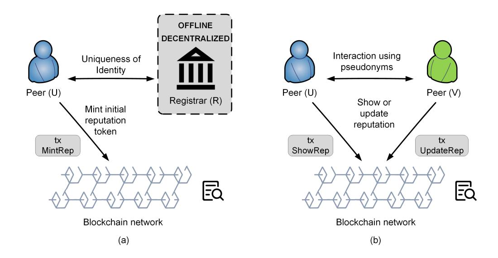

{0}------------------------------------------------

# Decentralized reputation

Tassos Dimitriou<sup>∗</sup> , *Senior Member, IEEE* tassos.dimitriou@ieee.org

*Abstract*—Reputation systems constitute one of the few workable mechanisms for distributed applications in which users can be made accountable for their actions. By collecting user experiences in reputation profiles, participants are encouraged to interact more with well-behaving peers hence better online behavior is motivated.

In this work, we develop a privacy-preserving reputation scheme for collaborative systems such as P2P networks in which peers can represent themselves with *different* pseudonyms when interacting with others. All these pseudonyms, however, are bound to the *same* reputation token, allowing honest peers to maintain their good record, even when switching to a new pseudonym, while at the same time preventing malicious peers from making a fresh start.

Our system is truly decentralized. Using an append-only distributed ledger such as Bitcoin's blockchain, we show how participants can make anonymous yet verifiable assertions about their own reputation. In particular, reputation can be demonstrated and updated effectively using efficient *zkSNARK* proofs. The system maintains soundness, peer-pseudonym unlinkability as well as unlinkability among pseudonyms of the same peer. We formally prove these properties and we evaluate the efficiency of the various operations envisioned in our scheme.

*Index Terms*—Reputation, Decentralization, Privacy, Peer-topeer networks, Blockchain, *zkSNARKs*

# I. INTRODUCTION

Distributed systems typically consist of multiple, spatially separated components that communicate with each other in order to realize a given function or operation. While distributed systems may be centralized, systems like Bitcoin, Tor or typical peer-to-peer (P2P) networks are completely decentralized, hence the operation of the system does not depend on a single trustworthy authority but is provided by the peers themselves according to their capacity and resources [\[1\]](#page-13-0).

The design of decentralized systems increases availability of services as reliance on a single entity is removed. However, decentralization may affect privacy since distributing resources to multiple nodes may provide malicious peers with more opportunities to peak at user data. Furthermore, relying on peers to provide services to other nodes is prone to even more adversarial behavior by those entities who may try to disrupt the functionality or availability of the network through the introduction of a large number of Sybil nodes [\[2\]](#page-13-1).

Although there is no clear solution to such type of attacks, *reputation* plays a pivotal role in establishing trustworthy relationships and incentivizing proper user behavior. In the context of collaborative systems such as P2P networks, reputation represents the collective opinions nodes have about their peers and the resources provided. By aggregating this knowledge using appropriate feedbacks, reputation-based systems help

\* For up-to-date contact information, please visit <http://tassosdimitriou.com>

participants decide whom to trust and thus deter dishonest participation and system failure. Digital reputation mechanisms are thus a powerful tool to incentivize user behavior. Indeed, well-behaving users improve their reputation scores, encouraging more users to interact with them while users will lower reputation scores get isolated and find it harder to network with others.

Research in reputation systems has been motivated by a plethora of environments and applications. Within the context of P2P e-commerce systems such as eBay, research has shown that reputation improves customer satisfaction and helps reduce transaction fraud [\[3\]](#page-13-2). It can also be used to filter content in file-sharing applications and prevent free-riders in content dissemination networks [\[4\]](#page-13-3). However, with no proper security mechanisms, reputation systems can be vulnerable to a number of attacks [\[5\]](#page-13-4); for example, bad-mouthing attacks can be used to send negative feedback to an honest user or service provider while ballot-stuffing attacks can be used to increase the reputation of an ill-performing peer. More importantly, a lot of reputation systems break down under the presence of Sybil attackers who can elevate their status to that of a group of peers by creating multiple fake identities.

Existing reputation systems often disclose the identity of feedback providers, which might deter honest users from submitting their ratings because of fear of retaliation if their (negative) rating is exposed to others [\[6\]](#page-13-5). Indeed, by collecting user feedback, or by simply interacting with a malicious peer, reputation systems can be easily compromised to reveal user profiles, the peers or services with whom the user has interacted with as well as the frequency of these interactions. While data anonymization techniques [\[7\]](#page-13-6), [\[8\]](#page-14-0) can help hide the identities of raters, anonymization is prone to de-anonymization attacks [\[6\]](#page-13-5), [\[9\]](#page-14-1). The use of cryptographic mechanisms can help reputation systems ensure the privacy of peers [\[10\]](#page-14-2)-[\[14\]](#page-14-3), however these systems are either centralized or rely on a trusted group of peers to ensure the privacy of transactions. As a result, in a distributed environment like that of P2P networks, it may be challenging to develop privacypreserving reputation systems that not only enable users to query reputation profiles of other peers but also maintain unlinkability and protect user identity when giving feedback.

These challenges raise the following questions: i) Can the benefits of reputation be combined with the privacy afforded by fully anonymous systems where no entity can link messages and feedback back to a user? ii) Can reputation be maintained across different pseudonyms? This requirement is very demanding as the goal of anonymity seems to contradict the need to associate users with their historical activities. (iii) Can the reputation system be managed in a decentralized manner by a set of untrusted peers?

{1}------------------------------------------------

*Contributions:* In this work, we answer these questions in the affirmative. Our system is inspired by the work of Androulaki et al. [\[15\]](#page-14-4), where the reputation score is bound to each peer as opposed to each pseudonym. This approach is less prone to whitewashing attacks where peers with bad reputation can start from scratch using a fresh pseudonym, thus obtaining a neutral reputation irrespective of their past behavior. However, the system in [\[15\]](#page-14-4) maintains peer-pseudonym unlinkability using reputation coins that are exchanged among peers, hence it requires the existence of an *online* entity – a "bank" – that maintains each user's current reputation credit and is actively involved in the transfer of reputation coins during feedback.

In this paper we propose a new technique for constructing anonymous *reputation tokens* that are maintained by the peers themselves, thus eliminating the presence of such online entity. We rely on the existence of an append-only ledger such as Bitcoin's blockchain to maintain these reputation tokens. Hence all operations involving demonstration or updates of reputation are managed in a distributed manner by the group of untrusted peers and can be validated by any interested party.

In our system, each entity maintains its reputation even while changing pseudonyms. By tying reputation to identity, peers can generate as many pseudonyms as they like in order to preserve their privacy; thus someone can use different pseudonyms in different contexts. This further helps ensure *forward anonymity* since future compromises linking a pseudonym to the entity will not reveal previous transactions made by the entity using other pseudonyms, even if all past behavior under all pseudonyms has been recorded. While reporting exact reputation scores could potentially link different pseudonyms together, our system allows users to reveal only *approximate* reputations to mitigate such de-anonymization attacks.

Our system requires a single *offline* phase in which the identity of the peer has to be verified, since otherwise it would be impossible to offer protection against Sybil attacks as shown in [\[2\]](#page-13-1). However, we show that even this phase can be decentralized in a privacy-preserving manner so that "identity" remains unlinkable to subsequent user actions. Additionally, we explain how our system can be used with legacy systems and online marketplaces (e-Bay, Amazon, Airbnb, to name a few). In those systems, identity verification already takes place since users register private information (credit card, civil id, etc.) to buy and sell goods or services online. Here we show that once this verification phase is over, our system can still be applied as no trust needs to be placed on this entity to secure the privacy and integrity of the peer's actions. Thus, our system can be combined with these platforms to ensure that peers enjoy the benefits of both identity-bound reputation and unlinkability. We then go one step further and suggest, in Section [VII,](#page-13-7) how to create verifiable IDs using mechanisms provided by the Trusted Computing Group (TCG) and Trusted Platform Modules (TPMs).

In summary, we make the following contributions:

• We present a decentralized system that does not require any trusted setup or trusted group of users to ensure the

- privacy of participants when showing or updating their reputation.
- We explain how to address and remove the identity verification challenge in the face of untrusted networks of peers by either relying on public assertions or employing the use of TCG functionalities.
- In systems where identity verification already exists, our reputation framework can help build trustworthy relationships as verification is only needed to ensure reputation soundness but not privacy.
- We use succinct zero-knowledge proofs to ensure not only anonymity but also the well-formedness and efficiency of the various operations.
- We utilize the blockchain as an append-only ledger to realize a reputation system that satisfies the properties described above. Participants that use the blockchain network have a single view of all transactions, requiring no trust on any particular entity. Hence the system is also publicly verifiable without reliance on any trusted third party.
- We formally prove the security and privacy aspects of our proposal, showing that our system is indeed privacypreserving. We have also studied the efficiency aspects of the proposal demonstrating the efficiency of the various operations.
- Finally, our framework can either be used as is or used in combination with other (possibly decentralized) host P2P systems to provide the necessary proofs of interaction and increase resistance to malicious peer behavior at the host level. In those cases, we provide the right handles to facilitate interaction between our framework and the host system.

*Organization:* The remainder of the paper is structured as follows. In the next section we review related work on reputation with emphasis on decentralized systems. Section [III](#page-2-0) discusses our system model and the assumptions we use throughout the paper, while Section [IV](#page-6-0) highlights the cryptographic primitives used in our proposal. In Section [V,](#page-7-0) we detail the operations of our system; its security and efficiency properties are analyzed in Section [VI](#page-10-0) and further discussed in Section [VII.](#page-13-7) Finally, Section [VIII](#page-13-8) concludes this work.

## II. RELATED WORK

In an anonymous reputation system nobody should be able to link the identity of a user to posted feedback. However, maintaining correct reputation without identity seems to contradict the fact that past user activities need to be reflected to the reputation score [\[16\]](#page-14-5). A number of pseudonym-based reputation systems have tried to address this problem. For example, Androulaki et al. [\[15\]](#page-14-4) developed a cash-based scheme where users exchange reputation coins that are maintained by a central "bank". Pseudonyms and anonymous credentials are combined to ensure unlinkability, however the system depends on this online centralized entity to maintain the privacy of peers. Similarly, Bethencourt et al. [\[17\]](#page-14-6) developed a pseudonym-based scheme in which a user's reputation is simply the number of cryptographic "votes" users construct 

{2}------------------------------------------------

and send to others. Signatures of reputation are then used to prove that a user is in possession of a number of votes. To participate in the system, each user must register with a registration authority which generates the user's private credentials. Hence, contrary to our work, this authority is trusted for privacy. Additionally the system supports only monotonic reputation.

Other variants of decentralized blockchain-based reputation systems include [\[22\]](#page-14-7), [\[23\]](#page-14-8), [\[24\]](#page-14-9), [\[25\]](#page-14-10). Soska et al. [\[22\]](#page-14-7) proposed a decentralized anonymous marketplace that uses linkable signatures and the ledger's consensus and fees mechanism to aggregate the reputation of vendors. The system assumes that customers purchase a product using an anonymous payment system like Zerocash [\[34\]](#page-14-11). They can then leave a review by privately linking it to the transaction made earlier. While anyone can check the ledger to enumerate the reviews, no transaction privacy is provided for vendors. In [\[23\]](#page-14-8), another decentralized reputation system is proposed in which the trust each user gives to others is directly expressed as Bitcoins. In [\[24\]](#page-14-9), Azaz et al. presented a bulletin board approach where users submit encrypted ratings for vendors which are then aggregated together for a final score. Our work differs from this and similar works ([\[10\]](#page-14-2), [\[12\]](#page-14-12), [\[13\]](#page-14-13)) in the sense that peers can rate each other directly. Finally, Florian et al. [\[25\]](#page-14-10) developed a pseudonymization system in which pseudonyms are directly encoded in the outputs of transactions. However, to validate a pseudonym, a chain of transactions leading to an initial genesis pseudonym transaction is required. Furthermore, generation of new pseudonyms needs to be coordinated and mixed with pseudonym change transactions of other peers in order to avoid linkability.

Anonymous credential systems (ACS) have also been used in building sound reputation systems. This connection is not accidental as reputation itself may be considered an attribute that can be demonstrated anonymously. In an ACS, a user may act under a number of unlinkable pseudonyms rather than using her identity. The process of *showing a credential* then allows a user to prove possession of certain attributes in a privacy-preserving manner. For example, in [\[18\]](#page-14-14), Bemmann et al. developed an ACS that is combined with a reputation system to let users anonymously rate service providers. Similarly, Blomer et al. [ ¨ [19\]](#page-14-15) constructed a cryptographic reputation system based on group signatures.

Our work uses fewer assumptions, i.e. it does not require the trustworthy generation of credentials, and is based on lighter mechanisms than the use of group and ring signatures that appear in typical credential schemes. Towards this direction, Garman et al. [\[20\]](#page-14-16), and later Yang et al. [\[21\]](#page-14-17), developed a decentralized ACS in which the credential issuer is replaced with a blockchain-based append-only ledger. To issue a credential, the user establishes an identity and uploads the credential together with her personal information to the ledger. She can then convince a verifier that a set of attributes appears in *one* of the credentials posted in the ledger. Thus privacy is preserved. While these works can be used to remove the initial verification phase of our proposal, we should remark that reputation systems need to be able to handle attacks that are inherent to reputation manipulation (self-implosion, sybils,



<span id="page-2-1"></span>Fig. 1. System Model. (a) Identity verification phase and minting of initial reputation token. (b) Interaction among peers. Peer U can provably show or update her reputation after interacting with peer V . Both peers can choose one-time pseudonyms for the interaction.

etc.), so they cannot be handled by credential systems whose focus is mostly on anonymity preservation. Hence additional care is needed to develop the right mechanisms to withstand these types of attacks.

## III. MODEL AND ASSUMPTIONS

<span id="page-2-0"></span>Our model consists of *peers* which are regular users of a P2P network and a registrar R. Peers can be "buyers" or "sellers" and interact with each other via *pseudonyms* of their choice. The role of R is to ensure *uniqueness* of user identities; hence it is *not* trusted for privacy but only for reputation soundness. As a result, once a user is registered, R may go offline. More importantly, this role can be *decentralized* as well (for more on the registrar see Sections [III-A](#page-3-0) and [V-A.](#page-7-1)) After interaction, peers can award reputation points to other peers (through their pseudonyms), and can demonstrate their reputation to other peers by means of appropriate ledger transactions. The ledger keeps a record of all transactions that have happened in the network and can be verified by any third party. A snapshot of the system is shown in Figure [1.](#page-2-1)

Without loss of generality, we assume that a peer's reputation consists of a single value v which captures the aggregate sum of ratings given to this peer. This can easily be extended to the *average* v/n of ratings received, where n is the number of other peers that have rated this one. In such a case, a reputation token (see Section [V](#page-7-0) and the relevant operations) will need to contain as an attribute not only v but also n, and the user will have to prove that both v and n are updated accordingly with every new rating, i.e. that v is increased by the feedback score received and n by one (this is straightforward and omitted). Hence our system supports *non-monotonic* reputation.

However, demonstrating exact reputation values could allow an attacker to infer whether two pseudonyms correspond to the same user by observing transactions on the ledger and continuously querying for reputation values. It may then be easier to link pseudonyms having the same reputation value with a limited set of actual identities. An inherent tradeoff thus exists between the precision reputation values are presented and the desired anonymity guarantees.

To increase the anonymity sets and avoid these inference attacks, we will allow a peer to demonstrate any lower bound 

{3}------------------------------------------------

they desire on their reputation instead of the actual value. These *reputation levels* are chosen by the peers and they do not need to be disjoint. For example, level L<sup>i</sup> can be the set of values ≥ 2 i . Hence a peer may round down its reputation to the nearest power of two or even show a lower reputation level if desired. Even if reputation is captured by the average v/n as discussed above, a reputation level can correspond to a lower bound of this rolling average.

In our system, peers can have many pseudonyms however all of them must be bound to the same secret ID which is known only to the peer. Thus participants can enjoy the benefits of anonymity while using their reputation in different contexts. As a consequence people are more incentivized to improve their online behavior. However, care is needed to ensure that peers cannot generate multiple IDs that can be used to mount attacks against the reputation system.

The necessary security properties are listed below:

- *Key-binding reputation*. The reputation of a peer is unique and expressed by a reputation *token* committed to the ledger. While peers may generate as many pseudonyms they like for their transactions, *all* of them must be bound to the same reputation token and secret key. Thus a token may only be created and used by its legitimate owner (key-binding and unforgeability aspect of reputation).
- *Aggregation-binding*. No peer should be able to present a reputation score higher than the one bound to the token. In particular, for any pseudonym used, a peer cannot show more points than the ones that have legitimately been awarded to the secret key bound to the token.
- *Anonymity/Unlinkability*. Reputation values are updated and demonstrated in a way that anonymity is not compromised. In particular, the system should maintain unlinkability between the identity of a peer and his/her pseudonyms as well as unlinkability among pseudonyms of the same peer.

The goal of a reputation system is to ensure that reputation metrics correctly reflect the actions taken by participants and cannot be manipulated. So, in addition to the above security and privacy goals, the system should be immune to the following attacks:

- *Sybil attacks*: The Sybil attack refers to malicious peers joining the system multiple times under different fake identities. These peers can then mount a wide range of attacks as described below.
- *Self-promotion*: This reflects a peer's deliberate attempts to increase her own reputation. Since peers are allowed to possess more than one *unlinkable* pseudonyms, they can fake an interaction and use one of them to rate the other. Our system defends against this attack through the introduction of *self-redeeming tags*.
- *Re-entry (or whitewashing)*: A malicious peer may attempt to remove her bad reputation by re-entering the system with a new identity and a fresh reputation token. As identities are bound to unique long-term secret keys, this is also prevented by our system.
- *Denial of reputation updates and visibility of ratings*: A rating which is known in advance may cause the ratee to

- abort a transaction if that rating is unfavorable. It should not be up to the ratee to decide whether to accept or deny the reputation update.
- *Out-of-range values*. Malicious peers may be tempted to award out-of-range values in an effort to inflate the reputation of collaborators or simply create erroneous values. This is further magnified by the fact that reputations are not centrally managed in our system. Hence care is needed to ensure that ratings are appropriate.
- *Denial of service*: Attackers cause denial of service by preventing the calculation and dissemination of reputation values. By relying on a decentralized infrastructure, our system is more resilient to this type of attack.

The above cover the most important attacks against reputation systems [\[5\]](#page-13-4), with the exception of *bad-mouthing* (or *slandering*) attacks. In such an attack, one or more peers falsely produce negative feedback about other peers. As this attack cannot be defended by purely cryptographic means (requires methods to detect outliers and distinguish this from the case where the peer actually deserved the bad feedback), it is outside the scope of this work.

## <span id="page-3-0"></span>*A. Operational assumptions*

*a) Identity-bound pseudonyms and decentralized identities:* In our framework, peers can have as many pseudonyms they like but all of them must be bound to the same identity through the use of a long-term secret key. This allows peers to have a unique reputation but use different pseudonyms when interacting with other peers. Hence, uniqueness of the key is important to prevent various attacks introduced by sybils.

A Sybil attacker is an adversary that creates multiple identities in a peer-to-peer network in order to subvert the reputation mechanism. The goal of a reputation system is to ensure that reputation scores correctly reflect the actions taken by participants and cannot be manipulated, for example, by allowing peers to boost their own reputation.

There is a rich line of work for peer-to-peer systems and social networks that explores the conditions a reputation function must satisfy in order to be robust to sybil attackers. Analysis focuses on the properties (such as conductance, mixing time, etc.) of the underlying trust network, where edges represent interactions among users (for a survey see [\[26\]](#page-14-18)). However, these solutions depend on various graph theoretic assumptions and none of these remains sybil-proof.

Traditional approaches to limiting the influence of sybil adversaries are based on the use of *additional* infrastructures that bind identities to cryptographic keys or connecting identities to resources that cannot be easily obtained by the attacker. Douceur [\[2\]](#page-13-1) has shown that the existence of a trusted certification authority (CA) is the only method that has the potential to eliminate sybil attacks completely. Although CAs and public key servers are typically centralized and difficult to implement in a distributed way, matching secret keys to real IDs reduces the impact of attacks.

Our decentralized reputation framework assumes the existence of an entity (the Registrar) to *verify* identities in order to prevent malicious peers from claiming multiple IDs. This 

{4}------------------------------------------------

is a one-time step needed to prevent sybil-related attacks like whitewashing and self promotion. Although this seems to oppose the idea of "decentralization", in what follows we explain how this role can be decentralized as well.

One way to do this is to rely on *public assertions*; these have already been used in practice to replace statements from trustworthy parties. For example, domain name registration provides an entity with a recognized identity that can be mapped to an IP address and other public attributes (email address, location, etc.). A blockchain variant of this idea is Namecoin [\[27\]](#page-14-19), while Certcoin [\[28\]](#page-14-20) is another decentralized authentication system which maintains a public ledger of domains and their associated public keys[1](#page-4-0) . Garman et al. [\[20\]](#page-14-16) have also demonstrated that identity certification can be decentralized. By tying identity to a secret key, one can then prove certain facts about various public attributes in a privacypreserving manner. Thus, their system allows a user to make identity assertions without the need for a trusted credential issuer.

Recently, Maram et al. [\[29\]](#page-14-21) implemented CanDID, a system for realizing the concept of decentralized identity. CanDID relies on a blockchain-style oracle like DECO [\[30\]](#page-14-22) to provide assurance about identities imported from existing web services (government sites, bank accounts, etc.) that can be accessed via a secure channel such as TLS. For example, Alice can access her Social Security account page to generate a credential attesting to her Social Security Number (SSN). Then she can generate further context-based pseudonyms that are uniquely bound to her master credential, the SSN. CanDID deduplicates identities making sure that users present credentials that are unique to them, and that a user cannot create multiple identities. Thus, CanDID ensures Sybil resistance.

Now the role of the registrar in our protocol can be assumed by the CanDID committee, a decentralized set of nodes, which performs deduplication (identity uniqueness) in a privacypreserving manner. Hence committee nodes not only cannot learn a user's real-world identity (e.g. her SSN), but cannot even learn whether a user is active in a given context.

In Section [V-A,](#page-7-1) we give further details on how the operations expected by the registrar can be fulfilled in the context of CanDID. We then refer to Section [VII](#page-13-7) and explain how the use of TPM functionalities can provide another alternative in this respect.

*b) Synergy with host systems:* While we make an effort to make our system self-contained, we cannot cope with information (or the lack of it) generated outside its scope. Nonetheless, we provide the right handles (in the form of auxiliary information) to facilitate the synergy between our framework and any host system. Consider for example a host P2P system for exchanging digital goods among peers. Our framework can be extended to provide the necessary proofs of interaction in order to validate the rating assigned from one peer to another. When two peers engage in some activity (say a file exchange) they can use their pseudonyms to sign this activity in an anonymous yet verifiable manner. These signatures can be used to validate the rating if needed in order to avoid attacks where peers continuously elevate each other's reputation without a real basis of an interaction. Such bonding between our framework and any host system is facilitated by the use of auxiliary information, indicated by aux, that can be supplied if desired to the various operations described in the next section.

*c) Anonymous communications:* We assume that all communications take place over an anonymous communication network such as TOR. While we make sure that our operations are privacy preserving, other sources of information can be used to break user privacy. One such side channel is the IP address of a user; if this is visible when a peer communicates with other peers then all pseudonyms can be easily linked together, which may lead to complete de-anonymization. Thus, we require that any message transmitted is sent through an anonymous connection. Metadata transferred at the host level are out of the scope of this work since information leaked at the host level may compromise privacy at the reputation level. Hence such data should be similarly protected.

## *B. Algorithms*

In the following we define the various operations expected from our system. For simplicity, only a high-level system interface is presented here, not listing every single input which may be required by the parties to execute the protocols. More details are presented in the relevant sections.

Our distributed anonymous reputation system consists of a global transaction ledger, a set of transactions and the following operations:

- Setup(1<sup>λ</sup> ) → params. Generates the system parameters.
- Register(params, U, R) → (sk<sup>U</sup> , SigR(I)). Executed between a peer U and registrar R. First, U generates her long-term secret key sk<sup>U</sup> and computes I = g sk<sup>U</sup> . Once R *verifies* U's identity, it signs I in a privacy-preserving way. The signature SigR(I) serves as a registration token to prevent peers from creating multiple keys. The registrar cannot associate I with U, however if U tries to obtain a new sk<sup>0</sup> U the registrar will notice in its records that U has already been registered.
- NymGen(params, U, sk<sup>U</sup> ) → nym<sup>U</sup> . This function is run by U to generate a new pseudonym nym<sup>U</sup> bound to sk<sup>U</sup> that can be used in an interaction of U with some other peer or organization. NymGen can be called any number of times to generate additional pseudonyms as needed.
- MintRep(params, sk<sup>U</sup> , nym<sup>U</sup> , SigR(I), aux<sup>U</sup> ) → (rep<sup>U</sup> , πM). This is executed by U to create an initial reputation token bound to U's long term secret sk<sup>U</sup> . The output is a token rep<sup>U</sup> and a proof π<sup>M</sup> that both the token and the pseudonym were issued to the same sk<sup>U</sup> . This operation should only be executed once per user, to prevent Sybils as per the discussion in Section [III-A.](#page-3-0) Hence the role of sigR(I); if the user tries to mint another reputation using I, it will not be accepted to the

<span id="page-4-0"></span><sup>1</sup>For some recent work, both in the academic and in the broader community, that focuses on blockchain methods to establish and manage identities, see [https://github.com/peacekeeper/blockchain-identity.](https://github.com/peacekeeper/blockchain-identity)

{5}------------------------------------------------

ledger. Auxiliary data  $aux_U$  can provide additional input in this respect.

- MintVerify $(params, nym_U, rep_U, v, aux_U, \pi_M) \rightarrow \{0,1\}$ . This is used by any entity to validate the reputation value v stored in  $rep_U$ . The operation returns 1 if the proof  $\pi_M$  verifies successfully. In that case, the tuple  $\langle nym_U, rep_U, v, aux_U, \pi_M \rangle$  is stored in the ledger.
- ShowRep $(params, nym_U^V, rep_U) \rightarrow (rep_U^{new}, \pi_S)$ . This is run by U to prove to another peer V that her reputation level is captured by  $rep_U$ , and that  $rep_U$  was issued to the same user who owns  $nym_U^V$ . The proof is given by  $\pi_S$ . A new reputation  $rep_U^{new}$  is constructed to replace the old one in the ledger.
- ShowVerify $(params, nym_U^V, rep_U, rep_U^{new}, \pi_S) \rightarrow \{0,1\}$ . This is run by a verifier to validate a shown reputation. It returns 1 if the proof  $\pi_S$  is valid for  $nym_U^V, rep_U$ , and 0 otherwise. If everything checks out, the new reputation token is added to the ledger.
- UpdateRep $(params, nym_U^V, rep_U, val, aux_{U,V}) \rightarrow (rep_U^{new}, \pi_{Upd})$ . This operation has the same effect as MintRep, however the value of the reputation is updated by val in  $rep_U^{new}$ . The proof  $\pi_{Upd}$  shows the reputation was updated correctly and that both  $(rep_U, rep_U^{new})$  are bound to the same key  $sk_U$ . Auxiliary information  $aux_{U,V}$  may be used to characterize the interaction between U and V.
- UpdateVerify $(params, nym_U^V, val, rep_U^{new}, aux_{U,V}, \pi_{Upd}) \rightarrow \{0,1\}$ . This is run by a verifier to ensure that the value in the new reputation token has been increased by val. If the proof  $\pi_{Upd}$  checks out,  $rep_U^{new}$  is added to the ledger.

#### C. Definition of system security

Throughout this work, we define a function  $\epsilon(.)$  as negligible, if  $\epsilon(\lambda) < \lambda^{-c}$  for all c > 0 and sufficiently large  $\lambda$ .

In the system security experiments, we formalise an adversary  $\mathcal{A}$  who may behave dishonestly and does not follow the corresponding protocols.  $\mathcal{A}$  may have corrupted other users and concurrently interact with honest users an arbitrary number of times. To formalise this adversarial setting, we let  $\mathcal{A}$  query the following oracles:

- AdvRegRep(U) lets  $\mathcal A$  initiate the Register, NymGen and MintRep protocols provided there was no pending or successful AdvRegRep call for peer U yet.
- AdvShow() lets A initiate the ShowRep protocol.
- AdvUpdate(v) lets  $\mathcal{A}$  initiate the UpdateRep protocol with a rating v.

Next we consider the adversarial goals against the properties of key-binding reputation and aggregation-binding. The property of Key-binding reputation (Kbr), given in Definition 1, is used to model the behaviour of an adversary who may succeed in holding a valid long-term secret and reputation token but the token is not bound with any U that was an input to a successful AdvRegRep call.

<span id="page-5-0"></span>Definition 1: (Key-binding reputation) A decentralized reputation scheme holds the property of Key-binding reputation

```
Experiment \operatorname{Exp}^{\operatorname{Kbr}}_{\mathcal{A}}(\lambda):

params \leftarrow \operatorname{Setup}(1^{\lambda})

b \leftarrow \mathcal{A}^{\operatorname{AdvRegRep}}(sk, I = g^{sk})

The experiment returns 1 iff
```

- 1)  $\mathcal{A}$  holds a valid registration token  $Sig_R(I)$  that is not output from any AdvRegRep query.
- 2) A mints an initial reputation token rep that is not output from any AdvRegRep query.

<span id="page-5-1"></span>Fig. 2. Key-binding reputation experiment.

```
Experiment \operatorname{Exp}^{\mathsf{Abr}}_{\mathcal{A}}(\lambda):

params \leftarrow \operatorname{Setup}(1^{\lambda})

b \leftarrow \mathcal{A}^{\mathsf{AdvRegRep, AdvShow, AdvUpdate}}()

The experiment returns 1 iff
```

- 1)  $\mathcal{A}$  managed to extract a reputation token's attributes  $\langle r, s, sk, v \rangle$  of an honest user that she can subsequently show or update.
- 2)  $\bar{A}$  claims a reputation score that does not equal the sum of previously collected ratings for  $sk_U$ .

<span id="page-5-3"></span>Fig. 3. Aggregation-binding reputation experiment.

if for any PPT adversary  $\mathcal A$  in the experiment  $\mathsf{Exp}^\mathsf{Kbr}_{\mathcal A}(\lambda)$  from Figure 2 the advantage of  $\mathcal A$  defined by

$$\mathsf{Adv}^{\mathsf{Kbr}}_{\mathcal{A}}(\lambda) := Pr[\mathsf{Exp}^{\mathsf{Kbr}}_{\mathcal{A}}(\lambda) = 1]$$

is negligible in  $\lambda$ .

The Aggregation-binding reputation property (Abr), given in Definition 2, is used to model adversaries who want to show a reputation score higher than then one aggregated thus far. This property ensures that the reputation demonstrated never exceeds the sum of ratings aggregated in the user's token. This suggests that an adversary cannot issue or forge tokens, redeem a token more than once or use another user's token.

<span id="page-5-2"></span>Definition 2: (Aggregation-binding reputation) A decentralized reputation scheme holds the Aggregation-binding property if for any PPT adversary  $\mathcal A$  in the experiment  $\mathsf{Exp}^{\mathsf{Abr}}_{\mathcal A}(k)$  from Figure 3 the advantage of  $\mathcal A$  defined below is negligible in  $\lambda$ :

$$\mathsf{Adv}^{\mathsf{Abr}}_{\mathcal{A}}(\lambda) := \Pr[\mathsf{Exp}^{\mathsf{Abr}}_{\mathcal{A}}(\lambda) = 1]$$

## D. Definition of user privacy

For user privacy, we consider an adversary  $\mathcal{A}$  whose goal is to identify a user when trying to show or update her reputation. With the exception of the initial MintRep operation, the token-based reputation mechanism should not leak any user-sensitive information other than information that the user decides to reveal herself (eg. reputation levels).

To formalise the behaviour of the adversary, we let  ${\cal A}$  make the following queries:

• Sys() lets A initiate the system setup process and outputs the system parameters params.

{6}------------------------------------------------

Experiment  $\mathsf{Exp}_{\mathcal{A}}^{\mathsf{Priv}}(\lambda)$ :

 $b \leftarrow \mathcal{A}^{\mathsf{Sys}}$ , RegU, CorU, ShowU, UpdateU, Challenge $(1^{\lambda})$ 

The experiment returns 1 iff A passes the following phases:

- Setup phase:  $params \leftarrow \mathcal{A}^{\mathsf{Sys}}(1^{\lambda})$
- Learning phase:  $\mathsf{transRecord} \leftarrow \mathcal{A}^{\mathsf{RegU}, \, \mathsf{CorU}, \, \mathsf{ShowU}, \, \mathsf{UpdateU}}()$
- Challenge phase:  $\mathsf{transRecord}() \leftarrow \mathcal{A}^{\mathsf{Challenge}}(U_0, U_1)$

Finally, A outputs  $U_{b'}$  that is equal to  $U_b$ .

<span id="page-6-2"></span>Fig. 4. User Privacy experiment.

- RegU() lets  $\mathcal{A}$  create a new user  $\mathcal{U}$  with a NymGen and MintRep protocols, and after a successful query  $\mathcal{A}$  will obtain the transaction record from these two protocols.
- CorU() lets  $\mathcal{A}$  interfere (corrupt) an honest user U and obtain U's secret key  $sk_U$  and reputation token  $\tau_U$ .
- ShowU() lets  $\mathcal A$  initiate the ShowRep protocol with an honest U.
- UpdateU(v) lets  $\mathcal{A}$  initiate the UpdateRep protocol with an honest U for a rating v of  $\mathcal{A}$ 's choice.
- Challenge $(U_0, U_1)$  lets  $\mathcal{A}$  initiate a ShowRep or UpdateRep protocol by suggesting two honest users  $U_0$  and  $U_1$ . The protocol is run between  $U_b$  for  $b = \{0, 1\}$  and  $\mathcal{A}$ , where  $\mathcal{A}$  acts as a rater. The RegU and ShowU and UpdateU queries for these two users should be asked, and as a condition these two users must hold tokens with the same score and generate new one-time pseudonyms to be used in the various operations (otherwise it would be easy to link  $U_b$  to one of  $U_0$  or  $U_1$ ).

The property of user privacy (Priv), given in Definition 3, is formalised by the indistinguishability game shown in Figure 4. Initially, the adversary asks an arbitrary number of users to register and then show or update their reputation tokens. Once this learning phase is over,  $\mathcal{A}$  initiates a Challenge phase with two users  $U_0$  and  $U_1$  of  $\mathcal{A}$ 's choice, in which a user  $U_b$  from these two users is selected according to a random bit b unknown to  $\mathcal{A}$  and asked to show or update its reputation by an amount v. After the Challenge phase,  $\mathcal{A}$  can have another query phase, called post-challenge phase, by asking similar queries as in the first phase. Finally,  $\mathcal{A}$  outputs the b' value. The scheme will be privacy-preserving if the adversary is unable to identify the bit b (i.e., b' = b) with probability better than random guessing.

<span id="page-6-1"></span>Definition 3: (Privacy) A decentralized reputation scheme holds the property of user privacy if for any PPT adversary  $\mathcal A$  in the experiment  $\mathsf{Exp}^{\mathsf{Priv}}_{\mathcal A}(\lambda)$  from Figure 4 the advantage of  $\mathcal A$  is defined by

$$\mathsf{Adv}^{\mathsf{Priv}}_{\mathcal{A}}(\lambda) := \Pr[\mathsf{Exp}^{\mathsf{Priv}}_{\mathcal{A}}(\lambda) = 1] = 1/2 + \epsilon$$

where  $\epsilon$  is negligible in  $\lambda$ .

An implicit assumption here is that the adversary does not have access to the internal state of users since otherwise it could act on behalf of them and could easily win the above game. For instance, if the adversary could see the information retained by users, random numbers used, etc., before and after the challenge phase, she could easily infer the user chosen by the oracle.

#### IV. BUILDING BLOCKS

<span id="page-6-0"></span>1) Pedersen commitments: A commitment scheme allows a user to commit to a message m without revealing this message to a receiver. A commitment scheme is secure if it is binding and hiding. The "binding" property ensures that, once committed to m, a malicious committer cannot change her mind, while the "hiding" property ensures that a receiver does not learn anything about about m.

We will be using the Pedersen commitment scheme [32]. The public parameters are a group G of prime order q and generators (g,h). To commit to a message m, the user picks random  $r \in Z_q$  and computes  $C = g^m h^r$ . To open the commitment, the user reveals (m,r) and any receiver can check whether  $g^m h^r = {}^? C$ . The Pedersen commitment can be generalized to commit to a number of messages  $m, m_1, \ldots, m_n$ . If  $g, h, h_1, \ldots, h_n$  are generators of G, to commit to  $m, m_1, \ldots, m_n$ , the user picks random  $r \in Z_q$  and computes  $\operatorname{Comm}(m, m_1, \ldots, m_n, r) = g^r h^m \prod_{i=1}^n h_i^{m_i} \mod q$ .

2) QAPs and zkSNARKs: We will base our constructions on a class of zero-knowledge Succinct Non-interactive ARguments of Knowledge (zkSNARKs) that were introduced in [33]. Such arguments can be used to prove NP statements about Quadratics Arithmetic Programs (QAPs) without revealing anything about the corresponding witnesses. After taking a QAP Q as input, a trusted party conducts a one-time setup that results in two public keys: an evaluation key  $EK_Q$  and an verification key  $EV_Q$ . The evaluation key allows an untrusted prover to produce a proof  $\pi$  regarding the validity of the QAP NP statement. The non-interactive proof is a zero knowledge proof of knowledge, thus anyone can use the verification key to verify the proof  $\pi$ . In our setting, the use of zkSNARKs will be used to guarantee that pseudonyms and reputation tokens possess certain attributes.

A zkSNARK for a QAP Q is a triple of algorithms (KeyGen, Prove, Verify):

- KeyGen $(Q, 1^{\lambda}) \to (EK_Q, VK_Q)$ . On input a security parameter  $1^{\lambda}$  and a QAP Q, this function produces a public evaluation key  $EK_Q$  and a public verification key  $VK_Q$ .
- Prove $(EK_Q, x, w) \to \pi_Q$ . On input a public evaluation key  $EK_Q$ , a  $x \in L_Q$ , where  $L_Q$  is the NP decision language defined by the QAP, and a corresponding witness w, this function produces a proof  $\pi_Q$  that w is a valid witness for x.
- Verify $(VK_Q, x, \pi_Q) \to \{\bot, \top\}$ . On input a public verification key  $VK_Q$ , x and a proof  $\pi_Q$ , this function outputs  $\top$  if it is convinced that  $x \in L_Q$  and  $\bot$  otherwise.

The properties expected by *zkSNARKs* are informally summarized below (for more details see [33]):

• Completeness. Given  $(x, w) \in R_Q$ , where  $R_Q$  is the NP relation for the language  $L_Q$ , the prover P can produce

{7}------------------------------------------------

- a proof π such that the verifier V accepts (x, π) with probability 1.
- *Soundness*. No polynomial-time adversary can generate a proof π for x ∈ L<sup>Q</sup> that fools the verifier V to accept (x, π).
- *Zero-knowledge*. There exists a (randomized) polynomial simulator S, such that for any x ∈ LQ, S(x) generates a proof that is computationally indistinguishable from a honestly generated one.

We say a *zkSNARK* is secure if all the above properties hold. Notice that the proof returned by algorithm Compute can be turned into a signature scheme by making the message m to be signed part of the challenges exchanged while constructing the proof [\[33\]](#page-14-24). We will denote this by the notation

$$\pi_Q \leftarrow \textit{zkSNARK}[m]\{(S):P\},$$

where S insides parentheses denotes private information known only to the prover while P constitutes public information available to the verifier.

*3) Blockchains:* A core component of our system is an append-only ledger to hold the reputation tokens. The ledger must ensure that (i) reputation tokens cannot be tampered with once added to the ledger, and (ii) all parties have a consistent view of the ledger. Such a ledger can be instantiated using Bitcoin's blockchain.

A blockchain is a linked-list data structure in which data is organized as blocks, and blocks are connected together through pointers to the hash value of the previous block, thus turning the blockchain into an append-only data structure. As all nodes point to the hash of the previous node, updating a node will result in a chain of updates all the way until the first node in the list. Thus any change to an earlier node can be detected by maintaining the first node's hash value. This property allows the blockchain to maintain its integrity.

The process of extending the blockchain is called mining. Miners compete against each other to extend the blockchain with new blocks, where each block packs a number of transactions consisting of an amount of bitcoin, a sender, and a receiver that are collected from the Bitcoin broadcast network. This competition ensures that the network always maintains the largest chain through appropriate consensus mechanisms and incentives in the form of processing fees. As a result, nodes have a consistent view of the blockchain and any nodes' dishonest behavior can be detected and prevented by other nodes.

# V. DECENTRALIZED REPUTATION SYSTEM

<span id="page-7-0"></span>*Overview:* Our system associates *reputation tokens* with pseudonyms created by a peer U. These pseudonyms can be used by U when transacting with other entities. All these pseudonyms are tagged with the same long-term secret sk<sup>U</sup> which is known only to the user.

The general structure of a reputation token rep<sup>U</sup> is given by a tuple of the form[2](#page-7-2)

<span id="page-7-3"></span>hrandom r, secret key sk, serial number s, value vi, (1)

whose elements are bound together with a Pedersen commitment. The reputation token is then posted to a blockchainbased ledger and can be verified by any interested party. The serial number is used to prevent peers from demonstrating old reputation tokens when queried by some other peer. For example, when an update in reputation occurs and peer U creates a new reputation token, the serial number of the old one is revealed so that it cannot be re-used. In such a case the old and new reputation tokens are bound together using a ZK proof that these correspond to the same long term secret sk<sup>U</sup> . Thus, at any time each peer can possess only *one* up-to-date reputation token.

The peer's pseudonym is an arbitrary name which is used when interacting with other peers. A peer can issue as many pseudonyms as she likes, however all these must be tied to the same long-term secret key using appropriate proofs. To register (or update) a reputation token, the user must show using a ZK proof that the committed attributes and the pseudonym belong to the same person (through knowledge of sk). If everything checks out, the reputation is added to the ledger.

When another peer V wants to interact with U, he must query for U's reputation first. To ensure unlinkability, U can show a *reputation level* under different pseudonym if desired. Then each peer computes a self-redeeming tag τ = Hash(nym<sup>U</sup> , nym<sup>V</sup> , timestamp, sk) and signs it in a way that does not compromise their long term identities. The tag is needed to prevent *self-promotion* attacks and helps ensure the commitment of both U and V to the transaction. Finally, U's reputation is updated based on the rating of V .

A detailed description of the various operations is given in the following sections.

# <span id="page-7-1"></span>*A. Setup and Registration*

Let λ be a security parameter. Let G be a group of prime order q = O(2<sup>λ</sup> ) and g be an order q generator of G. The system parameters params include (q, G, g, h, h1, h2), where h, h<sup>i</sup> ∈ G will be used by the Pedersen commitment scheme to commit to reputation attributes.

Register(params, U, R) is executed between a user U and the registrar. The user generates a long-term secret sk<sup>U</sup> ∈ Zq, which will be used to bind reputation to user-generated pseudonyms. The role of the registrar is to ensure that a user can have only one such secret. The user also computes I = g sk<sup>U</sup> , which serves as the user's public identifier. In the following, we explain how R's role can be served by the CanDID committee [\[29\]](#page-14-21).

The committee's general task in CanDID is to act as a credential issuer. A credential consists of the user's identifier I, a description of the context in which the credential will

<span id="page-7-2"></span><sup>2</sup>To be able to compute the average v/n, where n is the number of users that have provided a rating for U, the reputation token has to be augmented with the attribute n.

{8}------------------------------------------------

be used (e.g., "reputation system"), one or more claims and a signature over the credential's body using the committee's joint secret key  $sk_C$ . The corresponding public key  $pk_C$  is known to all system users and is used to verify credentials.

The most important aspect of the committee's job is to ensure that each user can only have one master credential in order to prevent Sybil attacks. Hence users must be screened according to some *unique identifier* such as a Social Security Number (SSN) or equivalent. This process is called *deduplication*. The basic idea is that each committee node stores locally IDTable =  $\{PRF(sk_C, v_U)\}$ , where  $v_U$  is U's unique identifier (e.g., her SSN) and  $sk_C$  is a secret key shared among committee members. When a new user attempts to register with a pre-credential containing an identifier  $v_U$  (this is obtained by leveraging secure connections to governmental services and DECO proofs [30]), the committee evaluates  $\tilde{v} = PRF(sk_C, v_U)$  and checks if  $\tilde{v} \in \text{IDTable}$ . If not a master credential is issued to U and  $\tilde{v}$  is added to IDTable.

The master credential has the form  $cred_{master} = \{I, claim, \{"dedupOver", \{SSN\}\}, \sigma_C\}$ , where  $\sigma_C$  denotes the committee's joint signature on the credential. Notice that at all times, I cannot be linked to the unique identity  $v_U$  (e.g., SSN) of the user due to the privacy-preserving character of the whole process (for details please refer to [29]). Hence this provides unlinkability between the user's real ID (her SSN) and her pseudonymous one (I). In the remaining paper, the master credential will be denoted by  $Sig_R(I)$ , since the committee plays the role of the registrar R in our protocol.

Compatibility with legacy systems: The previous paragraphs explained how the role of the registrar can be decentralized. Legacy registration authorities can be used as well to derive the master user credential. In such a case, the user computes  $I=g^{sk_U}$  and asks the registrar to blindly-sign I. The registrar first verifies the identity of the user by looking at some supporting document and then signs I using any blind signature scheme. For example, if R possesses an RSA key pair (e,d) with modulus N, the user submits  $r^eH(I)$  mod N and gets back a signature  $rH(I)^d$  mod N. By removing the blinding factor r, the user obtains R's signature on H(I). In this case,  $Sig_R(I)$  will denote the blinded signature of R on I.

Hence the role of R now is basically to verify the identity of users and ensure that a user cannot create another secret key. Thus its role is minimal and much weaker than that of certification authorities who need to bind identities to users' authenticated public keys. Due to the security of the blind signature scheme, again R cannot relate I to the real identity of the user.

This concludes the registration phase. The remaining phases are decentralized as well and handled by the users themselves. In Section VII, we further discuss how the role of the registrar can be removed by resorting to TCG/TPM functionalities.

#### <span id="page-8-1"></span>B. Minting the initial reputation token

One of the key requirements of our system is to let users demonstrate their reputation in an anonymous way. For that,

they need to be able to generate pseudonyms that are tied to their long term secret key.

Operation NymGen $(params, U, sk_U)$  allows U to generate pseydonyms on the fly when interacting with other users V. Each pseudonym has the form  $nym_U = g^r h^{sk_U}$ , for some randomly chosen number r and user secret  $sk_U$ . The operation returns  $(nym_U, r)$  to the user.

Once the user creates a nym, they can register their initial reputation  $rep_{init}$  of value v=0 (or any other default system value  $v_{init}$ ) to the ledger. This is taken care by operation MintRep shown next.

MintRep $(params, sk_U, nym_U, aux_U)$  generates a set of values to be stored in the ledger. First, a reputation token  $rep_U$  is created which is a commitment on the elements shown in (1). Its general form is given by the expression

$$rep_U = g^{r'} h^{sk} h_1^s h_2^{v_{init}}, \tag{2}$$

where  $v_{init}$  is the user's *initial* reputation value and s is a serial number associated with  $rep_U$ . Then, the user must create a proof  $\pi_M$  showing that both  $nym_U$  and  $rep_U$  belong to the same user. Auxiliary data aux can be used to provide further evidence about the correctness of user registration at the host system as per the discussion in Section III-A. In particular aux can be anything that prevents the user from minting another reputation token. Here,  $aux = Sig_R(I)$ , hence  $Sig_R(I)$  serves as a registration token. If the user tries to mint another reputation using I, it will not be accepted to the ledger.

More formally, we define the NP language  $\mathcal{L}_M$  for the zk-SNARK-proof system as a set of the following NP statements<sup>3</sup>:

$$\mathcal{L}_{M} = \left\{ \langle nym_{U}, rep_{U}, I, v_{init} \rangle \middle| \begin{array}{l} \exists r, sk, r', s : \\ I = g^{sk_{U}} \\ nym_{U} = g^{r}h^{sk} \\ rep_{U} = g^{r'}h^{sk}h_{1}^{s}h_{2}^{v_{init}} \end{array} \right\}$$

For those cases where aux is s different from  $sig_R(I)$ , i.e. the host system uses other means to ensure unique user registration, the proof  $\pi_M$  can be turned into a signature scheme to sign aux. This is denoted by

$$\pi_M = zkSNARK_{\mathcal{L}_M}[aux_U]\{\ (r,sk,r',s): \ nym_U = g^rh^{sk} \land \ rep_U = g^{r'}h^{sk}h_1^sh_2^{v_{init}}\ \}$$

The minting process results in a valid token  $rep_U$  and a mint transaction  $\mathsf{tx}_{\mathsf{Mint}} = \langle nym_U, rep_U, v, Sig_R(I), \pi_M \rangle$  which is submitted to the ledger. To be accepted, algorithm MintVerify is used.

MintVerify $(params, nym_U, rep_U, v, Sig_R(I), \pi_M)$  outputs 1 if (i)  $\pi_M$  verifies successfully, (ii) the registration token is authentic, i.e. is  $Sig_R(I)$  is a valid signature of R, and (iii) I has not appeared in a previous mint transaction. In such a case,  $tx_{Mint}$  is added to the ledger. This operation is run by

<span id="page-8-0"></span><sup>&</sup>lt;sup>3</sup>The three statements can be shown with a simpler discrete-log based proof. However about ten group elements have to be transmitted which can result in a communication overhead that exceeds the fixed size of the *zkSNARK* proof as well as a verification overhead involving a large number of exponentiations.

{9}------------------------------------------------

miners or any third party to validate the relationship between  $nym_U$  and  $rep_U$ .

## C. Demonstrating reputation

Consider the case where peer V wants to obtain a service from peer U (e.g. transfer a file). Recall, that all communication is taking place using the pseudonyms of V and U. In particular, denote by  $nym_U^V$  the pseudonym of U in the interaction with V. It is thus imperative for V to know the reputation of U before engaging in the actual interaction. This is taken care by operation  $ShowRep(params, nym_U^V, rep_U)$ .

However, as mentioned in Section III, demonstrating exact reputation values could allow an attacker to link pseudonyms and possibly deanonymize the user. Hence, we will allow the user to show that her reputation belongs to a reputation level  $L_i$  of her choice.

Overall, U has to show that (i)  $rep_U$  belongs to a list RepList of reputation tokens committed to the ledger, (ii)  $rep_U$  and  $num_U^V$  share the same secret sk (i.e. belong to the same user), and (iii) the reputation value is in some set  $L_i$  as chosen by U.

One complication that arises from the above discussion is that upon query from V, U may decide to show an old reputation token, one whose value is more favourable (perhaps due to a series of bad ratings) than the current one. As all the attributes of the reputation token remain hidden, nothing prevents U from doing so. To solve this problem, we will require U to release the serial number in  $rep_U$  and then mint a new reputation token  $rep_U^{new}$  whose value is equal to the old one. Thus any operation on reputation tokens (apart from MintRep) will require that the released serial number has not appeared before in the ledger.

A second complication is that the naive implementation of keeping all reputation commitments in a list RepList severely limits scalability because the time and space complexity of most proof algorithms grow linearly with RepList size. So, as in [34], we maintain an updatable, append-only Merkle tree, RepTree, over the set of committed reputation tokens. Updating the tree with new leaves can be done in time and space proportional to the tree depth, which is logarithmic to the size of the tree. Thus checking whether  $rep_U$  belongs to RepTree is equivalent to the following NP statement: "I know (r', sk, s, v) such that  $rep_U = g^{r'}h^{sk}h_1^sh_2^v$  and  $rep_U$  appears as a leaf in a Merkle tree whose root is rt." At the same time, U must construct a new token  $rep_U^{new} = g^{r_{new}}h^{sk}h_1^{s_{new}}h_2^{v_{new}}$  with serial number  $s_{new}$  and show that it shares the same secret sk and value v with  $rep_U$ .

More formally, we define the NP language  $\mathcal{L}_S$  for the zkSNARK-proof system as the set of the following NP statements:

ments: 
$$\mathcal{L}_{S} = \begin{cases} \langle nym_{U}^{V}, s, rep_{U}^{new} \rangle & \exists r, sk, rep_{U}, r', v, r_{new}, \\ s_{new}, v_{new} : \\ nym_{U}^{V} = g^{r}h^{sk} \\ rep_{U} = g^{r'}h^{sk}h_{1}^{s}h_{2}^{v} \\ rep_{U} \in \mathsf{RepTree} \text{ with root rt} \\ v \in L_{i} \\ rep_{U}^{new} = g^{r_{new}}h^{sk}h_{1}^{s_{new}}h_{2}^{v_{new}} \\ v_{new} = v \end{cases}$$

This process results in a new valid token  $rep_U^{new}$  and a show transaction  $\mathsf{tx}_{\mathsf{Show}} = \langle nym_U^V, L_i, s, rep_U^{new}, \pi_S \rangle$  which is submitted to the ledger. To be accepted, algorithm ShowVerify is used.

ShowVerify( $params, nym_U^V, L_i, s, rep_U^{new}, \pi_S$ ) is run by V (and the miners) to ensure that the advertised reputation value is in  $L_i$ , the old reputation token belongs to the same person who possesses  $nym_U^V$ , and the new token is built correctly. For this, the proof  $\pi_S$  is examined and validated. Additionally, the released serial number s should not have appeared in a previous transaction. If everything checks out,  $tx_{Show}$  is added to the ledger.

## <span id="page-9-1"></span>D. Updating reputation

This procedure is the next logical step following ShowRep and takes place when V has interacted with some user U and wishes to rate this interaction<sup>4</sup>. Hence there should be a mechanism for V to award reputation points to U through her pseudonym  $nym_U^V$ . This procedure takes place strictly between pseudonyms instead of involving the actual identities of U and V. The field  $aux_{U,V}$  may contain additional, auxiliary information about the interaction between the two parties so that only entities who have actually interacted can rate each other. Thus our framework can be used as a component in systems where peers buy digital products, exchange files or data, etc. and wish to rate these activities.

UpdateRep( $params, nym_U^V, nym_V^U, val, aux_{U,V}$ ) is used to update the reputation of U after an interaction with V. It takes as input the pseudonyms of U, V and creates a new reputation token whose value is increased by val. To prevent a malicious U from using old reputation tokens, the serial number s in  $rep_U$  is released and compared against used ones. The operation is accepted only if s has not appeared in previous transactions. Care is needed to ensure that (i) reputation is updated correctly, and (ii) U cannot use another pseudonym to improve her own reputation (i.e. take the role of V and mount a self-promotion attack). The use of self-redeeming tags helps in this respect. Detailed steps of U and V are shown below:

U's actions:

1) U constructs a new token

$$rep_U^{new} = g^{r_{new}} h^{sk} h_1^{s_{new}} h_2^{v_{new}}$$

with serial number  $s_{new}$  and value  $v_{new}$  equal to the old one.

- 2) U computes a self-redeeming tag  $\tau_U = H(nym_U^V, nym_V^U, T, sk_U)$ , where T is a timestamp and H is a secure hash function.
- 3) Now U has to show that (i)  $rep_U$  belongs to the tree of committed reputation tokens, (ii)  $rep_U, nym_U^V$  and  $\tau_U$  all share the same secret  $sk_U$ , and (iii)  $v_{new} = v$ .

<span id="page-9-0"></span><sup>4</sup>ShowRep and UpdateRep can be merged into one procedure if show is always followed by a rating and thus update of a reputation score. However users may just want to learn the reputation level of a pseudonym without necessarily interacting with it. These cases require the use of a standalone ShowRep procedure.

{10}------------------------------------------------

More formally, we define the NP language  $\mathcal{L}_U$  for the zkSNARK-proof system as a set of the following NP statements:

$$\mathcal{L}_{U} = \left\{ \begin{array}{l} \exists \ r, sk, rep_{U}, r', v, r_{new}, \\ s_{new}, v_{new} : \\ nym_{U}^{V} = g^{r}h^{sk} \\ rep_{U} = g^{r'}h^{sk}h_{1}^{s}h_{2}^{v} \\ rep_{U} \in \mathsf{RepTree} \ \text{with root rt} \\ v \in L_{i} \ (Optional) \\ rep_{U}^{new} = g^{r_{new}}h^{sk}h_{1}^{s_{new}}h_{2}^{v_{new}} \\ v_{new} = v \\ \tau_{U} = H(nym_{U}^{V}, nym_{V}^{V}, T, sk_{U}) \end{array} \right\}$$

The optional step  $(v \in L_i)$  is included to eliminate the need for the extra ShowRep when update immediately follows show of reputation. The proof  $\pi_U$  can be turned into a signature by including  $aux_{U,V}$  to the random values used by the prover as in the case of MintRep. This signature is denoted by  $\pi[aux_{U,V}]$ .

This process results in a new valid token  $rep_U^{new}$  whose value is the same as the old one. It would be a simple matter to let U directly update her reputation by the rating val assigned by V (just set  $v_{new} = v + val$  instead of  $v_{new} = v$  in the zkSNARK statement), however doing so creates a potential vulnerability: if this rating is unfavorable, U may not be willing to submit the update transaction to the ledger. We can solve this issue by having V complete the update as shown below.

### V's actions:

Immediately after U has created  $rep_U^{new}$  and the signature  $\pi[aux_{U,V}],\ V$  does the following:

- 1) Creates a commitment  $c_{val} = g^{r''} h_2^{val}$  to the rating val destined for U, where r'' is a new random number.
- 2) Examines the proof/signature  $\pi[aux_{U,V}]$ . If the signature is valid, V computes

<span id="page-10-1"></span>
$$rep_U^{new'} = rep_U^{new} \cdot c_{val}. \tag{3}$$

- 3) Computes a self-redeeming tag  $\tau_V = H(nym_U^V, nym_V^U, T, sk_V)$ , where T is the same timestamp as in  $\tau_U$ .
- 4) Proves knowledge of his long-term secret  $sk_V$  in his pseudonym  $nym_V^U$ , his reputation  $rep_V$  and his tag  $\tau_V$ . There is no need for V to mint a new reputation token as V is not asked to show his reputation. Any reputation token is sufficient as all of them are bound to the same key  $sk_V$ .

More formally, we define the NP language  $\mathcal{L}_V$  for the zkSNARK-proof system as a set of the following NP statements:

$$\mathcal{L}_{V} = \left\{ \langle nym_{V}^{U}, T, \tau_{V} \rangle \left| \begin{array}{l} \exists \ r, sk_{V}, rep_{V}, r', s: \\ nym_{V}^{U} = g^{r}h^{sk} \\ rep_{V} = g^{r'}h^{sk}h_{1}^{s}h_{2}^{v} \\ rep_{V} \in \mathsf{RepTree} \ \mathsf{with} \ \mathsf{root} \ \mathsf{rt} \\ \tau_{V} = H(nym_{U}^{V}, nym_{V}^{U}, T, sk_{V}) \end{array} \right\}$$

The proof  $\pi_V$  is turned into a signature of knowledge on  $c_{val}$  and  $aux_{U,V}$ . This is indicated by  $\pi_V[c_{val}, aux_{U,V}]$ .

5) Finally, V submits an update transaction to the ledger

$$\begin{array}{ll} \mathsf{tx}_{\mathsf{Upd}} = & \langle nym_U^V, s, rep_U^{new}, T, \tau_U, \pi_U[aux_{U,V}], \\ & \tau_V, rep_U^{new'}, c_{val}, r'', val, \pi[c_{val}, aux_{U,V}] \rangle. \end{array}$$

The intended meaning is that during UpdateVerify a miner first checks the validity of  $\pi_U[aux_{U,V}]$  for the correctness of  $rep_U^{new}$ , then computes  $c_{val}$ , given r'', val, and tests whether Equation (3) holds. The role of  $\pi_V[c_{val}, aux_{U,V}]$  is to ensure that a malicious miner (who might collaborate with U) does not replace  $c_{val}$  and re-computes  $rep_U^{new'}$  to a different value. The signature by the owner of  $nym_V^U$  ensures that this cannot happen.

What if both  $nym_V^U$  and  $nym_U^V$  belong to U? How can a self-promotion attack be prevented? This is where the self-redeeming tags come into play. Specifically,  $\tau_U$  and  $\tau_V$  can be the same only if  $sk_U = sk_V$ , i.e. U and V are the same person despite the fact that pseudonyms used were different. Hence a miner should also check that  $\tau_U \neq \tau_V$  before committing  $tx_{Upd}$  to the ledger.

If all the tests succeed,  $tx_{Upd}$  is accepted and  $rep_U^{new'}$  is committed to the tree of valid commitments. Notice that peer U, knowing r'' and val can store in her records the new randomness r' + r'' and the new value v + val. Thus, she can demonstrate knowledge of all the attributes in  $rep_U^{new'}$  upon a future query.

Remark 1: The above method reveals the rating val of V to all peers in the network. V can hide this value but then he has to push  $c_{val}$  inside the NP-statement and show that val is a valid rating, i.e. it is within the allowable set of values. This does not increase the proof size or the verification time but might increase the zkSNARK system's public and verification keys.

## VI. SECURITY ANALYSIS AND PERFORMANCE

<span id="page-10-0"></span>In this section we analyze the security, privacy and efficiency aspects of the reputation framework.

## A. System Security and Privacy

Our proofs assume the existence of a trustworthy, appendonly ledger in which nodes share a common view of committed transactions. This is accomplished by maintaining a high degree of network connectivity and employing computational proofs of work to extend the ledger with new blocks. Thus active attacks against the ledger are out of scope of this work. However, attackers can try active attacks against the protocol operations themselves.

*Key-binding property:* We start by providing some intuition why the key-binding property holds. Recall that by Definition 1, the adversary  $\mathcal{A}$  can win the key-binding game in the following cases:

- 1)  $\mathcal{A}$  holds a valid registration token  $Sig_R(I)$  that is not an output from any AdvRegRep query which is used to model the Register protocol. Since R signs  $I=g^{sk_U}$ , this suggests that  $\mathcal{A}$  managed to forge a registration token without the involvement of R. This contradicts the assumption that the signature scheme used is unforgeable.
- 2)  $\mathcal{A}$  makes a successful call to MintRep for which the long-term key  $sk_U$  has not been the output of any AdvRegRep up to this call. However, before the mint

{11}------------------------------------------------

transaction is posted to the ledger, the validity of the signature on I is examined. This suggests that  $\mathcal{A}$  managed to forge  $Sig_R(I)$  without the involvement of R, which again contradicts the security of the signature scheme.

We now state the theorem more formally.

Theorem 1: (Key-binding reputation) If the signature scheme used to create the registration token is unforgeable, the proposed scheme satisfies the key-binding property as described in Definition 1.

*Proof*: Let  $\mathcal{A}$  be an adversary in the key-binding experiment  $\mathsf{Exp}^{\mathsf{Kbr}}_{\mathcal{A}}$ . Then, for any security parameter  $\lambda$ , we have that

$$\mathsf{Adv}^{\mathsf{Kbr}}_{\mathcal{A}}(\lambda) \leq \mathsf{Adv}^{\mathsf{UF}-\mathsf{CMA}}_{\mathsf{SIG},\mathcal{B}}(\lambda),$$

where  $\mathsf{Adv}^{\mathsf{UF-CMA}}_{\mathsf{SIG},\mathcal{B}}(\lambda)$  denotes the advantage of an adversary  $\mathcal{B}$  that succeeds in computing a signature to a message of her choice using knowledge of the public key only.

Let  $\mathsf{E}^\mathsf{Kbr}_{\mathcal{A},1}$  be the event that Case 1 happens and  $\mathsf{E}^\mathsf{Kbr}_{\mathcal{A},2}$  be the event that Case 2 happens. We will now show that, if either these bad events happen, we can construct an adversary  $\mathcal{B}$  that breaks the unforgeability of the underlying signature scheme.  $\mathcal{B}$  uses  $\mathcal{A}$  as follows.

In order to answer the challenge in the signature unforgeability game,  $\mathcal{B}$  must present a message-signature pair that passes the signature verification test. To this respect,  $\mathcal{B}$  simulates AdvRegRep queries by first generating a user pair  $(sk, I = g^{sk})$  then calling  $\mathcal{A}^{\mathsf{AdvRegRep}}(sk, I)$ .

If  $\mathcal{A}$  forges  $Sig_R(I)$  (event  $\mathsf{E}_{\mathcal{A},1}^\mathsf{Kbr}$ ) then  $\mathcal{B}$  could use  $Sig_R(I)$  as its forgery in the unforgeability game to win. Additionally, if  $\mathcal{A}$  manages to pass verification when minting an initial reputation token during MintRep for which sk has not been the output of an AdvRegRep call (event  $\mathsf{E}_{\mathcal{A},2}^\mathsf{Abr}$ ) then  $\mathcal{B}$  could use  $Sig_R(I)$  as its forgery in the unforgeability game to win. Therefore,

$$\Pr[\mathcal{B} \text{ wins}] \geq \Pr[\mathsf{E}_{\mathcal{A},1}^\mathsf{Kbr} \vee \mathsf{E}_{\mathcal{A},2}^\mathsf{Kbr}].$$

However, because the underlying signature scheme is secure,  $\Pr[\mathcal{B} \text{ wins}]$  is bounded by  $\mathsf{Adv}^{\mathsf{UF-CMA}}_{\mathsf{SIG},\mathcal{B}}(\lambda)$ . Thus,

$$\mathsf{Adv}^{\mathsf{Kbr}}_{\mathcal{A}}(\lambda) \leq \Pr[\mathsf{E}^{\mathsf{Kbr}}_{\mathcal{A},1} \vee \mathsf{E}^{\mathsf{Kbr}}_{\mathcal{A},2}] \leq \mathsf{Adv}^{\mathsf{UF}-\mathsf{CMA}}_{\mathsf{SIG},\mathcal{B}}(\lambda)$$

Aggregation-binding property: We start by providing some intuition why this property holds. Note that, because the proposed scheme satisfies the key-binding property, the adversary can win the aggregation-binding game if any of the following cases occurs.

- 1) The adversary observes the token  $rep^{new}$  posted in a  $tx_{Show}$  or  $tx_{Upd}$  transaction and extracts the token's attributes  $\langle r, s, sk, v \rangle$ . Now she can act on behalf of U (which perhaps has a better reputation) and show or update U's reputation value.
- 2) The adversary observes the proofs  $\pi_S$  or  $\pi_U$  posted in a  $\mathsf{tx}_{\mathsf{Show}}$  or  $\mathsf{tx}_{\mathsf{Upd}}$  transaction, extracts the hidden attributes  $\langle r, s, sk, v \rangle$  and again acts on behalf of U.
- 3) The adversary, during ShowRep or UpdateRep, produces a proof of an invalid statement to convince the verifier that her reputation is of larger value.

We now formally state the theorem.

Theorem 2: (Aggregation-binding reputation) If Theorem 1 holds, the commitment scheme is hiding, and the *zkSNARK* scheme is sound and zero-knowledge, the proposed scheme satisfies the aggregation-binding property as described in Definition 2.

<span id="page-11-0"></span>*Proof*: Let  $\mathcal A$  be an adversary in the aggregation-binding experiment  $\operatorname{Exp}^{\operatorname{Abr}}_{\mathcal A}$ . Then for any security parameter  $\lambda$  we have that

$$\begin{split} \mathsf{Adv}^{\mathsf{Abr}}_{\mathcal{A}}(\lambda) &\leq (q_{\mathsf{M}} + q_{\mathsf{S}} + q_{\mathsf{U}}) \cdot \mathsf{Adv}^{\mathsf{Hide}}_{\mathsf{COMM},\mathcal{B}}(\lambda) + \\ & (q_{\mathsf{M}} + q_{\mathsf{S}} + q_{\mathsf{U}}) \cdot \mathsf{Adv}^{\mathsf{ZK}}_{\mathsf{POK},\mathcal{C}}(\lambda) + \\ & \mathsf{Adv}^{\mathsf{sound}}_{\mathsf{POK},\mathcal{C}}(\lambda), \end{split}$$

where  $\mathsf{Adv}^{\mathsf{Hide}}_{\mathsf{COMM},\mathcal{B}}(\lambda)$  denotes the advantage of an adversary  $\mathcal{B}$  that succeeds in breaking the hiding property of the commitment scheme, and  $\mathsf{Adv}^{\mathsf{ZK}}_{\mathsf{POK},\mathcal{C}}(\lambda), \mathsf{Adv}^{\mathsf{sound}}_{\mathsf{POK},\mathcal{C}}(\lambda)$  denote the advantages of adversaries  $\mathcal{C},\mathcal{D}$  that succeed in breaking the soundness and zero-knowledge properties of the underlying  $\mathsf{zkSNARK}$  scheme.

Let  $\mathsf{E}^\mathsf{Abr}_{\mathcal{A},\mathsf{i}}$  be the event that Case i above happens, where  $i \in \{1,2,3\}$ . Suppose  $\mathcal{A}$  triggers event  $\mathsf{E}^\mathsf{Abr}_{\mathcal{A},\mathsf{1}}$ . Then there exists an adversary that uses  $\mathcal{A}$  to break the hiding property of the commitment scheme. Adversary  $\mathcal{B}$  starts by executing  $\mathcal{A}^\mathsf{AdvRegRep}$ ,  $\mathsf{AdvShow}$ ,  $\mathsf{AdvUpdate}()$  while simulating  $\mathcal{A}$ 's queries. Since  $\mathsf{E}^\mathsf{Abr}_{\mathcal{A},\mathsf{1}}$  happens,  $\mathcal{A}$  attacks a reputation token and recovers the committed attributes  $\langle r,s,sk,v\rangle$ . Since it is unknown which of the  $poly(\lambda)$  tokens might cause this event to happen,  $\mathcal{B}$  would select one of the  $q_\mathsf{M}$  Mint,  $q_\mathsf{S}$  Show, or  $q_\mathsf{U}$  Update queries, submit either a valid set of attributes  $\langle s,sk,v\rangle$  or a random message  $\langle r_1,r_2,r_3\rangle$  to its challenger and get back a token  $\tau$ . It then creates the simulated proof  $\pi\leftarrow S(\tau)$  and forwards this to  $\mathcal{A}$  to distinguish between the real token and the random one. Then it submits  $\mathcal{A}$ 's answer to its challenger to win the game with probability  $1/(q_\mathsf{M}+q_\mathsf{S}+q_\mathsf{U})$ . Therefore

$$\Pr[\mathcal{B} \text{ wins}] \ge \Pr[\mathsf{E}^{\mathsf{Abr}}_{\mathcal{A},1}]/(q_{\mathsf{M}} + q_{\mathsf{S}} + q_{\mathsf{U}}).$$

However, since the commitment scheme is hiding, we have that  $\Pr[\mathcal{B} \text{ wins}] \leq \mathsf{Adv}^{\mathsf{Hide}}_{\mathsf{COMM},\mathcal{B}}(\lambda)$ , hence

$$\Pr[\mathsf{E}_{\mathcal{A},1}^{\mathsf{Abr}}] \leq (q_{\mathsf{M}} + q_{\mathsf{S}} + q_{\mathsf{U}}) \cdot \mathsf{Adv}_{\mathsf{COMM},\mathcal{B}}^{\mathsf{Hide}}(\lambda).$$

Next, suppose that  $\mathcal{A}$  triggers event  $\mathsf{E}_{\mathcal{A},2}^{\mathsf{Abr}}$ . Then there exists an adversary  $\mathcal{C}$  that uses  $\mathcal{A}$  to break the zero-knowledge property of the underlying  $\mathsf{zkSNARK}$ . Adversary  $\mathcal{C}$  starts by executing  $\mathcal{A}^{\mathsf{AdvRegRep}}$ ,  $\mathsf{AdvShow}$ ,  $\mathsf{AdvUpdate}$ () while simulating  $\mathcal{A}$ 's queries. Because event  $\mathsf{E}_{\mathcal{A},2}^{\mathsf{Abr}}$  occurs during the course of simulating  $\mathcal{A}$ 's  $(q_{\mathsf{M}}+q_{\mathsf{S}}+q_{\mathsf{U}})$  queries,  $\mathcal{C}$  would form a token  $\langle r,s,sk,v\rangle$ , then submit it to its challenger in the zero-knowledge game. Once it gets back the proof  $\pi$ , it forwards it to  $\mathcal{A}$  to distinguish between the real and the simulated proof. Thus,  $\mathcal{C}$  can win the game with probability  $1/(q_{\mathsf{M}}+q_{\mathsf{S}}+q_{\mathsf{U}})$ . Therefore

$$\Pr[\mathcal{C} \text{ wins}] \ge \Pr[\mathsf{E}^{\mathsf{Abr}}_{\mathcal{A},2}]/(q_{\mathsf{M}} + q_{\mathsf{S}} + q_{\mathsf{U}}).$$

However, since the *zkSNARK* is zero-knowledge, we have that  $\Pr[\mathcal{C} \text{ wins}] \leq \mathsf{Adv}^{\mathsf{ZK}}_{\mathsf{POK},\mathcal{C}}(\lambda)$ , hence

$$\Pr[\mathsf{E}_{\mathcal{A},2}^{\mathsf{Abr}}] \leq (q_{\mathsf{M}} + q_{\mathsf{S}} + q_{\mathsf{U}}) \cdot \mathsf{Adv}_{\mathsf{POK},\mathcal{C}}^{\mathsf{ZK}}(\lambda).$$

{12}------------------------------------------------

Finally, suppose that  $\mathcal{A}$  triggers event  $\mathsf{E}^{\mathsf{Abr}}_{\mathcal{A},3}$ . Then there exists an adversary  $\mathcal{D}$  that uses  $\mathcal{A}$  to break the soundness of the underlying  $\mathsf{zkSNARK}$ . The adversary  $\mathcal{D}$  starts by executing  $\mathcal{A}^{\mathsf{AdvRegRep}}$ ,  $\mathsf{AdvShow}$ ,  $\mathsf{AdvUpdate}()$  while simulating  $\mathcal{A}$ 's queries. Because event  $\mathsf{E}^{\mathsf{Abr}}_{\mathcal{A},3}$  occurs,  $\mathcal{A}$  will output a proof  $\pi^*$  for a statement not in one of the languages  $L_S$  or  $L_U$  such that the false proof passes verification.  $\mathcal{D}$  can then submit this proof to its challenger to break the soundness. Therefore,

$$\Pr[\mathcal{D} \text{ wins}] \geq \Pr[\mathsf{E}^{\mathsf{Abr}}_{\mathcal{A},3}].$$

However, since the zkSNARK is sound, we have that

$$\Pr[\mathsf{E}^{\mathsf{Abr}}_{\mathcal{A},3}] \leq \Pr[\mathcal{B} \; \mathsf{wins}] \leq \mathsf{Adv}^{\mathsf{sound}}_{\mathsf{POK},\mathcal{C}}(\lambda)$$

The proof of the theorem follows since

$$\mathsf{Adv}^{\mathsf{Abr}}_{\mathcal{A}}(\lambda) \leq \Pr[\mathsf{E}^{\mathsf{Abr}}_{\mathcal{A},1}] + \Pr[\mathsf{E}^{\mathsf{Abr}}_{\mathcal{A},2}] + \Pr[\mathsf{E}^{\mathsf{Abr}}_{\mathcal{A},3}].$$

*Privacy:* By Definition 3, we observe that an adversary can distinguish between different users under the following cases:

- 1) The adversary recovers the long-term user keys  $sk_i$  during the registration phase.
- 2) The adversary extracts the key from the committed token attributes posted during during the  $tx_{Show}$  or  $tx_{Upd}$  transactions.
- 3) The adversary observes the proofs  $\pi_S$  or  $\pi_U$  posted during the  $\mathsf{tx}_{\mathsf{Show}}$  or  $\mathsf{tx}_{\mathsf{Upd}}$  transactions and extracts the hidden key.

We now formally state the theorem.

Theorem 3: (Privacy) If the Discrete Logarithm assumption is true, the commitment scheme is hiding and the *zkSNARK* scheme is zero-knowledge, the proposed scheme satisfies the privacy property as described in Definition 3.

*Proof*: Let  $\mathcal{A}$  be an adversary in the privacy experiment  $\operatorname{Exp}^{\operatorname{Priv}}_{\mathcal{A}}$ . Let  $\operatorname{E}^{\operatorname{Priv}}_{\mathcal{A},i}$  be the event that Case i above happens, where  $i \in \{1,2,3\}$ .

During registration, the adversary observes the signed registration tokens  $I_i = g^{sk_i}$ . If case 1 happens, the adversary can distinguish between  $U_0$  and  $U_1$  simply by recovering  $sk_i$ . However, this is impossible due to the intractability of the Discrete Logarithm problem.

Similarly, if case 2 happens and  $\mathcal{A}$  recovers the committed attributes (including the long-term secret  $sk_b$ ) from the reputation token of user  $U_b$  during the challenge phase,  $\mathcal{A}$  can relate the key to one of the two users simply by computing  $g^{sk_b}$  and comparing against the registration tokens  $I_1$  or  $I_2$ . Thus, the existence of such an adversary implies the existence of an adversary  $\mathcal{B}$  that uses  $\mathcal{A}$  to break the hiding property of the commitment scheme. This is similar to case 1 of the aggregation-binding game.

Finally, if case 3 happens and  $\mathcal{A}$  recovers the long-term secret  $sk_b$  from the proof  $\pi_S$  or  $\pi_U$  posted during the challenge phase, the adversary can use the key to identify the user from its registration token as before. However, the existence of such  $\mathcal{A}$  implies the existence of an adversary  $\mathcal{B}$  that uses  $\mathcal{A}$  to break the zero-knowledge property of the underlying zkSNARK scheme. This is similar to case 2 of the aggregation-binding game.

## B. Efficiency aspects

In this section, we describe in more detail the environment used to test our scheme and provide the experimental set up and results for the various *zkSNARK* proofs. The benchmarks were evaluated on a virtual machine running Ubuntu 18.04.3 LTS x86\_64 with a Linux 5.0.0-25-generic kernel. The processor used was an Intel i7-3632QM CPU @ 2.20GHz with access to 8GB of RAM.

To implement the *zkSNARKs*, we used the xJsnark [35] framework to write our verification program then compiled it into an arithmetic circuit. The circuit is constructed in such a way that is recognizable by libsnark [36]. All operations are performed over the bilinear BN128 curve.

In what follows we show the measurements for the mint and update operations of a user U. The update operation is the most expensive one as the statements in the proof are a superset of those appearing in  $\pi_S$  (Show) and  $\pi_V$  (V's proof in the interaction with U).

1) Mint statement: Table I shows the timing and memory-related measurements for the ZK-proof  $\pi_M$  (recall Section V-B). The proof attests to the validity of the key sk used to form the registration token I, the pseudonym  $nym_U$  and the initial reputation token  $rep_U$ .

<span id="page-12-0"></span>TABLE I
THE PERFORMANCE MEASUREMENTS FOR *zkSNARK* KEY GENERATION,
PROVING, AND VERIFICATION OF MINT STATEMENTS

|                | Time    | Size                     |
|----------------|---------|--------------------------|
| Key Generation | 34.4 ms | PK: 3.23 KB, VK: 0.82 KB |
| Prover         | 25.2 ms | Proof Size: 287 B        |
| Verifier       | 22.4 ms |                          |

2) Update statement: Table II shows the timing and memory-related measurements for the ZK-proof  $\pi_U$  (recall Section V-D) constructed by U. The proof attests to the validity of the key sk used to form the new and old reputation tokens, the pseudonym  $nym_U$  as well as the self-redeeming tag  $\tau_U$ . It also attests to the fact that there is a valid authentication path showing that  $rep_U^{old}$  is committed to a tree with root rt and that both tokens bear a value v that belongs to a set  $L_i$ . The number of constraints used to represent the circuit is 269270.

<span id="page-12-1"></span>TABLE II
THE PERFORMANCE MEASUREMENTS FOR *zkSNARK* KEY GENERATION, PROVING, AND VERIFICATION OF UPDATE STATEMENTS

|                | Time   | Size                       |
|----------------|--------|----------------------------|
| Key Generation | 42.6 s | PK: 49.24 MB, VK: 1.849 KB |
| Prover         | 22.1 s | Proof Size: 287 B          |
| Verifier       | 21 ms  |                            |

These findings show the efficiency of the protocol as the proofs have constant size (287 bytes) and verification time in the order of a few milliseconds. Hence any interested party or miner can easily verify the validity of the relevant transactions posted in the ledger.

{13}------------------------------------------------

## VII. DISCUSSION

<span id="page-13-7"></span>A critical requirement in P2P networks is to have unique and verifiable identities for each node in the nework. Without this, malicious peers would be able to create an arbitrary number of Sybil nodes and thus gain control of the network or influence the reputation system itself. A common solution for providing unique identities is to rely on the use of public key cryptography and the existence of Certification Authorities (CAs). The role of the CA is to sign a certificate that binds a public key to the identity of the node. Yet, the process of issuing and distributing certificates is manifested with many problems including tracking and renewing expired or compromised certificates, dealing with potential vulnerabilities, managing the certificate's lifecycle, and so on.

In this work, the role of the registrar R (Section [III\)](#page-2-0) is much simpler: R has to verify the peer's identity and create the user's registration token SigR(I) either using the CanDID approach or a legacy one (Section [V-A\)](#page-7-1). Hence R never sees the public key of the user nor can track the user's activities. Furthermore the token is only used to ensure that a user cannot register again and hence create multiple identities.

One way to replace the use of registration tokens (and hence the dependency on the registrar) is to rely on the existence of a *hardware* (identity) token as implied by the use of Trusted Platform Modules (TPMs) and the Trusted Computing paradigm. Thus, instead of verifying the identity of peers, the Sybil attack can be mitigated by referring to the *physical* foundation of nodes [\[37\]](#page-14-27). In the following, we outline how such a trusted identity management service can be realized (for more on TPM functionalities the reader is referred to [\[38\]](#page-14-28)).

In the context of identification, the concept of Direct Anonymous Attestation (DAA) [\[39\]](#page-14-29) can be adopted to verify that a registration token is valid but without tying it to a particular platform. During the join phase of the DAA scheme, the TPM first authenticates to the DAA issuer using its Endorsement Key (EK), then generates a secret value f and obtains a credential. Note that the issuer does not actually learn f during this process.

Once the join phase is complete, the TPM can use the DAA-Sign algorithm to prove to any verifier that it possesses a valid credential and then sign a message m using its DAA secret f, its DAA certificate, and the public parameters of the system. During this process the platform uses a pseudonym of the form N<sup>V</sup> = ζ f , where f is the same value as in the DAA certificate. Knowledge of f and the soundness of the process is ensured using an appropriate zero-knowledge proof π. Hence the verifier is convinced about the validity of the pseudonym but cannot link it to a particular platform. The user U who owns the platform can then mint a user nym nym<sup>U</sup> and reputation token rep<sup>U</sup> as in Section [V-B,](#page-8-1) where the secret key sk<sup>U</sup> is taken to be f. The mint transaction txMint consists of hnym<sup>U</sup> , rep<sup>U</sup> , vinit, ζ<sup>f</sup> , πi which is then submitted to the ledger.

The value ζ f can be thought as a hardware token whose role is to replace the registration token I(= g sk) in our protocol. The secret f ensures that a user U who owns a platform cannot register again by providing a different token ζ 0f since ζ is chosen by the verifier. In our case, the parameter ζ can be *fixed* in advance and be the same for all (i.e. it can be selected from a static basename) so that it reflects the P2P network the users are registering for. Notice that peer's actions cannot be linked to a particular TPM since the DAA process never reveals the platform identity. Hence this method provides a solution for creating unique (due to ζ and f), undeniable and verifiable *hardware-bound* identities. Of course, nothing prevents a Sybil attacker from using different TPM-enabled devices in order to register multiple reputation tokens. However, this puts a bound to the number of devices the (average) attacker can have and incurs a cost to the attacker.

In summary, we have presented two methods to stop such a Sybil attacker. The first method binds identities to actual human beings. This requires access to user personal information but is Sybil-proof. The second one binds identities to hardware platforms but allows the attacker to create a small number of additional identities. As such, we believe that each approach has its own merits and both can be suitable for a wide range of environments.

## VIII. CONCLUSIONS

<span id="page-13-8"></span>In this work we have presented an identity-bound reputation framework where peers can use as many pseudonyms they like in their interaction with other peers. Although these pseudonyms are bound to the same reputation token thus bearing the same reputation score, the user's identity is never revealed during shows or updates of reputation. Hence privacy and forward anonymity are ensured.

Our scheme provides Sybil resistance that is critical for applications based on reputation. Furthermore, our scheme is completely decentralized; all operations are handled by the peers themselves in a distributed manner using an append-only ledger such as Bitcoin's blockchain.

Our system is resistant to various reputation-based attacks and maintains soundness, peer-pseudonym unlinkability as well as unlinkability among pseudonyms of the same peer. We have formally proved these properties and have evaluated the efficiency of the various operations demonstrating the viability of our approach.

# REFERENCES

- <span id="page-13-0"></span>[1] C. Troncoso, M. Isaakidis, G. Danezis, and H. Halpin. "Systematizing decentralization and privacy: Lessons from 15 years of research and deployments." In Proceedings on Privacy Enhancing Technologies, 2017(4), 404–426.
- <span id="page-13-1"></span>[2] J.R. Douceur. "The sybil attack." In International workshop on peer-topeer systems, 2002.
- <span id="page-13-2"></span>[3] Paul Resnick and Richard Zeckhauser. "Trust among strangers in internet transactions: Empirical analysis of ebays reputation system." The Economics of the Internet and E-commerce, 11(2):23–25, 2002.
- <span id="page-13-3"></span>[4] Michel Meulpolder, et al. "Bartercast: A practical approach to prevent lazy freeriding in p2p networks." In IEEE International Symposium on Parallel and Distributed Processing, 2009.
- <span id="page-13-4"></span>[5] Kevin Hoffman, David Zage, and Cristina Nita-Rotaru. "A survey of attack and defense techniques for reputation systems." ACM Computing Surveys (CSUR) 42.1 (2009): 1–31.
- <span id="page-13-5"></span>[6] T. Minkus and K. W. Ross. "I know what you're buying: Privacy breaches on ebay," In Proceedings of 14th International Symposium Privacy Enhancing Technologies, 2014, pp. 164–183.
- <span id="page-13-6"></span>[7] S. Clauß, S. Schiffner, and F. Kerschbaum. "K-anonymous reputation," in Proceedings of the 8th ACM SIGSAC Symposium on Information, Computer and Communications Security, 2013, pp. 359–368.

{14}------------------------------------------------

- <span id="page-14-0"></span>[8] E. Zhai, D. I. Wolinsky, R. Chen, E. Syta, C. Teng, and B. Ford. "Anonrep: Towards tracking-resistant anonymous reputation," in Proceedings of the 13th Usenix Conference on Networked Systems Design and Implementation, 2016, pp. 583–596.
- <span id="page-14-1"></span>[9] A. Narayanan and V. Shmatikov. "De-anonymizing social networks." In Proceedings of the 30th IEEE Symposium on Security and Privacy, 2009, pp. 173–187.
- <span id="page-14-2"></span>[10] E. Pavlov, J. S. Rosenschein, and Z. Topol. "Supporting privacy in decentralized additive reputation systems." In Proceedings of the Second International Conference Trust Management, 2004.
- [11] E. Gudes, N. Gal-Oz, and A. Grubshtein. "Methods for computing trust and reputation while preserving privacy." In Proceedings of 23rd Annual IFIP WG 11.3 Working Conference Data and Applications Security, 2009, pp. 291–298.
- <span id="page-14-12"></span>[12] O. Hasan, L. Brunie, and E. Bertino. "Preserving privacy of feedback providers in decentralized reputation systems." Computer & Security, vol. 31, no. 7, Oct. 2012.
- <span id="page-14-13"></span>[13] Tassos Dimitriou and Antonis Michalas. "Multi-party trust computation in decentralized environments in the presence of malicious adversaries." Ad Hoc Networks 15 (2014): 53–66.
- <span id="page-14-3"></span>[14] A. Schaub, R. Bazin, O. Hasan, and L. Brunie. "A trustless privacypreserving reputation system." In Proceedings of 31st IFIP TC 11 International Conference ICT Systems Security and Privacy Protection, 2016, pp. 398–411.
- <span id="page-14-4"></span>[15] E. Androulaki, S.G. Choi, S.M. Bellovin and T. Malkin. "Reputation systems for anonymous networks." In International Symposium on Privacy Enhancing Technologies Symposium, 2008.
- <span id="page-14-5"></span>[16] Stefan Schiffner, Andreas Pashalidis, and Elmar Tischhauser. "On the limits of privacy in reputation systems." In Workshop on Privacy in the Electronic Society (WPES), 2011.
- <span id="page-14-6"></span>[17] John Bethencourt, Elaine Shi, and Dawn Song. "Signatures of reputation." International Conference on Financial Cryptography and Data Security, 2010.
- <span id="page-14-14"></span>[18] Kai Bemmann, et al. "Fully-featured anonymous credentials with reputation system." Proceedings of the 13th International Conference on Availability, Reliability and Security (ARES), 2018.
- <span id="page-14-15"></span>[19] Johannes Blomer, Jakob Juhnke, and Christina Kolb. "Anonymous ¨ and publicly linkable reputation systems." International Conference on Financial Cryptography and Data Security, 2015.
- <span id="page-14-16"></span>[20] Christina Garman, Matthew Green, and Ian Miers. "Decentralized Anonymous Credentials." In NDSS, 2014.
- <span id="page-14-17"></span>[21] Rupeng Yang, et al. "Decentralized blacklistable anonymous credentials with reputation." Computers & Security 85 (2019): 353–371.
- <span id="page-14-7"></span>[22] K. Soska, A. Kwon, N. Christin, and S. Devadas. "Beaver: A decentralized anonymous marketplace with secure reputation," IACR Cryptology ePrint Archive, 2016.
- <span id="page-14-8"></span>[23] Orfeas Stefanos Thyfronitis Litos, and Dionysis Zindros. "Trust is risk: a decentralized financial trust platform." International Conference on Financial Cryptography and Data Security, 2017.
- <span id="page-14-9"></span>[24] Muhammad Ajmal Azad, Samiran Bag, and Feng Hao. "PrivBox: Verifiable decentralized reputation system for online marketplaces." Future Generation Computer Systems 89 (2018): 44–57.
- <span id="page-14-10"></span>[25] Martin Florian, Johannes Walter, and Ingmar Baumgart. "Sybil-resistant pseudonymization and pseudonym change without trusted third parties." Proceedings of the 14th ACM Workshop on Privacy in the Electronic Society, 2015.
- <span id="page-14-18"></span>[26] Haifeng Yu. "Sybil defenses via social networks: a tutorial and survey." ACM SIGACT News, 42.3, 2011.
- <span id="page-14-19"></span>[27] "Namecoin," Available at http://namecoin.info/.
- <span id="page-14-20"></span>[28] Conner Fromknecht, Dragos Velicanu, and Sophia Yakoubov. "Certcoin: A namecoin based decentralized authentication system." Massachusetts Inst. Technol., Cambridge, MA, USA, Tech. Rep 6 (2014): 46–56.
- <span id="page-14-21"></span>[29] Deepak Maram, Harjasleen Malvai, Fan Zhang, Nerla Jean-Louis, Alexander Frolov, Tyler Kell, Tyrone Lobban, Christine Moy, Ari Juels, and Andrew Miller. "CanDID: Can-Do Decentralized Identity with Legacy Compatibility, Sybil-Resistance, and Accountability.", IACR Cryptology ePrint Archive, Report 2020/934, 2020.
- <span id="page-14-22"></span>[30] F. Zhang, S. K. D. Maram, H. Malvai, S. Goldfeder, and A. Juels. "DECO: Liberating web data using decentralized oracles for TLS." In ACM Conference on Computer and Communications Security, 2020.
- [31] Y.B. Reddy. "A game theory approach to detect malicious nodes in wireless sensor networks." In the Third International Conference on Sensor Technologies and Applications, 2009.
- <span id="page-14-23"></span>[32] T.P. Pedersen. "Non-Interactive and Information-Theoretic Secure Verifiable Secret Sharing." In CRYPTO 91.

- <span id="page-14-24"></span>[33] Rosario Gennaro, Craig Gentry, Bryan Parno, and Mariana Raykova. "Quadratic span programs and succinct NIZKs without PCPs." In Annual International Conference on the Theory and Applications of Cryptographic Techniques, pp. 626-645. Springer, Berlin, Heidelberg, 2013.
- <span id="page-14-11"></span>[34] Eli Ben Sasson, Alessandro Chiesa, Christina Garman, Matthew Green, Ian Miers, Eran Tromer, and Madars Virza. "Zerocash: Decentralized anonymous payments from bitcoin." In IEEE Symposium on Security and Privacy, 2014.
- <span id="page-14-25"></span>[35] Ahmed E. Kosba, Charalampos Papamanthou, and Elaine Shi. "xJsnark: A Framework for Efficient Verifiable Computation." In 2018 IEEE Symposium on Security and Privacy (SP), pp. 944-961. IEEE, 2018.
- <span id="page-14-26"></span>[36] E. Ben-Sasson, A. Chiesa, E. Tromer, and M. Virza."Succinct noninteractive zero knowledge for a von neumann architecture." In the 23rd USENIX Conference on Security Symposium, SEC'14, 2014
- <span id="page-14-27"></span>[37] Shane Balfe, Amit D. Lakhani, and Kenneth G. Paterson. "Trusted computing: Providing security for peer-to-peer networks." In 5th IEEE International Conference on Peer-to-Peer Computing, 2005.
- <span id="page-14-28"></span>[38] Trusted Computing Group: TCG TPM specifications, https://www.trustedcomputinggroup.org
- <span id="page-14-29"></span>[39] L. Chen, E. Brickell, and J. Camenisch. "Direct anonymous attestation." In 11th ACM Conference on Computer and Communications Security, 2004.