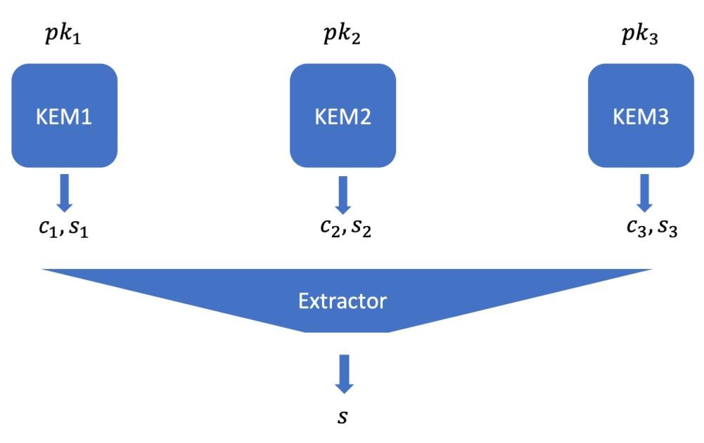
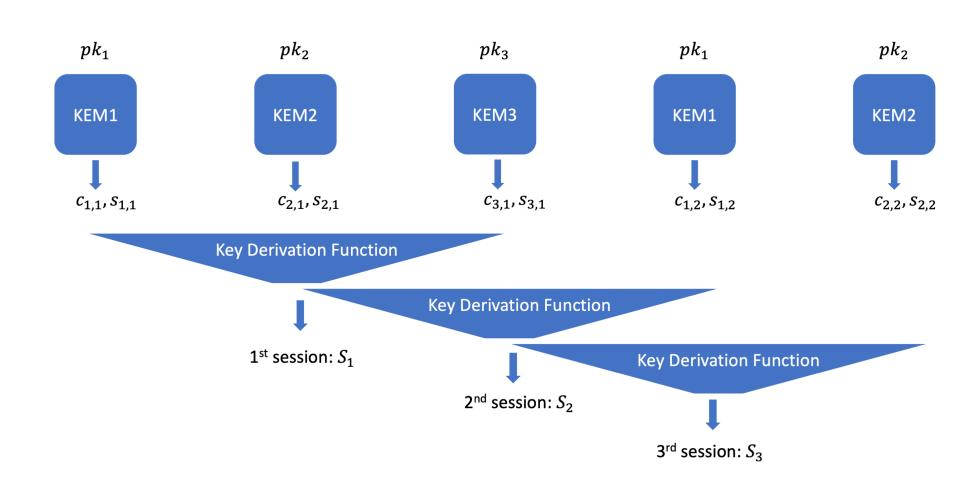
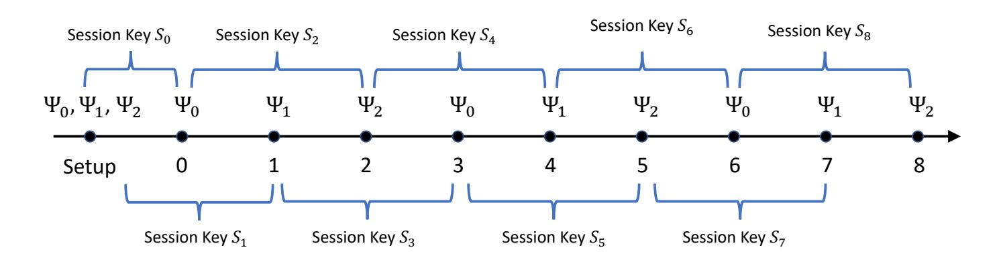
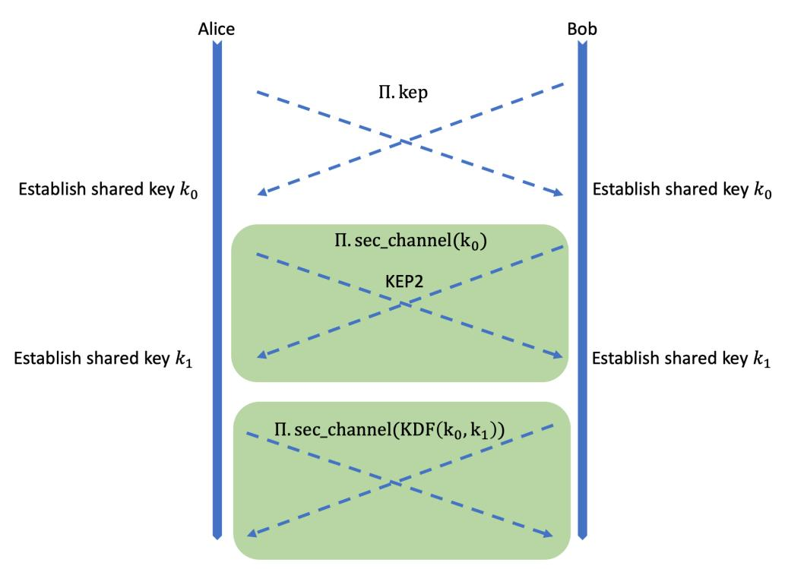
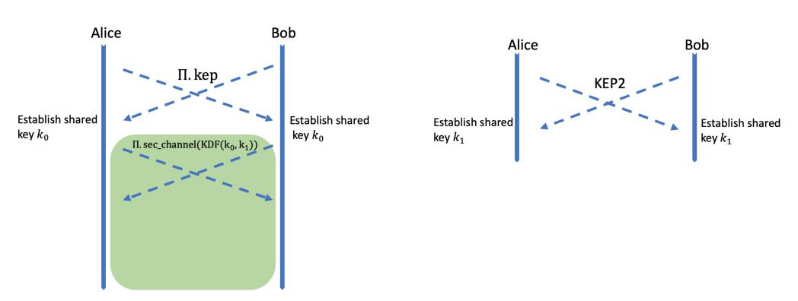

{0}------------------------------------------------

# Stateful KEM: Towards Optimal Robust Combiner for Key Encapsulation Mechanism

Jia Xu Yiwen Gao Hoon Wei Lim

<span id="page-0-0"></span>*NUS-Singtel Cyber Security R&D Lab Email: jiaxu2001@gmail.com NUS-Singtel Cyber Security R&D Lab Email: gaoywin@gmail.com NUS-Singtel Cyber Security R&D Lab Email: hoonwei.lim@trustwave.com*

Hongbing Wang *NUS-Singtel Cyber Security R&D Lab Email: wanghongbing501@outlook.com*

Ee-Chien Chang *National University of Singapore Email: changec@comp.nus.edu.sg*

#### Abstract

A (1, n)-robust combiner combines n cryptography primitives to construct a new primitive of the same type, and guarantees that if any of the ingredient primitive is secure, then the resulting primitive is secure. In recent two decades, robust combiners for various crypto primitives (e.g. public key encryption, oblivious transfer) have been proposed. Very recently, more works on robust combiners for post-quantum key encapsulation mechanism appear to achieve multi-layer of defence, to counter the future threat from Shor's algorithm running on powerful quantum computers. However, typically such combination of n crypto primitives will sum up running times of all ingredient primitives and thus introduce linear overhead in time complexity, which may be a big burden on server side, since the server has to run key encapsulation mechanism (or key exchange protocol) with every online client.

We propose the very first robust combiner (of KEMs), with O(1) *amortized* complexity overhead, which not only breaks the linear boundary, but also achieves optimal complexity. Our experiments also confirm that the performance overhead of our robust combiner of n KEMs is constant (i.e. O(1)) rather than linear (i.e. O(n)). Our cost is that, the resulting KEM has to maintain a secret dynamic state of fixed and linear size (i.e. O(n)) . We call such KEM as Stateful Key Encapsulation Mechanism (SKEM). SKEM is suitable for two users (or devices), who will have *frequent* secure communications (e.g. via VPN or SSH). We also formally define the security formulation for SKEM and prove the security of our proposed SKEM scheme in standard model.

### Index Terms

Key Exchange Protocol, Key Encapsulation Mechanism, Robust Combiner, Security and Performance, Parallel Combination, Series Combination, Post-quantum Cryptography

## 1. Introduction

Robust combiner, which aims to construct a crypto scheme from multiple existing crypto schemes (called ingredient schemes) of the same type, will combine the strength of all ingredient schemes: if any ingredient scheme is secure, the resulting scheme will be secure. It will provide multi-layer of defence to further reduce the risk of compromise compared to any single scheme. Recall that, the security of crypto primitives may fall into these categories: *(1) Unconditional secure*: A typical example is the classical one-time pad, which is proved to be secure under information theory. Another example is Quantum Key Distribution (QKD), where some QKD algorithm has been proved to be unconditional secure under quantum information theory. However, One-time pad requires the encryption/decryption key is as long as the plaintext, and QKD requires relatively expensive hardware and has a limited communication distance. *(2) Provable conditional secure*: Typical examples are public key crypto schemes. The research community carefully defines a few number of mathematical problems (e.g. large integer factorization, discrete log problem, shortest vector problem in lattice), and assumes they are hard to solve by any polynomial time algorithm (precisely, any probabilistic polynomial time algorithm will have only negligible probability to succeed). Every construction of public key crypto is expected to be proved under some of these hard problem assumptions: If a polynomial time adversary algorithm can break this public key crypto scheme, then another polynomial time algorithm can be constructed by revoking this adversary algorithm to solve some pre-defined hard problem, which is contradicted with the assumption that such hard problem is infeasible to solve in polynomial time. It is important to point out that, this set of assumed hard problems have to be reviewed and revised with the development of human's understanding of these problems. For example, large integer factorization problem is assumed to be infeasible, but it turns out that Shor's

*An early draft is avaiable in eprint [https://eprint.iacr.org/ 2020/ 763.](https://eprint.iacr.org/2020/763)*

{1}------------------------------------------------

quantum algorithm can solve this problem with polynomial time where the order of polynomial is smaller than 4, under Quantum Turing Machine mode. *(3) Conditional secure by practice*: Typical examples are symmetric cipher (e.g. AES) and hash function (e.g. SHA256 and SHA3). Security of these schemes are confirmed by (1) partial security proof under ideal cipher model or random oracle mode, and (2) the fact that no successful attacks are publicly known after a long time of attack attempts from research community and industry.

Conditional secure solutions are widely applied in real world applications, due to their flexibility and low cost compared to unconditional secure solutions. In this decade, many post-quantum cryptography algorithms are proposed, based on new hard problem assumptions (e.g. Shortest vector problem and learning with error in lattice), to counter the threat of Shor's algorithm running on powerful quantum computers.

Although powerful quantum computer which can execute Shor's algorithm to break 2000 bits RSA key is still under development, quantum threat may be urgent for some scenarios: (1) Long term security: Say if you want to protect your data (e.g. national security or trade secret) for long term (e.g. more than 15 years), and today you have to transfer such data among different office branches in your organizations. Adversary can simply sniff and archive your encrypted IP packets, and attempt to crack [1](#page-1-0) it in the future (e.g. 10 years later) when powerful quantum computers will be available (e.g. via quantum cloud computing service). (2) Post-quantum security by design: The lifecycle of a cyber security system, including design, construction, in operation, and expiration, could be very long (say more than 15 years). It will be a wise idea to add post-quantum security to the list of security goal from design phase, rather than patching the system ugly in the midway when threat of attacks with powerful quantum computers really appear some years later.

However, at the time of writing, there is no well recognized standard for post-quantum cryptography. NIST is organizing a competition of PQC. 17 PQC KEM schemes are shortlisted in the second round in 2019, and 4 shortlisted in the third round together with 5 alternative recommended PQC KEM schemes. The final winner will be the standardized PQC KEM scheme by 2024. It is crucially important to propose an early solution (e.g. robust combiner of PQC KEM) with multilayer defence, which is likely secure against quantum attacks and classical attacks, and likely to comply with the future NIST standard. Such solution with multi-layer defence will be still useful after NIST standard of PQC comes out, since standardized crypto algorithm may not necessarily guarantee security. The world already witnesses that standardized crypto algorithms (e.g. DES, RC4, MD5, SHA1 have been broken, and RSA, DSA, DH, ECC will be broken by Shor's quantum algorithm) become vulnerable due to various reasons, and even worse some standardized crypto algorithm may be poisoned with backdoor [2](#page-1-1) .

To reduce the risk of conditional secure solutions, especially for the young PQC algorithms, it is a natural idea to combine multiple existing solutions of the same types but under different hard problem assumptions, to achieve multi-layer of defence—that's the motivation of the notion "robust combiner". However, all of existing constructions of robust combiner of n schemes, introduces linear (O(n)) performance overhead. More precisely, the time complexity (CPU time) of a robust combiner of n schemes, is at least the sum of time complexity of all n schemes. As a result, security and performance are conflicting with each other: large value of n might provide lower risk, but will be n times slower. This might explain why several recent works in robust combiner for PQC only deal with the case that n = 2, to combine a PQC scheme with a classical public key crypto scheme, where the young PQC scheme may have potential to defend against future quantum attacks and the classical public key crypto scheme complies with existing crypto standard and has withstood long term testing against classical attacks.

In this work, we propose a robust combiner from n KEMs, which is optimal and has only constant (O(1)) performance overhead. The amortized time complexity of our robust combiner is close to the average time complexity of all n ingredient KEM schemes. Although key exchange protocol may run infrequently between two users, the performance speedup by n times is very important for servers (like VPN/SSH server), which will run key exchange protocols with a large number of online users.

### 1.1. Contributions

Our main contributions in this work can be summarized as below.

- 1) We propose a notion called "Stateful Key Encapsulation Mechanism (SKEM)" and formally define its security under IND-CPA and IND-CCA formulation, while all of existing key encapsulation mechanisms (KEMs) are stateless or memoryless. SKEM is suitable for two users (precisely, two devices), who may have frequent secure communications, e.g. typical usage of VPN and SSH.
- 2) We propose a robust combiner, which constructs a SKEM, from n given KEMs. Each given KEM is referred as ingredient crypto primitive of this robust combiner. We claim our construction is the first robust combiner from

<span id="page-1-0"></span><sup>1.</sup> Precisely, the adversary may break the key exchange protocol using Shor's algorithm to recover the session key, and then decrypt the sniffed IP packets using this session key, since widely adopted key exchange protocols (e.g. RSA or variants of Diffie-Hellman protocol) are vulnerable to Shor's algorithm.

<span id="page-1-1"></span><sup>2.</sup> [https://en.wikipedia.org/wiki/Dual](https://en.wikipedia.org/wiki/Dual_EC_DRBG) EC DRBG

{2}------------------------------------------------

- n ingredient crypto primitive with sublinear (in n) complexity. To the best of our knowledge, all of the existing robust combiners of n crypto primitives have time complexity which is not less than the sum of all of n primitives. Our proposed robust combiner of n KEM schemes has amortized time complexity close to the average of these n KEM schemes, which is optimal in performance.
- 3) We construct practical and secure hybrid stateful key exchange protocols based on our proposed SKEM scheme, together with refinement and optimization in many detailed aspects of key exchange protocols, which may have been overlooked in previous works. Our solution is more suitable for two parties who will communicate with each other frequently.
- 4) We implement our proposed solution and run experiments to evaluate the practical performance of our solutions and confirm the speedup of n times.

## 1.2. Organization

The rest of this paper is organized in this way: The next Section [2](#page-2-0) discusses the related works. Section [3](#page-3-0) provides the important definitions to characterize the security features of key encapsulation mechanism (KEM) or key exchange protocol (KEP). Then we propose a construction of robust combiner of key encapsulation mechanism and prove it is CPA-secure in Section [4.](#page-4-0) We also extend this construction to achieve CCA-security in Section [5.](#page-8-0) Next, we construct key exchange protocols in Section [6](#page-9-0) by adding more optimizations to the robust combiner of KEM proposed in previous section. We also discuss how to integrate our solution with existing solutions (e.g. TLS, IKEv2). We provide our experiment data in Section [8.](#page-13-0) At the end, Section [9](#page-15-0) closes this paper.

## <span id="page-2-0"></span>2. Related Works

## 2.1. Robust Combiner

As early as 1980's, Even and Goldreich [\[14\]](#page-18-0) started the research work of combining multiple symmetric ciphers. [\[7\]](#page-18-1), [\[10\]](#page-18-2), [\[21\]](#page-19-0) studied how to combine multiple public key crypto schemes. Bindel *et al.* [\[2\]](#page-15-1) combined multiple signature schemes.

Recently, Giacon *et al.* [\[8\]](#page-18-3) gave a generic parallel framework for robust combiner of key encapsulation mechanisms. [\[1\]](#page-15-2), [\[9\]](#page-18-4), [\[12\]](#page-18-5) extends the work on parallel combination of multiple KEM schemes. Here we give a refined and more complete description of this parallel framework.

2.1.1. Parallel Framework of Robust Combiner for KEMs. Let Ψ<sup>i</sup> , i ∈ [0, n−1] denote the i-th ingredient KEM scheme; let Ψ denote the resulting robust combiner for KEM. The public/private keys of Ψ will be a collection of all public/private keys generated by each ingredient KEM scheme Ψ<sup>i</sup> . In the encapsulation algorithm of Ψ, we invoke encapsulation algorithm from each ingredient KEM Ψ<sup>i</sup> to generate (c<sup>i</sup> , si), and then aggregate all of s<sup>i</sup> , c<sup>i</sup> together to compute the secret s ← W(. . . , s<sup>i</sup> , . . . , c<sup>i</sup> , . . .) for the combiner KEM Ψ. Optionally, we may also compute a message authentication code t ← T(. . . , s<sup>i</sup> , . . . , c<sup>i</sup> , . . .) in order to achieve security under chosen ciphertext attack (CCA). To design CPA-secure robust combiner of KEM, we may simply ignore function T by treating it as T(· · ·) = ⊥. [\[8\]](#page-18-3) calls such key derivation function W as *core* function, while we add the *tag* function T into this generic framework.

### 2.2. Integrate with Existing System

Bos *et al.* [\[4\]](#page-18-6) proposed a post-quantum key exchange protocol based on Ring-LWE problem and integrated it with TLS/SSL. Crockett, Paquin and Stebila [\[5\]](#page-18-7) developed prototypes to integrate a subset of 10 post quantum KEMs submitted to NIST PQC competition, with OpenSSL and OpenSSH. [\[5\]](#page-18-7) indicated that they failed to integrate some candidate postquantum KEMs with OpenSSL/OpenSSH, since the size of keys or ciphertext is larger than the maximum size defined in the corresponding RFC of TLS/SSL or SSH. Both works ( [\[4\]](#page-18-6), [\[5\]](#page-18-7)) adopted a white-box approach for integration: They carefully analyse the structure and information flow in the TLS/SSL protocol (e.g. ClientHello, ClientKeyExchange, ServerKeyExchange messages), and have to hack or modify the implementation (e.g. OpenSSL): (1) Original TLS/SSL protocol only allows to use a single scheme for one purpose (e.g. Key Exchange, or Encryption of payload, or Authentication), and does not support hybrid model which executes two or more schemes for the same purpose in a single session; (2) Add post-quantum KEMs to the "ciphersuite" of TLS/SSL; (3) Some implementation of TLS/SSL may introduce a limitation on the length of certain fields for storage of keys or ciphertext, which is smaller than the protocol specification in RFC. But some post-quantum KEMs may have key or ciphertext size within the scope specified in RFC, but larger than the max size allowed in the implementation software of TLS/SSL. Similarly, a very recent work [\[15\]](#page-18-8) by Sikeridis, Kampanakis and Devetsikiotis, integrated post-quantum signature scheme with TLS 1.3 with a white-box approach.

{3}------------------------------------------------

Based on the existing works (e.g. [\[1\]](#page-15-2), [\[4\]](#page-18-6), [\[7\]](#page-18-1), [\[8\]](#page-18-3), [\[10\]](#page-18-2), [\[14\]](#page-18-0), [\[21\]](#page-19-0)), Stebila, Fluhrer and Gueron [\[16\]](#page-18-9), [\[17\]](#page-18-10) proposed a draft for support of hybrid key exchange in TLS 1.3. In addition, Tjhai *et al.* proposed a draft for Internet Key Exchange Protocol Version 2 (IKEv2) [\[18\]](#page-19-1) to support hybrid key exchange.

Typically, in almost all real world applications, public key exchange protocols may be stateless: The two parties Alice and Bob do not maintain a long term dynamic secret internal status, beyond the possible long term static private key. TLS Session Resumption [3](#page-3-1) is an example of stateful key exchange protocol, but is not widely adopted yet. In this work, we are interested in key exchange between two parties who want to communicate securely and *frequently*, and will propose stateful hybrid key exchange protocol with good *amortized complexity* by combining existing key encapsulation mechanisms/public key exchange protocols.

## <span id="page-3-0"></span>3. Formulations

In this section, we introduce the important definitions in this work.

## 3.1. Robust Combiner

*Definition 1 (Robust Combiner [\[10\]](#page-18-2) (Informal)).* A (k, n)-Robust Combiner for a cryptographic primitive P is a construction that takes as input n ingredient schemes for P and combines them into one scheme such that if at least k of the candidates indeed implement P then the combiner also implements P.

## 3.2. Security Formulation of Key Exchange Protocol

In a security formulation, an adversary is characterized in two orthogonal dimensions:

- 1) Information
  - a) what information is given to the adversary, e.g. ciphertext only attack, known plaintext attack, side channel leakage;
  - b) what information that the adversary can feed into the crypto system, e.g. (adaptively) chosen plaintext/ciphertext attack, fault injection attack.
- 2) Computation power. The adversary may run a probabilistic polynomial time (PPT, for short) algorithm in classical Turing machine equivalent computer (e.g. Intel CPU), or PPT quantum algorithm (e.g. Shor's algorithm) in quantum computer. Or the adversary may even have unlimited computation resource, in the case of unconditional security (a.k.a. information theoretical secure).

The typical security formulations for Key Encapsulation Mechanism or Key Exchange Protocol include, computational indistinguishability under chosen plaintext or ciphertext attack model (a.k.a. IND-CPA, IND-CCA), and forward/backward secrecy. The formulation of IND-CPA and IND-CCA for KEM is well known and can be found in [\[8\]](#page-18-3), [\[12\]](#page-18-5). Unger *et al.* [\[19\]](#page-19-2) summarized security features for secure message communications, including forward/backward secrecy, and stated that, "the terms are controversial and vague in literature [\[6\]](#page-18-11)". In this work, we give a formal definition of forward secrecy and backward secrecy for key exchange protocols.

- <span id="page-3-2"></span>*Definition 2 (Forward Secrecy).* Suppose we run a KEM scheme Ψ to generate (N + 1) session keys in sequence. Let TRANSCRIPT denote the collection of all public messages exchanged during the generation of these (N + 1) session keys. Let α(·) ∈ [0, 1] denote a real-valued function. We say the KEM scheme Ψ provides α(N)-forward-secrecy, if the leakage of secret key (long term secret key and session key) at session (N + 1), together with TRANSCRIPT, can lead to fully or partial leakage of at most (1 − α(N))· N number of session keys *before* session N + 1. We say Ψ provides *perfect forward secrecy*, if the corresponding α(N) = 1.
- <span id="page-3-3"></span><span id="page-3-1"></span>*Definition 3 (Backward Secrecy).* Suppose we run a KEM scheme Ψ to generate (N + 1) sessions keys in sequence. Let TRANSCRIPT denote the collection of all public messages exchanged during the generation of these (N + 1) session keys. Let β(·) ∈ [0, 1] denote a real-valued function. We say the KEM scheme Ψ provides β(N)-backward-secrecy, if the leakage of secret key (long term secret key and session key) at some session i ∈ [1, N + 1], together with TRANSCRIPT, can lead to derivation of full or partial knowledge of at most (1 − β(N)) · N number of session keys *after* session i. We say Ψ provides *perfect backward secrecy*, if the corresponding β(N) = 1.
  - 3.<https://tools.ietf.org/html/rfc5077>

{4}------------------------------------------------

<span id="page-4-1"></span>Figure 1. Definition [12] of Game KEM-IND-CCA $_{\mathcal{A}}^{\mathsf{K}}(\lambda)$ . Another game KEM-IND-CPA $_{\mathcal{A}}^{\mathsf{K}}(\lambda)$  can be obtained by removing the decryption oracle  $\mathcal{O}_{dec}(\cdot)$  from the below game.

```
Game KEM-IND-CCA_{\mathcal{A}}^{\mathsf{K}}(\lambda)

1) (pk, sk) \leftarrow \mathsf{K}.\mathsf{Gen}(1^{\lambda})

2) b \in_{R} \{0, 1\}

3) (c, s_{b}) \leftarrow \mathsf{K}.\mathsf{Encaps}(pk).

4) s_{1-b} \in_{R} \{0, 1\}^{|s_{b}|}

5) b' \leftarrow \mathcal{A}^{\mathcal{O}_{dec}}(pk, c, s_{0}, s_{1})

6) Return b = b'

Oracle \mathcal{O}_{dec}(c)

7) If c is c_{b}, return \bot

8) s \leftarrow \mathsf{K}.\mathsf{Decaps}(sk, c)

9) Return s
```

## <span id="page-4-0"></span>4. Stateful Key Encapsulation Mechanism

Key Encapsulation Mechanism is a public key cryptography primitive, closely related to public key encryption (PKE). We can construct a key encapsulation mechanism by applying public key encryption on a (uniformly) random plaintext. In the other direction, we can also construct a public key encryption by simply combining key encapsulation mechanism and one-time pad cipher. Combination of the above two ideas is a generic way to construct CCA-secure PKE from CPA-secure PKE. Key encapsulation mechanism is also widely used as key exchange protocol. NIST PQC competiton has two categories: one for KEM/PKE; and the other for digital signature scheme.

**Definition 4 (Key Encapsulation Mechanism).** A KEM scheme consists of 3 algorithms (Gen, Encaps, Decaps), described as below

- $\operatorname{Gen}(1^{\lambda}) \to (pk, sk)$ .
- Encaps $(pk) \rightarrow (c,s)$ .
- $\bullet \quad \mathsf{Decaps}(sk,c) \to s.$

Here c is called "ciphertext" or "encapsulation", and s is called "shared secret".

**Definition 5** ([12]). A KEM K is IND-CCA secure if, for any probabilistic polynomial time adversary A, the following advantage function is negligible in security parameter  $\lambda$ .

$$\mathbf{Adv}_{\mathsf{K},\mathcal{A}}^{\mathsf{KEM\text{-}IND\text{-}CCA}}(\lambda) = \left| \Pr \left[ \mathsf{KEM\text{-}IND\text{-}CCA}_{\mathcal{A}}^{\mathsf{K}}(\lambda) \Rightarrow 1 \right] - 0.5 \right| \tag{1}$$

where game KEM-IND-CCA  $_{\mathcal{A}}^{K}$  is defined in Figure 1.

*Definition 6 (Stateful Key Encapsulation Mechanism).* A Stateful KEM scheme consists of 4 algorithms (Gen, Setup, Encaps, Decaps), described as below

- Gen $(1^{\lambda}) \to (pk, sk)$ : The key generation algorithm Gen takes the security parameter  $\lambda$  as input, and returns a pair of public key pk and private key sk.
- Setup $(pk;sk) \to (\texttt{estate}_0; \texttt{dstate}_0)$ : The setup algorithm Setup is an interactive algorithm between Alice and Bob, where Alice has input pk and will obtain private output  $\texttt{estate}_0$ , and Bob has private input sk and will obtain private output  $\texttt{dstate}_0$ . Here  $\texttt{estate}_0$  is the initial internal state for Alice who runs encapsulation algorithm, and  $\texttt{dstate}_0$  is the initial internal state for Bob who runs the decapsulation algorithm.
- Encaps $(pk; i, \mathtt{estate}_{i-1}) \to (C_i, S_i; \mathtt{estate}_i)$ : The encapsulation algorithm takes as input, the public key pk, the next session id i, the current internal state  $\mathtt{estate}_{i-1}$ , and outputs a pair of ciphertext/encapsulation  $C_i$  and shared secrete  $S_i$ , and updates the internal state to  $\mathtt{estate}_i$ .
- Decaps $(sk; i, C_i, \mathtt{dstate}_{i-1}) \to (S_i; \mathtt{dstate}_i)$ : The decapsulation algorithm takes as input, the private key sk, the next session id i, ciphertext/encapsulation  $C_i$ , and current internal state  $\mathtt{dstate}_{i-1}$ , and outputs the shared secret  $S_i$ , and updates the internal state to  $\mathtt{dstate}_i$ .

The selective-session security formulation for stateful KEMs K = (Gen, Setup, Encaps, Decaps) is computational indistinguishability against chosen ciphertext attacks (IND-CCA security), is defined as in Figure 3.

Note that, the need of an encapsulation oracle in the security formulation is one significant difference between the proposed stateful key encapsulation mechanism and conventional stateless key encapsulation mechanism. In stateless key

{5}------------------------------------------------

Figure 2. Illustration of Constructions of Robust Combiner from 3 Ingredient KEMs. Typically, the key derivation function is much more efficient than algorithm Gen, Encaps, Decaps in a KEM scheme.



(a) Robust combiner in existing works [8], [9], [12] adopts XOR function as an implicit randomness extractor



<span id="page-5-1"></span>(b) Our construction: This work modifies the parallel framework of robust combiner

encapsulation mechanism, the adversary can always run encapsulation algorithm with public key by itself, so it has no need to query an oracle for this matter. In a stateful key encapsulation mechanism, the adversary may not be able to run encapsulation algorithm by itself, due to a secret state variable  $estate_{i-1}$ , which is unknown to the adversary.

**Definition 7.** A stateful KEM K is Selective-Session secure under IND-CCA attack model if, for any probabilistic polynomial time adversary A, the following advantage function is negligible in security parameter  $\lambda$ .

$$\mathbf{Adv}_{\mathsf{K},\mathcal{A}}^{\mathsf{SKEM\text{-}IND\text{-}CCA}}(\lambda) = \left| \Pr \left[ \mathsf{SKEM\text{-}IND\text{-}CCA}_{\mathcal{A}}^{\mathsf{K}}(\lambda) \Rightarrow 1 \right] - 0.5 \right| \tag{2}$$

where the Game SKEM-IND-CCA is defined in Figure 3. Selective-Session security under IND-CPA can be defined in a similar way.

We remark that, the adversary is required to commit in which session he/she wants to attack before the actual attack, just like an adversary is required to commit the identity which he/she wants to attack ahead of the time of attack in the Selective-ID security [3] formulation.

#### <span id="page-5-2"></span>4.1. Our Construction

Given n number of ingredient KEM schemes  $\Psi_i$ ,  $i=0,1,2,\ldots,n-1$ . We will construct a stateful KEM scheme, which is a (1,n)-robust combiner for KEMs. Without loss of generality, we assume: (1) each KEM scheme  $\Psi_i$  will output equal size (say  $\ell$  bits) shared secret key (i.e. s) in every invocation; (2) the two communication parties, say Alice and Bob, have already authenticated  $^4$  the identity of each other before running KEM schemes; (3) each party may maintain a separate long term internal state variable of fixed size, per each party who he/she wishes to contact. We aim to achieve

<span id="page-5-0"></span>4. We will discuss the authenticated key exchange protocol later in Section 6.3.

{6}------------------------------------------------

Figure 3. Definition of Game SKEM-IND-CCA $_{\mathcal{A}}^{\mathsf{K}}(\lambda)$  for Selective-Session Security of Stateful KEM. Another game SKEM-IND-CPA $_{\mathcal{A}}^{\mathsf{K}}(\lambda)$  can be obtained by removing the decapsulation oracle  $\mathcal{O}_{dec}(\cdot)$  from the below game.

```
Game SKEM-IND-CCA_{\mathcal{A}}^{\mathsf{K}}(\lambda)
             (pk, sk) \leftarrow \mathsf{K}.\mathsf{Gen}(1^{\lambda})
      1)
             (\iota, \mathtt{astate}) \leftarrow \mathcal{A}(pk)
      2)
      3) (estate<sub>0</sub>, dstate<sub>0</sub>) \leftarrow K.Setup(pk; sk)
      4) Pass estate<sub>0</sub> to encryption oracle \mathcal{O}_{enc} and pass dstate<sub>0</sub> to decryption oracle \mathcal{O}_{dec}
      5) Initialize a state variable LKeys as an empty list
             For i from 1 upto \iota, (C_i, S_i; \mathtt{estate}_i) \leftarrow \mathsf{K}.\mathsf{Encaps}(pk; i, \mathtt{estate}_{i-1}), and set \mathsf{LKeys}[i] = S_i
     6)
             Randomly choose b \in \mathbb{R} \{0,1\}
     7)
     8) Rename S_{\iota} as S_{\iota,b}. Reset LKeys[\iota] = \bot
    9) Randomly choose S_{\iota,1-b} \in_R \{0,1\}^{|S_{\iota,b}|}
10) b' \leftarrow \mathcal{A}^{\mathcal{O}_{enc},\mathcal{O}_{dec}}(\texttt{astate}; pk, C_{\iota}, S_{\iota,0}, S_{\iota,1})
    11)
             Return b = b'
Oracle \mathcal{O}_{enc}(i) where i \neq \iota
             When invoked on the very first time, let estate<sub>0</sub> be the state of encapsulation generated by K.Setup.
    12)
             Let \ell be the number of items (i.e. keys) in state variable LKeys. If \ell < i, starting from j = \ell + 1 upto i, generate
    13)
             j-th session key and append it to LKeys as below.
                     (C_j, S_j; \mathtt{estate}_j) \leftarrow \mathsf{K}.\mathsf{Encaps}(pk; j, \mathtt{estate}_{j-1}).
                  • \widetilde{\mathsf{LKeys}}[j] \leftarrow S_j
             Return LKeys[i].
    14)
Oracle \mathcal{O}_{dec}(i, C_i) where i \neq \iota
    15)
             When invoked on the very first time, let dstate<sub>0</sub> be the state of decapsulation generated by K.Setup.
    16)
             If C_i = C_\iota, return \perp
             Otherwise, (S_i; \mathtt{dstate}_i) \leftarrow \mathsf{K}.\mathsf{Decaps}(sk; i, C_i, \mathtt{dstate}_{i-1})
    17)
             Return S_i
    18)
```

lowest amortized complexity for two frequently contacted parties. If two parties just run key exchange protocol for once, then our time complexity could be as expensive as existing solutions [9], [12].

We denote this construction as  $\Psi_{[n]}$  (or  $\Psi$  for short), which takes n number of KEM schemes  $\Psi_i$ 's,  $i \in [0, n-1]$ , as building blocks. We define the algorithms (Gen, Setup, Encaps, Decaps) as below, and also illustrate this construction in Figure 3(b) and Figure 4.

```
\Psi_{[n]}.\mathsf{Gen}(1^{\lambda})
```

- 1) Randomly choose a prime number p with bit-length equal to  $(\lambda + 1)$ .
- 2) Randomly choose a number  $r \in_R \mathbb{Z}_p^*$ .
- 3)  $\forall i \in [0, n-1], (pk_i, sk_i) \leftarrow \Psi_i.\mathsf{Gen}(1^{\lambda}).$
- 4) Let  $Pk \leftarrow (p, r; \{pk_i\}_{i \in [0, n-1]})$ .
- 5) Let  $Sk \leftarrow \{sk_i\}_{i \in [0,n-1]}$ .
- 6) Output (Pk, Sk).

 $\Psi_{[n]}$ . Setup(Pk, Sk): This interactive algorithm runs between Alice with input Pk =  $(p, r, \{pk_i\})$ , and Bob with input Sk =  $\{sk_i\}$  as below.

- A1 For each  $i \in [1-n,0]$ , Alice computes  $(c_i,s_i) \leftarrow \Psi_j.\mathsf{Encaps}(pk_j)$  where  $j = (i \mod n)$ . Set  $\mathsf{estate}_0 = (s_{1-n},\ldots,s_0)$ , and  $\mathsf{send}\ (c_{1-n},\ldots,c_0)$  to  $\mathsf{Bob}$ .
- B1 For each  $i \in [1-n,0]$ , Bob computes  $s_i \leftarrow \Psi_j$ . Decaps $(sk_j,c_i)$ , where  $j=(i \mod n)$ . Set  $dstate_0 = (s_{1-n},\ldots,s_0)$ .

 $\Psi_{[n]}$ .Encaps(Pk; i, estate $_{i-1}$ )

- 1)  $(c_i, s_i) \leftarrow \Psi_{(i \mod n)}.\mathsf{Encaps}(pk_{(i \mod n)})$
- 2) Parse estate<sub>i-1</sub> as  $(s_{i-n}, \ldots, s_{i-1})$ .
- 3) Let the new state be  $estate_i = (s_{i-n+1}, \ldots, s_i)$ .

{7}------------------------------------------------

4) Compute the shared secret  $S_i = h(G(estate_i, r))$ , where h is a hash function and G is defined as below

$$G(x_0, \dots, x_{n-1}, r) = \sum_{i=0}^{n-1} x_i \cdot r^{i+1} \pmod{p}$$
(3)

5) Let encapsulation  $C_i = c_i$ . Return  $(C_i, S_i; estate_i)$ .

 $\Psi_{[n]}$ . Decaps $(sk; i, C_i, \mathtt{dstate}_{i-1})$ 

- 1) Compute  $s_i \leftarrow \Psi_{(i \mod n)}$ . Decaps $(sk_{(i \mod n)}, c_i)$  where  $c_i := C_i$ .
- 2) Parse  $dstate_{i-1}$  as  $(s_{i-n}, \ldots, s_{i-1})$ .
- 3) Let the new state be  $dstate_i = (s_{i-n+1}, \ldots, s_i)$ .
- 4) Compute the shared secret  $S_i = h(G(\mathtt{dstate}_i, r))$  and return  $(S_i; \mathtt{dstate}_i)$ .

Figure 4. Illustration of proposed Stateful Key Encapsulation Mechanism  $\Psi$ , constituted from 3 existing KEM  $\Psi_0, \Psi_1$  and  $\Psi_2$ .

<span id="page-7-0"></span>

**4.1.1. Fast computation of function** G. Apparently the computation of function G requires O(n) time. If we cache the value of  $r^n$  and previous computation result of function G, the next computation of G can be completed in O(1) time, as illustrated in below formula.

$$G(x_{1},...,x_{n},r)$$

$$= \sum_{i=0}^{n-1} x_{i+1} \cdot r^{i+1}$$

$$= x_{n} \cdot r^{n} + r^{-1} \cdot \left(\sum_{i=0}^{n-1} x_{i} \cdot r^{i+1} - x_{0} \cdot r\right)$$

$$= x_{n} \cdot r^{n} + r^{-1} \cdot (G(x_{0},...,x_{n-1},r) - x_{0} \cdot r)$$
(4)

Note that the above computation is over a finite filed (GF(p)) with prime order p). In our prototype implementation, we will choose Mersenne prime in the form of  $p = 2^q - 1$  with both p and q being prime numbers, to achieve faster modulo operation with modulus p.

#### 4.2. Security

<span id="page-7-2"></span>Assumption 1 (Assume keyed hash function is a secure pseudorandom function). Let  $\lambda$  be the security parameter, and  $c \geq 1$  be some constant. Let  $h(\cdot) \in \{0,1\}^{\ell}$  be a hash function (e.g. SHA3), with  $\ell \geq \lambda$ . Let prime number  $p \geq 2^{c\lambda}$ . We define

$$\mathsf{PRF}_k^h(x,y) = h(x \cdot k + y) \tag{5}$$

where the secret key  $k \in_R GF(p)$  is randomly chosen from its domain GF(p),  $x,y \in GF(p)$ ,  $x \neq 0$ , and  $x \cdot k + y$  is computed over GF(p). We assume  $\mathsf{PRF}^h_k(x,y)$  with distinct input<sup>5</sup> x is a cryptographically secure pseudorandom function w.r.t. security parameter  $\lambda$  against conventional and quantum adversary. Note: Here y can be treated as a function of x such that y = w(x) where this function  $w(\cdot)$  is implicitly defined by providing many input-output tuples (x,y) of function  $w(\cdot)$  during the evaluation of this  $\mathsf{PRF}$ .

<span id="page-7-1"></span>5. For each distinct value of x, only one input tuple (x, y) is allowed to be evaluated by function  $\mathsf{PRF}_k^h(x, y)$ .

{8}------------------------------------------------

<span id="page-8-3"></span>

| Scheme                               | core function $W$                                                           | tag function $T$            | Security                   |  |
|--------------------------------------|-----------------------------------------------------------------------------|-----------------------------|----------------------------|--|
| [8]                                  | $\bigoplus_i s_i$                                                           | <u></u>                     | CPA, SM                    |  |
|                                      | $h(\bigoplus_{i} s_i, c_0, \dots, c_{n-1}) \\ h(\dots s_i \dots c_i \dots)$ |                             | CCA, ROM                   |  |
|                                      | $h(\ldots s_i \ldots c_i \ldots)$                                           |                             | CCA, ROM                   |  |
|                                      | $h(\pi_{s_{n-1}}(\dots\pi_{s_0}(0)),c_0\ \dots\ c_{n-1})$                   | $\perp$                     | CCA, ROM or ICM            |  |
|                                      | $\bigoplus_i PRF(s_i, c_0, \dots c_{n-1})$                                  | $\perp$                     | CCA, SM                    |  |
| [1], [9], [12]                       | $k_0$ where $(k_0, k_1) \leftarrow \bigoplus_i s_i$                         | $MAC_{k_1}(\dots c_i\dots)$ | CCA, SM                    |  |
| [1]                                  | $PRF(dualPRF(s_0, s_1), c_0, c_1)$                                          | Τ                           | CCA, SM                    |  |
| [4], [5]                             | $KDF(s_0\ s_1)$                                                             |                             | No claims                  |  |
| [5]                                  | $KDF(s_0 \oplus s_1)$                                                       |                             | No claims                  |  |
| Our constructions $\Psi, \hat{\Psi}$ | Randomness Extractor + PRF,                                                 | MAC of ciphertext           | Selective-Session CPA, CCA |  |

Note: [1] only combines two ingredient KEM schemes. dualPRF $(s_0, s_1)$  is random if either  $s_0$  or  $s_1$  is random. ROM: Random Oracle Model; SM: Standard Model; ICM: Ideal Cipher Mode; PRF: Pseudorandom Function; KDF: Key Derivation Function

In our construction, function G can be treated as randomness extractor and the (keyed version) hash function h is treated as pseudorandom function.

NIST Special Publication 800-185 [11] proposed a variant of SHA3 function—KECCAK Message Authentication Code (KMAC  $^6$ ) algorithm, as both keyed hash function and pseudorandom function. The major difference between our construction of PRF $_k^h$  and KMAC is that, we use linear computation over a finite group and KMAC uses string concatenation, to pre-process the input of underlying hash function.

Assumption 1 requires the underlying hash function  $h(\cdot)$  satisfies some property, which sits somewhere between random oracle and secure hash function (i.e. collision resistant and one-wayness). The reasons are given in the below 2 propositions. **Proposition 1.** If  $h(\cdot)$  is a random oracle, then  $\mathsf{PRF}_k^h(x,y)$  is a PRF. (The proof is in Appendix A)

<span id="page-8-4"></span>**Proposition 2.** There exists some hash function  $h'(\cdot)$  which is both collision resistant and one-way, such that  $\mathsf{PRF}_k^{h'}(x,y)$  with distinct input x is not a PRF.

*Proof:* Let  $h(\cdot) \in \{0,1\}^{\ell}$  be a one-way collision resistant hash function. We define a new function  $h'(x) = 0^{\ell} \|h(x) \in \{0,1\}^{2\ell}$ . It is easy to show that, function  $h'(\cdot)$  is also collision resistant and one-way. But we can easily distinguish the output of h' from uniform random variable over  $\{0,1\}^{2\ell}$ , since the first  $\ell$  bits of output of h' are always zeros.

However, we notice that hash function h' with  $2\ell$  bits digest size is just as secure as a hash function h with shorter ( $\ell$  bits) digest size. Thus h' does not achieve tight security and will not be considered as a good design. In this work, we assume function PRF $^h$  w.r.t. a particular hash construction (e.g. h is SHA3) is a pseudorandom function.

<span id="page-8-2"></span>**Theorem 1.** If Assumption 1 holds, and some KEM  $\Psi_v$  is secure, where  $v \in [0, n-1]$ , then our construction  $\Psi_{[n]}$  is CPA-secure. Precisely, for any  $v \in [0, n-1]$ , for any probabilistic polynomial time (PPT) adversary  $\mathcal{A}$  against  $\Psi_{[n]}$ , there exist some PPT adversary  $\mathcal{B}_v$  against  $\Psi_v$ , and some PPT adversary  $\mathcal{C}$  against the PRF, such that

$$\mathbf{Adv}_{\Psi_{[n]},\mathcal{A}}^{\mathsf{SKEM-IND-CPA}}(\lambda) \leq 2 \cdot \mathbf{Adv}_{\Psi_{v},\mathcal{B}_{v}}^{\mathsf{KEM-IND-CPA}}(\lambda) + \mathbf{Adv}_{\mathsf{PRF},\mathcal{C}}(\lambda) \tag{6}$$

Note that the IND-CPA security of KEM  $\Psi_v$  is defined as in Figure 1 (on page 5), and IND-CPA security of Stateful KEM  $\Psi_{[n]}$  is defined as in Figure 3 (on page 7). (*The proof is in Appendix B*.)

**Corollary 2.** Theorem 1 also holds, if we replace the Assumption 1 with the assumption that function  $h(\cdot)$  is a random oracle.

### <span id="page-8-0"></span>5. Extend to CCA Security

In this Section, we will extend CPA-secure SKEM  $\Psi_{[n]}$  to CCA-secure SKEM  $\hat{\Psi}_{[n]}$ . The Gen and Setup algorithms of  $\hat{\Psi}_{[n]}$  will be identical to those in  $\Psi_{[n]}$ .

 $\hat{\Psi}_{[n]}.\mathsf{Encaps}(\mathtt{Pk};i,\mathtt{estate}_{i-1})$ 

- 1)  $(C_i, S_i, \mathtt{estate}_i) \leftarrow \Psi_{[n]}.\mathsf{Encaps}(\mathtt{Pk}; i, \mathtt{estate}_{i-1})$
- 2) Parse  $S_i$  as  $k_{i,0} || k_{i,1}$ , where  $k_{i,0} \in \{0,1\}^{\lambda}$ .
- 3) Compute authentication tag

$$t_i = \mathsf{MAC}_{k_{i,0}}(i, C_i). \tag{7}$$

<span id="page-8-1"></span>6. In Section 4.3 of [11], it says, "KMAC concatenates a padded version of the key K with the input X and an encoding of the requested output length L. The result is then passed to cSHAKE, along with the requested output length L..."

{9}------------------------------------------------

4) Let  $C'_i = (C_i, t_i)$  and  $K_i = k_{i,1}$  and return  $(C'_i, K_i; estate_i)$ .

 $\hat{\Psi}_{[n]}$ .Decaps $(\mathtt{Sk};i,C_i',\mathtt{dstate}_{i-1})$ 

- 1) Parse  $C_i'$  as  $(C_i, t_i)$ . 2)  $(S_i, \mathtt{dstate}_i) \leftarrow \Psi_{[n]}.\mathsf{Decaps}(\mathtt{Sk}; i, C_i, \mathtt{dstate}_{i-1}).$
- 3) Parse  $S_i$  as  $k_{i,0} || k_{i,1}$ , where  $k_{i,0} \in \{0,1\}^{\lambda}$ . 4) If  $t_i \neq \mathsf{MAC}_{k_{i,0}}(i,C_i)$ , return<sup>7</sup>  $\perp$  and revert back to state  $\mathsf{dstate}_{i-1}$ ; otherwise return  $(\mathsf{K} = k_{i,1}; \mathsf{dstate}_i)$ .

<span id="page-9-5"></span>**Theorem 3.** If  $\Psi_{[n]}$  is CPA-secure, and the message authentication code MAC is unforgeable, then our construction  $\hat{\Psi}_{[n]}$  is CCA-secure. Precisely, we have

$$\mathbf{Adv}^{\mathsf{SKEM-IND-CCA}}_{\hat{\Psi}_{[n]}}(\lambda) \leq \ell \mathbf{Adv}^{\mathsf{Unforgeable}}_{\mathsf{MAC}}(\lambda) + (\ell+1) \mathbf{Adv}^{\mathsf{SKEM-IND-CPA}}_{\Psi_{[n]}}(\lambda) \tag{8}$$

where  $\ell$  denotes the number of ciphertext queries (i.e. decapsulation queries). Note that IND-CCA security of Stateful KEM is defined as in Figure 3. (The proof is in Appendix C.)

We compare our proposed robust combiner of KEMs with related works in Table 1.

## <span id="page-9-0"></span>6. Public Key Exchange Protocol

Public key exchange protocol aims to establish a shared secret key between two parties (Alice and Bob) by exchanging some messages over an insecure public communication channel. It can be implemented by applying key encapsulation mechanism in a straightforward manner with one round of communication (as in Table 2).

<span id="page-9-2"></span>TABLE 2. Public Key Exchange between Alice and Bob using Key Encapsulation Mechanism

Alice generates a pair of keys  $(pk, sk) \leftarrow \mathsf{Gen}(1^{\lambda})$ , and distributes public key pk to Bob reliably (say via a PKI system). Setup:

Bob computes  $(c, s) \leftarrow \mathsf{Encaps}(pk)$  and sends the ciphertext c to Alice (typically via an insecure public communication channel). B1:

Alice recovers the shared secret  $s \leftarrow \mathsf{Decaps}(sk, c)$ . A1:

Alternatively, key exchange protocol can also be implemented using different methods and with one or more rounds of communication, for example, Quantum Key Distribution protocol, based on quantum physical theory. Compared with key encapsulation mechanism, public key exchange protocol may have more security requirements beyond IND-CPA or IND-CCA security: Mutual authentication between the two parties and forward secrecy. According to Wikipedia 8, "TLS 1.3 leaves ephemeral Diffie-Hellman as the only key exchange mechanism to provide forward secrecy" [13] and "OpenSSL supports forward secrecy using elliptic curve Diffie-Hellman since version 1.0, with a computational overhead of approximately 15% for the initial handshake 9".

Typically, there will be two different settings of Key Exchange Protocols, which may have different requirements in performance:

- Server-Client mode: In this setting, the goal is to maximize the number of concurrent secure connection to the  $\blacktriangle$ server. Thus, in a key exchange protocol between a server and a client, we may attempt to distribute more workload to client side and reduce the burden on server side. Examples include https, SSH, and sftp.
- Peer to Peer mode: In this setting, we may attempt to distribute almost equal workload to the two peers. For example,  $\blacktriangle$ point to point encryption gateways between two data centres or two branch offices of the same organization.

The construction of key exchange protocol from key encapsulation mechanism in Table 2 looks very simple and straightforward. For hybrid key exchange protocol, we will explore details in Table 2 and attempt to refine and optimize them, in order to achieve better performance and/or security.

<span id="page-9-1"></span><sup>7.</sup> In this failure case, the received copy of ciphertext  $C_i$  or/and authentication tag  $t_i$  is corrupt. The correct copy of  $(C_i, t_i)$  could be re-sent upon request.

<span id="page-9-3"></span><sup>8.</sup> https://en.wikipedia.org/wiki/Forward\_secrecy#Protocols

<span id="page-9-4"></span><sup>9.</sup> https://security.googleblog.com/2011/11/protecting-data-for-long-term-with.html

{10}------------------------------------------------

#### 6.1. Who Generates the Private Keys?

Typically and possibly implicitly, in exiting KEM combiners [1], [8], [12], one party (e.g. Alice) will generate all private keys  $sk \leftarrow \{sk_i\}_i$ , and the other party (e.g. Bob) has access to the public keys  $pk \leftarrow \{pk_i\}_i$ . To generate a new shared key between Alice and Bob, in the first step, Bob will compute  $(c, s) \leftarrow \mathsf{Encaps}(pk)$  and passes c to Alice; in the second step, Alice will recover the same shared secret value  $s \leftarrow \mathsf{Decaps}(sk, c)$ . This naive solution has some drawbacks:

- from security point of view, Alice didn't authenticate the identity of Bob;
- from performance point of view, Alice's computation of Decaps has to start after Bob completes his computation of Encaps, since the input c of Decaps is the output of Encaps.

Our solution is to distribute the responsibility and workload of key generation to both parties. Particularly, we choose a subset  $\mathbf{S} \subset [0, n-1]$  of indices, and denote its complement set as  $\bar{\mathbf{S}} \leftarrow [0, n-1] \setminus \mathbf{S}$ . For each  $i \in \mathbf{S}$ , Alice generates the private key  $s_i \leftarrow \hat{\Psi}_i.\mathsf{Gen}(1^{\lambda})$ ; for each  $i \in \bar{\mathbf{S}}$ , Bob generates the private key  $s_i \leftarrow \hat{\Psi}_i.\mathsf{Gen}(1^{\lambda})$ . To generate a shared key, Alice and Bob can compute in parallel as below

- in the first step, Bob and Alice independently computes  $(c_i, s_i) \leftarrow \hat{\Psi}_i$ . Encaps $(pk_i)$  for  $i \in \mathbf{S}$  and  $i \in \bar{\mathbf{S}}$  respectively;
- in the second step, Alice and Bob independently computes  $s_i \leftarrow \hat{\Psi}_i$ . Decaps $(sk_i, c_i)$  for  $i \in \mathbf{S}$  and  $i \in \bar{\mathbf{S}}$  respectively.

The next question is how to find a proper set S? From security point of view, both set  $\{\Psi_i : i \in S\}$  and the complement set  $\{\Psi_i : i \in S\}$  should contain KEM schemes  $\Psi_i$  based on various hard problems in lattice, coding theory, multi-variable polynomial, etc. From performance point of view, the choice of set S should roughly equally distribute the computation workload to Alice and Bob, in the peer to peer setting; or more workload to the client, in the server-client setting.

#### 6.2. How to Deliver the Public Keys and Ciphertext?

In typical application of public key cryptography, the public key is simply made available to everyone, as the name "public key" suggests. So is the ciphertext.

However, to allow KEM or KEP to work, it is not necessary to let any third party, beyond Alice and Bob, know about Alice's and Bob's public keys. Therefore, we intend to exchange public keys between Alice and Bob using a secure channel, established using another secure public key exchange protocol, to achieve two layer of defence (See Table 3). This combination method can be treated as a generic *series KEP combiner framework* compared to the parallel KEM combiner framework [8], [12].

<span id="page-10-0"></span>TABLE 3. Series Combination of two Key Exchange Protocols  $\Psi_0$  and  $\Psi_1$ 

- Al., Bl: Alice and Bob interactively run key exchange protocol  $\Psi_0$  to establish a secure and authenticated channel protected with session key  $k_0$ . B2: Within the secure and authenticated channel with session key  $k_0$ , Alice and Bob interactively run key exchange protocol  $\Psi_1$  to establish another
  - secure channel with session key  $k_1$ . Then Alice and Bob will communicate securely over this secure channel with session key  $k_1$ .
    - Both public key and ciphertext of  $\Psi_1$  will be delivered over the secure channel protected with session key  $k_0$ .

We emphasize that, such series KEP combiner framwork can also apply to two instances of the same KEM (i.e.  $\Psi_0 = \Psi_1$  in Table 3. For an example, we may apply our construction of  $\hat{\Psi}_{[n]}$  in this way: We establish a session key  $S_0$  during setup phase, and run the 1st session of key exchange protocol within the secure channel protected by session key  $S_0$ . Furthermore, in any subsequent session i+1, we run the key exchange protocol within the secure channel protected by previous session key  $S_i$ .

In the series combination of key exchange protocol showed in Table 3, the ingredient KEP scheme  $\Psi_0$  and  $\Psi_1$  can be any key exchange protocol:

- 1) Key Exchange Protocol derived from Key Encapsulation Mechanism, or
- 2) Quantum Key Distribution (QKD), or
- 3) other ad-hoc KEP (e.g.  $\Psi_0$  could use the pre-shared key).

In case that QKD and One Time Pad are applied to establish the first secure channel with session key  $k_0$ , which is (quantum) informationally secure, an adversary could not recover (even partial information, except length, of) the public keys or ciphertext for the second KEP scheme  $\Psi_1$ , from sniffed IP packets, even with unlimited computation power, not mention the corresponding private keys. By combining the QKD and Post Quantum Crypto Key Exchange protocol in series combination framework (as in Table 3), such that QKD is applied only for once to securely deliver the public key and first ciphertext of the PQC KEP scheme, and the PQC KEP scheme runs again and again to generate sessions keys for different sessions, we could achieve good balance between security and cost: The customer could enjoy quantum informational security by leasing the QKD hardware for a short time with much lower cost, rather than purchasing them.

{11}------------------------------------------------

### <span id="page-11-0"></span>6.3. How to Construct Authenticated Key Exchange Protocol?

It is well known that, the diffie-hellman key exchange protocol, is not authenticated and thus suffering from man-in-themiddle attack. If two parties communicate very frequently, starting from the second session, we could deliver all messages of the key exchange protocol using the secure and authenticated channel established in the previous session. For the first session, the authentication of each party can be done with help of public key infrastructure (PKI).

## 6.4. How to Derive a Session Key?

Let k<sup>i</sup> denote the session key for the i-th session. Let yi+1 denote the output of KEM scheme for the (i+ 1)-th session. We will derive the session key ki+1 as below

$$k_{i+1} \leftarrow h(k_0, \dots, k_i, y_{i+1}).$$
 (9)

The advantage of the above method is that, the current session key is dependent on *all* previous session keys, which are in turn dependent on all messages exchanged between Alice and Bob.

The naive method to compute the above Equation [\(9\)](#page-11-1), requires Alice and Bob to keep record all of previous session keys as an internal state, which will have linear storage complexity for internal secret status, and injure the forward secrecy.

Our solution is to maintain only a constant size of aggregation value of all previous history session keys, from which we can derive the new session key as defined in the above equation [\(9\)](#page-11-1). The key idea is stated in the below claim.

*Claim 1.* Let h ∈ {SHA256, SHA512, SHA3}. There exist 3 efficient functions f0, f1, f<sup>2</sup> with constant output size, such that, for any bit string x and y,

<span id="page-11-1"></span>
$$h(x) = f_1(f_0(x)) (10)$$

$$f_0(x||y) = f_2(f_0(x), y)$$
(11)

The above claim is related to but not identical to the length extension attack on SHA2. It is a natural consequence of any efficient hash function which requires only constant memory and consume all input bits in one pass from left to right.

## 6.5. How to Choose Ingredient KEM?

Typically, there may be two reasons to combine multiple KEM schemes.

- 6.5.1. Construct a potentially more Secure KEM Scheme. Since the hard problems behind post quantum cryptography are quite young, compared to factorization of large integer and discrete log problem, it is a good idea to combine post quantum KEM schemes based on various quantum resistant hard problem assumptions in lattice, coding theory, etc. One may choose not only candidate schemes from ongoing NIST competition, but also solid works (e.g. [\[4\]](#page-18-6), [\[20\]](#page-19-5)) in post quantum KEM, which are not submitted to NIST competition (e.g. proposed after the submission deadline of NIST competition).
- 6.5.2. Comply with the Future Standard. NIST standard may come out tentatively between 2022 to 2024. At the time of writing, the NIST competition of post quantum cryptography is in the third round with 4 shortlisted candidate KEMs and 5 alternative recommended KEMs. We can combine all of these KEM schemes together with some classical KEM (e.g. RSA, DH) to comply with both current and future standards. Note that, looking back the history of NIST competition of AES and SHA3, the winner candidate scheme is not allowed to make significant changes between its final standardized version and its submitted version, since necessary significant change is a hint of immature design.

### 6.6. How to Achieve Forward/Backward Secrecy

Just like ephemeral diffie-hellman key exchange protocol provides prefect forward secrecy, our KEM scheme can also achieve forward/backward secrecy by frequently refresh the public/private key pairs for KEM scheme, especially for our second construction Ψ: In every session, run an ingredient KEM scheme and refresh its public/private key pair. So a fast key generation method is desirable for this purpose.

{12}------------------------------------------------

<span id="page-12-0"></span>TABLE 4. COMPARISON OF SECURITY FEATURES OF VARIOUS KEY EXCHANGE PROTOCOLS AGAINST CLASSICAL OR QUANTUM ATTACKS

|                                                         | Classical adversary |                 |                  | Quantum adversary |                      |             |                 |                  |                |                      |
|---------------------------------------------------------|---------------------|-----------------|------------------|-------------------|----------------------|-------------|-----------------|------------------|----------------|----------------------|
| Scheme                                                  | IND-CCA/CPA         | Forward secrecy | Backward secrecy | Authentication    | Comply with Standard | IND-CCA/CPA | Forward secrecy | Backward secrecy | Authentication | Comply with Standard |
| eDH                                                     | Yes                 | Yes             | Yes              | No                | Yes                  | No          | No              | No               | No             | No                   |
| RSA                                                     | Yes                 | No              | No               | Yes               | Yes                  | No          | No              | No               | No             | No                   |
| Hybrid<br>ephemeral<br>KEP(eDH +<br>1 PQC KEP)          | Yes                 | Yes             | Yes              | Yes               | Yes                  | Yes         | Yes             | Yes              | Yes            | Probably no          |
| Our<br>ephemeral<br>Hybrid KEP<br>(eDH + 17<br>PQC KEP) | Yes                 | Yes             | Yes              | Yes               | Yes                  | Yes         | Yes             | Yes              | Yes            | Probably yes         |

eDH: ephemeral Diffie-Hellman

<span id="page-12-1"></span>TABLE 5. COMPARISON OF PERFORMANCE OF VARIOUS KEY EXCHANGE PROTOCOLS

| Scheme (NIST Security Level 1)                        | Latency (ms)      | Computation time (ms) on Server side | Computation time (ms) on client side |
|-------------------------------------------------------|-------------------|--------------------------------------|--------------------------------------|
| ephemeral Diffie-Hellman (eDH)                        | 19.24             | 19.24                                | 19.24                                |
| RSA-KEM                                               | 175.46            | 175.46                               | 0.84                                 |
| Hybrid KEP(eDH + 1 fastest ephemeral PQC KEP (SABER)) | 19.40             | 19.38                                | 19.40                                |
| Hybrid KEP(eDH + 1 slowest ephemeral PQC KEP (SIKE) ) | 441.74            | 441.74                               | 370.62                               |
| Our Hybrid KEP Ψ0<br>(eDH + 17 ephemeral PQC KEP)     | 30.43 (amortized) | 26.81 (amortized)                    | 30.43 (amortized)                    |

## 6.7. Variant Version of Our Proposed Scheme

It is easy to see that, similar to RSA scheme, Our construction of SKEM Ψ in Section [4.1](#page-5-2) cannot achieve forward or backward secrecy. To achieve forward/backward secrecy, we have to keep refreshing our public/private key pairs, just like Diffie-Hellman key exchange protocol. Let Ψ<sup>0</sup> denote the variant version of our construction Ψ, such that, all refinement and optimization ideas in this Section [6](#page-9-0) applies and one party refreshes the public/private key pair for ingredient scheme Ψ<sup>i</sup> (mod <sup>n</sup>) at the beginning of session i and sends the new public key to the other party via the existing secure and authenticated channel. We compare our proposed scheme Ψ<sup>0</sup> with existing key exchange protocols from security aspect in Table [4](#page-12-0) and from performance aspect in Table [5.](#page-12-1) Note that the workload of 17 candidate PQC KEMs are distributed to client and server as in Table [6.](#page-12-2)

TABLE 6. THE DEPLOYMENT MODE OF THE 17 KEMS IN Ψ<sup>0</sup>

<span id="page-12-2"></span>

| Deployment Mode                                | KEMs           |  |
|------------------------------------------------|----------------|--|
| Encaps on client side<br>Decaps on server side | KYBER, NewHope |  |
| Encaps on server side<br>Decaps on client side | The other KEMs |  |

#### 6.7.1. Security Analysis.

*Theorem 4.* Assume at least 1 out of n ingredient KEM schemes is secure against both classical and quantum attacks. The variant version Ψ<sup>0</sup> of SKEM achieves α(N)-forward secrecy and β(N)-backward secrecy with

$$\alpha(N) = 1; \tag{12}$$

$$\beta(N) \ge 1 - (n-1)/N. \tag{13}$$

against polynomial time classical or quantum adversary.

The above theorem can be derived from our definitions of Forward Secrecy (Definition [2\)](#page-3-2) and Backward Secrecy (Definition [3\)](#page-3-3) in a straightforward way, and we save the proof.

{13}------------------------------------------------

### 7. Integrate with Existing Systems

How to integrate post-quantum cryptography (e.g. key exchange protocol) with existing widely deployed protocols, like TLS/SSL, IPsec, and SSH, is an interesting and important problem. It may have large impact on how quickly post-quantum cryptography can be adopted widely in real world applications, and benefit most users.

Recall that, in Section [2,](#page-2-0) we reviewed that existing works [\[4\]](#page-18-6), [\[5\]](#page-18-7), [\[16\]](#page-18-9), [\[18\]](#page-19-1) adopt a white-box strategy to integrate post quantum KEMs with existing system like TLS/SSL and IKEv2 for IPsec. In this work, we suggest two simpler and almost blackbox approaches to integrate any new Key Exchange Protocol (e.g. our proposed SKEM/KEP) with existing protocols, like TLS/SSL, SSH, and IPsec:

- One is following parallel combiner framework and
- the other is following series combiner framework.

Fist of all, we implement our proposed key exchange protocol independently from existing protocols (e.g. TLS/SSL, IPsec): We decide the actual step by step interactions between two parties, and we choose how to represent our data (e.g. crypto key, ciphertext, parameters) and send them over Internet. Furthermore, the implementation of our proposed key exchange protocol is not necessary to update adaptively with every new version of implementations of existing protocols.

## 7.1. Series Combination

The procedure of series combination of existing security protocol (e.g. TLS/SSL, SSH, IPsec) and our key exchange protocol is described as below and illustrated in Figure [6\(a\).](#page-14-0)

- 1) Alice and Bob run the key exchange part of existing protocol (denoted as "Π.kep" in Figure [6\(a\)\)](#page-14-0) as usual to establish a secure channel with session key k<sup>0</sup> (denoted as "Π.sec channel(k0)" in Figure [6\(a\)\)](#page-14-0). In case that the existing protocol adopts RSA or Diffie-Hellman as key exchange protocol, this secure channel will not be quantum-resistant.
- 2) Within this secure channel protected with session key k0, Alice and Bob run our implementation of new key exchange protocols (denoted as "KEP2" in Figure [6\(a\)\)](#page-14-0) to establish another shared key k1.
- 3) As a result, Alice and Bob establish another secure channel with session key k<sup>2</sup> derived [10](#page-13-1) from both k<sup>0</sup> and k1.
- 4) Alice and Bob deliver the payload over secure channel protected with session key k2.

### 7.2. Parallel Combination

The procedure of parallel combination of existing security protocol (e.g. TLS/SSL, SSH, IPsec) and our key exchange protocol is described as below and illustrated in Figure [6\(b\).](#page-14-1)

- 1) Alice and Bob run the key exchange part of existing protocol (denoted as "Π.kep" in Figure [6\(b\)\)](#page-14-1) as usual to establish a secure channel with session key k<sup>0</sup> (denoted as "Π.sec channel(k0)" in Figure [6\(b\)\)](#page-14-1).
- 2) Alice and Bob run our implementation of new key exchange protocols (denoted as "KEP2" in Figure [6\(b\)\)](#page-14-1) *independently* and *concurrently* to establish another shared key k1.
- 3) As a result, Alice and Bob establish another secure channel with session key k<sup>2</sup> derived [11](#page-13-2) from both k<sup>0</sup> and k1.
- 4) Alice and Bob deliver the payload over secure channel protected with session key k2.

We remark that, in both series and parallel combinations, Step 1 and Step 4 are identical with the original protocols (TLS/SSL, SSH, IPsec, etc). We introduce extra Step 2 and 3 in-between. These two combinations actually share the same Step 3, and with only difference in Step 2. In fact, our series combination and parallel combination described as above, treat the implementation of existing security protocol (denoted as Π in Figure [5\)](#page-14-2) as a blackbox, except that we will read and overwrite the session key of existing security protocol.

### <span id="page-13-0"></span>8. Experimental Evaluations

In this section, we give performance evaluations for four specific implementations of our SKEM. In the implementations, we combine one traditional KEM, namely RSA, and several post-quantum KEMs that are from the second [12](#page-13-3) or third [13](#page-13-4) round of NIST competition of post-quantum cryptography, using a key derivation function (i.e. KDF) — the composite function h(G(· · ·)) used to construct scheme Ψ[n] .

- <span id="page-13-1"></span>10. We will combine the two keys k<sup>0</sup> and k<sup>1</sup> using some key derivation function.
- <span id="page-13-2"></span>11. We will combine the two keys k<sup>0</sup> and k<sup>1</sup> using some key derivation function.
- <span id="page-13-3"></span>12.<https://csrc.nist.gov/projects/post-quantum-cryptography/round-2-submissions>
- <span id="page-13-4"></span>13.<https://csrc.nist.gov/Projects/post-quantum-cryptography/round-3-submissions>

{14}------------------------------------------------

<span id="page-14-2"></span><span id="page-14-0"></span>Figure 5. Illustration of *almost-blackbox* combination of existing security protocol (e.g. TLS, VPN, SSH, denoted as Π) and our key exchange protocol (denoted as "KEP2"). In the below pictures, a pair of dashed arrows between Alice and Bob indicates one or more rounds of communications. "KDF" stands for "key derivation function".



(a) Series Combination: Π.kep and KEP2 run in sequential order and KEP2 runs in the secure channel established by security protocol Π



<span id="page-14-1"></span>(b) Parallel Combination: Π.kep and KEP2 run independently and concurrently

<span id="page-14-3"></span>TABLE 7. THE CONSTRUCTIONS OF ENCAPS AND DECAPS FOR RSA-KEM.

| Encaps: hct, ssi = Encaps(pk) | Decaps: ss = Decaps(ct,sk)   |
|-------------------------------|------------------------------|
| 1 : rr ← RNG(0n)              |                              |
| 2 : ct ← RSA_encrypt(rr, pk)  | 1 : rr ← RSA_decrypt(ct, sk) |
| 3 : ss ← SHA256(rr)           | 2 : ss ← SHA256(rr)          |

The details of the RSA-KEM for comparison are shown in Table [7.](#page-14-3) Each post-quantum KEM has several implementations of different parameter selections or versions. In our experiments, we evaluate four specific implementations listed in Table [8.](#page-14-4) The names of the implementations follow the format PQCHxRy, where x ∈ {1, 5} denotes security level, and y ∈ {2, 3} denotes version of PQC KEM (i.e. round 2 or round 3 candidate in NIST PQC competition). The specific building blocks of the implementations are listed in Table [12,](#page-16-0) [13,](#page-16-1) [14](#page-16-2) and [15,](#page-17-0) respectively.

### 8.1. Experimental Set-ups

The experiments are performed on an Intel CPU. The CPU is equipped with 6 cores, but our evaluations only use one CPU core. The source code of the PQC KEMs are from NIST PQC Competition submissions, and the RSA-KEM is

TABLE 8. NAMING OF THE SPECIFIC IMPLEMENTATIONS FOR PERFORMANCE EVALUATIONS.

<span id="page-14-4"></span>

| NIST PQC Version                               | Implementation | Security Level |
|------------------------------------------------|----------------|----------------|
| Round 2                                        | PQCH1R2        | NIST Level 1   |
|                                                | PQCH5R2        | NIST Level 5   |
| Round 3 (including alternative recommendation) | PQCH1R3        | NIST Level 1   |
|                                                | PQCH5R3        | NIST Level 5   |

{15}------------------------------------------------

<span id="page-15-4"></span>TABLE 9. EXPERIMENTAL SET-UPS.

| CPU                | Intel Core i7-8550U @ 1.80 GHz |
|--------------------|--------------------------------|
| Memory Capacity    | 16 GB                          |
| Operating System   | Linux 5.8.0 x86 64             |
| Compiler           | clang 10.0.0                   |
| Optimization Level | -O3                            |

TABLE 10. THROUGHPUT OF RSA3072-SHA256, PQCH1R2 AND PQCH1R3.

<span id="page-15-5"></span>

|        | RSA3072-SHA256 | PQCH1R2     | PQCH1R3    |
|--------|----------------|-------------|------------|
| Encaps | 2,505,675 bps  | 187,707 bps | 74,090 bps |
| Decaps | 110,432 bps    | 197,009 bps | 55,120 bps |

implemented with RSA-OAEP and SHA-256 in OpenSSL v3.0.0. More details about the set-ups are listed in Table [9.](#page-15-4)

## 8.2. Experimental Results

8.2.1. Our SKEM vs. Existing Stateless KEM combiner. Unlike stateless KEMs, the stateful KEM keeps an internal state and updates it at the end of each round. In each session/round after setup, only one ingredient KEM is executed to update the state before the KDF outputs a shared secret key. Table [16,](#page-17-1) [17,](#page-17-2) [18,](#page-18-14) [19](#page-18-15) show the performance of every round of our SKEM. The existing construction [\[8\]](#page-18-3) of robust combiner of KEMs behaves in the same way as the setup phase of our SKEM: Run each ingredient KEM separately in sequence, and then apply a KDF to aggregate the output of ingredient KEMs. So we will use the running time of setup phase of our SKE to represent the performance of existing works. For our implementations with y = 2 (resp. y = 3), the overall throughput of Round 0 to 17 (resp. 10) is approximately 340∼409 (resp. 100∼107) times the throughput in setup phase.

8.2.2. Post-Quantum vs. Conventional. It is necessary to compare the throughput of our SKEM with conventional KEMs, say RSA-KEM. As shown in Table [10](#page-15-5) and Table [11,](#page-15-6) for Decaps the SKEM bears higher throughput than the RSA-KEM, while for Encaps the SKEM is worse than the RSA-KEM. It is not strange, because some of the ingredient KEMs, such as SIKE, Classic McEliece and ROUND5, are much more time-consuming than others. For example, SIKE takes more than 80% latency in PQCH1R2. If these extremely time-consuming ingredient KEMs were removed from our SKEM, the throughput would be improved significantly.

### <span id="page-15-0"></span>9. Conclusion

In this work, we gave the security formulation of stateful key encapsulation mechanism. We then construct a stateful KEM from n (stateless) KEMs, with optimal (i.e. O(1)) amortized performance overhead. Adding more refinement and optimization ideas, we proposed practical hybrid stateful key exchange protocols. We also gave suggestions how to integrate with existing solutions like TLS/SSL, IKEv2. We also implement our schemes and run various experiments, and record the experiment data.

Our proposed stateful KEM is interesting in both theory and industry, since it breaks the linear performance boundary for robust combiner, and achieves n times speedup in CPU time for hybrid PQC key exchanges on server side.

### References

- <span id="page-15-2"></span>[1] N. Bindel, J. Brendel, M. Fischlin, B. Goncalves, and D. Stebila, "Hybrid key encapsulation mechanisms and authenticated key exchange," in *International Conference on Post-Quantum Cryptography*, 2019, [https://eprint.iacr.org/2018/903.](https://eprint.iacr.org/2018/903)
- <span id="page-15-1"></span>[2] N. Bindel, U. Herath, M. McKague, and D. Stebila, "Transitioning to a quantum-resistant public key infrastructure," in *Post-Quantum Cryptography — PQCrypto '17*, 2017, pp. 384–405.
- <span id="page-15-3"></span>[3] D. Boneh and X. Boyen, "Efficient selective-id secure identity based encryption without random oracles," Cryptology ePrint Archive, Report 2004/172, 2004, [https://eprint.iacr.org/2004/172.](https://eprint.iacr.org/2004/172)

TABLE 11. THROUGHPUT OF RSA15360-SHA256, PQCH5R2 AND PQCH5R3 .

<span id="page-15-6"></span>

|        | RSA15360-SHA256 | PQCH5R2    | PQCH5R3    |
|--------|-----------------|------------|------------|
| Encaps | 254,441 bps     | 48,312 bps | 18,095 bps |
| Decaps | 1,383 bps       | 46,794 bps | 12,331 bps |

{16}------------------------------------------------

<span id="page-16-0"></span>TABLE 12. BUILDING BLOCKS OF PQCH1R2.

| NIST PQC Round 2 Submissions | Variants/Parameters | Shared Key Size (Bits) | NIST Category |
|------------------------------|---------------------|------------------------|---------------|
| RSA-KEM                      | RSA3072-SHA256      | 256                    | Level 1       |
| BIKE 14                      | BIKE1-128-CPA       | 256                    | Level 1       |
| Classic McEliece 15          | mceliece348864      | 256                    | Level 1       |
| CRYSTALS-KYBER               | Kyber512            | 256                    | Level 1       |
| FrodoKEM                     | FrodoKEM-640        | 128                    | Level 1       |
| HQC                          | HQC-128-1           | 512                    | Level 1       |
| LAC                          | LAC-128             | 256                    | Level 1       |
| LEDAcrypt                    | LEDAcrypt-128-1     | 256                    | Level 1       |
| NewHope                      | NewHope512-CPA      | 256                    | Level 1       |
| NTRU                         | ntruhps2048509      | 256                    | Level 1       |
| NTRU Prime                   | ntrulpr653          | 256                    | Level 2       |
| NTS-KEM                      | NTS-KEM(12,64)      | 256                    | Level 1       |
| ROLLO                        | ROLLO-I-128         | 512                    | Level 1       |
| Round5                       | R5N1 1KEM 0d        | 128                    | Level 1       |
| RQC                          | RQC-I               | 512                    | Level 1       |
| SABER                        | LightSaber-KEM      | 256                    | Level 1       |
| SIKE                         | SIKEp434            | 128                    | Level 1       |
| Three Bears                  | BabyBear            | 256                    | Level 2       |

<span id="page-16-1"></span>TABLE 13. BUILDING BLOCKS OF PQCH5R2.

| Ingredient KEMs  | Variants/Parameters | Shared Key Size (Bits) | NIST Category |
|------------------|---------------------|------------------------|---------------|
| RSA-KEM          | RSA15360-SHA256     | 256                    | Level 5       |
| BIKE             | BIKE1-256-CPA       | 256                    | Level 5       |
| Classic McEliece | mceliece6688128     | 256                    | Level 5       |
| CRYSTALS-KYBER   | Kyber1024           | 256                    | Level 5       |
| FrodoKEM         | FrodoKEM-1344       | 256                    | Level 5       |
| HQC              | HQC-256-1           | 512                    | Level 5       |
| LAC              | LAC-256             | 256                    | Level 5       |
| LEDAcrypt        | LEDAcrypt-256-1     | 512                    | Level 5       |
| NewHope          | NewHope1024-CPA     | 256                    | Level 5       |
| NTRU             | ntruhps4096821      | 256                    | Level 5       |
| NTRU Prime       | ntrulpr857          | 256                    | Level 4       |
| NTS-KEM          | NTS-KEM(13,136)     | 256                    | Level 5       |
| ROLLO            | ROLLO-I-256         | 512                    | Level 5       |
| Round5           | R5N1 5KEM 0d        | 256                    | Level 5       |
| RQC              | RQC-III             | 512                    | Level 5       |
| SABER            | FireSaber-KEM       | 256                    | Level 5       |
| SIKE             | SIKEp751            | 256                    | Level 5       |
| Three Bears      | PapaBear            | 256                    | Level 5       |

<span id="page-16-2"></span>TABLE 14. BUILDING BLOCKS OF PQCH1R3.

| Ingredient KEMs  | Variants/Parameters | Shared Key Size (Bits) | NIST Category |
|------------------|---------------------|------------------------|---------------|
| RSA              | RSA3072-SHA256      | 256                    | Level 1       |
| BIKE             | BIKE1-128-CPA       | 256                    | Level 1       |
| Classic McEliece | mceliece348864      | 256                    | Level 1       |
| CRYSTALS-KYBER   | Kyber512            | 256                    | Level 1       |
| FrodoKEM         | FrodoKEM-640        | 128                    | Level 1       |
| HQC              | HQC-128             | 512                    | Level 1       |
| NTRU             | ntruhps2048509      | 256                    | Level 1       |
| NTRU Prime       | ntrulpr653          | 256                    | Level 2       |
| SABER            | LightSaber-KEM      | 256                    | Level 1       |
| SIKE             | SIKEp434            | 128                    | Level 1       |

{17}------------------------------------------------

<span id="page-17-0"></span>TABLE 15. BUILDING BLOCKS OF PQCH5R3.

| Building Blocks  | Variants/Parameters | Shared Key Size (Bits) | NIST Category |
|------------------|---------------------|------------------------|---------------|
| RSA              | RSA15360-SHA256     | 256                    | Level 5       |
| BIKE             | BIKE1-256-CPA       | 256                    | Level 5       |
| Classic McEliece | mceliece6688128     | 256                    | Level 5       |
| CRYSTALS-KYBER   | Kyber1024           | 256                    | Level 5       |
| FrodoKEM         | FrodoKEM-1344       | 256                    | Level 5       |
| HQC              | HQC-256             | 512                    | Level 5       |
| NTRU             | ntruhps4096821      | 256                    | Level 5       |
| NTRU Prime       | ntrulpr857          | 256                    | Level 4       |
| SABER            | FireSaber-KEM       | 256                    | Level 5       |
| SIKE             | SIKEp751            | 256                    | Level 5       |

<span id="page-17-1"></span>TABLE 16. PERFORMANCE OF PQCH1R2 ON OUR TESTBED.

|          | Running Components                 |              | Encaps           | Decaps       |                  |
|----------|------------------------------------|--------------|------------------|--------------|------------------|
| #Round   |                                    | Latency (ms) | Throughput (bps) | Latency (ms) | Throughput (bps) |
| Setup    | All 18 KEMs + KDF                  | 463.425      | 552              | 441.681      | 579              |
| 0,18,36  | RSA-KEM + KDF                      | 0.194        | 1,316,223        | 2.287        | 111,932          |
| 1,19,37  | BIKE + KDF                         | 0.188        | 1,358,306        | 0.757        | 338,064          |
| 2,20,38  | FrodoKEM + KDF                     | 3.279        | 78,060           | 3.274        | 78,181           |
| 3,21,39  | NTRU + KDF                         | 0.372        | 687,993          | 0.584        | 438,222          |
| 4,22,40  | NTRU Prime + KDF                   | 10.526       | 24,317           | 16.114       | 15,884           |
| 5,23,41  | CRYSTALS-KYBER + KDF               | 0.143        | 1,784,159        | 0.125        | 2,039,542        |
| 6,24,42  | SABER + KDF                        | 0.139        | 1,842,965        | 0.100        | 2,568,531        |
| 7,25,43  | NewHope + KDF                      | 0.154        | 1,662,534        | 0.083        | 3,094,905        |
| 8,26,44  | HQC + KDF                          | 0.440        | 581,175          | 0.555        | 461,315          |
| 9,27,45  | RQC + KDF                          | 0.656        | 390,323          | 2.369        | 108,025          |
| 10,28,46 | ROLLO + KDF                        | 0.291        | 879,829          | 0.636        | 402,393          |
| 11,29,47 | LAC + KDF                          | 0.201        | 1,273,733        | 0.246        | 1,039,952        |
| 12,30,48 | ROUND5 + KDF                       | 129.794      | 1,972            | 1.580        | 162,000          |
| 13,31,49 | LEDAcrypt + KDF                    | 0.868        | 294,915          | 2.865        | 89,337           |
| 14,32,50 | NTS-KEM + KDF                      | 0.174        | 1,474,606        | 1.532        | 167,113          |
| 15,33,51 | Three Bears + KDF                  | 0.259        | 987,002          | 0.386        | 663,147          |
| 16,34,52 | Classic McEliece + KDF             | 0.170        | 1,502,560        | 19.527       | 13,108           |
| 17,35,53 | SIKE + KDF                         | 330.780      | 773              | 402.991      | 635              |
|          | Our SKEM: Mean of Latency (ms)     |              |                  | 26<br>25     |                  |
| 0 to 17  | Our SKEM: Mean of Throughput (bps) | 187,707      |                  | 197,009      |                  |

<span id="page-17-2"></span>TABLE 17. PERFORMANCE OF PQCH5R2 ON OUR TESTBED.

|          | Running Components                 | Encaps       |                  | Decaps       |                  |
|----------|------------------------------------|--------------|------------------|--------------|------------------|
| #Round   |                                    | Latency (ms) | Throughput (bps) | Latency (ms) | Throughput (bps) |
| Setup    | All 18 KEMs + KDF                  | 2,160.787    | 118              | 2,107.543    | 121              |
| 0,18,36  | RSA-KEM + KDF                      | 1.069        | 239,355          | 188.531      | 1,357            |
| 1,19,37  | BIKE + KDF                         | 0.313        | 817,790          | 4.820        | 53,108           |
| 2,20,38  | FrodoKEM + KDF                     | 15.053       | 17,003           | 14.597       | 17,534           |
| 3,21,39  | NTRU + KDF                         | 0.760        | 336,950          | 1.370        | 186,816          |
| 4,22,40  | NTRU Prime + KDF                   | 17.900       | 14,299           | 29.672       | 8,626            |
| 5,23,41  | CRYSTALS-KYBER + KDF               | 0.236        | 1,086,580        | 0.237        | 1,080,892        |
| 6,24,42  | SABER + KDF                        | 0.191        | 1,338,998        | 0.176        | 1,456,172        |
| 7,25,43  | NewHope + KDF                      | 0.198        | 1,295,530        | 0.115        | 2,225,981        |
| 8,26,44  | HQC + KDF                          | 1.019        | 251,181          | 1.658        | 154,386          |
| 9,27,45  | RQC + KDF                          | 2.723        | 93,990           | 8.548        | 29,945           |
| 10,28,46 | ROLLO + KDF                        | 0.414        | 617,579          | 1.649        | 155,226          |
| 11,29,47 | LAC + KDF                          | 0.524        | 488,482          | 0.713        | 359,231          |
| 12,30,48 | ROUND5 + KDF                       | 586.951      | 436              | 4.277        | 59,849           |
| 13,31,49 | LEDAcrypt + KDF                    | 3.002        | 85,254           | 14.510       | 17,640           |
| 14,32,50 | NTS-KEM + KDF                      | 0.343        | 745,936          | 6.797        | 37,657           |
| 15,33,51 | Three Bears + KDF                  | 0.634        | 403,491          | 1.877        | 136,392          |
| 16,34,52 | Classic McEliece + KDF             | 0.487        | 525,156          | 77.434       | 3,305            |
| 17,35,53 | SIKE + KDF                         | 1465.912     | 174              | 1808.771     | 141              |
| 0 to 17  | Our SKEM: Mean of Latency (ms)     | 116          |                  |              | 120              |
|          | Our SKEM: Mean of Throughput (bps) | 48,312       |                  | 46,794       |                  |

{18}------------------------------------------------

<span id="page-18-14"></span>TABLE 18. PERFORMANCE OF PQCH1R3 ON OUR TESTBED.

| #Round  | Running Components                 | Encaps       |                  | Decaps       |                  |
|---------|------------------------------------|--------------|------------------|--------------|------------------|
|         |                                    | Latency (ms) | Throughput (bps) | Latency (ms) | Throughput (bps) |
| Setup   | All 10 KEMs + KDF                  | 345.554      | 740              | 469.569      | 545              |
| 0,10,20 | RSA-KEM + KDF                      | 0.194        | 1,317,730        | 2.263        | 113,078          |
| 1,11,21 | BIKE + KDF                         | 0.111        | 2,315,795        | 15.349       | 16,673           |
| 2,12,22 | FrodoKEM + KDF                     | 3.264        | 78,406           | 3.236        | 79,079           |
| 3,13,23 | NTRU + KDF                         | 0.317        | 807,445          | 0.497        | 515,232          |
| 4,14,24 | NTRU Prime + KDF                   | 10.659       | 24,010           | 15.989       | 16,006           |
| 5,15,25 | CRYSTALS-KYBER + KDF               | 0.111        | 2,310,371        | 0.076        | 3,356,545        |
| 6,16,26 | SABER + KDF                        | 0.075        | 3,421,490        | 0.064        | 4,022,549        |
| 7,17,27 | HQC+ KDF                           | 0.224        | 1,142,474        | 0.280        | 913,797          |
| 8,18,28 | Classic McEliece + KDF             | 0.140        | 1,822,598        | 20.451       | 12,513           |
| 9,19,29 | SIKE + KDF                         | 330.344      | 774              | 406.086      | 630              |
| 0 to 9  | Our SKEM: Mean of Latency (ms)     | 34<br>74,090 |                  |              | 46               |
|         | Our SKEM: Mean of Throughput (bps) |              |                  | 55,120       |                  |

<span id="page-18-15"></span>TABLE 19. PERFORMANCE OF PQCH5R3 ON OUR TESTBED.

| #Round  | Running Components                 | Encaps       |                  | Decaps       |                  |
|---------|------------------------------------|--------------|------------------|--------------|------------------|
|         |                                    | Latency (ms) | Throughput (bps) | Latency (ms) | Throughput (bps) |
| Setup   | All 10 KEMs + KDF                  | 1,513.993    | 169              | 2,178.728    | 117              |
| 0,10,20 | RSA-KEM + KDF                      | 1.005        | 254,636          | 192.446      | 1,330            |
| 1,11,21 | BIKE + KDF                         | 0.221        | 1,159,250        | 68.930       | 3,713            |
| 2,12,22 | FrodoKEM + KDF                     | 18.632       | 13,738           | 17.732       | 14,436           |
| 3,13,23 | NTRU + KDF                         | 0.338        | 758,326          | 0.527        | 485,723          |
| 4,14,24 | NTRU Prime + KDF                   | 21.649       | 11,824           | 29.284       | 8,741            |
| 5,15,25 | CRYSTALS-KYBER + KDF               | 0.176        | 1,455,437        | 0.165        | 1,553,403        |
| 6,16,26 | SABER + KDF                        | 0.114        | 2,239,619        | 0.115        | 2,228,553        |
| 7,17,27 | HQC+ KDF                           | 0.594        | 431,016          | 0.811        | 315,457          |
| 8,18,28 | Classic McEliece + KDF             | 0.215        | 1,188,654        | 72.509       | 3,530            |
| 9,19,29 | SIKE + KDF                         | 1512.775     | 169              | 1900.031     | 134              |
| 0 to 9  | Our SKEM: Mean of Latency (ms)     | 155          |                  |              | 228              |
|         | Our SKEM: Mean of Throughput (bps) | 18,095       |                  | 12,331       |                  |

- <span id="page-18-6"></span>[4] J. W. Bos, C. Costello, M. Naehrig, and D. Stebila, "Post-quantum key exchange for the tls protocol from the ring learning with errors problem," in *IEEE Security & Privacy*, 2015, [https://eprint.iacr.org/2014/599.](https://eprint.iacr.org/2014/599)
- <span id="page-18-7"></span>[5] E. Crockett, C. Paquin, and D. Stebila, "Prototyping post-quantum and hybrid key exchange and authentication in tls and ssh," Cryptology ePrint Archive, Report 2019/858, 2019, [https://eprint.iacr.org/2019/858.](https://eprint.iacr.org/2019/858)
- <span id="page-18-11"></span>[6] W. Diffie, P. C. V. Oorschot, and M. J. Wiener, "Authentication and authenticated key exchanges," *Designs, Codes and Cryptography*, vol. 2, no. 2, p. 107–125, 1992. [Online]. Available:<https://doi.org/10.1007/BF00124891>
- <span id="page-18-1"></span>[7] Y. Dodis and J. Katz, "Chosen-ciphertext security of multiple encryption," in *Proceedings of the Second International Conference on Theory of Cryptography*, ser. TCC'05, 2005, pp. 188–209.
- <span id="page-18-3"></span>[8] F. Giacon, F. Heuer, and B. Poettering, "Kem combiners," in *Public-Key Cryptography – PKC 2018*, 2018, pp. 190–218.
- <span id="page-18-4"></span>[9] G. HANAOKA, T. MATSUDA, and J. C. N. SCHULDT, "A new combiner for key encapsulation mechanisms," *IEICE Transactions on Fundamentals of Electronics, Communications and Computer Sciences*, vol. E102.A, no. 12, pp. 1668–1675, 2019.
- <span id="page-18-2"></span>[10] D. Harnik, J. Kilian, M. Naor, O. Reingold, and A. Rosen, "On robust combiners for oblivious transfer and other primitives," in *Proceedings of the 24th Annual International Conference on Theory and Applications of Cryptographic Techniques*, ser. EUROCRYPT'05, 2005, pp. 96–113.
- <span id="page-18-12"></span>[11] R. A. P. John M. Kelsey, Shu-jen H. Chang, "Sha-3 derived functions: cshake, kmac, tuplehash and parallelhash."
- <span id="page-18-5"></span>[12] T. Matsuda and J. Schuldt, "A new key encapsulation combiner," in *International Symposium on Information Theory and Its Applications (ISITA)*, 2018, pp. 698–702.
- <span id="page-18-13"></span>[13] E. Rescorla, " The Transport Layer Security (TLS) Protocol Version 1.3 (Internet Engineering Task Force)," August 2018. [Online]. Available: <https://www.rfc-editor.org/rfc/pdfrfc/rfc8446.txt.pdf>
- <span id="page-18-0"></span>[14] E. S. and G. O., "On the power of cascade ciphers," in *Advances in Cryptology — Crypto '84*, 1984, pp. 43–50. [Online]. Available: [https://doi.org/10.1007/978-1-4684-4730-9](https://doi.org/10.1007/978-1-4684-4730-9_4) 4
- <span id="page-18-8"></span>[15] D. Sikeridis, P. Kampanakis, and M. Devetsikiotis, "Post-Quantum Authentication in TLS 1.3: A Performance Study," in *Network and Distributed Systems Security (NDSS) Symposium*, 2020. [Online]. Available:<https://eprint.iacr.org/2020/071>
- <span id="page-18-9"></span>[16] D. Stebila, S. Fluhrer, and S. Gueron, "Hybrid key exchange in TLS 1.3 (Work in Progress) ," Jan 2020. [Online]. Available: <https://datatracker.ietf.org/doc/draft-stebila-tls-hybrid-design>
- <span id="page-18-10"></span>[17] ——, "Design issues for hybrid key exchange in TLS 1.3 (Work in Progress) ," July 2019. [Online]. Available: [https://tools.ietf.org/id/](https://tools.ietf.org/id/draft-stebila-tls-hybrid-design-01.html) [draft-stebila-tls-hybrid-design-01.html](https://tools.ietf.org/id/draft-stebila-tls-hybrid-design-01.html)

{19}------------------------------------------------

<span id="page-19-6"></span>Figure 6. Construct attack algorithm  $\mathcal{B}_v$  on a KEM  $\Psi_v$ , using attack algorithm  $\mathcal{A}$  on SKEM  $\Psi_{[n]}$ 

 $\mathcal{B}_v(pk_v^*, c_v, s_{v,0}, s_{v,1})$  where  $(c_v, s_{v,\beta})$  is generated by  $\Psi_v$ . Encaps $(pk_v^*)$  and  $s_{v,1-\beta}$  is a randomly chosen bit-string with the same bit-length as  $s_{v,b}$ . The security game  $\mathbf{G}_1$  and  $\mathbf{G}_2$  will be definded in Appendix B.2.

- 1) Let  $b_0 = 0$ , if  $\mathcal{A}$  wins in  $\mathbf{G}_1$ , otherwise let  $b_0 = 1$ .
- 2) Let  $b_1 = 1$  if  $\mathcal{A}$  wins in  $\mathbf{G}_2$ , otherwise let  $b_1 = 0$ .
- 3) If  $b_0 = b_1$  then output  $\beta' = b_0$ ; otherwise choose a random bit  $\beta' \in \mathbb{R}$   $\{0, 1\}$  and output  $\beta'$ .

Remark: Both  $b_0$  and  $b_1$  attempt to guess the value of secret bit  $\beta$ , based on the result of Game  $G_1, G_2$ , respectively.

- <span id="page-19-1"></span>[18] C. Tjhai, M. Tomlinson, G. Bartlett, S. Fluhrer, D. V. Geest, O. Garcia-Morchon, and V. Smyslov, "Framework to Integrate Post-quantum Key Exchanges into Internet Key Exchange Protocol Version 2 (IKEv2) (Work in Progress)," July 2019. [Online]. Available: https://tools.ietf.org/html/draft-tjhai-ipsecme-hybrid-qske-ikev2-04
- <span id="page-19-2"></span>[19] N. Unger, S. Dechand, J. Bonneau, S. Fahl, H. Perl, I. Goldberg, and M. Smith, "Sok: Secure messaging," in 2015 IEEE Symposium on Security and Privacy, 2015, pp. 232–249.
- <span id="page-19-5"></span>[20] Z. Yang, Y. Chen, and S. Luo, "Two-message key exchange with strong security from ideal lattices," Cryptology ePrint Archive, Report 2018/361, 2018, https://eprint.iacr.org/2018/361.
- <span id="page-19-0"></span>[21] R. Zhang, G. Hanaoka, J. Shikata, and H. Imai, "On the security of multiple encryption or cca-security+cca-security=cca-security?" in *Public Key Cryptography* — *PKC* '04, 2004, pp. 360–374. [Online]. Available: https://doi.org/10.1007/978-3-540-24632-9\_26

## <span id="page-19-3"></span>Appendix A.

## **Proof of Proposition 1**

*Proof:* Let  $x, x', y, y' \in GF(p)$ . We have

$$x \cdot k + y = x' \cdot k + y' \pmod{p} \tag{14}$$

$$\Leftrightarrow (x - x') \cdot k = y' - y \pmod{p}. \tag{15}$$

$$\Leftrightarrow y = y' \text{ and } x = x'. \tag{16}$$

As a result, for any two distinct pairs  $(x,y) \neq (x',y')$ ,  $x \cdot k + y \neq x' \cdot k + y' \pmod{p}$  and thus the two outputs  $h(x \cdot k + y)$  and  $h(x' \cdot k + y')$  of random oracle  $h(\cdot)$  will be independently random.

### <span id="page-19-4"></span>Appendix B.

### **Proof of Theorem 1**

We assume the ingredient KEM  $\Psi_v$  is secure under KEM-IND-CPA formulation, and all other KEM  $\Psi_i$ ,  $i \in [0, n-1] \setminus \{v\}$  might be insecure.

#### B.1. Entities in our proof: Attack algorithms A and B, Simulator algorithm Sim

Firstly, let  $\mathcal{A}$  denote the attacking algorithm on SKEM  $\Psi_{[n]}$ . Based on  $\mathcal{A}$ , we intend to construct another attacking algorithm, denoted as  $\mathcal{B}_v$ , against KEM  $\Psi_v$ , as in Figure 6. The public key of KEM  $\Psi_v$  is  $pk_v$ , and the challenging message in the Game KEM-IND-CPA $_{\mathcal{B}_v}^{\Psi_v}(\lambda)$  between  $\mathcal{B}_v$  and  $\Psi_v$  is  $(c_v, s_{v,0}, s_{v,1})$ . Let  $\beta \in \{0,1\}$  be the secret bit to be guessed in this security game KEM-IND-CPA $_{\mathcal{B}_v}^{\Psi_v}(\lambda)$ , and tuple  $(c_v, s_{v,\beta})$  is generated by  $\Psi_v$ . Encaps $(pk_v)$  and  $s_{v,1-\beta}$  is randomly chosen such that it has the same bit-length as  $s_{v,\beta}$ .

Recall that, in the Selected-Session Security formulation, the adversary  $\mathcal{A}$  is required to commit in the beginning that in which session (denoted  $\iota$ -th session) it will launch the attack. In the integer interval  $[-n, \iota]$ , we will find the largest session number  $\hat{v}$  such that  $\hat{v} = v \mod n$ . We also construct a simulator Sim as subroutine in Figure 7, which simulates the behavior of  $\Psi_{[n]}$  in every session identically, excepted that the  $\hat{v}$ -th session is manipulated by embedding the challenging message  $(c_v, s_{v,0})$  or  $(c_v, s_{v,1})$ . We remark that, since the adversary attacks in  $\iota$ -th session, and our proof should manipulate in  $\hat{v}$ -th session with  $\hat{v} \leq \iota$ , we have to ask the adversary to commit the value of  $\iota$  in advance.

<span id="page-19-7"></span>Claim 2. In the simulator  $\mathsf{Sim}^{\mathcal{A}}(pk_v, c_v^*, s_v^*)$  defined in Figure 7, if the input  $(c_v^*, s_v^*) = (c_v, s_{v,\beta})$  of  $\mathsf{Sim}$  is generated by  $\Psi_v.\mathsf{Encaps}(pk_v)$ , then

- the public key generated by Sim.Gen( $1^{\lambda}$ ) and the public key generated by  $\Psi_{[n]}$ .Gen( $1^{\lambda}$ ) are identically distributed;
- the output of Sim.Encaps(Pk, i, estate $_{i-1}$ ) and output of  $\Psi_{[n]}$ .Encaps(Pk, i, estate $_{i-1}$ ) are identically distributed.

{20}------------------------------------------------

Figure 7. The construction of simulator Sim, which attempts to simulate the security game for KEM  $\Psi_{[n]}$  using public key  $pk_v$  and challenge messages  $(c_v^*, s_v^*)$  of KEM  $\Psi_v$ .

<span id="page-20-0"></span> $\operatorname{\mathsf{Sim}}^{\mathcal{A}}(pk_v, c_v^*, s_v^*)$  where  $v \in [0, n-1]$ 

- 1) Gen(1 $^{\lambda}$ ) Choose p and r in the same way as in  $\Psi_{[n]}$ .Gen(1 $^{\lambda}$ ). For  $i \in [0, n-1] \setminus \{v\}$ , compute  $(pk_i, sk_i) \leftarrow \Psi_i$ .Gen(1 $^{\lambda}$ ). Let  $pk = (r, \{pk_i\}_{i \in [0, n-1]})$ ; and  $sk_{-v} = (sk_0, \ldots, sk_{v-1}, \bot, sk_{v+1}, \ldots, sk_{n-1})$ . Note that this simulator does not know the secret key  $sk_v$  corresponding to public key  $pk_v$  w.r.t. KEM  $\Psi_v$ .
- 2) Setup $(pk, sk_{-v})$ 
  - For  $i \in [1-n,0]$ ,  $(c_i,s_i) \leftarrow \Psi_{i \mod n}$ . Encaps $(pk_{i \mod n})$ .
  - Let  $\mathsf{estate}_0 = \mathsf{dstate}_0 = (\ldots, s_i, \ldots)_{i \in [1-n,0]}$ .
- 3)  $\mathsf{Encaps}(pk; i, \mathsf{estate}_{i-1})$ 
  - a) When this algorithm is invoked for the very first time,
    - receive  $(\iota, astate)$  from  $\mathcal{A}(pk)$ ;
    - initialise the list of key pairs KeyPL  $\leftarrow \emptyset$ . Here KeyPL is a counterpart of LKeys in Figure 3.
  - b) Define  $\hat{v}$  as the largest integer in  $[1 n, \iota]$  such that  $\hat{v} \equiv v \pmod{n}$ . Precisely,

$$\hat{v} = \begin{cases} \iota - (\iota \mod n) + v; (\text{if } v \le (\iota \mod n)) \\ \iota - (\iota \mod n) + v - n \text{ (otherwise)} \end{cases}$$
 (17)

- c) If  $i = \hat{v}$ , we set  $(c_i, s_i) = (c_v^*, s_v^*)$ , to embed the challenge message.
- d) If  $i \neq \hat{v}$ ,  $(c_i, s_i) \leftarrow \Psi_{i \pmod{n}}$ . Encaps $(pk_{i \pmod{n}})$ .
- e) Parse estate<sub>i-1</sub> as  $(s_{i-n}, s_{i-n+1}, \dots, s_{i-2}, s_{i-1})$ .
- f) Set estate<sub>i</sub> = dstate<sub>i</sub> =  $(s_{i-n+1}, s_{i-n+2}, \dots, s_{i-1}, s_i)$ .
- g)  $S_i = h(G(\mathtt{estate}_i, r)).$
- h) Let  $C_i = c_i$  and  $KeyPL[i] = (C_i, S_i)$ .
- i) return KeyPL[i].
- 4) Decaps $(sk, C; i, \mathtt{dstate}_i)$ : If  $\mathtt{KeyPL}[i]$  is empty, return  $\bot$ . Otherwise, let  $(C_i, S_i) = \mathtt{KeyPL}[i]$ . If  $C = C_i$ , then return  $S_i$ . Otherwise, return  $\bot$ .

Figure 8. The construction of simulator  $\mathsf{Sim}_{\mathsf{PRF}}^{\mathcal{A}}$ , which attempts to simulate  $\mathsf{Sim}^{\mathcal{A}}(pk_v, c_v, s_{v,1-\beta})$ . Here  $\mathsf{PRF}_k(a,b) = h(a \cdot k + b)$  is a pseudorandom function.

```
\operatorname{Sim}_{\mathsf{PRF}_k}^{\mathcal{A}}(pk_v, c_v^*) where v \in [0, n-1] and k = s_{v,1-\beta}
```

- 1)  $Gen(1^{\lambda})$  The same as Step 1) in Figure 7.
- 2) Setup $(pk, sk_{-v})$  The same as Step 2) in Figure 7.
- 3)  $\mathsf{Encaps}(pk; i, \mathsf{estate}_{i-1})$ 
  - a) The same as Step 3)a in Figure 7.
  - b) Compute  $\hat{v}$  from  $\iota$  in the same way as in Step 3)b in Figure 7.
  - c) If  $i \notin [\hat{v} n + 1, \hat{v} + n 1]$ 
    - i) The same as Step 3)d-3)k.
  - d) If  $i \in [\hat{v} n + 1, \hat{v} + n 1]$ 
    - i)  $(c_i, s_i) \leftarrow \Psi_{i \pmod{n}}$ . Encaps $(pk_{i \pmod{n}})$
    - ii) Parse estate<sub>i-1</sub> as  $(s_{i-n}, s_{i-n+1}, \dots, s_{i-2}, s_{i-1})$ .
    - iii) Set estate<sub>i</sub> = dstate<sub>i</sub> =  $(s_{i-n+1}, s_{i-n+2}, \dots, s_{i-1}, s_i)$ .
    - iv)  $G(\mathtt{estate}_i,r) = \sum_{l=1}^n s_{l+i-n} \cdot r^l = r^{\hat{v}+n-i} s_{\hat{v}} + \sum_{l \in [1,n] \setminus \{\hat{v}+n-i\}} s_{l+i-n} \cdot r^l$  Note that the value of  $s_{\hat{v}}$ , which is set to value of  $s_{v,1-\beta}$ , is unknown, and all other  $s_j$ 's are known. Let  $A_i = r^{\hat{v}+n-i} \neq 0$  and  $B_i = \sum_{l \in [1,n] \setminus \{\hat{v}+n-i\}} s_{l+i-n} \cdot r^l$ .
    - v) If  $i \neq \hat{v}$ , issue a query  $(A_j, B_j)$  to  $\mathcal{O}^{\mathsf{PRF}_{s_v, 1-\beta}}$  to obtain  $y = \mathsf{PRF}_{s_{v, 1-\beta}}(A_j, B_j)$ .
    - vi) If  $i = \hat{v}$ , send  $(A_{\hat{v}}, B_{\hat{v}})$  to  $\mathcal{O}^{\mathsf{PRF}_{s_v, 1-\beta}}$  to get challenge message y where  $y = \mathsf{PRF}_{s_{v,1-\beta}}(A_j, B_j)$  with probability 0.5 or is randomly chosen with probability 0.5.
    - vii) Let  $S_i = y$ , and compute the rest in the same way as above (precisely Step c)vi-viii).
  - e) return KeyPL[i].
- 4) Decaps $(sk, C; i, dstate_i)$ : The same as Step 4) in Figure 7.

{21}------------------------------------------------

Claim 3. In the simulator  $\text{Sim}^{\mathcal{A}}(pk_v, c_v^*, s_v^*)$  defined in Figure 7, if the input  $s_v^* = s_{v,1-\beta}$  is a uniformly randomly chosen bit-string with the same length as  $s_{v,\beta}$ , for any  $j \in [\hat{v}, \hat{v} + n - 1]$ , the j-th shared secret key  $S_j$  is computationally indistinguishable from uniform random bit-string of the same length. Precisely,  $S_j = h(A \cdot s_{\hat{v}} + B) \equiv_c U$  for some integers  $A \neq 0$  and B.

*Proof:* The internal state estate<sub>j</sub> used to compute  $S_j$  is a n-dimensional vector  $(s_{j-n+1}, s_{j-n+2}, \ldots, s_{j-1}, s_j)$ . From  $j \in [\hat{v}, \hat{v} + n - 1]$ , we derive that  $j - n + 1 \le \hat{v} \le j$  and thus  $s_{\hat{v}}$  is a component in the vector estate<sub>j</sub>. We have

$$S_i = h(G(\texttt{estate}_i, r)) \tag{18}$$

$$= h(G(s_{j-n+1}, \dots, s_{\hat{v}}, \dots, s_j, r))$$
(19)

$$= h(\sum_{i=j-n+1}^{j} s_i \cdot r^{i-j+n})$$
 (20)

$$=h(A\cdot s_{\hat{v}}+B),\tag{21}$$

where  $s_{\hat{v}} = s_{v,1-\beta}$  is a component of vector  $\mathtt{esate}_j$ , and  $A = r^{\hat{v}-j+n} \neq 0$  and B are computed from other dimensions in vector  $\mathtt{estate}_j$  except  $s_{\hat{v}}$ . Since  $s_{v,1-\beta}$  is uniformly randomly chosen as in Step 4 in Figure 1 and the function G is a randomness extractor for block-fixing distribution,  $S_j \equiv_c U$ .

## <span id="page-21-0"></span>**B.2.** Security Games $G_0, G_1, G_2, G_3, G_{4,v}$

Secondly, we define some security games as below.

- G<sub>0</sub>: Adversary  $\mathcal{A}$  plays the security game SKEM-IND-CPA( $\lambda$ ) with KEM  $\Psi_{[n]}$ . By definition,  $\Pr\left[\mathbf{G}_0 \Rightarrow 1\right] = 0.5 + \mathbf{Adv}_{\Psi_{[n]},\mathcal{A}}^{\mathsf{SKEM-IND-CPA}}$ .
- G<sub>1</sub>: Adversary  $\mathcal{A}$  plays the security game SKEM-IND-CPA( $\lambda$ ) with simulator  $\mathsf{Sim}^{\mathcal{A}}(pk_v, c_v, s_{v,0})$ . The difference between  $\mathbf{G}_0$  and  $\mathbf{G}_1$  is KEM  $\Psi_{[n]}$  is replaced by simulator  $\mathsf{Sim}^{\mathcal{A}}(pk_v, c_v, s_{v,0})$ .
- G<sub>2</sub>: Adversary  $\mathcal{A}$  plays the security game SKEM-IND-CPA( $\lambda$ ) with simulator  $\mathsf{Sim}^{\mathcal{A}}(pk_v, c_v, s_{v,1})$ . The difference between  $\mathbf{G}_1$  and  $\mathbf{G}_2$  is that the third input of simulator  $\mathsf{Sim}$ :  $s_{v,0}$  in  $\mathbf{G}_1$  is replaced by  $s_{v,1}$  in  $\mathbf{G}_2$ , where  $(c_v, s_{v,\beta})$  is generated by  $\Psi_v$  and  $s_{v,1-\beta}$  is randomly chosen.
- G<sub>3</sub>: Adversary  $\mathcal{A}$  plays the security game SKEM-IND-CPA( $\lambda$ ) with simulator  $\mathsf{Sim}_{\mathsf{PRF}(s_{v,1-\beta},\cdot)}^{\mathcal{A}}(pk_v,c_v)$ , which is defined in Figure 8. The difference between  $\mathsf{G}_2$  and  $\mathsf{G}_3$  is that the second player in the security game is changed from  $\mathsf{Sim}^{\mathcal{A}}(pk_v,c_v,s_{v,1-\beta})$  to  $\mathsf{Sim}_{\mathsf{PRF}(s_{v,1-\beta},\cdot)}^{\mathcal{A}}(pk_v,c_v)$ .
- $\mathbf{G}_{4,v}$ : Adversary  $\mathcal{B}_v$  plays the security game KEM-IND-CPA( $\lambda$ ) with KEM scheme  $\Psi_v$ , where  $v \in [0,n-1]$  and algorithm  $\mathcal{B}_v$  is defined in Figure 6. By definition,  $\Pr\left[\mathbf{G}_{4,v} \Rightarrow 1\right] = 0.5 + \mathbf{Adv}_{\Psi_v,\mathcal{B}_v}^{\mathsf{KEM-IND-CPA}}$ .

### **B.3. Relations among Security Games**

### <span id="page-21-1"></span>Claim 4.

$$\Pr\left[\mathbf{G}_0 \Rightarrow 1\right] = \Pr\left[\mathbf{G}_{1+\beta} \Rightarrow 1\right] \tag{22}$$

*Proof:* Recall that in the security game SKEM-IND-CPA( $\lambda$ ) defined in Figure 3, the adversary  $\mathcal{A}$  will receive the below messages from the other party, which is KEM  $\Psi_{[n]}$  in  $\mathbf{G}_0$  or simulator  $\mathsf{Sim}(pk_v, c_v, s_{v,\beta})$  in  $\mathbf{G}_{1+\beta}$ :

- In Step 2 of Figure 3, A receives public key pk of the KEM scheme.
- In Step 10 of Figure 3,  $\mathcal{A}$  receives challenge message  $(C_{\iota}, S_{\iota,0}, S_{\iota,1})$ .
- In Step 14 of Figure 3, A receives the response to encapsulation query i.

As stated in Figure 6,  $(c_v, s_{v,\beta})$  is generated by  $\Psi_v$ . Encaps $(pk_v)$ . Hence, we can apply Claim 2. Consequently, it is easy to verify that, the messages that  $\mathcal{A}$  receives from  $\Psi_{[n]}$  in game  $G_0$ , is identically distributed from the messages that  $\mathcal{A}$  receives from  $\text{Sim}(pk_v, c_v, s_{v,\beta})$  in game  $G_{1+\beta}$ . Therefore, the adversary  $\mathcal{A}$  will have the same probability to win, and Claim 4 holds.

### <span id="page-21-2"></span>Claim 5.

$$\Pr\left[\mathbf{G}_{2-\beta} \Rightarrow 1\right] = \Pr\left[\mathbf{G}_3 \Rightarrow 1\right]. \tag{23}$$

*Proof:* The function Gen and Setup in Figure 7 and Figure 8 are identical. Comparing the function Encaps in Figure 7 and Figure 8,

{22}------------------------------------------------

- 1) If  $i \notin [\hat{v} n + 1, \hat{v} + n 1]$ , the two implementations of Encaps are trivially identical;
- If  $i \in [\hat{v} n + 1, \hat{v} + n 1]$ , we check the procedure step by step carefully, it is easy to see that the value  $S_j$  will be assigned to the same value, where the only difference is that they are using two different methods to compute the same target value  $G(\text{estate}_j, r)$ .

<span id="page-22-0"></span>Figure 9. Construct attack algorithm  ${\mathcal C}$  on PRF, using attack algorithm  ${\mathcal A}$  on SKEM  $\Psi_{[n]}$ 

 $\mathcal{C}^{\mathcal{O}_{\mathsf{PRF}_k}}()$  with oracle access to PRF with secret key k

- 1)  $(pk_v, sk_v) \leftarrow \Psi_v.\mathsf{Gen}(1^{\lambda}).$
- 2)  $(c_v^*, s_v^*) \leftarrow \Psi_v$ . Encaps  $(pk_v)$ .
- Rename  $s_v^*$  as  $s_{v,\beta}$  and rename the unknown secret key k as  $s_{v,1-\beta}$ . Here the bit-lengths of  $s_{v,\beta}$  and  $s_{v,1-\beta}$  are equal.
- Invoke adversary  $\mathcal{A}$  and  $\mathsf{Sim}_{\mathsf{PRF}_k}^{\mathcal{A}}(pk_v, c_v^*)$  to play game  $\mathbf{G}_3$ . Recall that  $\mathsf{Sim}_{\mathsf{PRF}_k}^{\mathcal{A}}(pk_v, c_v^*)$  will make two types of queries to oracle  $\mathcal{O}_{\mathsf{PRF}_k}$ : (1) Send evaluation query  $(A_i, B_i)$  to the oracle and received  $y = \mathsf{PRF}_k(A_i, B_i)$  as response; (2) Send challenging query  $(A_i, B_i)$  to the oracle and get a challenge message y form the oracle, such that  $y = \mathsf{PRF}_k(A_i, B_i)$  is generated from PRF with probability 0.5, and is independently randomly chosen with the same bit-length with probability 0.5.
- 5) If A wins in game  $G_3$ , then output 1, which means "the received challenging message is PseudoRandom"; otherwise output 0, which means "the received challenging message is TrueRandom".

Claim 6. Let C be the attacking algorithm on PRF defined in Figure 9.

$$0.5 - \mathbf{Adv}_{\mathsf{PRF},\mathcal{C}} \le \Pr\left[\mathbf{G}_3 \Rightarrow 1\right] \le 0.5 + \mathbf{Adv}_{\mathsf{PRF},\mathcal{C}} \tag{24}$$

*Proof:* Let TR denote the event that the challenging message of PRF is true random; let PR denote the event that the challenging message of PRF is pseudo-random. Let  $\Pr[\mathcal{C} \text{ outputs } 1|\text{PR}] = 0.5 + \epsilon_{PR}$  and let  $\Pr[\mathcal{C} \text{ outputs } 0|\text{TR}] = 0.5 + \epsilon_{TR}$  where  $\epsilon_{PR}, \epsilon_{TR} \geq 0$  are some real numbers.

Then

$$0.5 + \mathbf{Adv}_{\mathsf{PRF},\mathcal{C}} = \Pr\left[\mathcal{C} \text{ breaks PRF}\right]$$

$$= \Pr\left[\mathcal{C} \text{ outputs } 1 \land \mathsf{PR}\right] + \Pr\left[\mathcal{C} \text{ outputs } 0 \land \mathsf{TR}\right]$$

$$= \Pr\left[\mathcal{C} \text{ outputs } 1 \middle| \mathsf{PR}\right] \times \Pr\left[\mathsf{PR}\right] + \Pr\left[\mathcal{C} \text{ outputs } 0 \middle| \mathsf{TR}\right] \times \Pr\left[\mathsf{TR}\right]$$

$$= (0.5 + \epsilon_{PR}) \times 0.5 + (0.5 + \epsilon_{TR}) \times 0.5$$

$$= 0.5 + 0.5(\epsilon_{PR} + \epsilon_{TR})$$
(25)

According to the construction of attacking algorithm  $\mathcal{C}$  on PRF in Figure 9, we have

$$\Pr\left[\mathbf{G}_{3} \Rightarrow 1\right]$$

$$= \Pr\left[\mathcal{A} \text{ wins } \mathbf{G}_{3}\right] = \Pr\left[\mathcal{C} \text{ outputs } 1\right]$$

$$= \Pr\left[\mathcal{C} \text{ outputs } 1 \land \Pr\right] + \Pr\left[\mathcal{C} \text{ outputs } 1 \land \text{TR}\right]$$

$$= \Pr\left[\mathcal{C} \text{ outputs } 1 \middle| \Pr\right] \times \Pr\left[\Pr\right] + \Pr\left[\mathcal{C} \text{ outputs } 1 \middle| \Pr\right] \times \Pr\left[\text{TR}\right]$$

$$= (0.5 + \epsilon_{PR}) \times 0.5 + (1 - (0.5 + \epsilon_{TR})) \times 0.5$$

$$= 0.5 + 0.5(\epsilon_{PR} - \epsilon_{TR})$$
(26)

Since  $-\epsilon_{PR} - \epsilon_{TR} \le \epsilon_{PR} - \epsilon_{TR} \le \epsilon_{PR} + \epsilon_{TR}$ , we have

$$0.5 - \mathbf{Adv}_{\mathsf{PRF},\mathcal{C}} \le \Pr\left[\mathbf{G}_3 \Rightarrow 1\right] \le 0.5 + \mathbf{Adv}_{\mathsf{PRF},\mathcal{C}}$$
(27)

<span id="page-22-1"></span>Claim 7.

$$2 \cdot \Pr\left[\mathbf{G}_{4,v} \Rightarrow 1\right] = \Pr\left[\mathbf{G}_1 \Rightarrow 1\right] + \Pr\left[\mathbf{G}_2 \Rightarrow 1\right]. \tag{28}$$

Proof of Claim 7: From the construction of  $\mathcal{B}_v$  in Figure 6, we have  $\Pr\left[\mathbf{G}_{4,v}\Rightarrow 1\right]=\Pr[\beta'=\beta];$   $\Pr\left[\mathbf{G}_1\Rightarrow 1\right]=\Pr[b_0=\beta]=0.5+\epsilon_0$  for some real number  $\epsilon_0;$   $\Pr\left[\mathbf{G}_2\Rightarrow 1\right]=\Pr[b_1=\beta]=0.5+\epsilon_1$  for some real number  $\epsilon_1$ . Therefore,  $\Pr[b_0\neq\beta]=1-\Pr[b_0=\beta]=0.5-\epsilon_0$  and  $\Pr[b_1\neq\beta]=1-\Pr[b_1=\beta]=0.5-\epsilon_1$ .

{23}------------------------------------------------

Since  $\beta, b_0, b_1 \in \{0, 1\}$ , we have

$$\Pr[b_0 \neq b_1] = \Pr[b_0 = \beta \land b_1 \neq \beta] + \Pr[b_0 \neq \beta \land b_1 = \beta]$$

$$\tag{29}$$

$$=\Pr[b_0 = \beta] \times \Pr[b_1 \neq \beta] + \Pr[b_0 \neq \beta] \times \Pr[b_1 = \beta]$$
(30)

$$= (0.5 + \epsilon_0) \times (0.5 - \epsilon_1) + (0.5 - \epsilon_0) \times (0.5 + \epsilon_1)$$
(31)

$$=0.5 - 2\epsilon_0 \cdot \epsilon_1 \tag{32}$$

$$\Pr[\beta' = \beta] \tag{33}$$

$$=\Pr[\beta' = \beta \wedge b_0 = b_1] + \Pr[\beta' = \beta \wedge b_0 \neq b_1]$$
(34)

$$=\Pr[b_0 = \beta \land b_1 = \beta] + 0.5 \times \Pr[b_0 \neq b_1]$$
(35)

$$=\Pr[b_0 = \beta] \times \Pr[b_1 = \beta] + 0.5 \times \Pr[b_0 \neq b_1]$$
(36)

$$= (0.5 + \epsilon_0) \times (0.5 + \epsilon_1) + 0.5 \times (0.5 - 2\epsilon_0 \cdot \epsilon_1)$$
(37)

$$= (0.25 + 0.5\epsilon_0 + 0.5\epsilon_1 + \epsilon_0 \cdot \epsilon_1) + (0.25 - \epsilon_0 \cdot \epsilon_1)$$
(38)

$$=0.5 + 0.5\epsilon_0 + 0.5\epsilon_1 \tag{39}$$

As a result,

$$\Pr\left[\mathbf{G}_{4,v} \Rightarrow 1\right] = \Pr[\beta' = \beta]$$

$$= 0.5 + 0.5\epsilon_{0} + 0.5\epsilon_{1} = 0.5 + 0.5 \cdot \left(\Pr\left[\mathbf{G}_{1} \Rightarrow 1\right] - 0.5\right) +$$

$$0.5 \cdot \left(\Pr\left[\mathbf{G}_{2} \Rightarrow 1\right] - 0.5\right)$$

$$= 0.5 \cdot \Pr\left[\mathbf{G}_{1} \Rightarrow 1\right] + 0.5 \cdot \Pr\left[\mathbf{G}_{2} \Rightarrow 1\right].$$
(40)

### **B.4.** Conclusion of Proof of Theorem 1

With all of above claims, we will complete the proof the Theorem 1.

For any bit value  $\beta \in \{0,1\}$ , the set  $\{1+\beta,2-\beta\}$  will be identical to the set  $\{1,2\}$ . Therefore,

$$\Pr\left[\mathbf{G}_{1+\beta} \Rightarrow 1\right] + \Pr\left[\mathbf{G}_{2-\beta} \Rightarrow 1\right] = \Pr\left[\mathbf{G}_{1} \Rightarrow 1\right] + \Pr\left[\mathbf{G}_{2} \Rightarrow 1\right] \tag{41}$$

Considering Claim 4, Claim 5 and Claim 7, we have

$$2 \cdot \Pr\left[\mathbf{G}_{4,v} \Rightarrow 1\right] \tag{42}$$

$$= \Pr\left[\mathbf{G}_1 \Rightarrow 1\right] + \Pr\left[\mathbf{G}_2 \Rightarrow 1\right] \tag{43}$$

$$= \Pr\left[\mathbf{G}_{1+\beta} \Rightarrow 1\right] + \Pr\left[\mathbf{G}_{2-\beta} \Rightarrow 1\right] \tag{44}$$

$$=\Pr\left[\mathbf{G}_{0}\Rightarrow1\right]+\Pr\left[\mathbf{G}_{3}\Rightarrow1\right]\tag{45}$$

Recall that  $\Pr\left[\mathbf{G}_0 \Rightarrow 1\right] = 0.5 + \mathbf{Adv}_{\Psi_{[n]},\mathcal{A}}^{\mathsf{SKEM-IND-CPA}}$  and  $\Pr\left[\mathbf{G}_{4,v} \Rightarrow 1\right] = 0.5 + \mathbf{Adv}_{\Psi_v,\mathcal{B}_v}^{\mathsf{KEM-IND-CPA}}$ . As a result,

$$0.5 + \mathbf{Adv}_{\Psi_{[n]}, \mathcal{A}}^{\mathsf{SKEM-IND-CPA}} = \Pr\left[\mathbf{G}_0 \Rightarrow 1\right]$$
 (46)

$$=2 \cdot \Pr\left[\mathbf{G}_{4,v} \Rightarrow 1\right] - \Pr\left[\mathbf{G}_{3} \Rightarrow 1\right] \tag{47}$$

$$\leq 2 \cdot (0.5 + \mathbf{Adv}_{\Psi_v, \mathcal{B}_v}^{\mathsf{KEM-IND-CPA}}) - (0.5 - \mathbf{Adv}_{\mathsf{PRF}, \mathcal{C}})$$
(48)

$$=0.5 + 2\mathbf{Adv}_{\Psi_{v},\mathcal{B}_{v}}^{\mathsf{KEM-IND-CPA}} + \mathbf{Adv}_{\mathsf{PRF},\mathcal{C}}$$

$$\tag{49}$$

The proof of Theorem 1 completes.

#### <span id="page-23-0"></span>Appendix C.

#### **Proof of Theorem 3**

We say a chosen ciphertext query (i.e. decapsulation query) is "non-trivial", if the MAC-tag in this ciphertext (or decapsulation) query is successful forged by an adversary. Otherwise, we call this chosen ciphertext query as "trivial".

**Claim 8.** If the conclusion of Theorem 1 holds, then  $\Psi_{[n]}$  is SKEM-IND-CCA-secure with any polynomial number of trivial chosen ciphertext queries and with zero non-trivial chosen ciphertext query.

{24}------------------------------------------------

Note in a trivial chosen ciphertext (or decapsulation) query where the response is not  $\bot$ , the adversary either submits a ciphertext which is obtained from some previous encapsulation query, or creates a new ciphertext with a MAC-key that it knows.

**Lemma 5.** If the conclusion of Theorem 1 holds, then  $\hat{\Psi}_{[n]}$  is SKEM-IND-CCA-secure with  $\ell$  number of chosen ciphertext (or decapsulation) query. Precisely,

$$\mathbf{Adv}^{\mathsf{SKEM-IND-CCA}}_{\hat{\Psi}_{[n]}}(\lambda) \leq \ell \mathbf{Adv}^{\mathsf{Unforgeable}}_{\mathsf{MAC}}(\lambda) + (\ell+1) \mathbf{Adv}^{\mathsf{SKEM-IND-CPA}}_{\Psi_{[n]}}(\lambda) \tag{50}$$

*Proof:* Let  $(\epsilon_i + 0.5)$  be the probability that the adversary  $\mathcal{A}'$  can win the SKEM-IND-CCA security game with i number of decapsulation queries. So

$$\epsilon_0 = \mathbf{Adv}_{\Psi_{[n]}, \mathcal{A}'}^{\mathsf{SKEM-IND-CPA}} \tag{51}$$

Let  $w_i$  be the probability that the i-th query is the very first "non-trivial" query among all of first i number of decapsulation queries.

Recall that the MAC-key  $k_{MAC}$  is a substring of shared secret of SKEM  $\Psi_{[n]}$ , and is computationally indistinguishable from uniform randomness. Precisely,

$$k_{\mathsf{MAC}} \approx_{\epsilon_0} \mathbf{U}.$$
 (52)

Therefore, regarding the very first non-trivial decapsulation query with the fist forged MAC, we have

$$\forall i, w_i \leq \mathbf{Adv}_{\mathsf{MAC}}^{\mathsf{Unforgeable}} + \epsilon_0.$$
 (53)

$$\epsilon_{\ell} + 0.5 = \Pr\left[\mathcal{A}' \text{ wins with } \ell \text{ d-queries}\right]$$
 (54)

$$\leq \Pr\left[\mathcal{A}' \text{ wins with } 0 \text{ non-trivial d-queries } \vee \exists \ell_{\mathtt{nt}} \text{ non-trivial d-queries with } 1 \leq \ell_{\mathtt{nt}} \leq \ell\right]$$
 (55)

$$\leq \Pr\left[\mathcal{A}' \text{ wins with } 0 \text{ non-trivial d-queries}\right] + \Pr\left[\exists \ell_{\mathtt{nt}} \text{ non-trivial d-queries with } 1 \leq \ell_{\mathtt{nt}} \leq \ell\right]$$
 (56)

$$\leq (\epsilon_0 + 0.5) + \sum_{j=1}^{\ell} w_j \tag{57}$$

$$\leq (\epsilon_0 + 0.5) + \ell \times \left( \mathbf{Adv}_{\mathsf{MAC}}^{\mathsf{Unforgeable}} + \epsilon_0 \right)$$
 (58)

As a result,

$$\epsilon_{\ell} \le \ell \mathbf{Adv}_{\mathsf{MAC}}^{\mathsf{Unforgeable}} + (\ell+1)\epsilon_0$$
 (59)