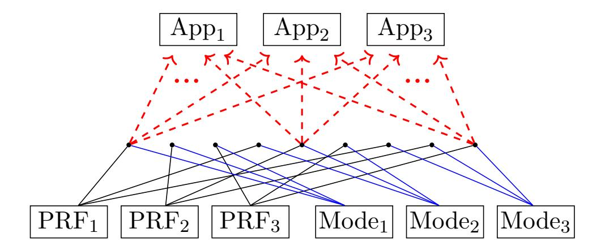
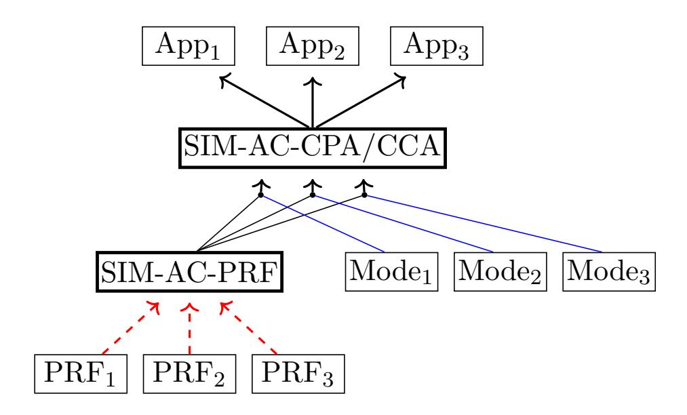

{0}------------------------------------------------

A preliminary version of this paper appears in CRYPTO 2020. This is the full version.

# Handling Adaptive Compromise for Practical Encryption Schemes

Joseph Jaeger<sup>1</sup> Nirvan Tyagi<sup>2</sup>

June 2020

#### Abstract

We provide a new definitional framework capturing the multi-user security of encryption schemes and pseudorandom functions in the face of adversaries that can adaptively compromise users' keys. We provide a sequence of results establishing the security of practical symmetric encryption schemes under adaptive compromise in the random oracle or ideal cipher model. The bulk of analysis complexity for adaptive compromise security is relegated to the analysis of lower-level primitives such as pseudorandom functions.

We apply our framework to give proofs of security for the BurnBox system for privacy in the face of border searches and the in-use searchable symmetric encryption scheme due to Cash et al. In both cases, prior analyses had bugs that our framework helps avoid.

<sup>1</sup> Paul G. Allen School of Computer Science & Engineering, University of Washington, Seattle, USA. Email: jsjaeger@cs.washington.edu. URL: https://homes.cs.washington.edu/~jsjaeger/. Supported in part by NSF grant CNS-1717640, NSF grant CNS-1719146, and a Sloan Research Fellowship.

<sup>2</sup> Cornell Tech, New York, USA. Email: tyagi@cs.cornell.edu. URL: https://www.cs.cornell.edu/~tyagi/. Supported in part by NSF grant CNS-1704296.

{1}------------------------------------------------

### Contents

| 1 | Introduction                                                                                                                                                                                          | 2                    |  |  |
|---|-------------------------------------------------------------------------------------------------------------------------------------------------------------------------------------------------------|----------------------|--|--|
| 2 | Preliminaries<br>2.1<br>Standard Cryptographic Definitions<br>                                                                                                                                        | 7<br>9               |  |  |
| 3 | New Security Definitions for Symmetric Primitives<br>3.1<br>Randomized Symmetric Encryption<br><br>3.2<br>Pseudorandom Functions<br>                                                                  | 11<br>11<br>13       |  |  |
| 4 | Applications<br>4.1<br>Asymmetric Password-Authenticated Key Exchange: OPAQUE<br>4.2<br>Searchable Symmetric Encryption<br><br>4.3<br>Self-Revocable Encrypted Cloud Storage: BurnBox                 | 14<br>14<br>16<br>17 |  |  |
| 5 | Symmetric Encryption Security Results                                                                                                                                                                 | 17                   |  |  |
| 6 | Security of Modes of Operation<br>6.1<br>Modes of Operation and Extractability<br>6.2<br>Extractability Implies SIM-AC-\$<br>Security<br><br>6.3<br>Extensions and a Counter-example Construction<br> | 20<br>20<br>23<br>23 |  |  |
| A | Standard Definitions                                                                                                                                                                                  | 29                   |  |  |
| B | Standard Model Impossibility<br>31                                                                                                                                                                    |                      |  |  |
| C | Security Definitions for Nonce-based Encryption<br>32                                                                                                                                                 |                      |  |  |
| D | Searchable Symmetric Encryption Application<br>33                                                                                                                                                     |                      |  |  |
| E | Self-revocable Encrypted Cloud Storage Application<br>E.1<br>Proof of Compelled Access Security for BurnBox<br>                                                                                       | 40<br>41             |  |  |
| F | Bugs In Prior Proofs                                                                                                                                                                                  | 47                   |  |  |
| G | Omitted Proofs for Classic Results<br>G.1<br>Proof of Theorem 5.1 (SIM-CPA + INT-CTXT<br>⇒<br>SIM-CCA)<br>G.2<br>Proof Sketch for Theorem 5.2 (Encrypt-then-MAC is SIM-AC-CCA)<br>                    | 48<br>48<br>51       |  |  |
| H | Random Oracles and Ideal Ciphers are SIM-AC-PRF Secure<br>H.1<br>Proof of Theorem 5.3 (ROM is SIM-AC-PRF)<br>H.2<br>Proof of Theorem 5.4 (ICM is SIM-AC-PRF)<br>                                      | 51<br>52<br>54       |  |  |
| I | Ideal Encryption is SIM-AC-AE Secure<br>I.1<br>Proof of Theorem I.1 (IEM is SIM-AC-AE)<br>                                                                                                            | 58<br>59             |  |  |
| J | Proof of Theorem 6.1 (IND-AC-EXT implies SIM-AC-\$)                                                                                                                                                   | 62                   |  |  |
| K | Inferring Extraction Security from Existing Analysis                                                                                                                                                  | 65                   |  |  |

{2}------------------------------------------------

### <span id="page-2-1"></span><span id="page-2-0"></span>1 Introduction

A classic question in cryptography has been dealing with adversaries that adaptively compromise particular parties, thereby learning their secrets. Consider a setting where parties use keys k1, . . . , k<sup>n</sup> to encrypt messages m1, . . . , m<sup>n</sup> to derive ciphertexts Enc(k1, m1), . . . , Enc(kn, mn). An adversary obtains the ciphertexts and compromises a chosen subset of the parties to learn their keys. What can we say about the security of the messages encrypted by the keys that remain secret? Surprisingly, traditional approaches to formal security analysis, such as using encryption schemes that provide semantic security [\[28\]](#page-27-0), fail to suffice for proving these messages' confidentiality. This problem was first discussed in the context of secure multiparty computation [\[18\]](#page-27-1), and it arises in a variety of important cryptographic applications, as we explain below.

In this work, we introduce a new framework for formal analyses when security in the face of adaptive compromise is desired. Our approach provides a modular route towards analysis using idealized primitives (such as random oracles or ideal ciphers) for practical and in-use schemes. This modularity helps us sidestep the pitfalls of prior ideal-model analyses that either invented new (less satisfying) ideal primitives, omitted proofs, or gave detailed but incorrect proofs. We exercise our framework across applications including searchable symmetric encryption (SSE), revocable cloud storage, and asymmetric password-authenticated key exchange (aPAKE). In particular, we provide full, correct proofs of security against adaptive adversaries for the Cash et al. [\[20\]](#page-27-2) searchable symmetric encryption scheme that is used often in practice and the BurnBox system [\[50\]](#page-29-1) for dealing with compelled-access searches. We show that our new definitions imply the notion of equivocable encryption introduced to prove security of the OPAQUE [\[38\]](#page-28-0) asymmetric password-authenticated key exchange protocol. More broadly, our framework can be applied to a wide variety of constructions [\[2,](#page-26-0) [3,](#page-26-1) [14,](#page-26-2) [21,](#page-27-3) [25,](#page-27-4) [29,](#page-27-5) [33,](#page-28-1) [40–](#page-28-2)[44,](#page-28-3) [51\]](#page-29-2).

Current approaches to the "commitment problem". Our motivating applications have at their core an adaptive simulation-based model of security. Roughly speaking, they ask that no computationally bound adversary can distinguish between two worlds. In the first world, the adversary interacts with the scheme whose security is being measured. In the second world, the "ideal" world, the adversary's queries are instead handled by a simulator that must make do with only limited information which represents allowable "leakage" about the queries the adversary has made so far. The common unifying factor between varying applications we consider is that the adversary can make queries resulting in being given a ciphertexts encrypting messages of its choosing, then with future queries adaptively choose to expose the secret keys underlying some of the ciphertexts. The leakage given to the simulator will not include the messages encrypted unless a query has been made to expose the corresponding key.

Proving security in this model, however, does not work based on standard assumptions of the underlying encryption scheme. The problem is that the simulator must commit to ciphertexts, revealing them to the adversary, before knowing the messages associated to them. Hence the commitment problem. Several prior approaches for proving positive security results exist.

One natural approach attempts to build special non-committing encryption schemes [\[18\]](#page-27-1) that can be proven (in the standard model) to allow opening some a priori fixed ciphertext to a message. But these schemes are not practical, as they require key material at least as long as the underlying message. Another unsatisfying approach considers only non-adaptive security in which an attacker specifies all of its queries at the beginning of the game. This is one of the two approaches that were simultaneously taken by Cash et al. [\[20\]](#page-27-2). Here the simulator is given the leakage for all of these queries at once and generates a transcript of all of its response. This is unsatisfying because more is lost when switching from adaptive to non-adaptive security than just avoiding the commitment

{3}------------------------------------------------

<span id="page-3-2"></span>

Figure 1: Old state of affairs. Red dashed lines correspond to implications proved through programming in an ideal model proof. A different programming proof is needed to prove an application secure for each pair of PRF and symmetric encryption mode.

<span id="page-3-1"></span><span id="page-3-0"></span>

Figure 2: New state of affairs. Red dashed lines correspond to implications proved through programming in an ideal model proof. New definitions are in bold boxes. Programming proofs are only needed to show each low level PRF construction meets SIM-AC-PRF.

problem. It is an easy exercise to construct encryption schemes which are secure when all queries to it must be chosen ahead of time but are not secure even against key-recovery attacks when an adversary may adaptively choose its queries.

The primary approach used to avoid this is to use idealized models, which we can again split into two versions. The first is to use an idealized model of encryption. Examples of this include indifferentiable authenticated encryption [\[4\]](#page-26-3) (IAE) or the ideal encryption model (IEM) of Tyagi et al [\[50\]](#page-29-1). Security analyses in these models might not say much when one uses real encryption schemes, even when one is willing to use more established idealized models such as the ideal cipher model (ICM) or the random oracle model (ROM). One hope would be to use approaches such as indifferentiability [\[45\]](#page-28-4) to modularly show that symmetric schemes sufficiently "behave like" ideal encryption, but this approach is unlikely to work for most encryption schemes used in practice [\[4\]](#page-26-3).

The final approach, which is by far the most common in searchable symmetric encryption [\[2,](#page-26-0) [3,](#page-26-1) [14,](#page-26-2) [20,](#page-27-2) [21,](#page-27-3) [25,](#page-27-4) [29,](#page-27-5) [33,](#page-28-1) [40–](#page-28-2)[44,](#page-28-3) [51\]](#page-29-2), is to fix a particular encryption scheme and prove security with respect to it in the ICM or ROM. Typically encryption schemes are built as modes of operations of an underlying pseudorandom function (PRF) and this function (or its constituent parts) is what is modeled as an ideal function. The downside of this is represented in Fig. [1.](#page-3-0) On the top, we have the applications one would like to prove secure, and on the bottom, we have the different modes of operation and PRFs that one might use. Using this approach means that for each application, we have to provide a separate ideal model proof for each different choice of a mode of operation and a PRF (represented by dotted red arrows in Fig. [1\)](#page-3-0). If there are A applications, P PRFs, and 

{4}------------------------------------------------

<span id="page-4-1"></span>M modes of operation one might consider using, then this requires A · P · M ideal model proofs in total, an unsatisfying state of affairs.

Moreover, the required ideal analysis can be tedious[1](#page-4-0) and error-prone. This is presumably why only a few of the papers we found actually attempt to provide the full details of the ROM proof. We have identified bugs in all of the proofs that did provide the details. The lack of a full, valid proof among the fifteen papers we considered indicates the need for a more modular framework to capture this use of the random oracle. Our work provides such a framework, allowing the random oracle details to be abstracted away as a proof that only needs to be provided once. This framework provides definitions for use by other cryptographers that are simple to use, apply to practical encryption schemes, and allow showing adaptive security in well-studied models.

Examples of the "commitment problem". We proceed by discussing the example applications where we will apply our framework.

Revocable cloud storage and the compelled access setting. We start with the recently introduced compelled access setting (CAS) [\[50\]](#page-29-1). Here one wants encryption tools that provide privacy in the face of an authority searching digital devices, e.g., government searches of mobile phones or laptops at border crossings. To protect against compelled access searches, the BurnBox tool [\[50\]](#page-29-1) uses what they call revocable encryption. At its core, this has the system encrypt a user's files m1, . . . , m<sup>n</sup> with independent keys k1, . . . , kn. Ciphertexts are stored on (adversarially visible) cloud storage. Before a search occurs, the user instructs the application to delete the keys corresponding to files that the user wishes to hide from the authority, thereby revoking their own access to them. The other keys and file contents are disclosed to the authority.

The formal security definition introduced by Tyagi et al. captures confidentiality for revoked files even in the face of adversarial choice of which files to revoke, meaning they want security in the face of adaptive compromises. This very naturally results in the commitment problem because the simulator can be forced to provide ciphertexts for files, but only later learn the contents of these files at the time of key revelation. At which point, it is supposed to give keys which properly decrypt these ciphertexts.

To address the commitment problem they introduced the IEM. This models symmetric encryption as perfect: every encryption query is associated to a freshly chosen random string as ciphertext, and decryption is only allowed on previously returned ciphertexts. Analyses in the IEM can commit to ciphertexts (when the adversary doesn't know the key) and later open them to arbitrary messages. In their implementation, they used AES-GCM for encryption which cannot be thought of as indifferentiable from the IEM. Hence their proof can ultimately only provide heuristic evidence for the security of their implemenation.

Symmetric searchable encryption. Our second motivating setting is symmetric searchable encryption (SSE), which has similar issues as that discussed above for BurnBox, but with added complexity. SSE handles the following problem: a client wants to offload storage of a database of documents to an untrusted server while maintaining the ability to perform keyword searches on the database. The keyword searches should not reveal the contents of the documents to the server. To enable efficient solutions, we allow queries to leak some partial information about documents. Security is formalized via a simulation-based definition [\[23\]](#page-27-6), in which a simulator given only the allowed leakage must trick an adversary into believing it is interacting with the actual SSE construction. An adaptive adversary can submit keyword searches as a function of prior returned results. Proving security here establishes that the scheme only leaks what is allowed and nothing more. While the leakage itself has been shown to be damaging in various contexts [\[19,](#page-27-7) [34\]](#page-28-5), our focus here is on the

<span id="page-4-0"></span><sup>1</sup>Even more-so because SSE protocols often also run into the commitment problem with a PRF and need to model that using a random oracle as well.

{5}------------------------------------------------

<span id="page-5-0"></span>formal analyses showing that leakage-abuse attacks are the best possible ones.

A common approach for SSE can be summarized at a high level as follows. The client generates a sequence of key pairs  $(k_1, k'_1), \ldots, (k_n, k'_n)$  for keywords  $w \in \{1, \ldots, n\}$  represented as integers for simplicity. The first key  $k_w$  in each pair is used to encrypt the identifiers of documents containing w. The latter key  $k'_w$  is used as a pseudorandom function (PRF) key to derive pseudorandom locations to store the encryption of the document identifiers. When the client later wants to search for documents containing w it sends the associated  $(k_w, k'_w)$  keys to the server. The server then uses  $k'_w$  to re-derive the pseudorandom locations of the ciphertexts and uses  $k_w$  to decrypt them.

To prove adaptive security, the simulator for such a protocol runs into the commitment problem because it must commit to ciphertexts of the document identifiers before knowing what the identifiers are. Perhaps less obviously, a simulator also runs into a commitment issues with the PRF. To ensure security the simulated locations of ciphertexts must be random, but then when responding to a search query the simulator is on the hook to find a key for the PRF that "explains" the simulated locations. Papers on SSE typically address these issue by modeling the PRF as a random oracle and fixing a specific construction of an encryption scheme based on a random oracle. As noted earlier, this has resulted in a need for many tedious and error-prone proofs.

Asymmetric password-authenticated key exchange and equivocable encryption. In independent and concurrent work, Jarecki et al. updated [39] (the ePrint version of [38]) to introduce the notion of equivocable encryption and use it to prove security of their asymmetric password-authenticated key exchange protocol OPAQUE. The definition of equivocable encryption is essentially a weakened version of our confidentiality definition, considering only single-user security and allowing only a single encryption query; whereas we consider multi-user security and arbitrarily many adaptively chosen queries. Since their definition is implied by ours, our results will make rigorous their claim that "common encryption modes are equivocable under some idealized assumption".

A new approach. We introduce a new framework for analyzing security in adaptive compromise scenarios. Our framework has a simple, but powerful recipe: augment traditional simulation-based, property-based security definitions to empower adversaries with the ability to perform adaptive compromise of secret keys. For symmetric encryption, for example, we convert the standard simulation-based, multi-user indistinguishability under chosen plaintext attack (mu-IND-CPA) [5] to a game that includes the same adversarial powers, but adds an additional oracle for adaptively compromising individual user secret keys. Critical to our approach is (1) the use of simulators, which allows handling corruptions gracefully, and (2) incorporating handling of idealized models (e.g., the ROM or ICM). The latter is requisite for analyzing practical constructions.

We offer new definitions for multi-user CPA and CCA security of symmetric encryption, called SIM-AC-CPA (simulation-based security under adaptive corruption, chosen plaintext attack) and SIM-AC-CCA (chosen ciphertext attack). By restricting the classes of allowed simulators we can obtain stronger definitions (e.g., SIM-AC-\$ which requires that ciphertexts look like random strings). Symmetric encryption under adaptive compromise. We then begin exercising our framework by first answering the question: Are practical, in-use symmetric encryption schemes secure in the face of adaptive compromises? We give positive results here, in idealized models. Taking an encrypt-then-MAC scheme such as AES in counter mode combined with HMAC [6] as an example, we could directly show SIM-AC-CCA security while modeling AES as an ideal cipher and HMAC as a random oracle (c.f., [24]). But this would lead to a rather complex proof, and we'd have to do similarly complex proofs for other encryption schemes.

Instead, we provide simple, modular proofs by lifting the underlying assumptions made about primitives (AES and HMAC) to hold in adaptive compromise scenarios. Specifically, we introduce a new security notion for pseudorandom functions under adaptive compromise attacks (SIM-AC-

{6}------------------------------------------------

<span id="page-6-0"></span>PRF). This adapts the standard multi-user PRF notion to also give adversaries the ability to adaptively compromise particular keys. Then we prove that AES and HMAC each achieve this notion in the ICM and ROM, respectively. The benefit is that these proofs encapsulate the complexity of ideal model programming proofs in the simpler context of SIM-AC-PRF (as opposed to SIM-AC-CCA).

The workflow when using our framework is represented by Fig. [2.](#page-3-1) Here PRFs are individually shown to achieve SIM-AC-PRF security in an ideal model. Then modes of operation are proven secure under the assumption that they use a SIM-AC-PRF secure PRF. Then each application is proven secure under the appropriate assumption of the encryption scheme used. This decreases the total number of proofs required to A + P + M, significantly fewer than the A · P · M required previously. Moreover, the complicated ideal model programming analysis (represented by red dashed arrows) is restricted to only appearing in the the simplest of these proofs (analyzing of PRFs); it can then simply be "passed along" to the higher level proofs.

We can then show that for most CPA modes of operation (e.g., CBC mode or CTR mode), one can prove SIM-AC-CPA security assuming the underlying block cipher is SIM-AC-PRF. The core requirement is that the mode of operation enjoys a property that we call extraction security. This is a technical condition capturing the key security properties needed to prove that a mode of operation is SIM-AC-CPA assuming the underlying block cipher is SIM-AC-PRF. Moreover, we show that most existing (standard) proofs of IND-CPA security show, implicitly, the extraction security of the mode. Thus, we can easily establish adaptive compromise proofs given existing (standard) ones.

The above addresses only confidentiality. Luckily, integrity is inherited essentially for free from existing analysis. We generically show that SIM-AC-CPA security combined with the standard notion of ciphertext integrity implies SIM-AC-CCA security. Thus, one can prove encrypt-then-MAC is SIM-AC-CCA secure assuming the SIM-AC-CPA security of the encryption and the standard unforgeability security of the MAC. This is an easy adaptation of the standard proof [\[10\]](#page-26-6) of encryptthen-MAC.

Applying the framework to high-level protocols. Equipped with our new SIM-AC-CCA and SIM-AC-PRF security notions, we can return to our motivating task: providing positive security analyses of BurnBox and the Cash et al. SSE scheme.

We give a proof of BurnBox's CAS security assuming the SIM-AC-CPA security of the underlying symmetric encryption scheme. Our proof is significantly simpler than the original analysis, avoiding specifically the nuanced programming logic that led to the bug in the original analysis. For the Cash et al. scheme we apply our SIM-AC-PRF definition and a key-private version of our SIM-AC-CPA definition. Their adaptive security claim was accompanied only by a brief proof sketch which fails to identify an important detail that need to be considered in the ROM analysis (see Appendix [F\)](#page-47-0). Our proof handles this detail cleanly while being ultimately of comparable complexity to their non-adaptive security proof.

Unfortunately, these settings and constructions are inherently complicated. So even with the simplification provided by our analysis techniques there is not space to fit their analysis in the body of our paper; it has instead been relegated to the appendices of this work. We choose this organization because our main contribution is the definition abstraction which we believe will be of use for future work, rather than the particular applications we chose to exhibit its use.

Treatment of symmetric encryption. In this work, we focus on randomized encryption, over more modern nonce-based variants because this was the form of encryption used by the applications we identified. In Appendix [C,](#page-32-0) we extend our definitions to nonce-based encryption. The techniques we introduce for analyzing randomized symmetric encryption schemes should extend to nonce-based encryption schemes.

{7}------------------------------------------------

<span id="page-7-1"></span>Further related work. The literature on the general setting of adaptive compromise is vast. A variety of different primitives have been considered with multiple different styles of definitions. Terms used to refer to the general setting include adaptive corruption/compromise/security [\[18,](#page-27-1)[36,](#page-28-7) [47\]](#page-28-8), multi-key/instance security with corruptions [\[11,](#page-26-7) [37\]](#page-28-9), non-committing encryption [\[16–](#page-26-8)[18,](#page-27-1) [46\]](#page-28-10), and selective-opening attacks [\[8,](#page-26-9) [9,](#page-26-10) [13,](#page-26-11) [30–](#page-27-9)[32\]](#page-27-10). We refer the reader to a systemization of knowledge paper by Brunetta, Heum, and Stam [\[15\]](#page-26-12) for a more in-depth summary of the literature and the relationships therein. The focus of their work is public key encryption, but the definitions and underlying ideas can be ported to the symmetric encryption setting.

In the symmetric setting, Panjwani [\[47\]](#page-28-8) introduced an adaptive compromise definition written in an indistinguishability style called generalized selective decryption (GSD) which allows encrypting one user's keys with another's. Variants of this definition which disallow encrypting of users' keys are a natural analog of SIM-AC-CPA and are studied, for example, by Jager, Stam, Stanley-Oakes, and Warinschi [\[37\]](#page-28-9). Heurer and Poettering [\[31\]](#page-27-11) introduced a notion of "simulatable data encapsulation mechanism" for symmetric encryption schemes that are constructed from a blockcipher in a blackbox manner and used it (together with other assumptions) to construct a public-key encryption scheme achieving an "offline-simulation" style adaptive compromise definition termed SIM-SO-CCA. Any simulatable data encapsulation mechanism will achieve SIM-AC-CPA security against adversaries that make at most one encryption query per user; however, SIM-AC-CPA cannot be used as a drop-in replacement in their positive result which requires particular structural properties about how ciphertexts can be simulated.

Subsequent work. Jaeger [\[35\]](#page-28-11), provides a strengthened version of SIM-AC definitions, termed SIM\*-AC. These definitions resolve some subtle shortcomings with SIM-AC definitions. These include that single-user security does not seem to imply multi-user security (mentioned in Section [4.1\)](#page-14-1) and that SIM-AC seems to require the use of separate ideal primitives for proofs that involve multiple schemes (e.g., Theorem [5.2,](#page-18-1) Theorem [D.1,](#page-35-0) and Theorem [E.1\)](#page-42-0). SIM\*-AC definitions differ from their SIM-AC counterparts in three crucial ways. They switch the order of quantification so that the simulator is not allowed to depend on the adversary. They restrict the simulator to explicitly programming the ideal primitive via oracle access, instead of completely replace the primitive. Finally, they allow the adversary the same access to the ability to program the ideal primitive.

### <span id="page-7-0"></span>2 Preliminaries

A list T of length n ∈ N specifies an ordered sequence of elements T[1], T[2], . . . , T[n]. The operation T.add(x) appends x to this list by setting T[n + 1] ← x. This making T a list of length n+ 1. We let |T| denote the length of T. The operation x ← T.dq() sets x equal to the last element of T and removes this element from T. In pseudocode lists are assumed to be initialized empty (i.e. have length 0). An empty list or table is denoted by [·]. We sometimes use set notation with a list, e.g. x ∈ T is true if x = T[i] for any 1 ≤ i ≤ |T|.

Let S and S ′ be two sets with |S| ≤ |S ′ |. Then Inj(S, S′ ) is the set of all injections from S to S ′ . We will sometimes abuse terminology and refer to functions with co-domain {S : S ⊆ {0, 1} ∗ } as sets. For n ∈ N we define [n] = {1, . . . , n}.

The notation y ←\$ A(x1, x2, · · · : σ) denotes the (randomized) execution of A with state σ. Changes that A makes to its input variable σ are maintained after A's execution. For given x1, x2, . . . and σ we let [A(x1, x2, · · · : σ)] denote the set of possible outputs of A given these inputs.

We define security notions using pseudocode-based games. The pseudocode "Require bool" is shorthand for "If not bool then return ⊥". We will sometimes use infinite loops defining variable x<sup>u</sup> for all u ∈ {0, 1} ∗ . Such code is executed lazily; the code is initially skipped, then later if a 

{8}------------------------------------------------

variable x<sup>u</sup> would be used, the necessary code to define it is first run. The pseudocode "∃x ∈ X s.t. p(x)" for some predicate p evaluates to the boolean value W <sup>x</sup>∈<sup>X</sup> p(x). If this is true, the variable x is set equal to the lexicographically first x ∈ X for which p(x) is true.

We use an asymptotic formalism. The security parameter is denoted λ. Our work is generally written in a way to allow concrete security bounds to be extracted easily. In security proofs we typically explicitly state how we will bound the advantage of an adversary by the advantages of reduction adversaries we build (and possibly other terms). Reduction adversaries and simulators are explicitly given in code (from which concrete statements about their efficiency can be obtained by observation).

Let f : N → N. We say f is negligible if for all polynomials p there exists a λ<sup>p</sup> ∈ N such that f(λ) ≤ 1/p(λ) for all λ ≥ λp. We say f is super-polynomial if 1/f is negligible. We say f is super-logarithmic if 2<sup>f</sup> is super-polynomial.

Ideal primitives. We will make liberal use of ideal primitives such as random oracles or ideal ciphers. An ideal primitive P specifies algorithms P.Init and P.Prim. The initialization algorithm has syntax σ<sup>P</sup> ←\$ P.Init(1<sup>λ</sup> ). The stateful evaluation algorithm has syntax y ←\$ P.Prim(1<sup>λ</sup> , x : σP). We sometimes us A<sup>P</sup> as shorthand for giving algorithm A oracle access to P.Prim(1<sup>λ</sup> , · : σP). Adversaries are often given access to P via an oracle Prim.

Ideal primitives should be stateless. By this we mean that after σ<sup>P</sup> is output by P.Init, it is never modified by P.Prim (so we could have used the syntax y ←\$ P.Prim(1<sup>λ</sup> , x, σP)). However, when written this way, ideal primitives are typically inefficient, e.g., for the random oracle model σ<sup>P</sup> would store a huge random table. Our security results will necessitate that P be efficiently instantiated so we have adopted the stateful syntax to allow ideal primitives to be written in their efficient "lazily sampled" form. Despite this notational convenience, we will assume that any ideal primitive we reference is essentially stateless. By this, we mean that it could have been equivalently written to be stateless (if inefficient).[2](#page-8-0)

The standard model is captured by the primitive Psm for which Psm.Init(1<sup>λ</sup> ) and Psm.Prim(1<sup>λ</sup> , x : σP) always returns the empty string ε.

We define a random oracle that takes arbitrary input and produce variable length outputs. It is captured by the primitive Prom defined as follows.

$$\frac{\mathsf{P}_{\mathsf{rom}}.\mathsf{Init}(1^{\lambda})}{\mathsf{Return}\ [\cdot]} \left| \begin{array}{l} \mathsf{P}_{\mathsf{rom}}.\mathsf{Prim}(1^{\lambda},x:T) \\ (x,l) \leftarrow x \\ \mathsf{If}\ T[x,l] = \bot \ \mathsf{then}\ T[x,l] \leftarrow \$ \ \{0,1\}^l \\ \mathsf{Return}\ T[x,l] \end{array} \right|$$

The ideal-cipher model is parameterized by a block-length n : N → N and captured by P n icm defined as follows.[3](#page-8-1)

<span id="page-8-0"></span><sup>2</sup>Without this restrictions an ideal primitive could behave in undesirable, contrived ways (e.g., on some special input outputting all prior inputs it has received).

<span id="page-8-1"></span><sup>3</sup>We will implicitly assume n(λ) can be computed in time polynomial in λ. We make similar implicit assumptions for other functions that parameterize ideal primitives or constructions of cryptographic primitives.

{9}------------------------------------------------

```
\begin{array}{l} \frac{\mathsf{P}^{\mathsf{n}}_{\mathsf{icm}}.\mathsf{Init}(1^{\lambda})}{\mathsf{Return}\;([\cdot],[\cdot])} & \frac{\mathsf{P}^{\mathsf{n}}_{\mathsf{icm}}.\mathsf{Prim}(1^{\lambda},x:(E,D))}{(\mathsf{op},K,y) \leftarrow x} \\ & \mathsf{If}\; \mathsf{op} = +\; \mathsf{then} \\ & \mathsf{If}\; E[K,y] = \perp\; \mathsf{then} \\ & z \leftarrow \$ \left\{0,1\right\}^{n(\lambda)} \setminus \left\{\, E[K,a] \, : \, a \in \{0,1\}^{n(\lambda)} \, \right\} \\ & E[K,y] \leftarrow z \, ; D[K,z] \leftarrow y \\ & \mathsf{Return}\; E[K,y] \\ & \mathsf{Else} \\ & \mathsf{If}\; D[K,y] = \perp\; \mathsf{then} \\ & z \leftarrow \$ \left\{0,1\right\}^{n(\lambda)} \setminus \left\{\, D[K,a] \, : \, a \in \{0,1\}^{n(\lambda)} \, \right\} \\ & D[K,y] \leftarrow z \, ; E[K,z] \leftarrow y \\ & \mathsf{Return}\; D[K,y] \end{array}
```

It stores tables E and D which it uses to lazily sample a random permutation for each K, with  $E[K,\cdot]$  representing the forward evaluation and  $D[K,\cdot]$  its inverse. It parses its input as a tuple (op,K,y) where  $\text{op} \in \{+,-\}$  specifies the direction of evaluation and  $K \in \{0,1\}^*$  and  $y \in \{0,1\}^{n(\lambda)}$  specify the input.

Sometimes we construct a cryptographic primitive from multiple underlying cryptographic primitives which expect different ideal primitives. To capture this it will be useful to have a notion of combining ideal primitives. Let P' and P'' be ideal primitives. We define their cross product  $P = P' \times P''$  as follows.

$$\begin{array}{l|l} \frac{\mathsf{P.Init}(1^{\lambda})}{\sigma_{\mathsf{P}}' \leftarrow \$ \; \mathsf{P'.Init}(1^{\lambda})} & \frac{\mathsf{P.Prim}(1^{\lambda}, x : \sigma_{\mathsf{P}})}{(\sigma_{\mathsf{P}}', \sigma_{\mathsf{P}}'') \leftarrow \sigma_{\mathsf{P}}} \\ \sigma_{\mathsf{P}}'' \leftarrow \$ \; \mathsf{P''.Init}(1^{\lambda}) & (d, x) \leftarrow x \\ \mathsf{Return} \; (\sigma_{\mathsf{P}}', \sigma_{\mathsf{P}}'') & \mathsf{If} \; d = 1 \; \mathsf{then} \; y \leftarrow \$ \; \mathsf{P'.Prim}(1^{\lambda}, x : \sigma_{\mathsf{P}}') \\ \mathsf{Else} \; y \leftarrow \$ \; \mathsf{P''.Prim}(1^{\lambda}, x : \sigma_{\mathsf{P}}'') \\ \sigma_{\mathsf{P}} \leftarrow (\sigma_{\mathsf{P}}', \sigma_{\mathsf{P}}'') \\ \mathsf{Return} \; y & \mathsf{Return} \; y \end{array}$$

By our earlier convention  $A^{\mathsf{P'}\times\mathsf{P''}}$  is shorthand for giving algorithm A oracle access to  $\mathsf{P.Prim}(1^\lambda, \cdot : \sigma_\mathsf{P})$ . In A's code,  $B^\mathsf{P'}$  denotes giving B oracle access to  $\mathsf{P.Prim}(1^\lambda, (1, \cdot) : \sigma_\mathsf{P})$  and  $B^\mathsf{P''}$  to denote giving B oracle access to  $\mathsf{P.Prim}(1^\lambda, (2, \cdot) : \sigma_\mathsf{P})$ .

#### <span id="page-9-0"></span>2.1 Standard Cryptographic Definitions

We recall standard cryptographic syntax and security notions.

Symmetric encryption syntax. A symmetric encryption scheme SE specifies algorithms SE.Kg, SE.Enc, and SE.Dec as well as sets SE.M, SE.Out, and SE.K representing the message, ciphertext, and key space respectively. The key generation algorithm has syntax  $K \leftarrow SE.Kg(1^{\lambda})$ . The encryption algorithm has syntax  $c \leftarrow SE.Enc^{P}(1^{\lambda}, K, m)$ , where  $c \in SE.Out(\lambda, |m|)$  is required. The deterministic decryption algorithm and has syntax  $m \leftarrow SE.Dec^{P}(1^{\lambda}, K, c)$ . Rejection of c is represented by returning  $m = \bot$ . Informally, correctness requires that encryptions of messages in  $SE.M(\lambda)$  decrypt properly. We assume the boolean  $(m \in SE.M(\lambda))$  can be efficiently computed.

**Integrity of ciphertexts.** Integrity of ciphertext security is defined by the game  $G_{SE,A_{ctxt}}^{int-ctxt}$  shown in Fig. 3. In the game, the attacker interacts with one of two "worlds" (determined by the bit b) via its oracles Enc, Prim, Exp, and Dec. The attacker's goal is to determine which world it is interacting with.

{10}------------------------------------------------

```
Game G_{\mathsf{SE},\mathsf{P},\mathcal{A}_{\mathsf{ctxt}}}^{\mathsf{int-ctxt}}(\lambda)
                                                                 Enc(u, m)
                                                                                                                         Dec(u,c)
                                                                 \overline{\text{Require } m} \in \mathsf{SE.M}(\lambda)
                                                                                                                         Require u \notin X
For u \in \{0, 1\}^* do
                                                                 c \leftarrow s SE.Enc^{P}(1^{\lambda}, K_u, m)
                                                                                                                        Require c \notin C_u
    K_u \leftarrow \mathsf{sSE.Kg}(1^\lambda)
                                                                                                                         m_1 \leftarrow \mathsf{SE.Dec}^\mathsf{P}(1^\lambda, K_u, c)
                                                                 C_u.add(c)
\sigma_{\mathsf{P}} \leftarrow \mathsf{sP.Init}(1^{\lambda})
                                                                                                                         m_0 \leftarrow \bot
                                                                 Return c
b \leftarrow \$ \{0,1\}
b' \leftarrow \mathcal{A}_{\mathsf{ctxt}}^{\mathsf{Enc},\mathsf{Dec},\mathsf{Exp},\mathsf{Prim}}(1^{\lambda})
                                                                                                                         Return m_b
                                                                 Exp(u)
                                                                 \overline{X}.add(u)
Return (b = b')
                                                                 Return K_u
PRIM(x)
y \leftarrow $ P.Prim(1^{\lambda}, x : \sigma_{\mathsf{P}})
Return y
```

<span id="page-10-0"></span>Figure 3: Game defining multi-user CTXT security of SE in the face of exposures.

The PRIM oracle gives the attacker access to the ideal primitive P. The encryption oracle ENC takes as input a user u and message m, then returns the encryption of that message using the key of that user,  $K_u$ . Recall that by our convention each  $K_u$  is not sampled until needed. The exposure oracle EXP takes in u and then returns  $K_u$  to the attacker. The decryption oracle DEC is the only oracle whose behavior depends on the bit b. It takes as input a user u and ciphertext c. When b=1, it will return the decryption of c using  $K_u$  while when b=0 it will always return  $\bot$ . Thus, the goal of the attacker it to forge a ciphertext which will decrypt to a non- $\bot$  value.

To prevent trivial attacker, we disallow querying a ciphertext to  $Dec(u, \cdot)$  if it came from  $Enc(u, \cdot)$  or if u was already exposed. This is captured by the "Require" statements in Dec using lists  $C_u$  and X (which store the ciphertexts returned by  $Enc(u, \cdot)$  and the users that have been exposed, respectively).

We define the advantage function  $\mathsf{Adv}^{\mathsf{int-ctxt}}_{\mathsf{SE},\mathsf{P},\mathcal{A}_{\mathsf{ctxt}}}(\lambda) = 2\Pr[\mathsf{G}^{\mathsf{int-ctxt}}_{\mathsf{SE},\mathsf{P},\mathcal{A}_{\mathsf{ctxt}}}(\lambda)] - 1$ . We say  $\mathsf{SE}$  is INT-CTXT secure with  $\mathsf{P}$  if for all PPT  $\mathcal{A}_{\mathsf{ctxt}}$ , the advantage  $\mathsf{Adv}^{\mathsf{int-ctxt}}_{\mathsf{SE},\mathsf{P},\mathcal{A}_{\mathsf{ctxt}}}(\cdot)$  is negligible. INT-CTXT security is typically defined to only consider a single user and no exposures. Using a hybrid argument one can show that our definition of INT-CTXT security is implied by the more standard definition.

**Function family.** A family of functions F specifies algorithms F.Kg and F.Ev together with sets F.Inp and F.Out. The key generation algorithm has syntax  $K \leftarrow \mathbb{F}.\mathsf{Kg}^\mathsf{P}(1^\lambda)$ . The evaluation algorithm is deterministic and has the syntax  $y \leftarrow \mathsf{F}.\mathsf{Ev}(1^\lambda,K,x)$ . It is required that for all  $\lambda \in \mathbb{N}$  and  $K \in [\mathsf{F}.\mathsf{Kg}(1^\lambda)]$  that  $\mathsf{F}.\mathsf{Ev}(1^\lambda,K,x) \in \mathsf{F}.\mathsf{Out}(\lambda)$  whenever  $x \in \mathsf{F}.\mathsf{Inp}(\lambda)$ . It is assumed that random elements of  $\mathsf{F}.\mathsf{Out}(\lambda)$  can be efficiently sampled.

```
 \begin{array}{ll} & \frac{\operatorname{Game} \ \operatorname{G}^{\operatorname{ow}}_{\mathsf{F},\mathsf{P},\mathcal{A}}(\lambda)}{K \leftarrow \operatorname{\$} \mathsf{F}.\mathsf{Kg}(1^{\lambda}) \ ; \ \sigma_{\mathsf{P}} \leftarrow \operatorname{\$} \mathsf{P}.\mathsf{Init}(1^{\lambda})} & \frac{\operatorname{PRIM}(x)}{y \leftarrow \operatorname{\$} \mathsf{P}.\mathsf{Prim}(1^{\lambda}, x : \sigma_{\mathsf{P}})} \\ & x \leftarrow \operatorname{\$} \mathsf{F}.\mathsf{Inp}(\lambda) \ ; \ y \leftarrow \mathsf{F}.\mathsf{Ev}^{\mathsf{P}}(\lambda, K, x) & \operatorname{Return} \ y \\ & x' \leftarrow \operatorname{\$} \mathcal{A}^{\mathsf{PRIM}}(1^{\lambda}, K, y) \\ & \operatorname{Return} \ (\mathsf{F}.\mathsf{Ev}^{\mathsf{P}}(1^{\lambda}, K, x') = y) \end{array}
```

Figure 4: Game defining one-wayness of F.

<span id="page-10-1"></span>**One-wayness.** The one-wayness of a family of functions F is given by the game  $G^{ow}$  shown in Fig. 4. The adversary is given a key K to F and the image y of a random point x in the domain. Its goal is to find a point with the same image. We define the advantage function  $Adv_{F,P,\mathcal{A}}^{ow}(\lambda) = Pr[G_{F,P,\mathcal{A}}^{ow}(\lambda)]$  and say F is OW secure with P if  $Adv_{F,P,\mathcal{A}}^{ow}(\cdot)$  is negligible for all PPT  $\mathcal{A}$ .

{11}------------------------------------------------

<span id="page-11-2"></span>**Security definitions.** In the body of this paper we sometimes informally reference other security notions for symmetric encryption schemes (IND-CPA, IND-CCA, IND-KP, IND-\$) and function families (PRF, UF-CMA). These definitions are recalled in Appendix A.

### <span id="page-11-0"></span>3 New Security Definitions for Symmetric Primitives

In this section we provide our definitions for the security of symmetric cryptographic primitives (namely randomized encryption and pseudorandom functions) against attackers able to adaptively compromise users' keys.

#### <span id="page-11-1"></span>3.1 Randomized Symmetric Encryption

We describe our security definitions for randomized symmetric encryption. We refer to them as SIM-AC-CPA and SIM-AC-CCA security. The definition of SIM-AC-CPA (resp. SIM-AC-CCA) security is a generalization of IND-CPA (IND-CCA) security to a multi-user setting in which some users' keys may be compromised by an attacker.

Consider game  $G^{\text{sim-ac-cpa}}$  shown in Fig. 5. It is parameterized by a symmetric encryption scheme SE, simulator S, ideal primitive P, and attacker  $\mathcal{A}_{\text{cpa}}$ . The attacker interacts with one of two "worlds" via its oracles Enc, Exp, and Prim. The attacker's goal is to determine which world it is interacting with.

In the real world (b = 1) the encryption oracle ENC takes (u, m) as input and returns an encryption of m using u's key  $K_u$ . Oracle PRIM returns the output of the ideal primitive on input x. Oracle EXP returns u's key  $K_u$  to the attacker.

In the ideal world (b=0), the return values of each of these oracles are instead chosen by a simulator S. In PRIM it is given the input provided to the oracle. In ENC it is given the name of the current user u and some leakage  $\ell$  about the message m. If u has not yet been exposed  $(u \notin X)$  this leakage is just the length of the message. Otherwise the leakage is the message itself. The inputs and outputs of this oracle for a user u are stored in the lists  $M_u$  and  $C_u$  so they can be leaked to the simulator when Exp(u) is called.

We define  $\mathsf{Adv}_{\mathsf{SE},\mathsf{S},\mathsf{P},\mathcal{A}_{\mathsf{cpa}}}^{\mathsf{sim}-\mathsf{ac}-\mathsf{cpa}}(\lambda) = 2\Pr[\mathsf{G}_{\mathsf{SE},\mathsf{S},\mathsf{P},\mathcal{A}_{\mathsf{cpa}}}^{\mathsf{sim}-\mathsf{ac}-\mathsf{cpa}}(\lambda)] - 1$ . We say  $\mathsf{SE}$  is SIM-AC-CPA secure with  $\mathsf{P}$  if for all PPT  $\mathcal{A}_{\mathsf{cpa}}$  there exists a PPT  $\mathsf{S}$  such that  $\mathsf{Adv}_{\mathsf{SE},\mathsf{S},\mathsf{P},\mathcal{A}_{\mathsf{cpa}}}^{\mathsf{sim}-\mathsf{ac}-\mathsf{cpa}}(\cdot)$  is negligible. Intuitively, this definition captures that ciphertexts reveal nothing about the messages encrypted other than their length unless the encryption key is known to the attacker. In Appendix B, we show that SIM-AC-CPA security is impossible in the standard model. The proof is a simple application of the ideas of Nielsen [46].

SIM-AC-CCA security extends SIM-AC-CPA security by giving  $\mathcal{A}_{cca}$  access to a decryption oracle which takes as input (u,c). In the real world, it returns the decryption of c using  $K_u$ . In the ideal world, the simulator simulates this. To prevent trivial attacks, the attacker is disallowed from querying (u,c) if c was returned from an earlier query ENC(u,m). We define  $\text{Adv}_{\text{SE},S,P}^{\text{sim-ac-cca}}(\lambda) = 2 \Pr[G_{\text{SE},S,P}^{\text{sim-ac-cca}}(\lambda)] - 1$ . We say SE is SIM-AC-CCA secure with P if for all PPT  $\mathcal{A}_{\text{cca}}$  there exists a PPT S such that  $\text{Adv}_{\text{SE},S,P}^{\text{sim-ac-cca}}(\cdot)$  is negligible.

**Simplifications.** It will be useful to keep in mind simplifications we can make to restrict the behavior of the adversary or simulator without loss of generally. They are applicable to all SIM-AC-style definitions we provide in this paper.

• If an oracle is deterministic in the real world, then we can assume that the adversary never repeats a query to this oracle or that the simulator always provides the same output to

{12}------------------------------------------------

```
Game G_{\mathsf{SE},\mathsf{S},\mathsf{P},\mathcal{A}_{\mathsf{cpa}}}^{\mathsf{sim-ac-cpa}}(\lambda)
                                                                                                                                                                                  \mathrm{Game}\ \mathrm{G}^{\mathsf{sim-ac-cca}}_{\mathsf{SE},\mathsf{S},\mathsf{P},\mathcal{A}_{\mathsf{cca}}}(\lambda)
                                                                                   Enc(u, m)
                                                                                   Require m \in SE.M(\lambda)
For u \in \{0, 1\}^* do
                                                                                                                                                                                  For u \in \{0, 1\}^* do
                                                                                   If u \notin X then \ell \leftarrow |m| else \ell \leftarrow m
                                                                                                                                                                                       K_u \leftarrow s \mathsf{SE.Kg}(1^{\lambda})
     K_u \leftarrow s \mathsf{SE}.\mathsf{Kg}(1^{\lambda})
                                                                                   c_1 \leftarrow \text{SE.Enc}^{\mathsf{P}}(1^{\lambda}, K_u, m)
                                                                                                                                                                                  \sigma_{\mathsf{P}} \leftarrow \mathsf{sP.Init}(1^{\lambda})
\sigma_{\mathsf{P}} \leftarrow \mathsf{sP.Init}(1^{\lambda})
                                                                                   c_0 \leftarrow s \mathsf{S.Enc}(1^{\lambda}, u, \ell : \sigma)
                                                                                                                                                                                  \sigma \leftarrow s \mathsf{S.Init}(1^{\lambda})
\sigma \leftarrow s \mathsf{S.Init}(1^{\lambda})
                                                                                   M_u.add(m); C_u.add(c_b)
                                                                                                                                                                                 b \leftarrow \$ \{0,1\}
b \leftarrow \$ \{0,1\}
b' \leftarrow {}^{\hspace{-0.5em} \bullet} {\overset{{}^{\hspace{-0.5em} -}}{{\mathcal A}_{\mathsf{cpa}}^{\mathrm{Enc},\mathrm{Exp},\mathrm{Prim}}}}(1^\lambda)
                                                                                   Return c_b
                                                                                                                                                                                  b' \leftarrow \mathcal{A}_{\mathsf{cca}}^{\mathsf{Enc},\mathsf{Dec},\mathsf{Exp},\mathsf{Prim}}(1^{\lambda})
                                                                                   Exp(u)
                                                                                                                                                                                  Return (b = b')
Return (b = b')
                                                                                   K_1 \leftarrow K_u
                                                                                                                                                                                  Dec(u,c)
P_{RIM}(x)
                                                                                   K_0 \leftarrow s \mathsf{S.Exp}(1^{\lambda}, u, M_u, C_u : \sigma)
                                                                                                                                                                                  \overline{\text{Require } c} \not\in C_u
y_1 \leftarrow P.\mathsf{Prim}(1^{\lambda}, x : \sigma_{\mathsf{P}})
                                                                                    X.add(u)
                                                                                                                                                                                  m_1 \leftarrow \mathsf{SE.Dec}^\mathsf{P}(1^\lambda, K_u, c)
y_0 \leftarrow s S. Prim(1^{\lambda}, x : \sigma)
                                                                                   Return K_b
                                                                                                                                                                                  m_0 \leftarrow s \mathsf{S.Dec}(1^{\lambda}, u, c : \sigma)
Return y_b
                                                                                                                                                                                  Return m
```

<span id="page-12-0"></span>Figure 5: Games defining SIM-AC-CPA and SIM-AC-CCA security of SE.

repeated queries.

- We can assume the adversary never makes a query to a user it has already exposed or that for such queries the simulator just runs the code of the real world (replacing calls to P with calls to S.Prim).
- We can assume the adversary always queries with  $u \in [u_{\lambda}]$  for some polynomial  $u_{(\cdot)}$  or that the simulator is agnostic to the particular strings used to reference users.
- We can assume that adversaries never make queries that fail "Require" statements. (All requirements of oracles we provide will be efficiently computable given the transcripts of queries the adversary has made.)

Proving these are slightly more subtle to establish than analogous simplifications would be in non-simulation-based games because of the order that algorithms are quantified in our security definitions. They all follow the same pattern though, so we sketch the second of these.

Suppose SE is SIM-AC-CPA secure for all adversaries that never make a call Enc(u,m) after having made a call Exp(u), then we claim SE is SIM-AC-CPA secure. Let  $\mathcal{A}$  be an arbitrary adversary. Then we build a wrapper adversary  $\mathcal{A}'$  that simply forwards all of  $\mathcal{A}$ 's queries except for encryption queries made for a user that has already been exposed. In these cases  $\mathcal{B}$  responds with the output of  $\text{SE.Enc}^{\text{Prim}(\cdot)}(1^{\lambda}, K_u, m)$  (or  $\bot$  if  $m \notin \text{SE.M}(\lambda)$ ), where  $K_u$  is the key last returned from Exp(u). Let S' be a simulator for  $\mathcal{A}'$ . Then we construct S for  $\mathcal{A}$  which responds exactly as S' would except in response to encryption queries made for a user that has already been exposed. In these cases S' responds with the output of  $\text{SE.Enc}^{\text{S'.Prim}(1^{\lambda}, ::\sigma)}(1^{\lambda}, K_u, m)$ , where  $K_u$  is the key it last returned for Exp(u). It is clear that  $\text{Adv}^{\text{sim-ac-cpa}}_{\text{SE,S,P},\mathcal{A}}(\lambda) = \text{Adv}^{\text{sim-ac-cpa}}_{\text{SE,S',P},\mathcal{A'}}(\lambda)$  because the view of  $\mathcal{A}$  is identical in the corresponding games.

**Stronger security notions.** It is common in the study of symmetric encryption primitives to study stronger security definitions than IND-CPA security. Most schemes instead aim directly for their output to be indistinguishable from random bits (IND-\$). This implies IND-CPA security and additional nice properties such as forms of key-privacy.

We can capture such notions by placing restrictions on the behavior of the simulator. Let  $\mathsf{S}$  be a simulator (for which we think of  $\mathsf{S}.\mathsf{Enc}$  as being undefined) which additionally defines algorithms

{13}------------------------------------------------

<span id="page-13-2"></span>

| $\frac{\operatorname{Game} \ \operatorname{G}^{\operatorname{sim-ac-prf}}_{F,S,P,\mathcal{A}_{prf}}(\lambda)}{\operatorname{For} \ u \in \{0,1\}^* \ \operatorname{do} \\ K_u \leftarrow s \ F.Kg(1^{\lambda})}$ $\sigma_{P} \leftarrow s \ P.Init(1^{\lambda})$ $\sigma \leftarrow s \ S.Init(1^{\lambda})$ $b \leftarrow s \ \{0,1\}$ $b' \leftarrow s \ \mathcal{A}^{\operatorname{EV},\operatorname{EXP},\operatorname{PRIM}}_{prf}(1^{\lambda})$ $\operatorname{Return} \ b = b'$ | $\frac{\operatorname{PRIM}(x)}{y_1 \leftarrow \operatorname{\$} \operatorname{P.Prim}(1^{\lambda}, x : \sigma_{P})}$ $y_0 \leftarrow \operatorname{\$} \operatorname{S.Prim}(1^{\lambda}, x : \sigma)$ $\operatorname{Return} y_b$ $\frac{\operatorname{EXP}(u)}{K_1 \leftarrow K_u}$ $K_0 \leftarrow \operatorname{\$} \operatorname{S.Exp}(1^{\lambda}, u, T_u : \sigma)$ $X.\operatorname{add}(u)$ | $\frac{\operatorname{Ev}(u,x)}{y_1 \leftarrow \operatorname{F.Ev}^{P}(1^{\lambda},K_u,x)}$ If $u \not\in X$ then If $T_u[x] = \bot$ then $y_0 \leftarrow \operatorname{s} \operatorname{F.Out}(\lambda)$ Else $y_0 \leftarrow T_u[x]$ Else $y_0 \leftarrow \operatorname{S.Ev}(1^{\lambda},u,x:\sigma)$ $T_u[x] \leftarrow y_0$ Return $y_0$ |
|----------------------------------------------------------------------------------------------------------------------------------------------------------------------------------------------------------------------------------------------------------------------------------------------------------------------------------------------------------------------------------------------------------------------------------------------------------------------------------------|-------------------------------------------------------------------------------------------------------------------------------------------------------------------------------------------------------------------------------------------------------------------------------------------------------------------------------------------------------------------------------------------------------|----------------------------------------------------------------------------------------------------------------------------------------------------------------------------------------------------------------------------------------------------------------------------------------------------------------------------------------------|
| Return $b = b'$                                                                                                                                                                                                                                                                                                                                                                                                                                                                        | $X.add(u)$ Return $K_b$                                                                                                                                                                                                                                                                                                                                                                               | $T_{u[x]} \leftarrow y_0$<br>Return $y_b$                                                                                                                                                                                                                                                                                                    |

<span id="page-13-1"></span>Figure 6: Game defining multi-user PRF security of F in the face of exposures.

 $S.Enc_1$  and  $S.Enc_2$  as well as set S.Out. Then we define simulators  $S_k[S]$  and  $S_s[S]$  to be identical to S except for the following encryption simulation algorithms.

```
\begin{array}{ll} \frac{\mathsf{S}_{\mathsf{k}}[\mathsf{S}].\mathsf{Enc}(1^{\lambda},u,\ell:\sigma)}{\mathrm{If}\;\ell\in\mathbb{N}\;\mathrm{then}\;c\leftarrow\!\!\!\!\!\!\!\!\!\!\!\!\!\!\!\!\!\!\!\!\!\!\!\!\!\!\!\!\!\!\!\!\!\!\!\!
```

Checking  $\ell \in \mathbb{N}$  acts as a convenient way of verifying if the user being queried has been exposed yet. Because  $\mathsf{S.Enc}_1(1^\lambda,\ell:\sigma)$  is not given u in  $\mathsf{S}_k$ , the output of  $\mathsf{S}_k$  is distributed identically for any unexposed users. The class of key-anonymous simulators  $\mathcal{S}_k$  is the set of all  $\mathsf{S}_k[\mathsf{S}]$  for some  $\mathsf{S}$ . Similarly,  $\mathsf{S}_\$$  always outputs a random bitstring as the ciphertext for any unexposed user. The class of random-ciphertext simulators  $\mathcal{S}_\$$  is the set of all  $\mathsf{S}_\$[\mathsf{S}]$  for some  $\mathsf{S}$ . Note that  $\mathcal{S}_\$ \subset \mathcal{S}_k$ .

We say SE is SIM-AC-KP secure with P if for all PPT  $\mathcal{A}_{cpa}$  there exists a PPT  $S \in \mathcal{S}_k$  such that  $Adv_{SE,S,P,\mathcal{A}_{cpa}}^{sim-ac-cpa}(\cdot)$  is negligible. We say that SE is SIM-AC-\$ secure with P if for all PPT  $\mathcal{A}_{cpa}$  there exists a PPT  $S \in \mathcal{S}_{\$}$  such that  $Adv_{SE,S,P,\mathcal{A}_{cpa}}^{sim-ac-cpa}(\cdot)$  is negligible. It is straightforward to see that SIM-AC-\$ security implies SIM-AC-KP security which in turn implies SIM-AC-CPA security. Standard counter-examples will show that these implications do not hold in the other direction.

It is sometimes useful to define security in an all-in-one style, introduced by Rogaway and Shrimpton [49], which simultaneously requires IND-\$ security and INT-CTXT security. In our framework we can define  $\mathcal{S}_{\perp}$  as the class of IND-CCA simulators which always return  $\perp$  for decryption queries to unexposed users. Then we say SE is SIM-AC-AE secure with P if for all PPT  $\mathcal{A}_{cca}$  there exists a PPT  $S \in \mathcal{S}_{\$} \cap \mathcal{S}_{\bot}$  such that  $Adv_{SE,S,P,\mathcal{A}_{cca}}^{sim-ac-cca}(\cdot)$  is negligible.

**Nonce-based Encryption.** In Appendix C, we provide the analogous SIM-AC-style definitions for nonce-based encryption.

#### <span id="page-13-0"></span>3.2 Pseudorandom Functions

Typically a symmetric encryption scheme will use a PRF as one of their basic building blocks. For modularity, it will be useful to provide a simulation-based security definition for PRFs in the face of active compromises. In Section 6, we show our PRF definition can be applied to construct a SIM-AC secure symmetric encryption scheme. Additionally, in Appendix D, we show that our definition is of independent use by using it to prove the adaptive security of a searchable symmetric encryption scheme introduced by Cash et al. [20].

{14}------------------------------------------------

<span id="page-14-3"></span>The game  $G_{\mathsf{F},\mathsf{S},\mathsf{P},\mathcal{A}_{\mathsf{prf}}}^{\mathsf{sim-ac-prf}}$  is shown in Fig. 6. In the real world, EV gives adversary  $\mathcal{A}_{\mathsf{prf}}$  the real output of F. In the ideal world, EV's output is chosen at random (and stored in the table  $T_u$ ), unless u has already been exposed in which case simulator S chooses the output. The table  $T_u$  is given to S when an exposure of u happens so it can output a key consistent with prior EV queries; we assume it is easy to iterate over all  $(x, T_u[x])$  pairs for which  $T_u[x]$  is not  $\bot$ . We define  $\mathsf{Adv}_{\mathsf{F},\mathsf{S},\mathsf{P},\mathcal{A}_{\mathsf{prf}}}^{\mathsf{sim-ac-prf}}(\lambda) = 2\Pr[G_{\mathsf{F},\mathsf{S},\mathsf{P},\mathcal{A}_{\mathsf{prf}}}^{\mathsf{sim-ac-prf}}(\lambda)] - 1$ . We say F is SIM-AC-PRF secure with P if for all PPT  $\mathcal{A}_{\mathsf{prf}}$  there exists a PPT S such that  $\mathsf{Adv}_{\mathsf{F},\mathsf{S},\mathsf{P},\mathcal{A}_{\mathsf{prf}}}^{\mathsf{sim-ac-prf}}(\cdot)$  is negligible.

### <span id="page-14-0"></span>4 Applications

The value of our definitions stems from their usability in proving the security of protocols constructed from symmetric encryption and pseudorandom functions. In this section, we discuss the application our definitions to simplify and modularize existing security results of Cash et al. [20] and Tyagi et al. [50], and how they imply the notion of equivocable encryption introduced by Jarecki et al. [38].

#### <span id="page-14-1"></span>4.1 Asymmetric Password-Authenticated Key Exchange: OPAQUE

Password-authenticated key exchange (PAKE) protocols allow a client and a server with a shared password to establish a shared key resistant to offline guessing attacks. *Asymmetric* PAKE (aPAKE) further considers security in the case of server compromise, meaning that the server must store some secure representation of the password, rather than the password itself.

OPAQUE [38] is an aPAKE protocol currently being considered for standardization by the IETF. At a high level, OPAQUE is constructed from an oblivious pseudorandom function (OPRF) and an authenticated key exchange protocol (AKE). User key material for the AKE protocol is stored encrypted under an password-derived key from an OPRF. Key exchange proceeds in two steps: (1) the user rederives the encryption key by running the OPRF protocol with the server on their password, then (2) retrieves and decrypts the AKE keys from the server-held ciphertext and proceeds with the AKE protocol. The "commitment problem" arises when an adversary comprises the server state and then later compromises a user password.

Equivocable encryption and ideal model subtleties. To prove security of their scheme, Jarecki, Krawczyk, and Xu (JKX) propose a definition they call equivocable encryption (EQV) in [39], the ePrint version of [38]. If one ignores the ideal primitive P, the game  $G^{eqv-bad}$  shown on the right side of Fig. 7 casts their definition into our notation. The attacker picks a message m then is given a key  $K_b$  and ciphertext  $c_b$  which either were generated honestly (b=1) or by a stateful simulator which only knew the length of m when it created the ciphertext (b=0). Despite informally claiming security for schemes in the random oracle or ideal cipher model, JKX do not state how an ideal model would be incorporated into the definition. The game  $G^{eqv-bad}$  incorporates the ideal primitive in the "natural" way and was originally defined in earlier versions of this paper. In those versions, it was called  $G^{eqv}$ . We will say an encryption scheme SE is EQV-BAD secure with P if for any PPT adversary  $\mathcal{A} = (\mathcal{A}_1, \mathcal{A}_2)$ , there exists a PPT S, such that the advantage function  $Adv_{SE,S,P,\mathcal{A}}^{eqv-bad}(\lambda) = 2 \Pr[G_{SE,S,P,\mathcal{A}}^{eqv-bad}(\lambda)] - 1$  is negligible.

As our name for this game hints, this definition is bad! The issue is quite subtle and only appears in ideal models. In the standard model, the definition is fine.<sup>4</sup> However, in an ideal model the definition does not necessarily even imply m is hidden by encryptions.

<span id="page-14-2"></span><sup>4</sup>Note that the definition can be achieved in the standard model for schemes where  $|K| \geq |m|$  holds.

{15}------------------------------------------------

<span id="page-15-2"></span>Consider the scheme defined by  $\mathsf{SE}.\mathsf{Enc}^{\mathsf{Prom}}(1^\lambda,K,m) = \mathsf{Prom}((K,|m|)) \oplus m$ . As JKX noted, this could be proven secure (as long as |K| is super-logarithmic) by having  $\mathsf{S}.\mathsf{Enc}$  output a random ciphertext c,  $\mathsf{S}.\mathsf{Exp}$  output a random key K, and  $\mathsf{S}.\mathsf{Prim}$  honestly simulate a random oracle except it programs  $\mathsf{Prom}((K,|m|)) = c \oplus m$  to hold after  $\mathsf{S}.\mathsf{Exp}$  is run. Now augment the scheme to define  $\mathsf{SE}'.\mathsf{Enc}^{\mathsf{Prom}}(1^\lambda,K,m) = (K,\mathsf{Prom}((K,|m|)) \oplus m)$ . This gives a useless "encryption" scheme as the key is included in the ciphertext; however, it is  $\mathsf{EQV}.\mathsf{BAD}$  secure. The same simulator works, except  $\mathsf{S}.\mathsf{Exp}$  will let K be the key from the ciphertext rather than sampling a new random key.

In the standard model, such a scheme that reveals non-trivial information about the encrypted message could not be secure. There we could consider  $\mathcal{A}_2$  running a sub-algorithm  $\mathcal{D}$  on input  $c_b$ . This sub-algorithm should not be able to guess b, so cannot distinguish between its view when b=1 (where its input is correlated with m) and when b=0 (where its input is independent of m). In an ideal model, the view of  $\mathcal{D}$  when b=0 can depend on m via the behavior of S in PRIM. The issue is that both K and c are created together, so  $\mathcal{A}$  is never given c before S is given m.

| Return $(b = b')$ | Games $G_{SE,S,P,\mathcal{A}}^{eqv}(\lambda)$ $\sigma_{P} \leftarrow \$ P.Init(1^{\lambda})$ $\sigma \leftarrow \$ S.Init(1^{\lambda})$ $b \leftarrow \$ \{0,1\}$ $(m,\sigma_{\mathcal{A}}) \leftarrow \$ \mathcal{A}_{1}^{PRIM}(1^{\lambda})$ $K_{1} \leftarrow \$ SE.Kg(1^{\lambda})$ $c_{1} \leftarrow \$ SE.Enc^{P}(1^{\lambda},K_{1},m)$ $c_{0} \leftarrow \$ S.Enc(1^{\lambda}, m :\sigma)$ $\sigma_{\mathcal{A}} \leftarrow \$ \mathcal{A}_{1.5}^{PRIM}(1^{\lambda},c_{b},\sigma_{\mathcal{A}})$ $K_{0} \leftarrow \$ S.Exp(1^{\lambda},m:\sigma)$ $b' \leftarrow \$ \mathcal{A}_{2}^{PRIM}(1^{\lambda},c_{b},K_{b},\sigma_{\mathcal{A}})$ $Return(b-b')$ | $\frac{\operatorname{PRIM}(x)}{y_1 \leftarrow \operatorname{\$} \operatorname{P.Prim}(1^{\lambda}, x : \sigma_{P})}$ $y_0 \leftarrow \operatorname{\$} \operatorname{S.Prim}(1^{\lambda}, x : \sigma)$ Return $y_b$ | Games $G_{SE,S,P,\mathcal{A}}^{eqv-bad}(\lambda)$ $\sigma_{P} \leftarrow s \; P.Init(1^{\lambda})$ $\sigma \leftarrow s \; S.Init(1^{\lambda})$ $b \leftarrow s \; \{0,1\}$ $(m,\sigma_{\mathcal{A}}) \leftarrow s \; \mathcal{A}_{1}^{PRIM}(1^{\lambda})$ $K_{1} \leftarrow s \; SE.Kg(1^{\lambda})$ $c_{1} \leftarrow s \; SE.Enc^{P}(1^{\lambda},K_{1},m)$ $c_{0} \leftarrow s \; S.Enc(1^{\lambda}, m :\sigma)$ $K_{0} \leftarrow s \; S.Exp(1^{\lambda},m:\sigma)$ $b' \leftarrow s \; \mathcal{A}_{2}^{PRIM}(1^{\lambda},c_{b},K_{b},\sigma_{\mathcal{A}})$ $Return \; (b=b')$ |
|-------------------|------------------------------------------------------------------------------------------------------------------------------------------------------------------------------------------------------------------------------------------------------------------------------------------------------------------------------------------------------------------------------------------------------------------------------------------------------------------------------------------------------------------------------------------------------------------------------------------------------------------------------------------------------------------|---------------------------------------------------------------------------------------------------------------------------------------------------------------------------------------------------------------------|--------------------------------------------------------------------------------------------------------------------------------------------------------------------------------------------------------------------------------------------------------------------------------------------------------------------------------------------------------------------------------------------------------------------------------------------------------------------------------------------------------------------------------------------------------------------------------------|
|-------------------|------------------------------------------------------------------------------------------------------------------------------------------------------------------------------------------------------------------------------------------------------------------------------------------------------------------------------------------------------------------------------------------------------------------------------------------------------------------------------------------------------------------------------------------------------------------------------------------------------------------------------------------------------------------|---------------------------------------------------------------------------------------------------------------------------------------------------------------------------------------------------------------------|--------------------------------------------------------------------------------------------------------------------------------------------------------------------------------------------------------------------------------------------------------------------------------------------------------------------------------------------------------------------------------------------------------------------------------------------------------------------------------------------------------------------------------------------------------------------------------------|

<span id="page-15-0"></span>Figure 7: Games defining EQV security of SE (Left) and a flawed version of EQV security (Right).

We fix this in the game  $G^{eqv}$  defined on the left side of Fig. 7. It extends the prior game to include an additional phase of the attacker which is run on input the ciphertext before the simulator has been given the message. An encryption scheme SE is equivocable or EQV secure if for any PPT adversary  $\mathcal{A} = (\mathcal{A}_1, \mathcal{A}_{1.5}, \mathcal{A}_2)$ , there exists a PPT S, such that the advantage function  $Adv_{SE,S,P,\mathcal{A}}^{eqv}(\lambda) = 2 \Pr[G_{SE,S,P,\mathcal{A}}^{eqv}(\lambda)] - 1$  is negligible.

Comparison to SIM-AC-CPA. Note that EQV is a weaker version of SIM-AC-CPA in that it allows for only one user and only one encryption query. Showing SIM-AC-CPA implies EQV can be done with a simple wrapper reduction in which the output of  $\mathcal{A}_1$  from EQV is forwarded to the encryption oracle of SIM-AC-CPA. Since EQV allows for only one encryption query, we can further show that EQV does not imply SIM-AC-CPA. Consider a scheme that uses a key  $K = (K_1, K_2)$  and constructs ciphertexts as  $(K_1, \operatorname{Enc}_{K_2}(m))$  unless  $m = K_1$ , in which case it is formed as  $(K_2, \operatorname{Enc}_{K_2}(m))$ . Such a scheme could be secure with respect to EQV but will not be secure in a game that allows multiple encryption queries. Interestingly, showing that our multiuser SIM-AC-CPA notion is implied by its single-user version through a hybrid argument is not straightforward due to managing inconsistencies in simulator state between hybrid steps. We have not been able to prove this result and leave it open for future work.<sup>5</sup> Thus, even if EQV was extended to allow multiple encryption queries, it still may not be widely applicable to situations

<span id="page-15-1"></span><sup>&</sup>lt;sup>5</sup>This was solved partially in follow-up work by Jaeger [35], who showed that the hybrid argument does work with their strengthened SIM\*-AC definitions.

{16}------------------------------------------------

<span id="page-16-1"></span>that require multiple users.

Ultimately, our work fills in the claim of JKX that "common encryption modes are equivocable under some idealized assumption".

Implications of the issue. Given that issue with EQV-BAD, it is natural to question what implications this has for the results of JKX [\[39\]](#page-28-6). In particular, Theorem 2 of that work assumes an encryption scheme is equivocable as part of proving security of an aPAKE protocol. If the encryption scheme is known to be secure in the standard model, then our observations do not change anything. For schemes that are only equivocable in an ideal model (e.g. any commonly used encryption scheme), the proof of Theorem 2 must necessarily break when assuming EQV-BAD security because the protocol is definitely insecure if SE′ is used. At a technical level, the reduction to EQV-BAD security will fail because the reduction algorithm is not able to properly simulate the time in between when the ciphertext c is given to the aPAKE attacker and when the key K is given to it. We expect that our new notion of EQV security (and hence SIM-AC-CPA security) should resolve this issue, but cannot claim to have carefully vetted the proof of this.

Technically, there is a further orthogonal issue. We defined EQV with the quantification "for all A, there exists S" following JKX. This is also the quantification we use for SIM-AC definition. This causes a bug in the theorem of JKX as it is claiming to show universal composability (UC) security wherein the environment (which can be thought of a part of the adversary for our purposes) is quantified after the simulator. The UC simulator they define is constructed from the equivocability simulator. For this to work, one needs to use a "there exists S, for all A" quantification for EQV. We note that the follow-up work of Jaeger [\[35\]](#page-28-11) gave SIM\*-AC definitions with this stronger quantification and described how to port our results regarding SIM-AC to apply to that quantification as well.

#### <span id="page-16-0"></span>4.2 Searchable Symmetric Encryption

In Appendix [D,](#page-33-0) we show that our symmetric encryption and PRF security definitions are useful for proving the security of searchable searchable symmetric encryption (SSE) schemes. An SSE scheme allows a client with a database of documents to store them in encrypted form on a server while still being able to perform keyword searches on these documents.

As a concrete example, we consider Cash et al. [\[20\]](#page-27-2) which proved non-adaptive security of an SSE scheme when using a PRF and an IND-\$ secure encryption scheme and claimed adaptive security when the PRF is replaced with a random oracle and the encryption scheme is replaced with a specific random-oracle-based scheme. We will prove their adaptive result, this time assuming the family of functions is SIM-AC-PRF secure and the encryption scheme is SIM-AC-KP secure. This makes the result more modular because one is no longer restricted to use their specific choices of a PRF and encryption scheme constructed from a random oracle. As a concrete benefit of this, their choice of encryption scheme does not provide INT-CTXT security. To replace the scheme with one that does would require a separate proof while our proof allows the user to choice their favorite INT-CTXT secure scheme without requiring any additional proofs (assuming that scheme is SIM-AC-CPA secure).

Our proof is roughly as complex as their non-adaptive proof; it consists of three similar reductions to the security of the underlying primitives. Without our definitions, a full adaptive proof would have been a technically detailed (though "standard" and not conceptually difficult) proof because it would have to deal with programming the random oracle. Perhaps because of this, the authors of [\[20\]](#page-27-2) only provided a sketch of the result, arguing that it follows from the same ideas as their non-adaptive proof plus programming the random oracle to maintain consistency. They claim, "[t]he only defects in the simulation occur when an adversary manages to query the random oracle 

{17}------------------------------------------------

<span id="page-17-2"></span>with a key before it is revealed". This is technically insufficient; a defect also occurs if the same key is sampled multiple times by the simulator (analogously to parts of our proofs for Theorem [5.3](#page-18-2) and Theorem [5.4\)](#page-19-0). In our SSE proof, we need not address these details because programming the ideal primitive is handled by the assumed simulation security of the underlying primitives.

A large number of other works on SSE have used analogous techniques of constructing a PRF and/or encryption scheme from a random oracle to achieve adaptive security [\[2,](#page-26-0) [3,](#page-26-1) [14,](#page-26-2) [20,](#page-27-2) [21,](#page-27-3) [25,](#page-27-4) [29,](#page-27-5) [33,](#page-28-1) [40](#page-28-2)[–44,](#page-28-3) [51\]](#page-29-2). As we discuss in Appendix [F,](#page-47-0) these papers all similarly elided the details of the random oracle programming proof and/or made mistakes in writing these details. The mistakes are individually small and not difficult to fix, but their prevalence indicates the value our definitions can provide to modularize and simplify the proofs in these works. We chose to analyze the Cash et al. scheme to highlight the application of our definitions because it was the simplest construction requiring both SIM-AC-PRF and SIM-AC-KP secure and because their thorough non-adaptive proof served as a useful starting point from which to build our proof.

#### <span id="page-17-0"></span>4.3 Self-Revocable Encrypted Cloud Storage: BurnBox

In Appendix [E.1,](#page-41-0) we consider the BurnBox construction of a self-revocable cloud storage scheme proposed by Tyagi et al. [\[50\]](#page-29-1). Its goal is to help provide privacy in the face of an authority searching digital devices, e.g., searches of mobile phones or laptops at border crossings. In their proposed scheme a user stores encrypted version of their files on cloud storage. At any point in time they are able to temporarily revoke their own access to these files. Thereby an authority searching their device is unable to learn the content of these files despite their possession of all the secrets stored on the user's device.

Proving security of their scheme in their security model necessitates solving the "commitment problem." A simulator is forced to simulate the attacker's view by providing ciphertexts for files that it does not know the contents of, then later produce a plausible looking key which decrypts the files properly when told the contents. To resolve this issue in their security they modeled the symmetric encryption scheme in the ideal encryption model (which they introduced for this purpose). We are able to recover their result assuming the SIM-AC-CPA security of the encryption scheme. This provides rigorous justification for the use of practically-used encryption schemes which cannot necessarily be thought of as well modeled by the ideal encryption model (e.g. AES-GCM which they used in their prototype implementation). Moreover, the proof we obtain is simpler than the original proof of Tyagi et al. because we do not have to reason about the programming of the ideal encryption model. The original proof has a bug in this programming which we discuss in Appendix [F.](#page-47-0)

## <span id="page-17-1"></span>5 Symmetric Encryption Security Results

In this section, we show that important existing results about the security of symmetric encryption schemes "carry over" to our new definitions. These results (together with our results in the next section) form the foundation of our claim that encryption schemes used in practice can be considered to achieve SIM-AC-AE security when their underlying components are properly idealized. First, we show that SIM-AC-CPA and INT-CTXT security imply SIM-AC-CCA security. Then we show that the classic Encrypt-then-MAC scheme achieves SIM-AC-CCA security. Each of these results are, conceptually, a straightforward extension of their standard proof. Finally, we show that random oracles and ideal ciphers are SIM-AC-PRF secure and ideal encryption [\[50\]](#page-29-1) is SIM-AC-AE secure.

CPA and CTXT imply CCA. The following theorem captures that SIM-AC-CPA and INT-

{18}------------------------------------------------

<span id="page-18-3"></span><span id="page-18-0"></span>CTXT security imply SIM-AC-CCA security. Bellare and Namprempre [10] showed the analogous result for IND-CPA and IND-CCA security.

**Theorem 5.1** If SE is SIM-AC-CPA and INT-CTXT secure with P, then SE is SIM-AC-CCA secure with P.

**Proof (Sketch):** Here we sketch the main ideas of the proof. The full details are provided in Appendix G.1.

The SIM-AC-CCA simulator we provide is parameterized by a SIM-AC-CPA simulator  $S_{cpa}$ . As state it stores  $\sigma$  of  $S_{cpa}$  and keeps each  $K_u$  that is has returned to exposure queries. For PRIM, ENC, and EXP queries it simply runs  $S_{cpa}$ . For DEC queries it does one of two things. If u has already been exposed it uses the key it previously returned to run the actual decryption algorithm (with oracle access to  $S_{cpa}$ 's emulation of P) and returns the result. Otherwise it assumes the adversary has failed at producing a forgery and simply returns  $\bot$ . (Note this means we have SIM-AC-AE security if SE is SIM-AC-\$ secure.)

The SIM-AC-CPA security of SE ensures that the adversary cannot differentiate between the real and ideal world queries to PRIM, ENC, and EXP. The INT-CTXT security of SE does the same for the DEC queries. ■

**Encrypt-then-MAC.** Let SE be an encryption scheme. Let F be a family of functions for which  $F.Inp(\lambda) = \{0,1\}^*$ . Then the Encrypt-then-MAC encryption scheme using SE and F is denoted EtM[SE,F]. Its message space is defined as  $EtM[SE,F].M(\lambda) = SE.M(\lambda)$ . If SE expects access to ideal primitive  $P_1$  and F expects access to ideal primitive  $P_2$  then EtM[SE,F] expects access to  $P_1 \times P_2$ . The key-generation algorithm EtM[SE,F].Kg returns  $K = (K_{SE},K_F)$  where  $K_{SE}$  was sampled with  $SE.Kg(1^{\lambda})$  and  $K_F$  was sampled with  $F.Kg(1^{\lambda})$ . Algorithms EtM[SE,F].Enc, and EtM[SE,F].Dec are defined as follows.

$$\begin{array}{l|l} \underline{\mathsf{EtM}}[\mathsf{SE},\mathsf{F}].\mathsf{Enc}^{\mathsf{P}_1\times\mathsf{P}_2}(1^\lambda,K,m)} \\ \hline (K_{\mathsf{SE}},K_{\mathsf{F}}) \leftarrow K \\ c_{\mathsf{SE}} \leftarrow \$ \, \mathsf{SE}.\mathsf{Enc}^{\mathsf{P}_1}(1^\lambda,K_{\mathsf{SE}},m) \\ \tau \leftarrow \mathsf{F}.\mathsf{Ev}^{\mathsf{P}_2}(1^\lambda,K_{\mathsf{F}},c_{\mathsf{SE}}) \\ \mathsf{Return} \, (c_{\mathsf{SE}},\tau) \end{array} \quad \begin{array}{l} \underline{\mathsf{EtM}}[\mathsf{SE},\mathsf{F}].\mathsf{Dec}^{\mathsf{P}_1\times\mathsf{P}_2}(1^\lambda,K,(c_{\mathsf{SE}},\tau))} \\ \hline (K_{\mathsf{SE}},K_{\mathsf{F}}) \leftarrow K \\ \mathsf{If} \, \tau \neq \mathsf{F}.\mathsf{Ev}^{\mathsf{P}_2}(1^\lambda,K_{\mathsf{F}},c_{\mathsf{SE}}) \, \text{then return } \bot \\ m \leftarrow \mathsf{SE}.\mathsf{Dec}^{\mathsf{P}_1}(1^\lambda,K_{\mathsf{SE}},c_{\mathsf{SE}}) \\ \mathsf{Return} \, m \end{array}$$

The following theorem establishes that the generic composition result of Bellare and Namprempre [10] holds with our simulation-based definitions of security. We sketch its straightforward proof in Appendix G.2.

<span id="page-18-1"></span>**Theorem 5.2** Let SE be an encryption scheme. Let F be a family of functions for which  $F.Inp(\lambda) = \{0,1\}^*$ . If SE is SIM-AC-CPA secure with  $P_1$  and F is UF-CMA secure with  $P_2$ , then EtM[SE,F] is SIM-AC-CCA secure with  $P_1 \times P_2$ .

<span id="page-18-2"></span>Random oracles are good PRFs. We show that a SIM-AC-PRF secure family of functions can be constructed simply in the random oracle model. Consider R defined as follows. It is parameterized by a key-length function  $R.kl : \mathbb{N} \to \mathbb{N}$  and output length function  $R.ol : \mathbb{N} \to \mathbb{N}$ . It has input set  $R.lnp(\lambda) = \{0,1\}^*$  and output set  $R.Out(\lambda) = \{0,1\}^{R.ol(\lambda)}$ .

$$\begin{array}{|c|c|c|c|c|}\hline R.\mathsf{Kg}(1^{\lambda}) & & R.\mathsf{Ev}^{\mathsf{P}}(1^{\lambda},K,x) \\\hline K \leftarrow \$ \{0,1\}^{\mathsf{R.kl}(\lambda)} & y \leftarrow \mathsf{P}((K \parallel x,\mathsf{R.ol}(\lambda))) \\ \text{Return } K & \text{Return } y \end{array}$$

{19}------------------------------------------------

<span id="page-19-2"></span>**Theorem 5.3** R is SIM-AC-PRF secure with P<sub>rom</sub> if R.kl is super-logarithmic.

Concretely, in our proof we provide a simulator  $\mathsf{S}_{\mathsf{prf}}$  for which we show that,

$$\mathsf{Adv}^{\mathsf{sim-ac-prf}}_{\mathsf{R},\mathsf{S}_{\mathsf{prf}},\mathsf{P}_{\mathsf{rom}},\mathcal{A}_{\mathsf{prf}}}(\lambda) \leq \frac{u_{\lambda}^2 + p_{\lambda}u_{\lambda}}{2^{\mathsf{R}.\mathsf{kl}(\lambda)}}$$

where  $u_{\lambda}$  is an upper bound on the number of users that  $\mathcal{A}_{prf}$  queries to and  $p_{\lambda}$  is an upper bound on the number of PRIM queries that  $\mathcal{A}_{prf}$  makes.

This theorem captures the random oracle programming implicit in the adaptive security claims of the numerous SSE papers we have identified that used a random oracle like a PRF to achieve adaptive security [2,3,14,20,21,25,29,33,40–44,51]. Of these works, most chose to elide the details of establishing that the adversary cannot detect the random oracle programming, likely considering them simple and/or standard. Despite this, we have identified bugs in all of the proofs that did provide more details. We discuss these bugs in more detail in Appendix F.

To be clear, we do not claim that any of the SSE schemes studied in these works are insecure. The prevalence of this issue speaks to the difficulty of properly accounting for the details in an ideal model programming proof. Our SIM-AC-PRF notion provides a convenient intermediate definition via which these higher-level protocols could have been proved secure without having to deal with the tedious details of a random oracle programming proof.

**Proof (Sketch):** Here we sketch the main ideas of the proof. The full details are provided in Appendix H.1. The SIM-AC-PRF simulator works are follows. For PRIM queries it just emulates  $P_{rom}$  using a table T. For EV queries, it just runs R.Ev honestly with the key it previously returned for the given user. For EXP queries (on an unexposed user) it picks a random key for this user and sets T to be consistent with values in the table  $T_u$  it is given. This simulation is only detectable by an attacker that makes a query to the random oracle with some key that is later chosen by the simulator in response to an exposure or if the simulator happened to chose the same key for two different users. These events happen with negligible probability.

Ideal ciphers are good PRFs. One of the most commonly used PRFs is AES so it would be useful to think of it as being SIM-AC-PRF secure; however, due to its invertible nature we cannot realistically model it as a random oracle and refer to the above theorem. Instead, AES is often modeled as an ideal cipher. Let B.kl:  $\mathbb{N} \to \mathbb{N}$  be given and consider B defined as follows. It has input set  $B.Inp(\lambda) = \{0,1\}^{n(\lambda)}$  and output set  $B.Out(\lambda) = \{0,1\}^{n(\lambda)}$ .

<span id="page-19-0"></span>
$$\begin{array}{c|c} \underline{\mathsf{B.Kg}(1^\lambda)} \\ \overline{K \leftarrow \$ \{0,1\}^{\mathsf{B.kl}(\lambda)}} \\ \mathrm{Return} \ K \end{array} \quad \begin{array}{c|c} \underline{\mathsf{B.Ev}^\mathsf{P}(1^\lambda,K,x)} \\ \overline{y \leftarrow \mathsf{P}((+,K,x))} \\ \mathrm{Return} \ y \end{array}$$

The following establishes that an ideal cipher is SIM-AC-PRF secure.

**Theorem 5.4** B is SIM-AC-PRF secure with  $P_{icm}^n$  if B.kl, n are super-logarithmic.

Concretely, in our proof we provide a simulator  $S_{prf}$  for which we show that,

$$\mathsf{Adv}^{\mathsf{sim-ac-prf}}_{\mathsf{B},\mathsf{S}_{\mathsf{prf}},\mathsf{P}^n_{\mathsf{icm}},\mathcal{A}_{\mathsf{prf}}}(\lambda) \leq \frac{u_\lambda^2 + p_\lambda u_\lambda}{2^{\mathsf{B}.\mathsf{kl}(\lambda)}} + \frac{q_\lambda^2}{2^{n(\lambda)+1}}$$

<span id="page-19-1"></span><sup>&</sup>lt;sup>6</sup>The latter of these points is the subtle issue that does not have appear to have been identified in *any* of the SSE papers that were (implicitly) using a random oracle as a SIM-AC-PRF.

{20}------------------------------------------------

<span id="page-20-2"></span>where u<sup>λ</sup> is an upper bound on the number of users that Aprf queries to, p<sup>λ</sup> is an upper bound on the number of Prim queries that Aprf makes, and q<sup>λ</sup> is an upper bound on the number of Ev queries that Aprf makes.

The proof of this theorem follows the same general pattern as the proof that a random oracle is SIM-AC-PRF secure (Theorem [5.3\)](#page-18-2). It only needs to extend the ideas of this prior result slightly to apply a birthday bound so that we can treat the values of P n icm as being sampled with replacement. It works best to process this step last so we do not have to consider the order in which queries are made. The proof is given in Appendix [H.2.](#page-54-0)

Ideal encryption model. In Appendix [I,](#page-58-0) we recall the ideal encryption model used in the analysis of Tyagi et al. [\[50\]](#page-29-1) and show that it gives a SIM-AC-AE secure encryption scheme. While doing so, we identify and show how to fix a bug in their proof which used this model.

### <span id="page-20-0"></span>6 Security of Modes of Operation

In the previous section, we showed that existing analysis of the integrity of a symmetric encryption scheme carries over to our simulation setting to lift SIM-AC-CPA security to SIM-AC-CCA security. It would be convenient to be able to similarly prove that existing IND-CPA security of an encryption scheme suffices to imply SIM-AC-CPA security. Unfortunately, we cannot possibly hope for this to be the case. We know that IND-CPA security can be achieved in the standard model (assuming one-way functions exist), but SIM-AC-CPA security necessarily requires the use of ideal models.

For any typical encryption scheme we could figure out the appropriate way to idealize its underlying components and then write a programming proof to establish security. This would likely be detail intensive and prone to mistakes. We can improve on this by noting that typical symmetric encryption schemes are built as modes of operation using an underlying PRF. We can aim to prove security more modularly by assuming the SIM-AC-PRF security of the underlying family of functions. This alleviates the detail-intensiveness of the proof because the ideal model programming has already been handled in the assumption of SIM-AC-PRF security; it can simply be "passed" along to the new analysis.

In this section, we will show that we can do even better than that. We will restrict attention to modes of operation which are IND-\$ secure when built from a PRF and satisfy a special extractability property we define in Section [6.1](#page-20-1) (which standard examples of models of operation do). Then, in Section [6.2,](#page-23-0) we establish a generic proof framework to elevate an existing IND-\$ security proof to a SIM-AC-\$ security proof, by showing that existing proofs of IND-\$ security security tend to (implicitly) prove that the scheme satisfies our extractability property. Finally, in Section [6.3](#page-23-1) we discuss how the techniques of this section can be extended to other constructions not captured by our formalism, but also note the existence of a (contrived) mode of operation which is IND-\$ secure with any secure PRF, but is never SIM-AC-\$ secure.

#### <span id="page-20-1"></span>6.1 Modes of Operation and Extractability

We first need to have a formalism capturing what a mode of operation is. Our formalism does not capture all possible modes of operation, but does seem to capture most constructions that are of practical interest and would not be hard to modify to capture other constructions.

A mode of operation SE specifies efficient algorithms SE.Kg, SE.Enc, and SE.Dec as well as sets SE.M, SE.Out, SE.FInp, and SE.FOut. For any family of functions F with F.Inp = SE.FInp and F.Out = SE.FOut, it defines a symmetric encryption scheme SE[F] as follows.

{21}------------------------------------------------

$$\begin{array}{c|c} \underline{\mathsf{SE}}[\mathsf{F}].\mathsf{Kg}(1^\lambda) \\ \hline K_\mathsf{F} \leftarrow \$ \, \mathsf{F}.\mathsf{Kg}(1^\lambda) \\ K_\mathsf{SE} \leftarrow \$ \, \mathsf{SE}.\mathsf{Kg}(1^\lambda) \\ \mathsf{Return} \, (K_\mathsf{SE}, K_\mathsf{F}) \end{array} \begin{vmatrix} \underline{\mathsf{SE}}[\mathsf{F}].\mathsf{Enc}^\mathsf{P}(1^\lambda, K, m) \\ (K_\mathsf{SE}, K_\mathsf{F}) \leftarrow K \\ c \leftarrow \$ \, \mathsf{SE}.\mathsf{Enc}^{\mathsf{F}_{K_\mathsf{F}}^\mathsf{P}}(1^\lambda, K_\mathsf{SE}, m) \\ \mathsf{Return} \, c \end{vmatrix} \begin{vmatrix} \underline{\mathsf{SE}}[\mathsf{F}].\mathsf{Dec}^\mathsf{P}(1^\lambda, K, c) \\ (K_\mathsf{SE}, K_\mathsf{F}) \leftarrow K \\ m \leftarrow \mathsf{SE}.\mathsf{Dec}^{\mathsf{F}_{K_\mathsf{F}}^\mathsf{P}}(1^\lambda, K_\mathsf{SE}, c) \\ \mathsf{Return} \, m \end{vmatrix}$$

The superscript  $\mathsf{F}_{K_\mathsf{F}}^\mathsf{P}$  is shorthand for oracle access to  $\mathsf{F.Ev}^\mathsf{P}(1^\lambda, K_\mathsf{F}, \cdot)$ . It is required that  $\mathsf{SE}[\mathsf{F}].\mathsf{M} = \mathsf{SE.M}$ . Moreover, for a given  $\lambda \in \mathbb{N}$  the encryption of a message  $m \in \mathsf{SE.M}(\lambda)$  must always be in  $\mathsf{SE.Out}(\lambda, |m|)$ .

Suppose we want to prove that SE is SIM-AC-\$ whenever F is SIM-AC-PRF. The natural way to do so is to build our simulator S from the encryption scheme from the given simulator  $S_F$  for F. In PRIM we can simply have S.Prim run  $S_F$ .Prim. In ENC the ciphertext is chosen at random if the user has not been exposed, otherwise we can simply run SE.Enc but use  $S_F$ .Ev in place of  $F_{K_F}$ . This just leaves Exp, here we are given a list of ciphertexts for the user and need to output a key to "explain" them. A natural approach is to randomly pick our own  $K_{SE}$  and use  $S_F$ .Exp to chose  $K_F$ . Doing so requires giving  $S_F$  a list of input and outputs to the family of function. Intuitively, it seems we want to be able to "extract" a list of input-outputs pairs for F that explain our ciphertexts.

**Extractability.** A mode of operation is extractable if it additionally specifies an efficient extraction algorithm SE.Ext satisfying a correctness and uniformity property we now define. The extraction algorithm SE.Ext has syntax  $(\vec{y}, r) \leftarrow \text{SE.Ext}(1^{\lambda}, K_{\text{SE}}, c, m)$ . The goal of this algorithm is to "extract" a sequence of responses  $\vec{y}$  by F and a string of randomness r that explains how message m could be encrypted to ciphertext c when using key  $K_{\text{SE}}$ . We formally define correctness by the following game. It is assumed that SE.Ext provides outputs of the appropriate lengths to make this code well-defined. Extraction correctness of SE requires that  $\Pr[G_{\text{SE},m}^{\text{corr}}(1^{\lambda})] = 1$  for all  $\lambda \in \mathbb{N}$  and  $m \in \text{SE.M}(\lambda)$ .

$$\begin{array}{c|c} \operatorname{Game} \ \operatorname{G}^{\operatorname{corr}}_{\operatorname{SE},m}(1^{\lambda}) & \operatorname{\underline{Distribution}} \ 1 \\ \hline K_{\operatorname{SE}} \leftarrow \operatorname{s} \operatorname{SE.Kg}(1^{\lambda}) & c \leftarrow \operatorname{s} \operatorname{SE.Out}(\lambda,|m|) \\ c \leftarrow \operatorname{s} \operatorname{SE.Out}(\lambda,|m|) & (\vec{y},r) \leftarrow \operatorname{s} \operatorname{SE.Ext}(1^{\lambda},K_{\operatorname{SE}},c,m) \\ i \leftarrow 0 & \operatorname{Eturn} \ (\vec{y},r) \\ \operatorname{Return} \ c = c' & \operatorname{\underline{Distribution}} \ 2 \\ \operatorname{For} \ i = 1, \ldots, q(\lambda,|m|) \ \operatorname{do} \\ \hline K_{\operatorname{F}}(x) & r \leftarrow \operatorname{s} \{0,1\}^{l(\lambda,|m|)} \\ \operatorname{Return} \ (\vec{y},r) & \operatorname{Return} \ (\vec{y},r) \\ \end{array}$$

We will also require a uniformity property of SE.Ext. Specifically we require that its output be uniformly random whenever c is. Formally, there must exist  $q, l : \mathbb{N} \times \mathbb{N} \to \mathbb{N}$  such that the two distributions on the right above are equivalent for all  $\lambda \in \mathbb{N}$ ,  $m \in SE.M(\lambda)$ , and  $K_{SE} \in [SE.Kg(1^{\lambda})]$ .

**Extraction security.** A core step in our proof will require an additional property of SE which we will now define. Roughly, the desired property is that if SE.Ext is repeatedly used to explain randomly chosen ciphertexts an adversary cannot notice if it causes inconsistent values to be returned to SE.Enc.

<span id="page-21-0"></span><sup>&</sup>lt;sup>7</sup>Computational relaxations of our uniformity and correctness property would suffice for our results, but seem to be unnecessary for any "natural" modes of operation.

{22}------------------------------------------------

<span id="page-22-0"></span>Figure 8: Game defining IND-AC-EXT security of SE. Note that the adversary is not given oracle access to the "private" oracle RF.

Formally, consider the game  $G^{\text{ind-ac-ext}}$  shown in Fig. 8. In it, a key is chosen for each user and then the adversary is given access to an encryption oracle. In this oracle a random ciphertext is sampled. Then SE.Ext is run to provide vector  $\vec{y}$  and coins r which explain this ciphertext with respect to the queried message. Finally, SE.Enc is run with coins r and access to an oracle RF whose behavior depends on the chosen  $\vec{y}$ . The ciphertext it outputs is returned to the adversary.

When b=0, this oracle simply returns the entries of  $\vec{y}$ , one at a time. The value returned for an input x is stored as  $T_u[x]$ . The behavior when b=1 is similar except that if an input x to RF is ever repeated for a user u, then the value stored in  $T_u[x]$  is used instead of the corresponding entry of  $\vec{y}$ . The attacker's goal is to distinguish between these two cases.

The adversary may choose to expose any user u, learning  $K_{SE,u}$  and  $T_u$ . After doing so it is no longer able to make ENC queries to that user (as captured by the second "Require" statement in ENC). Note that by the uniformity of SE.Ext we could instead think of  $\vec{y}$  and r as simply being picked at random without SE.Ext being run, but we believe the current framing is conceptually more clear.

We define  $\mathsf{Adv}^{\mathsf{ind-ac-ext}}_{\mathsf{SE},\mathcal{A}}(\lambda) = 2\Pr[\mathsf{G}^{\mathsf{ind-ac-ext}}_{\mathsf{SE},\mathcal{A}}] - 1$  and say that  $\mathsf{SE}$  is IND-AC-EXT secure if  $\mathsf{Adv}^{\mathsf{ind-ac-ext}}_{\mathsf{SE},\mathcal{A}}(\cdot)$  is negligible for all PPT  $\mathcal{A}$ . This notion will be used for an important step of the coming security proof. Of the properties required from an extraction algorithm it is typically the most difficult to verify.

**Example Modes.** As a simple example, we can consider counter-mode encryption. For it, we let CTR.ol, CTR.il:  $\mathbb{N} \to \mathbb{N}$  be fixed and the latter be super-logarithmic. Then CTR is defined as follows. Its key generation algorithm, CTR.Kg, always returns  $\varepsilon$ . Its sets are defined by

$$\begin{split} \mathsf{CTR.M}(\lambda) &= (\{0,1\}^{\mathsf{CTR.ol}(\lambda)})^*, \quad \mathsf{CTR.Out}(\lambda,l) = \{0,1\}^{l+\mathsf{CTR.il}(\lambda)} \\ \mathsf{CTR.FInp}(\lambda) &= \{0,1\}^{\mathsf{CTR.il}(\lambda)}, \quad \mathsf{CTR.FOut}(\lambda) = \{0,1\}^{\mathsf{CTR.ol}(\lambda)}. \end{split}$$

Algorithms CTR.Enc, CTR.Dec, and CTR.Ext are defined below where + is addition modulo  $2^{\text{CTR.il}(\lambda)}$  with elements of  $\{0,1\}^{\text{CTR.il}(\lambda)}$  interpreted as integers.

$$\begin{array}{l|l} & \underline{\mathsf{CTR}.\mathsf{Enc}^O(1^\lambda,K_{\mathsf{SE}},m)} \\ \hline c_0 \leftarrow \$ \left\{0,1\right\}^{\mathsf{CTR}.\mathsf{il}(\lambda)} & | c_0 \mid c' \leftarrow c \\ & \mathrm{For} \ i = 1,\ldots, |m|_{\mathsf{CTR}.\mathsf{ol}(\lambda)} \\ c_i \leftarrow m_i \oplus O(c_0+i) & m_i \leftarrow c_i \oplus O(c_0+i) \\ & \mathrm{Return} \ c & | \mathsf{Return} \ m & | \mathsf{Return} \ m \\ \hline \end{array} \right. \begin{array}{l} & \underline{\mathsf{CTR}.\mathsf{Ext}(1^\lambda,K,c,m)} \\ \hline c_0 \mid c' \leftarrow c \\ & \mathrm{For} \ i = 1,\ldots, |c'|_{\mathsf{CTR}.\mathsf{ol}(\lambda)} \\ & m_i \leftarrow c_i \oplus O(c_0+i) \\ & \mathrm{Return} \ m \\ \hline \end{array} \right. \begin{array}{l} & \underline{\mathsf{CTR}.\mathsf{Ext}(1^\lambda,K,c,m)} \\ \hline c \leftarrow c_0 \\ & \mathrm{For} \ i = 1,\ldots, |m|_{\mathsf{F}.\mathsf{ol}(\lambda)} \\ & \vec{y}[i] \leftarrow m_i \oplus c_i \\ & \mathrm{Return} \ (\vec{y},r) \\ \hline \end{array}$$

{23}------------------------------------------------

<span id="page-23-4"></span>It is clear that CTR.Ext is correct and that its outputs are distributed uniformly when c is picked at random. The IND-AC-EXT security of CTR follows from the probabilistic analysis done in existing proofs of security for CTR, such as the proof of Bellare, Desai, Jokipii, and Rogaway [7]. The standard analysis simply bounds the probability that any of the values  $r_1 + 1, \ldots, r_1 + l_1, r_2 + 1, \ldots, r_2 + l_2, \ldots, r_q + 1, \ldots, r_q + l_q$  collide when the  $r_i$ 's are picked uniformly and the  $l_i$ 's are adaptively chosen (before the corresponding  $r_i$  is chosen).<sup>8</sup>

Other IND-AC-EXT secure modes of operation include cipher-block chaining (CBC), cipher feedback (CFB), and output feedback (OFB).

#### <span id="page-23-0"></span>6.2 Extractability Implies SIM-AC-\$ Security

Finally, we can state the main result of this section, that IND-AC-EXT security of an extractable mode of operation implies SIM-AC-\$ security.

<span id="page-23-2"></span>**Theorem 6.1** Let SE be an extractable mode of operation which is IND-AC-EXT secure. Then SE[F] is SIM-AC-\$ secure with P whenever F is SIM-AC-PRF secure with P and satisfies F.Inp = SE.FInp and F.Out = SE.FOut.

The full proof is given in Appendix J. It considers a sequence of games which transition from the real world of  $G^{\text{sim-ac-cpa}}$  to the ideal world (using a simulator we specify). In the first transition we use the security of F to replace SE's oracle access to it with oracle access to a lazily-sampled random function (or simulation by a given simulator  $S_{\text{prf}}$  if the corresponding user has been exposed). Next we modify the game so that (for unexposed users) ciphertexts are chosen at random and then explained by SE.Ext. Then SE.Enc is run with the chosen random coins and oracle access to this explanation (except for whenever a repeat query is made) to produce a modified ciphertext which is returned. The uniformity of SE.Ext ensures this game is identical to the prior game. Then we apply the IND-AC-EXT security of SE so that the oracle given to SE.Enc is not kept consistent on repeated queries. The correctness of SE.Ext gives that the output of SE.Enc is equal to the c that was sampled at random. We provide simulator  $S_{\$}$  that simulates this game perfectly. It runs  $S_{\text{prf}}$  whenever the game would. On an exposure it generate the table  $T_u$  for  $S_{\text{prf}}$  by running SE.Ext on ciphertexts to obtain explanatory outputs of the PRF.

Concretely, in the proof we construct adversaries  $\mathcal{A}_{prf}$  and  $\mathcal{A}_{ext}$  along with simulator  $S_{cpa}$  for which we show

$$\mathsf{Adv}^{\mathsf{sim-ac-cpa}}_{\mathsf{SE}[\mathsf{F}],\mathsf{S}_{\$}[\mathsf{S}_{\mathsf{cpa}}],\mathsf{P},\mathcal{A}_{\mathsf{cpa}}}(\lambda) \leq \mathsf{Adv}^{\mathsf{sim-ac-prf}}_{\mathsf{F},\mathsf{S}_{\mathsf{prf}},\mathsf{P},\mathcal{A}_{\mathsf{prf}}}(\lambda) + \mathsf{Adv}^{\mathsf{ind-ac-ext}}_{\mathsf{SE},\mathcal{A}_{\mathsf{ext}}}(\lambda).$$

In Appendix K, we show that a variant of IND-AC-EXT security without exposures (which we call IND-EXT) necessarily holds if SE[F] is single-user IND-\$ secure for all single-user PRF secure F's. Moreover, we identify that the typical way that IND-EXT security is shown in security proofs for SE is by proving a slightly stronger property which *will* suffice to imply IND-AC-EXT security. Thereby, one can obtain a SIM-AC-\$ security proof from a IND-\$ security proof by using the information theoretic core of the existing proof.

#### <span id="page-23-1"></span>6.3 Extensions and a Counter-example Construction

Simple extensions. For encryption schemes not covered by our formalism, it will often be easy to extend the underlying ideas to cover the scheme. Suppose SE uses two distinct function families

<span id="page-23-3"></span><sup>&</sup>lt;sup>8</sup>This corresponds exactly to a bound on the BAD-EXT security (defined in Appendix K) of CTR.

{24}------------------------------------------------

<span id="page-24-0"></span>as PRFs, one could extend our mode of operation syntax to cover this by giving two separate PRF oracles to the encryption and decryption oracles. Then security would follow if there is an extraction algorithm satisfies analogous properties which explains outputs for both of the oracles. The proof would just require an additional step in which the second SIM-AC-PRF is replaced with simulation, as in our transition between games  $G_0$  and  $G_1$ .

One can analogously prove the SIM-AC-\$ security of the Encrypt-then-PRF construction, where instead of a second SIM-AC-PRF function family we have a SIM-AC-\$ encryption scheme. From random ciphertexts it is straightforward to extract the required output of the function family and encryption scheme.

We can also extend the analysis to cover GCM when its nonces chosen uniformly at random. It is not captured by our current syntax because the encryption algorithm always applies the PRF to the all-zero string to derive a sub-key for a hash function. It is straightforward to extend our extraction ideas to allow consistency on this PRF query while maintaining our general proof technique.

Non-extractable counterexample. We showed our general security result for extractable modes of operations and described how to extend it for some simple variants. One might optimistically hope that SIM-AC-\$ security would hold for any IND-\$ secure mode of operation (when a SIM-AC-PRF secure function family is used). Unfortunately, we can show that this is not the case. We can provide an example mode of operation which is IND-\$ secure when using a PRF, but not SIM-AC-CPA secure for any choice of function family. It will be clear that this mode of operation is not extractable, as required by our earlier theorem.

Fix  $n:\mathbb{N}\to\mathbb{N}$ . Let  $\mathsf{G}$  be a function family that is OW secure with  $\mathsf{P}_{\mathsf{sm}}$  and for which  $\mathsf{G.Kg}(1^\lambda)$  always returns  $\varepsilon$  and  $\mathsf{G.Ev}(1^\lambda,\varepsilon,\cdot)$  is always a permutation on  $\{0,1\}^{n(\lambda)}$ . Such a  $\mathsf{G}$  us a one-way permutation on n-bits. From  $\mathsf{G}$  we construct our counterexample  $\mathsf{CX}$ . It has sets  $\mathsf{CX.Out}(\lambda,l)=\{0,1\}^{l+n(\lambda)}$  and  $\mathsf{CX.M}(\lambda)=\mathsf{CX.FInp}(\lambda)=\mathsf{CX.FOut}(\lambda)=\{0,1\}^{n(\lambda)}$ . Key generation is given by  $\mathsf{CX.Kg}=\mathsf{G.Kg}$ . Encryption and decryption are given as follows.

$$\begin{array}{c|c} \mathsf{CX}.\mathsf{Enc}^O(1^\lambda,K_{\mathsf{SE}},m) \\ \hline c_0 \leftarrow & \{0,1\}^{n(\lambda)} \\ y \leftarrow \mathsf{G}.\mathsf{Ev}^\varepsilon(1^\lambda,\varepsilon,O(c_0)) \\ c_1 \leftarrow y \oplus m \\ \mathsf{Return}\ c \end{array} \quad \begin{array}{c|c} \mathsf{CX}.\mathsf{Dec}^O(1^\lambda,K_{\mathsf{SE}},c) \\ \hline c_0 \parallel c_1 \leftarrow c \\ y \leftarrow \mathsf{G}.\mathsf{Ev}^\varepsilon(1^\lambda,\varepsilon,O(c_0)) \\ m \leftarrow y \oplus c_1 \\ \mathsf{Return}\ m \end{array}$$

Above, the superscript  $\varepsilon$  is used as shorthand for the oracle that always returns  $\varepsilon$ . Note that this is exactly the behavior of G's expected ideal primitive  $P_{sm}$ . This counterexample uses the ideas originally introduced by Fischlin et al. [27] to construct non-programmable random oracles by exploiting a one-way permutation. The construction is not extractable because doing so would require being able to invert the one-way permutation. The following theorem formally establishes that this is a counterexample.

**Theorem 6.2** Fix  $n : \mathbb{N} \to \mathbb{N}$ . Let  $\mathsf{G}$  be a one-way permutation on n-bits. Let  $\mathsf{F}$  be a family of functions with  $\mathsf{F.Out}(\lambda) = \mathsf{F.Inp}(\lambda) = \{0,1\}^{n(\lambda)}$  and  $\mathsf{P}$  be an ideal primitive. Then  $\mathsf{CX}[\mathsf{F}]$  is  $\mathit{IND-\$}$  secure with  $\mathsf{P}$  if  $\mathsf{F}$  is  $\mathit{PRF}$  secure with  $\mathsf{P}$ . However,  $\mathsf{CX}[\mathsf{F}]$  is not  $\mathit{SIM-AC-CPA}$  secure with  $\mathsf{P}$ .

**Proof (Sketch):** That CX[F] is IND-\$ secure when F is PRF secure follows from, e.g., the standard security proof for CTR plus the observation that a permutation applied to a PRF is still a PRF. For the negative result, let S be any simulator and consider the following SIM-AC-CPA adversary  $\mathcal{A}_{cpa}$  and OW adversary  $\mathcal{A}$ .

{25}------------------------------------------------

```
\begin{array}{lll} \frac{\mathcal{A}_{\mathsf{cpa}}^{\mathsf{Enc},\mathsf{Exp},\mathsf{Prim}}(1^{\lambda})}{m \leftarrow \$ \left\{0,1\right\}^{n(\lambda)}} & \frac{\mathcal{A}_{\mathsf{Cpa}}^{\mathsf{Prim}}(1^{\lambda},K,y)}{\sigma \leftarrow \mathsf{S.Init}(1^{\lambda})} \\ c_0 \parallel c_1 \leftarrow \mathsf{Enc}(1,m) & c_0 \parallel c_1 \leftarrow \$ \, \mathsf{S.Enc}(1^{\lambda},1,n(\lambda):\sigma) \\ y \leftarrow c_1 \oplus m & m \leftarrow c_1 \oplus y \\ (K_{\mathsf{SE}},K_{\mathsf{F}}) \leftarrow \mathsf{Exp}(1) & M.\mathsf{add}(m) \; ; \; C.\mathsf{add}(c_0 \parallel c_1) \\ x \leftarrow \mathsf{F.Ev}^{\mathsf{Prim}}(1^{\lambda},K_{\mathsf{F}},c_0) & (K_{\mathsf{SE}},K_{\mathsf{F}}) \leftarrow \$ \, \mathsf{S.Exp}(1^{\lambda},1,M,C:\sigma) \\ \mathsf{Return} \; 0 & \mathsf{Return} \; x \end{array}
```

Adversary  $\mathcal{A}_{\mathsf{cpa}}$  queries for the encryption of a random message. Then it exposes the corresponding users and uses the given key to calculate the input-output pair this claims for  $\mathsf{G}$ . If indeed, this is a valid pair it returns 1, otherwise it returns 0. When b=1, note that  $\mathcal{A}_{\mathsf{cpa}}$  will always return 1. Intuitively, when b=0, adversary  $\mathcal{A}_{\mathsf{cpa}}$  should almost never return 1 because from the perspective of the simulator  $\mathsf{S}$  it looks like y was chosen at random, so finding a pre-image for it requires breaking the security of  $\mathsf{G}$ .

This intuition is captured by the adversary  $\mathcal{A}$ . It simulates the view S would see when run for  $\mathcal{A}$ , except instead of picking m at random it waits until after running S.Enc and sets  $m \leftarrow c_1 \oplus y$  where y is the G image it was given as input. Note that y is a uniformly random string because G is a permutation and S is only given the length of the message at this point. Thus, this re-ordering of the calculation of m does not change the view of S. By asking S for the appropriate key and running F.Ev, the adversary obtains a potential pre-image for y.

Simple calculations give  $\mathsf{Adv}_{\mathsf{SE},\mathsf{S},\mathsf{P},\mathcal{A}_{\mathsf{cpa}}}^{\mathsf{sim-ac-cpa}}(\lambda) = 1 - \mathsf{Adv}_{\mathsf{G},\mathsf{P},\mathcal{A}}^{\mathsf{ow}}(\lambda)$ . The latter advantage is negligible from the security of  $\mathsf{G}$ , so the former is non-negligible.

Extensions to PRFs. It is often useful to construct a PRF H with large input domains from a PRF F with smaller input domains. The smaller PRF F is often thought of as being reasonably modeled by a random oracle or ideal cipher. If the larger construction H is an indifferentiable construction of a random oracle [22,45], then we can apply Theorem 5.3 to obtain the SIM-AC-PRF security of H.

In the case that H is not indifferentiable, one can often use techniques similar to the above to lift a PRF security proof for H to a SIM-AC-PRF security proof for H whenever F is SIM-AC-PRF secure. Implicit in the existing security proof there will often be a way of "explaining" a random output of H with random outputs by F. On exposure queries, the simulator for H would extract these explanations and feed them to the existing simulator for F to obtain the key to output. For primitive queries, it would just run the F simulator and for evaluation queries after exposure it would just run H using the F simulator in place of F.<sup>9</sup>

## Acknowledgments

We thank Thomas Ristenpart for insightful discussions and helpful contributions in the earlier stage of this project. We thank Mihir Bellare for philosophical discussions on meaningful notions of security and for pointing us towards a number of relevant related works.

<span id="page-25-0"></span><sup>&</sup>lt;sup>9</sup>Follow-up work of Jaeger [35] gives an example of a natural PRF for which such a proof seems impossible. They are able to give a proof by using their stronger SIM\*-AC-PRF definition.

{26}------------------------------------------------

### References

- <span id="page-26-14"></span>[1] M. Abadi and P. Rogaway. Reconciling two views of cryptography (the computational soundness of formal encryption). Journal of Cryptology, 15(2):103–127, Mar. 2002. [29](#page-29-4)
- <span id="page-26-0"></span>[2] G. Asharov, M. Naor, G. Segev, and I. Shahaf. Searchable symmetric encryption: optimal locality in linear space via two-dimensional balanced allocations. In D. Wichs and Y. Mansour, editors, 48th ACM STOC, pages 1101–1114, Cambridge, MA, USA, June 18–21, 2016. ACM Press. [2,](#page-2-1) [3,](#page-3-2) [17,](#page-17-2) [19,](#page-19-2) [47](#page-47-1)
- <span id="page-26-1"></span>[3] G. Asharov, G. Segev, and I. Shahaf. Tight tradeoffs in searchable symmetric encryption. In H. Shacham and A. Boldyreva, editors, CRYPTO 2018, Part I, volume 10991 of LNCS, pages 407–436, Santa Barbara, CA, USA, Aug. 19–23, 2018. Springer, Heidelberg, Germany. [2,](#page-2-1) [3,](#page-3-2) [17,](#page-17-2) [19,](#page-19-2) [47](#page-47-1)
- <span id="page-26-3"></span>[4] M. Barbosa and P. Farshim. Indifferentiable authenticated encryption. In H. Shacham and A. Boldyreva, editors, CRYPTO 2018, Part I, volume 10991 of LNCS, pages 187–220, Santa Barbara, CA, USA, Aug. 19–23, 2018. Springer, Heidelberg, Germany. [3](#page-3-2)
- <span id="page-26-4"></span>[5] M. Bellare, A. Boldyreva, and S. Micali. Public-key encryption in a multi-user setting: Security proofs and improvements. In B. Preneel, editor, EUROCRYPT 2000, volume 1807 of LNCS, pages 259–274, Bruges, Belgium, May 14–18, 2000. Springer, Heidelberg, Germany. [5](#page-5-0)
- <span id="page-26-5"></span>[6] M. Bellare, R. Canetti, and H. Krawczyk. Keying hash functions for message authentication. In N. Koblitz, editor, CRYPTO'96, volume 1109 of LNCS, pages 1–15, Santa Barbara, CA, USA, Aug. 18– 22, 1996. Springer, Heidelberg, Germany. [5](#page-5-0)
- <span id="page-26-13"></span>[7] M. Bellare, A. Desai, E. Jokipii, and P. Rogaway. A concrete security treatment of symmetric encryption. In 38th FOCS, pages 394–403, Miami Beach, Florida, Oct. 19–22, 1997. IEEE Computer Society Press. [23](#page-23-4)
- <span id="page-26-9"></span>[8] M. Bellare, R. Dowsley, B. Waters, and S. Yilek. Standard security does not imply security against selective-opening. In D. Pointcheval and T. Johansson, editors, EUROCRYPT 2012, volume 7237 of LNCS, pages 645–662, Cambridge, UK, Apr. 15–19, 2012. Springer, Heidelberg, Germany. [7](#page-7-1)
- <span id="page-26-10"></span>[9] M. Bellare, D. Hofheinz, and S. Yilek. Possibility and impossibility results for encryption and commitment secure under selective opening. In A. Joux, editor, EUROCRYPT 2009, volume 5479 of LNCS, pages 1–35, Cologne, Germany, Apr. 26–30, 2009. Springer, Heidelberg, Germany. [7](#page-7-1)
- <span id="page-26-6"></span>[10] M. Bellare and C. Namprempre. Authenticated encryption: Relations among notions and analysis of the generic composition paradigm. In T. Okamoto, editor, ASIACRYPT 2000, volume 1976 of LNCS, pages 531–545, Kyoto, Japan, Dec. 3–7, 2000. Springer, Heidelberg, Germany. [6,](#page-6-0) [18,](#page-18-3) [51](#page-51-2)
- <span id="page-26-7"></span>[11] M. Bellare, T. Ristenpart, and S. Tessaro. Multi-instance security and its application to password-based cryptography. In R. Safavi-Naini and R. Canetti, editors, CRYPTO 2012, volume 7417 of LNCS, pages 312–329, Santa Barbara, CA, USA, Aug. 19–23, 2012. Springer, Heidelberg, Germany. [7](#page-7-1)
- <span id="page-26-15"></span>[12] M. Bellare and P. Rogaway. The security of triple encryption and a framework for code-based gameplaying proofs. In S. Vaudenay, editor, EUROCRYPT 2006, volume 4004 of LNCS, pages 409–426, St. Petersburg, Russia, May 28 – June 1, 2006. Springer, Heidelberg, Germany. [54,](#page-54-1) [57,](#page-57-0) [62,](#page-62-1) [69](#page-69-0)
- <span id="page-26-11"></span>[13] F. B¨ohl, D. Hofheinz, and D. Kraschewski. On definitions of selective opening security. In M. Fischlin, J. Buchmann, and M. Manulis, editors, PKC 2012, volume 7293 of LNCS, pages 522–539, Darmstadt, Germany, May 21–23, 2012. Springer, Heidelberg, Germany. [7](#page-7-1)
- <span id="page-26-2"></span>[14] R. Bost. Σoϕoς: Forward secure searchable encryption. In E. R. Weippl, S. Katzenbeisser, C. Kruegel, A. C. Myers, and S. Halevi, editors, ACM CCS 2016, pages 1143–1154, Vienna, Austria, Oct. 24–28, 2016. ACM Press. [2,](#page-2-1) [3,](#page-3-2) [17,](#page-17-2) [19,](#page-19-2) [47,](#page-47-1) [48](#page-48-2)
- <span id="page-26-12"></span>[15] C. Brunetta, H. Heum, and M. Stam. SoK: Confidentiality of public key encryption with corruptions. Unpublished draft, 2023. [7](#page-7-1)
- <span id="page-26-8"></span>[16] J. Camenisch, M. Drijvers, T. Gagliardoni, A. Lehmann, and G. Neven. The wonderful world of global random oracles. In J. B. Nielsen and V. Rijmen, editors, EUROCRYPT 2018, Part I, volume 10820 of LNCS, pages 280–312, Tel Aviv, Israel, Apr. 29 – May 3, 2018. Springer, Heidelberg, Germany. [7](#page-7-1)

{27}------------------------------------------------

- [17] J. Camenisch, A. Lehmann, G. Neven, and K. Samelin. UC-secure non-interactive public-key encryption. In B. K¨opf and S. Chong, editors, CSF 2017 Computer Security Foundations Symposium, pages 217–233, Santa Barbara, CA, USA, Aug. 21–25, 2017. IEEE Computer Society Press. [7](#page-7-1)
- <span id="page-27-1"></span>[18] R. Canetti, U. Feige, O. Goldreich, and M. Naor. Adaptively secure multi-party computation. In 28th ACM STOC, pages 639–648, Philadephia, PA, USA, May 22–24, 1996. ACM Press. [2,](#page-2-1) [7](#page-7-1)
- <span id="page-27-7"></span>[19] D. Cash, P. Grubbs, J. Perry, and T. Ristenpart. Leakage-abuse attacks against searchable encryption. In I. Ray, N. Li, and C. Kruegel, editors, ACM CCS 2015, pages 668–679, Denver, CO, USA, Oct. 12–16, 2015. ACM Press. [4](#page-4-1)
- <span id="page-27-2"></span>[20] D. Cash, J. Jaeger, S. Jarecki, C. S. Jutla, H. Krawczyk, M.-C. Rosu, and M. Steiner. Dynamic searchable encryption in very-large databases: Data structures and implementation. In NDSS 2014, San Diego, CA, USA, Feb. 23–26, 2014. The Internet Society. [2,](#page-2-1) [3,](#page-3-2) [13,](#page-13-2) [14,](#page-14-3) [16,](#page-16-1) [17,](#page-17-2) [19,](#page-19-2) [33,](#page-33-1) [34,](#page-34-0) [47,](#page-47-1) [48](#page-48-2)
- <span id="page-27-3"></span>[21] D. Cash and S. Tessaro. The locality of searchable symmetric encryption. In P. Q. Nguyen and E. Oswald, editors, EUROCRYPT 2014, volume 8441 of LNCS, pages 351–368, Copenhagen, Denmark, May 11–15, 2014. Springer, Heidelberg, Germany. [2,](#page-2-1) [3,](#page-3-2) [17,](#page-17-2) [19,](#page-19-2) [47](#page-47-1)
- <span id="page-27-13"></span>[22] J.-S. Coron, Y. Dodis, C. Malinaud, and P. Puniya. Merkle-Damg˚ard revisited: How to construct a hash function. In V. Shoup, editor, CRYPTO 2005, volume 3621 of LNCS, pages 430–448, Santa Barbara, CA, USA, Aug. 14–18, 2005. Springer, Heidelberg, Germany. [25](#page-25-1)
- <span id="page-27-6"></span>[23] R. Curtmola, J. A. Garay, S. Kamara, and R. Ostrovsky. Searchable symmetric encryption: improved definitions and efficient constructions. In A. Juels, R. N. Wright, and S. De Capitani di Vimercati, editors, ACM CCS 2006, pages 79–88, Alexandria, Virginia, USA, Oct. 30 – Nov. 3, 2006. ACM Press. [4,](#page-4-1) [33](#page-33-1)
- <span id="page-27-8"></span>[24] Y. Dodis, T. Ristenpart, J. P. Steinberger, and S. Tessaro. To hash or not to hash again? (In)differentiability results for H<sup>2</sup> and HMAC. In R. Safavi-Naini and R. Canetti, editors, CRYPTO 2012, volume 7417 of LNCS, pages 348–366, Santa Barbara, CA, USA, Aug. 19–23, 2012. Springer, Heidelberg, Germany. [5](#page-5-0)
- <span id="page-27-4"></span>[25] M. Etemad, A. K¨up¸c¨u, C. Papamanthou, and D. Evans. Efficient dynamic searchable encryption with forward privacy. PoPETs, 2018(1):5–20, Jan. 2018. [2,](#page-2-1) [3,](#page-3-2) [17,](#page-17-2) [19,](#page-19-2) [47](#page-47-1)
- <span id="page-27-14"></span>[26] M. Fischlin. Pseudorandom function tribe ensembles based on one-way permutations: Improvements and applications. In J. Stern, editor, EUROCRYPT'99, volume 1592 of LNCS, pages 432–445, Prague, Czech Republic, May 2–6, 1999. Springer, Heidelberg, Germany. [29](#page-29-4)
- <span id="page-27-12"></span>[27] M. Fischlin, A. Lehmann, T. Ristenpart, T. Shrimpton, M. Stam, and S. Tessaro. Random oracles with(out) programmability. In M. Abe, editor, ASIACRYPT 2010, volume 6477 of LNCS, pages 303– 320, Singapore, Dec. 5–9, 2010. Springer, Heidelberg, Germany. [24](#page-24-0)
- <span id="page-27-0"></span>[28] S. Goldwasser and S. Micali. Probabilistic encryption. Journal of Computer and System Sciences, 28(2):270–299, 1984. [2](#page-2-1)
- <span id="page-27-5"></span>[29] F. Hahn and F. Kerschbaum. Searchable encryption with secure and efficient updates. In G.-J. Ahn, M. Yung, and N. Li, editors, ACM CCS 2014, pages 310–320, Scottsdale, AZ, USA, Nov. 3–7, 2014. ACM Press. [2,](#page-2-1) [3,](#page-3-2) [17,](#page-17-2) [19,](#page-19-2) [47](#page-47-1)
- <span id="page-27-9"></span>[30] C. Hazay, A. Patra, and B. Warinschi. Selective opening security for receivers. In T. Iwata and J. H. Cheon, editors, ASIACRYPT 2015, Part I, volume 9452 of LNCS, pages 443–469, Auckland, New Zealand, Nov. 30 – Dec. 3, 2015. Springer, Heidelberg, Germany. [7](#page-7-1)
- <span id="page-27-11"></span>[31] F. Heuer and B. Poettering. Selective opening security from simulatable data encapsulation. In J. H. Cheon and T. Takagi, editors, ASIACRYPT 2016, Part II, volume 10032 of LNCS, pages 248–277, Hanoi, Vietnam, Dec. 4–8, 2016. Springer, Heidelberg, Germany. [7](#page-7-1)
- <span id="page-27-10"></span>[32] D. Hofheinz, V. Rao, and D. Wichs. Standard security does not imply indistinguishability under selective opening. In M. Hirt and A. D. Smith, editors, TCC 2016-B, Part II, volume 9986 of LNCS, pages 121–145, Beijing, China, Oct. 31 – Nov. 3, 2016. Springer, Heidelberg, Germany. [7](#page-7-1)

{28}------------------------------------------------

- <span id="page-28-1"></span>[33] S. Hu, C. Cai, Q. Wang, C. Wang, X. Luo, and K. Ren. Searching an encrypted cloud meets blockchain: A decentralized, reliable and fair realization. In IEEE INFOCOM 2018 - IEEE Conference on Computer Communications, pages 792–800, April 2018. [2,](#page-2-1) [3,](#page-3-2) [17,](#page-17-2) [19,](#page-19-2) [47](#page-47-1)
- <span id="page-28-5"></span>[34] M. S. Islam, M. Kuzu, and M. Kantarcioglu. Access pattern disclosure on searchable encryption: Ramification, attack and mitigation. In NDSS 2012, San Diego, CA, USA, Feb. 5–8, 2012. The Internet Society. [4](#page-4-1)
- <span id="page-28-11"></span>[35] J. Jaeger. Let attackers program ideal models: Modularity and composability for adaptive compromise. In C. Hazay and M. Stam, editors, EUROCRYPT 2023, Part III, volume 14006 of LNCS, pages 101–131, Lyon, France, Apr. 23–27, 2023. Springer, Heidelberg, Germany. [7,](#page-7-1) [15,](#page-15-2) [16,](#page-16-1) [25](#page-25-1)
- <span id="page-28-7"></span>[36] J. Jaeger and N. Tyagi. Handling adaptive compromise for practical encryption schemes. In D. Micciancio and T. Ristenpart, editors, CRYPTO 2020, Part I, volume 12170 of LNCS, pages 3–32, Santa Barbara, CA, USA, Aug. 17–21, 2020. Springer, Heidelberg, Germany. [7](#page-7-1)
- <span id="page-28-9"></span>[37] T. Jager, M. Stam, R. Stanley-Oakes, and B. Warinschi. Multi-key authenticated encryption with corruptions: Reductions are lossy. In Y. Kalai and L. Reyzin, editors, TCC 2017, Part I, volume 10677 of LNCS, pages 409–441, Baltimore, MD, USA, Nov. 12–15, 2017. Springer, Heidelberg, Germany. [7](#page-7-1)
- <span id="page-28-0"></span>[38] S. Jarecki, H. Krawczyk, and J. Xu. OPAQUE: An asymmetric PAKE protocol secure against precomputation attacks. In J. B. Nielsen and V. Rijmen, editors, EUROCRYPT 2018, Part III, volume 10822 of LNCS, pages 456–486, Tel Aviv, Israel, Apr. 29 – May 3, 2018. Springer, Heidelberg, Germany. [2,](#page-2-1) [5,](#page-5-0) [14](#page-14-3)
- <span id="page-28-6"></span>[39] S. Jarecki, H. Krawczyk, and J. Xu. OPAQUE: An asymmetric PAKE protocol secure against precomputation attacks. Cryptology ePrint Archive, Report 2018/163, 2018. [https://eprint.iacr.org/](https://eprint.iacr.org/2018/163) [2018/163](https://eprint.iacr.org/2018/163). [5,](#page-5-0) [14,](#page-14-3) [16](#page-16-1)
- <span id="page-28-2"></span>[40] S. Kamara and C. Papamanthou. Parallel and dynamic searchable symmetric encryption. In A.-R. Sadeghi, editor, FC 2013, volume 7859 of LNCS, pages 258–274, Okinawa, Japan, Apr. 1–5, 2013. Springer, Heidelberg, Germany. [2,](#page-2-1) [3,](#page-3-2) [17,](#page-17-2) [19,](#page-19-2) [47](#page-47-1)
- [41] S. Kamara, C. Papamanthou, and T. Roeder. Dynamic searchable symmetric encryption. In T. Yu, G. Danezis, and V. D. Gligor, editors, ACM CCS 2012, pages 965–976, Raleigh, NC, USA, Oct. 16–18, 2012. ACM Press. [2,](#page-2-1) [3,](#page-3-2) [17,](#page-17-2) [19,](#page-19-2) [47](#page-47-1)
- <span id="page-28-13"></span>[42] K. S. Kim, M. Kim, D. Lee, J. H. Park, and W.-H. Kim. Forward secure dynamic searchable symmetric encryption with efficient updates. In B. M. Thuraisingham, D. Evans, T. Malkin, and D. Xu, editors, ACM CCS 2017, pages 1449–1463, Dallas, TX, USA, Oct. 31 – Nov. 2, 2017. ACM Press. [2,](#page-2-1) [3,](#page-3-2) [17,](#page-17-2) [19,](#page-19-2) [47,](#page-47-1) [48](#page-48-2)
- <span id="page-28-12"></span>[43] J. Li, Y. Huang, Y. Wei, S. Lv, Z. Liu, C. Dong, and W. Lou. Searchable symmetric encryption with forward search privacy. IEEE Transactions on Dependable and Secure Computing, pages 1–1, 2019. [2,](#page-2-1) [3,](#page-3-2) [17,](#page-17-2) [19,](#page-19-2) [47](#page-47-1)
- <span id="page-28-3"></span>[44] Q. Liu, Y. Tian, J. Wu, T. Peng, and G. Wang. Enabling verifiable and dynamic ranked search over outsourced data. IEEE Transactions on Services Computing, pages 1–1, 2019. [2,](#page-2-1) [3,](#page-3-2) [17,](#page-17-2) [19,](#page-19-2) [47](#page-47-1)
- <span id="page-28-4"></span>[45] U. M. Maurer, R. Renner, and C. Holenstein. Indifferentiability, impossibility results on reductions, and applications to the random oracle methodology. In M. Naor, editor, TCC 2004, volume 2951 of LNCS, pages 21–39, Cambridge, MA, USA, Feb. 19–21, 2004. Springer, Heidelberg, Germany. [3,](#page-3-2) [25](#page-25-1)
- <span id="page-28-10"></span>[46] J. B. Nielsen. Separating random oracle proofs from complexity theoretic proofs: The non-committing encryption case. In M. Yung, editor, CRYPTO 2002, volume 2442 of LNCS, pages 111–126, Santa Barbara, CA, USA, Aug. 18–22, 2002. Springer, Heidelberg, Germany. [7,](#page-7-1) [11,](#page-11-2) [31](#page-31-1)
- <span id="page-28-8"></span>[47] S. Panjwani. Tackling adaptive corruptions in multicast encryption protocols. In S. P. Vadhan, editor, TCC 2007, volume 4392 of LNCS, pages 21–40, Amsterdam, The Netherlands, Feb. 21–24, 2007. Springer, Heidelberg, Germany. [7](#page-7-1)

{29}------------------------------------------------

- <span id="page-29-6"></span><span id="page-29-4"></span>[48] P. Rogaway, M. Bellare, J. Black, and T. Krovetz. OCB: A block-cipher mode of operation for efficient authenticated encryption. In M. K. Reiter and P. Samarati, editors, *ACM CCS 2001*, pages 196–205, Philadelphia, PA, USA, Nov. 5–8, 2001. ACM Press. 33
- <span id="page-29-3"></span>[49] P. Rogaway and T. Shrimpton. A provable-security treatment of the key-wrap problem. In S. Vaudenay, editor, *EUROCRYPT 2006*, volume 4004 of *LNCS*, pages 373–390, St. Petersburg, Russia, May 28 – June 1, 2006. Springer, Heidelberg, Germany. 13, 33
- <span id="page-29-1"></span>[50] N. Tyagi, M. H. Mughees, T. Ristenpart, and I. Miers. BurnBox: Self-revocable encryption in a world of compelled access. In W. Enck and A. P. Felt, editors, USENIX Security 2018, pages 445–461, Baltimore, MD, USA, Aug. 15–17, 2018. USENIX Association. 2, 3, 4, 14, 17, 20, 40, 41, 42, 43, 47, 48, 58, 59, 61
- <span id="page-29-2"></span>[51] C. Zuo, S. Sun, J. K. Liu, J. Shao, and J. Pieprzyk. Dynamic searchable symmetric encryption schemes supporting range queries with forward (and backward) security. In J. López, J. Zhou, and M. Soriano, editors, *ESORICS 2018, Part II*, volume 11099 of *LNCS*, pages 228–246, Barcelona, Spain, Sept. 3–7, 2018. Springer, Heidelberg, Germany. 2, 3, 17, 19, 47, 48

#### <span id="page-29-0"></span>A Standard Definitions

In this section we recall standard security definitions for encryption schemes and families of functions. We give multi-user definitions for each of our definitions, the more commonly used single-user version are captured by restricting attention to adversaries that only make queries for a single user. Standard hybrid arguments show that multi-user security is implied by single-user security.

**Symmetric encryption.** The (multi-user) IND-CPA and IND-CCA security of a symmetric encryption scheme are defined via the games shown in Fig. 9. In it the adversary is given access to a left-or-right oracle LR that returned the encryption of one of two equilength messages depending on a secret bit b. The goal of the adversary is to determine that secret bit. We define the advantage functions  $\operatorname{Adv}_{\mathsf{SE},\mathsf{P},\mathcal{A}_{\mathsf{cpa}}}^{\mathsf{ind}\mathsf{-cpa}}(\lambda) = 2\Pr[G_{\mathsf{SE},\mathsf{P},\mathcal{A}_{\mathsf{cpa}}}^{\mathsf{ind}\mathsf{-cpa}}(\lambda)] - 1$  and  $\operatorname{Adv}_{\mathsf{SE},\mathsf{P},\mathcal{A}_{\mathsf{cca}}}^{\mathsf{ind}\mathsf{-cca}}(\lambda) = 2\Pr[G_{\mathsf{SE},\mathsf{P},\mathcal{A}_{\mathsf{cca}}}^{\mathsf{ind}\mathsf{-cca}}(\lambda)] - 1$ . We say SE is IND-CPA secure with P if  $\operatorname{Adv}_{\mathsf{SE},\mathsf{P},\mathcal{A}_{\mathsf{cpa}}}^{\mathsf{ind}\mathsf{-cca}}(\cdot)$  is negligible for all PPT  $\mathcal{A}_{\mathsf{cca}}$ . We say SE is IND-CCA secure with P if  $\operatorname{Adv}_{\mathsf{SE},\mathsf{P},\mathcal{A}_{\mathsf{cca}}}^{\mathsf{ind}\mathsf{-cca}}(\cdot)$  is negligible for all PPT  $\mathcal{A}_{\mathsf{cca}}$ .

```
\frac{\text{Game G}_{\mathsf{SE},\mathsf{P},\mathcal{A}_{\mathsf{cpa}}}^{\mathsf{ind-cpa}}(\lambda)}{\text{For } u \in \{0,1\}^* \text{ do}} \quad \frac{\text{Game G}_{\mathsf{SE},\mathsf{P},\mathcal{A}_{\mathsf{cpa}}}^{\mathsf{ind-cca}}(\lambda)}{\text{For } u \in \{0,1\}^* \text{ do}}
                                                                                                                                               P_{RIM}(x)
                                                                                                                                                                                                                                LR(u, m_0, m_1)
                                                                                                                                              y \leftarrow P.Prim(1^{\lambda}, x : \sigma_{P})
                                                                                                                                                                                                                               Require m_0, m_1 \in SE.M(\lambda)
                                                                                                                                                                                                                               Require |m_0| = |m_1|

c \leftarrow \text{SE.Enc}^{\mathsf{P}}(1^{\lambda}, K_u, m_b)
      K_u \leftarrow \mathsf{sSE.Kg}(1^\lambda)
                                                                                                                                               Return y
                                                                  K_u \leftarrow \mathfrak{s} \mathsf{SE}.\mathsf{Kg}(1^\lambda)
                                                                  \sigma_{\mathsf{P}} \leftarrow \mathsf{*P.Init}(1^{\lambda})
\sigma_{\mathsf{P}} \leftarrow \mathrm{*P.Init}(1^{\lambda})
                                                                                                                                              Dec(u,c)
                                                                                                                                                                                                                               C_u.add(c)
\begin{array}{ll} b \leftarrow & \{0,1\} & b \leftarrow & \{0,1\} \\ b' \leftarrow & \mathcal{A}_{\mathsf{cpa}}^{\mathsf{LR},\mathsf{PRIM}}(1^{\lambda}) & b' \leftarrow & \mathcal{A}_{\mathsf{cca}}^{\mathsf{LR},\mathsf{DEC},\mathsf{PRIM}}(1^{\lambda}) \end{array}
                                                                                                                                              \overline{\text{Require } c} \not\in C_{\underline{u}}
                                                                                                                                                                                                                                Return c
                                                                                                                                              m_1 \leftarrow \mathsf{SE}.\mathsf{Dec}^\mathsf{P}(1^\lambda, K_u, c)
                                                                   Return (b = b')
                                                                                                                                              m_0 \leftarrow \bot
 Return (b = b')
                                                                                                                                               Return m_b
```

Figure 9: Games defining multi-user IND-CPA and IND-CCA security of SE.

<span id="page-29-5"></span>The (multi-user) IND-KP security of SE is defined by the game  $G^{\text{ind-kp}}$  shown in Fig. 10. In it the adversary  $\mathcal{A}$  is given access to a left-or-right oracle LR oracle that returns the encryption of one of two equilength messages depending on the bit b. When b=1 each user has a key  $K_u^1$  which is used for every encryption while when b=0 each encryption uses a freshly chosen  $K_u^0$ . This game simultaneously captures key and message privacy. We define the advantage function  $Adv_{SE,P,\mathcal{A}}^{ind-kp}(\lambda) = 2\Pr[G_{SE,P,\mathcal{A}}^{ind-kp}(\lambda)] - 1$ . We say SE is IND-KP secure with P if for all PPT  $\mathcal{A}$ , the advantage  $Adv_{SE,P,\mathcal{A}}^{ind-kp}(\cdot)$  is negligible. Definitions of key-privacy were first given by Fischlin [26] and Abadi and Rogaway [1]. The definition we've given is equivalent to that of Abadi and Rogaway

{30}------------------------------------------------

```
\overline{\mathrm{Game}\ \mathrm{G}^{\mathsf{ind-kp}}_{\mathsf{SE},\mathsf{P},\mathcal{A}}(\lambda)}
                                                      PRIM(x)
                                                                                                                LR(u, m_0, m_1)
                                                                                                                Require m_0, m_1 \in SE.M(\lambda)
                                                      y \leftarrow s P.Prim(1^{\lambda}, x : \sigma_{\mathsf{P}})
For u \in \{0, 1\}^* do
                                                                                                                Require |m_0| = |m_1|
                                                      Return y
    K_u^1 \leftarrow s \mathsf{SE}.\mathsf{Kg}(1^\lambda)
                                                                                                                K_n^0 \leftarrow s \mathsf{SE}.\mathsf{Kg}(1^\lambda)
\sigma_{\mathsf{P}} \leftarrow \mathsf{sP.Init}(1^{\lambda})
                                                                                                                c \leftarrow s \mathsf{SE}.\mathsf{Enc}^{\mathsf{P}}(1^{\lambda}, K_{n}^{b}, m_{b})
b \leftarrow \$ \{0,1\}
                                                                                                                Return c
b' \leftarrow \mathcal{A}^{LR,PRIM}(1^{\lambda})
Return (b = b')
```

```
 \begin{array}{lll} & & & & & & & & & & & & \\ \hline Game \ G_{\mathsf{SE},\mathsf{P},\mathcal{A}}^{\mathsf{ind}-\$}(\lambda) & & & & & & & & & \\ \hline For \ u \in \{0,1\}^* \ do & & & & & & & & \\ K_u \leftarrow \$ \ \mathsf{SE}.\mathsf{Kg}(1^{\lambda}) & & & & & & & & \\ & & & & & & & & \\ \sigma_{\mathsf{P}} \leftarrow \$ \ \mathsf{P}.\mathsf{Init}(1^{\lambda}) & & & & & & & \\ b \leftarrow \$ \ \{0,1\} & & & & & & & \\ b' \leftarrow \$ \ \mathcal{A}^{\mathsf{ROR},\mathsf{PRIM}}(1^{\lambda}) & & & & & & \\ & & & & & & & \\ & & & &
```

Figure 10: Games defining multi-user IND-KP and IND-\$ security of SE.

<span id="page-30-0"></span>and equivalent to that of Fischlin together with IND-CPA security (up to polynomial multiplicative factors in both cases from hybrid arguments).

The (multi-user) IND-\$ security of SE is defined by the game  $G^{\text{ind-\$}}$  shown in Fig. 10. In it the adversary  $\mathcal{A}$  is given access to real-or-random oracle ROR which either returns encryptions of messages of its choice of random strings of the appropriate length. The goal of the adversary is to distinguish which is the case. We define the advantage functions  $Adv_{SE,P,\mathcal{A}}^{\text{ind-\$}}(\lambda) = 2\Pr[G_{SE,P,\mathcal{A}}^{\text{ind-\$}}(\lambda)] - 1$ . We say SE is IND-\$ secure with P if for all PPT  $\mathcal{A}$ , the advantage  $Adv_{SE,P,\mathcal{A}}^{\text{ind-\$}}(\cdot)$  is negligible.

We say SE is IND-AE secure with P if it is IND-\$ and INT-CTXT secure with P.

**Pseudorandom function security.** The (multi-user) security of a family of functions F as a pseudorandom function is given by the game  $G_{F,P,\mathcal{A}_{prf}}^{prf}(\lambda)$  shown in Fig. 11. In it the adversary tries to distinguish whether the oracle Ev is returning random values or outputs of F. For technical reasons because our formulation of ideal primitives is stateful it is important that the code of F is not run when b=0.

```
 \begin{array}{|c|c|c|} \hline \text{Game $G^{\mathsf{prf}}_{\mathsf{F},\mathsf{P},\mathcal{A}_{\mathsf{prf}}}(\lambda)$} & & \frac{\mathsf{PRIM}(x)}{y \leftarrow \mathsf{s} \; \mathsf{P.Prim}(1^{\lambda}, x : \sigma_{\mathsf{P}})} & \frac{\mathsf{EV}(u,x)}{\mathsf{If} \; b = 1 \; \mathsf{then} \; y_{1} \leftarrow \mathsf{F.Ev}^{\mathsf{P}}(1^{\lambda}, K_{u}, x)} \\ & & K_{u} \leftarrow \mathsf{s} \; \mathsf{F.Kg}(1^{\lambda}) & \mathsf{Return} \; y & \mathsf{If} \; T_{u}[x] = \bot \; \mathsf{then} \; y_{0} \leftarrow \mathsf{s} \; \mathsf{F.Out}(\lambda) \\ & & \mathsf{Else} \; y_{0} \leftarrow T_{u}[x] \\ & b \leftarrow \mathsf{s} \; \{0,1\} & T_{u}[x] \leftarrow y_{0} \\ & b' \leftarrow \mathsf{s} \; \mathcal{A}^{\mathsf{Ev},\mathsf{PRIM}}_{\mathsf{prf}}(1^{\lambda}) & \mathsf{Return} \; y_{b} \\ & \mathsf{Return} \; b = b' & & & \\ \hline \end{array}
```

Figure 11: Game defining multi-user PRF security of F.

<span id="page-30-1"></span>We define the advantage function  $\mathsf{Adv}^{\mathsf{prf}}_{\mathsf{F},\mathsf{P},\mathcal{A}_{\mathsf{prf}}}(\lambda) = 2\Pr[\mathsf{G}^{\mathsf{prf}}_{\mathsf{F},\mathsf{P},\mathcal{A}_{\mathsf{prf}}}(\lambda)] - 1$ . We say  $\mathsf{F}$  is PRF secure with ideal primitive  $\mathsf{P}$  if for all PPT  $\mathcal{A}_{\mathsf{prf}}$ , the advantage  $\mathsf{Adv}^{\mathsf{prf}}_{\mathsf{F},\mathsf{P},\mathcal{A}_{\mathsf{prf}}}(\cdot)$  is negligible.

**Unforgeability.** The (multi-user) unforgeability security of a family of functions F is given by the game G<sup>uf-cma</sup> shown in Fig. 12. In it the adversary is given access to an evaluation oracle, Ev, via

{31}------------------------------------------------

<span id="page-31-1"></span>

| Game $G_{F,P,\mathcal{A}}^{uf-cma}(\lambda)$          | PRIM(x)                                          | $\mathrm{Ev}(u,x)$                       | VRFY $(u, x, y)$                         |
|-------------------------------------------------------|--------------------------------------------------|------------------------------------------|------------------------------------------|
| For $u \in \{0,1\}^*$ do                              | $y \leftarrow \$P.Prim(1^\lambda, x : \sigma_P)$ | $y \leftarrow F.Ev^P(1^\lambda, K_u, x)$ | Require $x \notin S_u$                   |
| $K_u \leftarrow \mathfrak{s} F.Kg(1^{\lambda})$       | Return $y$                                       | $S_u \leftarrow S_u \cup \{x\}$          | If $b = 1$ then return $(F.Ev^P(x) = y)$ |
| $\sigma_{P} \leftarrow \mathrm{*P.Init}(1^{\lambda})$ |                                                  | Return $y$                               | Else return false                        |
| $b \leftarrow \$ \{0,1\}$                             |                                                  |                                          |                                          |
| $b' \leftarrow \mathcal{A}^{\text{EV,VRFY,PRIM}}(1$   | $(\lambda)$                                      |                                          |                                          |
| Return $b = b'$                                       |                                                  |                                          |                                          |

Figure 12: Game defining multi-user unforgeability of F.

<span id="page-31-2"></span>which it can obtain F applied to inputs of its choice. Then it has a verification oracle, VRFY, to which it can specify attempted forgeries. A set  $S_u$  is used to prevent it trivially winning by forging with values it learned from Ev. When b=1 it is told whether its forgery was successful, in the ideal world it is always told that its forgery failed.

We define the advantage function  $\mathsf{Adv}^{\mathsf{uf}\text{-}\mathsf{cma}}_{\mathsf{F},\mathsf{P},\mathcal{A}}(\lambda) = 2\Pr[\mathsf{G}^{\mathsf{uf}\text{-}\mathsf{cma}}_{\mathsf{F},\mathsf{P},\mathcal{A}}(\lambda)] - 1$ . We say  $\mathsf{F}$  is UF-CMA secure with  $\mathsf{P}$  if for all PPT  $\mathcal{A}$ , the advantage  $\mathsf{Adv}^{\mathsf{uf}\text{-}\mathsf{cma}}_{\mathsf{F},\mathsf{P},\mathcal{A}}(\cdot)$  is negligible.

### <span id="page-31-0"></span>B Standard Model Impossibility

In this section we show that our adaptive compromise simulation definitions are impossible to achieve in the standard model. The techniques used are not novel; we are just applying the ideas of Nielsen [46] to our definition. We will prove the result only for SIM-AC-CPA security. The impossibility of our other definitions follows analogously.

**Theorem B.1** Let SE be a perfectly correct symmetric encryption scheme. Then SE is not SIM-AC-CPA secure with  $\mathsf{P}_{\mathsf{sm}}$ .

**Proof:** Assume, without loss of generality, that for all  $\lambda \in \mathbb{N}$  we have  $\{0,1\} \subseteq \mathsf{SE.M}(\lambda)$  and  $[\mathsf{SE.Kg}(\lambda)] \subseteq \{0,1\}^{\lambda}$ . Then consider the following attack.

$$\frac{\mathcal{A}^{\text{Enc},\text{Ev},\text{Prim}}(\lambda)}{\text{For } i = 1, \dots, 2\lambda \text{ do } m_i \leftarrow \$ \{0,1\} ; c_i \leftarrow \text{Enc}(1,m_i)} K \leftarrow \text{Exp}(1)$$
For  $i = 1, \dots, 2\lambda \text{ do } m_i' \leftarrow \text{SE}.\text{Dec}^{\mathsf{P_{sm}}}(1^\lambda, K, c_i)$ 
If  $|K| \neq \lambda$  or  $\exists i \text{ s.t. } m_i \neq m_i' \text{ then return } 0$ 
Return 1

We claim that for any choice of S, this adversary has advantage  $\operatorname{Adv}_{\mathsf{SE},\mathsf{S},\mathsf{P}_{\mathsf{sm}},\mathcal{A}}^{\mathsf{sim-ac-cpa}}(\lambda) \geq 1-2^{-\lambda}$ . Note that  $\mathcal{A}$  will always return 1 when b=1 from the correctness of SE. In the ideal world note that S's choice of each  $c_i$  is independent of  $m_i$  because the leakage it was given on each query was  $\ell = |m_i| = 1$ . Each potential  $K \in \{0,1\}^{\lambda}$  that S could return decrypts the sequence of  $c_i$ 's it returned to a sequence of  $m_i^K$ 's. The probability that  $\mathcal{A}$  outputs 1 in the ideal world is bounded by the probability that the real  $m_i$  sequence happens to be one of these potential  $m_i^K$  sequences. There are  $2^{2\lambda}$  potential real sequences and  $2^{\lambda}$  potential  $m_i^K$  sequences, giving the stated bound.

{32}------------------------------------------------

#### <span id="page-32-0"></span>C Security Definitions for Nonce-based Encryption

In this section we provide our security definitions of nonce-based encryption. Our definitions are highly analogous to those for randomized encryption.

Nonce-based encryption syntax. A nonce-based symmetric encryption scheme NE specifies algorithms NE.Kg, NE.Enc, and NE.Dec as well as the set NE.M. The key generation algorithm has syntax  $K \leftarrow$ \$ NE.Kg $^P(1^{\lambda})$ . The encryption algorithm is deterministic and has syntax  $c \leftarrow$ NE.Enc $^P(1^{\lambda}, K, n, m, a)$ . The decryption algorithm is deterministic and has syntax  $m \leftarrow$ NE.Dec $^P(1^{\lambda}, K, n, c, a)$ . Rejection of a ciphertext is represented by returning  $m = \bot$ .

Informally, correctness requires that encryptions of messages in  $\mathsf{NE}.\mathsf{M}(\lambda)$  decrypt properly when the same nonce n and associated data a are used in encryption and decryption. We assume the boolean  $(m \in \mathsf{NE}.\mathsf{M}(\lambda))$  can be efficiently computed.

**Security.** SIM-AC-CPA security is captured by game  $G^{\text{sim-ac-cpa}}$  shown in Fig. 13. It differs from the SIM-AC-CPA definition for randomized encryption (Fig. 5) only in that ENC additionally takes as input a nonce n and associated data a. These are provided to the simulator. The adversary is disallowed from repeating nonces across queries to single user u via the set  $N_u$ .<sup>10</sup>

| $\underline{\operatorname{Game}\ \operatorname{G}^{sim-ac-cpa}_{NE,S,P,\mathcal{A}_{cpa}}(\lambda)}$                                                                                                                                                                                                                                                                                               | $\frac{\text{ENC}(u, n, m, a)}{\text{Proguirs } m \in \mathbb{N}^{E} M(\lambda) \text{ and } m \notin \mathbb{N}$                                                                                                                                                                                          |  |
|----------------------------------------------------------------------------------------------------------------------------------------------------------------------------------------------------------------------------------------------------------------------------------------------------------------------------------------------------------------------------------------------------|------------------------------------------------------------------------------------------------------------------------------------------------------------------------------------------------------------------------------------------------------------------------------------------------------------|--|
| For $u \in \{0,1\}^*$ do $K_u \leftarrow \text{$NE.Kg(1^{\lambda})$}$ $\sigma_P \leftarrow \text{$P.Init(1^{\lambda})$}$ $\sigma \leftarrow \text{$S.Init(1^{\lambda})$}$ $b \leftarrow \text{$f(0,1)$}$                                                                                                                                                                                           | Require $m \in NE.M(\lambda)$ and $n \notin N_u$<br>If $u \notin X$ then $\ell \leftarrow  m $ else $\ell \leftarrow m$<br>$c_1 \leftarrow s  NE.Enc^P(1^\lambda, K_u, n, m, a)$<br>$c_0 \leftarrow s  S.Enc(1^\lambda, u, \ell, n, a : \sigma)$<br>$M_u.add(m) \; ; C_u.add((n, c_b, a))$<br>$N_u.add(n)$ |  |
| $b' \leftarrow_{\$} \mathcal{A}_{cpa}^{Enc,Exp,Prim}(1^{\lambda})$<br>Return $(b=b')$                                                                                                                                                                                                                                                                                                              | $R_u$ .add $(n)$<br>Return $c_b$                                                                                                                                                                                                                                                                           |  |
| $\frac{\operatorname{PRIM}(x)}{y_1 \leftarrow \operatorname{\$} \operatorname{P.Prim}(1^{\lambda}, x : \sigma_{P})}$ $y_0 \leftarrow \operatorname{\$} \operatorname{S.Prim}(1^{\lambda}, x : \sigma)$ $\operatorname{Return} y_b$                                                                                                                                                                 | $\frac{\operatorname{EXP}(u)}{K_1 \leftarrow K_u} \\ K_0 \leftarrow \operatorname{s} \operatorname{S.Exp}(1^{\lambda}, u, M_u, C_u : \sigma) \\ X.\operatorname{add}(u) \\ \operatorname{Return} K_b$                                                                                                      |  |
| Game $G_{NE,S,P,\mathcal{A}_{cca}}^{sim\text{-ac-cca}}(\lambda)$ For $u \in \{0,1\}^*$ do $K_u \leftarrow \text{$^*$ NE.Kg}(1^{\lambda})$ $\sigma_P \leftarrow \text{$^*$ P.Init}(1^{\lambda})$ $\sigma \leftarrow \text{$^*$ S.Init}(1^{\lambda})$ $b \leftarrow \text{$^*$ } \{0,1\}$ $b' \leftarrow \text{$^*$ } \mathcal{A}_{cca}^{E_{NC},D_{EC},E_{XP},P_{RIM}}(1^{\lambda})$ Return $(b=b')$ | $\frac{\operatorname{DEC}(u, n, c, a)}{\operatorname{Require}(n, c, a)} \notin C_{u}$ $m_{1} \leftarrow \operatorname{NE.Dec}^{P}(1^{\lambda}, K_{u}, n, c, a)$ $m_{0} \leftarrow \operatorname{S.Dec}(1^{\lambda}, u, n, c, a : \sigma)$ Return $m$                                                       |  |

Figure 13: Games defining SIM-AC-CPA and SIM-AC-CCA security of NE.

<span id="page-32-1"></span>We define  $\mathsf{Adv}^{\mathsf{sim-ac-cpa}}_{\mathsf{NE},\mathsf{S},\mathsf{P},\mathcal{A}_{\mathsf{cpa}}}(\lambda) = 2\Pr[\mathsf{G}^{\mathsf{sim-ac-cpa}}_{\mathsf{NE},\mathsf{S},\mathsf{P},\mathcal{A}_{\mathsf{cpa}}}(\lambda)] - 1$ . We say NE is SIM-AC-CPA secure with P if for all PPT  $\mathcal{A}_{\mathsf{cpa}}$  there exists a PPT S such that  $\mathsf{Adv}^{\mathsf{sim-ac-cpa}}_{\mathsf{NE},\mathsf{S},\mathsf{P},\mathcal{A}_{\mathsf{cpa}}}(\cdot)$  is negligible. Intuitively, this definition captures that ciphertexts reveal nothing about the messages encrypted other than their length unless the encryption key is known to the attacker. Note, however, that this definition does not require anything be hidden about the nonce or associated data.

<span id="page-32-2"></span><sup>&</sup>lt;sup>10</sup>Our definitions could be extended to capture notions of resilience against nonce-misuse.

{33}------------------------------------------------

<span id="page-33-1"></span>SIM-AC-CCA security is defined by game  $G^{\text{sim-ac-cca}}$  defined in Fig. 13. It adds a decryption oracle to  $G^{\text{sim-ac-cpa}}$  which returns real or simulated decryptions. Via  $C_u$ , the adversary is disallowed from making queries to a user u which correspond to ciphertexts previously returned by an encryption query to u. We define  $Adv_{NE,S,P,\mathcal{A}_{cca}}^{\text{sim-ac-cca}}(\lambda) = 2\Pr[G_{NE,S,P,\mathcal{A}_{cca}}^{\text{sim-ac-cca}}(\lambda)] - 1$  and NE is SIM-AC-CCA secure with P if for all PPT  $\mathcal{A}_{cca}$  there exists a PPT S such that  $Adv_{NE,S,P,\mathcal{A}_{cca}}^{\text{sim-ac-cca}}(\cdot)$  is negligible.

Stronger security notions. In analysis of nonce-based encryption schemes it is common to target security beyond just CPA and CCA security. Following Rogaway et al. [48], indistinguishable from random bits security is often used in place of CPA security. Following Rogaway and Shrimpton [49], "all-in-one" security notions are often used in place of CCA security. These notions simultaneously capture indistinguishable from random bits security and integrity of ciphertexts. As with randomized encryption, these notions can be captured by considering restricted classes of simulators.

**Security conjecture.** In Section 5 and Section 6, we saw techniques for extending the analysis of most standard randomized symmetric encryption schemes to imply security according to our new definitions (when underlying components are appropriately idealized). We believe that the same ideas should be applicable for nonce-based encryption schemes.

### <span id="page-33-0"></span>D Searchable Symmetric Encryption Application

In this section we formally prove the security of a searchable symmetric encryption (SSE) scheme originally proposed by Cash et al. [20]. We start by providing the syntax of what an SSE scheme is and what security is expected of them. Then we proceed to a formal specification of their scheme and our security proof assuming the SIM-AC-PRF security of a function family and the SIM-AC-KP security of a symmetric encryption scheme.

**Syntax.** A searchable symmetric encryption scheme SSE specifies an algorithm SSE.Setup and a protocol SSE.Srch. The setup algorithm has syntax  $(K, \mathsf{EDB}) \leftarrow \mathsf{sSSE}.\mathsf{Setup}^\mathsf{P}(1^\lambda, \mathsf{DB})$ . Given a database DB, it produces an encrypted database EDB to be stored by a server, and a key K to be stored by the client. A database is, for some  $d \in \mathbb{N}$ , a d-tuple  $(id_i, W_i)_{i=1}^d$ . Here  $id_i \in \{0, 1\}^\lambda$  is an identifier and  $W \subseteq \{0, 1\}^*$  is a keyword-set. In general, the search protocol SSE.Srch may consist of an arbitrary number of message exchanges between a client and a server. For our purposes we only need to consider a two-message protocol consisting of algorithms SSE.CSrch and SSE.SSrch. The client search algorithm has syntax  $\tau \leftarrow \mathsf{sSSE}.\mathsf{CSrch}^\mathsf{P}(1^\lambda, K, w)$ . The deterministic server search algorithm has syntax  $V \leftarrow \mathsf{SSE}.\mathsf{SSrch}^\mathsf{P}(1^\lambda, \mathsf{EDB}, \tau)$ . Here the client is using its key to produce a search token  $\tau$  which is sent to the server which then uses it to produce a list V of identifiers associated with that keyword.

For a database  $\mathsf{DB} = (id_i, W_i)_{i=1}^d$  and keyword w we let  $\mathsf{DB}(w) = \{id_i : w \in W_i\}$  and  $W(\mathsf{DB}) = \bigcup_{i=1}^d W_i$ . Informally speaking, for a correct scheme when the client searches with w the server should produce  $V = \mathsf{DB}(w)$ . For a formal definition of correctness we refer the reader to [20].

**Security.** Cash et al. [20] considered a simulation-based definition of security for an SSE scheme (following Curtmola et al. [23]). Consider the game  $G^{sse}$  shown in Fig. 14. It is parameterized by an SSE scheme SSE, simulator S, ideal primitive P, and adversary  $\mathcal{A}_{sse}$ . The goal of the adversary is to determine whether it is in a real (b=1) or ideal (b=0) world. In the real world, the attacker chooses (via INIT) a database to be encrypted and then (via SRCH) asks for search queries to be made on the encrypted database. We think of the attacker as being an "honest-but-curious" server so it is sees the encrypted database EDB and all search tokens  $\tau$  that the client sends to the server. The database chosen by the adversary is stored as DB\*. We check whether this has been initialized

{34}------------------------------------------------

```
Game G_{SSE,S,P,\mathcal{A}_{sse}}^{sse}(\lambda)
                                                                         SETUP(DB)
                                                                                                                                                                               SRCH(w)
                                                                         Require DB^* = \bot
                                                                                                                                                                               Require DB^* \neq \bot
\sigma_{\mathsf{P}} \leftarrow \$ \mathsf{P}.\mathsf{Init}(1^{\lambda}) \\ \sigma \leftarrow \$ \mathsf{S}.\mathsf{Init}(1^{\lambda})
                                                                        DB^* \leftarrow (id_i, W_i)_{i=1}^d \leftarrow DB\ell \leftarrow \sum_{i=1}^d |W_i|
                                                                                                                                                                               j \leftarrow j + 1
                                                                                                                                                                               Q_{\operatorname{srch}} \leftarrow Q_{\operatorname{srch}} \cup \{(j, w)\}
b \leftarrow \$ \{0, 1\}

b' \leftarrow \$ \mathcal{A}_{\mathsf{sse}}^{\mathsf{INIT}, \mathsf{SRCH}, \mathsf{PRIM}}(1^{\lambda})

Return (b = b')
                                                                         (K, \mathsf{EDB}_1) \leftarrow_{\$} \mathsf{SSE}.\mathsf{Setup}^{\mathsf{P}}(1^{\lambda}, \mathsf{DB})
                                                                                                                                                                               \mathsf{sp} \leftarrow \{ i : (i, w) \in Q_{\mathrm{srch}} \}
                                                                         \mathsf{EDB}_0 \leftarrow \mathsf{sS.Setup}(1^{\lambda}, \ell : \sigma)
                                                                                                                                                                               \ell \leftarrow (\mathsf{DB}^*(w), \mathsf{sp})
                                                                                                                                                                               \tau_1 \leftarrow \text{s SSE.CSrch}^{\mathsf{P}}(1^{\lambda}, K, w)
                                                                         Return \mathsf{EDB}_b
 PRIM(x)
                                                                                                                                                                               \tau_0 \leftarrow s S.CSrch(1^{\lambda}, \ell : \sigma)
y_1 \leftarrow P.\mathsf{Prim}(1^{\lambda}, x : \sigma_{\mathsf{P}})
                                                                                                                                                                               Return \tau_b
y_0 \leftarrow s \mathsf{S.Prim}(1^{\lambda}, x : \sigma)
 Return y_b
```

<span id="page-34-1"></span>Figure 14: Game defining security of searchable symmetric encryption scheme SSE.

yet to prevent the adversary from making search queries before initializing the database or from initializing the database multiple times.

In the ideal world, these returned values are chosen by the simulator given only some leakage about the queries made by the adversary. SSE security definitions are typically parameterized by a leakage function which determines the value of  $\ell$  based on all of the queries made by the adversary so far. For concreteness we have hard-coded the leakage of the particular scheme we are considering. On setup we leak the size of the database, i.e. the number of keyword/identifier matches in the database. On a search query for keyword w we leak the correct search results  $\mathsf{DB}^*(w)$  and the search pattern  $\mathsf{sp}$  which is the history of searches that have been made for this keyword.

We define  $\mathsf{Adv}_{\mathsf{SSE},\mathsf{S},\mathsf{P},\mathcal{A}_{\mathsf{sse}}}^{\mathsf{sse}}(\lambda) = 2\Pr[G_{\mathsf{SSE},\mathsf{S},\mathsf{P},\mathcal{A}_{\mathsf{sse}}}^{\mathsf{sse}}(\lambda)] - 1$ . We say  $\mathsf{SSE}$  is secure with  $\mathsf{P}$  if for all PPT  $\mathcal{A}_{\mathsf{sse}}$  there exists a PPT  $\mathsf{S}$  such that  $\mathsf{Adv}_{\mathsf{SSE},\mathsf{S},\mathsf{P},\mathcal{A}_{\mathsf{sse}}}^{\mathsf{sse}}(\cdot)$  is negligible.

**Basic Scheme.** We will analyze the scheme  $\Pi_{\mathsf{bas}}$  which was designed by Cash et al. [20]. This scheme makes use of a PRF F and a symmetric encryption scheme SE. We require that  $\mathsf{F.Inp}(\lambda) = \{0,1\}^*$ , that  $\mathsf{F.Out}(\lambda) = \{0,1\}^{\mathsf{F.ol}}(\lambda)$  for some  $\mathsf{F.ol}: \mathbb{N} \to \mathbb{N}$ , and that  $\mathsf{SE.Kg}$  and  $\mathsf{F.Kg}$  return uniform elements from  $\mathsf{F.Out}$ . If F expects access to ideal primitive  $\mathsf{P}_1$  and  $\mathsf{SE}$  expects access to ideal primitive  $\mathsf{P}_2$  then  $\mathsf{EtM}[\mathsf{SE},\mathsf{F}]$  expects access to  $\mathsf{P}_1 \times \mathsf{P}_2$ . Pseudocode for  $\mathsf{\Pi}_{\mathsf{bas}}$  is given below.

```
\frac{\mathsf{\Pi}_{\mathsf{bas}}.\mathsf{Setup}^{\mathsf{P}_1 \times \mathsf{P}_2}(1^\lambda,\mathsf{DB})}{K \leftarrow \$ \; \mathsf{F}.\mathsf{Kg}}
                                                                                                   \left| \frac{\mathsf{\Pi}_{\mathsf{bas}}.\mathsf{CSrch}^{\mathsf{P}_1 \times \mathsf{P}_2}(1^{\lambda}, K, w)}{K_1 \leftarrow \mathsf{F.Ev}^{\mathsf{P}_1}(1^{\lambda}, K, 1 \parallel w)} \right| \frac{\mathsf{\Pi}_{\mathsf{bas}}.\mathsf{SSrch}^{\mathsf{P}_1 \times \mathsf{P}_2}(1^{\lambda}, \mathsf{EDB}, \tau)}{i \leftarrow 0}
                                                                                                   \begin{vmatrix} K_2 \leftarrow \mathsf{F.Ev}^{\mathsf{P}_1}(1^{\lambda}, K, 2 \parallel w) & V \leftarrow \emptyset \\ \mathsf{Return} \ (K_1, K_2) & (K_1, K_2) \leftarrow \tau \end{vmatrix}
 For w \in W(DB) do
       K_1 \leftarrow \mathsf{F.Ev}^{\mathsf{P}_1}(1^\lambda, K, 1 \parallel w)
       K_2 \leftarrow \mathsf{F.Ev}^{\mathsf{P}_1}(1^\lambda, K, 2 \parallel w)
                                                                                                                                                                                                  l \leftarrow \mathsf{F.Ev}^{\mathsf{P}_1}(1^{\lambda}, K_1, i)
c \leftarrow \mathsf{EDB}[l]
       i \leftarrow 0
       For id \in \mathsf{DB}(w)
            l \leftarrow \mathsf{F.Ev}^{\mathsf{P}_1}(1^\lambda, K_1, i)
                                                                                                                                                                                                     If c = \bot then exit loop
                                                                                                                                                                                                 id \leftarrow \mathsf{SE.Dec}^{\mathsf{P}_2}(1^{\lambda}, K_2, c)
V \leftarrow V \cup \{id\}
i \leftarrow i + 1
              c \leftarrow \text{\$ SE.Enc}^{\mathsf{P}_2}(1^{\lambda}, K_2, id)
              L.\mathsf{add}((l,c))
             i \leftarrow i + 1
                                                                                                                                                                                              Return V
 \mathsf{EDB} \leftarrow \mathsf{Dict}(L)
 Return (K, EDB)
```

The scheme additionally makes use of a (static) dictionary. This consists of an algorithm Dict which has syntax  $T \leftarrow \$ \operatorname{Dict}(L)$ . It takes as input a list L where each L[i] is a tuple  $(l_i, c_i)$  and outputs a table T. Correctness requires that if  $T[l] = \bot$  then  $l \neq l_i$  for all i and if  $T[l] \neq \bot$  then

{35}------------------------------------------------

there exists some i such that  $l = l_i$  and  $T[l] = l_i$ . We say Dict is history independent if the output of Dict(L) does not depend on the order of entries in L.

To construct the initial database,  $\Pi_{bas}$ . Setup first samples a key for F that will be used to derive per-keyword keys for F and SE. Then for each keyword w in W(DB) it loops through each identifier id in DB(w) while iterating a counter i. It applies F to each i (with the per-keyword key  $K_1$ ) to obtain a label l and uses SE to encrypt id (with the per-keyword key  $K_2$ ) to obtain a ciphertext c. These (l,c) pairs are added to a list L which is then used to create the dictionary EDB.

To search for a keyword w, the client uses its key to rederive the per-keyword keys and send them to the server. The server can then rederive the labels and use them to index into EDB to obtain the corresponding ciphertexts. Decrypting them give the search results.

<span id="page-35-0"></span>**Theorem D.1** If F is PRF secure with  $P_1$ , F is SIM-AC-PRF secure with  $P_1$ , SE is SIM-AC-KP secure with  $P_2$ , and Dict is history independent then  $\Pi_{\mathsf{bas}}$  is secure with  $P_1 \times P_2$ .

The assumption that F is PRF secure is technically superfluous because it can be shown to be implied by the SIM-AC-PRF security of F.

**Proof:** Let  $\mathcal{A}_{sse}$  be an adversary against the security of  $\Pi_{bas}$ . We will construct adversary  $\mathcal{B}_{prf}$ against the PRF security of F,  $\mathcal{A}_{prf}$  against the SIM-AC-PRF security of F, and adversary  $\mathcal{A}_{cpa}$ against the SIM-AC-CPA security of SE. Then, given PPT simulator S<sub>prf</sub> and PPT simulator  $S_{cpa} \in \mathcal{S}_k$ , we construct an SSE simulator  $S_{sse}$  such that the following holds.

$$\mathsf{Adv}^{\mathsf{sse}}_{\mathsf{\Pi}_{\mathsf{bas}},\mathsf{S}_{\mathsf{sse}},\mathsf{P}_1\times\mathsf{P}_2,\mathcal{A}_{\mathsf{sse}}}(\lambda) \leq \mathsf{Adv}^{\mathsf{prf}}_{\mathsf{F},\mathsf{P}_1,\mathcal{B}_{\mathsf{prf}}}(\lambda) + \mathsf{Adv}^{\mathsf{sim-ac-prf}}_{\mathsf{F},\mathsf{S}_{\mathsf{prf}},\mathsf{P}_1,\mathcal{A}_{\mathsf{prf}}}(\lambda) + \mathsf{Adv}^{\mathsf{sim-ac-cpa}}_{\mathsf{SE},\mathsf{S}_{\mathsf{cpa}},\mathsf{P}_2,\mathcal{A}_{\mathsf{cpa}}}(\lambda).$$

The new algorithms we introduce are PPT, so the theorem holds by letting  $S_{prf}$  and  $S_{cpa}$  be the simulators which makes the respective advantage functions negligible.

The proof considers games  $G_0$  through  $G_5$ . These games gradually transform the view of the adversary from being generated by  $\Pi_{\mathsf{bas}}$  (in  $G_0$ ) to being generated in a way that can be emulated perfectly by a simulator (in  $G_5$ ). The inequality above follows from simple calculations based on the following claims which we will justify.

- 1.  $\mathsf{Adv}^{\mathsf{sse}}_{\mathsf{\Pi}_{\mathsf{has}},\mathsf{S}_{\mathsf{sse}},\mathsf{P}_1\times\mathsf{P}_2,\mathcal{A}_{\mathsf{sse}}}(\lambda) = \Pr[G_0(\lambda)] \Pr[G_5(\lambda)]$
- 2.  $\Pr[G_0(\lambda)] \Pr[G_1(\lambda)] = \mathsf{Adv}^{\mathsf{prf}}_{\mathsf{F},\mathsf{P}_1,\mathcal{B}_{\mathsf{prf}}}(\lambda)$
- $\begin{aligned} \textbf{3.} \quad & \Pr[G_1(\lambda)] \Pr[G_2(\lambda)] = 0 \\ \textbf{4.} \quad & \Pr[G_2(\lambda)] \Pr[G_3(\lambda)] = \mathsf{Adv}^{\mathsf{sim-ac-prf}}_{\mathsf{F},\mathsf{S}_{\mathsf{prf}},\mathsf{P}_1,\mathcal{A}_{\mathsf{prf}}}(\lambda) \end{aligned}$
- $$\begin{split} \textbf{5.} \quad & \Pr[G_3(\lambda)] \Pr[G_4(\lambda)] = 0 \\ \textbf{6.} \quad & \Pr[G_4(\lambda)] \Pr[G_5(\lambda)] = \mathsf{Adv}^{\mathsf{sim-ac-cpa}}_{\mathsf{SE},\mathsf{S}_{\mathsf{cpa}},\mathsf{P}_2,\mathcal{A}_{\mathsf{cpa}}}(\lambda) \end{split}$$

Claim 2. We start with the second claim. The games  $G_0$  and  $G_1$  are shown in Fig. 15. Highlighted code is only included in  $G_0$ . Boxed code is only included in game  $G_1$ . Game  $G_0$  is identical to  $G^{sse}$  when b=1. It was obtained by plugging in the code of  $\Pi_{bas}$  and  $P_1 \times P_2$  and making some simplification. The most important changes was remembering the per-keyword keys  $K_{1,w}$  and  $K_{2,w}$ instead of recomputing them in SRCH. In the case that a w not in the database is queried its key is still computed in SRCH.

These games differ only in the computation of keys  $K_{1,w}$  and  $K_{2,w}$  in Setup. In  $G_0$ , these are the output of F while in G<sub>1</sub> they are chosen uniformly at random. Consequently, distinguishing between these two games corresponds quite naturally to breaking the PRF security of F. The adversary  $\mathcal{B}_{prf}$  establishing this is shown in Fig. 16. It runs  $\mathcal{A}_{sse}$  as a subroutine, as if it were in these two

{36}------------------------------------------------

```
Games G_0(\lambda), \overline{G_1(\lambda)}
                                                                                                                                               SETUP(DB)
                                                             SRCH(w)
                                                                                                                                              Require DB^* = \bot
                                                             Require DB^* \neq \bot
\sigma'_{\mathsf{P}} \leftarrow \mathsf{P}_1.\mathsf{Init}(1^{\lambda})
                                                            If w \notin W(\mathsf{DB}) and K_{1,w} = \bot then
                                                                                                                                              \mathsf{DB}^* \leftarrow \mathsf{DB}
\sigma''_{\mathsf{P}} \leftarrow {}^{\$}\mathsf{P}_{2}.\mathsf{Init}(1^{\lambda})
                                                                 K_{1,w} \leftarrow \mathsf{F.Ev}^{\mathsf{P}_1}(1^\lambda, K, 1 \parallel w)
                                                                                                                                               K \leftarrow \$ \mathsf{F.Kg}
b' \leftarrow \mathcal{A}_{\mathsf{sse}}^{\mathsf{INIT},\mathsf{SRCH},\mathsf{PRIM}}(1^{\lambda})
                                                                 K_{2,w} \leftarrow \mathsf{F.Ev}^{\mathsf{P}_1}(1^\lambda, K, 2 \parallel w)
                                                                                                                                              For w \in W(DB) do
Return (b'=1)
                                                                                                                                                    K_{1,w} \leftarrow \mathsf{F}.\mathsf{Ev}^{\mathsf{P}_1}(1^\lambda,K,1 \parallel w)
                                                                 K_{1,w} \leftarrow \mathfrak{F}.\mathsf{Out}(\lambda)
PRIM(x)
                                                                                                                                                   K_{2,w} \leftarrow \mathsf{F.Ev}^{\mathsf{P}_1}(1^\lambda, K, 2 \parallel w)
                                                                  K_{2,w} \leftarrow \mathbf{\$F.Out}(\lambda)
(d,x) \leftarrow x
                                                                                                                                                    |K_{1,w} \leftarrow s F.Out(\lambda)
                                                            Return (K_{1,w}, K_{2,w})
If d = 1 then
                                                                                                                                                    K_{2,w} \leftarrow \text{$\mathsf{F.Out}(\lambda)$}
    y \leftarrow P_1.\mathsf{Prim}(x : \sigma_{\mathsf{P}}')
                                                                                                                                                    i \leftarrow 0
Else
                                                                                                                                                    For id \in \mathsf{DB}(w)
     y \leftarrow P_2.\mathsf{Prim}(x:\sigma''_{\mathsf{P}})
                                                                                                                                                        l_w[i] \leftarrow \mathsf{F.Ev}^{\mathsf{P}_1}(1^\lambda, K_{1,w}, i)
Return y
                                                                                                                                                         c \leftarrow \text{s SE.Enc}^{\mathsf{P}_2}(1^{\lambda}, K_{2,w}, id)
                                                                                                                                                         L.\mathsf{add}((l_w|i|,c))
                                                                                                                                                         i \leftarrow i + 1
                                                                                                                                               \mathsf{EDB} \leftarrow \mathsf{Dict}(L)
                                                                                                                                               Return EDB
```

<span id="page-36-0"></span>Figure 15: Games  $G_0$  and  $G_1$  used in proof of Theorem D.1. Highlighted code is only included in  $G_0$ . Boxed code is only included in game  $G_1$ .

```
Adversary \mathcal{B}_{\mathsf{prf}}^{\overline{\mathrm{Ev}},\mathrm{Prim}}(1^{\lambda})
                                                                   SRCHSIM(w)
                                                                                                                                            SETUPSIM(DB)
                                                                                                                                            Require DB^* = \bot
                                                                   Require DB^* \neq \bot
\sigma''_{\mathsf{P}} \leftarrow \$ \; \mathsf{P}_2.\mathsf{Init}(1^{\lambda})
                                                                  If w \notin W(\mathsf{DB}) and K_{1,w} = \bot then \mathsf{DB}^* \leftarrow \mathsf{DB}
b' \leftarrow * \mathcal{A}_{\mathsf{sse}}^{\mathsf{INITSIM},\mathsf{SRCHSIM},\mathsf{PRIMSIM}}(1^{\lambda})
                                                                        K_{1,w} \leftarrow \text{Ev}(0,1 \parallel w)
                                                                                                                                            For w \in W(DB) do
Return b'
                                                                       K_{2,w} \leftarrow \text{Ev}(0,2 \parallel w)
                                                                                                                                                 K_{1,w} \leftarrow \text{Ev}(0,1 \parallel w)
PRIMSIM(x)
                                                                  Return (K_{1,w}, K_{2,w})
                                                                                                                                                 K_{2,w} \leftarrow \text{EV}(0,2 \parallel w)
(d,x) \leftarrow x
                                                                                                                                                 i \leftarrow 0
If d = 1 then y \leftarrow \text{PRIM}(x)
                                                                                                                                                 For id \in \mathsf{DB}(w)
Else y \leftarrow P_2.Prim(x : \sigma''_P)
                                                                                                                                                     l_w[i] \leftarrow \mathsf{F.Ev}^{\mathsf{P}_1}(1^\lambda, K_{1,w}, i)
Return y
                                                                                                                                                     c \leftarrow \text{\$ SE.Enc}^{\mathsf{P}_2}(1^{\lambda}, K_{2,w}, id)
                                                                                                                                                     L.\mathsf{add}((l_w[i],c))
                                                                                                                                                     i \leftarrow i + 1
                                                                                                                                            \mathsf{EDB} \leftarrow \mathsf{Dict}(L)
                                                                                                                                            Return EDB
```

<span id="page-36-1"></span>Figure 16: Adversary  $\mathcal{B}_{prf}$  used in proof of Theorem D.1. Highlighting indicates the "interesting" lines of code.

games except it calls its own PRIM oracle whenever  $P_1$  would be run and the computation of keys  $K_{1,w}$  and  $K_{2,w}$  is done via the oracle Ev which is either executing F (as in  $G_0$ ) or picking them at random (as in  $G_1$ ). For these Ev queries it arbitrarily uses u=0. The view of  $\mathcal{A}_{sse}$  thus perfectly matches its view in  $G_0$  when b=1 in  $G^{prf}$  and perfectly matches its view in  $G_1$  when b=0. Hence, standard probability analysis gives claim 2.

Claim 3. For the third claim, consider game  $G_2$  shown in Fig. 17. It contains the highlighted code while game  $G_3$  contains the boxed code. It is an exact copy of  $G_1$ , except for small modification to Setup which does no affect its behavior. The line sampling K (which is not used anywhere) in Setup has been removed. Additionally, code has been added to compute the size of the database  $\ell$  and create an injection from the keywords in the database to  $[\ell]$ . This injection is unused in  $G_2$ .

{37}------------------------------------------------

```
Games G_2(\lambda), G_3(\lambda)
                                                              SRCH(w)
                                                                                                                                                       Setup(DB)
                                                                                                                                                       Require DB^* = \bot
                                                              Require DB^* \neq \bot
\sigma'_{\mathsf{P}} \leftarrow \mathsf{P}_1.\mathsf{Init}(1^{\lambda})
                                                                                                                                                       \mathsf{DB}^* \leftarrow (id_i, W_i)_{i=1}^d \leftarrow \mathsf{DB}
                                                              If w \notin W(\mathsf{DB}) and K_{1,w} = \bot then
\sigma' \leftarrow S_{\mathsf{prf}}.\mathsf{Init}(1^{\lambda})
                                                                                                                                                       \ell \leftarrow \sum_{i=1}^{d} |W_i|
                                                                   K_{1,w} \leftarrow s F.Out(\lambda)
\sigma''_{\mathsf{P}} \leftarrow \mathsf{P}_2.\mathsf{Init}(1^{\lambda})
                                                                   K_{2,w} \leftarrow \mathbb{F}.\mathsf{Out}(\lambda)
                                                                                                                                                       f \leftarrow s \operatorname{Inj}(W(\mathsf{DB}), |\ell|)
b' \leftarrow {\rm *}\, \mathcal{A}_{\sf sse}^{\sf Init,Srch,\acute{P}_{\sf RIM}}(1^{\lambda})
                                                              If w \in W(\mathsf{DB}) and K_{1,w} = \bot then
                                                                                                                                                       For w \in W(\mathsf{DB}) do
Return (b'=1)
                                                                   K_{1,w} \leftarrow \mathsf{s} \, \mathsf{S}_{\mathsf{prf}}.\mathsf{Exp}(1^{\lambda}, f(w), l_w : \sigma')
                                                                                                                                                            K_{1,w} \leftarrow \mathfrak{F}.\mathsf{Out}(\lambda)
                                                                                                                                                            K_{2,w} \leftarrow s \mathsf{F.Out}(\lambda)
PRIM(x)
                                                              Return (K_{1,w}, K_{2,w})
(d,x) \leftarrow x
                                                                                                                                                            i \leftarrow 0
If d=1 then
                                                                                                                                                            For id \in \mathsf{DB}(w)
                                                                                                                                                                 l_w[i] \leftarrow \mathsf{F.Ev}^{\mathsf{P}_1}(1^\lambda, K_{1,w}, i)
     y \leftarrow P_1.\mathsf{Prim}(x : \sigma_{\mathsf{P}}')
     y \leftarrow S_{\mathsf{prf}}.\mathsf{Prim}(x:\sigma')
                                                                                                                                                                 |l_w[i] \leftarrow \text{$\mathsf{F}.\mathsf{Out}(\lambda)|}
Else
                                                                                                                                                                 c \leftarrow \text{SE.Enc}^{\mathsf{P}_2}(1^{\lambda}, K_{2,w}, id)
     y \leftarrow P_2.\mathsf{Prim}(x:\sigma''_{\mathsf{P}})
                                                                                                                                                                 L.\mathsf{add}((l_w[i],c))
Return y
                                                                                                                                                                 i \leftarrow i + 1
                                                                                                                                                       \mathsf{EDB} \leftarrow \mathsf{Dict}(L)
                                                                                                                                                       Return EDB
```

<span id="page-37-0"></span>Figure 17: Games  $G_2$  and  $G_3$  used in proof of Theorem D.1. Highlighted code is only included in  $G_2$ . Boxed code is only included in game  $G_3$ .

```
Adversary \mathcal{A}_{\mathsf{prf}}^{\overline{\mathrm{Ev}}, \mathrm{Exp}, \mathrm{Prim}}(1^{\lambda})
                                                                    SRCHSIM(w)
                                                                                                                                                 SETUPSIM(DB)
                                                                                                                                                 \overline{\text{Require } \mathsf{DB}^* =} \bot
                                                                    Require DB^* \neq \bot
\sigma''_{\mathsf{P}} \leftarrow \mathsf{P}_2.\mathsf{Init}(1^{\lambda})
                                                                    If w \notin W(\mathsf{DB}) and K_{1,w} = \bot then
                                                                                                                                                 \mathsf{DB}^* \leftarrow (id_i, W_i)_{i=1}^d \leftarrow \mathsf{DB}
b' \leftarrow \mathcal{A}_{\mathsf{sse}}^{\mathsf{INITSIM},\mathsf{SRCHSIM},\mathsf{PRIMSIM}}(1^{\lambda})
                                                                                                                                                 \ell \leftarrow \sum_{i=1}^{d} |W_i|
                                                                         K_{1,w} \leftarrow  F.Out(\lambda)
Return b'
                                                                        K_{2,w} \leftarrow s \mathsf{F.Out}(\lambda)
                                                                                                                                                  f \leftarrow s \operatorname{Inj}(W(\mathsf{DB}), [\ell])
PRIMSIM(x)
                                                                   If w \in W(\mathsf{DB}) and K_{1,w} = \bot then
                                                                                                                                                 For w \in W(DB) do
(d,x) \leftarrow x
                                                                         K_{1,w} \leftarrow \operatorname{Exp}(f(w))
                                                                                                                                                      K_{2,w} \leftarrow \mathfrak{s} \mathsf{F.Out}(\lambda)
If d = 1 then y \leftarrow \text{PRIM}(x)
                                                                    Return (K_{1,w}, K_{2,w})
                                                                                                                                                      i \leftarrow 0
Else y \leftarrow P_2.Prim(x : \sigma_P'')
                                                                                                                                                      For id \in \mathsf{DB}(w)
Return y
                                                                                                                                                           l_w|i| \leftarrow \text{EV}(w,i)
                                                                                                                                                           c \leftarrow \text{s SE.Enc}^{\mathsf{P}_2}(1^{\lambda}, K_{2,w}, id)
                                                                                                                                                           L.\mathsf{add}((l_w|i|,c))
                                                                                                                                                           i \leftarrow i + 1
                                                                                                                                                 \mathsf{EDB} \leftarrow \mathsf{Dict}(L)
                                                                                                                                                 Return EDB
```

<span id="page-37-2"></span>Figure 18: Adversary  $\mathcal{A}_{prf}$  used in proof of Theorem D.1. Highlighting indicates the "interesting" lines of code.

The claim follows trivially from this observation.

Claim 4. Now consider game  $G_3$  shown in the same figure. It differs from  $G_2$  in that the use of F is being replaced with simulation. The keys  $K_{1,w}$  are chosen in SRCH by  $S_{prf}$  instead of randomly in SETUP. Here, the simulator is given f(w) as the name of the "user" for which it is producing a key.<sup>11</sup> The ideal primitive  $P_1$  has been replace with simulation. Most importantly, the output of F in SETUP is instead being sampled uniformly at random.

Distinguishing these differences reduces to breaking the SIM-AC-PRF security of F. The adversary

<span id="page-37-1"></span><sup>11</sup> We use f(w) instead of w because our eventual simulator must emulate this name without knowing w.

{38}------------------------------------------------

```
Games G_4(\lambda), \overline{G_5(\lambda)}
                                                           SRCH(w)
                                                                                                                                                                    SETUP(DB)
                                                                                                                                                                   Require DB^* = \bot
                                                           Require DB^* \neq \bot
\sigma' \leftarrow s \mathsf{S}_{\mathsf{prf}}.\mathsf{Init}(1^{\lambda})
                                                                                                                                                                   \mathsf{DB}^* \leftarrow (id_i, W_i)_{i=1}^d \leftarrow \mathsf{DB}
                                                           If w \notin W(\mathsf{DB}) and K_{1,w} = \bot then
\sigma''_{\mathsf{P}} \leftarrow \mathsf{P}_2.\mathsf{Init}(1^{\lambda})
                                                                                                                                                                    \ell \leftarrow \sum_{i=1}^{d} |W_i|
                                                                 K_{1,w} \leftarrow s F.Out(\lambda)
\sigma'' \overline{\leftarrow^* \mathsf{S}_{\mathsf{cpa}}.\mathsf{Init}(1^\lambda)}
                                                                 K_{2,w} \leftarrow \mathfrak{F}.\mathsf{Out}(\lambda)
                                                                                                                                                                    f \leftarrow s \operatorname{Inj}(W(\mathsf{DB}), |\ell|)
b' \leftarrow * \mathcal{A}_{\mathsf{sse}}^{\mathsf{INIT},\mathsf{SRCH},\mathsf{PRIM}}(1^{\lambda})
                                                           If w \in W(\mathsf{DB}) and K_{1,w} = \bot then
                                                                                                                                                                    For w \in W(\mathsf{DB}) do
Return (b'=1)
                                                                 K_{1,w} \leftarrow \mathsf{s} \mathsf{S}_{\mathsf{prf}}.\mathsf{Exp}(1^{\lambda}, f(w), l_w : \sigma')
                                                                                                                                                                         K_{2,w} \leftarrow \mathfrak{F}.\mathsf{Out}(\lambda)
PRIM(x)
                                                                 K_{2,w} \leftarrow \mathbb{S}_{\mathsf{cpa}}.\mathsf{Exp}(1^{\lambda}, f(w), M_w, C_w : \sigma'')
                                                                                                                                                                         i \leftarrow 0
(d,x) \leftarrow x
                                                                                                                                                                         For id \in \mathsf{DB}(w)
                                                           Return (K_{1,w}, K_{2,w})
If d=1 then
                                                                                                                                                                              l_w[i] \leftarrow \text{s F.Out}(\lambda)
     y \leftarrow s \mathsf{S}_{\mathsf{prf}}.\mathsf{Prim}(x:\sigma')
                                                                                                                                                                              c \leftarrow \text{\$ SE.Enc}^{\mathsf{P}_2}(1^{\lambda}, K_{2,w}, id)
Else
                                                                                                                                                                              c \leftarrow \operatorname{sS}_{\mathsf{cpa}}.\mathsf{Enc}_1(1^\lambda,|id|:\sigma'')
     y \leftarrow P_2.\mathsf{Prim}(x : \sigma''_{\mathsf{P}})
                                                                                                                                                                              M_w.\mathsf{add}(id) \; ; C_w.\mathsf{add}(c)
     y \leftarrow \operatorname{sS}_{\mathsf{cpa}}.\mathsf{Prim}(1^{\lambda},x:\sigma'')
                                                                                                                                                                              L.\mathsf{add}((l_w[i],c))
Return y
                                                                                                                                                                              i \leftarrow i + 1
                                                                                                                                                                    \mathsf{EDB} \leftarrow \mathsf{Dict}(L)
                                                                                                                                                                    Return EDB
```

<span id="page-38-0"></span>Figure 19: Games  $G_4$  and  $G_5$  used in proof of Theorem D.1. Highlighted code is only included in  $G_4$ . Boxed code is only included in game  $G_5$ .

```
Adversary \mathcal{A}_{\mathsf{cpa}}^{\mathrm{Enc},\mathrm{Exp},\mathrm{Prim}}(1^{\lambda})
                                                                            SRCHSIM(w)
                                                                                                                                                                         SETUPSIM(DB)
\sigma' \leftarrow \text{\$} \, \mathsf{S}_{\mathsf{prf}}.\mathsf{Init}(1^{\lambda})
\sigma''_{\mathsf{P}} \leftarrow \text{\$} \, \mathsf{P}_{2}.\mathsf{Init}(1^{\lambda})
\sigma'' \leftarrow \text{\$} \, \mathsf{S}_{\mathsf{cpa}}.\mathsf{Init}(1^{\lambda})
b' \leftarrow \text{\$} \, \mathcal{A}_{\mathsf{sse}}^{\mathsf{INIT},\mathsf{SRCH},\mathsf{PRIM}}(1^{\lambda})
                                                                           \overline{\text{Require DB}^*} \neq \bot
                                                                                                                                                                         Require DB^* = \bot
                                                                                                                                                                        \mathsf{DB}^* \leftarrow (id_i, W_i)_{i=1}^d \leftarrow \mathsf{DB}
                                                                           If w \notin W(\mathsf{DB}) and K_{1,w} = \bot then
                                                                                                                                                                         \ell \leftarrow \sum_{i=1}^{d} |W_i|
                                                                                 K_{1,w} \leftarrow s \mathsf{F.Out}(\lambda)
                                                                                 K_{2,w} \leftarrow \mathfrak{F}.\mathsf{Out}(\lambda)
                                                                                                                                                                         f \leftarrow s \operatorname{Inj}(W(\mathsf{DB}), [\ell])
                                                                           If w \in W(\mathsf{DB}) and K_{1,w} = \bot then
                                                                                                                                                                      For w \in W(DB) do
 Return b'
                                                                                 K_{1,w} \leftarrow \operatorname{s} \mathsf{S}_{\mathsf{prf}}.\mathsf{Exp}(1^{\lambda}, f(w), l_w : \sigma')
                                                                                                                                                                              i \leftarrow 0
 PRIMSIM(x)
                                                                                  K_{2,w} \leftarrow \text{Exp}(f(w))
                                                                                                                                                                               For id \in \mathsf{DB}(w)
 (d,x) \leftarrow x
                                                                           Return (K_{1,w}, K_{2,w})
                                                                                                                                                                                    l_w[i] \leftarrow s F.Out(\lambda)
 If d = 1 then
                                                                                                                                                                                     c \leftarrow \text{Enc}(w, id)
      y \leftarrow \mathsf{sS}_{\mathsf{prf}}.\mathsf{Prim}(x:\sigma')
                                                                                                                                                                                     L.\mathsf{add}((l_w|i|,c))
 Else
                                                                                                                                                                                    i \leftarrow i + 1
       y \leftarrow \text{PRIM}(x)
                                                                                                                                                                         \mathsf{EDB} \leftarrow \mathsf{Dict}(L)
 Return y
                                                                                                                                                                         Return EDB
```

<span id="page-38-1"></span>Figure 20: Adversary  $\mathcal{A}_{cpa}$  used in proof of Theorem D.1. Highlighting indicates the "interesting" lines of code.

 $\mathcal{A}_{\mathsf{prf}}$  establishing this is shown in Fig. 18. It runs  $\mathcal{A}_{\mathsf{sse}}$  as in the games, replacing the code which differs between the games with calls to its own oracles. These replacements are indicated by highlighting. Note that the "Require" statements in SRCHSIM and SETUPSIM enforce that no  $\mathsf{EXP}(w,i)$  queries are made after a  $\mathsf{EXP}(w)$  query has already been made. Consequently, when b=0 in  $\mathsf{G}^{\mathsf{sim-ac-prf}}$  the output of EV is always chosen uniformly at random. Consequently, the view of  $\mathcal{A}_{\mathsf{sse}}$  will perfectly match its view in  $\mathsf{G}_2$  when b=1 and perfectly match its view in  $\mathsf{G}_3$  when b=0. Hence, standard probability analysis gives claim 4.

Claim 5. For the fifth claim, consider game  $G_4$  shown in Fig. 19. It contains the highlighted code while game  $G_5$  contains the boxed code. It is an exact copy of  $G_4$  so the claim follows trivially.

{39}------------------------------------------------

Claim 6. Now consider game  $G_5$  shown in the same figure. It differs from  $G_4$  in that the use of SE is being replaced with simulation. The keys  $K_{2,w}$  are chosen in SRCH by  $S_{cpa}$  instead of randomly in SETUP. The ideal primitive  $P_2$  has been replace with simulation. Most importantly, the output of SE in SETUP is instead being emulated by  $S_{cpa}$ . Enc<sub>1</sub>.

Distinguishing these differences reduces to breaking the SIM-AC-KP security of SSE. The adversary establishing this is shown in Fig. 20. It runs  $\mathcal{A}_{\mathsf{sse}}$  as in these games, replacing the code which differs between the games with calls to its own oracles. These replacements are indicated by highlighting. The "Require" statements in SRCHSIM and SETUPSIM enforce that no  $\mathsf{Exp}(w,id)$  queries are made after a  $\mathsf{Exp}(w)$  query has already been made. Consequently, when b=0 in  $\mathsf{G}^{\mathsf{sim-ac-cpa}}$  the output of  $\mathsf{S}_{\mathsf{cpa}}$  in  $\mathsf{Enc}$  is always chosen by  $\mathsf{S}_{\mathsf{cpa}}.\mathsf{Enc}_1$  instead of  $\mathsf{S}_{\mathsf{cpa}}.\mathsf{Enc}_2$ . Consequently, the view of  $\mathcal{A}_{\mathsf{sse}}$  perfectly matches its view in  $\mathsf{G}_4$  when b=1 and perfectly matches its view in  $\mathsf{G}_5$  when b=0. Standard probability analysis gives claim 6.

Claim 1. The justify claim 1 we need to argue that the view of  $\mathcal{A}_{sse}$  in  $G_0$  perfectly matches its view in  $G^{sse}$  when b=1 and that its view in  $G_5$  perfectly matches its view in  $G^{sse}$  when b=0 (when using a simulator we will define). The claim then follows from standard conditional probability calculations. The former argument was already made in our discussion of claim 2. For the latter, consider the following simulator  $S_{sse}$ .

```
\frac{\mathsf{S}_{\mathsf{sse}}.\mathsf{CSrch}(1^{\lambda},\ell:(\sigma',\sigma'',U,L,K_{(\cdot)}))}{(S,\mathsf{sp})\leftarrow\ell}
\frac{\mathsf{S}_{\mathsf{sse}}.\mathsf{Init}(1^{\lambda})}{\sigma' \leftarrow \$ \, \mathsf{S}_{\mathsf{prf}}.\mathsf{Init}(1^{\lambda})}
\sigma'' \leftarrow \$ \mathsf{S}_{\mathsf{cpa}}.\mathsf{Init}(1^{\lambda})
                                                                                               j \leftarrow \min \mathsf{sp}
Return (\sigma', \sigma'', \emptyset, \bot, \bot)
                                                                                               If |sp| = 1 then
\underline{\mathsf{S}_{\mathsf{sse}}.\mathsf{Prim}(1^{\lambda},x:(\sigma',\sigma'',U,L,K_{(\cdot)}))}
                                                                                                    If S = \emptyset then
                                                                                                         K_{1,j} \leftarrow \$ \mathsf{F.Out}(\lambda)
 (d,x) \leftarrow x
                                                                                                         K_{2,j} \leftarrow $ F.Out(\lambda)
If d = 1 then y \leftarrow S_{prf}.Prim(x : \sigma')
                                                                                                     Else
Else y \leftarrow S_{cpa}.Prim(1^{\lambda}, x : \sigma'')
                                                                                                         For id \in S do
 Return y
                                                                                                               (l,c) \leftarrow L.\mathsf{dq}()
\frac{\mathsf{S}_{\mathsf{sse}}.\mathsf{Setup}(1^{\lambda},\ell:(\sigma',\sigma'',U,L,K_{(\cdot)}))}{\mathsf{r}^{\tau}}
                                                                                                              l.\mathsf{add}(l); M.\mathsf{add}(id); C.\mathsf{add}(c)
U \leftarrow [\ell]
                                                                                                         u \leftarrow U; U \leftarrow U \setminus \{u\}
For i = 1, \ldots, \ell do
                                                                                                         K_{1,j} \leftarrow S_{\mathsf{prf}}.\mathsf{Exp}(1^{\lambda}, u, l : \sigma')
                                                                                                          K_{2,j} \leftarrow \mathbb{S}_{\mathsf{cpa}}.\mathsf{Exp}(1^{\lambda}, u, M, C : \sigma'')
     l \leftarrow \$ \mathsf{F.Out}(\lambda)
     c \leftarrow \operatorname{sS}_{\mathsf{cpa}}.\mathsf{Enc}_1(1^{\lambda},\lambda:\sigma'')
                                                                                               Return (K_{1,j}, K_{2,j})
      L.\mathsf{add}((l,c))
 \mathsf{EDB} \leftarrow \mathsf{Dict}(L)
 Return EDB
```

This simulator runs copies of  $S_{prf}$  and  $S_{cpa}$ . In addition to their states ( $\sigma'$  and  $\sigma''$ ), it stores set U, list L, and table K. Primitive queries are simulated by running the appropriate  $S_{prf}$  or  $S_{cpa}$  algorithm.

Now consider the behavior of Setup in  $G_5$ . For each (w, id)-pair in the database, a label-ciphertext pair is added to the list L. This pair was created by picking the label at random and picking the ciphertext according to  $S_{cpa}.Enc_1$ . Because each id has the same length,  $\lambda$ , these label-ciphertext pairs are independent of the (w, id)-pair for which they were created. Consequently, SSE is able to simulate EDB properly by generating the appropriate number of label-ciphertext pairs. (Recall that the number of such pairs is the leakage it is given as input.)

{40}------------------------------------------------

<span id="page-40-1"></span>The crux of the simulation lies in the simulation of the keys returned by SRCH. In game  $G_5$  these are picked at random if  $w \notin W(DB)$  and otherwise are chosen by  $S_{prf}$  and  $S_{cpa}$  given the appropriate lists  $l_w$ ,  $M_w$ , and  $C_w$  along with the name, f(w), for the "user" associated with that keyword. If a search query is repeated, the same keys are the prior query are returned.

We can consider the simulation of  $S_{sse}$  is similar cases. It is given as leakage the results of this query DB(w) which is calls S and the search patter for this keyword sp. If  $|sp| \neq 1$ , then this keyword has been searched for before and the simulator will return the same keys it did last time. The value min sp will be invariant across all searches for a keyword (and not repeat for different keywords) so it is used to index into the table  $K_{(\cdot)}$  which  $S_{sse}$  uses to store all keys that it has previously returned.

Now suppose it is the first time a keyword has been queries (i.e. |sp| = 1). If  $S = \emptyset$ , then this keyword is not in the database so the simulator can simply pick the keys to return at random. If  $S \neq \emptyset$ , then the keyword is in the database. Properly simulating this boils down to properly simulating  $l_w$ ,  $M_w$ ,  $C_w$ , and f(w) which can then be used to run  $S_{prf}$  and  $S_{cpa}$ . To simulate the tables,  $S_{sse}$  exploits the fact the history independence of Dict. This means that EDB (and hence the view of  $A_{sse}$ ) is independent of the order that values are stored in L. So  $S_{sse}$  can simply remove the last |S| entries of L and, pretending they were the entries corresponding to the keyword being searched, use them to compute the tables for  $S_{prf}$  and  $S_{cpa}$ . Since f in  $G_5$  is a random injection,  $S_{sse}$  emulates f(w) by sampling u from the appropriate set without replacement.

The above justifies the claim that the view of  $\mathcal{A}_{sse}$  in  $G_5$  perfectly matches its view in  $G^{sse}$  when b=0. This completes our justification of claim 1 and hence completes the proof.

## <span id="page-40-0"></span>E Self-revocable Encrypted Cloud Storage Application

In this section, we look at compelled access security for encrypted cloud storage. This setting considers the security of documents stored on the cloud, even in the event that keys are compromised on the client device, as in a compelled access search, e.g., at a border crossing. We first recall the compelled access security definitions and construction called Burnbox proposed by Tyagi et al. [50]. Then we show that our adaptive security definitions for symmetric encryption can replace the ideal encryption model used in the original proof.

Before we proceed, let us recall standard public key encryption definitions.

Public Key Encryption Syntax. A public key encryption scheme PKE specifies algorithms PKE.Kg, PKE.Enc, and PKE.Dec as well as the set PKE.M representing the message space. The key generation algorithm has syntax  $(ek, dk) \leftarrow PKE.Kg(1^{\lambda})$  producing a public encryption key ek and a secret decryption key dk. The encryption algorithm has syntax  $c \leftarrow PKE.Enc^{P}(1^{\lambda}, ek, m)$ . The decryption algorithm is deterministic and has syntax  $m \leftarrow PKE.Dec^{P}(1^{\lambda}, dk, c)$ .

Informally, correctness requires that encryptions of messages in  $\mathsf{PKE}.\mathsf{M}(\lambda)$  decrypt properly. We assume the boolean  $(m \in \mathsf{PKE}.\mathsf{M}(\lambda))$  can be efficiently computed.

**Public Key Encryption Security.** The IND-CPA security of a public key encryption scheme is defined via the game shown in Fig. 21. In this game, the adversary is tasked with determining the decryption of challenge ciphertexts output from LR to one of two distinct self-chosen plaintexts. We define the advantage function  $\mathsf{Adv}^{\mathsf{ind-cpa}}_{\mathsf{PKE},\mathsf{P},\mathcal{A}}(\lambda) = 2\Pr[\mathsf{G}^{\mathsf{ind-cpa}}_{\mathsf{PKE},\mathsf{P},\mathcal{A}}(\lambda)] - 1$ . We say  $\mathsf{PKE}$  is IND-CPA secure with  $\mathsf{P}$  if for all  $\mathsf{PPT}$   $\mathcal{A}$ , the advantage  $\mathsf{Adv}^{\mathsf{ind-cpa}}_{\mathsf{PKE},\mathsf{P},\mathcal{A}}(\cdot)$  is negligible.

{41}------------------------------------------------

```
\frac{\text{Game } G^{\mathsf{ind-cpa}}_{\mathsf{PKE},\mathsf{P},\mathcal{A}}(\lambda)}{(ek,dk) \leftarrow \$\mathsf{PKE}.\mathsf{Kg}(1^{\lambda})} \qquad \frac{L_{\mathsf{R}}(m_0,m_1)}{\mathsf{Require } m_0, m_1 \in \mathsf{PKE}.\mathsf{M}(\lambda)} \qquad \frac{\mathsf{PRIM}(x)}{y \leftarrow \$\mathsf{P.Prim}(1^{\lambda},x:\sigma_{\mathsf{P}})} \\ \mathsf{Require } |m_0| = |m_1| \qquad \mathsf{Return } y \\ c_b \leftarrow \$\mathsf{PKE}.\mathsf{Enc}^{\mathsf{P}}(1^{\lambda},ek,m_b) \\ b' \leftarrow \$\mathcal{A}^{\mathsf{LR},\mathsf{PRIM}}(1^{\lambda},ek) \\ \mathsf{Return } (b=b') \qquad \mathsf{Return } c_b
```

<span id="page-41-2"></span>Figure 21: Game defining IND-CPA security of public key encryption scheme PKE.

#### <span id="page-41-0"></span>E.1 Proof of Compelled Access Security for BurnBox

Syntax. A revocable cloud storage scheme RCS specifies algorithms RCS.Init, RCS.Add, RCS.Access, RCS.Delete, RCS.Revoke, RCS.Restore. The algorithms interface with a remote server through a key-value abstraction making Put(K,V) and Get(K) requests. Both Put and Get are available as oracles to all RCS algorithms, though we omit their explicit mention from notation for simplicity. The initialization algorithm has syntax  $(\sigma,k) \leftarrow RCS.Init(1^{\lambda})$  which takes in a security parameter and outputs a state variable (implicitly used by all remaining algorithms) and a restoration key. The file add algorithm has syntax RCS.Add(lbl, m) and takes in file contents m along with a label string lbl of length RCS.Ibll( $\lambda$ ) to be used to handle the file. RCS.Access, RCS.Delete, and RCS.Revoke each take in the file label and, respectively, return the file contents, delete access to a file permanently, and revoke access to a file temporarily. Lastly, RCS.Restore can be called with the restoration key created during initialization to restore access to files that were temporarily revoked via RCS.Revoke.

**Security.** Tyagi et al. [50] consider a simulation-based definition of RCS in which the adversary's view consists of the transcript of put/get operations made to the key-value store. The original presentation the security game, called compelled access security (CA), is parameterized by an RCS scheme, an ideal primitive P, a simulator S, a leakage regime, and an adversary; it differs slightly from ours ( $G^{ca-poh}$  in Figure 22). In both presentations, the task of the adversary is to determine whether they are in the real (b=1) or the ideal (b=0) world.

In the real world, the adversary interacts with oracles to add, access, delete, revoke, and restore files, each of these oracles executes the appropriate algorithm of the RCS scheme. The RCS algorithms are implicitly wrapped to replace their return value with the transcript of key-value operations made during execution of the algorithm, denoted with special tokens: (P, (K, V)) for a Put and (G, K) for a Get. Additionally, a one-time use compromise oracle is provided to return the client state variable, representing compelled access to the client device.

In the ideal world, these returned values are chosen by the simulator given only some leakage about the adversary's queries as determined by the leakage regime. We will only be working with one leakage regime: the pseudonymous operation history leakage regime used by the Burnbox construction. To simplify our presentation,  $G^{ca-poh}$  includes the pseudocode for compelled access security for pseudonymous operation history leakage (CA-POH). Intuitively, this corresponds to leaking to the simulator that a file has been added or accessed by referring to a pseudonym identifier, and leaking the file contents associated with pseudonyms of active files during a compromise (see [50] for more details). The bookkeeping in the pseudocode takes the form of two tables, A for tracking active files and R for tracking revoked files that are not active, but not permanently deleted.

We define the advantage  $\mathsf{Adv}^{\mathsf{ca-poh}}_{\mathsf{RCS},\mathsf{S},\mathsf{P},\mathcal{A}_{\mathsf{ca}}}(\lambda) = 2\Pr[\mathsf{G}^{\mathsf{ca-poh}}_{\mathsf{RCS},\mathsf{S},\mathsf{P},\mathcal{A}_{\mathsf{ca}}}(\lambda)] - 1$  and say an RCS scheme is secure with P if for all PPT  $\mathcal{A}_{\mathsf{ca}}$  there exists a PPT S such that  $\mathsf{Adv}^{\mathsf{ca-poh}}_{\mathsf{RCS},\mathsf{S},\mathsf{P},\mathcal{A}_{\mathsf{ca}}}(\cdot)$  is negligible.

Burnbox Scheme. We will consider the scheme BB[SE, PKE] given in [50] which is parameterized

{42}------------------------------------------------

```
Game Gca-poh
        RCS,S,P,Aca
                   (λ)
i ← 0
(σ, k) ←$ RCS.Init(1λ
                      )
σP ←$ P.Init(1λ
                )
σS ←$ S.Init(1λ
               )
b ←$ {0, 1}
b
 ′ ←$ AO
       ca(1λ
             )
Return b = b
             ′
Prim(x)
y1 ←$ P.Prim(1λ
                 , x : σP)
y0 ←$ S.Prim(1λ
                , x : σS)
Return yb
                            Add(lbl, m)
                            Require (A[lbl] = ⊥) ∧ (R[lbl] = ⊥)
                            i ← i + 1
                            A[lbl] ← (i, m)
                            τ1 ←$ RCS.Add(1λ
                                               , lbl, m : σ)
                            τ0 ←$ S.Add(1λ
                                            , i, |m| : σS)
                            Return τb
                            Access(lbl)
                            Require A[lbl] ̸= ⊥
                            (i, m) ← A[lbl]
                            τ1 ←$ RCS.Access(1λ
                                                  , lbl : σ)
                            τ0 ←$ S.Access(1λ
                                               , i : σS)
                            Return τb
                            Compromise
                            σ1 ← σ
                            σ0 ←$ S.Compromise(1λ
                                                     , A : σS)
                            Return σb
                                                                    Delete(lbl)
                                                                    Require A[lbl] ̸= ⊥
                                                                    A[lbl] ← ⊥
                                                                    RCS.Delete(1λ
                                                                                   , lbl : σ)
                                                                    Revoke(lbl)
                                                                    Require A[lbl] ̸= ⊥
                                                                    R[lbl] ← A[lbl]
                                                                    A[lbl] ← ⊥
                                                                    RCS.Revoke(1λ
                                                                                    , lbl : σ)
                                                                    Restore
                                                                    For lbl ∈ R do
                                                                      A[lbl] ← R[lbl]
                                                                      R[lbl] ← ⊥
                                                                    RCS.Restore(1λ
                                                                                    , k : σ)
```

<span id="page-42-2"></span>Figure 22: Game defining compelled access security for revocable cloud storage schemes under the pseudonymous operation history leakage regime [\[50\]](#page-29-1). The adversary has access to oracles O = {Prim, Add, Access, Delete, Revoke, Restore, Compromise}.

by a symmetric encryption scheme SE and a public key encryption scheme PKE. For each added file, a random encryption key and random identifier string is sampled. The file is encrypted using SE and stored on the key-value store under the identifier string. A lookup table between file labels to identifier strings and encryption keys is maintained in client state to allow file accesses. To remove access to a file, the corresponding row of the lookup is deleted. However, to support temporary revocation of a file, the file label, identifier string, and encryption key for all files are encrypted under a restoration public key using PKE and stored in a backup table. Restoring access to a file is done by decrypting the rows in the backup table with the restoration secret key and re-adding the relevant information to the lookup table of active files. This means to permanently delete a file, in addition to deleting the row from the lookup table, the relevant row in the backup table is also deleted. The pseudocode for BB[SE, PKE] is given in Figure [23.](#page-43-1) In this code we have written Add and Access to output the transcripts from their key-value operations and we have omitted any code that does not effect these transcripts. (See [\[50\]](#page-29-1) for a more complete description of the scheme.)

<span id="page-42-0"></span>Theorem E.1 If SE is SIM-AC-CPA secure with P1, PKE is IND-CPA secure with P2, and BB.idl is super-logarithmic then BB[SE, PKE] is CA-POH secure with respect to P<sup>1</sup> × P2.

Proof: Let Aca be an adversary against the CA-POH security of BB[SE, PKE]. We will construct adversary Acpa against the SIM-AC-CPA security of SE and Bcpa against the IND-CPA security of PKE. Then given any SIM-AC-CPA simulator Scpa, we construct a CA-POH simulator Sca (shown in Figure [24\)](#page-43-2) such that the following holds:

$$\mathsf{Adv}^{\mathsf{ca-poh}}_{\mathsf{BB}[\mathsf{SE},\mathsf{PKE}],\mathsf{S}_{\mathsf{ca}},\mathsf{P}_1\times\mathsf{P}_2,\mathcal{A}_{\mathsf{ca}}}(\lambda) \leq a_\lambda^2/2^{\mathsf{BB}.\mathsf{idI}(\lambda))+1} + \mathsf{Adv}^{\mathsf{sim-ac-cpa}}_{\mathsf{SE},\mathsf{S}_{\mathsf{cpa}},\mathsf{P}_1,\mathcal{A}_{\mathsf{cpa}}}(\lambda) + \mathsf{Adv}^{\mathsf{ind-cpa}}_{\mathsf{PKE},\mathsf{P}_2,\mathcal{B}_{\mathsf{cpa}}}(\lambda) \,.$$

Here a<sup>λ</sup> is the number of oracle queries that Aca makes to Add. Our adversary and simulator constructions are PPT, so the theorem holds by letting Scpa be the simulator which makes the

{43}------------------------------------------------

```
\mathsf{BB}[\mathsf{SE},\mathsf{PKE}].\mathsf{Delete}^{\mathsf{P}_1\times\mathsf{P}_2}(1^\lambda,lbl:(T,B,ek))
 BB[SE, PKE].Init(1^{\lambda})
                                                                                                         (id, K) \leftarrow T[lbl]
 (ek, dk) \leftarrow \mathsf{PKE.Kg}(1^{\lambda})
                                                                                                         B[id] \leftarrow_{\$} \mathsf{PKE}.\mathsf{Enc}^{\mathsf{P}_2}(ek, 0^{\mathsf{BB}.\mathsf{IbII}(\lambda) + \mathsf{SE}.\mathsf{kI}(\lambda) + 1})
\sigma \leftarrow ([\cdot], [\cdot], ek)
                                                                                                         T[lbl] \leftarrow \bot
Return (\sigma, dk)
\mathsf{BB}[\mathsf{SE},\mathsf{PKE}].\mathsf{Add}^{\mathsf{P}_1\times\mathsf{P}_2}(1^\lambda,lbl,m:(T,B,ek))
                                                                                                         \mathsf{BB}[\mathsf{SE},\mathsf{PKE}].\mathsf{Revoke}^{\mathsf{P}_1 \times \mathsf{P}_2}(1^\lambda,lbl:(T,B,ek))
\overline{id \leftarrow \$ \{0,1\}^{\mathsf{BB.idl}(\lambda)}}
                                                                                                         T[lbl] \leftarrow \bot
K \leftarrow s \mathsf{SE}.\mathsf{Kg}(1^{\lambda})
                                                                                                          \mathsf{BB}[\mathsf{SE},\mathsf{PKE}].\mathsf{Restore}^{\mathsf{P}_1 \times \mathsf{P}_2}(1^\lambda,dk:(T,B,ek))
T[lbl] \leftarrow (id, K)
B[id] \leftarrow {\tt \$PKE.Enc}^{\sf P}_2(ek,(1,lbl,K))
                                                                                                         For id \in B do
                                                                                                              (b_R, lbl, K) \leftarrow \mathsf{PKE.Dec}^{\mathsf{P}_2}(dk, B[id])
c \leftarrow \mathrm{\$SE.Enc}^{\mathsf{P}_1}(K,m)
                                                                                                              If b_R \neq 0 then T[lbl] \leftarrow (id, K)
Return (P, (id, c))
\mathsf{BB}[\mathsf{SE},\mathsf{PKE}].\mathsf{Access}^{\mathsf{P}_1\times\mathsf{P}_2}(1^\lambda,lbl:(T,B,ek))
(id, K) \leftarrow T[lbl]
Return (G, id)
```

<span id="page-43-1"></span>Figure 23: Burnbox construction of a revocable cloud storage scheme given in [50]. The presentation is modified here to return the key-value operation transcript as relevant for the security proof.

```
\mathsf{S}_{\mathsf{ca}}.\mathsf{Init}(1^\lambda)
                                                                                                                                                                                            \mathsf{S}_{\mathsf{ca}}.\mathsf{Prim}(1^{\lambda},x:(T_{\mathsf{S}},B_{\mathsf{S}},ek,\sigma_{\mathsf{S}},\sigma_{\mathsf{P}}))
                                                                                                                                                                                            \overline{(d,x)\leftarrow x}
 (ek, dk) \leftarrow \mathsf{PKE.Kg}(1^{\lambda})
                                                                                                                                                                                            If d = 1 then y \leftarrow S_{cpa}.Prim(1^{\lambda}, x : \sigma_{S})
 \sigma_{\mathsf{P}} \leftarrow {}^{\$}\mathsf{P}_{2}.\mathsf{Init}(1^{\lambda})
                                                                                                                                                                                            Else y \leftarrow P_2.Prim(1^{\lambda}, x : \sigma_P)
\sigma_{\mathsf{S}} \leftarrow \mathsf{s} \, \mathsf{S}_{\mathsf{cpa}}.\mathsf{Init}(1^{\lambda}) \\ \mathcal{I} \leftarrow \{0,1\}^{\mathsf{BB}.\mathsf{idl}(\lambda)}
                                                                                                                                                                                            Return y
Return ([\cdot], [\cdot], ek, \sigma_S, \sigma_P)
                                                                                                                                                                                            S_{\mathsf{ca}}.\mathsf{Compromise}(1^{\lambda},A:(T_{\mathsf{S}},B_{\mathsf{S}},ek,\sigma_{\mathsf{S}},\sigma_{\mathsf{P}}))
\frac{\mathsf{S}_{\mathsf{ca}}.\mathsf{Add}(1^{\lambda}, i, mlen : (T_{\mathsf{S}}, B_{\mathsf{S}}, ek, \sigma_{\mathsf{S}}, \sigma_{\mathsf{P}}))}{id \leftarrow^{\$} \mathcal{I} ; \mathcal{I} \leftarrow \mathcal{I} \setminus \{id\}}
                                                                                                                                                                                            T \leftarrow [\cdot]
                                                                                                                                                                                            For lbl \in A do
                                                                                                                                                                                                   (i,m) \leftarrow A[lbl]
 c \leftarrow S_{\mathsf{cpa}}.\mathsf{Enc}(1^{\lambda}, i, mlen : \sigma_{\mathsf{S}})
                                                                                                                                                                                                   (id,c) \leftarrow T_{\mathsf{S}}[i]
 T_{\mathsf{S}}[i] \leftarrow (id, c)
                                                                                                                                                                                                   K \leftarrow \mathsf{sS}_{\mathsf{cpa}}.\mathsf{Exp}(1^{\lambda},i,[m],[c]:\sigma_{\mathsf{S}})
 B_{\mathsf{S}}[id] \leftarrow \mathsf{sPKE}.\mathsf{Enc}^{\mathsf{P}_2.\mathsf{Prim}(1^{\lambda},\cdot:\sigma_{\mathsf{P}})}(ek,0^{\mathsf{BB}.\mathsf{IbII}(\lambda)+\mathsf{SE}.\mathsf{kI}(\lambda)+1})
                                                                                                                                                                                                   T[lbl] \leftarrow (id, K)
Return (P, (id, c))
                                                                                                                                                                                            Return (T, B_{S}[\cdot], ek)
\frac{\mathsf{S}_{\mathsf{ca}}.\mathsf{Access}(1^{\lambda}, i: (T_{\mathsf{S}}, B_{\mathsf{S}}, ek, \sigma_{\mathsf{S}}, \sigma_{\mathsf{P}}))}{(id, c) \leftarrow T_{\mathsf{S}}[i] \; ; \; \mathsf{Return} \; (\mathsf{G}, id)}
```

Figure 24: Simulator  $S_{ca}$  used in proof of Theorem E.1.

<span id="page-43-2"></span>advantage function for SE negligible. Roughly,  $S_{ca}$  simulates the key-value transcript by using  $S_{cpa}$ . Enc to simulate the encrypted files. Later during compromise, when the file contents of active files are leaked,  $S_{ca}$  uses  $S_{cpa}$ . Exp to populate the client state with keys consistent with the previously chosen ciphertexts. Lastly,  $S_{ca}$  stores dummy encryptions of zero strings in the backup table.

We bound the advantage of  $\mathcal{A}_{\mathsf{ca}}$  by bounding the advantage of each of a series of game hops. We define the first game  $G_{-1}$  to be identical to the real world, and the last game  $G_{6}$  is identical to the ideal world (except it returns true when b=1). Hence  $\mathsf{Adv}_{\mathsf{BB[SE,PKE]},\mathsf{S_{ca}},\mathsf{P_1}\times\mathsf{P_2},\mathcal{A}_{\mathsf{ca}}}^{\mathsf{ca}}(\lambda) = \Pr[G_{-1}] - \Pr[G_{6}]$  by standard conditional probability computation.

The first set of games to consider is  $G_0$  and  $G_1$  shown in Figure 25. Game  $G_0$  is identical to the real world with the code of BB[SE, PKE] except that a set  $\mathcal{I}$  is used in ADD so that id is sampled without replacement. Thus  $\Pr[G_{-1}(\lambda)] - \Pr[G_0(\lambda)] \leq {a_\lambda \choose 2}/2^{\mathsf{BB.idl}(\lambda)}$ . Game  $G_1$  dispenses with PKE.Dec, instead introducing a table R' to store the restoration plaintext information of revoked

{44}------------------------------------------------

```
Games G_0, G_1
                                                 Add(lbl, m)
                                                                                                                        Delete(lbl)
                                                Require (A[lbl] = \bot) \land (R[lbl] = \bot) Require A[lbl] \neq \bot
i \leftarrow 0
(ek,dk) \leftarrow \mathrm{*PKE.Kg}(1^\lambda) \ i \leftarrow i+1
                                                                                                                        A[lbl] \leftarrow \bot
\sigma_{\mathsf{P}} \leftarrow {}^{\hspace{-1pt} \mathtt{\$}} \mathsf{P}.\mathsf{Init}(1^{\lambda})
                                                                                                                        (id, K) \leftarrow T[lbl]
                                                A[lbl] \leftarrow (i,m)
                                                                                                                        B[id] \leftarrow \text{\$PKE}.\bar{\mathsf{Enc}}^{\mathsf{P}_2}(ek, 0^{\mathsf{BB}.\mathsf{IbII}(\lambda) + \mathsf{SE}.\mathsf{kI}(\lambda) + 1})
\mathcal{I} \leftarrow \{0,1\}^{\text{BB.idl}(\lambda)}
                                                id \leftarrow \mathcal{I}; \mathcal{I} \leftarrow \mathcal{I} \setminus \{id\}
b' \leftarrow {}^{\mathrm{s}} \mathcal{A}^{\mathcal{O}}_{\mathrm{ca}}(1^{\lambda})
                                                K \leftarrow \$ \mathsf{SE}.\mathsf{Kg}(1^{\lambda})
                                                                                                                        T[lbl] \leftarrow \bot
                                                T[lbl] \leftarrow (id, K)
Return b' = 1
                                                                                                                        Revoke(lbl)
                                                B[id] \leftarrow \text{\$PKE.Enc}^{\mathsf{P}_2}(ek, (1, lbl, K))
                                                                                                                       \overline{\text{Require } A[lbl]} \neq \bot
PRIM(x)
                                                c \leftarrow \mathrm{SE.Enc}^{\mathsf{P}_1}(K,m)
                                                                                                                        R[lbl] \leftarrow A[lbl]; \overline{R'[lbl]} \leftarrow T[lbl]
y \leftarrow \mathbb{P}.\mathsf{Prim}(1^{\lambda}, x : \sigma_{\mathsf{P}})
                                                Return (P, (id, c))
                                                                                                                        A[lbl] \leftarrow \perp ; T[lb\overline{l}] \leftarrow \perp
Return y
                                                 Access(lbl)
                                                                                                                        RESTORE
                                                Require A[lbl] \neq \bot
                                                                                                                        For lbl \in R do
                                                 (i,m) \leftarrow A|lbl|
                                                                                                                            A[lbl] \leftarrow R[lbl] ; |T[lbl] \leftarrow R'[lbl]
                                                 (id, K) \leftarrow T[lbl]
                                                                                                                            R[lbl] \leftarrow \bot ; [R'[lbl] \leftarrow \bot]
                                                Return (G, id)
                                                                                                                        For id \in B do
                                                 Compromise
                                                                                                                            (b_R, lbl, K) \leftarrow \mathsf{PKE.Dec}^{\mathsf{P}_2}(dk, B[id])
                                                Return (T, B, ek)
                                                                                                                            If b_R \neq 0 then T[lbl] \leftarrow (id, K)
```

<span id="page-44-0"></span>Figure 25: Games  $G_0$  and  $G_1$  used in the proof of Theorem E.1. Highlighted code is only included in  $G_0$  and boxed code is only included in  $G_1$ .

| Games $G_1$ , $G_2$ , $G_3$                                                                    | Add(lbl, m)                                                                                           | Revoke(lbl)                                   |
|------------------------------------------------------------------------------------------------|-------------------------------------------------------------------------------------------------------|-----------------------------------------------|
| $i \leftarrow 0$                                                                               | $\overline{\text{Require } (A[lbl] = \bot)} \land (R[lbl] = \bot)$                                    | $\overline{\text{Require } A[lbl]} \neq \bot$ |
| $(ek, dk) \leftarrow PKE.Kg(1^{\lambda})$                                                      | $i \leftarrow i + 1$                                                                                  | $R[lbl] \leftarrow A[lbl]$                    |
| $\sigma_{P} \leftarrow \mathrm{*P.Init}(1^{\lambda})$                                          | $A[lbl] \leftarrow (i, m)$                                                                            | $R'[lbl] \leftarrow T[lbl]$                   |
| $\mathcal{I} \leftarrow \{0,1\}^{BB.idl(\lambda)}$                                             | $id \leftarrow \mathfrak{I} ; \mathcal{I} \leftarrow \mathcal{I} \setminus \{id\}$                    | $A[lbl] \leftarrow \bot$                      |
| $b' \leftarrow \mathcal{A}^{\mathcal{O}}_{ca}(1^{\lambda})$                                    | $K \leftarrow \mathfrak{s} SE.Kg(1^\lambda)$                                                          | $T[lbl] \leftarrow \bot$                      |
| Return $b' = 1$                                                                                | $T[lbl] \leftarrow (id, K)$                                                                           | Restore                                       |
| $P_{RIM}(x)$                                                                                   | $B[id] \leftarrow \text{*PKE.Enc}^{P_2}(ek, (1, lbl, K))$                                             | For $lbl \in R$ do                            |
| $\frac{1 \text{ trim}(x)}{y \leftarrow \text{\$ P.Prim}(1^{\lambda}, x : \sigma_{P})}$         | $B[id] \leftarrow \mathrm{sPKE.Enc}^{P_2}(ek, 0^{BB.IbII(\lambda) + SE.kI(\lambda) + 1})$             | $A[lbl] \leftarrow R[lbl]$                    |
| $\begin{array}{c} y \leftarrow \text{*i.i.iii}(1, x \cdot op) \\ \text{Return } y \end{array}$ | $c \leftarrow s SE.Enc^{P_1}(K, m)$                                                                   | $T[lbl] \leftarrow R'[lbl]$                   |
|                                                                                                | Return $(P, (id, c))$                                                                                 | $R[lbl] \leftarrow \bot$                      |
| $\frac{\text{Access}(lbl)}{\text{Paguira}}$                                                    | Delete(lbl)                                                                                           | $R'[lbl] \leftarrow \bot$                     |
| Require $A[lbl] \neq \bot$<br>$(i, m) \leftarrow A[lbl]$                                       | $\overline{\text{Require }A[lbl]} \neq \bot$                                                          | Compromise                                    |
| $(id, M) \leftarrow A[lbl]$<br>$(id, K) \leftarrow T[lbl]$                                     | $A[lbl] \leftarrow \bot$                                                                              | $\overline{\text{Return }(T,B,ek)}$           |
| $[(id, K) \leftarrow I[ibi]]$ Return $(G, id)$                                                 | $(id, K) \leftarrow T[lbl]$                                                                           | ( , , ,                                       |
| iccuiii (G, id)                                                                                | $B[id] \leftarrow \text{*PKE.Enc}^{P_2}(ek, 0^{\text{BB.IbII}(\lambda) + \text{SE.kI}(\lambda) + 1})$ |                                               |
|                                                                                                | $T[lbl] \leftarrow \bot$                                                                              |                                               |
|                                                                                                | - [-~-] · —                                                                                           |                                               |

<span id="page-44-1"></span>Figure 26: Games used for proof of Theorem E.1. Highlighted code is included in  $G_1$ , boxed code is included in  $G_2$ , green highlighted code is included in  $G_3$ . Other code is common to all games.

files. This does not change the functionality of the game as only legitimate ciphertexts generated in ADD are ever decrypted and we assume a correct PKE scheme. Thus,  $\Pr[G_0(\lambda)] = \Pr[G_1(\lambda)]$ .

The second set of game hops from  $G_1$  to  $G_3$  shown in Figure 26 deals with the use of PKE.Enc. Game  $G_2$  replaces the call of PKE.Enc in ADD to encrypt a dummy plaintext of all-zeros instead of the restoration plaintext to populate the backup table. Game  $G_3$  removes the rewriting of the backup table in Delete so the only one call of PKE.Enc occurs per file.

{45}------------------------------------------------

```
Adversary \mathcal{B}_{\mathsf{cpa}}^{\mathsf{Lr},\mathsf{Prim}}(1^{\lambda})
                                                                                 AddSim(lbl, m)
                                                                                                                                                               PRIMSIM(x)
                                                                                Require (A[lbl] = \bot) \land (R[lbl] = \bot) \ (d, x) \leftarrow x
i \leftarrow 0
                                                                                i \leftarrow i + 1
                                                                                                                                                               If d = 1 then
\sigma'_{\mathsf{P}} \leftarrow \mathsf{P}_1.\mathsf{Init}(1^{\lambda})
\mathcal{I} \leftarrow \{0,1\}^{\mathsf{BB.idl}(\acute{\lambda})}
                                                                                                                                                                   y \leftarrow P_1.\mathsf{Prim}(1^{\lambda}, x : \sigma_{\mathsf{P}}')
                                                                                A[lbl] \leftarrow (i,m)
b' \leftarrow \mathcal{A}_{\mathsf{ca}}^{\mathtt{ADDSIM},\mathtt{DELETESIM},\mathtt{PRIMSIM},\mathcal{O}}(1^{\lambda})
                                                                                id \leftarrow \mathcal{I}; \mathcal{I} \leftarrow \mathcal{I} \setminus \{id\}
                                                                                                                                                               Else y \leftarrow PRIM(x)
                                                                                 K \leftarrow s SE.Kg(1^{\lambda})
                                                                                                                                                               Return y
Return b'
                                                                                 T[lbl] \leftarrow (id, K)
                                                                                                                                                              DeleteSim(lbl)
                                                                                m_1 \leftarrow (1, lbl, K)
                                                                                                                                                              Require A[lbl] \neq \bot
                                                                                m_0 \leftarrow 0^{\text{BB.IbII}(\lambda) + \text{SE.kI}(\lambda) + 1}
                                                                                                                                                               A[lbl] \leftarrow \bot
                                                                                B[id] \leftarrow \operatorname{LR}(m_0, m_1)
                                                                                                                                                               (id, K) \leftarrow T[lbl]
                                                                                c \leftarrow s \mathsf{SE}.\mathsf{Enc}^{\mathsf{P}_1}(K,m)
                                                                                                                                                              m \leftarrow 0^{\mathsf{BB.IbII}(\lambda) + \mathsf{SE.kI}(\lambda) + 1}
                                                                                 Return (P, (id, c))
                                                                                                                                                               B[id] \leftarrow LR(m,m)
                                                                                                                                                              T[lbl] \leftarrow \bot
```

<span id="page-45-0"></span>Figure 27: Adversary  $\mathcal{B}_{cpa}$  for proof of Theorem E.1. When  $\mathcal{B}_{cpa}$  runs  $\mathcal{A}_{ca}$ , oracle  $\mathcal{O}$  represents access to oracles {ACCESS, REVOKE, RESTORE, COMPROMISE} defined as by  $G_1$  in Fig. 26.

We apply the security of PKE to bound the advantage of the first hop from  $G_1$  to  $G_2$ . More precisely, the IND-CPA adversary  $\mathcal{B}_{\mathsf{cpa}}$  given in Figure 27 simulates  $\mathcal{A}_{\mathsf{ca}}$ 's environment as from  $G_1$  except it replaces calls to PKE.Enc with a query to its left-or-right LR oracle. In ADD it sets  $m_1$  to the label and key of the restoration plaintext as in  $G_1$  and  $m_2$  as the dummy all-zero string as in  $G_2$ . In DELETE, both messages are set to the dummy all-zero string. Thus, the advantage of  $\mathcal{B}_{\mathsf{cpa}}$  is exactly the same as the advantage in distinguishing between  $G_1$  and  $G_2$ :  $\Pr[G_1(\lambda)] - \Pr[G_2(\lambda)] = \mathsf{Adv}_{\mathsf{PKE},\mathsf{P}_2,\mathcal{B}_{\mathsf{cpa}}}^{\mathsf{ind-cpa}}(\lambda)$ .

Now in game  $G_2$ , a public key encryption of a dummy all-zero string is written to the backup table in both ADD and DELETE. Game  $G_3$  removes the update to the backup table in DELETE. The only way for the adversary to observe the contents of the backup table is through COMPROMISE. Since COMPROMISE can only be called once, not replacing a row with a fresh encryption of the same all-zero string does not change the adversary's view; they still only see an encryption of an all-zero string. This gives,  $\Pr[G_2(\lambda)] = \Pr[G_3(\lambda)]$ .

The next set of games hops from  $G_3$  to  $G_5$  (shown in Figure 28) switches from updating the state table T on every oracle call to lazily constructing the state table only when needed during Compromise. Game  $G_4$  introduces  $T_5$  to store the information needed to populate T in Compromise and respond to Access queries. Game  $G_5$  removes updates of T from Add, Access, Delete, Revoke, and Restore, and adds creation of T in Compromise. The files that should be present in the state table T on compromise are the currently active files in the system, which are tracked by A. One can observe in Figure 28, the removed updates to T were redundant alongside updates to T. Then in Compromise,  $T_5$  if a corresponding row exists in  $T_5$ . The change from ongoing to lazy evaluation of  $T_5$  does not change the view of the adversary, so  $Pr[G_3(\lambda)] = Pr[G_5(\lambda)]$ .

The last set of game hops from  $G_5$  to  $G_6$  (shown in Fig. 29) move from sampling keys and encrypting file contents in ADD to simulating the encrypted files using  $S_{cpa}$ . Enc. When the file contents of active files are learned in Compromise,  $S_{cpa}$ . Exp is used to retrieve a consistent key to populate the state table T.

We apply the SIM-AC-CPA security of SE to bound the advantage of distinguishing between  $G_5$  and  $G_6$ . More precisely, adversary  $\mathcal{A}_{\mathsf{cpa}}$  given in Fig. 30 simulates  $\mathcal{A}_{\mathsf{ca}}$ 's environment as from  $G_5$ 

{46}------------------------------------------------

```
Games G_3, |G_4|, G_5
                                                      Add(lbl, m)
                                                                                                                                                   Delete(lbl)
                                                      \overline{\text{Require } (A[lbl] = \bot)} \land (R[lbl] = \bot)
                                                                                                                                                  Require A[lbl] \neq \bot
i \leftarrow 0
                                                      i \leftarrow i + 1
                                                                                                                                                   A[lbl] \leftarrow \bot
(ek, dk) \leftarrow \mathsf{sPKE.Kg}(1^{\lambda})
                                                      A[lbl] \leftarrow (i,m)
                                                                                                                                                   |T[lbl] \leftarrow \bot
\sigma_{\mathsf{P}} \leftarrow \$ \mathsf{P}.\mathsf{Init}(1^{\lambda})
\mathcal{I} \leftarrow \{0,1\}^{\mathring{\mathsf{BB}}.\mathsf{idl}'(\lambda)}
                                                     id \leftarrow \mathcal{I}; \mathcal{I} \leftarrow \mathcal{I} \setminus \{id\}
                                                                                                                                                   Revoke(lbl)
b' \leftarrow {}^{\mathrm{s}} \mathcal{A}^{\mathcal{O}}_{\mathsf{ca}}(1^{\lambda})
                                                      K \leftarrow \$ \mathsf{SE}.\mathsf{Kg}(1^{\lambda})
                                                                                                                                                  Require A[lbl] \neq \bot
                                                      T[lbl] \leftarrow (id, K)
Return b' = 1
                                                                                                                                                   R[lbl] \leftarrow A[lbl]
                                                      B[i\overline{d}] \leftarrow \mathrm{*PKE.Enc}^{\mathsf{P}_2}(ek, 0^{\mathsf{BB.IbII}(\lambda) + \mathsf{SE.kI}(\lambda) + 1})
                                                                                                                                                   |R'[lbl] \leftarrow T[lbl]
PRIM(x)
                                                      c \leftarrow \mathrm{s} \, \mathsf{SE}.\mathsf{Enc}^{\mathsf{P}_1}(K,m)
                                                                                                                                                   \overline{A[lbl]} \leftarrow \bot
y \leftarrow P.\mathsf{Prim}(1^{\lambda}, x : \sigma_{\mathsf{P}})
                                                      T_{\mathsf{S}}[i] \leftarrow (id, c, K)
                                                                                                                                                   |T[lbl] \leftarrow \bot
Return y
                                                      Return (P, (id, c))
                                                                                                                                                   RESTORE
Access(lbl)
                                                      <u>Compromise</u>
                                                                                                                                                   For lbl \in R do
Require A[lbl] \neq \bot
                                                      For lbl \in A do
                                                                                                                                                       A[lbl] \leftarrow R[lbl]
(i,m) \leftarrow A[lbl]
                                                           (i,m) \leftarrow A|lbl|
                                                                                                                                                       |T|lbl| \leftarrow R'|lbl|
(id, K) \leftarrow T[lbl]
                                                           (id, c, K) \leftarrow T_{\mathsf{S}}|i|
                                                                                                                                                        R|lbl| \leftarrow \bot
 (id, c, K) \leftarrow T_{\mathsf{S}}|i|
                                                           T[lbl] \leftarrow (id, K)
                                                                                                                                                       |R'|lbl| \leftarrow \bot
Return (G, id)
                                                      Return (T, B, ek)
```

<span id="page-46-0"></span>Figure 28: Games used for proof of Theorem E.1. Highlighted code is included in  $G_3$ , boxed code is included in  $G_4$ , green highlighted code is included in  $G_5$ . Other code is common to all games.

| Games $G_5$ , $G_6$ $i \leftarrow 0$ $(ek, dk) \leftarrow PKE.Kg(1^{\lambda})$ $\sigma_P \leftarrow P.Init(1^{\lambda})$ $\sigma_P' \leftarrow P_2.Init(1^{\lambda})$ $\sigma_S \leftarrow S_{cpa}.Init(1^{\lambda})$ $\mathcal{I} \leftarrow \{0,1\}^{BB.idl(\lambda)}$ $\mathcal{I}' \leftarrow \mathcal{A}_{ca}^{\mathcal{O}}(1^{\lambda})$ $\mathcal{A}_{ca}^{\mathcal{O}}(1^{\lambda})$ $\mathcal{A}_{ca}^{\mathcal{O}}(1^{\lambda})$ $\mathcal{A}_{ca}^{\mathcal{O}}(1^{\lambda})$ $\mathcal{A}_{ca}^{\mathcal{O}}(1^{\lambda})$ $\mathcal{A}_{ca}^{\mathcal{O}}(1^{\lambda})$ $\mathcal{A}_{ca}^{\mathcal{O}}(1^{\lambda})$ $\mathcal{A}_{ca}^{\mathcal{O}}(1^{\lambda})$ $\mathcal{A}_{ca}^{\mathcal{O}}(1^{\lambda})$ $\mathcal{A}_{ca}^{\mathcal{O}}(1^{\lambda})$ $\mathcal{A}_{ca}^{\mathcal{O}}(1^{\lambda})$ $\mathcal{A}_{ca}^{\mathcal{O}}(1^{\lambda})$ $\mathcal{A}_{ca}^{\mathcal{O}}(1^{\lambda})$ $\mathcal{A}_{ca}^{\mathcal{O}}(1^{\lambda})$ $\mathcal{A}_{ca}^{\mathcal{O}}(1^{\lambda})$ $\mathcal{A}_{ca}^{\mathcal{O}}(1^{\lambda})$ $\mathcal{A}_{ca}^{\mathcal{O}}(1^{\lambda})$ $\mathcal{A}_{ca}^{\mathcal{O}}(1^{\lambda})$ $\mathcal{A}_{ca}^{\mathcal{O}}(1^{\lambda})$ $\mathcal{A}_{ca}^{\mathcal{O}}(1^{\lambda})$ $\mathcal{A}_{ca}^{\mathcal{O}}(1^{\lambda})$ $\mathcal{A}_{ca}^{\mathcal{O}}(1^{\lambda})$ $\mathcal{A}_{ca}^{\mathcal{O}}(1^{\lambda})$ $\mathcal{A}_{ca}^{\mathcal{O}}(1^{\lambda})$ $\mathcal{A}_{ca}^{\mathcal{O}}(1^{\lambda})$ $\mathcal{A}_{ca}^{\mathcal{O}}(1^{\lambda})$ $\mathcal{A}_{ca}^{\mathcal{O}}(1^{\lambda})$ $\mathcal{A}_{ca}^{\mathcal{O}}(1^{\lambda})$ $\mathcal{A}_{ca}^{\mathcal{O}}(1^{\lambda})$ $\mathcal{A}_{ca}^{\mathcal{O}}(1^{\lambda})$ $\mathcal{A}_{ca}^{\mathcal{O}}(1^{\lambda})$ $\mathcal{A}_{ca}^{\mathcal{O}}(1^{\lambda})$ $\mathcal{A}_{ca}^{\mathcal{O}}(1^{\lambda})$ $\mathcal{A}_{ca}^{\mathcal{O}}(1^{\lambda})$ $\mathcal{A}_{ca}^{\mathcal{O}}(1^{\lambda})$ $\mathcal{A}_{ca}^{\mathcal{O}}(1^{\lambda})$ $\mathcal{A}_{ca}^{\mathcal{O}}(1^{\lambda})$ $\mathcal{A}_{ca}^{\mathcal{O}}(1^{\lambda})$ $\mathcal{A}_{ca}^{\mathcal{O}}(1^{\lambda})$ $\mathcal{A}_{ca}^{\mathcal{O}}(1^{\lambda})$ $\mathcal{A}_{ca}^{\mathcal{O}}(1^{\lambda})$ $\mathcal{A}_{ca}^{\mathcal{O}}(1^{\lambda})$ $\mathcal{A}_{ca}^{\mathcal{O}}(1^{\lambda})$ $\mathcal{A}_{ca}^{\mathcal{O}}(1^{\lambda})$ $\mathcal{A}_{ca}^{\mathcal{O}}(1^{\lambda})$ $\mathcal{A}_{ca}^{\mathcal{O}}(1^{\lambda})$ $\mathcal{A}_{ca}^{\mathcal{O}}(1^{\lambda})$ $\mathcal{A}_{ca}^{\mathcal{O}}(1^{\lambda})$ $\mathcal{A}_{ca}^{\mathcal{O}}(1^{\lambda})$ $\mathcal{A}_{ca}^{\mathcal{O}}(1^{\lambda})$ $\mathcal{A}_{ca}^{\mathcal{O}}(1^{\lambda})$ $\mathcal{A}_{ca}^{\mathcal{O}}(1^{\lambda})$ $\mathcal{A}_{ca}^{\mathcal{O}}(1^{\lambda})$ $\mathcal{A}_{ca}^{\mathcal{O}}(1^{\lambda})$ $\mathcal{A}_{ca}^{\mathcal{O}}(1^{\lambda})$ $\mathcal{A}_{ca}^{\mathcal{O}}(1^{\lambda})$ $\mathcal{A}_{ca}^{\mathcal{O}}(1^{\lambda})$ $\mathcal{A}_{ca}^{\mathcal{O}}(1^{\lambda})$ $\mathcal{A}_{ca}^{\mathcal{O}}(1^{\lambda})$ $\mathcal{A}_{ca}^{\mathcal{O}}(1^{\lambda})$ $\mathcal{A}_{ca}^{\mathcal{O}}(1^{\lambda})$ $\mathcal{A}_{ca}^{\mathcal{O}}(1^{\lambda})$ $\mathcal{A}_{ca}^{\mathcal{O}}(1^{\lambda})$ $\mathcal{A}_{ca}^{\mathcal{O}}(1^{\lambda})$ $\mathcal{A}_{ca}^{\mathcal{O}}(1^{\lambda})$ $\mathcal{A}_{ca}^{\mathcal{O}}(1^{\lambda})$ $\mathcal{A}_{ca}^{\mathcal{O}}(1^{\lambda})$ $\mathcal{A}_{ca}^{\mathcal{O}}(1^{\lambda})$ $\mathcal{A}_{ca}^{\mathcal{O}}(1^{\lambda})$ $\mathcal{A}_{ca}^{\mathcal{O}}(1^{\lambda})$ $\mathcal{A}_{ca}^{\mathcal{O}}(1^{\lambda})$ $\mathcal{A}_{ca}^{\mathcal{O}}(1^{\lambda})$ $\mathcal{A}_{ca$ | $\begin{array}{l} \operatorname{Add}(lbl,m)\\ \overline{\operatorname{Require}}\;(A[lbl]=\bot) \wedge (R[lbl]=\bot)\\ i \leftarrow i+1\\ A[lbl] \leftarrow (i,m)\\ id \leftarrow \mathcal{I}\;;\; \mathcal{I} \leftarrow \mathcal{I} \setminus \{id\}\\ K \leftarrow \mathcal{S}\;\operatorname{SE.Kg}(1^{\lambda})\\ c \leftarrow \mathcal{S}\;\operatorname{SE.Enc}^{P_1}(K,m)\\ \hline c \leftarrow \mathcal{S}\;\operatorname{Sepa.Enc}(1^{\lambda},i, m :\sigma_{S})\\ T_{S}[i] \leftarrow (id,c,K)\\ B[id] \leftarrow \mathcal{S}\;\operatorname{PKE.Enc}^{P_2}(ek,0^{BB.lbll(\lambda)+SE.kl(\lambda)+1})\\ \operatorname{Return}\;(P,(id,c))\\ \hline Compromise\\ \overline{\operatorname{For}}\;lbl \in A\;\operatorname{do}\\ (i,m) \leftarrow A[lbl]\\ (id,c,K) \leftarrow T_{S}[i]\\ \hline K \leftarrow \mathcal{S}\;\operatorname{Cpa}\;\operatorname{Exp}(1^{\lambda},i,[m],[c]:\sigma_{S})\\ T[lbl] \leftarrow (id,K)\\ \hline \end{array}$ | $\begin{array}{c} \operatorname{ACCESS}(lbl) \\ \overline{\operatorname{Require}\ A[lbl]} \neq \bot \\ (i,m) \leftarrow A[lbl] \\ (id,c,K) \leftarrow T_{S}[i] \\ \operatorname{Return}\ (G,id) \\ \\ \overline{\operatorname{Delete}(lbl)} \\ \overline{\operatorname{Require}\ A[lbl]} \neq \bot \\ A[lbl] \leftarrow \bot \\ \\ \overline{\operatorname{Repoke}(lbl)} \\ \overline{\operatorname{Require}\ A[lbl]} \neq \bot \\ R[lbl] \leftarrow A[lbl] \neq \bot \\ R[lbl] \leftarrow A[lbl] \\ A[lbl] \leftarrow \bot \\ \\ \overline{\operatorname{Restore}} \\ \overline{\operatorname{For}\ lbl} \in R \ \operatorname{do} \\ A[lbl] \leftarrow R[lbl] \\ R[lbl] \leftarrow \bot \\ \end{array}$ |
|--------------------------------------------------------------------------------------------------------------------------------------------------------------------------------------------------------------------------------------------------------------------------------------------------------------------------------------------------------------------------------------------------------------------------------------------------------------------------------------------------------------------------------------------------------------------------------------------------------------------------------------------------------------------------------------------------------------------------------------------------------------------------------------------------------------------------------------------------------------------------------------------------------------------------------------------------------------------------------------------------------------------------------------------------------------------------------------------------------------------------------------------------------------------------------------------------------------------------------------------------------------------------------------------------------------------------------------------------------------------------------------------------------------------------------------------------------------------------------------------------------------------------------------------------------------------------------------------------------------------------------------------------------------------------------------------------------------------------------------------------------------------------------------------------------------------------------------------------------------------------------------------------------------------------------------------------------------------------------------------------------------------------------------------------------------------------------------------------------------------------------------------------------------------------------------------------------------------------------------------------------------------------------------------------------------------------------------------------------------------------------------------------------------------------------------------------------------------------------------------------------------------------------------------------------------------------------------------------------------------------------------------------------------------------------------------------------------------------------------------------------------------------------------------------------------------------------------------------------------------------------------------------------------------------------------------------------------------------------------------------------------------------------------------------------------------------------------------------------------------------------------------------------------------------------------------------------------------------------------------------------------------------------------------------------------------------------------------------------------------------------------------------------------------------------------------------------------------------------------------------------------------------------------------------------------------------------------------------------------------------------------------------------------------------------------------------------------------------------------------------------------------|-------------------------------------------------------------------------------------------------------------------------------------------------------------------------------------------------------------------------------------------------------------------------------------------------------------------------------------------------------------------------------------------------------------------------------------------------------------------------------------------------------------------------------------------------------------------------------------------------------------------------------------------------------------------------------------------------------------------------------------------------------------------------------------------------------------------------------------------------------------------------------------------------------------------------------------------------------------|-----------------------------------------------------------------------------------------------------------------------------------------------------------------------------------------------------------------------------------------------------------------------------------------------------------------------------------------------------------------------------------------------------------------------------------------------------------------------------------------------------------------------------------------------------------------------------------------------------------------------------------------------------------------------------------------------------------|
| Return y                                                                                                                                                                                                                                                                                                                                                                                                                                                                                                                                                                                                                                                                                                                                                                                                                                                                                                                                                                                                                                                                                                                                                                                                                                                                                                                                                                                                                                                                                                                                                                                                                                                                                                                                                                                                                                                                                                                                                                                                                                                                                                                                                                                                                                                                                                                                                                                                                                                                                                                                                                                                                                                                                                                                                                                                                                                                                                                                                                                                                                                                                                                                                                                                                                                                                                                                                                                                                                                                                                                                                                                                                                                                                                                                                           | Return $(T, B, ek)$                                                                                                                                                                                                                                                                                                                                                                                                                                                                                                                                                                                                                                                                                                                                                                                                                                                                                                                                         |                                                                                                                                                                                                                                                                                                                                                                                                                                                                                                                                                                                                                                                                                                           |

<span id="page-46-1"></span>Figure 29: Games introducing  $S_{cpa}$  used in the proof of Theorem E.1. Highlighted code is only included in  $G_5$  and boxed codes is only included in  $G_6$ .

except it replaces calls to SE.Kg and SE.Enc in ADD with queries to its ENC oracle on index i, and replaces the symmetric key lookup from  $T_{\mathsf{S}}$  in COMPROMISE with a query to EXP on index i of the active file. The message set and ciphertext set passed into EXP consist of the single ciphertext created during ADD and the corresponding message leaked during compromise; only one message is ever passed to ENC for any given i. Thus, the SIM-AC-CPA advantage of  $\mathcal{A}_{\mathsf{cpa}}$  in distinguishing between SE and  $\mathsf{S}_{\mathsf{cpa}}$  is exactly the same advantage as distinguishing between  $\mathsf{G}_5$ 

{47}------------------------------------------------

```
Adversary \mathcal{A}_{\mathsf{cpa}}^{\mathsf{Enc},\mathsf{Exp},\mathsf{Prim}}(1^{\lambda})
                                                                                            AddSim(lbl, m)
                                                                                                                                                                                                            <u>CompromiseSim</u>
                                                                                           \overline{\text{Require } (A[lbl]} = \bot) \land (R[lbl] = \bot)
                                                                                                                                                                                                            T \leftarrow [\cdot]
i \leftarrow 0
 \begin{aligned} &(ek,dk) \leftarrow \text{\$ PKE.Kg}(1^{\lambda}) \\ &\sigma_{\mathsf{P}}'' \leftarrow \text{\$ P_2.Init}(1^{\lambda}) \\ &\mathcal{I} \leftarrow \{0,1\}^{\mathsf{BB.idI}(\lambda)} \end{aligned} 
                                                                                            i \leftarrow i + 1
                                                                                                                                                                                                            For lbl \in A do
                                                                                           A[lbl] \leftarrow (i,m)
                                                                                                                                                                                                                  (i,m) \leftarrow A[lbl]
                                                                                           id \leftarrow \$ \, \mathcal{I} \, ; \mathcal{I} \leftarrow \mathcal{I} \setminus \{id\}
                                                                                                                                                                                                                  (id, c) \leftarrow T_{\mathsf{S}}|i|
b' \leftarrow_{\$} \mathcal{A}_{\mathsf{ca}}^{\mathsf{AddSim},\mathsf{DeleteSim},\mathsf{PrimSim},\mathcal{O}}(1^{\lambda})
                                                                                                                                                                                                                  K \leftarrow \text{Exp}(i)
                                                                                           c \leftarrow \text{Enc}(i, m)
                                                                                                                                                                                                                  T[lbl] \leftarrow (id, K)
                                                                                            T_{\mathsf{S}}[i] \leftarrow (id,c)
Return b'
                                                                                            B[id] \leftarrow \mathrm{*PKE.Enc}^{\mathsf{P}_2}(ek, 0^{\mathsf{BB.IbII}(\lambda) + \mathsf{SE.kI}(\lambda) + 1})
                                                                                                                                                                                                            Return (T, B, ek)
PRIMSIM(x)
                                                                                           Return (P, (id, c))
(d,x) \leftarrow x
If d=1 then
      y \leftarrow \$ \operatorname{PRIM}(x)
Else y \leftarrow P_2.\mathsf{Prim}(1^{\lambda}, x : \sigma''_{\mathsf{P}})
Return y
```

<span id="page-47-2"></span>Figure 30: Adversary  $\mathcal{A}_{cpa}$  used in the proof of Theorem E.1. When running adversary  $\mathcal{A}_{ca}$  the oracle  $\mathcal{O}$  denotes access to oracles {ACCESS, REVOKE, RESTORE, COMPROMISE} as defined G<sub>6</sub>.

```
and G_6: \Pr[G_5(\lambda)] - \Pr[G_6(\lambda)] = \mathsf{Adv}^{\mathsf{sim-ac-cpa}}_{\mathsf{SE},\mathsf{S}_{\mathsf{cpa}},\mathsf{P}_1,\mathcal{A}_{\mathsf{cpa}}}(\lambda).
```

The originally stated advantage inequality follows from standard probability calculation.

### <span id="page-47-0"></span>F Bugs In Prior Proofs

We have identified fifteen papers where our definitional framework can be applied [2, 3, 14, 20, 21, 25, 29, 33, 40–44, 50, 51] to modularize the ideal model analysis required to prove adaptive security. The majority of these examples omitted a full analysis of the ideal model programming (likely considering it standard and conceptually straightforward, yet detail intensive). We have identified bugs stemming from subtle details in all of the examples that attempted to provide the full details of the ideal model analysis [14, 43, 50, 51] and in some which only sketched the details [20, 42]. We emphasize that once identified, these proof bugs are straightforward to fix (if tedious to do so in thorough detail). This difficulty in writing a thorough analysis of the ideal model programming shows the benefit of our definitional framework which allows this analysis to be done once for basic primitives and then "passed along" to more complicated protocols. We emphasize that the bugs we identified have no bearing on the achieved security of the protocols; they indicate only that their current proofs are technically not valid.

A core component of the sorts of random oracle proofs we are interested in (proofs for other ideal models are similar) can be thought of as splitting the random oracle into the real random oracle and a separate random oracle for each "user". Here a user might be a literal human user of a system or more abstractly any sort of entity that is associated with its own key used to seed the random oracle. Bounding an adversary's attack success then boils down to enumerating the possibly ways that the adversary can cause inconsistencies in the separated random oracles that would not be possible when a single random oracle is being shared. The proof writer specifies these "bad" events and then bounds the probability that each of them occur.

The errors we have found tend to be of the form of failing to identify all of these "bad" events and consequently arguing consistency of tables which are not kept consistent. We will now walk through the specific examples we have identified.

The proof of Theorem 1 in [43] considers a sequence of games  $G_0$  through  $G_3$  (not all of which

{48}------------------------------------------------

<span id="page-48-2"></span>are give explicitly). In each transition from one game to the next they are replacing honestly generated output of a random oracle with (somewhat underspecified) programming. These games are claimed to be equivalent, which cannot be the case since an adversary which happens to make a particular random oracle query before it is programmed could detect the programming.

The proofs of Theorem 1 in [14] and Theorem 1 in [51] are highly similar. The latter of these considers a sequence of games  $G_{1,0}$  through  $G_{1,4}$ . The core random oracle steps in the analysis are the transitions from  $G_{1,1}$  to  $G_{1,2}$  and from  $G_{1,2}$  to  $G_{1,3}$ . For these steps they cite [14] as having shown how to bound the difference between these games by the advantage of a one-way adversary. The proof in [14] does provide such a claim to transition from their  $G_1$  to  $G_2$  and from  $G_2$  to  $G_3$ . Let us focus on the first of these, for which they first introduce an intermediate  $\widetilde{G}_2$  which they claim to be equivalent to  $G_1$ . This claim is false. In  $G_1$ , a random oracle is being honestly executed. In  $\widetilde{G}_2$  the random oracle is distributed between table  $H_1$  and a table  $\operatorname{UT}[w,\cdot]$  for each keyword w. The entry  $\operatorname{UT}[w,c]$  corresponds to the table entry  $\operatorname{H}_1(K_w,ST_c)$ . The particular meaning of the variables  $K_w$  and  $ST_c$  is not important beyond noting that they can repeat across different choices of w. Game  $\widetilde{G}_2$  has code for maintaining consistency between  $\operatorname{H}_1$  and each individual  $\operatorname{UT}[w,\cdot]$ , but not for maintaining consistency among  $\operatorname{UT}[w,\cdot]$  for differing w. Hence the claimed of equivalence is false.

Analogous issues can be found in [42] and [20]. Neither of these provide a thorough game-based argument bounding the adversary's probability of detecting inconsistency in their view. Instead each briefly describes how the adversary could notice inconsistencies in the random oracle programming and why these events are unlikely. However both only identify the possibility of an adversary detecting a simulation if it makes a random oracle query using a key which is unknown to it. For example, the latter [20] says, "The only defects in the simulation occur when an adversary manages to query the random oracle with a key before it is revealed, which can be shown to happen with negligible in  $\lambda$  probability." in the proof sketch for their Theorem 7. In the proof of their Theorem 4.1, the former [42] says "On the other hand, it is possible that the adversary  $\mathcal{A}$  has already made random oracles queries  $H_2$  or  $H_3$  with inputs (ukey<sup>(w)</sup>, ucnt<sup>(w)</sup>) and got responses out<sub>2</sub> =  $H_2$ (ukey<sup>(w)</sup>, ucnt<sup>(w)</sup>) or out<sub>3</sub> =  $H_3$ (ukey<sup>(w)</sup>, ucnt<sup>(w)</sup>). In this case, if out<sub>2</sub>  $\neq$  label<sup>(2)</sup> or out<sub>3</sub>  $\neq$  mask, the simulation fails." Both are failing to notice the possibility of inconsistencies without the adversary making random oracle queries that would be caused by there happening to be collisions in the keys that are sampled.

The bug in a proof of Tyagi, et al. [50] stems from a unique attribute of the ideal encryption model. The output of its decryption procedure can depend on the order that encryption calls were made if the the ciphertexts generated happen to collide. In particular, the issue arises in the proof of their Theorem 1 when transitioning between games  $G_5$  and  $G_6$ . In game  $G_5$ , the IEM is being executed honestly. In game  $G_6$ , the IEM decryption table is stored as two separate tables D' and D. Whenever an inconsistency is found D' is used to overwrite D, which misses the possibility that D may have been set later than D' and thus should not be overwritten. We overcome this technical hurdle in our own IEM proof (Appendix I.1) by introducing an auxiliary table Q which tracks when IEM queries were made. We believe this auxiliary table idea may be useful for any future proofs written in the IEM.

#### <span id="page-48-0"></span>G Omitted Proofs for Classic Results

#### <span id="page-48-1"></span>G.1 Proof of Theorem 5.1 (SIM-CPA + INT-CTXT $\Rightarrow$ SIM-CCA)

We start with a proof of Theorem 5.1 from Section 5. This proof establishes that SIM-AC-CPA security and INT-CTXT security imply SIM-AC-CCA security.

{49}------------------------------------------------

**Proof (of Theorem 5.1):** Let  $\mathcal{A}_{cca}$  be a PPT adversary against the SIM-AC-CCA security of SE. Then we construct adversaries  $\mathcal{A}_{\mathsf{ctxt}}$  and  $\mathcal{A}_{\mathsf{cpa}}$  against the INT-CTXT and SIM-AC-CPA security of SE. Then, given a PPT SIM-AC-CPA simulator S<sub>cpa</sub>, we will construct a SIM-AC-CCA simulator  $S_{cca}$  such that the following holds,

$$\mathsf{Adv}^{\mathsf{sim-ac-cca}}_{\mathsf{SE},\mathsf{S}_{\mathsf{cca}},\mathsf{P},\mathcal{A}_{\mathsf{cca}}}(\lambda) \leq \mathsf{Adv}^{\mathsf{int-ctxt}}_{\mathsf{SE},\mathsf{P},\mathcal{A}_{\mathsf{ctxt}}}(\lambda) + \mathsf{Adv}^{\mathsf{sim-ac-cpa}}_{\mathsf{SE},\mathsf{S}_{\mathsf{cpa}},\mathsf{P},\mathcal{A}_{\mathsf{cpa}}}(\lambda).$$

It will be clear from examination of the code that the new algorithms we introduce are also PPT. Thus the theorem follows by letting  $S_{cpa}$  be the simulator guaranteed to exist for which  $\mathsf{Adv}^{\mathsf{sim}\text{-}\mathsf{ac}\text{-}\mathsf{cpa}}_{\mathsf{SE},\mathsf{S}_{\mathsf{cpa}},\mathsf{P},\mathcal{A}_{\mathsf{cpa}}}$  is negligible.

The proof considers the games  $G_0$ ,  $G_1$ ,  $G_2$ , and  $G_3$ . The inequality above follows from simple calculations based on the following claims which we will justify.

- $\begin{aligned} \textbf{1.} \quad & \mathsf{Adv}_{\mathsf{SE},\mathsf{S}_{\mathsf{cca}},\mathsf{P},\mathcal{A}_{\mathsf{cca}}}^{\mathsf{sim-ac-cca}}(\lambda) = \Pr[G_0(\lambda)] \Pr[G_3(\lambda)] \\ \textbf{2.} \quad & \Pr[G_0(\lambda)] \Pr[G_1(\lambda)] = \mathsf{Adv}_{\mathsf{SE},\mathsf{P},\mathcal{A}_{\mathsf{ctxt}}}^{\mathsf{int-ctxt}}(\lambda) \end{aligned}$
- 3.  $Pr[G_1(\lambda)] Pr[G_2(\lambda)] = 0$
- 4.  $\Pr[G_2(\lambda)] \Pr[G_3(\lambda)] = \mathsf{Adv}^{\mathsf{sim-ac-cpa}}_{\mathsf{SE},\mathsf{S}_{\mathsf{cpa}},\mathsf{P},\mathcal{A}_{\mathsf{cba}}}(\lambda)$

Claim 2. We start with the second claim. The game  $G_0$  and  $G_1$  are shown in Fig. 31. Highlighted code is only included in  $G_0$ . Boxed code is only included in game  $G_1$ . Game  $G_0$  is identical to  $G^{\text{sim-ac-cca}}$  when b=1 and he two games differ only in DEC when the user has not been exposed (i.e.  $u \notin X$ ). Then  $G_0$  returns the actual decryption of the ciphertext c and  $G_1$  returns  $\bot$ .

| Games $G_0(\lambda), \overline{G_1(\lambda)}$ For $u \in \{0,1\}^*$ do $K_u \leftarrow \text{s SE.Kg}(1^{\lambda})$ $\sigma_{\text{P}} \leftarrow \text{s P.Init}(1^{\lambda})$ $b' \leftarrow \text{s } \mathcal{A}_{\text{cca}}^{\text{ENC,DEC,EXP,PRIM}}(1^{\lambda})$ Return $(b'=1)$ $\frac{\text{PRIM}(x)}{y \leftarrow \text{s P.Prim}(1^{\lambda}, x : \sigma_{\text{P}})}$ Return $y$ | $\frac{\operatorname{ENC}(u,m)}{\operatorname{Require}\ m} \in \operatorname{SE.M}(\lambda)$ $c \leftarrow \operatorname{sSE.Enc}^{P}(1^{\lambda}, K_u, m)$ $C_u.\operatorname{add}(c)$ $\operatorname{Return}\ c$ $\frac{\operatorname{EXP}(u)}{K \leftarrow K_u}$ $X.\operatorname{add}(u)$ $\operatorname{Return}\ K$ | $ \frac{\operatorname{DEC}(u,c)}{\operatorname{Require } c} \not\in C_u $ If $u \in X$ do $ m \leftarrow \operatorname{SE.Dec}^{P}(1^{\lambda}, K_u, c) $ Else $ m \leftarrow \operatorname{SE.Dec}^{P}(1^{\lambda}, K_u, c) $ $ \underline{m \leftarrow \bot} $ Return $m$ |
|------------------------------------------------------------------------------------------------------------------------------------------------------------------------------------------------------------------------------------------------------------------------------------------------------------------------------------------------------------------------------------------------|--------------------------------------------------------------------------------------------------------------------------------------------------------------------------------------------------------------------------------------------------------------------------------------------------------------------------|-----------------------------------------------------------------------------------------------------------------------------------------------------------------------------------------------------------------------------------------------------------------------------|
|------------------------------------------------------------------------------------------------------------------------------------------------------------------------------------------------------------------------------------------------------------------------------------------------------------------------------------------------------------------------------------------------|--------------------------------------------------------------------------------------------------------------------------------------------------------------------------------------------------------------------------------------------------------------------------------------------------------------------------|-----------------------------------------------------------------------------------------------------------------------------------------------------------------------------------------------------------------------------------------------------------------------------|

<span id="page-49-0"></span>Figure 31: Games G<sub>0</sub> and G<sub>1</sub> used in proof of Theorem 5.1. Highlighted code is only included in  $G_0$ . Boxed code is only included in game  $G_1$ .

Thus, distinguishing between these two games very naturally reduces to breaking the INT-CTXT security of SE. The adversary  $\mathcal{A}_{\mathsf{ctxt}}$  establishing this is shown in Fig. 32. It essentially just gives  $\mathcal{A}_{cca}$  access to its own oracles and then returns whatever bit  $\mathcal{A}_{cca}$  does. Adversary  $\mathcal{A}_{cca}$  expects its decryption oracle to return the correct decryption whenever  $u \in X$ , while the oracle in Gint-ctxt would return  $\perp$  in this case (due to its "Require" statement). So  $\mathcal{A}_{\mathsf{ctxt}}$  keeps track of  $C_u$ ,  $K_u$ , and X when Enc and Exp queries are made so that it can properly simulate this case. It uses its own DEC oracle to simulate when  $u \notin X$ . Thus it properly simulates either  $G_0$  or  $G_1$  depending on the bit underlying G<sup>int-ctxt</sup>. From standard conditional probability analysis we then get claim 2.

Claim 3. For the third claim, consider game G<sub>2</sub> shown in Fig. 33. It includes the highlighted code, but does not include the boxed code. It was obtained by making some minor modifications to  $G_1$  which do not change its behavior. So we immediately get claim 3.

{50}------------------------------------------------

```
Adversary \mathcal{A}_{\mathsf{ctxt}}^{\mathsf{Enc},\mathsf{Dec},\mathsf{Exp},\mathsf{Prim}}(1^{\lambda})
                                                                     EncSim(u, m)
                                                                                                      ExpSim(u)
                                                                                                                                      DecSim(u, c)
b' \leftarrow \mathcal{A}_{\mathsf{cca}}^{\mathsf{EncSim},\mathsf{DecSim},\mathsf{ExpSim},\mathsf{Prim}}(1^{\lambda})
                                                                                                      K_u \leftarrow \text{Exp}(u)
                                                                                                                                     Require c \notin C_u
                                                                     c \leftarrow \text{Enc}(u, m)
                                                                                                                                     If u \in X do
                                                                      C_u.add(c)
                                                                                                       X.add(u)
Return b'
                                                                                                                                          m \leftarrow \mathsf{SE.Dec}^{\mathsf{PRIM}}(1^{\lambda}, K_u, m)
                                                                     Return c
                                                                                                       Return K_u
                                                                                                                                      Else
                                                                                                                                          m \leftarrow \text{Dec}(u, c)
                                                                                                                                     Return m
```

Figure 32: Adversary  $\mathcal{A}_{\mathsf{ctxt}}$  used in proof of Theorem 5.1.

```
Games G_2(\lambda), G_3(\lambda)
                                                             Enc(u, m)
                                                                                                                                            Dec(u,c)
                                                            \overline{\text{Require } m} \in \mathsf{SE.M}(\lambda)
                                                                                                                                            Require c \notin C_u
For u \in \{0, 1\}^* do
                                                                                                                                        If u \in X do m \leftarrow \mathsf{SE.Dec}^{\mathsf{PRIM}}(1^{\lambda}, K_u, c)
                                                            If u \notin X then \ell \leftarrow |m| else \ell \leftarrow m
     K_u \leftarrow s \mathsf{SE}.\mathsf{Kg}(1^{\lambda})
                                                            c \leftarrow \text{\$ SE.Enc}^{\mathsf{P}}(1^{\lambda}, K_{u}, m) \\ c \leftarrow \text{\$ S}_{\mathsf{cpa}}.\mathsf{Enc}(1^{\lambda}, u, \ell : \sigma) \\ |
                                                                                                                                            Else m \leftarrow \bot
\sigma_{\mathsf{P}} \leftarrow \$ \mathsf{P}.\mathsf{Init}(1^{\lambda})
                                                                                                                                            Return m
\sigma \leftarrow S_{\mathsf{cpa}}.\mathsf{Init}(1^{\lambda})
                                                            M_u.add(m); C_u.add(c)
b' \leftarrow \mathcal{A}_{\mathsf{cca}}^{\mathsf{Enc},\mathsf{Dec},\mathsf{Exp},\mathsf{Prim}}(1^{\lambda})
                                                             Return c
Return (b'=1)
                                                             Exp(u)
P_{RIM}(x)
                                                            y \leftarrow \mathbb{P}.\mathsf{Prim}(1^{\lambda}, x : \sigma_{\mathsf{P}})
y \leftarrow \mathbb{S}_{\mathsf{cpa}}.\mathsf{Prim}(1^{\lambda},x:\sigma)
Return y
                                                            Return K
```

<span id="page-50-1"></span>Figure 33: Games  $G_2$  and  $G_3$  used in proof of Theorem 5.1. Highlighted code is only included in  $G_2$ . Boxed code is only included in game  $G_3$ .

Claim 4. For the fourth claim, consider game  $G_3$  – also shown in Fig. 33. It includes the boxed code, but not the highlighted code. Is uses the simulator  $S_{cpa}$  and differs from  $G_2$  in that this simulator is used to choose the output of PRIM, ENC, and EXP. They share the same DEC.

Thus, distinguishing between these two games reduces to the IND-CPA security of SE. The adversary  $\mathcal{A}_{cpa}$  used for this is shown in Fig. 34. It runs adversary  $\mathcal{A}_{cca}$ , simulating encryption, exposure, and ideal primitive queries by forwarding them on to its corresponding oracles. While doing so it stores the variables  $C_u$ ,  $K_u$ , and X. Using these it simply runs the code of DEC locally and returns the result to  $\mathcal{A}_{cca}$ . Thus is properly simulates either  $G_2$  or  $G_3$  depending on the bit underlying  $G^{\text{sim-ac-cpa}}$ . From standard conditional probability analysis we then get claim 4.

Claim 1. Finally we proceed to justifying the first claim. Consider the simulator  $S_{cca}$  defined in Fig. 35. For simulating encryption, exposure, and ideal primitive queries it just runs  $S_{cpa}$ . While doing so it remembers each  $K_u$  it returned to exposures. It uses this to mirror the code of DEC in game  $G_3$ . The oracle access to PRIM given to SE.Dec has been replaced with oracle access to  $S_{cpa}$ . Prim and the check  $u \in X$  has been replaced with checking if  $K_u \neq \bot$  holds.

We can then verify that the view of  $\mathcal{A}_{cca}$  in  $G_3$  is identical to its view in the ideal world of  $G^{sim-ac-cca}_{SE,S_{cca},P,\mathcal{A}_{cca}}$ . We previously noted that game  $G_0$  is identical to the real world of  $G^{sim-ac-cca}_{SE,S_{cca},P,\mathcal{A}_{cca}}$ . These observations give us the following equalities.

$$\begin{aligned} &\Pr[G_{\mathsf{SE},\mathsf{S}_{\mathsf{cca}},\mathsf{P},\mathcal{A}_{\mathsf{cca}}}^{\mathsf{sim-ac-cca}}(\lambda)|b=1] = \Pr[G_0(\lambda)] \\ &\Pr[G_{\mathsf{SE},\mathsf{S}_{\mathsf{cca}},\mathsf{P},\mathcal{A}_{\mathsf{cca}}}^{\mathsf{sim-ac-cca}}(\lambda)|b=0] = 1 - \Pr[G_3(\lambda)] \end{aligned}$$

The first claim then follows from standard probability calculations.

{51}------------------------------------------------

<span id="page-51-2"></span>

| Adversary $\mathcal{A}_{cpa}^{Enc,Exp,Prim}(1^{\lambda})$                       | EncSim(u, m)                                | ExpSim(u)                                         | $\mathrm{DECSim}(u,c)$                                     |
|---------------------------------------------------------------------------------|---------------------------------------------|---------------------------------------------------|------------------------------------------------------------|
| $b' \leftarrow_{\$} \mathcal{A}_{cca}^{EncSim,DecSim,ExpSim,Prim}(1^{\lambda})$ | $\overline{c \leftarrow \mathrm{Enc}(u,m)}$ | $\overline{K_u \leftarrow \operatorname{Exp}}(u)$ | $\overline{\text{Require } c \not\in C_u}$                 |
| Return $b'$                                                                     | $C_u.add(c)$                                | X.add(u)                                          | If $u \in X$ do                                            |
|                                                                                 | Return $c$                                  | Return $K_u$                                      | $m \leftarrow SE.Dec^{\mathrm{PRIM}}(1^{\lambda}, K_u, c)$ |
|                                                                                 |                                             |                                                   | Else $m \leftarrow \bot$                                   |
|                                                                                 |                                             |                                                   | Return $m$                                                 |

Figure 34: Adversary  $\mathcal{A}_{\sf cpa}$  used in proof of Theorem 5.1.

<span id="page-51-3"></span>

| $S_{cca}.Init(1^{\lambda})$                   | $S_{cca}.Enc(1^\lambda,u,\ell:(\sigma,K_*))$                                                                | $S_{cca}.Dec(1^{\lambda},u,c:(\sigma,K_*))$                                         |
|-----------------------------------------------|-------------------------------------------------------------------------------------------------------------|-------------------------------------------------------------------------------------|
| $\sigma \leftarrow S_{cpa}.Init(1^{\lambda})$ | $c \leftarrow sS_{cpa}.Enc(1^\lambda,u,\ell:\sigma)$                                                        | $\overline{\text{If } K_u \neq \bot \text{ do}}$                                    |
| Return $(\sigma, [\cdot])$                    | Return $c$                                                                                                  | $m \leftarrow SE.Dec^{S_{cpa}.Prim(1^{\lambda},\cdot:\sigma)}(1^{\lambda},K_{u},c)$ |
| $S_{cca}.Prim(1^{\lambda},x:(\sigma,K_*))$    | $S_{cca}.Exp(1^{\lambda},u,M_u,C_u:(\sigma,K_*))$                                                           | Else $m \leftarrow \bot$                                                            |
|                                               | $\frac{\operatorname{cea}}{K_u \leftarrow \operatorname{s} S_{cpa}.Exp(1^{\lambda}, u, M_u, C_u : \sigma)}$ | Return $m$                                                                          |
| Return y                                      | Return $K_u$                                                                                                |                                                                                     |

Figure 35: Simulator  $S_{cca}$  used in proof of Theorem 5.1.

#### <span id="page-51-4"></span><span id="page-51-0"></span>G.2 Proof Sketch for Theorem 5.2 (Encrypt-then-MAC is SIM-AC-CCA)

**Proof (Sketch):** We provide a sketch of the proof. First, from Bellare and Namprempre [10, Theorem 4.4] we have that EtM[SE, F] is INT-CTXT secure. Hence, by Theorem 5.1, we need only show that EtM[SE, F] is SIM-AC-CPA secure. Let  $S_{SE}$  be a SIM-AC-CPA simulator for SE. Then we would construct a simulator  $S_{cpa}$  as follows. Note that  $S_{cpa}$  is PPT if  $S_{SE}$  and  $P_2$  are PPT.

$$\begin{array}{l} \frac{\mathsf{S}_{\mathsf{cpa}}.\mathsf{Init}(1^\lambda)}{\sigma \leftarrow \mathsf{s} \, \mathsf{S}_{\mathsf{SE}}.\mathsf{Init}(1^\lambda)}{\sigma \leftarrow \mathsf{s} \, \mathsf{S}_{\mathsf{SE}}.\mathsf{Init}(1^\lambda)} \\ \sigma_{\mathsf{P}} \leftarrow \mathsf{s} \, \mathsf{P}_{\mathsf{2}}.\mathsf{Init}(1^\lambda) \\ \mathsf{Return} \ (\sigma, \bot, \sigma_{\mathsf{P}}) \\ \frac{\mathsf{S}_{\mathsf{cpa}}.\mathsf{Prim}(1^\lambda, x : (\sigma, L_{(\cdot)}, \sigma_{\mathsf{P}}))}{(d, x) \leftarrow x} \\ \mathsf{If} \ d = 1 \ \mathsf{then} \\ y \leftarrow \mathsf{s} \, \mathsf{P}_{\mathsf{2}}.\mathsf{Prim}(1^\lambda, x : \sigma) \\ \mathsf{Else} \\ y \leftarrow \mathsf{s} \, \mathsf{P}_{\mathsf{2}}.\mathsf{Prim}(1^\lambda, x : \sigma_{\mathsf{P}}) \\ \mathsf{Return} \ y \end{array} \right] \begin{array}{l} \mathsf{S}_{\mathsf{cpa}}.\mathsf{Enc}(1^\lambda, u, \mathcal{M}_u, C_u : (\sigma, L_{(\cdot)}, \sigma_{\mathsf{P}}))} \\ \mathsf{If} \ L_u = \bot \ \mathsf{then} \ L_u \leftarrow \mathsf{s} \, \mathsf{F}.\mathsf{Kg}(1^\lambda) \\ \mathsf{L}_u \leftarrow \mathsf{s} \, \mathsf{F}.\mathsf{Kg}(1^\lambda) \\ \mathsf{S}_{\mathsf{SE}} \leftarrow \mathsf{s} \, \mathsf{S}_{\mathsf{SE}}.\mathsf{Enc}(1^\lambda, u, \ell : \sigma) \\ \mathsf{C}_{\mathsf{SE}} \leftarrow \mathsf{s} \, \mathsf{S}_{\mathsf{SE}}.\mathsf{Enc}(1^\lambda, u, \ell : \sigma) \\ \mathsf{Return} \ (c_{\mathsf{SE}}, \tau) \\ \mathsf{Return} \ (c_{\mathsf{SE}}, \tau) \end{array} \right) \\ \mathsf{Return} \ (c_{\mathsf{SE}}, \tau) \\ \mathsf{Return} \ (c_{\mathsf{SE}}, \tau) \\ \mathsf{Return} \ (c_{\mathsf{SE}}, \tau) \\ \mathsf{Return} \ (c_{\mathsf{SE}}, L_u) \\ \mathsf{Return} \ (c_{\mathsf{SE}}, L_u) \\ \mathsf{Return} \ (c_{\mathsf{SE}}, L_u) \\ \mathsf{Return} \ (c_{\mathsf{SE}}, L_u) \\ \mathsf{Return} \ (c_{\mathsf{SE}}, L_u) \\ \mathsf{Return} \ (c_{\mathsf{SE}}, L_u) \\ \mathsf{Return} \ (c_{\mathsf{SE}}, L_u) \\ \mathsf{Return} \ (c_{\mathsf{SE}}, L_u) \\ \mathsf{Return} \ (c_{\mathsf{SE}}, L_u) \\ \mathsf{Return} \ (c_{\mathsf{SE}}, L_u) \\ \mathsf{Return} \ (c_{\mathsf{SE}}, L_u) \\ \mathsf{Return} \ (c_{\mathsf{SE}}, L_u) \\ \mathsf{Return} \ (c_{\mathsf{SE}}, L_u) \\ \mathsf{Return} \ (c_{\mathsf{SE}}, L_u) \\ \mathsf{Return} \ (c_{\mathsf{SE}}, L_u) \\ \mathsf{Return} \ (c_{\mathsf{SE}}, L_u) \\ \mathsf{Return} \ (c_{\mathsf{SE}}, L_u) \\ \mathsf{Return} \ (c_{\mathsf{SE}}, L_u) \\ \mathsf{Return} \ (c_{\mathsf{SE}}, L_u) \\ \mathsf{Return} \ (c_{\mathsf{SE}}, L_u) \\ \mathsf{Return} \ (c_{\mathsf{SE}}, L_u) \\ \mathsf{Return} \ (c_{\mathsf{SE}}, L_u) \\ \mathsf{Return} \ (c_{\mathsf{SE}}, L_u) \\ \mathsf{Return} \ (c_{\mathsf{SE}}, L_u) \\ \mathsf{Return} \ (c_{\mathsf{SE}}, L_u) \\ \mathsf{Return} \ (c_{\mathsf{SE}}, L_u) \\ \mathsf{Return} \ (c_{\mathsf{SE}}, L_u) \\ \mathsf{Return} \ (c_{\mathsf{SE}}, L_u) \\ \mathsf{Return} \ (c_{\mathsf{SE}}, L_u) \\ \mathsf{Return} \ (c_{\mathsf{SE}}, L_u) \\ \mathsf{Return} \ (c_{\mathsf{SE}}, L_u) \\ \mathsf{Return} \ (c_{\mathsf{SE}}, L_u) \\ \mathsf{Return} \ (c_{\mathsf{SE}}, L_u) \\ \mathsf{Return} \ (c_{\mathsf{SE}}, L_u) \\ \mathsf{Return} \ (c_{\mathsf{SE}}, L_u) \\ \mathsf{Return} \ (c_{\mathsf{SE}}, L_u) \\ \mathsf{Return} \ (c_{\mathsf{SE}}, L_u) \\ \mathsf{Return} \ (c_{\mathsf{SE}}, L_u) \\ \mathsf{Return} \ (c_{$$

Given a PPT adversary  $\mathcal{A}_{\mathsf{cpa}}$  against the SIM-AC-CPA security of  $\mathsf{EtM}[\mathsf{SE},\mathsf{F}]$  it is straightforward to construct a PPT adversary  $\mathcal{A}$  against the SIM-AC-CPA security of  $\mathsf{SE}$  such that

$$\mathsf{Adv}^{\mathsf{sim-ac-cpa}}_{\mathsf{EtM}[\mathsf{SE},\mathsf{F}],\mathsf{S}_{\mathsf{cpa}},\mathsf{P}_1\times\mathsf{P}_2,\mathcal{A}_{\mathsf{cpa}}}(\lambda) = \mathsf{Adv}^{\mathsf{sim-ac-cpa}}_{\mathsf{SE},\mathsf{S}_{\mathsf{SE}},\mathsf{P}_1,\mathcal{A}}(\lambda).$$

From this the claim follows by letting  $S_{SE}$  be a simulator (guaranteed to exist by the SIM-AC-CPA security of SE) which makes the latter term negligible.

## <span id="page-51-1"></span>H Random Oracles and Ideal Ciphers are SIM-AC-PRF Secure

In this section we prove our claims that random oracles and ideal ciphers make good SIM-AC-PRFs.

{52}------------------------------------------------

#### <span id="page-52-0"></span>H.1 Proof of Theorem 5.3 (ROM is SIM-AC-PRF)

**Proof:** Let  $\mathcal{A}_{prf}$  be any efficient adversary. We will claim  $Adv_{R,S_{prf},P_{rom},\mathcal{A}_{prf}}^{sim-ac-prf}$  is negligible where simulator  $S_{prf}$  is defined as follows.

$$\frac{\mathsf{S}_{\mathsf{prf}}.\mathsf{Init}(1^{\lambda})}{\mathsf{Return}\;([\cdot],[\cdot])}$$
 
$$\frac{\mathsf{S}_{\mathsf{prf}}.\mathsf{Prim}(1^{\lambda},x:(T,K_*))}{(x,l)\leftarrow x}$$
 
$$\mathsf{If}\;T[x,l] \leftarrow \$\;\{0,1\}^l$$
 
$$\mathsf{Return}\;T[x,l]$$
 
$$\mathsf{Return}\;T[x,l]$$
 
$$\frac{\mathsf{S}_{\mathsf{prf}}.\mathsf{Ev}(1^{\lambda},u,x:(T,K_*))}{x\leftarrow(K_u\,\|\,x,\mathsf{R.ol}(\lambda))}$$
 
$$\mathsf{Return}\;y$$
 
$$\mathsf{Return}\;y$$
 
$$\mathsf{S}_{\mathsf{prf}}.\mathsf{Exp}(1^{\lambda},u,T_u:(T,K_*))$$
 
$$\mathsf{If}\;K_u=\bot\;\;\mathsf{then}\;\;K_u\leftarrow\$\;\;\mathsf{R.Kg}(\lambda)$$
 
$$\mathsf{For}\;x\in T_u\;\;\mathsf{do}\;\;T[K_u\,\|\,x,\mathsf{R.ol}(\lambda)]\leftarrow T_u[x]$$
 
$$\mathsf{Return}\;K_u$$

It stores a table T to simulate the random oracle and a list of the keys  $K_*$  it has sampled for users so far. The ideal primitive algorithm  $\mathsf{S}_{\mathsf{prf}}.\mathsf{Prim}$  exactly acts as a random oracle. The evaluation algorithm  $\mathsf{S}_{\mathsf{prf}}.\mathsf{Ev}$  simply calls  $\mathsf{S}_{\mathsf{prf}}.\mathsf{Prim}$  in the same way that R.Ev calls its ideal primitive. The most interesting algorithm is  $\mathsf{S}_{\mathsf{prf}}.\mathsf{Exp}$  which, if  $K_u$  has not yet been generated, picks it uniformly at random. Then it programs the random oracle table to be consistent with this having been the key used by that user. It remembers the key it chose and will use it during future evaluations or exposures of that user.

An attacker will only be able to detect the simulation if the retroactive programming would cause an inconsistency in the random oracle. In particular we will show that,

$$\mathsf{Adv}^{\mathsf{sim-ac-prf}}_{\mathsf{R},\mathsf{S}_{\mathsf{prf}},\mathsf{P}_{\mathsf{rom}},\mathcal{A}_{\mathsf{prf}}}(\lambda) \leq \frac{u_{\lambda}^2 + p_{\lambda}u_{\lambda}}{2^{\mathsf{R}.\mathsf{kl}(\lambda)}}$$

where  $u_{\lambda}$  is an upper bound on the number of users that  $\mathcal{A}_{prf}$  queries to and  $p_{\lambda}$  is an upper bound on the number of PRIM queries that  $\mathcal{A}_{prf}$  makes. This bound is negligible because  $u_{\lambda}$  and  $p_{\lambda}$  are polynomially bounded and  $R.kl(\lambda)$  is super-logarithmic. Because our simulator is agnostic to the labels chosen for users we can assume without loss of generality that it always queries with  $u \in [u_{\lambda}]$ .

In the proof we consider a sequence of games  $G_0$  through  $G_3$  which transform the real world of  $G_{R,S_{prf},P_{rom},\mathcal{A}_{prf}}^{sim-ac-prf}$  into the ideal world. The inequality above follows from straightforward calculations based on the following claims which we will justify.

- 1.  $\mathsf{Adv}^{\mathsf{sim-ac-prf}}_{\mathsf{R},\mathsf{S}_{\mathsf{prf}},\mathsf{P}_{\mathsf{rom}},\mathcal{A}_{\mathsf{prf}}} = \Pr[G_0(\lambda)] \Pr[G_3(\lambda)]$
- 2.  $\Pr[G_0(\lambda)] \Pr[G_1(\lambda)] \le {u_{\lambda} \choose 2}/2^{\mathsf{R.kl}(\lambda)}$
- 3.  $\Pr[G_1(\lambda)] \Pr[G_2(\lambda)] \leq {u_\lambda \choose 2}/2^{\mathsf{R.kl}(\lambda)}$
- 4.  $\Pr[G_2(\lambda)] \Pr[G_3(\lambda)] \le p_{\lambda} u_{\lambda} / 2^{\mathsf{R.kl}(\lambda)}$

Claim 2. We start by comparing  $G_0$  (which we define to be identical to  $G^{\text{sim-ac-prf}}$  with b hardcoded to 1) to the game  $G_1$  (which is shown in Fig. 36 along with  $G_2$  and  $G_3$ ). Game  $G_1$  includes both the highlighted code and the boxed code. We will argue that their behavior differs only in that game  $G_1$  samples users' keys without replacement.<sup>12</sup> Claim 1 is then obtained as a bound on the statistical distance between these two ways of sampling keys.

<span id="page-52-1"></span>The corresponding code in  $G_1$  is ill-defined if  $u_{\lambda} > 2^{R.kl}$ . We can ignore this issue since this value is superpolynomial and we only care about PPT attackers.

{53}------------------------------------------------

```
\mathrm{Ev}(u,x)
Games |G_1|, G_2, G_3
                                                                               If u \notin X then
\mathcal{K} \leftarrow \{0,1\}^{\mathsf{R.kl}}
                                                                                    If T[K_u || x, \mathsf{R.ol}(\lambda)] \neq \bot and T_u[x] = \bot then
For u \in [u_{\lambda}] do
K_u \leftarrow \mathcal{K}; \mathcal{K} \leftarrow \mathcal{K} \setminus \{K_u\}
b' \leftarrow \mathcal{A}_{\mathsf{prf}}^{\mathrm{Ev}, \mathrm{Exp}, \mathrm{PRIM}}(1^{\lambda})
                                                                                        bad ← true
                                                                                        T_u[x] \leftarrow T[K_u \parallel x, \mathsf{R.ol}(\lambda)]
                                                                                    If T_u|x| = \bot then y \leftarrow s \mathsf{F.Out}(\lambda)
Return b' = 1
                                                                                    Else y \leftarrow T_u[x]
PRIM(x)
                                                                               Else
(x,l) \leftarrow x
                                                                                   y \leftarrow \text{PRIM}((K_u \parallel x, \mathsf{R.ol}(\lambda)))
If l = \mathsf{R.ol}(\lambda) and T[x, l] = \bot then
                                                                               T_{u}[x] \leftarrow y
     K \parallel x' \leftarrow x
                                                                               Return y
    If \exists u \in [u_{\lambda}] \setminus X s.t. K = K_u then
                                                                                Exp(u)
         bad ← true
                                                                               If u \notin X then
         T|x,l| \leftarrow T_u|x'|
                                                                                   For x \in T_u do
If T[x, l] = \bot then
                                                                                        T[K_u \parallel x, \mathsf{R.ol}(\lambda)] \leftarrow T_u[x]
    T[x,l] \leftarrow \$ \{0,1\}^l
                                                                                X.add(u)
Return T[x, l]
                                                                               Return K_b
```

<span id="page-53-0"></span>Figure 36: Games used in the proof of Theorem 5.3. Boxed code is only included in game  $G_1$ . Highlighted code is not included in game  $G_3$ .

In game  $G_1$  the values of the random oracle are distributed across the random oracle table T and the per-user tables  $T_u$ . If the user is unexposed in EV, then rather than calling PRIM with the appropriate input the output is instead chosen locally using  $T_u$  (and picked at random, then remembered if  $T_u[x] = \bot$ ). If the user is unexposed, PRIM is simply called with the appropriate input. The value stored as  $T_u[x]$  corresponds to the random oracle entry  $T[K_u \parallel x, \mathsf{R.ol}(\lambda)]$ . The first is set by a  $\mathrm{EV}(u,x)$  query while the second is set by a query  $\mathrm{PRIM}(K_u \parallel x, \mathsf{R.ol}(\lambda))$ .

As described so far there would be inconsistency in the game if the adversary was able to make such queries. To resolve this, code has been added in various places to maintain consistency of the tables. Note that since the  $K_u$  are sampled without replacement we do not need to worry about maintaining consistency between  $T_u$  for differing users. The consistency maintenance occurs in three place. The first time a user is exposed  $T[K_u \parallel x, \mathsf{R.ol}(\lambda)]$  is set equal to  $T_u[x]$  for all non- $\bot$  entries of  $T_u$ . When  $\mathrm{Ev}(u,x)$  is called for an unexposed user,  $T_u[x]$  will be set to  $T[K_u \parallel x, \mathsf{R.ol}(\lambda)]$  (if the latter is already defined and the latter is not). Similarly, if  $\mathrm{PRIM}(K_u \parallel x, \mathsf{R.ol}(\lambda))$  is called while u is unexposed then  $T[K_u \parallel x, \mathsf{R.ol}(\lambda)]$  will be set to  $T_u[x]$ .

Formally, we claim that for an execution of the game by an adversary, all x, and u it holds that each query of the form  $\mathrm{Ev}(u,x)$  or  $\mathrm{PRIM}(K_u \parallel x, \mathrm{R.ol}(\lambda))$  returned the same value, which was chosen uniformly at random. We will argue in cases depending on which type of query was made first that  $T[K_u \parallel x, \mathrm{R.ol}(\lambda)]$  and  $T_u[x]$  will each only ever store at most one non- $\bot$  value, which was chosen uniformly. The above property then follows by observing that the oracles only ever return values from these tables and never do so when the tables are storing  $\bot$ .

Suppose such a PRIM query was made first. At that time  $T[K_u || x, \mathsf{R.ol}(\lambda)]$  will first be set equal to  $T_u[x]$  (which is  $\bot$ ) and then set again to equal be a uniformly random value, which we will call z. We claim the following invariants will hold for the rest of the execution:  $T[K_u || x, \mathsf{R.ol}(\lambda)] = z$  and  $T_u[x] \in \{z, \bot\}$ . This invariant cannot be changed by PRIM because it will only modify entries of T that equal  $\bot$ . This invariant cannot be changed by Exp because it will only set entries of T to equal non- $\bot$  entries of  $T_u$ . This invariant cannot be changed by Ev when  $u \in X$  because  $T_u$  is

{54}------------------------------------------------

<span id="page-54-1"></span>set to equal the output of PRIM. This invariant cannot be changed by Ev when  $u \notin X$  because if  $T_u[x] \neq \bot$  then it will not be modified and if  $T_u[x] = \bot$  then it will be set to equal  $T[K_u \parallel x, \mathsf{R.ol}(\lambda)]$ .

Suppose such a EV query was made first. If  $u \in X$  then this and all future such queries will be forwarded to PRIM from which the desired statement holds. Otherwise (since  $T[K_u \parallel x, \mathsf{R.ol}(\lambda)] = \bot$ ),  $T_u[x]$  will be set to a value which was just sampled uniformly at random. Call this value z. We claim the following invariants will hold for the rest of the execution:  $T_u[x] = z$  and  $T[K_u \parallel x, \mathsf{R.ol}(\lambda)] \in \{z, \bot\}$ . This invariant cannot be changed by EXP because it sets entries of T equal to the corresponding entries of  $T_u$ . This invariant cannot be changed by PRIM when  $u \in X$  because  $T[K_u \parallel x, \mathsf{R.ol}(\lambda)] \in \{y, \bot\}$  will have been set to z in EXP and PRIM will not change non- $\bot$  entries of T. This invariant cannot be changed by PRIM when  $u \notin X$  because if  $T[K_u \parallel x, \mathsf{R.ol}(\lambda)] = \bot$  then the highlighted code will set it equal to z and otherwise it will be unmodified. This invariant cannot be changed by EV because if  $u \in X$  then  $T_u[x]$  will be set to the output of PRIM (which will be z) and if  $u \notin X$  then it can only be set to z.

This concludes our justification that  $G_1$  differs from  $G_0$  only in the sampling of the users' keys.

Claim 3. Now consider  $G_2$  which differs from the  $G_1$  only in that the boxed code has been removed. In other words, the keys of users are again being sampled with replacement. The given bound again follows from the statistical distance between the two ways the keys are being sampled.

Claim 4. Now consider  $G_3$  which differs from the  $G_2$  only in that the highlighted code (which is executed only after bad is set) has been removed, so by the fundamental lemma of game playing [12],

$$\Pr[G_2(\lambda)] - \Pr[G_3(\lambda)] \le \Pr[G_3(\lambda) \text{ sets bad}].$$

The flag can only be set if the adversary makes a query to PRIM of the form  $(K \parallel x', \mathsf{R.ol}(\lambda))$  where K equals the key of an unexposed users. Note that other than setting bad, which doesn't affect the view of the adversary, a user's key  $K_u$  is only used after that user has already been exposed (and hence bad can no longer be set based on it). Before then, the adversaries view is independent of  $K_u$ . The claim then follows as a simple union bound over the probability that any particular PRIM query is the first query using a user's key in the specified way.

**Claim 1.** We can conclude by justifying the first claim. By definition  $G_0$  is identical to the real world of  $G_{\mathsf{R},\mathsf{S}_{\mathsf{prf}},\mathsf{P}_{\mathsf{rom}},\mathcal{A}_{\mathsf{prf}}}^{\mathsf{sim}\mathsf{-ac}\mathsf{-prf}}$ . Hence, we need only note that the view of  $\mathcal{A}_{\mathsf{prf}}$  in  $G_3$  is identical to its view in the ideal world of  $G_{\mathsf{R},\mathsf{S}_{\mathsf{prf}},\mathsf{P}_{\mathsf{rom}},\mathcal{A}_{\mathsf{prf}}}^{\mathsf{sim}\mathsf{-ac}\mathsf{-prf}}$ . This can be verified by comparing the code of  $\mathsf{S}_{\mathsf{prf}}$  to the corresponding oracles in  $G_3$ . Standard conditional probability calculations give the claim.

### <span id="page-54-0"></span>H.2 Proof of Theorem 5.4 (ICM is SIM-AC-PRF)

**Proof:** Let  $\mathcal{A}_{prf}$  be any efficient adversary. We will claim  $\mathsf{Adv}_{\mathsf{B},\mathsf{S}_{prf},\mathsf{P}_{\mathsf{icm}},\mathcal{A}_{\mathsf{prf}}}^{\mathsf{sim}-\mathsf{ac-prf}}$  is negligible where simulator  $\mathsf{S}_{\mathsf{prf}}$  is defined as shown below. It stores a tables E and D to simulate the ideal cipher and a list of the keys  $K_*$  it has sampled for users so far. The ideal primitive algorithm  $\mathsf{S}_{\mathsf{prf}}.\mathsf{Prim}$  simply runs  $\mathsf{P}^{\mathsf{n}}_{\mathsf{icm}}.\mathsf{Prim}$ . The evaluation algorithm  $\mathsf{S}_{\mathsf{prf}}.\mathsf{Ev}$  simply calls  $\mathsf{S}_{\mathsf{prf}}.\mathsf{Prim}$  in the same way that B.Ev calls its ideal primitive. The most interesting algorithm is  $\mathsf{S}_{\mathsf{prf}}.\mathsf{Exp}$  which, if  $K_u$  has not yet been generated, picks it uniformly at random. Then it programs the ideal cipher tables to be consistent with this having been the used by that user. It remembers the key it chose and will use it during future evaluations or exposures of that user.

{55}------------------------------------------------

$$\frac{\mathsf{S}_{\mathsf{prf}}.\mathsf{Init}(1^{\lambda})}{\mathsf{Return}\ ([\cdot],[\cdot],[\cdot])} \\ \frac{\mathsf{S}_{\mathsf{prf}}.\mathsf{Prim}(1^{\lambda},x:(E,D,K_*))}{y \leftarrow \$ \ \mathsf{P}^{\mathsf{n}}_{\mathsf{icm}}.\mathsf{Prim}(1^{\lambda},x:(E,D,K_*))} \\ \mathsf{Return}\ y \\ \\ \frac{\mathsf{S}_{\mathsf{prf}}.\mathsf{Ev}(1^{\lambda},u,x:(E,D,K_*))}{x \leftarrow (+,K_u,x)} \\ \mathsf{Return}\ y \\ \\ \\ \mathsf{Return}\ y \\ \\ \\ \mathsf{Return}\ y \\ \\ \\ \mathsf{Return}\ y \\ \\ \\ \mathsf{Return}\ y \\ \\ \\ \mathsf{S}_{\mathsf{prf}}.\mathsf{Ev}(1^{\lambda},u,x:(E,D,K_*)) \\ \mathsf{If}\ K_u = \bot \ \mathsf{then} \\ K_u \leftarrow \$ \ \mathsf{B}.\mathsf{Kg}(1^{\lambda}) \\ \mathsf{For}\ x \in T_u \ \mathsf{do} \\ E[K_u,x] \leftarrow T_u[x] \\ D[K_u,T_u[x]] \leftarrow x \\ X.\mathsf{add}(u) \\ \mathsf{Return}\ K_u \\ \\ \\ \mathsf{Return}\ K_u \\ \\ \mathsf{Return}\ K_u \\ \\ \mathsf{Return}\ K_u \\ \\ \mathsf{Return}\ K_u \\ \\ \mathsf{Return}\ K_u \\ \\ \mathsf{Return}\ K_u \\ \\ \mathsf{Return}\ K_u \\ \\ \mathsf{Return}\ K_u \\ \\ \mathsf{Return}\ K_u \\ \\ \mathsf{Return}\ K_u \\ \\ \mathsf{Return}\ K_u \\ \\ \mathsf{Return}\ K_u \\ \\ \mathsf{Return}\ K_u \\ \\ \mathsf{Return}\ K_u \\ \\ \mathsf{Return}\ K_u \\ \\ \mathsf{Return}\ K_u \\ \\ \mathsf{Return}\ K_u \\ \\ \mathsf{Return}\ K_u \\ \\ \mathsf{Return}\ K_u \\ \\ \mathsf{Return}\ K_u \\ \\ \mathsf{Return}\ K_u \\ \\ \mathsf{Return}\ K_u \\ \\ \mathsf{Return}\ K_u \\ \\ \mathsf{Return}\ K_u \\ \\ \mathsf{Return}\ K_u \\ \\ \mathsf{Return}\ K_u \\ \\ \mathsf{Return}\ K_u \\ \\ \mathsf{Return}\ K_u \\ \\ \mathsf{Return}\ K_u \\ \\ \mathsf{Return}\ K_u \\ \\ \mathsf{Return}\ K_u \\ \\ \mathsf{Return}\ K_u \\ \\ \mathsf{Return}\ K_u \\ \\ \mathsf{Return}\ K_u \\ \\ \mathsf{Return}\ K_u \\ \\ \mathsf{Return}\ K_u \\ \\ \mathsf{Return}\ K_u \\ \\ \mathsf{Return}\ K_u \\ \\ \mathsf{Return}\ K_u \\ \\ \mathsf{Return}\ K_u \\ \\ \mathsf{Return}\ K_u \\ \\ \mathsf{Return}\ K_u \\ \\ \mathsf{Return}\ K_u \\ \\ \mathsf{Return}\ K_u \\ \\ \mathsf{Return}\ K_u \\ \\ \mathsf{Return}\ K_u \\ \\ \mathsf{Return}\ K_u \\ \\ \mathsf{Return}\ K_u \\ \\ \mathsf{Return}\ K_u \\ \\ \mathsf{Return}\ K_u \\ \\ \mathsf{Return}\ K_u \\ \\ \mathsf{Return}\ K_u \\ \\ \mathsf{Return}\ K_u \\ \\ \mathsf{Return}\ K_u \\ \\ \mathsf{Return}\ K_u \\ \\ \mathsf{Return}\ K_u \\ \\ \mathsf{Return}\ K_u \\ \\ \mathsf{Return}\ K_u \\ \\ \mathsf{Return}\ K_u \\ \\ \mathsf{Return}\ K_u \\ \\ \mathsf{Return}\ K_u \\ \\ \mathsf{Return}\ K_u \\ \\ \mathsf{Return}\ K_u \\ \\ \mathsf{Return}\ K_u \\ \\ \mathsf{Return}\ K_u \\ \\ \mathsf{Return}\ K_u \\ \\ \mathsf{Return}\ K_u \\ \\ \mathsf{Return}\ K_u \\ \\ \mathsf{Return}\ K_u \\ \\ \mathsf{Return}\ K_u \\ \\ \mathsf{Return}\ K_u \\ \\ \mathsf{Return}\ K_u \\ \\ \mathsf{Return}\ K_u \\ \\ \mathsf{Return}\ K_u \\ \\ \mathsf{Return}\ K_u \\ \\ \mathsf{Return}\ K_u \\ \\ \mathsf{Return}\ K_u \\ \\ \mathsf{Return}\ K_u \\ \\ \mathsf{Return}\ K_u \\ \\ \mathsf{Retu$$

We will prove the following bound on the advantage trying to distinguish this simulation from the real execution of B.

$$\mathsf{Adv}_{\mathsf{B},\mathsf{S}_{\mathsf{prf}},\mathsf{P}^n_{\mathsf{icm}},\mathcal{A}_{\mathsf{prf}}}^{\mathsf{sim-ac-prf}}(\lambda) \leq \frac{u_\lambda^2 + p_\lambda u_\lambda}{2^{\mathsf{B}.\mathsf{kl}(\lambda)}} + \frac{q_\lambda^2}{2^{n(\lambda)+1}}$$

where  $u_{\lambda}$  is an upper bound on the number of users that  $\mathcal{A}_{prf}$  queries to,  $p_{\lambda}$  is an upper bound on the number of PRIM queries that  $\mathcal{A}_{prf}$  makes, and  $q_{\lambda}$  is an upper bound on the number of Ev queries that  $\mathcal{A}_{prf}$  makes. This bound is negligible because  $u_{\lambda}$ ,  $p_{\lambda}$ , and  $q_{\lambda}$  are polynomially bounded and B.kl( $\lambda$ ) and  $n(\lambda)$  are super-logarithmic.

In the proof we consider a sequence of games  $G_0$  through  $G_5$  which transform the real world of  $G_{\mathsf{B},\mathsf{S}_{\mathsf{prf}},\mathsf{P}^n_{\mathsf{icm}},\mathcal{A}_{\mathsf{prf}}}^{\mathsf{sim-ac-prf}}$  into the ideal world. The inequality above follows from straightforward calculations based on the following claims which we will justify.

- $\mathbf{1.} \quad \mathsf{Adv}_{\mathsf{B},\mathsf{S}_{\mathsf{prf}},\mathsf{P}^n_{\mathsf{icm}},\mathcal{A}_{\mathsf{prf}}}^{\mathsf{sim-ac-prf}} = \Pr[G_0(\lambda)] \Pr[G_5(\lambda)]$
- 2.  $\Pr[G_0(\lambda)] \Pr[G_1(\lambda)] \le {u_\lambda \choose 2}/2^{\mathsf{B.kl}(\lambda)}$
- 3.  $\Pr[G_1(\lambda)] \Pr[G_2(\lambda)] \le {u_\lambda \choose 2}/2^{\mathsf{B.kl}(\lambda)}$
- 4.  $\Pr[G_2(\lambda)] \Pr[G_3(\lambda)] \le p_{\lambda} u_{\lambda} / 2^{\mathsf{B.kl}(\lambda)}$
- **5.**  $\Pr[G_3(\lambda)] \Pr[G_4(\lambda)] = 0$
- **6.**  $\Pr[G_4(\lambda)] \Pr[G_5(\lambda)] \le {q_\lambda \choose 2}/2^{n(\lambda)}$

Because our simulator is agnostic to the labels chosen for users we can assume without loss of generality that it always queries with  $u \in [u_{\lambda}]$ .

Claim 2. We start by comparing  $G_0$  (which we define to be identical to  $G^{\text{sim-ac-prf}}$  with b hard-coded to 1) to the game  $G_1$  (which is shown in Fig. 37 along with  $G_2$  and  $G_3$ ). Game  $G_1$  includes both the highlighted code and the boxed code. We will argue that their behavior differs only in that game  $G_1$  samples users' keys without replacement.<sup>13</sup> Claim 1 is then obtained as a bound on the statistical distance between these two ways of sampling keys.

In these games we have introduced some pseudocode shorthands. The variables  $\mathcal{U}$ ,  $\mathcal{E}_K$ ,  $\mathcal{D}_K$ , and  $\mathcal{E}^u$  are all defined to be the specified sets. Additionally we introduce the algorithm Prog. Calling it via  $(E, D) \leftarrow \text{Prog}(E, D, E')$  makes E and D consistent with all non- $\bot$  entries of E'. Otherwise E and D are unmodified.

In game  $G_1$  the values of the ideal cipher are distributed across the ideal cipher tables E and D and the per-user tables  $E_u$  and  $D_u$ . If the user is unexposed in Ev, then rather calling PRIM with the appropriate input the output is instead chosen locally using  $E_u$  and  $D_u$  (and picked at random, then remembered if  $E_u[x] = \bot$ ). If the user is exposed, PRIM is simply called with the appropriate

<span id="page-55-0"></span><sup>&</sup>lt;sup>13</sup>The corresponding code in  $G_1$  is ill-defined if  $u_{\lambda} > 2^{\mathsf{B.kl}}$ . We can ignore this issue since the latter value is super-polynomial and we only care about PPT attackers.

{56}------------------------------------------------

```
Games \boxed{G_1}, G_2, G_3
                                                                      \mathrm{EV}(u,x)
                                                                      If u \notin X then
\mathcal{K} \leftarrow \{0,1\}^{\mathsf{B.kl}}
                                                                          If \mathcal{E}_{K_u} \neq \emptyset then
For u \in [u_{\lambda}] do
                                                                               bad ← true
    K_u \leftarrow \mathfrak{s} \mathcal{K} ; \mathcal{K} \leftarrow \mathcal{K} \setminus \{K_u\}
b' \leftarrow \mathcal{A}_{\mathsf{prf}}^{\mathrm{Ev},\mathrm{Exp},\mathrm{PRIM}}(1^{\lambda})
                                                                               (E_{\mathbf{u}}, D_{\mathbf{u}}) \leftarrow \text{Prog}(E_{\mathbf{u}}, D_{\mathbf{u}}, E|K_{\mathbf{u}}, \cdot|)
                                                                           If E_u[x] = \bot then
Return b = b'
                                                                               z \leftarrow s \{0,1\}^{n(\lambda)} \setminus \mathcal{E}^u ; E_u[x] \leftarrow z ; D_u[z] \leftarrow x
                                                                           y \leftarrow E_n[x]
Definitions:
                                                                      Else
\mathcal{U} = \{0, 1\}^{n(\lambda)}
                                                                           y \leftarrow \text{Prim}((+, K_n, x))
\mathcal{E}_K = \{ E[K, a] \neq \bot : a \in \mathcal{U} \}
                                                                      Return y
\mathcal{D}_K = \{ D[K, a] \neq \bot : a \in \mathcal{U} \}
\mathcal{E}^{u} = \{ E_{u}[a] \neq \bot : a \in \mathcal{U} \}
                                                                      Exp(u)
                                                                      If u \notin X then
Prog(E, D, E')
                                                                           (E[K_u,\cdot],D[K_u,\cdot]) \leftarrow \text{PROG}(E[K_u,\cdot],D[K_u,\cdot],E_u)
\overline{\text{For } x \in E' \text{ do}}
                                                                      X.add(u)
    y \leftarrow E'[x]
                                                                      Return K_u
    E[x] \leftarrow y \; ; D[y] \leftarrow x
Return (E, D)
                                                                      PRIM(x)
                                                                       (op, K, y) \leftarrow x
                                                                      If \exists u \in [u_{\lambda}] \setminus X s.t. K = K_u then
                                                                           bad ← true
                                                                           (E[K,\cdot],D[K,\cdot]) \leftarrow \text{Prog}(E[K,\cdot],D[K,\cdot],E_u)
                                                                      If op = + then
                                                                           If E[K, y] = \bot then
                                                                               z \leftarrow \$ \{0,1\}^{n(\lambda)} \setminus \mathcal{E}_K ; E[K,y] \leftarrow z ; D[K,z] \leftarrow y
                                                                           Return E|K,y|
                                                                      Else
                                                                           If D[K, y] = \bot then
                                                                               z \leftarrow \$ \{0,1\}^{n(\lambda)} \setminus \mathcal{D}_K ; D[K,y] \leftarrow z ; E[K,z] \leftarrow y
                                                                           Return D[K, y]
```

<span id="page-56-0"></span>Figure 37: Games used in the proof of Theorem 5.4. Boxed code is only included in game  $G_1$ . Highlighted code is not included in game  $G_3$ . The games use some additional pseudocode definitions and the algorithm Prog for compactness.

input. The value stored as  $E_u[x]$  corresponds to the ideal cipher entry  $D[K_u, x]$ . The first is set by a Ev(u, x) query while the second is set by a query  $\text{PRIM}((+, K_u, x))$  or a query  $\text{PRIM}((-, K_u, y))$  in which x happens to be sampled to be inserted into  $D[K_u, y]$ .

As described so far there would be inconsistency in the game if the adversary was able to make such queries. To resolve this, code has been added in various places to maintain consistency of the tables. Note that since the  $K_u$  are sampled without replacement we do not need to worry about maintaining consistency between  $E_u$  for differing users. The consistency maintenance occurs in three place. The first time a user is exposed  $E[K_u,\cdot]$  and  $D[K_u,\cdot]$  are set consistent with all non- $\bot$  entries of  $E_u[\cdot]$ . Henceforth  $E_u$  will be unused. When  $\mathrm{Ev}(u,x)$  is called for an unexposed user,  $E_u[x]$  will be set consistent with non- $\bot$  entries of  $E[K_u,\cdot]$  if there are any such non- $\bot$  entries. Similarly, if  $\mathrm{PRIM}((\cdot,K_u,\cdot))$  is called while u is unexposed then  $E[K_u,\cdot]$  and  $D[K_u,\cdot]$  are set consistent with the non- $\bot$  entries of  $E_u$ .

The claim then follows because before one of the tables is used it is always set consistent with the corresponding entries of the other table.

{57}------------------------------------------------

```
\mathrm{Ev}(u,x)
                                                                                                                                       Definitions:
Games G_4, G_5
                                                                                                                                      \mathcal{U} = \{0, 1\}^{n(\lambda)}
                                                                     If u \notin X then
For u \in [u_{\lambda}] do
K_u \leftarrow \$ \{0,1\}^{\mathsf{B.kl}} \ b' \leftarrow \$ \mathcal{A}^{\mathsf{EV},\mathsf{EXP},\mathsf{PRIM}}_{\mathsf{prf}}(1^\lambda)
                                                                                                                                       \mathcal{E}_K = \{ E[K, a] : a \in \mathcal{U} \}
                                                                          If E_u[x] = \bot then
                                                                              z \leftarrow \$ \{0,1\}^{n(\lambda)} \setminus \mathcal{E}^u
                                                                                                                                      \mathcal{D}_K = \{ D[K, a] : a \in \mathcal{U} \}
                                                                              z \leftarrow \$ \{0,1\}^{n(\lambda)}
                                                                                                                                       \mathcal{E}^{u} = \{ E_{u}[a] : a \in \mathcal{U} \}
Return b = b'
                                                                              E_{\mathbf{u}}[x] \leftarrow z \; ; D_{\mathbf{u}}[z] \leftarrow x
PRIM(x)
                                                                          y \leftarrow E_u|x|
\overline{(\text{op}, K, y)} \leftarrow x
                                                                      Else
If op = + then
                                                                          y \leftarrow \text{Prim}((+, K_u, x))
    If E[K, y] = \bot then
                                                                      Return y
        z \leftarrow \$ \{0,1\}^{n(\lambda)} \setminus \mathcal{E}_K
                                                                      Exp(u)
        E[K,y] \leftarrow z \; ; D[K,z] \leftarrow y
                                                                     If u \notin X then
    Return E[K, y]
                                                                          For x \in E_u do
Else
                                                                              y \leftarrow E_u|x|
    If D[K, y] = \bot then
                                                                              E[K_u, x] \leftarrow y ; D[K_u, y] \leftarrow x
         z \leftarrow \$ \{0,1\}^{n(\lambda)} \setminus \mathcal{D}_K
         D[K,y] \leftarrow z \; ; E[K,z] \leftarrow y
                                                                      X.add(u)
                                                                     Return K_u
     Return D[K, y]
```

<span id="page-57-1"></span>Figure 38: Games used in the proof of Theorem 5.4. Highlighted code is only included in game G<sub>5</sub>.

Claim 3. Now consider  $G_2$  which differs from the  $G_1$  only in that the boxed code has been removed. In other words, the keys of users are again being sampled with replacement. The given bound again follows from the statistical distance between the two ways the keys are being sampled.

Claim 4. Now consider  $G_3$  which differs from the  $G_2$  only in that the highlighted code has been removed. This code is executed only after bad is set, so by the fundamental lemma of game playing [12],

$$\Pr[G_2(\lambda)] - \Pr[G_3(\lambda)] \le \Pr[G_3(\lambda) \text{ sets bad}].$$

The flag can only be set if the adversary makes a query to PRIM of the form  $(\cdot, K, \cdot)$  where K equals the key of an unexposed users. Note that other than setting bad, which doesn't affect the view of the adversary, a user's key  $K_u$  is only used after that user has already been exposed (and hence bad can no longer be set based on it). Before then, the adversaries view is independent of  $K_u$ . The claim then follows as a simple union bound over the probability that any particular PRIM query is the first query using a user's key in the specified way.

Claim 5. Now consider game  $G_4$  defined in Fig. 38 (along with  $G_5$ ). It does not include the highlighted code. It was obtained by simplifying the code of  $G_3$ . The initial sampling of keys with replacement was simplified. Code dealing with the setting of bad was dead code in  $G_3$  so could be removed. These are the only differences, so the claim follows.

Claim 6. Note that  $G_5$  differs from  $G_4$  only in how that the values of z are sampled with replacement instead of without. The claim follows from a bound on the statistical distance between these two ways of sampling z.

Claim 1. We conclude by justifying the first claim. By definition  $G_0$  is identical to the real world of  $G_{\mathsf{B},\mathsf{S}_{\mathsf{prf}},\mathsf{P}^n_{\mathsf{icm}},\mathcal{A}_{\mathsf{prf}}}^n$ . Hence, we need only note that the view of  $\mathcal{A}_{\mathsf{prf}}$  in  $G_5$  is identical to its view in the ideal world of  $G_{\mathsf{R},\mathsf{S}_{\mathsf{prf}},\mathsf{P}_{\mathsf{rom}},\mathcal{A}_{\mathsf{prf}}}^{\mathsf{sim-ac-prf}}$ . Note that the table  $U_u$  in  $G_5$  acts exactly like  $T_u$  in  $G^{\mathsf{sim-ac-prf}}$ . Thus the correctness of simulation can be verified by comparing the code of  $\mathsf{S}_{\mathsf{prf}}$  to the corresponding

{58}------------------------------------------------

### <span id="page-58-2"></span><span id="page-58-0"></span>I Ideal Encryption is SIM-AC-AE Secure

In this section we recall the ideal encryption model (IEM) used in the analysis of Tyagi et al. [\[50\]](#page-29-1) and show that it gives a SIM-AC-AE secure encryption scheme. While doing so, we identify and show how to fix a bug in their proof which used the ideal encryption model.

Ideal encryption model. The IEM is parameterized by a ciphertext length function clen : N × N → N and captured by P clen iem defined by the following algorithms.

$$\frac{\mathsf{P}^{\mathsf{clen}}_{\mathsf{iem}}.\mathsf{Init}(1^{\lambda})}{\mathsf{Return}\;[\cdot]} \left| \begin{array}{l} \mathsf{P}^{\mathsf{clen}}_{\mathsf{iem}}.\mathsf{Prim}(1^{\lambda},x:D) \\ (\mathsf{op},K,y) \leftarrow x \\ \mathsf{If}\; \mathsf{op} = \mathsf{E}\; \mathsf{then} \\ c \leftarrow \$ \left\{0,1\right\}^{\mathsf{clen}(\lambda,|y|)} \\ D[K,c] \leftarrow y \\ \mathsf{Return}\; c \\ \mathsf{Return}\; D[K,y] \end{array} \right|$$

Its state consists of a table D. Queries to the primitive consist of tuples (op, K, y) where y is interpreted as a message if op = E and a ciphertext if op = D (we assume x is parsed such that one of these cases always holds). Encryption (op = E) picks a random ciphertext of length clen(λ, |y|) and using D to remember its decryption choice. Decryption (op = D) simply returns D[K, y].

Technically, P clen iem is not essentially stateless because its response to a decryption query can change over time as more encryption queries are made. Assuming clen is sufficiently expanding, this is not a big issue; we could construct an essentially stateless ideal primitive which is statistically indistinguishable from P clen iem to any algorithm making as most polynomially many queries.

Secure IEM encryption scheme. We can easily construct a SIM-AC-CCA secure encryption scheme in the ideal encryption model by simply querying the ideal object for all functions. This gives the symmetric encryption scheme IEM, defined as follows. It is (implicitly) parameterized by a key-length function IEM.kl : N → N.

$$\frac{\mathsf{IEM}.\mathsf{Kg}(1^\lambda)}{K \leftarrow \$ \ \{0,1\}} \mathsf{IEM}.\mathsf{kl}(\lambda) \begin{vmatrix} \mathsf{IEM}.\mathsf{Enc}^\mathsf{P}(1^\lambda,K,m) \\ c \leftarrow \mathsf{P}((\mathsf{E},K,m)) \\ \mathsf{Return} \ \ c \end{vmatrix} \frac{\mathsf{IEM}.\mathsf{Dec}^\mathsf{P}(1^\lambda,K,c)}{\mathsf{Return} \ \ c}$$

<span id="page-58-1"></span>Theorem I.1 Let IEM.kl : N → N and clen : N × N → N be fixed. If IEM.kl is super-logarithmic, then IEM is SIM-AC-AE secure with P clen iem .

This theorem captures in isolation the IEM programming that was part of the analysis of the main proof of Tyagi et al. [\[50\]](#page-29-1). We have identified a bug in their proof, but do not claim that their scheme is insecure. (Indeed, Theorem [I.1](#page-58-1) combined with Theorem [E.1](#page-42-0) re-establishes the security of their scheme in the IEM.) Proofs in the IEM are even heavily detail intensive because one has to carefully account for the possibility of a ciphertext being sampled more than once, overwriting an entry in the table D. As we show in Appendix [E,](#page-40-0) our new security definition is a convenient intermediate notion via which the higher-level construction of Tyagi et al. can be proven secure without having to deal with the tedious details of an IEM proof. Moreover, it allows us to concretely show that encryption schemes used in practice (which cannot necessarily be thought of as well modeled by the IEM) can be used to instantiate their protocol.

{59}------------------------------------------------

<span id="page-59-1"></span>**Proof (Sketch):** Here we sketch the main ideas of the proof. The full details are provided in Appendix I.1. In many ways the proof is analogous to the ROM proof of Theorem 5.3, with some subtle extra details that need to be accounted for because of the unique behavior of the IEM. In particular, the current values stored in the table D depend on the *order* that queries were made (in the case that there are repetitions in the c produced). A correct proof must account for this possibility. We do so by introducing an auxiliary table Q which tracks when queries occurred. The SIM-AC-CCA simulator we provide works as follows. Before exposures have occurred, encryption queries are responded to with random strings of the appropriate length and decryption queries are responded to with  $\bot$ . (Thus the simulator is in  $S_{\$} \cap S_{\bot}$ .) On an exposure, the simulator returns a random key and then programs the decryption table of its  $P_{\text{iem}}$  simulation as if the previous encryption responses for that user had been produced by ideal encryptions using that key. Then all future queries for that user are responded to honestly. We show that this simulation is only detectable by an attacker if it makes an ideal encryption query with some K that is later chosen by the simulator in response to an exposure or if the simulator chooses the same K for two different users. These events happen with negligible probability.

#### <span id="page-59-0"></span>I.1 Proof of Theorem I.1 (IEM is SIM-AC-AE)

**Proof:** One could prove this result by separately proving that IEM is SIM-AC-\$ and INT-CTXT secure then referring to Theorem 5.2. However, there is sufficient overlap between those separate proofs that we instead choose to prove the SIM-AC-AE security of IEM directly.

Let  $\mathcal{A}_{cca}$  be any efficient adversary. We claim that  $\mathsf{Adv}^{\mathsf{sim-ac-cca}}_{\mathsf{IEM},\mathsf{S},\mathsf{P}^{\mathsf{clen}}_{\mathsf{iem}},\mathcal{A}_{\mathsf{cca}}}(\cdot)$  is negligible when the simulator  $\mathsf{S}$  is defined as shown below.

It stores a table D to simulate the ideal encryption model and a list of keys  $K_*$  it has sampled for users so far. The ideal primitive algorithm  $S_{cca}$ . Prim exactly acts as the ideal encryption model. When a user is unexposed the encryption simulator  $S_{cca}$ . Enc returns a random string of the appropriate length and decryption simulator  $S_{cca}$ . Dec returns  $\bot$ , as require for AE security. If the user is already exposed, instead they both call  $S_{cca}$ . Prim in the manner that IEM would call its primitive oracle. The most interesting algorithm is  $S_{cca}$ . Exp which, if this is the first time u is being exposed, picks  $K_u$  uniformly at random. Then it programs the ideal decryption table to correctly decrypt previous encryptions from that user. The key sampled is then remembered for future encryptions, decryptions, or exposures of that user.

```
\frac{\mathsf{S}_{\mathsf{cca}}.\mathsf{Exp}(1^{\lambda},u,M_u,C_u:(D,K_*))}{\mathsf{If}\ K_u = \bot\ \mathsf{then}}

\frac{\mathsf{S}_{\mathsf{cca}}.\mathsf{Init}(1^{\lambda})}{\mathsf{Return}\;([\cdot],[\cdot])} \frac{\mathsf{S}_{\mathsf{cca}}.\mathsf{Enc}(1^{\lambda},u,\ell:(D,K_*))}{\mathsf{If}\;K_u = \bot\;\mathsf{then}} \\
\frac{\mathsf{S}_{\mathsf{cca}}.\mathsf{Prim}(1^{\lambda},x:(D,K_*))}{(\mathsf{op}\;K\;u) \leftarrow x} \frac{c \leftarrow \$ \{0,1\}^{\mathsf{clen}(\lambda,\ell)}}{\mathsf{Else}}

                                                                                                                                                                                                       K_u \leftarrow \operatorname{*} \mathsf{IEM.Kg}(\lambda)
                                                                                                                                                                                                        For (m,c) \in (M_u,C_u) do
(\overline{\operatorname{op}, K, y)} \leftarrow x
                                                                                c \leftarrow s \mathsf{S}_{\mathsf{cca}}.\mathsf{Prim}(1^{\lambda},(\mathsf{E},K_u,\ell):(D,K_*))
                                                                                                                                                                                                              D_u[c] \leftarrow m
If op = E then
                                                                                                                                                                                                       For c \in D_u do
                                                                          Return c
       c \leftarrow \$ \ \{0,1\}^{\mathsf{clen}(\lambda,|y|)}
                                                                                                                                                                                                              D[K_u, c] \leftarrow D_u[c]
                                                                         \mathsf{S}_{\mathsf{cca}}.\mathsf{Dec}(1^{\lambda},u,c:(D,K_*))
       D[K,c] \leftarrow y
                                                                                                                                                                                                 Return K_u
                                                                         \overline{\text{If } K_u = \bot \text{ then }}
       Return c
                                                                                Return \perp
 Return D[K, y]
                                                                          Else
                                                                                m \leftarrow \mathfrak{s} \mathsf{S}_{\mathsf{cca}}.\mathsf{Prim}(1^{\lambda}, (\mathrm{D}, K_u, c) : (D, K_*))
                                                                          Return m
```

<span id="page-59-2"></span><sup>&</sup>lt;sup>14</sup>The bug we identified in the proof of Tyagi et al. [50] stems from not properly accounting for this.

{60}------------------------------------------------

```
Games G_1(\lambda), G_2(\lambda), G_3(\lambda)
                                                                                                                    Dec(u, c)
                                                          ENC(u, m)
                                                          Require m \in SE.M(\lambda)
                                                                                                                    If u \notin X then
\mathcal{K} \leftarrow \{0,1\}^{\mathsf{R.kl}(\lambda)}
                                                          If u \notin X then
                                                                                                                        If D[K_u, c] \neq \bot then
For u \in [u_{\lambda}] do
                                                             c \leftarrow \$ \ \{0,1\}^{\mathsf{clen}(\lambda,|m|)}
K_u \leftarrow \mathcal{K}; \mathcal{K} \leftarrow \mathcal{K} \setminus \{K_u\} b' \leftarrow \mathcal{A}_{\mathsf{cca}}^{\mathsf{Enc},\mathsf{Dec},\mathsf{Exp},\mathsf{Prim}}(1^\lambda)
                                                                                                                            bad ← true
                                                                                                                            If Q_u[c] < Q[K_u, c] then
                                                              D_{\mathbf{u}}|c| \leftarrow m \; ; Q_{\mathbf{u}}|c| \leftarrow t
                                                              t \leftarrow t + 1
                                                                                                                                D_u|c| \leftarrow D|K_u,c|
Return (b'=1)
                                                          Else
                                                                                                                        m \leftarrow D_u|c|
 P_{RIM}(x)
                                                              c \leftarrow \text{PRIM}((E, K_u, m))
                                                                                                                    Else
(op, K, y) \leftarrow x
                                                                                                                        m \leftarrow \text{Prim}((D, K_u, c))
                                                          M_u.add(m); C_u.add(c)
If op = E then
                                                          Return c
                                                                                                                    Require c \notin C_u
    c \leftarrow \$ \{0,1\}^{\mathsf{clen}(\lambda,|y|)}
                                                                                                                    Return m
                                                          Exp(u)
    D[K,c] \leftarrow y \; ; Q[K,c] \leftarrow t
                                                          If u \notin X then
    t \leftarrow t + 1
                                                              For c \in D_u do
    Return c
                                                                  If D|K_u,c| \neq \perp then
If \exists u \in [u_{\lambda}] \setminus X s.t. K = K_u
                                                                      bad \leftarrow true
    \mathsf{bad} \leftarrow \mathsf{true}
                                                                      If Q_u[c] < Q[K_u, c] then
    If Q[K, y] < Q_u[y] then
                                                                          D_u[c] \leftarrow D[K_u, c]
        D[K,y] \leftarrow D_u[y]
                                                                  D[K_n,c] \leftarrow D_n[c]
Return D[K, y]
                                                          X.add(u)
                                                          Return K_u
```

<span id="page-60-0"></span>Figure 39: Games used for proof of Theorem I.1. Boxed code is only included in game  $G_1$ . High-lighted code is not included in game  $G_3$ .

An attacker will only be able to detect the simulation if the retroactive programming would cause an inconsistency in the table D. In particular we will show that,

$$\mathsf{Adv}^{\mathsf{sim-ac-cca}}_{\mathsf{IEM},\mathsf{S}_{\mathsf{cca}},\mathsf{P}_{\mathsf{iem}},\mathcal{A}_{\mathsf{cca}}}(\lambda) \leq \frac{u_{\lambda}^2 + p_{\lambda}u_{\lambda}}{2^{\mathsf{IEM}.\mathsf{kI}(\lambda)}}$$

where  $u_{\lambda}$  is an upper bound on the number of users that  $\mathcal{A}_{\mathsf{cca}}$  queries to and  $p_{\lambda}$  is an upper bound on the number of PRIM queries that  $\mathcal{A}_{\mathsf{cca}}$  makes. This bound is negligible because  $u_{\lambda}$  and  $p_{\lambda}$  are polynomially bounded and  $\mathsf{IEM.kl}(\lambda)$  is super-logarithmic.

In the proof we consider a sequence of games  $G_0$  through  $G_3$  which transform the real world of  $G^{\text{sim-ac-cca}}$  to the ideal world. The inequality above follows from straightforward calculations based on the following claims which we will justify.

```
 \begin{array}{ll} \textbf{1.} & \mathsf{Adv}_{\mathsf{IEM},\mathsf{S}_{\mathsf{cca}},\mathsf{P}_{\mathsf{lem}},\mathcal{A}_{\mathsf{cca}}}^{\mathsf{sim-ac-cca}}(\lambda) = \Pr[G_0(\lambda)] - \Pr[G_3(\lambda)] \\ \textbf{2.} & \Pr[G_0(\lambda)] - \Pr[G_1(\lambda)] \leq \binom{u_\lambda}{2}/2^{\mathsf{IEM.kl}(\lambda)} \\ \textbf{3.} & \Pr[G_1(\lambda)] - \Pr[G_2(\lambda)] \leq \binom{u_\lambda}{2}/2^{\mathsf{IEM.kl}(\lambda)} \\ \textbf{4.} & \Pr[G_2(\lambda)] - \Pr[G_3(\lambda)] \leq p_\lambda u_\lambda/2^{\mathsf{IEM.kl}(\lambda)} \\ \end{array}
```

The general flow of this proof follows that of the proof for Theorem 5.3. We temporarily switch to the keys of users being sampled without replacement so that we do not have to account for them causing inconsistencies in D. Then we argue that inconsistencies between a user and PRIM can only occur it the adversary makes a PRIM queries using a  $K_u$  that is at that point independent of the view of the attacker.

A unique property of the ideal encryption model is that it is possible for the same ciphertext c to be sampled more than once for a given key K, causing the value of D[K, c] to be overwritten.

{61}------------------------------------------------

<span id="page-61-0"></span>Hence the current output of the primitive depends on the order in which prior queries were made. When rewriting games we need to make sure to account for this. The bug in the proof of Tyagi et al. [50] stems from missing this subtlety. To address this, we introduce the technique of using an auxiliary table Q which tracks when queries were made so that collisions in D can be resolved correctly.

In the coming games we adopt the convention that for  $x \in \mathbb{N}$  the expression  $x < \bot$  evaluates to false and the expression  $\bot < x$  evaluates to true (equivalently,  $\bot$  can be thought of as having the value -1 for these comparisons). Because our simulator is agnostic to the labels chosen for users we will assume without loss of generality that the adversary  $\mathcal{A}_{cca}$  always queries with  $u \in [u_{\lambda}]$ . This allows us to easily sample all of the required  $K_u$  values at the beginning of the games.

Claim 2. We start by comparing game  $G_0$  (which we define to be identical to  $G^{\text{sim-ac-cca}}$  with b hardcoded to 1) to the game  $G_1$  (which is shown in Fig. 39 along with games  $G_2$  and  $G_3$ ). Game  $G_1$  includes both the highlighted and boxed code. We will argue that their behavior differs only in that game  $G_1$  samples users' keys without replacement.<sup>15</sup> Claim 1 is then obtained as a bound on the statistical distance between these two ways of sampling keys.

In game  $G_1$  the values stored by ideal encryption model are distributed across the table D and the per-user tables  $D_u$ . If the user is unexposed in Enc then rather than calling Prim with the appropriate input, the output is chosen at random locally and stored in  $D_u$ . The value stored in  $D_u[c]$  corresponds to the entry  $D[K_u, c]$ . The former is set when c is sampled in a Enc $(u, \cdot)$  query while the latter is set when c is sampled in a Prim $(E, K_u, \cdot)$  query. To remember when this assignment occurred we track a variable t which is incremented whenever an entry would be stored in D. At that time we store t in  $Q_u[c]$  or Q[K, c] as appropriate.

There would be potential inconsistency in the game if the two tables were used independently. To resolve this, code has been added in various places to maintain consistency of the tables. Note that since the  $K_u$  are sampled without replacement in  $G_1$  we do not need to worry about maintaining consistency between  $D_u$  for differing users. The consistency maintenance occurs in three places. In each of these places we compare the appropriate entries of Q and  $Q_u$  to verify if anything needs to be done. When DEC(u,c) is called for an unexposed user,  $D_u[c]$  will be set to  $D[K_u,c]$  (if the latter was defined more recently than the latter). Similarly, if  $\text{PRIM}((D,K_u,c))$  is called while u is unexposed then  $D[K_u,c]$  will be set to  $D_u[c]$  (if the latter was defined more recently than the latter). Finally, the first time a user u is exposed  $D[K_u,c]$  will be set to  $D_u[c]$  where appropriate. Henceforth  $D_u$  will be unused because all queries will be forwarded through PRIM.

Formally, we claim that for any execution of the game by an adversary, all c, and all u it holds that each query of the form Dec(u,c) or  $\text{Prim}((D,K_u,c))$  the string m returned was the most recent input to a  $\text{Enc}(u,\cdot)$  or  $\text{Prim}((E,K_u,\cdot))$  query that returned c (or  $m=\bot$  if no such queries exist).

Let  $m_{\text{ENC}}$  denote the most recent input to a  $\text{ENC}(u,\cdot)$  query that returned c and  $m_{\text{PRIM}}$  denote the most recent input to a  $\text{PRIM}((E,K_u,\cdot))$  query that returned c. Let  $m^*$  be whichever of  $m_{\text{ENC}}$  or  $m_{\text{PRIM}}$  was defined most recently (i.e. the one that should be returned by DEC(u,c) or  $\text{PRIM}((D,K_u,c))$  queries). We claim the following invariants always hold after the execution of an oracle query. If  $m^* = m_{\text{ENC}} = m_{\text{DEC}}$ , then  $D_u[c] = D[K_u,c] = m^*$ . If  $m^* = m_{\text{ENC}} \neq m_{\text{PRIM}}$ , then  $D_u[c] = m^*$  and  $Q_u[c] > Q[K_u,c]$ . If  $m^* = m_{\text{PRIM}} \neq m_{\text{ENC}}$ , then  $D[K_u,c] = m^*$  and  $Q[K_u,c] > Q_u[c]$ .

<span id="page-61-1"></span>The corresponding code in  $G_1$  is ill-defined if  $u_{\lambda} > 2^{R.kl}$ . We can ignore this issue since this value is superpolynomial and we only care about PPT attackers.

{62}------------------------------------------------

<span id="page-62-1"></span>By analyzing PRIM and DEC we can see that this invariant suffices to imply the desired claim. To prove that it is invariant we first note that it trivially holds at the beginning of execution and then individually note that each oracle is incapable of changing it. We defer the details of this (straightforward) analysis to the end of the proof. That will complete our argument that games  $G_0$  and  $G_1$  differ only in that game  $G_1$  samples users' keys without replacement which gives claim 2.

Claim 3. Now consider  $G_2$  which differs from  $G_1$  only in that the boxed code has been removed. In other words, the keys of users are again being sampled with replacement. The given bound again follows from the statistical distance between the two ways that the keys are being sampled.

Claim 4. How consider game  $G_3$  which differs from  $G_2$  in that the highlighted code has been removed. Note that this code is only executed after bad has been set, so by the fundamental lemma of game playing [12],

$$\Pr[G_2(\lambda)] - \Pr[G_3(\lambda)] \le \Pr[G_3(\lambda) \text{ sets bad}].$$

The flag can only be set if the adversary makes a query to PRIM of the form  $(\cdot, K, \cdot)$  where K equals the key of an unexposed users. Note that other than setting bad (which doesn't affect the view of the adversary) a user's key  $K_u$  is only used after that user has already been exposed (and hence bad can no longer be set based on it). The claim then follows as a union bound over the probability that any particular PRIM query is the first query using a user's key in the specified way.

Claim 1. By definition,  $G_0$  is identical to the real world of  $G_{\mathsf{IEM},\mathsf{S}_{\mathsf{cca}},\mathsf{P}_{\mathsf{iem}},\mathcal{A}_{\mathsf{cca}}}^{\mathsf{sim}\mathsf{-ac}\mathsf{-cca}}$ . Hence, we only need to note that the view of  $\mathcal{A}_{\mathsf{cca}}$  in  $G_3$  is identical to its view in the ideal world of  $G_{\mathsf{IEM},\mathsf{S}_{\mathsf{cca}},\mathsf{P}_{\mathsf{iem}},\mathcal{A}_{\mathsf{cca}}}^{\mathsf{sim}\mathsf{-ac}\mathsf{-cca}}$ . This can be verified by comparing the code of  $\mathsf{S}_{\mathsf{cca}}$  to the corresponding oracles in  $G_3$ . The only point of note is that  $\mathsf{S}_{\mathsf{cca}}$  defers the computation of  $D_u$  until it is given the corresponding  $M_u$  and  $C_u$ . The claim follows from standard conditional probability calculations.

**Invariant analysis.** First we establish that our invariant suffices for the claim. Note that the value returned by a Dec(u, c) or  $Prim((D, K_u, c))$  will equal  $D_u[c]$  if  $Q_u[c] > Q[K_u, c]$  and otherwise it will equal  $D[K_u, c]$ . From the invariant it follows this is always  $m^*$ .

At the beginning of execution  $m^* = m_{\text{ENC}} = m_{\text{DEC}} = D_u[c] = D[K_u, c] = \bot$ , so the invariant holds. A ENC query updating  $m^*$  will set  $D_u[c] = m^*$  and  $Q_u[c] = t$ , satisfying the invariant. A PRIM query updating  $m^*$  will set  $D[K_u, c] = m^*$  and  $Q[K_u, c] = t$ , satisfying the invariant. Now consider a decryption query to Exp, Dec, or Prim((D, K, y)). These queries cannot change  $m^*$ . They can set an entry of one of the tables to equal the corresponding entry of the other table, but only if the former table's corresponding Q entry was larger. This does not change the invariant.

## <span id="page-62-0"></span>J Proof of Theorem 6.1 (IND-AC-EXT implies SIM-AC-\$)

**Proof:** Let SE be an extractable mode of operation which is IND-AC-EXT secure, F be a family of functions with F.Inp = SE.FInp and F.Out = SE.FOut, and P be an ideal primitive. Let  $\mathcal{A}_{cpa}$  be an adversary against the SIM-AC-\$ security of SE[F] and  $S_{prf}$  be a SIM-AC-PRF simulator. We will construct adversaries  $\mathcal{A}_{prf}$  and  $\mathcal{A}_{ext}$  along with simulator  $S_{cpa}$  such that

$$\mathsf{Adv}^{\mathsf{sim-ac-cpa}}_{\mathsf{SE}[\mathsf{F}],\mathsf{S}_{\$}[\mathsf{S}_{\mathsf{cpa}}],\mathsf{P},\mathcal{A}_{\mathsf{cpa}}}(\lambda) \leq \mathsf{Adv}^{\mathsf{sim-ac-prf}}_{\mathsf{F},\mathsf{S}_{\mathsf{prf}},\mathsf{P},\mathcal{A}_{\mathsf{prf}}}(\lambda) + \mathsf{Adv}^{\mathsf{ind-ac-ext}}_{\mathsf{SE},\mathcal{A}_{\mathsf{ext}}}(\lambda).$$

It will be clear from examination that our adversaries and simulator are efficient assuming that  $\mathcal{A}_{cpa}$  and  $\mathsf{S}_{prf}$  are. By assumption the advantage of  $\mathcal{A}_{ext}$  is negligible. Then, letting  $\mathsf{S}_{prf}$  be the simulator guaranteed to exist by the assumed security of  $\mathsf{F}$  gives the desired result.

{63}------------------------------------------------

```
PRIM(x)
 Games G_0, G_1
                                                                                                                                  Enc(u, m)
                                                                                                                                  Require m \in SE.M(\lambda)
For u \in \{0,1\}^* do
                                                             y \leftarrow $ P.Prim(1^{\lambda}, x : \sigma_{\mathsf{P}})
                                                             y \leftarrow S_{\mathsf{prf}}.\mathsf{Prim}(1^{\lambda},x:\sigma)
                                                                                                                                  (K_{\mathsf{SE}}, K_{\mathsf{F}}) \leftarrow K_u
     K_u \leftarrow s SE[F].Kg(1^{\lambda})
                                                                                                                                  c \leftarrow \text{SE.Enc}^{\mathsf{F}_{K_{\mathsf{F}}}^{\mathsf{P}}}(1^{\lambda}, K_{\mathsf{SE}}, m)
\sigma_{\mathsf{P}} \leftarrow \mathsf{sP.Init}(1^{\lambda})
                                                            Return y
\sigma \leftarrow \text{$ \mathsf{S}_{\mathsf{prf}}.\mathsf{Init}(1^{\lambda}) $} \\ b' \leftarrow \text{$ \mathsf{A}_{\mathsf{cpa}}^{\mathsf{Enc},\mathsf{Exp},\mathsf{Prim}}(1^{\lambda}) $} 
                                                                                                                                  c \leftarrow \text{SE.Enc}^{\text{RF}(u,\cdot)}(1^{\lambda}, K_{\text{SE}}, m)
                                                             Exp(u)
                                                            \overline{(K_{SE}, K_{F})} \leftarrow K_{u}
                                                                                                                                  M_u.add(m); C_u.add(c)
                                                            K_{\mathsf{F}} \leftarrow \mathsf{S}_{\mathsf{prf}}.\mathsf{Exp}(1^{\lambda},u,T_{u}:\sigma)
Return (b'=1)
                                                                                                                                  Return c
                                                             X.add(u)
                                                                                                                                  RF(u,x)//Only called in G_1
                                                            Return (K_{SE}, K_{F})
                                                                                                                                  If u \notin X then
                                                                                                                                       If T_u[x] = \bot then T_u[x] \leftarrow s \mathsf{F.Out}(\lambda)
                                                                                                                                  Else
                                                                                                                                       T_u[x] \leftarrow \mathsf{sS}_{\mathsf{prf}}.\mathsf{Ev}(1^\lambda,u,x:\sigma)
                                                                                                                                  Return T_u[x]
```

<span id="page-63-0"></span>Figure 40: Games used in proof of Theorem 6.1. Note that  $\mathcal{A}_{cpa}$  is not given oracle access to RF. Highlighted code is only included in  $G_0$ . Boxed code is only included in  $G_1$ .

The proof proceed by considering the sequence of games  $G_0$  through  $G_4$  which gradually transforms game  $G^{\text{ind-cpa}}$  with b=1 to  $G^{\text{ind-ac-ext}}$  with b=0 using the  $S_{\S}[S_{\text{cpa}}]$ . The inequality above follows from simple calculations based on the following claims which we will justify.

```
1. \mathsf{Adv}_{\mathsf{SE}[\mathsf{F}],\mathsf{S}_{\mathsf{cpa}},\mathsf{P},\mathcal{A}_{\mathsf{cpa}}}^{\mathsf{sim-ac-cpa}}(\lambda) = \Pr[G_0(\lambda)] - \Pr[G_4(\lambda)]
2. \Pr[G_0(\lambda)] - \Pr[G_1(\lambda)] = \mathsf{Adv}_{\mathsf{F},\mathsf{S}_{\mathsf{prf}},\mathsf{P},\mathcal{A}_{\mathsf{prf}}}^{\mathsf{sim-ac-prf}}(\lambda)
3. \Pr[G_1(\lambda)] - \Pr[G_2(\lambda)] = 0
4. \Pr[G_2(\lambda)] - \Pr[G_3(\lambda)] = \mathsf{Adv}_{\mathsf{SE},\mathcal{A}_{\mathsf{ext}}}^{\mathsf{ind-ac-ext}}(\lambda)
5. \Pr[G_3(\lambda)] - \Pr[G_4(\lambda)] = 0
```

Claim 2. We start with the second claim. The games  $G_0$  and  $G_1$  are defined in Fig. 40. Highlighted code is only in  $G_0$  and boxed code is only in  $G_1$ . Game  $G_0$  is exactly identical to  $G^{\text{ind-ac-ext}}$  with b=1 and was obtained by hardcoding SE and removing code used only for b=0. In  $G_1$ , all uses of F (including queries to its ideal primitive and exposure of its key) have been replaced with simulation by  $S_{prf}$ . Note, in particular, the oracle RF which replaces SE.Enc's oracle access to F. It acts exactly as EV in  $G^{prf}$  with b=0.

Detecting these changes corresponds to breaking the SIM-AC-PRF security of F. We capture this via the adversary  $\mathcal{A}_{\mathsf{prf}}$  shown in Fig. 41. The adversary runs  $\mathcal{A}_{\mathsf{cpa}}$  and then returns whatever  $\mathcal{A}_{\mathsf{cpa}}$  does. To simulate EXP and ENC queries it samples and remembers its own  $K_{\mathsf{SE}}$  for each user queried. For EXP queries it queries its own exposure oracle to obtain the  $K_{\mathsf{F}}$  to return. To simulate ENC queries it uses its own EV oracle as the oracle that SE.Enc expects access to. It is straightforward to see that when b=1 (resp. b=0) the view of  $\mathcal{A}_{\mathsf{cpa}}$  run by  $\mathcal{A}_{\mathsf{prf}}$  exactly matches its view in  $G_0$  (resp.  $G_1$ ). Standard conditional probability calculations then give the claim.

Claim 3. For the next claim, consider game  $G_2$  which is defined in Fig. 42 along with  $G_3$  and  $G_4$ . Highlighted code is only in  $G_2$  while boxed code is not in  $G_4$ . Note that  $\mathcal{A}_{\mathsf{cpa}}$  is not given oracle access to RF or Rs. Game  $G_2$  differs from  $G_1$  only in the behavior of oracle ENC. When  $u \in X$ , both games run SE.Enc with oracle access to  $\mathsf{S}_{\mathsf{prf}}$ . Ev and store the values returned in  $T_u$ . It is less clear that they are equivalent when  $u \notin X$ . Game  $G_1$  runs SE.Enc with fresh random coins and oracle access to a lazily sampled random function. Game  $G_2$  first samples a random

{64}------------------------------------------------

```
\frac{\text{Adversary }\mathcal{A}_{\mathsf{prf}}^{\text{Ev}, \text{Exp}, \text{Prim}}(1^{\lambda})}{b' \leftarrow * \mathcal{A}_{\mathsf{cpa}}^{\text{EncSim}, \text{ExpSim}}(1^{\lambda})} \\ \text{Return } b' \\ \frac{\text{ExpSim}(u)}{\text{If } K_{\mathsf{SE}, u} = \bot \text{ then}} \\ K_{\mathsf{F}, u} \leftarrow * \mathsf{SE}.\mathsf{Kg}(1^{\lambda}) \\ K_{\mathsf{SE}, u} \leftarrow * \mathsf{SE}.\mathsf{Kg}(1^{\lambda}) \\ K_{\mathsf{SE}, u} \leftarrow * \mathsf{SE}.\mathsf{Kg}(1^{\lambda}) \\ X_{\mathsf{A}} = \mathsf{Adversary }\mathcal{A}_{\mathsf{prf}}^{\text{Ev}, \text{Exp}, \text{Prim}}(1^{\lambda}) \\ K_{\mathsf{SE}, u} \leftarrow * \mathsf{SE}.\mathsf{M}(u) \\ K_{\mathsf{SE}, u} \leftarrow * \mathsf{SE}.\mathsf{M}(\lambda) \\ K_{\mathsf{SE}, u} \leftarrow * \mathsf{SE}.\mathsf{Kg}(1^{\lambda}) \\ K_{\mathsf{SE}, u} \leftarrow * \mathsf{SE}.\mathsf{Kg}(1^{\lambda}) \\ K_{\mathsf{SE}, u} \leftarrow * \mathsf{SE}.\mathsf{Enc}^{\mathsf{Ev}(u, \cdot)}(1^{\lambda}, K_{\mathsf{SE}, u}, m) \\ \mathsf{Return } (K_{\mathsf{SE}, u}, K_{\mathsf{F}}) \\ \mathsf{Return } c
```

Figure 41: SIM-AC-PRF adversary  $\mathcal{A}_{prf}$  used in proof of Theorem 6.1.

<span id="page-64-0"></span>

| $Games G_2, G_3, G_4$                                      | $\mathrm{Enc}(u,m)$                                                       | RF(u,x)                         |
|------------------------------------------------------------|---------------------------------------------------------------------------|---------------------------------|
| $\overline{//\text{Unchanged from}}$ G <sub>1</sub>        | $\overline{\text{Require }m}\inSE.M(\lambda)$                             | $\overline{i \leftarrow i + 1}$ |
| $P_{RIM}(x)$                                               | $(K_{SE}, K_{F}) \leftarrow K_u$                                          | If $T_u[x] \neq \bot$           |
| $\frac{1 \text{ Him}(x)}{\text{//Unchanged from G}_1}$     | If $u \notin X$ then                                                      | $bad \leftarrow true$           |
|                                                            | $c \leftarrow {\tt s} SE.Out(\lambda,  m )$                               | $\vec{y}[i] \leftarrow T_u[x]$  |
| $\frac{\text{Exp}(u)}{\sqrt{a}}$                           | $(\vec{y},r) \leftarrow sSE.Ext(1^\lambda,K_SE,c,m)$                      | $T_u[x] \leftarrow \vec{y}[i]$  |
| $//$ Unchanged from $G_1$                                  | $i \leftarrow 0$                                                          | Return $T_u[x]$                 |
| Rs(u,x)                                                    | $c' \leftarrow SE.Enc^{\mathrm{RF}(u,\cdot)}(1^\lambda,K_{SE},m;r)$       |                                 |
| $T_u[x] \leftarrow S_{prf}.Ev(1^{\lambda}, u, x : \sigma)$ | $c \leftarrow c'$                                                         |                                 |
| Return $T_n[x]$                                            | Else                                                                      |                                 |
| α[ ]                                                       | $c \leftarrow {\tt s}  SE.Enc^{\mathrm{Rs}(u,\cdot)}(1^\lambda,K_{SE},m)$ |                                 |
|                                                            | $M_u.add(m)\ ; C_u.add(c)$                                                |                                 |
|                                                            | Return $c$                                                                |                                 |

<span id="page-64-1"></span>Figure 42: Games used in proof of Theorem 6.1. Note that  $\mathcal{A}_{cpa}$  is not given oracle access to RF or Rs. Highlighted code is only included in  $G_2$ . Boxed code is not included in  $G_4$ .

ciphertext c and asks SE.Ext to explain it. Then SE.Enc is then run with the explanatory coins and a lazily sampled random functions whose outputs (when not already fixed) are chosen via  $\vec{y}$  instead of freshly at random. To see that these are actually equivalent, recall the required uniformity of SE.Ext. Since the c given to SE.Ext is used nowhere else we can apply this uniformity to treat  $\vec{y}$  and r as fresh, uniformly chosen values which gives the desired equivalence.

Claim 4. For the next claim, consider how game  $G_3$  differs from game  $G_2$ . In game  $G_3$ , the highlighted code in RF maintaining consistency of the table  $T_u$  has been removed. This switch mirrors the dependence of  $G^{\text{ind-ac-ext}}$  on its secret bit. This is captured by the adversary  $\mathcal{A}_{\text{ext}}$  shown in Fig. 43. It runs,  $\mathcal{A}_{\text{cpa}}$  as a subroutine using its own oracles to simulate those of  $\mathcal{A}_{\text{cpa}}$ . Primitive queries are answered just by running  $S_{\text{prf}}$ . Before a user is exposed, encryption queries are answered by  $\mathcal{A}_{\text{ext}}$ 's own encryption oracle. When a user is exposed for the first time  $\mathcal{A}_{\text{ext}}$  queries its Exp oracle to learn  $K_{\text{SE},u}$  and  $T_u$ . Then it runs  $S_{\text{prf}}$  to determine the  $K_{\text{F}}$  to return. After a user is exposed, for encryption queries it runs SE.Enc with the  $K_{\text{SE},u}$  it learned and oracle access to  $S_{\text{prf}}$  (via Rs, which updates  $T_u$ ). When run by  $\mathcal{A}_{\text{ext}}$  the view of  $\mathcal{A}_{\text{cpa}}$  with b=1 (resp. b=0) is identical to its view in  $G_2$  (resp.  $G_3$ ). The claim follows.

Claim 5. For the next claim consider how game  $G_4$  differs from  $G_3$ . In the latter ENC returns the output of SE.Enc for unexposed users while in the former it outputs the randomly sampled c. There are equivalent from the extraction correctness of SE so the claim follows.

Claim 1. We have already argued that the view of  $\mathcal{A}_{cpa}$  in  $G_0$  is the same as its view in  $G^{sim-ac-cpa}$  with b=1. Hence we need only to construct a simulator such that the view of  $\mathcal{A}_{cpa}$  with b=0 is

{65}------------------------------------------------

```
Adversary \mathcal{A}_{\mathsf{ext}}^{\mathsf{Enc},\mathsf{Exp}}(1^{\lambda})
                                                                         EncSim(u, m)
                                                                         Require m \in SE.M(\lambda)
\sigma \leftarrow S_{\mathsf{prf}}.\mathsf{Init}(1^{\lambda})
b' \leftarrow \mathcal{A}_{\mathsf{cpa}}^{\mathsf{EncSim},\mathsf{ExpSim},\mathsf{PrimSim}}(1^{\lambda})
                                                                        If u \notin X then c \leftarrow \text{Enc}(u, m)
                                                                         Else c \leftarrow SE.Enc^{Rs(u,\cdot)}(1^{\lambda}, K_{SE,u}, m)
Return (b'=1)
                                                                         Return c
ExpSim(u)
                                                                         Rs(u,x)
If K_{SE,n} = \bot then
                                                                         T_u[x] \leftarrow S_{prf}.Ev(1^{\lambda}, u, x : \sigma)
     (K_{\mathsf{SE},u},T_u) \leftarrow \mathrm{Exp}(u)
                                                                         Return T_n[x]
K_{\mathsf{F}} \leftarrow {}^{\mathsf{s}} \mathsf{S}_{\mathsf{prf}}.\mathsf{Exp}(1^{\lambda}, u, T_u : \sigma)
X.\mathsf{add}(u)
                                                                         PRIMSIM(x)
Return (K_{SE,u}, K_F)
                                                                         y \leftarrow \operatorname{sS}_{\operatorname{prf}}.\overline{\operatorname{Prim}}(1^{\lambda},x:\sigma)
                                                                         Return y
```

Figure 43: Adversary  $\mathcal{A}_{\text{ext}}$  used in proof of Theorem 6.1.

<span id="page-65-1"></span>the same as its view in  $G_4$ . Consider the following simulator  $S_{cpa}$ , giving  $S_{\$}[S_{cpa}] \in \mathcal{S}_{\$}$ .

```
\left|\frac{\operatorname{Rs}(u,x)}{T_u[x]} \leftarrow \operatorname{sS}_{\mathsf{prf}}.\mathsf{Ev}(1^\lambda,u,x:\sigma)\right| \frac{\operatorname{S}_{\mathsf{cpa}}.\mathsf{Exp}(1^\lambda,u,M_u,C_u:(\sigma,T_*,K_{\mathsf{SE},*}))}{\operatorname{If}\ K_{\mathsf{SE},u} = \bot}
\mathsf{S}_{\mathsf{cpa}}.\mathsf{Init}(1^{\lambda})

\frac{T_u[x] \leftarrow \$ S_{prf}.\mathsf{Ev}(1, a, a)}{\mathsf{Return} \ T_u[x]}

\overline{\sigma \leftarrow \$ \mathsf{S}_{\mathsf{prf}}.\mathsf{Ini}\mathsf{t}(1^{\lambda})}
                                                                                                                                                                                                           K_{\mathsf{SE},u} \leftarrow \$ \mathsf{SE}.\mathsf{Kg}(1^{\lambda})
T_* \leftarrow [\cdot] ; K_{\mathsf{SE},*} \leftarrow \bot
                                                                                                                                                                                                         For (m,c) \in (M_u,C_u) do (\vec{y},r) \leftarrow \text{$\tt SE.Ext}(1^\lambda,K_{\sf SE})
Return (\sigma, T_*, K_{SE,*})
                                                                                                                                                                                                                    (\vec{y},r) \leftarrow \$ \operatorname{SE.Ext}(1^{\lambda},K_{\operatorname{SE},u},c,m)
                                                                                                         |\overline{i \leftarrow i + 1}|
\frac{\mathsf{S}_{\mathsf{cpa}}.\mathsf{Prim}(1^{\lambda},x:(\sigma,T_*,K_*))}{y \leftarrow \$ \, \mathsf{S}_{\mathsf{prf}}.\mathsf{Prim}(1^{\lambda},x:\sigma)}
                                                                                                                                                                                                                       i \leftarrow 0
                                                                                                         T_u[x] \leftarrow \vec{y}[i]
                                                                                                                                                                                                                      \mathsf{SE}.\mathsf{Enc}^{\mathrm{RF}(u,\cdot)}(1^\lambda,K_{\mathsf{SE},u},m;r)
                                                                                                          Return T_u[x]
 Return y
                                                                                                                                                                                                          K_{\mathsf{F}} \leftarrow \$ \mathsf{S}_{\mathsf{prf}}.\mathsf{Exp}(1^{\lambda}, u, T_u : \sigma)
\frac{\mathsf{S}_{\mathsf{cpa}}.\mathsf{Enc}_2(1^\lambda,u,\ell:(\sigma,T_*,K_*))}{c \leftarrow \$\,\mathsf{SE}.\mathsf{Enc}^{\mathrm{Rs}(\ell,\cdot)}(1^\lambda,K_{\mathsf{SE},u},m)}
                                                                                                                                                                                                          Return (K_{SE,u}, K_F)
 Return c
```

It stores state for  $S_{prf}$  along with a table  $T_u$  and key  $K_{SE,u}$  for each user u. For primitive queries, it just runs  $S_{prf}$ . For post-exposure encryptions, it runs SE.Enc with  $K_{SE,u}$  and oracle access to  $S_{prf}$  (via Rs, which updates  $T_u$ ). For pre-exposure encryptions, a random ciphertext was chosen (since  $S_{\S}[S_{cpa}] \in S_{\S}$ ). The first time that user is exposed,  $S_{cpa}$  samples its own  $K_{SE,u}$ . Using this and the tables  $M_u$  and  $C_u$  it can run the code that would have been run in  $G_4$  to define the table  $T_u$  which is given to  $S_{prf}$  to determine  $K_F$ . For future exposures,  $K_{SE,u}$  is already known and  $K_F$  is obtained by again running  $S_{prf}$  on the potentially updated  $T_u$ . From this explanation, we can see that the view of  $\mathcal{A}_{cpa}$  in  $G^{sim-ac-cpa}$  with b=0 is the same as its view in  $G_4$ , completing the proof.

## <span id="page-65-0"></span>K Inferring Extraction Security from Existing Analysis

In this section we will show how IND-AC-EXT security is often implicit in existing IND-\$ security proofs. We start by introducing two variants of it. The first (IND-EXT) is a strictly weaker notion which is necessarily implied by IND-\$ security. The other (BAD-EXT) is often exactly what is proven in IND-\$ security proofs and suffices to imply IND-AC-EXT security.

Extraction security without compromises. Recall the game  $G^{\text{ind-ac-ext}}$  defined in Section 6, Fig. 8. If A never makes any queries to EXP and only ever queries ENC with one value of u we

{66}------------------------------------------------

say that  $\mathcal{A}$  is a single-user, non-compromising adversary. We say that SE is IND-EXT secure if  $\mathsf{Adv}^{\mathsf{ind-ac-ext}}_{\mathsf{SE},\mathcal{A}}(\cdot)$  is negligible for all PPT single-user, non-compromising  $\mathcal{A}$ .

Extraction security via "bad" flag. Next, we define a security definition which is a slight strengthening of IND-EXT security and is, in fact, implicit in a very natural way of proving IND-EXT security. Consider game  $G^{\text{bad-ext}}$  shown in Fig. 44 which is parameterized by a mode of operation SE. In this game, the adversary is given access to an encryption oracle that samples a random ciphertext and then uses SE.Ext to explain it as in the b=0 case of  $G^{\text{ind-ac-ext}}$ . Should there ever be a potential inconsistency in the explanation (i.e. RF is ever queried twice on the same input) then a flag bad is set. The adversary wins if this flag is ever set. We define  $Adv^{\text{bad-ext}}_{\text{SE},\mathcal{A}_{\text{bad}}}(\lambda) = Pr[G^{\text{bad-ext}}_{\text{SE},\mathcal{A}_{\text{bad}}}(\lambda)]$  and say that SE is BAD-EXT secure if  $Adv^{\text{bad-ext}}_{\text{SE},\mathcal{A}_{\text{bad}}}(\cdot)$  is negligible for all PPT  $\mathcal{A}_{\text{bad}}$ .

| $\frac{\text{Game G}_{SE,\mathcal{A}_{bad}}^{bad-ext}(\lambda)}{K_{SE} \leftarrow \$  SE.Kg(1^{\lambda})}$ $bad \leftarrow false$ $\mathrm{Run}  \mathcal{A}_{bad}^{Enc}(1^{\lambda})$ $\mathrm{Return}   bad$ | $\frac{\operatorname{Enc}(m)}{\operatorname{Require}} m \in \operatorname{SE.M}(\lambda)$ $c \leftarrow_{\$} \operatorname{SE.Out}(\lambda,  m )$ $(\vec{y}, r) \leftarrow_{\$} \operatorname{SE.Ext}(1^{\lambda}, K_{\operatorname{SE}}, c, m)$ $i \leftarrow 0$ $c \leftarrow_{SE.Enc}^{\operatorname{RF}(\cdot)}(1^{\lambda}, K_{\operatorname{SE}}, m; r)$ | $\frac{\operatorname{RF}(x)}{i \leftarrow i + 1}$ If $T[x] \neq \bot$ then $bad \leftarrow true$ $T[x] \leftarrow \vec{y}[i]$ Return $T[x]$ |
|----------------------------------------------------------------------------------------------------------------------------------------------------------------------------------------------------------------|----------------------------------------------------------------------------------------------------------------------------------------------------------------------------------------------------------------------------------------------------------------------------------------------------------------------------------------------------------------|---------------------------------------------------------------------------------------------------------------------------------------------|
|                                                                                                                                                                                                                | $c \leftarrow SE.Enc  (I^n, K_SE, m; r)$ Return $c$                                                                                                                                                                                                                                                                                                            | Return $I[x]$                                                                                                                               |

<span id="page-66-0"></span>Figure 44: Game defining BAD-EXT security of SE. Note that the adversary is not given oracle access to RF.

The value of BAD-EXT security is that it nice to analyze (in particular, is typically implicit in existing IND-\$ security proofs for SE). Note that when analyzing BAD-EXT security it may be useful to think of  $\vec{y}$  and r as having been picked uniformly at random using the uniformity of SE.Ext. Moreover, BAD-EXT security suffices to imply full IND-AC-EXT security. This is captured by the following theorem whose proof is deferred to the end of this section. The proof is a somewhat straightforward combination of an identical-until-bad proof and an index-guessing proof.

<span id="page-66-2"></span>**Theorem K.1** Let SE be an extractable mode of operation. If it is BAD-EXT secure, then it is IND-AC-EXT secure.

**Inferring extraction security from existing proofs.** Now we proceed to giving the intuition for why BAD-EXT security is often implicitly included in existing IND-\$ security proofs for SE. Towards this we start by showing that such a security proof necessarily implies the IND-EXT security of SE with the following lemma.

<span id="page-66-1"></span>**Lemma K.2** Let SE be an extractable mode of operation. If SE[F] is single-user IND-\$ secure for all single-user PRF secure F with F.Inp = F.FInp and F.Out = SE.FOut (and there exists at least one such F), then SE is IND-EXT secure.

The assumption that such an F exists is technically not necessary because one can always be constructed in an appropriately chosen ideal model. We make it explicit because our proof will make used of the assumed existence of such an F.

**Proof:** Let SE be a mode of operation satisfying the properties of the lemma, F be a family of functions with F.Inp = F.FInp and F.Out = SE.FOut, P be an ideal primitive, and  $\mathcal{A}$  be an efficient IND-EXT adversary. We will construct efficient single-user IND-\$ adversary  $\mathcal{A}_{cpa}$  and single-user PRF adversary  $\mathcal{A}_{prf}$  such that the following holds.

$$\mathsf{Adv}^{\mathsf{ind}\text{-}\mathsf{ac}\text{-}\mathsf{ext}}_{\mathsf{SE},\mathcal{A}}(\lambda) \leq \mathsf{Adv}^{\mathsf{ind}\text{-}\$}_{\mathsf{SE}[\mathsf{F}],\mathsf{P},\mathcal{A}_{\mathsf{cpa}}}(\lambda) + \mathsf{Adv}^{\mathsf{prf}}_{\mathsf{F},\mathsf{P},\mathcal{A}_{\mathsf{prf}}}(\lambda)$$

{67}------------------------------------------------

| Games $G_0(\lambda), G_1(\lambda), G_2(\lambda)$                                            | $\operatorname{Enc}(u,m)$                                                    | RF(u,x)              |
|---------------------------------------------------------------------------------------------|------------------------------------------------------------------------------|----------------------|
| For $u \in \{0,1\}^*$ do                                                                    | $\overline{\text{Require } m} \in SE.M(\lambda)$                             | $i \leftarrow i + 1$ |
| $K_{SE,u} \leftarrow sSE.Kg(1^{\lambda})$                                                   | $c \leftarrow \mathrm{s} \ SE.Out(\lambda, m )$                              | Return $\vec{y}[i]$  |
| $K_{F,u} \leftarrow s \; F.Kg(1^{\lambda})$                                                 | $c \leftarrow \text{s SE.Enc}^{F^P_{K_{F,u}}}(1^\lambda, K_{SE,u}, m)$       |                      |
| $\sigma_{P} \leftarrow *P.Init(1^{\lambda})$                                                | $(\vec{y},r) \leftarrow \text{${\sf SE.Ext}(1^\lambda,K_{{\sf SE},u},c,m)$}$ |                      |
| $b' \leftarrow {}^{\hspace{-0.5em} \text{s}} \mathcal{A}^{\operatorname{Enc}}(1^{\lambda})$ | $i \leftarrow 0$                                                             |                      |
| Return $(b'=0)$                                                                             | $c \leftarrow SE.Enc^{\mathrm{RF}(u,\cdot)}(1^\lambda,K_{SE,u},m;r)$         |                      |
| , ,                                                                                         | Return $c$                                                                   |                      |

<span id="page-67-0"></span>Figure 45: Games used in proof of Lemma K.2. Highlighted code is only included in  $G_0$ . Boxed code is only included in  $G_2$ . Note that RF is only ever called in  $G_0$ .

The theorem then follows when F and P are chosen so that F is PRF secure with P.

The proof proceed by considering the sequence of games  $G_0$  through  $G_4$  which gradually transforms game  $G^{\text{ind-ac-ext}}$  with b=0 to  $G^{\text{ind-ac-ext}}$  with b=1. The inequality above follows from simple calculations based on the following claims which we will justify.

- 1.  $\mathsf{Adv}^{\mathsf{ind-ac-ext}}_{\mathsf{SE},\mathcal{A}}(\lambda) = \Pr[G_0(\lambda)] \Pr[G_4(\lambda)]$
- 2.  $\Pr[G_0(\lambda)] \Pr[G_1(\lambda)] = 0$
- 3.  $\Pr[G_1(\lambda)] \Pr[G_2(\lambda)] = \mathsf{Adv}^{\mathsf{ind}-\$}_{\mathsf{SE}[\mathsf{F}],\mathsf{P},\mathcal{A}_{\mathsf{cpa}}}(\lambda)$
- **4.**  $\Pr[G_2(\lambda)] \Pr[G_3(\lambda)] = 0$
- 5.  $\Pr[G_3(\lambda)] \Pr[G_4(\lambda)] = \mathsf{Adv}^{\mathsf{prf}}_{\mathsf{F},\mathsf{P},\mathcal{A}_{\mathsf{prf}}}(\lambda)$

Claim 2. We start with the second claim. The games  $G_0$  through  $G_2$  are defined in Fig. 45. Highlighted code is only in  $G_0$  and boxed code is only in  $G_2$ . Game  $G_0$  is exactly identical to  $G^{\text{ind-ac-ext}}$  with b=0. We have omitted reference to the Exp oracle since it is never queried. For each Enc query a random ciphertext c is sampled, then explained by SE.Ext, and then reproduced by running SE.Enc with the values output by SE.Ext. In  $G_2$ , the code reproducing c is omitted. By the correctness of SE.Ext this makes no difference, giving the claim.

Claim 3. For the next claim, consider how  $G_2$  differs from  $G_1$ . In it, the randomly chosen ciphertext is overwritten by an honestly generated one. It will follow from the IND-\$ security of SE[F] that this change cannot be detected. Consider the IND-\$ adversary  $\mathcal{A}_{cpa}$  which simply runs  $\mathcal{A}$  and forward on its ENC queries and final output. Note that when b=0 the view of  $\mathcal{A}$  perfectly matches its view in  $G_1$  and when b=1 the view of  $\mathcal{A}$  perfectly matches its view in  $G_2$ . Standard conditional probability calculations then give the claim.

**Claim 4.** For the next claim consider  $G_3$  which, along with  $G_4$ , is defined in Fig. 46. Game  $G_3$  is simply a rewritten version of  $G_2$  in which the oracle  $\mathsf{F}^\mathsf{P}_{K_{\mathsf{F},u}}$  has been rewritten to be part of the oracle Rf. (Note that this Rf is unrelated to the similarly named oracle from Fig. 45 which could never be called in  $G_2$ .)

Claim 5. For the next claim, consider how  $G_4$  differs from  $G_3$ . In the latter, the output of RF is chosen at random instead of being chosen by F. These random values are kept consistent across queries by the table  $T_u$ . Unsurprisingly, distinguishing between these games reduces to breaking the PRF security of F. Consider the following adversary.

{68}------------------------------------------------

```
 \begin{array}{c|c} \operatorname{Games} \ \overline{\mathbb{G}_{3}(\lambda)}, \overline{\mathbb{G}_{4}(\lambda)} \\ \operatorname{For} \ u \in \{0,1\}^{*} \ \operatorname{do} \\ K_{\mathsf{SE},u} \leftarrow \mathsf{s} \ \mathsf{SE}.\mathsf{Kg}(1^{\lambda}) \\ \overline{\mathbb{K}_{\mathsf{F},u}} \leftarrow \mathsf{s} \ \mathsf{F}.\mathsf{Kg}(1^{\lambda}) \\ \overline{\mathbb{K}_{\mathsf{F},u}} \leftarrow \mathsf{s} \ \mathsf{F}.\mathsf{Kg}(1^{\lambda}) \\ b' \leftarrow \mathsf{s} \ \mathcal{A}^{\mathsf{Enc}}(1^{\lambda}) \\ \operatorname{Return} \ (b' = 0) \end{array} \begin{array}{c} \operatorname{Enc}(u,m) \\ \overline{\mathrm{Require}} \ m \in \mathsf{SE}.\mathsf{M}(\lambda) \\ c \leftarrow \mathsf{s} \ \mathsf{SE}.\mathsf{Enc}^{\mathsf{RF}}(1^{\lambda}, K_{\mathsf{SE},u}, m) \\ c \leftarrow \mathsf{s} \ \mathsf{SE}.\mathsf{Enc}^{\mathsf{RF}}(1^{\lambda}, K_{\mathsf{SE},u}, m) \\ \overline{\mathbb{K}_{\mathsf{T},u}[x]} \leftarrow \mathsf{s} \ \mathsf{F}.\mathsf{Out}(\lambda) \\ \overline{\mathbb{K}_{\mathsf{T},u}[x]} \leftarrow \mathsf{s} \ \mathsf{F}.\mathsf{Out}(\lambda) \\ \overline{\mathbb{K}_{\mathsf{T},u}[x]} \leftarrow \mathsf{s} \ \mathsf{F}.\mathsf{Out}(\lambda) \\ \overline{\mathbb{K}_{\mathsf{T},u}[x]} \leftarrow \mathsf{F}.\mathsf{Ev}^{\mathsf{P}}(1^{\lambda}, K_{\mathsf{F},u}, x) \\ \overline{\mathbb{K}_{\mathsf{T},u}[x]} \leftarrow \mathsf{F}.\mathsf{Ev}^{\mathsf{P}}(1^{\lambda}, K_{\mathsf{F},u}, x) \\ \overline{\mathbb{K}_{\mathsf{T},u}[x]} \leftarrow \mathsf{F}.\mathsf{Ev}^{\mathsf{P}}(1^{\lambda}, K_{\mathsf{F},u}, x) \\ \overline{\mathbb{K}_{\mathsf{T},u}[x]} \leftarrow \mathsf{F}.\mathsf{Ev}^{\mathsf{P}}(1^{\lambda}, K_{\mathsf{F},u}, x) \\ \overline{\mathbb{K}_{\mathsf{T},u}[x]} \leftarrow \mathsf{F}.\mathsf{Ev}^{\mathsf{P}}(1^{\lambda}, K_{\mathsf{T},u}, x) \\ \overline{\mathbb{K}_{\mathsf{T},u}[x]} \leftarrow \mathsf{F}.\mathsf{Ev}^{\mathsf{P}}(1^{\lambda}, K_{\mathsf{T},u}, x) \\ \overline{\mathbb{K}_{\mathsf{T},u}[x]} \leftarrow \mathsf{F}.\mathsf{Ev}^{\mathsf{P}}(1^{\lambda}, K_{\mathsf{T},u}, x) \\ \overline{\mathbb{K}_{\mathsf{T},u}[x]} \leftarrow \mathsf{F}.\mathsf{Ev}^{\mathsf{P}}(1^{\lambda}, K_{\mathsf{T},u}, x) \\ \overline{\mathbb{K}_{\mathsf{T},u}[x]} \leftarrow \mathsf{F}.\mathsf{Ev}^{\mathsf{P}}(1^{\lambda}, K_{\mathsf{T},u}, x) \\ \overline{\mathbb{K}_{\mathsf{T},u}[x]} \leftarrow \mathsf{F}.\mathsf{Ev}^{\mathsf{P}}(1^{\lambda}, K_{\mathsf{T},u}, x) \\ \overline{\mathbb{K}_{\mathsf{T},u}[x]} \leftarrow \mathsf{F}.\mathsf{Ev}^{\mathsf{P}}(1^{\lambda}, K_{\mathsf{T},u}, x) \\ \overline{\mathbb{K}_{\mathsf{T},u}[x]} \leftarrow \mathsf{F}.\mathsf{Ev}^{\mathsf{P}}(1^{\lambda}, K_{\mathsf{T},u}, x) \\ \overline{\mathbb{K}_{\mathsf{T},u}[x]} \leftarrow \mathsf{F}.\mathsf{Ev}^{\mathsf{P}}(1^{\lambda}, K_{\mathsf{T},u}, x) \\ \overline{\mathbb{K}_{\mathsf{T},u}[x]} \leftarrow \mathsf{F}.\mathsf{Ev}^{\mathsf{P}}(1^{\lambda}, K_{\mathsf{T},u}, x) \\ \overline{\mathbb{K}_{\mathsf{T},u}[x]} \leftarrow \mathsf{F}.\mathsf{Ev}^{\mathsf{P}}(1^{\lambda}, K_{\mathsf{T},u}, x) \\ \overline{\mathbb{K}_{\mathsf{T},u}[x]} \leftarrow \mathsf{F}.\mathsf{Ev}^{\mathsf{P}}(1^{\lambda}, K_{\mathsf{T},u}, x) \\ \overline{\mathbb{K}_{\mathsf{T},u}[x]} \leftarrow \mathsf{F}.\mathsf{Ev}^{\mathsf{P}}(1^{\lambda}, x) \\ \overline{\mathbb{K}_{\mathsf{T},u}[x]} \leftarrow \mathsf{F}.\mathsf{Ev}^{\mathsf{P}}(1^{\lambda}, x) \\ \overline{\mathbb{K}_{\mathsf{T},u}[x]} \leftarrow \mathsf{F}.\mathsf{Ev}^{\mathsf{P}}(1^{\lambda}, x) \\ \overline{\mathbb{K}_{\mathsf{T},u}[x]} \leftarrow \mathsf{F}.\mathsf{Ev}^{\mathsf{P}}(1^{\lambda}, x) \\ \overline{\mathbb{K}_{\mathsf{T},u}[x]} \leftarrow \mathsf{F}.\mathsf{Ev}^{\mathsf{P}}(1^{\lambda}, x) \\ \overline{\mathbb{K}_{\mathsf{T},u}[x]} \leftarrow \mathsf{F}.\mathsf{Ev}^{\mathsf{P}}(1^{\lambda}, x) \\ \overline{\mathbb{K}_{\mathsf{T},u}[x]} \leftarrow \mathsf{F}.\mathsf{Ev}^{\mathsf{P}}(1^{\lambda}, x) \\ \overline{\mathbb{K}_{\mathsf{T},u}[x]} \leftarrow \mathsf{F}.\mathsf{Ev}^{\mathsf{P}}(1^{\lambda}, x) \\ \overline{\mathbb{K}_{\mathsf{T},u}[x]}
```

<span id="page-68-0"></span>Figure 46: Games used in proof of Lemma K.2. Boxed code is only included in  $G_3$ . Highlighted code is only included in  $G_4$ .

$$\begin{array}{c|c} \operatorname{Adversary} \ \mathcal{A}^{\operatorname{Ev},\operatorname{Prim}}_{\operatorname{prf}}(\lambda) \\ \hline \operatorname{For} \ u \in \{0,1\}^* \ \operatorname{do} \\ K_{\operatorname{SE},u} \leftarrow \operatorname{\$} \operatorname{SE.Kg}(1^{\lambda}) \\ b' \leftarrow \operatorname{\$} \mathcal{A}^{\operatorname{EncSim}}(1^{\lambda}) \\ \operatorname{Return} \ b' \oplus 1 \\ \end{array} \quad \begin{array}{c|c} \operatorname{Enc}(u,m) \\ \hline \operatorname{Require} \ m \in \operatorname{SE.M}(\lambda) \\ c \leftarrow \operatorname{\$} \operatorname{SE.Enc}^{\operatorname{Ev}}(1^{\lambda}, K_{\operatorname{SE},u}, m) \\ \operatorname{Return} \ c \\ \end{array}$$

It runs  $\mathcal{A}_{prf}$  as in both of these game, using its own Ev oracle to emulate RF. When  $\mathcal{A}_{prf}$  returns a bit it flips the bit before returning it. When b=1 (resp. b=0) the view of  $\mathcal{A}$  is identical to its view in game  $G_3$  (resp.  $G_4$ ). This observation and standard calculations give the claim.

**Claim 6.** The final claim follows noting that the view of  $\mathcal{A}$  in  $G_0$  is identical to its view in  $G^{\mathsf{ind-ac-ext}}$  when b=0 and the view of  $\mathcal{A}$  in  $G_4$  is identical to its view in  $G^{\mathsf{ind-ac-ext}}$  when b=1.

We have claimed that not only can IND-EXT be inferred from IND-\$ security proofs, but often BAD-EXT as well. Let games  $G_0'$  through  $G_4'$  be defined analogously to the similarly named games in the proof above except that P.Init is run in all of them (instead of just  $G_2$  and  $G_3$ ) and the adversary is given oracle access to P. Then IND-\$ security corresponds to arguing that  $G_1'$  and  $G_2'$  are indistinguishable. A common proof strategy would analyze the games in the order  $G_2'$ ,  $G_3'$ ,  $G_4'$ ,  $G_1'$ . The proof will argue that games  $G_3'$  and  $G_4'$  are indistinguishable due to the PRF security of F and will directly analyze the difference between games  $G_4'$  and  $G_1'$ . The other relevant pairs of games are identical from the arguments we gave. The most common way of bounding the difference between  $G_4'$  and  $G_1'$  is exactly the identical-until-bad argument needed to prove BAD-EXT security.

We conclude the section with the proof that BAD-EXT security implies IND-AC-EXT security.

**Proof (of Theorem K.1):** Let  $\mathcal{A}_{\mathsf{ext}}$  be an efficient adversary against the IND-AC-EXT security of SE. Assume, without loss of generality, that  $\mathcal{A}_{\mathsf{ext}}$  always queries with  $u \in [u_{\lambda}]$  where  $u_{(\cdot)} : \mathbb{N} \to \mathbb{N}$  is a polynomial. We will construct an efficient adversary  $\mathcal{A}_{\mathsf{bad}}$  against the BAD-EXT security of SE such that the following holds, establishing the theorem.

$$\mathsf{Adv}^{\mathsf{ind-ac-ext}}_{\mathsf{SE},\mathcal{A}_{\mathsf{ext}}}(\lambda) \leq u_{\lambda} \cdot \mathsf{Adv}^{\mathsf{bad-ext}}_{\mathsf{SE},\mathcal{A}_{\mathsf{bad}}}(\lambda).$$

First, consider the games  $G_0$  and  $G_1$  in Fig. 47 for which we claim  $Adv_{SE,\mathcal{A}_{ext}}^{ind-ac-ext}(\lambda) = \Pr[G_0] - \Pr[G_1]$ . The boxed code is included only in  $G_0$ . The games were obtained from  $G^{ind-ac-ext}$  by: (1) removing the sampling of b, (2) changing the final return statement, and (3) modifying RF to add bag flags and put the boxed code in a box instead of following a conditional dependent on b. Thus standard conditional probability calculations give the claim.

<span id="page-68-1"></span>Existing proofs are, of course, likely to write the games differently and omit some of the identical games or add extra games between  $G'_4$  and  $G'_1$  to aid their analysis.

{69}------------------------------------------------

<span id="page-69-0"></span>

| Games $G_0(\lambda)$ , $G_1(\lambda)$                             | Exp(u)                   | $\mathrm{Enc}(u,m)$                                                    | RF(u,x)                          |
|-------------------------------------------------------------------|--------------------------|------------------------------------------------------------------------|----------------------------------|
| For $u \in \{0,1\}^*$ do                                          | $\overline{X.add(u)}$    | $\overline{\text{Require } m} \in SE.M(\lambda)$                       | $\overline{i \leftarrow i + 1}$  |
| $K_{SE,u} \leftarrow sSE.Kg(1^{\lambda})$                         | Return $(K_{SE,u}, T_u)$ | Require $u \notin X$                                                   | If $T_u[x] \neq \bot$ then       |
| $b' \leftarrow \mathcal{A}^{\text{ENC}, \text{EXP}}(1^{\lambda})$ |                          | $c \leftarrow \mathrm{\$SE.Out}(\lambda,  m )$                         | $bad \leftarrow true$            |
| Return $(b'=1)$                                                   |                          | $(\vec{y},r) \leftarrow \text{\$ SE.Ext}(1^{\lambda},K_{SE,u},c,m)$    | $bad_u \leftarrow true$          |
| (0 2)                                                             |                          | $i \leftarrow 0$                                                       | $ \vec{y}[i] \leftarrow T_u[x] $ |
|                                                                   |                          | $c \leftarrow SE.Enc^{\mathrm{RF}(u,\cdot)}(1^{\lambda},K_{SE,u},m;r)$ | $T_{u}[x] \leftarrow \vec{y}[i]$ |
|                                                                   |                          | Return $c$                                                             | Return $T_u[x]$                  |

Figure 47: Game used in proof of Theorem K.1. Boxed code is only included in  $G_0$ .

<span id="page-69-1"></span>

| Adversary $\mathcal{A}_{bad}^{\mathrm{Enc}}(\lambda)$                                       | ExpSim(u)                | EncSim(u, m)                                                         | RF(u,x)                         |
|---------------------------------------------------------------------------------------------|--------------------------|----------------------------------------------------------------------|---------------------------------|
| $u^* \leftarrow s[u_{\lambda}]$                                                             | $\overline{X.add(u)}$    | $\overline{\text{Require } m \in SE.M(\lambda)}$                     | $\overline{i \leftarrow i + 1}$ |
| For $u \in [u_{\lambda}] \setminus \{u^*\}$ do                                              | If $u = u^*$ then        | Require $u \notin X$                                                 | $T_u[x] \leftarrow \vec{y}[i]$  |
| $K_{SE,u} \leftarrow sSE.Kg(1^{\lambda})$                                                   | $\mathbf{abort}()$       | If $u = u^*$ then                                                    | Return $T_u[x]$                 |
| $\operatorname{Run} \mathcal{A}^{\operatorname{EncSim},\operatorname{ExpSim}}(1^{\lambda})$ | Return $(K_{SE,u}, T_u)$ | $c \leftarrow \mathrm{Enc}(m)$                                       |                                 |
| Return                                                                                      |                          | Else                                                                 |                                 |
|                                                                                             |                          | $c \leftarrow \hspace{-0.05cm} \bullet SE.Out(\lambda,  m )$         |                                 |
|                                                                                             |                          | $(\vec{y},r) \leftarrow \text{\$} SE.Ext(1^\lambda,K_{SE,u},c,m)$    |                                 |
|                                                                                             |                          | $i \leftarrow 0$                                                     |                                 |
|                                                                                             |                          | $c \leftarrow SE.Enc^{\mathrm{RF}(u,\cdot)}(1^\lambda,K_{SE,u},m;r)$ |                                 |
|                                                                                             |                          | Return $c$                                                           |                                 |

Figure 48: Adversary used in proof of Theorem K.1

<span id="page-69-2"></span>Note that  $G_0$  and  $G_1$  are identical-until-bad, so the fundamental lemma of game playing [12] gives

$$\Pr[G_0(\lambda)] - \Pr[G_1(\lambda)] \leq \Pr[G_1(\lambda) \ \mathrm{sets} \ \mathsf{bad}].$$

Now we can construct a BAD-EXT adversary which succeeds with at least  $1/u_{\lambda}$  the probability that  $G_1$  sets bad, which gives the result. Note that the event that  $G_1(\lambda)$  sets bad is the disjoint union of the events for each  $u \in [u_{\lambda}]$  that bad<sub>u</sub> is set and is the *first* such flag to be set.

Our adversary  $\mathcal{A}_{\mathsf{bad}}$  (shown in Fig. 48) attempts to guess the  $u^*$  for which  $\mathsf{bad}_u$  will first be set. Then it runs  $\mathcal{A}_{\mathsf{ext}}$ . It forwards all queries for that user to its own oracles and locally simulates the queries for all other users. Should EXP ever be queried on  $u^*$  it is no longer possible that  $\mathsf{bad}_{u^*}$  would be set (due to the second require statement in ENC) so  $\mathcal{A}_{\mathsf{bad}}$  halts execution at this point (represented by the pseudocode command  $\mathsf{abort}()$ ). Thus, whenever  $\mathsf{bad}_{u^*}$  would be set in  $\mathsf{G}_1$  the flag  $\mathsf{bad}$  will be set in  $\mathsf{G}^{\mathsf{bad-ext}}$ .

For  $u \in [u_{\lambda}]$  let  $\mathsf{bad}_u$  denote the event that  $\mathsf{bad}_u$  is the first such flag set in  $G_1$ . Then we can perform the following calculations.

$$\begin{split} \Pr[\mathbf{G}_{1}(\lambda) \text{ sets bad}] &= \sum_{u \in [u_{\lambda}]} \Pr[\mathsf{bad}_{u}] \leq \sum_{u \in [u_{\lambda}]} \Pr[\mathbf{G}^{\mathsf{bad-ext}}_{\mathsf{SE},\mathcal{A}_{\mathsf{bad}}}(\lambda) \text{ sets bad} | u = u^{*}] \\ &= u_{\lambda} \cdot \sum_{u \in [u_{\lambda}]} (1/u_{\lambda}) \Pr[\mathbf{G}^{\mathsf{bad-ext}}_{\mathsf{SE},\mathcal{A}_{\mathsf{bad}}}(\lambda) \text{ sets bad} | u = u^{*}] \\ &= u_{\lambda} \cdot \mathsf{Adv}^{\mathsf{bad-ext}}_{\mathsf{SE},\mathcal{A}_{\mathsf{bad}}}(\lambda). \end{split}$$

This complete the proof.