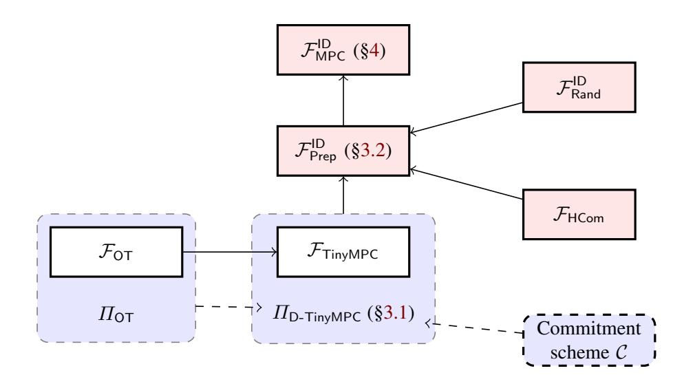

{0}------------------------------------------------

# Efficient Constant-Round MPC with Identifiable Abort and Public Verifiability

Carsten Baum1? , Emmanuela Orsini2??, Peter Scholl1? ? ?, and Eduardo Soria-Vazquez1†

> 1 Aarhus University, Denmark 2 imec-COSIC, KU Leuven, Belgium

Abstract. Recent years have seen a tremendous growth in the interest in secure multiparty computation (MPC) and its applications. While much progress has been made concerning its efficiency, many current, state-of-the-art protocols are vulnerable to *Denial of Service attacks*, where a cheating party may prevent the honest parties from learning the output of the computation, whilst remaining anonymous. The security model of *identifiable abort* aims to prevent these attacks, by allowing honest parties to agree upon the identity of a cheating party, who can then be excluded in the future. Several existing MPC protocols offer security with identifiable abort against a dishonest majority of corrupted parties. However, all of these protocols have a round complexity that scales linearly with the depth of the circuit (and are therefore unsuitable for use in high latency networks) or use cryptographic primitives or techniques that have a high computational overhead.

In this work, we present the first efficient MPC protocols with identifiable abort in the dishonest majority setting, which run in a constant number of rounds and make only black-box use of cryptographic primitives. Our main construction is built from highly efficient primitives in a careful way to achieve identifiability at a low cost. In particular, we avoid the use of public-key operations outside of a setup phase, incurring a relatively low overhead on top of the fastest currently known constant-round MPC protocols based on garbled circuits. Our construction also avoids the use of adaptively secure primitives and heavy zero-knowledge machinery, which was inherent in previous works. In addition, we show how to upgrade our protocol to achieve *public verifiability* using a public bulletin board, allowing any external party to verify correctness of the computation or identify a cheating party.

? Supported by the European Research Council (ERC) under the European Unions' Horizon 2020 research and innovation programme under grant agreement No 669255 (MPCPRO) as well as the BIU Center for Research in Applied Cryptography and Cyber Security in conjunction with the Israel National Cyber Bureau in the Prime Minister's Office. Part of this work was done while the author was at Bar Ilan University.

?? Supported in part by ERC Advanced Grant ERC-2015-AdG-IMPaCT.

? ? ? Supported in part by the Danish Independent Research Council under Grant-ID DFF-6108-00169 (FoCC) and an Aarhus University Research Foundation (AUFF) starting grant.

† Supported by the Carlsberg Foundation under the Semper Ardens Research Project CF18-112 (BCM).

{1}------------------------------------------------

# Table of Contents

|   |                                                                          |  Efficient Constant-Round MPC with Identifiable Abort and Public Verifiability    | 1  |  |  |  |
|---|--------------------------------------------------------------------------|--------------------------------------------------------------------------------------|----|--|--|--|
|   |                                                                          | Carsten Baum, Emmanuela Orsini, Peter Scholl, and Eduardo Soria-Vazquez              |    |  |  |  |
| 1 | Introduction                                                          |                                                                                      |    |  |  |  |
|   | 1.1                                                                      | Previous Work on Constant-Round MPC, Identifiable Abort and Public Verifiability  | 3  |  |  |  |
|   | 1.2                                                                      | Contributions                                                                        | 4  |  |  |  |
|   | 1.3                                                                      | Technical Overview                                                                | 7  |  |  |  |
| 2 | Preliminaries  11                                                  |                                                                                      |    |  |  |  |
|   | 2.1                                                                      | Security Model and Primitives                                                     | 11 |  |  |  |
| 3 | Preprocessing Phase                                                   |                                                                                      |    |  |  |  |
|   | 3.1                                                                      | Publicly Detectable MPC with (Non-Identifiable) Abort                             | 13 |  |  |  |
|   | 3.2                                                                      | Implementing the Preprocessing with Identifiable Abort                            | 15 |  |  |  |
|   | 3.3                                                                      | Efficiency Analysis                                                                  | 23 |  |  |  |
| 4 |                                                                          | Online Phase  24                                                               |    |  |  |  |
| 5 | Achieving Public Verifiability                                        |                                                                                      |    |  |  |  |
|   | 5.1                                                                      | Public Active Paths                                                                  | 32 |  |  |  |
|   | 5.2                                                                      | Public Verifiability in the Online Phase                                          | 32 |  |  |  |
| 6 | Feasibility of Black-Box, Constant-Round MPC with Identifiable Abort  |                                                                                      |    |  |  |  |
|   | 6.1                                                                      | Information-theoretic signatures                                                  | 33 |  |  |  |
|   | 6.2                                                                      | DI05 Garbling with Identifiability                                                | 34 |  |  |  |
|   | 6.3                                                                      | Preprocessing Protocol                                                            | 35 |  |  |  |
|   | 6.4                                                                      | Online Phase Protocol                                                             | 37 |  |  |  |
| A |                                                                          | Recap of BMR Garbled Circuits  41                                              |    |  |  |  |
| B | Homomorphic Commitments, continued                                    |                                                                                      |    |  |  |  |
|   | B.1                                                                      | Weak Homomorphism is Sufficient                                                   | 42 |  |  |  |
|   | B.2                                                                      | Instantiating Commitments with Weak Homomorphism                                  | 43 |  |  |  |

# 1 Introduction

Secure Multi-Party Computation (MPC) is a general term for techniques which allow a set of n parties to compute a function f on their private inputs such that only the output of the function becomes known. Using MPC as a tool to achieve security generally comes with an inherent slowdown over insecure solutions, so using the right MPC protocol with suitable properties is crucial in order to foster adoption in practice. For certain requirements, it is even known that MPC is impossible to achieve.

For example, while in the *honest majority* setting, where more than half of the parties are honest, MPC for any function is possible, when there is a *dishonest majority* it is well-known that *fairness* for MPC is impossible, in general [\[Cle86\]](#page-38-0). The fairness property means that if any corrupted party learns the output then all the honest parties do as well, so a dishonest party cannot withhold the output from the other parties. To work around this impossibility, most MPC protocols for dishonest majority settle for the weaker notion of *security with abort*, which allows the adversary to abort the protocol, possibly after learning the output.

However, a major downside of this model is that it does not protect against denial-of-service attacks. This motivates the stronger model of *MPC with identifiable abort*, or ID-MPC, where if the adversary aborts

{2}------------------------------------------------

then the honest parties will agree upon the identity of a cheating party. This allows the honest parties to exclude cheaters and re-run the aborting protocol, and it can also be combined with a distributed ledger (such as in [\[KMB15\]](#page-39-0)) to achieve monetary fairness (see e.g. [\[BDD20\]](#page-37-0) for an overview). The concept of ID-MPC was first implicitly considered in the context of covert security, and more formally studied in later works [\[CL14,](#page-38-1) [IOZ14\]](#page-39-1).

A related, desirable property of an MPC protocol is *public verifiability* [\[BDO14,](#page-37-1) [SV15\]](#page-39-2), which allows any external party to verify the correctness of some claimed outputs of the protocol by, for instance, inspecting public values posted to a bulletin board. This is important for settings where the computation is of particular interest to the public, for example, it may be desirable for the results of a research study on private medical data to be publicly verifiable. It is also relevant to the client-server setting, where many clients outsource a computation to a set of non-colluding servers and wish to verify the result, without interacting with the servers.

As well as security properties like the above, an important aspect when choosing an MPC protocol is its efficiency. This can be measured in terms of number of rounds of communication, total communication complexity (i.e. amount of data sent over the network), and computational overhead (compared with computing the function in the clear). In this work, we consider the problem of efficiently constructing MPC in the dishonest majority setting providing security with identifiable abort and public verifiability, in a constant number of rounds of interaction.

# 1.1 Previous Work on Constant-Round MPC, Identifiable Abort and Public Verifiability

*Constant-Round MPC.* The main tool for building constant-round MPC is garbled circuits, which were introduced by Yao [\[Yao86\]](#page-39-3) for 2-party secure computation. Garbled circuits were generalized to the multiparty setting by Beaver, Micali and Rogaway [\[BMR90\]](#page-38-2), who constructed a constant-round MPC protocol (called "BMR") that can support a dishonest majority of participants. The BMR protocol makes heavy, non-black-box use of a pseudorandom generator, so is inefficient in practice.

Subsequently, constant-round MPC making only *black-box* use of cryptographic primitives was presented by Damgard and Ishai [ ˚ [DI05\]](#page-38-3), for the honest majority setting, and extended to the case of a dishonest majority by Ishai et al. [\[IPS08\]](#page-39-4). Later, more efficient black-box solutions with active security for dishonest majority were introduced by Lindell et al. [\[LPSY15,](#page-39-5) [LSS16\]](#page-39-6), who used somewhat homomorphic encryption in a preprocessing phase of the protocols. Currently, the most efficient protocols are those by Wang et al. [\[WRK17\]](#page-39-7) and Hazay et al. [\[HSS17\]](#page-38-4), which use oblivious transfer (OT) instead of homomorphic encryption, and can be instantiated very efficiently using the TinyOT-protocol [\[NNOB12,](#page-39-8) [FKOS15\]](#page-38-5) based on fast OT extension techniques [\[IKNP03,](#page-39-9) [KOS15\]](#page-39-10).

*ID-MPC in the Dishonest Majority Setting.* The seminal MPC protocol of Goldreich, Micali and Wigderson [\[GMW87\]](#page-38-6) can be combined with any public-coin zero-knowledge proof system to obtain ID-MPC for dishonest majority, and the same holds for the BMR protocol [\[BMR90\]](#page-38-2) to achieve a constant round complexity. However, the resulting protocols make extensive, non-black-box use of cryptographic primitives and are not practical. Additionally, also [\[Pas04\]](#page-39-11) implies a constant-round ID-MPC scheme that is not blackbox (and secure in the stand-alone setting as observed by [\[BOO10\]](#page-38-7). More recently, there has been interest in concretely efficient ID-MPC. Ishai, Ostrovsky and Zikas [\[IOZ14\]](#page-39-1) presented an ID-MPC protocol in the preprocessing model, where a trusted dealer gives the parties some correlated randomness, with informationtheoretic security. They also gave a general compiler that allows removing the trusted dealer, leading to the first ID-MPC protocol making only black-box use of cryptographic primitives, namely, an adaptively secure oblivious transfer protocol and a broadcast channel. Concurrent to this work, Brandt et al. [\[BMMMQ20\]](#page-38-8) 

{3}------------------------------------------------

studied the feasibility of ID-MPC from lower-cardinality primitives as well as the relation of the conflict graph to identifiable abort. Their work is orthogonal to ours, as we are interested in concrete and practical constructions.

Baum et al. [\[BOS16\]](#page-38-9) also construct ID-MPC in the preprocessing model, with better concrete efficiency, by combining a variant of the BDOZ protocol [\[BDOZ11\]](#page-37-2) with information-theoretic signatures, and homomorphic encryption for the preprocessing. Other works [\[CFY17,](#page-38-10) [SF16\]](#page-39-12) have added identifiability to the practical SPDZ protocol [\[DPSZ12\]](#page-38-11), obtaining more efficient results in a similar setting. These works, while concretely quite practical, all require a number of rounds of interaction that scales *linearly* with the multiplicative depth of the circuit being evaluated.

*MPC with Public Verifiability.* The idea of secure computation with public verifiability was first introduced in the two-party setting for covert security by Asharov and Orlandi [\[AO12\]](#page-37-3). Subsequent works [\[KM15,](#page-39-13) [HKK](#page-38-12)+19] later improved upon the efficiency of their construction, and in particular the size of the cheating certificate, for which the work of Hong et al. [\[HKK](#page-38-12)+19] requires < 400 bytes for 128 bit security.

The notion of public verifiability for actively secure dishonest majority MPC (with potentially all parties being corrupted) has been introduced independently by Baum et al. [\[BDO14\]](#page-37-1) and Schoenmakers and Veeningen [\[SV15\]](#page-39-2). Their work ensures privacy if at least one party is honest and correctness for any level of corruption. In subsequent works, [\[BOS16,](#page-38-9) [CFY17\]](#page-38-10) independently showed how to combine public verifiability and identifiable abort for general computations where either the correctness of the output is attested or a cheater will be found by a third party. Both works rely on expensive tools in a preprocessing phase (lattice-based encryption for large fields), have a circuit depth-dependent round complexity and have not been implemented in practice. Another, more general approach for publicly verifiable MPC with identifiable abort was given in [\[KZZ16\]](#page-39-14) where the authors presented a general compiler based on the approach of [\[IOZ14\]](#page-39-1).

# 1.2 Contributions

In this work, we present the first *concretely efficient* and *constant-round* MPC protocols that provide security with identifiable abort and public verifiability in the dishonest majority setting. Note that all our protocols are in the setting of static corruptions.

Our results for identifiable abort assume access to a *broadcast channel*, while for public verifiability we need a public *bulletin board*, and in both cases we count round complexity by assuming that their consumes a single round. In practice, if using an authenticated broadcast protocol [\[DS83,](#page-38-13) [PW92\]](#page-39-15) to implement this, each broadcast requires Ω(n) rounds of point-to-point messages [\[GKKO07\]](#page-38-14). Alternatively, broadcast can be realized using a bulletin board or blockchain, giving a constant number of rounds of interaction with this functionality. Note that it seems difficult to avoid the use of broadcast, since MPC with identifiable abort itself implies secure broadcast [\[CL14\]](#page-38-1).

We first establish the feasibility of ID-MPC with constant round complexity, with black-box use of cryptographic primitives.

Theorem 1.1 (informal) *There exists an ID-MPC protocol for securely realizing any functionality in a constant number of rounds, given black-box access to an adaptively secure oblivious transfer protocol and a pseudorandom function.*

Next, our main result is a more *concretely efficient* protocol, with greatly reduced communication complexity and allowing optimizations like efficient OT extension and free-XOR gates.

{4}------------------------------------------------

Theorem 1.2 (informal) *There exists an ID-MPC protocol for securely realizing any functionality in a constant number of rounds, given black-box access to a statically secure oblivious transfer protocol and a circular 2-correlation robust hash function.*

Interestingly, and unlike the previous result, in this construction we manage to avoid the need for adaptively secure OT, allowing our protocol to use efficient OT extensions [\[IKNP03\]](#page-39-9), which are impossible with adaptive security in the standard model as showed by Lindell and Zarosim [\[LZ13\]](#page-39-16). This means that Theorems [1.1](#page-3-1) and [1.2](#page-3-2) are incomparable from a feasibility perspective, since although constructions of adaptively secure OT are known from standard assumptions, it cannot be built from static OT in a black-box manner [\[LZ09\]](#page-39-17).

Finally, we show how to upgrade the above protocol to achieve public verifiability using a public bulletin board.

Theorem 1.3 (informal) *Assuming additionally a secure public bulletin board, there is a black-box ID-MPC protocol with public verifiability, with a constant number of rounds of interaction with the bulletin board.*

We obtain our first feasibility result with a variant of the Damgard-Ishai protocol [ ˚ [DI05\]](#page-38-3) for constantround honest majority MPC, tailored for the dishonest majority setting using information-theoretic signatures [\[CR91\]](#page-38-15). We then obtain a protocol with identifiable abort by combining this with a transformation from [\[IOZ14\]](#page-39-1), which needs an adaptively secure OT protocol. While our construction achieves static security, we want to remark that it is possible to construct an adaptively secure constant-round ID-MPC protocol by applying the [\[IOZ14\]](#page-39-1) transform to the [\[IPS08\]](#page-39-4) protocol. This approach, on the other hand, will make non-black box use of the underlying PRF by the [\[IOZ14\]](#page-39-1) compiler whereas our construction is fully blackbox.

Our second protocol is much more attractive from a practical perspective, since it builds upon recent, optimized MPC protocols that offer active security with (non-identifiable) abort using BMR-style garbled circuits [\[HSS17,](#page-38-4) [WRK17\]](#page-39-7). We also support the free-XOR technique [\[KS08\]](#page-39-18), by assuming a suitable circular 2-correlation robust hash function [\[CKKZ12\]](#page-38-16). Our core idea is a lightweight method of adding identifiability to the MPC protocol of Hazay, Scholl and Soria-Vazquez [\[HSS17\]](#page-38-4), which creates a BMR garbled circuit using OT and any non-constant round MPC protocol[3](#page-4-0) . We obtain our efficient method in two steps: firstly, we devise a cheater identification procedure for the online phase, based on opening a circuit-independent number of additively homomorphic commitments. The cheater identification is highly efficient as this is the only necessary interaction and because no heavy cryptographic tools such as zero-knowledge proofs are necessary. Secondly, we show how to modify the preprocessing phase of [\[HSS17\]](#page-38-4) to produce the necessary committed values in an identifiable way. To achieve the latter, we improve techniques by Ishai, Ostrovsky and Zikas [\[IOZ14\]](#page-39-1) to avoid the use of adaptively secure OT. Our approach in doing so might be of independent interest.

*Concrete Efficiency.* We now expand on the concrete efficiency of our protocols and compare them with existing constant-round, non-identifiable protocols, as illustrated in Table [1.](#page-5-0) Note that the current most practical, constant-round MPC protocols are all obtained by combining garbling circuits with the so-called 'TinyOT' protocol [\[NNOB12\]](#page-39-8), which combines OT extension and additive secret sharing with informationtheoretic MACs over F2. The TinyOT part turns out to be the dominant, overall cost in the protocols, in

3 It is plausible that one could alternatively instantiate [\[LPSY15\]](#page-39-5) with [\[BOS16\]](#page-38-9) as preprocessing, though this appears to yield a slower protocol as already the non-identifiable preprocessing of [\[LPSY15\]](#page-39-5) has a larger overhead (4n + 5 SPDZ multiplications vs. 1 TinyOT-AND) plus the constructed circuit does not benefit from Free-XOR.

{5}------------------------------------------------

| Protocol                       | ID/PV       | Based on                                   | Assumptions                                  | Communication                                                                                                                    |
|--------------------------------|-------------|--------------------------------------------|----------------------------------------------|----------------------------------------------------------------------------------------------------------------------------------|
| [HSS17] [HSS17] [WRK17]  | х х х | OT + [IPS08] TinyOT Optimized TinyOT | OT, free-XOR OT, free-XOR OT, free-XOR | $O((n^2\kappa + poly(n)) C ) \\ O(n^2B^2\kappa C ) \\ O(n^2B\kappa C )$                                                          |
| Appendix 6 Sections 3, 4, 5 |             | [DI05] + [IOZ14] TinyOT + hom. commit.  | adaptive OT, PRF OT, free-XOR             | $ \begin{array}{c} \operatorname{bc}(\Omega(n^4\cdot  C )) \\ O(n^2B\kappa  C ) + \operatorname{bc}(n^2\kappa  C ) \end{array} $ |

**Table 1.** Efficiency of constant-round MPC protocols with and without identifiable abort, for a circuit with |C| AND gates. ID/PV means identifiability or public verifiability. Communication complexity measured in total number of bits transmitted across the network; bc(n) is the cost of securely broadcasting O(n) bits. The 'free-XOR' assumption is a circular 2-correlation robust hash function [CKKZ12]

terms of communication complexity. The parameter B in Table 1 is related to a statistical security parameter used in cut-and-choose in TinyOT, and in practice is around 3–6. Using the most efficient multi-party variant of TinyOT [WRK17] has a communication complexity of  $O(n^2B\kappa)$  bits per AND gate. The most efficient constant-round protocols have roughly the same communication complexity as TinyOT.

Our efficient protocol from Sections 3–4 uses TinyOT in a similar way to previous works, with the difference that we also use homomorphic commitments to obtain identifiability. While most constructions of publicly verifiable homomorphic commitments use public-key style assumptions like discrete log, we are able to get away with a weaker form of homomorphic commitment that only allows a bounded number of openings. This variant be based on any extractable commitment scheme [CDD+19], and the main computational cost is PRG evaluations and encodings of an error-correcting code, which can be implemented very efficiently, so we expect only a small computational overhead on top of the non-identifiable protocols. Additionally, the introduced communication overhead from these commitments (per gate) is expected to be a factor 2-3 over the communication that is necessary to perform the String-Oblivious Transfer required to garble a gate as in [HSS17].

Regarding communication complexity, the main overhead in our protocol comes from creating and broadcasting homomorphic commitments to the  $O(n \cdot |C|)$  wire keys in a BMR garbled circuit. We minimize this cost by using the efficient homomorphic commitments mentioned above, which have only a small constant communication overhead. Using this scheme, the overhead of commitments is not much more than the cost incurred from having each party broadcast its shares of the garbled circuit  $(4n^2 \cdot \kappa |C|)$  bits) at the end of our preprocessing phase. We remark that this broadcast step is not needed in non-identifiable protocols [WRK17, HSS17], which can get away with reconstructing the garbled circuit towards a single party who then sends the sum of all shares.

To compare with existing non-constant round protocols such as [BOS16, SF16], we remark that these use lattice-based preprocessing. Such preprocessing is much more computationally expensive than our lightweight techniques based on OT extension. In terms of broadcasts, the offline phase of [BOS16] has  $O(n^3|C|\kappa)$  broadcast complexity, which is worse than our protocol. [SF16] does not describe the offline phase in detail, but it likely requires  $O(n\kappa|C|)$  broadcasts for threshold decryption of the homomorphic encryption scheme. Regarding round complexity, even with the factor n overhead when implementing broadcast, our protocol likely performs significantly better for complex functionalities with high-depth circuits. In general, [BOS16, SF16, CFY17] are for arithmetic circuits and likely applicable in different scenarios than ours, making a direct comparison difficult.

{6}------------------------------------------------

#### 1.3 Technical Overview

In this overview, we assume some familiarity with garbled circuits and their use in MPC. For a more thorough introduction, see Appendix A.

**Feasibility of constant-round ID-MPC.** To first establish a feasibility result, we use a variant of the garbling scheme from [DI05] combined with information-theoretic signatures [CR91, HSZI00, SS11], together with a compiler for sampling functionalities with identifiable abort from [IOZ14]. Although this construction is quite natural, we are not aware of it being described before.

In a little more detail, [DI05] is based on a garbling scheme where, similarly to BMR, when evaluating the garbled circuit, for each wire we obtain a vector of keys  $(K_w^1, \ldots, K_w^n)$ , where the component  $K_w^i$  is known to party  $P_i$ . The garbling uses a specialized encryption scheme, which encrypts  $K_w^i$  by first producing verifiable secret shares (VSS)  $(K_w^i[1], \ldots, K_w^i[n])$  of  $K_w^i$ , and then encrypting each share  $K_w^i[j]$  under the corresponding input wire key components of  $P_j$ , as:

$$E_{K_u,K_v}(K_w^i) := \begin{pmatrix} \mathsf{H}(K_u^1,K_v^1) \oplus K_w^i[1] \\ \vdots \\ \mathsf{H}(K_u^n,K_v^n) \oplus K_w^i[n] \end{pmatrix}$$

This is amenable to secure computation in a black-box way, as  $P_j$  can input the hash values  $H(K_u^j, K_v^j)$  to the protocol, and as long as the majority of these hash values are correct, which is guaranteed by an honest majority, the VSS allows correct reconstruction of  $K_w^i$ .

We adapt this to the dishonest majority setting by replacing VSS with additive secret-sharing and information-theoretic signatures. Roughly, we consider a preprocessing functionality which samples additive shares of each  $K_w^i$  and augments each share with a signature under a signing key that no-one gets, while also allowing corrupt parties to choose their hash values for each gate. This suffices to obtain ID-MPC in an online phase, since if any corrupt party uses an incorrect hash value then the corresponding signature on their share will no longer verify.

To realize the preprocessing phase which outputs authenticated shares of the garbled circuit, we apply the compiler from [IOZ14], which transforms a protocol for any sampling functionality that is secure with abort, into one with identifiable abort. We remark that in the preprocessing functionality, the size of each garbled gate is  $O(n^3 \cdot \kappa)$  bits, and the communication complexity of the protocol to generate this is at least  $\Omega(n^4\kappa)$  due to overheads in [IOZ14], so this approach is not practical.

The complete description of these protocols can be found in Appendix 6.

Concretely efficient ID-MPC with BMR. As mentioned before, our protocol follows the same approach of [HSS17] ('HSS') based upon BMR garbled circuits. In BMR garbling, the vector of output wire keys  $(K_w^1, \ldots, K_w^n)$  of a gate g is directly encrypted under the input wire keys, with

$$E_{K_u,K_v}(K_w) := \bigoplus_{j=1}^n \mathsf{H}(g,K_u^j,K_v^j) \oplus (K_w^1,\ldots,K_w^n)$$

When using free-XOR with BMR, each pair keys on a wire is of the form  $(K_{w,0}, K_{w,1} = K_{w,0} \oplus R)$  for some fixed string  $R = (R^1, \dots, R^n)$ , with  $R^i$  known to  $P_i$ . When garbling an AND gate with input wires u, v and output wire w, we need to produce the 4 rows

{7}------------------------------------------------

$$\operatorname{circ}_{g,a,b} = \bigoplus_{j=1}^{n} \mathsf{H}(g, K_{u,a}^{j}, K_{v,b}^{j}) \oplus (K_{w,0}^{1}, \dots, K_{w,0}^{n})$$

$$\oplus (R^{1}, \dots, R^{n}) \cdot ((\lambda_{u} \oplus a)(\lambda_{v} \oplus b) \oplus \lambda_{w}),$$

$$(1)$$

for  $(a, b) \in \{0, 1\}^2$ , where  $\lambda_u, \lambda_v, \lambda_w$  are the secret wire masks assigned to each wire.

In the HSS protocol, to generate additive shares of the above, each party  $P_i$  first samples all of their key components and global string  $R^i$ , as well as secret shares of all the wire masks. Then, a generic MPC protocol for binary circuits is used to compute shares of the wire mask products  $\lambda_u \cdot \lambda_v$ , and shares of the products between each wire mask and every global string  $R^i$  are computed using OT. This allows the parties to obtain additive shares of the entire garbled circuit, since each hash value in (1) can be computed locally by party  $P_j$ . If any party uses an incorrect hash value, it was shown in [HSS17] that this would result in an abort in the online phase with overwhelming probability, since each party can check correctness when decrypting a gate by checking for the presence of one of their own key components.

Identifiable online phase. Adding identifiable abort to BMR is more challenging than with [DI05], since if any error is introduced to the hash values in (1), we have no direct way of knowing which party introduced it. Note that if the parties were committed to the entirety of the shares of the garbled circuit (i.e. all of (1)) then this would be straightforward: they could simply broadcast their shares, then attempt to run the online phase; if any party sends an incorrect share then the protocol aborts with overwhelming probability, and in our case everyone could then open their commitments to prove they behaved honestly. Unfortunately, we do not know how to efficiently create commitments to all of the shares, since in particular each share contains a hash value  $H(g, K_{u,a}^j, K_{v,b}^j)$ , and it seems challenging to reliably commit to these without resorting to proving statements about hash function computations in zero-knowledge.

Instead, we observe that it is actually enough if each party is given commitments to *partial shares* of the garbled gates, namely, shares of the whole of (1) *except for* the hash values. To see this, consider that some party aborts at gate g in the computation. If g is the *first* (in topological order) such gate where the parties detect an inconsistency, then it must hold that the *preceding* gates were correctly garbled. This means that the wire keys from the previous gate can be used to compute the correct  $H(\cdot)$  values by every party. Hence, we can verify the garbling of g by opening the commitments to the partial shares, then reconstructing the shares that should have been sent by 'filling in' the remaining parts of the garbled gate that were not committed to. Finally, the resulting shares can be compared with the shares that were actually sent, allowing us to detect a cheating party.

We therefore rely on a preprocessing functionality that adds XOR-homomorphic commitments to all the wire keys and shares of the bit-string products. Since the commitments are homomorphic, this easily allows computing commitments to the partial shares as required.

*Identifiable preprocessing phase.* Our first challenge with the preprocessing is to create the necessary commitments to the bit-string products in a reliable way. We show that without identifiability, this can be done without too much difficulty, using a consistency check based on a technique adapted from [HSS17].

Next, the main challenge is to make the whole preprocessing identifiable. One possible approach would be to simply apply the same IOZ transformation we used for the protocol based on Damgård-Ishai, to convert a protocol  $\Pi_{\text{Prep}}$  that realizes the preprocessing functionality  $\mathcal{F}_{\text{Prep}}$  with abort into a new protocol  $\Pi_{\text{Prep}}^{\text{ID}}$  that is identifiable. Unfortunately, this transformation has two main drawbacks: Firstly, the protocol  $\Pi_{\text{Prep}}$  needs to compute not only the outputs of  $\mathcal{F}_{\text{Prep}}$ , but *authenticated secret shares* of these outputs, where each share has an information-theoretic signature attached to it; since IT signatures have a multiplicative  $\Omega(n)$  storage overhead, this adds a significant cost burden to the protocol. Secondly,  $\Pi_{\text{Prep}}$  needs to be

{8}------------------------------------------------

secure against *adaptive corruptions*, which is in general much harder to achieve than static corruptions; in particular, it rules out the use of efficient OT extensions unless we rely on the programmable random oracle model [LZ13, BPRS17].

We work around these issues with careful modifications to the [IOZ14] transformation, which are tailored specifically to our preprocessing phase. We first briefly recall the idea behind IOZ. To construct  $\Pi_{\text{Prep}}^{\text{ID}}$ , first each party commits to its randomness in  $\Pi_{\text{Prep}}$ , and then if  $\Pi_{\text{Prep}}$  aborts, everyone simply opens their randomness, which is safe as the preprocessing phase is independent of the parties' inputs. The main challenge when proving security of this approach is that if the protocol aborts, the simulator needs to be able to convincingly open the honest parties' random tapes to the adversary, explaining the previously simulated protocol messages. This leads to the above two issues, since (1) if the protocol aborts *after* a corrupt party has seen its outputs, the simulator may not be able to produce honest parties' outputs that match, and (2) the simulator may not be able to come up with convincing honest parties' random tapes, since the previous honest parties' messages were simulated independently of the actual outputs from  $\mathcal{F}_{\text{Prep}}^{\text{ID}}$  In IOZ, (1) is resolved by producing an authenticated secret-sharing of the outputs, and (2) is resolved by requiring  $\Pi_{\text{Prep}}$  to be adaptively secure.

In our work, we address (1) by ensuring that an abort is only possible in  $\Pi_{\mathsf{Prep}}$  before the ideal functionality  $\mathcal{F}_{\mathsf{Prep}}$  has delivered outputs to the honest parties. This means there is no danger of inconsistencies between the simulated honest parties' outputs and those seen by the distinguisher. Our method of resolving (2) is more complex. First, consider a simulation strategy where when running  $\Pi_{\mathsf{Prep}}$  within  $\Pi^{\mathsf{ID}}_{\mathsf{Prep}}$ , the simulator simply performs an honest run of  $\Pi_{\mathsf{Prep}}$  on random inputs. If  $\Pi_{\mathsf{Prep}}$  later aborts, there is no problem opening the random tapes of honest parties', since the simulator knows these. The problem now is that the simulator can no longer extract any corrupt parties' inputs which may have to be sent to  $\mathcal{F}_{\mathsf{Prep}}$ , or ensure the corrupt parties get the corrupt output sent by  $\mathcal{F}_{\mathsf{Prep}}$ . To work around this, we combine  $\Pi_{\mathsf{Prep}}$  with a homomorphic commitment scheme, and require that every party commits to all values used in  $\Pi_{\mathsf{Prep}}$ ; we ensure consistency of these commitments with the values in  $\Pi_{\mathsf{Prep}}$  with a simple test where we open random linear combinations of the commitments with the values in  $\Pi_{\mathsf{Prep}}$  with identifiable abort, then the simulator can use this to extract and open the values in  $\Pi_{\mathsf{Prep}}$ , allow us to prove security of the whole protocol. A suitable commitment scheme can be efficiently constructed, building upon any (non-homomorphic) extractable commitment and a PRG [CDD+19].

We apply the above blueprint to the preprocessing phase of HSS, which performs multiplications between random bits, as well as between bits and random, fixed strings, to produce additive shares of the garbled circuit. With our transformation, the parties actually end up producing *homomorphic commitments* to shares of some (but not all) parts of the garbled circuit; namely, they are committed to the wire keys and the shares of the bit-string products from (1).

Achieving public verifiability. Public verifiability with identifiable abort requires not only that a party from the protocol can identify a cheater, but anyone can do so (or verify correctness of the result) by simply inspecting some messages posted to a public bulletin board. Adding this to our efficient construction requires modifying both the preprocessing and online phases of the protocol. First, we modify our preprocessing method so that the underlying protocol that is secure with abort satisfies a property called *public detectability*, which requires that an external verifier, who is given the random tapes of all parties in the protocol and all broadcast messages, can detect whether any cheating occurred and identify a corrupted party if so. This is similar to the concept of  $\mathcal{P}$ -verifiability used in IOZ [IOZ14], but removes the requirement that the verifier is also given the view of one honest party. We then show that any suitable, secure protocol can be

{9}------------------------------------------------

Fig. 1. Illustration of our efficient protocol with identifiable abort.

transformed to be publicly detectable, with a simple transformation that is similar to the  $\mathcal{P}$ -verifiable transformation from [IOZ14]. Using the publicly detectable protocol in our identifiable preprocessing phase, and replacing the broadcast channel with a bulletin board, we obtain a publicly verifiable preprocessing protocol with identifiable abort.

To add public verifiability to the online phase, we need to ensure that an external evaluator can detect any cheating in the garbled circuit, given only the public transcript. It turns out that in case of abort, almost all of the computation done by an honest party when detecting a cheater relies only on public information; the only exception is the 0/1 wire values that are obtained when evaluating the garbled circuit, which each party computes by looking at its private keys. To allow an external verifier to compute these values, we modify the preprocessing with a variant of the point-and-permute technique, which encodes these values as the last bit in the corresponding key on that wire. Now if the protocol aborts, and the entire transcript of broadcast messages has been posted to the public bulletin board, the verifier has all the information that is needed to detect any inconsistency and identify a cheating party.

Notice that our public cheater identification is protocol-specific and does not require heavy NIZK machinery. This differentiates it from [KZZ16] who gave a general compiler that achieves publicly verifiable ID-MPC, but where the generated "cheating certificate" is a NIZK that has to re-compute the next-message function of the compiled protocol. That means that compiling a BMR-style protocol using their approach might require giving a zero-knowledge proof of correct garbling of the whole circuit, whereas our certificate just requires a few commitments to be opened.

**Paper Outline.** In Figure 1 we show the relationship between our protocols and functionalities in our main construction with identifiable abort. Section 3.1 contains our publicly detectable transformation, used for both identifiable abort and public verifiability, and instantiation from the OT-based preprocessing phase of [HSS17]. Section 3.2 describes our identifiable preprocessing protocol, which uses the publicly detectable  $\Pi_{D-TinyMPC}$  in a non-black-box way (but with black-box use of its next-message function), and combines this with homomorphic commitments. In Section 4, we present the main MPC protocol with identifiable abort, which uses  $\mathcal{F}_{Prep}^{ID}$  to create and then evaluate a BMR garbled circuit, with identifiable abort. In Section 5, we describe how to modify the previous protocol to additionally obtain public verifiability, using a bulletin board instead of a broadcast channel.

{10}------------------------------------------------

### 2 Preliminaries

Let  $\kappa$  (resp. s) denote the computational (resp. statistical) security parameter. We let  $\mathcal{P}=\{P_1,\ldots,P_n\}$  be the set of parties involved in any particular protocol/functionality, and  $\mathcal{V}$  be a verifier which might check  $\mathcal{P}$ 's computation at a later point. Among those parties, we denote by  $\mathcal{I}\subset\mathcal{P}$  the set of corrupted parties and by  $\overline{\mathcal{I}}=\mathcal{P}\setminus\mathcal{I}$  the honest parties. Let  $C_f$  be a circuit computing the function  $f:\mathbb{F}_2^{n_{\text{in}}}\to\mathbb{F}_2^{n_{\text{out}}}$  with  $n_{\text{in}}$  inputs and  $n_{\text{out}}$  outputs. To ease the reading, we drop the dependence on f, when it is clear from the context. We will define the disjunct sets  $\text{input}_1,\ldots,\text{input}_n\subset[n]$  as the inputs which each party in  $\mathcal{P}$  provides to the circuit C, so  $P_i$  provides the inputs in  $\text{input}_i$ . The circuit C has the set of AND gates G, for which we denote the extended set  $G^{\text{ext}}:=G\times\mathbb{F}_2^2$ . For  $\tau\in G^{\text{ext}}$ , we usually denote  $\tau=(g,a,b)$  where g is the AND gate in question and g, g are used to point to a specific entry in g s (garbled) truth table.

# 2.1 Security Model and Primitives

We will prove security of our protocols in the universal composability (UC) framework [Can01]. We consider a static, active adversary corrupting up to n-1 parties. To achieve our goals, we will make use of multiple primitives, whose ideal functionalities we now introduce.

#### Functionality $\mathcal{F}_{\mathsf{MPC}}$

The functionality runs with parties  $\mathcal{P} = \{P_1, \dots, P_n\}$  and an adversary  $\mathcal{A}$  who corrupts a subset  $\mathcal{I} \subset \mathcal{P}$  of parties. The computed circuit is defined over  $\mathbb{F}_2$ .

**Init:** On input (Init, C) by all parties in  $\mathcal{P}$ , where C is a circuit with  $n_{in}$  inputs and  $n_{out}$  outputs, store C locally. Every further such message is ignored.

**Input:** For each  $h \in \text{input}$ , with  $h \in \text{input}_i$ :

 $i \in \mathcal{I}$ : On input (Input,  $i, \rho_h$ ) by  $\mathcal{A}$  and (Input,  $i, \cdot$ ) by all honest parties, and if C was stored, store  $\rho_h$  locally.

 $i \in \overline{\mathcal{I}}$ : On input (Input,  $i, \rho_h$ ) by party  $P_i$  and (Input,  $i, \cdot$ ) by all other honest parties and  $\mathcal{A}$ , and if C was stored, store  $\rho_h$  locally.

**Computation:** On input (Compute) by all honest parties and A, and if the functionality obtained input  $\rho_i$  for each  $P_i$ , then compute  $Y = C(\rho_1, \ldots, \rho_{n_{\text{in}}})$  and store  $Y \in \mathbb{F}_2^{n_{\text{out}}}$  locally. Every further such message is ignored.

**Output:** On input (Output) by each honest party and the adversary, send (Output, Y) to  $\mathcal{A}$  and wait. If the adversary replies with (Deliver), then send (PublicOutput, Y) to parties in  $\overline{\mathcal{I}}$ .

**Fig. 2.** The  $\mathcal{F}_{MPC}$  functionality.

**Identifiable Abort Version of Functionalities.** In order to be able to rigorously discuss our protocols, we now formalize what it is to enhance their ideal functionalities  $\mathcal{F}$  to support identifiable abort, which we denote by  $\mathcal{F}^{\text{ID}}$  and describe in Figure 3. As showed in [IOZ14], the UC composition theorem extends to security with identifiable abort in a straightforward way.

An  $\mathcal{F}^{\text{ID}}$  functionality is exactly as  $\mathcal{F}$ , but additionally allows the adversary to send a message (Abort,  $\mathcal{J}$ ) at any point of time, where  $\mathcal{J}$  denotes a non-empty set of dishonest parties. Upon receiving this message, the functionality ceases all computation and outputs the set  $\mathcal{J}$  to all honest parties. The main points of identifiable abort are that (i) The adversary cannot abort without revealing the identity of at least one corrupt party; and (ii) All honest parties interacting with  $\mathcal{F}^{\text{ID}}$  agree on the revealed corrupted parties.

{11}------------------------------------------------

# Functionality $\mathcal{F}^{\text{ID}}$

Let  $\mathcal{F}$  be a functionality which runs with parties  $\mathcal{P} = \{P_1, \dots, P_n\}$  and an adversary  $\mathcal{A}$  who corrupts a subset  $\mathcal{I} \subset \mathcal{P}$  of parties.  $\mathcal{F}^{\mathsf{ID}}$  is exactly as  $\mathcal{F}$ , with the following extra command:

**Abort:** At any time,  $\mathcal{A}$  can send a special command (Abort,  $\mathcal{J}$ ) where  $\mathcal{J} \subseteq \mathcal{I}, \mathcal{J} \neq \emptyset$ . The functionality then stores  $\mathcal{J}$ , sends (Abort,  $\mathcal{J}$ ) to parties in  $\mathcal{P} \setminus \mathcal{I}$  and terminates the execution of any current command.

**Fig. 3.** Extending a functionality  $\mathcal{F}$  to its identifiable abort version  $\mathcal{F}^{\mathsf{ID}}$ .

**Coin Tossing.** Coin tossing is used by a set of parties to fairly sample a number of coins according to a fixed distribution. In this work we will use an identifiable version of it,  $\mathcal{F}_{Rand}^{ID}$ , meaning that either all computing parties learn the sampled coins or, otherwise, the honest parties agree on a subset of dishonest parties who cheated in the sampling process. The non-identifiable version of the functionality is described in Figure 4.

#### Functionality $\mathcal{F}_{\mathsf{Rand}}$

 $\mathcal{F}_{\mathsf{Rand}}$  interacts with a verifier  $\mathcal{V}$ , a set of parties  $\mathcal{P} = \{P_1, \dots, P_n\}$  and an adversary  $\mathcal{A}$  controlling  $\mathcal{I} \subset \mathcal{P}$ .

**Toss:** Upon receiving (Toss, m) from all parties in  $\mathcal{P}$ , where  $m \in \mathbb{N}$  uniformly sample m random elements  $X \leftarrow \mathbb{F}_2^m$  and send (Tossed, m, X) to  $\mathcal{A}$ . If  $\mathcal{A}$  answers with (Deliver), send (PublicOutput, m, X) to all parties in  $\mathcal{P}$ .

**Fig. 4.** Functionality  $\mathcal{F}_{Rand}$  for coin tossing with identifiable abort.

#### Functionality $\mathcal{F}_{\mathsf{Broadcast}}$

The functionality runs with parties  $\mathcal{P} = \{P_1, \dots, P_n\}$  and an adversary  $\mathcal{A}$  who corrupts a subset  $\mathcal{I} \subset \mathcal{P}$  of them.

**Broadcast:** Upon receiving (Broadcast, id, M) from a party  $P_i \in \mathcal{P}$ , send (Broadcast, id, i, M) to  $\mathcal{A}$  and wait. If the adversary replies with (Deliver), then send (PublicOutput, id, i, M) to parties in  $\overline{\mathcal{I}}$ .

Fig. 5. Functionality for secure broadcast.

**Secure Broadcast.** Our work will crucially rely on the use of *secure* (or, *authenticated*) broadcast  $\mathcal{F}_{\mathsf{Broadcast}}$ , which is a standard functionality given in Figure 5. In order to achieve protocols with identifiable abort, we need to enhance the description of this functionality to  $\mathcal{F}_{\mathsf{Broadcast}}^{\mathsf{ID}}$  as previously described. This is not a problem, as all standard protocols for  $\mathcal{F}_{\mathsf{Broadcast}}$  such as [DS83, PW92] are already identifiable. Under the assumption of a Public Key Infrastructure, implementing  $\mathcal{F}_{\mathsf{Broadcast}}$  requires  $\Omega(n)$  rounds of communication and signatures [GKKO07]. If the parties have access to an authenticated bulletin board,  $\mathcal{F}_{\mathsf{Broadcast}}$  can be achieved with a single call to the board.

{12}------------------------------------------------

### Functionality $\mathcal{F}_{\mathsf{HCom}}$

 $\mathcal{F}_{\mathsf{HCom}}$  is parameterized by  $\kappa \in \mathbb{N}$ .  $\mathcal{F}_{\mathsf{HCom}}$  interacts with a sender  $P_S \in \mathcal{P}$ , where the remaining parties  $\mathcal{P} \setminus \{P_S\}$  act as receivers.  $\mathcal{A}$  may corrupt any subset  $\mathcal{I} \subsetneq \mathcal{P}$  and at any point it may send a message (Abort,  $\mathcal{J}$ ) with  $\emptyset \neq \mathcal{J} \subseteq \mathcal{I}$ , upon which the functionality sends (Abort,  $\mathcal{J}$ ) to  $\mathcal{P}$  and halts.

**Commit:** Upon receiving (Commit, cid, M) from  $P_S$ , where  $M \in \mathbb{F}_2^{\kappa}$ , save (cid, M) locally and send (Commit-Recorded, cid) to  $\mathcal{P}$  and  $\mathcal{A}$ . Every further message with this cid to **Commit** is ignored.

**Add:** Upon receiving (Add, cid1, cid2, cid3) by  $P_S$ , where (cid1,  $M_1$ ), (cid2,  $M_2$ ) are stored but not cid3, add (cid3,  $M_1 + M_2$ ) to the list and send (Add-Recorded, cid1, cid2, cid3) to  $\mathcal{P}$  and  $\mathcal{A}$ .

**Open:** Upon receiving the first (Open, cid) by  $P_S$  where (cid, M) was previously stored, ignore all future messages to **Commit**. Send (Open, cid, M) to all parties in  $\mathcal{P}$  and  $\mathcal{A}$ .

**Fig. 6.** Functionality  $\mathcal{F}_{HCom}$  for homomorphic multiparty commitment with delayed verifiability.

**Homomorphic Commitments.** In this work, we use homomorphic commitments. These allow a sender to commit to a message M at a certain time, such as to later open M to a set of receivers. The properties required from commitment schemes are that (i) M remains hidden to the receivers until the opening (hiding); and (ii) the sender can only open M and no other value to the receivers, once committed (binding). We further require that the commitment scheme is homomorphic, meaning that the sender can open any linear combination of commitments that it made without revealing anything but the combined output. The functionality  $\mathcal{F}_{\mathsf{HCom}}$  is described in Figure 6.

To efficiently implement  $\mathcal{F}_{HCom}$  we would like to use the homomorphic commitment scheme of Cascudo et al. [CDD+19], but it turns out that this is not possible directly. The problem is that  $\mathcal{F}_{HCom}$  (which we use throughout this work) allows to perform multiple rounds of **Add** and **Open**, whereas [CDD+19] permits to perform only one call to the interface **Open**. In Appendix B, we provide a slightly weaker functionality  $\mathcal{F}_{WHComm}$  having multiple rounds of **Open** but not **Add**. We show in the Appendix that this is sufficient for our application and also how this weaker functionality can then be implemented using the protocol in [CDD+19].

### **3 Preprocessing Phase**

Here we describe our preprocessing phase with identifiable abort. At a high level, we proceed in two steps: first, we describe a protocol with the weaker property of public detectability, and then we bootstrap it to a preprocessing protocol with identifiable abort using homomorphic commitments.

### 3.1 Publicly Detectable MPC with (Non-Identifiable) Abort

We start this section by recalling the notion of the (deterministic) next message function,  $\operatorname{nmf}_{\Pi}^i$ , of a party  $P_i$  in an n-party protocol  $\Pi$  that is executed in a limited number of rounds, say  $\rho$ . Given the VIEW of  $P_i$  at the beginning of round h, where  $h \leq \rho$ , i.e. the set  $\operatorname{VIEW}_h^i = (i, X, X_i, \operatorname{Rnd}_i, (M_{i,1}, \dots, M_{i,h}))$ , where i identifies party  $P_i$ , X is the common public input,  $X_i$  and  $\operatorname{Rnd}_i$  are  $P_i$ 's private input and randomness respectively, and  $(M_{i,1}, \dots, M_{i,h})$  are the messages received by  $P_i$  in the first h rounds, then  $\operatorname{nmf}_\Pi^i(\operatorname{VIEW}_h^i) = M_{h+1}^i$  are the messages that  $P_i$  has to send in round h+1. In particular,  $\operatorname{nmf}_\Pi^i(\operatorname{VIEW}_\rho^i) = Y_i$ , where  $Y_i$  is  $P_i$ 's output, and  $\operatorname{VIEW}^i = \operatorname{VIEW}_\rho^i$ . In other words, the messages sent by each party  $P_i$  at each round are deterministically specified as a function of  $P_i$ 's inputs and random coins, and messages received by  $P_i$  in previous rounds.

{13}------------------------------------------------

We can now introduce the notion of *public detectability*. It is similar to that of  $\mathcal{P}$ -verifiability given in [IOZ14]. However, whereas the notion of  $\mathcal{P}$ -verifiability in that work was conceived with identifiable abort in mind, public detectability will allow us to implement functionalities not only achieving identifiable abort, but also public verifiability if required (see Section 5).

**Definition 3.1** (**Public detectability**) Let  $\Pi$  be a protocol in the CRS model and  $\mathcal{D}$  a deterministic polytime algorithm, called the detector, which takes as inputs the CRS, the inputs and random tape of all parties in  $\mathcal{P}$  involved in the execution of  $\Pi$ , and any message sent over an authenticated broadcast channel during the execution of  $\Pi$ . We say that the protocol  $\Pi$  is publicly detectable if the detector  $\mathcal{D}$  outputs a non-empty subset  $\mathcal{J} \subset \mathcal{P}$  corresponding to (some of) the parties that did not honestly execute  $\Pi$ , if any such subset  $\mathcal{J}$  exists.

Notice there is a gap between the public detectability and identifiable abort properties: the latter requires that, upon abort, the adversary does not learn anything about the honest parties' inputs, beyond of what is deducible from the functionalities' output; on the other hand, running the detector requires access to all the input and random tape of  $\mathcal{P}$ . However, we will show, in Section 3.2, that public detectability is almost enough to define our preprocessing with identifiable abort, which we will later on extend to a public verifiable one in Section 5. At a high level, the main idea is that, since the goal of the preprocessing phase is to produce random correlated values that will be used in a very efficient online evaluation, during such a phase parties have not yet provided their private inputs, so, if the protocol aborts, it is enough for every party to run the detector on their own. The privacy of the overall MPC protocol is not affected then, due to the absence of the (actual) private inputs.

We now show how to turn any protocol  $\Pi$  that UC-realises an ideal functionality  $\mathcal F$  in the CRS model with static security, into a protocol  $\Pi_V$  realising the same functionality with public detectability. Given the protocol  $\Pi$ , and a binding and hiding commitment scheme  $\mathcal C=(\texttt{Commit}, \texttt{Reveal})$ , we apply the following changes to  $\Pi$ .

- Before any step of  $\Pi$  is executed, each party securely broadcasts a commitment to their input and random tape using the commitment scheme.4
- In case of any broadcast communication, execute the protocol  $\Pi$  using instead an authenticated broadcast functionality  $\mathcal{F}_{\mathsf{Broadcast}}$  (Figure 5).
- Each pairwise communication between a sender  $P_S$  and a receiver  $P_R$ , such that  $\{P_S, P_R\} \subseteq \mathcal{P}$ , is implemented by first securely broadcasting a commitment  $c(M^S)$  to the message  $M^S$  that has to be sent, followed by a private opening of it towards the receiving party. If  $P_R$  does not receive the correct opening from  $P_S$ , then the receiver securely broadcasts a message asking for the opening of  $c(M^S)$ . The sender has to reply with that information, using also secure broadcast. If the broadcasted reply is a correct opening, parties in  $\mathcal{P}$  retake the computation, otherwise they abort.

It is easy to prove that the protocol  $\Pi$ , modified as above, is publicly detectable.

**Lemma 3.2** Let  $\Pi$  be a protocol that realises an ideal functionality  $\mathcal{F}$  with static security in the CRS model with broadcast and pairwise communication, and  $\mathcal{C}$  a standalone-secure commitment scheme. The protocol  $\Pi_V$  described above is publicly detectable and realises the functionality  $\mathcal{F}$  in the  $\{CRS, \mathcal{F}_{Broadcast}\}$ -hybrid model.

&lt;sup>4 This part of the transformation is not actually needed in order to achieve public detectability, but it will simplify the way we use transformed protocols later on in order to achieve identifiable abort and public verifiability.

&lt;sup>5 This does not break security, because such a situation can only occur if  $P_S$  or  $P_R$  are corrupted, in which case  $\mathcal{A}$  would obtain  $M^S$  anyway.

{14}------------------------------------------------

*Proof.* Correctness simply follows by correctness of the underlying protocol  $\Pi$ . We first argue UC security and finally we show that  $\Pi_V$  is publicly detectable by providing an explicit detector  $\mathcal{D}$ .

We describe a simulator S for any static real world adversary A corrupting a subset of parties  $\mathcal{I} \subsetneq \mathcal{P}$  of size up to n-1 as follows:

- S emulates the CRS towards A. It randomly samples each honest party's  $P_i$  random tape  $\{Rnd_i\}_{i\notin\mathcal{I}}$ , and receives corrupt inputs  $\{Rnd_i\}_{i\in\mathcal{I}}$  from A. It sends the corresponding commitments to A.
- For each secure broadcast, S emulates the broadcast message towards A.
- In case of pairwise communication, we have three cases: 1)  $P_S$  is corrupt (and  $P_R$  is not), S receives  $c(M^S)$  and the opening message from A. If the opening information is not correct, S asks A to broadcast the correct one. If A fails to do so, it aborts. 2) If only  $P_R$  is corrupt, S uses a simulator for  $\Pi$ , to obtain  $M^S$ . Then it sends  $c(M^S)$  and the opening information to A, and waits to receive a reply message from A. 3) The case where  $P_R$  and  $P_S$  are both honest or corrupt is trivial.

Indistinguishability between a real and a simulated execution is easy to argue. Essentially, if a distinguisher  $\mathcal{Z}$  is able to distinguish, this can be used to break either the UC security of  $\Pi$  or the commitment scheme  $\mathcal{C}$ .

To prove public detectability we recall that the protocol  $\Pi_V$  is publicly detectable if there is an algorithm  $\mathcal{D}$  that detects at least one malicious party that deviated from the protocol, if such a party exists. The algorithm  $\mathcal{D}$  is defined to work as follows.

- Given the CRS together with the inputs and random tape of all parties in  $\mathcal{P}$ , it emulates an execution of the protocol round by round, by uniquely computing the output of the deterministic next-message-function nmf.
- Since all the messages are securely broadcast (either in the clear or committed), upon opening the commitments, it compares each emulated message with the values sent in the protocol. When these do not match, the sender is identified as malicious and added to the set  $\mathcal{J}$ .

**Publicly Detectable Preprocessing.** In our preprocessing phase, we use the functionality  $\mathcal{F}_{\mathsf{TinyMPC}}$  (Figure 7), which is a standard functionality for secret sharing-based MPC for binary circuits augmented with the command **MultBitString** that allows multiplying a bit by a fixed string known to one party. This functionality is exactly what is needed to securely preprocess a BMR garbled circuit [HSS17] with abort, where the fixed strings play the roles of the global  $R^i$  strings in the garbled circuit; this can be efficiently implemented using a TinyOT-like protocol, for example [NNOB12, FKOS15, HSS17], in the  $\mathcal{F}_{\mathsf{OT}}$ -hybrid model.

We can apply the transformation above to obtain a publicly detectable protocol  $\Pi_{\text{D-TinyMPC}}$ , if we have a protocol  $\Pi_{\text{TinyMPC}}$  that implements the functionality  $\mathcal{F}_{\text{TinyMPC}}$  in the CRS model. Such a protocol can be efficiently obtained by implementing the OT functionality with OT extension [KOS15, ALSZ15], with base OTs realized in the CRS model [PVW08]. Thus, we obtain the following corollary.

**Corollary 3.3** Let  $\mathcal{C}$  be a commitment scheme and  $\Pi_{\mathsf{TinyMPC}}$  a protocol that UC-realises the functionality  $\mathcal{F}_{\mathsf{TinyMPC}}$  in the CRS model. The protocol  $\Pi_{\mathsf{D-TinyMPC}}$  (described in Figure 8) is publicly detectable and it securely realises the functionality  $\mathcal{F}_{\mathsf{TinyMPC}}$  in the  $\{\mathcal{F}_{\mathsf{Broadcast}}, \mathit{CRS}\}$ -hybrid model.

#### 3.2 Implementing the Preprocessing with Identifiable Abort

We now combine the detectable protocol  $\Pi_{D\text{-TinyMPC}}$  with homomorphic commitments,  $\mathcal{F}_{HCom}$ , to obtain a preprocessing protocol with identifiable abort. Our preprocessing functionality  $\mathcal{F}_{Prep}^{ID}$  is described in Figure 9.

{15}------------------------------------------------

### Functionality $\mathcal{F}_{\mathsf{TinvMPC}}$

The functionality runs with parties  $P_1, \ldots, P_n$  and an adversary  $\mathcal{A}$ . It has a list of corrupt parties  $\mathcal{I}$  which it obtains from  $\mathcal{A}$ . Angle brackets  $\langle x \rangle$  denote a secret  $x \in \mathbb{F}_2$  stored by the functionality, together with a public identifier. The inputs to every command below are public inputs that must be provided by all parties (where in this case, the notation  $\langle x \rangle$  refers only to the *identifier* of the secret value x).

**Init:** On input (Init) from all parties, if (Init) was received before then do nothing. For each  $i \in [n]$ , if  $i \in \mathcal{I}$  then receive  $R^i \in \mathbb{F}_2^{\kappa}$  from  $\mathcal{A}$ , otherwise sample a random  $R^i \leftarrow \mathbb{F}_2^{\kappa}$ . Send  $R^i$  to party  $P_i$  and store the strings  $R^i$ .

**Input:** On input (Input,  $P_i$ ,  $\langle x \rangle$ ) from all parties and (Input,  $P_i$ ,  $\langle x \rangle$ , x) from  $P_i$ , where  $x \in \mathbb{F}_2$ , store x.

**Add:** On input  $(Add, \langle z \rangle, \langle x \rangle, \langle y \rangle)$  from all parties, where the two bits x and y were previously stored, store z = x + y

**Mult:** On input (Multiply,  $\mathbb{F}_2$ ,  $\langle \bar{x} \rangle$ ,  $\langle x_1 \rangle$ ,  $\langle x_2 \rangle$ ) from all parties, where  $x_1, x_2$  were stored previously, store  $\bar{x} = x_1 \cdot x_2$ .

**MultBitString:** On input (MultBitString,  $\langle x \rangle$ ,  $P_i$ ) from all parties, where x was stored previously:

- 1.  $\mathcal{A}$  inputs  $W^j \in \mathbb{F}_2^{\bar{\kappa}}$  for each  $P_j \in \mathcal{I}$ .
- 2. Sample  $W^j \leftarrow \mathbb{F}_2^{\kappa}$  for  $j \in \overline{\mathcal{I}}$  subject to the constraint that  $x \cdot R^i = \sum_{j \in [n]} W^j$ .
- 3. Send  $W^j$  to party  $P_i$ .

**Open:** On input (PublicOutput,  $\langle x_1 \rangle, \ldots, \langle x_m \rangle$ ) from all parties, where  $x_i, i \in [m]$ , have been stored previously:

- 1. Send (Deliver,  $x_1, \ldots, x_m$ ) to  $\mathcal{A}$ .
- 2. If A sends Abort, forward Abort to all parties and halt. Otherwise send (Output,  $x_1, \ldots, x_m$ ) to all parties.

**Fig. 7.** Functionality  $\mathcal{F}_{\mathsf{TinyMPC}}$  for Bit-MPC.

It essentially performs the same computations as  $\mathcal{F}_{TinyMPC}$ , except the output shares of the bit-string multiplication are now committed with homomorphic commitments, modelled in the functionality by allowing them to be added together and opened. Another key difference is that the outputs are only delivered at the very end of the protocol. After the initial outputs are sent to the parties, the only further allowed command is to open values from the homomorphic commitment scheme. This is because in the security proof for our preprocessing protocol, the simulator can always equivocate  $\mathcal{F}_{HCom}$ , whereas it cannot equivate the simulation of  $\Pi_{D-TinyMPC}$  when it is still possible for an abort to occur (which would require opening the honest parties' random tapes to the adversary).

We denote by  $\langle x \rangle$  a secret value in  $\mathbb{F}_2$  that is stored by the functionality together with a public identifier, and, similarly, by  $[Y]_i$  a value  $Y \in \mathbb{F}_2^{\kappa}$  that is known to party  $P_i$  and stored by  $\mathcal{F}_{\mathsf{Prep}}^{\mathsf{ID}}$  together with a public identifier. Notice that x (resp. Y) is unknown to the parties (resp. to  $\mathcal{P} \setminus P_i$ ), and when the parties call a command on public inputs  $\langle x \rangle$  (resp.  $[Y]_i$ ), this only refers to the identifier of x (resp. Y) and not to the actual value.

The functionality maintains n+1 lists PubOutputs,  $\{\text{PrivOutputs}_i\}_{i\in[n]}$  and consists of two different phases. The computation phase contains the command **Init** for the global values  $R^i$ , commands **Sample**, **Add** and **Mult** for both bits and strings, and two **Outputs** commands. The first one for values in  $\mathbb{F}_2$  that, on input  $\langle x \rangle$ , appends the secret value x to PubOutputs, and a second one that allows to open values stored in PubOutputs and enter the Final Output Phase. Once this phase is initialised, Phase I commands are no longer allowed, and it is only possible to call Public Output on strings.

The protocol  $\Pi^{\text{ID}}_{\text{Prep}}$ , implementing  $\mathcal{F}^{\text{ID}}_{\text{Prep}}$  and described in Figure 10, uses the publicly detectable version of  $\Pi_{\text{TinyMPC}}$  (from Corollary 3.3) for all the  $\mathbb{F}_2$ -arithmetic, i.e. to perform secure additions and multiplications on bits, as well as to obtain secret-shares of the product of secret bits with the strings  $R^i$ . The protocol uses two copies of the homomorphic commitment functionality (which we name  $\mathcal{F}_{\text{HCom}}$  and  $\mathcal{F}^{\text{Bit}}_{\text{HCom}}$ ). The

{16}------------------------------------------------

#### Protocol $\Pi_{D\text{-TinyMPC}}$

Let  $\Pi_{\mathsf{TinyMPC}}$  the protocol implementing  $\mathcal{F}_{\mathsf{TinyMPC}}$  and such that each call to  $\mathcal{F}_{\mathsf{OT}}$  is replaced by a call to the protocol  $\Pi_{\mathsf{OT}}$  implementing  $\mathcal{F}_{\mathsf{OT}}$ .

COMMON INPUT: Parties have access to the CRS, a public input x and ideal functionality  $\mathcal{F}_{\mathsf{Broadcast}}$ , and to a commitment scheme  $\mathcal{C} = (\mathsf{Commit}, \mathsf{Reveal})$ 

PRIVATE INPUT: Each party has input  $x_i$  and a random tape  $Rnd_i$ .

**I. Init:** On input (Init), each party  $P_i$  commits to their random tapes using C. For each call to  $\Pi_{OT}$ ,  $P_i$ ,  $\forall i \in [n]$ , uses a specific part of their committed randomness that is not used used elsewhere in the protocol.

#### II. D-TinyMPC:

- 1. Each  $P_i$  sets the initial view as  $VIEW_0^i = (i, X, X_i, Rnd_i, M_0^i)$ , where  $M_0^i$  consists of all the received committed values, and then runs  $\Pi_{TinyMPC}$ .
- 2. For each round of broadcast communication, run the broadcast as usual.
- 3. For each pairwise round of communication h, between a sender  $P_S$  and a receiver  $P_R$ , with  $\{P_S, P_R\} \subseteq \mathcal{P}$ , parties do the following:
  - (a)  $P_S$  computes  $M_h^S = \mathsf{nmf}_{H_{\mathsf{TinyMPC}}}^i(\mathsf{VIEW}_{h-1}^S)$  and broadcasts  $c(M_h^S)$ .
  - (b)  $P_S$  privately opens the commitment  $c(M_h^S)$  towards  $P_R$ .
  - (c) If  $P_R$  broadcasts (Fail),  $P_S$  opens  $c(M_h^S)$  towards every party in  $\mathcal{P}$ .
  - (d) All parties update their views, in particular  $P_R$  sets  $VIEW_h^R \leftarrow (VIEW_{h-1}^R \parallel M_h^S)$ .
- 4. In the last round of communication,  $\rho$ , each party  $P_i \in \mathcal{P}$  computes  $\mathsf{nmf}^i_{\Pi_{\mathsf{TinyMPC}}}(\mathsf{VIEW}^i_\rho) = Y^i$ , where  $Y^i$  is  $P_i$ 's output in  $\Pi_{\mathsf{TinyMPC}}$ .

**Fig. 8.** Protocol  $\Pi_{D-TinyMPC}$ , that is a publicly detectable extension of  $\Pi_{TinyMPC}$ .

first copy is used to create commitments to values in  $\mathbb{F}_2^{\kappa}$ , such as the fixed strings  $R^i$  as well as the additive shares of all the bit-string products of secret bits with  $R^i$ . We furthermore employ a consistency check to verify that the committed bit-string shares are correct, which is shown in Figure 11. The functionality  $\mathcal{F}_{HCom}^{Bit}$  is used to additionally commit to the bits which are used in  $\Pi_{D-TinyMPC}$ , and we use a second consistency check to verify that these two sets of bits stored in  $\Pi_{D-TinyMPC}$  and  $\mathcal{F}_{HCom}^{Bit}$  are the same; this can be found in Figure 12. We also use this functionality to open bit values during the output phase. We remark that the necessity of using  $\mathcal{F}_{HCom}^{Bit}$  for both of this is an artefact of the proof and we leave it as an interesting open problem to remove  $\mathcal{F}_{HCom}^{Bit}$  (together with the consistency check  $\Pi_{CheckBit}$ ) while retaining a provably-secure protocol.

In the case of abort, we will reveal all random tapes and committed messages of  $\Pi_{\text{D-TinyMPC}}$  and test which party has sent inconsistent messages and when. Interestingly, we can do that without requiring adaptive primitives (in comparison to previous works): The simulation of  $\Pi_{\text{D-TinyMPC}}$  in the security proof is only ever checked using the public detectability if no output of  $\mathcal{F}_{\text{Prep}}^{\text{ID}}$  has been revealed yet. Therefore we do not have to ever equivocate the random tape during the simulation of  $\Pi_{\text{D-TinyMPC}}$  - revealing the tape used by the simulator is enough. This is exactly where previous work [IOZ14] required adaptivity of the underlying primitives, which we in our case can then avoid. To prove consistency of the committed shares of bit-string products, we use the following lemma. Its statement and proof are very similar to [HSS17, Lemma 3.1] and we only provide it here for completeness.

{17}------------------------------------------------

# Functionality $\mathcal{F}^{\mathsf{ID}}_{\mathsf{Prep}}$

The functionality runs with parties  $\mathcal{P} = \{P_1, \dots, P_n\}$  and an ideal adversary  $\mathcal{A}$ . It has a list of corrupted parties  $\mathcal{I}$  which it obtains from  $\mathcal{A}$ .

NOTATION: Angle brackets  $\langle x \rangle$  denote a secret  $x \in \mathbb{F}_2$  stored by the functionality, together with a public identifier. Similarly, square brackets  $[Y]_i$  denote a secret  $Y \in \mathbb{F}_2^{\kappa}$  that is stored and known to party  $P_i$ . The functionality maintains lists PubOutputs, PrivOutputs1,..., PrivOutputsn, which are initially empty.

#### PHASE I: COMPUTATION

**Init:** On input (Init) from all parties, if **Init** was used before then do nothing. For each  $i \in [n]$ , if  $i \in \mathcal{I}$  then receive  $R^i \in \mathbb{F}_2^{\kappa}$  from  $\mathcal{A}$ , otherwise sample a random  $R^i \leftarrow \mathbb{F}_2^{\kappa}$ . Store the values  $([R^1]_1, \ldots, [R^n]_n)$  and place each  $R^i$  in PrivOutputsi.

**Sample:** In the following commands, if  $i \in \mathcal{I}$  then the functionality receives  $x \in \mathbb{F}_2$  or  $X \in \mathbb{F}_2^{\kappa}$  from  $\mathcal{A}$ , otherwise it samples a random x (resp. X), and then stores the result together with the party identifier  $P_i$  (if present). If a party identifier was present, then the functionality adds x to the list  $\mathsf{PrivOutputs}_i$ .

- 1.  $\langle x \rangle \leftarrow \mathtt{Sample}(\mathbb{F}_2, T) \text{ with } T \in \mathcal{P} \cup \{\bot\}.$
- 2.  $[X]_i \leftarrow \mathtt{Sample}(\mathbb{F}_2^{\kappa}, P_i)$

**AddBit:** The following command is used to add bits:

-  $\langle z \rangle \leftarrow \operatorname{Add}(\langle x \rangle, \langle y \rangle)$ : add the two bits x and y that were previously stored.

**AddString:** The following command is used to add strings:

-  $[Z]_i \leftarrow Add([X]_i, [Y]_i)$ : add the two strings X and Y that were previously stored and assigned to  $P_i$ . The result is stored and assigned to  $P_i$ .

**Mult:** The parties can do two types of multiplication:

- $\langle z \rangle \leftarrow \text{Multiply}(\langle x \rangle, \langle y \rangle)$ : multiply the stored bits x, y and store the result in z.
- $([W^1]_1, \ldots, [W^n]_n) \leftarrow \texttt{MultBitString}(\langle x \rangle, [R^i]_i)$ : multiply the bit x with the string  $R^i$  from Init:
  - 1.  $\mathcal{A}$  inputs  $W^j \in \mathbb{F}_2^{\kappa}$  for each  $P_j \in \mathcal{I}$ .
  - 2. Sample  $W^j \leftarrow \mathbb{F}_2^{\kappa}$  for  $j \in \overline{\mathcal{I}}$  subject to the constraint that  $x \cdot R^i = \sum_{j \in [n]} W^j$ .
  - 3. For each  $j \in [n]$ , store  $[W^j]_j$  and append  $W^j$  to PrivOutputsi.

**Output** (Bit): On input (PublicOutput,  $\langle x \rangle$ ) from all parties, append x to PubOutputs.

Delayed Outputs: On input (DelayedOutputs) from all parties:

- Send the list PubOutputs to  $\mathcal{A}$  and wait for a response.
- On receiving Deliver from A, send (PublicOutput, PubOutputs) to all parties, and then for each i, send PrivOutputs to  $P_i$ .
- Move to Phase II of the functionality.

PHASE II: FINAL OUTPUT

When this phase begins, Phase I commands can no longer be used

**Output (String):** On input (PublicOutput,  $[W]_i$ ) from all parties, where  $[W]_i$  was previously stored for  $W \in \mathbb{F}_2^{\kappa}$ , send (PublicOutput, W) to all parties.

**Abort:**  $\mathcal{A}$  can at any point send the message (Abort,  $\mathcal{J}$ ) where  $\mathcal{J} \subset \mathcal{I}$  is a non-empty set, upon which  $\mathcal{F}^{\text{ID}}_{\text{Prep}}$  sends (Abort,  $\mathcal{J}$ ) to all honest parties and halts.

**Fig. 9.** Preprocessing Functionality  $\mathcal{F}_{\mathsf{Prep}}^{\mathsf{ID}}$ 

**Lemma 3.4** If the protocol  $\Pi_{\text{BitStringMult}}$  does not abort, then the committed values  $R^j, W^i_{\tau,j}$  produced by  $\Pi_{\text{BitStringMult}}$  satisfy

$$\sum_{i=1}^{n} W_{\tau,j}^{i} = x_{\tau} \cdot R^{j},$$

{18}------------------------------------------------

# The Preprocessing Protocol $\Pi^{\rm ID}_{\rm Prep}$

The protocol runs with parties  $P_1, \ldots, P_n$ . It runs two instances of the homomorphic commitment scheme which we denote as  $\mathcal{F}_{\mathsf{HCom}}$  and  $\mathcal{F}_{\mathsf{HCom}}^{\mathtt{Bit}}$ .

NOTATION: We use  $\langle x \rangle$  to denote that  $x \in \mathbb{F}_2$  is stored by  $\Pi_{\mathsf{D-TinyMPC}}$ ,  $[x]_i^{\mathsf{Bit}}$  to denote that  $x \in \mathbb{F}_2$  is stored in  $\mathcal{F}_{\mathsf{HCom}}^{\mathsf{Bit}}$  where  $P_i$  is the sender, and  $[X]_i$  to denote that  $X \in \mathbb{F}_2^{\kappa}$  is stored in  $\mathcal{F}_{\mathsf{HCom}}$  where  $P_i$  is the sender. The parties maintain a list PubOutputs which is initially empty.

PHASE I: COMPUTATION

**Init:** The parties call  $\Pi_{D\text{-TinyMPC}}$  with input (Init) and each obtain a string  $R^i \in \mathbb{F}_2^{\kappa}$ . Then they each commit to  $R^i$  using  $\mathcal{F}_{\mathsf{HCom}}$ .

**Sample:** Party  $P_i$  samples  $x \leftarrow \mathbb{F}_2$  or  $X \leftarrow \mathbb{F}_2^{\kappa}$ . The parties do one of:

- $x \in \mathbb{F}_2$ : use the (Input) command of  $\Pi_{\mathsf{D-TinyMPC}}$  to obtain  $\langle x \rangle$ .  $P_i$  then commits to x by calling  $\mathcal{F}^{\mathtt{Bit}}_{\mathsf{HCom}}$  on input (Commit, id, x), obtaining  $[x]_i^{\mathtt{Bit}}$ .
- $X \in \mathbb{F}_2^{\kappa}$ :  $P_i$  commits to X by calling  $\mathcal{F}_{\mathsf{HCom}}$ , to obtain  $[X]_i$ .

**AddBit:** To add two bits  $\langle x \rangle$  and  $\langle y \rangle$ , parties use the **Add** command of  $\Pi_{\text{D-TinyMPC}}$ . If commitments  $\{[x]_i^{\text{Bit}}, [y]_i^{\text{Bit}}\}_i$  are also stored in  $\mathcal{F}_{\text{HCom}}^{\text{Bit}}$ , use the **Add** command of  $\mathcal{F}_{\text{HCom}}^{\text{Bit}}$ .

**AddString:** To add the committed strings  $[X]_i$  and  $[Y]_i$ , the parties use  $\mathcal{F}_{\mathsf{HCom}}$ .

#### **Mult:**

- To multiply two bits  $\langle x \rangle$  and  $\langle y \rangle$ , the parties use the **Multiply** command of  $\Pi_{D\text{-TinyMPC}}$ .
- To multiply the bit  $\langle x \rangle$  with the strings  $R^1, \ldots, R^n$ , the parties run the subprotocol  $\Pi_{\mathsf{BitStringMult}}$ .

**Public Output (bit):** On input (PublicOutput,  $[x]_1^{\text{Bit}}, \ldots, [x]_n^{\text{Bit}}$ ) from all parties, append  $\{[x]_i^{\text{Bit}}\}_i$  to the list PubOutputs.

**Delayed Outputs:** On input (DelayedOutputs) from all parties:

- Run Check of the subprotocol  $\Pi_{\mathsf{CheckBit}}$  on input all of the bits committed to during **Sample**, to check their consistency.
- Use the (Open) command of  $\mathcal{F}_{HCom}^{Bit}$  to output all the  $x_i$  values, for every tuple  $\{[x]_i^{Bit}\}_{i=1}^n \in PubOutputs$ , and compute the public value  $x = x_1 \oplus \cdots \oplus x_n$ .
- Each party  $P_i$  outputs the list of public openings, together with all private values that  $P_i$  stored during **Sample** or the bit-string **Mult** step.

PHASE II: FINAL OUTPUT

**Public Output (String):** To output the committed string  $[X]_j$ ,  $P_j$  uses the Open command of  $\mathcal{F}_{HCom}$ . If  $P_j$  fails to open any commitment, the parties output (Abort,  $P_j$ ).

**Abort:** If the  $\Pi_{D-TinyMPC}$  protocol aborts:

- 1. Every party opens its commitments to its random tape of  $\Pi_{D-TinyMPC}$ .
- 2. Run the detector  $\mathcal{D}$  of  $\Pi_{\mathsf{D-TinyMPC}}$ . If  $\mathcal{D}$  outputs that  $\mathcal{J} \subset [n]$  cheated then output (Abort,  $\mathcal{J}$ ).

**Fig. 10.** The preprocessing protocol  $\Pi_{Prep}^{ID}$ .

where  $R^j$  was computed in the **Init** phase and  $\langle x_1 \rangle, \ldots, \langle x_m \rangle$  were input to  $\Pi_{\mathsf{BitStringMult}}$ , except with probability  $\max(\varepsilon, 2^{-s})$ .

*Proof.* Let j be an index where there exists at least one corrupt party  $P_i$ , who committed to incorrect values

$$\widetilde{W}^i_j = W^i_j + \varGamma^i, \quad \overline{W}^i_j = \hat{W}^i_j + \hat{\varGamma}^i, \quad \widetilde{R}^i = R^i + \varDelta^i$$

instead of  $W_i^i, \hat{W}_i^i, R^i$ . Clearly, as long as it holds that the values

{19}------------------------------------------------

# Subprotocol $\Pi^m_{\mathsf{BitStringMult}}$

The subprotocol uses the functionalities  $\mathcal{F}_{HCom}$ ,  $\mathcal{F}_{Rand}$ , and the protocol  $\Pi_{D-TinyMPC}$ .

We let s denote a statistical security parameter.

INPUTS: Bits  $\langle x_1 \rangle, \ldots, \langle x_m \rangle$ , and strings  $[R^1]_1, \ldots, [R^n]_n$ , where party  $P_i$  has  $R^i$ .

OUTPUT: Shares of the bit-string products  $W_{\tau,j} = x_{\tau} \cdot R^j$ , for  $\tau \in [m], j \in [n]$ , and commitments to every party's share of  $W_{\tau,j}$  under  $\mathcal{F}_{\mathsf{HCom}}$ .

**I: Init:** The parties sample s additional random bits.

- 1. Each  $P_i$  calls **Input** on  $\Pi_{\text{D-TinyMPC}}$  with s random bits  $(\hat{x}_1^i, \dots, \hat{x}_s^i)$ . Compute the shared bits  $\langle \hat{x}_\tau \rangle = \sum_{i \in [n]} \langle \hat{x}_\tau^i \rangle$  using  $\Pi_{\text{D-TinyMPC}}$ .
- 2. Write  $X = (x_1, \ldots, x_m)$  and  $\hat{X} = (\hat{x}_1, \ldots, \hat{x}_s)$  and define  $\langle X \rangle, \langle \hat{X} \rangle$  accordingly.

**II: Multiply:** For each  $j \in [n]$ , the parties do as follows:

- 1. Call  $\Pi_{\text{D-TinyMPC}}$  on input (MultBitString) to obtain random shares  $W_{\tau,j}^i$  of  $W_{\tau,j} = x_{\tau} \cdot R^j$ , and shares  $\hat{W}_{\tau,j}^i$  of  $\hat{x}_{\tau} \cdot R^j$ .
- 2. Write  $W_j^i \in (\mathbb{F}_2^{\kappa})^m$  as  $P_i$ 's shares of  $X \cdot R^j$ , and  $\hat{W}_j^i \in (\mathbb{F}_2^{\kappa})^s$  for the shares of  $\hat{X} \cdot R^j$ .

**III: Commit:** Each party  $P_i$  commits to  $W_j^i$  and  $\hat{W}_j^i$  using  $\mathcal{F}_{\mathsf{HCom}}$ , for each  $j \in [n]$ .

**IV: Check:** The parties check correctness of the commitments as follows:

- 1. The parties call  $\mathcal{F}_{\mathsf{Rand}}$  to sample a seed for a uniformly random,  $\varepsilon$ -almost 1-universal linear hash function,  $\mathbf{H} \in \mathbb{F}_2^{s \times m}$ .
- 2. All parties compute the vector:

$$\langle C_x \rangle = \mathbf{H} \cdot \langle X \rangle + \langle \hat{X} \rangle \in \mathbb{F}_2^s$$

and open  $C_x$  using **Open** of  $\Pi_{D\text{-TinyMPC}}$ . If  $\Pi_{D\text{-TinyMPC}}$  aborts, the parties run the **Abort** phase of  $\Pi_{\text{Prep}}^{\text{ID}}$ 

3. For each  $i \in [n]$ , the parties use  $\mathcal{F}_{\mathsf{HCom}}$  to obtain commitments to the vectors in  $(\mathbb{F}_2^{\kappa})^s$ :

$$[C_j^i]_i = \mathbf{H} \cdot [W_j^i]_i + [\hat{W}_j^i]_i \text{ for } j \neq i, \text{ and } [C_i^i]_i = \mathbf{H} \cdot [W_i^i]_i + [\hat{W}_i^i]_i + C_x \cdot [R^i]_i.$$

Each  $P_i$  then opens its commitments to  $C_j^i$ , for  $j \in [n]$ .

- 4. All parties check that, for each  $j \in [n]$ ,  $\sum_{i=1}^{n} C_{j}^{i} = 0$ . If any check fails, the parties go to the **Abort** phase below.
- 5. The parties output the shares  $W_{\tau,j}^i$ , and commitments  $[W_{\tau,j}^i]_i$ .

**Abort:** If Step 4 of Check fails, the parties do as follows:

- 1. If  $\mathcal{F}_{\mathsf{Rand}}$  outputs (Abort,  $\mathcal{J}$ ) then all parties output this. If not, continue.
- 2. Every party opens its commitments to its random tape of  $\Pi_{D-TinyMPC}$ .
- 3. Using the opened random tapes, transcript and CRS of  $\Pi_{D-TinyMPC}$ , compute each party's shares  $W_j^i$  and  $\hat{W}_j^i$ , which were obtained after the **Multiply** step.
- 4. Let  $\mathcal{J} \subset [n]$  be the set of indices  $i \in [n]$  for which  $C_j^i \neq \mathbf{H} \cdot W_j^i + \hat{W}_j^i$ .
- 5. Output (Abort,  $\mathcal{J}$ ).

Fig. 11. Subprotocol  $\Pi^m_{\mathsf{BitStringMult}}$  to check consistency of committed bit-string multiplications.

$$\{\Delta^i\}_{i\in I}, \quad \Gamma := \sum_{i\in I} \Gamma^i, \quad \hat{\Gamma} := \sum_{i\in I} \hat{\Gamma}^i$$

are all zero, then the equation in the lemma is satisfied.

We consider two cases where the aforementioned values are non-zero. First suppose that  $j \in I$ . Recall that in the honest case, the check passes if  $\sum_i C_j^i = 0$ , where  $C_j^i$  is computed as in step 3. When parties  $P_i \in I$  may have cheated, this becomes:

{20}------------------------------------------------

### Subprotocol $\Pi_{\mathsf{CheckBit}}$

The subprotocol uses the functionalities  $\mathcal{F}_{HCom}^{Bit}$ ,  $\mathcal{F}_{Rand}$ , and the protocol  $\Pi_{D\text{-TinyMPC}}$ .

NOTATION: We use  $\langle x \rangle$  to denote that  $x \in \mathbb{F}_2$  is stored by  $\Pi_{\mathsf{D-TinyMPC}}$ , and  $[x]_c^{\mathsf{Bit}}$  to denote  $x \in \mathbb{F}_2$  that is stored in  $\mathcal{F}_{\mathsf{HCom}}^{\mathsf{Bit}}$  We let s denote a statistical security parameter.

INPUTS: Bits  $\langle x_1 \rangle, \ldots, \langle x_m \rangle$  stored using  $\Pi_{\text{D-TinyMPC}}$ , and  $\mathcal{F}_{\text{HCom}}^{\text{Bit}}$  commitments  $[x_1^i]_c^{\text{Bit}}, \cdots, [x_m^i]_c^{\text{Bit}}$ , for  $i \in [n]$ , where  $P_i$  committed to the values  $x_j^i$ .

OUTPUT: The protocol succeeds if  $x_j = \sum_i x_j^i$ , for  $j \in [m]$ .

#### Check:

- 1. Each party  $P_i$  samples s random bits  $\hat{x}_1, \dots, \hat{x}_s \leftarrow \mathbb{F}_2$ .
- 2.  $P_i$  inputs  $\hat{x}_j^i$  into  $\Pi_{\text{D-TinyMPC}}$ , and commits to  $\hat{x}_j^i$  with  $\mathcal{F}_{\text{HCom}}^{\text{Bit}}$ , for  $j \in [m]$ .
- 3. Using  $\mathcal{F}_{\mathsf{Rand}}$ , the parties sample a random  $\varepsilon$ -almost 1-universal hash function  $\mathbf{H} \in \mathbb{F}_2^{s \times m}$ .
- 4. Writing  $[X^i]_c^{\mathtt{Bit}} = ([x_1^i]_c^{\mathtt{Bit}}, \dots, [x_m^i]_c^{\mathtt{Bit}}), [\hat{X}^i]_c^{\mathtt{Bit}} = ([\hat{x}_1^i]_c^{\mathtt{Bit}}, \dots, [\hat{x}_s^i]_c^{\mathtt{Bit}}),$  and similarly for  $\langle X \rangle, \langle \hat{X} \rangle$ , compute

$$[C_1^i]_c^{\mathtt{Bit}} = \mathbf{H} \cdot [X^i]_c^{\mathtt{Bit}} + [\hat{X}^i]_c^{\mathtt{Bit}}, \quad \langle C_2 \rangle = \mathbf{H} \cdot \langle X \rangle + \langle \hat{X} \rangle$$

5. The parties open  $C_1^i$  and  $C_2$  using  $\mathcal{F}_{HCom}^{Bit}$  and  $\Pi_{D-TinyMPC}$ , respectively, and check that  $\sum_i C_1^i = C_2$ . If the check fails, the parties go to **Abort**.

#### **Abort:**

- 1. All parties open their  $\langle x_j \rangle$ -shares as  $x_j^i$  using  $\Pi_{\text{D-TinyMPC}}$ , and each  $P_i$  opens its  $[x_j^i]_c^{\text{Bit}}$  values as  $y_j^i$  using  $\mathcal{F}_{\text{HCom}}^{\text{Bit}}$ .
- 2. Let  $\mathcal{J} \subset [n]$  be the set of indices i for which there exists a  $j \in [m]$  such that  $x_j^i \neq y_j^i$ .
- 3. Output (Abort,  $\mathcal{J}$ ).

Fig. 12. Subprotocol  $\Pi_{\mathsf{CheckBit}}$  to check consistency of committed bits.

$$\sum_{i \in [n]} (\mathbf{H} \cdot W_j^i + \hat{W}_j^i) + \sum_{i \in I} (\mathbf{H} \cdot \Gamma^i + \hat{\Gamma}^i) + C_x \cdot R^j + C_x \cdot \Delta^j = 0$$

$$\Leftrightarrow \mathbf{H} \cdot X \cdot R^j + \hat{X} \cdot R^j + \mathbf{H} \cdot \sum_{i \in I} \Gamma^i + \sum_{i \in I} \hat{\Gamma}^i + C_x \cdot R^j = C_x \cdot \Delta^j$$

$$\Leftrightarrow \mathbf{H} \cdot \Gamma + \hat{\Gamma} = (\mathbf{H} \cdot X + \hat{X}) \cdot \Delta^j$$

Now, if  $\Delta^j \neq 0$ , then notice that since  $\hat{X}$  is uniform in  $\mathbb{F}_2^s$  and independent of all other values, this will only be satisfied with probability  $2^{-s}$ . On the other hand, if  $\Delta^j = 0$  then we require  $\mathbf{H} \cdot \Gamma = \hat{\Gamma}$ , and this holds with probability  $\leq \varepsilon$ , by the  $\varepsilon$ -almost 1-universal property of  $\mathbf{H}$ , unless  $\Gamma = \hat{\Gamma} = 0$ .

Finally, consider the case  $j \notin I$ . This is easily seen to be equivalent to the above case with  $\Delta^j = 0$ , so if the check passes, we have  $\Gamma = \hat{\Gamma} = 0$  except with probability at most  $\varepsilon$ .

We use the lemma below to verify that bits committed in both  $\mathcal{F}_{HCom}^{Bit}$  and  $\Pi_{D-TinyMPC}$  are consistent. We omit the proof, which is essentially a simplified version of the proof of Lemma 3.4.

**Lemma 3.5** If the protocol  $\Pi_{\mathsf{CheckBit}}$  does not abort, then the inputs  $\langle x_1 \rangle, \ldots, \langle x_m \rangle$ ,  $[x_1^i]_c^{\mathsf{Bit}}, \ldots, [x_m^i]_c^{\mathsf{Bit}}$  satisfy

$$\sum_{i=1}^{n} x_j^i = x_j,$$

except with probability  $\max(\varepsilon, 2^{-s})$ .

{21}------------------------------------------------

These allow us to prove security of our construction.

**Theorem 3.6** Assuming a secure broadcast channel, protocol  $\Pi_{\mathsf{Prep}}^{\mathsf{ID}}$  implements  $\mathcal{F}_{\mathsf{Prep}}^{\mathsf{ID}}$  in the {CRS,  $\mathcal{F}_{\mathsf{HCom}}$ ,  $\mathcal{F}_{\mathsf{HCom}}^{\mathsf{Bit}}$ ,  $\mathcal{F}_{\mathsf{Rand}}$ }-hybrid model with security against a static, active adversary corrupting at most n-1 parties.

The proof follows a simulation-based argument, along the lines described in Section 1.3. We will construct a PPT simulator S which runs the uncorrupted honest parties in  $\Pi_{\mathsf{Prep}}^{\mathsf{ID}}$  while the adversary  $\mathcal{A}$  will control the dishonest parties.

*Proof.* We describe the simulator S below. We first describe how to simulate the protocol in the case where  $\Pi_{D-TinyMPC}$  does not abort, and then turn to simulating the **Abort** phase of Figure 10.

Recall that  $\Pi_{\text{D-TinyMPC}}$  (Figure 8) is constructed by running the protocol  $\Pi_{\text{TinyMPC}}$  (with  $\mathcal{F}_{\text{OT}}$  replaced by an OT protocol in the CRS model), where for every message  $m_{i,j}$  sent from party  $P_i$  to party  $P_j$ ,  $P_i$  publicly commits to  $M_{i,j}$ , then sends  $M_{i,j}$  to  $P_j$  and also opens the commitment towards  $P_j$ . In our simulation,  $\mathcal{S}$  runs an honest execution of the protocol  $\Pi_{\text{D-TinyMPC}}$ , using random inputs for the dummy honest parties, and sends to  $\mathcal{A}$  the messages produced. For the commitments,  $\mathcal{S}$  simply emulates the behaviour of the  $\mathcal{F}_{\text{HCom}}$ ,  $\mathcal{F}_{\text{HCom}}^{\text{Bit}}$  functionalities towards  $\mathcal{A}$ .

Using Corollary 3.3, we know that the protocol  $\Pi_{\text{D-TinyMPC}}$  securely implements  $\mathcal{F}_{\text{TinyMPC}}$ , meaning that there exists a PPT simulator  $\widehat{\mathcal{S}}$  for it. In addition to  $\mathcal{F}_{\text{HCom}}$  and  $\mathcal{F}_{\text{Rand}}$  we will let  $\mathcal{S}$  also simulate a  $\mathcal{F}_{\text{TinyMPC}}$ -functionality and run  $\widehat{\mathcal{S}}$  with the dishonest adversarially-controlled parties replacing the actual messages of the protocol  $\Pi_{\text{D-TinyMPC}}$  with simulated messages. These parties then, instead of choosing their inputs via sampling as in  $\Pi_{\text{Prep}}^{\text{ID}}$  and  $\Pi_{\text{D-TinyMPC}}$ , obtain them from  $\mathcal{F}_{\text{TinyMPC}}$  which  $\mathcal{S}$  fully controls. Since  $\mathcal{F}_{\text{HCom}}$  is equivocable this does not impact security, as we can open the input tapes of the simulated honest parties to the values that  $\mathcal{F}_{\text{TinyMPC}}$  generated for them during **Abort**.

During the **Init** phase,  $\mathcal{S}$  receives the  $R^i$  values sent by  $\mathcal{A}$  to  $\mathcal{F}_{HCom}$  and sends these to  $\mathcal{F}_{Prep}^{ID}$ . Similarly, during **Sample**, any input x received from  $\mathcal{A}$  as an input to  $\mathcal{F}_{HCom}^{Bit}$  as well as any input X that  $\mathcal{A}$  inputs into  $\mathcal{F}_{HCom}$  is forwarded to  $\mathcal{F}_{Prep}^{ID}$ . For the  $\Pi_{BitStringMult}$  subprotocol,  $\mathcal{S}$  continues to run the dummy execution of  $\Pi_{D-TinyMPC}$ , and if the check passes, forwards to  $\mathcal{F}_{Prep}^{ID}$  the strings which  $\mathcal{A}$  provided to  $\mathcal{F}_{HCom}$ . Note that from Lemma 3.4, with overwhelming probability these strings are correct shares of the bit-string products produced in  $\Pi_{D-TinyMPC}$ . If the check fails,  $\mathcal{S}$  honestly opens its commitments to the dummy honest parties' random tapes, then identifies a set  $\mathcal{J}$  of corrupt parties using the adversary's openings, and sends (Abort,  $\mathcal{J}$ ) to  $\mathcal{F}_{Prep}^{ID}$ . When the **Private Output** begins,  $\mathcal{S}$  simulates  $\Pi_{CheckBit}$  as the honest parties would. If neither of the consistency checks abort, then  $\mathcal{S}$  continues **Private Output** by sending (Output) to  $\mathcal{F}_{Prep}^{ID}$ , which delivers the relevant output values.

When the **Public Output** phase is run,  $\mathcal{S}$  calls  $\mathcal{F}^{\mathsf{ID}}_{\mathsf{Prep}}$  with the relevant identifiers. For each  $P_i \in \mathcal{I}$ ,  $\mathcal{S}$  waits for  $\mathcal{A}$  to open  $x_i$ . For the honest  $P_i \in \overline{\mathcal{I}}$ ,  $\mathcal{S}$  receives  $x_i$  from  $\mathcal{F}^{\mathsf{ID}}_{\mathsf{Prep}}$ , and then opens the relevant commitment towards  $\mathcal{A}$  equivocating in the simulations of  $\mathcal{F}^{\mathsf{Bit}}_{\mathsf{HCom}}$ ,  $\mathcal{F}_{\mathsf{HCom}}$ .

Simulating the **Abort** phase. If  $\Pi_{\text{D-TinyMPC}}$  aborts,  $\mathcal{S}$  honestly opens its commitments to the honest parties' random tapes of  $\Pi_{\text{D-TinyMPC}}$ , and receives the adversary's openings.  $\mathcal{S}$  then runs the detector  $\mathcal{D}$  to identify a corrupted set of parties  $\mathcal{J}$ , and sends (Abort,  $\mathcal{J}$ ) to  $\mathcal{F}^{\text{ID}}_{\text{Prep}}$ .

*Indistinguishability*. We now argue that no environment can distinguish between the real and simulated executions. Firstly, we show that as long as neither of the failure events in Lemma 3.4 or Lemma 3.5 occur (and this happens with negligible probability) then all of the outputs of the parties are identically distributed

{22}------------------------------------------------

in both executions. Notice that the conditions under which both  $\mathcal{S}$  and  $\Pi_{\mathsf{Prep}}^{\mathsf{ID}}$  enter **Abort** are identical. If the protocol does not abort then the outputs generated either by  $\mathcal{F}_{\mathsf{Prep}}^{\mathsf{ID}}$  or  $\Pi_{\mathsf{Prep}}^{\mathsf{ID}}$  have the same distribution, which can be seen by comparing the ideal functionalities  $\mathcal{F}_{\mathsf{Prep}}^{\mathsf{ID}}$  and  $\mathcal{F}_{\mathsf{TinyMPC}}$ . In case of abort, a set of cheaters identified by the honest parties in  $\Pi_{\mathsf{Prep}}^{\mathsf{ID}}$  is computed identically to that  $\mathcal{S}$  sends to  $\mathcal{F}_{\mathsf{Prep}}^{\mathsf{ID}}$  in the simulation, and satisfies the criteria for identifiable abort.

It remains to argue that the protocol transcript observed by the adversary does not help the environment to distinguish. The only difference between the two executions is the fact that S runs  $\Pi_{\text{D-TinyMPC}}$  on behalf of the honest parties using random inputs, whereas in the real protocol, the honest parties run  $\Pi_{\text{D-TinyMPC}}$  using their own inputs, which are also used to derive their outputs seen by the environment. In case either S or  $\Pi_{\text{Prep}}^{\text{ID}}$  enter **Abort**, we observe that the views are identically distributed, since the honest parties do not produce any output, and the simulator's random tape and inputs for  $\Pi_{\text{D-TinyMPC}}$  (opened during **Abort**) are sampled the same way as in the real protocol. When the protocol does not abort, notice that in both executions all the outputs of  $\Pi_{\text{D-TinyMPC}}$  that are seen by A are uniformly random, since the **Open** command of  $\Pi_{\text{D-TinyMPC}}$  is only ever used to open random values in the consistency checks of Figures 11–12. This means that the two views are indistinguishable, due to the fact that  $\Pi_{\text{D-TinyMPC}}$  securely realises the  $\mathcal{F}_{\text{TinyMPC}}$  functionality (Corollary 3.3), and must have indistinguishable transcripts under two sets of inputs with the same output distribution.

# 3.3 Efficiency Analysis

The main overhead of our preprocessing protocol, compared with the non-identifiable protocol which we build upon [HSS17], is due to the use of secure broadcast in the compilation with Lemma 3.2, and the use of homomorphic commitments for every wire in the garbled circuit. We now discuss these costs in more detail, and describe an optimization to reduce the use of broadcast.

We first observe that we can run an *optimistic* version of  $\Pi_{\text{Prep}}^{\text{ID}}$ , without the additional broadcasts in Lemma 3.2. If this optimistic offline protocol ends successfully (i.e. no abort occurs during Phase I), then the online phase will not require the identifiability property of  $\Pi_{\text{Prep}}^{\text{ID}}$ . In case of an error in the optimistic  $\Pi_{\text{Prep}}^{\text{ID}}$  instance, we then re-run the preprocessing with new randomness for each party and using the identifiable version with broadcast. Observe that this may not identify a cheater in case the second protocol succeeds, but this does not contradict the definition of identifiable abort as the adversary now just forces the honest parties to use more resources. At the same time, the fact that the real inputs at this point were not used for any computation and due to the use of new randomness by each party, privacy is preserved.

Regarding the homomorphic commitments, note that the dominating cost is during the bit-string multiplication ( $\Pi_{\text{D-TinyMPC}}$ ), where each of the n parties must commit to  $n \cdot m$  strings of length  $\kappa$ , where m is approximately the number of AND gates. Computationally, this overhead is very cheap. For instance, based on the implementation from [RT17] (which is similar to the non-interactive scheme we use) as a rough estimate for computation, then for n=5 parties and the AES circuit with 6800 AND gates, we estimate the cost of generating commitments in a WAN setting is around 0.3 seconds. Compared with [WRK17], this is only around a 10% overhead. Therefore, the main cost introduced in this stage is likely having to securely broadcast these commitments. Since for large circuits this involves the broadcast of very long strings, broadcast "extension" techniques such as [GP16] may be useful to reduce the complexity.

{23}------------------------------------------------

# The MPC Protocol - $\Pi^{\rm ID}_{\rm MPC}$ (Initialization)

COMMON INPUTS: A hash function  $H: G \times \mathbb{F}_2^{2\kappa} \to \mathbb{F}_2^{n\kappa}$  and a circuit  $C_f$  representing the function f. Let the input wires of a gate be labeled u and v, and the output wire be w. Let  $\Lambda_u$  and  $\Lambda_v$  be the public values on the input wires. The protocol uses an instance of  $\mathcal{F}_{\text{Prep}}^{\text{ID}}$ .

PRIVATE INPUTS:  $\rho = (\rho_1, \dots, \rho_{n_{in}})$ , where  $\{\rho_h\}_{h \in input_i}$  is party  $P_i$ 's input.

If a set of parties  $\mathcal{J}$  does not send messages during the protocol, then each party outputs (Abort,  $\mathcal{J}$ ) and stops. If  $\mathcal{F}_{\mathsf{Prep}}^{\mathsf{ID}}$  at any point outputs (Abort,  $\mathcal{J}$ ) then each party outputs (Abort,  $\mathcal{J}$ ) and stops.

#### **Init:**

- 1. Each party  $P_i$  sends (Init) to  $\mathcal{F}_{\mathsf{Prep}}^{\mathsf{ID}}$ , which in turn outputs  $[R^1]_1, \ldots, [R^n]_n$ .
- 2. Passing topologically through all the wires  $w \in W$  of the circuit:
  - If  $w \in \text{input}_h$ :
    - (a) Each  $P_i$  sends  $Sample(\mathbb{F}_2, P_h)$  to  $\mathcal{F}_{Prep}^{ID}$  which outputs  $\langle \lambda_w \rangle$ .
    - (b) For each  $j \in [n]$  each  $P_i$  sends  $\mathrm{Sample}(\mathbb{F}_2^\kappa, P_j)$  to  $\mathcal{F}_{\mathsf{Prep}}^{\mathsf{ID}}$  which outputs  $[K_{w,0}^j]_j$ .
    - (c) For each  $j \in [n]$  each  $P_i$  sends  $Add([K_{w,0}^j]_j, [R^j]_j)$  to  $\mathcal{F}^{\mathsf{ID}}_{\mathsf{Prep}}$  which outputs  $[K_{w,1}^j]_j$ .
  - If w is the output of an AND gate with input wires u,v:
    - (a) Each  $P_i$  sends  $Sample(\mathbb{F}_2, \perp)$  to  $\mathcal{F}_{\mathsf{Prep}}^{\mathsf{ID}}$  which outputs  $\langle \lambda_w \rangle$ .
    - (b) Each  $P_i$  sends  $\mathsf{Multiply}(\langle \lambda_u \rangle, \langle \lambda_v \rangle)$  to  $\mathcal{F}^\mathsf{ID}_\mathsf{Prep}$  which outputs  $\langle \lambda_{uv} \rangle$ .
    - (c) For each  $j \in [n]$  each  $P_i$  sends  $\mathsf{Sample}(\mathbb{F}_2^\kappa, P_j)$  to  $\mathcal{F}^\mathsf{ID}_\mathsf{Prep}$  which outputs  $[K^j_{w,0}]_j$ .
    - (d) For each  $j \in [n]$  each  $P_i$  sends  $Add([K_{w,0}^j]_j, [R^j]_j)$  to  $\mathcal{F}^{\mathsf{ID}}_{\mathsf{Prep}}$  which outputs  $[K_{w,1}^j]_j$ .
  - If w is the output of a XOR gate, and u and v its input wires:
    - (a) Each  $P_i$  sends  $Add(\langle \lambda_u \rangle, \langle \lambda_v \rangle)$  to  $\mathcal{F}_{\mathsf{Prep}}^{\mathsf{ID}}$  which outputs  $\langle \lambda_w \rangle$ .
    - (b) Each  $P_i$  for each  $j \in [n]$  sends  $Add([K_{u,0}^j]_j, [K_{v,0}^j]_j)$  to  $\mathcal{F}^{\mathsf{ID}}_{\mathsf{Prep}}$  which outputs  $[K_{w,0}^j]_j$  and  $Add([K_{w,0}^j]_j, [R^j]_j)$  to  $\mathcal{F}^{\mathsf{ID}}_{\mathsf{Prep}}$  which outputs  $[K_{w,1}^j]_j$  respectively.
- 3. For each  $\tau \in G^{\text{ext}}$  the parties use  $\operatorname{Add}$  of  $\mathcal{F}^{\text{ID}}_{\text{Prep}}$  to compute  $\langle d_{\tau} \rangle = (\langle \lambda_u \rangle \oplus a) \cdot (\langle \lambda_v \rangle \oplus b) \oplus \langle \lambda_w \rangle$  from  $\langle \lambda_w \rangle, \langle \lambda_{uv} \rangle, \langle \lambda_u \rangle$  and  $\langle \lambda_v \rangle$ . Then for each  $j \in [n]$  each party  $P_i$  sends  $\operatorname{MultBitString}(\langle d_{\tau} \rangle, [R^j]_j)$  to  $\mathcal{F}^{\text{ID}}_{\text{Prep}}$  so that the parties obtain  $[W^1_{\tau,j}]_1, \ldots, [W^n_{\tau,j}]_n$  respectively.
- 4. The parties first send (PublicOutput,  $\langle \lambda_w \rangle$ ) to  $\mathcal{F}^{\text{ID}}_{\text{Prep}}$  for each output wire  $w \in \text{out of } C_f$ . Afterwards, the parties send (DelayedOutputs) to  $\mathcal{F}^{\text{ID}}_{\text{Prep}}$  so that each party  $P_i$  obtains  $\{\lambda_w\}_{w \in \text{out}}$  and  $\{\lambda_w\}_{w \in \text{input}_i}$  as well as  $R^i$ ,  $K^i_{w,0}$  and  $W^i_{\tau,j}$  as defined above.

**Fig. 13.** The MPC protocol -  $\Pi_{\mathsf{MPC}}^{\mathsf{ID}}$  (Initialization).

# 4 Online Phase

The online phase of our computation is modeled after [HSS17]. For completeness, in Section A we outline the main idea of constant-round MPC, so here we focus on the details necessary in order to achieve identifiable abort. HSS uses a BMR-approach to achieve constant-round MPC, where the parties can identify locally if their output was correct or not. In order to identify a cheater, we will perform a reconstruction of a faulty gate in case of an error in that gate. This reconstruction, as it turns out, does not reveal any information beyond the regular protocol transcript. To be able to perform such a reconstruction we will use the new properties of our enhanced preprocessing functionality  $\mathcal{F}_{\text{Prep}}^{\text{ID}}$ , namely that it also provides a verification mechanism for keys. This reconstruction consists of opening commitments to the input keys to the gate which all parties used for evaluation as well as the supposed output key using  $\mathcal{F}_{\text{Prep}}^{\text{ID}}$ .

{24}------------------------------------------------

# The MPC Protocol - $\Pi_{\mathrm{MPC}}^{\mathrm{ID}}$ (Computation)

### **Input:**

- 1. For all input wires  $in \in input_i$  with input from  $P_i$  the party computes  $\Lambda_{in} = \rho_{in} \oplus \lambda_{in}$ . Then,  $P_i$  broadcasts  $\Lambda_{in}$  to all parties.
- 2. Upon receiving  $\Lambda_{in}$  for all inputs of  $C_f$  each party  $P_i$  broadcasts  $K^i_{in,\Lambda_{in}}$  for all  $in \in input$ . Denote all these input keys as  $\overline{K}^j_{in,\Lambda_{in}}$  for  $j \in [n]$ .

#### Garble:

1. For all  $\tau \in G^{\text{ext}}$  with  $\tau = (g, a, b)$  each  $P_i$  defines

$$\mathtt{share}_{\tau}^i \leftarrow \mathsf{H}(g, K_{u,a}^i, K_{v,b}^i) \oplus (W_{\tau,1}^i, \dots, W_{\tau,n}^i) \oplus (0, \dots, 0, K_{w,0}^i, \dots, 0).$$

2. Each  $P_i$  broadcasts share  $t_{\tau}^i$  to all parties, who set  $\operatorname{circ}_{\tau} = \bigoplus_{j \in [n]} \operatorname{share}_{\tau}^j$ .

**Circuit Evaluation:** Passing through the circuit topologically, the parties can now locally compute the following operations for each gate g with input wires u, v, public values  $\Lambda_u, \Lambda_v$  and keys  $\overline{K}_{u,\Lambda_u}^j, \overline{K}_{v,\Lambda_v}^j$ :

- 1. If g is a XOR gate, set the public value on the output wire to be  $\Lambda_w = \Lambda_u \oplus \Lambda_v$ . In addition, for every  $j \in [n]$ , each party computes  $\overline{K}_{w,\Lambda_w}^j = \overline{K}_{u,\Lambda_u}^j \oplus \overline{K}_{v,\Lambda_v}^j$ .
- 2. If g is an AND gate, then each party computes:

$$(\overline{K}^1_{w,\Lambda_w},\ldots,\overline{K}^n_{w,\Lambda_w}) = \mathtt{circ}_{g,\Lambda_u,\Lambda_v} \oplus \left(\bigoplus\nolimits_{j \in [n]} \mathsf{H}(g,\overline{K}^j_{u,\Lambda_u},\overline{K}^j_{v,\Lambda_v})\right)$$

- 3. If  $\overline{K}_{w,\Lambda_w}^i \notin \{K_{w,0}^i, K_{w,1}^i\}$ , then  $P_i$  broadcasts (Conflict,  $g, \Lambda_u, \Lambda_v$ ) and enters **Abort**. Otherwise, it sets  $\Lambda_w = c$  if  $\overline{K}_{w,\Lambda_w}^i = K_{w,c}^i$ .
- 4. The output key of g is defined to be  $(\overline{K}_{w,\Lambda_w}^1,\ldots,\overline{K}_{w,\Lambda_w}^n)$  and the public value  $\Lambda_w$ .

**Output:** Everyone obtained a public value  $\Lambda_{\text{out}}$  for every circuit-output wire out. Each party can obtain the actual output  $Y = (y_1, \dots, y_{n_{\text{out}}})$  as  $y_{\text{out}} = \Lambda_{\text{out}} \oplus \lambda_{\text{out}}$ , where  $\lambda_w$  was obtained during **Init**.

**Fig. 14.** The MPC protocol -  $\Pi_{MPC}^{ID}$  (Computation).

There are multiple cases in which aborts can happen during the online phase, which entails different ways of how the cheater must be identified. These cases are as follows:

- 1. A set of parties can stop to communicate. As our protocol (apart from  $\mathcal{F}_{\mathsf{Prep}}^{\mathsf{ID}}$ ) only uses broadcast communication, such behaviour identifies cheaters directly.
- 2. The adversary can manipulate a gate in such a way that an honest party sees an error. This is the most straightforward error from garbling and can directly be detected by reconstructing the gate. In the protocol, we detect this in Steps 5, 6 of **Abort**. There, we open the keys which correspond to the output of the gate in  $\mathcal{F}_{Prep}^{ID}$  that we would expect to see, based on **Init**. We can then compare the opening with the actual outputs which were derived based on  $\operatorname{share}_{\tau}^{j}$  (the garbling information) from each party, which directly shows whenever  $\mathcal{A}$  garbled a circuit wrongly towards any party.
- 3. The adversary may send complaints, even though a gate was garbled correctly. In this case we reconstruct the gate normally and, as no error occurs, we identify complaining parties as cheaters. This is the end of Step 6 of **Abort**.
- 4. The adversary may send complaints about incorrect gates that are outside the "active path". Here we will show that the honest parties agree on the active path, i.e. on the rows of each garbled table which they decrypt during evaluation or equivalently the public values  $\Lambda_w$ . Thus, honest parties can identify complaints outside the active path as cheating, which is done in Step 2 of **Abort**.

{25}------------------------------------------------

# The MPC Protocol - $\Pi_{\mathsf{MPC}}^{\mathsf{ID}}$ (Abort)

**Abort:** Receive messages of the type (Conflict, g,  $\Lambda_u$ ,  $\Lambda_v$ ) from the parties where g is an AND-gate. Ignore all double or other messages. Then each party does the following checks:

- 1. Let  $\{\overline{K}_{\text{in},\Lambda_{\text{in}}}^j\}_{\text{in}\in\text{input}}$  be the keys that each party obtained from  $P_j$  for all inputs during **Input**. Choose the smallest g in the circuit among all the Conflict-messages.
- 2. Assume that honest parties evaluated the gate g using the public values  $\Lambda_u, \Lambda_v$ . If a non-empty set of parties  $\mathcal{J}$  sent (Conflict,  $g, \Lambda'_u, \Lambda'_v$ ) with  $(\Lambda'_u, \Lambda'_v) \neq (\Lambda_u, \Lambda_v)$ , then output (Abort,  $\mathcal{J}$ ).
- 3. Let  $\{\overline{K}_{u,\Lambda_u}^j, \overline{K}_{v,\Lambda_v}^j\}_{j\in[n]}$  be the input keys of g that each party computed during **Circuit Evaluation**. For each  $j\in[n]$  recompute  $(\overline{K}_{w,1}^j,\ldots,\overline{K}_{w,n}^j)\leftarrow \mathsf{H}(g,\overline{K}_{u,\Lambda_u}^j,\overline{K}_{v,\Lambda_v}^j)$ . Let  $\hat{\mathcal{J}}$  be the set of parties that sent (Conflict,  $g,\Lambda_u,\Lambda_v$ ).
- 4. For  $\tau = (g, \Lambda_u, \Lambda_v)$  all parties send  $\mathrm{Add}([K_{w,0}^j]_j, [W_{\tau,j}^j]_j)$  for  $j \in [n]$  to  $\mathcal{F}^{\mathsf{ID}}_{\mathsf{Prep}}$  to obtain  $[D_w^j]_j$ .
- 5. The parties use **Output** (**String**) of  $\mathcal{F}_{Prep}^{ID}$  to open the following values:
  - (a) Send (PublicOutput,  $[K^j_{\mathtt{in},\Lambda_{\mathtt{in}}}]_j$ ) for all  $j\in[n]$ ,  $\mathtt{in}\in\mathtt{input}$  to obtain  $K^j_{\mathtt{in},\Lambda_{\mathtt{in}}}$ ;
  - (b) Send (PublicOutput,  $[K_{u,\Lambda_u}^j]_j$ ), (PublicOutput,  $[K_{v,\Lambda_v}^j]_j$ ) for all  $j\in[n]$  to obtain  $K_{u,\Lambda_u}^j,K_{v,\Lambda_v}^j$  respectively;
  - (c) Send (PublicOutput,  $[D_w^j]_j$ ) if  $j=\ell$  and (PublicOutput,  $[W_{\tau,\ell}^j]_j$ ) otherwise for all  $j,\ell\in[n]$  to obtain  $D_w^j,W_{\tau,\ell}^j$  respectively.
- 6. Each party tests
  - For all  $j \in [n]$ , in  $\in$  input that  $K^j_{\mathtt{in}, \Lambda_{\mathtt{in}}} \stackrel{?}{=} \overline{K}^j_{\mathtt{in}, \Lambda_{\mathtt{in}}};$
  - $\text{ For all } j \in [n] \text{ that } K_{u,\Lambda_u}^j \stackrel{?}{=} \overline{K}_{u,\Lambda_u}^j \text{ and } K_{v,\Lambda_v}^j \stackrel{?}{=} \overline{K}_{v,\Lambda_v}^j.$
  - Furthermore, for all  $j, \ell \in [n]$   $\text{if } j = \ell \ \text{ that } D_w^j \stackrel{?}{=} \overline{K}_{w,j}^j \oplus \mathtt{share}_{\tau}^j[j];$

**if**  $j \neq \ell$  that  $W^j_{\tau,\ell} \stackrel{?}{=} \overline{K}^j_{w,\ell} \oplus \mathtt{share}^j_{\tau}[\ell].$ 

Let  $\mathcal{J}$  be the set of parties which generated values where one of the above tests does not work out. Then output (Abort,  $\mathcal{J}$ ). If all tests hold then output (Abort,  $\hat{\mathcal{J}}$ ).

**Fig. 15.** The MPC protocol -  $\Pi_{MPC}^{ID}$  (Abort).

5. The adversary can garble a gate incorrectly for a dishonest party and let that party not report this. In this case, the protocol will only abort at the next AND gate g' into which the output of the wrongly garbled gate g is fed. In such a case we will see a difference between the keys that the honest parties obtained as input of g and the keys that are opened by the dishonest party that did not send a Conflict-message. We do this by opening the committed input keys  $[K_{u,\Lambda_u}^j]_j, [K_{v,\Lambda_v}^j]_j$  in Step 5 via  $\mathcal{F}_{\mathsf{Prep}}^{\mathsf{ID}}$  and comparing these to the keys which are the inputs of the "faulty" gate g as evaluated by every party during the circuit evaluation. This is done in Step 6 of **Abort**.

Throughout the protocol, which is outlined in Figure 13, Figure 14 and Figure 15 we let  $K_{w,0}^i$  be the 0-key of  $P_i$  for the wire w,  $R^i$  be the global difference used by this party and define  $K_{w,1}^i = K_{w,0}^i \oplus R^i$ . Overlined keys  $\overline{K}$  are those obtained in the evaluation of the circuit.

**Theorem 4.1** Let H be a circular 2-correlation robust hash function. Assuming a secure broadcast channel, protocol  $\Pi_{\mathsf{MPC}}^{\mathsf{ID}}$  implements the functionality  $\mathcal{F}_{\mathsf{MPC}}^{\mathsf{ID}}$  in the  $\mathcal{F}_{\mathsf{Prep}}^{\mathsf{ID}}$ -hybrid model with security against a static, active adversary corrupting at most n-1 parties.

*Proof.* The simulator S is constructed as follows:

{26}------------------------------------------------

 $\textbf{Init:} \ \ \text{If} \ \mathcal{F}^{\text{ID}}_{\text{Prep}} \ \text{outputs} \ (\texttt{Abort}, \mathcal{J}) \ \text{to} \ \mathcal{S} \ \text{then send} \ (\texttt{Abort}, \mathcal{J}) \ \text{to} \ \mathcal{F}^{\text{ID}}_{\text{MPC}} \ \text{and terminate}.$ 

- 1. Initialize  $\mathcal{F}_{\mathsf{Prep}}^{\mathsf{ID}}$  and let  $\mathcal{I}$  be its set of corrupted parties.
- 2. Run steps 1 and 2 of **Init**. Receive the values that  $\mathcal{A}$  provides for each  $i \in \mathcal{I}$  to  $\mathcal{F}^{\mathsf{ID}}_{\mathsf{Prep}}$ : (i) the global difference  $R^i$ ; (ii) wire keys  $\{K^i_{\mathtt{in},0}\}_{\mathtt{in}\in\mathtt{input}}$  and masks  $\{\lambda_{\mathtt{in}}\}_{\mathtt{in}\in\mathtt{input}_i}$  corresponding to its input wires; (iii) the wire key  $K^i_{w,0}$  for each wire w that is output of an AND gate.
- 3. Run step 3 of **Init**. Obtain bit-string product shares  $W_{\tau,j}^i$  for  $i \in \mathcal{I}, j \in [n], \tau \in G^{\text{ext}}$ .
- 4. Finish by running step 4 of **Init**, thus learning  $\{K_{w,0}^i\}_{w\in W}$ ,  $\{W_{\tau,j}^i\}_{\tau\in G^{\mathrm{ext}},j\in[n]}$ ,  $R^i$  and  $\{\lambda_{\mathrm{in}}\}_{\mathrm{in}\in\mathrm{input}_i}$  for each  $i\in\mathcal{I}$  as well as the public  $\lambda_w$  each output wire w of  $C_f$ . Then send (Init,  $C_f$ ) to  $\mathcal{F}_{\mathsf{MPC}}^{\mathsf{ID}}$ .

**Input:** If a set of parties  $\mathcal{J} \subseteq \mathcal{I}$  does not send values during **Input** then send (Abort,  $\mathcal{J}$ ) to  $\mathcal{F}_{\mathsf{MPC}}^{\mathsf{ID}}$  and terminate.

- 1. For each honest party  $P_j$  and  $in \in input_j$ , choose a random bit  $\Lambda_{in}$  and send it to  $\mathcal{A}$ . For each  $i \in \mathcal{I}$  wait for the input bits  $\Lambda_{in}$ ,  $in \in input_i$  from  $\mathcal{A}$ .
- 2. For each in  $\in$  input sample a random key  $K^j_{\mathtt{in},\Lambda_{\mathtt{in}}}$  for each  $i \in \overline{\mathcal{I}}$  and send them to  $\mathcal{A}$ . Wait for the keys  $\{K^i_{\mathtt{in},\Lambda_{\mathtt{in}}}\}_{i\in\mathcal{I}}$  from  $\mathcal{A}$ .
- 3. For each  $i \in \mathcal{I}$ , in  $\in$  inputi compute  $\rho_{\text{in}} = \lambda_{\text{in}} + \Lambda_{\text{in}}$  and send (Input,  $i, \rho_{\text{in}}$ ) to  $\mathcal{F}_{\text{MPC}}^{\text{ID}}$ . Furthermore, send (Input,  $j, \cdot$ ) for each  $j \in \overline{\mathcal{I}}$  to  $\mathcal{F}_{\text{MPC}}^{\text{ID}}$ .
- 4. Next, send (Compute) and (Output) to  $\mathcal{F}_{MPC}^{ID}$  and obtain the outputs  $y_w$  for each output wire w.

**Garble:** Observe that the input wires  $\{K_{\mathtt{in},A_{\mathtt{in}}}^i\}_{i\in[n]}$  for each input wire  $\mathtt{in}\in\mathtt{input}$  are fixed at this time.

- 1. For each wire w that is an output of an AND gate, *except* for the ANDs in the last layer of the circuit, sample a public value  $\Lambda_w \in \{0, 1\}$
- 2. For each output wire w, define the public value  $\Lambda_w = y_w \oplus \lambda_w$
- 3. For the set of output wires out from the last layer of AND gates, pick a set of values  $\{x_w\}_{w \in \text{out}}$  which satisfy the circuit outputs. Then define  $\Lambda_w = x_w \oplus \lambda_w$  for these wires.
- 4. Sample a random key  $K_{w,\Lambda_w}^j$  for each  $j \in \overline{\mathcal{I}}$  for every active row of an AND gate with output wire w.
- 5. For each XOR gate, compute the keys  $K^j_{w,\Lambda_w}=K^j_{u,\Lambda_u}\oplus K^j_{v,\Lambda_v}$  for  $j\in\overline{\mathcal{I}}.$
- 6. For each AND gate g with wires (u,v,w) and  $j\in\overline{\mathcal{I}}$  sample the 3 inactive rows  $\operatorname{share}_{g,1-\Lambda_u,1-\Lambda_v}^j$ ,  $\operatorname{share}_{g,\Lambda_u,1-\Lambda_v}^j$ ,  $\operatorname{share}_{g,1-\Lambda_u,\Lambda_v}^j$  at random. Then set

$$\mathtt{share}_{\tau}^j \leftarrow \mathsf{H}(g, K_{u, \Lambda_u}^j, K_{v, \Lambda_v}^j) \oplus (W_{\tau, 1}^j, \dots, W_{\tau, n}^j) \oplus (0, \dots, 0, K_{w, 0}^j, \dots, 0).$$

7. Broadcast  $\{\operatorname{share}_{\tau}^{j}\}_{j\in\overline{I}}$  for each simulated honest party  $P_{j}$ .

Circuit Evaluation/Output: If a set of parties  $\mathcal{J}\subseteq\mathcal{I}$  does not send values during the protocol part of Garble then send (Abort,  $\mathcal{J}$ ) to  $\mathcal{F}^{\text{ID}}_{\text{MPC}}$  and terminate.

- 1. Upon receiving share  $\tau^i$  from A compute  $\operatorname{circ}_{\tau} \leftarrow \bigoplus_{i \in [n]} \operatorname{share}_{\tau}^i$  for  $\tau \in G^{\operatorname{ext}}$ .
- 2. Evaluate the circuit as follows: First for  $i \in [n]$ , in  $\in$  input let  $\overline{K}^i_{in,\Lambda_{in}} := K^i_{in,\Lambda_{in}}$  be those keys that were either provided by  $\mathcal A$  or sent by  $\mathcal S$  to  $\mathcal A$ . Then pass through the circuit topologically and do the following for each gate g with input wires u,v and public values  $\Lambda_u,\Lambda_v$  on the active path:

{27}------------------------------------------------

- (a) If g is a XOR gate, set the public value on the output wire to be  $\Lambda_w \leftarrow \Lambda_u \oplus \Lambda_v$ . In addition, for every  $i \in [n]$ , each party computes  $\overline{K}^i_{w,\Lambda_w} \leftarrow \overline{K}^i_{u,\Lambda_u} \oplus \overline{K}^i_{v,\Lambda_v}$ .
- (b) If g is an AND gate , then each party computes:

$$(\overline{K}^1_{w,\Lambda_w},\dots,\overline{K}^n_{w,\Lambda_w}) \leftarrow \mathrm{circ}_{g,\Lambda_u,\Lambda_v} \oplus \left( \bigoplus\nolimits_{i \in [n]} \mathsf{H}(g,\overline{K}^i_{u,\Lambda_u},\overline{K}^i_{v,\Lambda_v}) \right)$$

- (c) Let  $\mathcal{J}\subseteq \overline{I}$  be the maximal set such that for all  $j\in\mathcal{J}:\overline{K}_{w,\Lambda_w}^j\neq K_{w,\Lambda_w}^j$ . If  $\mathcal{J}\neq\emptyset$  then send (Conflict,  $g,\Lambda_u,\Lambda_v$ ) to  $\mathcal{A}$  in the name of each party in  $\mathcal{J}$  and enter **Abort**.
- 3. If **Abort** was not entered then send (Deliver) to  $\mathcal{F}_{MPC}^{ID}$  and terminate.

**Abort:** If a set of parties  $\mathcal{J} \subseteq \mathcal{I}$  does not send values during the protocol part of **Abort** then send (Abort,  $\mathcal{J}$ ) to **Output** in  $\mathcal{F}^{\mathsf{ID}}_{\mathsf{MPC}}$  and terminate. If the parties controlled by  $\mathcal{A}$  send (Conflict,  $g, \Lambda_u, \Lambda_v$ ) or if only  $\mathcal{S}$  to  $\mathcal{A}$  then do the following:

- 1. Consider all Conflict-messages, both obtained from A and sent by S. Throughout the rest of **Abort** fix the gate g with the smallest value.
- 2. Let  $\mathcal{J} \subseteq \mathcal{I}$  be the set of parties which sent (Conflict,  $g, \Lambda'_u, \Lambda'_v$ ) where  $\Lambda'_u, \Lambda'_v$  are not equal to those  $\Lambda_u, \Lambda_v$  which are on the active part of the gate g. If  $\mathcal{J} \neq \emptyset$  then send (Abort,  $\mathcal{J}$ ) to  $\mathcal{F}^{\mathsf{ID}}_{\mathsf{MPC}}$  and terminate.
- 3. Let  $\tau = (g, \Lambda_u, \Lambda_v)$  and  $\overline{K}^i_{u, \Lambda_u}$ ,  $\overline{K}^i_{v, \Lambda_v}$  be the keys of  $i \in \mathcal{I}$  that were used in evaluating the gate g using circ. Furthermore, for  $j \in [n]$  let  $K^i_{w,0}, W^i_{\tau,j}, R^i$  be the values that  $\mathcal{A}$  sent to  $\mathcal{F}^{\mathsf{ID}}_{\mathsf{Prep}}$ .
- 4. For each  $j \in \overline{\mathcal{I}}$  let  $\mathcal{F}^{\mathsf{ID}}_{\mathsf{Prep}}$  open  $[K^j_{u,\Lambda_u}]_j$  to the value  $K^j_{u,\Lambda_u}$  that it got assigned during **Garble**. Do the same for  $[K^j_{v,\Lambda_v}]_j$  as well as  $[K^j_{\mathtt{in},\Lambda_{\mathtt{in}}}]_j$  for  $\mathtt{in} \in \mathtt{input}$ . For all  $i \in [n], j \in \overline{\mathcal{I}}$  do the following:  $\mathbf{if} \ i = j \ \text{ open } [D^j_w]_j = \mathtt{Add}([W^j_{\tau,j}], [K^j_{w,0}]_j) \text{ as } \mathtt{share}^j_{\tau}[j] \oplus \mathsf{H}(g, K^j_{u,\Lambda_u}, K^j_{v,\Lambda_v})[j];$   $\mathbf{if} \ i \neq j \ \text{ open } [W^j_{\tau,i}]_j \text{ as } \mathtt{share}^j_{\tau}[i] \oplus \mathsf{H}(g, K^j_{u,\Lambda_u}, K^j_{v,\Lambda_v})[i].$
- 5. Let  $\mathcal{A}$  open  $\{[K^i_{\mathtt{in},\Lambda_{\mathtt{in}}}]_i\}_{\mathtt{in}\in\mathtt{input}}, [K^i_{u,\Lambda_u}]_i, [K^i_{v,\Lambda_v}]_i, [D^i_w]_i, \{[W^i_{\tau,j}]_i\}_{j\in[n]\setminus\{i\}} \text{ for } i\in\mathcal{I} \text{ via } \mathcal{F}^{\mathsf{ID}}_{\mathsf{Prep}} \text{ as } \{K^i_{\mathtt{in},\Lambda_{\mathtt{in}}}\}_{\mathtt{in}\in\mathtt{input}}, K^i_{u,\Lambda_u}, K^i_{v,\Lambda_v}, D^i_w, \{W^i_{\tau,j}\}_{j\in[n]\setminus\{i\}} \text{ respectively.}$
- 6. Let  $\mathcal{J} \subseteq \mathcal{I}$  be the set of parties such that  $K^i_{\mathtt{in},\Lambda_{\mathtt{in}}} \neq \overline{K}^i_{\mathtt{in},\Lambda_{\mathtt{in}}}$  (for  $\mathtt{in} \in \mathtt{input}$ ),  $K^i_{u,\Lambda_u} \neq \overline{K}^i_{u,\Lambda_u}$  or  $K^i_{v,\Lambda_v} \neq \overline{K}^i_{v,\Lambda_v}$  for  $i \in \mathcal{J}$ . If  $\mathcal{J} \neq \emptyset$  then send (Abort,  $\mathcal{J}$ ) to  $\mathcal{F}^{\mathsf{ID}}_{\mathsf{MPC}}$ .
- 7. If all opened values coincide with those sent by  $\mathcal{A}$  to  $\mathcal{S}$  then let  $\mathcal{J} \subseteq \mathcal{I}$  be the maximal set of parties such that  $\forall i \in \mathcal{J}: \mathtt{share}_{\tau}^i \neq \mathsf{H}(g, K_{u,\Lambda_u}^i, K_{v,\Lambda_v}^i) \oplus (W_{\tau,1}^i, \dots, W_{\tau,i-1}^i, D_w^i, W_{\tau,i+1}^i, \dots, W_{\tau,n}^i)$ . If  $\mathcal{J} \neq \emptyset$  send (Abort,  $\mathcal{J}$ ) to  $\mathcal{F}_{\mathsf{MPC}}^{\mathsf{ID}}$ . Else let  $\mathcal{J}'$  be the set of parties that sent (Conflict,  $g, \Lambda_u, \Lambda_v$ ) and send (Abort,  $\mathcal{J}'$ ) to  $\mathcal{F}_{\mathsf{MPC}}^{\mathsf{ID}}$ .

In the simulation, we generate a circuit that contains no information outside of the active path that is used. For this to work, the inputs must be extracted from the adversary and the circuit is only generated once the output is known from the functionality. In this, there is no difference to how [HSS17] works as we do this almost the same way. Concerning identifiability of cheating we see that in S, the honest parties always consistently agree on who cheated and they always identify only dishonest parties:

1. If they identify cheating based on  $\mathcal{F}^{\text{ID}}_{\text{Prep}}$  then this is correct due to the identifiable abort-property of  $\mathcal{F}^{\text{ID}}_{\text{Prep}}$ . All further communication is broadcast, so dishonest parties that stop communicating will be identified by all honest parties.

{28}------------------------------------------------

- 2. The only way how  $\mathcal{A}$  can reconstruct its garbling share share during **Abort** is by opening the values from  $\mathcal{F}_{\mathsf{Prep}}^{\mathsf{ID}}$ , which are correct by definition. To make any party abort during the evaluation or flip a wire bit,  $\mathcal{A}$  must either provide incorrect input keys or an incorrectly constructed garbling, both of which will always be identified correctly during **Abort**.
- 3. If a gate was garbled correctly but  $\mathcal{A}$  nevertheless triggers **Abort**, then this is identified correctly in Step 7 of  $\mathcal{S}$ . While in the simulation the honest parties may activate **Abort** in more cases than in the protocol, in each such case a check throughout **Abort** must fail and no honest party can ever be framed this way.
- 4. S sends an Abort-message the moment that the honest parties starts to disagree on the active path. As such, honest parties either ignore Abort-messages that include elements outside of the active path or are safely able to identify such parties as cheaters.
- 5. In the case where  $\mathcal{A}$  does not notify about incorrect evaluation of a gate g this will lead to an abort in any gate g' to which g's output is an input. As we open the input wires of g' and all parties necessarily agree on the wire values of g' this means that  $\mathcal{F}^{\mathsf{ID}}_{\mathsf{Prep}}$  will open an input key for a party controlled by  $\mathcal{A}$  which differs from the key all parties obtained during the evaluation. This is detected in Step 6 of the simulation.

The simulated honest parties follow the same strategy as in **Abort** of  $\Pi^{\mathsf{ID}}_{\mathsf{MPC}}$  to identify cheaters, but activate **Abort** differently in the simulation:  $\mathcal S$  starts the abort whenever the computation deviates from the active path. This means that **Abort** runs even if an adversary successfully flips the wire bit that an honest party sees (thus breaking correctness) - which is stronger than in the real protocol. Therefore (and similar to [HSS17]) we consider an event Flip which we define as  $\mathcal A$  changing a key  $\overline{K}^i_{w,\Lambda_w}$  that an honest party obtains when evaluating an AND-gate g to  $K^i_{w,\Lambda_w}+R^i$ .

When considering  $\mathcal{S}$ , we observe that  $R^i$  is not used throughout the simulation. The garbling as generated by the simulator either uses a 0 or 1-key, but never are both of these used in the simulation. Therefore, as in Lemma 5.1 of [HSS17] we can claim that Flip occurs in  $\mathcal{S}$  only when the value  $R^i$  of an honest party is guessed correctly, which happens with probability at most  $n \cdot 2^{-\kappa}$ .

Let us construct a hybrid  $\mathbf{HYB_F}$  based on  $\mathcal{S}$  where we replace Step  $\mathbf{2c}$  of Circuit Evaluation/Output and only send Conflict in the same case as Step 3 of Circuit Evaluation of  $\Pi_{\mathsf{MPC}}^{\mathsf{ID}}$ . By construction,  $\mathcal{S}$  and  $\mathbf{HYB_F}$  behave differently if and only if the event Flip occurs and in both simulations it happens with the same probability. Clearly,  $\mathbf{HYB_F}$  in such a case does not identify this type of cheating by flipping a wire bit if its done successfully, but this event happens with probability at most  $n \cdot 2^{-\kappa}$  as argued before.

Next, we define  $\mathbf{HYB}_1$  as the hybrid distribution that is the same as  $\mathbf{HYB}_F$  but where we set the keys  $K_{w,\Lambda_w}^j, j \in \overline{\mathcal{I}}$  on the active path to be the openings of  $[K_{w,\Lambda_w}^j]_j$  of  $\mathcal{F}_{\mathsf{Prep}}^{\mathsf{ID}}$  as in the real protocol. This also means that we do not have to equivocate the output of  $\mathcal{F}_{\mathsf{Prep}}^{\mathsf{ID}}$  during Step 4 of **Abort**. Since the keys are still uniformly random this is perfectly indistinguishable from  $\mathbf{HYB}_F$ .

Observe that the only difference between the distributions  $\mathbf{HYB}_1$  and  $\mathcal{A} \circ \Pi_{\mathsf{MPC}}^{\mathsf{ID}}$  lies in how the values  $\{\mathsf{share}_{\tau}^j\}_{j\in\overline{\mathcal{I}}}$  are generated. In  $\mathcal{A} \circ \Pi_{\mathsf{MPC}}^{\mathsf{ID}}$  we generate these for the dishonest parties according to the outputs of  $\mathcal{F}_{\mathsf{Prep}}^{\mathsf{ID}}$  whereas  $\mathbf{HYB}_1$  only has correctly garbled entries on the active path. To achieve this,  $\mathbf{HYB}_1$  obtains the output from  $\mathcal{F}_{\mathsf{MPC}}^{\mathsf{ID}}$  and then sets the values on the path accordingly.  $\mathbf{HYB}_1$  actually uses the values it obtained from  $\mathcal{F}_{\mathsf{Prep}}^{\mathsf{ID}}$  in this step and it is not hard to see that by the random choice of these values in  $\mathcal{F}_{\mathsf{Prep}}^{\mathsf{ID}}$  and since, as argued above, no  $R^j$ -differing values are ever used, the values generated in  $\mathsf{share}_{\tau}^j$  are uniformly random, subject to the constraint that their XOR can be evaluated to the right output of the function.

To invoke Lemma 5.2 and Lemma 5.3 of [HSS17] to argue indistinguishability between  $\mathbf{HYB}_1$  and  $\mathcal{A} \circ \Pi_{\mathsf{MPC}}^{\mathsf{ID}}$ , we first note that there is a subtle difference in how the  $\mathtt{share}_{\tau}^{j}$  are generated which does not

{29}------------------------------------------------

make any difference in the argument: in the original protocol, the parties add their shares of the bit-string product  $d_{\tau} \cdot R^i$  to a PRG value before broadcasting the sum. This PRG value in [HSS17] ensures that the circuit shares look uniformly random, except that their XOR is the right sharing of the circuit. This is necessary because the bit-string products in their work are not uniformly random. In our case, we instead have values  $W_{\tau,i}^j$  which are already uniformly random by generation in the preprocessing phase (except that they XOR to the right value). Therefore, their argument can again be applied to show indistinguishability of  $\mathbf{HYB}_1$ ,  $\mathcal{A} \circ \Pi_{\mathsf{MPC}}^{\mathsf{ID}}$ . From this, Theorem 4.1 follows.

Optimistic online phase. We can define an optimistic version of  $\Pi_{\text{MPC}}^{\text{ID}}$ , for which we analyse its best and worst case complexity. In this variant the use of broadcast is replaced with that of point-to-point channels, with the exception of the broadcast of the  $\Lambda_{\text{in}}$  values. We require this broadcast in order to extract the inputs of the malicious parties and the unique active path for the evaluation of the garbled circuit. As MPC with identifiable abort implies secure broadcast [CL14], it seems natural that we cannot avoid broadcast in our protocol, even optimistically. Furthermore, broadcasting  $\Lambda_{\text{in}}$  is also necessary in the original [HSS17] construction.

The main advantage of avoiding the use of broadcast in an instance of  $\Pi_{\mathsf{MPC}}^{\mathsf{ID}}$  is in the reconstruction of the garbled circuit (Step 2 of **Garble**). In our optimistic version we can put the circuit together by having each party send  $\mathsf{share}_{\tau}^i$  to a single party  $P_i$ , which will then send the reconstructed circuit to everyone else, as in [HSS17]. Note that replacing the broadcast here and in Step 2 of **Input**, only allows an adversary to introduce additive errors to the circuit, which can be easily derived by computing the difference between an evaluation of the garbled circuit with the correct key and an incorrect one.

When the honest parties encounter an error that would trigger the execution of **Abort**, they instead repeat the execution of  $\Pi_{\mathsf{MPC}}^{\mathsf{ID}}$  from Step 2 of **Input**, this time using broadcast as indicated in the protocol boxes. Any party refusing to engage in the re-run can be trivially identified as corrupted by all honest parties. Hence, the best-case complexity is of  $O(\kappa n|C|) + \mathsf{bc}(I)$ , where I is the number of input wires, and the worst-case complexity is  $O(\kappa n|C|) + \mathsf{bc}(I\kappa + n^2\kappa|C|)$ .

Finally, we observe that this additional optimistic evaluation of a garbled circuit with additive errors enables an extra attempt for the adversary to guess the value  $R^i$  of each honest party. As  $R^i \in \{0,1\}^{\kappa}$ , this has no impact on the protocol security.

# 5 Achieving Public Verifiability

We conclude by presenting how the previously introduced protocols and functionalities can be transformed into publicly verifiable counterparts. To model public verifiability formally, we assume (similar to [BDO14]) the existence of a third party  $\mathcal V$  who will not be part of  $\mathcal P$ . As a matter of fact,  $\mathcal V$  does not need to be online or even exist while all the other protocol steps are running.

The notion of public verifiability which we achieve in this work differs from [BDO14, SF16, CFY17] in multiple respects: while it still allows  $\mathcal V$  to establish the correctness of the output value, our model requires that at least one honest party is present during the MPC protocol. This is in contrast to the aforementioned works which could guarantee correctness even if all parties are corrupted. Similar to [CFY17] (albeit different from the other works)  $\mathcal V$  will be able to identify cheaters during the verification phase (if they existed). Note that our model lends itself to be applicable in e.g. the client-server setting in order to prevent corrupted servers from announcing false outcomes, or when MPC is integrated with distributed ledgers.

More formally, let  $\mathcal{F}^{ID}$  be the identifiable abort version of any functionality  $\mathcal{F}$ , as presented in Section 2.1. We denote as  $\mathcal{F}^{PV}$  an extension of  $\mathcal{F}^{ID}$  which further supports public verifiability, as described in Figure 16. In a nutshell, publicly verifiable functionalities incorporate an additional party, the verifier  $\mathcal{V}$ , who

{30}------------------------------------------------

can query the functionality at any point. When doing so,  $\mathcal{F}^{PV}$  replies with all public outputs of  $\mathcal{F}$  produced so far and, if there was an abort, the same set of corrupted parties  $\mathcal{J}$  that  $\mathcal{F}^{ID}$  would have produced towards the honest parties.

# Functionality $\mathcal{F}^{PV}$

 $\mathcal{F}^{PV}$  is exactly as  $\mathcal{F}^{ID}$ , with two changes. First,  $\mathcal{F}^{PV}$  runs with an additional party, the verifier  $\mathcal{V}$ . Second, it has the following extra command:

**Verify:** On input (Verify) from V:

- If the functionality has received (Abort,  $\mathcal{J}$ ) from  $\mathcal{A}$  in the execution of any other command, return (Abort,  $\mathcal{J}$ ) to  $\mathcal{V}$ .
- If the functionality has sent any message starting by PublicOutput, it forwards that same message to  $\mathcal{V}$ .

**Fig. 16.** Extending an identifiable-abort functionality  $\mathcal{F}^{\mathsf{ID}}$  to its publicly verifiable version  $\mathcal{F}^{\mathsf{PV}}$ .

Whereas turning functionalities into publicly verifiable ones is pretty straightforward, one has to be more careful about their corresponding protocols. At the core, we achieve our goal by using  $\mathcal{F}_{\mathsf{Broadcast}}^{\mathsf{PV}}$ , a publicly verifiable version of secure broadcast. Such variant can be implemented by using an *authenticated* bulletin board  $\mathcal{F}_{\mathsf{BulletinBoard}}$ , as described in Figure 17: Broadcasting is equivalent to writing, and  $\mathcal V$  can verify any 'sent' message by reading the board.

#### Functionality $\mathcal{F}_{\mathsf{BulletinBoard}}$

**Register:** Upon receiving (Init,  $\mathcal{P}$ ) by all parties in a set  $\mathcal{P} = \{P_1, \dots, P_n\}$ , store  $\mathcal{P}$  locally.

**Write:** Upon receiving (Write, id,  $\mathcal{P}$ , m) from a party  $P_i \in \mathcal{P}$ , where id is not assigned yet, store the message m as  $(id, \mathcal{P}, i, m)$ .

**Read:** Upon receiving (Read, id) from any  $\mathcal{V}$ , the functionality checks whether id was assigned already. If so, then it returns  $(id, \mathcal{P}, i, m)$  to  $\mathcal{V}$ . Otherwise, it returns  $(id, \bot, \bot, \bot)$ .

**Fig. 17.** Functionality  $\mathcal{F}_{BulletinBoard}$  representing a bulletin board.

If considered on its own, adapting  $\Pi^{ID}_{Prep}$  to implement  $\mathcal{F}^{PV}_{Prep}$  could be attained mostly by just switching  $\mathcal{F}^{ID}_{Broadcast}$  to its publicly verifiable version. As all messages would go through  $\mathcal{F}^{PV}_{Broadcast}$  (either in the clear, or inside commitments), an external verifier could easily find  $\mathcal{F}^{PV}_{Prep}$ 's outputs there if no abort happened. Also, if there was an abort,  $\mathcal{V}$  would find in the same place all the necessary information to run the deterministic detector algorithm  $\mathcal{D}$  (cf. Definition 3.1) and conclude the same set of corrupted parties  $\mathcal{J}$  as the honest parties do.

On the other hand, implementing  $\mathcal{F}^{PV}_{MPC}$  based on  $\mathcal{F}^{PV}_{Prep}$  requires substantially more work: the way the **Abort** procedure of  $\Pi^{ID}_{MPC}$  identifies cheating relies on knowing the *active path* in the garbled circuit corresponding to the  $\Lambda_{in}$  values which were broadcast in the **Input** phase. Unfortunately, determining the active path in  $\Pi^{ID}_{MPC}$  requires private randomness from any party in  $\mathcal{P}$  (namely, Step 3 in Figure 14), which at that point cannot be revealed to  $\mathcal{V}$  for running  $\mathcal{D}$  because the parties have already provided their private

{31}------------------------------------------------

inputs to  $\Pi_{\text{MPC}}^{\text{ID}}$ . Having all parties announce their active path does not solve the problem, as it is unclear to  $\mathcal{V}$  which such path could be trusted. We now explain how to modify both  $\Pi_{\text{Prep}}^{\text{ID}}$  and  $\Pi_{\text{MPC}}^{\text{ID}}$  in order to achieve public verifiability.

### **5.1** Public Active Paths

To make the active path recognisable for  $\mathcal{V}$ , we use the well-known technique of fixing the last bit of a key to be its external wire value  $\Lambda_w$ , i.e., we require that each  $K_{w,0}^i$  has as last bit 0 and each  $K_{w,1}^i$  has as last bit  $1^6$ . The latter can be achieved by requiring that the last bit of  $R^i$  is 1. We formalize this in the ideal functionality  $\mathcal{F}_{\mathsf{Prep}}^{\mathsf{PV}}$  by requiring that vectors generated by **Sample** and **Init** have their last bit set to 0 and 1, respectively. For the sake of formality, we denote the resulting modified functionality as  $\mathcal{F}_{\mathsf{Prep}}^{\mathsf{PV}}$ .

In order to UC-implement  $\mathcal{F}^{PV}_{Prep}$ , we first modify  $\Pi^{ID}_{Prep}$  so that all messages are sent via  $\mathcal{F}^{PV}_{Broadcast}$ . Notice that  $\mathcal{F}_{HCom}$  and  $\mathcal{F}_{Rand}$  can be easily implemented with public verifiability by having their respective protocols send all communication through  $\mathcal{F}^{PV}_{Broadcast}$ . Furthermore, we require that each party sets the last bit of their vectors according to the previous description. As dishonest parties might not follow this, we add a (cheap) random linear check using  $\mathcal{F}^{PV}_{HCom}$  to ensure correct behaviour, which is described below:

- 1. Each  $P_i \in \mathcal{P}$  randomly samples s auxiliary masking vectors  $A_1^i, \ldots, A_s^i \in \mathbb{F}_2^{\kappa}$ , subject to the constraint that the last bit of each of them is zero.  $P_i$  commits to them using  $\mathcal{F}^{\mathsf{PV}}_{\mathsf{HCom}}$  as  $[A_1^i]_i, \ldots, [A_s^i]_i$ .
- 2. Denote by  $[X_1^i]_i, \ldots, [X_r^i]_i, r = |G| + n_{in}, P_i$ 's (value-zero) keys corresponding to the circuit-input wires and the output wires of AND gates, obtained using **Sample**. Let  $[R^i]_i$  be the value obtained during **Init**. Parties in  $\mathcal{P}$  call  $\mathcal{F}^{\mathsf{PV}}_{\mathsf{Rand}}$  to generate, for every  $i \in [n], s \cdot (r+1)$  random bits  $b_1^i, \ldots, b_{s(r+1)}^i$ .
- 3. For  $j \in [s]$ ,  $P_i$  uses  $\mathcal{F}^{\mathsf{PV}}_{\mathsf{HCom}}$  to compute and open the random linear combination  $[Z^i_j]_i = [A^i_j]_i + b^i_{j+s\cdot r} \cdot [R^i]_i + \sum_{k=1}^r b^i_{(j-1)\cdot r+k} \cdot [X^i_k]_i$  towards all parties, who check that the last bit of each opened  $Z^i_j$  is  $b^i_{r\cdot s+j}$ . If that is not the case for any i or j, they enter the **Abort** procedure.

As the last bit of every  $A_j^i, X_k^i$  should be zero and the last bit of  $R^i$  should be one and all those values are committed to before the b values are sampled, any corrupted  $P_i$  providing wrong values can only pass the j-th check with probability at most 1/2, for every  $j \in [s]$ . On the other hand, and for an honest  $P_i$ , the  $A_j^i$  masks prevent any leakage on  $X_k^i, R^i$  beyond their lasts bits. From this, and Theorem 3.6 it then follows:

**Lemma 5.1** The transformation to  $\Pi_{\mathsf{Prep}}^{\mathsf{ID}}$  outlined above implements  $\mathcal{F}_{\mathsf{Prep}}^{\mathsf{PV}}$  in the  $\{\mathcal{F}_{\mathsf{Broadcast}}^{\mathsf{PV}}, \mathcal{F}_{\mathsf{Rand}}^{\mathsf{PV}}\}$ -hybrid model with security against a static, active adversary corrupting at most n-1 parties.

# 5.2 Public Verifiability in the Online Phase

We now explain how to modify the online phase of  $\Pi_{\mathsf{MPC}}^{\mathsf{ID}}$  in order to implement  $\mathcal{F}_{\mathsf{MPC}}^{\mathsf{PV}}$ . As mentioned before, we require that all communication will be done via  $\mathcal{F}_{\mathsf{Broadcast}}^{\mathsf{PV}}$ . While the **Init**, **Garble**, **Output** and **Abort** phase of our publicly verifiable protocol will be identical to  $\Pi_{\mathsf{MPC}}^{\mathsf{ID}}$ , we need to introduce some differences in **Input** and **Circuit Evaluation**. We proceed to outline those differences:

&lt;sup>6 Technically, in this case we should increase the key length by one bit in order to compensate the loss of entropy, but we omit this in order to simplify our presentation.

{32}------------------------------------------------

**Input:** Add a third step, where parties in  $\mathcal{P}$  additionally check if the last bit of  $\overline{K}_{\mathtt{in},\Lambda_{\mathtt{in}}}^i$  is identical to  $\Lambda_{\mathtt{in}}$  for every  $i \in [n]$ . Otherwise, they broadcast (Abort,  $\mathcal{J}$ ), where  $\mathcal{J}$  contains every  $P_i$  who sent the wrong key.

Circuit Evaluation: In Step 3 of this subprotocol, parties in  $\mathcal{P}$  additionally check if the last bit of every  $\overline{K}^i_{w,\Lambda_w}$  is identical for every  $i\in[n]$ . If that is not the case, they broadcast (Conflict,  $g,\Lambda_u,\Lambda_v$ ) and enter **Abort**.

Trivially, the **Abort** procedure still works for parties in  $\mathcal{P}$  the same way it did in  $\Pi_{\mathsf{MPC}}^{\mathsf{ID}}$  without the above modifications. For a verifier  $\mathcal{V}$  looking at the transcript of this procedure afterwards, things also work out: Due to the fact that wire keys now indicate the corresponding  $\Lambda$  value on the wire, up to the smallest g in the circuit among all Conflict messages,  $\mathcal{V}$  can be sure of having obtained the correct  $\Lambda_u$ ,  $\Lambda_v$  values. Hence, on Step 2, he can perform the same check honest parties in  $\mathcal{P}$  did to conclude whether or not the (Conflict, g,  $\Lambda'_u$ ,  $\Lambda'_v$ ) was correct, or if a malicious party trying to cheat.  $\mathcal{V}$  cannot perform Step 4, but he can obtain the resulting value on Step 5, because it is a PublicOutput of  $\mathcal{F}^{\mathsf{PV}}_{\mathsf{Prep}}$  (cf. Figure 16). The same is true for the other values revealed in that step, and thus  $\mathcal{V}$  can perform the whole **Abort** procedure non-interactively. From this, and Theorem 4.1, we can conclude:

**Lemma 5.2** The transformation to  $\Pi_{\mathsf{MPC}}^{\mathsf{ID}}$  outlined above implements  $\mathcal{F}_{\mathsf{MPC}}^{\mathsf{PV}}$  in the  $\{\mathcal{F}_{\mathsf{Broadcast}}^{\mathsf{PV}}, \mathcal{F}_{\mathsf{Prep}}^{\mathsf{PV}}\}$ -hybrid model with security against a static, active adversary corrupting at most n-1 parties.

# 6 Feasibility of Black-Box, Constant-Round MPC with Identifiable Abort

We now show how to construct MPC with identifiable abort in a constant number of rounds, using only black-box access to an (adaptively secure) oblivious transfer protocol, a commitment scheme and a pseudorandom function. We do this by combining the Damgård-Ishai protocol [DI05] for constant-round MPC (hereafter, DI05) with techniques from Ishai et al. [IOZ14] for identifiable abort. We stress that this is solely a feasibility result and does not have good concrete efficiency.

### **6.1** Information-theoretic signatures

We use information-theoretic signatures [CR91, HSZI00, SS11], which are an unconditionally secure analogue of digital signatures, where verification is not public, but requires a private verification key that is distinct to each verifier. The following definition, adapted from [BOS16], considers a single (honest) signer and a set of verifiers, some of whom may be corrupted.

**Definition 6.1 (Information-Theoretic Signature)** An information-theoretic signature scheme for the set of verifiers  $\mathcal{P} = \{P_1, \dots, P_n\}$  and message space  $\mathcal{M} = \mathcal{M}(\kappa)$ , consists of a tuple of algorithms (Gen, Sig, Ver) that satisfy the following properties:

- $(\mathsf{sk}, \mathbf{vk}) \leftarrow \mathsf{Gen}(1^\kappa, w)$  takes as input the security parameter  $\kappa$  and an upper bound  $w \in \mathbb{N}$  on the number of signatures that may be created, and outputs the signing key  $\mathsf{sk}$  and vector of the parties' (private) verification keys,  $\mathsf{vk} = (\mathsf{vk}_1, \ldots, \mathsf{vk}_n)$ .
- $\sigma \leftarrow \mathsf{Sig}(m,\mathsf{sk})$  is a deterministic algorithm that takes as input a message  $m \in \mathcal{M}$  and signing key  $\mathsf{sk}$ , and outputs a signature  $\sigma$ .
- $0/1 \leftarrow \text{Ver}(m, \sigma, \text{vk}_j)$  takes as input a message m, a signature  $\sigma$  and  $P_j$ 's verification key  $\text{vk}_j$ , and checks that  $\sigma$  is a valid signature on m.

{33}------------------------------------------------

To define security, an adversary who corrupts a subset of the verifiers is given access to a signing oracle and must either break *unforgeability*, by producing a signature on a new message, or *consistency*, by producing a signature that is valid according to one verification key but invalid according to another.

**Definition 6.2** (w-security) An IT signature scheme (Gen, Sig, Ver) with message space  $\mathcal{M}$  is w-secure if it satisfies the following properties:

**Correctness:** For every pair (sk, vk) output by Gen, for any  $m \in \mathcal{M}$ , and for all  $j \in [n]$ ,

$$Ver(m, Sig(m, sk), vk_j) = 1.$$

**Unforgeability:** Let  $\mathcal{I} \subsetneq [n]$  be an index set of corrupted verifiers, and define the following game between a challenger  $\mathcal{C}$  and an adversary  $\mathcal{A}$ :

- 1. C computes  $(\mathsf{sk}, \mathbf{vk}) \leftarrow \mathsf{Gen}(1^{\kappa}, w)$  and sends  $\{\mathsf{vk}_i\}_{i \in \mathcal{I}}$  to the adversary.
- 2. A may query C adaptively up to a maximum of w times for signatures. Let  $m_1, \ldots, m_{w'}$  be the list of messages queried to C.
- 3. A outputs a target message  $m^*$  and a signature  $\sigma^*$ .
- 4. A wins if  $m^* \notin \{m_1, \ldots, m_{w'}\}$  and there exists  $j \in [n] \setminus \mathcal{I}$  for which

$$Ver(m^*, \sigma^*, vk_i) = 1.$$

A scheme is unforgeable if for any subset of corrupted verifiers  $\mathcal{I} \subsetneq [n]$  and for any adversary  $\mathcal{A}$ ,

$$\Pr[\mathcal{A} \text{ wins}] \leq \mathsf{negl}(\kappa).$$

**Consistency:** The security game for consistency is identical to the unforgeability game, except for the final step (the winning condition), which becomes:

4. A wins if there exist  $i, j \in [n] \setminus \mathcal{I}$  such that

$$\operatorname{Ver}(m^*, \sigma^*, \mathsf{vk}_i) = 1$$
 and  $\operatorname{Ver}(m^*, \sigma^*, \mathsf{vk}_i) = 0$ .

A scheme satisfies consistency if for any set  $\mathcal{I} \subsetneq [n]$  and for any  $\mathcal{A}$  playing the above modified game,

$$\Pr[\mathcal{A} \text{ wins}] \leq \mathsf{negl}(\kappa).$$

Constructing IT signatures. Hanaoka et al. [HSZI00] constructed an efficient IT signature scheme over a large finite field  $\mathbb F$  of size  $\lambda^{\omega(1)}$ , based on multivariate polynomials. Baum et al. [BOS16] presented a simplified version of the scheme of Hanaoka et al., which is also linearly homomorphic. In both schemes, signatures are of size n field elements and verification keys are of size  $O(n \cdot w)$  field elements, where w is the upper bound on the number of signatures and n is the number of verifiers.

# **6.2** DI05 Garbling with Identifiability

The DI05 protocol [DI05] uses a variant of Yao's garbled circuits, with a specialized form of encryption scheme to allow secure computation of a garbled circuit in a black-box manner.

In the garbling scheme, each wire of the circuit is assigned two wire labels, which are length-n vectors of  $\kappa$ -bit keys where party  $P_i$  holds the i-the component of each key, as in BMR. Given a gate g, a pair of left/right input wire labels  $A=(A^1,\ldots,A^n), B=(B^1,\ldots,B^n)\in\{0,1\}^{n\kappa}$  and an output wire label  $(C^1,\ldots,C^n)$ , we can use the following encryption scheme to garble the gate g:

{34}------------------------------------------------

$$E_{A,B}(C^{i}) := \begin{pmatrix} \mathsf{H}(A^{1}, B^{1}, g) \oplus C^{i}[1] \\ \vdots \\ \mathsf{H}(A^{n}, B^{n}, g) \oplus C^{i}[n] \end{pmatrix}$$

where  $C^i[1], \ldots, C^i[n]$  form a *verifiable secret sharing* of the key component  $C^i$ . The hash function H can be modelled as a two-key pseudorandom function, which is pseudorandom as long as one of the keys is unknown.

A complete garbled gate consists of 4 rows (for each combination of input wire labels), where each row contains n encryptions of the form  $E_{A,B}(C^1), \ldots, E_{A,B}(C^n)$ . This allows for creating garbled gates inside secure computation in a black-box way, since  $P_i$  can input the keys  $A^i, B^i$  and hash values  $H(A^i, B^i, g)$  into the MPC protocol, avoiding non-black-box use of H. In [DI05], there is an honest majority of participants, so if  $P_i$  inputs an incorrect hash value then this will be detected in the verifiable reconstruction of  $C^i$ .

To adapt this garbling scheme for dishonest majority with identifiable abort, we replace VSS with authenticated additive secret-sharing, where the shares are each authenticated with information-theoretic (IT) signatures. IT signatures, used also in IOZ [IOZ14], can be consistently verified by all parties, so that any party who inputs an incorrect hash value to the garbling procedure can be detected and identified.

Authenticated secret-sharing with IT signatures. Concretely, let (Gen, Sig, Ver) be an IT signature scheme with message space  $\{0,1\}^{\kappa}$ , and sk be a signing key output by Gen. To sample an authenticated secret-sharing of  $X \in \{0,1\}^{\kappa}$ , we do as follows:

- Pick shares  $X_1, \ldots, X_n \in \{0, 1\}^{\kappa}$  at random such that

$$\bigoplus_{i=1}^{n} X_i = X,$$

- Compute the signatures  $\sigma_i = Sig(X_i, sk)$  for  $i = 1, \ldots, n$ .
- Output the n components of the authenticated sharing, defined as

$$\llbracket X \rrbracket := ((X_1, \sigma_1), \dots, (X_n, \sigma_n))$$

To open the sharing [X], each  $P_i$  broadcasts  $(X_i, \sigma_i)$  and checks that  $\text{Ver}(X_j, \sigma_j, \text{vk}_i) = 1$  for all  $j \neq i$ . If any check fails then identify  $P_j$  as a cheater, otherwise output  $X = \bigoplus_i X_i$ .

### **6.3** Preprocessing Protocol

We present the functionality  $\mathcal{F}_{\text{DI-Prep}}$  for the preprocessing phase of our protocol in Figure 18. It generates the garbled circuit using IT signatures as sketched above, and then computes and outputs authenticated additive secret-shares of the garbled circuit and wire keys, and outputs the relevant input/output wire masks to the parties. Note that the garbled circuit is not output in the clear, since this leads to an adaptivity issue in the online phase of the protocol [BHR12].

To realize this functionality with identifiable abort, we apply the transformation from [IOZ14] for general sampling functionalities. The idea of the IOZ transformation is to run a secure protocol with (non-identifiable) abort, where each party first commits to all its randomness, and then in case of abort, open the commitments to identify a party who did not follow the protocol. Since the process of generating the garbled circuit can be done ahead of time, no inputs will be revealed if an abort occurs. To prove security of this approach, the underlying protocol must be adaptively secure, and the transformation must additionally use a layer of authenticated secret sharing on top of the desired functionality outputs, before revealing the outputs.

{35}------------------------------------------------

### Functionality $\mathcal{F}_{\mathsf{DI-Prep}}$

The functionality uses an information-theoretic signature scheme (Gen, Sig, Ver) with message space  $\{0,1\}^{\kappa}$  and signature space  $\{0,1\}^{\kappa n}$ , and a hash function  $\mathsf{H}: G \times \{0,1\}^{\kappa n} \times \{0,1\}^{\kappa n} \to \{0,1\}^{(\kappa+\kappa n)\cdot n}$ .

**Setup signing keys:** Generate  $\mathsf{sk}, (\mathsf{vk}_1, \dots, \mathsf{vk}_n) \leftarrow \mathsf{Gen}(1^\kappa, 8n^3 \cdot |G|).$ 

**Sample wire masks and keys:** For each wire w of the circuit, sample a wire mask  $\lambda_w \leftarrow \{0,1\}$ , and wire labels  $K_{w,b}^1, \ldots, K_{w,b}^n \leftarrow \{0,1\}^\kappa$ , for  $b \in \{0,1\}$ . For each  $i \in \mathcal{I}$ , receive  $K_{w,0}^i, K_{w,1}^i$  from  $\mathcal{A}$  instead of sampling the labels at random.

**Garble gates:** For each NAND gate g with input wire labels  $(K_{u,b}^1, \ldots, K_{u,b}^n), (K_{v,b}^1, \ldots, K_{v,b}^n)$  and output wire labels  $(K_{w,b}^1, \ldots, K_{w,b}^n)$ , for  $b \in \{0,1\}$ , and corresponding wire masks  $\lambda_u, \lambda_v, \lambda_w$ :

1. For each  $j \in [n]$  and  $b \in \{0, 1\}$ , sample random shares  $K_{w,b}^{j}[1], \ldots, K_{w,b}^{j}[n]$  such that

$$\bigoplus_{i=1}^{n} K_{w,b}^{j}[i] = K_{w,b}^{j}$$

- 2. For each  $i, j \in [n]$  and  $b \in \{0, 1\}$ , compute the IT signature  $\sigma_{b,i}^j = \mathsf{Sig}(\mathsf{sk}, K_{w,b}^j[i])$
- 3. Compute the permutation bits

$$\chi_{00} = \neg(\lambda_u \wedge \lambda_v) \oplus \lambda_w, \quad \chi_{01} = \neg(\lambda_u \wedge \overline{\lambda_v}) \oplus \lambda_w,$$
$$\chi_{10} = \neg(\overline{\lambda_u} \wedge \lambda_v) \oplus \lambda_w, \quad \chi_{11} = \neg(\overline{\lambda_u} \wedge \overline{\lambda_v}) \oplus \lambda_w$$

4. Compute each of the 4 ciphertexts of the garbled gate as:

$$C_{ab}^g = \begin{pmatrix} \mathsf{H}(K_{u,a}^1, K_{v,b}^1, g) \oplus \left(K_{w,\chi_{ab}}^1[1], \sigma_{\chi_{ab},1}^1, \dots, K_{w,\chi_{ab}}^n[1], \sigma_{\chi_{ab},1}^n\right) \\ \vdots \\ \mathsf{H}(K_{u,a}^n, K_{v,b}^n, g) \oplus \left(K_{w,\chi_{ab}}^1[n], \sigma_{\chi_{ab},n}^1, \dots, K_{w,\chi_{ab}}^n[n], \sigma_{\chi_{ab},n}^n\right) \end{pmatrix}$$

for  $(a, b) \in (0, 1)^2$ .

5. For corrupt parties,  $i \in \mathcal{I}$ ,  $\mathcal{A}$  can replace the hash values  $\mathsf{H}(\cdot)$  in row i of  $C^g_{ab}$  with an arbitrary string. This is modelled by allowing  $\mathcal{A}$  to send an error matrix  $E^g_{ab} \in \{0,1\}^{n \times (\kappa + \kappa n) \cdot n}$ , which must be zero in any row  $j \in \overline{\mathcal{I}}$ , and computing

$$\tilde{C}_{ab}^g = C_{ab}^g + E_{ab}^g, \quad \text{for } (a, b) \in (0, 1)^2$$

#### **Output:**

- 1. Sample the following random, IT sig.-authenticated sharings with the algorithm from Appendix 6.1:
  - $[K_{w,0}^i]$ ,  $[K_{w,1}^i]$ , for each input wire w, for  $i \in [n]$ .
  - $[\![\tilde{C}_{ab}^g]\!]$ , for  $(a,b) \in (0,1)^2$ , for each gate g and  $(a,b) \in (0,1)^2$ .
- 2. Output to party  $P_i$ : the verification key  $vk_i$ ,  $P_i$ 's shares and signatures in the above authenticated sharings, the masks  $\lambda_w$  for any wire w that is an input wire of  $P_i$  or output wire of the circuit, and all the wire keys  $K_{w,0}^i, K_{w,1}^i$  for  $w \in W$ .

Fig. 18. Preprocessing functionality for DI05

Realizing  $\mathcal{F}_{\text{DI-Prep}}$  with abort. We first show how to obtain a suitable protocol with (non-identifiable) abort in a constant number of rounds. Let  $\Pi_{\text{IPS}}$  be the adaptively secure MPC protocol from [IPS08] in the OT-hybrid model, for realizing the functionality that takes as input from each party a set of wire keys and hash function evaluations for the garbled circuit, and computes outputs as in  $\mathcal{F}_{\text{DI-Prep}}$ . Define  $\Pi_{\text{DI}}$  to be the protocol which runs  $\Pi_{\text{IPS}}$  on random inputs. It is easy to see that  $\Pi_{\text{DI}}$  securely realizes  $\mathcal{F}_{\text{DI-Prep}}$ , since any incorrect hash evaluations sent to  $\Pi_{\text{IPS}}$  can be translated by the simulator into an additive error on the garbled circuit, which is sent to  $\mathcal{F}_{\text{DI-Prep}}$ . The round complexity is linear in the depth of the circuit computed

{36}------------------------------------------------

in  $\Pi_{IPS}$ , which in turn depends on the complexity of the signature scheme algorithms Gen and Sig. Plugging in for instance, the IT signature scheme from [BOS16], these algorithms have only multiplicative depth one, giving a constant round complexity overall.

Realizing  $\mathcal{F}_{\text{DI-Prep}}$  with identifiable abort. The following lemma comes from combining [IOZ14, Theorem 12] with the constant-round protocol  $\Pi_{\text{DI}}$  that securely realizes  $\mathcal{F}_{\text{DI-Prep}}$  with abort in the OT-hybrid model. In the transformation of IOZ, calls to the OT functionality are replaced by calls to a  $\mathcal{P}$ -verifiable OT protocol [IOZ14], which can be instantiated with black-box access to any adaptively secure OT. Note that the transformation also uses a UC commitment functionality, but as remarked in [IOZ14], it suffices to use standalone extractable commitments.

**Lemma 6.3** There exists a protocol that securely realizes the functionality  $\mathcal{F}_{\mathsf{DI-Prep}}$  with identifiable abort in a constant number of rounds, given black-box access to an adaptively secure oblivious transfer protocol and an extractable commitment scheme.

Remark 6.3.1. Strictly, the functionality  $\mathcal{F}_{\text{DI-Prep}}$  does not fall into the class of sampling functionalities considered in [IOZ14]. This is because we allow corrupt parties to influence the randomness used in the computation by choosing their own wire labels and (possibly incorrect) hash function evaluations. This small change does not affect security of the transformation, since there are still no inputs provided by the honest parties. In particular, in the security proof, when simulating the compiled protocol with identifiable abort, we can simply run the simulator for the non-identifiable protocol, and forward its influence messages that would be sent to  $\mathcal{F}_{\text{DI-Prep}}$  to the identifiable version of the functionality; furthermore, since this does not trigger the functionality to send any outputs to the honest parties, the remainder of the simulation can still be done as in [IOZ14, Theorem 12] in case of abort.

### 6.4 Online Phase Protocol

The online protocol is fully described in Figure 19.

**Theorem 6.4** The protocol  $\Pi_{DI-MPC}$  securely realizes the functionality  $\mathcal{F}_{MPC}$  with identifiable abort in the  $\mathcal{F}_{DI-Prep}$ -hybrid model, if H is a secure two-key pseudorandom function.

*Proof (Sketch)*. The simulator for the protocol follows in the same way as previous proofs of MPC from garbled circuits [BMR90, LPSY15]: we construct a simulated garbled circuit where in each garbled gate, 3 of the rows are chosen uniformly at random, whilst one is a correct garbling that lies on some randomly chosen active path of the circuit. This is indistinguishable from the real garbled circuit, by a reduction to the security of the PRF. In our case, we must also argue that whenever an additive error is introduced to the garbled circuit, the information-theoretic signatures will cause the honest parties to abort and identify a corrupt party.

We first note that, by consistency of the signature scheme, if any honest party aborts then all parties will abort and identify the same set of corrupted parties. Secondly, suppose the adversary introduces a non-zero error into some key share  $K_{w,\Lambda_w}^j[i]$  in row i of the decrypted garbled gate. Since all the key shares were sampled uniformly at random by  $\mathcal{F}_{\text{DI-Prep}}$ , and are unknown to  $\mathcal{A}$  when the errors are chosen, the new (corrupted) share  $\tilde{K}_{w,\Lambda_w}^j[i]$  will not be equal to any other key share in the garbled circuit, with overwhelming probability. Hence, forging a valid signature on  $\tilde{K}_{w,\Lambda_w}^j[i]$  implies creating a forgery on a new message in the signature scheme. This implies that any error will be detected with overwhelming probability, by the unforgeability property of the scheme.

{37}------------------------------------------------

#### Protocol $\Pi_{\mathsf{DI-MPC}}$

**Preprocessing:** Call  $\mathcal{F}_{\text{DI-Prep}}$  so that all parties obtain authenticated shares of the garbled gates  $[\![\tilde{C}_{ab}^g]\!]$  and input wire keys  $[\![K_{w,0}^i]\!]$ ,  $[\![K_{w,1}^i]\!]$ . Each party  $P_i$  additionally learns  $\lambda_w$ , for any w that is an input wire from  $P_i$  or a circuit output wire, and the keys  $K_{w,0}^i, K_{w,1}^i$  for every wire w.

**Inputs:** For each input wire w from  $P_i$ , with input  $x \in \{0,1\}$ ,  $P_i$  broadcasts  $\Lambda_w = \lambda_w \oplus x$ . All parties then open  $[\![K_{w,\Lambda_w}^j]\!]$ , for  $j \in [n]$ .

**Garbled Circuit Reconstruction:** The parties open the shares of the garbled gates  $[\![\tilde{C}_{ab}^g]\!]$ , for all  $g \in G$  and  $(a,b) \in (0,1)^2$ . If any openings from  $P_j$  fail, for some set  $j \in \mathcal{J}$ , output (Abort,  $\mathcal{J}$ ).

**Evaluation:** Proceeding topologically through the circuit, for each gate g with input wires u, v, output wire w, and public values  $\Lambda_u, \Lambda_v$  on the input wires:

- Each party  $P_i$  computes

$$\begin{pmatrix} \left(K_{w,\Lambda_w}^1[1],\sigma_{\Lambda_w,1}^1,\ldots,K_{w,\Lambda_w}^n[1],\sigma_{\Lambda_w,1}^n\right) \\ \vdots \\ \left(K_{w,\Lambda_w}^1[n],\sigma_{\Lambda_w,n}^1,\ldots,K_{w,\Lambda_w}^n[n],\sigma_{\Lambda_w,n}^n\right) \end{pmatrix} = \begin{pmatrix} \mathsf{H}(K_{u,\Lambda_u}^1,K_{v,\Lambda_v}^1,g) \\ \vdots \\ \mathsf{H}(K_{u,\Lambda_u}^n,K_{v,\Lambda_v}^n,g) \end{pmatrix} \oplus \tilde{C}_{\Lambda_u\Lambda_v}^g$$

and verifies all of the signatures using  $vk_i$ . If there exists a non-empty  $\mathcal{J} \subset [n]$  such that  $Ver(K_{w,\Lambda_w}^{j'}[j], \sigma_{\Lambda_w,j}^{j'}, vk_i)$ , for some j' and all  $j \in \mathcal{J}$ , then output (Abort,  $\mathcal{J}$ ).

Otherwise, reconstruct  $K_{w,\Lambda_w}^j = \bigoplus_{k=1}^n K_{w,\Lambda_w}^j[k]$  and set  $\Lambda_w = c$  if  $K_{w,\Lambda_w}^i = K_{w,c}^i$ .

**Output:** For every circuit output wire w, the parties compute and output the resulting value  $y_w = \Lambda_w \oplus \lambda_w$ .

Fig. 19. Online phase protocol for DI05 with identifiable abort

Combining Lemma 6.3 and Theorem 6.4, we obtain the following feasibility result.

**Corollary 6.5** There exists a protocol that securely realizes any functionality with static security and identifiable abort in a constant number of rounds, given black-box access to an adaptively secure oblivious transfer protocol, an extractable commitment scheme and a pseudorandom function.

# References

- ALSZ15. Gilad Asharov, Yehuda Lindell, Thomas Schneider, and Michael Zohner. More efficient oblivious transfer extensions with security for malicious adversaries. In Elisabeth Oswald and Marc Fischlin, editors, *EUROCRYPT 2015*, *Part I*, volume 9056 of *LNCS*, pages 673–701. Springer, Heidelberg, April 2015.
- AO12. Gilad Asharov and Claudio Orlandi. Calling out cheaters: Covert security with public verifiability. In Xiaoyun Wang and Kazue Sako, editors, *ASIACRYPT 2012*, volume 7658 of *LNCS*, pages 681–698. Springer, Heidelberg, December 2012.
- BDD20. Carsten Baum, Bernardo David, and Rafael Dowsley. Insured mpc: Efficient secure computation with financial penalties. Financial Cryptography and Data Security (FC) 2020, 2020. Full version available at https://eprint.iacr.org/2018/942.
- BDO14. Carsten Baum, Ivan Damgård, and Claudio Orlandi. Publicly auditable secure multi-party computation. In Michel Abdalla and Roberto De Prisco, editors, *SCN 14*, volume 8642 of *LNCS*, pages 175–196. Springer, Heidelberg, September 2014.
- BDOZ11. Rikke Bendlin, Ivan Damgård, Claudio Orlandi, and Sarah Zakarias. Semi-homomorphic encryption and multiparty computation. In Kenneth G. Paterson, editor, *EUROCRYPT 2011*, volume 6632 of *LNCS*, pages 169–188. Springer, Heidelberg, May 2011.
- BHR12. Mihir Bellare, Viet Tung Hoang, and Phillip Rogaway. Adaptively secure garbling with applications to one-time programs and secure outsourcing. In Xiaoyun Wang and Kazue Sako, editors, *ASIACRYPT 2012*, volume 7658 of *LNCS*, pages 134–153. Springer, Heidelberg, December 2012.

{38}------------------------------------------------

- BLO16. Aner Ben-Efraim, Yehuda Lindell, and Eran Omri. Optimizing semi-honest secure multiparty computation for the internet. In Edgar R. Weippl, Stefan Katzenbeisser, Christopher Kruegel, Andrew C. Myers, and Shai Halevi, editors, *ACM CCS 2016*, pages 578–590. ACM Press, October 2016.
- BMMMQ20. Nicholas-Philip Brandt, Sven Maier, Tobias Muller, and J ¨ orn M ¨ uller-Quade. Constructing secure multi-party com- ¨ putation with identifiable abort. Cryptology ePrint Archive, Report 2020/153, 2020. [https://eprint.iacr.](https://eprint.iacr.org/2020/153) [org/2020/153](https://eprint.iacr.org/2020/153).
- BMR90. Donald Beaver, Silvio Micali, and Phillip Rogaway. The round complexity of secure protocols (extended abstract). In *22nd ACM STOC*, pages 503–513. ACM Press, May 1990.
- BOO10. Amos Beimel, Eran Omri, and Ilan Orlov. Protocols for multiparty coin toss with dishonest majority. In Tal Rabin, editor, *CRYPTO 2010*, volume 6223 of *LNCS*, pages 538–557. Springer, Heidelberg, August 2010.
- BOS16. Carsten Baum, Emmanuela Orsini, and Peter Scholl. Efficient secure multiparty computation with identifiable abort. In Martin Hirt and Adam D. Smith, editors, *TCC 2016-B, Part I*, volume 9985 of *LNCS*, pages 461–490. Springer, Heidelberg, October / November 2016.
- BPRS17. Megha Byali, Arpita Patra, Divya Ravi, and Pratik Sarkar. Fast and universally-composable oblivious transfer and commitment scheme with adaptive security. Cryptology ePrint Archive, Report 2017/1165, 2017. [https://](https://eprint.iacr.org/2017/1165) [eprint.iacr.org/2017/1165](https://eprint.iacr.org/2017/1165).
- Can01. Ran Canetti. Universally composable security: A new paradigm for cryptographic protocols. In *42nd FOCS*, pages 136–145. IEEE Computer Society Press, October 2001.
- CDD+19. Ignacio Cascudo, Ivan Damgard, Bernardo David, Nico D ˚ ottling, Rafael Dowsley, and Irene Giacomelli. Efficient ¨ UC commitment extension with homomorphism for free (and applications). In Steven D. Galbraith and Shiho Moriai, editors, *ASIACRYPT 2019, Part II*, volume 11922 of *LNCS*, pages 606–635. Springer, Heidelberg, December 2019.
- CFY17. Robert K. Cunningham, Benjamin Fuller, and Sophia Yakoubov. Catching MPC cheaters: Identification and openability. In Junji Shikata, editor, *ICITS 17*, volume 10681 of *LNCS*, pages 110–134. Springer, Heidelberg, November / December 2017.
- CKKZ12. Seung Geol Choi, Jonathan Katz, Ranjit Kumaresan, and Hong-Sheng Zhou. On the security of the "free-XOR" technique. In Ronald Cramer, editor, *TCC 2012*, volume 7194 of *LNCS*, pages 39–53. Springer, Heidelberg, March 2012.
- CL14. Ran Cohen and Yehuda Lindell. Fairness versus guaranteed output delivery in secure multiparty computation. In Palash Sarkar and Tetsu Iwata, editors, *ASIACRYPT 2014, Part II*, volume 8874 of *LNCS*, pages 466–485. Springer, Heidelberg, December 2014.
- Cle86. Richard Cleve. Limits on the security of coin flips when half the processors are faulty (extended abstract). In *18th ACM STOC*, pages 364–369. ACM Press, May 1986.
- CR91. David Chaum and Sandra Roijakkers. Unconditionally secure digital signatures. In Alfred J. Menezes and Scott A. Vanstone, editors, *CRYPTO'90*, volume 537 of *LNCS*, pages 206–214. Springer, Heidelberg, August 1991.
- DI05. Ivan Damgard and Yuval Ishai. Constant-round multiparty computation using a black-box pseudorandom generator. ˚ In Victor Shoup, editor, *CRYPTO 2005*, volume 3621 of *LNCS*, pages 378–394. Springer, Heidelberg, August 2005.
- DPSZ12. Ivan Damgard, Valerio Pastro, Nigel P. Smart, and Sarah Zakarias. Multiparty computation from somewhat homo- ˚ morphic encryption. In Reihaneh Safavi-Naini and Ran Canetti, editors, *CRYPTO 2012*, volume 7417 of *LNCS*, pages 643–662. Springer, Heidelberg, August 2012.
- DS83. Danny Dolev and H. Raymond Strong. Authenticated algorithms for byzantine agreement. *SIAM J. Comput.*, 12(4):656–666, 1983.
- FKOS15. Tore Kasper Frederiksen, Marcel Keller, Emmanuela Orsini, and Peter Scholl. A unified approach to MPC with preprocessing using OT. In Tetsu Iwata and Jung Hee Cheon, editors, *ASIACRYPT 2015, Part I*, volume 9452 of *LNCS*, pages 711–735. Springer, Heidelberg, November / December 2015.
- GKKO07. Juan A. Garay, Jonathan Katz, Chiu-Yuen Koo, and Rafail Ostrovsky. Round complexity of authenticated broadcast with a dishonest majority. In *48th FOCS*, pages 658–668. IEEE Computer Society Press, October 2007.
- GMW87. Oded Goldreich, Silvio Micali, and Avi Wigderson. How to play any mental game or A completeness theorem for protocols with honest majority. In Alfred Aho, editor, *19th ACM STOC*, pages 218–229. ACM Press, May 1987.
- GP16. Chaya Ganesh and Arpita Patra. Broadcast extensions with optimal communication and round complexity. In *Proceedings of the 2016 ACM Symposium on Principles of Distributed Computing*, PODC '16, page 371–380, New York, NY, USA, 2016. Association for Computing Machinery.
- HKK+19. Cheng Hong, Jonathan Katz, Vladimir Kolesnikov, Wen-jie Lu, and Xiao Wang. Covert security with public verifiability: Faster, leaner, and simpler. In Yuval Ishai and Vincent Rijmen, editors, *EUROCRYPT 2019, Part III*, volume 11478 of *LNCS*, pages 97–121. Springer, Heidelberg, May 2019.
- HSS17. Carmit Hazay, Peter Scholl, and Eduardo Soria-Vazquez. Low cost constant round MPC combining BMR and oblivious transfer. In Tsuyoshi Takagi and Thomas Peyrin, editors, *ASIACRYPT 2017, Part I*, volume 10624 of *LNCS*, pages 598–628. Springer, Heidelberg, December 2017.

{39}------------------------------------------------

- HSZI00. Goichiro Hanaoka, Junji Shikata, Yuliang Zheng, and Hideki Imai. Unconditionally secure digital signature schemes admitting transferability. In Tatsuaki Okamoto, editor, *ASIACRYPT 2000*, volume 1976 of *LNCS*, pages 130–142. Springer, Heidelberg, December 2000.
- IKNP03. Yuval Ishai, Joe Kilian, Kobbi Nissim, and Erez Petrank. Extending oblivious transfers efficiently. In Dan Boneh, editor, *CRYPTO 2003*, volume 2729 of *LNCS*, pages 145–161. Springer, Heidelberg, August 2003.
- IOZ14. Yuval Ishai, Rafail Ostrovsky, and Vassilis Zikas. Secure multi-party computation with identifiable abort. In Juan A. Garay and Rosario Gennaro, editors, *CRYPTO 2014, Part II*, volume 8617 of *LNCS*, pages 369–386. Springer, Heidelberg, August 2014.
- IPS08. Yuval Ishai, Manoj Prabhakaran, and Amit Sahai. Founding cryptography on oblivious transfer - efficiently. In David Wagner, editor, *CRYPTO 2008*, volume 5157 of *LNCS*, pages 572–591. Springer, Heidelberg, August 2008.
- KM15. Vladimir Kolesnikov and Alex J. Malozemoff. Public verifiability in the covert model (almost) for free. In Tetsu Iwata and Jung Hee Cheon, editors, *ASIACRYPT 2015, Part II*, volume 9453 of *LNCS*, pages 210–235. Springer, Heidelberg, November / December 2015.
- KMB15. Ranjit Kumaresan, Tal Moran, and Iddo Bentov. How to use bitcoin to play decentralized poker. In Indrajit Ray, Ninghui Li, and Christopher Kruegel, editors, *ACM CCS 2015*, pages 195–206. ACM Press, October 2015.
- KOS15. Marcel Keller, Emmanuela Orsini, and Peter Scholl. Actively secure OT extension with optimal overhead. In Rosario Gennaro and Matthew J. B. Robshaw, editors, *CRYPTO 2015, Part I*, volume 9215 of *LNCS*, pages 724– 741. Springer, Heidelberg, August 2015.
- KS08. Vladimir Kolesnikov and Thomas Schneider. Improved garbled circuit: Free XOR gates and applications. In Luca Aceto, Ivan Damgard, Leslie Ann Goldberg, Magn ˚ us M. Halld ´ orsson, Anna Ing ´ olfsd ´ ottir, and Igor Walukiewicz, ´ editors, *ICALP 2008, Part II*, volume 5126 of *LNCS*, pages 486–498. Springer, Heidelberg, July 2008.
- KZZ16. Aggelos Kiayias, Hong-Sheng Zhou, and Vassilis Zikas. Fair and robust multi-party computation using a global transaction ledger. In Marc Fischlin and Jean-Sebastien Coron, editors, ´ *EUROCRYPT 2016, Part II*, volume 9666 of *LNCS*, pages 705–734. Springer, Heidelberg, May 2016.
- LPSY15. Yehuda Lindell, Benny Pinkas, Nigel P. Smart, and Avishay Yanai. Efficient constant round multi-party computation combining BMR and SPDZ. In Rosario Gennaro and Matthew J. B. Robshaw, editors, *CRYPTO 2015, Part II*, volume 9216 of *LNCS*, pages 319–338. Springer, Heidelberg, August 2015.
- LSS16. Yehuda Lindell, Nigel P. Smart, and Eduardo Soria-Vazquez. More efficient constant-round multi-party computation from BMR and SHE. In Martin Hirt and Adam D. Smith, editors, *TCC 2016-B, Part I*, volume 9985 of *LNCS*, pages 554–581. Springer, Heidelberg, October / November 2016.
- LZ09. Yehuda Lindell and Hila Zarosim. Adaptive zero-knowledge proofs and adaptively secure oblivious transfer. In Omer Reingold, editor, *TCC 2009*, volume 5444 of *LNCS*, pages 183–201. Springer, Heidelberg, March 2009.
- LZ13. Yehuda Lindell and Hila Zarosim. On the feasibility of extending oblivious transfer. In Amit Sahai, editor, *TCC 2013*, volume 7785 of *LNCS*, pages 519–538. Springer, Heidelberg, March 2013.
- NNOB12. Jesper Buus Nielsen, Peter Sebastian Nordholt, Claudio Orlandi, and Sai Sheshank Burra. A new approach to practical active-secure two-party computation. In Reihaneh Safavi-Naini and Ran Canetti, editors, *CRYPTO 2012*, volume 7417 of *LNCS*, pages 681–700. Springer, Heidelberg, August 2012.
- Pas04. Rafael Pass. Bounded-concurrent secure multi-party computation with a dishonest majority. In Laszl ´ o Babai, editor, ´ *36th ACM STOC*, pages 232–241. ACM Press, June 2004.
- PVW08. Chris Peikert, Vinod Vaikuntanathan, and Brent Waters. A framework for efficient and composable oblivious transfer. In David Wagner, editor, *CRYPTO 2008*, volume 5157 of *LNCS*, pages 554–571. Springer, Heidelberg, August 2008.
- PW92. Birgit Pfitzmann and Michael Waidner. Unconditional byzantine agreement for any number of faulty processors. In *STACS 92*, pages 339–350, 1992.
- RT17. Peter Rindal and Roberto Trifiletti. SplitCommit: Implementing and analyzing homomorphic UC commitments. Cryptology ePrint Archive, Report 2017/407, 2017. <http://eprint.iacr.org/2017/407>.
- SF16. Gabriele Spini and Serge Fehr. Cheater detection in SPDZ multiparty computation. In Anderson C. A. Nascimento and Paulo Barreto, editors, *ICITS 16*, volume 10015 of *LNCS*, pages 151–176. Springer, Heidelberg, August 2016.
- SS11. Colleen Swanson and Douglas R. Stinson. Unconditionally secure signature schemes revisited. In Serge Fehr, editor, *ICITS 11*, volume 6673 of *LNCS*, pages 100–116. Springer, Heidelberg, May 2011.
- SV15. Berry Schoenmakers and Meilof Veeningen. Universally verifiable multiparty computation from threshold homomorphic cryptosystems. In Tal Malkin, Vladimir Kolesnikov, Allison Bishop Lewko, and Michalis Polychronakis, editors, *ACNS 15*, volume 9092 of *LNCS*, pages 3–22. Springer, Heidelberg, June 2015.
- WRK17. Xiao Wang, Samuel Ranellucci, and Jonathan Katz. Global-scale secure multiparty computation. In Bhavani M. Thuraisingham, David Evans, Tal Malkin, and Dongyan Xu, editors, *ACM CCS 2017*, pages 39–56. ACM Press, October / November 2017.
- Yao86. Andrew Chi-Chih Yao. How to generate and exchange secrets (extended abstract). In *27th FOCS*, pages 162–167. IEEE Computer Society Press, October 1986.

{40}------------------------------------------------

### **A Recap of BMR Garbled Circuits**

We now give a short recap of efficient techniques in constant-round MPC using garbled circuits, based on the BMR protocol [BMR90] and subsequent works [BLO16, HSS17].

**Garbled Circuits.** As mentioned above, the protocol will evaluate a circuit C defined over the field  $\mathbb{F}_2$  on secret inputs. Each gate g of C is either an AND- or a XOR-gate and has two input wires u, v and one output wire w, which may be input to multiple subsequent gates. Each input wire of a gate is either one of the  $n_{\text{in}}$  input wires of C or an output wire of another gate. Evaluating C in plain is done by assigning the inputs  $\rho_1, \ldots, \rho_{n_{\text{in}}} \in \mathbb{F}_2$  to the  $n_{\text{in}}$  input wires, and recursively applying the gate function for each gate that has inputs assigned to its input wires. After finishing this procedure for all gates of C, the values that are assigned to the  $n_{\text{out}}$  previously fixed output wires  $y_1, \ldots, y_{n_{\text{out}}}$  are considered as the output of C.

In multiparty garbled circuit-based protocols, each of the n parties first chooses a global difference  $R^i \in \mathbb{F}_2^{\kappa}$ . Then, the garbling for the AND-gates works as follows: for each AND-gate  $g \in G$ , let u, v be the input wires and w the output wire,  $\lambda_u, \lambda_v, \lambda_w \in \mathbb{F}_2$  the secret wire masks, and  $K^i_{u,a}, K^i_{v,b}, K^i_{w,0} \in \mathbb{F}_2^{\kappa}$  the keys known to the party  $P_i$ , for each  $i \in [n]$  and  $\{a,b\} \in \mathbb{F}_2^{\kappa}$ . The garbling of an AND-gate g is defined as the 4 values

$$\operatorname{circ}_{g,a,b} = \bigoplus_{j=1}^{n} \mathsf{H}(g, K_{u,a}^{j}, K_{v,b}^{j}) \oplus (K_{w,0}^{1}, \dots, K_{w,0}^{n})$$

$$\oplus (R^{1}, \dots, R^{n}) \cdot ((\lambda_{u} \oplus a)(\lambda_{v} \oplus b) \oplus \lambda_{w}),$$

$$(2)$$

where  $(a,b) \in \mathbb{F}_2^2$  and H is a suitable hash function. For the XOR-gates, no such values  $\operatorname{circ}_{\tau}$  are necessary as one simply sets  $K_{w,0}^i \leftarrow K_{u,0}^i \oplus K_{v,0}^i$ ,  $K_{w,1}^i \leftarrow K_{w,0}^i \oplus R^i$  and  $\lambda_w = \lambda_u \oplus \lambda_v$ . The keys, wire masks as well as the values  $\operatorname{circ}$  are together considered as the garbled circuit.

**Evaluating Garbled Circuits.** We now describe how to use the data circ together with permutation bits for the input and output wires to perform a secure computation.

For each input  $\rho_{\text{in}} \in \text{input}$ , the input keys  $K_{\text{in},\Lambda_{\text{in}}}^1, \dots, K_{\text{in},\Lambda_{\text{in}}}^n$  are broadcast by the respective parties as follows. First, party  $P_i$ , that holds the input  $\rho_{\text{in}}$ , computes the encrypted wire value  $\Lambda_{\text{in}}$  based on its actual input  $\rho_{\text{in}}$  and the permutation bit  $\lambda_{\text{in}}$  as  $\Lambda_{\text{in}} = \lambda_{\text{in}} \oplus \rho_{\text{in}}$ . Here,  $\lambda_{\text{in}}$  is fixed for each input  $\rho_{\text{in}}$  and known to  $P_i$  in advance as it was provided as part of the garbled circuit to it. Party  $P_i$  then broadcasts  $\Lambda_{\text{in}}$  to all parties, whereupon each  $P_j, j \neq i$ , reacts by broadcasting its key  $K_{\text{in},\Lambda_{\text{in}}}^j$ . Once the input keys and public input bits for each input of the circuit have been provided, these can be used to evaluate the garbled circuit: for each gate g with input wires u, v and respective encrypted wire values  $\Lambda_u, \Lambda_v$  as well as known keys  $\{K_{u,\Lambda_u}^i, K_{v,\Lambda_v}^i\}_{i\in[n]}$ , each party locally computes the encrypted wire value  $\Lambda_w$  and keys  $\{K_{w,\Lambda_w}^i\}_{i\in[n]}$  for the output wire w as follows:

- If g is an XOR gate then set  $\Lambda_w \leftarrow \Lambda_u \oplus \Lambda_v$  and  $K^i_{w,\Lambda_w} \leftarrow K^i_{u,\Lambda_u} \oplus K^i_{v,\Lambda_v}$  for all  $i \in [n]$ .
- If g is an AND gate then for all  $i \in [n]$  compute

$$K_{w,\Lambda_w}^i \leftarrow \mathrm{circ}_\tau \bigoplus_{j \in [n]} \mathsf{H}(g,K_{u,\Lambda_u}^j,K_{v,\Lambda_v}^j).$$

Then set  $\Lambda_w = 0$  if  $K_{w,\Lambda}^i = K_{w,0}^i$ , and  $\Lambda_w = 1$  otherwise.

Ultimately, each party obtains the output keys  $\{K^i_{\overline{w}_1,\Lambda_{\overline{w}_1}},\ldots,K^i_{\overline{w}_{n_{\text{out}}},\Lambda_{\overline{w}_{n_{\text{out}}}}}\}_{i\in[n]}$ . These keys represent an encryption  $\Lambda_{\overline{w}_1},\ldots,\Lambda_{\overline{w}_{n_{\text{out}}}}$  of the actual outputs  $y_1,\ldots,y_{n_{\text{out}}}$  which are recovered by setting  $y_i\leftarrow\lambda_{\overline{w}_i}\oplus\Lambda_{\overline{w}_{n_{\text{out}}}}$ . The values  $\lambda_{\overline{w}_i}$  are known to all parties as they are part of the garbled circuit.

{41}------------------------------------------------

### **B** Homomorphic Commitments, continued

As already mentioned in Section 2.1 we now introduce the functionality  $\mathcal{F}_{WHComm}$  for commitments with weak homomorphism. The functionality can be found in Figure 20. The only difference between  $\mathcal{F}_{HCom}$ 

### Functionality $\mathcal{F}_{\mathsf{WHComm}}$

 $\mathcal{F}_{\mathsf{WHComm}}$  is parameterized by  $\kappa \in \mathbb{N}$ .  $\mathcal{F}_{\mathsf{WHComm}}$  interacts with a sender  $P_S \in \mathcal{P}$ , where the remaining parties  $\mathcal{P} \setminus \{P_S\}$  act as receivers.  $\mathcal{A}$  may corrupt any subset  $\mathcal{I} \subsetneq \mathcal{P}$  and any point may send a message (Abort,  $\mathcal{J}$ ) with  $\emptyset \neq \mathcal{J} \subseteq \mathcal{I}$ , upon which the functionality sends (Abort,  $\mathcal{J}$ ) to  $\mathcal{P}$  and halts.

#### **Commit:**

 $P_S \in \overline{\mathcal{I}}$ : Upon receiving (Commit, cid) by  $P_S$  sample  $M \leftarrow \mathbb{F}_2^{\kappa}$ , store (cid, M) internally, send (Commit, cid, M) to  $P_S$  and (Commit-Recorded, cid) to  $\mathcal{P}$  and  $\mathcal{A}$ . Every further message with this cid to **Commit** is ignored.

 $P_S \in \mathcal{I}$ : Upon receiving (Commit, cid, M) from  $P_S$  where  $M \in \mathbb{F}_2^{\kappa}$  save (cid, M) locally and send (Commit-Recorded, cid) to  $\mathcal{P}$  and  $\mathcal{A}$ . Every further message with this cid to **Commit** is ignored.

**Add:** Upon receiving (Add, cid1, cid2, cid3) by  $P_S$  where (cid1,  $M_1$ ), (cid2,  $M_2$ ) are stored but not cid3 add (cid3,  $M_1 + M_2$ ) to the list and send (Add-Recorded, cid1, cid2, cid3) to  $\mathcal{P}$  and  $\mathcal{A}$ .

**Open:** Upon receiving the first (Open, cid) by  $P_S$  where (cid, M) was previously stored, ignore all future messages to **Commit** and **Add**. Send (Open, cid, M) to  $\mathcal{P}$  and  $\mathcal{A}$ .

**Fig. 20.** Functionality  $\mathcal{F}_{WHComm}$  for weak homomorphic multiparty commitment with delayed verifiability.

and  $\mathcal{F}_{WHComm}$  lies in the **Open** command: in  $\mathcal{F}_{HCom}$  we allow the parties to compute and open linear combinations of existing commitments, even after the first **Open** has been done. It only is not permitted to commit to new values via **Commit**. In  $\mathcal{F}_{WHComm}$  only existing cids can be revealed and no new ones generated, not even with **Add** after the first **Open**.

### **B.1** Weak Homomorphism is Sufficient

In our ID-MPC scheme we use the linearity7 of  $\mathcal{F}_{HCom}$  twice: in  $\Pi_{Prep}^{ID}$  as well as  $\Pi_{MPC}^{ID}$ .

In  $\Pi_{\mathsf{Prep}}^{\mathsf{ID}}$  a random linear combination of commitments is computed to show consistency between the committed data and the computed shares. Afterwards, this linear combination is opened. In  $\Pi_{\mathsf{MPC}}^{\mathsf{ID}}$  this opening is only done in the **Abort** phase of the protocol, where we open linear combinations of committed keys and committed shares of the bit-string products or the committed keys and the global difference.

Unfortunately, it is not clear during  $\Pi_{\mathsf{Prep}}^{\mathsf{ID}}$  which linear combinations will have to be opened during  $\Pi_{\mathsf{MPC}}^{\mathsf{ID}}$ . Luckily, this is not necessary to know: once the random linear combination in  $\Pi_{\mathsf{Prep}}^{\mathsf{ID}}$  is sampled, we know that the number of possible openings done during  $\Pi_{\mathsf{MPC}}^{\mathsf{ID}}$  is linear in the number of the preceding calls to **Commit**, meaning that we know already in advance at this stage which linear combinations could possibly be opened. We furthermore know that this number of possible openings is only a constant times larger than the commitments which were already generated through  $\mathcal{F}_{\mathsf{HCom}}$  so we can make the appropriate calls to **Add** to compute all of these linear combinations in advance. As this replaces calls to **Add** in  $\Pi_{\mathsf{MPC}}^{\mathsf{ID}}$ 

&lt;sup>7 Here, we discuss only the use of  $\mathcal{F}_{HCom}$  to open commitments to strings. We introduced the additional functionality  $\mathcal{F}_{HCom}^{Bit}$  as part of the consistency check of  $\Pi_{Prep}^{ID}$ , but this functionality does not suffer from the same issues as only one opening is done with it in the protocol  $\Pi_{CheckBit}$ .

{42}------------------------------------------------

entirely, we are left with a use of  $\mathcal{F}_{HCom}$  where Add is never called after the first call to Open and we can thus safely replace  $\mathcal{F}_{HCom}$  with  $\mathcal{F}_{WHComm}$ .

# **B.2** Instantiating Commitments with Weak Homomorphism

We now explain how the commitment scheme of [CDD+19] works on a high level and then show how it generalizes to  $\mathcal{F}_{WHComm}$ .

In [CDD+19], the authors construct a homomorphic UC-secure commitment scheme from any UC-secure commitment scheme (not necessarily homomorphic) where the number of "base" commitments only depends on the security parameter. Their scheme additionally uses a PRG F and a linear [n,k,d]-code C of codeword length n and message length k and works, on a high level, as follows: The sender initially chooses PRG seeds  $\{\text{seed}_{0,i}, \text{seed}_{1,i}\}_{i \in [n]}$ , generates commitments  $c(\text{seed}_{0,i}), c(\text{seed}_{1,i})$  using the "base" commitment scheme and broadcasts these commitments to the receivers. To commit to the jth message  $M_j \in \mathbb{F}_2^k$  the sender computes

 $\mathsf{T}_0^j = (F(\mathsf{seed}_{0,1}, j), \dots, F(\mathsf{seed}_{0,n}, j))$  and  $\mathsf{T}_1^j = (F(\mathsf{seed}_{1,1}, j), \dots, F(\mathsf{seed}_{1,n}, j))$ , sets  $D = \mathsf{T}_0^j + \mathsf{T}_1^j + C(M)$  and broadcasts D. To add commitments  $D^a, D^b$  the receivers locally sets  $D^{a+b} \leftarrow D^a + D^b$  while the sender sets  $\mathsf{T}_0^{a+b} \leftarrow \mathsf{T}_0^a + \mathsf{T}_0^b$  and  $\mathsf{T}_1^{a+b} \leftarrow \mathsf{T}_1^a + \mathsf{T}_1^b$ . In order to open a commitment D to the receivers the parties engage in the following protocol:

- 1. The sender sends the values  $T_0$ ,  $T_1$  to the receivers, who in turn check that  $T_0 + T_1 + D$  is a codeword.
- 2. Next, the receivers sample a bitstring  $B \in \mathbb{F}_2^n$  uniformly at random.
- 3. The sender opens  $c(\mathsf{seed}_{B[\ell],\ell})$  for  $\ell \in [n]$  towards the receivers, who check that  $\mathsf{T}_i[\ell]$  is consistent with the evaluations  $F(\mathsf{seed}_{i,\ell},\cdot)$ .

In the above explanation we skipped some details such as how to check that all values  $D^a$  belong to valid commitments, but the overall idea is identical. The hiding property stems from the fact that until the opening only random messages are provided by the sender. The unopened messages remain hidden even after opening of some message as only one of the two seeds for each index is ever revealed. In addition, the scheme is binding as a sender would have to change to another codeword in the first step of the opening procedure, but this other codeword will require adjustments to the values  $T_i$  sent to the receivers which are checked at random positions. Clearly, the commitment scheme allows to open multiple commitments simultaneously.

Why only one opening is possible. It is crucial to the binding property of the commitment scheme that the string B is only chosen after the  $\mathsf{T}_0, \mathsf{T}_i$  as otherwise a corrupt sender could always tamper with the value  $\mathsf{T}_{1-B[\ell]}[\ell]$  to open to arbitrary values. But the process can also not be repeated, as opening more PRF seeds would leak information about the unopened values.

Multiple openings using  $c(\cdot)$ . What can be done is that the sender, instead of opening values directly by sending  $T_0$ ,  $T_1$  for the different committed values, uses the auxiliary commitment scheme  $c(\cdot)$  to commit to the openings  $T_0$ ,  $T_1$  in advance. Then, even after the seed $_{B[\ell],\ell}$  are revealed it is still possible to meaningfully open commitments. This has the drawback that the sender has to generate a much larger number of auxiliary commitments than before (linear in the number of linear combinations to be potentially opened vs. independent of the number of openings in the original scheme) and these commitments must be sent to the receivers. In practice, though, we can use efficient hash-based commitments (in the random oracle model) to implement the auxiliary commitments, and all the potential openings can be compressed into one single commitment using a Merkle tree.