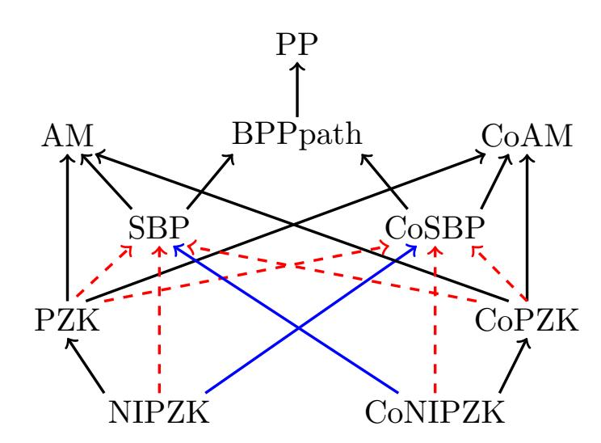

{0}------------------------------------------------

# Perfect Zero Knowledge: New Upperbounds and Relativized Separations∗

Peter Dixon tooplark@iastate.edu Iowa State University

Sutanu Gayen sutanugayen@gmail.com National University of Singapore

A. Pavan pavan@cs.iastate.edu Iowa State University

N. V. Vinodchandran vinod@cse.unl.edu University of Nebraska-Lincoln

#### Abstract

We investigate the complexity of problems that admit perfect zero-knowledge interactive protocols and establish new unconditional upper bounds and oracle separation results. We establish our results by investigating certain distribution testing problems: computational problems over high-dimensional distributions represented by succinct Boolean circuits. A relatively less-investigated complexity class SBP emerged as significant in this study. The main results we establish are:

- A unconditional inclusion that NIPZK ⊆ CoSBP.
- Construction of a relativized world in which there is a distribution testing problem that lies in NIPZK but not in SBP, thus giving a relativized separation of NIPZK (and hence PZK) from SBP.
- Construction of a relativized world in which there is a distribution testing problem that lies in PZK but not in CoSBP, thus giving a relativized separation of PZK from CoSBP.

These results refine the landscape of perfect zero-knowledge classes in relation to traditional complexity classes.

### 1 Introduction

The notion of zero-knowledge interactive proof was introduced in the seminal work of Goldwasser, Micali, and Rackoff. Since their introduction, zero-knowledge proofs have played a central role in the development of the foundations of cryptography [17]. Informally, it is a protocol between two parties, a prover and a verifier, where the prover wants to establish possession of certain knowledge with out revealing the knowledge itself. Goldwasser, Micali, and Rackoff formalized this intuitive notion using the language of computational complexity theory. It is formalized as follows. A language or a promise problem L admits an interactive proof if there is a computationally unbounded prover P and a randomized polynomial-time verifier V such that for a positive instance x, V after interacting with P accepts x with high probability. On the other hand, for a negative

∗Research supported in part by NSF grants 1849053, 1849048, 1934884

{1}------------------------------------------------

instance x for any prover P ∗ , the verifier V after interacting with P ∗ accepts x with low probability. The protocol is a statistical zero-knowledge protocol if for positive instances, the interaction between P and V can be simulated by a randomized polynomial time simulator S so that the output distribution of the simulator is statistically close to the distribution of the interaction. The intuition is that the interaction itself can be simulated efficiently (in randomized polynomial-time) and hence the verifier is not gaining any additional knowledge other than what she can simulate by herself. The class of problems that admit statistical zero-knowledge interactive proofs is denoted by SZK. An important restriction is when the output distribution of the simulator is identical to the distribution of the interaction. Such a protocol is called a perfect zero-knowledge protocol, and the corresponding class of languages is denoted by PZK [16]. It is also possible to envision a non-interactive situation where the only communication in the protocol is from the prover to the verifier. Indeed, Blum, Feldman and Micali [5] and De Santis et al [6] investigated such non-interactive zero-knowledge proofs and introduced the class NISZK. The corresponding perfect zero-knowledge class NIPZK was first investigated by Malka [19].

Zero-knowledge proofs and corresponding classes have played a key role in bridging computational complexity theory and cryptography. Several computationally hard problems that are not known to be NP-complete, including Graph Isomorphism, Quadratic Residuosity, and certain lattice problems, admit zero-knowledge proofs (some non-interactive and some perfect zeroknowledge) [11, 21, 13, 12]. Also, several cryptosystems are based on the computational hardness of some of these problems. While these problems are computationally hard in the sense that they lack efficient algorithms, it is interesting that they are unlikely to be NP-complete. Establishing the relationships among zero-knowledge classes and proving traditional complexity class (such as PP and sub-classes of the Polynomial Hierarchy) upper bounds for them continues to be a research focus in complexity theory and cryptography [10, 2, 20, 22]. While there are a few unconditional upper bound results, most of the results establish the hardness of proving upper bounds in the form of oracle results. We briefly discuss them below.

Unconditional Upper Bounds: Two main early upper bound results are that SZK is closed under complement [20, 22] and SZK is upper bounded by AM ∩ coAM [10, 2, 20, 22]. The latter result implies that NP-complete problems cannot have statistical zero-knowledge proofs unless it contradicts the widely held belief that the Polynomial Hierarchy is infinite [8]. The relationship between zero-knowledge classes and traditional probabilistic complexity classes has also been explored recently. In particular, Bouland et al. show that all problems with perfect zero-knowledge proofs admit unbounded probabilistic polynomial-time algorithms (that is, PZK ⊆ PP) [9].

Relativized Separations: Several significant upper bound questions, including whether various zeroknowledge classes are closed under complement and whether statistical zero-knowledge classes equal the corresponding perfect zero knowledge classes, turned out to be difficult to resolve and led to oracle separation results. Lovett and Zhang showed that the class NISZK is not closed under complement in a relativized world [18]. Bouland et al., in the same paper where they show PZK ⊆ PP, established a comprehensive set of oracle separation results. In particular, they showed that there are relativized worlds where NISZK (and thus SZK) is not in PP, PZK does not equal SZK, and NIPZK and PZK are not closed under complement.

#### Our Contributions

One of our main contributions is a new unconditional upper bound on the complexity class NIPZK.

{2}------------------------------------------------

#### Theorem 1.1. NIPZK $\subseteq$ CoSBP.

The class SBP (Small Bounded-error Probability) was introduced by Böhler, Glaßer, and Meister [7] and is a bounded-error version of PP. Informally, a language is in PP if there is a probabilistic polynomial-time machine for which the ratio between the acceptance and the rejection probabilities is more than 1 for all the positive instances. We obtain the class SBP when we stipulate that this ratio is bounded away from 1, i.e,  $(1+\epsilon)$  for a fixed constant  $\epsilon > 0$ . This restriction greatly reduces the power of the class. In particular, it is known that SBP is a subset of AM and PP, and contains MA. This class has been studied in other contexts as well, such as in circuit complexity [4, 1]. Even though the relationship between SBP and zero knowledge classes has not been studied earlier, a curious connection exists between them. Watson showed that a certain promise problem regarding the min-entropy of samplable distributions is a complete problem for SBP [23]. Interestingly, the analogous problem where entropy instead of min-entropy is considered was shown to be complete for the class NISZK [15]. Our upper bound result improves the known containments NIPZK  $\subseteq$  AM  $\cap$  coAM to NIPZK  $\subseteq$  AM  $\cap$  CoSBP and NIPZK  $\subseteq$  PP to NIPZK  $\subseteq$  CoSBP.

We consider the possibility of establishing other upper bounds for perfect zero-knowledge classes. Since NIPZK is not known to be closed under complement, is it possible to show that NIPZK  $\subseteq$  SBP  $\cap$  CoSBP? We also consider whether we can show that PZK itself lies in CoSBP. For these two questions, we prove the following relativized lower bound results.

**Theorem 1.2.** There is an oracle O such that  $NIPZK^O$  (and thus  $PZK^O$ ) is not in  $SBP^O$ .

This result along with Theorem 1.1 implies that NIPZK is not closed under complement in a relativized world, a result that was recently established by Bouland et al. [9].

**Theorem 1.3.** There is an oracle O such that  $PZK^O$  is not in  $CoSBP^O$ .

Figure 1 summarizes the known relationships among perfect zero knowledge classes and other complexity classes along with the results established in this work.

Complexity of Distribution Testing Problems. We establish our results by investigating certain distribution testing problems: computational problems over high-dimensional distributions represented by succinct Boolean circuits. Interestingly, it turns out that versions of distribution testing problems characterize various zero-knowledge classes. The distribution testing problems are best formalized as promise problems. A promise problem is a pair of sets  $\Pi = (\Pi_{Yes}, \Pi_{No})$  such that  $\Pi_{Yes} \cap \Pi_{No} = \emptyset$ .  $\Pi_{Yes}$  is called the set of 'yes' instances, and  $\Pi_{No}$  is called the set of 'no' instances. Given a Boolean circuit C mapping from m bits to n bits, the distribution sampled by C is obtained by uniformly choosing  $x \in \{0,1\}^m$  and evaluating C on x. We often use C itself to denote the distribution sampled by the circuit C.

STATISTICAL DIFFERENCE (SD): Given two distributions sampled by Boolean circuits C and D,  $\Pi_{Yes} = \{\langle C, D \rangle \mid dist(C, D) \leq 1/n\}$  and  $\Pi_{No} = \{\langle C, D \rangle \mid dist(C, D) \geq 1 - 1/n\}$ .

Here dist denotes the statistical distance between the distributions. When one of the distributions is the uniform distribution, the above problem is called STATISTICAL DIFFERENCE TO UNIFORM (SDU). The seminal work of Sahai and Vadhan showed that SD is complete for the class SZK [22] and Goldreich, Sahai and Vadhan showed that SDU is complete for NISZK [15].

Entropy Approximation (EA): Given a samplable distribution C and an integer k,  $\Pi_{Yes} = \{\langle C, k \rangle \mid \mathcal{H}(C) \geq k+1\}$  and  $\Pi_{No} = \{\langle C, k \rangle \mid \mathcal{H}(C) \leq k-1\}$ , where  $\mathcal{H}$  is the entropy function.

{3}------------------------------------------------

Figure 1:  $A \to B$  indicates that A is a subset of B,  $A \dashrightarrow B$  indicates that there is a relativized world where A is not a subset of B. Red and Blue arrows indicate new results.

Goldreich, Sahai and Vadhan showed that Entropy Approximation is complete for NISZK. In the above problem, if the entropy function  $\mathcal{H}$  is replaced with the min-entropy function  $\mathcal{H}_{\infty}$ , the corresponding problem is known as Min-entropy Approximation (MEA). Watson showed that MEA is complete for the complexity class SBP [23]. It is interesting to note that while Entropy Approximation is NISZK-complete, the analogous Min-entropy Approximation problem is complete for SBP.

To establish our results, we study variants of the above distribution testing problems. The following problem, known as UNIFORM, is defined by Malka and was shown to be complete for NIPZK [19].

UNIFORM: Given a circuit  $D: \{0,1\}^m \to \{0,1\}^{n+1}$ , let  $D[1\dots n]$  denote the distribution of the first n bits of D and let D[n+1] denote the distribution of the last bit of D.  $\Pi_{Yes} = \{\langle D \rangle \mid D[1\dots n] = U_n, \Pr[D[n+1] = 1] \ge 2/3\}$  and  $\Pi_{No} = \{\langle D \rangle \mid |sup(D) \cap \{0,1\}^n 1| \le 2^n/3\}$ .

Here  $U_n$  denotes the uniform distribution over *n*-bit strings and sup(D) is the support of the distribution D. We obtain Theorem 1.1 by showing that UNIFORM is in CoSBP.

Note that we can obtain relativized versions of the distribution testing problems by providing oracle access to the circuits involved. To obtain Theorem 1.2, we consider a promise problem that is a variant of UNIFORM.

Uniform-Or-Small: Given a distribution D,  $\Pi_{Yes} = \{\langle D \rangle \mid D = U\}$  and  $\Pi_{No} = \{\langle D \rangle \mid |sup(D)| \leq 2^{n/2}\}$ 

We show that a relativized version of this problem is not in SBP. For Theorem 1.3, we consider a variant of SD called DISJOINT-OR-IDENTICAL.

DISJOINT-OR-IDENTICAL: Given two samplable distributions C and D,  $\Pi_{Yes} = \{\langle C, D \rangle \mid sup(C) \cap sup(D) = \emptyset\}$  and  $\Pi_{No} = \{\langle C, D \rangle \mid C = D\}$  (i.e, the distance between C and D is either 1 or 0).

This problem can be shown to be in CoPZK. We construct an oracle relative to which this problem is not in SBP. Theorems 1.2 and 1.3 show that there exist relativized worlds where PZK

{4}------------------------------------------------

is neither in SBP nor in CoSBP. This suggests that we cannot hope to improve the containment PZK ⊆ PP to either SBP or CoSBP using relativizable techniques.

### 2 Notation and Definitions

Distributions. All the distributions considered in this paper are over a sample space of the form {0, 1} n for some integer n. Given a distribution D, we use D(x) to denote the probability of x with respect to D. We use Un to denote the uniform distribution over {0, 1} n . We consider distributions sampled by circuits. Given a circuit C mapping m-bit strings to n-bit strings, the distribution encoded/sampled by the circuit C is the distribution C(Um). We often use C to denote both the circuit and the distribution sampled by it. Note that given access to the circuit, we can efficiently generate a sample of the distribution by evaluating C on a uniformly chosen m-bit string. For this reason, we call such distributions efficiently samplable distributions or just samplable distributions. We use sup(D) to denote the set of strings for which D(x) 6= 0.

Given two distributions C and D over the same sample space S, the statistical distance between them, denoted by dist(C, D), is defined as follows.

$$dist(C,D) = \max_{T \subseteq S} (C(T) - D(T)) = \sum_{C(x) > D(x)} (C(x) - D(x))$$

Complexity Classes We refer the reader to the textbook by Arora and Barak [3] for definitions of standard complexity classes. For a complexity class C, CoC denotes the class of complement languages/promise problems from C. The class SBP was introduced in [7] and is defined as follows.

Definition 2.1. A promise problem (ΠY es, ΠN o) is said to belong to the complexity class SBP if there exists a constant > 0, a polynomial p(·), and a probabilistic polynomial-time Turing Machine M such that

- 1. If x ∈ ΠY es then Pr[M accepts] ≥ 1+ 2 p(|x|)
- 2. If x ∈ ΠN o then Pr[M accepts] ≤ 1 2 p(|x|) ,

SBP is sandwiched between MA and AM and is the largest known subclass of AM that is in PP. In fact, it is known that SBP is contained in the class BPPpath which is a subclass of PP.

**Theorem 2.1** ([7]). 
$$MA \subseteq SBP \subseteq AM$$
 and  $SBP \subseteq BPP_{path} \subseteq PP$ .

Although we will not be using explicit definitions of zero-knowledge classes, we give necessary definitions for completeness.

Definition 2.2 (Non-Interactive protocol). A non-interactive protocol is a pair of functions hP, V i, the prover and verifier. On input x and random strings rI , rP , P sends a message π = P(x, rP , rI ) to V , and V computes m = V (x, π, rI ). V accepts x if m = 1, and rejects if m = 0. The transcript of the interaction is the tuple hx, rI , π, mi.

Note that the above definition implies that the random string rI is shared between the prover and the verifier.

{5}------------------------------------------------

**Definition 2.3** (NIPZK[19, 15]). A promise problem  $\langle \Pi_{Yes}, \Pi_{No} \rangle$  is in NIPZK (Non-Interactive Perfect Zero Knowledge) if there is a non-interactive protocol  $\langle P, V \rangle$  where V runs in polynomial time, and a randomized, polynomial-time computable simulator S, satisfying the following conditions:

- (Soundness:) For any function  $P^*$  and any  $x \in \Pi_{No}$ ,  $\Pr[V \ accepts] \le 1/3$
- (Completeness:) If  $x \in \Pi_{Yes}$ ,  $\Pr[V \ accepts] \ge 2/3$
- (Zero Knowledge:) For any  $x \in \Pi_{Yes}$ , the distribution of S(x) is identical to the distribution of the transcript generated by  $\langle P, V \rangle$  on input x.

The class NISZK (Non-Interactive Statistical Zero Knowledge) is defined similarly [15], except that we only require that the statistical distance between the distribution of S(x) and the distribution of the transcript generated by  $\langle P, V \rangle(x)$  be less than 1/p(n) for every polynomial p(n). Malka [19] showed that the promise problem UNIFORM is complete for the class NIPZK.

Theorem 2.2 ([19]). The promise problem Uniform is complete for NIPZK.

### 3 NIPZK $\subseteq$ CoSBP

For a given distribution D, let CP(D) denote the collision probability:  $Pr_{x,y\sim D}(x=y)$ . The following lemma is folklore. See [14] for a proof.

**Lemma 3.1.** For a given distribution D over  $\{0,1\}^n$ , if  $dist(D,U_n) \ge \epsilon$ , then  $CP(D) \ge \frac{1+\epsilon^2}{2^n}$ 

#### **Theorem 1.1.** $NIPZK \subseteq CoSBP$

We show the result by proving that the NIPZK-complete problem UNIFORM is in CoSBP. We first start with the following lemma.

**Lemma 3.2.** Let D be a distribution on n+1 bits, and let  $T=\{x\in\{0,1\}^n\mid x1\in sup(D)\}$ . Suppose that  $|T|\leq 2^n/3$  and  $\Pr(D[n+1]=1)=\frac{1}{3}+\epsilon$  for some  $\epsilon\geq 0$ . Then  $dist(D[1\ldots n],U_n)$  is at least  $\epsilon$ .

*Proof.* Recall that  $dist(D[1...n], U_n) = \max_{S \subseteq \{0,1\}^n} \left| \Pr_{d \sim D[1...n]} [d \in S] - \Pr_{u \sim U_n} [u \in S] \right|$ 

$$\max_{S \subseteq \{0,1\}^n} \left| \Pr_{d \sim D[1...n]} [d \in S] - \Pr_{u \sim U_n} [u \in S] \right| \ge \left| \Pr_{d \sim D[1...n]} [d \in T] - \Pr_{u \sim U_n} [u \in T] \right|$$

$$\ge \left| \frac{1}{3} + \epsilon - \Pr_{u \sim U_n} [u \in T] \right|$$

$$= \left| \frac{1}{3} + \epsilon - \frac{|T|}{2^n} \right|$$

$$\ge \frac{1}{3} + \epsilon - \frac{2^n}{3} / 2^n = \epsilon$$

Now we prove Theorem 1.1 by giving a CoSBP algorithm for Uniform.

{6}------------------------------------------------

*Proof.* Recall the definition of UNIFORM: Given a circuit  $D: \{0,1\}^m \to \{0,1\}^{n+1}$ ,  $\Pi_{Yes} = \{D: D[1...n] = U_n, \Pr[D[n+1] = 1] \ge 2/3\}$  and  $\Pi_{No} = \{D: |sup(D) \cap \{0,1\}^n 1| \le 2^n/3\}$ .

Consider the following randomized algorithm: Given D as input, get two samples  $d_0$  and  $d_1$  from D. If the first n bits of both  $d_0$  and  $d_1$  are the same, then accept. Else, obtain k additional samples from D, and if the last bit of all these samples is 0, then accept, otherwise reject.

If D is a 'yes' instance of UNIFORM, then the probability of accepting at the first step is  $\frac{1}{2^n}$  and the probability of accepting at the second step is at most  $\frac{1}{3^k}$ , so the overall accept probability is  $\leq \frac{1}{2^n} + \frac{1}{3^k}$ . Suppose that D is a 'no' instance of UNIFORM. By lemma 3.2, either  $D[1 \dots n]$  is at least  $\frac{1}{6}$  away from  $U_n$ , or D[n+1] is 1 with probability at most  $\frac{1}{2}$ . Suppose that D is at least 1/6 away from the uniform distribution, then by Lemma 3.1, the probability that the first n bits of  $d_0$  and  $d_1$  are the same is at least  $\frac{37}{36}\frac{1}{2^n}$ . Thus the algorithm accepts with probability at least  $\frac{37}{36}\frac{1}{2^n}$ . Now suppose that D is less than 1/6 away from the uniform distribution. This implies that the last bit of D is 1 with probability at most 1/2. Thus in this case the algorithm accepts with probability  $\geq \frac{1}{2^k}$ . Thus, a no instance is accepted with probability  $\geq \min\{\frac{37}{36}\frac{1}{2^n}, \frac{1}{2^k}\}$ . Choose  $k=n-\log(37/36)$ , so that a no instance is accepted with probability  $\geq \frac{37}{36}\frac{1}{2^n}$  and a yes instance is accepted with probability  $\leq \frac{1}{2^n} + \frac{3^{\log(6/5)}}{3^n}$ . For large enough n,  $\frac{37}{36}\frac{1}{2^n} \geq (1+\frac{1}{10})(\frac{1}{2^n} + \frac{3^{\log(6/5)}}{3^n})$ , so this is a CoSBP algorithm for for UNIFORM.

## 4 Oracle Separations

In this section, we prove Theorems 1.2 and 1.3. We first prove a general approach that can be used to construct relativized worlds where promise problems involving circuits are not in SBP.

**Lemma 4.1.** Let  $\Pi = \langle \Pi_Y, \Pi_N \rangle$  be a promise problem whose instances are circuits. If there is an oracle circuit family  $\{C_n\}_{n\geq 0}$  and a constant c>1 with the following properties:

- $C_n$  is a oracle circuit that maps n bits to n bits and makes oracle queries only to strings of length cn.
- There exist families of sets  $\{A_n\}_{n\geq 0}$ ,  $\{B_n\}_{n\geq 0}\subseteq \{0,1\}^{cn}$  such that for all  $n, C_n^{A_n}\in \Pi_Y$  and  $C_n^{B_n}\in \Pi_N$
- For every probabilistic polynomial-time Turing Machine M and infinitely many n, for every  $D_i \in \{A_i, B_i, \emptyset\}, 1 \leq i < n$

$$\frac{\Pr[M^{(\bigcup_{i=1}^{n-1}D_i)\cup A_n}(C_n^{(\bigcup_{i=1}^{n-1}D_i)\cup A_n})accepts]}{\Pr[M^{(\bigcup_{i=1}^{n-1}D_i)\cup B_n}(C_n^{(\bigcup_{i=1}^{n-1}D_i)\cup B_n})accepts]} < 2,$$

then there exists an oracle O such that  $\Pi^O \not\in \mathrm{SBP}^O$ 

*Proof.* We first note that in this definition of SBP, we can choose  $\epsilon$  to be 1 by using amplification techniques. Thus a promise problem is in SBP if there exists a polynomial  $p(\cdot)$  and a probabilistic polynomial-time machine M such that on positive instances M accepts with probability at least  $2/2^{p(n)}$  and on negative instances M accepts with probability at most  $1/2^{p(n)}$ . We call  $p(\cdot)$  the threshold polynomial for M.

{7}------------------------------------------------

Let  $\{M_i\}_{i>0}$  be an enumeration of the probabilistic polynomial-time machines. We consider an enumeration of tuples  $\langle M_i, j \rangle_{i>0, j>0}$ . In this enumeration considering  $\langle M_i, j \rangle$  corresponds to the possibility that  $M_i$  is a SBP machine with threshold polynomial  $n^j$ . We first start with an empty oracle. Let  $O_i = O \cap \{0,1\}^{ci}$ . For each  $i, O_i$  will be one of  $\emptyset$ ,  $A_i$  or  $B_i$ . Consider  $\langle M_i, j \rangle$  and let nbe a length for which  $O_n$  is not yet defined and for which the inequality from the lemma holds for the machine  $M_i$ . Suppose that  $M_i$  makes queries of length  $\leq m$ . Note that by this, we have defined  $O_i$  for all i < cn, thus  $O \subseteq \{0,1\}^{< cn}$  and for every i < n  $O_i$  is either  $\emptyset$ ,  $A_i$  or  $B_i$ . Suppose that the acceptance probability of  $M_i^{O \cup A_n}(C^{A_n})$  is less than  $2/2^{n^j}$ . We set O at length cn as  $A_n$  and for all the lengths from cn+1 to m the oracle O is set to be  $\emptyset$ . Now  $C^{A_n}$  is a positive instance for which  $M_i$  cannot be a SBP machine with  $n^j$  as the threshold polynomial. Then we set O at length cn as  $A_n$  and move to the next tuple in the enumeration. Suppose that  $M_i^{O \cup A_n}(C^{A_n})$  accepts with probability at least  $2/2^{n^j}$ . Now by the inequality from lemma 4.1, the acceptance probability of  $M_i^{O \cup B_n}(C^{B_n})$  is more than  $1/2^{n^j}$ . Note that  $C^{B_n}$  is a negative instance for which  $M_i$  is not a SBP machine with threshold polynomial  $n^{j}$ . Thus we make the oracle O at length cn to be  $B_{n}$ . It is easy to see that  $\Pi^O$  is not in SBPO: Suppose not, and there exists a probabilistic polynomial-time machine  $M_i$  with threshold polynomial  $n^j$ . When we considered the tuple  $\langle M_i, j \rangle$ , we ensured that  $M_i$  does not have threshold polynomial  $n^j$  on  $C^{O_{cn}}$ .

#### 4.1 Oracle Separation of NIPZK from SBP

In this section we show that Theorem 1.2 cannot be improved to show that NIPZK is a subset of SBP using relativizable techniques. For this we show that the oracle version of UNIFORM-OR-SMALL is not in SBP.

**Theorem 4.1.** There exists an oracle O relative to which Uniform-Or-Small is not in SBPO.

Malka [19] showed that UNIFORM-OR-SMALL is in NIPZK, and this proof relativizes. Combining this with Theorem 4.1, we obtain Theorem 1.2. To prove Theorem 4.1, it suffices to exhibit sets  $A_n$  and  $B_n$  that satisfies the conditions of Lemma 4.1. We construct these sets via a probabilistic argument. We first provide a brief overview of this construction.

Overview of the proof: Consider a non-relativized world with the following restriction on how a probabilistic polynomial-time machine M can access the input circuit C: At the beginning the machine gets to see a sequence S of k independent samples from C. After this the machine ignores C. Note that in this model the underlying machine cannot perform adaptive sampling from C, nor can the machine generate samples that might be correlated. In this model it is easy to see that if C encodes the uniform distribution, the probability that M is presented with a specific sequence S of k samples is precisely  $1/2^{nk}$ . Thus the probability that the machine M accepts is  $\sum_{S}(\frac{1}{2^{nk}}\Pr[M \text{ accepts } S])$ , summed over all sequences of size k.

Now given a subset D of  $\{0,1\}^n$  of size  $2^{n/2}$ , let  $U_D$  be the uniform distribution over D. Consider the following experiment. Randomly pick D and let  $C_D$  be a circuit that samples  $U_D$ . Independently draw a sequence of k samples S from  $U_D$  and present them as input to M. (In a non-relativized setting, there may not be a small circuit that uniformly samples D, but in the relativized worlds we consider, this is not an issue.) We consider the acceptance probability of M over random choices of D, S and internal coin tosses of M. By a careful analysis we can show that

{8}------------------------------------------------

this probability is very close to  $\sum_{S} (\frac{1}{2^{nk}} \Pr[M \text{ accepts } S])$ . Thus the ratio between the acceptance probabilities of M when given samples from the uniform distributions and samples drawn from  $U_D$  (over a random choice of D) is arbitrarily close to 1. By a probabilistic argument, there exists a subset D such that the acceptance probability of M on a positive instance (U) and a negative instance  $(U_D)$  are the same. Thus M is not a SBP machine.

The crux of the above idea is that when the samples are generated independently and nonadaptively, then it is possible to argue that a SBP machine cannot distinguish between whether they came from the uniform distribution or from a distribution with small support size. Now, we need to argue in the more general model, where a probabilistic machine can do adaptive sampling and generate samples that could be correlated to each other. A first approach to construct the sets  $A_n$  and  $B_n$  is to encode the uniform distribution in  $A_n$  and the distribution  $U_D$  in  $B_n$ . The set  $A_n$  can be defined as  $\{\langle i,j\rangle \mid \text{the } i^{th} \text{ bit of the } j^{th} \text{ string of } \Sigma^n \text{ is } 1\}$  (in the standard lexicographical ordering). To define  $B_n$  given D, first consider the multiset  $\mathbb D$  that contains  $2^{n/2}$  copies of each elements of D. Thus the cardinality of  $\mathbb D$  is  $2^n$ . Now, the set  $B_n$  can be defined as tuples  $\langle \ell, j\rangle$  where the  $\ell^{th}$  bit of the  $j^{th}$  string of  $\mathbb D$  is 1. Consider the oracle circuit C which is defined as follows:

**Definition 4.1** (Oracle Circuit). Let  $C^O$  be a fixed linear-size oracle circuit, with n inputs and n outputs, defined as follows: On input  $j \in \{1...2^n\}$ ,  $C^O(j)$  outputs  $O(\langle \ell, j \rangle)$  for all  $\ell$  between 1 and n. In other words,  $C^O(j)$  outputs the  $j^{th}$  string of O.

Notice that  $C^{A_n}$  is the uniform distribution and  $C^{B_n}$  is uniform on D and the goal of the probabilistic machine is to distinguish between the distributions  $C^{A_n}$  and  $C^{B_n}$ . However, if we allow correlated sampling, a probabilistic machine can easily distinguish  $C^{A_n}$  and  $C^{B_n}$  by computing  $C^O(j)$  and  $C^O(j+1)$  for appropriate inputs j and j+1 and comparing whether they are equal or not. To guard against such behavior, we apply one more level of randomization - randomize the underlying order of the strings. Thus the tuple  $\langle \ell, j \rangle$  will encode the  $\ell^{th}$  string in an order that is not necessarily the standard lexicographic order. We argue that when we randomly order  $\{0,1\}^n$ , then adaptive and correlated sampling does not give significantly more information than independently generated samples. Now, we proceed to give a formal proof.

**Detailed proof:** From now on, we fix a length n. We use a probabilistic argument to construct  $A_n$  and  $B_n$ . For  $A_n$  we consider  $2^n!$  sets  $Y_i$  and define  $A_n$  to be one of them (using a probabilistic argument), and similarly for  $B_n$  we consider many sets  $N_{D_i}$  and define  $B_n$  to be one of them.

**Definition 4.2** (Oracle families). Let  $1 \le i \le 2^n!$  index the set of all  $2^n!$  permutations of  $\{0,1\}^n$ . Oracles for Yes instances:  $Y_i = \{\langle \ell, j \rangle : \text{ the } \ell^{th} \text{ bit of the } j^{th} \text{ string of the } i^{th} \text{ permutation of } \{0,1\}^n \text{ is } 1\}.$ 

Oracles for No instances: For each set D of size  $d=2^m$  (where m=n/2) let  $\mathbb{D}$  be the multiset that contains  $2^{n-m}$  copies of each element of D. Thus  $|\mathbb{D}|=2^n$ , and we define  $N_{D_i}$  as:  $N_{D_i}=\{\langle \ell,j\rangle : the\ \ell^{th}\ bit$  of the  $j^{th}$  string of the  $i^{th}$  permutation of  $\mathbb{D}$  is  $1\}$ .

For the rest of this section, we will use Y to represent an arbitrary  $Y_i$  oracle, N to represent an arbitrary  $N_{D_i}$  oracle, and O to represent an arbitrary  $Y_i$  or  $N_{D_i}$ . Note that for every i,  $C^{Y_i}$  is the uniform distribution and  $C^{N_{D_i}}$  is the uniform distribution on D and thus has small support.

We first prove the following lemma and show later how to build on it to arrive at the conditions specified in Lemma 4.1.

{9}------------------------------------------------

Lemma 4.2. If i is uniformly chosen from {1, . . . , 2 n !} and D is uniformly chosen from all size 2 m subsets of {0, 1} n , then for any constant c > 1 and every probabilistic polynomial-time algorithm A, for large enough n,

$$\frac{\Pr_{i,r}[A^{Y_i} \ accepts \ C^{Y_i}]}{\Pr_{i,r,D}[A^{N_{D_i}} \ accepts \ C^{N_{D_i}}]} \le c$$

where r is the random choice of A.

Without loss of generality we can assume that any oracle query that AO makes can be replaced by evaluating the circuit C O, by modifying A in the following way: whenever A queries the oracle O for the i th bit of the j th string, it evaluates C O(j) and it extracts the i th bit. We refer to this as a circuit query. Let k be the number of circuit queries made by A, where k is bounded by a polynomial. We will use q1, . . . qk to denote the circuit queries, and denote the output C O(qi) by ui . We can assume without loss of generality that all qi are distinct. We use S to denote a typical tuple of answers hu1, · · · , uki. We will use AS to denote the computation of algorithm A when the answers to the circuit queries are exactly S in that order. Notice that the AS does not involve any oracle queries. Once A has received S, it can complete the computation without any circuit queries. So, the output of AS is a random variable that depends only on the internal randomness r of A.

Claim 4.1. Without loss of generality we can assume that along any random path, A rejects whenever any ui = uj , i 6= j.

Proof. In a Yes instance, C Y is uniform. Since C has n inputs and n outputs, C Y is a 1-1 function. By the earlier assumption, ui will never match any other uj . In a No instance, C N will have 2n−m inputs for any output. Rejecting any time ui = uj will not affect Pr[A accepts a Yes instance], and it will reduce Pr[A accepts a No instance]. Thus the ratio of the probability of accepting an Yes instance and the probability of accepting a No instance only increases. We will show that this higher ratio is < c.

We will use the following notation.

- "AO asks hq, ii" is the event that "the i th circuit query made by A is C O(q)." For simplicity, we write this event as "AO asks qi ."
- "AO gets hu, ii" is the event that "C O(q) = u where q is the i th query". Again, for simplicity, we write this event as "AO gets ui ."
- For S = hu1, . . . uki, "AO gets S" is the event that "AO gets u1 and AO gets u2 and . . . AO gets uk" (in that order).

Lemma 4.3. For any probabilistic algorithm A and for any fixed S = hu1, . . . uki where all ui are distinct,

$$\Pr_{i,r}[A^{Y_i} \ gets \ S \ and \ accepts] = \Pr_r[A_S \ accepts] \prod_{j=0}^{k-1} \frac{1}{(2^n-j)}$$

{10}------------------------------------------------

Proof.

$$\Pr_{i,r}[A^{Y_i} \text{ gets } S \text{ and accepts}] = \Pr_{i,r}[A^{Y_i} \text{ gets } S] \times \Pr_{i,r}[A^{Y_i} \text{ accepts } | A^{Y_i} \text{ gets } S]$$
$$= \Pr_{i,r}[A^{Y_i} \text{ gets } S] \times \Pr_{r}[A_S \text{ accepts}]$$

The last equality is because  $A_S$  is independent of i as discussed before. We will show that  $\Pr_{i,r}[A^{Y_i} \text{ gets } S] = \prod_{j=0}^{k-1} \frac{1}{(2^n-j)}$  which will prove the lemma.

$$\Pr_{i,r}[A^{Y_i} \text{ gets } S] = \prod_{j=0}^{k-1} \Pr_{i,r}[A^{Y_i} \text{ gets } u_{j+1} | A^{Y_i} \text{ gets } \langle u_1, u_2, \dots, u_j \rangle]$$

For any fixed j let  $E_j$  denote the event " $A^{Y_i}$  gets  $\langle u_1, u_2, \dots, u_j \rangle$ ". Then,

$$\begin{split} \Pr_{i,r}[A^{Y_i} \text{ gets } u_{j+1}|A^{Y_i} \text{ gets } \langle u_1, u_2, \dots, u_j \rangle] &= \Pr_{i,r}[A^{Y_i} \text{ gets } u_{j+1}|E_j] \\ &= \sum_{q_{j+1}} \Pr_{i,r}[A^{Y_i} \text{ asks } q_{j+1}|E_j] \times \Pr_{i,r}[C^{Y_i}(q_{j+1}) = u_{j+1}|E_j] \\ &= \sum_{q_{j+1}} \Pr_{i,r}[A^{Y_i} \text{ asks } q_{j+1}|E_j] \times \Pr_{i}[C^{Y_i}(q_{j+1}) = u_{j+1}|E_j] \\ &= \sum_{q_{j+1}} \Pr_{i,r}[A^{Y_i} \text{ asks } q_{j+1}|E_j] \times \frac{1}{(2^n - j)} \\ &= \frac{1}{(2^n - j)} \times \sum_{q_{j+1}} \Pr_{i,r}[A^{Y_i} \text{ asks } q_{j+1}|E_j] \\ &= \frac{1}{(2^n - j)} \end{split}$$

The third equality is because the output of C is independent of r and the fourth equality follows from the fact that for a random permutation of  $\{0,1\}^n$ , once j elements are fixed, there are  $2^n - j$  equally likely possibilities for  $u_{j+1}$ . The lemma follows.

**Lemma 4.4.** For any algorithm A and any fixed  $S = \langle u_1, \dots u_k \rangle$  where  $u_i s$  are distinct,

$$\Pr_{i,r,D}[A^{N_{D_i}} \ gets \ S \ and \ accepts] = \Pr_{r}[A_S \ accepts] \times \prod_{j=0}^{k-1} \frac{(2^m - j)2^{n-m}}{(2^n - j)^2}$$

*Proof.* The argument is identical to the proof of Lemma 4.3 except for the probability calculations.

$$\Pr_{i,r,D}[A^{N_{D_i}} \text{ gets } S \text{ and accepts}] = \Pr_{i,r,D}[A^{N_{D_i}} \text{ gets } S] \times \Pr_{i,r,D}[A^{N_{D_i}} \text{ accepts } |A^{N_{D_i}} \text{ gets } S]$$

$$= \Pr_{i,r,D}[A^{N_{D_i}} \text{ gets } S] \times \Pr_{r}[A_S \text{ accepts}]$$

The last equality is because  $A_S$  is independent of i and D. We will show that  $\Pr_{i,r,D}[A^{N_{D_i}}] = \prod_{j=0}^{k-1} \frac{(2^m-j)2^{n-m}}{(2^n-j)^2}$  which will prove the lemma.

{11}------------------------------------------------

$$\Pr_{i,r,D}[A^{N_{D_i}} \text{ gets } S] = \prod_{j=0}^{k-1} \Pr_{i,r}[A^{N_{D_i}} \text{ gets } u_{j+1} | A^{N_{D_i}} \text{ gets } \langle u_1, u_2, \dots, u_j \rangle]$$

We will reuse the notation  $E_j$  for convenience. For any fixed j, let  $E_j$  denote the event " $A^{N_{D_i}}$  gets  $\langle u_1, u_2, \dots, u_j \rangle$ " Then,

$$\Pr_{i,r,D}[A^{N_{D_i}} \text{ gets } u_{j+1}|A^{N_{D_i}} \text{ gets } \langle u_1, u_2, \dots, u_j \rangle] = \Pr_{i,r,D}[A^{N_{D_i}} \text{ gets } u_{j+1}|E_j] 
= \sum_{q_{j+1}} \Pr_{i,r,D}[A^{N_{D_i}} \text{ asks } q_{j+1}|E_j] \times \Pr_{i,r,D}[C^{N_{D_i}}(q_{j+1}) = u_{j+1}|E_j] 
= \sum_{q_{j+1}} \Pr_{i,r,D}[A^{N_{D_i}} \text{ asks } q_{j+1}|E_j] \times \Pr_{i,D}[C^{N_{D_i}}(q_{j+1}) = u_{j+1}|E_j]$$

We will show that for any q,  $\Pr_{i,D}[C^{Y_i}(q) = u_{j+1}|E_j] = \frac{(2^m - j)2^{n-m}}{(2^n - j)^2}$ .

$$\Pr_{i,D}[C^{N_{D_i}}(q) = u_{j+1}|E_j] = \Pr_{i,D}[u_{j+1} \in D|E_j] \times \Pr_{i,D}[C^{N_{D_i}}(q) = u_{j+1}|u_{j+1} \in D, E_j] 
= \frac{\binom{2^n - j - 1}{2^m - j - 1}}{\binom{2^n - j}{2^m - j}} \times \frac{2^{n - m}}{2^n - j} 
= \frac{2^m - j}{2^n - j} \times \frac{2^{n - m}}{2^n - j} 
= \frac{(2^m - j)2^{n - m}}{(2^n - j)^2}$$

The second equality is because of the following reasoning. There are  $\binom{2^n-j}{2^m-j}$  choices of D where  $u_1 \ldots u_j$  are included, and  $\binom{2^n-j-1}{2^m-j-1}$  that include  $u_{j+1}$  as well. Given that  $u_1, \ldots u_{j+1} \in D$ , the probability that  $C^{N_{D_i}}(q_{j+1}) = u_{j+1}$  is  $\frac{2^{n-m}}{2^n-j}$  (since there are  $2^{n-m}$  copies of  $u_{j+1}$  remaining, and  $2^n-j$  total things remaining).

We need the following claim.

Claim 4.2. For any polynomial k = k(n) and any constant c > 1, for large enough n,

$$\prod_{j=0}^{k-1} \frac{2^n - j}{2^n - 2^{n/2} j} < c$$

12

{12}------------------------------------------------

Proof.

$$\prod_{j=0}^{k-1} \frac{2^n - j}{2^n - 2^{n/2} j} \leq \prod_{j=0}^{k-1} \frac{2^n}{2^n - 2^{n/2} j}$$

$$= \prod_{j=0}^{k-1} \frac{2^{n/2}}{2^{n/2} - j}$$

$$\leq \left(\frac{2^{n/2}}{2^{n/2} - k}\right)^k$$

$$= \left(1 + \frac{k}{2^{n/2} - k}\right)^k$$

For any polynomial k = k(n),  $\lim_{n \to \infty} (1 + \frac{k(n)}{2^{n/2} - k(n)})^{k(n)} = 1$ . Hence the claim.

We can now prove Lemma 4.2.

Proof of Lemma 4.2. From lemmas 4.3 and 4.4, we have

$$\frac{\Pr_{i,r}[A^{Y_i} \text{ accepts } C^{Y_i}]}{\Pr_{i,r,D}[A^{N_{D_i}} \text{ accepts } C^{N_{D_i}}]} = \frac{\sum_{S} \Pr_{i,r}[A^{Y_i} \text{ gets } S \text{ and accepts }]}{\sum_{S} \Pr_{i,r,D}[A^{N_{D_i}} \text{ gets } S \text{ and accepts }]}$$

$$\leq \frac{\sum_{S \text{ distinct}} \Pr_{i,r,D}[A^{N_{D_i}} \text{ gets } S \text{ and accepts }]}{\sum_{S \text{ distinct}} \Pr_{i,r,D}[A^{N_{D_i}} \text{ gets } S \text{ and accepts }]}$$

$$= \frac{\sum_{S \text{ distinct}} \Pr_{i,r,D}[A^{N_{D_i}} \text{ gets } S \text{ and accepts }] \times \prod_{j=0}^{k-1} \frac{1}{(2^n-j)}}{\sum_{S \text{ distinct}} \Pr_{i,r,D}[A^{N_{D_i}} \text{ gets } S \text{ and accepts }]} \times \prod_{j=0}^{k-1} \frac{1}{(2^n-j)^2}$$

$$= \prod_{j=0}^{k-1} \frac{2^n-j}{2^n-2^{n/2}j} \text{ ( substituting } m=n/2 \text{ )}$$

$$< c \text{ (by Claim } 4.2)$$

The second equality follows because when the oracle is  $Y_i$ , S is always disjoint (as we never ask the same query twice) and when the oracle is  $N_{D_i}$  we assume that the algorithm rejects when S is not distinct.

(Completing the proof of Theorem 4.1): We will construct an oracle so that conditions of Lemma 4.1 are met. By a probabilistic argument, there exists an  $i^*$  and  $D^*$  such that

$$\frac{\Pr[A^{Y_{i*}} \text{ accepts } C^{Y_{i*}}]}{\Pr[A^{N_{D_{i^*}}} \text{ accepts } C^{N_{D_{i^*}}}]} < c$$

for every c > 1 (by Lemma 4.2). Now define  $A_n$  as  $Y_{i*}$  and  $B_n$  as  $N_{D_{i*}^*}$ . This looks very close to the conditions of Lemma 4.1 except that we restricted the oracles to be  $A_n$  and  $B_n$ , However, for

{13}------------------------------------------------

Lemma 4.1, we require that oracles are of the form  $(\bigcup_{i=1}^{n-1} D_i \cup A_n)$  and  $(\bigcup_{i=1}^{n-1} D_i \cup B_n)$ . To establish this, we resort to the standard techniques used in oracle constructions. Observe that the sets  $A_n$  and  $B_n$  can be constructed in double exponential time. Let  $n_1 = 2$  and  $n_j = 2^{2^{n_j-1}}$ . We will satisfy the conditions of Lemma 4.1 at lengths of the form  $n_j$ . For every i that is not of the form  $n_j$ , we set both  $A_i$  and  $B_i$  to empty. Now  $M^{\bigcup_{i=1}^{n_j-1} D_i \cup A_{n_j}} (C_{n_j}^{\bigcup_{i=1}^{n_j-1} D_i \cup A_{n_j}})$  can be simulated using  $M^{A_{n_j}}(C^{A_{n_j}})$ . As for queries whose length does not equal  $c \cdot n_j$ , the machine can find answers to oracle queries without actually making the query.

#### 4.2 Oracle Separation of PZK from CoSBP

In this section we construct an oracle that separates PZK from CoSBP, thus proving Theorem 1.3. For this we exhibit an oracle where the promise problem DISJOINT-OR-IDENTICAL is not in SBP. This problem is a generalization of graph non-isomorphism (GNI) problem, in the sense that GNI reduces to this problem. Let  $G_1$  and  $G_2$  be two graphs, and let  $C_i$  be the distribution obtained by randomly picking a permutation  $\pi$  and outputting  $\pi(G_i)$ . Observe that if  $G_1$  and  $G_2$  are not isomorphic then the supports of  $C_1$  and  $C_2$  are disjoint, and if  $G_1$  is isomorphic to  $G_2$ , then  $C_1 = C_2$ . Moreover the distributions  $C_1$  and  $C_2$  can be sampled by polynomial-size circuits. The PZK protocol for graph isomorphism can be adapted to show that. DISJOINT-OR-IDENTICAL is in CoPZK.

#### Theorem 4.2. DISJOINT-OR-IDENTICAL is in CoPZK

Theorem 1.3 follows from the following theorem.

**Theorem 4.3.** There exists an oracle O relative to which DISJOINT-OR-IDENTICAL is not in SBP $^O$ 

Before, we prove the above theorem we note an interesting corollary.

Input presentation: In the definition of DISJOINT-OR-IDENTICAL, the input instances are tuples consisting of two circuits. However, we will represent them as just one circuit C in the following manner. Given a circuit C, let  $C_0$  denote the circuit obtained by fixing the first input bit of C to be 0, and the circuit  $C_1$  denote the circuit obtained by fixing the first input bit of C to be 1. An input to DISJOINT-OR-IDENTICAL will be a circuit C and the goal is to distinguish between the cases between support of distributions  $C_0$  and  $C_1$  are disjoint or they are identical distributions.

The proof structure of this result is similar to that of Theorem 4.1 and as in that case, the goal is to construct circuit family  $C_n$  and families of sets  $A_n$  and  $B_n$  that satisfy the conditions of Lemma 4.1.

**Definition 4.3** (Oracle families). Let  $i \in \{1 \dots \binom{2^n}{2^{n-1}}\}$  index the partitions of  $\{0,1\}^n$  into two sets  $S_i^0$  and  $S_i^1$  each of size  $2^{n-1}$ . Let  $j,k \in \{1 \dots 2^{n-1}!\}$  index the possible permutations of  $S_i^0$  and  $S_i^1$ , respectively.

Oracles for Yes instances:  $Y_{ijk}$  is an oracle for the set  $\{\langle 0, \ell, m \rangle : the \ \ell^{th} \ bit \ of \ the \ m^{th} \ string \ in the \ j^{th} \ permutation \ of \ S_i^0 = 1\} \cup \{\langle 1, \ell, m \rangle : the \ \ell^{th} \ bit \ of \ the \ m^{th} \ string \ in \ the \ k^{th} \ permutation \ of \ S_i^1 = 1\}.$ 

Oracles for No instances: We construct the No instances similarly, except both 0 and 1 cases query  $S_i^0$ . That is,  $N_{ijk}$  is an oracle for the set  $\{\langle 0, \ell, m \rangle : the \ \ell^{th} \ bit \ of \ the \ m^{th} \ string \ in \ the \ j^{th} \ permutation \ of <math>S_i^0 = 1\} \cup \{\langle 1, \ell, m \rangle : the \ \ell^{th} \ bit \ of \ the \ m^{th} \ string \ in \ the \ k^{th} \ permutation \ of \ S_i^0 = 1\}$ 

{14}------------------------------------------------

A typical oracle of the above form will be denoted by O which is a disjoint union of sets denoted by  $O^0$  and  $O^1$ . No we define the input circuits that samples two distributions.

**Definition 4.4** (Oracle circuits). Let  $C^O$  be a fixed linear-size oracle circuit, with n+1 inputs and n outputs, defined as follows: on input  $\langle 0,j \rangle$  where  $j \in \{1...2^n\}$ ,  $C^O(j)$  outputs  $O^0(\langle \ell,j \rangle)$  for all  $\ell$  between 1 and n, and on input  $\langle 1,j \rangle$  where  $j \in \{1...2^n\}$ ,  $C^O(j)$  outputs  $O^1(\langle \ell,j \rangle)$  for all  $\ell$  between 1 and n. In other words,  $C^O(\langle 0,j \rangle)$  outputs the  $j^{th}$  string of  $O^0$  and  $C^O(\langle 1,j \rangle)$  outputs the  $j^{th}$  string of  $O^1$ .

We will establish the following lemma. Then the proof Theorem 4.3 follows by arguments identical to that of the previous oracle construction.

**Lemma 4.5.** If i, j, k are uniformly and independently chosen from  $\{1, \ldots, \binom{2^n}{2^{n-1}}\}$ ,  $\{1, \ldots, 2^{n-1}!\}$ ,  $\{1, \ldots, 2^{n-1}!\}$  respectively, then for any probabilistic polynomial-time algorithm A, for any constant c > 1, for large enough n,

$$\frac{\Pr_{i,j,k,r}[A^{Y_{ijk}} \ accepts \ C^{Y_{ijk}}]}{\Pr_{i,j,k,r}[A^{N_{i,j,k}} \ accepts \ C^{N_{i,j,k}}]} \le c$$

We use the same notation and make the most of same simplifications from the previous construction. There are some differences about the simplifications. The first difference is; let h be the (polynomial) maximum number of queries made by an algorithm A for any random choice of i, j, k, r. We will allow A to make 2h queries, two at a time, with the restriction that one must begin with 0 and the other must begin with 1. Notationally,  $p_1 \dots p_h$  are the queries that begin with 0 and  $u_i$  is the result of query  $p_i$ . We use  $q_1 \dots q_h$  to denote the queries that begin with 1 and  $v_i$  to denote the result of query  $q_i$ . S is the ordered multiset  $\langle u_1, v_1, \dots u_h, v_h \rangle$ . Notice that this is without loss of generality as A can simulate the original algorithm by ignoring either  $q_i$  or  $p_i$  as appropriate. Second difference is that, instead of assuming A rejects if any  $u_i$  matches any  $u_j$ , we assume A rejects if any  $u_i$  matches any  $v_j$ .

**Lemma 4.6.** For any probabilistic algorithm A and for any fixed  $S = \langle u_1, v_1, \dots u_h, v_h \rangle$  where all elements of S are distinct,

$$\Pr_{i,j,k,r}[A^{Y_{ijk}} \ gets \ S \ and \ accepts\ ] = \Pr_r[A_S \ accepts\ ] \times \prod_{\ell=0}^{h-1} \frac{1}{(2^n-2\ell)(2^n-2\ell-1)}$$

*Proof.* Note that

$$\Pr_{i,j,k,r}[A^{Y_{ijk}} \text{ gets } S \text{ and accepts }] = \Pr_{i,j,k,r}[A^{Y_{ijk}} \text{ gets } S] \times \Pr_{i,j,k,r}[A^{Y_{ijk}} \text{ accepts } | A^{Y_{ijk}} \text{ gets } S]$$

$$= \Pr_{i,j,k,r}[A^{Y_{ijk}} \text{ gets } S] \times \Pr_{r}[A^{Y_{ijk}} \text{ accepts}]$$

Thus we need to prove that

$$\Pr_{i,j,k,r}[A^{Y_{ijk}} \text{ gets } S] = \prod_{\ell=0}^{h-1} \frac{1}{(2^n - 2\ell)(2^n - 2\ell - 1)}$$

We use  $E_{\ell}$  to denote the event  $A^{Y_{ijk}}$  gets  $\langle u_1, v_1, \dots u_{\ell}, v_{\ell} \rangle$ . Note that

{15}------------------------------------------------

$$\Pr_{i,j,k,r}[A^{Y_{ijk}} \text{ gets } S] = \prod_{\ell=0}^{h-1} \Pr_{i,j,k,r}[A^{Y_{ijk}} \text{ gets } u_{\ell+1}, v_{\ell+1} \mid E_{\ell}]$$

and

$$\Pr_{i,j,k,r}[A^{Y_{ijk}} \text{ gets } u_{\ell+1}, v_{\ell+1} \mid E_{\ell}] = \sum_{p,q} \Pr_{i,j,k,r}[A^{Y_{ijk}} \text{ asks } p_{\ell+1} \text{ and } q_{\ell+1} \mid E_{\ell}] \\
\times \Pr_{i,j,k,r}[C^{Y_{ijk}}(p) = u_{\ell+1} \text{ and } C^{Y_{ijk}}(q) = v_{\ell+1} \mid A^{Y_{ijk}} \text{ asks } p_{\ell+1} \text{ and } q_{\ell+1}, E_{\ell}]$$

]

]

$$\Pr[A \text{ gets } u_{\ell+1}, v_{\ell+1} | A \text{ asks } p_{\ell+1}, q_{\ell+1} | E_{\ell}]$$

$$= \Pr_{i}[u_{\ell+1} \in S_{i}^{0}, v_{\ell+1} \in S_{i}^{1} | E_{\ell}]$$

$$\times \Pr_{j}[u_{\ell+1} \text{ is the } p_{\ell+1}^{th} \text{ element of } S_{i}^{0} | E_{\ell}]$$

$$\times \Pr_{j}[v_{\ell+1} \text{ is the } q_{\ell+1}^{th} \text{ element of } S_{i}^{h+1} | E_{\ell}]$$

$$= \binom{2^{n} - 2\ell - 2}{2^{n-1} - \ell - 1} / \binom{2^{n} - 2\ell}{2^{n-1} - \ell} \frac{1}{2^{n-1} - \ell} \frac{1}{2^{n-1} - \ell}$$

$$= \frac{1}{(2^{n} - 2\ell)(2^{n} - 2\ell - 1)}$$

Thus

$$\Pr_{i,j,k,r}[A^{Y_{ijk}} \text{ gets } u_{\ell+1}, v_{\ell+1} \mid E_{\ell}] = \sum_{p,q} \Pr_{i,j,k,r}[A^{Y_{ijk}} \text{ asks } p_{\ell+1} \text{ and } q_{\ell+1} \mid E_{\ell}] \\
\times \Pr_{i,j,k,r}[C^{Y_{ijk}}(p) = u_{\ell+1} \text{ and } C^{Y_{ijk}}(q) = v_{\ell+1} \mid A^{Y_{ijk}} \text{ asks } p_{\ell+1} \text{ and } q_{\ell+1}, E_{\ell}] \\
= \frac{1}{(2^n - 2\ell)(2^n - 2\ell - 1)} \sum_{p,q} \Pr_{i,j,k,r}[A^{Y_{ijk}} \text{ asks } p_{\ell+1} \text{ and } q_{\ell+1} \mid E_{\ell}] \\
= \frac{1}{(2^n - 2\ell)(2^n - 2\ell - 1)}$$

Since Pri,j,k,r[AYijk gets S] = Qh−1 `=0 Pri,j,k,r[AYijk gets u`+1, v`+1 | E` ], using this with the above derived equality we obtain that

$$\Pr_{i,j,k,r}[A^{Y_{ijk}} \text{ gets } S] = \prod_{\ell=0}^{h-1} \frac{1}{(2^n - 2\ell)(2^n - 2\ell - 1)}$$

This complete the proof of the lemma

Now we turn to the No instances.

Lemma 4.7. For any algorithm A, for any fixed S = {u1, v1, . . . uh, vh} that are all distinct,

$$\Pr_{i,j,k,r}[A^{N_{ijk}} \ gets \ S \ and \ accepts] = \Pr_{r}[A_{S} \ accepts \ ] \times \prod_{\ell=0}^{h-1} \frac{(2^{n}-2\ell)(2^{n}-2\ell-1)}{(2^{n-1}-2\ell)(2^{n-1}-2\ell-1)} \frac{1}{(2^{n-1}-\ell)^{2}}$$

{16}------------------------------------------------

Proof. As before,

$$\Pr_{i,j,k,r}[A^{N_{ijk}} \text{ gets } S \text{ and accepts }] = \Pr_{i,j,k,r}[A^{N_{ijk}} \text{ gets } S] \times \Pr_{i,j,k,r}[A^{N_{ijk}} \text{ accepts } | A^{N_{ijk}} \text{ gets } S]$$

$$= \Pr_{i,j,k,r}[A^{N_{ijk}} \text{ gets } S] \times \Pr_{r}[A^{N_{ijk}} \text{ accepts}]$$

It suffices to show that

$$\Pr_{i,j,k,r}[A^{N_{ijk}} \text{ gets } S] = \prod_{\ell=0}^{h-1} \frac{(2^n - 2\ell)(2^n - 2\ell - 1)}{(2^{n-1} - 2\ell)(2^{n-1} - 2\ell - 1)} \frac{1}{(2^{n-1} - \ell)^2}$$

If  $E_{\ell}$  denotes the event  $A^{N_{ijk}} gets\langle u_1, v_1, \langle, u_{\ell}, v_{\ell}\rangle$ , then

$$\Pr_{i,j,k,r}[A^{N_{ijk}} \text{ gets } S] = \prod_{\ell=0}^{h-1} \Pr_{ijkr}[A^{N_{ijk}} getsu_{\ell+1}, v_{\ell+1} \mid E_{\ell}]$$

Now,

$$\Pr_{ijkr}[A^{N_{ijk}} \text{ gets } u_{\ell+1}, v_{\ell+1} \mid E_{\ell}] = \sum_{p,q} \Pr_{ijkr}[A^{N_{ijk}} \text{ asks } p_{\ell+1} \text{ and } q_{\ell+1} \mid E_{\ell}]$$

$$\times \Pr_{ijkr}[C^{N_{ijk}}(p) = u_{\ell+1} \text{ and } C^{N_{ijk}}(q) = v_{\ell+1} \mid E_{\ell}, A^{N_{ijk}} \text{ asks } p_{\ell+1} \text{ and } q_{\ell+1}]$$

Consider the event,  $C^{N_{ijk}}(p) = u_{\ell+1}$  and  $C^{N_{ijk}}(q) = v_{\ell+1}$  conditions on  $E_{\ell}$  and  $A^{N_{ijk}}$  asks  $p_{\ell+1}$  and  $q_{\ell+1}$ . For this event to happen, it must be the case that both  $u_{\ell+1}$  and  $v_{\ell+1}$  must be in  $S_i^0$ , and  $u_{\ell+1}$  is the  $p_{\ell+1}^{th}$  element of  $S_i^0$ , and  $v_{\ell+1}$  is the  $q_{\ell+1}^{th}$  element of  $S_i^0$ . Probability that both  $u_{\ell+1}$  and  $v_{\ell+1}$  are in  $S_i^0$  conditioned on  $E_{\ell}$  and A asks  $p_{\ell+1}$  and  $q_{\ell+1}$  is

$${2^n - 2\ell - 2 \choose 2^{n-1} - 2\ell - 2} / {2^n - 2\ell \choose 2^{n-1} - 2\ell} = \frac{(2^{n-1} - 2\ell)(2^{n-1} - 2\ell - 1)}{(2^n - 2\ell)(2^n - 2\ell - 1)}$$

Probability that  $u_{\ell+1}$  is the  $p_{\ell+1}$ st element given  $E_{\ell}$  is  $1/(2^{n-1}-\ell)$  and similarly, the probability that  $v_{\ell+1}$  is the  $q_{\ell+1}$ st element given  $E_{\ell}$  is  $1/(2^{n-1}-\ell)$ . Thus

$$\Pr_{ijkr}[A^{N_{ijk}}getsu_{\ell+1}, v_{\ell+1} \mid E_{\ell}] = \frac{(2^{n-1} - 2\ell)(2^{n-1} - 2\ell - 1)}{(2^{n} - 2\ell)(2^{n} - 2\ell - 1)} \frac{1}{(2^{n-1} - \ell)^{2}} \sum_{p,q} \Pr_{ijkr}[A^{N_{ijk}} \text{ asks } p_{\ell+1} \text{ and } q_{\ell+1} \mid E_{\ell}]$$

$$= \frac{(2^{n-1} - 2\ell)(2^{n-1} - 2\ell - 1)}{(2^{n} - 2\ell)(2^{n-1} - 2\ell - 1)} \frac{1}{(2^{n} - \ell)^{2}}$$

Thus

$$\Pr_{i,j,k,r}[A^{N_{ijk}} \text{ gets } S] = \prod_{\ell=0}^{h-1} \frac{(2^{n-1} - 2\ell)(2^{n-1} - 2\ell - 1)}{(2^n - 2\ell)(2^n - 2\ell - 1)} \frac{1}{(2^{n-1} - \ell)^2},$$

and the lemma follows.

We need the following claim

{17}------------------------------------------------

Claim 4.3. For any polynomial h = h(n) and any constant c > 1, for large enough n,

$$\prod_{\ell=0}^{h-1} \frac{(2^{n-1} - \ell)^2}{(2^{n-1} - 2\ell)(2^{n-1} - 2\ell - 1)} < c$$

Proof.

$$\prod_{\ell=0}^{h-1} \frac{(2^{n-1} - \ell)^2}{(2^{n-1} - 2\ell)(2^{n-1} - 2\ell - 1)} \leq \prod_{\ell=0}^{h-1} \frac{(2^{n-1} - \ell)^2}{(2^{n-1} - 2\ell - 1)^2} \\
\leq \prod_{\ell=0}^{h-1} \left(1 + \frac{\ell + 1}{2^{n-1} - 2\ell - 1}\right)^2$$

For any polynomial h, the above expression tends to 1 for large enough n.

The rest of the proof of Lemma 4.5 and that of Theorem 4.3 is identical to the proofs of Lemma 4.2 and Theorem 4.1.

# References

- [1] Scott Aaronson, Baris Aydinlioglu, Harry Buhrman, John M. Hitchcock, and Dieter van Melkebeek. A note on exponential circuit lower bounds from derandomizing arthur-merlin games. Electronic Colloquium on Computational Complexity (ECCC), 17:174, 2010.
- [2] William Aiello and Johan Hastad. Statistical zero-knowledge languages can be recognized in two rounds. Journal of Computer and System Sciences, 42(3):327 – 345, 1991.
- [3] Sanjeev Arora and Boaz Barak. Computational Complexity A Modern Approach. Cambridge University Press, 2009.
- [4] Baris Aydinlioglu, Dan Gutfreund, John M. Hitchcock, and Akinori Kawachi. Derandomizing arthur-merlin games and approximate counting implies exponential-size lower bounds. Computational Complexity, 20(2):329–366, 2011.
- [5] Manuel Blum, Paul Feldman, and Silvio Micali. Non-interactive zero-knowledge and its applications (extended abstract). In Janos Simon, editor, Proceedings of the 20th Annual ACM Symposium on Theory of Computing, May 2-4, 1988, Chicago, Illinois, USA, pages 103–112. ACM, 1988.
- [6] Manuel Blum, Alfredo De Santis, Silvio Micali, and Giuseppe Persiano. Noninteractive zeroknowledge. SIAM J. Comput., 20(6):1084–1118, 1991.
- [7] Elmar B¨ohler, Christian Glaßer, and Daniel Meister. Error-bounded probabilistic computations between MA and AM. J. Comput. Syst. Sci., 72(6):1043–1076, 2006.
- [8] Ravi B. Boppana, Johan H˚astad, and Stathis Zachos. Does co-np have short interactive proofs? Inf. Process. Lett., 25(2):127–132, 1987.

{18}------------------------------------------------

- [9] Adam Bouland, Lijie Chen, Dhiraj Holden, Justin Thaler, and Prashant Nalini Vasudevan. On the power of statistical zero knowledge. In 58th IEEE Annual Symposium on Foundations of Computer Science, FOCS, 2017, Berkeley, CA, USA, October 15-17, 2017, pages 708–719. IEEE Computer Society, 2017.
- [10] L. Fortnow. The complexity of perfect zero-knowledge. In Proceedings of the Nineteenth Annual ACM Symposium on Theory of Computing, STOC '87, page 204–209, New York, NY, USA, 1987. Association for Computing Machinery.
- [11] Rosario Gennaro, Daniele Micciancio, and Tal Rabin. An efficient non-interactive statistical zero-knowledge proof system for quasi-safe prime products. In Li Gong and Michael K. Reiter, editors, CCS '98, Proceedings of the 5th ACM Conference on Computer and Communications Security, San Francisco, CA, USA, November 3-5, 1998, pages 67–72. ACM, 1998.
- [12] Oded Goldreich and Shafi Goldwasser. On the limits of nonapproximability of lattice problems. J. Comput. Syst. Sci., 60(3):540–563, 2000.
- [13] Oded Goldreich, Silvio Micali, and Avi Wigderson. Proofs that yield nothing but their validity for all languages in NP have zero-knowledge proof systems. J. ACM, 38(3):691–729, 1991.
- [14] Oded Goldreich and Dana Ron. On testing expansion in bounded-degree graphs. Electronic Colloquium on Computational Complexity (ECCC), 7(20), 2000.
- [15] Oded Goldreich, Amit Sahai, and Salil P. Vadhan. Can statistical zero knowledge be made non-interactive? or on the relationship of SZK and NISZK. In Advances in Cryptology - CRYPTO '99, 19th Annual International Cryptology Conference, Santa Barbara, California, USA, August 15-19, 1999, Proceedings, volume 1666 of Lecture Notes in Computer Science, pages 467–484. Springer, 1999.
- [16] S Goldwasser, S Micali, and C Rackoff. The knowledge complexity of interactive proof-systems. In Proceedings of the Seventeenth Annual ACM Symposium on Theory of Computing, STOC '85, page 291–304, New York, NY, USA, 1985. Association for Computing Machinery.
- [17] Shafi Goldwasser, Silvio Micali, and Charles Rackoff. The knowledge complexity of interactive proof systems. SIAM J. Comput., 18(1):186–208, 1989.
- [18] Shachar Lovett and Jiapeng Zhang. On the impossibility of entropy reversal, and its application to zero-knowledge proofs. In Yael Kalai and Leonid Reyzin, editors, Theory of Cryptography - 15th International Conference, TCC 2017, Baltimore, MD, USA, November 12-15, 2017, Proceedings, Part I, volume 10677 of Lecture Notes in Computer Science, pages 31–55. Springer, 2017.
- [19] Lior Malka. How to achieve perfect simulation and a complete problem for non-interactive perfect zero-knowledge. J. Cryptology, 28(3):533–550, 2015.
- [20] Tatsuaki Okamoto. On relationships between statistical zero-knowledge proofs. J. Comput. Syst. Sci., 60(1):47–108, 2000.

{19}------------------------------------------------

- [21] Chris Peikert and Vinod Vaikuntanathan. Noninteractive statistical zero-knowledge proofs for lattice problems. In David A. Wagner, editor, Advances in Cryptology - CRYPTO 2008, 28th Annual International Cryptology Conference, Santa Barbara, CA, USA, August 17-21, 2008. Proceedings, volume 5157 of Lecture Notes in Computer Science, pages 536–553. Springer, 2008.
- [22] Amit Sahai and Salil P. Vadhan. A complete problem for statistical zero knowledge. J. ACM, 50(2):196–249, 2003.
- [23] Thomas Watson. The complexity of estimating min-entropy. Computational Complexity, 25(1):153–175, 2016.